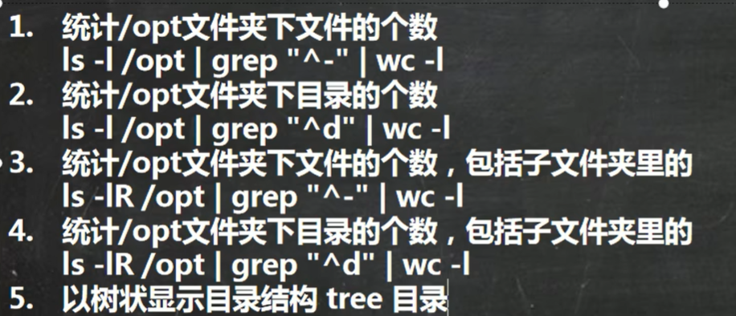

# Linux目录层级

树状目录，最上层为根目录 "/"

Linux会将硬件映射为文件来管理

## 目录结构

- /为根目录

- /bin（usr/bin、usr/local/bin）

  binary的缩写，存放常用命令

- /sbin

  super user 存放系统管理员的管理程序

- /home

  存放普通用户的主目录，每一个用户都在其下有一个目录。

- /root

  系统管理员的主目录

- /lib

  动态链接库

- /lost+found

  通常为空，系统非法关机后，存放一些信息文件

- /etc

  系统管理所需要的配置文件

- /usr

  很多应用程序和文件，类似windows的program files

- /boot

  Linux的启动相关文件

- /proc

  虚拟目录，系统内存的映射，访问此目录以获取系统信息

- /srv

  service缩写，存放一些服务启动后需要提取的数据

- /sys

  这是Linux内核2.6以后的很大变化，该目录安装了2.6内核中新出现的文件系统sysfs

- /tmp

  存放一些临时文件

- /dev

  类似设备管理器，所有硬件以文件形式存储

- /media

  识别外部设备

- /mnt

  为了让用户临时挂载到其他文件系统，可以将外部存储挂载到mnt上以供访问

- /opt

  给主机额外安装软件存放的目录

- /usr/local

  主机软件安装的位置，通常通过编译源码的方式安装

- /var

  存放不断扩充的文件，如日志文件

# vim

## 模式

- 正常模式

  进入文件即此模式，可以移动光标，删除字符、删除整行、复制粘贴

- 插入模式

  在正常模式输入大小写的i、o、a、r任意即可进入

- 命令行模式

  在这个模式当中，可以提供你相关指令，完成读取、存盘、替换、离开vim、显示行号等的动作则是在此模式中达成的

## 快捷键

- 拷贝当前行

  一般模式输入yy，前加数字表示拷贝自当前行向下的n行如5yy，粘贴按p

- 删除当前行

  正常模式输入dd，多行同拷贝，粘贴为p

- 在文件中查找某个单词

  命令行下/，回车查找，输入n就是查找下一个

- 设置文件的行号，取消文件的行号

  命令行下: set nu和:set nonu

- 使用快捷键到该文档的最末行[G]和最首行[gg]

- 在一个文件中输入"hello”,然后又撤销这个动作u

- 编辑etc/profile文件,并将光标移动到20行，输入20，然后shift+g

​						

 # 用户管理

## 关机重启

- shutdown -h now

  立刻关机

- shutdown -h 1

  一分钟后关机

- shutdown -r now 

  立刻重启

- halt

  立刻关机

- reboot

  立刻重启

- sync

  把内存中的数据同步到磁盘，推荐在重启或关机之前执行此操作

## 登录和注销

- 登录的时候尽量不要用root，避免操作失误
- logout注销用户，logout在图形运行级别无效，在运行级别3下有效

## 用户管理

- 添加用户

  useradd 用户名，也可以通过useradd -d 目录，执行新的目录，给新建用户指定家目录

- 设置密码

  passwd 用户名，如果不加用户名为当前登录的用户设置密码

- 删除用户

  删除用户但保存用户家目录：userdel 用户名

  删除用户及其家目录：userdel -r 用户名

- 查询用户信息指令

  id 用户名

- 切换用户

  su - 用户名，高权限到低权限不需要密码，反之需要密码

- 查看当前登录用户

  whoami，显示第一次登录进来的用户

- 用户组

  - 新增组：groupadd 组名

  - 删除组：groupdel 组名

  - 增加用户同时指定组：useradd -g 用户组 用户名，不指定组默认创建同名组

  - 修改用户的组：usermod -g 用户组 用户名

- 与用户有关的文件

  - /etc/paaawd

    用户的配置文件，存储用户的信息

    用户名：口令：用户标识号：组标识号：注释描述：主目录：登录shell

  - /etc/shadow

    口令的配置文件

    登录名：加密口令：最后一次修改时间：最小时间间隔：最大时间间隔：警告时间：不活动时间：失效时间：标志

# 实用指令

## 指定运行级别

### 运行级别说明

- 0：关机
- 1：单用户
- 2：多用户状态未使用网络服务
- 3：多用户状态使用网络服务
- 4：系统未使用保留给用户
- 5：图形界面
- 6：系统重启

### 切换运行级别

init [0123456]

## 帮助指令

- man

  基本语法：man [命令或配置文件]

- help

  基本语法：help 命令

## 文件目录类

- pwd：显示当前工作目录的绝对路径

- ls：显示文件及目录

  ls [选项] [目录或是文件]

  -a 显示当前目录的所有文件和目录，包括隐藏的

  -l 以列表的方式显示信息

  -h 以人类友好格式显示

  -R 递归查询

- mkdir：创建目录

  mkdir [选项] 要创建的目录

  -p 创建多级目录

- rmdir：删除空目录

  rmdir [选项] 要删除的空目录

  -r 递归删除但是会询问

  -f 强制删除

- touch：创建空文件夹

  touch 文件名称

- cp：拷贝文件到指定目录

  cp [选项] source dest

  -r 递归复制整个文件夹

  \cp 强制覆盖不提示

- mv：移动文件或重命名

  mv file1 file2

  同一目录下是重命名，不同目录下的移动

- cat ：查看文件内容

  -n 显示行号

  cat只能浏览文件，不能修改文件

- echo：输出内容到控制台

  echo [选项] [输出内容]

- head显示文件的开头部分内容

  head 文件 查看文件开头10行内容

  head -n 5 文件 查看文件头5行内容

- tail：输出文件尾部的内容，默认十行

  tail 文件 查看文件尾10行内容

  tail -n 5 文件 查看尾部5行内容

  tail -f 文件 实时追踪文档的所有更新

- \>和\>>：输出重定向和追加

  ls -l \> 文件 ：列表的内容写入文件中（覆盖写）

  ls -al \>> 文件 ：列表的内容追加到文件中

  cat 文件1 \>> 文件2 将文件1的内容覆盖到文件2

  echo “内容” \>>文件

- ln：软连接

  ln -s [原文件或目录] [软连接名] 给原文件创建一个软连接

- history：查看已经执行过的历史命令或执行历史指令

  history 查看历史命令

  !5 执行历史编号为5的指令

- date 显示当前的日期，详见谷歌

## 查找类

- find：从指定目录向下递归地遍历各子目录，将满足条件的文件或目录显示出来

  find [搜索范围] [选项]

  -name <查询方式> 按照文件名

  -user <用户名> 指定用户所有文件

  -size <文件大小> 文件大小 +n大于 n等于 -n小于

- -locate：快速定位文件路径，事先建立文件数据库，查询速度较快，但需要更新locate数据库

  locate 搜索文件

  updatedb更新数据库

- -which：查看某个指令在哪个目录下

  which 指令

- grep：在指定输入中查找某内容，输入通常是管道

  grep [选项] 查找内容 源文件

  -n 显示匹配行及行号

  -i 忽略字母大小写

## 压缩解压类

- gzip/gunzip

  gzip 文件 压缩文件

  gunzip 文件.gz 解压缩文件

- zip/unzip

  zip [选项] xxx.zip 将要压缩的内容

  unzip [选项] xxx.zip

  -r 递归压缩

  -d <目录> 指定解压后的文件的存放目录

- tar：将目标打包为.tar.gz的文件

  tar [选项] xxx.tar.gz 打包的内容

  -c 产生.tar打包文件

  -v 显示详细信息

  -f 指定压缩后的文件名

  -z 打包同时压缩

  -x 解包.tar文件

# 组管理

## Linux组

在Linux中每个用户必须属于一个组，不能独立于组之外，Linux中每个文件有所有者、所在组和其他组的概念

## 相关指令

Linux文件的所有者通常是创建该文件的创建者

- chown：修改文件所有者

  chown 用户名 文件名 *改变文件所有者*

  chown newowner:newgroup 文件 *改变所有者和所在组*

  -R递归执行

- groupadd：组的创建

  groupadd 组名

- chgrp：修改文件所在的组

  chgrp 组名 文件名

- usermod：改变用户所在组

  usermod -g 组名 用户名 *改变用户所在组*

  usermod -d 目录名 用户名 *改变用户登录的初始目录*

### 权限的介绍

ls出来显示的权限解释

- 第0位表示文件类型
  - l为链接、d为目录
  - c为字符设备、b为块设备
- 1-3位确定所有者的权限
- 4-6位确定所属组的权限
- 7-9位确定其他用户的权限

rwx作用于文件

- r表示可读，可以读取查看
- w表示可写，可以修改，但不代表可以删除该文件
- x代表可以执行

rwx作用于目录

- r表示可读，可以读取如ls
- w表示可写，可以修改，在目录内创建删除以及重命名目录
- x表示可执行，可以进入该目录

- chmod：修改文件或目录的权限
  - 通过+-=变更权限：u所有者、g所有组、o其他、a所有人
  - 通过数字变更：r=4、w=2、x=1

# 定时任务调度

令系统在某个时间执行特定的命令或程序

## crond任务调度

### 命令

crontab [选项]

- -e 编辑crontab定时任务
- -l 查看crontab任务
- -r 删除当前用户所有的crontab任务

### 使用

设置任务调度文件：/etc/crontab

设置个人任务调度：执行crontab -e命令，接着输入任务到调度文件

如：*/1 * * * * ls -l /etc/ >/tmp/to.txt 每分钟执行该命令

五个占位符分别表示分钟、小时、天、月、周

### 特殊符号的说明

- *：表示任何时间
- ,：将不连续的时间组合到一起表示分别在几个时间执行相同的任务
- -：表示闭区间的连续时间
- */n：每隔多久执行一次

## at定时任务

1. at命令是一次性定时任务，at的守护进程atd在后台运行，检查作业队列来运行
2. 默认情况下，atd每60秒检查作业队列，有作业时会检查作业运行时间，如果匹配则执行此作业
3. at命令是一次性的定时计划任务，执行完一个任务后就不会再执行此任务了
4. 使用at命令一定要保证atd在后台运行

### 命令

at [选项] [时间] Ctrl+F结束at命令的输入

# Linux磁盘分区

1. Linux无论有几个分区，给哪个目录使用，归根结底只有一个根目录
2. Linux采用一种叫做载入的方法，它的整个文件系统包含了一整套的文件和目录，且将一个分区和一个目录联系起来，这时要载入的一个分区将使他的存储空间在一个目录下获得

- 查看所有设备挂载情况

  lsblk

  lsblk -f

- 查询系统整体磁盘使用情况

  df -h

- 查询指定目录的磁盘占用情况

  du -h /目录 *查询指定目录的磁盘占用情况，默认位当前目录*

  -s 指定目录占用大小汇总

  -h 带计量单位

  -a 含文件

  --max-depth=1 子目录深度

  -c 列出明细的同时，增加汇总值

