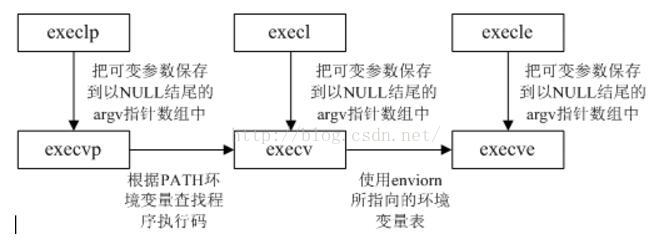

# 信号

信号要素：编号、名字、默认触发事件、默认处理动作

信号在内核态产生，最终要在内核态被处理掉

信号状态：递达：递送并到达进程；未决：产生和递达之间的状态，主要由于阻塞（屏蔽）导致

信号处理方式：执行默认动作、忽略（丢弃）、捕捉（调用用户函数）

信号的默认处理方式有如下几种:结束进程（Term)、忽略信号(Ign)、结束进程并生成核心转储文件(Core)、暂停进程（Stop)，以及继续进程（Cont)。

未决信号集：本质都是位图，初始的时候未决信号集都是0，用来记录未决状态的信号，未决的信号值为1，处理完变回零，由操作系统控制，对于程序来讲是只读的。

阻塞信号集（信号屏蔽字）：如果n号信号对应的阻塞信号集的位被置一，这个信号就不能递达，阻塞信号集可以通过系统调用修改。

慢速系统调用：可能会使进程永远阻塞的一类系统调用，如果在阻塞期间收到一个信号，该系统调用就被终端，不再继续执行（早期），也可以设定系统调用是否重启，如：read、write、pause、wait。

慢速系统调用被信号中断，想中断read，信号不能被屏蔽。信号的处理方式必须是捕捉（默认、忽略都不可以)。中断后返回-1，设置errno为EINTR(表“被信号中断")。可修改sa_flags 参数来设置被信号中断后系统调用是否重启，默认不重启，SA_RESTART重启。

```C
/*发送信号
pid>0将信号发送给PID为pid的进程
pid=0将信号发送给本进程组内所有的进程
pid=-1信号发送给除init外的所有进程，但需要权限才能执行信号处理动作
pid<-1信号发送给组ID为pid的进程组中的所有成员
sig为信号编号，Linux信号都大于0，如果sig为零不发信号
成功返回0，失败返回-1并设置errno
EINVAL无效的信号
EPERM该进程没有权限发送给任何一个目标进程
ESRCH目标进程或进程组不存在*/
#include <sys/types.h>
#include <signal.h>
int kill(pid_t pid, int sig);
/*信号处理函数指针
信号处理函数只能带有一个整型参数，用来指示信号类型
SIG_IGN表示忽略目标信号
SIG_DFL表示使用信号的默认处理方式*/
#include <signal.h>
typedef void (* _sighandler_t) (int);
#include <bits/signum.h>
#define SIG_DFL ((_sighandler_t 0)) 
#define SIG_IGN ((_sighandler_t) 1)
/*ANSI信号捕捉（设置信号处理函数）
sig参数指出要捕获的信号类型，_handler是一个函数指针，用来指定信号sig的处理函数
成功返回前一次调用signal时传入的函数指针，或者是sig的默认处理函数指针（SIG_DEF,如果是第一次调用的话）
出错返回SIG_ERR，并设置errno
该函数由ANSI定义，由于历史原因在不同版本的 Unix和不同版本的 Linux中可能有不同的行为。因此应该尽量避免使用它
void (*signal(int sig, void(*func)(int)))(int);这是它真正的原型
*/
#include <signal.h>
_sighandler_t signal (int sig, _sighandler_t _handler);
/*POSIX信号捕捉
成功：0；失败：-1，设置errno
act：传入参数，新的处理方式；oldact：传出参数，旧的处理方式
*/
include <signal.h>
int sigaction( int sig,const struct sigaction* act，struct sigaction* oact);
struct sigaction{
	void (*sa_handler)(int);//指定信号处理函数，也可赋宏
	void (*sa_sigaction)(int，siginfo_t *, void*);//当sa_flags被指定为SA_SIGINFO标志时，使用该信号处理程序。
	sigset_t sa_mask;//调用信号处理函数，所要屏蔽的而信号集合，仅在处理函数被调用期间屏蔽生效，同时还会屏蔽自己
	int sa_flags;//通常设置为0表示默认属性
	void (sa_restorer)(void);//过时
};
/*信号集
sigset_t实际上是一个长整型数组，数组每个元素的每位代表一个信号，下列为Linux对信号集操作的函数,成功0，失败-1
本质是位图，但不应该直接进行位操作，而是应该使用函数，保证跨系统操作有效
*/
#include <bits/sigset.h>
# define _SIGSET_NWORDS (1024 / (8 * sizeof (unsigned long int) ) )
typedef struct {
unsigned long int __val [_SIGSET_NWORDS];
} __sigset_t;
include <signal.h>
int sigemptyset (sigset_t _set);/*清空信号集*/
int sigfilllset (sigset_t _set);/*在信号集中设置所有信号*/
int sigaddset (sigset_t _set, int _signo);/*将信号_signo添加至信号集中*/
int sigdelset (sigset_t _set, int _signo);/*将信号_signo 从信号集中影除*/
int sigismember (const sigset_t* _set, int _signo)/*测试_signo是否在信号集中，成功0，不在0，出错-1*/
/*读取或修改信号的屏蔽字
成功：0，失败：-1设置errno
_set函数指定新的信号掩码
_oset输出原来的信号掩码（如果不为NULL的话）
如果_set不为NULL，则_how指定设置进程掩码的方式
sIG BLOCK 新的进程信号掩码是其当前值和_sct指定信号集的并集
sIG UNBLOCK 新的进程信号掩码是其当前值和~_set 信号集的交集，因此_set指定的信号集将不被屏蔽
sIG SETMASK 直接将进程信号掩码设置为_set
如果_set为NULL则进程信号掩码不变，此时还可以利用_oset获得进程当前的信号掩码
*/
include <signal.h>
int sigprocmask (int _how, _const sigset_t* _set, sigset_t* _oset);
/*读取未决信号集
成果0，失败-1设置errno
_set用于保存当前的未决信号集
*/
include <signal.h>
int sigpending (sigset_t* set) ;
/*闹钟
在seconds秒（自然时间）向调用该函数的进程发送一个SIGALRM信号，如果是0则表示取消正在等待的闹钟
如果等待时间结束之前有其他事件到来，alarm也将被取消。
对于一个进程只有最近的闹钟有效，alarm的返回值是上次闹钟的剩余时间*/
unsigned int alarm(unsigned int seconds);
/*闹钟
精度微秒，可实现周期定时
which指定定时方式如下：
ITIMER_REAL：以系统真实的时间来计算，它送出SIGALRM信号。
ITIMER_VIRTUAL：以该进程在用户态下花费的时间来计算，它送出SIGVTALRM信号。
ITIMER_PROF：以该进程在用户态下和内核态下所费的时间来计算，它送出SIGPROF信号。*/
int setitimer(int which, const struct itimerval *new_value,struct itimerval *old_value);
struct itimerval {
    struct timeval it_interval; //两次定时任务之间的间隔
    struct timeval it_value;    //定时的市场
};
struct timeval {
    time_t      tv_sec;         //秒
    suseconds_t tv_usec;        //微秒
};
```

# IO函数

```c
/*write
把参数buf所指的内存写入count个字节到参数fd所指的文件内。
如果顺利write()会返回实际写入的字节数（len）。当有错误发生时则返回-1，错误代码存入errno中。
一般不返回0，如果第三个参数是0，则write什么都不做，只返回0
write从buf写数据到fd中，如果buf中的数据一次读不完，指针未知不会自行移动，需要通过上一次write的返回值来自行调整，如write(fp, p1+len, (strlen(p1)-len))
*/
include <unistd.h>
ssize_t write (int fd, const void * buf, size_t count); 
/*read
把参数fd所指的文件传送count 个字节到buf 指针所指的内存中。
返回值为实际读取到的字节数, 如果返回0, 表示已到达文件尾或是无可读取的数据。
若参数count为0, 则read()不会有作用并返回0。
*/
include <unistd.h>
ssize_t read(int fd, void * buf, size_t count);
/*pipe
参数是一个包含两个int型整数的数组指针，成果返回0并将一堆打开的文件描述符值填入其参数指向的数组
通过pipe创建的两个文件描述符fd[0]（读）和fd[1]（写）分别构成管道的两端
并且这一对文件描述符都是阻塞的。*/
include <unistd.h>
int pipe (int fd[2]);
/*dup和dup2，他们创建的文件描述符不继承原文件描述符的属性*/
include <unistd.h>
//dup函数创建一个新的文件描述符，该新文件描述符和原有文件描述符file_descriptor 指向相同的文件、管道或者网络连接。并且dup返回的文件描述符总是取系统当前可用最小整数值
int dup(int file_descriptor);
//dup2返回第一个不小于file_descriptor_two的整数值
int dup2(int file_descriptor_one, int file_descriptor_two) ;
/*readv和writev
分散读和分散写
fd是被操作的文件描述符，vector是iovec结构数组，该结构体指向一块内存区
count是vector数组的长度*/
include <sysiuio.h>
ssize_t readv(int fd, const struct iovec* vector, int count);
ssize_t writev(int fd, const struct iovec* vector, int count);
/*sendfile
在两个文件描述符之间直接传递数据，完全在内核中操作，避免了内核缓冲区和用户缓冲区的数据拷贝，被称为零拷贝
in_fd是待读出内容的文件描述，out_fd是待鞋服内容的文件描述符
offset是指定从读入文件流的哪个位置开始读，如果为空则默认，count比指定传输的字节数
成功返回传输字节数，失败返回-1并设置errno。in_fd必须是一个真实的文件，out_fd必须是一个socket
*/
#include <sys/sendfile.h>
ssize_t sendfile(int out_fd, int in_fd, off_t* offset, size_t count);
/*mmap和munmap
mmap申请一段内存空间，我们可以将这段内存作为进程间通信的共享内存，也可以将文件映射到其中
munmap释放由mmap创建的这段内存空间
start允许用户使用某个特定的地址作为这段内存的起始地址，length指定内存段的长度
port用来设置内存段的访问权限（下），flags控制内存段内容被修改后程序的行为，fd是被映射文件对应的文件描述符
PROT_READ，内存段可读。PROT_WRITE，内存段可写。PROT_EXEC，内存段可执行。PROT_NONE，内存段不能被访问。
flags见Linux高性能服务器编程108页
*/
#include <sys/mman.h>
void* mmap ( void *start, size_t length， int prot, int flags， int fd, off_t offset) ;
int munmap( void *start, size_t length );
/*splice
在两个文件描述符之间移动数据，也是零拷贝
fd_in参数是待输入数据的文件描述符。如果fd_in是一个管道文件描述符，那么 off_in参数必须被设置为NULL。如果fd_in不是一个管道文件描述符（比如 socket)，那么off_in表示从输入数据流的何处开始读取数据。此时，若off_in被设置为NULL,则表示从输入数据流的当前偏移位置读人﹔若off_in不为NULL，则它将指出具体的偏移位置。fd_outoff_out参数的含义与fd_in/off_in相同，不过用于输出数据流。len参数指定移动数据的长度﹔flags参数则控制数据如何移动，细节见Linux高性能服务器编程108页
*/
include <fcntl.h>
ssize_t splice(int fd_in, loff_t* off_in, int fd_out, loff_t* off_out, size_t len, unsigned int flags);
/*tee
tee函数在两个管道文件描述符之间复制数据，也是零拷贝操作。它不消耗数据，因此源文件描述符上的数据仍然可以用于后续的读操作。*/
#include<fcntl.h>
ssize_t tee(int fd_in, int fd_out, size_t len, unsigned int flags);
/*fcntl
对文件描述符进行各种控制操作，是POSIX规范的首选方法，细节见Linux高性能服务器编程112页
当cmd为F_GETFL时没有第三个参数*/
#include <fcnt1.h>
int fcntl (int fd, int cmd, …) ;
```


# socket

同一台机器上的两个进程也可能需要考虑字节序问题，Java虚拟机采用大端字节序

```c
/*
htonl表示的是host to network long
长整型用来转换IP地址，短整型用来转换端口号*/
#include <netinet/in.h>
unsigned long int htonl( unsigned long int hostlong );
unsigned short int htons ( unsigned short int hostshort );
unsigned long int ntohl ( unsigned long int netlong ) ;
unsigned short int ntohs ( unsigned short int netshort );
/*
通用socket地址
sa_family是地址族类型变量，地址族通常和协议族对应，PF和AF的值是相同的，可以混用
PF_UNIX AF_UNIX UNIX本地域协议族 
PF_INET AF_INET TCP/IPv4协议族 
PF_INET6 AF_INET6 TCP/IPv6协议族
sa_data用于存放socket的地址值
*/
#include <bits/socket.h>
struct sockaddr {
	sa_family_t sa_family;
    char sa_data [14];
};
/*TCP/IPv4专用地址结构体
*/
struct sockaddr_in {
	sa_family_t sin_family; /*地址族:AF_INET */
	u_int16_t sin_port; /*端口号，要用网络字节序表示*/
	struct in_addr sin_addr; /*IPv4地址结构体，见下面*/
};
struct in_addr {
u_int32_t s_addr; /*IPv4地址，要用网络字节序表示*/
};
/*IP地址转换函数
*/
#include <arpa/inet.h>
in_addr_t inet_addr ( const char* strptr );//将点分十进制字符串的IPv4地址转化为网络字节序整数
int inet_aton ( const char* cp, struct in_addr* inp );//作用同上，将结果保存到inp结构体中
char* inet_ntoa( struct in_addr in );//网络字节序整数转化为点分十进制字符串
/*创建socket
domain告诉系统使用哪个协议族，对于TCP/IP协议族设置为PF_INET或PF_INET6
type用来指定服务类型，SOCK_STREAM流服务、SOCK_UGRAM数据报服务
protocol是在前两个参数构成的协议集合下再选择一个具体的协议，这个值通常都是唯一的设置为0即可*/
#include <sys/types.h>
#include <sys/socket.h>
int socket (int domain, int type, int protocol);
/*命名socket
将socket和socket地址绑定称为给socket命名
服务端通常需要命名，而客户端通常都是匿名的，即操作系统自动分配socket地址
将
my_addr所指的socket地址分配给sockfd文件描述符，addrlen指出该socket地址的大小*/
#include <sys/types.h>
#include <sys/socket.h>
int bind(int sockfd，const struct sockaddr* my_addr，socklen_t addrlen);
/*监听socket
创建一个监听队列以存放待处理的客户连接
sockfd指定被监听的socket，backlog参数提示内核监听队列的最大长度*/
#include <sys/socket.h>
int listen (int sockfd, int backlog) ;
/*接受连接
从listen监听队列中接受一个连接
sockfd是一个处于监听状态的监听socket
addr用来获取被接受链接的远端socket地址
该socket地址的长度由addrlen参数指出
返回一个新的连接对应的socket，服务器可以通过读写该socket来与其通信。*/
#include <sys/types.h>
#include <sys/socket.h>
int accept(int sockfd,struct sockaddr *addr，socklen_t *addrlen);
/*客户端发起连接
sockfd即socket文件描述符
serv_addr是服务器监听的socket地址
addrlen指定这个地址的长度*/
#include <sys/types.h>
#include <sys/socket.h>
int connect(int sockfd, const struct sockaddr *serv_addr，socklen.addrlen);
/*关闭连接，关闭一个连接实际上就是关闭连接对应的文件描述符
但是close并非立即关闭一个连接，而是减少引用计数，只有引用计数为0才真正关闭连接*/
include <unistd.h>
int close (int fd);
/*立即终止连接
SHUT_RD,关闭读端、SHUT_WR关闭写端、SHUT_RDWR读端和写端都关闭*/
include <sys / socket.h>
int shutdown ( int sockfd,int howto ) ;
/*socket数据读写*/
#include <sys/types.h>
#include <sys/socket.h>
//读取sockfd上的内容，读到buf中len长度，flags通常为0
ssize_t recv (int sockfd, void *buf, size_t len， int flags);
//几乎同上
ssize_t send(int sockfd, const void *buf, size_t len, int flags);
/*带外数据
判断sockfd是否带有带外数据，即下一个读取到的数据是否是带外数据，是返回1
此时我们就可以利用带MSG_OOB标志的recv调用来接收带外数据。如果不是，则sockatmark返回0*/
#include <sys/socket.h>
int sockatmark (int sockfd);
```

# 进程

```c
/*创建进程
在父进程中返回的是子进程的PID，在子进程中返回0，创建出来的子进程对于父进程的资源采用写时拷贝，以便exec*/
#include <sys/types.h>
#include <unistd.h>
pid_t fork(void);
/*exec函数族，替换当前进程映像
path指定可执行文件的完整路径，file接收文件名，该文件的具体位置取环境变量PATH中寻找
arg接受可变参数，argv接受参数数组，他们都会传递给新的程序
其中只有execve是真正意义上的系统调用，其它都是在此基础上经过包装的库函数*/
include <unistd.h>
extern char** environ;
int execl (const char* path,const char* arg, ...);
int execlp (const char* file, const char* arg, ...);
int execle(const char* path，const char* arg, ..., char* const envp[]);
int execv (const char* path, char* const argv []);
int execvp (const char* file, char* const argv []);
int execve(const char* path， char* const argv[], char* const envp);
/*wait系列
获取子进程的返回信息，避免僵尸进程的产生，或者使子进程的僵尸态立即结束
子进程退出状态信息存储在stat_loc参数指向的内存中
pid用来指定进程号回收，options控制waitpid行为，取WNOHANG时waitpid调用将是非阻塞的
当一个进程结束时，将会给父进程发送一个SIGCHLD信号，可以在父进程中捕捉SIGCHLD信号，并用waitpid处理*/
#include <sys/types.h>
#include <sys/wait.h>
pid_t wait (int* stat_loc);//阻塞
pid_t waitpid (pid_t pid, int* stat_loc, int options);

```



# 线程

```c
/*创建线程
thread是新线程的标识符定义如下，attr用于设置新线程的属性，传NULL使用默认线程属性
start_routine和arg分别指定新线程将运行的函数及其参数
*/
#include <pthread.h>
int pthread_create(pthread_t* thread, const pthread_attr_t* attr, void*(*start_routine)(void*), void*arg);
#include <bits/pthreadtypes.h>
typedef unsigned long int pthread_t;
/*退出线程
通过retval参数向线程的回收这传递其退出信息*/
#include <pthread.h>
void pthread_exit (void* retval);
/*回收线程
thread是目标线程的标识符，retval是目标线程返回的退出信息*/
#include <pthread.h>
int pthread_join(pthread_t thread, void** retval);
/*异常终止线程*/
include <pthread.h>
int pthread_cancel(pthread_t thread);
/*分离线程
当detached线程终止时，它的资源直接由系统回收，而不是由其他线程调用join
成功返回0，失败返回errno*/
#include <pthread.h>
int pthread_detach(pthread_t thread);
```

```c
/*给临界资源加上锁之后每个线程来都要先申请锁，那么临界区的代码就只能由一个线程访问，当该线程访问完成时，释放该锁。这样其他线程就可以再去申请锁，这样就保证了临界区的代码一次只能由一个线程访问，并且其他线程无法进入，从而达到互斥机制。当一个线程A申请锁成功并且进入临界资源进行访问资源时，其他线程如果再来申请锁，那必然是申请不到锁的，所以这些线程就会进入该锁内部的等待队列进行等待。当线程A释放锁时，其他线程才会被操作系统唤醒。*/
/*创建互斥量/互斥量初始化
mutex： 要初始化的互斥量的地址
attr： 互斥量的属性（一般设置为NULL）*/
pthread_mutex_t mutex = PTHREAD_MUTEX_INITIALIZER;//静态
int pthread_mutex_init(pthread_mutex_t *mutex, const pthread_mutexattr_t *attr);//动态
//销毁互斥量，//mutex： 要销毁的互斥量的地址
int pthread_mutex_destroy(pthread_mutex_t *mutex);
//加锁，成功返回0，失败返回错误号
int pthread_mutex_lock(pthread_mutex_t *mutex);
// 该函数是pthread_mutex_lock的非阻塞版本。trylock在给一个互斥锁加锁时，如果互斥锁已经被锁定，那么函数将返回错误而不会阻塞线程。
int pthread_mutex_trylock(pthread_mutex_t *mutex);
//解锁
int pthread_mutex_unlock(pthread_mutex_t *mutex);
成功返回0，失败返回错误号
```

```c
/*条件变量不是锁但必须和锁一起用，用于解决线程先后顺序的问题。阻塞并释放锁，接收到信号-》接触阻塞并重新申请锁
pthread_cond_signal可能不止唤醒一个线程（虚假唤醒），用if来进行等待锁可能会产生段错误，此时改为while条件变量和互斥锁一样，都有静态动态两种创建方式*/
//创建条件变量
pthread_cond_t cond = PTHREAD_COND_INITIALIZER;//静态
//条件变量的属性由参数attr指定，如果参数attr为NULL，那么就使用默认的属性设置。
int pthread_cond_init(pthread_cond_t *cond, const pthread_condattr_t *attr);//动态
//销毁条件变量，调用destroy函数解除条件变量并不会释放存储条件变量的内存空间。
int pthread_cond_destroy(pthread_cond_t *cond);
//条件变量等待（阻塞）
int pthread_cond_wait(pthread_cond_t *cond, pthread_mutex_t *mutex);
//等待条件变量的同时可以设置等待超时
int pthread_cond_timedwait(pthread_cond_t *cond, pthread_mutex_t *mutex, const struct timespec *abtime);
//唤醒被阻塞在指定条件的一个线程，唤醒顺序由调度策略决定
int pthread_cond_signal(pthread_cond_t *cond);
//唤醒阻塞在cond条件上的所有线程
int pthread_cond_broadcast(pthread_cond_t *cond);
```

```c
/*可以代表一种变量，代表当前可用资源的个数→创建信号量sem_init()
P操作（减减）：如果有可用资源（信号量>0）那么占用一个资源（信号量-1），如果没有可用资源（信号量=0）进程被阻塞直到系统给其分配资源→sem_wait()
V操作（加加）：如果在该信号量的等待队列中有进程在等待该资源，则唤醒该进程，否则释放一个资源（信号量+1）
匿名信号量应用于线程同步，有名信号量用于没有血缘的进程间同步→sem_post()*/
#include <semaphore.h>
/*初始化未命名信号量，成功失败返回-1
sem: 要初始化的信号量，pshared: 0表⽰线程间共享，⾮零表⽰进程间共享，value： 信号量初始值*/
int sem_init(sem_t *sem, int pshared, unsigned int value);
//销毁信号量
int sem_destroy(sem_t *sem);
//等待信号量，P操作--
int sem_wait(sem_t *sem);
//等待，立即返回，相当于sem_wait的阻塞版本
int sem_trywait (sem_t*sem) ;
//发布信号量，表⽰资源使⽤完毕，可以归还资源了。将信号量值加1。
int sem_post(sem_t *sem);
```

