# 一个FORK的面试题

#####  [2012年08月01日 ](https://coolshell.cn/articles/7965.html) [陈皓](https://coolshell.cn/articles/author/haoel) 评论 [223 条评论](https://coolshell.cn/articles/7965.html#comments) 170,575 人阅读

前两天有人问了个关于Unix的fork()系统调用的面试题，这个题正好是我大约十年前找工作时某公司问我的一个题，我觉得比较有趣，写篇文章与大家分享一下。这个题是这样的：

**题目：请问下面的程序一共输出多少个“-”？**

**#include <stdio.h>**

**#include <sys/types.h>**

**#include <unistd.h>**

**int** main(**void**)

{

   **int** i;

   **for**(i=0; i<2; i++){

​      fork();

​      printf("-");

   }

   wait(**NULL**);

   wait(**NULL**);

   **return** 0;

}

如果你对fork()的机制比较熟悉的话，这个题并不难，输出应该是6个“-”，但是，实际上这个程序会很tricky地输出8个“-”。

要讲清这个题，我们首先需要知道fork()系统调用的特性，


- fork()系统调用是Unix下以自身进程创建子进程的系统调用，一次调用，两次返回，如果返回是0，则是子进程，如果返回值>0，则是父进程（返回值是子进程的pid），这是众为周知的。

- 还有一个很重要的东西是，在fork()的调用处，整个父进程空间会原模原样地复制到子进程中，包括指令，变量值，程序调用栈，环境变量，缓冲区，等等。

所以，上面的那个程序为什么会输入8个“-”，这是因为printf(“-“);语句有buffer，所以，对于上述程序，printf(“-“);把“-”放到了缓存中，并没有真正的输出（参看《[C语言的迷题](https://coolshell.cn/articles/945.html)》中的第一题），**在fork的时候，缓存被复制到了子进程空间**，所以，就多了两个，就成了8个，而不是6个。

另外，多说一下，我们知道，Unix下的设备有“[块设备](https://en.wikipedia.org/wiki/Device_file#Block_devices)”和“[字符设备](https://en.wikipedia.org/wiki/Device_file#Character_devices)”的概念，所谓块设备，就是以一块一块的数据存取的设备，字符设备是一次存取一个字符的设备。磁盘、内存都是块设备，字符设备如键盘和串口。**块设备一般都有缓存，而字符设备一般都没有缓存**。

对于上面的问题，我们如果修改一下上面的printf的那条语句为：


printf("-\n");


或是

 printf("-");

fflush(stdout);

就没有问题了（就是6个“-”了），因为程序遇到“\n”，或是EOF，或是缓中区满，或是文件描述符关闭，或是主动flush，或是程序退出，就会把数据刷出缓冲区。需要注意的是，标准输出是行缓冲，所以遇到“\n”的时候会刷出缓冲区，但对于磁盘这个块设备来说，“\n”并不会引起缓冲区刷出的动作，那是全缓冲，你可以使用setvbuf来设置缓冲区大小，或是用fflush刷缓存。

我估计有些朋友可能对于fork()还不是很了解，那么我们把上面的程序改成下面这样：

**#include <stdio.h>**

**#include <sys/types.h>**

**#include <unistd.h>**

**int** main(**void**)

{

   **int** i;

   **for**(i=0; i<2; i++){

​      fork();

​      //注意：下面的printf有“\n”

​      printf("ppid=%d, pid=%d, i=%d \n", getppid(), getpid(), i);

   }

   sleep(10); //让进程停留十秒，这样我们可以用pstree查看一下进程树

   **return** 0;

}

于是，上面这段程序会输出下面的结果，（注：编译出的可执行的程序名为fork）

**ppid**=8858, pid=8518, i=0

**ppid**=8858, pid=8518, i=1

**ppid**=8518, pid=8519, i=0

**ppid**=8518, pid=8519, i=1

**ppid**=8518, pid=8520, i=1

**ppid**=8519, pid=8521, i=1

$ pstree -p | grep fork

|-bash(8858)-+-fork(8518)-+-fork(8519)---fork(8521)

|            |            `-fork(8520)

面对这样的图你可能还是看不懂，没事，我好事做到底，画个图给你看看：


注意：上图中的我用了几个色彩，相同颜色的是同一个进程。于是，我们的pstree的图示就可以成为下面这个样子：（下图中的颜色与上图对应）


这样，对于printf(“-“);这个语句，我们就可以很清楚的知道，哪个子进程复制了父进程标准输出缓中区里的的内容，而导致了多次输出了。（如下图所示，就是我阴影并双边框了那两个子进程）


现在你明白了吧。（另，对于图中的我本人拙劣的配色，请见谅!）

（全文完）

# 代码执行的效率

#####  [2012年07月13日 ](https://coolshell.cn/articles/7886.html) [陈皓](https://coolshell.cn/articles/author/haoel) 评论 [70 条评论](https://coolshell.cn/articles/7886.html#comments) 52,430 人阅读

在《[性能调优攻略](https://coolshell.cn/articles/7490.html)》里，我说过，要调优性需要找到程序中的Hotspot，也就是被调用最多的地方，这种地方，只要你能优化一点点，你的性能就会有质的提高。在这里我给大家举三个关于代码执行效率的例子（它们都来自于网上）

#### **第一个例子**

**PHP中Getter和Setter的效率**（[来源reddit](http://www.reddit.com/r/programming/comments/wdsgn/today_i_learned_that_creating_getters_setters_in/)）

这个例子比较简单，你可以跳过。

考虑下面的PHP代码：我们可看到，使用Getter/Setter的方式，性能要比直接读写成员变量要差一倍以上。

```
<?php
	//dog_naive.php

	class dog {
		public $name = "";
		public function setName($name) {
			$this-&gt;name = $name;
		}
		public function getName() {
			return $this-&gt;name;
		}
	}

	$rover = new dog();
        //通过Getter/Setter方式
	for ($x=0; $x<10; $x++) {
		$t = microtime(true);
		for ($i=0; $i<1000000; $i++) {
			$rover->setName("rover");
			$n = $rover->getName();
		}
		echo microtime(true) - $t;
		echo "\n";
	}
        //直接存取变量方式
        for ($x=0; $x<10; $x++) {
		$t = microtime(true);
		for($i=0; $i<1000000; $i++) {
			$rover->name = "rover";
			$n = $rover->name;
		}
		echo microtime(true) - $t;
		echo "\n";
	}
?>
```

这个并没有什么稀，因为有函数调用的开销，函数调用需要压栈出栈，需要传值，有时还要需要中断，要干的事太多了。所以，代码多了，效率自然就慢了。所有的语言都这个德行，这就是为什么C++要引入inline的原因。而且Java在打开优化的时候也可以优化之。但是对于动态语言来说，这个事就变得有点困难了。


你可能会以为使用下面的代码（Magic Function）会好一些，但实际其性能更差。

```
class dog {
	private $_name = "";
	function __set($property,$value) {
		if($property == 'name') $this->_name = $value;
	}
	function __get($property) {
		if($property == 'name') return $this->_name;
	}
}
```

动态语言的效率从来都是一个问题，如果你需要PHP有更好的性能，你可能需要使用[FaceBook的HipHop](https://github.com/facebook/hiphop-php)来把PHP编译成C语言。

#### **第二个例子**

**为什么Python程序在函数内执行得更快？**（[来源StackOverflow](http://stackoverflow.com/questions/11241523/why-does-python-code-run-faster-in-a-function)）

考虑下面的代码，一个在函数体内，一个是全局的代码。

函数内的代码执行效率为 1.8s

```
def main():
    for i in xrange(10**8):
        pass
main()
```

函数体外的代码执行效率为 4.5s

```
for i in xrange(10**8):
    pass
```

不用太纠结时间，只是一个示例，我们可以看到效率查得很多。为什么会这样呢？我们使用 [`dis` module](https://docs.python.org/library/dis.html) 反汇编函数体内的bytecode 代码，使用 [`compile` builtin](https://docs.python.org/library/functions.html#compile) 反汇编全局bytecode，我们可以看到下面的反汇编（注意我高亮的地方）

```
13 FOR_ITER                 6 (to 22)
16 STORE_FAST               1 (i)
19 JUMP_ABSOLUTE           13
13 FOR_ITER                 6 (to 22)
16 STORE_NAME               1 (i)
19 JUMP_ABSOLUTE           13
```

我们可以看到，差别就是 [`STORE_FAST`](https://docs.python.org/library/dis.html#opcode-STORE_FAST) 和 `STORE_NAME，前者比后者快很多。所以，在全局代码中，变量i成了一个全局变量，而函数中的i是放在本地变量表中，所以在全局变量表中查找变量就慢很多。如果你在main函数中声明global i 那么效率也就下来了。`原因是，本地变量是存在一个数组中（直到），用一个整型常量去访问，而全局变量存在一个dictionary中，查询很慢。

`（注：在`C/C++中，这个不是一个问题）

#### **第三个例子**

**为什么排好序的数据在遍历时会更快？**（[来源StackOverflow](http://stackoverflow.com/questions/11227809/why-is-processing-a-sorted-array-faster-than-an-unsorted-array)）

参看如下C/C++的代码：

```
 for (unsigned i = 0; i < 100000; ++i) {
   // primary loop
    for (unsigned j = 0; j < arraySize; ++j) {
        if (data[j] >= 128)
            sum += data[j];
    }
}
```

如果你的data数组是排好序的，那么性能是1.93s，如果没有排序，性能为11.54秒。差5倍多。无论是C/C++/Java，或是别的什么语言都基本上一样。

这个问题的原因是—— **[branch prediction](https://en.wikipedia.org/wiki/Branch_predictor) （分支预判）**伟大的stackoverflow给了一个非常不错的解释。

考虑我们一个铁路分叉，当我们的列车来的时候， 扳道员知道分个分叉通往哪，但不知道这个列车要去哪儿，司机知道要去哪，但是不知道走哪条分叉。所以，我们需要让列车停下来，然后司机和扳道员沟通一下。这样的性能太差了。

所以，我们可以优化一下，那就是猜，我们至少有50%的概率猜对，如果猜对了，火车行驶性能巨高，猜错了，就得让火车退回来。如果我猜对的概率高，那么，我们的性能就会高，否则老是猜错了，性能就很差。


Image by Mecanismo, from Wikimedia Commons:[http://commons.wikimedia.org/wiki/File:Entroncamento_do_Transpraia.JPG](https://commons.wikimedia.org/wiki/File:Entroncamento_do_Transpraia.JPG)

我们的if-else 就像这个铁路分叉一样，下面红箭头所指的就是搬道器。


那么，我们的搬道器是怎么预判的呢？就是使用过去的历史数据，如果历史数据有90%以上的走左边，那么就走左边。所以，我们排好序的数据就更容易猜得对。

```
T = 走分支（条件表达式为true）
N = 不走分支(条件表达式为false)

data[] = 0, 1, 2, 3, 4, ... 126, 127, 128, 129, 130, ... 250, 251, 252, ...
branch = N  N  N  N  N  ...   N    N    T    T    T  ...   T    T    T  ...

= NNNNNNNNNNNN ... NNNNNNNTTTTTTTTT ... TTTTTTTTTT  (easy to predict)
data[] = 226, 185, 125, 158, 198, 144, 217, 79, 202, 118,  14, 150, 177, 182, 133, ...
branch =   T,   T,   N,   T,   T,   T,   T,  N,   T,   N,   N,   T,   T,   T,   N  ...

= TTNTTTTNTNNTTTN ...   (completely random - hard to predict)
```

从上面我们可以看到，排好序的数据更容易预测分支。

对此，那我们怎么办？我们需要在这种循环中除去if-else语句。比如：

我们把条件语句：

```
if (data[j] >= 128)
sum += data[j];
```

变成：

```
int t = (data[j] - 128) >> 31;
sum += ~t & data[j];
```

“没有分叉”的性能基本上和“排好序有分支”一个样，无论是C/C++，还是Java。

> **注：**在GCC下，如果你使用 `-O3` or `-ftree-vectorize` 编译参数，GCC会帮你优化分叉语句为无分叉语句。VC++2010没有这个功能。

**最后，推荐大家一个网站——[Google Speed](https://developers.google.com/speed/)，网站上的有一些教程告诉你[如何写出更快的Web程序](https://developers.google.com/speed/articles/)。**

# 各式各样的验证码

#####  [2012年07月19日 ](https://coolshell.cn/articles/7917.html) [陈皓](https://coolshell.cn/articles/author/haoel) 评论 [64 条评论](https://coolshell.cn/articles/7917.html#comments) 61,943 人阅读

还记得以前那篇《[超强验证码](https://coolshell.cn/articles/3277.html)》？其实这个世界变态的验证码还有很多，下面是一个列表向像展示了各种稀奇古怪的验证码。不过本文并不单单只是收集这验证码，前面的比较恶搞，后面的会向你展示什么是有accessibility验证码。

目录


[完全看不清楚的](https://coolshell.cn/articles/7917.html#完全看不清楚的)[看得清但令人抓狂的](https://coolshell.cn/articles/7917.html#看得清但令人抓狂的)[数学公式的](https://coolshell.cn/articles/7917.html#数学公式的)[智力题](https://coolshell.cn/articles/7917.html#智力题)[你的审美水平正常吗？](https://coolshell.cn/articles/7917.html#你的审美水平正常吗？)[你懂盲文吗？](https://coolshell.cn/articles/7917.html#你懂盲文吗？)[ASCII图片式](https://coolshell.cn/articles/7917.html#ASCII图片式)[怎么验证一个人是否成年](https://coolshell.cn/articles/7917.html#怎么验证一个人是否成年)[3D验证码](https://coolshell.cn/articles/7917.html#3D验证码)[reCaptcha](https://coolshell.cn/articles/7917.html#reCaptcha)[Facebook的人脸识别验证码](https://coolshell.cn/articles/7917.html#Facebook的人脸识别验证码)[微软的ASIRRA](https://coolshell.cn/articles/7917.html#微软的ASIRRA)[DISTCHA](https://coolshell.cn/articles/7917.html#DISTCHA)[MotionCAPTCHA](https://coolshell.cn/articles/7917.html#MotionCAPTCHA)[siteHelp的DragCapCha](https://coolshell.cn/articles/7917.html#siteHelp的DragCapCha)[jQuery 验证码插件](https://coolshell.cn/articles/7917.html#jQuery_验证码插件)[jQuery s3Capcha 插件](https://coolshell.cn/articles/7917.html#jQuery_s3Capcha_插件)[Ajax Fancy Captcha](https://coolshell.cn/articles/7917.html#Ajax_Fancy_Captcha)[wCaptcha](https://coolshell.cn/articles/7917.html#wCaptcha)[Picatcha](https://coolshell.cn/articles/7917.html#Picatcha)[yoCaptcha](https://coolshell.cn/articles/7917.html#yoCaptcha)[W3C的建议](https://coolshell.cn/articles/7917.html#W3C的建议)

#### 完全看不清楚的

这是人类的字符吗？


图案中的字母是什么？


这也够奇葩的了。


#### 看得清但令人抓狂的

[](https://coolshell.cn/wp-content/uploads/2012/07/2.jpg)

#### [ ](https://coolshell.cn/wp-content/uploads/2012/07/1.jpg)[ ](https://coolshell.cn/wp-content/uploads/2012/07/2.jpg)数学公式的

如果你填对了，你是人类吗？

[
](https://coolshell.cn/wp-content/uploads/2012/07/4.jpg)

[
](https://coolshell.cn/wp-content/uploads/2012/07/7.jpg)

#### 智力题


[](https://coolshell.cn/wp-content/uploads/2012/07/9.jpg)

#### 你的审美水平正常吗？


#### 你懂盲文吗？

[](https://coolshell.cn/wp-content/uploads/2012/07/a438_c13.jpg)

#### ASCII图片式


#### 

#### 

#### 怎么验证一个人是否成年

[
](https://coolshell.cn/wp-content/uploads/2012/07/filter_8cd6a950-a3ba-42a1-ac47-6d4c8276e6e5.jpg)

#### 3D验证码

通个这个脚本自动生成的：http://ocr-research.org.ua/tb/getimage.php5

[](http://ocr-research.org.ua/tb/getimage.php5)

#### 

#### reCaptcha

相信大家都知道reCAPTCHA下了一盘很大的棋，它让你在输验证码的时候还帮着还原书籍中那些很难被OCR识别的单词。其有两组验证码，一组是可以被电脑识别的，另一组是不能被电脑识别的（也就是让人来帮电脑识别的），如果你第一组答对了，就会被 认为是人工操作，于是你回答的第二组就会成为人肉OCR。


它最近又将增加一项新功能：显示Google地图上的街景地址和名称。这样从地图上的街景中提取街道地址和名称以及交通标志等数据，以完善Google地图上的信息。


#### Facebook的人脸识别验证码

你觉得有创意吗?


#### [微软的ASIRRA](http://research.microsoft.com/en-us/um/redmond/projects/asirra/)

[](http://research.microsoft.com/en-us/um/redmond/projects/asirra/)

#### [DISTCHA](http://accessibiliteweb.com/stuff/captcha-slider.html)

通过像iPhone/iPad开启时滑动的样式来验证。

[](http://accessibiliteweb.com/stuff/captcha-slider.html)

#### [MotionCAPTCHA](http://josscrowcroft.com/projects/motioncaptcha-jquery-plugin/)

用鼠标来画个画。

[](http://josscrowcroft.com/projects/motioncaptcha-jquery-plugin/)

#### [siteHelp的DragCapCha](http://sitehelp.com.au/demos/dragcaptcha.php)

为下面的字母排个序吧

[](http://sitehelp.com.au/demos/dragcaptcha.php)

#### jQuery 验证码插件

##### [jQuery s3Capcha 插件](http://serie3.info/s3capcha/demonstration.php)

[](http://serie3.info/s3capcha/demonstration.php)

##### [Ajax Fancy Captcha](http://www.webdesignbeach.com/beachbar/ajax-fancy-captcha-jquery-plugin)

和上面那个不一样，这个需要拖动

[](http://www.webdesignbeach.com/beachbar/ajax-fancy-captcha-jquery-plugin)

##### [wCaptcha](http://www.wozia.pt/blog/wcaptcha-a-better-captcha-alternative-jquery-captcha-plugin/)

和上面的很相似。

[](http://www.wozia.pt/blog/wcaptcha-a-better-captcha-alternative-jquery-captcha-plugin/)

#### [Picatcha](http://www.picatcha.com/captcha/)

挑出所有的计算器

[](http://www.picatcha.com/captcha/)

#### [yoCaptcha](http://yocaptcha.com/)

广告式的验证码

[](http://yocaptcha.com/)

#### W3C的建议

W3C的这篇文章（http://www.w3.org/TR/turingtest/）表达了传统的验证码图片的Inaccessibility的问题，而且一些验证码都很容易被破解。如：

- [aiCaptcha: Using AI to beat CAPTCHA and post comment spam](http://www.brains-n-brawn.com/default.aspx?vDir=aicaptcha)
- [Breaking CAPTCHAs Without Using OCR](http://www.cs.berkeley.edu/~mori/gimpy/gimpy.html)
- [PWNtcha – CAPTCHA decoder](http://sam.zoy.org/pwntcha/)

W3C也给了一些解决方案：

- 一些逻辑题或是智力题。
- 声音输出，为了照顾残疾人。 [Spam-bot tests flunk the blind](http://news.com.com/2100-1032-1022814.html)
- 限制帐号的操作次数。
- 使用现有的Spam检测机制。如：酷壳（Coolshell.cn）的评论没有验证码，垃圾评论完全靠[Akismet](http://akismet.com/) 插件过滤。

建议你移步去看看这篇文章。

（全文完）

# 28个UNIX/LINUX的命令行神器

#####  [2012年07月11日 ](https://coolshell.cn/articles/7829.html) [陈皓](https://coolshell.cn/articles/author/haoel) 评论 [120 条评论](https://coolshell.cn/articles/7829.html#comments) 240,950 人阅读

下面是[Kristóf Kovács](https://kkovacs.eu/)收集的28个Unix/Linux下的28个命令行下的工具（[原文链接](https://kkovacs.eu/cool-but-obscure-unix-tools)），有一些是大家熟悉的，有一些是非常有用的，有一些是不为人知的。这些工具都非常不错，希望每个人都知道。本篇文章还在[Hacker News上被讨论](http://news.ycombinator.com/item?id=2567186)，你可以过去看看。我以作者的原文中加入了官网链接和一些说明。

目录


[dstat & sar](https://coolshell.cn/articles/7829.html#dstat_sar)[slurm](https://coolshell.cn/articles/7829.html#slurm)[vim & emacs](https://coolshell.cn/articles/7829.html#vim_emacs)[screen, dtach, tmux, byobu](https://coolshell.cn/articles/7829.html#screen_dtach_tmux_byobu)[multitail](https://coolshell.cn/articles/7829.html#multitail)[tpp](https://coolshell.cn/articles/7829.html#tpp)[xargs & parallel](https://coolshell.cn/articles/7829.html#xargs_parallel)[duplicity & rsyncrypto](https://coolshell.cn/articles/7829.html#duplicity_rsyncrypto)[nethack & slash’em](https://coolshell.cn/articles/7829.html#nethack_slash’em)[lftp](https://coolshell.cn/articles/7829.html#lftp)[ack](https://coolshell.cn/articles/7829.html#ack)[calcurse & remind + wyrd](https://coolshell.cn/articles/7829.html#calcurse_remind_wyrd)[newsbeuter & rsstail](https://coolshell.cn/articles/7829.html#newsbeuter_rsstail)[powertop](https://coolshell.cn/articles/7829.html#powertop)[htop & iotop](https://coolshell.cn/articles/7829.html#htop_iotop)[ttyrec & ipbt](https://coolshell.cn/articles/7829.html#ttyrec_ipbt)[rsync](https://coolshell.cn/articles/7829.html#rsync)[mtr](https://coolshell.cn/articles/7829.html#mtr)[socat & netpipes](https://coolshell.cn/articles/7829.html#socat_netpipes)[iftop & iptraf](https://coolshell.cn/articles/7829.html#iftop_iptraf)[siege & tsung](https://coolshell.cn/articles/7829.html#siege_tsung)[ledger](https://coolshell.cn/articles/7829.html#ledger)[taskwarrior](https://coolshell.cn/articles/7829.html#taskwarrior)[curl](https://coolshell.cn/articles/7829.html#curl)[rtorrent & aria2](https://coolshell.cn/articles/7829.html#rtorrent_aria2)[ttytter & earthquake](https://coolshell.cn/articles/7829.html#ttytter_earthquake)[vifm & ranger](https://coolshell.cn/articles/7829.html#vifm_ranger)[cowsay & sl](https://coolshell.cn/articles/7829.html#cowsay_sl)

#### dstat & sar

iostat, vmstat, ifstat 三合一的工具，用来查看系统性能（我在《[性能调优攻略](https://coolshell.cn/articles/7490.html)》中提到过那三个xxstat工具）。

官方网站：http://dag.wieers.com/rpm/packages/dstat/

你可以这样使用：

```
alias dstat='dstat -cdlmnpsy'
```


#### slurm

查看网络流量的一个工具

官方网站： *[Simple Linux Utility for Resource Management](https://computing.llnl.gov/linux/slurm/)*


#### vim & emacs

真正程序员的代码编辑器。


#### screen, dtach, tmux, byobu

你是不是经常需要 SSH 或者 telent 远程登录到 Linux 服务器？你是不是经常为一些长时间运行的任务而头疼，比如系统备份、ftp 传输等等。通常情况下我们都是为每一个这样的任务开一个远程终端窗口，因为他们执行的时间太长了。必须等待它执行完毕，在此期间可不能关掉窗口或者断开连接，否则这个任务就会被杀掉，一切半途而废了。

[**Screen**](http://www.gnu.org/software/screen/)是一个可以在多个进程之间多路复用一个物理终端的窗口管理器。Screen中有会话的概念，用户可以在一个screen会话中创建多个screen窗口，在每一个screen窗口中就像操作一个真实的telnet/SSH连接窗口那样。请参看IBM DeveloperWorks的这篇文章《[使用 screen 管理你的远程会话](http://www.ibm.com/developerworks/cn/linux/l-cn-screen/)》


[**dtach** ](http://dtach.sourceforge.net/)是用来模拟screen的detach的功能的小工具，其可以让你随意地attach到各种会话上 。下图为dtach+dvtm的样子。


**[tmux](http://tmux.sourceforge.net/)**是一个优秀的终端复用软件，类似[GNU Screen](http://www.gnu.org/software/screen/)，但来自于OpenBSD，采用BSD授权。使用它最直观的好处就是，通过一个终端登录远程主机并运行tmux后，在其中可以开启多个控制台而无需再“浪费”多余的终端来连接这台远程主机；当然其功能远不止于此。与screen相比的优点：可以横向和纵向分割窗口，且窗格可以自由移动和调整大小。可在多个缓冲区进行复制和粘贴，支持跨窗口搜索；非正常断线后不需重新detach；……  有人说——**与tmux相比，screen简直弱爆了**。


[**byobu**](https://launchpad.net/byobu/)是Ubuntu开发的，在Screen的基础上进行包装，使其更加易用的一个工具。最新的Byobu，已经是基于Tmux作为后端了。可通过“byobu-tmux”这个命令行前端来接受各种与tmux一模一样的参数来控制它。Byobu的细节做的非常好，效果图如下：


#### multitail

MultiTail是个用来实现同时监控多个文档、类似tail命令的功能的软件。他和tail的区别就是他会在控制台中打开多个窗口，这样使同时监控多个日志文档成为可能。他还可以看log文件的统计，合并log文件，过滤log文件，分屏，……。

官网：http://www.vanheusden.com/multitail/


#### tpp

终端下的PPT，要是在某某大会上用这个演示PPT，就太TMD的Geek了。

官网：http://www.ngolde.de/tpp.html


#### xargs & parallel

Executes tasks from input (even multithread).

xargs 是一个比较古老的命令，有简单的并行功能，这个不说了。对于[GNU parallel](http://www.gnu.org/software/parallel/) ( [online manpage](http://savannah.gnu.org/projects/parallel) )来说，它不仅能够处理本机上多执行绪，还能分散至远端电脑协助处理。而使用GNU parallel前，要先确定本机有安装GNU parallel / ssh / rsync，远端电脑也要安装ssh。

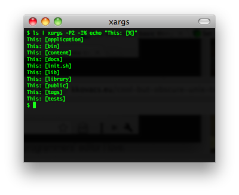


#### duplicity & rsyncrypto

[Duplicity](http://duplicity.nongnu.org/)是使用rsync算法加密的高效率备份软件，Duplicity支持目录加密生产和格式上传到远程或本地文件服务器。

[rsyncrypto](http://rsyncrypto.lingnu.com/index.php/Home_Page) 就是 rsync + encryption。对于rsync的算法可参看酷壳的[rsync核心算法](https://coolshell.cn/articles/7425.html)。

Encrypting backup tools.

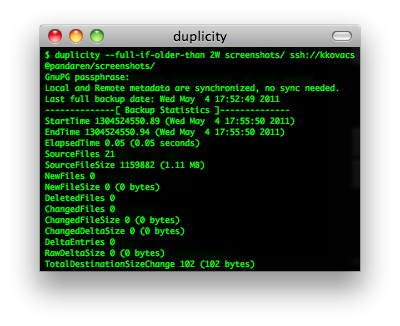


#### nethack & slash’em

[NetHack](http://www.nethack.org/)（[Wiki](https://zh.wikipedia.org/zh/NetHack)），20年历史的古老电脑游戏。没有声音，没有漂亮的界面，不过这个游戏真的很有意思。网上有个家伙说：**如果你一生只做一件事情，那么玩NetHack**。这句话很惹眼，但也让人觉得这个游戏很复杂不容易上手。其实，这个游戏很虽然很复杂，却容易上手。虽然玩通关很难，但上手很容易。NetHack上有许多复杂的规则，”the DevTeam thinks of everything”（开发团队想到了所有的事情)。各种各样的怪物，各种各样的武器….，有许多spoilers文件来说明其规则。除了每次开始随机生成的地图，每次玩游戏，你也都会碰到奇怪的事情: 因为喝了一种药水，变成了机器人;因为踢坏了商店的门被要求高价赔偿;你的狗为你偷来了商店的东西….. 这有点象人生，你不能完全了解这个世界，但你仍然可以选择自己的面对方式。

网上有许多文章所这是最好的电脑游戏或最好的电脑游戏之一。也许是因为它开放的源代码让人赞赏，古老的历史让人宽容，复杂的规则让人敬畏。虽然它不是当前流行的游戏，但它比任何一个当前流行的游戏都更有可能再经受20年的考验。

[Slash’EM](http://www.slashem.org/) 也是一个基于NetHack的经典游戏。


#### lftp

利用[lftp](http://lftp.yar.ru/)命令行ftp工具进行网站数据的增量备份，镜像，就像使用rsync一样。

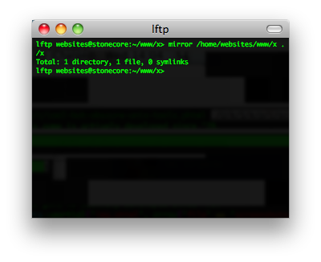


#### ack

[ack](http://betterthangrep.com/)是一个perl脚本，是grep的一个可选替换品。其可以对匹配字符有高亮显示。是为程序员专门设计的，默认递归搜索，省提供多种文件类型供选。


#### calcurse & remind + wyrd

[calcurse](http://calcurse.org/)是一个命令行下的日历和日程软件。[remind](http://www.roaringpenguin.com/products/remind) + [wyrd](http://pessimization.com/software/wyrd/)也很类似。关于日历，我不得不提一个[Linux的Cycle日历](https://coolshell.cn/articles/3489.html)，也是一个神器，呵呵。


#### newsbeuter & rsstail

[newsbeuter ](http://newsbeuter.org/)和 [rsstail](http://www.vanheusden.com/rsstail/) 是命令行下RSS的阅读工具。


#### powertop

[做个环保的程序员](https://coolshell.cn/articles/7186.html)，看看自己的电脑里哪些程序费电。[PowerTOP](https://01.org/powertop/) 是一个让 Intel 平台的笔记本电脑节省电源的 Linux 工具。此工具由 Intel 公司发布。它可以帮助用户找出那些耗电量大的程序，通过修复或者关闭那些应用程序或进程，从而为用户节省电源。

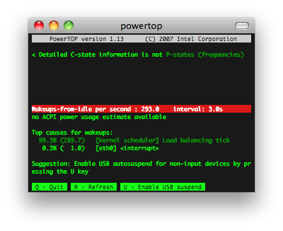


#### htop & iotop

[htop](http://htop.sourceforge.net/) 和 [iotop](http://guichaz.free.fr/iotop/) 用来查看进程，内存和IO负载。


#### ttyrec & ipbt

[ttyrec](http://0xcc.net/ttyrec/index.html.en) 是一个 tty 控制台录制程序，其所录制的数据文件可以使用与之配套的 ttyplay 播放。不管是你在 tty 中的各种操作，还是在 tty 中耳熟能详的软件，都可进行录制。

[ipbt](http://www.chiark.greenend.org.uk/~sgtatham/ipbt/) 是一个用来回放 ttyrec 所录制的控制台输入过程的工具。

与此类似的还有[Shelr](http://shelr.tv/) 和 [termrec ](http://sourceforge.net/projects/termrec/)


#### rsync

通过SSH进行文件同步的经典工具（[核心算法](https://coolshell.cn/articles/7425.html)）


#### mtr

[MTR](http://www.bitwizard.nl/mtr/) – traceroute 2.0，其是把 traceroute 和 ping 集成在一块的一个小工具 用于诊断网络。

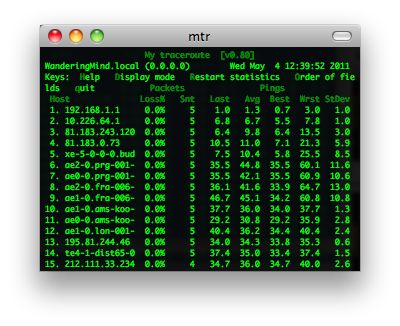


#### socat & netpipes

[socat](http://www.dest-unreach.org/socat/)是一个多功能的网络工具，名字来由是” Socket CAT”，可以看作是netcat的N倍加强版。

[netpipes](http://web.purplefrog.com/~thoth/netpipes/) 和socat一样，主要是用来在命令行来进行socket操作的命令，这样你就可以在Shell脚本下行进socket网络通讯了。

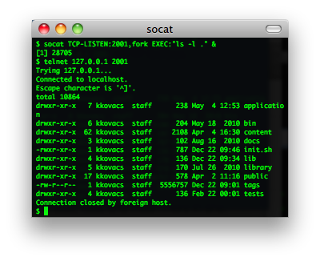


#### iftop & iptraf

[iftop](http://www.ex-parrot.com/~pdw/iftop/)和[iptraf](http://iptraf.seul.org/)可以用来查看当前网络链接的一些流量情况。


#### siege & tsung

[Siege](http://www.joedog.org/siege-home/)是一个压力测试和评测工具，设计用于WEB开发这评估应用在压力下的承受能力：可以根据配置对一个WEB站点进行多用户的并发访问，记录每个用户所有请求过程的相应时间，并在一定数量的并发访问下重复进行。

[Tsung](http://tsung.erlang-projects.org/) 是一个压力测试工具，可以测试包括HTTP, WebDAV, PostgreSQL, MySQL, LDAP, and XMPP/Jabber等服务器。针对 HTTP 测试，Tsung 支持 HTTP 1.0/1.1 ，包含一个代理模式的会话记录、支持 GET、POST 和 PUT 以及 DELETE 方法，支持 Cookie 和基本的 WWW 认证，同时还支持 SSL。

参看：[十个免费的Web压力测试工具](https://coolshell.cn/articles/2589.html)


#### ledger

[ledger](http://ledger-cli.org/) 一个命令行下记帐的小工具。


#### taskwarrior

[TaskWarrior](http://taskwarrior.org/projects/show/taskwarrior) 是一个基于命令行的 TODO 列表管理工具。主要功能包括：标签、彩色表格输出、报表和图形、大量的命令、底层API、多用户文件锁等功能。


下图是TaskWarrior 2.0的界面：


#### curl

[cURL](http://curl.haxx.se/)是一个利用URL语法在命令行下工作的文件传输工具，1997年首次发行。它支持文件上传和下载，所以是综合传输工具，但按传统，习惯称cURL为下载工具。cURL还包含了用于程序开发的libcurl。cURL支援的通訊協定有FTP、FTPS、HTTP、HTTPS、TFTP、SFTP、Gopher、SCP、Telnet、DICT、FILE、LDAP、LDAPS、IMAP、POP3、SMTP和RTSP。


#### rtorrent & aria2

[rTorrent](http://libtorrent.rakshasa.no/) 是一个非常简洁、优秀、非常轻量的BT客户端. 它使用了 ncurses 库以 C++ 编写, 因此它完全基于文本并在终端中运行. 将 rTorrent 用在安装有 GNU Screen 和 Secure Shell 的低端系统上作为远程的 BT 客户端是非常理想的。

[aria2](http://aria2.sourceforge.net/) 是 Linux 下一个不错的高速下载工具。由于它具有分段下载引擎，所以支持从多个地址或者从一个地址的多个连接来下载同一个文件。这样自然就大大加快了文件的下载速度。aria2 也具有断点续传功能，这使你随时能够恢复已经中断的文件下载。除了支持一般的 http(s) 和 ftp 协议外，aria2 还支持 BitTorrent 协议。这意味着，你也可以使用 aria2 来下载 torrent 文件。

 

#### ttytter & earthquake

[TTYtter](http://www.floodgap.com/software/ttytter) 是一个Perl写的命令行上发Twitter的工具，可以进行所有其他平台客户端能进行的事情，当然，支持中文。脚本控、CLI控、终端控、Perl控的最愛。

[Earthquake](https://github.com/jugyo/earthquake)也是一个命令行上的Twitter客户端。


#### vifm & ranger

[Vifm](http://vifm.sourceforge.net/) 基于ncurses的文件管理器，DOS风格，用键盘操作。


[Ranger](http://savannah.nongnu.org/projects/ranger)用 Python 完成，默认为使用 Vim 风格的按键绑定，比如 hjkl（上下左右），dd（剪切），yy（复制）等等。功能很全，扩展/可配置性也非常不错。类似MacOS X下Finder（文件管理器）的多列文件管理方式。支持多标签页。实时预览文本文件和目录。


#### cowsay & sl

[cowsay ](http://www.nog.net/~tony/warez/cowsay.shtml) 不说了，如下所示，哈哈哈。还有xcowsay，你可以自己搜一搜。


 sl是什么？ls？，呵呵，你会经常把ls 打成sl吗？如果是的话，这个东西可以让你娱乐一下，你会看到一辆火车呼啸而过~~，相当拉风。你可以使用sudo apt-get install sl 安装。


最后，再介绍一个命令中linuxlogo，你可以使用 sudo apt-get install linuxlogo来安装，然后，就可以使用linuxlogo -L
来看一下各种Linux的logo了


（全文完）

# 少即是极多

#####  [2012年07月05日 ](https://coolshell.cn/articles/7771.html) [Tim Shen](https://coolshell.cn/articles/author/innocent) 评论 [50 条评论](https://coolshell.cn/articles/7771.html#comments) 40,444 人阅读

【**感谢网友 [@innocentim](https://twitter.com/#!/innocentim)** (Twitter) **投稿**】

这是一篇翻译练习。力图保留原意。若有不准确处，求速速指出。[猛击此处](https://commandcenter.blogspot.com/2012/06/less-is-exponentially-more.html)（墙）看原文。作者为Rob Pike，贝尔实验室来的大牛，现在就职于Google。他主导了Go语言的创建工作。下面是正文——

——————————————正文分隔线——————————————

这是我在2012年6月的Go SF上演讲的文本。

这是一个个人演讲。 我承认，虽然面前的团队让Go诞生并延续，但是我的观点并不代表任何其他Go语言小组成员的意见。 我也想感谢Go SF的组织者提供这个和你们交流的机会。

几星期前我被问起:“你在推出Go的过程中遇到的最大的惊奇是什么？”我立即意识到了答案: 虽然我们希望C++程序员意识到Go是个较好的选择，但是令人意外的是，大多数Go程序员来自Python和Ruby这样的动态语言，而很少有来自C++的。

我们——Ken，Robert和我——是C++程序员(译者: Ken也用C++？)，当时在为解决我们所写的这类软件产生的问题设计一个新的语言。 这似乎有点自相矛盾，因为别的C++程序员根本不关心这些问题，更不会去设计一个语言。

我今天想说的是关于那些激发我们创造Go的事情，和为什么它本不应令我们如此惊讶。 我保证这些内容更多与Go相关而不是C++，所以即使你不很了解C++你也能跟得上。

回答可以这样归结: 你认为”少即是多”呢，还是”少就是少”？

这里有个比喻，将以真实故事的形式给出。 贝尔实验室中心原来发放3位数号码: 物理研究是111，计算科学研究是127，如此这般。 1980年代早期，一个便笺飞过来说”鉴于你们对研究的理解有所加深，将为你们的号码多加上一位，以便更好地体现你们的工作”。 所以我们中心的号码变成了1127。 Ron Hardin半当真地开玩笑说如果我们真的理解我们的世界更好一点的话，我们将丢掉一位数字，将127变成27。 当然主管没听到这个笑话(这也不是我们希望的)，但是我想这里面有点值得思考的东西。 少即是多。 你理解得越好，你将变得越简洁。


先记住这句话。

回到2007年9月，我在做一个庞大的Google C++项目的细微但核心的部分。 开发必须交互进行，但是我这部分在我们的Google编译集群上要编译45分钟。 同时，有个消息传过来说一群在C++社区的Google员工将开一场讲座，介绍即将到来的C++0x(现在称为C++11)。

在那场持续一小时的讲座中，我们听说了诸如计划中的35个新特性的说法——事实上还有更多，但是那场讲座只说有35个。 有些特性当然是细微的，但是讲座中谈到的至少是足够重要的。 提到的特性中，有些十分微妙并难以理解，比如右值引用(rvalue references); 有些特别符合C++范儿，比如可变参数模板(variadic templates); 还有些十分疯狂，比如用户定义的字面量(user-defined literals)。

那时候我问了自己一个问题: C++社区真的觉得C++错在没有足够多的特性么？ 显然，从Ron Hardin的笑话的角度看，简化语言将比添加新特性取得更好的效果。 当然，对C++来说这很不靠谱，但是先记住这点。

在这场讲座的几个月之前我做了一场讲座(你可以通过[YouTube](https://video.google.com/videoplay？docid=810232012617965344)看到)，讲的是一个我1980年代做的一个玩具并发编程语言。 这个语言叫[Newsqueak](ftp://cs.bell-labs.com/cm/cs/who/rsc/thread/newsqueak.pdf)，而且显然地，它成为了Go的前身。

在我在Google工作的过程中，我发现我丢掉了Newsqueak中的一些点子。 现在我将重新思考它们，所以我才做了那场讲座。 我相信它们会让服务器端编程变得更容易，而且Google能真正从中获益。

我真的尝试将这些点子加入到C++中，可惜失败了。 我实在难以将一组并发操作融入到C++的控制流程中去——当真融进去的话，它们将变得十分丑陋，从而难以看到优越性。 另外，C++将它变得十分臃肿(虽然我从来没真正发现C++苗条过)。 所以我放弃了这个想法。

但是C++0x的讲座使我再次思考。 一件事十分困扰我——我相信也困扰着Ken和Robert——C++的新内存模型居然新增了原子类型。 为这个不堪重负的类型系统加上这么个细致精巧到极致类型机制十分的不靠谱，不是么？ 将语言和今日的硬件绑在一起似乎有点目光短浅并且不明智，因为硬件过几年就有大变。

那场C++0x讲座结束之后，我们回到办公室。 我开始了另一个编译(译者笑)，转过转过我的椅子，面对Robert，然后开始问一些尖锐的问题。 在编译完成之前，我们拉拢了Ken，并决定做些什么。 我们再也不想写C++了，并且我们——尤其是我——在写Google代码时，想让并发拿来就用。 同时我们也想解决”大系统编程”的问题，容后细说。

我们在白板上写下一组我们需要的东西——迫切需要的那种。 我们规划出大体的轮廓，忽略了语法细节和语义。

我仍然有一条碉堡了的那周的邮件线索。 这是一些摘录:

> **Robert**: 起点: C，修补一些显而易见的瑕疵，去除繁杂的东西。 新增一些特性。
>
> **Rob**: 命名为’go’。 你可以为这个名字编造各种理由，但是它确实拥有很多好的特性。 它短小，易于打出。 工具么: goc，gol，goa。 如果有个交互式调试器/解释器，可以直接叫’go’。 代码后缀是。go。
>
> **Robert**: 空接口: interface {}。 将被所有接口实现(译者: 原文如此)，并且可以取代void*。

我们并没有立即全部设计出来。 比如我们花了一年多才设计出了数组(array)和切片(slice)。 不过相当一部分重要的设计在最初的几天中浮现。

注意到Robert说C是起点，并非C++。 对于这点我不是很确定，不过我相信他说的是C，因为Ken在场(译者笑)。 但是最后我们并没有从C开始，这倒是真的。 我们从最初的草稿开始，仅仅从其它语言中借鉴琐碎的东西，比如运算符，各种括号和一些常见的关键字。(当然我们也借鉴了我们所知道的语言中的思想。)不管怎么说，我们破而后立，从头做起，以此来响应C++。 我们并非想做一个更好的C++，甚至不是一个更好的C。 它仅仅是一个对我们所关心的软件来说更好的语言。

最后，我们得到了既不同于C也不同于C++的东西，甚至比许多人意识到的还要不同。 我列了一个对于C和C++的Go的重要的简化的列表:

- 常规的语法(不需要一个符号表来辅助解析)
- GC机制(仅仅是GC)
- 没有头文件
- 显式依赖关系
- 没有循环依赖
- 数字常量仅仅是数字(译者: 没有类型)
- int和int32不是同种类型
- 字母大小写将确定可见性
- 任何类型都可以有方法(没有类)
- 没有子类型继承(没有子类)
- 包级别的初始化和良好定义的初始化顺序
- 同一个包的文件一起编译
- 包级别的全局定义可以以任意顺序进行
- 没有算术类型转换(常量可以弥补)
- 接口是隐式实现的(没有”implements”声明)
- 嵌入的结构体(没有类型提升和子类)
- 方法像函数一样定义(不必定义在特殊的地方)
- 方法就是函数
- 接口就是方法(没有数据)
- 方法仅仅靠名字匹配(不是靠类型)
- 没有构造函数和析构函数
- 后置增量/减量运算符仅仅是语句，而不是表达式
- 没有前置增量/减量运算符
- 赋值号是语句，不是表达式
- 表达式求值顺序在赋值和函数调用时确定(没有所谓的”sequence point”)
- 没有指针算术
- 内存总是初始化为0
- 对本地变量取地址是合法的
- 方法中没有叫this的指针
- 分段式栈
- 没有常量或其它类型的注记
- 没有模板
- 没有异常
- 内建字符串，切片和映射(map)
- 数组边界检查

并且，我相信通过这一系列的简化，Go将比C或C++更具有表现力。 少即是多。

但是我们没法一下子把所有部分都做出来。 我们需要构建最基础的部分，比如说类型系统的表示，能良好应用于实际的语法，和一些无法形容的但能让库更容易相互操作的东西。

我们同样增加了C或C++中没有的东西，比如切片和映射，组合字面量(？)，文件顶层的表达式(这虽是件大事，但是几乎不为人知)，反射机制，GC等等。 自然，还有并发。

一个显眼的缺少的东西是类型的继承。 请允许我粗暴地对待它一分钟。

早先构建Go的时候有人跟我说，他无法想象用一门没有泛型的语言工作。 正如我在别处说明的那样，我觉得这是个很诡异的言论。

公平起见，他用自己的话说可能是他真的很喜欢C++中STL的那些容器。 以辩论为目的的话，我们来正面看看他的言论。

他说的意味着: 他发现写一个容器，比如以int为元素类型的链表，或字符串映射是一种不能忍的重负。 我发现这是个很诡异的言论，因为我几乎没把时间花在那些个问题上，即使我在用没有泛型的语言。

但是，更重要的是，他说的那些表示*类型系统*将会解除这种负担。 *类型系统*。 不是多态函数，或语言级原语，或其它类型的辅助手段(helpers)，而仅仅是*类型系统*。

这就是粘住我的那个细节。

从C++或Java来Go的程序员怀念和类型系统在一起的日子，特别是带继承和子类的那部分。 也许我在类型系统方面是粗暴了些，但是我绝不觉得那套玩意非常具有表现力。

我已故的朋友Alain Fournier一次告诉我说他认为学术工作的最底层是分类学。 然后信不信由你，类型继承正是分类学。 你必须决定哪个萝卜扔哪个坑里，每个类型的父类型，A是否继承B或者B是否继承A。 一个可排序的数组是一个带有sort方法的数组呢，还是一个长得像数组的排序器呢？ 如果你觉得类型系统能解决所有设计上的问题，你必须做出这个无意义的选择。

我相信对编程来说那是个荒诞的思路。 真正的重点不在于事物之间的继承关系，而在于它们能提供些什么。

因此，接口这个概念进入了Go。 但是它们都是主要部分——真正的Go之道——的一部分。

如果C++和Java注重类型继承和类型系统的分类学，那末Go就注重组合。

Doug Mcilroy，Unix管道的最终发明人，在1964年(!)写道:

> 我们应该有一些机制能将程序耦合(串)起来，像花园软管那样——当我们需要另一种方式传送数据时，拧紧另外一段即可。 I/O也可以这么做。

这也是Go所提倡的道路。 Go吸收这个观点，然后把它推进得十分远。 这是一门关于(功能上的)组合和(调用上的)耦合的语言。

一个显然的例子是接口是组合各部分的途径。 关键是，那些部分是什么并不重要，如果某类型实现了M方法我就可以把这个方法填到接口里去。

另一个重要的例子是如何让并发性提供给我们不同的独立计算部分的组合。

并且还有一种不同寻常(但十分简单)的类型组合形式: 嵌入。

————————————————————————

我想提一个和之前不太相关的Go设计: Go被设计为大型团队用来写大型程序的语言。

这里有个概念是”大型编程”，并且不知何故C++和Java主宰了这个领域。 我相信这只是因为其历史巧合，或者是工业上的巧合。 但是被广泛接纳的观点是他们和面向对象设计有关。

我压根不相信这点。 大型软件需要确定的方法，但是更重要的是它需要强依赖性管理，干净的接口抽象和优越的文档工具。 C++没一点做得好的(虽然Java明显要好很多)。

我们还不知道Go语言能做到何种程度，因为现在还没有足够的软件是用Go写的。 但是我非常有信心于Go将会成为一个优越的大型编程语言。 时间会说明一切的。

————————————————————————

现在，回到我们演讲开始提的那个问题:

为什么Go，作为从头被设计为符合C++使用者习惯的语言，没有吸引很多C++程序员？

严肃点说，我觉得是因为Go和C++在哲学方面有着巨大的不同。

C++是将所有东西提到你指尖上(译者: 即多范式)。 我在C++11的FAQ上找到了这段引用:

> C++能优雅地，灵活地，零损耗地(相比于手工操纵代码)表达抽象的能力大幅提升了。

Go并非这种”围绕式”的。 你并不需要所有的东西都内建好。 你不需要对每个执行细节进行精细的控制。 比如，你不需要RAII，但你拥有一个垃圾回收器，也意味着你不需要执行释放内存的操作。

你得到的是一组非常强有力但易于理解，易于用来构建积木的功能，这些积木可以用来组合出一个你需要的问题的解法。 这并不意味着它能像别的一些语言创造的解法一样快速，复杂，或带来思想上的激励，但是它总能保证易于书写，易于阅读，易于理解，易于维护，而且可能更安全。

从另一个角度说，这当然算作过度简化:

Python和Ruby程序员转到Go，因为他们不需要牺牲表达能力，却获得了性能的提升，并且能好好玩并发系统了。

C++程序员*并没有*转到Go是因为他们好不容易获得了对程序的精细控制，并且不想牺牲它们的任何一部分。 对他们而言，写软件不仅包括把事情做完，而且包括用特定的方式完成。

关键是，在将来，Go的成功将会颠覆他们的世界观。

并且从一开始我们就应该意识到这点。 对于C++11的新特性很兴奋的人们并不关心一个拥有如此少特性的语言。 即使最后他提供了如此多。

谢谢。

（全文完）

# 关于闰秒

#####  [2012年06月30日 ](https://coolshell.cn/articles/7804.html) [陈皓](https://coolshell.cn/articles/author/haoel) 评论 [35 条评论](https://coolshell.cn/articles/7804.html#comments) 32,013 人阅读

2012年6月30日，也就今天晚上，时间会多出现一秒，也就是我们所说的闰秒。我不知道大家对闰秒的了解有多少，所以写下这篇文章。

#### 背景知识

闰秒是在在[UTC](https://en.wikipedia.org/wiki/Coordinated_Universal_Time)（中文“世界标准时间”或“世界协调时间**”**／英文“**C**oordinated **U**niversal **T**ime”／法文“**T**emps **U**niversel **C**ordonné”）是基于[Atomic Clock](https://en.wikipedia.org/wiki/Atomic_clock)（原子时钟）的一种时间，向太阳时（[Solar Time ](https://en.wikipedia.org/wiki/Mean_solar_day)）对齐的一种方法，因为太阳时是根据地球公转来计算的。所以，1972年制定的UTC为了确保其时间相对于UTC的时间误差不能超过0.9秒，因此在过一段时间后需要加一秒。下图是有UTC以来闰秒的调整表（来自[Wikipedia闰秒的中文词条](https://zh.wikipedia.org/wiki/闰秒)）


从上表中我们可以看到，从1972年到现在，在这四十年里已经进行过25次的闰秒调整。闰秒是在每年6月或12月的最后一天的最后一分钟进行跳秒或不跳秒。是否加入闰秒由位于巴黎的国际地球自转和参考坐标系统服务（IERS – [International Earth Rotation and Reference Systems Service](https://en.wikipedia.org/wiki/International_Earth_Rotation_and_Reference_Systems_Service)）决定。如果决定加入闰秒，那么这一秒是被加在第二天的00:00:00前的，也就是说，时间会出现23:59:60的情况，然后才是第二天的00:00:00。如果是负闰秒的话，23:59:58的下一秒就直接跳到第二天的00:00:00了。**现在，所有闰秒都是正闰秒**。

#### 计算机处理闰秒

那么，对于我们的电脑系统来说，怎么处理这个闰秒呢？一般来说，我们需要为我们的电脑系统配置UTC时钟，并通过NTP ([Network time protocol](https://en.wikipedia.org/wiki/Network_time_protocol))来进行时间同步，NTP服务器会一级一级地下发闰秒事件通知直到最边缘的NTP服务器，然后NTP服务器就会把闰秒通知发给客户端的操作系统，由操作系统来处理闰秒通知。

虽然闰秒调整对普通民众的日常生活不会产生影响。不过，**这个问题将影响部分开启ntp服务的Linux操作系统——会导致Linux内核Crash！**Linux kernel是在2.6.18-164.e15之后的版本中解决了这个问题。换句话说，Linux kernel低于**2.6.18-164**的Linux系统，无论是什么公司的Linux都将受到影响。（今晚过后大家可以查看一下你的Linux系统日志，看看闰秒有没有发生）

可以参看下面的bug描述：

- [LKML: Chris Adams: Re: Bug: Status/Summary of slashdot leap-second crash on new years 2008-2009](https://lkml.org/lkml/2009/1/2/373)
- [Bug 479765 – Leap second message can hang the kernel](https://bugzilla.redhat.com/show_bug.cgi?id=479765)

那么，我们的操作系统是怎么处理正闰秒通知的？通常来说有三种实现：

1. 后退一秒。
2. 停止一秒。
3. 真正的增加一秒。

懂编程的人一眼就能看出来，前两种方式是以一种Workaround或Hack的方式解决这个问题。第一种方式会导致一些基于timestamp的消息通知乱序了，而第二种会导致出现两个一模一样的timestamp。最后一种不会出现timestamp的问题。对了，你还记得以前那篇《[你确信你了解时间吗？](https://coolshell.cn/articles/5075.html)》的文章吗？

最后，说说Windows，Windows  Time Service不支持闰秒通知，所以，当闰秒发生的时候，你的Windows上的时间会比实际时间快一秒钟，这需要等下一次的时钟同步才会完成修正。你可以查看这篇文章：http://support.microsoft.com/kb/909614/en-us

（全文完）

# 持续部署，并不简单！

#####  [2012年06月25日 ](https://coolshell.cn/articles/7657.html) [马基雅弗利](https://coolshell.cn/articles/author/fakeren) 评论 [48 条评论](https://coolshell.cn/articles/7657.html#comments) 48,532 人阅读


【**感谢 [@常新居士](http://weibo.com/renfake) 投递此文** 】

这几年，持续集成随着敏捷在国内的推广而持续走热，与之相伴的持续部署也一直备受关注。**自前两年，持续交付这个延续性概念又闯进了国内IT圈，慢慢开始在社区和会议中展露头角。许多不明真相的群众跟风哭着喊着要“上”，而许多前CI的半吊子玩家换件衣服就接着干，有的甚至衣服都来不及换……**。国内的这些土财主如果不巧请了某些所谓的战略家，除了建了一堆持续集成环境，以及每天嚷嚷着要这个要那个，混乱的状况在根本上没有得到改善。本文无意费力探讨持续集成和持续交付的概念，而是打算谈谈对于大型软件企业，以持续集成为基础实现持续部署（交付）时，所要面对的问题以及可行的解决方案。地主老财们，夜黑风正猛，山高路又远，注意脚下……

**And God Said, Let there be light: and there wa**— GENSIS, Charpter 1, King James

目录


[一、起步](https://coolshell.cn/articles/7657.html#一、起步)[1.1）编译时依赖和运行时依赖](https://coolshell.cn/articles/7657.html#11）编译时依赖和运行时依赖)[1.2）依赖时的复杂度](https://coolshell.cn/articles/7657.html#12）依赖时的复杂度)[1.3）任务分工](https://coolshell.cn/articles/7657.html#13）任务分工)[1.4）自动化部署](https://coolshell.cn/articles/7657.html#14）自动化部署)[二、困境](https://coolshell.cn/articles/7657.html#二、困境)[三、任脉——环境管理](https://coolshell.cn/articles/7657.html#三、任脉——环境管理)[四、督脉——部署系统](https://coolshell.cn/articles/7657.html#四、督脉——部署系统)[五、没完](https://coolshell.cn/articles/7657.html#五、没完)[六、总结](https://coolshell.cn/articles/7657.html#六、总结)

#### 一、起步

先来讲个故事……

几年前，一对留美的夫妇通过朋友找到我，让我帮忙在国内组建一个开发团队，该团队负责为其开发一款基于社交网络的客户关系管理软件,（暂且称之为项目A）。这个项目除了尚不清晰的需求范围和很紧的期限外，作为业内人士的老公Richard根据眼下流行的软件开发过程还提了诸多额外的要求：

- **功能要及早交付**（以便拿去和潜在的投资人洽谈）
- **功能在部署到生产环境前要先部署的一个测试环境**（Richard要试用后给予反馈）
- **功能必须经过测试**（长期作为软件外包的甲方，对质量要求严格）
- **要减少后期维护的工作**（美国人精贵，少雇一个是一个）
- **支持协同开发**（以便维护人员及早介入）
- ……

**这正是持续集成所要解决的典型场景**。针对Richard的要求，我们只要建立一个基于Hudson（现在叫Jenkins）+Maven +SVN 的持续集成环境（再加上持续集成所要求的测试和过程）就可以很好地满足上述要要求，此方案的结构如下：


[](https://coolshell.cn/?attachment_id=7686)

对于上述方案，让我们近距离看看各个服务器的内部情况，以及人员在这种方案下的分工协作：

[](https://coolshell.cn/?attachment_id=7708)

我们先谈谈上面的图中涉及的一些概念性问题：

##### **1.1）编译时依赖**和**运行时依赖**

从字面上不难理解这两种依赖的类型。但要注意虽然编译时依赖常常也是运行时依赖，但并不能推断出一方必然是另一方。比如，在开发的过程中需要某些提供API的Jar包，而运行时可能是具体API实现的Jar包。再者，被依赖的包会有其自身的依赖，因此,项目对这些包产生间接依赖（**运行时依赖**），依此类推，最终形成一个**依赖树**。当项目运行时，这些依赖树上的包必须全部就位。

Maven在POM中通scope来界定依赖的类型，从而帮助开发和运维人员摆脱手动处理依赖树的工作，然而运行时所依赖包最终是要安装到生产环境的，这部分工作Maven并不能自动完成。因此，一个常用方式是将运行时所依赖的包拷贝到项目文件中，比如Java Web应用的WEB-INF/lib，然后将项目总的打一个包。**在安装项目包后，修改环境变量，将这些包所在的路径加入相应的环境变量中，如ClassPath**。

再看个例子，现代的操作系统和其它系统框架都考虑到了运行时依赖树的处理问题，比如Ubuntu的apt-get，CentOS的yum，Ruby的RubyGem，Node的npm等等。

##### 1.2）依赖时的复杂度

项目除了对程序包的依赖，对于运行环境也有些具体的要求，比如，Web应用需要安装和配置Web服务器，应用服务器，数据服务器等，企业应用中可能需要消息队列，缓存，定时作业，或是对其它系统以Web Service方式暴露的服务。这些可以看做项目在系统层面对外部的依赖。这些依赖有些可以由项目自行处理，而有些则是项目无法处理的，比如运行容器，操作系统等，这些是项目的运行环境。

总之，依赖的复杂度主要有两个：

1. 依赖包间的版本兼容性问题。兼容性问题是软件开发的恶梦
2. 间接依赖，或多重依赖问题。这个问题可以类比想像一下C++中的多重继续种出现的很多问题。

比如：Ａ依赖于python 2.7，A还依赖于B，但是B却依赖于python 3，而Python 2.7和Python 3不兼容。这是依赖中最恶心的事。

##### 1.3）任务分工

由于项目简单，因此并不需要专门的运维人员。以一个100人左右以交付为主业（恩，就是做外包）的公司为例，由于没有任何历史项目和代码的拖累，且各个项目间也没有任何关联，故而只需要配备一个IT支持人员进行资源方面的管理：分配机器，报修，初始化系统，分配IP地址等。各个项目的运行环境、数据库、开发环境等都由具体项目的开发人员手动完成。 环境出问题怎么办？很简单，凉拌——重装系统。实际的运行效果不错。

##### 1.4）自动化部署

由于Hudson这样的持续集成环境提供了自动编译（定时或触发式）的功能，而且可以在编译过程中提供了一些扩展点，因此通过提供一个部署用的脚本，就可以非常容易实现简单的自动化部署。

毫无疑问，持续集成就是敏捷的魔法药，它见效快、副作用小、业界的争论少。每每运用在混乱的项目中时，几周内项目就开始持续的产出经过测试的功能。对于独立项目，以持续集成为中心的持续部署绝对是不二选择。

**但是，我们有没有想过，这会是一个自动化部署的通用解决方案吗？持续集成应该位于持续交付的中心吗？**

#### 二、困境

回到我们的故事：项目A上线两年后，运营业绩不错，投资人第一轮注资后，Richard的公司进行了扩张，他们对项目进行了重构，而且随着用户数量的增长，公司分别在美国、英国和日本等地建立了运营中心，并且对亚洲市场进行的定制功能开发（项目A+），接下来，公司又投入开发了团购系统（项目B）。在获得了新一轮投资后，各条本来比较简单的业务和功能线上越来越复杂，需要不断地细分，于是公司再度扩张（开发人员达到了300人，国内200多人，而运维团队主要在美国），随后又为项目A/A+的高级用户开发了问答系统（项目C）。目前，他们正准备开发手机系统。 看看下面的图，公司增长的过程中，整个项目环境也变得复杂。（注意，这里是一种逻辑结构，而在物理层面项目B和项目A的生产环境可能部署在相同的机器上）。

[](https://coolshell.cn/?attachment_id=7694)

同时，原本单一的项目软件结构随着业务系统的增加也不再简单： 

而软件间的版本依赖使这个问题变得更为复杂：

[](https://coolshell.cn/?attachment_id=7700)

现在，Richard的公司已经不再是一条快乐的小鱼，而是渐渐成为一直庞大的巨兽。虽然只有四个产品，但公司却要支持几百台开发机，几十台生产服务器，还有对应的测试环境，数据库服务器，以及几十个开发小组，和一大堆的内部项目。我们尽可以使用持续集成来为我们完成自动化部署。但，**当我们为各个项目建立起持续集成环境后，它能满足我们对于持续部署的要求吗？我们前期的工作可以简化我们今后项目的持续交付的工作的难度吗？它需要我们为之建立一个庞大的运维团队，还是可以让我们能节省下每一毛钱来投入到真正的业务价值中去？**

**让我们先来看看复杂的项目环境中的几个场景**：

**场景1：环境升级**

项目A和项目B都依赖于Web容器，公司决定升级Web容器版本，而公司要升级的机器有上百台，依赖人肉升级已不现实，维护团队因此针对各种软件开发了相应的自动化脚本，但当新的软件出现时，必须要开发新的脚本。而且当同时升级若干环境软件时，则难度随之增大，手工调度的方式极易出错，当升级失败时仍需要大量人工处理。由于存在大量升级脚本，有一定的维护成本。

**场景2：依赖于环境的软件升级与回滚**

针对环境升级，公司为项目A和项目B开发了新的版本。但环境的升级和软件的升级不是同步进行，出错的可能性非常大（想一想间接依赖和多重依赖的情况）。当新版本部署到生产系统时，发现问题，需要回滚到之前的版本——所有运行时版本都需要回滚，而且环境也需要同步回滚。几百台机器……

**场景3：运行时依赖**

在第一节的方案中，我们将所有的运行时依赖都打包到一起。当项目依赖关系复杂时，这样产生的包将非常臃肿，潜在地延长了部署的时间（想一想全世有几百台服务器，一个部署计划需要部署几百兆文件的情况），而且产生冲突的可能性非常大，而且对于不同类型的项目（Java和Ruby项目）缺乏通用性。06年左右，Nortel可是拿Excel统计过运行时依赖的，牵涉若干项目组，反复多次，没有个把月真搞不定。

**场景4：泛滥的部署**

每个项目相关的持续集成环境都需要开发自己的部署脚本，重复投入大，而且各个项目的部署过程不一致，并且对于同一个项目无法同时满足不同目的部署要求，例如，环境或系统配置参数改变后，无需安装包，只需做清理和激活的工作。最后，持续集成只是支持了和代码修改有关的部署。

**场景5：不一致的环境**

简单项目中，开发环境和运行环境都由开发人员搭建，当公司变大时，系统的运行环境将由运维人员搭建，而开发环境如果由运维人员搭建则工作量太大，由开发人员自己搭建则操作复杂又容易产生不一致的情况。

**场景6：热切换**

对于某些部署，需要尽量减少服务的停止时间，需要在服务的同时进行部署。

这些场景只是以持续集成为中心的持续部署在面对大型企业时所遇到的部分问题。大型企业，人多，项目多，机器多，项目环境复杂，部署维护工作繁多。以持续集成为基础的部署可以解决各个项目的集成问题，却无法帮助企业应对复杂的项目环境和各种不同的部署要求。**究其更本，大型企业中的部署不再是一个简单的问题，而是一个交付生态圈，基础设施和环境管理必须要纳入考虑之中。**要实现真正意义上的持续部署，我们就必须**把环境和项目同等对待**，通通纳入管理之中。同时，部署本身要得到统一。**一个好的部署机制，应该是易于建立，易于使用，易于维护。**

#### 三、任脉——环境管理

什么是环境？

系统运行所依赖和包含的一切就是其环境：硬件、操作系统，网络资源（IP地址、域名），服务容器，服务器软件配置，环境亦是，运行时依赖的命令和包，项目本身的包和配置都是环境的一部分。对于部署而言，广义上，这些通通应该纳入环境管理的范畴，但狭义上，从软件系统的角度看，一个环境就是其运行需要的软件及其配置（我们先把操作系统和网络资源当做基础设施，其在部署时已处于就位的情况）。因此：

**项目A的生产环境 = 项目A本身的软件包 + 项目A运行时依赖的软件包 + 项目A运行时依赖的其它软件 + 项目A的配置信息**

由于，项目本身的软件包、项目运行时依赖的软件包，以及项目运行时依赖的其它软件在本质上没有区别——都是软件，上面的定义可以进一步抽象为：

**环境 = 软件包 + 配置信息**

在这个定义下，我们就必须将运行环境的软件解构，并以包的形式导入到公司的整个项目资源库中，比如Apache将作为一个包被导入，而Apache依赖的其它包也将依次被导入，并建立起正确的依赖关系。而且，在导入的过程中还必须做些相应的调整，如，环境变量的读取和设置，必须来自于环境配置模块，而不要修改系统的环境变量，防止不同环境在系统环境配置上相互影响和依赖。

再回头审视我们的示例，项目A的生产环境可以部署在不同的区域，对于各个区域可能有定制化的设定。这就像面向对象中的类，可以通过继承使子类重用父类的公有属性和行为并添加自己特有的信息。因此，环境的概念模型如图：

[](https://coolshell.cn/?attachment_id=7725)

通过这样的关系，我们很容易为示例的复杂环境建立一种简单的结构，对于项目A：

[](https://coolshell.cn/?attachment_id=7729)

这里，环境依然是处于知识层面（Knowledge Level），它并未与具体的基础设施相关联。当我们将一个环境“具现化”成一个运行系统时，我们就产生了一个真正的环境实例。在这两者之间，我们还必须要考虑环境实例的使用目的（开发？测试？……）以及安装所依赖的其它信息（如机器），因此，我们需要增加一个环境目标来集中这些信息，而且由于不同目标的环境可能会有所差别，因此，环境目标也需要配置的能力。概念模型如图：

[](https://coolshell.cn/?attachment_id=7731)

图中的环境实例是如何产生的呢？**部署**，**一次部署可能会产生一个环境实例。**一系列部署将产生对应于环境目标的多个环境实例，除去当前起作用的环境实例外（最新的），其它的是历史环境实例。**通过在历史环境实例中切换，我们自然而然的就可以使整个环境回滚，因为项目所依赖的一切都已经成为的环境中的软件包，而且环境依赖的包的版本会随着部署具体确定下来。**如此一来，我们便可以给每个环境实例分配一个版本号，再通过环境实例的版本号与软件包的版本对应起来，从而得知一次部署时应用的具体软件包，如图：

[](https://coolshell.cn/?attachment_id=7732)

目前的环境管理结构，已经可以解决场景1、2和5的问题。那**么对于场景2，运行时依赖，环境管理应该如何解决呢？**

细心的朋友，可能已经发现，**在环境层面上我们确定了环境依赖的软件包**，这里有两个隐藏的含义：

- 环境定义的是对软件包的运行时依赖
- 由于环境是一个逻辑上的概念，因此其所用的软件包也是一个逻辑上的概念（相对于版本控制系统中的软件包）

我们也已经知道，在部署时，一个环境实例将具体的确定其依赖的软件包的版本。某个版本的软件包最终与代码库中的物理的软件包相关联。但软件包是运行时的安装包，因此，它应该是代码库中包编译的结果。在对代码库的包编译时，既要将结果打上版本保存起来，也好在两者的版本间建立关系，最后，编译结果应该是某种既定的安装包目录文件结构。

另外，当环境包含的包比较多时，运行时版本树会非常大，手动的指定全部的包的版本将是一个非常大的体力劳动，这部分工作也要得到简化。由此，我们必须

- **建立逻辑软件包版本和版本库中软件包版本间的关系**
- ***\*为相互依赖的包编译并打上统一的标签\****
- **简化运行时包依赖关系的生产**
- **简化运行时包依赖的指定（可参考apt-get和RubyGem，环境只需指定直接依赖的包，间接依赖的包从运行时依赖树中自动导入）**

一个可能的简单结构如下：

[](https://coolshell.cn/?attachment_id=7736)

上述讨论还没有涉及操作系统，**如果我们的运行机器要支持多个系统，我们又该怎么办？？？**

配置信息也是个大问题，大家可以思考

- **环境配置和应用配置如何区分？**
- **如何简化环境配置工作？**
- **如何使环境配置的效果只对具体环境有效，而不会泄露到环境外部？**

再者，

- **如何使应用支持多运行目标？**
- **环境管理如何能方便开发环境的调试？**
- **要如何简化版本的选择?**
- ***\*在多个包有编译和运行时依赖时，编译时如何检查以减少引入兼容性问题的风险？\****

这些都留待大家思考。

#### 四、督脉——部署系统

《持续集成》和《持续交付》中都对部署有详细的讨论，不在赘述。**在我看来，部署其就是按照其目的执行一系列步骤将环境置于其目的所指向的状态中**。我们一会再回国头来看这段文绉绉的话，先看看第一部分持续集成的环境下，我们部署的步骤可能会是下面这个样子：

1. 登陆目标机（ssh）
2. 停止服务
3. 清理环境
4. 准备安装环境（创建文件夹等）
5. 安装项目包（rsync，解压，权限设置等）
6. 配置环境变量
7. 启动服务
8. ……

而在第二部分的**情景4**中，我们看到如果对不同的持续集成环境建立不同的部署脚本和环境维护脚本，这部署过程的维护会非常繁琐。基于第三部分的环境管理，我们可以将部署过程抽象为：

[](https://coolshell.cn/?attachment_id=7737)

现在回到开头那个文绉绉的描述：**部署其就是按照其目的执行一系列步骤将环境置于其目的所指向的状态中**。

由于我们已经将部署作为环境管理的一部分，而环境又是对外提供服务的最小实体，因此，对环境的部署就是要根据部署的类型，在环境上按一定的步骤执行一系列操作，从而使环境置于部署类型所要的状态，这个过程中可能会生成对应的环境实例。举例来说，我们可能会修改环境相关的一些配置，然后重启环境，显然，这种情况下不需要下载安装软件包（没有改变），因此也就不需要生成环境实例。

对于标准的部署——安装软件包并启动环境，可能的步骤将会是：

1. 选择将要部署的软件包的版本
2. 生成新的环境实例（确定环境实例的版本和其依赖包的版本，确定环境配置等）
3. 清理和准备目标机环境
4. 下载包
5. 设置环境配置
6. 环境实例切换
7. 生成部署报告
8. ……

好，部署系统和环境管理各就各位，我们可以将各个项目环境纳入我们的环境管理之中，甚至是持续集成环境本身。再补充一句，要让部署系统和环境管理能很好的发挥作用，我们即需要一个简单一致的UI界面（为开发人员），也需要提供一个清晰明了的服务接口（供外部系统调用，如持续部署系统）。**对于与环境管理相关的机器状态管理，网络资源的配置等等，本文不再涉及，大家可以自己思考**。环境管理的实现、编译系统改造以及持续部署的具体实现，另作文章探讨。

就技术而言（不考虑围绕持续部署的过程实践），环境管理、部署系统以及我们没有提及的编译系统改造才是生产线的真正引擎，持续部署不过是水到渠成的传送带而已。

#### 五、没完

打通了任督二脉后，事还还没有完，还有很多细节上的问题。你想，这个工具实在是太好用了，于是公司里成百上千的工程师们都在使用这个自动化部署系统，我们又会面对很多很多问题：

- **部署系统的性能问题**。几百号人不停地在把他们的软件部署到自己的机器上，部署到测试环境，部署到生产环境，一天之内一个人可能会要部署N次，回滚N次，不但有大量部署请求，还有大量的文件在网络上传输。你得想想这套部署系统如何解决这些性能问题，还得考虑未来更大规模的性能水平扩展问题。

- **目标机环境的管理。**在目标运行机上需要解决几个问题：1）两个环境间如果有一些的一样的包，那就没有必要再下载了，这样可以节约时间。2）每次部署都需要把老的部署环境给保留下来，这样方便在新旧环境下的切换。这两点对于在生产环境下部署非常关键。（这需要环境内所有软件的绿色安装才能更容易达到这个目标，因些，Unix/Linux会比Windows更容易做到这点）

- **部署一致性事务问题**。有时候，我们需要同时部署若干台服务器，比如：包A到机器MA，包B到机器MB，包C到机器MC，……（Web Service的SOA架构），这些包之间有运行依赖性和兼容性问题，要么一次性全部完成，要么就全部失败。回滚也是一样的，这是一个部署事务或部署一致性的问题。如何解决呢？

- **部署环境的版本控制问题**。前面说过，我们的一个环境就会和若干个包的版本耦合，环境必需管理要部署的包的版本。于是，当你的部署越来越多的时候，各个环境的包的版本开始出现混乱，各种依赖间的版本也会出现不统一的情况，也就是说，就算你有这样的一个工具，在一个高速开发的环境下，我们的部署环境的管理还是会出现很多混乱的情况，需要你不断地统一大家的开发、测试环境。

- **部署计划**。我们可能会有很多部署计划，比如：设定定时部署，提升或降低部署优先级，部署事务定义，部署策略（如：先部署10%的机器，如果没有问题，再把剩下的系统部署了），热切计划和策略…… 等等 ，等等 。

- **部署的监控和维护**。任何软件和系统都会有这样的问题，当规模上去了以后，我们的自动化部署系统的监控和维护的复杂度并不亚于一个大型的互联网应用。

这样的问题会有很多，基本上来说，**这样一个持续集成持续部署的自动化系统并不是那么简单的事，其开发工作量和一个标准的大型互联网业务系统没什么两样**。

#### 六、总结

这里只谈一点自己的看法，从传统的持续集成到面向大型软件的持续部署，我们将系统所依赖的软件环境和软件包抽象为一致的实体纳入到管理之中，并将运维人员的工作真正的分摊到开发人员身上。而云计算的出现，使得计算机本身也可以自动化的创建和回收，这样环境管理的范畴将进一步扩充。相应的，部署的能力和灵活性也是一次质的飞跃，将再一次减轻运维人员的工作压力。

说了这么多废话，总结一下自己的观点，对于向大型软件企业推销基于持续集成的持续部署（交付）的哥们：

- **你就是在耍流氓**，如果你不解决环境管理！！！
- **你就是在耍流氓**，如果你不建立部署系统！！！
- **你就是在耍流氓**，如果你不扩展编译系统！！！
- **你就是在耍流氓**，如果你只是推销小团队的实践而不考虑改造大环境！！！
- **你就是个流氓**，如果你只是不断地告诉别人怎么做，自己却从来不动手写一个测试或建立一个持续集成环境！！！

最后，用Linus最经典的话来结束本文——“ Talk is Cheap, Show me the Code！”

（**注：本文由[@常新居士](http://weibo.com/renfake)完成初稿，我做了一些编辑，主要写了第五节“没完”** ）

# K-MEANS 算法

#####  [2012年06月29日 ](https://coolshell.cn/articles/7779.html) [陈皓](https://coolshell.cn/articles/author/haoel) 评论 [88 条评论](https://coolshell.cn/articles/7779.html#comments) 125,419 人阅读

最近在学习一些数据挖掘的算法，看到了这个算法，也许这个算法对你来说很简单，但对我来说，我是一个初学者，我在网上翻看了很多资料，发现中文社区没有把这个问题讲得很全面很清楚的文章，所以，把我的学习笔记记录下来，分享给大家。

在数据挖掘中， ***k\*-Means 算法**是一种 [cluster analysis](https://en.wikipedia.org/wiki/Cluster_analysis) 的算法，其主要是来计算数据聚集的算法，主要通过不断地取离种子点最近均值的算法。

目录


[问题](https://coolshell.cn/articles/7779.html#问题)[算法概要](https://coolshell.cn/articles/7779.html#算法概要)[求点群中心的算法](https://coolshell.cn/articles/7779.html#求点群中心的算法)[K-Means的演示](https://coolshell.cn/articles/7779.html#K-Means的演示)[K-Means ++ 算法](https://coolshell.cn/articles/7779.html#K-Means_算法)[K-Means 算法应用](https://coolshell.cn/articles/7779.html#K-Means_算法应用)

#### 问题

K-Means算法主要解决的问题如下图所示。我们可以看到，在图的左边有一些点，我们用肉眼可以看出来有四个点群，但是我们怎么通过计算机程序找出这几个点群来呢？于是就出现了我们的K-Means算法（[Wikipedia链接](https://en.wikipedia.org/wiki/K-means_clustering)）

K-Means 要解决的问题

#### 算法概要

这个算法其实很简单，如下图所示：


K-Means 算法概要

从上图中，我们可以看到，**A, B, C, D, E 是五个在图中点。而灰色的点是我们的种子点，也就是我们用来找点群的点**。有两个种子点，所以K=2。

然后，K-Means的算法如下：

1. 随机在图中取K（这里K=2）个种子点。
2. 然后对图中的所有点求到这K个种子点的距离，假如点Pi离种子点Si最近，那么Pi属于Si点群。（上图中，我们可以看到A,B属于上面的种子点，C,D,E属于下面中部的种子点）
3. 接下来，我们要移动种子点到属于他的“点群”的中心。（见图上的第三步）
4. 然后重复第2）和第3）步，直到，种子点没有移动（我们可以看到图中的第四步上面的种子点聚合了A,B,C，下面的种子点聚合了D，E）。

这个算法很简单，但是有些细节我要提一下，求距离的公式我不说了，大家有初中毕业水平的人都应该知道怎么算的。我重点想说一下“求点群中心的算法”

#### 求点群中心的算法

一般来说，求点群中心点的算法你可以很简的使用各个点的X/Y坐标的平均值。不过，我这里想告诉大家另三个求中心点的的公式：

**1）Minkowski Distance 公式 ——** λ 可以随意取值，可以是负数，也可以是正数，或是无穷大。


**2）Euclidean Distance 公式** —— 也就是第一个公式 λ=2 的情况


**3）CityBlock Distance 公式** —— 也就是第一个公式 λ=1 的情况


这三个公式的求中心点有一些不一样的地方，我们看下图（对于第一个 λ 在 0-1之间）。

   

**（1）Minkowski Distance   （2）\**Euclidean Distance   （3） \*\*CityBlock Distance\*\**\***

上面这几个图的大意是他们是怎么个逼近中心的，第一个图以星形的方式，第二个图以同心圆的方式，第三个图以菱形的方式。

#### K-Means的演示

如果你以”[K Means Demo](https://www.google.com/search?hl=zh-CN&q=K+Means+Demo)“为关键字到Google里查你可以查到很多演示。这里推荐一个演示

http://home.dei.polimi.it/matteucc/Clustering/tutorial_html/AppletKM.html

操作是，鼠标左键是初始化点，右键初始化“种子点”，然后勾选“Show History”可以看到一步一步的迭代。

注：这个演示的链接也有一个不错的 [K Means Tutorial](http://home.dei.polimi.it/matteucc/Clustering/tutorial_html/index.html) 。

#### K-Means ++ 算法

K-Means主要有两个最重大的缺陷——都和初始值有关：

-  K 是事先给定的，这个 K 值的选定是非常难以估计的。很多时候，事先并不知道给定的数据集应该分成多少个类别才最合适。（ [ISODATA 算法](https://en.wikipedia.org/wiki/Multispectral_pattern_recognition)通过类的自动合并和分裂，得到较为合理的类型数目 K）

- K-Means算法需要用初始随机种子点来搞，这个随机种子点太重要，不同的随机种子点会有得到完全不同的结果。（[K-Means++算法](https://en.wikipedia.org/wiki/K-means%2B%2B)可以用来解决这个问题，其可以有效地选择初始点）

我在这里重点说一下 K-Means++算法步骤：

1. 先从我们的数据库随机挑个随机点当“种子点”。
2. 对于每个点，我们都计算其和最近的一个“种子点”的距离D(x)并保存在一个数组里，然后把这些距离加起来得到Sum(D(x))。
3. 然后，再取一个随机值，用权重的方式来取计算下一个“种子点”。这个算法的实现是，先取一个能落在Sum(D(x))中的随机值Random，然后用Random -= D(x)，直到其<=0，此时的点就是下一个“种子点”。
4. 重复第（2）和第（3）步直到所有的K个种子点都被选出来。
5. 进行K-Means算法。

相关的代码你可以在这里找到“[implement the K-means++ algorithm](http://rosettacode.org/wiki/K-means%2B%2B_clustering)”(墙) 另，[Apache 的通用数据学库也实现了这一算法](http://commons.apache.org/math/api-2.1/index.html?org/apache/commons/math/stat/clustering/KMeansPlusPlusClusterer.html)

#### K-Means 算法应用

看到这里，你会说，K-Means算法看来很简单，而且好像就是在玩坐标点，没什么真实用处。而且，这个算法缺陷很多，还不如人工呢。是的，前面的例子只是玩二维坐标点，的确没什么意思。但是你想一下下面的几个问题：

1）如果不是二维的，是多维的，如5维的，那么，就只能用计算机来计算了。

2）二维坐标点的X, Y 坐标，其实是一种向量，是一种数学抽象。现实世界中很多属性是可以抽象成向量的，比如，我们的年龄，我们的喜好，我们的商品，等等，能抽象成向量的目的就是可以让计算机知道某两个属性间的距离。如：我们认为，18岁的人离24岁的人的距离要比离12岁的距离要近，鞋子这个商品离衣服这个商品的距离要比电脑要近，等等。

**只要能把现实世界的物体的属性抽象成向量，就可以用K-Means算法来归类了**。

在 《[k均值聚类(K-means)](http://www.cnblogs.com/leoo2sk/archive/2010/09/20/k-means.html)》 这篇文章中举了一个很不错的应用例子，作者用亚洲15支足球队的2005年到1010年的战绩做了一个向量表，然后用K-Means把球队归类，得出了下面的结果，呵呵。

- 亚洲一流：日本，韩国，伊朗，沙特
- 亚洲二流：乌兹别克斯坦，巴林，朝鲜
- 亚洲三流：中国，伊拉克，卡塔尔，阿联酋，泰国，越南，阿曼，印尼

其实，这样的业务例子还有很多，比如，分析一个公司的客户分类，这样可以对不同的客户使用不同的商业策略，或是电子商务中分析商品相似度，归类商品，从而可以使用一些不同的销售策略，等等。

最后给一个挺好的算法的幻灯片：http://www.cs.cmu.edu/~guestrin/Class/10701-S07/Slides/clustering.pdf

（全文完）

# GIT显示漂亮日志的小技巧

#####  [2012年06月24日 ](https://coolshell.cn/articles/7755.html) [陈皓](https://coolshell.cn/articles/author/haoel) 评论 [31 条评论](https://coolshell.cn/articles/7755.html#comments) 43,575 人阅读

原文：[http://garmoncheg.blogspot.com/2012/06/pretty-git-log.html](https://garmoncheg.blogspot.com/2012/06/pretty-git-log.html) （墙）

Git的传统log如下所示，你喜欢吗？


看看下面这个你喜不喜欢？（点击图片看大图）


[](https://coolshell.cn/wp-content/uploads/2012/06/git.log_.02.png)

要做到这样，命令行如下：

```
git log --graph --pretty=format:'%Cred%h%Creset -%C(yellow)%d%Creset %s %Cgreen(%cr) %C(bold blue)<%an>%Creset' --abbrev-commit --
```

这样有点长了，我们可以这样：

```
git config --global alias.lg "log --color --graph --pretty=format:'%Cred%h%Creset -%C(yellow)%d%Creset %s %Cgreen(%cr) %C(bold blue)<%an>%Creset' --abbrev-commit --"
```

然后，我们就可以使用这样的短命令了：

```
git lg
```

如果你想看看git log –pretty=format的参数，你可以看看[这篇文章](http://git-scm.com/book/zh/Git-基础-查看提交历史)。

（全文完）

# 性能调优攻略

#####  [2012年06月20日 ](https://coolshell.cn/articles/7490.html) [陈皓](https://coolshell.cn/articles/author/haoel) 评论 [171 条评论](https://coolshell.cn/articles/7490.html#comments) 256,994 人阅读

关于性能优化这是一个比较大的话题，在《[由12306.cn谈谈网站性能技术](https://coolshell.cn/articles/6470.html)》中我从业务和设计上说过一些可用的技术以及那些技术的优缺点，今天，想从一些技术细节上谈谈性能优化，主要是一些代码级别的技术和方法。**本文的东西是我的一些经验和知识，并不一定全对，希望大家指正和补充**。

在开始这篇文章之前，大家可以移步去看一下酷壳以前发表的《[代码优化概要](https://coolshell.cn/articles/2967.html)》，这篇文章基本上告诉你——**要进行优化，先得找到性能瓶颈**！ 但是在讲如何定位系统性能瓶劲之前，请让我讲一下系统性能的定义和测试，因为没有这两件事，后面的定位和优化无从谈起。

目录


[一、系统性能定义](https://coolshell.cn/articles/7490.html#一、系统性能定义)[二、系统性能测试](https://coolshell.cn/articles/7490.html#二、系统性能测试)[三、定位性能瓶颈](https://coolshell.cn/articles/7490.html#三、定位性能瓶颈)[3.1）查看操作系统负载](https://coolshell.cn/articles/7490.html#31）查看操作系统负载)[3.2）使用Profiler测试](https://coolshell.cn/articles/7490.html#32）使用Profiler测试)[四、常见的系统瓶颈](https://coolshell.cn/articles/7490.html#四、常见的系统瓶颈)

#### 一、系统性能定义

让我们先来说说如何什么是系统性能。这个定义非常关键，如果我们不清楚什么是系统性能，那么我们将无法定位之。我见过很多朋友会觉得这很容易，但是仔细一问，其实他们并没有一个比较系统的方法，所以，在这里我想告诉大家如何系统地来定位性能。 总体来说，系统性能就是两个事：

1. **Throughput** ，吞吐量。也就是每秒钟可以处理的请求数，任务数。
2. **Latency**， 系统延迟。也就是系统在处理一个请求或一个任务时的延迟。

一般来说，一个系统的性能受到这两个条件的约束，缺一不可。比如，我的系统可以顶得住一百万的并发，但是系统的延迟是2分钟以上，那么，这个一百万的负载毫无意义。系统延迟很短，但是吞吐量很低，同样没有意义。所以，一个好的系统的性能测试必然受到这两个条件的同时作用。 有经验的朋友一定知道，这两个东西的一些关系：

- **Throughput越大，Latency会越差。**因为请求量过大，系统太繁忙，所以响应速度自然会低。
- **Latency越好，能支持的Throughput就会越高。**因为Latency短说明处理速度快，于是就可以处理更多的请求。

#### 二、系统性能测试

经过上述的说明，我们知道要测试系统的性能，需要我们收集系统的Throughput和Latency这两个值。


- 首先，**需要定义Latency这个值**，比如说，对于网站系统响应时间必需是5秒以内（对于某些实时系统可能需要定义的更短，比如5ms以内，这个更根据不同的业务来定义）

- 其次，**开发性能测试工具**，一个工具用来制造高强度的Throughput，另一个工具用来测量Latency。对于第一个工具，你可以参考一下“[十个免费的Web压力测试工具](https://coolshell.cn/articles/2589.html)”，关于如何测量Latency，你可以在代码中测量，但是这样会影响程序的执行，而且只能测试到程序内部的Latency，真正的Latency是整个系统都算上，包括操作系统和网络的延时，你可以使用Wireshark来抓网络包来测量。这两个工具具体怎么做，这个还请大家自己思考去了。

- 最后，**开始性能测试**。你需要不断地提升测试的Throughput，然后观察系统的负载情况，如果系统顶得住，那就观察Latency的值。这样，你就可以找到系统的最大负载，并且你可以知道系统的响应延时是多少。

再多说一些，

- 关于Latency，如果吞吐量很少，这个值估计会非常稳定，当吞吐量越来越大时，系统的Latency会出现非常剧烈的抖动，所以，我们在测量Latency的时候，我们需要注意到Latency的分布，也就是说，有百分之几的在我们允许的范围，有百分之几的超出了，有百分之几的完全不可接受。也许，平均下来的Latency达标了，但是其中仅有50%的达到了我们可接受的范围。那也没有意义。

- 关于性能测试，我们还需要定义一个时间段。比如：在某个吞吐量上持续15分钟。因为当负载到达的时候，系统会变得不稳定，当过了一两分钟后，系统才会稳定。另外，也有可能是，你的系统在这个负载下前几分钟还表现正常，然后就不稳定了，甚至垮了。所以，需要这么一段时间。这个值，我们叫做峰值极限。

- 性能测试还需要做Soak Test，也就是在某个吞吐量下，系统可以持续跑一周甚至更长。这个值，我们叫做系统的正常运行的负载极限。

性能测试有很多很复要的东西，比如：burst test等。 这里不能一一详述，这里只说了一些和性能调优相关的东西。总之，性能测试是一细活和累活。

#### 三、定位性能瓶颈

有了上面的铺垫，我们就可以测试到到系统的性能了，再调优之前，我们先来说说如何找到性能的瓶颈。我见过很多朋友会觉得这很容易，但是仔细一问，其实他们并没有一个比较系统的方法。

##### 3.1）查看操作系统负载

首先，当我们系统有问题的时候，我们不要急于去调查我们代码，这个毫无意义。我们首要需要看的是操作系统的报告。看看操作系统的CPU利用率，看看内存使用率，看看操作系统的IO，还有网络的IO，网络链接数，等等。Windows下的perfmon是一个很不错的工具，Linux下也有很多相关的命令和工具，比如：[SystemTap](http://sourceware.org/systemtap/)，[LatencyTOP](https://latencytop.org/)，vmstat, sar, iostat, top, tcpdump等等 。通过观察这些数据，我们就可以知道我们的软件的性能基本上出在哪里。比如：

1）先看CPU利用率，如果CPU利用率不高，但是系统的Throughput和Latency上不去了，这说明我们的程序并没有忙于计算，而是忙于别的一些事，比如IO。（另外，CPU的利用率还要看内核态的和用户态的，内核态的一上去了，整个系统的性能就下来了。而对于多核CPU来说，CPU 0 是相当关键的，如果CPU 0的负载高，那么会影响其它核的性能，因为CPU各核间是需要有调度的，这靠CPU0完成）

2）然后，我们可以看一下IO大不大，IO和CPU一般是反着来的，CPU利用率高则IO不大，IO大则CPU就小。关于IO，我们要看三个事，一个是磁盘文件IO，一个是驱动程序的IO（如：网卡），一个是内存换页率。这三个事都会影响系统性能。

3）然后，查看一下网络带宽使用情况，在Linux下，你可以使用iftop, iptraf, ntop, tcpdump这些命令来查看。或是用Wireshark来查看。

4）如果CPU不高，IO不高，内存使用不高，网络带宽使用不高。但是系统的性能上不去。这说明你的程序有问题，比如，你的程序被阻塞了。可能是因为等那个锁，可能是因为等某个资源，或者是在切换上下文。

**通过了解操作系统的性能，我们才知道性能的问题，比如：带宽不够，内存不够，TCP缓冲区不够，等等，很多时候，不需要调整程序的，只需要调整一下硬件或操作系统的配置就可以了**。

##### 3.2）使用Profiler测试

接下来，我们需要使用性能检测工具，也就是使用某个Profiler来差看一下我们程序的运行性能。如：Java的JProfiler/TPTP/CodePro Profiler，GNU的gprof，IBM的PurifyPlus，Intel的VTune，AMD的CodeAnalyst，还有Linux下的OProfile/perf，后面两个可以让你对你的代码优化到CPU的微指令级别，如果你关心CPU的L1/L2的缓存调优，那么你需要考虑一下使用VTune。 使用这些Profiler工具，可以让你程序中各个模块函数甚至指令的很多东西，如：**运行的时间** ，**调用的次数**，**CPU的利用率**，等等。这些东西对我们来说非常有用。

我们重点观察运行时间最多，调用次数最多的那些函数和指令。这里注意一下，对于调用次数多但是时间很短的函数，你可能只需要轻微优化一下，你的性能就上去了（比如：某函数一秒种被调用100万次，你想想如果你让这个函数提高0.01毫秒的时间 ，这会给你带来多大的性能）

使用Profiler有个问题我们需要注意一下，因为Profiler会让你的程序运行的性能变低，像PurifyPlus这样的工具会在你的代码中插入很多代码，会导致你的程序运行效率变低，从而没发测试出在高吞吐量下的系统的性能，对此，一般有两个方法来定位系统瓶颈：

1）在你的代码中自己做统计，使用微秒级的计时器和函数调用计算器，每隔10秒把统计log到文件中。

2）分段注释你的代码块，让一些函数空转，做Hard Code的Mock，然后再测试一下系统的Throughput和Latency是否有质的变化，如果有，那么被注释的函数就是性能瓶颈，再在这个函数体内注释代码，直到找到最耗性能的语句。

最后再说一点，**对于性能测试，不同的Throughput会出现不同的测试结果，不同的测试数据也会有不同的测试结果。所以，用于性能测试的数据非常重要，性能测试中，我们需要观测试不同Throughput的结果**。

#### 四、常见的系统瓶颈

下面这些东西是我所经历过的一些问题，也许并不全，也许并不对，大家可以补充指正，我**纯属抛砖引玉**。关于系统架构方面的性能调优，大家可移步看一下《[由12306.cn谈谈网站性能技术](https://coolshell.cn/articles/6470.html)》，关于Web方面的一些性能调优的东西，大家可以看看《[Web开发中需要了解的东西](https://coolshell.cn/articles/6043.html)》一文中的性能一章。我在这里就不再说设计和架构上的东西了。

一般来说，性能优化也就是下面的几个策略：

- **用空间换时间**。各种cache如CPU L1/L2/RAM到硬盘，都是用空间来换时间的策略。这样策略基本上是把计算的过程一步一步的保存或缓存下来，这样就不用每次用的时候都要再计算一遍，比如数据缓冲，CDN，等。这样的策略还表现为冗余数据，比如数据镜象，负载均衡什么的。

- **用时间换空间**。有时候，少量的空间可能性能会更好，比如网络传输，如果有一些压缩数据的算法（如前些天说的“[Huffman 编码压缩算法](https://coolshell.cn/articles/7459.html)” 和 “[rsync 的核心算法](https://coolshell.cn/articles/7425.html)”），这样的算法其实很耗时，但是因为瓶颈在网络传输，所以用时间来换空间反而能省时间。

- **简化代码**。最高效的程序就是不执行任何代码的程序，所以，代码越少性能就越高。关于代码级优化的技术大学里的教科书有很多示例了。如：减少循环的层数，减少递归，在循环中少声明变量，少做分配和释放内存的操作，尽量把循环体内的表达式抽到循环外，条件表达的中的多个条件判断的次序，尽量在程序启动时把一些东西准备好，注意函数调用的开销（栈上开销），注意面向对象语言中临时对象的开销，小心使用异常（不要用异常来检查一些可接受可忽略并经常发生的错误），…… 等等，等等，这连东西需要我们非常了解编程语言和常用的库。

- **并行处理**。如果CPU只有一个核，你要玩多进程，多线程，对于计算密集型的软件会反而更慢（因为操作系统调度和切换开销很大），CPU的核多了才能真正体现出多进程多线程的优势。并行处理需要我们的程序有Scalability，不能水平或垂直扩展的程序无法进行并行处理。从架构上来说，这表再为——是否可以做到不改代码只是加加机器就可以完成性能提升？

总之，**根据2：8原则来说，20%的代码耗了你80%的性能，找到那20%的代码，你就可以优化那80%的性能**。 下面的一些东西都是我的一些经验，我只例举了一些最有价值的性能调优的的方法，供你参考，也欢迎补充。

**4.1）算法调优**。算法非常重要，好的算法会有更好的性能。举几个我经历过的项目的例子，大家可以感觉一下。

- 一个是**过滤算法**，系统需要对收到的请求做过滤，我们把可以被filter in/out的东西配置在了一个文件中，原有的过滤算法是遍历过滤配置，后来，我们找到了一种方法可以对这个过滤配置进行排序，这样就可以用二分折半的方法来过滤，系统性能增加了50%。

- 一个是**哈希算法**。计算哈希算法的函数并不高效，一方面是计算太费时，另一方面是碰撞太高，碰撞高了就跟单向链表一个性能（可参看[Hash Collision DoS 问题](https://coolshell.cn/articles/6424.html)）。我们知道，算法都是和需要处理的数据很有关系的，就算是被大家所嘲笑的“冒泡排序”在某些情况下（大多数数据是排好序的）其效率会高于所有的排序算法。哈希算法也一样，广为人知的哈希算法都是用英文字典做测试，但是我们的业务在数据有其特殊性，所以，对于还需要根据自己的数据来挑选适合的哈希算法。对于我以前的一个项目，公司内某牛人给我发来了一个哈希算法，结果让我们的系统性能上升了150%。（关于各种哈希算法，你一定要看看[StackExchange上的这篇关于各种hash算法的文章](http://programmers.stackexchange.com/questions/49550/which-hashing-algorithm-is-best-for-uniqueness-and-speed/145633#145633) ）

- **分而治之和预处理**。以前有一个程序为了生成月报表，每次都需要计算很长的时间，有时候需要花将近一整天的时间。于是我们把我们找到了一种方法可以把这个算法发成增量式的，也就是说我每天都把当天的数据计算好了后和前一天的报表合并，这样可以大大的节省计算时间，每天的数据计算量只需要20分钟，但是如果我要算整个月的，系统则需要10个小时以上（SQL语句在大数据量面前性能成级数性下降）。这种分而治之的思路在大数据面前对性能有很帮助，就像merge排序一样。SQL语句和数据库的性能优化也是这一策略，如：使用嵌套式的Select而不是笛卡尔积的Select，使用视图，等等。

**4.2）代码调优**。从我的经验上来说，代码上的调优有下面这几点：

- **字符串操作**。这是最费系统性能的事了，无论是strcpy, strcat还是strlen，最需要注意的是字符串子串匹配。所以，能用整型最好用整型。举几个例子，第一个例子是N年前做银行的时候，我的同事喜欢把日期存成字符串（如：2012-05-29 08:30:02），我勒个去，一个select  where between语句相当耗时。另一个例子是，我以前有个同事把一些状态码用字符串来处理，他的理由是，这样可以在界面上直接显示，后来性能调优的时候，我把这些状态码全改成整型，然后用位操作查状态，因为有一个每秒钟被调用了150K次的函数里面有三处需要检查状态，经过改善以后，整个系统的性能上升了30%左右。还有一个例子是，我以前从事的某个产品编程规范中有一条是要在每个函数中把函数名定义出来，如：const char fname[]=”functionName()”, 这是为了好打日志，但是为什么不声明成 static类型的呢？

- **多线程调优**。有人说，thread is evil，这个对于系统性能在某些时候是个问题。因为多线程瓶颈就在于互斥和同步的锁上，以及线程上下文切换的成本，怎么样的少用锁或不用锁是根本（比如：[多版本并发控制(MVCC)在分布式系统中的应用](https://coolshell.cn/articles/6790.html) 中说的乐观锁可以解决性能问题），此外，还有读写锁也可以解决大多数是读操作的并发的性能问题。这里多说一点在C++中，我们可能会使用线程安全的智能指针AutoPtr或是别的一些容器，只要是线程安全的，其不管三七二十一都要上锁，上锁是个成本很高的操作，使用AutoPtr会让我们的系统性能下降得很快，如果你可以保证不会有线程并发问题，那么你应该不要用AutoPtr。我记得我上次我们同事去掉智能指针的引用计数，让系统性能提升了50%以上。对于Java对象的引用计数，如果我猜的没错的话，到处都是锁，所以，Java的性能问题一直是个问题。另外，线程不是越多越好，线程间的调度和上下文切换也是很夸张的事，尽可能的在一个线程里干，尽可能的不要同步线程。这会让你有很多的性能。

- **内存分配**。不要小看程序的内存分配。malloc/realloc/calloc这样的系统调非常耗时，尤其是当内存出现碎片的时候。我以前的公司出过这样一个问题——在用户的站点上，我们的程序有一天不响应了，用GDB跟进去一看，系统hang在了malloc操作上，20秒都没有返回，重启一些系统就好了。这就是内存碎片的问题。这就是为什么很多人抱怨STL有严重的内存碎片的问题，因为太多的小内存的分配释放了。有很多人会以为用内存池可以解决这个问题，但是实际上他们只是重新发明了Runtime-C或操作系统的内存管理机制，完全于事无补。当然解决内存碎片的问题还是通过内存池，具体来说是一系列不同尺寸的内存池（这个留给大家自己去思考）。当然，少进行动态内存分配是最好的。说到内存池就需要说一下池化技术。比如线程池，连接池等。池化技术对于一些短作业来说（如http服务） 相当相当的有效。这项技术可以减少链接建立，线程创建的开销，从而提高性能。

- **异步操作**。我们知道Unix下的文件操作是有block和non-block的方式的，像有些系统调用也是block式的，如：Socket下的select，Windows下的WaitforObject之类的，如果我们的程序是同步操作，那么会非常影响性能，我们可以改成异步的，但是改成异步的方式会让你的程序变复杂。异步方式一般要通过队列，要注间队列的性能问题，另外，异步下的状态通知通常是个问题，比如消息事件通知方式，有callback方式，等，这些方式同样可能会影响你的性能。但是通常来说，异步操作会让性能的吞吐率有很大提升（Throughput），但是会牺牲系统的响应时间（latency）。这需要业务上支持。

- **语言和代码库**。我们要熟悉语言以及所使用的函数库或类库的性能。比如：STL中的很多容器分配了内存后，那怕你删除元素，内存也不会回收，其会造成内存泄露的假像，并可能造成内存碎片问题。再如，STL某些容器的size()==0  和 empty()是不一样的，因为，size()是O(n)复杂度，empty()是O(1)的复杂度，这个要小心。Java中的JVM调优需要使用的这些参数：-Xms -Xmx -Xmn -XX:SurvivorRatio -XX:MaxTenuringThreshold，还需要注意JVM的GC，GC的霸气大家都知道，尤其是full GC（还整理内存碎片），他就像“恐龙特级克赛号”一样，他运行的时候，整个世界的时间都停止了。

**4.3）网络调优**

关于网络调优，尤其是TCP Tuning（你可以以这两个关键词在网上找到很多文章），这里面有很多很多东西可以说。看看Linux下TCP/IP的那么多参数就知道了（顺便说一下，你也许不喜欢Linux，但是你不能否认Linux给我们了很多可以进行内核调优的权力）。强烈建议大家看看《[TCP/IP 详解 卷1:协议](http://book.douban.com/subject/1088054/)》这本书。我在这里只讲一些概念上的东西。

**A） TCP调优**

我们知道TCP链接是有很多开销的，一个是会占用文件描述符，另一个是会开缓存，一般来说一个系统可以支持的TCP链接数是有限的，我们需要清楚地认识到TCP链接对系统的开销是很大的。正是因为TCP是耗资源的，所以，很多攻击都是让你系统上出现大量的TCP链接，把你的系统资源耗尽。比如著名的SYNC Flood攻击。

所以，我们要注意配置KeepAlive参数，这个参数的意思是定义一个时间，如果链接上没有数据传输，系统会在这个时间发一个包，如果没有收到回应，那么TCP就认为链接断了，然后就会把链接关闭，这样可以回收系统资源开销。（注：HTTP层上也有KeepAlive参数）对于像HTTP这样的短链接，设置一个1-2分钟的keepalive非常重要。这可以在一定程度上防止DoS攻击。有下面几个参数（下面这些参数的值仅供参考）：

net.ipv4.tcp_keepalive_probes = 5

net.ipv4.tcp_keepalive_intvl = 20

net.ipv4.tcp_fin_timeout = 30

对于TCP的TIME_WAIT这个状态，主动关闭的一方进入TIME_WAIT状态，TIME_WAIT状态将持续2个MSL(Max Segment Lifetime)，默认为4分钟，TIME_WAIT状态下的资源不能回收。有大量的TIME_WAIT链接的情况一般是在HTTP服务器上。对此，有两个参数需要注意，

net.ipv4.tcp_tw_reuse=1

net.ipv4.tcp_tw_recycle=1

前者表示重用TIME_WAIT，后者表示回收TIME_WAIT的资源。

TCP还有一个重要的概念叫RWIN（TCP Receive Window Size），这个东西的意思是，我一个TCP链接在没有向Sender发出ack时可以接收到的最大的数据包。为什么这个很重要？因为如果Sender没有收到Receiver发过来ack，Sender就会停止发送数据并会等一段时间，如果超时，那么就会重传。这就是为什么TCP链接是可靠链接的原因。重传还不是最严重的，如果有丢包发生的话，TCP的带宽使用率会马上受到影响（会盲目减半），再丢包，再减半，然后如果不丢包了，就逐步恢复。相关参数如下：

net.core.wmem_default = 8388608

net.core.rmem_default = 8388608

net.core.rmem_max = 16777216

net.core.wmem_max = 16777216

一般来说，理论上的RWIN应该设置成：吞吐量  * 回路时间。Sender端的buffer应该和RWIN有一样的大小，因为Sender端发送完数据后要等Receiver端确认，如果网络延时很大，buffer过小了，确认的次数就会多，于是性能就不高，对网络的利用率也就不高了。也就是说，对于延迟大的网络，我们需要大的buffer，这样可以少一点ack，多一些数据，对于响应快一点的网络，可以少一些buffer。因为，如果有丢包（没有收到ack），buffer过大可能会有问题，因为这会让TCP重传所有的数据，反而影响网络性能。（当然，网络差的情况下，就别玩什么高性能了） 所以，高性能的网络重要的是要让网络丢包率非常非常地小（基本上是用在LAN里），如果网络基本是可信的，这样用大一点的buffer会有更好的网络传输性能（来来回回太多太影响性能了）。

另外，我们想一想，如果网络质量非常好，基本不丢包，而业务上我们不怕偶尔丢几个包，如果是这样的话，那么，我们为什么不用速度更快的UDP呢？你想过这个问题了吗？

**B）UDP调优**

说到UDP的调优，有一些事我想重点说一样，那就是MTU——最大传输单元（其实这对TCP也一样，因为这是链路层上的东西）。所谓最大传输单元，你可以想像成是公路上的公交车，假设一个公交车可以最多坐70人，带宽就像是公路的车道数一样，如果一条路上最多可以容下100辆公交车，那意味着我最多可以运送7000人，但是如果公交车坐不满，比如平均每辆车只有20人，那么我只运送了2000人，于是我公路资源（带宽资源）就被浪费了。 所以，我们对于一个UDP的包，我们要尽量地让他大到MTU的最大尺寸再往网络上传，这样可以最大化带宽利用率。对于这个MTU，以太网是1500字节，光纤是4352字节，802.11无线网是7981。但是，当我们用TCP/UDP发包的时候，我们的有效负载Payload要低于这个值，因为IP协议会加上20个字节，UDP会加上8个字节（TCP加的更多），所以，一般来说，你的一个UDP包的最大应该是1500-8-20=1472，这是你的数据的大小。当然，如果你用光纤的话， 这个值就可以更大一些。（顺便说一下，对于某些NB的千光以态网网卡来说，在网卡上，网卡硬件如果发现你的包的大小超过了MTU，其会帮你做fragment，到了目标端又会帮你做重组，这就不需要你在程序中处理了）

再多说一下，使用Socket编程的时候，你可以使用setsockopt() 设置 SO_SNDBUF/SO_RCVBUF 的大小，TTL和KeepAlive这些关键的设置，当然，还有很多，具体你可以查看一下Socket的手册。

最后说一点，UDP还有一个最大的好处是multi-cast多播，这个技术对于你需要在内网里通知多台结点时非常方便和高效。而且，多播这种技术对于机会的水平扩展（需要增加机器来侦听多播信息）也很有利。

**C）网卡调优**

对于网卡，我们也是可以调优的，这对于千兆以及网网卡非常必要，在Linux下，我们可以用ifconfig查看网上的统计信息，如果我们看到overrun上有数据，我们就可能需要调整一下txqueuelen的尺寸（一般默认为1000），我们可以调大一些，如：ifconfig eth0 txqueuelen 5000。Linux下还有一个命令叫：ethtool可以用于设置网卡的缓冲区大小。在Windows下，我们可以在网卡适配器中的高级选项卡中调整相关的参数（如：Receive Buffers, Transmit Buffer等，不同的网卡有不同的参数）。把Buffer调大对于需要大数据量的网络传输非常有效。

**D）其它网络性能**

关于多路复用技术，也就是用一个线程来管理所有的TCP链接，有三个系统调用要重点注意：一个是select，这个系统调用只支持上限1024个链接，第二个是poll，其可以突破1024的限制，但是select和poll本质上是使用的轮询机制，轮询机制在链接多的时候性能很差，因主是O(n)的算法，所以，epoll出现了，epoll是操作系统内核支持的，仅当在链接活跃时，操作系统才会callback，这是由操作系统通知触发的，但其只有Linux Kernel 2.6以后才支持（准确说是2.5.44中引入的），当然，如果所有的链接都是活跃的，过多的使用epoll_ctl可能会比轮询的方式还影响性能，不过影响的不大。

另外，关于一些和DNS Lookup的系统调用要小心，比如：gethostbyaddr/gethostbyname，这个函数可能会相当的费时，因为其要到网络上去找域名，因为DNS的递归查询，会导致严重超时，而又不能通过设置什么参数来设置time out，对此你可以通过配置hosts文件来加快速度，或是自己在内存中管理对应表，在程序启动时查好，而不要在运行时每次都查。另外，在多线程下面，gethostbyname会一个更严重的问题，就是如果有一个线程的gethostbyname发生阻塞，其它线程都会在gethostbyname处发生阻塞，这个比较变态，要小心。（你可以试试GNU的gethostbyname_r()，这个的性能要好一些） 这种到网上找信息的东西很多，比如，如果你的Linux使用了NIS，或是NFS，某些用户或文件相关的系统调用就很慢，所以要小心。

**4.4）系统调优**

**A）I/O模型**

前面说到过select/poll/epoll这三个系统调用，我们都知道，Unix/Linux下把所有的设备都当成文件来进行I/O，所以，那三个操作更应该算是I/O相关的系统调用。说到  I/O模型，这对于我们的I/O性能相当重要，我们知道，Unix/Linux经典的I/O方式是（关于Linux下的I/O模型，大家可以读一下这篇文章《[使用异步I/O大大提高性能](http://www.ibm.com/developerworks/cn/linux/l-async/)》）：

第一种，同步阻塞式I/O，这个不说了。

第二种，同步无阻塞方式。其通过fctnl设置 O_NONBLOCK 来完成。

第三种，对于select/poll/epoll这三个是I/O不阻塞，但是在事件上阻塞，算是：I/O异步，事件同步的调用。

第四种，AIO方式。这种I/O 模型是一种处理与 I/O 并行的模型。I/O请求会立即返回，说明请求已经成功发起了。在后台完成I/O操作时，向应用程序发起通知，通知有两种方式：一种是产生一个信号，另一种是执行一个基于线程的回调函数来完成这次 I/O 处理过程。

第四种因为没有任何的阻塞，无论是I/O上，还是事件通知上，所以，其可以让你充分地利用CPU，比起第二种同步无阻塞好处就是，第二种要你一遍一遍地去轮询。Nginx之所所以高效，是其使用了epoll和AIO的方式来进行I/O的。

再说一下Windows下的I/O模型，

a）一个是WriteFile系统调用，这个系统调用可以是同步阻塞的，也可以是同步无阻塞的，关于看文件是不是以Overlapped打开的。关于同步无阻塞，需要设置其最后一个参数Overlapped，微软叫Overlapped I/O，你需要WaitForSingleObject才能知道有没有写完成。这个系统调用的性能可想而知。

b）另一个叫WriteFileEx的系统调用，其可以实现异步I/O，并可以让你传入一个callback函数，等I/O结束后回调之， 但是这个回调的过程Windows是把callback函数放到了APC（[Asynchronous Procedure Calls](http://msdn.microsoft.com/en-us/library/windows/desktop/ms681951(v=vs.85).aspx)）的队列中，然后，只用当应用程序当前线程成为可被通知状态（Alterable）时，才会被回调。只有当你的线程使用了这几个函数时[WaitForSingleObjectEx](http://msdn.microsoft.com/en-us/library/windows/desktop/ms687036(v=vs.85).aspx), [WaitForMultipleObjectsEx](http://msdn.microsoft.com/en-us/library/windows/desktop/ms687028(v=vs.85).aspx), [MsgWaitForMultipleObjectsEx](http://msdn.microsoft.com/en-us/library/windows/desktop/ms684245(v=vs.85).aspx), [SignalObjectAndWait](http://msdn.microsoft.com/en-us/library/windows/desktop/ms686293(v=vs.85).aspx) 和 [SleepEx](http://msdn.microsoft.com/en-us/library/windows/desktop/ms686307(v=vs.85).aspx)，线程才会成为Alterable状态。可见，这个模型，还是有wait，所以性能也不高。

c）然后是IOCP – IO Completion Port，IOCP会把I/O的结果放在一个队列中，但是，侦听这个队列的不是主线程，而是专门来干这个事的一个或多个线程去干（老的平台要你自己创建线程，新的平台是你可以创建一个线程池）。IOCP是一个线程池模型。这个和Linux下的AIO模型比较相似，但是实现方式和使用方式完全不一样。

当然，真正提高I/O性能方式是把和外设的I/O的次数降到最低，最好没有，所以，对于读来说，内存cache通常可以从质上提升性能，因为内存比外设快太多了。对于写来说，cache住要写的数据，少写几次，但是cache带来的问题就是实时性的问题，也就是latency会变大，我们需要在写的次数上和相应上做权衡。

**B）多核\**CPU\**调优**

关于CPU的多核技术，我们知道，CPU0是很关键的，如果0号CPU被用得过狠的话，别的CPU性能也会下降，因为CPU0是有调整功能的，所以，我们不能任由操作系统负载均衡，因为我们自己更了解自己的程序，所以，我们可以手动地为其分配CPU核，而不会过多地占用CPU0，或是让我们关键进程和一堆别的进程挤在一起。

- 对于Windows来说，我们可以通过“任务管理器”中的“进程”而中右键菜单中的“设置相关性……”（Set Affinity…）来设置并限制这个进程能被运行在哪些核上。

- 对于Linux来说，可以使用taskset命令来设置（你可以通过安装schedutils来安装这个命令：apt-get install schedutils）

多核CPU还有一个技术叫[NUMA](https://en.wikipedia.org/wiki/Non-Uniform_Memory_Access)技术（Non-Uniform Memory Access）。传统的多核运算是使用SMP(Symmetric Multi-Processor )模式，多个处理器共享一个集中的存储器和I/O总线。于是就会出现一致存储器访问的问题，一致性通常意味着性能问题。NUMA模式下，处理器被划分成多个node， 每个node有自己的本地存储器空间。关于NUMA的一些技术细节，你可以查看一下这篇文章《[Linux 的 NUMA 技术](http://www.ibm.com/developerworks/cn/linux/l-numa/index.html)》，在Linux下，对NUMA调优的命令是：**numactl** 。如下面的命令：（指定命令“myprogram arg1 arg2”运行在node 0 上，其内存分配在node 0 和 1上）


numactl --cpubind=0 --membind=0,1 myprogram arg1 arg2


当然，上面这个命令并不好，因为内存跨越了两个node，这非常不好。最好的方式是只让程序访问和自己运行一样的node，如：


$ numactl --membind 1 --cpunodebind 1 --localalloc myapplication


**C）文件系统调优**

关于文件系统，因为文件系统也是有cache的，所以，为了让文件系统有最大的性能。首要的事情就是分配足够大的内存，这个非常关键，在Linux下可以使用free命令来查看 free/used/buffers/cached，理想来说，buffers和cached应该有40%左右。然后是一个快速的硬盘控制器，SCSI会好很多。最快的是Intel SSD 固态硬盘，速度超快，但是写次数有限。

接下来，我们就可以调优文件系统配置了，对于Linux的Ext3/4来说，几乎在所有情况下都有所帮助的一个参数是关闭文件系统访问时间，在/etc/fstab下看看你的文件系统 有没有noatime参数（一般来说应该有），还有一个是dealloc，它可以让系统在最后时刻决定写入文件发生时使用哪个块，可优化这个写入程序。还要注间一下三种日志模式：data=journal、data=ordered和data=writeback。默认设置data=ordered提供性能和防护之间的最佳平衡。

当然，对于这些来说，ext4的默认设置基本上是最佳优化了。

这里介绍一个Linux下的查看I/O的命令—— iotop，可以让你看到各进程的磁盘读写的负载情况。

其它还有一些关于NFS、XFS的调优，大家可以上google搜索一些相关优化的文章看看。关于各文件系统，大家可以看一下这篇文章——《[Linux日志文件系统及性能分析](http://www.ibm.com/developerworks/cn/linux/l-jfs/)》

**4.5）数据库调优**

数据库调优并不是我的强项，我就仅用我非常有限的知识说上一些吧。注意，下面的这些东西并不一定正确，因为在不同的业务场景，不同的数据库设计下可能会得到完全相反的结论，所以，我仅在这里做一些一般性的说明，具体问题还要具体分析。

**A）数据库引擎调优**

我对数据库引擎不是熟，但是有几个事情我觉得是一定要去了解的。

- **数据库的锁的方式**。这个非常非常地重要。并发情况下，锁是非常非常影响性能的。各种隔离级别，行锁，表锁，页锁，读写锁，事务锁，以及各种写优先还是读优先机制。性能最高的是不要锁，所以，分库分表，冗余数据，减少一致性事务处理，可以有效地提高性能。NoSQL就是牺牲了一致性和事务处理，并冗余数据，从而达到了分布式和高性能。
- **数据库的存储机制**。不但要搞清楚各种类型字段是怎么存储的，更重要的是数据库的数据存储方式，是怎么分区的，是怎么管理的，比如Oracle的数据文件，表空间，段，等等。了解清楚这个机制可以减轻很多的I/O负载。比如：MySQL下使用show engines;可以看到各种存储引擎的支持。不同的存储引擎有不同的侧重点，针对不同的业务或数据库设计会让你有不同的性能。
- **数据库的分布式策略**。最简单的就是复制或镜像，需要了解分布式的一致性算法，或是主主同步，主从同步。通过了解这种技术的机理可以做到数据库级别的水平扩展。

**B）SQL语句优化**

关于SQL语句的优化，首先也是要使用工具，比如：[MySQL SQL Query Analyzer](http://www.mysql.com/products/enterprise/query.html)，[Oracle SQL Performance Analyzer](http://www.oracle-base.com/articles/11g/sql-performance-analyzer-11gr1.php)，或是微软[SQL Query Analyzer](http://msdn.microsoft.com/en-us/library/aa216945(v=sql.80).aspx)，基本上来说，所有的RMDB都会有这样的工具，来让你查看你的应用中的SQL的性能问题。 还可以使用explain来看看SQL语句最终Execution Plan会是什么样的。

还有一点很重要，数据库的各种操作需要大量的内存，所以服务器的内存要够，优其应对那些多表查询的SQL语句，那是相当的耗内存。

下面我根据我有限的数据库SQL的知识说几个会有性能问题的SQL：

- **全表检索**。比如：select * from user where lastname = “xxxx”，这样的SQL语句基本上是全表查找，线性复杂度O(n)，记录数越多，性能也越差（如：100条记录的查找要50ms，一百万条记录需要5分钟）。对于这种情况，我们可以有两种方法提高性能：一种方法是分表，把记录数降下来，另一种方法是建索引（为lastname建索引）。索引就像是key-value的数据结构一样，key就是where后面的字段，value就是物理行号，对索引的搜索复杂度是基本上是O(log(n)) ——用B-Tree实现索引（如：100条记录的查找要50ms，一百万条记录需要100ms）。

- **索引**。对于索引字段，最好不要在字段上做计算、类型转换、函数、空值判断、字段连接操作，这些操作都会破坏索引原本的性能。当然，索引一般都出现在Where或是Order by字句中，所以对Where和Order by子句中的子段最好不要进行计算操作，或是加上什么NOT之类的，或是使用什么函数。

- **多表查询**。关系型数据库最多的操作就是多表查询，多表查询主要有三个关键字，EXISTS，IN和JOIN（关于各种join，可以参看[图解SQL的Join](https://coolshell.cn/articles/3463.html)一文）。基本来说，现代的数据引擎对SQL语句优化得都挺好的，JOIN和IN/EXISTS在结果上有些不同，但性能基本上都差不多。有人说，EXISTS的性能要好于IN，IN的性能要好于JOIN，我各人觉得，这个还要看你的数据、schema和SQL语句的复杂度，对于一般的简单的情况来说，都差不多，所以千万不要使用过多的嵌套，千万不要让你的SQL太复杂，宁可使用几个简单的SQL也不要使用一个巨大无比的嵌套N级的SQL。还有人说，如果两个表的数据量差不多，Exists的性能可能会高于In，In可能会高于Join，如果这两个表一大一小，那么子查询中，Exists用大表，In则用小表。这个，我没有验证过，放在这里让大家讨论吧。另，有一篇关于SQL Server的文章大家可以看看《[IN vs JOIN vs EXISTS](http://explainextended.com/2009/06/16/in-vs-join-vs-exists/)》

- **JOIN操作**。有人说，Join表的顺序会影响性能，只要Join的结果集是一样，性能和join的次序无关。因为后台的数据库引擎会帮我们优化的。Join有三种实现算法，嵌套循环，排序归并，和Hash式的Join。（MySQL只支持第一种）

- - 嵌套循环，就好像是我们常见的多重嵌套循环。注意，前面的索引说过，数据库的索引查找算法用的是B-Tree，这是O(log(n))的算法，所以，整个算法复法度应该是O(log(n)) * O(log(m)) 这样的。
  - Hash式的Join，主要解决嵌套循环的O(log(n))的复杂，使用一个临时的hash表来标记。
  - 排序归并，意思是两个表按照查询字段排好序，然后再合并。当然，索引字段一般是排好序的。

还是那句话，具体要看什么样的数据，什么样的SQL语句，你才知道用哪种方法是最好的。

- **部分结果集。**我们知道MySQL里的Limit关键字，Oracle里的rownum，SQL Server里的Top都是在限制前几条的返回结果。这给了我们数据库引擎很多可以调优的空间。一般来说，返回top n的记录数据需要我们使用order by，注意在这里我们需要为order by的字段建立索引。有了被建索引的order by后，会让我们的select语句的性能不会被记录数的所影响。使用这个技术，一般来说我们前台会以分页方式来显现数据，Mysql用的是OFFSET，SQL Server用的是FETCH NEXT，这种Fetch的方式其实并不好是线性复杂度，所以，如果我们能够知道order by字段的第二页的起始值，我们就可以在where语句里直接使用>=的表达式来select，这种技术叫seek，而不是fetch，seek的性能比fetch要高很多。

- **字符串**。正如我前面所说的，字符串操作对性能上有非常大的恶梦，所以，能用数据的情况就用数字，比如：时间，工号，等。

- **全文检索**。千万不要用Like之类的东西来做全文检索，如果要玩全文检索，可以尝试使用[Sphinx](http://sphinxsearch.com/)。

- 其它

  。

  - 不要select *，而是明确指出各个字段，如果有多个表，一定要在字段名前加上表名，不要让引擎去算。
  - 不要用Having，因为其要遍历所有的记录。性能差得不能再差。
  - 尽可能地使用UNION ALL  取代  UNION。
  - 索引过多，insert和delete就会越慢。而update如果update多数索引，也会慢，但是如果只update一个，则只会影响一个索引表。
  - 等等。

关于SQL语句的优化，网上有很多文章， 不同的数据库引擎有不同的优化技巧，正如本站以前转发的《[MySQL性能优化的最佳20+条经验](https://coolshell.cn/articles/1846.html)》

先写这么多吧，欢迎大家指正补充。

> **注：**这篇文章的确是个大杂烩。其实其中的说到的很多技术在网上都有很多很多的技术文章，google一下就能找到一堆有很多细节的文章，所以我也就不写了。这篇性能调优的文章写作的动机是之前看到 [@淘宝褚霸](http://weibo.com/n/淘宝褚霸) 强推的[highscalability.com](http://highscalability.com/)上的这篇文章：[Big List Of 20 Common Bottlenecks](http://highscalability.com/blog/2012/5/16/big-list-of-20-common-bottlenecks.html)，觉得这篇文章泛泛而谈，觉得自己能写得比它好，所以就产生了动机。

（**转载时请注明作者和出处，请勿用于商业用途**）

# 抄袭，腾讯 和 产品

#####  [2012年06月13日 ](https://coolshell.cn/articles/7617.html) [陈皓](https://coolshell.cn/articles/author/haoel) 评论 [243 条评论](https://coolshell.cn/articles/7617.html#comments) 105,366 人阅读

很早就想写这篇文章了，只是想法比较零碎，所以一直没有成文，这两天觉得思考得比较成熟了一些，所以把我的这些想法整理下来，欢迎大家一起和我讨论。

目录


[鄙视抄袭和山寨](https://coolshell.cn/articles/7617.html#鄙视抄袭和山寨)[理性对待抄袭](https://coolshell.cn/articles/7617.html#理性对待抄袭)[如何不被腾讯抄袭](https://coolshell.cn/articles/7617.html#如何不被腾讯抄袭)[什么是真正的产品](https://coolshell.cn/articles/7617.html#什么是真正的产品)

#### 鄙视抄袭和山寨

首先，先表达我的立场，我对抄袭的立场持BS和痛恨的态度，尤其是[那些C2C的网站](https://coolshell.cn/articles/3820.html)，痛恨这些国外有什么就山寨什么的做法，尤其是那些连界面都不改，像素级的抄袭，连CSS和img都是一样的，更甚者，连图片都链接到抄袭源的网站去了，连源代码都抄的行为，比如：[腾讯抄新浪的代码](https://weibo.com/1661751144/yjLfJqMZ6)，[新浪抄twitter的源码](http://yuanxing.iteye.com/blog/638129)。无法不BS之。

有很多网友邀请我去那个抄袭Quora的网站上去回答问题，借此，再次声明我不会去的。因此，有一些网友说，我不一样也在Twitter的抄袭网站新浪微博上吗？说我装逼了。我想说，新浪和Twitter基本上是同一种产品的思路，但是其实现不一样，新浪微博上一些twitter上没有功能，我个人觉得这并不算抄袭，我甚至认为新浪微博和Twitter各有长处，在一些功能上新浪微博比twitter做得更好。你可以理解为，新浪微博总体上来说并没有突破我心中的那个条抄袭的底线。

我个人对抄袭的理解如下：

1）你可以复制别人的想法和功能，但是如果你连界面设计，代码，图片，风格，布局，等等所有的一切都照抄，那我就一定要鄙视你。

2）你可以仿照别人的产品，但是你的出发点应该是他没做好，我来把它把做好，如果你的出发点是为了复制抄袭和山寨，我一样鄙视。

所以，你可以理解我为什么不去Quora，Stackoverflow，Facebook，Google的山寨网站了，因为上述两点，1）完全复制，2）山寨地太次。

#### 理性对待抄袭

因为很多朋友极端地理解了我对抄袭的立场，所以我有必要要说说我对“抄袭”或是“模仿”的其它一些观点：


**1）“抄袭想法”**。想法这个东西我不觉是有什么专有的东西，也不存在什么抄袭，好的想法，就不应该被垄断，好的想法是应该放出来让大家一起来实现的。所以，我并不觉得一个想法有什么不能被抄袭的。你做Web Server，我也做Web Server，你做论坛，我也做论坛，你做手机，我也做手机，你做便携电脑，我也做便携电脑，你做通讯软件，我也可以做通讯软件…… 等等，越是优秀的产品和思路，就越不可能不被别人学习和模仿的。

**2）“抄袭界面”**。根据法律来说，界面上的某些元件，如菜单，按钮，甚至布局，配色之类的单一的东西是没有版权的，但是这些东西组成的界面是存在版权的，你不能让你的产品界面和别人的界面长得雷同。而且，对于一些有艺术特征的设计和版式是受法律保护的。所以，对于界面来说，我们需要做一些区别，比如，很多电视机长得很相似，连摇控器都很相似，但是电视其中的菜单和功能会有不同；很多的家用小汽车形状都很相似，但是线条和外形并不相似；Unix和Linux的用户接口几乎一样，但是Unix和Linux的内部实现和功能上有很大的不同（比如文件系统，内核管理等），MacOS/Windows/X-Win/Gnome/KDE 这些桌面系统大同，但是实现和细节上又不一样。

看我这样一说，你会说，嗯，你说的就是所谓的“微创新”！是的，这是个仁者见仁，智者见智的问题了。再说一遍，无所谓什么微创新不微创新，我对此的价值观很简单  —— **只要你这个复制品在不违反法律的层面上，能在品质上超过原来那个产品，我是会认可的，而且还是会对复制品买帐的**。

总之，我想说的是——

1）好的东西总是会让人去学习和仿制的，而学习和仿制好的一面是会引入竞争，竞争会让这个东西更好的。

2）不要害怕被人仿制，被人仿制说明你做得好，如果你的仿冒者超过了你，那你应该反思自己，而不要赖别人。

#### 如何不被腾讯抄袭

说起抄袭这个事来，就不得不说腾讯，现在互联网上一堆人都在思考，腾讯太变态，无论我做什么，都逃不出他的魔掌。很多风投都在问创业团队一个问题——“如果腾讯抄你，你怎么办？”。

在我往下阐述如何不被腾讯抄的话题下，请让我先重申一下我在“[腾讯，竞争力 和 用户体验](https://coolshell.cn/articles/5901.html)”一文中说的那个观点：“*腾讯这样大规模的抄袭和山寨，对整个社会的价值就是——会让很多很多的创业团队放弃Copy，甚至让他们要放弃那些容易被复制的“业务型的项目”，而逼着他们去努力思考，如何才不能被腾讯复制，如何才能有自己的核心价值*”，我把这个观点再进一步阐述，“**有腾讯在，会让你更清楚地认识什么叫创业的残酷，会让你更清楚认识到什么是真正产品的价值，什么是核心竞争力，你但凡有一点急功近利的想法你都要想一想那个有钱有人有势也很急功近利的企鹅！**”

我不知道，我写了那篇文章这段时间来，大家有没有思考过前边文章里我说的问题？其实我在“[腾讯，竞争力 和 用户体验](https://coolshell.cn/articles/5901.html)”一文中已经说到过一些了，不知道大家有没有去思考？

老实说，其实腾讯并不可怕，先让我们来分析一下腾讯的特征和短板：

- **特征**。腾讯的很多产品线完全雷同，比如：QQ，微信，空间，群，微博，朋友，等等，几乎完全一样，所以，这是不是说明了下面几个问题：

1）他们人太多，没事干了，所以什么都干。
2）各产品线为了规避风险都想伴QQ这个大款，所以不知道怎么创新。
3）内部竞争激烈，技术团队加班赶工，所以只能无目的地广撒网了。

- **短板**。你看看腾讯的这些产品线和他的用户群，我觉得就目前阶段，腾讯至少有三种产品复制不出来。

1）有烦杂的线下业务的产品。比如：电子商务需要供应商，仓库，物流，等这样物理流程的业务很难复制。
2）有质量，有价值，有权威的社区。比如，豆瓣，Stackoverflow，Quora这样的有价值的社区。
3）有技术含量的产品，比如： Nginx，MySQL，Android/iOS 之流技术大于业务的产品。

通过这样的分析，我想告诉大家，**腾讯并不可怕，可怕的是你自己不会思考和观察，可怕的是你急功近利而没有去找有价值的东西来做**。推而广之，如果你想做的东西是很快就能做出来的，那么你就不要指望不被人抄，也就是说，**如果你着眼短期，你无疑会面对众多的抄袭和模仿者让你万劫不复，但是，如果你着眼长期，做一个3-5年需要花费大量精力才会成熟的产品，那么，那些急功近利的抄袭者会知难而退的**。因为，“需要3-5年的时间”这一条完全不符合抄袭者的价值观，所以，你面对的竞争对手也会少了9成。

#### 什么是真正的产品

说到这里，我必需要说一下什么是真正的产品！我看到现在很多创业团队把功能当产品来做，这就为模仿者们留下了很多很多机会，比如苹果商店里的很多照片分享的Apps，或是一些云存读，云分享之类的东西，如：Dropbox和Evernote，或是一些旅游类的Apps。这些东西在我眼里还不能算得上是真正的产品，所以，我们可以看到他们的模仿者有很多很多。当然，我并不是说不能把功能当成产品来做，只是我觉得这样的产品并不长久，并不具强大的可持续性，而且很容易被取代。那怕是现在风头正劲的Instgram, Dropbox, Evernote，大家试想一下，如果哪天Apple或是Canon把Instgram这样的功能集成到他的照相功能中，哪天操作系统把Dropbox/Evernote集成到他的操作系统中。（当然，我只是说有这种可能，我只是想让大家思考一下以功能为产品的弱势是什么样的）

好，让我来说说什么是真正的产品：

- **真正的产品应该是有一个端到端的一个解决方案**。比如说：电子阅读中的从购书，到阅读，再到阅读心得分享，再到推荐，这一整套的解决方案。看看苹果的产品的端到端的解决方案，就知道什么是产品的样子了。

- **真正的产品应该是有价值的**。这种价值表现在——你可以从中获得有价值的内容，并且你也可以通过他创造对你有价值的东西。比如，像豆瓣，像Stackoverflow，甚至像Twitter和微博这样让信息平等让信息传递更快的社区，或是像AWS或是Apple的开发平台，等等。可见，我们无法通过QQ获得有价值的东西，我们也无法通过QQ创造有价值的东西。

- ***\*真正的产品应该是和社会有交互并能自我进化的\**。**真正的产品应该是用户会来贡献有价值的内容，真正的产品应该是有开放的接口让其它系统容易集成的。也就是说，真正的产品应该是有一个生态圈的，在这个生态圈内，不但能自给自足，自我循环，还能自我管理，自我进化。可见，腾讯的用户群完全没有为这个平台贡献什么有价值的东西，更不谈他们会帮腾讯来进化了。

- **真正的产品应该是体现品质的**。所谓有品质的意思是，你能从使用这个产品中获得一种感觉，一种档次的提升的感觉。你可以认为使用品牌而非山寨的智能手机，使用一些如Thinkpad或MacBook的笔记本电脑或iPad，因为那是一种品质的体现。但是我们都知道，使用QQ完全没有任何品质的感觉，你不会在你的简历中放上QQ号，你也不会在一些商务场合使用QQ的，不是吗？这就好像请客吃饭一样，你总是会请你的朋友去一些有品质的饭馆而不是拉面馆。

当你把你的产品目标放在这样高的位置上，你不难发现，一来，仿冒者们无法跟上你的跟步，二来，仿冒者们几乎没有办法来复制。因为，他们只能复制到外表，但永远无法复制到产品的精髓。

还是那句话，**因为仿冒者们急功近利的基因就决定了他们做不到抄袭。因为QQ用户群的基因也决定了腾讯无法复制豆瓣或Stackoverflow**。

（全文完）

# LISP的永恒之道

#####  [2012年06月04日 ](https://coolshell.cn/articles/7526.html) [Todd](https://coolshell.cn/articles/author/todd) 评论 [93 条评论](https://coolshell.cn/articles/7526.html#comments) 69,559 人阅读

【感谢 Todd投递本文 – 微博帐号：[weidagang](http://weibo.com/weidagang) 】

目录


[Lisp之魅](https://coolshell.cn/articles/7526.html#Lisp之魅)[Lisp之源](https://coolshell.cn/articles/7526.html#Lisp之源)[Lisp之形](https://coolshell.cn/articles/7526.html#Lisp之形)[Lisp之道](https://coolshell.cn/articles/7526.html#Lisp之道)[Lisp之器](https://coolshell.cn/articles/7526.html#Lisp之器)[总结](https://coolshell.cn/articles/7526.html#总结)[后记](https://coolshell.cn/articles/7526.html#后记)[参考](https://coolshell.cn/articles/7526.html#参考)

#### Lisp之魅

长久以来，Lisp一直被许多人视为史上最非凡的编程语言。它不仅在50多年前诞生的时候带来了诸多革命性的创新并极大地影响了后来编程语言的发展，即使在一大批现代语言不断涌现的今天，Lisp的诸多特性仍然未被超越。当各式各样的编程语言摆在面前，我们可以从运行效率、学习曲线、社区活跃度、厂商支持等多种不同的角度进行评判和选择，但我特别看中的一点在于语言能否有效地表达编程者的设计思想。学习C意味着学习如何用过程来表达设计思想，学习Java意味着学习如何用对象来表达设计思想，而虽然Lisp与函数式编程有很大的关系，但学习Lisp绝不仅仅是学习如何用函数表达设计思想。实际上，**函数式编程并非Lisp的本质**，在已经掌握了lambda、高阶函数、闭包、惰性求值等函数式编程概念之后，学习Lisp仍然大大加深了我对编程的理解。**学习Lisp所收获的是如何“自由地”表达你的思想**，这正是Lisp最大的魅力所在，也是这门古老的语言仍然具有很强的生命力的根本原因。

#### Lisp之源

Lisp意为表处理(List Processing)，源自设计者John McCarthy于1960年发表的一篇论文《符号表达式的递归函数及其机器计算》。McCarthy在这篇论文中向我们展示了用一种简单的数据结构S表达式(S-expression)来表示代码和数据，并在此基础上构建一种完整的语言。Lisp语言形式简单、内涵深刻，Paul Graham在《Lisp之根源》中将其对编程的贡献与欧几里德对几何的贡献相提并论。

#### Lisp之形

然而，与数学世界中简单易懂的欧氏几何形成鲜明对比，程序世界中的Lisp却一直是一种古老而又神秘的存在，真正理解其精妙的人还是少数。从表面上看，Lisp最明显的特征是它“古怪”的S表达式语法。S表达式是一个原子(atom)，或者若干S表达式组成的列表(list)，表达式之间用空格分开，放入一对括号中。“列表“这个术语可能会容易让人联想到数据结构中的链表之类的线形结构，实际上，Lisp的列表是一种可嵌套的树形结构。下面是一些S表达式的例子:


```
foo

()

(a b (c d) e)

(+ (* 2 3) 5)

(defun factorial (N)
    (if (= N 1)
        1
        (* N (factorial (- N 1)))
    )
)
```


据说，这个古怪的S表达式是McCarthy在发明Lisp时候所采用的一种临时语法，他实际上是准备为Lisp加上一种被称为M表达式(M-expression)的语法，然后再把M表达式编译为S表达式。用一个通俗的类比，S表达式相当于是JVM的字节码，而M表达式相当于Java语言，但是后来Lisp的使用者都熟悉并喜欢上了直接用S表达式编写程序，并且他们发现S表达式有许多独特的优点，所以M表达式的引入也就被无限期延迟了。

许多Lisp的入门文章都比较强调Lisp的函数式特性，而我认为这是一种误导。真正的Lisp之门不在函数式编程，而在S表达式本身，Lisp最大的奥秘就藏在S表达式后面。S表达式是Lisp的语法基础，语法是语义的载体，形式是实质的寄托。**“S表达式”是程序的一种形，正如“七言”是诗的一种形，“微博”是信息的一种形**。正是形的不同，让微博与博客有了质的差异，同样的道理，正是S表达式让Lisp与C、Java、SQL等语言有了天壤之别。

#### Lisp之道

一门语言能否有效地表达编程者的设计思想取决于其抽象机制的语义表达能力。根据抽象机制的不同，语言的抽象机制形成了面向过程、面向对象、函数式、并发式等不同的范式。当你采用某一种语言，基本上就表示你已经“面向XXX“了，你的思维方式和解决问题的手段就会依赖于语言所提供的抽象方式。比如，采用Java语言通常意味着采用面向对象分析设计；采用Erlang通常意味着按Actor模型对并发任务进行建模。

有经验的程序员都知道，无论是面向XXX编程，程序设计都有一条“抽象原则“：What与How解耦。但是，**普通语言的问题就在于表达What的手段非常有限**，无非是过程、类、接口、函数等几种方式，而诸多领域问题是无法直接抽象为函数或接口的。比如，你完全可以在C语言中定义若干函数来做到make file所做的事情，但C代码很难像make file那样声明式地体现出target、depends等语义，它们只会作为实现细节被淹没在一个个的C函数之中。采用OOP或是FP等其它范式也会遇到同样的困难，也就是说make file语言所代表的抽象维度与面向过程、OOP以及FP的抽象维度是正交的，使得各种范式无法直接表达出make file的语义。这就是普通语言的“刚性”特征，它要求我们必须以语言的抽象维度去分析和解决问题，把问题映射到语言的基本语法和语义。

更进一步，如果仔细探究这种刚性的根源，我们会发现正是由于普通语言**语法和语义的紧耦合**造成了这种刚性。比如，C语言中printf(“hello %s”, name)符合函数调用语法，它表达了函数调用语义，除此之外别无他义；Java中interface IRunnable { … }符合接口定义语法，它表达了接口定义语义，除此之外别无他义。如果你认为“语法和语义紧耦合“是理所当然的，看不出这有什么问题，那么理解Lisp就会让你对此产生更深的认识。

当你看到Lisp的(f a (b c))的时候，你会想到什么？会不会马上联想到函数求值或是宏扩展？就像在C语言里看到gcd(10, 15)马上想到函数调用，或者在Java里看到class A马上想到类定义一样。如果真是这样，那它就是你理解Lisp的一道障碍，因为你已经习惯了顺着语言去思考，总是在想这一句话机器怎么解释执行？那一句话又对应语言的哪个特性？理解Lisp要反过来，让语言顺着你，Lisp的(f a (b c))可以是任何语义，完全由你来定，它可以是函数定义、类定义、数据库查询、文件依赖关系，异步任务的执行关系，业务规则 …

下面我准备先通过几个具体的例子逐步展示Lisp的本质。需要说明的是，由于Lisp的S表达式和XML的语法形式都是一种树形结构，在语义表达方面二者并无本质的差别。所以，为了理解方便，下面我暂且用多数人更为熟悉的XML来写代码，请记住我们可以很轻易地把XML代码和Lisp代码相互转换。

首先，我们可以轻易地用XML来定义一个求两个数最大公约数的函数：


```
    <func name='gcd' return_type='int'>
        <params>
            <a type='int'/>
            <b type='int'/>
        </params>
        <body>
            <if>
               <equals>
                   <a/>
                   <int>0</int>
               </equals>
            </if>
            <then>
                <return><b/></return>
            </then>
            <else>
                <return>
                    <gcd>
                        <modulo><b/><a/></modulo>
                        <a/>
                    </gcd>
                </return>
            </else>
        </body>
    </func>
```


其次，我们可以用它来定义类：


```
    <class name="Computer">
        <field access="private" type="MainBoard" name="main-board" />
        <field access="private" type="CPU" name="cpu" />
        <field access="private" type="Memory" name="memory" />

        <method access="public" return_type="boolean" name="powerOn" />
            <params>...</params>
            <body>...</body>
        </method>

        <method access="public" return_type="boolean" name="powerOff" />
            <params>...</params>
            <body>...</body>
        </method>
    </class>
```


还可以轻易地用它来编写关系查询：


```
<sql>
    <select>
        <column name="employees.id" />
        <column name="bonus.amount" />
    </select>
    <from>
        <table name="employees" />
        <table name="bonus" />
    </from>
    <where>
        <equals>
            <column name="employees.id" />
            <column name="bonus.employee_id" />
        </equals>
    </where>
</sql>
```


还可以用它来实现类似make file的自动化构建(语法取自ant)：


```
    <project name="MyProject" default="dist" basedir=".">
        <property name="src" location="src"/>
        <property name="build" location="build"/>
        <property name="dist"  location="dist"/>

        <target name="init">
            <mkdir dir="${build}"/>
        </target>

        <target name="compile" depends="init" description="compile the source " >
            <javac srcdir="${src}" destdir="${build}"/>
        </target>

        <target name="dist" depends="compile" description="generate the distribution" >
            <mkdir dir="${dist}/lib"/>
            <jar jarfile="${dist}/lib/MyProject-${DSTAMP}.jar" basedir="${build}"/>
        </target>

        <target name="clean" description="clean up" >
            <delete dir="${build}"/>
            <delete dir="${dist}"/>
        </target>
    </project>
```


一口气举了这么多个例子，目的在于用XML这种树形结构来说明Lisp的S表达式所能够描述的语义。不知道你是否发现了S表达式和XML这种树形语法在语义构造方面有着特别的“柔性”？我们可以轻易地用它构造出函数、变量、条件判断语义；类、属性、方法语义；可以轻易地构造出关系模型的select、where语义；可以轻易地构造出make的target、depends语义，等等数不清的语义。在普通语言里，你可以定义一个函数、一个类，但你无法为C语言增加匿名函数特性，也没法给Java语言加上RAII语义，甚至连自己创造一个foreach循环都不行，而自定义语义意味着在Lisp之上**你创造了一门语言**！不管是面向过程，面向对象，函数式，还是关系模型，在Lisp里统统都变成了一种DSL，而Lisp本身也就成了一种定义语言的语言，即元语言(Meta Language)。

Lisp的柔性与S表达式有着密切的关系。Lisp并不限制你用S表达式来表达什么语义，同样的S表达式语法可以表达各种不同领域的语义，这就是**语法和语义解耦**。如果说普通语言的刚性源于“语法和语义紧耦合”，那么Lisp的柔性正是源于“语法和语义解耦”！“语法和语义解耦”使得Lisp可以随意地构造各种领域的DSL，而不强制用某一种范式或是领域视角去分析和解决问题。本质上，Lisp编程是一种超越了普通编程范式的范式，这就是**Lisp之道：面向语言编程(LOP, Language Oriented Programming)**。Wikipedia上是这样描述LOP的：

> Language oriented programming (LOP) is a style of computer programming in which, rather than solving problems in general-purpose programming languages, the programmer creates one or more domain-specific languages for the problem first, and solves the problem in those languages … The concept of Language Oriented Programming takes the approach to capture requirements in the user’s terms, and then to try to create an implementation language as isomorphic as possible to the user’s descriptions, so that the mapping between requirements and implementation is as direct as possible.

LOP范式的基本思想是从问题出发，先创建一门描述领域模型的DSL，再用DSL去解决问题，它具有高度的声明性和抽象性。SQL、make file、CSS等DSL都可以被认为是LOP的具体实例，下面我们再通过两个常见的例子来理解LOP的优势。

例1：在股票交易系统中，交易协议定义若干二进制的消息格式，交易所和客户端需要对消息进行编码和解码。

消息格式是一种抽象的规范，本身不对语言做任何的限制，你可以用C，C++，Java，或者Python。普通的实现方式是按照消息格式规范，在相应的语言中定义消息结构，并编写相应的编解码函数。假设为一个消息定义结构和实现编解码函数的工作量为M，不同消息类型的数量为N，这种方式的工作量大致为M*N。也就是说每增加一种消息类型，就需要为该消息定义结构，实现编解码函数，引入bug的可能性当然也和M*N成正比。如果仔细观察不难发现，各个消息结构其实是高度类似的，编解码函数也大同小异，但是普通语言却找不到一种抽象机制能表达这种共性，比如，我们无法通过面向对象的方法定义一个基类把消息结构的共性抽象出来，然后让具体的消息去继承它，达到复用的目的。这正是由于普通语言的抽象维度限制所致，在普通语言中，你只能从函数、接口等维度对事物进行抽象，而恰好消息格式共性所在的维度与这些抽象维度并不匹配。

其实，不同消息类型的**共性在于它们都具有相同的领域语义**，比如：“某字段内容是另一个字段内容的md5码”就是一种消息格式的领域语义，这种领域语义是OOP的抽象机制无法描述的。LOP的思路是先创建一门消息定义DSL，比如，类似Google的Protocol Buffer，Android的AIDL。然后，通过DSL编写消息定义文件，直接声明式地描述消息的结构特征，比如，我们可以声明式地描述“某字段内容是另一个字段内容的md5码”。我们还需要为DSL开发编译器用于生成C、Java等通用语言的消息定义和编解码函数。

有了消息定义DSL和编译器之后，由于DSL编写消息定义是一种高度声明式的编程方法，每增加一种消息的只需要多编写一个消息定义文件而已，工作量几乎可以忽略不计。所有的工作量都集中在编译器的开发上，工作量是一个常数C，与消息的数量没有关系；质量保证方面也只需要关注编译器这一点，不会因为增加新的消息类型而引入bug。

例2：在图书管理系统中，需要支持在管理界面上对书籍、学生、班级等各种实体进行管理操作。

如果按传统的三层架构，一般需要在后端程序中为每一种实体定义一个类，并定义相应的方法实现CRUD操作，与之相应的，还需要在前端页面中为每一个实体编写相应的管理页面。这些实体类的CRUD操作都是大同小异的，但细节又各不相同，虽然我们很想复用某些共同的设计实现，但OOP所提供的封装、继承、多态等抽象机制不足以有效捕获实体之间的共性，大量的代码还是必须放在子类中来完成。比如，Student和Book实体类的实现非常相似，但是如果要通过OOP的方式去抽象它们的共性，得出的结果多半是Entity这样的大而空的基类，很难起到复用的效果。

其实，不同实体之间的共性还是在于它们具有相同的领域语义，比如：实体具有属性，属性具有类型，属性具有取值范围，属性具有可读取、可编辑等访问属性，实体之间有关联关系等。LOP方法正是直接面向这种领域语义的。采用LOP方法，我们并不需要为每一个实体类单独编写CRUD方法，也不需要单独编写管理页面，只需要定义一种DSL并实现其编译器；然后，用DSL声明式地编写实体描述文件，去描述实体的属性列表，属性的类型、取值范围，属性所支持的操作，属性之间的关系和约束条件等；最后，通过这个实体描述文件自动生成后端的实体类和前端管理页面。采用LOP，不论前后端采用何种技术，Java也好，C#也好，JSP也好，ASP.NET也好，都可以自动生成它们的代码。采用LOP的工作量和质量都集中在DSL的设计和编译器的开发，与实体的数量无关，也就是说，越是庞大的系统，实体类越多越是能体现LOP的优势。

通过上面两个小例子我们可以感受到，LOP是一种面向领域的，高度声明式的编程方式，它的抽象维度与领域模型的维度完全一致。LOP能让程序员从复杂的实现细节中解脱出来，把关注点集中在问题的本质上，从而提高编程的效率和质量。

接下来的问题是如果需要为某领域设计DSL，我们是应该发明一门类似SQL这样的专用DSL呢，还是用XML或S表达式去定义DSL呢？它们各有何优缺点呢？

我认为采用XML或S表达式定义DSL的优点主要有：1) SQL、make file、CSS等专用DSL都只能面向各自的领域，而一个实际的领域问题通常是跨越多个领域的，有时我们需要将不同领域融合在一起，但是由于普通语言的刚性，多语言融合通常会是一件非常困难的事情，而XML和S表达式语法结构的单一性和“代码及数据”的特点使得跨领域融合毫无障碍。2) 在为DSL开发编译器或解释器的方面，二者难度不同。对XML和S表达式定义的DSL进行语法分析非常简单，相比之下，对SQL这样的专用DSL进行语法分析，虽然可以借助Lex、Yacc、ANTLR等代码生成工具，但总的来讲复杂度还是要明显高一些。

当然，XML和S表达式的优点也正好是其缺点，由于XML和S表达式的语法形式是固定的，不能像专用DSL那样自由地设计语法。所以，一般来讲专用DSL的语法显得更加简洁。换句话说，XML和Lisp其实是在语法和语义间做了一个交换，用语法的限制换来了语义的灵活。

#### Lisp之器

接下来我们继续探讨DSL的解释执行问题。DSL代码的解释执行一般分为3种典型的方式：1) 通过专门的解释器解释执行；2) 编译生成其他语言的代码，再通过其他语言的解释器解释执行(或编译运行)；3) 自解释。比如，第1类的代表是SQL，上一节举的两个例子都属于第2类，而第3类自解释正是Lisp的特色。

为了理解自解释，我们可以先从内部DSL的解释执行说起。内部DSL是指嵌入在宿主语言中的DSL，比如，Google Test单元测试框架定义了一套基于流畅接口(Fluent Interface)的C++单元测试DSL。从语义构造的角度看，内部DSL直接借用宿主语言的语法定义了自己的领域语义，是一种语法和语义解耦；从解释执行的角度看，内部DSL是随宿主语言的解释器而自动解释的，不需要像外部DSL一样开发专门的解释器，因而实现的代价很低。当然，并不是说设计内部DSL不用关心任何的解释实现，实际上，还是需要熟悉宿主语言的特性，并利用该特性使得DSL能随着宿主语言的解释器得到解释执行。

Lisp拥有强大的自解释特性，这得益于独一无二的**Lisp之器：宏 (macro)**。宏使得Lisp编写的DSL可以被Lisp解释器直接解释执行，这在原理上与内部DSL是相通的，只是内部DSL一般是利用宿主语言的链式调用等特性，通常形式简陋，功能有限，而Lisp的宏则要强大和灵活得多。

C语言中也有宏的概念，不过Lisp的宏与C语言的宏完全不同，C语言的宏是简单的字符串替换。比如，下面的宏定义：


```
#define square(x) (x*x)
```


square(1+1)的期望结果是4，而实际上它会被替换成(1+1*1+1)，结果是3。这个例子说明，C语言的宏只在预编译阶段进行简单的字符串替换，对程序语法结构缺乏理解，非常脆弱。Lisp的宏不是简单的字符串替换，而是一套完整的代码生成系统，它是在语法解析的基础上把Lisp代码从一种形式转换为另一种形式，本质上起到了普通语言编译器的作用。不同的是，普通编译器是把一种语言的代码转换为另一种语言的代码，比如，Java编译器把Java代码转换成Java字节码；而Lisp宏的输入和输出都是S表达式，它本质上是把一种DSL转换为另一种DSL。下面的例子是宏的一个典型用法。

例3：假设Lisp解释器已经具备解释执行面向过程DSL的能力，需要实现类似ant的自动化构建工具。

我们可以基于宏构建一门类ant的DSL，宏的作用是把类ant DSL通过宏展开变成面向过程的DSL，最后被Lisp解释器所解释执行。这样用Lisp编写的ant DSL就不需要被编译为其他语言，也不需要像XML的ant一样依赖于专门的解释器了。

当然，和开发专门的解释器/编译器相比，Lisp的宏也并非没有缺点，宏难以理解，开发和调试更加困难。到底是开发专门的解释器/编译器还是直接采用宏应该视具体情况而定。

#### 总结

Lisp采用单一的S表达式语法表达不同的语义，实现了语法和语义解耦。这使得Lisp具有强大的语义构造能力，擅长于构造DSL实现面向语言编程，而宏使得Lisp具有自解释能力，让不同DSL之间的转换游刃有余。进入Lisp的世界应当从理解面向语言编程入门，这是Lisp之道，而函数式编程和宏皆为Lisp之器，以道驭器方为正途。

#### 后记

本文是我学习Lisp的一个总结，也是写给有兴趣学习Lisp的程序员的入门资料。必须说明，我还是一个标准的Lisp初学者，几乎没有写过像样的Lisp程序，文中的错误和不足在所难免，希望读者批评指正，感谢！

#### 参考

[The Roots of Lisp](http://www.paulgraham.com/rootsoflisp.html)

[The Nature of Lisp](http://www.defmacro.org/ramblings/lisp.html)

[Why Lisp macros are cool, a Perl perspective](http://lists.warhead.org.uk/pipermail/iwe/2005-July/000130.html)

[Wikipedia: Language-oriented programming](https://en.wikipedia.org/wiki/Language-oriented_programming)

[《实用Common Lisp编程》](http://book.douban.com/subject/6859720/)

[《冒号课堂 – 编程范式与OOP思想》](http://book.douban.com/subject/4031906/)

# JAVASCRIPT 中的 VAR

#####  [2012年05月24日 ](https://coolshell.cn/articles/7480.html) [陈皓](https://coolshell.cn/articles/author/haoel) 评论 [48 条评论](https://coolshell.cn/articles/7480.html#comments) 28,185 人阅读

MelonCard发布了一篇文章——”[how one missing var ruined our launch](http://blog.meloncard.com/post/12175941935/how-one-missing-var-ruined-our-launch)“（”少写了一个var毁了我的网站”），这篇文章是说MelonCard用Node.js做后台，因为出了一个小高峰——有50-100人注册，结果整个网站都不响应了，而且还出现了很多奇怪的问题。当他们调查到问题的要源的时候，他们发现下面的代码少写了一个var。

[javascript]app.all(‘/apps/:user_id/status’, function(req, res, next) {
// …
initial = extractVariables(req.body);
});[/javascript]

为什么inital少写一个var会引发这个问题呢？因为如果你不写var，这个局部的变量会被javascript当成全局变量，而这个变量又是一个函数，所以，当多用户并发的时候，这个本应该在不同用户下互不干扰的变量，成了各个用户共享的东西。试想，用户A的数据被用户B覆盖了，用户A和B的数据还没处理完，结果被新的C给搞乱了，程序的逻辑自然出现了问题。

在stackoverflow.com上有[这么一个贴子说明了“有var”和“无var”](https://stackoverflow.com/questions/1470488/difference-between-using-var-and-not-using-var-in-javascript)的差别：


```
// These are both globals
var foo = 1;
bar = 2;

function test()
{
    var foo = 1; // Local
    bar = 2;     // Global

    // Execute an anonymous function
    (function()
    {
        var wibble = 1; // Local
        foo = 2; // Inherits from scope above (creating a closure)
        moo = 3; // Global
    }())
}
```


上面这个示例告诉我们，如果你不用var，那么这个js引擎会一层一层地向上找父作用域中的变量，如果找到了，就用，如果找不到了，就会帮你定义一个全局的变量。上面这个例子充分说明了这一点。所以，**如果你想在当前的作用域用声明变量，你一定要用var**。这对于一些乱写javascript代码的程序员要注意了。这里再给大家介绍一个工具——


**JSLint( http://www.jslint.com/ )**，一个JS代码质量的分析工具，我们把上述stackoverflow的代码copy到JSLint这个在线工具中，我们可以看到下面的报告：


这个报告说明了源码中的那些变量的情况。

（全文完）

# 扎克伯格的一封信：关于FACEBOOK IPO

#####  [2012年05月19日 ](https://coolshell.cn/articles/7448.html) [陈皓](https://coolshell.cn/articles/author/haoel) 评论 [20 条评论](https://coolshell.cn/articles/7448.html#comments) 18,164 人阅读

MENLO PARK, CA (***\*[The Borowitz Report](http://www.borowitzreport.com/2012/05/17/a-letter-from-mark-zuckerberg/)\****) – 在Fackbook IPO前夕，Facebook的创始人兼CEO Mark Zuckerberg 给全球股民发表了封公开信：

亲爱的股民们：

  这么多年来，你们已经在Facebook上浪费了你们的时间 ，接下来，你们会得到浪费你们金钱的机会。

  明天是Facebook的IPO，并且我知道你们一定在想，Facebook怎么就和2000年的.COM泡沫不一样啦？

首先，我想告诉你们，以前那些糟糕的dot-com公司玩的是概念和炒作，而没有真正的商业价值。而Facebook不一样，也就是说，我们Facebook是建立在强大的以“疯狂的小鸟”和“一群想像中的羊”的基础上的。

其次，Facebook是世界上最成功的社交网络，我们的用户最近才发现，这个社交网络让人们分享了数以万计别人根本不感兴趣的信息。

第三，当某人点击Faceback广告的时候，我们就会挣到钱。而且我们知道，点我们广告的人都不是故意点击，成百万的人点我们的广告是因为那时他们喝醉了。我们完全从iTunes偷到这个有创意的想法。

最后，如果你买我们的股票，你将永远不会孤独。据调查，在过去几年里使用facebook的全球9亿用户，他们都有轻微或中等程度的大脑损伤，这影响了他们的作正常判断的能力。所以，这些人都成为你的朋友——Facebook的股民。

有了你的帮助，如果明天一切都照计划进行，Facebook IPO将会募到1000亿美金。这是个什么概念，这相当于4到5个摩根大通银行损失的钱。

最后一件事：我，Mark Zuckerberg，是否会因此IPO获得180亿美金？ 也许，我正在考虑把希腊买了，但就算是这样，我还是有180亿美金。 LOL.

Friend me (粉我),

Mark

# RSYNC 的核心算法

#####  [2012年05月17日 ](https://coolshell.cn/articles/7425.html) [陈皓](https://coolshell.cn/articles/author/haoel) 评论 [242 条评论](https://coolshell.cn/articles/7425.html#comments) 129,188 人阅读

[rsync](https://en.wikipedia.org/wiki/Rsync)是unix/linux下同步文件的一个高效算法，它能同步更新两处计算机的文件与目录，并适当利用查找文件中的不同块以减少数据传输。rsync中一项与其他大部分类似程序或协定中所未见的重要特性是镜像是只对有变更的部分进行传送。rsync可拷贝／显示目录属性，以及拷贝文件，并可选择性的压缩以及递归拷贝。rsync利用由[Andrew Tridgell](https://en.wikipedia.org/wiki/Andrew_Tridgell)发明的算法。这里不介绍其使用方法，只介绍其核心算法。我们可以看到，Unix下的东西，一个命令，一个工具都有很多很精妙的东西，怎么学也学不完，这就是[Unix的文化](https://coolshell.cn/articles/2322.html)啊。

本来不想写这篇文章的，因为原先发现有很多中文blog都说了这个算法，但是看了一下，发现这些中文blog要么翻译国外文章翻译地非常烂，要么就是介绍这个算法介绍得很乱让人看不懂，还有错误，误人不浅，所以让我觉得有必要写篇rsync算法介绍的文章。（当然，我成文比较仓促，可能会有一些错误，请指正）

目录


[问题](https://coolshell.cn/articles/7425.html#问题)[算法](https://coolshell.cn/articles/7425.html#算法)[rolling checksum算法](https://coolshell.cn/articles/7425.html#rolling_checksum算法)[图示](https://coolshell.cn/articles/7425.html#图示)

#### 问题

首先， 我们先来想一下rsync要解决的问题，如果我们要同步的文件只想传不同的部分，我们就需要对两边的文件做diff，但是这两个问题在两台不同的机器上，无法做diff。如果我们做diff，就要把一个文件传到另一台机器上做diff，但这样一来，我们就传了整个文件，这与我们只想传输不同部的初衷相背。

于是我们就要想一个办法，让这两边的文件见不到面，但还能知道它们间有什么不同。这就出现了rsync的算法。

#### 算法

rsync的算法如下：（**假设我们同步源文件名为fileSrc，同步目的文件叫fileDst**）


1）**分块Checksum算法**。首先，我们会把fileDst的文件平均切分成若干个小块，比如每块512个字节（最后一块会小于这个数），然后对每块计算两个checksum，

- 一个叫[rolling checksum](https://en.wikipedia.org/wiki/Rolling_hash)，是弱checksum，32位的checksum，其使用的是Mark Adler发明的[adler-32](https://en.wikipedia.org/wiki/Adler-32)算法，
- 另一个是强checksum，128位的，以前用md4，现在用md5 hash算法。

为什么要这样？因为若干年前的硬件上跑md4的算法太慢了，所以，我们需要一个快算法来鉴别文件块的不同，但是弱的adler32算法碰撞概率太高了，所以我们还要引入强的checksum算法以保证两文件块是相同的。**也就是说，弱的checksum是用来区别不同，而强的是用来确认相同**。（checksum的具体公式可以参看[这篇文章](https://rsync.samba.org/tech_report/node3.html)）

2）**传输算法。**同步目标端会把fileDst的一个checksum列表传给同步源，这个列表里包括了三个东西，**rolling checksum(32bits)**，**md5 checksume(128bits)**，**文件块编号**。

我估计你猜到了同步源机器拿到了这个列表后，会对fileSrc做同样的checksum，然后和fileDst的checksum做对比，这样就知道哪些文件块改变了。

但是，聪明的你一定会有以下两个疑问：

- 如果我fileSrc这边在文件中间加了一个字符，这样后面的文件块都会位移一个字符，这样就完全和fileDst这边的不一样了，但理论上来说，我应该只需要传一个字符就好了。这个怎么解决？

- 如果这个checksum列表特别长，而我的两边的相同的文件块可能并不是一样的顺序，那就需要查找，线性的查找起来应该特别慢吧。这个怎么解决？

很好，让我们来看一下同步源端的算法。

3）**checksum查找算法**。同步源端拿到fileDst的checksum数组后，会把这个数据存到一个hash table中，用rolling checksum做hash，以便获得O(1)时间复杂度的查找性能。这个hash table是16bits的，所以，hash table的尺寸是2的16次方，对rolling checksum的hash会被散列到0 到 2^16 – 1中的某个整数值。（对于hash table，如果你不清楚，建议回去看大学时的数据结构教科书）

顺便说一下，我在网上看到很多文章说，“要对rolling checksum做排序”（比如[这篇](http://www.yejun.cn/?p=472)和[这篇](http://blog.csdn.net/tobeandnottobe/article/details/6719848)），这两篇文章都引用并翻译了[原作者的这篇文章](https://rsync.samba.org/tech_report/node4.html)，但是他们都理解错了，不是排序，就只是把fileDst的checksum数据，按rolling checksum做存到2^16的hash table中，当然会发生碰撞，把碰撞的做成一个链表就好了。这就是[原文](https://rsync.samba.org/tech_report/node4.html)中所说的第二步——搜索有碰撞的情况。

4）**比对算法**。这是最关键的算法，细节如下：

4.1）取fileSrc的第一个文件块（我们假设的是512个长度），也就是从fileSrc的第1个字节到第512个字节，取出来后做rolling checksum计算。计算好的值到hash表中查。

4.2）如果查到了，说明发现在fileDst中有潜在相同的文件块，于是就再比较md5的checksum，因为rolling checksume太弱了，可能发生碰撞。于是还要算md5的128bits的checksum，这样一来，我们就有 2^-(32+128) = 2^-160的概率发生碰撞，这太小了可以忽略。**如果rolling checksum和md5 checksum都相同，这说明在fileDst中有相同的块，我们需要记下这一块在fileDst下的文件编号**。

4.3）如果fileSrc的rolling checksum 没有在hash table中找到，那就不用算md5 checksum了。表示这一块中有不同的信息。总之，只要rolling checksum 或 md5 checksum 其中有一个在fileDst的checksum hash表中找不到匹配项，那么就会触发算法对fileSrc的rolling动作。于是，**算法会住后step 1个字节，取fileSrc中字节2-513的文件块要做checksum，go to (4.1)** – 现在你明白什么叫rolling checksum了吧。

4.4）这样，我们就可以找出fileSrc相邻两次匹配中的那些文本字符，这些就是我们要往同步目标端传的文件内容了。

#### **rolling checksum算法**

这个算法很简单，也叫[Rabin-Karp 算法](https://en.wikipedia.org/wiki/Rabin–Karp_string_search_algorithm)，由 Richard M. Karp 和 Michael O. Rabin 在 1987 年发表，它也是用来解决多模式串匹配问题的。其最大的精髓是，当我们往后面step 1个字符的时候，不用全部重新计算所有的checksum，也就是说，我们从 [0, 512] rolling 到 [1, 513] 时，我们不需要重新计算从1到513的checksum，而是重用 [0，512]的checksum直接算出来。

这个算法比较简单，我举个例子，我们有一个数字：12345678，假设我们以5个长度作为一个块，那么，第一个块就是 12345 ，12345可以表示为：


 1 * 10^4 + 2 * 10^3 + 3 * 10^2 + 4 * 10^1 + 5 * 10^0 = 12345 


如果我们要step 1步，也就是要得到 23456， 我们不必计算：


2 * 10^4 + 3 * 10^3 + 4 * 10^2 + 5 * 10^1 + 6 * 10^0


而是直接计算：


(12345 - 1 * 10^4) * 10 + 6 * 10 ^0


我们可以看到，其中，我们把12345最左边第一位去掉，然后，再加上最右边的一位。这就是Rolling checksum的算法。

实际的公式是：


hash ( t[0, m-1] ) = t[0] * b^(m-1) + t[1] * b^[m-2] ..... t[m-1] * b^0


其中的 b是一个常数基数，在 Rabin-Karp 算法中，我们一般取值为 256。

于是，在计算 hash ( t[1, m] ) 时，只需要下面这样就可以了：


hash( t[1, m] ) = hash ( t[0, m-1] ) - t[0] * b^(m-1) + t[m] * b ^0


#### 图示

怎么，你没看懂？ 好吧，我送佛送上西，画个示意图给你看看（对图中的东西我就不再解释了）。


这样，最终，在同步源这端，我们的rsync算法可能会得到下面这个样子的一个数据数组，图中，红色块表示在目标端已匹配上，不用传输（注：我专门在其中显示了两块chunk #5，相信你会懂的），而白色的地方就是需要传输的内容（注意：这些白色的块是不定长的），这样，同步源这端把这个数组（白色的就是实际内容，红色的就放一个标号）压缩传到目的端，在目的端的rsync会根据这个表重新生成文件，这样，同步完成。


最后想说一下，对于某些压缩文件使用rsync传输可能会传得更多，因为被压缩后的文件可能会非常的不同。对此，对于gzip和bzip2这样的命令，记得开启 “rsyncalbe” 模式。

（全文完，**转载时请注明作者和出处**）

# NOSQL 数据建模技术

#####  [2012年05月15日 ](https://coolshell.cn/articles/7270.html) [陈皓](https://coolshell.cn/articles/author/haoel) 评论 [52 条评论](https://coolshell.cn/articles/7270.html#comments) 68,229 人阅读

全文译自墙外文章“[NoSQL Data Modeling Techniques](https://highlyscalable.wordpress.com/2012/03/01/nosql-data-modeling-techniques/)”，译得不好，还请见谅。这篇文章看完之后，你可能会对NoSQL的数据结构会有些感觉。我的感觉是，关系型数据库想把一致性，完整性，索引，CRUD都干好，NoSQL只干某一种事，但是牺牲了很多别的东西。总体来说，我觉得NoSQL更适合做Cache。下面是正文——

NoSQL 数据库经常被用作很多非功能性的地方，如，扩展性，性能和一致性的地方。这些NoSQL的特性在理论和实践中都正在被大众广泛地研究着，研究的热点正是那些和性能分布式相关的非功能性的东西，我们都知道 [CAP 理论](https://en.wikipedia.org/wiki/CAP_theorem)被很好地应用于了 NoSQL 系统中（陈皓注：CAP即，一致性(Consistency)， 可用性(Availability)， 分区容忍性(Partition tolerance)，在分布式系统中，这三个要素最多只能同时实现两个，而NoSQL一般放弃的是一致性）。但在另一方面，NoSQL的数据建模技术却因为缺乏像关系型数据库那样的基础理论没有被世人很好地研究。这篇文章从数据建模方面对NoSQL家族进行了比较，并讨论几个常见的数据建模技术。

要开始讨论数据建模技术，我们不得不或多或少地先系统地看一下NoSQL数据模型的成长的趋势，以此我们可以了解一些他们内在的联系。下图是NoSQL家族的进化图，我们可以看到这样的进化：Key-Value时代，BigTable时代，Document时代，全文搜索时代，和Graph数据库时代：（陈皓注：注意图中SQL说的那句话，NoSQL再这样发展下去就是SQL了，哈哈。）

[
](https://coolshell.cn/wp-content/uploads/2012/05/overview2.png)NoSQL Data Models

首先，我们需要注意的是SQL和关系型数据模型已存在了很长的时间，这种面向用户的自然性意味着：


- 最终用户一般更感兴趣于数据的聚合显示，而不是分离的数据，这主要通过SQL来完成。
- 我们无法通过人手工控制数据的并发性，完整性，一致性，或是数据类型校验这些东西的。这就是为什么SQL需要在事务，二维表结构（schema）和外表联合上做很多事。

另一方面，SQL可以让软件应用程序在很多情况下不需要关心数据库的数据聚合，和数据完整性和有效性进行控制。而如果我们去除了数据一致性，完整性这些东西，会对性能和分布存储有着重的帮助。正因为如此，我们才有数据模型的进化：

- **Key-Value 键值对存储**是非常简单而强大的。下面的很多技术基本上都是基于这个技术开始发展的。但是，Key-Value有一个非常致命的问题，那就是如果我们需要查找一段范围内的key。（陈皓注：学过hash-table数据结构的人都应该知道，hash-table是非序列容器，其并不像数组，链接，队列这些有序容器，我们可以控制数据存储的顺序）。于是，有序键值 （Ordered Key-Value） 数据模型被设计出来解决这一限制，来从根本上提高数据集的问题。

- **Ordered Key-Value 有序键值**模型也非常强大，但是，其也没有对Value提供某种数据模型。通常来说，Value的模型可以由应用负责解析和存取。这种很不方便，于是出现了 BigTable类型的数据库，这个数据模型其实就是map里有map，map里再套map，一层一层套下去，也就是层层嵌套的key-value（value里又是一个key-value），这种数据库的Value主要通过“列族”（column families），列，和时间戳来控制版本。（陈皓注：关于时间戳来对数据的版本控制主要是解决数据存储并发问题，也就是所谓的乐观锁，详见《[多版本并发控制(MVCC)在分布式系统中的应用](https://coolshell.cn/articles/6790.html)》）

- **Document databases 文档数据库** 改进了 BigTable 模型，并提供了两个有意义的改善。第一个是允许Value中有主观的模式（scheme），而不是map套map。第二个是索引。 **Full Text Search Engines 全文搜索引擎**可以被看作是文档数据库的一个变种，他们可以提供灵活的可变的数据模式（scheme）以及自动索引。他们之间的不同点主要是，文档数据库用字段名做索引，而全文搜索引擎用字段值做索引。

- **Graph data models 图式数据库** 可以被认为是这个进化过程中从 Ordered Key-Value 数据库发展过来的一个分支。图式数据库允许构建议图结构的数据模型。它和文档数据库有关系的原因是，它的很多实现允许value可以是一个map或是一个document。

目录


[ NoSQL 数据模型摘要](https://coolshell.cn/articles/7270.html#_NoSQL_数据模型摘要)[概念技术 Conceptual Techniques](https://coolshell.cn/articles/7270.html#概念技术_Conceptual_Techniques)[(1) 反规格化 Denormalization](https://coolshell.cn/articles/7270.html#1_反规格化_Denormalization)[(2) 聚合 Aggregates](https://coolshell.cn/articles/7270.html#2_聚合_Aggregates)[(3) 应用层联结 Application Side Joins](https://coolshell.cn/articles/7270.html#3_应用层联结_Application_Side_Joins)[通用建模技术 General Modeling Techniques](https://coolshell.cn/articles/7270.html#通用建模技术_General_Modeling_Techniques)[(4) 原子聚合 Atomic Aggregates](https://coolshell.cn/articles/7270.html#4_原子聚合_Atomic_Aggregates)[(5) 可枚举键 Enumerable Keys](https://coolshell.cn/articles/7270.html#5_可枚举键_Enumerable_Keys)[(6) 降维 Dimensionality Reduction](https://coolshell.cn/articles/7270.html#6_降维_Dimensionality_Reduction)[(7) 索引表 Index Table](https://coolshell.cn/articles/7270.html#7_索引表_Index_Table)[(8) 键组合索引 Composite Key Index](https://coolshell.cn/articles/7270.html#8_键组合索引_Composite_Key_Index)[(9) 键组合聚合 Aggregation with Composite Keys](https://coolshell.cn/articles/7270.html#9_键组合聚合_Aggregation_with_Composite_Keys)[(10) 反转搜索 Inverted Search – 直接聚合 Direct Aggregation](https://coolshell.cn/articles/7270.html#10_反转搜索_Inverted_Search_-_直接聚合_Direct_Aggregation)[层级式模型 Hierarchy Modeling Techniques](https://coolshell.cn/articles/7270.html#层级式模型_Hierarchy_Modeling_Techniques)[(11) 树形聚合Tree Aggregation](https://coolshell.cn/articles/7270.html#11_树形聚合Tree_Aggregation)[(12) 邻接列表 Adjacency Lists](https://coolshell.cn/articles/7270.html#12_邻接列表_Adjacency_Lists)[(13) Materialized Paths](https://coolshell.cn/articles/7270.html#13_Materialized_Paths)[(14) 嵌套集 Nested Sets](https://coolshell.cn/articles/7270.html#14_嵌套集_Nested_Sets)[(15) 嵌套文档扁平化：有限的字段名 Nested Documents Flattening: Numbered Field Names](https://coolshell.cn/articles/7270.html#15_嵌套文档扁平化：有限的字段名_Nested_Documents_Flattening_Numbered_Field_Names)[(16)嵌套文档扁平化：邻近查询 Nested Documents Flattening: Proximity Queries](https://coolshell.cn/articles/7270.html#16嵌套文档扁平化：邻近查询_Nested_Documents_Flattening_Proximity_Queries)[(17) 图结构批处理 Batch Graph Processing](https://coolshell.cn/articles/7270.html#17_图结构批处理_Batch_Graph_Processing)[参考](https://coolshell.cn/articles/7270.html#参考)

####  NoSQL 数据模型摘要

本文剩下的章节将向你介绍数据建模的技术实现和相关模式。但是，在介绍这些技术之前，先来一段序言：

- NoSQL 数据模型设计一般从业务应用的具体数据查询入手，而不是数据间的关系：

- - 关系型的数据模型基本上是分析数据间的结构和关系。其设计理念是： ”**What answers do I have?”**
  - NoSQL 数据模型基本上是从应用对数据的存取方式入手，如：我需要支持某种数据查询。其设计理念是 **”What questions do I have?”**

- NoSQL 数据模型设计比关系型数据库需要对数据结构和算法的更深的了解。在这篇文章中我会和大家说那些尽人皆知的数据结构，这些数据结构并不只是被NoSQL使用，但是对于NoSQL的数据模型却非常有帮助。

- 数据冗余和反规格化是一等公民。

- 关系型数据库对于处理层级数据和图式数据非常的不方便。NoSQL用来解决图式数据明显是一个非常好的解决方案，几乎所有的NoSQL数据库可以很强地解决此类问题。这就是为什么这篇文章专门拿出一章来说明层级数据模型。

下面是NoSQL的分类表，也是我用来写这篇文章时做实践的产品：

- Key-Value 存储: Oracle Coherence, Redis, Kyoto Cabinet
- 类BigTable存储: Apache HBase, Apache Cassandra
- 文档数据库: MongoDB, CouchDB
- 全文索引: Apache Lucene, Apache Solr
- 图数据库: neo4j, FlockDB

#### 概念技术 Conceptual Techniques

这一节主要介绍NoSQL数据模型的基本原则。

##### (1) 反规格化 Denormalization

反规格化 Denormalization 可以被认为是把相同的数据拷贝到不同的文档或是表中，这样就可以简化和优化查询，或是正好适合用户的某中特别的数据模型。这篇文章中所说的绝大多数技术都或多或少地导向了这一技术。

总体来说，反规格化需要权衡下面这些东西：

- ***查询数据量 /查询IO\*** VS  ***总数据量\***。使用反规格化，一方面可以把一条查询语句所需要的所有数据组合起来放到一个地方存储。这意味着，其它不同不同查询所需要的相同的数据，需要放在别不同的地方。因此，这产生了很多冗余的数据，从而导致了数据量的增大。

- ***处理复杂度\*** VS ***总数据量\***. 在符合范式的数据模式上进行表连接的查询，很显然会增加了查询处理的复杂度，尤其对于分布式系统来说更是。反规格化的数据模型允许我们以方便查询的方式来存构造数据结构以简化查询复杂度。

**适用性**: Key-Value Store 键值对数据库， Document Databases文档数据库， BigTable风格的数据库。

##### (2) 聚合 Aggregates

所有类型的NoSQL数据库都会提供灵活的Schema（数据结构，对数据格式的限制）：

- Key-Value Stores 和 Graph Databases 基本上来说不会Value的形式，所以Value可以是任意格式。这样一来，这使得我们可以任意组合一个业务实体的keys。比如，我们有一个用户帐号的业务实体，其可以被如下这些key组合起来： *UserID_name, UserID_email, UserID_messages* 等等。如果一个用户没有email或message，那么相应也不会有这样的记录。

- BigTable 模型通过列集合来支持灵活的Schema，我们称之为列族（*column family*）。BigTable还可以在同一记录上出现不同的版本（通过时间戳）。

- Document databases 文档数据库是一种层级式的“去Schema”的存储，虽然有些这样的数据库允许检验需要保存的数据是否满足某种Schema。

灵活的Schema允许你可以用一种嵌套式的内部数据方式来存储一组有关联的业务实体（陈皓注：类似于JSON这样的数据封装格式）。这样可以为我们带来两个好处。

- 最小化“一对多”关系——可以通过嵌套式的方式来存储实体，这样可以少一些表联结。

- 可以让内部技术上的数据存储更接近于业务实体，特别是那种混合式的业务实体。可能存于一个文档集或是一张表中。

下图示意了这两种好处。图中描给了电子商务中的商品模型（陈皓注：我记得我在“[挑战无处不在](https://coolshell.cn/articles/7048.html)”一文中说到过电商中产品分类数据库设计的挑战）

- 首先，所有的商品Product都会有一个ID，Price 和 Description。

- 然后，我们可以知道不同的类型的商品会有不同的属性。比如，作者是书的属性，长度是牛仔裤的属性。其些属性可能是“一对多”或是“多对多”的关系，如：唱片中的曲目。

- 接下来，我们知道，某些业务实体不可能使用固定的类型。如：牛仔裤的属性并不是所有的牌子都有的，而且，有些名牌还会搞非常特别的属性。

对于关系型数据库来说，要设计这样的数据模型并不简单，而且设计出来的绝对离优雅很远很远。而我们NoSQL中灵活的Schema允许你使用一个聚合 Aggregate (product) 可以建出所有不同种类的商品和他们的不同的属性：

[](https://coolshell.cn/wp-content/uploads/2012/05/soft-schema2.png)

Entity Aggregation

上图中我们可以比较关系型数据库和NoSQL的差别。**但是我们可以看到在数据更新上，非规格化的数据存储在性能和一致性上会有很大的影响，这就是我们需要重点注意和不得不牺牲的地方**。

**适用性**: Key-Value Store 键值对数据库， Document Databases文档数据库， BigTable风格的数据库。

##### (3) 应用层联结 Application Side Joins

表联结基本上不被NoSQL支持。正如我们前面所说的，NoSQL是“面向问题”而不是“面向答案”的，不支持表联结就是“面向问题”的后果。表的联结是在设计时被构造出来的，而不是在执行时建造出来的。所以，表联结在运行时是有很大开销的（陈皓注：搞过SQL表联结的都知道笛卡尔积是什么东西，大可以在参看以前酷壳的“[图解数据库表Joins](https://coolshell.cn/articles/3463.html)”），但是在使用了 Denormalization 和 Aggregates 技术后，我们基本不用进行表联结，如：你们使用嵌套式的数据实体。当然，如果你需要联结数据，你需要在应用层完成这个事。下面是几个主要的Use Case：

- 多对多的数据实体关系——经常需要被连接或联结。

- 聚合 Aggregates 并不适用于数据字段经常被改变的情况。对此，我们需要把那些经常被改变的字段分到另外的表中，而在查询时我们需要联结数据。例如，我们有个Message系统可以有一个User实体，其包括了一个内嵌的Message实体。但是，如果用户不断在附加 message，那么，最好把message拆分到另一个独立的实体，但在查询时联结这User和Message这两个实体。如下图：

[](https://coolshell.cn/wp-content/uploads/2012/05/aggregates-joins.png)

**适用性**: Key-Value Store 键值对数据库， Document Databases文档数据库， BigTable风格的数据库， Graph Databases 图数据库。

#### 通用建模技术 General Modeling Techniques

在本书中，我们将讨论NoSQL中各种不同的通用的数据建模技术。

##### (4) 原子聚合 Atomic Aggregates

很多NoSQL的数据库（并不是所有）在事务处理上都是短板。在某些情况下，他们可以通过分布式锁技术或是[应用层管理的MVCC技术](https://highlyscalable.wordpress.com/2012/01/07/mvcc-transactions-key-value/)来实现其事务性（陈皓注：可参看本站的“[多版本并发控制(MVCC)在分布式系统中的应用](https://coolshell.cn/articles/6790.html)”）但是，通常来说只能使用聚合Aggregates技术来保证一些ACID原则。

这就是为什么我们的关系型数据库需要有强大的事务处理机制——因为关系型数据库的数据是被规格化存放在了不同的地方。所以，Aggregates聚合允许我们把一个业务实体存成一个文档、存成一行，存成一个key-value，这样就可以原子式的更新了：

[
](https://coolshell.cn/wp-content/uploads/2012/05/atomic-aggregate1.png)Atomic Aggregates

当然，原子聚合 Atomic Aggregates 这种数据模型并不能实现完全意义上的事务处理，但是如果支持原子性，锁，或 test-and-set 指令，那么， Atomic Aggregates 是可以适用的。

***\*适用性\**:** Key-Value Store 键值对数据库， Document Databases文档数据库， BigTable风格的数据库。

##### (5) 可枚举键 Enumerable Keys

也许，对于无顺序的Key-Value最大的好处是业务实体可以被容易地hash以分区在多个服务器上。而排序了的key会把事情搞复杂，但是有些时候，一个应用能从排序key中获得很多好处，就算是数据库本身不提供这个功能。让我们来思考下email消息的数据模型：

1. 一些NoSQL的数据库提供原子计数器以允许生一些连续的ID。在这种情况下，我们可以使用 *userID_messageID* 来做为一个组合key。如果我们知道最新的message ID，就可以知道前一个message，也可能知道再前面和后面的Message。
2. Messages可以被打包。比如，每天的邮件包。这样，我们就可以对邮件按指定的时间段来遍历。

***\**\*适用性\*\*:\**** Key-Value Store 键值对数据库**。**

##### (6) 降维 Dimensionality Reduction

Dimensionality Reduction 降维是一种技术可以允许把一个多维的数据映射成一个Key-Value或是其它非多给的数据模型。

传统的地理位置信息系统使用一些如“四分树[QuadTree](https://en.wikipedia.org/wiki/Quadtree)” 或 “[R-Tree](https://en.wikipedia.org/wiki/R-tree)” 来做地理位置索引。这些数据结构的内容需要被在适当的位置更新，并且，如果数据量很大的话，操作成本会很高。另一个方法是我们可以遍历一个二维的数据结构并把其扁平化成一个列表。一个众所周知的例子是[Geohash](https://en.wikipedia.org/wiki/Geohash)（地理哈希）。一个Geohash使用“之字形”的路线扫描一个2维的空间，而且遍历中的移动可以被简单地用0和1来表示其方向，然后在移动的过程中产生0/1串。下图展示了这一算法：（陈皓注：先把地图分成四份，经度为第一位，纬度为第二位，于是左边的经度是0，右边的是1，纬度也一样，上面是为1，下面的为0，这样，经纬度就可以组合成01，11，00，10这四个值，其标识了四块区域，我们可以如此不断的递归地对每个区域进行四分，然后可以得到一串1和0组成的字串，然后使用0-9，b-z 去掉（去掉a, i, l, o）这32个字母进行base32编码得到一个8个长度的编码，这就是Geohash的算法）

[
](https://coolshell.cn/wp-content/uploads/2012/05/geohash-traversal1.png)Geohash Index

Geohash的最强大的功能是使用简单的位操作就可以知道两个区域间的距离，就像图中所示（陈皓：proximity框着的那两个，这个很像IP地址了）。Geohash把一个二维的坐标生生地变成了一个一维的数据模型，这就是降维技术。BigTable的降维技术参看到文章后面的 [6.1]。更多的关于Geohash和其它技术可以参看 [6.2] 和 [6.3]。

***\**\*适用性\*\*:\**** Key-Value Store 键值对数据库， Document Databases文档数据库， BigTable风格的数据库。

##### (7) 索引表 Index Table

Index Table 索引表是一个非常直白的技术，其可以你在不支持索引的数据库中得到索引的好处。BigTable是这类最重要的数据库。这需要我们维护一个有相应存取模式的特别表。例如，我们有一个主表存着用户帐号，其可以被UserID存取。某查询需要查出某个城市里所有的用户，于是我们可以加入一张表，这张表用城市做主键，所有和这个城市相关的UserID是其Value，如下所示：

[
](https://coolshell.cn/wp-content/uploads/2012/05/index-table.png)Index Table Example

可见，城市索引表的需要和对主表用户表保持一致性，因此，主表的每一个更新可能需要对索引表进行更新，不然就是一个批处理更新。无论哪个方式，这都会损伤一些性能，因为需要保持一致性。

Index Table 索引表可以被认为是关系型数据库中的视图的等价物。

**适用性**: BigTable 数据库。

##### (8) 键组合索引 Composite Key Index

Composite key 键组合是一个很常用的技术，对此，当我们的数据库支持键排序时能得到极大的好处。Composite key组合键的拼接成为第二排序字段可以让你构建出一种多维索引，这很像我们之前说过的 Dimensionality Reduction 降维技术。例如，我们需要存取用户统计。如果我们需要根据不同的地区来统计用户的分布情况，我们可以把Key设计成这样的格式 *(State:City:UserID)*，这样一来，就使得我们可以通过State到City来按组遍历用户，特别是我们的NoSQL数据库支持在key上按区查询（如：BigTable类的系统）：

```
SELECT Values WHERE state="CA:*"
SELECT Values WHERE city="CA:San Francisco*"
```

[
](https://highlyscalable.files.wordpress.com/2012/03/composite-key-index.png)Composite Key Index

***\*适用性\**:** BigTable 数据库。

##### (9) 键组合聚合 Aggregation with Composite Keys

Composite keys  键组合技术并不仅仅可以用来做索引，同样可以用来区分不用的类型的数据以支持数据分组。考虑一个例子，我们有一个海量的日志数组，这个日志记录了互联网上的用户的访问来源。我们需要计算从某一网站过来的独立访客的数量，在关系型数据库中，我们可能需要下面这样的SQL查询语句：

```
SELECT count(distinct(user_id)) FROM clicks GROUP BY site
```

我们可以在NoSQL中建立如下的数据模型：

[
](https://coolshell.cn/wp-content/uploads/2012/05/composite-key-collating1.png)Counting Unique Users using Composite Keys

这样，我们就可以把数据按UserID来排序，我们就可以很容易把同一个用户的数据（一个用户并不会产生太多的event）进行处理，去掉那些重复的站点（使用hash table或是别的什么）。另一个可选的技术是，我们可以对每一个用户建立一个数据实体，然后把其站点来源追加到这个数据实体中，当然，这样一来，数据的更新在性能相比之下会有一定损失。

***\*适用性\**:** Ordered Key-Value Store 排序键值对数据库， BigTable风格的数据库。

**
**

##### (10) 反转搜索 Inverted Search – 直接聚合 Direct Aggregation

这个技术更多的是数据处理技术，而不是数据建模技术。尽管如此，这个技术还是会影响数据模型。这个技术最主要的想法是使用一个索引来找到满足某条件的数据，但是把数据聚合起需要使用全文搜索。还是让我们来说一个示例。还是用上面那个例子，我们有很多的日志，其中包括互联网用户和他们的访问来源。让我们假定每条记录都有一个UserID，还有用户的种类 (Men, Women, Bloggers, 等)，以及用户所在的城市，和访问过的站点。我们要干的事是，为每个用户种类找到满足某些条件（访问源，所在城市，等）的的独立用户。

很明显，我们需要搜索那些满足条件的用户，如果我们使用反转搜索，这会让我们把这事干得很容易，如： *{Category -> [user IDs]}* 或 *{Site -> [user IDs]}*。使用这样的索引， 我们可以取两个或多个UserID要的交集或并集（这个事很容易干，而且可以干得很快，如果这些UserID是排好序的）。但是，我们要按用户种类来生成报表会变得有点麻烦，因为我们用语句可能会像下面这样

```
SELECT count(distinct(user_id)) ... GROUP BY category
```

但这样的SQL很没有效率，因为category数据太多了。为了应对这个问题，我们可以建立一个直接索引 *{UserID -> [Categories]}* 然后我们用它来生成报表：

[
](https://coolshell.cn/wp-content/uploads/2012/05/invert-direct1.png)Counting Unique Users using Inverse and Direct Indexes

最后，我们需要明白，对每个UserID的随机查询是很没有效率的。我们可以通过批查询处理来解决这个问题。这意味着，对于一些用户集，我们可以进行预处理（不同的查询条件）。

**适用性**: Key-Value Store 键值对数据库， Document Databases文档数据库， BigTable风格的数据库。

#### 层级式模型 Hierarchy Modeling Techniques

##### (11) 树形聚合Tree Aggregation

树形或是任意的图（需反规格化）可以被直接打成一条记录或文档存放。

- 当树形结构被一次性取出时这会非常有效率（如：我们需要展示一个blog的树形评论）
- 搜索和任何存取这个实体都会存在问题。
- 对于大多数NoSQL的实现来说，更新数据都是很不经济的（相比起独立结点来说）

[
](https://coolshell.cn/wp-content/uploads/2012/05/tree-aggregation.png)Tree Aggregation

**适用性**: Key-Value 键值对数据库, Document Databases 文档数据库

##### (12) 邻接列表 Adjacency Lists

Adjacency Lists 邻接列表是一种图 – 每一个结点都是一个独立的记录，其包含了 所有的父结点或子结点。这样，我们就可以通过给定的父或子结点来进行搜索。当然，我们需要通过hop查询遍历图。这个技术在广度和深度查询，以及得到某个结点的子树上没有效率。

**适用性**: Key-Value 键值对数据库, Document Databases 文档数据库

**
**

##### (13) Materialized Paths

Materialized Paths 可以帮助避免递归遍历（如：树形结构）。这个技术也可以被认为是反规格化的一种变种。其想法是为每个结点加上父结点或子结点的标识属性，这样就可以不需要遍历就知道所有的后裔结点和祖先结点了：

[
](https://coolshell.cn/wp-content/uploads/2012/05/materialized-paths2.png)Materialized Paths for eShop Category Hierarchy

这个技术对于全文搜索引擎来说非常有帮助，因为其可以允许把一个层级结构转成一个文档。上面的示图中我们可以看到所有的商品或*Men’s Shoes*下的子分类可以被一条很短的查询语句处理——只需要给定个分类名。

Materialized Paths 可以存储一个ID的集合，或是一堆ID拼出的字符串。后者允许你通过一个正则表达式来搜索一个特定的分支路径。下图展示了这个技术（分支的路径包括了结点本身）：

[
](https://coolshell.cn/wp-content/uploads/2012/05/materialized-paths-2.png)Query Materialized Paths using RegExp

**适用性**: Key-Value 键值对数据库, Document Databases 文档数据, Search Engines 搜索引擎

##### (14) 嵌套集 Nested Sets

[Nested sets](https://en.wikipedia.org/wiki/Nested_set_model) 嵌套集是树形结构的标准技术。它被广泛地用在了关系性数据库中，它完全地适用于 Key-Value 键值对数据库 和 Document Databases 文档数据库。这个技术的想法是把叶子结点存储成一个数组，并通过使用索引的开始和结束来映射每一个非叶子结点到一个叶子结点集，就如下图所示一样：

[
](https://coolshell.cn/wp-content/uploads/2012/05/nested-sets.png)Modeling of eCommerce Catalog using Nested Sets

这样的数据结构对于immutable data不变的数据 有非常不错的效率，因为其点内存空间小，并且可以很快地找出所有的叶子结点而不需要树的遍历。尽管如此，在插入和更新上需要很高的性能成本，因为新的叶子结点需要大规模地更新索引。

**适用性**: Key-Value Stores 键值数据库, Document Databases 文档数据库

#### (15) 嵌套文档扁平化：有限的字段名 Nested Documents Flattening: Numbered Field Names

搜索引擎基本上来说和扁平文档一同工作，如：每一个文档是一个扁平的字段和值的例表。这种数据模型的用来把业务实体映射到一个文本文档上，如果你的业务实体有很复杂的内部结构，这可能会变得很有挑战。一个典型的挑战是把一个有层级的文档映映射出来。例如，文档中嵌套另一个文档。让我们看看下面的示例：

[
](https://coolshell.cn/wp-content/uploads/2012/05/nested-documents-1.png)Nested Documents Problem

上面的每一个业务实体代码一种简历。其包括了人名和一个技能列表。我把这个层级文档映射成一个文本文档，一种方法是创建 *Skill* 和 *Level* 字段。这个模型可以通过技术或是等级来搜索一个人，而上图标注的那样的组合查询则会失败。（陈皓注：因为分不清Excellent是否是Math还是Poetry上的）

在引用中的 [4.6] 给出了一种解决方案。其为每个字段都标上数字 *Skill_i* 和 *Level_i*，这样就可以分开搜索每一个对（下图中使用了OR来遍历查找所有可能的字段）:

[
](https://coolshell.cn/wp-content/uploads/2012/05/nested-documents-3.png)Nested Document Modeling using Numbered Field Names

这样的方式根本没有扩展性，对于一些复杂的问题来说只会让代码复杂度和维护工作变大。

**适用性**: Search Engines 全文搜索

##### (16)嵌套文档扁平化：邻近查询 Nested Documents Flattening: Proximity Queries

在附录 [4.6]中给出了这个技术用来解决扁平层次文档。它用邻近的查询来限制可被查询的单词的范围。下图中，所有的技能和等级被放在一个字段中，叫 SkillAndLevel，查询中出现的 “Excellent” 和 “Poetry” 必需一个紧跟另一个：

[
](https://coolshell.cn/wp-content/uploads/2012/05/nested-documents-2.png)Nested Document Modeling using Proximity Queries

附录 [4.3] 中讲述了这个技术被用在Solr中的一个成功案例。

**适用性**: Search Engines 全文搜索

##### (17) 图结构批处理 Batch Graph Processing

Graph databases 图数据库，如 neo4j 是一个出众的图数据库，尤其是使用一个结点来探索邻居结点，或是探索两个或少量结点前的关系。但是处理大量的图数据是很没有效率的，因为图数据库的性能和扩展性并不是其目的。分布式的图数据处理可以被 MapReduce 和 Message Passing pattern 来处理。如： [在我前一篇的文章中的那个示例](https://highlyscalable.wordpress.com/2012/02/01/mapreduce-patterns/)。这个方法可以让 Key-Value stores, Document databases, 和 BigTable-style databases 适合于处理大图。

**Applicability**: Key-Value Stores, Document Databases, BigTable-style Databases

#### 参考

Finally, I provide a list of useful links related to NoSQL data modeling:

1. Key-Value Stores:
   1. http://www.devshed.com/c/a/MySQL/Database-Design-Using-KeyValue-Tables/
   2. [http://antirez.com/post/Sorting-in-key-value-data-model.htm](http://antirez.com/post/Sorting-in-key-value-data-model.html)l
   3. [http://stackoverflow.com/questions/3554169/difference-between-document-based-and-key-value-based-databases](https://stackoverflow.com/questions/3554169/difference-between-document-based-and-key-value-based-databases)
   4. [http://dbmsmusings.blogspot.com/2010/03/distinguishing-two-major-types-of_29.html](https://dbmsmusings.blogspot.com/2010/03/distinguishing-two-major-types-of_29.html)
2. BigTable-style Databases:
   1. http://www.slideshare.net/ebenhewitt/cassandra-datamodel-4985524
   2. http://www.slideshare.net/mattdennis/cassandra-data-modeling
   3. http://nosql.mypopescu.com/post/17419074362/cassandra-data-modeling-examples-with-matthew-f-dennis
   4. http://s-expressions.com/2009/03/08/hbase-on-designing-schemas-for-column-oriented-data-stores/
   5. http://jimbojw.com/wiki/index.php?title=Understanding_Hbase_and_BigTable
3. Document Databases:
   1. http://www.slideshare.net/mongodb/mongodb-schema-design-richard-kreuters-mongo-berlin-preso
   2. http://www.michaelhamrah.com/blog/2011/08/data-modeling-at-scale-mongodb-mongoid-callbacks-and-denormalizing-data-for-efficiency/
   3. http://seancribbs.com/tech/2009/09/28/modeling-a-tree-in-a-document-database/
   4. [http://www.mongodb.org/display/DOCS/Schema+Design](https://www.mongodb.org/display/DOCS/Schema+Design)
   5. [http://www.mongodb.org/display/DOCS/Trees+in+MongoDB](https://www.mongodb.org/display/DOCS/Trees+in+MongoDB)
   6. http://blog.fiesta.cc/post/11319522700/walkthrough-mongodb-data-modeling
4. Full Text Search Engines:
   1. http://www.searchworkings.org/blog/-/blogs/query-time-joining-in-lucene
   2. http://www.lucidimagination.com/devzone/technical-articles/solr-and-rdbms-basics-designing-your-application-best-both
   3. http://blog.griddynamics.com/2011/07/solr-experience-search-parent-child.html
   4. http://www.lucidimagination.com/blog/2009/07/18/the-spanquery/
   5. http://blog.mgm-tp.com/2011/03/non-standard-ways-of-using-lucene/
   6. http://www.slideshare.net/MarkHarwood/proposal-for-nested-document-support-in-lucene
   7. http://mysolr.com/tips/denormalized-data-structure/
   8. [http://sujitpal.blogspot.com/2010/10/denormalizing-maps-with-lucene-payloads.html](https://sujitpal.blogspot.com/2010/10/denormalizing-maps-with-lucene-payloads.html)
   9. http://java.dzone.com/articles/hibernate-search-mapping-entit
5. Graph Databases:
   1. http://docs.neo4j.org/chunked/stable/tutorial-comparing-models.html
   2. http://blog.neo4j.org/2010/03/modeling-categories-in-graph-database.html
   3. [http://skillsmatter.com/podcast/nosql/graph-modelling](https://skillsmatter.com/podcast/nosql/graph-modelling)
   4. http://www.umiacs.umd.edu/~jimmylin/publications/Lin_Schatz_MLG2010.pdf
6. Demensionality Reduction:
   1. http://www.slideshare.net/mmalone/scaling-gis-data-in-nonrelational-data-stores
   2. http://blog.notdot.net/2009/11/Damn-Cool-Algorithms-Spatial-indexing-with-Quadtrees-and-Hilbert-Curves
   3. http://www.trisis.co.uk/blog/?p=1287

（全文完）

# HUFFMAN 编码压缩算法

#####  [2012年05月22日 ](https://coolshell.cn/articles/7459.html) [陈皓](https://coolshell.cn/articles/author/haoel) 评论 [138 条评论](https://coolshell.cn/articles/7459.html#comments) 93,797 人阅读

前两天发布那个[rsync算法](https://coolshell.cn/articles/7425.html)后，想看看数据压缩的算法，知道一个经典的压缩算法Huffman算法。相信大家应该听说过 [David Huffman](https://en.wikipedia.org/wiki/David_A._Huffman) 和他的压缩算法—— [Huffman Code](https://en.wikipedia.org/wiki/Huffman_coding)，一种通过字符出现频率，[Priority Queue](https://en.wikipedia.org/wiki/Priority_queue)，和二叉树来进行的一种压缩算法，这种二叉树又叫Huffman二叉树 —— 一种带权重的树。从学校毕业很长时间的我忘了这个算法，但是网上查了一下，中文社区内好像没有把这个算法说得很清楚的文章，尤其是树的构造，而正好看到一篇国外的文章《[A Simple Example of Huffman Code on a String](http://en.nerdaholyc.com/huffman-coding-on-a-string/)》，其中的例子浅显易懂，相当不错，我就转了过来。注意，我没有对此文完全翻译。

我们直接来看示例，如果我们需要来压缩下面的字符串：

 **“beep boop beer!”** 

首先，我们先计算出每个字符出现的次数，我们得到下面这样一张表 :


| 字符 | 次数 |
| ---- | ---- |
| ‘b’  | 3    |
| ‘e’  | 4    |
| ‘p’  | 2    |
| ‘ ‘  | 2    |
| ‘o’  | 2    |
| ‘r’  | 1    |
| ‘!’  | 1    |


然后，我把把这些东西放到Priority Queue中（用出现的次数据当 priority），我们可以看到，Priority Queue 是以Prioirry排序一个数组，如果Priority一样，会使用出现的次序排序：下面是我们得到的Priority Queue：


[](https://coolshell.cn/wp-content/uploads/2012/05/coada1.png)

接下来就是我们的算法——把这个Priority Queue 转成二叉树。我们始终从queue的头取两个元素来构造一个二叉树（第一个元素是左结点，第二个是右结点），并把这两个元素的priority相加，并放回Priority中（再次注意，这里的Priority就是字符出现的次数），然后，我们得到下面的数据图表：

[](https://coolshell.cn/wp-content/uploads/2012/05/coada2.png)

同样，我们再把前两个取出来，形成一个Priority为2+2=4的结点，然后再放回Priority Queue中 :

[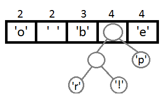](https://coolshell.cn/wp-content/uploads/2012/05/coada31.png)

继续我们的算法（我们可以看到，这是一种自底向上的建树的过程）：

[](https://coolshell.cn/wp-content/uploads/2012/05/coada4.png)

[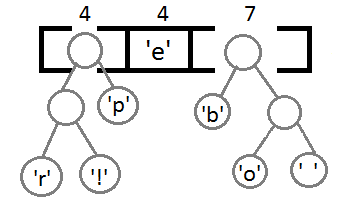](https://coolshell.cn/wp-content/uploads/2012/05/coada5.png)

[](https://coolshell.cn/wp-content/uploads/2012/05/coada61.png)

最终我们会得到下面这样一棵二叉树：

[](https://coolshell.cn/wp-content/uploads/2012/05/arbore_final.png)

此时，我们把这个树的左支编码为0，右支编码为1，这样我们就可以遍历这棵树得到字符的编码，比如：‘b’的编码是 00，’p’的编码是101， ‘r’的编码是1000。**我们可以看到出现频率越多的会越在上层，编码也越短，出现频率越少的就越在下层，编码也越长**。

[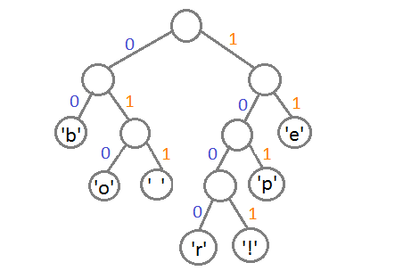](https://coolshell.cn/wp-content/uploads/2012/05/arbore_final_numerotat.png)

最终我们可以得到下面这张编码表：


| 字符 | 编码 |
| ---- | ---- |
| ‘b’  | 00   |
| ‘e’  | 11   |
| ‘p’  | 101  |
| ‘ ‘  | 011  |
| ‘o’  | 010  |
| ‘r’  | 1000 |
| ‘!’  | 1001 |


这里需要注意一点，当我们encode的时候，我们是按“bit”来encode，decode也是通过bit来完成，比如，如果我们有这样的bitset “1011110111″ 那么其解码后就是 “pepe”。所以，我们需要通过这个二叉树建立我们Huffman编码和解码的字典表。


这里需要注意的一点是，我们的Huffman对各个字符的编码是不会冲突的，也就是说，**不会存在某一个编码是另一个编码的前缀**，不然的话就会大问题了。因为encode后的编码是没有分隔符的。

于是，对于我们的原始字符串  beep boop beer!

其对就能的二进制为 : 0110 0010 0110 0101 0110 0101 0111 0000 0010 0000 0110 0010 0110 1111 0110 1111 0111 0000 0010 0000 0110 0010 0110 0101 0110 0101 0111 0010 0010 0001

我们的Huffman的编码为： 0011 1110 1011 0001 0010 1010 1100 1111 1000 1001

从上面的例子中，我们可以看到被压缩的比例还是很可观的。

作者给出了源码你可以看看（ C99标准） [Download the source files](http://en.nerdaholyc.com/wp-content/uploads/2012/05/huffman_string.zip)

（全文完）

# 用UNIX的设计思想来应对多变的需求

#####  [2012年05月03日 ](https://coolshell.cn/articles/7236.html) [陈皓](https://coolshell.cn/articles/author/haoel) 评论 [90 条评论](https://coolshell.cn/articles/7236.html#comments) 64,195 人阅读

之前，@[风枫峰](https://weibo.com/hfcc?source=webim) 在“[这是谁的错？](https://coolshell.cn/articles/7126.html)”中说过开发团队对需求来者不拒，而@[weidagang](https://weibo.com/weidagang) 也在“[需求变更和IoC](https://coolshell.cn/articles/6950.html)”中说过用IoC来最大程度地解决需求变更。今天我也想从Unix设计思想的角度来说说什么是好的软件设计，什么样的设计可以把需求变更对开发的影响降低。（**注意**：这并不能解决用户或是PM的无理需求，面对无理需求，需要仔细分析需求，而用技术的手段无法搞定这个事，但是可以减轻需求变更带来的痛苦） 我曾经在[《Unix传奇》的下篇](https://coolshell.cn/articles/2324.html)中写过一些Unix的设计哲学和思想（这里重点推荐大家看一下《*[The Art of Unix Programming](http://product.china-pub.com/197413)*》，我推荐过多次了），以前也发过一篇《[一些软件设计的原则](https://coolshell.cn/articles/4535.html)》，不过，这些东西都太多了，记不住。其实，这么多年来，我的经验告诉我，**无论是Unix设计，还是面向对象设计，还是别的什么如SOA，ECB，消息，事件，MVC，网络七层模型，数据库设计，等等，他们都在干三件事——解耦，解耦，还是解耦！**所谓解耦，就是让软件的模块和模块间尽量少地依赖起来。


#### 现实当中的例子

让我先举几个现实生活中的例子：

1、现实社会中，制造灯具的工厂完全不关心制造灯泡的工厂，制造灯泡的工厂完全不关心制造灯具的工厂，但是，灯泡和灯饰可以很完美地组合成用户所喜欢的样子（这和@[weidagang](https://weibo.com/weidagang) 在“[需求变更和IoC](https://coolshell.cn/articles/6950.html)”说到的那个PC的例子相仿）。他们是怎么做到的？

2、互联网上，做网站的人完全不用关心用户在用什么样的操作系统，什么样的客户端浏览器（当然事实上，浏览器的不标准让网站那边很头痛，这里只是举个例），反过来，上网的人也不关心做网站的人在用什么的技术开发网站。但是大家在完全不关心对方的情况下，可以很正常地协同工作在一起。为什么？

这样的例子太多了。为什么可以做成这样呢？因为大家依赖的是一个接口，灯具和灯泡并不互相依赖，他们依赖的是一个接口，做网站的人和浏览网站的人依赖的还是接口——HTTP协议。这就是面向对象的核心思想——依赖于接口而不是实现，这就是解耦。**当你看过这两个例子以后，我希望你以后设计的软件至少不能比我们现实社会中的这些方法要差**。不然，你就是在让社会倒退了，呵呵。 你会说，这和Unix，和应对需求变化有什么关系？好让我们再来看一下Unix的设计。

#### Unix设计的例子

下面是几个Unix下的例子：

1、Unix下，所有的硬件都可以通过文件的方式存取。其统统在/dev下。于是，软件和硬件的耦合被解开了，操作系统只需要把硬件统统变成文件，而程序只需要使用三个东西，一个是fd，一个是read()，一个是write()，就可以来操作任意的硬件了，这就是抽象，简单到不行。

2、Unix下，所有的命令都可以用管道串起来（管道绝对是个伟大的发明），这样，所有的命令间的交互全部解耦到只依赖于STD_IN, STD_OUT设备上。最酷的是，用户可以使用管道任意地拼装那些命令，以完成各式各样的功能。管道这个设计思想可以映射为今天的Web Service，你可以任意地拼装各种Web Service。

看到这里，你会发现，这还是解耦，本质上来说，也是一种依赖倒置——OOD的精髓。但是，Unix还不仅仅是这些。我们再来看几个例子：

1、Unix下，软件都是绿色地安装。在iOS上更明显——各个程序间基本上互不干扰，这个程序产生的垃圾文件不会影响到另一个程序。你删掉一个程序不会让另一个程序不举，各是各的空间。你可以删除这些程序，只要把内核心留着，系统照样可以启动。

2、Unix下，你可以通过设置一些环境变量，让多种环境同时存在，比如：某个LAMP用的是Apache 2.0, Mysql 4.0, PHP 4.0，某个LAMP用的是Apache 2.2, Mysql 5.0，PHP5.3，你不但可以方便地在系统中切换这两个环境，你甚至还可以同时启动他们。

3、Unix下，你可以随意地替换你想要的程序。比如，你不喜欢bash，你可以替换成ksh/csh等，你不喜欢awk ，你可以替换成 gawk ，所有的东西都像零件一样，你不喜欢什么，你就可以替换什么。

这三个例子告诉了我们——**当你把你的软件设计地耦合度非常地低时，你可以随意地组合，随意地安排你的系统**。相当的灵活，灵活到Windows到今天都学不会。

#### 应对需求变化

看到这里，你可能明白我想说的是什么了，你可能开始觉得怎么样的系统设计会更有效了。如果你还记得《[Steve Y 对平台的长篇大论](https://coolshell.cn/articles/5701.html)》，你就会知道我想说什么了。是的，我想说的就是，**当你真正了解了Unix的设计思想后，你会觉得今天的很多东西都是对Unix设计思想的一种传承或是变种**。这种东西就是：

1）**解耦，解耦，解耦**。尽量地让你的模块不要在实现上耦合，而是耦合某个规范，某个标准。

2）**KISS，KISS，KISS**。要做到高度解耦，你的模块就一定要很简单，当然不是说简单到只有几行代码，而是简单到只干一件事，并把这件事干到极致。然后通过某个标准拼装起来。

3）**拼装，拼装，拼装。**我想不起来是谁说的了，这句话是这样的，当我想用一个模块的时候，我直接调用就好了，没有必要像C或Java一样，还要编译。是的，拼装需要一个框架，需要一种标准协议，然后让所有的系统都耦合在这种规范上，各自独立运行，就像一个机器上的各个部件一样，当我觉得这个部件不爽，换了就是了。（例如，当我们在尝试不同的算法的时候）

想想建材和家俱市场，无论用户过来想装修什么，我都可以满足用户的不同需求，只要你是和家装相关，我基本上都能满足你，不是吗？无论你怎么变，只要不变态，我基本上都可以满足你。这就是解耦，拼装带来的好处。 你可能会说我说得太简单了，另一方面，你可能觉得有一些系统这样做没必要，我承认，不过，你可以有选择的或多或少地试试。（其实，我相信你已经在不自觉得或多或少地使用这种方式开发软件了） （全文完）

# 做个环保主义的程序员

#####  [2012年04月27日 ](https://coolshell.cn/articles/7186.html) [陈皓](https://coolshell.cn/articles/author/haoel) 评论 [461 条评论](https://coolshell.cn/articles/7186.html#comments) 447,134 人阅读

十多年前刚走入社会工作的时候，那时的中国软件开发根本没有什么版本管理，也没有什么编程规范，软件开发相比起今天来说非常地混乱，那时仅凭自己的一些学习总结了一些C语言编程中的好的小笔记，后来，这些笔记写成了一篇叫《[编程修养](http://blog.csdn.net/haoel/article/details/2872)》的文章。今天，又有些感触，想把这个话题扩大一下，从“个人修养”扩大到“环境保护”，所谓，穷则独善其身，富则达济天下，今天的技术人员比十多年前在技术和环境上都富有了许多，所以，也应该或多或少地担负起“达济天下”的责任了。

环境保护说白了就是保护一个良好的环境，为好的环境添砖加瓦，与破坏环境的人和事做斗争。其实，从技术人员来说，我们可以做一些力所能及的事。因为我们身边的技术环境还有很大的改善的空间，而一些来之不易的东西还需要我们去小心维护。另外，对于我们自己来说，少吃一些垃圾食品，健康生活，对自己也有益。

#### 环保主义软件开发

****先说说软件开发中的环保。比如：

- **环保需求**。当我们分析需求的时候，如果我们能做到不要像“[这是到底是谁的错](https://coolshell.cn/articles/7126.html)”一文中那样的来者不拒，如果我们在面对需求能多问这样几个问题：为什么 要有这样的需求？这个功能主要能解决什么 样的问题？为什么不是另外那一种？可不可以简化一下？其实，我们并不需要创新，只需要真正地问好这几个问题，我们就可以少看着一些弯路，少一些苦逼的加班，少一些内耗，少一些埋怨，也就可以为这个社会节省下一些资源，从而环保。

- **环保开发**。当我们做设计写代码的时候，如果我们多花一些时间去思考一下，我们就可以少一些代码（参看“[多一些时间少一些代码](https://coolshell.cn/articles/5686.html)”）。如果我们在一开始多思考一下，不要急着马上去用迭代的方式认识世界，多思考一下怎么把复杂的东西解藕，把复杂的东西简化，怎么做出一个优雅的设计，怎么让我们的程序少一些tricky的东西，怎么让我们的程序变得更简洁，更清楚，更直，在一开始思考一下未来需求可能的变化，未来软件需要怎么测试，未来的系统需要怎么的运维，那么，我们可以少一些返工，少一些重构，少欠一些债，少一些低级错误，少承担一些系统上线后的压力，那么，我们同样可以为这个社会节约一些资源。说得再直白一点，你用更少的代码产生出更高的效益，少耗一些CPU，就能省一些电，间接地保护了环境。（参看[ Why C++？](https://coolshell.cn/articles/6548.html)）

- **环保文化**。当我们在做软件开发的时候，如果你能影响并帮助你身边的同事，让他们写出更有修养更有效率质量更高的代码来，并发动团队树立工程师的文化，用团队去影响你的老板，你的公司，让他们能再多一点地重视技术，重视技术人员，那么你必然也会成为一个受益者。

- **环保管理**。当你做为一个管理者，做为一个方法推动者，如果你能更多地注重软件开发中真正创造生产力的程序员，为他们分忧，为他们铺路，为他们创造条件，那么，他们就会更多的回馈于你，就会少了一些不信任，就会少了一些被动，就会多一些主动，就会多一分责任，不但可以激发团队热情，同时可以有更大的生产力。同样是一种环保。

当然，这样的东西还有很多，你也可能会觉得太过理想主义了，我们不可能马上改变之，但是我们可以试一试。

#### 技术环保主义

其实，我们身边有很多可以做的技术环保工作。比如说，在Linux下少用root用户，SQL的时候，delete前先select，这样，你就不会做出一些让你后悔的事（参看[程序员那些悲催的事](https://coolshell.cn/articles/3980.html)），不会让你重头来过，从而至少不会浪费电能。写代码的时候要很小心管理好内存，以及各种资源，和线程并发，组织好的你的代码中的业务逻辑，做好单元测试，自动化回归测试，等，这样你就可以少一点遇到BUG，在遇到BUG时少一些时间去做调查。操作电脑的时候少下一些破解软件，少访问一些乱七八遭的网站，这样，你就会少中一些病毒，少一些损失，少一些重做系统，一样可以节省电能，最重要的是可以节省你的很多时间，让你可以去做一些更有价值 的事情。

当然，除此之外，我们更应该做为一个大气的，高瞻的环保主义者，比如下面的事情：

- **拒绝IE6**。如果你坚决不用IE6，并影响你身边的人，让他们升级IE6，尝试Chrome 或 Firefox，多告诉一下自己身边的朋友，怎么设计口令，怎么在互联网上保护自己的隐私和安全，怎么防木马，这样就能少一些问题，少装两次系统，就能省一些电，也就能多一些时间去做一些更有意义的事。也是在为整个世界整个人类做贡献。（**看看某些软件产商，占据着用户桌面的江山，还整天弹窗弹窗的，说这不安全，那不安全的。你还是做安全的，你居然能容忍IE6装在用户的机器上，你还做个屁的安全！**）2011年3月份，[我国的IE6用户的百分比是34%](https://coolshell.cn/articles/3921.html)， 那时中国网民4.5亿，平均每三个人中有一个，2012年3月份，中国的比例还有24%左右，不过[中国的网民数达到了5.13亿](http://it.sohu.com/20120116/n332237326.shtml)，也就是说，平均5个人里有一个，但是中国依然是全世界的IE6占有量最大的，参看下图（来自：[http://www.ie6countdown.com](http://www.ie6countdown.com/)）面对下面的图片，你作何感想呢？

*“**Friend Don’t Let Friend Use IE6**”*

[](http://www.ie6countdown.com/)

- **拒绝破解软件**。为什么要拒绝这些东西，因为你恐怕不知道这个软件的危害，包括一些汉化版的开源软件。这些软件中都会带 一些木马，比如：你下个putty的中文版，结果里有木马，人家就把你网站的口令盗了。关于网游，你可能不知道，连接网游私服的电脑基本上全是肉鸡，而 且，有很多的站点骗你下载软件破解程序，其实你下载到了一个木马。等等。这些生活都非常地不健康。

- **拒绝抄袭和山寨**。如果你鄙视那些赤祼祼地抄袭者，不使用他们的产品，有的人会说你就是想标榜自己的高尚，ZB，假高尚，大家会说你没有必要。其实并不是，你这样做，其实是为了“环保”，为了“保护一个健康的IT环境”，虽然你没有创新，但是你的行为却是在鼓励创新的环境，这样，如果当整个大环境都是在创新文化影响之下，才会更健康，技术人员也才会被尊重，而我们自己最终会受益。虽然只是抑制抄袭和山寨，但是我们间接地为社会做了贡献。（看看那N多的抄袭团队，加入他们实在是耗费这个社会的资源） （那个整天复制这个复制这个复制那个的公司，看看你自己做的那些产品线？乱糟糟的。**你自己看看，你有个人空间，还有群空间，还有校友录，然后你还要做个facebook式的“朋友”，还要搞个微博，然后还要搞个微信，大哥啊，你把这些相似度很大的东西放在了N多的服务器上，你不觉得浪费吗？你真是山寨之王啊，自己都一直在复制自己的产品**。还有人说你们的产品经理一流，真是脑残啊。对于你们的复制精神，我只能拜了！）

- **拒绝百度搜索**。如果你学得百度还是可以的话，你不妨看看我的微博（[这个](http://weibo.com/1401880315/ybN502xZ9)，[这个](http://weibo.com/1401880315/ye6wNFTUW)（[抓图](http://weibo.com/1401880315/ye6E0a4zN)），还有和[这个](http://weibo.com/1401880315/yfC4yzonW)和 [这个](http://weibo.com/1401880315/zlS3IbbEH)）（以前，[百度搜索出来的很多的开源软件（PuTTY、WinSCP）的第一个链接全是带木马的](http://www.techweb.com.cn/it/2012-01-31/1145906.shtml)，百度就是一个网上的病毒 )，你会发现百度不单单是广告的问题，很多东西根本搜不出来，包括他自己的内容。**用百度就是浪费时间，浪费计算资源**。如果你告诉你身边的朋友不要用百度搜索，而是用Google，并能耐心地教会他们翻墙，这样，我们就可以让那些“穷则穷凶极恶，富则为富不仁”的企业少一些自以为是，最重要的是可以让他们少制造一些垃圾信息和垃圾产品，世界少一些垃圾，自然也就环保了。

- **拒绝过重的商业氛围**。很多社区的商业氛围实在是太浓了，全都是广告。整个社区根本都不是为技术人员来做的，而为了那些软件产商，为了那些公司。他们只知道为那些大公司写软文，做广告，开大会。他们只想着挣钱。网页上全是花花绿绿的广告，打开他们的网页，就会多耗许多电，浏览他们网站上的文章，到他们的大会上听他们的软件广告分享，就会让自己的生命和时间浪费，自己消耗了体力不说，却还没得到什么营养，相当的不环保。

- **拒绝浮燥**。比如：浮燥地创业者们，被风投们一轮一轮地压榨。为了让风投满意，牺牲自己的初衷，去找水军刷排名，去发垃圾邮件，去烧钱买吆喝，制造虚假的繁荣，等等。另外，少去追那些新的技术，少一些浮夸，不要开口闭口的就是海量数据，高性能，要当个架构师，经理，要拿多少多少的工资，与其这样，还不如多静下心来研究一下那些十来年的技术，思考一下自己身边的问题，一步一步走踏实，少摔几个跟头，这样，你也就能多一些能力，多一些自信，也就能多做一些事，多解决一些问题，你的职业生源走好了，也就很环保了。

还有很多，我相信大家明白我想说什么。其实，我想说的是，**这不单单是一种“个人修养”，这也是一种对社会贡献的方式，更是一种“低碳环保”的生活方式**。

**让我们一起来做有修养的环保主义的程序员吧，少吃一些垃圾食品，多一些绿色的健康生活！**

***—————— 更新 2012年4月27 ——————***

我看到很多网友并不同意我的观点，并指责我的偏激和极端。挺好的，我知道，我说到了你们最敏感的地方，我很高兴。

**你可以对现实妥协，你可以继续钟爱你的垃圾食品，你可以继续使用百度搜索，你可以继续生活在墙内，我虽然替你感到惋惜，但是我不会勉强你，因为我能理解你可以不环保，本来也是，这些事情，你能做到固然好，你做不到，也是你的选择。每个人的生活每个人自己去选择，想健康地生活，或是不健康地生活，都是你自己的权利**。

（全文完）

# 游戏：VIM大冒险

#####  [2012年04月26日 ](https://coolshell.cn/articles/7166.html) [陈皓](https://coolshell.cn/articles/author/haoel) 评论 [142 条评论](https://coolshell.cn/articles/7166.html#comments) 132,667 人阅读

不知道大家是否还记得“[Vim简明攻略](https://coolshell.cn/articles/5426.html)”呢？你是不是对Vim的那一大堆热键很头痛呢？现在好好，下面这个游戏是一个使用VIM热键玩的游戏。你可以在玩游戏的过程中熟悉Vim的热键。

**你可以点击图片，或是图片下的网址打开这个游戏**

**http://vim-adventures.com/**

[](http://vim-adventures.com/)

我试玩了一下这个游戏，真的很不错，下面是一些我给的游戏攻略。


- 第一关，场景一，首先是使用vim的h, j, k, l四个键来控制方向。（如果你妄图使用光标键的话，系统会出现黄色警告的）你需要使用h, j, k, l 四个方向走到图的右边，找到一把钥匙。（注意：迷宫墙上有些斜面，你可以通过斜面），找到钥匙后，钥匙会出现在你的右上角的位置，示意着你的光标要向那个方向移动，当你到达一个门的时候，会自动开门，进入第二关。

- 第二关，每一关的小人都会给你一些英文提示，教你怎么玩。关于第二关，你会看到你过不去，小会提示你，那些绿草地就向我们文件中的行，你在行上按上下键，光标会在这一列上移动，如果这一下面的一行没有这么长，光标会到行尾。这个vim的特性会告诉我们如何过这一关——移到最上面的行尾（因为是最长的可以越过最下面的障碍），然后按下光标键，到最后一行时你就会发现光标已经过了阻碍。如此通过第二场景，达到一个小人后，按下键，进入第二关。

- 第三关，我们可以看到地图上有很多的字母，我们还可以看到有两个键，一个是w，一个是e，我们可以把光标移到w上吃到w后，我们就可以使用w键了——以单词为单位移动光标，这样，我们就可以吃到e了和第一把钥匙，我们按w和e我们就可以看到这两个按键都是以单词为单位移动光标的，一个是单词头，一个是单词尾（参看我以前给大家的[vim按键速查卡](https://coolshell.cn/articles/5479.html)）。然后，我们在最后一行通过单词跳跃到最右边吃到b—— 回到该单词的头，可以得到第二把钥匙。然后往上走，使用b 和 e键拿到第三把钥匙。然后就可以打开三个门通关了。

[](http://vim-adventures.com/)Vim Adventures 第三关

然后，就需要你注册才能玩了。作者说，因为需要发的邮件太多了，所以现在系统发不出邮件了，请等待。所以，不知道作者是用来收集邮件的，还是没有开发完，不过，**这个游戏的创意实在是太赞了**。推荐给大家。

**哪位会做游戏又熟Vim的朋友也能做一个？**

（全文完）

# 这到底是谁之错？

#####  [2012年04月19日 ](https://coolshell.cn/articles/7126.html) [Hfcc8685](https://coolshell.cn/articles/author/hfcc8685) 评论 [113 条评论](https://coolshell.cn/articles/7126.html#comments) 57,875 人阅读

【感谢 @[风枫峰](http://weibo.com/hfcc?source=webim) 投递本文】

**故事一：**
背景介绍：RT是一个外包公司，ZWZX是项目承接公司，YD是甲方。

RT公司每天下班的时候都会接到ZWZX负责人的电话，询问一天的工作情况，然后布置任务要求晚上加班做完，RT公司的员工很无奈也很气愤因为每天都要加班，员工们就问项目经理：“为什么天天加班赶需求，今天才提一个需求，明天就要上线，还让不让人活了?” 项目经理无奈的说：“我有什么办法啊？这是人家ZWZX负责人说的啊，对方逼得紧。”

多次以后项目经理也忍不住了，就问ZWZX的负责人怎么天天这样啊，ZWZX的负责人就说了:”明天就要向YD的负责人展示这个页面，我也没有办法啊？YD那边老总就是这么要求的，我怎么办，我也不想这样啊？”

然后RT的项目经理实在受不了了就辞职了，新上任的项目经理又会走他的老路，因为从开始我们就被培养“满足客户的需求是最重要的”。RT的员工也就这样一直抱怨着，一直忍受着。天天在心里咒骂YD的老总真是没有人性，不拿人当人看啊！

人换了一批又一批，加班也就慢慢的变成了应该的，你不加班说明你不敬业，不合格。

**故事二：**
IE6一直存活着，所有的前端开发人员都痛恨它，都不想兼容它，可是产品经理看到IE6的市场占有率还是这么高，就会要求前端开发人员必须兼容IE6。


矛盾又来了，就像故事一一样，前端开发人员天天抱怨，产品经理也天天抱怨，但是面对IE6的市场份额，产品经理会劝开发人员说：“我有什么办法啊？IE6的市场份额就是这么高，不兼容怎么办啊？我也不想啊！” 开发人员也就这样忍受着，然后不断地抱怨用IE6的用户低端，没文化，怎么还用IE6啊！天天兼容IE6就够烦的了，还怎么创新啊！

**这两个故事里出现的问题到底是谁的错误引起的？** 

故事一的罪魁祸首是YD的老总吗？

故事二的罪魁祸首是那些还用着IE6的用户吗？

从这两个嫌疑最大的罪魁祸首眼中看一下这两个故事：

**故事一：**
我是YD的老总，我要建立一个网站，找到了ZWZX公司，签订了合同，我提需求他们实现。

我不懂制作网站，可是我才思敏捷，创意无限，不停的会有好点子从我的脑海里蹦出来，每当有一个好点子蹦出来后，我都会给ZWZX公司的负责人讲清楚我的想法，让他实现，开始我不知道做一个页面需要多长时间。第一次我试探性的说了一周必须把我这个点子做出来，ZWZX公司负责人很痛快的答应了，一周后我果然看到了这个功能。

可是会不会我给他们的时间太长了？对！肯定是，要不也不会答应的这么痛快。这些人啊！天天就是想拖时间，好多骗我点钱。

点子又来了，这次我要求5天做出来，这个点子和上个点子类似，我倒要看看5天能不能做出来~ ZWZX公司负责人一副痛苦的表情，我会不会逼的太紧了，5天是不是真的做不出来？到时候看看吧，如果5天没做出来估计是我给的时间太少了。

5天过去了ZWZX公司的负责人很高兴的拿出了我要的功能实现，哎，看来开始真的骗了我两天。就是不知道5天会不会还是多了啊？下次给3天~

又拿出来了，虽然他装的好像时间太紧似的，可别以为我不知道，你第一个功能最多3天就做出来了，我还给了你7天的项目经费，你们多赚了我多少啊！！！！ 真是没良心。 下次1天！！！

啊啊啊啊啊啊啊啊!!! 1天就出来了，这些人。。。。。 有没有良心，原来做这个这么简单，以后就给1天，不 ！ 一天N个功能。

**故事二：**
我买了个电脑，没什么别的用途，就是打开电脑上上网，上上QQ和儿子聊聊天，QQ是儿子给我装上的，这样我就可以和他视频了。有一次QQ提醒我说我的QQ版本太低了，不能视频了，我打电话问儿子，儿子说按提示升级一下QQ就行了，呵呵，我按QQ的提示，儿子的指示一步一步的升级QQ成功了，看来电脑也不难啊！

**到这里您认为开始的两个故事的罪魁祸首是谁啊？**

我们一直以加班，甚至通宵去满足客户不合理的要求，只因为他是客户。只因为人人都认为满足客户的要求是我们最大的
价值，可是不合理的要求不能去拒绝吗？套用刘欢说的一句话“我们是不是活的应该有些尊严”，一味的迎合客户，只会让我们自己越来越痛苦，反而得不到用户的尊重，肯定。

我一直有个疑惑，很多人说网站不支持IE6，而选择让用户去升级IE，这样的用户体验不好！如果按照按照这个逻辑，是不是我们都应该是Web应用，而且都应该是IE6下的Web应用呢？为什么微软还要出WIN8，一直XP不是挺好的吗？让用户升级系统，用户体验多么不好啊？QQ，360，搜狗输入法，等等客户端软件用户体验不都不好吗？ 都还要用户下载。

实在搞不懂为什么我们做个东西非要去支持IE6呢？检测到用户是IE6，给个提示，给个升级链接不就行了？ 这样做用户体验是有多么不好吗？ 你天天去支持IE6，还要天天磨叽用户使用IE6，你不觉的很矛盾吗？再说我一个普通用户，你如果不提醒，我怎么知道要升级IE6啊？

**对于遭遇了故事一，故事二的人只能送上一句话“哀其不幸，怒其不争！”**

原文链接：[http://hfcc8685.github.com/blog/2012/04/19/shui-zhi-cuo/](https://hfcc8685.github.com/blog/2012/04/19/shui-zhi-cuo/)

# 挑战无处不在

#####  [2012年04月17日 ](https://coolshell.cn/articles/7048.html) [陈皓](https://coolshell.cn/articles/author/haoel) 评论 [167 条评论](https://coolshell.cn/articles/7048.html#comments) 83,221 人阅读

面试过一些应聘者，当我问到为什么换工作的时候，**他们都会告诉我，现在的工作没有挑战，无聊，所以想换一个有挑战的工作**。于是我问了一下他的工作情况，发现那些有挑战的东西他还没有搞懂。我总是为有这样的认识的朋友感到惋惜，因为我总是认为有挑战的东西无处不在啊，不能因为工作上没有，自己就放纵了自己。比如，面试过一个做地图的工程师，他的工作是做计算地图上任意两点的最短或最优路径的一部分功能。我觉得这个事很有挑战，也有难度，应聘者说，没什么挑战，因为他做的东西只是调用相关的算法库。他在这个项目干了2年了，当我问他有没有看过算法库，知不知道地图是怎么存储的？他却告诉我，**因为没有去做，所以就没有去了解，等做的时候再了解**（我希望有这样想法的人都去看看[程序员的谎谬之言还是至理名言？](https://coolshell.cn/articles/4235.html)）。这样的例子很多，很多应聘者在面试中不能和我一起解决某个问题的时候，比如：OOD，数据库设计，系统设计，等，**他们都会告诉我，不好意思，因为没有做过相关的事情，所以就不懂了，所以，他需要一个像我们这样的项目来学习和锻炼**。我并不要求你能解决你所不擅长的问题，但毕竟数据库，OO，系统设计都是软件开发的基础知识，多少要懂一些吧。

但另外一方面，他们都会告诉我他们对技术充满和热情和兴趣，有着很强的学习能力，也有很能吃苦的态度。这也许是某面试宝典上看来的，面经上可能都会说，如果面对不能作答问题，可以说一下自己的态度和决心。可惜的是，我并不这么想的，我在我的两篇关于招聘的文章里（[我是怎么招聘程序员的](https://coolshell.cn/articles/1870.html)，[再谈我是怎么招聘程序员的](https://coolshell.cn/articles/4506.html)）都说过一些我对如何择人的想法。这里重点说明一下其中两个观点：

- **关于热情和态度，说白了就是不要给自己找借口**。比如：“工作忙事多没时间学所以可以不懂”，“工作中没用到所以可以不懂”，“工作没有挑战，一直没有遇到合适的项目”等等。时间可以挤，工作之余可以学，随时随地去思考，挑战是无处不在的…… 想想那些你有热情的事，你会发现，几乎没有什么可以阻止你去做那些事。

- **对于某些事情，如果以前没有在你身上发生过，那么这个事情在未来也不会发生**。如果你以前没有对你接触过的东西去学习，去深挖，去思考，去改善，那么我不会相信你会在未来面对新的东西的时候也会有这样的态度；如果你以前没有用业余时间学习一些项目之外的东西，那么我也不会相信你会在未来会这样做；如果你以前没有把你的热情和态度转换成你的知识，经验和成果，那么我也不会相信你会在未来能做到。

这两个观点可能太刻薄了，但是，当我回想我自己的经历的时候，观察程序员的成长过程的时候，我发现，优秀的程序员都是相似的，当他们还在是一个菜鸟的时候，就已经有各种成为高手的苗头了，这些苗头就是——**他们热爱思考，喜欢解决难题，对新鲜事物非常好奇，总是找人讨论，可以用自己的业余时间狠命研究很多和工作无关的技术，会在业余的时间里写些有趣的小程序，或是会把自己的思路书写下来，等等，等等**。


#### 一些问题

我这样说，大家可能会觉得“挑战无处不在”这句话太虚了，而且可能不明白什么叫“热爱思考”，这里，我把我的或别人的思考的东西罗列一下，这些问题，有的会让我思考推敲，有的会让我疯狂地查资料，问人，或是找人讨论，询问。大家不妨可以跟着我一起思考一下。

酷壳上有一些小问题，比如：[火车运煤问题](https://coolshell.cn/articles/4429.html)，[赛马问题](https://coolshell.cn/articles/1202.html)，这些问题都不够实际，我觉得也这些问题有点无聊，我们不妨观察一下我们身边的东西，我们就可以看到很多有挑的战的东西，对于这些问题，如果是你来做，你会怎么做呢？

0）许多年前，当我看到珊瑚虫QQ把IP转成地实际地址的时候，我就在思考，如果我有一个IP网段的数据（[全球IP地址数据](https://coolshell.cn/articles/244.html)），我怎么来完成这个功能呢？比如：某地点的IP网段是：10.10.1.* – 10.10.5.*。我要有一个IP地址是：10.10.3.20，我怎么匹配这个网段？用Hash表吗？好像有问题。把IP字串转成整型？排序+二分法，好像更容易解决一些，但是如果有一些修改的话好像有点不方便。用树型结构（森林）会不会更好一些呢？如果我要通过地点反查IP段呢？

1）网上短网址服务，你有想过这个短网址生成的算法是什么，如何能做到能最短？怎么查询？你也许觉得会用key-value的NoSQL。那么，如果对于同一个URL，如果要重用已生成的短网址，你怎么用key-value的NoSQL来解决？

英汉词典的检索和这个很相似，如果通过英文查汉语，又通过汉语查英文？如果是N多种语言的互相翻译呢？你的数据存储和检索如何做呢？

2）当我看到Dropbox这样的云同步的软件的时候，我不知道你是否会和我一样会去思考，在多个设备间的文件同步是怎么做的？如果网盘上有几万，甚至几百万个文件，当要和我的本地数据同步时，他如何比较经济地知道哪些文件更改了？需要向服务端同步或是向客户端同步。更进一步，你有没有想过没有中心结点的文件同步问题？你有没有想过，文件冲突的问题？

3）我们的新员工入职的时候，有一些公司会给新员工的帐号生成一个随机口令，然后新员工可以在登录后修改口令（我一直在想我们的银行应该为用户生成一个随机口令，而不是设置一个6个0或是6个8的初始口令）。那么，对生成随机安全口令的算法知道怎么做吗？如果你写出这个算法来了，你怎么证明这个算法是足够随机，生成的密码强度足够大的？（你会发现，测试口令是否随机是否安全的程序，会比生成器更难写）

4）关于动态密码RSA SecurID（如下图），这个小设备上的6位数字会每60秒变一次，在你登录的时候，需要输入这6位数字，服务器上会认证这6个数字，那么这个事怎么做？再试想一下，这样的小设备我要发给我的客户，我希望我的每个客户都使用不一样的随机算法，就算是算法一样，算法的种子也不能一样。那么，如果我的客户一共有百万甚至千万，我的服务端怎么管理这些用户的SecurID？


5）看看我们的网银或是ATM的用户登录功能，如果你登录时输错口令超过3次以上，你的帐号就会被冻结，需要去柜台重置口令。这个功能看上去很安全，因为可以防止黑客在线尝试破解你的登录口令。不过这又带来了另一个问题，如果有一个恶意用户知道你的卡号，他就上网或是造个卡故意输错你的口令，导致你的帐号被冻结，让你一次又一次地去银行排队重置。面对这样的情况，你该怎么解决？

6）当你在网上购物的时候，你会去一些电子商务的网站，这些网站都会对他们的产品进行分类，有大分类有子分类。你进到分类后，你可以通过不同的属性来过滤不同该分类下的商品，注意，不同分类下的商品的过滤属性不一样，如，手机分类和电视分类的属性都不一样。试问，你如何设计你的数据库表结构？

7）当你在泡各种论坛或SNS社区的时候，你会看到，用户在互相回复的时候存在一个问题，尤其是用户量很大的时候，大家的回复完全交织在一起什么 也看不清楚。以前有的论坛使用树形列表来解决这个问题，树形列表好是好，但是把一棵大树放在那里还是很难看。Twitter.com给了一个非常不错的解决方式，就是所有人的回复或是回复的回复都按时间线放在一起，如果你要查看某回复的上下文的话，点击一下这个回复就可以看到了（我在我在“[国内微博和Twitter的最大不同](https://coolshell.cn/articles/5247.html)”中批评过这个事）。新浪微博在禁评论事件后也开发出了这个功能。你知道这个事怎么做吗？

更进一步，新浪微博的设计上有很多的缺陷，单说新开发的“查看评论”功能这个事来说，还是不完美，因为某些评论会随着转发带到别的地方去，他的“查看评论”功能只能看到当个贴子下的东西，不能把所有转发出去的贴子的评论一起综合起来。虽然这对于用户使用来说没有什么在不了的，但是对于软件设计来说，我们不妨做一个练习，可以思考一下，怎么样设计会更好。

再举一反三，有时候，我发现多个网友会提出同样的问题，我很想用一个回复同时回复他们。如果有这样的功能的话，我们的回复就会从一个树形变成另外一种形状了，我们又该如何设计才能支持这样的功能呢？

8）说到新浪微博，我就想多说几句，我最近观察到了两个事：

- 一个是验证码的事，如果你在你的帐号设置里设置了“登录需要验证码”，你会发现，在登录新浪微博的时候，仅当你输对了口令后，系统才会提示你输入验证码。为什么呢？因为，这个“登录需要验证码”这绑定在你的帐号设置里的，所以，要取这个设置，就需要你登录成功（？！），老实说，这个功能在设计上有点二（中国特色）。如果是你，你怎么设计呢？

- 另一个事情是新浪微博或Twitter的用户名修改后，被他人@过的信息就再也链接不到你这里来了。我们来试想一下，如果是你，你怎么解决这个问题？（我的[我的微博里讨论过这个事](https://weibo.com/1401880315/yclT9m6Fp)，不一定对，供大家参考）

9）我有时候我会发一些快递，有时候是一些小东西，有时候是一些大包裹，有时候近，有时候远。我发现一个有趣的现象，就是快递员来收件的时候，快递的价格都是快递员自己说了算的，我还可以和他们砍价。我观察到他们会以距离，重量大小来订价。于是我在想如果你要运营一个物流公司，你作为这个物流公司的程序员，你需要开发一个软件来标注快递价格，你会怎么做？比如，这个快递公司会说，在北京五环以内是一个价，以外是一个价，出省后，上海以北是一个价，上海以南是一个价，等等，这只是北京的，如果把全国的各个城市到别的城市的价格都考虑进来，还要受到重量，体积，价格，是否加急等等因素的影响，你的数据库设计要怎么做呢？

A）国内的水军太恐怖了。他们活动的刷排名，刷信用，刷积分，刷粉丝等等地方，你是否想过如何解决这个问题？还有广告联盟的欺诈问题，等等。这些东西，有的还是可以通过技术手段进行限制和计算的，你有思考过应该使用什么样的方法吗？

B）说到水军就不能不提垃圾邮件和垃圾短信。你有没有想过邮件系统怎么过滤垃圾信息的？

C）关于推荐功能，这必然是一个热点，这是软件产品从request -> response的被动方式到主动方式的进化。微博上有推荐关注者的功能，电商有推荐商品的功能，豆瓣上有推荐影片音乐书籍的功能。不同的领域的推荐算法各不相同，你有没有思考过，如果是你来做推荐算法的时候，你会怎么做吗？更进一步，推荐通常伴随着学习和匹配，学习用户的行为，匹配相似的东西，你想过怎么学习用户的行为，怎么匹配相似的东西了吗？

D）关于微博，某名人有几千万的粉丝，当这个名人发一个微博的时候，需要通知这几千万个粉丝，这个在系统架构上应该怎么做？如果某天这个名人与人发生口角，和人吵架，拼命的刷微博，那么，系统架构要怎么设计才能支持这样的事呢？

E）想想火车票的分段卖票的方式，现有的解决方案是为每个站点预留票，于是我们可以看到火车始发时，有很多空坐，这些空坐都是留给下一个站点的，我们能否开发出一个系统来，可以把一条线上的这些这站上那站下的旅客统筹规划一下，制定出一个最经济的方式，让火车运行得更有效。

F）对于地铁公交网络，我们希望这个网络既能有更多的覆盖，又能节省路线，你能不能设计出一个系统，当我们输入一些数据（如：站点，是否终点或起点站，该站的下一站可能方向（多个），该站是以上车为主，还是下车为主，等等），你的系统能自动安排出各种线路吗？

**这样的问题实在是太多了，都是可以让我们去思考的，并不一定有经济效益，但是至少可以让你锻炼一下怎么去分析问题，怎么去思考，怎么去解决问题**。

#### 总结

综上所述，我想说的是：

1） 只要你想，挑战是无处不在的。那怕是你现有的觉得无聊的东西，只要你想做到极致，那怕是一个简单的功能（比如[用户登录的功能](https://coolshell.cn/articles/5353.html)）也会让你充满挑战。

2）观察身边的事物，去思考，去调查，举一反三，这才是你成长的源泉。不要把你的成长推给客观原因。

3）我的[软件开发的三重门](https://coolshell.cn/articles/6526.html)中说过，第三重门是解决实际问题，让你的业务处理更为的智能，更为地强大。我不知道为什么这一两年，我们的圈子里所有的人都在关注着“云”，“海量数据处理”，“高性能架构”这样的东西，尤其是那些性能调的高性能的东西并不很难，而这些更为实际问题更有挑战性，也更有前景。

（全文完）

# 我们需要专职的QA吗？

#####  [2012年04月11日 ](https://coolshell.cn/articles/6994.html) [陈皓](https://coolshell.cn/articles/author/haoel) 评论 [274 条评论](https://coolshell.cn/articles/6994.html#comments) 145,633 人阅读

这个文章必然是有争议的，我在我的[微博](https://weibo.com/haoel)上讨论过很多次了，每次都是很有争议的。有不同的观点，有争论总是一件好事，这样可以引发大家的思考。所以，对于我的这篇博文，如果你赞同我的观点，我会感到高兴，如果你会去认真地深入思考，我也会高兴，如果你反对，没关系，可以讨论。

在此之前，我想说明一下我观点里的这个“专职QA”是怎么定义的。

1. 其是很多公司成立的专门做测试的技术人员，仅测试不开发。
2. 这些QA对于软件开发技术并不熟悉，甚至不懂。

我经历过一些公司都有专职的QA团队（专职的测试人员），自从上个公司我的开发团队在一个项目上被QA部门搞得一团糟，我越来越怀疑专职QA存在在意义。我的观点不一定对，但请让我鲜明地表达一下——**我觉得是不需要全职的QA的，甚至不需要QA这一专职角色或部门，因为，不懂开发的人必然做不好测试。就像不懂开发的研发经理必然管不好研发团队一样。**我越来越觉得Dev应该应该是做测试最合适的人选，这必然是未来的趋势 （因为我已经看到了中国程序员的进步，相比起10年前，今天的程序员已经是非常全面了，再来十年，必然证明我的观点是对的）。

在我正在展开说明之前，我想引用两篇文章：

#### 两篇文章

一篇是 “[On testers and testing](http://sriramk.com/blog/2012/01/testing.html)”([中文翻译](http://www.aqee.net/on-testers-and-testing/))，本文的作者Sriram Krishnan是一名程序员，曾在Yahoo和微软工作过，开发过很多软件，曾被纽约时报[报道](https://www.nytimes.com/2011/02/27/business/27novel.html)，写过[一本书](https://amzn.to/progazure)，本文是他的一篇博客。他在文章中表达了这几个观点——

> 大多数的开发团队并不需要一个独立的测试角色。即使要有，那么所有的开发时间比上所有的测试时间应该 >20:1的。。证据吗？光看看一些从古至今最成功的软件开发团队就知道了。不论是当今的Facebook，还是30年前最初的NT团队，很多伟大的产品都是出自没有或很少测试人员的团队。
>
> 开发人员应该测试自己的代码。没什么可说的。背后的道理并不重要。这包括单元测试，全覆盖的自动化测试或手工测试或组合测试。如果你的开发人员不能/不愿意或认为这“不归我管”，那你需要更好的程序员。

另一篇文章是邹欣的“[现代软件工程讲义 9 测试 QA 的角色和分工](https://www.cnblogs.com/xinz/archive/2012/04/09/2439695.html)”，这是一篇很不错的文章。他在文章里提到了分工的必要性，比如第三方的鉴定机构，**并且也指出了分工的一些问题，比如，画地为牢的分工，无明确责任的分工，等，这些问题直接命中了分工的要害**。我隐约觉得，我和邹欣的很多观点是相同的，我们内容上是相同的，只是形式上还有分歧。另外，我的观点太鲜明了，从而容易导向极端的理解。

你看，**我们都同意，Dev要懂测试，QA要懂开发，只不过分工不同，既然你中有我，我中有你，那就不要分彼此了，一起携手开发测试吧**。（另外，我个人觉得不懂开发的测试人员不可能测试得好）

***—- update—-*** {

   //本篇文章出来后，网上出现了一些对此讨论的文章，我一并更新在这里
【 《[对《我们需要专职QA吗？》的回应](https://www.cnblogs.com/guanhe/archive/2012/04/12/response_to_do_we_need_qa.html)》作者：[@段念-段文韬](https://weibo.com/n/段念-段文韬) 】
【 《[关于“我们需要专职的QA吗”》](http://blog.sina.com.cn/s/blog_55ba8b460100yawe.html)作者：[@Jacky郭](https://weibo.com/u/1764108363) 】
【 《[我们需要专职的QA吗？（评）](http://blog.sina.com.cn/s/blog_7022adbf0100zgqo.html)》作者：@[Monkey陳曄曄](https://weibo.com/aiwanglinjun) 】
【《 [《我们需要专职的QA吗？》读后感](http://thinkcool.weebly.com/1/post/2012/04/qa.html)》作者：@ [花生色魔叔](https://weibo.com/bluesgu)】

}


#### 我的故事

我再说说我最糟糕的QA经历吧，这个公司的QA部门只做测试，他们的leader觉得所有的test design和test 的过程都不需要Dev参与，他们是独立于Dev之外的部门，他们几乎不关心Dev的设计和实现，他们只关心能跑通他们自己设计的test case。但是去执行Test Case的时候，又需要Dev的支持，尤其在环境设置，测试工具使用，确认是否是bug方面，全都在消耗着Dev的资源，最扯的是，他们对任何线上的问题不负责，反正出了问题由Dev加班搞定。

我有一次私自review他们的test case的时候，发现很多的test case这样写到 – “Expected Result：Make sure every thing is fine” ，WTF，什么叫“Every thing is fine”？！而在test case design的时候，没有说明test environment/configuration 是什么？没有说明test data在哪里？Test Case、Test Data、Test Configuration都没有版本控制，还有很多Test Case设计得非常冗余（多个Test Case只测试了一个功能），不懂得分析Function Point就做Test Design。另外，我不知道他们为什么那么热衷于设计一堆各式各样的Negative Test Case，而有很多Positive的Test Case没有覆盖到。为什么呢，因为他们不知道开发和设计的细节，所以没有办法设计出Effective的Test Case，只能从需求和表面上做黑盒。

在做性能测试的时候，需要Dev手把手的教怎么做性能测试，如何找到系统性能极限，如何测试系统的latency，如何观察系统的负载（CPU，内存，网络带宽，磁盘和网卡I/O，内存换页……）如何做Soak Test，如何观察各个线程的资源使用情况，如何通过配置网络交换机来模拟各种网络错误，等等，等等。

测试做得也不认真，大量的False Alarm，都是环境问题，比如：安装新版本后没有重启服务，没有使用新的配置文件，网络配置，等等，等等。

在项目快要上线前的一周，我又私自查看了一下他们的Test Result，我看到5天的Soak Test 的内存使用一直往上涨，很明显的内存泄露，这个情况发生在2个月前，但是一直都没有报告，我只好和我的程序员每天都加班到凌晨，赶在上线前解决了这个问题。但是，QA部门的同学们就像没发生什么事似的，依然正常上下班。哎……

为什么会这样？我觉得有这么几点原因（和邹欣的观点一样）

1. 给了QA全部测试的权力，但是没有给相应的责任，
2. QA没有体会过软件质量出问题后的痛苦（解决线上问题的压力），导致QA不会主动思考和改进。
3. QA对Dev的开发过程和技术完全不了解，增加了很多QA和Dev的沟通。
4. QA对软件项目的设计和实现要点不了解，导致了很多不有效的测试。

**注：我无意在这里贬低QA的能力工作。只是我看到了QA因为没有参与开发的一些现实问题。**

#### 我的观点

邹欣对于分工出现的问题给出了两点解决方法：

> - 充分授权和信任（Empower team members）
> - 各司其职，对项目共同负责（Establish clear accountability and shared responsibility）

我的观点是，**理论上正确，操作上太虚了。这就像我们国家喊的“为人民服务”的口号一样，没有具体的方法，根本无法落实。**

我无意在这里贬低QA的工作，我也无意因为这个事走向另一个极端。但是，我在现在公司的经历，还有很多新兴公司的做法，**我越来越觉得软件开发，真的不需要专职的QA，更不需要只写代码不懂做测试的专职的Dev**。观点如下：

**1）** **开发人员做测试更有效**

- 开发人员本来就要测试自己写的软件，如果开发人员不懂测试，或是对测试不专业，那么这就不是一个专业的开发人员。
- 开发人员了解整个软件的设计和开发过程，开发人员是最清楚应该怎么测试的，这包括单元测试，功能测试，性能测试，回归测试，以及Soak Test 等。
- 开发人员知道怎么测试是最有效的。开发人员知道所有的function point，知道fix一个bug后，哪些测试要做回归和验证，哪些不需要。开发人员的技术能力知道怎么才能更好的做测试。

很多开发人员只喜欢写代码，不喜欢做测试，或是他们说，开发人员应该关注于开发，而不是测试。这个思路相当的错误。开发人员最应该关注的是软件质量，需要证明自己的开发成果的质量。**开发人员如果都不知道怎么做测试，这个开发人员就是一个不合格的开发人员**。

另外，**我始终不明白，为什么不做开发的QA会比Dev在测试上更专业？ 这一点都说不通啊**。

**2）减少沟通，扯皮，和推诿**

想想下面的这些情况你是否似曾相识？

- QA 做的测试计划，测试案例设计，测试结果，总是需要Dev来评审和检查。
- QA在做测试的过程中，总是需要Dev对其测试的环境，配置，过程做指导。
- QA总是会和Dev争吵某个问题是不是BUG，争吵要不要解决。
- 无论发现什么样的问题，总是Dev去解决，QA从不fix问题。
- 我们总是能听到，线上发生问题的时候，Dev的抱怨QA这样的问题居然没测出来，
- QA也总会抱怨Dev代码太差，一点也不懂测试，没怎么测就给hand over 给QA了。
- QA总是会push Dev，这个bug再不fix，你就影响我的进度了。
- 等等，等等。

如果没有QA，那么就没有这么多事了，DEV自己的干出来的问题，自己处理，没什么好扯皮的。

而一方面，QA说Dev不懂测试，另一方面Dev说QA不懂技术，而我们还要让他们隔离开来，各干各的，这一点都不利于把Dev和QA的代沟给填平了。**要让Dev理解QA，让QA理解Dev，减少公说公有理，婆说婆有理的只站在自己立场上的沟通，只有一个方法，那就是让Dev来做测试，让QA来做开发**。这样一样，大家都是程序员了。

**3）吃自己的狗食**

真的优秀的开发团队都是要吃自己狗食的。这句话的意思是——**如果你不能切身体会到自己干的烂事，自己的痛苦，你就不会有想要去改进的动机**。**没有痛苦，就不会真正地去思考，没有真正的思考，就没有真正的进步**。

在我现在的公司，程序员要干几乎有的事，从需求分析，设计，编码，集成，测试，部署，运维，OnCall，从头到尾，因为：

- 只有了解了测试的难度，你才明白怎么写出可测试的软件，怎么去做测试的自动化和测试系统。
- 只有自己真正去运维自己的系统，你才知道怎么在程序里写日志，做监控，做统计……
- 只有自己去使用自己的系统，你才明白用户的反馈，用户的想法，和用户的需求。

所以，**真正的工程师是能真正明白软件开发不单单只是coding，还更要明白整个软件工程**。只明白或是只喜欢coding的，那只是码农，不能称之为工程师。

**4）其它问题**

- **关于SDET**。全称是Software Development Engineer on Test。像微软，Google， Amazon都有这样的职位。但我不知道这样的职位在微软和Google的比例是多少，在Amazon是非常少的。那么像这样的懂开发的专职测试可以有吗？我的答案是可以有！但是，我在想，**如果一个人懂开发，为什么只让其专职做测试呢？这样的程序员分工合理吗？把程序员分成两等公民有意义吗？试问有多少懂开发的程序员愿意只做测试开发呢？**所以，SDET在实际的操作中，更多的还是对开发不熟的测试人员。还是哪句话，不懂开发的人是做不好测试的。

- **如果你说Dev对测试不专业，不细心，不认真**，那么我们同样也无法保证QA的专业，细心和认真。在Dev上可能出现的问题，在QA也也会一样出现。而出了问题QA不会来加班解决，还是开发人员自己解决。所以，如果QA不用来解决问题，那么，QA怎么可能真正的细心和认真呢？

- **如果你说不要QA的话，Dev人手会不够**。你这样想一下，如果把你团队中现有的QA全部变成Dev，然后，大家一起开发，一起测试，亲密无间，沟通方便，你会不会觉得这样会更有效？你有没有发现，在重大问题上，Dev可以帮上QA的忙，但是QA帮不上Dev的忙。

- **第三方中立，你会说人总是测不好自己写的东西，因为有思维定式**。没错，我同意。但是如果是Dev交叉测试呢？你可能会说开发人员会有开发人员的思维定式。那这只能说明开发人员还不成熟，他们还不合格。没关系，只要吃自己的狗食，痛苦了，就会负责的。

- **磨刀不误砍柴功**。如果你开发的东西自己在用，那么自己就是自己天然的QA，如果有别的团队也在用你开发的模块，那么，别的团队也就很自然地在帮你做测试了，而且是最真实的测试。

- **你可能会说吃狗食就是个笑话，因为如果是我，我把事干烂后，就离职走人了，让别人去吃我的狗食**。这个在现实中的确会发生，也是很现实的。但是想一想，你为什么在一开始让他把事干烂了？另外，如果你的团队在设计评审和代码评审里没有把好关，让某人把事给干烂了，那么这个人的离职带来的问题还是这个团队来扛，于是整个团队都在吃自己的狗食，挺公平的。痛苦过一次，你的团队下次怎么干了，就不敢乱招人了，就不敢随意评审代码了，就不敢让人只做一块东西了。最终还是没有逃脱吃狗食的范畴。

- **关于系统集成测试。**所谓集成测试，就是把多个开发团队开发的模块集中起来测试。因为开发人员可能无法看到全局，不了解别个团队的系统，而且步调不一，所以需要有统管全局的专职的QA进行统筹规划并做测试。对这个方面，我并不反对，在实际操作过程中，好像的确用专职的做集成测试的QA统一调度各团队的时度更有效一些。不过，这还是不能让我停止去思考两个问题，1) 如果开发人员看不到全局，他能开发出更好的软件吗？2）这个全职的做集成测试的QA难道不能是各个团队的骨干Dev来组成吗？3）统一调度这个事，不更像是Project Manager要做的事吗？

- **关于自动化测试**。所谓自动化的意思是，这是一个机械的重复劳动。我想让测试人员思考一下，你是否在干这样的事？如果你正在干这样的事，那么，你要思考一下你的价值了。但凡是重复性比较高的机械性的劳动，总有一天都会被机器取代的。

- **关于线上测试**。我们都知道，无论自己内测的怎么样，到了用户那边，总是会有一些测试不到的东西。所以，有些公司会整出个UAT，用户验收测试。做产品的公司会叫Beta测试。无论怎么样，你总是要上生产线做真正测试的。对于互联网企业来说，生产线上测试有的在玩A/B测试，有的玩部分用户测试，比如，新上线的功能只有10%的用户可以访问得到，这样不会因为出问题让全部用户受到影响。做这种测试系统的人必然是开发人员。

好吧，我暂时写这么多，我会视大家的讨论再补充我的观点的。

***—– update  2012/4/11—–***

一些人觉得我是在泄私愤，我能够理解为什么我会被这样误解，但是没有关系，很多新东西新观点总是会被误解的，我坦然面对。请大家抛开我的这些情感因素，单纯的思考一下，没有专职QA的的团队架构是否有积极的意义在里面？

**再补充一点，大家思考一下，QA是保证质量的，但是很多QA是在做测试，软件质量是测试出来的吗？如果不从需求分析，软件设计，代码实现上做好控制，到测试的时候你还怎么保证质量呢？**

（全文完）

# 谈谈数据安全和云存储

#####  [2012年04月09日 ](https://coolshell.cn/articles/6976.html) [陈皓](https://coolshell.cn/articles/author/haoel) 评论 [93 条评论](https://coolshell.cn/articles/6976.html#comments) 58,411 人阅读

前些天，创新工场李开复同学[在2012博鳌亚洲论坛表示](http://weibo.com/1197161814/ycNUWw7hz)：

> “你们有多少人丢过手机？大概有15%。你们有多少人数据放在微软掉过的？我想不见得很多吧。所以相对来说是安全的。**放在大公司里比自己拿着掉的概率更大，你不相信的话，可以问陈冠希先生。**”


目录


[两种安全](https://coolshell.cn/articles/6976.html#两种安全)[Security – 本地 vs 云端](https://coolshell.cn/articles/6976.html#Security_–_本地_vs_云端)[Availability – 本地 vs 云端](https://coolshell.cn/articles/6976.html#Availability_–_本地_vs_云端)[家庭私有云存储](https://coolshell.cn/articles/6976.html#家庭私有云存储)

#### 两种安全

看到这个消息的时候，我觉得李开复同学混淆了云存储和安全这两个概念，在英文里，有两个单词，**一个是Safety，一个是Security，很不幸的是，这两个英文单词翻译成中文都叫“安全”**，因此总是被混淆，熟知英文又熟悉IT业的李开复同学在这个句子中混淆了这“两种安全”，我在[我的微博](http://weibo.com/haoel)上指出来后，居然还有很多网友继续混淆这两点，所以，这让我产生了写篇博文的说明一下，并顺着说说云存储和数据安全的个人理解。


- **所谓Safety，也就是数据不丢失的意思。**这是目前云存储解决的问题，你可以把你的数据放在云端，你的所有的终端设备都可以通过云端来共享同步你的数据，这样，**云端就成了你数据同步和备份的数据中枢**。**说得专业一点，这又叫Availability**，中文叫可用性，意思是，你的数据总是可用的，基本不会丢失 ，

- **所谓Security，也就是数据的隐私和不泄露**。这就是德艺双馨的陈冠希老师的痛，因为本来隐私和机密的数据被泄露出去了。就目前而言，我看到的云存储解决的都是Availability，而不是Security。Security解决的是私密和不泄露的问题。所以，李开复同学要让陈冠希老师把他的那些数据存到云端是可笑的，**对于那些私密照片，我相信陈冠希老师要求的是“Security”，而不是“Availability”**。

有网友在我的微博上指出：”一种数据是不能丢，但是可以泄露，那可以放云端，另一种是宁可丢都不能泄露，这就不能放在云端了”。这句话可以帮你更好地理解什么是Availability和Security。

#### Security – 本地 vs 云端

现在的云解决的更多的是不丢失，而不是不泄漏。有一些网友在微博上和我争论道，其实云存储也能保证Security，因为有加密认证，云端会加密数据。我对此存有不同意见，**对于Security，我个人更觉得，Security的数据应该完全私有化，所以，放在本地会有更好的Security**。我的理由如下：

- 先问你自己一个问题，无论是不是大公司的云服务，你敢把你的银行帐号和口令存在云端吗？你的银行帐号和口令你可能都不敢放在你的电脑里。因为你要找到一个完全绝对只有你能访问的地方。比如说你的大脑。

- 云端的认证和云端的数据加密有用吗？没有用的，因为我只要破解了这个用户口令，想想你的电脑成了肉鸡，你网盘的口令都不要，你云端的数据一下都成了浮云了。想想去年年底各大网站的口令泄露吧。

- 数据存放在本地的移动硬盘上时，只有你的电脑同时插着USB链接线了上网线时，别人才有机会入侵，一旦你发现入侵，你还可以拔线。而你的数据放在云端，黑客可以全天候地入侵你的云端数据，得手后你都不知道你自己的帐号被黑了。

- 无论是云端或是本地都防不住你的客户端被肉鸡，而云端还要面对比本地更多的风险，比如，云端无良员工，云端的代码漏洞，云端的黑客入侵，还有电邮电话诈骗，钓鱼网站，DNS劫持，政府审查，等等，等等。

看看银行和金融行业，完全是自己的专用网络，和互联网物理隔绝，这就是为了Security。Security就必需是完全绝对的对数据的私有化。比如某些公司的电脑不能使用USB，光驱等等外设，所有内网与外网的数据交换都必需受到监控。

再多说一点，其实，要黑你的云端帐号并不用很高深的技术，有调查表明，伪装成客服人员或是警察给你打个电话问你要口令，大多数人是会告诉自己的帐号和口令的。还有就是抓住人的占便宜的心理，比如：在大街上撒U盘，大多数人是会捡回去插在自己或公司的电脑上浏览里面的内容的。

所以，所谓物理隔绝不单单只是网线，还有这些外设。

#### Availability – 本地 vs 云端

硬盘是有寿命的，如果你不间断开机，你的硬盘估计也就能支持5年左右。光盘也是有寿命，因为是塑料也会老化的，和存放的条件有关。所以，在本地看来，数据总是容易丢失的。因为我们本地的存储设备并不可靠，只是家用级的，不是工业级的。

云存储可以使用RAID之类的家庭里用不到的技术来镜像数据等技术手机，从而可以保证可用性很高，所以，放在云端的数据库可用性会更高一些（当然，就像开复老师说的一样还是要大公司才靠谱）。

再多说一点，现在很多云存储仅仅只是做简单的和客户端本地的数据同步，没有版本控制，这意味着，如果你本地的文件本来是好的，但是后来你的电脑中了病毒后，你本地的数据被损坏了，不幸的是，这些被损坏的数据也同步到了云端，并分发到了你所有的终端设备中，于是灾难还是一样发生。所以，不支持版本控制，或是更轻量一些的“数据快照”功能的云，其实其数据并不Safe。

#### 家庭私有云存储

云存储，对于PC用户来说，就目前而言，最多的应用还是那些各种各样的Dropbox类的网盘应用，这些应用很好地解决了数据的——备份、同步、共享这三个问题。但是，我觉得还是有一些如下问题没有解决。

- Security问题。就是陈冠希老师的数据私密性的问题。
- 费用问题。相对于本地的存储来说，网盘费用太高了，还是一月或一年的算，Dropbox 100GB的网盘要200USD一年，这够买两个1TB的硬盘了，而且绝对可以用超过1年以上。
- 备份效率问题。通过网络备份，同步和共享，对于数据量大一点，效率太差了。

我不知道大家怎么样？我现在更多的数据备份是我的一些家庭照片和视频，随着现在的数码相机的像素越来越高，一张照片的大小可以在4MB甚至10M，数据量太大了。而且，这些照片都个人的照片，不能传到网上做备份。每次在我的SD卡，PC，移动硬盘，iPad，手机上倒腾这些照片和视频的时候，总是很麻烦。（我昨晚在微博上[做了个小调查](http://weibo.com/1401880315/ydGN1zXGz)，发现很多人家里是有很多设备的，像我这样，家里有3个本，2个台式机，2个kindle，1个iPad，2个智能手机，1个高清播放机的家庭都算是比较节俭的了）

**我觉得就目前这样的情况，个人家庭的私有云解决方案应该要出现了**。也就是家庭内的数据中心解决方案，也许只需要像高清播放机那样的一个小盒子，里面可以用软件RAID两块或多块硬盘以保证数据的可用性，其还可以让你的数据在N多设备中共享，同步，备份，但你又不用担心互联网安全来担心这些数据，因为这仅仅是你的家庭局域网。

因为小孩让家庭照片和视频暴增，导致我去年就在想应该有一个家庭私有网盘的东西，所以，当我前些天看到[Space Monkey](http://www.spacemonkey.com/) （[新闻报道](http://news.cnet.com/8301-19882_3-57391989-250/dropbox-rival-space-monkey-puts-cloud-in-your-house/)）的时候，我立马就觉得这就是我想要的东西。


不过，国内还没有相应的产品，有想法的同学不妨试试去做一个类似于这样的产品，动作要快，千万不要让创新工场和腾讯抢先了。;-)

（全文完）

# 神奇的CSS形状

#####  [2012年03月24日 ](https://coolshell.cn/articles/6913.html) [Neo](https://coolshell.cn/articles/author/neo) 评论 [21 条评论](https://coolshell.cn/articles/6913.html#comments) 28,197 人阅读

【感谢 Neo 投递本文 – 微博帐号：[@_锟_](http://weibo.com/gandalfthegrey) 】

在StackOverflow上有这么一个问题，有位同学在[http://css-tricks.com/examples/ShapesOfCSS/ ](https://css-tricks.com/examples/ShapesOfCSS/) 找到一些使用CSS做的形状，其中一位同学对下面的这个形状充满了疑问。

形状是：


代码是：

```
#triangle-up {
width: 0;
height: 0;
border-left: 50px solid transparent;
border-right: 50px solid transparent;
border-bottom: 100px solid red;
}
```

这位同学就提问啦，为啥这么这么几句就能画出一个三角形呢？
于是呢，有高人出现，这个高人图文并茂的解释了这个三角的成因


首先呢，我们需要了解HTML标记的Box Model（盒模型），这个例子中呢我们将content，padding都看作content。忽略掉margin。那么一个盒模型就是下图


中间是内容，然后是4条边。每一条边都有宽度。
根据上面CSS的定义，没有border-top（顶边）的情形下 ,我们的图形如下：


width设置为0后 ，内容没有了就成为下图：


height也设置为0，只有底边了。


然后两条边都是设置为透明，最后我们就得到了


这个属于奇技淫巧，但是也说明CSS的强大，没有做不到只有想不到。另外[http://css-tricks.com/examples/ShapesOfCSS/ ](https://css-tricks.com/examples/ShapesOfCSS/)还能找到很多其他的形状，感兴趣的同学可以自己去看。还有酷壳以前的这篇文章《[CSS实现的各种形状](https://coolshell.cn/articles/5164.html)》

# 多版本并发控制(MVCC)在分布式系统中的应用

#####  [2012年03月13日 ](https://coolshell.cn/articles/6790.html) [Todd](https://coolshell.cn/articles/author/todd) 评论 [98 条评论](https://coolshell.cn/articles/6790.html#comments) 59,855 人阅读

【感谢 Todd投递本文 – 微博帐号：[weidagang](http://weibo.com/weidagang) 】

目录


[问题](https://coolshell.cn/articles/6790.html#问题)[解决方案1：基于锁的事务](https://coolshell.cn/articles/6790.html#解决方案1：基于锁的事务)[解决方案2：多版本并发控制](https://coolshell.cn/articles/6790.html#解决方案2：多版本并发控制)[悲观锁和MVCC对比](https://coolshell.cn/articles/6790.html#悲观锁和MVCC对比)[总结](https://coolshell.cn/articles/6790.html#总结)[参考](https://coolshell.cn/articles/6790.html#参考)[友情推荐](https://coolshell.cn/articles/6790.html#友情推荐)

#### 问题

最近项目中遇到了一个分布式系统的并发控制问题。该问题可以抽象为：某分布式系统由一个数据中心D和若干业务处理中心L1，L2 … Ln组成；D本质上是一个key-value存储，它对外提供基于HTTP协议的CRUD操作接口。L的业务逻辑可以抽象为下面3个步骤：

1. read: 根据keySet {k1, … kn}从D获取keyValueSet {k1:v1, … kn:vn}
2. do: 根据keyValueSet进行业务处理，得到需要更新的数据集keyValueSet’ {k1′:v1′, … km’:vm’} (**注**：读取的keySet和更新的keySet’可能不同)
3. update: 把keyValueSet’更新到D （**注**：D保证在一次调用更新多个key的原子性）

在没有事务支持的情况下，多个L进行并发处理可能会导致数据一致性问题。比如，考虑L1和L2的如下执行顺序：

1. L1从D读取key:123对应的值100
2. L2从D读取key:123对应的100
3. L1将key:123更新为100 + 1
4. L2将key:123更新为100 + 2

如果L1和L2串行执行，key:123对应的值将为103，但上面并发执行中L1的执行效果完全被L2所覆盖，实际key:123所对应的值变成了102。


#### 解决方案1：基于锁的事务

为了让L的处理具有可串行化特性(Serializability)，一种最直接的解决方案就是考虑为D加上基于锁的简单事务。让L在进行业务处理前先锁定D，完成以后释放锁。另外，为了防止持有锁的L由于某种原因长时间未提交事务，D还需要具有超时机制，当L尝试提交一个已超时的事务时会得到一个错误响应。


本方案的优点是实现简单，缺点是锁定了整个数据集，粒度太大；时间上包含了L的整个处理时间，跨度太长。虽然我们可以考虑把锁定粒度降低到数据项级别，按key进行锁定，但这又会带来其他的问题。由于更新的keySet’可能是事先不确定的，所以可能无法在开始事务时锁定所有的key；如果分阶段来锁定需要的key，又可能出现死锁(Deadlock)问题。另外，按key锁定在有锁争用的情况下并不能解决锁定时间太长的问题。所以，按key锁定仍然存在重要的不足之处。

#### 解决方案2：多版本并发控制

为了实现可串行化，同时避免锁机制存在的各种问题，我们可以采用基于多版本并发控制（Multiversion concurrency control，MVCC）思想的无锁事务机制。人们一般把基于锁的并发控制机制称成为悲观机制，而把MVCC机制称为乐观机制。这是因为锁机制是一种预防性的，读会阻塞写，写也会阻塞读，当锁定粒度较大，时间较长时并发性能就不会太好；而MVCC是一种后验性的，读不阻塞写，写也不阻塞读，等到提交的时候才检验是否有冲突，由于没有锁，所以读写不会相互阻塞，从而大大提升了并发性能。我们可以借用源代码版本控制来理解MVCC，每个人都可以自由地阅读和修改本地的代码，相互之间不会阻塞，只在提交的时候版本控制器会检查冲突，并提示merge。目前，Oracle、PostgreSQL和MySQL都已支持基于MVCC的并发机制，但具体实现各有不同。

MVCC的一种简单实现是基于CAS（Compare-and-swap）思想的有条件更新（Conditional Update）。普通的update参数只包含了一个keyValueSet’，Conditional Update在此基础上加上了一组更新条件conditionSet { … data[keyx]=valuex, … }，即只有在D满足更新条件的情况下才将数据更新为keyValueSet’；否则，返回错误信息。这样，L就形成了如下图所示的Try/Conditional Update/(Try again)的处理模式：


虽然对单个L来讲不能保证每次都成功更新，但从整个系统来看，总是有任务能够顺利进行。这种方案利用Conditional Update避免了大粒度和长时间的锁定，当各个业务之间资源争用不大的情况下，并发性能很好。不过，由于Conditional Update需要更多的参数，如果condition中value的长度很长，那么每次网络传送的数据量就会比较大，从而导致性能下降。特别是当需要更新的keyValueSet’很小，而condition很大时，就显得非常不经济。

为了避免condition太大所带来的性能问题，可以为每条数据项增加一个int型的版本号字段，由D维护该版本号，每次数据有更新就增加版本号；L在进行Conditional Update时，通过版本号取代具体的值。


另一个问题是上面的解决方案假设了D是可以支持Conditional Update的；那么，如果D是一个不支持Conditional Update的第三方的key-value存储怎么办呢？这时，我们可以在L和D之间增加一个P作为代理，所有的CRUD操作都必须经过P，让P来进行条件检查，而实际的数据操作放在D。这种方式实现了条件检查和数据操作的分离，但同时降低了性能，需要在P中增加cache，提升性能。由于P是D的唯一客户端；所以，P的cache管理是非常简单的，不必像多客户端情形担心缓存的失效。不过，实际上，据我所知redis和Amazon SimpleDB都已经有了Conditional Update的支持。

#### 悲观锁和MVCC对比

上面介绍了悲观锁和MVCC的基本原理，但是对于它们分别适用于什么场合，不同的场合下两种机制优劣具体表现在什么地方还不是很清楚。这里我就对一些典型的应用场景进行简单的分析。需要注意的是下面的分析不针对分布式，悲观锁和MVCC两种机制在分布式系统、单数据库系统、甚至到内存变量各个层次都存在。

\### 场景1：对读的响应速度要求高

有一类系统更新特别频繁，并且对读的响应速度要求很高，如股票交易系统。在悲观锁机制下，写会阻塞读，那么当有写操作时，读操作的响应速度就会受到影响；而MVCC不存在读写锁，读操作是不受任何阻塞的，所以读的响应速度会更快更稳定。

\### 场景2：读远多于写

对于许多系统来讲，读操作的比例往往远大于写操作，特别是某些海量并发读的系统。在悲观锁机制下，当有写操作占用锁，就会有大量的读操作被阻塞，影响并发性能；而MVCC可以保持比较高且稳定的读并发能力。

\### 场景3：写操作冲突频繁

如果系统中写操作的比例很高，且冲突频繁，这时就需要仔细评估。假设两个有冲突的业务L1和L2，它们在单独执行是分别耗时t1，t2。在悲观锁机制下，它们的总时间大约等于串行执行的时间：

T = t1 + t2

而在MVCC下，假设L1在L2之前更新，L2需要retry一次，它们的总时间大约等于L2执行两次的时间（这里假设L2的两次执行耗时相等，更好的情况是，如果第1次能缓存下部分有效结果，第二次执行L2耗时是可能减小的）：

T’ = 2 * t2

这时关键是要评估retry的代价，如果retry的代价很低，比如，对某个计数器递增，又或者第二次执行可以比第一次快很多，这时采用MVCC机制就比较适合。反之，如果retry的代价很大，比如，报表统计运算需要算几小时甚至一天那就应该采用锁机制避免retry。

从上面的分析，我们可以简单的得出这样的结论：对读的响应速度和并发性要求比较高的场景适合MVCC；而retry代价越大的场景越适合悲观锁机制。

#### 总结

本文介绍了一种基于多版本并发控制（MVCC）思想的Conditional Update解决分布式系统并发控制问题的方法。和基于悲观锁的方法相比，该方法避免了大粒度和长时间的锁定，能更好地适应对读的响应速度和并发性要求高的场景。

#### 参考

- [Wikipedia – Serializability](https://en.wikipedia.org/wiki/Serializability)
- [Wikipedia – Compare-and-swap](https://en.wikipedia.org/wiki/Compare-and-swap)
- [Wikipedia – Multiversion concurrency control](https://en.wikipedia.org/wiki/Multiversion_concurrency_control)
- [Lock-free algorithms: The try/commit/(try again) pattern](http://blogs.msdn.com/b/oldnewthing/archive/2011/04/12/10152296.aspx)
- [Amazon SimpleDB FAQs – Does Amazon SimpleDB support transactions?](http://aws.amazon.com/simpledb/faqs/#Does_Amazon_SimpleDB_support_transactions)
- [redis – Transactions](http://redis.io/topics/transactions)
- [A Quick Survey of MultiVersion Concurrency Algorithms](https://simpledbm.googlecode.com/files/mvcc-survey-1.0.pdf)
- [非阻塞算法思想在关系数据库应用程序开发中的使用](http://www.cnblogs.com/jobs/archive/2007/11/13/957446.html)

#### 友情推荐

本文的图是用我自己开发的[TextDiagram](http://textdiagram.sinaapp.com/)工具画的，欢迎试用！如果您喜欢，请推荐给朋友，谢谢！

# 需求变化与IOC

#####  [2012年03月26日 ](https://coolshell.cn/articles/6950.html) [Todd](https://coolshell.cn/articles/author/todd) 评论 [73 条评论](https://coolshell.cn/articles/6950.html#comments) 42,927 人阅读

【感谢 Todd投递本文 – 微博帐号：@[weidagang](http://weibo.com/weidagang) 】

#### 需求又变了，怎么办？

先上一个轻松的段子：

> 程序员XX遭遇车祸成植物人，医生说活下来的希望只有万分之一，唤醒更为渺茫。可他的Lead和亲人没有放弃，他们根据XX工作如命的作风，每天都在他身边念：“XX，需求又改了，该干活了，你快来呀！”，奇迹终于发生了，XX醒来了，第一句话：“需求又改了？”。

这个段子用幽默的方式反映了需求变化是每一个程序员、架构师或项目经理都会经常遇到的问题。面对这个问题，不同的人有不同的应对之道，最近微博上有一段关于需求变化的讨论：

> @假装刺猬的猪：我们在软件开发过程中，会持续碰到客户需求变更的情况。如果没有领域建模，我们单纯将问题使用直觉将问题解决，那么等到客户需求变更或者有新的需求时，就会面临一个僵硬的前设计！无法在以前的设计上持续深入的优化模型，导致需求变更无法及时深化。设计实现均滞后与变更！
>
> @高煥堂: <碰到客户需求变更的情况>是合理的；但<领域建模>不是美好的手段!!!
>
> @weidagang: 要不被客户牵着鼻子走，需要自己有很强的设计能力，**反过来**让客户跟着你的设计来满足你的要求。能做到这点的公司很少，但这是软件行业唯一有希望的出路。
>
> @高煥堂: <这是软件行业唯一有希望的出路>。 Great!!

如何应对需求变化？ @假装刺猬的猪 的答案是领域建模，并持续优化模型，适应需求的变化。@高煥堂 则认为领域建模不是美好的手段。我进一步补充，应该**“反过来”**让自己在需求变化中处于主导地位，而不是被动地适应。


#### 控制反转 (IoC)

什么样就算是“反过来”了呢？举个例子：

> 用户想购买一台普通PC，他只想电脑能流畅运行魔兽世界，他根本不想知道什么叫主板，什么叫内存，什么叫CPU；但他不得不接受必须购买主板、CPU、内存的事实，因为PC架构是产业标准，而不是由用户定的。客户有选择的权利，但没有设计的权利，客户的需求必须在设计框架下得到满足。

这里我们要问PC架构是保护了谁的利益？显然，直接的受益者是厂商。如果没有PC架构的保护，厂商就会直接面对客户，客户说我需要功能A，我马上分析设计实现功能A；客户说我要功能B，我马上分析设计实现功能B … 有了PC架构的保护，厂商就变得更加强势，用户的一切需求都必须在PC架构下来谈。厂商可以倾听用户的声音，不断改进产品，但设计主导权永远在自己手中。我们IT行业常常用“做产品”和“做项目”的视角来区分不同的公司，但很少有人用“做设计”的视角来看。实际上，关键的问题在于设计主导权是厂商还是在客户。如果设计主导权在客户，不管是做产品、做服务还是做项目，其命运必然是疲于奔命应付客户，最后获得微薄的利润；如果设计主导权在厂商，不管做产品、做服务还是做项目都能有更多的话语权和更高的利润。

当然，光有设计还不够，必须客户接受才能起到通过设计掌握主导权的作用。这一方面需要自己具有很强的设计能力，如苹果就是以设计能力著称的公司；另一方面，和其他厂商结盟壮大阵营也是一种方法，如最著名的Wintel联盟(Windows+Intel)，以及现在的日益壮大的Android阵营都属于此类。假如有厂商不遵守PC产业标准，说我的PC就没有主板，没有显卡，因为用户更不不需要这些东西；那么，它要么像苹果一样独树一帜成为一种新的标准，要么无人问津。

我所谈到的“反过来”本质上就是软件设计中的控制反转 (Inversion of Control, IoC)思想。IoC是每一个初级程序员向高级进阶所需要了解的**最重要**的设计思想。由于Spring等开发框架的流行，知道IoC概念的程序员不在少数，但不少人对于IoC的理解仅仅停留在通过依赖注入 (Dependency Injection)实现解耦这个层面。实际上，IoC的应用不仅包括解耦，它还是框架的基本原理，在非计算机领域，IoC也是无处不在，如果你能从上面的例子中体会到IoC，这才算是融会贯通了。

软件开发中一种最常见的模式是“以用户为出发点，以需求分析为核心”。该模式提倡从用户需求中分析推导出设计和实现，比如，TDD式的设计正是这类典型。而IoC式的软件设计与此截然相反，IoC的设计是一种“以愿景（自身利益是愿景的重要方面）为出发点，以架构为核心”的模式。如果用户的需求是一台电脑，我们如何能通过第一种模式分析需求推导出“主板-CPU-内存-外设”的PC架构呢？恐怕很难。IoC式的设计是以用户看不见摸不着的架构为核心，自己主导设计，用户需求是设计的约束条件和验证手段，而不是出发点和目标。我们想要掌握主动，不被需求变化搞得疲于奔命，就必须熟练使用第二种模式。

我们的人生都被环境和各种客观条件所束缚，多数人只能随波逐流，听从命运的安排。你有没有想过要拥有人生的主导权呢？既然你是程序员，你懂IoC，你能否设计自己的人生框架呢？Yes，you can!

# BRET VICTOR – INVENTING ON PRINCIPLE

#####  [2012年03月09日 ](https://coolshell.cn/articles/6775.html) [陈皓](https://coolshell.cn/articles/author/haoel) 评论 [56 条评论](https://coolshell.cn/articles/6775.html#comments) 46,848 人阅读

[Bret Victor](http://worrydream.com/)（[简历](http://worrydream.com/#!/cv/bret_victor_resume.pdf)） – 苹果公司的UI交互设计师（大神级的人），在 [CUSEC](http://cusec.net/)（*Canadian University Software Engineering Conference*） 上做了一个题为 “Inventing on Principle” 的演讲（[vimeo视频链接](https://vimeo.com/36579366)），这个演讲中展示了五个示例：

- 用程序画树。如何把程序绘图变成实时的，如何把程序和图映射起来。
- 游戏调试。在实时编程的基础上，可以更容易的让你看到程序参数对游戏的调整，甚至对游戏过程的可视化调试。
- 算法调试。在写二分查找算法时可以实时看到程序的执行过程。边写边看到。
- 电路图。可以实时地看到电路图中各个部件的对1/0信号的处理。
- 动画。一种比flash制作动画更NB 的方法。

下面是优酷上的视频——你一定会被示例中的那些编程工具所震撼！


不过，Bret并不是在说什么编程，也不是在说什么技术，他是在说 How to live your life。


他认为，在我们的生活当中，我们听到太多的诸如：“跟随你的喜好”、“跟随你的兴趣”，“跟随你的热情”之类的东西，但他更认为，更应该是“跟随一个原则 follow you principle”，他认为真正能让你把事做正确的不是你的喜好，不是你的兴趣，也不是热情，而一个做事的原则。在这个演讲中Bret介绍了他自己的原则和他人的原则，供你参考和并找到你的原则从而live in your life。

Bret的原则是，他觉得人总是会有很多想法，而把这些想法变成现实是一件非常重要的事，也是最难的事。他觉得当我们在写代码实现一个东西的时候，在实现一个游戏，算法，电路，动画的时候，人很难把自己脑海里的东西映射成现实的东西，因为一个想法变成现实，需要反反复复的调整，如果看不见，就没办法调整。而我们在写好程序，需要编译程序，运行程序，才能看到结果，之后，有些东西发现并不满意，需要做调整，于是需要猜着去改一下程序，再编译运行，再看结果，于是，这个调整的过程相当令人痛苦，因为代码里的那些数字，我需要一点一点地去试，调大调小，总是不能调到我们想要的结果，从而让人无法正常思考。所以，他的原则是——**创造者需要对自己的创造的东西有实时的反馈**。于是出现了视频中的实时编程的那些示例。（其实，这个东西和Firebug很相似，我还记得以前和朋友说过，如果写C/C++程序也能有像Firebug的这种工具就好了，现在果然离实现不远了）

Bret说起他的动机的时候，他说，他把这个事当成了一种责任而不是一种机会。他说，这就好像我们听到的：审查机制，性别歧视，环境破坏，违反人权等这些问题，绝大多数人是不会把这些事当成一个机会的，而那些有责任感的人会把解决这些问题当作一种责任。同样，当他看到我们被工具或环境限制住了我们创造东西的过程时，他并不觉得这是一个可以发明更好的产品的机会，甚至这是开创自己事业的机会，或是对社会做贡献的机会。他认为想法相当的宝贵，如果一个好的想法推动不了的时候，他会很难受，就像看到一场灾难一样，他觉得，让大家的想法能够顺的进行，这是他的一个责任。

后面他，举到了很多人的例子，

[Larry Tesler](https://en.wikipedia.org/wiki/Larry_Tesler) – 著名的计算机科学家，前苹果的首席科学家，图形界面的创造者（在“[SteveY对Amazon和Google平台的长篇大论](https://coolshell.cn/articles/5701.html)”中提到过他）。他在70年代看到人们在使用电脑文本编辑器时，需要按某个键进入某种模式（Mode），然后才能输入（VI）。他觉得这样操作起来很复杂，也很不舒服，所以，他为自己设定了一个原则——“Don’t Mode Me In”，他做了很多尝试，做了一个叫Gypsy的文档编辑器，可以通过拖拽移动字符，而且他还发明了复制粘贴，对于一个没有使用过电脑的人来说，只需半个小时的训练就可以输入文字了。Larry把消除模式设置成了自己的原则或责任。他的个人主页是：http://www.nomodes.com，他的Twitter是 @nomodes，甚至他的车牌也是nomodes.

[Elizabeth Cady Stanton](https://en.wikipedia.org/wiki/Elizabeth_Cady_Stanton)，100年前的一个美国的女权主义者，当时，她主张妇女的各项权益，比如参与投票，所有人都以为他疯了，今天看来，她是对的，她消除了性别歧视。这和Larry 很相似，他们都看到了一种文化上的错误，并要预见到了未来的样子，他们都为自己设定了一个原则或是信仰，而去为之奋斗。

[Doug Engelbart](https://en.wikipedia.org/wiki/Doug_Engelbart)，美国发明家，瑞典人和挪威人后裔。最广为人知的是他发明了鼠标，另外他的小组是人机交互的先锋，开发了超文本系统、网络计算机，以及图形用户界面的先驱；并致力于倡导运用计算机和网络，来协同解决世界上日益增长的紧急而又复杂的问题。

[Alan Kay](https://en.wikipedia.org/wiki/Alan_Kay)，美国计算机科学家，在面向对象编程和窗口式图形用户界面方面作出了先驱性贡献。2003年获得图灵奖。目前担任Viewpoints研究院院长，加州大学伯克利分校兼职教授。曾任Apple公司院士，惠普公司资深院士。他有一句尽人皆知的名言——预测未来的最好办法就是创造未来。他相信如果小孩能够熟练掌握电脑，如果写程序是和读书写字一样成为基础知识，那么人们就掌握了一种新的方式去思考，新的方式去了解世界。他所有发明的东西都基于他自己的原则或信条。

[Richard Stallman](https://en.wikipedia.org/wiki/Richard_Stallman)，是美国自由软件运动的精神领袖、GNU计划以及自由软件基金会（Free Software Foundation）的创立者。作为一个著名的黑客，他的主要成就包括Emacs及后来的GNU Emacs，GNU C 编译器及GDB 调试器。他所写作的GNU通用公共许可证（GNU GPL）是世上最广为采用的自由软件许可证，为copyleft观念开拓出一条崭新的道路。他的原则，是软件必须是自由的，他认为软件的自由是关乎道义上的对错的，关系到人类的自由。他没车没房没结婚没孩子，也不用手机，但他有非常忠实自由的信条和责任感。

Bret通过这些例子继续强调——他并不是要大家样做，他只是给大家一个选择。你可以成为一个非常优秀的工程师，非常熟练地掌握了一些技术，你也可以为这个社会做很多贡献，这是成为一个工匠的路，也是大多数人走的路。不过旁边还有一条路，值得去走，那就是解决问题的路，这条路往一头走是创业者，往另一头走是学者，但你需要找到一个你自己的原则，你可能需要很长时间才能找到你的原则，Bret说他花了10年才搞清楚他的原则是什么。

个人以为，Bret所说这个原则也好，信条也好，是一种对自己创造力有引导性质的原则和信条，并不是那些已有的原则或信条，否则那只不过是在跟从了，所以，这些原则和信条应该是新的东西，是自己悟出来的东西，这样的原则和信条会导致你有一种责任感向正确的方向去创造。当然，这些原则也不是那些非常笼统和模糊的东西，比如，要创业开公司，要设计出有更好的用户体验的东西，要创造有很多用户使用的产品，或是有更好的收入什么的。其应该是明确的，有指导性的，就像Bret他自己的信条一样——“创造者需要即时的反馈”，就像他演示的那样，当你在一行一行修改你的代码的时候，你可以立即看到代码运行的过程和效果。这个原则可以指导着他要对一切达不到这个原则的东西负责，并引导着他知道应该做什么，不应该做什么，从而去创造新的东西，解决问题。

当然，世界是多元的，每个人都有每个人自己的原则。不同的原则必然会把你导到不同的路上。不管你是否同意，视频中的那些演示是相当令人震撼的。

（全文完）

# CSS 布局:40个教程、技巧、例子和最佳实践

#####  [2012年03月19日 ](https://coolshell.cn/articles/6840.html) [Neo](https://coolshell.cn/articles/author/neo) 评论 [31 条评论](https://coolshell.cn/articles/6840.html#comments) 99,399 人阅读

【感谢 Neo 投递本文 – 微博帐号：[_锟_](http://weibo.com/gandalfthegrey) 】

**前言：** 布局是WEB开发一个重要的课题，进入XHTML/CSS后，使用TABLE布局的方式逐渐淡出，CSS布局以众多优点成为主流，本文将介绍40个基于CSS的web布局的资源和教程。文章的出处在http://www.noupe.com/css/css-layouts-40-tutorials-tips-demos-and-best-practices.html。文中的不少的例子在一本经典的CSS书籍[《CCS: The Missing Manual, 2nd Edition》](http://shop.oreilly.com/product/9780596802455.do)中都可以找到，据我所知，第二版在中国没有翻译出版。你可以从[这里](http://www.itpub.net/forum.php?mod=viewthread&tid=1210179&highlight=CSS%2Bthe%2Bmissing%2Bmanual)下载英文版（不过需要注册个用户名）

**正文**
**基于CSS的布局**能提供更灵活布局方式和更强的用户视觉体验。一些重要技巧和关键点可以帮助初学者理解CSS布局的基础和本质。这也是本文成文的原因 ——找到那些完美的布局，**完全灵活的，等高栏**和工作完美的布局。
因此下面这个列表就是我们整理了网络上关于基于CSS布局的一些技巧，教程和最佳实践的列表。
当然你也可能对下面这些和CSS相关的主题有兴趣：

[The 7 CSS Hacks that we should use](http://www.noupe.com/css/9-timeless-3-column-layout-techniques.html>9 Timeless 3 Column Layout Techniques 
[Using CSS to Do Anything: 50+ Creative Examples and Tutorials](http://www.noupe.com/css/using-css-to-do-anything-50-creative-examples-and-tutorials.html)
[Using CSS to Fix Anything: 20+ Common Bugs and Fixes](http://www.noupe.com/css/using-css-to-fix-anything-20-common-bugs-and-fixes.html)


#### **CSS 布局教程**

1-[使用CSS完成三栏固定布局结构](http://woork.blogspot.com/2008/01/three-column-fixed-layout-structure.html)– 这篇文章解释了如何实现一个基于的HTML/CSS来设计一个简单的带有基本要素（顶部的logo条，导航条，文本区，定义分类的中部栏，右边侧栏插入google的120X600的广告区）的固定三栏页面布局。


2-[使用CSS设计页面布局](http://woork.blogspot.com/2007/10/design-page-layout-using-css.html)– 如何使用CSS文件来为你的站点设计页面布局。


3-[如何创建一个水平布局的站点](http://css-tricks.com/how-to-create-a-horizontally-scrolling-site/)– 创建不同于常规的水平布局的站点技术（译者注：水平布局，客户体验也就仁者见仁了）


例子[查看这里](http://css-tricks.com/examples/HorzScrolling) |[下载](http://css-tricks.com/examples/HorzScrolling.zip)

4-[超级简单的两栏布局](http://css-tricks.com/super-simple-two-column-layout/)– 创建不同于常规的水平布局的站点技术（译者注：这里是原作者笔误吧和上面的内容一样）.


例子[查看这里](http://css-tricks.com/examples/SuperSimpleTwoColumn) [下载](http://css-tricks.com/examples/SuperSimpleTwoColumn.zip)

5-[简单两栏CSS布局](http://www.456bereastreet.com/lab/developing_with_web_standards/csslayout/2-col/)– 这是一个创建简单两栏布局的教程。这种布局包含了一个标题区，一个水平导航条，主内容区，边侧栏，和页脚区。并且这个布局是水平居中的。


例子[查看这里](http://www.456bereastreet.com/lab/developing_with_web_standards/csslayout/2-col/finished.html)

6-[圣杯布局(The holy grail layout)](http://dnevnikeklektika.com/en/the-holy-grail-layout-3-columns-and-a-lot-less-problems) – 3栏布局会有一些问题 ，这篇文章讨论了一种三栏布局——两栏固定宽度边侧栏加上一栏变宽中栏布局，保证了页面的良好结构和清晰。


例子[查看这里](http://dnevnikeklektika.com/css/3ColLayout/working.html)

7-[CSS居中101](http://www.simplebits.com/notebook/2004/09/08/centering.html)– 如何使用CSS完成居中一个固定宽度的布局

使用CSS，通过下面两条规则完成对id为container的DIV所包含的内容居中

```
<body>
 <div id="container"> ...entire layout goes here...
</div>
</body>
body {
    text-align: center;
}
#container {
    margin: 0 auto;
    width: xxxpx;
    text-align: left;
}
```

8-[从头创建CSS布局](http://www.subcide.com/tutorials/csslayout/index.aspx)– 这个指南通过创建一个全功能的 CSS布局来一步步教你入门CSS布局。


9-[非主流！多栏布局](http://www.alistapart.com/articles/multicolumnlayouts/)– 多栏布局，等高栏（每一列的高度都相等），固定或变宽中央区，简洁标记，CSS 。(译者注：原文作者的图配的和上图一样)


例子[查看这里](http://www.alistapart.com/d/multicolumnlayouts/3ColLiquid.html)

10- [创建天下无双的CSS布局](http://www.positioniseverything.net/articles/onetruelayout/)– 高灵活性布局,等高栏，跨栏垂直摆放元素。本文告诉你通过何等手段完成这些目标，并使用它们创建天下无双的CSS布局（译者注:原文是One True Layout ，不知道怎么翻译，就天下无双吧。）


[查看这里](http://www.positioniseverything.net/articles/onetruelayout/examples)

11-[从PSD到HTML，手把手完成WEB设计](http://nettuts.com/site-builds/from-psd-to-html-building-a-set-of-website-designs-step-by-step/)-从Photoshop到完整HTML，全过程手把手教会你。


例子[查看这里](http://nettuts.s3.amazonaws.com/017_Creatif/Site/index.html) | [下载](http://nettuts.s3.amazonaws.com/017_Creatif/Site_Download.zip)

12- [5个XHTML/CSS技巧](http://tutorialblog.org/5-tips-for-coding-xhtmlcss-layouts/) – 5个CSS技巧帮助你完成从基于表格的布局到基于CSS的布局。

13-[设计一个基于CSS的模板](http://veerle.duoh.com/index.php/blog/comments/designing_a_css_based_template_part_i/) – 这是一个教你创建基于CSS的模板页的基础教程。这个教程由下面几个部分构成：第一部分覆盖了在Photoshop CS*中的创建导航条按钮，第二部分：创建背景接下来的清单是标题和页面布局，最后的部分在XHTML和CSS中实现。


[下载](http://homepage.mac.com/vpieters/css_step2/step2_whooshes.mov.zip)

14-[使用CSS布局跳出常规布局](http://www.sitepoint.com/article/breaking-out-of-the-box)– 如果你理解了基于表格布局的工作方式，你能通过合并或拆分表格创建你随心所欲的布局。就这个目标（同时支持灵活性和可维护性），CSS能够提供比基于表格更多地东西。Jina Bolton的教程解释如何达到这个目标。


15-[高级CSS教程:手把手](http://www.webreference.com/authoring/style/sheets/layout/advanced/)– 这个教程的终极目标创建一个CSS布局，这个CSS布局精确地重组了原有使用table的WebReference.com的布局。


16-[了解CSS布局的6个关键要素](http://snook.ca/archives/html_and_css/six_keys_to_understanding_css_layouts/)-本文讲述了6件基于CSS布局需要了解的事情：盒模型(Box Model)，浮动栏(Floated Columns) （译者注：float是WEB布局最重要的一个属性了）。使用Em来设置尺寸（Sizing Using Ems），图片替换（Image Replacement）,浮动导航和Sprintes。

17-[你会犯这些常见的博客布局错误吗？](http://wisdump.com/design/are-you-making-these-common-blog-layout-mistakes/)-讨论4个博客布局中常见而且易修复的错误。

18-[页面布局](http://www.htmldog.com/guides/cssadvanced/layout/)-CSS页面布局中的浮动元素和定位元素实践指导。

你可以查看这些例子：[Absolute Position within a relative box](http://www.htmldog.com/examples/positioning4.html)[ two floated boxes](http://www.htmldog.com/examples/float2.html)和[ using a border to provide the background for a column](http://www.htmldog.com/examples/pagelayout3.html)

19-[Site in an Hour](http://leftjustified.net/site-in-an-hour/)– 使用复杂CCS布局完成简单的工作。


#### **关于布局的最佳资源**

下面的大多数这些资源不需要许可就能直接使用，然而，其中的一些需要先发邮件确认一下是否可以使用这些资源。因此，在使用之前最好先检查资源的版权信息。

20-[简单CSS页面布局](http://www.maxdesign.com.au/presentation/page_layouts/)– 这里有一套2栏和3栏的CSS布局。


你可以通过这里查看这些样例[ Liquid three column layout](http://www.maxdesign.com.au/presentation/process/example23.htm),[ Left aligned, set width](http://www.maxdesign.com.au/presentation/page_layouts/single04.htm) and [Liquid insanity](http://www.maxdesign.com.au/presentation/liquid/example13.htm).

21-[完美的三栏变宽布局（百分比定宽度）The Perfect 3 Column Liquid Layout (Percentage widths)](http://matthewjamestaylor.com/blog/perfect-3-column.htm)– 没有CSS hack（译者注：不知道怎么翻译，点击[这里](http://baike.baidu.com/view/1119452.htm)查看解释）. 良好地收索引擎优化.无图. 无Javascript. 跨浏览器 和IPHONE设备兼容


你可以通过这里查看样例 [Liquid three column layout](http://www.maxdesign.com.au/presentation/process/example23.htm), [Left aligned, set width](http://www.maxdesign.com.au/presentation/page_layouts/single04.htm) 和 [Liquid insanity](http://www.maxdesign.com.au/presentation/liquid/example13.htm). (译者注：这里的链接和上面重复了，哎，原文的错误吧)

22-[CSS模板和样例](http://www.intensivstation.ch/en/templates/)


你可以通过这里查看这些样例[ 3 columns fixed](http://www.intensivstation.ch/files/en_templates/temp06.html) [centered](http://www.intensivstation.ch/files/en_templates/temp06.html), [fixed Box totally](http://www.intensivstation.ch/files/en_templates/temp11.html)[centered](http://www.intensivstation.ch/files/en_templates/temp11.html) and [3 columns, all](http://www.intensivstation.ch/files/en_templates/temp03.html)[dynamic](http://www.intensivstation.ch/files/en_templates/temp03.html)

23-[IM 布局](http://layouts.ironmyers.com/)– IM 布局是一种简单地的CSS布局系统，IM布局提供了全A级的浏览器的支持。


你可以通过这里查看这些样例:[ The Holy Grail 3 Column Layout](http://www.ironmyers.com/examples/three_column_layout.html), [The Classic Blog Layout ](http://www.ironmyers.com/examples/classic_blog.html)和[ The Multi Column Layout.](http://www.ironmyers.com/examples/multi_column.html)

24-[CSSplay ](http://www.cssplay.co.uk/layouts/index.html)– CSS布局列表


你可以通过这里查看这些样例:[Cross browser FIXED](http://www.cssplay.co.uk/layouts/fixit.html), [Three columns](http://www.cssplay.co.uk/layouts/threecol.html) and [CSS Frame – The Holy Grill](http://www.cssplay.co.uk/layouts/frame.html).

25-[Layoutgala ](http://blog.html.it/layoutgala/)– 基于同样的的标记l得到最大数量的不同的布局方式。没有CCS hack，没有CSS workaround ，良好的浏览器兼容性。40种不同布局。


你可以通过这里查看这些样例:[Three fixed Columns](http://blog.html.it/layoutgala/LayoutGala07.html), [Three percentage columns](http://blog.html.it/layoutgala/LayoutGala04.html) and [Liquid, three columns, hybrid widths ](http://blog.html.it/layoutgala/LayoutGala19.html)(吐槽：没有等高，不好看).

26-[Glish](http://www.glish.com/css/)– 许多有用的跨浏览器布局技术


你可以通过这里查看这些样例: [3 columns, the holy grail](http://www.glish.com/css/7.asp),[ 2 columns, ALA style](http://www.glish.com/css/9.asp) and [3 columns, all fluid](http://www.glish.com/css/2.asp)

27-[Thenoodleincident](http://www.thenoodleincident.com/tutorials/box_lesson/boxes.html)– CSS 从简单的单盒到3盒并增加一个顶部条，所有都是变宽。


28-[The Layout Reservoir](http://www.bluerobot.com/web/layouts/)– 很多有用的CSS布局技术


你可以通过这里查看这些样例:[ 2 columns – left menu](http://bluerobot.com/web/layouts/layout1.html),[ 3 columns – flanking menus](http://bluerobot.com/web/layouts/layout3.html)和[ Auto-width Margins ](http://bluerobot.com/web/css/center1.html).

29-[The only CSS layout you need](http://www.strictlycss.com/articles/article/40/the-only-css-layout-you-need)– 在这篇文章中将会为你展现10个基于同一的HTML的不同的的布局。


你可以通过这里查看这些样例: [Three column CSS layout – left and right menu](http://www.strictlycss.com/examples/three-column-layout-1.asp), [Two column CSS layout – top and left menu](http://www.strictlycss.com/examples/three-column-layout-2.asp) 和 [Three column CSS fluid layout: 100% width](http://www.strictlycss.com/examples/three-column-layout-7.asp)

30-[另一个多栏布局](http://www.yaml.de/)-是一个创建当代流行的变宽的浮动布局的XHTML/CSS框架。这是一个多功能实用的布局。

点击[这里](http://www.yaml.de/fileadmin/download/release_306/yaml_306_080609.zip)下载.

31-[Liquid Designs](http://www.cssliquid.com/)– 使用XHTML和CSS的变宽设计库。

#### **最佳实践**

如果你需要寻找一些布局灵感，你可以从下面的网站链接中找到。这些站点演示了CSS布局如何应用于不同类型的网站。查看这些网站是如何分成2栏或3栏，或混合宽栏和窄栏布局。

32-[Helldesign](http://helldesign.net/)


33-[Silverbackapp](http://silverbackapp.com/)


34-[OS communications informatiques](http://www.os.ca/accueil.php)


35-[Rockatee](http://rockatee.com/)


36-[Darrenhoyt](http://www.darrenhoyt.com/)


37-[Makebetterwebsites](http://www.makebetterwebsites.com/)


38-[Elitetheme](http://elitetheme.com/)


39-[Studio7designs](http://www.studio7designs.com/)


40-[Brightcreative](http://brightcreative.com/)


*(全文完)*

# 理解JAVASCRIPT的闭包

#####  [2012年03月07日 ](https://coolshell.cn/articles/6731.html) [Neo](https://coolshell.cn/articles/author/neo) 评论 [91 条评论](https://coolshell.cn/articles/6731.html#comments) 78,547 人阅读

【感谢 Neo 投递本文 – 微博帐号：[_锟_](http://weibo.com/gandalfthegrey) 】

**前言：还是一篇入门文章。**Javascript中有几个非常重要的语言特性——对象、原型继承、闭包。其中闭包对于那些使用传统静态语言C/C++的程序员来说是一个新的语言特性。本文将以例子入手来介绍Javascript闭包的语言特性，并结合一点ECMAScript语言规范来使读者可以更深入的理解闭包。

注：**本文是入门文章，例子素材整理于网络\**，如果你是高手，欢迎针对文章提出技术性建议和意见。本文讨论的是Javascript，不想做语言对比，如果您对Javascript天生不适，请自行绕道。\****

目录


[什么是闭包](https://coolshell.cn/articles/6731.html#什么是闭包)[ECMAScript闭包模型](https://coolshell.cn/articles/6731.html#ECMAScript闭包模型)[闭包的样列](https://coolshell.cn/articles/6731.html#闭包的样列)[闭包的应用](https://coolshell.cn/articles/6731.html#闭包的应用)

#### **什么是闭包**

闭包是什么?闭包是Closure，这是静态语言所不具有的一个新特性。但是闭包也不是什么复杂到不可理解的东西，简而言之，闭包就是：

- **闭包就是函数的局部变量集合，只是这些局部变量在函数返回后会继续存在。**
- **闭包就是就是函数的“堆栈”在函数返回后并不释放，我们也可以理解为这些函数堆栈并不在栈上分配而是在堆上分配**
- **当在一个函数内定义另外一个函数就会产生闭包**

上面的第二定义是第一个补充说明，抽取第一个定义的主谓宾——闭包是**函数的‘局部变量’集合**。只是这个局部变量是可以在函数返回后被访问。（这个不是官方定义，但是这个定义应该更有利于你理解闭包）

做为局部变量都可以被函数内的代码访问，这个和静态语言是没有差别。闭包的差别在于局部变变量可以在函数执行结束后仍然被函数外的代码访问。这意味着函数必须返回一个指向闭包的“引用”，或将这个”引用”赋值给某个外部变量，才能保证闭包中局部变量被外部代码访问。当然包含这个引用的实体应该是一个对象，因为在Javascript中除了基本类型剩下的就都是对象了。可惜的是，ECMAScript并没有提供相关的成员和方法来访问闭包中的局部变量。但是在ECMAScript中，函数对象中定义的**内部函数(inner function)**是可以直接访问外部函数的局部变量，通过这种机制，我们就可以以如下的方式完成对闭包的访问了。


[javascript]
function greeting(name) {
var text = ‘Hello ‘ + name; // local variable
// 每次调用时，产生闭包，并返回内部函数对象给调用者
return function() { alert(text); }
}
var sayHello=greeting("Closure");
sayHello() // 通过闭包访问到了局部变量text
[/javascript]

上述代码的执行结果是：Hello Closure，因为sayHello()函数在greeting函数执行完毕后，仍然可以访问到了定义在其之内的局部变量text。

好了，这个就是传说中闭包的效果，闭包在Javascript中有多种应用场景和模式，比如Singleton，Power Constructor等这些Javascript模式都离不开对闭包的使用。

#### **ECMAScript闭包模型**

ECMAScript到底是如何实现闭包的呢？想深入了解的亲们可以获取[ECMAScript 规范](http://www.ecma-international.org/publications/files/ECMA-ST/Ecma-262.pdf)进行研究，我这里也只做一个简单的讲解，内容也是来自于网络。

在ECMAscript的脚本的函数运行时，每个函数关联都有一个执行上下文场景(Execution Context) ，这个执行上下文场景中包含三个部分

- 文法环境（The LexicalEnvironment）
- 变量环境（The VariableEnvironment）
- this绑定

其中第三点this绑定与闭包无关，不在本文中讨论。文法环境中用于解析函数执行过程使用到的变量标识符。我们可以将文法环境想象成一个对象，该对象包含了两个重要组件，环境记录(Enviroment Recode)，和外部引用(指针)。环境记录包含包含了函数内部声明的局部变量和参数变量，外部引用指向了外部函数对象的上下文执行场景。全局的上下文场景中此引用值为NULL。这样的数据结构就构成了一个单向的链表，每个引用都指向外层的上下文场景。

例如上面我们例子的闭包模型应该是这样，sayHello函数在最下层，上层是函数greeting，最外层是全局场景。如下图：
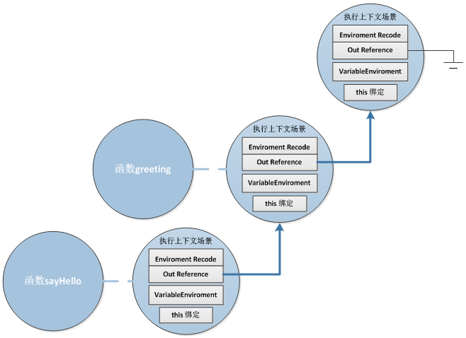
因此当sayHello被调用的时候，sayHello会通过上下文场景找到局部变量text的值，因此在屏幕的对话框中显示出”Hello Closure”
变量环境(The VariableEnvironment)和文法环境的作用基本相似，具体的区别请参看ECMAScript的规范文档。

#### **闭包的样列**

前面的我大致了解了Javascript闭包是什么，闭包在Javascript是怎么实现的。下面我们通过针对一些例子来帮助大家更加深入的理解闭包，下面共有5个样例，例子来自于[JavaScript Closures For Dummies(](http://blog.morrisjohns.com/javascript_closures_for_dummies.html)[镜像](http://web.archive.org/web/20080209105120/http://blog.morrisjohns.com/javascript_closures_for_dummies)[)](http://blog.morrisjohns.com/javascript_closures_for_dummies.html)。
**例子1:闭包中局部变量是引用而非拷贝**

[javascript]
function say667() {
// Local variable that ends up within closure
var num = 666;
var sayAlert = function() { alert(num); }
num++;
return sayAlert;
}

var sayAlert = say667();
sayAlert()
[/javascript]

因此执行结果应该弹出的667而非666。

**例子2：多个函数绑定同一个闭包，因为他们定义在同一个函数内。**

[javascript]
function setupSomeGlobals() {
// Local variable that ends up within closure
var num = 666;
// Store some references to functions as global variables
gAlertNumber = function() { alert(num); }
gIncreaseNumber = function() { num++; }
gSetNumber = function(x) { num = x; }
}
setupSomeGlobals(); // 为三个全局变量赋值
gAlertNumber(); //666
gIncreaseNumber();
gAlertNumber(); // 667
gSetNumber(12);//
gAlertNumber();//12
[/javascript]

**例子3：当在一个循环中赋值函数时，这些函数将绑定同样的闭包**

[javascript]
function buildList(list) {
var result = [];
for (var i = 0; i < list.length; i++) {
var item = ‘item’ + list[i];
result.push( function() {alert(item + ‘ ‘ + list[i])} );
}
return result;
}

function testList() {
var fnlist = buildList([1,2,3]);
// using j only to help prevent confusion – could use i
for (var j = 0; j < fnlist.length; j++) {
fnlist[j]();
}
}
[/javascript]

testList的执行结果是弹出item3 undefined窗口三次，因为这三个函数绑定了同一个闭包，而且item的值为最后计算的结果，但是当i跳出循环时i值为4，所以list[4]的结果为undefined.

**例子4：外部函数所有局部变量都在闭包内，即使这个变量声明在内部函数定义之后。**

[javascript]
function sayAlice() {
var sayAlert = function() { alert(alice); }
// Local variable that ends up within closure
var alice = ‘Hello Alice’;
return sayAlert;
}
var helloAlice=sayAlice();
helloAlice();
[/javascript]

执行结果是弹出”Hello Alice”的窗口。即使局部变量声明在函数sayAlert之后，局部变量仍然可以被访问到。

**例子5：每次函数调用的时候创建一个新的闭包**

[javascript]
function newClosure(someNum, someRef) {
// Local variables that end up within closure
var num = someNum;
var anArray = [1,2,3];
var ref = someRef;
return function(x) {
num += x;
anArray.push(num);
alert(‘num: ‘ + num +
‘\nanArray ‘ + anArray.toString() +
‘\nref.someVar ‘ + ref.someVar);
}
}
closure1=newClosure(40,{someVar:’closure 1′});
closure2=newClosure(1000,{someVar:’closure 2′});

closure1(5); // num:45 anArray[1,2,3,45] ref:’someVar closure1′
closure2(-10);// num:990 anArray[1,2,3,990] ref:’someVar closure2’
[/javascript]

#### **闭包的应用**

**Singleton 单件：**

[javascript]
var singleton = function () {
var privateVariable;
function privateFunction(x) {
…privateVariable…
}

return {
firstMethod: function (a, b) {
…privateVariable…
},
secondMethod: function (c) {
…privateFunction()…
}
};
}();
[/javascript]

这个单件通过闭包来实现。通过闭包完成了私有的成员和方法的封装。匿名主函数返回一个对象。对象包含了两个方法，方法1可以方法私有变量，方法2访问内部私有函数。需要注意的地方是匿名主函数结束的地方的'()’，如果没有这个'()’就不能产生单件。因为匿名函数只能返回了唯一的对象，而且不能被其他地方调用。这个就是利用闭包产生单件的方法。

## **参考：**

[JavaScript Closures For Dummies(](http://blog.morrisjohns.com/javascript_closures_for_dummies.html)[镜像](http://web.archive.org/web/20080209105120/http://blog.morrisjohns.com/javascript_closures_for_dummies)[)](http://blog.morrisjohns.com/javascript_closures_for_dummies.html) 可惜都被墙了。
[Advance Javascript](http://yuiblog.com/blog/2006/11/27/video-crockford-advjs/) （Douglas Crockford 大神的视频，一定要看啊）

# 再谈JAVASCRIPT面向对象编程

#####  [2012年02月27日 ](https://coolshell.cn/articles/6668.html) [Neo](https://coolshell.cn/articles/author/neo) 评论 [77 条评论](https://coolshell.cn/articles/6668.html#comments) 52,219 人阅读

**前言:**虽有陈皓[《Javascript 面向对象编程》](https://coolshell.cn/articles/6441.html)珠玉在前，但是我还是忍不住再画蛇添足的补上一篇文章，主要是因为javascript这门语言魅力。另外这篇文章是一篇入门文章，我也是才开始学习Javascript，有一点心得，才想写一篇这样文章，文章中难免有错误的地方，还请各位不吝吐槽指正

目录


[吐槽Javascript](https://coolshell.cn/articles/6668.html#吐槽Javascript)[__proto__成员](https://coolshell.cn/articles/6668.html#_proto_成员)[函数对象prototype成员](https://coolshell.cn/articles/6668.html#函数对象prototype成员)[new 操作符](https://coolshell.cn/articles/6668.html#new_操作符)[Pseudoclassical 继承](https://coolshell.cn/articles/6668.html#Pseudoclassical_继承)[Prototypal继承](https://coolshell.cn/articles/6668.html#Prototypal继承)[参考:](https://coolshell.cn/articles/6668.html#参考)[题外话：](https://coolshell.cn/articles/6668.html#题外话：)

#### **吐槽Javascript**

初次接触Javascript，这门语言的确会让很多正规军感到诸多的不适，这种不适来自于Javascript的语法的简练和不严谨，这种不适也来自Javascript这个悲催的名称，我在想网景公司的Javascript设计者在给他起名称那天一定是脑壳进水了,让Javascript这么多年来受了这么多不白之冤，人们都认为他是Java的附属物，一个WEB玩具语言。因此才会有些人会对Javascript不屑，认为Javascript不是一门真正的语言，但是这此他们真的错了。Javascript不仅是一门语言，是一门真真正正的语言，而且他还是一门里程碑式的语言，他独创多种新的编程模式原型继承，闭包（**作者注：闭包不是JS首创，应该Scheme首创，prototypal inheritance 和 dynamic objects 是self语言首创，Javascript的首创并不精彩,谢谢网友的指正。**），对后来的动态语言产生了巨大的影响。做为当今最流行的语言（没有之一），看看git上提交的最多的语言类型就能明白。随着HTML5的登场，浏览器将在个人电脑上将大显身手，完全有替换OS的趋势的时候，Javascript做为浏览器上的一门唯一真真的语言，如同C之于 unix/linux，java之于JVM，Cobol之于MainFrame，我们也需要来重新的认真地认识和审视这门语言。另外Javascript的正式名称是：ECMAScript，这个名字明显比Javascript帅太多了！

言归正传，我们切入主题——Javascript的面向对象编程。要谈Javascript的面向对象编程，我们第一步要做的事情就是忘记我们所学的面向对象编程。传统C++或Java的面向对象思维来学习Javascript的面向对象会给你带来不少困惑，让我们先忘记我们所学的，从新开始学习这门特殊的面向对象编程。既然是OO编程，要如何来理解OO编程呢，记得以前学C++，学了很久都不入门，后来有幸读了《Inside The C++ Object Model》这本大作，顿时豁然开朗，因此本文也将以对象模型的方式来探讨的Javascript的OO编程。因为Javascript 对象模型的特殊性，所以使得Javascript的继承和传统的继承非常不一样，同时也因为Javascript里面没有类，这意味着Javascript里面没有extends,implements。那么Javascript到底是如何来实现OO编程的呢？好吧，让我们开始吧，一起在Javascript的OO世界里来一次漫游

首先，我们需要先看看Javascript如何定义一个对象。下面是我们的一个对象定义：

[javascript]
var o = {};
[/javascript]

还可以这样定义一个对象

[javascript]
function f() {
}
[/javascript]

对，你们没有看错，在Javascript里面，函数也是对象。
当然还可以

[javascript]
var array1= [ 1,2,3];
[/javascript]

数组也是一个对象。
其他关于对象的基本的概念的描述，还是请各位亲们参见陈皓[《Javascript 面向对象编程》](https://coolshell.cn/articles/6441.html)文章。
对象都有了，唯一没有的就是class，因为在Javascript里面是没有class关键字的，算好还有function，function的存在让我们可以变通的定义类，在扩展这个主题前，我们还需要了解一个Javascript对象最重要的属性，**__proto__**成员。

#### **__proto__成员**

严格的说这个成员不应该叫这个名字，__proto__是Firefox中的称呼，__proto__只有在Firefox浏览器中才能被访问到。**做为一个对象，当你访问其中的一个成员或方法的时候，如果这个对象中没有这个方法或成员，那么Javascript引擎将会访问这个对象的__proto__成员所指向的另外的一个对象，并在那个对象中查找指定的方法或成员，如果不能找到，那就会继续通过那个对象的__proto__成员指向的对象进行递归查找，直到这个链表结束**。
好了，让我们举一个例子。
比如上上面定义的数组对象array1。当我们创建出array1这个对象的时候，array1实际在Javascript引擎中的对象模型如下：

array1对象具有一个length属性值为3，但是我们可以通过如下的方法来为array1增加元素：

[javascript]
array1.push(4);
[/javascript]

push这个方法来自于array1的__proto__成员指向对象的一个方法(Array.prototye.push())。正是因为所有的数组对象（通过[]来创建的）都包含有一个指向同一个具有push,reverse等方法对象(Array.prototype)的__proto__成员，才使得这些数组对象可以使用push,reverse等方法。

那么这个__proto__这个属性就相当于面向对象中的”has a”关系，这样的的话，只要我们有一个模板对象比如Array.prototype这个对象，然后把其他的对象__proto__属性指向这个对象的话就完成了一种继承的模式。不错！我们完全可以这么干。但是别高兴的太早，这个属性只在FireFox中有效，其他的浏览器虽然也有属性，但是不能通过__proto__来访问，只能通过getPrototypeOf方法进行访问，而且这个属性是只读的。看来我们要在Javascript实现继承并不是很容易的事情啊。

#### **函数对象prototype成员**

首先我们先来看一段函数prototype成员的定义，

> **When a function object is created, it is given a prototype member which is an object containing a constructor member which is a reference to the function object**
> 当一个函数对象被创建时，这个函数对象就具有一个prototype成员，这个成员是一个对象，这个对象包含了一个构造子成员，这个构造子成员会指向这个函数对象。

例如：

[javascript]
function Base() {
this.id = "base"
}
[/javascript]

Base这个函数对象就具有一个prototype成员，关于构造子其实Base函数对象自身，为什么我们将这类函数称为构造子呢？原因是因为这类函数设计来和new 操作符一起使用的。为了和一般的函数对象有所区别，这类函数的首字母一般都大写。构造子的主要作用就是来创建一类相似的对象。

上面这段代码在Javascript引擎的对象模型是这样的


#### **new 操作符**

在有上面的基础概念的介绍之后，在加上new操作符，我们就能完成传统面向对象的class + new的方式创建对象，在Javascript中，我们将这类方式成为Pseudoclassical。
基于上面的例子，我们执行如下代码

[javascript]
var obj = new Base();
[/javascript]

这样代码的结果是什么，我们在Javascript引擎中看到的对象模型是：


new操作符具体干了什么呢?其实很简单，就干了三件事情。

[javascript]
var obj = {};
obj.__proto__ = Base.prototype;
Base.call(obj);
[/javascript]

第一行，我们创建了一个空对象obj
第二行，我们将这个空对象的__proto__成员指向了Base函数对象prototype成员对象
第三行，我们将Base函数对象的this指针替换成obj，然后再调用Base函数，于是我们就给obj对象赋值了一个id成员变量，这个成员变量的值是”base”，关于call函数的用法，请参看陈皓[《Javascript 面向对象编程》](https://coolshell.cn/articles/6441.html)文章
如果我们给Base.prototype的对象添加一些函数会有什么效果呢？
例如代码如下：

[javascript]
Base.prototype.toString = function() {
return this.id;
}
[/javascript]

那么当我们使用new创建一个新对象的时候，根据__proto__的特性，toString这个方法也可以做新对象的方法被访问到。于是我们看到了：
**构造子中，我们来设置‘类’的成员变量（例如：例子中的id），构造子对象prototype中我们来设置‘类’的公共方法。于是通过函数对象和Javascript特有的__proto__与prototype成员及new操作符，模拟出类和类实例化的效果。**

#### **Pseudoclassical 继承**

我们模拟类，那么继承又该怎么做呢？其实很简单，我们只要将构造子的prototype指向父类即可。例如我们设计一个Derive 类。如下

[javascript]
function Derive(id) {
this.id = id;
}
Derive.prototype = new Base();
Derive.prototype.test = function(id){
return this.id === id;
}
var newObj = new Derive("derive");
[/javascript]

这段代码执行后的对象模型又是怎么样的呢？根据之前的推导，应该是如下的对象模型

这样我们的newObj也继承了基类Base的toString方法，并且具有自身的成员id。关于这个对象模型是如何被推导出来的就留给各位同学了，参照前面的描述，推导这个对象模型应该不难。
Pseudoclassical继承会让学过C++/Java的同学略微的感受到一点舒服，特别是new关键字，看到都特亲切，不过两者虽然相似，但是机理完全不同。当然不关什么样继承都是不能离不开__proto__成员的。

#### **Prototypal继承**

这是Javascript的另外一种继承方式，这个继承也就是之前陈皓文章《Javascript 面向对象编程》中create函数，非常可惜的是这个是ECMAScript V5的标准，支持V5的浏览器目前看来也就是IE9，Chrome最新版本和Firefox。虽然看着多，但是做为IE6的重灾区的中国，我建议各位还是避免使用create函数。好在没有create函数之前，Javascript的使用者已经设计出了等同于这个函数的。例如：我们看看Douglas Crockford的object函数。

[javascript]
function object(old) {
function F() {};
F.prototype = old;
return new F();
}
var newObj = object(oldObject);
[/javascript]

例如如下代码段

[javascript]
var base ={
id:"base",
toString:function(){
return this.id;
}
};
var derive = object(base);
[/javascript]

上面函数的执行后的对象模型是：

如何形成这样的对象模型，原理也很简单，只要把object这个函数扩展一下，就能画出这个模型，怎么画留给读者自己去画吧。
这样的继承方式被称为原型继承。相对来说要比Pseudoclassical继承来的简单方便。ECMAScript V5正是因为这原因也才增加create函数，让开发者可以快速的实现原型继承。
上述两种继承方式是Javascript中最常用的继承方式。通过本文的讲解，你应该对Javascript的OO编程有了一些‘原理’级的了解了吧

#### **参考:**

[《Prototypes and Inheritance in JavaScript Prototypes and Inheritance in JavaScript》](http://msdn.microsoft.com/en-us/scriptjunkie/ff852808)
[Advance Javascript](http://yuiblog.com/blog/2006/11/27/video-crockford-advjs/) （Douglas Crockford 大神的视频，一定要看啊）

#### **题外话：**

web2.0后，web应用可谓飞速发展，如今在HTML5发布之际，浏览器的功能被大大强化，我感觉Browser远远在不是一个Browser那么简单了。记得C++之父曾经这样说过JAVA，JAVA不是跨平台，JAVA本身就是一个平台。如今的Browser也本身就是一个平台了，好在这个平台是基于标准的。如果Browser是平台，由于Browser安全沙箱的限制，个人电脑的资源被使用的很少，感觉Browser就是一个NC（Network Computer）？我们居然又回到了Sun最初提出的构想，Sun是不是太强大了些？

# 千万别惹程序员

#####  [2012年02月21日 ](https://coolshell.cn/articles/6639.html) [陈皓](https://coolshell.cn/articles/author/haoel) 评论 [95 条评论](https://coolshell.cn/articles/6639.html#comments) 78,181 人阅读

酷壳好久没有发娱乐性质的技术文章了，搞得气氛有点严肃了，考虑到程序员们都是比较严肃和容易较真的类书呆子的群体，所以，需要更新一个有娱乐性质的文章了。正好最近看到了两个比较有趣的图，在新浪微博上都得到了比较不错的反响，因此，更新到酷壳上来。

#### 如果编程语言是一种刀

下面这个图是把编程语言看做是一种刀，那么会是什么样的。这个图我个人感觉很有意思。


对于这个图，最好不要解释，意会就好。不过，我却有点想不解风情，忍不住想解释一下。


- C++，C，Pascal 都是瑞士军刀，说明是用来做细活的工具。C语言的刀上有个USB，说明是可以做硬件操作的。C++的刀是什么都有，说明C++是一种功能繁多的语言。（图中C++的那把瑞士军刀很强大，不要以为其是虚构的，这把刀是真实存在的，叫Wenger巨人刀，http://www.wenger.ch/giant-knife-wenger-swiss-army-knife (这个网页上有个Youtube视频，可以爬墙去看)，[淘宝上有卖的](http://s.taobao.com/search?q=giant-knife-wenger-swiss-army-knife&keyword=&commend=all&ssid=s5-e&search_type=item&atype=&tracelog=&sourceId=tb.index&initiative_id=tbindexz_20120220)，价格在1万4左右。）
- Java/C#是一把塑料餐刀，这说明，Java和C#语言是带虚拟机的，而且其语法和使用并不像C++那么复杂，其泛型编程可以有很多种玩法，而Java和C#的泛型编程是比较单一的。
- Python是把电锯，人挡杀人，佛招杀佛，威力很大，面对大型的物体的修整，比C++/C/Java什么的得心应手得多得多，但是对于一些精细的调优工作，明显不行。这和Ruby很像。
- PHP没有MySQL，明显是被幽默了一把。不过最近对PHP的批评越来越多，不过，facebook的PHP的引擎HiPo已经很牛B了。
- Perl是一本日本武士刀，是忍者玩的语言。
- VB，就是一个玩具。你见过用塑料玩具勺当刀的吗？Haskell感觉是外星来的。呵呵

#### 千万别惹程序员

下图一张昨天我公司内部被传递的图片。经典的SQL注入式攻击。千万别惹程序员


这是一个有技术含量的号牌遮挡。我们先不说其是不是能奏效，不过，这个创意相当的NB啊。当你驾车通过某些路口时，被摄像头捕捉到你的车牌，通过OCR变成文本，然后插入数据库，于是，上图的这个车牌就成了SQL注入。（不要以为车牌的OCR技术还不行，这项目技术已经非常成熟了，无论是国内还是国外）。这张图片就如同“[Web开发中应该知道的事](https://coolshell.cn/articles/6043.html)”中说的一样——永远不要相信用户的输入。

**插曲**：我昨天把这张图片[放到微博](http://weibo.com/1401880315/y6kIAj1oN)，结果，**被转了几万次，上了热门转发的top list和一些社会热点和明星八卦排在了一起**。主要是被“*@微博搞笑排行榜: @全球潮流趣闻: @实用小百科: @经典英文语录: @当时我就泪奔了: @老榕: @全球经典音乐: @环球汽车搜罗: @怪诞心理行为学: @精彩电影: @互联网的那点事: @潮混搭: @热门微博: @SinaAppEngine:* ” 还有些什么体育记者，法律记者都转了， 这些转发了。这多少让我觉得有些诧异，这是很技术的一件事啊，怎么连什么电影，英文对白，汽车，音乐什么的都转了？我是相当的费解啊，我只能有两个认为——

1. 简单的认为关心技术的人还是很多的。
2. 复杂地认为国人是喜欢起哄的，不问为什么。

（全文完）

# WHY C++ ? 王者归来

#####  [2012年02月02日 ](https://coolshell.cn/articles/6548.html) [陈皓](https://coolshell.cn/articles/author/haoel) 评论 [145 条评论](https://coolshell.cn/articles/6548.html#comments) 108,864 人阅读

因为又有人邀请我去Quora的C2C网站去回答问题去了，这回是 关于 [@laiyonghao](http://weibo.com/n/laiyonghao) 的这篇有点争议的博文《2012 不宜进入的三个技术点》ActionScript，Thread 和 C++，[ C++争议的争议最大](http://blog.csdn.net/lanphaday/article/details/7223385)。（要我说，.NET比C++更需要慎重进入，呵）。我就在这里回复一下这个问题吧。

正好我一个月前看到一个视频，这个演讲视频还比较著名，这个演讲者是*Exceptional C++* 和 *C++ Coding Standards* 的作者，还是ISO C++ 委员会的Chair，C++/CLI首席架构师，还是Microsoft的软件架构师，他叫[Herb Sutter](http://herbsutter.com/)，他的这个演讲视频是 [C++ and Beyond 2011](http://cppandbeyond.com/)上的一次公开演讲，题目是——[Why C++](http://channel9.msdn.com/posts/C-and-Beyond-2011-Herb-Sutter-Why-C)? （如果你觉得那里的视频比较慢，你可以看[优酷上的视频](http://v.youku.com/v_show/id_XMzA5OTIwODIw.html)）（英文听力好的同学可以看一样，因为都没有中文字幕）

我觉得这篇文章就足够可以说明很多问题了，所以，我把Herb的演讲幻灯片截了几页放到这里，并做上一些注释，算是一个演讲内容摘要吧。

1） 为什么C++？因为 Performance per $，也就是说performance 就是钱，这个分成三个方面，

- 耗电，芯片的耗电量，移动设备的耗电量，家用电脑的耗电量都和钱有关系。
- 资源，家用电脑和移动设备上的处理器资源有限，因为要让一般消费者买的起。
- 体验，在更小的设备上会有更好的体验，有更好的体验就可以挣更多的钱。

移动设备上的耗电量相信用过智能手机的人都知道吧，Android手机的耗电量实在是太大了。就算是iPhone在开启Wifi和3G的情况下耗电量也很快。


2）C++的进化分成三个时代：

- 1979 – 1989：研究C的对象能力。主要是为C++做准备
- 1989 – 1999：C++成了主流。
- 1999 – 2009：Coffee-based语言（Java, .NET）出现了，极大的提高了开发生产力。

对于第三个时代，Herb说了很多，他说这个并没有什么错，因为这个时候我们非常关注开发的生产力，这个非常重要，这就是为什么C++一下就失去优势的地方。但是是否这些Coffee-Based的语言可以做任重要的事呢？不行，很多时候，这是一个Trade-Off的事，也就是生产力不是免费的是需要你用别的东西去交换的。


3）第四个时期。

Herb认为，2009-2019是第四个时期，因为我们又喜欢Native Code了，C++从被驱逐后又被请回来了。因为网站的性能越来越是个问题，移动端的设备非常流行。但主要是因为Performance就是钱，因为前面的三个因素，性能影响的是dollar，不尊重性能的公司都会发现花钱的速度太快了。（比如去年大家热炒的京东促销和12306.cn的问题，12306给整个社会造成了巨大的金钱浪费）

Herb把这个时期比做 The Return of the King。（指环王的第三部：王者归来） **性能为王！**

这就好像我在“[软件开发的三重门](https://coolshell.cn/articles/6526.html)”里说的，开垦时代需要的是快和生产力，而开垦完后就得保证其稳定性。


4）Herb还给了一张幻灯片问，“The World is built on ….”，后面例出了多个语言。然后Herb说，世界是由C和C++构成的。


5）Herb给了一张表格，这张表可相当形像。如果把我们的对编程语言的需求总结为四个：**效率，灵活，抽象，生产率**。那么，C语言玩的是前两个，而C++玩的是前三个，Java和C#玩的是后两个（抽象和生产率）

任保一种设计都不可能让你什么都要的，这就是Trade-Off——什么事都需要交换的。


6）Herb举了一个微软内的例子，用C++ 和 ATL 来开发IE工具条的报告，意思是你可以用脚本在IE的工具条上加按钮，但是作者建议使用C++，因为用.NET或是脚本有重大的limitation，尤其是性能上的问题。


7）接下来，我们来看看移动设备。

下图中，第一个是iOS，第二个是Android，第三个是WinPhone。Herd说了几个事：

a）比Web APP，人们更喜欢Native的APP，这个在用移动设备上可以得到验证。

b）iOS也好，Android也好，WinPhone也好，他们不是在搞操作系统，而是在搞应用，为的是让智能手机更好。手机就是一个App。

c）这三个手机在第一版出来时都不支持C++，而第二版出来时都支持C++了。因为他们要兼顾性能和一定程度上的开发效率。WinPhone还没有到第二版，让我们拭目以待。（我以前写过一篇[调侃Android支持C++开发](https://coolshell.cn/articles/3549.html)的文章，这也只是一年前的事，说明C++全面回归了）


8）如果你还是不相信的话，我们可以看看为什么Apple和Google都在搞C++的编译器，因为他们觉得g++性能不行。所以，基于LLVM的编译器正在领导潮流，因为我们关注Natvie Code的性能优化。


9）接下来，Herb说了一下数据中心，你知道数据中心最花钱的是什么吗？三个事：

> - 57% 花在了硬件上。
> - 18% 花在了配电和降温上。
> - 13% 花在了耗电上。

88%的钱花在了硬件和电力上。这可是很大一笔费用啊。（还有人说硬件比软件便宜吗？）我记得我上一个公司的数据中心每年要花的电费就在百万美元以上。


10）昨天在[微博上有个笑话](http://weibo.com/1401880315/y3kshD9jf)，说是某咨询师要求程序员把代码打印出来走查，程序员问是不是要用彩打？哈哈。我说，这至少不环保嘛。消耗太大了。是的，C++是可以省电的，以及于C++之父都在YouTube 说C++是可以减轻全球变暖的问题。哇，C++开始真正造福人类了。


11）我还需要重温一下老大的这句话——

> **My contribution to the fight against global warming is C++’s efficiency**: Just think if Google had to have twice as many server farms! Each uses as much energy as a small town. And it’s not just a factor of two… **Efficiency is not just running fast or running bigger programs, it’s also running using less resources**.
>
> Bjarne Stroustrup, June 2011

最后一句说的非常好！**效率不仅仅只是跑得，跑得多，更是可以使用更少的资源**。

12）下面让我们再来看一张表，一张把钱投到哪里的表格，这样我们可以看到一些趋势。

- 70年代80年代，资源不够，主要是把钱投在性能上。
- 80年代到90代，主要是90年代开始有一半的投次到了抽象和生产率上。
- 00年代，完全都在抽象和生产率上。
- 10年代，80%的钱都要回头来解决性能问题。这就是C/C++的王者归来。


13）当然，不是C++不注重 开发效率，看看C++0X的标准引入了多少东西我们就知道了。但是本质上，**C++还是致力于性能和抽象的完全平衡**。

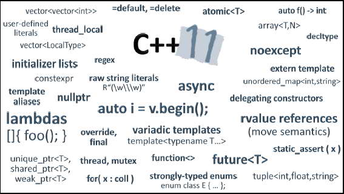

那么，我们还会觉得C++要被淘汰了，不适合进入了吗？看完这个演讲，你应该有答案的。

后面讲了C++的文艺复兴，你可以在Google 搜索 “[C++ Renaissance](https://www.google.com/search?q=C%2B%2B+Renaissance)”看看。另外，**该视频的讲议可以在[这里下载](http://ecn.channel9.msdn.com/content/WhyCPPCB2011.pdf)**。

（全文完）

# 由12306.CN谈谈网站性能技术

#####  [2012年01月16日 ](https://coolshell.cn/articles/6470.html) [陈皓](https://coolshell.cn/articles/author/haoel) 评论 [369 条评论](https://coolshell.cn/articles/6470.html#comments) 298,806 人阅读

12306.cn网站挂了，被全国人民骂了。我这两天也在思考这个事，我想以这个事来粗略地和大家讨论一下网站性能的问题。因为仓促，而且完全基于本人有限的经验和了解，所以，如果有什么问题还请大家一起讨论和指正。（这又是一篇长文，只讨论性能问题，不讨论那些UI，用户体验，或是是否把支付和购票下单环节分开的功能性的东西）

目录


[业务](https://coolshell.cn/articles/6470.html#业务)[前端性能优化技术](https://coolshell.cn/articles/6470.html#前端性能优化技术)[一、前端负载均衡](https://coolshell.cn/articles/6470.html#一、前端负载均衡)[二、减少前端链接数](https://coolshell.cn/articles/6470.html#二、减少前端链接数)[三、减少网页大小增加带宽](https://coolshell.cn/articles/6470.html#三、减少网页大小增加带宽)[四、前端页面静态化](https://coolshell.cn/articles/6470.html#四、前端页面静态化)[五、优化查询](https://coolshell.cn/articles/6470.html#五、优化查询)[六、缓存的问题](https://coolshell.cn/articles/6470.html#六、缓存的问题)[后端性能优化技术](https://coolshell.cn/articles/6470.html#后端性能优化技术)[一、数据冗余](https://coolshell.cn/articles/6470.html#一、数据冗余)[二、数据镜像](https://coolshell.cn/articles/6470.html#二、数据镜像)[三、数据分区](https://coolshell.cn/articles/6470.html#三、数据分区)[四、后端系统负载均衡](https://coolshell.cn/articles/6470.html#四、后端系统负载均衡)[五、异步、 throttle 和 批量处理](https://coolshell.cn/articles/6470.html#五、异步、_throttle_和_批量处理)[小结](https://coolshell.cn/articles/6470.html#小结)

#### 业务

任何技术都离不开业务需求，所以，要说明性能问题，首先还是想先说说业务问题。

- **其一**，**有人可能把这个东西和QQ或是网游相比**。但我觉得这两者是不一样的，网游和QQ在线或是登录时访问的更多的是用户自己的数据，而订票系统访问的是中心的票量数据，这是不一样的。不要觉得网游或是QQ能行你就以为这是一样的。网游和QQ 的后端负载相对于电子商务的系统还是简单。

- **其二**，**有人说春节期间订火车的这个事好像网站的秒杀活动**。的确很相似，但是如果你的思考不在表面的话，你会发现这也有些不一样。火车票这个事，一方面会伴随着大量的查询操作，更BT的是下单的时候需要对数据库很多的一致性的操作，一方面是从起点到终点各个分段票的一致性，另一方面，买的人路线、车次、时间选择有很多，会不停地改变下单方式。而秒杀，直接杀就好了，没有那么多查询和一致性的问题。另外，关于秒杀，完全可以做成只接受前N个用户的请求（完全不操作后端的任何数据， 仅仅只是对用户的下单操作log），这种业务，只需要在内存cache中放好可秒杀的数量，还可以把数据分布开来放，100商品，10台服务器一台放10个，无需在当时操作任何数据库。可以订单数够后，停止秒杀，然后批量写数据库。而且秒杀的商品不多。火车票这个不是像秒杀那么简单的，春运时间，几乎所有的票都是热门票，而且几乎是全国人民都来了，而且还有转车业务，多条线的库存都要做事务操作，你想想吧，这有多难。（淘宝的双十一也就3百万用户，而火车票瞬时有千万级别甚至是亿级别的）（**更新：2014年1月11日**：来了淘宝后，对淘宝的系统有了解，淘宝的秒杀活动，本质上是用输验证码并在CDN上把用户直接过滤掉了，比如：1千万个用户过滤了只剩2万个用户，这样数据库就顶得住了）

- **其三**，**有人拿这个系统和奥运会的票务系统比较**。我觉得还是不一样。虽然奥运会的票务系统当年也一上线就废了。但是奥运会用的是抽奖的方式，也就是说不存在先来先得的抢的方式，而且，是事后抽奖，事前只需要收信息，事前不需要保证数据一致性，没有锁，很容易水平扩展。

- **其四**，**订票系统应该和电子商务的订单系统很相似**，都是需要对库存进行：1）占住库存，2）支付（可选），3）扣除库存的操作。这个是需要有一致性的检查的，也就是在并发时需要对数据加锁的。B2C的电商基本上都会把这个事干成异步的，也就是说，你下的订单并不是马上处理的，而是延时处理的，只有成功处理了，系统才会给你一封确认邮件说是订单成功。我相信有很多朋友都收到认单不成功的邮件。**这就是说，数据一致性在并发下是一个瓶颈**。


- **其五**，**铁路的票务业务很变态**，其采用的是突然放票，而有的票又远远不够大家分，所以，大家才会有抢票这种有中国特色的业务的做法。于是当票放出来的时候，就会有几百万人甚至上千万人杀上去，查询，下单。几十分钟内，一个网站能接受几千万的访问量，这个是很恐怖的事情。[据说12306的高峰访问是10亿PV](http://www.linuxso.com/architecture/17006.html)，集中在早8点到10点，每秒PV在高峰时上千万。

多说几句：

- **库存是B2C的恶梦，库存管理相当的复杂**。不信，你可以问问所有传统和电务零售业的企业，看看他们管理库存是多么难的一件事。不然，就不会有那么多人在问凡客的库存问题了。（你还可以看看《乔布斯传》，你就知道为什么Tim会接任Apple的CEO了，最主要的原因是他搞定了苹果的库存周期问题）

- **对于一个网站来说，浏览网页的高负载很容易搞定，查询的负载有一定的难度去处理，不过还是可以通过缓存查询结果来搞定，最难的就是下单的负载**。因为要访问库存啊，对于下单，基本上是用异步来搞定的。去年双11节，淘宝的每小时的订单数大约在60万左右，京东一天也才能支持40万（居然比12306还差），亚马逊5年前一小时可支持70万订单量。可见，下订单的操作并没有我们相像的那么性能高。

- **淘宝要比B2C的网站要简单得多，因为没有仓库**，所以，不存在像B2C这样有N个仓库对同一商品库存更新和查询的操作。下单的时候，B2C的 网站要去找一个仓库，又要离用户近，又要有库存，这需要很多计算。试想，你在北京买了一本书，北京的仓库没货了，就要从周边的仓库调，那就要去看看沈阳或 是西安的仓库有没有货，如果没有，又得看看江苏的仓库，等等。淘宝的就没有那么多事了，每个商户有自己的库存，库存就是一个数字，并且库存分到商户头上了，反而有利于性能扩展。

- **数据一致性才是真正的性能瓶颈**。有 人说nginx可以搞定每秒10万的静态请求，我不怀疑。但这只是静态请求，理论值，只要带宽、I/O够强，服务器计算能力够，并支持的并发连接数顶得住10万TCP链接的建立 的话，那没有问题。但在数据一致性面前，这10万就完完全全成了一个可望不可及的理论值了。

我说那么多，我只是想从业务上告诉大家，我们需要从业务上真正了解春运铁路订票这样业务的变态之处。

#### 前端性能优化技术

要解决性能的问题，有很多种常用的方法，我在下面列举一下，我相信12306这个网站使用下面的这些技术会让其性能有质的飞跃。

##### 一、前端负载均衡

通过DNS的负载均衡器（一般在路由器上根据路由的负载重定向）可以把用户的访问均匀地分散在多个Web服务器上。这样可以减少Web服务器的请求负载。因为http的请求都是短作业，所以，可以通过很简单的负载均衡器来完成这一功能。最好是有CDN网络让用户连接与其最近的服务器（CDN通常伴随着分布式存储）。（关于负载均衡更为详细的说明见“后端的负载均衡”）

##### 二、减少前端链接数

我看了一下12306.cn，打开主页需要建60多个HTTP连接，车票预订页面则有70多个HTTP请求，现在的浏览器都是并发请求的（当然，浏览器的一个页面的并发数是有限的，但是你挡不住用户开多个页面，而且，后端服务器TCP链接在前端断开始，还不会马上释放或重要）。所以，只要有100万个用户，就有可能会有6000万个链接（访问第一次后有了浏览器端的cache，这个数会下来，就算只有20%也是百万级的链接数），太多了。一个登录查询页面就好了。把js打成一个文件，把css也打成一个文件，把图标也打成一个文件，用css分块展示。把链接数减到最低。

##### 三、减少网页大小增加带宽

这个世界不是哪个公司都敢做图片服务的，因为图片太耗带宽了。现在宽带时代很难有人能体会到当拨号时代做个图页都不敢用图片的情形（现在在手机端浏览也是这个情形）。我查看了一下12306首页的需要下载的总文件大小大约在900KB左右，如果你访问过了，浏览器会帮你缓存很多，只需下载10K左右的文件。但是我们可以想像一个极端一点的案例，1百万用户同时访问，且都是第一次访问，每人下载量需要1M，如果需要在120秒内返回，那么就需要，1M * 1M /120 * 8 = 66Gbps的带宽。很惊人吧。所以，我估计在当天，12306的阻塞基本上应该是网络带宽，所以，你可能看到的是没有响应。后面随着浏览器的缓存帮助12306减少很多带宽占用，于是负载一下就到了后端，后端的数据处理瓶颈一下就出来。于是你会看到很多http 500之类的错误。这说明后端服务器垮了。

##### 四、前端页面静态化

静态化一些不常变的页面和数据，并gzip一下。~~还有一个变态的方法是把这些静态页面放在/dev/shm下，这个目录就是内存，直接从内存中把文件读出来返回，这样可以减少昂贵的磁盘I/O~~。使用nginx的sendfile功能可以让这些静态文件直接在内核心态交换，可以极大增加性能。

##### 五、优化查询

很多人查询都是在查一样的，完全可以用反向代理合并这些并发的相同的查询。这样的技术主要用查询结果缓存来实现，第一次查询走数据库获得数据，并把数据放到缓存，后面的查询统统直接访问高速缓存。为每个查询做Hash，使用NoSQL的技术可以完成这个优化。（这个技术也可以用做静态页面）

对于火车票量的查询，个人觉得不要显示数字，就显示一个“有”或“无”就好了，这样可以大大简化系统复杂度，并提升性能。把查询对数据库的负载分出去，从而让数据库可以更好地为下单的人服务。

##### 六、缓存的问题

缓存可以用来缓存动态页面，也可以用来缓存查询的数据。缓存通常有那么几个问题：

1）缓存的更新。也叫缓存和数据库的同步。有这么几种方法，一是缓存time out，让缓存失效，重查，二是，由后端通知更新，一量后端发生变化，通知前端更新。前者实现起来比较简单，但实时性不高，后者实现起来比较复杂 ，但实时性高。

2）缓存的换页。内存可能不够，所以，需要把一些不活跃的数据换出内存，这个和操作系统的内存换页和交换内存很相似。FIFO、LRU、LFU都是比较经典的换页算法。相关内容参看[Wikipeida的缓存算法](https://en.wikipedia.org/wiki/Cache_algorithms)。

3）缓存的重建和持久化。缓存在内存，系统总要维护，所以，缓存就会丢失，如果缓存没了，就需要重建，如果数据量很大，缓存重建的过程会很慢，这会影响生产环境，所以，缓存的持久化也是需要考虑的。

诸多强大的NoSQL都很好支持了上述三大缓存的问题。

#### 后端性能优化技术

前面讨论了前端性能的优化技术，于是前端可能就不是瓶颈问题了。那么性能问题就会到后端数据上来了。下面说几个后端常见的性能优化技术。

##### 一、数据冗余

关于数据冗余，也就是说，把我们的数据库的数据冗余处理，也就是减少表连接这样的开销比较大的操作，但这样会牺牲数据的一致性。风险比较大。很多人把NoSQL用做数据，快是快了，因为数据冗余了，但这对数据一致性有大的风险。这需要根据不同的业务进行分析和处理。（注意：用关系型数据库很容易移植到NoSQL上，但是反过来从NoSQL到关系型就难了）

##### 二、数据镜像

几乎所有主流的数据库都支持镜像，也就是replication。数据库的镜像带来的好处就是可以做负载均衡。把一台数据库的负载均分到多台上，同时又保证了数据一致性（Oracle的SCN）。最重要的是，这样还可以有高可用性，一台废了，还有另一台在服务。

数据镜像的数据一致性可能是个复杂的问题，所以我们要在单条数据上进行数据分区，也就是说，把一个畅销商品的库存均分到不同的服务器上，如，一个畅销商品有1万的库存，我们可以设置10台服务器，每台服务器上有1000个库存，这就好像B2C的仓库一样。

##### 三、数据分区

数据镜像不能解决的一个问题就是数据表里的记录太多，导致数据库操作太慢。所以，把数据分区。数据分区有很多种做法，一般来说有下面这几种：

1）把数据把某种逻辑来分类。比如火车票的订票系统可以按各铁路局来分，可按各种车型分，可以按始发站分，可以按目的地分……，反正就是把一张表拆成多张有一样的字段但是不同种类的表，这样，这些表就可以存在不同的机器上以达到分担负载的目的。

2）把数据按字段分，也就是竖着分表。比如把一些不经常改的数据放在一个表里，经常改的数据放在另外多个表里。把一张表变成1对1的关系，这样，你可以减少表的字段个数，同样可以提升一定的性能。另外，字段多会造成一条记录的存储会被放到不同的页表里，这对于读写性能都有问题。但这样一来会有很多复杂的控制。

3）平均分表。因为第一种方法是并不一定平均分均，可能某个种类的数据还是很多。所以，也有采用平均分配的方式，通过主键ID的范围来分表。

4）同一数据分区。这个在上面数据镜像提过。也就是把同一商品的库存值分到不同的服务器上，比如有10000个库存，可以分到10台服务器上，一台上有1000个库存。然后负载均衡。

这三种分区都有好有坏。最常用的还是第一种。数据一旦分区，你就需要有一个或是多个调度来让你的前端程序知道去哪里找数据。**把火车票的数据分区，并放在各个省市，会对12306这个系统有非常有意义的质的性能的提高**。

##### 四、后端系统负载均衡

前面说了数据分区，数据分区可以在一定程度上减轻负载，但是无法减轻热销商品的负载，对于火车票来说，可以认为是大城市的某些主干线上的车票。这就需要使用数据镜像来减轻负载。使用数据镜像，你必然要使用负载均衡，在后端，我们可能很难使用像路由器上的负载均衡器，因为那是均衡流量的，因为流量并不代表服务器的繁忙程度。因此，我们需要一个任务分配系统，其还能监控各个服务器的负载情况。

任务分配服务器有一些难点：

- 负载情况比较复杂。什么叫忙？是CPU高？还是磁盘I/O高？还是内存使用高？还是并发高？还是内存换页率高？你可能需要全部都要考虑。这些信息要发送给那个任务分配器上，由任务分配器挑选一台负载最轻的服务器来处理。

- 任务分配服务器上需要对任务队列，不能丢任务啊，所以还需要持久化。并且可以以批量的方式把任务分配给计算服务器。

- 任务分配服务器死了怎么办？这里需要一些如Live-Standby或是failover等高可用性的技术。我们还需要注意那些持久化了的任务的队列如何转移到别的服务器上的问题。

我看到有很多系统都用静态的方式来分配，有的用hash，有的就简单地轮流分析。这些都不够好，一个是不能完美地负载均衡，另一个静态的方法的致命缺陷是，如果有一台计算服务器死机了，或是我们需要加入新的服务器，对于我们的分配器来说，都需要知道的。另外，还要重算哈希（一致性hash可以部分解决这个问题）。

还有一种方法是使用抢占式的方式进行负载均衡，由下游的计算服务器去任务服务器上拿任务。让这些计算服务器自己决定自己是否要任务。这样的好处是可以简化系统的复杂度，而且还可以任意实时地减少或增加计算服务器。但是唯一不好的就是，如果有一些任务只能在某种服务器上处理，这可能会引入一些复杂度。不过总体来说，这种方法可能是比较好的负载均衡。

##### 五、异步、 throttle 和 批量处理

异步、throttle（节流阀） 和批量处理都需要对并发请求数做队列处理的。

- 异步在业务上一般来说就是收集请求，然后延时处理。在技术上就是可以把各个处理程序做成并行的，也就可以水平扩展了。但是异步的技术问题大概有这些，a）被调用方的结果返回，会涉及进程线程间通信的问题。b）如果程序需要回滚，回滚会有点复杂。c）异步通常都会伴随多线程多进程，并发的控制也相对麻烦一些。d）很多异步系统都用消息机制，消息的丢失和乱序也会是比较复杂的问题。

- throttle 技术其实并不提升性能，这个技术主要是防止系统被超过自己不能处理的流量给搞垮了，这其实是个保护机制。使用throttle技术一般来说是对于一些自己无法控制的系统，比如，和你网站对接的银行系统。

- 批量处理的技术，是把一堆基本相同的请求批量处理。比如，大家同时购买同一个商品，没有必要你买一个我就写一次数据库，完全可以收集到一定数量的请求，一次操作。这个技术可以用作很多方面。比如节省网络带宽，我们都知道网络上的MTU（最大传输单元），以态网是1500字节，光纤可以达到4000多个字节，如果你的一个网络包没有放满这个MTU，那就是在浪费网络带宽，因为网卡的驱动程序只有一块一块地读效率才会高。因此，网络发包时，我们需要收集到足够多的信息后再做网络I/O，这也是一种批量处理的方式。批量处理的敌人是流量低，所以，批量处理的系统一般都会设置上两个阀值，一个是作业量，另一个是timeout，只要有一个条件满足，就会开始提交处理。

所以，**只要是异步，一般都会有throttle机制，一般都会有队列来排队，有队列，就会有持久化，而系统一般都会使用批量的方式来处理**。

[云风同学设计的“排队系统”](http://blog.codingnow.com/2012/01/ticket_queue.html) 就是这个技术。这和电子商务的订单系统很相似，就是说，我的系统收到了你的购票下单请求，但是我还没有真正处理，我的系统会跟据我自己的处理能力来throttle住这些大量的请求，并一点一点地处理。一旦处理完成，我就可以发邮件或短信告诉用户你来可以真正购票了。

在这里，我想通过业务和用户需求方面讨论一下云风同学的这个排队系统，因为其从技术上看似解决了这个问题，但是从业务和用户需求上来说可能还是有一些值得我们去深入思考的地方：

1）**队列的DoS攻击**。首先，我们思考一下，这个队是个单纯地排队的吗？这样做还不够好，因为这样我们不能杜绝黄牛，而且单纯的ticket_id很容易发生DoS攻击，比如，我发起N个 ticket_id，进入购票流程后，我不买，我就耗你半个小时，很容易我就可以让想买票的人几天都买不到票。有人说，用户应该要用身份证来排队， 这样在购买里就必需要用这个身份证来买，但这也还不能杜绝黄牛排队或是号贩子。因为他们可以注册N个帐号来排队，但就是不买。黄牛这些人这个时候只需要干一个事，把网站搞得正常人不能访问，让用户只能通过他们来买。

2）**对列的一致性**？对这个队列的操作是不是需要锁？只要有锁，性能一定上不去。试想，100万个人同时要求你来分配位置号，这个队列将会成为性能瓶颈。你一定没有数据库实现得性能好，所以，可能比现在还差。**抢数据库和抢队列本质上是一样的**。

3）**队列的等待时间**。购票时间半小时够不够？多不多？要是那时用户正好不能上网呢？如果时间短了，用户不够时间操作也会抱怨，如果时间长了，后面在排队的那些人也会抱怨。这个方法可能在实际操作上会有很多问题。另外，半个小时太长了，这完全不现实，我们用15分钟来举例：有1千万用户，每一个时刻只能放进去1万个，这1万个用户需要15分钟完成所有操作，那么，这1千万用户全部处理完，需要1000*15m = 250小时，10天半，火车早开了。（我并非信口开河，[根据铁道部专家的说明](http://t.cn/z0g7dGJ)：这几天，平均一天下单100万，所以，处理1000万的用户需要十天。这个计算可能有点简单了，我只是想说，**在这样低负载的系统下用排队可能都不能解决业务问题**）

4）**队列的分布式**。这个排队系统只有一个队列好吗？还不足够好。因为，如果你放进去的可以购票的人如果在买同一个车次的同样的类型的票（比如某动车卧铺），还是等于在抢票，也就是说系统的负载还是会有可能集中到其中某台服务器上。因此，最好的方法是根据用户的需求——提供出发地和目的地，来对用户进行排队。而这样一来，队列也就可以是多个，只要是多个队列，就可以水平扩展了。这样可以解决性能问题，但是没有解决用户长时间排队的问题。

我觉得完全可以向网上购物学习。**在排队（下单）的时候，收集好用户的信息和想要买的票，并允许用户设置购票的优先级，比如，A车次卧铺买 不到就买 B车次的卧铺，如果还买不到就买硬座等等，然后用户把所需的钱先充值好，接下来就是系统完全自动地异步处理订单**。成功不成功都发短信或邮件通知用户。这样，系统不仅可以省去那半个小时的用户交互时间，自动化加快处理，还可以合并相同购票请求的人，进行批处理（减少数据库的操作次数）。**这种方法最妙的事是可以知道这些排队用户的需求，不但可以优化用户的队列，把用户分布到不同的队列，还可以像亚马逊的心愿单一样，通过一些计算就可以让铁道部做车次统筹安排和调整**（最后，排队系统（下单系统）还是要保存在数据库里的或做持久化，不能只放在内存中，不然机器一down，就等着被骂吧）。

#### 小结

写了那么多，我小结一下：

0）**无论你怎么设计，你的系统一定要能容易地水平扩展**。也就是说，你的整个数据流中，所有的环节都要能够水平扩展。这样，当你的系统有性能问题时，“加30倍的服务器”才不会被人讥笑。

1）**上述的技术不是一朝一夕能搞定的，没有长期的积累，基本无望**。我们可以看到，无论你用哪种都会引发一些复杂性，设计总是在做一种权衡。

2）集中式的卖票很难搞定，使用上述的技术可以让订票系统能有几佰倍的性能提升。而在**各个省市建分站，分开卖票，是能让现有系统性能有质的提升的最好方法**。

3）**春运前夕抢票且票量供远小于求这种业务模式是相当变态的**，让几千万甚至上亿的人在某个早晨的8点钟同时登录同时抢票的这种业务模式是变态中的变态。业务形态的变态决定了无论他们怎么办干一定会被骂。

4）**为了那么一两个星期而搞那么大的系统**，而其它时间都在闲着，有些可惜了，这也就是铁路才干得出来这样的事了。

***更新2012年9月27日*** 

 **Alexa 统计的12306的PV** （注：Alexa的PV定义是：一个用户在一天内对一个页面的多次点击只算一次）


（**本文转载时请注明作者和出处，请勿于记商业目的**）

# 软件开发的“三重门”

#####  [2012年01月30日 ](https://coolshell.cn/articles/6526.html) [陈皓](https://coolshell.cn/articles/author/haoel) 评论 [115 条评论](https://coolshell.cn/articles/6526.html#comments) 78,455 人阅读

自从上次写了“[程序员技术练级攻略](https://coolshell.cn/articles/4990.html)” 以来，就觉得似乎还有很多东西没有谈到，但当时没有继续思考了。而春节前有人问我，是做底层技术，还是做业务。这问题让我思考了很多，不由自主地回顾了一 下我这十多年的软件开发经历，并顺着整理分类了一下自己解决过的若干问题，还发散想了很多，经过了一个春节假期的发酵，产生了下面这篇文章。

目录


[前言](https://coolshell.cn/articles/6526.html#前言)[一重门：业务功能](https://coolshell.cn/articles/6526.html#一重门：业务功能)[二重门：业务性能](https://coolshell.cn/articles/6526.html#二重门：业务性能)[三重门：业务智能](https://coolshell.cn/articles/6526.html#三重门：业务智能)[后记](https://coolshell.cn/articles/6526.html#后记)

#### 前言

这篇文章必然是通过我的个人经历来写的。所以，我先说说个人经历吧。我的经历基本分成三个阶段。

**第一阶段：**我 刚毕业时在家乡的某银行工作，做些银行的业务系统，还搞些网络，电子邮件系统，OA什么的，因为大四的时候在老师的公司里实习，银行里的人际关系太复杂， 而且技术都包给了产商，所以在银行的每一天都觉得不能适应里面的工作环境。两年后离职，单位分的房也不要了，直接去了上海，在上海呆了两年，本来想做互联 网的，但是泡沫来了，最终去了一家做系统集成的国企公司还是继续做银行业务。这四年来，主要解决的都是一些业务上的问题，银行里的会计业务，OA业务，国 际业务，中间对公业务都非常地复杂，而且因为当时的软件开发相当的不规范，所以基本上是在一种比较混乱的状态下度过的，而银行方面又很强势，所以，这段时 间主要是做业务。所以，技术上主要是积累了如何使用那些技术。C+/Java， Windows编程，Unix编程，网络编程主要是这段时间学的，看了太多的书（我大学课程里没有C++和Java，也没有Windows/Unix和网 络编程，所以，只能拼命地看书和自学）。

**第二阶段：**然后，我来了北京，到了一家做分布式计算系统的公 司，整天和一个高性能技术高可用性的企业级的集群式的软件产品打交道（这家公司去年被IBM收购了），在这家公司把Windows/Unix和网络编程有 了更深入的了解，对我长进比较大的是明白了怎么做一个性能高，可用性高的集群式的系统，天天和底层打交道，干了4年多。然后去了一家金融信息公司，这家金 融公司主要做全球的金融信息数据处理，而我主要还是做核心数据发布系统的性能调优的项目，金融数据的实时性要求的高，数据量非常地大，高可用性要求得高， 得想尽一切办法省网络带宽，增加系统性能，还要保持高的可用性，不当机，不丢包。又干了4年多，入职的时候从国外接过来两个系统，其性能单机每秒可处理 120K message，我走的时候，我和团队把其优化到了每秒1.4M messages 的吞吐，另一个系统，从接手时的100k message/s优化到了500k message/s。这八年多的时候，全是在和这些高计算高性能的项目打交量，几乎没有什么业务，都是纯技术，积累到了很多和性能有关的高并发高计算系统 架构级的知识。


**第三阶段：**两 年前来到了现在的做电子商务的互联网公司，还是在做一个数据处理量很大的业务系统，因为要干的是要把电子商务全球化的东西。但是，因为电子商 务的特殊性，必需要去兼顾业务的特点，而且在这家电商公司，耳读目染了很多有趣的业务难题，比如，库存计划，配送优化，等等。虽然很多东西还不明白，但发 现，用技术来解决业务难题真是太有意思了。

我的这三个阶段，第一个阶段花了4年，第二个阶段花了8年，第三阶段刚刚开始2年不到，有时候我也去别的公司讲课，所以，我很有幸经历了中国软件开发的进化过程。**我的经历可以说是中国软件行业进程的一个缩影，而我把这三个阶段称为**——**软件开发的三重门**。它们分别是：

- **业务功能 –** 粗放地开垦**
  **
- **业务性能 –** 扩大化生产**
  **
- **业务智能 –** 精耕细作**
  **

之所以加上“业务”二字，是因为我以为计算机是一个工具，其用来解决实际问题，所以，什么都离不开业务，就算是性能优化也一样，通过之前那篇“[12306.cn的性能优化](https://coolshell.cn/articles/6470.html)”中的“业务分析”段落，我们可以知道业务的不同，系统的难度和解决方法就可以不同。所以，我们总是用技术在解决业务问题。**业务的形态对软件的开发有决定性的作用**。

下面让我具体描述一下。

#### 一重门：业务功能

这 是软件开发的第一重门，也就是掌握可以实现业务功能的技术。通常分成三块：语言+系统+数据处理。在这个阶段，主要是能掌握各种技术，比如：开发用的各种 工具（如：IDE，XUnit，Debugger，等），各种代码库和框架（如：C++的STL，ACE，Boost，等，Java的 Spring，Hibernate等），各种系统知识（如：Windows API，Unix/Linux API，TCP/IP，Socket，多线程多进程间的同步、互斥，并发安全，还包括Web平台，移动平台，等等），还需要掌握数据处理的知识（如：数据 结构，基本算法，数据库设计，数据库引擎 ，SQL等），等等……

这个阶段主要是把这些不同的技术组织成可以实现业务功能的解决方案。重点是能掌握和使用技术。很多流程和方法论的东西基本上就在这一重门里。**这重门主要解决的是业务实现问题**。

#### 二重门：业务性能

业务的功能搞定了以后，就是业务的性能问题了。搞定功能并不难，搞定性能是有点技术含量的事。有句话不是那么说的吗——**每个人都可以搞一个网站出来，但不是每个人都能搞出能支持百万级访问量的网站**。但是，我看到很多技术团队或是工程师脱离了业务，只单纯地搞性能，比如：单台服务器支持10万个TCP链接的并发，等等。这些东西虽然在技术上有点意思，但是没有业务的环境，也只能是自娱自乐了。

我们可以看到一些企业开始注重这个问题了，性能问题也是最近被大家讨论得最多的问题，京东商场的性能问题，12306的性能问题，等等。

当然，**所谓性能不并单单指系统的吞吐力，还指系统运行时的总体性能**，比如，系统安全性能，易用性能，系统的Accessbility的性能，系统的扩展性性能，等等，就像是前段时间“[Web开发中需要注意的问题](https://coolshell.cn/articles/6043.html)”一文中谈到的那些事一样。这表明着你对系统的全面和深入的了解。

在 这个阶段，需要对业务模型，数据流，业务流，系统架构，算法，和各种技术有深入的了解，要了解到本质上来。比如，在第一重门中，我们只需同要知 道，Java有同步关键字，在这一重门中，我们还要知道同步或互斥对性能的巨大伤害性，在第一重门中，我们只需要知道STL中的智能指针或是STL的用 法，这一重门中，我们还要知道智能指针中的refcnt的同步加锁对性能的损害，还需要知道STL中容器的size()方法在某些时候是性能很差的。在第 一重门中，我们需要知道hash表的效率，在这一重门中，我们还需要知道[hash表的碰撞问题](https://coolshell.cn/articles/6424.html)。

最重要的是，**在这重门重点是软件的设计问题**。你需要有足够多的经验能比较不同设计方案的优缺点，比如TCP和UDP，同步和异步，epoll和select，push和pull，水平扩展的各种方案…… 还记得本站的那篇“[程序员的谎谬之言还是至理名言](https://coolshell.cn/articles/4235.html)”，广度是你深度的副产品。所以，这重门是看你的技术视野有多深有多广。

#### 三重门：业务智能

这 重门可能是最难的一重门了，如果你能进到这重门里，你应该是科学家级的程序员了。让你有智能的业务，这个事可能是顶级的技术难题了。第一和第二重门都不算 难，这重门是最难的。参看Amazon的个性化推荐系统，或是Google搜索引擎的结果个性化推荐等等（比如我输入“黑天鹅”关键字，你怎么知道我要找 的是动物，电影，音乐，还是本书？怎么让搜索出来的结果排名即公正又可个性？），你就知道，用技术来解决这种类似的问题难度可想而知，不然就不会出现如 Hadoop之类的技术了。

我再举两个这重门里的业务方面的例子。

- 一个例子是关于库存计划的，需要像天气预报一样 预测未来的销售量从而决定库存，所以，最简单的做法是，监测各个商品的销售统计，然后看一下最近的销售趋势，还要看一下往年的销售趋势（因为某些节假日会 是一个高峰期），还要分析一下大众的喜好变化，比如，在某影评网站上的某电影的热度其会告诉我哪个电影的DVD要滞销了，得打折卖，哪个电影的DVD要畅 销了，得多进货了。还可能需要监控新闻评论，比如某权威人士推荐了某个商品，那么我得赶快进货了。等等。这完全就是一门科学。

- 还有一个例子是配送问题。我有一辆卡车要处理我仓库和配送站间的物流问题，我需要找到一条最经济的路线来在有限的时间内处理最多的物流。这个不是最短路径问题，这是个计划统筹学的东西。也是一门科学。

还有近期“方韩之争”里有很多人来分析文章相似度的技术，这些东西都属于三重门里的东西。

到了这重门里，可能技术反而不是重要的了，而是数学模型。**这重门里主要是业务模型，数据模型和算法问题**。这些东西和你的业务模型密切相关。能解决这样的问题，是真正的大牛。对于我来说，可能是高山仰止了。

#### 后记

通过上面的说明，我们可以看到下面这些东西，

- 我的那篇“[程序员技术练级攻略](https://coolshell.cn/articles/4990.html)”里的东西只能让我们最多达到1.1 到 1.2重门。

- 一重门像是开垦荒地，二重门像是扩大生产，三重门像是精耕细作。

- 一重门（业务实现）里聚集着大量的劳动密集型的企业，劳动密集型的企业通常都需要流程和方法论。敏捷过程改进这类的东西只在一重门里。

- 二重门和三重门里只有少数不多的技术型的公司。这类的公司通常非常注重技术，并且是企业文化是工程师的文化。

- 三重门里可以产生的创新和那些可以用来改变世界的技术。

- 国内现在的情况是，一重门优化阶段 + 二重门的学习阶段。三重门里似乎还没有什么见术。不过，我看到一些公司已在尝试三重门的东西了。

- 作为技术人员的你，如果你想跟上时代，让自己有价值的话，你至少要达到二重门。

- 因 为国内的技术环境等不良因素，导致大量的程序员在一重门的时候就已经失去信心，或被大浪淘沙淘掉了，所以，二重门里的程序员比较少了，但是随着年轻的一代 和技术的日趋成熟，也会慢慢多起来的，我现在已经看到这个趋势了。而三重门里的程序员成了稀缺的大熊猫。因为大量的二重门程序员干到那个时候都转管理了。

**我的这些言论不一定对，但希望能让大家有启发，有所思考。**

**注**：本来这篇文章的标题想取成“**程序员要解决的三种问题**”， 但是因为过年都在关注 “方韩之争”，所以，干脆取成了这个名字。你可以认为我比较调皮，也可以认为我爱ZB，还可以认为我标题党，反正，请随意理解。（这篇文章是我的自己写 的，没有代笔，因为你一定会在这篇文章中看到属于我的用五笔打出来的错别字，当然，我无法自证，哈哈）

（**转载时请注明作者和出处，请勿用于商业用途**）

**（转载本站文章请注明作者和出处 [酷 壳 – CoolShell](https://coolshell.cn/) ，请勿用于任何商业用途）**

# HASH COLLISION DOS 问题

#####  [2012年01月06日 ](https://coolshell.cn/articles/6424.html) [陈皓](https://coolshell.cn/articles/author/haoel) 评论 [119 条评论](https://coolshell.cn/articles/6424.html#comments) 60,926 人阅读

最近，除了国内明文密码的安全事件，还有一个事是比较大的，那就是 Hash Collision DoS （Hash碰撞的拒绝式服务攻击），有恶意的人会通过这个安全弱点会让你的服务器运行巨慢无比。**这个安全弱点利用了各语言的Hash算法的“非随机性”可以制造出N多的value不一样，但是key一样数据，然后让你的Hash表成为一张单向链表，而导致你的整个网站或是程序的运行性能以级数下降（可以很轻松的让你的CPU升到100%）**。目前，这个问题出现于[Java](http://www.java.com/), [JRuby](http://jruby.org/), [PHP](http://www.php.net/), [Python](https://python.org/), [Rubinius](http://rubini.us/), [Ruby](http://www.ruby-lang.org/)这些语言中，主要：

- [Java](http://www.java.com/), 所有版本
- [JRuby](http://jruby.org/) <= 1.6.5 （目前fix在 1.6.5.1）
- [PHP](http://www.php.net/) <= 5.3.8, <= 5.4.0RC3 （目前fix在 5.3.9,  5.4.0RC4）
- [Python](https://python.org/), all versions
- [Rubinius](http://rubini.us/), all versions
- [Ruby](http://www.ruby-lang.org/) <= 1.8.7-p356 （目前fix在 1.8.7-p357, 1.9.x）
- [Apache Geronimo](http://geronimo.apache.org/), 所有版本
- [Apache Tomcat](http://tomcat.apache.org/) <= 5.5.34, <= 6.0.34, <= 7.0.22 （目前fix在 5.5.35,  6.0.35,  7.0.23）
- [Oracle Glassfish](http://glassfish.java.net/) <= 3.1.1 （目前fix在mainline）
- [Jetty](http://www.eclipse.org/jetty/), 所有版本
- [Plone](http://plone.org/), 所有版本
- [Rack](http://rack.rubyforge.org/) <= 1.3.5, <= 1.2.4, <= 1.1.2 （目前fix 在 1.4.0, 1.3.6, 1.2.5, 1.1.3）
- [V8 JavaScript Engine](https://code.google.com/p/v8/), 所有版本
- ASP.NET 没有打MS11-100补丁

注意，Perl没有这个问题，因为Perl在N年前就fix了这个问题了。关于这个列表的更新，请参看 [oCERT的2011-003报告](http://www.ocert.org/advisories/ocert-2011-003.html)，比较坑爹的是，这个问题早在2003 年就在论文《[通过算法复杂性进行拒绝式服务攻击](http://www.cs.rice.edu/~scrosby/hash/CrosbyWallach_UsenixSec2003.pdf)》中被报告了，但是好像没有引起注意，尤其是Java。

#### 弱点攻击解释

你可以会觉得这个问题没有什么大不了的，因为黑客是看不到hash算法的，如果你这么认为，那么你就错了，这说明对Web编程的了解还不足够底层。


无论你用JSP，PHP，Python，Ruby来写后台网页的时候，在处理HTTP POST数据的时候，你的后台程序可以很容易地以访问表单字段名来访问表单值，就像下面这段程序一样：

```
$usrname = $_POST['username'];
$passwd = $_POST['password'];
```

这是怎么实现的呢？这后面的东西就是Hash Map啊，所以，我可以给你后台提交一个有10K字段的表单，这些字段名都被我精心地设计过，他们全是Hash Collision ，于是你的Web Server或语言处理这个表单的时候，就会建造这个hash map，于是在每插入一个表单字段的时候，都会先遍历一遍你所有已插入的字段，于是你的服务器的CPU一下就100%了，你会觉得这10K没什么，那么我就发很多个的请求，你的服务器一下就不行了。

举个例子，你可能更容易理解：

如果你有n个值—— v1, v2, v3, … vn，把他们放到hash表中应该是足够散列的，这样性能才高：

> 0 -> v2
> 1 -> v4
> 2 -> v1
> …
> …
> n -> v(x)

但是，这个攻击可以让我造出N个值——  dos1, dos2, …., dosn，他们的hash key都是一样的（也就是Hash Collision），导致你的hash表成了下面这个样子：

> 0 – > dos1 -> dos2 -> dos3 -> …. ->dosn
> 1 -> null
> 2 -> null
> …
> …
> n -> null

于是，单向链接就这样出现了。这样一来，O(1)的搜索算法复杂度就成了O(n)，而插入N个数据的算法复杂度就成了O(n^2)，你想想这是什么样的性能。

（关于Hash表的实现，如果你忘了，那就把大学时的《数据结构》一书拿出来看看）

####  Hash Collision DoS 详解

StackOverflow.com是个好网站， 合格的程序员都应该知道这个网站。上去一查，就看到了这个贴子“[Application vulnerability due to Non Random Hash Functions](http://stackoverflow.com/questions/8669946/application-vulnerability-due-to-non-random-hash-functions)”。我把这个贴子里的东西摘一些过来。

首先，这些语言使用的Hash算法都是“非随机的”，如下所示，这个是Java和Oracle使用的Hash函数：

```
static int hash(int h)
{
h ^= (h >>> 20) ^ (h >>> 12);
return h ^ (h >>> 7) ^ (h >>> 4);
}
```

所谓“非随机的” Hash算法，就可以猜。比如：

1）在Java里， Aa和BB这两个字符串的hash code(或hash key) 是一样的，也就是Collision 。

2）于是，我们就可以通过这两个种子生成更多的拥有同一个hash key的字符串。如：”AaAa”, “AaBB”, “BBAa”, “BBBB”。这是第一次迭代。其实就是一个排列组合，写个程序就搞定了。

3）然后，我们可以用这4个长度的字符串，构造8个长度的字符串，如下所示：

```
"AaAaAaAa", "AaAaBBBB", "AaAaAaBB", "AaAaBBAa", 
"BBBBAaAa", "BBBBBBBB", "BBBBAaBB", "BBBBBBAa", 
"AaBBAaAa", "AaBBBBBB", "AaBBAaBB", "AaBBBBAa", 
"BBAaAaAa", "BBAaBBBB", "BBAaAaBB", "BBAaBBAa",
4）同理，我们就可以生成16个长度的，以及256个长度的字符串，总之，很容易生成N多的这样的值。
```

在攻击时，我只需要把这些数据做成一个HTTP POST 表单，然后写一个无限循环的程序，不停地提交这个表单。你用你的浏览器就可以了。当然，如果做得更精妙一点的话，把你的这个表单做成一个跨站脚本，然后找一些网站的跨站漏洞，放上去，于是能过SNS的力量就可以找到N多个用户来帮你从不同的IP来攻击某服务器。

 

#### 防守

要防守这样的攻击，有下面几个招：

- 打补丁，把hash算法改了。
- 限制POST的参数个数，限制POST的请求长度。
- 最好还有防火墙检测异常的请求。

不过，对于更底层的或是其它形式的攻击，可能就有点麻烦了。

（全文完）

# JAVASCRIPT 面向对象编程

#####  [2012年01月09日 ](https://coolshell.cn/articles/6441.html) [陈皓](https://coolshell.cn/articles/author/haoel) 评论 [108 条评论](https://coolshell.cn/articles/6441.html#comments) 94,721 人阅读

Javascript是一个类C的语言，他的面向对象的东西相对于C++/Java比较奇怪，但是其的确相当的强大，在 [Todd 同学](http://www.cnblogs.com/weidagang2046/)的“[对象的消息模型](https://coolshell.cn/articles/5202.html)”一文中我们已经可以看到一些端倪了。这两天有个前同事总在问我Javascript面向对象的东西，所以，索性写篇文章让他看去吧，这里这篇文章主要想从一个整体的角度来说明一下Javascript的面向对象的编程。（**成文比较仓促，应该有不准确或是有误的地方，请大家批评指正**）

另，这篇文章主要基于 [ECMAScript 5](http://www.ecma-international.org/publications/standards/Ecma-262.htm)， 旨在介绍新技术。关于兼容性的东西，请看最后一节。

目录


[初探](https://coolshell.cn/articles/6441.html#初探)[属性配置 – Object.defineProperty](https://coolshell.cn/articles/6441.html#属性配置_–_ObjectdefineProperty)[Get/Set 访问器](https://coolshell.cn/articles/6441.html#GetSet_访问器)[查看对象属性配置](https://coolshell.cn/articles/6441.html#查看对象属性配置)[call，apply， bind 和 this](https://coolshell.cn/articles/6441.html#call，apply，_bind_和_this)[继承 和 重载](https://coolshell.cn/articles/6441.html#继承_和_重载)[组合](https://coolshell.cn/articles/6441.html#组合)[Prototype 和 继承](https://coolshell.cn/articles/6441.html#Prototype_和_继承)[兼容性](https://coolshell.cn/articles/6441.html#兼容性)[Object.create()函数](https://coolshell.cn/articles/6441.html#Objectcreate函数)[defineProperty()函数](https://coolshell.cn/articles/6441.html#defineProperty函数)[keys()函数](https://coolshell.cn/articles/6441.html#keys函数)[Object.getPrototypeOf() 函数](https://coolshell.cn/articles/6441.html#ObjectgetPrototypeOf_函数)[bind 函数](https://coolshell.cn/articles/6441.html#bind_函数)[参考](https://coolshell.cn/articles/6441.html#参考)

#### 初探

我们知道Javascript中的变量定义基本如下：

**var** name = 'Chen Hao';;

**var** email = 'haoel(@)hotmail.com';

**var** website = 'https://coolshell.cn';

如果要用对象来写的话，就是下面这个样子：

**var** chenhao = {

​    name :'Chen Hao',

​    email : 'haoel(@)hotmail.com',

​    website : 'https://coolshell.cn'

};

于是，我就可以这样访问：

//以成员的方式

chenhao.name;

chenhao.email;

chenhao.website;

//以hash map的方式

chenhao["name"];

chenhao["email"];

chenhao["website"];

关于函数，我们知道Javascript的函数是这样的：


**var** doSomething = **function**(){

   alert('Hello World.');

};

于是，我们可以这么干：

**var** sayHello = **function**(){

   **var** hello = "Hello, I'm "+ **this**.name

​                \+ ", my email is: " + **this**.email

​                \+ ", my website is: " + **this**.website;

   alert(hello);

};

//直接赋值，这里很像C/C++的函数指针

chenhao.Hello = sayHello;

chenhao.Hello();

相信这些东西都比较简单，大家都明白了。 可以看到javascript对象函数是直接声明，直接赋值，直接就用了。runtime的动态语言。

还有一种比较规范的写法是：

//我们可以看到， 其用function来做class。

**var** Person = **function**(name, email, website){

​    **this**.name = name;

​    **this**.email = email;

​    **this**.website = website;

​    **this**.sayHello = **function**(){

​        **var** hello = "Hello, I'm "+ **this**.name  + ", **\n**" +

​                    "my email is: " + **this**.email + ", **\n**" +

​                    "my website is: " + **this**.website;

​        alert(hello);

​    };

};

**var** chenhao = new Person("Chen Hao", "haoel@hotmail.com",

​                                     "https://coolshell.cn");

chenhao.sayHello(); 

顺便说一下，要删除对象的属性，很简单：


delete chenhao['email']


上面的这些例子，我们可以看到这样几点：

1. Javascript的数据和成员封装很简单。没有类完全是对象操作。纯动态！
2. Javascript function中的this指针很关键，如果没有的话，那就是局部变量或局部函数。
3. Javascript对象成员函数可以在使用时临时声明，并把一个全局函数直接赋过去就好了。
4. Javascript的成员函数可以在实例上进行修改，也就是说不同实例相同函数名的行为不一定一样。

#### 属性配置 – Object.defineProperty

先看下面的代码：

//创建对象

**var** chenhao = Object.create(**null**);

//设置一个属性

 Object.defineProperty( chenhao,

​                'name', { value:  'Chen Hao',

​                          writable:     **true**,

​                          configurable: **true**,

​                          enumerable:   **true** });

//设置多个属性

Object.defineProperties( chenhao,

​    {

​        'email'  : { value:  'haoel@hotmail.com',

​                     writable:     **true**,

​                     configurable: **true**,

​                     enumerable:   **true** },

​        'website': { value: 'https://coolshell.cn',

​                     writable:     **true**,

​                     configurable: **true**,

​                     enumerable:   **true** }

​    }

);

下面就说说这些属性配置是什么意思。

- writable：这个属性的值是否可以改。
- configurable：这个属性的配置是否可以改。
- enumerable：这个属性是否能在for…in循环中遍历出来或在Object.keys中列举出来。
- value：属性值。
- get()/set(_value)：get和set访问器。

#### Get/Set 访问器

关于get/set访问器，它的意思就是用get/set来取代value（其不能和value一起使用），示例如下：

**var**  age = 0;

Object.defineProperty( chenhao,

​            'age', {

​                      get: **function**() {**return** age+1;},

​                      set: **function**(value) {age = value;}

​                      enumerable : **true**,

​                      configurable : **true**

​                    }

);

chenhao.age = 100; //调用set

alert(chenhao.age); //调用get 输出101（get中+1了）;

我们再看一个更为实用的例子——利用已有的属性(age)通过get和set构造新的属性(birth_year)：

Object.defineProperty( chenhao,

​            'birth_year',

​            {

​                get: **function**() {

​                    **var** d = new Date();

​                    **var** y = d.getFullYear();

​                    **return** ( y - **this**.age );

​                },

​                set: **function**(year) {

​                    **var** d = new Date();

​                    **var** y = d.getFullYear();

​                    **this**.age = y - year;

​                }

​            }

);

alert(chenhao.birth_year);

chenhao.birth_year = 2000;

alert(chenhao.age);

这样做好像有点麻烦，你说，我为什么不写成下面这个样子：

**var** chenhao = {

​    name: "Chen Hao",

​    email: "haoel@hotmail.com",

​    website: "https://coolshell.cn",

​    age: 100,

​    get birth_year() {

​        **var** d = new Date();

​        **var** y = d.getFullYear();

​        **return** ( y - **this**.age );

​    },

​    set birth_year(year) {

​        **var** d = new Date();

​        **var** y = d.getFullYear();

​        **this**.age = y - year;

​    }

};

alert(chenhao.birth_year);

chenhao.birth_year = 2000;

alert(chenhao.age);

是的，你的确可以这样的，不过通过defineProperty()你可以干这些事：
1）设置如 writable，configurable，enumerable 等这类的属性配置。
2）动态地为一个对象加属性。比如：一些HTML的DOM对像。

#### 查看对象属性配置

如果查看并管理对象的这些配置，下面有个程序可以输出对象的属性和配置等东西：

//列出对象的属性.

**function** listProperties(obj)

{

​    **var** newLine = "<br />";

​    **var** names = Object.getOwnPropertyNames(obj);

​    **for** (**var** i = 0; i < names.length; i++) {

​        **var** prop = names[i];

​        **document**.write(prop + newLine);

​        // 列出对象的属性配置（descriptor）动用getOwnPropertyDescriptor函数。

​        **var** descriptor = Object.getOwnPropertyDescriptor(obj, prop);

​        **for** (**var** attr in descriptor) {

​            **document**.write("..." + attr + ': ' + descriptor[attr]);

​            **document**.write(newLine);

​        }

​        **document**.write(newLine);

​    }

}

listProperties(chenhao);

#### call，apply， bind 和 this

关于Javascript的this指针，和C++/Java很类似。 我们来看个示例：（这个示例很简单了，我就不多说了）

**function** print(text){

​    **document**.write(**this**.value + ' - ' + text+ '<br>');

}

**var** a = {value: 10, print : print};

**var** b = {value: 20, print : print};

print('hello');// this => global, output "undefined - hello"

a.print('a');// this => a, output "10 - a"

b.print('b'); // this => b, output "20 - b"

a['print']('a'); // this => a, output "10 - a"

我们再来看看call 和 apply，这两个函数的差别就是参数的样子不一样，另一个就是性能不一样，apply的性能要差很多。（关于性能，可到 [JSPerf](http://jsperf.com/) 上去跑跑看看）

print.call(a, 'a'); // this => a, output "10 - a"

print.call(b, 'b'); // this => b, output "20 - b"

print.apply(a, ['a']); // this => a, output "10 - a"

print.apply(b, ['b']); // this => b, output "20 - b"

但是在bind后，this指针，可能会有不一样，但是因为Javascript是动态的。如下面的示例

**var** p = print.bind(a);

p('a');             // this => a, output "10 - a"

p.call(b, 'b');     // this => a, output "10 - b"

p.apply(b, ['b']);  // this => a, output "10 - b"

#### 继承 和 重载

通过上面的那些示例，我们可以通过Object.create()来实际继承，请看下面的代码，Student继承于Object。

**var** Person = Object.create(**null**);

Object.defineProperties

(

​    Person,

​    {

​        'name'  : {  value: 'Chen Hao'},

​        'email'  : { value : 'haoel@hotmail.com'},

​        'website': { value: 'https://coolshell.cn'}

​    }

);

Person.sayHello = **function** () {

​    **var** hello = "<p>Hello, I am "+ **this**.name  + ", <br>" +

​                "my email is: " + **this**.email + ", <br>" +

​                "my website is: " + **this**.website;

​    **document**.write(hello + "<br>");

}

**var** Student = Object.create(Person);

Student.no = "1234567"; //学号

Student.dept = "Computer Science"; //系

//使用Person的属性

**document**.write(Student.name + ' ' + Student.email + ' ' + Student.website +'<br>');

//使用Person的方法

Student.sayHello();

//重载SayHello方法

Student.sayHello = **function** (person) {

​    **var** hello = "<p>Hello, I am "+ **this**.name  + ", <br>" +

​                "my email is: " + **this**.email + ", <br>" +

​                "my website is: " + **this**.website + ", <br>" +

​                "my student no is: " + **this**. no + ", <br>" +

​                "my departent is: " + **this**. dept;

​    **document**.write(hello + '<br>');

}

//再次调用

Student.sayHello();

//查看Student的属性（只有 no 、 dept 和 重载了的sayHello）

**document**.write('<p>' + Object.keys(Student) + '<br>');

通用上面这个示例，我们可以看到，Person里的属性并没有被真正复制到了Student中来，但是我们可以去存取。这是因为Javascript用委托实现了这一机制。其实，这就是Prototype，Person是Student的Prototype。

当我们的代码需要一个属性的时候，Javascript的引擎会先看当前的这个对象中是否有这个属性，如果没有的话，就会查找他的Prototype对象是否有这个属性，一直继续下去，直到找到或是直到没有Prototype对象。

为了证明这个事，我们可以使用Object.getPrototypeOf()来检验一下：

Student.name = 'aaa';

//输出 aaa

**document**.write('<p>' + Student.name + '</p>');

//输出 Chen Hao

**document**.write('<p>' +Object.getPrototypeOf(Student).name + '</p>');

于是，你还可以在子对象的函数里调用父对象的函数，就好像C++里的 Base::func() 一样。于是，我们重载hello的方法就可以使用父类的代码了，如下所示：

//新版的重载SayHello方法

Student.sayHello = **function** (person) {

​    Object.getPrototypeOf(**this**).sayHello.call(**this**);

​    **var** hello = "my student no is: " + **this**. no + ", <br>" +

​                "my departent is: " + **this**. dept;

​    **document**.write(hello + '<br>');

}

这个很强大吧。

#### 组合

上面的那个东西还不能满足我们的要求，我们可能希望这些对象能真正的组合起来。为什么要组合？因为我们都知道是这是OO设计的最重要的东西。不过，这对于Javascript来并没有支持得特别好，不好我们依然可以搞定个事。

首先，我们需要定义一个Composition的函数：（target是作用于是对象，source是源对象），下面这个代码还是很简单的，就是把source里的属性一个一个拿出来然后定义到target中。

**function** Composition(target, source)

{

​    **var** desc  = Object.getOwnPropertyDescriptor;

​    **var** prop  = Object.getOwnPropertyNames;

​    **var** def_prop = Object.defineProperty;

​    prop(source).forEach(

​        **function**(key) {

​            def_prop(target, key, desc(source, key))

​        }

​    )

​    **return** target;

}

有了这个函数以后，我们就可以这来玩了：

//艺术家

**var** Artist = Object.create(**null**);

Artist.sing = **function**() {

​    **return** **this**.name + ' starts singing...';

}

Artist.paint = **function**() {

​    **return** **this**.name + ' starts painting...';

}

//运动员

**var** Sporter = Object.create(**null**);

Sporter.run = **function**() {

​    **return** **this**.name + ' starts running...';

}

Sporter.swim = **function**() {

​    **return** **this**.name + ' starts swimming...';

}

Composition(Person, Artist);

**document**.write(Person.sing() + '<br>');

**document**.write(Person.paint() + '<br>');

Composition(Person, Sporter);

**document**.write(Person.run() + '<br>');

**document**.write(Person.swim() + '<br>');

//看看 Person中有什么？（输出：sayHello,sing,paint,swim,run）

**document**.write('<p>' + Object.keys(Person) + '<br>');

#### Prototype 和 继承

我们先来说说Prototype。我们先看下面的例程，这个例程不需要解释吧，很像C语言里的函数指针，在C语言里这样的东西见得多了。

**var** plus = **function**(x,y){

​    **document**.write( x + ' + ' + y + ' = ' + (x+y) + '<br>');

​    **return** x + y;

};

**var** minus = **function**(x,y){

​    **document**.write(x + ' - ' + y + ' = ' + (x-y) + '<br>');

​    **return** x - y;

};

**var** operations = {

​    '+': plus,

​    '-': minus

};

**var** calculate = **function**(x, y, operation){

​    **return** operations[operation](x, y);

};

calculate(12, 4, '+');

calculate(24, 3, '-');

那么，我们能不能把这些东西封装起来呢，我们需要使用prototype。看下面的示例：

**var** Cal = **function**(x, y){

​    **this**.x = x;

​    **this**.y = y;

}

Cal.prototype.operations = {

​    '+': **function**(x, y) { **return** x+y;},

​    '-': **function**(x, y) { **return** x-y;}

};

Cal.prototype.calculate = **function**(operation){

​    **return** **this**.operations[operation](**this**.x, **this**.y);

};

**var** c = new Cal(4, 5);

c.calculate('+');

c.calculate('-');

这就是prototype的用法，prototype 是javascript这个语言中最重要的内容。网上有太多的文章介始这个东西了。说白了，prototype就是对一对象进行扩展，其特点在于通过“复制”一个已经存在的实例来返回新的实例,而不是新建实例。被复制的实例就是我们所称的“原型”，这个原型是可定制的（当然，这里没有真正的复制，实际只是委托）。上面的这个例子中，我们扩展了实例Cal，让其有了一个operations的属性和一个calculate的方法。

这样，我们可以通过这一特性来实现继承。还记得我们最最前面的那个Person吧， 下面的示例是创建一个Student来继承Person。

**function** Person(name, email, website){

​    **this**.name = name;

​    **this**.email = email;

​    **this**.website = website;

};

Person.prototype.sayHello = **function**(){

​    **var** hello = "Hello, I am "+ **this**.name  + ", <br>" +

​                "my email is: " + **this**.email + ", <br>" +

​                "my website is: " + **this**.website;

​    **return** hello;

};

**function** Student(name, email, website, no, dept){

​    **var** proto = Object.getPrototypeOf;

​    proto(Student.prototype).constructor.call(**this**, name, email, website);

​    **this**.no = no;

​    **this**.dept = dept;

}

// 继承prototype

Student.prototype = Object.create(Person.prototype);

//重置构造函数

Student.prototype.constructor = Student;

//重载sayHello()

Student.prototype.sayHello = **function**(){

​    **var** proto = Object.getPrototypeOf;

​    **var** hello = proto(Student.prototype).sayHello.call(**this**) + '<br>';

​    hello += "my student no is: " + **this**. no + ", <br>" +

​             "my departent is: " + **this**. dept;

​    **return** hello;

};

**var** me = new Student(

​    "Chen Hao",

​    "haoel@hotmail.com",

​    "https://coolshell.cn",

​    "12345678",

​    "Computer Science"

);

**document**.write(me.sayHello());

#### 兼容性

上面的这些代码并不一定能在所有的浏览器下都能运行，因为上面这些代码遵循 ECMAScript 5 的规范，关于ECMAScript 5 的浏览器兼容列表，你可以看这里“[ES5浏览器兼容表](https://kangax.github.com/es5-compat-table/)”。

本文中的所有代码都在Chrome最新版中测试过了。

下面是一些函数，可以用在不兼容ES5的浏览器中：

##### Object.create()函数

**function** clone(proto) {

​    **function** Dummy() { }

​    Dummy.prototype             = proto;

​    Dummy.prototype.constructor = Dummy;

​    **return** new Dummy(); //等价于Object.create(Person);

}

**var** me = clone(Person);

##### defineProperty()函数

**function** defineProperty(target, key, descriptor) {

​    **if** (descriptor.value){

​        target[key] = descriptor.value;

​    }**else** {

​        descriptor.get && target.__defineGetter__(key, descriptor.get);

​        descriptor.set && target.__defineSetter__(key, descriptor.set);

​    }

​    **return** target

}

##### keys()函数

**function** keys(object) { **var** result, key

​    result = [];

​    **for** (key in object){

​        **if** (object.hasOwnProperty(key))  result.push(key)

​    }

​    **return** result;

}

##### Object.getPrototypeOf() 函数

**function** proto(object) {

​    **return** !object?                **null**

​         : '__proto__' in object?  object.__proto__

​         : /* not exposed? */      object.constructor.prototype

}

##### bind 函数

**var** slice = [].slice

**function** bind(fn, bound_this) { **var** bound_args

​    bound_args = slice.call(arguments, 2)

​    **return** **function**() { **var** args

​        args = bound_args.concat(slice.call(arguments))

​        **return** fn.apply(bound_this, args) }

}

#### 参考

- W3CSchool
- MDN (Mozilla Developer Network)
- MSDN (Microsoft Software Development Network)
- [Understanding Javascript OOP](https://killdream.github.com/blog/2011/10/understanding-javascript-oop/).

# RESIN服务器GETRESOURCE揭秘

#####  [2012年01月05日 ](https://coolshell.cn/articles/6335.html) [Liuxiaori](https://coolshell.cn/articles/author/liuxiaori) 评论 [14 条评论](https://coolshell.cn/articles/6335.html#comments) 11,685 人阅读

**（感谢网友 liuxiaori 继续分享其经历）这样的详细的图文并茂的文章让我很佩服！**

目录


[前言](https://coolshell.cn/articles/6335.html#前言)[调试环境](https://coolshell.cn/articles/6335.html#调试环境)[开始](https://coolshell.cn/articles/6335.html#开始)[1) this.getClass().getResource(“/”).getPath()](https://coolshell.cn/articles/6335.html#1_thisgetClassgetResource“”getPath)[1) this.getClass().getResourceAsStream(“/a.txt”)](https://coolshell.cn/articles/6335.html#1_thisgetClassgetResourceAsStream“atxt”)[总结](https://coolshell.cn/articles/6335.html#总结)

#### 前言

接上文“[由一个问题到Resin ClassLoader的学习](https://coolshell.cn/articles/6112.html)”，本文将以this.getClass().getResource(“/”).getPath()和this.getClass().getResourceAsStream(“/a.txt”)为例，一步步解析加载的过程。

#### 调试环境

1. 下载resin3.0.23的源码(http://www.caucho.com/download/resin-3.0.23-src.zip)。
2. 部署到myeclipse中，有错误，本人忽略了。Resin可运行。
3. 将EhCacheTestAnnotation部署到resin3.0.23中。
4. 调试this.getClass().getResource(“/”).getPath()。

问题来了，无论如何也模拟不出来<compiling-loader>所造成的影响，一直输出：/D:/work_other/project/resin-3.0.23/bin/ 。无奈之下，采用了这种方式：使用两个eclipse，一个使用发布版本的，部署EhCacheTestAnnotation进行调试；另外一个部署resin3.0.23源码，调试到哪里对照看源码。

#### 开始

##### 1) this.getClass().getResource(“/”).getPath()

本次调试涉及的所有类加载器为：

> EnvironmentClassLoader$24156236[web-app:http://localhost:8787/EhCacheTestAnnotation]
>
> EnvironmentClassLoader$7806641[host:http://localhost:8787]
>
> EnvironmentClassLoader$22459270[servlet-server:]
>
> sun.misc.Launcher$AppClassLoader@7259da
>
> sun.misc.Launcher$ExtClassLoader@16930e2

首先进入Class的getResource(String name)方法，如下图：


图1

最后委托给ClassLoader的getResource方法。那么这个ClassLoader是哪个呢？一看下图便知：

图2

是DynamicClassLoader的getResource方法，原理上文已述。

最终会委托给sun.misc.Launcher$ExtClassLoader@16930e2类加载器的getResource方法，返回null，然后开始回溯。

还记得吗？当java.net.URLClassLoader分支的ClassLoader的getResource方法返回值为null后，就要遍历嵌入DynamicClassLoader中的Resin的Loader(即_loaders集合)。

当然回溯到EnvironmentClassLoader$22459270[servlet-server:]中，那么它中_loaders这个集合中的Loader又有哪些呢？

以图为证，当天确实回溯到该ClassLoader，而且开始准备遍历_loaders集合。

图3

DynamicClassLoader的1306行，没问题，resin3.0.23源码截图为证：

图4

不做多余解释，那么“servlet-server”这个ClassLoader中的_loaders集合中都放了一些什么呢？

图5

存放了两个TreeLoader(Loader的子类)，然未找到结果，返回null。继续回溯。

这次轮到遍历EnvironmentClassLoader$7806641[host:http://localhost:8787]的_loaders。下图为证：

图6

_loaders中的内容如下图：

图7

比较长，我贴出来：

> [CompilingLoader[src:/D:/work/resin-3.0.23/webapps/WEB-INF/classes], LibraryLoader[com.caucho.config.types.FileSetType@fb6763], CompilingLoader[src:/D:/work/resin-3.0.23/webapps/WEB-INF/classes], LibraryLoader[com.caucho.config.types.FileSetType@140b8fd], CompilingLoader[src:/D:/work/resin-3.0.23/webapps/WEB-INF/classes], LibraryLoader[com.caucho.config.types.FileSetType@30fc1f]]

注意到了吧，主角来了。那仔细调试下把。爆料一下：CompilingLoader[src:/D:/work/resin-3.0.23/webapps/WEB-INF/classes]就是主角。

图8

看到了吧，遍历时，当前的Loader为CompilingLoader[src:/D:/work/resin-3.0.23/webapps/WEB-INF/classes]，而且url可是不为null了哦。再贴一张，看看url的值到底是什么！

图9

嗯，不用多做解释了吧。

最后看看程序输出是否吻合，如下图：

图10

然后修改resin.conf中的<compiling-loader>将其注释掉，看看程序结果会不会是我们期望的：/D:/work/resin-3.0.23/webapps/EhCacheTestAnnotation/WEB-INF/classes/。拭目以待。

图11

为节省篇幅，一下只关注关键位置。

首先调试到EnvironmentClassLoader$7806641[host:http://localhost:8787]，我们需要停下来一下。

图12

再看一下_loaders的值。

图13

贴一个详细的：

> [LibraryLoader[com.caucho.config.types.FileSetType@1299f7e], LibraryLoader[com.caucho.config.types.FileSetType@1a631cc], LibraryLoader[com.caucho.config.types.FileSetType@f6398]]

对比一下，在注释掉<compiling-loader>后，loaders中是没有CompilingClassLoader实例的。

继续，下面就轮到EnvironmentClassLoader$24156236[web-app:http://localhost:8787/EhCacheTestAnnotation]这个ClassLoader了，会是什么样子呢？

图14

进入该ClassLoader时，url值依旧为null，那_loaders会有变化吗？如下图：

图15

继续遍历_loaders。

图16

到这里就结束了，url在EnvironmentClassLoader$24156236[web-app:http://localhost:8787/EhCacheTestAnnotation]中被加载。

##### 1) this.getClass().getResourceAsStream(“/a.txt”)

getResourceAsStream(String name)方法也是采用双亲委派的方式。在前一篇文章中提出“getResourceAsStream可是将获取路径委托给getResource，<compiling-loader>却没有对getResourceAsStream产生影响”

ClassLoader中getResourceAsStream源码也确实是委托为getResource了，可是为什么呢？

getResourceAsStream(String name)方法。

```
public InputStream getResourceAsStream(String name) {
    URL url = getResource(name);
    try {
        return url != null ? url.openStream() : null;
    } catch (IOException e) {
        return null;
    }
}
```

其实不难解释，JVM中ClassLoader的getResourceAsStream(“/a.txt”)返回了null，然后开始回溯，与getResource方法的原理一致，直到某个ClassLoader及其子类或者Loader及其子类找到了”/a.txt”，并以流的形式返回，当然谁都没找到就返回null。

捡重点的说。

调试到sun.misc.Launcher$AppClassLoader@18d107f，即ClassLoader的子类，情形如下图：

图17

看见getResource(name)喽，按F5进去看个究竟。如下图，其parent为：sun.misc.Launcher$ExtClassLoader@360be0，其返回null。

图18

开始回溯到：EnvironmentClassLoader$1497769[servlet-server:]，与getResource方法一致，开始遍历_loaders集合。

这样就可以解释为何<compiling-loader>没有影响到getResourceAsStream了。因为资源(这里是/a.txt)，就不是由AppClassLoader和ExtClassLoader加载的，而是由DynamicClassLoader或者其内部的_loaders集合完成的加载。或者更确切的说是由CompilingClassLoader获取到的URL，再转换成InputStream。

**<comiling-loader>其实对getResourceAsStream还是有点影响的，如果配置中配置了<comiling-loader>，并且<comiling-loader>配置的路径下，与实际项目的指定路径下，都放置了同名资源，则会先加载<comiling-loader>配置路径下的资源。**

比如，下图所示：

图19

<compiling-loader>配置的路径为：<compiling-loader path=”webapps/WEB-INF/classes”/>

在加载”/a.txt”时，优先加载webapps/WEB-INF/classes/a.txt。

#### 总结

1. <compiling-loader>如被注释掉，则只会在EnvironmentClassLoader$24156236[web-app:http://localhost:8787/EhCacheTestAnnotation]中的_loaders中被初始化，否则会在EnvironmentClassLoader$24156236[web-app:http://localhost:8787/EhCacheTestAnnotation]和EnvironmentClassLoader$7806641[host:http://localhost:8787两个类加载器各自的_loaders集合中被初始化。(通过调试this.getClass().getResource(“/test”).getPath()验证)
2. <compiling-loader>未注释掉，”/”(根路径)由EnvironmentClassLoader$7806641[host:http://localhost:8787]加载，注释掉后由EnvironmentClassLoader$24156236[web-app:http://localhost:8787/EhCacheTestAnnotation]加载。
3. EnvironmentClassLoader$7806641[host:http://localhost:8787]为Resin server的类加载器实例，EnvironmentClassLoader$24156236[web-app:http://localhost:8787/EhCacheTestAnnotation]为Web应用程序的类加载器实例。他们都属于java.net.URLClassLoader的实例。
4. <compiling-loader>某种程度上对getResourceAsStream方法有影响。

现在<compiling-loader>如何影响getResource(“/”)，以及getResourceAsStream“不”被影响全部真相大白。

注：<compiling-loader>只对获取根路径产生影响，也就是参数为”/”。比如加载”/test/Path.class”不会产生影响。

（全文完）

# 程序员因为女孩而美丽！

#####  [2012年01月04日 ](https://coolshell.cn/articles/6346.html) [陈皓](https://coolshell.cn/articles/author/haoel) 评论 [118 条评论](https://coolshell.cn/articles/6346.html#comments) 82,590 人阅读

**女程序员是程序员里美丽的风景线，我希望这些女程序员的经历能让我们****在这个“重男轻女”的社会中可以给女程员有更多平等的机会和条件，以及相应的尊重****。****因为，她们其中不乏优秀的程序员，而且在心态、态度和努力上还强过很多男性程序员，很多东西都值得我们大家\**向她们学习\****。

这篇文章的来由是因为Eva在“[三个事和三个问题](https://coolshell.cn/articles/6142.html)”的评论里[问我女孩子是否能做技术](https://coolshell.cn/articles/6142.html/comment-page-1#comment-113406)，她说她的很多师兄都告诉他不要做技术，所以，她有些不坚定了。我的回复是告诉了她我工作经历中的两个技术很牛的女孩，并且我从她们身上学到了多技术。但是，后面有一些人回复说我误导了别人。所以，我在[新浪微博](http://weibo.com/1401880315/xE597iX6J)和[twitter](https://twitter.com/#!/haoel/status/151856699387547649)上征集女程序员的故事和想法。我一共收到了19封邮件，其中有17封邮件来自女程序员。其中有一个已经发布了（[一个女程序员的故事](https://coolshell.cn/articles/6312.html)），其中的一些观点已经在网上传播，并得到了大家的刮目和称赞。但这并不是特例，因为下面的这些故事中，还有很多令人刮目相看的东西。

**说明**：先说明一下，这篇文章并不想讨论女孩子是不是适合做技术，这不值得讨论，因为，在“[一个女程序员的故事](https://coolshell.cn/articles/6312.html)”中我们已经知道，态度和努力才是原因，而不是性别。这里，也只是想告诉那些有“性别歧视”、“看不起女程序员”、“骄傲自大”的男程序员们，那些女程序员不为所知的一面。**我把几乎所有的故事都列在这篇文章里了，我觉得我不用再多说什么了，这些故事组成的风景线，可以让你充分地了解女程序员**。

Ada Lovelace 世界第一个程序员

在看到那些故事之前，我们需要了解这样的现实——


- **大多数女孩子并不喜欢技术**。这点从我们的计算机专业的学校就可以看到了。我上大学时，两个专业60个同学，有15个女生，男女比例已经失衡。不过，这些女生今天基本全部都还在做技术。现在，十多年了，她们其中女生还在各个公司的技术部门，主要做 开发和运维。这些是70后的女生。对于80后和90后的女生来说，可能喜欢技术的就更少了。Gavin在来信中说：“我们学院每届大约有800名学生，也就是说每年整个计算机学院只有大约50名女生。在这50名女生中，据我所知有至少一半的女生从开始到最后对编程一点兴趣都没有，这一半的女生有的准备跨专业考研，有的在考公务员，有的去了跟计算机专业几乎不沾边的行业去工作了，有的在大二的时候就已经开始修双专业了”。不过，在这里我们来看看做技术的女孩子是什么样的。

- **女孩子在找工作的时候总是会被歧视**。很多用人单位都会问女孩子生孩子的问题，这简直就是干涉隐私和性别歧视，要在西方国家里，完全可以对这样的公司进行起诉。对于这种不尊重女性的公司，无论男女，一定不会尊重员工的。所以，这样的公司一定不要去。而很多女孩也会觉得结婚生子后就不能再从事技术了，所以，她们也对技术行业的未来没有信心。**Myma**在来信中说：“女人做技术最怕就是世俗的偏见，尤其是过了30，生了孩子，明显感觉出来了，职业瓶颈”。 **召娣**说：“面试的时候会问有没有男朋友，下一步会不会结婚，接下来就是会不会要孩子之类的”，几乎所有的女程序员都在说这个事。

- **自大的男程序员看不起女程序员**。女程序员在工作中受到太多的不公平的待遇了。就连平时男程序员们都以一种高人一头的语气和她们说话。这样的例子太多了，在我blog中的回复中，在平时，我们都可以看得到。而我们的大多数的女性都会因为别人看不起而失去信心。当然，这点男程序员也一样，因为技术好的人总是会看不起技术不好的人。这是技术人员的通病。**冰**在来信中说：“另一个困扰的问题是，可能女生少的原因，在本部门风言风语不断，给我个人生活不少的精神压力，平时同事也会半开玩笑的说，嫁了吧，写什么代码，而且跟一些比较资深的程序员聊天时，总会呵呵的轻笑，然后说你是程序员啊。。。部门一些杂务，通常都扔了给我处理，这个我觉得吃点亏也没什么大事，但是就是忍受不了那种受轻视的感觉”。**Cathy**说：“项目组的组长是一个博士，人很好但是不太会和女孩子打交道，或者说有一些性别歧视吧。”

但是这些现实中的东西，对于我们的女程序员来说算不了什么！不信，你看看他们的故事。**至少你会发现，做技术的女孩一点也不浮华**！

目录


[女程序员的故事](https://coolshell.cn/articles/6346.html#女程序员的故事)[程序员因为女孩而美丽！](https://coolshell.cn/articles/6346.html#程序员因为女孩而美丽！)[Shaofei – 妈妈是个程序员](https://coolshell.cn/articles/6346.html#Shaofei_–_妈妈是个程序员)[zxy_snow – 半女程序员流水账](https://coolshell.cn/articles/6346.html#zxy_snow_–_半女程序员流水账)[璀璨 – 时刻准备着](https://coolshell.cn/articles/6346.html#璀璨_–_时刻准备着)[冰 – coding是我们的共同语言](https://coolshell.cn/articles/6346.html#冰_–_coding是我们的共同语言)[Maya Maya – “左手代码，右手诗”](https://coolshell.cn/articles/6346.html#Maya_Maya_–_“左手代码，右手诗”)[Joyic – 只要努力，一切皆有可能](https://coolshell.cn/articles/6346.html#Joyic_–_只要努力，一切皆有可能)[叨叨 – 为了忘却的纪念-我在恒生的七年](https://coolshell.cn/articles/6346.html#叨叨_–_为了忘却的纪念-我在恒生的七年)[Kelan – 在coding和修复bug中享受无限的快乐和价值感](https://coolshell.cn/articles/6346.html#Kelan_–_在coding和修复bug中享受无限的快乐和价值感)[WaterMask – 踏踏实实的做coder，每天写好每一行代码](https://coolshell.cn/articles/6346.html#WaterMask_–_踏踏实实的做coder，每天写好每一行代码)[禾禾木木 – 女程序员的路可以很长](https://coolshell.cn/articles/6346.html#禾禾木木_–_女程序员的路可以很长)[Bana – 我是一名女程序员 我无怨无悔](https://coolshell.cn/articles/6346.html#Bana_–_我是一名女程序员_我无怨无悔)[Cathy – 一个非典型的女程序员的曲折经历](https://coolshell.cn/articles/6346.html#Cathy_–_一个非典型的女程序员的曲折经历)[Linn – 误打误撞的程序员](https://coolshell.cn/articles/6346.html#Linn_–_误打误撞的程序员)[Nana – 做喜欢做的事，所以很开心](https://coolshell.cn/articles/6346.html#Nana_–_做喜欢做的事，所以很开心)[Gift – 当一名战士就是一支军队，那些软件不需要工程的时候](https://coolshell.cn/articles/6346.html#Gift_–_当一名战士就是一支军队，那些软件不需要工程的时候)[Zheng – 永不放弃程序员的工作](https://coolshell.cn/articles/6346.html#Zheng_–_永不放弃程序员的工作)[女程序员们，为你们骄傲，祝你们2012年更上一层楼。](https://coolshell.cn/articles/6346.html#女程序员们，为你们骄傲，祝你们2012年更上一层楼。)

#### 女程序员的故事

下面的故事，都是原文，没有经过任何编辑。下面的故事，很多也很长，她们串成了一个非常美丽的风景线，**我真的希望你有空能读一读这些故事。你会发现这些故事都有我们自己的身影**。

真的非常感谢大家对我的信任，给我发来这么多的故事，谢谢你们的支持。我完全相信——

##### 程序员因为女孩而美丽！

##### Shaofei – 妈妈是个程序员

1.我老妈是程序员，老朽今年二十有七了，可以想象年龄。

2.她20来岁的时候，背着全部门写的程序——一卷打孔纸带去北京上机调试，要排机时，还要给重要的项目让路，改程序么，就是把纸带剪断，用胶粘一段上去之类的。

3.她们那个时代的程序员都是直接读机器码的，大约就是5665表示begin之类的东西，而且是用打孔纸带二进制表示的，嗯，小时候有印象，她读程序就是站在床上一手拿着纸带卷，另一手抽着读，读过的就拖到地上。

4.好吧，那个时代的程序员应该坚持到现在的不多，很遗憾她中间也转了管理又转了市场，后来创创业也没成，于是现在待在家里悠闲。

##### zxy_snow – 半女程序员流水账

自我介绍下，女，大三，某高校软件工程专业。

我想，严格意义上来说，我还算不上女程序员吧，还是一个弱弱的学生。

接触程序还是在大学开始，或者说，大一下接触ACM 之后吧。当初和朋友一起做ACM，这一年半，不停地学算法、刷题，也成就了一个水题博客（我的CSDN密码??），交到了很多其他大学的朋友，人外有人，深知这句话的意思。虽然算不上太聪明，不过不笨，另外，还算坚持，想想搞ACM 的时候，经常攒着电影没时间看放寒暑假回家看，看一个电影都能刷个题了都。现在想想，那些日子真的很开心。吃饭的时候可以想想，啊，这个应该用这个算法，和朋友们出去的时候可以一起讨论。用学长的话，有一个你可以一直在脑袋里想的问题，多好啊！庆幸自己遇到了ACM，做自己喜欢的事情，尽自己全力，在大学阶段，真的很难
得。毕竟大学之前，就像机器一样，大家都这么做，我也就这么做，但是大学之后，是完全靠自己想法行动的，无论做什么，都是自己的意愿，这样很有成就感。

还记得，大二的时候，是好孩子，不想逃课，就印了题、算法、论文去课堂上看，看懂后果断逃课回去敲代码，哈哈，不是个好孩子呢！翘了不少课。寒暑假总被老妈说，说别学了，出去玩玩，哈哈！如果她知道我学的和课业无关她会不会还这么说，嘻嘻！

今年的11 月，区域赛结束后，算是告别ACM，开始踏上了网络方面的不归路。确切的说，是因为需要做课程设计。我用了俩星期从J2EE 啥也不懂然后和朋友们完成我们的项目，很开心。我想，这些学习能力、代码能力是ACM 给我的。开始一个完全未知的领域真的好难啊，各种不懂，我的“to learn list.txt”一大堆东西，慢慢来吧，近期把JS 的基础视频看完了，《正则表达式必知必》会看完了，struts2 视频正在学，寒假还有各种任务呢！哈，想想寒假我都好兴奋，寒假学习效率会很高的。当然，先应付完期末考试。引用另一位学长的话，搞ACM的要当学霸！优秀应该是各个方面的。

这次寒假的主要任务是做学校的在线测评系统，怎么说呢，我觉得这是又一件我真心想做并且想把它做得完美的东西。这样的感觉很少有了，但是这次，我真心想把它弄好，所以学架构，写需求分析，数据库设计，学各种需要的知识，但是总感觉，学得越多，自己越需要学的东西就越多，不过，只要开始学了，就有进步的。

不知道符合要求不，似乎又写了一篇流水账，所以说我觉得我还不算是程序员，不过未来很希望成为一名程序员，写代码多开心呐！

##### 璀璨 – 时刻准备着

我：大四在一家叫食草堂的公司做网络管理及网店运营，但基本用不到专业知识。毕业后男朋友坚持不让我再随便找工作，他一个人挣钱并供我去学习java语言，学习了8个月找到了一份做ip网管软件的公司，男友在一家培训机构做教师，后来渐渐觉得不快乐不充实，被封闭在这样的空间内，不能去接触新技术新人，视野渐渐狭窄。于是我们一起辞职从天津来到了杭州，只面试了一家就来上班了，当时觉得自己能力有限，不应该是我挑工作。。。在这里做手机阅读网站，接触不到数据库，我们负责的是中间层，将数据从接口取出展示在页面上，由于我工作积极主动活泼开朗，喜爱解决疑难杂症，又爱组织这个那个的，PM将我提升为开发组负责人，但是转眼一年多过去了，我并没有觉得有成就感，相反觉得自己在技术上一事无成、在管理上又不专业，不想走管理的道路。这一年来我和男友去上海参加了几次技术大会，每回回来都会热血沸腾，我工作很忙又懒惰，导致技术水平一直无法提高，很多书都没看。每天都有强烈的自责感，但又觉得没有学不会的东西，所以就无法放弃。也因为自己对技术能力表示质疑，不敢去大的公司应聘，导致现在总是时刻准备着。。。

回想这些年，我心中所树立的理想、信念，我对it行业的向往、甚至我现在的自责感，都和男友对我的影响有关，他的眼界和思考能力要远高于我认识的人，所以有时候我想我的某些思想是依赖于他的更新而更新的。是那种容易被别人感化的人。

说说其他的女程序员吧，她们之前的人生经历我不说了，就聊一聊我认识的几种女生在工作上的类型吧。

我的同事A：刚毕业没多久的小女生，我每天从男友那里或者我自己这里获得的最新新闻和哲理我都会讲给她听，她认真听，回去也看书，每次都会骄傲的对我说又看完一本了，但技术始终上不来，这大概是那种应试教育下的女生代表类型，就像我们计算机系当年得前三名的女生一样，在实际工作后比不上倒数几名的男生。

我的同事B：已经做妈妈了，工作出色，考虑事情全面，只是她的生活完全和世界脱轨，新事物几乎不接触，新技术也是，但是如果工作用到她会积极去学，并且能把工作做好，对未来没有规划，过好日子就行。

我的同事C：毕业时是C的佼佼者，毕业后一年多就落后了，被爱情和无聊的日子所累，也总是自责，但找不到学习的方向。

看过这么多女程序员的状态，对于自身没有坚定信念和方向的我们来说，我觉得工作环境真的很重要，每天身边是什么人在交流，是什么人在一起工作，团队氛围如何，都会潜移默化影响着每个人，自身的努力和态度也固然不可忽视。

##### 冰 – coding是我们的共同语言

昨天见到了你的关于女程序员的征文，也趁着年末，给个小小的回顾自己吧。也算不上什么经验，只是谈下个人经历感受。

上大学第一天就知道，班里面只有4个女生，但也并没有任何特殊优厚待遇，一般开什么班会，都是女生迁就男生，大老远跑他们那边去开会，常感受到的是，特别容易被老师或同学质疑，这个是你做的吗？你完成上机实验了吗？要独立完成等等。。。

印象比较深刻的是，有一次，电脑坏了，找男生修，结果他说身为计算机专业的女生，连个都不会，在以后的日子里，我就没有再去麻烦过他，也许他们是那些所谓的Geek，但我理解不了这份傲慢，牛人多的去，尤其在我现在工作的公司，一位资深架构师，不论问题大小，都会给你很好的解答，并进一步发散问题，每次聊天都受益匪浅。当然这些也只是少数，大学里面是最好的学习环境，而且很奇怪地，我发现，学习好的女生，都是在一个宿舍，而不学无术的，又会在一个宿舍，工作以后，大半都没有再从事计算机方面的工作了，要么考个公务员，要么做个辅导员，或去个银行什么的。同生同是，一个宿舍里，好像就是一场编程的竞赛，谁更努力，谁更有资本炫，也许这是学习的动力。

说下出来毕业出来找工作，当时确实茫然，展望整个专业，本来就女生不多，还有大半都去考研考公务员等等的，觉得自己出路在哪啊，男生这么优秀，你凭什么跟他们一拼高下，一次又一次的经历招聘会的沮丧，信心都快打击光了。后来，收到了第一个offer，就马上把自己卖了，这也是我的第一份工作，我是09年毕业的，当年市场确实也不怎么景气，有好些同学，都是在年末才找到工作，甚至先去上了个什么一万多的达内啊青鸟啊之类的软件培训课程。

上班之后，也没多好受，原来老大当初把我招进来，有一个原因是想解决下公司内部单身男士的需求，给我的一般是轻活，自然奖金工资总比同进来的男生少（私底下交流过），自问没做得比他们少。值得庆幸的是我跟了一个不错的组长，他会给跟老大提出要求，可以给我安排些挑战性的任务，由于过去一年确实也收获不少，虽然不是在金钱上，一直比别人努力希望能纠正老大眼中的我是花瓶的感觉。

同时，另一个困扰的问题是，可能女生少的原因，本人有几分姿色，在本部门受不少人追，风言风语不断，给我个人生活不少的精神压力，平时同事也会半开玩笑的说，嫁了吧，写什么代码，而且跟一些比较资深的程序员聊天时，总会呵呵的轻笑，然后说你是程序员啊。。。部门一些杂务，通常都扔了给我处理，这个我觉得吃点亏也没什么大事，但是就是忍受不了那种受轻视的感觉。

处心积累了一年半，跳离了这个是非之地，目前在工作的公司。终于呼吸到新鲜的空气，现在整个开发团队，只有我一女的，开会什么的我就显得特别突出，办活动或者聚会什么的，总不能太融入他们，他们一帮程序猿，辟酒通宵桌游聊天，我总不能也凑上去喝个烂醉吧，活动吧，他们篮球啊足球啊，我根本掺和不上，剩下的就是大家吃个饭，感情上总是欠缺一些，但是他们都很照顾我和接纳我，也教会我了用很多的工具，大家总以邮件形式来分享代码中遇到的抽疯问题，白痴陷阱，即使错了也没关系，反正就是可拍砖可嘉奖，气氛相当的学习火热型。

另外一样是，coding我们可能有共同语言，但退下工作后，基本上，跟一群男程序猿聊一起很难话题不多，偶尔遇到一两个话多一些风趣一些，其他都是木纳得很；而作为女性，当然会爱逛街爱八卦爱打扮，但同学已经各散东西，同事中没几个女的，生活已经没有几个女伴一起做女生爱做的事，而且，上班时，我总是小心翼翼不能穿得太性感，不打扮，怕会遭人闲语。

呵呵。本文就一啰嗦。莫见怪。

##### Maya Maya – “左手代码，右手诗”

从小我喜欢画画，喜欢文学，上大学的时候，听了家人的意见，报了计算机，从此理想和现实分开。我大学毕业已经10多年了，当年毕业进了高校当老师，两年后为了爱情放弃舒适的生活来到北京北漂，对计算机不是那么爱好，开始做测试，后来转作网站开发，和互联网结下了不解之缘。互联网是节奏很快的公司，虽然自己年纪大了，可是和年轻人在一起，觉得自己心态还很年轻，哈哈~

说起做技术，也是满腹心酸，刚到北京，一个小公司，老板不懂，今天说给我开发一个无纸办公室软件，明天那个，那个时候晚上下班累的洗脚时躺着就睡着了。可是自己没有放弃，逐渐喜欢上了技术，后来去了一家公司，有个大师级人物，虽然大家都说他性格古怪，可我和他相处很好，他算是我一个师傅，和他2年多，自己技术提高了不少，做技术的兴趣也多了很多。最苦的时候加班两个通宵，除了公司坐上出租车就睡着了，但是心里很充实很开心。

女人做技术最怕就是世俗的偏见，尤其是过了30，生了孩子，明显感觉出来了，职业瓶颈。不少人劝我找个轻松的工作，可是我还是没有放弃，还在坚持，不是为了为了养家糊口，为了自己的心愿吧。我做事喜欢亲力亲为，每次招聘约小孩面试，他们都问我，你是助理吗？面试结束，小孩们又说，女的做技术很少的，做技术的女领导应该很严格吧。其实对于别人的任何看法，我从来都是笑笑不语，我带团队，总是希望新人能在我这里学到东西，走的时候能上一个更高的台阶，因人而异给他们提供机会。互联网发展快，我自己也要学习，不然就跟不上，我每天很早来公司，晚上也走得相对晚些，下班了才有自己时间看点东西，上班琐事太多。顾了公司顾不了家庭，回家是孩子睡了，老公一脸的不高兴，生活或许如此，不能尽善尽美。任何事情都有游戏规则，既然选择就要遵守。

互联网的泡沫其实很多，我经常给刚毕业学生说，30岁之前不要看钱，而是给自己长本事，积攒资历。发现在线小孩浮躁的很多，很难静下心来认真做一件事情，总是看着别人的薪水多高，看别人的收获，却没看到别人背后的付出。

程序员给人感觉都很闷，可是我喜欢读小说，红楼梦最爱，很喜欢惠新宸的那句话：“左手代码，右手诗。”

##### Joyic – 只要努力，一切皆有可能

看过“一个女程序员的故事”这篇文章，很有感触。我是2010年的硕士毕业生，也是个女生，和故事中的女主角比起来，我的故事其实才刚刚开始。或许平淡，但希望能给即将找工作，还在徘徊和犹豫的学弟学妹们一些鼓舞。

经历的小学和初中的辉煌，经历了高中的低潮，我进入了一所211本科，不是985，一所不上不下的大学，专业是信息管理与信息系统。这个计算机相关专业让我接触到了C语言，数据结构，Java，Web编程以及数据库，我发现自己从来没对哪些课程有如此大的热情，这些热情带给我的动力以及对知识的渴望，换来的不仅仅是优异的成绩，最重要的，让我拾回了高中三年几乎丧失殆尽的信心，我又开始相信自己。

转眼大四，与保研失之交臂，考研又没能进入理想的学校。又一次进入了一所不上不下的211学校，一切似乎又回到了原点，这次的专业是软件工程。不幸中的万幸，我还没离开自己喜欢的专业。研二的上半年，我得到了导师的一个横向项目，给四川的某出版社分社做一个信息管理系统。这是我得到的第一个锻炼机会，用的是最简单的jsp+servlet技术，系统结构不复杂但内容很庞大（就一个dev来说），我一个人硬着头皮码了十几万行的代码，需求、开发、安装、调试、培训一个人从头干到尾，中间多少次我都觉得自己做不了了，要放弃了，这个功能我完不成了，没时间了，咬咬牙，全过来了。现在想想，这个系统错露百出，但它使我完成了从无到有的涅槃，不再是看看书，写个百十来行的练习，是真正做出来个东西。

完成了这个项目，对自己的信心又增强了。我有了下一个目标，找个实习，去IBM试试！

以我所在的学校，能拿到IBM实习offer的人凤毛翎角。“应届生”网站上随时会有IBM招intern的消息，我的简历因为有了刚刚做过的这个项目，基本都能得到电话面试的机会。当时我的知识面还很窄，加上没有为面试好好复习过基础知识，屡试屡败，有时拿到面试也是铩羽而归。“WSDL是什么？”，“你对SOAP有什么了解？”，“设计模式你熟悉么？”，“解释一下Spring的依赖注入”一次次的失败也指引了我学习的方向。不会我就学么。至少面了5个team，我终于拿到了IBM的offer，当上了intern！现在想想，这个时刻带给我的喜悦甚至超过了我毕业真正找到工作的时候。我再一次给自己画了一条遥不可及的线，再一次把自己扔了过去。

实习了不到一年，让我学到了很多，也适应的外企的工作环境。开始真正的找工作了。有学校的项目和IBM实习经历，我的简历更加丰满，加上自己经历多次intern的面试，积累了一些面试经验，很顺利的，我拿到了Oracle，IBM和我现在公司的Offer。

工作到现在工作一年多了，有过一次promote，也得到了一次出国培训的机会。真正的工作中，我的技术和工作过3、5年的同事尚有差距，我把很大一部分精力放在了解业务上，通读了产品所有的design文档，对架构及所有workflow了然于心，专挑一些别人不愿碰的硬骨头，亦因此建立起自己在team中的reputation。

最后，我想说，我身边也有在学校的时候就能写出操作系统的牛人，我也是无比尊敬和仰慕着他们。作为一个热爱着编程又天赋一般的普通人，没有清华北大北航北邮…的好出身，也没有根红苗正的计算机科学与技术专业背景，一步步的走过，被兴趣爱好还有自己的执着指引至今。

给向往着大公司的学弟学妹们，可能你的学校使你没有运气在面试的时候发现面试官刚好是自己的师兄师姐，但只要努力，一切皆有可能。

给我的老师和帮助过我的同事，你们引领我一步步走进了这个行业。

还有我相伴7年的男友，我还记得大学的时候我们打电话时讨论技术，宿舍姐妹们看我的眼神儿。哈哈哈。

##### 叨叨 – 为了忘却的纪念-我在恒生的七年

**叨叨的博客**
http://blog.sina.com.cn/u/1892569084

强烈建议大家看看这个连载，你一定能从中看到很多东西的

- **前传** http://blog.sina.com.cn/s/blog_70ce4ffc01011h8z.html
- **初出茅庐（上）** http://blog.sina.com.cn/s/blog_70ce4ffc01011h93.html
- **初出茅庐（下）** http://blog.sina.com.cn/s/blog_70ce4ffc01011hs6.html
- **初露锋芒（上）** http://blog.sina.com.cn/s/blog_70ce4ffc01011igb.html
- **初露锋芒（下）** http://blog.sina.com.cn/s/blog_70ce4ffc01011j7z.html
- **一波三折（上**）http://blog.sina.com.cn/s/blog_70ce4ffc01011jur.html

（本文发布时，这个故事还在继续中……）

##### Kelan – 在coding和修复bug中享受无限的快乐和价值感

我是一名入职不到一年的女程序员，很幸运，能进入一家知名的互联网公司做web开发，用的Java。我记得当时面试的时候，我在技术上毫无优势，公司要用到的很多框架，我都没有使用过，只是听说过，知道一点点概念，但是过了两个技术面，面试官很nice，觉得我有潜力。第三面是HR面，当时HR问我，为什么要做技术，我当时思都没思考就回答：喜欢！我一直很惊异这个答案，也许，那是一个连我都不敢相信的真实的答案。

我在的team里面，就我一个女生，又是最小的，大家相当照顾我，在工作上给与了我很大的帮助，不得不提的是，我不仅遇到了一个很和谐的团队，还遇到了一个打着灯笼都难找的boss，对于这一点，我觉得也许是上辈子积了德，呵呵呵。也正因为他们对我很好，我在工作上不敢懈怠，我知道我基础很欠缺，我不想因为这个影响到整个团队。我会主动的去学习相关的东西，但是，从前的一些经历，让我对自己很不自信，当我看到同事游刃有余的处理工作，讨论技术，研究业务的时候，我很羡慕，同时也觉得自己很苍白，不知道何时才能和他们一样，同时也很害怕让他们失望。

很多人都觉得女生就该做像女生的工作，比如hr，比如行政，做技术也可以选测试…我也有过疑惑迷茫的时候，不知道未来的路如何走，也想过自己是不是选对了职业的方向。但我不得不承认，coding和修复bug后给我带来了无限的快乐和价值感，那种感觉很好很好。

我没有太多的分享工作经验，只是想说说自己的迷茫。我从前一直觉得，要做技术大牛才是技术人员的目标，而技术大牛四个字，我望尘莫及。我很堕落的想过，我可不可以不做技术大牛，我就写我的代码，去实现各种业务流程，做一个平凡的程序员，这样算不算不思进取？我看了你分享的文章后，觉得我的想法也许没有那么不堪，每个人都有选择成为哪种人的权利。既然现在的我喜欢code，那我就写好每天应该写好的code，至于以后，那是以后的事了。

我觉得，也许很多女程序员和我有相同的困惑，不知道，有谁可以解惑？言语有些乱，因为最近也被这些问题烦扰。但我还是想给自己一个机会，在技术领域，至少五年，如果真的不适合，我放弃，去选择另一种人生；如果相反，呵呵呵，那我真是很幸运，从一开始就选对了路：-）

##### WaterMask – 踏踏实实的做coder，每天写好每一行代码

偶也是个女程序员，看了cool shell上的blog，发现同自己想法一样的人很多，我也想说说自己的事情。（可能会有点长，如果您能读完我会很荣幸，因为一直都是我读你的blog来着么，呵呵~）

我是09届毕业生，加上实习时间也不过3年不到，所以还是个新手。

毕业那年正赶上金融危机，就业形势一片糟糕。对于非名牌大学的我来说，简历通常都是石沉大海。身边的同学如果自家有门路的基本都舒舒服服的实习了或者考公务员什么，心里不是没有憋屈的。虽然自己家里也不是一点门路也没有，但是我还是想能靠自己的能力找到工作。（工作到现在我发现，做IT的都不喜欢走后门，大家都靠自己的实力面试工作之类的，恩~所以我更爱这个行当了~）

我的专业是计算机科学与技术，所以除了程序员，我基本没有想过要做别的职业……不晓得为什么当时我会这么想

实习的第一家公司是在一家展会公司做网管。公司在市中心的高档办公楼，只有一个hr面试我，没有任何的技术问题。接到录取电话的时候，还是开心极了，因为那时候简历投的基本要发狂了。之后去那边上班才发现受骗了，那家公司其实就只有一个部门——电话销售部门。所有的人每天都是不停的打电话做推销（原来那些成堆成堆卖客户资料的人都是卖给这种公司了……居然还有电话过去找的那人死了好多年的……）。于是我干了没几天就走了。

沮丧的很，本来以为是难得的实习机会。因为知道自己其实除了计算机系毕业的外，连真正的代码也没有敲过几行，对于自己想干什么能干什么都很模糊。当时甚至觉得如果有一家软件公司肯要我，给我一个学习的平台，我工资也可以不要的……

之后我认真修改了简历，也去了几家公司面试，不过可能因为技术方面太贫乏，都没有公司有回音。除了再接再厉外，我也没别的方法。正好当时学校里已经没有课了，只剩下毕业设计，于是我有大把的时间出去找工作。

最后拿到offer的是一家民营公司，专做外包的。（虽然当时我对外包这次词其实不是很理解）我只能说我的运气很好，这家公司的hr是个很nice的姑娘，通过笔试面试之后，她还和我聊了很久，问我为什么非要做程序员之类的，而我也破天荒的说了很多心里的想法。（应届生面试总会事先准备一些问题和答案，有些可能会有点冠冕堂皇）。我记得我跟她说我觉得写程序应该是一件充满想象力和创造力的工作，我喜欢当完成一段代码像完成一件作品一样的成就感。面试完之后，我其实没想过会被录取，只是觉得把心里面的话说出来了，觉得很舒服。过了不久就接到去上班的通知了，心里是非常愉悦的，这次是真正的程序员了！

开始工作之后才发现了梦想和现实之间的差距。因为是外包公司，所以项目进度非常的紧，而且需求也是三天两头的变。我所在的项目组一共5个人，却有6个项目在同是开工，其中3个人事项目经理。不过那时候的我没想那么多，加班就加班呗，我觉得是自己学习的机会。因为我是项目组里唯一的女生，所以大家都非常的照顾我。在写代码的过程中有遇到什么问题，基本都会抽时间帮我解决。有时候我怕会打扰别人就到网上搜搜解决办法，看看文档。每次靠自己解决问题之后，都会很有满足感。我觉得我所有的代码知识几乎都来源于实践，有点现学现卖的。

在工作了一年之后，我甚至觉得自己进步的很快。因为有同事跳槽的关系，项目组里缺人，我居然开始一个人负责一个项目。天啊，我觉得自己太伟大了！是个网上办事的电子平台的OA项目，还有一些杂七杂八的附带功能，视频、聊天、发短信什么……面向的客户是政府机构，使用的人员基本也都是事业单位或者是公务员。（这就不难理解为啥要那些杂七杂八的功能……）

我接受这个项目的时候已经是中后期，从跟客户需求沟通，到代码，到测试，到现场实施，到后期维护……几乎就是我一个人在做。其中的苦辣酸甜也就不谈了，常常被客户骂的饭也吃不下。我就这么浑浑噩噩的又干了半年左右，每天都是白天接到客户的需求变更或者使用的bug（测试也是我自己做的……所以bug非常多）下午代码，晚上就跑到客户机房去调试补环境……

通过这样的长期反复，我开始思考自己一开始的初衷，我为什么要做程序员？我每天都要花很多的时间去理解和分析客户的需求，然后想尽办法修改我的代码，我的代码几经修改已经面目全非，已经没有任何代码质量和运行效率的考虑，纯粹只是为了实现功能而功能。由于工作时间的增加，我也看到了身边很多其他同事的工作状态，除了那些和我一样埋头苦干的所谓项目负责人外，其他的人都善于跟客户周旋，用一些看似很专业的辞藻去推脱用户提出的各种要求，实在推不了的，才勉为其难的答应下来。

诚然，当公司把这个项目交给我的时候，我是充满热情的。但是现在，我终于清醒了。我想这不是我要的工作，我还只是一个刚刚毕业的本科生，不能夜郎自大的认为自己已经可以独挡一面。我根本不懂项目架构，不懂项目管理（虽然也木有人给我管理……），不懂得如何消化来自客户的需求并从中取舍（并不是客户所有的意见都要接受，这是我通过身体力行才了解到的……），我的能力仅仅停留在知其然而不知其所以然，我只能实现一个功能，但不知道怎样优化这个实现。所以我想，我应该去一个能教会我这些东西的地方

2011年初的时候，我离开了原来的公司，到现在的公司上班。公司只有30多个人，研发部10人，测试部10人，剩下的有行政和销售。这是一家做产品的公司，产品主要涉及网络运维管理，安全策略啥的。公司非常注重产品质量，对于每次产品升级而变更的代码都会做code review，写的不好的地方就要改。也有详细的项目管理流程，项目经理会合理安排每一个时间节点的工作任务。在这样的环境下，对我的帮助是巨大的。

一切都要重头开始学，我第一次写python因为之前一直习惯的分号结果而郁闷不已，第一次用vi编辑代码，折腾了大半天才码出了一段代码，小心奕奕的保存好……现在回头想想都觉得很有意思

我也想过今后要往什么方向发展，是一直做技术？还是做管理？做前期需求？

以前总以为做IT，就是写代码。但当自己干了这些日子，才明白软件工程的每一个环节都是非常重要的，程序员只是其中的一个环节。但是无论今后自己要转什么方向，程序员的经验一定会为我在IT行业打下坚实的烙印。

我坚信一个不会写代码的管理者，一定不是一个优秀的管理者。

IT行业和别的行业很大的不同是人。IT都很喜欢分享，只要肯问或者寻求帮助，就算对方不是很懂，也会非常乐意帮助我解决。我觉得这样的氛围很好，互帮互助，共同进步。这个是我在别的行当很少看到的。我有很多同学都会跟我抱怨她们办公室里错综复杂的人际关系，每天听到那些事情，我都会庆幸自己从未遇到过。

所以我想，我现在非常喜欢自己的职业，喜欢自己的行当，我就踏踏实实的做好我的工作。我就是一个简单的coder，每天写好每一行代码就好。至于今后的发展，今后的职业规划也不用想的太细。既然我要一直混迹于IT这个行业，那么多做几年程序员不也挺好。顶着程序员这个头衔，我就需要不断的学习，不断的接触新鲜的知识，让自己不会落后。

##### 禾禾木木 – 女程序员的路可以很长

简要的说下自己，本科调档不幸进入计算机行业，于是开始了跟计算机，跟开发的纠结。本科在一个很差很封闭的学校，就死学了，只会考试，实践的东西基本没有~考研上 了一个挺好的学校，可是因为一些原因只读了个跟计算机相关的专业，自己接了几个活做学院网站什么的，网站虽然基本是自己前端后端一个人忙乎乎地整起来的， 但是质量很差，重复的代码很多，现在想想，太恐怖了，那时候就知道，功能实现就ok了。现在很后悔在学校的时候，在思维最活跃的时候没有错接触点新的东西。

毕业。来上海，在一家外资民企工作至今。

之前在学校里女生很好，特别计算机这块的，女孩子真的是宝，受着宠。工作了就不一样了。虽然男人帮们还是很帮助女孩子的，但是，毕竟工作是靠绩效靠能力来权衡的，尤其是技术领域。按照你完成的事情多少和能力强弱来决定关注度的，虽然大家感情都不错，但是我还是能明显地感觉出来，因为自己能力比同组的男同胞差，老大不太敢把重要的事情给我做，承担不了重要的事情，在关注度，升职加薪等 等上面就打了很多折扣。

为什么会坚持下来呢？因为喜欢这个行业，也因为自己学的是这个，也因为自己小小的虚荣心，因为一般大家听说女程序员都觉得是很牛的，似乎女孩子加上了这个职业就有个光环在头上，只是我的一个想法，不知道大家有没有这么想过~还有，这个职业对我来说还是蛮有吸引力的，我也喜欢做这些事情，虽然进步不快，但是看着自己整出来的东西大家玩的开心，自己也很开心。

我虽然每天笑嘻嘻的，其实自己知道自己有多么辛苦。想写精致点的代码，重构，可是没有太多的时间，工作任务还是很重的，强度也大，基本上每个晚上到八九点走。要学习很多新的东西，我脑子还反应很慢，很多时候老大给同组的人讲的东西，可能大家马上就会了，可是我还是没听懂，老大会很无奈，我会记下来，有时间就去看。有时候会去关注下招聘的事情，不是为了跳槽，而是看看需要什么样的人，看到很多要求有开源代码经验的，在github上面整了代码的，我也会去关注，以后计划着自己整个人的网站，写技术文章，多交流。我还是很有热情和很负责的一个人，为了赶进度，周末两天都可以放工作进去，把上淘宝的时间都用来看新的东西了，逛街，基本一两个月去一次的。即便如此，老大从我们一个组走过，还是只会关心那些写代码写得好，事情做得好的人。虽然会很难过，但是我还是挺下来了。告诉自己说，既然坚持了这个行业，就开开心心地走下去，看看自己跟别人有什么不足，为什么会有差距，弥补弥补。这么坚持下来，虽然我还是没有同组的人进步快，但相比刚开始工作的时候，什么东西都不知道，还不知道该怎么去学，怎么去把程序写好，已经好了不知道多少倍。我也会去参加一些会议，去关注一些小组，在女孩子看韩剧的那些时间了，可能我关注的是一些技术的博客论坛等等，这么样，也增加了自己的见识等。我不敢说我现在是有多么强，至少，在我周围的认识的女孩子转行，退避的时候我坚持了下来，算是女孩子中不错的吧。

觉得女孩子跟男孩子差别并不大。可能他们真的思维会不一样，劳动强度能更承担些，但是，其他的应该都还好。我有个朋友，也是女孩子在做开发，长得很漂亮，她 说她经常碰到了问题，一大帮男的会过来帮忙，依赖心很强。我觉得依赖心强的女孩子做不好开发的，男孩子做得好开发，是因为他们喜欢自己专研，依赖别人了会 被人瞧不起，但是如果是女生，基本上还是有求必应的，所以，很多时候做不好，是因为自己还不在悬崖边，还有很多绳子牵着，虽然不至于让自己摔死，但是也被 绊住了，前进不了。还有，我自己的观察，长时间的专注和精益求精也是写好程序的关键。我自己最缺乏的就是长时间的专注，于是在找bug，看源码方面就欠缺 了很多，不能深入进去，要有在茫茫多的代码中调试的那种心境，一点点地挖掘到底是哪里出问题了，哪里影响效率了，哪里内存泄露了，一点点地试验等，能力就 提高了。精益求精才能写出好的代码出来，我也是受着周围男人帮的影响，从马大哈，从写完了程序就想玩想放手变成了事关审视代码，看哪里能够重构，哪里能够 抽象，去掉重复等，代码才能写得好。

曾经一度，自己也很喜欢抱怨，抱怨自己怎么就没有别人进步那么快，就得不到重视，还这么辛苦，想走人，那段时间也就是我自己觉得最虚度，最没有成效的时间。现在想想，与其这样，还不如拿出时间来好好做好自己的事情，如果真的承受不下去了，觉得自己真的不适合做这个行业了，那么就转吧。我看到过一些女孩子，做程序做得很轻松，她们很聪慧，或者很有方法，我不是这种人，在这里我想鼓励那些不是 天才的女孩子们，如果你在做开发这个行业，如果你喜欢这个，那么坚持自己吧~

有人会说，做IT的女孩子，老得快。其实我觉得这说法也不全对。我周围也有些长得很漂亮，打扮得也很好，生活各方面都维持得很不错的女开发人员。很久以前看过有女孩子一边写着程序一边吃着芦荟啊，抹着各种护肤品，我们也可以做做瑜伽啊，平时煮点汤给自己补补脑子什么的，周末不宅着，去锻炼锻炼身体，虽然可能没那么多时间去逛街，但是也可以抽个空给自 己买些好看的衣服来让自己开心点。写程序的女孩子也是女孩子嘛。

我没有讨论更多的技术方面的东西，我觉得工作态度，人生态度是很首要的。有个开心乐观的心境，加上好的方法和总结，我觉得，女孩子走程序员道路还是能走很长久的，也能做得很好。共勉。

##### Bana – 我是一名女程序员 我无怨无悔

我在大学学的是计算机与信息科学专业，那是大家有两个方向：计算机和数学。我想我以后肯定是不会从事计算机的，试想一个在电脑前面坐上一个小时就腰酸背痛的人&不能熬夜的人，会从事计算机方面的工作吗？

现实与人所想差距是很大的。一晃，我已经在IT行业混了3年多了。现在除了不能熬夜，叫我在电脑前面坐上12个小时，一点问题也没有。

大学我考研是考的数学方面的。那时很是迷茫，不知道自己能干什么，在大学我全身心的投入到那些毫无意义的课本知识上，最后获得的只是一叠毫无价值的证书。考研没有考上我报考的学校。调剂到了另外一所学校，我没有打算读，但是竟然跑出复试了。也许是为了给大学生活句号吧。

离校时间到了，我已经放弃了读研，而工作是没有着落的，我揣着优秀毕业生的证书被毕业了。毕业那一年的经历，对我打击很大。曾经的自信心，已经荡然无存。时至今日，才恢复得差不多了。2008年6月份，一个偶然的机会，让我走上了IT行业。

在上海的一个朋友，他公司有人休产假要招人，他在他老大面前极力推荐我，结果就是他老大自掏腰包，出我往返的车费。当时我在湖北。当时的情况是：我只是在大三的时候考过一个程序员的东东，似乎在代码方面得分蛮高的（我记忆不好）。毕业设计的时候做了一个简单得不能再简单的发邮件的东东。我已经有一年没有碰任何跟代码有关的东西。就这样我从湖北跑去上海面试了。其实心里是没有底的，只是有一个强烈的愿望，一定要通过。我急需要改变目前的状况，这一次对于我意义重大。

面试的时候，是朋友的老大和休产假的同事。也没有问什么，后来说叫我一个礼拜做一个用VB写的计算器。我应聘的工作是维护一个VB 6.0写的ERP系统。面试完后，我就赶紧整合多方资源来解决这个留给我的题目。从网上找相应的资料，寻找朋友的帮忙。

回到湖北的时候，是表哥去接我的。我请的假比较长，就先去表哥那里啦。这时对于我来说，要紧要的事情就是完成那面试题目并Email出去。在坐了15个多小时的火车后（我坐的是硬座），一直到我把题目给解决后，一刻也不敢耽误。那时精神超好，后来题目解决后，我倒在床上就睡着了。把代码打包连带一篇非常诚恳的文字给面试的人发了过去，之后就焦急的等待结果。终于等来了电话，问我什么时候可以去上班，并说了薪水。当时我高兴坏了，辞了当时的工作，就奔赴上海了！

最开始的一个月，很难熬啊。我什么都不懂的。专程跑出上海书城买了一本VB 6.0的书来看。等到了我适应得差不多的时候，公司发生了一件事，要裁员了。金融危机呀，当时心惶惶啊，好害怕自己被Fire掉了。因为我这个岗位当时招了2个人，而且我总觉得我是多余的。最后的结局是：我被调出负责另外一个用ASP写的OA系统。之前负责的那人被Fire掉了。

ASP，我不会。当初老大问的时候，我说应该还好，没有什么问题的。当初说好交接时间是一个月的，那人不同意，最后说是一个星期完成交接。结果是她最后上班的一个星期，她只来了两天。My God！那段时间是我最难熬的时候，User的电话打个不停，而我都不知道怎么解决，而且也找不到人帮忙。真是叫天天不灵，叫地地不应的。全靠自己一点一点的摸索。最终工作终于是游刃有余了。但是ASP我只是皮毛。

我最初进公司的目的是想学C#，直到09年7月份的时候才接触到了C#。公司的系统要进行改版，用C#来编写。之前的老大因为一些原因，离开了。当时我差点流眼泪了，如果当初不是他，我还不知道自己会怎么样，会不会一生就那样了，就是痛苦的一生了。

新来的经理，对于我产生了很大的影响。他给我们培训C#的相关知识，其实韩磊翻译的那本经典的C#书籍我都不知道翻了多少篇了，但是因为没有操作，了解到的很少。当经理给我们培训的时候，有一种豁然开朗的感觉，听起来特别带劲。经理给我们讲了程式命名的规范，SP命名的规范，自此我一直按照这些规范来规范着自己。接着就写了关于人事系统的几个窗体。看书和写代码完全是两回事。

新系统改版，我没有参与多少。能力不够的，在新系统上线（2010年10月份）的时候，了解了一些业务知识。当时心里很苦闷，我想做开发的，不想做维护的。维护做得没有意思，也学不到多少东西。而且要想学东西学得快的话，做开发是学得最快的。实际参与其中，才会去思考相应的解决方法。在寻找解决方法的过程中，就学到了东西。

现有的工作岗位满足不了我的需求，但是此刻我又不能去找工作，因为我不自信。还是觉得自己什么都不会，其实也就是什么也不会。阅读是排遣痛苦最好的方法，我陆续的阅读了一些书籍。关于心理学方面的，在我认为，最重要的源头就是心理。找到了源头就好解决问题了。

就这样，让我接触到了周金根的敏捷个人(有关敏捷个人的话题，需用另一篇日志来讲述)。2011年节后返回上海，当时上班没事看，我就看《遇见未知的自己》，因为我正面临着一个问题，不知道是怎么回事，就想从书里面寻找答案。谁知，看完不懂后，又跑出看了《秘密》。而敏捷练习也在进行着，在做个人生活方向盘的时候，我明白了什么对于我来说是最重要的。

当下也就有了计划，准备换工作了。当对某事有着强烈的愿望时，那事一定会实现的。

4月中旬，经理离职了，去武汉开公司。我就跟着经理回武汉了。这真是一个很好的机会，在武汉，我周末就可以回家。更重要的是，我做开发，做我喜欢做的事情。此时我已经找不到待在上海的意义了。家人和个人的前途对于我来说，是最重要的。

经理建议我们至少读三本英文原文书籍，这样之后就看英文就不会排斥了。为什么看书呢？你解决某个问题的时候，在网上找到的资料时很片面的。书里面的知识比较全面，但是需要花时间。还推荐了一些关注的英文网站。Code Project 是必备的。提高搜商是必须的，找准问题的关键点。坚持每天看书。关键是要多思考。充分的运用各种知识的能力。

我意识到某个地方不足的时候，会找相应的书籍来充电。让我一段时间不看书，会浑身不舒服的。当然我看的书的范围很广泛的。

从事这个行业，本来就不是那么轻松的事情。而我不喜欢轻松的工作。这个行业不断的出现新的知识，需要不停的学习。其实不管哪个行业，都需要不停的学习，否则很快被淘汰的。

爸妈曾经说过，如果我当初去读研，毕业后去学校教书就好了，工作稳定。未来的事情谁说得到呢。我不喜欢当老师，而且在这个变化莫测的社会，又有什么是稳定的呢？同学、朋友跟我讲，女孩子干这行太辛苦了，转行吧。可是我能够体会到乐趣所在。为自己写出了一段好的代码，或者是解决了某个困难的问题。

这个行业要加班，熬夜，那么为什么不能从别的角度来看这个问题呢？提高自己的工作效率，管理好自己，是不是可以解决这个问题呢。

这一年，我一直在修生养性，读灵修方面的书籍。人管理好自己后，其他的是不是就不是问题！

从事这个行业，我无怨无悔。现在我还是菜鸟，需要学习的东西很多。未来的路还很长，我坚信我会走好的。

##### Cathy – 一个非典型的女程序员的曲折经历

简单介绍一下我自己吧，我07年从一所TOP10的著名理工大学计算机专业硕士毕业，目前在一间世界500强的欧美通信公司担任高级系统软件工程师的职位。

因为本科并不是学的传统计算机专业，而是计算机与通信的交叉学科（课程设置上少了面向对象、JAVA程序设计等计算机高级专业课程，增加了很多电子线路设计、通信、信号论等）。毕业时因为专业课成绩优异直接保研。如果说本科毕业的时候，自己还是颇为踌躇满志，那研究生的三年就是郁闷的开始。保研后，虽然还在计算机专业但主要从事的是硬件电路板的开发。项目组的组长是一个博士，人很好但是不太会和女孩子打交道，或者说有一些性别歧视吧。进入项目组之后，一开始做了一些电路板的Schematics、PCB layout和Debug的工作，也得到了组长的好评。但是渐渐的，由于我并没有表现得非常的积极主动和对技术充满热情，组长分给我的任务越来越少。我也越来越苦闷，当时的我还并不知道该如何面对这种情况。组里曾经也来过一个女生，面临比我还要糟糕的情况，记得一次项目组吃饭当时那个女生没来，组长直接对我们大家说这个女生能力不行，没过多久她就被调去别的组了。但是我还留在这里，组长几乎很少和我说话，当时的我不知道如何向他表达我的心情也不知道自己想要什么，陷入对自己能力的深深的否定中，当时的想法只有一个：赶快毕业吧。这种情况一直持续到研二下学期。最后一年碰到了一个去国外实习半年的机会，毫不犹豫的就去了，是在一个很牛的电子公司里做电子工程师助理。干的活基本和在项目组干的差不多，画图调板子打杂，但是这半年我想清楚了一件事，就是我对干硬件没啥兴趣如果不能做IC design的话就转去做软件吧！

但是，当时的我还陷入在对自己能力的盲目乐观中，总觉得自己之前成绩很好，做实验写程序从来不输给男生，想转应该不难吧。回国后迅速搞定论文就开始找工作了。找工作的时候，现实很快无情地把我打倒了。因为当时我的男朋友也是现在的老公已经早我几年毕业在北京工作了，而且发展得很不错，所以当时我也一心只想找北京的工作。可是自己过去三年几乎没有写过程序，和学校里众多写过N年程序的同学竞争，结果可想而知。我只能拿到去其他城市做硬件的offer，但是却无法拿到去北京做软件的offer。这时，我的自信心跌到了谷底，TOP10大学的TOP10学生（即使读研期间很郁闷但是还是拿了不少奖学金，而且去国外半年也赚了不少钱）居然找不到工作。后来，在一个师兄的推荐下，得到了我的第一份工作，在北京的一个小公司做嵌入式软件开发。

虽然能来北京做软件，但和我去Google、Microsoft、IBM的同学相比，失落感不言而喻。几乎每个认识的人都会问我为什么去那个公司，为什么不去大外企，为什么不留在国外。这种失落情绪笼罩了我工作的第一年。但是还好，这个公司没什么牛人，并且因为我很好的学习能力，很快上手了。因为做底层软件需要对各种硬件接口、中断、DMA、处理器深入理解，我之前做硬件的经验也派上了用场，只用了半年时间，我就开始独立负责项目了。从第二年开始，我开始参与公司一些重要产品的开发，越来越得心应手。

期间，公司从其他部门调了一个工作多年的男程序员来做我的领导。一开始，我很高兴，因为了解到这个人技术不错，而且一直做上层软件所以对面向对象、设计模式、软件架构、代码规范都颇有经验，我正好可以向他学习。但是，一起工作了一段时间后，矛盾出现了。这个人认为我虽然学东西很快对公司产品业务熟悉，但是对技术缺乏热情很少主动学习技术，对很多软件开发的基础也掌握得不够，所以每次对我的评估结果就是一般；而我当时初出茅庐，认为这个人对硬件毫无了解并且没有很快在做底层软件上证明自己比我牛，所以很不服气。记得当时一起开发一个产品，因为我对主要的业务逻辑更熟悉，所以挑了最复杂的业务逻辑模块来做；他则负责其他几个通用模块的开发。为了证明自己，我只用了他一半的时间就完成了所有功能。在联调测试过程中，由于他是项目的负责人，所以每次Bug都是先提交到他那里然后再由他来指派给对应的人来负责。因为他对平台不熟悉，所以每次解Bug都要连调试器跟很久，而我常常只通过代码Review就能找出问题所在。渐渐的，所有测试的问题都直接反馈到我这边；后来产品上市，售后碰到解决不了的问题也会直接反馈到我这里。等到我们一起开发第二个产品的时候，那个男程序员几乎完全交由我独立负责。半年后，他调回了他之前的部门，我们共同开发的两个产品也顺理成章由我独立负责下去。

在公司工作三年以后，我对继续呆在这个部门里干软件开发渐渐失去了兴趣，基本都是重复性的劳动，而且由于是小公司除了开发之外还有很多杂事（比如因为公司售前售后没有技术背景，常常需要开发去Support；因为薪资不高常常会招一些水平较低的工程师，需要很多力气去Training）软件水平也难以再提高。而这时，公司也有意让我转向业务型负责人的方向，这几乎是在当时公司晋升的唯一途径；而如果升职，之后基本和程序员Say Bye了。可是真的要放弃做开发吗？以当时所在行业规模和公司本身的名气地位来说，如果不做开发，我很难想象以后跳槽的机会在哪儿；如果做开发，我又很难在公司继续获得我想要的。于是，我接受了公司的安排，去体验一下程序员之外的工作是否适合，同时也积极寻求跳槽的机会。在公司的最后半年，我几乎脱离了开发的工作，主要的工作内容是调研公司计划新开辟的产品线的产品形态及技术，去往各地出差做客户交流，和开发部门开会制定产品开发计划。在这半年里，我开始怀念单纯的程序员生活，不用去应酬形形色色的陌生人，即使公司倒闭也能很快找到工作养家糊口的踏实感。

第二次找工作的经历和第一次完全不同，有了之前几年的工作经验，我很快就拿到了几个大公司的offer。通过面试，我也逐渐认清了自己的不足之处。回想起来，我觉得之前那个男程序员说的一点没错。我并不是个本身对技术非常有热情的人，之前的研究生经历也是如此，后来工作也常常认为自己学东西快所以技术可以等到用的时候再学。面试的时候和一些经验丰富的面试官交流，可以非常明显得感受到热情这个东西对技术水平有着多么重要的影响。但是，另一方面，我对技术也并不是完全没有热情，这种热情很大程度受外界环境的影响。如果在一个大家都很牛都很积极学技术的环境，我也非常乐在其中。选择目前的公司，一是因为当时经历了比较艰苦的几轮技术面试，另一个重要的因素就是这里是有可以正面影响我的环境。目前在现在的公司工作了大半年，虽然部门三十多个程序员就我一个女孩（但是很多男程序员级别都比我低，哈哈）但是很开心，周围都是聪明并且富有经验的同事，让我受益很多，对技术也越来越有兴趣。

这就是我有点曲折的女程序员经历，但也是女程序员们很有可能会碰到的情况，譬如性别歧视，譬如对技术的热情等等。我觉得做女程序员不容易，女程序员由于女性的心理特质容易把负面的情绪扩大。所以女程序员最重要的是内心强大，碰到不信任你的领导或男同事，要大胆说出自己的想法，同时拿出有说服力的行动。另外，从我自己的经历和我面试过的女程序员来看，女孩通常会专注于完成工作，不像男孩那么对技术有热情；而且社会上也有各种声音说女孩不适合做程序员，于是女孩也容易自我怀疑。我的经验是，有时候先暂时不要想究竟适不适合，努力做一段时间，有些事情需要深入到一定程度才会有兴趣，如果还是不喜欢再考虑是不是放弃。

##### Linn – 误打误撞的程序员

昨天老公发来的网址给我看。
那时候刚好项目上线，大家要去聚餐，就匆忙的瞅了一眼，跟老公开玩笑说，怎么样，我也写一篇？
他说好啊。

今天是2011年的最后一天。
挺有纪念意义的，回顾一下。

我是高中生，05年毕业，去了北大青鸟，我知道现在很多人对北大青鸟的看法褒贬不一。
怎么说呢，一母生九子吧。

其实当初高考失败，我不想去上大专，更不想复习，我知道自己学不进去。
那时候接触电脑不多，可能也就一周一次的电脑上机课，但我就是对它很有兴趣。很单纯的。

接着，同学听别人说了北大青鸟，然后想让我跟她一起去。
其实，当时我连编程是干什么的都不知道。哈哈。
我那个同学也是女的。
我说服不了我爸爸，我爸爸还是比较想让我上大专，他说至少你出去长长见识。
我脾气比较倔，想一件事，就一定要去做，我带我同学去我家，她的劝说能力比较强，最后我爸无奈之下同意了。

然后我就离开了我们县，去了我们省的省会。

第一次出远门。
我当时不会讲普通话，我觉得自卑（现在想想我真是很容易自卑），到了那里后，同学跟她姐姐有事出去了几天。
那几天我就跟个傻子一样，就在她姐姐租来的小屋子里呆着，没有电视，没有电脑，甚至我不怎么出去吃饭。
寂寞、孤独、无助、茫然。
其实人的恐惧源于无知。对这个城市的无知，对未来生活的无知。

我终于没有忍住，给家里打了个电话，哭了。
我爸跟同学的爸爸听说后，立马就坐车到了我住的地方，我那时候真的没有想到有那么严重的结果。
我爸爸一直都比较宠我，我没想到他们会来。
那天我刚好跟同学还有她姐姐出去玩，很晚才回来。
那是夏天，很热，就看到两个老人满头大汗的在我们住的屋子对门那家，吃西瓜。
我差点又哭了。
第二天早上，我爸问我，他说，你还想留下吗。
我说想。
就这么回去了，我觉得没脸。

我想那时候我爸就彻底死了劝我回去的心了吧。

然后交钱上课。

大家刚学编程的时候可能都会有那样的经历，计算机本来就是一个很抽象的东西，编程，就是抽象中的抽象。
刚上课的时候，很久没有玩过电脑，我甚至忘记了本来就不怎么熟悉的盲打。
我很清楚的记得班主任跟我说：盲打还不会，基础不行啊，多练习练习。

2005年8月份，到2007年3月份，我毕业了。

这时候我的状态：学过多门编程语言，主打java，当初学了app4.0，4.0的课程里有struts1.2，oracle等。
但，知其然不知其所以然，还是懵懵懂懂的样子。

其实我们当时有两个就业方向.NET，J2EE，当时还是叫J2EE的。
都说J2EE是比较难的，我为什么学这个，说起来也有点搞笑，因为我觉得，.NET可视化功能太强大了。
我本来就学的懵懂，不精，控件拖来拖去的，我就更迷糊了。不如JAVA一行行代码写起来来的踏实，哈哈。

第一次面试，现在说起来真的很鄙视当时的自己。
我本来是相当老实一孩子。
我们当时有就业部，负责学生就业。
教我们如何面试，如果跟面试官交流，如何突出自己的优点。
我记得特清楚的是，如果人家问你的缺点，你可不能真说你自己的缺点，要说一种看起来像缺点，实际对编程或者公司来说是优点的。
我真是傻孩子，我这么干了，记不太清我的原话了，但大意说自己比较执着什么的。
面试官最后说了一句话让我无地自容至今，他说：这不还是你优点吗？

07年4月9号入职。公司做一个门户网站。

公司给新员工机会，试用三天。
就是看公司原有的框架spring+ibatis，做一个功能给pm看，如果可以，就留下。
我运气有点背，机器有问题，不时的挂。
再说我也没怎么看懂的说，三天过去以后，没能拿出来一个东西。
pm过来看了一下，然后跟人事说，回来的时候表达要我离开的意思。
当时我内向啊，有点懵。
我跟他说，我机器有问题。
pm人也很好，他说那再给你半天吧。
这时，我后来的组长，真的给我很大的帮助，他说你应该怎么怎么来。
其实我本来有些懂的，他那么一说，我顿悟了。
1个小时，或许不到，反正很短，我又叫pm过来看。
他跟我说，好了，你可以留下了。
我跑到卫生间，那瞬间，真的很想大哭。兴奋、激动、委屈。我也读不懂当时的那种感情。

其实这个公司并没有让我的技术提高多少。
pm是一个技术相当强悍的人，至今见过这么多人，我依旧这么觉得。
框架里的很多东西，当时不太能理解的了。
但是当初经历的那群人，真的让我铭记至今。

09年，男朋友毕业，留在了另外一个城市，我所在的公司宣布解散，于是我也过去了。

其实我觉得我内心深处有一股非常强烈的自卑，我不知道这自卑来自于过度的谦虚，还是觉得自己的水平真的不行。我想或许两者兼有。

在这个城市的面试很糟糕，我是一个很简单的人，只是想尽自己的努力去做一些事情。
后来留在了一家公司，公司新开的一个部门。
招的都是几个大学刚毕业的学生，有几个从达内出来的。
他们的技术不是不怎么样，是真的很不行！
于是我跟另外一个男同事就成了头儿。

那时候的项目是给公司自己用，做页面，写css，写代码，服务器，几乎都是我来牵头。
那一年的时间，对我的感触很大，技术也提高很多，因为什么事情都是你自己来做，自己去想。
压力很大，但也很茫然。我不知道自己在做些什么。因为公司毕竟不是正规的it公司，我自认自己技术挺烂，真的需要人协助。

说一下我的男朋友。
他一直喜欢手机上的东西，知识面覆盖非常广。
10年6月份的时候，北京有一个机会，他过来面试，然后留下做iphone手机开发了。
于是我也着手辞职跟着过来。

北京的面试依旧不怎么乐观。于是我几乎每天晚上看基础知识看到很晚。
我一个同事说的好。他说如果你不能说，你就只能靠做面试题来让对方看到你的水平。

我还是算运气比较好，一个星期的时间，我收到了现在公司的offer。

或许你看到这里已经明白，我几乎是跟着男朋友的脚步走。
事实上，是这样的。
做程序员，只是我要做的一件事。而家庭是我的全部。
事业上，我其实一直都很茫然。
我想是有这样一部分的人存在，他们没有梦想，没有目标。
我说的梦想是指那种真心喜欢，并能为之奋斗一生的事情。
我想我就是那样的人。
但这种人必然有另外一种追逐的东西，比如，我时刻都很清楚家庭才是我的全部。
我会找一份不很累的工作，有充裕的时间，来陪伴他们，同时也让自己有事情做，不空虚，不无聊，不虚度。
但这不代表我工作会做的很糟糕，相反，我第一个项目经理跟我说，以后如果我开了公司，我第一个就会找你。
我第二家公司的老板，在我来北京之后还打电话叫我回去。
现在的公司，领导跟我说，我见过很多跟你一样条件，从北大青鸟出来的人，但像你这样的，真的少见。

我做程序员，其实算误打误撞，现在想想，我当时向往的应该是美工设计之类的工作。
我不是什么技术大牛，我碰到的女程序员，也没有什么技术大牛的。
但是他们都有一个共同点，就是不管他们做任何东西，只要交到他们手上，在相等条件下都会比男同事做的好。
这可能跟女孩子天生的认真细心有关。

这篇文章，可能看起来比较乱。
但我想表达的一个意思就是，其实女程序员很普通，也特别，神秘，也不神秘，如果你了解了的话。
但她们绝对是可爱的。大多数有着男孩子的性格，豪爽。
所以我时常说这世界上有男人、女人、女博士、女程序员，哈哈。

##### Nana – 做喜欢做的事，所以很开心

你好，关于女程序员的那篇blog是群里一个GG推荐我看的。这应该算一个励志故事吧，可是一般励志故事都没什么意思，不是苦大深仇，就是从委屈一路走到故事末尾，见到一点小小的胜利。说的故事虽然到了末尾，但人还活着啊，所以真正的故事还没完呢。对励志剧不太感兴趣，因为事实往往是，努力不一定会成功，而且不成功的在大多数。

我的故事无关成功与失败，随便看看。先说说为什么会去写程序这件事吧。起初完全不相关的，我喜欢的是动漫。但是对于自己的画画和分镜都不看好，于是想到了游戏。动漫游，是不分家的。游戏行业有许多种职业，常见的小工有：策划美术程序。这3种职业的相关基础课都上了下，其中，编程给我留下了非同寻常的印象：这件事情，太TM好玩了！！即便会拉3D模型、会设计游戏的灵魂世界观，也不能同它相比。于是，几乎没怎么犹豫就开始学习编程了。

一开始是学java，比较容易的。后来接触了C++，貌似稍微复杂点，不过总的来说，会了一门语言其它的都有点异曲同工，所以不管性别如何，其实没啥差别。在工作中，也没觉得人家拿我性别说事或特殊化，大家都凭能力干活拿薪水，可能比某些靠关系的行业好一点。很想推荐下我们项目组正在开发的这个游戏，但又怕一说名字就暴露了，呵呵，我们组就我一个mm。

人家都说，编程薪水高，我不能说这是假的，但我的同学中，薪水高的都是加班连轴转、除了程序不太想其它的。用那样的精力时间换来的高薪，到哪个行业都能换到吧。

学历，貌似在编程这个行业里更加渺小了吧。只有一次去面试一家大游戏公司时，被问过是不是重点大学。其它公司基本不怎么关心，更看重能力。也只有一次，在面试中，被问到是否已婚。可能是怕生孩子耽误工作吧，人走了活儿给其他人干，其他人虽然不说什么，但无形中增加的压力是肯定有的。但在这里我要说一句，这些面试官思维都有点传统啊，其实不结婚也可以生孩子、已婚生完孩子的也可以再生啊。要不你们干脆就说，女性勿面试，不是更好？！

做程序是吃青春饭，这话有点道理的。我现在的工作，是喜欢干的事，所以很开心。但如果是一个需要养家糊口的GG，可能就不能只顾着自己开心了。所以说，做程序员，mm也许更合适？

呵呵，午休结束了，回去干活～

##### Gift – 当一名战士就是一支军队，那些软件不需要工程的时候

请允许我为公正评价女程序员做一点贡献。以下文字所提到的关同学是一位女程序员。

注：以下文字已发表于[http://blog.csdn.net/younggift/article/details/7166600]。

\* 最初的代码

1994年，当我开始对编程感兴趣的时候，还没有软件蓝领这一说法，但是我已经有了后来软件蓝领流行起来以后的困惑。

我第一次做的比较大的程序，是用GW-BASIC写的，没有IDE界面，需要按行号插入，黑底绿字的显示器，单个软驱倒腾用两张盘。 (感谢我们的导员刘春光老师每天中午借我用他的计算机) 要编的程序是自己想出来做着玩的，一个DOS界面下CGA显示模式，菜单方式的……班费管理程序。如同齐同学的那个定票系统，这个软件并没有实际应用，不过，它对我来说，比此后所有写的程序都更难。

代码后来参加一个比赛的时候，打印了唯一的一份纸质版，打印纸抻开比我举起手还要高。我当时遇到了程序设计中的核心问题–大量的代码，复杂的逻辑。

我当时使用了GW-BASIC提供的一个非BASIC的功能 gosub，类似于函数调用，它帮助我逃过了程序彻底混乱的厄运。后来当我学到模块化思想的时候，如遇故人。我毫不费力地就接受了这个观念，因为痛过，所以印象深刻。

后来经常见到有初学的同学函数写得超出两三屏，还很得意自己逻辑控制能力。我就在心里撇嘴，你那是还没受够罪。

大量的代码，复杂的逻辑。软件工程给了我们某个答案，就是软件蓝领，它声称大量的人工、短期培训、重复地简单劳动，能够解决–以工程的方法–大量代码和复杂逻辑的问题。

是的，我们这么干过，好几千看前就这样做。埃及盖金字塔，是没有起重机的，而是靠几千几万人力完成的；中国的古长城 (不是当代的) ，也没有等待现代电子计算机和通信技术的发展，而是靠万喜良们的双手堆砌出来的。

那个时候，他们一定期待一种东西，可以用燃油作为动作，稳妥精确地运输沉重的材料。

但是他们没有。因为是时代是父亲是民族选择我们，而不是反过来，所以很多时候很多事情都不能一蹴而就。

有的时候，智力或自然的法则也参与限制。

\* 他们说，没有解析解

在数学当中，有一种解题的方法得出的结论称为解析解。我们解一个方程，得到结果，如果我们所做的常见运算只需要 有限次，那么，这个结果就称为解析解。

这是什么意思呢？就是说，你可以通过公式，只需要一个大式子，可能非常大，但是最终可以计算出结果，直接地。

难道不都是这样么？不幸的是，还有一些方程，伟大的牛人数学家们告诉我们，有些方程就是不能通过公式求出来。而我们在工业生活中还需要求解。

数学家牛人们还是有办法的。他们创造了另一种方法，用猜测-比较-再猜测，大致这样的方法，逼近我们寻找的那个数。这些牛人们中的第一位就是著名的牛顿。

但是，我们得到的是那个”数”，是整个方程中的一段，而且是粗糙的。精细的完全一致的解，可能永远也无法求得，我们得到的就是对于当前的应用”足够”精确
的个案。

人类是多么地热爱形而上，热爱一次性解决所有问题啊。可是，数学牛人们说，有时候，你哭也没有用，就是不行。

在程序设计中也是一样，只有工程方法，有人说，就是蓝领方法，才能解决大量代码和逻辑复杂的问题。

如果没有燃油，没有热功当量，除了征服更多的奴隶，又有什么方法能够赢得自己的自由呢？

但是，我们是否已经判定程序设计一定没有解析解，所以只能靠人力逼近？

\* 解析解

我和李记者曾经对刘典同学怀有偏见，认为他(没有虽然技)技术极好 ，但是却从不注重软件中的工程，也不怎么注重合作。

今天，关同学用事实给了我强烈的教育。她用事实告诉我：软件工程为什么有时可以忽略？因为有的程序员，她一个人可以完成超过100个程序员的。

就像有的战士，一个人就是一支军队。

刘典同学讲过他写数据库的程序用了编译原理生成代码，讲过写手机游戏的时候用虚拟机。前几天，我刚刚写了3千多的代码生成器，吐出来近6万行代码。这些
给我的印象也都没有今天这样深刻。

程序设计，是一种创造工作，就像写小说。与写小说不同的，你所创造的是一台机器，它可以做很多事，你甚至可以制造一台机器，它以代替你写作最终需要的
代码。

在所有的计算机本科都开设了相关的课程，叫做编译原理。在一定程度上，这是一个解析解。

\* 关同学

今天我CIAC的导师请大家吃饭，辛苦一年。导师本人想参加，我托包师弟说：不欢迎他。如果导师出现，今天稍微拘谨的场面，就可能令聚会完全不同。

我们讨论了，我们吃午饭了，我们唱歌了，我们又吃晚饭了。

刚开始吃晚饭没多久，包师弟说：2012的上半年，我们有一些任务要完成，相当于本年度完成任务的40倍工作量。

他说：这些工作都是相似的。

可是这些相似的工作如果不能抽象出其中相同的部分，就没有一点相似。我们人类看到的相似，对于构造代码而言，毫无用处。

我看不出来相似。然后我想了几个方案，又都推翻–我在想从哪里抓那么多奴隶来，又用什么报偿他们，工程本身于他们何益。其实，同学们并非奴隶，必须保
证同学们有足够利益和受益，否则除了我自己，一个人也派不出来。

我说：包师弟啊，你能不能别在吃饭的时候说这个，我都吃不下去了。

我真的吃不下去了。焦虑。而且，从这以后，我真的几乎没吃啥。

奇迹时刻。

关同学说：老师其实我想了，这些方案都是类似的。

我说：啊？

她说：所有的界面都可以……根据配置文件，new 出 一个 label来……

是的，不熟悉关同学的，对女生能否写好程序有疑问的，请仔细看一下，她，不是他。

而且，她也不必再解释这个方案，因为软件组可以全体解散，而剩下的工作，只需她一个人短时间就可以完成。

这就是抽象的力量。

她没有写GUI，而是解析配置文件生成了GUI；她绕过了令我头疼的C#如何表示GUI–这样就可以生成RC文件，在编译前，我考虑过的方案–而是在运行时，new
出所有的GUI控件来，相当于解释执行的。

\* 后来

后来，全体软件组成员加入了硬件组，将承担下位机的代码。很好，我终于不用再讨厌他们用的IDE了，因为再也没有他们熟悉的VS什么的了。我们都开始进入
单片机或ARM的世界。

后来，关同学对我的赞不绝口指出：这个方案是你告诉我的啊。

我说：啊？

她说：就是大仪网的时候，你告诉我blabla。

我想起来了。不过，这仍不是我的方案，而是她的。一个方案之所以好(像这个，好到如此突出，以致你一眼就能看到，绝不可能错过，如果你看到了的话)，是因为它被应用在一个恰好合适的领域，恰好解决了一个难题。至于这个方案有多难有多容易，有多高科技，其实不是多重要。

关同学刚毕业的时候，我们在CIAC讨论一个框架，当时我说：这个倒是可以再抽象，不过我的方案有点耍赖了。

关同学说：你是不是要用函数指针。

是的。而且我非常欣慰了一下，因为学生优秀。

黄同学当时认为：函数指针，也没啥难的啊。

是的。函数指针一点也不难，能想到用函数指针解决这个问题，是一个高度。

关同学在此刻想到了一个如此好的方案，所以接下来的半年，我们都不必那么焦虑了。

这就是解析解。

关的方案，不是减轻了劳动，不是像我以工程的方法、各种测试 (关今天还提出用MATLAB生成测试数据，也很好，后来给齐同学用上了) 来控制代码质量，用框架规范程序员的行为，这些都不是，关同学直接替代十来个人把40个用例生成了出来。

代码质量如此一致和优秀，是由图灵保证的。

\* 后后记

上午，与一位技术人员和一位经理谈话。

我提到 通用的CMS > 定制的站点 > 使用CMS。

那位技术人员不认可。我说：我刚刚说错了啊，我不是指复杂，而是指困难。

那位技术人员blabla说，这不困难，只要如何如何即可。

我说：其实我们也不必达成一致意见。我的意思不是说我们无法实现，我说的我会收更多的钱。

争执略去，我同意那位技术人员的下面这个观点 (大致意思，我翻译过的) ，但是当时没有时间表达：这不是工作量，而是更高的高度。

是的，那不是更复杂，不是更消耗时间，甚至不是更困难。

那就是更值钱。

关同学用事实告诉我：一名战士完全可以是一支军队。没错。

##### Zheng – 永不放弃程序员的工作

从工作年限来说，我还不能算是一个程序员，因为现在还是一个大四的学生。但是我已经认定了程序员的这条道路。
高考结束后考虑专业问题，那时我的兴趣是文学，但是因为现实社会的关系和家庭经济的原因，我在毕业生收入排行榜上选择了平均收入最高的专业，软件工程。大一时懵懵懂懂，挂了很多科目，重修，从大二起开始拿奖学金，开始参加项目。因为大一评奖学金时看到自己排在倒数第二的位置，看到同班的同学参加各种软件比赛，我那时就开始思考，我在做什么？于是开始疯狂地写程序，重新学基础知识，认真上课，经常去看一些IT博客。在一家公司实习，我开始接触分布式系统的东西，那时leader让我一个人负责这一块，我就像实验的小白鼠的一样，但是我却感到很如鱼得水，我喜欢快速掌握一门新的领域，并学会总结。那是我真正意义上的在linux下的开发工作，学会了c网络编程，shell，python，hadoop,hive。那里的开发团队只有我一个女生，我见识到一个优秀的程序员所应该具备的一些素质，对技术热点的掌握，对产品的敏锐，不仅是代码，而且是融入产品的设计中，能提出作为一名开发者的意见。如果说作为一个女程序，我与他们不同之处，恐怕是得到更多的照顾，也学到很多。

实习两三个月后，我选择离职，在我看来，没有毕业的我实习就是一个新的课程，工作经验就像是旅程，经历的风景是阅历，也是财富。我选择了去一家做云存储服务的公司，在那边更深入地了解关于分布式系统的知识，而这些知识的获取是我自己间接得到的，并非公司培训。我刚到那里，发现还有另一个女程序，她很活泼，而且在项目开发中占据很重要的位置。从一个程序员的角度出发，我并不觉得会写代码是一件多么厉害的事，重要的是上手的能力，系统设计的能力，构架高性能的能力。而基础这些东西只要是一个智力水平相当的人，通过一定时间的磨练，都有可能掌握的。这家公司的资源很丰盛，我的任务并不多，更多的时间是自我学习和研究毕设课题。因为leader没有放手让我干活，干的只要是python脚本的一些开发，所以每次任务来的时候我都很快完成，一般leader上午给任务，下午下班前我就可以提交代码，剩下时间就做自己喜欢的c/c++的cli小应用和一些nosql开源项目。有时一个程序出错，就很偏执地想把错误找出来以后再收工，导致吃饭误点，这样的习惯对身体很不好，现在也正在努力改正中。工作经历差不多就是这些,不介意的话讲一下求职经历。

我去面试时，很多面试官都会问我，女生做开发人员的问题。我想这本来就不是一个问题，作为一个人，你需要养家糊口，我也需要。我也有自己的职业规划，清楚知道自己想要什么。从懵懂到略知一二，到准备跳进火坑里塑造一个雷厉风行的新的自我。我一直相信人的某些性质是会变的，随着阅历，经历，实践的不同也产生质的改变。你现在看到的是一个弱女子，未必将来你不会看到一个女架构师。这些都是在进入hr面以后经常会和hr聊到的东西。这份工作能体现我的价值，我就来了。这就是我求职一路的态度。后来成功拿到一些公司的offer。

在未来的职场上，我也会不放弃程序员这份工作。学习的态度，认真负责的做事风格，即便我不是一个天才工程师，也可以成为优秀的程序员，不用刻意加“女”字。

##### 女程序员们，为你们骄傲，祝你们2012年更上一层楼。

# 一个女程序员的故事

#####  [2011年12月30日 ](https://coolshell.cn/articles/6312.html) [陈皓](https://coolshell.cn/articles/author/haoel) 评论 [220 条评论](https://coolshell.cn/articles/6312.html#comments) 123,364 人阅读

因为有人在[酷壳里评论](https://coolshell.cn/articles/6142.html/comment-page-3#comment-113607)里说我给一个女程序员的建议不靠谱，我不服，因为我的工作经历中的一些女程序员都很不错，比那些男程序员都强，所以，我在[新浪微博](http://weibo.com/1401880315/xE597iX6J)和[twitter](https://twitter.com/#!/haoel/status/151856699387547649)上征集女程序员的故事和想法，这两天来，我收到了好几封邮件，让我很感动。其中，有一个故事让我回味很久，在脑海里挥之不去，可能是因为她的经历和我很相似，她的想法和我很有共鸣。

本来，我想通过收到的这些故事然后编辑成一篇关于女程序员的文章，但是我觉得这个故事已经足够好了，任何的编辑都是对这个故事的不尊重，所以，我原封不动，一字不改地把这个故事转到这里。我把一些我认为精彩的地方加了粗。

当然，我还是会再写一篇关于女程序员的文章，酷壳2011年底的最后篇文章和2012年的第一篇文章都是给女程序员的，因为，我为你们骄傲！

从哪里说起呢，我的程序员之路。有些话只是自己心里想的很明白，还从没说过。希望你有耐心看完，因为我的故事不精彩，也算不上奋斗史。我的文笔和叙事能力也很差。

高中报志愿的时候坚定的报了计算机技术及应用，当时对计算机的认识只是机房里的苹果机，和老师教的用basic 输出一个正方形之类的。 我当时觉得我对计算机一无所知，我想了解他，就选择了这个专业，当然当时程序员的收入也是可观的。 ：）

大学四年下来，我的成绩不好，基础也不好，没拿过奖学金。大学的课程很多不喜欢，我不知道为什么计算机系还要学高等物理，和马列毛邓。这是题外话。说实在的，很多课上的我一头雾水。毕业后找工作不满意，我直接去读了软件工程（考研的专业课成绩没到线）。两年制，一年上课，一年实习。我想给自己的履历上增加一些至少能给我面试机会的经历。（我仔细思考过我成绩不好的原因，心里因素是主要的，高中在重点中学，我不能接受自己不是尖子生的事实，总在想自己为什么这么差，以至于这样的心情影响了我很多年，一直到工作后的几年）


**实习的第一家公司是个私企，工作两周后他们不满意辞退了我，沮丧是当然的，我知道我的能力是有差距的。虽然他们没有任何培训，直接拉去干活，起码的业务流程也没给我讲，但是我真的发自内心感谢他们辞了我，让我认清了自己**。其实当时干的就是一些perl 脚本和php的网页开发。

实习的第二家也是私企，给运营商做项目。我参加的是一个工作流项目，用java开发。我当时的java技术仅限书本身的不怎么牢靠基础知识，至于怎么设计这个系统也没有一点概念，终于一个月后我决定退出了。**经过这一个多月，我似乎知道了自己该从哪里开始了。就从java开始吧**。

经同学介绍，去了第三家实习公司，面试的经理对实习生要求不高，让我能有机会实习。做的是银行和证券公司的网站，我主要做前端jsp的页面，同时我也选修了学校请的一位Weblogic的工程师开设的J2EE的课程。总算开始入门了。公司的同事很帮助我，有耐心让我了解了系统后台的架构。后来我随几位去客户那里出差，周末和晚上加班，为了他们临时改的需求。同事说，你一个女生出差一点不发憷啊。其实我一点不觉得累。同组的team lead没事就鞭策我说，你就甘心写code么，不能总是做开发，该为以后想想。但是我当时想法是，我的视野当时有限，还不确定自己能做成什么样子。我在这家公司完成了毕业论文。然后毕业。

毕业找工作，我没有留在实习的公司，我想多试试。找工作的经历不多，我去过联想面试，笔试过了，一面是HR面，题目现在大概还记得，如果有化学家，天文学家，医生，乞丐，孕妇，在一个荒岛上，你只能带走一个，你带走谁呢？分组讨论，得出一致的结论，也要说出自己的结论。 同组有清华的毕业生，真的很自信，她说要带走天文学家。我说，出于人道，我肯定带走孕妇。后来就没了消息。难道医生可以留下照顾孕妇么，还是HR以为我选孕妇是注重家庭的人，没有事业心呢，我觉得这题真的不能说明什么。

之后面试了一家日资企业，一面是很多人一起面，我听了一圈之后，觉得自己有些把握，因为同组的人比我差，看来我运气挺好的。他们之中有本科生，有研究生，都是男生，就我一个女生。问的也挺基础，就是servlet如何工作，写没写过SP，其中有个人问，什么是SP，没人理他，我告诉他是store procedure。面试官是个部长。**后来HR的人过来让我留下二面，说我一面打败了所有男士。**说来惭愧，我真的是运气好，没碰到牛人。二面经理只问了些平常的问题，就过了，于是我来到这家工作。考虑的是，外企多少工作流程上比较规范，也见见日本人是怎么工作的，还有就是自己能力有限，欧美大公司估计是没戏的，我还是从力所能及的开始吧。

日本人工作的风格大家应该有所耳闻，就是喜欢加班，我进公司的第一个项目是代码改造，把VB6.0d code重写为VB.net。 加班到凌晨是常事，另外一个就是team lead的风格是没事也不能早走，也得耗到半夜才行。开始做的真是一点技术含量都没有，都是日本人写好guide，告诉你什么改成什么，别问为什么，不能有异议，他们怎么说你怎么改。弄得我当时都不去思考这里的技术细节，这是我当时犯傻的表现。除了技术本身，还有很多需要学习的。后来陆续做了一些我喜欢的java的项目，用到了sping，hibernate，ibatis, struts, ant等等。还有一些日本人自己开发的框架。每个项目的业务也都不同。在这家工作了三年，我觉得这不是我要的，我的技术提高有限，做的事都是别人设计好，甚至告诉你code应该如何写，而且做事风格不是我想要的。 我想去欧美文化的公司试试。也想做通讯相关的。

同学帮我投简历，我面试一家对欧美的外包企业，一面是本公司的人面，问了项目情况，说了说英语，我准备还算充分，过了，二面是公司的客户面，到公司和客户开电话会议面试，第一次和老美直接对话，我虽说有点紧张，但是还是专心听他的问题，听不清的就让他重复一遍，我现在记得的一个问题是如何写出高效的SQL。面完回家等通知。过了几天我收到了offer。

客户是为运营商提供软硬件服务。我们做的是BOSS系统的一个模块。都是java api。 几乎用到了J2EE中定义的所有组件和java相关的框架。我在这家工作至今。技术从不熟悉到熟悉，业务逻辑从不熟悉到熟悉，都是在开发每个feature和改的defect中慢慢了解的，硕大的系统不允许我一口吃个胖子。**只要脑子里绷根弦就每天都有进步**。加班不是常事，但是也有紧张的时候。 有时候一个defect要跟踪成千上万行代码，你才知道哪里出了问题，这是需要耐心和细心的。给客户的客户做support的时候，**经常被半夜的电话叫醒去看一个现场的问题，我不觉得累和烦，我觉得这是我价值的体现**（当然这不会每天发生）。修复一个defect我会有一点小小的成就感，每天晚上回家方便的话也会看看邮箱，看看有没有紧急的事情。**有的人认为你下班了就没必要再管工作邮箱了，但是我愿意这么做，我觉得这是我职业精神的一部分，也是工作态度**。

偶尔会帮着公司招聘毕业生，有时候会遇到什么简单问题都答不上来的人，我感觉就像看见当初刚毕业的我，临走，我会说一句，没关系，回去好好准备，看看基础知识。

我曾经怀疑过自己是否适合做技术，总觉得自己不如男生，也总在问自己的路在哪。而且没有自信，曾经紧张到，有人看我打字，都紧张的手抖。到现在，我觉得做技术挺好，就像你说的，我清楚的认识自己，我不是技术大牛，就每天写着自己的code，了解业务，挺好，但是不代表我不上进。很多女同学现在都不做技术了，也不写code了，但是我还在做，甚至越来越喜欢，在中国有种普遍的想法是，作几年技术该转去做管理，否则认为你不成功，这是人云亦云的说法。我想我为什么不能一直做技术呢？虽然中国的大环境可能不适合你一直做技术，但是我愿意试试。我不愿意放弃多年来积攒的一点点优势。何况我现在工作上越来越得心应手，**不久前，我收到客户的邀请，他们想让我transfer到美国或者加拿大成为他们的一员，我在等待漫长的人事流程，也有可能会pending。但是我无所谓，我现在自信，知道想要什么。一直做技术，怎么了，不行么？**

**谈到男女程序员的问题，有些男人以技术强自居，而少了一点谦逊和工作的严谨。有些技术不强的，有些懒散，得过且过。都是我遇到过真实的人。同组的一个女生来了几个月就比一个来了一年多的男生上手快，这说明什么的，态度和努力是重要的。我更认同的是技术和男女无关，和个人有关，任何以偏概全都是片面的**。

同组的男同事们没有因为我是女性而轻视我，我很感谢他们，在一个team工作，技术是必要条件不是充分条件，合作，交流，态度，遵守流程，任何一个都缺少不了。**如果我只是技术差点，那么我提高的空间是很大的。 多看看书，真的不难**。虽然我可能离amazon或者是google这些企业的要求还有差距，但是那是我的方向**。不过像baidu，腾讯这些流氓公司，给我多少钱也不去，女程序员也是有傲骨的**，虽然也有可能他们看不上我的能力，但是，那又有什么所谓呢。

如果你能看完我这如白开水的文字，很感谢，因为我写的实在太不好了，这些经历普通不过，也证明我是个普通的人，**如果我高中的时候不那么在意自己是不是优秀生，就能放轻松，大学（也在想这些）会有个好成绩，没准我就能如愿的毕业就进欧美大企业，不过那样我可能也少了以上跌入谷底的经历和现在平和的心态，我想后者对我更有意义**。

不用署名，有的话，一个女程序员，哈哈。有错误处，见谅，中午休息，仓促的回顾了这些。技术本身心得有限，我就不班门弄斧了，还需努力。也请不要注我的微薄行号啦。另外我老公也是程序员，我和他能谈些技术和项目上的事情，我想是非女程序员感受不到的乐趣，哈哈哈。

看到这里你还不想为她鼓掌吗？

最后，请让我我再次征集——

call 所有的女程序员，我想给你们写一篇blog，希望你们能和我分享你们的程序员的经历和技术心得。你是男程序员也没有问题，也欢迎分享你身边女程员的故事。 大家可以发邮件至：haoel(at)hotmail.com

（全文完）

# 由一个问题到 RESIN CLASSLOADER 的学习

#####  [2011年12月28日 ](https://coolshell.cn/articles/6112.html) [Liuxiaori](https://coolshell.cn/articles/author/liuxiaori) 评论 [30 条评论](https://coolshell.cn/articles/6112.html#comments) 19,594 人阅读

**（感谢网友 liuxiaori 分享其经历）
**

目录


[背景](https://coolshell.cn/articles/6112.html#背景)[发展](https://coolshell.cn/articles/6112.html#发展)[结论](https://coolshell.cn/articles/6112.html#结论)[疑问](https://coolshell.cn/articles/6112.html#疑问)[Resin中类加载器](https://coolshell.cn/articles/6112.html#Resin中类加载器)[类加载器顺序](https://coolshell.cn/articles/6112.html#类加载器顺序)[总结](https://coolshell.cn/articles/6112.html#总结)

#### 背景

某日临近下班，一个同事欲取任何类中获取项目绝对路径，不通过Request方式获取，可是始终获取不到预想的路径。于是晚上回家google了一下，误以为是System.getProperty(“java.class.path”)-未实际进行测试，早上来和同事沟通，提出了使用这个内置方法，结果人家早已验证过，该方法是打印出CLASSPATH环境变量的值。

于是乎，继续google，找到了Class的getResource与getResourceAsStream两个方法。这两个方法会委托给ClassLoader对应的同名方法。以为这样就可以搞定(实际上确实可以搞定)，但验证过程中却发生了奇怪的事情。

软件环境：Windows XP、Resin 3、Tomcat6.0、Myeclipse、JDK1.5

#### 发展

我的验证思路是这样的：

1. 定义一个Servlet，然后在该Servlet中调用Path类的getPath方法，getPath方法返回工程classpath的绝对路径，显示在jsp中。
2. 另外在Path类中，通过Class的getResourceAsStream读取当前工程classpath路径中的a.txt文件，写入到getResource路径下的b.txt。

由于时间匆忙，代码没有好好去组织。大致能看出上述两个功能，很简单不做解释。


```
public class Path {
    public String getPath() throws IOException
    {
        InputStream is = this.getClass().getResourceAsStream("/a.txt");
        File file = new File(Path.class.getResource("/").getPath()+"/b.txt");
        OutputStream os = new FileOutputStream(file);
        int bytesRead = 0;
        byte[] buffer = new byte[8192];
        while ((bytesRead = is.read(buffer, 0, 8192)) != -1) {
            os.write(buffer, 0, bytesRead);
        }
        os.close();
        is.close();
        return this.getClass().getResource("/").getPath();
    }
}
```

 

```
public class PathServlet extends HttpServlet {
    private static final long serialVersionUID = 4443655831011903288L;
    public void doGet(HttpServletRequest request, HttpServletResponse response)
        throws ServletException, IOException
    {
        Path path = new Path();
        request.setAttribute("path", path.getPath());
        PrintWriter out = response.getWriter();
        out.println("Class.getResource('/').getPath():" + path.getPath());
    }

    public void doPost(HttpServletRequest request, HttpServletResponse response)
        throws ServletException, IOException
    {
        doGet(request, response);
    }
}
```

在此之前使用main函数测试Path.class.getResource(“/”).getPath()打印出预想的路径为：/D:/work/project/EhCacheTestAnnotation/WebRoot/WEB-INF/classes/

于是将WEB应用部署到Resin下，运行定义好的Servlet，出乎意料的结果是：/D:/work/resin-3.0.23/webapps/WEB-INF/classes/ 。特别奇怪，怎么会丢掉项目名称：EhCacheTestAnnotation呢？

还有一点值得注意，getPath方法中使用getResourceAsStream(“/a.txt”)却正常的读到了位于下图的a.txt。


然后写到了如下图的b.txt中。代码中是这样实现的：File file = new File(Path.class.getResource(“/”).getPath()+”/b.txt”);本意是想在a.txt文件目录下入b.txt。结果却和料想的不一样。


请注意，区别还是丢掉了项目名称。

写的比较乱，稍微总结下：

程序中使用ClassLoader的两个方法：getResourceAsStream和getResource。但是事实证明在WEB应用的场景下却得到了不同的结果。大家别误会啊，看名字他们两个方法肯定不一样，这个我知道，但是getResourceAsStream总会获取指定路径下的文件吧，示例中的参数为”/a.txt”，正确读取“/D:/work/resin-3.0.23/webapps/EhCacheTestAnnotation/WEB-INF/classes/ ”下的a.txt，可是将文件写到getResource方法的getPath返回路径的b.txt文件。两个位置的差别在项目名称(EhCacheTestAnnotation)。

这样我暂且得出一个结论：通过getResourceAsStream和getResource两个方法获取的路径是不同的。但是为什么呢？

于是查看了ClassLoader的源码，贴出getResource和getResourceAsStream的源码。

```
public URL getResource(String name) {
    URL url;
    if (parent != null) {
        url = parent.getResource(name);
    } else {
        url = getBootstrapResource(name);
    }

    if (url == null) {
        url = findResource(name);
    }
    return url;
}

public InputStream getResourceAsStream(String name) {
    URL url = getResource(name);
    try {
        return url != null ? url.openStream() : null;
    } catch (IOException e) {
        return null;
    }
}
```

从代码中看，getResourceAsStream将获取URL委托给了getResource方法。天啊，这是怎么回事儿？由此我彻底迷茫了，百思不得其解。

但是没有因此就放弃，继续回想了一遍整个过程：

1. 在main函数中，测试getResource与getResourceAsStream是完全相同的，正确的。
2. 将其部署到Resin下，导致了getResource与getResourceAsStream获取的路径不一致。

一个闪光点，是不是与web容器有关啊，于是换成Tomcat6.0。OMG，“奇迹”出现了，真的是这样子啊，换成Tomcat就一样了啊！和预想的一致。

在Tomcat下运行结果如下图：


对，这就是我想要的。

因此我对Resin产生了厌恶感，之前也因为在Resin下程序报错，在Tomcat下正常运行而纠结了好久。记得看《松本行弘的程序世界》中对C++中的多继承是这样评价的(大概意思)：多重继承带来的负面影响多数是由于使用不当造成的。是不是因为对Resin使用不得当才使得和Tomcat下得到不同的结果。

最终，在查阅Resin配置文件resin.conf时候在<host-default>标签下发现了这样一段：

```
<class-loader>
<compiling-loader path="webapps/WEB-INF/classes"/>
<library-loader path="webapps/WEB-INF/lib"/>
</class-loader>
```

其中的compiling-loader很可能与之有关，遂将其注释掉，一切正常。担心是错觉，于是将compiling-loader的path属性改成：webapps/WEB-INF/classes1，然后运行pathServlet，b.txt位置如下图：


确实与compiling-loader有关。

#### 结论

终于通过将<class-loader>标签注释掉，同样可以在Resin中获取“预想”的路径。验证了的确是使用Resin的人出了问题。

#### 疑问

但是没有这样就结束，我继续对getResource的源码进行了跟进，由于能力有限，没有弄清楚getResource的原理。

最终留下了两个疑问：

1、如果追踪到getResource方法的最底层(也许是JVM层面)，它实现的原理是什么？

2、为何Resin中<class-loader>的配置会对getResource产生影响，但是对getResourceAsStream毫无影响(getResourceAsStream可是将获取路径委托给getResource的啊)。还是这里我理解或者使用错误了？

本来文章到这里就结束了，本来是想问问牛人的，但是这个问题引起了很多的好奇心，于是我又花了一两周做了下面的调查。

#### Resin中类加载器

在我了解的ClassLoader是在com.caucho.loader包下，结构请看下图：

图1
[](https://coolshell.cn/wp-content/uploads/2011/12/resin06.png)
图2

从上面两幅图中可以看出，图1是与Jdk有关联的，继承自java.net.URLClassLoader。DynamicClassLoader的注释是这样的：

```
/**
* Class	loader which checks for changes in class files and automatically
* picks up new jars.
*
* DynamicClassLoaders can be chained creating one virtual class loader.
* From the perspective of the JDK, it's all one classloader.  Internally,
* the class loader chain searches like a classpath.
*/
```

EnvironmentClassLoader又继承了DynamicClassLoader。

图2应该是Resin本身的ClassLoader，其中Loader是一个抽象类，包含了各种子类类加载器。

从两幅图中是看不出Resin自身的Loader体系与继承自JVM的类加载器存在关系，那是不是他们就不存在某种关联呢？其实不是这样子的。请看下面DynamicClassLoader源码的片段：

```
// List of resource loaders
private ArrayList _loaders = new ArrayList();
private JarLoader _jarLoader;
private PathLoader _pathLoader;
```

清楚了吧，这两个Loader分支通过组合的方式协作。

#### 类加载器顺序

既然Resin标准的Loader及其子类以组合的方式嵌入到DynamicClassLoader中，那么在加载一个“资源”时，Loader分支和java.net.URLClassLoader分支的先后顺序是什么样子的呢？

首先使用下面这段代码，将类加载器名称打印到控制台：

```
ClassLoader loader = PathServlet.class.getClassLoader();
while (loader != null) {
    System.out.println(loader.toString());
    loader = loader.getParent();
}
```

输出的结果为：

> *EnvironmentClassLoader[web-app:http://localhost:8080/Test]*
>
> **EnvironmentClassLoader[web-app:http://localhost:8080]**
>
> *EnvironmentClassLoader[cluster ]*
>
> **EnvironmentClassLoader[]**
>
> *sun.misc.Launcher$AppClassLoader@cac268*
>
> *sun.misc.Launcher$ExtClassLoader@1a16869*

额，没有任何一个Resin的Loader被打印出来啊，对头，有就错了。下面就让我们看看DynamicClassLoader中getResource的源码来解答。

```
/**
* Gets the named resource
*
* @param name name of the resource
*/

public URL getResource(String name)
{
    if (_resourceCache == null) {
        long expireInterval = getDependencyCheckInterval();
        _resourceCache = new TimedCache(256, expireInterval);
    }

    URL url = _resourceCache.get(name);
    if (url == NULL_URL)
        return null;
    else if (url != null)
        return url;

    boolean isNormalJdkOrder = isNormalJdkOrder(name);

    if (isNormalJdkOrder) {
    url = getParentResource(name);
    if (url != null)
        return url;
    }

    ArrayList loaders = _loaders;
    for (int i = 0; loaders != null && i < loaders.size(); i++) {
        Loader loader = loaders.get(i);
        url = loader.getResource(name);

        if (url != null) {
            _resourceCache.put(name, url);
            return url;
        }

    }

    if (! isNormalJdkOrder) {
        url = getParentResource(name);
        if (url != null)
            return url;
    }

    _resourceCache.put(name, NULL_URL);
    return null;
}
```

代码不难懂，我画了一张流程图，不规范，凑合看下。


#### 总结

```
boolean isNormalJdkOrder = isNormalJdkOrder(name);
```

这行代码控制着Resin类加载的顺序，如果是常规的类加载顺序(向上代理，原文：Returns true if the class loader should use the normal order, i.e. looking at the parents first.)，则先url = getParentResource(name)，后遍历_loaders。否则是按照先遍历_loaders再url = getParentResource(name)向上代理。

在我的调试经历中，一直都是先向上代理，后遍历_loaders的顺序，未遇到第二种方式。

文字对先向上代理，后遍历的顺序做点儿说明：

1. 首先使用“最上层”的*sun.misc.Launcher$ExtClassLoader@1a16869*加载name资源，如果找到就返回URL否则返回null
2. 程序返回到*sun.misc.Launcher$AppClassLoader@cac268*，首先判断父类加载器返回的url是否为null，如果不为null则返回url，返回null。
3. ***EnvironmentClassLoader[]***
4. 程序返回到*EnvironmentClassLoader[cluster ]*的getParentResource，再返回到getResource，如果url不为null，则直接返回，否则遍历ArrayList<Loader> loaders = _loaders;从各个loader中加载name，如果加载成功，即不为null，则返回，否则继续遍历，直至遍历完成。
5. **EnvironmentClassLoader[web-app:http://localhost:8080]**同4
6. *EnvironmentClassLoader[web-app:http://localhost:8080/Test]*同4

OK，完事儿，后续还有，准备好好写几篇。

本文同时发布于：

- http://www.oschina.net/question/129471_34225。
- http://www.oschina.net/question/129471_35231#AnchorAnswer143898

（全文完）

# CSDN明文口令泄露的启示

#####  [2011年12月22日 ](https://coolshell.cn/articles/6193.html) [陈皓](https://coolshell.cn/articles/author/haoel) 评论 [145 条评论](https://coolshell.cn/articles/6193.html#comments) 72,430 人阅读

2011年12月21日晚，某计算机专业的大学生寝室，某同学大叫到：“兄弟们，最新的日本XX女星的AV片已经下好，大家快过来看啊，相当精彩啊~~~”，然而，这个寝室里的其它同学似乎没有听到这哥们的呼喊，于是，这哥们又叫了三次，没有人理他，因为大家都在眉飞色舞地谈论着CSDN的明文密码和用户帐号泄露的事情，并在网上查找着下载CSDN那600万的用户数据……上面这个故事是我编的，只是想描述一下昨晚的情形。

其实，CSDN明文密码并不是什么稀奇的事情，我是2000年注册CSDN的吧，当时找回口令的机制就是把口令直接传回来了，这一定是明文了。去年去CSDN参加移动互联网沙龙的时候，范凯和蒋涛说过明文密码的事，不过他们说的是很早以前的事了，而且一笔带过了。1年后的今天，事情又暴了，可见，“出来混的，迟早是要还的”这句话是几近真理的。

我在以前的BLOG里就提到过CSDN的明文密码（在“[如何设计用户登录功能](https://coolshell.cn/articles/5353.html)”一文）和 帐号泄露（“[如何设计自己的口令](https://coolshell.cn/articles/2428.html)”） 的事（**由此可见，酷壳里的很多文章里的事都应验了**，因为我知道“出来混的，迟早是要还的”）

（**可悲吧？还是程序员的网站呢，明文口令和用户信息泄露有悖于一个程序员网站的称号**）

#### 泄露的密码分析

我昨晚下载了[www.csdn.net.sql](http://www.csdn.net.sql/)文件，并分析了一下这个文件，经过各种awk, grep, sort, uniq, sed后，下面是我看到的东西：

- 有近45万的用户使用 123456789 和 12345678 做口令。
- 有近40万的用户使用自己的生日做口令。
- 有近15万的用户使用自己的手机号做口令。
- 有近25万的用户使用自己的QQ号做口令。
- 设置成弱口令的用户占了590万，也就是那种就算你用MD5或是SHA散列的也能很快就被暴力破解出来的口令。
- 只有8000多个用户的口令里在8个长度以上，并有大写字母，小写字母，数字，并不在字典表里。

（很好，这回泄露的还不单单只是明文用户密码和用户邮件，还有用户的手机号，生日和QQ号。挺好的）

下面，我们来看一下top 100的口令是什么？（第一列是采用这个密码个数，第二列是密码，我擦 dearbook是什么啊）简单地看了一下，top 一万的口令都很SB。比如什么woshishui, 123abc, aaa123456，01010101，haohaoxuexi，msconfig 相当的2B，还有[P@ssw0rd](mailto:P@ssw0rd)，q1w2e3r4t5，看似文艺，实际很2的口令…. （**可悲吧？还是程序员的网站呢，自己设的口令有悖于一个程序员的称号**）


235033 123456789
212751 12345678
76346 11111111
45902 dearbook
34953 00000000
19986 123123123
17791 1234567890
15033 88888888
6995 111111111
5966 147258369
5553 987654321
5459 aaaaaaaa
5145 1111111111
5025 66666666
4435 a123456789
4096 11223344
3667 1qaz2wsx
3649 xiazhili
3610 789456123
3497 password
3281 87654321
3277 qqqqqqqq
3175 000000000
3143 qwertyuiop
3094 qq123456
3077 iloveyou
3061 31415926
2985 12344321
2886 0000000000
2826 asdfghjkl
2797 1q2w3e4r
2580 123456abc
2578 0123456789
2573 123654789
2540 12121212
2515 qazwsxedc
2396 abcd1234
2380 12341234
2348 110110110
2298 asdasdasd
2243 22222222
2166 123321123
2160 abc123456
2145 123456
2138 a12345678
2113 123456123
2106 a1234567
2100 1234qwer
1989 qwertyui
1986 123456789a
1971 aa123456
1918 asdfasdf
1891 99999999
1859 999999999
1859 123456aa
1854 123456123456
1699 520520520
1656 963852741
1652 741852963
1652 55555555
1589 33333333
1480 qwer1234
1384 asd123456
1339 77777777
1316 qweasdzxc
1285 code8925
1273 11112222
1268 ms0083jxj
1245 zzzzzzzz
1214 111222333
1206 qweqweqwe
1200 3.1415926
1183 123456qq
1148 147852369
1136 521521521
1121 asdf1234
1111 123698745
1109 1123581321
1058 asdfghjk
1054 q1w2e3r4
1038 12345678a
1003 woaini1314
991 1234abcd
988 123qweasd
975 1qazxsw2
967 woaiwojia
920 321321321
910 05962514787
894 123456987
892 kingcom5
882 zxcvbnm123
882 5845201314
853 0987654321
847 wwwwwwww
835 11111111111111111111
805 12345600
783 11235813
777 1q2w3e4r5t
772 10101010
770 123456asd

#### 老生长谈安全问题

从酷壳出现开始我就在老生长谈用户安全的东西了，今天借着这个事，大家再去重温一下酷壳的文章吧：

- [Twitter禁用的口令](https://coolshell.cn/articles/2451.html)。看看去吧，一个好的网站应该如何引导用户设置强口令。Apple ID也是这样，需要你输入的口令有大小写，数字，非数字和字母，等等。**今天CSDN的这个列表应该成为各大网站“口令禁用列表”。**

- 有朋友说，明文口令是巨2的一件事，是的。我可以告诉你，这个明文口令有可能存在于所有国内的网站上，比如：QQ，新浪，人人，开心，天涯……。**对于安全问题，你要做最坏的假设，鲁迅先生说过：“不惮以最坏的恶意来推测中国人”，所以，对于中国的网站你要做如下最坏假设：1）其以明文存我的口令，2）其内部不良员工会把我的信息泄露出去**。不信你可以看看下面的某QQ群里的截图：（[看看多玩网明文口令的消息吧](http://weibo.com/1494759712/xDa7tah7E?type=repost)，[再看看这个消息吧](http://weibo.com/1642471052/xDaC1dEhP?type=repost) QQ邮箱和QQ号的）

- 你可能会说用MD5和SHA散列口令就好了，这个只比明文好一点点，因为有rainbow table，国外的号称达到99%覆盖，国内的达到93%覆盖。你加salt也没有用。就算我只能拿得到你的被散列的密码，没有rainbow和salt，我一样可以使用暴力破解，甚至就是尝试一下字典里的密码就可以了。这会非常快的，你可以看看本站的这篇文章“[破解你的口令](https://coolshell.cn/articles/3801.html)”，**现在暴力破解MD5和SHA的口令很快的，因为MD5和SHA性能太好了。**所以，你需要看看“[如何防范密码被破解](https://coolshell.cn/articles/2078.html)”，其会告诉你加密口令要用一个性能差的算法——bcrypt。（也可以参看[Web开发中需要了解的东西](https://coolshell.cn/articles/6043.html)中的[如何安全保存口令一文](http://codahale.com/how-to-safely-store-a-password/)）

- 所以，你有必要地读一读我的这篇“[如何管理和设计自己的口令](https://coolshell.cn/articles/2428.html)”，不要在同一网站上使用相同的口令，把口令的级别分好的组。自己管理好自己的口令。

-  对于Web用户的安全问题，程序员们一定要看一下 这两篇文章，你要是不看的话，你没有资格开发Web项目。

- - [如何设计用户登录功能](https://coolshell.cn/articles/5353.html)
  - [Web开发中需要了解的东西](https://coolshell.cn/articles/6043.html)

- 当你看过 [如何设计用户登录功能](https://coolshell.cn/articles/5353.html) 一文后，你一定会头晕的，所以，我想告诉你，**这种事情最好不要自己干，使用OpenID 和 OAuth吧，人家把这事干到了极致了**。而且这样会带来两个好处：

- - **用户不需要自己维护和管理一套新的帐号**。
  - **用户的资料放在国外，从政治上来说是安全的**。（八卦一下：Google总部要求中国谷歌所有开发团队不得在本地保存用户的信息）

- 再说一点，再说说如何让自己内部的用户数据不会被不良员工外泄。**所有的开发团队都不允许直接操作用户的数据库，只允许通过安全的接口来验证用户，用户信息的数据库中需要对操作者有审计功能，永远不允许不受信的人或操作进行全库扫描**。当然，我相信，国内的开发团队绝对达不到这一步（包括某些银行）。

- 再说一下，**真正的安全系统是协同整个社会的安全系统做出来的一道安全长城，而不是什么都要自己搞。**比如：通过很多方法“耦合”和银行和电信其是别的第三方的安全策略，比如，让用户绑定邮箱，绑定手机，绑定信用卡等。

最后说一下，CSDN在这次事件的表现看上去还是很不错的，道歉也很诚恳，**但是，我还是希望CSDN反思一下为什么数据库会泄露了？内部有不良员工？还是系统不安全被黑？不要只是诚恳道歉，还要找自己的原因。其它的网站可能就很恶劣了。包括新浪，人人，开心等，最恶心的就是腾讯，你说他的安全有问题，他还找一堆人来骂你。**

**祝大家新年快乐！**

（全文完）

# 三个事和三个问题

#####  [2011年12月20日 ](https://coolshell.cn/articles/6142.html) [陈皓](https://coolshell.cn/articles/author/haoel) 评论 [296 条评论](https://coolshell.cn/articles/6142.html#comments) 160,019 人阅读

从9月份开始，是很多在校毕业生的择业时期，有很多很多朋友写邮件给我让我帮他们参考如何选择工作（对不起我无法在第一时间回信，因为实在是太多了，我那繁忙工作和生活都没办法让我能即时回复），并且还有一个已经工作了多年的技术很强的朋友因为跳槽没有跳好，也和我说了很多他 的感受。从这个过程中让我有了很多感触和想法想和大家分享，本来这篇文章1个月前就想写的，只是要写下来时不知道如何整理这么多的东西和思绪。今天也不知道，但是一定要写了，不然，我的这些感触和想法就会越来越不新鲜了。

**注：这篇文章里的所有的故事都是真实的**，**其不可避免地会加上我\**\*\*\*\*强烈的\*\*\*\*\**个人情怀和个\**\*\*人色彩\*\**\***，**叙述的过程可能比较乱，但我能确保这些都是我的肺腑之言**。

目录


[第一个事：网友的来信](https://coolshell.cn/articles/6142.html#第一个事：网友的来信)[第二个事：Amazon的校园招聘](https://coolshell.cn/articles/6142.html#第二个事：Amazon的校园招聘)[第三个事：朋友的跳槽](https://coolshell.cn/articles/6142.html#第三个事：朋友的跳槽)[三个问题](https://coolshell.cn/articles/6142.html#三个问题)

#### 第一个事：网友的来信

第一个故事是一个杭州的学生的故事，其有两个offer，一个是北京的（雅虎研发中心），另一个是杭州的一个做商业智能软件的公司，也是美国的上市公司。他在给我的来信内心纠结地说：

> 雅虎其实很想去，虽然这几年雅虎走下坡，但还是大公司，牌子硬，里面牛人也多，有助于自己水平的提升。但感觉北京环境不好，生活不是那么舒坦，也搞不定户口，所以我去的话也只能干个三五年就得考虑跳槽到别的城市安家落户了。这么一跳，在北京积累的各种资源却又带不走 。
>
> 杭州，比北京更适合生活，户口不是问题，朋友多，这个公司也比较宽松，有较多的业余时间跟朋友们一起搞点东西。而且这些年这个公司上升的势头，在国内设研发中心也才4年，规模不大，公司本身规模也还不大，我觉得机会还不错。再加上离家近，对家人大概可以多些照应。
>
> 关于未来换工作，雅虎做的是搜索，广告，移动互联这几个方面的，东西在互联网企业里面都比较通用，以后跳槽的话，面相对比较宽。杭州的那个做商业智能的公司，据了解其他做的比较好的也就几个大公司如SAP，IBM有这方面的业务。

我和这个同学发了邮件，也打了长途电话，我基本上是这样回复的——


1）**户口，离家近，安逸的生活，相比起你的人生经历，你的眼界，你的发展，什么都不是**。千万不要让户口限制了你的人生，如果要过安逸轻松的生活，最佳方案是进政府部门，既然要活在体制外，就一定是靠能力，靠经历，一定要有好的经历和能力。

2）**眼界，眼界，眼界**。这是我们这个国家里的人最需要的东西了，你的眼界决定了你的人生。我对杭州的这家公司一无所知，但是我知道雅虎的一些好处：a）互联网企业，其天地明显要比BI广阔很多，b）技术强，能人多（看雅虎的面试的难度以及一些产品就知道了），c）外企，可以练英语。d) 跨国公司，可以开眼界，或许会有出国机会。e）北京，几乎所有的知名公司都在这里有基地，这里的技术氛围在全国数一数二。**为了经历和眼界，辛苦几年又有何妨？！人生还是需要有激情的。**

3）**经历，经历，经历**。问自己一下，我们会在毕业的第一份工作呆上一辈子吗？不会吧。就算不喜欢北京，就算雅虎这个公司并不完美，但是雅虎的经历，能为你开启一个更为广阔的天地。

4）我认为一个有过几乎失败经历的公司会更牛。Apple被打趴下过，Amazon也被打趴下过，**只有被打趴下过而又能站起来的公司和人才是\**真正伟大的\****。如果Yahoo还能站起来，它一定会是一个伟大的公司。

小伙子是个很聪明的人，也是个对生活有激情的人，所以，最后毁了“三方”选择了雅虎。他说：

> 最终选择雅虎的原因是，我觉得趁早年轻先出去看看，北京还是一个开阔视野的好地方。我要是一开始就选择杭州，以后估计不太会出去了，人生短暂，我还是希望多经历一些多体会一些。我从不畏惧在北京是否有户口，那里的房价是否承受的起，我觉得一个刚毕业的学生没必要太多的考虑这些问题，最重要的是考虑自己的发展。

而我的心情却有些复杂，一方面，我觉得一个人的一生可能就此被我改变了，我的心里很复杂。另一方面，万一他来北京不是很顺怎么办？会不会说我骗了他？在这里，我想对这个朋友说——“保持你的热情，努力开你的眼界，努力提高你的能力，你不可能走得不好的，就算雅虎有一天倒下了，也会有很多个更好机会等着你的，我会一直在你身边帮助你的”。

这样的来信还有很多很多，户口，薪资，是否去大城市，几乎都成了大家考虑的重点。这个年代实在是太浮躁了。我在此想告诉大家，对于你的人生你应该把“**和什么样的人做什么样的事**”提到你择业优先级最高的地位，没有之一。我的答案是，“**和有激情能做事的人做有意义的事**”。

**生活在如此刺激的年代，一定要去经历那些最刺激最有意义的东西，这样人生才会变得有意义。**

#### 第二个事：Amazon的校园招聘

在Amazon校招的其间发生了一些有意思的事，比如：

1）在哈尔滨校招过后，我被公司里的一些同事亲切地称为“[体型魁梧的男子](http://blog.sina.com.cn/s/blog_65f386930100ytgc.html)”，呵呵。希望这位同学毕业的时候还能来Amazon面试，这样，我就能再“虐你一次”。哈哈。

2）这次Amazon的校招在北京，天津，西安，武汉，哈尔滨等地进行了招聘，大家知道我们用什么面试题来面这些快毕业的学生吗？我们用面试高级程序员的问题来面试这些刚毕业的学生（我和我的团队里的那些高级程序员说：“你们应该庆幸你们面试的时候没有被回这些问题”）。你知道我们有什么样的收获？主要有两点收获：

- **武汉的学生太给力了**。你们的能力超出了所有其它城市的学生，包括北京。这让我们很诧异，搞得我们几个经理都在思考是不是要去武汉建Amazon的研发分部去了。我个人的分析是：**武汉属于中心城市和北京等大城市的沟通相当地好，在这里的学生和在北京的学生有一样的眼界和技术氛围，但却没有在大城市的同学们的浮燥，能踏下心来专研技术**。

- **学C++的同学比学Java的同学解决问题的能力更强**。因为两个原因，a) C++需要了解系统知识，b) C++的程序员几乎什么事都得自己干。（参看我的《[如何学好C语言](https://coolshell.cn/articles/4102.html)》和《[如何学好C++语言](https://coolshell.cn/articles/4119.html)》，当然，Java还是很牛的，比如OO方面）

3）有一个同学接受了Amazon的offer后，给我来信诉说，给他打电话的经理告诉他要做的是测试为主的工作。然后，他给我发邮件来和倾诉，我说，**如果你不喜欢，你就要说出来，不要将就，将就出来的人生只会平添许多烦恼和后悔**。在此，我想在这里澄清两个事：

- Amazon不会强行把你分配到团队中，只要你有想去的团队，你就应该说出来。我们一开始会内部做分配，这样做只是为了效率，但是这并不代表你已经被最终分配到那个团队中去了，无法再调整了。只要你提出来你想做什么。我们会把你的要求放在第一位，并尽最大的可能满足你的要求。相信经理们给你们电话的时候都说过这样的内容了。

- Amazon所有的“蓝卡员工”（在Amazon工作5年以内的员工）在工作满一年后，可以有条件地在Amazon内部transfer。条件只有一个：你的工作业绩要很不错，在相同级别的员工中是中坚力量。你可以直接申请其它团队的招聘职位（这个其它团队包括了美国总部在内的全世界的团队），经过流程简单的面试就可以正式transfer。没有人可以阻止你，那怕是Jeff Bezos也无权阻止你。（这个政策要比北京户口更有价值吧？！Think it Big!）

4）最后一个有关校园招聘的事发生在我的团队。我觉得我可能要失去这个获得offer的学生了。他在腾讯和亚马逊之间更倾向于腾讯，因为他在腾讯实习过。他一开始的理由主要是，一个是户口问题，腾讯可以解决户口，另一个是他想做底层的C/C++，而不是Java。后面的理由又转变为腾讯的团队文化，等等。

我已经给他打过两次电话了，也和他说过许多，和第一个故事里说得差不多。对于是否做C/C++还是Java这方面的事，他和我说，他想在某一个领域成为一个专家。我对他说的这个专家有些模糊，我只是和他说——“**软件的精髓不在于你对系统底层有多了解，也不在语言层面，而是在于设计和架构，而设计和架构这种东西只能靠多想多看**”，我和他说，Amazon不是一个喜欢分享的公司，Amazon内部很多技术和设计水平可能是外部的人无法想像的。我希望他能来我的团队和大家工作一段时间真正感受一下，再做打算。（当然，要是他不明白这些事，我也觉得他不来也没有什么可惜的）

另外，我想对所有的人说：“**这个世界上有两种公司，一种是“劳动密集型”的公司，另一种是“知识密集型”的公司，很多公司把软件做成了一种“劳动密集型”的活动，在那里永远无法做出能够让业界所震撼的东西，而有的公司才能把其做成“知识密集型”的公司，在那里，你会看到世界因为他们而改变**”。如果你不能理解这句话的话，你不妨想像一个网上卖书的的公司干出连Google都赶不上的“平台”（参看“[Steve Y的Amazon和Google平台论](https://coolshell.cn/articles/5701.html)”），你不妨想像一个做MP3播放器的公司可以改变唱片业乃至改变世界。

不管这位同学最终能不能成选择我的团队的一员，我都会送你一本《Steve Jobs》，额外，我还会送你一件我团队自己制作的T恤（见下图，谢谢我的HR Recruiter当模特）。


#### 第三个事：朋友的跳槽

我有一个普通朋友，几个月前跳槽去了一家正在高薪挖人的国内的快要准备IPO的公司。他们开出的薪水和条件非常地诱人。给我这个朋友的开出薪水和那个职位诱惑力太大了。一般人都很难拒绝。但是，当他入职了以后，他发现了这个公司内有很多东西是相当恶心和让他无法接受的，这个公司就可能连“劳动密集型”的公司都不算，非常发不重视技术，在技术上做的东西相当地不规范，在那里的技术人员不但相当地苦逼，而且干的事相当的垃圾，出了问题，所有的团队都在互相推诿，管理非常混乱。这让我的那个朋友非常地难受，在那里的每一天都是一种煎熬，而且他无法改变，高管也很难改变这种局面。整个公司在一种疯狂地暗无天日的状态下工作。我对这个朋友目前的善感到担忧。

但是，我想借这个事来谈谈我的想法。我承认薪水和职位是一种价值，但是，人生的价值只有这个吗？你一年少了那几万块钱，你也穷不了，你多了那几万块钱，你也富不了，为什么不去追求那些比那几万块钱更有价值的东西呢？对于我来说，我觉得，最有价值的东西就是——**能和那些有梦想有追求有能力的人一起去经历那些最有意义的事情，那些能够造福社会、改变世界、创造历史的事情**。

我从我的上一份工作到现在的工作，我的薪水不但没怎么涨，只是执平，而我的职位还比上一家公司降了一级（而且我还放弃两年内职位还可能再次晋升的机会），我管的团队从4个团队减到了一个很小的5个人左右的团队（现在我坚持小的团队做大事）。我来Amazon之前，这个事让我整整思考了2个多月。最终我发现，**职位和薪水这些对我来说都无所谓，因为我是做事的人，而只有有意义的经历才能真正喂饱我**。而我目前在Amazon里做的这个事，是可能改变历史的事，是那种可以让我一想起来就会兴奋的事。

**我知道，价值并不仅仅只是名利权，对此我只想说，不要把自己给卖了**。

#### 三个问题

其实，我还有很多故事可以讲，只不过我写得太多了，差不多到文章该结束的时候了。那些事改天再说吧。我经历的这些事让我思考了很多很多。每年年底都是我情绪比较低沉的时候，因为，这个时候是我反思一年中的得失的时候，在这个时间段里，我会有一些不安，那种我害怕已经虚度了这一年的那种不安。

2011年的年底，我问了我自己三个问题：

**1）每天早上醒过来的时候，我会为什么感到兴奋？是什么在驱动着我去开始新的一天？**

**2）现在的经历有没有让我有这种兴奋的感觉？这种让我充满力量和期待的感觉？**

**3）有没有浮燥，有没有得到认可？身边的人的认可？但更重要的是自己是否对自己认可？**

我把我自己的这三个问题共享给大家，我有我的答案，相信你也有你的答案。

**在2011年的年底，我希望大家的2011年没有虚度，而2012年能经历那些有意义的的事。**

# WEB开发中需要了解的东西

#####  [2011年12月07日 ](https://coolshell.cn/articles/6043.html) [陈皓](https://coolshell.cn/articles/author/haoel) 评论 [150 条评论](https://coolshell.cn/articles/6043.html#comments) 176,915 人阅读

在StackExchange上有人问了这样一个问题：[What should every programmer know about web development?](http://programmers.stackexchange.com/questions/46716/what-should-every-programmer-know-about-web-development)（关于Web开发，什么是所有程序员需要知道的？）里面给出的答案非常不错，所以，我翻译转载过来。 顺便说一下，StackExchange真是非常好，大家可以对同一个答案做贡献和修订，看看这个问题的[修订过程](http://programmers.stackexchange.com/posts/46760/revisions)你就知道了——专业的问答网站应该怎么去做。这就是我在这篇文章中也说过[真正的用户体验是什么样的](https://coolshell.cn/articles/5901.html)。

好了，下面是正文（我对原文做了一些批注，也许不对或有误导，请大家指正）

下面的这些东西可能对于大多数人并不陌生，但是可能会有些东西你以前并没有看过，或是没有完全搞懂，甚至都没有听说过。（陈皓注：我相信当你看完这个列表后，你会觉得对于我国的Web开发有点弱了，还是那句话，表面上的东西永远是肤浅的）

目录


[接口和用户体验](https://coolshell.cn/articles/6043.html#接口和用户体验)[安全](https://coolshell.cn/articles/6043.html#安全)[性能](https://coolshell.cn/articles/6043.html#性能)[SEO (搜索引擎优化)](https://coolshell.cn/articles/6043.html#SEO_搜索引擎优化)[技术](https://coolshell.cn/articles/6043.html#技术)[Bug fixing](https://coolshell.cn/articles/6043.html#Bug_fixing)

#### **接口和用户体验**

- 小心浏览器的实现标准上的不一致，确信让你的网站能够适当地跨浏览器。至少，你的网站需要测试一下下面的浏览器：

- - 最新的 [Gecko](https://en.wikipedia.org/wiki/Gecko_(layout_engine)) 引擎 ([Firefox](http://firefox.com/))，
  - 一个 Webkit 引擎 ([Safari](http://www.apple.com/safari/), [Chrome](https://www.google.com/chrome), 或是其它的移动设备上的浏览器)
  -  [IE 浏览器](https://en.wikipedia.org/wiki/Internet_Explorer) (测试IE的兼容性你可以使用微软IE的 [Application Compatibility VPC Images](http://www.microsoft.com/Downloads/details.aspx?FamilyID=21eabb90-958f-4b64-b5f1-73d0a413c8ef&displaylang=en))
  -  [Opera](http://www.opera.com/) 浏览器。

最后，你可以使用一下[这个工具](http://www.browsershots.org/) 来看看你的网页在不同的浏览器下是怎么被显示出来的（陈皓注：这个工具就是以前本站介绍过的[在不同浏览器和平台上检查你的网站的兼容性](https://coolshell.cn/articles/757.html)）

- 多考虑一下人们是怎么来访问你的网站而不是那些主流的浏览器：手机，读屏软件和搜索引擎，例如：一些Accessibility的东西： [WAI](http://www.w3.org/WAI/) 和  [Section508](https://www.section508.gov/), 移动设备开发：[MobiForge](http://mobiforge.com/).

- 部署Staging：怎么部署网站的更新而不会影响用户的访问。 [Ed Lucas的答案](http://programmers.stackexchange.com/questions/46716/what-should-a-developer-know-before-building-a-public-web-site/46738#46738) 可以让你了解一些（陈皓注：Ed说了一些如版本控制，自动化build，备份，回滚等机制）。

- 千万不要直接给用户显示不友好的错误信息。

- 千万不要把用户的邮件地址以明文显示出来，这样会被爬虫爬走并被让用户的邮箱被垃圾邮件搞死。

- 为用户的链接加上 `rel="nofollow"` 的属性以 [避免垃圾网站的干扰](https://en.wikipedia.org/wiki/Nofollow)。（陈皓注：**nofollow**是HTML的一个属性，用于通知搜索引擎“这个链接所指向的网页非我所能控制，对其内容不予置评”，或者简单地说，该链接不是对目标网站或网页的“投票”，这样搜索引擎不会再访问这个链接。这个是用来减少一些特定垃圾页面对原网站的影响，从而可以改善搜索结果的质量，并且防止垃圾链接的蔓延。）

- [为网站建立一些的限制](http://www.codinghorror.com/blog/archives/001228.html) – 这个属于安全性的范畴。（陈皓注：比如你在Google注册邮箱时，你一口气注册超过两个以上的邮箱，gmail要求给你发短信或是给你打电话认证，比如Discuz论坛的会限制你发贴或是搜索的间隔时间等等，更多的网站会用CAPTCHA来确认是人为的操作。 这些限制都是为了防止垃圾和恶意攻击）

- 学习如何做 [Progressive Enhancement](https://en.wikipedia.org/wiki/Progressive_enhancement). （陈皓注：[Progressive Enhancement](https://en.wikipedia.org/wiki/Progressive_enhancement)是一个Web Design的理念，如：1）基础的内容和功能应该可以被所有的浏览器存取，2）页面布局的应该使用外部的CSS链接，3）Javascript也应该是外部链接还应该是 [unobtrusive](https://en.wikipedia.org/wiki/Unobtrusive_JavaScript) 的，4）应该让用户可以设置他们的偏好）

- 如果POST成功，要[在POST方法后重定向网址](https://en.wikipedia.org/wiki/Post/Redirect/Get)，这样可以阻止用户通过刷新页面重复提交。

- 严重关注Accessibility。因为这是[法律上的需求](https://www.section508.gov/)（陈皓注：Section 508是美国的508法案，其是美国劳工复健法的改进，它是一部联邦法律，这个法律要求所有技术要考虑到残障人士的应用，如果某个大众信息传播网站，如果某些用户群体（如残疾人）浏览该网站获取信息时，如果他们无法正常获得所期望的信息（如无法正常浏览），那可以依据相关法规，可以对该网站依法起诉）。 [WAI-ARIA](http://www.w3.org/WAI/intro/aria) 为这方面的事提供很不错的资源.

#### **安全**

- 在网上有很多关于安全的文章，但是 [OWASP 开发指导](http://www.owasp.org/index.php/Category%3aOWASP_Guide_Project) 涵盖了几乎所有关于Web站点安全的东西。（陈皓注：OWASP(开放Web应用安全项目- Open Web Application Security Project)是一个开放的非营利性组织，目前全球有130个分会近万名会员，其主要目标是研议协助解决Web软体安全之标准、工具与技术文件，长期 致力于协助政府或企业了解并改善网页应用程式与网页服务的安全性。OWASP被视为Web应用安全领域的权威参考。2009年下列发布的美国国家和国际立法、标准、准则、委员会和行业实务守则参考引用了OWASP。美国联邦贸易委员会(FTC)强烈建议所有企业需遵循OWASP十大WEB弱点防护守则）

- 了解什么是 [SQL 注入攻击](https://en.wikipedia.org/wiki/SQL_injection) 并知道怎么阻止这种攻击。

- 永远不要相信用户的输入（包括Cookies，因为那也是用户的输入）

- 对用户的口令进行Hash，并使用salt，以防止Rainbow 攻击（陈皓注：Hash算法可用MD5或SHA1等，对口令使用salt的意思是，user 在设定密码时，system 产生另外一个random string(salt)。在datbase 存的是与salt + passwd 产的md5sum 及salt。 当要验证密码时就把user 输入的string 加上使用者的salt，产生md5sum 来比对。 理论上用salt 可以大幅度让密码更难破解，相同的密码除非刚好salt 相同，最后存在database 上的内容是不一样的。google一下md5+salt你可以看到很多文章。关于[Rainbow 攻击](https://en.wikipedia.org/wiki/Rainbow_table)，其意思是很像密码字典表，但不同的是，Rainbow Table存的是已经被Hash过的密码了，而且其查找密码的速度更快，这样可以让攻击非常快）。使用慢一点的Hash算法来保存口令，如 bcrypt (被时间检证过了) 或是 scrypt (更强，但是也更新一些) ([1](http://www.tarsnap.com/scrypt.html), [2](http://it.slashdot.org/comments.pl?sid=1987632&cid=35149842))。你可以阅读一下 [How To Safely Store A Password](http://codahale.com/how-to-safely-store-a-password/)（陈皓注：酷壳以前曾介绍过[bcrypt这个算法](https://coolshell.cn/articles/2078.html)，这里，我更建议我们应该让用户输入比较强的口令，比如Apple ID注册的过程需要用户输入超过8位，需要有大小写和数字的口令，或是做出类似于[这样的用户体验的东西](https://coolshell.cn/articles/3877.html)）。

- [不要试图自己去发明或创造一个自己的fancy的认证系统](http://stackoverflow.com/questions/1581610/how-can-i-store-my-users-passwords-safely/1581919#1581919)，你可能会忽略到一些不容易让你查觉的东西而导致你的站点被hack了。（陈皓注：我在[腾讯那坑爹的申诉系统](https://coolshell.cn/articles/5987.html)中说过这个事了，我说过这句话——“真正的安全系统是协同整个社会的安全系统做出来的一道安全长城，而不是什么都要自己搞”，当然，很遗憾不是所有的人都能看懂这个事，包括一些资深的人）

- 了解 [处理信用卡的一些规则 ](https://www.pcisecuritystandards.org/). ([这里也有一个问题你可以查看一下](http://stackoverflow.com/questions/51094/payment-processors-what-do-i-need-to-know-if-i-want-to-accept-credit-cards-on-m)) （陈皓注：有两上vendor可以帮助你，一个是 [Authorize.Net](http://www.authorize.net/) 另一个是 [PayFlow Pro](https://www.paypal.com/cgi-bin/webscr?cmd=_payflow-pro-overview-outside)）

- 使用 [SSL](http://www.mozilla.org/projects/security/pki/nss/ssl/draft302.txt)/[HTTPS](https://en.wikipedia.org/wiki/Https) 来加密传输登录页面或是任可有敏感信息的页面，比如信用卡号等。

- 知道如何对付session 劫持。（陈皓注：请参看wikipedia的这[Session Hijacking](https://en.wikipedia.org/wiki/Session_hijacking)，）

- 避免 [跨站脚本攻击](https://en.wikipedia.org/wiki/Cross-site_scripting)(XSS)。（陈皓注：参看酷壳站前几天发的《[新浪微博的XSS攻击事件](https://coolshell.cn/articles/4914.html)》）

- 避免 [跨站](https://en.wikipedia.org/wiki/Cross-site_request_forgery)[伪造](https://en.wikipedia.org/wiki/Cross-site_request_forgery)[请求攻击 cross site request forgeries](https://en.wikipedia.org/wiki/Cross-site_request_forgery) (XSRF).

- 保持你的系统里的所有软件更新到最新的patch。

- 确保你的数据库连接是安全的。

- 确保你能了解最新的攻击技术，以及你系统的脆弱处。

- 请读一下 [The Google Browser Security Handbook](https://code.google.com/p/browsersec/wiki/Main).

- 请读一下 [The Web Application Hacker’s Handbook](http://rads.stackoverflow.com/amzn/click/0470170778).

- （陈皓注：之前本站的“[一些资源](https://coolshell.cn/articles/5537.html)”提到过[Mozilla的安全编程规范](https://wiki.mozilla.org/WebAppSec/Secure_Coding_Guidelines)，还有Ruby on Rails的[Web安全的开发教程](http://guides.rubyonrails.org/security.html)）

#### **性能**

- 只要需要，请实现cache机制，了解并合理地使用 [HTTP caching](http://www.mnot.net/cache_docs/) 以及 [HTML5 Manifest](http://www.w3.org/TR/html5/offline.html).

- 优化页面 —— 不要使用20KB图片来平铺网页背景。（陈皓注：还有很多网页页面优化性的文章，你可以STFG – Search The Fucking Google一下。如果你要调试的话，你可以使用firebug或是chrome内置的开发人员的工具来查看网页装载的性能）
- 学习如何 [gzip/deflate 网页](http://developer.yahoo.com/performance/rules.html#gzip) ([deflate 更好](http://stackoverflow.com/questions/1574168/gzip-vs-deflate-zlib-revisited)).

- 把多个CSS文件和Javascript文件合并成一个，这样可以减少浏览器的网络连数，并且使用gzip压缩被反复用到的文件。

- 学习一下 [Yahoo Exceptional Performance](http://developer.yahoo.com/performance/) 这个网站上的东西，上面有很多非常不错的改善前端性能的指导，以及 [YSlow](http://developer.yahoo.com/yslow/) 这个工具。 [Google page speed](https://code.google.com/speed/page-speed/docs/rules_intro.html) 是另一个用来做性能采样的工具。这两个工具都需要安装 [Firebug](http://getfirebug.com/) 。

- 为那些小的图片使用 [CSS Image Sprites](http://alistapart.com/articles/sprites)，就像工具条一样。 (参看 “最小化 HTTP 请求” ) （陈皓注：把所有的小图片合并成一个图片，然后用CSS把显示其中的一块，这样，这些小图片只用传输一次，酷壳的Wordpress样式的那个RSS订阅列表中的小图标就是这样做的）

- 繁忙的网络应该考虑[把网页的内容分开存放](http://developer.yahoo.com/performance/rules.html#split)在不同的域名下。（陈皓注：比如有专门的图片服务器——图片相当耗带宽，或是专门的Ajax服务器）

- 静态网页 (如，图片，CSS，JavaScript，以及一些不需要访问cookies的网页) 应该放在一个[不使用cookies](http://blog.stackoverflow.com/2009/08/a-few-speed-improvements/)的独立的域名下，因为所有在同一个域名或子域名下的cookie会被这个域名下的请求一同发送。另一个好的选择是使用 Content Delivery Network (CDN).

- 使用单个页面的HTTP请求数最小化。

- 为Javascript使用 [Google Closure Compiler](https://code.google.com/closure/compiler/) 或是 [其它压缩工具](http://developer.yahoo.com/yui/compressor/)（陈皓注：压缩Javascript代码可以让你的页面减少网络传输从而可以得到很快的喧染。注意，并不是所有的工具都可以正确压缩Javascript的，Google的这个工具甚至还可以帮你优化你的代码）

- 确认你的网站有一个 `favicon.ico` 文件放在网站的根下，如 `/favicon.ico`. [浏览器会自动请求这个文件](http://mathiasbynens.be/notes/rel-shortcut-icon)，就算这个图标文件没有在你的网页中明显说明，浏览器也会请求。如果你没有这个文件，就会出大量的404错误，这会消耗你的服务器带宽。（陈皓注：服务器返回404页面会比这个ico文件可能还大）

#### **SEO (搜索引擎优化)**

- 使用 “搜索引擎喜欢的” URL，如：使用 `example.com/pages/45-article-title` 而不是 `example.com/index.php?page=45 `(陈皓注：这里的URL是说Wordpress的，后者是默认的)

- 如果你的动态页面要使用 `#` ，那么请把其改成 `#!` ，而在服务端，你需要处理`$_REQUEST["_escaped_fragment_"]` 这是Google搜索引擎需要的。换句话说，`./#!page=1` 会被Google搜索引擎转成 `./?_escaped_fragments_=page=1。` （陈皓注：通常来说URL中的#后的东西都不会被传到服务器上，所以，为了要让Google可以抓取AJAX的东西，你需要使用#!，而Google会把“#!”转成“_escaped_fragment_”来向服务器发请求，Twitter的大量的链接者是#!的，比如：https://twitter.com/#!/your_activity）。另外，用户也许会使用Firefox 或 Chromium， `history.pushState({"foo":"bar"}, "About", "./?page=1");` 是一个很不错的命令。所以，就算是我们的地址栏上的地址改变了，页面也不会重新装载。这可以让你使用 `?` 而不是 `#!` 也能无刷地保住当前的动态的页面，这可以让AJAX的请求被浏览器记住。

- 别使用 “click here” 这样的链接。这样一来，无法SEO，而且对于一些需要使用读屏人来说很不友好（陈皓注：关于读屏软件，可参看本站的“[如果看不见你还能编程吗](https://coolshell.cn/articles/5514.html)”）

- 做一个 [XML sitemap](http://www.sitemaps.org/)，并放在网端的根下 `/sitemap.xml`. （陈皓注：这个文件可以让搜索引擎了解你的网站图）
- 当你有多个URL指向同一个网页的使用，使用 [``](https://googlewebmastercentral.blogspot.com/2009/02/specify-your-canonical.html) 你可以使用 [Google Webmaster Tools](https://www.google.com/webmasters/) 来查看相关的问题。

- 使用 [Google Webmaster Tools](https://www.google.com/webmasters/) 和 [Yahoo Site Explorer](http://siteexplorer.search.yahoo.com/).

- 安装 [Google Analytics](https://www.google.com/analytics/) (或是别的开源的网站分析工具，如： [Piwik](http://piwik.org/)).

- 了解 [robots.txt](https://en.wikipedia.org/wiki/Robots_exclusion_standard) 和搜索引擎爬虫是如何工作的。

- 重定向请求 (使用 `301 重定向网站`) ，如果你要把 `www.example.com` 定向到 `example.com`(或是其它的变更) 这样可以防止Google的rank因为域名的变化发生改变。（陈皓注：301重定向一般用作域名变更）

- 知道并不是所有的爬虫都是好的，有些爬虫的行为并不好。（陈皓注：比如向你的网站发大量的请求导致服务器性能低下）

- 如果你有一些非文本的内容需要在 Google’s sitemap  中，比如视频什么的。[Tim Farley的答案](http://stackoverflow.com/questions/72394/what-should-a-developer-know-before-building-a-public-web-site#167608)，可以让你看到很多有价值的东西。

#### **技术**

- 理解什么是 [HTTP](http://www.ietf.org/rfc/rfc2616.txt) 比如 GET, POST, sessions, cookies等，了解什么是 “stateless” 无状态。

- 让你的 [XHTML](http://www.w3.org/TR/xhtml1/)/[HTML](http://www.w3.org/TR/REC-html40/) 和 [CSS](http://www.w3.org/TR/CSS2/) 符合 [W3C 规范](http://www.w3.org/TR/)，并确认他们都是 [合格的](http://validator.w3.org/)。我们的目标是避免浏览器的 “quirks mode”，并且可以让其更容易地能和非标准的浏览器工作，比如读屏器或移动设备。

- 理解浏览器是怎么处理 JavaScript 的。（陈皓：你会看到有些Javascript代码在页面上前面，有些则是在后面，所以你需要对其了解清楚为什么是这样）

- 了解浏览器是怎么装载 JavaScript，CSS和其它资源的，了解其对视觉上的影响。（陈皓注：10年前我做网页的时候因为HTML还很弱，所以只能使用table来布局，使用table布局的问题就是整个table读完后页面才会显示，用户的视觉体验并不好）。在某些情况下，你可能需要[把你的脚本放在页面的后面](http://developer.yahoo.net/blog/archives/2007/07/high_performanc_5.html)。

- 理解 JavaScript 的 sandbox 是怎么怎么工作的，尤其是你想使用iframes。

- 请注意 JavaScript 可能会被禁止，这样会让你的AJAX失效。就算是大多数用户都开启了Javascript功能，但是也可能在一些情况下脚本是不被运行的，比如移动终端上，搜索引擎抓网页的时候也并不会执行你的脚本。

- 学习 [301 和 302 转向的区别](http://www.bigoakinc.com/blog/when-to-use-a-301-vs-302-redirect/) (这也是一个SEO的问题).

- 尽可能多地学习你的部署平台。（比如：操作系统，Web Server：Apache/Nginx，防火墙，数据库，等等）

- 考虑使用一个 [Reset Style Sheet](http://stackoverflow.com/questions/167531/is-it-ok-to-use-a-css-reset-stylesheet).

- 考虑使用 JavaScript 框架(如： [jQuery](http://jquery.com/), [MooTools](http://mootools.net/), [Prototype](http://www.prototypejs.org/), [Dojo](http://dojotoolkit.org/) 或 [YUI 3](http://developer.yahoo.com/yui/3/))，它们会很好的兼容于不同的浏览器。（陈皓注：强烈推荐你看一下本站的[开源中最好的WEB开发资源](https://coolshell.cn/articles/4795.html)一文）

- 把视觉效果和JS框架合在一起讨论，考虑使用一个Service，如：[Google Libraries API](https://code.google.com/apis/libraries/devguide.html) 来装载框架，这样可以让浏览器可能早就把这个JS框架已经cache了而不需要再从你的网站上下载了。

#### **Bug fixing**

- 明白你会花20%的时间写代码，而80%的时候在维护，所以你要小心编码。（陈皓注：参看本站的“[多些时间可以少些代码](https://coolshell.cn/articles/5686.html)”一文）

- 设计一个好的错误报告机制。

- 设计一个入口可以让人们联系到你并给你建议和批评。

- 为你开发的东西形成文档，这样可以让后来的人容易维护你的软件和系统。

- 频繁备份（也可确保你的这些备份功能正常） [Ed Lucas 的回答](http://stackoverflow.com/questions/72394/what-should-a-developer-know-before-building-a-public-web-site#73970) 有一些忠告。你还需要有一个恢复策略，而不只是一个备份策略。

- 使用一个版本控制系统来保存你的代码，如： [Subversion](http://subversion.apache.org/) 或 [Git](http://git-scm.org/).

- 别忘了做Acceptance Testing，使用 [Selenium](http://seleniumhq.org/) 能帮到你。

- 确保你有足够的日志，你可以使用 log4j, log4n 或 log4r。如果出了问题，这是可以让你快速找到问题的方式。

- 当你写日志的时候，确保你记录了你捕获了处理和未处理异常。报告和分析日志可以让你知道你网站的问题。

这里有多的东西被省略了，并不是因为那些可能不是有帮助的答案，而是因为那些东西都太细节了，超出了这个问题的范围，因为这本来就是一个Web开发需要了解东西的Overview。我想你可以去看一下其它人的答案，我有时间，我也会补充别人的答案进来。请随意编辑这个答案，因为可能有些东西忘了，也有可能有些东西不对。

（全文完）

# 如何设计“找回用户帐号”功能

#####  [2011年11月28日 ](https://coolshell.cn/articles/5987.html) [陈皓](https://coolshell.cn/articles/author/haoel) 评论 [271 条评论](https://coolshell.cn/articles/5987.html#comments) 84,991 人阅读

因为《[腾讯帐号申诉的用户体验](https://coolshell.cn/articles/5966.html)》一文中好多人觉得腾讯申诉是世界级先进的，并让我拿出一个找回用户的帐号的功能来。本来不想写的，因为大家看看其它系统的就行的，但是，很明显有些人就是很懒，也不会思考，而且不会观察，所以，我就只好写下这篇科普性常识性的文章。

在行文之前，我得先感谢腾讯公司的至少30名员工在《[腾讯帐号申诉的用户体验](https://coolshell.cn/articles/5966.html)》一文后的回帖（我STFG（Search The Fucking Google）看到了你们使用的那个固定IP在各个大学论坛上的腾讯的招聘广告），我感谢你们主要有两点：

1. 你们有半数以上的人留下的是gmail而不是QQMail/Foxmail的电子邮件，这点让我感到很欣慰。
2. 你们在加班到晚上11点的时候都能在本站回复，的确如你们的Andy Pan所说，你们的核心竞争力很强，包括水军方面。

好了，让我正式谈谈这个设计。找回用户帐号通常就用三个事就可以了：**邮箱**，**安全问答**，**手机**。

#### **邮箱**，**安全问答**，**手机**

大多数的系统都会使用邮箱和安全问答，这足够了，很多系统直接用邮箱做帐号名（Apple ID，Facebook，新浪微博 ….），这样一来，就算你的系统口令被盗，帐号的是改不掉的，于是你可以用邮箱找回（注：这些系统都会验证你的邮箱是否正确）。但是，如果用邮箱做帐号，会导致你的邮箱暴露了，这样为成为垃圾邮件的受害者，而且如果你还比较2的把邮箱的口令和帐号的口令设置成一样的，那么就相当坑爹了（你可以看看本站的这篇文章——[如何设计你的口令](https://coolshell.cn/articles/2428.html)）。所以，但凡是用邮箱用为帐号的系统都不会让人看到你的注册邮箱，比如，大家就不知道我新浪微博帐号注册的邮箱，就算是知道也应该是受信的人知道（新浪微博帐号的邮箱地址的默认可见度是“你关注的人”）。


这里要说一下，Google Mail使用的是电子邮件，安全问答 和 手机。你可以使用其中一种找回口令。gmail最漂亮的用户体验是其会提示你，你绑写的邮箱（哪家公司的邮箱和帐号名的第一个字母）和手机（3个尾号）。MSN和gmail相似，也会提示你绑定的邮箱，也可以使用手机，还可以使用你设置好的受信PC，以及通过客户支持（通过客户支持——收集你注册时用的名字，生日，国家地区，安全问题，使用过的口令，最近发送过的邮箱标题，联系人等，或是你绑定过的信用卡信息，但是不会有身份证）。

使用手机的一般是安全性比较高的网站，比如：淘宝、Gmail等。这样，使用手机找回口令也不错。因为你注册的安全问答你可能会忘了，你的绑定的邮箱也可能忘了口令，而很多木马可以盗取你的这些电脑上的安全问答或邮箱口令，但是这些木马程序盗不走你的手机（注：在移动互联网时代很可能会盗取你的手机上的信息，但是也盗不走你的手机号——无法像邮箱那样改个口令就盗走了）。你会说，手机还不是会丢失，但是你要明白，你丢失的手机，你是可以停机的，可以通过你的手机密码卡或是身份证恢复你的手机号的。另外，**使用手机的好处还在于，我的系统不需要收信你的真实信息（如：姓名，身份证，住址等），这些真实信息的验证交给移动运营商验证就好了**。**在程序设计的里，我们把这种事叫“解耦”**。Amazon就一种通过电子邮件，然后通过你使用过的信用卡后四位，以及帐单的邮寄的邮政编码，如果你的邮箱变了，没问题，打电话给客服吧，客服会问你的钱行卡号和帐单地址，电子商务的好处就是可以有信用卡或银行卡来恢复号。，因为这**——把用户的真实信息“解耦”到了银行，并“耦合”和银行方面的安全策略**。很明显，银行和移动公司的安全级别更高，而且用户也更信任他们。最好不要自己收集用户的真实信息，要是丢失了，你就麻烦了（在国外你就要被起诉了）

在这里，你可能会有疑问，如果我的帐号口令丢失了，那么盗取者会进入我的系统改我的邮箱，改我的手机，改我的信用卡等，那不也一样吗？我想说，对于邮箱和手机，其和密码的级别一样，你改密码的时候，你都要输入旧密码，所以，你改邮箱和手机的时候也要使用旧的邮箱和手机。关于你绑定的银行卡或信用卡号，就算是自己也看不见的（只能看见四个尾号），这就就可以防盗了。当然，盗电子商务帐号的人一般会用你一帐号买东西，但是其会遇到另一个麻烦，那就是要面对银行方面的审计工作——1）对于银行卡通过银行的网银，银行的安全系统会帮你审计。2）对于信用卡则要受到信用卡验证和签名的验证，还能让商家会帮你检查信用卡签名是否正确。

一些人说，QQ的帐号申诉过程的“美妙”在于其他尽可能多的收集你的信息，这样一来，反而是安全的，因为密码容易被盗，而你的那么多的信息则不容易被盗。这样认识只对了一半。**真正的安全系统是协同整个社会的安全系统做出来的一道安全长城，而不是什么都要自己搞**（当然，我们都知道腾讯的DNA就是什么都要自己搞，连FBI和CIA的事也已经在搞了），什么自己都搞反而不安全了。

#### 其它讨论Q&A

**问题一：通过申诉找回帐号靠不靠谱？**

明显不靠谱，而且还很愚蠢。这反而成了恶意者的温床。他人可以通过申诉让正常人的帐号失效，这是一件多么愚蠢的事啊！（我的QQ帐号前两天不就被这样攻击了吗？）

**问题二：通过联系人恢复帐号靠不靠谱？**

不全然靠谱，因为你的QQ总是会有陌生人加你，你的邮箱联系人也会有一些你不受信的人。那些人可能就是攻击者的小号。所以，如果你要通过联系人的话，就不要像QQ或MSN那样坑爹的做法，让用户自己来选。而是要像Facebook那样的做法——系统随机挑些人来让你认。

**问题三：在注册时设置受信的联系人靠不靠谱？**

看似靠谱，但是个人觉得还是还一点问题。因为受信者通过电子信息无法分辨是本人还是盗号者，还要受信者实际联系一下对方。这就好像我们在手机号存电话号码的时候，写上了爸爸，妈妈这样的字眼，这样当恶意者拿了你的手机后，就可以向你的家人敲诈了，因为其直接就可以叫出对方那头的人和被攻击者的关系。

**问题四：恢复帐号的时候收集用户的真实信息靠不靠谱？**

这要看是什么情况了。如果用户在注册时提供了这些真实信息，就靠谱，如果没有就相当不靠谱。试想：你去银行开户存钱的时候，银行没有让你出示身份证，只让你设了个口令。然后我就可以用我的身份证去重置你的口令。你觉得这个事是不是相当的坑爹？！

**问题五：小白不懂邮件，不懂安全问题，不懂绑定手机啊？**

那就用耐心地客服教导这些小白（可参看银行等机构的做法——强制用户输入8位以上的口令，强制使用U盾才能进行大额转帐），提高他们的能力和对安全的认识，当有一天这套东西形成社会标准的时候，安全才会真的到来。安全的问题本来就是双方的事，只有大家都有安全意识，才能做得好。而不是迁就用户。还是Henry Ford的那名话——“如果我问用户要什么，用户会说他要一匹更快的马”，所以这世上也就不会有汽车了。QQ不应该为降低用户安全意识起推动性作用。

**问题六：我的经历是什么样的？**

我基本不上QQ，我上QQ都是被朋友和同学逼的。因为上周四我想写点关于腾读用户体验的东西，所以我才上QQ想看看，结果发现上不去了，说是帐号被投诉了，让我申诉，我猜想估计和我最早发布的关于腾讯的文章有关系。我1999年来注册的这个QQ号根本没有提交过什么身份证或是地址系统之类的东西，我曾经绑定过手机，大概在5年前绑定过。

于是在走申诉流程的过程中，腾讯说的绑定的手机没有被验证过，我还记得曾经我使用我的hotmail邮箱代替过我的QQ号，不过这些在被投诉的面前都不能用了。而我感到腾讯无法知道我提交的这些信息是否真实，又因为我以前曾经帮朋友注册过QQ号(我这些朋友就是腾讯员工说的小白用户)，所以，我就用一些看上去比较真实的但实际是假的信息，并用帮人注册的这些QQ号成功申诉回来了。

有的网友说我不分不清找回密码和申诉的差别，我在这里想说，你分明绑定了手机，但是当你发了短信后却被告诉你的手机没有被验证过。这个就很扯了。

于是，我才意识到QQ的这个申诉过程相当的不安全。关于一些细节问题，还请我们的我们腾讯的员工@larry同学给大家更多的细节。

**问题七：QQ还有什么样的坑爹的Use Case?**

有两个朋友在回复中说到了两个有意思的比较坑爹的Use Case。

@gqjjqg  说，他有个朋友被恶意申诉，有段时间和这个恶意申诉者来来回回地申诉这个QQ号，搞了一个多月都没有搞定。最后只得和那个恶意申诉者达成和解才解决了这个事。

@Jack Yang说，他有个朋友在网上买了一个QQ号，没过几天就被申诉回去了（毕竟那是别人用过的），然后人家再接着卖，怎么申诉都申诉不回来。欲哭无泪。

可见，在QQ的申诉流程下，什么密保，什么手机绑定，都成了浮云。

 

（如果你还有什么样的问题，我可以在继续更新并回答你的问题）

——————————

希望你现在明白，关于腾讯的帐号申诉过程，看上去相那么回事，实际上漏洞百出。当然，我不能说腾讯是愚蠢的，因为人家搞得那么大的企业，我只能说人家是在下一盘很大的棋……

# 一些有意思的算法代码

#####  [2011年11月29日 ](https://coolshell.cn/articles/6010.html) [陈皓](https://coolshell.cn/articles/author/haoel) 评论 [45 条评论](https://coolshell.cn/articles/6010.html#comments) 65,745 人阅读

Keith Schwarz是一个斯坦福大学计算机科学系的讲师。他对编程充满了热情。他的主页上他自己正在实现各种各样的有意思的算法和数据结构，http://www.keithschwarz.com/interesting/， 目前这个网页上有88个（见下面的列表），但这位大哥要干135个，你可以看看他的[To-Do List](http://www.keithschwarz.com/interesting/)。

从这个列表上，我们可以看到，他从去年7月份就在自己实现这些东西了，我把他实现的这些算法转过来，

- 一方面我们可以学习一下这些算法和代码，因为很多东西对我来说都比较新，我以前[列举过一些经典的算法](https://coolshell.cn/articles/2583.html)，[算法和数据结构词典](https://coolshell.cn/articles/1499.html)，还有[可视化的数据结构和算法](https://coolshell.cn/articles/4671.html)， 不过感觉都没有这个全。

- 另一方面我希望这个事可以影响到一些正在学习编程的人。看看别人是怎么学习编程的，希望对你有借鉴作用。

| Name                   | Link                                                         | Date Added | Language | Description                                                  |
| :--------------------- | :----------------------------------------------------------- | :--------- | :------- | :----------------------------------------------------------- |
| Binomial Heap          | [(link)](http://www.keithschwarz.com/interesting/code/?dir=binomial-heap) | 7‑24‑2010  | C++      | An implementation of a [binomial heap](https://en.wikipedia.org/wiki/Binomial_heap) data structure for use as a priority queue. |
| Bounded Priority Queue | [(link)](http://www.keithschwarz.com/interesting/code/?dir=bounded-pqueue) | 7‑24‑2010  | C++      | An implementation of a [priority queue](https://en.wikipedia.org/wiki/Priority_queue) with a fixed upper limit to its size.. |
| Matrix                 | [(link)](http://www.keithschwarz.com/interesting/code/?dir=matrix) | 7‑24‑2010  | C++      | A collection of classes for manipulating [matrices](https://en.wikipedia.org/wiki/Matrix_(mathematics)). |
| VList                  | [(link)](http://www.keithschwarz.com/interesting/code/?dir=vlist) | 8‑16‑2010  | Java     | An implementation of the `List` abstraction backed by a [VList](https://en.wikipedia.org/wiki/VList). |
| Function Wrapper       | [(link)](http://www.keithschwarz.com/interesting/code/?dir=function) | 8‑16‑2010  | C++      | A C++ wrapper class around unary functions.                  |
| String                 | [(link)](http://www.keithschwarz.com/interesting/code/?dir=string) | 8‑17‑2010  | C++      | An implementation of a [string](https://en.wikipedia.org/wiki/String_(computer_science)) abstraction that uses the small string optimization. |


| nstream                        | [(link)](http://www.keithschwarz.com/interesting/code/?dir=nstream) | 8‑31‑2010  | C++          | An stream class that sends and receives data over a network. |
| ------------------------------ | ------------------------------------------------------------ | ---------- | ------------ | ------------------------------------------------------------ |
| Snake                          | [(link)](http://www.keithschwarz.com/interesting/code/?dir=snake) | 8‑31‑2010  | C++          | An implementation of the game [*Snake*](https://en.wikipedia.org/wiki/Snake_(video_game)) with a rudimentary AI. |
| Mergesort                      | [(link)](http://www.keithschwarz.com/interesting/code/?dir=mergesort) | 9‑14‑2010  | C++          | An implementation of the [mergesort](https://en.wikipedia.org/wiki/Mergesort) algorithm. |
| Next Permutation               | [(link)](http://www.keithschwarz.com/interesting/code/?dir=next-permutation) | 10‑6‑2010  | C++          | An implementation of the [`next_permutation`](http://www.cplusplus.com/reference/algorithm/next_permutation/) STL algorithm. |
| Interval Heap                  | [(link)](http://www.keithschwarz.com/interesting/code/?dir=interval-heap) | 10‑17‑2010 | Java         | An implementation of a [double-ended priority queue](https://en.wikipedia.org/wiki/Double-ended_priority_queue) using an [interval heap](http://www.mhhe.com/engcs/compsci/sahni/enrich/c9/interval.pdf). |
| Linear-Time Selection          | [(link)](http://www.keithschwarz.com/interesting/code/?dir=median-of-medians) | 10‑18‑2010 | C++          | A deterministic, linear-time [selection algorithm](https://en.wikipedia.org/wiki/Selection_algorithm) using the [median-of-medians](https://en.wikipedia.org/wiki/Selection_algorithm#Linear_general_selection_algorithm_-_Median_of_Medians_algorithm) algorithm. |
| Heapsort                       | [(link)](http://www.keithschwarz.com/interesting/code/?dir=heapsort) | 10‑18‑2010 | C++          | An implementation of the [heapsort](https://en.wikipedia.org/wiki/Heapsort) algorithm. |
| Union-Find                     | [(link)](http://www.keithschwarz.com/interesting/code/?dir=union-find) | 10‑19‑2010 | Java         | An implementation of a [disjoint-set data structure](https://en.wikipedia.org/wiki/Disjoint-set_data_structure) using a disjoint set forest. |
| Radix Sort                     | [(link)](http://www.keithschwarz.com/interesting/code/?dir=radix-sort) | 10‑19‑2010 | C++          | An implementation of the [radix sort](https://en.wikipedia.org/wiki/Radix_sort) algorithm. |
| Rational                       | [(link)](http://www.keithschwarz.com/interesting/code/?dir=rational) | 10‑23‑2010 | C++          | A data structure representing a [rational number](https://en.wikipedia.org/wiki/Rational_number). |
| DPLL                           | [(link)](http://www.keithschwarz.com/interesting/code/?dir=dpll) | 10‑23‑2010 | Haskell      | An implementation of the [DPLL algorithm](https://en.wikipedia.org/wiki/DPLL_algorithm) for solving [CNF-SAT](https://en.wikipedia.org/wiki/Boolean_satisfiability_problem). |
| Smoothsort                     | [(link)](http://www.keithschwarz.com/interesting/code/?dir=smoothsort) | 10‑27‑2010 | C++          | An implementation of the [smoothsort algorithm](http://www.keithschwarz.com/smoothsort/), an adaptive heapsort variant. |
| Extendible Array               | [(link)](http://www.keithschwarz.com/interesting/code/?dir=extendible-array) | 10‑28‑2010 | Java         | A [dynamic array](https://en.wikipedia.org/wiki/Dynamic_array) class with O(1) worst-case runtime lookup and append. |
| In-Place Merge                 | [(link)](http://www.keithschwarz.com/interesting/code/?dir=inplace-merge) | 10‑29‑2010 | C++          | An implementation of a [merge algorithm](https://en.wikipedia.org/wiki/Merge_algorithm) that runs [in-place](https://en.wikipedia.org/wiki/In-place_algorithm). |
| Random Shuffle                 | [(link)](http://www.keithschwarz.com/interesting/code/?dir=random-shuffle) | 10‑29‑2010 | C++          | An algorithm for generating a [random permutation](https://en.wikipedia.org/wiki/Random_permutation) of a set of elements. |
| Random Sample                  | [(link)](http://www.keithschwarz.com/interesting/code/?dir=random-sample) | 10‑29‑2010 | C++          | An O(n) time, O(1) space algorithm for randomly choosing k elements out of a stream with uniform probability. |
| Natural Mergesort              | [(link)](http://www.keithschwarz.com/interesting/code/?dir=natural-mergesort) | 10‑30‑2010 | C++          | An implementation of [natural mergesort](http://www.algorithmist.com/index.php/Merge_sort#Natural_mergesort), an [adaptive](https://en.wikipedia.org/wiki/Adaptive_sort) variant of [mergesort](https://en.wikipedia.org/wiki/Merge_sort). |
| Interpolation Search           | [(link)](http://www.keithschwarz.com/interesting/code/?dir=interpolation-search) | 10‑31‑2010 | C++          | An implementation of the [interpolation search](https://en.wikipedia.org/wiki/Interpolation_search) algorithm. |
| Introsort                      | [(link)](http://www.keithschwarz.com/interesting/code/?dir=introsort) | 10‑31‑2010 | C++          | An implementation of the [introsort](https://en.wikipedia.org/wiki/Introsort) algorithm, a fast hybrid of [quicksort](https://en.wikipedia.org/wiki/Quicksort), [heapsort](https://en.wikipedia.org/wiki/Heapsort), and[insertion sort](https://en.wikipedia.org/wiki/Insertion_sort). |
| Hashed Array Tree              | [(link)](http://www.keithschwarz.com/interesting/code/?dir=hashed-array-tree) | 11‑3‑2010  | Java         | An implementation of a dynamic array backed by a [hashed array tree](https://en.wikipedia.org/wiki/Hashed_array_tree). |
| Recurrence Solver              | [(link)](http://www.keithschwarz.com/interesting/code/?dir=recurrence) | 11‑13‑2010 | C++          | A fast algorithm for generating terms of a sequence defined by a [linear recurrence relation](https://en.wikipedia.org/wiki/Recurrence_relation#Linear_homogeneous_recurrence_relations_with_constant_coefficients). |
| Fibonacci Heap                 | [(link)](http://www.keithschwarz.com/interesting/code/?dir=fibonacci-heap) | 11‑15‑2010 | Java         | An implementation of a priority queue backed by a [Fibonacci heap](https://en.wikipedia.org/wiki/Fibonacci_heap). |
| Dijkstra’s Algorithm           | [(link)](http://www.keithschwarz.com/interesting/code/?dir=dijkstra) | 11‑16‑2010 | Java         | An implementation of [Dijkstra’s algorithm](https://en.wikipedia.org/wiki/Dijkstra's_algorithm) for single-source shortest paths. |
| Prim’s Algorithm               | [(link)](http://www.keithschwarz.com/interesting/code/?dir=prim) | 11‑17‑2010 | Java         | An implementation of [Prim’s algorithm](https://en.wikipedia.org/wiki/Prim's_algorithm) for computing [minimum spanning trees](https://en.wikipedia.org/wiki/Minimum_spanning_tree). |
| Kruskal’s Algorithm            | [(link)](http://www.keithschwarz.com/interesting/code/?dir=kruskal) | 11‑17‑2010 | Java         | An implementation of [Kruskal’s algorithm](https://en.wikipedia.org/wiki/Kruskal's_algorithm) for computing [minimum spanning trees](https://en.wikipedia.org/wiki/Minimum_spanning_tree). |
| Majority Element               | [(link)](http://www.keithschwarz.com/interesting/code/?dir=majority-element) | 11‑17‑2010 | C++          | A fast, linear-time algorithm for finding the [majority element](http://www.cs.utexas.edu/~moore/best-ideas/mjrty/) of a data set. |
| Haar Transform                 | [(link)](http://www.keithschwarz.com/interesting/code/?dir=haar) | 11‑17‑2010 | C++          | A set of functions to decompose a sequence of values into a sum of [Haar wavelets](https://en.wikipedia.org/wiki/Haar_wavelet). |
| Argmax                         | [(link)](http://www.keithschwarz.com/interesting/code/?dir=argmax) | 11‑19‑2010 | C++          | A pair of functions to compute the [arg min or max](https://en.wikipedia.org/wiki/Arg_max) of a function on some range. |
| Derivative                     | [(link)](http://www.keithschwarz.com/interesting/code/?dir=derivative) | 11‑19‑2010 | C++          | A [function object](https://en.wikipedia.org/wiki/Function_object) that approximates the [derivative](https://en.wikipedia.org/wiki/Derivative) of a function. |
| Levenshtein Distance           | [(link)](http://www.keithschwarz.com/interesting/code/?dir=levenshtein) | 11‑19‑2010 | C++          | An algorithm for computing the [Levenshtein distance](https://en.wikipedia.org/wiki/Levenshtein_distance) between two sequences. |
| Skiplist                       | [(link)](http://www.keithschwarz.com/interesting/code/?dir=skiplist) | 11‑20‑2010 | C++          | An implementation of a [skip list](https://en.wikipedia.org/wiki/Skip_list), a randomized data structure for maintaining a sorted collection. |
| van Emde Boas Tree             | [(link)](http://www.keithschwarz.com/interesting/code/?dir=van-emde-boas-tree) | 11‑26‑2010 | C++          | An implementation of a sorted associative array backed by a [van Emde Boas tree](https://en.wikipedia.org/wiki/Van_Emde_Boas_tree). |
| Cuckoo HashMap                 | [(link)](http://www.keithschwarz.com/interesting/code/?dir=cuckoo-hashmap) | 11‑27‑2010 | Java         | An implementation of a [hash table](https://en.wikipedia.org/wiki/Hash_table) using [cuckoo hashing](https://en.wikipedia.org/wiki/Cuckoo_hashing). |
| Needleman-Wunsch Algorithm     | [(link)](http://www.keithschwarz.com/interesting/code/?dir=needleman-wunsch) | 11‑28‑2010 | C++          | An implementation of the [Needleman-Wunsch](https://en.wikipedia.org/wiki/Needleman–Wunsch_algorithm) algorithm for optimal string alignment. |
| Treap                          | [(link)](http://www.keithschwarz.com/interesting/code/?dir=treap) | 11‑28‑2010 | C++          | An implementation of a sorted associative array backed by a [treap](https://en.wikipedia.org/wiki/Treap). |
| Floyd-Warshall Algorithm       | [(link)](http://www.keithschwarz.com/interesting/code/?dir=floyd-warshall) | 12‑10‑2010 | Java         | An implementation of the [Floyd-Warshall algorithm](https://en.wikipedia.org/wiki/Floyd-Warshall_algorithm) for all-pairs shortest paths in a graph. |
| Power Iteration                | [(link)](http://www.keithschwarz.com/interesting/code/?dir=power-iteration) | 12‑10‑2010 | C++          | An implementation of the [power iteration](https://en.wikipedia.org/wiki/Power_iteration) algorithm for finding dominant eigenvectors. |
| Edmonds’s Matching Algorithm   | [(link)](http://www.keithschwarz.com/interesting/code/?dir=edmonds-matching) | 12‑15‑2010 | Java         | An implementation of [Edmonds’s matching algorithm](https://en.wikipedia.org/wiki/Edmonds's_matching_algorithm) for finding [maximum matchings](https://en.wikipedia.org/wiki/Matching_(graph_theory)#Maximum_matchings) in undirected graphs. |
| Kosaraju’s Algorithm           | [(link)](http://www.keithschwarz.com/interesting/code/?dir=kosaraju) | 12‑15‑2010 | Java         | An implementation of [Kosaraju’s algorithm](https://en.wikipedia.org/wiki/Kosaraju's_algorithm) algorithm for finding [strongly connected components](https://en.wikipedia.org/wiki/Strongly_connected_component) of a directed graph. |
| 2-SAT                          | [(link)](http://www.keithschwarz.com/interesting/code/?dir=2sat) | 12‑15‑2010 | Java         | A linear-time algorithm for solving [2-SAT](https://en.wikipedia.org/wiki/2-satisfiability). |
| Bellman-Ford Algorithm         | [(link)](http://www.keithschwarz.com/interesting/code/?dir=bellman-ford) | 12‑17‑2010 | Java         | An implementation of the [Bellman-Ford](https://en.wikipedia.org/wiki/Bellman–Ford_algorithm) algorithm for single-source shortest paths. |
| Topological Sort               | [(link)](http://www.keithschwarz.com/interesting/code/?dir=topological-sort) | 12‑17‑2010 | Java         | An algorithm for computing a [topological sort](https://en.wikipedia.org/wiki/Topological_sorting) of a directed acyclic graph. |
| Graham Scan                    | [(link)](http://www.keithschwarz.com/interesting/code/?dir=graham-scan) | 12‑19‑2010 | C++          | An implementation of the [Graham scan](https://en.wikipedia.org/wiki/Graham_scan) for finding convex hulls in 2D space. |
| Bipartite Testing              | [(link)](http://www.keithschwarz.com/interesting/code/?dir=bipartite-verify) | 12‑19‑2010 | Java         | A linear-time algorithm for checking whether a directed graph is [bipartite](https://en.wikipedia.org/wiki/Bipartite_graph). |
| Johnson’s Algorithm            | [(link)](http://www.keithschwarz.com/interesting/code/?dir=johnson) | 12‑19‑2010 | Java         | An implementation of [Johnson’s algorithm](https://en.wikipedia.org/wiki/Johnson's_algorithm) for all-pairs shortest paths. |
| Strassen Algorithm             | [(link)](http://www.keithschwarz.com/interesting/code/?dir=strassen) | 12‑20‑2010 | C++          | An implementation of the [Strassen algorithm](https://en.wikipedia.org/wiki/Strassen_algorithm) for fast matrix multiplication. |
| Cartesian Tree Sort            | [(link)](http://www.keithschwarz.com/interesting/code/?dir=cartesian-tree-sort) | 12‑21‑2010 | C++          | An implementation of [Cartesian tree sort](https://en.wikipedia.org/wiki/Cartesian_tree#Application_in_sorting), an adaptive, out-of-place heapsort variant. |
| Ford-Fulkerson Algorithm       | [(link)](http://www.keithschwarz.com/interesting/code/?dir=ford-fulkerson) | 12‑21‑2010 | Java         | An implementation of the [Ford-Fulkerson](https://en.wikipedia.org/wiki/Ford–Fulkerson_algorithm) maximum-flow algorithm. |
| Scaling Ford-Fulkerson         | [(link)](http://www.keithschwarz.com/interesting/code/?dir=ford-fulkerson-scaling) | 12‑22‑2010 | Java         | An modification of the [Ford-Fulkerson](https://en.wikipedia.org/wiki/Ford–Fulkerson_algorithm) maximum-flow algorithm that uses scaling to achieve polynomial time.. |
| Splay Tree                     | [(link)](http://www.keithschwarz.com/interesting/code/?dir=splay-tree) | 12‑27‑2010 | C++          | An implementation of a sorted associative array backed by a [splay tree](https://en.wikipedia.org/wiki/Splay_tree). |
| Ternary Search Tree            | [(link)](http://www.keithschwarz.com/interesting/code/?dir=ternary-search-tree) | 12‑28‑2010 | C++          | An implementation of a sorted set of strings backed by a [ternary search tree](https://en.wikipedia.org/wiki/Ternary_search_tree). |
| Ring Buffer                    | [(link)](http://www.keithschwarz.com/interesting/code/?dir=ring-buffer) | 12‑30‑2010 | Java         | An implementation of a FIFO queue using a [ring buffer](https://en.wikipedia.org/wiki/Circular_buffer). |
| AVL Tree                       | [(link)](http://www.keithschwarz.com/interesting/code/?dir=avl-tree) | 12‑30‑2010 | C++          | A sorted associative container backed by an [AVL tree](https://en.wikipedia.org/wiki/AVL_tree). |
| Rabin-Karp Algorithm           | [(link)](http://www.keithschwarz.com/interesting/code/?dir=rabin-karp) | 1‑1‑2011   | C++          | An implementation of the [Rabin-Karp algorithm](https://en.wikipedia.org/wiki/Rabin–Karp_string_search_algorithm) for string matching. |
| RPN Evaluator                  | [(link)](http://www.keithschwarz.com/interesting/code/?dir=rpn-evaluate) | 1‑18‑2011  | C++ / strain | A library to tokenize and evaluate simple arithmetic expressions in [reverse Polish notation](https://en.wikipedia.org/wiki/Reverse_Polish_notation). |
| Shunting-Yard Algorithm        | [(link)](http://www.keithschwarz.com/interesting/code/?dir=shunting-yard) | 1‑18‑2011  | C++ / strain | An implementation of Dijkstra’s [shunting-yard algorithm](https://en.wikipedia.org/wiki/Shunting-yard_algorithm) for converting infix expressions to reverse-Polish notation. |
| Skew Binomial Heap             | [(link)](http://www.keithschwarz.com/interesting/code/?dir=skew-binomial-heap) | 1‑20‑2011  | C++          | An implementation of a priority queue backed by a [skew binomial heap](https://en.wikipedia.org/wiki/Skew_binomial_heap). |
| 2/3 Heap                       | [(link)](http://www.keithschwarz.com/interesting/code/?dir=two-three-heap) | 3‑1‑2011   | C++          | An implementation of a priority queue whose branching factor alternates at different levels to maximize performance. |
| Zeckendorf Logarithm           | [(link)](http://www.keithschwarz.com/interesting/code/?dir=zeckendorf-logarithm) | 3‑10‑2011  | C++          | An algorithm based on [Zeckendorf representations](https://en.wikipedia.org/wiki/Zeckendorf's_theorem) that efficiently computes logarithms. |
| Factoradic Permutations        | [(link)](http://www.keithschwarz.com/interesting/code/?dir=factoradic-permutation) | 3‑17‑2011  | C++          | A set of algorithms for generating [permutations](https://en.wikipedia.org/wiki/Permutation) using the [factoradic number system](https://en.wikipedia.org/wiki/Factorial_number_system). |
| Binary Cyclic Subsets          | [(link)](http://www.keithschwarz.com/interesting/code/?dir=binary-subset) | 3‑20‑2011  | C++          | A set of algorithms for generating [subsets](https://en.wikipedia.org/wiki/Subset) in [lexicographical order](https://en.wikipedia.org/wiki/Lexicographical_order) using [binary numbers and cyclic shifts](http://www.keithschwarz.com/binary-subsets). |
| Fibonacci Iterator             | [(link)](http://www.keithschwarz.com/interesting/code/?dir=fibonacci-iterator) | 3‑22‑2011  | C++          | An STL-style iterator for iterating over the [Fibonacci numbers](https://en.wikipedia.org/wiki/Fibonacci_number). |
| Fibonacci Search               | [(link)](http://www.keithschwarz.com/interesting/code/?dir=fibonacci-search) | 3‑22‑2011  | C++          | An implementation of the [Fibonacci search](https://en.wikipedia.org/wiki/Fibonacci_search_technique) algorithm. |
| Euclid’s Algorithm             | [(link)](http://www.keithschwarz.com/interesting/code/?dir=euclid) | 4‑18‑2011  | Haskell      | An implementation of [Euclid’s algorithm](https://en.wikipedia.org/wiki/Euclidean_algorithm) and applications to [continued fractions](https://en.wikipedia.org/wiki/Continued_fraction) and [the extended Euclidean algorithm](https://en.wikipedia.org/wiki/Extended_Euclidean_algorithm). |
| Find Duplicate                 | [(link)](http://www.keithschwarz.com/interesting/code/?dir=find-duplicate) | 4‑18‑2011  | Python       | An algorithm to find a repeated element in an array using [Floyd’s cycle-finding algorithm](https://en.wikipedia.org/wiki/Cycle_detection#Tortoise_and_hare). |
| Permutation Generator          | [(link)](http://www.keithschwarz.com/interesting/code/?dir=permutation-generator) | 4‑19‑2011  | Python       | A [generator](https://en.wikipedia.org/wiki/Generator_(computer_programming)) for producing all [permutations](https://en.wikipedia.org/wiki/Permutation) of a list of elements. |
| Matrix Find                    | [(link)](http://www.keithschwarz.com/interesting/code/?dir=matrix-find) | 4‑19‑2011  | Python       | A solution to the classic interview question of searching a sorted matrix for a particular value. |
| Binary GCD                     | [(link)](http://www.keithschwarz.com/interesting/code/?dir=binary-gcd) | 4‑23‑2011  | Scheme       | An implementation of the [binary GCD algorithm](https://en.wikipedia.org/wiki/Binary_GCD_algorithm) for computing greatest common divisors of nonnegative integers. |
| Knuth-Morris-Pratt Algorithm   | [(link)](http://www.keithschwarz.com/interesting/code/?dir=knuth-morris-pratt) | 5‑3‑2011   | Python       | An implementation of the [Knuth-Morris-Pratt algorithm](https://en.wikipedia.org/wiki/Knuth–Morris–Pratt_algorithm) for fast string matching. |
| Kadane’s Algorithm             | [(link)](http://www.keithschwarz.com/interesting/code/?dir=kadane) | 5‑7‑2011   | C++          | An implementation of Kadane’s algorithm for solving the [maximum-weight subarray problem](https://en.wikipedia.org/wiki/Maximum_subarray_problem). |
| Karatsuba’s Algorithm          | [(link)](http://www.keithschwarz.com/interesting/code/?dir=karatsuba) | 8‑15‑2011  | Python       | An implementation of [Karatsuba’s algorithm](https://en.wikipedia.org/wiki/Karatsuba_algorithm) for fast integer multiplication. |
| Min-Stack                      | [(link)](http://www.keithschwarz.com/interesting/code/?dir=min-stack) | 8‑15‑2011  | C++          | An implementation of a [LIFO stack](https://en.wikipedia.org/wiki/Stack_(data_structure)) that supports O(1) push, pop, and find-minimum. |
| Random Bag                     | [(link)](http://www.keithschwarz.com/interesting/code/?dir=random-bag) | 8‑15‑2011  | Python       | A data structure that supports insertion and removal of a uniformly-random element. |
| Min-Queue                      | [(link)](http://www.keithschwarz.com/interesting/code/?dir=min-queue) | 8‑15‑2011  | C++          | An implementation of a [FIFO queue](https://en.wikipedia.org/wiki/Queue_(data_structure)) that supports O(1) push, pop, and find-minimum. |
| Lights-Out Solver              | [(link)](http://www.keithschwarz.com/interesting/code/?dir=lights-out) | 8‑29‑2011  | C++          | A solver for the game [Lights Out](https://en.wikipedia.org/wiki/Lights_Out_(game)) using [Gaussian elimination](https://en.wikipedia.org/wiki/Gaussian_elimination) over [GF(2)](https://en.wikipedia.org/wiki/GF(2)). |
| Maximum Single-Sell Profit     | [(link)](http://www.keithschwarz.com/interesting/code/?dir=single-sell-profit) | 11‑9‑2011  | Python       | Four algorithms for the [maximum single-sell profit problem](http://stackoverflow.com/q/7086464/501557), each showing off a different algorithmic technique. |
| Generalized Kadane’s Algorithm | [(link)](http://www.keithschwarz.com/interesting/code/?dir=generalized-kadane) | 11‑10‑2011 | C++          | A generalization of [Kadane’s algorithm](https://en.wikipedia.org/wiki/Maximum_subarray_problem) for solving the maximum subarray problem subject to a [length restriction](http://stackoverflow.com/q/7861387/501557). |
| Longest Range                  | [(link)](http://www.keithschwarz.com/interesting/code/?dir=longest-range) | 11‑19‑2011 | Java         | An algorithm for solving the [longest contiguous range](http://stackoverflow.com/q/5415305/501557) problem. |
| Egyptian Fractions             | [(link)](http://www.keithschwarz.com/interesting/code/?dir=egyptian-fraction) | 11‑20‑2011 | Python       | An implementation of the [greedy algorithm](https://en.wikipedia.org/wiki/Greedy_algorithm_for_Egyptian_fractions) for finding [Egyptian fractions](https://en.wikipedia.org/wiki/Egyptian_fraction). |
| LL(1) Parser Generator         | [(link)](http://www.keithschwarz.com/interesting/code/?dir=ll1) | 11‑21‑2011 | Java         | An [LL(1) parser generator](https://en.wikipedia.org/wiki/LL_parser). |
| LR(0) Parser Generator         | [(link)](http://www.keithschwarz.com/interesting/code/?dir=lr0) | 11‑23‑2011 | Java         | An [LR(0) parser generator](https://en.wikipedia.org/wiki/LR_parser). |
| Word Ladders                   | [(link)](http://www.keithschwarz.com/interesting/code/?dir=word-ladder) | 11‑27‑2011 | JavaScript   | A program for finding [word ladders](https://en.wikipedia.org/wiki/Word_ladder) between two words. |

（全文完）

# 一些文章资源和趣闻

#####  [2011年11月24日 ](https://coolshell.cn/articles/5537.html) [陈皓](https://coolshell.cn/articles/author/haoel) 评论 [81 条评论](https://coolshell.cn/articles/5537.html#comments) 42,788 人阅读

下面是我这段时间来收集的一些有意思的东西。本站这样的文章还很多，如[这个](https://coolshell.cn/articles/5224.html)，[这个](https://coolshell.cn/articles/3013.html)，[这个](https://coolshell.cn/articles/3903.html)。

Javascript Garden，这是学习Javascript最好的网站了。[http://bonsaiden.github.com/JavaScript-Garden](https://bonsaiden.github.com/JavaScript-Garden)，这个文档由两具StackOverflow的人写成, [Ivo Wetzel](http://stackoverflow.com/users/170224/ivo-wetzel)(Writing) 和 [Zhang Yi Jiang](http://stackoverflow.com/users/313758/yi-jiang) (Design)，表示敬意。

想看看Web开发有哪些技术吗？你得看看这个网站：http://stackparts.com/，他对目前几乎所有Web上用得到的技术都分了个类。下面是个抓图。

[](http://stackparts.com/)

Mozilla的安全编程规范 https://wiki.mozilla.org/WebAppSec/Secure_Coding_Guidelines [Downloads associated to Software development](http://research.microsoft.com/apps/dp/sq.aspx?a=47204&sq=dl#a=!77148!80820!132314!81593!77135!103269!77072!138731!77112!131133!149403!77128!78088!143130!77023!139171!138997!141118&p=1&ps=36)

PHP,Perl, Ruby, Python语法比较http://hyperpolyglot.org/scripting?utm_source


图形游戏编程的电子书 http://ploobs.com.br/?p=766

图形编程黑皮书：http://drdobbs.com/high-performance-computing/184404919

[Black Art of 3D Game Programming: Writing Your Own High-Speed 3D Polygon Video Games in C ](http://www.dpfiles.com/dpfileswiki/index.php?title=Black_Art_of_3D_Game_Programming:_Writing_Your_Own_High-Speed_3D_Polygon_Video_Games_in_C)

想学设计模式吗？这是一个非常好的网站：http://www.vincehuston.org/dp/ 以元素周期表的形式把23个经典模式列出来，让我想到了这几天在看的美剧Breaking Bad，呵呵。


Learn C the Hard Way http://c.learncodethehardway.org/book/

Learn Ruby the Hard Way http://ruby.learncodethehardway.org/book/

Learn Python the Hard Way http://learnpythonthehardway.org/

Learn SQL the Hard Way http://sql.learncodethehardway.org/book/

Linux基础学习：

- [Linux Fundamentals, Part 1](http://www.funtoo.org/wiki/Linux_Fundamentals,_Part_1)
- [Linux Fundamentals, Part 2](http://www.funtoo.org/wiki/Linux_Fundamentals,_Part_2)
- [Linux Fundamentals, Part 3](http://www.funtoo.org/wiki/Linux_Fundamentals,_Part_3)
- [Linux Fundamentals, Part 4](http://www.funtoo.org/wiki/Linux_Fundamentals,_Part_4)

相了解GIF吗？这里有篇不错的文章：http://matthewflickinger.com/lab/whatsinagif/bits_and_bytes.asp

如何在PC上通过VirtualBox装一个Android操作系统。 http://www.javacodegeeks.com/2010/06/install-android-os-on-pc-with.html 不过这篇文章有点老了，是去年的，最新的方式是使用[Android-x86](http://www.android-x86.org/)这个项目。

一些你可能不知道的git的tips：http://mislav.uniqpath.com/2010/07/git-tips/

一个给C/C++程序员用的Vim Plugin，我试用了一下，不是很好用。不过也许你会喜欢：http://www.fortystones.com/vim-plugins-c-cplusplus-developer/

数独游戏的程序算法，140个字节的一段javascript程序： https://gist.github.com/1230481/95f6facb74f51d089bea87eba0f470cf3bbed83a

一个教你用HTML5做一个画图版的教程：http://www.primaryobjects.com/CMS/Article134.aspx 其示例在这里 http://www.primaryobjects.com/paint/


这里又是一个HTML5的演示 http://www.spielzeugz.de/html5/sticky-thing/，一个物理的会粘在浏览器边框上的小方块，在iPad里演示相当有意思。只是其代码好像被搞得非常地不易读，不过，你可以试试这个工具来整理代码：http://jsbeautifier.org/，但是变量命名还是会让你毫无头绪。

HTML5的一个很炫的示例：http://lights.elliegoulding.com/ 你可以用鼠标巡航，点左键加速（另，那位朋友知道其背景音乐？）

[](http://lights.elliegoulding.com/)

想用HTML5做股票图吗？看看这个库：http://www.rocketcharts.com/


一个7K的js，可以让你的HTML的列表很灵活的分类，排序，搜索，过滤：http://listjs.com/

一个OOP的PHP处理图片的类库：[http://imagine.readthedocs.org](http://imagine.readthedocs.org/)


一个Javascript实现的H.264解码器。https://github.com/mbebenita/Broadway （[演示地址](https://mbebenita.github.com/Broadway/broadway.html) – 请用firefox打开，download速度可能很慢）不过，其是用Android C实现的，然后把C转成Javascript的代码。如果你想知道如何把C代码转成Javascript，你可以看看这个项目：https://github.com/kripken/emscripten – LLVM-to-JavaScript compiler。（变态！）

一个可以画流程图的Javascript lib – WireIt：[http://neyric.github.com/wireit/](https://neyric.github.com/wireit/)


这是一个网站，仅用CSS，没有JS，没有图片做的N多公司的logo。但其可以用纯CSS做个动画，你可以看看：http://www.ecsspert.com/atari.php 研究了一下发现其用到了  -webkit-animation。

一个用bash处理JSON的脚本：https://github.com/rcrowley/json.sh

微软VS中的Debug Canvas,相当的不错啊。http://msdn.microsoft.com/en-us/devlabs/debuggercanvas，可惜只在 Visual Studio Ultimate里。

介绍一下很有意思的Firefox插件[ Titl 3D](https://addons.mozilla.org/en-US/firefox/addon/tilt/)，其项目主页在 https://github.com/victorporof/Tilt。这个插件使用WebGL可以3D地显示网页，安装好插件后，简单地按一下Ctrl+Shift+M就可以了。下面我用其显示了新浪微博和WebQQ。目前的功能不是很多，但是这个插件简直是太cool了——可以大胆的设想一下以后会不会有3D的网页。


最后，在网上看到一个笑话，如下：

这是给程序员们女朋友的建议。如果某程序员要和你分手，你可以参照这位国外程序员女友的作法——“你可以在facebook和twitter上拉黑我，也可以不回我的短信，但是，你永远不可能阻止我对你在Reddit上发的所有的贴投反对票！FUCK YOU ！”


就这些，希望对你会喜欢。

# 腾讯帐号申诉的用户体验

#####  [2011年11月25日 ](https://coolshell.cn/articles/5966.html) [陈皓](https://coolshell.cn/articles/author/haoel) 评论 [166 条评论](https://coolshell.cn/articles/5966.html#comments) 70,946 人阅读

前面写过一篇“[腾讯，竞争力 和 用户体验](https://coolshell.cn/articles/5901.html)”批评了腾讯，于是在[我的微博](http://weibo.com/haoel)上和[博客](https://coolshell.cn/)上收到了一些反对意见，基本上是说腾讯产品的用户体验做得很好，很方便，等等，还列举了N多的例子，以及说过什么用户数量为王的言论，让我感到我应该写一篇博客。当然，如果我们只看某个技术层面的东西的话，我同意，QQ的一些产品还是很易用的。但是我们还是要看得更深一些。Effective C++的作者Scott Meyers 在《More Effective C++》中说过——“美丽的是肤浅的表现”。  我借用一下这句话，认为QQ是好的产品的观点是肤浅的认识。

网上有大量的文章说[QQ扫描硬盘](http://handsome4215.blog.sohu.com/154141629.html)啊，说[QQ收集用户信息](http://hi.baidu.com/kernone/blog/item/db7218d9c1756f3933fa1cb5.html)啊，你可能忘了这些。前段时间的3Q大战的那个“艰难的决定”，你好像也忘了。还有狗日的腾讯，你也忘了。包括[QQ可以预防犯罪的新闻](http://www.cnr.cn/newscenter/kjxw/201111/t20111103_508725677.shtml)，你可能也忘（这本就是一个容易忘事的民族）。你已经被QQ的用户体验迷住你的双眼，觉得QQ无敌于天下，就像[这个微博](http://weibo.com/1577826897/xyZ6vpv2y) 以及微博里的回复一样在赞叹QQ注重细节一样，那些人在看到QQ的Mac版上向Steve Jobs感谢的字样激动不已。我感到你被一块红布蒙住了双眼也蒙住了天，我问你看见了什么，你说你看见了幸福 ，这个感觉真让你舒服……（对不起，一不小心我就在唱歌了，So So Sorry）

回到正题，你会说，我们在谈技术，不谈这些非技术的。好吧，我们来看看技术上的东西。我和大家说一下这两天我的真实经历。

两天前，我的QQ号被“恶意投诉”，封了号。腾讯让我走申诉流程，于是我看到了下面这些步骤：

1. 填入我的真实姓名，身份证号，地址等我的真实信息。 （盗号者也可以填）
2. 填入我的手机号，并要用这个手机号向腾讯发个短信以收取验证码。（盗号者的手机）
3. 填入我以前曾经使用过的QQ密码 （盗号者盗到的密码）
4. 填入我是什么时候，在哪里注册的QQ （盗号者可以填忘记了）
5. 填入最近3年来，我在哪里使用过QQ （盗号者也可以填忘 记了）
6. 邀请QQ好友来帮助申诉，越多越好，需要填号好友的QQ号和真实姓名。 （盗号者也可以用自己的小号，这些小号可以加你为好友）

**这已经是非同寻常的流程了…… 从这个申请过程中你看到了什么？**你是否看到了这些东西：


- 收集你的用户信息，从姓名，地址，身份证到手机号，包括你好友的真实姓名。
- 收集并验证我过去使用过的密码，以及我在哪里使用QQ的。
- 这个过程无法确保安全性。没有一点技术含量。

这些意味着什么？你会说，因为我不知道QQ盗号有多严重，所以他们才有这样的措施。那么我不禁要反问一下了——

- **这个世上还有什么产品是可以让别人通过申诉来让你的帐号失效的？**
- **又有哪个产品是通过收集真实的用户信息和朋友的信息来找回密码的？**
- **这个世上还有什么产品是在注册的时候不要真实信息，而在找回密码的时候要真实信息？**

要收信就应该在注册的时候收集，你见过哪家银行在开户的时候不要你身份证，而你取钱，挂失的时候需要身份证的？只要腾讯愿意，弹个窗，于是就可以一点一点地让所有的人都走申诉流程以收集真实信息。我看这个过程并不是想看上去的那么简单啊。这就是用户体验？你可能还依然坚持你对这一做法的理解，那么，我真心希望你看看别的系统和软件是怎么做的。（老实说，一个手机号，另一个邮箱就可以搞定了）

我的朋友在微博上回复到——

> //[@真谛419](http://weibo.com/zhendi419)：。。。qq是一个伟大的企业，一步步微创新走到了创新横扫CIA，FBI的浪潮之巅 //[@chengxi_](http://weibo.com/n/chengxi_): CIA弱到爆，QQ knows it all. 这个获取所有实名社交网络的创新不亚于 [reCaptcha ](http://t.cn/h5kPIK)，用QQ的和裸奔的区别在于“裸奔”是自愿的。

你也许会说，这是腾讯因为不可抗力不得已这样做的，我们都应该理解腾讯。我想了一想，我觉得你说得有道理，你无非就是想让我说——腾讯不SB，SB的是用户。好吧，我承认你有一定的道理。

既然这样，那么我就不得不加粗朋友的这句话了——**用QQ的和裸奔的区别在于“裸奔”是自愿的！！** 而且，我仿佛、似乎、好像，隐约还听到有人在欢快地呻吟着：“在QQ上裸奔的用户体验太~~好~~啦~~，让我高潮不断啊~~~啊~~~啊~~~啊~~~~~~~~”。行了行了，你可以裸奔，但是没有必要那么爽吧。

（对不起，我本不应该骂人的，更不应该还骂的那么低俗，重要的是，这本来应该在新浪微博上骂的，因为那里的骂人用户体验最好的地方……）

结尾了，你会会说我是一个喷子，呵呵。我想说，**腾讯是一个天使和魔鬼的混合体，东西还是要一分为二的看**，用么还是可以适当用用的，但是我们的头脑还是要清楚一些明白那是怎么一回事。

# 一些文章资源和趣闻

#####  [2011年11月24日 ](https://coolshell.cn/articles/5537.html) [陈皓](https://coolshell.cn/articles/author/haoel) 评论 [81 条评论](https://coolshell.cn/articles/5537.html#comments) 42,788 人阅读

下面是我这段时间来收集的一些有意思的东西。本站这样的文章还很多，如[这个](https://coolshell.cn/articles/5224.html)，[这个](https://coolshell.cn/articles/3013.html)，[这个](https://coolshell.cn/articles/3903.html)。

Javascript Garden，这是学习Javascript最好的网站了。[http://bonsaiden.github.com/JavaScript-Garden](https://bonsaiden.github.com/JavaScript-Garden)，这个文档由两具StackOverflow的人写成, [Ivo Wetzel](http://stackoverflow.com/users/170224/ivo-wetzel)(Writing) 和 [Zhang Yi Jiang](http://stackoverflow.com/users/313758/yi-jiang) (Design)，表示敬意。

想看看Web开发有哪些技术吗？你得看看这个网站：http://stackparts.com/，他对目前几乎所有Web上用得到的技术都分了个类。下面是个抓图。

[](http://stackparts.com/)

Mozilla的安全编程规范 https://wiki.mozilla.org/WebAppSec/Secure_Coding_Guidelines [Downloads associated to Software development](http://research.microsoft.com/apps/dp/sq.aspx?a=47204&sq=dl#a=!77148!80820!132314!81593!77135!103269!77072!138731!77112!131133!149403!77128!78088!143130!77023!139171!138997!141118&p=1&ps=36)

PHP,Perl, Ruby, Python语法比较http://hyperpolyglot.org/scripting?utm_source


图形游戏编程的电子书 http://ploobs.com.br/?p=766

图形编程黑皮书：http://drdobbs.com/high-performance-computing/184404919

[Black Art of 3D Game Programming: Writing Your Own High-Speed 3D Polygon Video Games in C ](http://www.dpfiles.com/dpfileswiki/index.php?title=Black_Art_of_3D_Game_Programming:_Writing_Your_Own_High-Speed_3D_Polygon_Video_Games_in_C)

想学设计模式吗？这是一个非常好的网站：http://www.vincehuston.org/dp/ 以元素周期表的形式把23个经典模式列出来，让我想到了这几天在看的美剧Breaking Bad，呵呵。


Learn C the Hard Way http://c.learncodethehardway.org/book/

Learn Ruby the Hard Way http://ruby.learncodethehardway.org/book/

Learn Python the Hard Way http://learnpythonthehardway.org/

Learn SQL the Hard Way http://sql.learncodethehardway.org/book/

Linux基础学习：

- [Linux Fundamentals, Part 1](http://www.funtoo.org/wiki/Linux_Fundamentals,_Part_1)
- [Linux Fundamentals, Part 2](http://www.funtoo.org/wiki/Linux_Fundamentals,_Part_2)
- [Linux Fundamentals, Part 3](http://www.funtoo.org/wiki/Linux_Fundamentals,_Part_3)
- [Linux Fundamentals, Part 4](http://www.funtoo.org/wiki/Linux_Fundamentals,_Part_4)

相了解GIF吗？这里有篇不错的文章：http://matthewflickinger.com/lab/whatsinagif/bits_and_bytes.asp

如何在PC上通过VirtualBox装一个Android操作系统。 http://www.javacodegeeks.com/2010/06/install-android-os-on-pc-with.html 不过这篇文章有点老了，是去年的，最新的方式是使用[Android-x86](http://www.android-x86.org/)这个项目。

一些你可能不知道的git的tips：http://mislav.uniqpath.com/2010/07/git-tips/

一个给C/C++程序员用的Vim Plugin，我试用了一下，不是很好用。不过也许你会喜欢：http://www.fortystones.com/vim-plugins-c-cplusplus-developer/

数独游戏的程序算法，140个字节的一段javascript程序： https://gist.github.com/1230481/95f6facb74f51d089bea87eba0f470cf3bbed83a

一个教你用HTML5做一个画图版的教程：http://www.primaryobjects.com/CMS/Article134.aspx 其示例在这里 http://www.primaryobjects.com/paint/


这里又是一个HTML5的演示 http://www.spielzeugz.de/html5/sticky-thing/，一个物理的会粘在浏览器边框上的小方块，在iPad里演示相当有意思。只是其代码好像被搞得非常地不易读，不过，你可以试试这个工具来整理代码：http://jsbeautifier.org/，但是变量命名还是会让你毫无头绪。

HTML5的一个很炫的示例：http://lights.elliegoulding.com/ 你可以用鼠标巡航，点左键加速（另，那位朋友知道其背景音乐？）

[](http://lights.elliegoulding.com/)

想用HTML5做股票图吗？看看这个库：http://www.rocketcharts.com/


一个7K的js，可以让你的HTML的列表很灵活的分类，排序，搜索，过滤：http://listjs.com/

一个OOP的PHP处理图片的类库：[http://imagine.readthedocs.org](http://imagine.readthedocs.org/)


一个Javascript实现的H.264解码器。https://github.com/mbebenita/Broadway （[演示地址](https://mbebenita.github.com/Broadway/broadway.html) – 请用firefox打开，download速度可能很慢）不过，其是用Android C实现的，然后把C转成Javascript的代码。如果你想知道如何把C代码转成Javascript，你可以看看这个项目：https://github.com/kripken/emscripten – LLVM-to-JavaScript compiler。（变态！）

一个可以画流程图的Javascript lib – WireIt：[http://neyric.github.com/wireit/](https://neyric.github.com/wireit/)


这是一个网站，仅用CSS，没有JS，没有图片做的N多公司的logo。但其可以用纯CSS做个动画，你可以看看：http://www.ecsspert.com/atari.php 研究了一下发现其用到了  -webkit-animation。

一个用bash处理JSON的脚本：https://github.com/rcrowley/json.sh

微软VS中的Debug Canvas,相当的不错啊。http://msdn.microsoft.com/en-us/devlabs/debuggercanvas，可惜只在 Visual Studio Ultimate里。

介绍一下很有意思的Firefox插件[ Titl 3D](https://addons.mozilla.org/en-US/firefox/addon/tilt/)，其项目主页在 https://github.com/victorporof/Tilt。这个插件使用WebGL可以3D地显示网页，安装好插件后，简单地按一下Ctrl+Shift+M就可以了。下面我用其显示了新浪微博和WebQQ。目前的功能不是很多，但是这个插件简直是太cool了——可以大胆的设想一下以后会不会有3D的网页。


最后，在网上看到一个笑话，如下：

这是给程序员们女朋友的建议。如果某程序员要和你分手，你可以参照这位国外程序员女友的作法——“你可以在facebook和twitter上拉黑我，也可以不回我的短信，但是，你永远不可能阻止我对你在Reddit上发的所有的贴投反对票！FUCK YOU ！”


就这些，希望对你会喜欢。

# 腾讯，竞争力 和 用户体验

#####  [2011年11月22日 ](https://coolshell.cn/articles/5901.html) [陈皓](https://coolshell.cn/articles/author/haoel) 评论 [215 条评论](https://coolshell.cn/articles/5901.html#comments) 84,883 人阅读

自从[那篇rant了一堆公司都的文章](https://coolshell.cn/articles/5815.html)发布来，得到了大家的关注，有些朋友让我写一下腾讯，在我的微博上（[@左耳朵耗子](http://weibo.com/haoel)）还有位腾讯的朋友让我也评价一下腾讯。本来不想写的，觉得腾讯没啥好说的，但是因为下面的几个原因，让我有点坐不住了：

1. 这两天知乎上的一个“[腾讯的核心竞争力](http://www.zhihu.com/question/19920338)”的贴子在微博上被很多人所推崇。
2. 还有一个网友发邮件给我说让我别rant了，宁可C2C也比rant有意义。
3. 我周末的时候去豆瓣和他们交流了一些关于产品和用户体验方面的话题。
4. 还看到了Jeff Bezos的访谈文章《[贝佐斯：亚马逊是科技界唯一一家低利润公司](http://tech.sina.com.cn/i/2011-11-17/15546337096.shtml)》

于是就有了这篇文章，但不想再rant了，我希望这篇文章更有价值一些，但是我喜欢的调侃的风格依然，因为这是我觉得能让文章有趣味的方式。

目录


[腾讯的“价值”](https://coolshell.cn/articles/5901.html#腾讯的“价值”)[“腾讯的核心竞争力”一文](https://coolshell.cn/articles/5901.html#“腾讯的核心竞争力”一文)[腾讯的软肋](https://coolshell.cn/articles/5901.html#腾讯的软肋)[真正的用户体验](https://coolshell.cn/articles/5901.html#真正的用户体验)

#### 腾讯的“价值”

首先我想说说腾讯的价值。根据我[那篇 rant 的文章](https://coolshell.cn/articles/5815.html)来说，我觉得人要活得有价值，事业也要做得有价值。我不太待见那些没有价值的东西。所以，我在那篇文章里让大家都思考了一个问题，我们做这个事的价值在哪里？所以，要评论腾讯，就得想想他的价值。众所周知，腾讯的起家是通过IM软件QQ，当然，他有段时间几乎快不行了。不过挺过来了，造就了这么一个帝国。所以，腾讯的价值应该是即时通讯，让大家的沟通变得更顺畅，这点腾讯的确做得非常强大，视频，音频，涂鸦，抓屏，表情，Q币，共享，群聊，新闻，弹窗，离线文件，远程协助…… 的确做得非常地体贴用户。除了扫描硬盘文件有点那个。

但是，最近的腾讯变了（当然有人说他也没有变，QQ本来就是抄来的），有什么就抄什么，没有创意，山寨大王，成了腾讯的代名词。马云也说过：“现在腾讯拍拍网最大的问题就是没有创新，所有的东西都是抄来的”。网上还有很多，什么“一直在抄袭，从未超越过”或是“[一直在山寨，从没反省过](http://weibo.com/2093492691/xwYpFB9IK)”等等的话，还有“[自从有了XXX，腾讯就出了XXX](http://tieba.baidu.com/f?kz=1007979914)”的文体。

**但是，你们都错了，包括马云，我不同意你们，我觉得这正是腾讯的价值所在**。


昨天有个网友写邮件给我说，整天rant也没啥意思吧，还不如真的做点C2C吧。他的想法是先把一些基本的东西如评论，发贴，头像，登录什么的都做好，然后国外出什么就抄什么，抄的会飞快。我给他回信说，你抄得过腾讯吗？他无语了。你看，一个有C2C想法的人就这样被放弃了其想法。所以，我觉得，**腾讯这样大规模的抄袭和山寨，对整个社会的价值就是——会让很多很多的创业团队放弃Copy，甚至让他们要放弃那些容易被复制的“业务型的项目”，而逼着他们去努力思考，如何才不能被腾讯复制，如何才能有自己的核心价值**。而所有的骂名都被腾讯所承当，腾讯把住了所有的茅坑，让你不得不去做最有价值的东西，这是一种什么样的精神啊？！对于那些整天都在骂腾讯的人来说，你们好好地去面壁反思吧！

#### “腾讯的核心竞争力”一文

顶在[这篇文章](http://www.zhihu.com/question/19920338)最上面的最佳答案是腾讯无线国际业务产品总监Andy Pan的答案，在微博上也广受推崇。不知道为什么，我总是有一些和大家不一样的想法，看来我是一个有相当逆反心理的愤青。没做出什么东西来，话还挺多，我都有点烦自己了，你也多多原谅我。

Andy Pan的答案中，说了两点核心竞争力，第一个是腾讯的IM平台，还用了Windows来做比较，很明显，这个前微软件的产品总监并不知道什么是平台，关于平台，[Steve Y的这篇平台论](https://coolshell.cn/articles/5701.html)说得很清楚了，建议Andy同学学习一下。Windows之所以是个平台的原因是因为Windows没有什么都做，而是开放了很多很多的API和SDK让第三方的产商去做，而腾讯并没有开放IM的API，不但搞定了珊瑚虫，而且什么事情都要自己做，这根本不是平台，平台是要去开放的，是要去为业界创造生态环境的，而腾讯的做法更像是封闭的垄断。当Andy Pan说起Amazon收购Zappos的时候，他忘记了Amazon的云平台上还养了一个巨大的竞争对手Target（最近分手了），还养了十年。因为，Bezos觉得有个竞争对手和自己进行良性的竞争对自己是有好处的。

Andy还说做为一个IM细分用户的领域是有必要的，没错，完全赞同。不过，实在看不出来对领域的细分，更多的是对领域的扩张。新闻门户，搜搜，拍拍，百科，Q吧，炫风，炫舞，三国，英雄杀，浏览器，输入法，对战平台，电台，影音，图书，阅读，3366，QQTalk…… 一点都看不出来的是对IM的细分。你信吗？

第二个Andy说的核心竞争力是员工加班。加班到深夜也成了核心竞争力，看来是实在找不到核心竞争力了。好吧，我觉得这句话可以说得更好一些，再怎么也应该说成是企业文化，或是企业文化催人奋进，每个人都有主人翁的精神，而不是工作负荷大嘛。你看，我都能说的这么漂亮啊，我才是像高管的样子哦，吼吼。对我来说，加班文化是差团队的表现，要么就是管理不行，让大家都加班，要么就是自己不行（反正肯定有问题，我在[多些时间能少些代码](https://coolshell.cn/articles/5686.html)里论述过了）。当然，我知道了，腾讯的战线拉得很长，什么都要做，当然会那么累了，要学会做精不要做多嘛。

作为一位高管，应该要知道，重要的不是你有多努力，你花了多少时间，而是你有没有去思考，有没有去创造价值。**腾讯难道不觉得，不断地创新去颠覆传统才是互联网行业的核心竞争力吗**。

我觉得腾讯那所谓的核心竞争力是用户数量大，大在关系链上，像我这样几本不用QQ的人有时候都会被朋友和同学逼着去用QQ收个文件照片或是远程协助个什么。QQ这个聊天工具做得非常不错，这点我是要赞一下的。所以，这才让用户聚集起来，没有了这个，不知道腾讯会怎么样。

#### 腾讯的软肋

Andy Pan有一点说的是对的，就是腾讯和微软很像，不过像的不是平台，而是运营模式——那就是永远跳不出自己的模式。微软不管做什么，都必需誓死捍卫其Windows平台，连那么有创造力的体感硬件Knect也只能用在微软的产品和平台上，更不用说hotmail，Bing和Sharepoint了，如果能开放一些用点别的技术，我相信微软在互联网界可能还是很强大的。

腾讯也逃不出“腾讯的模式”——那就是**大量的低端业务和低端内容**。我不确定腾讯是不是像微软那样誓死捍卫其低端业务和内容的。但是QQ的确驱逐了很多高质量的用户，因为QQ上的不成熟的小孩太多了，交友，网恋，甚至欺骗和色情在那里泛滥，造成劣币驱逐良币。另外，QQ这个名词起得很不好，因为正常点的成年人都不会去Q（装可爱），所QQ好像也就成了未成年人的代名词。而似乎有自我价值诉求的人都不会用QQ，在正式场合比如自己的应聘简历上留一个QQ邮箱还是有点掉价的。可见QQ的这个品牌形象很低端。腾讯的很多产品都走的都是这个路线。

不可否认，这和中国网民的群体素质有关系。但我以为，**作为那么大的公司，应该担负起培养或引导网民素质，开启民智，引人向上的角色，而不是将就于低端的大众用户**。

另外，还值得一提的是近来关于通过QQ抓人的新闻很多，所以，大家都知道的为什么更多的用户去用gtalk了。不过有一点应该是真的，那就是通过QQ监控聊天用户的体验，应该是很不错的。

看到这里，你一定会对我抱怨说：“我擦，你这篇还照旧是一篇rant，fuck你一万遍”。别骂了，你没有看我已经赶快起了一个新段落来说点我觉得有点价值的东西。

#### 真正的用户体验

说起用户的体验，这是一个可能比较大的，也可能比较具体的话题（以前本站有一篇[关于UX比喻的文章](https://coolshell.cn/articles/3142.html)）。关于用户体验来说，很多人都以为是对UI的一个加强，也就是说把UI的操作做得更好。所以，大家都在UI上花大力气做UX。这样的认识并不错，QQ做得也是非常好的，看看WebQQ，真是非常地强大。

不过，我想说，**如果你认为用户的体验在UI上，那么你只看到了用户体验的冰山一角，用户的体验远远不只这个**。“**任何表面上的东西都是肤浅的**”——这是写Effective C++的Scott Meyers说的。

你看——Reddit，Twitter，StackOverflow， 还有国内的豆瓣，界面做的真的不怎么的，Reddit的界面ugly到了就像是一个没有完成的原型网站一样！但是为什么人家的用户人气那么旺，为什么呢？

这就是我想说的比UI更高层次的用户体验了——**关注用户的真正的体验**。我先举个例子——

> 大家知道Amazon注册了很多个容易让人打错的域名吗？我这里有一个不完整的列表：Amamzon.com， Amaxon.com，Amazong.com，Amozon.com，Amazonc.com，Amazone.com，Amazn.com（翻墙），namazon.com…… 为的都是用户体验。（注：你要是用拼音也可以，如：yamaxun.com）

这是一个很小的例子，旨在说明用户体验不单单是UI的事。

下面正式阐述真正的用户体验（这些东西我在前面[那篇rant里提过了](https://coolshell.cn/articles/5815.html)，这里说得更细一点）——

- **注重社区的质量**。很多论坛和网站的兴起都是因为一开始有高质量的文章和素质高的人，然而，人气一足，三教九流的人都来了，于是劣币逐良币，那些素质高的人就只能离开了。所以，任何把高质量和低质量的东西放在一起的社区相当的破坏整体用户体验。尤其是那些对质量有诉求的人。为了避免劣币逐良币，大家要学习一下豆瓣，StackOverflow，没有什么热文版，就算有，也要精心地控制内容的质量。**你要知道，人们来这里是因为被这个社区有价值的东西吸引来的**。就像是去StackOverflow或Quora一样，可以得到很靠谱的答案，可以和很牛的人在一起交流，这是社区的价值。所以，像StackOverflow或Quora这样的网站，一些质量不高的答案在那里就会被投反对票，其会影响你的reputation。看看Amazon.com上的书评，IMDB上的影评，非常专业，还有打分，高质量的东西自然就浮出来了，低质量的东西自然就下降了。**小心维护社区的质量必然会给用户有更好的体验**。（不知道大家有没有参加过豆瓣的小组活动，我有一个朋友参加过一次关于绘画的活动，说是质量相当高）

-  **注重社区的权威**。像豆瓣或是Stackoverflow上都有评分。你怎么能让你的评分有权威性呢？你知道，在中国这块土地上有大量的五毛和水军，他们随时都可以开动，3Q大战的时候大家都见识过了，对于这些牛皮癣怎么办呢？在Stackoverflow上，你会发现，你没有15点reputation，你没有资格vote什么，你为了要能去vote什么，你先得贡献些什么，对于不懂技术的五毛和水军们完全搞不定这些东西了（当然，你可以去建一个问题，但是要小心被down vote）。对于豆瓣来说，豆瓣的每个用户都有个权威值，这个值通过用户的在线时间，发贴数量，访问次数，有没有高质量的文章，有没有参加社区活动，等等等因素，得出一个权威值。刚注册的用户权威值为0，如果有了一些负面的东西还有可能是负数，有些被社区所推崇的牛人级的用户的权威可能高达几千几万。这样，当水军和五毛们对一本书或是一个电影投票的时候，就算是数量大，但基本上没有什么作用。这就是为什么豆瓣里有的电影有70%的人投了三分或四分，但那个电影还是在快5分的样子。这就是为了维护社区的权威和质量的体现。淘宝的好评差评也是一样，但是如果可以被水军去冲的话，那就很没有意思了。看看大众点评网里的那些评论，很多都完全失去了权威。因为他们没有vote的机制。

- **注重用户的个性化，并引导用户**。登录进入Amazon或豆瓣或是新浪微博，在首页上，你会看到你所关注的东西。整个首页是为你个人量身定制出来的。这样一来，就算这个社区里有什么流氓或是低端用户，那也不会影响用户的体验（新浪微博的隐私设置也是很不错的）。最注要的是，这让为引导用户，开启民智做了充分的准备——这就是推荐。Amazon是推荐算法的鼻祖。推荐书，推荐产品的邮件，页面定制，等等。Henry Ford 说过——“如果你问用户想要什么，他们会告诉你要一匹更快的马”，看看苹果的设计出来的产品，都是在引导用户，如果你只看到了苹果的UI，那只看到了一部分。苹果开发的东西都在引导用户认可和追逐有艺术气息的数码产品。所以，**根据用户的特征来向用户推荐并引导用户，告诉用户什么是好的，什么是有价值的，才是真正的用户体验**。

- **把事变简单，把难度降低**。还记得以前的PC上的Windows吗？还记得以前的个人主页，现在的blog吗？他们可以让更多的人会更容易地操作电脑，发布信息。看看苹果的iPad，其可以让一个5岁的孩子或是60岁的没的接触过电脑的老人在5分钟内学会使用电脑上网浏览。这意味着什么？这意味着会使用电脑的人越来越多；可以让更多的人发布自己的信息。**这意味着什么？这意味着金字塔低端的人会越来越多，于是生态环境也会越来越好**。**对于业务来说，你需要给予end-to-end的服务。**就像苹果一样，你不要担心买来电脑怎么去装软件，去下载音乐和电影，也不必担心会装上恶意的软件。就像Amazon的第三方商户平台，对于商户来说，你把货发给Amazon就好了，你不必担心库存，物流，客服，退货，财务，所有的一切都由Amazon代劳了。这些东西才是最强悍的东西。（腾讯的QQ也是让很多人能上网聊天，降低了网聊的难度，所以也流行了起来）

上面的这四点真正的用户体验，腾讯有没有做到？你有答案的。老实说，腾讯的用户体验只做了些很表面的东西。

最后，让我用我东家老大的话来结束这篇文章—— 

> “我们对于完美客服体验的理解是，用户其实并不希望与我们直接对话。每次客户联系我们，我们都视为工作中的失误。我已经说了好多年了，人们应该与他们的朋友交谈，而不是与商家。因此，我们充分利用各种客服信息来探究客户联系我们的真正原因。什么地方出现问题了？那个人为什么要打电话？为什么他们花费时间与我们交谈而不是与家人交谈？我们如何解决这个问题？”
>
> —— Jeff Bezos

**尊重用户，提高品质，不断创新——这才是互联网企业的核心竞争力！**

# 来信， 创业 和 移动互联网

#####  [2011年11月15日 ](https://coolshell.cn/articles/5815.html) [陈皓](https://coolshell.cn/articles/author/haoel) 评论 [243 条评论](https://coolshell.cn/articles/5815.html#comments) 114,509 人阅读

上一篇博文[翻译了Steve Yegge的rant](https://coolshell.cn/articles/5701.html)，这两天有一些事让我也想rant一下（所谓rant就是一篇巨长无比的抱怨和说教），不过无论是从见解还是恶搞来说肯定没有SteveY的水平高，所以，这篇博文只是单纯的rant，看标题就知道了，就像“**篱笆，女人和狗**”一样，乡土味实足。所以，下述的一些观点未必正确，也未必靠谱，也就是我的个人唠叨罢了，我想到哪里说到哪里。（篇幅较长，见谅）

目录


[引子](https://coolshell.cn/articles/5815.html#引子)[邮件回复](https://coolshell.cn/articles/5815.html#邮件回复)[创业 和 事业](https://coolshell.cn/articles/5815.html#创业_和_事业)[移动互联网](https://coolshell.cn/articles/5815.html#移动互联网)[结尾](https://coolshell.cn/articles/5815.html#结尾)

#### 引子

我前两天，收到一封邮件，一位快要毕业的的大学生问我，是去百度，还是去创新工场？他在来信中说，从个人道德价值观来说，他想去创新工场，要远离流氓企业，不然会有狼狈为奸、助纣为虐的感觉，对不起自己。但是创新工场那边情况不熟悉， 不知道怎么选择，并问我现在比较热的移动互联网靠不靠谱。

正好这两天我在微博里看到大家转贴李开复的几个让毕业生创业的微博，比如，[这个微博](http://weibo.com/1197161814/xwjDfAcf6)，还有 [这个微博](http://weibo.com/1197161814/xw46V0Cz4)。呵呵。

> **李开复**：有关毕业生高科技创业,我的建议：1）创业需要理解趋势、汇集精英、实践经验,因此大学毕业不要主导创业,只能参加创业公司,2）最好远在毕业前就寻找创业公司实习机会（无偿亦可）,因为也许创业并不适合你或你想象那样,3）毕业时若想学习创业,最好到创业公司。到大公司学习能学技术但不够针对性。

还有前两天的“移动开发者大会”，然后，又有一个以前的同事和我谈了一下他创业的事以及他的想法，正好又在网上看到罗永浩同学的那个“[一个理想者创业的故事](http://v.youku.com/v_show/id_XMzE3OTIyMzg0.html)”的演讲。还有一些做blog插件的团队希望我能在酷壳上安装一下他们的插件。等等，等等。所以，让我有了这个可以rant的写作情绪。


#### 邮件回复

请原谅我不能把邮件的原文直接贴出来，因为自从上次我在博客中点名评批了关于敏捷的东西，我明白了，这个世界上，当把你放到公众的高度上，很多以前可以说的话可能都不能说了（虽然我还是在说，说得还比较尖锐，可能本性如此，呵呵）。言归正传，关于这个网友问我的问题，要是我的话，我可能两个都不会选，但是毕竟人家刚毕业，回想一下我当年毕业的时候，不也一样，就像菜市场里的大白菜一样被路过的人挑来捡去的，那有什么选择可言。人都是需要慢慢成长的，刚毕业的这个时候还不能挑挑捡捡的时候，能有两个offer在手作选择已是非常不错了。另外，人家刚毕业，面对北京这个物价奇高的地方，首先要解决的是生活下来，而不是像那些有工作经验的人一样可以追求更高层次的东西，所以，我不应该从我的角度上来思考这个问题，应该从他们的角度，从更现实的角度来思考。于是，我是大概是这么回复他的（加上了很多口水话是为了更像rant）——

- 我对新东西是总是持谨慎的态度，创新工场的刚起步，还需要磨练，而且从现阶段的情况看下来，并不太妙。百度的技术还是很不错的，人家好多年了，用户数量也很大，也有很多积累了，所以还是应该去百度。我之所以这样评价，是因为我始终觉得：1）**创业是不需要助跑的，创业是一种积累到了自然就出现的东西**。你也许并不那么觉得，但是我觉得创业助跑就像高考的辅导班一样，或是像英语培训班一样，正如老罗所说的，出成绩的本来就是人家先天悟性不错，不行的总是不行，而需要培训的大多数总是有问题的，搞培训的都知道这个道理。退一步讲，就算是这些辅导班让你可以考个高分，但是后面呢？创业是一条很长的路，不是考了高分拿了风投被人宣传就能成的事。2）**刚毕业的学生，要学的不是创业，而****是开眼界，长见识，这比任何事都重要，因为我们的的视野决定了我们的人生**。大家也知道我国的教育是什么情况。所以，刚毕业的同学第一件事是把教育和工作差距上的那条大沟给填平了。因此，我觉得大公司有更多的资源和牛人能开阔你的眼界，而不是创新工场里的那些补习班式的团队和项目。而要开眼界应该是去一些成熟的公司，就算要学习创业也应该去那些成型了的创业公司，这是因为，更多的是你要看的那些成功公司的经验和思路。**你可能知道什么不好，但是你没有见过好的，你将不知道什么是好的**。你要学习的是成功的东西，而不是失败的东西，这是就我觉得开眼界长见识的最大的价值。

- 关于那些流氓企业（商业公司总是会有些商业手段的，但是使用的是流氓手段的必然是流氓），我们处在的这个社会似乎已经分不清楚什么是流氓手段，什么是商业手段，但是有些公司的做法还是太过份，在如今这样垃圾的社会中居然还能脱颖而出，不得不让人佩服。不过我认为，**我们需要用出世的态度去思考，入世的态度去做事**。社会是个大染坊，我们走入社会参加工作后，很多人都会迷失在其中，分不清什么是入世什么是出世，所以这需要我们坚持住我们心中那份理想的价值观，这个很难，能坚持下来的也不多。无论这个公司的文化让你有多么的不认同，但只要其好的东西（比如百度的技术还是很不错的），能让你开眼界长见识，那就没有问题。因为不管你去到哪里，那些恶心的事总是会或多或少的存在，这就是中国的社会。所以，**我们去那些无良企业，并不是学他的文化，而是学习他的技术和他们把事做出来的经验，根据鲁迅的拿来主义，重要的去其糟粕，取其精华**。必竟人家那么大，在技术方面总是有可取之处的，学成后离开他就好了。我们的教育把我们洗脑洗成了只有是和非的价值观，要么就是大好，要么就是大恶。所以，我们的感情要么就是爱，要么就是恨。没有必要，社会是多元的，多维的，这需要我们要学会分开看问题。**对于刚毕业的学生，还是多去学学一些实实在在的技术，百度是有技术的**。

所以，对于李开复的微博，我认为，毕业去创业并不好。去学习创业也要看看是去哪里？很多朋友都觉得毕业就算学完了，这就错了。大学毕业表示真正的学习才刚刚开始，我比较保守，我觉得走出学校，还需要5-10年的社会学习和积累。我经历告诉我，大多数人是浮燥的，急功近利的，好大喜功的，无论是投资人，创业者，还是打工者。真正踏踏实实学习和努力的人很少。我想说是，不要被人两三句话就说得激动万分，不知道自己是谁了，**你一开始没有吃好的饭，你总有一天得回来吃的**。

#### 创业 和 事业

我上上周未和我一个朋友聊了一下他的创业的想法和经历。他和我说他见到这个国外投资人曾投过MySQL，当这个投资人听到他的项目的时候，很惊讶，因为，投资人来中国听到几乎全部都是“业务型的项目”，而从他这里第一次听到“技术型的项目”。投资人非常感兴趣，于是就聊了一会就决定投他的项目了。

我在想，如果我们假设有一天MongoDB的创始人在中国找投资人，对中国的投资人说，我有一个很NB的想法，我要做一个开源的非关系型的数据库，可以解决大规模数据量的快速水平扩展的问题，并可以为现在互联网上的数据处理增加巨大的性能价值， 我不知道中国的投资人对这样的项目会不会感兴趣？我看悬。我这里不是说“业务型的项目”不好，我只是想说，在一个浮燥的环境里，几乎没人会关注这些“技术型的项目”。“业务型的项目”外表很华丽，更能打动人，可以让人看到“钱途”，所以，也就没人会关心那些可能改变世界的长期性的“技术型的项目”。多可悲的社会。

其实，**创业就是开创事业**。重点是事业，不是开个公司，也不是挣钱，**公司和挣钱是你事业的副产品**。**事业是我们的理想，是我们对自己人生价值的一种诉求**。我个人认为，只有上升上事业的层面上来，才能算得上是创业。如果你只是想开个公司，接两个项目做做，挣点钱，我觉得那就是在浪费时间浪费生命，还不如去跟着一个不错的公司打工，除非你是想以一种曲线的方式达到你的人生理想目标。**你的公司至少应该要去改善或是颠覆点什么，如果还有价值观的输出，那就更完美了**。总之一句话，**别把自己给卖了**。

就算是在公司里打工，也应该有这份理想主义。我一直和我的团队说——我们每一个人今天不愁找工作，外面也有很多东西在诱惑着我们。对于我们来说，我们今天在Amazon这个高速增涨并很踏实的公司里，我们应该把在公司里打工升华到事业的层面上来。看看，Amazon是怎么一点一点地、扎扎实实地、有条不紊地、通过技术分析用户和市场来改变世界的，想想自己在Amazon公司里可以影响些什么，可以领导些什么，可以跟着Amazon去为这个世界改变些什么。当你有这样的心态和方式，积累到了，你就能去改变些什么，那时，你要出去创业也就成了一件水到渠成的事。

看看今天如此浮燥的社会，我不知道人们怎么了。**中国的很多的创业公司好像都只是为了上市挣钱，而国外更多的公司是为了上市后能改变世界或颠覆传统，这其中有多大的差距啊**。每当看到中国有那么多的CopyCat（[或叫C2C](https://coolshell.cn/articles/3820.html)），而国外有那么多的创新，我实在无法为国人感到骄傲。他们甚至还为他们的抄袭找到很多理由，比如，有人说Linux 抄 Unix还不是抄，Windows还不是抄MacOS，OpenOffice抄MS Office，等等。我同意很多好的创意会被人Copy去，这本来也没有什么。只是我想说的是：

1）判断一个事有没有抄了另一个事。我觉得不应该看其表面特征像不像，应该看其有没有颠覆性。比如Linux对Unix的颠覆。PC对苹果电脑的颠覆（Windows属于PC机颠覆时代的产物，让PC机更具颠覆性。 同样，Linux的开始也是先上x86）。**就算是表面上复制了你，但是用另一种模式其改变了世界，颠覆了传统，创造了价值，这就不是抄袭**。而中国的很多团队呢，还有那个山寨大王的公司，他们只不过是在做简单的复制，Copy而已，根本谈不上什么颠覆，不知道这个山寨公司怎么想的？钱没处花了吗？不知道这个世界上还有更多的东西更有价值吗？另外，举个例子，新浪微博可能是一个比较不错的复制，我暂时不说其在技术处理信息的回复上和Twitter巨大的差异（[可以看看这篇文章](https://coolshell.cn/articles/5247.html)），但是我们可以看到它还是有很多不错的功能（可惜的是新浪的名人路线让其永远不能理解什么是互联网的内涵，而很多人也迷失在这种浮华和虚荣之中）。而其它什么饭否，知乎，等等就是纯粹为了山寨了。如果我们不能颠覆一个产品，我们至少要想着去颠覆或是改善其某个或是几个功能吧。单纯的复制，走不长远，因为你无法理解其内涵。

2）我们能不能问问我们自己。只是简单地去复制一个别人的想法，而没有经过自己的分析和考虑，这样的创业有意思吗？总有一些东西要不同吧，总不能靠我们政府帮你墙了你的复制源吧。这样的人生有什么意思吗？还是那句话——**别把自己给卖了**。

我有一些同学，都在给中国的国有银行做项目，做了十多年了，还是和十年前几乎一个样。项目就是打单，加班，赶工，需求拼命变更，被甲方和SB领导蹂躏，等等，等等。我在想，一个公司，十多年了，还是老样子，连最基本的商业运作和项目管理还是十年前老样子，哎。十年，在IT行业，这十年是完全翻天覆地的变化，人们的生活方式和传统都受到了前所未有的改变和颠覆。然而，我们很多这样的公司，这十年，他们并没有改变什么，连自己都没有改变。银行里的系统还是向十年前那样，还是用十年前的方式和银行打交道。这些公司，他们从未想过要去改变或是颠覆点什么，就算想过，也就坚持了一两年。**我们中国的企业，大多数是没有理想，没有抱负的企业**。这样的例子有很多很多。

- 看看csdn，it-pub, 中文infoQ等一系例的技术论坛。尤其是 CSDN，也有十来年的历史了吧。从来没有想过怎么过提高信息质量，论坛和博客系统有段时间那叫一个难用啊。充斥着各种各样的广告和产商的软文和活动。看看[这个微博](http://weibo.com/1654762921/xx4FL0z6g)（**注**：这个微博已经删除了，这个微博是CSDN的老总范凯不知道怎么在论坛时放广告了，因为全都放满了），你就知道为什么这些论坛干了那么长时间也无法成为像[StackOverflow](http://stackoverflow.com/)或是[Quora](https://www.quora.com/)这样的水平。再说说[InfoQ中文站](http://www.infoq.com/cn/)，完全就是敏捷和TW的喉舌，主编里面有半数以上是TW公司的，上面的文章就像看新华网，人民网一样失去了媒体应有的客观性。而且那里的语言栏目没有C/C++语言，你能想像这些坑爹的编辑是怎么想的吗？所以，他们也无法成为像[CNet](https://www.cnet.com/), [TechCrunch](http://techcrunch.com/)，或是像[Dr. Dobb’s](http://drdobbs.com/)。因为那里是产商的广告战场，而不是技术人员的论坛。他们的目光短浅之处就在于，**他们并没有明白真正让论坛和社区有人气有权威的是技术人员，而不是这些为了销售的产商。难道不想成为最权威的技术网站吗？难道不知道成为最权威的技术网站后面所蕴藏的商机会比今天这种模式要大N倍吗**？

- 淘宝也一样（也许马云明白，下面的人不明白）。前段时间我在淘宝商城里买了一个假货。于是我找在线客服投诉，在线客服不管，让我打电话去杭州（这么大个公司连个800的客服电话都没有，shit!），我只好打到杭州，经过若干个占线的经历后（淘宝的call center真是弱爆了），杭州的客服告诉我，让我在线点“让淘宝客服介入”，我说，我打电话来淘宝就是让你介入的，但我却被告之要求介入的唯一方法必需是在网站上点相应的按钮。偶滴神啊，哪个脑子进水的经理设计的这客服流程啊（这不是和老罗那个短片里星巴克的“中杯”的段子不一样脑残吗）。好吧，我还没疯，我去网站点了，结果3-4个月，淘宝的客服根本就没找我，连个邮件都没发。可见，**淘宝几乎是和商家一伙的，而不是站在买家一边的**。淘宝的目光短浅之处就在于，**他们并没有明白真正付钱的是买家，而不是那些商户。如果买家满意了，淘宝及其商户才能赚到钱。这么浅显的道理不懂吗？也许，淘宝知道他现在平台上的这些商户让他根本不敢面对买家**（另外，关于淘宝的技术，我觉得有点两极分化，后台看似很强，但是前台用户的管理页面那个恶心啊，还要整些ActiveX插件，搞得只支持IE 和 Win，仅支持IE也罢了（最近发现其支持chrome了），有时候下单的时候看不见提交按钮，联系在线客服，他让我：换别的浏览器，如果不行，就清空所有的缓存，再不行就重装浏览器，WTF，你们开发人员有没有搞错啊）

- 百度和360就更SB了。有技术，有资金，有用户，有市场，还是上市公司，也积累了那么多年，也有很不错的产品和功能，但是就一定要去走流氓的路线，脑子透逗了吧。**这不是目光短浅的问题了，这是人品和智商的问题了**。难道百度不觉得有一个权威公正的搜索排名，会比恶意地竞价排名能挣更多的钱吗？难道百度不明白保护知识产权也能挣更多的钱吗？因为，当你让一个生态环境良性循环起来，你会发现，作为生态引擎的你会让整个生态系统更加依赖你，追捧你，而这个良性的生态系统会让你不由自主地进化和变得越来越强。对于360我就不多说了，你懂的，你要是不懂，那也不是目光短浅的问题了，也是智商的问题了。

所以，他们能走到最高点也就是这样了。不想去创新，不想去改变传统方式，不去分析和关注用户，只为了挣钱挣钱，眼光就是如此短浅，所以也就成了钱和投资方的奴隶，于是也就变得愚蠢和迟钝了。**真是Stay hungry, Stay foolish啊，hungry到饥不择食，foolish到自掘坟墓**。

当然，你一定会说，对这些大公司来说是这样的，但是对于创业的小团队来说，我说的这些东西太大了，什么改变世界，什么颠覆传统，这个命题太大了。你甚至可以举出像“超级玛丽”这样的经典游戏，或是像“开心农场”这样打发时间的游戏，其并没有改变世界，也没有颠覆传统，但人家还是很成功的。没错，有些时候，我们创业并不需要去改变什么，只需要去满足别人些什么（满足他人的虚荣心的微博，让人打发时间的游戏）。对于我们大多数人来说，能做一个软件产品有很多用户在用就很满足了。能让很多用户来用你的东西，说白了还是在改变什么，或是在颠覆点什么。你没有发现，满足人们的虚荣心，让人打发时间也不是件简单的事，虽然这些只是玩一阵子就不玩的东西，但是，不可否认电子游戏界的创新以及其方式的改变也是相当猛的。

好吧，我再圆一圆我的话——**创业总是要去改变点什么，颠覆点什么，或是满足点人们什么，解决点什么，而只有想要去创建某种规则，建立某种秩序，并有价值观输出的团队，才有可能成为真正的事业**。

在这个社会里，很多人并不明白这个道理，就算是明白，也不会这么行事。我有一个以前的同事，来中国Amazon面试Kindle App团队的部门经理，过了，也给offer了。但是不想来，为什么？因为他觉得现在他在管一个几十人的团队。而Amazon的这个团队太小了，只有不到十人，而且职位的title不满意。这就是我前面说的，眼界不够开阔的问题。小团队干大事情这不挺好的吗？我们很多人都把眼光放在了那些虚的地方，比如部门大不大，位置高不高，薪水诱不诱人，但却没有看到要做这个事有多大。可惜啊。

上新浪微博看看，全是什么XXCTO，XXCEO，XX创始人，XX总监，XX高级主管……title要多牛有多牛，但可惜的是也就是个名称罢了，我花10元钱也可以为自己印一盒要有多牛就有多牛的名片。那些用人经理和猎头只会问，你职位是什么啊？你管多少人啊？好像是个高级主管，管上几十上百人就很牛似的。可是，你用这个title和这些人做了什么事啊？这就像我质问Thoughtworks和敏捷人士们一样，你们用这些所谓NB的东西做了什么大事啊？！（注意：我不是说，挣多少钱和职位发展不重要，我只是说，相对于做什么事，怎么做事来说，这些都是其次重要的，只要做的事靠谱，报酬和职业都会得到的）

好吧，让我再回到创业的话题上来，**有一本书叫“[Rework](http://book.douban.com/subject/3889178/)”，想创业的朋友可以好好读一读**。“保持 小的公司规模，你不需要加班，你没有必要耗尽你一生的积蓄，承担财务风险。你可以一边继续日常工作，一边开始创业，这样随时都能有现金满足需要。你甚至不需要办公室。现在可以在家工作，和从未见面离你千里之外的人合作…… ” 这是一本让你可以去思考的书，远比那些名人们的微博有价值地多得多。**不要跟随大流，保持住内心的理想，Think it Big, Make it Different**。

我没有能力去诠释人活着是为了什么。但就我而言，我认为应该在自己那短暂的人生内能去多经历更多一些有意义事情，能多做一些更有意义的事情，人生太短了，人太容易变了，时间，精力和人性都经不起折腾。只要做的事有意义，跟着别人一起去开创事业未尝不可，开公司又不是什么时尚。所以，如果你是一个做事的人，我觉得，不要去盲目地创业，那是在浪费时间，潜下心来，观察，思考，尝试，积累，就像一只在非洲草原上匍匐前缓缓逼进猎物的狮子那样有耐心。**把自己当成一个沉着稳重猎手，而不是战场上的炮灰**。

#### 移动互联网

我不知道大家怎么看这个名词的。这是个当今巨火无比的词儿。有人跟我说过一个段子，某中国大公司的研究所的某某研究员是做出了这样的口沫横飞的定义——“移动互联网绝对是个了不起的东西，因为互联网是移动互联网的子集，因为静止是相对的，移动是绝对的，所以移动互联网必然是未来的一切……”。领导的讲话真是没得说，你我都不可能说出来这样的话。

在我眼中，互联网才是核心，移动只不过是互联网的补充，只不过是为了让互联网有更好的体验。今天，全世界都打鸡血似地开发移动应用，我仿佛看到当年Windows平台出现的时候，大家都在Windows上写一些小软件一样。不可否认其中是有一些很不错的应用，也不可否认苹果的App Store让这些“软件个体户们”有了更好的创作平台，而软件质量也显著提高。但是更多的应用都会像Windows平台上的那些小软件一样，必然会很快被淹没在历史大潮之中。没有后面互联网和实际业务的强力支持，移动上的应用也就是一些小打小闹的东西。今天移动互联网的热，就像10年前.com的热一样，我看到移动互联网中像当年.com那样大量的泡沫。我看到各种创业团队和投资一涌而上，而我们都知道，**当潮水退却的时候，就可以看到哪些人在裸泳了**。

今天的移动设备和当年的PC机何其相似，真正制定规则的人都是那些在制造移动设备及其操作系统的公司。当年在Windows上有很多不错的共享软件，什么foxmail，netants，cuteftp，…… 我记得当时foxmail被以2000万收购，但是今天也就这样了，邮件都都在Web或是移动端收了。我相信今天在这些在移动设备上开发应用的创业团队，很有可能也会在5到10年之后面临着相同的尴尬（可能会更短）。我倒不是说这样的小软件没意思，我只是想说，这样的小软件的开发完全没有必要成立公司，要成立公司，就应该要干得比这个事要大。不是吗？难道你不想创建一个能比自己寿命还长的事业和公司吗？移动互联网上的很多小应用，更像是大学里学生们开发着玩的一些软件玩具罢了。

移动互联网上很多app感觉特别无聊，比如foursquare, 街旁之类的东西，虽然我实在不能理解这样的东西为何流行，但我想起了我6年前（2005年），当blog出现的时候，我在MSN的BLOG上记录[过自己的一些粗糙的想法](http://blog.sina.com.cn/s/blog_538efefb0100n53e.html)（现在搬到了新浪Blog）。当时我认为，**互联网的进化和人类社会的进化很相似，web1.0 到 web 2.0，就是从“自由”到“自我”的一个过程。**今天，我们看到了 “自我”这个过程的各种各样的演绎，也许，像这种地理位置签到的玩意儿同样满足了人们那种“自我”的渴望。不过，我们都可以看到今天互联网上“自我”的泛滥，人们在网上晒各种各样自己的东西，在豆瓣上展示自己读过的书，看过的电影，在微博上晒自己的旅行照片，生活点滴，自己的车子房子老婆孩子，公司，职位，简历，加V，衣食住行，吃喝拉撒，等等一切可以拿出来炫耀的东西，包括自己的地理位置。我想到了“自我”，但我万万没有想到自我的东西里还包括自己的位置。**这些不创造任何价值的自我的东西终将是过眼云烟，昙花一现**。**我们都得问问自己这个问题——我们有没有在创造价值**？！（也许这个话说得有些绝对了，对于中国人来说，这是我们的culture啊。另外，我意识虚荣和炫耀并不产生价值是错的一一GMM的事给了我一记漂亮的耳光。试想，当今这个社会，如果所有的二奶都来炫耀谁包养了她，官员们都能签到他们出入的位置，那么还是能创造很多价值的。滑稽吧）

今天，我大胆预测一下未来互联网的走势，只有了解历史，我们才能看清未来。

- **互联网的精髓是自由和分享**。这个东西以前是这样，现在也是这样，未来还是这样。就算是我们正在经历那些反人类的东西。但这个精神和趋势必然是无法阻挡的。我们在网上没有边界地分享我们的数字信息，或公开，或私密，无论是我的发邮件，写博客，织微博，还是看视频，听音乐，写评论。都是自由和分享的体现。移动互联网会把这个事体现到极致。

- **互联网的本质是信息组织**。关于信息，以前是ICP发布信息，现在是ICP feed信息(订阅)，大众参与组织信息。但是都会有一个问题，那就是信息太多，等于没有信息。搜索引擎的出现部分解决了这一问题。但没有解决彻底。因为搜索出来的东西还是太多，而且是搜索引擎的单一标准，而不是个体差异和喜好的标准。所以，**我觉得未来的信息必然要走个性化的路。搜索引擎或是别的平台（如豆瓣，电子商务等）会学习用户的习惯和喜好，然后根据用户的喜好出现不同的结果。这就是所谓的推荐**！**未来必然是推荐的时代**。

所以，对于移动平台，我觉得最有价值的就是这些事情：1）**阅读**（如：kindle，新闻，图书，订阅等），2）**分享和交流**（如：facetime，iMessage，微信，米聊，电邮等等），3）**电子商务**（如：机票酒店餐饮购物），4）**推荐**（目前这一块还是比较空的）。注意，我们需要清楚地认识到，其中的分享和交流是对传统电话和短信的延续，并不是取代！有些时候，本来直接打个电话发个短信就解决了的事，我们还要让用户上我们的平台，这就没有意义了。

哦，你会问我，云计算在哪里？云嘛，在天上漂着呢，尤其是中国的各种云。我不知道你还记不记得前几年的“网格计算”？现在真的成浮云了。不要去追随着那些媒体们热捧热炒的东西，**中国的科技媒体们一来只会跟产商，二来他们哪有你懂技术懂产品啊**。所以，不要被他们吹晕了，不知道自己该干什么了。还是想一想，你要解决什么问题，关注这些名词或代号没有意义。

#### 结尾

最后，我要说明一下，本文是我思考了十天左右的文章，不存在喝多了，也不存在凌晨写作头脑不清的问题，也不存在本来要把一篇给小范围传播的文章给大家看。对于我在文中批评的那些公司，我希望他们能把我的这些rant当成一种建议和鞭策，当然，你们需要适应我调侃和尖锐的语气。千万不要学那些敏感人士，或是黑我的blog，或是骂人，因为这样只会让你们看上去更为难堪。

# 千万别用MONGODB？真的吗？！

#####  [2011年11月10日 ](https://coolshell.cn/articles/5826.html) [陈皓](https://coolshell.cn/articles/author/haoel) 评论 [32 条评论](https://coolshell.cn/articles/5826.html#comments) 77,688 人阅读

某人发了一篇[Don’t use MongoDB](https://pastebin.com/raw.php?i=FD3xe6Jt)的血泪控诉，我把原文翻译如下，你可以看看。不过，我想我们还要去看看10gen [CTO的对此事的回复](https://news.ycombinator.com/item?id=3202081)，我们还要去在[Reddit上](https://www.reddit.com/r/programming/comments/m2b2b/dont_use_mongodb/)看看大家的说法，10gen [CTO的对此事的回复](https://news.ycombinator.com/item?id=3202081)后面也有一堆人在讨论这个事，还有一些程序员开始去读MongoDB的源码了，呵呵。看样子，说MongoDB的这些事并不是真的。

10gen CTO 对此事的并不完全知道，其在回复，对些文中的每一条都做了回复。我把其回复的大体意思也放在原文中。不过，很有意思的是那些程序员的讨论。建议大家看看。

### 正文

因为各种政治原因，我这段时间没有说什么，但是现在我觉得因为要对社会负责，所以我要阻止大家不要把你们的业务放在MongoDB上。

我的团队在一个有巨大用户量（一个有千万用户级的大型的公司）系统上使用的MongoDB，这个系统上让MongoDB有非常大的负载。早期，我们以为使用MongoDB会像10gen公司（MongoDB背后的公司）宣扬其在长期性能扩展有很多好处。但是，我们错了，而这个rant(长篇抱怨)就是为了让你不要相信那些所谓的成功经验而和我们一样犯了大错。如果有人能避免你上当，那么就得我写这么多。希望能警醒更多的人。

注意，对于和10gen打交道的经历来说，他们给予了我们充分了热情和帮助，而且非常地好。但是这并不能成为我不告诉大家他们的产品失败的理由。


#### 为什么这么说？

数据库应该是正确的，或是仅可能的正确，因为数据库的错误会比其它使用更大。不仅仅是因为其对运行，性能，开销，和其价值影响巨大，还因为其连带的东西。匆忙去去移植TB级的数据相比起去修改代码中的一个逻辑错误来说是一个很巨大的工作。而在系统出问题后需要恢复TB级的数据，而你即被限制住了，你会有一种绝望的感觉。

数据库是一个很复杂的系统，对于开发者来说就像一个黑盒一样。你需要对你所采用的数据库持绝对信任的态度，信任它会做正确的事，并尽会保持 一致笥和可用性。

为什么MongoDB会流行？

说句公道话，我们必需承认MongoDB是流行的，因为下面这些原因让其流行变得很合理：

- 它非常容易地运行
- 非常自由的Schema模型，而且可以很容易地和JSON类的数据结果映射起来，这对于程序员来于有很大的感染力（它完全符合程序员的逻辑思维），而且，程序员总是在项目可以做技术选型的人。
- 成熟和分健壮，有记录，被真实的Use Case测试过，等等。对于那些喜欢选择成熟的技术的系统管理员和运营专业来说，这是一个很典型的选择。
- 它单系统，低读并发的性能测试非常令人惊讶，而对于那些没有经验的评估者来说，这基本上来说是最重要的。

现在，你可能正在开发一个随便玩一玩的网站，或是一个原型，或是那种只考虑开发速度不考虑别的的项目。老实说，对于这种项止，无所谓你用什么样的技术，只要搞定工作就行了。

但是，如果你想要在MongoDB上搞一个大规模的系统，在上面运行真实的业务，那么，请不要用MongoDB。

#### 为什么不？

1）MongoDB为了赢得Benchmark测试而默认使用了不安全的写方式

如果你不调用getLastError()，MongoDB就不会在确认数据库写操作完成就返回了，这会引入至少两种问题：

- 在并发的环境下（连接池，等），在一个读操作“完成”后的连续地读操作会出错，MongoDB没有“栅栏条件锁”来知道什么时候完成写。
- 未知个数的保存操作会被丢弃，因为保存操作的队列会在不同的地方。比如TCP缓存等。当你和数据库连接因为一些意味情况断开的时候，这些东西就被丢弃了。

> 10gen CTO 回复： 这和Benchmark没有任何关系，并说这个就是API的设计，其交给用户自己去选择，因为写的方式也有很多种。

2）MongoDB会以令人震惊的方式丢失数据

下面是一个我们所经历过的它丢数据的列表：

- 数据就是丢了，原因未知
- 从损坏的数据库中恢复数据不成功，如事务日志。
- 主从结点间的数据复制有缺口，导致从结点丢失主结点有的数据。是的，没有CheckSum，并且是的，你还会看到数据复制过去了。
- 数据复制有时会停了，没有错误。你可以监控你的复制状态。

> 10gen CTO 逐一回复：1）从来没有一个数据丢失的BUG我们没有马上fix的事情。你能告诉我你报给我们的问题号吗？我们至少要明的是怎么一回事。如果是我们的问题，我们会马上fix的。2）从损坏了的数据库中不能完全恢复数据 ，这不挺正常的吗？但是如果有主从服务器互为备份应该会好一些。3）请告诉我你的问题号，我们从来没有接到过这样的错误报告。如果有，的确很严重。4）如果是说错误条件发生的时候没有通知，这有可能。另外，你可以监控数据复制的写操作，你可以使用w=2 为getLastError的参数。

3）MongoDB 需要全局写锁来请求写操作

在写操作频繁的时候，这等同于杀了你。如果你运行一个blog，你也许不会关心这个事，因为你的读写操作不高。

> 10gen CTO 回复：读写锁永远都是问题，但是2.0会好很多，2.2会解决得更好一些。

4）MongoDB 的Sharding(分区) 在高负载下会停止工作

在高负载下加一个shard是一场恶梦。Mongo要么会移动其数据块太快而导致DOS攻击产生很多流量占用带宽，要么就完全地拒绝更多的数据块。这会使一个高流量的网站承受着沉重地写操作。

> 10gen CTO 回复：如果系统已经超过了其负载，那么移动数据当然会变得很难。我每一次的演讲都说得很清楚，不要在系统性能不行的时候才去加shard，这不行的。

5）Mongo 不可靠

Mongod/配置服务器/mongos的架构确定合理且聪明。不幸的是，mongos完全就是垃圾。在有负载的情况下，它时不时就都会崩溃，有时几个小时，有时几天。进程重启监控有时也不管用，因为他会抛出一些断言会伪造出一个关键线程，其导致进程还在运行。Double Fail。

最坏的是，唯一可行的方式是在一堆mongos实例前放一个HaProxy(一种负载均衡器)，运行一个作业其缓慢地轮着访问这些mongos实例，并定期kill掉他们，以变可以重新启动新的实例。我没有在开玩笑。

> 10gen CTO 回复：不可能有这种事，你能不能告诉我更多的细节？

6）MongoDB有一次甚至删除了整个数据库

MongoDB 1.6，在数据同步配置中，有时会配置了一个错误的结点（经常是一个空结点）是一个最新的数据结点。于是其它同步数据的结果上的**数据就这样被干掉了**（我说的是700GB的好数据），因为其把这个空结点的数据同步回有数据的结点上。数据库永远永远都不应该干这个。如果出现这种问题，数据库应该抛出一个错误而让DBA来选择合理的操作，或是强制使用正确的配置。而不应该删除所有的数据（那天太糟糕了）。

他们在1.8中修复了这个问题，偶滴神啊。

> 10gen CTO 回复：找不到这样的事，也找不到相应提交的代码，你能多给点信息吗？

7）发布了一些不应该发布东西

众所周知，在稳定版里能找到一些尴尬的bug其会导致数据问题——而我们总是在出了问题后他们才告诉我们这些问题，这是因为我们购买了10gen他们那超级诈骗的白金技术支持。他们回应是，发给我们一个hot patch，他们内部叫RC的玩意，然后让这个hot patch运行在我们的数据上。

> 10gen CTO 回复：关于白金的技术支持，我们所接手的所有问题都会公开，fix也会公开。没有特定的情景，这种事很难讨论。我们会根据不同的情况作出不同的反应。我们希望我们的用户的问题能尽快得到解决。

8）复制器在繁忙的服务器上黯然失色

复制器经常性的向Master发起DOS攻击，或是复制非常慢，花了巨长无比的时间，而oplog几乎被耗尽（就算是50GB的oplog）。

我们有一个繁忙的，大的数据集我们不会复制他因为它是动态的。那是令人痛苦的一个月，或是我们需要在选择不同的数据库系统前交叉双指（注：好运的手势）

> 10gen CTO 回复：这看起来像上服务器负载过重了。我前面提到过了。

**但是最糟糕的问题是：**

你可能会说，我这些问题都是过去式了；他们修复了所有这些问题或是他们会在下一版本中修复这些问题；X问题可以用Y实践来减轻。等等，等等。

不幸的是，你说这些东西一点用也没有。

真正的问题是，这么多的问题都是首要的问题。 数据库开发者要能hold住比一般程序员更高的标准。也就是说，你的优先级应该像下面这个样子：

1. 别搞丢数据，对数据要有完全的把握
2. 通过实践保证可用性
3. 多结点的性能扩展性
4. 最小延迟应该保持在99%和95%之间
5. 每个资源的每秒请求数

10gen的顺序好像是 #5  为每一，其它项随便，#1 并不在前3位。

> 10gen CTO 回复：这明显不是真的。看一看我们提交的代码，看一看我们的fix。 我们从来不会在release版中隐藏一个bug。如果我们非常在乎性能的benchmark的话，我们会花精力解决那些锁的问题，这样一来，多线程并发会更快一些。
>
> MongoDB是一个新生的东西，还有很多东西需要打磨。如果你想来认识一下我们，我们欢迎你来认识一下我们。

这些失败，还有那所暗示的公司的优先级，指出了一个最基本的企业文化的问题，其会让问题出现在任一发布版中：因为他们缺乏尊守必要的数据库系统的设计律条。

请慎重考虑这些警告。

（全文完）

# 深入理解C语言

#####  [2011年11月01日 ](https://coolshell.cn/articles/5761.html) [陈皓](https://coolshell.cn/articles/author/haoel) 评论 [190 条评论](https://coolshell.cn/articles/5761.html#comments) 167,941 人阅读

Dennis Ritchie  过世了，他发明了C语言，一个影响深远并彻底改变世界的计算机语言。一门经历40多年的到今天还长盛不衰的语言，今天很多语言都受到C的影响，C++，Java，C#，Perl， PHP， Javascript， 等等。但是，你对C了解吗？相信你看过本站的《[C语言的谜题](https://coolshell.cn/articles/945.html)》还有《[谁说C语言很简单？](https://coolshell.cn/articles/873.html)》，这里，我再写一篇关于深入理解C语言的文章，一方面是缅怀Dennis，另一方面是告诉大家应该如何学好一门语言。（顺便注明一下，下面的一些例子来源于[这个slides](http://www.slideshare.net/olvemaudal/deep-c)）

首先，我们先来看下面这个经典的代码：


**int** main()

{

​    **int** a = 42;

​    printf(“%d\n”, a);

}


从这段代码里你看到了什么问题？我们都知道，这段程序里少了一个#include <stdio.h> 还少了一个return 0;的返回语句。

不过，让我们来深入的学习一下，

- 这段代码在C++下无法编译，因为C++需要明确声明函数
- 这段代码在C的编译器下会编译通过，因为在编译期，编译器会生成一个printf的函数定义，并生成.o文件，链接时，会找到标准的链接库，所以能编译通过。
-  但是，你知道这段程序的退出码吗？在ANSI-C下，退出码是一些未定义的垃圾数。但在C89下，退出码是3，因为其取了printf的返回值。为什么printf函数返回3呢？因为其输出了’4′, ‘2’,’\n’ 三个字符。而在C99下，其会返回0，也就是成功地运行了这段程序。你可以使用gcc的 -std=c89或是-std=c99来编译上面的程序看结果。
- 另外，我们还要注意main()，在C标准下，如果一个函数不要参数，应该声明成main(void)，而main()其实相当于main(…)，也就是说其可以有任意多的参数。

我们再来看一段代码：


**#include <stdio.h>**

**void** f(**void**)

{

   **static** **int** a = 3;

   **static** **int** b;

   **int** c;

   ++a; ++b; ++c;

   printf("a=%d\n", a);

   printf("b=%d\n", b);

   printf("c=%d\n", c);

}

**int** main(**void**)

{

   f();

   f();

   f();

}


这个程序会输出什么？

- 我相信你对a的输出相当有把握，就分别是4，5，6，因为那个静态变量。
- 对于c呢，你应该也比较肯定，那是一堆乱数。
- 但是你可能不知道b的输出会是什么？答案是1，2，3。为什么和c不一样呢？因为，如果要初始化，每次调用函数里，编译器都要初始化函数栈空间，这太费性能了。但是c的编译器会初始化静态变量为0，因为这只是在启动程序时的动作。
- 全局变量同样会被初始化。

说到全局变量，你知道 静态全局变量和一般全局变量的差别吗？是的，对于static 的全局变量，其对链接器不可以见，也就是说，这个变量只能在当前文件中使用。

我们再来看一个例子：


**#include <stdio.h>**

**void** foo(**void**)

{

​    **int** a;

​    printf("%d\n", a);

}

**void** bar(**void**)

{

​    **int** a = 42;

}

**int** main(**void**)

{

​    bar();

​    foo();

}


你知道这段代码会输出什么吗？A) 一个随机值，B) 42。A 和 B都对（在“[在函数外存取局部变量的一个比喻](https://coolshell.cn/articles/4907.html)”文中的最后给过这个例子），不过，你知道为什么吗？

- 如果你使用一般的编译，会输出42，因为我们的编译器优化了函数的调用栈（重用了之前的栈），为的是更快，这没有什么副作用。反正你不初始化，他就是随机值，既然是随机值，什么都无所谓。
- 但是，如果你的编译打开了代码优化的开关，-O，这意味着，foo()函数的代码会被优化成main()里的一个inline函数，也就是说没有函数调用，就像宏定义一样。于是你会看到一个随机的垃圾数。

下面，我们再来看一个示例：


**#include <stdio.h>**

**int** b(**void**) { printf(“3”); **return** 3; }

**int** c(**void**) { printf(“4”); **return** 4; }

**int** main(**void**)

{

   **int** a = b() + c();

   printf(“%d\n”, a);

}


这段程序会输出什么？，你会说是，3，4，7。但是我想告诉你，这也有可能输出，4，3，7。为什么呢？ 这是因为，在C/C++中，表达的评估次序是没有标准定义的。编译器可以正着来，也可以反着来，所以，不同的编译器会有不同的输出。你知道这个特性以后，你就知道这样的程序是没有可移植性的。

我们再来看看下面的这堆代码，他们分别输出什么呢？


**int** a=41; a++; printf("%d\n", a);

**int** a=41; a++ & printf("%d\n", a);

**int** a=41; a++ && printf("%d\n", a);

**int** a=41; **if** (a++ < 42) printf("%d\n", a);

**int** a=41; a = a++; printf("%d\n", a);


只有示例一，示例三，示例四输出42，而示例二和五的行为则是未定义的。关于这种未定义的东西是因为Sequence Points的影响（Sequence Points是一种规则，也就是程序执行的序列点，在两点之间的表达式只能对变量有一次修改），因为这会让编译器不知道在一个表达式顺列上如何存取变量的值。比如a = a++，a + a++，不过，在C中，这样的情况很少。

下面，再看一段代码：（假设int为4字节，char为1字节）


**struct** X { **int** a; **char** b; **int** c; };

printf("%d,", sizeof(**struct** X));

**struct** Y { **int** a; **char** b; **int** c; **char** d};

printf("%d\n", sizeof(**struct** Y));


这个代码会输出什么?

a) 9，10
b)12, 12
c)12, 16

答案是C，我想，你一定知道字节对齐，是向4的倍数对齐。

- 但是，你知道为什么要字节对齐吗？还是因为性能。因为这些东西都在内存里，如果不对齐的话，我们的编译器就要向内存一个字节一个字节的取，这样一来，struct X，就需要取9次，太浪费性能了，而如果我一次取4个字节，那么我三次就搞定了。所以，这是为了性能的原因。
- 但是，为什么struct Y不向12 对齐，却要向16对齐，因为char d; 被加在了最后，当编译器计算一个结构体的尺寸时，是边计算，边对齐的。也就是说，编译器先看到了int，很好，4字节，然后是 char，一个字节，而后面的int又不能填上还剩的3个字节，不爽，把char b对齐成4，于是计算到d时，就是13 个字节，于是就是16啦。但是如果换一下d和c的声明位置，就是12了。

另外，再提一下，上述程序的printf中的%d并不好，因为，在64位下，sizeof的size_t是unsigned long，而32位下是 unsigned int，所以，C99引入了一个专门给size_t用的%zu。这点需要注意。在64位平台下，C/C++ 的编译需要注意很多事。你可以参看《[64位平台C/C++开发注意事项](https://coolshell.cn/articles/3512.html)》。

下面，我们再说说编译器的Warning，请看代码：


**#include <stdio.h>**

**int** main(**void**)

{

​    **int** a;

​    printf("%d\n", a);

}


考虑下面两种编译代码的方式 ：

- cc -Wall a.c
- cc -Wall -O a.c

前一种是不会编译出a未初化的警告信息的，而只有在-O的情况下，才会有未初始化的警告信息。这点就是为什么我们在makefile里的CFLAGS上总是需要-Wall和 -O。

最后，我们再来看一个指针问题，你看下面的代码：


**#include <stdio.h>**

**int** main(**void**)

{

​    **int** a[5];

​    printf("%x\n", a);

​    printf("%x\n", a+1);

​    printf("%x\n", &a);

​    printf("%x\n", &a+1);

}


假如我们的a的地址是：0Xbfe2e100, 而且是32位机，那么这个程序会输出什么？

- 第一条printf语句应该没有问题，就是 bfe2e100
- 第二条printf语句你可能会以为是bfe2e101。那就错了，a+1，编译器会编译成 a+ 1*sizeof(int)，int在32位下是4字节，所以是加4，也就是bfe2e104
- 第三条printf语句可能是你最头疼的，我们怎么知道a的地址？我不知道吗？可不就是bfe2e100。那岂不成了a==&a啦？这怎么可能？自己存自己的？也许很多人会觉得指针和数组是一回事，那么你就错了。如果是 int *a，那么没有问题，因为a是指针，所以 &a 是指针的地址，a 和 &a不一样。但是这是数组啊a[]，所以&a其实是被编译成了 &a[0]。
- 第四条printf语句就很自然了，就是bfe2e104。还是不对，因为是&a是数组，被看成int(*)[5]，所以sizeof(a)是5，也就是5*sizeof(int)，也就是bfe2e114。

看过这么多，你可能会觉得C语言设计得真扯淡啊。不过我要告诉下面几点Dennis当初设计C语言的初衷：

**1）相信程序员，不阻止程序员做他们想做的事。**

**2）保持语言的简洁，以及概念上的简单。**

**3）保证性能，就算牺牲移植性。**

今天很多语言进化得很高级了，语法也越来越复杂和强大，但是C语言依然光芒四射，Dennis离世了，但是C语言的这些设计思路将永远不朽。

**（请勿用于商业用途，转载时请注明作者和出处）**

# API设计：用流畅接口构造内部DSL

#####  [2011年10月31日 ](https://coolshell.cn/articles/5709.html) [Todd](https://coolshell.cn/articles/author/todd) 评论 [32 条评论](https://coolshell.cn/articles/5709.html#comments) 33,978 人阅读

**感谢[@weidagang](http://weibo.com/n/weidagang) （Todd）向酷壳投递本文。**

程序设计语言的抽象机制包含了两个最基本的方面：一是语言关注的基本元素/语义；另一个是从基本元素/语义到复合元素/语义的构造规则。在C、C++、Java、C#、Python等通用语言中，语言的基本元素/语义往往离问题域较远，通过API库的形式进行层层抽象是降低问题难度最常用的方法。比如，在C语言中最常见的方式是提供函数库来封装复杂逻辑，方便外部调用。

不过普通的API设计方法存在一种天然的陷阱，那就是不管怎样封装，大过程虽然比小过程抽象层次更高，但本质上还是过程，受到过程语义的制约。也就是说，通过基本元素/语义构造更高级抽象元素/语义的时候，语言的构造规则很大程度上限制了抽象的维度，我们很难跳出这个维度去，甚至可能根本意识不到这个限制。而SQL、HTML、CSS、make等DSL（领域特定语言）的抽象维度是为特定领域量身定做的，从这些抽象角度看问题往往最为简单，所以DSL在解决其特定领域的问题时比通用程序设计语言更加方便。通常，SQL等非通用语言被称为外部DSL（External DSL）；在通用语言中，我们其实也可以在一定程度上突破语言构造规则的抽象维度限制，定义内部DSL（Internal DSL）。

本文将介绍一种被称为流畅接口（Fluent Interface）的内部DSL设计方法。Wikipedia上[Fluent Interface](https://en.wikipedia.org/wiki/Fluent_interface)的定义是：

> A fluent interface (as first coined by Eric Evans and Martin Fowler) is an implementation of an object oriented API that aims to provide for more readable code. A fluent interface is normally implemented by using method chaining to relay the instruction context of a subsequent call (but a fluent interface entails more than just method chaining).

下面将分4个部分来逐步说明流畅接口在构造内部DSL中的典型应用。

目录


[1. 基本语义抽象](https://coolshell.cn/articles/5709.html#1_基本语义抽象)[2. 管道抽象](https://coolshell.cn/articles/5709.html#2_管道抽象)[3. 层次结构抽象](https://coolshell.cn/articles/5709.html#3_层次结构抽象)[4. 异步抽象](https://coolshell.cn/articles/5709.html#4_异步抽象)

#### **1. 基本语义抽象**

如果要输出0..4这5个数，我们一般会首先想到类似这样的代码：

```
//Java
for (int i = 0; i < 5; ++i) {
    system.out.println(i);
}
```


而Ruby虽然也支持类似的for循环，但最简单的是下面这样的实现：

```
//Ruby
5.times {|i| puts i}
```

Ruby中一切皆对象，5是Fixnum类的实例，times是Fixnum的一个方法，它接受一个block参数。相比for循环实现，Ruby的times方式更简洁，可读性更强，但熟悉OOP的朋友可能会有疑问，times是否应该作为整型类的方法呢？在OOP中，方法调用通常代表了向对象发送消息，改变或查询对象的状态，times方法显然不是对整型对象状态的查询和修改。如果你是Ruby的设计者，你会把times方法放入Fixnum类吗？如果答案是否定的，那么Ruby的这种设计本质上代表了什么呢？实际上，这里的times虽然只是一个普通的类方法，但它的目的却与普通意义上的类方法不同，它的语义实际上类似于for循环这样的语言基本语义，可以被视为一种自定义的基本语义。times的语义从一定程度上跳出了类方法的框框，向问题域迈进了一步！

另一个例子来自Eric Evans的“用两个时间点构造一个时间段对象”，普通设计：

```
//Java
TimePoint fiveOClock, sixOClock;
TimeInterval meetingTime = new TimeInterval(fiveOClock, sixOClock);
```

另一种Evans的设计是这样：

```
//Java
TimeInterval meetingTime = fiveOClock.until(sixOClock);
```

按传统OO设计，until方法本不应出现在TimePoint类中，这里TimePoint类的until方法同样代表了一种自定义的基本语义，使得表达时间域的问题更加自然。

虽然上面的两个简单例子和普通设计相比看不出太大的优势，但它却为我们理解流畅接口打下了基础。重要的是应该体会到它们从一定程度上跳出了语言基本抽象机制的束缚，我们不应该再用类职责划分、迪米特法则（Law of Demeter）等OO设计原则来看待它们。

#### **2. 管道抽象**

在Shell中，我们可以通过管道将一系列的小命令组合在一起实现复杂的功能。管道中流动的是单一类型的文本流，计算过程就是从输入流到输出流的变换过程，每个命令是对文本流的一次变换作用，通过管道将作用叠加起来。在Shell中，很多时候我们只需要一句话就能完成log统计这样的中小规模问题。和其他抽象机制相比，管道的优美在于无嵌套。比如下面这段C程序，由于嵌套层次较深，不容易一下子理解清楚：

```
//C
min(max(min(max(a,b),c),d),e)
```

而用管道来表达同样的功能则清晰得多：

```
#!/bin/bash
max a b | min c | max d | min e
```

我们很容易理解这段程序表达的意思是：先求a, b的最大值；再把结果和c取最小值；再把结果和d求最大值；再把结果和e求最小值。

jQuery的链式调用设计也具有管道的风格，方法链上流动的是同一类型的jQuery对象，每一步方法调用是对对象的一次作用，整个方法链将各个方法的作用叠加起来。

```
//Javascript
$('li').filter(':event').css('background-color', 'red');
```

#### 3. 层次结构抽象

除了管道这种“线性”结构外，流畅接口还可用于构造层次结构抽象。比如，用Javascript动态创建创建下面的HTML片段：

```
<div id="’product_123’" class="’product’">

<ul>
	<li>Name: iPad2 32G</li>
	<li>Price: 3600</li>
</ul>
</div>
```

若采用Javascript的DOM API：

```
//Javascript
var div = document.createElement('div');
div.setAttribute(‘id’, ‘product_123’);
div.setAttribute(‘class’, ‘product’);

var img = document.createElement('img');
img.setAttribute(‘src’, ‘preview_123.jpg’);
div.appendChild(img);

var ul = document.createElement('ul');
var li1 = document.createElement('li');
var txt1 = document.createTextNode("Name: iPad2 32G");
li1.appendChild(txt1);
…
div.appendChild(ul);
```

而下面流畅接口API则要有表现力得多：

```
//Javascript
var obj =
$.div({id:’product_123’, class:’product’})
    .img({src:’preview_123.jpg’})
    .ul()
        .li().text(‘Name: iPad2 32G’)._li()
        .li().text(‘Price: 3600’)._li()
    ._ul()
 ._div();
```

和Javascript的标准DOM API相比，上面的API设计不再局限于孤立地看待某一个方法，而是考虑了它们在解决问题时的组合使用，所以代码的表现形式特别贴近问题的本质。这样的代码是自解释的（self-explanatory）在可读性方面要明显胜于DOM API，这相当于定义了一种类似于HTML的内部DSL，它拥有自己的语义和语法。需要特别注意的是，上面的层次结构抽象和管道抽象有着本质的不同，管道抽象的方法链上通常是同一对象的连续传递，而层次抽象中方法链上的对象却在随着层次的变化而变化。此为，我们可以把业务规则也表达在流畅接口中，比如上面的例子中，body()不能包含在div()返回的对象中，div().body()将抛出”body方法不存在”异常。

#### **4. 异步抽象**

流畅接口不仅可以构造复杂的层次抽象，还可以用于构造异步抽象。在基于回调机制的异步模式中，多个异步调用的同步和嵌套问题是使用异步的难点所在。有时一个稍复杂的调用和同步关系会导致代码充满了复杂的同步检查和层层回调，难以理解和维护。这个问题从本质上讲和上面HTML的例子一样，是由于多数通用语言并未把异步作为基本元素/语义，许多异步实现模式是向语言的妥协。针对这个问题，我用Javascript编写了一个基于流畅接口的异步DSL，示例代码如下：

[javascript]
//Javascript
$.begin()
.async(newTask(‘task1’), ‘task1’)
.async(newTask(‘task2’), ‘task2’)
.async(newTask(‘task3’), ‘task3’)
.when()
.each_done(function(name, result) {
console.log(name + ‘: ‘ + result);})
.all_done(function(){ console.log(‘good, all completed’); })
.timeout(function(){
console.log(‘timeout!!’);
$.begin()
.async(newTask(‘task4’), ‘task4’)
.when()
.each_done(function(name, result) {
console.log(name + ‘: ‘ + result); })
.end();}
, 3000)
.end();[/javascript]


上面的代码只是一句Javascript调用，但从另一个角度看它却像一段描述异步调用的DSL程序。它通过流畅接口定义了begin when end的语法结构，begin后面跟的是启动异步调用的代码；when后面是异步结果处理，可以选择each_done, all_done, timeout中的一种或多种。而begin when end结构本身是可以嵌套的，比如上面的代码在timeout处理分支中就包含了另一个begin when end结构。通过这个DSL，我们可以比基于回调的方式更好地表达异步调用的同步和嵌套关系。

上面介绍了用流畅接口构造的4种典型抽象，出此之外还有很多其他的抽象和应用场合，比如：不少单元测试框架就通过流畅接口定义了单元测试的DSL。虽然上面的例子以Javascript等动态语言居多，但其实流畅接口所依赖的语法基础并不苛刻，即使在Java这样的静态语言中，同样可以轻松地使用。流畅接口不同于传统的API设计，理解和使用流畅接口关键是要突破语言抽象机制带来的定势思维，根据问题域选取适当的抽象维度，利用语言的基本语法构造领域特定的语义和语法。

**参考**

- [Wikipedia: Fluent Interface](https://en.wikipedia.org/wiki/Fluent_interface)
- [Martin Fowler: Fluent Interface](http://www.martinfowler.com/bliki/FluentInterface.html)
- [jQuery is DSL](http://www.cnblogs.com/cathsfz/archive/2009/08/10/1543266.html)
- [An Approach to Internal Domain-Specific Languages in Java](http://www.infoq.com/articles/internal-dsls-java)

# STEVEY对AMAZON和GOOGLE平台的吐槽

#####  [2011年11月03日 ](https://coolshell.cn/articles/5701.html) [陈皓](https://coolshell.cn/articles/author/haoel) 评论 [170 条评论](https://coolshell.cn/articles/5701.html#comments) 173,221 人阅读

Steve Yegge， Amazon的前员工，现任Google员工，其本来想在Google+上和Google的员工讨论一些关于平台的东西，结果不小心把圈子设成了Public，结果这篇文章就公开给了全世界，引起了剧烈的反应。发布后很快他就马上把这篇文章删了，不过，互联网上早备份了下来——[SteveY’s Google Platforms Rant](https://raw.github.com/gist/933cc4f7df97d553ed89/24386c6a79bb4b31fb818b70b34c5eab7f12e1ff/gistfile1.txt)。后来，Steve在[其Google+上作了一些解释](https://plus.google.com/110981030061712822816/posts/bwJ7kAELRnf)，大体是说他喝多了，而且又是在凌晨，所以大脑不清，文章中的观点很主观，极端且不完整，还有Google的PR对他很好，等等，等等 。

几个星期前看到时就一直都想翻译一下这篇文章，不过因为最近事情太多，文章又很长，所以现在才翻译完成，翻译的不好，还请大家指正。

### 导读

在你阅读正文以前，我想说明几点，希望你注意一下：

- Steve这个人非常喜欢写长篇大论的东西。而且比较喜欢辛辣调侃和恶搞的文风，这点大家要注意！

- 文中先“骂”Amazon公司，再通过“骂”Amazon的创始人贝索斯Bezos并烘托出他的的悟性和雄心，最后教育了一下Google。

- 我把文章分成了三个部分，这样方便大家阅读和讨论。第一部分只是个人情绪化的抱怨，第二部分是说Amazon的成长，第三部分是教育Google，我觉得第二部和第三部分是重点。

- 对于我们来说，我们应该获取Steve那些关于平台（Platform）相关的那些有价值的观点。尤其是他说的Amazon如何进化成一个平台性的公司，以及阐述Google应该怎么做的那些观点。

- 关于对Amazon的那些指责，我想说，6年，对于一个世界级的互联网公司，已经很不一样了。

### 正文

#### 第一部分

我曾在Amazon工作了六年半，现在，我在Google的日子也差没不多这么长了。对于这两家公司，有一件事总是萦绕着我——这种感觉一天比一天强烈──那就是，Amazon每件事都做错了，而Google每件事都做对了。当然啦，这是很笼统的话，但却是惊人的准确，相当的疯狂吧。大概有一百甚至两百种不同的地方可以让我们去比较这两个公司，而Google可能在每一项都能胜出，如果我记的没错，除了其中3项以外。因为，我曾用电子表格把这些项都列出来了，只是法务部门不会让我给任何人看，即使人事招募部门很喜欢这个报表。


这里，让我先给你个例子让你稍微体会一下：Amazon的人事雇用流程有根本上的缺陷，因为各个团队各招各的人，以至于，各团队之间的招聘标准相当的不一致性，即使他们通过各种努力来统一标准，但是实际操作上却是一团糟；他们没有真正的SRE（陈皓注：Site Reliability Engineer ），工程师们什么事都要做（陈皓注：所谓SDE – Someone Do Everything）、几乎没时间编码。当然，不同的部门有不同的情形，不过，这取决于你的运气。他们不搞慈善，也不帮扶贫困人群，也不搞社区贡献，或是其它相似的活动。在那里，他们从来不谈这些，或许只有在说笑话的时候才会提到。他们的办公环境是个灰尘及污迹四处的像农场一样的隔间，他们在公共区域连一分钱装修的都不会花，而且，他们的薪水和福利相当差，只是近来与Google和Facebook竞争人才，这个差距才变得非常地小。不过，他们没有我们有的津贴或额外奖金——他们只是给你录用信上的那个数字，就这么多。他们的程序代码完全就是灾难，无论什么都没有任何的工程标准，除了各别团队有一些。

公平起见，他们的确有套非常非常不错的版本控制管理系统，而这是我们（Google）需要尽力赶上他们的地方，他们还有一个漂亮的发布/订阅系统，我们也没有相对应的东西。不过，就大体而言，他们有的不过是一堆蹩脚的工具，用关系数据库来读取或写入状态机里的信息中罢了。我们不应该这么搞就算这样做是可以。

这就是我所所说的那3件事中的两件事Amazon比Google强的，那就是的他们的发布/订阅系统以及版本控制和管理系统。

我猜你也许会为他们争辩到——他们要更快更早地推出服务并通过狂热地迭代来不断地改进和完善。他们把服务发布的优先级看得比任何事都重，包括工程纪律或是其它一堆可能会让其花时间的事务。所以，即使这么做让他们在市场上有了某种程度的竞争优势，但也造成其他足够多的问题，总之，这样的做法算不上是个漂亮的扣篮。

但是，他们有一件事做的非常非常好，其好到可以把其他政治，理念，技术上的消耗和混乱**完全**弥补回来。

#### 第二部分

Jeff Bezos是个臭名昭彰的微管理经理人，他的微管理都管理到了Amazon零售网站上的每一个显示像素。他雇佣了Larry Tesler——Apple的首席科学家，他可能是全世界最有名也最受尊敬的人机交互接口专家，然而，Bezos忽略了Larry三年来提出的每一个建议，直到Larry最后——明智地——终于离开了公司。Larry本应做一些大型可用性（Usability）研究，并可以系统地了解那个根本就没有人能够搞懂、使用那该死的网站，可是，Bezos对于那些像素不放手，这些页面上的那几百万个显示像素就像是他的孩子一样。所以，他的这些孩子还留着，而Larry没有。

当然，微管理不是第3项Amazon做的比我们好的事。我的意思是，没错，他们微控管理做地非常地好，但我不会把这项列在他们的强项清单上。我这样说只不过是为了我下文做铺垫，帮助你了解我后面要说的事儿。我们现在要说的这个人，是在多个严肃的公开场合说要来Amazon工作就应该付他钱才对的人。当有人跟他意见不同时，他会递出写有他名字的黄色即时贴以提醒那个人“谁是公司的老大”。这家伙是……，Steve Jobs，我想，除了没有品味和设计能力，他们很相似。千万别误解我，Bezos是个绝顶聪明的人，只不过他把那些正常的管控搞得像嗑了药的嬉皮士一样罢了。

所以，有一天，Jeff Bezos下了一份命令。当然，他总是这么干，这些命令对人们的影响来说就像用橡皮槌敲击蚂蚁一样。这个命令大概是2002年，我想误差应该是在正负1年内 —— 这个命令发布的范围非常地广，设想很大，让人眼珠子鼓出来的那种，这种惊讶程度和其他的命令相比，就好像你突然收到公司给你的奖金一样让人惊讶。

这份大命令大概有如下几个要点：（陈皓注：这里是本篇文章的要点！如果这真是Bezos发出来的，那么太赞了，Bezos完全就是一个系统架构大师啊，那可是2002年左右啊。作者调侃Bezos完全是正话反说啊）

> - 1) 所有团队的程序模块都要以通过Service Interface 方式将其数据与功能开放出来。（陈皓注：Service Interface也就是Web Service）
>
> - 2) 团队间的程序模块的信息通信，都要通过这些接口。
>
> - 3) 除此之外没有其它的通信方式。其他形式一概不允许：不能使用直接链结程序、不能直接读取其他团队的数据库、不能使用共享内存模式、不能使用别人模块的后门、等等，等等，唯一允许的通信方式只能是能过调用 Service Interface。
>
> - 4) 任何技术都可以使用。比如：HTTP、Corba、Pubsub、自定义的网络协议、等等，都可以，Bezos不管这些。（陈皓注：Bezos不是微控经理吗？呵呵。）
>
> - 5) 所有的Service Interface，毫无例外，都必须从骨子里到表面上设计成能对外界开放的。也就是说，团队必须做好规划与设计，以便未来把接口开放给全世界的程序员，没有任何例外。
>
> - 6) 不这样的做的人会被炒鱿鱼。
>
> - 7) 谢谢，祝你有个愉快的一天！

哈哈！你们这150个前Amazon的员工，当然能马上看出第7点是我开玩笑加上的，因为Bezos绝不会关心你的每一天。

不过第6点是很真实的，于是，所以人们都去工作。Bezos并派出了几位首席牛头犬来监督并确保进度，领头的是和熊一样大的牛头犬：Rick Dalzell，Rick是以前是陆军突击队队员，西点军校毕业生，拳击手，和沃尔玛的首席虐刑官 / CIO，而且他也是个高大、和蔼、令人敬畏的人，还是经常使用”hardened interface”词的人，Rick 本来的走路和说话都比较hardened interface，所以不用多说，每个人都得干 出有**重大的**进展，这样Rick才能看得见。

在接下来的几年，Amazon内部转变成面向服务架构SOA(Service-Oriented Architecture)，在这华丽转身的过程中，他们学到了相当巨多巨多的东西。我在的那个时候，世界上就有很多很多的关于SOA的学术文档，但在Amazon的那种超大规模的面前，世间的这些文档就好像告诉印第安纳琼斯（陈皓注：电影夺宝奇兵男主角）过马路前要先看看两边有没有来车一样没用，Amazon的研发工程师们在这个过程中发现了很多很多的问题，并从中学到了很多。下面只是他们这些问题中的沧海一粟：

- pager escalation（陈皓注：生产线上问题的寻呼系统）变得比较困难，因为ticket可能会转过来转过去（陈皓注：ticket就是处理问题的工单），只到转了20次，都找到真正能解决问题的团队和人。如果每一个呼叫都花去团队的15分钟的响应时间，那在找到真正的团队之前，几小时就已经过去了，除非，你能建造出很多很多的脚手架，测量标准和报告。

- 每一个和你的相关团队突然间都可能成为一个潜在性的DOS攻击者。没人可以让事情有进展，直到在每一个Service里放上配额（quota）与节流阀（throttling）的机制。

- 监控与QA是被统一了。如果你不进行一个大规模的SOA，你就不会这么去想。但是，等到你的Service说，“是的，我还好！”，但实际情况可能是，服务器里唯一能正常运作的功能就是一个快乐的机器声音在呼叫你：“我很好，收到，收到”。为了要确认整个服务能正常运作，你需要对Service的每一个部分都去Call一下。这个问题会以递归的形式地出现，直到你的监控系统能够全面性地系统地检查所有的Services和数据，此时，监控系统就跟自动化测试QA没什么两样了，所以两者完美的统一了。

- 如果你有上百个Services，而且你的程序只能通过由这些Services来跟其他团队的程序做沟通，那么，没有一套Service发现机制的话，你就不能找到这些Service。所以，你得先有一套Service的注册机制，这也是一个Service。所以，Amazon有一套全体适用的Service注册机制，以例可以通过反射机制来找到Service，并知道Service的API，以及是否可用，在哪儿。

- 调试其他人的代码以调查问题变得非常的难，几乎都不可能，除非有一套全面性的标准的方式，他可以在可被调试的沙盒里运行所有的Services。

上面这些只是极少数几个例子，在Amazon在进化的过程中，Amazon遇到这样的问题可能一打甚至数百个，Amazon都一一学习和总结了。对于把Service外部化甚至还有很多几乎没有人会想到的非常生僻的东西，当然，也不会有你想像的那么多，Amazon都学到了。把业务组织成Service让团队学会了不能相信对方，就如同他们不能信任公司以外的程序员一样。

当我在2005年中期离开Amazon加入Google时，这个努力进化的过程还在进行时中，但那时已经相当的先进了。从Bezos颁布法令的时间到我离开的时候，Amazon已经把文化转变成了“一切以Service第一”为系统架构的公司，今天，这已经成为他们进行所有设计时的基础，包括那些绝不会被外界所知的仅在内部使用的功能。

那时，如果没有被解雇的的恐惧他们一定不会去做。我是说，他们今天仍然怕被解雇，因为这基本上是那儿每天的生活，为那恐怖的海盗头子Bezos工作。不过，他们这么做的确是因为他们已经相信Service这就是正确的方向。他们对于SOA的优点和缺点没有疑问，某些缺点还很大，也不疑问。但总的来说，这是正确的，因为，SOA驱动出来的设计会产生出平台（Platform）。

是的，这就是Bezos的法令要达成的目标。他以前（现在也是）一点不关心各团队是否好，也不关心他们使用什么样的技术，实际也不去管他们如何运作他们的业务，除非团队开始把事搞砸。但是，Bezos比绝大多数的亚马逊人都很早很早就领悟到，Amazon必须成为一个平台。

**如果是你，你会想到要把一个在线卖书的网站设计成为一个有扩展性，可程序化的平台？你真的会这样想吗？**

嗯，第一件Bezos领悟到的大事是，为了销售书籍和各种商品需要的基础架构，这个基础架构可以被转变成为绝佳计算平台（Computing Platform）。所以，现在他们有了Amazon Elastic Compute Cloud（亚马逊弹性运算云平台EC2），Amazon Elastic MapReduce，Amazon Relational Database Service（亚马逊关系数据库服务），以及其他可到AWS [aws.amazon.com](http://aws.amazon.com/)查得到的一堆Service。这些服务是某些相当成功的公司的后台架构，比如 我个人喜欢的 reddit 是这一堆成功公司的其中一个。

另一大领悟是，他知道他们不可能永远都创造出对的东西。我认为，当Larry Tesler说他妈妈完全搞不懂怎么使用那个该死的网站时，Bezos的某根筋被触动了，当然，我也不清楚到底是谁家母亲，这无关紧要，因为没有人的母亲能够会用那个该死的网站。事实上，连我这个在那工作超过5年的人都觉得Amazon网站的接口令人胆战惊心。

我并不是很确定Bezos是如何领悟到的——领悟到他不能创造 出一个产品能适用于所有的人。不过，怎么来的这不重要，重要的是他的确领悟了。这种事有一个正式的术语，叫Accessibility，这是计算机世界中最最重要的事情了。

最！重！要！的！事！

如果你在心里面在想“哼？你是说，像盲人和聋人那种Accessibility吗？”，那么，你不是唯一这样想的人，因为我已经知道有**很多很多**像你这样的人：这种东西对你们这种人来说是不可能有正确的Accessibility，所以这事你还不能理解。当然，不能理解也不是你的错，就像眼盲，耳聋，或是其他行动不便的残疾人，这些也不是他们的错。当Software——或ideal-ware——如果因为某些原因不能被存取或使用，那么，这就是软件或是那想法的错了。这就是Accessibility failure。

就如同生命中那些重大的事一样， 每个事都有一个邪恶的双胞胎姊妹，它在幼年都受到父母的溺爱，现在它已经成长为同等强大的复仇女神（是的，Accessibility有不只一个复仇女神），这个复仇女神叫安全性（Security），他们在一起总是争执不休，冤家一对。

不过，我会和你争论Accessibility要比安全性来的重要多了，因为零Accessibility就意为着你根本没有做出产品来，而如果安全性为零，你仍然还是可以有一个某个程度上成功的产品，譬如说Playstation Network。

对了，也许你还没注意到，我其实可以为这篇文章写出一整本书，很厚的一本，其中填满了那家我曾工作过的公司里关于蚂蚁与橡皮槌的事。但是，我可能也就永远无法在这发表这短篇的夸夸其谈了，而你也就无法读到除非我现在开始结尾。

#### 第三部分

那三件Amazon比Google强的中的最后一件事是，Google很不会做平台（Platform）。我们就不懂什么是平台。我们就根本不知道平台的内涵。你们其中一些人明白，但是你们是少数派。在Google过去这六年来，越清楚这一点就越让我痛苦。我曾有一线希望，来自Microsoft和Amazon，以及近来Facebook的竞争压力，会让我们全体人都清醒过来，并开始打造我们公司的Service。不是那种特制的或半生不熟的，而是多少和Amazon的类似的那种：一次到位，真正的，没有作弊或是欺骗，并且把它放在最高优先级的位置。

但实际上却不是，这个事被放在了好像是第10还是第11位，或是第15位，我不知道，反正是相当低。只有少数几个团队严肃地看待这个事，但大多数的团队不是**从没有**思考过这个事，就是只有一很少的人很鼠目寸光地在看待这个事。

对大多数的团队来说，只要是让他们以提供给别人那种可程序化的方式存取他们的数据与运算的方式来开发软件，就算几个小小的粗糙的Service，对他们来说也是翻天覆地。他们大部分人都认为他们在做产品，但他们只是在提供那些凄惨粗糙的Service。回去看看前面我所列的那些部分的Amazon学到的东西，然后告诉我，哪一个粗糙的Service能让你有超凡脱俗的产品。迄今为止，就我所知，一个也没有。就算是这些粗糙的东西很不错，不过这就好像要汽车的时候，你却只有汽车的零件。

**没有平台的产品是没用的，再精确一点，去平台化的产品总是被平台化的产品所取代**。

Google+是我们完全失败的不懂Platform最明显的例子，从最高层的管理层（嗨，Larry、Sergey、Eric、Vic，你们好）一直到最最底层的员工（嘿，你）都不懂。我们全部统统都不懂。平台Platform的黄金守则是Eat Your Own Dogfood（吃你自己的狗食——自己都要用自己的平台）。Google+这个平台是个杯具的事后抄袭者。我们在发布它的时候完全没有任何API。我查了一下，目前也只有少得可怜的API。Google+的一个团队的成员在发布API时告诉我这个事，我问：“这是Stalker API（用来偷窥内部数据的API）吗？”，她郁闷地说，“是啊”。我的意思是，我那只是个玩笑话，但是，不，我们提供的唯一的API就是取得某人的信息流，所以，我想我把玩笑开到自己头上了。

Microsoft知道“狗食守则”至少有20年了。这已经成为他们世世代代文化的一部分了。不能是你吃人类的食物而给你的开发人员们喂狗食。那样做只会是为了短期的成功而掠夺了平台长期价值。平台就是要你考虑得长远。

Google+就像膝跳反射，一种短视的的东西，是基于以为Facebook其伟大产品的成功作出的错误判断。但那不是为什么他们能成功的东西。Facebook的成功是因为他们建立了一个可以让外界在其上上面开发的产品群。所以对Facebook对每个人来都不一样。有些人把全部时间花在“Mafia Wars”上，有些人则是花在“Farmville”（开心农场）。那里还有成百上千个不同的高质量的时间消耗类的游戏，所以，人们总是可以在那里找到他们想要的。

我们的Google+团队看了看说：“哎呀，看来我们需要一些游戏，让我们去找一些人来为我们写些游戏吧”。你是否开始看到这样的的思考有多么不靠谱了吗？问题在于我们试图在预测人们想要什么，然后推出产品给他们。

你不能这么做。真的不能。也不可靠。在这个世上，甚至在整个计算机的历史上，只有极少数几个人能够这么干，Steve Jobs是其中一个。但是我们没有Steve Jobs。对不起，我们真的没有。

Larry Tesler有可能说服了Bezos相信他并不是Steve Jobs，但Bezos意识到他不需要成为Steve Jobs也能提供给所有人好的产品：大家感到容易使用的接口与工作流。Bezos明白他只要有让第三方开发人员来做的平台，这些东西自然就会有的。

我要向一些人道歉，这些人会觉得我所说的是再明显不过的了。是的，的确是巨明显的。只是我们没有去做。我们没有领会平台，我们也无法领会到Accessibility。这两者本来就是同一件事，因为平台会解决Accessibility。而平台就是Accessibility。

- 是的，Microsoft领会到了。而且你们也像我一样知道Microsoft他们对这些东西一知半解。那是因为他们能够了解平台完全是他们商业上意外性的副产品，是他们一开始的业务就是提供平台。所以他们在这个领域有着三十多年的经验。如果你去看看 [msdn.com](http://msdn.com/)，并多花点时间浏览一下，假设你以前从没去看过，你等着被吓到吧，因为那里面的东西可是多得不能再多。他们拥有**成千成千成千**个API。他们拥有一个**超巨大**的平台。说实话，太巨大了，因为他们要霸占一切，但至少他们做了。

- Amazon也领会了到了。Amazon的AWS([aws.amazon.com](http://aws.amazon.com/))相当的惊人。去看看吧，四处点一下。令人羞耻吧。我们今天什么都还没有。

- 很明显Apple也领会到了。他们做了在基础上不开放的选择，具体来说是移动平台。但是他们明白什么是Accessibility，并且他们知道如何燃起第三方开发团体的力量，而且他们吃自己的狗食。你知道吗？他们的狗食做得很好吃啊。他们的APIs比Microsoft的要干净不知道多少倍，而且是远古的时候就这样了。

- Facebook也领会到了。这正是让我所担心的。这使得我不得我抬起懒惰屁股写下这些东西。我恨写Blog。我恨……Plus（指Google Plus）不管怎么称呼它，反正在Google+上发表长篇大论，就算这是个糟糕的地方，但是你还是希望Google能成功.我真希望！我的意思是，Facebook想挖我，而且很容易就去了。但Google是我的家，所以我坚持我这个小小的家庭干涉，就算你不舒服。

等到你为Microsoft与Amazon提供的平台感到神奇后，当然，我想也你可能会被Facebook吓到（我不敢去看，因为我不想让我太沮丧），让我们回头看看 [developers.google.com](https://developers.google.com/) 。是不是有很大的差别？我们的这个平台看起来像是你家小学五年级的侄子搞出来的东西一样——让一个小学五年级的学生，试着为一个强大的的平台公司去设计平台，就像像我们问这个小学生：“如果这家公司什么资源都有，那你会做出个什么东西来？” 一样。

这里请不要误解我——我知道一个事实，dev-rel 团队为了发布这些API曾经不得不去“搏斗”。据我所知，这个团队很不错，因为他们知道什么是平台，并且他们如英雄般努力挣扎地要做出来，然而遇到的却是“平台冷漠”的环境，难听点还是那种有敌意的环境。

我只是在直白地描述出一下 [developers.google.com](https://developers.google.com/) 在外人眼里是什么样子。它看起来很幼稚。Maps APIs在哪呢，老天啊？其中有些东西还是实验性的项目，我点进去看的APIs……他们都毫无价值。他们很明显都是些真正的狗食。甚至都称不上是好的有机食品。跟我们内部APIs比起来，他们全部简直就是猪屎马粪。

当然，也不要错误地理解我对Google+的看法。他们还不算是最差的。这是文化氛围的事。我们现在做的简单来说就是要进行一场战争，是一场失败很多的少数的平台派和那些强大的信心坚持的产品派的战争。

那些从头到尾明白理解供外部可程序化的平台概念的团队都是受压迫的人——Maps跟Docs团队浮现在我脑海中，而且我也知道GMail是这个方向的先头部队，但是他们很难得到资金注入，因为这不是我们文化的一部分。Maestro的资金完全没法和Microsoft Office开发平台的资金相比：就像小白兔和暴龙相比一样。Docs团队知道自己永远无法和Office竞争，除非他们能赶上Office的脚本能力，而且他们得不到他们相要的资源。我的意思是我假定他们没有，现在应用的脚本能力只在电子表格中有，而且没有为API设置键盘快捷键。在我看来，这个团队完全没有被重视。

具有讽刺意的是，Wave是个伟大的平台，愿他能安静地长眠。我们需要知道，做一个平台并不会马上给带来成功。平台需要杀手级应用。Facebook——他们供应了的涂鸦墙和朋友关系网等其他东西——则是Facebook平台的杀手级应用。但是，如果你说没有Facebook平台，仅有Facebook应用也能像今天这样成功，那么，这会是一个非常严重的错误。

你知道吗？人们总是在说Google的傲慢自大。我是个Google人，所以我和你一样当听到那些话都会觉得很愤怒。但总体而言，我们并不傲慢。我们大约99%不自大。我在文章开头时就写到——如果你回去看看—— 我是这样描述Google的“所有的事都做对了”。我们知道人们为什么要这么说我们自大，因为我们没有雇用他们，或是因为他们对我们的政策不爽，或是那一类的事情。他们推断出我们自大是因为这样会让他们心理平衡一些。（陈皓注：作者在这里的反话正说）

但是，当我们摆出那种我们知道怎么给用户设计出完美的产品的姿态时，你最好相信我，我们就是笨蛋。你可以说是自大，天真，或是别的什么，无所谓，但最终的结果就是我们干的很愚蠢。因为，这世界不可能有一个产品对所有人都是完美的。

你看，我们的浏览器居然不能让人设定默认的字号。这就是我们对Accessibility的公然冒犯。我的意思是，我总有一天会老的，我也会得老花眼，并会变瞎的。我的意思是我不会变瞎，但是如果你到了40岁，你的老花眼让你看不清近的东西。那么，字号的选择会成为生和死的问题：某用户就会被完全排除在产品之外。但是Chrome团队就是这么NB傲慢：他们想要开发出无需配置的产品，他们对此相当自豪，去你TMD是瞎子还聋子，管你是谁，在你剩下的日子每访问一个页面都按一下Ctrl-+吧。

并不仅是他们是第一个。问题是，我们是一家“产品”公司，一直一直都是。我们开发的最成功最有吸引力的产品——搜索引擎，那样巨大的成功让我们产生了很多定式和偏见。

- Amazon过去也是家产品公司，一道神秘的力量使得Bezos领悟到他们需要平台。那道神秘力量来源于，他们被 逐渐蒸发的市值逼到墙角了，不得不想方设法突围出来。但他当时所拥有的只有一群工程师和他们的一堆计算机……除非他们能变成印钞机……你可以看到他们是怎么搞出来AWS的，而不是像我们Google+一样事后诸葛亮。

- Microsoft从一开始就是个平台，所以他们有很多很多的实践。

- Facebook：我有些没看透。我不是专家，不过我很肯定他们一开始也是一个产品，并且成功了很长时间。所以我不知道他们什么时候开始转变成为平台的。应该是很久以前的事了，因为他们要成为平台后，Mafia Wars这玩意才会出现（而Mafia Wars也很老了）。也许，Facebook只是看一眼我们，就问到：“我们如何击败Google？他们少了什么？”

我们面对的问题非常的庞大，因为我们需要经过剧烈的文化转变后，我们才能迎头赶上。我们没有内部的SOA平台，所以我们外部也没有。这就是说，我们整个公司都“没有领会到”：产品经理没有，工程师没有，产品团队没有，没人领会到。就算是个别人有，比如你你有，那也相当于没有，除非我们在生死存亡的时候。我们不能这样不断推出产品，并装作我们以后会把这些产品转变成迷人美丽的可扩展式的平台。我们试过了，不行。

平台的黄金守则，“Eat Your Own Dogfood 吃自己的狗食”，换句话说，“先打造出自己使用平台，然后把它用在所有的地方”。你不能事后再做，那样做就太困难了——你去问问那些把MS Office平台化、把Amazon平台化的人。如果你放在后面做，那么你比一开始要花十倍的精力才能做对。你不能作弊，你不能让内部软件走秘密通道以取得特定的优先权限，不为什么，你必需从一开始就要解决这个问题。

我不是说现在做已经太迟了，但我们等的越长，我们就会越接近——“太迟了”。

老实说，我不知道这篇文章怎么收尾。我今天在这里说得太多了。因为这篇文章花了我6年时间。请包涵我言语冒犯之处，包涵我可能误解了一些产品，团队，或某个人。也许我们真的在开始做了很多平台方面的东西，只是我没看到。我只想说声对不起。

但是，我们现在开始必需把事做对了！

（全文完）

# 多些时间能少写些代码

#####  [2011年10月25日 ](https://coolshell.cn/articles/5686.html) [陈皓](https://coolshell.cn/articles/author/haoel) 评论 [116 条评论](https://coolshell.cn/articles/5686.html#comments) 89,319 人阅读

我在我的微博上说过[这样一段话](https://weibo.com/1401880315/xmYMteUWT)，我想在这里把我的这个观点阐述地更完整一些。

> [@左耳朵耗子](https://weibo.com/haoel)：聪明的程序员使用50%-70%的时间用来思考，尝试和权衡各种设计和实现，而用30% – 50%的时间是在忙碌着编码，调试和测试。聪明的老板也会让团队这样做。而傻逼的老板，苦逼的程序员会拿出来100%-150%的时间来忙着赶进度，返工，重构，fix 大量的bug… 所以， 越差的团队一般会越忙，而且还忙不完。

在现在这个浮躁的时期，再加上敏捷咨询师们念的歪经，他们让人感觉上就像是软件产品是可以在很短的时间内高质量的完成的，这令那些管理者们很兴奋，就像巴甫洛夫的条件反射实验中的狗看到了肉就会流口水那样兴奋。他们使用TDD，快速迭代，不断重构，持续集成直至持续部署的方法在进行软件开发。

软件开发真是这样的吗？难道不需要花时间去思考吗？对此，有些观点在Todd的《[“品质在于构建过程”吗？](https://coolshell.cn/articles/5625.html)》以及《[Bob大叔和Jim Coplien对TDD的论战](https://coolshell.cn/articles/4891.html)》中谈到过了。我只想想表达下面的观点：

- **软件的精髓在于设计，设计是一件很费大脑的事件**。对于软件来说，设计没有完美的，它总是一件需要取舍需要权衡的事，比如：时间换空间，空间换时间，TCP或UDP，同步还是异步，数据冗余还不冗余等等。那怕是一个小小的observers模式是pull方式还是push方式 都需要仔细讨论。这些的东西需要时间和做前期尝试。

- **TDD**、**快速原型和迭代可能会对软件和团队产生负面影响**。在一开始，你需要花很大的精力来让你的软件从无到有（做过软件的人都知道，从零开始写代码是很痛苦的事），但是因为你没有想好，先做再说，所以，后期你会面临更多的质量问题而让你需要花更多的时间精力。当然，那些咨询师会让你用持续集成和持续部署这样的方法。但我想告诉你，这并不解决你软件设计的缺陷。举个例子——TDD、迭代、原型只关注功能性需求，其不会关注非功能性需求，比如性能问题，高可用性问题，系统维护问题（模块的耦合问题），等等。而这些问题往往都可以让你的软件设计重新来过。

- **重构是恶梦，重构应该越少越好**。当你维护一个复杂的系统时你会知道重构是一件多么恐怖的事情（参看《[重构代码的7个阶段](https://coolshell.cn/articles/5201.html)》）。如果一开始没有想好，你要面临的不单单是re-design, re-architect，还要面对时间和人力成本的增加，最难的是你还要面对的是团队士气因为不断的rework而逐渐低落并产生厌倦和懈怠情绪。


所以，如果你能有多一些时间去和客户讨论一下需求和未来可能的变化，去调查一下实现的技术难点和细节，去和其他有经验的人讨论并推敲一下架构和设计，去思考设计上的缺陷，那么，你的coding会变得非常地直，直到你一眼就看到尽头，你的测试案例也会写得非常地好，你会几乎不需要重构，于是，你会在未来少写很多代码，从而你的软件开发会越来越轻松，直到技术开始换代。

我现在在做的项目，花了几乎4个月的时间来做设计，在这个过程中，我们反复思考、讨论和权衡若干种实现方法，并尽可能地穷举所有的场景和细节以及未来可能的变化（那怕是那些简单的模块），有个模块被重写了至少三次，每次都是写到一半就被推翻重写，我们整个团队不断地在和其它团队讨论，并在对系统不断地认识中对系统进行简化和优化，并力求达到完美。现在看来，没有贸然使用Scrum是明智的。

这就好像我们修路造桥一样，我们需要花大量的时间勘测地形地质，分析数据，思考可能出现的各种问题（各种自然灾害），评估不同的设计方案，而不是先尽快建好再说。

所以，**多一些时间，不是让你多做几次迭代，多完成几个模块，而是可以让你少写一些代码，更快的交付一个更好的产品**。

我相信你会有很多疑问，下面是我觉得你可能会有下面的一些观点，让我一条一条来回复：

- **首当其冲的一定会是项目的deadline，或是那种你没有活语权的项目。**比如做那种“甲乙方合同式的项目”，我把这种项目统一认为是“外包项目”，在这种项目性质下，你很难有话语权。对此，我觉得，1）作为乙方的你还是应该和甲方在项目计划上争取一下，晓之以情，动之以理。2）如果不行，只能在时间、需求范围和质量上做一个权衡。另外，**在这种情况下你要找一个方法，把你的压力和痛苦分担给用户和领导。**（找到这个方法的前提需要你找到用户和领导他们害怕什么，嘿嘿）

- **过度设计和纸上谈兵**。有人说会不会设计太多，造成过度设计，或是在设计上花太多的时间。这有可能。我上一家公司的一个项目团队就花了1年多的时间来不停不停的开会和做设计，结果release的时候还有1000多个bug。这个问题的原因是，这个团队的设计是在纸上谈兵，开会是开神仙会，讨论的设计都是浮云。所以，**设计并不是讨论和思考，还需要去尝试，**我认为当你的设计完成的时候，你的骨干核心代码都基本完成了。

- **我的团队成员水平太差，不会思考**。首先，先恭喜你找到一堆码农，当然，这不怪你，这是中国教育和大环境的问题，让人不会思考。对于这样的情况，我有两个建议，1）量力而行，使多大的碗就吃多少饭。2）鼓励思考，那怕那些想法很不靠谱，因为如果不开始，那么将永远不会思考。

- **必需使用快速迭代**。很多公司都在强行上敏捷，他们希望产品越快release越好，而没有充分的时间思考和讨论。对于这种项目，我的建议是，1）找有丰富经验的人来做。2）迭代过程中力求架构和程序逻辑的简单，简单，再简单，力求代码间的高内聚，低耦合。不然，重构的时候你就好玩了。

- **创业团队必需要快**。做得快就是做得好吗？很多时候，不是谁快谁就能笑到最后的。这样的例子太多了。第一个做出来的人并不一定就会占领市场，其很有可能会成为先驱。

- **有钱的公司才会让团队用更多的时间去思考**。错了，你们没有见过有钱的公司，有钱的公司可以招一堆干不成活的人，可以把事搞乱了再新来过，甚至可以把做失败的项目换个名字再重新立项。这些真正的有钱的公司只求快，只求人多，不怕做错决定。像我们这些没钱的人，干什么事都是小心翼翼地，生怕做错决定。

关于软件项目管理的文章，还可以参看《[软件公司的两种管理方式](https://coolshell.cn/articles/4951.html)》，最后，欢迎大家表达观点。

（全文完）

# STAY HUNGRY, STAY FOOLISH ！！

#####  [2011年10月20日 ](https://coolshell.cn/articles/5651.html) [陈皓](https://coolshell.cn/articles/author/haoel) 评论 [177 条评论](https://coolshell.cn/articles/5651.html#comments) 98,395 人阅读

在整个社会都在关注乔帮主的时候，我想在这里和大家分享一个真实的就在我们程序员身边的故事。和我在《[如果你看不见你还能编吗？](https://coolshell.cn/articles/5514.html)》一文里介绍的那些盲人程序员一样，**同样是Stay Hungry， Stay Foolish。但我个人更认为我今天想要给大家讲述的这个故事对于我们这些普通人更有意义一些。我真心的希望大家认真看完这个“从刷厕所到程序员”故事后，我们能从中感悟到点什么**。

因为朋友的原因，我和一个创业团队经常有些往来，通过这个团队，我认识了这个故事的主人翁——王平（[@wpingsuper](https://weibo.com/wpingsuper)）。其实，很早前他在Google Reader和Buzz里follow了我，但我从没和他交流过。而他的经历我却是在上周末去看望这个创业团队的时候才听说。我问他们要了王平的电话，联系了王平，详细地了解了王平的经历，并征得他的同意，在这里给大家分享他的故事。

王平是一个贵州人，03年大学毕业，体育专业，没有任何家庭背景，只能在贵州的山区里的一个中学里当体育老师，月薪150元。可能和大多数心怀梦想的年轻人一样，他并不甘心，从03年到05年间，他有好多次到北京，他觉得在大城市里有他的梦想。于是，他在04年底，05年初，他正式来到了北京，因为大学专业的问题，他无法找像大学生一样找到不错的工作，那时的他只能在北京一家很小的餐馆当清洁工，他在餐馆里洗盘子，扫地，刷厕所，一个月400元钱。

因为他的学历是这个小餐馆里学历最高的，所以，餐馆里出了什么事都会让他对去搞，所以，财务使用的电脑有了故障也让他去修，当时的他根本对电脑完全不知道是怎么一回事，但是自从接触了电脑以后他就迷上了电脑。他和我说，他这个人就是好奇心强，好动，什么都想弄一弄，所以，时间长了，弄得多了，也能为餐饮解决一些没有懂的问题，维护财务电脑就是其中之一。日子一长，虽然还是刷厕所，但是薪水也涨到了800元一个月，就连餐馆的大厨也对他说，他不属于这里，他将来一定会有前途的。当时的他还觉得不可能，笑了笑就过了。


直到07年的一天，餐馆的会计对他说——“看你对电脑那么有兴趣，你应该去学习一下电脑”，这句话点醒了他。于是他在报纸上找到了一个教做网页的培训班，培训分成三期，近一年，每期需要7000元钱，好心的那个会计给了他6000元钱，让他可以在周末参加这个培训班。他和我说，这个会计是他的贵人，换钱的时候她也比较推辞，至今他也还和那位会计老师保持联系。

不过好景不长，只上了一期，问题来了，餐馆周末也要上班，他无法去参加培训班了。所以，他只好辞职，去了中日友好医院，当一个送药工，就是用板车把药从这个地方送到另一个地方，全是体力活，一个月只有200元钱，不过他有了周末可以去培训班的那个时间。但是钱也花完了，上了两期都没法继续了。他和我说，当时觉得只要能活着就行，吃不饱无所谓。

此时的他虽然上了网页制作的培训班，但是因为没有实际做一个东西，所以就算是培训了也什么都不懂。这时他看到Java是一个很不错的方向，所以，想学Java。于是，08年初的时候，他用自己以前办的信用卡向银行申请了个人贷款，去报了一个需要14000多元的Java的培训班。此时，他认识了我的朋友——阎斌（[@yanbin001](https://weibo.com/yanbin001)），我这个朋友当时在这个培训公司里做讲师，讲Java。

没有计算机基础的王平学习Java的难度可想而之，非常地痛苦，所以，阎斌看到他懂点网页开发，就让他别学Java了，搞搞Web的前端网页开发。而且，我这个朋友阎斌是个创业狂，所以，经常拉着王平一起去和他做互联网上的产品，并让王平去研究一些别人做的网页，于是王平从此学会做了Web前端，并开始能独立开发一些前端网页，有了实实在在的锻炼，王平他开始真正会用html + css，还会一点点js。

09年4月份的时候，王平在北京西四环找到了第一份像样的工作，是一家做保健品的小公司，需要做一个公司的网站，月薪3400元。这让他得以还清了欠银行的钱。他还和我开玩笑说，他和我做的都是电子商务。当然，这对于他来说他并不满足。而我那个创业狂的朋友阎斌，又叫他出来创业，可惜创业再次未果。他只好又回去打工。

2010年4月份的时候，他到了12580做前端开发，月薪4000元左右。他说，12580的前端开发只有他一个人，今天12580的网页90%以上还是他写的，并且他还让给了我这个链接：http://12580.10086.cn/。大家可以去看看，你能想得到这个网页是出自一个以前对电脑一窍不通在饭馆里做清洁的人之手吗？

此时的王平，对Web前端开发已经是驾轻就熟，非常熟练，就连后端的工程师对他也非常佩服。 觉得他用CSS和JS用得直是相当的不错。当然，王平并不满意这份工作，在10年的11月份，他换到了现在的工作单位——百度和日本Rokuten的合资公司——[乐酷天](http://www.rakuten.cn/)。还是老样子，他一个人负责所有的前端开发，不过这次的跳槽，他找到了一份相当不错的薪水。我对这份薪水的理解是——高级前端开发程序员。我引用我另外一个在微软和出过国并和王平一同工作过的朋友的话——“王平太猛了，CSS和JS用得巨熟无比，每次我们请他帮我们搞定一个网页效果，我们问他2天行不行，结果他2个小时就搞定了！”。

好了，我的故事到这里要结束了，先让我们来看一看80后王平的样子吧。

在享受工作的王平，个人博客 http://www.soboom.com

我不知道你看完这个故事后是什么样的感受。我有两个感觉——

- 乔布斯说Stay Hungry, Stay Foolish。今天，当我们所有的人都在仰望神一样的乔布斯的时候，在我们津津乐道那些浪潮之巅的人物时，在听过王平对我讲述他的经历过后，我只想说，其实，我们大多数人真的不懂什么是——Stay Hungry, Stay Foolish。包括我自己在内。

- 王平让还让我想到了电影《命运规划局》里的最后一句话，大概是这样说的——“**大多数人按照我们所安排的路线生活，害怕探索其它路线，但也会有一些人，他们并不满足于被设定的生活轨迹，冲破我们设置的重重阻碍，意识到自由意志是天赐之物的人，才明白只有在奋力抗争后才知道如何善用之**。”

（全文完）

***————更新 2011/10/20 15:00————***

有些人觉得这篇文章是给培训公司做广告或是炒作。有些人觉得几百元钱在北京生存并不可能。我可以理解你们的怀疑，但这些言论让我有些无语，我只希望你们能在做些调查后，再做这样的结论。**你可以看到，王平在第一个培训公司没有学到什么，在第二个培训公司也没有学到什么，而是在和我的朋友阎斌去尝试创业时才学到了很多。呼唤这些人的阅读智商啊**。

这个世界有时候并不是像我们所想像的那样，在北京，几百元一个月的人并不少，上大学也好，去培训公司也好，这都不重要，重要的是我们想改变自己的那种心态和积极。而我只希望王平的经历能给大家带来人生的一些感触。

# TEST-DRIVEN DEVELOPMENT？别逗了

#####  [2011年10月17日 ](https://coolshell.cn/articles/5531.html) [陈皓](https://coolshell.cn/articles/author/haoel) 评论 [52 条评论](https://coolshell.cn/articles/5531.html#comments) 28,161 人阅读

这篇文章来源于Peter Sergeant在[Write More Test](http://www.writemoretests.com/) 博客上的《[Test-Driven Development? Give me a break…](http://www.writemoretests.com/2011/09/test-driven-development-give-me-break.html)》，在原文和[Reddit](http://www.reddit.com/r/programming/comments/kq001/testdriven_development_youve_gotta_be_kidding_me/) 上有很大反响。这篇文章里的很多观点在《[TDD并不是看上去的那么美](https://coolshell.cn/articles/3649.html)》和《[再谈敏捷和TW咨询师](https://coolshell.cn/articles/3745.html)》里都出现过（我个人觉得我的观点比其更全面一些）。就像我转的《[Scrum为什么不行](https://coolshell.cn/articles/5044.html)》 和《[Bob大叔和Jim Coplien对TDD的论战](https://coolshell.cn/articles/4891.html)》一样，从这些贴子我们可以看到——**这是一个全世界的问题，并不是只有在中国才有的问题**。

**很多敏粉都在说我在是喷敏捷，黑敏捷，向敏捷泼脏水，我只想对这些人说——**你们这样的见解很肤浅也很敏感，你们根本就没有认识到——争论，反思和不同观点的意义，你也就无法了解你们所信仰的敏捷！你们只是在肤浅和盲目地信仰和教条敏捷中的许多名词、方法和标准答案罢了。

——————————————正文开始——————————————

对于程序员来说有些事有非常危险的信号（red flag）。当我听到有人开始信仰Test-Driven Development 是 One True Programming Methodology（唯一正确的编程方法论），这就是危险信号（red flag），我开始假设你是一个劣等、没有经验的程序员，或是某些敏捷咨询师。

测试只是一个工具来**帮助你**，而不是用来证明谁比谁更虔诚，或是我的屌比你的要大，等这种愚蠢的行为。测试是用来让**程序员**得到有帮助的、更快的反馈，从而找到正确的路径，如果你搞坏一些事，其还可以用来给后人一些警告。这根本就不是一个神秘的有魔力的方法其可以让你的代码变得更好……

整个Test-Driven Development的概念是麻痹和信奉，从而让其成为你的人生观。相反的：Developer-Driven Testing，它给你和你的同事一些有用的工具来解决问题，来支持你自己，而不是那种以工具或方法为中心的让你假设其应该是那样的测试。


是不是在有些时候我们需要在写代码前写测试？当然是，比如，“修改已有的功能”，这会一个适用的场景，还有那些短小的和已定义完善的事物，或是对已被测试过的代码做一些改善。

但， 是不是你就应该需要**总是**要去先写测试？省省吧，别逗了。

这是极度白痴的行为，尤其是在设计，调查和开发的初期。让你的测试来接管你的代码（而不是影响那个模块的代码）和接管你的设计 这是一个巨大的失败，就是因为你写的那些测试范围太大太不靠谱。（陈皓注：我在《[TDD并不是看上去的那么美](https://coolshell.cn/articles/3649.html)》一文中说过测试案例的测试范围的问题，敏捷社区除了对我进行人身攻击外从未对此做过正面回答。）

在写代码前写测试案例在一些场景下的确很不错。然后，Test Driven Development，被敏捷专家或是其它各种五花八门的江湖骗子像神给凡人宣扬一样，这就是欺骗大众。

行动在想法之下，于是测试必需先行（所有我已看到的，所有我正在看到的都表明这是TDD的中心思想—— 你写了测试，然后你再写代码并通过测试），于是测试成为了最有用的活动并可以帮助程序员。这是错的。

就算你在一开始要写一些测试案例，但只要你想让这些测试案例更有意义，那么，你要么得让这些测试案例的测试范围更小更底层更精确，要么你就得在整个软件快要写完的时候再去写测试，要不然你就得欺骗或是篡改测试案例。在为数不多的情形下，前者是正确的——测试围绕于bug，或是小的，定义地很好的功能碎片（陈皓注：我个人理解为单元测试是目前最有效的））

把测试变成整个活动的中心因为其对程序员有用？真牛逼。老实说，控制程序员的工作流程只可能得出一条无比正确的答案——荒谬可笑。

测试帮助程序员，是因为其可以帮程序员组织自动化测试，所以才帮了程序员，而不是cargo-cult（[货物崇拜](https://zh.wikipedia.org/zh/船貨崇拜)，参看《[各种流行的编程方法](https://coolshell.cn/articles/2058.html)》中的cargo-cult编程）——信仰一种工作流程并让所有的人或事来适应于他。

先写测试这种方法只会在“Developer Driven Testing”（程序员自己驱动的测试）下可行——关注于选取一个正确的方法让程序员更有生产力。生成一堆测试的规则并说这是唯一的真理是不正确的。

**一些讨论和想法（在此贴发出数小时后）…**

当我这篇博文发出几个小时后，其被转到了别的地方并引发了一些讨论。

在 [Hacker News](http://news.ycombinator.com/item?id=3033129) 上，有人说我提出了很多很不错的问题，并且那是真正的有理有据的观点。我在用用户名叫*peteretep* 的回复了一些。

在 [Reddit](http://www.reddit.com/r/programming/comments/kq001/testdriven_development_youve_gotta_be_kidding_me/) 上的争论更多更强。那里有很多的人觉得需要写自动化测试。并且这篇博文被大家演变成拥护测试和可实践的建议，我觉得我是误传达了我的想法，我觉得软件测试是非常重要的，而不是根据哪个方法论进行的教条主义！

——————————————正文结束——————————————

我在Reddit上看到了下面的事，我也作些评论。

- 大家在讨论很多很多的技术细节，比如如何测试私有方法，如何测试inner class，甚至还有代码。我太喜欢了，这才是真正的讨论，而不是像酷壳这边那些敏粉们说人而不说事的讨论，**那些所谓的敏捷咨询师的话里连一点技术细节都没有**。

- 并且也有人说TDD可以让你去Design，但随后就有人说，正真的Design就是Design，而不是hack 测试来强行让你Design。后面有了附和到——有**很多思想意识想用流程来代替思考，软件开发就是需要在某中上下文下去思考，而不是使用某种机制来让你思考** 。

- 我看了两极分化的大量的争论，这是我最喜欢看到事。世界就是因为有不同的观点而美好。**有反对才有争论，有争论才有思考，这才是进步的源泉，而不是统一认识，形成标准**。而对于那些党同伐异的，一听到有反对声就激动就要打压的敏粉来说，我只能认为他们的人生观世界观扭曲得就像朝鲜那样。

（全文完）

# “品质在于构建过程”吗？

#####  [2011年10月16日 ](https://coolshell.cn/articles/5625.html) [Todd](https://coolshell.cn/articles/author/todd) 评论 [66 条评论](https://coolshell.cn/articles/5625.html#comments) 23,958 人阅读

**感谢[@weidagang](http://weibo.com/n/weidagang) （Todd）向酷壳投递的这篇精彩的文章。[原文](http://www.cnblogs.com/weidagang2046/archive/2011/10/15/2213672.html)**

今天在微博上看到几位敏捷爱好者探讨敏捷测试和质量保证问题，我忍不住也加入了讨论：

> **Z先生原帖：**我刚才看到一个大会演讲稿，谈到敏捷测试六大指导原则：1.仅靠测试人员不可能获得高质量的软件，质量是整个研发团队的责任；2. 场景是不可穷举的，测试活动必须是风险驱动的，关注于高风险的场景；3.分层自动化测试是唯一出路;4.在正确的位置进行恰当的测试是自动化的关键；【待续】
>
> **S先生回复：**品质在于构建过程。检验贯穿构建过程，提供及时反馈。
>
> **我回复：**什么样的构建过程才能出Unix这样的品质呢？迭代？快速反馈？TDD?
>
> **S先生回复：**据说stroustrup听到重构时的反应是，我们从七十年代就这样做了。推荐《UNIX编程环境》，了解大师的编程方式。
>
> **我回复：**您偷换了概念。不能说大师用了重构，C++和UNIX的品质就是靠重构或某种构建过程得来的。厨师做菜用到了勺子，不等于菜好吃是因为勺子。
>
> **S先生回复：**我没有概念。我们看到一个果，就问因是什么。其实是泛因果，无因果，一切是机缘凑巧。
>
> **我回复：**“品质在于构建过程”难道不是一个明白的因果描述吗？
>
> **S先生回复：**品质在于构建的人。我说话时没因果，你看到了因果。
>
> **我回复：**欢迎敏捷爱好者围观！

很高兴几个回合讨论下来S先生修正了先前“品质在于构建过程”的观点。什么重构、TDD、迭代、快速反馈等等构建过程都不是Unix品质的核心要素。我不但不认同“品质在于构建过程”、“测试是最好的设计方法”这类机械式的观点，而且也不满意把软件优劣归结于“人是根本”的简单回答。我们需要探索一个既非机械式，也非简单地归结为某种理念的答案。


像Unix这样优秀的软件，真正的核心要素到底是什么呢？我的答案是：模型，即人心中的软件。在看得见、摸得着之前，Unix的品质就已经存在于设计者的心中了，他们不会在Unix诞生后惊讶：“哇，Unix的稳定性这么好，7×24小时运行，从来不蓝屏”。模型一定是设计者心中最美的东西，为什么我们阅读操作系统源代码会像进入迷宫一般理不清头绪，而作者自己却觉得头头是道呢？因为作者早已“胸有成竹”，我们以为他几十万行代码敲很辛苦，实际上在他自己看来是按部就班一步步向目标靠近。

模型是软件的灵魂，存在于设计者的心中，而软件的构建过程正是心中的世界向现实世界逐渐投影。模型可以是完美的，而现实却非完美，或许有时候我们很幸运地到达了，或许有时候我们不得不向现实妥协，改变心中的世界。试图制造灯泡的爱迪生可能会一时找不到熔点极高的发光金属而止步不前，企图制造永动机的人则根本无法实现。在不完美的现实中，我们明明想的是a+b，却敲成了a-b；我们以为某个API可以很快返回，没想到却等了5秒钟，为了不阻塞用户不得不改成了异步。Review、测试等构建过程在一定程度上弥补了现实的不完美，并对模型给予了反馈，但它却无法决定软件的特质。如果设计者心中没有Unix，即使每个实现环节都层层检验，拥有光速般的反馈，他有怎么能构建出Unix呢？Windows NT内核和Windows 3.1内核的品质差别不在于微软采用了两种不同的构建过程，而在于它们采用了不同的内核模型。灵魂与躯体的差别就在于此！虽然对于普通的软件开发通常有不少成熟的模型供选择，并不需要总是创造自己的模型，但理解模型间的差异，并在设计时选用恰当的模型仍然比采用某种构建过程更加重要。服务器架构采用Nginx似的异步IO模型，还是采用Apache似的每个请求一个线程的模型远比开发是否采用了TDD更为重要。

模型的产生是柔性的，主要源于灵感；过程的执行是刚性的，主要源于逻辑。苹果砸在牛顿的脑袋上能砸出万有引力模型，砸在我们脑袋上却只是“哎呦”一声；但一个苹果3元钱，两个苹果2*3=6元钱却在牛顿和我们面前是平等的。迷信灵感和迷信逻辑是两个错误的极端，孔子讲“天下国家可均也，爵禄可辞也，白刃可蹈也，中庸不可能也”，任何一项技能的高级阶段都是关于“度”的艺术。如同光具有波粒二象性，软件开发也具有艺术创作和工业生产的二象性，它包含了柔性的设计和刚性的过程。越是不成熟的前沿领域越表现出柔性特征；越是成熟的一般领域越表现出工业生产的特征。因此，一个以新产品为主的创业型公司应当更注重设计，更需要画家、诗人般的创造型人才；而业务成熟产品稳定的大公司应当更注重过程，更需要踏踏实实的生产线工人似的人才。但在当今这个瞬息万变的信息时代，即使是世界500强的大公司也越来越不稳定，越来越需要创新才能适应，所以即使大公司也不可忽视软件开发的柔性特征。同时，我们也不能迷信模型，过程同样可以成为企业的核心竞争力，比如：富士康。虚虚实实，实实虚虚，其妙无穷。老外做Nike品牌（虚），我们做代工生产（实），高额利润被老外拿走了；我们经营航空公司（虚），老外生产波音飞机（实）高价卖给我们，高额利润又被老外拿走了。靠虚取胜还是靠实取胜？这是个问题^_^

或许我对于模型柔性的描述不太让人满意，人们多习惯于有章可循的感觉，即便不是死板的知识，起码要找个“在某某思想的指导下”才觉得心里有着落。或许还有人说，模型的确重要，那么我们能不能有一个过程、模式或套路来推导出模型呢？比如，现在非常流行的从用户需求出发的分析模式，即“分析需求，抽象出共性，共性是本质的，本质是稳定的”，这类模式的特点符合人们希望找到套路的心理，一看就明白，容易操作，有成就感。我不否认这类模式的确可以得出可用的软件设计，沿用成熟的模型也未尝不可。但我们应该明白，心中的世界远比现实的世界更广大更美妙。世界是多元的，用户需求、成熟模型等直接可见的东西只代表了某几个维度的视图，设计者心中应当有更多的维度！用户需要一个文本编辑器，是设计者心中的世界决定了他交出的作品是Vi，还是Emacs，亦或是Notepad。亨利·福特说：“如果你问用户需要什么，他会告诉你一匹更快的马”。汽车源于福特心中的世界，这是一个比只有马的世界更多彩的世界。乔布斯是一个不重视市场调研的人，iPod，iPhone，iPad都不是发个问卷，做个市场调查看看用户需要什么的结果。Apple是乔布斯心中的世界在现实中的投影！所以，请打破“从用户需求出发”，“从模式出发”的迷信，释放你的想象力，让自己心中的世界去包容现实的世界吧！

每个人心中都有一个属于自己的世界，牛顿运动定律是牛顿心中的世界，相对论是爱因斯坦心中的世界。哪一个才是本来的世界呢？有没有本来的世界呢？本来的世界是什么样子呢？… 老子给我们启示“道可道，非常道”，说得清，道得明，想得到的都不是永恒的真理，所以真理不可言说，对真理的探索永远没有止境……

# 如果你看不见你还能编程吗？

#####  [2011年09月21日 ](https://coolshell.cn/articles/5514.html) [陈皓](https://coolshell.cn/articles/author/haoel) 评论 [115 条评论](https://coolshell.cn/articles/5514.html#comments) 50,729 人阅读

这是个StackOverflow上的问题 [How can you program if you’re blind?](http://stackoverflow.com/questions/118984/how-can-you-program-if-youre-blind) 。在看到这个问题的时候，我感到应该不可能，但是我错了，这个问题的前两个答案让我深深地震憾了。

第一个答案的回复人是[Jared](http://stackoverflow.com/users/14744/jared)（其在StackOverflow上的积分有将近14K），但是你能想得到他是一个盲人吗？他回复到——

> 我是一个完全失明的大学学生，我做过一些程序员的实习工作，所以我的回复基于我的这些经历。我使用Windows XP 和 [Jaws](http://freedomscientific.com/products/fs/jaws-product-page.asp) 来为了读出屏幕上的内容。
>
> 对于Java 编程，我使用eclipse这个强大的IDE。我使用SWT开发GUI。对于.NET编程，其使用Visual Studio 2005，使用Jaws可以非常容易地操作VS2005，而且其还有一些很不错的脚本来可容易地用来做表单设计。
>
> 对于C/C++，我使用cygwin + gcc 也使用emacs 和 vim 做出编辑器（使用[Emacspeak](http://emacspeak.sourceforge.net/)虽然有时候有点迟钝）。在实习过程中，我做了很多和Z/OS相关的编程工作。我使用rlogin通过cygwin登录大型机的USS系统，并使用C3270作为其3270仿真器来访问大型机的ISPF部分。
>
> 我依赖于合成语音系统，也需要 Braille display， 我发现使用合成语音系统很快，但是使用 Braille display有时候有些问题。比如程序有太多的嵌套括号。

关于Braille display，又叫盲文显示机，是能以盲文进行输出的电子机械式设备。一般来说，该设备通过在平坦表面上打孔来实现点阵的表现。有了该设备的帮助，无法使用一般的显示设备的失明用户也能够阅读文字。如下所示。


[](https://www.google.com.hk/search?q=Braille+display&hl=zh-CN&safe=strict&prmd=ivns&tbm=isch&tbo=u&source=univ&sa=X&ei=zrV4Tt6YOemtiQfRkIzhDA&ved=0CDMQsAQ&biw=1280&bih=677)

第二个答案是[Saqib](http://stackoverflow.com/users/56241/saqib)提供的，其个人主页是http://www.saqibshaikh.com/，目前在Microsoft的Bing项目组，他回答到：

> 我是盲人，我对Windows, Mac, Linux 和 DOS有13年的编程经验了，我会的编程语言是C/C++, Python, Java, C#或是其它相似的语言，虽然问题问的是怎么来设置盲人的环境，但是我想从盲人怎么使用电脑来回答。
>
> 有些人使用“语音环境”，如T. V. Raman程序员和Emacspeak 环境。这样的环境需要有读屏程序来监控操作系统的行为，并通过合成语音系统或是Braille display 来告诉盲人屏幕上有什么。这样一样，盲人就可以操作任何的应用程序了。
>
> 我个人这段时候使用Visual Studio 2008（注：作者是09年回的这个贴的），用其来做一些修改。我关闭了一些VS2008的功能，如显示错误，因为这会让我分心。在加入微软以前，我都是在用notepad这样的东西开发程序。
>
> 对于读屏软件，我需要设置一下，以便其告诉我缩进。老实说我不太关心这个事，因为VS2008对程序缩进做得很好。但是对于Python来说，这个功能相当重要。最终，Emacspeak 可以使用不同的声音来让我区分缩进的语句块，以及一些语法（关键词，注释，标识，等等。）

对于[Saqib](http://stackoverflow.com/users/56241/saqib)，大家有兴趣可以看看他的视频访谈：[Saqib Shaikh and Scott Hanselman: Designing for Accessibility](http://channel9.msdn.com/blogs/dan/saqib-shaikh-and-scott-hanselman-designing-for-accessibility)

这个问题中多次提到了Google的盲人程序员 T.V. Raman，我在网上搜了一下他，他前段时间来过北京，新京报在今年早期报道过他——《[T.V 拉蒙，互联网界也有“盲剑客” ——Google盲人工程师讲述软件设计之路](http://epaper.bjnews.com.cn/html/2011-01/16/content_192258.htm)》


在这篇报道中，他经历过IBM, Adobe和Google 这三个公司，他可以在23秒内复原盲人魔方，1989年他就得到一台给盲人用的语音合成器和当时最先进的读屏软件。他现在使用电脑 没有任何障碍，他天天都上网浏览信息，他还可以使用特别的手机来看地图。

不知道你看完这些人的经历后，你有什么感觉？

- 你是否会觉得技术的力量和社会的尊重让他们和正常人一样可以使用电脑？
- 你是否会觉得我们这些正常人是不是平时抱怨的太多了呢？还有什么理由不努力的呢？

（全文完）

# 那些曾伴我走过编程之路的软件

#####  [2011年10月14日 ](https://coolshell.cn/articles/5576.html) [陈皓](https://coolshell.cn/articles/author/haoel) 评论 [157 条评论](https://coolshell.cn/articles/5576.html#comments) 79,083 人阅读

收家的时候发现了一张VC++6.0的光盘，实然引发了我的怀旧情结。于是在[微博上感叹了一下](http://weibo.com/1401880315/xsBMcbMVz)，看到一些朋友的回应，还有朋友提到了Turbo C 2.0，于是更回放大了我的怀旧情绪，让我回想了很多N年前伴我走过编程之路的软件。现在看下来，有些感叹，又有些可笑。感叹的是技术发展的变迁，可笑的是当时的一些想法。（Unix/Linux是在大四和毕业的时候接触的，虽然这是我的强项，但是这下面的编程这么多年来没什么变化，所以就不提了）**注：图片较多，请稍等。**

还记得第一次接触编程是在高中的时候，用中华学习机学Basic程序，后来到了大学，虽然学校的课程没有教Basic语言，但是DOS下有一个叫Quick Baisc的东西让我把高中时的知识又捡了回了。


大学里学的第一门语言是Pascal，所以，用的编程软件也就是Turbo Pascal，还记编译起来巨快无比，尤其是那个只有软盘和640K的基本内存的时代。


在这里还需要提一点的是当时的一个学习打字指法的软件，TT，呵呵。还记得当时整日整夜的去机房练打字，练指法速度。还记得当时能打到38分就算是相当的NB了。


这是当时TT中的一个游戏，很好玩。


然后开始学C语言，于是Turbo C 2.0成为了那个时代的经典，我还记得当时学校里的386电脑没有内存，没有硬盘，只有两个软驱，一个是3寸的，一个是5寸，而Turbo2.0的大小太大（2M多）所以，得把所有的头文件和lib文件放在3寸盘上，而主程序员放在5寸盘上，A盘和B盘同时来编译我的C程序，编译的时候，那叫一个慢啊，那是一个听着软驱咯吱咯吱的声音的时代。


后来，用Turbo C 的图形库在DOS下画各种菜单，按钮，被支持鼠标等等，非常欢乐。（注：那时能写一个支持鼠标的程序是相当拉风的）


当时，Turbo C还是不足开发企业级应用，企业级的MIS系统需要数据库的支持，Foxbase是当时在学校里学的第一个和数据库有关的东西，现在完全忘 了。我还记得foxbase是当时计算机水平考试里的一个很重要的一环。


foxbase很快就淘汰了，举而代之能开发企业级应用的是FoxPro，看到FoxPro的强大，尤其是对菜单，表单，按钮等的支持，当时觉得这是世界上最NB的编程工具了。还跟着老师开发了一些MIS系统。后来听老师说，他们给昆明车管所使用foxpro来管理昆明的自行车，因为数据量太大，FoxPro经常崩溃。这可能是我听说过最早的电子政府系统了。


Win3.2/Win95下的Foxpro更不用说了，NB啊。当时的神器啊。


进入Win95图形界面时代Borland C++也是需要提一下的，只是当时学校没有C++的课程，所以完全不懂，而且因为Foxpro和其些如VB，Powerbuilder的RAD编程工具的泛滥，甚至觉得Borland C++和VC++完全没戏。呵呵。


PowerBuilder掀开了另一个企业级应用的时代，C/S结构。太强了，在大三大四的时候，在老师开的公司里用这个东西为丽江三合酒店，一个送水公司，还有云南省外事办公室开发过其MIS系统。使用PowerBuilder一直到2002年，交行总行国业务系统的前端，还有上海电信系统。今天还有人在用这个东西开发软件么？


VB也是一个划时代的产品，不过好像从来都是一个编程初学者的玩具，当时我学过VB，感觉其把编程搞成了一个搭积木的过程。我在当时草草地使用了VB，因为那时出了一个叫VB killer的东西——Delphi。


Delphi的时代是相当生猛的一个时代，企业级开发，自带数据库，可以制作各咱小工具软件和网络软件，等等，到后来的Delphi7还支持多层结构和分布式，在Delphi的时代，我记得那时的狂热，网上有很多超NB的控件可以让你开发出相当炫的界面。


还记得C++ Builder吗？搞得跟Delphi一模一样，但是编译的速度慢得实在是不行。


VC++的时代应用是从北大的《Windows编程设计》一书发布时开始的，这才是真正的SDK编程。于是我开始喜欢使用VC++了。一直到今天。VC++6.0是一个经典，直到今天的VS2008，我还是要把热捷和界面搞成VC6.0的风格。呵呵。


刚参加工作的时候，单位里用Lotus Notes做办公自动化软件的平台，于是我学习了怎么在Notes下开发应用。后来还用这个玩意给一些银行开发过一些办公自动化流程的应用。我有一个同学相当痴迷于这个平台。现在看来，有点非主流了。


在大三的时候，Java和WEB出现了，系上接到了一个项目，需要用HTML+Java的方式做一些在线的教学课件。但是，当时连一本HTML的书都没有，又上不了网，我只能在看一些盗版光盘里的HTML的文件的例子来学习。那时，基本上是用notepad来写HTML，这让我对HTML打下了非常扎实的基础。后来知道有一个叫HotDog的专门用来写HTML的软件，用了一段时间。


但最终还是使用了微软的FrontPage多一些，直到Dreamweaver的出现。


当时的开发环境用的是NetScape，就是下面这点鸟样的东西了。


在大三大四做那个操作系统的教学课件的时候，开发Java Applet的IDE主要是用Cafe，Java Workshop。当时用这些东西开发了一些Applet用来演示UNIX操作系统内存分配，进程调度，文件存储等算法的动画。还得了个大学生挑战者杯的鼓励奖。现在想想，如果当时有Flash的话，可能做这些演示动化就不用那么麻烦了。


总体来说，Java Workshop也不好用。还是更多的使用Cafe写Java程序。


毕业两年后在工作上因为要做IBM?Websphere上的应用，于是使用了IBM的Visual Age for Java，现在看来，这些IDE真是太土了。


关于Java的开发工具还有两个东西，一个是Microsoft的J++，另一个是Borland的JBuilder。J++ 就像是一个笑话，非标准的，据我所知没有人用。


JBuilder流行了很多年，还得了很多奖，几乎成了Borland的最后一个支柱产品，不过当时因为我皈依Linux/C/C++了，所以，也就没有搞Java了，不过这个IDE还是相当的优秀。不知道现在还有没有人用。不过，现在的Java IDE被Eclipse 一统山河了。


好了，上面是一些关于编程方面的，还有一些比较经典的软件如下。

一个是汉字平台，香港金山公司的UC-DOS，和WPS，当时的我还纳闷，为什么香港人也用简体中文了。对此，我心中对祖国的热爱小小的升华了。


还有杀毒软件，KV300和kill

帮朋友修电脑用得最多的就是PC Tools


玩游戏的必备——FPE


有谁还记得这个看图软件——SEA？


Zmud——当时的网游戏。也是需要练级。在大四和刚工作头一年疯玩过Zmud，之后，对于今天的这些大量的网游没有什么兴趣了。


还有当时用猫上网的年代，NetAnt成了下载软件的装机必备。下载速率平均只有3k-4kBps，这种生活是怎么过来的啊。哈。


相信你也有你自己的怀旧的故事，不妨分享一下。

# 一些文章和各种资源

#####  [2011年09月20日 ](https://coolshell.cn/articles/5224.html) [陈皓](https://coolshell.cn/articles/author/haoel) 评论 [43 条评论](https://coolshell.cn/articles/5224.html#comments) 52,494 人阅读

下面是近期收录的一些文章和资源，希望对你有用。

目录


[系统方面](https://coolshell.cn/articles/5224.html#系统方面)[各种教程](https://coolshell.cn/articles/5224.html#各种教程)[Web库](https://coolshell.cn/articles/5224.html#Web库)[HTML 5](https://coolshell.cn/articles/5224.html#HTML_5)[ 编程规范](https://coolshell.cn/articles/5224.html#_编程规范)[其它](https://coolshell.cn/articles/5224.html#其它)

#### 系统方面

- **印度的电子商务网站flipkart的性能扩展**（PPT） http://www.slideshare.net/sids/how-flipkart-scales-php，都是一些最基本的东西，对于初学者来说很不错。PPT做的也不错。

- **Tagged.com的扩展之路** – 1亿用户，1000台服务器，50亿的PV http://highscalability.com/blog/2011/8/8/tagged-architecture-scaling-to-100-million-users-1000-server.html 还是PHP的WEB站点。另外，[highscalability.com](http://highscalability.com/)这个网站上有很多和高性能有关的文章，很不错。比如最新的：[Stuff The Internet Says On Scalability For September 16, 2011](http://highscalability.com/blog/2011/9/16/stuff-the-internet-says-on-scalability-for-september-16-2011.html)

[](http://highscalability.com/)

- **浏览器是怎么工作的**？ [http://www.html5rocks.com/en/tutorials/internals/howbrowserswork](http://www.html5rocks.com/en/tutorials/internals/howbrowserswork/)/ 相当不错的一个教程，告诉你浏览器里面是怎么搞的，很不错。如果图片看不到，可以[看这里](http://taligarsiel.com/Projects/howbrowserswork1.htm)。如果你英文不是太好，你可以看看[中译版](http://blog.csdn.net/zzzaquarius/article/details/6532299)，译得并不是太好。

Mozilla's Gecko rendering engine main flow

- **怎么使用epoll的示例** https://banu.com/blog/2/how-to-use-epoll-a-complete-example-in-c/

- **Intel C/C++ 64位程序开发教程** http://software.intel.com/en-us/articles/lessons-on-development-of-64-bit-cc-applications/ 本站以前也介绍过一个关于[64位C/C++的编程注意事项](https://coolshell.cn/articles/3512.html)。

#### 各种教程

- - **Version Control by Example**(电子书) http://www.ericsink.com/vcbe/

***\*
\****

- ***\*SQL注入口袋书\****（[Google Doc](https://docs.google.com/Doc?docid=0AZNlBave77hiZGNjanptbV84Z25yaHJmMjk&pli=1#Allowed_Intermediary_Character_30801873723976314) 需翻墙）**，**涵盖MySQL, MSSQL和Oracle，我觉得可以用来做你的程序的安全测试。**
  **

- **如何写Vim的插件**（教程）http://stevelosh.com/blog/2011/09/writing-vim-plugins/ 相信你已读过“[VIM简明攻略](https://coolshell.cn/articles/5479.html)” 并收藏了 “[vim的速查卡](https://coolshell.cn/articles/5479.html)”，随着你的vim的能力加强，是时候搞搞vim的插件了。

- **一个超有意思的学习Javascript的在线课件了**。下面的这个网页上有一个Web的命令行，你可以跟着他的提示去输入一些命令，并以此来学习Javascript，这个创意真是太好了，我觉得这应该推广到我们的学校中去，不是只听老师讲，还需要大家一起来动作。 http://www.codecademy.com/

- **一些各种各样的教程** http://www.dickbaldwin.com/toc.htm 这些都是些入门的教程，仅当是练练英语了。

- - [Introductory Java Tutorial](http://www.dickbaldwin.com/tocint.htm)
  - [Intermediate Java Tutorial ](http://www.dickbaldwin.com/tocmed.htm)
  - [Advanced Java Tutorial](http://www.dickbaldwin.com/tocadv.htm)
  - [Test Your Java Knowledge](http://www.dickbaldwin.com/tocknowledge.htm)
  - [JavaScript Tutorial](http://www.dickbaldwin.com/tocjscript1.htm)
  - [XML — eXtensible Markup Language](http://www.dickbaldwin.com/tocxml.htm)
  - [Python Programming Tutorial](http://www.dickbaldwin.com/tocpyth.htm)
  - [C# Programming Tutorial](http://www.dickbaldwin.com/tocCsharp.htm)
  - [Digital Signal Processing](http://www.dickbaldwin.com/tocdsp.htm)

- - [Object-Oriented Programming Fundamentals using C++](http://www.dickbaldwin.com/Cosc1315/Pf00100Index.htm)
  - [Object-Oriented Programming Fundamentals using C++ (Practice Tests)](http://www.dickbaldwin.com/Cosc1315/Pfsg00100StudyGuideIndex.htm)
  - [Object-Oriented Programming Fundamentals using C++ (Slides)](http://www.dickbaldwin.com/Cosc1315/Slides/Pf00100MainSlideIndex.htm)

- - [Advanced Object-Oriented Programming using C++](http://www.dickbaldwin.com/AdvOOP/AdvCpp00100Index.htm)
  - [Advanced Object-Oriented Programming using C++ (Practice Tests)](http://www.dickbaldwin.com/AdvOOP/PracticeTests/AdvCpp00100PracticeTestIndex.htm)
  - [Advanced Object-Oriented Programming using C++ (Slides)](http://www.dickbaldwin.com/AdvOOP/Slides/AdvCpMainSlideIndex.htm)

- - [Graphics Programming with Allegro and C++](http://www.dickbaldwin.com/allegro/Allegro00100Index.htm)
  - [Graphics Programming with Allegro and C++ (Practice Tests)](http://www.dickbaldwin.com/allegro/PracticeTests/Allegro00100PracticeTestIndex.htm)
  - [Graphics Programming with Allegro and C++ (Slides)](http://www.dickbaldwin.com/allegro/Slides/AllegMainSlideIndex.htm)

- - [Wireless Networking Lab Projects](http://www.austincc.edu/baldwin/Itnw1351Wireless/LabProjects/FwlProjIndex.htm)
  - [Learn to Program using Alice](http://www.dickbaldwin.com/tocalice.htm)
  - [Computer Programming for Homeschool Students and Other Beginners](http://www.dickbaldwin.com/tocHomeSchool.htm)
  - [Programming with Adobe Flex](http://www.dickbaldwin.com/tocFlex.htm)
  - [Object-Oriented Programming (OOP) with ActionScript ](http://www.dickbaldwin.com/tocActionScript.htm)
  - [Programming with XNA Game Studio ](http://www.dickbaldwin.com/tocXNA.htm)

#### **Web库**

- **20 个 jQuery提示插件**：http://zoomzum.com/jquery-tooltip-plugins/

- **最近出的一个新的可以做Web幻灯片的Javscript** [http://imakewebthings.github.com/deck.js/#intro](https://imakewebthings.github.com/deck.js/#intro) 当然，Web上做幻灯片的库太多了，大家可以看看wikipedia上的一个收集： [http://en.wikipedia.org/wiki/Web-based_slideshow](https://en.wikipedia.org/wiki/Web-based_slideshow)

- **[Google APIs Client Library for PHP](https://code.google.com/p/google-api-php-client/) –** 用PHP封装的各种Google API
  

- - Buzz API – [Sample](https://code.google.com/p/google-api-php-client/source/browse/#svn%2Ftrunk%2Fexamples%2Fbuzz)
  - Books API – [Sample](https://code.google.com/p/google-api-php-client/source/browse/trunk/examples/books/index.php)
  - Latitude API – [Sample](https://code.google.com/p/google-api-php-client/source/browse/trunk/examples/latitude/index.php)
  - Page Speed Online API – [Sample](https://code.google.com/p/google-api-php-client/source/browse/trunk/examples/pagespeed/index.php)
  - Tasks API – [Sample](https://code.google.com/p/google-api-php-client/source/browse/trunk/examples/tasks/index.php)
  - URL Shortener API – [Sample](https://code.google.com/p/google-api-php-client/source/browse/trunk/examples/urlshortener/index.php)

- **Django Google Chart** http://publishedin.com/django-google-charts/ 为Django封闭的Google 统计图API。


- **一个新的HTML5+CSS3的JS库Kendo UI**：http://demos.kendoui.com/ 这样的JS库有很多，如比较经典的ExtJS, YUI 和 jQuery。不过大家可以试试这个库。其支持移动设备。

[](http://www.kendoui.com/aeroviewr/)

#### **HTML 5 **

- **HTML5 Canvas 的开发指导**：[http://www.sitepoint.com/a-developer%E2%80%99s-guide-to-html5-canvas/](http://www.sitepoint.com/a-developer’s-guide-to-html5-canvas/)

- **HTML5+ Javascript的游戏开发教程**：http://gamedev.slashgame.net/2011/08/html5-game-development-tutorial.html

- **HTML 5速查卡**（PDF） http://www.thecssninja.com/talks/dnd_and_friends/assets/html5-cheat-sheet.pdf

- **70 个 HTML5 的精彩示例** http://www.instantshift.com/2011/07/05/70-inspirational-examples-of-websites-designed-with-html5/

####  编程规范

- **The Art of Assembly Language Programming 汇编语言艺术** http://www.arl.wustl.edu/~lockwood/class/cs306/books/artofasm/toc.html

- **编程规范 if语句的简单规则**：[http://united-coders.com/christian-harms/basic-rules-for-code-readability-and-the-if-statement](https://united-coders.com/christian-harms/basic-rules-for-code-readability-and-the-if-statement)

- **Linux 内核C编程规范：**http://www.kernel.org/doc/Documentation/CodingStyle

- **Google的C++编程规范：**[http://google-styleguide.googlecode.com/svn/trunk/cppguide.xml](https://google-styleguide.googlecode.com/svn/trunk/cppguide.xml)

- **GNU的编程规范：**http://www.gnu.org/prep/standards/standards.html

- 最后，强烈推荐你读一下Nokia的Qt的《[API Design Principles](http://developer.qt.nokia.com/wiki/API_Design_Principles)》，其中的一条规则写成了本站的《[千万不要用bool做函数参数](https://coolshell.cn/articles/5444.html)》

#### **其它**

- **在OS X上使用gcc而不是xcode编译C++程序** https://github.com/kennethreitz/osx-gcc-installer

- **声讨PHP的一个slids** http://zakx.de/phprant-en.pdf， 前面说到的两个网站都是使用PHP做到，不过，你可以通过这个PDF了解一下PHP有哪些地方不好。

- **Infinite超级玛丽**：(你可以比较一下，哪个版本不错)

- - HTML5 版： http://mario.fromlifetodeath.com/ ([源码](https://github.com/robertkleffner/mariohtml5))
  - Java版：http://www.mojang.com/notch/mario/
  - Flash版：http://www.supermariobrothers.org/infinite-mario.html

***—— 更新 2011.9.20  21:00 ——***

@[xzhaoyang](https://coolshell.cn/articles/5224.html/comment-page-1#comment-82966) 在留言中问我有没有C写CGI的文章，我看过最好的一篇是下面这篇：

http://www.tutorialspoint.com/cplusplus/cpp_web_programming.htm （注意翻墙）

（全文完）

# 给程序员的VIM速查卡

#####  [2011年09月16日 ](https://coolshell.cn/articles/5479.html) [陈皓](https://coolshell.cn/articles/author/haoel) 评论 [73 条评论](https://coolshell.cn/articles/5479.html#comments) 118,260 人阅读

前几天酷壳发布过“[vim简明攻略](https://coolshell.cn/articles/5426.html)”，不知道大家练得怎么样了。如果你练了一下，那么这里这个速查卡就会对你有帮助了。以前本站也有过一个（[vim速查卡](https://coolshell.cn/articles/150.html)），不过其太简单了。我觉得这个很不错，很全，很直观。这个速查卡来自**[这里](http://michael.peopleofhonoronly.com/vim/)**。其用颜色标注了级别：

-  Green  = 存活级
-  Yellow  = 感觉良好
-  Orange  / Blue = 高级
-  Red  = 专家级

下面的图片点击可以看大图：

[](https://coolshell.cn/wp-content/uploads/2011/09/vim_cheat_sheet_for_programmers_print.png)给程序员的VIM速查卡（点击看大图）

你还可以下载[PDF版](http://michael.peopleofhonoronly.com/vim/vim_cheat_sheet_for_programmers_print.pdf)的和[Excel版](http://michael.peopleofhonoronly.com/vim/vim_cheat_sheet_for_programmers_print.xlsx)的，如果你是色盲的话，还有[蓝色版PDF](http://michael.peopleofhonoronly.com/vim/vim_cheat_sheet_for_programmers_colorblind.pdf)的。如果你不是很喜欢的话，这里还有几个：


- http://www.viemu.com/a_vi_vim_graphical_cheat_sheet_tutorial.html
- http://tnerual.eriogerg.free.fr/vim.html
- http://www.lagmonster.org/docs/vi.html
- http://jrmiii.com/2009/03/06/learning-vim-the-pragmatic-way.html

# 千万不要把 BOOL 设计成函数参数

#####  [2011年09月08日 ](https://coolshell.cn/articles/5444.html) [陈皓](https://coolshell.cn/articles/author/haoel) 评论 [94 条评论](https://coolshell.cn/articles/5444.html#comments) 63,397 人阅读

我们有很多Coding Style 或 代码规范。但这一条可能会经常被我们所遗忘，就是我们经常会在函数的参数里使用bool参数，这会大大地降低代码的可读性。不信？我们先来看看下面的代码。

当你读到下面的代码，你会觉得这个代码是什么意思？

```
widget->repaint(false);
```

是不要repaint吗？还是别的什么意思？看了文档后，我们才知道这个参数是immediate， 也就是说，false代表不立即重画，true代码立即重画。

Windows API中也有这样一个函数：InvalidateRect，当你看到下面的代码，你会觉得是什么意思？

```
InvalidateRect(hwnd, lpRect,  false);
```

我们先不说InvalidateRect这个函数名取得有多糟糕，我们先说一下那个false参数？invalidate意为“让XXX无效”，false是什么意思？双重否定？是肯定的意思？如果你看到这样的代码，你会相当的费解的。于是，你要去看一下文档，或是InvalidateRect的函数定义，你会看到那个参数是 **BOOL** *bErase*，意思是，是否要重画背景。

这样的事情有很多，再看下面的代码，想把str中的”%USER%”替换成真实的用户名：

```
str.replace("%USER%", user, false); // Qt 3
```

TNND，那个false是什么意思？不替换吗？还是别的什么意思，看了文档才知道，false代码大小写不敏感的替换。

其实，如果你使用枚举变量/常量，而不是bool变量，你会让你的代码更易读，如：


```
widget->repaint(PAINT::immediate);
widget->repaint(PAINT::deffer);

InvalidateRect(hwnd, lpRect,  !RepantBackground);

str.replace("%USER%", user, Qt::CaseInsensitive); // Qt 4
```

如果对这个事不以为然的话，我们再来看一些别的示例，你不妨猜猜看看下面的代码：

```
component.setCentered(true, false);
```

这什么玩意儿啊？看了文档你才知道，这原来是 setCentered(centered, autoUpdate);

```
new Textbox(300, 100, false, true);
```

这又是什么啊？看了文档才知道，这是创建一个文本框，第三个参数是是否要滚动条，第四个是是否要自动换行。TNND。

上面的情况还不算最差，看看下面的双重否定。

```
component.setDisabled(false);
filter.setCaseInsensitive(false)
```

再来一个，如果你读到下面的代码，相信你会和我一样，要么石化了，要么凌乱了。

```
event.initKeyEvent("keypress", true, true, null, null,
                    false, false, false, false, 9, 0); 
```

看完这篇文章，我希望你再也不要把bool为作为函数参数了。除非两个原因：

1. 你100%确认不会带来阅读上的问题，比如Java的 setVisible (bool).
2. 你100%确认你想去[写出无法维护很难阅读的代码](https://coolshell.cn/articles/4758.html)。

【更新2011/9/8】当然，别的参数也会有一样的问题，比如：`new Textbox(300, 100, false, true);`中的300 和 100，不知道是坐标还是长宽，只不过，一般长度或坐标这样的参数都不会被hard code，都会有变量名，而bool这种参数经常性地被传成true 和 false。 bool参数表现得更为明显一些罢了。

所以，程序中不要出现magic number，true/false 也是一种 magic number。但是，我想告诉大家，从API设计的角度来说，你无法强制调用者用常量来取代true/false，定义成枚举类型是最好的选择。

最后，如果你想设计一个好的API，强烈推荐你读一下Nokia的Qt的《[API Design Principles](http://qt-project.org/wiki/API-Design-Principles)》，本文就是其中的“[Boolean Trap](http://developer.qt.nokia.com/wiki/API_Design_Principles#e7794937cba47d5e9c54d50a6a32328b)”。

（全文完）

# 简明 VIM 练级攻略

#####  [2011年09月07日 ](https://coolshell.cn/articles/5426.html) [陈皓](https://coolshell.cn/articles/author/haoel) 评论 [611 条评论](https://coolshell.cn/articles/5426.html#comments) 1,324,603 人阅读

vim的学习曲线相当的大（参看[各种文本编辑器的学习曲线](https://coolshell.cn/articles/3125.html)），所以，如果你一开始看到的是一大堆VIM的命令分类，你一定会对这个编辑器失去兴趣的。下面的文章翻译自《[Learn Vim Progressively](http://yannesposito.com/Scratch/en/blog/Learn-Vim-Progressively/)》，我觉得这是给新手最好的VIM的升级教程了，没有列举所有的命令，只是列举了那些最有用的命令。非常不错。

——————————正文开始——————————

你想以最快的速度学习人类史上最好的文本编辑器VIM吗？你先得懂得如何在VIM幸存下来，然后一点一点地学习各种戏法。

[Vim](http://www.vim.org/) the Six Billion Dollar editor

> Better, Stronger, Faster.

学习 [vim](http://www.vim.org/) 并且其会成为你最后一个使用的文本编辑器。没有比这个更好的文本编辑器了，非常地难学，但是却不可思议地好用。

我建议下面这四个步骤：

1. 存活
2. 感觉良好
3. 觉得更好，更强，更快
4. 使用VIM的超能力

当你走完这篇文章，你会成为一个vim的 superstar。

在开始学习以前，我需要给你一些警告：

- 学习vim在开始时是痛苦的。
- 需要时间
- 需要不断地练习，就像你学习一个乐器一样。
- 不要期望你能在3天内把vim练得比别的编辑器更有效率。
- 事实上，你需要2周时间的苦练，而不是3天。

目录


[第一级 – 存活](https://coolshell.cn/articles/5426.html#第一级_–_存活)[第二级 – 感觉良好](https://coolshell.cn/articles/5426.html#第二级_–_感觉良好)[第三级 – 更好，更强，更快](https://coolshell.cn/articles/5426.html#第三级_–_更好，更强，更快)[更好](https://coolshell.cn/articles/5426.html#更好)[更强](https://coolshell.cn/articles/5426.html#更强)[更快](https://coolshell.cn/articles/5426.html#更快)[第四级 – Vim 超能力](https://coolshell.cn/articles/5426.html#第四级_–_Vim_超能力)[在当前行上移动光标: 0 ^ $ f F t T , ;](https://coolshell.cn/articles/5426.html#在当前行上移动光标_0_f_F_t_T)[区域选择 a 或 i](https://coolshell.cn/articles/5426.html#区域选择_a_或_i)[块操作: ](https://coolshell.cn/articles/5426.html#块操作)[自动提示： 和 ](https://coolshell.cn/articles/5426.html#自动提示：_和)[宏录制： qa 操作序列 q, @a, @@](https://coolshell.cn/articles/5426.html#宏录制：_qa_操作序列_q_a)[可视化选择： v,V,](https://coolshell.cn/articles/5426.html#可视化选择：_vV)[分屏: :split 和 vsplit.](https://coolshell.cn/articles/5426.html#分屏_split_和_vsplit)[结束语](https://coolshell.cn/articles/5426.html#结束语)

#### 第一级 – 存活

1. 安装 [vim](http://www.vim.org/)
2. 启动 vim
3. **什么也别干！**请先阅读

当你安装好一个编辑器后，你一定会想在其中输入点什么东西，然后看看这个编辑器是什么样子。但vim不是这样的，请按照下面的命令操作：

- 启 动Vim后，vim在 *Normal* 模式下。
- 让我们进入 *Insert* 模式，请按下键 i 。(陈皓注：你会看到vim左下角有一个–insert–字样，表示，你可以以插入的方式输入了）
- 此时，你可以输入文本了，就像你用“记事本”一样。
- 如果你想返回 *Normal* 模式，请按 `ESC` 键。

现在，你知道如何在 *Insert* 和 *Normal* 模式下切换了。下面是一些命令，可以让你在 *Normal* 模式下幸存下来：

> - `i` → *Insert* 模式，按 `ESC` 回到 *Normal* 模式.
> - `x` → 删当前光标所在的一个字符。
> - `:wq` → 存盘 + 退出 (`:w` 存盘, `:q` 退出)  （陈皓注：:w 后可以跟文件名）
> - `dd` → 删除当前行，并把删除的行存到剪贴板里
> - `p` → 粘贴剪贴板
>
> **推荐**:
>
> - `hjkl` (强例推荐使用其移动光标，但不必需) →你也可以使用光标键 (←↓↑→). 注: `j` 就像下箭头。
> - `:help <command>` → 显示相关命令的帮助。你也可以就输入 `:help` 而不跟命令。（陈皓注：退出帮助需要输入:q）

你能在vim幸存下来只需要上述的那5个命令，你就可以编辑文本了，你一定要把这些命令练成一种下意识的状态。于是你就可以开始进阶到第二级了。

当是，在你进入第二级时，需要再说一下 *Normal* 模式。在一般的编辑器下，当你需要copy一段文字的时候，你需要使用 `Ctrl` 键，比如：`Ctrl-C`。也就是说，Ctrl键就好像功能键一样，当你按下了功能键Ctrl后，C就不在是C了，而且就是一个命令或是一个快键键了，**在VIM的Normal模式下，所有的键就是功能键了**。这个你需要知道。

标记:

- 下面的文字中，如果是 `Ctrl-λ`我会写成 `<C-λ>`.
- 以 `:` 开始的命令你需要输入 `<enter>`回车，例如 — 如果我写成 `:q` 也就是说你要输入 `:q<enter>`.

#### 第二级 – 感觉良好

上面的那些命令只能让你存活下来，现在是时候学习一些更多的命令了，下面是我的建议：（陈皓注：所有的命令都需要在Normal模式下使用，如果你不知道现在在什么样的模式，你就狂按几次ESC键）

1. 各种插入模式

   > - `a` → 在光标后插入
   > - `o` → 在当前行后插入一个新行
   > - `O` → 在当前行前插入一个新行
   > - `cw` → 替换从光标所在位置后到一个单词结尾的字符

2. 简单的移动光标

   > - `0` → 数字零，到行头
   > - `^` → 到本行第一个不是blank字符的位置（所谓blank字符就是空格，tab，换行，回车等）
   > - `$` → 到本行行尾
   > - `g_` → 到本行最后一个不是blank字符的位置。
   > - `/pattern` → 搜索 `pattern` 的字符串（陈皓注：如果搜索出多个匹配，可按n键到下一个）

3. 拷贝/粘贴

    

   （陈皓注：p/P都可以，p是表示在当前位置之后，P表示在当前位置之前）

   > - `P` → 粘贴
   > - `yy` → 拷贝当前行当行于 `ddP`

4. Undo/Redo

   > - `u` → undo
   > - `<C-r>` → redo

5. 打开/保存/退出/改变文件

   (Buffer)

   > - `:e <path/to/file>` → 打开一个文件
   > - `:w` → 存盘
   > - `:saveas <path/to/file>` → 另存为 `<path/to/file>`
   > - `:x`， `ZZ` 或 `:wq` → 保存并退出 (`:x` 表示仅在需要时保存，ZZ不需要输入冒号并回车)
   > - `:q!` → 退出不保存 `:qa!` 强行退出所有的正在编辑的文件，就算别的文件有更改。
   > - `:bn` 和 `:bp` → 你可以同时打开很多文件，使用这两个命令来切换下一个或上一个文件。（陈皓注：我喜欢使用:n到下一个文件）

花点时间熟悉一下上面的命令，一旦你掌握他们了，你就几乎可以干其它编辑器都能干的事了。但是到现在为止，你还是觉得使用vim还是有点笨拙，不过没关系，你可以进阶到第三级了。

#### 第三级 – 更好，更强，更快

先恭喜你！你干的很不错。我们可以开始一些更为有趣的事了。在第三级，我们只谈那些和vi可以兼容的命令。

##### 更好

下面，让我们看一下vim是怎么重复自己的：

1. `.` → (小数点) 可以重复上一次的命令
2. N<command> → 重复某个命令N次

下面是一个示例，找开一个文件你可以试试下面的命令：

> - `2dd` → 删除2行
> - `3p` → 粘贴文本3次
> - `100idesu [ESC]` → 会写下 “desu desu desu desu desu desu desu desu desu desu desu desu desu desu desu desu desu desu desu desu desu desu desu desu desu desu desu desu desu desu desu desu desu desu desu desu desu desu desu desu desu desu desu desu desu desu desu desu desu desu desu desu desu desu desu desu desu desu desu desu desu desu desu desu desu desu desu desu desu desu desu desu desu desu desu desu desu desu desu desu desu desu desu desu desu desu desu desu desu desu desu desu desu desu desu desu desu desu desu desu “
> - `.` → 重复上一个命令—— 100 “desu “.
> - `3.` → 重复 3 次 “desu” (注意：不是 300，你看，VIM多聪明啊).

##### 更强

你要让你的光标移动更有效率，你一定要了解下面的这些命令，**千万别跳过**。

1. N`G` → 到第 N 行 （陈皓注：注意命令中的G是大写的，另我一般使用 : N 到第N行，如 :137 到第137行）

2. `gg` → 到第一行。（陈皓注：相当于1G，或 :1）

3. `G` → 到最后一行。

4. 按单词移动：

   > 1. `w` → 到下一个单词的开头。
   > 2. `e` → 到下一个单词的结尾。
   >
   > \> 如果你认为单词是由默认方式，那么就用小写的e和w。默认上来说，一个单词由字母，数字和下划线组成（陈皓注：程序变量）
   >
   > \> 如果你认为单词是由blank字符分隔符，那么你需要使用大写的E和W。（陈皓注：程序语句）
   >
   > 

下面，让我来说说最强的光标移动：

> - `%` : 匹配括号移动，包括 `(`, `{`, `[`. （陈皓注：你需要把光标先移到括号上）
> - `*` 和 `#`:  匹配光标当前所在的单词，移动光标到下一个（或上一个）匹配单词（*是下一个，#是上一个）

相信我，上面这三个命令对程序员来说是相当强大的。

##### 更快

你一定要记住光标的移动，因为很多命令都可以和这些移动光标的命令连动。很多命令都可以如下来干：

```
<start position><command><end position>
```

例如 `0y$` 命令意味着：

- `0` → 先到行头
- `y` → 从这里开始拷贝
- `$` → 拷贝到本行最后一个字符

你可可以输入 `ye`，从当前位置拷贝到本单词的最后一个字符。

你也可以输入 `y2/foo` 来拷贝2个 “foo” 之间的字符串。

还有很多时间并不一定你就一定要按y才会拷贝，下面的命令也会被拷贝：

- `d` (删除 )
- `v` (可视化的选择)
- `gU` (变大写)
- `gu` (变小写)
- 等等

（陈皓注：可视化选择是一个很有意思的命令，你可以先按v，然后移动光标，你就会看到文本被选择，然后，你可能d，也可y，也可以变大写等）

#### 第四级 – Vim 超能力

你只需要掌握前面的命令，你就可以很舒服的使用VIM了。但是，现在，我们向你介绍的是VIM杀手级的功能。下面这些功能是我只用vim的原因。

##### 在当前行上移动光标: `0` `^` `$` `f` `F` `t` `T` `,` `;`

> - `0` → 到行头
> - `^` → 到本行的第一个非blank字符
> - `$` → 到行尾
> - `g_` → 到本行最后一个不是blank字符的位置。
> - `fa` → 到下一个为a的字符处，你也可以fs到下一个为s的字符。
> - `t,` → 到逗号前的第一个字符。逗号可以变成其它字符。
> - `3fa` → 在当前行查找第三个出现的a。
> - `F` 和 `T` → 和 `f` 和 `t` 一样，只不过是相反方向。
>   

还有一个很有用的命令是 `dt"` → 删除所有的内容，直到遇到双引号—— `"。`

##### 区域选择 `<action>a<object>` 或 `<action>i<object>`

在visual 模式下，这些命令很强大，其命令格式为

```
<action>a<object>` 和 `<action>i<object>
```

- action可以是任何的命令，如 `d` (删除), `y` (拷贝), `v` (可以视模式选择)。
- object 可能是： `w` 一个单词， `W` 一个以空格为分隔的单词， `s` 一个句字， `p` 一个段落。也可以是一个特别的字符：`"、` `'、` `)、` `}、` `]。`

假设你有一个字符串 `(map (+) ("foo"))`.而光标键在第一个 `o `的位置。

> - `vi"` → 会选择 `foo`.
> - `va"` → 会选择 `"foo"`.
> - `vi)` → 会选择 `"foo"`.
> - `va)` → 会选择`("foo")`.
> - `v2i)` → 会选择 `map (+) ("foo")`
> - `v2a)` → 会选择 `(map (+) ("foo"))`


##### 块操作: `<C-v>`

块操作，典型的操作： `0 <C-v> <C-d> I-- [ESC]`

- `^` → 到行头
- `<C-v>` → 开始块操作
- `<C-d>` → 向下移动 (你也可以使用hjkl来移动光标，或是使用%，或是别的)
- `I-- [ESC]` → I是插入，插入“`--`”，按ESC键来为每一行生效。


在Windows下的vim，你需要使用 `<C-q>` 而不是 `<C-v>` ，`<C-v>` 是拷贝剪贴板。

##### 自动提示： `<C-n>` 和 `<C-p>`

在 Insert 模式下，你可以输入一个词的开头，然后按 `<C-p>或是<C-n>，自动补齐功能就出现了……`

``

##### 宏录制： `qa` 操作序列 `q`, `@a`, `@@`

- `qa` 把你的操作记录在寄存器 `a。`
- 于是 `@a` 会replay被录制的宏。
- `@@` 是一个快捷键用来replay最新录制的宏。

> ***示例\***
>
> 在一个只有一行且这一行只有“1”的文本中，键入如下命令：
>
> - ```
>   qaYp<C-a>q
>   ```
>
>   →
>
>   - `qa` 开始录制
>   - `Yp` 复制行.
>   - `<C-a>` 增加1.
>   - `q` 停止录制.
>
> - `@a` → 在1下面写下 2
>
> - `@@` → 在2 正面写下3
>
> - 现在做 `100@@` 会创建新的100行，并把数据增加到 103.


##### 可视化选择： `v`,`V`,`<C-v>`

前面，我们看到了 `<C-v>`的示例 （在Windows下应该是<C-q>），我们可以使用 `v` 和 `V`。一但被选好了，你可以做下面的事：

- `J` → 把所有的行连接起来（变成一行）
- `<` 或 `>` → 左右缩进
- `=` → 自动给缩进 （陈皓注：这个功能相当强大，我太喜欢了）


在所有被选择的行后加上点东西：

- `<C-v>`
- 选中相关的行 (可使用 `j` 或 `<C-d>` 或是 `/pattern` 或是 `%` 等……)
- `$` 到行最后
- `A`, 输入字符串，按 `ESC。`


##### 分屏: `:split` 和 `vsplit`.

下面是主要的命令，你可以使用VIM的帮助 `:help split`. 你可以参考本站以前的一篇文章[VIM分屏](https://coolshell.cn/articles/1679.html)。

> - `:split` → 创建分屏 (`:vsplit`创建垂直分屏)
> - `<C-w><dir>` : dir就是方向，可以是 `hjkl` 或是 ←↓↑→ 中的一个，其用来切换分屏。
> - `<C-w>_` (或 `<C-w>|`) : 最大化尺寸 (<C-w>| 垂直分屏)
> - `<C-w>+` (或 `<C-w>-`) : 增加尺寸

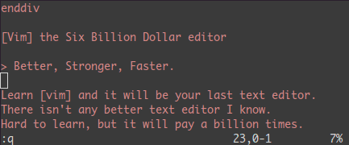

#### 结束语

- 上面是作者最常用的90%的命令。
- 我建议你每天都学1到2个新的命令。
- 在两到三周后，你会感到vim的强大的。

- 有时候，学习VIM就像是在死背一些东西。
- 幸运的是，vim有很多很不错的工具和优秀的文档。
- 运行vimtutor直到你熟悉了那些基本命令。
- 其在线帮助文档中你应该要仔细阅读的是 `:help usr_02.txt`.
- 你会学习到诸如 `!，` 目录，寄存器，插件等很多其它的功能。

学习vim就像学弹钢琴一样，一旦学会，受益无穷。

——————————正文结束——————————

对于vi/vim只是点评一点：这是一个你不需要使用鼠标，不需使用小键盘，只需要使用大键盘就可以完成很多复杂功能文本编辑的编辑器。不然，[Visual Studio也不就会有vim的插件了](https://coolshell.cn/articles/1901.html)。

(全文完)

# C语言中史上最愚蠢的BUG

#####  [2011年08月26日 ](https://coolshell.cn/articles/5388.html) [陈皓](https://coolshell.cn/articles/author/haoel) 评论 [126 条评论](https://coolshell.cn/articles/5388.html#comments) 71,165 人阅读

本文来自“[The most stupid C bug ever](http://www.elpauer.org/?p=971)”，很有意思，分享给大家。我相信这样的bug，就算你是高手你也会犯的。你来看看作者犯的这个Bug吧。。

首先，作者想用一段程序来创建一个文件，如果有文件名的话，就创建真正的文件，如果没有的话，就调用?[tmpfile()](https://linux.die.net/man/3/tmpfile)?创建临时文件。他这段程序就是HTTP下载的C程序。code==200就是HTTP的返回码。

**else** **if** (code == 200) {     // Downloading whole file

​    /* Write new file (plus allow reading once we finish) */

​    g = fname ? fopen(fname, "w+") : tmpfile();

}

但是这个程序，只能在Unix/Linux下工作，因为 Microsoft 的?[tmpfile()的实现](https://msdn.microsoft.com/en-us/library/x8x7sakw.aspx)?居然选择了 C:\ 作为临时文件的存放目录，这对于那些没有管理员权限的人来说就出大问题了，在Windows 7下，就算你有管理员权限也会有问题。所以，上面的程序在Windows平台下需要用不同的方式来处理，不能直接使用Windows的tmpfile()函数。

于是作者就先把这个问题记下来，在注释中写下了FIXME：

**else** **if** (code == 200) {     // Downloading whole file

​    /* Write new file (plus allow reading once we finish) */

​    // FIXME Win32 native version fails here because

​    //   Microsoft's version of tmpfile() creates the file in C:\

​    g = fname ? fopen(fname, "w+") : tmpfile();

}

然后，作者觉得需要写一个跨平台的编译：

FILE * tmpfile ( **void** ) {

**#ifndef _WIN32**

​    **return** tmpfile();

**#else**

​    //code for Windows;

**#endif**

}

<iframe id="aswift_3" name="aswift_3" sandbox="allow-forms allow-popups allow-popups-to-escape-sandbox allow-same-origin allow-scripts allow-top-navigation-by-user-activation" width="704" height="280" frameborder="0" marginwidth="0" marginheight="0" vspace="0" hspace="0" allowtransparency="true" scrolling="no" src="https://googleads.g.doubleclick.net/pagead/ads?client=ca-pub-3415450859608158&amp;output=html&amp;h=280&amp;adk=61470059&amp;adf=1181607677&amp;pi=t.aa~a.425447425~i.18~rp.4&amp;daaos=1684125332196&amp;w=704&amp;fwrn=4&amp;fwrnh=100&amp;lmt=1684156696&amp;num_ads=1&amp;rafmt=1&amp;armr=3&amp;sem=mc&amp;pwprc=9848079135&amp;ad_type=text_image&amp;format=704x280&amp;url=https%3A%2F%2Fcoolshell.cn%2Farticles%2F5388.html&amp;fwr=0&amp;pra=3&amp;rh=176&amp;rw=703&amp;rpe=1&amp;resp_fmts=3&amp;wgl=1&amp;fa=27&amp;adsid=ChEI8LCHowYQ1PStmYmQo8OEARI5ANXa3bgI6sbmesTcNZ3Vo3JXRFtZYkRIDnXt0IyW-0z7iw0g0takENqI7NSi-pMO65ExuwPERldx&amp;uach=WyJXaW5kb3dzIiwiMTUuMC4wIiwieDg2IiwiIiwiMTEzLjAuNTY3Mi45MyIsW10sMCxudWxsLCI2NCIsW1siR29vZ2xlIENocm9tZSIsIjExMy4wLjU2NzIuOTMiXSxbIkNocm9taXVtIiwiMTEzLjAuNTY3Mi45MyJdLFsiTm90LUEuQnJhbmQiLCIyNC4wLjAuMCJdXSwwXQ..&amp;dt=1684157981990&amp;bpp=1&amp;bdt=2437&amp;idt=-M&amp;shv=r20230510&amp;mjsv=m202305090101&amp;ptt=9&amp;saldr=aa&amp;abxe=1&amp;cookie=ID%3D85429a2c782bb635-222c91d9d0e00051%3AT%3D1684157980%3ART%3D1684157980%3AS%3DALNI_MYFGzPwhEaPTiXjcF7Sy_juRbDaQQ&amp;gpic=UID%3D00000c0633861a48%3AT%3D1684157980%3ART%3D1684157980%3AS%3DALNI_MZEkkj0F_ppLNxsg5pkwuoURAoEwA&amp;prev_fmts=0x0%2C1200x280%2C704x280&amp;nras=4&amp;correlator=2065930420344&amp;frm=20&amp;pv=1&amp;ga_vid=872445607.1684157576&amp;ga_sid=1684157576&amp;ga_hid=1388122339&amp;ga_fc=1&amp;u_tz=480&amp;u_his=1&amp;u_h=915&amp;u_w=1463&amp;u_ah=867&amp;u_aw=1463&amp;u_cd=24&amp;u_sd=1.75&amp;dmc=8&amp;adx=225&amp;ady=1724&amp;biw=1447&amp;bih=764&amp;scr_x=0&amp;scr_y=600&amp;eid=44773809%2C44759926%2C44759837%2C44759875%2C31071755%2C44772269%2C44788441%2C44792088&amp;oid=2&amp;psts=ABHeCvj8QkFSssCtApkZSpSJADUoCGyWjPtIM0Gqh1Z3YVlGUqjR-dXRDUhlo7yoDTpHAS9BQ8sq4EW1VRCT-uPULXfz7Wo&amp;pvsid=977226005661811&amp;tmod=1738974273&amp;uas=3&amp;nvt=2&amp;ref=https%3A%2F%2Fcoolshell.cn%2Farticles%2F5388.html&amp;fc=1408&amp;brdim=0%2C0%2C0%2C0%2C1463%2C0%2C1463%2C867%2C1463%2C764&amp;vis=1&amp;rsz=%7C%7Cs%7C&amp;abl=NS&amp;fu=128&amp;bc=31&amp;jar=2023-05-15-13&amp;ifi=4&amp;uci=a!4&amp;btvi=2&amp;fsb=1&amp;xpc=H9t7zwv8l2&amp;p=https%3A//coolshell.cn&amp;dtd=101" data-google-container-id="a!4" data-google-query-id="CNmIibK59_4CFdjNFgUd4CYImA" data-load-complete="true" style="box-sizing: border-box; max-width: 100%; width: 704px; left: 0px; top: 0px; border: 0px; height: 280px;"></iframe>

然后，作者觉得这样实现很不好，会发现名字冲突，因为这样一来这个函数太难看了。于是他重构了一下他的代码——写一个自己实现的tmpfile() – w32_tmpfile，然后，在Windows 下用宏定义来重命名这个函数为tmpfile()。（陈皓注：这种用法是比较标准的跨平台代码的写法）


**#ifdef _WIN32**

  **#define tmpfile w32_tmpfile**

**#endif**

FILE * w32_tmpfile ( **void** ) {

​    //code for Windows;

}

搞定！编译程序，运行。靠！居然没有调用到我的w32_tmpfile()，什么问题？调试，单步跟踪，果然没有调用到！难道是问号表达式有问题？改成if – else 语句，好了！

<iframe id="aswift_4" name="aswift_4" sandbox="allow-forms allow-popups allow-popups-to-escape-sandbox allow-same-origin allow-scripts allow-top-navigation-by-user-activation" width="704" height="280" frameborder="0" marginwidth="0" marginheight="0" vspace="0" hspace="0" allowtransparency="true" scrolling="no" src="https://googleads.g.doubleclick.net/pagead/ads?client=ca-pub-3415450859608158&amp;output=html&amp;h=280&amp;adk=61470059&amp;adf=3306234253&amp;pi=t.aa~a.425447425~i.27~rp.4&amp;daaos=1684125332196&amp;w=704&amp;fwrn=4&amp;fwrnh=100&amp;lmt=1684156696&amp;num_ads=1&amp;rafmt=1&amp;armr=3&amp;sem=mc&amp;pwprc=9848079135&amp;ad_type=text_image&amp;format=704x280&amp;url=https%3A%2F%2Fcoolshell.cn%2Farticles%2F5388.html&amp;fwr=0&amp;pra=3&amp;rh=176&amp;rw=703&amp;rpe=1&amp;resp_fmts=3&amp;wgl=1&amp;fa=27&amp;adsid=ChEI8LCHowYQ1PStmYmQo8OEARI5ANXa3bgI6sbmesTcNZ3Vo3JXRFtZYkRIDnXt0IyW-0z7iw0g0takENqI7NSi-pMO65ExuwPERldx&amp;uach=WyJXaW5kb3dzIiwiMTUuMC4wIiwieDg2IiwiIiwiMTEzLjAuNTY3Mi45MyIsW10sMCxudWxsLCI2NCIsW1siR29vZ2xlIENocm9tZSIsIjExMy4wLjU2NzIuOTMiXSxbIkNocm9taXVtIiwiMTEzLjAuNTY3Mi45MyJdLFsiTm90LUEuQnJhbmQiLCIyNC4wLjAuMCJdXSwwXQ..&amp;dt=1684157981990&amp;bpp=1&amp;bdt=2437&amp;idt=1&amp;shv=r20230510&amp;mjsv=m202305090101&amp;ptt=9&amp;saldr=aa&amp;abxe=1&amp;cookie=ID%3D85429a2c782bb635-222c91d9d0e00051%3AT%3D1684157980%3ART%3D1684157980%3AS%3DALNI_MYFGzPwhEaPTiXjcF7Sy_juRbDaQQ&amp;gpic=UID%3D00000c0633861a48%3AT%3D1684157980%3ART%3D1684157980%3AS%3DALNI_MZEkkj0F_ppLNxsg5pkwuoURAoEwA&amp;prev_fmts=0x0%2C1200x280%2C704x280%2C704x280&amp;nras=5&amp;correlator=2065930420344&amp;frm=20&amp;pv=1&amp;ga_vid=872445607.1684157576&amp;ga_sid=1684157576&amp;ga_hid=1388122339&amp;ga_fc=1&amp;u_tz=480&amp;u_his=1&amp;u_h=915&amp;u_w=1463&amp;u_ah=867&amp;u_aw=1463&amp;u_cd=24&amp;u_sd=1.75&amp;dmc=8&amp;adx=225&amp;ady=2395&amp;biw=1447&amp;bih=764&amp;scr_x=0&amp;scr_y=600&amp;eid=44773809%2C44759926%2C44759837%2C44759875%2C31071755%2C44772269%2C44788441%2C44792088&amp;oid=2&amp;psts=ABHeCvj8QkFSssCtApkZSpSJADUoCGyWjPtIM0Gqh1Z3YVlGUqjR-dXRDUhlo7yoDTpHAS9BQ8sq4EW1VRCT-uPULXfz7Wo&amp;pvsid=977226005661811&amp;tmod=1738974273&amp;uas=3&amp;nvt=2&amp;ref=https%3A%2F%2Fcoolshell.cn%2Farticles%2F5388.html&amp;fc=1408&amp;brdim=0%2C0%2C0%2C0%2C1463%2C0%2C1463%2C867%2C1463%2C764&amp;vis=1&amp;rsz=%7C%7Cs%7C&amp;abl=NS&amp;fu=128&amp;bc=31&amp;jar=2023-05-15-13&amp;ifi=5&amp;uci=a!5&amp;btvi=3&amp;fsb=1&amp;xpc=CubiImLGUi&amp;p=https%3A//coolshell.cn&amp;dtd=106" data-google-container-id="a!5" data-google-query-id="CKmuibK59_4CFcqnlgodzYAPFg" data-load-complete="true" style="box-sizing: border-box; max-width: 100%; width: 704px; left: 0px; top: 0px; border: 0px; height: 280px;"></iframe>

**if**(**NULL** != fname) {

​    g = fopen(fname, "w+");

} **else** {

​    g = tmpfile();

}

问号表达式不应该有问题吧，难道我们的宏对问号表达式不起作用，这难道是编译器的预编译的一个bug？作者怀疑到。

现在我们把所有的代码连在一起看，并比较一下：

**能正常工作的代码**

**#ifdef _WIN32**

**#  define tmpfile w32_tmpfile**

**#endif**

FILE * w32_tmpfile ( **void** ) {

​    code **for** Windows;

}

**else** **if** (code == 200) {     // Downloading whole file

​    /* Write new file (plus allow reading once we finish) */

​    // FIXME Win32 native version fails here because

​    //     Microsoft's version of tmpfile() creates the file in C:\

​    //g = fname ? fopen(fname, "w+") : tmpfile();

​    **if**(**NULL** != fname) {

​        g = fopen(fname, "w+");

​    } **else** {

​        g = tmpfile();

​    }

}

**不能正常工作的代码**

**#ifdef _WIN32**

**#  define tmpfile w32_tmpfile**

**#endif**

FILE * w32_tmpfile ( **void** ) {

​    code **for** Windows;

}

**else** **if** (code == 200) {     // Downloading whole file

​    /* Write new file (plus allow reading once we finish) */

​    // FIXME Win32 native version fails here because

​    //    Microsoft's version of tmpfile() creates the file in C:\

​    g = fname ? fopen(fname, "w+") : tmpfile();

}

也许你在一开始就看到了这个bug，但是作者没有。所有的问题都出在注释上：

/* Write new file (plus allow reading once we finish) */

// FIXME Win32 native version fails here because

//     Microsoft's version of tmpfile() creates the file in C:\

**你看到了最后那个C:\吗？在C中，“\” 代表此行没有结束，于是，后面的代码也成了注释。这就是这个bug的真正原因**！

<iframe id="aswift_2" name="aswift_2" sandbox="allow-forms allow-popups allow-popups-to-escape-sandbox allow-same-origin allow-scripts allow-top-navigation-by-user-activation" width="704" height="280" frameborder="0" marginwidth="0" marginheight="0" vspace="0" hspace="0" allowtransparency="true" scrolling="no" src="https://googleads.g.doubleclick.net/pagead/ads?client=ca-pub-3415450859608158&amp;output=html&amp;h=280&amp;adk=61470059&amp;adf=2767772232&amp;pi=t.aa~a.425447425~i.51~rp.4&amp;daaos=1684125332196&amp;w=704&amp;fwrn=4&amp;fwrnh=100&amp;lmt=1684156696&amp;num_ads=1&amp;rafmt=1&amp;armr=3&amp;sem=mc&amp;pwprc=9848079135&amp;ad_type=text_image&amp;format=704x280&amp;url=https%3A%2F%2Fcoolshell.cn%2Farticles%2F5388.html&amp;fwr=0&amp;pra=3&amp;rh=176&amp;rw=703&amp;rpe=1&amp;resp_fmts=3&amp;wgl=1&amp;fa=27&amp;adsid=ChEI8LCHowYQ1PStmYmQo8OEARI5ANXa3bgI6sbmesTcNZ3Vo3JXRFtZYkRIDnXt0IyW-0z7iw0g0takENqI7NSi-pMO65ExuwPERldx&amp;uach=WyJXaW5kb3dzIiwiMTUuMC4wIiwieDg2IiwiIiwiMTEzLjAuNTY3Mi45MyIsW10sMCxudWxsLCI2NCIsW1siR29vZ2xlIENocm9tZSIsIjExMy4wLjU2NzIuOTMiXSxbIkNocm9taXVtIiwiMTEzLjAuNTY3Mi45MyJdLFsiTm90LUEuQnJhbmQiLCIyNC4wLjAuMCJdXSwwXQ..&amp;dt=1684157981990&amp;bpp=1&amp;bdt=2438&amp;idt=-M&amp;shv=r20230510&amp;mjsv=m202305090101&amp;ptt=9&amp;saldr=aa&amp;abxe=1&amp;cookie=ID%3D85429a2c782bb635-222c91d9d0e00051%3AT%3D1684157980%3ART%3D1684157980%3AS%3DALNI_MYFGzPwhEaPTiXjcF7Sy_juRbDaQQ&amp;gpic=UID%3D00000c0633861a48%3AT%3D1684157980%3ART%3D1684157980%3AS%3DALNI_MZEkkj0F_ppLNxsg5pkwuoURAoEwA&amp;prev_fmts=0x0%2C1200x280&amp;nras=3&amp;correlator=2065930420344&amp;frm=20&amp;pv=1&amp;ga_vid=872445607.1684157576&amp;ga_sid=1684157576&amp;ga_hid=1388122339&amp;ga_fc=1&amp;u_tz=480&amp;u_his=1&amp;u_h=915&amp;u_w=1463&amp;u_ah=867&amp;u_aw=1463&amp;u_cd=24&amp;u_sd=1.75&amp;dmc=8&amp;adx=225&amp;ady=3887&amp;biw=1447&amp;bih=764&amp;scr_x=0&amp;scr_y=600&amp;eid=44773809%2C44759926%2C44759837%2C44759875%2C31071755%2C44772269%2C44788441%2C44792088&amp;oid=2&amp;psts=ABHeCvj8QkFSssCtApkZSpSJADUoCGyWjPtIM0Gqh1Z3YVlGUqjR-dXRDUhlo7yoDTpHAS9BQ8sq4EW1VRCT-uPULXfz7Wo&amp;pvsid=977226005661811&amp;tmod=1738974273&amp;uas=3&amp;nvt=2&amp;ref=https%3A%2F%2Fcoolshell.cn%2Farticles%2F5388.html&amp;fc=1408&amp;brdim=0%2C0%2C0%2C0%2C1463%2C0%2C1463%2C867%2C1463%2C764&amp;vis=1&amp;rsz=%7C%7Cs%7C&amp;abl=NS&amp;fu=128&amp;bc=31&amp;jar=2023-05-15-13&amp;ifi=3&amp;uci=a!3&amp;btvi=1&amp;fsb=1&amp;xpc=9yaSfcftdG&amp;p=https%3A//coolshell.cn&amp;dtd=42" data-google-container-id="a!3" data-google-query-id="CKGmhbK59_4CFf7LFgUdJ3MNiQ" data-load-complete="true" style="box-sizing: border-box; max-width: 100%; width: 704px; left: 0px; top: 0px; border: 0px; height: 280px;"></iframe>

而之所以改成if-else能工作的原因是因为作者注释了老的问号表达式的代码，所以，那段能工作的代码成了：

/* Write new file (plus allow reading once we finish) */

// FIXME Win32 native version fails here because Microsoft's version of tmpfile() creates the file in C:    //g = fname ? fopen(fname, "w+") : tmpfile();

**if**(**NULL** != fname) {

​    g = fopen(fname, "w+");

} **else** {

​    g = tmpfile();

}

我相信，当作者找到这个问题的原因后，一定会骂一句“妈的”！我也相信，这个bug花费了作者很多时间！

最后，我也share一个我以前犯的一个错。

我有一个小函数，需要传入一个int* pInt的类型，然后我需要在我的代码里 把这个int* pInt作除数。于是我的代码成了下面的这个样子：

> float result = num/*pInt;
> ….
>
> /*  some comments */
>
> -x<10 ? f(result):f(-result);

因为我在我当时用vi编写代码，所以没有语法高亮，而我的程序都编译通过了，但是却出现了很奇怪的事。我也不知道，用gdb调式的时候，发现有些语句直接就过了。这个问题让我花了很多时间，最后发现问题原来是没有空格导致的，TNND，下面我用代码高亮的插件来显示上面的代码，

<iframe id="aswift_5" name="aswift_5" sandbox="allow-forms allow-popups allow-popups-to-escape-sandbox allow-same-origin allow-scripts allow-top-navigation-by-user-activation" width="704" height="280" frameborder="0" marginwidth="0" marginheight="0" vspace="0" hspace="0" allowtransparency="true" scrolling="no" src="https://googleads.g.doubleclick.net/pagead/ads?client=ca-pub-3415450859608158&amp;output=html&amp;h=280&amp;adk=61470059&amp;adf=1054685387&amp;pi=t.aa~a.425447425~i.66~rp.4&amp;daaos=1684125332196&amp;w=704&amp;fwrn=4&amp;fwrnh=100&amp;lmt=1684156696&amp;num_ads=1&amp;rafmt=1&amp;armr=3&amp;sem=mc&amp;pwprc=9848079135&amp;ad_type=text_image&amp;format=704x280&amp;url=https%3A%2F%2Fcoolshell.cn%2Farticles%2F5388.html&amp;fwr=0&amp;pra=3&amp;rh=176&amp;rw=703&amp;rpe=1&amp;resp_fmts=3&amp;wgl=1&amp;fa=27&amp;adsid=ChEI8LCHowYQ1PStmYmQo8OEARI5ANXa3bgI6sbmesTcNZ3Vo3JXRFtZYkRIDnXt0IyW-0z7iw0g0takENqI7NSi-pMO65ExuwPERldx&amp;uach=WyJXaW5kb3dzIiwiMTUuMC4wIiwieDg2IiwiIiwiMTEzLjAuNTY3Mi45MyIsW10sMCxudWxsLCI2NCIsW1siR29vZ2xlIENocm9tZSIsIjExMy4wLjU2NzIuOTMiXSxbIkNocm9taXVtIiwiMTEzLjAuNTY3Mi45MyJdLFsiTm90LUEuQnJhbmQiLCIyNC4wLjAuMCJdXSwwXQ..&amp;dt=1684157981997&amp;bpp=1&amp;bdt=2444&amp;idt=0&amp;shv=r20230510&amp;mjsv=m202305090101&amp;ptt=9&amp;saldr=aa&amp;abxe=1&amp;cookie=ID%3D85429a2c782bb635-222c91d9d0e00051%3AT%3D1684157980%3ART%3D1684157980%3AS%3DALNI_MYFGzPwhEaPTiXjcF7Sy_juRbDaQQ&amp;gpic=UID%3D00000c0633861a48%3AT%3D1684157980%3ART%3D1684157980%3AS%3DALNI_MZEkkj0F_ppLNxsg5pkwuoURAoEwA&amp;prev_fmts=0x0%2C1200x280%2C704x280%2C704x280%2C704x280%2C1447x764%2C1005x124&amp;nras=8&amp;correlator=2065930420344&amp;frm=20&amp;pv=1&amp;ga_vid=872445607.1684157576&amp;ga_sid=1684157576&amp;ga_hid=1388122339&amp;ga_fc=1&amp;u_tz=480&amp;u_his=1&amp;u_h=915&amp;u_w=1463&amp;u_ah=867&amp;u_aw=1463&amp;u_cd=24&amp;u_sd=1.75&amp;dmc=8&amp;adx=225&amp;ady=4998&amp;biw=1447&amp;bih=764&amp;scr_x=0&amp;scr_y=1954&amp;eid=44773809%2C44759926%2C44759837%2C44759875%2C31071755%2C44772269%2C44788441%2C44792088&amp;oid=2&amp;psts=ABHeCvj8QkFSssCtApkZSpSJADUoCGyWjPtIM0Gqh1Z3YVlGUqjR-dXRDUhlo7yoDTpHAS9BQ8sq4EW1VRCT-uPULXfz7Wo&amp;pvsid=977226005661811&amp;tmod=1738974273&amp;uas=3&amp;nvt=2&amp;ref=https%3A%2F%2Fcoolshell.cn%2Farticles%2F5388.html&amp;fc=1408&amp;brdim=0%2C0%2C0%2C0%2C1463%2C0%2C1463%2C867%2C1463%2C764&amp;vis=1&amp;rsz=%7C%7Cs%7C&amp;abl=NS&amp;fu=128&amp;bc=31&amp;jar=2023-05-15-13&amp;ifi=6&amp;uci=a!6&amp;btvi=5&amp;fsb=1&amp;xpc=OeJZWxKAIa&amp;p=https%3A//coolshell.cn&amp;dtd=174" data-google-container-id="a!6" data-google-query-id="CN3KjbK59_4CFcjClgodmBUFPA" data-load-complete="true" style="box-sizing: border-box; max-width: 100%; width: 704px; left: 0px; top: 0px; border: 0px; height: 280px;"></iframe>

**float** result = num/*pInt;

....

/*  some comments */

-x<10 ? f(result):f(-result); 

Holly Shit!  我的代码成了：


**float** result = num-x<10 ? f(result):f(-result);


妈的！我的这个错误在愚蠢程度上和上面那个作者出的错误有一拼。

（全文完）

# 你会做WEB上的用户登录功能吗？

#####  [2011年08月25日 ](https://coolshell.cn/articles/5353.html) [陈皓](https://coolshell.cn/articles/author/haoel) 评论 [119 条评论](https://coolshell.cn/articles/5353.html#comments) 143,705 人阅读

Web上的用户登录功能应该是最基本的功能了，可是在我看过一些站点的用户登录功能后，我觉得很有必要写一篇文章教大家怎么来做用户登录功能。下面的文章告诉大家这个功能可能并没有你所想像的那么简单，这是一个关系到用户安全的功能，希望大家能从下面的文章中能知道什么样的方法才是一个好的用户登录功能。**以下内容，转载时请保持原文一致，并请注明作者和出处**。

目录


[用户名和口令](https://coolshell.cn/articles/5353.html#用户名和口令)[用户登录状态](https://coolshell.cn/articles/5353.html#用户登录状态)[找回口令的功能](https://coolshell.cn/articles/5353.html#找回口令的功能)[口令探测防守](https://coolshell.cn/articles/5353.html#口令探测防守)[参考文章](https://coolshell.cn/articles/5353.html#参考文章)

#### 用户名和口令

首先，我们先来说说用户名和口令的事。这并不是本站第一次谈论这个事了。[如何管理自己的口令](https://coolshell.cn/articles/2428.html)让你知道怎么管理自己的口令，[破解你的口令](https://coolshell.cn/articles/3801.html)让你知道在现代这样速度的计算速度下，用穷举法破解你的口令可能会是一件很轻松的事。在这里我想告诉从开发者的角度上来做设计这个用户名和口令的事。下面一几件规则：

- **限制用户输入一些非常容易被破解的口令**。如什么qwert，123456, password之类，就像[twitter限制用户的口令](https://coolshell.cn/articles/2451.html)一样做一个口令的黑名单。另外，你可以限制用户口令的长度，是否有大小写，是否有数字，你可以用你的程序做一下校验。当然，这可能会让用户感到很不爽，所以，现在很多网站都提供了UX让用户知道他的口令强度是什么样的（比如[这个有趣的UX](https://coolshell.cn/articles/3877.html)），这样可以让用户有一个选择，目的就是告诉用户——要想安全，先把口令设得好一点。

- **千万不要明文保存用户的口令**。正如[如何管理自己的口令](https://coolshell.cn/articles/2428.html)所说的一样，很多时候，用户都会用相同的ID相同的口令来登录很多网站。所以，如果你的网站明文保存的话，那么，如果你的数据被你的不良员工流传出去那对用户是灾难性的。所以，用户的口令一定要加密保存，最好是用不可逆的加密，如MD5或是SHA1之类的有hash算法的不可逆的加密算法。CSDN曾明文保存过用户的口令。（另，对于国内公司的品行以及有关部门的管理方式，我不敢保证国内网站以加密的方式保存你的口令。我觉得，做为一个有良知的人，我们应该加密保存用户的口令）

- **是否让浏览器保存口令**。我们有N多的方法可以不让浏览器保存用户名和口令。但是这可能对用户来说很不爽。因为在真实世界里谁也记得不住那么多的口令。很多用户可能会使用一些密码管理工具来保存密码，浏览器只是其中一种。是否让浏览器保存这个需要你做决定，重点是看一下你的系统的安全级别是否要求比较高，如果是的话，则不要让浏览器保存密码，并在网站明显的位置告诉用户——保存口令最安全的地方只有你的大脑。

- **口令在网上的传输**。因为HTTP是明文协议，所以，用户名和口令在网上也是明文发送的，这个很不安全。你可以看看[这篇文章](http://www.blogjava.net/heyang/archive/2011/04/05/340330.html)你就明白了。要做到加密传输就必需使用HTTPS协议。但是，在中国还是有很多网站的Web登录方式还在使用ActiveX控件，这可能成为IE6还大量存在的原因。我通常理解为这些ActiveX控件是为了反键盘记录程序的。 不过，我依然觉ActiveX控件不应该存在，因为在国外的众多安全很重要的站点上都看不到ActiveX的控件的身影。

#### 用户登录状态

首先，我想告诉大家的是，因为HTTP是无状态的协议，也就是说，这个协议是无法记录用户访问状态的，其每次请求都是独立的无关联的，一笔是一笔。而我们的网站都是设计成多个页面的，所在页面跳转过程中我们需要知道用户的状态，尤其是用户登录的状态，这样我们在页面跳转后我们才知道是否可以让用户有权限来操作一些功能或是查看一些数据。

**所以，我们每个页面都需要对用户的身份进行认证**。当然，我们不可能让用户在每个页面上输入用户名和口令，这会让用户觉得我们的网站相当的SB。为了实现这一功能，用得最多的技术就是浏览器的cookie，我们会把用户登录的信息存放在客户端的cookie里，这样，我们每个页面都从这个cookie里获得用户是否登录的信息，从而达到记录状态，验证用户的目的。但是，你真的会用cookie吗？下面是使用cookie的一些原则。

- **千万不要在cookie中存放用户的密码**。加密的密码都不行。因为这个密码可以被人获取并尝试离线穷举。所以，你一定不能把用户的密码保存在cookie中。我看到太多的站点这么干了。

- **正确设计“记住密码”**。这个功能简直就是一个安全隐患，我觉得并不是所有的程序员都知道怎么设计这个事。一般的设计 是——一时用户勾选了这个功能，系统会生成一个cookie，cookie包括用户名和一个固定的散列值，这个固定的散列值一直使用。这样，你就可以在所有的设备和客户上都可以登录，而且可以有多个用户同时登录。这个并不是很安全。下面是一些更为安全的方法供你参考：
  （——***更新 2011/08/26，原文中有些小错误，并且说的不清楚，重新调整了一下——***）

1）在cookie中，保存三个东西——**用户名**，**登录序列**，**登录token**。

**用户名**：明文存放。
**登录序列**：一个被MD5散列过的随机数，仅当强制用户输入口令时更新（如：用户修改了口令）。
**登录token**：一个被MD5散列过的随机数，仅一个登录session内有效，新的登录session会更新它。

2）上述三个东西会存在服务器上，服务器的验证用户需要验证客户端cookie里的这三个事。

3）这样的设计会有什么样的效果，会有下面的效果，

a）**登录token**是单实例登录。意思就是一个用户只能有一个登录实例。

b）**登录序列**是用来做盗用行为检测的。如果用户的cookie被盗后，盗用者使用这个cookie访问网站时，我们的系统是以为是合法用户，然后更新“**登录token**”，而真正的用户回来访问时，系统发现只有“**用户名**”和“**登录序列**”相同，但是“**登录token**” 不对，这样的话，系统就知道，这个用户可能出现了被盗用的情况，于是，系统可以清除并更改**登录序列** 和 ***\*登录token\****，这样就可以令所有的cookie失效，并要求用户输入口令。并给警告用户系统安全。

4）当然，**上述这样的设计还是会有一些问题，比如：同一用户的不同设备登录，甚至在同一个设备上使用不同的浏览器保登录**。一个设备会让另一个设备的**登录token**和**登录序列**失效，从而让其它设备和浏览器需要重新登录，并会造成cookie被盗用的假象。所以，你在服务器服还需要考虑- **IP 地址**，

a) 如果以口令方式登录，我们无需更新服务器的“**登录序列**”和 “**登录token**”（但需要更新cookie）。因为我们认为口令只有真正的用户知道。

b) 如果 **IP相同** ，那么，我们无需更新服务器的“**登录序列**”和 “**登录token**”（但需要更新cookie）。因为我们认为是同一用户有同一IP（当然，同一个局域网里也有同一IP，但我们认为这个局域网是用户可以控制的。网吧内并不推荐使用这一功能）。

c) 如果 （**IP不同** && **没有用口令登录**），那么，“**登录token**” 就会在多个IP间发生变化（登录token在两个或多个ip间被来来回回的变换），当在一定时间内达到一定次数后，系统才会真正觉得被盗用的可能性很高，此时系统在后台清除“**登录序列**”和“**登录token**“，让Cookie失效，强制用户输入口令（或是要求用户更改口令），以保证多台设备上的cookie一致。

- **不要让cookie有权限访问所有的操作**。否则就是XSS攻击，这个功能请参看[新浪微博的XSS攻击](https://coolshell.cn/articles/4914.html)。下面的这些功能一定要用户输入口令：

1）修改口令。

2）修改电子邮件。（电子邮件通常用来找回用户密码，最好通发邮件或是发手机短信的方式修改，或者干脆就不让改一一用电子邮件做帐号名）

3）用户的隐私信息。

4）用户消费功能。

- **权衡Cookie的过期时间。**如果是永不过期，会有很不错的用户体验，但是这也会让用户很快就忘了登录密码。如果设置上过期期限，比如2周，一个月，那么可能会好一点，但是2周和一个月后，用户依然会忘了密码。尤其是用户在一些公共电脑上，如果保存了永久cookie的话，等于泄露了帐号。所以，对于cookie的过期时间我们还需要权衡。

#### 找回口令的功能

找回口令的功能一定要提供。但是很多朋友并不知道怎么来设计这个功能。我们有很多找回口令的设计，下面我逐个点评一下。

- **千万不要使用安全问答**。事实证明，这个环节很烦人，而且用户并不能很好的设置安全问答。什么，我的生日啊，我母亲的生日，等等。因为今天的互联网和以前不一样了，因为SNS，今天的互联比以前更真实了，我可以上facebook，开心，人人网，LinkedIn查到你的很多的真实的信息。通过这些信息我可以使用安全问答来重设你的口令。 这里需要说一下 Facebook，Facebook的安全问答很强大，还要你通过照片认人，呵呵。

- **不要重置用户的密码**。因为这有可能让用户的密码遭到恶意攻击。当然，你要发个邮件给用户让其确认，用户点击邮件中的一个链接，你再重置。我并不推荐这样的方法，因为用户一般都会用笔记下来这个很难记的口令，然后登录系统，因为登录系统时使用了“记住密码”的功能，所以导致用户不会去修改密码，从而要么导到被写下来的密码被人盗取，要么又忘记了密码。

- **好一点的做法——通过邮件自行重置**。当用户申请找回口令功能的时候，系统生成一个MD5唯一的随机字串（可通过UID+IP+timestamp+随机数），放在数据库中，然后设置上时限（比如1小时内），给用户发一个邮件，这个连接中包含那个MD5的字串的链接，用户通过点击那个链接来自己重新设置新的口令。

- **更好一点的做法——多重认证**。比如：通过手机+邮件的方式让用户输入验证码。手机+邮件可能还不把握，因为手机要能会丢了，而我的手机可以访问我的邮箱。所以，使用U盾，SecureID（一个会变化的6位数token），或是通过人工的方式核实用户身份。当然，这主要看你的系统的安全级别了。

#### 口令探测防守

- **使用验证码**。验证码是后台随机产生的一个短暂的验证码，这个验证码一般是一个计算机很难识别的图片。这样就可以防止以程序的方式来尝试用户的口令。事实证明，这是最简单也最有效的方式。当然，总是让用户输入那些肉眼都看不清的验证码的用户体验不好，所以，可以折中一下。比如Google，当他发现一个IP地址发出大量的搜索后，其会要求你输入验证码。当他发现同一个IP注册了3个以上的gmail邮箱后，他需要给你发短信方式或是电话方式的验证码。

- **用户口令失败次数**。调置口令失败的上限，如果失败过多，则把帐号锁了，需要用户以找回口令的方式来重新激活帐号。但是，这个功能可能会被恶意人使用。最好的方法是，增加其尝试的时间成本（以前的这篇文章说过一个[增加时间成本的解密算法](https://coolshell.cn/articles/2078.html)）。如，两次口令尝试的间隔是5秒钟。三次以上错误，帐号被临时锁上30秒，5次以上帐号被锁1分钟，10次以上错误帐号被锁4小时……但是这会导致恶意用户用脚本来攻击，所以最好再加上验证码，验证码出错次数过多不禁止登录而是禁lP。

- **系统全局防守**。上述的防守只针对某一个别用户。恶意者们深知这一点，所以，他们一般会动用“僵尸网络”轮着尝试一堆用户的口令，所以上述的那种方法可能还不够好。我们需要在系统全局域上监控所有的口令失败的次数。当然，这个需要我们平时没有受到攻击时的数据做为支持。比如你的系统，平均每天有5000次的口令错误的事件，那么你可以认为，当口令错误大幅超过这个数后，而且时间相对集中，就说明有黑客攻击。这个时候你怎么办？一般最常见使用的方法是让所有的用户输错口令后再次尝试的时间成本增加。

最后，再说一下，关于用户登录，使用第三方的 OAuth 和 OpenID 也不失为一个很不错的选择。

#### 参考文章

- [OWASP Guide To Authentication](http://www.owasp.org/index.php/Guide_to_Authentication)
- [Dos and Don’ts of Client Authentication on the Web ](http://www.cs.umass.edu/~kevinfu/papers/webauth_tr.pdf)（PDF）
- [Charles Miller’s Persistent Login Cookie Best Practice](http://fishbowl.pastiche.org/2004/01/19/persistent_login_cookie_best_practice/)
- [Wikipedia: HTTP cookie](https://en.wikipedia.org/wiki/HTTP_cookie#Drawbacks_of_cookies)
- [Personal knowledge questions for fallback authentication: Security questions in the era of Facebook ](http://cups.cs.cmu.edu/soups/2008/proceedings/p13Rabkin.pdf)

# 弱爆程序员的特征值

#####  [2011年08月23日 ](https://coolshell.cn/articles/5292.html) [Sumtec](https://coolshell.cn/articles/author/sumtec) 评论 [69 条评论](https://coolshell.cn/articles/5292.html#comments) 59,195 人阅读

【**感谢网友[sumtec](https://coolshell.cn/articles/author/sumtec)投递此文，很欢乐也有意思，与大家共勉**】

首先说明：

1、以下特征是真实遇到过的，同事犯过的，乃至我自己也犯过的；
2、为了剧情需要，某些例子进行了一些夸张修饰等演绎创作，如无雷同，请勿生气；
3、如果你出现过以下症状之一，并不代表你就是弱爆了，但是如果你一直出现，乃至一说到这个大家就能联想到你，那么你就得小心了；
4、如果你是集这几个的大乘者，恭喜你，你已经找到了离开这个行业的充足理由了。

目录


[好了，搞定！](https://coolshell.cn/articles/5292.html#好了，搞定！)[那估计是他的Bug](https://coolshell.cn/articles/5292.html#那估计是他的Bug)[无图无真相！](https://coolshell.cn/articles/5292.html#无图无真相！)[那是个对象！](https://coolshell.cn/articles/5292.html#那是个对象！)[集大成者](https://coolshell.cn/articles/5292.html#集大成者)

#### 好了，搞定！

“那个Bug解决了吗？”

“好了，搞定！”

“这么快？”

正当你非常欣喜的时候，就传来了噩耗：刚才还能编译成功的，就失败了。（好吧，我们的集成编译尚未成功配置上，理论上这种事情应该会被退回。）又或者能编译成功，但是呢，原来明明能起作用的一个下拉框，突然发神经的不起作用了。最隐蔽的莫过于，一切正常，但是当你看到代码的时候，你就晕厥过去了。比如我们曾经发现了一个Bug，简单说就是每次用户点击某个东西，就会执行下面的这段C#代码：

```
controlPropertyPanel.PropertyChanged += this.UpdatePropertyOnChanged;
```

这个Bug很明显会导致速度越来越慢，因为同一个更新操作会被更新N次，并且这个N会越来越大。其实这个Bug已经够弱了，但是后来居然被修改为：


```
controlPropertyPanel.PropertyChanged -= this.UpdatePropertyOnChanged;
controlPropertyPanel.PropertyChanged += this.UpdatePropertyOnChanged;
```

这段代码能编译，能执行，但是就是弱爆了。因为这不仅仅没有从根本上去掉造成问题的逻辑，还会带来更多的困惑：为什么要先减后加呢？

这类特征，请大家看看有趣的《[各种流行的编程风格](https://coolshell.cn/articles/2058.html)》，我这个例子算是一种撞大运。我觉这吧，这类问题都是因为只想解决一些表面的东西为目的，完全不管底下的其它任何问题而造成的。

#### 那估计是他的Bug

“这个问题为啥还没解决呢？”

“我觉得应该是他那里边的Bug，我调不了。”

“哦……”

这个“他”可以是某一位同事，或者前同事，或者微软，或者别的什么公司，再或者某个开源代码的作者。这些个我都遇到过，比如说是另一位现在在职的同事吧。当你告诉这位同事这个Bug似乎在他那儿，并且问问什么时候解决，他也许会很愧疚的立刻调试，可最后结果却仍然是开头对话主人翁的所写代码的问题。

再比如说是微软吧，那么对话可能就会包括：“啊，SilverLight真是烂，老是内存泄漏、崩溃等……”“是啊是啊！烂死了！早知道用Flash了。”又或者会说：“微软就是烂，Java就是好。”其实，我不想比较什么SilverLight还是Flash，.NET还是Java。因为在讨论这些问题之前，先最好想想，这真的是别人的错么？相信是其他人的错是一件很简单的事情，因为这样推脱之后你就可以啥都不做了，反正不是我的错。

如果真的发现了这是别人的Bug并证明了，那倒好说。但这种特征是一种纯粹的怀疑，并没有丝毫的证明。在仔细找了自己所有可能犯的错之后，如果你怀疑是别人的问题，那请求证一下。

#### 无图无真相！

“楼主，无图无真相啊！”

“楼主，无代码无真相啊！”

“楼主，给翻译一下啊！”

据说Linus在别人询问Linux内存管理的一个什么问题时，回答道“Read the fxxxing source code”，很多时候我也有类似的冲动。我发现在信息发达的时代，不少人的阅读能力、动手能力都严重退化了。这些人最好就是你亲自来帮他把问题解决了，他才不想了解里面到底 发生了什么。这种问题体现在博客里面，就是寄希望于你写得图文并茂，图嘛最好花里胡哨同时言简而意概，文字嘛最好大段大段的代码。其实图不是重要的，只是为了好看，重点是代码，这样他一Copy就可以直接解决他们的问题了。

比方说，Silverlight里面没有各种图像格式的编码器，于是当你希望保存Jpg的时候怎么办呢？Google一下，发现原来有人写过一个FluxJpeg的编码器。下载下来一跑，唉还真能用哎。之后就直接签入，也不捎带看一下有没有什么问题，或者设计不合理的地方。（其实真的有，会很慢，因为有大量毫无必要的数组拷贝。）

又或者说，遇到了某个Bug，搜索一下发现，哎，还真有人遇到过，而且还有代码哎！把代码扒下来一跑，发现好像解决了，至于为什么就不管了。甚至还遇到过根本就不管解决不解决问题，反正代码扒下来了就签入了的。

再比如，写一篇博客讲解如何缩减.NET编译出来的文体大小，其中提到许多概念需要先阅读微软官方的一个[文档](https://download.microsoft.com/download/d/c/1/dc1b219f-3b11-4a05-9da3-2d0f98b20917/partition ii metadata.doc)。结果，还是会有人回复说，你那个文章里面提到那么多的Blob，也不说说Blob里面都有什么，大概是很不满意吧。可是这个文档里面都有啊，难道就不能自己阅读一下？其实即便我连这个文档都没有给出，自己也应该有这个能力去进行思考，去动手寻找。

千万不要退化成一个啥都要别人给你嚼烂了才能够吞下去，吞下去也不会消化吸收的人。这样的人大概别人给的是大便，只要有代码无真相，也会照样吃下去的。若真如此，那你打算如何提高呢？

#### 那是个对象！

“这个ExpressionVisitor，它是用来干什么的？”

“……”

“好吧，或者这么说，他是一个什么东西？”

“他是一个对象！”

“啊？”

“哦，是一个对象的实例。”

大概这样的回答，和那个微软工程师说“[你在直升飞机上](http://blog.oasisfeng.com/2007/09/21/experiencing-support-from-ms/)”差不多——反正你也不能说是错的，但是就是没什么意义。其实不知道没啥问题，人又不是神，怎么可能都知道呢？不去仔细了解和学习问题也不严重，因为你可以改。但是当你习惯性的随便找一个绝对没错但又不说明任何问题的答案，甚至似是而非的东西来对付的时候，你就离弱爆的边缘很近了。

当然，上面的对话也许是比较极端的。一个稍弱一点的对话版本是：

“这个内存泄漏是怎么造成的呢？”

“嗯，会不会是图片放的位置不对呢？”

哈，还是很夸张对吧？没办法，写博客有时候需要夸张的文字，否则你无法理解我的意思是：有时候，大家会倾向于从自己的记忆中寻找一些相似的物品，然后选择相似度自认为比较高的东西出来当作答案，而全然不管两者之间的逻辑是否有哪怕那么一丝的关联。也许很多时候，我们确实需要从相似的东西开始，但请别把他当作终点。程序是需要严谨的逻辑的，所以你也必须非常严谨的去推演。

关于这类的问题真的太多太多了，比如我指着下面这段代码当中的红字：

var dictionary = new Dictionary<string, string>();
dictionary**[“someKey”]** = “someValue”;

“这句话说明了什么？”

“说明dictionary是一个数组。”

#### 集大成者

最后我举一个集大成者的例子，说，有个任务是要在SilverLight应用上面添加一个“收藏本站点”。好，怎么解决呢？网上一搜，发现有很多这样的代码：

```
function AddBookmark(Url, LabeName) {
  if (document.all)
  {
    window.external.addFavorite(Url, LabeName);
  }
  else if (window.sidebar)
  {
    window.sidebar.addPanel(LabeName, Url, '');
  }
}
```

然后直接扒下来就放上去了，通过某种方式在SilverLight中调用这段JavaScript，签入，搞定了！结果到了测试那边发现完全不能用，无论在IE6/7/8/9/10，还是在FireFox/Safari/Chrome上面，都不能使用。我问：

“这是什么原因呢？”

“不知道，反正浏览器报告没有权限，可能是浏览器的安全设置原因吧，或者操作系统的Bug，也可能是浏览器的某种Bug？”

“不可能啊？这些代码存在很多年了，要有问题早就能在网上搜索到了。”

“那也许是SilverLight调用的时候有什么安全问题。哎！SilverLight好烦啊！”

“那怎么还没有解决呢？”

“好，我马上解决它！”

很快，那段Javascript就变成了：

```
function AddBookmark(Url, LabeName) {
  try
  {
    if (document.all)
    {
      window.external.addFavorite(Url, LabeName);
    }
    else if (window.sidebar)
    {
      window.sidebar.addPanel(LabeName, Url, '');
    }
  }
  catch
  {
    alert("您的浏览器因为安全设置的问题无法收藏，请手动添加收藏！");
  }
}
```

看到这样的代码，我彻底震惊了。亲自调试了一下，发现确实报告了一个“没有权限”的异常。但是，我还发现，那个Url参数的值是“www.adomainname.com\test\page.html”。那这不废话么！浏览器认为你要收藏的是一个本地硬盘上的路径，怎么可能在一个Internet Zone上允许收藏这种路径呢？我于是指着代码问：

“这个Url是什么？”

“是一个变量”

“啊？”

“哦，不对，是一个参数。”

你是否也有类似的经历呢？

（全文完）

# C++11 中值得关注的几大变化（详解）

#####  [2011年08月19日 ](https://coolshell.cn/articles/5265.html) [陈皓](https://coolshell.cn/articles/author/haoel) 评论 [91 条评论](https://coolshell.cn/articles/5265.html#comments) 96,506 人阅读

源文章来自前C++标准委员会的 [Danny Kalev](http://www.softwarequalityconnection.com/author/dannykalev/) 的 [The Biggest Changes in C++11 (and Why You Should Care)](http://www.softwarequalityconnection.com/2011/06/the-biggest-changes-in-c11-and-why-you-should-care/)，赖勇浩做了一个[中文翻译在这里](http://blog.csdn.net/lanphaday/article/details/6564162)。所以，我就不翻译了，我在这里仅对文中提到的这些变化“**追问为什么要引入这些变化**”的一个探讨，**只有知道为了什么，用在什么地方，我们才能真正学到这个知识**。而以此你可以更深入地了解这些变化。所以，本文不是翻译。因为写得有些仓促，所以难免有问题，还请大家指正。

目录


[Lambda 表达式](https://coolshell.cn/articles/5265.html#Lambda_表达式)[自动类型推导 auto](https://coolshell.cn/articles/5265.html#自动类型推导_auto)[自动化推导 decltype](https://coolshell.cn/articles/5265.html#自动化推导_decltype)[auto 和 decltype 的差别和关系](https://coolshell.cn/articles/5265.html#auto_和_decltype_的差别和关系)[统一的初始化语法](https://coolshell.cn/articles/5265.html#统一的初始化语法)[Delete 和 Default 函数](https://coolshell.cn/articles/5265.html#Delete_和_Default_函数)[nullptr](https://coolshell.cn/articles/5265.html#nullptr)[委托构造](https://coolshell.cn/articles/5265.html#委托构造)[右值引用和move语义](https://coolshell.cn/articles/5265.html#右值引用和move语义)[C++ 11 STL 标准库](https://coolshell.cn/articles/5265.html#C_11_STL_标准库)[线程库](https://coolshell.cn/articles/5265.html#线程库)[新型智能指针](https://coolshell.cn/articles/5265.html#新型智能指针)[新的算法](https://coolshell.cn/articles/5265.html#新的算法)

#### Lambda 表达式

Lambda表达式来源于函数式编程，说白就了就是在使用的地方定义函数，有的语言叫“闭包”，如果 lambda 函数没有传回值(例如 `void` )，其回返类型可被完全忽略。 定义在与 lambda 函数相同作用域的变量参考也可以被使用。这种的变量集合一般被称作 closure（闭包）。我在这里就不再讲这个事了。表达式的简单语法如下，

```
[capture](parameters)->return_type {body}
```

原文的作者给出了下面的例子：

```
int main()
{
   char s[]="Hello World!";
   int Uppercase = 0; //modified by the lambda
   for_each(s, s+sizeof(s), [&Uppercase] (char c) {
    if (isupper(c))
     Uppercase++;
    });
 cout << Uppercase << " uppercase letters in: " << s <<endl;
}
```

在传统的STL中for_each() 这个玩意最后那个参数需要一个“函数对象”，所谓函数对象，其实是一个class，这个class重载了operator()，于是这个对象可以像函数的式样的使用。实现一个函数对象并不容易，需要使用template，比如下面这个例子就是函数对象的简单例子（实际的实现远比这个复杂）：


```
template <class T>
class less
{
public:
    bool operator()(const T&l, const T&r)const
    {
        return l < r;
    }
};
```

所以，**C++引入Lambda的最主要原因就是1）可以定义匿名函数，2）编译器会把其转成函数对象**。相信你会和我一样，会疑问为什么以前STL中的ptr_fun()这个函数对象不能用？（ptr_fun()就是把一个自然函数转成函数对象的）。原因是，ptr_fun() 的局限是其接收的自然函数只能有1或2个参数。

那么，除了方便外，为什么一定要使用Lambda呢？它比传统的函数或是函数对象有什么好处呢？我个人所理解的是，这种函数之年以叫“闭包”，就是因为其限制了别人的访问，更私有。也可以认为他是一次性的方法。Lambda表达式应该是简洁的，极私有的，为了更易的代码和更方便的编程。

#### 自动类型推导 auto

在这一节中，原文主要介绍了两个关键字 auto 和 deltype，示例如下：

```
auto x=0; //x has type int because 0 is int
auto c='a'; //char
auto d=0.5; //double
auto national_debt=14400000000000LL;//long long
```

auto 最大的好处就是让代码简洁，尤其是那些模板类的声明，比如：STL中的容器的迭代子类型。

```
vector<int>::const_iterator ci = vi.begin();
```

可以变成：

```
auto ci = vi.begin();
```

模板这个特性让C++的代码变得很难读，不信你可以看看STL的源码，那是一个乱啊。使用auto必需一个初始化值，编译器可以通过这个初始化值推导出类型。因为auto是来简化模板类引入的代码难读的问题，如上面的示例，iteration这种类型就最适合用auto的，但是，我们不应该把其滥用。

比如下面的代码的可读性就降低了。因为，我不知道ProcessData返回什么？int? bool? 还是对象？或是别的什么？这让你后面的程序不知道怎么做。

```
auto obj = ProcessData(someVariables);
```

但是下面的程序就没有问题，因为pObject的型别在后面的new中有了。

```
auto pObject = new SomeType<OtherType>::SomeOtherType();
```

#### 自动化推导 decltype

关于 `decltype` 是一个操作符，其可以评估括号内表达式的类型，其规则如下：

1. 如果表达式e是一个变量，那么就是这个变量的类型。
2. 如果表达式e是一个函数，那么就是这个函数返回值的类型。
3. 如果不符合1和2，如果e是左值，类型为T，那么decltype(e)是T&；如果是右值，则是T。

原文给出的示例如下，我们可以看到，这个让的确我们的定义变量省了很多事。

```
const vector<int> vi;
typedef decltype (vi.begin()) CIT;
CIT another_const_iterator;
```

还有一个适合的用法是用来typedef函数指针，也会省很多事。比如：

```
 decltype(&myfunc) pfunc = 0;

typedef decltype(&A::func1) type;
```

#### auto 和 decltype 的差别和关系

[Wikipedia 上是这么说的](https://en.wikipedia.org/wiki/C%2B%2B0x#Type_inference)（关于decltype的规则见上）

```
#include <vector>

int main()
{
    const std::vector<int> v(1);
    auto a = v[0];        // a 的类型是 int
    decltype(v[0]) b = 1; // b 的类型是 const int&, 因为函数的返回类型是
                          // std::vector<int>::operator[](size_type) const
    auto c = 0;           // c 的类型是 int
    auto d = c;           // d 的类型是 int
    decltype(c) e;        // e 的类型是 int, 因为 c 的类型是int
    decltype((c)) f = c;  // f 的类型是 int&, 因为 (c) 是左值
    decltype(0) g;        // g 的类型是 int, 因为 0 是右值
}
```

如果auto 和 decltype 在一起使用会是什么样子？能看下面的示例，下面这个示例也是引入decltype的一个原因——让C++有能力写一个 “ [forwarding function](https://en.wikipedia.org/wiki/Wrapper_function) 模板”，

```
template< typename LHS, typename RHS>
  auto AddingFunc(const LHS &lhs, const RHS &rhs) -> decltype(lhs+rhs)
{return lhs + rhs;}
```

这个函数模板看起来相当费解，其用到了auto 和 decltype 来扩展了已有的模板技术的不足。怎么个不足呢？在上例中，我不知道AddingFunc会接收什么样类型的对象，这两个对象的 + 操作符返回的类型也不知道，老的模板函数无法定义AddingFunc返回值和这两个对象相加后的返回值匹配，所以，你可以使用上述的这种定义。

#### 统一的初始化语法

C/C++的初始化的方法比较，C++ 11 用大括号统一了这些初始化的方法。

比如：POD的类型。

```
int arr[4]={0,1,2,3};
struct tm today={0};
```

关于POD相说两句，所谓POD就是[Plain Old Data](https://en.wikipedia.org/wiki/Plain_Old_Data_Structures)，当class/struct是*极简的(trivial)*、属于*标准布局(standard-layout)*，以及他的所有非静态（non-static）成员都是POD时，会被视为POD。如：

```
struct A { int m; }; // POD
struct B { ~B(); int m; }; // non-POD, compiler generated default ctor
struct C { C() : m() {}; ~C(); int m; }; // non-POD, default-initialising m
```

POD的初始化有点怪，比如上例，new A; 和new A(); 是不一样的，对于其内部的m，前者没有被初始化，后者被初始化了（不同 的编译器行为不一样，VC++和GCC不一样）。而非POD的初始化，则都会被初始化。

从这点可以看出，C/C++的初始化问题很奇怪，所以，在C++ 2011版中就做了统一。原文作者给出了如下的示例：

```
C c {0,0}; //C++11 only. 相当于: C c(0,0);

int* a = new int[3] { 1, 2, 0 }; /C++11 only

class X {
    int a[4];
    public:
        X() : a{1,2,3,4} {} //C++11, member array initializer
};
```

容器的初始化：

```
// C++11 container initializer
vector<string> vs={ "first", "second", "third"};
map singers =
{ {"Lady Gaga", "+1 (212) 555-7890"},
{"Beyonce Knowles", "+1 (212) 555-0987"}};
```

还支持像Java一样的成员初始化：

```
class C
{
   int a=7; //C++11 only
 public:
   C();
};
```

#### Delete 和 Default 函数

我们知道C++的编译器在你没有定义某些成员函数的时候会给你的类自动生成这些函数，比如，构造函数，拷贝构造，析构函数，赋值函数。有些时候，我们不想要这些函数，比如，构造函数，因为我们想做实现单例模式。传统的做法是将其声明成private类型。

在新的C++中引入了两个指示符，delete意为告诉编译器不自动产生这个函数，default告诉编译器产生一个默认的。原文给出了下面两个例子：

```
struct A
{
    A()=default; //C++11
    virtual ~A()=default; //C++11
};
```

再如delete

```
struct NoCopy
{
    NoCopy & operator =( const NoCopy & ) = delete;
    NoCopy ( const NoCopy & ) = delete;
};
NoCopy a;
NoCopy b(a); //compilation error, copy ctor is deleted
```

这里，我想说一下，为什么我们需要default？我什么都不写不就是default吗？不全然是，比如构造函数，因为只要你定义了一个构造函数，编译器就不会给你生成一个默认的了。所以，为了要让默认的和自定义的共存，才引入这个参数，如下例所示：

```
struct SomeType
{
 SomeType() = default; // 使用编译器生成的默认构造函数
 SomeType(OtherType value);
};
```

关于delete还有两个有用的地方是

1）让你的对象只能生成在栈内存上：

```
struct NonNewable {
    void *operator new(std::size_t) = delete;
};
```

2）阻止函数的其形参的类型调用：（若尝试以 double 的形参调用 `f()`，将会引发编译期错误， 编译器不会自动将 double 形参转型为 int 再调用`f()`，如果传入的参数是double，则会出现编译错误）

```
void f(int i);
 void f(double) = delete;
```

#### nullptr

C/C++的NULL宏是个被有很多潜在BUG的宏。因为有的库把其定义成整数0，有的定义成 (void*)0。在C的时代还好。但是在C++的时代，这就会引发很多问题。你可以上网看看。这是为什么需要 `nullptr` 的原因。 `nullptr` 是强类型的。

```
void f(int); //#1
void f(char *);//#2
//C++03
f(0); //二义性
//C++11
f(nullptr) //无二义性，调用f(char*)
```

`所以在新版中请以 nullptr` 初始化指针。

#### 委托构造

在以前的C++中，构造函数之间不能互相调用，所以，我们在写这些相似的构造函数里，我们会把相同的代码放到一个私有的成员函数中。

```
class SomeType {
private:
  int number;
  string name;
  SomeType( int i, string&amp; s ) : number(i), name(s){}
public:
  SomeType( )               : SomeType( 0, "invalid" ){}
  SomeType( int i )         : SomeType( i, "guest" ){}
  SomeType( string&amp; s ) : SomeType( 1, s ){ PostInit(); }
};
```

但是，为了方便并不足让“委托构造”这个事出现，最主要的问题是，基类的构造不能直接成为派生类的构造，就算是基类的构造函数够了，派生类还要自己写自己的构造函数：

```
class BaseClass
{
public:
  BaseClass(int iValue);
};

class DerivedClass : public BaseClass
{
public:
  using BaseClass::BaseClass;
};
```

上例中，派生类手动继承基类的构造函数， 编译器可以使用基类的构造函数完成派生类的构造。 而将基类的构造函数带入派生类的动作 无法选择性地部分带入， 所以，要不就是继承基类全部的构造函数，要不就是一个都不继承(不手动带入)。 此外，若牵涉到多重继承，从多个基类继承而来的构造函数不可以有相同的函数签名(signature)。 而派生类的新加入的构造函数也不可以和继承而来的基类构造函数有相同的函数签名，因为这相当于重复声明。（所谓函数签名就是函数的参数类型和顺序不）

#### 右值引用和move语义

在老版的C++中，临时性变量（称为右值”R-values”，位于赋值操作符之右）经常用作交换两个变量。比如下面的示例中的tmp变量。示例中的那个函数需要传递两个string的引用，但是在交换的过程中产生了对象的构造，内存的分配还有对象的拷贝构造等等动作，成本比较高。

```
void naiveswap(string &amp;a, string &amp;b)
{
 string temp = a;
 a=b;
 b=temp;
}
```

C++ 11增加一个新的引用（reference）类型称作右值引用（R-value reference），标记为`typename &&`。他们能够以non-const值的方式传入，允许对象去改动他们。这项修正允许特定对象创造出move语义。

举例而言，上面那个例子中，string类中保存了一个动态内存分存的char*指针，如果一个string对象发生拷贝构造（如：函数返回），string类里的char*内存只能通过创建一个新的临时对象，并把函数内的对象的内存copy到这个新的对象中，然后销毁临时对象及其内存。**这是原来C++性能上重点被批评的事**。

能过右值引用，string的构造函数需要改成“move构造函数”，如下所示。这样一来，使得对某个stirng的右值引用可以单纯地从右值复制其内部C-style的指针到新的string，然后留下空的右值。这个操作不需要内存数组的复制，而且空的暂时对象的析构也不会释放内存。其更有效率。

```
class string
{
    string (string&&); //move constructor
    string&& operator=(string&&); //move assignment operator
};
```

The C++11 STL中广泛地使用了右值引用和move语议。因此，很多算法和容器的性能都被优化了。

#### C++ 11 STL 标准库

C++ STL库在2003年经历了很大的整容手术 [Library Technical Report 1](http://www.devsource.com/c/a/Languages/Grok-The-New-Features-in-Standard-C/) (TR1)。 TR1 中出现了很多新的容器类 (`unordered_set`, `unordered_map`, `unordered_multiset`, 和 `unordered_multimap`) 以及一些新的库支持诸如：正则表达式， tuples，函数对象包装，等等。 C++11 批准了 TR1 成为正式的C++标准，还有一些TR1 后新加的一些库，从而成为了新的C++ 11 STL标准库。这个库主要包含下面的功能：

##### 线程库

这们就不多说了，以前的STL饱受线程安全的批评。现在好 了。C++ 11 支持线程类了。这将涉及两个部分：第一、设计一个可以使多个线程在一个进程中共存的内存模型；第二、为线程之间的交互提供支持。第二部分将由程序库提供支持。大家可以看看[promises and futures](https://en.wikipedia.org/wiki/Futures_and_promises)，其用于对象的同步。 [async()](http://www.stdthread.co.uk/doc/headers/future/async.html) 函数模板用于发起并发任务，而 [thread_local](http://www.devx.com/cplus/10MinuteSolution/37436) 为线程内的数据指定存储类型。更多的东西，可以查看 Anthony Williams的 [Simpler Multithreading in C++0x](http://www.devx.com/SpecialReports/Article/38883).

##### 新型智能指针

C++98 的知能指针是 `auto_ptr， 在C++ 11中被废弃了。`C++11  引入了两个指针类： [shared_ptr](http://www.informit.com/guides/content.aspx?g=cplusplus&seqNum=239) 和 [unique_ptr](http://www.informit.com/guides/content.aspx?g=cplusplus&seqNum=400)。 shared_ptr只是单纯的引用计数指针，`unique_ptr 是用来取代auto_ptr`。 `unique_ptr` 提供 `auto_ptr` 大部份特性，唯一的例外是 `auto_ptr` 的不安全、隐性的左值搬移。不像 `auto_ptr`，`unique_ptr` 可以存放在 C++0x 提出的那些能察觉搬移动作的容器之中。

为什么要这么干？大家可以看看《More Effective C++》中对 auto_ptr的讨论。

##### 新的算法

定义了一些新的算法： `all_of()`, `any_of()` 和 `none_of()。`

```
#include &lt;algorithm&gt;
//C++11 code
//are all of the elements positive?
all_of(first, first+n, ispositive()); //false
//is there at least one positive element?
any_of(first, first+n, ispositive());//true
// are none of the elements positive?
none_of(first, first+n, ispositive()); //false
```

使用新的copy_n()算法，你可以很方便地拷贝数组。

```
#include &lt;algorithm&gt;
int source[5]={0,12,34,50,80};
int target[5];
//copy 5 elements from source to target
copy_n(source,5,target);
```

使用 `iota()` 可以用来创建递增的数列。如下例所示：

```
include &lt;numeric&gt;
int a[5]={0};
char c[3]={0};
iota(a, a+5, 10); //changes a to {10,11,12,13,14}
iota(c, c+3, 'a'); //{'a','b','c'} 
```

总之，看下来，C++11 还是很学院派，很多实用的东西还是没有，比如： XML，sockets，reflection，当然还有垃圾回收。看来要等到C++ 20了。呵呵。不过C++ 11在性能上还是很快。参看 Google’s [benchmark tests](http://www.itproportal.com/2011/06/07/googles-rates-c-most-complex-highest-performing-language/)。原文还引用Stroustrup 的观点：C++11 是一门新的语言——一个更好的 C++。

如果把所有的改变都列出来，你会发现真多啊。我估计C++ Primer那本书的厚度要增加至少30%以上。C++的门槛会不会越来越高了呢？我不知道，但我个人觉得这门语言的确是变得越来越令人望而却步了。（想起了某人和我说的一句话——学技术真的是太累了，还是搞方法论好混些？）

（全文完）

# 国内微博和TWITTER的最大不同

#####  [2011年08月17日 ](https://coolshell.cn/articles/5247.html) [陈皓](https://coolshell.cn/articles/author/haoel) 评论 [85 条评论](https://coolshell.cn/articles/5247.html#comments) 62,902 人阅读

霍炬近两个月前写过一篇《[microblogging和微博信息架构产品差距和影响](http://blog.devep.net/virushuo/2011/06/26/microblogging.html)》分析了国内微博和Twitter的差距，重点就是因为信息的平等性。我也一直在观察新浪微博，以及新浪和Twitter的一些功能上的差别。发现了一些东西，想在这里和大家分享一下。我的见解达不到像霍炬那样的层次，作为一个技术人员，我只能在产品功能上做些分析。欢迎大家指正。

目录


[现实状况](https://coolshell.cn/articles/5247.html#现实状况)[SNS中的上下文](https://coolshell.cn/articles/5247.html#SNS中的上下文)[上下文造假](https://coolshell.cn/articles/5247.html#上下文造假)[其它](https://coolshell.cn/articles/5247.html#其它)

#### 现实状况

国内的微博就是新浪，Sohu微博，腾讯微博，以及饭否。我们不难发现：

- 搜狐的和腾讯的就是Copy新浪的。在Following和Followed上大家都有自己所谓的“创新”
- 饭否是在Copy Twitter，这点太明显了，不过，抄在了表面，而且相当的怪。

国内所有的这些以Twitter为蓝本干出来的这些东西，其和Twitter在核心功能上有这些差别：

- Twitter的Retweet一点信息都加不上，国内的微博的转发需要加上自己的评论，也就形自己的信息。
- Twitter的Reply只会有一个@原来的人，国内的Reply也很相似，只是勾上转发后就会把Reply的东西以“**//@XXX**”的方式成为自己的信息。
- 饭否的做法比较怪，转发加原文（想做成新浪的样子），回复不加原文，只有@（Twitter）的样子，可见饭否的分裂。

#### SNS中的上下文

这段时间，我一直在想，新浪为什么要做成这样，为什么不做成Twitter那样，或者，为什么Twitter做成那样而不是新浪这样？从表面上看上去，**新浪的“回复+转发”会带被回的信息，而Twitter的回复不带上下文，Twitter上一些我fo的人的话题完全看不懂，不像新浪的还能看到上文**。

老实说，在一开始，我还觉得新浪微博这种用法和技术上要比 Twitter 要强大，现在看来是我当时对Twitter并不熟悉。经过这段时间的观察。**我恰恰发现新浪在转发和回复上都要带上原文其实是一件很没有技术含量的事**。要说清这个事，请让我说一下评论和回复的事。


- 我们网上讨论一个事的时候，你会发现，一个主题下的讨论会对回复的话题进行讨论而偏题，甚至会发散出多条讨论线各自发展。这种事会造成讨论的混乱。所以，上下文是关键。
- BBS和Wordpress可以使用“引用”或“回复”来让你的话题有上下文。新浪的博客和新闻评论里没有，只是网易的评论可以盖楼。所以新浪微博基本上采用的就是这样的方式。

然而，Twitter则不是，Twitter的回复系统是不会像新浪那样加上“**//@XXX**”的东西的，如果你要看信息的上下文，你需要点击信息，在右边栏会出现其上下文列表。**Twitter的这个功能可以让你很容易地找到一个信息链，而不受别的信息链的干扰，不像国内微博那样——多个信息链穿插成一锅粥让你无法阅读**（饭否是抄Twitter抄的最像的，但是其没有实现这个功能）。

#### 上下文造假

国内的所有微博都做不到这个事，我估计是因为技术不行。所以，为了加上上下文，他们只能做成今天你看到的这个样子。你也许会想和我争论，这样在阅读体验上更好。但是，如果你看过下面这个例子，你一定就不会这么想了。

在新浪微博上，我们转发或是回复时，我们可以人为地加上这样的上下文（说白了，就是造假）：

> //[@姚晨](http://weibo.com/yaochen)：八顿也会C语言。//[@任志强](http://weibo.com/renzhiqiang)：不是C++才牛吗？ //[@李承鹏](http://blog.sina.com.cn/lichengpeng)：代表盲肠封你为程序员的脊梁。//[@苍井空](http://weibo.com/1739928273)：还要爱吃空心菜的菜。 //[@李开复](http://weibo.com/kaifulee)：成功的程序员的标志：1）用C语言，2）不用IE6，3）无需敏捷咨询师。

看到这个，你明白为什么Twitter要那样，而不是新浪这样了吧？！**这就是差距，至少是产品经理的差距**。我个人觉得还有技术上的差距。如果某人给你发来的一条手机短信你都搞不清楚是不是这个人说的，那会是多么恐怖的事。

<iframe id="aswift_2" name="aswift_2" sandbox="allow-forms allow-popups allow-popups-to-escape-sandbox allow-same-origin allow-scripts allow-top-navigation-by-user-activation" width="704" height="280" frameborder="0" marginwidth="0" marginheight="0" vspace="0" hspace="0" allowtransparency="true" scrolling="no" src="https://googleads.g.doubleclick.net/pagead/ads?client=ca-pub-3415450859608158&amp;output=html&amp;h=280&amp;adk=1211426427&amp;adf=888032600&amp;pi=t.aa~a.425447425~i.35~rp.4&amp;daaos=1684125332196&amp;w=704&amp;fwrn=4&amp;fwrnh=100&amp;lmt=1684150650&amp;num_ads=1&amp;rafmt=1&amp;armr=3&amp;sem=mc&amp;pwprc=9848079135&amp;ad_type=text_image&amp;format=704x280&amp;url=https%3A%2F%2Fcoolshell.cn%2Farticles%2F5247.html&amp;fwr=0&amp;pra=3&amp;rh=176&amp;rw=703&amp;rpe=1&amp;resp_fmts=3&amp;wgl=1&amp;fa=27&amp;adsid=ChEI8LCHowYQ1PStmYmQo8OEARI5ANXa3bipz3X9JW-5l8Ovze1AdzJdTEamSQtCdouShxgp1CVJF776ejpLqSNvYry4G76PMUsmwsTv&amp;uach=WyJXaW5kb3dzIiwiMTUuMC4wIiwieDg2IiwiIiwiMTEzLjAuNTY3Mi45MyIsW10sMCxudWxsLCI2NCIsW1siR29vZ2xlIENocm9tZSIsIjExMy4wLjU2NzIuOTMiXSxbIkNocm9taXVtIiwiMTEzLjAuNTY3Mi45MyJdLFsiTm90LUEuQnJhbmQiLCIyNC4wLjAuMCJdXSwwXQ..&amp;dt=1684158054087&amp;bpp=1&amp;bdt=3378&amp;idt=1&amp;shv=r20230510&amp;mjsv=m202305090101&amp;ptt=9&amp;saldr=aa&amp;abxe=1&amp;cookie=ID%3D85429a2c782bb635-222c91d9d0e00051%3AT%3D1684157980%3ART%3D1684157980%3AS%3DALNI_MYFGzPwhEaPTiXjcF7Sy_juRbDaQQ&amp;gpic=UID%3D00000c0633861a48%3AT%3D1684157980%3ART%3D1684157980%3AS%3DALNI_MZEkkj0F_ppLNxsg5pkwuoURAoEwA&amp;prev_fmts=0x0%2C1200x280%2C1447x764&amp;nras=4&amp;correlator=7369243024074&amp;rume=1&amp;frm=20&amp;pv=1&amp;ga_vid=872445607.1684157576&amp;ga_sid=1684157576&amp;ga_hid=1608619021&amp;ga_fc=1&amp;u_tz=480&amp;u_his=1&amp;u_h=915&amp;u_w=1463&amp;u_ah=867&amp;u_aw=1463&amp;u_cd=24&amp;u_sd=1.75&amp;dmc=8&amp;adx=225&amp;ady=2963&amp;biw=1447&amp;bih=764&amp;scr_x=0&amp;scr_y=0&amp;eid=44773809%2C44759926%2C44759837%2C44759875%2C31074601%2C44788442%2C44792089%2C31061691%2C31061693&amp;oid=2&amp;psts=ABHeCvjfh2Kd5ZYAINjeeDpb06fwROI-ONPGu-jAZFHgqwpytdxOh3DJadVRbtA0NPpxz7xxP5jR2V9VuWzwjrUHPix-8bg&amp;pvsid=516218278754980&amp;tmod=1738974273&amp;uas=0&amp;nvt=1&amp;ref=https%3A%2F%2Fcoolshell.cn%2Fpage%2F23&amp;fc=1408&amp;brdim=0%2C0%2C0%2C0%2C1463%2C0%2C1463%2C867%2C1463%2C764&amp;vis=1&amp;rsz=%7C%7Cs%7C&amp;abl=NS&amp;fu=128&amp;bc=31&amp;jar=2023-05-15-13&amp;ifi=3&amp;uci=a!3&amp;btvi=1&amp;fsb=1&amp;xpc=wnnCG90RHX&amp;p=https%3A//coolshell.cn&amp;dtd=11272" data-google-container-id="a!3" data-google-query-id="CJn95dm59_4CFd5eDwIdZDgDRQ" data-load-complete="true" style="box-sizing: border-box; max-width: 100%; width: 704px; left: 0px; top: 0px; border: 0px; height: 280px;"></iframe>

**有人说，在Twitter上也可以造假，但是这需要用户自己去干，Twitter的系统并不会主动干这个。 Twitter的Retweet和Reply是可以区分用户行为和系统行为（就看你加不加原信息），而新浪微博则无法区系统行为和用户行为，这就是国内微博的软肋！**

#### 其它

新浪的东西其实挺没创意的，[微软用新浪在当过反面教材](https://coolshell.cn/articles/3872.html)，某WEB设计师也用[新浪来当过反面教材](https://coolshell.cn/articles/3605.html)。不过，新浪微博还是很强大的，尤其是删贴和阻止信息传播上，经过观察，的确很强大。

我把我这篇文章里的那个欺诈示例转到了我的微博（[@左耳朵耗子](http://weibo.com/n/左耳朵耗子)）做了个测试。结果，在有这篇文章做提示的情况下，还是有些人相信了，还有些人骂我并把我取消关注和拉黑了。我真是服了，我故意造得这么假这么娱乐，结果还是有些人认真了。你说那些骗子看到这个情况岂不是开心之极啊。再次说明新浪微博的这种上下文的方式弊端！

（**转载请注明作者和出处**）

# 重构代码的7个阶段

#####  [2011年08月16日 ](https://coolshell.cn/articles/5201.html) [陈皓](https://coolshell.cn/articles/author/haoel) 评论 [77 条评论](https://coolshell.cn/articles/5201.html#comments) 60,946 人阅读

你曾去想重构一个很老的模块，但是你只看了一眼你就恶心极了。文档，奇怪的函数和类的命名，等等，整个模块就像一个带着脚镣的衣衫褴褛的人，虽然能走，但是其已经让人感到很不舒服。面对这种情况，真正的程序员会是不会认输的，他们会接受挑战认真分析，那怕重写也在所不惜。最终那个模块会被他们重构，就像以前和大家介绍过的[那些令人销魂的编程方式](https://coolshell.cn/articles/2058.html)中的屠宰式编程一样。下面是重构代码的几个阶段，文章来自：[The 7 stages of refactoring](https://norsedev.blogspot.com/2011/08/n-stages-of-refactoring.html)，下面的翻译只是意译。

**第一阶段 – 绝望**

在你开始去查看你想要重构的模块的，你会觉得好像很简单，这里需要改一个类，那里需要改两到三个函数，重写几个函数，看上去没什么大不了的，一两天就搞定了。于是你着手开始重构，然后当你调整重构了一些代码，比如改了一些命名，修理了一些逻辑，渐渐地，你会发现这个怪物原来体型这么大，你会看到与代码不符甚至含糊不清的注释，完全摸不着头脑的数据结构，还有一些看似不需要方法被调了几次，你还会发现无法搞清一个函数调用链上的逻辑。你感到这个事可能一周都搞不定，你开始绝望了。

**第二阶段 – 找最简单的做**

你承认你要重构的这个模块就是一个可怕的怪物，不是一两下就可以搞定的，于是你开始着干一些简单的事，比如重新命名一下几个函数，移除一些代码的阻碍，产生几个常量来消除magic number，等等，你知道这样做至少不会让代码变得更糟糕。

**第三阶段 – 再次绝望**

但是接下来的事会让你再次撞墙。你会发现那些代码的瑕疵是些不痛不痒的事，改正这些事完全于事无补，你应该要做的事就是重写所有的东西。但是你却没有时间这么干，而这些代码剪不乱理还乱，耦合得太多，让你再一次绝望。所以，你只能部分重写那些不会花太多时间的部分，这样至少可以让这些老的代码能被更多的重用。虽然不完美，但是至少可以试试。

**第四阶段 – 开始乐观**

在你试着部分重构这个模块几天之后，随着重构了几个单元后，虽然你发现改善代码的进度太慢了，但此时，你已知道代码应该要被改成什么样，你在痛苦之后也锁定了那些那修改的类。是的，虽然你的时间预算已经超支，虽然要干的事比较多，但你还是充满希望，觉得那是值得的。你胸中的那团火又被点燃了。

**第五阶段  – 快速了结**

在这个时候，你发现你已花了太多的时间，而情况越来越复杂，你感到你所面对的情况越来越让你越到不安，你明白你自己已经陷入了困境。你原本以为只需要一次简单的重构，然而现在你要面对的是重写所有的东西。你开始意识到原因是因为你是一个完美主义者，你想让代码变得完美。于是你开始在怠慢你文档，并想找到一个捷径来重写老的代码，你开始采用一些简单而粗暴，快速而有点肮脏的方法。虽然不是很完美，但你就是这样去做了。然后，你开始运行测试做UT，发现UT报告上全是红色，几乎全都失败了，你恐慌了，于是快速地fix代码，然后让UT 能工作。此时，你拍拍自己胸口，说到，没问题 ，于是就把代码提交了。

**第六阶段 – 修改大量的Bug**

你的重写并不完美，虽然其过了测试，但是那些UT测试对于你的新的代码有点不太合适，虽然他们都没有报错，但是他们测试得范围太小了，没有覆盖到所有的情况和边界。所以，在这以后，你还需要几周或是更长的时间不得不来修正越来越多的bug，这使得你的设计和代码在每一次quick-fix后就变得越来越难看。此时，代码已经不像你所期望的那样完美了，但你依然觉得他还是比一开始要好一些。这个阶段可能历经几个月。

**第七阶段  – 觉悟**

经过了6个月，你重写的模块又出了一个比较严重的bug。这让你重构的那个模块变得更难堪。你发现出的这个问题是和当初的设计不一致，你还发现被你重构掉的那段老的代码并不是当初看上去的那么坏，那段老的代码确实考虑到了一些你未曾考虑到的事情。这个时候，你团队里有人站出来说这个模块应该被重构或是重写，而你却不动声色地一言不发，并希望那个站出来的人能在几个月后能觉悟起来。

——————


不知道这是不是你的经历，我经历过很多次这样的事。对于很多维护性质的项目，我犯过的错误让我成了一个实实在在的保守派，我几乎不敢动，那怕看到代码很不合口味。当然，那些从来没有写过代码的敏捷咨询师一定会说用TDD或是UT可以让你的重构更有效也更容易，因为这样会让他们显得更我价值，但我想告诉你，这种脱离实际的说法很不负责任，这就好比说—— **我在杀猪的时候遇到了一些麻烦，因为我对猪的生理结构不清楚，或是这本来就是一头畸形的猪，导致我杀的猪很难看，而伟大的敏捷咨询师却告诉我，要用一把更快更漂亮的刀**。软件开发永远不是那么简单的事，杀猪也一样。

# 对象的消息模型

#####  [2011年08月15日 ](https://coolshell.cn/articles/5202.html) [Todd](https://coolshell.cn/articles/author/todd) 评论 [42 条评论](https://coolshell.cn/articles/5202.html#comments) 27,157 人阅读

**[ ———— 感谢 [Todd 同学](http://www.cnblogs.com/weidagang2046/) 投递本文，[原文链接](http://www.cnblogs.com/weidagang2046/archive/2011/08/14/2138059.html) ———— ]**

目录


[C++对象模型](https://coolshell.cn/articles/5202.html#C对象模型)[对象的消息模型](https://coolshell.cn/articles/5202.html#对象的消息模型)[Method Missing](https://coolshell.cn/articles/5202.html#Method_Missing)[总结](https://coolshell.cn/articles/5202.html#总结)[参考](https://coolshell.cn/articles/5202.html#参考)

#### **C++对象模型**

话题从下面这段C++程序说起，你认为它可以顺利执行吗？

```
//C++
class A {
    public:
        void Hello(const std::string& name) {
           std::cout << "hello " << name;
         }
};
int main(int argc, char** argv)
{
    A* pa = NULL; //!!
    pa->Hello("world");
    return 0;
}
```

试试的确可以顺利运行输出hello world，奇怪吗？其实并不奇怪，根据C++对象模型，类的非虚方法并不会存在于对象内存布局中，实际上编译器是把Hello方法转化成了类似这样的全局函数：

```
void A_Hello_xxx(A * const this, const std::string& name) {
    std::cout << “hello “ << name;
}
```

对象指针其实是作为第一个参数被隐式传递的，pa->Hello(“world”)实际上是调用的A_Hello_xxx(pa, “world”)，而恰好A_Hello_xxx内部没有使用pa，所以这段代码得以顺利运行。

#### **对象的消息模型**

如果是研究C++对象模型，上面的讨论可以到此为止，不过这里我想从另一个层面来继续探讨这个问题。OOP的先驱人物Alan Kay在总结Smalltalk的OO特征时强调：


> Smalltalk is not only NOT its syntax or the class library, it is not even about classes. I’m sorry that I long ago coined the term “objects” for this topic because it gets many people to focus on the lesser idea. The big idea is “messaging”.

也就是说相比类和对象的概念来讲，他认为对象交互的消息模型是OOP更为本质的特征，因为消息关注的是对象间的接口和交互，在构建大的系统的时候重要的不是对象/模块的内部状态，而是它们的交互。根据消息模型，牛.吃(草) 的语义是发送一条消息给“牛”，消息的类型是“吃”，消息的内容是“草”。如果按照严格的消息模型，那么上面那段C++代码应解释为向一个NULL对象发送Hello消息，这显然是不应该顺利执行的。类似的代码如果是在Java或C#中则会抛出空引用异常，所以Java和C#的设计更符合消息模型。

不过，Java和C#中也并非完全符合消息模型，来看一个经典的封装问题：

```
//C#

public class Account {
    private int _amount;

    public void Transfer(Account acc, int delta) {
        acc._amount += delta;
        this._amount -= delta;
    }
    …
}
```

上面定义了一个Account类，问题在于为什么在这个类的Transfer方法中可以直接访问另一个对象acc的私有成员_amount呢？这是不是有破坏封装的嫌疑呢？这个问题经典的答案是：并不破坏封装，封装是划分了基于类的静态的代码边界，使得类的private代码修改不影响外界，而不是对于动态对象的保护。这个解释当然是合理的，不过正如上面C++代码的解释属于C++对象模型范畴，这个解释则属于基于类的静态类型OOP语言的范畴。消息模型强调了对象内部状态的保护，只能通过消息改变其状态，而对象内部是否真的具有_amout这样一个私有成员对其他任何对象（即使同类对象）都是未知的。

如果要严格遵守消息模型实现对象内部状态的保护应该怎么做呢？我们来看一个例子，定义一个集合类，包括：1.集合对象的构造函数；2.In方法：判断元素是否存在；3.Join方法：对两个集合做交集；4.Union方法：对两个集合做并集。下面是一种Javascript实现：

```
//Javascript

//集合类Set的构造函数
function Set() {
    var _elements = arguments;
    //In方法：判断元素e是否在集合中
    this.In = function(e) {
        for (var i = 0; i < _elements.length; ++i) {
            if (_elements[i] == e) return true;
        }
        return false;
    };
}

//Join方法：对两个集合求交集
Set.prototype.Join = function(s2) {
    var s1 = this;
    var s = new Set();
    s.In = function(e) { return s1.In(e) && s2.In(e); }
    return s;
};

//Union方法：对两个集合求并集
Set.prototype.Union = function(s2) {
    var s1 = this;
    var s = new Set();
    s.In = function(e) { return s1.In(e) || s2.In(e); }
    return s;
};

var s1 = new Set(1, 2, 3, 4, 5);
var s2 = new Set(2, 3, 4, 5, 6);
var s3 = new Set(3, 4, 5, 6, 7);
assert(false == s1.Join(s2).Join(s3).In(2));
assert(true == s1.Join(s2).Uion(s3).In(7));
```

如果是在静态类型OOP语言中，要实现集合类的Join或Union，我们多半会像上面Account的例子一样直接对s2内部的_elements进行操作，而上面这段Javascript定义的Set关于对象s2的访问完全是符合消息模型的基于接口的访问。要实现消息模型Javascript的prototype机制并非必须的，真正的关键在于函数式的高级函数和闭包特性。从这个例子我们也可以体会到函数式的优点不仅在于无副作用，函数的可组合性也是函数式编程强大的原因。

#### **Method Missing**

接下来我们还要进行深度历险，让我们思考一下如果发送一条对象不能识别的消息会怎样？这种情况在C++、Java、C#等静态类型语言中会得到一个方法未定义的编译错误，如果是在Javascript中则会产生运行时异常。比如，s1.count()会产生一个运行时异常：Object #<Set> has no method ‘count’。

在静态类型语言这个问题很少受到重视，但在动态类型语言中却大有文章，来看下面的例子：
//Ruby

```
builder = Builder::XmlMarkup.new
xml = builder.books {|b|
    b.book :isbn => "14134" do
        b.title "Revelation Space"
        b.author "Alastair Reynolds"
    end
    b.book :isbn => "53534" do
        b.title "Accelerando"
        b.author "Charles Stross"
    end
}
```

上面这段很DSL的Ruby代码创建了这样一个XML文件对象：

```
<books>
    <book isbn="14134">
        <title>Revelation Space</title>
        <author>Alastair Reynolds</author>
    </book>
    <book isbn="53534">
        <title>Accelerando</title>
        <author>Charles Stross</author>
    </book>
</books>
```

builder.books, b.book, b.title都是对象方法调用，由于XML的元素名是任意的，所以不可能事先定义这些方法，类似的代码如果是在Javascript中就是no method异常。那为什么上面的Ruby代码可以正确执行呢？其实只要理解了消息模型就很容易想明白，只需要定义一个通用的消息处理方法，所有未明确定义的消息都交给它来处理就行了，这就是所谓的Method Missing模式：

```
class Foo
    def method_missing(method, *args, &block)
        …
    end
end
```

Method Missing除了对实现DSL很重要外，还可用于产生更好地调试和错误信息，把参数嵌入到方法名中等场合。目前，Ruby、Python、Groovy几种语言对Method Missing都有很好的支持，甚至在C# 4.0中也可以利用动态特性实现。

#### 总结

本文主要介绍了对象的消息模型的特征，并比较了C++对象模型，Java、C#等基于类的静态类型语言中的对象模型与严格消息模型的差异，最后探讨了Method Missing相关话题。

#### 参考

- [Inside the C++ Object Model](http://book.douban.com/subject/1484262/)
- [冒号课堂 – 编程范式与OOP思想](http://book.douban.com/subject/4031906/)
- [Alan Kays Definition Of Object Oriented](http://c2.com/cgi/wiki?AlanKaysDefinitionOfObjectOriented)
- [OOP The Good Parts: Message Passing, Duck Typing, Object Composition, and not Inheritance](http://fitzgeraldnick.com/weblog/39/)
- [Patterns of Method Missing](http://olabini.com/blog/2010/04/patterns-of-method-missing/)
- [Fun With Method Missing and C# 4](http://haacked.com/archive/2009/08/26/method-missing-csharp-4.aspx)

（全文完）

# CSS图形

#####  [2011年08月15日 ](https://coolshell.cn/articles/5164.html) [陈皓](https://coolshell.cn/articles/author/haoel) 评论 [48 条评论](https://coolshell.cn/articles/5164.html#comments) 32,438 人阅读


下面的示例展示了使用纯CSS制作的各种图形，你可以自由地修改文中的CSS代码。这个收集的[原文在这里](https://css-tricks.com/examples/ShapesOfCSS/?=derp)。

经测试，IE9, Chrome, FF, Safari都可以正常显示。

目录


[正方形](https://coolshell.cn/articles/5164.html#正方形)[长方形](https://coolshell.cn/articles/5164.html#长方形)[圆形](https://coolshell.cn/articles/5164.html#圆形)[椭圆形](https://coolshell.cn/articles/5164.html#椭圆形)[三角形（向上）](https://coolshell.cn/articles/5164.html#三角形（向上）)[三角形（向下）](https://coolshell.cn/articles/5164.html#三角形（向下）)[三角形（向左）](https://coolshell.cn/articles/5164.html#三角形（向左）)[三角形（向右）](https://coolshell.cn/articles/5164.html#三角形（向右）)[三角形（左上）](https://coolshell.cn/articles/5164.html#三角形（左上）)[三角形（右上）](https://coolshell.cn/articles/5164.html#三角形（右上）)[三角形（左下）](https://coolshell.cn/articles/5164.html#三角形（左下）)[三角形（右下）](https://coolshell.cn/articles/5164.html#三角形（右下）)[平行四边行](https://coolshell.cn/articles/5164.html#平行四边行)[梯形](https://coolshell.cn/articles/5164.html#梯形)[六角星形](https://coolshell.cn/articles/5164.html#六角星形)[五角星形 via Kit MacAllister](https://coolshell.cn/articles/5164.html#五角星形_via_Kit_MacAllister)[五边形](https://coolshell.cn/articles/5164.html#五边形)[六边形](https://coolshell.cn/articles/5164.html#六边形)[八边形](https://coolshell.cn/articles/5164.html#八边形)[心形 via Nicolas Gallagher](https://coolshell.cn/articles/5164.html#心形_via_Nicolas_Gallagher)[无穷大 via Nicolas Gallagher](https://coolshell.cn/articles/5164.html#无穷大_via_Nicolas_Gallagher)[菱形](https://coolshell.cn/articles/5164.html#菱形)[鸡蛋](https://coolshell.cn/articles/5164.html#鸡蛋)[吃豆人](https://coolshell.cn/articles/5164.html#吃豆人)[说话泡泡](https://coolshell.cn/articles/5164.html#说话泡泡)[12星形 via Alan Johnson](https://coolshell.cn/articles/5164.html#12星形_via_Alan_Johnson)[8星形 via Alan Johnson](https://coolshell.cn/articles/5164.html#8星形_via_Alan_Johnson)

##### 正方形


##### 长方形


##### 圆形


##### 椭圆形


##### 三角形（向上）


##### 三角形（向下）


##### 三角形（向左）


##### 三角形（向右）


##### 三角形（左上）


##### 三角形（右上）


##### 三角形（左下）


##### 三角形（右下）


##### 平行四边行


##### 梯形


##### 六角星形


##### 五角星形[via Kit MacAllister](http://kitmacallister.com/2011/css-only-5-point-star/)


##### 五边形


##### 六边形

##### 八边形


##### 心形[via Nicolas Gallagher](http://nicolasgallagher.com/)


##### 无穷大[via Nicolas Gallagher](http://nicolasgallagher.com/)


##### 菱形


##### 鸡蛋


##### 吃豆人


##### 说话泡泡


##### 12星形[via Alan Johnson](http://commondream.net/post/8848553728/pure-css-badges)


##### 8星形[via Alan Johnson](http://commondream.net/post/8848553728/pure-css-badges)

(全文完)

# PHP分页技术的代码和示例

#####  [2011年08月14日 ](https://coolshell.cn/articles/5160.html) [陈皓](https://coolshell.cn/articles/author/haoel) 评论 [18 条评论](https://coolshell.cn/articles/5160.html#comments) 29,882 人阅读

本文来自：[10 Helpful PHP Pagination Scripts For Web Developers](http://zoomzum.com/php-pagination-scripts/)

分页是目前在显示大量结果时所采用的最好的方式。有了下面这些代码的帮助，开发人员可以在多个页面中显示大量的数据。在互联网上，分页是一般用于搜索结果或是浏览全部信息（比如：一个论坛主题）。几乎在每一个Web应用程序都需要划分返回的数据，并按页显示。下面的这个列表给出的代码可以让你的开发很有帮助。**学习这些代码，对于初学者也很有帮助**。

目录


[1) 使用Ajax分页](https://coolshell.cn/articles/5160.html#1_使用Ajax分页)[2) MySql 分页](https://coolshell.cn/articles/5160.html#2_MySql_分页)[3) Facebook/Twitter 风格的分页](https://coolshell.cn/articles/5160.html#3_FacebookTwitter_风格的分页)[4) Php & MySql 分页](https://coolshell.cn/articles/5160.html#4_Php_MySql_分页)[5) 分页风格](https://coolshell.cn/articles/5160.html#5_分页风格)[6) PHP 分页类](https://coolshell.cn/articles/5160.html#6_PHP_分页类)[7) Easy Pagination](https://coolshell.cn/articles/5160.html#7_Easy_Pagination)[8 ) 基本分页](https://coolshell.cn/articles/5160.html#8_基本分页)[9) Php Page](https://coolshell.cn/articles/5160.html#9_Php_Page)[10) perfect-php-pagination](https://coolshell.cn/articles/5160.html#10_perfect-php-pagination)

#### 1)[ 使用Ajax分页](http://www.9lessons.info/2010/10/pagination-with-jquery-php-ajax-and.html)

 

 

下面这个示例使用了jQuery + PHP。 [Demo link](http://demos.9lessons.info/pagination/pagination.php)


#### 2) [MySql 分页](http://php.about.com/od/phpwithmysql/ss/php_pagination.htm)

 

数据库的分页处理。


#### 3)[ Facebook/Twitter 风格的分页](http://youhack.me/2010/05/14/an-alternative-to-pagination-facebook-and-twitter-style/)


#### 4)[ Php & MySql 分页](http://www.phpeasystep.com/phptu/29.html)


#### 5)[ 分页风格](http://www.bitrepository.com/css-stylish-pagination-links.html)

 

一个简单的教程教你如何用CSS定义不同风格的分页。


#### 6) [PHP 分页类](http://phpsense.com/php/php-pagination-script.html)

 

一个PHP的分页类


#### 7)[ Easy Pagination](http://www.phpeasycode.com/pagination/)

这是一个PHP库，可以让你更容易的做分页。


#### 8 ) [基本分页](http://www.phpfreaks.com/tutorial/basic-pagination)

 

一个很不错简单易懂的分页教程。


#### 9)[ Php Page](http://www.developphp.com/view_lesson.php?v=289)

### 

一个简单的PHP的教程


#### 10) [perfect-php-pagination](http://www.sitepoint.com/perfect-php-pagination/)

 

也是一个分页教程。


（全文完）

# 在新浪微博上关于敏捷的一些讨论

#####  [2011年08月12日 ](https://coolshell.cn/articles/5143.html) [陈皓](https://coolshell.cn/articles/author/haoel) 评论 [54 条评论](https://coolshell.cn/articles/5143.html#comments) 23,231 人阅读

自从我发布了“[Scrum为什么不行](https://coolshell.cn/articles/5044.html)”，并被CSDN推成首页头条后，我在我的新浪微博上就经常被敏粉们@去讨论他们的一些话题。**他们似乎想要从我这里听到一些不同的声音，我很喜欢他们的这种态度，在这里先赞他们一个**。既然，让我来评论他们的东西，我就不客气了，板砖自然是少不了的。 我觉得我在微博上的观点比较散，所以在这里做一个汇总。我在所有批评敏捷的文章里都重复说过我的立场，这里还要再说一遍，因为那群人很敏感——“**我承认敏捷中有一些东西我是认可的，但对敏捷社区的推广和思维方式我持否定态度**”。

目录


[敏捷词汇表](https://coolshell.cn/articles/5143.html#敏捷词汇表)[敏捷宣言](https://coolshell.cn/articles/5143.html#敏捷宣言)[博文评论](https://coolshell.cn/articles/5143.html#博文评论)[后续](https://coolshell.cn/articles/5143.html#后续)[糊弄客户？](https://coolshell.cn/articles/5143.html#糊弄客户？)

#### 敏捷词汇表

我被[@吴穹adam](http://weibo.com/adamwu73)邀请进入了一个[敏捷词汇表的微群](http://q.weibo.com/852378?source=weibohome)，这个群就是想明确的定义一下敏捷的各种词汇，比如，他们想把TDD定义成就是UT。呵呵。我对这个群仅保持了30分钟的热度，我在里面发了一个“你们不想讨论技术吗？”的帖子，就再也不想关注了。因为我的观点如下：

- 我不知道干这件事有什么意义。标准化还是洗脑？One World, One Agile?  – **horse shit!**
- 你能定义地好吗？定义好了大家都能干好了？ – **幼稚！**
- 理解不同又有什么关系？价值观不同又能怎么样？为什么不能正视并接受世界的不同呢？ –  **固执！**

#### **敏捷宣言**

我看到很多人又把《敏捷宣言》拿出来说事，就好象他们把敏捷宣言是软件开发的普世的价值观一样。我对此的评论是——

> [@左耳朵耗子](http://weibo.com/haoel)：微博里多了很多《敏捷宣言》的话题，这让我想到了《共产党宣言》， 这两个组织里的某些人很相似，都通过宣言来树立价值观，然后通过传教的方式四处宣讲来影响大众吸收党羽，并要求对其价值观的信仰，还以一种革命者的态度来实践…… 建议程序员还是多研究技术细节，关注技术发展趋势，分析产品和用户需求。

#### 博文评论

[@吴穹adam](http://weibo.com/adamwu73)发表了一篇《[为什么纯粹的Scrum在中国很难落地（一）](http://blog.csdn.net/adwu73/article/details/6677908)》并欢迎我去拍砖。我拍了下面几块砖：

- 看标题还以为要谈什么中国实际的问题，结果只是一些文章的读后感。没有实际价值。

- 我对为什么在中国难落地的原因提了三条：

- - 你们总是想以Scrum为中心来改变实际情况和民众，而不是民众自发的。
  - 世界是不同的，多元的，这告诉我们不要死读书，读死书，更不能教条主义。
  - 世界是不完美的。有很多东西无法改变的，如人性，文化，政治…… 要学会接受并管理他们。

- 我给[@吴穹adam](http://weibo.com/adamwu73)的建议——**只有当你开始关注实际情况的时候，你才能真正成为一个实践者**。

看到在[评论中](http://weibo.com/1880082254/xiWv9AShm)——

>  “[@张权先生](http://weibo.com/n/张权先生)：团队拒绝Coach，与敏捷实践缺乏统一认知有关，书籍、网上资料中，很多信息是不统一的，混乱的局面只能从信息源头抓起，规范术语、规范表述为好”。

我观点是：

- 先得对大众洗脑，统一认识？和谐？
- 一千个人有一千个哈姆雷特，认识不同又有何妨？

[@蔡晓东_](http://weibo.com/1949520867)发了一篇《[低层级的敏捷毫无意义，组织级敏捷才是敏捷的核心问题](http://weibo.com/1949520867/xiZRDCOr1)》的长微博，也让我去讨论。我这样回复——“**为什么你们一定要定义哪种软件开发是敏捷？哪种不是? 为什么一定要敏捷呢？做这个划分的目的是什么？是不是只有这样搞，某些组织某些人才有饭碗呢?**”， 我希望敏捷社区的人能正面回答我这个问题。

我的一个前同事回复到：

> [@ilinux](http://weibo.com/n/ilinux):”低层级的敏捷毫无意义，组织级敏捷才是敏捷的核心问题”, 这口号听起来就像是要, 从生产关系上和上层建筑着手，解放全世界无产阶级码农。

还有一个朋友回复到（多好的建议）：

> @[横刀天笑](http://weibo.com/yuyijq) 低层次不干好，就别谈组织的了吧。。。说实话，我喜欢持续改善，讨厌重大变革。喜欢基础实践，讨厌空喊口号。

#### 后续

下面这个微博看来是怒了，敏捷社区，你能告诉我这是为什么吗？

> [@陈加兴](http://weibo.com/silentriver)：所谓“观其言，察其行”，别人的话摘录再多，终究是别人说的话，和你一毛钱关系都没有。言必称“敏捷”，把敏捷搞得跟唐诗三百首似的颠过来倒过去地背，却不知软件中“设计”为何物，我实在不知道这样“没有项目经验如何谈敏捷”？没有一点团队管理经验，却处处指导众生管理团队，真是神仙下凡啊。

> [@陈加兴](http://weibo.com/n/陈加兴):回复[@徐毅-Kaveri](http://weibo.com/n/徐毅-Kaveri):对事不对人，这种混子行径我唾弃，不点名，因为可以对号入座的人，多着呢。

我也认识很多混子，包括现在或曾在TW里的。

最后，让我再echo一下前面的话—— **这两个组织里的某些人很相似，都通过宣言来树立价值观，然后通过传教的方式四处宣讲来影响大众并吸收党羽，并要求对其价值观的信仰，还以一种革命者的态度来实践……** （有几个网友在我这个微博中讨论了很多，[大家可以去看看](http://weibo.com/1401880315/xiFMptHMg)。） **看这些所谓的咨询师、实践者、倡导者有没有料，你就直接和他谈技术实现，谈业务需求，谈产品分析，你就知道他有多少水水了**。

***————更新2011年8月13日————***

#### 糊弄客户？

在微博上看到InfoQ主编+TW咨询师[@张凯峰](http://weibo.com/n/张凯峰)同学的一条微博的回复（[原微博在这里](http://weibo.com/1416875735/xjiafswMq)）

张凯峰的微博：如果客户连需求都说不出一二来，那就太好糊弄了。

糊弄客户！所以，我可以类推他会说——“**如果你不懂敏捷，那就太好糊弄了**”。这就是TW的咨询师。呵呵。

接下来，另一个自称“Agile导师”@[张义军SH](http://weibo.com/1849127973)说，

> [张义军SH](http://weibo.com/1849127973) 陈浩这次确实有点断章取义了，应该说张凯峰的说法还是很实在的 //[@左耳朵耗子](http://weibo.com/n/左耳朵耗子)：回复[@张凯峰](http://weibo.com/n/张凯峰): 糊弄客户?! 看到了吧，InfoQ总编，TW咨询师，真面目暴露出来了吧。//[@张凯峰](http://weibo.com/n/张凯峰):回复 [@weidagang](http://weibo.com/n/weidagang):如果客户连需求都说不出一二来，那就太好糊弄了。

这就很强大啊——我到是想听听这个导师认为的“糊弄”的说法怎么个实在法？于是他回复到：

> [张义军SH ](http://weibo.com/1849127973)：回复[@左耳朵耗子](http://weibo.com/n/左耳朵耗子): 我是在看整个讨论过程。在客户没有想法没有太多思路时，他说客户容易糊弄我觉得确实如此，评级很实在。但他们后面在深入讨论这个问题，我认为您也应该看看，给一些建设性意见。

呵呵，用户提不出准确的需求这太正常不过了，但是这不代表用户傻，可以糊弄。另外，尤其是那些创新的项目，哪有什么需求，只有一个大概的方向，谁都不知道该做成什么样，我现在做的就是这样的项目。不做个原型，不前期试探一下用户和市场，谁也不知道。

另外，我想告诉这些人，用户需求提不出来很正常，提偏了也很正常，关键在于我们的需求分析能力。福特汽车公司的创始人说过——“**如果我问用户要什么，他们会告诉我他们要一匹更快的马！**”，**大多数平庸的人都会去饲养“一匹更快的马”，而不是分析需求后了解到用户的需求是——“更快的交通工具”。**

（全文完）

下面是一个Web应用的开源列表。没什么可说的，太疯狂了。尤其是Web 2.0那一堆。我不知道你怎么想，有些开源项目的源码写得挺不好的，尤其是性能方面。或许你会以为改一改他们就可以成为为自己所用，不过，改这些开源的项目还真不容易。玩玩还可以。

目录


[数字媒体](https://coolshell.cn/articles/5132.html#数字媒体)[文件存储](https://coolshell.cn/articles/5132.html#文件存储)[内容服务](https://coolshell.cn/articles/5132.html#内容服务)[Groupware群件](https://coolshell.cn/articles/5132.html#Groupware群件)[纯Web 2.0服务](https://coolshell.cn/articles/5132.html#纯Web_20服务)[身份和安全](https://coolshell.cn/articles/5132.html#身份和安全)[其它](https://coolshell.cn/articles/5132.html#其它)

#### 数字媒体

- **相册**（Flickr, Picasa）

- - [Gallery](http://gallery.menalto.com/)，基于PHP + MySQL的Web相册。非常易于使用，包括一个配置向导，对于相片的操作包括自动生成缩略图、相片的大小改变、选择、排序等。
  - [Piwigo](http://piwigo.org/)，基于PHP + MySQL。配备了强大的功能，发布和管理您的照片，可扩展性和智能浏览功能，如类别，标签，或年表。这是网络和照片的标准要求。扩展使Piwigo更可扩展性和可定制的。
  - [UberGallery](http://www.ubergallery.net/)，一个简单易用的相册。PHP。不需要数据库。
  - [Zenphoto](http://www.zenphoto.org/)，一个简单的web相册程序,它能够简单的展示你的图片，并含有你所需要的所有功能和特点。可以和Wordpress集成。

- **视频**（YouTube）

- - [Flowplayer](http://www.flowplayer.org/)，一个用Flash开发的在Web上的视频播放器，可以很容易将它集成在任何的网页上。支持HTTP以及流媒体传输。
  - [Plumi](http://blog.plumi.org/)，一个建立在Plone 内容管理系统上的视频分享系统，可帮助你轻松建立视频分享网站。

- **音乐电台社区**（last.fm, ulike）

- - [Libre.fm](http://libre.fm/)，对Last.fm 的克隆。

- **视频电影社区**（netflix, criticker）

- - [Filmaster](http://filmaster.com/)，fileaster.com的源码。

- **书**（LibraryThing, Shelfari, Goodreads）

- - [O’Reilly Bookworm](http://bookworm.oreilly.com/)，在线电子图书阅读。

- **期刊参考论文数据库**（Emerald Insight, Springer Link）

- - [CiteSeerX](http://citeseerx.ist.psu.edu/)，采用机器自动识别技术搜集网上以Postscrip和PDF文件格式存在的学术论文，然后依照引文索引方法标引和链接每一篇文章。（其是CiteSeer的换代产品。1997年，CiteSeer引文搜索引擎由NEC公司在美国普林斯顿研究所的三位研究人员Steve Lawrence, Lee Giles和Kurt Bollacker研制开发。它是利用自动引文标引系统ACI（Autonomous Citation Indexing）建立的第一个科学文献数字图书馆（Scientific Literature Digital Library））。

- **地图**（Google Maps）

- - [OpenStreetMap](https://www.openstreetmap.org/)，一个可供自由编辑的世界地图，它是由所有的用户创造的。*OpenStreetMap*允许您查看，编辑或者使用世界各地的地理数据来帮助您。其就像Wikipedia一样，全世界的人都可以编辑，据说其上面的数据超过了政府的数据。当然，目前其参与的人数还不够，大量的地方都是白板。

#### 文件存储

- **文件共享/同步**（DropBox, drop.io, Ubuntu One）

- - [Tahoe Least-Authority Filesystem](http://tahoe-lafs.org/trac/tahoe-lafs/)，一个云存储分布式文件系统。
  - [iFolder](http://www.kablink.org/ifolder/)，一个简单安全的存储解决方案，可在计算机间文件的同步和分享。可以用来随时备份本地的文件。

- **存储**（Amazon S3, Imageshack, Box, Variety of models）

- - [Jesse Vincent’s Prophet](http://search.cpan.org/~jesse/Prophet-0.72/)，你可以看看他的[文档介绍](http://search.cpan.org/~jesse/Prophet-0.72/lib/Prophet/Manual.pod)吧。

- **在线文件编辑**（Google Docs）

- - [AbiCollab](https://abicollab.net/)，基于AbiWord的社群的线上文书处理协作服务。
  - [Etherpad](http://etherpad.org/)，基于开放软体的线上文书处理服务，最大的特色在于多人即时共同协作一份文件，软体组织不直接提供服务，而是透过其他没有连系的组织网站提供。

- **虚拟机供应**（Amazon EC2）

- - [Eucalyptus (computing)](http://www.open.eucalyptus.com/)，是一用来通过计算集群或工作站群实现弹性的、实用的云计算。它最初是美国加利福尼亚大学 Santa Barbara 计算机科学学院的一个研究项目，现在已经商业化，发展成为了 Eucalyptus Systems Inc。不过，Eucalyptus 仍然按开源项目那样维护和开发。Eucalyptus Systems 还在基于开源的 Eucalyptus 构建额外的产品；它还提供支持服务。
  - [Globus Toolkit](http://www.globus.org/)，Globus项目工具包，其可以在计算机上提供稳定、安全和对等网络的分布式运算，集群和其它高性能系统功能。
  - [OpenNebula](http://www.opennebula.org/)，一个虚拟基础设备引擎， 用来动态布署虚拟机器在一群实体资源上，OpenNEbula 最大的特色在于将虚拟平台从单一实体机器到一群实体资源。

#### 内容服务

- **Wiki**（Wikispaces）

- - [Dokuwiki](http://www.dokuwiki.org/dokuwiki/)，一个针对小公司文件需求而开发的Wiki引擎。DokuWiki是用程序设计语言PHP开发的并以GPL 2发布。DokuWiki基于文本存储，所以不需要数据库，其数据文件在Wiki系统外也是可读的。DokuWiki的功能齐全，支持UTF-8，最新版支持中文链接。能够单独编辑页面中的某个章节，能够自动生成目录，适合中小企业、个人使用，用作资料归档、指南、读书笔记等。DokuWiki安装很简单，默认提供配置工具。
  - [Mediawiki](https://www.mediawiki.org/wiki/MediaWiki/)，是一套基于网络的Wiki引擎，维基媒体基金会的所有项目乃至众多wiki网站皆采用了这一软件。MediaWiki软件最初是为自由内容百科全书维基百科所开发，今日已被一些公司机构部署为内部的知识管理和内容管理系统。Novell甚而还在多个高流量的网站中使用了该软件。
  - [μWiki](https://github.com/rongarret/microWiki/)，一个小巧而功能齐全的wiki，所有的代码才3500行，可通过facebook和openID认证。

- **出版**

- - [Topaz](http://www.topazproject.org/trac/)
  - [Ambra](http://www.ambraproject.org/)，是一个期刊管理与发布系统。它具有一个高容量、高效、经济的系统来在所有科学领域发表研究文章。
  - [Open Journal Systems](http://pkp.sfu.ca/?q=ojs/)，简称OJS，此系统是一个开源码的期刊管理与出版软件，由公共知识项目(PKP; Public Knowledge Project)研发与支持。（[中国肺癌杂志](http://www.chinajol.info/)使用了这个系统）

- **Blog**

- - [WordPress](http://wordpress.org/)，这个不用说了吧。
  - [LiveJournal](http://www.livejournal.com/)，一个综合型SNS交友网站，有论坛，博客等功能，Brad Fitzpatrick始建于1999年4月15日，目的是为了与同学保持联系，之后发展为大型网络社区平台，是网友聚集的好地方，*LJ*支持多国语言，*ALEXA*综合排名84 ，日均访客可达6,288,000以上

- **微博** （Twitter）

- - [Jisko](http://jisko.org/)，界面和Twitter很像，集成Twitter同步功能，它能够自动将你在Jisko平台上发布的内容发表到您的Twitter账户上。也能够自动读取您的Twitter更新，但是并不能将这些内容发布到Jisko平台，只能在自己的好友Timeline里查看。Jisko平台还能够连接您的Jabber/GTalk账户，让您通过IM发帖。并且有数个缩链服务供选择，十分实用。
  - [Jaiku Engine](http://www.jaiku.com/)，Google曾经收购的类Twitter平台Jaiku现在已经完全开源并且切换AppEngine上运行，早前Google曾经宣布停止Jaiku等项目的维护和开发，现在更将Jaiku完全开源提供用户免费下载，所有人都可以在自己的主机上建立和运行自己的Jaiku应用了。
  - [Status.net](http://status.net/)，一个开源微博服务。同时，它又可将信息同步到Twitter。所以我们也可以把它理解为“开源的Twitter客户端”。但它与客户端又有本质的不同：拥有自己的数据库，只是把数据同步到推特而已。

- **网页访问量统计**（Google Analytics）

- - [Piwik](https://en.wikipedia.org/wiki/Piwik)，一套基于Php+MySQL技术构建，能够与Google Analytics相媲美的开源网站访问统计系统，前身是phpMyVisites。Piwik可以给你详细的统计信息，比如网页浏览人数, 访问最多的页面, 搜索引擎关键词等等，并且采用了大量的AJAX/Flash技术，使得在操作上更加便易。此外，它还采用了插件扩展及开放API架构，可以让开发人员根据自已的实际需求创建更多的功能．
  - [Open Web Analytics](http://www.openwebanalytics.com/)，一个开源的网站流量统计系统。基于PHP/Open Flash Chart/Ajax技术开发，既可以单独使用也可以与WordPress、Gallery&MediaWiki集成使用。支持多个网站，集成Google Maps，RSS/Atom订阅跟踪等功能。

- **虚拟主机平台**（Google AppEngine）

- - [AppScale](https://code.google.com/p/appscale/)，是一个平台，允许用户发布和托管自己的 Google App Engine 的应用程序。支持 Python, Java, and Go Google App Engine 平台。

- **办公**（Google Docs）

- - [Zimbra Collaboration Suite](http://www.zimbra.com/products/zimbra-open-source.html)，其英文缩写为ZCA。全功能的通信及协作办公应用程序，提供可靠和高效能的邮件、地址簿、效率手册、任务列表以及网络文档制作功能。
  - [PHPGroupware](http://www.phpgroupware.org/)，功能强大，基于Web的Messaging ，Collaboration和企业管理平台。*phpGroupWare*包含50多个模块可根据你的需求进行搭配与组合。它提供了约50种基于网络的应用，有日历，通讯录，先进的项目经理，待办事项列表，笔记，电子邮件，新闻组和新闻阅读器，一个文件管理器和更多应用。
  - [OpenGoo,Fengoffice](http://fengoffice.com/web/index.php/)，基于ExtJs+XAMP（Apache、PHP、MySQL）开发的开源web office。它具备了主流在线协作系统所应具备的所有功能，包括任务管理、日程管理、文件管理、联系人管理以及email收发功能。其文件管理模块，实现了文件版本管理的功能，能够方便的查找、下载同一文件的不同版本。适用于任何单位或个人创建，共享，协作维护和发布它们所有内部与外部文档。
  - [Crabgrass](http://crabgrass.riseuplabs.org/)，社会网络，小组协作，网络组织的Web应用程序。它由一组协作工具固体套件，如私人维基，任务列表，文件库，和决策工具。程序目前正在做了大量的用户界面改革，更完善的社会网络工具，博客和活动日程，以及更好的协作和决策制定各独立团体的支持。
  - [Etherpad](http://etherpad.org/)，由两位Google 前员工所开发，已被Google 收购成为开放原始码项目。主要功能是让多个使用者透过网路来共同编辑一份文件，与先前介绍过的Sync.in 好用的线上即时文件协作平台类似。EtherPad 无须注册就能使用，建立文件后会产生一个网址，其它用户可以透过该网址与你编辑同一份文件，并标记出不同用户所编辑的位置，也有提供汇入汇出及时间轴等功能。

#### Groupware群件

- **Webmail** (gmail, hotmail)

- - [Zimbra](http://www.zimbra.com/)，强大的开源协同办公套件包括WebMail，日历，通信录，Web文档管理和创作。它最大的特色在于其采用Ajax技术模仿CS桌面应用软件的风格开发的客户端兼容Firefox,Safari和IE浏览器。
  - [Roundcube](http://roundcube.net/)，支持多国语言的IMAP客户端，操作界面看起像一个桌面应用程序。它提供一个e-mail客户端应该具备的所有功能包括MIME支持,地址薄，文件夹操作，信息搜索和拼写检查。RoundCube Webmail采用PHP+Ajax开发并且需要MySQL数据库来存储数据。 用户界面采用XHTML+CSS2设计。
  - [conjoon](http://www.conjoon.org/)，基于Ext JS+PHP/MySQL开发的Webmail和RSS客户端阅读器。此外还包含一个联系人管理模块。
  - [Tdah](http://www.tdah.us/)，一个PHP Webmail系统。该系统采用POP3协议收邮件，可以配置使用SMTP、PHP mail、Sendmail或Qmail来发送邮件。T-dah还包含以下几个模块：事件日历、群组聊天、文件夹管理、邮件搜索等。T-dah使用 TinyMCE WYSIWYG编辑器来创建新邮件。
  - [Funambol](https://funambol.com/)，世界领先的开源云同步和PUSHMAIL工具，支持诸多手提移动设备，包括苹果、黑莓、Android、Windows Mobile、索爱、三星、诺基亚等20余款。
  - [Hastymail](http://www.hastymail.org/)，一个使用方便快捷、安全，跨平台的IMAP/SMTP客户端。采用PHP语言编写，运行于PHP+MYSQL平台环境。提供一个简洁的Web界面来发送和读取E-mail。
  - [Xuheki](http://www.xuheki.com/)，一个很快的IMAP 使用AJAX 技术开发的客户端。你能想到的功能它基本上都有了。
  - [Claros](http://www.claros.org/)，一个比较简单的，采用pop3/smtp收发邮件的*webMail*系统。不需要数据库的支持。提供一个独立于SMTP服务器的垃圾邮件过滤机制。

- **Email 服务器**（MS Exchange）

- - [Archiveopteryx](http://archiveopteryx.org/)，一个互联网归档邮件服务器，支持强大的归档功能。可以运行在Linux, FreeBSD, NetBSD, OpenBSD 和 Mac OS X。
  - [Roundcube](http://roundcube.net/)，提供一个e-mail客户端应该具备的所有功能包括MIME支持,地址薄，文件夹操作，信息搜索和拼写检查。RoundCube Webmail采用PHP+Ajax开发并且需要MySQL数据库来存储数据。 用户界面采用XHTML+CSS2设计。
  - [Squirrelmail](http://www.squirrelmail.org/)，一款由PHP语言编写，基于标准的webmail软件包。它包括内建的纯PHP支持的IMAP和SMTP协议，所生成的页面绝对支持HTML4.0标准(无需JavaScript支持)，这样可以运行在更多的平台和更多的浏览器上。它的系统安装要求非常低，但是非常容易安装和配置。SquirrelMail拥有你的客户端邮件程序所拥有的一切，比如增强型的MIME支持、地址薄、文件夹操作等等功能。
  - [Horde Groupware Suite](http://www.horde.org/)，一个强大的邮件办公套件。

- **邮件列表** （Google Groups, Yahoo Groups）

- - [Freelists](http://www.freelists.org/)
  - [Mailman](http://www.gnu.org/software/mailman/index.html)，管理电子信箱讨论和自由软件电子通讯清单。 支持内置的归档，自动退回处理，内容过滤，消化交货，垃圾邮件过滤器等。

- **论坛** （vBulletin）（注：国内的主要是用Discuz!）

- - [phpBB](http://www.phpbb.com/)，中文的在这里[http://www.phpbbchina.com](http://www.phpbbchina.com/)
  - [Phorum](http://www.phorum.org/)，基于PHP+MySQL开发的开源论坛项目。它的特点是速度快，功能强大，面向模块化设计，安装简单。此外Phorum还集成电子报。
  - [Vanilla](http://www.vanillaforums.org/)，是很多外国牛人都在用的一款开源论坛程序，它不像我们熟知的phpBB之类的或是类似我国discuz，phpwind的模式，而是采取了全新的内核和界面，界面类似于stackflow，所以用它来做一个社交性的问答网站也是个不错的选择。
  - [Ospo](http://sourceforge.net/projects/ospo/)，是一项开源社交门户站点方案。它拥有标准功能（添加、删除好友，前十排行榜），论坛整合、音乐模块（带有艺术家目录的专辑和歌曲）、广播心情整合、日志（添加、删除、修改、检查）等等众多功能。

- **日历**（cf, 30boxes, Google calendars, ScheduleWorld）

- - [Zimbra Collaboration Suite](http://www.zimbra.com/products/zimbra-open-source.html)，功能的通信及协作办公应用程序，提供可靠和高效能的邮件、地址簿、效率手册、任务列表以及网络文档制作功能。
  - [Web Calendar](http://www.k5n.us/webcalendar.php/)，一款漂亮的Flash日历，可以添加在网页上，它可以高亮显示事件，会议，节假日的日期。
  - [Funambol](https://www.forge.funambol.org/DomainHome.html)，世界领先的开源云同步和PUSHMAIL工具，支持诸多手提移动设备，包括苹果、黑莓、Android、Windows Mobile、索爱、三星、诺基亚等20余款。
  - [Joyent Connector](https://dev.joyent.com/projects/connector/wiki/Connector/)，免费提供Office 2.0的功能，如团队电子邮件、日程安排、相互联系、文档和书签。
  - [Horde Groupware Suite](http://www.horde.org/apps/kronolith/)，协同办公套件。

- **会议和评审管理**

- - [Openconf](http://www.openconf.com/)，开源的会议管理系统，主要提供以下功能：电子提交、评审、论文答辩，以及会议主席对整个过程的管理等。
  - [MyReview](http://myreview.lri.fr/)，学术会议的论文提交和论文评审。
  - [EasyChair](http://www.easychair.org/)，会议管理系统。
  - [CyberChair](http://borbala.com/cyberchair/)，论文提交和评审系统。
  - [iChair](http://lasecwww.epfl.ch/iChair/)，会议系统，支持论文提交，评审，讨论等。
  - [Indico](http://indico-software.org/)，会议计划，组织，支持从简单到复杂的会议。
  - [ICEcore](http://www.oschina.net/p/icecore)，开放团队合作软件使用社交联网统一团队工作空间、实时网络会议、项目管理、实践团体以及远程操作。

- **反馈**（Pollmonkey, Google Forms）

- - [Limesurvey](http://www.limesurvey.org/)，前身为PHPSurveyor）是一款在线问卷调查程序，它用PHP语言编写并可以使用MySQL，PostgreSQL或者MSSQL等多种数据库，它集成了调查程序开发、调查问卷的发布以及数据收集等功能，使用它，用户不必了解这些功能的编程细节。

- **其它**

- - [AROUNDMe](http://www.barnraiser.org/aroundme/)，可以创建像Ning, Myspace, Yahoo or Google groups一样的合作网站。每个群组可以创建多个网页，网页上包括留言簿、博客、论坛、维基百科等功能。每个群组还可以通过xHTML, CSS, JavaScript and PHP来进行自定义。
  - [InteractOLE](http://interactome.org/)，是一款网络学习的递交和支持平台。与其他在线学习平台不同，InteractOLE致力于教学与学习的社交和互动方面，而不是向学生们学习内容的提供。

#### 纯Web 2.0服务

- **Feed操作**（Yahoo Pipes）

- - [Deri Pipes](http://pipes.deri.org/)，像Yahoo Pipes一样，可视化的在线编程工具，它是一个用于过滤、转换和聚合网页内容的服务。

- **Feed 聚合**（Bloglines, Google Reader）

- - [Newsblur](http://newsblur.com/)，像Google Reader一样的一个RSS在线阅读器。
  - [rsslounge](http://rsslounge.aditu.de/)，基于PHP+MySQL开发的RSS供稿阅读器。可以分类，过滤供稿，设置优先权。除标准的供稿项目之外，还支持图片/照片。
  - [Tiny Tiny RSS](http://tt-rss.org/redmine/)，基于Web的RSS/Atom新闻聚合器。它的UI基于Ajax技术开发所以看起非常像一个桌面应用程序。
  - [Lilina](http://getlilina.org/)，一个开源的RSS新闻聚合器实现，功能强大，方便易用，而且最大的好处是不需要数据库支持。
  - [OpenWebReader](http://openwebreader.org/)，多用户的RSS聚合阅读。
  - [Gregarius](http://sourceforge.net/projects/gregarius/)，RSS/RDF/ATOM新闻聚合器支持OPML导入/导出，XHTML/CSS输出。它包含一个基于Ajax的itemtagging系统。
  - [Cheetah News](http://cheetah-news.com/)，利用AJAX技术构建的RSS阅读器，完美支持中文。
  - [Memephage](http://www.oschina.net/p/memephage)，是一种自动化网络日志。它能搜集并总结从不同地方收集来的连接，目前是从IRC, 社交MUD，邮件和浏览器中搜集，并使用POE多任务处理和网络框架。
  - [Ozcode](http://sourceforge.net/projects/ozcode/)，是Ozmozr.com背后的源代码, 一个微型RSS聚合器，可以进行网络社交、信息分享、身份聚合与展示的网站。

- **社区聚合**（FriendFeed）

- - [Identi.ca](http://identi.ca/)，一个新的微网志服务, 其实现在微博服务真的是很多了, 不过这个比较特别一点的是, identi.ca 用PHP 开发, 可以用jabber/GTalk, 也可以用openid 来登录，主要的是，其是开源项目。
  - [Noserub](http://noserub.com/)，提供的建站程序，可以创建属于你的微型门户，包括 Blog、网络摘录、图片分享、视频、Twitter 等等的，都可以罗列出来，并且通过 RSS 实时更新内容，你的朋友们可以方便的获知你在网络里经常去哪里，最近在关注一些什么，做些什么，想些什么。

- **社区新闻**（digg）

- - [Meneame](http://meneame.net/)，程序是类似Digg的西班牙程序，网址是http://websvn.meneame.net/
  - [Pligg](http://pligg.com/)，最灵活的类似Digg的Web2.0 CMS系统！网页设计师可以使用*Pligg*做他(她)想做的任何事情。稍微懂一些PHP和Mysql的知识即可安装*Pligg*。
  - [Drigg](https://drupal.org/project/drigg/)，基于Drupal 构建的PHP的Digg网站系统。
  - [Reddit](http://www.reddit.com/)，其源码和文档在这里：https://github.com/reddit/reddit
  - [CommunityNews](http://sourceforge.net/projects/communitynews/)，通过使用社交书签和贝叶斯定理技术向博客定期提供记录。用户可以通过投票支持或反对RSS来源以支持那些受欢迎的资源。
  - [NewsCloud](http://opensource.newscloud.com/)，是一款基于NewsCloud.com专为平民新闻业和社会新闻网络设计的开源传媒平台。
  - [Jamss](http://jamss.sourceforge.net/)，是基于Digg.com的社交新闻网站, 其通过PHP/MySQL运行。.Jamss 考虑到了行内意见和网络文章的评论，还可以灵活适应多种主题。

- **社区网络**（Facebook, Twitter）

- - [Friendika](http://portal.friendika.com/)，一个由PHP+MySQL的免费应用程式(Open Source)，提供使用者一个单一的界面来控制社群网路服务。支援的社群网路应用服务包括Facebook，Twitter、WordPress、Blogger、Identi.ca、RSS订阅与电子邮件等等的整合服务。
  - [Diaspora](https://joindiaspora.com/)，让你将您的关系分成多个视图（Google+的圈子），每个视图是您生活的不同部分。这是Diaspora首创，用来确保您的照片、经历和笑话，只与您所希望分享的人分享。
  - [Buddypress](http://buddypress-es.com/)，是 WordPress 母公司的一个全新的开源程序，BuddyPress 从本质上说其实是 WordPress 的插件。BuddyPress 把 WordPress的关注点从博客转移到了社区。当然，用户还是能够使用WordPress的所有的博客功能，只是当用户使用 BuddyPress 时，第一要做的是创建他们个人档案，第二才是写博客。
  - [GNU Social](http://foocorp.org/projects/social/)，GNU的SNS。
  - [Elgg](http://www.elgg.org/)，一款免费开源的社会性网络脚本程序(php/mysql)，以BLOG为中心实现社会网络化，从社会性来讲：Elgg以兴趣为核心的社交平台。它包括网络日志、资料存储、RSS集合、个人档案、FOAF功能等等。
  - [SocialEngine](http://www.socialengine.net/index_vivalogo.php)，是一款由PHP和Zend控制的网络软件，其脚本让你可以轻松地创建属于你自己社交网站或是在线社区，包括自定义群组、相册、消息、用户档案、视频、新闻订阅，拖放群集邮箱服务器等等功能。
  - [iSocial](http://www.isocial.in/)，是一款免费社交网络脚本平台，你可以用它建立像Friendster和Orkut那样可以一键使用书签，约会和建立群组的社交网站。
  - [Mahara](http://mahara.org/)，有着电子档案、网络日志、简历编辑工具、联系用户的社交网络系统以及建立在线社区的齐全功能。
  - [The PeopleAggregator](http://sourceforge.net/projects/peepagg/)，是全新一代的社交网站系统，它力求应用开放的标准、密切的网络互动和强大的灵活性。
  - [Appleseed](http://opensource.appleseedproject.org/)，是一款类似Friendster的社交网站软件。网站运行appleseed将互通，形成Appleseed的社交网站。该软件发展的重点是对隐私和安全，以及易用的配置。
  - [Mugshot](http://www.mugshots.com/)，则通过一系列的WEB CRM、照片、日志等等让你时刻了解朋友们的最新动态。
  - [Clonesumating](https://code.google.com/p/clonesumating/)，是[CONSUMATING.COM](http://consumating.com/)代码的开源版本， 其功能有用户档案、用户标签、配对并发现古怪标签合并、团队活动（比如每周照片评选、博客问答）、事件日历、PSS订阅等等。
  - [BeWelcom Rox](http://www.bevolunteer.org/trac/)，是[www.bewelcome.org](http://www.bewelcome.org/)等其他社交网站的运作平台，它将人们真实地聚集了在一起。在那里人们了解全球村庄以及其他文化，分享自己的所在地，组织旅游，写旅游博客等等。
  - [OpenPNE](http://sourceforge.net/projects/openpne/)，是由PHP写成的网络社交服务引擎，其功能有好友管理、好友邀请、日记、博客、订收件箱等等。
  - [WorldSpace](http://sourceforge.net/projects/worldspace/)，是一款用户可拓展的共享虚拟空间，它致力于成为新一代的社交网络系统。
  - [Zoints](http://zoints.com/)，这一款软件熟知在线社区是互联网中最重要的一部分，它所正是为帮助解决论坛版主所面临的三大问题（即获得会员，保留会员和盈利）而设计的。

- **社区书签**（Delicious）

- - [Scuttle](https://en.wikipedia.org/wiki/Scuttle)，开源Web书签系统，允许多个用户在线存储，共享和Tag他们喜欢的链接。
  - [Semantic Scuttle](http://sourceforge.net/projects/semanticscuttle/)，是一款基于Scuttle的社交书签工具。它可以试验像层次化标签、合作描述、OpenID认证这样的全新功能。
  - [Sabros.us](http://sourceforge.net/projects/sabrosus/)，一个基于互联网的书签系统。它与del.icio.us 是相似，您能在网上处理您的书签, 或者自己建立一个网站。
  - [Connotea](http://www.connotea.org/)，是 NGP(Nature Publishing Group) 旗下的网站，借鉴当前流行的 del.icio.us 等社会书签的创意，专注于科研领域，并可导入桌面文献管理软件的数据，是当前比较流行的一款在线文献管理工具。
  - [Pressmark](https://github.com/alx/pressmark/)
  - [Shiftspace](http://www.shiftspace.org/)，让你的Wordpress成为像 [del.icio.us](http://del.icio.us/), [sabros.us](http://sabros.us/)这样的站点。
  - [Ma.gnolia 2](http://wwwhatsnew.com/2006/02/02/magnolia-algo-grande-llega-desde-el-mundo-de-los-bookmarks/)，基于Ruby开发。它的界面比较漂亮，但速度比较慢，另外搜索仅限于tag。
  - [Akarru](http://sourceforge.net/projects/akarru)，是一款用来建立像[www.blogmemes.com](http://www.blogmemes.com/)网站的社交书签引擎。用户可以通过投票系统在首页上张贴链接并推销链接。
  - [ Monkey Chow](http://www.shokk.com/blog/articles/category/monkeychow/)，是一款带有社交书签、主题文章、来源标签、OPML、文章搜索、编辑来源属性等等众多功能的新闻聚合浏览器。
  - [Feed Me Links](http://feedmelinks.com/)，可以将你的书签存储在网上以便随时随地使用，输入你最喜爱的网址并和好友们分享，加标签来管理不同链接，还有更多新鲜事物等待你来发现。

- **短网址服务**（TinyURL）

- - [tinyULL](https://gitorious.org/mencey/tinyull)，不是tinyURL，别看错了。

#### 身份和安全

- **域名**

- - [Namecoin](http://www.namecoin.us/)/[.bit](http://dot-bit.org/)，基于bitcoin技术的分散、开放DNS系统。.bit域名到底靠不靠谱啊，是不是有P2P网络存在，.bit网站就能永远访问？会不会被墙？我们不得而之。
  - [Social DNS](http://www.socialdns.net/)
  - [Distributed DNS](http://distributeddns.sourceforge.net/)

- **身份凭证**

- - [OpenID](http://wiki.openid.net/w/page/12995176/Libraries/)，一个去中心化的网上身份认证系统。对于支持OpenID的网站，用户不需要记住像用户名和密码这样的传统验证标记。取而代之的是，他们只需要预先在一个作为OpenID身份提供者（identity provider, IdP）的网站上注册。OpenID是去中心化的，任何网站都可以使用OpenID来作为用户登录的一种方式，任何网站也都可以作为OpenID身份提供者。OpenID既解决了问题而又不需要依赖于中心性的网站来确认数字身份。OpenID正在被越来越多的大网站采用
  - [OAuth](http://oauth.net/code/)，（开放授权）是一个开放标准，允许用户让第三方应用访问该用户在某一网站上存储的私密的资源（如照片，视频，联系人列表），而无需将用户名和密码提供给第三方应用。

- **加密**

- - [CACert](http://www.cacert.org/)，想给自己申请一份电子邮件证书或者给自己的[网站](http://blog.mop.name/category/趣站)、服务器申请一个SSL证书是很不容易的，你每年都得给CA（证书颁发验证组织）缴纳不少的证书申请费。有了CAcert，国外一个[免费](http://blog.mop.name/category/free)的数字证书颁发组织，你可以[免费](http://blog.mop.name/category/free)注册成为用户，申领个人证书和服务器证书等。证书被各种浏览器、邮件客户端所支持。

#### 其它

- **翻译**（Google Translator）

- - [Apertium](http://www.apertium.org/)，一个机器翻译平台，由西班牙政府和加泰罗尼亚自治政府拨款支持阿利坎特大学开发。

- **桌面**（iGoogle, netbives）

- - [EyeOS](http://www.eyeos.org/)，一款web桌面环境, 俗称Web Operating System (Web OS)或者Web Office. eyeOS是一个开源的软件, 用户可以自由下载或者在eyeOS的服务器 eyeOS server 上使用. 基本的系统附带一些办公软件和 PIM 应用, 并且在官方http://eyeos.org可以找到完整的程序代码。其开发哲学是：Taking Your Life Everywhere!
  - CorneliOS，一款运行在服务器端、基于网络的网络虚拟操作系统，本身通过HTML和（或）XHTML为用户提供各种服务，这也就意味着用户只需要使用普通浏览器即可连接并使用这款操作系统。非常类似 eyeOS。

- **3D库**（Google SketchUp 3D Warehouse, Google O3D API）

- - [Mozilla Canvas 3D](https://wiki.mozilla.org/Canvas:3D)，OpenGL 3D Web。
  - [Web KML Viewer](http://www.doogal.co.uk/KmlViewer.php/)。

**参考**

- [Wikipedia](https://en.wikipedia.org/wiki/List_of_free_software_for_Web_2.0_services)
- [搭建你自己的社交网络：开源社交网络程序集合](http://www.dasheyin.com/da_jian_ni_zi_ji_de_she_jiao_wang_luo_kai_yuan_she_jiao_wang_luo_cheng_xu_ji_he.html)