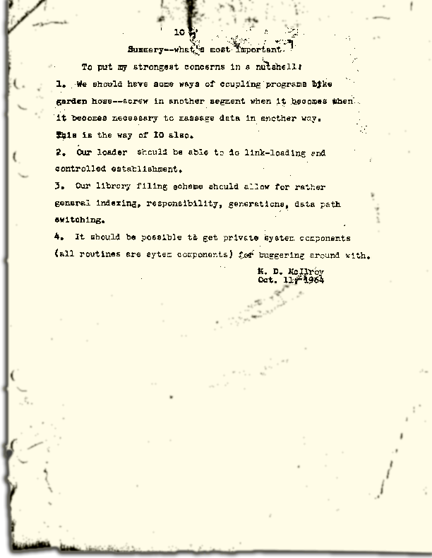
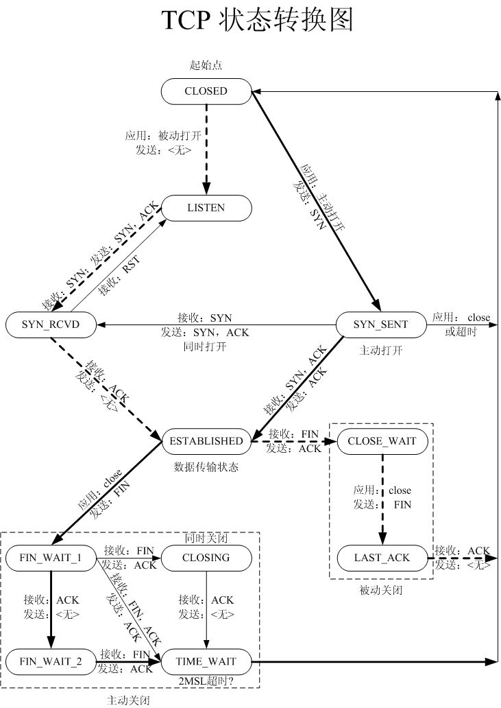

# 编程语言流行度

#####  [2010年12月13日 ](https://coolshell.cn/articles/3385.html) [陈皓](https://coolshell.cn/articles/author/haoel) 评论 [6 条评论](https://coolshell.cn/articles/3385.html#comments) 11,607 人阅读

下面是一个关于编程语言流行度的图（以前本站也有一篇[编程语言流行度的文章](https://coolshell.cn/articles/706.html)）。其X轴是从Github中取来的数据（项目数），而Y轴是从StackOverflow取来的（tag数）。注意：Github提供了语言流行度：https://github.com/languages，而本图的原始数据在[这里](http://www.dataists.com/wp-content/uploads/2010/12/language_ranks1.csv)。

[](https://coolshell.cn/wp-content/uploads/2010/12/rank_scatter1.png)编程语言流行度（点击看大图）

来源：http://www.dataists.com/2010/12/ranking-the-popularity-of-programming-langauges/

# FACEBOOK全球关系网

#####  [2010年12月15日 ](https://coolshell.cn/articles/3396.html) [陈皓](https://coolshell.cn/articles/author/haoel) 评论 [18 条评论](https://coolshell.cn/articles/3396.html#comments) 13,262 人阅读

[Paul Butler](https://www.facebook.com/paulgb) 是Facebook的Data Infrastructure Engineering Team的一个实习生，他把Facebook 5亿用户的人际关系网给图示了出来（见下图，[源图片](https://sphotos.ak.fbcdn.net/hphotos-ak-snc4/hs1382.snc4/163413_479288597199_9445547199_5658562_14158417_n.jpg)）挺赞的。从中我们可以看到，某些地方是一片漆黑……

[](https://coolshell.cn/wp-content/uploads/2010/12/Visualizing-Friendships-on-Facebook.png)Facebook全球关系网
(点击看大图，3.8M)

关于Paul是如何产生这个图的，你可以参看：[http://www.facebook.com/notes/facebook-engineering/visualizing-friendships/469716398919](https://www.facebook.com/notes/facebook-engineering/visualizing-friendships/469716398919) （墙）

# 几篇技术文章

#####  [2010年11月25日 ](https://coolshell.cn/articles/3311.html) [陈皓](https://coolshell.cn/articles/author/haoel) 评论 [9 条评论](https://coolshell.cn/articles/3311.html#comments) 11,259 人阅读

**The Art of Unix**

http://www.faqs.org/docs/artu/

**Perl for Impatient Developer**

http://blob.perl.org/books/impatient-perl/iperl.pdf

**Game Development with Javascript**

http://www.brighthub.com/hubfolio/matthew-casperson/blog/archive/2009/06/29/game-development-with-javascript-and-the-canvas-element.aspx

**Introduction to x64 Assembly**

http://software.intel.com/en-us/articles/introduction-to-x64-assembly/

**Database Fundamental**

https://www.ibm.com/developerworks/wikis/display/db2oncampus/FREE+ebook+-+Database+fundamentals

# JEFF DEAN的STANFORD演讲

#####  [2010年11月22日 ](https://coolshell.cn/articles/3301.html) [陈皓](https://coolshell.cn/articles/author/haoel) 评论 [16 条评论](https://coolshell.cn/articles/3301.html#comments) 25,560 人阅读

Google 公司的 [**Jeff Dean**](https://research.google.com/people/jeff/) 在Stanford大学做了一个非常 [**精彩的演讲**](http://stanford-online.stanford.edu/courses/ee380/101110-ee380-300.asx)（视频未墙）。我觉得我们每一个人都应该去看一看这个视频，当然，没有字幕，需要不错的听力，当然，我不可能全部翻译出来，因为我也不是完全能听懂，下面是一些相关的Notes，供你参夸，并欢迎牛人指证。

- 比较了从1999年到2010年十年来的搜索量的变化。搜索量增加了 1000 倍，而搜索速度快了5 倍。1999年，一个网页的更新最多需要一个月到两个月，而今天，只需要几秒钟，足足加快了5w倍。
- 一开始，这些大量的查询产生了大约30GB的I/O量。2004年，他们考虑过全部重写infrastructure。
- 讨论了一些关于变量长度字节对齐的东西。
- 今天的MapReduce 有400万个作业，处理将近1000PB的数据，130PB的中间数据，还有45PB的输出数据。（1PB =1024TB）关于 MapReduce （Google云计算的精髓） 的一些统计，见下图：
- 


- 现在Jeff正在做一个叫Spanner的项目，这是一个跨多个数据中心的项目。在后来的Q&A中，Jeff解释了现在的数据基本上都在各个数据中心中，数据在不同数据中心间的交换几乎不可能。所以，他们需要提供一些手动的方式或是一些工作或任务来达到数据共享。这其中还需要有一些策略配置，共同的namespace，事务处理，数据一致性等等工作。

- 最后一个段落应该是最精彩的，Jeff讲了很多很有意思的东西，绝对让你受用一生：
  - 一个大型的系统需要分解成N多的小services.（这和Amazon的很相似，一个页面的调用可能要经过几百个后台的services）
  - 代码的性能将会是想当的重要。Jeff给了一张叫“Numbers Everyone Should Know” 的slide，如下所示，我觉得太经典了，其中的东西，如果你看过我的那篇“[**给老婆普及计算机知识**](https://coolshell.cn/articles/3236.html)”，我想我不需要多解释了。（注：1 ns = 十亿分之一秒）
  - 
  - 把相同的东西抽出来去建立一个系统，而不是把所有的事情交给所有的人。他说： “最后的那个功能可能会导致你怎么个系统超出了原有的复杂度”。
  - 不要无限制地设计可扩展性。5倍到50倍的扩展性设计足够了。如果你要达到100倍的，那应该是re-arch了。
  - Jeff很喜欢有中心主结点的架构体系，他并不喜欢分布式系统。当然，中心主结点主要是用来做控制的，而不是做数据或是计算服务的。
  - J在一些小机器上运行多个小服务，而不在一个大机器上运行一个mongo作业。越小的单元就越容易处理，修复，负载均衡和扩展。（化繁为简）
  - …… ……

这是一个非常不错的演讲，很让人开阔眼界。

最后，我想说说英文，很多程序员都很不喜欢英文，哎……怎么说呢？如果你今天对英文还很害怕的话，这只能怪我们的教育制度的失败。但如果你以此为借口的话，那只能怪你自己了。没有英文的能力，你的技术和认知仅限于中文圈中，而中文圈中基本上都是产商的文化。有人说，“功夫网”让我们的internet成为了局域网，而我想说，让我们成为局域网的不是那个墙，而是我们自己的世界观和英文能力。

# 架构师给程序员的一封信

#####  [2010年11月16日 ](https://coolshell.cn/articles/3281.html) [陈皓](https://coolshell.cn/articles/author/haoel) 评论 [19 条评论](https://coolshell.cn/articles/3281.html#comments) 24,981 人阅读

下面的邮件是某Architect发给他的Engineering团队的（[来源](http://blog.kapilkaisare.info/from-an-architect-to-a-programmer?c=1)），我觉得挺不错的，翻译过来，我相信我们所有的程序员都能从中学到很多东西。下面是这封邮件——

每次当我开始做新的东西是我就会很兴奋。就算在软件圈里做了20年以后，每当开始新的旅程里，我都觉得我心中有一些东西不吐不快。这是我们大家一起的旅程。我强烈地相信我们详细规划的过程是很有乐趣的，富有挑战的和丰富多彩的。我想让这个旅程让你们难忘，并且能增添你们所有人的阅历。

这看起来有些唯心主义，不过，我想制订我的工作日程，我们的技术策略，以及你们密切合作的进度。这样一来，当你们做了什么相当不错的事，我们所有人都可以受益。我相当的尊重第一个工程师和他们的代码。

1. 代码是王。文档仅随其后 。所以，代码一定要和文档一致，并可以正确执行。
2. 测试，测试，测试。
3. 单元测试非常关键 。每一个在单元测试之后发现的bug需要开发人员双倍的开销。记住，我宁可增加你的薪水，也不愿意把这些钱发给另一个QA团队然后你再修正bug。因此，如果你的代码满是bug的话，我不得不把钱付给更多的人，而你也只能分得很小的一块饼。
4. 写下有效率的代码，不但是让人读得有效率，而且也是让CPU执行 地有效率。对于坏代码永远不会善罢甘休。
5. 多了解今天工作需要之外的事情。你不仅仅要知道今天干什么，还要知道明天需要什么。


6. 回家时不时做点菜，是的，真正的做菜。这会教会你菜谱和做饭的不同。菜谱告诉你这道菜需要什么样的食材，而你实际去做需要考虑的是你现在手上有什么……这就是其中的不同。（对于一个刚起步的公司，这是一个最大的教训）
7. 创新和好点子（技术或是产品），请与大家共享。
8. 我知道你不喜欢商人。我也知道为什么。他们销售那些你做不到的，他们承诺那些你完不成的。他们要求的比他们付出的更多。但是，没有他们，我们可能没有办法把商业转换成产品。这是一件很难的技能。把你的想法告诉我，我愿意成为你和他们间的缓冲。要建造一个好的团队，我们需要的所有的东西。
9. 作为一个工程师，热爱你的专业。你能拥有一个可以挣钱、受人尊重、并拥有乐趣的程序员人生。

你觉得怎么样？

# 140个GOOGLE的面试题

#####  [2010年12月02日 ](https://coolshell.cn/articles/3345.html) [陈皓](https://coolshell.cn/articles/author/haoel) 评论 [27 条评论](https://coolshell.cn/articles/3345.html#comments) 87,439 人阅读

来源：http://blog.seattleinterviewcoach.com/2009/02/140-google-interview-questions.html（墙）


某猎头收集了140多个Google的面试题，都张到他的Blog中了，主要是下面这些职位的，因为被墙，且无任何敏感信息，所以，我原文搬过来了。

- Product Marketing Manager
- Product Manager
- Software Engineer
- Software Engineer in Test
- Quantitative Compensation Analyst
- Engineering Manager
- AdWords Associate

<iframe id="aswift_2" name="aswift_2" sandbox="allow-forms allow-popups allow-popups-to-escape-sandbox allow-same-origin allow-scripts allow-top-navigation-by-user-activation" width="704" height="280" frameborder="0" marginwidth="0" marginheight="0" vspace="0" hspace="0" allowtransparency="true" scrolling="no" src="https://googleads.g.doubleclick.net/pagead/ads?client=ca-pub-3415450859608158&amp;output=html&amp;h=280&amp;adk=1492415910&amp;adf=2015024519&amp;pi=t.aa~a.425447425~i.5~rp.4&amp;daaos=1684211763192&amp;w=704&amp;fwrn=4&amp;fwrnh=100&amp;lmt=1684226819&amp;num_ads=1&amp;rafmt=1&amp;armr=3&amp;sem=mc&amp;pwprc=9848079135&amp;ad_type=text_image&amp;format=704x280&amp;url=https%3A%2F%2Fcoolshell.cn%2Farticles%2F3345.html&amp;fwr=0&amp;pra=3&amp;rh=176&amp;rw=703&amp;rpe=1&amp;resp_fmts=3&amp;wgl=1&amp;fa=27&amp;adsid=ChAI8NOMowYQtrqL5uuD-o59EjkAVlC_xvQELOTbNZTOrIPtYt81GxyZ1KQ-2-dGbbSgJBf10KeUC7jYevB_zzf1sfXmTr5vXZLdKbc&amp;uach=WyJXaW5kb3dzIiwiMTUuMC4wIiwieDg2IiwiIiwiMTEzLjAuNTY3Mi45MyIsW10sMCxudWxsLCI2NCIsW1siR29vZ2xlIENocm9tZSIsIjExMy4wLjU2NzIuOTMiXSxbIkNocm9taXVtIiwiMTEzLjAuNTY3Mi45MyJdLFsiTm90LUEuQnJhbmQiLCIyNC4wLjAuMCJdXSwwXQ..&amp;dt=1684226824354&amp;bpp=1&amp;bdt=4002&amp;idt=2&amp;shv=r20230511&amp;mjsv=m202305110101&amp;ptt=9&amp;saldr=aa&amp;abxe=1&amp;cookie=ID%3D10f79cd37fd225d8-2254bbd932df007a%3AT%3D1684226377%3ART%3D1684226377%3AS%3DALNI_MbTwz9ERLCRvvD51JOTAk_4WvPa1g&amp;gpic=UID%3D0000098b16346c83%3AT%3D1684226377%3ART%3D1684226377%3AS%3DALNI_MbSUKrPXwJQ8WMCBTebMaaTf0LYXg&amp;prev_fmts=0x0%2C1200x280%2C1447x764&amp;nras=4&amp;correlator=17931665245&amp;frm=20&amp;pv=1&amp;ga_vid=479574193.1684226376&amp;ga_sid=1684226376&amp;ga_hid=727525123&amp;ga_fc=1&amp;u_tz=480&amp;u_his=1&amp;u_h=915&amp;u_w=1463&amp;u_ah=867&amp;u_aw=1463&amp;u_cd=24&amp;u_sd=1.75&amp;dmc=8&amp;adx=225&amp;ady=1170&amp;biw=1447&amp;bih=764&amp;scr_x=0&amp;scr_y=0&amp;eid=44759876%2C44759837%2C44773809%2C44759927%2C31074469%2C31074602%2C31074635%2C44782468%2C44788442%2C44790154&amp;oid=2&amp;psts=ABHeCviTE7eEzvo2yGTy2Mqt0JXZPLu9vhZqk2fok0ZPAlylWOujfwUfbu40Ww1EJ7W_qEhOi85LGT825pWo35-N2n6YwS8&amp;pvsid=3105420508806325&amp;tmod=182273927&amp;uas=0&amp;nvt=2&amp;ref=https%3A%2F%2Fcoolshell.cn%2Farticles%2F3345.html&amp;fc=1408&amp;brdim=0%2C0%2C0%2C0%2C1463%2C0%2C1463%2C867%2C1463%2C764&amp;vis=1&amp;rsz=%7C%7Cs%7C&amp;abl=NS&amp;fu=128&amp;bc=31&amp;jar=2023-05-15-13&amp;ifi=3&amp;uci=a!3&amp;btvi=1&amp;fsb=1&amp;xpc=IOmbzgm6Ix&amp;p=https%3A//coolshell.cn&amp;dtd=29604" data-google-container-id="a!3" data-google-query-id="CIXz2fq5-f4CFVbI5wMdZk8KHQ" data-load-complete="true" style="box-sizing: border-box; max-width: 100%; width: 704px; left: 0px; top: 0px; border: 0px; height: 280px;"></iframe>

这篇Blog例举了Google用来面试下面这几个职位的面试题。很多不是很容易回答，不过都比较经典与变态，是Google，Microsoft，Amazon之类的公司的风格。对于本文，我没有翻译，因为我相信，英文问题是最好的。不过对于有些问题，我做了一些注释，不一定对，但希望对你有帮助启发。对于一些问题，如果你百思不得其解，可以Google一下，StackOverflow或是Wikipedia上可能会给你非常全面的答案。


**Product Marketing Manager**

- Why do you want to join Google?
- What do you know about Google’s product and technology?
- If you are Product Manager for Google’s Adwords, how do you plan to market this?
- What would you say during an AdWords or AdSense product seminar?
- Who are Google’s competitors, and how does Google compete with them?
- Have you ever used Google’s products? Gmail?
- What’s a creative way of marketing Google’s brand name and product?
- If you are the product marketing manager for Google’s Gmail product, how do you plan to market it so as to achieve 100 million customers in 6 months?
- How much money you think Google makes daily from Gmail ads?
- Name a piece of technology you’ve read about recently. Now tell me your own creative execution for an ad for that product.
- Say an advertiser makes $0.10 every time someone clicks on their ad. Only 20% of people who visit the site click on their ad. How many people need to visit the site for the advertiser to make $20? 
- Estimate the number of students who are college seniors, attend four-year schools, and graduate with a job in the United States every year.

**Product Manager**

- How would you boost the GMail subscription base?
- What is the most efficient way to sort a million integers?  （陈皓：merge sort）
- How would you re-position Google’s offerings to counteract competitive threats from Microsoft?
- How many golf balls can fit in a school bus? （陈皓：这种题一般来说是考你的解题思路的，注意，你不能单纯地把高尔夫球当成一个小立方体，其是一个圆球，堆起来的时候应该是错开的——也就是三个相邻的球的圆心是个等边三角形）
- You are shrunk to the height of a nickel and your mass is proportionally reduced so as to maintain your original density. You are then thrown into an empty glass blender. The blades will start moving in 60 seconds. What do you do?
- How much should you charge to wash all the windows in Seattle?
- How would you find out if a machine’s stack grows up or down in memory?
- Explain a database in three sentences to your eight-year-old nephew. （陈皓：用三句话向8岁的侄子解释什么是数据库，考你的表达能力了）
- How many times a day does a clock’s hands overlap?（陈皓：经典的时钟问题）
- You have to get from point A to point B. You don’t know if you can get there. What would you do?
- Imagine you have a closet full of shirts. It’s very hard to find a shirt. So what can you do to organize your shirts for easy retrieval? （陈皓：很不错的一道题，不要以为分类查询很容易，想想图书馆图书的分类查询问题吧。另外，你处想想如何在你在你的衣柜里实现一个相当于Hash表或是一个Tree之类的数据结构）
- Every man in a village of 100 married couples has cheated on his wife. Every wife in the village instantly knows when a man other than her husband has cheated, but does not know when her own husband has. The village has a law that does not allow for adultery. Any wife who can prove that her husband is unfaithful must kill him that very day. The women of the village would never disobey this law. One day, the queen of the village visits and announces that at least one husband has been unfaithful. What happens? （陈皓：这个问题很有限制级，哈哈，非常搞的一个问题，注意wife们的递归，这类的问题是经典的分布式通讯问题，上网搜 一搜吧。）
- In a country in which people only want boys, every family continues to have children until they have a boy. If they have a girl, they have another child. If they have a boy, they stop. What is the proportion of boys to girls in the country?（陈皓：第一反应是——这个国家是中国。一个概率问题，其实，无论你怎么生，50%的概率是永远不变的。）
- If the probability of observing a car in 30 minutes on a highway is 0.95, what is the probability of observing a car in 10 minutes (assuming constant default probability)?
- If you look at a clock and the time is 3:15, what is the angle between the hour and the minute hands? (The answer to this is not zero!)
- Four people need to cross a rickety rope bridge to get back to their camp at night. Unfortunately, they only have one flashlight and it only has enough light left for seventeen minutes. The bridge is too dangerous to cross without a flashlight, and it’s only strong enough to support two people at any given time. Each of the campers walks at a different speed. One can cross the bridge in 1 minute, another in 2 minutes, the third in 5 minutes, and the slow poke takes 10 minutes to cross. How do the campers make it across in 17 minutes?（陈皓：经典的过桥问题）
- You are at a party with a friend and 10 people are present including you and the friend. your friend makes you a wager that for every person you find that has the same birthday as you, you get $1; for every person he finds that does not have the same birthday as you, he gets $2. would you accept the wager?
- How many piano tuners are there in the entire world?
- You have eight balls all of the same size. 7 of them weigh the same, and one of them weighs slightly more. How can you find the ball that is heavier by using a balance and only two weighings?（陈皓：经典的称重问题。这样的问题花样很多，不过都不难回答）
- You have five pirates, ranked from 5 to 1 in descending order. The top pirate has the right to propose how 100 gold coins should be divided among them. But the others get to vote on his plan, and if fewer than half agree with him, he gets killed. How should he allocate the gold in order to maximize his share but live to enjoy it? (Hint: One pirate ends up with 98 percent of the gold.)
- You are given 2 eggs. You have access to a 100-story building. Eggs can be very hard or very fragile means it may break if dropped from the first floor or may not even break if dropped from 100th floor. Both eggs are identical. You need to figure out the highest floor of a 100-story building an egg can be dropped without breaking. The question is how many drops you need to make. You are allowed to break 2 eggs in the process. （陈皓：从3的倍数的楼层开始扔，比如3，6，9，12…..，如果鸡蛋在3n层碎了，那到在3n-1层扔第二个鸡蛋，如果没碎，则最高不碎楼层为3n-1，否则为3n-2）
- Describe a technical problem you had and how you solved it.
- How would you design a simple search engine?
- Design an evacuation plan for San Francisco.
- There’s a latency problem in South Africa. Diagnose it. （陈皓：这个问题完全是在考你的解决问题的能力。没有明确的答案。不过，解决性能问题的第一步通常是找出瓶颈，找瓶颈有很多种方法，工具，二分查，时间记录等等。）
- What are three long term challenges facing Google?
- Name three non-Google websites that you visit often and like. What do you like about the user interface and design? Choose one of the three sites and comment on what new feature or project you would work on. How would you design it?
- If there is only one elevator in the building, how would you change the design? How about if there are only two elevators in the building? （陈皓：经典的电梯设计问题，这种问题千变万化，主要是考你的设计能力和需求变化的适变能力，与此相似的是酒店订房系统。）
- How many vacuum’s are made per year in USA?

**Software Engineer**

- Why are manhole covers round? （陈皓：为什么下水井盖是圆的？这是有N种答案的，上Wiki看看吧）
- What is the difference between a mutex and a semaphore? Which one would you use to protect access to an increment operation?
- A man pushed his car to a hotel and lost his fortune. What happened? （陈皓：脑筋急转弯？他在玩大富翁游戏？！！）
- Explain the significance of “dead beef”.（陈皓：要是你看到的是16进制 DEAD BEEF，你会觉得这是什么？IPv6的地址？）
- Write a C program which measures the the speed of a context switch on a UNIX/Linux system.
- Given a function which produces a random integer in the range 1 to 5, write a function which produces a random integer in the range 1 to 7.（陈皓：上StackOverflow看看吧，经典的问题）
- Describe the algorithm for a depth-first graph traversal.
- Design a class library for writing card games. （陈皓：用一系列的类来设计一个扑克游戏，设计题）
- You need to check that your friend, Bob, has your correct phone number, but you cannot ask him directly. You must write a the question on a card which and give it to Eve who will take the card to Bob and return the answer to you. What must you write on the card, besides the question, to ensure Bob can encode the message so that Eve cannot read your phone number?（陈皓：协议+数字加密，我试想了一个，纸条上可以这样写，“Bob，请把我的手机号以MD5算法加密后的字符串，比对下面的字符串——XXXXXX，它们是一样的吗？”）
- How are cookies passed in the HTTP protocol?
- Design the SQL database tables for a car rental database.
- Write a regular expression which matches a email address. （陈皓：上StackOverflow查相当的问题吧。）
- Write a function f(a, b) which takes two character string arguments and returns a string containing only the characters found in both strings in the order of a. Write a version which is order N-squared and one which is order N.（陈皓：算法题，不难，不说了。一个O(n^2)和一个O(n)的算法复杂度）
- You are given a the source to a application which is crashing when run. After running it 10 times in a debugger, you find it never crashes in the same place. The application is single threaded, and uses only the C standard library. What programming errors could be causing this crash? How would you test each one? （陈皓：和随机数有关系？或是时间？）
- Explain how congestion control works in the TCP protocol.
- In Java, what is the difference between final, finally, and finalize?
- What is multithreaded programming? What is a deadlock?
- Write a function (with helper functions if needed) called to Excel that takes an excel column value (A,B,C,D…AA,AB,AC,… AAA..) and returns a corresponding integer value (A=1,B=2,… AA=26..).
- You have a stream of infinite queries (ie: real time Google search queries that people are entering). Describe how you would go about finding a good estimate of 1000 samples from this never ending set of data and then write code for it.
- Tree search algorithms. Write BFS and DFS code, explain run time and space requirements. Modify the code to handle trees with weighted edges and loops with BFS and DFS, make the code print out path to goal state.
- You are given a list of numbers. When you reach the end of the list you will come back to the beginning of the list (a circular list). Write the most efficient algorithm to find the minimum # in this list. Find any given # in the list. The numbers in the list are always increasing but you don’t know where the circular list begins, ie: 38, 40, 55, 89, 6, 13, 20, 23, 36. （陈皓：循环排序数组的二分查找问题）
- Describe the data structure that is used to manage memory. (stack)
- What’s the difference between local and global variables?
- If you have 1 million integers, how would you sort them efficiently? (modify a specific sorting algorithm to solve this)
- In Java, what is the difference between static, final, and const. (if you don’t know Java they will ask something similar for C or C++).
- Talk about your class projects or work projects (pick something easy)… then describe how you could make them more efficient (in terms of algorithms).
- Suppose you have an NxN matrix of positive and negative integers. Write some code that finds the sub-matrix with the maximum sum of its elements.（陈皓：以前见过一维数组的这个问题，现在是二维的。感觉应该是把二维的第一行的最大和的区间算出来，然后再在这个基础之上进行二维的分析。思路应该是这个，不过具体的算法还需要想一想）
- Write some code to reverse a string.
- Implement division (without using the divide operator, obviously).（陈皓：想一想手算除法的过程。）
- Write some code to find all permutations of the letters in a particular string.
- What method would you use to look up a word in a dictionary? （陈皓：使用排序，哈希，树等算法和数据结构）
- Imagine you have a closet full of shirts. It’s very hard to find a shirt. So what can you do to organize your shirts for easy retrieval?
- You have eight balls all of the same size. 7 of them weigh the same, and one of them weighs slightly more. How can you fine the ball that is heavier by using a balance and only two weighings?
- What is the C-language command for opening a connection with a foreign host over the internet?
- Design and describe a system/application that will most efficiently produce a report of the top 1 million Google search requests. These are the particulars: 1) You are given 12 servers to work with. They are all dual-processor machines with 4Gb of RAM, 4x400GB hard drives and networked together.(Basically, nothing more than high-end PC’s) 2) The log data has already been cleaned for you. It consists of 100 Billion log lines, broken down into 12 320 GB files of 40-byte search terms per line. 3) You can use only custom written applications or available free open-source software.
- There is an array A[N] of N numbers. You have to compose an array Output[N] such that Output[i] will be equal to multiplication of all the elements of A[N] except A[i]. For example Output[0] will be multiplication of A[1] to A[N-1] and Output[1] will be multiplication of A[0] and from A[2] to A[N-1]. Solve it without division operator and in O(n).（陈皓：注意其不能使用除法。算法思路是这样的，把output[i]=a[i]左边的乘积 x a[i]右边的乘积，所以，我们可以分两个循环，第一次先把A[i]左边的乘积放在Output[i]中，第二次把A[i]右边的乘积算出来。我们先看第一次的循环，使用迭代累积的方式，代码如下：for(r=1; i=0; i<n-1; i++){ Output[i]=r; r*=a[i]; }，看明白了吧。第二次的循环我就不说了，方法一样的。）
- There is a linked list of numbers of length N. N is very large and you don’t know N. You have to write a function that will return k random numbers from the list. Numbers should be completely random. Hint: 1. Use random function rand() (returns a number between 0 and 1) and irand() (return either 0 or 1) 2. It should be done in O(n).（陈皓：本题其实不难。在遍历链表的同时一边生成随机数，一边记录最大的K个随机数和其链接地址。）
- Find or determine non existence of a number in a sorted list of N numbers where the numbers range over M, M>> N and N large enough to span multiple disks. Algorithm to beat O(log n) bonus points for constant time algorithm.（陈皓：使用bitmap，如果一个长整形有64位，那么我们可以使用M/64个bitmap）
- You are given a game of Tic Tac Toe. You have to write a function in which you pass the whole game and name of a player. The function will return whether the player has won the game or not. First you to decide which data structure you will use for the game. You need to tell the algorithm first and then need to write the code. Note: Some position may be blank in the game। So your data structure should consider this condition also.
- You are given an array [a1 To an] and we have to construct another array [b1 To bn] where bi = a1*a2*…*an/ai. you are allowed to use only constant space and the time complexity is O(n). No divisions are allowed.（陈皓：前面说过了）
- How do you put a Binary Search Tree in an array in a efficient manner. Hint :: If the node is stored at the ith position and its children are at 2i and 2i+1(I mean level order wise)Its not the most efficient way.（陈皓：按顺序遍历树）
- How do you find out the fifth maximum element in an Binary Search Tree in efficient manner. Note: You should not use use any extra space. i.e sorting Binary Search Tree and storing the results in an array and listing out the fifth element.
- Given a Data Structure having first n integers and next n chars. A = i1 i2 i3 … iN c1 c2 c3 … cN.Write an in-place algorithm to rearrange the elements of the array ass A = i1 c1 i2 c2 … in cn（陈皓：这个算法其实就是从中间开始交换元素，代码：for(i=n-1; i>1; i++) {  for(j=i; j<2*n-i; j+=2) { swap(a[j], a[j+1]); } }，不好意思写在同一行上了。）
- Given two sequences of items, find the items whose absolute number increases or decreases the most when comparing one sequence with the other by reading the sequence only once.
- Given That One of the strings is very very long , and the other one could be of various sizes. Windowing will result in O(N+M) solution but could it be better? May be NlogM or even better?
- How many lines can be drawn in a 2D plane such that they are equidistant from 3 non-collinear points?
- Let’s say you have to construct Google maps from scratch and guide a person standing on Gateway of India (Mumbai) to India Gate(Delhi). How do you do the same?
- Given that you have one string of length N and M small strings of length L. How do you efficiently find the occurrence of each small string in the larger one?
- Given a binary tree, programmatically you need to prove it is a binary search tree.
- You are given a small sorted list of numbers, and a very very long sorted list of numbers – so long that it had to be put on a disk in different blocks. How would you find those short list numbers in the bigger one?
- Suppose you have given N companies, and we want to eventually merge them into one big company. How many ways are theres to merge?
- Given a file of 4 billion 32-bit integers, how to find one that appears at least twice? （陈皓：我能想到的是拆分成若干个小数组，排序，然后一点点归并起来）
- Write a program for displaying the ten most frequent words in a file such that your program should be efficient in all complexity measures.（陈皓：你可能需要看看这篇文章[Finding Frequent Items in Data Streams](http://www.cs.rutgers.edu/~farach/pubs/FrequentStream.pdf)）
- Design a stack. We want to push, pop, and also, retrieve the minimum element in constant time.
- Given a set of coin denominators, find the minimum number of coins to give a certain amount of change.（陈皓：你应该查看一下这篇文章：[Coin Change Problem](http://www.algorithmist.com/index.php/Coin_Change)）
- Given an array, i) find the longest continuous increasing subsequence. ii) find the longest increasing subsequence.（陈皓：这个题不难，O(n)算法是边遍历边记录当前最大的连续的长度。）
- Suppose we have N companies, and we want to eventually merge them into one big company. How many ways are there to merge?
- Write a function to find the middle node of a single link list. （陈皓：我能想到的算法是——设置两个指针p1和p2，每一次，p1走两步，p2走一步，这样，当p1走到最后时，p2就在中间）
- Given two binary trees, write a compare function to check if they are equal or not. Being equal means that they have the same value and same structure.（陈皓：这个很简单，使用递归算法。）
- Implement put/get methods of a fixed size cache with LRU replacement algorithm.
- You are given with three sorted arrays ( in ascending order), you are required to find a triplet ( one element from each array) such that distance is minimum. Distance is defined like this : If a[i], b[j] and c[k] are three elements then distance=max(abs(a[i]-b[j]),abs(a[i]-c[k]),abs(b[j]-c[k]))” Please give a solution in O(n) time complexity（陈皓：三个指针，a, b, c分别指向三个数组头，假设：a[0]<b[0]<c[0]，推进a直到a[i]>b[0]，计算 abs(a[i-1] – c[0])，把结果保存在min中。现在情况变成找 a[i], b[0],c[0]，重复上述过程，如果有一个新的值比min要小，那就取代现有的min。）
- How does C++ deal with constructors and deconstructors of a class and its child class?
- Write a function that flips the bits inside a byte (either in C++ or Java). Write an algorithm that take a list of n words, and an integer m, and retrieves the mth most frequent word in that list.
- What’s 2 to the power of 64?
- Given that you have one string of length N and M small strings of length L. How do you efficiently find the occurrence of each small string in the larger one? （陈皓：我能想到的是——把那M个小字串排个序，然后遍历大字串，并在那M个字串中以二分取中的方式查找。）
- How do you find out the fifth maximum element in an Binary Search Tree in efficient manner.
- Suppose we have N companies, and we want to eventually merge them into one big company. How many ways are there to merge?
- There is linked list of millions of node and you do not know the length of it. Write a function which will return a random number from the list.
- You need to check that your friend, Bob, has your correct phone number, but you cannot ask him directly. You must write a the question on a card which and give it to Eve who will take the card to Bob and return the answer to you. What must you write on the card, besides the question, to ensure Bob can encode the message so that Eve cannot read your phone number?
- How long it would take to sort 1 trillion numbers? Come up with a good estimate.
- Order the functions in order of their asymptotic performance: 1) 2^n 2) n^100 3) n! 4) n^n
- There are some data represented by(x,y,z). Now we want to find the Kth least data. We say (x1, y1, z1) > (x2, y2, z2) when value(x1, y1, z1) > value(x2, y2, z2) where value(x,y,z) = (2^x)*(3^y)*(5^z). Now we can not get it by calculating value(x,y,z) or through other indirect calculations as lg(value(x,y,z)). How to solve it?
- How many degrees are there in the angle between the hour and minute hands of a clock when the time is a quarter past three?
- Given an array whose elements are sorted, return the index of a the first occurrence of a specific integer. Do this in sub-linear time. I.e. do not just go through each element searching for that element.
- Given two linked lists, return the intersection of the two lists: i.e. return a list containing only the elements that occur in both of the input lists. （陈皓：把第一个链表存入hash表，然后遍历第二个链表。不知道还没有更好的方法。）
- What’s the difference between a hashtable and a hashmap?
- If a person dials a sequence of numbers on the telephone, what possible words/strings can be formed from the letters associated with those numbers?（陈皓：这个问题和美国的电话有关系，大家可以试着想一下我们发短信的手机，按数字键出字母，一个组合的数学问题。）
- How would you reverse the image on an n by n matrix where each pixel is represented by a bit?
- Create a fast cached storage mechanism that, given a limitation on the amount of cache memory, will ensure that only the least recently used items are discarded when the cache memory is reached when inserting a new item. It supports 2 functions: String get(T t) and void put(String k, T t).
- Create a cost model that allows Google to make purchasing decisions on to compare the cost of purchasing more RAM memory for their servers vs. buying more disk space.
- Design an algorithm to play a game of Frogger and then code the solution. The object of the game is to direct a frog to avoid cars while crossing a busy road. You may represent a road lane via an array. Generalize the solution for an N-lane road.
- What sort would you use if you had a large data set on disk and a small amount of ram to work with?
- What sort would you use if you required tight max time bounds and wanted highly regular performance.
- How would you store 1 million phone numbers?（陈皓：试想电话是有区段的，可以把区段统一保存，Flyweight设计模式）
- Design a 2D dungeon crawling game. It must allow for various items in the maze – walls, objects, and computer-controlled characters. (The focus was on the class structures, and how to optimize the experience for the user as s/he travels through the dungeon.)
- What is the size of the C structure below on a 32-bit system? On a 64-bit? （陈皓：注意编译器的对齐）

struct foo {

char a;

char* b;

};

**Software Engineer in Test**

- Efficiently implement 3 stacks in a single array.
- Given an array of integers which is circularly sorted, how do you find a given integer.
- Write a program to find depth of binary search tree without using recursion.
- Find the maximum rectangle (in terms of area) under a histogram in linear time.
- Most phones now have full keyboards. Before there there three letters mapped to a number button. Describe how you would go about implementing spelling and word suggestions as people type.
- Describe recursive mergesort and its runtime. Write an iterative version in C++/Java/Python.
- How would you determine if someone has won a game of tic-tac-toe on a board of any size?
- Given an array of numbers, replace each number with the product of all the numbers in the array except the number itself *without* using division.
- Create a cache with fast look up that only stores the N most recently accessed items.
- How to design a search engine? If each document contains a set of keywords, and is associated with a numeric attribute, how to build indices?
- Given two files that has list of words (one per line), write a program to show the intersection.
- What kind of data structure would you use to index annagrams of words? e.g. if there exists the word “top” in the database, the query for “pot” should list that.

**Quantitative Compensation Analyst**

- What is the yearly standard deviation of a stock given the monthly standard deviation?
- How many resumes does Google receive each year for software engineering?
- Anywhere in the world, where would you open up a new Google office and how would you figure out compensation for all the employees at this new office?
- What is the probability of breaking a stick into 3 pieces and forming a triangle?

**Engineering Manager**

- You’re the captain of a pirate ship, and your crew gets to vote on how the gold is divided up. If fewer than half of the pirates agree with you, you die. How do you recommend apportioning the gold in such a way that you get a good share of the booty, but still survive?

**AdWords Associate**

- How would you work with an advertiser who was not seeing the benefits of the AdWords relationship due to poor conversions?
- How would you deal with an angry or frustrated advertisers on the phone?

*Sources*

http://news.ycombinator.com/item?id=266663

http://tihomir.org/crazy-questions-at-google-job-interview/

http://www.drizzle.com/~jpaint/google.html

http://www.gamedev.net/community/forums/topic.asp?topic_id=299692

http://careers.cse.sc.edu/googleinterview

[http://job-interview.blogspot.com/2005/02/google-interview-product-marketing.html](https://job-interview.blogspot.com/2005/02/google-interview-product-marketing.html)

http://www.theregister.co.uk/2007/01/05/google_interview_tales/

http://money.cnn.com/2007/08/29/technology/brain_teasers.biz2/index.htm

[http://blogs.lessthandot.com/index.php/ITProfessionals/EthicsIT/google-interview-questions](http://money.cnn.com/2007/08/29/technology/brain_teasers.biz2/index.htm)

[http://placementsindia.blogspot.com/2007/09/google-top-interview-puzzles.html](https://placementsindia.blogspot.com/2007/09/google-top-interview-puzzles.html)

http://linkmingle.com/user/interview_questions/google_interview_questions

http://discuss.joelonsoftware.com/default.asp?interview.11.626758.33

http://mindcipher.com/puzzle/78-clock-works

[http://www.glassdoor.com](http://www.glassdoor.com/)

http://bluepixel.ca/blog/?p=69

http://www.businessinsider.com/my-nightmare-interviews-with-google-2009-11

# C++的字符串格式化库

#####  [2010年11月02日 ](https://coolshell.cn/articles/3258.html) [陈皓](https://coolshell.cn/articles/author/haoel) 评论 [11 条评论](https://coolshell.cn/articles/3258.html#comments) 10,685 人阅读

这里向大家介绍一个C++的字符串格式化库，叫cpptempl，这个库支持对字符串格式的条件，循环，变量插入。看上去很不错，只不过其是基于boost库的。

下面是一个例子：

// The text template

wstring text = L"I heart {$place}!" ;

// Data to feed the template engine

cpptempl::data_map data ;

// {$place} => Okinawa

data[L"place"] = cpptempl::make_data(L"Okinawa");

// parse the template with the supplied data dictionary

wstring result = cpptempl::parse(text, data) ;

输出结果是：

> I heart Okinawa!

是不是很方便？让我们看一个更复杂的例子：


// You'd probably load this template from a file in real life.

wstring text = L"<h3>Locations</h3>\n<ul>\n"

​    L""

​    L"<li>{$place}</li>\n"

​    L""

​    L"</ul>" ;

// Create the list of items

cpptempl::data_list places;

places.push_back(cpptempl::make_data(L"Okinawa"));

places.push_back(cpptempl::make_data(L"San Francisco"));

// Now set this in the data map

cpptempl::data_map data ;

data[L"places"] = cpptempl::make_data(places);

// parse the template with the supplied data dictionary

wstring result = cpptempl::parse(text, data) ;

输出结果是：

> <h3>Locations</h3>
> <ul>
> <li>Okinawa</li>
> <li>San Francisco</li>
> </ul>

更为详细的说明请到这里：[http://bitbucket.org/ginstrom/cpptemplate/wiki/Home](https://bitbucket.org/ginstrom/cpptemplate/wiki/Home)。

<iframe id="aswift_2" name="aswift_2" sandbox="allow-forms allow-popups allow-popups-to-escape-sandbox allow-same-origin allow-scripts allow-top-navigation-by-user-activation" width="704" height="280" frameborder="0" marginwidth="0" marginheight="0" vspace="0" hspace="0" allowtransparency="true" scrolling="no" src="https://googleads.g.doubleclick.net/pagead/ads?client=ca-pub-3415450859608158&amp;output=html&amp;h=280&amp;adk=2032319683&amp;adf=3332187785&amp;pi=t.aa~a.425447425~i.23~rp.4&amp;daaos=1684211763192&amp;w=704&amp;fwrn=4&amp;fwrnh=100&amp;lmt=1684226828&amp;num_ads=1&amp;rafmt=1&amp;armr=3&amp;sem=mc&amp;pwprc=9848079135&amp;ad_type=text_image&amp;format=704x280&amp;url=https%3A%2F%2Fcoolshell.cn%2Farticles%2F3258.html&amp;fwr=0&amp;pra=3&amp;rh=176&amp;rw=703&amp;rpe=1&amp;resp_fmts=3&amp;wgl=1&amp;fa=27&amp;adsid=ChAI8NOMowYQtrqL5uuD-o59EjkAVlC_xgRyxlhsFxrehiSz-1Mr7IAbEr7hm6Xh12_SRdSUuVy5luuNrB6aBRb0q8v8g1z-VvAcX1M&amp;uach=WyJXaW5kb3dzIiwiMTUuMC4wIiwieDg2IiwiIiwiMTEzLjAuNTY3Mi45MyIsW10sMCxudWxsLCI2NCIsW1siR29vZ2xlIENocm9tZSIsIjExMy4wLjU2NzIuOTMiXSxbIkNocm9taXVtIiwiMTEzLjAuNTY3Mi45MyJdLFsiTm90LUEuQnJhbmQiLCIyNC4wLjAuMCJdXSwwXQ..&amp;dt=1684226831353&amp;bpp=1&amp;bdt=1877&amp;idt=1&amp;shv=r20230511&amp;mjsv=m202305110101&amp;ptt=9&amp;saldr=aa&amp;abxe=1&amp;cookie=ID%3D10f79cd37fd225d8-2254bbd932df007a%3AT%3D1684226377%3ART%3D1684226377%3AS%3DALNI_MbTwz9ERLCRvvD51JOTAk_4WvPa1g&amp;gpic=UID%3D0000098b16346c83%3AT%3D1684226377%3ART%3D1684226377%3AS%3DALNI_MbSUKrPXwJQ8WMCBTebMaaTf0LYXg&amp;prev_fmts=0x0%2C1200x280&amp;nras=3&amp;correlator=1238641968272&amp;frm=20&amp;pv=1&amp;ga_vid=479574193.1684226376&amp;ga_sid=1684226376&amp;ga_hid=790356721&amp;ga_fc=1&amp;u_tz=480&amp;u_his=1&amp;u_h=915&amp;u_w=1463&amp;u_ah=867&amp;u_aw=1463&amp;u_cd=24&amp;u_sd=1.75&amp;dmc=8&amp;adx=225&amp;ady=1866&amp;biw=1447&amp;bih=764&amp;scr_x=0&amp;scr_y=0&amp;eid=44759876%2C44759837%2C44773809%2C44759927%2C31071756%2C31074198%2C31074635%2C44788442%2C44790154&amp;oid=2&amp;psts=ABHeCvgVJdsM3TjZ2Em70diZkQXKngD5UBotVS92I38J5SZfdqSqVIoadGFOa9q5cw3gMBRZuHyMfWZ8yHlY&amp;pvsid=3266580100297251&amp;tmod=182273927&amp;uas=0&amp;nvt=1&amp;ref=https%3A%2F%2Fcoolshell.cn%2Fpage%2F35&amp;fc=1408&amp;brdim=0%2C0%2C0%2C0%2C1463%2C0%2C1463%2C867%2C1463%2C764&amp;vis=1&amp;rsz=%7C%7Cs%7C&amp;abl=NS&amp;fu=128&amp;bc=31&amp;jar=2023-05-15-13&amp;ifi=3&amp;uci=a!3&amp;btvi=1&amp;fsb=1&amp;xpc=dxK2NGXxUm&amp;p=https%3A//coolshell.cn&amp;dtd=33262" data-google-container-id="a!3" data-google-query-id="CMDFrYC6-f4CFcOGfwQdAnYHpA" data-load-complete="true" style="box-sizing: border-box; max-width: 100%; width: 704px; left: 0px; top: 0px; border: 0px; height: 280px;"></iframe>

Google也有一个类似的库叫ctemplate：[http://code.google.com/p/google-ctemplate/](https://code.google.com/p/google-ctemplate/) 提供相似的方法，你也可以试试看。与Google相对应的Java库叫Hapax：[http://code.google.com/p/hapax/](https://code.google.com/p/hapax/)。

# 你和你的工作

#####  [2010年10月26日 ](https://coolshell.cn/articles/3231.html) [陈皓](https://coolshell.cn/articles/author/haoel) 评论 [22 条评论](https://coolshell.cn/articles/3231.html#comments) 17,064 人阅读

源文：http://youtheuser.com/2010/10/04/you-and-your-job/，有人说下面的这个文章太过Crazy，有人说下面的这个文章是猎头的软文，你换工作换得越多，他们才能越挣钱。我的观点的，先别否定他的观点，试着去理解一下为什么他要这么说，你会发现还有一些道理的。然后，想一想，自己需要的是什么？一份工作？还是一份经历？还是不断的自我挑战？相信你会有知道该怎么去做的。当然，“离职”是最后一步棋，在此前，我更希望你能尝试地在你现在工作环境下去改变去影响。

> “The role of a manager should be to ensure that those that work for him/her eventually leave and go onto bigger and better things” —  Mark Plant

如果你对你的工作不高兴——离开，如果每天早上你对你的工作没有激情——无论你在干什么你都要停下来。

因为这就是我们赖以生存的东西。

1. 如果你的工作没有挑战性 – leave.
2. 如果你在混你的工作 – leave.
3. 如果你觉得现在不辛苦而又感到压力大 – leave.
4. 如果你完全知道你现在正在做的所有一切的事 – leave.
5. 如果你没有得到足够多的失败– leave 并到找一个地方可以让你获得成功前的失败。而当你发现你天天都在成功 – leave again.
6. 如果你觉得你很成功 – leave 然后去找某个事或某个地方你不会那么成功，而当你又觉得你又很成功了 – leave again.
7. 如果所有的人都喜欢你并喜欢和你一起工作 – leave 然后去某个地方，那里的人并不喜欢你（然后你让他们喜欢你）。
8. 如果你的工作就像是赢奖品一样，并且你总是能赢 – leave 然后找个地儿，那里的人总是赢不了什么。帮他们扭转局面。
9. 如果你认为你知道产品的所有的内在的东西 – leave 然后找一个你不知道的产品。
10. 

11. 如果你认为你明白你所有影响力的价值所在，并觉得你已挑战过所有你可以找到的方面 – leave 然后找个地儿，在那里有不同的甚至你不了解的能影响你的人或事。
12. 如果你的经理不能影响你最终去成就更大更好的事情 – leave.
13. 如果有人妨碍你的进步（无论是内部的还是外部的） – leave.
14. 如果有人正试图让你呆在你的工作里不要改变 – leave.
15. 如果你的经理正试图让你留下，但他并不是一个好的经理 – leave.
16. 如果日子过得很顺，并且那里有太多的时候可以闲扯（或是你身边都是有太多时间闲扯的人）– leave.
17. 如果你没有和哪些和你一样在团队工作和协作方面投入相应的思考和精力的人一起工作 – leave 并去寻找这些人
18. 如果那里有这样一种文化——靠加钱来说服别人留下 – leave. （[译注](https://coolshell.cn/)：这样的Culture必然造就不公平）
19. 如果那里有一种商业文化阻止人不能为竞争对手工作 – leave.（[译注](https://coolshell.cn/)：《保密协议》里应该限制的是内容，而不是人身自由）
20. 如果你工作的那个地方有一个商业文化试图让竞争对手失败 – leave. （[译注](https://coolshell.cn/)：人个理解竞争不是让对手失败，而是比对手做得更好）
21. 如果那里没有一种文化（或是一种理解），其可以帮助优秀的人和那些工作不是太好的人去创造好的工作关系，并让他们可以很好的工作在一起 – leave.
22. 如果那里的文化并不理解，良好工作关系间的紧密程度能够造就更好的产出 – leave.

我觉得作者所说的leave，应该是离开这个事，这个团队，而不完全是离开这个公司。我个人对上述的21条中的某些条觉得非常认同，比如：1，8，11，12，15，16，17。

（全文完）

# 给老婆普及计算机知识

#####  [2010年10月27日 ](https://coolshell.cn/articles/3236.html) [陈皓](https://coolshell.cn/articles/author/haoel) 评论 [53 条评论](https://coolshell.cn/articles/3236.html#comments) 40,521 人阅读

我们知道计算机的计算数据需要从磁盘调度到内存，然后再调度到L2 Cache，再到L1 Cache，最后进CPU寄存器进行计算。

给老婆在电脑城买本本的时候向电脑推销人员问到这些参数，老婆听不懂，让我给她解释，解释完后，老婆说，“原来电脑内部这么麻烦，怪不得电脑总是那么慢，直接操作内存不就快啦”。我是那个汗啊。

<iframe id="aswift_4" name="aswift_4" sandbox="allow-forms allow-popups allow-popups-to-escape-sandbox allow-same-origin allow-scripts allow-top-navigation-by-user-activation" width="704" height="280" frameborder="0" marginwidth="0" marginheight="0" vspace="0" hspace="0" allowtransparency="true" scrolling="no" src="https://googleads.g.doubleclick.net/pagead/ads?client=ca-pub-3415450859608158&amp;output=html&amp;h=280&amp;adk=2520573050&amp;adf=306101797&amp;pi=t.aa~a.425447425~i.3~rp.4&amp;daaos=1684211763192&amp;w=704&amp;fwrn=4&amp;fwrnh=100&amp;lmt=1684217038&amp;num_ads=1&amp;rafmt=1&amp;armr=3&amp;sem=mc&amp;pwprc=9848079135&amp;ad_type=text_image&amp;format=704x280&amp;url=https%3A%2F%2Fcoolshell.cn%2Farticles%2F3236.html&amp;fwr=0&amp;pra=3&amp;rh=176&amp;rw=703&amp;rpe=1&amp;resp_fmts=3&amp;wgl=1&amp;fa=27&amp;adsid=ChAI8NOMowYQtrqL5uuD-o59EjkAVlC_xnom7tG8UZl97wJzCOHFFLwR0MsJ2C0t2sDh9TPR2Kti1vbh-KglhbacTYMSd2FOeWRQnMw&amp;uach=WyJXaW5kb3dzIiwiMTUuMC4wIiwieDg2IiwiIiwiMTEzLjAuNTY3Mi45MyIsW10sMCxudWxsLCI2NCIsW1siR29vZ2xlIENocm9tZSIsIjExMy4wLjU2NzIuOTMiXSxbIkNocm9taXVtIiwiMTEzLjAuNTY3Mi45MyJdLFsiTm90LUEuQnJhbmQiLCIyNC4wLjAuMCJdXSwwXQ..&amp;dt=1684226937248&amp;bpp=1&amp;bdt=5038&amp;idt=1&amp;shv=r20230511&amp;mjsv=m202305110101&amp;ptt=9&amp;saldr=aa&amp;abxe=1&amp;cookie=ID%3Df12795d0d212b852-22b5c7af37df00da%3AT%3D1684226924%3ART%3D1684226924%3AS%3DALNI_MZLCgcBJYVAKVyGgxhcojI3X0L7oQ&amp;gpic=UID%3D0000098b16967e05%3AT%3D1684226924%3ART%3D1684226924%3AS%3DALNI_ManYmXSgfvsytQbMqbv0aKalOXB9Q&amp;prev_fmts=0x0%2C1200x280%2C1447x764%2C1005x124&amp;nras=5&amp;correlator=193012777038&amp;frm=20&amp;pv=1&amp;ga_vid=1952751541.1684226894&amp;ga_sid=1684226894&amp;ga_hid=1946012637&amp;ga_fc=1&amp;u_tz=480&amp;u_his=1&amp;u_h=915&amp;u_w=1463&amp;u_ah=867&amp;u_aw=1463&amp;u_cd=24&amp;u_sd=1.75&amp;dmc=8&amp;adx=225&amp;ady=956&amp;biw=1447&amp;bih=764&amp;scr_x=0&amp;scr_y=0&amp;eid=44759876%2C44759837%2C44773809%2C44759927%2C31074635%2C44788441%2C44792089&amp;oid=2&amp;psts=ABHeCvgDH-QL7IIrw_fVAWT3Dd_R7Q6kKXyDn8eUmvPAHUWtFEBsOTRJtGC2M3EmgIyu7EYXv3V-wkXKmLLHMyFugV5MxPg&amp;pvsid=2344910952724542&amp;tmod=182273927&amp;uas=0&amp;nvt=1&amp;ref=https%3A%2F%2Fcoolshell.cn%2Fpage%2F36&amp;fc=1408&amp;brdim=0%2C0%2C0%2C0%2C1463%2C0%2C1463%2C867%2C1463%2C764&amp;vis=1&amp;rsz=%7C%7Cs%7C&amp;abl=NS&amp;fu=128&amp;bc=31&amp;jar=2023-05-15-13&amp;ifi=5&amp;uci=a!5&amp;btvi=2&amp;fsb=1&amp;xpc=e4cqw4DwhW&amp;p=https%3A//coolshell.cn&amp;dtd=23129" data-google-container-id="a!5" data-google-query-id="CKPXt626-f4CFbP95wMdNukN9w" data-load-complete="true" style="box-sizing: border-box; max-width: 100%; width: 704px; left: 0px; top: 0px; border: 0px; height: 280px;"></iframe>

我只得向她解释，这样做是为了更快速的处理，她不解，于是我打了下面这个比喻——这就像我们喂宝宝吃奶一样，

- CPU就像是已经在宝宝嘴里的奶一样，直接可以咽下去了。需要1秒钟

- L1缓存就像是已冲好的放在奶瓶里的奶一样，只要把孩子抱起来才能喂到嘴里。需要5秒钟。

- L2缓存就像是家里的奶粉一样，还需要先热水冲奶，然后把孩子抱起来喂进去。需要2分钟。

- 内存RAM就像是各个超市里的奶粉一样，这些超市在城市的各个角落，有的远，有的近，你先要寻址，然后还要去商店上门才能得到。需要1-2小时。

- 硬盘DISK就像是仓库，可能在很远的郊区甚至工厂仓库。需要大卡车走高速公路才能运到城市里。需要2-10天。

所以，在这样的情况下——


- 我们不可能在家里不存放奶粉。试想如果得到孩子饿了，再去超市买，这不更慢吗？

- 我们不可以把所有的奶粉都冲好放在奶瓶里，因为奶瓶不够。也不可能把超市里的奶粉都放到家里，因为房价太贵，这么大的房子不可能买得起。

- 我们不可能把所有的仓库里的东西都放在超市里，因为这样干成本太大。而如果超市的货架上正好卖完了，就需要从库房甚至厂商工厂里调，这在计算里叫换页，相当的慢。

我讲完后，老婆看似有些明白了，然后对我说，“明白了，我就说最近衣服有点跟不上，原来是L1（衣柜）里的衣服跟不上了，老公什么时候去买衣服啊……”。我晕！

（以上故事，完全是我的亲身经历）

# CHMOD -X CHMOD的N种解法

#####  [2010年10月13日 ](https://coolshell.cn/articles/3136.html) [陈皓](https://coolshell.cn/articles/author/haoel) 评论 [22 条评论](https://coolshell.cn/articles/3136.html#comments) 15,965 人阅读

在SlidesShare.net上有这么[一个幻灯片](http://www.slideshare.net/cog/chmod-x-chmod)，其说了如下的一个面试题：

> 如果某天你的Unix/Linux系统上的chomd命令被某人去掉了x属性（执行属性），
> 那么，你如何恢复呢？

下面是一些答案：

**1）重新安装**。对于Debian的系统：


sudo apt-get install --reinstall coreutils


**2）使用语言级的chmod**。

- Perl：perl-e ‘chmod 0755, “/bin/chmod”‘
- Python：python -c “import os;os.chmod(‘/bin/chmod’, 0755)”
- Node.js：require(“fs”).chmodSync(“/bin/chmod”, 0755);
- C程序：

**#include <sys/types.h>**

**#include<sys/stat.h>**

**void** main()

{

chmod("/bin/chmod", *0000755*);

}


**3）使用已有的可执行文件。**

**$cat** - > chmod.c

void main(){}

^D

**$cc** chmod.c

**$cat** /bin/chmod > a.out

$./a.out 0755 /bin/chmod

<iframe id="aswift_2" name="aswift_2" sandbox="allow-forms allow-popups allow-popups-to-escape-sandbox allow-same-origin allow-scripts allow-top-navigation-by-user-activation" width="704" height="280" frameborder="0" marginwidth="0" marginheight="0" vspace="0" hspace="0" allowtransparency="true" scrolling="no" src="https://googleads.g.doubleclick.net/pagead/ads?client=ca-pub-3415450859608158&amp;output=html&amp;h=280&amp;adk=684601676&amp;adf=2980457234&amp;pi=t.aa~a.425447425~i.23~rp.4&amp;daaos=1684211763192&amp;w=704&amp;fwrn=4&amp;fwrnh=100&amp;lmt=1684215219&amp;num_ads=1&amp;rafmt=1&amp;armr=3&amp;sem=mc&amp;pwprc=9848079135&amp;ad_type=text_image&amp;format=704x280&amp;url=https%3A%2F%2Fcoolshell.cn%2Farticles%2F3136.html&amp;fwr=0&amp;pra=3&amp;rh=176&amp;rw=703&amp;rpe=1&amp;resp_fmts=3&amp;wgl=1&amp;fa=27&amp;adsid=ChAI8NOMowYQtrqL5uuD-o59EjkAVlC_xpjjgIjADtUkzlZdJEI3kMm5Ay4x5WjrwDc_zBzPHA7KK8TsUuJlA4TFNID7wVql5-gTrQQ&amp;uach=WyJXaW5kb3dzIiwiMTUuMC4wIiwieDg2IiwiIiwiMTEzLjAuNTY3Mi45MyIsW10sMCxudWxsLCI2NCIsW1siR29vZ2xlIENocm9tZSIsIjExMy4wLjU2NzIuOTMiXSxbIkNocm9taXVtIiwiMTEzLjAuNTY3Mi45MyJdLFsiTm90LUEuQnJhbmQiLCIyNC4wLjAuMCJdXSwwXQ..&amp;dt=1684226973559&amp;bpp=2&amp;bdt=2335&amp;idt=2&amp;shv=r20230511&amp;mjsv=m202305110101&amp;ptt=9&amp;saldr=aa&amp;abxe=1&amp;cookie=ID%3Df12795d0d212b852-22b5c7af37df00da%3AT%3D1684226924%3ART%3D1684226924%3AS%3DALNI_MZLCgcBJYVAKVyGgxhcojI3X0L7oQ&amp;gpic=UID%3D0000098b16967e05%3AT%3D1684226924%3ART%3D1684226924%3AS%3DALNI_ManYmXSgfvsytQbMqbv0aKalOXB9Q&amp;prev_fmts=0x0%2C1200x280%2C1447x764&amp;nras=4&amp;correlator=1387183529196&amp;frm=20&amp;pv=1&amp;ga_vid=1952751541.1684226894&amp;ga_sid=1684226894&amp;ga_hid=336276747&amp;ga_fc=1&amp;u_tz=480&amp;u_his=1&amp;u_h=915&amp;u_w=1463&amp;u_ah=867&amp;u_aw=1463&amp;u_cd=24&amp;u_sd=1.75&amp;dmc=8&amp;adx=225&amp;ady=1609&amp;biw=1447&amp;bih=764&amp;scr_x=0&amp;scr_y=0&amp;eid=44759876%2C44759837%2C44773809%2C44759927%2C31074198%2C31074635%2C42531706%2C44788442%2C44790154%2C44792013&amp;oid=2&amp;psts=ABHeCvgrYH4KcfjcEduAzWU8E8Hm_DgtKXjAsznOLzSP9fH_Zela7FEjvNi6yaXi856uwtuQSdnEWxNwHiLN&amp;pvsid=1864391995014716&amp;tmod=182273927&amp;uas=0&amp;nvt=1&amp;ref=https%3A%2F%2Fcoolshell.cn%2Fpage%2F36&amp;fc=1408&amp;brdim=0%2C0%2C0%2C0%2C1463%2C0%2C1463%2C867%2C1463%2C764&amp;vis=1&amp;rsz=%7C%7Cs%7C&amp;abl=NS&amp;fu=128&amp;bc=31&amp;jar=2023-05-15-13&amp;ifi=3&amp;uci=a!3&amp;btvi=1&amp;fsb=1&amp;xpc=jTcHxtq9Za&amp;p=https%3A//coolshell.cn&amp;dtd=3042" data-google-container-id="a!3" data-google-query-id="CMvL3LW6-f4CFRa-7Aode18Fhw" data-load-complete="true" style="box-sizing: border-box; max-width: 100%; width: 704px; left: 0px; top: 0px; border: 0px; height: 280px;"></iframe>

**$cp** true > new_chmod

**$cat** /bin/chmod > new_chmod

$./new_chmod 0755 /bin/chmod

**4）使用GNU tar命令**

**$tar** --mode 0755 -cf chmod.tar /bin/chmod

**$tar** xvf chmod.tar


tar --mode 755 -cvf - chmod | tar -xvf -


**5）使用cpio** （第19到24字节为file mode – [http://4bxf.sl.pt](http://4bxf.sl.pt/)）

echo chmod |

cpio -o |

perl -pe 's/^(.{21}).../${1}755/' |

cpio -i -u

**6）使用hardcore**


alias chmod='/lib/ld-2.11.1.so ./chmod'


**7）使用Emacs**

> Ctrl+x b > * scratch*
> (set-file-modes “/bin/chmod” (string-to-number “0755” 8))
> Ctrl+j

嗯，挺强大的，不过为什么不用install命令呢？

install -m 755 /bin/chmod /tmp/chmod

mv /tmp/chmod /bin/chmod

各位，你的方法呢？

（全文完）

# 编程语言进化

#####  [2010年10月11日 ](https://coolshell.cn/articles/3100.html) [陈皓](https://coolshell.cn/articles/author/haoel) 评论 [11 条评论](https://coolshell.cn/articles/3100.html#comments) 21,128 人阅读


以前本站发布过《[编程语言时间地理图](https://coolshell.cn/articles/1863.html)》、《[计算机编程简史图](https://coolshell.cn/articles/2724.html)》，下面是两张关于编程语言的进化图。

第一张是比较宏观的，[来源在这里](http://techdistrict.kirkk.com/2009/06/17/the-new-era-of-programming-languages/)，虽然是去年的，但还是比较不错的，其把计算机编程语言分成了五个时代——

[](https://coolshell.cn/wp-content/uploads/2010/10/language-evolution.jpg)

- **语言诞生**。1940年代。第一个语言应该是：[Ada Lovelace](https://en.wikipedia.org/wiki/Ada_Lovelace),
- **编译器时代**。1950年代。这个时代的代表语言是：Fortran, LISP, 和 COBOL，编程语言开始引入编译器优化技术。
- **模式时代**。1960年代-1970年代。这个时代是编程语言最重大的变革。在这个时代，所有人都在思考如何让设计一个好的编程语言以让编程更简单。面向对象也因为Simula而出现，而Smalltalk成了第一个纯动态类型的语言，C/C++、Pascal和SQL也是这个时代出现的，而第一个功能性/函数式语言ML也是这个时代出现的。所以说，这个时代是一个百花齐放的时代。而1980年代并没有太多的创新的东西，而只是对70年代出现的那些语言优化和发展的时期，如：1979年发明的C++语言。
- **生产力时代**。1990年代以来主要是如何增进编程生产率的时代，这个时代出现了很多framework，代码库，以及快速开发的IDE，很多公司都在这个时期致力于这些增进生率的工作，如：delphi, power builder, MFC，boost等等。但最重要的还是因为引入了虚拟机——WORA（Write Once, Run Anywhere），JVM 是这方面的代表作。之后的.NET整出来的那些东西都是。今天的JPython, JRuby等都是为整合开发效率和维护效率。参看《[基于JVM的语言正在开始流行](https://coolshell.cn/articles/247.html)》
- **后现代**。未来的编程语言要走向何方，我不太清楚，不过，大家可以看看本站的这几篇文章：《[五个编程语言设计的失误](https://coolshell.cn/articles/2598.html)》、《[C++和JAVA传统中积极的一面](https://coolshell.cn/articles/209.html)》


下面是一张大图，让你看看整个编程语言的进代图。（点击看大图）


[](https://coolshell.cn/wp-content/uploads/2010/10/EvolutionOfComputerlanguages.png)

[（](https://coolshell.cn/wp-content/uploads/2010/10/language-evolution.jpg)全文完）

# WINDOWS的达尔文进化图

#####  [2010年10月11日 ](https://coolshell.cn/articles/3097.html) [陈皓](https://coolshell.cn/articles/author/haoel) 评论 [8 条评论](https://coolshell.cn/articles/3097.html#comments) 12,279 人阅读

之前发布过《[操作系统图形界面发展史(1981-2009)](https://coolshell.cn/articles/105.html)》，今天在网上看到一张自于[Testking.com](http://testking.com/)的关于Windows的进化图，其从1985年的windows 1.0到2009年的windows 7的。挺有意思的。点击可以看大图。

[](http://www.testking.com/techking/infographics/the-darwinian-evolution-of-windows-infographic/)

图片来源: [The Darwinian Evolution of Windows](http://www.testking.com/techking/infographics/the-darwinian-evolution-of-windows-infographic/) by [Tech King](http://www.testking.com/techking/)

# GOOGLE未公开API：转MAC地址为经纬度

#####  [2010年10月09日 ](https://coolshell.cn/articles/3089.html) [陈皓](https://coolshell.cn/articles/author/haoel) 评论 [13 条评论](https://coolshell.cn/articles/3089.html#comments) 15,511 人阅读

这里有一个POC（Proof of Concept）可以通过你Web浏览器后面的路由器XSS攻击得到一个准确的GPS坐标。注意：路由器和Web浏览器以及IP地址并不包含任和地理信息。其方法是使用了一个Google未公开的API。大约方法如下：

1. 访问一个网页，这个网页隐藏了一个基于你WiFi路由器的XSS（ 参见： [XSS  Verizon FiOS router](http://samy.pl/vzwfios/)）
2. 通过这个XSS 可以获得路由器的MAC 地址。
3. 然后通过 Google Location Services我们可以把这个MAC地址映射到GPS坐标。Googel的这个服务是基于HTTP的服务。这并不是一个Google正式发布的API，而是通过 [Firefox’s Location-Aware Browsing](http://www.mozilla.com/en-US/firefox/geolocation/) 发现的。

演示地点在这里：http://samy.pl/mapxss/

我试了一下，无论无线和有线都可以准确定位我的位置。很强大，你也试试看。

# 面向对象是个骗局？！

#####  [2010年09月29日 ](https://coolshell.cn/articles/3036.html) [陈皓](https://coolshell.cn/articles/author/haoel) 评论 [79 条评论](https://coolshell.cn/articles/3036.html#comments) 69,646 人阅读

今天在网上看到网页叫“[Object Orientation Isa Hoax](http://c2.com/cgi/wiki?ObjectOrientationIsaHoax)”——面向对象是一个骗局，标题很有煽动性（注：该网站上还有一个网页叫[Object Orientation Is Dead](http://c2.com/cgi/wiki?ObjectOrientationIsDead)），好吧，打开看看上面有些 什么，发现这个网页是在收集一些关于“面向对象的反动言论”，没想到的是，很多言论出自很多大师之口。比如：Alexander Stepanov和Bjarne Stroustrup。这些言论挺有意思的，所以，我摘两段在下面：

第一段是Alexander Stepanov的（不要告诉我你不知道这个人，STL之父，关于他的故事，可以到[这里看看](http://www.techcn.com.cn/index.php?doc-view-131345.html)）。他N年前作过一段采访，[原文在这里](http://www.stlport.org/resources/StepanovUSA.html)（我非常建议大家去读一下这篇采访，相当过瘾），[译文在这里](http://dev.csdn.net/htmls/11/11440.html)（不过有地方把原意都译反了，我重译了一下），其中有一个问答被上述的那个面向对象反动言论的网页收录了：

Alexander Stepanov

> **Question**:
> I think STL and Generic Programming mark a definite departure from the common C++ programming style, which I find is almost completely derived from SmallTalk. Do you agree?
>
> **提问**：
> 我认为STL和泛型编程标志着非同一般的C++编程风格，而一般C++风格几乎完全是从SmallTalk派生过来的。你同意吗？
>
> **Answer**:
> Yes. STL is not object oriented. I think that object orientedness is almost as much of a hoax as Artificial Intelligence. I have yet to see an interesting piece of code that comes from these OO people. In a sense, I am unfair to AI: I learned a lot of stuff from the MIT AI Lab crowd, they have done some really fundamental work: Bill Gosper’s Hakmem is one of the best things for a programmer to read. AI might not have had a serious foundation, but it produced Gosper and Stallman (Emacs), Moses (Macsyma) and Sussman (Scheme, together with Guy Steele). I find OOP technically unsound. It attempts to decompose the world in terms of interfaces that vary on a single type. To deal with the real problems you need multisorted algebras – families of interfaces that span multiple types. I find OOP philosophically unsound. It claims that everything is an object. Even if it is true it is not very interesting – saying that everything is an object is saying nothing at all. I find OOP methodologically wrong. It starts with classes. It is as if mathematicians would start with axioms. You do not start with axioms – you start with proofs. Only when you have found a bunch of related proofs, can you come up with axioms. You end with axioms. The same thing is true in programming: you have to start with interesting algorithms. Only when you understand them well, can you come up with an interface that will let them work.
>
> **回答：**
> 是的。STL不是面向对象的。我认为面向对象和人工智能差不多，都是个骗局。我至今仍然没有从那些OO编程的人那里看到一丁点有意思的代码。从某种意义上来说，我这么说对人工智能（AI）并不公平：因为我听说过很多MIT（麻省理工大） AI实验室里一帮人搞出来的东西，而且他们的确直正干了一些基础性的工作：Bill Gosper的Hakmem是程序员最好的读物之一。AI或许没有一个实实在在的基础，但它造就了Gosper和Stallman（Emacs）， Moses（Macsyma）和Sussman（Scheme， 和Guy Steele一起）。
>
> - 我发现OOP在技术上是荒谬的，它企图把事物按照不同单个类型的接口来解构，为了处理实际问题，你需要多种代数方法——横跨多种类型的接口族；
> - 我发现OOP在哲学上是荒谬的，它声称一切都是对象。即使这是真的也不是很有趣——因为说一切都是对象跟什么都没说一样；
> - 我发现OOP的方法论是错误的，它从类开始，就好像数学应该从从公理开始一样。其实你不会是从公理开始的，而是从证明开始。直到你找到了一大堆相关证据后你才能归纳出公理，然后以公理结束。在程序设计方面存在着同样的事实：你要从有趣的算法开始。只有很好地理解了算法，你才有可能提炼出接口以让其工作。

<———>

下面，我们再来看C++的发明者Bjarne Stroustrup，在1998年IEEE采访时的一段话（[全篇见这里](http://www2.research.att.com/~bs/ieee_interview.html)），下面是其中的几段话：（我的翻译如下）


Bjarne Stroustrup

> So what is OO? Certainly not every good program is object-oriented, and not every object-oriented program is good. If this were so, “object-oriented” would simply be a synonym for “good,” and the concept would be a vacuous buzzword of little help when you need to make practical decisions. I tend to equate OOP with heavy use of class hierarchies and virtual functions (called methods in some languages). This definition is historically accurate because class hierarchies and virtual functions together with their accompanying design philosophy were what distinguished Simula from the other languages of its time. In fact, it is this aspect of Simula’s legacy that Smalltalk has most heavily emphasized.
>
> 那么，什么是OO面向对象？当然，不会是所有的程序都是面向对象的，而且，也不是所有的面向对象程序就是好的。如果面向对象是好的，那么“Object-Oriented”应该成为“Good”的同义词，并且，OO概念只会成为一个假大空的口号，在你需要做出实际决定时只可能帮你那么一丁点。我倾向于把OOP等价于大量使用继承类和虚函数（某些语言的调用方法）。从历史上来说，这个定义是精确的，因为，在那个时候，只有类的继承和虚函数一起存在的设计哲学，才能把Simula和其它语言分别开来。事实上，Smalltalk相当地强调着这种Simula的遗留问题。
>
> Defining OO as based on the use of class hierarchies and virtual functions is also practical in that it provides some guidance as to where OO is likely to be successful. You look for concepts that have a hierarchical ordering, for variants of a concept that can share an implementation, and for objects that can be manipulated through a common interface without being of exactly the same type. Given a few examples and a bit of experience, this can be the basis for a very powerful approach to design.
>
> 用继承类和虚函数来定义OO在实际上可以让很多OO指导性的东西更能成功一些。在解决问题时，寻找的那些有层级次序的对象，以应对不同对象也可以重用同一个实现，并且对象可以被某个共同的接口来操作而不需要完全相同的类型。在你了解了一些示例和拥有了一些经验后，OO可以成为Design的一个强有力的基础。
>
> However, not every concept naturally and usefully fits into a hierarchy, not every relationship among concepts is hierarchical, and not every problem is best approached with a primary focus on objects. For example, some problems really are primarily algorithmic. Consequently, a general-purpose programming language should support a variety of ways of thinking and a variety of programming styles. This variety results from the diversity of problems to be solved and the many ways of solving them. C++ supports a variety of programming styles and is therefore more appropriately called a multiparadigm, rather than an object-oriented, language (assuming you need a fancy label).
>
> 然而，并不是每一个对象都自然地有效地适合继承，并不是每一个对象间的关系都是继承，也并不是每一个问题的最佳解决途径需要主要地通过对象。例如，很多问题主要是算法问题（译注：如业务逻辑，数据流等）。我们知道，一个一般性的编程语言都应该有能力支持不同的思路和不同的编程风格。这样，对于问题的多样性，我们可以使用许许多多不同的的方法去解决他们，这就产生了很多的不同解法。C++支持编程风格的多样性，因此，C++叫做“多范式  multi-paradigm”会更合适一些，而不是一个面向对象语言。

<———>

我个人在看过这些言论后，我先不管“面向对象是不是一个骗局”，不过从某种角度上来看的确是有些问题的，C++、OO、XML、SOA、网格计算等等诸如此类的东西的确被挂上了神圣的光坏。这些东西出来的时候总是只有一种赞美的声音。无论好坏，只有一种声音总是令人恐怖的，无论好坏，有不同的声音总是好的，每当这个社会或是我们的IT界大张旗鼓地鼓吹或是信仰某些东西，却没有任何一点不同意见的时候，我就会感到一种莫名的恐慌。我知道，这是我们从小受到的那种“非黑即白”的价值观教育所致，事物要么全是好的，要么全是不好的。其实任何事物都是有好有不好的，C++，敏捷开发，CMMi，OO，设计模式，重构，等等等等，他们都有好的也有不好的，关键看你怎么来使用（如之前的《[代码重构的一个示例](https://coolshell.cn/articles/3005.html)》）。这个世界只有适合不适合的东西，不会出现放之四海皆准的东西，也不可能出现一种可以解决所有问题的东西，如果有，那么这种东西必然是一种宗教性质的用来洗脑的东西。

所以，每当在我身边看到或听到那些只有一种声音有如“电视购物”或是“新闻联播”之类的宣传或是鼓动的时候，我就感到很一种莫名的反感…… 不多说了，还是交给大家来评价吧。我仅以此篇文章献给那些OO-Oriented，Design Pattern-Oriented，Agile-Oriented，Process-Oriented，等等有着宗教信仰一般的人和事。

# WINDOWS编程革命简史

#####  [2010年09月27日 ](https://coolshell.cn/articles/3008.html) [陈皓](https://coolshell.cn/articles/author/haoel) 评论 [239 条评论](https://coolshell.cn/articles/3008.html#comments) 162,388 人阅读

源文：[A Brief History of Windows Programming Revolutions](http://www.drdobbs.com/windows/225701475) （Ron Burk）

首先，是 Windows API 和 [DLL Hell](https://en.wikipedia.org/wiki/DLL_hell)。（译注：DLL Hell——DLL灾难，就是微软的DLL升级时因为不同版本可能造成应用程序无法运行的灾难，首当其冲的是COM编程，相信大家都知道某些木马或是病毒更改了一些系统的DLL可以导致整个Windows不举，这就是DLL Hell） 于是，第一次革命是[DDE](https://en.wikipedia.org/wiki/Dynamic_Data_Exchange)——我们可以创建一个状态条在上面显示Microsoft的股票价格（译注：Dynamic Data Exchange，工作原理是： 甲方申请一块全局内存，然后把内存指针postmessage到乙方，乙方根据收到的指针访问那块全局内存）。

在那个时候，Microsoft 创建了 VERSIONINFO 资源来管理版本信息，当然，是用来消除DLL Hell。但是，另一个微软内部的小组发现了DDE的致命缺陷：这不是他们做的！

<iframe id="aswift_4" name="aswift_4" sandbox="allow-forms allow-popups allow-popups-to-escape-sandbox allow-same-origin allow-scripts allow-top-navigation-by-user-activation" width="704" height="280" frameborder="0" marginwidth="0" marginheight="0" vspace="0" hspace="0" allowtransparency="true" scrolling="no" src="https://googleads.g.doubleclick.net/pagead/ads?client=ca-pub-3415450859608158&amp;output=html&amp;h=280&amp;adk=3017560279&amp;adf=600515276&amp;pi=t.aa~a.425447425~i.5~rp.4&amp;daaos=1684211763192&amp;w=704&amp;fwrn=4&amp;fwrnh=100&amp;lmt=1684226692&amp;num_ads=1&amp;rafmt=1&amp;armr=3&amp;sem=mc&amp;pwprc=9848079135&amp;ad_type=text_image&amp;format=704x280&amp;url=https%3A%2F%2Fcoolshell.cn%2Farticles%2F3008.html&amp;fwr=0&amp;pra=3&amp;rh=176&amp;rw=703&amp;rpe=1&amp;resp_fmts=3&amp;wgl=1&amp;fa=27&amp;adsid=ChAI8NOMowYQtrqL5uuD-o59EjkAVlC_xm7vFJYQKxNgMTSfAo-wSZAtKmw3WTUrQeIftxyN5MMOo3gWb9ldKBynOkCETWDCQkJbajk&amp;uach=WyJXaW5kb3dzIiwiMTUuMC4wIiwieDg2IiwiIiwiMTEzLjAuNTY3Mi45MyIsW10sMCxudWxsLCI2NCIsW1siR29vZ2xlIENocm9tZSIsIjExMy4wLjU2NzIuOTMiXSxbIkNocm9taXVtIiwiMTEzLjAuNTY3Mi45MyJdLFsiTm90LUEuQnJhbmQiLCIyNC4wLjAuMCJdXSwwXQ..&amp;dt=1684227113406&amp;bpp=1&amp;bdt=5063&amp;idt=1&amp;shv=r20230511&amp;mjsv=m202305110101&amp;ptt=9&amp;saldr=aa&amp;abxe=1&amp;cookie=ID%3Df12795d0d212b852-22b5c7af37df00da%3AT%3D1684226924%3ART%3D1684226924%3AS%3DALNI_MZLCgcBJYVAKVyGgxhcojI3X0L7oQ&amp;gpic=UID%3D0000098b16967e05%3AT%3D1684226924%3ART%3D1684226924%3AS%3DALNI_ManYmXSgfvsytQbMqbv0aKalOXB9Q&amp;prev_fmts=0x0%2C1200x280%2C1447x764%2C704x280&amp;nras=5&amp;correlator=3399149247011&amp;frm=20&amp;pv=1&amp;ga_vid=1952751541.1684226894&amp;ga_sid=1684226894&amp;ga_hid=1998887354&amp;ga_fc=1&amp;u_tz=480&amp;u_his=1&amp;u_h=915&amp;u_w=1463&amp;u_ah=867&amp;u_aw=1463&amp;u_cd=24&amp;u_sd=1.75&amp;dmc=8&amp;adx=225&amp;ady=1097&amp;biw=1447&amp;bih=764&amp;scr_x=0&amp;scr_y=0&amp;eid=44759876%2C44759837%2C44773809%2C44759927%2C31074468%2C31074635%2C44788442%2C44792089&amp;oid=2&amp;psts=ABHeCvjLLNcqRz-qMWt7WaoYvjb20kFO0-Y_JQ1J4PquD7dJMOs52sdLiKkJgeIiQbFQblpuAc8J2EBgKx3P&amp;pvsid=3790065184173270&amp;tmod=182273927&amp;uas=0&amp;nvt=1&amp;ref=https%3A%2F%2Fcoolshell.cn%2Fpage%2F38&amp;fc=1408&amp;brdim=0%2C0%2C0%2C0%2C1463%2C0%2C0%2C0%2C1463%2C764&amp;vis=1&amp;rsz=%7C%7Cs%7C&amp;abl=NS&amp;fu=128&amp;bc=31&amp;jar=2023-05-15-13&amp;ifi=5&amp;uci=a!5&amp;btvi=2&amp;fsb=1&amp;xpc=JBty7byJ9m&amp;p=https%3A//coolshell.cn&amp;dtd=44951" data-google-container-id="a!5" data-google-query-id="CKKt64u7-f4CFSSDfwQdGU8LaA" data-load-complete="true" style="box-sizing: border-box; max-width: 100%; width: 704px; left: 0px; top: 0px; border: 0px; height: 280px;"></iframe>

为了解决这个问题，他们创造了OLE（很像DDE，只是名字不一样），而且，我还记得在一次 Microsoft 大会上，某个微软的演讲者正式宣布—— Windows API 马上就会被 OLE API 所重写并取代，我还盲目地相信了这一说法。而且，所有的在图形界面的控件都会是OCX，那是OLE引入的接口，同样，其目的是为了消除DLL Hell。相信大家都记得，那个时候，我们是怎么地梦想着有一天，我们的应用程序（当然是非常大的程序）可以完全地被嵌入到Word文档中。

然而，在Microsoft的某处，Microsoft有些人开始信仰 C++，其确信MFC的出现并可以解决所有的一切问题，但是，因为历史原因，OLE并没有出局，其改了一个名字，叫COM，此时，我们立马意识到OLE（以前的DDE？）真正意味着什么——其用精心的版本管理系统来消除DLL Hell。与此同时，Microsoft的一个变节小组发现了一个MFC的致命缺陷：这不是他们做的！

<iframe id="aswift_2" name="aswift_2" sandbox="allow-forms allow-popups allow-popups-to-escape-sandbox allow-same-origin allow-scripts allow-top-navigation-by-user-activation" width="704" height="280" frameborder="0" marginwidth="0" marginheight="0" vspace="0" hspace="0" allowtransparency="true" scrolling="no" src="https://googleads.g.doubleclick.net/pagead/ads?client=ca-pub-3415450859608158&amp;output=html&amp;h=280&amp;adk=3017560279&amp;adf=600515276&amp;pi=t.aa~a.425447425~i.9~rp.4&amp;daaos=1684211763192&amp;w=704&amp;fwrn=4&amp;fwrnh=100&amp;lmt=1684226692&amp;num_ads=1&amp;rafmt=1&amp;armr=3&amp;sem=mc&amp;pwprc=9848079135&amp;ad_type=text_image&amp;format=704x280&amp;url=https%3A%2F%2Fcoolshell.cn%2Farticles%2F3008.html&amp;fwr=0&amp;pra=3&amp;rh=176&amp;rw=703&amp;rpe=1&amp;resp_fmts=3&amp;wgl=1&amp;fa=27&amp;adsid=ChAI8NOMowYQtrqL5uuD-o59EjkAVlC_xm7vFJYQKxNgMTSfAo-wSZAtKmw3WTUrQeIftxyN5MMOo3gWb9ldKBynOkCETWDCQkJbajk&amp;uach=WyJXaW5kb3dzIiwiMTUuMC4wIiwieDg2IiwiIiwiMTEzLjAuNTY3Mi45MyIsW10sMCxudWxsLCI2NCIsW1siR29vZ2xlIENocm9tZSIsIjExMy4wLjU2NzIuOTMiXSxbIkNocm9taXVtIiwiMTEzLjAuNTY3Mi45MyJdLFsiTm90LUEuQnJhbmQiLCIyNC4wLjAuMCJdXSwwXQ..&amp;dt=1684227113396&amp;bpp=1&amp;bdt=5052&amp;idt=1&amp;shv=r20230511&amp;mjsv=m202305110101&amp;ptt=9&amp;saldr=aa&amp;abxe=1&amp;cookie=ID%3Df12795d0d212b852-22b5c7af37df00da%3AT%3D1684226924%3ART%3D1684226924%3AS%3DALNI_MZLCgcBJYVAKVyGgxhcojI3X0L7oQ&amp;gpic=UID%3D0000098b16967e05%3AT%3D1684226924%3ART%3D1684226924%3AS%3DALNI_ManYmXSgfvsytQbMqbv0aKalOXB9Q&amp;prev_fmts=0x0%2C1200x280%2C1447x764&amp;nras=4&amp;correlator=3399149247011&amp;frm=20&amp;pv=1&amp;ga_vid=1952751541.1684226894&amp;ga_sid=1684226894&amp;ga_hid=1998887354&amp;ga_fc=1&amp;u_tz=480&amp;u_his=1&amp;u_h=915&amp;u_w=1463&amp;u_ah=867&amp;u_aw=1463&amp;u_cd=24&amp;u_sd=1.75&amp;dmc=8&amp;adx=225&amp;ady=1767&amp;biw=1447&amp;bih=764&amp;scr_x=0&amp;scr_y=0&amp;eid=44759876%2C44759837%2C44773809%2C44759927%2C31074468%2C31074635%2C44788442%2C44792089&amp;oid=2&amp;psts=ABHeCvjLLNcqRz-qMWt7WaoYvjb20kFO0-Y_JQ1J4PquD7dJMOs52sdLiKkJgeIiQbFQblpuAc8J2EBgKx3P&amp;pvsid=3790065184173270&amp;tmod=182273927&amp;uas=0&amp;nvt=1&amp;ref=https%3A%2F%2Fcoolshell.cn%2Fpage%2F38&amp;fc=1408&amp;brdim=0%2C0%2C0%2C0%2C1463%2C0%2C0%2C0%2C1463%2C764&amp;vis=1&amp;rsz=%7C%7Cs%7C&amp;abl=NS&amp;fu=128&amp;bc=31&amp;jar=2023-05-15-13&amp;ifi=3&amp;uci=a!3&amp;btvi=1&amp;fsb=1&amp;xpc=IcIiK43sLQ&amp;p=https%3A//coolshell.cn&amp;dtd=44914" data-google-container-id="a!3" data-google-query-id="CNTL6ou7-f4CFcqGYgodRDQAYA" data-load-complete="true" style="box-sizing: border-box; max-width: 100%; width: 704px; left: 0px; top: 0px; border: 0px; height: 280px;"></iframe>


当然，微软件的动作是很快的，他们立刻修正了问题——创造了ATL，有些像MFC，只是名字不同，他们想使用漂亮的ATL把那些晦涩难懂的COM的知识给隐藏住。这个动作刺激了COM团队（或是OLE团队？）改名为ActiveX，并发布了成千上万的新接口（甚至是很多版本化的接口，当然，主要目的是为了消除DLL Hell），当然，ActiveX可以让我们的程序可以从Web游览器上下载，并可以完美地和病毒一起嵌入浏览器中（哈，还不紧跟时代，感谢ATL吧）。此时，操作系统团队就像一个失宠的孩子一样，大声呼喊着“[Cairo操作系统](http://www.microsoft.com/middleeast/egypt/cmic/)来了”引起大家注意，当然有一些怪异恶心的东西连他们自己也无法解释清楚，所以，别提发布了。为了声誉，操作系统团队的确引入了“系统文件保护”的理念，当然也是为了消除DLL Hell。

<iframe id="aswift_5" name="aswift_5" sandbox="allow-forms allow-popups allow-popups-to-escape-sandbox allow-same-origin allow-scripts allow-top-navigation-by-user-activation" width="704" height="280" frameborder="0" marginwidth="0" marginheight="0" vspace="0" hspace="0" allowtransparency="true" scrolling="no" src="https://googleads.g.doubleclick.net/pagead/ads?client=ca-pub-3415450859608158&amp;output=html&amp;h=280&amp;adk=3017560279&amp;adf=1712984763&amp;pi=t.aa~a.425447425~i.13~rp.4&amp;daaos=1684211763192&amp;w=704&amp;fwrn=4&amp;fwrnh=100&amp;lmt=1684226692&amp;num_ads=1&amp;rafmt=1&amp;armr=3&amp;sem=mc&amp;pwprc=9848079135&amp;ad_type=text_image&amp;format=704x280&amp;url=https%3A%2F%2Fcoolshell.cn%2Farticles%2F3008.html&amp;fwr=0&amp;pra=3&amp;rh=176&amp;rw=703&amp;rpe=1&amp;resp_fmts=3&amp;wgl=1&amp;fa=27&amp;adsid=ChAI8NOMowYQtrqL5uuD-o59EjkAVlC_xm7vFJYQKxNgMTSfAo-wSZAtKmw3WTUrQeIftxyN5MMOo3gWb9ldKBynOkCETWDCQkJbajk&amp;uach=WyJXaW5kb3dzIiwiMTUuMC4wIiwieDg2IiwiIiwiMTEzLjAuNTY3Mi45MyIsW10sMCxudWxsLCI2NCIsW1siR29vZ2xlIENocm9tZSIsIjExMy4wLjU2NzIuOTMiXSxbIkNocm9taXVtIiwiMTEzLjAuNTY3Mi45MyJdLFsiTm90LUEuQnJhbmQiLCIyNC4wLjAuMCJdXSwwXQ..&amp;dt=1684227113411&amp;bpp=1&amp;bdt=5068&amp;idt=0&amp;shv=r20230511&amp;mjsv=m202305110101&amp;ptt=9&amp;saldr=aa&amp;abxe=1&amp;cookie=ID%3Df12795d0d212b852-22b5c7af37df00da%3AT%3D1684226924%3ART%3D1684226924%3AS%3DALNI_MZLCgcBJYVAKVyGgxhcojI3X0L7oQ&amp;gpic=UID%3D0000098b16967e05%3AT%3D1684226924%3ART%3D1684226924%3AS%3DALNI_ManYmXSgfvsytQbMqbv0aKalOXB9Q&amp;prev_fmts=0x0%2C1200x280%2C1447x764%2C704x280%2C704x280&amp;nras=6&amp;correlator=3399149247011&amp;frm=20&amp;pv=1&amp;ga_vid=1952751541.1684226894&amp;ga_sid=1684226894&amp;ga_hid=1998887354&amp;ga_fc=1&amp;u_tz=480&amp;u_his=1&amp;u_h=915&amp;u_w=1463&amp;u_ah=867&amp;u_aw=1463&amp;u_cd=24&amp;u_sd=1.75&amp;dmc=8&amp;adx=225&amp;ady=2359&amp;biw=1447&amp;bih=764&amp;scr_x=0&amp;scr_y=0&amp;eid=44759876%2C44759837%2C44773809%2C44759927%2C31074468%2C31074635%2C44788442%2C44792089&amp;oid=2&amp;psts=ABHeCvjLLNcqRz-qMWt7WaoYvjb20kFO0-Y_JQ1J4PquD7dJMOs52sdLiKkJgeIiQbFQblpuAc8J2EBgKx3P&amp;pvsid=3790065184173270&amp;tmod=182273927&amp;uas=0&amp;nvt=1&amp;ref=https%3A%2F%2Fcoolshell.cn%2Fpage%2F38&amp;fc=1408&amp;brdim=0%2C0%2C0%2C0%2C1463%2C0%2C0%2C0%2C1463%2C764&amp;vis=1&amp;rsz=%7C%7Cs%7C&amp;abl=NS&amp;fu=128&amp;bc=31&amp;jar=2023-05-15-13&amp;ifi=6&amp;uci=a!6&amp;btvi=3&amp;fsb=1&amp;xpc=lwSUqDP4se&amp;p=https%3A//coolshell.cn&amp;dtd=44950" data-google-container-id="a!6" data-google-query-id="CNOm7Yu7-f4CFdCApwod6SMDVg" data-load-complete="true" style="box-sizing: border-box; max-width: 100%; width: 704px; left: 0px; top: 0px; border: 0px; height: 280px;"></iframe>

这个时候，Microsoft的某个团队发现了Java的致命缺陷：这不是他们做的！于是他们创造了一个叫J，或是Jole，或是ActiveJ的东西（对不起，我真的记不起叫什么了）来挽救Java（译者：应该是Visual J++）。看起来很像Java，只是名字不同罢了。这太让人兴奋了，但是Sun使用了一些相当古老的法律条款向Microsoft提起了法律诉讼，其在一年内限制了任何一个公司可以发布类似Java的产品。这明显是抑制微软复制别人产品的一次尝试，唯一不同的，其结果导致了微软流向国会议员裤兜的现金网络的建立（在这个网络可以得到时事新闻和价值$14.75的T恤衫）。还记得 J/Jole/ActiveJ 的项目经理用他的鞋桌在敲着桌子并信誓旦旦地坚持 Microsoft 将永远不会放弃他的产品。SB！所有的这些也就仅仅意味着一件事——没有人关心ActiveX团队（或者是COM？）。令人难以置信的是，微软把这些东东全部集成起来，成了COM+（难道不应该是ActiveX+?），还有MTS（我不知道为什么没有COM和Active或是X或是+的字眼，而直接叫MTS了——我为这个名词感到实实在在地震惊！）。他们总是那么NB地为那些流行词加上“+”号。在那段时间，还有人曾叫喊着“Windows DNA”以及“Windows Washboard”，但这两个东西最终在我搞清是什么玩意的之前就夭折了。

<iframe id="aswift_3" name="aswift_3" sandbox="allow-forms allow-popups allow-popups-to-escape-sandbox allow-same-origin allow-scripts allow-top-navigation-by-user-activation" width="704" height="280" frameborder="0" marginwidth="0" marginheight="0" vspace="0" hspace="0" allowtransparency="true" scrolling="no" src="https://googleads.g.doubleclick.net/pagead/ads?client=ca-pub-3415450859608158&amp;output=html&amp;h=280&amp;adk=3017560279&amp;adf=3550855145&amp;pi=t.aa~a.425447425~i.15~rp.4&amp;daaos=1684211763192&amp;w=704&amp;fwrn=4&amp;fwrnh=100&amp;lmt=1684226692&amp;num_ads=1&amp;rafmt=1&amp;armr=3&amp;sem=mc&amp;pwprc=9848079135&amp;ad_type=text_image&amp;format=704x280&amp;url=https%3A%2F%2Fcoolshell.cn%2Farticles%2F3008.html&amp;fwr=0&amp;pra=3&amp;rh=176&amp;rw=703&amp;rpe=1&amp;resp_fmts=3&amp;wgl=1&amp;fa=27&amp;adsid=ChAI8NOMowYQtrqL5uuD-o59EjkAVlC_xm7vFJYQKxNgMTSfAo-wSZAtKmw3WTUrQeIftxyN5MMOo3gWb9ldKBynOkCETWDCQkJbajk&amp;uach=WyJXaW5kb3dzIiwiMTUuMC4wIiwieDg2IiwiIiwiMTEzLjAuNTY3Mi45MyIsW10sMCxudWxsLCI2NCIsW1siR29vZ2xlIENocm9tZSIsIjExMy4wLjU2NzIuOTMiXSxbIkNocm9taXVtIiwiMTEzLjAuNTY3Mi45MyJdLFsiTm90LUEuQnJhbmQiLCIyNC4wLjAuMCJdXSwwXQ..&amp;dt=1684227113401&amp;bpp=1&amp;bdt=5057&amp;idt=1&amp;shv=r20230511&amp;mjsv=m202305110101&amp;ptt=9&amp;saldr=aa&amp;abxe=1&amp;cookie=ID%3Df12795d0d212b852-22b5c7af37df00da%3AT%3D1684226924%3ART%3D1684226924%3AS%3DALNI_MZLCgcBJYVAKVyGgxhcojI3X0L7oQ&amp;gpic=UID%3D0000098b16967e05%3AT%3D1684226924%3ART%3D1684226924%3AS%3DALNI_ManYmXSgfvsytQbMqbv0aKalOXB9Q&amp;prev_fmts=0x0%2C1200x280%2C1447x764%2C704x280%2C704x280%2C704x280%2C728x90&amp;nras=8&amp;correlator=3399149247011&amp;frm=20&amp;pv=1&amp;ga_vid=1952751541.1684226894&amp;ga_sid=1684226894&amp;ga_hid=1998887354&amp;ga_fc=1&amp;u_tz=480&amp;u_his=1&amp;u_h=915&amp;u_w=1463&amp;u_ah=867&amp;u_aw=1463&amp;u_cd=24&amp;u_sd=1.75&amp;dmc=8&amp;adx=225&amp;ady=3103&amp;biw=1447&amp;bih=764&amp;scr_x=0&amp;scr_y=73&amp;eid=44759876%2C44759837%2C44773809%2C44759927%2C31074468%2C31074635%2C44788442%2C44792089&amp;oid=2&amp;psts=ABHeCvjLLNcqRz-qMWt7WaoYvjb20kFO0-Y_JQ1J4PquD7dJMOs52sdLiKkJgeIiQbFQblpuAc8J2EBgKx3P&amp;pvsid=3790065184173270&amp;tmod=182273927&amp;uas=0&amp;nvt=1&amp;ref=https%3A%2F%2Fcoolshell.cn%2Fpage%2F38&amp;fc=1408&amp;brdim=0%2C0%2C0%2C0%2C1463%2C0%2C1463%2C867%2C1463%2C764&amp;vis=1&amp;rsz=%7C%7Cs%7C&amp;abl=NS&amp;fu=128&amp;bc=31&amp;jar=2023-05-15-13&amp;ifi=4&amp;uci=a!4&amp;btvi=5&amp;fsb=1&amp;xpc=oqR2xYlihC&amp;p=https%3A//coolshell.cn&amp;dtd=45522" data-google-container-id="a!4" data-google-query-id="CMTljYy7-f4CFdSRpwodyMQCFQ" data-load-complete="true" style="box-sizing: border-box; max-width: 100%; width: 704px; left: 0px; top: 0px; border: 0px; height: 280px;"></iframe>

在这一点上，Microsoft已经很不安地窥视着Internet好几年了，他们终于意识到Internet上有一个致命缺陷：嗯，你应该知道这是什么（译注：Internet不是做他们做的！）。于是他们开始培养我们和.NET约会（.NET的发音很像“doughnut”圆环图，不过，这只是他们的唯一不同），这和Internet很相似，只不过.NET有更多的印刷品。其让我们清楚再清楚地了解一件事：.NET会消除DLL Hell。.NET包含了一个新的编程语言，叫C#（为了解决已经死翘翘的Active++ J++的缺陷）。.NET还包含一个虚拟机，所有的语言都运行在上面（这主要是为了解决依赖于Intel CPU的缺陷）。.NET还包含了一个单一的登录系统（这主要是为了解决“不把口令存放在Microsoft服务器上”的缺陷）。实际上，我们更容易做的是把.NET不包含的事给列出来。.NET绝对是一个划时代地Windows编程革命……当然，仅到明年。

（全文完）

# 代码重构的一个示例

#####  [2010年09月25日 ](https://coolshell.cn/articles/3005.html) [陈皓](https://coolshell.cn/articles/author/haoel) 评论 [79 条评论](https://coolshell.cn/articles/3005.html#comments) 43,985 人阅读

还记得以前和大家提到过的《[各种流行的编程风格](https://coolshell.cn/articles/2058.html)》吗？有一些人问我那些编程风格具体是什么样子的。下面是一个代码重构的实例，让我们看看那个流行的编程风格是实践是什么样的。下面的这个实践不是虚构，如有雷同，请对号入座。

首先，我们有一个表达式如下所示：


s = 7;


很明显，这个表达式的变量名太没意义了，很不利于程序的可读性，所以，我们需要取一个有意义的变量名：


slots = 7;


很好，不过，那个常量7是hard-code或是一个Magic number，而且，这常量没有名字也不利于代码的可读性啊。再改：


SEVEN = 7;

...

slots = SEVEN;

靠！上面，是这是哪门子的改法？（不过，我保证这是真实发生的），常量名也要有意义一点嘛，再改：

SLOTS_PER_WIDGET = 7;

...

slots = SLOTS_PER_WIDGET;

这还差不多，不过，名字可能会重名啊，最好放到一个类中：

**import** *widgetConstants*;

...

slots = widgetConstants.SLOTS_PER_WIDGET;

现在看起来好很多了，不过，即然面向对象了，我们当然要学会使用Design Pattern，比如Factory啊，或是Singleton啊什么的：

widgetModelFactory = WidgetModelFactory.getInstance();

widgetModel = widgetModelFactory.getWidgetModel() ;

slots = widgetModel.getSlotsPerWidget();

当然，要是考虑到整体的类结构，上面的那些还不够，下面是我们最终的重构代码：（欢迎来到真实的Java世界）

<iframe id="aswift_4" name="aswift_4" sandbox="allow-forms allow-popups allow-popups-to-escape-sandbox allow-same-origin allow-scripts allow-top-navigation-by-user-activation" width="704" height="280" frameborder="0" marginwidth="0" marginheight="0" vspace="0" hspace="0" allowtransparency="true" scrolling="no" src="https://googleads.g.doubleclick.net/pagead/ads?client=ca-pub-3415450859608158&amp;output=html&amp;h=280&amp;adk=1721772149&amp;adf=2928979614&amp;pi=t.aa~a.425447425~i.33~rp.4&amp;daaos=1684211763192&amp;w=704&amp;fwrn=4&amp;fwrnh=100&amp;lmt=1684218724&amp;num_ads=1&amp;rafmt=1&amp;armr=3&amp;sem=mc&amp;pwprc=9848079135&amp;ad_type=text_image&amp;format=704x280&amp;url=https%3A%2F%2Fcoolshell.cn%2Farticles%2F3005.html&amp;fwr=0&amp;pra=3&amp;rh=176&amp;rw=703&amp;rpe=1&amp;resp_fmts=3&amp;wgl=1&amp;fa=27&amp;adsid=ChAI8NOMowYQtrqL5uuD-o59EjkAVlC_xsv7lcosrY1LKtbnkB7FifGy4OQ1ixuBWZRJSMd5ylPlr9nDxlXp_TKN0_TQe3hlocgyLiY&amp;uach=WyJXaW5kb3dzIiwiMTUuMC4wIiwieDg2IiwiIiwiMTEzLjAuNTY3Mi45MyIsW10sMCxudWxsLCI2NCIsW1siR29vZ2xlIENocm9tZSIsIjExMy4wLjU2NzIuOTMiXSxbIkNocm9taXVtIiwiMTEzLjAuNTY3Mi45MyJdLFsiTm90LUEuQnJhbmQiLCIyNC4wLjAuMCJdXSwwXQ..&amp;dt=1684227129371&amp;bpp=2&amp;bdt=3052&amp;idt=2&amp;shv=r20230511&amp;mjsv=m202305110101&amp;ptt=9&amp;saldr=aa&amp;abxe=1&amp;cookie=ID%3Df12795d0d212b852-22b5c7af37df00da%3AT%3D1684226924%3ART%3D1684226924%3AS%3DALNI_MZLCgcBJYVAKVyGgxhcojI3X0L7oQ&amp;gpic=UID%3D0000098b16967e05%3AT%3D1684226924%3ART%3D1684226924%3AS%3DALNI_ManYmXSgfvsytQbMqbv0aKalOXB9Q&amp;prev_fmts=0x0%2C1200x280%2C1447x764%2C728x90&amp;nras=5&amp;correlator=4104506821518&amp;frm=20&amp;pv=1&amp;ga_vid=1952751541.1684226894&amp;ga_sid=1684226894&amp;ga_hid=1023639391&amp;ga_fc=1&amp;u_tz=480&amp;u_his=1&amp;u_h=915&amp;u_w=1463&amp;u_ah=867&amp;u_aw=1463&amp;u_cd=24&amp;u_sd=1.75&amp;dmc=8&amp;adx=225&amp;ady=1779&amp;biw=1447&amp;bih=764&amp;scr_x=0&amp;scr_y=0&amp;eid=44759876%2C44759837%2C44773809%2C44759927%2C31074635%2C44788441%2C44792088&amp;oid=2&amp;psts=ABHeCvhgnVrkFolH0-GwG2aM3N24IFmh92UvKBBZ3HLFYOM4JlWYExk_7snIEoQU61pL5jictmybbw7e-nnf&amp;pvsid=492184603737428&amp;tmod=182273927&amp;uas=0&amp;nvt=1&amp;ref=https%3A%2F%2Fcoolshell.cn%2Fpage%2F38&amp;fc=1408&amp;brdim=0%2C0%2C0%2C0%2C1463%2C0%2C0%2C0%2C1463%2C764&amp;vis=1&amp;rsz=%7C%7Cs%7C&amp;abl=NS&amp;fu=128&amp;bc=31&amp;jar=2023-05-15-13&amp;ifi=5&amp;uci=a!5&amp;btvi=2&amp;fsb=1&amp;xpc=SMZ8MRY0Te&amp;p=https%3A//coolshell.cn&amp;dtd=35963" data-google-container-id="a!5" data-google-query-id="CKDilY-7-f4CFRKw7Aod-xkBAg" data-load-complete="true" style="box-sizing: border-box; max-width: 100%; width: 704px; left: 0px; top: 0px; border: 0px; height: 280px;"></iframe>

context = Context.getCurrentContext();

serviceDirectoryFactory = ServiceDirectoryFactory.getServiceDirectory(context);

serviceDirectory = serviceDirectoryFactory.getServiceDirectory(context);

serviceDescriptor = ServiceDescriptorFactory.getDescriptor("widgetModelFactory");

widgetModelFactoryServiceLocator = serviceDirectory.getServiceLocator(serviceDescriptor,context);

widgetModelFactory = (WidgetModelFactory)widgetModelFactoryServiceLocator.findService(context);

widgetModel = widgetModelFactory.getWidgetModel(context);

slots = widgetModel.getSlotsPerWidget();

这就是我们的面像对象的编程模式，记得N年前在面试那家著名的以鼓吹敏捷方法论的公司时，在用程序实现一个程序题的时候，他们对我的程序很不屑一顾，原因有两个，其一、我没有使用TDD写UT Case，其二、我的程序里没有设计模式。（我才知道，编程原来是为了测试和设计模式，而不是为了原来的需求），今天，仅以此文献给钟爱于[那些流行编码风格](https://coolshell.cn/articles/2058.html)的程序员们。

其实，这段代码也是如下而已罢了。


slots = thisWidget.getSlotCount();


(全文完)

# 编程时间分配图

#####  [2010年09月21日 ](https://coolshell.cn/articles/2990.html) [陈皓](https://coolshell.cn/articles/author/haoel) 评论 [34 条评论](https://coolshell.cn/articles/2990.html#comments) 33,852 人阅读

下面是一个程序员coding的时间分配图，原图在[这里](http://graphjam.files.wordpress.com/2010/09/8463a94d-0945-43b6-9adf-db795bbc14b9.png)。

编程时间分配图

思考会是一个很重要的过程，当然耽搁拖沓也有可能也是因为没有想好，抽烟/喝咖啡应该也是一种思考，吃点东西是为了让脑子转得更快一点，上网搜索一下灵感可以借鉴一下其它人的想法，抱怨写注释只是一个例子，更多的应该是抱怨加班或是公司的老板。

如果需要加上点什么的话，我觉得应该加点“重构”，“编译”，“调试”，当然，他们都可以算在coding里。不过，我觉得更应该还有：“开会”，“争吵/解释”，“打断”，这些比重也是很大的。

所以，下面是我个人认为比较实际的版本：


编程时间图（酷壳版）

你的编程时间分配图是怎么样的？

# 代码优化概要

#####  [2010年09月20日 ](https://coolshell.cn/articles/2967.html) [陈皓](https://coolshell.cn/articles/author/haoel) 评论 [64 条评论](https://coolshell.cn/articles/2967.html#comments) 44,358 人阅读

本文译自Dr. Dobb’s Blogger的Walter Bright写的《[Overlooked Essentials For Optimizing Code](http://www.drdobbs.com/blog/archives/2010/09/overlooked_esse.html)

》

------

我编写程序至今有35年了，我做了很多关于程序执行速度方面优化的工([一个示例](http://biolpc22.york.ac.uk/wx/wxhatch/wxMSW_Compiler_choice.html))，我也看过其它人做的优化。我发现有两个最基本的优化技术总是被人所忽略。 注意，这两个技术并不是避免时机不成熟的优化。并不是把冒泡排序变成快速排序（算法优化）。也不是语言或是编译器的优化。也不是把 i*4写成i<<2 的优化。 这两个技术是：

1. 使用 一个profiler。
2. 查看程序执行时的汇编码。

使用这两个技术的人将会成功地写出运行快的代码，不会使用这两个技术的人则不行。下面让我为你细细道来。

#### 使用一个 Profiler

我们知道，程序运行时的90%的时间是用在了10%的代码上。我发现这并不准确。一次又一次地，我发现，几乎所有的程序会在1%的代码上花了99%的运行时间。但是，是哪个1%？一个好的Profiler可以告诉你这个答案。就算我们需要使用100个小时在这1%的代码上进行优化，也比使用100个小时在其它99%的代码上优化产生的效益要高得多得多。 问题是什么？人们不用profiler？不是。我工作过的一个地方使用了一个华丽而奢侈的Profiler，但是自从购买这个Profiler后，它的包装3年来还是那么的暂新。为什么人们不用？我真的不知道。有一次，我和我的同事去了一个负载过大的交易所，我同事坚持说他知道哪里是瓶颈，毕竟，他是一个很有经验的专家。最终，我把我的Profiler在他的项目上运行了一下，我们发现那个瓶颈完全在一个意想不到的地方。 就像是赛车一样。团队是赢在传感器和日志上，这些东西提供了所有的一切。你可以调整一下赛车手的裤子以让其在比赛过程中更舒服，但是这不会让你赢得比赛，也不会让你更有竞争力。如果你不知道你的速度上不去是因为引擎、排气装置、空体动力学、轮胎气压，或是赛车手，那么你将无法获胜。编程为什么会不同呢？只要没有测量，你就永远无法进步。 这个世界上有太多可以使用的Profiler了。随便找一个你就可以看到你的函数的调用层次，调用的次数，以前每条代码的时间分解表（甚至可以到汇编级）。我看过太多的程序员回避使用Profiler，而是把时间花在那些无用的，错误的方向上的“优化”，而被其竞争对手所羞辱。（**译者陈皓注**：使用Profiler时，重点需要关注：1）花时间多的函数以优化其算法，2）调用次数巨多的函数——如果一个函数每秒被调用300K次，你只需要优化出0.001毫秒，那也是相当大的优化。这就是作者所谓的1%的代码占用了99%的CPU时间）

#### 查看汇编代码

几年前，我有一个同事，Mary Bailey，她在华盛顿大学教矫正代数（remedial algebra），有一次，她在黑板上写下： `x + 3 = 5` 然后问他的学生“求解x”，然后学生们不知道答案。于是她写下： `__ + 3 = 5` 然后，再问学生“填空”，所有的学生都可以回答了。未知数x就像是一个有魔法的字母让大家都在想“x意味着代数，而我没有学过代数，所以我就不知道这个怎么做”。 汇编程序就是编程世界的代数。如果某人问我“inline函数是否被编译器展开了？”或是问我“如果我写下i*4，编译器会把其优化为左移位操作吗？”。这个时候，我都会建议他们看看编译器的汇编码。这样的回答是不是很粗暴和无用？通常，在我这样回答了提问者后，提问都通常都会说，对不起，我不知道什么是汇编！甚至C++的专家都会这么回答。 汇编语言是最简单的编程语言了（就算是和C++相比也是这样的），如：

```
ADD ESI,x
```

就是（C风格的代码）

```
ESI += x;
```

而：

```
CALL foo
```

则是：

```
foo();
```

细节因为CPU的种类而不同，但这就是其如何工作的。有时候，我们甚至都不需要细节，只需要看看汇编码的长啥样，然后和源代码比一比，你就可以知道汇编代码很多很多了。 那么，这又如何帮助代码优化？举个例子，我几年前认识一个程序员认为他应该去发现一个新的更快的算法。他有一个benchmark来证明这个算法，并且其写了一篇非常漂亮的文章关于他的这个算法。但是，有人看了一下其原来算法以及新算法的汇编，发现了他的改进版本的算法允许其编译器把两个除法操作变成了一个。这和算法真的没有什么关系。我们知道除法操作是一个很昂贵的操作，并且在其算法中，这俩个除法操作还在一个内嵌循环中，所以，他的改进版的算法当然要快一些。但，只需要在原来的算法上做一点点小的改动——使用一个除法操作，那么其原来的算法将会和新的一样快。而他的新发现什么也不是。 下一个例子，一个D用户张贴了一个 benchmark 来显示 dmd (Digital Mars D 编译器)在整型算法上的很糟糕，而ldc (LLVM D 编译器) 就好很多了。对于这样的结果，其相当的有意见。我迅速地看了一下汇编，发现两个编译器编译出来相当的一致，并没有什么明显的东西要对2：1这么大的不同而负责。但是我们看到有一个对long型整数的除法，这个除法调用了运行库。而这个库成为消耗时间的杀手，其它所有的加减法都没有速度上的影响。出乎意料地，benchmark 和算法代码生成一点关系也没有，完全就是long型整数的除法的问题。这暴露了在dmd的运行库中的long型除法的实现很差。修正后就可以提高速度。所以，这和编译器没有什么关系，但是如果不看汇编，你将无法发现这一切。 查看汇编代码经常会给你一些意想不到的东西让你知道为什么程序的性能是那样。一些意想不到的函数调用，预料不到的自傲，以及不应该存在的东西，等等其实所有的一切。但也不需要成为一个汇编代码的黑客才能干的事。

#### 结论

如果你觉得需要程序有更好的执行速度，那么，最基本的方法就是使用一个profiler和愿意去查看一下其汇编代码以找到程序的瓶颈。只有找到了程序的瓶颈，此时才是真正在思考如何去改进的时候，比如思考一个更好的算法，使用更快的语言优化，等等。 常规的做法是制胜法宝是挑选一个最佳的算法而不是进行微优化。虽然这种做法是无可异议的，但是有两件事情是学校没有教给你而需要你重点注意的。第一个也是最重要的，如果你优化的算法没没有参与到你程序性能中的算法，那么你优化他只是在浪费时间和精力，并且还转移了你的注意力让你错过了应该要去优化的部分。第二点，算法的性能总和处理的数据密切相关的，就算是冒泡排序有那么多的笑柄，但是如果其处理的数据基本是排好序的，只有其中几个数据是未排序的，那么冒泡排序也是所有排序算法里性能最好的。所以，担心没有使用好的算法而不去测量，只会浪费时间，无论是你的还是计算机的。 就好像赛车零件的订购速底是不会让你更靠进冠军（就算是你正确安装零件也不会），没有Profiler，你不会知道问题在哪里，不去看汇编，你可能知道问题所在，但你往往不知道为什么。 (全文完)

# 消费者的消费观

#####  [2010年09月03日 ](https://coolshell.cn/articles/2913.html) [陈皓](https://coolshell.cn/articles/author/haoel) 评论 [17 条评论](https://coolshell.cn/articles/2913.html#comments) 9,557 人阅读


原文：http://theoatmeal.com/blog/apps


> **星巴克**：这是你的venti-soy-whipped-frappa-lardy-lattechino，也就$7.15，你需要加点糖吗？只需要再加$1.95。
>
> **消费者**：绝对要加。让我们的血糖值高到月亮上！


> **票房**：先生，想看“断背3D吗”？一张票只要$13！
>
> **消费者**：没问题！另外，有优惠吗？我想花$20再买点爆米花和碳酸饮料。


> **Apple**：新的iPhone 4G，加上税要$425.19
>
> **消费者**：只要$425？！这仅相当于我老婆把背上的毛给去掉价格的1/10！拿钱！花这点钱连想不用想。


> **Apple**：iPad 3GS 加一个保护盒，一共$875.24
>
> **消费者**：$875？这就些？啊，我要两个，一个给我，一个给我身边这个有毛的朋友。

[](http://theoatmeal.com/)

> **网站**：下载应用：HorseHunter Extreme！点击OK确认你想花$0.99买这个应用。
>
> **消费者**：什么？什么？什么？！99美分？！靠，我不知道……这么多钱啊！我应该把我的会技师找来，或是明天再说吧。

（完）

# 一些鲜为人知的编程事实

#####  [2010年09月03日 ](https://coolshell.cn/articles/2909.html) [陈皓](https://coolshell.cn/articles/author/haoel) 评论 [23 条评论](https://coolshell.cn/articles/2909.html#comments) 21,575 人阅读

文章来源：http://dotmac.rationalmind.net/2010/08/some-lesser-known-truths-about-programming/

我的程序员经历让我明白了一些关于软件开发的事情。下面是一些在编程中可能会让人感到诧异的事情：

- 一个程序员用了大约只用了10%-20%的时间来编码，而且大多数程序员，无论他的水平如何，其[平均每天只有10-12行的代码](http://stackoverflow.com/questions/966800/mythical-man-month-10-lines-per-developer-day-how-close-on-large-projects)最终会进入最终的软件产品中。这是因为，[优秀的程序员](https://coolshell.cn/articles/222.html)会花费90%的时间来思考、调查、研究最佳的设计。而[糟糕的程序员](https://coolshell.cn/articles/1081.html)则会花费90%的时间来调试代码，并随意地改动代码并尝试让代码工作起来。

> “A great lathe operator commands several times the wage of an average lathe operator, but a great writer of software code is worth 10,000 times the price of an average software writer.” –Bill Gates
>
> “一个优秀的车工其工资是一个普通车工的好几倍，但是一个优秀程序员写出来的代码比一个普通程序员要值钱一万倍。——比尔盖茨”

- 一个好的程序员比一个普通的程序员多十倍的生产率。而一个优秀的程序员的生产率则比普通程序员多20-100倍。[这并不是夸张](http://www.devtopics.com/programmer-productivity-the-tenfinity-factor/)（自从上世纪60年代的研究一直表明这是一个事实）。一个糟糕的程序员并不只是没有产出的——他们并不仅是完成不不工作，而且还会制造出大量的让别人头痛并要去解决的麻烦。


- 优秀的程序员花少量的时间写代码——那些代码都会出现在最终的产品中。那些花大量的时间写代码的程序员其实是很懒惰、很无知，或是很自大的，以至于不能使用已经存在了的解决方案来解决已有的问题。优秀的程序员精通于对通用的模式的识别和重用。好的程序员并不害怕持续地重构/重写自己的代码，直到达到最理想的方案。糟糕的程序员的代码基本上都缺少概念一致性，代码冗长，缺少层次和模式，所以，也就很难被重构。所以，重写他们的代码要比重构他们的代码要容易得多。

- 软件和其它一切事物一样，都遵循着一致性规则。持续得更改只会让软件变成一潭烂泥，其破坏了原始设计的概念一致性。软件产品变成泥沼是不可避免的事情，但是因为程序员不考虑软件概念一致性而导致软件产品更为快速地成为泥沼，这种速度快得可能 会在软件产品还没有完成时，软件产品已经变得没有价值。设计概念一致性的失败通常都会导致软件项目的失败（而第二大导致软件项目失败的原因则是发布的软件并不是用户想要的）。软件变成烂泥的速度正在呈指数级下降，太多的项目在被完结前都面临着激增的时间和成本。

- 一个 [2004 研究报告](http://www.softwaremag.com/L.cfm?Doc=newsletter/2004-01-15/Standish) 指出，大多数的软件项目 (51%) 都会在关键环节出问题。而15%的项目则是完全失败，当然，这比1994年有了很大的进步，当时完全失败的项目是是31%。

- 虽然，几乎所有的软件产品都有些开发团队，但其并不是民主的。通常，只有一个人负责设计，而剩下的人去实现细节。

- 编程是一个辛苦的工作。其是一个巨烈的脑力劳动。好的程序员24×7地在思考他们的工作，他们一般都在在洗澡和梦中编写软件中最重要的代码。因为最重要的工作只能在键盘之外完成，软件项目不可能因为加班或是[加人](https://en.wikipedia.org/wiki/Brooks's_law)来加快进度。

（全文完）

# C技巧：结构体参数转成不定参数

#####  [2010年08月10日 ](https://coolshell.cn/articles/2801.html) [陈皓](https://coolshell.cn/articles/author/haoel) 评论 [18 条评论](https://coolshell.cn/articles/2801.html#comments) 14,734 人阅读

下面这段程序是一个C语言的小技巧，其展示了如何把一个参数为结构体的函数转成一个可变参数的函数，其中用到了宏和内建宏“`__VA_ARGS__`”，下面这段程序可以在GCC下正常编译通过：

**#include <stdio.h>**

**#define func(...) myfunc((struct mystru){__VA_ARGS__})**

**struct** mystru { const **char** *name; **int** number; };

**void** myfunc(**struct** mystru ms )

{

  printf("%s: %d\n", ms.name ?: "untitled", ms.number);

}

**int** main(**int** argc, **char** **argv)

{

  func("three", 3);

  func("hello");

  func(.name = "zero");

  func(.number = argc, .name = "argc",);

  func(.number = 42);

  **return** 0;

}

<iframe id="aswift_2" name="aswift_2" sandbox="allow-forms allow-popups allow-popups-to-escape-sandbox allow-same-origin allow-scripts allow-top-navigation-by-user-activation" width="704" height="280" frameborder="0" marginwidth="0" marginheight="0" vspace="0" hspace="0" allowtransparency="true" scrolling="no" src="https://googleads.g.doubleclick.net/pagead/ads?client=ca-pub-3415450859608158&amp;output=html&amp;h=280&amp;adk=653263831&amp;adf=2250171110&amp;pi=t.aa~a.425447425~i.3~rp.4&amp;daaos=1684211763192&amp;w=704&amp;fwrn=4&amp;fwrnh=100&amp;lmt=1684168898&amp;num_ads=1&amp;rafmt=1&amp;armr=3&amp;sem=mc&amp;pwprc=9848079135&amp;ad_type=text_image&amp;format=704x280&amp;url=https%3A%2F%2Fcoolshell.cn%2Farticles%2F2801.html&amp;fwr=0&amp;pra=3&amp;rh=176&amp;rw=703&amp;rpe=1&amp;resp_fmts=3&amp;wgl=1&amp;fa=27&amp;adsid=ChAI8NOMowYQtrqL5uuD-o59EjkAVlC_xlO6tMgrL7HHooxNRB9L_PpaYhi92UG-rDzfeZRG54ypBLSp0KKXPpE3LR-G6RP7kjpADj4&amp;uach=WyJXaW5kb3dzIiwiMTUuMC4wIiwieDg2IiwiIiwiMTEzLjAuNTY3Mi45MyIsW10sMCxudWxsLCI2NCIsW1siR29vZ2xlIENocm9tZSIsIjExMy4wLjU2NzIuOTMiXSxbIkNocm9taXVtIiwiMTEzLjAuNTY3Mi45MyJdLFsiTm90LUEuQnJhbmQiLCIyNC4wLjAuMCJdXSwwXQ..&amp;dt=1684227453558&amp;bpp=1&amp;bdt=3860&amp;idt=1&amp;shv=r20230511&amp;mjsv=m202305110101&amp;ptt=9&amp;saldr=aa&amp;abxe=1&amp;cookie=ID%3Deb7ecef4d02224c4-22bf20a337df00dc%3AT%3D1684227426%3ART%3D1684227426%3AS%3DALNI_Mb_f6btsONnRoOHA7_elQ_RIppyLA&amp;gpic=UID%3D0000098b169e9635%3AT%3D1684227426%3ART%3D1684227426%3AS%3DALNI_MZHTFoklNiBwdugfilvRn8ENpZ2ag&amp;prev_fmts=0x0%2C1200x280&amp;nras=3&amp;correlator=7547861339838&amp;frm=20&amp;pv=1&amp;ga_vid=618839417.1684227418&amp;ga_sid=1684227418&amp;ga_hid=102283393&amp;ga_fc=1&amp;u_tz=480&amp;u_his=1&amp;u_h=915&amp;u_w=1463&amp;u_ah=867&amp;u_aw=1463&amp;u_cd=24&amp;u_sd=1.75&amp;dmc=8&amp;adx=225&amp;ady=1277&amp;biw=1447&amp;bih=764&amp;scr_x=0&amp;scr_y=0&amp;eid=44759876%2C44759837%2C44773809%2C44759927%2C31071755%2C31074635%2C44785292%2C44788441%2C44789923&amp;oid=2&amp;psts=ABHeCvhjuExeuJTqG5YkZns4ryrVr_jzPK7cj2NvVhVH8SN5DsinJESY_n2v4oeNSxORlLlIq4jo3SAD_MmZ&amp;pvsid=2421530365358781&amp;tmod=182273927&amp;uas=0&amp;nvt=1&amp;ref=https%3A%2F%2Fcoolshell.cn%2Fpage%2F39&amp;fc=1408&amp;brdim=0%2C0%2C0%2C0%2C1463%2C0%2C1463%2C867%2C1463%2C764&amp;vis=1&amp;rsz=%7C%7Cs%7C&amp;abl=NS&amp;fu=128&amp;bc=31&amp;jar=2023-05-15-13&amp;ifi=3&amp;uci=a!3&amp;btvi=1&amp;fsb=1&amp;xpc=mAkH7cqeKV&amp;p=https%3A//coolshell.cn&amp;dtd=5761" data-google-container-id="a!3" data-google-query-id="CIqJr5u8-f4CFViKpwodwsAMlQ" data-load-complete="true" style="box-sizing: border-box; max-width: 100%; width: 704px; left: 0px; top: 0px; border: 0px; height: 280px;"></iframe>

从上面这段程序，我们可以看到一个叫 myfunc的函数，被func的宏改变了，本来myfunc需要的是一个叫mystru的结构，然而通过宏，我们把struct mystru的这个参数，变成了不定参数列表的一个函数。上面这段程序输出入下，


> three: 3
> hello: 0
> zero: 0
> argc: 1
> untitled: 42

虽然，这样的用法并不好，但是你可以从另外一个方面了解一下这世上对C稀奇古怪的用法。 如果你把宏展开后，你就明的为什么了。下面是宏展开的样子：

  myfunc((**struct** mystru){"three", 3});

  myfunc((**struct** mystru){"hello"});

  myfunc((**struct** mystru){.name = "zero"});

  myfunc((**struct** mystru){.number = argc, .name = "argc",});

  myfunc((**struct** mystru){.number = 42});

# 两个教程：SOCKET和HTML5

#####  [2010年08月23日 ](https://coolshell.cn/articles/2829.html) [陈皓](https://coolshell.cn/articles/author/haoel) 评论 [12 条评论](https://coolshell.cn/articles/2829.html#comments) 10,364 人阅读

给大家介绍两个教程，一个是关于Socket编程的，一个是关于HTML5的。

关于Socket，相信大家都知道这个是用来做TCP/IP网络编程的，其由FreeBSD引入，现在，只要你相做网络编程，你必然会使用到它。这里有一个叫**[Beej’s Guide to Network Programming](http://beej.us/guide/bgnet/) 的网站**，非常不错的一个教程。在其主页上显示有[中译版](http://docs.chinalinuxpub.com/doc/pro/is.html)，不过很可惜，打不开。好像网络有很多转载，你可以[Google一下](https://www.google.com.hk/search?hl=zh-CN&source=hp&q=beej+网络编程&btnG=Google+搜索)。

另一个是关于HTML5的众多标签，大家可以访问这个叫做“[**HTML5 Peeks, Pokes and Pointers**](http://diveintohtml5.org/peeks-pokes-and-pointers.html)”的网站，其就像一个速查手册一样，你可要查阅HTML5的那些BT的tag，比如：多媒体，画布，地理，表单，等等。

希望大家喜欢，不妨你也说说你知道的相关的一些教程。

# 十条不错的编程观点

#####  [2010年05月14日 ](https://coolshell.cn/articles/2424.html) [陈皓](https://coolshell.cn/articles/author/haoel) 评论 [89 条评论](https://coolshell.cn/articles/2424.html#comments) 72,692 人阅读

在[Stack Overflow](http://stackoverflow.com/)上有这样的一个贴子《[What’s your most controversial programming opinion?](http://stackoverflow.com/questions/406760/whats-your-most-controversial-programming-opinion)》，翻译成中文就是“你认为最有争议的编程观点是什么？”，不过，在400多个主回贴，以及千把个子回贴中，好像并不是很有争议，而是令人相当的茅塞顿开，下面罗列一些，并通过我自己的经历和理解发挥了一些，希望对你有帮助。

<iframe id="aswift_7" name="aswift_7" sandbox="allow-forms allow-popups allow-popups-to-escape-sandbox allow-same-origin allow-scripts allow-top-navigation-by-user-activation" width="704" height="280" frameborder="0" marginwidth="0" marginheight="0" vspace="0" hspace="0" allowtransparency="true" scrolling="no" src="https://googleads.g.doubleclick.net/pagead/ads?client=ca-pub-3415450859608158&amp;output=html&amp;h=280&amp;adk=300031365&amp;adf=3257115943&amp;pi=t.aa~a.425447425~i.1~rp.4&amp;daaos=1684211763192&amp;w=704&amp;fwrn=4&amp;fwrnh=100&amp;lmt=1684222944&amp;num_ads=1&amp;rafmt=1&amp;armr=3&amp;sem=mc&amp;pwprc=9848079135&amp;ad_type=text_image&amp;format=704x280&amp;url=https%3A%2F%2Fcoolshell.cn%2Farticles%2F2424.html&amp;fwr=0&amp;pra=3&amp;rh=176&amp;rw=703&amp;rpe=1&amp;resp_fmts=3&amp;wgl=1&amp;fa=27&amp;uach=WyJXaW5kb3dzIiwiMTUuMC4wIiwieDg2IiwiIiwiMTEzLjAuNTY3Mi45MyIsW10sMCxudWxsLCI2NCIsW1siR29vZ2xlIENocm9tZSIsIjExMy4wLjU2NzIuOTMiXSxbIkNocm9taXVtIiwiMTEzLjAuNTY3Mi45MyJdLFsiTm90LUEuQnJhbmQiLCIyNC4wLjAuMCJdXSwwXQ..&amp;dt=1684227561959&amp;bpp=1&amp;bdt=4791&amp;idt=1&amp;shv=r20230511&amp;mjsv=m202305110101&amp;ptt=9&amp;saldr=aa&amp;abxe=1&amp;cookie=ID%3Deb7ecef4d02224c4-22bf20a337df00dc%3AT%3D1684227426%3ART%3D1684227426%3AS%3DALNI_Mb_f6btsONnRoOHA7_elQ_RIppyLA&amp;gpic=UID%3D0000098b169e9635%3AT%3D1684227426%3ART%3D1684227426%3AS%3DALNI_MZHTFoklNiBwdugfilvRn8ENpZ2ag&amp;prev_fmts=0x0%2C1200x280%2C704x280%2C704x280%2C704x280&amp;nras=6&amp;correlator=4722223530940&amp;frm=20&amp;pv=1&amp;ga_vid=618839417.1684227418&amp;ga_sid=1684227418&amp;ga_hid=2019719547&amp;ga_fc=1&amp;u_tz=480&amp;u_his=1&amp;u_h=915&amp;u_w=1463&amp;u_ah=867&amp;u_aw=1463&amp;u_cd=24&amp;u_sd=1.75&amp;dmc=8&amp;adx=225&amp;ady=1035&amp;biw=1447&amp;bih=764&amp;scr_x=0&amp;scr_y=0&amp;eid=44759876%2C44759837%2C44773809%2C44759927%2C31074602%2C31074635%2C44785293%2C44788441%2C44792088&amp;oid=2&amp;pvsid=4236538737586838&amp;tmod=182273927&amp;uas=0&amp;nvt=1&amp;ref=https%3A%2F%2Fcoolshell.cn%2Farticles%2F2753.html&amp;fc=1408&amp;brdim=0%2C0%2C0%2C0%2C1463%2C0%2C1463%2C867%2C1463%2C764&amp;vis=1&amp;rsz=%7C%7Cs%7C&amp;abl=NS&amp;fu=128&amp;bc=31&amp;ifi=8&amp;uci=a!8&amp;btvi=4&amp;fsb=1&amp;xpc=P3I8mcC8GI&amp;p=https%3A//coolshell.cn&amp;dtd=64" data-google-container-id="a!8" data-google-query-id="CIKhssy8-f4CFU6RpwodkvMFpQ" data-load-complete="true" style="box-sizing: border-box; max-width: 100%; width: 704px; left: 0px; top: 0px; border: 0px; height: 280px;"></iframe>

**1） The only “best practice” you should be using all the time is “Use Your Brain”.**

<iframe id="aswift_3" name="aswift_3" sandbox="allow-forms allow-popups allow-popups-to-escape-sandbox allow-same-origin allow-scripts allow-top-navigation-by-user-activation" width="704" height="280" frameborder="0" marginwidth="0" marginheight="0" vspace="0" hspace="0" allowtransparency="true" scrolling="no" src="https://googleads.g.doubleclick.net/pagead/ads?client=ca-pub-3415450859608158&amp;output=html&amp;h=280&amp;adk=300031365&amp;adf=3257115943&amp;pi=t.aa~a.425447425~i.3~rp.4&amp;daaos=1684211763192&amp;w=704&amp;fwrn=4&amp;fwrnh=100&amp;lmt=1684222944&amp;num_ads=1&amp;rafmt=1&amp;armr=3&amp;sem=mc&amp;pwprc=9848079135&amp;ad_type=text_image&amp;format=704x280&amp;url=https%3A%2F%2Fcoolshell.cn%2Farticles%2F2424.html&amp;fwr=0&amp;pra=3&amp;rh=176&amp;rw=703&amp;rpe=1&amp;resp_fmts=3&amp;wgl=1&amp;fa=27&amp;uach=WyJXaW5kb3dzIiwiMTUuMC4wIiwieDg2IiwiIiwiMTEzLjAuNTY3Mi45MyIsW10sMCxudWxsLCI2NCIsW1siR29vZ2xlIENocm9tZSIsIjExMy4wLjU2NzIuOTMiXSxbIkNocm9taXVtIiwiMTEzLjAuNTY3Mi45MyJdLFsiTm90LUEuQnJhbmQiLCIyNC4wLjAuMCJdXSwwXQ..&amp;dt=1684227561959&amp;bpp=1&amp;bdt=4791&amp;idt=-M&amp;shv=r20230511&amp;mjsv=m202305110101&amp;ptt=9&amp;saldr=aa&amp;abxe=1&amp;cookie=ID%3Deb7ecef4d02224c4-22bf20a337df00dc%3AT%3D1684227426%3ART%3D1684227426%3AS%3DALNI_Mb_f6btsONnRoOHA7_elQ_RIppyLA&amp;gpic=UID%3D0000098b169e9635%3AT%3D1684227426%3ART%3D1684227426%3AS%3DALNI_MZHTFoklNiBwdugfilvRn8ENpZ2ag&amp;prev_fmts=0x0%2C1200x280%2C704x280&amp;nras=4&amp;correlator=4722223530940&amp;frm=20&amp;pv=1&amp;ga_vid=618839417.1684227418&amp;ga_sid=1684227418&amp;ga_hid=2019719547&amp;ga_fc=1&amp;u_tz=480&amp;u_his=1&amp;u_h=915&amp;u_w=1463&amp;u_ah=867&amp;u_aw=1463&amp;u_cd=24&amp;u_sd=1.75&amp;dmc=8&amp;adx=225&amp;ady=1381&amp;biw=1447&amp;bih=764&amp;scr_x=0&amp;scr_y=0&amp;eid=44759876%2C44759837%2C44773809%2C44759927%2C31074602%2C31074635%2C44785293%2C44788441%2C44792088&amp;oid=2&amp;pvsid=4236538737586838&amp;tmod=182273927&amp;uas=0&amp;nvt=1&amp;ref=https%3A%2F%2Fcoolshell.cn%2Farticles%2F2753.html&amp;fc=1408&amp;brdim=0%2C0%2C0%2C0%2C1463%2C0%2C1463%2C867%2C1463%2C764&amp;vis=1&amp;rsz=%7C%7Cs%7C&amp;abl=NS&amp;fu=128&amp;bc=31&amp;ifi=4&amp;uci=a!4&amp;btvi=2&amp;fsb=1&amp;xpc=pjNf3CuHyn&amp;p=https%3A//coolshell.cn&amp;dtd=55" data-google-container-id="a!4" data-google-query-id="CIOEscy8-f4CFXSGfwQdWCcPNg" data-load-complete="true" style="box-sizing: border-box; max-width: 100%; width: 704px; left: 0px; top: 0px; border: 0px; height: 280px;"></iframe>

唯一的“Best Practice”并不是使用各种各样被前人总结过的各种设计方法、模式，框架，那些著名的方法、模式、框架只代码赞同他们的人多，并不代表他们适合你，你应该更多的去使用你的大脑，独立地思考那些方法、模式、框架出现的原因和其背后的想法和思想，那才是“best practice”。事实上来说，那些所谓的“Best Practice”只不过是限制那些[糟糕的程序员们](https://coolshell.cn/articles/1081.html)的破坏力。

**2）Programmers who don’t code in their spare time for fun will never become as good as those that do.**

如果你对编程没有感到一种快乐，没有在你空闲的时候去以一种的娱乐方式去生活，无论是编程，还是运动，还是去旅游，那么你只不过是在应付你的工作，无时无刻不扎在程序堆中，这样下来，就算是你是一个非常聪明，非常有才华的人，你也不会成为一个优秀的编程员，要么只会平平凡凡，要么只会整天扎在技术中成为书呆子。当然，这个观点是有争议，热情和能力的差距也是很大的。不过我们可以从中汲取其正面的观点。

<iframe id="aswift_2" name="aswift_2" sandbox="allow-forms allow-popups allow-popups-to-escape-sandbox allow-same-origin allow-scripts allow-top-navigation-by-user-activation" width="704" height="280" frameborder="0" marginwidth="0" marginheight="0" vspace="0" hspace="0" allowtransparency="true" scrolling="no" src="https://googleads.g.doubleclick.net/pagead/ads?client=ca-pub-3415450859608158&amp;output=html&amp;h=280&amp;adk=300031365&amp;adf=3257115943&amp;pi=t.aa~a.425447425~i.9~rp.4&amp;daaos=1684211763192&amp;w=704&amp;fwrn=4&amp;fwrnh=100&amp;lmt=1684222944&amp;num_ads=1&amp;rafmt=1&amp;armr=3&amp;sem=mc&amp;pwprc=9848079135&amp;ad_type=text_image&amp;format=704x280&amp;url=https%3A%2F%2Fcoolshell.cn%2Farticles%2F2424.html&amp;fwr=0&amp;pra=3&amp;rh=176&amp;rw=703&amp;rpe=1&amp;resp_fmts=3&amp;wgl=1&amp;fa=27&amp;uach=WyJXaW5kb3dzIiwiMTUuMC4wIiwieDg2IiwiIiwiMTEzLjAuNTY3Mi45MyIsW10sMCxudWxsLCI2NCIsW1siR29vZ2xlIENocm9tZSIsIjExMy4wLjU2NzIuOTMiXSxbIkNocm9taXVtIiwiMTEzLjAuNTY3Mi45MyJdLFsiTm90LUEuQnJhbmQiLCIyNC4wLjAuMCJdXSwwXQ..&amp;dt=1684227561959&amp;bpp=1&amp;bdt=4792&amp;idt=-M&amp;shv=r20230511&amp;mjsv=m202305110101&amp;ptt=9&amp;saldr=aa&amp;abxe=1&amp;cookie=ID%3Deb7ecef4d02224c4-22bf20a337df00dc%3AT%3D1684227426%3ART%3D1684227426%3AS%3DALNI_Mb_f6btsONnRoOHA7_elQ_RIppyLA&amp;gpic=UID%3D0000098b169e9635%3AT%3D1684227426%3ART%3D1684227426%3AS%3DALNI_MZHTFoklNiBwdugfilvRn8ENpZ2ag&amp;prev_fmts=0x0%2C1200x280&amp;nras=3&amp;correlator=4722223530940&amp;frm=20&amp;pv=1&amp;ga_vid=618839417.1684227418&amp;ga_sid=1684227418&amp;ga_hid=2019719547&amp;ga_fc=1&amp;u_tz=480&amp;u_his=1&amp;u_h=915&amp;u_w=1463&amp;u_ah=867&amp;u_aw=1463&amp;u_cd=24&amp;u_sd=1.75&amp;dmc=8&amp;adx=225&amp;ady=2100&amp;biw=1447&amp;bih=764&amp;scr_x=0&amp;scr_y=0&amp;eid=44759876%2C44759837%2C44773809%2C44759927%2C31074602%2C31074635%2C44785293%2C44788441%2C44792088&amp;oid=2&amp;pvsid=4236538737586838&amp;tmod=182273927&amp;uas=0&amp;nvt=1&amp;ref=https%3A%2F%2Fcoolshell.cn%2Farticles%2F2753.html&amp;fc=1408&amp;brdim=0%2C0%2C0%2C0%2C1463%2C0%2C1463%2C867%2C1463%2C764&amp;vis=1&amp;rsz=%7C%7Cs%7C&amp;abl=NS&amp;fu=128&amp;bc=31&amp;ifi=3&amp;uci=a!3&amp;btvi=1&amp;fsb=1&amp;xpc=yAOxIwbypj&amp;p=https%3A//coolshell.cn&amp;dtd=22" data-google-container-id="a!3" data-google-query-id="COjNsMy8-f4CFbOTpwodNucIzQ" data-load-complete="true" style="box-sizing: border-box; max-width: 100%; width: 704px; left: 0px; top: 0px; border: 0px; height: 280px;"></iframe>

**3）M****ost comments in code are in fact a pernicious form of code duplication.**

注释应该是注释Why，而不是How和What，参看《[惹恼程序员的十件事](https://coolshell.cn/articles/340.html)》，代码告诉你How，而注释应该告诉你Why。但大多数的程序并不知道什么是好的注释，那些注释其实和code是重复的，毫无意义。


**4）XML is highly overrated**

XML可能被高估了。XML对于Web上的应用是不错的，但是我们把其用到了各种地方，好像没有XML，我们都不会编程了。

**5）Not all programmers are created equal**

这是那些junior经理或是流程爱犯的错，他们总是认为，DeveloperA == DeveloperB，只要他们的title一样，他们以为他们的能力、工作速度、解决问题的方法，掌握的技能等等都是一样的。呵呵。更扯的是，在某些时候，就算是最差的程序员，他们也会认为其比别人强十倍，这就是现代的SB管理。

**6）”Googling it” is okay!**

Google只会给你知识，并不会教给你技能。那里只有“鱼”，没有“渔”，过度的使用Google，只会让你越来越离不开他，你越来越去要去立马告诉你答案，而你越来越不会自己去思考，自己去探索，去专研。如果KFC快餐是垃圾食品对我们的身体没有好处，那么使用Google也一种快餐文化对我们的智力发展大大的没有好处。

<iframe id="aswift_6" name="aswift_6" sandbox="allow-forms allow-popups allow-popups-to-escape-sandbox allow-same-origin allow-scripts allow-top-navigation-by-user-activation" width="704" height="280" frameborder="0" marginwidth="0" marginheight="0" vspace="0" hspace="0" allowtransparency="true" scrolling="no" src="https://googleads.g.doubleclick.net/pagead/ads?client=ca-pub-3415450859608158&amp;output=html&amp;h=280&amp;adk=300031365&amp;adf=4248034458&amp;pi=t.aa~a.425447425~i.27~rp.4&amp;daaos=1684211763192&amp;w=704&amp;fwrn=4&amp;fwrnh=100&amp;lmt=1684222944&amp;num_ads=1&amp;rafmt=1&amp;armr=3&amp;sem=mc&amp;pwprc=9848079135&amp;ad_type=text_image&amp;format=704x280&amp;url=https%3A%2F%2Fcoolshell.cn%2Farticles%2F2424.html&amp;fwr=0&amp;pra=3&amp;rh=176&amp;rw=703&amp;rpe=1&amp;resp_fmts=3&amp;wgl=1&amp;fa=27&amp;uach=WyJXaW5kb3dzIiwiMTUuMC4wIiwieDg2IiwiIiwiMTEzLjAuNTY3Mi45MyIsW10sMCxudWxsLCI2NCIsW1siR29vZ2xlIENocm9tZSIsIjExMy4wLjU2NzIuOTMiXSxbIkNocm9taXVtIiwiMTEzLjAuNTY3Mi45MyJdLFsiTm90LUEuQnJhbmQiLCIyNC4wLjAuMCJdXSwwXQ..&amp;dt=1684227561959&amp;bpp=1&amp;bdt=4791&amp;idt=-M&amp;shv=r20230511&amp;mjsv=m202305110101&amp;ptt=9&amp;saldr=aa&amp;abxe=1&amp;cookie=ID%3Deb7ecef4d02224c4-22bf20a337df00dc%3AT%3D1684227426%3ART%3D1684227426%3AS%3DALNI_Mb_f6btsONnRoOHA7_elQ_RIppyLA&amp;gpic=UID%3D0000098b169e9635%3AT%3D1684227426%3ART%3D1684227426%3AS%3DALNI_MZHTFoklNiBwdugfilvRn8ENpZ2ag&amp;prev_fmts=0x0%2C1200x280%2C704x280%2C704x280&amp;nras=5&amp;correlator=4722223530940&amp;frm=20&amp;pv=1&amp;ga_vid=618839417.1684227418&amp;ga_sid=1684227418&amp;ga_hid=2019719547&amp;ga_fc=1&amp;u_tz=480&amp;u_his=1&amp;u_h=915&amp;u_w=1463&amp;u_ah=867&amp;u_aw=1463&amp;u_cd=24&amp;u_sd=1.75&amp;dmc=8&amp;adx=225&amp;ady=3063&amp;biw=1447&amp;bih=764&amp;scr_x=0&amp;scr_y=0&amp;eid=44759876%2C44759837%2C44773809%2C44759927%2C31074602%2C31074635%2C44785293%2C44788441%2C44792088&amp;oid=2&amp;pvsid=4236538737586838&amp;tmod=182273927&amp;uas=0&amp;nvt=1&amp;ref=https%3A%2F%2Fcoolshell.cn%2Farticles%2F2753.html&amp;fc=1408&amp;brdim=0%2C0%2C0%2C0%2C1463%2C0%2C1463%2C867%2C1463%2C764&amp;vis=1&amp;rsz=%7C%7Cs%7C&amp;abl=NS&amp;fu=128&amp;bc=31&amp;ifi=7&amp;uci=a!7&amp;btvi=3&amp;fsb=1&amp;xpc=ZSukt3wQiC&amp;p=https%3A//coolshell.cn&amp;dtd=60" data-google-container-id="a!7" data-google-query-id="CLLQsMy8-f4CFRN7YgodJpcE_A" data-load-complete="true" style="box-sizing: border-box; max-width: 100%; width: 704px; left: 0px; top: 0px; border: 0px; height: 280px;"></iframe>

**7）****If you only know one language, no matter how well you know it, you’re not a great programmer.**

如果你只懂一种语言，准确的说，如果你只懂一类语类，如：Java和C#，PHP和Perl，那么，你将会被局限起来，只有了解了各种各样的语言，了解了不同语言的不同方法 ，你才会有比较，只有了比较，你才会明白各种语言的长处和短处，才会让你有更为成熟的观点，而且不整天和别的程序在网上斗嘴争论是Windows好还是Unix好，是C好还是C++好，有这点工夫能干好多事了。世界因为不同而精彩，只知道事物的一面是有害的。

**8）Your job is to put yourself out of work.**

你的工作不是保守，那种教会徒弟，饿死师父的想法，不但是相当短浅的，而且还是相当脑残的。因为，在计算机世界里，你掌握的老技术越多，你就越没用，因为技术更新的太快。你对工作越保守，这个工作就越来越离不开你，你就越不越不能抽身去学新的东西，你也就越来越OUT了。记住：If you can’t be replaced then you can’t be promoted!

<iframe id="aswift_5" name="aswift_5" sandbox="allow-forms allow-popups allow-popups-to-escape-sandbox allow-same-origin allow-scripts allow-top-navigation-by-user-activation" width="704" height="280" frameborder="0" marginwidth="0" marginheight="0" vspace="0" hspace="0" allowtransparency="true" scrolling="no" src="https://googleads.g.doubleclick.net/pagead/ads?client=ca-pub-3415450859608158&amp;output=html&amp;h=280&amp;adk=300031365&amp;adf=4248034458&amp;pi=t.aa~a.425447425~i.35~rp.4&amp;daaos=1684211763192&amp;w=704&amp;fwrn=4&amp;fwrnh=100&amp;lmt=1684222944&amp;num_ads=1&amp;rafmt=1&amp;armr=3&amp;sem=mc&amp;pwprc=9848079135&amp;ad_type=text_image&amp;format=704x280&amp;url=https%3A%2F%2Fcoolshell.cn%2Farticles%2F2424.html&amp;fwr=0&amp;pra=3&amp;rh=176&amp;rw=703&amp;rpe=1&amp;resp_fmts=3&amp;wgl=1&amp;fa=27&amp;adsid=ChAI8NOMowYQtrqL5uuD-o59EjkAVlC_xoYi3FcvwDki6GvI3k5-Z5LUkxyaha2Y8XcV6RbRurnTcJcBsSBL40eBl6aF8aoFWCTlPKU&amp;uach=WyJXaW5kb3dzIiwiMTUuMC4wIiwieDg2IiwiIiwiMTEzLjAuNTY3Mi45MyIsW10sMCxudWxsLCI2NCIsW1siR29vZ2xlIENocm9tZSIsIjExMy4wLjU2NzIuOTMiXSxbIkNocm9taXVtIiwiMTEzLjAuNTY3Mi45MyJdLFsiTm90LUEuQnJhbmQiLCIyNC4wLjAuMCJdXSwwXQ..&amp;dt=1684227561946&amp;bpp=1&amp;bdt=4778&amp;idt=1&amp;shv=r20230511&amp;mjsv=m202305110101&amp;ptt=9&amp;saldr=aa&amp;abxe=1&amp;cookie=ID%3Deb7ecef4d02224c4-22bf20a337df00dc%3AT%3D1684227426%3ART%3D1684227426%3AS%3DALNI_Mb_f6btsONnRoOHA7_elQ_RIppyLA&amp;gpic=UID%3D0000098b169e9635%3AT%3D1684227426%3ART%3D1684227426%3AS%3DALNI_MZHTFoklNiBwdugfilvRn8ENpZ2ag&amp;prev_fmts=0x0%2C1200x280%2C704x280%2C704x280%2C704x280%2C704x280%2C1447x764%2C728x90&amp;nras=9&amp;correlator=4722223530940&amp;frm=20&amp;pv=1&amp;ga_vid=618839417.1684227418&amp;ga_sid=1684227418&amp;ga_hid=2019719547&amp;ga_fc=1&amp;u_tz=480&amp;u_his=1&amp;u_h=915&amp;u_w=1463&amp;u_ah=867&amp;u_aw=1463&amp;u_cd=24&amp;u_sd=1.75&amp;dmc=8&amp;adx=225&amp;ady=3800&amp;biw=1447&amp;bih=764&amp;scr_x=0&amp;scr_y=751&amp;eid=44759876%2C44759837%2C44773809%2C44759927%2C31074602%2C31074635%2C44785293%2C44788441%2C44792088&amp;oid=2&amp;psts=ABHeCviBbKlcXHLzpnnHaU5T2M9C4DqLht3BUWHQ-0DNjSzJ4ZlR97er90oWyX9zZilamUplwaKqwMwhC-pJorLmFiRx%2CABHeCvhDPuPr5mnPxekk0GL6IJYlumv7MZCabsiTijlaAQbBhJ90Reixi8UypHPq5nBHKUj-Ocsw7cnZ_lLMPPFlp6XksSti%2CABHeCvgI8ALzUsWZ7QnZgRNEH3lwn99KVHvqAEE29qDQN3RbSG8a3ILLHaR5VxpEfyD0deu0fjr4vtf2FTZs6mh8ViAK3BtG%2CABHeCvjy_EDWw9BvYnLB8NPJXqUBMkx4Tweyr1uyrccHKmypMSfe67ojT_VKaRl_QoakfQAfiyCiyGtroGb_ZdvOL9LKqB7t%2CABHeCvh7LLskiH2__d7bIl9vni3txBRkNYKZArVZJu10ziXCI1a84Er6s7V9m8VO1CUWwNoiu77DrTe4Xmnr5z0RStGvTobm&amp;pvsid=4236538737586838&amp;tmod=182273927&amp;uas=3&amp;nvt=1&amp;ref=https%3A%2F%2Fcoolshell.cn%2Farticles%2F2753.html&amp;fc=1408&amp;brdim=0%2C0%2C0%2C0%2C1463%2C0%2C1463%2C867%2C1463%2C764&amp;vis=1&amp;rsz=%7C%7Cs%7C&amp;abl=NS&amp;fu=128&amp;bc=31&amp;jar=2023-05-15-13&amp;ifi=6&amp;uci=a!6&amp;btvi=6&amp;fsb=1&amp;xpc=hgqdDI1D5y&amp;p=https%3A//coolshell.cn&amp;dtd=2381" data-google-container-id="a!6" data-google-query-id="COOjtc28-f4CFUaQpwodvP8OtA" data-load-complete="true" style="box-sizing: border-box; max-width: 100%; width: 704px; left: 0px; top: 0px; border: 0px; height: 280px;"></iframe>

**9）\**Design patterns are hurting good design more than they’re helping it.\****

<iframe id="aswift_4" name="aswift_4" sandbox="allow-forms allow-popups allow-popups-to-escape-sandbox allow-same-origin allow-scripts allow-top-navigation-by-user-activation" width="704" height="280" frameborder="0" marginwidth="0" marginheight="0" vspace="0" hspace="0" allowtransparency="true" scrolling="no" src="https://googleads.g.doubleclick.net/pagead/ads?client=ca-pub-3415450859608158&amp;output=html&amp;h=280&amp;adk=300031365&amp;adf=4248034458&amp;pi=t.aa~a.425447425~i.37~rp.4&amp;daaos=1684211763192&amp;w=704&amp;fwrn=4&amp;fwrnh=100&amp;lmt=1684222944&amp;num_ads=1&amp;rafmt=1&amp;armr=3&amp;sem=mc&amp;pwprc=9848079135&amp;ad_type=text_image&amp;format=704x280&amp;url=https%3A%2F%2Fcoolshell.cn%2Farticles%2F2424.html&amp;fwr=0&amp;pra=3&amp;rh=176&amp;rw=703&amp;rpe=1&amp;resp_fmts=3&amp;wgl=1&amp;fa=27&amp;adsid=ChAI8NOMowYQtrqL5uuD-o59EjkAVlC_xoYi3FcvwDki6GvI3k5-Z5LUkxyaha2Y8XcV6RbRurnTcJcBsSBL40eBl6aF8aoFWCTlPKU&amp;uach=WyJXaW5kb3dzIiwiMTUuMC4wIiwieDg2IiwiIiwiMTEzLjAuNTY3Mi45MyIsW10sMCxudWxsLCI2NCIsW1siR29vZ2xlIENocm9tZSIsIjExMy4wLjU2NzIuOTMiXSxbIkNocm9taXVtIiwiMTEzLjAuNTY3Mi45MyJdLFsiTm90LUEuQnJhbmQiLCIyNC4wLjAuMCJdXSwwXQ..&amp;dt=1684227561941&amp;bpp=1&amp;bdt=4773&amp;idt=1&amp;shv=r20230511&amp;mjsv=m202305110101&amp;ptt=9&amp;saldr=aa&amp;abxe=1&amp;cookie=ID%3Deb7ecef4d02224c4-22bf20a337df00dc%3AT%3D1684227426%3ART%3D1684227426%3AS%3DALNI_Mb_f6btsONnRoOHA7_elQ_RIppyLA&amp;gpic=UID%3D0000098b169e9635%3AT%3D1684227426%3ART%3D1684227426%3AS%3DALNI_MZHTFoklNiBwdugfilvRn8ENpZ2ag&amp;prev_fmts=0x0%2C1200x280%2C704x280%2C704x280%2C704x280%2C704x280%2C1447x764%2C728x90%2C704x280&amp;nras=10&amp;correlator=4722223530940&amp;frm=20&amp;pv=1&amp;ga_vid=618839417.1684227418&amp;ga_sid=1684227418&amp;ga_hid=2019719547&amp;ga_fc=1&amp;u_tz=480&amp;u_his=1&amp;u_h=915&amp;u_w=1463&amp;u_ah=867&amp;u_aw=1463&amp;u_cd=24&amp;u_sd=1.75&amp;dmc=8&amp;adx=225&amp;ady=4146&amp;biw=1447&amp;bih=764&amp;scr_x=0&amp;scr_y=1107&amp;eid=44759876%2C44759837%2C44773809%2C44759927%2C31074602%2C31074635%2C44785293%2C44788441%2C44792088&amp;oid=2&amp;psts=ABHeCviBbKlcXHLzpnnHaU5T2M9C4DqLht3BUWHQ-0DNjSzJ4ZlR97er90oWyX9zZilamUplwaKqwMwhC-pJorLmFiRx%2CABHeCvhDPuPr5mnPxekk0GL6IJYlumv7MZCabsiTijlaAQbBhJ90Reixi8UypHPq5nBHKUj-Ocsw7cnZ_lLMPPFlp6XksSti%2CABHeCvgI8ALzUsWZ7QnZgRNEH3lwn99KVHvqAEE29qDQN3RbSG8a3ILLHaR5VxpEfyD0deu0fjr4vtf2FTZs6mh8ViAK3BtG%2CABHeCvjy_EDWw9BvYnLB8NPJXqUBMkx4Tweyr1uyrccHKmypMSfe67ojT_VKaRl_QoakfQAfiyCiyGtroGb_ZdvOL9LKqB7t%2CABHeCvh7LLskiH2__d7bIl9vni3txBRkNYKZArVZJu10ziXCI1a84Er6s7V9m8VO1CUWwNoiu77DrTe4Xmnr5z0RStGvTobm&amp;pvsid=4236538737586838&amp;tmod=182273927&amp;uas=3&amp;nvt=1&amp;ref=https%3A%2F%2Fcoolshell.cn%2Farticles%2F2753.html&amp;fc=1408&amp;brdim=0%2C0%2C0%2C0%2C1463%2C0%2C1463%2C867%2C1463%2C764&amp;vis=1&amp;rsz=%7C%7Cs%7C&amp;abl=NS&amp;fu=128&amp;bc=31&amp;jar=2023-05-15-13&amp;ifi=5&amp;uci=a!5&amp;btvi=7&amp;fsb=1&amp;xpc=v0FSN4fxTO&amp;p=https%3A//coolshell.cn&amp;dtd=2450" data-google-container-id="a!5" data-google-query-id="CISSuc28-f4CFQbyYgod9YMBlQ" data-load-complete="true" style="box-sizing: border-box; max-width: 100%; width: 704px; left: 0px; top: 0px; border: 0px; height: 280px;"></iframe>

很多程序员把设计模式奉为天神，他们过度的追求设计模式以至都都忘了需求是什么，结果整个系统设计被设计模式搞得乱七八糟，我们叫这种编程为“[设计模式驱动编程](https://coolshell.cn/articles/2058.html)”，正如第一点所说，如果你不懂得用自己的大脑思考的话，知其然，不知所以然的话，那么你不但得不到其好处，反而受其所累。

**10）****Unit Testing won’t help you write good code**

准确地说，我们可以认为这是Test-Driven开发，其实，这种开发就是先写unit test case，这样的开发方式的主要目的是，为了防止你不会因为一个改动而引入Bug，但这并不会让你能写出更好的代码。这只会让你写出不会出错的代码。同第一点，这样的方法，只不过是防止[糟糕的程序员](https://coolshell.cn/articles/1081.html)，而并不是让程序员或代码质量更有长进。反而，通过Unit Test会为程序员的为自己代码做辩解的一种托辞。

最后，顺便说一下，以前去那个敏捷的公司面试，发现那个公司的某些技术人员中毒不浅，具体表现在上述的1）9）10）观点上。

# LINUS TORVALDS 语录 TOP 10

#####  [2009年08月16日 ](https://coolshell.cn/articles/1278.html) [陈皓](https://coolshell.cn/articles/author/haoel) 评论 [40 条评论](https://coolshell.cn/articles/1278.html#comments) 47,614 人阅读

下面是Linux的创始人Linus Torvalds的一些言论，这是我个人认为最有意思的10句。如果你想看更多的Linus Torvalds说过的话，你可以看看他在维基百科上的词条：[Linux Torvalds](https://en.wikiquote.org/wiki/Linus_Torvalds)。我们在下面给出中英文对照，希望你能喜欢。

> “Really, I’m not out to destroy Microsoft. That will just be a completely unintentional side effect ” （真的，我并不是想要干掉Microsoft，如果真是那样了，那完全是一个无意的副作用）——”The Way We Live Now: Questions for Linus Torvalds”, 接受《New York Times》的采访， 2003-09-28.

> “Only wimps use tape backup: _real_ men just upload their important stuff on ftp, and let the rest of the world mirror it”（只有愚昧的人才会用磁带来做备份，真正聪明的人会上传他们最重要的东西到FTP服务器上，而剩下事情是，让世界各地的人来镜像这些东西）——(1996-07-20). [在linux.dev.kernel 新闻组上的一个贴子](https://groups.google.com/groups?selm=Pine.LNX.3.91.960720095713.20645F-100000@linux.cs.Helsinki.FI)


> “Software is like sex; it’s better when it’s free.” （软件就像是性一样，仅当是自由的时候才会更好）—— 1996 的FSF 大会， [相关视频](http://www.argentilinux.com.ar/doku.php/linux_videos_documentales:the_code_linux)。

<iframe id="aswift_2" name="aswift_2" sandbox="allow-forms allow-popups allow-popups-to-escape-sandbox allow-same-origin allow-scripts allow-top-navigation-by-user-activation" width="704" height="280" frameborder="0" marginwidth="0" marginheight="0" vspace="0" hspace="0" allowtransparency="true" scrolling="no" src="https://googleads.g.doubleclick.net/pagead/ads?client=ca-pub-3415450859608158&amp;output=html&amp;h=280&amp;adk=3850426827&amp;adf=3724301511&amp;pi=t.aa~a.425447425~i.9~rp.4&amp;daaos=1684211763192&amp;w=704&amp;fwrn=4&amp;fwrnh=100&amp;lmt=1684222672&amp;num_ads=1&amp;rafmt=1&amp;armr=3&amp;sem=mc&amp;pwprc=9848079135&amp;ad_type=text_image&amp;format=704x280&amp;url=https%3A%2F%2Fcoolshell.cn%2Farticles%2F1278.html&amp;fwr=0&amp;pra=3&amp;rh=176&amp;rw=703&amp;rpe=1&amp;resp_fmts=3&amp;wgl=1&amp;fa=27&amp;adsid=ChAI8NOMowYQtrqL5uuD-o59EjkAVlC_xoHGHeDJH2sQPmR5HxfIIc2EN0ElwdUGC79a-kjiCrxyTWI2vjVs5ia-DHAuIZfE-Ul7XCo&amp;uach=WyJXaW5kb3dzIiwiMTUuMC4wIiwieDg2IiwiIiwiMTEzLjAuNTY3Mi45MyIsW10sMCxudWxsLCI2NCIsW1siR29vZ2xlIENocm9tZSIsIjExMy4wLjU2NzIuOTMiXSxbIkNocm9taXVtIiwiMTEzLjAuNTY3Mi45MyJdLFsiTm90LUEuQnJhbmQiLCIyNC4wLjAuMCJdXSwwXQ..&amp;dt=1684227564626&amp;bpp=1&amp;bdt=6390&amp;idt=1&amp;shv=r20230511&amp;mjsv=m202305110101&amp;ptt=9&amp;saldr=aa&amp;abxe=1&amp;cookie=ID%3Deb7ecef4d02224c4-22bf20a337df00dc%3AT%3D1684227426%3ART%3D1684227426%3AS%3DALNI_Mb_f6btsONnRoOHA7_elQ_RIppyLA&amp;gpic=UID%3D0000098b169e9635%3AT%3D1684227426%3ART%3D1684227426%3AS%3DALNI_MZHTFoklNiBwdugfilvRn8ENpZ2ag&amp;prev_fmts=0x0%2C1200x280%2C1447x764&amp;nras=4&amp;correlator=1488120200130&amp;rume=1&amp;frm=20&amp;pv=1&amp;ga_vid=618839417.1684227418&amp;ga_sid=1684227418&amp;ga_hid=1200417153&amp;ga_fc=1&amp;u_tz=480&amp;u_his=1&amp;u_h=915&amp;u_w=1463&amp;u_ah=867&amp;u_aw=1463&amp;u_cd=24&amp;u_sd=1.75&amp;dmc=8&amp;adx=225&amp;ady=1545&amp;biw=1447&amp;bih=764&amp;scr_x=0&amp;scr_y=0&amp;eid=44759876%2C44759837%2C44773809%2C44759927%2C31074546%2C31074635%2C44788442%2C44792089%2C31061691%2C31061693&amp;oid=2&amp;psts=ABHeCvi06vIO4d3ZqPV1jm6WnYBt_43ca0jD92UFBKDgMeSaqm92DUvwB1dBsZc03SOF1GsetnuDOxwkFaCy&amp;pvsid=3772794083781960&amp;tmod=182273927&amp;uas=0&amp;nvt=2&amp;ref=https%3A%2F%2Fcoolshell.cn%2Farticles%2F1278.html&amp;fc=1408&amp;brdim=0%2C0%2C0%2C0%2C1463%2C0%2C0%2C0%2C1463%2C764&amp;vis=1&amp;rsz=%7C%7Cs%7C&amp;abl=NS&amp;fu=128&amp;bc=31&amp;jar=2023-05-15-13&amp;ifi=3&amp;uci=a!3&amp;btvi=1&amp;fsb=1&amp;xpc=xc80XI7i1f&amp;p=https%3A//coolshell.cn&amp;dtd=6274" data-google-container-id="a!3" data-google-query-id="CI-Jy9C8-f4CFbYOrQYdGYMEzQ" data-load-complete="true" style="box-sizing: border-box; max-width: 100%; width: 704px; left: 0px; top: 0px; border: 0px; height: 280px;"></iframe>

> “Is “I hope you all die a painful death” too strong?”（“我希望你们所有人在痛苦中死去”这句话是不是太强硬啦？）——这句话是，Linus是在拒绝某些硬件产商想在Linux的内核中植入特定的硬件处理程序，对那些硬件产商说的。

> “Most days I wake up thinking I’m the luckiest bastard alive.”（很多天当我醒来的时候，我想到我是世界上最幸运的还活着的混蛋）—— Linus Torvalds 和David Diamond (2001). *Just for Fun: The Story of an Accidental Revolutionary.*

> “An infinite number of monkeys typing into GNU emacs would never make a good program.” （即使是无穷多个猴子在GNU的emacs中输入东西，那也不会写出一段好的程序）—— 出自 [Linux 1.3.53 编程风格](http://www.linuxhq.com/kernel/v1.3/53/Documentation/CodingStyle)

<iframe id="aswift_3" name="aswift_3" sandbox="allow-forms allow-popups allow-popups-to-escape-sandbox allow-same-origin allow-scripts allow-top-navigation-by-user-activation" width="704" height="280" frameborder="0" marginwidth="0" marginheight="0" vspace="0" hspace="0" allowtransparency="true" scrolling="no" src="https://googleads.g.doubleclick.net/pagead/ads?client=ca-pub-3415450859608158&amp;output=html&amp;h=280&amp;adk=3850426827&amp;adf=884719243&amp;pi=t.aa~a.425447425~i.15~rp.4&amp;daaos=1684211763192&amp;w=704&amp;fwrn=4&amp;fwrnh=100&amp;lmt=1684222672&amp;num_ads=1&amp;rafmt=1&amp;armr=3&amp;sem=mc&amp;pwprc=9848079135&amp;ad_type=text_image&amp;format=704x280&amp;url=https%3A%2F%2Fcoolshell.cn%2Farticles%2F1278.html&amp;fwr=0&amp;pra=3&amp;rh=176&amp;rw=703&amp;rpe=1&amp;resp_fmts=3&amp;wgl=1&amp;fa=27&amp;adsid=ChAI8NOMowYQtrqL5uuD-o59EjkAVlC_xoHGHeDJH2sQPmR5HxfIIc2EN0ElwdUGC79a-kjiCrxyTWI2vjVs5ia-DHAuIZfE-Ul7XCo&amp;uach=WyJXaW5kb3dzIiwiMTUuMC4wIiwieDg2IiwiIiwiMTEzLjAuNTY3Mi45MyIsW10sMCxudWxsLCI2NCIsW1siR29vZ2xlIENocm9tZSIsIjExMy4wLjU2NzIuOTMiXSxbIkNocm9taXVtIiwiMTEzLjAuNTY3Mi45MyJdLFsiTm90LUEuQnJhbmQiLCIyNC4wLjAuMCJdXSwwXQ..&amp;dt=1684227564632&amp;bpp=1&amp;bdt=6395&amp;idt=1&amp;shv=r20230511&amp;mjsv=m202305110101&amp;ptt=9&amp;saldr=aa&amp;abxe=1&amp;cookie=ID%3Deb7ecef4d02224c4-22bf20a337df00dc%3AT%3D1684227426%3ART%3D1684227426%3AS%3DALNI_Mb_f6btsONnRoOHA7_elQ_RIppyLA&amp;gpic=UID%3D0000098b169e9635%3AT%3D1684227426%3ART%3D1684227426%3AS%3DALNI_MZHTFoklNiBwdugfilvRn8ENpZ2ag&amp;prev_fmts=0x0%2C1200x280%2C1447x764%2C704x280&amp;nras=5&amp;correlator=1488120200130&amp;rume=1&amp;frm=20&amp;pv=1&amp;ga_vid=618839417.1684227418&amp;ga_sid=1684227418&amp;ga_hid=1200417153&amp;ga_fc=1&amp;u_tz=480&amp;u_his=1&amp;u_h=915&amp;u_w=1463&amp;u_ah=867&amp;u_aw=1463&amp;u_cd=24&amp;u_sd=1.75&amp;dmc=8&amp;adx=225&amp;ady=2275&amp;biw=1447&amp;bih=764&amp;scr_x=0&amp;scr_y=0&amp;eid=44759876%2C44759837%2C44773809%2C44759927%2C31074546%2C31074635%2C44788442%2C44792089%2C31061691%2C31061693&amp;oid=2&amp;psts=ABHeCvi06vIO4d3ZqPV1jm6WnYBt_43ca0jD92UFBKDgMeSaqm92DUvwB1dBsZc03SOF1GsetnuDOxwkFaCy&amp;pvsid=3772794083781960&amp;tmod=182273927&amp;uas=0&amp;nvt=2&amp;ref=https%3A%2F%2Fcoolshell.cn%2Farticles%2F1278.html&amp;fc=1408&amp;brdim=0%2C0%2C0%2C0%2C1463%2C0%2C0%2C0%2C1463%2C764&amp;vis=1&amp;rsz=%7C%7Cs%7C&amp;abl=NS&amp;fu=128&amp;bc=31&amp;jar=2023-05-15-13&amp;ifi=4&amp;uci=a!4&amp;btvi=2&amp;fsb=1&amp;xpc=VT0HwxnLhj&amp;p=https%3A//coolshell.cn&amp;dtd=6320" data-google-container-id="a!4" data-google-query-id="CK_GzNC8-f4CFaY0rQYd1BUJCQ" data-load-complete="true" style="box-sizing: border-box; max-width: 100%; width: 704px; left: 0px; top: 0px; border: 0px; height: 280px;"></iframe>

> “Talk is cheap. Show me the code.”（能说算不上什么，有本事就把你的代码给我看看）—— 2000-08-25， [给linux-kernel 邮件列表的一封邮件](https://lkml.org/lkml/2000/8/25/132)

> “I’m a bastard. I have absolutely no clue why people can ever think otherwise. Yet they do. People think I’m a nice guy, and the fact is that I’m a scheming, conniving bastard who doesn’t care for any hurt feelings or lost hours of work, if it just results in what I consider to be a better system. And I’m not just saying that. I’m really not a very nice person. I can say “I don’t care” with a straight face, and really mean it.” （我是一个混蛋。我完全不知道人们为什么会从另外一个角度来看我，但是他们确实是（那么做的）。人们认为我是个好人，但事实上我是个诡计多端的混蛋，只要最终能得到我所认为的更好的系统，那么我对任何感情的伤害或工作时间的损失都不在乎。我并不只是（在口头上）说说而已，我真的不是一个很好的人。我能面无表情地说“我不在乎”，而且我确实不在乎。）—— 2000-09-06，[给 linux-kernel 邮件列表的邮件](https://lkml.org/lkml/2000/9/6/65)

> “Those that can, do. Those that can’t, complain.”（那些能做的人就做，不能做的人就只会抱怨）——2003-09-23， [给Linux Kernel 邮件列表](http://kerneltrap.org/node/901) （注意：Linus只是借用了一下这个句型，这个引言的原创在[这里](https://shlomif.livejournal.com/39215.html)）

<iframe id="aswift_4" name="aswift_4" sandbox="allow-forms allow-popups allow-popups-to-escape-sandbox allow-same-origin allow-scripts allow-top-navigation-by-user-activation" width="704" height="280" frameborder="0" marginwidth="0" marginheight="0" vspace="0" hspace="0" allowtransparency="true" scrolling="no" src="https://googleads.g.doubleclick.net/pagead/ads?client=ca-pub-3415450859608158&amp;output=html&amp;h=280&amp;adk=3850426827&amp;adf=1173665041&amp;pi=t.aa~a.425447425~i.21~rp.4&amp;daaos=1684211763192&amp;w=704&amp;fwrn=4&amp;fwrnh=100&amp;lmt=1684222672&amp;num_ads=1&amp;rafmt=1&amp;armr=3&amp;sem=mc&amp;pwprc=9848079135&amp;ad_type=text_image&amp;format=704x280&amp;url=https%3A%2F%2Fcoolshell.cn%2Farticles%2F1278.html&amp;fwr=0&amp;pra=3&amp;rh=176&amp;rw=703&amp;rpe=1&amp;resp_fmts=3&amp;wgl=1&amp;fa=27&amp;adsid=ChAI8NOMowYQtrqL5uuD-o59EjkAVlC_xoHGHeDJH2sQPmR5HxfIIc2EN0ElwdUGC79a-kjiCrxyTWI2vjVs5ia-DHAuIZfE-Ul7XCo&amp;uach=WyJXaW5kb3dzIiwiMTUuMC4wIiwieDg2IiwiIiwiMTEzLjAuNTY3Mi45MyIsW10sMCxudWxsLCI2NCIsW1siR29vZ2xlIENocm9tZSIsIjExMy4wLjU2NzIuOTMiXSxbIkNocm9taXVtIiwiMTEzLjAuNTY3Mi45MyJdLFsiTm90LUEuQnJhbmQiLCIyNC4wLjAuMCJdXSwwXQ..&amp;dt=1684227564640&amp;bpp=1&amp;bdt=6404&amp;idt=1&amp;shv=r20230511&amp;mjsv=m202305110101&amp;ptt=9&amp;saldr=aa&amp;abxe=1&amp;cookie=ID%3Deb7ecef4d02224c4-22bf20a337df00dc%3AT%3D1684227426%3ART%3D1684227426%3AS%3DALNI_Mb_f6btsONnRoOHA7_elQ_RIppyLA&amp;gpic=UID%3D0000098b169e9635%3AT%3D1684227426%3ART%3D1684227426%3AS%3DALNI_MZHTFoklNiBwdugfilvRn8ENpZ2ag&amp;prev_fmts=0x0%2C1200x280%2C1447x764%2C704x280%2C704x280%2C1005x124&amp;nras=7&amp;correlator=1488120200130&amp;rume=1&amp;frm=20&amp;pv=1&amp;ga_vid=618839417.1684227418&amp;ga_sid=1684227418&amp;ga_hid=1200417153&amp;ga_fc=1&amp;u_tz=480&amp;u_his=1&amp;u_h=915&amp;u_w=1463&amp;u_ah=867&amp;u_aw=1463&amp;u_cd=24&amp;u_sd=1.75&amp;dmc=8&amp;adx=225&amp;ady=3188&amp;biw=1447&amp;bih=764&amp;scr_x=0&amp;scr_y=156&amp;eid=44759876%2C44759837%2C44773809%2C44759927%2C31074546%2C31074635%2C44788442%2C44792089%2C31061691%2C31061693&amp;oid=2&amp;psts=ABHeCvi06vIO4d3ZqPV1jm6WnYBt_43ca0jD92UFBKDgMeSaqm92DUvwB1dBsZc03SOF1GsetnuDOxwkFaCy%2CABHeCvibZHUJzOS1IAe2vw7APA11H6vf_HmZ-HeQYbWsGXo-Etz6uGXWCAFhUe_xcFyl8FpCxHGL7TJmSNIcUljcRs2ABd09RodWTXnwyMJ-ztAY5cQ&amp;pvsid=3772794083781960&amp;tmod=182273927&amp;uas=0&amp;nvt=2&amp;ref=https%3A%2F%2Fcoolshell.cn%2Farticles%2F1278.html&amp;fc=1408&amp;brdim=0%2C0%2C0%2C0%2C1463%2C0%2C1463%2C867%2C1463%2C764&amp;vis=1&amp;rsz=%7C%7Cs%7C&amp;abl=NS&amp;fu=128&amp;bc=31&amp;jar=2023-05-15-13&amp;ifi=5&amp;uci=a!5&amp;btvi=4&amp;fsb=1&amp;xpc=FSaqJ4DCJ4&amp;p=https%3A//coolshell.cn&amp;dtd=7155" data-google-container-id="a!5" data-google-query-id="CP___NC8-f4CFUwerQYdsAoArA" data-load-complete="true" style="box-sizing: border-box; max-width: 100%; width: 704px; left: 0px; top: 0px; border: 0px; height: 280px;"></iframe>

> “You see. I don’t think any new thoughts. I think thoughts that other people have thought, and I rearrange them. But Sara, she thinks thoughts that never were before.”（您看，我没有任何新的想法。我的想法都是别人已经想过的，而我只是去重新组织一下别人的想法。但是莎拉不一样，她的想法是从来没有人想过的）—— 这是Linus给和他的母亲说起他的姐姐Sara。

维基百科上的“[Linus Torvald 词条](https://en.wikiquote.org/wiki/Linus_Torvalds)”上有很多他的语录，你不妨去看看，你喜欢哪些呢？

# 编程引言补充

#####  [2009年07月31日 ](https://coolshell.cn/articles/1212.html) [陈皓](https://coolshell.cn/articles/author/haoel) 评论 [10 条评论](https://coolshell.cn/articles/1212.html#comments) 13,601 人阅读

之前收集过《[22条经典的编程引言](https://coolshell.cn/articles/808.html)》，发现还有一些未收录的，下面这些引言也很有意思的，希望你喜欢。

“The first 90% of the code accounts for the first 90% of the development time. The remaining 10% of the code accounts for the other 90% of the development time.” – Tom Cargill 
 “最开始的90%的代码使用了程序员90%的时间，剩下的10%的代码也需要90%的开发时间”——Tom Cargill（这不就是中国谚语——“行百步半九十”）

　

“In order to understand recursion, one must first understand recursion.” – Author Unknown 
 “要知道什么是‘递归’，你首先需要知道‘递归’”——无名氏


　

“I have always wished for my computer to be as easy to use as my telephone; my wish has come true because I can no longer figure out how to use my telephone.” – Bjarne Stroustrup 
“我总是希望电脑能和电话一样好用，现在我的这个愿望成真了，因为我已经不知道怎么使用我的电话了”– Bjarne Stroustrup

<iframe id="aswift_4" name="aswift_4" sandbox="allow-forms allow-popups allow-popups-to-escape-sandbox allow-same-origin allow-scripts allow-top-navigation-by-user-activation" width="704" height="280" frameborder="0" marginwidth="0" marginheight="0" vspace="0" hspace="0" allowtransparency="true" scrolling="no" src="https://googleads.g.doubleclick.net/pagead/ads?client=ca-pub-3415450859608158&amp;output=html&amp;h=280&amp;adk=2908588757&amp;adf=609425714&amp;pi=t.aa~a.425447425~i.13~rp.4&amp;daaos=1684211763192&amp;w=704&amp;fwrn=4&amp;fwrnh=100&amp;lmt=1684186643&amp;num_ads=1&amp;rafmt=1&amp;armr=3&amp;sem=mc&amp;pwprc=9848079135&amp;ad_type=text_image&amp;format=704x280&amp;url=https%3A%2F%2Fcoolshell.cn%2Farticles%2F1212.html&amp;fwr=0&amp;pra=3&amp;rh=176&amp;rw=703&amp;rpe=1&amp;resp_fmts=3&amp;wgl=1&amp;fa=27&amp;adsid=ChAI8NOMowYQtrqL5uuD-o59EjkAVlC_xqjnm_xb-FMzl6AMJJ736OCyVTOPv87P8IXddkuGxtOjVlod-Wo4dqmbnvAubIcW_jTmCG4&amp;uach=WyJXaW5kb3dzIiwiMTUuMC4wIiwieDg2IiwiIiwiMTEzLjAuNTY3Mi45MyIsW10sMCxudWxsLCI2NCIsW1siR29vZ2xlIENocm9tZSIsIjExMy4wLjU2NzIuOTMiXSxbIkNocm9taXVtIiwiMTEzLjAuNTY3Mi45MyJdLFsiTm90LUEuQnJhbmQiLCIyNC4wLjAuMCJdXSwwXQ..&amp;dt=1684227572163&amp;bpp=1&amp;bdt=2263&amp;idt=1&amp;shv=r20230511&amp;mjsv=m202305110101&amp;ptt=9&amp;saldr=aa&amp;abxe=1&amp;cookie=ID%3Deb7ecef4d02224c4-22bf20a337df00dc%3AT%3D1684227426%3ART%3D1684227426%3AS%3DALNI_Mb_f6btsONnRoOHA7_elQ_RIppyLA&amp;gpic=UID%3D0000098b169e9635%3AT%3D1684227426%3ART%3D1684227426%3AS%3DALNI_MZHTFoklNiBwdugfilvRn8ENpZ2ag&amp;prev_fmts=0x0%2C1200x280%2C704x280&amp;nras=4&amp;correlator=7936983582740&amp;frm=20&amp;pv=1&amp;ga_vid=618839417.1684227418&amp;ga_sid=1684227418&amp;ga_hid=1819040622&amp;ga_fc=1&amp;u_tz=480&amp;u_his=1&amp;u_h=915&amp;u_w=1463&amp;u_ah=867&amp;u_aw=1463&amp;u_cd=24&amp;u_sd=1.75&amp;dmc=8&amp;adx=225&amp;ady=1304&amp;biw=1447&amp;bih=764&amp;scr_x=0&amp;scr_y=0&amp;eid=44759876%2C44759837%2C44773809%2C44759927%2C31074199%2C31074635%2C44788441%2C44792013%2C44792089&amp;oid=2&amp;psts=ABHeCvhMbt6ZGxALCF6m7rNCpT4PinnzccOne1sMoP7iHsJsjb_3g9rWx29K0Z-pWMZeO8XnOPSWQVwD8Qbu&amp;pvsid=16726215516236&amp;tmod=182273927&amp;uas=0&amp;nvt=1&amp;ref=https%3A%2F%2Fcoolshell.cn%2Farticles%2F2753.html&amp;fc=1408&amp;brdim=0%2C0%2C0%2C0%2C1463%2C0%2C0%2C0%2C1463%2C764&amp;vis=1&amp;rsz=%7C%7Cs%7C&amp;abl=NS&amp;fu=128&amp;bc=31&amp;jar=2023-05-15-13&amp;ifi=5&amp;uci=a!5&amp;btvi=2&amp;fsb=1&amp;xpc=UzimOWFnGn&amp;p=https%3A//coolshell.cn&amp;dtd=6198" data-google-container-id="a!5" data-google-query-id="CIy7ltS8-f4CFQHKZAodBrANGw" data-load-complete="true" style="box-sizing: border-box; max-width: 100%; width: 704px; left: 0px; top: 0px; border: 0px; height: 280px;"></iframe>

　

 “There are two ways of constructing a software design: One way is to make it so simple that there are obviously no deficiencies, and the other way is to make it so complicated that there are no obvious deficiencies. The first method is far more difficult.” -C.A.R. Hoare
“我们有两个方法来进行软件设计：一个是让其足够的简单以至于让BUG无法藏身；另一个就是让其足够的复杂，让人找不到BUG。前者更难一些” — C.A.R. Hoare

　

 “If builders built buildings the way programmers wrote programs, then the first woodpecker that came along would destroy civilization.” – Gerald Weinberg
“如果建筑工人盖房子就像程序员写程序一样，那么只需要一只啄木鸟就可以摧毁人类文明”– Gerald Weinberg

<iframe id="aswift_5" name="aswift_5" sandbox="allow-forms allow-popups allow-popups-to-escape-sandbox allow-same-origin allow-scripts allow-top-navigation-by-user-activation" width="704" height="280" frameborder="0" marginwidth="0" marginheight="0" vspace="0" hspace="0" allowtransparency="true" scrolling="no" src="https://googleads.g.doubleclick.net/pagead/ads?client=ca-pub-3415450859608158&amp;output=html&amp;h=280&amp;adk=2908588757&amp;adf=1436855476&amp;pi=t.aa~a.425447425~i.21~rp.4&amp;daaos=1684211763192&amp;w=704&amp;fwrn=4&amp;fwrnh=100&amp;lmt=1684186643&amp;num_ads=1&amp;rafmt=1&amp;armr=3&amp;sem=mc&amp;pwprc=9848079135&amp;ad_type=text_image&amp;format=704x280&amp;url=https%3A%2F%2Fcoolshell.cn%2Farticles%2F1212.html&amp;fwr=0&amp;pra=3&amp;rh=176&amp;rw=703&amp;rpe=1&amp;resp_fmts=3&amp;wgl=1&amp;fa=27&amp;adsid=ChAI8NOMowYQtrqL5uuD-o59EjkAVlC_xqjnm_xb-FMzl6AMJJ736OCyVTOPv87P8IXddkuGxtOjVlod-Wo4dqmbnvAubIcW_jTmCG4&amp;uach=WyJXaW5kb3dzIiwiMTUuMC4wIiwieDg2IiwiIiwiMTEzLjAuNTY3Mi45MyIsW10sMCxudWxsLCI2NCIsW1siR29vZ2xlIENocm9tZSIsIjExMy4wLjU2NzIuOTMiXSxbIkNocm9taXVtIiwiMTEzLjAuNTY3Mi45MyJdLFsiTm90LUEuQnJhbmQiLCIyNC4wLjAuMCJdXSwwXQ..&amp;dt=1684227572168&amp;bpp=1&amp;bdt=2268&amp;idt=1&amp;shv=r20230511&amp;mjsv=m202305110101&amp;ptt=9&amp;saldr=aa&amp;abxe=1&amp;cookie=ID%3Deb7ecef4d02224c4-22bf20a337df00dc%3AT%3D1684227426%3ART%3D1684227426%3AS%3DALNI_Mb_f6btsONnRoOHA7_elQ_RIppyLA&amp;gpic=UID%3D0000098b169e9635%3AT%3D1684227426%3ART%3D1684227426%3AS%3DALNI_MZHTFoklNiBwdugfilvRn8ENpZ2ag&amp;prev_fmts=0x0%2C1200x280%2C704x280%2C704x280&amp;nras=5&amp;correlator=7936983582740&amp;frm=20&amp;pv=1&amp;ga_vid=618839417.1684227418&amp;ga_sid=1684227418&amp;ga_hid=1819040622&amp;ga_fc=1&amp;u_tz=480&amp;u_his=1&amp;u_h=915&amp;u_w=1463&amp;u_ah=867&amp;u_aw=1463&amp;u_cd=24&amp;u_sd=1.75&amp;dmc=8&amp;adx=225&amp;ady=2010&amp;biw=1447&amp;bih=764&amp;scr_x=0&amp;scr_y=0&amp;eid=44759876%2C44759837%2C44773809%2C44759927%2C31074199%2C31074635%2C44788441%2C44792013%2C44792089&amp;oid=2&amp;psts=ABHeCvhMbt6ZGxALCF6m7rNCpT4PinnzccOne1sMoP7iHsJsjb_3g9rWx29K0Z-pWMZeO8XnOPSWQVwD8Qbu&amp;pvsid=16726215516236&amp;tmod=182273927&amp;uas=0&amp;nvt=1&amp;ref=https%3A%2F%2Fcoolshell.cn%2Farticles%2F2753.html&amp;fc=1408&amp;brdim=0%2C0%2C0%2C0%2C1463%2C0%2C0%2C0%2C1463%2C764&amp;vis=1&amp;rsz=%7C%7Cs%7C&amp;abl=NS&amp;fu=128&amp;bc=31&amp;jar=2023-05-15-13&amp;ifi=6&amp;uci=a!6&amp;btvi=3&amp;fsb=1&amp;xpc=LvmFa0EnYf&amp;p=https%3A//coolshell.cn&amp;dtd=6199" data-google-container-id="a!6" data-google-query-id="CPy5m9S8-f4CFdgI-QAdVkcJ0Q" data-load-complete="true" style="box-sizing: border-box; max-width: 100%; width: 704px; left: 0px; top: 0px; border: 0px; height: 280px;"></iframe>

　

“Nine people can’t make a baby in a month.” – Fred Brooks 
“九个人不能只用一个月就能生出孩子来”– Fred Brooks （这是对人月计算法的一个讽刺）

 

“Before software can be reusable it first has to be usable.” – Ralph Johnson
“在软件可被重用前，它必需要可以被用”– Ralph Johnson

 

程序员之歌
99 little bugs in the code,
99 bugs in the code,
fix one bug, compile it again,
101 little bugs in the code.
101 little bugs in the code….
(Repeat until BUGS = 0)

<iframe id="aswift_2" name="aswift_2" sandbox="allow-forms allow-popups allow-popups-to-escape-sandbox allow-same-origin allow-scripts allow-top-navigation-by-user-activation" width="704" height="280" frameborder="0" marginwidth="0" marginheight="0" vspace="0" hspace="0" allowtransparency="true" scrolling="no" src="https://googleads.g.doubleclick.net/pagead/ads?client=ca-pub-3415450859608158&amp;output=html&amp;h=280&amp;adk=2908588757&amp;adf=609425714&amp;pi=t.aa~a.425447425~i.33~rp.4&amp;daaos=1684211763192&amp;w=704&amp;fwrn=4&amp;fwrnh=100&amp;lmt=1684186643&amp;num_ads=1&amp;rafmt=1&amp;armr=3&amp;sem=mc&amp;pwprc=9848079135&amp;ad_type=text_image&amp;format=704x280&amp;url=https%3A%2F%2Fcoolshell.cn%2Farticles%2F1212.html&amp;fwr=0&amp;pra=3&amp;rh=176&amp;rw=703&amp;rpe=1&amp;resp_fmts=3&amp;wgl=1&amp;fa=27&amp;adsid=ChAI8NOMowYQtrqL5uuD-o59EjkAVlC_xqjnm_xb-FMzl6AMJJ736OCyVTOPv87P8IXddkuGxtOjVlod-Wo4dqmbnvAubIcW_jTmCG4&amp;uach=WyJXaW5kb3dzIiwiMTUuMC4wIiwieDg2IiwiIiwiMTEzLjAuNTY3Mi45MyIsW10sMCxudWxsLCI2NCIsW1siR29vZ2xlIENocm9tZSIsIjExMy4wLjU2NzIuOTMiXSxbIkNocm9taXVtIiwiMTEzLjAuNTY3Mi45MyJdLFsiTm90LUEuQnJhbmQiLCIyNC4wLjAuMCJdXSwwXQ..&amp;dt=1684227572151&amp;bpp=1&amp;bdt=2251&amp;idt=1&amp;shv=r20230511&amp;mjsv=m202305110101&amp;ptt=9&amp;saldr=aa&amp;abxe=1&amp;cookie=ID%3Deb7ecef4d02224c4-22bf20a337df00dc%3AT%3D1684227426%3ART%3D1684227426%3AS%3DALNI_Mb_f6btsONnRoOHA7_elQ_RIppyLA&amp;gpic=UID%3D0000098b169e9635%3AT%3D1684227426%3ART%3D1684227426%3AS%3DALNI_MZHTFoklNiBwdugfilvRn8ENpZ2ag&amp;prev_fmts=0x0%2C1200x280&amp;nras=3&amp;correlator=7936983582740&amp;frm=20&amp;pv=1&amp;ga_vid=618839417.1684227418&amp;ga_sid=1684227418&amp;ga_hid=1819040622&amp;ga_fc=1&amp;u_tz=480&amp;u_his=1&amp;u_h=915&amp;u_w=1463&amp;u_ah=867&amp;u_aw=1463&amp;u_cd=24&amp;u_sd=1.75&amp;dmc=8&amp;adx=225&amp;ady=2845&amp;biw=1447&amp;bih=764&amp;scr_x=0&amp;scr_y=0&amp;eid=44759876%2C44759837%2C44773809%2C44759927%2C31074199%2C31074635%2C44788441%2C44792013%2C44792089&amp;oid=2&amp;psts=ABHeCvhMbt6ZGxALCF6m7rNCpT4PinnzccOne1sMoP7iHsJsjb_3g9rWx29K0Z-pWMZeO8XnOPSWQVwD8Qbu&amp;pvsid=16726215516236&amp;tmod=182273927&amp;uas=0&amp;nvt=1&amp;ref=https%3A%2F%2Fcoolshell.cn%2Farticles%2F2753.html&amp;fc=1408&amp;brdim=0%2C0%2C0%2C0%2C1463%2C0%2C0%2C0%2C1463%2C764&amp;vis=1&amp;rsz=%7C%7Cs%7C&amp;abl=NS&amp;fu=128&amp;bc=31&amp;jar=2023-05-15-13&amp;ifi=3&amp;uci=a!3&amp;btvi=1&amp;fsb=1&amp;xpc=fkbBghZ7Hm&amp;p=https%3A//coolshell.cn&amp;dtd=6171" data-google-container-id="a!3" data-google-query-id="CLOnltS8-f4CFYz3ZAod-rEB0g" data-load-complete="true" style="box-sizing: border-box; max-width: 100%; width: 704px; left: 0px; top: 0px; border: 0px; height: 280px;"></iframe>

　

Any fool can write code that a computer can understand. Good programmers write code that humans can understand. *–Martin Fowler
*任何一个傻子都能写出让电脑能懂的代码，而只有好的程序员可以写出让人能看懂的代码 — Martin Fowler

　

**Wirth’s law:** Software gets slower faster than hardware gets faster. —[*Niklaus Wirth*](https://en.wikipedia.org/wiki/Niklaus_Wirth)
Wirth定律，软件把性能变慢的速度要快于硬件把性期变快的速度。– Niklaus Wirth

　

 Better train people and risk they leave – than do nothing and risk they stay.
—*Anonymous
*就算是培训的员工会离开，这也好过他们什么也不做却不会离开。——无名氏

<iframe id="aswift_3" name="aswift_3" sandbox="allow-forms allow-popups allow-popups-to-escape-sandbox allow-same-origin allow-scripts allow-top-navigation-by-user-activation" width="704" height="280" frameborder="0" marginwidth="0" marginheight="0" vspace="0" hspace="0" allowtransparency="true" scrolling="no" src="https://googleads.g.doubleclick.net/pagead/ads?client=ca-pub-3415450859608158&amp;output=html&amp;h=280&amp;adk=2908588757&amp;adf=1436855476&amp;pi=t.aa~a.425447425~i.45~rp.4&amp;daaos=1684211763192&amp;w=704&amp;fwrn=4&amp;fwrnh=100&amp;lmt=1684186643&amp;num_ads=1&amp;rafmt=1&amp;armr=3&amp;sem=mc&amp;pwprc=9848079135&amp;ad_type=text_image&amp;format=704x280&amp;url=https%3A%2F%2Fcoolshell.cn%2Farticles%2F1212.html&amp;fwr=0&amp;pra=3&amp;rh=176&amp;rw=703&amp;rpe=1&amp;resp_fmts=3&amp;wgl=1&amp;fa=27&amp;adsid=ChAI8NOMowYQtrqL5uuD-o59EjkAVlC_xqjnm_xb-FMzl6AMJJ736OCyVTOPv87P8IXddkuGxtOjVlod-Wo4dqmbnvAubIcW_jTmCG4&amp;uach=WyJXaW5kb3dzIiwiMTUuMC4wIiwieDg2IiwiIiwiMTEzLjAuNTY3Mi45MyIsW10sMCxudWxsLCI2NCIsW1siR29vZ2xlIENocm9tZSIsIjExMy4wLjU2NzIuOTMiXSxbIkNocm9taXVtIiwiMTEzLjAuNTY3Mi45MyJdLFsiTm90LUEuQnJhbmQiLCIyNC4wLjAuMCJdXSwwXQ..&amp;dt=1684227572159&amp;bpp=1&amp;bdt=2259&amp;idt=1&amp;shv=r20230511&amp;mjsv=m202305110101&amp;ptt=9&amp;saldr=aa&amp;abxe=1&amp;cookie=ID%3Deb7ecef4d02224c4-22bf20a337df00dc%3AT%3D1684227426%3ART%3D1684227426%3AS%3DALNI_Mb_f6btsONnRoOHA7_elQ_RIppyLA&amp;gpic=UID%3D0000098b169e9635%3AT%3D1684227426%3ART%3D1684227426%3AS%3DALNI_MZHTFoklNiBwdugfilvRn8ENpZ2ag&amp;prev_fmts=0x0%2C1200x280%2C704x280%2C704x280%2C704x280%2C120x600%2C1005x124&amp;nras=8&amp;correlator=7936983582740&amp;frm=20&amp;pv=1&amp;ga_vid=618839417.1684227418&amp;ga_sid=1684227418&amp;ga_hid=1819040622&amp;ga_fc=1&amp;u_tz=480&amp;u_his=1&amp;u_h=915&amp;u_w=1463&amp;u_ah=867&amp;u_aw=1463&amp;u_cd=24&amp;u_sd=1.75&amp;dmc=8&amp;adx=225&amp;ady=3618&amp;biw=1447&amp;bih=764&amp;scr_x=0&amp;scr_y=642&amp;eid=44759876%2C44759837%2C44773809%2C44759927%2C31074199%2C31074635%2C44788441%2C44792013%2C44792089&amp;oid=2&amp;psts=ABHeCvhMbt6ZGxALCF6m7rNCpT4PinnzccOne1sMoP7iHsJsjb_3g9rWx29K0Z-pWMZeO8XnOPSWQVwD8Qbu%2CABHeCvi9y_MfV4HLJege1oaNbjU88AFqSr7FziaTMW0L8kKPLYmAsljxZKLyunq3nG4vxCMX2y6Sx9mHV5ctulsT5v8abH0W6X-MRCPWU8g%2CABHeCvjhnQm7GfZuJltMTZ88zWyvC_JzAvoMHuYiD0y_yOio51qa08KyfvMSSGog0KN6fu-GjttNLZHQbsLeFQ%2CABHeCvhLSIgIjxhgDYy3kIizaiD2xIGJPnpezBOFtA6m6SDKObOjqoTO1hUa8pu7DMQNWgPRUodSw7W0EtX4Zw%2CABHeCvgJhNxgEO11NOdFS3T10Y7aG86HSFNW7KxFcy7P6uKm2upUL5JOLSYji45IiyozlgehXP-qteq11ysYAw&amp;pvsid=16726215516236&amp;tmod=182273927&amp;uas=3&amp;nvt=1&amp;ref=https%3A%2F%2Fcoolshell.cn%2Farticles%2F2753.html&amp;fc=1408&amp;brdim=0%2C0%2C0%2C0%2C1463%2C0%2C1463%2C867%2C1463%2C764&amp;vis=1&amp;rsz=%7C%7Cs%7C&amp;abl=NS&amp;fu=128&amp;bc=31&amp;jar=2023-05-15-13&amp;ifi=4&amp;uci=a!4&amp;btvi=6&amp;fsb=1&amp;xpc=enfIHpE3Ub&amp;p=https%3A//coolshell.cn&amp;dtd=8066" data-google-container-id="a!4" data-google-query-id="CKTvg9W8-f4CFUuKZAod6-wMBg" data-load-complete="true" style="box-sizing: border-box; max-width: 100%; width: 704px; left: 0px; top: 0px; border: 0px; height: 280px;"></iframe>

　

Good judgment comes from experience, and experience comes from bad judgment. —[Frederick P. Brooks](https://en.wikipedia.org/wiki/Fred_Brooks)
“好的判断来自于经验，而经验则来自于坏的判断”

　

UNIX is simple. It just takes a genius to understand its simplicity *–Dennis Ritchie
*UNIX 简单的，但只有天才才能知道他的简单 — Dennis Rithie

<iframe id="aswift_6" name="aswift_6" sandbox="allow-forms allow-popups allow-popups-to-escape-sandbox allow-same-origin allow-scripts allow-top-navigation-by-user-activation" width="704" height="280" frameborder="0" marginwidth="0" marginheight="0" vspace="0" hspace="0" allowtransparency="true" scrolling="no" src="https://googleads.g.doubleclick.net/pagead/ads?client=ca-pub-3415450859608158&amp;output=html&amp;h=280&amp;adk=2908588757&amp;adf=4117350179&amp;pi=t.aa~a.425447425~i.53~rp.4&amp;daaos=1684211763192&amp;w=704&amp;fwrn=4&amp;fwrnh=100&amp;lmt=1684186643&amp;num_ads=1&amp;rafmt=1&amp;armr=3&amp;sem=mc&amp;pwprc=9848079135&amp;ad_type=text_image&amp;format=704x280&amp;url=https%3A%2F%2Fcoolshell.cn%2Farticles%2F1212.html&amp;fwr=0&amp;pra=3&amp;rh=176&amp;rw=703&amp;rpe=1&amp;resp_fmts=3&amp;wgl=1&amp;fa=27&amp;adsid=ChAI8NOMowYQtrqL5uuD-o59EjkAVlC_xqjnm_xb-FMzl6AMJJ736OCyVTOPv87P8IXddkuGxtOjVlod-Wo4dqmbnvAubIcW_jTmCG4&amp;uach=WyJXaW5kb3dzIiwiMTUuMC4wIiwieDg2IiwiIiwiMTEzLjAuNTY3Mi45MyIsW10sMCxudWxsLCI2NCIsW1siR29vZ2xlIENocm9tZSIsIjExMy4wLjU2NzIuOTMiXSxbIkNocm9taXVtIiwiMTEzLjAuNTY3Mi45MyJdLFsiTm90LUEuQnJhbmQiLCIyNC4wLjAuMCJdXSwwXQ..&amp;dt=1684227572175&amp;bpp=1&amp;bdt=2275&amp;idt=1&amp;shv=r20230511&amp;mjsv=m202305110101&amp;ptt=9&amp;saldr=aa&amp;abxe=1&amp;cookie=ID%3Deb7ecef4d02224c4-22bf20a337df00dc%3AT%3D1684227426%3ART%3D1684227426%3AS%3DALNI_Mb_f6btsONnRoOHA7_elQ_RIppyLA&amp;gpic=UID%3D0000098b169e9635%3AT%3D1684227426%3ART%3D1684227426%3AS%3DALNI_MZHTFoklNiBwdugfilvRn8ENpZ2ag&amp;prev_fmts=0x0%2C1200x280%2C704x280%2C704x280%2C704x280%2C120x600%2C1005x124%2C704x280&amp;nras=9&amp;correlator=7936983582740&amp;frm=20&amp;pv=1&amp;ga_vid=618839417.1684227418&amp;ga_sid=1684227418&amp;ga_hid=1819040622&amp;ga_fc=1&amp;u_tz=480&amp;u_his=1&amp;u_h=915&amp;u_w=1463&amp;u_ah=867&amp;u_aw=1463&amp;u_cd=24&amp;u_sd=1.75&amp;dmc=8&amp;adx=225&amp;ady=4202&amp;biw=1447&amp;bih=764&amp;scr_x=0&amp;scr_y=1180&amp;eid=44759876%2C44759837%2C44773809%2C44759927%2C31074199%2C31074635%2C44788441%2C44792013%2C44792089&amp;oid=2&amp;psts=ABHeCvhMbt6ZGxALCF6m7rNCpT4PinnzccOne1sMoP7iHsJsjb_3g9rWx29K0Z-pWMZeO8XnOPSWQVwD8Qbu%2CABHeCvi9y_MfV4HLJege1oaNbjU88AFqSr7FziaTMW0L8kKPLYmAsljxZKLyunq3nG4vxCMX2y6Sx9mHV5ctulsT5v8abH0W6X-MRCPWU8g%2CABHeCvjhnQm7GfZuJltMTZ88zWyvC_JzAvoMHuYiD0y_yOio51qa08KyfvMSSGog0KN6fu-GjttNLZHQbsLeFQ%2CABHeCvhLSIgIjxhgDYy3kIizaiD2xIGJPnpezBOFtA6m6SDKObOjqoTO1hUa8pu7DMQNWgPRUodSw7W0EtX4Zw%2CABHeCvgJhNxgEO11NOdFS3T10Y7aG86HSFNW7KxFcy7P6uKm2upUL5JOLSYji45IiyozlgehXP-qteq11ysYAw&amp;pvsid=16726215516236&amp;tmod=182273927&amp;uas=3&amp;nvt=1&amp;ref=https%3A%2F%2Fcoolshell.cn%2Farticles%2F2753.html&amp;fc=1408&amp;brdim=0%2C0%2C0%2C0%2C1463%2C0%2C1463%2C867%2C1463%2C764&amp;vis=1&amp;rsz=%7C%7Cs%7C&amp;abl=NS&amp;fu=128&amp;bc=31&amp;jar=2023-05-15-13&amp;ifi=7&amp;uci=a!7&amp;btvi=7&amp;fsb=1&amp;xpc=GXCcrYeSBg&amp;p=https%3A//coolshell.cn&amp;dtd=8402" data-google-container-id="a!7" data-google-query-id="CLrMldW8-f4CFQ7rZAodzIUAFQ" data-load-complete="true" style="box-sizing: border-box; max-width: 100%; width: 704px; left: 0px; top: 0px; border: 0px; height: 280px;"></iframe>

　

Unix was not designed to stop people from doing stupid things, because that would also stop them from doing clever things. 　*–Doug Gwyn
*Unix 并不是设计成——阻止人们做那些愚蠢的事，因为那同样会阻止人们做聪明的事。——Doug Gwyn

　

如果你想看更多这样的引言，你可以浏览下面这个网页：
http://www.comp.nus.edu.sg/~damithch/pages/SE-quotes.htm

# 22条经典的编程引言

#####  [2009年05月15日 ](https://coolshell.cn/articles/808.html) [陈皓](https://coolshell.cn/articles/author/haoel) 评论 [34 条评论](https://coolshell.cn/articles/808.html#comments) 22,988 人阅读


下面的这些经典的引言来自英文，也许有些我翻译的是不很好，所以，我提供了中英对照，如果有问题，请大家指正。

 

过早的优化是万恶之源。Premature optimization is the root of all evil!
*– Donald Knuth*

 

在水里行走和以一个需求规格进行软件开发，有一点是相同的，那就是如果水或需求都被冻住不了，那么行走和软件开发都会变得容易。Walking on water and developing software from a specification are easy if both are frozen
*– Edward V Berard*

<iframe id="aswift_3" name="aswift_3" sandbox="allow-forms allow-popups allow-popups-to-escape-sandbox allow-same-origin allow-scripts allow-top-navigation-by-user-activation" width="704" height="280" frameborder="0" marginwidth="0" marginheight="0" vspace="0" hspace="0" allowtransparency="true" scrolling="no" src="https://googleads.g.doubleclick.net/pagead/ads?client=ca-pub-3415450859608158&amp;output=html&amp;h=280&amp;adk=2531283532&amp;adf=1677780009&amp;pi=t.aa~a.425447425~i.11~rp.4&amp;daaos=1684211763192&amp;w=704&amp;fwrn=4&amp;fwrnh=100&amp;lmt=1684206242&amp;num_ads=1&amp;rafmt=1&amp;armr=3&amp;sem=mc&amp;pwprc=9848079135&amp;ad_type=text_image&amp;format=704x280&amp;url=https%3A%2F%2Fcoolshell.cn%2Farticles%2F808.html&amp;fwr=0&amp;pra=3&amp;rh=176&amp;rw=703&amp;rpe=1&amp;resp_fmts=3&amp;wgl=1&amp;fa=27&amp;adsid=ChAI8NOMowYQtrqL5uuD-o59EjkAVlC_xrxdgXHRWdBtFikzm373GHH5VGvk2RXMihrPFTdXGL7UvJdN2wNfg6b1dFqE8c_iswwsn0U&amp;uach=WyJXaW5kb3dzIiwiMTUuMC4wIiwieDg2IiwiIiwiMTEzLjAuNTY3Mi45MyIsW10sMCxudWxsLCI2NCIsW1siR29vZ2xlIENocm9tZSIsIjExMy4wLjU2NzIuOTMiXSxbIkNocm9taXVtIiwiMTEzLjAuNTY3Mi45MyJdLFsiTm90LUEuQnJhbmQiLCIyNC4wLjAuMCJdXSwwXQ..&amp;dt=1684227575645&amp;bpp=1&amp;bdt=6727&amp;idt=1&amp;shv=r20230511&amp;mjsv=m202305110101&amp;ptt=9&amp;saldr=aa&amp;abxe=1&amp;cookie=ID%3Deb7ecef4d02224c4-22bf20a337df00dc%3AT%3D1684227426%3ART%3D1684227426%3AS%3DALNI_Mb_f6btsONnRoOHA7_elQ_RIppyLA&amp;gpic=UID%3D0000098b169e9635%3AT%3D1684227426%3ART%3D1684227426%3AS%3DALNI_MZHTFoklNiBwdugfilvRn8ENpZ2ag&amp;prev_fmts=0x0%2C1200x280%2C1447x764&amp;nras=4&amp;correlator=8087200719047&amp;frm=20&amp;pv=1&amp;ga_vid=618839417.1684227418&amp;ga_sid=1684227418&amp;ga_hid=396857558&amp;ga_fc=1&amp;u_tz=480&amp;u_his=1&amp;u_h=915&amp;u_w=1463&amp;u_ah=867&amp;u_aw=1463&amp;u_cd=24&amp;u_sd=1.75&amp;dmc=8&amp;adx=225&amp;ady=1163&amp;biw=1447&amp;bih=764&amp;scr_x=0&amp;scr_y=0&amp;eid=44759876%2C44759837%2C44773809%2C44759927%2C31074469%2C31074601%2C31074635%2C44785293%2C44788442%2C44790154&amp;oid=2&amp;psts=ABHeCvi0j2hzdjAkPjmWUi4AhD6ftR8eFOSjUNDBrl45deUDWCZhqVDZ49vzKyLPY5278B0DMm-eGbgO5FOm&amp;pvsid=389554869364614&amp;tmod=182273927&amp;uas=0&amp;nvt=1&amp;ref=https%3A%2F%2Fcoolshell.cn%2Farticles%2F2753.html&amp;fc=1408&amp;brdim=0%2C0%2C0%2C0%2C1463%2C0%2C1463%2C867%2C1463%2C764&amp;vis=1&amp;rsz=%7C%7Cs%7C&amp;abl=NS&amp;fu=128&amp;bc=31&amp;jar=2023-05-15-13&amp;ifi=4&amp;uci=a!4&amp;btvi=1&amp;fsb=1&amp;xpc=2mDplO55nb&amp;p=https%3A//coolshell.cn&amp;dtd=11386" data-google-container-id="a!4" data-google-query-id="CIK6odi8-f4CFcCBfwQdfFwFVw" data-load-complete="true" style="box-sizing: border-box; max-width: 100%; width: 704px; left: 0px; top: 0px; border: 0px; height: 280px;"></iframe>


 

Hofstadter 定理：“一件事情总是会花费比你预期更多的时间，就算是你已经考虑过本条*Hofstadter* 定理”。It always takes longer than you expect, even when you take into account Hofstadter’s Law.
*– Hofstadter’s Law*


 

有些遇到问题的人总是会说“我知道，我会使用正则表达式”，那么，你现在有两个问题了。（意思是：你本想用正则表达式来解决你已有问题，但实际上你又引入了“正则表达式”的一个新问题）Some people, when confronted with a problem, think “I know, I’ll use regular expressions.” Now they have two problems
*– Jamie Zawinski*

<iframe id="aswift_5" name="aswift_5" sandbox="allow-forms allow-popups allow-popups-to-escape-sandbox allow-same-origin allow-scripts allow-top-navigation-by-user-activation" width="704" height="280" frameborder="0" marginwidth="0" marginheight="0" vspace="0" hspace="0" allowtransparency="true" scrolling="no" src="https://googleads.g.doubleclick.net/pagead/ads?client=ca-pub-3415450859608158&amp;output=html&amp;h=280&amp;adk=2531283532&amp;adf=3073905918&amp;pi=t.aa~a.425447425~i.25~rp.4&amp;daaos=1684211763192&amp;w=704&amp;fwrn=4&amp;fwrnh=100&amp;lmt=1684206242&amp;num_ads=1&amp;rafmt=1&amp;armr=3&amp;sem=mc&amp;pwprc=9848079135&amp;ad_type=text_image&amp;format=704x280&amp;url=https%3A%2F%2Fcoolshell.cn%2Farticles%2F808.html&amp;fwr=0&amp;pra=3&amp;rh=176&amp;rw=703&amp;rpe=1&amp;resp_fmts=3&amp;wgl=1&amp;fa=27&amp;adsid=ChAI8NOMowYQtrqL5uuD-o59EjkAVlC_xrxdgXHRWdBtFikzm373GHH5VGvk2RXMihrPFTdXGL7UvJdN2wNfg6b1dFqE8c_iswwsn0U&amp;uach=WyJXaW5kb3dzIiwiMTUuMC4wIiwieDg2IiwiIiwiMTEzLjAuNTY3Mi45MyIsW10sMCxudWxsLCI2NCIsW1siR29vZ2xlIENocm9tZSIsIjExMy4wLjU2NzIuOTMiXSxbIkNocm9taXVtIiwiMTEzLjAuNTY3Mi45MyJdLFsiTm90LUEuQnJhbmQiLCIyNC4wLjAuMCJdXSwwXQ..&amp;dt=1684227575655&amp;bpp=1&amp;bdt=6737&amp;idt=1&amp;shv=r20230511&amp;mjsv=m202305110101&amp;ptt=9&amp;saldr=aa&amp;abxe=1&amp;cookie=ID%3Deb7ecef4d02224c4-22bf20a337df00dc%3AT%3D1684227426%3ART%3D1684227426%3AS%3DALNI_Mb_f6btsONnRoOHA7_elQ_RIppyLA&amp;gpic=UID%3D0000098b169e9635%3AT%3D1684227426%3ART%3D1684227426%3AS%3DALNI_MZHTFoklNiBwdugfilvRn8ENpZ2ag&amp;prev_fmts=0x0%2C1200x280%2C1447x764%2C704x280%2C704x280&amp;nras=6&amp;correlator=8087200719047&amp;frm=20&amp;pv=1&amp;ga_vid=618839417.1684227418&amp;ga_sid=1684227418&amp;ga_hid=396857558&amp;ga_fc=1&amp;u_tz=480&amp;u_his=1&amp;u_h=915&amp;u_w=1463&amp;u_ah=867&amp;u_aw=1463&amp;u_cd=24&amp;u_sd=1.75&amp;dmc=8&amp;adx=225&amp;ady=1870&amp;biw=1447&amp;bih=764&amp;scr_x=0&amp;scr_y=0&amp;eid=44759876%2C44759837%2C44773809%2C44759927%2C31074469%2C31074601%2C31074635%2C44785293%2C44788442%2C44790154&amp;oid=2&amp;psts=ABHeCvi0j2hzdjAkPjmWUi4AhD6ftR8eFOSjUNDBrl45deUDWCZhqVDZ49vzKyLPY5278B0DMm-eGbgO5FOm&amp;pvsid=389554869364614&amp;tmod=182273927&amp;uas=0&amp;nvt=1&amp;ref=https%3A%2F%2Fcoolshell.cn%2Farticles%2F2753.html&amp;fc=1408&amp;brdim=0%2C0%2C0%2C0%2C1463%2C0%2C1463%2C867%2C1463%2C764&amp;vis=1&amp;rsz=%7C%7Cs%7C&amp;abl=NS&amp;fu=128&amp;bc=31&amp;jar=2023-05-15-13&amp;ifi=6&amp;uci=a!6&amp;btvi=3&amp;fsb=1&amp;xpc=bnucnKXwAF&amp;p=https%3A//coolshell.cn&amp;dtd=11436" data-google-container-id="a!6" data-google-query-id="CM_5o9i8-f4CFdiGpwodAHAG3Q" data-load-complete="true" style="box-sizing: border-box; max-width: 100%; width: 704px; left: 0px; top: 0px; border: 0px; height: 280px;"></iframe>


 

调试程序的难度是写代码的两倍。因此，只要你的代码写的尽可能的清楚，那么你在调试代码时就不需要那么地有技巧。Debugging is twice as hard as writing the code in the first place. Therefore, if you write the code as cleverly as possible, you are, by definition, not smart enough to debug it.
*– Brian Kernighan*

 

用代码行来衡量开发进度，无异于用重量来衡量制造飞机的进度。Measuring programming progress by lines of code is like measuring aircraft building progress by weight.
*– Bill Gates*

<iframe id="aswift_4" name="aswift_4" sandbox="allow-forms allow-popups allow-popups-to-escape-sandbox allow-same-origin allow-scripts allow-top-navigation-by-user-activation" width="704" height="280" frameborder="0" marginwidth="0" marginheight="0" vspace="0" hspace="0" allowtransparency="true" scrolling="no" src="https://googleads.g.doubleclick.net/pagead/ads?client=ca-pub-3415450859608158&amp;output=html&amp;h=280&amp;adk=2531283532&amp;adf=3073905918&amp;pi=t.aa~a.425447425~i.35~rp.4&amp;daaos=1684211763192&amp;w=704&amp;fwrn=4&amp;fwrnh=100&amp;lmt=1684206242&amp;num_ads=1&amp;rafmt=1&amp;armr=3&amp;sem=mc&amp;pwprc=9848079135&amp;ad_type=text_image&amp;format=704x280&amp;url=https%3A%2F%2Fcoolshell.cn%2Farticles%2F808.html&amp;fwr=0&amp;pra=3&amp;rh=176&amp;rw=703&amp;rpe=1&amp;resp_fmts=3&amp;wgl=1&amp;fa=27&amp;adsid=ChAI8NOMowYQtrqL5uuD-o59EjkAVlC_xrxdgXHRWdBtFikzm373GHH5VGvk2RXMihrPFTdXGL7UvJdN2wNfg6b1dFqE8c_iswwsn0U&amp;uach=WyJXaW5kb3dzIiwiMTUuMC4wIiwieDg2IiwiIiwiMTEzLjAuNTY3Mi45MyIsW10sMCxudWxsLCI2NCIsW1siR29vZ2xlIENocm9tZSIsIjExMy4wLjU2NzIuOTMiXSxbIkNocm9taXVtIiwiMTEzLjAuNTY3Mi45MyJdLFsiTm90LUEuQnJhbmQiLCIyNC4wLjAuMCJdXSwwXQ..&amp;dt=1684227575650&amp;bpp=1&amp;bdt=6732&amp;idt=1&amp;shv=r20230511&amp;mjsv=m202305110101&amp;ptt=9&amp;saldr=aa&amp;abxe=1&amp;cookie=ID%3Deb7ecef4d02224c4-22bf20a337df00dc%3AT%3D1684227426%3ART%3D1684227426%3AS%3DALNI_Mb_f6btsONnRoOHA7_elQ_RIppyLA&amp;gpic=UID%3D0000098b169e9635%3AT%3D1684227426%3ART%3D1684227426%3AS%3DALNI_MZHTFoklNiBwdugfilvRn8ENpZ2ag&amp;prev_fmts=0x0%2C1200x280%2C1447x764%2C704x280&amp;nras=5&amp;correlator=8087200719047&amp;frm=20&amp;pv=1&amp;ga_vid=618839417.1684227418&amp;ga_sid=1684227418&amp;ga_hid=396857558&amp;ga_fc=1&amp;u_tz=480&amp;u_his=1&amp;u_h=915&amp;u_w=1463&amp;u_ah=867&amp;u_aw=1463&amp;u_cd=24&amp;u_sd=1.75&amp;dmc=8&amp;adx=225&amp;ady=2546&amp;biw=1447&amp;bih=764&amp;scr_x=0&amp;scr_y=0&amp;eid=44759876%2C44759837%2C44773809%2C44759927%2C31074469%2C31074601%2C31074635%2C44785293%2C44788442%2C44790154&amp;oid=2&amp;psts=ABHeCvi0j2hzdjAkPjmWUi4AhD6ftR8eFOSjUNDBrl45deUDWCZhqVDZ49vzKyLPY5278B0DMm-eGbgO5FOm&amp;pvsid=389554869364614&amp;tmod=182273927&amp;uas=0&amp;nvt=1&amp;ref=https%3A%2F%2Fcoolshell.cn%2Farticles%2F2753.html&amp;fc=1408&amp;brdim=0%2C0%2C0%2C0%2C1463%2C0%2C1463%2C867%2C1463%2C764&amp;vis=1&amp;rsz=%7C%7Cs%7C&amp;abl=NS&amp;fu=128&amp;bc=31&amp;jar=2023-05-15-13&amp;ifi=5&amp;uci=a!5&amp;btvi=2&amp;fsb=1&amp;xpc=VJ50E2tHVQ&amp;p=https%3A//coolshell.cn&amp;dtd=11433" data-google-container-id="a!5" data-google-query-id="CLLkoti8-f4CFdmDpwod1igOag" data-load-complete="true" style="box-sizing: border-box; max-width: 100%; width: 704px; left: 0px; top: 0px; border: 0px; height: 280px;"></iframe>

 

PHP被一些不合格的业余人员造就成了一个小恶魔；而Perl则是被一些熟练的但不正当的专业人员造就成了一个超级大恶魔。PHP is a minor evil perpetrated and created by incompetent amateurs, whereas Perl is a great and insidious evil, perpetrated by skilled but perverted professionals.
*– Jon Ribbens*

 

在两个场合我被问到：“请你告诉我，如果你给机器输入了错误的数字，那么，是否还能得到正确的答案？”我并不能正确领会这类想法。（注意，本引言的作者姓Babbage，这个名字和神父同名，意思是，作者在反问提问的人，你是问我还是向神父祈祷？）On two occasions I have been asked, ‘Pray, Mr. Babbage, if you put into the machine wrong figures, will the right answers come out?’ I am not able rightly to apprehend the kind of confusion of ideas that could provoke such a question.”
*– Charles Babbage*

 

在编程的时候，我们一定要想像一下，以后维护我们自己的代码的那个人会成为一个有暴力倾向的疯子，并且，他还知道我们住在哪里？Always code as if the guy who ends up maintaining your code will be a violent psychopath who knows where you live.
*– Rick Osborne*

 

现代的编程是“程序员努力建一个更大更傻的程序”和“世界正在尝试创造更多更傻的人”之间的一种竞赛，目前为止，后者是赢家。Programming today is a race between software engineers striving to build bigger and better idiot-proof programs, and the Universe trying to produce bigger and better idiots. So far, the Universe is winning.
*– Rich Cook*

<iframe id="aswift_2" name="aswift_2" sandbox="allow-forms allow-popups allow-popups-to-escape-sandbox allow-same-origin allow-scripts allow-top-navigation-by-user-activation" width="704" height="280" frameborder="0" marginwidth="0" marginheight="0" vspace="0" hspace="0" allowtransparency="true" scrolling="no" src="https://googleads.g.doubleclick.net/pagead/ads?client=ca-pub-3415450859608158&amp;output=html&amp;h=280&amp;adk=2531283532&amp;adf=1677780009&amp;pi=t.aa~a.425447425~i.51~rp.4&amp;daaos=1684211763192&amp;w=704&amp;fwrn=4&amp;fwrnh=100&amp;lmt=1684206242&amp;num_ads=1&amp;rafmt=1&amp;armr=3&amp;sem=mc&amp;pwprc=9848079135&amp;ad_type=text_image&amp;format=704x280&amp;url=https%3A%2F%2Fcoolshell.cn%2Farticles%2F808.html&amp;fwr=0&amp;pra=3&amp;rh=176&amp;rw=703&amp;rpe=1&amp;resp_fmts=3&amp;wgl=1&amp;fa=27&amp;adsid=ChAI8NOMowYQtrqL5uuD-o59EjkAVlC_xrxdgXHRWdBtFikzm373GHH5VGvk2RXMihrPFTdXGL7UvJdN2wNfg6b1dFqE8c_iswwsn0U&amp;uach=WyJXaW5kb3dzIiwiMTUuMC4wIiwieDg2IiwiIiwiMTEzLjAuNTY3Mi45MyIsW10sMCxudWxsLCI2NCIsW1siR29vZ2xlIENocm9tZSIsIjExMy4wLjU2NzIuOTMiXSxbIkNocm9taXVtIiwiMTEzLjAuNTY3Mi45MyJdLFsiTm90LUEuQnJhbmQiLCIyNC4wLjAuMCJdXSwwXQ..&amp;dt=1684227575639&amp;bpp=1&amp;bdt=6721&amp;idt=1&amp;shv=r20230511&amp;mjsv=m202305110101&amp;ptt=9&amp;saldr=aa&amp;abxe=1&amp;cookie=ID%3Deb7ecef4d02224c4-22bf20a337df00dc%3AT%3D1684227426%3ART%3D1684227426%3AS%3DALNI_Mb_f6btsONnRoOHA7_elQ_RIppyLA&amp;gpic=UID%3D0000098b169e9635%3AT%3D1684227426%3ART%3D1684227426%3AS%3DALNI_MZHTFoklNiBwdugfilvRn8ENpZ2ag&amp;prev_fmts=0x0%2C1200x280%2C1447x764%2C704x280%2C704x280%2C704x280%2C728x90&amp;nras=8&amp;correlator=8087200719047&amp;frm=20&amp;pv=1&amp;ga_vid=618839417.1684227418&amp;ga_sid=1684227418&amp;ga_hid=396857558&amp;ga_fc=1&amp;u_tz=480&amp;u_his=1&amp;u_h=915&amp;u_w=1463&amp;u_ah=867&amp;u_aw=1463&amp;u_cd=24&amp;u_sd=1.75&amp;dmc=8&amp;adx=225&amp;ady=3753&amp;biw=1447&amp;bih=764&amp;scr_x=0&amp;scr_y=780&amp;eid=44759876%2C44759837%2C44773809%2C44759927%2C31074469%2C31074601%2C31074635%2C44785293%2C44788442%2C44790154&amp;oid=2&amp;psts=ABHeCvi0j2hzdjAkPjmWUi4AhD6ftR8eFOSjUNDBrl45deUDWCZhqVDZ49vzKyLPY5278B0DMm-eGbgO5FOm&amp;pvsid=389554869364614&amp;tmod=182273927&amp;uas=3&amp;nvt=1&amp;ref=https%3A%2F%2Fcoolshell.cn%2Farticles%2F2753.html&amp;fc=1408&amp;brdim=0%2C0%2C0%2C0%2C1463%2C0%2C1463%2C867%2C1463%2C764&amp;vis=1&amp;rsz=%7C%7Cs%7C&amp;abl=NS&amp;fu=128&amp;bc=31&amp;jar=2023-05-15-13&amp;ifi=3&amp;uci=a!3&amp;btvi=5&amp;fsb=1&amp;xpc=yorOef5I1M&amp;p=https%3A//coolshell.cn&amp;dtd=13104" data-google-container-id="a!3" data-google-query-id="CNP1h9m8-f4CFYFSYgodB_AHpQ" data-load-complete="true" style="box-sizing: border-box; max-width: 100%; width: 704px; left: 0px; top: 0px; border: 0px; height: 280px;"></iframe>

 

我才不关于我的代码是否能在你的机器上工作！我们不会给你提供机器。I don’t care if it works on your machine! We are not shipping your machine!
*– Ovidiu Platon*

 

我总是希望我的电脑能够像电话一样容易使用；我的这个希望正在变成现实，因为我现在已经不知道怎么去使用我的电话了。I have always wished for my computer to be as easy to use as my telephone; my wish has come true because I can no longer figure out how to use my telephone.
*– Bjarne Stroustrup*

<iframe id="aswift_6" name="aswift_6" sandbox="allow-forms allow-popups allow-popups-to-escape-sandbox allow-same-origin allow-scripts allow-top-navigation-by-user-activation" width="704" height="280" frameborder="0" marginwidth="0" marginheight="0" vspace="0" hspace="0" allowtransparency="true" scrolling="no" src="https://googleads.g.doubleclick.net/pagead/ads?client=ca-pub-3415450859608158&amp;output=html&amp;h=280&amp;adk=2531283532&amp;adf=2348025513&amp;pi=t.aa~a.425447425~i.59~rp.4&amp;daaos=1684211763192&amp;w=704&amp;fwrn=4&amp;fwrnh=100&amp;lmt=1684206242&amp;num_ads=1&amp;rafmt=1&amp;armr=3&amp;sem=mc&amp;pwprc=9848079135&amp;ad_type=text_image&amp;format=704x280&amp;url=https%3A%2F%2Fcoolshell.cn%2Farticles%2F808.html&amp;fwr=0&amp;pra=3&amp;rh=176&amp;rw=703&amp;rpe=1&amp;resp_fmts=3&amp;wgl=1&amp;fa=27&amp;adsid=ChAI8NOMowYQtrqL5uuD-o59EjkAVlC_xrxdgXHRWdBtFikzm373GHH5VGvk2RXMihrPFTdXGL7UvJdN2wNfg6b1dFqE8c_iswwsn0U&amp;uach=WyJXaW5kb3dzIiwiMTUuMC4wIiwieDg2IiwiIiwiMTEzLjAuNTY3Mi45MyIsW10sMCxudWxsLCI2NCIsW1siR29vZ2xlIENocm9tZSIsIjExMy4wLjU2NzIuOTMiXSxbIkNocm9taXVtIiwiMTEzLjAuNTY3Mi45MyJdLFsiTm90LUEuQnJhbmQiLCIyNC4wLjAuMCJdXSwwXQ..&amp;dt=1684227575660&amp;bpp=1&amp;bdt=6742&amp;idt=1&amp;shv=r20230511&amp;mjsv=m202305110101&amp;ptt=9&amp;saldr=aa&amp;abxe=1&amp;cookie=ID%3Deb7ecef4d02224c4-22bf20a337df00dc%3AT%3D1684227426%3ART%3D1684227426%3AS%3DALNI_Mb_f6btsONnRoOHA7_elQ_RIppyLA&amp;gpic=UID%3D0000098b169e9635%3AT%3D1684227426%3ART%3D1684227426%3AS%3DALNI_MZHTFoklNiBwdugfilvRn8ENpZ2ag&amp;prev_fmts=0x0%2C1200x280%2C1447x764%2C704x280%2C704x280%2C704x280%2C728x90%2C704x280&amp;nras=9&amp;correlator=8087200719047&amp;frm=20&amp;pv=1&amp;ga_vid=618839417.1684227418&amp;ga_sid=1684227418&amp;ga_hid=396857558&amp;ga_fc=1&amp;u_tz=480&amp;u_his=1&amp;u_h=915&amp;u_w=1463&amp;u_ah=867&amp;u_aw=1463&amp;u_cd=24&amp;u_sd=1.75&amp;dmc=8&amp;adx=225&amp;ady=4429&amp;biw=1447&amp;bih=764&amp;scr_x=0&amp;scr_y=1457&amp;eid=44759876%2C44759837%2C44773809%2C44759927%2C31074469%2C31074601%2C31074635%2C44785293%2C44788442%2C44790154&amp;oid=2&amp;psts=ABHeCvi0j2hzdjAkPjmWUi4AhD6ftR8eFOSjUNDBrl45deUDWCZhqVDZ49vzKyLPY5278B0DMm-eGbgO5FOm%2CABHeCvisuBAyuChVKs2HwuybL8K4r6lFdG5bsKJe_7OK8kZNrh_M9cMFY9pfRRqEJEfuZFfsELRyipxLLS3Dbw1cg8PbDMYm&amp;pvsid=389554869364614&amp;tmod=182273927&amp;uas=3&amp;nvt=1&amp;ref=https%3A%2F%2Fcoolshell.cn%2Farticles%2F2753.html&amp;fc=1408&amp;brdim=0%2C0%2C0%2C0%2C1463%2C0%2C1463%2C867%2C1463%2C764&amp;vis=1&amp;rsz=%7C%7Cs%7C&amp;abl=NS&amp;fu=128&amp;bc=31&amp;jar=2023-05-15-13&amp;ifi=7&amp;uci=a!7&amp;btvi=6&amp;fsb=1&amp;xpc=UbMbOzon2g&amp;p=https%3A//coolshell.cn&amp;dtd=13463" data-google-container-id="a!7" data-google-query-id="CPzWn9m8-f4CFcbOYgodyo8JdA" data-load-complete="true" style="box-sizing: border-box; max-width: 100%; width: 704px; left: 0px; top: 0px; border: 0px; height: 280px;"></iframe>

 

计算机是一种在人类历史上所有发明中，可以让你比以前更快地犯更多的错误的发明，同样，其也包括了“手枪”和“龙舌兰酒”这两种发明的缺陷。A computer lets you make more mistakes faster than any other invention in human history, with the possible exceptions of handguns and tequila.
*– Mitch Ratcliffe*

 

如果调试程序是一种标准的可以铲除BUG的流程，那么，编程就是把他们放进来的流程。If debugging is the process of removing software bugs, then programming must be the process of putting them in.
*– E. W. Dijkstra*

 

教一群被BASIC先入为主的学生，什么是好的编程风格简直是一件不可能的事。对于一些有潜力的程序员，他们所受到的智力上的伤害远远超过了重建他们的信心。It is practically impossible to teach good programming style to students that have had prior exposure to BASIC. As potential programmers, they are mentally mutilated beyond hope of regeneration.
*– E. W. Dijkstra*

 

理论上来说，理论和实际是一样的。但实际上来说，他们则不是。In theory, theory and practice are the same. In practice, they’re not.
*– Unknown*

 

只有两个事情是无穷尽的：宇宙和人类的愚蠢。当然，我现在还不能确定宇宙是无穷尽的。Two things are infinite: the universe and human stupidity; and I’m not sure about the universe.
*– Albert Einstein*

 

Perl这种语言就好像是被RSA加密算法加密过的一样。Perl – The only language that looks the same before and after RSA encryption.
*– Keith Bostic*

 

我爱“最终期限”，我喜欢“嗖嗖嗖”的声音就像他们在飞一样。I love deadlines. I like the whooshing sound they make as they fly by.
*– Douglas Adams*

<iframe id="aswift_8" name="aswift_8" sandbox="allow-forms allow-popups allow-popups-to-escape-sandbox allow-same-origin allow-scripts allow-top-navigation-by-user-activation" width="704" height="280" frameborder="0" marginwidth="0" marginheight="0" vspace="0" hspace="0" allowtransparency="true" scrolling="no" src="https://googleads.g.doubleclick.net/pagead/ads?client=ca-pub-3415450859608158&amp;output=html&amp;h=280&amp;adk=2531283532&amp;adf=4158101166&amp;pi=t.aa~a.425447425~i.87~rp.4&amp;daaos=1684211763192&amp;w=704&amp;fwrn=4&amp;fwrnh=100&amp;lmt=1684206242&amp;num_ads=1&amp;rafmt=1&amp;armr=3&amp;sem=mc&amp;pwprc=9848079135&amp;ad_type=text_image&amp;format=704x280&amp;url=https%3A%2F%2Fcoolshell.cn%2Farticles%2F808.html&amp;fwr=0&amp;pra=3&amp;rh=176&amp;rw=703&amp;rpe=1&amp;resp_fmts=3&amp;wgl=1&amp;fa=27&amp;adsid=ChAI8NOMowYQtrqL5uuD-o59EjkAVlC_xrxdgXHRWdBtFikzm373GHH5VGvk2RXMihrPFTdXGL7UvJdN2wNfg6b1dFqE8c_iswwsn0U&amp;uach=WyJXaW5kb3dzIiwiMTUuMC4wIiwieDg2IiwiIiwiMTEzLjAuNTY3Mi45MyIsW10sMCxudWxsLCI2NCIsW1siR29vZ2xlIENocm9tZSIsIjExMy4wLjU2NzIuOTMiXSxbIkNocm9taXVtIiwiMTEzLjAuNTY3Mi45MyJdLFsiTm90LUEuQnJhbmQiLCIyNC4wLjAuMCJdXSwwXQ..&amp;dt=1684227575673&amp;bpp=1&amp;bdt=6755&amp;idt=1&amp;shv=r20230511&amp;mjsv=m202305110101&amp;ptt=9&amp;saldr=aa&amp;abxe=1&amp;cookie=ID%3Deb7ecef4d02224c4-22bf20a337df00dc%3AT%3D1684227426%3ART%3D1684227426%3AS%3DALNI_Mb_f6btsONnRoOHA7_elQ_RIppyLA&amp;gpic=UID%3D0000098b169e9635%3AT%3D1684227426%3ART%3D1684227426%3AS%3DALNI_MZHTFoklNiBwdugfilvRn8ENpZ2ag&amp;prev_fmts=0x0%2C1200x280%2C1447x764%2C704x280%2C704x280%2C704x280%2C728x90%2C704x280%2C704x280&amp;nras=10&amp;correlator=8087200719047&amp;frm=20&amp;pv=1&amp;ga_vid=618839417.1684227418&amp;ga_sid=1684227418&amp;ga_hid=396857558&amp;ga_fc=1&amp;u_tz=480&amp;u_his=1&amp;u_h=915&amp;u_w=1463&amp;u_ah=867&amp;u_aw=1463&amp;u_cd=24&amp;u_sd=1.75&amp;dmc=8&amp;adx=225&amp;ady=6019&amp;biw=1447&amp;bih=764&amp;scr_x=0&amp;scr_y=2966&amp;eid=44759876%2C44759837%2C44773809%2C44759927%2C31074469%2C31074601%2C31074635%2C44785293%2C44788442%2C44790154&amp;oid=2&amp;psts=ABHeCvi0j2hzdjAkPjmWUi4AhD6ftR8eFOSjUNDBrl45deUDWCZhqVDZ49vzKyLPY5278B0DMm-eGbgO5FOm%2CABHeCvisuBAyuChVKs2HwuybL8K4r6lFdG5bsKJe_7OK8kZNrh_M9cMFY9pfRRqEJEfuZFfsELRyipxLLS3Dbw1cg8PbDMYm%2CABHeCvi5qd0R1_9rdnK6Ya0kq6LTRUCn9Sdbo7UjLf89RSLwNf3r-4LLyhBNu9Ajd4iiTK4BnyleZsnNev0EQfdmX_cGjiro%2CABHeCviLQiCLm9pK2cmQQujNEnigAS47phnpMSiKc5RAY-LR9bH_BuVmbJis_Z11zc5fDmr8Mxzunfqk0_vuocTCkzyXClVq%2CABHeCvhiItRZIoOivcvwofMR1Gdz-wGnsETdVurHAPkrbIV6w3TM26WZUY7Yu1GTVe2phJKMRWQ5ckW3Npp6Ew&amp;pvsid=389554869364614&amp;tmod=182273927&amp;uas=3&amp;nvt=1&amp;ref=https%3A%2F%2Fcoolshell.cn%2Farticles%2F2753.html&amp;fc=1408&amp;brdim=0%2C0%2C0%2C0%2C1463%2C0%2C1463%2C867%2C1463%2C764&amp;vis=1&amp;rsz=%7C%7Cs%7C&amp;abl=NS&amp;fu=128&amp;bc=31&amp;jar=2023-05-15-13&amp;ifi=9&amp;uci=a!9&amp;btvi=7&amp;fsb=1&amp;xpc=vpsV90sWiu&amp;p=https%3A//coolshell.cn&amp;dtd=14256" data-google-container-id="a!9" data-google-query-id="COGt0Nm8-f4CFROiYgod4zgMrg" data-load-complete="true" style="box-sizing: border-box; max-width: 100%; width: 704px; left: 0px; top: 0px; border: 0px; height: 280px;"></iframe>

 

说Java好的是因为它跨平台就像好像说肛交好是因为其可以适用于一切性别。Saying that Java is good because it works on all platforms is like saying anal sex is good because it works on all genders
*– Unknown*

 

XML就像是一种强暴——如果它不能解决你的问题，那只能说明你没有用好它。XML is like violence – if it doesn’t solve your problems, you are not using enough of it.
*– Unknown*

<iframe id="aswift_7" name="aswift_7" sandbox="allow-forms allow-popups allow-popups-to-escape-sandbox allow-same-origin allow-scripts allow-top-navigation-by-user-activation" width="704" height="280" frameborder="0" marginwidth="0" marginheight="0" vspace="0" hspace="0" allowtransparency="true" scrolling="no" src="https://googleads.g.doubleclick.net/pagead/ads?client=ca-pub-3415450859608158&amp;output=html&amp;h=280&amp;adk=2531283532&amp;adf=4158101166&amp;pi=t.aa~a.425447425~i.95~rp.4&amp;daaos=1684211763192&amp;w=704&amp;fwrn=4&amp;fwrnh=100&amp;lmt=1684206242&amp;num_ads=1&amp;rafmt=1&amp;armr=3&amp;sem=mc&amp;pwprc=9848079135&amp;ad_type=text_image&amp;format=704x280&amp;url=https%3A%2F%2Fcoolshell.cn%2Farticles%2F808.html&amp;fwr=0&amp;pra=3&amp;rh=176&amp;rw=703&amp;rpe=1&amp;resp_fmts=3&amp;wgl=1&amp;fa=27&amp;adsid=ChAI8NOMowYQtrqL5uuD-o59EjkAVlC_xrxdgXHRWdBtFikzm373GHH5VGvk2RXMihrPFTdXGL7UvJdN2wNfg6b1dFqE8c_iswwsn0U&amp;uach=WyJXaW5kb3dzIiwiMTUuMC4wIiwieDg2IiwiIiwiMTEzLjAuNTY3Mi45MyIsW10sMCxudWxsLCI2NCIsW1siR29vZ2xlIENocm9tZSIsIjExMy4wLjU2NzIuOTMiXSxbIkNocm9taXVtIiwiMTEzLjAuNTY3Mi45MyJdLFsiTm90LUEuQnJhbmQiLCIyNC4wLjAuMCJdXSwwXQ..&amp;dt=1684227575666&amp;bpp=1&amp;bdt=6748&amp;idt=1&amp;shv=r20230511&amp;mjsv=m202305110101&amp;ptt=9&amp;saldr=aa&amp;abxe=1&amp;cookie=ID%3Deb7ecef4d02224c4-22bf20a337df00dc%3AT%3D1684227426%3ART%3D1684227426%3AS%3DALNI_Mb_f6btsONnRoOHA7_elQ_RIppyLA&amp;gpic=UID%3D0000098b169e9635%3AT%3D1684227426%3ART%3D1684227426%3AS%3DALNI_MZHTFoklNiBwdugfilvRn8ENpZ2ag&amp;prev_fmts=0x0%2C1200x280%2C1447x764%2C704x280%2C704x280%2C704x280%2C728x90%2C704x280%2C704x280%2C704x280&amp;nras=11&amp;correlator=8087200719047&amp;frm=20&amp;pv=1&amp;ga_vid=618839417.1684227418&amp;ga_sid=1684227418&amp;ga_hid=396857558&amp;ga_fc=1&amp;u_tz=480&amp;u_his=1&amp;u_h=915&amp;u_w=1463&amp;u_ah=867&amp;u_aw=1463&amp;u_cd=24&amp;u_sd=1.75&amp;dmc=8&amp;adx=225&amp;ady=6665&amp;biw=1447&amp;bih=764&amp;scr_x=0&amp;scr_y=3621&amp;eid=44759876%2C44759837%2C44773809%2C44759927%2C31074469%2C31074601%2C31074635%2C44785293%2C44788442%2C44790154&amp;oid=2&amp;psts=ABHeCvi0j2hzdjAkPjmWUi4AhD6ftR8eFOSjUNDBrl45deUDWCZhqVDZ49vzKyLPY5278B0DMm-eGbgO5FOm%2CABHeCvisuBAyuChVKs2HwuybL8K4r6lFdG5bsKJe_7OK8kZNrh_M9cMFY9pfRRqEJEfuZFfsELRyipxLLS3Dbw1cg8PbDMYm%2CABHeCvi5qd0R1_9rdnK6Ya0kq6LTRUCn9Sdbo7UjLf89RSLwNf3r-4LLyhBNu9Ajd4iiTK4BnyleZsnNev0EQfdmX_cGjiro%2CABHeCviLQiCLm9pK2cmQQujNEnigAS47phnpMSiKc5RAY-LR9bH_BuVmbJis_Z11zc5fDmr8Mxzunfqk0_vuocTCkzyXClVq%2CABHeCvhiItRZIoOivcvwofMR1Gdz-wGnsETdVurHAPkrbIV6w3TM26WZUY7Yu1GTVe2phJKMRWQ5ckW3Npp6Ew%2CABHeCvgPnAUB0uRYm2YoLCnVlHMz135ra1zgSiupmlK8074ZoOoxyIxE9G3kp56oVRwI-2jg9S6aYjYqcMKYYGbHOp-8gpcM&amp;pvsid=389554869364614&amp;tmod=182273927&amp;uas=3&amp;nvt=1&amp;ref=https%3A%2F%2Fcoolshell.cn%2Farticles%2F2753.html&amp;fc=1408&amp;brdim=0%2C0%2C0%2C0%2C1463%2C0%2C1463%2C867%2C1463%2C764&amp;vis=1&amp;rsz=%7C%7Cs%7C&amp;abl=NS&amp;fu=128&amp;bc=31&amp;jar=2023-05-15-13&amp;ifi=8&amp;uci=a!8&amp;btvi=8&amp;fsb=1&amp;xpc=8eGvESusuK&amp;p=https%3A//coolshell.cn&amp;dtd=14994" data-google-container-id="a!8" data-google-query-id="CNHAmNq8-f4CFUSNpwodDjcEzw" data-load-complete="true" style="box-sizing: border-box; max-width: 100%; width: 704px; left: 0px; top: 0px; border: 0px; height: 280px;"></iframe>

 

爱因期坦说，自然界中的一切一定会有一个简单的解释，因为上帝并不是反复无常和独裁的。当然，不会有什么信仰能程序员像爱因期坦那样感到舒服。Einstein argued that there must be simplified explanations of nature, because God is not capricious or arbitrary. No such faith comforts the software engineer.
*– Fred Brooks*

文章：[来源](http://www.storm-consultancy.com/blog/other/classic-programming-quotes/)

# 最佳编程语录

#####  [2010年08月02日 ](https://coolshell.cn/articles/2753.html) [Neo](https://coolshell.cn/articles/author/neo) 评论 [41 条评论](https://coolshell.cn/articles/2753.html#comments) 31,035 人阅读

以前本站发布过《[22条经典的编程引言](https://coolshell.cn/articles/808.html)》、《[编程引言补充](https://coolshell.cn/articles/1212.html)》、《[Linus Torvalds 语录](https://coolshell.cn/articles/1278.html)》还有《[十条不错的编程观点](https://coolshell.cn/articles/2424.html)》。今天向大家介绍“最佳编程语录”，条条都是很不错的语录，如同我们的太阳，照亮了我们的方向（所以我们选用了一个红色的图片，希望能够通过五毛们的网络审查）。其中只有一两条在以前本站发布过的文章中出现过。这篇[**文章的出处在这里**](http://www.linfo.org/q_programming.html)，下面是“[Neo](https://coolshell.cn/?author=4)”和“[陈皓](https://coolshell.cn/?author=2)”的翻译，我们的翻译水平有限，所以，我们提供了中英文对照，有不当之处，还请各位指正。

> A good programmer is someone who looks both ways before crossing a one-way street. — Doug Linder, systems administrator
>
> 好的程序员这样一类人，这类人在横穿一条单行道前都要先看一下路两边。– Doug Linder, 系统管理员

> A most important, but also most elusive, aspect of any tool is its influence on the habits of those who train themselves in its use. If the tool is a programming language this influence is, whether we like it or not, an influence on our thinking habits. — Edsger Dijkstra, computer scientist
>
> 关于工具，一个最重要的，也是最不易察觉的方面是，工具对使用此工具的人的习惯的潜移默化的影响。如果这个工具是一门程序语言，不管我们是否喜欢它，它都会影响我们的思维惯式。 –Edsger Dijkstra, 著名的计算机科学家。

<iframe id="aswift_5" name="aswift_5" sandbox="allow-forms allow-popups allow-popups-to-escape-sandbox allow-same-origin allow-scripts allow-top-navigation-by-user-activation" width="704" height="280" frameborder="0" marginwidth="0" marginheight="0" vspace="0" hspace="0" allowtransparency="true" scrolling="no" src="https://googleads.g.doubleclick.net/pagead/ads?client=ca-pub-3415450859608158&amp;output=html&amp;h=280&amp;adk=2442578320&amp;adf=3750412341&amp;pi=t.aa~a.425447425~i.5~rp.4&amp;daaos=1684211763192&amp;w=704&amp;fwrn=4&amp;fwrnh=100&amp;lmt=1684225665&amp;num_ads=1&amp;rafmt=1&amp;armr=3&amp;sem=mc&amp;pwprc=9848079135&amp;ad_type=text_image&amp;format=704x280&amp;url=https%3A%2F%2Fcoolshell.cn%2Farticles%2F2753.html&amp;fwr=0&amp;pra=3&amp;rh=176&amp;rw=703&amp;rpe=1&amp;resp_fmts=3&amp;wgl=1&amp;fa=27&amp;adsid=ChAI8NOMowYQtrqL5uuD-o59EjkAVlC_xqTsUTvt8_EXpIjPVy4_e5XR0qFNmCokqt4doQPdEEBlJR3irlPPdgqFAaHREgq83UadHcQ&amp;uach=WyJXaW5kb3dzIiwiMTUuMC4wIiwieDg2IiwiIiwiMTEzLjAuNTY3Mi45MyIsW10sMCxudWxsLCI2NCIsW1siR29vZ2xlIENocm9tZSIsIjExMy4wLjU2NzIuOTMiXSxbIkNocm9taXVtIiwiMTEzLjAuNTY3Mi45MyJdLFsiTm90LUEuQnJhbmQiLCIyNC4wLjAuMCJdXSwwXQ..&amp;dt=1684227554101&amp;bpp=1&amp;bdt=9809&amp;idt=1&amp;shv=r20230511&amp;mjsv=m202305110101&amp;ptt=9&amp;saldr=aa&amp;abxe=1&amp;cookie=ID%3Deb7ecef4d02224c4-22bf20a337df00dc%3AT%3D1684227426%3ART%3D1684227426%3AS%3DALNI_Mb_f6btsONnRoOHA7_elQ_RIppyLA&amp;gpic=UID%3D0000098b169e9635%3AT%3D1684227426%3ART%3D1684227426%3AS%3DALNI_MZHTFoklNiBwdugfilvRn8ENpZ2ag&amp;prev_fmts=0x0%2C1200x280%2C704x280%2C704x280&amp;nras=5&amp;correlator=6178632698957&amp;frm=20&amp;pv=1&amp;ga_vid=618839417.1684227418&amp;ga_sid=1684227418&amp;ga_hid=72376870&amp;ga_fc=1&amp;u_tz=480&amp;u_his=1&amp;u_h=915&amp;u_w=1463&amp;u_ah=867&amp;u_aw=1463&amp;u_cd=24&amp;u_sd=1.75&amp;dmc=8&amp;adx=225&amp;ady=1519&amp;biw=1447&amp;bih=764&amp;scr_x=0&amp;scr_y=600&amp;eid=44759876%2C44759837%2C44773809%2C44759927%2C31074546%2C31074635%2C44788442%2C44792089&amp;oid=2&amp;pvsid=2535462276398232&amp;tmod=182273927&amp;uas=0&amp;nvt=1&amp;ref=https%3A%2F%2Fcoolshell.cn%2Fpage%2F40&amp;fc=1408&amp;brdim=0%2C0%2C0%2C0%2C1463%2C0%2C1463%2C867%2C1463%2C764&amp;vis=1&amp;rsz=%7C%7Cs%7C&amp;abl=NS&amp;fu=128&amp;bc=31&amp;jar=2023-05-15-13&amp;ifi=6&amp;uci=a!6&amp;btvi=3&amp;fsb=1&amp;xpc=9a6oHVeCld&amp;p=https%3A//coolshell.cn&amp;dtd=75" data-google-container-id="a!6" data-google-query-id="CNnpyci8-f4CFRUMfQodwykDJw" data-load-complete="true" style="box-sizing: border-box; max-width: 100%; width: 704px; left: 0px; top: 0px; border: 0px; height: 280px;"></iframe>

> Being abstract is something profoundly different from being vague… The purpose of abstraction is not to be vague, but to create a new semantic level in which one can be absolutely precise. — Edsger Dijkstra
>
> 抽象和模糊完全地不同，抽象的目的并不是把事情变模糊，而去创建一个新的语义层，在那里是绝对精确的描述。 — Edsger Dijkstra

> Besides a mathematical inclination, an exceptionally good mastery of one’s native tongue is the most vital asset of a competent programmer. — Edsger Dijkstra
>
> 除了数学爱好，对于一个有能力的程序员来说，出色地掌握自己的母语是最宝贵的财富。– Edsger Dijkstra

<iframe id="aswift_2" name="aswift_2" sandbox="allow-forms allow-popups allow-popups-to-escape-sandbox allow-same-origin allow-scripts allow-top-navigation-by-user-activation" width="704" height="280" frameborder="0" marginwidth="0" marginheight="0" vspace="0" hspace="0" allowtransparency="true" scrolling="no" src="https://googleads.g.doubleclick.net/pagead/ads?client=ca-pub-3415450859608158&amp;output=html&amp;h=280&amp;adk=2442578320&amp;adf=3750412341&amp;pi=t.aa~a.425447425~i.9~rp.4&amp;daaos=1684211763192&amp;w=704&amp;fwrn=4&amp;fwrnh=100&amp;lmt=1684225665&amp;num_ads=1&amp;rafmt=1&amp;armr=3&amp;sem=mc&amp;pwprc=9848079135&amp;ad_type=text_image&amp;format=704x280&amp;url=https%3A%2F%2Fcoolshell.cn%2Farticles%2F2753.html&amp;fwr=0&amp;pra=3&amp;rh=176&amp;rw=703&amp;rpe=1&amp;resp_fmts=3&amp;wgl=1&amp;fa=27&amp;adsid=ChAI8NOMowYQtrqL5uuD-o59EjkAVlC_xqTsUTvt8_EXpIjPVy4_e5XR0qFNmCokqt4doQPdEEBlJR3irlPPdgqFAaHREgq83UadHcQ&amp;uach=WyJXaW5kb3dzIiwiMTUuMC4wIiwieDg2IiwiIiwiMTEzLjAuNTY3Mi45MyIsW10sMCxudWxsLCI2NCIsW1siR29vZ2xlIENocm9tZSIsIjExMy4wLjU2NzIuOTMiXSxbIkNocm9taXVtIiwiMTEzLjAuNTY3Mi45MyJdLFsiTm90LUEuQnJhbmQiLCIyNC4wLjAuMCJdXSwwXQ..&amp;dt=1684227554101&amp;bpp=1&amp;bdt=9808&amp;idt=-M&amp;shv=r20230511&amp;mjsv=m202305110101&amp;ptt=9&amp;saldr=aa&amp;abxe=1&amp;cookie=ID%3Deb7ecef4d02224c4-22bf20a337df00dc%3AT%3D1684227426%3ART%3D1684227426%3AS%3DALNI_Mb_f6btsONnRoOHA7_elQ_RIppyLA&amp;gpic=UID%3D0000098b169e9635%3AT%3D1684227426%3ART%3D1684227426%3AS%3DALNI_MZHTFoklNiBwdugfilvRn8ENpZ2ag&amp;prev_fmts=0x0%2C1200x280&amp;nras=3&amp;correlator=6178632698957&amp;frm=20&amp;pv=1&amp;ga_vid=618839417.1684227418&amp;ga_sid=1684227418&amp;ga_hid=72376870&amp;ga_fc=1&amp;u_tz=480&amp;u_his=1&amp;u_h=915&amp;u_w=1463&amp;u_ah=867&amp;u_aw=1463&amp;u_cd=24&amp;u_sd=1.75&amp;dmc=8&amp;adx=225&amp;ady=2226&amp;biw=1447&amp;bih=764&amp;scr_x=0&amp;scr_y=600&amp;eid=44759876%2C44759837%2C44773809%2C44759927%2C31074546%2C31074635%2C44788442%2C44792089&amp;oid=2&amp;pvsid=2535462276398232&amp;tmod=182273927&amp;uas=0&amp;nvt=1&amp;ref=https%3A%2F%2Fcoolshell.cn%2Fpage%2F40&amp;fc=1408&amp;brdim=0%2C0%2C0%2C0%2C1463%2C0%2C1463%2C867%2C1463%2C764&amp;vis=1&amp;rsz=%7C%7Cs%7C&amp;abl=NS&amp;fu=128&amp;bc=31&amp;jar=2023-05-15-13&amp;ifi=3&amp;uci=a!3&amp;btvi=1&amp;fsb=1&amp;xpc=xMYvcTwQ0D&amp;p=https%3A//coolshell.cn&amp;dtd=38" data-google-container-id="a!3" data-google-query-id="COGKyMi8-f4CFVcUrQYdhNQHzg" data-load-complete="true" style="box-sizing: border-box; max-width: 100%; width: 704px; left: 0px; top: 0px; border: 0px; height: 280px;"></iframe>


> C makes it easy to shoot yourself in the foot; C++ makes it harder, but when you do, it blows away your whole leg. — Bjarne Stroustrup, developer of the C++ programming language
>
> C很容易使你搬起石头砸自己的脚，而C++把这事变得更难，但是如果一定要这么做，那么你的整条腿都会被炸飞 -Bjarne Stroustrup, C++语言的发明者

> Commentary: most debugging problems are fixed easily; identifying the location of the problem is hard. — unknown
>
> 修复bug很容易，但是定位bug却很困难 – 匿名

<iframe id="aswift_3" name="aswift_3" sandbox="allow-forms allow-popups allow-popups-to-escape-sandbox allow-same-origin allow-scripts allow-top-navigation-by-user-activation" width="704" height="280" frameborder="0" marginwidth="0" marginheight="0" vspace="0" hspace="0" allowtransparency="true" scrolling="no" src="https://googleads.g.doubleclick.net/pagead/ads?client=ca-pub-3415450859608158&amp;output=html&amp;h=280&amp;adk=2442578320&amp;adf=3202524577&amp;pi=t.aa~a.425447425~i.15~rp.4&amp;daaos=1684211763192&amp;w=704&amp;fwrn=4&amp;fwrnh=100&amp;lmt=1684225665&amp;num_ads=1&amp;rafmt=1&amp;armr=3&amp;sem=mc&amp;pwprc=9848079135&amp;ad_type=text_image&amp;format=704x280&amp;url=https%3A%2F%2Fcoolshell.cn%2Farticles%2F2753.html&amp;fwr=0&amp;pra=3&amp;rh=176&amp;rw=703&amp;rpe=1&amp;resp_fmts=3&amp;wgl=1&amp;fa=27&amp;adsid=ChAI8NOMowYQtrqL5uuD-o59EjkAVlC_xqTsUTvt8_EXpIjPVy4_e5XR0qFNmCokqt4doQPdEEBlJR3irlPPdgqFAaHREgq83UadHcQ&amp;uach=WyJXaW5kb3dzIiwiMTUuMC4wIiwieDg2IiwiIiwiMTEzLjAuNTY3Mi45MyIsW10sMCxudWxsLCI2NCIsW1siR29vZ2xlIENocm9tZSIsIjExMy4wLjU2NzIuOTMiXSxbIkNocm9taXVtIiwiMTEzLjAuNTY3Mi45MyJdLFsiTm90LUEuQnJhbmQiLCIyNC4wLjAuMCJdXSwwXQ..&amp;dt=1684227554101&amp;bpp=1&amp;bdt=9809&amp;idt=-M&amp;shv=r20230511&amp;mjsv=m202305110101&amp;ptt=9&amp;saldr=aa&amp;abxe=1&amp;cookie=ID%3Deb7ecef4d02224c4-22bf20a337df00dc%3AT%3D1684227426%3ART%3D1684227426%3AS%3DALNI_Mb_f6btsONnRoOHA7_elQ_RIppyLA&amp;gpic=UID%3D0000098b169e9635%3AT%3D1684227426%3ART%3D1684227426%3AS%3DALNI_MZHTFoklNiBwdugfilvRn8ENpZ2ag&amp;prev_fmts=0x0%2C1200x280%2C704x280&amp;nras=4&amp;correlator=6178632698957&amp;frm=20&amp;pv=1&amp;ga_vid=618839417.1684227418&amp;ga_sid=1684227418&amp;ga_hid=72376870&amp;ga_fc=1&amp;u_tz=480&amp;u_his=1&amp;u_h=915&amp;u_w=1463&amp;u_ah=867&amp;u_aw=1463&amp;u_cd=24&amp;u_sd=1.75&amp;dmc=8&amp;adx=225&amp;ady=2921&amp;biw=1447&amp;bih=764&amp;scr_x=0&amp;scr_y=600&amp;eid=44759876%2C44759837%2C44773809%2C44759927%2C31074546%2C31074635%2C44788442%2C44792089&amp;oid=2&amp;pvsid=2535462276398232&amp;tmod=182273927&amp;uas=0&amp;nvt=1&amp;ref=https%3A%2F%2Fcoolshell.cn%2Fpage%2F40&amp;fc=1408&amp;brdim=0%2C0%2C0%2C0%2C1463%2C0%2C1463%2C867%2C1463%2C764&amp;vis=1&amp;rsz=%7C%7Cs%7C&amp;abl=NS&amp;fu=128&amp;bc=31&amp;jar=2023-05-15-13&amp;ifi=4&amp;uci=a!4&amp;btvi=2&amp;fsb=1&amp;xpc=5TCAhCmXwr&amp;p=https%3A//coolshell.cn&amp;dtd=71" data-google-container-id="a!4" data-google-query-id="CPLMyci8-f4CFecprQYdSiIHGQ" data-load-complete="true" style="box-sizing: border-box; max-width: 100%; width: 704px; left: 0px; top: 0px; border: 0px; height: 280px;"></iframe>

> Considering the current sad state of our computer programs, software development is clearly still a black art, and cannot yet be called an engineering discipline. — Bill Clinton, former President of the United States
>
> 看看当前计算机程序糟糕的事态，软件开发明显一直是一门妖术，其仍然不能被称为一个工程学。 –比尔.克林顿 美国前总统

> For a long time it puzzled me how something so expensive, so leading edge, could be so useless, and then it occurred to me that a computer is a stupid machine with the ability to do incredibly smart things, while computer programmers are smart people with the ability to do incredibly stupid things. They are, in short, a perfect match. — Bill Bryson, author, from Notes from a Big Country
>
> 长期以来，有个事一直困扰着我，那就是越是昂贵的，越是前沿的，就越可能是没用的。然后，困扰我的另一个事是，计算机是一个死的机器，却可以不可思议地去完成那些巧妙的事情，而计算机程序员是那么聪明人却在做着不可思议的愚蠢的事情，简而言之，他们真是天生的一对。– Bill Bryson旅游文学作家 Big Country中的笔记

> Given enough eyeballs, all bugs are shallow (e.g., given a large enough beta-tester and co-developer base, almost every problem will be characterized quickly and the fix obvious to someone). — Eric S. Raymond, programmer and advocate of open source software, from The Cathedral and the Bazaar
>
> 足够多的眼睛，就可让所有问题浮现(比如：只要给于足够多的beta测试者和开发人员一起工作，那么，几所所有的问题都会很快的出现，而修正也会是显而易见的）

> Good code is its own best documentation. As you’re about to add a comment, ask yourself, ‘How can I improve the code so that this comment isn’t needed?’ Improve the code and then document it to make it even clearer. — Steve McConnell, software engineer and author, from Code Complete
>
> 好的代码自己本身就是最好的文档。当你打算加注释的时候，问问自己‘我如何才能把我的代码改善到不需增加注释？’重构自己的代码，然后使文档让其更清楚。 — Steve McConnell《代码大全》的作者

> Hey! It compiles! Ship it! — unknown
>
> 嘿，编译通过了！出货！–匿名

> Inside every well-written large program is a well-written small program. — Charles Antony Richard Hoare, computer scientist
>
> 在每个编写精良的大程序里面都是一个编写精良的小程序。 –Charles Antony Richard Hoare,计算机科学家

> It should be noted that no ethically-trained software engineer would ever consent to write a DestroyBaghdad procedure. Basic professional ethics would instead require him to write a DestroyCity procedure, to which Baghdad could be given as a parameter. — Nathaniel S. Borenstein, computer scientist
>
> 需要注意的是，没有哪个经过规范培训的工程师会赞成写一个DestoryBaghdad（摧毁巴克达）的函数。最基本的职业规范会告诉他们应该去写一个叫DestoryCity的函数，然后把“Baghdad”（巴克达）当成这个函数的参数。——　Nathaniel S. Borenstein,　计算机科学家

> Managing programmers is like herding cats. — unknown
>
> 管理程序员就如同养一群猫一样 –匿名

> Measuring programming progress by lines of code is like measuring aircraft building progress by weight. — Bill Gates, co-founder of Microsoft Corporation
>
> 用代码行数来衡量编程的进度，就如同用航空器零件的重量来衡量航空飞机的制造进度一样。——Bill Gates，微软创始人

<iframe id="aswift_4" name="aswift_4" sandbox="allow-forms allow-popups allow-popups-to-escape-sandbox allow-same-origin allow-scripts allow-top-navigation-by-user-activation" width="704" height="280" frameborder="0" marginwidth="0" marginheight="0" vspace="0" hspace="0" allowtransparency="true" scrolling="no" src="https://googleads.g.doubleclick.net/pagead/ads?client=ca-pub-3415450859608158&amp;output=html&amp;h=280&amp;adk=2442578320&amp;adf=988289256&amp;pi=t.aa~a.425447425~i.33~rp.4&amp;daaos=1684211763192&amp;w=704&amp;fwrn=4&amp;fwrnh=100&amp;lmt=1684225665&amp;num_ads=1&amp;rafmt=1&amp;armr=3&amp;sem=mc&amp;pwprc=9848079135&amp;ad_type=text_image&amp;format=704x280&amp;url=https%3A%2F%2Fcoolshell.cn%2Farticles%2F2753.html&amp;fwr=0&amp;pra=3&amp;rh=176&amp;rw=703&amp;rpe=1&amp;resp_fmts=3&amp;wgl=1&amp;fa=27&amp;adsid=ChAI8NOMowYQtrqL5uuD-o59EjkAVlC_xqTsUTvt8_EXpIjPVy4_e5XR0qFNmCokqt4doQPdEEBlJR3irlPPdgqFAaHREgq83UadHcQ&amp;uach=WyJXaW5kb3dzIiwiMTUuMC4wIiwieDg2IiwiIiwiMTEzLjAuNTY3Mi45MyIsW10sMCxudWxsLCI2NCIsW1siR29vZ2xlIENocm9tZSIsIjExMy4wLjU2NzIuOTMiXSxbIkNocm9taXVtIiwiMTEzLjAuNTY3Mi45MyJdLFsiTm90LUEuQnJhbmQiLCIyNC4wLjAuMCJdXSwwXQ..&amp;dt=1684227554094&amp;bpp=1&amp;bdt=9802&amp;idt=1&amp;shv=r20230511&amp;mjsv=m202305110101&amp;ptt=9&amp;saldr=aa&amp;abxe=1&amp;cookie=ID%3Deb7ecef4d02224c4-22bf20a337df00dc%3AT%3D1684227426%3ART%3D1684227426%3AS%3DALNI_Mb_f6btsONnRoOHA7_elQ_RIppyLA&amp;gpic=UID%3D0000098b169e9635%3AT%3D1684227426%3ART%3D1684227426%3AS%3DALNI_MZHTFoklNiBwdugfilvRn8ENpZ2ag&amp;prev_fmts=0x0%2C1200x280%2C704x280%2C704x280%2C704x280%2C1447x764%2C120x600%2C728x90&amp;nras=9&amp;correlator=6178632698957&amp;frm=20&amp;pv=1&amp;ga_vid=618839417.1684227418&amp;ga_sid=1684227418&amp;ga_hid=72376870&amp;ga_fc=1&amp;u_tz=480&amp;u_his=1&amp;u_h=915&amp;u_w=1463&amp;u_ah=867&amp;u_aw=1463&amp;u_cd=24&amp;u_sd=1.75&amp;dmc=8&amp;adx=225&amp;ady=5384&amp;biw=1447&amp;bih=764&amp;scr_x=0&amp;scr_y=2446&amp;eid=44759876%2C44759837%2C44773809%2C44759927%2C31074546%2C31074635%2C44788442%2C44792089&amp;oid=2&amp;psts=ABHeCvildRy3q-gaNIiDXLfTy5jGbaMQjTDb6GG0-73Kt8Xi0SzWJpwf93iWCPZB2GQ5NaIoLHdzjdsz5zE0%2CABHeCviAQS7SiYxgc6OqtczvRP64jwj8RIROO8rkRTsTDEwzANRifzLbLAAqDixxrxG4eycPZF-qcjbPxitw_6E57f684dm1%2CABHeCviBTcGFNSVS8MeAPGKvM_jtUi1QYhUYBPMdMAQ1yJjt4Coc9XPGXTetXAKCb9gMJIW5cuHDwtE7GAI9QNaU8LqNOaVH%2CABHeCviPFTr65B57Sg0lIrdVNuFfAcgdvuW3oE_uFZnCOEP_qoMHy5iYbcvB14qSfNfCQ_MMZDeT5yQZVP2ZreycxE7Xp_9x&amp;pvsid=2535462276398232&amp;tmod=182273927&amp;uas=3&amp;nvt=1&amp;ref=https%3A%2F%2Fcoolshell.cn%2Fpage%2F40&amp;fc=1408&amp;brdim=0%2C0%2C0%2C0%2C1463%2C0%2C1463%2C867%2C1463%2C764&amp;vis=1&amp;rsz=%7C%7Cs%7C&amp;abl=NS&amp;fu=128&amp;bc=31&amp;jar=2023-05-15-13&amp;ifi=5&amp;uci=a!5&amp;btvi=6&amp;fsb=1&amp;xpc=wyGG4jeYTn&amp;p=https%3A//coolshell.cn&amp;dtd=45335" data-google-container-id="a!5" data-google-query-id="CJPtlN68-f4CFVM1rQYdaLEOFQ" data-load-complete="true" style="box-sizing: border-box; max-width: 100%; width: 704px; left: 0px; top: 0px; border: 0px; height: 280px;"></iframe>

> More good code has been written in languages denounced as bad than in languages proclaimed wonderful — much more. — Bjarne Stroustrup, from The Design and Evolution of C++
>
> 更多的优秀代码是用被认为很烂的语言写成的，而不是用那些被说的好的不得了的语言。——Bjarne Stroustrup, 摘自《The Design and Evolution of C++》

> Programs must be written for people to read, and only incidentally for machines to execute. — Harold Abelson and Gerald Jay Sussman, computer scientists and authors, from The Structure and Interpretation of Computer Programs
>
> 代码应该是写给其他人来读的，而能让机器运行的仅仅是附带着的。——　Harold Abelson 与 Gerald Jay Sussman, 计算机科学家和作家，摘自《The Structure and Interpretation of Computer Programs》

<iframe id="aswift_8" name="aswift_8" sandbox="allow-forms allow-popups allow-popups-to-escape-sandbox allow-same-origin allow-scripts allow-top-navigation-by-user-activation" width="704" height="280" frameborder="0" marginwidth="0" marginheight="0" vspace="0" hspace="0" allowtransparency="true" scrolling="no" src="https://googleads.g.doubleclick.net/pagead/ads?client=ca-pub-3415450859608158&amp;output=html&amp;h=280&amp;adk=2442578320&amp;adf=4267218444&amp;pi=t.aa~a.425447425~i.37~rp.4&amp;daaos=1684211763192&amp;w=704&amp;fwrn=4&amp;fwrnh=100&amp;lmt=1684225665&amp;num_ads=1&amp;rafmt=1&amp;armr=3&amp;sem=mc&amp;pwprc=9848079135&amp;ad_type=text_image&amp;format=704x280&amp;url=https%3A%2F%2Fcoolshell.cn%2Farticles%2F2753.html&amp;fwr=0&amp;pra=3&amp;rh=176&amp;rw=703&amp;rpe=1&amp;resp_fmts=3&amp;wgl=1&amp;fa=27&amp;adsid=ChAI8NOMowYQtrqL5uuD-o59EjkAVlC_xqTsUTvt8_EXpIjPVy4_e5XR0qFNmCokqt4doQPdEEBlJR3irlPPdgqFAaHREgq83UadHcQ&amp;uach=WyJXaW5kb3dzIiwiMTUuMC4wIiwieDg2IiwiIiwiMTEzLjAuNTY3Mi45MyIsW10sMCxudWxsLCI2NCIsW1siR29vZ2xlIENocm9tZSIsIjExMy4wLjU2NzIuOTMiXSxbIkNocm9taXVtIiwiMTEzLjAuNTY3Mi45MyJdLFsiTm90LUEuQnJhbmQiLCIyNC4wLjAuMCJdXSwwXQ..&amp;dt=1684227554122&amp;bpp=1&amp;bdt=9830&amp;idt=1&amp;shv=r20230511&amp;mjsv=m202305110101&amp;ptt=9&amp;saldr=aa&amp;abxe=1&amp;cookie=ID%3Deb7ecef4d02224c4-22bf20a337df00dc%3AT%3D1684227426%3ART%3D1684227426%3AS%3DALNI_Mb_f6btsONnRoOHA7_elQ_RIppyLA&amp;gpic=UID%3D0000098b169e9635%3AT%3D1684227426%3ART%3D1684227426%3AS%3DALNI_MZHTFoklNiBwdugfilvRn8ENpZ2ag&amp;prev_fmts=0x0%2C1200x280%2C704x280%2C704x280%2C704x280%2C1447x764%2C120x600%2C728x90%2C704x280&amp;nras=10&amp;correlator=6178632698957&amp;frm=20&amp;pv=1&amp;ga_vid=618839417.1684227418&amp;ga_sid=1684227418&amp;ga_hid=72376870&amp;ga_fc=1&amp;u_tz=480&amp;u_his=1&amp;u_h=915&amp;u_w=1463&amp;u_ah=867&amp;u_aw=1463&amp;u_cd=24&amp;u_sd=1.75&amp;dmc=8&amp;adx=225&amp;ady=6153&amp;biw=1447&amp;bih=764&amp;scr_x=0&amp;scr_y=3164&amp;eid=44759876%2C44759837%2C44773809%2C44759927%2C31074546%2C31074635%2C44788442%2C44792089&amp;oid=2&amp;psts=ABHeCvildRy3q-gaNIiDXLfTy5jGbaMQjTDb6GG0-73Kt8Xi0SzWJpwf93iWCPZB2GQ5NaIoLHdzjdsz5zE0%2CABHeCviAQS7SiYxgc6OqtczvRP64jwj8RIROO8rkRTsTDEwzANRifzLbLAAqDixxrxG4eycPZF-qcjbPxitw_6E57f684dm1%2CABHeCviBTcGFNSVS8MeAPGKvM_jtUi1QYhUYBPMdMAQ1yJjt4Coc9XPGXTetXAKCb9gMJIW5cuHDwtE7GAI9QNaU8LqNOaVH%2CABHeCviPFTr65B57Sg0lIrdVNuFfAcgdvuW3oE_uFZnCOEP_qoMHy5iYbcvB14qSfNfCQ_MMZDeT5yQZVP2ZreycxE7Xp_9x&amp;pvsid=2535462276398232&amp;tmod=182273927&amp;uas=3&amp;nvt=1&amp;ref=https%3A%2F%2Fcoolshell.cn%2Fpage%2F40&amp;fc=1408&amp;brdim=0%2C0%2C0%2C0%2C1463%2C0%2C1463%2C867%2C1463%2C764&amp;vis=1&amp;rsz=%7C%7Cs%7C&amp;abl=NS&amp;fu=128&amp;bc=31&amp;jar=2023-05-15-13&amp;ifi=9&amp;uci=a!9&amp;btvi=7&amp;fsb=1&amp;xpc=84sC99D0eU&amp;p=https%3A//coolshell.cn&amp;dtd=45679" data-google-container-id="a!9" data-google-query-id="CLHBqt68-f4CFXMArQYdaN8MrA" data-load-complete="true" style="box-sizing: border-box; max-width: 100%; width: 704px; left: 0px; top: 0px; border: 0px; height: 280px;"></iframe>

> Real programmers don’t comment their code. If it was hard to write, it should be hard to understand. — unknown
>
> 真正程序员从来不写代码的注释，如果代码非常难写，那么同样代码的注释也会非常难懂 –匿名

> Simplicity is prerequisite for reliability. — Edsger Dijkstra
>
> 简单是可靠的前提条件 — 迪杰斯特拉

> The C programming language — a language which combines the flexibility of assembly language with the power of assembly language. — unknown
>
> C语言—— 一门同时具有了汇编语言灵活性和汇编语言强大能力的语言。– 匿名

> The first 90% of the code accounts for the first 90% of the development time. The remaining 10% of the code accounts for the other 90% of the development time. — Tom Cargill, object-oriented programming expert at Bell Labs
>
> 开始的90%的代码用了90%的开发时间，而剩下的最后的10%的代码会需要另外90%的开发时间。– Tom Cargill,贝尔实验室的面向对象编程专家。

<iframe id="aswift_7" name="aswift_7" sandbox="allow-forms allow-popups allow-popups-to-escape-sandbox allow-same-origin allow-scripts allow-top-navigation-by-user-activation" width="704" height="280" frameborder="0" marginwidth="0" marginheight="0" vspace="0" hspace="0" allowtransparency="true" scrolling="no" src="https://googleads.g.doubleclick.net/pagead/ads?client=ca-pub-3415450859608158&amp;output=html&amp;h=280&amp;adk=2442578320&amp;adf=4267218444&amp;pi=t.aa~a.425447425~i.45~rp.4&amp;daaos=1684211763192&amp;w=704&amp;fwrn=4&amp;fwrnh=100&amp;lmt=1684225665&amp;num_ads=1&amp;rafmt=1&amp;armr=3&amp;sem=mc&amp;pwprc=9848079135&amp;ad_type=text_image&amp;format=704x280&amp;url=https%3A%2F%2Fcoolshell.cn%2Farticles%2F2753.html&amp;fwr=0&amp;pra=3&amp;rh=176&amp;rw=703&amp;rpe=1&amp;resp_fmts=3&amp;wgl=1&amp;fa=27&amp;adsid=ChAI8NOMowYQtrqL5uuD-o59EjkAVlC_xqTsUTvt8_EXpIjPVy4_e5XR0qFNmCokqt4doQPdEEBlJR3irlPPdgqFAaHREgq83UadHcQ&amp;uach=WyJXaW5kb3dzIiwiMTUuMC4wIiwieDg2IiwiIiwiMTEzLjAuNTY3Mi45MyIsW10sMCxudWxsLCI2NCIsW1siR29vZ2xlIENocm9tZSIsIjExMy4wLjU2NzIuOTMiXSxbIkNocm9taXVtIiwiMTEzLjAuNTY3Mi45MyJdLFsiTm90LUEuQnJhbmQiLCIyNC4wLjAuMCJdXSwwXQ..&amp;dt=1684227554115&amp;bpp=1&amp;bdt=9823&amp;idt=1&amp;shv=r20230511&amp;mjsv=m202305110101&amp;ptt=9&amp;saldr=aa&amp;abxe=1&amp;cookie=ID%3Deb7ecef4d02224c4-22bf20a337df00dc%3AT%3D1684227426%3ART%3D1684227426%3AS%3DALNI_Mb_f6btsONnRoOHA7_elQ_RIppyLA&amp;gpic=UID%3D0000098b169e9635%3AT%3D1684227426%3ART%3D1684227426%3AS%3DALNI_MZHTFoklNiBwdugfilvRn8ENpZ2ag&amp;prev_fmts=0x0%2C1200x280%2C704x280%2C704x280%2C704x280%2C1447x764%2C120x600%2C728x90%2C704x280%2C704x280&amp;nras=11&amp;correlator=6178632698957&amp;frm=20&amp;pv=1&amp;ga_vid=618839417.1684227418&amp;ga_sid=1684227418&amp;ga_hid=72376870&amp;ga_fc=1&amp;u_tz=480&amp;u_his=1&amp;u_h=915&amp;u_w=1463&amp;u_ah=867&amp;u_aw=1463&amp;u_cd=24&amp;u_sd=1.75&amp;dmc=8&amp;adx=225&amp;ady=7165&amp;biw=1447&amp;bih=764&amp;scr_x=0&amp;scr_y=4146&amp;eid=44759876%2C44759837%2C44773809%2C44759927%2C31074546%2C31074635%2C44788442%2C44792089&amp;oid=2&amp;psts=ABHeCvildRy3q-gaNIiDXLfTy5jGbaMQjTDb6GG0-73Kt8Xi0SzWJpwf93iWCPZB2GQ5NaIoLHdzjdsz5zE0%2CABHeCviAQS7SiYxgc6OqtczvRP64jwj8RIROO8rkRTsTDEwzANRifzLbLAAqDixxrxG4eycPZF-qcjbPxitw_6E57f684dm1%2CABHeCviBTcGFNSVS8MeAPGKvM_jtUi1QYhUYBPMdMAQ1yJjt4Coc9XPGXTetXAKCb9gMJIW5cuHDwtE7GAI9QNaU8LqNOaVH%2CABHeCviPFTr65B57Sg0lIrdVNuFfAcgdvuW3oE_uFZnCOEP_qoMHy5iYbcvB14qSfNfCQ_MMZDeT5yQZVP2ZreycxE7Xp_9x&amp;pvsid=2535462276398232&amp;tmod=182273927&amp;uas=3&amp;nvt=1&amp;ref=https%3A%2F%2Fcoolshell.cn%2Fpage%2F40&amp;fc=1408&amp;brdim=0%2C0%2C0%2C0%2C1463%2C0%2C1463%2C867%2C1463%2C764&amp;vis=1&amp;rsz=%7C%7Cs%7C&amp;abl=NS&amp;fu=128&amp;bc=31&amp;jar=2023-05-15-13&amp;ifi=8&amp;uci=a!8&amp;btvi=8&amp;fsb=1&amp;xpc=tu4WWKjyNB&amp;p=https%3A//coolshell.cn&amp;dtd=45814" data-google-container-id="a!8" data-google-query-id="CLqxst68-f4CFaUzrQYdhYQDKA" data-load-complete="true" style="box-sizing: border-box; max-width: 100%; width: 704px; left: 0px; top: 0px; border: 0px; height: 280px;"></iframe>

> The important point is that the cost of adding a feature isn’t just the time it takes to code it. The cost also includes the addition of an obstacle to future expansion. Sure, any given feature list can be implemented, given enough coding time. But in addition to coming out late, you will usually wind up with a codebase that is so fragile that new ideas that should be dead-simple wind up taking longer and longer to work into the tangled existing web. The trick is to pick the features that don’t fight each other. — John Carmack, computer game programmer
>
> 增加一个功能特性的成本并不单单是为这些功能编码所花费时间的成本，还这个成本应该包括特性扩展的障碍成本。当然，任何的功能清单都可以被实现，只需要有足够的时间。但是除些之外，你应该对你的代码库的脆弱性感到紧张，而那些新的想法应该足够的简单，而不是去花费更多更多的时间去纠缠于现有的蜘蛛网。这里的决窃是挑选那些不会和别人冲突的的功能。

> The key to performance is elegance, not battalions of special cases. The terrible temptation to tweak should be resisted unless the payoff is really noticeable. — Jon Bently and M. Douglas McIlroy, both computer scientists at Bell Labs
>
> 表现的关键是精美和典雅的，并不是使用大量的特殊案例。对于任何调整的冲动都应该是被限制的，除非其回报真的是值得注意的。– Jon Bently and M. Douglas McIlroy, 二者都是贝尔试验实的计算机科学家

> The last good thing written in C was Franz Schubert’s Symphony Number 9. — Erwin Dieterich, programmer
> 最后一件用C做的好作品就是弗朗茨.舒伯特的C大调第9交响曲 — Erwin Dieterich, programmer程序员

<iframe id="aswift_6" name="aswift_6" sandbox="allow-forms allow-popups allow-popups-to-escape-sandbox allow-same-origin allow-scripts allow-top-navigation-by-user-activation" width="704" height="280" frameborder="0" marginwidth="0" marginheight="0" vspace="0" hspace="0" allowtransparency="true" scrolling="no" src="https://googleads.g.doubleclick.net/pagead/ads?client=ca-pub-3415450859608158&amp;output=html&amp;h=280&amp;adk=2442578320&amp;adf=4267218444&amp;pi=t.aa~a.425447425~i.51~rp.4&amp;daaos=1684211763192&amp;w=704&amp;fwrn=4&amp;fwrnh=100&amp;lmt=1684225665&amp;num_ads=1&amp;rafmt=1&amp;armr=3&amp;sem=mc&amp;pwprc=9848079135&amp;ad_type=text_image&amp;format=704x280&amp;url=https%3A%2F%2Fcoolshell.cn%2Farticles%2F2753.html&amp;fwr=0&amp;pra=3&amp;rh=176&amp;rw=703&amp;rpe=1&amp;resp_fmts=3&amp;wgl=1&amp;fa=27&amp;adsid=ChAI8NOMowYQtrqL5uuD-o59EjkAVlC_xqTsUTvt8_EXpIjPVy4_e5XR0qFNmCokqt4doQPdEEBlJR3irlPPdgqFAaHREgq83UadHcQ&amp;uach=WyJXaW5kb3dzIiwiMTUuMC4wIiwieDg2IiwiIiwiMTEzLjAuNTY3Mi45MyIsW10sMCxudWxsLCI2NCIsW1siR29vZ2xlIENocm9tZSIsIjExMy4wLjU2NzIuOTMiXSxbIkNocm9taXVtIiwiMTEzLjAuNTY3Mi45MyJdLFsiTm90LUEuQnJhbmQiLCIyNC4wLjAuMCJdXSwwXQ..&amp;dt=1684227554109&amp;bpp=1&amp;bdt=9817&amp;idt=0&amp;shv=r20230511&amp;mjsv=m202305110101&amp;ptt=9&amp;saldr=aa&amp;abxe=1&amp;cookie=ID%3Deb7ecef4d02224c4-22bf20a337df00dc%3AT%3D1684227426%3ART%3D1684227426%3AS%3DALNI_Mb_f6btsONnRoOHA7_elQ_RIppyLA&amp;gpic=UID%3D0000098b169e9635%3AT%3D1684227426%3ART%3D1684227426%3AS%3DALNI_MZHTFoklNiBwdugfilvRn8ENpZ2ag&amp;prev_fmts=0x0%2C1200x280%2C704x280%2C704x280%2C704x280%2C1447x764%2C120x600%2C728x90%2C704x280%2C704x280%2C704x280&amp;nras=12&amp;correlator=6178632698957&amp;frm=20&amp;pv=1&amp;ga_vid=618839417.1684227418&amp;ga_sid=1684227418&amp;ga_hid=72376870&amp;ga_fc=1&amp;u_tz=480&amp;u_his=1&amp;u_h=915&amp;u_w=1463&amp;u_ah=867&amp;u_aw=1463&amp;u_cd=24&amp;u_sd=1.75&amp;dmc=8&amp;adx=225&amp;ady=8328&amp;biw=1447&amp;bih=764&amp;scr_x=0&amp;scr_y=5335&amp;eid=44759876%2C44759837%2C44773809%2C44759927%2C31074546%2C31074635%2C44788442%2C44792089&amp;oid=2&amp;psts=ABHeCvildRy3q-gaNIiDXLfTy5jGbaMQjTDb6GG0-73Kt8Xi0SzWJpwf93iWCPZB2GQ5NaIoLHdzjdsz5zE0%2CABHeCviAQS7SiYxgc6OqtczvRP64jwj8RIROO8rkRTsTDEwzANRifzLbLAAqDixxrxG4eycPZF-qcjbPxitw_6E57f684dm1%2CABHeCviBTcGFNSVS8MeAPGKvM_jtUi1QYhUYBPMdMAQ1yJjt4Coc9XPGXTetXAKCb9gMJIW5cuHDwtE7GAI9QNaU8LqNOaVH%2CABHeCviPFTr65B57Sg0lIrdVNuFfAcgdvuW3oE_uFZnCOEP_qoMHy5iYbcvB14qSfNfCQ_MMZDeT5yQZVP2ZreycxE7Xp_9x%2CABHeCvik9vPiiRaN_WXiG9tX6r7MEQaP2ehPdrUoUgcKZRQWKOjRh8lofeUQkXKFOV0nbCZvURvuXC4mqdaVQGnFMiYiaBNe&amp;pvsid=2535462276398232&amp;tmod=182273927&amp;uas=3&amp;nvt=1&amp;ref=https%3A%2F%2Fcoolshell.cn%2Fpage%2F40&amp;fc=1408&amp;brdim=0%2C0%2C0%2C0%2C1463%2C0%2C1463%2C867%2C1463%2C764&amp;vis=1&amp;rsz=%7C%7Cs%7C&amp;abl=NS&amp;fu=128&amp;bc=31&amp;jar=2023-05-15-13&amp;ifi=7&amp;uci=a!7&amp;btvi=9&amp;fsb=1&amp;xpc=lqhoofuBX1&amp;p=https%3A//coolshell.cn&amp;dtd=46237" data-google-container-id="a!7" data-google-query-id="CJnozt68-f4CFXUOfQodUT4C3Q" data-load-complete="true" style="box-sizing: border-box; max-width: 100%; width: 704px; left: 0px; top: 0px; border: 0px; height: 280px;"></iframe>

> The problem with using C++ … is that there’s already a strong tendency in the language to require you to know everything before you can do anything. — Larry Wall, developer of the Perl language
>
> 使用C++最大的问题是..在C++语言里，存在这一种很强的趋势，就是如果你不明白C++语言的细节，你就无法做好任何事情。– Larry Wall, developer of the Perl language

> The sooner you start to code, the longer the program will take. — Roy Carlson, University of Wisconsin
>
> 你越早开始都手编码，你所花费来编程的时间就越长 — Roy Carlson, University of Wisconsin

> The value of a prototype is in the education it gives you, not in the code itself. — Alan Cooper, software author, from The Inmates are Running the Asylum
>
> 原型的价值在于他给你的教训，而不是代码自身 — Alan Cooper, software author, from The Inmates are Running the Asylum

> There are only two kinds of programming languages: those people always bitch about and those nobody uses. — Bjarne Stroustrup
>
> 世界上只有两类编程语言：人们都抱怨的语言和从来没有人使用的语言 — Bjarne Stroustrup

> There are two ways of constructing a software design. One way is to make it so simple that there are obviously no deficiencies. And the other way is to make it so complicated that there are no obvious deficiencies. — Charles Antony Richard Hoare
>
> 世界上有两个设计软件的方法，一种方法是设计的尽量简单，以至于明显的没有什么缺陷，另外一种方式是使他尽量的复杂，以至于其缺陷不那么明显。

> Ugly programs are like ugly suspension bridges: they’re much more liable to collapse than pretty ones, because the way humans (especially engineer-humans) perceive beauty is intimately related to our ability to process and understand complexity. A language that makes it hard to write elegant code makes it hard to write good code. — Eric S. Raymond
>
> 丑陋的程序就像一座丑陋的吊桥：他们相比漂亮的良好的吊桥起来，更有可能会坍塌，这是因为人类（尤其是工程师）感知漂亮的东西是和我们处理和理解复杂问题的能力相关的。所以，一个程序语言如果很难以优雅地方式编程，那么其就很难写出好的代码。

> Weeks of programming can save you hours of planning. — unknown
>
> 多做几周的编程可以节省你做计划的时间 —— 匿名 （意思为，只有实践过了，你才更容易做计划，没有实践过，做起计划来将会很头痛）

> When a programming language is created that allows programmers to program in simple English, it will be discovered that programmers cannot speak English. — unknown
>
> 当程序语言被设计成允许程序以很简单的英语来编程的时候，人们将会发现编写程序的程序员都来自不会说英语的地方。 –匿名

（全文完，翻译水平有限，如果有误，还请批评指正！）

# 计算机编程简史图

#####  [2010年07月26日 ](https://coolshell.cn/articles/2724.html) [陈皓](https://coolshell.cn/articles/author/haoel) 评论 [32 条评论](https://coolshell.cn/articles/2724.html#comments) 33,150 人阅读

这个图片太经典了，本来想翻译的，后来觉得这么经典的图片可能早已被人翻译了，简单的Google一下，果然有人翻译了。那我就把英文版和中文版都转过来吧。我们可以看到，其中很大一部分人都和Unix有着不解之缘（参见《[Unix传奇上篇](https://coolshell.cn/articles/2322.html)，[Unix传奇下篇](https://coolshell.cn/articles/2324.html)》）

- [英文原版](http://www.smashingmagazine.com/2010/06/06/designing-the-world-of-programming-infographic/)
- [中文翻译版](http://www.mazingtech.com/cn/list.aspx/News/1/图说计算机编程简史)

什么也不说了，直接上图（图片比较大，单击图片看大图）

------

[](https://coolshell.cn/wp-content/uploads/2010/07/aboutprogramming04.eng_.jpg)计算机编程简史图（英文版）

------


[](https://coolshell.cn/wp-content/uploads/2010/07/aboutprogramming04_cn.jpg)计算机编程简史图（中文版）

# 五种应该避免的代码注释

#####  [2010年07月28日 ](https://coolshell.cn/articles/2746.html) [陈皓](https://coolshell.cn/articles/author/haoel) 评论 [54 条评论](https://coolshell.cn/articles/2746.html#comments) 45,443 人阅读

在酷壳，有很多文章都提到了代码注释，如：《[十条不错的编程观点](https://coolshell.cn/articles/2424.html)》、《[优质代码的十诫](https://coolshell.cn/articles/1007.html)》、《[整洁代码的4个提示](https://coolshell.cn/articles/1095.html)》、《[惹恼程序员的十件事](https://coolshell.cn/articles/340.html)》等等。今天，某国外的程序员在[**这里**](http://repeatgeek.com/career/5-types-of-comments-to-avoid-making-in-your-code/)列举五种应该避免的程序注释，我觉得比较有道理，但我觉得有少数几个观点也并不绝对。所以，我把原文的这五种应该避免的程序注释罗列在下面，并放上原作者和我的个人观点作为比较。希望对大家有用。

### 一、自恋型注释

（注：原文为Proud，我觉得“自恋”更好一点）

**public** **class** Program

{

​    **static** **void** Main(string[] args)

​    {

​        string message = "Hello World!";  // 07/24/2010 Bob

​        Console.WriteLine(message); // 07/24/2010 Bob

​        message = "I am so proud of this code!"; // 07/24/2010 Bob

​        Console.WriteLine(message); // 07/24/2010 Bob

​    }

}

<iframe id="aswift_3" name="aswift_3" sandbox="allow-forms allow-popups allow-popups-to-escape-sandbox allow-same-origin allow-scripts allow-top-navigation-by-user-activation" width="704" height="280" frameborder="0" marginwidth="0" marginheight="0" vspace="0" hspace="0" allowtransparency="true" scrolling="no" src="https://googleads.g.doubleclick.net/pagead/ads?client=ca-pub-3415450859608158&amp;output=html&amp;h=280&amp;adk=2446160249&amp;adf=3417049081&amp;pi=t.aa~a.425447425~i.8~rp.4&amp;daaos=1684211763192&amp;w=704&amp;fwrn=4&amp;fwrnh=100&amp;lmt=1684223234&amp;num_ads=1&amp;rafmt=1&amp;armr=3&amp;sem=mc&amp;pwprc=9848079135&amp;ad_type=text_image&amp;format=704x280&amp;url=https%3A%2F%2Fcoolshell.cn%2Farticles%2F2746.html&amp;fwr=0&amp;pra=3&amp;rh=176&amp;rw=703&amp;rpe=1&amp;resp_fmts=3&amp;wgl=1&amp;fa=27&amp;adsid=ChAI8NOMowYQtrqL5uuD-o59EjkAVlC_xjUEOyYT3eVcfxYeNAEaCiLXblYjtRZTYWxOiLUg-Ov_fuKLdyidsifdthVir6ymqSlp13Y&amp;uach=WyJXaW5kb3dzIiwiMTUuMC4wIiwieDg2IiwiIiwiMTEzLjAuNTY3Mi45MyIsW10sMCxudWxsLCI2NCIsW1siR29vZ2xlIENocm9tZSIsIjExMy4wLjU2NzIuOTMiXSxbIkNocm9taXVtIiwiMTEzLjAuNTY3Mi45MyJdLFsiTm90LUEuQnJhbmQiLCIyNC4wLjAuMCJdXSwwXQ..&amp;dt=1684227613187&amp;bpp=1&amp;bdt=3906&amp;idt=1&amp;shv=r20230511&amp;mjsv=m202305110101&amp;ptt=9&amp;saldr=aa&amp;abxe=1&amp;cookie=ID%3Deb7ecef4d02224c4-22bf20a337df00dc%3AT%3D1684227426%3ART%3D1684227426%3AS%3DALNI_Mb_f6btsONnRoOHA7_elQ_RIppyLA&amp;gpic=UID%3D0000098b169e9635%3AT%3D1684227426%3ART%3D1684227426%3AS%3DALNI_MZHTFoklNiBwdugfilvRn8ENpZ2ag&amp;prev_fmts=0x0%2C1200x280&amp;nras=3&amp;correlator=176969188318&amp;frm=20&amp;pv=1&amp;ga_vid=618839417.1684227418&amp;ga_sid=1684227418&amp;ga_hid=468707474&amp;ga_fc=1&amp;u_tz=480&amp;u_his=1&amp;u_h=915&amp;u_w=1463&amp;u_ah=867&amp;u_aw=1463&amp;u_cd=24&amp;u_sd=1.75&amp;dmc=8&amp;adx=225&amp;ady=1243&amp;biw=1447&amp;bih=764&amp;scr_x=0&amp;scr_y=0&amp;eid=44759876%2C44759837%2C44773809%2C44759927%2C31074635%2C44782467%2C44788441%2C44789779%2C44790788&amp;oid=2&amp;psts=ABHeCvhKFdbR7F53kSsyjYqj0QU-YotkY7pahcqnlhqOxAm1E4wI4VxoJNBJHyTIDjpNMuHlfpUlOHx6YGB7&amp;pvsid=682198453240808&amp;tmod=182273927&amp;uas=0&amp;nvt=1&amp;ref=https%3A%2F%2Fcoolshell.cn%2Fpage%2F40&amp;fc=1408&amp;brdim=0%2C0%2C0%2C0%2C1463%2C0%2C0%2C0%2C1463%2C764&amp;vis=1&amp;rsz=%7C%7Cs%7C&amp;abl=NS&amp;fu=128&amp;bc=31&amp;jar=2023-05-15-13&amp;ifi=4&amp;uci=a!4&amp;btvi=1&amp;fsb=1&amp;xpc=UOgRF2xDi2&amp;p=https%3A//coolshell.cn&amp;dtd=15020" data-google-container-id="a!4" data-google-query-id="CMyR9Ou8-f4CFc68ZAodxJ0EPg" data-load-complete="true" style="box-sizing: border-box; max-width: 100%; width: 704px; left: 0px; top: 0px; border: 0px; height: 280px;"></iframe>

**原文**：这样的程序员对于自己的代码改动非常骄傲和自恋，所以，他觉得需在在这些自己的代码上标上自己的名字。其实，一个版本控制工具（如：CVS或Subversion）可以完整地记录下所有的关于代码的改动的和作者相关的一切信息，只不过不是那么明显罢了。

**陈皓**：我同意原文的观点。在我的团队里也有这样的事情发生。有段时间我认真思考过这样的事情，是否应该把这样的事情在代码中铲除出去。后来，我觉得，允许这样的行为并不一定是坏事，因为两点：


1. 调动程序员下属的积极性可能更为重要。即然，这种方式可以让程序员有骄傲的感觉，能在写代码中找到成就感，为什么要阻止呢？又不是什么大问题。
2. 调动程序员的负责任的态度。程序员敢把自己的名字放在代码里，说明他对这些代码的信心，是想向大家展示其才能。所以，他当然知道，如果这段他加入的代码有问题的话，他的声誉必然受到损失，所以，他敢这么干，也就表明他敢于对自己的代码全面的负责。这不正是我们所需要的？！

所以，基于上述考虑，我个人认为，**从代码的技术角度上来说，这样的注释很不好。但从团队的激励和管理上来说，这样的方式可能也挺好的**。所以，我并不阻止也不鼓励这样的注释。关键在于其是否能有更好的结果。

### 二、废弃代码的注释

**public** **class** Program

{

​    **static** **void** Main(string[] args)

​    {

​        /* This block of code is no longer needed

​         \* because we found out that Y2K was a hoax

​         \* and our systems did not roll over to 1/1/1900 */

​        //DateTime today = DateTime.Today;

​        //if (today == new DateTime(1900, 1, 1))

​        //{

​        //    today = today.AddYears(100);

​        //    string message = "The date has been fixed for Y2K.";

​        //    Console.WriteLine(message);

​        //}

​    }

}

<iframe id="aswift_5" name="aswift_5" sandbox="allow-forms allow-popups allow-popups-to-escape-sandbox allow-same-origin allow-scripts allow-top-navigation-by-user-activation" width="704" height="280" frameborder="0" marginwidth="0" marginheight="0" vspace="0" hspace="0" allowtransparency="true" scrolling="no" src="https://googleads.g.doubleclick.net/pagead/ads?client=ca-pub-3415450859608158&amp;output=html&amp;h=280&amp;adk=2446160249&amp;adf=4233367302&amp;pi=t.aa~a.425447425~i.23~rp.4&amp;daaos=1684211763192&amp;w=704&amp;fwrn=4&amp;fwrnh=100&amp;lmt=1684223234&amp;num_ads=1&amp;rafmt=1&amp;armr=3&amp;sem=mc&amp;pwprc=9848079135&amp;ad_type=text_image&amp;format=704x280&amp;url=https%3A%2F%2Fcoolshell.cn%2Farticles%2F2746.html&amp;fwr=0&amp;pra=3&amp;rh=176&amp;rw=703&amp;rpe=1&amp;resp_fmts=3&amp;wgl=1&amp;fa=27&amp;adsid=ChAI8NOMowYQtrqL5uuD-o59EjkAVlC_xjUEOyYT3eVcfxYeNAEaCiLXblYjtRZTYWxOiLUg-Ov_fuKLdyidsifdthVir6ymqSlp13Y&amp;uach=WyJXaW5kb3dzIiwiMTUuMC4wIiwieDg2IiwiIiwiMTEzLjAuNTY3Mi45MyIsW10sMCxudWxsLCI2NCIsW1siR29vZ2xlIENocm9tZSIsIjExMy4wLjU2NzIuOTMiXSxbIkNocm9taXVtIiwiMTEzLjAuNTY3Mi45MyJdLFsiTm90LUEuQnJhbmQiLCIyNC4wLjAuMCJdXSwwXQ..&amp;dt=1684227613196&amp;bpp=1&amp;bdt=3915&amp;idt=1&amp;shv=r20230511&amp;mjsv=m202305110101&amp;ptt=9&amp;saldr=aa&amp;abxe=1&amp;cookie=ID%3Deb7ecef4d02224c4-22bf20a337df00dc%3AT%3D1684227426%3ART%3D1684227426%3AS%3DALNI_Mb_f6btsONnRoOHA7_elQ_RIppyLA&amp;gpic=UID%3D0000098b169e9635%3AT%3D1684227426%3ART%3D1684227426%3AS%3DALNI_MZHTFoklNiBwdugfilvRn8ENpZ2ag&amp;prev_fmts=0x0%2C1200x280%2C704x280&amp;nras=4&amp;correlator=176969188318&amp;frm=20&amp;pv=1&amp;ga_vid=618839417.1684227418&amp;ga_sid=1684227418&amp;ga_hid=468707474&amp;ga_fc=1&amp;u_tz=480&amp;u_his=1&amp;u_h=915&amp;u_w=1463&amp;u_ah=867&amp;u_aw=1463&amp;u_cd=24&amp;u_sd=1.75&amp;dmc=8&amp;adx=225&amp;ady=2438&amp;biw=1447&amp;bih=764&amp;scr_x=0&amp;scr_y=0&amp;eid=44759876%2C44759837%2C44773809%2C44759927%2C31074635%2C44782467%2C44788441%2C44789779%2C44790788&amp;oid=2&amp;psts=ABHeCvhKFdbR7F53kSsyjYqj0QU-YotkY7pahcqnlhqOxAm1E4wI4VxoJNBJHyTIDjpNMuHlfpUlOHx6YGB7&amp;pvsid=682198453240808&amp;tmod=182273927&amp;uas=0&amp;nvt=1&amp;ref=https%3A%2F%2Fcoolshell.cn%2Fpage%2F40&amp;fc=1408&amp;brdim=0%2C0%2C0%2C0%2C1463%2C0%2C0%2C0%2C1463%2C764&amp;vis=1&amp;rsz=%7C%7Cs%7C&amp;abl=NS&amp;fu=128&amp;bc=31&amp;jar=2023-05-15-13&amp;ifi=6&amp;uci=a!6&amp;btvi=2&amp;fsb=1&amp;xpc=fCFDm604wm&amp;p=https%3A//coolshell.cn&amp;dtd=15091" data-google-container-id="a!6" data-google-query-id="CPPD9eu8-f4CFRTdZAodJ7EFkg" data-load-complete="true" style="box-sizing: border-box; max-width: 100%; width: 704px; left: 0px; top: 0px; border: 0px; height: 280px;"></iframe>

**原文**：如果某段代码不再使用了，那就应该直接删除。我们不应该使用注释来标准废弃的代码。同样，我们有版本控制工具来管理我们的源代码，在版本控制工具里，是不可能有代码能被真正的物理删除的。所以，你总是可以从以前的版本上找回你的代码的。

**陈皓**：我非常同意这样的观点。只要你是废弃的，就应该是删除，而不是注释掉。注释并不是用来删除代码的。也许你会争论到，在迭代开发中，你觉得被注释的代码很有可能在未来会被使用，但现在因为种种问题暂时用不到，所以，你先注释着，然后等到某一天再enable它。所以你注释掉一些未来会有的程序。在这样的情况，你可以注释掉这段代码，但你要明白，这段代码不是“废弃”的，而是“临时”不用的。所以，我在这里提醒你，请不要教条式地在你的程序源码中杜绝这样的注释形式，是否“废弃”是其关键。

### 三、明显的注释

**public** **class** Program

{

​    **static** **void** Main(string[] args)

​    {

​        /* This is a for loop that prints the

​         \* words "I Rule!" to the console screen

​         \* 1 million times, each on its own line. It

​         \* accomplishes this by starting at 0 and

​         \* incrementing by 1. If the value of the

​         \* counter equals 1 million the for loop

​         \* stops executing.*/

​        **for** (**int** i = 0; i < 1000000; i++)

​        {

​            Console.WriteLine("I Rule!");

​        }

​    }

}

**原文**：看看上面的例子，代码比注释还容易读。是的，大家都是程序员，对于一些简单的，显而易见的程序逻辑，不需要注释的。而且，你不需要在你的注释中教别人怎么编程，你这是在浪费时间去解释那些显而易见的东西。你应该用注释去解释你的代码功能，原因，想法，而不是代码本身。

<iframe id="aswift_6" name="aswift_6" sandbox="allow-forms allow-popups allow-popups-to-escape-sandbox allow-same-origin allow-scripts allow-top-navigation-by-user-activation" width="704" height="280" frameborder="0" marginwidth="0" marginheight="0" vspace="0" hspace="0" allowtransparency="true" scrolling="no" src="https://googleads.g.doubleclick.net/pagead/ads?client=ca-pub-3415450859608158&amp;output=html&amp;h=280&amp;adk=2446160249&amp;adf=1489150277&amp;pi=t.aa~a.425447425~i.34~rp.4&amp;daaos=1684211763192&amp;w=704&amp;fwrn=4&amp;fwrnh=100&amp;lmt=1684223234&amp;num_ads=1&amp;rafmt=1&amp;armr=3&amp;sem=mc&amp;pwprc=9848079135&amp;ad_type=text_image&amp;format=704x280&amp;url=https%3A%2F%2Fcoolshell.cn%2Farticles%2F2746.html&amp;fwr=0&amp;pra=3&amp;rh=176&amp;rw=703&amp;rpe=1&amp;resp_fmts=3&amp;wgl=1&amp;fa=27&amp;adsid=ChAI8NOMowYQtrqL5uuD-o59EjkAVlC_xjUEOyYT3eVcfxYeNAEaCiLXblYjtRZTYWxOiLUg-Ov_fuKLdyidsifdthVir6ymqSlp13Y&amp;uach=WyJXaW5kb3dzIiwiMTUuMC4wIiwieDg2IiwiIiwiMTEzLjAuNTY3Mi45MyIsW10sMCxudWxsLCI2NCIsW1siR29vZ2xlIENocm9tZSIsIjExMy4wLjU2NzIuOTMiXSxbIkNocm9taXVtIiwiMTEzLjAuNTY3Mi45MyJdLFsiTm90LUEuQnJhbmQiLCIyNC4wLjAuMCJdXSwwXQ..&amp;dt=1684227613201&amp;bpp=1&amp;bdt=3919&amp;idt=0&amp;shv=r20230511&amp;mjsv=m202305110101&amp;ptt=9&amp;saldr=aa&amp;abxe=1&amp;prev_fmts=0x0%2C1200x280%2C704x280%2C704x280%2C1005x124&amp;nras=6&amp;correlator=176969188318&amp;frm=20&amp;pv=1&amp;ga_vid=618839417.1684227418&amp;ga_sid=1684227418&amp;ga_hid=468707474&amp;ga_fc=1&amp;u_tz=480&amp;u_his=1&amp;u_h=915&amp;u_w=1463&amp;u_ah=867&amp;u_aw=1463&amp;u_cd=24&amp;u_sd=1.75&amp;dmc=8&amp;adx=225&amp;ady=3568&amp;biw=1447&amp;bih=764&amp;scr_x=0&amp;scr_y=534&amp;eid=44759876%2C44759837%2C44773809%2C44759927%2C31074635%2C44782467%2C44788441%2C44789779%2C44790788&amp;oid=2&amp;psts=ABHeCvhKFdbR7F53kSsyjYqj0QU-YotkY7pahcqnlhqOxAm1E4wI4VxoJNBJHyTIDjpNMuHlfpUlOHx6YGB7%2CABHeCvhPuUCD2bEIZxBl07ifYHfqHfAMv30iIMD8cVWxSOdwkmRGu7qDxMpJJsTPe6kiEX5nVjo8GvTn3u6eDNOyOAs47bVemiernxMcuE0%2CABHeCvh526mmeWx53HC-YzaYZ9op6vANmt5GRldSR7nu-rOz7hn4uUodIFnRxjzsBv3eUSnv2qeES7URD4mkdLBLecNe5y5P%2CABHeCvhfhWihyVcfJbDGZpZjBu0mS4Q5jqOIvvX5sw-i-1JMt407GOsbYvZF5cea5lHqzsnN3WBkuxDbT3b_3XgnHoV2HKCV&amp;pvsid=682198453240808&amp;tmod=182273927&amp;uas=0&amp;nvt=1&amp;ref=https%3A%2F%2Fcoolshell.cn%2Fpage%2F40&amp;fc=1408&amp;brdim=0%2C0%2C0%2C0%2C1463%2C0%2C1463%2C867%2C1463%2C764&amp;vis=1&amp;rsz=%7C%7Cs%7C&amp;abl=NS&amp;fu=128&amp;bc=31&amp;jar=2023-05-15-13&amp;ifi=7&amp;uci=a!7&amp;btvi=4&amp;fsb=1&amp;xpc=JnAnZaq7V1&amp;p=https%3A//coolshell.cn&amp;dtd=27284" data-google-container-id="a!7" data-google-query-id="CMnX3vG8-f4CFcG5ZAodVxcMJg" data-load-complete="true" style="box-sizing: border-box; max-width: 100%; width: 704px; left: 0px; top: 0px; border: 0px; height: 280px;"></iframe>

**陈皓**：非常同意。最理解的情况是你的代码写得直接易读，代码本身就是自解释的，根本不需要注释。这是最高境界。注释应该说明下面的代码主要完成什么样的功能，为什么需要他，其主要算法怎么设计的，等等。而不是解释代码是怎么工作的。这点很多新手程序员都做得不够好。别外，我需要指出的是，代码注释不宜过多，如果太多的话，你应该去写文档，而不是写注释了。

### 四、故事型注释

**public** **class** Program

{

​    **static** **void** Main(string[] args)

​    {

​       /* I discussed with Jim from Sales over coffee

​        \* at the Starbucks on main street one day and he

​        \* told me that Sales Reps receive commission

​        \* based upon the following structure.

​        \* Friday: 25%

​        \* Wednesday: 15%

​        \* All Other Days: 5%

​        \* Did I mention that I ordered the Caramel Latte with

​        \* a double shot of Espresso?

​       */

​        **double** price = 5.00;

​        **double** commissionRate;

​        **double** commission;

​        **if** (DateTime.Today.DayOfWeek == DayOfWeek.Friday)

​        {

​            commissionRate = .25;

​        }

​        **else** **if** (DateTime.Today.DayOfWeek == DayOfWeek.Wednesday)

​        {

​            commissionRate = .15;

​        }

​        **else**

​        {

​            commissionRate = .05;

​        }

​        commission = price * commissionRate;

​    }

}

<iframe id="aswift_4" name="aswift_4" sandbox="allow-forms allow-popups allow-popups-to-escape-sandbox allow-same-origin allow-scripts allow-top-navigation-by-user-activation" width="704" height="280" frameborder="0" marginwidth="0" marginheight="0" vspace="0" hspace="0" allowtransparency="true" scrolling="no" src="https://googleads.g.doubleclick.net/pagead/ads?client=ca-pub-3415450859608158&amp;output=html&amp;h=280&amp;adk=2446160249&amp;adf=1489150277&amp;pi=t.aa~a.425447425~i.41~rp.4&amp;daaos=1684211763192&amp;w=704&amp;fwrn=4&amp;fwrnh=100&amp;lmt=1684223234&amp;num_ads=1&amp;rafmt=1&amp;armr=3&amp;sem=mc&amp;pwprc=9848079135&amp;ad_type=text_image&amp;format=704x280&amp;url=https%3A%2F%2Fcoolshell.cn%2Farticles%2F2746.html&amp;fwr=0&amp;pra=3&amp;rh=176&amp;rw=703&amp;rpe=1&amp;resp_fmts=3&amp;wgl=1&amp;fa=27&amp;adsid=ChAI8NOMowYQtrqL5uuD-o59EjkAVlC_xjUEOyYT3eVcfxYeNAEaCiLXblYjtRZTYWxOiLUg-Ov_fuKLdyidsifdthVir6ymqSlp13Y&amp;uach=WyJXaW5kb3dzIiwiMTUuMC4wIiwieDg2IiwiIiwiMTEzLjAuNTY3Mi45MyIsW10sMCxudWxsLCI2NCIsW1siR29vZ2xlIENocm9tZSIsIjExMy4wLjU2NzIuOTMiXSxbIkNocm9taXVtIiwiMTEzLjAuNTY3Mi45MyJdLFsiTm90LUEuQnJhbmQiLCIyNC4wLjAuMCJdXSwwXQ..&amp;dt=1684227613192&amp;bpp=1&amp;bdt=3911&amp;idt=1&amp;shv=r20230511&amp;mjsv=m202305110101&amp;ptt=9&amp;saldr=aa&amp;abxe=1&amp;prev_fmts=0x0%2C1200x280%2C704x280%2C704x280%2C1005x124%2C704x280&amp;nras=7&amp;correlator=176969188318&amp;frm=20&amp;pv=1&amp;ga_vid=618839417.1684227418&amp;ga_sid=1684227418&amp;ga_hid=468707474&amp;ga_fc=1&amp;u_tz=480&amp;u_his=1&amp;u_h=915&amp;u_w=1463&amp;u_ah=867&amp;u_aw=1463&amp;u_cd=24&amp;u_sd=1.75&amp;dmc=8&amp;adx=225&amp;ady=4701&amp;biw=1447&amp;bih=764&amp;scr_x=0&amp;scr_y=1741&amp;eid=44759876%2C44759837%2C44773809%2C44759927%2C31074635%2C44782467%2C44788441%2C44789779%2C44790788&amp;oid=2&amp;psts=ABHeCvhKFdbR7F53kSsyjYqj0QU-YotkY7pahcqnlhqOxAm1E4wI4VxoJNBJHyTIDjpNMuHlfpUlOHx6YGB7%2CABHeCvhPuUCD2bEIZxBl07ifYHfqHfAMv30iIMD8cVWxSOdwkmRGu7qDxMpJJsTPe6kiEX5nVjo8GvTn3u6eDNOyOAs47bVemiernxMcuE0%2CABHeCvh526mmeWx53HC-YzaYZ9op6vANmt5GRldSR7nu-rOz7hn4uUodIFnRxjzsBv3eUSnv2qeES7URD4mkdLBLecNe5y5P%2CABHeCvhfhWihyVcfJbDGZpZjBu0mS4Q5jqOIvvX5sw-i-1JMt407GOsbYvZF5cea5lHqzsnN3WBkuxDbT3b_3XgnHoV2HKCV&amp;pvsid=682198453240808&amp;tmod=182273927&amp;uas=3&amp;nvt=1&amp;ref=https%3A%2F%2Fcoolshell.cn%2Fpage%2F40&amp;fc=1408&amp;brdim=0%2C0%2C0%2C0%2C1463%2C0%2C1463%2C867%2C1463%2C764&amp;vis=1&amp;rsz=%7C%7Cs%7C&amp;abl=NS&amp;fu=128&amp;bc=31&amp;jar=2023-05-15-13&amp;ifi=5&amp;uci=a!5&amp;btvi=5&amp;fsb=1&amp;xpc=YsMjTpopkZ&amp;p=https%3A//coolshell.cn&amp;dtd=28474" data-google-container-id="a!5" data-google-query-id="CL-HpvK8-f4CFYrTWwod4doMEQ" data-load-complete="true" style="box-sizing: border-box; max-width: 100%; width: 704px; left: 0px; top: 0px; border: 0px; height: 280px;"></iframe>

**原文**：如果你不得不在你的代码注释中提及需求，那也不应该提及人名。在上面的示例中，好像程序想要告诉其它程序员，下面那些代码的典故来自销售部的Jim，如果有不懂的，你可以去问他。其实，这根本没有必要在注释中提到一些和代码不相干的事。

**陈皓**：太同意了。这里仅仅是代码，不要在代码中掺入别的和代码不相干的事。这里你也许会有以下的争辩：

1. 有时候，那些所谓的“高手”逼着我这么干，所以，我要把他的名字放在这里让所有人看看他有多SB。
2. 有时候，我对需求并不了解，我们应该放一个联系人在在这里，以便你可以去询问之。

对于第一点，我觉得这是一种情绪化。如果你的上级提出一些很SB的想法，我觉得你应该做的是努力去和他沟通，说明你的想法。如果这样都不行的话，你应该让你的经理或是那个高手很正式地把他的想法和方案写在文档里或是电子邮件里，然后，你去执行。这样，当出现问题的时候，你可以用他的文档和邮件作为你的免责证据，而不是在代码里干这些事。

对于第二点，这些需求的联系人应该是在需求文档中，如果有人有一天给你提了一个需求，你应该把其写在你的需求文档中，而不是你的代码里。要学会使用流程来管理你的工作，而不是用注释。

<iframe id="aswift_2" name="aswift_2" sandbox="allow-forms allow-popups allow-popups-to-escape-sandbox allow-same-origin allow-scripts allow-top-navigation-by-user-activation" width="704" height="280" frameborder="0" marginwidth="0" marginheight="0" vspace="0" hspace="0" allowtransparency="true" scrolling="no" src="https://googleads.g.doubleclick.net/pagead/ads?client=ca-pub-3415450859608158&amp;output=html&amp;h=280&amp;adk=2446160249&amp;adf=1617508052&amp;pi=t.aa~a.425447425~i.51~rp.4&amp;daaos=1684211763192&amp;w=704&amp;fwrn=4&amp;fwrnh=100&amp;lmt=1684223234&amp;num_ads=1&amp;rafmt=1&amp;armr=3&amp;sem=mc&amp;pwprc=9848079135&amp;ad_type=text_image&amp;format=704x280&amp;url=https%3A%2F%2Fcoolshell.cn%2Farticles%2F2746.html&amp;fwr=0&amp;pra=3&amp;rh=176&amp;rw=703&amp;rpe=1&amp;resp_fmts=3&amp;wgl=1&amp;fa=27&amp;adsid=ChAI8NOMowYQtrqL5uuD-o59EjkAVlC_xjUEOyYT3eVcfxYeNAEaCiLXblYjtRZTYWxOiLUg-Ov_fuKLdyidsifdthVir6ymqSlp13Y&amp;uach=WyJXaW5kb3dzIiwiMTUuMC4wIiwieDg2IiwiIiwiMTEzLjAuNTY3Mi45MyIsW10sMCxudWxsLCI2NCIsW1siR29vZ2xlIENocm9tZSIsIjExMy4wLjU2NzIuOTMiXSxbIkNocm9taXVtIiwiMTEzLjAuNTY3Mi45MyJdLFsiTm90LUEuQnJhbmQiLCIyNC4wLjAuMCJdXSwwXQ..&amp;dt=1684227613182&amp;bpp=1&amp;bdt=3900&amp;idt=1&amp;shv=r20230511&amp;mjsv=m202305110101&amp;ptt=9&amp;saldr=aa&amp;abxe=1&amp;prev_fmts=0x0%2C1200x280%2C704x280%2C704x280%2C1005x124%2C704x280%2C704x280&amp;nras=8&amp;correlator=176969188318&amp;frm=20&amp;pv=1&amp;ga_vid=618839417.1684227418&amp;ga_sid=1684227418&amp;ga_hid=468707474&amp;ga_fc=1&amp;u_tz=480&amp;u_his=1&amp;u_h=915&amp;u_w=1463&amp;u_ah=867&amp;u_aw=1463&amp;u_cd=24&amp;u_sd=1.75&amp;dmc=8&amp;adx=225&amp;ady=5613&amp;biw=1447&amp;bih=764&amp;scr_x=0&amp;scr_y=2583&amp;eid=44759876%2C44759837%2C44773809%2C44759927%2C31074635%2C44782467%2C44788441%2C44789779%2C44790788&amp;oid=2&amp;psts=ABHeCvhKFdbR7F53kSsyjYqj0QU-YotkY7pahcqnlhqOxAm1E4wI4VxoJNBJHyTIDjpNMuHlfpUlOHx6YGB7%2CABHeCvhPuUCD2bEIZxBl07ifYHfqHfAMv30iIMD8cVWxSOdwkmRGu7qDxMpJJsTPe6kiEX5nVjo8GvTn3u6eDNOyOAs47bVemiernxMcuE0%2CABHeCvh526mmeWx53HC-YzaYZ9op6vANmt5GRldSR7nu-rOz7hn4uUodIFnRxjzsBv3eUSnv2qeES7URD4mkdLBLecNe5y5P%2CABHeCvhfhWihyVcfJbDGZpZjBu0mS4Q5jqOIvvX5sw-i-1JMt407GOsbYvZF5cea5lHqzsnN3WBkuxDbT3b_3XgnHoV2HKCV%2CABHeCvghjOdBZLbAm7TBueNvBLxSLOnFKaNhZV1FuwA89meTfoR4cLVHdg3QWqEb23YNPUgzdfyWpqBe8HjML43JdX8J_LMp&amp;pvsid=682198453240808&amp;tmod=182273927&amp;uas=3&amp;nvt=1&amp;ref=https%3A%2F%2Fcoolshell.cn%2Fpage%2F40&amp;fc=1408&amp;brdim=0%2C0%2C0%2C0%2C1463%2C0%2C1463%2C867%2C1463%2C764&amp;vis=1&amp;rsz=%7C%7Cs%7C&amp;abl=NS&amp;fu=128&amp;bc=31&amp;jar=2023-05-15-13&amp;ifi=3&amp;uci=a!3&amp;btvi=6&amp;fsb=1&amp;xpc=OX0EGgCs1p&amp;p=https%3A//coolshell.cn&amp;dtd=28834" data-google-container-id="a!3" data-google-query-id="CNWAvPK8-f4CFRPKWwodjggCFg" data-load-complete="true" style="box-sizing: border-box; max-width: 100%; width: 704px; left: 0px; top: 0px; border: 0px; height: 280px;"></iframe>

最后，关于故事型的注释，我需要指出也有例外的情况，我们团队中有人写注释喜欢在注释或文档里写一些名人名言（如 [22条经典的编程引言](https://coolshell.cn/articles/808.html)，[编程引言补充](https://coolshell.cn/articles/1212.html)，[Linus Torvalds 语录 Top 10](https://coolshell.cn/articles/1278.html) ），甚至写一些小笑话，幽默的短句。我并不鼓励这么做，但如果这样有利于培养团队文化，有利于让大家对工作更感兴趣，有利于大家在一种轻松愉快的环境下读/写代码，那不也是挺好的事吗？

另外，做为一个管理者，有时候我们应该去看看程序员的注释，因为那里面可能会有程序员最直实的想法和情绪（[程序员嘴最脏??](https://coolshell.cn/articles/1850.html)）。了解了他们的想法有利于你的管理。

### 五、“TODO”注释

**public** **class** Program

{

​    **static** **void** Main(string[] args)

​    {

​       //TODO: I need to fix this someday – 07/24/1995 Bob

​       /* I know this error message is hard coded and

​        \* I am relying on a Contains function, but

​        \* someday I will make this code print a

​        \* meaningful error message and exit gracefully.

​        \* I just don’t have the time right now.

​       */

​       string message = "An error has occurred";

​       **if**(message.Contains("error"))

​       {

​           **throw** new Exception(message);

​       }

​    }

}

<iframe id="aswift_7" name="aswift_7" sandbox="allow-forms allow-popups allow-popups-to-escape-sandbox allow-same-origin allow-scripts allow-top-navigation-by-user-activation" width="704" height="280" frameborder="0" marginwidth="0" marginheight="0" vspace="0" hspace="0" allowtransparency="true" scrolling="no" src="https://googleads.g.doubleclick.net/pagead/ads?client=ca-pub-3415450859608158&amp;output=html&amp;h=280&amp;adk=2446160249&amp;adf=2035650056&amp;pi=t.aa~a.425447425~i.60~rp.4&amp;daaos=1684211763192&amp;w=704&amp;fwrn=4&amp;fwrnh=100&amp;lmt=1684223234&amp;num_ads=1&amp;rafmt=1&amp;armr=3&amp;sem=mc&amp;pwprc=9848079135&amp;ad_type=text_image&amp;format=704x280&amp;url=https%3A%2F%2Fcoolshell.cn%2Farticles%2F2746.html&amp;fwr=0&amp;pra=3&amp;rh=176&amp;rw=703&amp;rpe=1&amp;resp_fmts=3&amp;wgl=1&amp;fa=27&amp;adsid=ChAI8NOMowYQtrqL5uuD-o59EjkAVlC_xjUEOyYT3eVcfxYeNAEaCiLXblYjtRZTYWxOiLUg-Ov_fuKLdyidsifdthVir6ymqSlp13Y&amp;uach=WyJXaW5kb3dzIiwiMTUuMC4wIiwieDg2IiwiIiwiMTEzLjAuNTY3Mi45MyIsW10sMCxudWxsLCI2NCIsW1siR29vZ2xlIENocm9tZSIsIjExMy4wLjU2NzIuOTMiXSxbIkNocm9taXVtIiwiMTEzLjAuNTY3Mi45MyJdLFsiTm90LUEuQnJhbmQiLCIyNC4wLjAuMCJdXSwwXQ..&amp;dt=1684227613205&amp;bpp=1&amp;bdt=3923&amp;idt=0&amp;shv=r20230511&amp;mjsv=m202305110101&amp;ptt=9&amp;saldr=aa&amp;abxe=1&amp;prev_fmts=0x0%2C1200x280%2C704x280%2C704x280%2C1005x124%2C704x280%2C704x280%2C704x280&amp;nras=9&amp;correlator=176969188318&amp;frm=20&amp;pv=1&amp;ga_vid=618839417.1684227418&amp;ga_sid=1684227418&amp;ga_hid=468707474&amp;ga_fc=1&amp;u_tz=480&amp;u_his=1&amp;u_h=915&amp;u_w=1463&amp;u_ah=867&amp;u_aw=1463&amp;u_cd=24&amp;u_sd=1.75&amp;dmc=8&amp;adx=225&amp;ady=6561&amp;biw=1447&amp;bih=764&amp;scr_x=0&amp;scr_y=3575&amp;eid=44759876%2C44759837%2C44773809%2C44759927%2C31074635%2C44782467%2C44788441%2C44789779%2C44790788&amp;oid=2&amp;psts=ABHeCvhKFdbR7F53kSsyjYqj0QU-YotkY7pahcqnlhqOxAm1E4wI4VxoJNBJHyTIDjpNMuHlfpUlOHx6YGB7%2CABHeCvhPuUCD2bEIZxBl07ifYHfqHfAMv30iIMD8cVWxSOdwkmRGu7qDxMpJJsTPe6kiEX5nVjo8GvTn3u6eDNOyOAs47bVemiernxMcuE0%2CABHeCvh526mmeWx53HC-YzaYZ9op6vANmt5GRldSR7nu-rOz7hn4uUodIFnRxjzsBv3eUSnv2qeES7URD4mkdLBLecNe5y5P%2CABHeCvhfhWihyVcfJbDGZpZjBu0mS4Q5jqOIvvX5sw-i-1JMt407GOsbYvZF5cea5lHqzsnN3WBkuxDbT3b_3XgnHoV2HKCV%2CABHeCvghjOdBZLbAm7TBueNvBLxSLOnFKaNhZV1FuwA89meTfoR4cLVHdg3QWqEb23YNPUgzdfyWpqBe8HjML43JdX8J_LMp&amp;pvsid=682198453240808&amp;tmod=182273927&amp;uas=3&amp;nvt=1&amp;ref=https%3A%2F%2Fcoolshell.cn%2Fpage%2F40&amp;fc=1408&amp;brdim=0%2C0%2C0%2C0%2C1463%2C0%2C1463%2C867%2C1463%2C764&amp;vis=1&amp;rsz=%7C%7Cs%7C&amp;abl=NS&amp;fu=128&amp;bc=31&amp;jar=2023-05-15-13&amp;ifi=8&amp;uci=a!8&amp;btvi=7&amp;fsb=1&amp;xpc=7L865BWWfx&amp;p=https%3A//coolshell.cn&amp;dtd=29278" data-google-container-id="a!8" data-google-query-id="COH51_K8-f4CFQ-wZAodq1EOuQ" data-load-complete="true" style="box-sizing: border-box; max-width: 100%; width: 704px; left: 0px; top: 0px; border: 0px; height: 280px;"></iframe>

**原文**：当你在初始化一个项目的时候，TODO注释是非常有用的。但是，如果这样的注释在你的产品源码中出现了N多年，那就有问题了。如果有BUG要被fix，那就Fix吧，没有必要整一个TODO。

**陈皓**：是的，TODO是一个好的标志仅当存在于还未release的项目中，如果你的软件产品都release了，你的代码里还有TODO，这个就不对了。也许你会争辩说，那是你下一个版本要干的事。OK，那你应该使用项目管理，或是需求管理来管理你下一个版本要干的事，而不是使用代码注释。通常，在项目release的前夕，你应该走查一下你代码中的TODO标志，并且做出决定，是马上做，还是以后做。如果是以后做，那么，你应该使用项目管理或需求管理的流程。

上述是你应该避免使用的注释，以及我个人的一些观点，也欢迎你留下你的观点！

# 五个方法成为更好的程序员

#####  [2010年07月15日 ](https://coolshell.cn/articles/2606.html) [陈皓](https://coolshell.cn/articles/author/haoel) 评论 [34 条评论](https://coolshell.cn/articles/2606.html#comments) 31,921 人阅读

对我来说，一个好的程序员应该是努力去追求尽可能无错的高质量的符合需求的代码实现。 一些人也许认为好的程序员是那些懂得多门编程语言，懂得很牛技术的程序员，是的，这在某些情况下是对的。但归根到底，无论你用什么样的技术，什么样的语言，所有的程序被写出来，其功能都要符合需求以及尽可能地健壮无错和高质量。  我们可以想像一下，如果一个能力普通的程序员有足够多的时间来做测试，那么，其也可以保证他的代码的质量。所以，有一种观点这样认为——要达到质量高的代码只需要有足够多的时间来做测试。这对于以结果为导向的商业软件开发中是可以理解的（我们可以看到那些制汽车的产商在汽车测试上花费的精力和时间就可以明白这一道理）。

但是，很明显，所有的已经开发出来项目都是在不完美的条件下开发出来的，一般来说，几乎所有的项目都是在最大化程序员软件的开发速度。而且，很多情况下，我们似乎对深度测试和压力测试并不是很关心，所以，我们总是在祈祷并期望那些赶工出来的代码可以正常工作，尤其是在上线的时候，这种唯心主义的价值观更为强烈。 其实，开发速度和软件产品质量并不矛盾。**好的程序员并一定是技术强的程序员，而是那些可以在不完美的工作环境下保证软件质量和工作效率的程序员**。下面是是五个程序员可以在这种不完美的情况下做得更好的观点（它们都和语言和技术没什么关系，只不过是一种你的工作行为，能够和所有的行业相通），这五个观点也许可以让你成为这样的好程序员。


- **寻找不同观点：**程序员好像并不喜欢技术上有异见的人，他们特别喜欢争论各自的技术观点。但是，他们忽略了不同观点的价值。任何事情都有好有坏，我们应该学会在不同观点中学习和平衡。这样才会更多的了解编程和技术。要经常在做事之前问自己和别人，这么做对不对？做完事后问自己，还可不可以改进？努力去寻找别的不同的观点或方法。程序员应该经常上网，经常和同事讨论不同的实现方法，不同的技术观点，这样才能取长补短。然而，在实际工作中，我发现程序员们并不喜欢互相请教，因为请教的人怕别人看不起他，而被请教的人总是先贬低对方的能力，哎……（参看《[十个让你变成糟糕的程序员的行为](https://coolshell.cn/articles/1081.html)》），如果有这样的文化氛围的话，那也没有关系。上网吧，网上的人谁也不认识谁，可以尽情地问一些愚蠢的问题。呵呵。总之，一定要明白，如果某些事情只有一个观点，那么你一定要怀疑一下了，没有观点和技术方案的比较，没有百花齐放的情况，你就无法知道是否还有更好的东西。真正的和谐不是只有一种声音，真正的和谐而是在不同的观点声音下取长补短，百家争鸣（参看《[十条不错的编程观点](https://coolshell.cn/articles/2424.html)》）。否则，你永远都不会接受到新的观点，也就无法进步和成长了。


- **千万别信自己的代码**: 在任何时候，一定要高度怀疑自己的代码。很多时候，错误总是自己造成的。所以，当出现问题的时候，要学会review代码中所有的可疑点，千万别觉得某段代码很简单，可以略过。事实证明，很多疏忽大意都是在阴沟里翻的船，都是那些很低级的错误。在查错的过程中，切忌过早下结论，切忌四处乱改（参看《[各种流行的编程风格](https://coolshell.cn/articles/2058.html)》），停下来，想一想，会是哪儿的代码有重大嫌疑，然后查看一下代码，捋一捋程序的逻辑（参看《[橡皮鸭程序调试法](https://coolshell.cn/articles/1719.html)》），调试并验证一下程序的逻辑和变量在运行时是否是正确的。很多时候，对于那些难缠的问题，最后解决了总是因为我们开始认真回头审视所有的代码。只有对自己的代码保持着高度的怀疑，这样我们才会想着如何让其运行得更好更稳定，也会让我们在单元测试中下更多的功夫，这样才能更能在那忙碌的环境中节省时间。相信我，在集成测试中fix bug的成本要比在单元测试Fix bug的成本大得多的多。一个简单的例子就是memory leak。程序员对自己的程序需要有忧患意识，这样才会越来越成熟，而自己的能力也会越来越强。


- **思考和放松**: 做事前多想一想，这样做事的时候就不会不顾此失彼，手忙脚乱，一旦事情一乱，你的心情也会更乱，于是，事情也就会更乱。最后，你只得重写，这种事情太多了。而且，在工作中要学会享受，要学会放松心情，我并不是让你工作的时候聊QQ，我只是说，有时候，心态过于紧张，压力过大，你的工作成果反而更不好，从而又反过来造成新一轮的焦虑和紧张。我个人认为，**思考和放松是可以完美统一的**，思考其实就是一种放松，停下来，休息一下，回头看看走过的路，喝口水，登个高，看看过去走的对不对？总体是个什么样？总结一下，然后看看前路怎么样好走，这会你才会越走越好，越走越快。好的程序员都不是那种埋头苦干的人，好的程序员总是那些善于总结成败得失，善于思考，善于调整，善于放松的人（参看《[优秀程序员的十个习惯](https://coolshell.cn/articles/222.html)》）。不然，我能看到的情形是，你很快地把事干完，回到家刚坐下来，老板或是客户就打电话来告诉你你的程序出问题了。总之，深思熟虑，动作会很慢，但是你可以保证你工作成果的质量，反而能让你更多的节约时间。


- **学习历史，跟上时代**: 如果你是从十年前开始编程的，那么，今天的这门语言或是技术会有很多很多的改进和改善。你以前开发一个功能或函数，今天早已被集成时了语言中，而且做得比你的版本要好得多。以前你需要100行代码完成的事情，今天只需要1行代码。这样的事情在未来还会发生，所以，今天的你一定要学会如何跟上时代。但是，你也不要放弃历史，我现在看到很多程序员对一些现代的语言和技术使用的非常好，他们可以很容易地跟上时代。但不要忘了，计算机世界的技术更新和技术淘汰也是非常猛的。所以，你一定要学习历史，这些历史不是产商的历史，而是整个计算机文化的历史（参见《[Unix传奇](https://coolshell.cn/articles/2322.html)》）。只有通过历史，你才能明白历史上出现的问题，新技术出来的原因，这样才能够对今天的这些新的技术更了解，也才能明白明天的方向在哪里。学习历史和跟上时代都是相当重要的。使用新型的技术，停下来接受培训，可以让你工作得更快，更高效（参看《[未来五年程序员需要掌握的10项技能](https://coolshell.cn/articles/511.html)》）。而学习和总结历史，才会让你在纷乱的世界中找到方向。


- **积极推动测试活动**: 只有测试才能证明软件可以正常工作，只有测试才能保证软件的质量。无论什么产品，都需要经过或多或少的测试。测试地充分的产品或模块，你会发现其质量总是那么好，测试的不充的产品，质量总是那么次。德系汽车，日系汽车质量怎么样，关键还是在于怎么去测试的，测试的是否充分。所以，在你开发软件的过程中，如果你说你的程序写地好，质量高，那么请你拿出实实在在的测试报告。在整个软件开发过程中，做为一个好的程序员，你应该积极地在各个环节推动项目组进行测试活动。不要以为技术需求阶段和设计阶段不需要测试，一样的，只要你要release什么，release的这个东西都需要进行测试。技术需求怎么做测试？用户案例就是测试案例。在软件开发的整个过程中，保证产品质量有时候比实现需求更重要，尤其是那些非常重要甚至人命关天的产品。

上面这些五个观点都是可能让你在不完美的工作环境中可以工作得更好，更快，更高效，希望能够对你有用。另外，也欢迎你留下你的观点！

（全文完）

# 五个编程语言设计的失误

#####  [2010年07月14日 ](https://coolshell.cn/articles/2598.html) [陈皓](https://coolshell.cn/articles/author/haoel) 评论 [8 条评论](https://coolshell.cn/articles/2598.html#comments) 21,613 人阅读

在近几年来，编程语言的设计正在经历着类似于“文艺复兴”的过程，这么说主要是基于下面两个事实：1）多核技术推动着PC消费者更多的关注并行程序。2）动态语言的性能越来越好，其性期已经可以足够用来实现互联网服务，并且它们正在走出“脚本语言”阴影。

这篇文章试图收集最重要的编程语言的设计错误，以便让那些程序语言设计者们在设计新型的编程语言时避免。我避免了一些纠缠不清的有好有坏的问题，如：动态类型或是静态类型。我也省略了那些看起来并不严重，很容易被修改的错误。例如，加入“参量”（Parametric Type），这在Java中已经有了。Sun在发布Java 1.0版后的第八年才加入了这一功能。还有一个最近的例子是 [Google Go Language Design FAQ](https://golang.org/doc/go_lang_faq.html#generics) 中说到的：: “Generics may well be added at some point. We don’t feel an urgency for them, although we understand some programmers do.”

### 0. Null 指针

几乎在所有的主流编程语言中，对一个对像的引用可能会是一个空指针，这个错误会引发运行时错误。 C.A.R. Hoare 最近声明向这一“发明”负责，尽管如此，其它许多的设计者们都应该对这样的设计受到批评。下面是 C.A.R Hoare 的“忏悔”：

> I call it my billion-dollar mistake. It was the invention of the null reference in 1965. […] More recent programming languages like Spec# have introduced declarations for non-null references. This is the solution, which I rejected in 1965. – [C.A.R. Hoare](http://qconlondon.com/london-2009/presentation/Null+References:+The+Billion+Dollar+Mistake)
>
> 我把它叫做“亿万美元错误”。这个空指针的发明创造来自1965年。…… 现在的编程语言引入了“非空引用”的声明规格。这个方案被我在1965年给拒绝了。

<iframe id="aswift_2" name="aswift_2" sandbox="allow-forms allow-popups allow-popups-to-escape-sandbox allow-same-origin allow-scripts allow-top-navigation-by-user-activation" width="704" height="280" frameborder="0" marginwidth="0" marginheight="0" vspace="0" hspace="0" allowtransparency="true" scrolling="no" src="https://googleads.g.doubleclick.net/pagead/ads?client=ca-pub-3415450859608158&amp;output=html&amp;h=280&amp;adk=2303603009&amp;adf=763822573&amp;pi=t.aa~a.425447425~i.9~rp.4&amp;daaos=1684211763192&amp;w=704&amp;fwrn=4&amp;fwrnh=100&amp;lmt=1684231937&amp;num_ads=1&amp;rafmt=1&amp;armr=3&amp;sem=mc&amp;pwprc=9848079135&amp;ad_type=text_image&amp;format=704x280&amp;url=https%3A%2F%2Fcoolshell.cn%2Farticles%2F2598.html&amp;fwr=0&amp;pra=3&amp;rh=176&amp;rw=703&amp;rpe=1&amp;resp_fmts=3&amp;wgl=1&amp;fa=27&amp;adsid=ChAI8NOMowYQtrqL5uuD-o59EjkAVlC_xl6b1_A4Q7W82aVW8OBpkRjW-Ae2M1uJPb_5y8uE2GKAzueOE9-ZM_YCTQpZL_tjihdIAcY&amp;uach=WyJXaW5kb3dzIiwiMTUuMC4wIiwieDg2IiwiIiwiMTEzLjAuNTY3Mi45MyIsW10sMCxudWxsLCI2NCIsW1siR29vZ2xlIENocm9tZSIsIjExMy4wLjU2NzIuOTMiXSxbIkNocm9taXVtIiwiMTEzLjAuNTY3Mi45MyJdLFsiTm90LUEuQnJhbmQiLCIyNC4wLjAuMCJdXSwwXQ..&amp;dt=1684231942064&amp;bpp=1&amp;bdt=3811&amp;idt=-M&amp;shv=r20230510&amp;mjsv=m202305090101&amp;ptt=9&amp;saldr=aa&amp;abxe=1&amp;cookie=ID%3De4677941d698ee0f-2218748e37df009e%3AT%3D1684231909%3ART%3D1684231909%3AS%3DALNI_Ma1dF1W7yc4ml55E3rDyv7wUOFEsw&amp;gpic=UID%3D00000bf851199a9a%3AT%3D1684231909%3ART%3D1684231909%3AS%3DALNI_MavTbCSV_BgAyyo5c6_e7z7Rk5RiQ&amp;prev_fmts=0x0%2C1200x280&amp;nras=3&amp;correlator=832598540102&amp;frm=20&amp;pv=1&amp;ga_vid=1521788046.1684227657&amp;ga_sid=1684231886&amp;ga_hid=1668301039&amp;ga_fc=1&amp;u_tz=480&amp;u_his=1&amp;u_h=915&amp;u_w=1463&amp;u_ah=867&amp;u_aw=1463&amp;u_cd=24&amp;u_sd=1.75&amp;dmc=8&amp;adx=225&amp;ady=1495&amp;biw=1447&amp;bih=764&amp;scr_x=0&amp;scr_y=0&amp;eid=44759876%2C44759927%2C44773810%2C44759837%2C31074602%2C42531706%2C44788441%2C44792089&amp;oid=2&amp;psts=ABHeCvjLOuOWyOTzuhwighWAk9Sy7AEzMTpxVXLck8chXl795SoC501lqQf6RQIIPwGsQqBPm2gn4BDzfLYo&amp;pvsid=3360079418428601&amp;tmod=175135354&amp;uas=0&amp;nvt=2&amp;ref=https%3A%2F%2Fcoolshell.cn%2Farticles%2F2598.html&amp;fc=1408&amp;brdim=0%2C0%2C0%2C0%2C1463%2C0%2C1463%2C867%2C1463%2C764&amp;vis=1&amp;rsz=%7C%7Cs%7C&amp;abl=NS&amp;fu=128&amp;bc=31&amp;jar=2023-05-15-13&amp;ifi=3&amp;uci=a!3&amp;btvi=1&amp;fsb=1&amp;xpc=D1h87b3GaI&amp;p=https%3A//coolshell.cn&amp;dtd=13" data-google-container-id="a!3" data-google-query-id="CPjl8vTM-f4CFZwBrQYdVScDJg" data-load-complete="true" style="box-sizing: border-box; max-width: 100%; width: 704px; left: 0px; top: 0px; border: 0px; height: 280px;"></iframe>


其它语言，如 C/C++ 更夸张，它们在运到这样的错误时，直接Crash掉，而 Java， Python 和其它语言会抛出一NullPointerException异常，但问题是，这个 RuntimeException 可能会被几乎所有的语句抛出。其实，只需要一个静态类型的语言就可以保证不会出现空指针或空引用。例如： [Cyclone](http://cyclone.thelanguage.org/) 是一个安全的C变种，其引入了非空指针和指针运算的限制。

一些语言甚至让你根本不可能创建空指针，虽然这使得明确的指针不能行进行运算。Haskell 就是这样的一个语言，其提供了Maybe Monad，其强制程序员考虑“Null”的情形。

### 1. 很难解析的语法

编程语言的语法应该来自 [LALR](https://en.wikipedia.org/wiki/LALR_parser) 或是更好的 [LL(1)](https://en.wikipedia.org/wiki/LL_parser)。今天的程序员需要适当的工具来支持其开发语言，也就是我们常说的IDE，编译器或是其它可以帮你解析程序语言的编程工具。这并不会出现在一个单一的前端。也许，多重编译器已经被实现出来了。这可能让我们的开始变得更容易一些。然而，我们现实中的一个反例是 C++，几乎没有哪个C++的编译器可以把C++这个语言完美地正确地解释出来，而且不同C++的编译器的行为如此的诡异。编程语法的开销是微不足道的，程序员应该在编写程序中享有更快速和高效的回报。

### 2. 未定义的语义

别在语言规格中说“实现规范”！尽可能的少使用“未定义”这样的术语来描述语言的行为（C/C++中出现了很多undefined的行为）！黄金准则是StandardML，其是一个完整地正式的语义。C 语言是这样一个反例，其规则中有太多太多的未定义的情况。然而，由于其广泛使用，所以某些行为的定义已经成为了世界的共识（江湖的行规，或，潜规则）。 举个例子，在C中，整型 overflow 的行为是未定义的，而编译器也是有能力推断出“ `x < x+1` ”是否总是为真。不幸的是，这个本来是编译器应该干的事，交给了程序员，于是在C的世界里，出现了大量的整型溢出的代码。而当整型溢出的时候，几乎所有的行为都是像x86处理器一样（如： `maxint+1 == minint）。`

明确的语义可以让验证和错误检查更容易。虽然，软件校验来得比缓慢，但一定会来。我可以想像，编程语言的下一个机会将会是更容易地校验，这可能需要十到二十年的时间，但今天开始这样做的语言将会在那天成为世界的主流。

### 3. 坏的Unicode 支持

程序中几乎都要处理字符串，但别忘了并不是所有人都会使用英语来编程。今天，几乎所有的编程语言都不支持Unicode，所以，我们只能使用ANSI的英语来编程。这个时代， 程序员应该使用Unicode 来编程，所以，源代码也可以声明其用什么来编码。

在文本和字节序间的转换和区分在的标准库方面会比语言方面更是一个问题，当然，这也影响了语法。读一读 [Python 3 是怎么解决这个问题](https://docs.python.org/py3k/whatsnew/3.0.html#text-vs-data-instead-of-unicode-vs-8-bit)可能会更有一些帮助。

### 4. 预处理器

像C++和MP4的预处理器已经被广泛地使用着，使用预处理器更像是一种hack而不是一个干净的解决方案。 他们被用来，使用外部文件（如头文件，但确没有正确地模块机制），使用条件编译，宏替换，等。把这些功能与编程语言集成起来一起使用可以增加程序的性能和开发效率，并没有什么不好的地方。

如果要举一个反例，那么就是预编译器的模块化系统。C使用`#include` 而 C++ 更痛苦，因为模板需要写一个大的头文件，而且其会被包含在几乎所有的其它文件中。而一个真正的模块化的系统是不需要使用 `extern` 关键字，也不需要程序的链接，而应该是直接使用。

## 

文章：[来源](http://beza1e1.tuxen.de/articles/proglang_mistakes.html)

# 一些重要的算法

#####  [2010年07月12日 ](https://coolshell.cn/articles/2583.html) [陈皓](https://coolshell.cn/articles/author/haoel) 评论 [36 条评论](https://coolshell.cn/articles/2583.html#comments) 58,587 人阅读


下面是一些比较重要的算法，[原文](http://www.risc.jku.at/people/ckoutsch/stuff/e_algorithms.html)罗列了32个，但我觉得有很多是数论里的，和计算机的不相干，所以没有选取。下面的这些，有的我们经常在用，有的基本不用。有的很常见，有的很偏。不过了解一下也是好事。也欢迎你留下你觉得有意义的算法。（注：本篇文章并非翻译，其中的算法描述大部份摘自Wikipedia，因为维基百科描述的很专业了）

1. [**A\*搜寻算法**
   ](https://zh.wikipedia.org/zh-cn/A*搜寻算法)俗称A星算法。这是一种在图形平面上，有多个节点的路径，求出最低通过成本的算法。常用于游戏中的NPC的移动计算，或线上游戏的BOT的移动计算上。该算法像[Dijkstra算法](https://zh.wikipedia.org/zh-cn/Dijkstra算法)一样，可以找到一条最短路径；也像[BFS](https://zh.wikipedia.org/zh-cn/BFS)一样，进行启发式的搜索。
2. [**Beam Search**](https://en.wikipedia.org/wiki/Beam_search)
   束搜索(beam search) 方法是解决优化问题的一种启发式方法,它是在分枝定界方法基础上发展起来的,它使用启发式方法估计k 个最好的路径,仅从这k 个路径出发向下搜索,即每一层只有满意的结点会被保留,其它的结点则被永久抛弃,从而比分枝定界法能大大节省运行时间。束搜索于20 世纪70 年代中期首先被应用于人工智能领域,1976 年Lowerre 在其称为HARPY的语音识别系统中第一次使用了束搜索方法,他的目标是并行地搜索几个潜在的最优决策路径以减少回溯,并快速地获得一个解。
3. [**二分取中查找算法**](https://zh.wikipedia.org/zh-cn/折半搜索算法)
   一种在有序数组中查找某一特定元素的搜索算法。搜素过程从数组的中间元素开始，如果中间元素正好是要查找的元素，则搜素过程结束；如果某一特定元素大于或者小于中间元素，则在数组大于或小于中间元素的那一半中查找，而且跟开始一样从中间元素开始比较。这种搜索算法每一次比较都使搜索范围缩小一半。
4. [**Branch and bound**](https://en.wikipedia.org/wiki/Branch_and_bound)
   分支定界 (branch and bound) 算法是一种在问题的解空间树上搜索问题的解的方法。但与回溯算法不同，分支定界算法采用广度优先或最小耗费优先的方法搜索解空间树，并且，在分支定界算法中，每一个活结点只有一次机会成为扩展结点。
5. [**数据压缩**](https://en.wikipedia.org/wiki/Data_compression)
   数据压缩是通过减少计算机中所存储数据或者通信传播中数据的冗余度，达到增大数据密度，最终使数据的存储空间减少的技术。数据压缩在文件存储和分布式系统领域有着十分广泛的应用。数据压缩也代表着尺寸媒介容量的增大和网络带宽的扩展。
6. [**Diffie–Hellman密钥协商**](https://zh.wikipedia.org/zh-cn/Diffie-Hellman密钥交换)
   Diffie–Hellman key exchange，简称“D–H”， 是一种安全协议。它可以让双方在完全没有对方任何预先信息的条件下通过不安全信道建立起一个密钥。这个密钥可以在后续的通讯中作为对称密钥来加密通讯内容。
7. [**Dijkstra’s 算法**](https://zh.wikipedia.org/zh-cn/迪科斯彻算法)
   迪科斯彻算法（Dijkstra）是由荷兰计算机科学家[艾兹格·迪科斯彻](https://zh.wikipedia.org/zh-cn/艾茲格·迪科斯徹)（Edsger Wybe Dijkstra）发明的。算法解决的是有向图中单个源点到其他顶点的最短路径问题。举例来说，如果图中的顶点表示城市，而边上的权重表示著城市间开车行经的距离，迪科斯彻算法可以用来找到两个城市之间的最短路径。
8. [**动态规划**](https://zh.wikipedia.org/zh-cn/动态规划)
   动态规划是一种在数学和计算机科学中使用的，用于求解包含重叠子问题的[最优化](https://zh.wikipedia.org/zh-cn/最优化)问题的方法。其基本思想是，将原问题分解为相似的子问题，在求解的过程中通过子问题的解求出原问题的解。动态规划的思想是多种算法的基础，被广泛应用于计算机科学和工程领域。比较著名的应用实例有：求解[最短路径](https://zh.wikipedia.org/zh-cn/最短路径)问题，[背包问题](https://zh.wikipedia.org/zh-cn/背包问题)，[项目管理](https://zh.wikipedia.org/zh-cn/项目管理)，[网络流](https://zh.wikipedia.org/zh-cn/网络流)优化等。这里也有[一篇文章](http://www.cnblogs.com/drizzlecrj/archive/2007/10/26/939159.html)说得比较详细。
9. [**欧几里得算法**](https://zh.wikipedia.org/zh-cn/輾轉相除法)
   在数学中，辗转相除法，又称欧几里得算法，是求[最大公约数](https://zh.wikipedia.org/zh-cn/最大公约数)的算法。辗转相除法首次出现于[欧几里得](https://zh.wikipedia.org/zh-cn/欧几里得)的《[几何原本](https://zh.wikipedia.org/zh-cn/几何原本)》（第VII卷，命题i和ii）中，而在中国则可以追溯至东汉出现的《[九章算术](https://zh.wikipedia.org/zh-cn/九章算术)》。
10. [**最大期望（EM）算法**](https://zh.wikipedia.org/zh-cn/最大期望算法)
    在统计计算中，最大期望（EM）算法是在[概率](https://zh.wikipedia.org/zh-cn/概率)（[probabilistic](https://en.wikipedia.org/wiki/probability)）模型中寻找参数最大似然估计的算法，其中概率模型依赖于无法观测的隐藏变量（[Latent Variable](https://en.wikipedia.org/wiki/latent_variable)）。最大期望经常用在[机器学习](https://zh.wikipedia.org/zh-cn/机器学习)和[计算机视觉](https://zh.wikipedia.org/zh-cn/计算机视觉)的[数据聚类](https://zh.wikipedia.org/zh-cn/数据聚类)（[Data Clustering](https://en.wikipedia.org/wiki/data_clustering)）领域。最大期望算法经过两个步骤交替进行计算，第一步是计算期望（E），利用对隐藏变量的现有估计值，计算其最大似然估计值；第二步是最大化（M），最大化在 E 步上求得的最大似然值来计算参数的值。M 步上找到的参数估计值被用于下一个 E 步计算中，这个过程不断交替进行。
11. [**快速傅里叶变换**](https://zh.wikipedia.org/zh-cn/快速傅里叶变换) **(FFT)**
    快速傅里叶变换（Fast Fourier Transform，FFT），是[离散傅里叶变换](https://zh.wikipedia.org/zh-cn/离散傅里叶变换)的快速算法，也可用于计算离散傅里叶变换的逆变换。快速傅里叶变换有广泛的应用，如[数字信号处理](https://zh.wikipedia.org/zh-cn/数字信号处理)、计算[大整数乘法](https://zh.wikipedia.org/w/index.php?title=大整数乘法&action=edit&redlink=1)、求解[偏微分方程](https://zh.wikipedia.org/zh-cn/偏微分方程)等等。本条目只描述各种快速算法，对于离散傅里叶变换的性质和应用，请参见[离散傅里叶变换](https://zh.wikipedia.org/zh-cn/离散傅里叶变换)。
12. [**哈希函数**](https://zh.wikipedia.org/zh-cn/散列函數)
    Hash Function是一种从任何一种数据中创建小的数字“指纹”的方法。该函数将数据打乱混合，重新创建一个叫做散列值的指纹。散列值通常用来代表一个短的随机字母和数字组成的字符串。好的散列函数在输入域中很少出现散列冲突。在散列表和数据处理中，不抑制冲突来区别数据，会使得数据库记录更难找到。
13. [**堆排序**](https://zh.wikipedia.org/zh-cn/堆積排序)
    **Heapsort** 是指利用[堆积树](https://zh.wikipedia.org/zh-cn/堆_(数据结构))（[堆](https://zh.wikipedia.org/zh-cn/堆_(数据结构))）这种数据结构所设计的一种排序算法。堆积树是一个近似[完全二叉树](https://zh.wikipedia.org/zh-cn/完全二叉树)的结构，并同时满足*堆积属性*：即子结点的键值或索引总是小于（或者大于）它的父结点。
14. [**归并排序**](https://zh.wikipedia.org/zh-cn/归并排序)
    **Merge sort**是建立在归并操作上的一种有效的[排序](https://zh.wikipedia.org/zh-cn/排序)[算法](https://zh.wikipedia.org/zh-cn/算法)。该算法是采用[分治法](https://zh.wikipedia.org/zh-cn/分治法)（Divide and Conquer）的一个非常典型的应用。
15. [**RANSAC 算法**](https://en.wikipedia.org/wiki/RANSAC)
    RANSAC 是”RANdom SAmple Consensus”的缩写。该算法是用于从一组观测数据中估计数学模型参数的迭代方法，由Fischler and Bolles在1981 提出，它是一种非确定性算法，因为它只能以一定的概率得到合理的结果，随着迭代次数的增加，这种概率是增加的。 该算法的基本假设是观测数据集中存在”inliers”（那些对模型参数估计起到支持作用的点）和”outliers”（不符合模型的点），并且这组观测数据受到噪声影响。RANSAC 假设给定一组”inliers”数据就能够得到最优的符合这组点的模型。
16. [**RSA加密演算法**](https://zh.wikipedia.org/zh-tw/RSA加密演算法)
    这是一个公钥加密算法，也是世界上第一个适合用来做签名的算法。今天的RSA已经专利失效，其被广泛地用于电子商务加密，大家都相信，只要密钥足够长，这个算法就会是安全的
17. [**并查集Union-find**](https://zh.wikipedia.org/zh-cn/并查集)
    并查集是一种树型的数据结构，用于处理一些不相交集合（Disjoint Sets）的合并及查询问题。常常在使用中以森林来表示。
18. [**Viterbi algorithm**](http://blog.52nlp.org/hmm-learn-best-practices-six-viterbi-algorithm-1)
    寻找最可能的隐藏状态序列(Finding most probable sequence of hidden states)

**附录**

- 关于这个世界上的算法，你可以看看Wikipedia的这个网页：[http://en.wikipedia.org/wiki/List_of_algorithms](https://en.wikipedia.org/wiki/List_of_algorithms)
- 关于排序算法，你可以看看本站的这几篇文章《[一个显示排序过程的Python脚本](https://coolshell.cn/articles/536.html)》、《[一个排序算法比较的网站](https://coolshell.cn/articles/399.html)》

。

# 面试题：布尔变量

#####  [2010年06月23日 ](https://coolshell.cn/articles/2514.html) [陈皓](https://coolshell.cn/articles/author/haoel) 评论 [53 条评论](https://coolshell.cn/articles/2514.html#comments) 25,408 人阅读

下面这篇文章是从[StackOverflow](http://stackoverflow.com/questions/3076078/check-if-at-least-2-out-of-3-booleans-is-true/)来的。LZ面试的时候遇到了一道面试题：“如果有三个Bool型变量，请写出一程序得知其中有2个以上变量的值是true”，于是LZ做了下面的这样的程序：

**boolean** atLeastTwo(**boolean** a, **boolean** b, **boolean** c) {

​    **if** ((a && b) || (b && c) || (a && c)) {

​        **return** **true**;

​    } **else** {

​        **return** **false**;

​    }

}

<iframe id="aswift_2" name="aswift_2" sandbox="allow-forms allow-popups allow-popups-to-escape-sandbox allow-same-origin allow-scripts allow-top-navigation-by-user-activation" width="704" height="280" frameborder="0" marginwidth="0" marginheight="0" vspace="0" hspace="0" allowtransparency="true" scrolling="no" src="https://googleads.g.doubleclick.net/pagead/ads?client=ca-pub-3415450859608158&amp;output=html&amp;h=280&amp;adk=2267432001&amp;adf=2151138731&amp;pi=t.aa~a.425447425~i.3~rp.4&amp;daaos=1684211763192&amp;w=704&amp;fwrn=4&amp;fwrnh=100&amp;lmt=1684225764&amp;num_ads=1&amp;rafmt=1&amp;armr=3&amp;sem=mc&amp;pwprc=9848079135&amp;ad_type=text_image&amp;format=704x280&amp;url=https%3A%2F%2Fcoolshell.cn%2Farticles%2F2514.html&amp;fwr=0&amp;pra=3&amp;rh=176&amp;rw=703&amp;rpe=1&amp;resp_fmts=3&amp;wgl=1&amp;fa=27&amp;adsid=ChAI8NOMowYQtrqL5uuD-o59EjkAVlC_xvsvVJch5g83SUR5LeOykLT5VTx9X-L93MLcWBba7OZdytUtk9KD3hRT2JxETNvvKEKJQgU&amp;uach=WyJXaW5kb3dzIiwiMTUuMC4wIiwieDg2IiwiIiwiMTEzLjAuNTY3Mi45MyIsW10sMCxudWxsLCI2NCIsW1siR29vZ2xlIENocm9tZSIsIjExMy4wLjU2NzIuOTMiXSxbIkNocm9taXVtIiwiMTEzLjAuNTY3Mi45MyJdLFsiTm90LUEuQnJhbmQiLCIyNC4wLjAuMCJdXSwwXQ..&amp;dt=1684232098818&amp;bpp=1&amp;bdt=4506&amp;idt=1&amp;shv=r20230510&amp;mjsv=m202305090101&amp;ptt=9&amp;saldr=aa&amp;abxe=1&amp;cookie=ID%3Da7c73351804c1c6a-2276cee732df0096%3AT%3D1684232096%3ART%3D1684232096%3AS%3DALNI_MaYaLuiQIZi-QD9wJoyZ2h0eTt-_w&amp;gpic=UID%3D0000098b17bd7120%3AT%3D1684232096%3ART%3D1684232096%3AS%3DALNI_MYw1yzHAd1UbOAVQ-x9GS4RO32Jsw&amp;prev_fmts=0x0%2C1200x280%2C1447x764&amp;nras=4&amp;correlator=5104189628846&amp;frm=20&amp;pv=1&amp;ga_vid=897772053.1684232081&amp;ga_sid=1684232081&amp;ga_hid=1960778787&amp;ga_fc=1&amp;u_tz=480&amp;u_his=1&amp;u_h=915&amp;u_w=1463&amp;u_ah=867&amp;u_aw=1463&amp;u_cd=24&amp;u_sd=1.75&amp;dmc=8&amp;adx=225&amp;ady=1031&amp;biw=1447&amp;bih=764&amp;scr_x=0&amp;scr_y=0&amp;eid=44759876%2C44759927%2C44773810%2C44759837%2C31074546%2C44785294%2C44788441%2C44790154%2C44790790&amp;oid=2&amp;psts=ABHeCvgumwhuNoJpqwZF1XGYd_0dgdX54YH0sfUY0up8SOK5t0s9EULdNP2xYPG6Xv4QNbwv-zFbz6DqLnZh6rKPtPGNk8E&amp;pvsid=1403933311163152&amp;tmod=175135354&amp;uas=0&amp;nvt=1&amp;ref=https%3A%2F%2Fcoolshell.cn%2Fpage%2F42&amp;fc=1408&amp;brdim=0%2C0%2C0%2C0%2C1463%2C0%2C0%2C0%2C1463%2C764&amp;vis=1&amp;rsz=%7C%7Cs%7C&amp;abl=NS&amp;fu=128&amp;bc=31&amp;jar=2023-05-15-13&amp;ifi=3&amp;uci=a!3&amp;btvi=1&amp;fsb=1&amp;xpc=nUekvsqXmx&amp;p=https%3A//coolshell.cn&amp;dtd=19045" data-google-container-id="a!3" data-google-query-id="CPLs3cjN-f4CFTQqrQYdntcO3w" data-load-complete="true" style="box-sizing: border-box; max-width: 100%; width: 704px; left: 0px; top: 0px; border: 0px; height: 280px;"></iframe>

<iframe id="aswift_7" name="aswift_7" sandbox="allow-forms allow-popups allow-popups-to-escape-sandbox allow-same-origin allow-scripts allow-top-navigation-by-user-activation" width="704" height="280" frameborder="0" marginwidth="0" marginheight="0" vspace="0" hspace="0" allowtransparency="true" scrolling="no" src="https://googleads.g.doubleclick.net/pagead/ads?client=ca-pub-3415450859608158&amp;output=html&amp;h=280&amp;adk=2267432001&amp;adf=1038501320&amp;pi=t.aa~a.425447425~i.4~rp.4&amp;daaos=1684211763192&amp;w=704&amp;fwrn=4&amp;fwrnh=100&amp;lmt=1684225764&amp;num_ads=1&amp;rafmt=1&amp;armr=3&amp;sem=mc&amp;pwprc=9848079135&amp;ad_type=text_image&amp;format=704x280&amp;url=https%3A%2F%2Fcoolshell.cn%2Farticles%2F2514.html&amp;fwr=0&amp;pra=3&amp;rh=176&amp;rw=703&amp;rpe=1&amp;resp_fmts=3&amp;wgl=1&amp;fa=27&amp;adsid=ChAI8NOMowYQtrqL5uuD-o59EjkAVlC_xvsvVJch5g83SUR5LeOykLT5VTx9X-L93MLcWBba7OZdytUtk9KD3hRT2JxETNvvKEKJQgU&amp;uach=WyJXaW5kb3dzIiwiMTUuMC4wIiwieDg2IiwiIiwiMTEzLjAuNTY3Mi45MyIsW10sMCxudWxsLCI2NCIsW1siR29vZ2xlIENocm9tZSIsIjExMy4wLjU2NzIuOTMiXSxbIkNocm9taXVtIiwiMTEzLjAuNTY3Mi45MyJdLFsiTm90LUEuQnJhbmQiLCIyNC4wLjAuMCJdXSwwXQ..&amp;dt=1684232098838&amp;bpp=1&amp;bdt=4525&amp;idt=1&amp;shv=r20230510&amp;mjsv=m202305090101&amp;ptt=9&amp;saldr=aa&amp;abxe=1&amp;cookie=ID%3Da7c73351804c1c6a-2276cee732df0096%3AT%3D1684232096%3ART%3D1684232096%3AS%3DALNI_MaYaLuiQIZi-QD9wJoyZ2h0eTt-_w&amp;gpic=UID%3D0000098b17bd7120%3AT%3D1684232096%3ART%3D1684232096%3AS%3DALNI_MYw1yzHAd1UbOAVQ-x9GS4RO32Jsw&amp;prev_fmts=0x0%2C1200x280%2C1447x764%2C704x280%2C215x600&amp;nras=6&amp;correlator=5104189628846&amp;frm=20&amp;pv=1&amp;ga_vid=897772053.1684232081&amp;ga_sid=1684232081&amp;ga_hid=1960778787&amp;ga_fc=1&amp;u_tz=480&amp;u_his=1&amp;u_h=915&amp;u_w=1463&amp;u_ah=867&amp;u_aw=1463&amp;u_cd=24&amp;u_sd=1.75&amp;dmc=8&amp;adx=225&amp;ady=1311&amp;biw=1447&amp;bih=764&amp;scr_x=0&amp;scr_y=0&amp;eid=44759876%2C44759927%2C44773810%2C44759837%2C31074546%2C44785294%2C44788441%2C44790154%2C44790790&amp;oid=2&amp;psts=ABHeCvgumwhuNoJpqwZF1XGYd_0dgdX54YH0sfUY0up8SOK5t0s9EULdNP2xYPG6Xv4QNbwv-zFbz6DqLnZh6rKPtPGNk8E&amp;pvsid=1403933311163152&amp;tmod=175135354&amp;uas=0&amp;nvt=1&amp;ref=https%3A%2F%2Fcoolshell.cn%2Fpage%2F42&amp;fc=1408&amp;brdim=0%2C0%2C0%2C0%2C1463%2C0%2C0%2C0%2C1463%2C764&amp;vis=1&amp;rsz=%7C%7Cs%7C&amp;abl=NS&amp;fu=128&amp;bc=31&amp;jar=2023-05-15-13&amp;ifi=8&amp;uci=a!8&amp;btvi=3&amp;fsb=1&amp;xpc=kPe9DyC7k8&amp;p=https%3A//coolshell.cn&amp;dtd=19088" data-google-container-id="a!8" data-google-query-id="CI-s4cjN-f4CFRIdfQodHxkNBw" data-load-complete="true" style="box-sizing: border-box; max-width: 100%; width: 704px; left: 0px; top: 0px; border: 0px; height: 280px;"></iframe>

面试官接着问到，请对你的这个程序改进一下，但LZ不知道怎么改进，于是上StackOverflow上问了一下，下面是StackOverflow上的众网友的回答。再往下看的时候，希望你自己能先想一想怎么改进。


有人说，如果你有下面这样的代码？

​    **if** (someExpression) {

​        **return** **true**;

​    } **else** {

​        **return** **false**;

​    }

你应该改成：


 **return** someExpression;


所以，LZ的代码应该写成：


**return** ((a && b) || (b && c) || (a && c));


当然，解法不单单只有一种，还有下面的这些解决：

**1）使用**[**卡诺图**](https://en.wikipedia.org/wiki/Karnaugh_map)


**return** a ? (b || c) : (b && c);


**2）使用异或**


**return** a ^ b ? c : a


**3）按照字面**


(a?1:0)+(b?1:0)+(c?1:0) >= 2


a&&b || b&&c || a&&c


**4）把Bool当成0和1**


a&b | b&c | c&a


a + b + c <= 2


**5）如果bool不能当成0和1，则：**

**int** howManyBooleansAreTrue =

(a ? 1 : 0)

\+ (b ? 1 : 0)

\+ (c ? 1 : 0);

**return** howManyBooleansAreTrue >= 2;

欢迎你留下你的想法。

# （麻省理工免费课程）C语言内存管理和C++面向对象编程

#####  [2010年05月23日 ](https://coolshell.cn/articles/2474.html) [Mailper](https://coolshell.cn/articles/author/mailper) 评论 [135 条评论](https://coolshell.cn/articles/2474.html#comments) 105,630 人阅读

此课程有全部[讲义](http://ocw.mit.edu/courses/electrical-engineering-and-computer-science/6-088-introduction-to-c-memory-management-and-c-object-oriented-programming-january-iap-2010/lecture-notes)和[习题](http://ocw.mit.edu/courses/electrical-engineering-and-computer-science/6-088-introduction-to-c-memory-management-and-c-object-oriented-programming-january-iap-2010/assignments)。

课程描述实在得令人发指。翻译如下：

> 您是否由于自己的Python程序比同僚们的C程序慢而垂头丧气？你是否想不用JAVA实现面向对象？加入我们，学习C和C++吧！我们带您从简单的C程序入手，深入C语言的内存管理，简介C++里的面向对象，深入C++面向对象的高级功能以及STL。我们还教您一些以后面试用得着的技巧和知识。
>
> 原文：
>
> Ever hang your head in shame after your Python program wasn’t as fast as your friend’s C program? Ever wish you could use objects without having to use Java? Join us for this fun introduction to C and C++! We will take you through a tour that will start with writing simple C programs, go deep into the caves of C memory manipulation, resurface with an introduction to using C++ classes, dive deeper into advanced C++ class use and the C++ Standard Template Libraries. We’ll wrap up by teaching you some tricks of the trade that you may need for tech interviews.

麻省理工开放课程里有很多计算机科学的宝贝。不仅有一流的教程，还有习题和答案。适合英语不错的程序员平时充电。

[课程地址](http://ocw.mit.edu/courses/electrical-engineering-and-computer-science/6-088-introduction-to-c-memory-management-and-c-object-oriented-programming-january-iap-2010/index.htm#features)（英文）

# 黑客的价值观

#####  [2010年05月19日 ](https://coolshell.cn/articles/2439.html) [陈皓](https://coolshell.cn/articles/author/haoel) 评论 [30 条评论](https://coolshell.cn/articles/2439.html#comments) 29,657 人阅读

黑客，可能在大家的眼里是那些入侵别人计算机搞破坏的人，其实并不是那样的。如果你这样认为了，只能说明你对计算机文化并不了解，真正的黑客是一种自由的象征，他们挑战权威，追求自由，并和很多非人类的行为作斗争。如果你想了解黑客文化，你一定要去看看我写的《Unix传奇，[上篇](https://coolshell.cn/articles/2322.html)，[下篇](https://coolshell.cn/articles/2324.html)》。你会对正宗的计算机文化以及黑客文化有所了解的。而那些只懂得入侵别人计算机搞破坏活动的“黑客”只能称为是街头的小混混，他们根本就不配称黑客。

下面有四篇关于“Hacker’s Code”文章，我觉得相当的不错，可以让你明白什么是黑客的行为规范，道德准则，以及黑客的历史使命，希望能对你有启发。但是翻译水平有限，所以我请**[Mailper](https://coolshell.cn/?author=3)同学帮忙翻译了一下，但还是觉得原文更为传神，尤其是原文中的押韵，双意以及朗朗上口，所以，下面提供了中英文对照。如果有翻译得不好的还请大家指正。**


# The Hacker’s Code

[http://muq.org/~cynbe/hackers-code.htm](http://muq.org/~cynbe/hackers-code.html)l

*“A hacker of the Old Code.”*

- Hackers come and go, but a great hack is forever.
  黑客们来来往往，但是只有黑客的壮举是永存的

- Public goods belong to the public.*****
  公众的东西是属于大众的

- Software hoarding is evil.
  Software does the greatest good given to the greatest number.
  圈养软件是邪恶的，最好的软件是有最多人使用的


- Don’t be evil.
  不作恶

- Sourceless software sucks.
  不公开源码的软件是令人厌恶的

- People have rights.
  Organizations live on sufferance.
  每个人都是有权利的，而组织是建立在互相的容忍上的

- Governments are organizations.
  政府也是组织

- If it is wrong when citizens do it,
  it is wrong when governments do it.
  对与错的标准，对于公民和政府是同样适用的。(不能“只许州官放火不许百姓点灯”)

- Information wants to be free.
  Information *deserves* to be free.
  信息需要自由（免费），信息也应该是是自由（免费）的

- Being legal doesn’t make it right.Being illegal doesn’t make it wrong.
  合法的不一定是正确的，不合法不一定就是错误的

- Subverting tyranny is the highest duty.
  推翻专制是黑客的最高天职

- Trust your technolust!
  相信你的“技术贪欲”

\* **Definition**: *A good is **public** if the marginal production cost is lower than the marginal billing cost.
**定义**：* 一个好的公众事物仅当其边际产值小于其边际广告值。（关于 *marginal production*是一个经济学术语，我不是很懂，大家可以参考[这篇文章](http://hi.baidu.com/loftyambition/blog/item/90c586df69909f1b6227980b.html)）


# **The Hacker’s Code of Ethics**

http://courses.cs.vt.edu/cs3604/lib/WorldCodes/Hackers.Code.html

Levy (1984) suggests that there is a “code of ethics” for hacking which, though not pasted on the walls, is in the air:

列维认为黑客有一种准则，这种准则不是墙上贴着的，而是像空气一样无处不在的。

- Access to Computers – and anything which might teach you something about the way the world works – should be unlimited and total. Always yield to the Hands-On Imperative!
  计算机的使用（就像任何教会你去了解这个世界的东西一样）应该是无限和无所不包的。真理来自实际动手操作。

- All information should be free.
  所有的信息都应该是自由的（免费和不加限制的）

- Mistrust Authority – Promote Decentralization.
  不要相信权威，推崇分权和群众的智慧

- Hackers should be judged by their hacking, not bogus criteria such as degrees, age, race, or position.
  英雄（黑客）不问出处，更不会去计较世俗的标准：学历，年龄，种族和职位高低。

- You can create art and beauty on a computer.
  黑客可以在计算机上创造艺术和美。

- Computers can change your life for the better.
  计算机可以提升你的生命。

**Reference:**

Levy, Steven. 1984. Hackers: Heroes of the Computer Revolution, Anchor Press/Doubleday, Garden City, NY, 458 pp.

史蒂芬.列维 1984  黑客：计算机革命的英豪们， Achor Press… 第458页

# DRAFT The Hacker’s Code DRAFT

http://www.petascale.org/code/code.html

Preamble: We, the people of the electronic universe, in order to establish a society of knowledge and skills, do hereby proclaim the following.

导言：我们，数字领域的主宰者，为了建一个知识和技术的社区，我们发出下面的声明。

Hackers are diverse, from all cultures and backgrounds. Every hacker is unique, yet we all share some characteristics. While not every hacker follows this Code, many believe it is a fair description of our shared traditions, goals and values.

黑客是各式各样的，无论是从文化还是背景。每个黑客都是唯一的，然后，我们是有一些相同的特质的。也许并不是所有的黑客都会跟从下面的准则，但大多数黑客都相信这是一个公正的惯例，目标和价值观。

- Hackers share and are willing to teach their knowledge
  黑客共享并愿意传播他们的知识。

- Hackers are skilled. Many are self-taught, or learn by interacting with other hackers.
  黑客都是老手。他们中很多人要么是自学，要么是与别的黑客相互共世而成长的。

- Hackers seek knowledge. This knowledge may come from unauthorized or unusual sources, and is often hidden.
  黑客查找知识。那些知识可能是多一些未授权或是不寻常的通常都是被隐藏起来的地方来的。

- Hackers are tinkerers. They like to understand how things work, and want to make their own improvements or modifications.
  黑客都是些好管闲事的人。他们总是喜欢对事物刨根问底，而且总是要为改善那些事情加上自己的想法。

- Hackers often disagree with authority, including parents, employers, social customs and laws. They often seek to circumvent authority they disagree with.
  黑客通常都在挑战权威，包括家长，同事，用户以及法律。他们总是挑战那些他们并不认可以权威。

- Hackers disagree with each other. Different hackers have different values, and come from all backgrounds. This means that what one hacker is opposed to might be embraced by another.
  黑客也是互不信任的。不同的黑客有不同的价值取向，而且也有相同的背景。也就是说，某个黑客被反对了，但也会被别的黑客所拥护。

- Hackers are persistent, and are willing to devote hours, days and years to pursuing their individual passions.
  黑客是永不放弃的。他们愿意全身心地把他们的热情投入到每一个小时，每一天，每一年中。

- This Code is not to prescribe how hackers act. Instead, it is to help us to recognize our own diversity and identify.
  准则并不是说明黑客是什么样的，而说让我们明白我们的不同性和一致性。

- Every hacker must make his or her own decisions about what is right or wrong, and some might do things they believe are illegal, amoral or anti-social to achieve higher goals.
  每一个黑客必需自己为对和错作决定，有一些事可能是不合法，不道德的，甚至反社会的，但却可以让他们攀上自己价值观的高峰。

- Hackers’ motivations are their own, and there is no reason for all hackers to agree.
  黑客的动机是他们自己的，而且无需任何理由获得其它的同意。

- Hackers have a shared identify, however, and many shared interests.
  黑客一般会有共同的认识，然而，许多黑客却是拥有共同的利益。

- By reading this Code, hackers can recognize themselves and each other, and understand better the group they are a part of. This will be beneficial to all hackers.
  了解了这些准则，黑客们能够赏识自己或相互赏识，并相当明白他们是这个团体的一部分。这会让所有的黑客受益。

# The Conscience of a Hacker

http://www.phrack.org/issues.html?issue=7&id=3&mode=html

\##=========================================

\/\The Conscience of a Hacker/\/

by

+++The Mentor+++

笔名：导师

Written on January 8, 1986

=-=-=-=-=-=-=-=-=-=-=-=-=-=-=-=-=-=-=-=-=-=-=-=-=-=-=-=-=-=-=-=-=-=-=-=-=-=-=-=

Another one got caught today, it’s all over the papers. “Teenager Arrested in Computer Crime Scandal”, “Hacker Arrested after Bank Tampering”… Damn kids. They’re all alike.

今天有一个被捕的消息受到媒体热议。“某少年由于计算机犯罪被捕”，“入侵银行的黑客被捕”…一帮臭小子，他们都一样。

<iframe id="aswift_2" name="aswift_2" sandbox="allow-forms allow-popups allow-popups-to-escape-sandbox allow-same-origin allow-scripts allow-top-navigation-by-user-activation" width="704" height="280" frameborder="0" marginwidth="0" marginheight="0" vspace="0" hspace="0" allowtransparency="true" scrolling="no" src="https://googleads.g.doubleclick.net/pagead/ads?client=ca-pub-3415450859608158&amp;output=html&amp;h=280&amp;adk=3676395768&amp;adf=2141296543&amp;pi=t.aa~a.425447425~i.127~rp.4&amp;daaos=1684211763192&amp;w=704&amp;fwrn=4&amp;fwrnh=100&amp;lmt=1684203664&amp;num_ads=1&amp;rafmt=1&amp;armr=3&amp;sem=mc&amp;pwprc=9848079135&amp;ad_type=text_image&amp;format=704x280&amp;url=https%3A%2F%2Fcoolshell.cn%2Farticles%2F2439.html&amp;fwr=0&amp;pra=3&amp;rh=176&amp;rw=703&amp;rpe=1&amp;resp_fmts=3&amp;wgl=1&amp;fa=27&amp;adsid=ChAI8NOMowYQtrqL5uuD-o59EjkAVlC_xmoPC_uDth3T1toHpnM3NdoPblTGSQBpBQSlae2OwSY53WEDXu7ig7z_jzS4NNEeouU2pqQ&amp;uach=WyJXaW5kb3dzIiwiMTUuMC4wIiwieDg2IiwiIiwiMTEzLjAuNTY3Mi45MyIsW10sMCxudWxsLCI2NCIsW1siR29vZ2xlIENocm9tZSIsIjExMy4wLjU2NzIuOTMiXSxbIkNocm9taXVtIiwiMTEzLjAuNTY3Mi45MyJdLFsiTm90LUEuQnJhbmQiLCIyNC4wLjAuMCJdXSwwXQ..&amp;dt=1684232327621&amp;bpp=1&amp;bdt=5948&amp;idt=2&amp;shv=r20230510&amp;mjsv=m202305090101&amp;ptt=9&amp;saldr=aa&amp;abxe=1&amp;cookie=ID%3Da7c73351804c1c6a-2276cee732df0096%3AT%3D1684232096%3ART%3D1684232096%3AS%3DALNI_MaYaLuiQIZi-QD9wJoyZ2h0eTt-_w&amp;gpic=UID%3D0000098b17bd7120%3AT%3D1684232096%3ART%3D1684232096%3AS%3DALNI_MYw1yzHAd1UbOAVQ-x9GS4RO32Jsw&amp;prev_fmts=0x0%2C1200x280%2C1005x124&amp;nras=4&amp;correlator=5185099837941&amp;frm=20&amp;pv=1&amp;ga_vid=897772053.1684232081&amp;ga_sid=1684232081&amp;ga_hid=997631005&amp;ga_fc=1&amp;u_tz=480&amp;u_his=1&amp;u_h=915&amp;u_w=1463&amp;u_ah=867&amp;u_aw=1463&amp;u_cd=24&amp;u_sd=1.75&amp;dmc=8&amp;adx=225&amp;ady=5848&amp;biw=1447&amp;bih=764&amp;scr_x=0&amp;scr_y=2867&amp;eid=44759876%2C44759927%2C44773810%2C44759837%2C31071755%2C44772268%2C44788442%2C44789923%2C44789815&amp;oid=2&amp;psts=ABHeCvjjnjNojj9vkF6bbKq8ZhsNOud7ppF1ouB5Ki5JO10JL-hEpMEpLZ83xkDpfMzgTfnmW1ahNGktXLfNJpdWWnBo58klyR57Dw848ro%2CABHeCvhom6gmhkXXy0doqm_r07Thj9vEgO4RIaO-PkuJm55UR2_Kp-_DI8XQN-bUv0Jnsjd1QWBlD4WzWvSjAIucLwGWj0Q&amp;pvsid=1195838692578415&amp;tmod=175135354&amp;uas=3&amp;nvt=1&amp;ref=https%3A%2F%2Fcoolshell.cn%2Fpage%2F43&amp;fc=1408&amp;brdim=0%2C0%2C0%2C0%2C1463%2C0%2C1463%2C867%2C1463%2C764&amp;vis=1&amp;rsz=%7C%7Cs%7C&amp;abl=NS&amp;fu=128&amp;bc=31&amp;jar=2023-05-15-13&amp;ifi=3&amp;uci=a!3&amp;btvi=2&amp;fsb=1&amp;xpc=yeb4txA4ml&amp;p=https%3A//coolshell.cn&amp;dtd=1988" data-google-container-id="a!3" data-google-query-id="CNOG2K3O-f4CFeEEjAodBj0FGg" data-load-complete="true" style="box-sizing: border-box; max-width: 100%; width: 704px; left: 0px; top: 0px; border: 0px; height: 280px;"></iframe>

But did you, in your three-piece psychology and 1950’s technobrain, ever take a look behind the eyes of the hacker? Did you ever wonder what made him tick, what forces shaped him, what may have molded him?

但是你们是帮老朽只知道老套的心理学和50年代的技术。你们有没有想想黑客究竟在想什么？你们有没有想想他们为什么这么做，什么造就了他们，什么塑造了这帮黑客？

I am a hacker, enter my world…

我是名黑客，请走进我的世界…

Mine is a world that begins with school… I’m smarter than most of the other kids, this crap they teach us bores me…

我的世界是从学校开始的…我是学校里最聪明的孩子，学校教我的垃圾让我厌倦。

Damn underachiever. They’re all alike.

都他妈的水货，这帮子成绩不好的都一样烂。

I’m in junior high or high school. I’ve listened to teachers explain for the fifteenth time how to reduce a fraction. I understand it. “No, Ms. Smith, I didn’t show my work. I did it in my head…”

我初中高中时候就是如此了。白痴老师一个分式化简要解释15次。这些我全懂。所以我说”不用了，XX老师，我不用写这些步骤，我可以心算…”

Damn kid. Probably copied it. They’re all alike.

一帮傻同学，估计都只知道抄写老师的板书，一棒子二百五。

I made a discovery today. I found a computer. Wait a second, this is cool. It does what I want it to. If it makes a mistake, it’s because I screwed it up. Not because it doesn’t like me…

今天我发现新大陆了。我遇到了一台计算机。真是太酷了，计算机完全按照我的指令执行。如果计算机犯了错，是因为我没搞对。而不是因为它不喜欢我…

Or feels threatened by me…

也不是觉得我成绩太好到威胁它了，也不是因为我是个自是聪明自以为是，而且不对我教条主义

Or thinks I’m a smart ass…

Or doesn’t like teaching and shouldn’t be here…

Damn kid. All he does is play games. They’re all alike.

而我的一帮傻逼同学，都他妈只知道玩。

And then it happened… a door opened to a world… rushing through the phone line like heroin through an addict’s veins, an electronic pulse is sent out, a refuge from the day-to-day incompetencies is sought… a board is found.

突然，与计算机相处为我打开了一扇通往另一个世界的门。一股电脉冲从电话线传送出去，就好像海洛因冲过毒瘾者的血脉，我可以逃离那帮子傻逼，一个新大陆！

“This is it… this is where I belong…”

是的！计算机是我的归属。

I know everyone here… even if I’ve never met them, never talked to them, may never hear from them again… I know you all…

在这个世界里，我认识这里的每一个人…虽然我并没有跟他们见面，没跟他们交谈，也许以后也不会再提到他们的消息。但是他们对我是那么的熟悉。

Damn kid. Tying up the phone line again. They’re all alike…

一棒子傻逼，大概他们又把我的电话线打结了。

You bet your ass we’re all alike… we’ve been spoon-fed baby food at school when we hungered for steak… the bits of meat that you did let slip through were pre-chewed and tasteless. We’ve been dominated by sadists, or ignored by the apathetic. The few that had something to teach found us willing pupils, but those few are like drops of water in the desert.

是的，我们黑客都差不多…我们智力高度成熟，我们想啃牛排的时候只有被喂婴儿食物。好不容易有点肉吃，也是被嚼烂了的。我们被虐待狂欺负，被冷漠者漠视。偶尔有好人理解我们其实是最好学的学生，但是这种人少得跟沙漠中的水滴一样。

<iframe id="aswift_5" name="aswift_5" sandbox="allow-forms allow-popups allow-popups-to-escape-sandbox allow-same-origin allow-scripts allow-top-navigation-by-user-activation" width="704" height="280" frameborder="0" marginwidth="0" marginheight="0" vspace="0" hspace="0" allowtransparency="true" scrolling="no" src="https://googleads.g.doubleclick.net/pagead/ads?client=ca-pub-3415450859608158&amp;output=html&amp;h=280&amp;adk=3676395768&amp;adf=1327176087&amp;pi=t.aa~a.425447425~i.187~rp.4&amp;daaos=1684211763192&amp;w=704&amp;fwrn=4&amp;fwrnh=100&amp;lmt=1684203664&amp;num_ads=1&amp;rafmt=1&amp;armr=3&amp;sem=mc&amp;pwprc=9848079135&amp;ad_type=text_image&amp;format=704x280&amp;url=https%3A%2F%2Fcoolshell.cn%2Farticles%2F2439.html&amp;fwr=0&amp;pra=3&amp;rh=176&amp;rw=703&amp;rpe=1&amp;resp_fmts=3&amp;wgl=1&amp;fa=27&amp;adsid=ChAI8NOMowYQtrqL5uuD-o59EjkAVlC_xmoPC_uDth3T1toHpnM3NdoPblTGSQBpBQSlae2OwSY53WEDXu7ig7z_jzS4NNEeouU2pqQ&amp;uach=WyJXaW5kb3dzIiwiMTUuMC4wIiwieDg2IiwiIiwiMTEzLjAuNTY3Mi45MyIsW10sMCxudWxsLCI2NCIsW1siR29vZ2xlIENocm9tZSIsIjExMy4wLjU2NzIuOTMiXSxbIkNocm9taXVtIiwiMTEzLjAuNTY3Mi45MyJdLFsiTm90LUEuQnJhbmQiLCIyNC4wLjAuMCJdXSwwXQ..&amp;dt=1684232327641&amp;bpp=1&amp;bdt=5967&amp;idt=1&amp;shv=r20230510&amp;mjsv=m202305090101&amp;ptt=9&amp;saldr=aa&amp;abxe=1&amp;cookie=ID%3Da7c73351804c1c6a-2276cee732df0096%3AT%3D1684232096%3ART%3D1684232096%3AS%3DALNI_MaYaLuiQIZi-QD9wJoyZ2h0eTt-_w&amp;gpic=UID%3D0000098b17bd7120%3AT%3D1684232096%3ART%3D1684232096%3AS%3DALNI_MYw1yzHAd1UbOAVQ-x9GS4RO32Jsw&amp;prev_fmts=0x0%2C1200x280%2C1005x124%2C704x280&amp;nras=5&amp;correlator=5185099837941&amp;frm=20&amp;pv=1&amp;ga_vid=897772053.1684232081&amp;ga_sid=1684232081&amp;ga_hid=997631005&amp;ga_fc=1&amp;u_tz=480&amp;u_his=1&amp;u_h=915&amp;u_w=1463&amp;u_ah=867&amp;u_aw=1463&amp;u_cd=24&amp;u_sd=1.75&amp;dmc=8&amp;adx=225&amp;ady=8216&amp;biw=1447&amp;bih=764&amp;scr_x=0&amp;scr_y=5180&amp;eid=44759876%2C44759927%2C44773810%2C44759837%2C31071755%2C44772268%2C44788442%2C44789923%2C44789815&amp;oid=2&amp;psts=ABHeCvjjnjNojj9vkF6bbKq8ZhsNOud7ppF1ouB5Ki5JO10JL-hEpMEpLZ83xkDpfMzgTfnmW1ahNGktXLfNJpdWWnBo58klyR57Dw848ro%2CABHeCvhom6gmhkXXy0doqm_r07Thj9vEgO4RIaO-PkuJm55UR2_Kp-_DI8XQN-bUv0Jnsjd1QWBlD4WzWvSjAIucLwGWj0Q&amp;pvsid=1195838692578415&amp;tmod=175135354&amp;uas=3&amp;nvt=1&amp;ref=https%3A%2F%2Fcoolshell.cn%2Fpage%2F43&amp;fc=1408&amp;brdim=0%2C0%2C0%2C0%2C1463%2C0%2C1463%2C867%2C1463%2C764&amp;vis=1&amp;rsz=%7C%7Cs%7C&amp;abl=NS&amp;fu=128&amp;bc=31&amp;jar=2023-05-15-13&amp;ifi=6&amp;uci=a!6&amp;btvi=3&amp;fsb=1&amp;xpc=PNw5tbkYlQ&amp;p=https%3A//coolshell.cn&amp;dtd=3367" data-google-container-id="a!6" data-google-query-id="CLi9ra7O-f4CFQkZdgYdcokGHw" data-load-complete="true" style="box-sizing: border-box; max-width: 100%; width: 704px; left: 0px; top: 0px; border: 0px; height: 280px;"></iframe>

This is our world now… the world of the electron and the switch, the beauty of the baud. We make use of a service already existing without paying for what could be dirt-cheap if it wasn’t run by profiteering gluttons, and you call us criminals. We explore… and you call us criminals. We seek after knowledge… and you call us criminals. We exist without skin color, without nationality, without religious bias… and you call us criminals.

You build atomic bombs, you wage wars, you murder, cheat, and lie to us and try to make us believe it’s for our own good, yet we’re the criminals.

我们这些黑客长大了…这个世界充满着电子，开关，和美丽的波特（信号传输单位）。我们并不是在犯罪，我们只是在免费使用服务，这些服务要不是因为那些敛财狂本可以是非常廉价的。我们在探索…可你们说我们是在犯罪。我们是在寻求知识…可你们说我们是在犯罪。我们黑客无处不在，不分肤色，没有国界，没有宗教偏见…可你们说我们是在犯罪。你们这些伪君子制造了原子弹，发动战争，某战争，不忠，并且对我们说谎；你们居然说你们的行径是为我们好，而我们黑客是犯罪分子。

Yes, I am a criminal. My crime is that of curiosity. My crime is that of judging people by what they say and think, not what they look like. My crime is that of outsmarting you, something that you will never forgive me for.

好吧，我是犯罪分子。我所犯的最是好奇心。我的罪过是基于一个人的言行评判一个人，而不是他的长相。我的罪过是我比你聪明，而你大概永远不会原谅我比你聪明。

I am a hacker, and this is my manifesto. You may stop this individual, but you can’t stop us all… after all, we’re all alike.

我是一名黑客，以上是我的宣言。你可以制止一个个体，但是你阻止不了我们全部…因为，我们黑客都一样。

+++The Mentor+++

署名：导师

（全文完）

# 碰触，合作和团队绩效

#####  [2010年05月19日 ](https://coolshell.cn/articles/2440.html) [Mailper](https://coolshell.cn/articles/author/mailper) 评论 [2 条评论](https://coolshell.cn/articles/2440.html#comments) 5,398 人阅读

公司有时候会举行团队建设活动，让大家出去跋山涉水，一起做有肢体接触游戏（例如用废报纸和胶布搭建一个能把所有人容下的遮阳棚）。这其中是有道理的。

今日读到一篇加州伯克利大学的文章 [touch, cooperation, and performance](http://ist-socrates.berkeley.edu/~keltner/publications/kraus.huang.keltner.2010.pdf), 用科学的研究方法解释了为什么NBA球员们为什么要“high five（击掌）”，并用统计方法论证了碰触行为可以导致更好的比赛成绩。其实想想，其实人们握手，鼓励式地拍肩膀，引导别人进门的时候好客地推别人的背，道理都是一样。身体接触（符合社交礼仪范围的）是建立信任的一种微妙行为。这些大多不会写在领导力的书里。

<iframe id="aswift_2" name="aswift_2" sandbox="allow-forms allow-popups allow-popups-to-escape-sandbox allow-same-origin allow-scripts allow-top-navigation-by-user-activation" width="704" height="280" frameborder="0" marginwidth="0" marginheight="0" vspace="0" hspace="0" allowtransparency="true" scrolling="no" src="https://googleads.g.doubleclick.net/pagead/ads?client=ca-pub-3415450859608158&amp;output=html&amp;h=280&amp;adk=2014551343&amp;adf=2483812158&amp;pi=t.aa~a.425447425~i.3~rp.4&amp;daaos=1684211763192&amp;w=704&amp;fwrn=4&amp;fwrnh=100&amp;lmt=1684227593&amp;num_ads=1&amp;rafmt=1&amp;armr=3&amp;sem=mc&amp;pwprc=9848079135&amp;ad_type=text_image&amp;format=704x280&amp;url=https%3A%2F%2Fcoolshell.cn%2Farticles%2F2440.html&amp;fwr=0&amp;pra=3&amp;rh=176&amp;rw=703&amp;rpe=1&amp;resp_fmts=3&amp;wgl=1&amp;fa=27&amp;adsid=ChAI8NOMowYQtrqL5uuD-o59EjkAVlC_xt8TBBTm0eliLuNZd5k1vh56PNIRr4Nv8uuT4TXy6XnJFOcuTLGL9zKpSZhJYiztftxd39g&amp;uach=WyJXaW5kb3dzIiwiMTUuMC4wIiwieDg2IiwiIiwiMTEzLjAuNTY3Mi45MyIsW10sMCxudWxsLCI2NCIsW1siR29vZ2xlIENocm9tZSIsIjExMy4wLjU2NzIuOTMiXSxbIkNocm9taXVtIiwiMTEzLjAuNTY3Mi45MyJdLFsiTm90LUEuQnJhbmQiLCIyNC4wLjAuMCJdXSwwXQ..&amp;dt=1684232317441&amp;bpp=1&amp;bdt=2281&amp;idt=1&amp;shv=r20230510&amp;mjsv=m202305090101&amp;ptt=9&amp;saldr=aa&amp;abxe=1&amp;cookie=ID%3Da7c73351804c1c6a-2276cee732df0096%3AT%3D1684232096%3ART%3D1684232096%3AS%3DALNI_MaYaLuiQIZi-QD9wJoyZ2h0eTt-_w&amp;gpic=UID%3D0000098b17bd7120%3AT%3D1684232096%3ART%3D1684232096%3AS%3DALNI_MYw1yzHAd1UbOAVQ-x9GS4RO32Jsw&amp;prev_fmts=0x0%2C1200x280&amp;nras=3&amp;correlator=7564233379783&amp;frm=20&amp;pv=1&amp;ga_vid=897772053.1684232081&amp;ga_sid=1684232081&amp;ga_hid=385747913&amp;ga_fc=1&amp;u_tz=480&amp;u_his=1&amp;u_h=915&amp;u_w=1463&amp;u_ah=867&amp;u_aw=1463&amp;u_cd=24&amp;u_sd=1.75&amp;dmc=8&amp;adx=225&amp;ady=1018&amp;biw=1447&amp;bih=764&amp;scr_x=0&amp;scr_y=0&amp;eid=44759876%2C44759927%2C44773810%2C44759837%2C44788441%2C44790154%2C44792012%2C44789815&amp;oid=2&amp;psts=ABHeCvj-oAvzm5PGChiPgrrvoV275hu-s5VWhH2YHI1_Q_u1eTWXZA6vryYF0llfuXhB8musKVO4c_W7oyq_&amp;pvsid=1797234064850720&amp;tmod=175135354&amp;uas=0&amp;nvt=1&amp;ref=https%3A%2F%2Fcoolshell.cn%2Fpage%2F43&amp;fc=1408&amp;brdim=0%2C0%2C0%2C0%2C1463%2C0%2C0%2C0%2C1463%2C764&amp;vis=1&amp;rsz=%7C%7Cs%7C&amp;abl=NS&amp;fu=128&amp;bc=31&amp;jar=2023-05-15-13&amp;ifi=3&amp;uci=a!3&amp;btvi=1&amp;fsb=1&amp;xpc=Q0AzyS8vtn&amp;p=https%3A//coolshell.cn&amp;dtd=20222" data-google-container-id="a!3" data-google-query-id="CI2OxrHO-f4CFdUsrQYdLKgPvg" data-load-complete="true" style="box-sizing: border-box; max-width: 100%; width: 704px; left: 0px; top: 0px; border: 0px; height: 280px;"></iframe>

猴子之间互相捉虱子梳理毛发不是为了营养，而是增进群体的凝聚力。人类口头上的语言的第一功能不是为了表达知识，而是为了促进社会联系，其内容并不需要都是重要信息。这就是为什么我们一天之内说话内容的80%其实都是扯淡，八卦和闲聊。

（注意：职场上有社交礼仪，此方法需要适度）

# 老手是这样教新手编程的

#####  [2010年05月13日 ](https://coolshell.cn/articles/2420.html) [陈皓](https://coolshell.cn/articles/author/haoel) 评论 [46 条评论](https://coolshell.cn/articles/2420.html#comments) 97,619 人阅读

comp.lang.c全球最大的C语言新闻组，其Google的链接是：[http://groups.google.com/group/comp.lang.c/](https://groups.google.com/group/comp.lang.c/) 可惜被GFW了。在comp.lang.c新闻组，有一个日本网友发了个[贴子](https://groups.google.com/group/comp.lang.c/browse_thread/thread/9f3faa6af28577f2/e105e5d339edec01?hide_quotes=no)，说他正在学习一个在线的C语言课程，要完成一个作业，用程序输出如下的结果，而他的老师在美国，因为时差问题，他无法和他联系，所以只有上这里来寻求帮助。

```
    *
   ***
  *****
 *******
*********
*********
 *******
  *****
   ***
    *
```

很明显，在comp.lang.c上发这种贴子是一定会被拍的很惨的，这样的事，以前在SUN的论坛上也发生过，[详情请看这里](https://coolshell.cn/articles/1391.html)。还有一个去软件[官网上要一个盗版序列号](https://coolshell.cn/articles/1693.html)的。果不然后，我看到了这样的一个[回贴](https://groups.google.com/group/comp.lang.c/msg/e105e5d339edec01)。提供这样的一段代码：

<iframe id="aswift_5" name="aswift_5" sandbox="allow-forms allow-popups allow-popups-to-escape-sandbox allow-same-origin allow-scripts allow-top-navigation-by-user-activation" width="704" height="280" frameborder="0" marginwidth="0" marginheight="0" vspace="0" hspace="0" allowtransparency="true" scrolling="no" src="https://googleads.g.doubleclick.net/pagead/ads?client=ca-pub-3415450859608158&amp;output=html&amp;h=280&amp;adk=3725291673&amp;adf=837175743&amp;pi=t.aa~a.425447425~i.5~rp.4&amp;daaos=1684211763192&amp;w=704&amp;fwrn=4&amp;fwrnh=100&amp;lmt=1684225782&amp;num_ads=1&amp;rafmt=1&amp;armr=3&amp;sem=mc&amp;pwprc=9848079135&amp;ad_type=text_image&amp;format=704x280&amp;url=https%3A%2F%2Fcoolshell.cn%2Farticles%2F2420.html&amp;fwr=0&amp;pra=3&amp;rh=176&amp;rw=703&amp;rpe=1&amp;resp_fmts=3&amp;wgl=1&amp;fa=27&amp;adsid=ChAI8NOMowYQtrqL5uuD-o59EjkAVlC_xkoYsxxjwxMOhuntQllrehh-xAMqdPeMBmeDEOK7wo4dBI082KgqxCWPjGqEp9XUtw_-4IE&amp;uach=WyJXaW5kb3dzIiwiMTUuMC4wIiwieDg2IiwiIiwiMTEzLjAuNTY3Mi45MyIsW10sMCxudWxsLCI2NCIsW1siR29vZ2xlIENocm9tZSIsIjExMy4wLjU2NzIuOTMiXSxbIkNocm9taXVtIiwiMTEzLjAuNTY3Mi45MyJdLFsiTm90LUEuQnJhbmQiLCIyNC4wLjAuMCJdXSwwXQ..&amp;dt=1684232358739&amp;bpp=1&amp;bdt=4880&amp;idt=-M&amp;shv=r20230510&amp;mjsv=m202305090101&amp;ptt=9&amp;saldr=aa&amp;abxe=1&amp;cookie=ID%3Da7c73351804c1c6a-2276cee732df0096%3AT%3D1684232096%3ART%3D1684232096%3AS%3DALNI_MaYaLuiQIZi-QD9wJoyZ2h0eTt-_w&amp;gpic=UID%3D0000098b17bd7120%3AT%3D1684232096%3ART%3D1684232096%3AS%3DALNI_MYw1yzHAd1UbOAVQ-x9GS4RO32Jsw&amp;prev_fmts=0x0%2C1200x280%2C1447x764%2C728x90%2C704x280&amp;nras=6&amp;correlator=8482873489277&amp;frm=20&amp;pv=1&amp;ga_vid=897772053.1684232081&amp;ga_sid=1684232081&amp;ga_hid=597320077&amp;ga_fc=1&amp;u_tz=480&amp;u_his=1&amp;u_h=915&amp;u_w=1463&amp;u_ah=867&amp;u_aw=1463&amp;u_cd=24&amp;u_sd=1.75&amp;dmc=8&amp;adx=225&amp;ady=1272&amp;biw=1447&amp;bih=764&amp;scr_x=0&amp;scr_y=300&amp;eid=44759876%2C44759927%2C44773810%2C44759837%2C44788441%2C44792089%2C44789815&amp;oid=2&amp;psts=ABHeCvjona7Nx6KhQ4LJ7_n8TyCroHndKV_gDLb6wnN0QyOXog5udRnQZWM1on9HPcuCgfJO4lcnYR3uvmzbgIP7byrJNVI&amp;pvsid=4280368773037852&amp;tmod=175135354&amp;uas=0&amp;nvt=1&amp;ref=https%3A%2F%2Fcoolshell.cn%2Fpage%2F44&amp;fc=1408&amp;brdim=0%2C0%2C0%2C0%2C1463%2C0%2C1463%2C867%2C1463%2C764&amp;vis=1&amp;rsz=%7C%7Cs%7C&amp;abl=NS&amp;fu=128&amp;bc=31&amp;jar=2023-05-15-13&amp;ifi=6&amp;uci=a!6&amp;btvi=3&amp;fsb=1&amp;xpc=T3LNGQ2Orm&amp;p=https%3A//coolshell.cn&amp;dtd=93" data-google-container-id="a!6" data-google-query-id="CMCpz7vO-f4CFY0WrQYdu-oFQw" data-load-complete="true" style="box-sizing: border-box; max-width: 100%; width: 704px; left: 0px; top: 0px; border: 0px; height: 280px;"></iframe>


**#define      M 002354l**

**#define     A   000644l**

**#define    G     000132l**

**#define     I   000322l**

**#define      C 000374l**

**#define                a ;**

**#define               b for**

**#define              c    ++**

**#define             d       %**

**#define            e       int**

**#define           f           ,**

**#define          g             -**

**#define         h             011**

**#define        i                 =**

**#define       j                   {**

**#define      k                     )**

**#define     l                    '\n'**

**#define    m                      main**

**#define    n                         <**

**#define     o                       }**

**#define      p                     >**

**#define       q                  &&**

**#define        r                 (**

**#define         s              ||**

**#define          t             ?**

**#define           u     putchar**

**#define            v      void**

**#define             w     '\*'**

**#define              x     :**

**#define               y ' '**

**#define                _ /**

**#define           C_O_O_L return**

​                   e u r e k a

​                         e

​                        m r

​                       v k j

​                      j j j j

​                     j j j j j

​                    j j j j j j

​                   j j j j j j j

​                  j e z a b r z i

​                 M _ A _ G _ I _ C

​                a z n G a u r z d h

​               \+ z _ h p M _ A q z d

​              h + z _ h n M _ G q z _

​             h n z d h + M _ I q z _ h

​            p z d h g M _ C t w x y k f

​           z d h g h + 1 s u r l k f z c

​          k a u r l k a j j j j j j j j j

​         j j C_O_O_L M _ A _ G _ I _ C a o

​        o o o o o o o o o o o o o o o o o o

​                      o o o o

​                      o o o o

​                      o o o o

​                      o o o o

<iframe id="aswift_4" name="aswift_4" sandbox="allow-forms allow-popups allow-popups-to-escape-sandbox allow-same-origin allow-scripts allow-top-navigation-by-user-activation" width="704" height="280" frameborder="0" marginwidth="0" marginheight="0" vspace="0" hspace="0" allowtransparency="true" scrolling="no" src="https://googleads.g.doubleclick.net/pagead/ads?client=ca-pub-3415450859608158&amp;output=html&amp;h=280&amp;adk=3725291673&amp;adf=1877977789&amp;pi=t.aa~a.425447425~i.9~rp.4&amp;daaos=1684211763192&amp;w=704&amp;fwrn=4&amp;fwrnh=100&amp;lmt=1684225782&amp;num_ads=1&amp;rafmt=1&amp;armr=3&amp;sem=mc&amp;pwprc=9848079135&amp;ad_type=text_image&amp;format=704x280&amp;url=https%3A%2F%2Fcoolshell.cn%2Farticles%2F2420.html&amp;fwr=0&amp;pra=3&amp;rh=176&amp;rw=703&amp;rpe=1&amp;resp_fmts=3&amp;wgl=1&amp;fa=27&amp;adsid=ChAI8NOMowYQtrqL5uuD-o59EjkAVlC_xkoYsxxjwxMOhuntQllrehh-xAMqdPeMBmeDEOK7wo4dBI082KgqxCWPjGqEp9XUtw_-4IE&amp;uach=WyJXaW5kb3dzIiwiMTUuMC4wIiwieDg2IiwiIiwiMTEzLjAuNTY3Mi45MyIsW10sMCxudWxsLCI2NCIsW1siR29vZ2xlIENocm9tZSIsIjExMy4wLjU2NzIuOTMiXSxbIkNocm9taXVtIiwiMTEzLjAuNTY3Mi45MyJdLFsiTm90LUEuQnJhbmQiLCIyNC4wLjAuMCJdXSwwXQ..&amp;dt=1684232358739&amp;bpp=1&amp;bdt=4879&amp;idt=-M&amp;shv=r20230510&amp;mjsv=m202305090101&amp;ptt=9&amp;saldr=aa&amp;abxe=1&amp;cookie=ID%3Da7c73351804c1c6a-2276cee732df0096%3AT%3D1684232096%3ART%3D1684232096%3AS%3DALNI_MaYaLuiQIZi-QD9wJoyZ2h0eTt-_w&amp;gpic=UID%3D0000098b17bd7120%3AT%3D1684232096%3ART%3D1684232096%3AS%3DALNI_MYw1yzHAd1UbOAVQ-x9GS4RO32Jsw&amp;prev_fmts=0x0%2C1200x280%2C1447x764%2C728x90&amp;nras=5&amp;correlator=8482873489277&amp;frm=20&amp;pv=1&amp;ga_vid=897772053.1684232081&amp;ga_sid=1684232081&amp;ga_hid=597320077&amp;ga_fc=1&amp;u_tz=480&amp;u_his=1&amp;u_h=915&amp;u_w=1463&amp;u_ah=867&amp;u_aw=1463&amp;u_cd=24&amp;u_sd=1.75&amp;dmc=8&amp;adx=225&amp;ady=2630&amp;biw=1447&amp;bih=764&amp;scr_x=0&amp;scr_y=300&amp;eid=44759876%2C44759927%2C44773810%2C44759837%2C44788441%2C44792089%2C44789815&amp;oid=2&amp;psts=ABHeCvjona7Nx6KhQ4LJ7_n8TyCroHndKV_gDLb6wnN0QyOXog5udRnQZWM1on9HPcuCgfJO4lcnYR3uvmzbgIP7byrJNVI&amp;pvsid=4280368773037852&amp;tmod=175135354&amp;uas=0&amp;nvt=1&amp;ref=https%3A%2F%2Fcoolshell.cn%2Fpage%2F44&amp;fc=1408&amp;brdim=0%2C0%2C0%2C0%2C1463%2C0%2C1463%2C867%2C1463%2C764&amp;vis=1&amp;rsz=%7C%7Cs%7C&amp;abl=NS&amp;fu=128&amp;bc=31&amp;jar=2023-05-15-13&amp;ifi=5&amp;uci=a!5&amp;btvi=2&amp;fsb=1&amp;xpc=7ErLCRUDZQ&amp;p=https%3A//coolshell.cn&amp;dtd=41" data-google-container-id="a!5" data-google-query-id="CPDBy7vO-f4CFdgYrQYdZccEQQ" data-load-complete="true" style="box-sizing: border-box; max-width: 100%; width: 704px; left: 0px; top: 0px; border: 0px; height: 280px;"></iframe>

<iframe id="aswift_6" name="aswift_6" sandbox="allow-forms allow-popups allow-popups-to-escape-sandbox allow-same-origin allow-scripts allow-top-navigation-by-user-activation" width="704" height="280" frameborder="0" marginwidth="0" marginheight="0" vspace="0" hspace="0" allowtransparency="true" scrolling="no" src="https://googleads.g.doubleclick.net/pagead/ads?client=ca-pub-3415450859608158&amp;output=html&amp;h=280&amp;adk=3725291673&amp;adf=751689070&amp;pi=t.aa~a.425447425~i.10~rp.4&amp;daaos=1684211763192&amp;w=704&amp;fwrn=4&amp;fwrnh=100&amp;lmt=1684225782&amp;num_ads=1&amp;rafmt=1&amp;armr=3&amp;sem=mc&amp;pwprc=9848079135&amp;ad_type=text_image&amp;format=704x280&amp;url=https%3A%2F%2Fcoolshell.cn%2Farticles%2F2420.html&amp;fwr=0&amp;pra=3&amp;rh=176&amp;rw=703&amp;rpe=1&amp;resp_fmts=3&amp;wgl=1&amp;fa=27&amp;adsid=ChAI8NOMowYQtrqL5uuD-o59EjkAVlC_xkoYsxxjwxMOhuntQllrehh-xAMqdPeMBmeDEOK7wo4dBI082KgqxCWPjGqEp9XUtw_-4IE&amp;uach=WyJXaW5kb3dzIiwiMTUuMC4wIiwieDg2IiwiIiwiMTEzLjAuNTY3Mi45MyIsW10sMCxudWxsLCI2NCIsW1siR29vZ2xlIENocm9tZSIsIjExMy4wLjU2NzIuOTMiXSxbIkNocm9taXVtIiwiMTEzLjAuNTY3Mi45MyJdLFsiTm90LUEuQnJhbmQiLCIyNC4wLjAuMCJdXSwwXQ..&amp;dt=1684232358739&amp;bpp=1&amp;bdt=4879&amp;idt=1&amp;shv=r20230510&amp;mjsv=m202305090101&amp;ptt=9&amp;saldr=aa&amp;abxe=1&amp;cookie=ID%3Da7c73351804c1c6a-2276cee732df0096%3AT%3D1684232096%3ART%3D1684232096%3AS%3DALNI_MaYaLuiQIZi-QD9wJoyZ2h0eTt-_w&amp;gpic=UID%3D0000098b17bd7120%3AT%3D1684232096%3ART%3D1684232096%3AS%3DALNI_MYw1yzHAd1UbOAVQ-x9GS4RO32Jsw&amp;prev_fmts=0x0%2C1200x280%2C1447x764%2C728x90%2C704x280%2C704x280&amp;nras=7&amp;correlator=8482873489277&amp;frm=20&amp;pv=1&amp;ga_vid=897772053.1684232081&amp;ga_sid=1684232081&amp;ga_hid=597320077&amp;ga_fc=1&amp;u_tz=480&amp;u_his=1&amp;u_h=915&amp;u_w=1463&amp;u_ah=867&amp;u_aw=1463&amp;u_cd=24&amp;u_sd=1.75&amp;dmc=8&amp;adx=225&amp;ady=2910&amp;biw=1447&amp;bih=764&amp;scr_x=0&amp;scr_y=300&amp;eid=44759876%2C44759927%2C44773810%2C44759837%2C44788441%2C44792089%2C44789815&amp;oid=2&amp;psts=ABHeCvjona7Nx6KhQ4LJ7_n8TyCroHndKV_gDLb6wnN0QyOXog5udRnQZWM1on9HPcuCgfJO4lcnYR3uvmzbgIP7byrJNVI&amp;pvsid=4280368773037852&amp;tmod=175135354&amp;uas=0&amp;nvt=1&amp;ref=https%3A%2F%2Fcoolshell.cn%2Fpage%2F44&amp;fc=1408&amp;brdim=0%2C0%2C0%2C0%2C1463%2C0%2C1463%2C867%2C1463%2C764&amp;vis=1&amp;rsz=%7C%7Cs%7C&amp;abl=NS&amp;fu=128&amp;bc=31&amp;jar=2023-05-15-13&amp;ifi=7&amp;uci=a!7&amp;btvi=4&amp;fsb=1&amp;xpc=YXVQCsF9nQ&amp;p=https%3A//coolshell.cn&amp;dtd=97" data-google-container-id="a!7" data-google-query-id="CKej0LvO-f4CFTgarQYdWY0ONA" data-load-complete="true" style="box-sizing: border-box; max-width: 100%; width: 704px; left: 0px; top: 0px; border: 0px; height: 280px;"></iframe>

这段程序是可以编译通过的，没有任何问题，而且还是可以得到正确的结果的。关于这样的程序，你可以参考本站的这篇文章《[6个变态的C语言Hello World程序](https://coolshell.cn/articles/914.html)》，而另一篇文章教你[如何搞乱你的C代码](https://coolshell.cn/articles/933.html)。呵呵。当然，你并不需要把在你的VC或是GCC下编译这段代码，现在什么都有在线了，编译器当然也在线了，这里是一篇关于[在线编译器的文章](https://coolshell.cn/articles/1310.html)，甚至一个[在线的IDE](https://coolshell.cn/articles/1883.html)（连这个网站的CTO都在本站[留言](https://coolshell.cn/articles/1883.html#comment-2234)了），上去编译一下你就可以看到[结果](http://codepad.org/Rh6icaWU)了。

最后，不恶搞了，在comp.lang.c的这个贴子中看到了很多不错的“如何教新手编程”的观点，下面罗列一些：

1）你把你自认为最好程序贴出来，我会帮你看的，但我是不会帮你写的。

2）要解决这个问题，你需要先观察输出，然后找到其规律，算法总是去描述一些有规律的事情。关于你的这个程序，很明显，你可以分成两个部分，一个正三角，一个倒三角，每一行的星号都是连续的奇数，1，3，5，7，9，而前面的空格又是顺序的自然数：4，3，2，1，你看这样的规律用程序来干不是正合适吗？

从这两个例子，我们可以看到，老手应该如何去教新手，那就是，a）让其独立思考，b）步步为营的引导，c）教一种方法而不是直接给答案。希望与大家共勉。

（全文完）

# 新手该学哪门编程语言

#####  [2010年05月10日 ](https://coolshell.cn/articles/2402.html) [陈皓](https://coolshell.cn/articles/author/haoel) 评论 [33 条评论](https://coolshell.cn/articles/2402.html#comments) 13,714 人阅读

在某个论坛上看到有人在问——“Which programming language should I learn first？”，看到了下面的这个回答，有点意思。

> Depends.
>
> - To program in an expressive and powerful language: **Python**
> - To get a website up quickly: **PHP**
> - To mingle with programmers who call themselves “rockstars”: **Ruby**.
> - To really learn to program: **C**.
> - To achieve enlightenment: **Scheme**.
> - To feel depressed: **SQL**
> - To drop a chromosome: **Microsoft Visual Basic**
> - To get a guaranteed, mediocre, but well paying job writing financial applications in a cubicle under fluorescent lights: **Java**.
> - To do the same thing with certifications and letters after your name: **C#**
> - To achieve a magical sense of childlike wonder that you have a hard time differentiating from megalomania: **Objective C**
>
> I could go on… but I’m not feeling hateful enough today.

翻译如下：


> 看你的需要了。
>
> - 如果你想找一门表达力和功能都很强的语言：Python
> - 如果你想更快速地开发WEB程序：PHP
> - 如果你想和那些“摇滚明星”的程序员为伍：Ruby
> - 如果你想学真正的编程：C
> - 如果你想顿入空门的话：Scheme
> - 如果你想压抑的话：SQL
> - 如果你想基因突变成为非人类的话：Microsoft Visual Basic
> - 如果你想要得到一个有保证的，但普普通通的，收入还不错的，在一间小卧室的荧光灯下写一些金融应用的工作：Java
> - 如果你想在你的名字后放上一些认证和证书：C#
> - 如果你想得到一些很难在自大狂和孩子气中区分的那种魔幻般的感觉：Objective C
>
> 我还可以再写去，因为今天我还没有足够的愤怒。

跟着这个思路，我也补充几条吧，

- 如果你想寻找在被虐中被大众称道的感觉：C++
- 如果你想整天都在说Fxxk的脏话：JavaScript ([哪种程序员嘴最脏](https://coolshell.cn/articles/1850.html))
- 如果你想成为无所不能的BS一切的神：汇编
- 如果你想成为一个像春哥或犀利哥一样真正的男人：Brainfuck （[BT雷人的程序语言](https://coolshell.cn/articles/1142.html)）

呵呵，欢迎留下你的回答！

# 两个C++的资源

#####  [2010年04月19日 ](https://coolshell.cn/articles/2365.html) [陈皓](https://coolshell.cn/articles/author/haoel) 评论 [6 条评论](https://coolshell.cn/articles/2365.html#comments) 10,126 人阅读

第一个是一个C++第三方类库的A-Z：（http://www.trumphurst.com/cpplibs/cpplibs.php）其中包含了：

- 开源的C++的第三方类库列表
- 商业的C++的第三方类库列表
- 一些经典的C++的随书源码
- 一些C++相关的工具

不过，这个网站好像最新更新是在2008年。

第二个是Boost C++的一个教程：（http://en.highscore.de/cpp/boost/）

- [Chapter 1: Introduction](http://en.highscore.de/cpp/boost/introduction.html)
- [Chapter 2: Smart Pointers](http://en.highscore.de/cpp/boost/smartpointers.html)
- [Chapter 3: Function Objects](http://en.highscore.de/cpp/boost/functionobjects.html)
- [Chapter 4: Event Handling](http://en.highscore.de/cpp/boost/eventhandling.html)
- [Chapter 5: String Handling](http://en.highscore.de/cpp/boost/stringhandling.html)
- [Chapter 6: Multithreading](http://en.highscore.de/cpp/boost/multithreading.html)
- [Chapter 7: Asynchronous Input and Output](http://en.highscore.de/cpp/boost/asio.html)
- [Chapter 8: Interprocess Communication](http://en.highscore.de/cpp/boost/interprocesscommunication.html)
- [Chapter 9: Filesystem](http://en.highscore.de/cpp/boost/filesystem.html)
- [Chapter 10: Date and Time](http://en.highscore.de/cpp/boost/datetime.html)
- [Chapter 11: Serialization](http://en.highscore.de/cpp/boost/serialization.html)
- [Chapter 12: Parser](http://en.highscore.de/cpp/boost/parser.html)
- [Chapter 13: Containers](http://en.highscore.de/cpp/boost/containers.html)
- [Chapter 14: Data Structures](http://en.highscore.de/cpp/boost/datastructures.html)
- [Chapter 15: Error Handling](http://en.highscore.de/cpp/boost/errorhandling.html)
- [Chapter 16: Cast Operators](http://en.highscore.de/cpp/boost/castoperators.html)

这个教程可能是写得比较不错的了，不过是英文的。

# UNIX传奇(上篇)

#####  [2010年04月09日 ](https://coolshell.cn/articles/2322.html) [陈皓](https://coolshell.cn/articles/author/haoel) 评论 [125 条评论](https://coolshell.cn/articles/2322.html#comments) 106,327 人阅读

【本文曾于2007年3月于[我在CSDN上的BLOG](http://blog.csdn.net/haoel)发布，现在我把其搬到酷壳来，一来是觉得这段历史相当传奇，值得大家再看看，二来也和我在酷壳上发布的一些文章相互链接。】

------

了解过去，我们才能知其然，更知所以然。总结过去，我们才会知道我们明天该如何去规划，该如何去走。在时间的滚轮中，许许多的东西就像流星一样一闪而逝，而有些东西却能经受着时间的考验散发着经久的魅力，让人津津乐道，流传至今。要知道明天怎么去选择，怎么去做，不是盲目地跟从今天各种各样琳琅满目前沿技术，而应该是去 —— 认认真真地了解和回顾历史。 

Unix是目前还在存活的操作系统的元老了，走过了40年的历程（参看《[Unix 40年：Unix年鉴](https://coolshell.cn/articles/1032.html)》、《[Unix 40年：昨天，今天和明天](https://coolshell.cn/articles/1023.html)》）。在技术更新如此迅速的计算机世界的今天，Unix始终保持它那神圣的光环，它那曲折和令人叹息的历史，以及由它引发的思想变革，对当今计算机文化造成的深远影响，这40年所产生的人和事，让它成为了一个传奇，不能不让人为之惊叹。

这是一段所有从事计算机行业人员尤其是软件开发人员需要了解的历史。Unix的传奇历史是整个计算机世界文化最具代表性的，它对整个计算机世界文化的影响也是最巨大，最深远的。他给人带来的不单单的对过去的回味，更为我们带来了计算机世界的新思潮。

<iframe id="aswift_2" name="aswift_2" sandbox="allow-forms allow-popups allow-popups-to-escape-sandbox allow-same-origin allow-scripts allow-top-navigation-by-user-activation" width="704" height="280" frameborder="0" marginwidth="0" marginheight="0" vspace="0" hspace="0" allowtransparency="true" scrolling="no" src="https://googleads.g.doubleclick.net/pagead/ads?client=ca-pub-3415450859608158&amp;output=html&amp;h=280&amp;adk=4093179521&amp;adf=3403093586&amp;pi=t.aa~a.425447425~i.9~rp.4&amp;daaos=1684211763192&amp;w=704&amp;fwrn=4&amp;fwrnh=100&amp;lmt=1684228141&amp;num_ads=1&amp;rafmt=1&amp;armr=3&amp;sem=mc&amp;pwprc=9848079135&amp;ad_type=text_image&amp;format=704x280&amp;url=https%3A%2F%2Fcoolshell.cn%2Farticles%2F2322.html&amp;fwr=0&amp;pra=3&amp;rh=176&amp;rw=703&amp;rpe=1&amp;resp_fmts=3&amp;wgl=1&amp;fa=27&amp;adsid=ChAI8NOMowYQtrqL5uuD-o59EjkAVlC_xjrTWd3BAaJjsJv0tAEGZVd1KKtRB5mXYikduiLM0_RUrTKs65UjZaPzD0Mq9WN07WdtrNM&amp;uach=WyJXaW5kb3dzIiwiMTUuMC4wIiwieDg2IiwiIiwiMTEzLjAuNTY3Mi45MyIsW10sMCxudWxsLCI2NCIsW1siR29vZ2xlIENocm9tZSIsIjExMy4wLjU2NzIuOTMiXSxbIkNocm9taXVtIiwiMTEzLjAuNTY3Mi45MyJdLFsiTm90LUEuQnJhbmQiLCIyNC4wLjAuMCJdXSwwXQ..&amp;dt=1684232524841&amp;bpp=1&amp;bdt=4165&amp;idt=1&amp;shv=r20230510&amp;mjsv=m202305090101&amp;ptt=9&amp;saldr=aa&amp;abxe=1&amp;cookie=ID%3Da7c73351804c1c6a-2276cee732df0096%3AT%3D1684232096%3ART%3D1684232096%3AS%3DALNI_MaYaLuiQIZi-QD9wJoyZ2h0eTt-_w&amp;gpic=UID%3D0000098b17bd7120%3AT%3D1684232096%3ART%3D1684232096%3AS%3DALNI_MYw1yzHAd1UbOAVQ-x9GS4RO32Jsw&amp;prev_fmts=0x0%2C1200x280%2C1447x764&amp;nras=4&amp;correlator=5236090513461&amp;frm=20&amp;pv=1&amp;ga_vid=897772053.1684232081&amp;ga_sid=1684232081&amp;ga_hid=223587961&amp;ga_fc=1&amp;u_tz=480&amp;u_his=1&amp;u_h=915&amp;u_w=1463&amp;u_ah=867&amp;u_aw=1463&amp;u_cd=24&amp;u_sd=1.75&amp;dmc=8&amp;adx=225&amp;ady=1321&amp;biw=1447&amp;bih=764&amp;scr_x=0&amp;scr_y=0&amp;eid=44759876%2C44759927%2C44773810%2C44759837%2C44772268%2C44782466%2C44788442%2C44789923%2C44789815&amp;oid=2&amp;psts=ABHeCvh-LMCUQUUYHhHx3KxUL2SQrM8fTSKa0W88Nmkru8R6Op1NrRzuJhe4OA1YFkWbrBPF9R9mzLACL1Wg&amp;pvsid=2934780018790806&amp;tmod=175135354&amp;uas=0&amp;nvt=1&amp;ref=https%3A%2F%2Fcoolshell.cn%2Fpage%2F45&amp;fc=1408&amp;brdim=0%2C0%2C0%2C0%2C1463%2C0%2C0%2C0%2C1463%2C764&amp;vis=1&amp;rsz=%7C%7Cs%7C&amp;abl=NS&amp;fu=128&amp;bc=31&amp;jar=2023-05-15-13&amp;ifi=3&amp;uci=a!3&amp;btvi=1&amp;fsb=1&amp;xpc=NYtyMFktDl&amp;p=https%3A//coolshell.cn&amp;dtd=8341" data-google-container-id="a!3" data-google-query-id="CNKP447P-f4CFbPG5wMd6xgBwA" data-load-complete="true" style="box-sizing: border-box; max-width: 100%; width: 704px; left: 0px; top: 0px; border: 0px; height: 280px;"></iframe>

了解这段的历史的人，才能体会计算机世界变迁过程中的是是非非，才能了解计算机世界中的文化，从而才能参与到整个计算机革命的大潮中。希望这段历史，这篇文章能让你感受到计算机世界那强力的脉搏，从而让你踏上这条令人充满激情的道路。

**[上篇](https://coolshell.cn/articles/2322.html)**

- Unix起源
- Unix分裂
- Unix的法律纠纷
- GNU开源组织
- Linux横空出世
- Linux今天的领袖


**[下篇](https://coolshell.cn/articles/2324.html)**

- Unix与黑客文化
- Unix的历史教训
- Unix 家族谱
- Unix的特点
- Unix的影响和哲学
- Unix痛恨者手册

 

### Unix 起源

 回顾Unix历史，我们就要说一下一个叫MULTICS（Multiplexed Information and Computing Service）的项目。上世纪六十年代时，大部份计算机都是采用批处理（Batch Processing）的方式（也就是说，当作业积累一定数量的时候，计算机才会进行处理）。那时，我们熟知的美国电话及电报公司（American Telephone and Telegraph Inc.；AT&T）、通用电器公司（General Electrics；G.E.）及麻省理工学院（Massachusetts Institute of Technology；MIT）计划合作开发一个多用途（General-Purpose）、分时（Time-Sharing）及多用户（Multi-User）的操作系统，也就是这个MULTICS，其被设计运行在GE-645大型主机上。不过，这个项目由于太过复杂，整个目标过于庞大，糅合了太多的特性，进展太慢，几年下来都没有任何成果，而且性能都很低。于是到了1969年2月，贝尔实验室（Bell Labs）决定退出这个项目。

 熟悉这段历史的人都知道，贝尔实验室中的有个叫Ken Thompson的人，他为MULTICS这个操作系统写游戏了个叫“Space Travel”的游戏，在MULTICS上经过实际运行后，他发现游戏速度很慢而且耗费昂贵 —— 每次运行会花费75美元。退出这个项目以后。他为了让这个游戏能玩，所以他找来Dennis Ritchie为这个游戏开发一个极其简单的操作系统。这就是后来的Unix。（值得一提的是，当时他们本想在DEC-10上写，后来没有申请到，只好在实验室的墙角边找了一台被人遗弃的Digital PDP-7的迷你计算机进行他们的计划，这台计算机上连个操作系统都没有，于是他们用汇编语言仅一个月的时间就开发了一个操作系统的原型）他们的同事Brian Kernighan非常不喜欢这个系统，嘲笑Ken Thompson说：“你写的系统好真差劲，干脆叫Unics算了。”Unics的名字就是相对于MULTICS的一种戏称，后业改成了Unix。于是，Unix就在这样被游戏和玩笑创造了，当时是1969年8月。也就是这一年，Linux之父Linus Torvalds在芬兰出生了。

<iframe id="aswift_8" name="aswift_8" sandbox="allow-forms allow-popups allow-popups-to-escape-sandbox allow-same-origin allow-scripts allow-top-navigation-by-user-activation" width="704" height="280" frameborder="0" marginwidth="0" marginheight="0" vspace="0" hspace="0" allowtransparency="true" scrolling="no" src="https://googleads.g.doubleclick.net/pagead/ads?client=ca-pub-3415450859608158&amp;output=html&amp;h=280&amp;adk=4093179521&amp;adf=2592061621&amp;pi=t.aa~a.425447425~i.29~rp.4&amp;daaos=1684211763192&amp;w=704&amp;fwrn=4&amp;fwrnh=100&amp;lmt=1684228141&amp;num_ads=1&amp;rafmt=1&amp;armr=3&amp;sem=mc&amp;pwprc=9848079135&amp;ad_type=text_image&amp;format=704x280&amp;url=https%3A%2F%2Fcoolshell.cn%2Farticles%2F2322.html&amp;fwr=0&amp;pra=3&amp;rh=176&amp;rw=703&amp;rpe=1&amp;resp_fmts=3&amp;wgl=1&amp;fa=27&amp;adsid=ChAI8NOMowYQtrqL5uuD-o59EjkAVlC_xjrTWd3BAaJjsJv0tAEGZVd1KKtRB5mXYikduiLM0_RUrTKs65UjZaPzD0Mq9WN07WdtrNM&amp;uach=WyJXaW5kb3dzIiwiMTUuMC4wIiwieDg2IiwiIiwiMTEzLjAuNTY3Mi45MyIsW10sMCxudWxsLCI2NCIsW1siR29vZ2xlIENocm9tZSIsIjExMy4wLjU2NzIuOTMiXSxbIkNocm9taXVtIiwiMTEzLjAuNTY3Mi45MyJdLFsiTm90LUEuQnJhbmQiLCIyNC4wLjAuMCJdXSwwXQ..&amp;dt=1684232524870&amp;bpp=1&amp;bdt=4194&amp;idt=1&amp;shv=r20230510&amp;mjsv=m202305090101&amp;ptt=9&amp;saldr=aa&amp;abxe=1&amp;cookie=ID%3Da7c73351804c1c6a-2276cee732df0096%3AT%3D1684232096%3ART%3D1684232096%3AS%3DALNI_MaYaLuiQIZi-QD9wJoyZ2h0eTt-_w&amp;gpic=UID%3D0000098b17bd7120%3AT%3D1684232096%3ART%3D1684232096%3AS%3DALNI_MYw1yzHAd1UbOAVQ-x9GS4RO32Jsw&amp;prev_fmts=0x0%2C1200x280%2C1447x764%2C704x280&amp;nras=5&amp;correlator=5236090513461&amp;frm=20&amp;pv=1&amp;ga_vid=897772053.1684232081&amp;ga_sid=1684232081&amp;ga_hid=223587961&amp;ga_fc=1&amp;u_tz=480&amp;u_his=1&amp;u_h=915&amp;u_w=1463&amp;u_ah=867&amp;u_aw=1463&amp;u_cd=24&amp;u_sd=1.75&amp;dmc=8&amp;adx=225&amp;ady=3039&amp;biw=1447&amp;bih=764&amp;scr_x=0&amp;scr_y=0&amp;eid=44759876%2C44759927%2C44773810%2C44759837%2C44772268%2C44782466%2C44788442%2C44789923%2C44789815&amp;oid=2&amp;psts=ABHeCvh-LMCUQUUYHhHx3KxUL2SQrM8fTSKa0W88Nmkru8R6Op1NrRzuJhe4OA1YFkWbrBPF9R9mzLACL1Wg&amp;pvsid=2934780018790806&amp;tmod=175135354&amp;uas=0&amp;nvt=1&amp;ref=https%3A%2F%2Fcoolshell.cn%2Fpage%2F45&amp;fc=1408&amp;brdim=0%2C0%2C0%2C0%2C1463%2C0%2C0%2C0%2C1463%2C764&amp;vis=1&amp;rsz=%7C%7Cs%7C&amp;abl=NS&amp;fu=128&amp;bc=31&amp;jar=2023-05-15-13&amp;ifi=9&amp;uci=a!9&amp;btvi=2&amp;fsb=1&amp;xpc=14e9PjuymI&amp;p=https%3A//coolshell.cn&amp;dtd=8365" data-google-container-id="a!9" data-google-query-id="CNj05I7P-f4CFUL-5wMdnT8J9w" data-load-complete="true" style="box-sizing: border-box; max-width: 100%; width: 704px; left: 0px; top: 0px; border: 0px; height: 280px;"></iframe>

1971年，Ken Thompson写了充分长篇的申请报告，申请到了一台PDP-11/24的机器。于是Unix第一版出来了。在一台PDP-11/24的机器上完成。这台电脑只有24KB的物理内存和500K磁盘空间。Unix占用了12KB的内存，剩下的一半内存可以支持两用户进行Space Travel的游戏。而著名的fork()系统调用也就是在这时出现的。

到了1973年的时候，Ken Thompson 与Dennis Ritchie感到用汇编语言做移植太过于头痛，他们想用高级语言来完成第三版，对于当时完全以汇编语言来开发程序的年代，他们的想法算是相当的疯狂。一开始他们想尝试用Fortran，可是失败了。后来他们用一个叫BCPL（Basic Combined Programming Language）的语言开发，他们整合了BCPL形成B语言，后来Dennis Ritchie觉得B语言还是不能满足要求，就是就改良了B语言，这就是今天的大名鼎鼎的C语言。于是，Ken Thompson 与Dennis Ritchie成功地用C语言重写了Unix的第三版内核。至此，Unix这个操作系统修改、移植相当便利，为Unix日后的普及打下了坚实的基础。而Unix和C完美地结合成为一个统一体，C与Unix很快成为世界的主导。

<iframe id="aswift_3" name="aswift_3" sandbox="allow-forms allow-popups allow-popups-to-escape-sandbox allow-same-origin allow-scripts allow-top-navigation-by-user-activation" width="704" height="280" frameborder="0" marginwidth="0" marginheight="0" vspace="0" hspace="0" allowtransparency="true" scrolling="no" src="https://googleads.g.doubleclick.net/pagead/ads?client=ca-pub-3415450859608158&amp;output=html&amp;h=280&amp;adk=4093179521&amp;adf=2592061621&amp;pi=t.aa~a.425447425~i.33~rp.4&amp;daaos=1684211763192&amp;w=704&amp;fwrn=4&amp;fwrnh=100&amp;lmt=1684228141&amp;num_ads=1&amp;rafmt=1&amp;armr=3&amp;sem=mc&amp;pwprc=9848079135&amp;ad_type=text_image&amp;format=704x280&amp;url=https%3A%2F%2Fcoolshell.cn%2Farticles%2F2322.html&amp;fwr=0&amp;pra=3&amp;rh=176&amp;rw=703&amp;rpe=1&amp;resp_fmts=3&amp;wgl=1&amp;fa=27&amp;adsid=ChAI8NOMowYQtrqL5uuD-o59EjkAVlC_xjrTWd3BAaJjsJv0tAEGZVd1KKtRB5mXYikduiLM0_RUrTKs65UjZaPzD0Mq9WN07WdtrNM&amp;uach=WyJXaW5kb3dzIiwiMTUuMC4wIiwieDg2IiwiIiwiMTEzLjAuNTY3Mi45MyIsW10sMCxudWxsLCI2NCIsW1siR29vZ2xlIENocm9tZSIsIjExMy4wLjU2NzIuOTMiXSxbIkNocm9taXVtIiwiMTEzLjAuNTY3Mi45MyJdLFsiTm90LUEuQnJhbmQiLCIyNC4wLjAuMCJdXSwwXQ..&amp;dt=1684232524846&amp;bpp=1&amp;bdt=4170&amp;idt=1&amp;shv=r20230510&amp;mjsv=m202305090101&amp;ptt=9&amp;saldr=aa&amp;abxe=1&amp;cookie=ID%3Da7c73351804c1c6a-2276cee732df0096%3AT%3D1684232096%3ART%3D1684232096%3AS%3DALNI_MaYaLuiQIZi-QD9wJoyZ2h0eTt-_w&amp;gpic=UID%3D0000098b17bd7120%3AT%3D1684232096%3ART%3D1684232096%3AS%3DALNI_MYw1yzHAd1UbOAVQ-x9GS4RO32Jsw&amp;prev_fmts=0x0%2C1200x280%2C1447x764%2C704x280%2C704x280%2C130x600%2C728x90&amp;nras=8&amp;correlator=5236090513461&amp;frm=20&amp;pv=1&amp;ga_vid=897772053.1684232081&amp;ga_sid=1684232081&amp;ga_hid=223587961&amp;ga_fc=1&amp;u_tz=480&amp;u_his=1&amp;u_h=915&amp;u_w=1463&amp;u_ah=867&amp;u_aw=1463&amp;u_cd=24&amp;u_sd=1.75&amp;dmc=8&amp;adx=225&amp;ady=3740&amp;biw=1447&amp;bih=764&amp;scr_x=0&amp;scr_y=745&amp;eid=44759876%2C44759927%2C44773810%2C44759837%2C44772268%2C44782466%2C44788442%2C44789923%2C44789815&amp;oid=2&amp;psts=ABHeCvh-LMCUQUUYHhHx3KxUL2SQrM8fTSKa0W88Nmkru8R6Op1NrRzuJhe4OA1YFkWbrBPF9R9mzLACL1Wg%2CABHeCviC_xMcCFo0tdEEBGPTRPZ9ZRo3tlUgJc4q6-wwSwKB55PkInLKwZw5zgKUiy8pmo7x-qFQ7-pUrbUixKPx7YiWYnwChckXV9G9Ve9vCgHZ-qs%2CABHeCvhdgniwO-4Z72CP_LoeMXQY-mfZMAuQgVr07vw_onNVvMGQy4TNKJeVFXVjMfe7DhvjY_imZSMr8aIopkgRhVwO5VGc%2CABHeCvgsuMLkoD8xsvugsIiRaxIkAYBqwYEF0nqklQkcnZLj5vMKb-5XgA4DpzpccdcRIGzjTMBCvs7Y6yf7bUAtvGpYQtIX&amp;pvsid=2934780018790806&amp;tmod=175135354&amp;uas=3&amp;nvt=1&amp;ref=https%3A%2F%2Fcoolshell.cn%2Fpage%2F45&amp;fc=1408&amp;brdim=0%2C0%2C0%2C0%2C1463%2C0%2C1463%2C867%2C1463%2C764&amp;vis=1&amp;rsz=%7C%7Cs%7C&amp;abl=NS&amp;fu=128&amp;bc=31&amp;jar=2023-05-15-13&amp;ifi=4&amp;uci=a!4&amp;btvi=5&amp;fsb=1&amp;xpc=nK0yM5I2MU&amp;p=https%3A//coolshell.cn&amp;dtd=28051" data-google-container-id="a!4" data-google-query-id="CJenlJjP-f4CFbT25wMdYbkMPQ" data-load-complete="true" style="box-sizing: border-box; max-width: 100%; width: 704px; left: 0px; top: 0px; border: 0px; height: 280px;"></iframe>

Unix的第一篇文章 “The UNIX Time Sharing System”由Ken Thompson和Dennis

Ritchie于1974年7月的 the Communications of the ACM发表。这是UNIX与外界的首次接触。结果引起了学术界的广泛兴趣并对其源码索取，所以，Unix第五版就以“仅用于教育目的”的协议，提供给各大学作为教学之用，成为当时操作系统课程中的范例教材。各大学公司开始通过Unix源码对Unix进行了各种各样的改进和扩展。于是，Unix开始广泛流行。


Ken Thompson & Dennis Ritchie

 

### Unix分裂

1978年，对 Unix而言是革命性的一年；因为学术界的老大柏克利大学 （UC Berkeley），推出了一份以第六版为基础，加上一些改进和新功能而成的 Unix。这就是著名的“1 BSD（1st Berkeley Software Distribution）”，开创了Unix的另一个分支：BSD 系列。 同时期，AT&T成立USG（Unix Support Group），将 Unix变成商业化的产品。从此，BSD的 Unix 便和AT&T 的Unix 分庭抗礼，Unix就分为System IV和4.x BSD这两大主流，各自蓬勃发展。

1979年发布的Unix 第七版被称为是“最后一个真正的Unix”，这个版本的Unix内核只有40K bytes。后来这个版本被移植到VAX机上（我在大学时学习C语言时用过这个VAX机，我还记得那时上VAX机最大的爱好就是使用talk命令和别人聊天，呵呵）。20世纪80年代相继发布的8、9、10版本只授权给了少数大学。

<iframe id="aswift_5" name="aswift_5" sandbox="allow-forms allow-popups allow-popups-to-escape-sandbox allow-same-origin allow-scripts allow-top-navigation-by-user-activation" width="704" height="280" frameborder="0" marginwidth="0" marginheight="0" vspace="0" hspace="0" allowtransparency="true" scrolling="no" src="https://googleads.g.doubleclick.net/pagead/ads?client=ca-pub-3415450859608158&amp;output=html&amp;h=280&amp;adk=4093179521&amp;adf=3422504034&amp;pi=t.aa~a.425447425~i.47~rp.4&amp;daaos=1684211763192&amp;w=704&amp;fwrn=4&amp;fwrnh=100&amp;lmt=1684228141&amp;num_ads=1&amp;rafmt=1&amp;armr=3&amp;sem=mc&amp;pwprc=9848079135&amp;ad_type=text_image&amp;format=704x280&amp;url=https%3A%2F%2Fcoolshell.cn%2Farticles%2F2322.html&amp;fwr=0&amp;pra=3&amp;rh=176&amp;rw=703&amp;rpe=1&amp;resp_fmts=3&amp;wgl=1&amp;fa=27&amp;adsid=ChAI8NOMowYQtrqL5uuD-o59EjkAVlC_xjrTWd3BAaJjsJv0tAEGZVd1KKtRB5mXYikduiLM0_RUrTKs65UjZaPzD0Mq9WN07WdtrNM&amp;uach=WyJXaW5kb3dzIiwiMTUuMC4wIiwieDg2IiwiIiwiMTEzLjAuNTY3Mi45MyIsW10sMCxudWxsLCI2NCIsW1siR29vZ2xlIENocm9tZSIsIjExMy4wLjU2NzIuOTMiXSxbIkNocm9taXVtIiwiMTEzLjAuNTY3Mi45MyJdLFsiTm90LUEuQnJhbmQiLCIyNC4wLjAuMCJdXSwwXQ..&amp;dt=1684232524856&amp;bpp=1&amp;bdt=4180&amp;idt=0&amp;shv=r20230510&amp;mjsv=m202305090101&amp;ptt=9&amp;saldr=aa&amp;abxe=1&amp;cookie=ID%3Da7c73351804c1c6a-2276cee732df0096%3AT%3D1684232096%3ART%3D1684232096%3AS%3DALNI_MaYaLuiQIZi-QD9wJoyZ2h0eTt-_w&amp;gpic=UID%3D0000098b17bd7120%3AT%3D1684232096%3ART%3D1684232096%3AS%3DALNI_MYw1yzHAd1UbOAVQ-x9GS4RO32Jsw&amp;prev_fmts=0x0%2C1200x280%2C1447x764%2C704x280%2C704x280%2C130x600%2C728x90%2C704x280&amp;nras=9&amp;correlator=5236090513461&amp;frm=20&amp;pv=1&amp;ga_vid=897772053.1684232081&amp;ga_sid=1684232081&amp;ga_hid=223587961&amp;ga_fc=1&amp;u_tz=480&amp;u_his=1&amp;u_h=915&amp;u_w=1463&amp;u_ah=867&amp;u_aw=1463&amp;u_cd=24&amp;u_sd=1.75&amp;dmc=8&amp;adx=225&amp;ady=4712&amp;biw=1447&amp;bih=764&amp;scr_x=0&amp;scr_y=1709&amp;eid=44759876%2C44759927%2C44773810%2C44759837%2C44772268%2C44782466%2C44788442%2C44789923%2C44789815&amp;oid=2&amp;psts=ABHeCvh-LMCUQUUYHhHx3KxUL2SQrM8fTSKa0W88Nmkru8R6Op1NrRzuJhe4OA1YFkWbrBPF9R9mzLACL1Wg%2CABHeCviC_xMcCFo0tdEEBGPTRPZ9ZRo3tlUgJc4q6-wwSwKB55PkInLKwZw5zgKUiy8pmo7x-qFQ7-pUrbUixKPx7YiWYnwChckXV9G9Ve9vCgHZ-qs%2CABHeCvhdgniwO-4Z72CP_LoeMXQY-mfZMAuQgVr07vw_onNVvMGQy4TNKJeVFXVjMfe7DhvjY_imZSMr8aIopkgRhVwO5VGc%2CABHeCvgsuMLkoD8xsvugsIiRaxIkAYBqwYEF0nqklQkcnZLj5vMKb-5XgA4DpzpccdcRIGzjTMBCvs7Y6yf7bUAtvGpYQtIX%2CABHeCvhSutqMJULT7bjn4tlyZYO0g5W5E9jfmTS86kvaBM4ZoLnsXeMH_2d4-2Ei24ZmC70KcYZ-mQExgLjtCG4Zn0nmAIVS&amp;pvsid=2934780018790806&amp;tmod=175135354&amp;uas=3&amp;nvt=1&amp;ref=https%3A%2F%2Fcoolshell.cn%2Fpage%2F45&amp;fc=1408&amp;brdim=0%2C0%2C0%2C0%2C1463%2C0%2C1463%2C867%2C1463%2C764&amp;vis=1&amp;rsz=%7C%7Cs%7C&amp;abl=NS&amp;fu=128&amp;bc=31&amp;jar=2023-05-15-13&amp;ifi=6&amp;uci=a!6&amp;btvi=6&amp;fsb=1&amp;xpc=ukCcq9iE6g&amp;p=https%3A//coolshell.cn&amp;dtd=28690" data-google-container-id="a!6" data-google-query-id="CJiIvJjP-f4CFVfH5wMdpCQJ7g" data-load-complete="true" style="box-sizing: border-box; max-width: 100%; width: 704px; left: 0px; top: 0px; border: 0px; height: 280px;"></iframe>

1982年，AT&T基于版本7开发了UNIX System Ⅲ的第一个版本，这是一个商业版本仅供出售。为了解决混乱的UNIX版本情况，AT&T综合了其他大学和公司开发的各种UNIX，开发了UNIX System V Release 1。这个新的UNIX商业发布版本不再包含源代码，所以加州大学Berkeley分校继续开发BSD UNIX，作为UNIX System III和V的替代选择。BSD对UNIX最重要的贡献之一是TCP/IP。BSD 有8个主要的发行版中包含了TCP/IP：4.1c、4.2、4.3、4.3-Tahoe、4.3-Reno、Net2、4.4以及 4.4-lite。这些发布版中的TCP/IP代码几乎是现在所有系统中TCP/IP实现的前辈，包括AT&T System V UNIX 和Microsoft Windows中的TCP/IP都参照了BSD的源码。

同时，其他一些公司也开始为其自己的小型机或工作站提供商业版本的UNIX系统，有些选择System V作为基础版本，有些则选择了BSD。BSD的一名主要开发者，Bill Joy，在BSD基础上开发了SunOS，并最终创办了Sun Microsystems。

 
Bill Joy

 1991年，一群BSD开发者（Donn Seeley、Mike Karels、Bill Jolitz 和 Trent Hein）离开了加州大学，创办了Berkeley Software Design, Inc (BSDI)。BSDI是第一家在便宜常见的Intel平台上提供全功能商业BSD UNIX的厂商。后来Bill Jolitz 离开了BSDI，开始了386BSD的工作。386BSD被认为是FreeBSD、OpenBSD 和 NetBSD、DragonFlyBSD的先辈。

这是一个AT&T妄图私有化的Unix的时代。为了私有化Unix，1986年IEEE指定了一个委员会制定了一个一个开放作业系统的标准,称为 POSIX (Portable Operating Systems Interface)。最后加上个X，不知道是为了好听，还是因为这本质上是UNIX的标准。当然，AT&T的Unix取得了这个标准制订战争的胜利，还取得了Unix这个注册商标。此时BSD的拥护者自喻为冷酷无情的公司帝国的反抗军。就销售量来说，AT&T UNIX始终赶不上BSD/Sun。到1990年，AT&T与BSD版本已难明显区分，因为彼此都有采用对方的新发明。

 这段时期，从实验室出来的被全世界所分享的Unix，正处于被私有化的关键时期。（这里有一个笑话——《[Alice梦游UNIX仙境](https://coolshell.cn/articles/1439.html)》）

### Unix的法律纠纷

 Berkeley Software Design, Inc（BSDI）很快就与AT&T的UNIX Systems Laboratories（USL）附属公司产生了法律纠纷，USL是AT&T注册的公司。AT&T为了拥有System V版权，以及Unix商标，为了垄断Unix，1992年，USL正式对BSDI提起诉讼，说BSD剽窃他的源码。而最终了结了好评如潮的BSD系统。

由于最后判决悬而未决，这桩法律诉讼将BSD后裔的开发，特别是自由软件，延迟了两年，这导致没有法律问题的Linux内核获得了极大的支持。Linux跟386BSD的开发几乎同时起步，Linus说，当时如果有自由的基于386的Unix-like操作系统，他就可能不会创造Linux。尽管无法预料这给以后的软件业究竟造成了什么样的影响（如果没有这个法律纠纷，很有可能没有今天的革命性的Linux），但有一点可以肯定，Linux更加丰富了这块土壤。

<iframe id="aswift_4" name="aswift_4" sandbox="allow-forms allow-popups allow-popups-to-escape-sandbox allow-same-origin allow-scripts allow-top-navigation-by-user-activation" width="704" height="280" frameborder="0" marginwidth="0" marginheight="0" vspace="0" hspace="0" allowtransparency="true" scrolling="no" src="https://googleads.g.doubleclick.net/pagead/ads?client=ca-pub-3415450859608158&amp;output=html&amp;h=280&amp;adk=4093179521&amp;adf=3422504034&amp;pi=t.aa~a.425447425~i.65~rp.4&amp;daaos=1684211763192&amp;w=704&amp;fwrn=4&amp;fwrnh=100&amp;lmt=1684228141&amp;num_ads=1&amp;rafmt=1&amp;armr=3&amp;sem=mc&amp;pwprc=9848079135&amp;ad_type=text_image&amp;format=704x280&amp;url=https%3A%2F%2Fcoolshell.cn%2Farticles%2F2322.html&amp;fwr=0&amp;pra=3&amp;rh=176&amp;rw=703&amp;rpe=1&amp;resp_fmts=3&amp;wgl=1&amp;fa=27&amp;adsid=ChAI8NOMowYQtrqL5uuD-o59EjkAVlC_xjrTWd3BAaJjsJv0tAEGZVd1KKtRB5mXYikduiLM0_RUrTKs65UjZaPzD0Mq9WN07WdtrNM&amp;uach=WyJXaW5kb3dzIiwiMTUuMC4wIiwieDg2IiwiIiwiMTEzLjAuNTY3Mi45MyIsW10sMCxudWxsLCI2NCIsW1siR29vZ2xlIENocm9tZSIsIjExMy4wLjU2NzIuOTMiXSxbIkNocm9taXVtIiwiMTEzLjAuNTY3Mi45MyJdLFsiTm90LUEuQnJhbmQiLCIyNC4wLjAuMCJdXSwwXQ..&amp;dt=1684232524851&amp;bpp=1&amp;bdt=4175&amp;idt=1&amp;shv=r20230510&amp;mjsv=m202305090101&amp;ptt=9&amp;saldr=aa&amp;abxe=1&amp;cookie=ID%3Da7c73351804c1c6a-2276cee732df0096%3AT%3D1684232096%3ART%3D1684232096%3AS%3DALNI_MaYaLuiQIZi-QD9wJoyZ2h0eTt-_w&amp;gpic=UID%3D0000098b17bd7120%3AT%3D1684232096%3ART%3D1684232096%3AS%3DALNI_MYw1yzHAd1UbOAVQ-x9GS4RO32Jsw&amp;prev_fmts=0x0%2C1200x280%2C1447x764%2C704x280%2C704x280%2C130x600%2C728x90%2C704x280%2C704x280&amp;nras=10&amp;correlator=5236090513461&amp;frm=20&amp;pv=1&amp;ga_vid=897772053.1684232081&amp;ga_sid=1684232081&amp;ga_hid=223587961&amp;ga_fc=1&amp;u_tz=480&amp;u_his=1&amp;u_h=915&amp;u_w=1463&amp;u_ah=867&amp;u_aw=1463&amp;u_cd=24&amp;u_sd=1.75&amp;dmc=8&amp;adx=225&amp;ady=6272&amp;biw=1447&amp;bih=764&amp;scr_x=0&amp;scr_y=3242&amp;eid=44759876%2C44759927%2C44773810%2C44759837%2C44772268%2C44782466%2C44788442%2C44789923%2C44789815&amp;oid=2&amp;psts=ABHeCvh-LMCUQUUYHhHx3KxUL2SQrM8fTSKa0W88Nmkru8R6Op1NrRzuJhe4OA1YFkWbrBPF9R9mzLACL1Wg%2CABHeCviC_xMcCFo0tdEEBGPTRPZ9ZRo3tlUgJc4q6-wwSwKB55PkInLKwZw5zgKUiy8pmo7x-qFQ7-pUrbUixKPx7YiWYnwChckXV9G9Ve9vCgHZ-qs%2CABHeCvhdgniwO-4Z72CP_LoeMXQY-mfZMAuQgVr07vw_onNVvMGQy4TNKJeVFXVjMfe7DhvjY_imZSMr8aIopkgRhVwO5VGc%2CABHeCvgsuMLkoD8xsvugsIiRaxIkAYBqwYEF0nqklQkcnZLj5vMKb-5XgA4DpzpccdcRIGzjTMBCvs7Y6yf7bUAtvGpYQtIX%2CABHeCvhSutqMJULT7bjn4tlyZYO0g5W5E9jfmTS86kvaBM4ZoLnsXeMH_2d4-2Ei24ZmC70KcYZ-mQExgLjtCG4Zn0nmAIVS%2CABHeCvgRX3ePWEKBBwf5MoqeJrmR_BS-TWjYD24_2oPW5GUReWdiHpf5nRjJwytdoHjx9HRZHAO-IaZjx5OWN0byXJV3k2u8&amp;pvsid=2934780018790806&amp;tmod=175135354&amp;uas=3&amp;nvt=1&amp;ref=https%3A%2F%2Fcoolshell.cn%2Fpage%2F45&amp;fc=1408&amp;brdim=0%2C0%2C0%2C0%2C1463%2C0%2C1463%2C867%2C1463%2C764&amp;vis=1&amp;rsz=%7C%7Cs%7C&amp;abl=NS&amp;fu=128&amp;bc=31&amp;jar=2023-05-15-13&amp;ifi=5&amp;uci=a!5&amp;btvi=7&amp;fsb=1&amp;xpc=vdvXnMB25I&amp;p=https%3A//coolshell.cn&amp;dtd=30311" data-google-container-id="a!5" data-google-query-id="CJ3PnpnP-f4CFTYHdgYdkWkH-Q" data-load-complete="true" style="box-sizing: border-box; max-width: 100%; width: 704px; left: 0px; top: 0px; border: 0px; height: 280px;"></iframe>

这场官司一直打到 AT&T将自己的Unix系统实验室卖掉，新接手的Novell公司采取了一种比较开明的做法，允许BSDI自由发布自己的BSD，但是前提是必须将来自于AT&T的代码完全删除，于是诞生了4.4 BSD Lite版，由于这个版本不存在法律问题，4.4BSD Lite成为了现代BSD系统的基础版本。

这桩诉讼最终在1994年1月了结，更多地满足了BSDI的利益。伯克利套件的18,000个文件中，只有3个文件要求删除，另有70个文件要求修改，并显示USL的版权说明。这项调解另外要求，USL不得对4.4BSD提起诉讼，不管是用户还是BSDI代码的分发者。于是，BSD Unix走上了复兴的道路。BSD的开发也走向了几个不同的方向，并最终导致了FreeBSD、OpenBSD和NetBSD的出现。

从AT&T意识到了Unix的商业价值，不再将Unix源码授权给学术机构以来，到以后的几十年，Unix仍在不断变化，其版权所有者不断变更，授权者的数量也在增加。Unix的版权曾经为AT&T所有，之后Novell拥有了Unix，再之后Novell又将版权出售给了SCO（这一事实双方尚存在争议）。有很多大公司在取得了Unix的授权之后，开发了自己的Unix产品。（几年前，据传闻微软为了限制Linux，微软让SCO到法院告Linux剽窃其源码）

由于Unix是由C语言写的，所以修改和移植都很容易，因此，很多商业公司及学术机构均加入这个操作系统的研发，各个不同版本的Unix也开始蓬勃发展。这才产生了今天这么多的各式各样的Unix衍生产品。如AIX、Solaris、HP-UX、IRIX、OSF、Ultrix等等。（这些商业化的Unix基本上都是源于AT&T授权的Unix System V）

### Unix开源组织

AT&T的这种商业态度，让当时许许多的Unix的爱好者和软件开发者们感到相当的痛心和忧虑，他们认为商业化的种种限制并不利于产生的发展，相反还能导制产品出现诸多的问题。随着商业化Unix的版本的种种限制和诸多问题，引起了大众的不满和反对。于是，大家开始有组织地结成“反叛联盟”以此对抗欺行罢市的AT&T等商业化行为。

另一方面，关于“大教堂”（集权、封闭、受控、保密）和“集市”（分权、公开、精细的同僚复审）两种开发模式的对比成为了新思潮的中心思想。这个新思潮对IT业产生了非常深远影响。为整个计算机世界带来了革命性的价值观。

此时，一个名叫Richard Stallman的领袖出现了，他认为Unix是一个相当好的操作系统，如果大家都能够将自己所学贡献出来，那么这个系统将会更加的优异！他倡导的Open Source的概念，就是针对Unix这一事实反对实验室里的产品商业化私有化。尽管Stallman既不是、也从来没有成为一个Unix程序员，但在后1980的大环境下，实现一个仿Unix操作系统成了他追求的明确战略目标。Richard Stallman早期的捐助者大都是新踏入Unix土地的老牌ARPANET黑客，他们对代码共享的使命感甚至比那些有更多Unix背景的人强烈。

<iframe id="aswift_6" name="aswift_6" sandbox="allow-forms allow-popups allow-popups-to-escape-sandbox allow-same-origin allow-scripts allow-top-navigation-by-user-activation" width="704" height="280" frameborder="0" marginwidth="0" marginheight="0" vspace="0" hspace="0" allowtransparency="true" scrolling="no" src="https://googleads.g.doubleclick.net/pagead/ads?client=ca-pub-3415450859608158&amp;output=html&amp;h=280&amp;adk=4093179521&amp;adf=3297835733&amp;pi=t.aa~a.425447425~i.81~rp.4&amp;daaos=1684211763192&amp;w=704&amp;fwrn=4&amp;fwrnh=100&amp;lmt=1684228141&amp;num_ads=1&amp;rafmt=1&amp;armr=3&amp;sem=mc&amp;pwprc=9848079135&amp;ad_type=text_image&amp;format=704x280&amp;url=https%3A%2F%2Fcoolshell.cn%2Farticles%2F2322.html&amp;fwr=0&amp;pra=3&amp;rh=176&amp;rw=703&amp;rpe=1&amp;resp_fmts=3&amp;wgl=1&amp;fa=27&amp;adsid=ChAI8NOMowYQtrqL5uuD-o59EjkAVlC_xjrTWd3BAaJjsJv0tAEGZVd1KKtRB5mXYikduiLM0_RUrTKs65UjZaPzD0Mq9WN07WdtrNM&amp;uach=WyJXaW5kb3dzIiwiMTUuMC4wIiwieDg2IiwiIiwiMTEzLjAuNTY3Mi45MyIsW10sMCxudWxsLCI2NCIsW1siR29vZ2xlIENocm9tZSIsIjExMy4wLjU2NzIuOTMiXSxbIkNocm9taXVtIiwiMTEzLjAuNTY3Mi45MyJdLFsiTm90LUEuQnJhbmQiLCIyNC4wLjAuMCJdXSwwXQ..&amp;dt=1684232524861&amp;bpp=1&amp;bdt=4185&amp;idt=0&amp;shv=r20230510&amp;mjsv=m202305090101&amp;ptt=9&amp;saldr=aa&amp;abxe=1&amp;cookie=ID%3Da7c73351804c1c6a-2276cee732df0096%3AT%3D1684232096%3ART%3D1684232096%3AS%3DALNI_MaYaLuiQIZi-QD9wJoyZ2h0eTt-_w&amp;gpic=UID%3D0000098b17bd7120%3AT%3D1684232096%3ART%3D1684232096%3AS%3DALNI_MYw1yzHAd1UbOAVQ-x9GS4RO32Jsw&amp;prev_fmts=0x0%2C1200x280%2C1447x764%2C704x280%2C704x280%2C130x600%2C728x90%2C704x280%2C704x280%2C704x280&amp;nras=11&amp;correlator=5236090513461&amp;frm=20&amp;pv=1&amp;ga_vid=897772053.1684232081&amp;ga_sid=1684232081&amp;ga_hid=223587961&amp;ga_fc=1&amp;u_tz=480&amp;u_his=1&amp;u_h=915&amp;u_w=1463&amp;u_ah=867&amp;u_aw=1463&amp;u_cd=24&amp;u_sd=1.75&amp;dmc=8&amp;adx=225&amp;ady=7691&amp;biw=1447&amp;bih=764&amp;scr_x=0&amp;scr_y=4671&amp;eid=44759876%2C44759927%2C44773810%2C44759837%2C44772268%2C44782466%2C44788442%2C44789923%2C44789815&amp;oid=2&amp;psts=ABHeCvh-LMCUQUUYHhHx3KxUL2SQrM8fTSKa0W88Nmkru8R6Op1NrRzuJhe4OA1YFkWbrBPF9R9mzLACL1Wg%2CABHeCviC_xMcCFo0tdEEBGPTRPZ9ZRo3tlUgJc4q6-wwSwKB55PkInLKwZw5zgKUiy8pmo7x-qFQ7-pUrbUixKPx7YiWYnwChckXV9G9Ve9vCgHZ-qs%2CABHeCvhdgniwO-4Z72CP_LoeMXQY-mfZMAuQgVr07vw_onNVvMGQy4TNKJeVFXVjMfe7DhvjY_imZSMr8aIopkgRhVwO5VGc%2CABHeCvgsuMLkoD8xsvugsIiRaxIkAYBqwYEF0nqklQkcnZLj5vMKb-5XgA4DpzpccdcRIGzjTMBCvs7Y6yf7bUAtvGpYQtIX%2CABHeCvhSutqMJULT7bjn4tlyZYO0g5W5E9jfmTS86kvaBM4ZoLnsXeMH_2d4-2Ei24ZmC70KcYZ-mQExgLjtCG4Zn0nmAIVS%2CABHeCvgRX3ePWEKBBwf5MoqeJrmR_BS-TWjYD24_2oPW5GUReWdiHpf5nRjJwytdoHjx9HRZHAO-IaZjx5OWN0byXJV3k2u8%2CABHeCvg7susO2--LEg2vHLXZtqmjEEicb1T8uvn5G8UHN0esZnvf17KBcWHlXRE_swnZuwl9RFTzwrzGDkNbsC1yFlzYTP91&amp;pvsid=2934780018790806&amp;tmod=175135354&amp;uas=3&amp;nvt=1&amp;ref=https%3A%2F%2Fcoolshell.cn%2Fpage%2F45&amp;fc=1408&amp;brdim=0%2C0%2C0%2C0%2C1463%2C0%2C1463%2C867%2C1463%2C764&amp;vis=1&amp;rsz=%7C%7Cs%7C&amp;abl=NS&amp;cms=2&amp;fu=128&amp;bc=31&amp;jar=2023-05-15-13&amp;ifi=7&amp;uci=a!7&amp;btvi=8&amp;fsb=1&amp;xpc=n11xm2yM1s&amp;p=https%3A//coolshell.cn&amp;dtd=31586" data-google-container-id="a!7" data-google-query-id="CKqd7ZnP-f4CFWTG5wMdsAYBEg" data-load-complete="true" style="box-sizing: border-box; max-width: 100%; width: 704px; left: 0px; top: 0px; border: 0px; height: 280px;"></iframe>

为了这个理想，Richard Stallman于1984年创业了GNU，计划开发一套与Unix相互兼容的的软件。1985 年 Richard Stallman 又创立了自由软件基金会（Free Software Foundation）来为 GNU 计划提供技术、法律以及财政支持。尽管 GNU 计划大部分时候是由个人自愿无偿贡献，但 FSF 有时还是会聘请程序员帮助编写。当 GNU 计划开始逐渐获得成功时，一些商业公司开始介入开发和技术支持。当中最著名的就是之后被 Red Hat 兼并的 Cygnus Solutions。

GNU组织的建立，延续了当年Unix刚出现时的情形，并为这种情形建立了可靠的法律和财务保障。GNU 工程十几年以来, 已经成为一个对软件开发主要的影响力量， 创造了无数的重要的工具。例如：强健的编译器，有力的文本编辑器，甚至一个全功能的操作系统。从那时开始，许多程序员聚集起来开始开发一个自由的、高质量、易理解的软件，让这使得Unix社区生机勃勃，一派繁荣景象。

 自90年代发起这个计划以来，GNU 开始大量的产生或收集各种系统所必备的组件，像是——函数库（libraries）、编译器（compilers）、调式工具（debugs）、文本编辑器（text editors）、网站服务器（web server），以及一个Unix的使用者接口（Unix shell）等等，等等。但由于种种原因，GNU一直没有开发操作系统的kernel。正当Richard Stallman在为操作系统内核伤脑筋的时候，Linux出现了。

### Linux横空出世

1990年，Linus Torvalds还是芬兰赫尔辛基大学的一名学生，最初是用汇编语言写了一个在80386保护模式下处理多任务切换的程序，后来从Minix（Andy Tanenbaum教授所写的很小 的Unix操作系统,主要用于操作系统教学）得到灵感，进一步产生了自认为狂妄的想法——写一个比Minix更好的Minix，于是开始写了一些硬件的设备驱动程序，一个小的文件系统。这样0.0.1版本的Linux就出来了，但是它只具有操作系统内核的勉强的雏形，甚至不能运行，你必须在有Minix的机器上编译以后才能玩。这时候Linus已经完全着迷而不想停止，决定踢开Minix，于是在1991年10 月5号发布Linux 0.0.2版本,在这个版本中已经可以运行bash 和gcc。

从一开始，Linus就决定自由扩散Linux，包括原代码，随即Linux引起黑客们（hacker）的注意，通过计算机网络加入了Linux的内核开发。Linux倾向于成为一个黑客的系统——直到今天，在Linux社区里内核的开发被认为是真正的编程。由于一批高水平黑客的加入，使Linux 发展迅猛，几乎一两个礼拜就有新版或修正版的出现，到1993年底94年初，Linux 1.0终于诞生了！Linux 1.0已经是一个功能完备的操作系统，而且内核写得紧凑高效，可以充分发挥硬件的性能，在4M内存的80386机器上也表现得非常好，至今人们还在津津乐道。时至今日，kernel的版本已经出到2.6。Linux的发展不像传统的软件工程，它完全是透过网络，集合世界各地的高手而成的一套操作系统，在这里我们也可以见识到网络快速传播的威力。Linux初次让整个世界感觉到了开源力量和网络力量的如此强大。（Linux 的标志和吉祥物是一只名字叫做 Tux 的 企鹅，标志的由来是因为Linus在澳洲时曾被一只动物园里的企鹅咬了一口，便选择了企鹅作为Linux的标志。）

Linux 的历史是和GNU紧密联系在一起的。从1983年开始的GNU计划致力于开发一个自由并且完整的类Unix操作系统，包括软件开发工具和各种应用程序。到1991年 Linux 内核发布的时候，GNU已经几乎完成了除了系统内核之外的各种必备软件的开发。在 Linus Torvalds 和其它开发人员的努力下，GNU组件可以运行于Linux内核之上。整个内核是基于 GNU 通用公共许可，也就是GPL（GNU General Public License，GNU通用公共许可证）的，但是Linux内核并不是GNU 计划的一部分。1994年3月，Linux1.0版正式发布，Marc Ewing成立了 Red Hat 软件公司，成为最著名的 Linux 分销商之一。

严格来讲，Linux这个词本身只表示Linux内核，但在实际上人们已经习惯了用Linux来形容整个基于Linux内核，并且使用GNU 工程各种工具和应用程序的操作系统(也被称为GNU/Linux)。基于这些组件的Linux软件被称为Linux发行版。一般来讲，一个Linux发行套件包含大量的软件，比如软件开发工具，数据库，Web服务器（例如Apache)，X Window，桌面环境（比如GNOME和KDE），办公套件（比如OpenOffice.org），等等。

<iframe id="aswift_7" name="aswift_7" sandbox="allow-forms allow-popups allow-popups-to-escape-sandbox allow-same-origin allow-scripts allow-top-navigation-by-user-activation" width="704" height="280" frameborder="0" marginwidth="0" marginheight="0" vspace="0" hspace="0" allowtransparency="true" scrolling="no" src="https://googleads.g.doubleclick.net/pagead/ads?client=ca-pub-3415450859608158&amp;output=html&amp;h=280&amp;adk=4093179521&amp;adf=2454978705&amp;pi=t.aa~a.425447425~i.97~rp.4&amp;daaos=1684211763192&amp;w=704&amp;fwrn=4&amp;fwrnh=100&amp;lmt=1684228141&amp;num_ads=1&amp;rafmt=1&amp;armr=3&amp;sem=mc&amp;pwprc=9848079135&amp;ad_type=text_image&amp;format=704x280&amp;url=https%3A%2F%2Fcoolshell.cn%2Farticles%2F2322.html&amp;fwr=0&amp;pra=3&amp;rh=176&amp;rw=703&amp;rpe=1&amp;resp_fmts=3&amp;wgl=1&amp;fa=27&amp;adsid=ChAI8NOMowYQtrqL5uuD-o59EjkAVlC_xjrTWd3BAaJjsJv0tAEGZVd1KKtRB5mXYikduiLM0_RUrTKs65UjZaPzD0Mq9WN07WdtrNM&amp;uach=WyJXaW5kb3dzIiwiMTUuMC4wIiwieDg2IiwiIiwiMTEzLjAuNTY3Mi45MyIsW10sMCxudWxsLCI2NCIsW1siR29vZ2xlIENocm9tZSIsIjExMy4wLjU2NzIuOTMiXSxbIkNocm9taXVtIiwiMTEzLjAuNTY3Mi45MyJdLFsiTm90LUEuQnJhbmQiLCIyNC4wLjAuMCJdXSwwXQ..&amp;dt=1684232524865&amp;bpp=1&amp;bdt=4189&amp;idt=1&amp;shv=r20230510&amp;mjsv=m202305090101&amp;ptt=9&amp;saldr=aa&amp;abxe=1&amp;cookie=ID%3Da7c73351804c1c6a-2276cee732df0096%3AT%3D1684232096%3ART%3D1684232096%3AS%3DALNI_MaYaLuiQIZi-QD9wJoyZ2h0eTt-_w&amp;gpic=UID%3D0000098b17bd7120%3AT%3D1684232096%3ART%3D1684232096%3AS%3DALNI_MYw1yzHAd1UbOAVQ-x9GS4RO32Jsw&amp;prev_fmts=0x0%2C1200x280%2C1447x764%2C704x280%2C704x280%2C130x600%2C728x90%2C704x280%2C704x280%2C704x280%2C704x280&amp;nras=12&amp;correlator=5236090513461&amp;frm=20&amp;pv=1&amp;ga_vid=897772053.1684232081&amp;ga_sid=1684232081&amp;ga_hid=223587961&amp;ga_fc=1&amp;u_tz=480&amp;u_his=1&amp;u_h=915&amp;u_w=1463&amp;u_ah=867&amp;u_aw=1463&amp;u_cd=24&amp;u_sd=1.75&amp;dmc=8&amp;adx=225&amp;ady=9599&amp;biw=1447&amp;bih=764&amp;scr_x=0&amp;scr_y=6574&amp;eid=44759876%2C44759927%2C44773810%2C44759837%2C44772268%2C44782466%2C44788442%2C44789923%2C44789815&amp;oid=2&amp;psts=ABHeCvh-LMCUQUUYHhHx3KxUL2SQrM8fTSKa0W88Nmkru8R6Op1NrRzuJhe4OA1YFkWbrBPF9R9mzLACL1Wg%2CABHeCviC_xMcCFo0tdEEBGPTRPZ9ZRo3tlUgJc4q6-wwSwKB55PkInLKwZw5zgKUiy8pmo7x-qFQ7-pUrbUixKPx7YiWYnwChckXV9G9Ve9vCgHZ-qs%2CABHeCvhdgniwO-4Z72CP_LoeMXQY-mfZMAuQgVr07vw_onNVvMGQy4TNKJeVFXVjMfe7DhvjY_imZSMr8aIopkgRhVwO5VGc%2CABHeCvgsuMLkoD8xsvugsIiRaxIkAYBqwYEF0nqklQkcnZLj5vMKb-5XgA4DpzpccdcRIGzjTMBCvs7Y6yf7bUAtvGpYQtIX%2CABHeCvhSutqMJULT7bjn4tlyZYO0g5W5E9jfmTS86kvaBM4ZoLnsXeMH_2d4-2Ei24ZmC70KcYZ-mQExgLjtCG4Zn0nmAIVS%2CABHeCvgRX3ePWEKBBwf5MoqeJrmR_BS-TWjYD24_2oPW5GUReWdiHpf5nRjJwytdoHjx9HRZHAO-IaZjx5OWN0byXJV3k2u8%2CABHeCvg7susO2--LEg2vHLXZtqmjEEicb1T8uvn5G8UHN0esZnvf17KBcWHlXRE_swnZuwl9RFTzwrzGDkNbsC1yFlzYTP91%2CABHeCvjk3mGm0J4cN80k-1kOc1tXMAUQO1jDhkWE4lmPkGcGpi0cJ52mNUMWdUblvFl2ibi-6czDLNSJffHmWulzMSvJL9dN&amp;pvsid=2934780018790806&amp;tmod=175135354&amp;uas=1&amp;nvt=1&amp;ref=https%3A%2F%2Fcoolshell.cn%2Fpage%2F45&amp;fc=1408&amp;brdim=0%2C0%2C0%2C0%2C1463%2C0%2C1463%2C867%2C1463%2C764&amp;vis=1&amp;rsz=%7C%7Cs%7C&amp;abl=NS&amp;fu=128&amp;bc=31&amp;jar=2023-05-15-13&amp;ifi=8&amp;uci=a!8&amp;btvi=9&amp;fsb=1&amp;xpc=aSCVe4dPHt&amp;p=https%3A//coolshell.cn&amp;dtd=34014" data-google-container-id="a!8" data-google-query-id="CMOpgZvP-f4CFVQFdgYd2h8LmA" data-load-complete="true" style="box-sizing: border-box; max-width: 100%; width: 704px; left: 0px; top: 0px; border: 0px; height: 280px;"></iframe>

1991至1995年间，Linux从概念型的0.1版本内核原型，发展成为能够在性能和特性上均堪媲美专有Unix的操作系统，并且在连续正常工作时间等重要统计数据上打败了这些Unix中的绝大部分。1995年，Linux找到了自己的杀手级应用——开源的web服务器Apache。就像Linux，Apache出众地稳定和高效。很快，运行Apache的Linux机器成了全球ISP平台的首选。约60%的网站选用Apache，轻松击败了另两个主要的专有型竞争对手。今天的LAMP（Linux , Apache, MySQL, PHP）已经成为了架构Web服务器的主要首选。

 现如今的Linux不但可以装在几乎所有的主流服务器上，当然也包括桌面的X86系统中。其还常常被用于嵌入式系统，机顶盒、手机、交换机、游戏机、PDA、网络交换机、路由器、等等，都是因为Linux那精彩的内核。

Linux的出现，不仅仅给世界带来了一个免费的操作系统，也不仅仅是对Unix自由、共享的文化的延续，它的出现带给了计算机世界自Unix、GNU以来更为成熟的思想和文化。

### Linux今天的领袖

 

Linux和GNU关系是比较微妙的。那时，自由软件基金会编写的用户软件工具包铺平了一条摆脱高成本专有软件开发工具的前进道路。意识服从经济，而不是领导：一些新手加入了RMS的革命运动，高举GPL大旗，另一些人则更认同整体意义上的Unix传统，加入了反对GPL的阵营，但其他大部分人置身事外，一心编码。

Linus Torvalds巧妙地跨越了GPL和反GPL的派别之争。他利用GNU工具包搭起了自创的Linux内核，用GPL的传染性质保护它，但拒绝认同Richard Stallman的许可协议反映的思想体系计划。Linus Torvalds明确表示他认为自由软件一般情况下更好，但他偶尔也用专有软件。即使在他自己的事业中，他也拒绝成为狂热分子。这一点极大地吸引了大多数黑客，他们虽然早就反感Richard Stallman的言辞，但他们的怀疑论一直缺个有影响力或者令人信服的代言人。而Linus Torvalds正好充当了这一角色。

 Linus Torvalds令人愉快的实用主义及灵活而低调的行事风格，促使黑客文化在1993至1997年间取得了一连串令人惊奇的胜利，不仅仅在技术上的成功，还让围绕Linux操作系统的发行、服务和支持产业有了坚实的开端。结果，他的名望和影响也一飞冲天。Torvalds成为了互联网时代的英雄；到1995年为止，他只用了四年时间就在整个黑客文化界声名显赫，而Richard Stallman为此花了十五年，而且他还远远超过了Stallman向外界贩卖“自由软件”的记录。与Torvalds相比，Richard Stallman的言辞渐渐显得既刺耳又无力。（参看《[Linus Torvalds 语录 Top 10](https://coolshell.cn/articles/1278.html)》）

今天，我们也说不清楚是GNU Linux还是Linux GNU。Linux既不排斥开源，也不排斥商业化，Linus认为好的软件是需要免费和商业化共同推进的。正是这种革命性的想法，造就了今天的Linux火红的局面（参看《[谁写了Linux](https://coolshell.cn/articles/1360.html)》、《[Linux基金会的广告](https://coolshell.cn/articles/1283.html)》、《[Linux Distribution Timeline](https://coolshell.cn/articles/85.html)》）。Linux就像一股清泉流入了所有人的心中，引发了很多的启迪和思考。

[**Unix传奇（下篇） >>>>**](https://coolshell.cn/articles/2324.html)

## **(****转载时请注明作者和出处。未经许可，请勿用于商业用途****)**

# UNIX传奇(下篇)

#####  [2010年04月09日 ](https://coolshell.cn/articles/2324.html) [陈皓](https://coolshell.cn/articles/author/haoel) 评论 [80 条评论](https://coolshell.cn/articles/2324.html#comments) 74,171 人阅读


【本文曾于2007年3月于[我在CSDN上的BLOG](http://blog.csdn.net/haoel)发布，现在我把其搬到酷壳来，一来是觉得这段历史相当传奇，值得大家再看看，二来也和我在酷壳上发布的一些文章相互链接。】

------

[**<<<<  Unix传奇（上篇）**](https://coolshell.cn/articles/2322.html)

Unix是目前还在存活的操作系统的元老了，走过了40年的历程（参看《[Unix 40年：Unix年鉴](https://coolshell.cn/articles/1032.html)》、《[Unix 40年：昨天，今天和明天](https://coolshell.cn/articles/1023.html)》）。由它引发的思想变革，对当今计算机文化造成的深远影响。这是一段所有从事计算机行业人员尤其是软件开发人员需要了解的历史。Unix的传奇历史是整个计算机世界文化最具代表性的，它对整个计算机世界文化的影响也是最巨大，最深远的。他给人带来的不单单的对过去的回味，更为我们带来了计算机世界的新思潮。

<iframe id="aswift_6" name="aswift_6" sandbox="allow-forms allow-popups allow-popups-to-escape-sandbox allow-same-origin allow-scripts allow-top-navigation-by-user-activation" width="704" height="280" frameborder="0" marginwidth="0" marginheight="0" vspace="0" hspace="0" allowtransparency="true" scrolling="no" src="https://googleads.g.doubleclick.net/pagead/ads?client=ca-pub-3415450859608158&amp;output=html&amp;h=280&amp;adk=2622628449&amp;adf=1289543712&amp;pi=t.aa~a.425447425~i.7~rp.4&amp;daaos=1684211763192&amp;w=704&amp;fwrn=4&amp;fwrnh=100&amp;lmt=1684221791&amp;num_ads=1&amp;rafmt=1&amp;armr=3&amp;sem=mc&amp;pwprc=9848079135&amp;ad_type=text_image&amp;format=704x280&amp;url=https%3A%2F%2Fcoolshell.cn%2Farticles%2F2324.html&amp;fwr=0&amp;pra=3&amp;rh=176&amp;rw=703&amp;rpe=1&amp;resp_fmts=3&amp;wgl=1&amp;fa=27&amp;adsid=ChAI8NOMowYQtrqL5uuD-o59EjkAVlC_xiYriZQmsAadicgNIwJ5CRpu6Ehml1qzta6y2707GGxtklQQPvD-1bPpSvbGzIti2E_zkEw&amp;uach=WyJXaW5kb3dzIiwiMTUuMC4wIiwieDg2IiwiIiwiMTEzLjAuNTY3Mi45MyIsW10sMCxudWxsLCI2NCIsW1siR29vZ2xlIENocm9tZSIsIjExMy4wLjU2NzIuOTMiXSxbIkNocm9taXVtIiwiMTEzLjAuNTY3Mi45MyJdLFsiTm90LUEuQnJhbmQiLCIyNC4wLjAuMCJdXSwwXQ..&amp;dt=1684232577273&amp;bpp=1&amp;bdt=4113&amp;idt=1&amp;shv=r20230510&amp;mjsv=m202305090101&amp;ptt=9&amp;saldr=aa&amp;abxe=1&amp;cookie=ID%3Da7c73351804c1c6a-2276cee732df0096%3AT%3D1684232096%3ART%3D1684232096%3AS%3DALNI_MaYaLuiQIZi-QD9wJoyZ2h0eTt-_w&amp;gpic=UID%3D0000098b17bd7120%3AT%3D1684232096%3ART%3D1684232096%3AS%3DALNI_MYw1yzHAd1UbOAVQ-x9GS4RO32Jsw&amp;prev_fmts=0x0%2C1200x280%2C1447x764%2C704x280&amp;nras=5&amp;correlator=4484011358657&amp;frm=20&amp;pv=1&amp;ga_vid=897772053.1684232081&amp;ga_sid=1684232081&amp;ga_hid=111567472&amp;ga_fc=1&amp;u_tz=480&amp;u_his=1&amp;u_h=915&amp;u_w=1463&amp;u_ah=867&amp;u_aw=1463&amp;u_cd=24&amp;u_sd=1.75&amp;dmc=8&amp;adx=225&amp;ady=1072&amp;biw=1447&amp;bih=764&amp;scr_x=0&amp;scr_y=0&amp;eid=44759876%2C44759927%2C44773810%2C44759837%2C44788442%2C44792088%2C44789815&amp;oid=2&amp;psts=ABHeCvi9ZhRtvOuzhDpMJxi-Hdep66r_5bEHyBhBXztkFI1mREenbQmn8h2VXXN-NeMoisX2MWKql2WPiFhm&amp;pvsid=3818015251140027&amp;tmod=175135354&amp;uas=0&amp;nvt=1&amp;ref=https%3A%2F%2Fcoolshell.cn%2Fpage%2F45&amp;fc=1408&amp;brdim=0%2C0%2C0%2C0%2C1463%2C0%2C1463%2C867%2C1463%2C764&amp;vis=1&amp;rsz=%7C%7Cs%7C&amp;abl=NS&amp;fu=128&amp;bc=31&amp;jar=2023-05-15-13&amp;ifi=7&amp;uci=a!7&amp;btvi=2&amp;fsb=1&amp;xpc=RZD0f2zSIU&amp;p=https%3A//coolshell.cn&amp;dtd=26452" data-google-container-id="a!7" data-google-query-id="CIzjtbDP-f4CFQ6SpwodyRkPpg" data-load-complete="true" style="box-sizing: border-box; max-width: 100%; width: 704px; left: 0px; top: 0px; border: 0px; height: 280px;"></iframe>

**[下篇](https://coolshell.cn/articles/2324.html)**

- Unix与黑客文化
- Unix的历史教训
- Unix 家族谱
- Unix的特点
- Unix的影响和哲学
- Unix痛恨者手册


**[上篇](https://coolshell.cn/articles/2322.html)**

- Unix起源
- Unix分裂
- Unix的法律纠纷
- GNU开源组织
- Linux横空出世
- Linux今天的领袖

### Unix与黑客文化

黑客的文化和Unix的商业化存在着必然的联系。自从Unix出现，黑客文化就与之而来。

1993初，一个悲观的观察家撰文指出，已经有理由认为Unix的传奇故事连同他带有黑客文明将一同破产。许多人预测，从那时起Unix将在六月内死亡。他们很清楚，十年的Unix商业化，使自由跨平台的Unix梦以失败告终。Unix允诺的跨平台可移植性，在一打大公司专有的Unix版本之间不停地斗嘴中丢失，一个完美的操作系统最终沦为多种版本的一团乱麻，这应该说是人类文明史上的一个重大悲剧。

在专有软件社会中，只有像微软一样的“集权制，大教堂”生产方式才能成功。那个时代的人悲观地相信，技术世界的个人英雄主义时代已经结束，软件工业和发展中的互联网络将逐渐地由像微软一样的巨型企业支配，再也没有“佐罗”，世界是恺撒大帝的世界，计算机文明将进入黑暗的帝国时代。黑客已经死了，自由不付存在。

<iframe id="aswift_5" name="aswift_5" sandbox="allow-forms allow-popups allow-popups-to-escape-sandbox allow-same-origin allow-scripts allow-top-navigation-by-user-activation" width="704" height="280" frameborder="0" marginwidth="0" marginheight="0" vspace="0" hspace="0" allowtransparency="true" scrolling="no" src="https://googleads.g.doubleclick.net/pagead/ads?client=ca-pub-3415450859608158&amp;output=html&amp;h=280&amp;adk=2622628449&amp;adf=3433655731&amp;pi=t.aa~a.425447425~i.23~rp.4&amp;daaos=1684211763192&amp;w=704&amp;fwrn=4&amp;fwrnh=100&amp;lmt=1684221791&amp;num_ads=1&amp;rafmt=1&amp;armr=3&amp;sem=mc&amp;pwprc=9848079135&amp;ad_type=text_image&amp;format=704x280&amp;url=https%3A%2F%2Fcoolshell.cn%2Farticles%2F2324.html&amp;fwr=0&amp;pra=3&amp;rh=176&amp;rw=703&amp;rpe=1&amp;resp_fmts=3&amp;wgl=1&amp;fa=27&amp;adsid=ChAI8NOMowYQtrqL5uuD-o59EjkAVlC_xiYriZQmsAadicgNIwJ5CRpu6Ehml1qzta6y2707GGxtklQQPvD-1bPpSvbGzIti2E_zkEw&amp;uach=WyJXaW5kb3dzIiwiMTUuMC4wIiwieDg2IiwiIiwiMTEzLjAuNTY3Mi45MyIsW10sMCxudWxsLCI2NCIsW1siR29vZ2xlIENocm9tZSIsIjExMy4wLjU2NzIuOTMiXSxbIkNocm9taXVtIiwiMTEzLjAuNTY3Mi45MyJdLFsiTm90LUEuQnJhbmQiLCIyNC4wLjAuMCJdXSwwXQ..&amp;dt=1684232577269&amp;bpp=1&amp;bdt=4110&amp;idt=1&amp;shv=r20230510&amp;mjsv=m202305090101&amp;ptt=9&amp;saldr=aa&amp;abxe=1&amp;cookie=ID%3Da7c73351804c1c6a-2276cee732df0096%3AT%3D1684232096%3ART%3D1684232096%3AS%3DALNI_MaYaLuiQIZi-QD9wJoyZ2h0eTt-_w&amp;gpic=UID%3D0000098b17bd7120%3AT%3D1684232096%3ART%3D1684232096%3AS%3DALNI_MYw1yzHAd1UbOAVQ-x9GS4RO32Jsw&amp;prev_fmts=0x0%2C1200x280%2C1447x764&amp;nras=4&amp;correlator=4484011358657&amp;frm=20&amp;pv=1&amp;ga_vid=897772053.1684232081&amp;ga_sid=1684232081&amp;ga_hid=111567472&amp;ga_fc=1&amp;u_tz=480&amp;u_his=1&amp;u_h=915&amp;u_w=1463&amp;u_ah=867&amp;u_aw=1463&amp;u_cd=24&amp;u_sd=1.75&amp;dmc=8&amp;adx=225&amp;ady=2313&amp;biw=1447&amp;bih=764&amp;scr_x=0&amp;scr_y=0&amp;eid=44759876%2C44759927%2C44773810%2C44759837%2C44788442%2C44792088%2C44789815&amp;oid=2&amp;psts=ABHeCvi9ZhRtvOuzhDpMJxi-Hdep66r_5bEHyBhBXztkFI1mREenbQmn8h2VXXN-NeMoisX2MWKql2WPiFhm&amp;pvsid=3818015251140027&amp;tmod=175135354&amp;uas=0&amp;nvt=1&amp;ref=https%3A%2F%2Fcoolshell.cn%2Fpage%2F45&amp;fc=1408&amp;brdim=0%2C0%2C0%2C0%2C1463%2C0%2C1463%2C867%2C1463%2C764&amp;vis=1&amp;rsz=%7C%7Cs%7C&amp;abl=NS&amp;fu=128&amp;bc=31&amp;jar=2023-05-15-13&amp;ifi=6&amp;uci=a!6&amp;btvi=1&amp;fsb=1&amp;xpc=zLYYixTdn4&amp;p=https%3A//coolshell.cn&amp;dtd=26417" data-google-container-id="a!6" data-google-query-id="CNOttbDP-f4CFRLtYgod0dwDWQ" data-load-complete="true" style="box-sizing: border-box; max-width: 100%; width: 704px; left: 0px; top: 0px; border: 0px; height: 280px;"></iframe>

自从Unix出现以来，第一代的Unix黑客似乎垂垂老矣，衣食不饱( Berkeley计算机科学研究组在1994丢失了自己基金)。这是一个抑压的时代。专有的商业Unix的结果证明那么沉重、那么盲目、那么不适当，以致微软能够用那次等技术的Windows抢走他们生存的空间，拿走他们的干粮。黑客世界的残余力量被逼到了世界上的角落里，苟延残喘。

就在黑客文化日渐衰落之时，美国新闻周刊的资深记者Steven Levy完成了著名的《黑客列传》一书，书中着力介绍了一个人物：Richard M. Stallman的故事，他是麻省理工学院（MIT）人工智能实验室领袖人物，坚决反对实验室的研究成果商业化。他是商业软件社会中坚强的一员，决不随波逐流，建立了全新的黑客文化。

Richard M. Stallman（他的登陆名RMS更为人熟知）早在1970年代晚期就已经证明他是当时最有能力的程序员之一。Emacs编辑器就是他众多发明中的一项。RMS的目标是将后1980的松散黑客社群变成一台有组织的社会化机器以达到一个单纯的革命目标。也许他未意识到，他的言行与当年卡尔·马克思号召产业无产阶级反抗工作的努力如出一辙。RMS宣言引发的争论至今仍存于黑客文化中。他的纲要远不止于维护一个代码库，已经暗含了废除软件知识产权主张的精髓。RMS通过“自由软件（free software）”让黑客文化更加有自我意识。当然，这个充满魅力又具争议的人物本身已经成为了一个黑客文化英雄。

*只有痴迷的“黑客”和具有创造力的怪人结成的反叛联盟才能把我们从愚蠢中拯救出来——他们接着教导我们，真正的专业和奉献精神，正是我们在屈服于世俗观念的“合理商业做法”之前的所作所为。* *——*《*The Art of Unix Programming*》

RMS让世界上所有的人都知道，入侵电脑系统只是低级不入流的黑客干的事，真正的黑客，是为了自由，为了软件的自由，为了挑战计算机世界中的霸权主义而斗争。他们不是街头小混混，他们更像是绿林好汉，更像是罗宾汉，更像是佐罗。就像渴望民主的人民同专制的政府斗争一样。RMS领导着许多的黑客通过互联网向专有软件发出宣战。

<iframe id="aswift_2" name="aswift_2" sandbox="allow-forms allow-popups allow-popups-to-escape-sandbox allow-same-origin allow-scripts allow-top-navigation-by-user-activation" width="704" height="280" frameborder="0" marginwidth="0" marginheight="0" vspace="0" hspace="0" allowtransparency="true" scrolling="no" src="https://googleads.g.doubleclick.net/pagead/ads?client=ca-pub-3415450859608158&amp;output=html&amp;h=280&amp;adk=2622628449&amp;adf=3433655731&amp;pi=t.aa~a.425447425~i.33~rp.4&amp;daaos=1684211763192&amp;w=704&amp;fwrn=4&amp;fwrnh=100&amp;lmt=1684221791&amp;num_ads=1&amp;rafmt=1&amp;armr=3&amp;sem=mc&amp;pwprc=9848079135&amp;ad_type=text_image&amp;format=704x280&amp;url=https%3A%2F%2Fcoolshell.cn%2Farticles%2F2324.html&amp;fwr=0&amp;pra=3&amp;rh=176&amp;rw=703&amp;rpe=1&amp;resp_fmts=3&amp;wgl=1&amp;fa=27&amp;adsid=ChAI8NOMowYQtrqL5uuD-o59EjkAVlC_xiYriZQmsAadicgNIwJ5CRpu6Ehml1qzta6y2707GGxtklQQPvD-1bPpSvbGzIti2E_zkEw&amp;uach=WyJXaW5kb3dzIiwiMTUuMC4wIiwieDg2IiwiIiwiMTEzLjAuNTY3Mi45MyIsW10sMCxudWxsLCI2NCIsW1siR29vZ2xlIENocm9tZSIsIjExMy4wLjU2NzIuOTMiXSxbIkNocm9taXVtIiwiMTEzLjAuNTY3Mi45MyJdLFsiTm90LUEuQnJhbmQiLCIyNC4wLjAuMCJdXSwwXQ..&amp;dt=1684232577251&amp;bpp=1&amp;bdt=4092&amp;idt=1&amp;shv=r20230510&amp;mjsv=m202305090101&amp;ptt=9&amp;saldr=aa&amp;abxe=1&amp;cookie=ID%3Da7c73351804c1c6a-2276cee732df0096%3AT%3D1684232096%3ART%3D1684232096%3AS%3DALNI_MaYaLuiQIZi-QD9wJoyZ2h0eTt-_w&amp;gpic=UID%3D0000098b17bd7120%3AT%3D1684232096%3ART%3D1684232096%3AS%3DALNI_MYw1yzHAd1UbOAVQ-x9GS4RO32Jsw&amp;prev_fmts=0x0%2C1200x280%2C1447x764%2C704x280%2C704x280%2C130x600%2C728x90&amp;nras=8&amp;correlator=4484011358657&amp;frm=20&amp;pv=1&amp;ga_vid=897772053.1684232081&amp;ga_sid=1684232081&amp;ga_hid=111567472&amp;ga_fc=1&amp;u_tz=480&amp;u_his=1&amp;u_h=915&amp;u_w=1463&amp;u_ah=867&amp;u_aw=1463&amp;u_cd=24&amp;u_sd=1.75&amp;dmc=8&amp;adx=225&amp;ady=3374&amp;biw=1447&amp;bih=764&amp;scr_x=0&amp;scr_y=370&amp;eid=44759876%2C44759927%2C44773810%2C44759837%2C44788442%2C44792088%2C44789815&amp;oid=2&amp;psts=ABHeCvi9ZhRtvOuzhDpMJxi-Hdep66r_5bEHyBhBXztkFI1mREenbQmn8h2VXXN-NeMoisX2MWKql2WPiFhm%2CABHeCviKyyRinoDnjl4Q2eP-NfCDE8uzshjdvldjrWhmKni5jiUaa-oU51JeY5CuoWQra-4zrh3-C_z-rkfhV5jQsITVX45lIpmzPOqD_MJrEge--oA%2CABHeCviOje3jGqrX5-Neod5O14MaLI2jSLNQPN7xJv7bLPvLid6ijxRK8B6UIpLVqSPz5a3sGSxkVtcy8rIQw8UkRN9yX69M%2CABHeCvi-qneDT03ftUhQjK25pQt5_zyRFA7X_jKqgeYtq_RXGfmPB5r3IisgjtQ1R468y7EtSpK9G12zve9gwe9TLSOUGw&amp;pvsid=3818015251140027&amp;tmod=175135354&amp;uas=3&amp;nvt=1&amp;ref=https%3A%2F%2Fcoolshell.cn%2Fpage%2F45&amp;fc=1408&amp;brdim=0%2C0%2C0%2C0%2C1463%2C0%2C1463%2C867%2C1463%2C764&amp;vis=1&amp;rsz=%7C%7Cs%7C&amp;abl=NS&amp;fu=128&amp;bc=31&amp;jar=2023-05-15-13&amp;ifi=3&amp;uci=a!3&amp;btvi=5&amp;fsb=1&amp;xpc=Jkmtl9HWzZ&amp;p=https%3A//coolshell.cn&amp;dtd=30767" data-google-container-id="a!3" data-google-query-id="COb9uLLP-f4CFY_OYgoduN4Erg" data-load-complete="true" style="box-sizing: border-box; max-width: 100%; width: 704px; left: 0px; top: 0px; border: 0px; height: 280px;"></iframe>

X Windows是首批由服务于全球各地不同组织的许多个人以团队形式开发的大规模开源项目之一。电子邮件使创意得以在这个群体中快速传播，问题由此得以快速解决，而开发者可以人尽其才。软件更新可以在数小时之内发送到位，使得每个节点在整个开发过程中步调一致。网络改变了软件的开发模式。

另一方面，RMS的理论体系有许多东西非常有争议，他的GPL被认为是一种“病毒式”的协议，BSD的fans和老牌Unix黑客们认为，他们编写Unix的年头都比GPL声明要长得多，GPL依然有太多的限制，而BSD协议则比GPL更加的自由。另一方面，RMS走向了另一个极端，他是完全反版权的，反商业化的。把软件产品从强制收费推向了强制免费、共享和开源，这也为他带来了许多许多的争议。

<iframe id="aswift_3" name="aswift_3" sandbox="allow-forms allow-popups allow-popups-to-escape-sandbox allow-same-origin allow-scripts allow-top-navigation-by-user-activation" width="704" height="280" frameborder="0" marginwidth="0" marginheight="0" vspace="0" hspace="0" allowtransparency="true" scrolling="no" src="https://googleads.g.doubleclick.net/pagead/ads?client=ca-pub-3415450859608158&amp;output=html&amp;h=280&amp;adk=2622628449&amp;adf=2846737344&amp;pi=t.aa~a.425447425~i.37~rp.4&amp;daaos=1684211763192&amp;w=704&amp;fwrn=4&amp;fwrnh=100&amp;lmt=1684221791&amp;num_ads=1&amp;rafmt=1&amp;armr=3&amp;sem=mc&amp;pwprc=9848079135&amp;ad_type=text_image&amp;format=704x280&amp;url=https%3A%2F%2Fcoolshell.cn%2Farticles%2F2324.html&amp;fwr=0&amp;pra=3&amp;rh=176&amp;rw=703&amp;rpe=1&amp;resp_fmts=3&amp;wgl=1&amp;fa=27&amp;adsid=ChAI8NOMowYQtrqL5uuD-o59EjkAVlC_xiYriZQmsAadicgNIwJ5CRpu6Ehml1qzta6y2707GGxtklQQPvD-1bPpSvbGzIti2E_zkEw&amp;uach=WyJXaW5kb3dzIiwiMTUuMC4wIiwieDg2IiwiIiwiMTEzLjAuNTY3Mi45MyIsW10sMCxudWxsLCI2NCIsW1siR29vZ2xlIENocm9tZSIsIjExMy4wLjU2NzIuOTMiXSxbIkNocm9taXVtIiwiMTEzLjAuNTY3Mi45MyJdLFsiTm90LUEuQnJhbmQiLCIyNC4wLjAuMCJdXSwwXQ..&amp;dt=1684232577257&amp;bpp=1&amp;bdt=4098&amp;idt=0&amp;shv=r20230510&amp;mjsv=m202305090101&amp;ptt=9&amp;saldr=aa&amp;abxe=1&amp;cookie=ID%3Da7c73351804c1c6a-2276cee732df0096%3AT%3D1684232096%3ART%3D1684232096%3AS%3DALNI_MaYaLuiQIZi-QD9wJoyZ2h0eTt-_w&amp;gpic=UID%3D0000098b17bd7120%3AT%3D1684232096%3ART%3D1684232096%3AS%3DALNI_MYw1yzHAd1UbOAVQ-x9GS4RO32Jsw&amp;prev_fmts=0x0%2C1200x280%2C1447x764%2C704x280%2C704x280%2C130x600%2C728x90%2C704x280&amp;nras=9&amp;correlator=4484011358657&amp;frm=20&amp;pv=1&amp;ga_vid=897772053.1684232081&amp;ga_sid=1684232081&amp;ga_hid=111567472&amp;ga_fc=1&amp;u_tz=480&amp;u_his=1&amp;u_h=915&amp;u_w=1463&amp;u_ah=867&amp;u_aw=1463&amp;u_cd=24&amp;u_sd=1.75&amp;dmc=8&amp;adx=225&amp;ady=3983&amp;biw=1447&amp;bih=764&amp;scr_x=0&amp;scr_y=986&amp;eid=44759876%2C44759927%2C44773810%2C44759837%2C44788442%2C44792088%2C44789815&amp;oid=2&amp;psts=ABHeCvi9ZhRtvOuzhDpMJxi-Hdep66r_5bEHyBhBXztkFI1mREenbQmn8h2VXXN-NeMoisX2MWKql2WPiFhm%2CABHeCviKyyRinoDnjl4Q2eP-NfCDE8uzshjdvldjrWhmKni5jiUaa-oU51JeY5CuoWQra-4zrh3-C_z-rkfhV5jQsITVX45lIpmzPOqD_MJrEge--oA%2CABHeCviOje3jGqrX5-Neod5O14MaLI2jSLNQPN7xJv7bLPvLid6ijxRK8B6UIpLVqSPz5a3sGSxkVtcy8rIQw8UkRN9yX69M%2CABHeCvi-qneDT03ftUhQjK25pQt5_zyRFA7X_jKqgeYtq_RXGfmPB5r3IisgjtQ1R468y7EtSpK9G12zve9gwe9TLSOUGw&amp;pvsid=3818015251140027&amp;tmod=175135354&amp;uas=3&amp;nvt=1&amp;ref=https%3A%2F%2Fcoolshell.cn%2Fpage%2F45&amp;fc=1408&amp;brdim=0%2C0%2C0%2C0%2C1463%2C0%2C1463%2C867%2C1463%2C764&amp;vis=1&amp;rsz=%7C%7Cs%7C&amp;abl=NS&amp;fu=128&amp;bc=31&amp;jar=2023-05-15-13&amp;ifi=4&amp;uci=a!4&amp;btvi=6&amp;fsb=1&amp;xpc=Z0dVuN9gpS&amp;p=https%3A//coolshell.cn&amp;dtd=30896" data-google-container-id="a!4" data-google-query-id="CNWmwbLP-f4CFemCfwQdpqgIpA" data-load-complete="true" style="box-sizing: border-box; max-width: 100%; width: 704px; left: 0px; top: 0px; border: 0px; height: 280px;"></iframe>

在RMS组织黑客闹革命的年代里，没有多少黑客认同于RMS的理论体系，更多的他们参与GNU只是为了体现那种在互联网上协同工作，令人激动的工作模式。自从GNU设立以来，争议不断，而黑客文化却从未有统一在他的理想体系之下。

自从Linux出现以后，一个新的黑客领袖出现了，Linus Torvalds的中庸态度网聚了世界上顶尖的黑客，其绕过了GPL和反GPL的派系之争，他使用GNU的工具从而以GPL的“传染性”保护了Linux，但他同时也不承认RMS的理论思想体系，他即开源，又支持商业化。虽然，他没有带给黑客们什么重要的思想体系或统一的价值观，但他整合了全世界黑客的阵营，让所有的黑客的行为都围绕着Linux这一事物进行。他以“用自由软件是因为它运行得更好”轻而易举地盖过了“用自由软件是因为所有软件都该是自由的”。

<iframe id="aswift_4" name="aswift_4" sandbox="allow-forms allow-popups allow-popups-to-escape-sandbox allow-same-origin allow-scripts allow-top-navigation-by-user-activation" width="704" height="280" frameborder="0" marginwidth="0" marginheight="0" vspace="0" hspace="0" allowtransparency="true" scrolling="no" src="https://googleads.g.doubleclick.net/pagead/ads?client=ca-pub-3415450859608158&amp;output=html&amp;h=280&amp;adk=2622628449&amp;adf=3602282491&amp;pi=t.aa~a.425447425~i.41~rp.4&amp;daaos=1684211763192&amp;w=704&amp;fwrn=4&amp;fwrnh=100&amp;lmt=1684221791&amp;num_ads=1&amp;rafmt=1&amp;armr=3&amp;sem=mc&amp;pwprc=9848079135&amp;ad_type=text_image&amp;format=704x280&amp;url=https%3A%2F%2Fcoolshell.cn%2Farticles%2F2324.html&amp;fwr=0&amp;pra=3&amp;rh=176&amp;rw=703&amp;rpe=1&amp;resp_fmts=3&amp;wgl=1&amp;fa=27&amp;adsid=ChAI8NOMowYQtrqL5uuD-o59EjkAVlC_xiYriZQmsAadicgNIwJ5CRpu6Ehml1qzta6y2707GGxtklQQPvD-1bPpSvbGzIti2E_zkEw&amp;uach=WyJXaW5kb3dzIiwiMTUuMC4wIiwieDg2IiwiIiwiMTEzLjAuNTY3Mi45MyIsW10sMCxudWxsLCI2NCIsW1siR29vZ2xlIENocm9tZSIsIjExMy4wLjU2NzIuOTMiXSxbIkNocm9taXVtIiwiMTEzLjAuNTY3Mi45MyJdLFsiTm90LUEuQnJhbmQiLCIyNC4wLjAuMCJdXSwwXQ..&amp;dt=1684232577263&amp;bpp=2&amp;bdt=4103&amp;idt=2&amp;shv=r20230510&amp;mjsv=m202305090101&amp;ptt=9&amp;saldr=aa&amp;abxe=1&amp;cookie=ID%3Da7c73351804c1c6a-2276cee732df0096%3AT%3D1684232096%3ART%3D1684232096%3AS%3DALNI_MaYaLuiQIZi-QD9wJoyZ2h0eTt-_w&amp;gpic=UID%3D0000098b17bd7120%3AT%3D1684232096%3ART%3D1684232096%3AS%3DALNI_MYw1yzHAd1UbOAVQ-x9GS4RO32Jsw&amp;prev_fmts=0x0%2C1200x280%2C1447x764%2C704x280%2C704x280%2C130x600%2C728x90%2C704x280%2C704x280&amp;nras=10&amp;correlator=4484011358657&amp;frm=20&amp;pv=1&amp;ga_vid=897772053.1684232081&amp;ga_sid=1684232081&amp;ga_hid=111567472&amp;ga_fc=1&amp;u_tz=480&amp;u_his=1&amp;u_h=915&amp;u_w=1463&amp;u_ah=867&amp;u_aw=1463&amp;u_cd=24&amp;u_sd=1.75&amp;dmc=8&amp;adx=225&amp;ady=4593&amp;biw=1447&amp;bih=764&amp;scr_x=0&amp;scr_y=1571&amp;eid=44759876%2C44759927%2C44773810%2C44759837%2C44788442%2C44792088%2C44789815&amp;oid=2&amp;psts=ABHeCvi9ZhRtvOuzhDpMJxi-Hdep66r_5bEHyBhBXztkFI1mREenbQmn8h2VXXN-NeMoisX2MWKql2WPiFhm%2CABHeCviKyyRinoDnjl4Q2eP-NfCDE8uzshjdvldjrWhmKni5jiUaa-oU51JeY5CuoWQra-4zrh3-C_z-rkfhV5jQsITVX45lIpmzPOqD_MJrEge--oA%2CABHeCviOje3jGqrX5-Neod5O14MaLI2jSLNQPN7xJv7bLPvLid6ijxRK8B6UIpLVqSPz5a3sGSxkVtcy8rIQw8UkRN9yX69M%2CABHeCvi-qneDT03ftUhQjK25pQt5_zyRFA7X_jKqgeYtq_RXGfmPB5r3IisgjtQ1R468y7EtSpK9G12zve9gwe9TLSOUGw&amp;pvsid=3818015251140027&amp;tmod=175135354&amp;uas=3&amp;nvt=1&amp;ref=https%3A%2F%2Fcoolshell.cn%2Fpage%2F45&amp;fc=1408&amp;brdim=0%2C0%2C0%2C0%2C1463%2C0%2C1463%2C867%2C1463%2C764&amp;vis=1&amp;rsz=%7C%7Cs%7C&amp;abl=NS&amp;fu=128&amp;bc=31&amp;jar=2023-05-15-13&amp;ifi=5&amp;uci=a!5&amp;btvi=7&amp;fsb=1&amp;xpc=YwYyAqaX89&amp;p=https%3A//coolshell.cn&amp;dtd=31321" data-google-container-id="a!5" data-google-query-id="CLz92rLP-f4CFVmMfwQdyzMIsg" data-load-complete="true" style="box-sizing: border-box; max-width: 100%; width: 704px; left: 0px; top: 0px; border: 0px; height: 280px;"></iframe>

1998年初，这种新思潮促使网景公司（Netscape Communications）公布了其Mozilla浏览器的源码。媒体对此事件的关注促成了Linux在华尔街的上市，推动了1999－2001年间科技股的繁荣。事实证明，此事无论对黑客文化的历史还是对Unix的历史都是一个转折点。

### Unix的历史教训

下面的文字出自《*The Art of Unix Programming*》（Unix编程艺术）。令今天我们所有人所反思。

在Unix历史中，最大的规律就是： （看看《[谁写了Linux](https://coolshell.cn/articles/1360.html)》你就会知道这一规律）

**距开源越近就越繁荣。任何将Unix****专有化的企图，只能陷入停滞和衰败。**

回顾过去，我们早该认识到这一点。1984年至今，我们浪费了十年时间才学到这个教训。如果我们日后不思悔改，可能还得大吃苦头。

虽然我们在软件设计这个重要但狭窄的领域比其他人聪明，但这不能使我们摆脱对技术与经济相互作用影响的茫然，而这些就发生在我们的眼皮底下。即使Unix社区中最具洞察力、最具远见卓识的思想家，他们的眼光终究有限。对今后的教训就是：**过度依赖任何一种技术或者商业模式都是错误的**——相反，保持软件及其设计传统的的灵活性才是长存之道。

另一个教训是：**别和低价而灵活的方案较劲**。或者，换句话说，低档的硬件只要数量足够，就能爬上性能曲线而最终获胜。经济学家Clayton Christensen称之为“破坏性技术”，他在《创新者窘境》（The Innovator’s Dilemma）[Christensen]一书中以磁盘驱动器、蒸汽挖土机和摩托车为例阐明了这种现象的发生。当小型机取代大型机、工作站和服务器取代小型机以及日用Intel机器又取代工作站和服务器时，我们也看到了这种现象。开源运动获得成功正是由于软件的大众化。Unix要繁荣，就必须继续采用吸纳低价而灵活的方案的诀窍，而不是去反对它们。

<iframe id="aswift_8" name="aswift_8" sandbox="allow-forms allow-popups allow-popups-to-escape-sandbox allow-same-origin allow-scripts allow-top-navigation-by-user-activation" width="704" height="280" frameborder="0" marginwidth="0" marginheight="0" vspace="0" hspace="0" allowtransparency="true" scrolling="no" src="https://googleads.g.doubleclick.net/pagead/ads?client=ca-pub-3415450859608158&amp;output=html&amp;h=280&amp;adk=2622628449&amp;adf=842777545&amp;pi=t.aa~a.425447425~i.57~rp.4&amp;daaos=1684211763192&amp;w=704&amp;fwrn=4&amp;fwrnh=100&amp;lmt=1684221791&amp;num_ads=1&amp;rafmt=1&amp;armr=3&amp;sem=mc&amp;pwprc=9848079135&amp;ad_type=text_image&amp;format=704x280&amp;url=https%3A%2F%2Fcoolshell.cn%2Farticles%2F2324.html&amp;fwr=0&amp;pra=3&amp;rh=176&amp;rw=703&amp;rpe=1&amp;resp_fmts=3&amp;wgl=1&amp;fa=27&amp;adsid=ChAI8NOMowYQtrqL5uuD-o59EjkAVlC_xiYriZQmsAadicgNIwJ5CRpu6Ehml1qzta6y2707GGxtklQQPvD-1bPpSvbGzIti2E_zkEw&amp;uach=WyJXaW5kb3dzIiwiMTUuMC4wIiwieDg2IiwiIiwiMTEzLjAuNTY3Mi45MyIsW10sMCxudWxsLCI2NCIsW1siR29vZ2xlIENocm9tZSIsIjExMy4wLjU2NzIuOTMiXSxbIkNocm9taXVtIiwiMTEzLjAuNTY3Mi45MyJdLFsiTm90LUEuQnJhbmQiLCIyNC4wLjAuMCJdXSwwXQ..&amp;dt=1684232577286&amp;bpp=1&amp;bdt=4127&amp;idt=1&amp;shv=r20230510&amp;mjsv=m202305090101&amp;ptt=9&amp;saldr=aa&amp;abxe=1&amp;cookie=ID%3Da7c73351804c1c6a-2276cee732df0096%3AT%3D1684232096%3ART%3D1684232096%3AS%3DALNI_MaYaLuiQIZi-QD9wJoyZ2h0eTt-_w&amp;gpic=UID%3D0000098b17bd7120%3AT%3D1684232096%3ART%3D1684232096%3AS%3DALNI_MYw1yzHAd1UbOAVQ-x9GS4RO32Jsw&amp;prev_fmts=0x0%2C1200x280%2C1447x764%2C704x280%2C704x280%2C130x600%2C728x90%2C704x280%2C704x280%2C704x280&amp;nras=11&amp;correlator=4484011358657&amp;frm=20&amp;pv=1&amp;ga_vid=897772053.1684232081&amp;ga_sid=1684232081&amp;ga_hid=111567472&amp;ga_fc=1&amp;u_tz=480&amp;u_his=1&amp;u_h=915&amp;u_w=1463&amp;u_ah=867&amp;u_aw=1463&amp;u_cd=24&amp;u_sd=1.75&amp;dmc=8&amp;adx=225&amp;ady=5706&amp;biw=1447&amp;bih=764&amp;scr_x=0&amp;scr_y=2665&amp;eid=44759876%2C44759927%2C44773810%2C44759837%2C44788442%2C44792088%2C44789815&amp;oid=2&amp;psts=ABHeCvi9ZhRtvOuzhDpMJxi-Hdep66r_5bEHyBhBXztkFI1mREenbQmn8h2VXXN-NeMoisX2MWKql2WPiFhm%2CABHeCviKyyRinoDnjl4Q2eP-NfCDE8uzshjdvldjrWhmKni5jiUaa-oU51JeY5CuoWQra-4zrh3-C_z-rkfhV5jQsITVX45lIpmzPOqD_MJrEge--oA%2CABHeCviOje3jGqrX5-Neod5O14MaLI2jSLNQPN7xJv7bLPvLid6ijxRK8B6UIpLVqSPz5a3sGSxkVtcy8rIQw8UkRN9yX69M%2CABHeCvi-qneDT03ftUhQjK25pQt5_zyRFA7X_jKqgeYtq_RXGfmPB5r3IisgjtQ1R468y7EtSpK9G12zve9gwe9TLSOUGw&amp;pvsid=3818015251140027&amp;tmod=175135354&amp;uas=3&amp;nvt=1&amp;ref=https%3A%2F%2Fcoolshell.cn%2Fpage%2F45&amp;fc=1408&amp;brdim=0%2C0%2C0%2C0%2C1463%2C0%2C1463%2C867%2C1463%2C764&amp;vis=1&amp;rsz=%7C%7Cs%7C&amp;abl=NS&amp;fu=128&amp;bc=31&amp;jar=2023-05-15-13&amp;ifi=9&amp;uci=a!9&amp;btvi=8&amp;fsb=1&amp;xpc=vYVGdlGoR8&amp;p=https%3A//coolshell.cn&amp;dtd=31481" data-google-container-id="a!9" data-google-query-id="CLzX5rLP-f4CFQeRpwodiigN7g" data-load-complete="true" style="box-sizing: border-box; max-width: 100%; width: 704px; left: 0px; top: 0px; border: 0px; height: 280px;"></iframe>

最后，旧学派的Unix社区因采用了传统的公司组织、财务和市场等命令机制而最终未能实现“职业化”。只有痴迷的“黑客”和具有创造力的怪人结成的反叛联盟才能把我们从愚蠢中拯救出来——他们接着教导我们，真正的专业和奉献精神，正是我们在屈服于世俗观念的“合理商业做法”之前的所作所为。

### Unix族谱

Unix的故事仍旧延续着……，许多网站也为这段历史留下记录。一个详细记录Unix历史的网站（http://www.levenez.com/unix/），这个网站忠实记载着1969～2005 年Unix发展的大事，而且还有 PDF 档案可供下载，上面有一个庞大的UNIX家族版本树，让人叹为观止。网站的首页陈列每个时期Unix的历史，也代表着无数工程师的心血与努力。

下面是一个简单的Unix的族谱：

```
     |--AT&T (1969)-----\
     |                  |
     |              V6 (1976)
     |                  |
     |              V7 (1979)
     |                  |
     |   Novell owns AT&T's Unix (by 1994)
     |     _____________|____________________
     |     |       |      |        |         |
     |    AIX    IRIX    SCO   HP-UX   Solaris 2.X
     |   (IBM)   (SGI)          (HP)     (Sun)
     |
     |
     |--Berkley (1977)-----\
     |                     |
     |                  1BSD (1977)
UNIX-|                     |
     |                4.4BSD (1993)
     |                     |
     |                   Net/2
     |                     |
     |               4.4BSD-Lite (by 1995)
     |     ________________|____________________________________
     |     |       |          |         |          |            |
     |   SunOS   Ultrix   NetBSD    OSF/1   NeXTSTEP   Mac OS X
     |   (Sun)   (DEC)   (Various)  (DEC)    (NeXT)    (Apple)
     |                   (FreeBSD)
     |
     |
     |--Hybrids----\
                   |
                Linux (Various)
                   |
                   |____________________________________________
                   |    |      |          |              |      |
                   | RedHat  Debian  Mandrake   Slackware    S.u.S.E.
                   |                          (Walnut Creek)
                   |
                   |_____________________________________________
                       |        |           |          |        |
                    MkLinux  LinuxPPC  TurboLinux  OpenLinux  CorelLinux
                    (Apple)                        (Caldera)   (Corel)
```

点些查看《[Linux 分发包族谱](https://coolshell.cn/articles/85.html)》

### Unix的特点

现在的文献中提到Unix基本上是说，由Ken Thompson和Dennis Ritchie共同开发的。而通过历史我们也能发现，Unix的主要是由Ken Thompson写下的。但在学术界，Dennis Ritchie的名字往往被排在了Ken Thompson前面的。这就是因为，Dennis Ritchie不但发明了C语言，而且当时他设计Unix操作系统的设计思想，影响了整个世界，直到今天。

当时，他们开发UNIX，没有正式立项，是Ken Thompson和Dennis Ritchie等少数几个人偷偷干的，如果一切都要从头从新设计，那几乎是不可能的。所以，Unix吸取与借鉴了Multics的经验，如内核，进程，层次式目录，面向流的I/O，把设备当作文件，……等等。但是Unix在继承中又有创新，比如Unix采用一种无格式的文件结构，文件由字节串加\0组成。这带来两大好处：一是在说明文件时不必加进许多无关的“填充物”，二是任何程序的输出可直接用作其他任何程序的输入，不必经过转换。后面这一点叫做“管道”(piping)，这就是Unix首创的。此外，像把设备当作文件，从而简化了设备管理这一操作系统设计中的难题，虽然不是UNIX的发明，但是实现上它采用了一些新方法，比Multics更高明一些。

下面是Unix的特点：（30多年过去了，这些东西早已变成经典）

- **Everything (including hardware) is a file
  **所有的事物（甚至硬件本身）都是一个的文件。
- **Configuration data stored in text
  **以文本形式储存配置数据。
- **Small, single-purpose program
  **程序尽量朝向小而单一的目标设计
- **Avoid captive user interfaces
  **尽量避免令人困惑的用户接口
- **Ability to chain program together to perform complex tasks
  **将几个程序连结起来，处理大而复杂的工作。

### Unix的影响和哲学

Unix是第三次工业革命中计算机软件领域最具代表性的产物。在这近40年中，由Unix造成的影响是最有深远意义的。就我看来，Unix为软件领域带来了至少以下有积极的东西，由这些东西所引发的直接或间接的事物更是举不胜数。

1. 软件开发的若干哲学和思想。
2. 全民参与推动软件，代码共享的模式。
3. 开启了黑客文化和开源项目。
4. 免费和商业的完美结合的Linux。
5. C语言，而后发展的C++，Java等等类C的语言和脚本。（参看《[C语言的演变史](https://coolshell.cn/articles/1984.html)》）
6. TCP/IP，其的Socket编程已成为今天通用的网络编程主流。（参看《[到处都是Unix的胎记](https://coolshell.cn/articles/1532.html)》）

不能不说，AT&T虽然发展了Unix，但今天Unix的混乱的局面也和AT&T 有着直接原因。但反过来说，如果没有AT&T的反面教材，今天的GNU/Linux很有可能也不会出现。AT&T究竟是限制了Unix的发展，还是以反面示例促进了Unix社区，已不好评说。今天，软件是商业化好还是开源好的争论还在继续，纵观这几十年来Unix的历史，Linux的划时代地出现。相信你会得出自己的结论。不管怎么样，Unix的经历对计算机领域贡献的不单单是技术，他给我们提供了丰富而生动的教材。特别是Unix引发的哲学，让今天的我们依然受益不浅。

说到Unix为我们所带来的软件开发的哲学，我必需要说一说。Unix遵循的原则是KISS（Keep it simple, stupid）。在[http://en.wikipedia.org/wiki/Unix_philosophy](https://en.wikipedia.org/wiki/Unix_philosophy) 上有很多的基本上大同小异的Unix哲学，都是很经典的。

Doug McIlroy 是认为UNIX的哲学是这样的：三条哲学，简明扼要，就是这三条哲学贯穿着整个Unix世界。尤其是第一条“do one thing and do it well”真是相当精彩！

- **Write programs that do one thing and do it well.**
- **Write programs to work together.**
- **Write programs to handle text streams, because that is a universal interface.**

只要是Unix的程序员，他们会比别的程序员在任何时候都会不停地强调着这三条哲学。

而《*The Art of Unix Programming*》总结了下面这些哲学，都是至理名言啊。

- Rule of Modularity: Write simple parts connected by clean interfaces.
- Rule of Clarity: Clarity is better than cleverness.
- Rule of Composition: Design programs to be connected to other programs.
- Rule of Separation: Separate policy from mechanism; separate interfaces from engines.
- Rule of Simplicity: Design for simplicity; add complexity only where you must.
- Rule of Parsimony: Write a big program only when it is clear by demonstration that nothing else will do.
- Rule of Transparency: Design for visibility to make inspection and debugging easier.
- Rule of Robustness: Robustness is the child of transparency and simplicity.
- Rule of Representation: Fold knowledge into data so program logic can be stupid and robust.
- Rule of Least Surprise: In interface design, always do the least surprising thing.
- Rule of Silence: When a program has nothing surprising to say, it should say nothing.
- Rule of Repair: When you must fail, fail noisily and as soon as possible.
- Rule of Economy: Programmer time is expensive; conserve it in preference to machine time.
- Rule of Generation: Avoid hand-hacking; write programs to write programs when you can.
- Rule of Optimization: Prototype before polishing. Get it working before you optimize it.
- Rule of Diversity: Distrust all claims for “one true way”.
- Rule of Extensibility: Design for the future, because it will be here sooner than you think.

X Windows 的设计者 Mike Gancarz 给出了下面九条哲学思想

1. *Small is beautiful.*
2. *Make each program do one thing well.*
3. *Build a prototype as soon as possible.*
4. *Choose portability over efficiency.*
5. *Store data in flat text files.*
6. *Use software leverage to your advantage.*
7. *Use shell scripts to increase leverage and portability.*
8. *Avoid captive user interfaces.*
9. *Make every program a filter.*

在今天，这种思想依然被传承着，在影响着世界上各个角落的每一个程序员。

### Unix痛恨者手册

这里还需要值得一提的是一本叫《The Unix-Haters Handbook》，中文译做《Unix痛恨者手册》。可以在这里下载：http://research.microsoft.com/~daniel/uhh-download.html。其中以调侃的语气声讨了Unix的种种不是。虽然这是十年前的一本书了，但还是值得一读。这本书指出了许多Unix的设计错误，指出了种种看起来很合理的设计走向了荒谬，还这样调侃了C语言——“如果说C语言给足了让你上吊的绳子，那么，C++在给了你足够的绳子把你的邻居全部捆起来之后，还给了你足够的绳子让你为一艘小帆船装上帆，最后你还有足够的绳子把自己吊死在帆船的桅杆上”。呵呵，相当的尖酸刻薄吧。里面有一句对操作系统的评价是这样的：“The fundamental difference between Unix and the Macintosh operating system is that **Unix was designed to please programmers**, whereas the Mac was designed to please users. (Windows, on the other hand, was designed to please accountants.”（Windows设计给会计人员？！连计算机用户都不是了，呵呵）

不过，我可以感觉得到这本书的作者在书中对Unix的感情是比较复杂的，爱恨交加，在书的最后有这样一句话“would anyone have spent this much time and effort writing about how much they hated Unix if they didn’t secretly love it? I’ll leave that to the readers to judge, but in the end, it really doesn’t matter: If this book doesn’t kill Unix, nothing will”。是的，如果Unix能够存活这么长的时间，那么，不会有什么东西可以把他消灭了。

<iframe id="aswift_7" name="aswift_7" sandbox="allow-forms allow-popups allow-popups-to-escape-sandbox allow-same-origin allow-scripts allow-top-navigation-by-user-activation" width="704" height="280" frameborder="0" marginwidth="0" marginheight="0" vspace="0" hspace="0" allowtransparency="true" scrolling="no" src="https://googleads.g.doubleclick.net/pagead/ads?client=ca-pub-3415450859608158&amp;output=html&amp;h=280&amp;adk=2622628449&amp;adf=842777545&amp;pi=t.aa~a.425447425~i.111~rp.4&amp;daaos=1684211763192&amp;w=704&amp;fwrn=4&amp;fwrnh=100&amp;lmt=1684221791&amp;num_ads=1&amp;rafmt=1&amp;armr=3&amp;sem=mc&amp;pwprc=9848079135&amp;ad_type=text_image&amp;format=704x280&amp;url=https%3A%2F%2Fcoolshell.cn%2Farticles%2F2324.html&amp;fwr=0&amp;pra=3&amp;rh=176&amp;rw=703&amp;rpe=1&amp;resp_fmts=3&amp;wgl=1&amp;fa=27&amp;adsid=ChAI8NOMowYQtrqL5uuD-o59EjkAVlC_xiYriZQmsAadicgNIwJ5CRpu6Ehml1qzta6y2707GGxtklQQPvD-1bPpSvbGzIti2E_zkEw&amp;uach=WyJXaW5kb3dzIiwiMTUuMC4wIiwieDg2IiwiIiwiMTEzLjAuNTY3Mi45MyIsW10sMCxudWxsLCI2NCIsW1siR29vZ2xlIENocm9tZSIsIjExMy4wLjU2NzIuOTMiXSxbIkNocm9taXVtIiwiMTEzLjAuNTY3Mi45MyJdLFsiTm90LUEuQnJhbmQiLCIyNC4wLjAuMCJdXSwwXQ..&amp;dt=1684232577278&amp;bpp=1&amp;bdt=4119&amp;idt=1&amp;shv=r20230510&amp;mjsv=m202305090101&amp;ptt=9&amp;saldr=aa&amp;abxe=1&amp;cookie=ID%3Da7c73351804c1c6a-2276cee732df0096%3AT%3D1684232096%3ART%3D1684232096%3AS%3DALNI_MaYaLuiQIZi-QD9wJoyZ2h0eTt-_w&amp;gpic=UID%3D0000098b17bd7120%3AT%3D1684232096%3ART%3D1684232096%3AS%3DALNI_MYw1yzHAd1UbOAVQ-x9GS4RO32Jsw&amp;prev_fmts=0x0%2C1200x280%2C1447x764%2C704x280%2C704x280%2C130x600%2C728x90%2C704x280%2C704x280%2C704x280%2C704x280&amp;nras=12&amp;correlator=4484011358657&amp;frm=20&amp;pv=1&amp;ga_vid=897772053.1684232081&amp;ga_sid=1684232081&amp;ga_hid=111567472&amp;ga_fc=1&amp;u_tz=480&amp;u_his=1&amp;u_h=915&amp;u_w=1463&amp;u_ah=867&amp;u_aw=1463&amp;u_cd=24&amp;u_sd=1.75&amp;dmc=8&amp;adx=225&amp;ady=10865&amp;biw=1447&amp;bih=764&amp;scr_x=0&amp;scr_y=7846&amp;eid=44759876%2C44759927%2C44773810%2C44759837%2C44788442%2C44792088%2C44789815&amp;oid=2&amp;psts=ABHeCvi9ZhRtvOuzhDpMJxi-Hdep66r_5bEHyBhBXztkFI1mREenbQmn8h2VXXN-NeMoisX2MWKql2WPiFhm%2CABHeCviKyyRinoDnjl4Q2eP-NfCDE8uzshjdvldjrWhmKni5jiUaa-oU51JeY5CuoWQra-4zrh3-C_z-rkfhV5jQsITVX45lIpmzPOqD_MJrEge--oA%2CABHeCviOje3jGqrX5-Neod5O14MaLI2jSLNQPN7xJv7bLPvLid6ijxRK8B6UIpLVqSPz5a3sGSxkVtcy8rIQw8UkRN9yX69M%2CABHeCvi-qneDT03ftUhQjK25pQt5_zyRFA7X_jKqgeYtq_RXGfmPB5r3IisgjtQ1R468y7EtSpK9G12zve9gwe9TLSOUGw%2CABHeCvg2VkNu1OHUf3IyWTR-bPvUAjCV3cetfP7ihSL1tJZP9SbIdIGkBNKUZmG96SpWKYp8BIQ_VF5-lNOksb77mKjTOA%2CABHeCvj5B-7QIN-7pla8HVYcvedqBt76PgfgHjZFVL2ukjYsj-8a_xc7PNFSusKUtGAdGWBSpMQruUgCGGtlYJFqAqKbRmUB%2CABHeCviqnp55o-D3Lk5qFQdgUF8_88IjSAt-jwrgWaZSj4GtQJisM5JsllJx7xdll-JYBHmgJwENPSR9dytg5S1U4nIaWQ%2CABHeCvj0uidTCYgraIufLtxkZf4JuJD14Cos643wP-NWaYoUKjd68eaqZyDVZnVbsk_MzXwvcQGAD4_2KXS9lyfsq5USAQ&amp;pvsid=3818015251140027&amp;tmod=175135354&amp;uas=1&amp;nvt=1&amp;ref=https%3A%2F%2Fcoolshell.cn%2Fpage%2F45&amp;fc=1408&amp;brdim=0%2C0%2C0%2C0%2C1463%2C0%2C1463%2C867%2C1463%2C764&amp;vis=1&amp;rsz=%7C%7Cs%7C&amp;abl=NS&amp;fu=128&amp;bc=31&amp;jar=2023-05-15-13&amp;ifi=8&amp;uci=a!8&amp;btvi=9&amp;fsb=1&amp;xpc=aaBQkhJCxi&amp;p=https%3A//coolshell.cn&amp;dtd=33640" data-google-container-id="a!8" data-google-query-id="CPrp6bPP-f4CFaWTpwodoGcKkg" data-load-complete="true" style="box-sizing: border-box; max-width: 100%; width: 704px; left: 0px; top: 0px; border: 0px; height: 280px;"></iframe>

从《Unix痛恨者手册》这本书，再加上Unix的历史，我们可以感到Unix的经历的风风雨雨，在Unix上面出现有种种教训，近40年的历程，Unix历经磨难，几近夭折，一路走来的确很不容易，让人由衷感叹。今天的Unix，今天的软件工业和以前相比已是不可同日而语。很大程度上，这些都要归功于这个充满苍桑的Unix。

### 后记

在中国我们开始学习计算机的时候，我们被Microsoft所创造的文化所笼罩里。就在Unix出现革命性的转变，在Unix影响计算机世界文化的那几年里，科班出生专业开发人员学习的是MS-DOS和微软的文化，我们犹如一个井底之蛙一样，对外面的翻天覆地的变化无动于衷。微软创造的文化在我们这里尤其地根深蒂固，我们几乎忘记了另外一边的Unix（参看《[Unix 40年：Unix年鉴](https://coolshell.cn/articles/1032.html)》、《[Unix 40年：昨天，今天和明天](https://coolshell.cn/articles/1023.html)》）。

在那充满激情的Unix的岁月里，大伙为了科研目的或个人兴趣在Unix上进行各种开发，并且不计较金钱利益，将这些源码公开，互相共享。在那里，开发和自由成为主题，正因为如此，当今的世界才如此丰富多采。在40年Unix文化和技术积淀的里面，蕴涵着比较纯正的计算机文化和思想。

纵观整个Unix的历史过程中，许许多多的程序员、工程师前辈们在Unix中所摸爬滚打，他们的辛勤地、他们呕心沥血地跟随Unix，努力建立一个繁荣的计算机世界的文明。Unix不是一个简简单单的操作系统。有人说，Unix是程序员设计给程序员的，一点没错。Unix的近40年历史造就了它的博大精深，它给程序员们带来的绝不仅仅只是技术上的知识。它的失误，它的无奈，它的精神，它的荣耀，它从技术和思想上都启迪着我们。对于程序员来说，学习Unix就等同于向前辈程序学习。无论你是什么样的程序员，你都应该了解Unix，这是开发人员的根，前面的开发者造就了它，而它又在引领后面的开发人员，它是前辈程序员们交给我们的一份礼物，一个接力棒，它是开发人员赖以生存的土壤，是上一辈程序员留给我们这一代程序员开启未来的钥匙。Unix就像一个程序员教父一样，理当受到我们的尊敬和崇拜。

### 参考资料

- Peter H. Salus 的《*A Quarter Century of UNIX*》，这被认为是UNIX的标准历史。
- Eric S. Raymond 的《*The Art of Unix Programming*》
- [http://www.wikipedia.org/](https://www.wikipedia.org/) 维基百科
- http://www.computerhope.com/history/ Computer History
- http://www.lotsir.com/Blog/article.asp?id=494 Lotsir’s Blog — 《*Unix&Linux**历史重温*》
- http://www.aka.org.cn/Docs/hacker-history.html 《*黑客文化简史*》
- http://www.simson.net/ref/ugh.pdf 《*The UNIX-HATERS Handbook*》
- http://free-electrons.com/doc/free_software/img0.html 《*GNU/Linux Free Software*》幻灯片
- http://cm.bell-labs.com/cm/cs/who/dmr/hist.html *Dennis M. Ritchie* 《*The Evolution of the Unix Time-sharing System*》

## (转载时请注明作者和出处。未经许可，请勿用于商业用途)

# TELNET的一个BUG

#####  [2010年04月14日 ](https://coolshell.cn/articles/2352.html) [陈皓](https://coolshell.cn/articles/author/haoel) 评论 [9 条评论](https://coolshell.cn/articles/2352.html#comments) 7,641 人阅读

下面这个链接是Linux分发包Ubuntu的关于Telnet命令的Man Page，

http://manpages.ubuntu.com/manpages/karmic/man1/telnet-ssl.1.html

打开这个Man Page，把页面拉到最后一行，你会看到下面这个BUG（“BUGS：源代码不易读！”）

```
     The source code is not comprehensible.
```

Telnet的源代码在这里：http://packages.ubuntu.com/source/dapper/netkit-telnet，下载下来一看，还真是不易读，简单地看了一下代码，发现至少有这样一些问题：

- 空格和Tab键混用的缩进，导致很多代码在没有缩进。
- 大量的#if #else以及大量的各种预编译宏。以及一些怪异的宏。如：

\#ifndef B19200
\#define B19200 B9600
\#endif

\#ifndef B38400
\#define B38400 B19200
\#endif

- 什么叫在C中写C++，第一次见。（在terminal.cc中间居然出现了几个class）
- 变量命名很不直观，大量的old, tmp, c1, c2, s1, s2, s3 等学校里用的变量名，只有作者自己知道是什么意思。函数命令的风格也不一致，编程风格也很不一致，基本没有编程规范。

的确很不易读。不管怎么样，很欣赏在man page中把源码的易读性列为BUG的这种作法。

# C++ 程序员自信心曲线图

#####  [2010年04月01日 ](https://coolshell.cn/articles/2287.html) [陈皓](https://coolshell.cn/articles/author/haoel) 评论 [193 条评论](https://coolshell.cn/articles/2287.html#comments) 187,315 人阅读

学习C++很长时间了，也看过很多程序员学习C++的历程。总体来说，C++是一个“双刃剑”式的语言，只有那些熟悉他的人才能把C++这门语言用好。Linus曾说过：“**C++是一门很[恐怖的语言](https://coolshell.cn/articles/1724.html)，而比它更恐怖的是很多不合格的程序员在使用着它**”。是的，C++并不是一门速成的语言，其是一门需要长时间磨练和学习的语言，那些说自己熟悉C++语言的程序只能算是轻浮的。详见[“21天教你学会C++ ”](https://coolshell.cn/articles/2250.html)。

下面是一个C++程序员在学习过程序中的一个自信心曲线图：

[](https://coolshell.cn/wp-content/uploads/2010/03/c++.png) 

程序员在一开始学习C++的时候，用C++的语法写C觉得很牛，也会觉得自己很快掌握了C++语言，对一切都充满了信心。他们告诉你他们懂C++，其它他们错误，但我们不能说他们在撒谎，因为人总是不知道自己不知道什么。此后，当他们在C++的学习历程中，发现了很多很多稀奇古怪的东西，还有很多相当底层和复杂的东西，他们的将会变得很受挫，很沮丧，还始变得怀疑起，自信心开始下降，甚至有时候他们靠人品来编程。只到有一天，开始开窃，觉得C++的世界不能乱来，需要一定的规则，一定的方法，于是通过大量的错误不停地总结和反省，最终自信心又会被建立起来，[经历多年的历练后](https://coolshell.cn/articles/2250.html)，才能恢复自信。

对于大多数的自称自己熟悉C++的程序员来说，基本上来说他们都是用C++的语法来写C。

# “21天教你学会C++”

#####  [2010年03月30日 ](https://coolshell.cn/articles/2250.html) [陈皓](https://coolshell.cn/articles/author/haoel) 评论 [194 条评论](https://coolshell.cn/articles/2250.html#comments) 278,982 人阅读

下面是一个《Teach Yourself C++ in 21 Days》的流程图，请各位程序员同仁认真领会。如果有必要，你可以查看这个图书以作参照：http://www.china-pub.com/27043

[](https://coolshell.cn/wp-content/uploads/2010/03/Teach_Youself_CPP_21days.jpg)

看完上面这个图片，我在想，我学习C++有12年了，好像C++也没有学得特别懂，看到STL和泛型，还是很头大。不过，我应该去考虑研究量子物理和生物化学，这样，我才能重返98年杀掉还在大学的我，然后达到21天搞定C++的目标。另外，得要特别提醒刚刚开始学习C++的朋友，第21天的时候，小心被人杀害。呵呵。

当然，上面只是一个恶搞此类图片，学习一门技术，需要你很长的时间，正如图片中的第三图和第四图所示，你需要用十年的时间去不断在尝试，并在错误中总结经验教训，以及在项目开发中通过与别人相互沟通互相学习来历练自己。你才能算得上是真正学会。

<iframe id="aswift_4" name="aswift_4" sandbox="allow-forms allow-popups allow-popups-to-escape-sandbox allow-same-origin allow-scripts allow-top-navigation-by-user-activation" width="704" height="280" frameborder="0" marginwidth="0" marginheight="0" vspace="0" hspace="0" allowtransparency="true" scrolling="no" src="https://googleads.g.doubleclick.net/pagead/ads?client=ca-pub-3415450859608158&amp;output=html&amp;h=280&amp;adk=336183920&amp;adf=2704655234&amp;pi=t.aa~a.425447425~i.7~rp.4&amp;daaos=1684211763192&amp;w=704&amp;fwrn=4&amp;fwrnh=100&amp;lmt=1684231374&amp;num_ads=1&amp;rafmt=1&amp;armr=3&amp;sem=mc&amp;pwprc=9848079135&amp;ad_type=text_image&amp;format=704x280&amp;url=https%3A%2F%2Fcoolshell.cn%2Farticles%2F2250.html&amp;fwr=0&amp;pra=3&amp;rh=176&amp;rw=703&amp;rpe=1&amp;resp_fmts=3&amp;wgl=1&amp;fa=27&amp;adsid=ChAI8NOMowYQtrqL5uuD-o59EjkAVlC_xordcD4xVfoD8GjfVudA-KpJRwQJ_3h32RBRa-ZkkyN6u7ehZp22qUmGnJ3jiwxGEPIP-Cw&amp;uach=WyJXaW5kb3dzIiwiMTUuMC4wIiwieDg2IiwiIiwiMTEzLjAuNTY3Mi45MyIsW10sMCxudWxsLCI2NCIsW1siR29vZ2xlIENocm9tZSIsIjExMy4wLjU2NzIuOTMiXSxbIkNocm9taXVtIiwiMTEzLjAuNTY3Mi45MyJdLFsiTm90LUEuQnJhbmQiLCIyNC4wLjAuMCJdXSwwXQ..&amp;dt=1684232718246&amp;bpp=1&amp;bdt=5197&amp;idt=1&amp;shv=r20230510&amp;mjsv=m202305090101&amp;ptt=9&amp;saldr=aa&amp;abxe=1&amp;cookie=ID%3Da7c73351804c1c6a-2276cee732df0096%3AT%3D1684232096%3ART%3D1684232096%3AS%3DALNI_MaYaLuiQIZi-QD9wJoyZ2h0eTt-_w&amp;gpic=UID%3D0000098b17bd7120%3AT%3D1684232096%3ART%3D1684232096%3AS%3DALNI_MYw1yzHAd1UbOAVQ-x9GS4RO32Jsw&amp;prev_fmts=0x0%2C1200x280%2C1447x764%2C704x280&amp;nras=5&amp;correlator=5817609062366&amp;frm=20&amp;pv=1&amp;ga_vid=897772053.1684232081&amp;ga_sid=1684232081&amp;ga_hid=1988870462&amp;ga_fc=1&amp;u_tz=480&amp;u_his=1&amp;u_h=915&amp;u_w=1463&amp;u_ah=867&amp;u_aw=1463&amp;u_cd=24&amp;u_sd=1.75&amp;dmc=8&amp;adx=225&amp;ady=1611&amp;biw=1447&amp;bih=764&amp;scr_x=0&amp;scr_y=0&amp;eid=44759876%2C44759927%2C44773810%2C44759837%2C44788441%2C44792088%2C44789815%2C21065725&amp;oid=2&amp;psts=ABHeCvjceUaP3Ay-dHQANFvgUbjcPdhmKKfbA-vEsuC-wJKTa58bEHSQfGfcfF7qtXqJSKB9wsGtGBEQ0uKr&amp;pvsid=1888384628731188&amp;tmod=175135354&amp;uas=0&amp;nvt=1&amp;ref=https%3A%2F%2Fcoolshell.cn%2Fpage%2F46&amp;fc=1408&amp;brdim=0%2C0%2C0%2C0%2C1463%2C0%2C0%2C0%2C1463%2C764&amp;vis=1&amp;rsz=%7C%7Cs%7C&amp;abl=NS&amp;cms=2&amp;fu=128&amp;bc=31&amp;jar=2023-05-15-13&amp;ifi=5&amp;uci=a!5&amp;btvi=2&amp;fsb=1&amp;xpc=kCdgMIyslx&amp;p=https%3A//coolshell.cn&amp;dtd=20586" data-google-container-id="a!5" data-google-query-id="CNH56fDP-f4CFRgsrQYdH3ED9Q" data-load-complete="true" style="box-sizing: border-box; max-width: 100%; width: 704px; left: 0px; top: 0px; border: 0px; height: 280px;"></iframe>

这里有篇文章叫《[**Teach Yourself Programming in Ten Years**](http://norvig.com/21-days.html)》，网上有人翻译了一下，不过原文已被更新了，我把网上的译文转载并更新如下：


### 

### 用十年来学编程 Peter Norvig

#### 为什么每个人都急不可耐？

走进任何一家书店，你会看见《Teach Yourself Java in 7 Days》（7天Java无师自通）的旁边是一长排看不到尽头的类似书籍，它们要教会你Visual Basic、Windows、Internet等等，而只需要几天甚至几小时。我在[Amazon.com](https://www.amazon.com/)上进行了如下[搜索](https://www.amazon.com/exec/obidos/tg/browse/-/468558/104-5938873-6579160)：

[pubdate: after 1992 and title: days and (title: learn or title: teach yourself)
](https://www.amazon.com/exec/obidos/search-handle-url/ix=books&rank=%2Bfeaturedrank&fqp=powerpubdate%3A after 1992 and title%3A days and (title%3A learn or title%3A teach yourself)&sz=25&pg=1/ref=s_b_np)(出版日期：1992年后 and 书名：天 and （书名：学会 or 书名：无师自通）)

我一共得到了248个搜索结果。前面的78个是计算机书籍（第79个是《[Learn Bengali in 30 days](https://www.amazon.com/exec/obidos/ASIN/0781802245/)》，30天学会孟加拉语）。我把关键词“days”换成“[hours](https://www.amazon.com/exec/obidos/search-handle-url/ix=books&rank=%2Bfeaturedrank&fqp=powerpubdate%3A after 1992 and title%3A hours and (title%3A learn or title%3A teach yourself)&sz=25&pg=3/ref=s_b_np)”，得到了非常相似的结果：这次有253本书，头77本是计算机书籍，第78本是《[Teach Yourself Grammar and Style in 24 Hours](https://www.amazon.com/exec/obidos/ASIN/0028638999/)》（24小时学会文法和文体）。头200本书中，有96%是计算机书籍。

结论是，要么是人们非常急于学会计算机，要么就是不知道为什么计算机惊人地简单，比任何东西都容易学会。没有一本书是要在几天里教会人们欣赏贝多芬或者量子物理学，甚至怎样给狗打扮。在《*[How to Design Programs](http://www.ccs.neu.edu/home/matthias/HtDP2e/index.html)*》这本书里说“*Bad programming is easy. Idiots can learn it in 21 days, even if they are dummies.”* （坏的程序是很容易的，就算他们是笨蛋白痴都可以在21天内学会。）

<iframe id="aswift_2" name="aswift_2" sandbox="allow-forms allow-popups allow-popups-to-escape-sandbox allow-same-origin allow-scripts allow-top-navigation-by-user-activation" width="704" height="280" frameborder="0" marginwidth="0" marginheight="0" vspace="0" hspace="0" allowtransparency="true" scrolling="no" src="https://googleads.g.doubleclick.net/pagead/ads?client=ca-pub-3415450859608158&amp;output=html&amp;h=280&amp;adk=336183920&amp;adf=555691610&amp;pi=t.aa~a.425447425~i.33~rp.4&amp;daaos=1684211763192&amp;w=704&amp;fwrn=4&amp;fwrnh=100&amp;lmt=1684231374&amp;num_ads=1&amp;rafmt=1&amp;armr=3&amp;sem=mc&amp;pwprc=9848079135&amp;ad_type=text_image&amp;format=704x280&amp;url=https%3A%2F%2Fcoolshell.cn%2Farticles%2F2250.html&amp;fwr=0&amp;pra=3&amp;rh=176&amp;rw=703&amp;rpe=1&amp;resp_fmts=3&amp;wgl=1&amp;fa=27&amp;adsid=ChAI8NOMowYQtrqL5uuD-o59EjkAVlC_xordcD4xVfoD8GjfVudA-KpJRwQJ_3h32RBRa-ZkkyN6u7ehZp22qUmGnJ3jiwxGEPIP-Cw&amp;uach=WyJXaW5kb3dzIiwiMTUuMC4wIiwieDg2IiwiIiwiMTEzLjAuNTY3Mi45MyIsW10sMCxudWxsLCI2NCIsW1siR29vZ2xlIENocm9tZSIsIjExMy4wLjU2NzIuOTMiXSxbIkNocm9taXVtIiwiMTEzLjAuNTY3Mi45MyJdLFsiTm90LUEuQnJhbmQiLCIyNC4wLjAuMCJdXSwwXQ..&amp;dt=1684232718236&amp;bpp=1&amp;bdt=5187&amp;idt=1&amp;shv=r20230510&amp;mjsv=m202305090101&amp;ptt=9&amp;saldr=aa&amp;abxe=1&amp;cookie=ID%3Da7c73351804c1c6a-2276cee732df0096%3AT%3D1684232096%3ART%3D1684232096%3AS%3DALNI_MaYaLuiQIZi-QD9wJoyZ2h0eTt-_w&amp;gpic=UID%3D0000098b17bd7120%3AT%3D1684232096%3ART%3D1684232096%3AS%3DALNI_MYw1yzHAd1UbOAVQ-x9GS4RO32Jsw&amp;prev_fmts=0x0%2C1200x280%2C1447x764&amp;nras=4&amp;correlator=5817609062366&amp;frm=20&amp;pv=1&amp;ga_vid=897772053.1684232081&amp;ga_sid=1684232081&amp;ga_hid=1988870462&amp;ga_fc=1&amp;u_tz=480&amp;u_his=1&amp;u_h=915&amp;u_w=1463&amp;u_ah=867&amp;u_aw=1463&amp;u_cd=24&amp;u_sd=1.75&amp;dmc=8&amp;adx=225&amp;ady=2509&amp;biw=1447&amp;bih=764&amp;scr_x=0&amp;scr_y=0&amp;eid=44759876%2C44759927%2C44773810%2C44759837%2C44788441%2C44792088%2C44789815%2C21065725&amp;oid=2&amp;psts=ABHeCvjceUaP3Ay-dHQANFvgUbjcPdhmKKfbA-vEsuC-wJKTa58bEHSQfGfcfF7qtXqJSKB9wsGtGBEQ0uKr&amp;pvsid=1888384628731188&amp;tmod=175135354&amp;uas=0&amp;nvt=1&amp;ref=https%3A%2F%2Fcoolshell.cn%2Fpage%2F46&amp;fc=1408&amp;brdim=0%2C0%2C0%2C0%2C1463%2C0%2C0%2C0%2C1463%2C764&amp;vis=1&amp;rsz=%7C%7Cs%7C&amp;abl=NS&amp;fu=128&amp;bc=31&amp;jar=2023-05-15-13&amp;ifi=3&amp;uci=a!3&amp;btvi=1&amp;fsb=1&amp;xpc=1X1s03ZhNe&amp;p=https%3A//coolshell.cn&amp;dtd=20560" data-google-container-id="a!3" data-google-query-id="CJH75_DP-f4CFX4SrQYdeEQD9A" data-load-complete="true" style="box-sizing: border-box; max-width: 100%; width: 704px; left: 0px; top: 0px; border: 0px; height: 280px;"></iframe>

让我们来分析一下像《[Learn C++ in Three Days](https://www.amazon.com/Learn-C-Three-Days-Rachele/dp/1556227078)》（3天学会C++）这样的题目到底是什么意思：

- **学会**：在3天时间里，你不够时间写一些有意义的程序，并从它们的失败与成功中学习。你不够时间跟一些有经验的程序员一起工作，你不会知道在C++那样的环境中是什么滋味。简而言之，没有足够的时间让你学到很多东西。所以这些书谈论的只是表面上的精通，而非深入的理解。如Alexander Pope（英国诗人、作家，1688-1744）所言，**一知半解是危险的（a little learning is a dangerous thing）**
- **C++**：在3天时间里你可以学会C++的语法（如果你已经会一门类似的语言），但你无法学到多少如何运用这些语法。简而言之，如果你是，比如说一个Basic程序员，你可以学会用C++语法写出Basic风格的程序，但你学不到C++真正的优点（和缺点）。那关键在哪里？Alan Perlis（ACM第一任主席，图灵奖得主，1922-1990）曾经说过：“**如果一门语言不能影响你对编程的想法，那它就不值得去学**”。另一种观点是，有时候你不得不学一点C++（更可能是javascript和Flash Flex之类）的皮毛，因为你需要接触现有的工具，用来完成特定的任务。但此时你不是在学习如何编程，你是在学习如何完成任务。
- **3天**：不幸的是，这是不够的，正如下一节所言。

#### 10年学编程

一些研究者（[Bloom (1985)](https://www.amazon.com/exec/obidos/ASIN/034531509X/), [Bryan & Harter (1899)](http://norvig.com/21-days.html#bh), [Hayes (1989)](https://www.amazon.com/exec/obidos/ASIN/0805803092), [Simmon & Chase (1973)](http://norvig.com/21-days.html#sc)）的研究表明，在许多领域，都需要大约10 年时间才能培养出专业技能，包括国际象棋、作曲、绘画、钢琴、游泳、网球，以及神经心理学和拓扑学的研究。似乎并不存在真正的捷径：即使是莫扎特，他4 岁就显露出音乐天才，在他写出世界级的音乐之前仍然用了超过13年时间。再看另一种音乐类型的披头士，他们似乎是在1964年的Ed Sullivan节目中突然冒头的。但其实他们从1957年就开始表演了，即使他们很早就显示出了巨大的吸引力，他们第一次真正的成功——Sgt. Peppers——也要到1967年才发行。[Malcolm Gladwell](https://www.amazon.com/Outliers-Story-Success-Malcolm-Gladwell/dp/0316017922) 研究报告称，把在伯林音乐学院学生一个班的学生按水平分成高中低，然后问他们对音乐练习花了多少工夫：

> 在这三个小组中的每一个人基本上都是从相同的时间开始练习的（在五岁的时候）。在开始的几年里，每个人都是每周练习2-3个小时。但是在八岁的时候，练习的强度开始显现差异。在这个班中水平最牛的人开始比别人练习得更多——在九岁的时候每周练习6个小时，十二岁的时候，每周8个小时，十四岁的时候每周16个小时，并在成长过程中练习得越来越多，到20岁的时候，其每周练习可超过30个小时。到了20岁，这些优秀者在其生命中练习音乐总共超过 10,000 小时。与之对比，其它人只平均有8,000小时，而未来只能留校当老师的人仅仅是4,000 小时。

<iframe id="aswift_3" name="aswift_3" sandbox="allow-forms allow-popups allow-popups-to-escape-sandbox allow-same-origin allow-scripts allow-top-navigation-by-user-activation" width="704" height="280" frameborder="0" marginwidth="0" marginheight="0" vspace="0" hspace="0" allowtransparency="true" scrolling="no" src="https://googleads.g.doubleclick.net/pagead/ads?client=ca-pub-3415450859608158&amp;output=html&amp;h=280&amp;adk=336183920&amp;adf=3950593205&amp;pi=t.aa~a.425447425~i.45~rp.4&amp;daaos=1684211763192&amp;w=704&amp;fwrn=4&amp;fwrnh=100&amp;lmt=1684231374&amp;num_ads=1&amp;rafmt=1&amp;armr=3&amp;sem=mc&amp;pwprc=9848079135&amp;ad_type=text_image&amp;format=704x280&amp;url=https%3A%2F%2Fcoolshell.cn%2Farticles%2F2250.html&amp;fwr=0&amp;pra=3&amp;rh=176&amp;rw=703&amp;rpe=1&amp;resp_fmts=3&amp;wgl=1&amp;fa=27&amp;adsid=ChAI8NOMowYQtrqL5uuD-o59EjkAVlC_xordcD4xVfoD8GjfVudA-KpJRwQJ_3h32RBRa-ZkkyN6u7ehZp22qUmGnJ3jiwxGEPIP-Cw&amp;uach=WyJXaW5kb3dzIiwiMTUuMC4wIiwieDg2IiwiIiwiMTEzLjAuNTY3Mi45MyIsW10sMCxudWxsLCI2NCIsW1siR29vZ2xlIENocm9tZSIsIjExMy4wLjU2NzIuOTMiXSxbIkNocm9taXVtIiwiMTEzLjAuNTY3Mi45MyJdLFsiTm90LUEuQnJhbmQiLCIyNC4wLjAuMCJdXSwwXQ..&amp;dt=1684232718242&amp;bpp=1&amp;bdt=5193&amp;idt=0&amp;shv=r20230510&amp;mjsv=m202305090101&amp;ptt=9&amp;saldr=aa&amp;abxe=1&amp;cookie=ID%3Da7c73351804c1c6a-2276cee732df0096%3AT%3D1684232096%3ART%3D1684232096%3AS%3DALNI_MaYaLuiQIZi-QD9wJoyZ2h0eTt-_w&amp;gpic=UID%3D0000098b17bd7120%3AT%3D1684232096%3ART%3D1684232096%3AS%3DALNI_MYw1yzHAd1UbOAVQ-x9GS4RO32Jsw&amp;prev_fmts=0x0%2C1200x280%2C1447x764%2C704x280%2C704x280%2C130x600%2C728x90&amp;nras=8&amp;correlator=5817609062366&amp;frm=20&amp;pv=1&amp;ga_vid=897772053.1684232081&amp;ga_sid=1684232081&amp;ga_hid=1988870462&amp;ga_fc=1&amp;u_tz=480&amp;u_his=1&amp;u_h=915&amp;u_w=1463&amp;u_ah=867&amp;u_aw=1463&amp;u_cd=24&amp;u_sd=1.75&amp;dmc=8&amp;adx=225&amp;ady=3886&amp;biw=1447&amp;bih=764&amp;scr_x=0&amp;scr_y=843&amp;eid=44759876%2C44759927%2C44773810%2C44759837%2C44788441%2C44792088%2C44789815%2C21065725&amp;oid=2&amp;psts=ABHeCvjceUaP3Ay-dHQANFvgUbjcPdhmKKfbA-vEsuC-wJKTa58bEHSQfGfcfF7qtXqJSKB9wsGtGBEQ0uKr%2CABHeCvhYbN7yz1kFWwn_9LBEfSDdlak9q2QAitUc4BiyfkFdNBHuAiSYitL6cNiBJduVt5JqgH7K4jk2u_LLzYWBFvAyXnuNWzpxABRJgj3atJCDrKU%2CABHeCvg8NGKewVrCw2DOem7Doa7-ahVIeiCuPu5ayT00Fa8mDI3HUX2sGf8E94vD7QCBZd8kD5Ek0r3yFanBdcHdZruJnGmi&amp;pvsid=1888384628731188&amp;tmod=175135354&amp;uas=3&amp;nvt=1&amp;ref=https%3A%2F%2Fcoolshell.cn%2Fpage%2F46&amp;fc=1408&amp;brdim=0%2C0%2C0%2C0%2C1463%2C0%2C1463%2C867%2C1463%2C764&amp;vis=1&amp;rsz=%7C%7Cs%7C&amp;abl=NS&amp;fu=128&amp;bc=31&amp;jar=2023-05-15-13&amp;ifi=4&amp;uci=a!4&amp;btvi=5&amp;fsb=1&amp;xpc=aJEP6Be0G4&amp;p=https%3A//coolshell.cn&amp;dtd=22156" data-google-container-id="a!4" data-google-query-id="CLjpx_HP-f4CFasIrQYd1ssDHQ" data-load-complete="true" style="box-sizing: border-box; max-width: 100%; width: 704px; left: 0px; top: 0px; border: 0px; height: 280px;"></iframe>

所以，这也许需要10,000 小时，并不是十年，但这是一个magic number。Samuel Johnson（英国诗人）认为10 年还是不够的：“**任何领域的卓越成就都只能通过一生的努力来获得；稍低一点的代价也换不来。**”（Excellence in any department can be attained only by the labor of a lifetime; it is not to be purchased at a lesser price.） 乔叟（Chaucer，英国诗人，1340-1400）也抱怨说：“**生命如此短暂，掌握技艺却要如此长久。**”（the lyf so short, the craft so long to lerne.）

下面是我在编程这个行当里获得成功的处方：

- 对编程感兴趣，因为乐趣而去编程。确定始终都能保持足够的乐趣，以致你能够将10年时间投入其中。
- 跟其他程序员交谈；阅读其他程序。这比任何书籍或训练课程都更重要。
- 编程。最好的学习是[从实践中学习](http://www.engines4ed.org/hyperbook/nodes/NODE-120-pg.html)。用更加技术性的语言来讲，“个体在特定领域最高水平的表现不是作为长期的经验的结果而自动获得的，但即使是非常富有经验的个体也可以通过刻意的努力而提高其表现水平。”（[p. 366](http://www2.umassd.edu/swpi/DesignInCS/expertise.html)），而且“最有效的学习要求为特定个体制定适当难度的任务，有意义的反馈，以及重复及改正错误的机会。”（p. 20-21）《[Cognition in Practice: Mind, Mathematics, and Culture in Everyday Life](https://www.amazon.com/exec/obidos/ASIN/0521357349)》（在实践中认知：心智、数学和日常生活的文化）是关于这个观点的一本有趣的参考书。
- 如果你愿意，在大学里花上4年时间（或者再花几年读研究生）。这能让你获得一些工作的入门资格，还能让你对此领域有更深入的理解，但如果你不喜欢进学校，（作出一点牺牲）你在工作中也同样能获得类似的经验。在任何情况下，单从书本上学习都是不够的。“计算机科学的教育不会让任何人成为内行的程序员，正如研究画笔和颜料不会让任何人成为内行的画家”, Eric Raymond，《The New Hacker’s Dictionary》（新黑客字典）的作者如是说。我曾经雇用过的最优秀的程序员之一仅有高中学历；但他创造出了许多伟大的软件（[XEmacs](http://www.xemacs.org/), [Mozilla](http://www.mozilla.org/)），甚至有讨论他本人的[新闻组](https://groups.google.com/groups?q=alt.fan.jwz&meta=site%3Dgroups)，而且股票期权让他达到我无法企及的[富有程度](https://en.wikipedia.org/wiki/DNA_Lounge)（译注：指Jamie Zawinski，Xemacs和Netscape的作者）。
- 跟别的程序员一起完成项目。在一些项目中成为最好的程序员；在其他一些项目中当最差的一个。当你是最好的程序员时，你要测试自己领导项目的能力，并通过你的洞见鼓舞其他人。当你是最差的时候，你学习高手们在做些什么，以及他们不喜欢做什么（因为他们让你帮他们做那些事）。
- 接手别的程序员完成项目。用心理解别人编写的程序。看看在没有最初的程序员在场的时候理解和修改程序需要些什么。想一想怎样设计你的程序才能让别人接手维护你的程序时更容易一些。
- 学会至少半打编程语言。包括一门支持类抽象（class abstraction）的语言（如Java或C++），一门支持函数抽象（functional abstraction）的语言（如Lisp或ML），一门支持句法抽象（syntactic abstraction）的语言（如Lisp），一门支持说明性规约（declarative specification）的语言（如Prolog或C++模版），一门支持协程（coroutine）的语言（如Icon或Scheme），以及一门支持并行处理（parallelism）的语言（如Sisal）。
- 记住在“计算机科学”这个词组里包含“计算机”这个词。了解你的计算机执行一条指令要多长时间，从内存中取一个word要多长时间（包括缓存命中和未命中的情况），从磁盘上读取连续的数据要多长时间，定位到磁盘上的新位置又要多长时间。（[答案在这里](http://norvig.com/21-days.html#answers)）
- 尝试参与到一项语言标准化工作中。可以是ANSI C++委员会，也可以是决定自己团队的编码风格到底采用2个空格的缩进还是4个。不论是哪一种，你都可以学到在这门语言中到底人们喜欢些什么，他们有多喜欢，甚至有可能稍微了解为什么他们会有这样的感觉。
- 拥有尽快从语言标准化工作中抽身的良好判断力。

抱着这些想法，我很怀疑从书上到底能学到多少东西。在我第一个孩子出生前，我读完了所有“怎样……”的书，却仍然感到自己是个茫无头绪的新手。30个月后，我第二个孩子出生的时候，我重新拿起那些书来复习了吗？不。相反，我依靠我自己的经验，结果比专家写的几千页东西更有用更靠得住。

Fred Brooks在他的短文《[No Silver Bullets](https://en.wikipedia.org/wiki/No_Silver_Bullet)》（没有银弹）中确立了如何发现杰出的软件设计者的三步规划：

- 尽早系统地识别出最好的设计者群体。
- 指派一个事业上的导师负责有潜质的对象的发展，小心地帮他保持职业生涯的履历。
- 让成长中的设计师们有机会互相影响，互相激励。

这实际上是假定了有些人本身就具有成为杰出设计师的必要潜质；要做的只是引导他们前进。[Alan Perlis](http://www-pu.informatik.uni-tuebingen.de/users/klaeren/epigrams.html)说得更简洁：“每个人都可以被教授如何雕塑；而对米开朗基罗来说，能教给他的倒是怎样能够不去雕塑。杰出的程序员也一样”。

所以尽管去买那些Java书；你很可能会从中找到些用处。但你的生活，或者你作为程序员的真正的专业技术，并不会因此在24小时、24天甚至24个月内发生真正的变化。

（全文完）

# 别只谈系统备份，谈谈怎样恢复系统吧！

#####  [2010年03月25日 ](https://coolshell.cn/articles/2155.html) [Jnj](https://coolshell.cn/articles/author/jnj) 评论 [3 条评论](https://coolshell.cn/articles/2155.html#comments) 6,813 人阅读

*[文章来源 JoelOnSoftware.com](http://www.joelonsoftware.com/items/2009/12/14.html)*

*很久以前就看到这篇文章，它给了我很深刻的印象，搜索了一下 JoelOnSoftware 的中文 Wiki，似乎也没有此文的中文版，那就让酷壳来完成吧。*

- 你备份你的系统了吗？
- 你备份服务器了吗？
- 你的备份是否存放在另一台机器中？
- 你是否有异地备份？

以上都是非常好的问题，也都是很好的备份习惯。

不过，让我们别再只谈备份了，因为仅仅备份是远远不够的。资深的系统管理员们都会告诉你他们有完美的备份计划，但是问题往往发生在当你需要恢复系统的时候：

- 备份文件被密钥加密，而遗失或损坏的恰恰就是存放密钥的那台机器。
- 存放着大量配置信息的 IIS 元数据库恰好没有备份。
- 备份文件一直被拷贝到一个限量2GB的FAT分区，多出来的数据被默默地抛弃掉了。
- 你的备份都在一个LTO磁带上，磁带已经和数据中心一起遗失或损坏了（911？）。
- 即便你有了备份，仍有可能遇到许许多多的意外情况。

所以，保证基本的系统安全不仅仅取决于你做了备份，还在于你是否能够成功恢复备份。如果你在运营一个 WEB 服务，你需要向我展示你能够在合理的时间内，在一台新的服务器或者是和原来的数据没有任何关系的服务器上，使用近期备份的数据还原出整个网站。

让我们不要再问人们是否做了系统备份，而是问他们是否能够恢复系统。

# 中国仍然是一个很穷的国家

#####  [2010年03月14日 ](https://coolshell.cn/articles/2179.html) [Mailper](https://coolshell.cn/articles/author/mailper) 评论 [31 条评论](https://coolshell.cn/articles/2179.html#comments) 26,257 人阅读

Google最近发布了一个全世界可以开放查询的数据平台，其中包含了多种宏观数据，并且有很方便的作图方式。

[http://www.google.com/publicdata/directory](https://www.google.com/publicdata/directory)

其中有一项是[世界各国人均GDP](https://www.google.com/publicdata/explore?ds=ltjib1m1uf3pf_&ctype=l&met_y=sizegdp_t2&hl=en_US&dl=en_US)

虽然最近一些中国城市房价已经超越我们的想象力，但是从[这张图](https://www.google.com/publicdata/explore?ds=ltjib1m1uf3pf_&ctype=l&met_y=sizegdp_t2&hl=en_US&dl=en_US#ctype=l&met_y=sizegdp_t2&scale_y=lin&ind_y=false&rdim=country&idim=country:CHN:IND:DEU:GBR:USA:ZAF:ITA:AUS:CAN:RUS:JPN&hl=en_US&dl=en_US)里还是可以看到，我们仍是一个人均非常穷的国家。

[](https://coolshell.cn/wp-content/uploads/2010/03/we-are-still-poor.jpg)

# 分享：我是如何使用GOOGLE READER的

#####  [2010年02月07日 ](https://coolshell.cn/articles/2091.html) [Mailper](https://coolshell.cn/articles/author/mailper) 评论 [8 条评论](https://coolshell.cn/articles/2091.html#comments) 12,249 人阅读

相信不少读者都是通过Google Reader (貌似没有中文名) 看到本文的，而多数Google Reader的爱好者都是贪婪的。如果你像我一样，估计未读数量从来都是1000+。遇到强迫症就麻烦了。下面一个方法能让阅读变得有“轻重缓急”。

1. 承认不是所有种子一样重要，有些更新你想立刻知道（例如某新闻类的博客：[古奥](http://www.google.org.cn/)），有些只是希望不要错过（例如某经典博客：[Joe l on Software](http://www.joelonsoftware.com/)），还有一些可能只是娱乐用的（例如：[煎蛋](http://jandan.net/)）
2. Reader是可以为种子建文件夹的，所有“重要而必读”的种子都可以放在一个文件夹里，文件夹的名称最好是用“_” 开头，这样排序的时候可以在最前面（见图解）
3. 每当打开Google Reader的时候，先看重要的种子即可，其他的有时间再读。

笔者的Reader界面（献丑了）


[](https://coolshell.cn/wp-content/uploads/2010/02/reader2.png)

# 分享：我的READER订阅

#####  [2010年02月08日 ](https://coolshell.cn/articles/2105.html) [Mailper](https://coolshell.cn/articles/author/mailper) 评论 [29 条评论](https://coolshell.cn/articles/2105.html#comments) 15,306 人阅读

应网友workout和其他热心读者的要求，我罗列一些自己觉得值得推荐的feed。用纯文字罗列如下，想找到以下的话可以通过Google。希望大家在此互相分享。

适合读者：广谱技术爱好者，国外互联网信息爱好者，用户行为和设计爱好者， 语言爱好者，阅读狂。

**技术类**

- Coding horror
- Joel on software
- unified Python planet

**业界信息**

- 谷歌黑板报
- Search Blog: Bing
- Search
- 百度爱好者
- silicon valley watcher
- Google Blogscoped
- Google Code Blog
- 月光博客
- apple4us
- 古奥
- 望月的博客
- Google Operating System

**杰出个人博客**

- Paul Graham Essays
- Pure Pleasure – lixiaolai.com
- The noisy channel
- 李开复新浪博客
- 韩寒博客
- the trump blog
- Matt Cutts
- Linus blog
- Paul Buchheit (Gmail创始人)
- Peter Norvig (人工智能大儒， Google 研究总监)
- too (Google 创始人博客）
- Alon Halevy’s Blog
- Daniel Lemire’s blog
- Clay Shirky
- Earning My Turns
- How to change the world


**英语学习**

- London Review of Books
- New York Review of Books

**研究或学习类**

- MIT OpenCourseWare: CS and EE
- Recent Google Publication
- Language Log

**用户体验和设计类**

- Mozilla Labs
- Taobao.com UED team blog
- uxday
- Alipay UED
- Aza’s thoughts
- A List Apart

**娱乐消遣类**

- the big picture
- 煎蛋
- 有意思吧
- Lolcats ‘n’ funny pictures
- Drawn! The illustration and cartooning blog
- 科学松鼠会

更多经典种子，亲爱的读者，等你添加。分享是快乐的。

# 最为奇怪的程序语言的特性

#####  [2010年01月21日 ](https://coolshell.cn/articles/2053.html) [陈皓](https://coolshell.cn/articles/author/haoel) 评论 [39 条评论](https://coolshell.cn/articles/2053.html#comments) 25,359 人阅读

这些最为奇怪的程序语言的特性，来自stackoverflow.com，原贴在[这里](http://stackoverflow.com/questions/1995113?sort=votes&page=1)。我摘选了一些例子，的确是比较怪异，让我们一个一个来看看。 

**1、C语言中的数组** 

在C/C++中，a[10] 可以写成 10[a] 

“Hello World”[i] 也可以写成 i[“Hello World”] 

这样的特性是不是很怪异？如果你想知道为什么的话，你可以看看本站的这篇文章——《[C语言的谜题](https://coolshell.cn/articles/945.html)》中的第12题。 

**2、在Javascript中** 

 ‘5’ + 3 的结果是：’53’
 ‘5’ – 3 的结果是：2 

**3、C/C++中的Trigraphs** 

**int** main() {

   cout << "LOL??!";

}

上面的这段程序会输出： “LOL|”，这是因为 ??! 被转成了 | ，关于Trigraphs，下面有个表格： 


| ??=  | #    |
| ---- | ---- |
| ??(  | [    |
| ??/  | \    |
| ??)  | ]    |
| ??’  | ^    |
| ??<  | {    |
| ??!  | \|   |
| ??>  | }    |
| ??-  | ~    |

 

**4、JavaScript 的条件表** 

看到下面这个表，不难理解为什么Javascript程序员为什么痛苦了——《[Javascript程序员嘴最脏??](https://coolshell.cn/articles/1850.html)》 

[javascript]”    ==  ‘0’      //false
0     ==  ”      //true
0     ==  ‘0’      //true
false   ==  ‘false’    //false
false   ==  ‘0’      //true
false   ==  undefined   //false
false   ==  null     //false
null   ==  undefined   //true
" \t\r\n" ==  0       //true[/javascript] 

**5、Java的Integer cache** 

**Integer** foo = 1000;

**Integer** bar = 1000;

 

foo <= bar; // true

foo >= bar; // true

foo == bar; // false

 

//然后，如果你的 foo 和 bar 的值在 127 和 -128 之间（包括）

//那么，其行为则改变了：

 

**Integer** foo = 42;

**Integer** bar = 42;

 

foo <= bar; // true

foo >= bar; // true

foo == bar; // true

<iframe id="aswift_2" name="aswift_2" sandbox="allow-forms allow-popups allow-popups-to-escape-sandbox allow-same-origin allow-scripts allow-top-navigation-by-user-activation" width="704" height="280" frameborder="0" marginwidth="0" marginheight="0" vspace="0" hspace="0" allowtransparency="true" scrolling="no" src="https://googleads.g.doubleclick.net/pagead/ads?client=ca-pub-3415450859608158&amp;output=html&amp;h=280&amp;adk=4285886958&amp;adf=4290967832&amp;pi=t.aa~a.425447425~i.37~rp.4&amp;daaos=1684211763192&amp;w=704&amp;fwrn=4&amp;fwrnh=100&amp;lmt=1684231489&amp;num_ads=1&amp;rafmt=1&amp;armr=3&amp;sem=mc&amp;pwprc=9848079135&amp;ad_type=text_image&amp;format=704x280&amp;url=https%3A%2F%2Fcoolshell.cn%2Farticles%2F2053.html&amp;fwr=0&amp;pra=3&amp;rh=176&amp;rw=703&amp;rpe=1&amp;resp_fmts=3&amp;wgl=1&amp;fa=27&amp;adsid=ChAI8NOMowYQtrqL5uuD-o59EjkAVlC_xiR4Eg_FZHnO9frEto65i6_SXNeiMb6E2SmQVQ9wuwWGs0yx3iyGULLIMiESUyUVtOFmdEk&amp;uach=WyJXaW5kb3dzIiwiMTUuMC4wIiwieDg2IiwiIiwiMTEzLjAuNTY3Mi45MyIsW10sMCxudWxsLCI2NCIsW1siR29vZ2xlIENocm9tZSIsIjExMy4wLjU2NzIuOTMiXSxbIkNocm9taXVtIiwiMTEzLjAuNTY3Mi45MyJdLFsiTm90LUEuQnJhbmQiLCIyNC4wLjAuMCJdXSwwXQ..&amp;dt=1684232987911&amp;bpp=1&amp;bdt=4624&amp;idt=1&amp;shv=r20230510&amp;mjsv=m202305090101&amp;ptt=9&amp;saldr=aa&amp;abxe=1&amp;cookie=ID%3D7af93ea4fc7c6701-229f44d632df00be%3AT%3D1684232919%3ART%3D1684232919%3AS%3DALNI_MZkWpM4FJGmWZfqPSWWIDKBOiPFDw&amp;gpic=UID%3D00000bf851453fb6%3AT%3D1684232919%3ART%3D1684232919%3AS%3DALNI_MY9giyOpbiwR4h4raAsZC8VbIJMdg&amp;prev_fmts=0x0%2C1200x280%2C1447x764&amp;nras=4&amp;correlator=8319548032784&amp;frm=20&amp;pv=1&amp;ga_vid=1273490747.1684232801&amp;ga_sid=1684232801&amp;ga_hid=838247700&amp;ga_fc=1&amp;u_tz=480&amp;u_his=1&amp;u_h=915&amp;u_w=1463&amp;u_ah=867&amp;u_aw=1463&amp;u_cd=24&amp;u_sd=1.75&amp;dmc=8&amp;adx=225&amp;ady=2747&amp;biw=1447&amp;bih=764&amp;scr_x=0&amp;scr_y=0&amp;eid=44759876%2C44759927%2C44773810%2C44759837%2C44788441%2C44789779&amp;oid=2&amp;psts=ABHeCvg8JYlNLNX8snX8T_CzMYn2yOXz4b7gibRoBbL6BYQCCtYCyq8FjhKwaMeh8ui3beHHfBX299mvp7nY&amp;pvsid=1569594524757443&amp;tmod=175135354&amp;uas=0&amp;nvt=1&amp;ref=https%3A%2F%2Fcoolshell.cn%2Fpage%2F47&amp;fc=1408&amp;brdim=0%2C0%2C0%2C0%2C1463%2C0%2C0%2C0%2C1463%2C764&amp;vis=1&amp;rsz=%7C%7Cs%7C&amp;abl=NS&amp;fu=128&amp;bc=31&amp;jar=2023-05-15-13&amp;ifi=3&amp;uci=a!3&amp;btvi=1&amp;fsb=1&amp;xpc=f2qTQkUcSU&amp;p=https%3A//coolshell.cn&amp;dtd=8070" data-google-container-id="a!3" data-google-query-id="CNzJuuvQ-f4CFaUQrQYd77kMsQ" data-load-complete="true" style="box-sizing: border-box; max-width: 100%; width: 704px; left: 0px; top: 0px; border: 0px; height: 280px;"></iframe>

为什么会这样呢？你需要了解一下Java Interger Cache，下面是相关的程序，注意其中的注释

/**     * Returns a <tt>Integer</tt> instance representing the specified     * <tt>int</tt> value.     * If a new <tt>Integer</tt> instance is not required, this method     * should generally be used in preference to the constructor     * <a href="mailto:{@link">{@link</a> #Integer(int)}, as this method is likely to yield     * significantly better space and time performance by caching     * frequently requested values.     *     * @param  i an <code>int</code> value.     * @return a <tt>Integer</tt> instance representing <tt>i</tt>.     * @since  1.5     */    public static Integer valueOf(int i) {        if(i >= -128 && i <= IntegerCache.high)            return IntegerCache.cache[i + 128];        else            return new Integer(i);    }

<iframe id="aswift_3" name="aswift_3" sandbox="allow-forms allow-popups allow-popups-to-escape-sandbox allow-same-origin allow-scripts allow-top-navigation-by-user-activation" width="704" height="280" frameborder="0" marginwidth="0" marginheight="0" vspace="0" hspace="0" allowtransparency="true" scrolling="no" src="https://googleads.g.doubleclick.net/pagead/ads?client=ca-pub-3415450859608158&amp;output=html&amp;h=280&amp;adk=4285886958&amp;adf=3565781911&amp;pi=t.aa~a.425447425~i.41~rp.4&amp;daaos=1684211763192&amp;w=704&amp;fwrn=4&amp;fwrnh=100&amp;lmt=1684231489&amp;num_ads=1&amp;rafmt=1&amp;armr=3&amp;sem=mc&amp;pwprc=9848079135&amp;ad_type=text_image&amp;format=704x280&amp;url=https%3A%2F%2Fcoolshell.cn%2Farticles%2F2053.html&amp;fwr=0&amp;pra=3&amp;rh=176&amp;rw=703&amp;rpe=1&amp;resp_fmts=3&amp;wgl=1&amp;fa=27&amp;adsid=ChAI8NOMowYQtrqL5uuD-o59EjkAVlC_xiR4Eg_FZHnO9frEto65i6_SXNeiMb6E2SmQVQ9wuwWGs0yx3iyGULLIMiESUyUVtOFmdEk&amp;uach=WyJXaW5kb3dzIiwiMTUuMC4wIiwieDg2IiwiIiwiMTEzLjAuNTY3Mi45MyIsW10sMCxudWxsLCI2NCIsW1siR29vZ2xlIENocm9tZSIsIjExMy4wLjU2NzIuOTMiXSxbIkNocm9taXVtIiwiMTEzLjAuNTY3Mi45MyJdLFsiTm90LUEuQnJhbmQiLCIyNC4wLjAuMCJdXSwwXQ..&amp;dt=1684232987918&amp;bpp=1&amp;bdt=4630&amp;idt=1&amp;shv=r20230510&amp;mjsv=m202305090101&amp;ptt=9&amp;saldr=aa&amp;abxe=1&amp;cookie=ID%3D7af93ea4fc7c6701-229f44d632df00be%3AT%3D1684232919%3ART%3D1684232919%3AS%3DALNI_MZkWpM4FJGmWZfqPSWWIDKBOiPFDw&amp;gpic=UID%3D00000bf851453fb6%3AT%3D1684232919%3ART%3D1684232919%3AS%3DALNI_MY9giyOpbiwR4h4raAsZC8VbIJMdg&amp;prev_fmts=0x0%2C1200x280%2C1447x764%2C704x280%2C120x600%2C728x90&amp;nras=7&amp;correlator=8319548032784&amp;frm=20&amp;pv=1&amp;ga_vid=1273490747.1684232801&amp;ga_sid=1684232801&amp;ga_hid=838247700&amp;ga_fc=1&amp;u_tz=480&amp;u_his=1&amp;u_h=915&amp;u_w=1463&amp;u_ah=867&amp;u_aw=1463&amp;u_cd=24&amp;u_sd=1.75&amp;dmc=8&amp;adx=225&amp;ady=3521&amp;biw=1447&amp;bih=764&amp;scr_x=0&amp;scr_y=586&amp;eid=44759876%2C44759927%2C44773810%2C44759837%2C44788441%2C44789779&amp;oid=2&amp;psts=ABHeCvg8JYlNLNX8snX8T_CzMYn2yOXz4b7gibRoBbL6BYQCCtYCyq8FjhKwaMeh8ui3beHHfBX299mvp7nY%2CABHeCvhU3PCHtDUvKycrt7h9pQo-bHK2ZIL3rOLdcHzzlR5dILRoIZtjVF5dwzGSuui9cm-8BmjW30fhI1bZgJVD_8x-mfwkpVe2KjyxRCuHLIjiwTtihQ%2CABHeCviEYNHbDZkQL-O__wgOd3QKx_nXpDyE5mhnqSGNDRVM7xkPc0aOpRZmy8sgv55YLdKA3SPrk4yHm4PiyLMTDoMfsgfmazAHk0MApkGTDiiZnrE%2CABHeCvhvYEdhs-7ZWwt8PJXvoY2Oq3FgCxdiFdhl6mMQtPSfxHtOmqlD59PVMmKDbqvjzf5UASwh-o887XOtL2YuwhB1TED1&amp;pvsid=1569594524757443&amp;tmod=175135354&amp;uas=3&amp;nvt=1&amp;ref=https%3A%2F%2Fcoolshell.cn%2Fpage%2F47&amp;fc=1408&amp;brdim=0%2C0%2C0%2C0%2C1463%2C0%2C1463%2C867%2C1463%2C764&amp;vis=1&amp;rsz=%7C%7Cs%7C&amp;abl=NS&amp;fu=128&amp;bc=31&amp;jar=2023-05-15-13&amp;ifi=4&amp;uci=a!4&amp;btvi=4&amp;fsb=1&amp;xpc=WvJwO817FB&amp;p=https%3A//coolshell.cn&amp;dtd=20092" data-google-container-id="a!4" data-google-query-id="CPmclvHQ-f4CFVU0rQYdogINsQ" data-load-complete="true" style="box-sizing: border-box; max-width: 100%; width: 704px; left: 0px; top: 0px; border: 0px; height: 280px;"></iframe>

**5、Perl的那些奇怪的变量**

[perl]$.
$_
$_#
$$
$[
@_[/perl]

其所有的这些怪异的变量请参看：http://www.kichwa.com/quik_ref/spec_variables.html 

**6、Java的异常返回**

请看下面这段程序，你觉得其返回true还是false？

**try** {

​    **return** **true**;

} **finally** {

​    **return** **false**;

}

在 javascript 和python下，其行为和Java的是一样的。 

**7、C语言中的Duff device**

下面的这段程序你能看得懂吗？这就是所谓的Duff Device，相当的怪异。

**void** duff_memcpy( **char*** to, **char*** from, size_t count ) {

​    size_t n = (count+7)/8;

​    **switch**( count%8 ) {

​    **case** 0: **do**{ *to++ = *from++;

​    **case** 7:     *to++ = *from++;

​    **case** 6:     *to++ = *from++;

​    **case** 5:     *to++ = *from++;

​    **case** 4:     *to++ = *from++;

​    **case** 3:     *to++ = *from++;

​    **case** 2:     *to++ = *from++;

​    **case** 1:     *to++ = *from++;

​            }**while**(--n>0);

​    }

} 

**8、PHP中的字符串当函数用**

PHP中的某些用法也是很怪异的

**$x** = "foo";

**function** foo(){ **echo** "wtf"; }

**$x**();

**9、在C++中，你可以使用空指针调用静态函数**

**class** Foo {

  **public**:

​    **static** **void** bar() {

​      std::cout << "bar()" << std::endl;

​    }

};

 

**int** main(**void**) {

  Foo * foo = **NULL**;

  foo->bar(); //=> WTF!?

  **return** 0; // Ok!

}

呵呵。的确是挺怪异的。

# 各种流行的编程风格

#####  [2010年01月22日 ](https://coolshell.cn/articles/2058.html) [陈皓](https://coolshell.cn/articles/author/haoel) 评论 [172 条评论](https://coolshell.cn/articles/2058.html#comments) 149,071 人阅读

在过去的N年中，我遇到了很多使用囧然不同风格的开发者，下面是我所知道的一些，你还知道其它的吗？

目录


[散弹枪编程](https://coolshell.cn/articles/2058.html#散弹枪编程)[撞大运编程](https://coolshell.cn/articles/2058.html#撞大运编程)[Cargo-Cult 编程](https://coolshell.cn/articles/2058.html#Cargo-Cult_编程)[刻舟求剑编程](https://coolshell.cn/articles/2058.html#刻舟求剑编程)[设计模式驱动型编程](https://coolshell.cn/articles/2058.html#设计模式驱动型编程)[侦探型编程](https://coolshell.cn/articles/2058.html#侦探型编程)[屠宰式编程](https://coolshell.cn/articles/2058.html#屠宰式编程)

#### 散弹枪编程

这种编程风格是一种开发者使用非常随意的方式对待代码。“嗯，这个方法调用出错了……那么我会试着把传出的参数从 **false** 变成 **true**!”，当然依然出错，于是我们的程序员会这样：“好吧，那我就注释掉整个方法吧”，或是其它更为随意的处理方式，直到最后让这个调用成功。或是被旁边的某个程序员指出一个正确的方法。

如果我们把一个正规的程序员和一个撞大运的程序员放在一起做结地，那么，那个正规的程序可以马上变得发疯起来，并且，可以把正规的程序员的智商降到最低。两个撞大运的程序员不应该在一起做结对编程，这是因为他们破坏性的才能会造成的伤害会比只有一个还差。

#### 撞大运编程

这是一种比散弹枪编程要温和一些的编程方式，我相信这种方式可能会是大多数程序员都会使用的方式。这种编程方式经常出现于程序员并不确切知道他们在干什么，也不知道所写的程序的本质和实际，但是可以让程序工作起来。他们以一种撞大运的方式在写程序，某些时候，他们根本就不知道某个错误的原因，就开始稀里糊涂地修改代码。一旦出现问题，他们会用两条路：1）停下来，理解一下程序，找到出错的原因。2）使用散弹枪编程方式开始解决问题。

测试驱动开发（Test Driven Development）是一种可以用来拯救上百万的撞大运编程的程序员。于是，他们有了一个更为NB的借口：只要我的程序通过测试了，你还有什么话好说？别骂我，测试驱动开发是一个不错的事物，其主要是用来控制撞大运开发所带来的问题。

####  Cargo-Cult 编程

关于Cargo Cults 这个词儿来自二战期间的某些太平洋上小岛里的土著人。在战争期间，美国利用这些小岛作为太平洋战场上的补给站。他们在这些小岛上修建自己的飞机跑道以用来运输战争物资。而那些小岛上的土著人从来没有见过飞机，当他们看到飞机的时候，觉得相当的牛，可以为那些白人带来各种各样的物品和食物。当二战结束后，那些土著人仿照着修建了飞机跑道，并用竹子修建了塔台。然后就在那期望着有飞机为他们送来物品和食物。

Cargo Cult 编程是一种非常流行的编程方法，使用这种方法的程序员会学习其它编程高手的编程方法，虽然他们并不知道为什么高手们要那样做，但是他们觉得那样做可以让程序工作起来。举个例子，当时有大量的程序员在J2EE出现的第一年中过度地使用了EJBs和Entity Beans。

#### 刻舟求剑编程

刻舟求剑是一个很流行的寓言了。这种风格的编程在程序员的圈子里是非常常见的。比如，有一天，你发现了一个空指会的异常，于是你到了产生空指针异常的地方，简单地放上一个判断： `if (p != NULL)。`

是的，这样的fix可以让你的程序工作起来，但你并没有真正地解决问题。你只不过是在你的船边记下了剑掉下去的位置，这样做只不过把问题隐藏起来，最终只会让你的程序的行为变得神出鬼没。你应该找到为什么指针会为空的原因，然后再解决这个问题。

#### 设计模式驱动型编程

正如这种编程的名字所说的，这种编程风格使用大量的设计模式，在你的程序中，四处都是设计模式，你的代码到处都是Facade，Observer ，Strategy，Adapter，等等等等。于是，你的程序要处理的业务逻辑被这些设计模式打乱得无法阅读，最后，也不知道是业务需求重来，还是设计模式重要，总之，实际业务需求的程序逻辑被各种设计模式混乱得不堪入目。

#### 侦探型编程

在解决一个Bug的时候，侦探型程序员会调查这个Bug的原因。然后，则调查引发这个BUG的原因的原因。再然后，其会分析修正代码后是否会导致其它代码失败的因果关系。再然后然后，他会使用文本搜索查找所有使用这个改动的代码，并继续查找更上一级的调用代码。最后，这个程序员会写下30个不同的情形的测试案例，就算这些测试案例和那个Bug没有什么关系，最最后，这个程序员有了足够多的信心，并且精确地修正了一个拼写错误。

与此同时，其它一个正常的程序修正了其它5个Bug。

#### 屠宰式编程

使用这种风格的程序员，对重构代码有着一种难以控制的极端冲动。他们几乎会重构所有经手的代码。就算是在产品在Release的前夜，当他在修正几个拼写错误的bug同时，其会修改10个类，以及重构与这10个类有联系的另20个类，并且修改了代码的build脚本，以及5个部署描述符。

文章：[来源](http://www.codeinstructions.com/2008/10/styles-of-programming.html)
（全文完）

# 如何防范密码被破解

#####  [2010年02月01日 ](https://coolshell.cn/articles/2078.html) [陈皓](https://coolshell.cn/articles/author/haoel) 评论 [95 条评论](https://coolshell.cn/articles/2078.html#comments) 42,946 人阅读

你会用什么样的算法来为你的用户保存密码？如果你还在用明码的话，那么一旦你的网站被hack了，那么你所有的用户口令都会被泄露了，这意味着，你的系统或是网站就此完蛋了。所以，我们需要通过一些不可逆的算法来保存用户的密码。比如：MD5, SHA1, SHA256, SHA512, SHA-3,等Hash算法。这些算法都是不可逆的。系统在验证用户的口令时，需要把Hash加密过后的口令与后面存放口令的数据库中的口令做比较，如果一致才算验证通过。

但你觉得这些算法好吗？我说的是：MD5, SHA1, SHA256, SHA512, SHA-3。如果你使用的是MD5算法来加密你的口令，如果你的口令长度只有小写字母再加上数字，假设口令的长度是6位，那么在目前一台比较新一点的PC机上，穷举所有的口令只需要40秒钟。而据我们了解，几乎有90%以上的用户只用小写字母和数字来组织其口令。对于6位长度的密码只需要最多40秒就可以破解了，这可能会吓到你。

<iframe id="aswift_3" name="aswift_3" sandbox="allow-forms allow-popups allow-popups-to-escape-sandbox allow-same-origin allow-scripts allow-top-navigation-by-user-activation" width="704" height="280" frameborder="0" marginwidth="0" marginheight="0" vspace="0" hspace="0" allowtransparency="true" scrolling="no" src="https://googleads.g.doubleclick.net/pagead/ads?client=ca-pub-3415450859608158&amp;output=html&amp;h=280&amp;adk=1787065612&amp;adf=2642227460&amp;pi=t.aa~a.425447425~i.3~rp.4&amp;daaos=1684211763192&amp;w=704&amp;fwrn=4&amp;fwrnh=100&amp;lmt=1684214090&amp;num_ads=1&amp;rafmt=1&amp;armr=3&amp;sem=mc&amp;pwprc=9848079135&amp;ad_type=text_image&amp;format=704x280&amp;url=https%3A%2F%2Fcoolshell.cn%2Farticles%2F2078.html&amp;fwr=0&amp;pra=3&amp;rh=176&amp;rw=703&amp;rpe=1&amp;resp_fmts=3&amp;wgl=1&amp;fa=27&amp;adsid=ChAI8NOMowYQtrqL5uuD-o59EjkAVlC_xunLfjJSdqMZbLkFaitd2nwwFZgWOlyLRvwvppmo30-bwRVJBa98Jr2DB6HEoIbCI4U4Yik&amp;uach=WyJXaW5kb3dzIiwiMTUuMC4wIiwieDg2IiwiIiwiMTEzLjAuNTY3Mi45MyIsW10sMCxudWxsLCI2NCIsW1siR29vZ2xlIENocm9tZSIsIjExMy4wLjU2NzIuOTMiXSxbIkNocm9taXVtIiwiMTEzLjAuNTY3Mi45MyJdLFsiTm90LUEuQnJhbmQiLCIyNC4wLjAuMCJdXSwwXQ..&amp;dt=1684232980388&amp;bpp=1&amp;bdt=3672&amp;idt=1&amp;shv=r20230510&amp;mjsv=m202305090101&amp;ptt=9&amp;saldr=aa&amp;abxe=1&amp;cookie=ID%3D7af93ea4fc7c6701-229f44d632df00be%3AT%3D1684232919%3ART%3D1684232919%3AS%3DALNI_MZkWpM4FJGmWZfqPSWWIDKBOiPFDw&amp;gpic=UID%3D00000bf851453fb6%3AT%3D1684232919%3ART%3D1684232919%3AS%3DALNI_MY9giyOpbiwR4h4raAsZC8VbIJMdg&amp;prev_fmts=0x0%2C1200x280%2C1447x764%2C704x280&amp;nras=5&amp;correlator=7986629094872&amp;frm=20&amp;pv=1&amp;ga_vid=1273490747.1684232801&amp;ga_sid=1684232801&amp;ga_hid=902981762&amp;ga_fc=1&amp;u_tz=480&amp;u_his=1&amp;u_h=915&amp;u_w=1463&amp;u_ah=867&amp;u_aw=1463&amp;u_cd=24&amp;u_sd=1.75&amp;dmc=8&amp;adx=225&amp;ady=1140&amp;biw=1447&amp;bih=764&amp;scr_x=0&amp;scr_y=0&amp;eid=44759876%2C44759927%2C44773810%2C44759837%2C44772268%2C44785294%2C44788441%2C44789923%2C21065724&amp;oid=2&amp;psts=ABHeCviKhSOX2SaqkCwsxE1XpHwGE8X6f1YyZbkApR46LMngGAgLj4sCcDlbduzPJbQXeKHrcafKhaEHQg6n&amp;pvsid=3422344460050225&amp;tmod=175135354&amp;uas=0&amp;nvt=1&amp;ref=https%3A%2F%2Fcoolshell.cn%2Fpage%2F47&amp;fc=1408&amp;brdim=0%2C0%2C0%2C0%2C1463%2C0%2C0%2C0%2C1463%2C764&amp;vis=1&amp;rsz=%7C%7Cs%7C&amp;abl=NS&amp;fu=128&amp;bc=31&amp;jar=2023-05-15-13&amp;ifi=4&amp;uci=a!4&amp;btvi=2&amp;fsb=1&amp;xpc=3eYC27SEEG&amp;p=https%3A//coolshell.cn&amp;dtd=13133" data-google-container-id="a!4" data-google-query-id="CPjp6OrQ-f4CFQeRpwodiigN7g" data-load-complete="true" style="box-sizing: border-box; max-width: 100%; width: 704px; left: 0px; top: 0px; border: 0px; height: 280px;"></iframe>

如果你愿意花2000美金和一周的时间来构建一个[CUDA](http://www.nvidia.com/object/cuda_home.html)，那么，你可以在你组建的这个集群中使用进行密码穷举运算，其速度是，[1秒钟可以计算7亿个口令](http://www.win.tue.nl/cccc/sha-1-challenge.html)。对于目前实际当中使用的比较复杂的口令，其破解率也可以高达每秒一个。当然，这里说的算法是MD5，SHA之类的算法。

那么，对于这样的一种情况来说，我们怎么办？我们还是有办法的。


我们知道MD5，SHA的算法速度太快了。所以，我们需要一个“慢一点”的加密算法。呵呵。bcrypt是这样的一个算法，因为它很慢，对于计算机来说，其慢得有点BT了，但却慢得刚刚好！对于验证用户口令来说是不慢的，对于穷举用户口令来说，其会让那些计算机变得如同蜗牛一样。

因为bcrypt采用了一系列各种不同的Blowfish加密算法，并引入了一个work factor，这个工作因子可以让你决定这个算法的代价有多大。因为这些，这个算法不会因为计算机CPU处理速度变快了，而导致算法的时间会缩短了。因为，你可以增加work factor来把其性能降下来。呵呵。

那么，bcrypt到底有多慢？如果和MD5一起来比较的话，如果使用值为12的work factor的话，如果加密“cool”的话，bcrypt需要0.3秒，而MD5只需要一微秒（百万分之一秒）。也就是说，前面我们说的那个只需要40秒就可以穷举完所有的可能的MD5编码的口令的算法，在使用bcrypt下，需要12年。

<iframe id="aswift_2" name="aswift_2" sandbox="allow-forms allow-popups allow-popups-to-escape-sandbox allow-same-origin allow-scripts allow-top-navigation-by-user-activation" width="704" height="280" frameborder="0" marginwidth="0" marginheight="0" vspace="0" hspace="0" allowtransparency="true" scrolling="no" src="https://googleads.g.doubleclick.net/pagead/ads?client=ca-pub-3415450859608158&amp;output=html&amp;h=280&amp;adk=1787065612&amp;adf=2642227460&amp;pi=t.aa~a.425447425~i.15~rp.4&amp;daaos=1684211763192&amp;w=704&amp;fwrn=4&amp;fwrnh=100&amp;lmt=1684214090&amp;num_ads=1&amp;rafmt=1&amp;armr=3&amp;sem=mc&amp;pwprc=9848079135&amp;ad_type=text_image&amp;format=704x280&amp;url=https%3A%2F%2Fcoolshell.cn%2Farticles%2F2078.html&amp;fwr=0&amp;pra=3&amp;rh=176&amp;rw=703&amp;rpe=1&amp;resp_fmts=3&amp;wgl=1&amp;fa=27&amp;adsid=ChAI8NOMowYQtrqL5uuD-o59EjkAVlC_xunLfjJSdqMZbLkFaitd2nwwFZgWOlyLRvwvppmo30-bwRVJBa98Jr2DB6HEoIbCI4U4Yik&amp;uach=WyJXaW5kb3dzIiwiMTUuMC4wIiwieDg2IiwiIiwiMTEzLjAuNTY3Mi45MyIsW10sMCxudWxsLCI2NCIsW1siR29vZ2xlIENocm9tZSIsIjExMy4wLjU2NzIuOTMiXSxbIkNocm9taXVtIiwiMTEzLjAuNTY3Mi45MyJdLFsiTm90LUEuQnJhbmQiLCIyNC4wLjAuMCJdXSwwXQ..&amp;dt=1684232980383&amp;bpp=1&amp;bdt=3668&amp;idt=1&amp;shv=r20230510&amp;mjsv=m202305090101&amp;ptt=9&amp;saldr=aa&amp;abxe=1&amp;cookie=ID%3D7af93ea4fc7c6701-229f44d632df00be%3AT%3D1684232919%3ART%3D1684232919%3AS%3DALNI_MZkWpM4FJGmWZfqPSWWIDKBOiPFDw&amp;gpic=UID%3D00000bf851453fb6%3AT%3D1684232919%3ART%3D1684232919%3AS%3DALNI_MY9giyOpbiwR4h4raAsZC8VbIJMdg&amp;prev_fmts=0x0%2C1200x280%2C1447x764&amp;nras=4&amp;correlator=7986629094872&amp;frm=20&amp;pv=1&amp;ga_vid=1273490747.1684232801&amp;ga_sid=1684232801&amp;ga_hid=902981762&amp;ga_fc=1&amp;u_tz=480&amp;u_his=1&amp;u_h=915&amp;u_w=1463&amp;u_ah=867&amp;u_aw=1463&amp;u_cd=24&amp;u_sd=1.75&amp;dmc=8&amp;adx=225&amp;ady=2048&amp;biw=1447&amp;bih=764&amp;scr_x=0&amp;scr_y=0&amp;eid=44759876%2C44759927%2C44773810%2C44759837%2C44772268%2C44785294%2C44788441%2C44789923%2C21065724&amp;oid=2&amp;psts=ABHeCviKhSOX2SaqkCwsxE1XpHwGE8X6f1YyZbkApR46LMngGAgLj4sCcDlbduzPJbQXeKHrcafKhaEHQg6n&amp;pvsid=3422344460050225&amp;tmod=175135354&amp;uas=0&amp;nvt=1&amp;ref=https%3A%2F%2Fcoolshell.cn%2Fpage%2F47&amp;fc=1408&amp;brdim=0%2C0%2C0%2C0%2C1463%2C0%2C0%2C0%2C1463%2C764&amp;vis=1&amp;rsz=%7C%7Cs%7C&amp;abl=NS&amp;cms=2&amp;fu=128&amp;bc=31&amp;jar=2023-05-15-13&amp;ifi=3&amp;uci=a!3&amp;btvi=1&amp;fsb=1&amp;xpc=M4FkO9moSH&amp;p=https%3A//coolshell.cn&amp;dtd=13092" data-google-container-id="a!3" data-google-query-id="CNur5-rQ-f4CFZeTpwodEAMIdA" data-load-complete="true" style="box-sizing: border-box; max-width: 100%; width: 704px; left: 0px; top: 0px; border: 0px; height: 280px;"></iframe>

这就是bcrypt给你带来的选择，**你可以一个安全的口令和一个快速的加密算法，或是一个不怎么安全的口令和一个性能不好的加密算法**。

# 程序命名的一些提示

#####  [2010年01月06日 ](https://coolshell.cn/articles/1990.html) [陈皓](https://coolshell.cn/articles/author/haoel) 评论 [10 条评论](https://coolshell.cn/articles/1990.html#comments) 14,109 人阅读

选择一个正确的名字是编程中最重要的事。以前酷壳向大家推荐过两篇文章《[编程命名中的7+1个提示](https://coolshell.cn/articles/1038.html)》 和《[编程中的命名设计那点事](https://coolshell.cn/articles/990.html)》，今天再向大家推荐一篇。一个正确的命名可以让你更容易地理解代码的程序，好的命名可以消除二义性，消除误解，并且说明真实的意图，甚至可以让你有清新的气息以让你更能吸引异性。;-)

### 方法，类和变量

正确的名字可以让你的程序顾名思义，下面是一些提示：

- **不要使用”ProcessData()“这样的命名**
  你如果在你的程序生涯中使用这样的函数名，那么这意味着你将是一个不合格的程序员而会被淘汰或解雇。请**明确实际的功能**。比如：`ValidateUserLogin（验证用户登录）` 或 `EliminateDuplicateRequests（去除重复请求）` 或 `ComputeAverageAge（计算平均年龄），等等。`
- **让命名来帮你设计程序**
  让我们假装有这么一条规则是——“任何的函数是有输入/输出的”，那么，你需要思考的是所有的把input变成ouptut的步骤，然后，你可以选择一个简短的句了来说明你的这段程序，然后，把这个短句再精练一下，最终成为你的函数名，而那个短句则成了你程序的结构。


- **命令不应该是模糊的**
  如果你有一个类名叫：`FilterCriteria` ，但实际上其可用于文件过滤，那么这个类应该叫做： `FileFilterCriteria ，就算是你真要想要用` FilterCriteria，那它也应该是抽象类。
- **避免过多的工作**
  这只是一个风格上的事情，但还是需要注意一下。在上面，我们使用到了 `ValidateUserLogin` 和 `EliminateDuplicateRequests两个名字，这两个命令看上去需要做很多比较复杂的事。所以，让你的名字变简单一些也有利于你的程序更容易阅读和维护。一个软件本来就是由不同的模块拼成，而一个模块又是由更细小的函数和类拼成。编程中，我们都知道，一个函数的尺寸应该控制在200行以内，一个类的接口应该控制在20个以内。所以，从其名字上我们就不要让一个名字取得太大了。`
- **避免类名以 “Manager” 结尾**
  这样会让你类变成一个黑盒子，当然，有一些程序员喜欢使用这样的名字让那个类看起来好像更强大一些，但其实这样并不好。一般来说使用Manager这个字眼通常是使用工厂模式，或是一个容器，所以，对于一些最基本的算法或是数据结构的封装，最好是在其名字上体现这一算法或数据结构的名字，如： `SortedList` 和`ConnectionPool 。`
- **为你的枚举类型使用单数名字
  **一个枚举类型会列出所有可能的值，所以，叫`animalType` 会比 `animalTypes 要好。`
- **匈牙利命名应该更多的关注名字的含义而不是类型**
  [匈牙利命名](https://en.wikipedia.org/wiki/Hungarian_notation)是一个以前很流行的命名方法，其给出了一整套的方法告诉你如何标记你的变量的类型，但可惜的是很多程序员过多的关注了变量了类型，而不是变量名的含义。而变量名的含义才是根本。
- **不要让名字隐藏了内在**
  比如，我们有段代码需要处理用户的输入，把其转成UTF-8码，然后标准化（比如一些协议），最后再处理相应的转义字符。千万不要把这函数命名为`Escape()` ，因为你需要调用 `ToUTF8()` 以及`NormalizeEntities()` 最后才是 `Escape()` 函数。如果你希望使用一个函数名来做这三件事，那么，你宁可使用一个模糊的名字再加上充分的注释，而不是一个确切的名字。模糊的名字会让别人在阅读时想进去看看，而确切的名字则会让别人在阅读代码时忽略细节（这看起来和第一点有点矛盾，其实也是为了程序的易读）。比如：`ProcessUserInput()`
- **一致性, \**一致性\**, \**一致性\****
  强调文章和代码的一致性，就算是文档写得再详细，我们也要去读代码，所以文档主要是体现思路和反映需求和设计。在程序上，我们的命令应当和文档中的术语保持一致，而程序中的命名也应该是用和文档相同的风格，这样，我们可以少很多理解上的成本。
- **不要害怕改名
  **有一些时候，你会觉得某具名字不合适，你需要改动一下。但你马上发现要改这个名字，需要修改很多的程序代码。在这里有一个原则，如果你的这个名字不是以API的方式发布时，那么你就应该不要害怕更改名字，就算是修改的工作量并不小，为了日后的更容易的阅读和维护，这是值得的。但是，如果这是一个API的名字，那我还是建议你不要改了，就算是你觉得这个名字烂得很。因为，当你的程序以API的形式发布后，会有N多的他人的程序依赖于这个名字，这个时候，兼容性和用户比什么都重要。

### Frameworks 和 Libraries

你的用户是一个程序员，他需要使用你的代码进行二次开发。 Namespaces 将会是你重点需要注意的东西。

- **使用namespaces 而不是类的前缀**
  希望你的编程序语言支持namespace，这样，你就可以使用它而不是在类名前面加前缀了。如果你所使用的语言不支持namespace，那么你应该上网看看其它程序员使用什么样的方式来区分自己的代码和别人的代码名字空间。
- **使用普通的namespace而不是使用公司名**
  使用公司名做namespace并不是一个好的相法，因为公司名很容易变更，比如，公司因为被收购，被控告，合并，重组等原因需要更名。产品的名字同样也会改变。所以，使用一个普通的namespaces会好一些。如STL，ACE等。

### 数据库

Database Schemas 意为数据模型，所以，其名字应该和其领域是合乎逻辑的，而不是为了编程的方便。

- **数据表应使用复数**
  别使用单数形式，这是因为在远古的ORM 中需要使用单数的形式来定义类名。而且，一个表中包含了许多行数据，所以也应该是复数的。如，”items“, “customers“, “journalEntries” 等等。,
- **为那些包括派生数据或是日常处理的表使用aux_ 和meta_ 前缀**
  这些表中的数据都是用来做为临时处理的，所以，你需要一个前缀或是后缀来使他们区别于实际的表。
- **为主键加入表名
  **如果你有一张表叫 “driverLicenses” 而ID 列是主键，那么你应该把这个主键命名为”driverLicense_id” 而不是”id”。这样做的好处是，当你在连接两个表的时候，你不需要为主键指定表名，如： “driverLicense.id” 或”vehicle.id“，也不需要为其取别名。
- **使用后缀来标识类**
  这样的例子很多，比如：ISBN 和Dewey Decimal numbers，VIN等等.
  Joe Celko有一篇文章叫 [SQL Programming Style](https://www.amazon.com/gp/product/0120887975?ie=UTF8&tag=synesmedia-20&linkCode=as2&camp=1789&creative=390957&creativeASIN=0120887975)提到了下面这样的风格：
  _id 主键
  _nbr 字符串型的数位（有严格的规则，如：车牌号，身份证号，手机号等）
  _code 标准化编码(如：邮编，ISO 国家编码)
  _cat 种类名
  _class 子集
  _type 稍不正式的类名，比如，驾照中的，”摩托车”, “汽车”, and “出租车” 类型。

### 其它

- **对于“物理上”的东西，命名其是什么，而不是做什么**
  比如某些物理上的名字，姓名，性别，文件路径，网络链接，文件描述符，下标索引，类的属性，这些都是物理上的东西，所以，其名字应该是标识其是什么，而不是用来做什么。
- **对于“逻辑上”的东西，命名其做什么，而不是是什么**
  比如某些逻辑上的名字，函数名，数据结构，等。
- **避免”Category” 问题**
  千万别使用”Category” 作为你的属性名，因为，你会马上发现，这并不靠谱，因为这就等于什么没有说。与此相类似的还有”type” ，”kind” ，”variant” ，”classification” ，”subcategory” 等，对于这些名字，没人知道其是什么东西。而应该使用更为明确的分类，如： “FuelEfficiencyGrade”, “PackagingType”, “AgeGroup”, “Flamability”, “AllergenLevel”, 等等。

文章：[来源](https://sites.google.com/site/yacoset/Home/naming-tips)

# 程序员眼中的编程语言

#####  [2009年12月24日 ](https://coolshell.cn/articles/1992.html) [陈皓](https://coolshell.cn/articles/author/haoel) 评论 [33 条评论](https://coolshell.cn/articles/1992.html#comments) 40,627 人阅读

下图是一个搞笑的图片——程序员眼中的编程语言。

- 图片的横轴是编程语言。
- 纵轴是各语言的程序员、粉丝、信徒。
- 中间的各个小图片则是，粉丝眼中的编程语言的形象。

比如说，

- 第一行第一列，是Java程序员看Java语言的样子，一幢现代化的大厦。
- 第一行第二列，是Java程序员看C语言，一个年老过时的骨灰级老头。
- 当然，C程序员看Java语言也比较搞，见第二行第一列。呵呵。

其它的大家自己看吧。还有另外一个关于操作系统的《[粉丝眼中的操作系统](https://coolshell.cn/articles/1998.html)》


# 粉丝眼中的操作系统

#####  [2009年12月24日 ](https://coolshell.cn/articles/1998.html) [陈皓](https://coolshell.cn/articles/author/haoel) 评论 [20 条评论](https://coolshell.cn/articles/1998.html#comments) 24,898 人阅读

在发布完《[程序员眼中的编程语言](https://coolshell.cn/articles/1992.html)》一文后，发现网上还有一个关于操作系统的。如下所示。

- 图片的横轴是三大操作系统。
- 纵轴是各操作系统的粉丝和信徒。
- 中间的各个小图片则是，粉丝眼中的操作系统的形象。

关于操作系统，还有[这一张图](https://coolshell.cn/articles/1579.html)也很有意思。


# 推荐几个镜像站点

#####  [2009年12月27日 ](https://coolshell.cn/articles/2011.html) [Joe](https://coolshell.cn/articles/author/joe) 评论 [6 条评论](https://coolshell.cn/articles/2011.html#comments) 5,486 人阅读

搜狐的：[http://mirrors.sohu.com](http://mirrors.sohu.com/)

网易的：[http://mirrors.163.com](http://mirrors.163.com/)

上海交通大学FTP：[http://202.38.97.230](http://202.38.97.230/)

如果你是教育网的用户，上海交通大学FTP访问速度非常的快。

:)

# C语言的演变史

#####  [2009年12月21日 ](https://coolshell.cn/articles/1984.html) [陈皓](https://coolshell.cn/articles/author/haoel) 评论 [24 条评论](https://coolshell.cn/articles/1984.html#comments) 23,078 人阅读

1972 – C语言的先驱——B语言，被贝尔实验室开发。B语言是一个很快速的，容易维护的，而且对于从系统到应用开发是很好用的。设计这门语言的整个团队被马上解雇了，因为他们干了一件和电话通讯不相干的事情。最后这个项目转给了 Dennis Ritchie。他把这个语言变得不容易理解，很难维护，而且，只能用于系统方面的编程。而且，他还设计了一个指针系统，保让每一个程序都超过500行，并可以使用操作系统的指针。

1982 – 大家发现有97% 的C程序调用产生了“缓冲区溢出”问题。于是，C 程序员们开始意识到，就算是不必要也必需要初始化变量。然而，强制性的变量初始化这个明智的决定，很难影响了当时已经写成了的97%的C程序，所以结果什么也没有发生。 

1984 – 操作系统出现了“错误指针”的问题数量开始戏剧性地增涨。 

1985 – 一系列的让C语言有面向对象能力的解决方法出现了，一个叫“C With Classes”正准备商业化。然而，大家觉得名字“C With Classes”太清楚和容易被理解了，所以，最终的商业版本叫做—— C++。


1986 – C语言成为最流行的语句，其被很多业界分析师推荐于业务应用。他们向全世界宣称——由C语言写成的应用将可以运行在很多不同的平台上的，是跨平台的。目前看来，这些众多的分析者在当时有可能是因为某种迷幻而导致其大脑被所蛊惑了。

1988 – 业界的这些分析家们因为“摇头丸”吃完了。所以，在他们的幻觉过去以后，他们注意到，使用C语言来开发业务应用会增加5倍以上的开发时间，并且程序也不具备可移植性。他们开始停止向大众推荐使用C语言来开发业务应用了，只能很少一部服用可卡因的人开始转向推荐大众使用C++语言写业务应用程序，他们说，“那是面向对象的，所以，代码是很容易重用的”。

1990 – 在这个时候，所有的C编译器都转到了C++编译器上。但是，因为大多数的C++程序员并没有使用C++中那些面向对象的语言特性。也就是说，在实际上来说，那种浮肿的代码结构加上操作系统指针的代码被一种叫面向对象的编译器编译。

1990 – 在雇佣了一些转向“吸胶毒”的分析师后，Sun决定要创造一种叫Oak的语言，这种语言主要用于电视的机顶盒。因为当时几乎所有的程序员的DNA中都有C语的基因，所以，这个语言向C和C++中大量地借鉴了很多它们的语法和编程思路。然而，机顶盒上没有操作系统，也就不存在指针，所以，他们把指针从这门语言里给去掉了。

1994 – Sun公司里的某个人意识到为一个机顶盒开发一个语言是多么愚蠢的事情。于是，这个语言更名为Java，并且为其注入了“Internet”的特征，从而让其成为一个真正可以被移植的语言。其市场营销上相当成功，而那时有3%的业内人士开始明白什么是Internet，同时，那些精神不正常的分析师们还在不停地嗑药并向大众鼓吹他们的神话——“跨平台移植性”。

1995 – Sun 向业界的分析师们提供了免费蘑菇迷魂汤，导致那些分析师在喝下汤后，马上开始写下“Java是一门未来的可移植的和Ineternet高度可集成的语言”。

1996 中 – 17,468,972 篇文章出现，描述了Java是怎么一门未来的语言。这也是Java Applet开始进入Web页的时代。

1996 末– 程序员开始使用Java applet创建他们的Web页面，然后他们开始因为挫折和沮丧开始集体自杀。此时，那些分析师开始增大蘑菇迷魂汤的剂量。

1997 – 因为接受了产生幻觉分析师的建议，Corel 决定重写他们的应用，包括 WordPerfect，当然，是用Java写的。最终的结果是，这是迄今为止比“打字机”还慢的字处理软件。

1998 – 在意识到applet已在快速枯萎，Sun又一次的重新配置了Java，这次，他们叫Severlet，这是一个服务器的程序语言。这个设计在抄袭了Microsoft Transaction Server ，并且，他们说服所有人这个设计是他们创造的。

1999 – 业内那些喝多了的分析师们用一种咆哮的方式向大众介绍了Java 2 Enterprise Edition 。 21,499,512 文章被写出来。但是，实际上并没有人使用，因为J2EE太不成熟，而又太贵了。

2000 – J2EE 最终还是运转起来了（一点点）。而且，所有的Java卖主们开始准备向其砸钱，与此同时，Microsoft 宣布了.NET，这是一个包括了所有的J2EE功能但没那么贵的产品。实际上来说， Microsoft 决定让Windows的用户免费使用.NET 。 Scott McNealy 很愤怒，其对Microsoft开展了相关的法律诉讼。

.NET 包括了最新的C家族语言，叫C#，发音是“C-pound”，继承最家族的传统，使用着一个愚蠢的名字。

2001 – Microsoft 的市场部意识到，在市面上没有人谈论他们的产品，他们找了其中一个程序员一起吃中饭，才发现，他们把C#叫做 “C sharp”。

2002 – C# 成为 Microsoft .NET的一部分。 C++ 的开发者在 Microsoft 平台上为 “managed code”而欢呼雀跃，也就是说，他们最终得到了一个内存自动管理的功能，这一功能正是1991年的Visual Basic 及1995年的Java所创建的 。

*copyright (C) 1996-2006 by Billy S. Hollis, originally posted on dotnetmasters.com 13 January 2006*

 文章：[来源](http://dotnetmasters.com/historyofcfamily.htm)

# 程序员的相关笑话（二）

#####  [2009年12月14日 ](https://coolshell.cn/articles/1941.html) [陈皓](https://coolshell.cn/articles/author/haoel) 评论 [9 条评论](https://coolshell.cn/articles/1941.html#comments) 22,137 人阅读

前面发表过《[程序员的相关笑话（一）](https://coolshell.cn/?p=1903)》现在继续一些相关的笑话。

目录


[牧羊人与IT顾问](https://coolshell.cn/articles/1941.html#牧羊人与IT顾问)[程序员睡觉](https://coolshell.cn/articles/1941.html#程序员睡觉)[一个程序出错信息](https://coolshell.cn/articles/1941.html#一个程序出错信息)[为什么程序员喜欢UNIX](https://coolshell.cn/articles/1941.html#为什么程序员喜欢UNIX)[Google递归关键字](https://coolshell.cn/articles/1941.html#Google递归关键字)[一句话幽默](https://coolshell.cn/articles/1941.html#一句话幽默)

#### 牧羊人与IT顾问

从前，有一个牧羊人，他有很多的羊。一天他赶着他的那群羊到了一条公路边上。突然，有一辆保时洁急驶过来，上面坐着一个年轻人人，穿着Armani的衣服，和Cerutti的皮鞋，Ray-Ban的太阳眼镜，TAG-Heuer的手表，以前Versace的领带。

他走到牧羊人面前问牧羊人：“如果我能说出你有多少只羊，你能给我一只吗？”

牧羊人看了看他那一大群数都数不过来的羊，说：“可以！”。

那个年轻人，于是打开了他的笔记本电脑，接上手机，进入了NASA Webster，通过GPS定位，开始扫描。然后打了40多页充满各位对数微积分的公式的Excel表格，最后通过他的那个高科技迷你打印机打出了150多页的分析报告，然后，他看了看报告，走到牧羊人前说：“你一共有1586只羊！”

牧羊人拍手道：“牛啊，你说的一点也没错，你挑一只吧”。

于是，那个年轻人挑了一只，并准备从他的保时捷中拿出一些文档给牧羊人，这时，牧羊人说：“如果我能猜出你是干什么的，我能不能要回我的那只羊？”

年轻人说：“为什么不呢？”

牧羊人说：“你是一个IT咨询顾问”

年轻人说：“你是怎么知道的？”

牧羊人说：“很简单。首先，我并没有叫你，你就来了。然后，你开始用一些我已经知道的东西向我收费。第三，你根本就不了解我的业务……，所以，现在请你把我的牧羊狗还给我。”


#### 程序员睡觉

一个标准的程序员在睡觉时候都会准备两个杯子，一个是空的，一个装满了水。装满水的杯子为的是可能自己的睡觉的过程中会口渴，空白杯子只是为了在睡觉的时候不口渴。

#### 一个程序出错信息

Keyboard not found … press F1 to continue

#### 为什么程序员喜欢UNIX

unzip, strip, touch, finger, grep, mount, fsck, more, yes, fsck, fsck, fsck, umount, sleep

（**说明**：unzip：拉开拉链；strip：脱掉衣服；touch：抚摸；finger：手指；grep：摸索；mount：骑上去；fsck：fxxk；more：更多；yes：爽；umount：下来；sleep：睡觉）

#### Google递归关键字

[http://www.google.com/search?hl=en&q=recursion](https://www.google.com/search?hl=en&q=recursion)

#### 一句话幽默

C++是一个很好的编译语言，因为你的parent（父母）不能访问你的private（隐私），但是你的friend（朋友）可以。

这个世界上，最佳的UI设计是“乳头”，除此之外，所有的UI都需要学习。

我真的想让这个世界变得更好，但是他们不给我源代码。（RE：这个世界的源代码是COBOL或汇编）

程序员是一种可以把香烟和咖啡变成代码的机器。

有多少微软的工程师会换电灯泡？没有，他们会把黑暗变成一种标准，然后对你说，这就是设计行为。

（全文完）

# 程序员的相关笑话（一）

#####  [2009年12月07日 ](https://coolshell.cn/articles/1903.html) [陈皓](https://coolshell.cn/articles/author/haoel) 评论 [36 条评论](https://coolshell.cn/articles/1903.html#comments) 36,391 人阅读


目录


[问答](https://coolshell.cn/articles/1903.html#问答)[刹车失灵](https://coolshell.cn/articles/1903.html#刹车失灵)[关于编程语言](https://coolshell.cn/articles/1903.html#关于编程语言)[自行车](https://coolshell.cn/articles/1903.html#自行车)[火车](https://coolshell.cn/articles/1903.html#火车)[问路](https://coolshell.cn/articles/1903.html#问路)[警告](https://coolshell.cn/articles/1903.html#警告)

#### 问答

Q：你是怎么区分一个内向的程序员和一个外向的程序员的？
A：外向的程序员会看着你的鞋和你说话时。

Q：为什么程序员不能区分万圣节和圣诞节？
A：这是因为Oct 31 == Dec 25！（八进制的31==十进制的25）

 

#### 刹车失灵

有一个物理学家，工程师和一个程序员驾驶着一辆汽车行驶在阿尔卑斯山脉上，在下山的时候，忽然，汽车的刹车失灵了，汽车无法控制地向下冲去，眼看前面就是一个悬崖峭壁，但是很幸运的是在这个悬崖的前面有一些小树让他们的汽车停了下来，而没有掉下山去。三个惊魂未定地从车里爬了出来。

物理学家说，“我觉得我们应该建立一个模型来模拟在下山过程中刹车片在高温情况下失灵的情形”。

工程师说，“我在车的后备厢来有个扳手，要不我们把车拆开看看到底是什么原因”。

程序员说，“为什么我们不找个相同的车再来一次以重现这个问题呢？”


 

#### 关于编程语言

如果C++是一把锤子的话，那么编程就会变成大手指头。

如果你找了一百万只猴子来敲打一百万个键盘，那么会有一只猴子会敲出一段Java程序，而其余的只会敲出Perl程序。

一阵急促的敲门声，“谁啊！”，过了5分钟，门外传来“Java”。

如果说Java很不错是因为它可以运行在所有的操作系统上，那么就可以说肛交很不错，因为其可以使用于所有的性别上。

 

#### 自行车

一个程序员骑着一个很漂亮的自行车到了公司，另一个程序员看到了他，问到，“你是从哪搞到的这么漂亮的车的？”

骑车的那个程序员说，“我刚从那边过来，有一个漂亮的姑娘骑着这个车过来，并停在我跟前，把衣服全脱了，然后对我说，‘你想要什么都可以’”。

另一个程序员马上说到，“你绝对做了一个正确的选择，因为那姑娘的衣服你并不一定穿得了”。

 

#### 火车

一个年轻的程序员和一个项目经理登上了一列在山里行驶的火车，他们发现列车上几乎都坐满了，只有两个在一起的空位，这个空位的对面是一个老奶奶和一个年轻漂亮的姑娘。两个上前坐了下来。程序员和那个姑娘他们比较暧昧地相互看对方。这时，火车进入山洞，车厢里一片漆黑。此时，只听见一个亲嘴的声音，随后就听到一个响亮的巴掌声。很快火车出了山洞，他们四个人都不说话。

那个老奶奶在喃喃道，“这个年轻小伙怎么这么无礼，不过我很高兴我的孙女扇了一个巴掌”。

项目经理在想，“没想到这个程序员居然这么大胆，敢去亲那姑娘，只可惜那姑娘打错了人，居然给打了我。”

漂亮的姑娘想，“他亲了我真好，希望我的祖母没有打疼他”。

程序员坐在那里露出了笑容，“生活真好啊。这一辈子能有几次机会可以在亲一个美女的同时打项目经理一巴掌啊”

 

#### 问路

有一个驾驶热气球的人发现他迷路了。他降低了飞行的高度，并认出了地面上的一个人。他继续下降高度并对着那个人大叫，“打扰一下，你能告诉我我在哪吗？”

下面那个人说：“是的。你在热气球里啊，盘旋在30英尺的空中”。

热气球上的人说：“你一定是在IT部门做技术工作”。

“没错”，地面上的人说到，“你是怎么知道的？”

“呵呵”，热气球上的人说，“你告诉我的每件事在技术上都是对的，但对都没有用”。

地面上的人说，“你一定是管理层的人”。

“没错”，热气球上的人说，“可是你是怎么知道的？”

“呵呵”，地面上的那人说到，“你不知道你在哪里，你也不知道你要去哪，你总希望我能帮你。你现在和我们刚见面时还在原来那个地方，但现在却是我错了”。

 

#### 警告

有一个小伙子在一个办公大楼的门口抽着烟，一个妇女路过他身边，并对他说，“你知道不知道这个东西会危害你的健康？我是说，你有没有注意到香烟盒上的那个警告（Warning）？”

小伙子说，“没事儿，我是一个程序员”。

那妇女说，“这又怎样？”

程序员说，“我们从来不关心Warning，只关心Error”

 

(你还有更多的笑话吗？欢迎告诉我们)

# 我是怎么招聘程序员的

#####  [2009年12月02日 ](https://coolshell.cn/articles/1870.html) [陈皓](https://coolshell.cn/articles/author/haoel) 评论 [153 条评论](https://coolshell.cn/articles/1870.html#comments) 209,957 人阅读

很早以前就想写一篇和面试相关的文章了，今天在网络上看到一篇关于如何去面试程序员的[英文文章](http://www.aaronsw.com/weblog/hiring)，发现其中有很多和我共鸣的东西，所以仿照其标题通过自己的经历写下了这篇文章。

工作这么多年来，即被面试过，也面试过他人，对于程序员的面试，经历过很不错的面试，很专业的面试，也经历过一些BT和令人不爽的面试，我个人觉得一个好的面试，面试官是很重要的，所以，本文想从“面试官”的角度来阐述一下。于是，有了下面这样一篇的文章，希望本文对你的职场经历有用，特别是那些正在招聘和面试程序员的朋友，我觉得这篇文章会对大家有很多启示。此外，做为被面试的人，你可以看看本站的《[别的程序员是怎么读你的简历的](https://coolshell.cn/articles/1695.html)》《[程序员需要具备的基本技能](https://coolshell.cn/articles/428.html)》《[优秀程序员的十个习惯](https://coolshell.cn/articles/222.html)》其它一些和[程序员相关的文章](https://coolshell.cn/?tag=programmer)。

对于招聘方来说，在招聘程序员的时候，我估计面试应聘者时，最主要想知道的是下面三件事：

1. 这个程序员的是否够聪明？
2. 这个程序员能否把事情搞定？
3. 这个程序员能和我的团队在一起工作吗？

我相信，这是所有团队经理招人要考虑的三个问题，所有的问题也基本上围绕着这三个问题。有些时候，你也许觉得程序员的技术技能可以同时解决这三个问题，一个技术能力优秀的人必然是一个聪明的，可以搞定事情的人，当然也就能和团队一起工作了。是的，感觉看起来是这个样子，但其实并不是这样的。有些人的确很聪明，但却不能处理好工作上的事情，这样人应该是你的朋友，你的顾问，但不应该是你的雇员。有的人为人很不错，和团队所有人都合得来，但并不是很聪明，但工作很刻苦很努力，这样的人可以成为你的下属，比如某个下属骨干的助手，或是整个团队的助手。如果某个人不能和团队一起工作，无论其有多聪明，解决问题的能力有多强，你都不应该和他在一起工作。人个认为，团队的和谐是一切事情的前提。


对于传统的面试招聘过程，基本上来说都是下面这样的样子的：

1. 阅读应聘者的简历，让应聘者做个自我介绍。
2. 问一些比较难的非常细节的技术问题，以一问一答的形式。
3. 给面试者一些和几个编程难题。（比如某些怪异的算法题）

我个人觉得这种面试方法很可笑，也很糟糕，尤其是后面两点。通常来说，这样的面试只会让你面试到一些“书呆子”或是一些“技术痴迷者”，下面让我来一条一条地剖析一下这几条的弊端。

1. 你很难从一个人的简历或是自我介绍上了解一个人。因为这些都是当事人自己写的，或是自己阐述的。所以，这并不是很准确的，通过简历，你只能知道很简单的事情，这对于是否能招入团是远远不够的。而在面试的开始，让应聘者做自我介绍，只会让面试者以很正式的态度来面对整个面试。一但面试过程很正式，很严肃，就会让人很拘禁，其实，这并不是我们想要的，我要的是**应聘者真实和自然的表现，从而才能了解到最真实的东西**。
2. 问几个技术细节的问题。比如：我个人经历过的——“ps的-a参数是什么意思？”，“vi中删除换行符的命令是什么？”，“C++的关键字explict,mutable是用来干什么？”等等，等等。以前做为一个应聘者来说，我非常讨厌这样的问题，因为这样的问题查一下手册就知道。难道他要招的是一个字典手册？不是一个人？对于这方面，**重要的不是知识，重要的是其查找知识的能力**。
3. 给应聘者一个或几个很难的算法题，给上十几分钟，然后让面试者把伪代码或是代码写下来。这样的做法是相当可笑的，不能讨论不能查资料，让人在一种压力状态下作答，这根本就不是实际工作中的状态，而我们的面试也就成了一种刁难（我最变态的经历是，当我把写在两页纸上的代码上交上去后，面试官把其交给旁边程序员输出电脑做校验，结果程序员说，编译出错。于是，面试官说，“很遗憾，可能你写的程序还不多”，相当可笑）。对于这点来说，**重要的不是那个解题的答案，而是解题的思路和方法**。

我以前经历过很多的面试，当技术人员来和我做面试的时候，我发现，“技术人员的思维”对于某些人来说根本分不清面试和考试，**在潜意识里，他们在很多时候不是在面试这个人，而是在刁难这个人并以此展示自己的技能**。我个人认为我是一个好的程序员，但我可以告诉你我无法通过那样的面试，因为那样的面试是为他们自己准备的，而不是为应聘者准备的。

那么，我又是怎样去面试的呢？

**一、确认简历。**首先，阅读一下别人的简历是需要的，从简历上，工作经历，项目经历，技术技能这三个事情是你需要了解的。一般来说，你可以先通过电话确定一下他的工作经历，项目经历和技术技能，然后，如果他和你需要的人条件相符的话，可以叫到公司做面对面的面试。千万不要把别人叫来，你又说你的经历和我们的工作有差距之类的话。（我有过一次面试经历，公司我不说了，反正是那个号称需要有良好沟通的公司，面试了我9次左右，从一般的程序员，PM，经理，到总经理，而最后一次直接告诉我，我以前的经历和他们的要求差距很大。我不禁要问了，前面若干次的面试他们都在干什么呢？）

**二、面试开场。**其次，把人邀请来公司面试，应聘者到了公司来面试，有一点很重要，那就是你一定要让整个面试过程变得很随意，很放松，就像普通的聊天和一般朋友间的交流一样。这样应聘者才会放松并拿出真实的样子来和你谈话和聊天，你才能在很短的时间内了解得更多。让应聘者放下心理负担，让其表现得自然一些，这是招聘方的责任。千万不要说，别人太紧张发挥的不好，有时候，招聘方得想想自己的问题。

<iframe id="aswift_3" name="aswift_3" sandbox="allow-forms allow-popups allow-popups-to-escape-sandbox allow-same-origin allow-scripts allow-top-navigation-by-user-activation" width="704" height="280" frameborder="0" marginwidth="0" marginheight="0" vspace="0" hspace="0" allowtransparency="true" scrolling="no" src="https://googleads.g.doubleclick.net/pagead/ads?client=ca-pub-3415450859608158&amp;output=html&amp;h=280&amp;adk=2613541090&amp;adf=1743878838&amp;pi=t.aa~a.425447425~i.27~rp.4&amp;daaos=1684211763192&amp;w=704&amp;fwrn=4&amp;fwrnh=100&amp;lmt=1684233408&amp;num_ads=1&amp;rafmt=1&amp;armr=3&amp;sem=mc&amp;pwprc=9848079135&amp;ad_type=text_image&amp;format=704x280&amp;url=https%3A%2F%2Fcoolshell.cn%2Farticles%2F1870.html&amp;fwr=0&amp;pra=3&amp;rh=176&amp;rw=703&amp;rpe=1&amp;resp_fmts=3&amp;wgl=1&amp;fa=27&amp;adsid=ChAI8NOMowYQtrqL5uuD-o59EjkAVlC_xqRA3IdrsyOY5BF0wO8875gkmlZhXyj7uyf7HeWrVwG2qp2OH8sImc4uI52qzc2jUanPDkY&amp;uach=WyJXaW5kb3dzIiwiMTUuMC4wIiwieDg2IiwiIiwiMTEzLjAuNTY3Mi45MyIsW10sMCxudWxsLCI2NCIsW1siR29vZ2xlIENocm9tZSIsIjExMy4wLjU2NzIuOTMiXSxbIkNocm9taXVtIiwiMTEzLjAuNTY3Mi45MyJdLFsiTm90LUEuQnJhbmQiLCIyNC4wLjAuMCJdXSwwXQ..&amp;dt=1684233414187&amp;bpp=1&amp;bdt=4826&amp;idt=-M&amp;shv=r20230510&amp;mjsv=m202305090101&amp;ptt=9&amp;saldr=aa&amp;abxe=1&amp;cookie=ID%3D7af93ea4fc7c6701-229f44d632df00be%3AT%3D1684232919%3ART%3D1684232919%3AS%3DALNI_MZkWpM4FJGmWZfqPSWWIDKBOiPFDw&amp;gpic=UID%3D00000bf851453fb6%3AT%3D1684232919%3ART%3D1684232919%3AS%3DALNI_MY9giyOpbiwR4h4raAsZC8VbIJMdg&amp;prev_fmts=0x0%2C1200x280&amp;nras=3&amp;correlator=2629468690307&amp;frm=20&amp;pv=1&amp;ga_vid=1273490747.1684232801&amp;ga_sid=1684232801&amp;ga_hid=1042940876&amp;ga_fc=1&amp;u_tz=480&amp;u_his=1&amp;u_h=915&amp;u_w=1463&amp;u_ah=867&amp;u_aw=1463&amp;u_cd=24&amp;u_sd=1.75&amp;dmc=8&amp;adx=225&amp;ady=3213&amp;biw=1447&amp;bih=764&amp;scr_x=0&amp;scr_y=300&amp;eid=44759876%2C44759927%2C44773810%2C44759837%2C31071755%2C31074546%2C44788442%2C44790154&amp;oid=2&amp;pvsid=762263352356077&amp;tmod=175135354&amp;uas=0&amp;nvt=1&amp;ref=https%3A%2F%2Fcoolshell.cn%2Fpage%2F49&amp;fc=1408&amp;brdim=0%2C0%2C0%2C0%2C1463%2C0%2C1463%2C867%2C1463%2C764&amp;vis=1&amp;rsz=%7C%7Cs%7C&amp;abl=NS&amp;fu=128&amp;bc=31&amp;jar=2023-05-15-13&amp;ifi=4&amp;uci=a!4&amp;btvi=1&amp;fsb=1&amp;xpc=uKTsDXMkE0&amp;p=https%3A//coolshell.cn&amp;dtd=17" data-google-container-id="a!4" data-google-query-id="CJm-77LS-f4CFfeGfwQdK3kCxg" data-load-complete="true" style="box-sizing: border-box; max-width: 100%; width: 704px; left: 0px; top: 0px; border: 0px; height: 280px;"></iframe>

面试开场的时候，千万不要让应聘者介绍自己，因为，应聘者早就给你发过简历了，而你也给其打过电话了。另外，应聘者对这个面试惯例通常都会准备得非常不错的，另一方面，这会让整个面试过程太正式太严肃了。所以，不妨问问应聘者是怎么过来的？最近怎么样？还可以和应聘者谈一个大众话题，比如喜欢什么体育，音乐，电影，社会热点什么的，自己也别板着个脸，说说笑笑，试图让大家都放松下来。另外，通过这些闲聊，你可以知道他/她的与人交往能力和一些性格。另外，不要让桌子放在你和应聘者之间，把环境搞得随意一些。

**三、多让应聘者说说他的经历**。接下来，如果你要觉得这个应聘者是否是一个可以解决问题，是一个可以把事情搞定的人，不用问他/她会做什么，直接问问其做过什么？干过什么事？对于一个好的程序员来说，很难想像其没有相关的实践，就算你是在大学里，你也应该做过什么。如果你有解决问题的能力，那么，很显然，今天你应该解决了很多问题，也搞定了很多事情，听听应聘者说一说他的那些事。（不要使用一问一答这种方式，应该让应聘者多说，而多听，多想）

在他讲他的项目的时候，通常来说你要注意下面几点：

- **沟通表达能力**。应聘者能不能把一个事情讲清楚。如果这个人聪明的话，他就可以用最简单的语言把一个复杂的事情讲清楚。而且，这是一个好的程序员最基本的能力。而且，你可以在应聘者一边描述其经历的时候，你可以和应聘者有一些的良好的来来回回的交谈，这样就可以知道，他的沟通能力和沟通方式，从而了解他的性格，。
- **角色和位置**。也许他参与了一个很大的项目，但只是做了一个很简单的模块。所以，了解其在项目中的担任的角色和位置是非常必要的。当应聘者说到“我们”或者“大家”之类的词汇时，一定要向下细化和明确。
- **做出的贡献和解决了什么的问题**。这个很重要，通过了解这个，你可以知道面试者是否聪明，是否有能力解决问题，是否有好的技术底子。
- **演示**。如果可能，你可以让应聘者展示一些其写过的代码，做过的设计，或是直接给你看看他写的程序的演示。（从设计上，代码的风格，重用性，维护性上你可以了解很多很多）
- **基础知识**。了解该项目中应聘者使用的技术的一些基础知识，比如，通过整个过程，你可以问一些网络，语言，面象对象，系统的一些基础知识。基础知识是非常重要的，这直接关系到了他的能力。
- **流程和工具**。了解应聘者所熟悉的项目的流程（银弹，瀑布，敏捷，……），还有流程中的一些工件（如：需求文档，设计文档，测试方档等），以及在开发过程中使用的工具（内存测试，代码检查，BUG报告，版本维护，开发调试……）（关于程序员的基本技能，你可以参考——《[程序员需要具备的基本技能](https://coolshell.cn/articles/428.html)》）

有人会说，应聘者的经历可以被他自己编出来的，他可以把一些不是他做的事说成是他做的。是的，的确是有这种可能。不过，不要忘了，一个谎言背后需要用更多的谎言来圆谎的，所以，你不必担心这个问题，只要你在应聘者的描述过程中逐步求精，细化问题，你会知道应聘者是否是在编故事的。

千万记住下面几点：

- 谈话风格要随意和自然，不要正式。
- 在了解应聘者以前做过的事的时候，不要太投入了。因为招聘方也是技术人员，所以有时候，招聘者自己会因为应聘者所做的项目中的技术太过迷人而被吸引了。
- 要注意引导应聘人。相信我，应聘的程序员十个人有八个人讲不清楚以前做的是什么。因为他们直接跳过了项目背景和要解决什么样的问题，而直接进入具体实现。
- 不要一问一答，应该多让应聘者说，这样才能多全方位了解一个人。
- 了解一个人的过去，了解一个人做过的事情，比其会做什么更重要。
- 了解一个人的性格，想法，思维和行为，比了解其技术技能更重要。
- 沟通能力，表达能力，语言组织能力，理解能力，等方面的能力，关系到了是否能和别人一起工作。
- 基础知识比知识的点滴要重要得多。你可能不知道其个C++的关键字，但你应该要知道C++的继承和多态。
- 技术技能固然很重要，但比其更重要的是这个人获取知识的能力，学习能力是在计算机这样变化飞快行业中必需具备的。
- 是否可以进行培养，比掌握的技能更重要。

**四、实际参与？？**这一步可能是很不好实施的。因为，这需要一些应聘者付出一定的时间，如果是毕业生，那没有问题，先让他来实习一段时间。但如果别人有工作，就不好了。也许你会说，这就是试用期的用处了。不过，我个人觉得，你得要尊重应聘者，人家把那边的工作辞了，来你这边工作，三个月试用期间，如果没有什么原则上的问题，你作为一个招聘方又反悔了，这样做很是相当的不好。如果发现这样的事，只能是招聘者自己的问题。

在面试过程中，一些招聘者会让应聘者们一起做个游戏，或是搞个辩论比赛，或是现场组个团队干个简单的事情，有的甚至让应聘者请一天假到自己的公司里来和自己的团队一同工作一天，并要完成某个事情（甚至给其设置上deadline），并通过这些来考量应聘者的实际参与能力。

<iframe id="aswift_2" name="aswift_2" sandbox="allow-forms allow-popups allow-popups-to-escape-sandbox allow-same-origin allow-scripts allow-top-navigation-by-user-activation" width="704" height="280" frameborder="0" marginwidth="0" marginheight="0" vspace="0" hspace="0" allowtransparency="true" scrolling="no" src="https://googleads.g.doubleclick.net/pagead/ads?client=ca-pub-3415450859608158&amp;output=html&amp;h=280&amp;adk=2613541090&amp;adf=1743878838&amp;pi=t.aa~a.425447425~i.45~rp.4&amp;daaos=1684211763192&amp;w=704&amp;fwrn=4&amp;fwrnh=100&amp;lmt=1684233408&amp;num_ads=1&amp;rafmt=1&amp;armr=3&amp;sem=mc&amp;pwprc=9848079135&amp;ad_type=text_image&amp;format=704x280&amp;url=https%3A%2F%2Fcoolshell.cn%2Farticles%2F1870.html&amp;fwr=0&amp;pra=3&amp;rh=176&amp;rw=703&amp;rpe=1&amp;resp_fmts=3&amp;wgl=1&amp;fa=27&amp;adsid=ChAI8NOMowYQtrqL5uuD-o59EjkAVlC_xqRA3IdrsyOY5BF0wO8875gkmlZhXyj7uyf7HeWrVwG2qp2OH8sImc4uI52qzc2jUanPDkY&amp;uach=WyJXaW5kb3dzIiwiMTUuMC4wIiwieDg2IiwiIiwiMTEzLjAuNTY3Mi45MyIsW10sMCxudWxsLCI2NCIsW1siR29vZ2xlIENocm9tZSIsIjExMy4wLjU2NzIuOTMiXSxbIkNocm9taXVtIiwiMTEzLjAuNTY3Mi45MyJdLFsiTm90LUEuQnJhbmQiLCIyNC4wLjAuMCJdXSwwXQ..&amp;dt=1684233414163&amp;bpp=1&amp;bdt=4802&amp;idt=1&amp;shv=r20230510&amp;mjsv=m202305090101&amp;ptt=9&amp;saldr=aa&amp;abxe=1&amp;cookie=ID%3D7af93ea4fc7c6701-229f44d632df00be%3AT%3D1684232919%3ART%3D1684232919%3AS%3DALNI_MZkWpM4FJGmWZfqPSWWIDKBOiPFDw&amp;gpic=UID%3D00000bf851453fb6%3AT%3D1684232919%3ART%3D1684232919%3AS%3DALNI_MY9giyOpbiwR4h4raAsZC8VbIJMdg&amp;prev_fmts=0x0%2C1200x280%2C704x280%2C215x600%2C1447x764%2C130x600%2C1005x124&amp;nras=8&amp;correlator=2629468690307&amp;frm=20&amp;pv=1&amp;ga_vid=1273490747.1684232801&amp;ga_sid=1684232801&amp;ga_hid=1042940876&amp;ga_fc=1&amp;u_tz=480&amp;u_his=1&amp;u_h=915&amp;u_w=1463&amp;u_ah=867&amp;u_aw=1463&amp;u_cd=24&amp;u_sd=1.75&amp;dmc=8&amp;adx=225&amp;ady=5682&amp;biw=1447&amp;bih=764&amp;scr_x=0&amp;scr_y=2662&amp;eid=44759876%2C44759927%2C44773810%2C44759837%2C31071755%2C31074546%2C44788442%2C44790154&amp;oid=2&amp;psts=ABHeCvgNEm1fzAI9UU8wr3gYQLyWFkFjbjKd3N1qDgqowc0WzZc9xBMkxXi9KGRyzWryHjbwa_MSt96x79TxdBIBz_lGkNOqWz26aDe6g4NydnEOulM%2CABHeCvhenvJh9o4CjmJamF5LQ_DksmZwwsP6oqY20fmcCoI0_lvpGWJXMbranQLFVT5I2w8iTT_MdVpPx-zl53ffPs0pG7zN0MtG3zVXAVi4AlgbNuNBqQ%2CABHeCvjQGefeE7UEt8LdRp0luyWZq4Csv79QWJTWwvZM_xtHhKSvhMUik5RrqDtOb96pKQ55Z7dgSgHLt97I%2CABHeCvjOmJ7fx3lp0A4VUpxJA5dTx_isrcTtK61NSR_AeYgOPTS0-be5BuvCEk5fwwy89BbAE1b8iG642SHzvA%2CABHeCvisUPUAzm42HMPWWQL3GeTW34vfUAU5b4V610kvRkqHa48pTr7rYKVWUDj93bYsd-cN6mfbvjCQcMb3uw3VptS2h6LT&amp;pvsid=762263352356077&amp;tmod=175135354&amp;uas=3&amp;nvt=1&amp;ref=https%3A%2F%2Fcoolshell.cn%2Fpage%2F49&amp;fc=1408&amp;brdim=0%2C0%2C0%2C0%2C1463%2C0%2C1463%2C867%2C1463%2C764&amp;vis=1&amp;rsz=%7C%7Cs%7C&amp;abl=NS&amp;cms=2&amp;fu=128&amp;bc=31&amp;jar=2023-05-15-13&amp;ifi=3&amp;uci=a!3&amp;btvi=5&amp;fsb=1&amp;xpc=9AuCg3vxe1&amp;p=https%3A//coolshell.cn&amp;dtd=33407" data-google-container-id="a!3" data-google-query-id="CM7F4sLS-f4CFUKMpwodvfgJjA" style="box-sizing: border-box; max-width: 100%; width: 704px; left: 0px; top: 0px; border: 0px; height: 280px;"></iframe>

是的，如果没有一起工作过，没有一些实际的事情发生，单靠几个小时的面试很难了解一个人的。设置上这些面试的环节，在最短的时间内来了解应聘者的一切，对于招聘方来说无可厚非。而且有的时候也能得到不错的效果。在这里，我只提一点，有时候这样的周期拉得很长，让应聘者付出了很多，反尔会让应聘者产生反感和厌烦情绪，从某种意义上来说，这实在是对应聘者的不尊重。

对于这一点，我一直持疑问的态度，所以，我在其后打了两个问号。老实说，对于实际参与这一环节，我个人的意见是适可而止，因为时间太短了，无论你怎么做你都无法了解完整。即然无法了解完整，那就获取你最需要的吧，就是本文开头的那三个问题，以及上面所述的“第三点”（了解应聘者的以往经历）。

<iframe id="aswift_6" name="aswift_6" sandbox="allow-forms allow-popups allow-popups-to-escape-sandbox allow-same-origin allow-scripts allow-top-navigation-by-user-activation" width="704" height="280" frameborder="0" marginwidth="0" marginheight="0" vspace="0" hspace="0" allowtransparency="true" scrolling="no" src="https://googleads.g.doubleclick.net/pagead/ads?client=ca-pub-3415450859608158&amp;output=html&amp;h=280&amp;adk=2613541090&amp;adf=755298989&amp;pi=t.aa~a.425447425~i.49~rp.4&amp;daaos=1684211763192&amp;w=704&amp;fwrn=4&amp;fwrnh=100&amp;lmt=1684233408&amp;num_ads=1&amp;rafmt=1&amp;armr=3&amp;sem=mc&amp;pwprc=9848079135&amp;ad_type=text_image&amp;format=704x280&amp;url=https%3A%2F%2Fcoolshell.cn%2Farticles%2F1870.html&amp;fwr=0&amp;pra=3&amp;rh=176&amp;rw=703&amp;rpe=1&amp;resp_fmts=3&amp;wgl=1&amp;fa=27&amp;adsid=ChAI8NOMowYQtrqL5uuD-o59EjkAVlC_xqRA3IdrsyOY5BF0wO8875gkmlZhXyj7uyf7HeWrVwG2qp2OH8sImc4uI52qzc2jUanPDkY&amp;uach=WyJXaW5kb3dzIiwiMTUuMC4wIiwieDg2IiwiIiwiMTEzLjAuNTY3Mi45MyIsW10sMCxudWxsLCI2NCIsW1siR29vZ2xlIENocm9tZSIsIjExMy4wLjU2NzIuOTMiXSxbIkNocm9taXVtIiwiMTEzLjAuNTY3Mi45MyJdLFsiTm90LUEuQnJhbmQiLCIyNC4wLjAuMCJdXSwwXQ..&amp;dt=1684233414183&amp;bpp=1&amp;bdt=4822&amp;idt=1&amp;shv=r20230510&amp;mjsv=m202305090101&amp;ptt=9&amp;saldr=aa&amp;abxe=1&amp;cookie=ID%3D7af93ea4fc7c6701-229f44d632df00be%3AT%3D1684232919%3ART%3D1684232919%3AS%3DALNI_MZkWpM4FJGmWZfqPSWWIDKBOiPFDw&amp;gpic=UID%3D00000bf851453fb6%3AT%3D1684232919%3ART%3D1684232919%3AS%3DALNI_MY9giyOpbiwR4h4raAsZC8VbIJMdg&amp;prev_fmts=0x0%2C1200x280%2C704x280%2C215x600%2C1447x764%2C130x600%2C1005x124%2C704x280&amp;nras=9&amp;correlator=2629468690307&amp;frm=20&amp;pv=1&amp;ga_vid=1273490747.1684232801&amp;ga_sid=1684232801&amp;ga_hid=1042940876&amp;ga_fc=1&amp;u_tz=480&amp;u_his=1&amp;u_h=915&amp;u_w=1463&amp;u_ah=867&amp;u_aw=1463&amp;u_cd=24&amp;u_sd=1.75&amp;dmc=8&amp;adx=225&amp;ady=6292&amp;biw=1447&amp;bih=764&amp;scr_x=0&amp;scr_y=3243&amp;eid=44759876%2C44759927%2C44773810%2C44759837%2C31071755%2C31074546%2C44788442%2C44790154&amp;oid=2&amp;psts=ABHeCvgNEm1fzAI9UU8wr3gYQLyWFkFjbjKd3N1qDgqowc0WzZc9xBMkxXi9KGRyzWryHjbwa_MSt96x79TxdBIBz_lGkNOqWz26aDe6g4NydnEOulM%2CABHeCvhenvJh9o4CjmJamF5LQ_DksmZwwsP6oqY20fmcCoI0_lvpGWJXMbranQLFVT5I2w8iTT_MdVpPx-zl53ffPs0pG7zN0MtG3zVXAVi4AlgbNuNBqQ%2CABHeCvjQGefeE7UEt8LdRp0luyWZq4Csv79QWJTWwvZM_xtHhKSvhMUik5RrqDtOb96pKQ55Z7dgSgHLt97I%2CABHeCvjOmJ7fx3lp0A4VUpxJA5dTx_isrcTtK61NSR_AeYgOPTS0-be5BuvCEk5fwwy89BbAE1b8iG642SHzvA%2CABHeCvisUPUAzm42HMPWWQL3GeTW34vfUAU5b4V610kvRkqHa48pTr7rYKVWUDj93bYsd-cN6mfbvjCQcMb3uw3VptS2h6LT&amp;pvsid=762263352356077&amp;tmod=175135354&amp;uas=3&amp;nvt=1&amp;ref=https%3A%2F%2Fcoolshell.cn%2Fpage%2F49&amp;fc=1408&amp;brdim=0%2C0%2C0%2C0%2C1463%2C0%2C1463%2C867%2C1463%2C764&amp;vis=1&amp;rsz=%7C%7Cs%7C&amp;abl=NS&amp;fu=128&amp;bc=31&amp;jar=2023-05-15-13&amp;ifi=7&amp;uci=a!7&amp;btvi=6&amp;fsb=1&amp;xpc=0HKrzZm79B&amp;p=https%3A//coolshell.cn&amp;dtd=33756" data-google-container-id="a!7" data-google-query-id="CLSw-cLS-f4CFUjRYgod8RcEpQ" style="box-sizing: border-box; max-width: 100%; width: 704px; left: 0px; top: 0px; border: 0px; height: 280px;"></iframe>

也许这个文章中有一些你不同意的观点，没问题，欢迎批评，如果你有更好的做法，我也想听听，不妨在这里留个言，如果不想留也可以email给我。

（全文完）

# C 语言整型谜题

#####  [2009年11月29日 ](https://coolshell.cn/articles/1857.html) [Joe](https://coolshell.cn/articles/author/joe) 评论 [13 条评论](https://coolshell.cn/articles/1857.html#comments) 13,096 人阅读

如题，此篇文章是描述C语言中的整数谜题。

假定机器字长是32位的，用2的补码表示整数。对以下C表达式，请问它们在所有情况下都正确吗？如果不是，请给出反例。

初始化：

**int** x = foo();

**int** y = bar();

unsigned ux = x;

unsigned uy = y;

1. 若x < 0, 则x * 2 < 0
2. ux >= 0
3. 若x & 7 == 7， 则(x << 30) < 0
4. ux > -1
5. 若x > y, 则-x < -y
6. x * x >= 0
7. 若x > 0 && y > 0, 则x + y > 0
8. 若x >= 0, 则-x <= 0
9. 若x <= 0, 则-x >= 0

答案如下：


1. 错。当x = INT_MIN
2. 正确。
3. 正确。
4. 错。-1被转换成UINT_MAX
5. 错。当x = -1, y = INT_MIN
6. 错。当x = 65535
7. 错。INT_MAX 和 INT_MAX
8. 正确。
9. 错。INT_MIN

# SQL的WHERE语句

#####  [2009年12月01日 ](https://coolshell.cn/articles/1889.html) [陈皓](https://coolshell.cn/articles/author/haoel) 评论 [20 条评论](https://coolshell.cn/articles/1889.html#comments) 15,671 人阅读

某DBA在查看自己的数库日志的时候，看到了数据库服务器上出现了很多很怪异的SQL的Where条件语句，是下面这个样子：（所有的where语句前都有了一个叫“1=1”的子条件）呵呵。


要理解这个事情的原因其实并不难。只要你是一个编写数据库的程序员，你就会知道——动态生成where后的条件的“麻烦”，那就是条件的“分隔”-and或or。下面听我慢慢说来。

<iframe id="aswift_3" name="aswift_3" sandbox="allow-forms allow-popups allow-popups-to-escape-sandbox allow-same-origin allow-scripts allow-top-navigation-by-user-activation" width="704" height="280" frameborder="0" marginwidth="0" marginheight="0" vspace="0" hspace="0" allowtransparency="true" scrolling="no" src="https://googleads.g.doubleclick.net/pagead/ads?client=ca-pub-3415450859608158&amp;output=html&amp;h=280&amp;adk=4265782637&amp;adf=17104125&amp;pi=t.aa~a.425447425~i.5~rp.4&amp;daaos=1684211763192&amp;w=704&amp;fwrn=4&amp;fwrnh=100&amp;lmt=1684222415&amp;num_ads=1&amp;rafmt=1&amp;armr=3&amp;sem=mc&amp;pwprc=9848079135&amp;ad_type=text_image&amp;format=704x280&amp;url=https%3A%2F%2Fcoolshell.cn%2Farticles%2F1889.html&amp;fwr=0&amp;pra=3&amp;rh=176&amp;rw=703&amp;rpe=1&amp;resp_fmts=3&amp;wgl=1&amp;fa=27&amp;adsid=ChAI8NOMowYQtrqL5uuD-o59EjkAVlC_xuAK3k1RvQH00dW951t-PixaMHs2MckvJxV7eClw52TAuwSpcmEkHNkf76Bb6iLDeO220l0&amp;uach=WyJXaW5kb3dzIiwiMTUuMC4wIiwieDg2IiwiIiwiMTEzLjAuNTY3Mi45MyIsW10sMCxudWxsLCI2NCIsW1siR29vZ2xlIENocm9tZSIsIjExMy4wLjU2NzIuOTMiXSxbIkNocm9taXVtIiwiMTEzLjAuNTY3Mi45MyJdLFsiTm90LUEuQnJhbmQiLCIyNC4wLjAuMCJdXSwwXQ..&amp;dt=1684233441154&amp;bpp=1&amp;bdt=2393&amp;idt=1&amp;shv=r20230510&amp;mjsv=m202305090101&amp;ptt=9&amp;saldr=aa&amp;abxe=1&amp;cookie=ID%3D7af93ea4fc7c6701-229f44d632df00be%3AT%3D1684232919%3ART%3D1684232919%3AS%3DALNI_MZkWpM4FJGmWZfqPSWWIDKBOiPFDw&amp;gpic=UID%3D00000bf851453fb6%3AT%3D1684232919%3ART%3D1684232919%3AS%3DALNI_MY9giyOpbiwR4h4raAsZC8VbIJMdg&amp;prev_fmts=0x0%2C1200x280%2C704x280&amp;nras=4&amp;correlator=3607176195197&amp;frm=20&amp;pv=1&amp;ga_vid=1273490747.1684232801&amp;ga_sid=1684232801&amp;ga_hid=1361233175&amp;ga_fc=1&amp;u_tz=480&amp;u_his=1&amp;u_h=915&amp;u_w=1463&amp;u_ah=867&amp;u_aw=1463&amp;u_cd=24&amp;u_sd=1.75&amp;dmc=8&amp;adx=225&amp;ady=1630&amp;biw=1447&amp;bih=764&amp;scr_x=0&amp;scr_y=0&amp;eid=44759876%2C44759927%2C44773810%2C44759837%2C42531705%2C44785293%2C44788441%2C44792089%2C21065724&amp;oid=2&amp;psts=ABHeCvgM9G46CSqO0IqKtinIQmXW6oAE8D_4qPSTYAdedHJmq0ObfvmQPnxyiNOWPETjAG0bI1AUlgeiMa-u&amp;pvsid=2952431462859295&amp;tmod=175135354&amp;uas=0&amp;nvt=1&amp;ref=https%3A%2F%2Fcoolshell.cn%2Fpage%2F50&amp;fc=1408&amp;brdim=0%2C0%2C0%2C0%2C1463%2C0%2C0%2C0%2C1463%2C764&amp;vis=1&amp;rsz=%7C%7Cs%7C&amp;abl=NS&amp;fu=128&amp;bc=31&amp;jar=2023-05-15-13&amp;ifi=4&amp;uci=a!4&amp;btvi=2&amp;fsb=1&amp;xpc=c4ImCZFBZj&amp;p=https%3A//coolshell.cn&amp;dtd=21431" data-google-container-id="a!4" data-google-query-id="CMO6-MnS-f4CFQeBpwodgrwIig" data-load-complete="true" style="box-sizing: border-box; max-width: 100%; width: 704px; left: 0px; top: 0px; border: 0px; height: 280px;"></iframe>


我们知道，大多数的查询表单都需要用户输出一堆查询条件，然后我们的程序在后台要把这些子条件用and组合起来。于是，把and加在各个条件的中间就成为了一件“难事”，因为你的程序需要判断：

- 如果没有条件的话，则不需要where
- 如果只有一个条件的话，不需要and.
- 如果有多个条件的话，
  - 如果and是持续加在每个条件后面的话，那么就要判断是否是最后一个条件，因为最后一个不能加and.
  - 同样，如果and是要加在每个条件前面的话，你就需要判断是否是第一个，如果是，那就不加。

真是TMD太烦了，所以，编程“大拿”引入了“1=1”条件语句。于是，编程的难度大幅度下降，你可以用单一的方式来处理这若干的查询子条件了。而1=1应该会被数据库引擎优化时给去掉了。

<pre><code>$query = "SELECT name FROM table WHERE 1=1 ";foreach($clauses as $key => $value){    $query .= " AND ".escape($key)."=".escape($value)." ";}</code></pre>

<iframe id="aswift_2" name="aswift_2" sandbox="allow-forms allow-popups allow-popups-to-escape-sandbox allow-same-origin allow-scripts allow-top-navigation-by-user-activation" width="704" height="280" frameborder="0" marginwidth="0" marginheight="0" vspace="0" hspace="0" allowtransparency="true" scrolling="no" src="https://googleads.g.doubleclick.net/pagead/ads?client=ca-pub-3415450859608158&amp;output=html&amp;h=280&amp;adk=4265782637&amp;adf=982460768&amp;pi=t.aa~a.425447425~i.15~rp.4&amp;daaos=1684211763192&amp;w=704&amp;fwrn=4&amp;fwrnh=100&amp;lmt=1684222415&amp;num_ads=1&amp;rafmt=1&amp;armr=3&amp;sem=mc&amp;pwprc=9848079135&amp;ad_type=text_image&amp;format=704x280&amp;url=https%3A%2F%2Fcoolshell.cn%2Farticles%2F1889.html&amp;fwr=0&amp;pra=3&amp;rh=176&amp;rw=703&amp;rpe=1&amp;resp_fmts=3&amp;wgl=1&amp;fa=27&amp;adsid=ChAI8NOMowYQtrqL5uuD-o59EjkAVlC_xuAK3k1RvQH00dW951t-PixaMHs2MckvJxV7eClw52TAuwSpcmEkHNkf76Bb6iLDeO220l0&amp;uach=WyJXaW5kb3dzIiwiMTUuMC4wIiwieDg2IiwiIiwiMTEzLjAuNTY3Mi45MyIsW10sMCxudWxsLCI2NCIsW1siR29vZ2xlIENocm9tZSIsIjExMy4wLjU2NzIuOTMiXSxbIkNocm9taXVtIiwiMTEzLjAuNTY3Mi45MyJdLFsiTm90LUEuQnJhbmQiLCIyNC4wLjAuMCJdXSwwXQ..&amp;dt=1684233441149&amp;bpp=1&amp;bdt=2388&amp;idt=1&amp;shv=r20230510&amp;mjsv=m202305090101&amp;ptt=9&amp;saldr=aa&amp;abxe=1&amp;cookie=ID%3D7af93ea4fc7c6701-229f44d632df00be%3AT%3D1684232919%3ART%3D1684232919%3AS%3DALNI_MZkWpM4FJGmWZfqPSWWIDKBOiPFDw&amp;gpic=UID%3D00000bf851453fb6%3AT%3D1684232919%3ART%3D1684232919%3AS%3DALNI_MY9giyOpbiwR4h4raAsZC8VbIJMdg&amp;prev_fmts=0x0%2C1200x280&amp;nras=3&amp;correlator=3607176195197&amp;frm=20&amp;pv=1&amp;ga_vid=1273490747.1684232801&amp;ga_sid=1684232801&amp;ga_hid=1361233175&amp;ga_fc=1&amp;u_tz=480&amp;u_his=1&amp;u_h=915&amp;u_w=1463&amp;u_ah=867&amp;u_aw=1463&amp;u_cd=24&amp;u_sd=1.75&amp;dmc=8&amp;adx=225&amp;ady=2525&amp;biw=1447&amp;bih=764&amp;scr_x=0&amp;scr_y=0&amp;eid=44759876%2C44759927%2C44773810%2C44759837%2C42531705%2C44785293%2C44788441%2C44792089%2C21065724&amp;oid=2&amp;psts=ABHeCvgM9G46CSqO0IqKtinIQmXW6oAE8D_4qPSTYAdedHJmq0ObfvmQPnxyiNOWPETjAG0bI1AUlgeiMa-u&amp;pvsid=2952431462859295&amp;tmod=175135354&amp;uas=0&amp;nvt=1&amp;ref=https%3A%2F%2Fcoolshell.cn%2Fpage%2F50&amp;fc=1408&amp;brdim=0%2C0%2C0%2C0%2C1463%2C0%2C0%2C0%2C1463%2C764&amp;vis=1&amp;rsz=%7C%7Cs%7C&amp;abl=NS&amp;fu=128&amp;bc=31&amp;jar=2023-05-15-13&amp;ifi=3&amp;uci=a!3&amp;btvi=1&amp;fsb=1&amp;xpc=5oe7qB5NVu&amp;p=https%3A//coolshell.cn&amp;dtd=21378" data-google-container-id="a!3" data-google-query-id="CK2y9snS-f4CFcNYYgodKCcPaQ" data-load-complete="true" style="box-sizing: border-box; max-width: 100%; width: 704px; left: 0px; top: 0px; border: 0px; height: 280px;"></iframe>

呵呵，**DBA怎么能够理解我们疯狂程序员的用心良苦啊**。

另外，在这里说一下，这样的做法看似很愚蠢，但很有效，在PHP的世界中，也有人使用下面这样的做法——使用了PHP的implode函数。

<pre><code>/** * @param string $base base of query, e.g. UPDATE table SET * @param string $logic logic for concatenating $assoc, e.g. AND * @param array $assoc associative array of `field`=>'value' pairs to concatenate and append to $base * @param string $suffix additional clauses, e.g. LIMIT 0,30 * @return string */function construct_sql($base, $logic, $clauses, $suffix=''){    // initialise array to avoid warnings/notices on some PHP installations    $queries = array();    // create array of strings to be glued together by logic    foreach($clauses as $key => $value)        $queries[] = "`" . escape($key) . "`='" . escape($value) . "'";    // add a space in case $base doesn't have a space at the end and glue clauses together    $query .= " " . implode(" $logic ",$queries) . " " . $suffix . ";";    return $query;}/** * @param string $str string to escape for intended use * @return string */function escape($str){    return mysql_real_escape_string($str);}</code></pre>

<iframe id="aswift_6" name="aswift_6" sandbox="allow-forms allow-popups allow-popups-to-escape-sandbox allow-same-origin allow-scripts allow-top-navigation-by-user-activation" width="704" height="280" frameborder="0" marginwidth="0" marginheight="0" vspace="0" hspace="0" allowtransparency="true" scrolling="no" src="https://googleads.g.doubleclick.net/pagead/ads?client=ca-pub-3415450859608158&amp;output=html&amp;h=280&amp;adk=4265782637&amp;adf=2084510890&amp;pi=t.aa~a.425447425~i.22~rp.4&amp;daaos=1684211763192&amp;w=704&amp;fwrn=4&amp;fwrnh=100&amp;lmt=1684222415&amp;num_ads=1&amp;rafmt=1&amp;armr=3&amp;sem=mc&amp;pwprc=9848079135&amp;ad_type=text_image&amp;format=704x280&amp;url=https%3A%2F%2Fcoolshell.cn%2Farticles%2F1889.html&amp;fwr=0&amp;pra=3&amp;rh=176&amp;rw=703&amp;rpe=1&amp;resp_fmts=3&amp;wgl=1&amp;fa=27&amp;adsid=ChAI8NOMowYQtrqL5uuD-o59EjkAVlC_xuAK3k1RvQH00dW951t-PixaMHs2MckvJxV7eClw52TAuwSpcmEkHNkf76Bb6iLDeO220l0&amp;uach=WyJXaW5kb3dzIiwiMTUuMC4wIiwieDg2IiwiIiwiMTEzLjAuNTY3Mi45MyIsW10sMCxudWxsLCI2NCIsW1siR29vZ2xlIENocm9tZSIsIjExMy4wLjU2NzIuOTMiXSxbIkNocm9taXVtIiwiMTEzLjAuNTY3Mi45MyJdLFsiTm90LUEuQnJhbmQiLCIyNC4wLjAuMCJdXSwwXQ..&amp;dt=1684233441171&amp;bpp=1&amp;bdt=2410&amp;idt=1&amp;shv=r20230510&amp;mjsv=m202305090101&amp;ptt=9&amp;saldr=aa&amp;abxe=1&amp;cookie=ID%3D7af93ea4fc7c6701-229f44d632df00be%3AT%3D1684232919%3ART%3D1684232919%3AS%3DALNI_MZkWpM4FJGmWZfqPSWWIDKBOiPFDw&amp;gpic=UID%3D00000bf851453fb6%3AT%3D1684232919%3ART%3D1684232919%3AS%3DALNI_MY9giyOpbiwR4h4raAsZC8VbIJMdg&amp;prev_fmts=0x0%2C1200x280%2C704x280%2C704x280%2C1005x124&amp;nras=6&amp;correlator=3607176195197&amp;frm=20&amp;pv=1&amp;ga_vid=1273490747.1684232801&amp;ga_sid=1684232801&amp;ga_hid=1361233175&amp;ga_fc=1&amp;u_tz=480&amp;u_his=1&amp;u_h=915&amp;u_w=1463&amp;u_ah=867&amp;u_aw=1463&amp;u_cd=24&amp;u_sd=1.75&amp;dmc=8&amp;adx=225&amp;ady=3575&amp;biw=1447&amp;bih=764&amp;scr_x=0&amp;scr_y=561&amp;eid=44759876%2C44759927%2C44773810%2C44759837%2C42531705%2C44785293%2C44788441%2C44792089%2C21065724&amp;oid=2&amp;psts=ABHeCvgM9G46CSqO0IqKtinIQmXW6oAE8D_4qPSTYAdedHJmq0ObfvmQPnxyiNOWPETjAG0bI1AUlgeiMa-u%2CABHeCviP5HU-Co2Usf4jAmHX1Km3K8QAtjG5EujPDwWbctKHYqDX2m1K6IkRgAddF2C-4zQ19tFnFrH6nlBZhfXq1O1W4vkcSgP_BIGY2l4%2CABHeCvhGirhO24mz97GuGhIWruxYPbxVxVoC_pTKcRwxlcG7kYwnZakiHAFZPsXZa7xqT7H4jmyLzPVPI0aTzg%2CABHeCvhLRoXqyLm05ynb9pXnuw3EQvEK4xzdjs8k5KDPiIcdIXp1NhzeuKPCwMPqVZcMLtA26LOR7qUC6HQRQg&amp;pvsid=2952431462859295&amp;tmod=175135354&amp;uas=3&amp;nvt=1&amp;ref=https%3A%2F%2Fcoolshell.cn%2Fpage%2F50&amp;fc=1408&amp;brdim=0%2C0%2C0%2C0%2C1463%2C0%2C1463%2C867%2C1463%2C764&amp;vis=1&amp;rsz=%7C%7Cs%7C&amp;abl=NS&amp;fu=128&amp;bc=31&amp;jar=2023-05-15-13&amp;ifi=7&amp;uci=a!7&amp;btvi=4&amp;fsb=1&amp;xpc=UeYIfvcij8&amp;p=https%3A//coolshell.cn&amp;dtd=23135" data-google-container-id="a!7" data-google-query-id="CJjU4MrS-f4CFcSapwodJW0OTQ" data-load-complete="true" style="box-sizing: border-box; max-width: 100%; width: 704px; left: 0px; top: 0px; border: 0px; height: 280px;"></iframe>

<iframe id="aswift_4" name="aswift_4" sandbox="allow-forms allow-popups allow-popups-to-escape-sandbox allow-same-origin allow-scripts allow-top-navigation-by-user-activation" width="704" height="280" frameborder="0" marginwidth="0" marginheight="0" vspace="0" hspace="0" allowtransparency="true" scrolling="no" src="https://googleads.g.doubleclick.net/pagead/ads?client=ca-pub-3415450859608158&amp;output=html&amp;h=280&amp;adk=4265782637&amp;adf=2084510890&amp;pi=t.aa~a.425447425~i.23~rp.4&amp;daaos=1684211763192&amp;w=704&amp;fwrn=4&amp;fwrnh=100&amp;lmt=1684222415&amp;num_ads=1&amp;rafmt=1&amp;armr=3&amp;sem=mc&amp;pwprc=9848079135&amp;ad_type=text_image&amp;format=704x280&amp;url=https%3A%2F%2Fcoolshell.cn%2Farticles%2F1889.html&amp;fwr=0&amp;pra=3&amp;rh=176&amp;rw=703&amp;rpe=1&amp;resp_fmts=3&amp;wgl=1&amp;fa=27&amp;adsid=ChAI8NOMowYQtrqL5uuD-o59EjkAVlC_xuAK3k1RvQH00dW951t-PixaMHs2MckvJxV7eClw52TAuwSpcmEkHNkf76Bb6iLDeO220l0&amp;uach=WyJXaW5kb3dzIiwiMTUuMC4wIiwieDg2IiwiIiwiMTEzLjAuNTY3Mi45MyIsW10sMCxudWxsLCI2NCIsW1siR29vZ2xlIENocm9tZSIsIjExMy4wLjU2NzIuOTMiXSxbIkNocm9taXVtIiwiMTEzLjAuNTY3Mi45MyJdLFsiTm90LUEuQnJhbmQiLCIyNC4wLjAuMCJdXSwwXQ..&amp;dt=1684233441160&amp;bpp=1&amp;bdt=2399&amp;idt=0&amp;shv=r20230510&amp;mjsv=m202305090101&amp;ptt=9&amp;saldr=aa&amp;abxe=1&amp;cookie=ID%3D7af93ea4fc7c6701-229f44d632df00be%3AT%3D1684232919%3ART%3D1684232919%3AS%3DALNI_MZkWpM4FJGmWZfqPSWWIDKBOiPFDw&amp;gpic=UID%3D00000bf851453fb6%3AT%3D1684232919%3ART%3D1684232919%3AS%3DALNI_MY9giyOpbiwR4h4raAsZC8VbIJMdg&amp;prev_fmts=0x0%2C1200x280%2C704x280%2C704x280%2C1005x124%2C704x280&amp;nras=7&amp;correlator=3607176195197&amp;frm=20&amp;pv=1&amp;ga_vid=1273490747.1684232801&amp;ga_sid=1684232801&amp;ga_hid=1361233175&amp;ga_fc=1&amp;u_tz=480&amp;u_his=1&amp;u_h=915&amp;u_w=1463&amp;u_ah=867&amp;u_aw=1463&amp;u_cd=24&amp;u_sd=1.75&amp;dmc=8&amp;adx=225&amp;ady=3855&amp;biw=1447&amp;bih=764&amp;scr_x=0&amp;scr_y=841&amp;eid=44759876%2C44759927%2C44773810%2C44759837%2C42531705%2C44785293%2C44788441%2C44792089%2C21065724&amp;oid=2&amp;psts=ABHeCvgM9G46CSqO0IqKtinIQmXW6oAE8D_4qPSTYAdedHJmq0ObfvmQPnxyiNOWPETjAG0bI1AUlgeiMa-u%2CABHeCviP5HU-Co2Usf4jAmHX1Km3K8QAtjG5EujPDwWbctKHYqDX2m1K6IkRgAddF2C-4zQ19tFnFrH6nlBZhfXq1O1W4vkcSgP_BIGY2l4%2CABHeCvhGirhO24mz97GuGhIWruxYPbxVxVoC_pTKcRwxlcG7kYwnZakiHAFZPsXZa7xqT7H4jmyLzPVPI0aTzg%2CABHeCvhLRoXqyLm05ynb9pXnuw3EQvEK4xzdjs8k5KDPiIcdIXp1NhzeuKPCwMPqVZcMLtA26LOR7qUC6HQRQg&amp;pvsid=2952431462859295&amp;tmod=175135354&amp;uas=3&amp;nvt=1&amp;ref=https%3A%2F%2Fcoolshell.cn%2Fpage%2F50&amp;fc=1408&amp;brdim=0%2C0%2C0%2C0%2C1463%2C0%2C1463%2C867%2C1463%2C764&amp;vis=1&amp;rsz=%7C%7Cs%7C&amp;abl=NS&amp;fu=128&amp;bc=31&amp;jar=2023-05-15-13&amp;ifi=5&amp;uci=a!5&amp;btvi=5&amp;fsb=1&amp;xpc=adNKjUSGmd&amp;p=https%3A//coolshell.cn&amp;dtd=23177" data-google-container-id="a!5" data-google-query-id="CJvD4crS-f4CFVmMfwQdyzMIsg" data-load-complete="true" style="box-sizing: border-box; max-width: 100%; width: 704px; left: 0px; top: 0px; border: 0px; height: 280px;"></iframe>

于是，我们可以这样使用：（`为什么我们要在update语句后加上“Limit 1”呢？这个关系到性能问题，关于这方面的话题，你可以查看本站的《MySQL性能优化的最佳20+条经验》`）

<pre><code>$updates = array(    'field1'=>'val1'    'field2'=>'val2');$wheres = array(    'field1'=>'cond1',    'field2'=>'cond2');echo construct_sql(construct_sql("UPDATE table SET", ", ", $updates) . " WHERE ", " AND ", $wheres),"LIMIT 1");</code></pre><pre></pre>

<iframe id="aswift_5" name="aswift_5" sandbox="allow-forms allow-popups allow-popups-to-escape-sandbox allow-same-origin allow-scripts allow-top-navigation-by-user-activation" width="704" height="280" frameborder="0" marginwidth="0" marginheight="0" vspace="0" hspace="0" allowtransparency="true" scrolling="no" src="https://googleads.g.doubleclick.net/pagead/ads?client=ca-pub-3415450859608158&amp;output=html&amp;h=280&amp;adk=4265782637&amp;adf=3525704304&amp;pi=t.aa~a.425447425~i.27~rp.4&amp;daaos=1684211763192&amp;w=704&amp;fwrn=4&amp;fwrnh=100&amp;lmt=1684222415&amp;num_ads=1&amp;rafmt=1&amp;armr=3&amp;sem=mc&amp;pwprc=9848079135&amp;ad_type=text_image&amp;format=704x280&amp;url=https%3A%2F%2Fcoolshell.cn%2Farticles%2F1889.html&amp;fwr=0&amp;pra=3&amp;rh=176&amp;rw=703&amp;rpe=1&amp;resp_fmts=3&amp;wgl=1&amp;fa=27&amp;adsid=ChAI8NOMowYQtrqL5uuD-o59EjkAVlC_xuAK3k1RvQH00dW951t-PixaMHs2MckvJxV7eClw52TAuwSpcmEkHNkf76Bb6iLDeO220l0&amp;uach=WyJXaW5kb3dzIiwiMTUuMC4wIiwieDg2IiwiIiwiMTEzLjAuNTY3Mi45MyIsW10sMCxudWxsLCI2NCIsW1siR29vZ2xlIENocm9tZSIsIjExMy4wLjU2NzIuOTMiXSxbIkNocm9taXVtIiwiMTEzLjAuNTY3Mi45MyJdLFsiTm90LUEuQnJhbmQiLCIyNC4wLjAuMCJdXSwwXQ..&amp;dt=1684233441165&amp;bpp=1&amp;bdt=2404&amp;idt=1&amp;shv=r20230510&amp;mjsv=m202305090101&amp;ptt=9&amp;saldr=aa&amp;abxe=1&amp;cookie=ID%3D7af93ea4fc7c6701-229f44d632df00be%3AT%3D1684232919%3ART%3D1684232919%3AS%3DALNI_MZkWpM4FJGmWZfqPSWWIDKBOiPFDw&amp;gpic=UID%3D00000bf851453fb6%3AT%3D1684232919%3ART%3D1684232919%3AS%3DALNI_MY9giyOpbiwR4h4raAsZC8VbIJMdg&amp;prev_fmts=0x0%2C1200x280%2C704x280%2C704x280%2C1005x124%2C704x280%2C704x280&amp;nras=8&amp;correlator=3607176195197&amp;frm=20&amp;pv=1&amp;ga_vid=1273490747.1684232801&amp;ga_sid=1684232801&amp;ga_hid=1361233175&amp;ga_fc=1&amp;u_tz=480&amp;u_his=1&amp;u_h=915&amp;u_w=1463&amp;u_ah=867&amp;u_aw=1463&amp;u_cd=24&amp;u_sd=1.75&amp;dmc=8&amp;adx=225&amp;ady=4479&amp;biw=1447&amp;bih=764&amp;scr_x=0&amp;scr_y=1471&amp;eid=44759876%2C44759927%2C44773810%2C44759837%2C42531705%2C44785293%2C44788441%2C44792089%2C21065724&amp;oid=2&amp;psts=ABHeCvgM9G46CSqO0IqKtinIQmXW6oAE8D_4qPSTYAdedHJmq0ObfvmQPnxyiNOWPETjAG0bI1AUlgeiMa-u%2CABHeCviP5HU-Co2Usf4jAmHX1Km3K8QAtjG5EujPDwWbctKHYqDX2m1K6IkRgAddF2C-4zQ19tFnFrH6nlBZhfXq1O1W4vkcSgP_BIGY2l4%2CABHeCvhGirhO24mz97GuGhIWruxYPbxVxVoC_pTKcRwxlcG7kYwnZakiHAFZPsXZa7xqT7H4jmyLzPVPI0aTzg%2CABHeCvhLRoXqyLm05ynb9pXnuw3EQvEK4xzdjs8k5KDPiIcdIXp1NhzeuKPCwMPqVZcMLtA26LOR7qUC6HQRQg&amp;pvsid=2952431462859295&amp;tmod=175135354&amp;uas=3&amp;nvt=1&amp;ref=https%3A%2F%2Fcoolshell.cn%2Fpage%2F50&amp;fc=1408&amp;brdim=0%2C0%2C0%2C0%2C1463%2C0%2C1463%2C867%2C1463%2C764&amp;vis=1&amp;rsz=%7C%7Cs%7C&amp;abl=NS&amp;fu=128&amp;bc=31&amp;jar=2023-05-15-13&amp;ifi=6&amp;uci=a!6&amp;btvi=6&amp;fsb=1&amp;xpc=RCh8VCI8oT&amp;p=https%3A//coolshell.cn&amp;dtd=23257" data-google-container-id="a!6" data-google-query-id="CPv05srS-f4CFQKBpwodDyQFrA" data-load-complete="true" style="box-sizing: border-box; max-width: 100%; width: 704px; left: 0px; top: 0px; border: 0px; height: 280px;"></iframe>

```
下面是输出结果：
```


UPDATE table SET `field1`='val1', `field2`='val2' WHERE `field1`='cond1' AND `field2`='cond2' LIMIT 1;


 

```
（全文完）
```

# 编程语言汽车

#####  [2009年11月24日 ](https://coolshell.cn/articles/1839.html) [陈皓](https://coolshell.cn/articles/author/haoel) 评论 [23 条评论](https://coolshell.cn/articles/1839.html#comments) 19,340 人阅读

****以前酷壳发布过《[操作系统航空公司](https://coolshell.cn/articles/1272.html)》戏谑了一下如果操作系统是航空公司会怎么样的一种情况。现在，我们来YY一下编程语言，如果编程语言是汽车，又会怎么样？

**Ada**  这是一辆坦克。一个很厚重但很丑的坦克，从不会崩溃。如果你告诉别人你正在驾驶Ada，别人会狂笑不已。但是，你会开着一辆跑车去打战吗？[from Amit Dubey]

**汇编语言**  只是一个祼露在外的引擎。你不得不自己去造车，并向其提供汽油，但你在驾车时要小心，因为他会像一只从地狱放出来的蝙蝠一样。其实，对于汇编语言，你自己才是车。[From “Subterfug” off digg.com:]

**Basic**  是一辆很简单的车，对于一些短途的交通比如去一些超市商店，他是很有用的。以前这是一个对初学者很流行的车，然而，近来它蜕变成脚本，而更新的车型被抛光以应对长途旅程，但那也只是新瓶装旧酒。[from Przemyslaw Wrzos]

**C**  是一辆赛车，它的速度是令人难以想象的快，可惜的是它每50公里就会损毁一次。

**Cobol**  号称是一辆车，但是，没有哪个“有自尊的司机”会承认以前驾驶过它。

**C#**  是一个竞争性的家庭旅行车。一旦你开始使用，你就别想再使用别的竞争者的产品了。

**C++**  是一个加大马力的C赛车，其有一堆新增的功能，而且，它只会每250公里损毁一次。可是，一旦它有故障，没人会知道故障发生在哪里。


**Eiffel**  是一个车，其包括了一个法国口音的内建的驾驶讲师。他会帮你很快的识别你的错误，但是你不能和他争，不然，他会凌辱你后毫不迟疑地把你扔到窗外。[From Daniel Prager ]

**Erlang**  是一个汽车车队，你想去哪它都会非常合作。你只需要用一只脚就可以开动好几辆车。但是，一旦你学会了如何在它给你设计的地形上驾驶，你就会很难在别的地形上驾驶了。另外，由于你一次驾驶好几辆车，所以，就算是其中几车损毁了也无关紧要。

**Forth**  是一辆你通过一些工具可以自己造出来的车。你的这个车不需要像别的车。然后，一辆Forth 车只有倒档。[By “256byteram”, on a comment on Digg.com ]

**Fortran**  是一个非常漂亮的老爷车。它可以走得很快，但条件是那是一条很直的路，而且路上只有你自己。我们相信，学习去驾驶一辆Fortran车，你就可能去学习别的车型。

**Java**  也是一个家用旅行车，很容易驾驶，但不是很快，而且这是一个你无法伤害自己的车。

**Haskell** 是一个令人难以想象的超完美设计的相当漂亮的车，有谣言说，这是一辆要可以行驶在极端怪异地形上的车。有一天，你尝试着要去开它，但你发现它并不是顺着路行驶，而是，它把自己和道路都复制了很多份，每一个道路的复制品上都有一辆车，而这些车的位置都比前一个要往前一些。按理来说，我们可以更便捷地驾驶它，但你却对数据不是很懂，所以，你不知道怎么做。
[Monadic 版:]**Haskell** 并不是一个真正的车。这是一个抽象机器，你需要给足你是怎么去驾驶汽车的流程描述。你不得不把这些抽象机器放到某一个真实的机器中，这样它才能真正的行驶。你并不需要知道，那个真实的机器是怎么工作的。而且，我们还可以把多个抽象机器作成一个抽象机器，这样，当你把其放进真实机器中时，你就能去很多地方了。

**Lisp** 看上去像一辆车，但你只需要调整，你可把它变成一个飞机或是一个潜水艇。[from Paul Tanimoto:] 首先，这看起来并不像一辆车，但是你会发现还是有人在开他四处走。在你决定去学习驾驶它后，你会意识到这是一辆你可以制造更多的车的车。你告诉你的朋友，但你的朋友们嘲笑你说这个车看起来太怪异了。但就算是这样，你还是始终在你的车库中放着一辆Lisp，并希望有一天你的朋友会开关他到街上。

**Mathematica**  是一个设置精良的车，其从Lisp借鉴了很多但却没有得到应得的声望。它可以知道什么才是到达目的地最有效的道路，但是那需要运气。

**Matlab**  是一辆设计给新手司机使用的车，它过可用作一些短途用途，而且，适合它的地形也不多，和是那些“数学车”适合的地形差不多。在这种地面上，驾驶它是非常舒服的，但是一旦你离开适合它的地形，就算是一小辆Matlab的车也会变得很难驾驶。而很多专业的司机都拒绝承认这是一辆车。

**Ocaml**  是一个很性感的欧洲车。它并不像 **C** 一样的快，但他永远不会被损毁。然后，这是法国式的，所有的控制装置都不在正常的位置。

**Perl**  本来应该是一个很酷的车，但是它的驾驶员手册相当的难以理解。另外，即使你能搞懂如何驾驶Perl车，你也不能去驾驶别的车。

**PHP**  是一个 Oscar Mayer Wienermobile（见本文文章头上的图片），它是一个很怪异的车，但是还是有很多的人喜欢去驾驶它。 [from “CosmicJustice” off of digg.com]

**Prolog**  是一个完全自动化的车：你只要告诉它目的地是什么样的，它就可以带着你去那。[附录 from Paul Graham:] 然而，说明目的地的工作量和你自己开车到那里的工作时是一样的。[另一个版本] **Prolog**  这个车有一个独一无二的GPS装置。它会去为你寻找你要到的目的地，如果到了路的尽头还没有找到，那么，他会回来然后再去试另一条路，直到找到你的目的地为止。

**Python**  是一个相当不错的入门者的车。你没有驾照也可以驾驶它。除非，你真的想把它开得很快，或是在很BT的地形上驾驶。有了它，你可能不再需要别的车。

**Ruby**  是一个把Perl, Python和Smalltalk三辆车混合起来的一辆拼装车。一个日本的技师找到了Perl, Python和Smalltalk一些碎片并把这些碎片拼成成了一辆车。很多司机认为这个拼装车比其它三个全部加起来都好。而其它一些司机却喃喃道，这个车提供了很多重复的功能，甚至是三重一样的功能，这些重复的功能在不固定的环境下却又有一些细小的不同，这些重复的功能让这个车更难驾驶。有谣言说Ruby这个车要重新设计。

**Smalltalk**  只是一个小型车，其原来的目的只是为了让大家学习驾驶。但是，这个车设计的太好了，就算是很有经验的老手也很喜欢驾驶它。它开起来并不是很快，但是你可以把这个车的各个部件全部解开，并且换上你像要的部件，或是组装成你喜欢的样子。你可以给他发一个短信告诉它你要去哪，它会带着你去那，或是告诉你它听不懂你在说什么。很人性化的一辆车。

**Visual Basic**  这是一辆驾驭你的车。 [from “yivkX360” on digg.com]

 

文章：[来源](http://www.cs.caltech.edu/~mvanier/hacking/rants/cars.html)

# MYSQL性能优化的最佳20+条经验

#####  [2009年11月27日 ](https://coolshell.cn/articles/1846.html) [陈皓](https://coolshell.cn/articles/author/haoel) 评论 [169 条评论](https://coolshell.cn/articles/1846.html#comments) 255,901 人阅读

今天，数据库的操作越来越成为整个应用的性能瓶颈了，这点对于Web应用尤其明显。关于数据库的性能，这并不只是DBA才需要担心的事，而这更是我们程序员需要去关注的事情。当我们去设计数据库表结构，对操作数据库时（尤其是查表时的SQL语句），我们都需要注意数据操作的性能。这里，我们不会讲过多的SQL语句的优化，而只是针对MySQL这一Web应用最多的数据库。希望下面的这些优化技巧对你有用。

目录


[1. 为查询缓存优化你的查询](https://coolshell.cn/articles/1846.html#1_为查询缓存优化你的查询)[2. EXPLAIN 你的 SELECT 查询](https://coolshell.cn/articles/1846.html#2_EXPLAIN_你的_SELECT_查询)[3. 当只要一行数据时使用 LIMIT 1](https://coolshell.cn/articles/1846.html#3_当只要一行数据时使用_LIMIT_1)[4. 为搜索字段建索引](https://coolshell.cn/articles/1846.html#4_为搜索字段建索引)[5. 在Join表的时候使用相当类型的例，并将其索引](https://coolshell.cn/articles/1846.html#5_在Join表的时候使用相当类型的例，并将其索引)[6. 千万不要 ORDER BY RAND()](https://coolshell.cn/articles/1846.html#6_千万不要_ORDER_BY_RAND)[7. 避免 SELECT *](https://coolshell.cn/articles/1846.html#7_避免_SELECT)[8. 永远为每张表设置一个ID](https://coolshell.cn/articles/1846.html#8_永远为每张表设置一个ID)[9. 使用 ENUM 而不是 VARCHAR](https://coolshell.cn/articles/1846.html#9_使用_ENUM_而不是_VARCHAR)[10. 从 PROCEDURE ANALYSE() 取得建议](https://coolshell.cn/articles/1846.html#10_从_PROCEDURE_ANALYSE_取得建议)[11. 尽可能的使用 NOT NULL](https://coolshell.cn/articles/1846.html#11_尽可能的使用_NOT_NULL)[12. Prepared Statements](https://coolshell.cn/articles/1846.html#12_Prepared_Statements)[13. 无缓冲的查询](https://coolshell.cn/articles/1846.html#13_无缓冲的查询)[14. 把IP地址存成 UNSIGNED INT](https://coolshell.cn/articles/1846.html#14_把IP地址存成_UNSIGNED_INT)[15. 固定长度的表会更快](https://coolshell.cn/articles/1846.html#15_固定长度的表会更快)[16. 垂直分割](https://coolshell.cn/articles/1846.html#16_垂直分割)[17. 拆分大的 DELETE 或 INSERT 语句](https://coolshell.cn/articles/1846.html#17_拆分大的_DELETE_或_INSERT_语句)[18. 越小的列会越快](https://coolshell.cn/articles/1846.html#18_越小的列会越快)[19. 选择正确的存储引擎](https://coolshell.cn/articles/1846.html#19_选择正确的存储引擎)[20. 使用一个对象关系映射器（Object Relational Mapper）](https://coolshell.cn/articles/1846.html#20_使用一个对象关系映射器（Object_Relational_Mapper）)[21. 小心“永久链接”](https://coolshell.cn/articles/1846.html#21_小心“永久链接”)

#### 1. 为查询缓存优化你的查询

大多数的MySQL服务器都开启了查询缓存。这是提高性最有效的方法之一，而且这是被MySQL的数据库引擎处理的。当有很多相同的查询被执行了多次的时候，这些查询结果会被放到一个缓存中，这样，后续的相同的查询就不用操作表而直接访问缓存结果了。

这里最主要的问题是，对于程序员来说，这个事情是很容易被忽略的。因为，我们某些查询语句会让MySQL不使用缓存。请看下面的示例：

<iframe id="aswift_4" name="aswift_4" sandbox="allow-forms allow-popups allow-popups-to-escape-sandbox allow-same-origin allow-scripts allow-top-navigation-by-user-activation" width="704" height="280" frameborder="0" marginwidth="0" marginheight="0" vspace="0" hspace="0" allowtransparency="true" scrolling="no" src="https://googleads.g.doubleclick.net/pagead/ads?client=ca-pub-3415450859608158&amp;output=html&amp;h=280&amp;adk=1564335827&amp;adf=406253792&amp;pi=t.aa~a.425447425~i.9~rp.4&amp;daaos=1684211763192&amp;w=704&amp;fwrn=4&amp;fwrnh=100&amp;lmt=1684226742&amp;num_ads=1&amp;rafmt=1&amp;armr=3&amp;sem=mc&amp;pwprc=9848079135&amp;ad_type=text_image&amp;format=704x280&amp;url=https%3A%2F%2Fcoolshell.cn%2Farticles%2F1846.html&amp;fwr=0&amp;pra=3&amp;rh=176&amp;rw=703&amp;rpe=1&amp;resp_fmts=3&amp;wgl=1&amp;fa=27&amp;adsid=ChAI8NOMowYQtrqL5uuD-o59EjkAVlC_xshBhKpr2W1uy2qBVQ2mfkGDJqDSdXHGxqhIh8OkD1FcfkvlPTyTq2KYvcJj4gGwSq03Pzw&amp;uach=WyJXaW5kb3dzIiwiMTUuMC4wIiwieDg2IiwiIiwiMTEzLjAuNTY3Mi45MyIsW10sMCxudWxsLCI2NCIsW1siR29vZ2xlIENocm9tZSIsIjExMy4wLjU2NzIuOTMiXSxbIkNocm9taXVtIiwiMTEzLjAuNTY3Mi45MyJdLFsiTm90LUEuQnJhbmQiLCIyNC4wLjAuMCJdXSwwXQ..&amp;dt=1684233564563&amp;bpp=1&amp;bdt=7721&amp;idt=1&amp;shv=r20230510&amp;mjsv=m202305090101&amp;ptt=9&amp;saldr=aa&amp;abxe=1&amp;cookie=ID%3D7c56240c65670463-22730e2b33df0086%3AT%3D1684233562%3ART%3D1684233562%3AS%3DALNI_MZZ0ZfiyDmdqnG8azjbqYuJfWcsJQ&amp;gpic=UID%3D0000098b17e18c6c%3AT%3D1684233562%3ART%3D1684233562%3AS%3DALNI_MYDJqR01mUEZLb2buI_3VMQt0CkDw&amp;prev_fmts=0x0%2C1200x280%2C1447x764%2C1005x124&amp;nras=5&amp;correlator=3394884223121&amp;frm=20&amp;pv=1&amp;ga_vid=2107949593.1684233482&amp;ga_sid=1684233482&amp;ga_hid=366906051&amp;ga_fc=1&amp;u_tz=480&amp;u_his=1&amp;u_h=915&amp;u_w=1463&amp;u_ah=867&amp;u_aw=1463&amp;u_cd=24&amp;u_sd=1.75&amp;dmc=8&amp;adx=225&amp;ady=1869&amp;biw=1447&amp;bih=764&amp;scr_x=0&amp;scr_y=0&amp;eid=44759876%2C44759927%2C44773810%2C44759837%2C44785294%2C44788442%2C44792089&amp;oid=2&amp;psts=ABHeCvi2KpoZkp4upv-VRvS9XvicAZMl8IZJEDMOTF_PruNtx2sfo4GdCZ6BYV0NyoVecQqM71u2F9_dqaWu&amp;pvsid=2467965549342643&amp;tmod=175135354&amp;uas=0&amp;nvt=1&amp;ref=https%3A%2F%2Fcoolshell.cn%2Fpage%2F51&amp;fc=1408&amp;brdim=0%2C0%2C0%2C0%2C1463%2C0%2C0%2C0%2C1463%2C764&amp;vis=1&amp;rsz=%7C%7Cs%7C&amp;abl=NS&amp;fu=128&amp;bc=31&amp;jar=2023-05-15-13&amp;ifi=5&amp;uci=a!5&amp;btvi=2&amp;fsb=1&amp;xpc=abSafzpwEa&amp;p=https%3A//coolshell.cn&amp;dtd=15358" data-google-container-id="a!5" data-google-query-id="CJHD8IHT-f4CFQXPWwoddVsE8Q" data-load-complete="true" style="box-sizing: border-box; max-width: 100%; width: 704px; left: 0px; top: 0px; border: 0px; height: 280px;"></iframe>

// 查询缓存不开启

**$r** = mysql_query("SELECT username FROM user WHERE signup_date >= CURDATE()");

// 开启查询缓存

**$today** = date("Y-m-d");

**$r** = mysql_query("SELECT username FROM user WHERE signup_date >= '$today'");

上面两条SQL语句的差别就是 CURDATE() ，MySQL的查询缓存对这个函数不起作用。所以，像 NOW() 和 RAND() 或是其它的诸如此类的SQL函数都不会开启查询缓存，因为这些函数的返回是会不定的易变的。所以，你所需要的就是用一个变量来代替MySQL的函数，从而开启缓存。


#### 2. EXPLAIN 你的 SELECT 查询

使用 [EXPLAIN](http://dev.mysql.com/doc/refman/5.0/en/explain.html) 关键字可以让你知道MySQL是如何处理你的SQL语句的。这可以帮你分析你的查询语句或是表结构的性能瓶颈。

EXPLAIN 的查询结果还会告诉你你的索引主键被如何利用的，你的数据表是如何被搜索和排序的……等等，等等。

<iframe id="aswift_6" name="aswift_6" sandbox="allow-forms allow-popups allow-popups-to-escape-sandbox allow-same-origin allow-scripts allow-top-navigation-by-user-activation" width="704" height="280" frameborder="0" marginwidth="0" marginheight="0" vspace="0" hspace="0" allowtransparency="true" scrolling="no" src="https://googleads.g.doubleclick.net/pagead/ads?client=ca-pub-3415450859608158&amp;output=html&amp;h=280&amp;adk=1564335827&amp;adf=1483417834&amp;pi=t.aa~a.425447425~i.22~rp.4&amp;daaos=1684211763192&amp;w=704&amp;fwrn=4&amp;fwrnh=100&amp;lmt=1684226742&amp;num_ads=1&amp;rafmt=1&amp;armr=3&amp;sem=mc&amp;pwprc=9848079135&amp;ad_type=text_image&amp;format=704x280&amp;url=https%3A%2F%2Fcoolshell.cn%2Farticles%2F1846.html&amp;fwr=0&amp;pra=3&amp;rh=176&amp;rw=703&amp;rpe=1&amp;resp_fmts=3&amp;wgl=1&amp;fa=27&amp;adsid=ChAI8NOMowYQtrqL5uuD-o59EjkAVlC_xshBhKpr2W1uy2qBVQ2mfkGDJqDSdXHGxqhIh8OkD1FcfkvlPTyTq2KYvcJj4gGwSq03Pzw&amp;uach=WyJXaW5kb3dzIiwiMTUuMC4wIiwieDg2IiwiIiwiMTEzLjAuNTY3Mi45MyIsW10sMCxudWxsLCI2NCIsW1siR29vZ2xlIENocm9tZSIsIjExMy4wLjU2NzIuOTMiXSxbIkNocm9taXVtIiwiMTEzLjAuNTY3Mi45MyJdLFsiTm90LUEuQnJhbmQiLCIyNC4wLjAuMCJdXSwwXQ..&amp;dt=1684233564575&amp;bpp=1&amp;bdt=7734&amp;idt=1&amp;shv=r20230510&amp;mjsv=m202305090101&amp;ptt=9&amp;saldr=aa&amp;abxe=1&amp;cookie=ID%3D7c56240c65670463-22730e2b33df0086%3AT%3D1684233562%3ART%3D1684233562%3AS%3DALNI_MZZ0ZfiyDmdqnG8azjbqYuJfWcsJQ&amp;gpic=UID%3D0000098b17e18c6c%3AT%3D1684233562%3ART%3D1684233562%3AS%3DALNI_MYDJqR01mUEZLb2buI_3VMQt0CkDw&amp;prev_fmts=0x0%2C1200x280%2C1447x764%2C1005x124%2C704x280&amp;nras=6&amp;correlator=3394884223121&amp;frm=20&amp;pv=1&amp;ga_vid=2107949593.1684233482&amp;ga_sid=1684233482&amp;ga_hid=366906051&amp;ga_fc=1&amp;u_tz=480&amp;u_his=1&amp;u_h=915&amp;u_w=1463&amp;u_ah=867&amp;u_aw=1463&amp;u_cd=24&amp;u_sd=1.75&amp;dmc=8&amp;adx=225&amp;ady=2695&amp;biw=1447&amp;bih=764&amp;scr_x=0&amp;scr_y=0&amp;eid=44759876%2C44759927%2C44773810%2C44759837%2C44785294%2C44788442%2C44792089&amp;oid=2&amp;psts=ABHeCvi2KpoZkp4upv-VRvS9XvicAZMl8IZJEDMOTF_PruNtx2sfo4GdCZ6BYV0NyoVecQqM71u2F9_dqaWu&amp;pvsid=2467965549342643&amp;tmod=175135354&amp;uas=0&amp;nvt=1&amp;ref=https%3A%2F%2Fcoolshell.cn%2Fpage%2F51&amp;fc=1408&amp;brdim=0%2C0%2C0%2C0%2C1463%2C0%2C0%2C0%2C1463%2C764&amp;vis=1&amp;rsz=%7C%7Cs%7C&amp;abl=NS&amp;cms=2&amp;fu=128&amp;bc=31&amp;jar=2023-05-15-13&amp;ifi=7&amp;uci=a!7&amp;btvi=3&amp;fsb=1&amp;xpc=lveGfUG1Yc&amp;p=https%3A//coolshell.cn&amp;dtd=15431" data-google-container-id="a!7" data-google-query-id="COeF9oHT-f4CFQbWZAodO-8Clw" data-load-complete="true" style="box-sizing: border-box; max-width: 100%; width: 704px; left: 0px; top: 0px; border: 0px; height: 280px;"></iframe>

挑一个你的SELECT语句（推荐挑选那个最复杂的，有多表联接的），把关键字EXPLAIN加到前面。你可以使用phpmyadmin来做这个事。然后，你会看到一张表格。下面的这个示例中，我们忘记加上了group_id索引，并且有表联接：


当我们为 group_id 字段加上索引后：


我们可以看到，前一个结果显示搜索了 7883 行，而后一个只是搜索了两个表的 9 和 16 行。查看rows列可以让我们找到潜在的性能问题。

#### 3. 当只要一行数据时使用 LIMIT 1

当你查询表的有些时候，你已经知道结果只会有一条结果，但因为你可能需要去fetch游标，或是你也许会去检查返回的记录数。

在这种情况下，加上 LIMIT 1 可以增加性能。这样一样，MySQL数据库引擎会在找到一条数据后停止搜索，而不是继续往后查少下一条符合记录的数据。

<iframe id="aswift_5" name="aswift_5" sandbox="allow-forms allow-popups allow-popups-to-escape-sandbox allow-same-origin allow-scripts allow-top-navigation-by-user-activation" width="704" height="280" frameborder="0" marginwidth="0" marginheight="0" vspace="0" hspace="0" allowtransparency="true" scrolling="no" src="https://googleads.g.doubleclick.net/pagead/ads?client=ca-pub-3415450859608158&amp;output=html&amp;h=280&amp;adk=1564335827&amp;adf=3741554910&amp;pi=t.aa~a.425447425~i.38~rp.4&amp;daaos=1684211763192&amp;w=704&amp;fwrn=4&amp;fwrnh=100&amp;lmt=1684226742&amp;num_ads=1&amp;rafmt=1&amp;armr=3&amp;sem=mc&amp;pwprc=9848079135&amp;ad_type=text_image&amp;format=704x280&amp;url=https%3A%2F%2Fcoolshell.cn%2Farticles%2F1846.html&amp;fwr=0&amp;pra=3&amp;rh=176&amp;rw=703&amp;rpe=1&amp;resp_fmts=3&amp;wgl=1&amp;fa=27&amp;adsid=ChAI8NOMowYQtrqL5uuD-o59EjkAVlC_xshBhKpr2W1uy2qBVQ2mfkGDJqDSdXHGxqhIh8OkD1FcfkvlPTyTq2KYvcJj4gGwSq03Pzw&amp;uach=WyJXaW5kb3dzIiwiMTUuMC4wIiwieDg2IiwiIiwiMTEzLjAuNTY3Mi45MyIsW10sMCxudWxsLCI2NCIsW1siR29vZ2xlIENocm9tZSIsIjExMy4wLjU2NzIuOTMiXSxbIkNocm9taXVtIiwiMTEzLjAuNTY3Mi45MyJdLFsiTm90LUEuQnJhbmQiLCIyNC4wLjAuMCJdXSwwXQ..&amp;dt=1684233564569&amp;bpp=1&amp;bdt=7728&amp;idt=1&amp;shv=r20230510&amp;mjsv=m202305090101&amp;ptt=9&amp;saldr=aa&amp;abxe=1&amp;cookie=ID%3D7c56240c65670463-22730e2b33df0086%3AT%3D1684233562%3ART%3D1684233562%3AS%3DALNI_MZZ0ZfiyDmdqnG8azjbqYuJfWcsJQ&amp;gpic=UID%3D0000098b17e18c6c%3AT%3D1684233562%3ART%3D1684233562%3AS%3DALNI_MYDJqR01mUEZLb2buI_3VMQt0CkDw&amp;prev_fmts=0x0%2C1200x280%2C1447x764%2C1005x124%2C704x280%2C704x280&amp;nras=7&amp;correlator=3394884223121&amp;frm=20&amp;pv=1&amp;ga_vid=2107949593.1684233482&amp;ga_sid=1684233482&amp;ga_hid=366906051&amp;ga_fc=1&amp;u_tz=480&amp;u_his=1&amp;u_h=915&amp;u_w=1463&amp;u_ah=867&amp;u_aw=1463&amp;u_cd=24&amp;u_sd=1.75&amp;dmc=8&amp;adx=225&amp;ady=4079&amp;biw=1447&amp;bih=764&amp;scr_x=0&amp;scr_y=1174&amp;eid=44759876%2C44759927%2C44773810%2C44759837%2C44785294%2C44788442%2C44792089&amp;oid=2&amp;psts=ABHeCvi2KpoZkp4upv-VRvS9XvicAZMl8IZJEDMOTF_PruNtx2sfo4GdCZ6BYV0NyoVecQqM71u2F9_dqaWu%2CABHeCvj-ttN8jMaLVyAGJxO09VU5-dXq7bCthTENwllnYswk77E2hbPVc0LCKdNMmnVT6O9DJ_Qu34L6O7XgVb5FwlEB79k7dLhOBXuNoRS2hZh1EvA%2CABHeCvjYHz_NT5Q82J72iF8fYBsHuWdpKwog_8TxoEoTZwzAuN4_FrsBeUDZJW_Gp-On91fp73Y177b4-3CNveSzfBZ3nxMk%2CABHeCviI_Jlj-eOA5DYC4iCGREJKqeE9g63tWdQNBTPesnkytvLG4TuGePDwuR7h_QYWNsQoDVcfeunCV4XI6WaY9AzcvwHH&amp;pvsid=2467965549342643&amp;tmod=175135354&amp;uas=3&amp;nvt=1&amp;ref=https%3A%2F%2Fcoolshell.cn%2Fpage%2F51&amp;fc=1408&amp;brdim=0%2C0%2C0%2C0%2C1463%2C0%2C1463%2C867%2C1463%2C764&amp;vis=1&amp;rsz=%7C%7Cs%7C&amp;abl=NS&amp;cms=2&amp;fu=128&amp;bc=31&amp;jar=2023-05-15-13&amp;ifi=6&amp;uci=a!6&amp;btvi=4&amp;fsb=1&amp;xpc=G3JpcnOUNx&amp;p=https%3A//coolshell.cn&amp;dtd=23698" data-google-container-id="a!6" data-google-query-id="CLWl7oXT-f4CFQ3oZAodx4cFaQ" data-load-complete="true" style="box-sizing: border-box; max-width: 100%; width: 704px; left: 0px; top: 0px; border: 0px; height: 280px;"></iframe>

下面的示例，只是为了找一下是否有“中国”的用户，很明显，后面的会比前面的更有效率。（请注意，第一条中是Select *，第二条是Select 1）

// 没有效率的：

**$r** = mysql_query("SELECT * FROM user WHERE country = 'China'");

**if** (mysql_num_rows(**$r**) > 0) {

  // ...

}

// 有效率的：

**$r** = mysql_query("SELECT 1 FROM user WHERE country = 'China' LIMIT 1");

**if** (mysql_num_rows(**$r**) > 0) {

  // ...

}

#### 4. 为搜索字段建索引

索引并不一定就是给主键或是唯一的字段。如果在你的表中，有某个字段你总要会经常用来做搜索，那么，请为其建立索引吧。


从上图你可以看到那个搜索字串 “last_name LIKE ‘a%'”，一个是建了索引，一个是没有索引，性能差了4倍左右。

另外，你应该也需要知道什么样的搜索是不能使用正常的索引的。例如，当你需要在一篇大的文章中搜索一个词时，如： “WHERE post_content LIKE ‘%apple%'”，索引可能是没有意义的。你可能需要使用[MySQL全文索引](http://dev.mysql.com/doc/refman/5.1/en/fulltext-search.html) 或是自己做一个索引（比如说：搜索关键词或是Tag什么的）

#### 5. 在Join表的时候使用相当类型的例，并将其索引

如果你的应用程序有很多 JOIN 查询，你应该确认两个表中Join的字段是被建过索引的。这样，MySQL内部会启动为你优化Join的SQL语句的机制。

而且，这些被用来Join的字段，应该是相同的类型的。例如：如果你要把 DECIMAL 字段和一个 INT 字段Join在一起，MySQL就无法使用它们的索引。对于那些STRING类型，还需要有相同的字符集才行。（两个表的字符集有可能不一样）

<iframe id="aswift_7" name="aswift_7" sandbox="allow-forms allow-popups allow-popups-to-escape-sandbox allow-same-origin allow-scripts allow-top-navigation-by-user-activation" width="704" height="280" frameborder="0" marginwidth="0" marginheight="0" vspace="0" hspace="0" allowtransparency="true" scrolling="no" src="https://googleads.g.doubleclick.net/pagead/ads?client=ca-pub-3415450859608158&amp;output=html&amp;h=280&amp;adk=1564335827&amp;adf=904658975&amp;pi=t.aa~a.425447425~i.59~rp.4&amp;daaos=1684211763192&amp;w=704&amp;fwrn=4&amp;fwrnh=100&amp;lmt=1684226742&amp;num_ads=1&amp;rafmt=1&amp;armr=3&amp;sem=mc&amp;pwprc=9848079135&amp;ad_type=text_image&amp;format=704x280&amp;url=https%3A%2F%2Fcoolshell.cn%2Farticles%2F1846.html&amp;fwr=0&amp;pra=3&amp;rh=176&amp;rw=703&amp;rpe=1&amp;resp_fmts=3&amp;wgl=1&amp;fa=27&amp;adsid=ChAI8NOMowYQtrqL5uuD-o59EjkAVlC_xshBhKpr2W1uy2qBVQ2mfkGDJqDSdXHGxqhIh8OkD1FcfkvlPTyTq2KYvcJj4gGwSq03Pzw&amp;uach=WyJXaW5kb3dzIiwiMTUuMC4wIiwieDg2IiwiIiwiMTEzLjAuNTY3Mi45MyIsW10sMCxudWxsLCI2NCIsW1siR29vZ2xlIENocm9tZSIsIjExMy4wLjU2NzIuOTMiXSxbIkNocm9taXVtIiwiMTEzLjAuNTY3Mi45MyJdLFsiTm90LUEuQnJhbmQiLCIyNC4wLjAuMCJdXSwwXQ..&amp;dt=1684233564581&amp;bpp=1&amp;bdt=7739&amp;idt=1&amp;shv=r20230510&amp;mjsv=m202305090101&amp;ptt=9&amp;saldr=aa&amp;abxe=1&amp;cookie=ID%3D7c56240c65670463-22730e2b33df0086%3AT%3D1684233562%3ART%3D1684233562%3AS%3DALNI_MZZ0ZfiyDmdqnG8azjbqYuJfWcsJQ&amp;gpic=UID%3D0000098b17e18c6c%3AT%3D1684233562%3ART%3D1684233562%3AS%3DALNI_MYDJqR01mUEZLb2buI_3VMQt0CkDw&amp;prev_fmts=0x0%2C1200x280%2C1447x764%2C1005x124%2C704x280%2C704x280%2C704x280&amp;nras=8&amp;correlator=3394884223121&amp;frm=20&amp;pv=1&amp;ga_vid=2107949593.1684233482&amp;ga_sid=1684233482&amp;ga_hid=366906051&amp;ga_fc=1&amp;u_tz=480&amp;u_his=1&amp;u_h=915&amp;u_w=1463&amp;u_ah=867&amp;u_aw=1463&amp;u_cd=24&amp;u_sd=1.75&amp;dmc=8&amp;adx=225&amp;ady=5625&amp;biw=1447&amp;bih=764&amp;scr_x=0&amp;scr_y=2676&amp;eid=44759876%2C44759927%2C44773810%2C44759837%2C44785294%2C44788442%2C44792089&amp;oid=2&amp;psts=ABHeCvi2KpoZkp4upv-VRvS9XvicAZMl8IZJEDMOTF_PruNtx2sfo4GdCZ6BYV0NyoVecQqM71u2F9_dqaWu%2CABHeCvj-ttN8jMaLVyAGJxO09VU5-dXq7bCthTENwllnYswk77E2hbPVc0LCKdNMmnVT6O9DJ_Qu34L6O7XgVb5FwlEB79k7dLhOBXuNoRS2hZh1EvA%2CABHeCvjYHz_NT5Q82J72iF8fYBsHuWdpKwog_8TxoEoTZwzAuN4_FrsBeUDZJW_Gp-On91fp73Y177b4-3CNveSzfBZ3nxMk%2CABHeCviI_Jlj-eOA5DYC4iCGREJKqeE9g63tWdQNBTPesnkytvLG4TuGePDwuR7h_QYWNsQoDVcfeunCV4XI6WaY9AzcvwHH&amp;pvsid=2467965549342643&amp;tmod=175135354&amp;uas=3&amp;nvt=1&amp;ref=https%3A%2F%2Fcoolshell.cn%2Fpage%2F51&amp;fc=1408&amp;brdim=0%2C0%2C0%2C0%2C1463%2C0%2C1463%2C867%2C1463%2C764&amp;vis=1&amp;rsz=%7C%7Cs%7C&amp;abl=NS&amp;fu=128&amp;bc=31&amp;jar=2023-05-15-13&amp;ifi=8&amp;uci=a!8&amp;btvi=5&amp;fsb=1&amp;xpc=p4xHbKuLoN&amp;p=https%3A//coolshell.cn&amp;dtd=24403" data-google-container-id="a!8" data-google-query-id="CIDLmYbT-f4CFbHkWwodZgcDCw" data-load-complete="true" style="box-sizing: border-box; max-width: 100%; width: 704px; left: 0px; top: 0px; border: 0px; height: 280px;"></iframe>

// 在state中查找company

**$r** = mysql_query("SELECT company_name FROM users

  LEFT JOIN companies ON (users.state = companies.state)

  WHERE users.id = $user_id");

// 两个 state 字段应该是被建过索引的，而且应该是相当的类型，相同的字符集。

#### 6. 千万不要 ORDER BY RAND()

想打乱返回的数据行？随机挑一个数据？真不知道谁发明了这种用法，但很多新手很喜欢这样用。但你确不了解这样做有多么可怕的性能问题。

如果你真的想把返回的数据行打乱了，你有N种方法可以达到这个目的。这样使用只让你的数据库的性能呈指数级的下降。这里的问题是：MySQL会不得不去执行RAND()函数（很耗CPU时间），而且这是为了每一行记录去记行，然后再对其排序。就算是你用了Limit 1也无济于事（因为要排序）

下面的示例是随机挑一条记录

// 千万不要这样做：

**$r** = mysql_query("SELECT username FROM user ORDER BY RAND() LIMIT 1");

// 这要会更好：

**$r** = mysql_query("SELECT count(*) FROM user");

**$d** = mysql_fetch_row(**$r**);

**$rand** = mt_rand(0,**$d[0]** - 1);

**$r** = mysql_query("SELECT username FROM user LIMIT $rand, 1");

#### 7. 避免 SELECT *

从数据库里读出越多的数据，那么查询就会变得越慢。并且，如果你的数据库服务器和WEB服务器是两台独立的服务器的话，这还会增加网络传输的负载。

所以，你应该养成一个需要什么就取什么的好的习惯。

// 不推荐

**$r** = mysql_query("SELECT * FROM user WHERE user_id = 1");

**$d** = mysql_fetch_assoc(**$r**);

**echo** "Welcome {$d['username']}";

// 推荐

**$r** = mysql_query("SELECT username FROM user WHERE user_id = 1");

**$d** = mysql_fetch_assoc(**$r**);

**echo** "Welcome {$d['username']}";

#### 8. 永远为每张表设置一个ID

我们应该为数据库里的每张表都设置一个ID做为其主键，而且最好的是一个INT型的（推荐使用UNSIGNED），并设置上自动增加的AUTO_INCREMENT标志。

就算是你 users 表有一个主键叫 “email”的字段，你也别让它成为主键。使用 VARCHAR 类型来当主键会使用得性能下降。另外，在你的程序中，你应该使用表的ID来构造你的数据结构。

而且，在MySQL数据引擎下，还有一些操作需要使用主键，在这些情况下，主键的性能和设置变得非常重要，比如，集群，分区……

在这里，只有一个情况是例外，那就是“关联表”的“外键”，也就是说，这个表的主键，通过若干个别的表的主键构成。我们把这个情况叫做“外键”。比如：有一个“学生表”有学生的ID，有一个“课程表”有课程ID，那么，“成绩表”就是“关联表”了，其关联了学生表和课程表，在成绩表中，学生ID和课程ID叫“外键”其共同组成主键。

#### 9. 使用 ENUM 而不是 VARCHAR

[ENUM](http://dev.mysql.com/doc/refman/5.0/en/enum.html) 类型是非常快和紧凑的。在实际上，其保存的是 TINYINT，但其外表上显示为字符串。这样一来，用这个字段来做一些选项列表变得相当的完美。

如果你有一个字段，比如“性别”，“国家”，“民族”，“状态”或“部门”，你知道这些字段的取值是有限而且固定的，那么，你应该使用 ENUM 而不是 VARCHAR。

<iframe id="aswift_9" name="aswift_9" sandbox="allow-forms allow-popups allow-popups-to-escape-sandbox allow-same-origin allow-scripts allow-top-navigation-by-user-activation" width="704" height="280" frameborder="0" marginwidth="0" marginheight="0" vspace="0" hspace="0" allowtransparency="true" scrolling="no" src="https://googleads.g.doubleclick.net/pagead/ads?client=ca-pub-3415450859608158&amp;output=html&amp;h=280&amp;adk=1564335827&amp;adf=2044785060&amp;pi=t.aa~a.425447425~i.98~rp.4&amp;daaos=1684211763192&amp;w=704&amp;fwrn=4&amp;fwrnh=100&amp;lmt=1684226742&amp;num_ads=1&amp;rafmt=1&amp;armr=3&amp;sem=mc&amp;pwprc=9848079135&amp;ad_type=text_image&amp;format=704x280&amp;url=https%3A%2F%2Fcoolshell.cn%2Farticles%2F1846.html&amp;fwr=0&amp;pra=3&amp;rh=176&amp;rw=703&amp;rpe=1&amp;resp_fmts=3&amp;wgl=1&amp;fa=27&amp;adsid=ChAI8NOMowYQtrqL5uuD-o59EjkAVlC_xshBhKpr2W1uy2qBVQ2mfkGDJqDSdXHGxqhIh8OkD1FcfkvlPTyTq2KYvcJj4gGwSq03Pzw&amp;uach=WyJXaW5kb3dzIiwiMTUuMC4wIiwieDg2IiwiIiwiMTEzLjAuNTY3Mi45MyIsW10sMCxudWxsLCI2NCIsW1siR29vZ2xlIENocm9tZSIsIjExMy4wLjU2NzIuOTMiXSxbIkNocm9taXVtIiwiMTEzLjAuNTY3Mi45MyJdLFsiTm90LUEuQnJhbmQiLCIyNC4wLjAuMCJdXSwwXQ..&amp;dt=1684233564593&amp;bpp=1&amp;bdt=7751&amp;idt=1&amp;shv=r20230510&amp;mjsv=m202305090101&amp;ptt=9&amp;saldr=aa&amp;abxe=1&amp;cookie=ID%3D7c56240c65670463-22730e2b33df0086%3AT%3D1684233562%3ART%3D1684233562%3AS%3DALNI_MZZ0ZfiyDmdqnG8azjbqYuJfWcsJQ&amp;gpic=UID%3D0000098b17e18c6c%3AT%3D1684233562%3ART%3D1684233562%3AS%3DALNI_MYDJqR01mUEZLb2buI_3VMQt0CkDw&amp;prev_fmts=0x0%2C1200x280%2C1447x764%2C1005x124%2C704x280%2C704x280%2C704x280%2C704x280&amp;nras=9&amp;correlator=3394884223121&amp;frm=20&amp;pv=1&amp;ga_vid=2107949593.1684233482&amp;ga_sid=1684233482&amp;ga_hid=366906051&amp;ga_fc=1&amp;u_tz=480&amp;u_his=1&amp;u_h=915&amp;u_w=1463&amp;u_ah=867&amp;u_aw=1463&amp;u_cd=24&amp;u_sd=1.75&amp;dmc=8&amp;adx=225&amp;ady=7764&amp;biw=1447&amp;bih=764&amp;scr_x=0&amp;scr_y=4926&amp;eid=44759876%2C44759927%2C44773810%2C44759837%2C44785294%2C44788442%2C44792089&amp;oid=2&amp;psts=ABHeCvi2KpoZkp4upv-VRvS9XvicAZMl8IZJEDMOTF_PruNtx2sfo4GdCZ6BYV0NyoVecQqM71u2F9_dqaWu%2CABHeCvj-ttN8jMaLVyAGJxO09VU5-dXq7bCthTENwllnYswk77E2hbPVc0LCKdNMmnVT6O9DJ_Qu34L6O7XgVb5FwlEB79k7dLhOBXuNoRS2hZh1EvA%2CABHeCvjYHz_NT5Q82J72iF8fYBsHuWdpKwog_8TxoEoTZwzAuN4_FrsBeUDZJW_Gp-On91fp73Y177b4-3CNveSzfBZ3nxMk%2CABHeCviI_Jlj-eOA5DYC4iCGREJKqeE9g63tWdQNBTPesnkytvLG4TuGePDwuR7h_QYWNsQoDVcfeunCV4XI6WaY9AzcvwHH%2CABHeCvjex6uxzR64FmQzQDtrqRcVQ-Ob7aihcpE5OUitI1Dc_ziOK3sS-XhWfm3qi2Ek2ELssblOkIlJynCCE5j1E55E1X5J&amp;pvsid=2467965549342643&amp;tmod=175135354&amp;uas=3&amp;nvt=1&amp;ref=https%3A%2F%2Fcoolshell.cn%2Fpage%2F51&amp;fc=1408&amp;brdim=0%2C0%2C0%2C0%2C1463%2C0%2C1463%2C867%2C1463%2C764&amp;vis=1&amp;rsz=%7C%7Cs%7C&amp;abl=NS&amp;fu=128&amp;bc=31&amp;jar=2023-05-15-13&amp;ifi=10&amp;uci=a!a&amp;btvi=6&amp;fsb=1&amp;xpc=V1tvwKnQGl&amp;p=https%3A//coolshell.cn&amp;dtd=24858" data-google-container-id="a!a" data-google-query-id="CMCxt4bT-f4CFU3kZAodL_4CAQ" data-load-complete="true" style="box-sizing: border-box; max-width: 100%; width: 704px; left: 0px; top: 0px; border: 0px; height: 280px;"></iframe>

MySQL也有一个“建议”（见第十条）告诉你怎么去重新组织你的表结构。当你有一个 VARCHAR 字段时，这个建议会告诉你把其改成 ENUM 类型。使用 PROCEDURE ANALYSE() 你可以得到相关的建议。

#### 10. 从 PROCEDURE ANALYSE() 取得建议

[PROCEDURE ANALYSE()](http://dev.mysql.com/doc/refman/5.0/en/procedure-analyse.html) 会让 MySQL 帮你去分析你的字段和其实际的数据，并会给你一些有用的建议。只有表中有实际的数据，这些建议才会变得有用，因为要做一些大的决定是需要有数据作为基础的。

例如，如果你创建了一个 INT 字段作为你的主键，然而并没有太多的数据，那么，PROCEDURE ANALYSE()会建议你把这个字段的类型改成 MEDIUMINT 。或是你使用了一个 VARCHAR 字段，因为数据不多，你可能会得到一个让你把它改成 ENUM 的建议。这些建议，都是可能因为数据不够多，所以决策做得就不够准。

在phpmyadmin里，你可以在查看表时，点击 “Propose table structure” 来查看这些建议


一定要注意，这些只是建议，只有当你的表里的数据越来越多时，这些建议才会变得准确。一定要记住，你才是最终做决定的人。

#### 11. 尽可能的使用 NOT NULL

除非你有一个很特别的原因去使用 NULL 值，你应该总是让你的字段保持 NOT NULL。这看起来好像有点争议，请往下看。

首先，问问你自己“Empty”和“NULL”有多大的区别（如果是INT，那就是0和NULL）？如果你觉得它们之间没有什么区别，那么你就不要使用NULL。（你知道吗？在 Oracle 里，NULL 和 Empty 的字符串是一样的！)

不要以为 NULL 不需要空间，其需要额外的空间，并且，在你进行比较的时候，你的程序会更复杂。 当然，这里并不是说你就不能使用NULL了，现实情况是很复杂的，依然会有些情况下，你需要使用NULL值。

下面摘自MySQL自己的文档：

> “NULL columns require additional space in the row to record whether their values are NULL. For MyISAM tables, each NULL column takes one bit extra, rounded up to the nearest byte.”

#### 12. Prepared Statements

Prepared Statements很像存储过程，是一种运行在后台的SQL语句集合，我们可以从使用 prepared statements 获得很多好处，无论是性能问题还是安全问题。

Prepared Statements 可以检查一些你绑定好的变量，这样可以保护你的程序不会受到“SQL注入式”攻击。当然，你也可以手动地检查你的这些变量，然而，手动的检查容易出问题，而且很经常会被程序员忘了。当我们使用一些framework或是ORM的时候，这样的问题会好一些。

<iframe id="aswift_8" name="aswift_8" sandbox="allow-forms allow-popups allow-popups-to-escape-sandbox allow-same-origin allow-scripts allow-top-navigation-by-user-activation" width="704" height="280" frameborder="0" marginwidth="0" marginheight="0" vspace="0" hspace="0" allowtransparency="true" scrolling="no" src="https://googleads.g.doubleclick.net/pagead/ads?client=ca-pub-3415450859608158&amp;output=html&amp;h=280&amp;adk=1564335827&amp;adf=46811332&amp;pi=t.aa~a.425447425~i.130~rp.4&amp;daaos=1684211763192&amp;w=704&amp;fwrn=4&amp;fwrnh=100&amp;lmt=1684226742&amp;num_ads=1&amp;rafmt=1&amp;armr=3&amp;sem=mc&amp;pwprc=9848079135&amp;ad_type=text_image&amp;format=704x280&amp;url=https%3A%2F%2Fcoolshell.cn%2Farticles%2F1846.html&amp;fwr=0&amp;pra=3&amp;rh=176&amp;rw=703&amp;rpe=1&amp;resp_fmts=3&amp;wgl=1&amp;fa=27&amp;adsid=ChAI8NOMowYQtrqL5uuD-o59EjkAVlC_xshBhKpr2W1uy2qBVQ2mfkGDJqDSdXHGxqhIh8OkD1FcfkvlPTyTq2KYvcJj4gGwSq03Pzw&amp;uach=WyJXaW5kb3dzIiwiMTUuMC4wIiwieDg2IiwiIiwiMTEzLjAuNTY3Mi45MyIsW10sMCxudWxsLCI2NCIsW1siR29vZ2xlIENocm9tZSIsIjExMy4wLjU2NzIuOTMiXSxbIkNocm9taXVtIiwiMTEzLjAuNTY3Mi45MyJdLFsiTm90LUEuQnJhbmQiLCIyNC4wLjAuMCJdXSwwXQ..&amp;dt=1684233564587&amp;bpp=1&amp;bdt=7745&amp;idt=1&amp;shv=r20230510&amp;mjsv=m202305090101&amp;ptt=9&amp;saldr=aa&amp;abxe=1&amp;cookie=ID%3D7c56240c65670463-22730e2b33df0086%3AT%3D1684233562%3ART%3D1684233562%3AS%3DALNI_MZZ0ZfiyDmdqnG8azjbqYuJfWcsJQ&amp;gpic=UID%3D0000098b17e18c6c%3AT%3D1684233562%3ART%3D1684233562%3AS%3DALNI_MYDJqR01mUEZLb2buI_3VMQt0CkDw&amp;prev_fmts=0x0%2C1200x280%2C1447x764%2C1005x124%2C704x280%2C704x280%2C704x280%2C704x280%2C704x280&amp;nras=10&amp;correlator=3394884223121&amp;frm=20&amp;pv=1&amp;ga_vid=2107949593.1684233482&amp;ga_sid=1684233482&amp;ga_hid=366906051&amp;ga_fc=1&amp;u_tz=480&amp;u_his=1&amp;u_h=915&amp;u_w=1463&amp;u_ah=867&amp;u_aw=1463&amp;u_cd=24&amp;u_sd=1.75&amp;dmc=8&amp;adx=225&amp;ady=9839&amp;biw=1447&amp;bih=764&amp;scr_x=0&amp;scr_y=6918&amp;eid=44759876%2C44759927%2C44773810%2C44759837%2C44785294%2C44788442%2C44792089&amp;oid=2&amp;psts=ABHeCvi2KpoZkp4upv-VRvS9XvicAZMl8IZJEDMOTF_PruNtx2sfo4GdCZ6BYV0NyoVecQqM71u2F9_dqaWu%2CABHeCvj-ttN8jMaLVyAGJxO09VU5-dXq7bCthTENwllnYswk77E2hbPVc0LCKdNMmnVT6O9DJ_Qu34L6O7XgVb5FwlEB79k7dLhOBXuNoRS2hZh1EvA%2CABHeCvjYHz_NT5Q82J72iF8fYBsHuWdpKwog_8TxoEoTZwzAuN4_FrsBeUDZJW_Gp-On91fp73Y177b4-3CNveSzfBZ3nxMk%2CABHeCviI_Jlj-eOA5DYC4iCGREJKqeE9g63tWdQNBTPesnkytvLG4TuGePDwuR7h_QYWNsQoDVcfeunCV4XI6WaY9AzcvwHH%2CABHeCvjex6uxzR64FmQzQDtrqRcVQ-Ob7aihcpE5OUitI1Dc_ziOK3sS-XhWfm3qi2Ek2ELssblOkIlJynCCE5j1E55E1X5J%2CABHeCvhQbwT0DC6BjAcLjrINaT-0nT9tk7R9Of4K4LHVw8cWc4nIQoWe5-kW4KNcVvH-uaDM7AB0uqzxNmjZHJV1Ysj0LWw7&amp;pvsid=2467965549342643&amp;tmod=175135354&amp;uas=3&amp;nvt=1&amp;ref=https%3A%2F%2Fcoolshell.cn%2Fpage%2F51&amp;fc=1408&amp;brdim=0%2C0%2C0%2C0%2C1463%2C0%2C1463%2C867%2C1463%2C764&amp;vis=1&amp;rsz=%7C%7Cs%7C&amp;abl=NS&amp;fu=128&amp;bc=31&amp;jar=2023-05-15-13&amp;ifi=9&amp;uci=a!9&amp;btvi=7&amp;fsb=1&amp;xpc=UVDaaF480g&amp;p=https%3A//coolshell.cn&amp;dtd=25351" data-google-container-id="a!9" data-google-query-id="CKCo1IbT-f4CFd8G-QAd3c4ACw" data-load-complete="true" style="box-sizing: border-box; max-width: 100%; width: 704px; left: 0px; top: 0px; border: 0px; height: 280px;"></iframe>

在性能方面，当一个相同的查询被使用多次的时候，这会为你带来可观的性能优势。你可以给这些Prepared Statements定义一些参数，而MySQL只会解析一次。

虽然最新版本的MySQL在传输Prepared Statements是使用二进制形势，所以这会使得网络传输非常有效率。

当然，也有一些情况下，我们需要避免使用Prepared Statements，因为其不支持查询缓存。但据说版本5.1后支持了。

在PHP中要使用prepared statements，你可以查看其使用手册：[mysqli 扩展](http://php.net/manual/en/book.mysqli.php) 或是使用数据库抽象层，如： [PDO](http://us.php.net/manual/en/book.pdo.php).

// 创建 prepared statement

**if** (**$stmt** = **$mysqli**->prepare("SELECT username FROM user WHERE state=?")) {

  // 绑定参数

​    **$stmt**->bind_param("s", **$state**);

  // 执行

​    **$stmt**->execute();

  // 绑定结果

​    **$stmt**->bind_result(**$username**);

  // 移动游标

​    **$stmt**->fetch();

​    printf("%s is from %s\n", **$username,** **$state**);

​    **$stmt**->close();

}

#### 13. 无缓冲的查询

正常的情况下，当你在当你在你的脚本中执行一个SQL语句的时候，你的程序会停在那里直到没这个SQL语句返回，然后你的程序再往下继续执行。你可以使用无缓冲查询来改变这个行为。

关于这个事情，在PHP的文档中有一个非常不错的说明： [mysql_unbuffered_query()](http://php.net/manual/en/function.mysql-unbuffered-query.php) 函数：

> “mysql_unbuffered_query() sends the SQL query query to MySQL without automatically fetching and buffering the result rows as mysql_query() does. This saves a considerable amount of memory with SQL queries that produce large result sets, and you can start working on the result set immediately after the first row has been retrieved as you don’t have to wait until the complete SQL query has been performed.”

上面那句话翻译过来是说，mysql_unbuffered_query() 发送一个SQL语句到MySQL而并不像mysql_query()一样去自动fethch和缓存结果。这会相当节约很多可观的内存，尤其是那些会产生大量结果的查询语句，并且，你不需要等到所有的结果都返回，只需要第一行数据返回的时候，你就可以开始马上开始工作于查询结果了。

然而，这会有一些限制。因为你要么把所有行都读走，或是你要在进行下一次的查询前调用 [mysql_free_result()](http://us2.php.net/manual/en/function.mysql-free-result.php) 清除结果。而且， [mysql_num_rows()](http://us2.php.net/manual/en/function.mysql-num-rows.php) 或 [mysql_data_seek()](http://us2.php.net/manual/en/function.mysql-data-seek.php) 将无法使用。所以，是否使用无缓冲的查询你需要仔细考虑。

#### 14. 把IP地址存成 UNSIGNED INT

很多程序员都会创建一个 VARCHAR(15) 字段来存放字符串形式的IP而不是整形的IP。如果你用整形来存放，只需要4个字节，并且你可以有定长的字段。而且，这会为你带来查询上的优势，尤其是当你需要使用这样的WHERE条件：IP between ip1 and ip2。

我们必需要使用UNSIGNED INT，因为 IP地址会使用整个32位的无符号整形。

而你的查询，你可以使用 [INET_ATON()](http://dev.mysql.com/doc/refman/5.0/en/miscellaneous-functions.html#function_inet-aton) 来把一个字符串IP转成一个整形，并使用 [INET_NTOA()](http://dev.mysql.com/doc/refman/5.0/en/miscellaneous-functions.html#function_inet-ntoa) 把一个整形转成一个字符串IP。在PHP中，也有这样的函数 [ip2long()](http://php.net/manual/en/function.ip2long.php) 和 [long2ip()](http://us.php.net/manual/en/function.long2ip.php)。

**$r** = "UPDATE users SET ip = INET_ATON('{$_SERVER['REMOTE_ADDR']}') WHERE user_id = $user_id";

#### 15. 固定长度的表会更快

如果表中的所有字段都是“固定长度”的，整个表会被认为是 [“static” 或 “fixed-length”](http://dev.mysql.com/doc/refman/5.1/en/static-format.html)。 例如，表中没有如下类型的字段： VARCHAR，TEXT，BLOB。只要你包括了其中一个这些字段，那么这个表就不是“固定长度静态表”了，这样，MySQL 引擎会用另一种方法来处理。

固定长度的表会提高性能，因为MySQL搜寻得会更快一些，因为这些固定的长度是很容易计算下一个数据的偏移量的，所以读取的自然也会很快。而如果字段不是定长的，那么，每一次要找下一条的话，需要程序找到主键。

并且，固定长度的表也更容易被缓存和重建。不过，唯一的副作用是，固定长度的字段会浪费一些空间，因为定长的字段无论你用不用，他都是要分配那么多的空间。

使用“垂直分割”技术（见下一条），你可以分割你的表成为两个一个是定长的，一个则是不定长的。

#### 16. 垂直分割

“垂直分割”是一种把数据库中的表按列变成几张表的方法，这样可以降低表的复杂度和字段的数目，从而达到优化的目的。（以前，在银行做过项目，见过一张表有100多个字段，很恐怖）

**示例一**：在Users表中有一个字段是家庭地址，这个字段是可选字段，相比起，而且你在数据库操作的时候除了个人信息外，你并不需要经常读取或是改写这个字段。那么，为什么不把他放到另外一张表中呢？ 这样会让你的表有更好的性能，大家想想是不是，大量的时候，我对于用户表来说，只有用户ID，用户名，口令，用户角色等会被经常使用。小一点的表总是会有好的性能。

**示例二**： 你有一个叫 “last_login” 的字段，它会在每次用户登录时被更新。但是，每次更新时会导致该表的查询缓存被清空。所以，你可以把这个字段放到另一个表中，这样就不会影响你对用户ID，用户名，用户角色的不停地读取了，因为查询缓存会帮你增加很多性能。

另外，你需要注意的是，这些被分出去的字段所形成的表，你不会经常性地去Join他们，不然的话，这样的性能会比不分割时还要差，而且，会是极数级的下降。

#### 17. 拆分大的 DELETE 或 INSERT 语句

如果你需要在一个在线的网站上去执行一个大的 DELETE 或 INSERT 查询，你需要非常小心，要避免你的操作让你的整个网站停止相应。因为这两个操作是会锁表的，表一锁住了，别的操作都进不来了。

Apache 会有很多的子进程或线程。所以，其工作起来相当有效率，而我们的服务器也不希望有太多的子进程，线程和数据库链接，这是极大的占服务器资源的事情，尤其是内存。

如果你把你的表锁上一段时间，比如30秒钟，那么对于一个有很高访问量的站点来说，这30秒所积累的访问进程/线程，数据库链接，打开的文件数，可能不仅仅会让你泊WEB服务Crash，还可能会让你的整台服务器马上掛了。

所以，如果你有一个大的处理，你定你一定把其拆分，使用 LIMIT 条件是一个好的方法。下面是一个示例：

**while** (1) {

​    //每次只做1000条

  mysql_query("DELETE FROM logs WHERE log_date <= '2009-11-01' LIMIT 1000");

  **if** (mysql_affected_rows() == 0) {

​    // 没得可删了，退出！

​    **break**;

  }

  // 每次都要休息一会儿

  usleep(50000);

}

#### 18. 越小的列会越快

对于大多数的数据库引擎来说，硬盘操作可能是最重大的瓶颈。所以，把你的数据变得紧凑会对这种情况非常有帮助，因为这减少了对硬盘的访问。

参看 MySQL 的文档 [Storage Requirements](http://dev.mysql.com/doc/refman/5.0/en/storage-requirements.html) 查看所有的数据类型。

如果一个表只会有几列罢了（比如说字典表，配置表），那么，我们就没有理由使用 INT 来做主键，使用 MEDIUMINT, SMALLINT 或是更小的 TINYINT 会更经济一些。如果你不需要记录时间，使用 DATE 要比 DATETIME 好得多。

当然，你也需要留够足够的扩展空间，不然，你日后来干这个事，你会死的很难看，参看[Slashdot的例子](http://news.slashdot.org/article.pl?sid=06/11/09/1534204)（2009年11月06日），一个简单的ALTER TABLE语句花了3个多小时，因为里面有一千六百万条数据。

#### 19. 选择正确的存储引擎

在 MySQL 中有两个存储引擎 MyISAM 和 InnoDB，每个引擎都有利有弊。酷壳以前文章《[MySQL: InnoDB 还是 MyISAM?](https://coolshell.cn/articles/652.html)》讨论和这个事情。

MyISAM 适合于一些需要大量查询的应用，但其对于有大量写操作并不是很好。甚至你只是需要update一个字段，整个表都会被锁起来，而别的进程，就算是读进程都无法操作直到读操作完成。另外，MyISAM 对于 SELECT COUNT(*) 这类的计算是超快无比的。

InnoDB 的趋势会是一个非常复杂的存储引擎，对于一些小的应用，它会比 MyISAM 还慢。他是它支持“行锁” ，于是在写操作比较多的时候，会更优秀。并且，他还支持更多的高级应用，比如：事务。

下面是MySQL的手册

- [target=”_blank”MyISAM Storage Engine](http://dev.mysql.com/doc/refman/5.1/en/myisam-storage-engine.html)
- [InnoDB Storage Engine](http://dev.mysql.com/doc/refman/5.1/en/innodb.html)

#### 20. 使用一个对象关系映射器（Object Relational Mapper）

使用 ORM (Object Relational Mapper)，你能够获得可靠的性能增涨。一个ORM可以做的所有事情，也能被手动的编写出来。但是，这需要一个高级专家。

ORM 的最重要的是“Lazy Loading”，也就是说，只有在需要的去取值的时候才会去真正的去做。但你也需要小心这种机制的副作用，因为这很有可能会因为要去创建很多很多小的查询反而会降低性能。

ORM 还可以把你的SQL语句打包成一个事务，这会比单独执行他们快得多得多。

目前，个人最喜欢的PHP的ORM是：[Doctrine](http://www.doctrine-project.org/)。

#### 21. 小心“永久链接”

“永久链接”的目的是用来减少重新创建MySQL链接的次数。当一个链接被创建了，它会永远处在连接的状态，就算是数据库操作已经结束了。而且，自从我们的Apache开始重用它的子进程后——也就是说，下一次的HTTP请求会重用Apache的子进程，并重用相同的 MySQL 链接。

- [PHP手册：mysql_pconnect()](http://php.net/manual/en/function.mysql-pconnect.php)

在理论上来说，这听起来非常的不错。但是从个人经验（也是大多数人的）上来说，这个功能制造出来的麻烦事更多。因为，你只有有限的链接数，内存问题，文件句柄数，等等。

而且，Apache 运行在极端并行的环境中，会创建很多很多的了进程。这就是为什么这种“永久链接”的机制工作地不好的原因。在你决定要使用“永久链接”之前，你需要好好地考虑一下你的整个系统的架构。

文章：[来源](http://net.tutsplus.com/tutorials/other/top-20-mysql-best-practices/)

（全文完）

# 超强：UNIX道德经(英文版)

#####  [2009年11月16日 ](https://coolshell.cn/articles/1794.html) [陈皓](https://coolshell.cn/articles/author/haoel) 评论 [14 条评论](https://coolshell.cn/articles/1794.html#comments) 18,120 人阅读


**主页：**[**http://mercury.ccil.org/~cowan/upc/**](http://mercury.ccil.org/~cowan/upc/)

这是一个人主页，博主说，这是一个“黑客式”版本的 [Dao De Ching](https://www.google.com/search?q="Tao+Te+Ching") (字面理解是”way power classic”，道路权力名著).他并对中文其实并不懂。他只是为Jonathan Star的 [逐字翻译](https://www.amazon.com/exec/obidos/ASIN/1585420999) 而工作，其使用了在线的中文一个词典 [*zhongwen.com*](http://zhongwen.com/dao.htm)对《道德经》一字一字地翻译。

他对《道德经》并不是很懂，除了知道那是中文，而且知道这是一个相当老的，而且，2500年前的那些是非常喜欢的一个作品，正如 [Ursula K. LeGuin](http://www.ursulakleguin.com/) 在 [她的版本](https://www.amazon.com/exec/obidos/ASIN/1570623953)中所说的一样。作者说《道德经》是对道德，政治和宗教信仰做了很多的解释。到了今天，还有人在读这本书，说明了这本书的不朽，美妙和意味深长。

下面是《道德经》的 81 个章节 ，作者并没有完全写完（或者说是hack完），你可以点击链接查看其中的内容。

[01](http://mercury.ccil.org/~cowan/upc/01.txt) 02 03 [04](http://mercury.ccil.org/~cowan/upc/04.txt) 05 06 [07](http://mercury.ccil.org/~cowan/upc/07.txt) [08](http://mercury.ccil.org/~cowan/upc/08.txt) [09](http://mercury.ccil.org/~cowan/upc/09.txt)
10 11 12 13 14 [15](http://mercury.ccil.org/~cowan/upc/15.txt) 16 [17](http://mercury.ccil.org/~cowan/upc/17.txt) [18](http://mercury.ccil.org/~cowan/upc/18.txt)
19 20 [21](http://mercury.ccil.org/~cowan/upc/21.txt) 22 [23](http://mercury.ccil.org/~cowan/upc/23.txt) 24 25 26 27
[28](http://mercury.ccil.org/~cowan/upc/28.txt) 29 30 31 32 33 [34](http://mercury.ccil.org/~cowan/upc/34.txt) 35 36
37 38 [39](http://mercury.ccil.org/~cowan/upc/39.txt) [40](http://mercury.ccil.org/~cowan/upc/40.txt) [41](http://mercury.ccil.org/~cowan/upc/41.txt) [42](http://mercury.ccil.org/~cowan/upc/42.txt) [43](http://mercury.ccil.org/~cowan/upc/43.txt) 44 45
46 47 [48](http://mercury.ccil.org/~cowan/upc/48.txt) 49 50 51 52 [53](http://mercury.ccil.org/~cowan/upc/53.txt) 54
55 56 [57](http://mercury.ccil.org/~cowan/upc/57.txt) 58 59 [60](http://mercury.ccil.org/~cowan/upc/60.txt) 61 62 [63](http://mercury.ccil.org/~cowan/upc/63.txt)
64 [65](http://mercury.ccil.org/~cowan/upc/65.txt) 66 [67](http://mercury.ccil.org/~cowan/upc/67.txt) [68](http://mercury.ccil.org/~cowan/upc/68.txt) 69 70 [71](http://mercury.ccil.org/~cowan/upc/71.txt) [72](http://mercury.ccil.org/~cowan/upc/72.txt)
73 74 75 76 77 78 [79](http://mercury.ccil.org/~cowan/upc/79.txt) 80 [81](http://mercury.ccil.org/~cowan/upc/81.txt)

<iframe id="aswift_3" name="aswift_3" sandbox="allow-forms allow-popups allow-popups-to-escape-sandbox allow-same-origin allow-scripts allow-top-navigation-by-user-activation" width="704" height="280" frameborder="0" marginwidth="0" marginheight="0" vspace="0" hspace="0" allowtransparency="true" scrolling="no" src="https://googleads.g.doubleclick.net/pagead/ads?client=ca-pub-3415450859608158&amp;output=html&amp;h=280&amp;adk=1896298257&amp;adf=1971680008&amp;pi=t.aa~a.425447425~i.11~rp.4&amp;daaos=1684211763192&amp;w=704&amp;fwrn=4&amp;fwrnh=100&amp;lmt=1684226033&amp;num_ads=1&amp;rafmt=1&amp;armr=3&amp;sem=mc&amp;pwprc=9848079135&amp;ad_type=text_image&amp;format=704x280&amp;url=https%3A%2F%2Fcoolshell.cn%2Farticles%2F1794.html&amp;fwr=0&amp;pra=3&amp;rh=176&amp;rw=703&amp;rpe=1&amp;resp_fmts=3&amp;wgl=1&amp;fa=27&amp;adsid=ChAI8NOMowYQtrqL5uuD-o59EjkAVlC_xkXulgUdBjNWtpyz5qrQ1pdiuCdaRryf-jUVT-Op-f7w-WzFqYKtkdnM4abRVWv45qboTEg&amp;uach=WyJXaW5kb3dzIiwiMTUuMC4wIiwieDg2IiwiIiwiMTEzLjAuNTY3Mi45MyIsW10sMCxudWxsLCI2NCIsW1siR29vZ2xlIENocm9tZSIsIjExMy4wLjU2NzIuOTMiXSxbIkNocm9taXVtIiwiMTEzLjAuNTY3Mi45MyJdLFsiTm90LUEuQnJhbmQiLCIyNC4wLjAuMCJdXSwwXQ..&amp;dt=1684233672399&amp;bpp=4&amp;bdt=4997&amp;idt=4&amp;shv=r20230510&amp;mjsv=m202305090101&amp;ptt=9&amp;saldr=aa&amp;abxe=1&amp;cookie=ID%3D7c56240c65670463-22730e2b33df0086%3AT%3D1684233562%3ART%3D1684233562%3AS%3DALNI_MZZ0ZfiyDmdqnG8azjbqYuJfWcsJQ&amp;gpic=UID%3D0000098b17e18c6c%3AT%3D1684233562%3ART%3D1684233562%3AS%3DALNI_MYDJqR01mUEZLb2buI_3VMQt0CkDw&amp;prev_fmts=0x0%2C1200x280%2C1005x124&amp;nras=4&amp;correlator=6843062887032&amp;frm=20&amp;pv=1&amp;ga_vid=2107949593.1684233482&amp;ga_sid=1684233482&amp;ga_hid=800654931&amp;ga_fc=1&amp;u_tz=480&amp;u_his=1&amp;u_h=915&amp;u_w=1463&amp;u_ah=867&amp;u_aw=1463&amp;u_cd=24&amp;u_sd=1.75&amp;dmc=8&amp;adx=225&amp;ady=1439&amp;biw=1447&amp;bih=764&amp;scr_x=0&amp;scr_y=600&amp;eid=44759876%2C44759927%2C44773810%2C44759837%2C31074468%2C42531705%2C44788442%2C44789923&amp;oid=2&amp;psts=ABHeCvjZSOOnrP8ftez3qz4WHK8-ExoP0o95x43lDTABXQpWDnYAkTJ30AJZemwdkM0MVa-N_Ma6pfoAaLR8HP-MEA1vn0x9nxXSn72a1-c%2CABHeCvg6C_AXz0H6JyoWxhldhtsLyKPkKKTrRlo7nciTbOvDOV59DhW2uSptWu0SfnMDLS5ZdVWCcW6ZG7MJ&amp;pvsid=3292949785195177&amp;tmod=175135354&amp;uas=0&amp;nvt=1&amp;ref=https%3A%2F%2Fcoolshell.cn%2Fpage%2F51&amp;fc=1408&amp;brdim=0%2C0%2C0%2C0%2C1463%2C0%2C1463%2C867%2C1463%2C764&amp;vis=1&amp;rsz=%7C%7Cs%7C&amp;abl=NS&amp;fu=128&amp;bc=31&amp;jar=2023-05-15-13&amp;ifi=4&amp;uci=a!4&amp;btvi=2&amp;fsb=1&amp;xpc=Liy3W7ZKPM&amp;p=https%3A//coolshell.cn&amp;dtd=70" data-google-container-id="a!4" data-google-query-id="CLrsga7T-f4CFYStZAodn7gETQ" data-load-complete="true" style="box-sizing: border-box; max-width: 100%; width: 704px; left: 0px; top: 0px; border: 0px; height: 280px;"></iframe>

点击第23章，可以看到hack版的充满Unix术语的经文翻译。下面给出原文和转译版的对照。（老实说，翻译的怎是一个强字了得啊）下面给出中英对照版。


| **中文原文**                                                 | **英文Hack版**                                               |
| ------------------------------------------------------------ | ------------------------------------------------------------ |
| 希言自然。故飘风不终朝， 骤雨不终日。 孰为此者﹖ 天地。天地尚不能久， 而况于人乎﹖故从事于道者，道者同于道， 德者同于德， 失者同于失。同于道者， 道亦乐得之； 同于德者， 德亦乐得之； 同于失者， 失亦乐得之。信不足焉， 有不信焉。 | A few words about the matter:Flames don’t outlast the message, Flamewars don’t outlast the thread. What are the causes of these? The total system.If the works of the total system can’t last forever, how much less can anyone else’s, in fact?So do business with Unix people.Unix people are one with Unix, Power people are one with Power, (Lusers are one with Lossage.)Being one with Unix people, Unix must be happy with them. Power too is happy with them. (Even being one with lusers counts.)Trusting’s not enough, in fact; Having’s not trusting, either. |


我相信这不是恶搞，但面对这样的事情——“老子”，“道德经”，“ Unix”和“英文”的和谐统一体，我无法不服啊。

# 恐怖的C++语言

#####  [2009年11月11日 ](https://coolshell.cn/articles/1724.html) [陈皓](https://coolshell.cn/articles/author/haoel) 评论 [102 条评论](https://coolshell.cn/articles/1724.html#comments) 32,031 人阅读

[](https://coolshell.cn/wp-content/uploads/2009/11/cpp.jpg)Linus曾经(2007年9月)在新闻组[gmane.comp.version-control.git](http://news.gmane.org/gmane.comp.version-control.git)里和一个微软的工程师（Dmitry Kakurin）争执过用C还是用C++，当时的那个微软的工程师主要是在做Git的Windows版，但他却发现Git的源码居然是C语言写的，而不是C++，于是他（Dmitry Kakurin）在Linux社区里发贴表示对Linux的不满，语言很直接：

> Pure C as opposed to C++. No idea why. Please don’t talk about portability, it’s BS. （纯C写的，而不是C++，不知道为什么，请别告诉我是为了移植性，这完全是胡扯。）

<iframe id="aswift_3" name="aswift_3" sandbox="allow-forms allow-popups allow-popups-to-escape-sandbox allow-same-origin allow-scripts allow-top-navigation-by-user-activation" width="704" height="280" frameborder="0" marginwidth="0" marginheight="0" vspace="0" hspace="0" allowtransparency="true" scrolling="no" src="https://googleads.g.doubleclick.net/pagead/ads?client=ca-pub-3415450859608158&amp;output=html&amp;h=280&amp;adk=2533103226&amp;adf=1620992999&amp;pi=t.aa~a.425447425~i.3~rp.4&amp;daaos=1684211763192&amp;w=704&amp;fwrn=4&amp;fwrnh=100&amp;lmt=1684227000&amp;num_ads=1&amp;rafmt=1&amp;armr=3&amp;sem=mc&amp;pwprc=9848079135&amp;ad_type=text_image&amp;format=704x280&amp;url=https%3A%2F%2Fcoolshell.cn%2Farticles%2F1724.html&amp;fwr=0&amp;pra=3&amp;rh=176&amp;rw=703&amp;rpe=1&amp;resp_fmts=3&amp;wgl=1&amp;fa=27&amp;adsid=ChAI8NOMowYQtrqL5uuD-o59EjkAVlC_xpb2Kyk0_a1P4J-n7bHpNQ1UGNf63NVCtA59FF-PFtxn6DUwk7QoOm5bE74RZYE46lMnCe4&amp;uach=WyJXaW5kb3dzIiwiMTUuMC4wIiwieDg2IiwiIiwiMTEzLjAuNTY3Mi45MyIsW10sMCxudWxsLCI2NCIsW1siR29vZ2xlIENocm9tZSIsIjExMy4wLjU2NzIuOTMiXSxbIkNocm9taXVtIiwiMTEzLjAuNTY3Mi45MyJdLFsiTm90LUEuQnJhbmQiLCIyNC4wLjAuMCJdXSwwXQ..&amp;dt=1684233697919&amp;bpp=1&amp;bdt=2197&amp;idt=0&amp;shv=r20230510&amp;mjsv=m202305090101&amp;ptt=9&amp;saldr=aa&amp;abxe=1&amp;cookie=ID%3D7c56240c65670463-22730e2b33df0086%3AT%3D1684233562%3ART%3D1684233562%3AS%3DALNI_MZZ0ZfiyDmdqnG8azjbqYuJfWcsJQ&amp;gpic=UID%3D0000098b17e18c6c%3AT%3D1684233562%3ART%3D1684233562%3AS%3DALNI_MYDJqR01mUEZLb2buI_3VMQt0CkDw&amp;prev_fmts=0x0%2C1200x280%2C1447x764%2C704x280&amp;nras=5&amp;correlator=2104333810320&amp;frm=20&amp;pv=1&amp;ga_vid=2107949593.1684233482&amp;ga_sid=1684233482&amp;ga_hid=628644368&amp;ga_fc=1&amp;u_tz=480&amp;u_his=1&amp;u_h=915&amp;u_w=1463&amp;u_ah=867&amp;u_aw=1463&amp;u_cd=24&amp;u_sd=1.75&amp;dmc=8&amp;adx=225&amp;ady=1180&amp;biw=1447&amp;bih=764&amp;scr_x=0&amp;scr_y=0&amp;eid=44759876%2C44759927%2C44773810%2C44759837%2C44788441%2C44789779&amp;oid=2&amp;psts=ABHeCvhirsSbT0v59iUg_c3OEMwsu8vgYKo8QY3-F0ivb_CUBWgBEJsPcpaq5AgzpJL4cXHoDrYwFvpwqOSor54sX3zQ&amp;pvsid=613406707829752&amp;tmod=175135354&amp;uas=0&amp;nvt=1&amp;ref=https%3A%2F%2Fcoolshell.cn%2Fpage%2F52&amp;fc=1408&amp;brdim=0%2C0%2C0%2C0%2C1463%2C0%2C0%2C0%2C1463%2C764&amp;vis=1&amp;rsz=%7C%7Cs%7C&amp;abl=NS&amp;fu=128&amp;bc=31&amp;jar=2023-05-15-13&amp;ifi=4&amp;uci=a!4&amp;btvi=2&amp;fsb=1&amp;xpc=kD2OkRQ1gL&amp;p=https%3A//coolshell.cn&amp;dtd=12679" data-google-container-id="a!4" data-google-query-id="CPuymMDT-f4CFd8qrQYdgMIC2g" data-load-complete="true" style="box-sizing: border-box; max-width: 100%; width: 704px; left: 0px; top: 0px; border: 0px; height: 280px;"></iframe>

Linux之父Linus Torvalds马上跟贴，在贴子中，Linus言辞很直接，直接表明C++是一个很恐怖的语言，他在[**贴子**](http://thread.gmane.org/gmane.comp.version-control.git/57643/focus=57918)中说：

> ***YOU\*** are full of bullshit. C++ is a horrible language. It’s made more horrible by the fact that a lot of substandard programmers use it. （你才是完全在胡扯。C++是一门很恐怖的语言，而比它更恐怖的是很多不合格的程序员在使用着它）

Linus的这个观点我是比较同意的，我个人也在几年前的《[STL String类的写时才拷贝](http://blog.csdn.net/haoel/archive/2004/06/23/24058.aspx)》以及以后的一些文章中表达过C++的确并不是一个很成熟的语言，这种观点一直都围绕着我。这是因为它的学习成本实在是太高了，编译器和类背着你做了很多你不知道的事，而且，C++非常容易地出错和发生很多意想不到的问题。

<iframe id="aswift_2" name="aswift_2" sandbox="allow-forms allow-popups allow-popups-to-escape-sandbox allow-same-origin allow-scripts allow-top-navigation-by-user-activation" width="704" height="280" frameborder="0" marginwidth="0" marginheight="0" vspace="0" hspace="0" allowtransparency="true" scrolling="no" src="https://googleads.g.doubleclick.net/pagead/ads?client=ca-pub-3415450859608158&amp;output=html&amp;h=280&amp;adk=2533103226&amp;adf=1620992999&amp;pi=t.aa~a.425447425~i.9~rp.4&amp;daaos=1684211763192&amp;w=704&amp;fwrn=4&amp;fwrnh=100&amp;lmt=1684227000&amp;num_ads=1&amp;rafmt=1&amp;armr=3&amp;sem=mc&amp;pwprc=9848079135&amp;ad_type=text_image&amp;format=704x280&amp;url=https%3A%2F%2Fcoolshell.cn%2Farticles%2F1724.html&amp;fwr=0&amp;pra=3&amp;rh=176&amp;rw=703&amp;rpe=1&amp;resp_fmts=3&amp;wgl=1&amp;fa=27&amp;adsid=ChAI8NOMowYQtrqL5uuD-o59EjkAVlC_xpb2Kyk0_a1P4J-n7bHpNQ1UGNf63NVCtA59FF-PFtxn6DUwk7QoOm5bE74RZYE46lMnCe4&amp;uach=WyJXaW5kb3dzIiwiMTUuMC4wIiwieDg2IiwiIiwiMTEzLjAuNTY3Mi45MyIsW10sMCxudWxsLCI2NCIsW1siR29vZ2xlIENocm9tZSIsIjExMy4wLjU2NzIuOTMiXSxbIkNocm9taXVtIiwiMTEzLjAuNTY3Mi45MyJdLFsiTm90LUEuQnJhbmQiLCIyNC4wLjAuMCJdXSwwXQ..&amp;dt=1684233697913&amp;bpp=2&amp;bdt=2191&amp;idt=2&amp;shv=r20230510&amp;mjsv=m202305090101&amp;ptt=9&amp;saldr=aa&amp;abxe=1&amp;cookie=ID%3D7c56240c65670463-22730e2b33df0086%3AT%3D1684233562%3ART%3D1684233562%3AS%3DALNI_MZZ0ZfiyDmdqnG8azjbqYuJfWcsJQ&amp;gpic=UID%3D0000098b17e18c6c%3AT%3D1684233562%3ART%3D1684233562%3AS%3DALNI_MYDJqR01mUEZLb2buI_3VMQt0CkDw&amp;prev_fmts=0x0%2C1200x280%2C1447x764&amp;nras=4&amp;correlator=2104333810320&amp;frm=20&amp;pv=1&amp;ga_vid=2107949593.1684233482&amp;ga_sid=1684233482&amp;ga_hid=628644368&amp;ga_fc=1&amp;u_tz=480&amp;u_his=1&amp;u_h=915&amp;u_w=1463&amp;u_ah=867&amp;u_aw=1463&amp;u_cd=24&amp;u_sd=1.75&amp;dmc=8&amp;adx=225&amp;ady=1847&amp;biw=1447&amp;bih=764&amp;scr_x=0&amp;scr_y=0&amp;eid=44759876%2C44759927%2C44773810%2C44759837%2C44788441%2C44789779&amp;oid=2&amp;psts=ABHeCvhirsSbT0v59iUg_c3OEMwsu8vgYKo8QY3-F0ivb_CUBWgBEJsPcpaq5AgzpJL4cXHoDrYwFvpwqOSor54sX3zQ&amp;pvsid=613406707829752&amp;tmod=175135354&amp;uas=0&amp;nvt=1&amp;ref=https%3A%2F%2Fcoolshell.cn%2Fpage%2F52&amp;fc=1408&amp;brdim=0%2C0%2C0%2C0%2C1463%2C0%2C0%2C0%2C1463%2C764&amp;vis=1&amp;rsz=%7C%7Cs%7C&amp;abl=NS&amp;fu=128&amp;bc=31&amp;jar=2023-05-15-13&amp;ifi=3&amp;uci=a!3&amp;btvi=1&amp;fsb=1&amp;xpc=FPMXT4Qlll&amp;p=https%3A//coolshell.cn&amp;dtd=12648" data-google-container-id="a!3" data-google-query-id="CNGhmMDT-f4CFXQBfQodrAENBQ" data-load-complete="true" style="box-sizing: border-box; max-width: 100%; width: 704px; left: 0px; top: 0px; border: 0px; height: 280px;"></iframe>

当然，这篇文章并不是要继续声讨C++，也不是回顾以前的某个事件。我们这里只谈技术。昨天，我在网上看到一个邪恶的C++的示例，在这里给大家share一下，让大家看看C++这种编程语言的恐怖和邪恶的一面。下面的这个例子，比那个“#define  private  public”还更加邪恶。


请看下面这段代码，你能告诉我它会输出什么吗？（注意main函数中高亮的那一行）

**#include <iostream>**

**#include <vector>**

**typedef** **int** UINT4;

**using** **namespace** std;

**class** Hack

{

};

Hack& **operator**< (Hack &a , Hack &b)

{

​    std::cerr << "小于操作符\n";

​    **return** a;

}

Hack& **operator**> (Hack &a, Hack &b)

{

​    std::cerr <<  "大于操作符\n";

​    **return** a;

}

**int** main(**int** argc, **char** ** argv)

{

​    Hack vector;

​    Hack UINT4;

​    Hack foo;

​    vector<UINT4> foo;

**return**(0);

}

<iframe id="aswift_5" name="aswift_5" sandbox="allow-forms allow-popups allow-popups-to-escape-sandbox allow-same-origin allow-scripts allow-top-navigation-by-user-activation" width="704" height="280" frameborder="0" marginwidth="0" marginheight="0" vspace="0" hspace="0" allowtransparency="true" scrolling="no" src="https://googleads.g.doubleclick.net/pagead/ads?client=ca-pub-3415450859608158&amp;output=html&amp;h=280&amp;adk=2533103226&amp;adf=28707796&amp;pi=t.aa~a.425447425~i.18~rp.4&amp;daaos=1684211763192&amp;w=704&amp;fwrn=4&amp;fwrnh=100&amp;lmt=1684227000&amp;num_ads=1&amp;rafmt=1&amp;armr=3&amp;sem=mc&amp;pwprc=9848079135&amp;ad_type=text_image&amp;format=704x280&amp;url=https%3A%2F%2Fcoolshell.cn%2Farticles%2F1724.html&amp;fwr=0&amp;pra=3&amp;rh=176&amp;rw=703&amp;rpe=1&amp;resp_fmts=3&amp;wgl=1&amp;fa=27&amp;adsid=ChAI8NOMowYQtrqL5uuD-o59EjkAVlC_xpb2Kyk0_a1P4J-n7bHpNQ1UGNf63NVCtA59FF-PFtxn6DUwk7QoOm5bE74RZYE46lMnCe4&amp;uach=WyJXaW5kb3dzIiwiMTUuMC4wIiwieDg2IiwiIiwiMTEzLjAuNTY3Mi45MyIsW10sMCxudWxsLCI2NCIsW1siR29vZ2xlIENocm9tZSIsIjExMy4wLjU2NzIuOTMiXSxbIkNocm9taXVtIiwiMTEzLjAuNTY3Mi45MyJdLFsiTm90LUEuQnJhbmQiLCIyNC4wLjAuMCJdXSwwXQ..&amp;dt=1684233697929&amp;bpp=1&amp;bdt=2207&amp;idt=3&amp;shv=r20230510&amp;mjsv=m202305090101&amp;ptt=9&amp;saldr=aa&amp;abxe=1&amp;cookie=ID%3D7c56240c65670463-22730e2b33df0086%3AT%3D1684233562%3ART%3D1684233562%3AS%3DALNI_MZZ0ZfiyDmdqnG8azjbqYuJfWcsJQ&amp;gpic=UID%3D0000098b17e18c6c%3AT%3D1684233562%3ART%3D1684233562%3AS%3DALNI_MYDJqR01mUEZLb2buI_3VMQt0CkDw&amp;prev_fmts=0x0%2C1200x280%2C1447x764%2C704x280%2C704x280&amp;nras=6&amp;correlator=2104333810320&amp;frm=20&amp;pv=1&amp;ga_vid=2107949593.1684233482&amp;ga_sid=1684233482&amp;ga_hid=628644368&amp;ga_fc=1&amp;u_tz=480&amp;u_his=1&amp;u_h=915&amp;u_w=1463&amp;u_ah=867&amp;u_aw=1463&amp;u_cd=24&amp;u_sd=1.75&amp;dmc=8&amp;adx=225&amp;ady=2941&amp;biw=1447&amp;bih=764&amp;scr_x=0&amp;scr_y=0&amp;eid=44759876%2C44759927%2C44773810%2C44759837%2C44788441%2C44789779&amp;oid=2&amp;psts=ABHeCvhirsSbT0v59iUg_c3OEMwsu8vgYKo8QY3-F0ivb_CUBWgBEJsPcpaq5AgzpJL4cXHoDrYwFvpwqOSor54sX3zQ&amp;pvsid=613406707829752&amp;tmod=175135354&amp;uas=0&amp;nvt=1&amp;ref=https%3A%2F%2Fcoolshell.cn%2Fpage%2F52&amp;fc=1408&amp;brdim=0%2C0%2C0%2C0%2C1463%2C0%2C0%2C0%2C1463%2C764&amp;vis=1&amp;rsz=%7C%7Cs%7C&amp;abl=NS&amp;fu=128&amp;bc=31&amp;jar=2023-05-15-13&amp;ifi=6&amp;uci=a!6&amp;btvi=3&amp;fsb=1&amp;xpc=51N3V1oSjx&amp;p=https%3A//coolshell.cn&amp;dtd=12674" data-google-container-id="a!6" data-google-query-id="COyGmsDT-f4CFSoIrQYdF08AaA" data-load-complete="true" style="box-sizing: border-box; max-width: 100%; width: 704px; left: 0px; top: 0px; border: 0px; height: 280px;"></iframe>

是的，上面这段代码如果只看main函数中的那句“vector<UINT4> foo”，你会觉得很眼熟，然而，事情并非那么简单，我们可以看到vector, UINT4和foo都是Hack类的实例，这就是邪恶的开始，那两个尖括号< >则成了两个运算符，大于和小于，这两个运算符却又被重载了。其实，真正的语句是：


vector.operator<(UNIT4).operator>(foo);


所以，所有的一切都符合我们的C++的规范和语法，自然程序也能被顺利编译通过（至少，在我的G++上是没有问题的）。而整个程序的运行结果自然是：

<iframe id="aswift_6" name="aswift_6" sandbox="allow-forms allow-popups allow-popups-to-escape-sandbox allow-same-origin allow-scripts allow-top-navigation-by-user-activation" width="704" height="280" frameborder="0" marginwidth="0" marginheight="0" vspace="0" hspace="0" allowtransparency="true" scrolling="no" src="https://googleads.g.doubleclick.net/pagead/ads?client=ca-pub-3415450859608158&amp;output=html&amp;h=280&amp;adk=2533103226&amp;adf=616176093&amp;pi=t.aa~a.425447425~i.24~rp.4&amp;daaos=1684211763192&amp;w=704&amp;fwrn=4&amp;fwrnh=100&amp;lmt=1684227000&amp;num_ads=1&amp;rafmt=1&amp;armr=3&amp;sem=mc&amp;pwprc=9848079135&amp;ad_type=text_image&amp;format=704x280&amp;url=https%3A%2F%2Fcoolshell.cn%2Farticles%2F1724.html&amp;fwr=0&amp;pra=3&amp;rh=176&amp;rw=703&amp;rpe=1&amp;resp_fmts=3&amp;wgl=1&amp;fa=27&amp;adsid=ChAI8NOMowYQtrqL5uuD-o59EjkAVlC_xpb2Kyk0_a1P4J-n7bHpNQ1UGNf63NVCtA59FF-PFtxn6DUwk7QoOm5bE74RZYE46lMnCe4&amp;uach=WyJXaW5kb3dzIiwiMTUuMC4wIiwieDg2IiwiIiwiMTEzLjAuNTY3Mi45MyIsW10sMCxudWxsLCI2NCIsW1siR29vZ2xlIENocm9tZSIsIjExMy4wLjU2NzIuOTMiXSxbIkNocm9taXVtIiwiMTEzLjAuNTY3Mi45MyJdLFsiTm90LUEuQnJhbmQiLCIyNC4wLjAuMCJdXSwwXQ..&amp;dt=1684233697935&amp;bpp=1&amp;bdt=2212&amp;idt=1&amp;shv=r20230510&amp;mjsv=m202305090101&amp;ptt=9&amp;saldr=aa&amp;abxe=1&amp;cookie=ID%3D7c56240c65670463-22730e2b33df0086%3AT%3D1684233562%3ART%3D1684233562%3AS%3DALNI_MZZ0ZfiyDmdqnG8azjbqYuJfWcsJQ&amp;gpic=UID%3D0000098b17e18c6c%3AT%3D1684233562%3ART%3D1684233562%3AS%3DALNI_MYDJqR01mUEZLb2buI_3VMQt0CkDw&amp;prev_fmts=0x0%2C1200x280%2C1447x764%2C704x280%2C704x280%2C704x280%2C215x600%2C728x90&amp;nras=9&amp;correlator=2104333810320&amp;frm=20&amp;pv=1&amp;ga_vid=2107949593.1684233482&amp;ga_sid=1684233482&amp;ga_hid=628644368&amp;ga_fc=1&amp;u_tz=480&amp;u_his=1&amp;u_h=915&amp;u_w=1463&amp;u_ah=867&amp;u_aw=1463&amp;u_cd=24&amp;u_sd=1.75&amp;dmc=8&amp;adx=225&amp;ady=3538&amp;biw=1447&amp;bih=764&amp;scr_x=0&amp;scr_y=573&amp;eid=44759876%2C44759927%2C44773810%2C44759837%2C44788441%2C44789779&amp;oid=2&amp;psts=ABHeCvhirsSbT0v59iUg_c3OEMwsu8vgYKo8QY3-F0ivb_CUBWgBEJsPcpaq5AgzpJL4cXHoDrYwFvpwqOSor54sX3zQ%2CABHeCvjkN6DCVto7GB0M89nuFT7MvG5tqAJ39BOhxSZnlTDvvtGTUCVP4nTAAmeOWwna5ERHEByYgw5D8dVfAqV-ETTNIX18%2CABHeCvjwJaSNT1njQylkIaDGph3uyM5PUIS2v1gmveRxvr2vR0qHdxffNo3xa1SPI_cJOt9smNv8i2UUCptn_1rpUaLCKJCm%2CABHeCviQdc_WwKqHdyUmWkD53KYP5mFSSAfe7GKkbS-oShg5G9sw-lrTZzHbnHlgznhebW7ssQ9zgjgNL604Jad9A_8sVzgc%2CABHeCviigjR7uTs3dDk7SLYT2GtPkStivL-Dg9pSBlL84olccEHv8gC0JxKYRHIaUXjRMkrRRTDgfu4yg69XhIgayE8o1lFZ&amp;pvsid=613406707829752&amp;tmod=175135354&amp;uas=3&amp;nvt=1&amp;ref=https%3A%2F%2Fcoolshell.cn%2Fpage%2F52&amp;fc=1408&amp;brdim=0%2C0%2C0%2C0%2C1463%2C0%2C1463%2C867%2C1463%2C764&amp;vis=1&amp;rsz=%7C%7Cs%7C&amp;abl=NS&amp;cms=2&amp;fu=128&amp;bc=31&amp;jar=2023-05-15-13&amp;ifi=7&amp;uci=a!7&amp;btvi=6&amp;fsb=1&amp;xpc=xClxhBQD6b&amp;p=https%3A//coolshell.cn&amp;dtd=14213" data-google-container-id="a!7" data-google-query-id="CO6v98DT-f4CFVITrQYdkQoK3w" style="box-sizing: border-box; max-width: 100%; width: 704px; left: 0px; top: 0px; border: 0px; height: 280px;"></iframe>

$ ./horror

小于操作符

大于操作符

<iframe id="aswift_4" name="aswift_4" sandbox="allow-forms allow-popups allow-popups-to-escape-sandbox allow-same-origin allow-scripts allow-top-navigation-by-user-activation" width="704" height="280" frameborder="0" marginwidth="0" marginheight="0" vspace="0" hspace="0" allowtransparency="true" scrolling="no" src="https://googleads.g.doubleclick.net/pagead/ads?client=ca-pub-3415450859608158&amp;output=html&amp;h=280&amp;adk=2533103226&amp;adf=616176093&amp;pi=t.aa~a.425447425~i.26~rp.4&amp;daaos=1684211763192&amp;w=704&amp;fwrn=4&amp;fwrnh=100&amp;lmt=1684227000&amp;num_ads=1&amp;rafmt=1&amp;armr=3&amp;sem=mc&amp;pwprc=9848079135&amp;ad_type=text_image&amp;format=704x280&amp;url=https%3A%2F%2Fcoolshell.cn%2Farticles%2F1724.html&amp;fwr=0&amp;pra=3&amp;rh=176&amp;rw=703&amp;rpe=1&amp;resp_fmts=3&amp;wgl=1&amp;fa=27&amp;adsid=ChAI8NOMowYQtrqL5uuD-o59EjkAVlC_xpb2Kyk0_a1P4J-n7bHpNQ1UGNf63NVCtA59FF-PFtxn6DUwk7QoOm5bE74RZYE46lMnCe4&amp;uach=WyJXaW5kb3dzIiwiMTUuMC4wIiwieDg2IiwiIiwiMTEzLjAuNTY3Mi45MyIsW10sMCxudWxsLCI2NCIsW1siR29vZ2xlIENocm9tZSIsIjExMy4wLjU2NzIuOTMiXSxbIkNocm9taXVtIiwiMTEzLjAuNTY3Mi45MyJdLFsiTm90LUEuQnJhbmQiLCIyNC4wLjAuMCJdXSwwXQ..&amp;dt=1684233697923&amp;bpp=1&amp;bdt=2201&amp;idt=1&amp;shv=r20230510&amp;mjsv=m202305090101&amp;ptt=9&amp;saldr=aa&amp;abxe=1&amp;cookie=ID%3D7c56240c65670463-22730e2b33df0086%3AT%3D1684233562%3ART%3D1684233562%3AS%3DALNI_MZZ0ZfiyDmdqnG8azjbqYuJfWcsJQ&amp;gpic=UID%3D0000098b17e18c6c%3AT%3D1684233562%3ART%3D1684233562%3AS%3DALNI_MYDJqR01mUEZLb2buI_3VMQt0CkDw&amp;prev_fmts=0x0%2C1200x280%2C1447x764%2C704x280%2C704x280%2C704x280%2C215x600%2C728x90%2C704x280&amp;nras=10&amp;correlator=2104333810320&amp;frm=20&amp;pv=1&amp;ga_vid=2107949593.1684233482&amp;ga_sid=1684233482&amp;ga_hid=628644368&amp;ga_fc=1&amp;u_tz=480&amp;u_his=1&amp;u_h=915&amp;u_w=1463&amp;u_ah=867&amp;u_aw=1463&amp;u_cd=24&amp;u_sd=1.75&amp;dmc=8&amp;adx=225&amp;ady=3896&amp;biw=1447&amp;bih=764&amp;scr_x=0&amp;scr_y=859&amp;eid=44759876%2C44759927%2C44773810%2C44759837%2C44788441%2C44789779&amp;oid=2&amp;psts=ABHeCvhirsSbT0v59iUg_c3OEMwsu8vgYKo8QY3-F0ivb_CUBWgBEJsPcpaq5AgzpJL4cXHoDrYwFvpwqOSor54sX3zQ%2CABHeCvjkN6DCVto7GB0M89nuFT7MvG5tqAJ39BOhxSZnlTDvvtGTUCVP4nTAAmeOWwna5ERHEByYgw5D8dVfAqV-ETTNIX18%2CABHeCvjwJaSNT1njQylkIaDGph3uyM5PUIS2v1gmveRxvr2vR0qHdxffNo3xa1SPI_cJOt9smNv8i2UUCptn_1rpUaLCKJCm%2CABHeCviQdc_WwKqHdyUmWkD53KYP5mFSSAfe7GKkbS-oShg5G9sw-lrTZzHbnHlgznhebW7ssQ9zgjgNL604Jad9A_8sVzgc%2CABHeCviigjR7uTs3dDk7SLYT2GtPkStivL-Dg9pSBlL84olccEHv8gC0JxKYRHIaUXjRMkrRRTDgfu4yg69XhIgayE8o1lFZ&amp;pvsid=613406707829752&amp;tmod=175135354&amp;uas=3&amp;nvt=1&amp;ref=https%3A%2F%2Fcoolshell.cn%2Fpage%2F52&amp;fc=1408&amp;brdim=0%2C0%2C0%2C0%2C1463%2C0%2C1463%2C867%2C1463%2C764&amp;vis=1&amp;rsz=%7C%7Cs%7C&amp;abl=NS&amp;fu=128&amp;bc=31&amp;jar=2023-05-15-13&amp;ifi=5&amp;uci=a!5&amp;btvi=7&amp;fsb=1&amp;xpc=UAB46UvWDi&amp;p=https%3A//coolshell.cn&amp;dtd=14262" data-google-container-id="a!5" data-google-query-id="CMf5-MDT-f4CFQUdfQodDn0GwA" data-load-complete="true" style="box-sizing: border-box; max-width: 100%; width: 704px; left: 0px; top: 0px; border: 0px; height: 280px;"></iframe>

是的，如果你通晓C++的一切的一切，你自然不会对这段程序感到惊奇。这样的事情在C/C++的世界中并不少见，要搞乱C/C++的代码并不是一件难事，花样多得数不胜数，只要看看《[6个变态的C语言Hello World程序](https://coolshell.cn/articles/914.html)》你就知道了，而且，还有一个简单的教程《[如何加密/混乱C源代码](https://coolshell.cn/articles/933.html)》告诉你一些简单的做法。

那么，如果你有一天在读程序中看到“vector<UINT4> foo”，你会觉得那只是一个幻觉吗？

（全文完）

# 一张关于操作系统的图

#####  [2009年10月15日 ](https://coolshell.cn/articles/1579.html) [陈皓](https://coolshell.cn/articles/author/haoel) 评论 [14 条评论](https://coolshell.cn/articles/1579.html#comments) 17,438 人阅读

一图胜千言

# 到处都是UNIX的胎记

#####  [2009年10月11日 ](https://coolshell.cn/articles/1532.html) [陈皓](https://coolshell.cn/articles/author/haoel) 评论 [19 条评论](https://coolshell.cn/articles/1532.html#comments) 26,284 人阅读

一说起Unix编程，不必多说，最著名的系统调用就是fork，pipe，exec，kill或是socket了（[`fork(2)`](http://www.kernel.org/doc/man-pages/online/pages/man2/fork.2.html), [`execve(2)`](http://www.kernel.org/doc/man-pages/online/pages/man2/execve.2.html), [`pipe(2)`](http://www.kernel.org/doc/man-pages/online/pages/man2/pipe.2.html), [`socketpair(2)`](http://www.kernel.org/doc/man-pages/online/pages/man2/socketpair.2.html), [`select(2)`](http://www.kernel.org/doc/man-pages/online/pages/man2/select.2.html), [`kill(2)`](http://www.kernel.org/doc/man-pages/online/pages/man2/kill.2.html), [`sigaction(2)`](http://www.kernel.org/doc/man-pages/online/pages/man2/sigaction.2.html)）这些系统调用都像是Unix编程的胎记或签名一样，表明着它来自于Unix。

下面这篇文章，将向大家展示Unix下最经典的socket的编程例子——使用fork + socket来创建一个TCP/IP的服务程序。这个编程模式很简单，首先是创建Socket，然后把其绑定在某个IP和Port上上侦听连接，接下来的一般做法是使用一个fork创建一个client服务进程再加上一个死循环用于处理和client的交互。这个模式是Unix下最经典的Socket编程例子。

<iframe id="aswift_2" name="aswift_2" sandbox="allow-forms allow-popups allow-popups-to-escape-sandbox allow-same-origin allow-scripts allow-top-navigation-by-user-activation" width="704" height="280" frameborder="0" marginwidth="0" marginheight="0" vspace="0" hspace="0" allowtransparency="true" scrolling="no" src="https://googleads.g.doubleclick.net/pagead/ads?client=ca-pub-3415450859608158&amp;output=html&amp;h=280&amp;adk=3655447416&amp;adf=1635448355&amp;pi=t.aa~a.425447425~i.3~rp.4&amp;daaos=1684211763192&amp;w=704&amp;fwrn=4&amp;fwrnh=100&amp;lmt=1684219142&amp;num_ads=1&amp;rafmt=1&amp;armr=3&amp;sem=mc&amp;pwprc=9848079135&amp;ad_type=text_image&amp;format=704x280&amp;url=https%3A%2F%2Fcoolshell.cn%2Farticles%2F1532.html&amp;fwr=0&amp;pra=3&amp;rh=176&amp;rw=703&amp;rpe=1&amp;resp_fmts=3&amp;wgl=1&amp;fa=27&amp;adsid=ChAI8NOMowYQtrqL5uuD-o59EjkAVlC_xhg_sOjmVMY3PZcytWNP9gK00pyq71SARBBzMGSvc-N1w4rzzIWbzIbVOK3ergYlzvkmHRg&amp;uach=WyJXaW5kb3dzIiwiMTUuMC4wIiwieDg2IiwiIiwiMTEzLjAuNTY3Mi45MyIsW10sMCxudWxsLCI2NCIsW1siR29vZ2xlIENocm9tZSIsIjExMy4wLjU2NzIuOTMiXSxbIkNocm9taXVtIiwiMTEzLjAuNTY3Mi45MyJdLFsiTm90LUEuQnJhbmQiLCIyNC4wLjAuMCJdXSwwXQ..&amp;dt=1684233931407&amp;bpp=1&amp;bdt=4251&amp;idt=1&amp;shv=r20230510&amp;mjsv=m202305090101&amp;ptt=9&amp;saldr=aa&amp;abxe=1&amp;cookie=ID%3D1dd51136ec98f62d-228e6d8c37df00c3%3AT%3D1684233906%3ART%3D1684233906%3AS%3DALNI_MZ3JmVtC765P-hDsNysYPzLWnVpSQ&amp;gpic=UID%3D00000bf852535911%3AT%3D1684233906%3ART%3D1684233906%3AS%3DALNI_MZoURqfaG2t9DSx49NRX7ieFhA4bQ&amp;prev_fmts=0x0%2C1200x280&amp;nras=3&amp;correlator=5330582423806&amp;frm=20&amp;pv=1&amp;ga_vid=920126803.1684233876&amp;ga_sid=1684233876&amp;ga_hid=1776794789&amp;ga_fc=1&amp;u_tz=480&amp;u_his=1&amp;u_h=915&amp;u_w=1463&amp;u_ah=867&amp;u_aw=1463&amp;u_cd=24&amp;u_sd=1.75&amp;dmc=8&amp;adx=225&amp;ady=1049&amp;biw=1447&amp;bih=764&amp;scr_x=0&amp;scr_y=0&amp;eid=44759876%2C44759927%2C44773810%2C44759837%2C31074198%2C31074344%2C44788441%2C44789923%2C44791169%2C44769661&amp;oid=2&amp;psts=ABHeCviptGkCi0jl6M1wBAzKnvwrAYWyOJ3VJXQEgGhOGIcZKdnBB3NfyOWuiAE0bCV9z9WOoTcfGbxTsyVe&amp;pvsid=527744985627035&amp;tmod=175135354&amp;uas=0&amp;nvt=1&amp;ref=https%3A%2F%2Fcoolshell.cn%2Fpage%2F54&amp;fc=1408&amp;brdim=0%2C0%2C0%2C0%2C1463%2C0%2C1463%2C867%2C1463%2C764&amp;vis=1&amp;rsz=%7C%7Cs%7C&amp;abl=NS&amp;fu=128&amp;bc=31&amp;jar=2023-05-15-13&amp;ifi=3&amp;uci=a!3&amp;btvi=1&amp;fsb=1&amp;xpc=rGeQcJeAjm&amp;p=https%3A//coolshell.cn&amp;dtd=48132" data-google-container-id="a!3" data-google-query-id="COGPucDU-f4CFRPtYgodTdIK5g" data-load-complete="true" style="box-sizing: border-box; max-width: 100%; width: 704px; left: 0px; top: 0px; border: 0px; height: 280px;"></iframe>

下面，让我们看看用C，Ruby，Python，Perl，PHP和Haskell来实现这一例子，你会发现这些例子中的Unix的胎记。如果你想知道这些例子中的技术细节，那么，向你推荐两本经典书——《Unix高级环境编程》和《Unix网络编程》。


目录


[C语言](https://coolshell.cn/articles/1532.html#C语言)[Ruby](https://coolshell.cn/articles/1532.html#Ruby)[Python](https://coolshell.cn/articles/1532.html#Python)[Perl](https://coolshell.cn/articles/1532.html#Perl)[PHP](https://coolshell.cn/articles/1532.html#PHP)[Haskell](https://coolshell.cn/articles/1532.html#Haskell)

#### C语言

我们先来看一下经典的C是怎么实现的。

/**

 \* A simple preforking echo server in C.

 *

 \* Building:

 *

 \* $ gcc -Wall -o echo echo.c

 *

 \* Usage:

 *

 \* $ ./echo

 *

 \*   ~ then in another terminal ... ~

 *

 \* $ echo 'Hello, world!' | nc localhost 4242

 *

 */

**#include <unistd.h> /\* fork, close \*/**

**#include <stdlib.h> /\* exit \*/**

**#include <string.h> /\* strlen \*/**

**#include <stdio.h> /\* perror, fdopen, fgets \*/**

**#include <sys/socket.h>**

**#include <sys/wait.h> /\* waitpid \*/**

**#include <netdb.h> /\* getaddrinfo \*/**

**#define die(msg) do { perror(msg); exit(EXIT_FAILURE); } while (0)**

**#define PORT "4242"**

**#define NUM_CHILDREN 3**

**#define MAXLEN 1024**

**int** readline(**int** fd, **char** *buf, **int** maxlen); // forward declaration

**int**

main(**int** argc, **char**** argv)

{

​    **int** i, n, sockfd, clientfd;

​    **int** yes = 1; // used in setsockopt(2)

​    **struct** addrinfo *ai;

​    **struct** sockaddr_in *client;

​    socklen_t client_t;

​    pid_t cpid; // child pid

​    **char** line[MAXLEN];

​    **char** cpid_s[32];

​    **char** welcome[32];

​    /* Create a socket and get its file descriptor -- socket(2) */

​    sockfd = socket(AF_INET, SOCK_STREAM, 0);

​    **if** (sockfd == -1) {

​    die("Couldn't create a socket");

​    }

​    /* Prevents those dreaded "Address already in use" errors */

​    **if** (setsockopt(sockfd, SOL_SOCKET, SO_REUSEADDR, (const **void** *)&yes, sizeof(**int**)) == -1) {

​    die("Couldn't setsockopt");

​    }

​    /* Fill the address info struct (host + port) -- getaddrinfo(3) */

​    **if** (getaddrinfo(**NULL**, PORT, **NULL**, &ai) != 0) {

​    die("Couldn't get address");

​    }

​    /* Assign address to this socket's fd */

​    **if** (bind(sockfd, ai->ai_addr, ai->ai_addrlen) != 0) {

​    die("Couldn't bind socket to address");

​    }

​    /* Free the memory used by our address info struct */

​    freeaddrinfo(ai);

​    /* Mark this socket as able to accept incoming connections */

​    **if** (listen(sockfd, 10) == -1) {

​    die("Couldn't make socket listen");

​    }

​    /* Fork you some child processes. */

​    **for** (i = 0; i < NUM_CHILDREN; i++) {

​    cpid = fork();

​    **if** (cpid == -1) {

​        die("Couldn't fork");

​    }

​    **if** (cpid == 0) { // We're in the child ...

​        **for** (;;) { // Run forever ...

​        /* Necessary initialization for accept(2) */

​        client_t = sizeof client;

​        /* Blocks! */

​        clientfd = accept(sockfd, (**struct** sockaddr *)&client, &client_t);

​        **if** (clientfd == -1) {

​            die("Couldn't accept a connection");

​        }

​        /* Send a welcome message/prompt */

​        bzero(cpid_s, 32);

​        bzero(welcome, 32);

​        sprintf(cpid_s, "%d", getpid());

​        sprintf(welcome, "Child %s echo> ", cpid_s);

​        send(clientfd, welcome, strlen(welcome), 0);

​        /* Read a line from the client socket ... */

​        n = readline(clientfd, line, MAXLEN);

​        **if** (n == -1) {

​            die("Couldn't read line from connection");

​        }

​        /* ... and echo it back */

​        send(clientfd, line, n, 0);

​        /* Clean up the client socket */

​        close(clientfd);

​        }

​    }

​    }

​    /* Sit back and wait for all child processes to exit */

​    **while** (waitpid(-1, **NULL**, 0) > 0);

​    /* Close up our socket */

​    close(sockfd);

​    **return** 0;

}

/**

 \* Simple utility function that reads a line from a file descriptor fd,

 \* up to maxlen bytes -- ripped from Unix Network Programming, Stevens.

 */

**int**

readline(**int** fd, **char** *buf, **int** maxlen)

{

​    **int** n, rc;

​    **char** c;

​    **for** (n = 1; n < maxlen; n++) {

​    **if** ((rc = read(fd, &c, 1)) == 1) {

​        *buf++ = c;

​        **if** (c == '\n')

​        **break**;

​    } **else** **if** (rc == 0) {

​        **if** (n == 1)

​        **return** 0; // EOF, no data read

​        **else**

​        **break**; // EOF, read some data

​    } **else**

​        **return** -1; // error

​    }

​    *buf = '\0'; // null-terminate

​    **return** n;

}

#### Ruby

下面是Ruby，你可以看到其中的fork

\# simple preforking echo server in Ruby

require 'socket'

\# Create a socket, bind it to localhost:4242, and start listening.

\# Runs once in the parent; all forked children inherit the socket's

\# file descriptor.

acceptor = Socket.new(Socket::AF_INET, Socket::SOCK_STREAM, 0)

address = Socket.pack_sockaddr_in(4242, 'localhost')

acceptor.bind(address)

acceptor.listen(10)

\# Close the socket when we exit the parent or any child process. This

\# only closes the file descriptor in the calling process, it does not

\# take the socket out of the listening state (until the last fd is

\# closed).

\#

\# The trap is guaranteed to happen, and guaranteed to happen only

\# once, right before the process exits for any reason (unless

\# it's terminated with a SIGKILL).

trap('EXIT') { acceptor.close }

\# Fork you some child processes. In the parent, the call to fork

\# returns immediately with the pid of the child process; fork never

\# returns in the child because we exit at the end of the block.

3.times **do**

  fork **do**

​    \# now we're in the child process; trap (Ctrl-C) interrupts and

​    \# exit immediately instead of dumping stack to stderr.

​    trap('INT') { exit }

​    puts "child #$$ accepting on shared socket (localhost:4242)"

​    loop {

​      \# This is where the magic happens. accept(2) blocks until a

​      \# new connection is ready to be dequeued.

​      socket, addr = acceptor.accept

​      socket.write "child #$$ echo> "

​      socket.flush

​      message = socket.gets

​      socket.write message

​      socket.close

​      puts "child #$$ echo'd: '#{message.strip}'"

​    }

​    exit

  **end**

**end**

\# Trap (Ctrl-C) interrupts, write a note, and exit immediately

\# in parent. This trap is not inherited by the forks because it

\# runs after forking has commenced.

trap('INT') { puts "\nbailing" ; exit }

\# Sit back and wait for all child processes to exit.

Process.waitall

#### Python

"""

Simple preforking echo server in Python.

"""

**import** os

**import** sys

**import** socket

\# Create a socket, bind it to localhost:4242, and start

\# listening. Runs once in the parent; all forked children

\# inherit the socket's file descriptor.

acceptor = socket.socket()

acceptor.bind(('localhost', 4242))

acceptor.listen(10)

\# Ryan's Ruby code here traps EXIT and closes the socket. This

\# isn't required in Python; the socket will be closed when the

\# socket object gets garbage collected.

\# Fork you some child processes. In the parent, the call to

\# fork returns immediately with the pid of the child process;

\# fork never returns in the child because we exit at the end

\# of the block.

**for** i **in** range(3):

​    pid = os.fork()

​    \# os.fork() returns 0 in the child process and the child's

​    \# process id in the parent. So if pid == 0 then we're in

​    \# the child process.

​    **if** pid == 0:

​        \# now we're in the child process; trap (Ctrl-C)

​        \# interrupts by catching KeyboardInterrupt) and exit

​        \# immediately instead of dumping stack to stderr.

​        childpid = os.getpid()

​        print "Child %s listening on localhost:4242" % childpid

​        **try**:

​            **while** 1:

​                \# This is where the magic happens. accept(2)

​                \# blocks until a new connection is ready to be

​                \# dequeued.

​                conn, addr = acceptor.accept()

​                \# For easier use, turn the socket connection

​                \# into a file-like object.

​                flo = conn.makefile()

​                flo.write('Child %s echo> ' % childpid)

​                flo.flush()

​                message = flo.readline()

​                flo.write(message)

​                flo.close()

​                conn.close()

​                print "Child %s echo'd: %r" % \

​                          (childpid, message.strip())

​        **except** KeyboardInterrupt:

​            sys.exit()

\# Sit back and wait for all child processes to exit.

\#

\# Trap interrupts, write a note, and exit immediately in

\# parent. This trap is not inherited by the forks because it

\# runs after forking has commenced.

**try**:

​    os.waitpid(-1, 0)

**except** KeyboardInterrupt:

​    print "\nbailing"

​    sys.exit()

#### Perl

\#!/usr/bin/perl

use 5.010;

use strict;

\# simple preforking echo server in Perl

use Proc::Fork;

use IO::Socket::INET;

sub strip { s/\A\s+//, s/\s+\z// for my @r = @_; @r }

\# Create a socket, bind it to localhost:4242, and start listening.

\# Runs once in the parent; all forked children inherit the socket's

\# file descriptor.

my $acceptor = IO::Socket::INET->**new**(

​    LocalPort => 4242,

​    Reuse     => 1,

​    Listen    => 10,

) or die "Couln't start server: $!\n";

\# Close the socket when we exit the parent or any child process. This

\# only closes the file descriptor in the calling process, it does not

\# take the socket out of the listening state (until the last fd is

\# closed).

**END** { $acceptor->close }

\# Fork you some child processes. The code after the run_fork block runs

\# in all process, but because the child block ends in an exit call, only

\# the parent executes the rest of the program. If a parent block were

\# specified here, it would be invoked in the parent only, and passed the

\# PID of the child process.

**for** ( 1 .. 3 ) {

​    run_fork { child {

​        **while** (1) {

​            my $socket = $acceptor->accept;

​            $socket->printflush( "child $$ echo> " );

​            my $message = $socket->getline;

​            $socket->print( $message );

​            $socket->close;

​            say "child $$ echo'd: '${\strip $message}'";

​        }

​        exit;

​    } }

}

\# Trap (Ctrl-C) interrupts, write a note, and exit immediately

\# in parent. This trap is not inherited by the forks because it

\# runs after forking has commenced.

$SIG{ 'INT' } = sub { print "bailing\n"; exit };

\# Sit back and wait for all child processes to exit.

1 **while** 0 < waitpid -1, 0;

#### PHP

<?

/*

Simple preforking echo server in PHP.

Russell Beattie (russellbeattie.com)

*/

/* Allow the script to hang around waiting for connections. */

set_time_limit(0);

\# Create a socket, bind it to localhost:4242, and start

\# listening. Runs once in the parent; all forked children

\# inherit the socket's file descriptor.

$socket = socket_create(AF_INET, SOCK_STREAM, SOL_TCP);

socket_bind($socket,'localhost', 4242);

socket_listen($socket, 10);

pcntl_signal(SIGTERM, 'shutdown');

pcntl_signal(SIGINT, 'shutdown');

**function** shutdown($signal){

​    global $socket;

​    socket_close($socket);

​    exit();

}

\# Fork you some child processes. In the parent, the call to

\# fork returns immediately with the pid of the child process;

\# fork never returns in the child because we exit at the end

\# of the block.

**for**($x = 1; $x <= 3; $x++){

   

​    $pid = pcntl_fork();

   

​    \# pcntl_fork() returns 0 in the child process and the child's

​    \# process id in the parent. So if $pid == 0 then we're in

​    \# the child process.

​    **if**($pid == 0){

​        $childpid = posix_getpid();

​       

​        echo "Child $childpid listening on localhost:4242 \n";

​        **while**(**true**){

​            \# This is where the magic happens. accept(2)

​            \# blocks until a new connection is ready to be

​            \# dequeued.

​            $conn = socket_accept($socket);

​            $message = socket_read($conn,1000,PHP_NORMAL_READ);

​           

​            socket_write($conn, "Child $childpid echo> $message");

​       

​            socket_close($conn);

​       

​            echo "Child $childpid echo'd: $message \n";

​       

​        }

​    }

}

\#

\# Trap interrupts, write a note, and exit immediately in

\# parent. This trap is not inherited by the forks because it

\# runs after forking has commenced.

**try**{

​    pcntl_waitpid(-1, $status);

} **catch** (Exception $e) {

​    echo "bailing \n";

​    exit();

}

#### Haskell

import Network

import Prelude hiding ((-))

import Control.Monad

import System.IO

import Control.Applicative

import System.Posix

import System.Exit

import System.Posix.Signals

main :: IO ()

main = with =<< (listenOn - PortNumber 4242) where

  with socket = **do**

​    replicateM 3 - forkProcess work

​    wait

​    where

​    work = **do**

​      installHandler sigINT (**Catch** trap_int) Nothing

​      pid <- show <$> getProcessID

​      puts - "child " ++ pid ++ " accepting on shared socket (localhost:4242)"

​     

​      forever - **do**

​        (h, _, _) <- accept socket

​        let write   = hPutStr h

​            flush   = hFlush h

​            getline = hGetLine h

​            close   = hClose h

​        write - "child " ++ pid ++ " echo> "

​        flush

​        message <- getline

​        write - message ++ "\n"

​        puts - "child " ++ pid ++ " echo'd: '" ++ message ++ "'"

​        close

​    wait = forever - **do**

​      ( const () <$> getAnyProcessStatus **True** **True**  ) <code data-enlighter-language="raw" **class**="EnlighterJSRAW">**catch**</code> const trap_exit

​    trap_int = exitImmediately ExitSuccess

​    trap_exit = **do**

​      puts "\nbailing"

​      sClose socket

​      exitSuccess

​    puts = putStrLn

  (-) = ($)

  infixr 0 -

如果你知道更多的，请你告诉我们。（全文完）

# C++的STD::STRING的“读时也拷贝”技术！

#####  [2009年09月19日 ](https://coolshell.cn/articles/1443.html) [Neo](https://coolshell.cn/articles/author/neo) 评论 [10 条评论](https://coolshell.cn/articles/1443.html#comments) 21,795 人阅读

C++的std::string的读时也拷贝技术！

嘿嘿，你没有看错，我也没有写错，是读时也拷贝技术。什么?我的错，你之前听说写过时才拷贝，嗯，不错的确有这门技术，英文是Copy On Write，简写就是COW,非常’牛’！那么我们就来看看这个’牛’技术的效果吧。

我们先编写一段程序

**#include <string>**

**#include <iostream>**

**#include <sys/time.h>**

**static** **long** getcurrenttick()

{

​    **long** tick ;

​    **struct** timeval time_val;

​    gettimeofday(&time_val , **NULL**);

​    tick = time_val.tv_sec * 1000 + time_val.tv_usec / 1000 ;

​    **return** tick;

}

**int** main( )

{

​    string the_base(1024 * 1024 * 10, 'x');

​    **long** begin =  getcurrenttick();

​    **for**( **int** i = 0 ;i< 100 ;++i ) {

​       string the_copy = the_base ;

​    }

​    fprintf(stdout,"耗时[%d] \n",getcurrenttick() - begin );

}

<iframe id="aswift_2" name="aswift_2" sandbox="allow-forms allow-popups allow-popups-to-escape-sandbox allow-same-origin allow-scripts allow-top-navigation-by-user-activation" width="704" height="280" frameborder="0" marginwidth="0" marginheight="0" vspace="0" hspace="0" allowtransparency="true" scrolling="no" src="https://googleads.g.doubleclick.net/pagead/ads?client=ca-pub-3415450859608158&amp;output=html&amp;h=280&amp;adk=3509160272&amp;adf=222820259&amp;pi=t.aa~a.425447425~i.8~rp.4&amp;daaos=1684211763192&amp;w=704&amp;fwrn=4&amp;fwrnh=100&amp;lmt=1684218992&amp;num_ads=1&amp;rafmt=1&amp;armr=3&amp;sem=mc&amp;pwprc=9848079135&amp;ad_type=text_image&amp;format=704x280&amp;url=https%3A%2F%2Fcoolshell.cn%2Farticles%2F1443.html&amp;fwr=0&amp;pra=3&amp;rh=176&amp;rw=703&amp;rpe=1&amp;resp_fmts=3&amp;wgl=1&amp;fa=27&amp;adsid=ChAI8NOMowYQtrqL5uuD-o59EjkAVlC_xo2wuWJ4bK1tOzG7w2vOCjIo25k6E2Z4UrxOTTco1eMI2jdrruzlk8n8CmMwqO1MX_y74eg&amp;uach=WyJXaW5kb3dzIiwiMTUuMC4wIiwieDg2IiwiIiwiMTEzLjAuNTY3Mi45MyIsW10sMCxudWxsLCI2NCIsW1siR29vZ2xlIENocm9tZSIsIjExMy4wLjU2NzIuOTMiXSxbIkNocm9taXVtIiwiMTEzLjAuNTY3Mi45MyJdLFsiTm90LUEuQnJhbmQiLCIyNC4wLjAuMCJdXSwwXQ..&amp;dt=1684234012114&amp;bpp=1&amp;bdt=2578&amp;idt=2&amp;shv=r20230510&amp;mjsv=m202305090101&amp;ptt=9&amp;saldr=aa&amp;abxe=1&amp;cookie=ID%3D1dd51136ec98f62d-228e6d8c37df00c3%3AT%3D1684233906%3ART%3D1684233906%3AS%3DALNI_MZ3JmVtC765P-hDsNysYPzLWnVpSQ&amp;gpic=UID%3D00000bf852535911%3AT%3D1684233906%3ART%3D1684233906%3AS%3DALNI_MZoURqfaG2t9DSx49NRX7ieFhA4bQ&amp;prev_fmts=0x0%2C1200x280%2C1447x764&amp;nras=4&amp;correlator=4402804354258&amp;frm=20&amp;pv=1&amp;ga_vid=920126803.1684233876&amp;ga_sid=1684233876&amp;ga_hid=1305185385&amp;ga_fc=1&amp;u_tz=480&amp;u_his=1&amp;u_h=915&amp;u_w=1463&amp;u_ah=867&amp;u_aw=1463&amp;u_cd=24&amp;u_sd=1.75&amp;dmc=8&amp;adx=225&amp;ady=1470&amp;biw=1447&amp;bih=764&amp;scr_x=0&amp;scr_y=0&amp;eid=44759876%2C44759927%2C44773810%2C44759837%2C44772269%2C44788441%2C44789923%2C44791169&amp;oid=2&amp;pvsid=2449319722882799&amp;tmod=175135354&amp;uas=0&amp;nvt=1&amp;ref=https%3A%2F%2Fcoolshell.cn%2Fpage%2F55&amp;fc=1408&amp;brdim=0%2C0%2C0%2C0%2C1463%2C0%2C0%2C0%2C1463%2C764&amp;vis=1&amp;rsz=%7C%7Cs%7C&amp;abl=NS&amp;fu=128&amp;bc=31&amp;jar=2023-05-15-13&amp;ifi=3&amp;uci=a!3&amp;btvi=1&amp;fsb=1&amp;xpc=o6x17NLBbK&amp;p=https%3A//coolshell.cn&amp;dtd=299" data-google-container-id="a!3" data-google-query-id="CPulkdDU-f4CFcjr5wMdzrUKdw" data-load-complete="true" style="box-sizing: border-box; max-width: 100%; width: 704px; left: 0px; top: 0px; border: 0px; height: 280px;"></iframe>

嗯，一个非常大的字符串，有10M字节的x，并且执行了100此拷贝。编译执行它，非常快，在我的虚拟机甚至不要1个毫秒。

现在我们来对这个string加点料！

```
int main(void) {
    string the_base(1024 * 1024 * 10, 'x');
    long begin =  getcurrenttick();
    for (int i = 0; i < 100; i++) {
        string the_copy = the_base;
        the_copy[0] = 'y';
    }
    fprintf(stdout,"耗时[%d] \n",getcurrenttick() - begin );
}
```

现在我们再编译并执行这断程序，居然需要4~5秒！哇！非常美妙的写时才拷贝技术，性能和功能的完美统一。

我们再来看看另外一种情况！

```
string original = "hello";
char & ref = original[0];
string clone = original;
ref = 'y';
```

我们生成了一个string，并保留了它首字符的引用，然后复制这个string，修改string中的首字符。因为写操作只是直接的修改了内存中的指定位置，这个string就根本不能感知到有写发生，如果写时才拷贝是不成熟的，那么我们将同时会修改original和clone两个string。那岂不是灾难性的结果？幸好上述问题不会发生。clone的值肯定是没有被修改的。看来COW就是非常的牛！

以上都证明了我们的COW技术非常牛！

有太阳就有黑暗，这句说是不是有点耳熟？

```
int main(void) {
    string the_base(1024 * 1024 * 10, 'x');
    fprintf(stdout,"the_base's first char is [%c]\n",the_base[0] );
    long begin =  getcurrenttick();
    for (int i = 0; i < 100; i++) {
        string the_copy = the_base;
    }
    fprintf(stdout,"耗时[%d] \n",getcurrenttick() - begin );
}
```

啊，居然也是4~5秒！你可能在想，我只是做了一个读，没有写嘛，这到底是怎么回事？难道还有读时也拷贝的技术！。

不错，为了避免了你通过[]操作符获取string内部指针而直接修改字符串的内容，在你使用了the_base[0]后，这个字符串的写时才拷贝技术就失效了。

C++标准的确就是这样的，C++标准认为，当你通过迭代器或[]获取到string的内部地址的时候，string并不知道你将是要读还是要写。这是它无法确定，为此，当你获取到内部引用后，为了避免不能捕获你的写操作，它在此时废止了写时才拷贝技术！

<iframe id="aswift_4" name="aswift_4" sandbox="allow-forms allow-popups allow-popups-to-escape-sandbox allow-same-origin allow-scripts allow-top-navigation-by-user-activation" width="704" height="280" frameborder="0" marginwidth="0" marginheight="0" vspace="0" hspace="0" allowtransparency="true" scrolling="no" src="https://googleads.g.doubleclick.net/pagead/ads?client=ca-pub-3415450859608158&amp;output=html&amp;h=280&amp;adk=3509160272&amp;adf=3690416097&amp;pi=t.aa~a.425447425~i.34~rp.4&amp;daaos=1684211763192&amp;w=704&amp;fwrn=4&amp;fwrnh=100&amp;lmt=1684218992&amp;num_ads=1&amp;rafmt=1&amp;armr=3&amp;sem=mc&amp;pwprc=9848079135&amp;ad_type=text_image&amp;format=704x280&amp;url=https%3A%2F%2Fcoolshell.cn%2Farticles%2F1443.html&amp;fwr=0&amp;pra=3&amp;rh=176&amp;rw=703&amp;rpe=1&amp;resp_fmts=3&amp;wgl=1&amp;fa=27&amp;adsid=ChAI8NOMowYQtrqL5uuD-o59EjkAVlC_xo2wuWJ4bK1tOzG7w2vOCjIo25k6E2Z4UrxOTTco1eMI2jdrruzlk8n8CmMwqO1MX_y74eg&amp;uach=WyJXaW5kb3dzIiwiMTUuMC4wIiwieDg2IiwiIiwiMTEzLjAuNTY3Mi45MyIsW10sMCxudWxsLCI2NCIsW1siR29vZ2xlIENocm9tZSIsIjExMy4wLjU2NzIuOTMiXSxbIkNocm9taXVtIiwiMTEzLjAuNTY3Mi45MyJdLFsiTm90LUEuQnJhbmQiLCIyNC4wLjAuMCJdXSwwXQ..&amp;dt=1684234012126&amp;bpp=1&amp;bdt=2591&amp;idt=1&amp;shv=r20230510&amp;mjsv=m202305090101&amp;ptt=9&amp;saldr=aa&amp;abxe=1&amp;cookie=ID%3D1dd51136ec98f62d-228e6d8c37df00c3%3AT%3D1684233906%3ART%3D1684233906%3AS%3DALNI_MZ3JmVtC765P-hDsNysYPzLWnVpSQ&amp;gpic=UID%3D00000bf852535911%3AT%3D1684233906%3ART%3D1684233906%3AS%3DALNI_MZoURqfaG2t9DSx49NRX7ieFhA4bQ&amp;prev_fmts=0x0%2C1200x280%2C1447x764%2C704x280%2C130x600%2C1005x124&amp;nras=7&amp;correlator=4402804354258&amp;frm=20&amp;pv=1&amp;ga_vid=920126803.1684233876&amp;ga_sid=1684233876&amp;ga_hid=1305185385&amp;ga_fc=1&amp;u_tz=480&amp;u_his=1&amp;u_h=915&amp;u_w=1463&amp;u_ah=867&amp;u_aw=1463&amp;u_cd=24&amp;u_sd=1.75&amp;dmc=8&amp;adx=225&amp;ady=3083&amp;biw=1447&amp;bih=764&amp;scr_x=0&amp;scr_y=70&amp;eid=44759876%2C44759927%2C44773810%2C44759837%2C44772269%2C44788441%2C44789923%2C44791169&amp;oid=2&amp;psts=ABHeCviNK0Bux-bcJjoGx_0UxIdgL7DnFDTeVErooz5Hmp868iQGOR2TDgH5EVv9q5TvnorS1CvwsOHuapALpc9TY25r3RJ1WNztlNJMlHGWqMo3p5g%2CABHeCvgpD50wQam-CyXyydcCyTS_hNCERRT3W4YU66CjLeVkxMoRJO3j7cwiuv82CuzWa2PAyOcFlvqWCQEq%2CABHeCvgtly_TYmIgkPbcmajJ1XVh6o5gXvl5fAZqOEf7xS-8B3_hI0RkcXwvWCJ7QHvE9w6eEzQ_AE8ndC3KgABJC8aaNxo4IJvHK7r4bi1r3Sd9xHU&amp;pvsid=2449319722882799&amp;tmod=175135354&amp;uas=0&amp;nvt=1&amp;ref=https%3A%2F%2Fcoolshell.cn%2Fpage%2F55&amp;fc=1408&amp;brdim=0%2C0%2C0%2C0%2C1463%2C0%2C1463%2C867%2C1463%2C764&amp;vis=1&amp;rsz=%7C%7Cs%7C&amp;abl=NS&amp;fu=128&amp;bc=31&amp;jar=2023-05-15-13&amp;ifi=5&amp;uci=a!5&amp;btvi=4&amp;fsb=1&amp;xpc=wjLmh6Uyiz&amp;p=https%3A//coolshell.cn&amp;dtd=988" data-google-container-id="a!5" data-google-query-id="CN_HuNDU-f4CFSfn5wMdHfINiw" data-load-complete="true" style="box-sizing: border-box; max-width: 100%; width: 704px; left: 0px; top: 0px; border: 0px; height: 280px;"></iframe>

这样看来我们在使用COW的时候，一定要注意，如果你不需要对string的内部进行修改，那你就千万不要使用通过[]操作符和迭代器去获取字符串的内部地址引用，如果你一定要这么做，那么你就必须要付出代价。当然，string还提供了一些使迭代器和引用失效的方法。比如说push_back，等， 你在使用[]之后再使用迭代器之后，引用就有可能失效了。那么你又回到了COW的世界！比如下面的一个例子

```
int main( )
{
    struct timeval time_val;
    string the_base(1024 * 1024 * 10, 'x');
    long begin = 0 ;
    fprintf(stdout,"the_base's first char is [%c]\n",the_base[0] );
    the_base.push_back('y');
    begin = getcurrenttick();
    for( int i = 0 ;i< 100 ;++i ) {
        string the_copy = the_base ;
    }
    fprintf(stdout,"耗时[%d] \n",getcurrenttick() - begin );
}
```

<iframe id="aswift_3" name="aswift_3" sandbox="allow-forms allow-popups allow-popups-to-escape-sandbox allow-same-origin allow-scripts allow-top-navigation-by-user-activation" width="704" height="280" frameborder="0" marginwidth="0" marginheight="0" vspace="0" hspace="0" allowtransparency="true" scrolling="no" src="https://googleads.g.doubleclick.net/pagead/ads?client=ca-pub-3415450859608158&amp;output=html&amp;h=280&amp;adk=3509160272&amp;adf=3690416097&amp;pi=t.aa~a.425447425~i.38~rp.4&amp;daaos=1684211763192&amp;w=704&amp;fwrn=4&amp;fwrnh=100&amp;lmt=1684218992&amp;num_ads=1&amp;rafmt=1&amp;armr=3&amp;sem=mc&amp;pwprc=9848079135&amp;ad_type=text_image&amp;format=704x280&amp;url=https%3A%2F%2Fcoolshell.cn%2Farticles%2F1443.html&amp;fwr=0&amp;pra=3&amp;rh=176&amp;rw=703&amp;rpe=1&amp;resp_fmts=3&amp;wgl=1&amp;fa=27&amp;adsid=ChAI8NOMowYQtrqL5uuD-o59EjkAVlC_xo2wuWJ4bK1tOzG7w2vOCjIo25k6E2Z4UrxOTTco1eMI2jdrruzlk8n8CmMwqO1MX_y74eg&amp;uach=WyJXaW5kb3dzIiwiMTUuMC4wIiwieDg2IiwiIiwiMTEzLjAuNTY3Mi45MyIsW10sMCxudWxsLCI2NCIsW1siR29vZ2xlIENocm9tZSIsIjExMy4wLjU2NzIuOTMiXSxbIkNocm9taXVtIiwiMTEzLjAuNTY3Mi45MyJdLFsiTm90LUEuQnJhbmQiLCIyNC4wLjAuMCJdXSwwXQ..&amp;dt=1684234012120&amp;bpp=1&amp;bdt=2585&amp;idt=1&amp;shv=r20230510&amp;mjsv=m202305090101&amp;ptt=9&amp;saldr=aa&amp;abxe=1&amp;cookie=ID%3D1dd51136ec98f62d-228e6d8c37df00c3%3AT%3D1684233906%3ART%3D1684233906%3AS%3DALNI_MZ3JmVtC765P-hDsNysYPzLWnVpSQ&amp;gpic=UID%3D00000bf852535911%3AT%3D1684233906%3ART%3D1684233906%3AS%3DALNI_MZoURqfaG2t9DSx49NRX7ieFhA4bQ&amp;prev_fmts=0x0%2C1200x280%2C1447x764%2C704x280%2C130x600%2C1005x124%2C704x280&amp;nras=8&amp;correlator=4402804354258&amp;frm=20&amp;pv=1&amp;ga_vid=920126803.1684233876&amp;ga_sid=1684233876&amp;ga_hid=1305185385&amp;ga_fc=1&amp;u_tz=480&amp;u_his=1&amp;u_h=915&amp;u_w=1463&amp;u_ah=867&amp;u_aw=1463&amp;u_cd=24&amp;u_sd=1.75&amp;dmc=8&amp;adx=225&amp;ady=3823&amp;biw=1447&amp;bih=764&amp;scr_x=0&amp;scr_y=819&amp;eid=44759876%2C44759927%2C44773810%2C44759837%2C44772269%2C44788441%2C44789923%2C44791169&amp;oid=2&amp;psts=ABHeCviNK0Bux-bcJjoGx_0UxIdgL7DnFDTeVErooz5Hmp868iQGOR2TDgH5EVv9q5TvnorS1CvwsOHuapALpc9TY25r3RJ1WNztlNJMlHGWqMo3p5g%2CABHeCvgpD50wQam-CyXyydcCyTS_hNCERRT3W4YU66CjLeVkxMoRJO3j7cwiuv82CuzWa2PAyOcFlvqWCQEq%2CABHeCvgtly_TYmIgkPbcmajJ1XVh6o5gXvl5fAZqOEf7xS-8B3_hI0RkcXwvWCJ7QHvE9w6eEzQ_AE8ndC3KgABJC8aaNxo4IJvHK7r4bi1r3Sd9xHU%2CABHeCvjwBDhaeq9riJeH9OzdxKHLuds4q0YLTWUBW5odqjcrLPo8GvQXxxf_QXb9HoquGWjHljGvlODKG3pnDVpetyZ_CWo6&amp;pvsid=2449319722882799&amp;tmod=175135354&amp;uas=3&amp;nvt=1&amp;ref=https%3A%2F%2Fcoolshell.cn%2Fpage%2F55&amp;fc=1408&amp;brdim=0%2C0%2C0%2C0%2C1463%2C0%2C1463%2C867%2C1463%2C764&amp;vis=1&amp;rsz=%7C%7Cs%7C&amp;abl=NS&amp;fu=128&amp;bc=31&amp;jar=2023-05-15-13&amp;ifi=4&amp;uci=a!4&amp;btvi=5&amp;fsb=1&amp;xpc=2vDGy9dDUQ&amp;p=https%3A//coolshell.cn&amp;dtd=3058" data-google-container-id="a!4" data-google-query-id="CN7LttHU-f4CFbzy5wMd39QEcA" data-load-complete="true" style="box-sizing: border-box; max-width: 100%; width: 704px; left: 0px; top: 0px; border: 0px; height: 280px;"></iframe>

一切又恢复了正常！如果对[]返回引用进行了操作又会发生情况呢，有兴趣的朋友可以试试！结果非常令人惊讶。

另外：上述例子是在linux环境下编译的，使用STL是GNU的STL。windows上我用的是vs2003，但是非常明显vs2003一点都不支持COW。

这篇文章出自http://ridiculousfish.com/blog/archives/2009/09/17/i-didnt-order-that-so-why-is-it-on-my-bill-episode-2/ 这里，我使用了它的例子。但是我重新自己组织了内容。

编写这篇文章的同时，我还参考了耗子的[《标准C＋＋类string的Copy-On-Write技术》](http://blog.csdn.net/haoel/archive/2004/06/23/24058.aspx)一文

# ALICE梦游UNIX仙境

#####  [2009年09月19日 ](https://coolshell.cn/articles/1439.html) [陈皓](https://coolshell.cn/articles/author/haoel) 评论 [10 条评论](https://coolshell.cn/articles/1439.html#comments) 17,084 人阅读

本文来源：http://www.pma.caltech.edu/Publications/alice.in.unix.land.html
（这是一篇1989年的文章）

Alice 正在在她的显示器上读着一些信息，她开会怀疑所有的事情并不是应该的那样。“程序太大了，而无法适应内存”，她读到。

“一个很奇怪的事情”，她说，“我所做的也就是在启动我的字处理程序会运行了14个TSR（terminate-and-stay-resident 常驻程序）。所有这些程序需要使用4M的内存，我希望我能使用超过640K以上的内存”。

<iframe id="aswift_3" name="aswift_3" sandbox="allow-forms allow-popups allow-popups-to-escape-sandbox allow-same-origin allow-scripts allow-top-navigation-by-user-activation" width="704" height="280" frameborder="0" marginwidth="0" marginheight="0" vspace="0" hspace="0" allowtransparency="true" scrolling="no" src="https://googleads.g.doubleclick.net/pagead/ads?client=ca-pub-3415450859608158&amp;output=html&amp;h=280&amp;adk=1510185370&amp;adf=236716749&amp;pi=t.aa~a.425447425~i.5~rp.4&amp;daaos=1684211763192&amp;w=704&amp;fwrn=4&amp;fwrnh=100&amp;lmt=1684234047&amp;num_ads=1&amp;rafmt=1&amp;armr=3&amp;sem=mc&amp;pwprc=9848079135&amp;ad_type=text_image&amp;format=704x280&amp;url=https%3A%2F%2Fcoolshell.cn%2Farticles%2F1439.html&amp;fwr=0&amp;pra=3&amp;rh=176&amp;rw=703&amp;rpe=1&amp;resp_fmts=3&amp;wgl=1&amp;fa=27&amp;adsid=ChAI8NOMowYQtrqL5uuD-o59EjkAVlC_xhVjyTW4A3wi5BTBQnaqlk2JBzI3noZqb_eQZwWTFF5BAqBirCQmy85xKu6hW74HolXYZNo&amp;uach=WyJXaW5kb3dzIiwiMTUuMC4wIiwieDg2IiwiIiwiMTEzLjAuNTY3Mi45MyIsW10sMCxudWxsLCI2NCIsW1siR29vZ2xlIENocm9tZSIsIjExMy4wLjU2NzIuOTMiXSxbIkNocm9taXVtIiwiMTEzLjAuNTY3Mi45MyJdLFsiTm90LUEuQnJhbmQiLCIyNC4wLjAuMCJdXSwwXQ..&amp;dt=1684234050732&amp;bpp=1&amp;bdt=2419&amp;idt=1&amp;shv=r20230510&amp;mjsv=m202305090101&amp;ptt=9&amp;saldr=aa&amp;abxe=1&amp;cookie=ID%3D1dd51136ec98f62d-228e6d8c37df00c3%3AT%3D1684233906%3ART%3D1684233906%3AS%3DALNI_MZ3JmVtC765P-hDsNysYPzLWnVpSQ&amp;gpic=UID%3D00000bf852535911%3AT%3D1684233906%3ART%3D1684233906%3AS%3DALNI_MZoURqfaG2t9DSx49NRX7ieFhA4bQ&amp;prev_fmts=0x0%2C1200x280%2C704x280&amp;nras=4&amp;correlator=3597269502696&amp;frm=20&amp;pv=1&amp;ga_vid=920126803.1684233876&amp;ga_sid=1684233876&amp;ga_hid=32292608&amp;ga_fc=1&amp;u_tz=480&amp;u_his=1&amp;u_h=915&amp;u_w=1463&amp;u_ah=867&amp;u_aw=1463&amp;u_cd=24&amp;u_sd=1.75&amp;dmc=8&amp;adx=225&amp;ady=1036&amp;biw=1447&amp;bih=764&amp;scr_x=0&amp;scr_y=0&amp;eid=44759876%2C44759927%2C44773810%2C44759837%2C44785293%2C44788441%2C44792089%2C44791169&amp;oid=2&amp;psts=ABHeCvh2RPOgwOddDpuwAiMIpmZJW9MBSC5cGK6osUgyf5R1o7zB7SxWW83b-9u6G1F96VhFI_OIIMs3I6Uc&amp;pvsid=3683255006254490&amp;tmod=175135354&amp;uas=0&amp;nvt=1&amp;ref=https%3A%2F%2Fcoolshell.cn%2Fpage%2F56&amp;fc=1408&amp;brdim=0%2C0%2C0%2C0%2C1463%2C0%2C0%2C0%2C1463%2C764&amp;vis=1&amp;rsz=%7C%7Cs%7C&amp;abl=NS&amp;fu=128&amp;bc=31&amp;jar=2023-05-15-13&amp;ifi=4&amp;uci=a!4&amp;btvi=2&amp;fsb=1&amp;xpc=DGFV1yqkMU&amp;p=https%3A//coolshell.cn&amp;dtd=15855" data-google-container-id="a!4" data-google-query-id="CLSX-enU-f4CFQv9ZAodXUwOQQ" style="box-sizing: border-box; max-width: 100%; width: 704px; left: 0px; top: 0px; border: 0px; height: 280px;"></iframe>

就在那个时候，一个小的白色的顾问（一个非常白的顾问）跑过了房间。“哦，我的外套和领带”，他说到，“我要迟到了。并且是每小时150元。”Alice本想对他说点什么，他却跳到了Alice的显示器里并到在操作系统后面消失了。


Alice 从来没有见过有人可以跳到显示器里，并且肯定不是通过操作系统干。但是，曾有人告诉他，DOS这个操作系统是非常肤浅的。于是，她没有怎么犹豫，Alice也跳了进去。

Alice发现她自己在一个明亮的走廊里。她不知道要做什么，她开始向前走，走过了一个拐角后，她发现她的前面有两个小胖子，他们互相搂着对对方的脖子。一个人的领口上绣着“POS”，另一个则是“NEG”。

“我知道”，Alice说，“你俩是晶体管”。

“是的”，Positive回答到。

“你们能帮我吗？”Alice问道。

“不能”，Negative回答。

“我在找一个白色的顾问”，Alice指着她走过来的方向，“他走的是这条路吗？”Alice继续问道。

“不是”，Negative回答到。

Alice又指了另一条路。

“是的”，Postive回答到。

很快，Alice来到了一个很大的棕色的桌前。那个顾问就在那里，名字叫Mad Hacker，并且有一些Alice并不知道的生物围在桌边。在角落里，有一个睡鼠在那熟睡。在桌子上放着一个大的标牌 ，上面写着“UNIX Conference”

每一个人除了那只睡鼠都有一个纸杯，纸杯里应该是奶油蛋羹的样子。“错误的佐料”，他们所有人都这么说，并把杯子传递给他们右手边的人，并且优雅地从他们的左边接过杯子。Alice 看着他们重复着这个仪式三到四次后，她也坐到了他们中间。

<iframe id="aswift_2" name="aswift_2" sandbox="allow-forms allow-popups allow-popups-to-escape-sandbox allow-same-origin allow-scripts allow-top-navigation-by-user-activation" width="704" height="0" frameborder="0" marginwidth="0" marginheight="0" vspace="0" hspace="0" allowtransparency="true" scrolling="no" src="https://googleads.g.doubleclick.net/pagead/ads?client=ca-pub-3415450859608158&amp;output=html&amp;h=280&amp;adk=1510185370&amp;adf=236716749&amp;pi=t.aa~a.425447425~i.33~rp.4&amp;daaos=1684211763192&amp;w=704&amp;fwrn=4&amp;fwrnh=100&amp;lmt=1684234047&amp;num_ads=1&amp;rafmt=1&amp;armr=3&amp;sem=mc&amp;pwprc=9848079135&amp;ad_type=text_image&amp;format=704x280&amp;url=https%3A%2F%2Fcoolshell.cn%2Farticles%2F1439.html&amp;fwr=0&amp;pra=3&amp;rh=176&amp;rw=703&amp;rpe=1&amp;resp_fmts=3&amp;wgl=1&amp;fa=27&amp;adsid=ChAI8NOMowYQtrqL5uuD-o59EjkAVlC_xhVjyTW4A3wi5BTBQnaqlk2JBzI3noZqb_eQZwWTFF5BAqBirCQmy85xKu6hW74HolXYZNo&amp;uach=WyJXaW5kb3dzIiwiMTUuMC4wIiwieDg2IiwiIiwiMTEzLjAuNTY3Mi45MyIsW10sMCxudWxsLCI2NCIsW1siR29vZ2xlIENocm9tZSIsIjExMy4wLjU2NzIuOTMiXSxbIkNocm9taXVtIiwiMTEzLjAuNTY3Mi45MyJdLFsiTm90LUEuQnJhbmQiLCIyNC4wLjAuMCJdXSwwXQ..&amp;dt=1684234050727&amp;bpp=1&amp;bdt=2414&amp;idt=1&amp;shv=r20230510&amp;mjsv=m202305090101&amp;ptt=9&amp;saldr=aa&amp;abxe=1&amp;cookie=ID%3D1dd51136ec98f62d-228e6d8c37df00c3%3AT%3D1684233906%3ART%3D1684233906%3AS%3DALNI_MZ3JmVtC765P-hDsNysYPzLWnVpSQ&amp;gpic=UID%3D00000bf852535911%3AT%3D1684233906%3ART%3D1684233906%3AS%3DALNI_MZoURqfaG2t9DSx49NRX7ieFhA4bQ&amp;prev_fmts=0x0%2C1200x280&amp;nras=3&amp;correlator=3597269502696&amp;frm=20&amp;pv=1&amp;ga_vid=920126803.1684233876&amp;ga_sid=1684233876&amp;ga_hid=32292608&amp;ga_fc=1&amp;u_tz=480&amp;u_his=1&amp;u_h=915&amp;u_w=1463&amp;u_ah=867&amp;u_aw=1463&amp;u_cd=24&amp;u_sd=1.75&amp;dmc=8&amp;adx=225&amp;ady=2271&amp;biw=1447&amp;bih=764&amp;scr_x=0&amp;scr_y=0&amp;eid=44759876%2C44759927%2C44773810%2C44759837%2C44785293%2C44788441%2C44792089%2C44791169&amp;oid=2&amp;psts=ABHeCvh2RPOgwOddDpuwAiMIpmZJW9MBSC5cGK6osUgyf5R1o7zB7SxWW83b-9u6G1F96VhFI_OIIMs3I6Uc&amp;pvsid=3683255006254490&amp;tmod=175135354&amp;uas=0&amp;nvt=1&amp;ref=https%3A%2F%2Fcoolshell.cn%2Fpage%2F56&amp;fc=1408&amp;brdim=0%2C0%2C0%2C0%2C1463%2C0%2C0%2C0%2C1463%2C764&amp;vis=1&amp;rsz=%7C%7Cs%7C&amp;abl=NS&amp;fu=128&amp;bc=31&amp;jar=2023-05-15-13&amp;ifi=3&amp;uci=a!3&amp;btvi=1&amp;fsb=1&amp;xpc=azMoSTUaCr&amp;p=https%3A//coolshell.cn&amp;dtd=15820" data-google-container-id="a!3" data-google-query-id="CPHZ9-nU-f4CFR4I-QAd4rgF5w" data-load-complete="true" style="box-sizing: border-box; max-width: 100%; width: 704px; left: 0px; top: 0px; border: 0px; height: 0px;"></iframe>

马上，一个很大的癞蛤蟆跳到了他的大腿上，并看着她就好像希望得到Alice的宠爱。“Grep”，它叫到。

“别介意”，Mad Hacker解释道，“他只是想查找一些字符串”。

“Nroff？” 蛤蟆问到。

Mad Hacker 给了Alice一个有看似有奶油蛋羹杯子以及一把勺子。“这里”，他问到，“你对这个有什么想法？”

“看起来很可爱”，Alice说，“非常甜”。她边说边尝了一勺。“讨厌！”他叫到，“真糟糕，这是什么啊？！”

“哦，这只不过是Unix的另一个图形界面”，Hacker回答道。

Alice 指着角落里的那只睡鼠说：“他是谁？”

“那也是一个操作系统”，Hacker解释道，“我们几乎放弃了去把他唤醒过来”。

就在这个时候，坐在睡鼠旁边的一个很大的蓝色的大象站了起来。“女士们，先生们”，他很傲慢地说到，“作为在这里的一个最大的生物，我感到我们必需开明地来看一下……”

<iframe id="aswift_4" name="aswift_4" sandbox="allow-forms allow-popups allow-popups-to-escape-sandbox allow-same-origin allow-scripts allow-top-navigation-by-user-activation" width="704" height="280" frameborder="0" marginwidth="0" marginheight="0" vspace="0" hspace="0" allowtransparency="true" scrolling="no" src="https://googleads.g.doubleclick.net/pagead/ads?client=ca-pub-3415450859608158&amp;output=html&amp;h=280&amp;adk=1510185370&amp;adf=2478648556&amp;pi=t.aa~a.425447425~i.51~rp.4&amp;daaos=1684211763192&amp;w=704&amp;fwrn=4&amp;fwrnh=100&amp;lmt=1684234047&amp;num_ads=1&amp;rafmt=1&amp;armr=3&amp;sem=mc&amp;pwprc=9848079135&amp;ad_type=text_image&amp;format=704x280&amp;url=https%3A%2F%2Fcoolshell.cn%2Farticles%2F1439.html&amp;fwr=0&amp;pra=3&amp;rh=176&amp;rw=703&amp;rpe=1&amp;resp_fmts=3&amp;wgl=1&amp;fa=27&amp;adsid=ChAI8NOMowYQtrqL5uuD-o59EjkAVlC_xhVjyTW4A3wi5BTBQnaqlk2JBzI3noZqb_eQZwWTFF5BAqBirCQmy85xKu6hW74HolXYZNo&amp;uach=WyJXaW5kb3dzIiwiMTUuMC4wIiwieDg2IiwiIiwiMTEzLjAuNTY3Mi45MyIsW10sMCxudWxsLCI2NCIsW1siR29vZ2xlIENocm9tZSIsIjExMy4wLjU2NzIuOTMiXSxbIkNocm9taXVtIiwiMTEzLjAuNTY3Mi45MyJdLFsiTm90LUEuQnJhbmQiLCIyNC4wLjAuMCJdXSwwXQ..&amp;dt=1684234050736&amp;bpp=1&amp;bdt=2423&amp;idt=1&amp;shv=r20230510&amp;mjsv=m202305090101&amp;ptt=9&amp;saldr=aa&amp;abxe=1&amp;cookie=ID%3D1dd51136ec98f62d-228e6d8c37df00c3%3AT%3D1684233906%3ART%3D1684233906%3AS%3DALNI_MZ3JmVtC765P-hDsNysYPzLWnVpSQ&amp;gpic=UID%3D00000bf852535911%3AT%3D1684233906%3ART%3D1684233906%3AS%3DALNI_MZoURqfaG2t9DSx49NRX7ieFhA4bQ&amp;prev_fmts=0x0%2C1200x280%2C704x280%2C704x280%2C120x600&amp;nras=6&amp;correlator=3597269502696&amp;frm=20&amp;pv=1&amp;ga_vid=920126803.1684233876&amp;ga_sid=1684233876&amp;ga_hid=32292608&amp;ga_fc=1&amp;u_tz=480&amp;u_his=1&amp;u_h=915&amp;u_w=1463&amp;u_ah=867&amp;u_aw=1463&amp;u_cd=24&amp;u_sd=1.75&amp;dmc=8&amp;adx=225&amp;ady=2849&amp;biw=1447&amp;bih=764&amp;scr_x=0&amp;scr_y=0&amp;eid=44759876%2C44759927%2C44773810%2C44759837%2C44785293%2C44788441%2C44792089%2C44791169&amp;oid=2&amp;psts=ABHeCvh2RPOgwOddDpuwAiMIpmZJW9MBSC5cGK6osUgyf5R1o7zB7SxWW83b-9u6G1F96VhFI_OIIMs3I6Uc&amp;pvsid=3683255006254490&amp;tmod=175135354&amp;uas=0&amp;nvt=1&amp;ref=https%3A%2F%2Fcoolshell.cn%2Fpage%2F56&amp;fc=1408&amp;brdim=0%2C0%2C0%2C0%2C1463%2C0%2C1463%2C867%2C1463%2C764&amp;vis=1&amp;rsz=%7C%7Cs%7C&amp;abl=NS&amp;fu=128&amp;bc=31&amp;jar=2023-05-15-13&amp;ifi=5&amp;uci=a!5&amp;btvi=4&amp;fsb=1&amp;xpc=Mb0AbAq98u&amp;p=https%3A//coolshell.cn&amp;dtd=16345" data-google-container-id="a!5" data-google-query-id="CPjGlurU-f4CFUmVZAodM3EOJw" data-load-complete="true" style="box-sizing: border-box; max-width: 100%; width: 704px; left: 0px; top: 0px; border: 0px; height: 280px;"></iframe>

一个在桌子另一边的年轻的“工作麻雀”愤努地站了起来。大象注意这事，并改变了他的演讲，“……什么是我们下一步的行动”。

有一半的生物鞠躬至敬，而另一半的生物偷偷窃笑。这个时候，睡鼠醒过来了，要和这个大象合并。没人有一丁点的惊讶。

“我们需要什么”，一只Sun熊宣称，他用他的长甜头舔了舔那个奶油蛋羹说道，“我们需要的是一个像Macintosh那样的调料”。

突然，那个白色顾问红着脸跳了起来，“不，不，不！”他尖叫着，“没有人会150元一小时的费用给Macintosh！”

“Awk”，青蛙说道。

“用户”，Sun熊解释到，“用户们希望的是那种简单到不需要学习的用户接口”。

“用户？”Hacker叫到“用户？！你说的是那些秘书，会计，建筑师，以及体力劳动者！”

“喔”Sun熊说到，“我得做点什么得让他们把系统切换到UNIX”。

“你们是否觉得，”一个正在桌子上打洞的啄木鸟说，“我们一同使用Unix这个名字会是一个问题？我的意思是，这样想的并不只有我一个人。”

“也许我们应该试试别的名字”，工作麻雀说，“比如：Brut或Rambo”。

“Penix” 一只企鹅说到。

“mount”，蛤蟆说，“spawn”。

Alice 拍了一下蛤蟆。“nice?” 蛤蟆问到。

“但是”，啄木鸟又建议到，“ShrinkWap的问题怎么办？”

突然，每一个人都跳了起来，而且都变得活跃起来，挥动着他们的双手大叫着，但只一会，他们又全都坐下来。

“现在这个问题解决了”，啄木鸟说，“让我们回到调料的问题上来吧”。

于是，桌子边的每个人又采样了一个新的奶油蛋羹，继续说到“错误的调料”，然后把杯子传给右边的人，并从左边的人接过杯子。

完全地被搞糊涂了，Alice起身离开了，她正在正在离开的过程中，她听到了身后传来了一个熟悉的声音。

“rem”，它说，“edlin”

Alice 转过身去，看到了那只蛤蟆，她微笑着。“你总是说着这些古怪发音的单词”，她说，“但至少我知道他们是什么意思”。

“chkdsk”， 蛤蟆说到。

—–By Lincoln Spector TEXAS COMPUTER CURRENTS SEPTEMBER 1989

# 谁写了LINUX

#####  [2009年08月25日 ](https://coolshell.cn/articles/1360.html) [陈皓](https://coolshell.cn/articles/author/haoel) 评论 [44 条评论](https://coolshell.cn/articles/1360.html#comments) 38,435 人阅读

[](http://www.linuxfoundation.org/sites/www.linuxfoundation.org/themes/opensourcery/images/linux-foundation.png)2009年8月，[Linux软件基金会](http://www.linuxfoundation.org/)发布了一份叫《[Who Writes Linux and Who Supports It](http://www.linuxfoundation.org/publications/whowriteslinux.pdf)》(PDF)的报告。这份报告主要对Linux 2.6.x的开发进行了全方位的统计。看了以后才知道，原来Linux的开发的生产率竟是这样的惊人，而且相当的的令人振奋，所以，在第一时间转过来给大家看看。让人不得不惊叹，这不可思议的具有非凡活力的社区。（注意，我们这里说的是Linux，不是GNU的那些东西，所谓Linux就是Linux的Kernel）

下面是一个导读，希望每一个看到这篇文章的朋友都能看看原文的报告：《[Who Writes Linux and Who Supports It](http://www.linuxfoundation.org/publications/whowriteslinux.pdf)》(PDF)

这份报告的一开始就对Linux的开发进行了总结：

- 每2-3个月一个release
- 最近的每一次release都超过10000个补丁
- 有超过1000个开发人员进行开发，他们来自200个公司或组织。
- 自2005年以来，超过5000个来自500个不同公司的开发人员为Linux内核做过贡献。
- 自2008年以来，每次release，都大约增加了10%左右的开发人员，而且，代码码达到了2.7百万行。

是的，这样的生产率真是太疯狂了。下面是这份文档中所涉及的一些介绍和一些具体的统计数据。


#### Linux开发模式

Linux的开发采用的是一种宽松的，基于时间的开发模式。每一个新的主要版本的release基本上会发生在2-3个月之内。这个开发模式是在2005年形成的，因为任何人都可以修改其内核的代码，所以，很多补丁进入内核的时间非常的快。

其中一个有意义的事是，他们有一个叫Linux-Next的服务器，这个服务器一般来说会是下一个版本的staging，比如，如果目前的稳定版本是2.6.31，那么Linux-Next上就会运行2.6.32。这样，所有的developer都能看到下一个版本总体的样子，而且，这更容易发现一些集成性的问题。

<iframe id="aswift_2" name="aswift_2" sandbox="allow-forms allow-popups allow-popups-to-escape-sandbox allow-same-origin allow-scripts allow-top-navigation-by-user-activation" width="704" height="280" frameborder="0" marginwidth="0" marginheight="0" vspace="0" hspace="0" allowtransparency="true" scrolling="no" src="https://googleads.g.doubleclick.net/pagead/ads?client=ca-pub-3415450859608158&amp;output=html&amp;h=280&amp;adk=2802406791&amp;adf=1510656828&amp;pi=t.aa~a.425447425~i.17~rp.4&amp;daaos=1684211763192&amp;w=704&amp;fwrn=4&amp;fwrnh=100&amp;lmt=1684226450&amp;num_ads=1&amp;rafmt=1&amp;armr=3&amp;sem=mc&amp;pwprc=9848079135&amp;ad_type=text_image&amp;format=704x280&amp;url=https%3A%2F%2Fcoolshell.cn%2Farticles%2F1360.html&amp;fwr=0&amp;pra=3&amp;rh=176&amp;rw=703&amp;rpe=1&amp;resp_fmts=3&amp;wgl=1&amp;fa=27&amp;adsid=ChAI8NOMowYQtrqL5uuD-o59EjkAVlC_xmzHN7OmkVsfClGt6xEtBw-EYV4h8JzLpAnd-Bt3gJ0tg23KtdfN7D1G1WNQ_wFuOtt9cq0&amp;uach=WyJXaW5kb3dzIiwiMTUuMC4wIiwieDg2IiwiIiwiMTEzLjAuNTY3Mi45MyIsW10sMCxudWxsLCI2NCIsW1siR29vZ2xlIENocm9tZSIsIjExMy4wLjU2NzIuOTMiXSxbIkNocm9taXVtIiwiMTEzLjAuNTY3Mi45MyJdLFsiTm90LUEuQnJhbmQiLCIyNC4wLjAuMCJdXSwwXQ..&amp;dt=1684234072176&amp;bpp=1&amp;bdt=6120&amp;idt=1&amp;shv=r20230510&amp;mjsv=m202305090101&amp;ptt=9&amp;saldr=aa&amp;abxe=1&amp;cookie=ID%3D1dd51136ec98f62d-228e6d8c37df00c3%3AT%3D1684233906%3ART%3D1684233906%3AS%3DALNI_MZ3JmVtC765P-hDsNysYPzLWnVpSQ&amp;gpic=UID%3D00000bf852535911%3AT%3D1684233906%3ART%3D1684233906%3AS%3DALNI_MZoURqfaG2t9DSx49NRX7ieFhA4bQ&amp;prev_fmts=0x0%2C1200x280&amp;nras=3&amp;correlator=6121940280944&amp;frm=20&amp;pv=1&amp;ga_vid=920126803.1684233876&amp;ga_sid=1684233876&amp;ga_hid=899449939&amp;ga_fc=1&amp;u_tz=480&amp;u_his=1&amp;u_h=915&amp;u_w=1463&amp;u_ah=867&amp;u_aw=1463&amp;u_cd=24&amp;u_sd=1.75&amp;dmc=8&amp;adx=225&amp;ady=1708&amp;biw=1447&amp;bih=764&amp;scr_x=0&amp;scr_y=0&amp;eid=44759876%2C44759927%2C44773810%2C44759837%2C44788441%2C44792089%2C44790789%2C44791169&amp;oid=2&amp;psts=ABHeCvia_aRYp5lthg2xk0YMa-TI45-obOAi3cgIEpqPG6Yyj2mpkmQBYUp7UdZJo2fCb7OtyhJC3s_f2Aeg&amp;pvsid=1175501675213068&amp;tmod=175135354&amp;uas=0&amp;nvt=1&amp;ref=https%3A%2F%2Fcoolshell.cn%2Fpage%2F56&amp;fc=1408&amp;brdim=0%2C0%2C0%2C0%2C1463%2C0%2C0%2C0%2C1463%2C764&amp;vis=1&amp;rsz=%7C%7Cs%7C&amp;abl=NS&amp;fu=128&amp;bc=31&amp;jar=2023-05-15-13&amp;ifi=3&amp;uci=a!3&amp;btvi=1&amp;fsb=1&amp;xpc=SimDNigxld&amp;p=https%3A//coolshell.cn&amp;dtd=1475" data-google-container-id="a!3" data-google-query-id="COeZq-3U-f4CFRqHpwodHPUFqA" data-load-complete="true" style="box-sizing: border-box; max-width: 100%; width: 704px; left: 0px; top: 0px; border: 0px; height: 280px;"></iframe>

在2.6的mainline代码库上（mailline是代码库的主线），有一个叫做“stable team”的团队，他们会做短期的维护工作，他们确保所有的重要的补丁或更改都会被放入mailline中，这样就能滚入下一个release。

然后，这份文档中给出了大量的开发编译数据。

#### 统计数据

下面的统计数据是从版本2.6.11开始的，我把源文件中的表格合并成一个大表，如下所示。


从上图我们可以看到下面这些东西：

- Linux Kernel开发的速度越来越快，看看每个release的补丁数，每天文件增、删、改就可以知道。
- Linux Kernel开发的团队是越来越大，包括人员和参与的公司。

下面是几个统计图表：


平均每天的修改


代码修改统计


开发人员

#### 谁写了Linux

最后我们进入主题——谁写了Linux，首先，我们先来看一下进入代码修改的Top 30的开发人员列表：


我们可以看到，Linus Torvalds （729 总修改，自2.6.24版来254 修改）无法进入前30名。当然，对Linux的贡献绝对不能通过代码行来表示，Linus对Linux就算是在今天也是至关紧要的。

好，让我们再来看看那些公司对Linux的贡献。根据这份报告所说，知道每个developer所在的公司，主要是通过了下面的几种方法：

- 使用的邮件地址有公司的名字。
- 由赞助者提交的代码。
- 直接询问得到的。

所以，这些数据只能算得上的近似，不过也能看到一个总体的样子了。下图中“None”代表没有职业无业游民，“Unknown”代表无名氏或是英雄不知出处。


我们可以看到，Top 10公司，为Linux贡献了近70%的代码。包括了None和Unknown，而且，那些是拿着公司报酬给Linux作开发的程序员。

那么，为什么这些公司要支持Linux的内核开发呢？

- 我们可以看到像IBM, Intel, SGI, MIPS, Freescale, HP, Fujitsu这样的大公司，他们的目的当然是为了确保Linux能够在他们的硬件上工作得更好。
- 我们也可以看到像Red Hat, Novell, 和MontaVista这些Linux的Distribution公司，他们是Linux的主力，主要是为了提供给他们的客户更好的服务。
- 同样，我们还能看到像Sony, Nokia, 和Samsung这样的公司，这些公司主要是用Linux来开发数码产品，如摄像机、手机或是电视，他们使用Linux做一些嵌入式开发，以保证他们的产品工作得更好。
- 还有一些和IT都没有关系的，例如：Volkswagen公司在v21.6.25中为Linux加入了PF_CAN网络实现的协议。Quantum Controls BV公司在2.6.30时加入了一个航海导航的补丁，这些公司都会使用Linux来完善他们的产品。

看来，Linux的势头是越来越无法阻挡了，你也想加入这个阵营吗？点下面的链接吧：http://ldn.linuxfoundation.org/book/how-participate-linux-community

（全文完）

# UNIX PIPES 管道原稿

#####  [2009年08月25日 ](https://coolshell.cn/articles/1351.html) [陈皓](https://coolshell.cn/articles/author/haoel) 评论 [4 条评论](https://coolshell.cn/articles/1351.html#comments) 15,917 人阅读


40年前，Unix操作系统横空出世，Unix不仅仅带来了一个操作系统，还创造C语言，Socket，开源，黑客等等文化，这些文化影响着整个计算机世界的文明，直到今天。

如果说Unix是计算机文明中最伟大的发明，那么，Unix下的Pipe管道就是跟随Unix所带来的另一个伟大的发明。管道的出现，解决的就是让不同功能的程序可以互相连通通讯，从而可以让软件开发，程序开发更加的“高内聚，低耦合”，从而可以让程序“Do one thing, Do it well”，从而可以让程序“Keep it Simple Stupid”等等，这一哲学引影了一代又一代的软件架构，直到今天的云计算。

<iframe id="aswift_2" name="aswift_2" sandbox="allow-forms allow-popups allow-popups-to-escape-sandbox allow-same-origin allow-scripts allow-top-navigation-by-user-activation" width="704" height="280" frameborder="0" marginwidth="0" marginheight="0" vspace="0" hspace="0" allowtransparency="true" scrolling="no" src="https://googleads.g.doubleclick.net/pagead/ads?client=ca-pub-3415450859608158&amp;output=html&amp;h=280&amp;adk=1923890409&amp;adf=695284366&amp;pi=t.aa~a.425447425~i.5~rp.4&amp;daaos=1684211763192&amp;w=704&amp;fwrn=4&amp;fwrnh=100&amp;lmt=1684234068&amp;num_ads=1&amp;rafmt=1&amp;armr=3&amp;sem=mc&amp;pwprc=9848079135&amp;ad_type=text_image&amp;format=704x280&amp;url=https%3A%2F%2Fcoolshell.cn%2Farticles%2F1351.html&amp;fwr=0&amp;pra=3&amp;rh=176&amp;rw=703&amp;rpe=1&amp;resp_fmts=3&amp;wgl=1&amp;fa=27&amp;adsid=ChAI8NOMowYQtrqL5uuD-o59EjkAVlC_xvMAsbqgF_tnGD2rtfkkH3UPf9jM1x6tEDSXvPg5Er7JqW22tXzay56sjSvhfdHI5jijrkc&amp;uach=WyJXaW5kb3dzIiwiMTUuMC4wIiwieDg2IiwiIiwiMTEzLjAuNTY3Mi45MyIsW10sMCxudWxsLCI2NCIsW1siR29vZ2xlIENocm9tZSIsIjExMy4wLjU2NzIuOTMiXSxbIkNocm9taXVtIiwiMTEzLjAuNTY3Mi45MyJdLFsiTm90LUEuQnJhbmQiLCIyNC4wLjAuMCJdXSwwXQ..&amp;dt=1684234071888&amp;bpp=1&amp;bdt=2814&amp;idt=1&amp;shv=r20230510&amp;mjsv=m202305090101&amp;ptt=9&amp;saldr=aa&amp;abxe=1&amp;cookie=ID%3D1dd51136ec98f62d-228e6d8c37df00c3%3AT%3D1684233906%3ART%3D1684233906%3AS%3DALNI_MZ3JmVtC765P-hDsNysYPzLWnVpSQ&amp;gpic=UID%3D00000bf852535911%3AT%3D1684233906%3ART%3D1684233906%3AS%3DALNI_MZoURqfaG2t9DSx49NRX7ieFhA4bQ&amp;prev_fmts=0x0%2C1200x280%2C1447x764&amp;nras=4&amp;correlator=7851074472845&amp;rume=1&amp;frm=20&amp;pv=1&amp;ga_vid=920126803.1684233876&amp;ga_sid=1684233876&amp;ga_hid=1446723833&amp;ga_fc=1&amp;u_tz=480&amp;u_his=1&amp;u_h=915&amp;u_w=1463&amp;u_ah=867&amp;u_aw=1463&amp;u_cd=24&amp;u_sd=1.75&amp;dmc=8&amp;adx=225&amp;ady=1109&amp;biw=1447&amp;bih=764&amp;scr_x=0&amp;scr_y=0&amp;eid=44759876%2C44759927%2C44773810%2C44759837%2C31074468%2C31074545%2C44788441%2C44792089%2C44791169%2C31061691%2C31061693&amp;oid=2&amp;psts=ABHeCvgkOvlkKqykEzY8JgpZUzp-uq5nzQZTtvRWFyK8CAY0_eRoYVvR-jlfLFeCN5DqmyKxG-2XS3tuz0ufucRgXvGU&amp;pvsid=234848767622406&amp;tmod=175135354&amp;uas=0&amp;nvt=1&amp;ref=https%3A%2F%2Fcoolshell.cn%2Fpage%2F56&amp;fc=1408&amp;brdim=0%2C0%2C0%2C0%2C1463%2C0%2C0%2C0%2C1463%2C764&amp;vis=1&amp;rsz=%7C%7Cs%7C&amp;abl=NS&amp;fu=128&amp;bc=31&amp;jar=2023-05-15-13&amp;ifi=3&amp;uci=a!3&amp;btvi=1&amp;fsb=1&amp;xpc=gicaDyUtiq&amp;p=https%3A//coolshell.cn&amp;dtd=10761" data-google-container-id="a!3" data-google-query-id="CKiUz_HU-f4CFTINrQYdGacKsA" data-load-complete="true" style="box-sizing: border-box; max-width: 100%; width: 704px; left: 0px; top: 0px; border: 0px; height: 280px;"></iframe>

管道的发名者叫，[**Malcolm Douglas McIlroy**](https://en.wikipedia.org/wiki/Douglas_McIlroy)，他也是Unix的创建者，是Unix文化的缔造者之一。他归纳的Unix哲学如下：

> 程序应该只关注一个目标，并尽可能把它做好。让程序能够互相协同工作。应该让程序处理文本数据流，因为这是一个通用的接口。


下面是管道在1964年10月11日，出现的第一个打印稿，下面是扫描件。




全文如下：

```
                        - 10 -
            Summary--what's most important.
    To put my strongest concerns into a nutshell:
1. We should have some ways of connecting programs like
garden hose--screw in another segment when it becomes when
it becomes necessary to massage data in another way.
This is the way of IO also.
2. Our loader should be able to do link-loading and
controlled establishment.
3. Our library filing scheme should allow for rather
general indexing, responsibility, generations, data path
switching.
4. It should be possible to get private system components
(all routines are system components) for buggering around with.

                                                M. D. McIlroy
                                                October 11, 1964
```

我就不翻译了，因为这段文字足够的简单，就像连接花园中浇花用的软管一样，相信你不但能够读懂它，还能从中收益。

（全文完）

# TCP网络关闭的状态变换时序图

#####  [2009年09月27日 ](https://coolshell.cn/articles/1484.html) [Neo](https://coolshell.cn/articles/author/neo) 评论 [12 条评论](https://coolshell.cn/articles/1484.html#comments) 34,773 人阅读

TCP共有11个网路状态，其中涉及到关闭的状态有5个。

在我们编写网络相关程序的时候，这5个状态经常出现。因为这5个状态相互关联，相互纠缠，而且状态变化触发都是由应用触发，但是又涉及操作系统和网络，所以正确的理解TCP 在关闭时网络状态变化情况，为我们诊断网络中各种问题，快速定位故障有着非常重要的作用和意义。

下是是根据W.Richard Stevens的《TCP/IP详解》一书的TCP状态转换图。




# 科技公司十大最愚蠢的错误

#####  [2009年08月19日 ](https://coolshell.cn/articles/1295.html) [陈皓](https://coolshell.cn/articles/author/haoel) 评论 [8 条评论](https://coolshell.cn/articles/1295.html#comments) 16,272 人阅读

有一些史上最大的高科技公司的交易没有发生。有一些最有前途的产品和服务也没出现。为什么？因为这其中的人和公司当时都没有意识到是什么样的东西滑过了他们的手指，或者，他们只是简单地不能预知未来会发生什么。

如果事情还能再来一次，也许今天我们就不会看到Apple和Microsoft了，而且，Yahoo可能会成为世界上最大的搜索引擎，Google只能成为后者。你也许只能从施乐电脑上读这篇文章，从RealPod上听你最喜欢的频道。

<iframe id="aswift_4" name="aswift_4" sandbox="allow-forms allow-popups allow-popups-to-escape-sandbox allow-same-origin allow-scripts allow-top-navigation-by-user-activation" width="704" height="280" frameborder="0" marginwidth="0" marginheight="0" vspace="0" hspace="0" allowtransparency="true" scrolling="no" src="https://googleads.g.doubleclick.net/pagead/ads?client=ca-pub-3415450859608158&amp;output=html&amp;h=280&amp;adk=3593115966&amp;adf=3948813000&amp;pi=t.aa~a.425447425~i.3~rp.4&amp;daaos=1684211763192&amp;w=704&amp;fwrn=4&amp;fwrnh=100&amp;lmt=1684214917&amp;num_ads=1&amp;rafmt=1&amp;armr=3&amp;sem=mc&amp;pwprc=9848079135&amp;ad_type=text_image&amp;format=704x280&amp;url=https%3A%2F%2Fcoolshell.cn%2Farticles%2F1295.html&amp;fwr=0&amp;pra=3&amp;rh=176&amp;rw=703&amp;rpe=1&amp;resp_fmts=3&amp;wgl=1&amp;fa=27&amp;adsid=ChAI8NOMowYQtrqL5uuD-o59EjkAVlC_xqGlIp--JJkFNmxqmz8e5JJ-wNlXxTgX2GXADh4q_KKvv4gAyCbGYQFR5IFhSFVShsdbZHU&amp;uach=WyJXaW5kb3dzIiwiMTUuMC4wIiwieDg2IiwiIiwiMTEzLjAuNTY3Mi45MyIsW10sMCxudWxsLCI2NCIsW1siR29vZ2xlIENocm9tZSIsIjExMy4wLjU2NzIuOTMiXSxbIkNocm9taXVtIiwiMTEzLjAuNTY3Mi45MyJdLFsiTm90LUEuQnJhbmQiLCIyNC4wLjAuMCJdXSwwXQ..&amp;dt=1684234136000&amp;bpp=4&amp;bdt=5330&amp;idt=4&amp;shv=r20230510&amp;mjsv=m202305090101&amp;ptt=9&amp;saldr=aa&amp;abxe=1&amp;cookie=ID%3D1dd51136ec98f62d-228e6d8c37df00c3%3AT%3D1684233906%3ART%3D1684233906%3AS%3DALNI_MZ3JmVtC765P-hDsNysYPzLWnVpSQ&amp;gpic=UID%3D00000bf852535911%3AT%3D1684233906%3ART%3D1684233906%3AS%3DALNI_MZoURqfaG2t9DSx49NRX7ieFhA4bQ&amp;prev_fmts=0x0%2C1200x280%2C704x280&amp;nras=4&amp;correlator=4677371340481&amp;frm=20&amp;pv=1&amp;ga_vid=920126803.1684233876&amp;ga_sid=1684233876&amp;ga_hid=1499037637&amp;ga_fc=1&amp;u_tz=480&amp;u_his=1&amp;u_h=915&amp;u_w=1463&amp;u_ah=867&amp;u_aw=1463&amp;u_cd=24&amp;u_sd=1.75&amp;dmc=8&amp;adx=225&amp;ady=1481&amp;biw=1447&amp;bih=764&amp;scr_x=0&amp;scr_y=0&amp;eid=44759876%2C44759927%2C44773810%2C44759837%2C31073763%2C31074468%2C44772268%2C44782466%2C44788441%2C44792089%2C44791169&amp;oid=2&amp;psts=ABHeCvjw85sSJl984H2k5eFVrf4v1P5tichuuP--xe7uknMy51fDb9rcfuRcxo_ZdT6k356cyCjQ-46jdo6r&amp;pvsid=2793437242392993&amp;tmod=175135354&amp;uas=0&amp;nvt=1&amp;ref=https%3A%2F%2Fcoolshell.cn%2Fpage%2F57&amp;fc=1408&amp;brdim=0%2C0%2C0%2C0%2C1463%2C0%2C1463%2C867%2C1463%2C764&amp;vis=1&amp;rsz=%7C%7Cs%7C&amp;abl=NS&amp;fu=128&amp;bc=31&amp;jar=2023-05-15-13&amp;ifi=5&amp;uci=a!5&amp;btvi=2&amp;fsb=1&amp;xpc=ZgHIFvL2Lx&amp;p=https%3A//coolshell.cn&amp;dtd=30324" data-google-container-id="a!5" data-google-query-id="CPTOwJnV-f4CFdaCpwodQT0K5Q" data-load-complete="true" style="box-sizing: border-box; max-width: 100%; width: 704px; left: 0px; top: 0px; border: 0px; height: 280px;"></iframe>

人们都说“事后诸葛亮”（ hindsight is 20-20，20/20是最好的视力），如果真是这样的话，那么，我们的分析就是最精确的。下面是我们挑选的历史上十大科技类公司丢失机会的案例。

## 1. Yahoo 错过 Facebook

2006年，当时只有2年的Facebook还在只服务于一些学校内的社交网络。那个时候的MySpace就拥有了1亿用户，完全超过了Facebook的8百万用户。所以，当 [Yahoo 提出使用10亿美金购买 Mark Zuckerberg 的孩子](http://www.wired.com/techbiz/startups/news/2007/09/ff_facebook) 时（其将近 [2005年 Rupert Murdoch 收购 MySpace 金额的两倍](http://www.newscorp.com/news/news_251.html)）人们都对说Fackbook的老大说，“Take the money and run, Mark。”，事实上，时年23岁的扎克伯格也的确于2006年6月与雅虎达成了协议。


然后，Yahoo发布了一些其糟糕的财政报告后，它的股价在一晚上就下跌了22%，当时Yahoo的CEO， Terry Semel，把购买价格下调到了8亿美金来购买Facebook，但被Mark Zuckerberg 拒绝，两个月后，Terry Semel 把收购价格提高到10亿美金，但那时已经太晚了。

<iframe id="aswift_3" name="aswift_3" sandbox="allow-forms allow-popups allow-popups-to-escape-sandbox allow-same-origin allow-scripts allow-top-navigation-by-user-activation" width="704" height="280" frameborder="0" marginwidth="0" marginheight="0" vspace="0" hspace="0" allowtransparency="true" scrolling="no" src="https://googleads.g.doubleclick.net/pagead/ads?client=ca-pub-3415450859608158&amp;output=html&amp;h=280&amp;adk=3593115966&amp;adf=3948813000&amp;pi=t.aa~a.425447425~i.13~rp.4&amp;daaos=1684211763192&amp;w=704&amp;fwrn=4&amp;fwrnh=100&amp;lmt=1684214917&amp;num_ads=1&amp;rafmt=1&amp;armr=3&amp;sem=mc&amp;pwprc=9848079135&amp;ad_type=text_image&amp;format=704x280&amp;url=https%3A%2F%2Fcoolshell.cn%2Farticles%2F1295.html&amp;fwr=0&amp;pra=3&amp;rh=176&amp;rw=703&amp;rpe=1&amp;resp_fmts=3&amp;wgl=1&amp;fa=27&amp;adsid=ChAI8NOMowYQtrqL5uuD-o59EjkAVlC_xqGlIp--JJkFNmxqmz8e5JJ-wNlXxTgX2GXADh4q_KKvv4gAyCbGYQFR5IFhSFVShsdbZHU&amp;uach=WyJXaW5kb3dzIiwiMTUuMC4wIiwieDg2IiwiIiwiMTEzLjAuNTY3Mi45MyIsW10sMCxudWxsLCI2NCIsW1siR29vZ2xlIENocm9tZSIsIjExMy4wLjU2NzIuOTMiXSxbIkNocm9taXVtIiwiMTEzLjAuNTY3Mi45MyJdLFsiTm90LUEuQnJhbmQiLCIyNC4wLjAuMCJdXSwwXQ..&amp;dt=1684234135989&amp;bpp=2&amp;bdt=5319&amp;idt=2&amp;shv=r20230510&amp;mjsv=m202305090101&amp;ptt=9&amp;saldr=aa&amp;abxe=1&amp;cookie=ID%3D1dd51136ec98f62d-228e6d8c37df00c3%3AT%3D1684233906%3ART%3D1684233906%3AS%3DALNI_MZ3JmVtC765P-hDsNysYPzLWnVpSQ&amp;gpic=UID%3D00000bf852535911%3AT%3D1684233906%3ART%3D1684233906%3AS%3DALNI_MZoURqfaG2t9DSx49NRX7ieFhA4bQ&amp;prev_fmts=0x0%2C1200x280&amp;nras=3&amp;correlator=4677371340481&amp;frm=20&amp;pv=1&amp;ga_vid=920126803.1684233876&amp;ga_sid=1684233876&amp;ga_hid=1499037637&amp;ga_fc=1&amp;u_tz=480&amp;u_his=1&amp;u_h=915&amp;u_w=1463&amp;u_ah=867&amp;u_aw=1463&amp;u_cd=24&amp;u_sd=1.75&amp;dmc=8&amp;adx=225&amp;ady=2253&amp;biw=1447&amp;bih=764&amp;scr_x=0&amp;scr_y=0&amp;eid=44759876%2C44759927%2C44773810%2C44759837%2C31073763%2C31074468%2C44772268%2C44782466%2C44788441%2C44792089%2C44791169&amp;oid=2&amp;psts=ABHeCvjw85sSJl984H2k5eFVrf4v1P5tichuuP--xe7uknMy51fDb9rcfuRcxo_ZdT6k356cyCjQ-46jdo6r&amp;pvsid=2793437242392993&amp;tmod=175135354&amp;uas=0&amp;nvt=1&amp;ref=https%3A%2F%2Fcoolshell.cn%2Fpage%2F57&amp;fc=1408&amp;brdim=0%2C0%2C0%2C0%2C1463%2C0%2C1463%2C867%2C1463%2C764&amp;vis=1&amp;rsz=%7C%7Cs%7C&amp;abl=NS&amp;fu=128&amp;bc=31&amp;jar=2023-05-15-13&amp;ifi=4&amp;uci=a!4&amp;btvi=1&amp;fsb=1&amp;xpc=qr5MMAL59A&amp;p=https%3A//coolshell.cn&amp;dtd=30294" data-google-container-id="a!4" data-google-query-id="CLfsvpnV-f4CFc-Apwod0X4A0A" data-load-complete="true" style="box-sizing: border-box; max-width: 100%; width: 704px; left: 0px; top: 0px; border: 0px; height: 280px;"></iframe>

今天，Facebook已经扩大到了2亿5千万的注册用户，并且，它目前 [值大约从 50亿美金 到100亿美金间的一个价格](https://coolshell.cn/article/165524/update_facebook_gets_200_million_in_cash.html) （主要看谁来计算） 。而我们的Yahoo三年过去了，换了两个CEO，今天还在生存线上挣扎。

 

## 2. Real Networks 丢弃 iPod

人们以为Steve Jobs 发明了iPod，但实际他没有，这是真的。Steve Jobs 只不过对一个因为[Real Network没有采纳想法](http://www.historyofthings.com/history-of-the-ipod)的而离职的工程师Tony Fadell 说了“Yes”，而这个想法就是2000年秋天的一种全新音乐播放器（Tony Fadell 以前的同事 Philips 同样拒绝了Tony的这个新想法）。

虽然 MP3 播放器已经出现很多看了，但是 [Fadell 的理念](https://coolshell.cn/article/167123-4/fathers_of_technology_10_unsung_heroes.html) 有一些小小的不同，他注重的是：更小，更精巧，并且专注于一个音乐的内容系统，这样，能够让音乐爱好者们很容易的填满他们的播放器——“pods” （Steve Jobs 则是最著名的驱动 iPod设计的人）

<iframe id="aswift_6" name="aswift_6" sandbox="allow-forms allow-popups allow-popups-to-escape-sandbox allow-same-origin allow-scripts allow-top-navigation-by-user-activation" width="704" height="280" frameborder="0" marginwidth="0" marginheight="0" vspace="0" hspace="0" allowtransparency="true" scrolling="no" src="https://googleads.g.doubleclick.net/pagead/ads?client=ca-pub-3415450859608158&amp;output=html&amp;h=280&amp;adk=3593115966&amp;adf=3812623884&amp;pi=t.aa~a.425447425~i.23~rp.4&amp;daaos=1684211763192&amp;w=704&amp;fwrn=4&amp;fwrnh=100&amp;lmt=1684214917&amp;num_ads=1&amp;rafmt=1&amp;armr=3&amp;sem=mc&amp;pwprc=9848079135&amp;ad_type=text_image&amp;format=704x280&amp;url=https%3A%2F%2Fcoolshell.cn%2Farticles%2F1295.html&amp;fwr=0&amp;pra=3&amp;rh=176&amp;rw=703&amp;rpe=1&amp;resp_fmts=3&amp;wgl=1&amp;fa=27&amp;adsid=ChAI8NOMowYQtrqL5uuD-o59EjkAVlC_xqGlIp--JJkFNmxqmz8e5JJ-wNlXxTgX2GXADh4q_KKvv4gAyCbGYQFR5IFhSFVShsdbZHU&amp;uach=WyJXaW5kb3dzIiwiMTUuMC4wIiwieDg2IiwiIiwiMTEzLjAuNTY3Mi45MyIsW10sMCxudWxsLCI2NCIsW1siR29vZ2xlIENocm9tZSIsIjExMy4wLjU2NzIuOTMiXSxbIkNocm9taXVtIiwiMTEzLjAuNTY3Mi45MyJdLFsiTm90LUEuQnJhbmQiLCIyNC4wLjAuMCJdXSwwXQ..&amp;dt=1684234136023&amp;bpp=2&amp;bdt=5353&amp;idt=2&amp;shv=r20230510&amp;mjsv=m202305090101&amp;ptt=9&amp;saldr=aa&amp;abxe=1&amp;cookie=ID%3D1dd51136ec98f62d-228e6d8c37df00c3%3AT%3D1684233906%3ART%3D1684233906%3AS%3DALNI_MZ3JmVtC765P-hDsNysYPzLWnVpSQ&amp;gpic=UID%3D00000bf852535911%3AT%3D1684233906%3ART%3D1684233906%3AS%3DALNI_MZoURqfaG2t9DSx49NRX7ieFhA4bQ&amp;prev_fmts=0x0%2C1200x280%2C704x280%2C704x280%2C1005x124&amp;nras=6&amp;correlator=4677371340481&amp;frm=20&amp;pv=1&amp;ga_vid=920126803.1684233876&amp;ga_sid=1684233876&amp;ga_hid=1499037637&amp;ga_fc=1&amp;u_tz=480&amp;u_his=1&amp;u_h=915&amp;u_w=1463&amp;u_ah=867&amp;u_aw=1463&amp;u_cd=24&amp;u_sd=1.75&amp;dmc=8&amp;adx=225&amp;ady=3105&amp;biw=1447&amp;bih=764&amp;scr_x=0&amp;scr_y=70&amp;eid=44759876%2C44759927%2C44773810%2C44759837%2C31073763%2C31074468%2C44772268%2C44782466%2C44788441%2C44792089%2C44791169&amp;oid=2&amp;psts=ABHeCvjw85sSJl984H2k5eFVrf4v1P5tichuuP--xe7uknMy51fDb9rcfuRcxo_ZdT6k356cyCjQ-46jdo6r%2CABHeCvgVxOS46kAXHCetAVGPP39Z5ZH4gbIV9T1yJdcuFduL47kf1c8tf9DdT_2fysQy-c8a9GRNPZQjrsd6H_-k2JWmIjsjlqa8u5RQPbE&amp;pvsid=2793437242392993&amp;tmod=175135354&amp;uas=0&amp;nvt=1&amp;ref=https%3A%2F%2Fcoolshell.cn%2Fpage%2F57&amp;fc=1408&amp;brdim=0%2C0%2C0%2C0%2C1463%2C0%2C1463%2C867%2C1463%2C764&amp;vis=1&amp;rsz=%7C%7Cs%7C&amp;abl=NS&amp;fu=128&amp;bc=31&amp;jar=2023-05-15-13&amp;ifi=7&amp;uci=a!7&amp;btvi=4&amp;fsb=1&amp;xpc=kaNzIbfN3h&amp;p=https%3A//coolshell.cn&amp;dtd=30687" data-google-container-id="a!7" data-google-query-id="CMbt1pnV-f4CFY6FpwodkuMIxw" data-load-complete="true" style="box-sizing: border-box; max-width: 100%; width: 704px; left: 0px; top: 0px; border: 0px; height: 280px;"></iframe>

今天，那个专注于音乐内容的系统叫iTunes，并且，Apple公司控制了80%的数字音乐的市场。 Fadell 在Apple的 iPod 事业部工作，不过最终于2008年11月离开了那里。Real Networks 今天还在继续他的流媒体，但它的利润已被被iTunes冲得肢离破碎了。（照片是Tony Fadell)

## 3. 索尼和东芝HD 的纷争

为了争夺一个新的 [高清晰光盘标准](https://coolshell.cn/article/142584/hd_dvd_vs_bluray_disc_a_history.html)，几年来，在格式上的这场争夺战中，参与者各方已付出了很昂贵的成本。在拳击台上的一角落里，站着Sony支持的蓝光（Blu-ray），而另一个角落，站着Toshiba支持的 HD DVD。

自从2002 开始，双方就开始争夺不休，各自的所签署的联盟阵营也只支持自己的互不兼容的格式。在2008 年，Sony 的刀刃插入了Toshiba的胸膛，让Toshiba停止了HD DVD的生产，2009年8月12日宣布正式加入蓝光阵营，Toshiba 反而成了蓝光这边最大的一个支持者之一， [华纳兄弟也花费了4亿美金宣布放弃HD DVD并加入蓝光阵营](http://blogs.pcworld.com/staffblog/archives/006159.html)。

有趣的是，在上世纪90年代中期，这对冤家同样为电影的HR格式争斗，那个时候，当时双方搁置争议，把两边的最好的东西整合起来，成为了一个叫做 Digital Versatile Disc的东西，被人们简称DVD。

<iframe id="aswift_2" name="aswift_2" sandbox="allow-forms allow-popups allow-popups-to-escape-sandbox allow-same-origin allow-scripts allow-top-navigation-by-user-activation" width="704" height="280" frameborder="0" marginwidth="0" marginheight="0" vspace="0" hspace="0" allowtransparency="true" scrolling="no" src="https://googleads.g.doubleclick.net/pagead/ads?client=ca-pub-3415450859608158&amp;output=html&amp;h=280&amp;adk=3593115966&amp;adf=3948813000&amp;pi=t.aa~a.425447425~i.33~rp.4&amp;daaos=1684211763192&amp;w=704&amp;fwrn=4&amp;fwrnh=100&amp;lmt=1684214917&amp;num_ads=1&amp;rafmt=1&amp;armr=3&amp;sem=mc&amp;pwprc=9848079135&amp;ad_type=text_image&amp;format=704x280&amp;url=https%3A%2F%2Fcoolshell.cn%2Farticles%2F1295.html&amp;fwr=0&amp;pra=3&amp;rh=176&amp;rw=703&amp;rpe=1&amp;resp_fmts=3&amp;wgl=1&amp;fa=27&amp;adsid=ChAI8NOMowYQtrqL5uuD-o59EjkAVlC_xqGlIp--JJkFNmxqmz8e5JJ-wNlXxTgX2GXADh4q_KKvv4gAyCbGYQFR5IFhSFVShsdbZHU&amp;uach=WyJXaW5kb3dzIiwiMTUuMC4wIiwieDg2IiwiIiwiMTEzLjAuNTY3Mi45MyIsW10sMCxudWxsLCI2NCIsW1siR29vZ2xlIENocm9tZSIsIjExMy4wLjU2NzIuOTMiXSxbIkNocm9taXVtIiwiMTEzLjAuNTY3Mi45MyJdLFsiTm90LUEuQnJhbmQiLCIyNC4wLjAuMCJdXSwwXQ..&amp;dt=1684234135982&amp;bpp=1&amp;bdt=5312&amp;idt=1&amp;shv=r20230510&amp;mjsv=m202305090101&amp;ptt=9&amp;saldr=aa&amp;abxe=1&amp;cookie=ID%3D1dd51136ec98f62d-228e6d8c37df00c3%3AT%3D1684233906%3ART%3D1684233906%3AS%3DALNI_MZ3JmVtC765P-hDsNysYPzLWnVpSQ&amp;gpic=UID%3D00000bf852535911%3AT%3D1684233906%3ART%3D1684233906%3AS%3DALNI_MZoURqfaG2t9DSx49NRX7ieFhA4bQ&amp;prev_fmts=0x0%2C1200x280%2C704x280%2C704x280%2C1005x124%2C704x280&amp;nras=7&amp;correlator=4677371340481&amp;frm=20&amp;pv=1&amp;ga_vid=920126803.1684233876&amp;ga_sid=1684233876&amp;ga_hid=1499037637&amp;ga_fc=1&amp;u_tz=480&amp;u_his=1&amp;u_h=915&amp;u_w=1463&amp;u_ah=867&amp;u_aw=1463&amp;u_cd=24&amp;u_sd=1.75&amp;dmc=8&amp;adx=225&amp;ady=3987&amp;biw=1447&amp;bih=764&amp;scr_x=0&amp;scr_y=1099&amp;eid=44759876%2C44759927%2C44773810%2C44759837%2C31073763%2C31074468%2C44772268%2C44782466%2C44788441%2C44792089%2C44791169&amp;oid=2&amp;psts=ABHeCvjw85sSJl984H2k5eFVrf4v1P5tichuuP--xe7uknMy51fDb9rcfuRcxo_ZdT6k356cyCjQ-46jdo6r%2CABHeCvgVxOS46kAXHCetAVGPP39Z5ZH4gbIV9T1yJdcuFduL47kf1c8tf9DdT_2fysQy-c8a9GRNPZQjrsd6H_-k2JWmIjsjlqa8u5RQPbE%2CABHeCviPQ9EMeP0aJ-r-YpcWUjCYpgJs0_QHKmLeiswXpB-TXGw01X7b32Iar2gP9gC_Yb2_xGAlVeVUC0YJYw%2CABHeCvhYxzz776VfXve8Is4Ng1-UPD2lfSqX4xvVH4vZX86j9Loi3OwWHqRx9NnUcC_ZdcNhyZ-3ActHw3fEeg%2CABHeCvjUteMt-65EgQ-3G41KB23kmGdAv1hcSt5hvvTgWpns2GAa5h5lM9d-vBZ_4cK5Aej2VrAsqarRM0D7RA&amp;pvsid=2793437242392993&amp;tmod=175135354&amp;uas=3&amp;nvt=1&amp;ref=https%3A%2F%2Fcoolshell.cn%2Fpage%2F57&amp;fc=1408&amp;brdim=0%2C0%2C0%2C0%2C1463%2C0%2C1463%2C867%2C1463%2C764&amp;vis=1&amp;rsz=%7C%7Cs%7C&amp;abl=NS&amp;fu=128&amp;bc=31&amp;jar=2023-05-15-13&amp;ifi=3&amp;uci=a!3&amp;btvi=5&amp;fsb=1&amp;xpc=jI8eMFipcg&amp;p=https%3A//coolshell.cn&amp;dtd=31697" data-google-container-id="a!3" data-google-query-id="CJ6gkprV-f4CFRiOpwodzpQOqg" data-load-complete="true" style="box-sizing: border-box; max-width: 100%; width: 704px; left: 0px; top: 0px; border: 0px; height: 280px;"></iframe>

这样一个事情，让多年参与HD格式之争的公司门损失惨重。如果在2002年，两边联手，HD光盘可能会在今天的电影和电视节目光盘中占有统治地位，然而，双方的争斗导致了成本的上升，和在市场上错失良机，今天，DVD卖得比蓝光还要多，基本上是10:1的样子，但是未来将会属于流媒体的视频点播。

## 4. Digital Research：另一个Microsoft

这是一个经典案例。在 1980 年，当时的IBM正在寻找一些人为IBM的PC机做一个操作系统，当时的 Microsoft 并不是第一选择。当初的比尔·盖茨(Bill Gates)建议IBM与Digital Research的加里·基尔代尔(Gary Kildall)合作，后者也是 CP/M 操作系统的作者。

传说，Kildall甩了IBM要单飞。但实际上是kildall接了另一个客户的订单去做另一个产品，仅让他自己的妻子和IBM谈判。 [Dorothy Kildall ——他的妻子并不喜欢IBM的一些条款](http://www.cadigital.com/kildall.htm)，所以和IBM的合作也流产了。

<iframe id="aswift_5" name="aswift_5" sandbox="allow-forms allow-popups allow-popups-to-escape-sandbox allow-same-origin allow-scripts allow-top-navigation-by-user-activation" width="704" height="280" frameborder="0" marginwidth="0" marginheight="0" vspace="0" hspace="0" allowtransparency="true" scrolling="no" src="https://googleads.g.doubleclick.net/pagead/ads?client=ca-pub-3415450859608158&amp;output=html&amp;h=280&amp;adk=3593115966&amp;adf=1389306385&amp;pi=t.aa~a.425447425~i.41~rp.4&amp;daaos=1684211763192&amp;w=704&amp;fwrn=4&amp;fwrnh=100&amp;lmt=1684214917&amp;num_ads=1&amp;rafmt=1&amp;armr=3&amp;sem=mc&amp;pwprc=9848079135&amp;ad_type=text_image&amp;format=704x280&amp;url=https%3A%2F%2Fcoolshell.cn%2Farticles%2F1295.html&amp;fwr=0&amp;pra=3&amp;rh=176&amp;rw=703&amp;rpe=1&amp;resp_fmts=3&amp;wgl=1&amp;fa=27&amp;adsid=ChAI8NOMowYQtrqL5uuD-o59EjkAVlC_xqGlIp--JJkFNmxqmz8e5JJ-wNlXxTgX2GXADh4q_KKvv4gAyCbGYQFR5IFhSFVShsdbZHU&amp;uach=WyJXaW5kb3dzIiwiMTUuMC4wIiwieDg2IiwiIiwiMTEzLjAuNTY3Mi45MyIsW10sMCxudWxsLCI2NCIsW1siR29vZ2xlIENocm9tZSIsIjExMy4wLjU2NzIuOTMiXSxbIkNocm9taXVtIiwiMTEzLjAuNTY3Mi45MyJdLFsiTm90LUEuQnJhbmQiLCIyNC4wLjAuMCJdXSwwXQ..&amp;dt=1684234136011&amp;bpp=4&amp;bdt=5341&amp;idt=4&amp;shv=r20230510&amp;mjsv=m202305090101&amp;ptt=9&amp;saldr=aa&amp;abxe=1&amp;cookie=ID%3D1dd51136ec98f62d-228e6d8c37df00c3%3AT%3D1684233906%3ART%3D1684233906%3AS%3DALNI_MZ3JmVtC765P-hDsNysYPzLWnVpSQ&amp;gpic=UID%3D00000bf852535911%3AT%3D1684233906%3ART%3D1684233906%3AS%3DALNI_MZoURqfaG2t9DSx49NRX7ieFhA4bQ&amp;prev_fmts=0x0%2C1200x280%2C704x280%2C704x280%2C1005x124%2C704x280%2C704x280&amp;nras=8&amp;correlator=4677371340481&amp;frm=20&amp;pv=1&amp;ga_vid=920126803.1684233876&amp;ga_sid=1684233876&amp;ga_hid=1499037637&amp;ga_fc=1&amp;u_tz=480&amp;u_his=1&amp;u_h=915&amp;u_w=1463&amp;u_ah=867&amp;u_aw=1463&amp;u_cd=24&amp;u_sd=1.75&amp;dmc=8&amp;adx=225&amp;ady=4789&amp;biw=1447&amp;bih=764&amp;scr_x=0&amp;scr_y=1782&amp;eid=44759876%2C44759927%2C44773810%2C44759837%2C31073763%2C31074468%2C44772268%2C44782466%2C44788441%2C44792089%2C44791169&amp;oid=2&amp;psts=ABHeCvjw85sSJl984H2k5eFVrf4v1P5tichuuP--xe7uknMy51fDb9rcfuRcxo_ZdT6k356cyCjQ-46jdo6r%2CABHeCvgVxOS46kAXHCetAVGPP39Z5ZH4gbIV9T1yJdcuFduL47kf1c8tf9DdT_2fysQy-c8a9GRNPZQjrsd6H_-k2JWmIjsjlqa8u5RQPbE%2CABHeCviPQ9EMeP0aJ-r-YpcWUjCYpgJs0_QHKmLeiswXpB-TXGw01X7b32Iar2gP9gC_Yb2_xGAlVeVUC0YJYw%2CABHeCvhYxzz776VfXve8Is4Ng1-UPD2lfSqX4xvVH4vZX86j9Loi3OwWHqRx9NnUcC_ZdcNhyZ-3ActHw3fEeg%2CABHeCvjUteMt-65EgQ-3G41KB23kmGdAv1hcSt5hvvTgWpns2GAa5h5lM9d-vBZ_4cK5Aej2VrAsqarRM0D7RA&amp;pvsid=2793437242392993&amp;tmod=175135354&amp;uas=3&amp;nvt=1&amp;ref=https%3A%2F%2Fcoolshell.cn%2Fpage%2F57&amp;fc=1408&amp;brdim=0%2C0%2C0%2C0%2C1463%2C0%2C1463%2C867%2C1463%2C764&amp;vis=1&amp;rsz=%7C%7Cs%7C&amp;abl=NS&amp;fu=128&amp;bc=31&amp;jar=2023-05-15-13&amp;ifi=6&amp;uci=a!6&amp;btvi=6&amp;fsb=1&amp;xpc=RsnDveUbi7&amp;p=https%3A//coolshell.cn&amp;dtd=32067" data-google-container-id="a!6" data-google-query-id="CMLpqprV-f4CFZY4Ygod-4UC6g" data-load-complete="true" style="box-sizing: border-box; max-width: 100%; width: 704px; left: 0px; top: 0px; border: 0px; height: 280px;"></iframe>

蓝色巨人只好回头找了Bill Gates和他的搭档Paul Allen，他们开发了MS-DOS，这是基于 Tim Paterson 的 QDOS （全称是the Quick and Dirty Operating System）, QDOS则是基于Gary Kildall的CP/M操作系统。 最后IBM提供了 Microsoft 的 DOS (售价$60) 和某版本的CP/M (售价$240) 给IBM PC的买家做选择，最后，便宜的产品获得了胜利。

在DOS以前，Microsoft 最大的产品是 BASIC 编程工具。而在 DOS以后，是的，你知道这个公司干了什么。Microsoft 今天的成就是否和IBM的那个合同有关？我们永远也无法知道。也许，像Bill这样的人始终都能把握住这样的机会，而Gary则不能。

## 5. Xerox 错失 Alto 良机

这也是另一个经典的故事。二十年前，在Macintosh 和Windows PC之前，甚至在MITS Altair之前，已经存于 Alto，这是这个世界上第一个基于窗口图形界面的电脑（关于图形化的操作系统，大家可以看看这篇文章《[操作系统图形界面发展史(1981-2009)](https://coolshell.cn/articles/105.html)》）， 由[Xerox PARC](https://coolshell.cn/article/115194/meet_the_movers_behind_the_first_pc.html)发明， Alto 有鼠标，支持以太网络，以及所见即所得的WYSIWYG文本处理器。

但是1973 年的“个人电脑”市场并不存在，所以 Xerox 并不知道Alto的潜力，也不知道如何处理它。这个公司制造了几千个这要电脑并把它们分发到了各个大学中。江湖上传闻，1979年的时候，当 Steve Jobs 参观Xerox PARC的时候，看到了Alto，回去后，把那些 [许许多多的 Alto 的特性](https://coolshell.cn/article/114418/the_mac_turns_20.html) 集成到了 Apple 的 Lisa 和Mac 电脑上。从那以后， Xerox 终于意识到了它的错误，然后把开始了 Xerox Star 的市场营销，Xerox Star是一个图形工作站，其基于Alto的技术。但是已经太晚了，太晚了。

 

## 6. 唱片业的一错再错

也许，没有哪个产业比音乐产业更能错过机会。

在1999年，Shawn Fanning 的 Napster 创造了一个难以置信的一个让大容易共享音乐的在线平台。然后， [唱片公司们开始集体控诉Napster](https://coolshell.cn/article/17839/judge_in_napster_case_finds_in_favor_of_music_companies.html) ，侵害了他们的版权。然后，Napster 的 CEO Hank Barry 提倡音乐产业 [采用那种电台广播的许可证协议](http://iml.jou.ufl.edu/projects/Spring01/Burkhalter/hank's statement.html) ，对通过网络传播音乐的人征收版税，可是他的这个倡议遇到了聋子的耳朵——无人响应。

于是，Napster 的粉丝们非常快地跑到了其它的P2P的文件共享网络，如Gnutella 和Grokster，于是盗版音乐也成了RIAA（美国唱片业协会）的头号敌人。

在2000年，MP3.com 启动了一个服务可以允许会员们上传歌曲到自己的私有的CD收集中，并且可以以流的方式传播到每一个PC上。再次， [唱片行业控告 MP3.com 侵权](https://coolshell.cn/article/35165/mp3com_faces_new_litigation_days_after_settlement.html)， 最终导致了 MP3.com 被迫出售，并被迫更改了其商业模式。

再加上 [RIAA 对 Grokster, Morpheus,](https://coolshell.cn/article/64546/filesharing_services_sued.html) Kazaa, 和其它30,000 盗版单曲的指控，其它唱片行业损失了很多商业机会。

<iframe id="aswift_7" name="aswift_7" sandbox="allow-forms allow-popups allow-popups-to-escape-sandbox allow-same-origin allow-scripts allow-top-navigation-by-user-activation" width="704" height="280" frameborder="0" marginwidth="0" marginheight="0" vspace="0" hspace="0" allowtransparency="true" scrolling="no" src="https://googleads.g.doubleclick.net/pagead/ads?client=ca-pub-3415450859608158&amp;output=html&amp;h=280&amp;adk=3593115966&amp;adf=3555150977&amp;pi=t.aa~a.425447425~i.65~rp.4&amp;daaos=1684211763192&amp;w=704&amp;fwrn=4&amp;fwrnh=100&amp;lmt=1684214917&amp;num_ads=1&amp;rafmt=1&amp;armr=3&amp;sem=mc&amp;pwprc=9848079135&amp;ad_type=text_image&amp;format=704x280&amp;url=https%3A%2F%2Fcoolshell.cn%2Farticles%2F1295.html&amp;fwr=0&amp;pra=3&amp;rh=176&amp;rw=703&amp;rpe=1&amp;resp_fmts=3&amp;wgl=1&amp;fa=27&amp;adsid=ChAI8NOMowYQtrqL5uuD-o59EjkAVlC_xqGlIp--JJkFNmxqmz8e5JJ-wNlXxTgX2GXADh4q_KKvv4gAyCbGYQFR5IFhSFVShsdbZHU&amp;uach=WyJXaW5kb3dzIiwiMTUuMC4wIiwieDg2IiwiIiwiMTEzLjAuNTY3Mi45MyIsW10sMCxudWxsLCI2NCIsW1siR29vZ2xlIENocm9tZSIsIjExMy4wLjU2NzIuOTMiXSxbIkNocm9taXVtIiwiMTEzLjAuNTY3Mi45MyJdLFsiTm90LUEuQnJhbmQiLCIyNC4wLjAuMCJdXSwwXQ..&amp;dt=1684234136032&amp;bpp=1&amp;bdt=5362&amp;idt=1&amp;shv=r20230510&amp;mjsv=m202305090101&amp;ptt=9&amp;saldr=aa&amp;abxe=1&amp;cookie=ID%3D1dd51136ec98f62d-228e6d8c37df00c3%3AT%3D1684233906%3ART%3D1684233906%3AS%3DALNI_MZ3JmVtC765P-hDsNysYPzLWnVpSQ&amp;gpic=UID%3D00000bf852535911%3AT%3D1684233906%3ART%3D1684233906%3AS%3DALNI_MZoURqfaG2t9DSx49NRX7ieFhA4bQ&amp;prev_fmts=0x0%2C1200x280%2C704x280%2C704x280%2C1005x124%2C704x280%2C704x280%2C704x280&amp;nras=9&amp;correlator=4677371340481&amp;frm=20&amp;pv=1&amp;ga_vid=920126803.1684233876&amp;ga_sid=1684233876&amp;ga_hid=1499037637&amp;ga_fc=1&amp;u_tz=480&amp;u_his=1&amp;u_h=915&amp;u_w=1463&amp;u_ah=867&amp;u_aw=1463&amp;u_cd=24&amp;u_sd=1.75&amp;dmc=8&amp;adx=225&amp;ady=6444&amp;biw=1447&amp;bih=764&amp;scr_x=0&amp;scr_y=3417&amp;eid=44759876%2C44759927%2C44773810%2C44759837%2C31073763%2C31074468%2C44772268%2C44782466%2C44788441%2C44792089%2C44791169&amp;oid=2&amp;psts=ABHeCvjw85sSJl984H2k5eFVrf4v1P5tichuuP--xe7uknMy51fDb9rcfuRcxo_ZdT6k356cyCjQ-46jdo6r%2CABHeCvgVxOS46kAXHCetAVGPP39Z5ZH4gbIV9T1yJdcuFduL47kf1c8tf9DdT_2fysQy-c8a9GRNPZQjrsd6H_-k2JWmIjsjlqa8u5RQPbE%2CABHeCviPQ9EMeP0aJ-r-YpcWUjCYpgJs0_QHKmLeiswXpB-TXGw01X7b32Iar2gP9gC_Yb2_xGAlVeVUC0YJYw%2CABHeCvhYxzz776VfXve8Is4Ng1-UPD2lfSqX4xvVH4vZX86j9Loi3OwWHqRx9NnUcC_ZdcNhyZ-3ActHw3fEeg%2CABHeCvjUteMt-65EgQ-3G41KB23kmGdAv1hcSt5hvvTgWpns2GAa5h5lM9d-vBZ_4cK5Aej2VrAsqarRM0D7RA%2CABHeCvgEx3-6jfGrN9SXpN_nf6_us51AM6KZTxb27rftllV8qtDXBGv8m2hWRn36SOksDrsOj2T3saBsuNpqaw&amp;pvsid=2793437242392993&amp;tmod=175135354&amp;uas=3&amp;nvt=1&amp;ref=https%3A%2F%2Fcoolshell.cn%2Fpage%2F57&amp;fc=1408&amp;brdim=0%2C0%2C0%2C0%2C1463%2C0%2C1463%2C867%2C1463%2C764&amp;vis=1&amp;rsz=%7C%7Cs%7C&amp;abl=NS&amp;fu=128&amp;bc=31&amp;jar=2023-05-15-13&amp;ifi=8&amp;uci=a!8&amp;btvi=7&amp;fsb=1&amp;xpc=dWvyEodu7D&amp;p=https%3A//coolshell.cn&amp;dtd=32513" data-google-container-id="a!8" data-google-query-id="CJHVx5rV-f4CFcgYYgodJyUHxg" data-load-complete="true" style="box-sizing: border-box; max-width: 100%; width: 704px; left: 0px; top: 0px; border: 0px; height: 280px;"></iframe>

当然，今天的音乐订阅业务和流媒体服务，诸如 Pandora 支配了数字音乐界，唱片公司也开始和网络公司签了协议。试想一样，如果唱片公司们和 Napster， MP3.com，或是其它一些网络共享者合作，而不是去指控他们，也许，这些唱片公司今天将会控制着数字音乐——而且不会有任何盗版的问题。

## 7. Compuserve 错过了主宰网络的机会

看看今天的交互式应用，社区媒体式的，用户原创内容驱动式的（UGC），你看到了什么？一个1994年几乎完美版本的 CompuServe。但是，几乎主宰在线世界的 CompuServe 的屁股被AOL仅以AOL有500亿的免费CD踢得开了花。

在上世纪90年代初， Compuserve Information Service 有着“令人难以置信的优势：一个坚定的客户基础，难以置信的对客户的使用模式分析的数据，一个难以复制的知识仓库，几乎没有竞争的环境”， Kip Gregory，一个管理顾问， [Winning Clients in a Wired World](http://www.winningclients.com/) 一书的作者，说，“可能缺少的是……把这些优势都转变成可持续的领先的投入”。

<iframe id="aswift_8" name="aswift_8" sandbox="allow-forms allow-popups allow-popups-to-escape-sandbox allow-same-origin allow-scripts allow-top-navigation-by-user-activation" width="704" height="280" frameborder="0" marginwidth="0" marginheight="0" vspace="0" hspace="0" allowtransparency="true" scrolling="no" src="https://googleads.g.doubleclick.net/pagead/ads?client=ca-pub-3415450859608158&amp;output=html&amp;h=280&amp;adk=3593115966&amp;adf=610463709&amp;pi=t.aa~a.425447425~i.73~rp.4&amp;daaos=1684211763192&amp;w=704&amp;fwrn=4&amp;fwrnh=100&amp;lmt=1684214917&amp;num_ads=1&amp;rafmt=1&amp;armr=3&amp;sem=mc&amp;pwprc=9848079135&amp;ad_type=text_image&amp;format=704x280&amp;url=https%3A%2F%2Fcoolshell.cn%2Farticles%2F1295.html&amp;fwr=0&amp;pra=3&amp;rh=176&amp;rw=703&amp;rpe=1&amp;resp_fmts=3&amp;wgl=1&amp;fa=27&amp;adsid=ChAI8NOMowYQtrqL5uuD-o59EjkAVlC_xqGlIp--JJkFNmxqmz8e5JJ-wNlXxTgX2GXADh4q_KKvv4gAyCbGYQFR5IFhSFVShsdbZHU&amp;uach=WyJXaW5kb3dzIiwiMTUuMC4wIiwieDg2IiwiIiwiMTEzLjAuNTY3Mi45MyIsW10sMCxudWxsLCI2NCIsW1siR29vZ2xlIENocm9tZSIsIjExMy4wLjU2NzIuOTMiXSxbIkNocm9taXVtIiwiMTEzLjAuNTY3Mi45MyJdLFsiTm90LUEuQnJhbmQiLCIyNC4wLjAuMCJdXSwwXQ..&amp;dt=1684234136045&amp;bpp=2&amp;bdt=5375&amp;idt=2&amp;shv=r20230510&amp;mjsv=m202305090101&amp;ptt=9&amp;saldr=aa&amp;abxe=1&amp;cookie=ID%3D1dd51136ec98f62d-228e6d8c37df00c3%3AT%3D1684233906%3ART%3D1684233906%3AS%3DALNI_MZ3JmVtC765P-hDsNysYPzLWnVpSQ&amp;gpic=UID%3D00000bf852535911%3AT%3D1684233906%3ART%3D1684233906%3AS%3DALNI_MZoURqfaG2t9DSx49NRX7ieFhA4bQ&amp;prev_fmts=0x0%2C1200x280%2C704x280%2C704x280%2C1005x124%2C704x280%2C704x280%2C704x280%2C704x280&amp;nras=10&amp;correlator=4677371340481&amp;frm=20&amp;pv=1&amp;ga_vid=920126803.1684233876&amp;ga_sid=1684233876&amp;ga_hid=1499037637&amp;ga_fc=1&amp;u_tz=480&amp;u_his=1&amp;u_h=915&amp;u_w=1463&amp;u_ah=867&amp;u_aw=1463&amp;u_cd=24&amp;u_sd=1.75&amp;dmc=8&amp;adx=225&amp;ady=7247&amp;biw=1447&amp;bih=764&amp;scr_x=0&amp;scr_y=4334&amp;eid=44759876%2C44759927%2C44773810%2C44759837%2C31073763%2C31074468%2C44772268%2C44782466%2C44788441%2C44792089%2C44791169&amp;oid=2&amp;psts=ABHeCvjw85sSJl984H2k5eFVrf4v1P5tichuuP--xe7uknMy51fDb9rcfuRcxo_ZdT6k356cyCjQ-46jdo6r%2CABHeCvgVxOS46kAXHCetAVGPP39Z5ZH4gbIV9T1yJdcuFduL47kf1c8tf9DdT_2fysQy-c8a9GRNPZQjrsd6H_-k2JWmIjsjlqa8u5RQPbE%2CABHeCviPQ9EMeP0aJ-r-YpcWUjCYpgJs0_QHKmLeiswXpB-TXGw01X7b32Iar2gP9gC_Yb2_xGAlVeVUC0YJYw%2CABHeCvhYxzz776VfXve8Is4Ng1-UPD2lfSqX4xvVH4vZX86j9Loi3OwWHqRx9NnUcC_ZdcNhyZ-3ActHw3fEeg%2CABHeCvjUteMt-65EgQ-3G41KB23kmGdAv1hcSt5hvvTgWpns2GAa5h5lM9d-vBZ_4cK5Aej2VrAsqarRM0D7RA%2CABHeCvgEx3-6jfGrN9SXpN_nf6_us51AM6KZTxb27rftllV8qtDXBGv8m2hWRn36SOksDrsOj2T3saBsuNpqaw%2CABHeCvgy7GCs3RihGzP17mgGMHlRXe3dzNlr4_aKyCneB0ZIH7WTNKjnwCRwFERMLGtUYVopElMc3Fx_6gm4Xg&amp;pvsid=2793437242392993&amp;tmod=175135354&amp;uas=3&amp;nvt=1&amp;ref=https%3A%2F%2Fcoolshell.cn%2Fpage%2F57&amp;fc=1408&amp;brdim=0%2C0%2C0%2C0%2C1463%2C0%2C1463%2C867%2C1463%2C764&amp;vis=1&amp;rsz=%7C%7Cs%7C&amp;abl=NS&amp;fu=128&amp;bc=31&amp;jar=2023-05-15-13&amp;ifi=9&amp;uci=a!9&amp;btvi=8&amp;fsb=1&amp;xpc=KlvSLFNG7u&amp;p=https%3A//coolshell.cn&amp;dtd=32915" data-google-container-id="a!9" data-google-query-id="CMiO4JrV-f4CFQ3oYgodFUUAsg" data-load-complete="true" style="box-sizing: border-box; max-width: 100%; width: 704px; left: 0px; top: 0px; border: 0px; height: 280px;"></iframe>

于是，AOL 来了，提供了一种“不限时的”统一费用，而 CompuServe 则是按小时充值，AOL提供了一个简单的界面，以及大规模，地毯式轰炸营销活动——为每位用户提供一张免费的CD。在CompuServe论坛上早期出现的组织纷纷转到了AOL的Web上，而CompuServe论坛对Web支持的不是很好。1997年，[AOL 获得了 CompuServe](https://coolshell.cn/article/4512/aol_buying_compuserve_users_voice_opinions_about_possible_takeover.html), 并且，[“CompuServe classic” 服务最终在同年6月安息了](https://coolshell.cn/businesscenter/article/167903/farewell_compuserve_rip.html) 。

CompuServe 失败不是错过了一个机会，而是错过了一堆， Gregory说，“我真的相信 CompuServe是一个非常重要的示例，这也是一个非常重要的教训——永远不要因为优势就裹足不前”。

## 8. 报业错过网络分类广告业务–Craigslist

报纸正在死亡，并且，几乎的所有的帐户（当然，所有的报纸帐户）， Craigslist 的的触角却延伸到各个地方的触角却延伸到各个地方，甚至可以在所有的犯罪现场被找到。 大家认为报纸的衰落是因为在线的免费的分类广告服务，这让很多行业的利润都极大的缩水，其中一个就是新闻报纸行业的那些“现金牛”(指现金净收入极大的项目,如沃尔玛超市)。

2005年，全美报业分类广告的年收入总额为173亿美元。。从那以后，像Craigslist 这样使用分类广告的网站（如：Amazon, eBay, 和Google）几乎番了一番，根据 [Pew研究中心](http://pewinternet.org/Reports/2009/7--Online-Classifieds.aspx?r=1)的报告，报业的分类广告的利润却减少了一半。

如果回到2005年，那段报业分类广告利润很高的时候，如果某个报业集团收买了Craigslist，那么今天可能会非常地不一样。当然，首先他们将不得不说服Craigslist的创始人Craig Newmark出售。

在[2008 年1月InfoWorld的采访中](https://coolshell.cn/article/141991/craigslist_founder_talks_about_open_source_banner_ads.html)，Newmark 说他的公司的角色在报纸行业瓦解中被报纸行业大大地夸大了，“我认为报纸最大的问题是需要去检查他们自己”他注解道。

## 9. Google 之前的 Google

在上世纪90年代中期，最热的搜索引擎不是Yahoo，不是 Alta Vista，不是 Lycos，也不是 Hot Wired，而是Open Text Web 索引。它和今天的Google 非常像，Open Text 以其速度，准确性和全面性著称，这个搜索引擎于1995 年由Open Text 公司宣称，其[索引了当时Web上大约5百万个页面上的每一个单词 ](https://www.allbusiness.com/technology/software-services-applications-search-engines/7135767-1.html)。那年 Yahoo 在其目录中集成了Open Text 的搜索技术。

但是其和Yahoo合作两看后， Open Text 放弃了搜索而转移到企业级的内容管理方向上。一年以后，[Google 才初次登场](https://www.google.com/corporate/history.html)。Open Text又是和机遇错过了，没有意识到搜索会变得有多大。

“如果 Open Text 有什么事是比较特殊的，那就是他们比任何人都有和Google很相近的技术”， Steve Parker（一个帮助Yahoo启动Open Text搜索技术的通讯顾问）说， “它比Google早三年进入市场，所以Google不得不为了以更快的速度发展而使劲烧钱，并且，Google也不一定有足够的时间去成为市场的领导者。如果当初不是那样，也许，今天的山大王将会是Open Text ”。

## 10. Microsoft 拯救正在腐烂的苹果

10年前，当Apple正处理严重的危机中。 Mac 的销售正在被Power Computing 和 Radius更便宜的山寨机复制时。整个公司动作在非常低的现金流中，苹果的股票跌到每股$5，并且，他们正在寻找新的CEO来取代 Gil Amelio。

后来，Apple 收到了一大笔急需的现金注入——1亿5千万美金——从一个看上去不可能的源头： [Microsoft，还承诺继续开发Mac Office 套件](https://coolshell.cn/article/5156/microsoft_to_invest_in_apple_jobs_ellison_on_board.html)。这个交易由Apple的顾问Steve Jobs 和Microsoft商议而成，这一宣布曾经在Macworld Expo 博览会上被苹果的铁杆粉丝们暴以嘘声。这后，Steve Jobs成为了Apple的实习CEO。后面，我们都知道发生了什么。

如果Microsoft 当时没有 [错过让苹果凋谢的这个机会](https://coolshell.cn/businesscenter/article/169752/1997_steve_jobs_was_wrong_and_microsoft_saved_apple.html)？我们可能会要在WinPhones上使用WinTunes而苦苦挣扎。在线的音乐和视频可能会停滞，或是更坏，被好莱坞控制着。而且，我们会因为没有Windows的另一个选择而长期地失望下去。这恐怕是唯一一个大家受益的“失误”了。

  
年青的Steve Jobs

文章：[来源](http://www.pcworld.com/article/170337/the_10_stupidest_tech_company_blunders.html)（PCWorld）

# 编程引言补充

#####  [2009年07月31日 ](https://coolshell.cn/articles/1212.html) [陈皓](https://coolshell.cn/articles/author/haoel) 评论 [10 条评论](https://coolshell.cn/articles/1212.html#comments) 13,601 人阅读

之前收集过《[22条经典的编程引言](https://coolshell.cn/articles/808.html)》，发现还有一些未收录的，下面这些引言也很有意思的，希望你喜欢。

“The first 90% of the code accounts for the first 90% of the development time. The remaining 10% of the code accounts for the other 90% of the development time.” – Tom Cargill 
 “最开始的90%的代码使用了程序员90%的时间，剩下的10%的代码也需要90%的开发时间”——Tom Cargill（这不就是中国谚语——“行百步半九十”）

　

“In order to understand recursion, one must first understand recursion.” – Author Unknown 
 “要知道什么是‘递归’，你首先需要知道‘递归’”——无名氏


　

“I have always wished for my computer to be as easy to use as my telephone; my wish has come true because I can no longer figure out how to use my telephone.” – Bjarne Stroustrup 
“我总是希望电脑能和电话一样好用，现在我的这个愿望成真了，因为我已经不知道怎么使用我的电话了”– Bjarne Stroustrup

<iframe id="aswift_4" name="aswift_4" sandbox="allow-forms allow-popups allow-popups-to-escape-sandbox allow-same-origin allow-scripts allow-top-navigation-by-user-activation" width="704" height="280" frameborder="0" marginwidth="0" marginheight="0" vspace="0" hspace="0" allowtransparency="true" scrolling="no" src="https://googleads.g.doubleclick.net/pagead/ads?client=ca-pub-3415450859608158&amp;output=html&amp;h=280&amp;adk=2908588757&amp;adf=1457043831&amp;pi=t.aa~a.425447425~i.13~rp.4&amp;daaos=1684211763192&amp;w=704&amp;fwrn=4&amp;fwrnh=100&amp;lmt=1684227569&amp;num_ads=1&amp;rafmt=1&amp;armr=3&amp;sem=mc&amp;pwprc=9848079135&amp;ad_type=text_image&amp;format=704x280&amp;url=https%3A%2F%2Fcoolshell.cn%2Farticles%2F1212.html&amp;fwr=0&amp;pra=3&amp;rh=176&amp;rw=703&amp;rpe=1&amp;resp_fmts=3&amp;wgl=1&amp;fa=27&amp;adsid=ChAI8NOMowYQtrqL5uuD-o59EjkAVlC_xoy5SArnitE-3lBmiiDdwsSpf1b4nztIvK7xtZAVR_MRXxgcc2KH1-K11NZudtY4YAaWSwA&amp;uach=WyJXaW5kb3dzIiwiMTUuMC4wIiwieDg2IiwiIiwiMTEzLjAuNTY3Mi45MyIsW10sMCxudWxsLCI2NCIsW1siR29vZ2xlIENocm9tZSIsIjExMy4wLjU2NzIuOTMiXSxbIkNocm9taXVtIiwiMTEzLjAuNTY3Mi45MyJdLFsiTm90LUEuQnJhbmQiLCIyNC4wLjAuMCJdXSwwXQ..&amp;dt=1684234184369&amp;bpp=1&amp;bdt=2871&amp;idt=0&amp;shv=r20230510&amp;mjsv=m202305090101&amp;ptt=9&amp;saldr=aa&amp;abxe=1&amp;cookie=ID%3D1dd51136ec98f62d-228e6d8c37df00c3%3AT%3D1684233906%3ART%3D1684233906%3AS%3DALNI_MZ3JmVtC765P-hDsNysYPzLWnVpSQ&amp;gpic=UID%3D00000bf852535911%3AT%3D1684233906%3ART%3D1684233906%3AS%3DALNI_MZoURqfaG2t9DSx49NRX7ieFhA4bQ&amp;prev_fmts=0x0%2C1200x280%2C704x280&amp;nras=4&amp;correlator=7508375903088&amp;frm=20&amp;pv=1&amp;ga_vid=920126803.1684233876&amp;ga_sid=1684233876&amp;ga_hid=978201953&amp;ga_fc=1&amp;u_tz=480&amp;u_his=1&amp;u_h=915&amp;u_w=1463&amp;u_ah=867&amp;u_aw=1463&amp;u_cd=24&amp;u_sd=1.75&amp;dmc=8&amp;adx=225&amp;ady=1431&amp;biw=1447&amp;bih=764&amp;scr_x=0&amp;scr_y=0&amp;eid=44759876%2C44759927%2C44773810%2C44759837%2C44788441%2C44790154%2C44791169&amp;oid=2&amp;psts=ABHeCvhWjeThUCh3fvlXxRE7o5Y6xEtQaXBWj24LuskByAhw0Hv1GEImd6QkPOKq3PCCE5ftsc-FS7bn4aWn&amp;pvsid=729510100505745&amp;tmod=175135354&amp;uas=0&amp;nvt=1&amp;ref=https%3A%2F%2Fcoolshell.cn%2Fpage%2F58&amp;fc=1408&amp;brdim=0%2C0%2C0%2C0%2C1463%2C0%2C0%2C0%2C1463%2C764&amp;vis=1&amp;rsz=%7C%7Cs%7C&amp;abl=NS&amp;fu=128&amp;bc=31&amp;jar=2023-05-15-13&amp;ifi=5&amp;uci=a!5&amp;btvi=2&amp;fsb=1&amp;xpc=3C4quAayea&amp;p=https%3A//coolshell.cn&amp;dtd=9578" data-google-container-id="a!5" data-google-query-id="CKi13qbV-f4CFYvyZAod99IBcg" data-load-complete="true" style="box-sizing: border-box; max-width: 100%; width: 704px; left: 0px; top: 0px; border: 0px; height: 280px;"></iframe>

　

 “There are two ways of constructing a software design: One way is to make it so simple that there are obviously no deficiencies, and the other way is to make it so complicated that there are no obvious deficiencies. The first method is far more difficult.” -C.A.R. Hoare
“我们有两个方法来进行软件设计：一个是让其足够的简单以至于让BUG无法藏身；另一个就是让其足够的复杂，让人找不到BUG。前者更难一些” — C.A.R. Hoare

　

 “If builders built buildings the way programmers wrote programs, then the first woodpecker that came along would destroy civilization.” – Gerald Weinberg
“如果建筑工人盖房子就像程序员写程序一样，那么只需要一只啄木鸟就可以摧毁人类文明”– Gerald Weinberg

<iframe id="aswift_5" name="aswift_5" sandbox="allow-forms allow-popups allow-popups-to-escape-sandbox allow-same-origin allow-scripts allow-top-navigation-by-user-activation" width="704" height="280" frameborder="0" marginwidth="0" marginheight="0" vspace="0" hspace="0" allowtransparency="true" scrolling="no" src="https://googleads.g.doubleclick.net/pagead/ads?client=ca-pub-3415450859608158&amp;output=html&amp;h=280&amp;adk=2908588757&amp;adf=3545707146&amp;pi=t.aa~a.425447425~i.21~rp.4&amp;daaos=1684211763192&amp;w=704&amp;fwrn=4&amp;fwrnh=100&amp;lmt=1684227569&amp;num_ads=1&amp;rafmt=1&amp;armr=3&amp;sem=mc&amp;pwprc=9848079135&amp;ad_type=text_image&amp;format=704x280&amp;url=https%3A%2F%2Fcoolshell.cn%2Farticles%2F1212.html&amp;fwr=0&amp;pra=3&amp;rh=176&amp;rw=703&amp;rpe=1&amp;resp_fmts=3&amp;wgl=1&amp;fa=27&amp;adsid=ChAI8NOMowYQtrqL5uuD-o59EjkAVlC_xoy5SArnitE-3lBmiiDdwsSpf1b4nztIvK7xtZAVR_MRXxgcc2KH1-K11NZudtY4YAaWSwA&amp;uach=WyJXaW5kb3dzIiwiMTUuMC4wIiwieDg2IiwiIiwiMTEzLjAuNTY3Mi45MyIsW10sMCxudWxsLCI2NCIsW1siR29vZ2xlIENocm9tZSIsIjExMy4wLjU2NzIuOTMiXSxbIkNocm9taXVtIiwiMTEzLjAuNTY3Mi45MyJdLFsiTm90LUEuQnJhbmQiLCIyNC4wLjAuMCJdXSwwXQ..&amp;dt=1684234184373&amp;bpp=1&amp;bdt=2875&amp;idt=1&amp;shv=r20230510&amp;mjsv=m202305090101&amp;ptt=9&amp;saldr=aa&amp;abxe=1&amp;cookie=ID%3D1dd51136ec98f62d-228e6d8c37df00c3%3AT%3D1684233906%3ART%3D1684233906%3AS%3DALNI_MZ3JmVtC765P-hDsNysYPzLWnVpSQ&amp;gpic=UID%3D00000bf852535911%3AT%3D1684233906%3ART%3D1684233906%3AS%3DALNI_MZoURqfaG2t9DSx49NRX7ieFhA4bQ&amp;prev_fmts=0x0%2C1200x280%2C704x280%2C704x280&amp;nras=5&amp;correlator=7508375903088&amp;frm=20&amp;pv=1&amp;ga_vid=920126803.1684233876&amp;ga_sid=1684233876&amp;ga_hid=978201953&amp;ga_fc=1&amp;u_tz=480&amp;u_his=1&amp;u_h=915&amp;u_w=1463&amp;u_ah=867&amp;u_aw=1463&amp;u_cd=24&amp;u_sd=1.75&amp;dmc=8&amp;adx=225&amp;ady=2137&amp;biw=1447&amp;bih=764&amp;scr_x=0&amp;scr_y=0&amp;eid=44759876%2C44759927%2C44773810%2C44759837%2C44788441%2C44790154%2C44791169&amp;oid=2&amp;psts=ABHeCvhWjeThUCh3fvlXxRE7o5Y6xEtQaXBWj24LuskByAhw0Hv1GEImd6QkPOKq3PCCE5ftsc-FS7bn4aWn&amp;pvsid=729510100505745&amp;tmod=175135354&amp;uas=0&amp;nvt=1&amp;ref=https%3A%2F%2Fcoolshell.cn%2Fpage%2F58&amp;fc=1408&amp;brdim=0%2C0%2C0%2C0%2C1463%2C0%2C0%2C0%2C1463%2C764&amp;vis=1&amp;rsz=%7C%7Cs%7C&amp;abl=NS&amp;fu=128&amp;bc=31&amp;jar=2023-05-15-13&amp;ifi=6&amp;uci=a!6&amp;btvi=3&amp;fsb=1&amp;xpc=xSePCU3mp5&amp;p=https%3A//coolshell.cn&amp;dtd=9579" data-google-container-id="a!6" data-google-query-id="CMDz36bV-f4CFWKvZAodopsJ8g" data-load-complete="true" style="box-sizing: border-box; max-width: 100%; width: 704px; left: 0px; top: 0px; border: 0px; height: 280px;"></iframe>

　

“Nine people can’t make a baby in a month.” – Fred Brooks 
“九个人不能只用一个月就能生出孩子来”– Fred Brooks （这是对人月计算法的一个讽刺）

 

“Before software can be reusable it first has to be usable.” – Ralph Johnson
“在软件可被重用前，它必需要可以被用”– Ralph Johnson

 

程序员之歌
99 little bugs in the code,
99 bugs in the code,
fix one bug, compile it again,
101 little bugs in the code.
101 little bugs in the code….
(Repeat until BUGS = 0)

<iframe id="aswift_2" name="aswift_2" sandbox="allow-forms allow-popups allow-popups-to-escape-sandbox allow-same-origin allow-scripts allow-top-navigation-by-user-activation" width="704" height="280" frameborder="0" marginwidth="0" marginheight="0" vspace="0" hspace="0" allowtransparency="true" scrolling="no" src="https://googleads.g.doubleclick.net/pagead/ads?client=ca-pub-3415450859608158&amp;output=html&amp;h=280&amp;adk=2908588757&amp;adf=1457043831&amp;pi=t.aa~a.425447425~i.33~rp.4&amp;daaos=1684211763192&amp;w=704&amp;fwrn=4&amp;fwrnh=100&amp;lmt=1684227569&amp;num_ads=1&amp;rafmt=1&amp;armr=3&amp;sem=mc&amp;pwprc=9848079135&amp;ad_type=text_image&amp;format=704x280&amp;url=https%3A%2F%2Fcoolshell.cn%2Farticles%2F1212.html&amp;fwr=0&amp;pra=3&amp;rh=176&amp;rw=703&amp;rpe=1&amp;resp_fmts=3&amp;wgl=1&amp;fa=27&amp;adsid=ChAI8NOMowYQtrqL5uuD-o59EjkAVlC_xoy5SArnitE-3lBmiiDdwsSpf1b4nztIvK7xtZAVR_MRXxgcc2KH1-K11NZudtY4YAaWSwA&amp;uach=WyJXaW5kb3dzIiwiMTUuMC4wIiwieDg2IiwiIiwiMTEzLjAuNTY3Mi45MyIsW10sMCxudWxsLCI2NCIsW1siR29vZ2xlIENocm9tZSIsIjExMy4wLjU2NzIuOTMiXSxbIkNocm9taXVtIiwiMTEzLjAuNTY3Mi45MyJdLFsiTm90LUEuQnJhbmQiLCIyNC4wLjAuMCJdXSwwXQ..&amp;dt=1684234184358&amp;bpp=1&amp;bdt=2860&amp;idt=1&amp;shv=r20230510&amp;mjsv=m202305090101&amp;ptt=9&amp;saldr=aa&amp;abxe=1&amp;cookie=ID%3D1dd51136ec98f62d-228e6d8c37df00c3%3AT%3D1684233906%3ART%3D1684233906%3AS%3DALNI_MZ3JmVtC765P-hDsNysYPzLWnVpSQ&amp;gpic=UID%3D00000bf852535911%3AT%3D1684233906%3ART%3D1684233906%3AS%3DALNI_MZoURqfaG2t9DSx49NRX7ieFhA4bQ&amp;prev_fmts=0x0%2C1200x280&amp;nras=3&amp;correlator=7508375903088&amp;frm=20&amp;pv=1&amp;ga_vid=920126803.1684233876&amp;ga_sid=1684233876&amp;ga_hid=978201953&amp;ga_fc=1&amp;u_tz=480&amp;u_his=1&amp;u_h=915&amp;u_w=1463&amp;u_ah=867&amp;u_aw=1463&amp;u_cd=24&amp;u_sd=1.75&amp;dmc=8&amp;adx=225&amp;ady=2972&amp;biw=1447&amp;bih=764&amp;scr_x=0&amp;scr_y=0&amp;eid=44759876%2C44759927%2C44773810%2C44759837%2C44788441%2C44790154%2C44791169&amp;oid=2&amp;psts=ABHeCvhWjeThUCh3fvlXxRE7o5Y6xEtQaXBWj24LuskByAhw0Hv1GEImd6QkPOKq3PCCE5ftsc-FS7bn4aWn&amp;pvsid=729510100505745&amp;tmod=175135354&amp;uas=0&amp;nvt=1&amp;ref=https%3A%2F%2Fcoolshell.cn%2Fpage%2F58&amp;fc=1408&amp;brdim=0%2C0%2C0%2C0%2C1463%2C0%2C0%2C0%2C1463%2C764&amp;vis=1&amp;rsz=%7C%7Cs%7C&amp;abl=NS&amp;fu=128&amp;bc=31&amp;jar=2023-05-15-13&amp;ifi=3&amp;uci=a!3&amp;btvi=1&amp;fsb=1&amp;xpc=JUJacbJ2OC&amp;p=https%3A//coolshell.cn&amp;dtd=9544" data-google-container-id="a!3" data-google-query-id="CJ-q3qbV-f4CFaoE-QAdwqkJwQ" data-load-complete="true" style="box-sizing: border-box; max-width: 100%; width: 704px; left: 0px; top: 0px; border: 0px; height: 280px;"></iframe>

　

Any fool can write code that a computer can understand. Good programmers write code that humans can understand. *–Martin Fowler
*任何一个傻子都能写出让电脑能懂的代码，而只有好的程序员可以写出让人能看懂的代码 — Martin Fowler

　

**Wirth’s law:** Software gets slower faster than hardware gets faster. —[*Niklaus Wirth*](https://en.wikipedia.org/wiki/Niklaus_Wirth)
Wirth定律，软件把性能变慢的速度要快于硬件把性期变快的速度。– Niklaus Wirth

　

 Better train people and risk they leave – than do nothing and risk they stay.
—*Anonymous
*就算是培训的员工会离开，这也好过他们什么也不做却不会离开。——无名氏

<iframe id="aswift_3" name="aswift_3" sandbox="allow-forms allow-popups allow-popups-to-escape-sandbox allow-same-origin allow-scripts allow-top-navigation-by-user-activation" width="704" height="280" frameborder="0" marginwidth="0" marginheight="0" vspace="0" hspace="0" allowtransparency="true" scrolling="no" src="https://googleads.g.doubleclick.net/pagead/ads?client=ca-pub-3415450859608158&amp;output=html&amp;h=280&amp;adk=2908588757&amp;adf=3545707146&amp;pi=t.aa~a.425447425~i.45~rp.4&amp;daaos=1684211763192&amp;w=704&amp;fwrn=4&amp;fwrnh=100&amp;lmt=1684227569&amp;num_ads=1&amp;rafmt=1&amp;armr=3&amp;sem=mc&amp;pwprc=9848079135&amp;ad_type=text_image&amp;format=704x280&amp;url=https%3A%2F%2Fcoolshell.cn%2Farticles%2F1212.html&amp;fwr=0&amp;pra=3&amp;rh=176&amp;rw=703&amp;rpe=1&amp;resp_fmts=3&amp;wgl=1&amp;fa=27&amp;adsid=ChAI8NOMowYQtrqL5uuD-o59EjkAVlC_xoy5SArnitE-3lBmiiDdwsSpf1b4nztIvK7xtZAVR_MRXxgcc2KH1-K11NZudtY4YAaWSwA&amp;uach=WyJXaW5kb3dzIiwiMTUuMC4wIiwieDg2IiwiIiwiMTEzLjAuNTY3Mi45MyIsW10sMCxudWxsLCI2NCIsW1siR29vZ2xlIENocm9tZSIsIjExMy4wLjU2NzIuOTMiXSxbIkNocm9taXVtIiwiMTEzLjAuNTY3Mi45MyJdLFsiTm90LUEuQnJhbmQiLCIyNC4wLjAuMCJdXSwwXQ..&amp;dt=1684234184364&amp;bpp=1&amp;bdt=2866&amp;idt=1&amp;shv=r20230510&amp;mjsv=m202305090101&amp;ptt=9&amp;saldr=aa&amp;abxe=1&amp;cookie=ID%3D1dd51136ec98f62d-228e6d8c37df00c3%3AT%3D1684233906%3ART%3D1684233906%3AS%3DALNI_MZ3JmVtC765P-hDsNysYPzLWnVpSQ&amp;gpic=UID%3D00000bf852535911%3AT%3D1684233906%3ART%3D1684233906%3AS%3DALNI_MZoURqfaG2t9DSx49NRX7ieFhA4bQ&amp;prev_fmts=0x0%2C1200x280%2C704x280%2C704x280%2C704x280%2C1005x124&amp;nras=7&amp;correlator=7508375903088&amp;frm=20&amp;pv=1&amp;ga_vid=920126803.1684233876&amp;ga_sid=1684233876&amp;ga_hid=978201953&amp;ga_fc=1&amp;u_tz=480&amp;u_his=1&amp;u_h=915&amp;u_w=1463&amp;u_ah=867&amp;u_aw=1463&amp;u_cd=24&amp;u_sd=1.75&amp;dmc=8&amp;adx=225&amp;ady=3745&amp;biw=1447&amp;bih=764&amp;scr_x=0&amp;scr_y=717&amp;eid=44759876%2C44759927%2C44773810%2C44759837%2C44788441%2C44790154%2C44791169&amp;oid=2&amp;psts=ABHeCvhWjeThUCh3fvlXxRE7o5Y6xEtQaXBWj24LuskByAhw0Hv1GEImd6QkPOKq3PCCE5ftsc-FS7bn4aWn%2CABHeCvjt4jyijKDUOHwPtyEU0j19OIj6L4WbmGxZQa1-NhoX718M7c7BJQak2NCvG8raaTM8SBpWnuex9b9Fb1ldcEs9TeDTlaQn6CK7XlA%2CABHeCvi5ec6Eg_mYtzTRc9uxahOmnX44HMa3CHK4HGmfMrUxfJUy9b2RZPww4yIUoTqL-RV-Jeq1TRBaIqH_Lg%2CABHeCvgZMfh1iIisd_hG82EWhZO2oQXBAgAuYudUJ2QgisNsmgqdnqFgC2srhP5v8tP31OteGsXeDBIni1jfIQ%2CABHeCvhpl4iJeGL78oMHRPMhh1gecOczE4FobKnsEUTKS4r2scyD_ifymaQT-KqXqb8jcasHkNUw0aRycst75fM&amp;pvsid=729510100505745&amp;tmod=175135354&amp;uas=0&amp;nvt=1&amp;ref=https%3A%2F%2Fcoolshell.cn%2Fpage%2F58&amp;fc=1408&amp;brdim=0%2C0%2C0%2C0%2C1463%2C0%2C1463%2C867%2C1463%2C764&amp;vis=1&amp;rsz=%7C%7Cs%7C&amp;abl=NS&amp;fu=128&amp;bc=31&amp;jar=2023-05-15-13&amp;ifi=4&amp;uci=a!4&amp;btvi=5&amp;fsb=1&amp;xpc=sJcvswoTI8&amp;p=https%3A//coolshell.cn&amp;dtd=15019" data-google-container-id="a!4" data-google-query-id="CN-hoanV-f4CFY7DWwodMxEJDw" data-load-complete="true" style="box-sizing: border-box; max-width: 100%; width: 704px; left: 0px; top: 0px; border: 0px; height: 280px;"></iframe>

　

Good judgment comes from experience, and experience comes from bad judgment. —[Frederick P. Brooks](https://en.wikipedia.org/wiki/Fred_Brooks)
“好的判断来自于经验，而经验则来自于坏的判断”

　

UNIX is simple. It just takes a genius to understand its simplicity *–Dennis Ritchie
*UNIX 简单的，但只有天才才能知道他的简单 — Dennis Rithie

<iframe id="aswift_6" name="aswift_6" sandbox="allow-forms allow-popups allow-popups-to-escape-sandbox allow-same-origin allow-scripts allow-top-navigation-by-user-activation" width="704" height="280" frameborder="0" marginwidth="0" marginheight="0" vspace="0" hspace="0" allowtransparency="true" scrolling="no" src="https://googleads.g.doubleclick.net/pagead/ads?client=ca-pub-3415450859608158&amp;output=html&amp;h=280&amp;adk=2908588757&amp;adf=422178686&amp;pi=t.aa~a.425447425~i.53~rp.4&amp;daaos=1684211763192&amp;w=704&amp;fwrn=4&amp;fwrnh=100&amp;lmt=1684227569&amp;num_ads=1&amp;rafmt=1&amp;armr=3&amp;sem=mc&amp;pwprc=9848079135&amp;ad_type=text_image&amp;format=704x280&amp;url=https%3A%2F%2Fcoolshell.cn%2Farticles%2F1212.html&amp;fwr=0&amp;pra=3&amp;rh=176&amp;rw=703&amp;rpe=1&amp;resp_fmts=3&amp;wgl=1&amp;fa=27&amp;adsid=ChAI8NOMowYQtrqL5uuD-o59EjkAVlC_xoy5SArnitE-3lBmiiDdwsSpf1b4nztIvK7xtZAVR_MRXxgcc2KH1-K11NZudtY4YAaWSwA&amp;uach=WyJXaW5kb3dzIiwiMTUuMC4wIiwieDg2IiwiIiwiMTEzLjAuNTY3Mi45MyIsW10sMCxudWxsLCI2NCIsW1siR29vZ2xlIENocm9tZSIsIjExMy4wLjU2NzIuOTMiXSxbIkNocm9taXVtIiwiMTEzLjAuNTY3Mi45MyJdLFsiTm90LUEuQnJhbmQiLCIyNC4wLjAuMCJdXSwwXQ..&amp;dt=1684234184378&amp;bpp=1&amp;bdt=2880&amp;idt=1&amp;shv=r20230510&amp;mjsv=m202305090101&amp;ptt=9&amp;saldr=aa&amp;abxe=1&amp;cookie=ID%3D1dd51136ec98f62d-228e6d8c37df00c3%3AT%3D1684233906%3ART%3D1684233906%3AS%3DALNI_MZ3JmVtC765P-hDsNysYPzLWnVpSQ&amp;gpic=UID%3D00000bf852535911%3AT%3D1684233906%3ART%3D1684233906%3AS%3DALNI_MZoURqfaG2t9DSx49NRX7ieFhA4bQ&amp;prev_fmts=0x0%2C1200x280%2C704x280%2C704x280%2C704x280%2C1005x124%2C704x280&amp;nras=8&amp;correlator=7508375903088&amp;frm=20&amp;pv=1&amp;ga_vid=920126803.1684233876&amp;ga_sid=1684233876&amp;ga_hid=978201953&amp;ga_fc=1&amp;u_tz=480&amp;u_his=1&amp;u_h=915&amp;u_w=1463&amp;u_ah=867&amp;u_aw=1463&amp;u_cd=24&amp;u_sd=1.75&amp;dmc=8&amp;adx=225&amp;ady=4329&amp;biw=1447&amp;bih=764&amp;scr_x=0&amp;scr_y=1391&amp;eid=44759876%2C44759927%2C44773810%2C44759837%2C44788441%2C44790154%2C44791169&amp;oid=2&amp;psts=ABHeCvhWjeThUCh3fvlXxRE7o5Y6xEtQaXBWj24LuskByAhw0Hv1GEImd6QkPOKq3PCCE5ftsc-FS7bn4aWn%2CABHeCvjt4jyijKDUOHwPtyEU0j19OIj6L4WbmGxZQa1-NhoX718M7c7BJQak2NCvG8raaTM8SBpWnuex9b9Fb1ldcEs9TeDTlaQn6CK7XlA%2CABHeCvi5ec6Eg_mYtzTRc9uxahOmnX44HMa3CHK4HGmfMrUxfJUy9b2RZPww4yIUoTqL-RV-Jeq1TRBaIqH_Lg%2CABHeCvgZMfh1iIisd_hG82EWhZO2oQXBAgAuYudUJ2QgisNsmgqdnqFgC2srhP5v8tP31OteGsXeDBIni1jfIQ%2CABHeCvhpl4iJeGL78oMHRPMhh1gecOczE4FobKnsEUTKS4r2scyD_ifymaQT-KqXqb8jcasHkNUw0aRycst75fM%2CABHeCvg139QRToYKroUPz-BHtiw-mybX_B9PYbH54uRyCfN1f2XjVLtJqM6kH5c5RhBH2WBb7wEn1g2ZLH7qQA&amp;pvsid=729510100505745&amp;tmod=175135354&amp;uas=3&amp;nvt=1&amp;ref=https%3A%2F%2Fcoolshell.cn%2Fpage%2F58&amp;fc=1408&amp;brdim=0%2C0%2C0%2C0%2C1463%2C0%2C1463%2C867%2C1463%2C764&amp;vis=1&amp;rsz=%7C%7Cs%7C&amp;abl=NS&amp;fu=128&amp;bc=31&amp;jar=2023-05-15-13&amp;ifi=7&amp;uci=a!7&amp;btvi=6&amp;fsb=1&amp;xpc=YhFvs7yFlq&amp;p=https%3A//coolshell.cn&amp;dtd=16551" data-google-container-id="a!7" data-google-query-id="CLXS_6nV-f4CFQPNWwodIswKbA" data-load-complete="true" style="box-sizing: border-box; max-width: 100%; width: 704px; left: 0px; top: 0px; border: 0px; height: 280px;"></iframe>

　

Unix was not designed to stop people from doing stupid things, because that would also stop them from doing clever things. 　*–Doug Gwyn
*Unix 并不是设计成——阻止人们做那些愚蠢的事，因为那同样会阻止人们做聪明的事。——Doug Gwyn

　

如果你想看更多这样的引言，你可以浏览下面这个网页：
http://www.comp.nus.edu.sg/~damithch/pages/SE-quotes.htm

# 编程引言补充

#####  [2009年07月31日 ](https://coolshell.cn/articles/1212.html) [陈皓](https://coolshell.cn/articles/author/haoel) 评论 [10 条评论](https://coolshell.cn/articles/1212.html#comments) 13,601 人阅读

之前收集过《[22条经典的编程引言](https://coolshell.cn/articles/808.html)》，发现还有一些未收录的，下面这些引言也很有意思的，希望你喜欢。

“The first 90% of the code accounts for the first 90% of the development time. The remaining 10% of the code accounts for the other 90% of the development time.” – Tom Cargill 
 “最开始的90%的代码使用了程序员90%的时间，剩下的10%的代码也需要90%的开发时间”——Tom Cargill（这不就是中国谚语——“行百步半九十”）

　

“In order to understand recursion, one must first understand recursion.” – Author Unknown 
 “要知道什么是‘递归’，你首先需要知道‘递归’”——无名氏


　

“I have always wished for my computer to be as easy to use as my telephone; my wish has come true because I can no longer figure out how to use my telephone.” – Bjarne Stroustrup 
“我总是希望电脑能和电话一样好用，现在我的这个愿望成真了，因为我已经不知道怎么使用我的电话了”– Bjarne Stroustrup

<iframe id="aswift_4" name="aswift_4" sandbox="allow-forms allow-popups allow-popups-to-escape-sandbox allow-same-origin allow-scripts allow-top-navigation-by-user-activation" width="704" height="280" frameborder="0" marginwidth="0" marginheight="0" vspace="0" hspace="0" allowtransparency="true" scrolling="no" src="https://googleads.g.doubleclick.net/pagead/ads?client=ca-pub-3415450859608158&amp;output=html&amp;h=280&amp;adk=2908588757&amp;adf=1457043831&amp;pi=t.aa~a.425447425~i.13~rp.4&amp;daaos=1684211763192&amp;w=704&amp;fwrn=4&amp;fwrnh=100&amp;lmt=1684227569&amp;num_ads=1&amp;rafmt=1&amp;armr=3&amp;sem=mc&amp;pwprc=9848079135&amp;ad_type=text_image&amp;format=704x280&amp;url=https%3A%2F%2Fcoolshell.cn%2Farticles%2F1212.html&amp;fwr=0&amp;pra=3&amp;rh=176&amp;rw=703&amp;rpe=1&amp;resp_fmts=3&amp;wgl=1&amp;fa=27&amp;adsid=ChAI8NOMowYQtrqL5uuD-o59EjkAVlC_xoy5SArnitE-3lBmiiDdwsSpf1b4nztIvK7xtZAVR_MRXxgcc2KH1-K11NZudtY4YAaWSwA&amp;uach=WyJXaW5kb3dzIiwiMTUuMC4wIiwieDg2IiwiIiwiMTEzLjAuNTY3Mi45MyIsW10sMCxudWxsLCI2NCIsW1siR29vZ2xlIENocm9tZSIsIjExMy4wLjU2NzIuOTMiXSxbIkNocm9taXVtIiwiMTEzLjAuNTY3Mi45MyJdLFsiTm90LUEuQnJhbmQiLCIyNC4wLjAuMCJdXSwwXQ..&amp;dt=1684234184369&amp;bpp=1&amp;bdt=2871&amp;idt=0&amp;shv=r20230510&amp;mjsv=m202305090101&amp;ptt=9&amp;saldr=aa&amp;abxe=1&amp;cookie=ID%3D1dd51136ec98f62d-228e6d8c37df00c3%3AT%3D1684233906%3ART%3D1684233906%3AS%3DALNI_MZ3JmVtC765P-hDsNysYPzLWnVpSQ&amp;gpic=UID%3D00000bf852535911%3AT%3D1684233906%3ART%3D1684233906%3AS%3DALNI_MZoURqfaG2t9DSx49NRX7ieFhA4bQ&amp;prev_fmts=0x0%2C1200x280%2C704x280&amp;nras=4&amp;correlator=7508375903088&amp;frm=20&amp;pv=1&amp;ga_vid=920126803.1684233876&amp;ga_sid=1684233876&amp;ga_hid=978201953&amp;ga_fc=1&amp;u_tz=480&amp;u_his=1&amp;u_h=915&amp;u_w=1463&amp;u_ah=867&amp;u_aw=1463&amp;u_cd=24&amp;u_sd=1.75&amp;dmc=8&amp;adx=225&amp;ady=1431&amp;biw=1447&amp;bih=764&amp;scr_x=0&amp;scr_y=0&amp;eid=44759876%2C44759927%2C44773810%2C44759837%2C44788441%2C44790154%2C44791169&amp;oid=2&amp;psts=ABHeCvhWjeThUCh3fvlXxRE7o5Y6xEtQaXBWj24LuskByAhw0Hv1GEImd6QkPOKq3PCCE5ftsc-FS7bn4aWn&amp;pvsid=729510100505745&amp;tmod=175135354&amp;uas=0&amp;nvt=1&amp;ref=https%3A%2F%2Fcoolshell.cn%2Fpage%2F58&amp;fc=1408&amp;brdim=0%2C0%2C0%2C0%2C1463%2C0%2C0%2C0%2C1463%2C764&amp;vis=1&amp;rsz=%7C%7Cs%7C&amp;abl=NS&amp;fu=128&amp;bc=31&amp;jar=2023-05-15-13&amp;ifi=5&amp;uci=a!5&amp;btvi=2&amp;fsb=1&amp;xpc=3C4quAayea&amp;p=https%3A//coolshell.cn&amp;dtd=9578" data-google-container-id="a!5" data-google-query-id="CKi13qbV-f4CFYvyZAod99IBcg" data-load-complete="true" style="box-sizing: border-box; max-width: 100%; width: 704px; left: 0px; top: 0px; border: 0px; height: 280px;"></iframe>

　

 “There are two ways of constructing a software design: One way is to make it so simple that there are obviously no deficiencies, and the other way is to make it so complicated that there are no obvious deficiencies. The first method is far more difficult.” -C.A.R. Hoare
“我们有两个方法来进行软件设计：一个是让其足够的简单以至于让BUG无法藏身；另一个就是让其足够的复杂，让人找不到BUG。前者更难一些” — C.A.R. Hoare

　

 “If builders built buildings the way programmers wrote programs, then the first woodpecker that came along would destroy civilization.” – Gerald Weinberg
“如果建筑工人盖房子就像程序员写程序一样，那么只需要一只啄木鸟就可以摧毁人类文明”– Gerald Weinberg

<iframe id="aswift_5" name="aswift_5" sandbox="allow-forms allow-popups allow-popups-to-escape-sandbox allow-same-origin allow-scripts allow-top-navigation-by-user-activation" width="704" height="280" frameborder="0" marginwidth="0" marginheight="0" vspace="0" hspace="0" allowtransparency="true" scrolling="no" src="https://googleads.g.doubleclick.net/pagead/ads?client=ca-pub-3415450859608158&amp;output=html&amp;h=280&amp;adk=2908588757&amp;adf=3545707146&amp;pi=t.aa~a.425447425~i.21~rp.4&amp;daaos=1684211763192&amp;w=704&amp;fwrn=4&amp;fwrnh=100&amp;lmt=1684227569&amp;num_ads=1&amp;rafmt=1&amp;armr=3&amp;sem=mc&amp;pwprc=9848079135&amp;ad_type=text_image&amp;format=704x280&amp;url=https%3A%2F%2Fcoolshell.cn%2Farticles%2F1212.html&amp;fwr=0&amp;pra=3&amp;rh=176&amp;rw=703&amp;rpe=1&amp;resp_fmts=3&amp;wgl=1&amp;fa=27&amp;adsid=ChAI8NOMowYQtrqL5uuD-o59EjkAVlC_xoy5SArnitE-3lBmiiDdwsSpf1b4nztIvK7xtZAVR_MRXxgcc2KH1-K11NZudtY4YAaWSwA&amp;uach=WyJXaW5kb3dzIiwiMTUuMC4wIiwieDg2IiwiIiwiMTEzLjAuNTY3Mi45MyIsW10sMCxudWxsLCI2NCIsW1siR29vZ2xlIENocm9tZSIsIjExMy4wLjU2NzIuOTMiXSxbIkNocm9taXVtIiwiMTEzLjAuNTY3Mi45MyJdLFsiTm90LUEuQnJhbmQiLCIyNC4wLjAuMCJdXSwwXQ..&amp;dt=1684234184373&amp;bpp=1&amp;bdt=2875&amp;idt=1&amp;shv=r20230510&amp;mjsv=m202305090101&amp;ptt=9&amp;saldr=aa&amp;abxe=1&amp;cookie=ID%3D1dd51136ec98f62d-228e6d8c37df00c3%3AT%3D1684233906%3ART%3D1684233906%3AS%3DALNI_MZ3JmVtC765P-hDsNysYPzLWnVpSQ&amp;gpic=UID%3D00000bf852535911%3AT%3D1684233906%3ART%3D1684233906%3AS%3DALNI_MZoURqfaG2t9DSx49NRX7ieFhA4bQ&amp;prev_fmts=0x0%2C1200x280%2C704x280%2C704x280&amp;nras=5&amp;correlator=7508375903088&amp;frm=20&amp;pv=1&amp;ga_vid=920126803.1684233876&amp;ga_sid=1684233876&amp;ga_hid=978201953&amp;ga_fc=1&amp;u_tz=480&amp;u_his=1&amp;u_h=915&amp;u_w=1463&amp;u_ah=867&amp;u_aw=1463&amp;u_cd=24&amp;u_sd=1.75&amp;dmc=8&amp;adx=225&amp;ady=2137&amp;biw=1447&amp;bih=764&amp;scr_x=0&amp;scr_y=0&amp;eid=44759876%2C44759927%2C44773810%2C44759837%2C44788441%2C44790154%2C44791169&amp;oid=2&amp;psts=ABHeCvhWjeThUCh3fvlXxRE7o5Y6xEtQaXBWj24LuskByAhw0Hv1GEImd6QkPOKq3PCCE5ftsc-FS7bn4aWn&amp;pvsid=729510100505745&amp;tmod=175135354&amp;uas=0&amp;nvt=1&amp;ref=https%3A%2F%2Fcoolshell.cn%2Fpage%2F58&amp;fc=1408&amp;brdim=0%2C0%2C0%2C0%2C1463%2C0%2C0%2C0%2C1463%2C764&amp;vis=1&amp;rsz=%7C%7Cs%7C&amp;abl=NS&amp;fu=128&amp;bc=31&amp;jar=2023-05-15-13&amp;ifi=6&amp;uci=a!6&amp;btvi=3&amp;fsb=1&amp;xpc=xSePCU3mp5&amp;p=https%3A//coolshell.cn&amp;dtd=9579" data-google-container-id="a!6" data-google-query-id="CMDz36bV-f4CFWKvZAodopsJ8g" data-load-complete="true" style="box-sizing: border-box; max-width: 100%; width: 704px; left: 0px; top: 0px; border: 0px; height: 280px;"></iframe>

　

“Nine people can’t make a baby in a month.” – Fred Brooks 
“九个人不能只用一个月就能生出孩子来”– Fred Brooks （这是对人月计算法的一个讽刺）

 

“Before software can be reusable it first has to be usable.” – Ralph Johnson
“在软件可被重用前，它必需要可以被用”– Ralph Johnson

 

程序员之歌
99 little bugs in the code,
99 bugs in the code,
fix one bug, compile it again,
101 little bugs in the code.
101 little bugs in the code….
(Repeat until BUGS = 0)

<iframe id="aswift_2" name="aswift_2" sandbox="allow-forms allow-popups allow-popups-to-escape-sandbox allow-same-origin allow-scripts allow-top-navigation-by-user-activation" width="704" height="280" frameborder="0" marginwidth="0" marginheight="0" vspace="0" hspace="0" allowtransparency="true" scrolling="no" src="https://googleads.g.doubleclick.net/pagead/ads?client=ca-pub-3415450859608158&amp;output=html&amp;h=280&amp;adk=2908588757&amp;adf=1457043831&amp;pi=t.aa~a.425447425~i.33~rp.4&amp;daaos=1684211763192&amp;w=704&amp;fwrn=4&amp;fwrnh=100&amp;lmt=1684227569&amp;num_ads=1&amp;rafmt=1&amp;armr=3&amp;sem=mc&amp;pwprc=9848079135&amp;ad_type=text_image&amp;format=704x280&amp;url=https%3A%2F%2Fcoolshell.cn%2Farticles%2F1212.html&amp;fwr=0&amp;pra=3&amp;rh=176&amp;rw=703&amp;rpe=1&amp;resp_fmts=3&amp;wgl=1&amp;fa=27&amp;adsid=ChAI8NOMowYQtrqL5uuD-o59EjkAVlC_xoy5SArnitE-3lBmiiDdwsSpf1b4nztIvK7xtZAVR_MRXxgcc2KH1-K11NZudtY4YAaWSwA&amp;uach=WyJXaW5kb3dzIiwiMTUuMC4wIiwieDg2IiwiIiwiMTEzLjAuNTY3Mi45MyIsW10sMCxudWxsLCI2NCIsW1siR29vZ2xlIENocm9tZSIsIjExMy4wLjU2NzIuOTMiXSxbIkNocm9taXVtIiwiMTEzLjAuNTY3Mi45MyJdLFsiTm90LUEuQnJhbmQiLCIyNC4wLjAuMCJdXSwwXQ..&amp;dt=1684234184358&amp;bpp=1&amp;bdt=2860&amp;idt=1&amp;shv=r20230510&amp;mjsv=m202305090101&amp;ptt=9&amp;saldr=aa&amp;abxe=1&amp;cookie=ID%3D1dd51136ec98f62d-228e6d8c37df00c3%3AT%3D1684233906%3ART%3D1684233906%3AS%3DALNI_MZ3JmVtC765P-hDsNysYPzLWnVpSQ&amp;gpic=UID%3D00000bf852535911%3AT%3D1684233906%3ART%3D1684233906%3AS%3DALNI_MZoURqfaG2t9DSx49NRX7ieFhA4bQ&amp;prev_fmts=0x0%2C1200x280&amp;nras=3&amp;correlator=7508375903088&amp;frm=20&amp;pv=1&amp;ga_vid=920126803.1684233876&amp;ga_sid=1684233876&amp;ga_hid=978201953&amp;ga_fc=1&amp;u_tz=480&amp;u_his=1&amp;u_h=915&amp;u_w=1463&amp;u_ah=867&amp;u_aw=1463&amp;u_cd=24&amp;u_sd=1.75&amp;dmc=8&amp;adx=225&amp;ady=2972&amp;biw=1447&amp;bih=764&amp;scr_x=0&amp;scr_y=0&amp;eid=44759876%2C44759927%2C44773810%2C44759837%2C44788441%2C44790154%2C44791169&amp;oid=2&amp;psts=ABHeCvhWjeThUCh3fvlXxRE7o5Y6xEtQaXBWj24LuskByAhw0Hv1GEImd6QkPOKq3PCCE5ftsc-FS7bn4aWn&amp;pvsid=729510100505745&amp;tmod=175135354&amp;uas=0&amp;nvt=1&amp;ref=https%3A%2F%2Fcoolshell.cn%2Fpage%2F58&amp;fc=1408&amp;brdim=0%2C0%2C0%2C0%2C1463%2C0%2C0%2C0%2C1463%2C764&amp;vis=1&amp;rsz=%7C%7Cs%7C&amp;abl=NS&amp;fu=128&amp;bc=31&amp;jar=2023-05-15-13&amp;ifi=3&amp;uci=a!3&amp;btvi=1&amp;fsb=1&amp;xpc=JUJacbJ2OC&amp;p=https%3A//coolshell.cn&amp;dtd=9544" data-google-container-id="a!3" data-google-query-id="CJ-q3qbV-f4CFaoE-QAdwqkJwQ" data-load-complete="true" style="box-sizing: border-box; max-width: 100%; width: 704px; left: 0px; top: 0px; border: 0px; height: 280px;"></iframe>

　

Any fool can write code that a computer can understand. Good programmers write code that humans can understand. *–Martin Fowler
*任何一个傻子都能写出让电脑能懂的代码，而只有好的程序员可以写出让人能看懂的代码 — Martin Fowler

　

**Wirth’s law:** Software gets slower faster than hardware gets faster. —[*Niklaus Wirth*](https://en.wikipedia.org/wiki/Niklaus_Wirth)
Wirth定律，软件把性能变慢的速度要快于硬件把性期变快的速度。– Niklaus Wirth

　

 Better train people and risk they leave – than do nothing and risk they stay.
—*Anonymous
*就算是培训的员工会离开，这也好过他们什么也不做却不会离开。——无名氏

<iframe id="aswift_3" name="aswift_3" sandbox="allow-forms allow-popups allow-popups-to-escape-sandbox allow-same-origin allow-scripts allow-top-navigation-by-user-activation" width="704" height="280" frameborder="0" marginwidth="0" marginheight="0" vspace="0" hspace="0" allowtransparency="true" scrolling="no" src="https://googleads.g.doubleclick.net/pagead/ads?client=ca-pub-3415450859608158&amp;output=html&amp;h=280&amp;adk=2908588757&amp;adf=3545707146&amp;pi=t.aa~a.425447425~i.45~rp.4&amp;daaos=1684211763192&amp;w=704&amp;fwrn=4&amp;fwrnh=100&amp;lmt=1684227569&amp;num_ads=1&amp;rafmt=1&amp;armr=3&amp;sem=mc&amp;pwprc=9848079135&amp;ad_type=text_image&amp;format=704x280&amp;url=https%3A%2F%2Fcoolshell.cn%2Farticles%2F1212.html&amp;fwr=0&amp;pra=3&amp;rh=176&amp;rw=703&amp;rpe=1&amp;resp_fmts=3&amp;wgl=1&amp;fa=27&amp;adsid=ChAI8NOMowYQtrqL5uuD-o59EjkAVlC_xoy5SArnitE-3lBmiiDdwsSpf1b4nztIvK7xtZAVR_MRXxgcc2KH1-K11NZudtY4YAaWSwA&amp;uach=WyJXaW5kb3dzIiwiMTUuMC4wIiwieDg2IiwiIiwiMTEzLjAuNTY3Mi45MyIsW10sMCxudWxsLCI2NCIsW1siR29vZ2xlIENocm9tZSIsIjExMy4wLjU2NzIuOTMiXSxbIkNocm9taXVtIiwiMTEzLjAuNTY3Mi45MyJdLFsiTm90LUEuQnJhbmQiLCIyNC4wLjAuMCJdXSwwXQ..&amp;dt=1684234184364&amp;bpp=1&amp;bdt=2866&amp;idt=1&amp;shv=r20230510&amp;mjsv=m202305090101&amp;ptt=9&amp;saldr=aa&amp;abxe=1&amp;cookie=ID%3D1dd51136ec98f62d-228e6d8c37df00c3%3AT%3D1684233906%3ART%3D1684233906%3AS%3DALNI_MZ3JmVtC765P-hDsNysYPzLWnVpSQ&amp;gpic=UID%3D00000bf852535911%3AT%3D1684233906%3ART%3D1684233906%3AS%3DALNI_MZoURqfaG2t9DSx49NRX7ieFhA4bQ&amp;prev_fmts=0x0%2C1200x280%2C704x280%2C704x280%2C704x280%2C1005x124&amp;nras=7&amp;correlator=7508375903088&amp;frm=20&amp;pv=1&amp;ga_vid=920126803.1684233876&amp;ga_sid=1684233876&amp;ga_hid=978201953&amp;ga_fc=1&amp;u_tz=480&amp;u_his=1&amp;u_h=915&amp;u_w=1463&amp;u_ah=867&amp;u_aw=1463&amp;u_cd=24&amp;u_sd=1.75&amp;dmc=8&amp;adx=225&amp;ady=3745&amp;biw=1447&amp;bih=764&amp;scr_x=0&amp;scr_y=717&amp;eid=44759876%2C44759927%2C44773810%2C44759837%2C44788441%2C44790154%2C44791169&amp;oid=2&amp;psts=ABHeCvhWjeThUCh3fvlXxRE7o5Y6xEtQaXBWj24LuskByAhw0Hv1GEImd6QkPOKq3PCCE5ftsc-FS7bn4aWn%2CABHeCvjt4jyijKDUOHwPtyEU0j19OIj6L4WbmGxZQa1-NhoX718M7c7BJQak2NCvG8raaTM8SBpWnuex9b9Fb1ldcEs9TeDTlaQn6CK7XlA%2CABHeCvi5ec6Eg_mYtzTRc9uxahOmnX44HMa3CHK4HGmfMrUxfJUy9b2RZPww4yIUoTqL-RV-Jeq1TRBaIqH_Lg%2CABHeCvgZMfh1iIisd_hG82EWhZO2oQXBAgAuYudUJ2QgisNsmgqdnqFgC2srhP5v8tP31OteGsXeDBIni1jfIQ%2CABHeCvhpl4iJeGL78oMHRPMhh1gecOczE4FobKnsEUTKS4r2scyD_ifymaQT-KqXqb8jcasHkNUw0aRycst75fM&amp;pvsid=729510100505745&amp;tmod=175135354&amp;uas=0&amp;nvt=1&amp;ref=https%3A%2F%2Fcoolshell.cn%2Fpage%2F58&amp;fc=1408&amp;brdim=0%2C0%2C0%2C0%2C1463%2C0%2C1463%2C867%2C1463%2C764&amp;vis=1&amp;rsz=%7C%7Cs%7C&amp;abl=NS&amp;fu=128&amp;bc=31&amp;jar=2023-05-15-13&amp;ifi=4&amp;uci=a!4&amp;btvi=5&amp;fsb=1&amp;xpc=sJcvswoTI8&amp;p=https%3A//coolshell.cn&amp;dtd=15019" data-google-container-id="a!4" data-google-query-id="CN-hoanV-f4CFY7DWwodMxEJDw" data-load-complete="true" style="box-sizing: border-box; max-width: 100%; width: 704px; left: 0px; top: 0px; border: 0px; height: 280px;"></iframe>

　

Good judgment comes from experience, and experience comes from bad judgment. —[Frederick P. Brooks](https://en.wikipedia.org/wiki/Fred_Brooks)
“好的判断来自于经验，而经验则来自于坏的判断”

　

UNIX is simple. It just takes a genius to understand its simplicity *–Dennis Ritchie
*UNIX 简单的，但只有天才才能知道他的简单 — Dennis Rithie

<iframe id="aswift_6" name="aswift_6" sandbox="allow-forms allow-popups allow-popups-to-escape-sandbox allow-same-origin allow-scripts allow-top-navigation-by-user-activation" width="704" height="280" frameborder="0" marginwidth="0" marginheight="0" vspace="0" hspace="0" allowtransparency="true" scrolling="no" src="https://googleads.g.doubleclick.net/pagead/ads?client=ca-pub-3415450859608158&amp;output=html&amp;h=280&amp;adk=2908588757&amp;adf=422178686&amp;pi=t.aa~a.425447425~i.53~rp.4&amp;daaos=1684211763192&amp;w=704&amp;fwrn=4&amp;fwrnh=100&amp;lmt=1684227569&amp;num_ads=1&amp;rafmt=1&amp;armr=3&amp;sem=mc&amp;pwprc=9848079135&amp;ad_type=text_image&amp;format=704x280&amp;url=https%3A%2F%2Fcoolshell.cn%2Farticles%2F1212.html&amp;fwr=0&amp;pra=3&amp;rh=176&amp;rw=703&amp;rpe=1&amp;resp_fmts=3&amp;wgl=1&amp;fa=27&amp;adsid=ChAI8NOMowYQtrqL5uuD-o59EjkAVlC_xoy5SArnitE-3lBmiiDdwsSpf1b4nztIvK7xtZAVR_MRXxgcc2KH1-K11NZudtY4YAaWSwA&amp;uach=WyJXaW5kb3dzIiwiMTUuMC4wIiwieDg2IiwiIiwiMTEzLjAuNTY3Mi45MyIsW10sMCxudWxsLCI2NCIsW1siR29vZ2xlIENocm9tZSIsIjExMy4wLjU2NzIuOTMiXSxbIkNocm9taXVtIiwiMTEzLjAuNTY3Mi45MyJdLFsiTm90LUEuQnJhbmQiLCIyNC4wLjAuMCJdXSwwXQ..&amp;dt=1684234184378&amp;bpp=1&amp;bdt=2880&amp;idt=1&amp;shv=r20230510&amp;mjsv=m202305090101&amp;ptt=9&amp;saldr=aa&amp;abxe=1&amp;cookie=ID%3D1dd51136ec98f62d-228e6d8c37df00c3%3AT%3D1684233906%3ART%3D1684233906%3AS%3DALNI_MZ3JmVtC765P-hDsNysYPzLWnVpSQ&amp;gpic=UID%3D00000bf852535911%3AT%3D1684233906%3ART%3D1684233906%3AS%3DALNI_MZoURqfaG2t9DSx49NRX7ieFhA4bQ&amp;prev_fmts=0x0%2C1200x280%2C704x280%2C704x280%2C704x280%2C1005x124%2C704x280&amp;nras=8&amp;correlator=7508375903088&amp;frm=20&amp;pv=1&amp;ga_vid=920126803.1684233876&amp;ga_sid=1684233876&amp;ga_hid=978201953&amp;ga_fc=1&amp;u_tz=480&amp;u_his=1&amp;u_h=915&amp;u_w=1463&amp;u_ah=867&amp;u_aw=1463&amp;u_cd=24&amp;u_sd=1.75&amp;dmc=8&amp;adx=225&amp;ady=4329&amp;biw=1447&amp;bih=764&amp;scr_x=0&amp;scr_y=1391&amp;eid=44759876%2C44759927%2C44773810%2C44759837%2C44788441%2C44790154%2C44791169&amp;oid=2&amp;psts=ABHeCvhWjeThUCh3fvlXxRE7o5Y6xEtQaXBWj24LuskByAhw0Hv1GEImd6QkPOKq3PCCE5ftsc-FS7bn4aWn%2CABHeCvjt4jyijKDUOHwPtyEU0j19OIj6L4WbmGxZQa1-NhoX718M7c7BJQak2NCvG8raaTM8SBpWnuex9b9Fb1ldcEs9TeDTlaQn6CK7XlA%2CABHeCvi5ec6Eg_mYtzTRc9uxahOmnX44HMa3CHK4HGmfMrUxfJUy9b2RZPww4yIUoTqL-RV-Jeq1TRBaIqH_Lg%2CABHeCvgZMfh1iIisd_hG82EWhZO2oQXBAgAuYudUJ2QgisNsmgqdnqFgC2srhP5v8tP31OteGsXeDBIni1jfIQ%2CABHeCvhpl4iJeGL78oMHRPMhh1gecOczE4FobKnsEUTKS4r2scyD_ifymaQT-KqXqb8jcasHkNUw0aRycst75fM%2CABHeCvg139QRToYKroUPz-BHtiw-mybX_B9PYbH54uRyCfN1f2XjVLtJqM6kH5c5RhBH2WBb7wEn1g2ZLH7qQA&amp;pvsid=729510100505745&amp;tmod=175135354&amp;uas=3&amp;nvt=1&amp;ref=https%3A%2F%2Fcoolshell.cn%2Fpage%2F58&amp;fc=1408&amp;brdim=0%2C0%2C0%2C0%2C1463%2C0%2C1463%2C867%2C1463%2C764&amp;vis=1&amp;rsz=%7C%7Cs%7C&amp;abl=NS&amp;fu=128&amp;bc=31&amp;jar=2023-05-15-13&amp;ifi=7&amp;uci=a!7&amp;btvi=6&amp;fsb=1&amp;xpc=YhFvs7yFlq&amp;p=https%3A//coolshell.cn&amp;dtd=16551" data-google-container-id="a!7" data-google-query-id="CLXS_6nV-f4CFQPNWwodIswKbA" data-load-complete="true" style="box-sizing: border-box; max-width: 100%; width: 704px; left: 0px; top: 0px; border: 0px; height: 280px;"></iframe>

　

Unix was not designed to stop people from doing stupid things, because that would also stop them from doing clever things. 　*–Doug Gwyn
*Unix 并不是设计成——阻止人们做那些愚蠢的事，因为那同样会阻止人们做聪明的事。——Doug Gwyn

　

如果你想看更多这样的引言，你可以浏览下面这个网页：
http://www.comp.nus.edu.sg/~damithch/pages/SE-quotes.htm

# 面试题：赛马问题

#####  [2009年07月30日 ](https://coolshell.cn/articles/1202.html) [陈皓](https://coolshell.cn/articles/author/haoel) 评论 [93 条评论](https://coolshell.cn/articles/1202.html#comments) 59,042 人阅读

据说，这是Google的面试题。面试题目如下：

**[](https://coolshell.cn/wp-content/uploads/2009/07/Question.jpg)一共有25匹马，有一个赛场，赛场有5个赛道，就是说最多同时可以有5匹马一起比赛。假设每匹马都跑的很稳定，不用任何其他工具，只通过马与马之间的比赛，试问，最少得比多少场才能知道跑得最快的5匹马？（**不能使用撞大运的算法**）**

很明显这是一个算法题，网上有很多贴子在讨论这个问题，不过都没有给出一个明确的答案。我想了想，想到下面的一个算法：

1）分成5组A，B，C，D，E，比五场。然后根据每场结果分别给这五组内的五匹马排序（从快到慢）。
2）每组的头名再赛一场，取走第一名，然后该组第二名顶上。
3）重复第二步，直到选出前5名。

<iframe id="aswift_6" name="aswift_6" sandbox="allow-forms allow-popups allow-popups-to-escape-sandbox allow-same-origin allow-scripts allow-top-navigation-by-user-activation" width="704" height="280" frameborder="0" marginwidth="0" marginheight="0" vspace="0" hspace="0" allowtransparency="true" scrolling="no" src="https://googleads.g.doubleclick.net/pagead/ads?client=ca-pub-3415450859608158&amp;output=html&amp;h=280&amp;adk=2067445760&amp;adf=1520611208&amp;pi=t.aa~a.425447425~i.7~rp.4&amp;daaos=1684211763192&amp;w=704&amp;fwrn=4&amp;fwrnh=100&amp;lmt=1684225677&amp;num_ads=1&amp;rafmt=1&amp;armr=3&amp;sem=mc&amp;pwprc=9848079135&amp;ad_type=text_image&amp;format=704x280&amp;url=https%3A%2F%2Fcoolshell.cn%2Farticles%2F1202.html&amp;fwr=0&amp;pra=3&amp;rh=176&amp;rw=703&amp;rpe=1&amp;resp_fmts=3&amp;wgl=1&amp;fa=27&amp;adsid=ChAI8NOMowYQtrqL5uuD-o59EjkAVlC_xpcJoK4FH7sE1bjnbjschbF9TdqaNkrTcsqq4idsZkzIekDbzaFN9MilYMquTcYkHw9GuUA&amp;uach=WyJXaW5kb3dzIiwiMTUuMC4wIiwieDg2IiwiIiwiMTEzLjAuNTY3Mi45MyIsW10sMCxudWxsLCI2NCIsW1siR29vZ2xlIENocm9tZSIsIjExMy4wLjU2NzIuOTMiXSxbIkNocm9taXVtIiwiMTEzLjAuNTY3Mi45MyJdLFsiTm90LUEuQnJhbmQiLCIyNC4wLjAuMCJdXSwwXQ..&amp;dt=1684234191027&amp;bpp=1&amp;bdt=6747&amp;idt=1&amp;shv=r20230510&amp;mjsv=m202305090101&amp;ptt=9&amp;saldr=aa&amp;abxe=1&amp;cookie=ID%3D1dd51136ec98f62d-228e6d8c37df00c3%3AT%3D1684233906%3ART%3D1684233906%3AS%3DALNI_MZ3JmVtC765P-hDsNysYPzLWnVpSQ&amp;gpic=UID%3D00000bf852535911%3AT%3D1684233906%3ART%3D1684233906%3AS%3DALNI_MZoURqfaG2t9DSx49NRX7ieFhA4bQ&amp;prev_fmts=0x0%2C1200x280%2C1447x764%2C704x280%2C704x280%2C704x280&amp;nras=7&amp;correlator=676988773551&amp;frm=20&amp;pv=1&amp;ga_vid=920126803.1684233876&amp;ga_sid=1684233876&amp;ga_hid=643379900&amp;ga_fc=1&amp;u_tz=480&amp;u_his=1&amp;u_h=915&amp;u_w=1463&amp;u_ah=867&amp;u_aw=1463&amp;u_cd=24&amp;u_sd=1.75&amp;dmc=8&amp;adx=225&amp;ady=1303&amp;biw=1447&amp;bih=764&amp;scr_x=0&amp;scr_y=0&amp;eid=44759876%2C44759927%2C44773810%2C44759837%2C42531706%2C44782467%2C44785293%2C44788441%2C44792088%2C44791169&amp;oid=2&amp;psts=ABHeCvgXhFhd1D3rvSgPCuh5uJy5o6D3CUTuCWbe_JzesRT-MigxA9rE1C5X-mwRjjAVTjZyiN0k_T7NcnMM&amp;pvsid=3759199023023506&amp;tmod=175135354&amp;uas=0&amp;nvt=1&amp;ref=https%3A%2F%2Fcoolshell.cn%2Fpage%2F58&amp;fc=1408&amp;brdim=0%2C0%2C0%2C0%2C1463%2C0%2C0%2C0%2C1463%2C764&amp;vis=1&amp;rsz=%7C%7Cs%7C&amp;abl=NS&amp;fu=128&amp;bc=31&amp;jar=2023-05-15-13&amp;ifi=7&amp;uci=a!7&amp;btvi=4&amp;fsb=1&amp;xpc=OXzJUEsgIj&amp;p=https%3A//coolshell.cn&amp;dtd=22159" data-google-container-id="a!7" data-google-query-id="CJHE7q_V-f4CFUjAZAodPkIJlg" data-load-complete="true" style="box-sizing: border-box; max-width: 100%; width: 704px; left: 0px; top: 0px; border: 0px; height: 280px;"></iframe>

这个算法是比较笨的算法，总计需要**赛10次，**这个算法应该是万无一失的。现在的问题的就，如何优化这个算法，想了想，的确是有优化的空间的。也就是说，是可以少于10次的。

<iframe id="aswift_2" name="aswift_2" sandbox="allow-forms allow-popups allow-popups-to-escape-sandbox allow-same-origin allow-scripts allow-top-navigation-by-user-activation" width="704" height="280" frameborder="0" marginwidth="0" marginheight="0" vspace="0" hspace="0" allowtransparency="true" scrolling="no" src="https://googleads.g.doubleclick.net/pagead/ads?client=ca-pub-3415450859608158&amp;output=html&amp;h=280&amp;adk=2067445760&amp;adf=1520611208&amp;pi=t.aa~a.425447425~i.9~rp.4&amp;daaos=1684211763192&amp;w=704&amp;fwrn=4&amp;fwrnh=100&amp;lmt=1684225677&amp;num_ads=1&amp;rafmt=1&amp;armr=3&amp;sem=mc&amp;pwprc=9848079135&amp;ad_type=text_image&amp;format=704x280&amp;url=https%3A%2F%2Fcoolshell.cn%2Farticles%2F1202.html&amp;fwr=0&amp;pra=3&amp;rh=176&amp;rw=703&amp;rpe=1&amp;resp_fmts=3&amp;wgl=1&amp;fa=27&amp;adsid=ChAI8NOMowYQtrqL5uuD-o59EjkAVlC_xpcJoK4FH7sE1bjnbjschbF9TdqaNkrTcsqq4idsZkzIekDbzaFN9MilYMquTcYkHw9GuUA&amp;uach=WyJXaW5kb3dzIiwiMTUuMC4wIiwieDg2IiwiIiwiMTEzLjAuNTY3Mi45MyIsW10sMCxudWxsLCI2NCIsW1siR29vZ2xlIENocm9tZSIsIjExMy4wLjU2NzIuOTMiXSxbIkNocm9taXVtIiwiMTEzLjAuNTY3Mi45MyJdLFsiTm90LUEuQnJhbmQiLCIyNC4wLjAuMCJdXSwwXQ..&amp;dt=1684234190997&amp;bpp=1&amp;bdt=6717&amp;idt=1&amp;shv=r20230510&amp;mjsv=m202305090101&amp;ptt=9&amp;saldr=aa&amp;abxe=1&amp;cookie=ID%3D1dd51136ec98f62d-228e6d8c37df00c3%3AT%3D1684233906%3ART%3D1684233906%3AS%3DALNI_MZ3JmVtC765P-hDsNysYPzLWnVpSQ&amp;gpic=UID%3D00000bf852535911%3AT%3D1684233906%3ART%3D1684233906%3AS%3DALNI_MZoURqfaG2t9DSx49NRX7ieFhA4bQ&amp;prev_fmts=0x0%2C1200x280%2C1447x764&amp;nras=4&amp;correlator=676988773551&amp;frm=20&amp;pv=1&amp;ga_vid=920126803.1684233876&amp;ga_sid=1684233876&amp;ga_hid=643379900&amp;ga_fc=1&amp;u_tz=480&amp;u_his=1&amp;u_h=915&amp;u_w=1463&amp;u_ah=867&amp;u_aw=1463&amp;u_cd=24&amp;u_sd=1.75&amp;dmc=8&amp;adx=225&amp;ady=1711&amp;biw=1447&amp;bih=764&amp;scr_x=0&amp;scr_y=0&amp;eid=44759876%2C44759927%2C44773810%2C44759837%2C42531706%2C44782467%2C44785293%2C44788441%2C44792088%2C44791169&amp;oid=2&amp;psts=ABHeCvgXhFhd1D3rvSgPCuh5uJy5o6D3CUTuCWbe_JzesRT-MigxA9rE1C5X-mwRjjAVTjZyiN0k_T7NcnMM&amp;pvsid=3759199023023506&amp;tmod=175135354&amp;uas=0&amp;nvt=1&amp;ref=https%3A%2F%2Fcoolshell.cn%2Fpage%2F58&amp;fc=1408&amp;brdim=0%2C0%2C0%2C0%2C1463%2C0%2C0%2C0%2C1463%2C764&amp;vis=1&amp;rsz=%7C%7Cs%7C&amp;abl=NS&amp;fu=128&amp;bc=31&amp;jar=2023-05-15-13&amp;ifi=3&amp;uci=a!3&amp;btvi=1&amp;fsb=1&amp;xpc=mVL3nXp0uL&amp;p=https%3A//coolshell.cn&amp;dtd=22172" data-google-container-id="a!3" data-google-query-id="COj97a_V-f4CFRgE-QAdYY8KIw" data-load-complete="true" style="box-sizing: border-box; max-width: 100%; width: 704px; left: 0px; top: 0px; border: 0px; height: 280px;"></iframe>


想了一想，上面的那个算法自从第6次开始就使用5个排序数组的头名做“冒泡法”，总是挑一个最优秀的出来，其实，**在第6次以后除了挑出最优秀的，我们还可以在每次比赛后淘汰一些速度不行的**，淘汰的马匹数自然会比选出的更多，所以，一方面在找，另一方面在淘汰，找出前5名的速度应该会更快。

比如：我们假设比赛完第六场后，我们得到下面的排序：（每组排序是——快马从左到右，各组头名的排序是——快马从上到下）

<iframe id="aswift_3" name="aswift_3" sandbox="allow-forms allow-popups allow-popups-to-escape-sandbox allow-same-origin allow-scripts allow-top-navigation-by-user-activation" width="704" height="280" frameborder="0" marginwidth="0" marginheight="0" vspace="0" hspace="0" allowtransparency="true" scrolling="no" src="https://googleads.g.doubleclick.net/pagead/ads?client=ca-pub-3415450859608158&amp;output=html&amp;h=280&amp;adk=2067445760&amp;adf=1337761363&amp;pi=t.aa~a.425447425~i.15~rp.4&amp;daaos=1684211763192&amp;w=704&amp;fwrn=4&amp;fwrnh=100&amp;lmt=1684225677&amp;num_ads=1&amp;rafmt=1&amp;armr=3&amp;sem=mc&amp;pwprc=9848079135&amp;ad_type=text_image&amp;format=704x280&amp;url=https%3A%2F%2Fcoolshell.cn%2Farticles%2F1202.html&amp;fwr=0&amp;pra=3&amp;rh=176&amp;rw=703&amp;rpe=1&amp;resp_fmts=3&amp;wgl=1&amp;fa=27&amp;adsid=ChAI8NOMowYQtrqL5uuD-o59EjkAVlC_xpcJoK4FH7sE1bjnbjschbF9TdqaNkrTcsqq4idsZkzIekDbzaFN9MilYMquTcYkHw9GuUA&amp;uach=WyJXaW5kb3dzIiwiMTUuMC4wIiwieDg2IiwiIiwiMTEzLjAuNTY3Mi45MyIsW10sMCxudWxsLCI2NCIsW1siR29vZ2xlIENocm9tZSIsIjExMy4wLjU2NzIuOTMiXSxbIkNocm9taXVtIiwiMTEzLjAuNTY3Mi45MyJdLFsiTm90LUEuQnJhbmQiLCIyNC4wLjAuMCJdXSwwXQ..&amp;dt=1684234191004&amp;bpp=1&amp;bdt=6724&amp;idt=0&amp;shv=r20230510&amp;mjsv=m202305090101&amp;ptt=9&amp;saldr=aa&amp;abxe=1&amp;cookie=ID%3D1dd51136ec98f62d-228e6d8c37df00c3%3AT%3D1684233906%3ART%3D1684233906%3AS%3DALNI_MZ3JmVtC765P-hDsNysYPzLWnVpSQ&amp;gpic=UID%3D00000bf852535911%3AT%3D1684233906%3ART%3D1684233906%3AS%3DALNI_MZoURqfaG2t9DSx49NRX7ieFhA4bQ&amp;prev_fmts=0x0%2C1200x280%2C1447x764%2C704x280&amp;nras=5&amp;correlator=676988773551&amp;frm=20&amp;pv=1&amp;ga_vid=920126803.1684233876&amp;ga_sid=1684233876&amp;ga_hid=643379900&amp;ga_fc=1&amp;u_tz=480&amp;u_his=1&amp;u_h=915&amp;u_w=1463&amp;u_ah=867&amp;u_aw=1463&amp;u_cd=24&amp;u_sd=1.75&amp;dmc=8&amp;adx=225&amp;ady=2228&amp;biw=1447&amp;bih=764&amp;scr_x=0&amp;scr_y=0&amp;eid=44759876%2C44759927%2C44773810%2C44759837%2C42531706%2C44782467%2C44785293%2C44788441%2C44792088%2C44791169&amp;oid=2&amp;psts=ABHeCvgXhFhd1D3rvSgPCuh5uJy5o6D3CUTuCWbe_JzesRT-MigxA9rE1C5X-mwRjjAVTjZyiN0k_T7NcnMM&amp;pvsid=3759199023023506&amp;tmod=175135354&amp;uas=0&amp;nvt=1&amp;ref=https%3A%2F%2Fcoolshell.cn%2Fpage%2F58&amp;fc=1408&amp;brdim=0%2C0%2C0%2C0%2C1463%2C0%2C0%2C0%2C1463%2C764&amp;vis=1&amp;rsz=%7C%7Cs%7C&amp;abl=NS&amp;fu=128&amp;bc=31&amp;jar=2023-05-15-13&amp;ifi=4&amp;uci=a!4&amp;btvi=2&amp;fsb=1&amp;xpc=5cRZx2EAwx&amp;p=https%3A//coolshell.cn&amp;dtd=22171" data-google-container-id="a!4" data-google-query-id="CLPd7q_V-f4CFcG5ZAodVxcMJg" data-load-complete="true" style="box-sizing: border-box; max-width: 100%; width: 704px; left: 0px; top: 0px; border: 0px; height: 280px;"></iframe>

A组 A1 A2 A3 A4 A5
B组 B1 B2 B3 B4 B5
C组 C1 C2 C3 C4 C5
D组 D1 D2 D3 D4 D5
E组 E1 E2 E3 E4 E5

<iframe id="aswift_4" name="aswift_4" sandbox="allow-forms allow-popups allow-popups-to-escape-sandbox allow-same-origin allow-scripts allow-top-navigation-by-user-activation" width="704" height="280" frameborder="0" marginwidth="0" marginheight="0" vspace="0" hspace="0" allowtransparency="true" scrolling="no" src="https://googleads.g.doubleclick.net/pagead/ads?client=ca-pub-3415450859608158&amp;output=html&amp;h=280&amp;adk=2067445760&amp;adf=4141204766&amp;pi=t.aa~a.425447425~i.17~rp.4&amp;daaos=1684211763192&amp;w=704&amp;fwrn=4&amp;fwrnh=100&amp;lmt=1684225677&amp;num_ads=1&amp;rafmt=1&amp;armr=3&amp;sem=mc&amp;pwprc=9848079135&amp;ad_type=text_image&amp;format=704x280&amp;url=https%3A%2F%2Fcoolshell.cn%2Farticles%2F1202.html&amp;fwr=0&amp;pra=3&amp;rh=176&amp;rw=703&amp;rpe=1&amp;resp_fmts=3&amp;wgl=1&amp;fa=27&amp;adsid=ChAI8NOMowYQtrqL5uuD-o59EjkAVlC_xpcJoK4FH7sE1bjnbjschbF9TdqaNkrTcsqq4idsZkzIekDbzaFN9MilYMquTcYkHw9GuUA&amp;uach=WyJXaW5kb3dzIiwiMTUuMC4wIiwieDg2IiwiIiwiMTEzLjAuNTY3Mi45MyIsW10sMCxudWxsLCI2NCIsW1siR29vZ2xlIENocm9tZSIsIjExMy4wLjU2NzIuOTMiXSxbIkNocm9taXVtIiwiMTEzLjAuNTY3Mi45MyJdLFsiTm90LUEuQnJhbmQiLCIyNC4wLjAuMCJdXSwwXQ..&amp;dt=1684234191013&amp;bpp=1&amp;bdt=6733&amp;idt=0&amp;shv=r20230510&amp;mjsv=m202305090101&amp;ptt=9&amp;saldr=aa&amp;abxe=1&amp;cookie=ID%3D1dd51136ec98f62d-228e6d8c37df00c3%3AT%3D1684233906%3ART%3D1684233906%3AS%3DALNI_MZ3JmVtC765P-hDsNysYPzLWnVpSQ&amp;gpic=UID%3D00000bf852535911%3AT%3D1684233906%3ART%3D1684233906%3AS%3DALNI_MZoURqfaG2t9DSx49NRX7ieFhA4bQ&amp;prev_fmts=0x0%2C1200x280%2C1447x764%2C704x280%2C704x280&amp;nras=6&amp;correlator=676988773551&amp;frm=20&amp;pv=1&amp;ga_vid=920126803.1684233876&amp;ga_sid=1684233876&amp;ga_hid=643379900&amp;ga_fc=1&amp;u_tz=480&amp;u_his=1&amp;u_h=915&amp;u_w=1463&amp;u_ah=867&amp;u_aw=1463&amp;u_cd=24&amp;u_sd=1.75&amp;dmc=8&amp;adx=225&amp;ady=2697&amp;biw=1447&amp;bih=764&amp;scr_x=0&amp;scr_y=0&amp;eid=44759876%2C44759927%2C44773810%2C44759837%2C42531706%2C44782467%2C44785293%2C44788441%2C44792088%2C44791169&amp;oid=2&amp;psts=ABHeCvgXhFhd1D3rvSgPCuh5uJy5o6D3CUTuCWbe_JzesRT-MigxA9rE1C5X-mwRjjAVTjZyiN0k_T7NcnMM&amp;pvsid=3759199023023506&amp;tmod=175135354&amp;uas=0&amp;nvt=1&amp;ref=https%3A%2F%2Fcoolshell.cn%2Fpage%2F58&amp;fc=1408&amp;brdim=0%2C0%2C0%2C0%2C1463%2C0%2C0%2C0%2C1463%2C764&amp;vis=1&amp;rsz=%7C%7Cs%7C&amp;abl=NS&amp;fu=128&amp;bc=31&amp;jar=2023-05-15-13&amp;ifi=5&amp;uci=a!5&amp;btvi=3&amp;fsb=1&amp;xpc=z4ezhU6sur&amp;p=https%3A//coolshell.cn&amp;dtd=22168" data-google-container-id="a!5" data-google-query-id="CIz-7a_V-f4CFc0Q-QAdXTwD8A" data-load-complete="true" style="box-sizing: border-box; max-width: 100%; width: 704px; left: 0px; top: 0px; border: 0px; height: 280px;"></iframe>

这样，我们不但知道，A1是25匹马里最快的马，而且我们可以淘汰近一半的马，比如E2，E3，E4，E5就可以全部淘汰了，为什么呢，因为比E2快的马有A1,B1,C1,D1,E1这五匹马，所以，E2后面的马是无法进入前五名了；同理，D3和其后面的也进入不了前5；同理，C4，C5，B5都可以淘汰。

于是，在第六轮后我们可以得知，除了A1外的Top 4必然在下面这些马中：

A组 A2 A3 A4 A5
B组 B1 B2 B3 B4 
C组 C1 C2 C3 
D组 D1 D2 
E组 E1

<iframe id="aswift_5" name="aswift_5" sandbox="allow-forms allow-popups allow-popups-to-escape-sandbox allow-same-origin allow-scripts allow-top-navigation-by-user-activation" width="704" height="280" frameborder="0" marginwidth="0" marginheight="0" vspace="0" hspace="0" allowtransparency="true" scrolling="no" src="https://googleads.g.doubleclick.net/pagead/ads?client=ca-pub-3415450859608158&amp;output=html&amp;h=280&amp;adk=2067445760&amp;adf=1918726341&amp;pi=t.aa~a.425447425~i.23~rp.4&amp;daaos=1684211763192&amp;w=704&amp;fwrn=4&amp;fwrnh=100&amp;lmt=1684225677&amp;num_ads=1&amp;rafmt=1&amp;armr=3&amp;sem=mc&amp;pwprc=9848079135&amp;ad_type=text_image&amp;format=704x280&amp;url=https%3A%2F%2Fcoolshell.cn%2Farticles%2F1202.html&amp;fwr=0&amp;pra=3&amp;rh=176&amp;rw=703&amp;rpe=1&amp;resp_fmts=3&amp;wgl=1&amp;fa=27&amp;adsid=ChAI8NOMowYQtrqL5uuD-o59EjkAVlC_xpcJoK4FH7sE1bjnbjschbF9TdqaNkrTcsqq4idsZkzIekDbzaFN9MilYMquTcYkHw9GuUA&amp;uach=WyJXaW5kb3dzIiwiMTUuMC4wIiwieDg2IiwiIiwiMTEzLjAuNTY3Mi45MyIsW10sMCxudWxsLCI2NCIsW1siR29vZ2xlIENocm9tZSIsIjExMy4wLjU2NzIuOTMiXSxbIkNocm9taXVtIiwiMTEzLjAuNTY3Mi45MyJdLFsiTm90LUEuQnJhbmQiLCIyNC4wLjAuMCJdXSwwXQ..&amp;dt=1684234191019&amp;bpp=1&amp;bdt=6739&amp;idt=0&amp;shv=r20230510&amp;mjsv=m202305090101&amp;ptt=9&amp;saldr=aa&amp;abxe=1&amp;cookie=ID%3D1dd51136ec98f62d-228e6d8c37df00c3%3AT%3D1684233906%3ART%3D1684233906%3AS%3DALNI_MZ3JmVtC765P-hDsNysYPzLWnVpSQ&amp;gpic=UID%3D00000bf852535911%3AT%3D1684233906%3ART%3D1684233906%3AS%3DALNI_MZoURqfaG2t9DSx49NRX7ieFhA4bQ&amp;prev_fmts=0x0%2C1200x280%2C1447x764%2C704x280%2C704x280%2C704x280%2C704x280%2C728x90&amp;nras=9&amp;correlator=676988773551&amp;frm=20&amp;pv=1&amp;ga_vid=920126803.1684233876&amp;ga_sid=1684233876&amp;ga_hid=643379900&amp;ga_fc=1&amp;u_tz=480&amp;u_his=1&amp;u_h=915&amp;u_w=1463&amp;u_ah=867&amp;u_aw=1463&amp;u_cd=24&amp;u_sd=1.75&amp;dmc=8&amp;adx=225&amp;ady=3355&amp;biw=1447&amp;bih=764&amp;scr_x=0&amp;scr_y=300&amp;eid=44759876%2C44759927%2C44773810%2C44759837%2C42531706%2C44782467%2C44785293%2C44788441%2C44792088%2C44791169&amp;oid=2&amp;psts=ABHeCvgXhFhd1D3rvSgPCuh5uJy5o6D3CUTuCWbe_JzesRT-MigxA9rE1C5X-mwRjjAVTjZyiN0k_T7NcnMM&amp;pvsid=3759199023023506&amp;tmod=175135354&amp;uas=0&amp;nvt=1&amp;ref=https%3A%2F%2Fcoolshell.cn%2Fpage%2F58&amp;fc=1408&amp;brdim=0%2C0%2C0%2C0%2C1463%2C0%2C1463%2C867%2C1463%2C764&amp;vis=1&amp;rsz=%7C%7Cs%7C&amp;abl=NS&amp;cms=2&amp;fu=128&amp;bc=31&amp;jar=2023-05-15-13&amp;ifi=6&amp;uci=a!6&amp;btvi=6&amp;fsb=1&amp;xpc=PksjpQGhZf&amp;p=https%3A//coolshell.cn&amp;dtd=22973" data-google-container-id="a!6" data-google-query-id="CMnonbDV-f4CFVjTWwodgq8GFg" data-load-complete="true" style="box-sizing: border-box; max-width: 100%; width: 704px; left: 0px; top: 0px; border: 0px; height: 280px;"></iframe>

接下来的过程应该不必我多说了。重复前面的方法，尽可能淘汰无法进前N名的马，于是后面的马就越来越少，你所需要的比赛也会越来越少。

那么，对于这个题，聪明的你知道最少要比赛几场了吗？

举一反三，如果有64匹马，8个赛道呢？不失一般性，如果有N匹马，M个赛道呢？N = M*M，那么公式是什么呢？

期待你的答案！

# 你用LINUX命令行吗？

#####  [2009年08月14日 ](https://coolshell.cn/articles/1256.html) [陈皓](https://coolshell.cn/articles/author/haoel) 评论 [5 条评论](https://coolshell.cn/articles/1256.html#comments) 12,293 人阅读

想一想，如果你要把一个图片的尺寸改小一点，你会怎么办？当然，我一定会启动一个图形编辑软件，然后，打开图片文件，从菜单上选择相关的工具选项，更改大小，然后保存文件。就算是在Linux下，我可能也是这么干的，比如Ubuntu下也是这样，如下图：

[](https://coolshell.cn/wp-content/uploads/2009/08/photo_gimp.png)

但其实，如果你用命令行来更改图片大小的话，一条语句就可以搞定了。如：

```
convert -resize 300 profile.jpg profile_small.jpg
```

当然，如果你要使用这样的命令，你需要安装[Imagemagick](https://www.imagemagick.org/script/index.php)，你可通过apt-get install imagemagick来安装一下。


不管怎么说，很简单吧，下面还有几个：

**1）给图片加阴影**

给图片加阴影可以使用下面的这个命令：

```
convert screenshot.jpg
\( +clone -background black -shadow 60×5+0+5 \)
+swap -background white -layers merge +repage shadow.jpg
```

效果如下：

[](https://coolshell.cn/wp-content/uploads/2009/08/screenshot-suse.jpg)[](https://coolshell.cn/wp-content/uploads/2009/08/shadow.png) 

**2）把两个MP3拼起来**

```
cat 1.mp3 2.mp3 > combined.mp3
```

**3）克隆一个硬盘设备**

```
dd if=/dev/hda of=/dev/hdb
```

**4）把ISO文件刻录光盘**

```
cdrecord -v speed=8 dev=0,0,0 name_of_iso_file.iso
```

**5）视频格式转换**

AVI和Mpeg转换

```
ffmpeg -i video_origine.avi video_finale.mpg
ffmpeg -i video_origine.mpg video_finale.avi
```

查看这个[链接](http://www.catswhocode.com/blog/19-ffmpeg-commands-for-all-needs)，你可以看看ffmpeg可以干得更多。

**6）替换文件中的文本**

```
sed ’s/#FF0000/#0000FF/g’ main.css
```

把main.css中的#FF0000(红色)替换成#0000FF（蓝色）

 

如果你非常喜欢命令行的话，那么你一定要看一下下面这本书（免费在线）

GNU/Linux命令行介绍：[http://en.flossmanuals.net/gnulinux](https://flossmanuals.net/gnulinux)

（全文完）

# 程序员惯用的解释(TOP 25)

#####  [2009年07月24日 ](https://coolshell.cn/articles/1174.html) [陈皓](https://coolshell.cn/articles/author/haoel) 评论 [14 条评论](https://coolshell.cn/articles/1174.html#comments) 17,945 人阅读

 下面是程序员日常工作当中惯用的解释，或是口头禅。我们可以从这一个侧面来看看的程序员的特征和性格，相信你我都说过很多这样的话。不要太认真哦，呵呵。

1. 在我这边的电脑上可以工作啊……
2. 我重来没有听过这样的事
3. 昨天还能正常工作呢
4. 好吧，这算一个BUG
5. 这怎么可能？
6. 这应该是机器或是环境的问题
7. 操作系统更新了吗？
8. 一定又是用户那边的错
9. 你的测试数据一定有问题
10. 我从来没有碰过那边的代码！
11. 是的，是的，我会准备完成
12. 一定是你搞错了
13. 哦，这正是我们开发的功能
14. 我就快准备好了
15. 当然，还需要做的就只剩修改这些小Bug了。
16. 我会马上做完的
17. 最近太不顺了
18. 我不可能测试所有的case!
19. 那根本不可能做到
20. 我记得我已经改了这个bug了
21. 我做完了，只不过还没有测试过
22. 程序应该可以工作，只不过还没有测试过
23. 一定是有人改了我的代码
24. 你的机器上一定中了什么病毒或木马
25. 就算是程序有问题，那又怎么样？

呵呵，是这样的吗？希望你能分享你所经历的程序员的解释。

# 程序员犯的非技术错误(TOP 5)

#####  [2009年07月21日 ](https://coolshell.cn/articles/1145.html) [陈皓](https://coolshell.cn/articles/author/haoel) 评论 [8 条评论](https://coolshell.cn/articles/1145.html#comments) 15,654 人阅读


对于程序开发者来说，有两种技术需要我们掌握，一个是技术上的能力，另一个是非技术上的能力。不幸的是，许多程序员过多地关注了技术上的能力，而忽略了非技术上的能力的培养，因此，我们的程序员们经常会有一些很不好的习惯，这里我们例举了程序员们最常犯的5个非技术的错误，与大家共勉。

目录


[1.- 缺乏团队纪律](https://coolshell.cn/articles/1145.html#1-_缺乏团队纪律)[2.- 过度自负](https://coolshell.cn/articles/1145.html#2-_过度自负)[3.- 沟通不畅](https://coolshell.cn/articles/1145.html#3-_沟通不畅)[4.- 忘了用户](https://coolshell.cn/articles/1145.html#4-_忘了用户)[5.- 不懂工作的轻重缓急](https://coolshell.cn/articles/1145.html#5-_不懂工作的轻重缓急)

#### 1.- 缺乏团队纪律

[“Discipline is the bridge between goals and accomplishment.”](http://thinkexist.com/quotation/discipline_is_the_bridge_between_goals_and/210477.html) Jim Rohn.

纪律是一个最有价值的技能，不仅仅只是在软件开发领域，同样在其它领域也是一样的。但对于现实来说，我们很难找到即有才华又有纪律的人。这正如足球队一样，非洲的球员们才华相当的出众，可惜他们总是独自为阵，团队纪律性不足，所以可以有好的成绩，但却无法赢得最后的胜利；而德国队的队员个人技能平平，但其有很强大的团队纪律性，所以，总是能打入最后的决赛并获得冠军。有人说过，个人英雄并不可怕，而有强大纪律性的团队才让人可怕。这正是日本这个民族的可怕之处。况且，软件开发从来都不是一个人可以完成的事情，所以团队工作中的纪律性会是非常重要的。

[Steve Pavlina](http://www.stevepavlina.com/) 强调了自律中5个因素：“**承担**, **毅力**, **努力**, **勤奋**, 和**坚持***。*” 这里，我们强烈推荐你读一读Steve的 [关于自律的文章](http://www.stevepavlina.com/blog/2005/06/self-discipline/)。


下面是我们觉得程序应该有的比较良好的习惯。

- 每天都有自己的to do list
- 在一个时间内只做一个事
- 把事情做对了
- 事情没有完全完成时不要轻易结束
- 慢点总比道歉好，道歉总比不做好

#### 2.- 过度自负

我们的经验告诉我们，过度的自负的人一般是意识不到自己的自负，下面是一些过度自负的特征，希望你可以从中检测一下自己是否过度自负了。

- 觉得自己是最牛的程序员
- 总是打断谈话
- 你要求Code Reivew不是要检查代码，而是向大家炫耀你的代码

在网上有太多的文章关于程序员的自负的问题，这里有两篇，你可以看看：一篇是Mike Bernat的 [Egoless programming（无自负编程）](http://mikebernat.com/blog/Egoless_Programming_-_Developing_Without_the_Attitude) 还有一个是stackoverflow.com 上的一个[贴子](http://stackoverflow.com/questions/229393/how-do-you-control-your-programmer-ego)。

#### 3.- 沟通不畅

[“如果我要说十分钟，我需要一周做准备；如果说15分钟，我需要3天做准备；半个小时，我需要两天；如果说一个小时，我现在就准备好了。](http://www.wisdomquotes.com/000747.html)” Woodrow Wilson

人类的沟通是我们最主要的活动。成为一个好的沟通者是一件很难的事情，我们不断地和别人交换关于设计，编码，文章的意见，并且我们每天都在试图说服别人我们自己的设计和想法会更好，更有道理……

然后，好的沟通者是那些当他们正在解释一些事情的时候，他们的解释是下面这个样子的：

- **专注。**不跑题，没有废话。
- **清晰**. 很容易听懂。
- **简明**. 加一点就觉得多，少一点都觉得不够。

要有一个好的沟通技巧，我们的建议如下：

- 如果你觉得你沟通方面不够好的话，请事先准备你要表达的东西，努力做到专注，清晰和简明。
- 在交谈中，先听，后想，最后再说。
- 永远从对方的角度思考问题。

#### 4.- 忘了用户

*[“如果我们不关心我们的用户……那么别人会”](http://thinkexist.com/quotation/if_we_don-t_take_care_of_the_customer-somebody/335078.html)*

你的存在，你工作的意思只有一个原因——你的用户。我们在很多时间都会忘了这个事情。经常，我们在工作当中，技术会取代用户而占据了主要的位置，我们可以花费数月的时间来创建一个程序框架，但一个程序框架不会给用户代来任何的价值，我们不是说程序框架不重要，而是说，对于用户的需求来说，这是其次重要的东西。如果离开了用户的需求，我们所有的技术，算法或是精妙的设计将会变得什么也不是。

#### 5.- 不懂工作的轻重缓急

程序员总是喜欢去研究一些新的或自己感兴趣的东西，但对于软件工程来说，我们更需要知道所有事情的轻重缓急，要学会如何了解事情的优先级，这样才会让我们的工作事半功倍，而我们的工作也会更有效。比如，当用户的站点出现问题的时候，有些时候，我们的程序员过试地关注于问题的重现和原因，而忘记了用户的站点正在流血，无法进行生产。所以，一般来说，最重要的事情首先是恢复用户站点，然后才是去重现和调查问题。在我们的日常工作中，我们要处理很多事情，只有了解到了所有事情的轻重缓急，处理最重要最紧急的事情，我们才能够更好的安排自己的工作，才能够更好的完成我们的事情。不要以为这是一件很简单的事情，这需要我们不断地和别人沟通来了解事情的轻重缓急，事实证明，如果我们不懂工作中的轻重缓急，本来只有一件紧急的事情，如果处理不当，最后可能会演变成多件紧急事情，其它本来不紧急的事，后来也会变得很紧急，最终程序员们顾此失彼，苦不堪言。希望大家切记。

（全文完）

# 十个让你变成糟糕的程序员的行为

#####  [2009年06月24日 ](https://coolshell.cn/articles/1081.html) [陈皓](https://coolshell.cn/articles/author/haoel) 评论 [66 条评论](https://coolshell.cn/articles/1081.html#comments) 37,406 人阅读

之前本站发表过《[优秀程序员的十个习惯](https://coolshell.cn/articles/222.html)》以及《[程序员需要具备的基本技能](https://coolshell.cn/articles/428.html)》，那是我们需要去学习和培养的。这里，我们主要讨论十个糟糕程序员的特征，主要是需要让我们去避免和小心的。

**1) 情绪化的思维**

如果你开始使用不同颜色的眼光来看待这个世界的话，那么你可能会成为一个很糟糕的程序员。情绪化的思维或态度很有可能会把自己变成一个怪物。相信你经常可以看到很多很糟糕的程序会使用下面的这些语句：

- 我的程序不可能有这种问题。
- Java就是shit。
- 我最恨的就是使用UML做设计。
- 需求怎么老在变，没办干了。
- 受不了这些人，他们到底懂不懂啊。
- …… ……

这些带着情绪化的思维和态度，不但可以让你成为一个很糟糕的程序员，甚至可以影响你的前途。因为，情绪化通常都是魔鬼，会让你做出错误的判断和决定，错误码率的判断和决定直接决定了你的人生。


**2) 怀疑别人**

糟糕的程序总是说：“我的代码一定是正确的，我怀疑编译器有问题”，“我这应该没有问题吧，STL库怎么这么难用啊”。我曾经见过有程序员这样使用STL类：map<char*, char*>，当他发现这样放入字符串后却取不出来，觉得那是STL库的BUG，然后自己写了一个map！我的天啊！

某些时候，过早的下结论是一个很不好的习惯，任何事情都有其原因，只有知道了原因，你才能知道是谁的问题。一般来说，总是自己出的问题。

**3) 过多关注实现，陷入问题细节**

有些时候，当我们面对一个问题或是一个需求的时候，糟糕的程序员总是会马上去找一个解决方案或是实现，这是一个很不好的习惯。设计模式告诉我们，“喜欢接口，而不是实现”就是告诉我们，认清问题的本质和特性要比如何实现更重要。

- 对于一个客户的问题来说，首先应该想到的是如何先让用户正常工作，如何恢复正在“流血”的系统，而不是把用户放在一边而去分析问题的原因和解决方案。
- 对于解决一个bug来说，重现bug，了解原来程序的意图是首先重要的事，而不是马上去修改代码，否则必然会引入更多的BUG。
- 对于一个需求来说，我们需要了解的需求后面的商业背景，use case和真实意图，而不是去讨论如何实现。只有了解了用户的真实意图，实际使用的方式和案例，你才能真正如果去做设计。

糟糕的程序总是容易陷入细节，争论于如何实现和实现难题，以及问题的根本原因，而忽略了比这些更重要的东西。只有看懂了整个地图，我们才知道要怎么去走。

**4) 使用并不熟悉的代码**

糟糕的程序员最好的朋友是 Ctrl-C 和 Ctrl-V ，有些时候，他们并不知道代码的确切含义，就开始使用它，有证据表明，由拷贝粘贴引发的bug占了绝大多数。因为，代码总是只能在特定的环境下才能正常地工作，如果代码的上下文改变了，很有可能使得代码产生很多你不知道的行为，当你连代码都控制不住了，你还能编出什么好的程序呢？

**5) 拼命工作而不是聪明的工作**

对于糟糕的程序员，我们总是能看到他们拼命地修正他们的bug，总是花非常多时间并重复地完成某一工作。而好的程序可能会花双倍的时间来准备一个有效的开发环境，工具，以及在开发的时候花双倍甚至10倍的时间来避免一些错误。好的程序员总是会利用一切工具或手段来让自己的工作变得更有效率，总是为在开发的时候尽可能得不出错。后期出错的成本将会是巨大的，而且那时改正错误的压力也是巨大的。所以，糟糕的程序通常会让自己进入一种恶性循环，他们看上去总是疲惫的，总是很辛苦的，所以更没有时间来改善，越没有时间来改善，就有越多的问题。所以，拼命工作有些时候可能表明你不是一个好的程序员。

**6) 总是在等待、找借口以及抱怨**

当需求不明确的时候，当环境不是很满意的时候，他们总是在等待别人的改善。出现问题的时候，总是在找借口，或是抱怨这也不好，那也不好，所以自己当然就没有做好。糟糕的程序员总是希望自己的所处的环境是最好的，有明确的需求，有非常不错的开发环境，有足够的时间，有不错的QA，还有很强的team leader，以及体贴自己的经理，有足够的培训，有良好的讨论，有别人强有力的支持……，这是一种“饭来张口，衣来伸手”的态度，这个世界本来就不完美，一个团队需要所有人去奋斗，况且，如果什么都变得完美了，那么，你的价值何在吗？driving instead of waiting, leading instead of following.

**7) 滋生办公室政治**

有句话叫“丑女多作怪”，意思是说如果一个自己没有真实的能力的话，那么他一定会在其它方面作文章。糟糕的程序员也是这样，如果他们程序编不好的话，比不过别人的话，他们通常会去靠指责别人，推脱责任，或是排挤有能力的人，等等不正常的手段来保全自己。所以，糟糕的程序通常伴随着办公室政治。

**8 ) 说得多做得少**

糟糕的程序员总是觉得自己什么都懂，他们并不会觉得自己的认识和知识都是有限的。这就是所谓的夸夸其谈，是的，什么都做不好的程序员能靠什么混日子呢？就是吹啊吹啊。

另一个表现方式是他们在评论起别人的程序或是设计，总是能挑出一堆毛病，但自己的程序写得也很烂。总是批评抱怨，而没有任何有建设性的意见，或是提出可行的解决方案。

这些糟糕的程序员，总是喜欢以批评别人的程序而达到显示自己的优秀。

**9) 顽固**

当你给出一打证据说明那里有一个更好的方案，那里有一个更好的方向的时候，他们总是会倔强的认为他们自己的做法才是最好的。一个我亲身经历的事例就是，当我看到一个新来的程序员在解决一个问题的时候走到了错误的方向上时，我提醒他，你可能走错了，应该是另外那边，并且我证明了给他看还有一个更为简单的方法，有。然而，这位程序员却告诉我，“那是我的方法，我一定要把之走下去，不然我会非常难受”，于是，在三天后的代码评审中，在经过顽固地解释以及一片质疑声中，他不得不采用了我最先告诉他的那个方法。

这些程序员，从来不会去想，也不会去找人讨论还有没有更好的方法，而是坚持自己的想法，那怕是条死路都一往直前，不撞南墙永不回头。

**10) 写“聪明”的代码**

他们写出来的代码需要别的同事查看程序语言参考手册，或是其程序的逻辑或是风格看上去相当时髦，但却非常难读。代码本应该简洁和易读，而他们喜欢在代码中表现自己，并尝试另类的东西，以显示自己的才气。是的，只有能力有问题的程序员才需要借助这样的显示。

记得以前的一个经历，一位英语很不错的程序员加入公司，本来对我们这些英语二把刀来说，我们喜欢看到的是简单和易读的英文文档，然后，那位老兄为了展示他的英语如何牛，使用了很多GRE中比较生僻的短语和词汇。让大家阅读得很艰苦。最有讽刺意味的是，有一位native的美国人后来在其邮件中询问他某个单词的意思。呵呵。

你是一个糟糕的程序员吗？欢迎你分享你的经历。

（全文完）

# LINUX/UNIX 新手和专家教程

#####  [2009年06月21日 ](https://coolshell.cn/articles/1042.html) [陈皓](https://coolshell.cn/articles/author/haoel) 评论 [25 条评论](https://coolshell.cn/articles/1042.html#comments) 55,945 人阅读

**你正在找一些高质量的Linux 和 UNIX 的教程吗？如果是，这篇文章会告诉你到哪去找到这些教程。这里我们将给出超过30个相当的不错的 Linux 和 UNIX 在线的教程。

需要大家注意的是，他们都是英文的，也许有一些也经被翻译到了中文社区，你可以搜索一下。但不管怎么样，我的建议是应该尽可能的去阅读英文。

 

## Linux 和UNIX 的新手培训教程

 

### 免费的新手Linux教程

 

- [Introduction to Linux](http://www.ibm.com/developerworks/linux/newto/) – 这是来自IBM的教程，用于给那些想学习Linux的人。
- [Linux Desktop 101](http://linux.about.com/c/ec/1.htm) – 这是一个 14周 课时的教程，主要用于学校里教学生如何在一个PC上运行一个Linux操作系统。
- [Hands-On Introduction to Linux](http://tldp.org/LDP/intro-linux/html/index.html) – Machtelt Garrels 的一个格式相当不错的教程。
- [Real Time Linux Introduction](http://www.isd.mel.nist.gov/projects/rtlinux/rtutorial-2.0/doc/tutorial.htm) – 一系列的介绍Linux的教程，来自National Institute of Standards and Technology.
- [Getting Started with Linux](http://www.linux.org/lessons/beginner/index.html) – 来自Linux Online 的20课时的用于新手的教程。
- [Linux Fundamentals Course](http://learnlinux.tsf.org.za/courses/web-fundamentals.html) – 一个相当不错的基础教程，大约使用18个小时，让你知道Linux操作系统的最基础的知识。
- [The 35-Command Tutorial](http://www.beginlinux.org/course/view.php?id=15) – 来自BeginLinux.org 的一个最简单的教程，教你使用 35 个Linux用户必需了解的命令。
- [Getting Started with Linux Desktop](http://ocw.novell.com/novell-linux-desktop/getting-started-with-novell-linux-desktop) – Novell的自学教程。

 

### 免费的UNIX 新手教程

 

- [UNIX Tutorial for Beginners](http://www.ee.surrey.ac.uk/Teaching/Unix/) – 来自The University of Surrey的新手指南，告诉你Unix系统最基本的特性。
- [A Basic UNIX Tutorial](http://snap.nlc.dcccd.edu/learn/idaho/unixindex.html) – 这是来自 Idaho State University 教程，主要用于Unix计算的基础，其中有一些很不错的示例和练习。
- [UNIX Training Manual](http://www.devdaily.com/unix/unix-dnld.shtml) – 这是一个 88页 的培训手册，主要用一些示例来教一个Unix文件系统的相关的命令。严格说来，这并不是一个教程，但也很有用。
- [UNIX Command Tutorial](http://www.mcsr.olemiss.edu/unixhelp/commanz/index.html) – 来自University of Mississippi 的教学生如果使用Unix命令和操作系统交互的课程。
- [Learn UNIX Tutorial](http://www.softlookup.com/tutorial/Unix/index.asp) – Soft Lookup 的一个全面的 UNIX 教程，完全可以让你从一个新手变成一个高手。
- [UNIX – The Bare Minimum](http://heather.cs.ucdavis.edu/~matloff/UnixAndC/Unix/UnixBareMn.pdf) – 来自 UC Davis 教授，提供了一个简单的UNIX介绍。
- [Learning About UNIX](http://www.upscale.utoronto.ca/GeneralInterest/Harrison/LearnLinux/) – 来自University of Toronto，提供了一些UNIX 和Linux 课程笔记。这个课程关注于UNIX 和Linux 工具。
- [What is UNIX?](http://www.unix-manuals.com/tutorials/unix/unix.html) – 这个教程提供了一个简单的Unix介绍，以及一个初学者的论坛。

 

## Linux 和 UNIX 专家培训教程

 

### 免费的Linux高手教程

 

- [Linux Online’s Course for Advanced Users](http://www.linux.org/lessons/advanced/index.html) – 这是一个来自Linux Online的高级教程，提供了一系Linux最流行的How-To文档。主要是给那些想了解更多关于Linux安装，配置和维护的人。
- [Linux System Administration Course](http://www.linuxtraining.co.uk/download/new_linux_course_modules.pdf) – 通过28个课程为Linux系统管理员提供了一个全面的教程。
- [Kernel Tutorials](http://www.howtoforge.com/howtos/linux/kernel) – 这是在HowToForge上的一个内核级的教程，这个教程相当不错，如果你要了解Linux的内核，你不能错过这个教程。
- [Advanced Routing and Traffic Control Tutorial](http://lartc.org/lartc.html) – 一个关于Linux网络路由，过滤和传输的教程。
- [Linux Enterprise Server Courses](http://ocw.novell.com/suse-linux-enterprise) – Novell Training Services 提供给高级用户的培训教程。
- [Linux Network Administration Course](http://learnlinux.tsf.org.za/courses/web-net-admin.html) – 来自Shuttleworth Foundation的 Linux 网络管理员的基础课程。
- [Advanced Linux Programming](http://www.advancedlinuxprogramming.com/) – 这是一本电子书可以免费下载。这本书主要教程序员们怎么在Linux下做软件和编程序。
- [IBM’s Technical Library](http://www.ibm.com/developerworks/views/linux/libraryview.jsp?type_by=Tutorials) – IBM’s Technical Library 提供的一组给高级Linux用户的教程。

 

### 免费的UNIX高手教程

 

- [UNIX for Advanced Users](http://www.ussg.iu.edu/UAU/uau.html) – Indiana University的 UNIX Workstation Support Group 提供的一个相当不错的面对UNIX 高级用户的教程。
- [Kevin Heard’s UNIX Tutorial](http://people.ischool.berkeley.edu/~kevin/unix-tutorial/) – Kevin Heard (UC Berkeley) 的一个相当相当不错的三部教程，从Unix的基础开始，以高级话题结束。
- [Advanced UNIX Commands](http://members.unine.ch/philippe.renard/unix2.html) – 虽然这是一个命令例表，但他是一个相当不错的索引的速查手册。
- [Parallel Programming Tutorial](http://users.actcom.co.il/~choo/lupg/tutorials/parallel-programming-theory/parallel-programming-theory.html) – 这个UNIX 教程面对的是Unix下的并行编程 Parallel Programming。
- [Advanced Bash Scripting Guide](http://tldp.org/LDP/abs/html/) – 来自于Linux Document Project 的教程，一个shell编程由浅入深的教程。
- [UNIX Shell Scripting Advanced](http://www.vtc.com/products/Unix-Shell-Scripting-Advanced-tutorials.htm) – VTC 有一组视频的 UNIX 的教程。而这一个是指导高级用户如何进行脚本编程。
- [Advanced C Shell Programming](http://heather.cs.ucdavis.edu/~matloff/UnixAndC/Unix/CShellII.pdf) – 这是UC Davis 的教程，主要教使用如何使用C shell 和tcsh 进行脚本编程。

文章：[来源](http://educhoices.org/articles/Useful_Tutorials_on_Linux_and_UNIX_for_Beginners_and_Experts_Alike.html)

# 高级UNIX命令

#####  [2009年06月16日 ](https://coolshell.cn/articles/1044.html) [陈皓](https://coolshell.cn/articles/author/haoel) 评论 [8 条评论](https://coolshell.cn/articles/1044.html#comments) 19,793 人阅读

在Unix操作中有太多太多的命令，这些命令的强大之处就是一个命令只干一件事，并把这件事干好。Do one thing， do it well。这是unix的哲学。而且Unix首创的管道可以把这些命令任意地组合，以完成一个更为强大功能。这些哲学到今天都在深深地影响着整个计算机产业。比如今天最流行的“云计算”——把一个软件以碎片方式部署，然后这些功能可以任意组合。

这篇文章罗列了很多Unix下比较高级的命令，当然，Unix/Linux下还有更多更多的命令，我们相信你可能见过其中的某些命令，也有可能有一些命令没有见过。不管怎么说，我们希望这些命令一方面可以让你知道怎么使用Unix/Linux操作系统，另一方面，我们也希望你能从中感到Unix的那种软件开发的哲学思想。


| ACCTCOM                                                      | ::                                                           |
| ------------------------------------------------------------ | ------------------------------------------------------------ |
| 查看所有用户执行过的进程（命令）                             | acctcom \| tail -20                                          |
| 查看指定用户执行过的进程（命令）                             | acctcom -u <username> \| tail -20                            |
| 使用一个正则表达式查找相关进程                               | acctcom -n <pattern> \| tail -20                             |
| 查找所有以l开头的被用户执行过的命令                          | acctcom -n ‘^l’ \| tail -30                                  |
| 以反向顺序显示                                               | acctom -b \| more                                            |
| AGREP                                                        | ::                                                           |
| 在文件中查找一个可能拼写错的单词                             | agrep -2 ‘macropperswan’ <file>                              |
| AT                                                           | ::                                                           |
| 在未来某个时间执行某个命令                                   | at now + 5 days < scriptfile                                 |
| AWK                                                          | ::                                                           |
| 显示文件的第一列                                             | awk ‘{print $1}’ <file>                                      |
| 反序显示文件的前两列                                         | awk ‘{print $2,”\t”,$1}’ <file>                              |
| 输出前两列的总和                                             | awk ‘{print $1 + $2}’ <file>                                 |
| 查找所有包括”money” 行并输出最后一列                         | awk ‘/money/ {print $NF}’ <file>                             |
| 查找第二列中包含 “money”                                     | awk ‘$2 ~ /money/ {print $0}’ <file>                         |
| 查找第三列中不包括”A”                                        | awk ‘$3 !~ /A$/ {print $0}’ <file>                           |
| BC                                                           | ::                                                           |
| 计算sin(5)的值                                               | echo ‘s(5)’ \| bc -l                                         |
| CANCEL                                                       | ::                                                           |
| 取消一个刚开始启动的打印的作业                               | cancel <jobid> ( jobid可以由lpstat -o输出)                   |
| CASE in ESAC                                                 | ::                                                           |
| sh/bash/ksh中的case语句                                      |                                                              |
| CC                                                           | ::                                                           |
| 编译一个C文件file.c                                          | cc -o <outfile> <infile>                                     |
| CHGRP                                                        | ::                                                           |
| 修改文件的组所属                                             | chgrp <newgroupname> <file>                                  |
| CHOWN                                                        | ::                                                           |
| 修改文件的所属人                                             | chown <newowner> <file>                                      |
| CMP                                                          | ::                                                           |
| 比较两个文件                                                 | cmp <file1> <file2> \|\| <command>                           |
| COL                                                          | ::                                                           |
| 打印man pages，去除其中 “^H”                                 | man <command> \| col -b \| <printcommand>                    |
| CRONTAB                                                      | ::                                                           |
| 查看你的crontab 文件                                         | crontab -l                                                   |
| 编译 crontab 文件                                            | crontab -e                                                   |
| 第周一的05:10 执行/home/fred/foo.ksh                         | 10 5 * * 1 /home/fred/foo.ksh                                |
| CRYPT                                                        | ::                                                           |
| 使用一个口令加密一个文件                                     | crypt password < infile > cryptfile                          |
| 解密一个被上面命令加密了的文件                               | crypt password < cryptfile > cleanfile                       |
| CSH                                                          | ::                                                           |
| 最好的Berkley shell                                          |                                                              |
| CUT                                                          | ::                                                           |
| 从last 命令的输出中得到hostname字段                          | last \| cut -c11-40                                          |
| DATE                                                         | ::                                                           |
| 设置时间(只能由root 执行)                                    | date <mmddhhmm>                                              |
| 输出指定日期格式 (如：月份)                                  | date +%m                                                     |
| DF                                                           | ::                                                           |
| 以kB单位查看磁盘空间                                         | df -k                                                        |
| DIRCMP                                                       | ::                                                           |
| 比较两个目录                                                 | dircmp <dir1> <dir2>                                         |
| DTKSH                                                        | ::                                                           |
| dtksh 是一个 X11 图形的ksh93                                 | dtksh                                                        |
| DU                                                           | ::                                                           |
| 磁盘使用情况                                                 | du -ks                                                       |
| ED                                                           | ::                                                           |
| 命令行编译器。                                               | ed <file>                                                    |
| EGREP                                                        | ::                                                           |
| 使用“或”条件Grep 文件                                        | egrep ‘(A\|B)’ <file>                                        |
| grep文件中即不包括A也不包括B                                 | egrep -v ‘(A\|B)’ <file>                                     |
| EX                                                           | ::                                                           |
| 使用一个shell脚来来编辑一个文件                              | ex -s file <<EOF g/money/s//cash/ EOF                        |
| 以一个脚本文件来编辑一个文件                                 | ex -s file < scriptfile                                      |
| EXPR                                                         | ::                                                           |
| 求模                                                         | expr 10 % 7                                                  |
| 查看字串是否在变量$var中                                     | expr $var : ‘string’                                         |
| 显示第一个数字组成的字串                                     | expr $var : ‘[^0-9]*\([a-z]*\)’                              |
| FGREP                                                        | ::                                                           |
| 查找不匹配于某正规表达式的文件行                             | fgrep ‘*,/.()’ <file>                                        |
| FILE                                                         | ::                                                           |
| 查看文件类型(如： ascii)                                     | file <file>                                                  |
| FIND                                                         | ::                                                           |
| 在整个文件系统中查的一个文件                                 | find / -type f -name <file> -print                           |
| 查找所有匹配于模式的文件                                     | find . -type f -name “*<foo>*” -print                        |
| 删除系统中所有的core文件                                     | find / -type f -name core -exec /bin/rm -f {} \;             |
| 查找所有包含某单词的文件                                     | find . -type f -exec grep -l <word> {} \;                    |
| 查找所有修改日期在30天以前的文件                             | find . -type f -ctime +30 -print                             |
| 使用xargs来备份所有的.c文件（加上.bak后缀）                  | find . -name “*.c” -print \| xargs -i cp {} {}.bak           |
| 只搜索本地文件系统（不搜索nfs文件系统）                      | find . -local …                                              |
| 在搜索的过程中，跟随link文件的实际位置                       | find . -follow …                                             |
| 查找大于1M的文件                                             | find /path -size 1000000c -print                             |
| 运行find命令但忽略”permission denied”                        | find … 2>/dev/null ( 只能在sh/bash/ksh )                     |
| 查找所有的man目录                                            | find / -type d -print \| egrep ‘.*/(catman\|man)$’           |
| 查找所有有写权限的目录                                       | find / -type d -perm -002 -print                             |
| GAWK                                                         | ::                                                           |
| GNU版本的nawk                                                |                                                              |
| GREP                                                         | ::                                                           |
| 以某个正规表达式查找包含其的文件行                           | grep ‘[a-z][0-9]’ <file>                                     |
| 查找不包含指定正则表达式的文件行                             | grep -v ‘^From’ <file>                                       |
| 查找一组文件                                                 | grep -l ‘^[cC]’ *.f                                          |
| 计算包括某正则表达式文件行的数目                             | grep -c ‘[Ss]uccess’ <file>                                  |
| 不区分大小写的查找                                           | grep -i ‘lAbEgF’ <file>                                      |
| 在匹配到的文件内容前输出文件的行号                           | grep -n ‘mo.*y’ <file>                                       |
| HINV                                                         | ::                                                           |
| 命令显示系统硬件的详细列表，包括：CPU类型、内存大小、所有的磁盘设备。 | hinv -v                                                      |
| IF then else ENDIF                                           | ::                                                           |
| csh/tcsh中的if 语句                                          |                                                              |
| IF then else FI                                              | ::                                                           |
| sh/bash/ksh 中的if 语句                                      | if [[ condition ]];then commands;fi                          |
| KSH                                                          | ::                                                           |
| Korn shell. (ksh88)                                          |                                                              |
| LN                                                           | ::                                                           |
| 创建一个硬链接文件a链接到文件A                               | ln a B                                                       |
| 创建一个符号链接文件a链接到文件A                             | ln -s a B                                                    |
| 删除链接文件B                                                | rm B                                                         |
| LP                                                           | ::                                                           |
| 在默认打印机上打印文件                                       | lp <file>                                                    |
| 在指定打印机上打印文件                                       | lp -d <destination> <file>                                   |
| LPSTAT                                                       | ::                                                           |
| 显示所有的打印机                                             | lpstat -a                                                    |
| 查看打印机任务队列                                           | lpstat -o                                                    |
| 查看默认打印机                                               | lpstat -d                                                    |
| 查看打印机状态                                               | lpstat -p                                                    |
| 查看计划任何状态                                             | lpstat -r                                                    |
| MAKE                                                         | ::                                                           |
| 执行一个 makefile中的第一个目标                              | make                                                         |
| 执行一个 makefile中的指点目标                                | make <target>                                                |
| 指定一个特定的makefile文件名                                 | make -f <mymakefile>                                         |
| 显示要做什么，但其实什么也没做                               | make -n <target>                                             |
| MKDIR                                                        | ::                                                           |
| 一次创键目录和子目录                                         | mkdir -p <path>/<path>/<path>                                |
| MOUNT                                                        | ::                                                           |
| 查看挂载的文件卷                                             | mount                                                        |
| 查看挂载的文件卷（有格式的）                                 | mount -p                                                     |
| 挂载一个光驱到目录/cdrom                                     | mount /dev/cdrom /cdrom                                      |
| 挂载一个磁盘分区到目录 /usr                                  | mount /dev/dsk/c0t3d0s5 /usr                                 |
| NAWK                                                         | ::                                                           |
| 增强版的 awk                                                 |                                                              |
| NL                                                           | ::                                                           |
| 以带行号的方式输出文件                                       | nl -bt -nln <file>                                           |
| NOHUP                                                        | ::                                                           |
| 启动一个命令马上退出                                         | nohup <command> &                                            |
| PACK                                                         | ::                                                           |
| 一个很老的文件打包程序，现在被gzip代替了。                   | pack <file>                                                  |
| PASSWD                                                       | ::                                                           |
| 修改你的帐号口令                                             | passwd                                                       |
| 删除一个用户的口令(root使用)                                 | passwd -d <username>                                         |
| 改变一个用户的口令 (root使用)                                | passwd <username>                                            |
| PASTE                                                        | ::                                                           |
| 以列的方式把多个文件组合起来                                 | paste <file1> <file2> > <newfile>                            |
| PERL                                                         | ::                                                           |
| Perl脚本语言的解释器                                         |                                                              |
| PR                                                           | ::                                                           |
| 把一个文件做成可打印的格式（76行一页）                       | pr -l76 -h”title” <filename>                                 |
|                                                              |                                                              |
| REGCMP                                                       | ::                                                           |
| 从一个文件中编译正则表达式                                   | regcmp <file>                                                |
| 文件内容示例                                                 | varname “^[a-z].*[0-9.*$”                                    |
| RESET                                                        | ::                                                           |
| 重置终端设备                                                 | reset                                                        |
| RPCINFO                                                      | ::                                                           |
| 取得某主机的TCP端口信息                                      | rpcinfo -p <host>                                            |
| RSH                                                          | ::                                                           |
| 执行一个远程服务器上的命令                                   | rsh <host> <comand>                                          |
| SCRIPT                                                       | ::                                                           |
| 用来捕捉当前的终端会话中的所有输入输出结果到一个指定的文件   | script <logfile>                                             |
| SED                                                          | ::                                                           |
| 把某文件中的fred替换成john                                   | sed -e ‘s/fred/john/g’ <file>                                |
| 替换文件中匹配正则表达式的字符串                             | sed -e ‘s/[0-9]+/number/g’ <file>                            |
| 把HTML文件中的 “X” 变成红色                                  | sed -e ‘s!X!<font color=”#FF0000″>X</font>!g;                |
| 把所有后缀为.suf1 改名成.suf2                                | ls -1 \| grep ‘\.suf1$’ \| sed -e ‘s/\(.*\.\)suf1/mv & \1suf2/’ \| sh |
| 把文件中包含c的行中的a 替换成b                               | sed -e ‘/C/s/A/B/’ <infile> ><outfile>                       |
| 删除所有包含 “you owe me”的文件行                            | sed -e ‘/you owe me/d’ <infile> > <outfile>                  |
| 使用commandfile中的命令来编译infile文件，并输出到outfile中。其中的commandfile中包含了一系列的vi命令 | sed -f <commandfile> <infile> > <outfile>                    |
| SH                                                           | ::                                                           |
| 最老的 AT&T shell程序，也是使用最广泛的标准确shell。         |                                                              |
| SHUTDOWN                                                     | ::                                                           |
| 关机                                                         | shutdown -h now                                              |
| SLEEP                                                        | ::                                                           |
| sleep 10秒钟                                                 | sleep 10                                                     |
| SORT                                                         | ::                                                           |
| 以字符顺序把文件的每一行排序                                 | sort <file>                                                  |
| 以数字顺序把文件的每一行排序                                 | sort -n <file>                                               |
| 反向排序                                                     | sort -r <file>                                               |
| 排序时对于重复项只保留一个                                   | sort -u <file>                                               |
|                                                              |                                                              |
| SPELL                                                        | ::                                                           |
| 检查拼写错误                                                 | spell <file>                                                 |
| 检查拼写错误，但是忽略okfile中包含的单词                     | spell +<okfile> <file>                                       |
| SPLIT                                                        | ::                                                           |
| 拆分一个大文件，每个文件1m                                   | split -b1m <file>                                            |
| 把拆分后的文件合并起来                                       | cat x* > <newfile>                                           |
| STRINGS                                                      | ::                                                           |
| 从二进制文件中读取ascii 字符串                               | strings <file>                                               |
| STTY                                                         | ::                                                           |
| 显示终端设置                                                 | stty -a                                                      |
| 设置 Ctrl+”H”为删除键                                        | stty erase “^H”                                              |
| 对于用户的输入不回显                                         | stty -echo                                                   |
| 回显用户的输入                                               | stty echo                                                    |
| SU                                                           | ::                                                           |
| 切换到root用户                                               | su                                                           |
| 切换到root用户并使用其环境                                   | su –                                                         |
| 切换到另一用户                                               | su <username>                                                |
| TAIL                                                         | ::                                                           |
| 显示某文件中的文件尾中包含pattern的文件行                    | tail -f <file> \| grep <pattern>                             |
| TAR                                                          | ::                                                           |
| 把整个目录打包（没有压缩）                                   | tar cvf <outfile>.tar <dir>                                  |
| 解包某个tar文件                                              | tar xvf <file>.tar                                           |
| 先解压缩再解包                                               | gzip -dc <file>.tar.gz \| tar xvf –                          |
| 打包成一个压缩包                                             | tar xzvf <file>tar.gz                                        |
| 在.cshrc中设置 tar命令的tape 变量                            | tape=/dev/rmt/0mbn                                           |
| 把一个目录打包到tape变量所指的目录中                         | tar cv <dir>                                                 |
| 从tape中解包                                                 | tar xv                                                       |
| 从tape中解出一个文件                                         | tar xv <file>                                                |
| 从 tape中得到一个内容表                                      | tar t                                                        |
| 以合适的权限和链接拷贝一个目录                               | (cd fromdir && tar -cBf – . ) \| ( cd todir && tar -xBf – )  |
| TCSH                                                         | ::                                                           |
| Berkly的另一个非常不错的shell                                |                                                              |
| TEE                                                          | ::                                                           |
| 把标准输入重定向到标准输出                                   | who \| tee -a > <file>                                       |
| TEST                                                         | ::                                                           |
| 检查是否是一个文件                                           | test -a <file>                                               |
| 检查是否某文件是否是root属性                                 | test -O /usr/bin/su                                          |
| 检查某变量是否为 null                                        | test -n “$foo”                                               |
| 以数字的方式比较两个数字字符串                               | test $var1 -gt $var2                                         |
| 在ksh 脚本中间接地使用”test”                                 | if [[ -a <file> ]];then …;fi                                 |
| TIME                                                         | ::                                                           |
| 查看运行一个命令需要多少时间                                 | time <command>                                               |
| TOUCH                                                        | ::                                                           |
| 更新文件的修改时间为当前时间，文件不存在则创建文件           | touch <file>                                                 |
| TR                                                           | ::                                                           |
| 使用x替换a，y替换b，c替换z                                   | tr ‘[a-c]’ ‘[x-z]’ < infile > outfile                        |
| TRAP                                                         | ::                                                           |
| 捕捉”^C” 并执行子程序                                        | trap “mysub;exit” 0 1 2 15                                   |
| TRUE                                                         | ::                                                           |
| 让个不存在的命令返回0                                        | ln -s /usr/bin/true ranlib                                   |
| TRUSS                                                        | ::                                                           |
| 查看一个命令运行时的系统调用                                 | truss <command> > /dev/null                                  |
| TYPSET                                                       | ::                                                           |
| 查看被激活的功能                                             | typset                                                       |
| TTY                                                          | ::                                                           |
| 查看终端所在的设备文件                                       | tty                                                          |
| ULIMIT                                                       | ::                                                           |
| 查看系统所支持的最大文件长度                                 | ulimit                                                       |
| UMASK                                                        | ::                                                           |
| 查看目前的umask                                              | umask                                                        |
| 设置一个umask                                                | umask 077                                                    |
| UNIQ                                                         | ::                                                           |
| 查看一个文件中有多少行是一样的                               | sort <file> \| uniq -c                                       |
| 仅输出唯一的没有重复的行                                     | sort <file> \| uniq -u                                       |
| UPTIME                                                       | ::                                                           |
| 查看你的电脑开机多少时间了                                   | uptime                                                       |
| UUENCODE                                                     | ::                                                           |
| Encode一个文件以便发送电子邮件                               | uuencode decodedname namenow > codedname                     |
| UUDECODE                                                     | ::                                                           |
| Decode 一个 uuencoded 文件                                   | uudecode <file>                                              |
| WAIT                                                         | ::                                                           |
| 等一个后进和运行结束                                         | wait $jobid                                                  |
| VI                                                           | ::                                                           |
| 最主要的unix编译器                                           | vi <file>                                                    |
| WC                                                           | ::                                                           |
| 计算一个文件的行号                                           | wc -l <file>                                                 |
| XARGS                                                        | ::                                                           |
| 把标准输出作为参数来执行一条命令                             | <command> \| xargs -i grep ‘pattern’ {}                      |
| XON                                                          | ::                                                           |
| 从另一台电脑上得到一个xterm                                  | xon <host>                                                   |
| 从另一台电脑上得到所有的东西                                 | xon <host> <X-client>                                        |

(全文完)

# 编程命名中的7+1个提示

#####  [2009年06月15日 ](https://coolshell.cn/articles/1038.html) [陈皓](https://coolshell.cn/articles/author/haoel) 评论 [19 条评论](https://coolshell.cn/articles/1038.html#comments) 28,072 人阅读

前几天Neo写过《[编程中的命名设计那点事](https://coolshell.cn/articles/990.html)》，这里也有另外一篇和程序命名的文章，可以从另一个角度看看。

**1.- 变量应该是尽可能的望文知意。千万不要使用教材中的命名方式。**

- **好的变量**： daysDateRange, flightNumber, carColor.
- **坏的变量**： days, dRange, temp, data, aux…

在我们的日常工作中，有很大数量的开发人员喜欢使用短的变量名，而不是有含义的变量名。这主要是因为我们大学教科书的那些示例所造成的，人都是先入为主，所以，教科书中的那些很抽象，带着演示的变量命名影响了我们一代又一代的程序员，并影响了他们很多年。虽然那些短的，教材式的变量名，可能会让你少打一些字，但其实，这是非常非常不好的。因为软件的维护成本远远大于了软件的开发成本，如果你不取一个好的一点的变量名，那么当进行代码评审时，当进行bug fixing时，当进行代码重构时，当进行代码维护时，你的某个变量名可能会让你一头雾水，不知道所措，还可以会让你走入陷阱，造成更大的时间成本。所以，一个可阅读的代码必然和那些不错的变量名分不开，而这也能让你的软件间接上有更好的质量。


**2.- 变量名不要太长，尽可能地简短**

只有简单和简短的变量名才是容易阅读的。因为你的变量名一定会用于程序语句中，所以，为了让你的程序语句看起来的简短，你的变量名也应该短一点，不然写出来的一个表达式就会显得很复杂。

<iframe id="aswift_2" name="aswift_2" sandbox="allow-forms allow-popups allow-popups-to-escape-sandbox allow-same-origin allow-scripts allow-top-navigation-by-user-activation" width="704" height="280" frameborder="0" marginwidth="0" marginheight="0" vspace="0" hspace="0" allowtransparency="true" scrolling="no" src="https://googleads.g.doubleclick.net/pagead/ads?client=ca-pub-3415450859608158&amp;output=html&amp;h=280&amp;adk=3682046162&amp;adf=2442997769&amp;pi=t.aa~a.425447425~i.13~rp.4&amp;daaos=1684211763192&amp;w=704&amp;fwrn=4&amp;fwrnh=100&amp;lmt=1684234380&amp;num_ads=1&amp;rafmt=1&amp;armr=3&amp;sem=mc&amp;pwprc=9848079135&amp;ad_type=text_image&amp;format=704x280&amp;url=https%3A%2F%2Fcoolshell.cn%2Farticles%2F1038.html&amp;fwr=0&amp;pra=3&amp;rh=176&amp;rw=703&amp;rpe=1&amp;resp_fmts=3&amp;wgl=1&amp;fa=27&amp;adsid=ChAI8NOMowYQtrqL5uuD-o59EjkAVlC_xkzNnmdwZ6XhCtgEc2XPLDNsrs4D-Nh9ZRqFA9L8_OfJ6olKz4X_Sn2CPmPbHRohos-q4KQ&amp;uach=WyJXaW5kb3dzIiwiMTUuMC4wIiwieDg2IiwiIiwiMTEzLjAuNTY3Mi45MyIsW10sMCxudWxsLCI2NCIsW1siR29vZ2xlIENocm9tZSIsIjExMy4wLjU2NzIuOTMiXSxbIkNocm9taXVtIiwiMTEzLjAuNTY3Mi45MyJdLFsiTm90LUEuQnJhbmQiLCIyNC4wLjAuMCJdXSwwXQ..&amp;dt=1684234386009&amp;bpp=1&amp;bdt=4338&amp;idt=1&amp;shv=r20230510&amp;mjsv=m202305090101&amp;ptt=9&amp;saldr=aa&amp;abxe=1&amp;cookie=ID%3D1dd51136ec98f62d-228e6d8c37df00c3%3AT%3D1684233906%3ART%3D1684233906%3AS%3DALNI_MZ3JmVtC765P-hDsNysYPzLWnVpSQ&amp;gpic=UID%3D00000bf852535911%3AT%3D1684233906%3ART%3D1684233906%3AS%3DALNI_MZoURqfaG2t9DSx49NRX7ieFhA4bQ&amp;prev_fmts=0x0%2C1200x280%2C1447x764&amp;nras=4&amp;correlator=185654214604&amp;frm=20&amp;pv=1&amp;ga_vid=920126803.1684233876&amp;ga_sid=1684233876&amp;ga_hid=1582814040&amp;ga_fc=1&amp;u_tz=480&amp;u_his=1&amp;u_h=915&amp;u_w=1463&amp;u_ah=867&amp;u_aw=1463&amp;u_cd=24&amp;u_sd=1.75&amp;dmc=8&amp;adx=225&amp;ady=1430&amp;biw=1447&amp;bih=764&amp;scr_x=0&amp;scr_y=0&amp;eid=44759876%2C44759927%2C44773810%2C44759837%2C31074468%2C44785293%2C44788441%2C44790154%2C44791169&amp;oid=2&amp;psts=ABHeCviDgIRdb_C8pA0Tj43Tmf7Utrl9y3DIaOLaBYN2ADq3i-mCuGYrCR5W7gNJ5QgVysCxG7OEBRWeJ0cd593XylmNKAs&amp;pvsid=3606529611839544&amp;tmod=175135354&amp;uas=0&amp;nvt=1&amp;ref=https%3A%2F%2Fcoolshell.cn%2Fpage%2F61&amp;fc=1408&amp;brdim=0%2C0%2C0%2C0%2C1463%2C0%2C0%2C0%2C1463%2C764&amp;vis=1&amp;rsz=%7C%7Cs%7C&amp;abl=NS&amp;fu=128&amp;bc=31&amp;jar=2023-05-15-13&amp;ifi=3&amp;uci=a!3&amp;btvi=1&amp;fsb=1&amp;xpc=J876ybSlNv&amp;p=https%3A//coolshell.cn&amp;dtd=10170" data-google-container-id="a!3" data-google-query-id="CPadj4fW-f4CFXoMrQYdxmIAcg" data-load-complete="true" style="box-sizing: border-box; max-width: 100%; width: 704px; left: 0px; top: 0px; border: 0px; height: 280px;"></iframe>

当然，在有些时候，一个有含义的变量名和一个简短的变量名可能存在一些冲突。这相当锻炼我们的语言能力——如果有最精炼的词语来表达最丰富的含义。如果实在做不到，那么，取一个有含义的变量名要比取一个简短的变量名更好一些。不管怎么样，我们希望即简短又有丰富的含义，但如果不能两全，那有含义优先级更高一些。

- **坏的变量**：howLonDoesItTakeToOpenTheDoor， howBigIsTheMaterial…
- **好的变量**：timeToOpenTheDoor， MaterialSize.

**3.- 可以使用缩写，但需要有一些注释**

有一些时候，我们需要使用一些缩写来命名变量，比如：用usr来表示user，用gp来表示group，用conf来表示configuration，用cwd来表示current working directory，用ptr来代码point to reference，等等，等等。缩写一般要用在大家可以看得懂的，而不是为了缩写而缩短一个单词，当然，如果你把缩写后的变量名加上注释，那就更加稳妥了。关于一些约定俗成的缩写，可参看本文的**附录一**。

**4.- 使用合适的匈牙利命名规则**

这里有一篇非常不错的英文文章告诉你 《[什么是合适的匈牙利命名](http://www.joelonsoftware.com/articles/Wrong.html) 》，这篇文章同时还告诉你如何去用他。基本上来说，匈牙利命名法主要是为变量加上某种前缀以标识这个变量的类型，或是一种方法的功能。其基本原则是：变量名＝属性＋类型＋对象描述。

比如：在描述类型方面：指针p，函数fn，长整型 l，布尔b，浮点型（有时也指文件）f，双字 dw，字符串 sz，短整型 n，双精度浮点 d，无符号 u……等等。关于更多的命名规范，请参见**附录二**。

<iframe id="aswift_4" name="aswift_4" sandbox="allow-forms allow-popups allow-popups-to-escape-sandbox allow-same-origin allow-scripts allow-top-navigation-by-user-activation" width="704" height="280" frameborder="0" marginwidth="0" marginheight="0" vspace="0" hspace="0" allowtransparency="true" scrolling="no" src="https://googleads.g.doubleclick.net/pagead/ads?client=ca-pub-3415450859608158&amp;output=html&amp;h=280&amp;adk=3682046162&amp;adf=4215268693&amp;pi=t.aa~a.425447425~i.27~rp.4&amp;daaos=1684211763192&amp;w=704&amp;fwrn=4&amp;fwrnh=100&amp;lmt=1684234380&amp;num_ads=1&amp;rafmt=1&amp;armr=3&amp;sem=mc&amp;pwprc=9848079135&amp;ad_type=text_image&amp;format=704x280&amp;url=https%3A%2F%2Fcoolshell.cn%2Farticles%2F1038.html&amp;fwr=0&amp;pra=3&amp;rh=176&amp;rw=703&amp;rpe=1&amp;resp_fmts=3&amp;wgl=1&amp;fa=27&amp;adsid=ChAI8NOMowYQtrqL5uuD-o59EjkAVlC_xkzNnmdwZ6XhCtgEc2XPLDNsrs4D-Nh9ZRqFA9L8_OfJ6olKz4X_Sn2CPmPbHRohos-q4KQ&amp;uach=WyJXaW5kb3dzIiwiMTUuMC4wIiwieDg2IiwiIiwiMTEzLjAuNTY3Mi45MyIsW10sMCxudWxsLCI2NCIsW1siR29vZ2xlIENocm9tZSIsIjExMy4wLjU2NzIuOTMiXSxbIkNocm9taXVtIiwiMTEzLjAuNTY3Mi45MyJdLFsiTm90LUEuQnJhbmQiLCIyNC4wLjAuMCJdXSwwXQ..&amp;dt=1684234386023&amp;bpp=1&amp;bdt=4352&amp;idt=1&amp;shv=r20230510&amp;mjsv=m202305090101&amp;ptt=9&amp;saldr=aa&amp;abxe=1&amp;cookie=ID%3D1dd51136ec98f62d-228e6d8c37df00c3%3AT%3D1684233906%3ART%3D1684233906%3AS%3DALNI_MZ3JmVtC765P-hDsNysYPzLWnVpSQ&amp;gpic=UID%3D00000bf852535911%3AT%3D1684233906%3ART%3D1684233906%3AS%3DALNI_MZoURqfaG2t9DSx49NRX7ieFhA4bQ&amp;prev_fmts=0x0%2C1200x280%2C1447x764%2C704x280&amp;nras=5&amp;correlator=185654214604&amp;frm=20&amp;pv=1&amp;ga_vid=920126803.1684233876&amp;ga_sid=1684233876&amp;ga_hid=1582814040&amp;ga_fc=1&amp;u_tz=480&amp;u_his=1&amp;u_h=915&amp;u_w=1463&amp;u_ah=867&amp;u_aw=1463&amp;u_cd=24&amp;u_sd=1.75&amp;dmc=8&amp;adx=225&amp;ady=2439&amp;biw=1447&amp;bih=764&amp;scr_x=0&amp;scr_y=0&amp;eid=44759876%2C44759927%2C44773810%2C44759837%2C31074468%2C44785293%2C44788441%2C44790154%2C44791169&amp;oid=2&amp;psts=ABHeCviDgIRdb_C8pA0Tj43Tmf7Utrl9y3DIaOLaBYN2ADq3i-mCuGYrCR5W7gNJ5QgVysCxG7OEBRWeJ0cd593XylmNKAs&amp;pvsid=3606529611839544&amp;tmod=175135354&amp;uas=0&amp;nvt=1&amp;ref=https%3A%2F%2Fcoolshell.cn%2Fpage%2F61&amp;fc=1408&amp;brdim=0%2C0%2C0%2C0%2C1463%2C0%2C0%2C0%2C1463%2C764&amp;vis=1&amp;rsz=%7C%7Cs%7C&amp;abl=NS&amp;fu=128&amp;bc=31&amp;jar=2023-05-15-13&amp;ifi=5&amp;uci=a!5&amp;btvi=2&amp;fsb=1&amp;xpc=NJ9K5wqTZX&amp;p=https%3A//coolshell.cn&amp;dtd=10202" data-google-container-id="a!5" data-google-query-id="CJ7CkIfW-f4CFVU0rQYdogINsQ" data-load-complete="true" style="box-sizing: border-box; max-width: 100%; width: 704px; left: 0px; top: 0px; border: 0px; height: 280px;"></iframe>

注意，匈牙利命名也是有不好的地方的，比如你要把一个整形改成一个浮点型，你除了要改变这个变量的类型，你还要改变这个变量的名字。这是相当麻烦的。而且，在某些时候，这种前缀式的命名可以反而让你不知所措。另外，在C++中，有了类以后，这种命名方法就显得不容易去实施了。所以，合适地使用匈牙利命名方式背后的思想是很关键的。

**5.- 不要使用反逻辑来命名**

- **好的命名**： IsEnabled.
- **坏的命名：** IsNotEnabled.

在阅读的时候，我们更喜欢正向的逻辑，而不是反向逻辑。这一规则不单单的命名，在条件语句中，我们也是要尽量不要使用这种反面的逻辑。如：if (! (isAdmin || isUser))，这样的语句很不符合人读代码的习惯，写成这样会更好一些——if (!isAdmin && !isUser)。

**6.- 保持一致性**

保持所有代码的一致性。使用相同的命名规则。这外世界上没有最好的命名规范。但有一点是可以确认的，那就是在一个代码库中，应该使用一致的命名规则，即使这个规则不那么好，但整个团队使用一致的就是好的。

**7.- 附和应用程序的领域术语**

在不同的领域中，不同的观念会有非常特别和不同的意思。例如：单词“order”并不总是意味着“次顺”，有些时候，其意味着“订单”，有些时候，意味着“命令”，有些时候，意为着“规则”。所以，在某个领域中，某些单词会有不同的含义，所以，这需要我们的命令去附和这些领域。

 

**黄金法则- 花一些时间去思考去权衡一下你的变量名**

当你设计好一个的变量名一个函数名的时候，别着急去使用他，停下来，想一想，这个变量名是否合适，是否还有更好的？也许你正在使用的是一个很不好的变量名。有些时候，需要我们权衡利弊一下，可能还要去和同事讨论一下。

总之，变量名是编程的第一步，第一步走好了，后面才走得好。试想，无论是你或你的同事在使用一些好的变量名编程是一件多么轻松的事啊。

 

#### 附录：部分的缩写规范

| 完整单词    | 缩写     |
| ----------- | -------- |
| A           |          |
| average     | avg      |
| B           |          |
| back        | bk       |
| background  | bg       |
| break       | brk      |
| buffer      | buf      |
| C           |          |
| color       | cr,clr   |
| control     | ctrl     |
| D           |          |
| data        | dat      |
| delete      | del      |
| document    | doc      |
| E           |          |
| edit        | edt      |
| error       | err      |
| escape      | esc      |
| F           |          |
| flag        | flg      |
| form        | frm      |
| G           |          |
| grid        | grd      |
| I           |          |
| increment   | inc      |
| information | info     |
| initial     | init     |
| insert      | ins      |
| image       | img      |
| L           |          |
| lable       | lab      |
| length      | len      |
| list        | lst      |
| library     | lib      |
| M           |          |
| manager     | mgr,mngr |
| message     | msg      |
| O           |          |
| Oracle      | Ora      |
| P           |          |
| panorama    | pano     |
| password    | pwd      |
| picture     | pic      |
| point       | pt       |
| position    | pos      |
| print       | prn      |
| program     | prg      |
| S           |          |
| server      | srv      |
| source      | src      |
| statistic   | stat     |
| string      | str      |
| Sybase      | Syb      |
| T           |          |
| temp        | tmp      |
| text        | txt      |
| U           |          |
| user        | usr      |
| W           |          |
| window      | win,wnd  |

 

#### 附录二、匈牙利命名法

```
  a       Array                       数组
  b       BOOL (int)                  布尔(整数)
  by      Unsigned Char (Byte)        无符号字符(字节)
  c       Char                        字符(字节)
  cb      Count of bytes              字节数
  cr      Color reference value       颜色(参考)值
  cx      Count of x (Short)          x的集合(短整数)
  dw      DWORD   (unsigned long)     双字(无符号长整数)
  f       Flags                       标志(一般是有多位的数值)
  fn      Function                    函数
  g_      global                      全局的
  h       Handle                      句柄
  i       Integer                     整数
  l       Long                        长整数
  lp      Long pointer                长指针
  m_      Data member of a class      一个类的数据成员
  n       Short int                   短整数
  p       Pointer                     指针
  s       String                      字符串
  sz      Zero terminated String      以0结尾的字符串
  tm      Text metric                 文本规则
  u       Unsigned int                无符号整数
  ul      Unsigned long (ULONG)       无符号长整数
  w       WORD (unsigned short)       无符号短整数
  x,y     x, y coordinates (short)    坐标值/短整数
  v       void                        空
```

有关项目的全局变量用g_开始，类成员变量用m_，局部变量若函数较大则可考虑用l_用以显示说明其是局部变量。

<iframe id="aswift_3" name="aswift_3" sandbox="allow-forms allow-popups allow-popups-to-escape-sandbox allow-same-origin allow-scripts allow-top-navigation-by-user-activation" width="704" height="280" frameborder="0" marginwidth="0" marginheight="0" vspace="0" hspace="0" allowtransparency="true" scrolling="no" src="https://googleads.g.doubleclick.net/pagead/ads?client=ca-pub-3415450859608158&amp;output=html&amp;h=280&amp;adk=3682046162&amp;adf=4215268693&amp;pi=t.aa~a.425447425~i.65~rp.4&amp;daaos=1684211763192&amp;w=704&amp;fwrn=4&amp;fwrnh=100&amp;lmt=1684234380&amp;num_ads=1&amp;rafmt=1&amp;armr=3&amp;sem=mc&amp;pwprc=9848079135&amp;ad_type=text_image&amp;format=704x280&amp;url=https%3A%2F%2Fcoolshell.cn%2Farticles%2F1038.html&amp;fwr=0&amp;pra=3&amp;rh=176&amp;rw=703&amp;rpe=1&amp;resp_fmts=3&amp;wgl=1&amp;fa=27&amp;adsid=ChAI8NOMowYQtrqL5uuD-o59EjkAVlC_xkzNnmdwZ6XhCtgEc2XPLDNsrs4D-Nh9ZRqFA9L8_OfJ6olKz4X_Sn2CPmPbHRohos-q4KQ&amp;uach=WyJXaW5kb3dzIiwiMTUuMC4wIiwieDg2IiwiIiwiMTEzLjAuNTY3Mi45MyIsW10sMCxudWxsLCI2NCIsW1siR29vZ2xlIENocm9tZSIsIjExMy4wLjU2NzIuOTMiXSxbIkNocm9taXVtIiwiMTEzLjAuNTY3Mi45MyJdLFsiTm90LUEuQnJhbmQiLCIyNC4wLjAuMCJdXSwwXQ..&amp;dt=1684234386016&amp;bpp=2&amp;bdt=4345&amp;idt=2&amp;shv=r20230510&amp;mjsv=m202305090101&amp;ptt=9&amp;saldr=aa&amp;abxe=1&amp;cookie=ID%3D1dd51136ec98f62d-228e6d8c37df00c3%3AT%3D1684233906%3ART%3D1684233906%3AS%3DALNI_MZ3JmVtC765P-hDsNysYPzLWnVpSQ&amp;gpic=UID%3D00000bf852535911%3AT%3D1684233906%3ART%3D1684233906%3AS%3DALNI_MZoURqfaG2t9DSx49NRX7ieFhA4bQ&amp;prev_fmts=0x0%2C1200x280%2C1447x764%2C704x280%2C704x280%2C120x600%2C728x90&amp;nras=8&amp;correlator=185654214604&amp;frm=20&amp;pv=1&amp;ga_vid=920126803.1684233876&amp;ga_sid=1684233876&amp;ga_hid=1582814040&amp;ga_fc=1&amp;u_tz=480&amp;u_his=1&amp;u_h=915&amp;u_w=1463&amp;u_ah=867&amp;u_aw=1463&amp;u_cd=24&amp;u_sd=1.75&amp;dmc=8&amp;adx=225&amp;ady=7833&amp;biw=1447&amp;bih=764&amp;scr_x=0&amp;scr_y=4778&amp;eid=44759876%2C44759927%2C44773810%2C44759837%2C31074468%2C44785293%2C44788441%2C44790154%2C44791169&amp;oid=2&amp;psts=ABHeCviDgIRdb_C8pA0Tj43Tmf7Utrl9y3DIaOLaBYN2ADq3i-mCuGYrCR5W7gNJ5QgVysCxG7OEBRWeJ0cd593XylmNKAs%2CABHeCviP7USOCjYH5F2rjWOODP-IraY4U7Khx_XCf-XdzneKmwbGlrPN67fQzZOydLFu347Ted3xnWuoeZs5WXBUf95Thgmb%2CABHeCvgbRcnlS7GYWC7QXiCWhhdG4vMxq_HYvrQI88lhsLGaMZjSd1fPAl6M2ELubwL066W3ktrEHY5XooAVtCDsPJNTR6uv&amp;pvsid=3606529611839544&amp;tmod=175135354&amp;uas=3&amp;nvt=1&amp;ref=https%3A%2F%2Fcoolshell.cn%2Fpage%2F61&amp;fc=1408&amp;brdim=0%2C0%2C0%2C0%2C1463%2C0%2C1463%2C867%2C1463%2C764&amp;vis=1&amp;rsz=%7C%7Cs%7C&amp;abl=NS&amp;fu=128&amp;bc=31&amp;jar=2023-05-15-13&amp;ifi=4&amp;uci=a!4&amp;btvi=5&amp;fsb=1&amp;xpc=0Sug9hQFnv&amp;p=https%3A//coolshell.cn&amp;dtd=17551" data-google-container-id="a!4" data-google-query-id="CN6S0IrW-f4CFbALrQYd4qoIzA" data-load-complete="true" style="box-sizing: border-box; max-width: 100%; width: 704px; left: 0px; top: 0px; border: 0px; height: 280px;"></iframe>

```
前缀       类型        例子
g_      全局变量       g_Servers
C       类或者结构体   CDocument，CPrintInfo
m_      成员变量       m_pDoc，m_nCustomers
```

**VC常用前缀列表：**

```
前缀   类型   描述                      例子
ch     char    8位字符                   chGrade
ch     TCHAR   16位UNICODE类型字符       chName
b      BOOL    布尔变量                  bEnabled
n      int     整型                      nLength
n      UINT    无符号整型                nLength
w      WORD    16位无符号整型            wPos
l      LONG    32位有符号整型            lOffset
dw     DWORD   32位无符号整型            dwRange
p      *       内存模块指针，指针变量   pDoc
lp     FAR*    长指针                    lpDoc
lpsz   LPSTR   32位字符串指针           lpszName
lpsz   LPCSTR  32位常量字符串指针       lpszName
lpsz   LPCTSTR 32位UNICODE类型常量指针  lpszName
h      handle  Windows对象句柄           hWnd
lpfn   (*fn)() 回调函数指针              lpfnAbort
```

**Windows对象名称缩写：**

```
Windows对象 例子变量  MFC类       例子对象
HWND        hWnd;      CWnd*       pWnd;
HDLG        hDlg;      CDialog*    pDlg;
HDC         hDC;       CDC*        pDC;
HGDIOBJ     hGdiObj;   CGdiObject* pGdiObj;
HPEN        hPen;      CPen*       pPen;
HBRUSH      hBrush;    CBrush*     pBrush;
HFONT       hFont;     CFont*      pFont;
HBITMAP     hBitmap;   CBitmap*    pBitmap;
HPALETTE    hPalette;  CPalette*   pPalette;
HRGN        hRgn;      CRgn*       pRgn;
HMENU       hMenu;     CMenu*      pMenu;
HWND        hCtl;      CStatic*    pStatic;
HWND        hCtl;      CButton*    pBtn;
HWND        hCtl;      CEdit*      pEdit;
HWND        hCtl;      CListBox*   pListBox;
HWND        hCtl;      CComboBox*  pComboBox;

（全文完）
```

# UNIX 40年：UNIX年鉴

#####  [2009年06月12日 ](https://coolshell.cn/articles/1032.html) [陈皓](https://coolshell.cn/articles/author/haoel) 评论 [26 条评论](https://coolshell.cn/articles/1032.html#comments) 24,646 人阅读

今年是Unix 40年的生日，这篇文章，主要是一个Unix的年鉴，其记录了40年来所有和Unix有关的里程碑事件。

如果你想知道Unix的一些故事，你可以查看下面这些文章：

- 《**[Unix40年：昨天，今天和明天](https://coolshell.cn/articles/1023.html)**》
- 《**Unix****传奇**》**[上篇](http://blog.csdn.net/haoel/archive/2007/03/27/1542340.aspx)****，****[下篇](http://blog.csdn.net/haoel/archive/2007/03/27/1542353.aspx)**
- 《**[Unix的现状与未来](http://blog.csdn.net/haoel/archive/2007/07/13/1688006.aspx)**》

目录


[1956](https://coolshell.cn/articles/1032.html#1956)[1969](https://coolshell.cn/articles/1032.html#1969)[1970](https://coolshell.cn/articles/1032.html#1970)[1971](https://coolshell.cn/articles/1032.html#1971)[1972](https://coolshell.cn/articles/1032.html#1972)[1973](https://coolshell.cn/articles/1032.html#1973)[1974](https://coolshell.cn/articles/1032.html#1974)[1976](https://coolshell.cn/articles/1032.html#1976)[1977](https://coolshell.cn/articles/1032.html#1977)[1978](https://coolshell.cn/articles/1032.html#1978)[1980](https://coolshell.cn/articles/1032.html#1980)[1982](https://coolshell.cn/articles/1032.html#1982)[1983](https://coolshell.cn/articles/1032.html#1983)[1984](https://coolshell.cn/articles/1032.html#1984)[1985](https://coolshell.cn/articles/1032.html#1985)[1986](https://coolshell.cn/articles/1032.html#1986)[1987](https://coolshell.cn/articles/1032.html#1987)[1988](https://coolshell.cn/articles/1032.html#1988)[1989](https://coolshell.cn/articles/1032.html#1989)[1990](https://coolshell.cn/articles/1032.html#1990)[1991](https://coolshell.cn/articles/1032.html#1991)[1992](https://coolshell.cn/articles/1032.html#1992)[1993](https://coolshell.cn/articles/1032.html#1993)[1994](https://coolshell.cn/articles/1032.html#1994)[1996](https://coolshell.cn/articles/1032.html#1996)[1999](https://coolshell.cn/articles/1032.html#1999)[2001](https://coolshell.cn/articles/1032.html#2001)[2002](https://coolshell.cn/articles/1032.html#2002)[参考](https://coolshell.cn/articles/1032.html#参考)

#### 1956

美国司法部颁布法令责成AT&T公司不得从事除了公共承运人提供的通信服务以外的一切商业活动。

#### 1969

**三月 —** AT&T旗下的 Bell 实验室从操作系统项目Multics (Multiplexed Information and Computing Service)研发中撤出，这是一个前沿但很复杂的分时操作系统。一些重要的Multics理念以后来被用于Unix操作操作系统中。


Unix 从 PDP-7 小型机上开始了它的历程
Credit: Toresbe ([cc-by-sa 1.0](http://creativecommons.org/licenses/sa/1.0/))

<iframe id="aswift_2" name="aswift_2" sandbox="allow-forms allow-popups allow-popups-to-escape-sandbox allow-same-origin allow-scripts allow-top-navigation-by-user-activation" width="704" height="280" frameborder="0" marginwidth="0" marginheight="0" vspace="0" hspace="0" allowtransparency="true" scrolling="no" src="https://googleads.g.doubleclick.net/pagead/ads?client=ca-pub-3415450859608158&amp;output=html&amp;h=280&amp;adk=2345202498&amp;adf=412069282&amp;pi=t.aa~a.425447425~i.19~rp.4&amp;daaos=1684211763192&amp;w=704&amp;fwrn=4&amp;fwrnh=100&amp;lmt=1684234382&amp;num_ads=1&amp;rafmt=1&amp;armr=3&amp;sem=mc&amp;pwprc=9848079135&amp;ad_type=text_image&amp;format=704x280&amp;url=https%3A%2F%2Fcoolshell.cn%2Farticles%2F1032.html&amp;fwr=0&amp;pra=3&amp;rh=176&amp;rw=703&amp;rpe=1&amp;resp_fmts=3&amp;wgl=1&amp;fa=27&amp;adsid=ChAI8NOMowYQtrqL5uuD-o59EjkAVlC_xg55IcxeGehSu5t4kHxEZUS6cN8tKisslZd6t-ep44PgDd3g5IWa0MJhEDuGX2LKtLE9--E&amp;uach=WyJXaW5kb3dzIiwiMTUuMC4wIiwieDg2IiwiIiwiMTEzLjAuNTY3Mi45MyIsW10sMCxudWxsLCI2NCIsW1siR29vZ2xlIENocm9tZSIsIjExMy4wLjU2NzIuOTMiXSxbIkNocm9taXVtIiwiMTEzLjAuNTY3Mi45MyJdLFsiTm90LUEuQnJhbmQiLCIyNC4wLjAuMCJdXSwwXQ..&amp;dt=1684234388528&amp;bpp=2&amp;bdt=4923&amp;idt=2&amp;shv=r20230510&amp;mjsv=m202305090101&amp;ptt=9&amp;saldr=aa&amp;abxe=1&amp;cookie=ID%3D1dd51136ec98f62d-228e6d8c37df00c3%3AT%3D1684233906%3ART%3D1684233906%3AS%3DALNI_MZ3JmVtC765P-hDsNysYPzLWnVpSQ&amp;gpic=UID%3D00000bf852535911%3AT%3D1684233906%3ART%3D1684233906%3AS%3DALNI_MZoURqfaG2t9DSx49NRX7ieFhA4bQ&amp;prev_fmts=0x0%2C1200x280%2C1447x764&amp;nras=4&amp;correlator=5397094728961&amp;frm=20&amp;pv=1&amp;ga_vid=920126803.1684233876&amp;ga_sid=1684233876&amp;ga_hid=1915171332&amp;ga_fc=1&amp;u_tz=480&amp;u_his=1&amp;u_h=915&amp;u_w=1463&amp;u_ah=867&amp;u_aw=1463&amp;u_cd=24&amp;u_sd=1.75&amp;dmc=8&amp;adx=225&amp;ady=2360&amp;biw=1447&amp;bih=764&amp;scr_x=0&amp;scr_y=0&amp;eid=44759876%2C44759927%2C44773810%2C44759837%2C44782467%2C44788442%2C44789923%2C44791169&amp;oid=2&amp;psts=ABHeCvjSrWYMZqzzRyJ7U_S-Rxa7KvqUGJ1uDGjWJ1us5QVt00H8lXPw_ijbmcBmD0Qp6FSJZF5tcizi0YpR&amp;pvsid=2705115719956851&amp;tmod=175135354&amp;uas=0&amp;nvt=1&amp;ref=https%3A%2F%2Fcoolshell.cn%2Fpage%2F61&amp;fc=1408&amp;brdim=0%2C0%2C0%2C0%2C1463%2C0%2C0%2C0%2C1463%2C764&amp;vis=1&amp;rsz=%7C%7Cs%7C&amp;abl=NS&amp;fu=128&amp;bc=31&amp;jar=2023-05-15-13&amp;ifi=3&amp;uci=a!3&amp;btvi=1&amp;fsb=1&amp;xpc=uS6zQur8o9&amp;p=https%3A//coolshell.cn&amp;dtd=21865" data-google-container-id="a!3" data-google-query-id="CP_l9I3W-f4CFbCTpwod1OMHzQ" data-load-complete="true" style="box-sizing: border-box; max-width: 100%; width: 704px; left: 0px; top: 0px; border: 0px; height: 280px;"></iframe>

**八月 –** Bell实验室的Ken Thompson 写了第一个版本的操作系统，这时，这个操作系统还没有名字，这个操作系统是用DEC PDP-7 小型机的汇编语言写成。

#### 1970

Thompson的操作系统命名为 Unics，全称是Uniplexed Information and Computing Service 这是一个 “被阉割了的微型的 Multics”。 （后来，这个名字被神秘地改成了Unix）

#### 1971

**二月. —** Unix 移植到DEC PDP-11 小型机上。

**十一月. –** 写一版本的 “Unix Programmer’s Manual”（Unix程序员手册） 由Ken Thompson 和 Dennis Ritchie完成并出版。

#### 1972

Dennis Ritchie 开发了C 编程语言。

#### 1973

Unix 成熟期。“管道”，一个可以在两个程序中共享信息的机制问世，这项技术影响了操作系统几十年。这个技术被加入到了Unix中。同年，Unix被用C语言重写。

#### 1974

**一月 –** 加利福尼亚大学伯克利分校收到了一份Unix的源码拷贝。

**七月 –** Dennis Ritchie 和 Ken Thompson发表论文《”The UNIX Timesharing System”》，这篇论文发表于计算机协会（Association for Computing Machinery）的月刊杂志上。作者称，这是一个“多用途的，多用户，的交互式的操作系统”。这篇论文导制了社会上对Unix大量的需求。

#### 1976

Bell 实验室程序员Mike Lesk 开发了 UUCP (Unix-to-Unix Copy Program) ，这个程序主要是用于网络上的文件传输，电子邮件和世界性新闻网络系统Usenet。

#### 1977

Unix 被移植到了一个非DEC的硬件上： Interdata 8/32 和 IBM 360.

#### 1978

Bill Joy一个伯克利的毕业生，发布了第一个Unix伯克利发行版——1BSD（the first Berkeley Software Distribution ），本质上来说，这只是 Bell 实验室 Unix V6 加上了一些附加软件。BSD 一下就成为了一个有竞争力的Unix 分枝，从此和 AT&T的 Unix分庭抗礼。而且，BSD以以后派生出了 FreeBSD，NetBSD， OpenBSD， DEC Ultrix，SunOS，NeXTstep/OpenStep 和 Mac OS X。

#### 1980

4BSD，由美国国防部高级计划研究署 DARPA 资助，成为了世界上第一个支持TCP/IP的Unix。

 
Bill Joy 发起了Unix的 BSD 分枝 并成立了Sun公司
Credit: SqueakBox ([cc-by-sa 2.0](http://creativecommons.org/licenses/by/2.0/))

#### 1982

Bill Joy 成立了 Sun Microsystems 公司生产基于 Unix的 Sun 工作站。

#### 1983

AT&T 发布了 Unix System V的第一个版本，这是最具影响力的一个版本，后来，从这个版本派生出了IBM的 AIX 和 Hewlett Packard的 HP-UX。

Ken Thompson 和 Dennis Ritchie因为Unix 获得了 计算机协会 ACM授于的图灵奖（ Turing Award）—— “for their development of generic operating systems theory and specifically for the implementation of the UNIX operating system”

<iframe id="aswift_4" name="aswift_4" sandbox="allow-forms allow-popups allow-popups-to-escape-sandbox allow-same-origin allow-scripts allow-top-navigation-by-user-activation" width="704" height="280" frameborder="0" marginwidth="0" marginheight="0" vspace="0" hspace="0" allowtransparency="true" scrolling="no" src="https://googleads.g.doubleclick.net/pagead/ads?client=ca-pub-3415450859608158&amp;output=html&amp;h=280&amp;adk=2345202498&amp;adf=321901376&amp;pi=t.aa~a.425447425~i.73~rp.4&amp;daaos=1684211763192&amp;w=704&amp;fwrn=4&amp;fwrnh=100&amp;lmt=1684234382&amp;num_ads=1&amp;rafmt=1&amp;armr=3&amp;sem=mc&amp;pwprc=9848079135&amp;ad_type=text_image&amp;format=704x280&amp;url=https%3A%2F%2Fcoolshell.cn%2Farticles%2F1032.html&amp;fwr=0&amp;pra=3&amp;rh=176&amp;rw=703&amp;rpe=1&amp;resp_fmts=3&amp;wgl=1&amp;fa=27&amp;adsid=ChAI8NOMowYQtrqL5uuD-o59EjkAVlC_xg55IcxeGehSu5t4kHxEZUS6cN8tKisslZd6t-ep44PgDd3g5IWa0MJhEDuGX2LKtLE9--E&amp;uach=WyJXaW5kb3dzIiwiMTUuMC4wIiwieDg2IiwiIiwiMTEzLjAuNTY3Mi45MyIsW10sMCxudWxsLCI2NCIsW1siR29vZ2xlIENocm9tZSIsIjExMy4wLjU2NzIuOTMiXSxbIkNocm9taXVtIiwiMTEzLjAuNTY3Mi45MyJdLFsiTm90LUEuQnJhbmQiLCIyNC4wLjAuMCJdXSwwXQ..&amp;dt=1684234388539&amp;bpp=1&amp;bdt=4935&amp;idt=1&amp;shv=r20230510&amp;mjsv=m202305090101&amp;ptt=9&amp;saldr=aa&amp;abxe=1&amp;cookie=ID%3D1dd51136ec98f62d-228e6d8c37df00c3%3AT%3D1684233906%3ART%3D1684233906%3AS%3DALNI_MZ3JmVtC765P-hDsNysYPzLWnVpSQ&amp;gpic=UID%3D00000bf852535911%3AT%3D1684233906%3ART%3D1684233906%3AS%3DALNI_MZoURqfaG2t9DSx49NRX7ieFhA4bQ&amp;prev_fmts=0x0%2C1200x280%2C1447x764%2C704x280%2C215x600%2C120x600%2C1005x124&amp;nras=8&amp;correlator=5397094728961&amp;frm=20&amp;pv=1&amp;ga_vid=920126803.1684233876&amp;ga_sid=1684233876&amp;ga_hid=1915171332&amp;ga_fc=1&amp;u_tz=480&amp;u_his=1&amp;u_h=915&amp;u_w=1463&amp;u_ah=867&amp;u_aw=1463&amp;u_cd=24&amp;u_sd=1.75&amp;dmc=8&amp;adx=225&amp;ady=5046&amp;biw=1447&amp;bih=764&amp;scr_x=0&amp;scr_y=2186&amp;eid=44759876%2C44759927%2C44773810%2C44759837%2C44782467%2C44788442%2C44789923%2C44791169&amp;oid=2&amp;psts=ABHeCvjSrWYMZqzzRyJ7U_S-Rxa7KvqUGJ1uDGjWJ1us5QVt00H8lXPw_ijbmcBmD0Qp6FSJZF5tcizi0YpR%2CABHeCviS5TjiCjXSoaBo59-nHNalkbPEpMrI8N7bpB5_Su9k28I8BW8dmDM97nYSR0fBM5AL7yTiksKIGq6cqrKyFv80GiQROjpADF6CZ_7F1MSQsbA%2CABHeCvgUOt703JZI8oi4NVV0WOmR0RqxLzqr0iux3cyOrHVmSnkOVQK937btjWYnK9qEtSIh-IBRAK7fhvRp4297kqMLlw&amp;pvsid=2705115719956851&amp;tmod=175135354&amp;uas=3&amp;nvt=1&amp;ref=https%3A%2F%2Fcoolshell.cn%2Fpage%2F61&amp;fc=1408&amp;brdim=0%2C0%2C0%2C0%2C1463%2C0%2C1463%2C867%2C1463%2C764&amp;vis=1&amp;rsz=%7C%7Cs%7C&amp;abl=NS&amp;fu=128&amp;bc=31&amp;jar=2023-05-15-13&amp;ifi=5&amp;uci=a!5&amp;btvi=5&amp;fsb=1&amp;xpc=Y7h3UhOIYt&amp;p=https%3A//coolshell.cn&amp;dtd=24463" data-google-container-id="a!5" data-google-query-id="CIzZkI_W-f4CFcSGpwod7-YCQg" data-load-complete="true" style="box-sizing: border-box; max-width: 100%; width: 704px; left: 0px; top: 0px; border: 0px; height: 280px;"></iframe>

Richard Stallman announces plans for the GNU (GNU’s not Unix) operating system, a Unix look-alike composed of free software.

#### 1984

冬季， 在USENIX/UniForum 大会上，AT&T 阐述了他们的Unix的政策：“不打广告，不作support，不发布补丁，除非先付费”

X/Open 公司，一个欧洲计算机制造协会，形成了一个Unix的标准——X/Open可移植性指南。它采用了若干特定标准，填补了其他标准缺失功能的空白。这些指南的目的是改善应用程序的可移植性。

#### 1985

AT&T 发行System V Interface Definition (SVID)，其尝试去设定一个Unix如何运行的标准。

#### 1986

Rick Rashid 及其同事 于 Carnegie Mellon 大学创造了 Mach操作系统的第一个版本，其用于取代BSD Unix内核，从而可以让操作系统有更好的可移植性，以及更强的安全性，并可用于多处理器的应用。

#### 1987

 
Andrew Tanenbaum 写了 Minix, 一个 Unix 的克隆仅用于教学目的。
Credit: GerardM ([GNU FDL](https://en.wikipedia.org/wiki/GNU_Free_Documentation_License))

AT&T Bell 实验室和Sun Microsystems 宣布计划一同开发一个操作系统以便统一两个主要的Unix分枝。

<iframe id="aswift_3" name="aswift_3" sandbox="allow-forms allow-popups allow-popups-to-escape-sandbox allow-same-origin allow-scripts allow-top-navigation-by-user-activation" width="704" height="280" frameborder="0" marginwidth="0" marginheight="0" vspace="0" hspace="0" allowtransparency="true" scrolling="no" src="https://googleads.g.doubleclick.net/pagead/ads?client=ca-pub-3415450859608158&amp;output=html&amp;h=280&amp;adk=2345202498&amp;adf=321901376&amp;pi=t.aa~a.425447425~i.95~rp.4&amp;daaos=1684211763192&amp;w=704&amp;fwrn=4&amp;fwrnh=100&amp;lmt=1684234382&amp;num_ads=1&amp;rafmt=1&amp;armr=3&amp;sem=mc&amp;pwprc=9848079135&amp;ad_type=text_image&amp;format=704x280&amp;url=https%3A%2F%2Fcoolshell.cn%2Farticles%2F1032.html&amp;fwr=0&amp;pra=3&amp;rh=176&amp;rw=703&amp;rpe=1&amp;resp_fmts=3&amp;wgl=1&amp;fa=27&amp;adsid=ChAI8NOMowYQtrqL5uuD-o59EjkAVlC_xg55IcxeGehSu5t4kHxEZUS6cN8tKisslZd6t-ep44PgDd3g5IWa0MJhEDuGX2LKtLE9--E&amp;uach=WyJXaW5kb3dzIiwiMTUuMC4wIiwieDg2IiwiIiwiMTEzLjAuNTY3Mi45MyIsW10sMCxudWxsLCI2NCIsW1siR29vZ2xlIENocm9tZSIsIjExMy4wLjU2NzIuOTMiXSxbIkNocm9taXVtIiwiMTEzLjAuNTY3Mi45MyJdLFsiTm90LUEuQnJhbmQiLCIyNC4wLjAuMCJdXSwwXQ..&amp;dt=1684234388534&amp;bpp=1&amp;bdt=4929&amp;idt=1&amp;shv=r20230510&amp;mjsv=m202305090101&amp;ptt=9&amp;saldr=aa&amp;abxe=1&amp;cookie=ID%3D1dd51136ec98f62d-228e6d8c37df00c3%3AT%3D1684233906%3ART%3D1684233906%3AS%3DALNI_MZ3JmVtC765P-hDsNysYPzLWnVpSQ&amp;gpic=UID%3D00000bf852535911%3AT%3D1684233906%3ART%3D1684233906%3AS%3DALNI_MZoURqfaG2t9DSx49NRX7ieFhA4bQ&amp;prev_fmts=0x0%2C1200x280%2C1447x764%2C704x280%2C215x600%2C120x600%2C1005x124%2C704x280&amp;nras=9&amp;correlator=5397094728961&amp;frm=20&amp;pv=1&amp;ga_vid=920126803.1684233876&amp;ga_sid=1684233876&amp;ga_hid=1915171332&amp;ga_fc=1&amp;u_tz=480&amp;u_his=1&amp;u_h=915&amp;u_w=1463&amp;u_ah=867&amp;u_aw=1463&amp;u_cd=24&amp;u_sd=1.75&amp;dmc=8&amp;adx=225&amp;ady=6345&amp;biw=1447&amp;bih=764&amp;scr_x=0&amp;scr_y=3493&amp;eid=44759876%2C44759927%2C44773810%2C44759837%2C44782467%2C44788442%2C44789923%2C44791169&amp;oid=2&amp;psts=ABHeCvjSrWYMZqzzRyJ7U_S-Rxa7KvqUGJ1uDGjWJ1us5QVt00H8lXPw_ijbmcBmD0Qp6FSJZF5tcizi0YpR%2CABHeCviS5TjiCjXSoaBo59-nHNalkbPEpMrI8N7bpB5_Su9k28I8BW8dmDM97nYSR0fBM5AL7yTiksKIGq6cqrKyFv80GiQROjpADF6CZ_7F1MSQsbA%2CABHeCvgUOt703JZI8oi4NVV0WOmR0RqxLzqr0iux3cyOrHVmSnkOVQK937btjWYnK9qEtSIh-IBRAK7fhvRp4297kqMLlw&amp;pvsid=2705115719956851&amp;tmod=175135354&amp;uas=3&amp;nvt=1&amp;ref=https%3A%2F%2Fcoolshell.cn%2Fpage%2F61&amp;fc=1408&amp;brdim=0%2C0%2C0%2C0%2C1463%2C0%2C1463%2C867%2C1463%2C764&amp;vis=1&amp;rsz=%7C%7Cs%7C&amp;abl=NS&amp;cms=2&amp;fu=128&amp;bc=31&amp;jar=2023-05-15-13&amp;ifi=4&amp;uci=a!4&amp;btvi=6&amp;fsb=1&amp;xpc=mASP9YssOC&amp;p=https%3A//coolshell.cn&amp;dtd=25251" data-google-container-id="a!4" data-google-query-id="CNfTwI_W-f4CFcSApwodP3gMgw" style="box-sizing: border-box; max-width: 100%; width: 704px; left: 0px; top: 0px; border: 0px; height: 280px;"></iframe>

Andrew Tanenbaum 写下了 Minix，这是一个开源的Unix克隆操作系统，仅用于计算机科学的教室。

#### 1988

Unix战争爆发。为了对付AT&T/Sun 联盟，其它 Unix 产商包括DEC，HP 和 IBM 组成了“开放软件基金会 Open Software Foundation (OSF) ”以开发一个开放的Unix标准。AT&T 和它的盟友也组织了一个他们自己的标准组织： Unix International.

同年，IEEE 发布了 Posix (Portable Operating System Interface for Unix)，这是一系列关于Unix接口的标准。

#### 1989

Unix System Labs，AT&T Bell 实验室所属，发布了System V Release 4 (SVR4)，这是和Sun公司合作的产物，其整合了System V， BSD， SunOS 和 Xenix.

#### 1990

开放软件基金会 OSF 针对SVR4发布了 OSF/1，这是一个基于 Mach 和 BSD的版本。

#### 1991

Sun Microsystems 宣布了 Solaris，一个基于 SVR4的操作系统。

同年Linux Torvalds 写了 Linux，解一个开源的操作系统内核（由Minix产生的灵感）

 
Linus Torvalds

#### 1992

Linux 内核被整合到了 GNU，并开创了免费的GNU/Linux 操作系统，大家习惯于把这个操作系统简单的叫作“Linux”。

#### 1993

AT&T 卖掉了他的 Unix System Laboratories 以及所有的Unix权利，Novell成了买主。之后Novell 又把Unix 注册商标转给了X/Open group.

Microsoft 开发了 Windows NT，一个强大的32们多处理器的操作系统。Windows NT 所引发的恐慌情绪促成了Unix的标准。

#### 1994

NASA 发明了 [Beowulf computing](http://www.beowulf.org/overview/history.html) ，其使用了一些低成本的PC机并使用Unix或Linux作为操作系统，以及TCP/IP为网络组成了一个廉价的集群技术。

#### 1996

X/Open 和 Open Software Foundation 合并形成了 The Open Group.

 
Clinton 总统授予Thompson 和 Ritchie国家科技勋章

#### 1999

美国总统克林顿授予Ken Thompson 和 Dennis Ritchie国家科技勋章，以表彰他们在Bell实验室的成就。

#### 2001

Apple 发布 Mac OS X，这是一个基于Mach内核和BSD开发的桌面操作系统 。

#### 2002

The Open Group 宣布了Single UNIX Specification （以前叫 Spec 1170）的第三个版本。  

 

#### 参考

- *Peter H. Salus*所著《A Quarter Century of Unix》
- *Microsoft*
- *AT&T*
- *The Open Grou*
- *Wikipedia*
- *其它*

原文：[链接](http://www.computerworld.com/action/article.do?command=viewArticleBasic&taxonomyName=Operating+Systems&articleId=9133628&taxonomyId=89&pageNumber=1)

# UNIX 40年：昨天，今天和明天

#####  [2009年06月11日 ](https://coolshell.cn/articles/1023.html) [陈皓](https://coolshell.cn/articles/author/haoel) 评论 [32 条评论](https://coolshell.cn/articles/1023.html#comments) 30,472 人阅读

**经历了四个十年，操作系统的未来充满了变数，但传奇将会是永久的**

 **原文**：[链接](http://www.computerworld.com/action/article.do?command=viewArticleBasic&taxonomyName=Operating+Systems&articleId=9133570&taxonomyId=89&pageNumber=1)—[Computerworld](http://www.computerworld.com/)

　

#### 译者前言

 今年是Unix40岁的生日。很早就看到这篇文章了，一直想转到中文社区。但一直没有时间，今天看到了CSDN首页的一篇《[昨天,今天,明天! Unix系统的40年](http://news.csdn.net/a/20090610/211863.html)》号称是转载于[cnBeta](http://www.cnbeta.com/articles/86179.htm)。这篇文章翻译的要有多烂有多烂，简直就是对Unix 40的历史和原文作者的一种不敬。所以，在这里给出全部译文。

 

**关于更为详细的历史，可以参考我的《Unix****传奇》[上篇](http://blog.csdn.net/haoel/archive/2007/03/27/1542340.aspx)****，[下篇](http://blog.csdn.net/haoel/archive/2007/03/27/1542353.aspx)**

**以及一篇CSDN****对我的采访《[Unix的现状与未来](http://blog.csdn.net/haoel/archive/2007/07/13/1688006.aspx)****》**

　

#### 正文

40年前的一个夏天，一个程序员只用了一个月的时间就创造出了这个世界上迄今为止最重要一个软件的原型。


在1969年8月，Ken Thompson，AT&T公司Bell实验室的一个程序员，因为妻儿不在身边，所以有机会把他的一些关于新的操作系统的想法付诸实现。他用汇编语言在DEC（Digital Equipment Corp.）的PDP-7微机上写了第一个版本Unix，他只用了一周的时间就完成了一个简单的操作系统，包括一个shell，一个编译器还有一个汇编编译器。

Thompson和他的一个同事Dennis Ritchie当时在开发一个叫“[Multics](http://www.multicians.org/multics.html)（Multiplexed Information and Computing Service复杂指令和计算服务）”的分时(Time-Sharing)操作系统)，因为这个项目当时遇上了很多麻烦，所以Thompson和Dennis当时感到很没劲，他们即不想去做当时主流的“批处理（Batch）操作系统”，也不想去做那个看上去怪异和笨拙的Multics。

<iframe id="aswift_4" name="aswift_4" sandbox="allow-forms allow-popups allow-popups-to-escape-sandbox allow-same-origin allow-scripts allow-top-navigation-by-user-activation" width="704" height="280" frameborder="0" marginwidth="0" marginheight="0" vspace="0" hspace="0" allowtransparency="true" scrolling="no" src="https://googleads.g.doubleclick.net/pagead/ads?client=ca-pub-3415450859608158&amp;output=html&amp;h=280&amp;adk=1611555288&amp;adf=2833474511&amp;pi=t.aa~a.425447425~i.27~rp.4&amp;daaos=1684211763192&amp;w=704&amp;fwrn=4&amp;fwrnh=100&amp;lmt=1684215152&amp;num_ads=1&amp;rafmt=1&amp;armr=3&amp;sem=mc&amp;pwprc=9848079135&amp;ad_type=text_image&amp;format=704x280&amp;url=https%3A%2F%2Fcoolshell.cn%2Farticles%2F1023.html&amp;fwr=0&amp;pra=3&amp;rh=176&amp;rw=703&amp;rpe=1&amp;resp_fmts=3&amp;wgl=1&amp;fa=27&amp;adsid=ChAI8NOMowYQtrqL5uuD-o59EjkAVlC_xhWvzrul_fN12YTz4qTQllLeJ08i3L6SovOBlhB8hqbh5tYJwV0jOkYoIZbmbBP2xQU163s&amp;uach=WyJXaW5kb3dzIiwiMTUuMC4wIiwieDg2IiwiIiwiMTEzLjAuNTY3Mi45MyIsW10sMCxudWxsLCI2NCIsW1siR29vZ2xlIENocm9tZSIsIjExMy4wLjU2NzIuOTMiXSxbIkNocm9taXVtIiwiMTEzLjAuNTY3Mi45MyJdLFsiTm90LUEuQnJhbmQiLCIyNC4wLjAuMCJdXSwwXQ..&amp;dt=1684234389040&amp;bpp=1&amp;bdt=4160&amp;idt=1&amp;shv=r20230510&amp;mjsv=m202305090101&amp;ptt=9&amp;saldr=aa&amp;abxe=1&amp;cookie=ID%3D1dd51136ec98f62d-228e6d8c37df00c3%3AT%3D1684233906%3ART%3D1684233906%3AS%3DALNI_MZ3JmVtC765P-hDsNysYPzLWnVpSQ&amp;gpic=UID%3D00000bf852535911%3AT%3D1684233906%3ART%3D1684233906%3AS%3DALNI_MZoURqfaG2t9DSx49NRX7ieFhA4bQ&amp;prev_fmts=0x0%2C1200x280%2C1447x764%2C704x280&amp;nras=5&amp;correlator=2466862514975&amp;frm=20&amp;pv=1&amp;ga_vid=920126803.1684233876&amp;ga_sid=1684233876&amp;ga_hid=460449879&amp;ga_fc=1&amp;u_tz=480&amp;u_his=1&amp;u_h=915&amp;u_w=1463&amp;u_ah=867&amp;u_aw=1463&amp;u_cd=24&amp;u_sd=1.75&amp;dmc=8&amp;adx=225&amp;ady=1771&amp;biw=1447&amp;bih=764&amp;scr_x=0&amp;scr_y=0&amp;eid=44759876%2C44759927%2C44773810%2C44759837%2C31074469%2C31074601%2C42531705%2C44788442%2C44789779%2C44791169%2C21065725%2C44769662&amp;oid=2&amp;psts=ABHeCvieDHUjAEniXJkng71MSwYR_ddwI7wqzpeGGLeqFwhgrlUUL6JzIkHjfyk_pGneFiF_090nvOxAKgTq&amp;pvsid=54968527195339&amp;tmod=175135354&amp;uas=0&amp;nvt=1&amp;ref=https%3A%2F%2Fcoolshell.cn%2Fpage%2F61&amp;fc=1408&amp;brdim=0%2C0%2C0%2C0%2C1463%2C0%2C0%2C0%2C1463%2C764&amp;vis=1&amp;rsz=%7C%7Cs%7C&amp;abl=NS&amp;fu=128&amp;bc=31&amp;jar=2023-05-15-13&amp;ifi=5&amp;uci=a!5&amp;btvi=2&amp;fsb=1&amp;xpc=F7pcQHTq84&amp;p=https%3A//coolshell.cn&amp;dtd=30338" data-google-container-id="a!5" data-google-query-id="CIuvlpLW-f4CFdydpwodsyMHlw" data-load-complete="true" style="box-sizing: border-box; max-width: 100%; width: 704px; left: 0px; top: 0px; border: 0px; height: 280px;"></iframe>

所以，在他们来来回回讨论经了一些关于新系统的想法后，Thompson写下了第一个版本的Unix，然后，这两位老搭档在以后的几年里继续开发着这个操作系统，当然，后面有更多的同事（Doug McIlroy, Joe Ossanna 和 Rudd Canaday）加入了进来。一些当时Multics的理念也被带入到这个新的操作系统中来，不过，更为漂亮的Unix则带来了–“更少则为更多（less-is-more）”的哲学。

（**陈皓注：**在我们所认识的历史中，这两位程序员当时是在Multics下开发一个叫”太空旅行”的游戏，后来Multics项目解体了，这两位哥们觉得自己的游戏白弄了，所以就为了这个游戏开发了一个新的操作系统Unix，Unix的取名和Multics是相反的，Multics有”复杂的”的意思，而Unix则是”小巧的”意思。后来他们觉得这个操作系统非常不错，所以在后来发表了一篇论文向全世界宣布了这一操作系统，从此开启了计算机世界崭新的文化，详情可参看我的《**Unix****传奇**》[上篇](http://blog.csdn.net/haoel/archive/2007/03/27/1542340.aspx)，[下篇](http://blog.csdn.net/haoel/archive/2007/03/27/1542353.aspx)）

“一个强大的用于交互式的操作系统不应该在价格成本和人力成本上都是昂贵的” Ritchie 和 Thompson在开发这个操作系统5年后，他们在”计算机协会（ACM- Association for Computing Machinery）杂志”上发表了一篇文章《*Communications of the ACM* (CACM)》，文中说，”我们希望Unix的用户会找到那些非常重要的系统特性就是它是’简单的’，’一流的’和’易用的'”。

<iframe id="aswift_2" name="aswift_2" sandbox="allow-forms allow-popups allow-popups-to-escape-sandbox allow-same-origin allow-scripts allow-top-navigation-by-user-activation" width="704" height="280" frameborder="0" marginwidth="0" marginheight="0" vspace="0" hspace="0" allowtransparency="true" scrolling="no" src="https://googleads.g.doubleclick.net/pagead/ads?client=ca-pub-3415450859608158&amp;output=html&amp;h=280&amp;adk=1611555288&amp;adf=2833474511&amp;pi=t.aa~a.425447425~i.33~rp.4&amp;daaos=1684211763192&amp;w=704&amp;fwrn=4&amp;fwrnh=100&amp;lmt=1684215152&amp;num_ads=1&amp;rafmt=1&amp;armr=3&amp;sem=mc&amp;pwprc=9848079135&amp;ad_type=text_image&amp;format=704x280&amp;url=https%3A%2F%2Fcoolshell.cn%2Farticles%2F1023.html&amp;fwr=0&amp;pra=3&amp;rh=176&amp;rw=703&amp;rpe=1&amp;resp_fmts=3&amp;wgl=1&amp;fa=27&amp;adsid=ChAI8NOMowYQtrqL5uuD-o59EjkAVlC_xhWvzrul_fN12YTz4qTQllLeJ08i3L6SovOBlhB8hqbh5tYJwV0jOkYoIZbmbBP2xQU163s&amp;uach=WyJXaW5kb3dzIiwiMTUuMC4wIiwieDg2IiwiIiwiMTEzLjAuNTY3Mi45MyIsW10sMCxudWxsLCI2NCIsW1siR29vZ2xlIENocm9tZSIsIjExMy4wLjU2NzIuOTMiXSxbIkNocm9taXVtIiwiMTEzLjAuNTY3Mi45MyJdLFsiTm90LUEuQnJhbmQiLCIyNC4wLjAuMCJdXSwwXQ..&amp;dt=1684234389018&amp;bpp=2&amp;bdt=4138&amp;idt=2&amp;shv=r20230510&amp;mjsv=m202305090101&amp;ptt=9&amp;saldr=aa&amp;abxe=1&amp;cookie=ID%3D1dd51136ec98f62d-228e6d8c37df00c3%3AT%3D1684233906%3ART%3D1684233906%3AS%3DALNI_MZ3JmVtC765P-hDsNysYPzLWnVpSQ&amp;gpic=UID%3D00000bf852535911%3AT%3D1684233906%3ART%3D1684233906%3AS%3DALNI_MZoURqfaG2t9DSx49NRX7ieFhA4bQ&amp;prev_fmts=0x0%2C1200x280%2C1447x764&amp;nras=4&amp;correlator=2466862514975&amp;frm=20&amp;pv=1&amp;ga_vid=920126803.1684233876&amp;ga_sid=1684233876&amp;ga_hid=460449879&amp;ga_fc=1&amp;u_tz=480&amp;u_his=1&amp;u_h=915&amp;u_w=1463&amp;u_ah=867&amp;u_aw=1463&amp;u_cd=24&amp;u_sd=1.75&amp;dmc=8&amp;adx=225&amp;ady=2613&amp;biw=1447&amp;bih=764&amp;scr_x=0&amp;scr_y=0&amp;eid=44759876%2C44759927%2C44773810%2C44759837%2C31074469%2C31074601%2C42531705%2C44788442%2C44789779%2C44791169%2C21065725%2C44769662&amp;oid=2&amp;psts=ABHeCvieDHUjAEniXJkng71MSwYR_ddwI7wqzpeGGLeqFwhgrlUUL6JzIkHjfyk_pGneFiF_090nvOxAKgTq&amp;pvsid=54968527195339&amp;tmod=175135354&amp;uas=0&amp;nvt=1&amp;ref=https%3A%2F%2Fcoolshell.cn%2Fpage%2F61&amp;fc=1408&amp;brdim=0%2C0%2C0%2C0%2C1463%2C0%2C0%2C0%2C1463%2C764&amp;vis=1&amp;rsz=%7C%7Cs%7C&amp;abl=NS&amp;fu=128&amp;bc=31&amp;jar=2023-05-15-13&amp;ifi=3&amp;uci=a!3&amp;btvi=1&amp;fsb=1&amp;xpc=2lIBJi5xov&amp;p=https%3A//coolshell.cn&amp;dtd=30295" data-google-container-id="a!3" data-google-query-id="CKzulJLW-f4CFS6BfwQdjycK2Q" data-load-complete="true" style="box-sizing: border-box; max-width: 100%; width: 704px; left: 0px; top: 0px; border: 0px; height: 280px;"></iframe>

显然，他们做到了，Unix的确成为了IT领域中的一块基石，被广泛地部署到了大学，政府和企业的服务器和工作站上。并且，Unix的影响力开发迅速地传播开来，这恐怕超出了所有人的估计，正如ACM在1983年给Thompson 和 Ritchie颁发最具价值的图灵奖（计算机领域的诺贝尔奖）所记录的那样–“Unix系统的模式已经在以一种全新的编程思想领导着新一代的软件开发”。

## Unix早期

 

Thompson 和 Ritchie.

当然，Unix的成功不是一蹴而就的。 在1971年，它首先被移植到了PDP-11微机（一个比PDP-7更强的微机）。文本格式和文本编译程序在这时被加入进了Unix。并且，当时的实验室专利部门已经开始用这些文本编译器，这也是Unix系统除开发团队之外的第一个用户。

在1972年，Ritchie引入了一个更高级的语言–C语言（基于Thompson的B语言），此后，Thompson用C语言重写了Unix，这极大地增加了Unix的可移植跨平台性。然后，他们为这个操作系统命名Unics(Uniplexed Information and Computing Service)，这是和Multics玩的一个文字游戏。但最后，Unix成了最终的名字。（**陈皓注**：Unix下的经常出现缩写，如usr 是 user, ed是edit，gp是group，这也是Unix的文化。Unix的更名可能也是因为这个吧）

<iframe id="aswift_3" name="aswift_3" sandbox="allow-forms allow-popups allow-popups-to-escape-sandbox allow-same-origin allow-scripts allow-top-navigation-by-user-activation" width="704" height="280" frameborder="0" marginwidth="0" marginheight="0" vspace="0" hspace="0" allowtransparency="true" scrolling="no" src="https://googleads.g.doubleclick.net/pagead/ads?client=ca-pub-3415450859608158&amp;output=html&amp;h=280&amp;adk=1611555288&amp;adf=2200133910&amp;pi=t.aa~a.425447425~i.45~rp.4&amp;daaos=1684211763192&amp;w=704&amp;fwrn=4&amp;fwrnh=100&amp;lmt=1684215152&amp;num_ads=1&amp;rafmt=1&amp;armr=3&amp;sem=mc&amp;pwprc=9848079135&amp;ad_type=text_image&amp;format=704x280&amp;url=https%3A%2F%2Fcoolshell.cn%2Farticles%2F1023.html&amp;fwr=0&amp;pra=3&amp;rh=176&amp;rw=703&amp;rpe=1&amp;resp_fmts=3&amp;wgl=1&amp;fa=27&amp;adsid=ChAI8NOMowYQtrqL5uuD-o59EjkAVlC_xhWvzrul_fN12YTz4qTQllLeJ08i3L6SovOBlhB8hqbh5tYJwV0jOkYoIZbmbBP2xQU163s&amp;uach=WyJXaW5kb3dzIiwiMTUuMC4wIiwieDg2IiwiIiwiMTEzLjAuNTY3Mi45MyIsW10sMCxudWxsLCI2NCIsW1siR29vZ2xlIENocm9tZSIsIjExMy4wLjU2NzIuOTMiXSxbIkNocm9taXVtIiwiMTEzLjAuNTY3Mi45MyJdLFsiTm90LUEuQnJhbmQiLCIyNC4wLjAuMCJdXSwwXQ..&amp;dt=1684234389031&amp;bpp=2&amp;bdt=4151&amp;idt=2&amp;shv=r20230510&amp;mjsv=m202305090101&amp;ptt=9&amp;saldr=aa&amp;abxe=1&amp;cookie=ID%3D1dd51136ec98f62d-228e6d8c37df00c3%3AT%3D1684233906%3ART%3D1684233906%3AS%3DALNI_MZ3JmVtC765P-hDsNysYPzLWnVpSQ&amp;gpic=UID%3D00000bf852535911%3AT%3D1684233906%3ART%3D1684233906%3AS%3DALNI_MZoURqfaG2t9DSx49NRX7ieFhA4bQ&amp;prev_fmts=0x0%2C1200x280%2C1447x764%2C704x280%2C704x280%2C130x600%2C728x90&amp;nras=8&amp;correlator=2466862514975&amp;frm=20&amp;pv=1&amp;ga_vid=920126803.1684233876&amp;ga_sid=1684233876&amp;ga_hid=460449879&amp;ga_fc=1&amp;u_tz=480&amp;u_his=1&amp;u_h=915&amp;u_w=1463&amp;u_ah=867&amp;u_aw=1463&amp;u_cd=24&amp;u_sd=1.75&amp;dmc=8&amp;adx=225&amp;ady=3541&amp;biw=1447&amp;bih=764&amp;scr_x=0&amp;scr_y=491&amp;eid=44759876%2C44759927%2C44773810%2C44759837%2C31074469%2C31074601%2C42531705%2C44788442%2C44789779%2C44791169%2C21065725%2C44769662&amp;oid=2&amp;psts=ABHeCvieDHUjAEniXJkng71MSwYR_ddwI7wqzpeGGLeqFwhgrlUUL6JzIkHjfyk_pGneFiF_090nvOxAKgTq%2CABHeCvgwbap5OREbf6wdsAylwOJLFdpHUTX6W-_hRMnHS1B17LPpuzuPLFov-r6-gEV7uGiiw0biRRtcvSgw2F4iV4hqpt6_OS6g6BzOfm680ChDeGg&amp;pvsid=54968527195339&amp;tmod=175135354&amp;uas=0&amp;nvt=1&amp;ref=https%3A%2F%2Fcoolshell.cn%2Fpage%2F61&amp;fc=1408&amp;brdim=0%2C0%2C0%2C0%2C1463%2C0%2C1463%2C867%2C1463%2C764&amp;vis=1&amp;rsz=%7C%7Cs%7C&amp;abl=NS&amp;fu=128&amp;bc=31&amp;jar=2023-05-15-13&amp;ifi=4&amp;uci=a!4&amp;btvi=5&amp;fsb=1&amp;xpc=TIh4tlA5X6&amp;p=https%3A//coolshell.cn&amp;dtd=31156" data-google-container-id="a!4" data-google-query-id="CJWlx5LW-f4CFQ1kYgodkK4Log" data-load-complete="true" style="box-sizing: border-box; max-width: 100%; width: 704px; left: 0px; top: 0px; border: 0px; height: 280px;"></iframe>

是时候向全世界宣布这个系统系统了。Ritchie 和 Thompson于1974年7月在 *CACM* 上发表了一篇论文– “[The UNIX Time-Sharing System](http://cm.bell-labs.com/cm/cs/who/dmr/cacm.html)“《Unix分时操作系统》，这篇论文就像一个风暴一样席卷了都个IT界。直到有一天，Unix被限制在了只能由Bell实验室中的少数人使用。但是，因为有计算机协会的支持，当时的Unix处于一个引爆点。

” *CACM* 的那篇论文产生了一个戏剧化的影响”， IT 历史学家 Peter Salus 在他的书《*The Daemon, the Gnu and the Penguin*》中写到， “很快，Ken 被铺天盖地的Unix的请求所淹没”

 

## 黑客的天堂

 Thompson 和 Ritchie 算得上是史上最名副其实的”黑客”，当时”黑客hacker”一词指的是那些把非同寻常的创意组合起来， 以一种超常智力，并以废寝忘食的态度解决了某个鲜为人知的软件问题的人。

Thompson 和 Ritchie他们的所使用的开发方法，他们所写下的代码，极大地吸引了大学里的程序员，并在以后，这些大学中其中的一些程序员因为Unix开创了自己的公司，他们都是在Unix发展过程中的黑客，就像，加利福尼亚州大学的Bill Joy，卡内基梅隆大学的[Rick Rashid](http://www.computerworld.com/action/article.do?command=viewArticleBasic&articleId=9133574#rashid) ，以及Bell实验室[David Korn](http://www.computerworld.com/action/article.do?command=viewArticleBasic&articleId=9133574#korn)。当然，他们开创的这些公司都没有IBM，HP和Microsoft的资助。

“几乎从一开始，Unix就能够，也确实是开始了自我进化”，Thompson和Ritchie在*CACM* 论文中说到，”因为所有的源代码总可以容易被人在线地更改，所以，当有一个新的想法被发明，发现或是被建议出来的时候，大家都非常自愿地修订或重写Unix系统和上面的软件”。

<iframe id="aswift_5" name="aswift_5" sandbox="allow-forms allow-popups allow-popups-to-escape-sandbox allow-same-origin allow-scripts allow-top-navigation-by-user-activation" width="704" height="280" frameborder="0" marginwidth="0" marginheight="0" vspace="0" hspace="0" allowtransparency="true" scrolling="no" src="https://googleads.g.doubleclick.net/pagead/ads?client=ca-pub-3415450859608158&amp;output=html&amp;h=280&amp;adk=1611555288&amp;adf=2925491621&amp;pi=t.aa~a.425447425~i.59~rp.4&amp;daaos=1684211763192&amp;w=704&amp;fwrn=4&amp;fwrnh=100&amp;lmt=1684215152&amp;num_ads=1&amp;rafmt=1&amp;armr=3&amp;sem=mc&amp;pwprc=9848079135&amp;ad_type=text_image&amp;format=704x280&amp;url=https%3A%2F%2Fcoolshell.cn%2Farticles%2F1023.html&amp;fwr=0&amp;pra=3&amp;rh=176&amp;rw=703&amp;rpe=1&amp;resp_fmts=3&amp;wgl=1&amp;fa=27&amp;adsid=ChAI8NOMowYQtrqL5uuD-o59EjkAVlC_xhWvzrul_fN12YTz4qTQllLeJ08i3L6SovOBlhB8hqbh5tYJwV0jOkYoIZbmbBP2xQU163s&amp;uach=WyJXaW5kb3dzIiwiMTUuMC4wIiwieDg2IiwiIiwiMTEzLjAuNTY3Mi45MyIsW10sMCxudWxsLCI2NCIsW1siR29vZ2xlIENocm9tZSIsIjExMy4wLjU2NzIuOTMiXSxbIkNocm9taXVtIiwiMTEzLjAuNTY3Mi45MyJdLFsiTm90LUEuQnJhbmQiLCIyNC4wLjAuMCJdXSwwXQ..&amp;dt=1684234389048&amp;bpp=2&amp;bdt=4168&amp;idt=2&amp;shv=r20230510&amp;mjsv=m202305090101&amp;ptt=9&amp;saldr=aa&amp;abxe=1&amp;cookie=ID%3D1dd51136ec98f62d-228e6d8c37df00c3%3AT%3D1684233906%3ART%3D1684233906%3AS%3DALNI_MZ3JmVtC765P-hDsNysYPzLWnVpSQ&amp;gpic=UID%3D00000bf852535911%3AT%3D1684233906%3ART%3D1684233906%3AS%3DALNI_MZoURqfaG2t9DSx49NRX7ieFhA4bQ&amp;prev_fmts=0x0%2C1200x280%2C1447x764%2C704x280%2C704x280%2C130x600%2C728x90%2C704x280&amp;nras=9&amp;correlator=2466862514975&amp;frm=20&amp;pv=1&amp;ga_vid=920126803.1684233876&amp;ga_sid=1684233876&amp;ga_hid=460449879&amp;ga_fc=1&amp;u_tz=480&amp;u_his=1&amp;u_h=915&amp;u_w=1463&amp;u_ah=867&amp;u_aw=1463&amp;u_cd=24&amp;u_sd=1.75&amp;dmc=8&amp;adx=225&amp;ady=4580&amp;biw=1447&amp;bih=764&amp;scr_x=0&amp;scr_y=1612&amp;eid=44759876%2C44759927%2C44773810%2C44759837%2C31074469%2C31074601%2C42531705%2C44788442%2C44789779%2C44791169%2C21065725%2C44769662&amp;oid=2&amp;psts=ABHeCvieDHUjAEniXJkng71MSwYR_ddwI7wqzpeGGLeqFwhgrlUUL6JzIkHjfyk_pGneFiF_090nvOxAKgTq%2CABHeCvgwbap5OREbf6wdsAylwOJLFdpHUTX6W-_hRMnHS1B17LPpuzuPLFov-r6-gEV7uGiiw0biRRtcvSgw2F4iV4hqpt6_OS6g6BzOfm680ChDeGg%2CABHeCviKDIFV5Eo7ovqRWlKE_Wexc-9vuZxbFo5QEArSP5IdYfS68w-qqq1Uf_869XcMxTXd2Wel4kb2d6iVewaYcKKYEZd6%2CABHeCvhJ5Jz3-HSs2HeWuFPIO404Aw8fHwYbZaPsdzjoNQUX2dGRTbg4oJVNqVB-SeZNYmc20NX6gplgzGnP017IGDnWNPaI%2CABHeCvhrd0Z3tQNUJB2P_CBGSbEpmyw4T_Y51ZyVg57CpmxvgRd4ZFOqz9bdt1pKL3Y8hnK-HxnuBl1-iMGEyA&amp;pvsid=54968527195339&amp;tmod=175135354&amp;uas=3&amp;nvt=1&amp;ref=https%3A%2F%2Fcoolshell.cn%2Fpage%2F61&amp;fc=1408&amp;brdim=0%2C0%2C0%2C0%2C1463%2C0%2C1463%2C867%2C1463%2C764&amp;vis=1&amp;rsz=%7C%7Cs%7C&amp;abl=NS&amp;fu=128&amp;bc=31&amp;jar=2023-05-15-13&amp;ifi=6&amp;uci=a!6&amp;btvi=6&amp;fsb=1&amp;xpc=AjYrabpesS&amp;p=https%3A//coolshell.cn&amp;dtd=32454" data-google-container-id="a!6" data-google-query-id="CJOsmJPW-f4CFUiKpwodvnENKw" data-load-complete="true" style="box-sizing: border-box; max-width: 100%; width: 704px; left: 0px; top: 0px; border: 0px; height: 280px;"></iframe>

Korn，一个今天还在AT&T工作的员工，上世纪70年代曾是Bell 实验室的一个程序员。”Unix的一个特点是，一个小工具刚被完成，就被另一个更好的工具所代替”，他回忆起来说，”如果你觉得不好的话，你完全可以开完一个更好的版本”。Korn当时为Unix开发了一个很具影响力的[Korn shell](http://www.computerworld.com/action/article.do?command=viewArticleBasic&articleId=9133574#korn)，本质上来说，当年的Unix就像今天的开源软件。

Salus，作为一个作家和技术历史家，回忆起，他上世纪70年代在多伦多大学时当教授时，在IBM System/360大机上使用APL编程语言工作时的情景–那并不很好用，但是自从1978年圣诞节以后，一个哥伦比亚大学的朋友给我演示了一下在微机上运行的Unix，”我说，’我的上帝啊’，我彻底被你征服了”。

他说，Unix最关键的优势是他有一个”管道”特性（1973年引入），这么我们可以把上一个程序的输出轻松地传给下一个程序。”管道”的概念，由Bell实验室的McIlroy发明，随后”管道”这个东西被其它几乎所有的操作系统复制，包括所有的Unix， Linux，DOS和Windows。


位于新泽西Murray Hill 的Bell 实验室总部

*Credit: Alcatel-Lucent/Bell Labs*

 

Unix还有一个不错的地方。 “哇”，正如Salus所惊叹的，这个操作系统并不需要一个需要一百万美金的大型机才能运行的操作系统。它在极其原始的小型的DEC PDP-7微机上开发出来，因为这是当是Thompson 和 Ritchie可以找到用来写这个操作系统最好的机器（**陈皓注：**当时这个机器像垃圾一样被扔在实验室角落里）

很多很多的大学研究者们使用Unix就是因为这是一个简单和容易修改的操作系统，而且对硬件资源要求的很少，代码也是开源和免费的。就像Sun Microsystems公司，或是一些用于特定的科学计算的主机公司，例如Multiflow Computer，他们在选择Unix作为操作系统时都和那些大学研究者们有相同的原因。

## Unix家谱

Unix成长为一个非私有的操作系统，是因为1956年的AT&T公司受命于联邦去经营电报电话服务。当然也可以开发软件，甚至那个软件可以有”合理”收费的许可证，但是这个公司却被禁止从事任何和计算机有并的商业活动。

Unix，在开发的过程中，没有任何的奖励制度和管理，从一开始在AT&T公司出现时，其是一种近似于好奇或兴趣的东西。

然而，20世纪70年代，AT&T公司开始意到Unix所带来的商业价值。公司的律师开始寻找一些手段来保护Unix，并让其成为一种商业机秘。从1979年Unix的版本V7开始，Unix的许可证开始禁止大学使用Unix的源码，包括在授课中学习。

没问题！一个荷兰阿姆斯特朗Vrije大学使用版本V6的计算机科学系的教授Andrew Tanenbaum说。在1987年，他为教学目的克隆了一个Unix，创建一个叫Minix的开源的操作系统，并可以在80286的Intel芯片上运行。

<iframe id="aswift_7" name="aswift_7" sandbox="allow-forms allow-popups allow-popups-to-escape-sandbox allow-same-origin allow-scripts allow-top-navigation-by-user-activation" width="704" height="280" frameborder="0" marginwidth="0" marginheight="0" vspace="0" hspace="0" allowtransparency="true" scrolling="no" src="https://googleads.g.doubleclick.net/pagead/ads?client=ca-pub-3415450859608158&amp;output=html&amp;h=280&amp;adk=1611555288&amp;adf=912621365&amp;pi=t.aa~a.425447425~i.87~rp.4&amp;daaos=1684211763192&amp;w=704&amp;fwrn=4&amp;fwrnh=100&amp;lmt=1684215152&amp;num_ads=1&amp;rafmt=1&amp;armr=3&amp;sem=mc&amp;pwprc=9848079135&amp;ad_type=text_image&amp;format=704x280&amp;url=https%3A%2F%2Fcoolshell.cn%2Farticles%2F1023.html&amp;fwr=0&amp;pra=3&amp;rh=176&amp;rw=703&amp;rpe=1&amp;resp_fmts=3&amp;wgl=1&amp;fa=27&amp;adsid=ChAI8NOMowYQtrqL5uuD-o59EjkAVlC_xhWvzrul_fN12YTz4qTQllLeJ08i3L6SovOBlhB8hqbh5tYJwV0jOkYoIZbmbBP2xQU163s&amp;uach=WyJXaW5kb3dzIiwiMTUuMC4wIiwieDg2IiwiIiwiMTEzLjAuNTY3Mi45MyIsW10sMCxudWxsLCI2NCIsW1siR29vZ2xlIENocm9tZSIsIjExMy4wLjU2NzIuOTMiXSxbIkNocm9taXVtIiwiMTEzLjAuNTY3Mi45MyJdLFsiTm90LUEuQnJhbmQiLCIyNC4wLjAuMCJdXSwwXQ..&amp;dt=1684234389068&amp;bpp=2&amp;bdt=4188&amp;idt=2&amp;shv=r20230510&amp;mjsv=m202305090101&amp;ptt=9&amp;saldr=aa&amp;abxe=1&amp;cookie=ID%3D1dd51136ec98f62d-228e6d8c37df00c3%3AT%3D1684233906%3ART%3D1684233906%3AS%3DALNI_MZ3JmVtC765P-hDsNysYPzLWnVpSQ&amp;gpic=UID%3D00000bf852535911%3AT%3D1684233906%3ART%3D1684233906%3AS%3DALNI_MZoURqfaG2t9DSx49NRX7ieFhA4bQ&amp;prev_fmts=0x0%2C1200x280%2C1447x764%2C704x280%2C704x280%2C130x600%2C728x90%2C704x280%2C704x280&amp;nras=10&amp;correlator=2466862514975&amp;frm=20&amp;pv=1&amp;ga_vid=920126803.1684233876&amp;ga_sid=1684233876&amp;ga_hid=460449879&amp;ga_fc=1&amp;u_tz=480&amp;u_his=1&amp;u_h=915&amp;u_w=1463&amp;u_ah=867&amp;u_aw=1463&amp;u_cd=24&amp;u_sd=1.75&amp;dmc=8&amp;adx=225&amp;ady=6234&amp;biw=1447&amp;bih=764&amp;scr_x=0&amp;scr_y=3200&amp;eid=44759876%2C44759927%2C44773810%2C44759837%2C31074469%2C31074601%2C42531705%2C44788442%2C44789779%2C44791169%2C21065725%2C44769662&amp;oid=2&amp;psts=ABHeCvieDHUjAEniXJkng71MSwYR_ddwI7wqzpeGGLeqFwhgrlUUL6JzIkHjfyk_pGneFiF_090nvOxAKgTq%2CABHeCvgwbap5OREbf6wdsAylwOJLFdpHUTX6W-_hRMnHS1B17LPpuzuPLFov-r6-gEV7uGiiw0biRRtcvSgw2F4iV4hqpt6_OS6g6BzOfm680ChDeGg%2CABHeCviKDIFV5Eo7ovqRWlKE_Wexc-9vuZxbFo5QEArSP5IdYfS68w-qqq1Uf_869XcMxTXd2Wel4kb2d6iVewaYcKKYEZd6%2CABHeCvhJ5Jz3-HSs2HeWuFPIO404Aw8fHwYbZaPsdzjoNQUX2dGRTbg4oJVNqVB-SeZNYmc20NX6gplgzGnP017IGDnWNPaI%2CABHeCvhrd0Z3tQNUJB2P_CBGSbEpmyw4T_Y51ZyVg57CpmxvgRd4ZFOqz9bdt1pKL3Y8hnK-HxnuBl1-iMGEyA&amp;pvsid=54968527195339&amp;tmod=175135354&amp;uas=3&amp;nvt=1&amp;ref=https%3A%2F%2Fcoolshell.cn%2Fpage%2F61&amp;fc=1408&amp;brdim=0%2C0%2C0%2C0%2C1463%2C0%2C1463%2C867%2C1463%2C764&amp;vis=1&amp;rsz=%7C%7Cs%7C&amp;abl=NS&amp;fu=128&amp;bc=31&amp;jar=2023-05-15-13&amp;ifi=8&amp;uci=a!8&amp;btvi=7&amp;fsb=1&amp;xpc=fbRG1LEIf7&amp;p=https%3A//coolshell.cn&amp;dtd=32921" data-google-container-id="a!8" data-google-query-id="CJHStJPW-f4CFdUcYgodm24C8A" data-load-complete="true" style="box-sizing: border-box; max-width: 100%; width: 704px; left: 0px; top: 0px; border: 0px; height: 280px;"></iframe>

“Minix使用了所有和Unix一样的想法，并且这是一个非常灿烂的事物”，Salus说，”只有一个专门是程序员的并且非常了解操作系统内部的人才成干出这件事来”。Minix从此变成了另一个起点–Linus Torvalids 在1991年使用Minix创造了Linux –这并不是一个简单的Unix克隆版本，只不过它长得像Unix。

让我们再回到Linux出现的十年以前，Bill Joy，毕业于加利福尼亚州大学伯克利分校，当年，他在学校的时候拷贝了Bell 实验室的Unix版本，并且所到了这是一个很不错的可以使用Pascal编译器和文本编译器的操作系统平台。

于是，他更改变扩展了Unix，形成了Unix的第二个最主要的分枝–BSD（Berkeley Software Distribution）Unix。在1978年3月，Joy卖出了第一个BSD的拷贝：50美金。

到了1980年，有两个最主要的Unix的版本线，一个是Berkeley的BSD，另一个是AT&T的Unix，在这个时候，很显然，竞争最终引发了Unix的战争。在这场战争中，好的是，软件开发人员还是能够得到Unix的源码并对其按照自己的需要和兴致进行裁剪。而不好的是，Unix开始一发不可收拾地开发不停地出现各种各样的变种。

<iframe id="aswift_6" name="aswift_6" sandbox="allow-forms allow-popups allow-popups-to-escape-sandbox allow-same-origin allow-scripts allow-top-navigation-by-user-activation" width="704" height="280" frameborder="0" marginwidth="0" marginheight="0" vspace="0" hspace="0" allowtransparency="true" scrolling="no" src="https://googleads.g.doubleclick.net/pagead/ads?client=ca-pub-3415450859608158&amp;output=html&amp;h=280&amp;adk=1611555288&amp;adf=912621365&amp;pi=t.aa~a.425447425~i.95~rp.4&amp;daaos=1684211763192&amp;w=704&amp;fwrn=4&amp;fwrnh=100&amp;lmt=1684215152&amp;num_ads=1&amp;rafmt=1&amp;armr=3&amp;sem=mc&amp;pwprc=9848079135&amp;ad_type=text_image&amp;format=704x280&amp;url=https%3A%2F%2Fcoolshell.cn%2Farticles%2F1023.html&amp;fwr=0&amp;pra=3&amp;rh=176&amp;rw=703&amp;rpe=1&amp;resp_fmts=3&amp;wgl=1&amp;fa=27&amp;adsid=ChAI8NOMowYQtrqL5uuD-o59EjkAVlC_xhWvzrul_fN12YTz4qTQllLeJ08i3L6SovOBlhB8hqbh5tYJwV0jOkYoIZbmbBP2xQU163s&amp;uach=WyJXaW5kb3dzIiwiMTUuMC4wIiwieDg2IiwiIiwiMTEzLjAuNTY3Mi45MyIsW10sMCxudWxsLCI2NCIsW1siR29vZ2xlIENocm9tZSIsIjExMy4wLjU2NzIuOTMiXSxbIkNocm9taXVtIiwiMTEzLjAuNTY3Mi45MyJdLFsiTm90LUEuQnJhbmQiLCIyNC4wLjAuMCJdXSwwXQ..&amp;dt=1684234389058&amp;bpp=2&amp;bdt=4178&amp;idt=2&amp;shv=r20230510&amp;mjsv=m202305090101&amp;ptt=9&amp;saldr=aa&amp;abxe=1&amp;cookie=ID%3D1dd51136ec98f62d-228e6d8c37df00c3%3AT%3D1684233906%3ART%3D1684233906%3AS%3DALNI_MZ3JmVtC765P-hDsNysYPzLWnVpSQ&amp;gpic=UID%3D00000bf852535911%3AT%3D1684233906%3ART%3D1684233906%3AS%3DALNI_MZoURqfaG2t9DSx49NRX7ieFhA4bQ&amp;prev_fmts=0x0%2C1200x280%2C1447x764%2C704x280%2C704x280%2C130x600%2C728x90%2C704x280%2C704x280%2C704x280&amp;nras=11&amp;correlator=2466862514975&amp;frm=20&amp;pv=1&amp;ga_vid=920126803.1684233876&amp;ga_sid=1684233876&amp;ga_hid=460449879&amp;ga_fc=1&amp;u_tz=480&amp;u_his=1&amp;u_h=915&amp;u_w=1463&amp;u_ah=867&amp;u_aw=1463&amp;u_cd=24&amp;u_sd=1.75&amp;dmc=8&amp;adx=225&amp;ady=7001&amp;biw=1447&amp;bih=764&amp;scr_x=0&amp;scr_y=3963&amp;eid=44759876%2C44759927%2C44773810%2C44759837%2C31074469%2C31074601%2C42531705%2C44788442%2C44789779%2C44791169%2C21065725%2C44769662&amp;oid=2&amp;psts=ABHeCvieDHUjAEniXJkng71MSwYR_ddwI7wqzpeGGLeqFwhgrlUUL6JzIkHjfyk_pGneFiF_090nvOxAKgTq%2CABHeCvgwbap5OREbf6wdsAylwOJLFdpHUTX6W-_hRMnHS1B17LPpuzuPLFov-r6-gEV7uGiiw0biRRtcvSgw2F4iV4hqpt6_OS6g6BzOfm680ChDeGg%2CABHeCviKDIFV5Eo7ovqRWlKE_Wexc-9vuZxbFo5QEArSP5IdYfS68w-qqq1Uf_869XcMxTXd2Wel4kb2d6iVewaYcKKYEZd6%2CABHeCvhJ5Jz3-HSs2HeWuFPIO404Aw8fHwYbZaPsdzjoNQUX2dGRTbg4oJVNqVB-SeZNYmc20NX6gplgzGnP017IGDnWNPaI%2CABHeCvhrd0Z3tQNUJB2P_CBGSbEpmyw4T_Y51ZyVg57CpmxvgRd4ZFOqz9bdt1pKL3Y8hnK-HxnuBl1-iMGEyA%2CABHeCvhf9zQZu6gKP4GlEYoAjV-_Ce7CLDPZQM9vbCJYGl7bVUaGg_U2bw9n8wd0dYLHu4vztrYy57MnJWG8t1Y-ix237Jqj&amp;pvsid=54968527195339&amp;tmod=175135354&amp;uas=3&amp;nvt=1&amp;ref=https%3A%2F%2Fcoolshell.cn%2Fpage%2F61&amp;fc=1408&amp;brdim=0%2C0%2C0%2C0%2C1463%2C0%2C1463%2C867%2C1463%2C764&amp;vis=1&amp;rsz=%7C%7Cs%7C&amp;abl=NS&amp;fu=128&amp;bc=31&amp;jar=2023-05-15-13&amp;ifi=7&amp;uci=a!7&amp;btvi=8&amp;fsb=1&amp;xpc=J2L5YyyBLy&amp;p=https%3A//coolshell.cn&amp;dtd=33378" data-google-container-id="a!7" data-google-query-id="CIbIz5PW-f4CFQK-YgodOpwNQw" data-load-complete="true" style="box-sizing: border-box; max-width: 100%; width: 704px; left: 0px; top: 0px; border: 0px; height: 280px;"></iframe>

1982年，Joy创建了Sun Microsystems公司并提供了工作站–Sun-1，运行在当一个BSD的版本，叫SunOS（Solaris以之后的十年出现）。而AT&T则在随后的几年中发布了Unix System V的第一版，一个具有强大影响力的操作系统，最终造就了IBM的AIX和HP的HP-UX。


 


Unix 家谱. *Credit: Eraserhead1 ([cc-by-sa-3.0](http://creativecommons.org/licenses/by-sa/3.0/), [GFDL](https://en.wikipedia.org/wiki/GNU_Free_Documentation_License))*
[点击这里下载大图](http://www.computerworld.com/action/article.do?command=viewArticleBasic&articleId=9133696)

 

## Unix战争

 在上世纪80年代中期，大量的用户包括联邦政府，开始抱怨”Unix是一个理论上单一的可移植的操作系统”，但事实上应该如此却并不是这样。Unix软件供应商们，一方面为这些抱怨而为 其买单（”空头人情”），而另一方面，他们却在没日没夜地给用户们定制Unix的各种功能和APIs，旨在为了留下用户。 

 而其它的Unix产商害怕At&T和Sun的联盟，所以，有各种各样的派别组织开始在”标准”上竞争，这些组织大多在X或Open命名，开放软件基金会（Open Software Foundation），Unix开放系统国际和公司（Unix International and Corporation for Open Systems）等等，在这些组织中形成的各种各样的争论，辩论，抗辩和观点可以写一本厚厚的书，但他们无一例外地以肆意相互评击来主张一个统一的Unix局面。

 刚形成的[开放软件基金会](https://en.wikipedia.org/wiki/Open_Software_Foundation)，其包括了IBM，HP，DEC和其它公司共同来反抗AT&T和Sun的联盟。在一个1988年未出版的文件中，DAPRA（Defense Advanced Research Projects Agency）一个著名的小型机先驱[Gordon Bell](http://www.computerworld.com/action/article.do?command=viewArticleBasic&articleId=9133574&pageNumber=2#bell)说， “开放软件基金会OSF是一条’Unix穷人’进入正在发展的市场的一条路，他们以此来供养那个的高利润代码博物馆”。

 Unix战争在解决差异和设定一个操作系统标准中以失败告终。但在1993年，Unix社区听到了一个”警钟”–Microsoft发布了Windows NT，一个企业级的，32位的，支持多处理的操作系统。而Windows NT的所有者瞄准了Unix领域，并企图扩展Microsoft的桌面系统霸权到各种数据中心以及被Sun服务器所占领的地方。

 Microsoft的用户欢呼雀跃，Unix的产商开始惊慌。所有的主流的Unix竞争者们开始主动地联合起来形成了一个[通用开放式软件环境（Common Open Software Environment）](https://en.wikipedia.org/wiki/COSE)，并在随后的几年中放下了他们的武器并开始着手把AT&T和Sun联盟为背景的”Unix International Group”并入开放软件基金会OSF。这个合并在今天叫做–[The Open Group](http://www.opengroup.org/)，而证明Unix系统和所有者的是[Single Unix Specification](http://www.unix.org/what_is_unix/single_unix_specification.html)，现在官方叫法是–“Unix”。

 

但在实践过程中，所有关于Unix的开发的确需要一个尽可能”标准化的”Unix，但是由于这些产商热衷于竞争的习惯，在Unix下并没有做到，但这一”标准化”被随后如潮水一样涌来的一个叫Linux的操作系统给完成了，这是一个开源的系统系统，则我们的Tanenbaum教授开发的Minix发展而来。

### 什么是”Unix”?

Unix，许多人会说，是一个几十年前在Bell实验室写的操作系统，Unix包括其所有的派生版本。今天，最主要的Unix版本是从两个主干上分出来的：一个当然是从AT&T出来的，另一个则是通过加利福尼亚伯克利分校产生的。今天，最顽强的分枝是IBM的AIX和HP的HP-UX以及Sun的Solaris。

然而，只有”The Open Group”拥有Unix的注册商标，[定义一个Unix](http://www.unix.org/what_is_unix.html)需要遵从[Single Unix Specification](http://www.unix.org/what_is_unix/single_unix_specification.html) (SUS)。这包含了那些从来没有Unix思想的操作系统，比如Mac OS X Leopard（这是从BSD和Mach那边发展来）以及IBM的z/OS（这是从大型机操作系统MVS发展来的），因为它们遵从了SUS的API规范。基本上来说，只要那看起来像是一个Unix，那他就是一个Unix，而不管它是由什么代码写的。

当然，一个比较宽松的Unix定包含了Unix-Like的操作系统，有些时候，也叫做Unix-Clones或Look-Alikes，这些都是复制了Unix的东西但他们却并不直接使用Unix的代码。在这堆操作系统中，领头羊是Linux。

最后，我们可以把Unix叫做一种”操作系统”因为这是已成了实际习惯。另外，对于一个操作系统的内核，Unix实现了很多典型的工具比如命令行编辑器，应用程序接口，开发环境，开发库和文档–*Gary Anthes*

## Unix的未来

由于这些长期竞争的各种版本的Unix缺乏可移值性，以及在价格方面没有优势，在x86芯片上占据主导地位的Linux和Windows将会快速地让所有的IT机构把Unix替换掉。调查机构[Gartner Group](http://www.gartner.com/DisplayDocument?ref=g_search&id=878016)最近公布了这项调查结果。

“在主机服务器方面，调查结果继续显示公众对Linux的热情，而Windows也有相应的增长，而Unix系统还会长期存在，但是其逐渐地下滑”，这个调查报告由2009年2月发布。

“Unix还会像以前那样长期存在，但它已不如从前，而这种局面只会愈演愈烈” Gartner分析师George Weiss说，”Linux将会是Unix的另一选择”，虽然Linux并没有像Unix那样经过了这么长的开发、性能调整和压力测试的过程，但很明显他很快就要达到像Unix那样的性能，可靠和扩展性”。

但是，最近一个由Computerworld发起一个[民意调查](http://www.computerworld.com/action/article.do?command=viewArticleBasic&articleId=9133777)，暗示了所有一切把Unix踢开的举动不会很快地发生。在一个由130个Unix用户和211个IT经理的问卷调查中显示，其90%的人说他们的公司”非常极端地信任Unix”。不到半数的被访者说，”Unix是一个非常基本的平台，但我们并不确定其未来是否会被保留”，而只有12%的受访者说，”我们期望在未来把Unix迁走”。节省成本，是诸多原因中最主要是一个原因。

Weiss说，移值到x86处理器上会越来越快，因为这些硬件的价值实在是太便宜了。”水平扩展架构，集群技术，云计算，虚拟化技术，你只需要把这些技术合并一下，通过这些技术应用的趋势，我们可以看到操作系统的选择基本上就是Linux和Windows”，他说。

“例如”，Weiss说，”在最近Cisco宣布的[Unified Computing 架构](http://newsroom.cisco.com/dlls/2009/prod_031609.html)，你可以拥有网络，存储，计算，内存，光纤连接，但你不需要Unix。你可以安装Linux或Windows并使用x86平台。所以Intel赢得了Linux取代Unix的那半壁江山”。

The Open Group，目前Single Unix Specification和Unix系统认证的所有者，开始有点退步并有点承认Linux也是一个Unix系统的选择，因为Unix是”高端性能，可扩展性和性能可以用于很多相当重要的应用”，而Linux则是一个更为小的，注重于并不太注重的应用。

AT&T的Korn是其中一个对Unix仍然看到的人。Korn说，Unix的长处是它的历史，自从1973年来引入”管道”技术，它就可以被分成几个部分来部署。这会把Unix带向前方，他说，”这个哲学体系可以运用在云计算中，在那里，你只需要创建一些小的可重用的碎片而不是一个巨大的应用”。

## Unix传奇

 

无论最后的Unix命运会怎么样，这个从Bell实验室出生的40岁的家伙，已经书写了一段传奇，而且这个传奇可能还会继续几十年。它影响并产生了一个相当相当长的流行软件列表，包括给IBM，HP和Sun提供的Unix，以及Apple的Mac OS X和Linux。它同样影响了Microsoft的Windows NT以及IBM和Microsoft弄出来的DOS。

## 请你来说

### [分享你的Unix记忆！](http://www.computerworld.com/comments/node/9133570)

 

因为Unix，产生了许多公司，并走向了成功，因为当时Unix给了一个低成本的平台。在Internet上的服务器，Unix是核心的建筑区，今天它也是所有通讯系统的心脏。由它孕育了许多架构上的创意，比如管道，并且，Unix引出的Mach为科学作出了巨大的贡献，同时也为多处理器计算作出了贡献。

ACM在1983年因为Unix授予Thompson和Ritchie图灵奖时说过：”Unix系统最天才的部分是它的framework，它激发了程序员们沿着这一方向工作”。

 

**作者**：Gary Anthes
**时间**：2009年6月4日美国东部时间凌晨12:01

 

**译者**：陈皓（haoel(at)hotmail.com）
**时间**：2009年6月11日北京时间晚上10:22

 

**关于更为详细的历史，可以参考我的《Unix****传奇》[上篇](http://blog.csdn.net/haoel/archive/2007/03/27/1542340.aspx)****，[下篇](http://blog.csdn.net/haoel/archive/2007/03/27/1542353.aspx)**

**以及一篇CSDN****对我的采访《[Unix的现状与未来](http://blog.csdn.net/haoel/archive/2007/07/13/1688006.aspx)****》**

**（本文由陈皓翻译，在转载时请注明作者和出处）**

# 优质代码的十诫

#####  [2009年06月07日 ](https://coolshell.cn/articles/1007.html) [陈皓](https://coolshell.cn/articles/author/haoel) 评论 [32 条评论](https://coolshell.cn/articles/1007.html#comments) 35,529 人阅读


## 1.- DRY: Don’t repeat yourself.

[](https://coolshell.cn/wp-content/uploads/2009/06/10commandements.jpg)DRY 是一个最简单的法则，也是最容易被理解的。但它也可能是最难被应用的（因为要做到这样，我们需要在泛型设计上做相当的努力，这并不是一件容易的事）。它意味着，当我们在两个或多个地方的时候发现一些相似的代码的时候，我们需要把他们的共性抽象出来形一个唯一的新方法，并且改变现有的地方的代码让他们以一些合适的参数调用这个新的方法。

[DRY](https://en.wikipedia.org/wiki/Don't_repeat_yourself) 这一法则可能是编程届中最通用的法则了，目前为止，应该没有哪个程序员对这一法则存有异议。但是，我们却能发现，一些程序在编写单元测试（unit testing）时忘记了这一法则：让我们相像一下，当你改变一个类的若干接口，如果你没有使用DRY，那么，那些通过调用一系例类的接口的unit test的程序，都需要被手动的更改。比如：如果你的unit test的诸多test cases中没有使用一个标准共有的构造类的方法，而是每个test case自己去构造类的实例，那么，当类的构造函数被改变时，你需要修改多少个test cases啊。这就是不使用DRY法则所带来的恶果。


## 2.- 短小的方法.

至少，我们有下面三个不错的理由要求程序员们写下短小的方法。

1. 代码会变得更容易阅读。
2. 代码会变得更容易重用（短方法可以减少代码间的耦合程度）
3. 代码会变得更容易测试。

## 3.- 良好的命名规范

使用不错的统一的命名规范可以让你的程序变得更容易阅读和维护，当一个类，一个函数，一个变量的名字达到了那种可以“望文生义”的境界话，我们就可以少一些文档，少一些沟通。文章《[编程中的命名设计那点事 ](https://coolshell.cn/articles/990.html)》可以给你一些提示。

## 4.- 赋予每个类正确的职责

一个类，一个职责，这类规则可以参考一下类的[**S**OLID ](http://butunclebob.com/ArticleS.UncleBob.PrinciplesOfOod)法则。但我们这里强调的不是一种单一的职责，而是一个正确的职责。如果你有一个类叫Customer，我们就不应该让这个类有sales 的方法，我们只能让这个类有和Customer有最直接关系的方法。

## 5.- 把代码组织起来

把代码组织起来有两具层次。

- **物理层组织**：无论你使用什么样的目录，包(package)或名字空间(namespace)等的结构，你需要把你的类用一种标准的方法组织起来，这样可以方便查找。这是一种物理性质的代码组织。
- **逻辑层组织**： 所谓逻辑层，主要是说，我们如果把两个不同功能的类或方法通过某种规范联系和组织起来。这里主要关注的是程序模块间的接口。这就是我们经常见到的程序模块的架构。

## 6.- 创建大量的单元测试

单元测试是最接近BUG的地方，也是修改BUG成本最低的地方，同样也是决定整个软件质量好坏的成败的地方。所以，只要有可能，你就应该写更多的，更好的单元测试案例，这样当你未来有相应代码改变的时候，你可以很简单知道你代码的改变是否影响了其它单元。

## 7.- 经常重构你的代码

软件开发是一种持续的发现的过程，从而让你的代码可以跟上最新的实际需求的变化。所以，我们要经常重构自己的代码来跟上这样的变化。当然，重构是有风险的，并不是所有的重构都是成功的，也不是我们随时都可以重构代码。下面是两个重构代码的先要条件，以避免让你引入更多的BUG，或是把本来就烂的代码变得更烂。

1. 有大量的单元测试来测试。正如前面所说，重构需要用大量的单元测试来做保障和测试。
2. 每次重构都不要大，用点点滴滴的小的重构来代替那种大型的重构。有太多的时候，当我们一开始计划重构2000行代码，而在3个小时后，我们就放弃这个计划并把代码恢复到原始的版本。所以，我们推荐的是，重构最好是从点点滴滴积累起来的。

## 8.- 程序注释是邪恶的

这一条一定是充满争议的，大多数程序员都认为程序注释是非常好的，是的，没错，程序注释在理论上是非常不错的。但是，在实际过程序当中，程序员们写出来的注释却是很糟糕的（程序员的表达能力很有问题），从而导致了程序注释成为了一切邪恶的化身，也导致了我们在阅读程序的时，大多数时候，我们都不读注释而直接读代码。所以，在这里，我们并不是鼓励不写注释，而是——如果你的注释写得不够好的话，那么，你还不如把更重要的时间花在重构一下你的代码，让你的代码更加易读，更加清楚，这比会比注释更好。

## 9.- 注重接口，而不是实现

这是一个最经典的规则了。接口注重的是——“What”是抽象，实现注重的是——“How”是细节。接口相当于一种合同契约，而实际的细节相当于对这种合同契约的一种运作和实现。运作是可以很灵活的，而合同契约则需要是相对需要稳定和不变的。如果，一个接口没有设计好而需要经常性的变化的话，那我们可以试想一下，这代来的后果，这绝对会是一件成本很大的事情。所以，在软件开发和调设中，接口是重中之重，而不是实现。然而我们的程序员总是注重于实现细节，所以他们局部的代码写的非常不错，但软件整体却设计得相对较差。这点需要我们多多注意。

## 10.- 代码审查机制

所有人都会出错，一个人出错的概率是很大的，两个人出错的概率就会小一些，人多一些，出错的概率就会越来越小。因为，人多了，就能够从不同的角度看待一个事情，虽然这样可能导致无效率的争论，但比起软件产品release后出现问题的维护成本，这点成本算是相当值得的。所以，这就是我们需要让不同的人来reivew代码，代码审查机制不但是一种发现问题的最有效的机制，同时也是一种可以知识共享的机制。当然，对于Code Review来说，下面有几个基本原则：

- 审查者的能力一定要大于或等于代码作者的能力，不然，代码审查就成了一种对新手的training。
- 而且，为了让审查者真正负责起来，而不是在敷衍审查工作，我们需要让审查者对审查过的代码负主要责任，而不是代码的作者。 
- 另外，好的代码审查应该不是当代码完成的时候，而是在代码编写的过程中，不断地迭代代码审查。好的实践的，无论代码是否完成，代码审核需要几天一次地不断地进行。

（**我以我个人的语言叙述本文，并加入了我个人的经历，所以，请你在转载时请注意作者和出处，并且，请勿用于商业用途**）

文章：[来源](http://makinggoodsoftware.com/2009/06/04/10-commandments-for-creating-good-code/)

# 编程中的命名设计那点事

#####  [2009年06月07日 ](https://coolshell.cn/articles/990.html) [Neo](https://coolshell.cn/articles/author/neo) 评论 [29 条评论](https://coolshell.cn/articles/990.html#comments) 26,745 人阅读

在我开始设计系统的时候，我会花去很多时间去设计命名，因为好的命名和好的设计是分不开的。

> In the beginning was the **Word**, and the Word was with God, and the Word was God
> 太初有道。道与神同在，道就是神。 (约翰福音第一章，第一节)

在设计过程中给类，方法和函数好的命名会带来好的设计，虽然这不是一定成立，但是如果坏的命名那一定不会给你带来好的设计。在设计过程，如果你发现你很难命名某一个模块，某个方法时，可能你真正遇到的问题不是难命名的问题，而是这个设计是否真的合理，你或许应该花更多的时间来重新设计一下你的模块。

<iframe id="aswift_5" name="aswift_5" sandbox="allow-forms allow-popups allow-popups-to-escape-sandbox allow-same-origin allow-scripts allow-top-navigation-by-user-activation" width="704" height="280" frameborder="0" marginwidth="0" marginheight="0" vspace="0" hspace="0" allowtransparency="true" scrolling="no" src="https://googleads.g.doubleclick.net/pagead/ads?client=ca-pub-3415450859608158&amp;output=html&amp;h=280&amp;adk=1606906713&amp;adf=449190618&amp;pi=t.aa~a.425447425~i.5~rp.4&amp;daaos=1684211763192&amp;w=704&amp;fwrn=4&amp;fwrnh=100&amp;lmt=1684176812&amp;num_ads=1&amp;rafmt=1&amp;armr=3&amp;sem=mc&amp;pwprc=9848079135&amp;ad_type=text_image&amp;format=704x280&amp;url=https%3A%2F%2Fcoolshell.cn%2Farticles%2F990.html&amp;fwr=0&amp;pra=3&amp;rh=176&amp;rw=703&amp;rpe=1&amp;resp_fmts=3&amp;wgl=1&amp;fa=27&amp;adsid=ChAI8NOMowYQtrqL5uuD-o59EjkAVlC_xnYuC24IRnBc0Jy4ucbucJl2tble1mdvmFodwYa9cOS0rzk7cWpIbC-9AaAQQa9IIJV17qs&amp;uach=WyJXaW5kb3dzIiwiMTUuMC4wIiwieDg2IiwiIiwiMTEzLjAuNTY3Mi45MyIsW10sMCxudWxsLCI2NCIsW1siR29vZ2xlIENocm9tZSIsIjExMy4wLjU2NzIuOTMiXSxbIkNocm9taXVtIiwiMTEzLjAuNTY3Mi45MyJdLFsiTm90LUEuQnJhbmQiLCIyNC4wLjAuMCJdXSwwXQ..&amp;dt=1684234391118&amp;bpp=1&amp;bdt=2110&amp;idt=1&amp;shv=r20230510&amp;mjsv=m202305090101&amp;ptt=9&amp;saldr=aa&amp;abxe=1&amp;cookie=ID%3D1dd51136ec98f62d-228e6d8c37df00c3%3AT%3D1684233906%3ART%3D1684233906%3AS%3DALNI_MZ3JmVtC765P-hDsNysYPzLWnVpSQ&amp;gpic=UID%3D00000bf852535911%3AT%3D1684233906%3ART%3D1684233906%3AS%3DALNI_MZoURqfaG2t9DSx49NRX7ieFhA4bQ&amp;prev_fmts=0x0%2C1200x280%2C1447x764%2C120x600%2C1005x124&amp;nras=6&amp;correlator=7565461280101&amp;frm=20&amp;pv=1&amp;ga_vid=920126803.1684233876&amp;ga_sid=1684233876&amp;ga_hid=1327487870&amp;ga_fc=1&amp;u_tz=480&amp;u_his=1&amp;u_h=915&amp;u_w=1463&amp;u_ah=867&amp;u_aw=1463&amp;u_cd=24&amp;u_sd=1.75&amp;dmc=8&amp;adx=225&amp;ady=1106&amp;biw=1447&amp;bih=764&amp;scr_x=0&amp;scr_y=0&amp;eid=44759876%2C44759927%2C44773810%2C44759837%2C31074199%2C44788441%2C44792089%2C44791169&amp;oid=2&amp;psts=ABHeCvi91_kPeVtpdp-EekINygP-eaKEvLHk4SDYGKdckT3KynJJAVDGl3vkptTtTyrPCtjfUyPjWLv9mAG_MjToXqf0&amp;pvsid=610114857464850&amp;tmod=175135354&amp;uas=0&amp;nvt=1&amp;ref=https%3A%2F%2Fcoolshell.cn%2Fpage%2F61&amp;fc=1408&amp;brdim=0%2C0%2C0%2C0%2C1463%2C0%2C0%2C0%2C1463%2C764&amp;vis=1&amp;rsz=%7C%7Cs%7C&amp;abl=NS&amp;fu=128&amp;bc=31&amp;jar=2023-05-15-13&amp;ifi=6&amp;uci=a!6&amp;btvi=3&amp;fsb=1&amp;xpc=HxxxuJHX3M&amp;p=https%3A//coolshell.cn&amp;dtd=59463" data-google-container-id="a!6" data-google-query-id="CLDchqHW-f4CFRIBfQodiKYB2w" data-load-complete="true" style="box-sizing: border-box; max-width: 100%; width: 704px; left: 0px; top: 0px; border: 0px; height: 280px;"></iframe>

好的命名不仅会带来好的设计，好的命名还提高了程序的可读性，降低代码维护的成本。另一方面，如果糟糕的命名会给代码带来一堵无形的墙，让你必须深入代码去研究代码具有的行为，增加你理解代码的时间。

为此我总结了几条关于命名的指导原则，希望这几条原则能为你的命名设计带来帮助，我使用的是C++的语法，当然这些原则也很容易扩展到其他语言中去。

### 类型命名(类，接口，和结构)


**名字应该尽量采用名词**
`Bad:      HappyGood:     Happiness`


**不要使用类似名字空间的前缀**
`Bad:      SystemOnlineMessageGood:     System::Online:Message`

**形容词不要用太多，能描述清楚就行**
`Bad:      IAbstractFactoryPatternBaseGood:     IFactory`

<iframe id="aswift_8" name="aswift_8" sandbox="allow-forms allow-popups allow-popups-to-escape-sandbox allow-same-origin allow-scripts allow-top-navigation-by-user-activation" width="704" height="280" frameborder="0" marginwidth="0" marginheight="0" vspace="0" hspace="0" allowtransparency="true" scrolling="no" src="https://googleads.g.doubleclick.net/pagead/ads?client=ca-pub-3415450859608158&amp;output=html&amp;h=280&amp;adk=1606906713&amp;adf=3473487154&amp;pi=t.aa~a.425447425~i.21~rp.4&amp;daaos=1684211763192&amp;w=704&amp;fwrn=4&amp;fwrnh=100&amp;lmt=1684176812&amp;num_ads=1&amp;rafmt=1&amp;armr=3&amp;sem=mc&amp;pwprc=9848079135&amp;ad_type=text_image&amp;format=704x280&amp;url=https%3A%2F%2Fcoolshell.cn%2Farticles%2F990.html&amp;fwr=0&amp;pra=3&amp;rh=176&amp;rw=703&amp;rpe=1&amp;resp_fmts=3&amp;wgl=1&amp;fa=27&amp;adsid=ChAI8NOMowYQtrqL5uuD-o59EjkAVlC_xnYuC24IRnBc0Jy4ucbucJl2tble1mdvmFodwYa9cOS0rzk7cWpIbC-9AaAQQa9IIJV17qs&amp;uach=WyJXaW5kb3dzIiwiMTUuMC4wIiwieDg2IiwiIiwiMTEzLjAuNTY3Mi45MyIsW10sMCxudWxsLCI2NCIsW1siR29vZ2xlIENocm9tZSIsIjExMy4wLjU2NzIuOTMiXSxbIkNocm9taXVtIiwiMTEzLjAuNTY3Mi45MyJdLFsiTm90LUEuQnJhbmQiLCIyNC4wLjAuMCJdXSwwXQ..&amp;dt=1684234391138&amp;bpp=2&amp;bdt=2130&amp;idt=2&amp;shv=r20230510&amp;mjsv=m202305090101&amp;ptt=9&amp;saldr=aa&amp;abxe=1&amp;cookie=ID%3D1dd51136ec98f62d-228e6d8c37df00c3%3AT%3D1684233906%3ART%3D1684233906%3AS%3DALNI_MZ3JmVtC765P-hDsNysYPzLWnVpSQ&amp;gpic=UID%3D00000bf852535911%3AT%3D1684233906%3ART%3D1684233906%3AS%3DALNI_MZoURqfaG2t9DSx49NRX7ieFhA4bQ&amp;prev_fmts=0x0%2C1200x280%2C1447x764%2C120x600%2C1005x124%2C704x280&amp;nras=7&amp;correlator=7565461280101&amp;frm=20&amp;pv=1&amp;ga_vid=920126803.1684233876&amp;ga_sid=1684233876&amp;ga_hid=1327487870&amp;ga_fc=1&amp;u_tz=480&amp;u_his=1&amp;u_h=915&amp;u_w=1463&amp;u_ah=867&amp;u_aw=1463&amp;u_cd=24&amp;u_sd=1.75&amp;dmc=8&amp;adx=225&amp;ady=2021&amp;biw=1447&amp;bih=764&amp;scr_x=0&amp;scr_y=0&amp;eid=44759876%2C44759927%2C44773810%2C44759837%2C31074199%2C44788441%2C44792089%2C44791169&amp;oid=2&amp;psts=ABHeCvi91_kPeVtpdp-EekINygP-eaKEvLHk4SDYGKdckT3KynJJAVDGl3vkptTtTyrPCtjfUyPjWLv9mAG_MjToXqf0&amp;pvsid=610114857464850&amp;tmod=175135354&amp;uas=0&amp;nvt=1&amp;ref=https%3A%2F%2Fcoolshell.cn%2Fpage%2F61&amp;fc=1408&amp;brdim=0%2C0%2C0%2C0%2C1463%2C0%2C0%2C0%2C1463%2C764&amp;vis=1&amp;rsz=%7C%7Cs%7C&amp;abl=NS&amp;fu=128&amp;bc=31&amp;jar=2023-05-15-13&amp;ifi=9&amp;uci=a!9&amp;btvi=4&amp;fsb=1&amp;xpc=KLR0psdbBC&amp;p=https%3A//coolshell.cn&amp;dtd=59485" data-google-container-id="a!9" data-google-query-id="CJi7iKHW-f4CFQQqrQYdK1EKvQ" data-load-complete="true" style="box-sizing: border-box; max-width: 100%; width: 704px; left: 0px; top: 0px; border: 0px; height: 280px;"></iframe>

**在类型中不要使用Manager 或则 Helper 或则其他没意义的单词**
如果你一定要在一个类型上加上Manager或Helper，那么这个类型要么就是命名的非常糟糕，要么就是设计的非常糟糕，如果是后则，那么这个类型就应该管理manage和帮助help一下自己了。
`Bad:      ConnectionManager        XmlHelperGood:     Connection        XmlDocument, XmlNode, etc.`

**如果某个类不能通过简单的命名来描述它具有的功能，可以考虑用类比的方式来命名**`Bad:      IncomingMessageQueue        CharacterArray        SpatialOrganizerGood:     Mailbox        String        Map`

<iframe id="aswift_9" name="aswift_9" sandbox="allow-forms allow-popups allow-popups-to-escape-sandbox allow-same-origin allow-scripts allow-top-navigation-by-user-activation" width="704" height="280" frameborder="0" marginwidth="0" marginheight="0" vspace="0" hspace="0" allowtransparency="true" scrolling="no" src="https://googleads.g.doubleclick.net/pagead/ads?client=ca-pub-3415450859608158&amp;output=html&amp;h=280&amp;adk=1606906713&amp;adf=3956640547&amp;pi=t.aa~a.425447425~i.25~rp.4&amp;daaos=1684211763192&amp;w=704&amp;fwrn=4&amp;fwrnh=100&amp;lmt=1684176812&amp;num_ads=1&amp;rafmt=1&amp;armr=3&amp;sem=mc&amp;pwprc=9848079135&amp;ad_type=text_image&amp;format=704x280&amp;url=https%3A%2F%2Fcoolshell.cn%2Farticles%2F990.html&amp;fwr=0&amp;pra=3&amp;rh=176&amp;rw=703&amp;rpe=1&amp;resp_fmts=3&amp;wgl=1&amp;fa=27&amp;adsid=ChAI8NOMowYQtrqL5uuD-o59EjkAVlC_xnYuC24IRnBc0Jy4ucbucJl2tble1mdvmFodwYa9cOS0rzk7cWpIbC-9AaAQQa9IIJV17qs&amp;uach=WyJXaW5kb3dzIiwiMTUuMC4wIiwieDg2IiwiIiwiMTEzLjAuNTY3Mi45MyIsW10sMCxudWxsLCI2NCIsW1siR29vZ2xlIENocm9tZSIsIjExMy4wLjU2NzIuOTMiXSxbIkNocm9taXVtIiwiMTEzLjAuNTY3Mi45MyJdLFsiTm90LUEuQnJhbmQiLCIyNC4wLjAuMCJdXSwwXQ..&amp;dt=1684234391145&amp;bpp=2&amp;bdt=2137&amp;idt=2&amp;shv=r20230510&amp;mjsv=m202305090101&amp;ptt=9&amp;saldr=aa&amp;abxe=1&amp;cookie=ID%3D1dd51136ec98f62d-228e6d8c37df00c3%3AT%3D1684233906%3ART%3D1684233906%3AS%3DALNI_MZ3JmVtC765P-hDsNysYPzLWnVpSQ&amp;gpic=UID%3D00000bf852535911%3AT%3D1684233906%3ART%3D1684233906%3AS%3DALNI_MZoURqfaG2t9DSx49NRX7ieFhA4bQ&amp;prev_fmts=0x0%2C1200x280%2C1447x764%2C120x600%2C1005x124%2C704x280%2C704x280&amp;nras=8&amp;correlator=7565461280101&amp;frm=20&amp;pv=1&amp;ga_vid=920126803.1684233876&amp;ga_sid=1684233876&amp;ga_hid=1327487870&amp;ga_fc=1&amp;u_tz=480&amp;u_his=1&amp;u_h=915&amp;u_w=1463&amp;u_ah=867&amp;u_aw=1463&amp;u_cd=24&amp;u_sd=1.75&amp;dmc=8&amp;adx=225&amp;ady=2820&amp;biw=1447&amp;bih=764&amp;scr_x=0&amp;scr_y=0&amp;eid=44759876%2C44759927%2C44773810%2C44759837%2C31074199%2C44788441%2C44792089%2C44791169&amp;oid=2&amp;psts=ABHeCvi91_kPeVtpdp-EekINygP-eaKEvLHk4SDYGKdckT3KynJJAVDGl3vkptTtTyrPCtjfUyPjWLv9mAG_MjToXqf0&amp;pvsid=610114857464850&amp;tmod=175135354&amp;uas=0&amp;nvt=1&amp;ref=https%3A%2F%2Fcoolshell.cn%2Fpage%2F61&amp;fc=1408&amp;brdim=0%2C0%2C0%2C0%2C1463%2C0%2C0%2C0%2C1463%2C764&amp;vis=1&amp;rsz=%7C%7Cs%7C&amp;abl=NS&amp;fu=128&amp;bc=31&amp;jar=2023-05-15-13&amp;ifi=10&amp;uci=a!a&amp;btvi=5&amp;fsb=1&amp;xpc=Oz0o1CfZxc&amp;p=https%3A//coolshell.cn&amp;dtd=59485" data-google-container-id="a!a" data-google-query-id="CNb5iaHW-f4CFSEOfQodl1gLBQ" data-load-complete="true" style="box-sizing: border-box; max-width: 100%; width: 704px; left: 0px; top: 0px; border: 0px; height: 280px;"></iframe>

**如果你使用类比，你就应该一致的使用它们**
`Bad:      Mailbox,DestinationIDGood:     Mailbox,Address`

### 函数(方法和过程)


**简洁**
`Bad:      list.GetNumberOfItems()Good:     list.Count()`

**不要太简洁**
`Bad:      list.Verify()Good:     list.ContainsNull()`

**避免缩写**
`Bad:      list.Srt()Good:     list.Sort()`

<iframe id="aswift_7" name="aswift_7" sandbox="allow-forms allow-popups allow-popups-to-escape-sandbox allow-same-origin allow-scripts allow-top-navigation-by-user-activation" width="704" height="280" frameborder="0" marginwidth="0" marginheight="0" vspace="0" hspace="0" allowtransparency="true" scrolling="no" src="https://googleads.g.doubleclick.net/pagead/ads?client=ca-pub-3415450859608158&amp;output=html&amp;h=280&amp;adk=1606906713&amp;adf=3473487154&amp;pi=t.aa~a.425447425~i.37~rp.4&amp;daaos=1684211763192&amp;w=704&amp;fwrn=4&amp;fwrnh=100&amp;lmt=1684176812&amp;num_ads=1&amp;rafmt=1&amp;armr=3&amp;sem=mc&amp;pwprc=9848079135&amp;ad_type=text_image&amp;format=704x280&amp;url=https%3A%2F%2Fcoolshell.cn%2Farticles%2F990.html&amp;fwr=0&amp;pra=3&amp;rh=176&amp;rw=703&amp;rpe=1&amp;resp_fmts=3&amp;wgl=1&amp;fa=27&amp;adsid=ChAI8NOMowYQtrqL5uuD-o59EjkAVlC_xnYuC24IRnBc0Jy4ucbucJl2tble1mdvmFodwYa9cOS0rzk7cWpIbC-9AaAQQa9IIJV17qs&amp;uach=WyJXaW5kb3dzIiwiMTUuMC4wIiwieDg2IiwiIiwiMTEzLjAuNTY3Mi45MyIsW10sMCxudWxsLCI2NCIsW1siR29vZ2xlIENocm9tZSIsIjExMy4wLjU2NzIuOTMiXSxbIkNocm9taXVtIiwiMTEzLjAuNTY3Mi45MyJdLFsiTm90LUEuQnJhbmQiLCIyNC4wLjAuMCJdXSwwXQ..&amp;dt=1684234391130&amp;bpp=1&amp;bdt=2122&amp;idt=1&amp;shv=r20230510&amp;mjsv=m202305090101&amp;ptt=9&amp;saldr=aa&amp;abxe=1&amp;cookie=ID%3D1dd51136ec98f62d-228e6d8c37df00c3%3AT%3D1684233906%3ART%3D1684233906%3AS%3DALNI_MZ3JmVtC765P-hDsNysYPzLWnVpSQ&amp;gpic=UID%3D00000bf852535911%3AT%3D1684233906%3ART%3D1684233906%3AS%3DALNI_MZoURqfaG2t9DSx49NRX7ieFhA4bQ&amp;prev_fmts=0x0%2C1200x280%2C1447x764%2C120x600%2C1005x124%2C704x280%2C704x280%2C704x280&amp;nras=9&amp;correlator=7565461280101&amp;frm=20&amp;pv=1&amp;ga_vid=920126803.1684233876&amp;ga_sid=1684233876&amp;ga_hid=1327487870&amp;ga_fc=1&amp;u_tz=480&amp;u_his=1&amp;u_h=915&amp;u_w=1463&amp;u_ah=867&amp;u_aw=1463&amp;u_cd=24&amp;u_sd=1.75&amp;dmc=8&amp;adx=225&amp;ady=3657&amp;biw=1447&amp;bih=764&amp;scr_x=0&amp;scr_y=653&amp;eid=44759876%2C44759927%2C44773810%2C44759837%2C31074199%2C44788441%2C44792089%2C44791169&amp;oid=2&amp;psts=ABHeCvi91_kPeVtpdp-EekINygP-eaKEvLHk4SDYGKdckT3KynJJAVDGl3vkptTtTyrPCtjfUyPjWLv9mAG_MjToXqf0%2CABHeCvjh1jTJGsUdKjSecOuueWlrxADud2ozNzFFF6XskOJ4f99T-fGifgpWuJffzv4UXRkx91n2KaJYxb9_e9On8mn19fKdZLWKxH5NkY50w-i5xwUwdA%2CABHeCvhehtrO2WFoMiFMfRTgrmKWygX6glOzALgaHeVtyNl-bIxSLEaR7y6QWdY0UZmrcPkq0lBwSEMgdN3OmwxAV31nzFii%2CABHeCvhnbC9qTrsgaSMD2bEiFNmn9xPBvdi9hfnnJ9FC-hDebcFSdaPCZywBb5MFSCwMxKf8gMqi060SwgeTaZr8Sdo5ThGY%2CABHeCviIXmPYzGmAKIW6fcyy75M5qUlIhLwFhPCs7f3-fNj5YW15PJp4sKSANLV2LBDjmVAH_s3sy1Yi7jVinhQHhaMeyo01&amp;pvsid=610114857464850&amp;tmod=175135354&amp;uas=3&amp;nvt=1&amp;ref=https%3A%2F%2Fcoolshell.cn%2Fpage%2F61&amp;fc=1408&amp;brdim=0%2C0%2C0%2C0%2C1463%2C0%2C1463%2C867%2C1463%2C764&amp;vis=1&amp;rsz=%7C%7Cs%7C&amp;abl=NS&amp;fu=128&amp;bc=31&amp;jar=2023-05-15-13&amp;ifi=8&amp;uci=a!8&amp;btvi=6&amp;fsb=1&amp;xpc=hOz8UI2I7V&amp;p=https%3A//coolshell.cn&amp;dtd=61175" data-google-container-id="a!8" data-google-query-id="CMfZ76HW-f4CFSQPrQYdxzwJnw" data-load-complete="true" style="box-sizing: border-box; max-width: 100%; width: 704px; left: 0px; top: 0px; border: 0px; height: 280px;"></iframe>

**对于完成某件事情的函数使用动词**
`Bad:      obj.RefCount();Good:     list.Clear();        list.Sort();        obj.AddReference();`

**对于返回布尔型的函数，使用类似提问的方式**
`Bad:      list.Empty();Good:     list.IsEmpty();        list.Contains(item);`

**对于只是返回属性，而不改变状态的函数则使用名词**
`Bad:      list.GetCount();Good:     list.Count();`

**不要在函数名字中重复参数的名称**
`Bad:      list.AddItem(item);        handler.ReceiveMessage(msg);Good:     list.Add(item);        handler.Receive(msg);`

<iframe id="aswift_6" name="aswift_6" sandbox="allow-forms allow-popups allow-popups-to-escape-sandbox allow-same-origin allow-scripts allow-top-navigation-by-user-activation" width="704" height="280" frameborder="0" marginwidth="0" marginheight="0" vspace="0" hspace="0" allowtransparency="true" scrolling="no" src="https://googleads.g.doubleclick.net/pagead/ads?client=ca-pub-3415450859608158&amp;output=html&amp;h=280&amp;adk=1606906713&amp;adf=3473487154&amp;pi=t.aa~a.425447425~i.45~rp.4&amp;daaos=1684211763192&amp;w=704&amp;fwrn=4&amp;fwrnh=100&amp;lmt=1684176812&amp;num_ads=1&amp;rafmt=1&amp;armr=3&amp;sem=mc&amp;pwprc=9848079135&amp;ad_type=text_image&amp;format=704x280&amp;url=https%3A%2F%2Fcoolshell.cn%2Farticles%2F990.html&amp;fwr=0&amp;pra=3&amp;rh=176&amp;rw=703&amp;rpe=1&amp;resp_fmts=3&amp;wgl=1&amp;fa=27&amp;adsid=ChAI8NOMowYQtrqL5uuD-o59EjkAVlC_xnYuC24IRnBc0Jy4ucbucJl2tble1mdvmFodwYa9cOS0rzk7cWpIbC-9AaAQQa9IIJV17qs&amp;uach=WyJXaW5kb3dzIiwiMTUuMC4wIiwieDg2IiwiIiwiMTEzLjAuNTY3Mi45MyIsW10sMCxudWxsLCI2NCIsW1siR29vZ2xlIENocm9tZSIsIjExMy4wLjU2NzIuOTMiXSxbIkNocm9taXVtIiwiMTEzLjAuNTY3Mi45MyJdLFsiTm90LUEuQnJhbmQiLCIyNC4wLjAuMCJdXSwwXQ..&amp;dt=1684234391124&amp;bpp=1&amp;bdt=2115&amp;idt=0&amp;shv=r20230510&amp;mjsv=m202305090101&amp;ptt=9&amp;saldr=aa&amp;abxe=1&amp;cookie=ID%3D1dd51136ec98f62d-228e6d8c37df00c3%3AT%3D1684233906%3ART%3D1684233906%3AS%3DALNI_MZ3JmVtC765P-hDsNysYPzLWnVpSQ&amp;gpic=UID%3D00000bf852535911%3AT%3D1684233906%3ART%3D1684233906%3AS%3DALNI_MZoURqfaG2t9DSx49NRX7ieFhA4bQ&amp;prev_fmts=0x0%2C1200x280%2C1447x764%2C120x600%2C1005x124%2C704x280%2C704x280%2C704x280%2C704x280&amp;nras=10&amp;correlator=7565461280101&amp;frm=20&amp;pv=1&amp;ga_vid=920126803.1684233876&amp;ga_sid=1684233876&amp;ga_hid=1327487870&amp;ga_fc=1&amp;u_tz=480&amp;u_his=1&amp;u_h=915&amp;u_w=1463&amp;u_ah=867&amp;u_aw=1463&amp;u_cd=24&amp;u_sd=1.75&amp;dmc=8&amp;adx=225&amp;ady=4555&amp;biw=1447&amp;bih=764&amp;scr_x=0&amp;scr_y=1547&amp;eid=44759876%2C44759927%2C44773810%2C44759837%2C31074199%2C44788441%2C44792089%2C44791169&amp;oid=2&amp;psts=ABHeCvi91_kPeVtpdp-EekINygP-eaKEvLHk4SDYGKdckT3KynJJAVDGl3vkptTtTyrPCtjfUyPjWLv9mAG_MjToXqf0%2CABHeCvjh1jTJGsUdKjSecOuueWlrxADud2ozNzFFF6XskOJ4f99T-fGifgpWuJffzv4UXRkx91n2KaJYxb9_e9On8mn19fKdZLWKxH5NkY50w-i5xwUwdA%2CABHeCvhehtrO2WFoMiFMfRTgrmKWygX6glOzALgaHeVtyNl-bIxSLEaR7y6QWdY0UZmrcPkq0lBwSEMgdN3OmwxAV31nzFii%2CABHeCvhnbC9qTrsgaSMD2bEiFNmn9xPBvdi9hfnnJ9FC-hDebcFSdaPCZywBb5MFSCwMxKf8gMqi060SwgeTaZr8Sdo5ThGY%2CABHeCviIXmPYzGmAKIW6fcyy75M5qUlIhLwFhPCs7f3-fNj5YW15PJp4sKSANLV2LBDjmVAH_s3sy1Yi7jVinhQHhaMeyo01&amp;pvsid=610114857464850&amp;tmod=175135354&amp;uas=3&amp;nvt=1&amp;ref=https%3A%2F%2Fcoolshell.cn%2Fpage%2F61&amp;fc=1408&amp;brdim=0%2C0%2C0%2C0%2C1463%2C0%2C1463%2C867%2C1463%2C764&amp;vis=1&amp;rsz=%7C%7Cs%7C&amp;abl=NS&amp;fu=128&amp;bc=31&amp;jar=2023-05-15-13&amp;ifi=7&amp;uci=a!7&amp;btvi=7&amp;fsb=1&amp;xpc=de9Q3vnGUR&amp;p=https%3A//coolshell.cn&amp;dtd=61597" data-google-container-id="a!7" data-google-query-id="CPKQiKLW-f4CFW0prQYdfPUKvQ" data-load-complete="true" style="box-sizing: border-box; max-width: 100%; width: 704px; left: 0px; top: 0px; border: 0px; height: 280px;"></iframe>

**不要方法的名字中重复此方法的类的名称**
`Bad:      list.AddToList(item);Good:     list.Add(item);`

**不要在函数的名字中加入返回类型，除非函数名必须以返回类型进行区别**
`Bad:      list.GetCountInt();Good:     list.GetCount();        message.GetIntValue();        message.GetFloatValue();`

**不要名字中使用And 或则 Or**
如果你使用一个连接词来连接函数名，那么这个函数肯定是做了太多的事情，更好的做法是将其分成更小的函数来处理(类似面向对象设计准则中的责任单一原则)。
如果你想确保是这是一个原子的操作，那么你应该用一个名字来描述这个操作或一个类来封装他
`Bad:      mail.VerifyAddressAndSendStatus();Good:     mail.VerifyAddress();        mail.SendStatus();`

这是一篇非常优秀的文章，我用我的语言在组织了一下，如果喜欢英文的读者可以点击[这里](http://journal.stuffwithstuff.com/2009/06/05/naming-things-in-code/)阅读原文

# 编程语言的评测

#####  [2009年06月06日 ](https://coolshell.cn/articles/973.html) [Neo](https://coolshell.cn/articles/author/neo) 评论 [3 条评论](https://coolshell.cn/articles/973.html#comments) 9,964 人阅读

**摘要**：这篇文章的原文出处在[这里](http://gmarceau.qc.ca/blog/2009/05/speed-size-and-dependability-of.html) 我意译了整篇文章。结合[计算机语言评测基准](http://shootout.alioth.debian.org/)这个网站来读此文还是比较有意思。当然也不能以这个评测结果就贸然断定什么语言最好，什么语言不好。没有好不好的语言，只有适不适用于你解决问题域的语言。就文章而言请大家还是不必太过认真，就当从另一个方面来了解一下这33种编程语言吧。

[计算机语言评测基准](http://shootout.alioth.debian.org/)是一个由429个程序组成的集合，它评测了33个程序语言的13的重复实现的基准程序。如果你想量化的比较不同语言，那么这个是一个非常不错的资源。

在计算机评测基准中，评测者为了尽量让评测准确，非常谨慎的选择了13个基准程序，这13个基准程序并不针对某以特定语言有特殊的优化。对于评测选择33中语言都实现了13个基准程序。当然，除了速度这个指标外，程序基准评测同时也为每一个基准测试程序发布一个编码大小指标。非常感谢基准评测让我们看到程序设计中非常重要的一个方面：程序语言的性能和程序语言灵活性之间的矛盾。正是这个矛盾给所谓“高级编程语言”带上一个含蓄的轻蔑的意思。即，当你在使用这些高级语言编码时，你也许可以编写出漂亮的代码，但是你是如此的远离了硬件，你不可能获得更好的性能，是这样的吗？

<iframe id="aswift_3" name="aswift_3" sandbox="allow-forms allow-popups allow-popups-to-escape-sandbox allow-same-origin allow-scripts allow-top-navigation-by-user-activation" width="704" height="280" frameborder="0" marginwidth="0" marginheight="0" vspace="0" hspace="0" allowtransparency="true" scrolling="no" src="https://googleads.g.doubleclick.net/pagead/ads?client=ca-pub-3415450859608158&amp;output=html&amp;h=280&amp;adk=937814761&amp;adf=701059388&amp;pi=t.aa~a.425447425~i.5~rp.4&amp;daaos=1684211763192&amp;w=704&amp;fwrn=4&amp;fwrnh=100&amp;lmt=1684234344&amp;num_ads=1&amp;rafmt=1&amp;armr=3&amp;sem=mc&amp;pwprc=9848079135&amp;ad_type=text_image&amp;format=704x280&amp;url=https%3A%2F%2Fcoolshell.cn%2Farticles%2F973.html&amp;fwr=0&amp;pra=3&amp;rh=176&amp;rw=703&amp;rpe=1&amp;resp_fmts=3&amp;wgl=1&amp;fa=27&amp;adsid=ChAI8NOMowYQtrqL5uuD-o59EjkAVlC_xgM_t9HBNMXGTBHx2Al30MilCFbjLX2Zj9VJMH-EayANFD6i93q6Q12KOEkHcxPy2mItNno&amp;uach=WyJXaW5kb3dzIiwiMTUuMC4wIiwieDg2IiwiIiwiMTEzLjAuNTY3Mi45MyIsW10sMCxudWxsLCI2NCIsW1siR29vZ2xlIENocm9tZSIsIjExMy4wLjU2NzIuOTMiXSxbIkNocm9taXVtIiwiMTEzLjAuNTY3Mi45MyJdLFsiTm90LUEuQnJhbmQiLCIyNC4wLjAuMCJdXSwwXQ..&amp;dt=1684234385122&amp;bpp=1&amp;bdt=3301&amp;idt=1&amp;shv=r20230510&amp;mjsv=m202305090101&amp;ptt=9&amp;saldr=aa&amp;abxe=1&amp;cookie=ID%3D1dd51136ec98f62d-228e6d8c37df00c3%3AT%3D1684233906%3ART%3D1684233906%3AS%3DALNI_MZ3JmVtC765P-hDsNysYPzLWnVpSQ&amp;gpic=UID%3D00000bf852535911%3AT%3D1684233906%3ART%3D1684233906%3AS%3DALNI_MZoURqfaG2t9DSx49NRX7ieFhA4bQ&amp;prev_fmts=0x0%2C1200x280%2C704x280&amp;nras=4&amp;correlator=7090381476446&amp;frm=20&amp;pv=1&amp;ga_vid=920126803.1684233876&amp;ga_sid=1684233876&amp;ga_hid=1845234932&amp;ga_fc=1&amp;u_tz=480&amp;u_his=1&amp;u_h=915&amp;u_w=1463&amp;u_ah=867&amp;u_aw=1463&amp;u_cd=24&amp;u_sd=1.75&amp;dmc=8&amp;adx=225&amp;ady=1219&amp;biw=1447&amp;bih=764&amp;scr_x=0&amp;scr_y=0&amp;eid=44759876%2C44759927%2C44773810%2C44759837%2C31074545%2C44788442%2C44792088%2C44791169&amp;oid=2&amp;psts=ABHeCvhJG353qrzKLSQS-HyY-XFJ0yEXHn2-xlFDTL-oU_vKzDRWtpq6_5klht-POCc39NWRvrkg9VKD6Pw4&amp;pvsid=4092335132089742&amp;tmod=175135354&amp;uas=0&amp;nvt=1&amp;ref=https%3A%2F%2Fcoolshell.cn%2Fpage%2F61&amp;fc=1408&amp;brdim=0%2C0%2C0%2C0%2C1463%2C0%2C0%2C0%2C1463%2C764&amp;vis=1&amp;rsz=%7C%7Cs%7C&amp;abl=NS&amp;fu=128&amp;bc=31&amp;jar=2023-05-15-13&amp;ifi=4&amp;uci=a!4&amp;btvi=2&amp;fsb=1&amp;xpc=zuAJdVC6oH&amp;p=https%3A//coolshell.cn&amp;dtd=73938" data-google-container-id="a!4" data-google-query-id="CLf0jaXW-f4CFcze5wMd0zAMLQ" data-load-complete="true" style="box-sizing: border-box; max-width: 100%; width: 704px; left: 0px; top: 0px; border: 0px; height: 280px;"></iframe>


[](https://coolshell.cn/?attachment_id=976)
如果我们将基准测试程序的结果放在一张XY的图表上，那么我们就可以为这张表的4个角命名。快速而复杂的语言应积聚在图表的左上角。我们把这类语言称为系统语言。简洁但慢速的语言应该聚集在右下角，我们称之为脚本语言。在右上角，应该是过时的语言。除非这些语言具有非常吸引人的特性，否则语言已经被新出现的语言所淘汰。最后在左下角，基本上找不到对应的语言，因为在这一区域的语言是理想状态的语言。在这个区域的语言是又快又短又利于使用的语言。

<iframe id="aswift_2" name="aswift_2" sandbox="allow-forms allow-popups allow-popups-to-escape-sandbox allow-same-origin allow-scripts allow-top-navigation-by-user-activation" width="704" height="280" frameborder="0" marginwidth="0" marginheight="0" vspace="0" hspace="0" allowtransparency="true" scrolling="no" src="https://googleads.g.doubleclick.net/pagead/ads?client=ca-pub-3415450859608158&amp;output=html&amp;h=280&amp;adk=937814761&amp;adf=701059388&amp;pi=t.aa~a.425447425~i.9~rp.4&amp;daaos=1684211763192&amp;w=704&amp;fwrn=4&amp;fwrnh=100&amp;lmt=1684234344&amp;num_ads=1&amp;rafmt=1&amp;armr=3&amp;sem=mc&amp;pwprc=9848079135&amp;ad_type=text_image&amp;format=704x280&amp;url=https%3A%2F%2Fcoolshell.cn%2Farticles%2F973.html&amp;fwr=0&amp;pra=3&amp;rh=176&amp;rw=703&amp;rpe=1&amp;resp_fmts=3&amp;wgl=1&amp;fa=27&amp;adsid=ChAI8NOMowYQtrqL5uuD-o59EjkAVlC_xgM_t9HBNMXGTBHx2Al30MilCFbjLX2Zj9VJMH-EayANFD6i93q6Q12KOEkHcxPy2mItNno&amp;uach=WyJXaW5kb3dzIiwiMTUuMC4wIiwieDg2IiwiIiwiMTEzLjAuNTY3Mi45MyIsW10sMCxudWxsLCI2NCIsW1siR29vZ2xlIENocm9tZSIsIjExMy4wLjU2NzIuOTMiXSxbIkNocm9taXVtIiwiMTEzLjAuNTY3Mi45MyJdLFsiTm90LUEuQnJhbmQiLCIyNC4wLjAuMCJdXSwwXQ..&amp;dt=1684234385113&amp;bpp=3&amp;bdt=3292&amp;idt=3&amp;shv=r20230510&amp;mjsv=m202305090101&amp;ptt=9&amp;saldr=aa&amp;abxe=1&amp;cookie=ID%3D1dd51136ec98f62d-228e6d8c37df00c3%3AT%3D1684233906%3ART%3D1684233906%3AS%3DALNI_MZ3JmVtC765P-hDsNysYPzLWnVpSQ&amp;gpic=UID%3D00000bf852535911%3AT%3D1684233906%3ART%3D1684233906%3AS%3DALNI_MZoURqfaG2t9DSx49NRX7ieFhA4bQ&amp;prev_fmts=0x0%2C1200x280&amp;nras=3&amp;correlator=7090381476446&amp;frm=20&amp;pv=1&amp;ga_vid=920126803.1684233876&amp;ga_sid=1684233876&amp;ga_hid=1845234932&amp;ga_fc=1&amp;u_tz=480&amp;u_his=1&amp;u_h=915&amp;u_w=1463&amp;u_ah=867&amp;u_aw=1463&amp;u_cd=24&amp;u_sd=1.75&amp;dmc=8&amp;adx=225&amp;ady=2226&amp;biw=1447&amp;bih=764&amp;scr_x=0&amp;scr_y=0&amp;eid=44759876%2C44759927%2C44773810%2C44759837%2C31074545%2C44788442%2C44792088%2C44791169&amp;oid=2&amp;psts=ABHeCvhJG353qrzKLSQS-HyY-XFJ0yEXHn2-xlFDTL-oU_vKzDRWtpq6_5klht-POCc39NWRvrkg9VKD6Pw4&amp;pvsid=4092335132089742&amp;tmod=175135354&amp;uas=0&amp;nvt=1&amp;ref=https%3A%2F%2Fcoolshell.cn%2Fpage%2F61&amp;fc=1408&amp;brdim=0%2C0%2C0%2C0%2C1463%2C0%2C0%2C0%2C1463%2C764&amp;vis=1&amp;rsz=%7C%7Cs%7C&amp;abl=NS&amp;fu=128&amp;bc=31&amp;jar=2023-05-15-13&amp;ifi=3&amp;uci=a!3&amp;btvi=1&amp;fsb=1&amp;xpc=O5HP6j1aYm&amp;p=https%3A//coolshell.cn&amp;dtd=73904" data-google-container-id="a!3" data-google-query-id="CKH2iqXW-f4CFXP-5wMdKQ0M8Q" data-load-complete="true" style="box-sizing: border-box; max-width: 100%; width: 704px; left: 0px; top: 0px; border: 0px; height: 280px;"></iframe>

图中每一个小点就代表一种语言的一个基准程序实现，因此这图里面共有429个点，每个点的XY轴分别代表了其和最好的语言实现差距的倍数(从语言的复杂性和语言执行性能来说)，其中一些点比较分散，我们就没有在图中画出。从上面这个图我们可以看到这些粉红色点沿着Y轴(复杂性)比X轴(执行性能)分布更统一，这是不是意味着，人类在提升语言表达的灵活性上还在稳步的不断进步，而在提升语言性能方面却遇到了很多的麻烦呢：）

针对每一个种语言，比如说scala语言，我们用下面的图来描述：图的中心点，是这个语言测试结果的平均值，然后做每一个评测结果的具体值到这个均值的连线就够成了一个星型图。这个图说明了scala一些特性，在X轴性能上来说，大部分点都分布在靠近左边，说明scala的性能是不错的，如果优化JVM的话，scala可以大部分提高性能，但是scala性能分布并不一致，其中的一个点甚至到了最右边。就语言复杂性(Y轴)来说，scala的表现也不错，不过有时候为了获得高性能，也会导致语言复杂提高，比如scala的其中一个点就在最顶端。

[](https://coolshell.cn/?attachment_id=974)

通过为每一种语言形成如上的一个图，我们最后可以为这33种语言评的测结果形成了如下的一个图，这是一个6*6的图。其中每一个小图具有同样的轴和同样的精度。这张图的目的是为了方便的比较每一个语言的星型。这些图按语言的平均性能来组织列，最左边的语言的性能最好，最右边的语言性能最差，在每一列中的语言又按照平均的语言代码量(复杂程度)进行排列，代码量最小的语言在最低端，代码量最大的在最顶端。

[](https://coolshell.cn/wp-content/uploads/2009/06/size-vs-speed-vs-depandability-2009.png)点击看大图

在图的最左边的性能是最好的，又高又瘦的星型，我们可以看到，除了GCC和G++外，其他的性能都显示了惊人的一致性(每一个基准测试程序的性能都非常接近)。而JAVA也非常骄傲的出现在一组中，这说明经过了10年的优化后，Java运行时的性能已经得到长足的提高(要用Java做大系统的人是否还会犹豫呢：）)。
在图的右边，我们看到了一些又胖又矮的星型，这些是一些脚本语言，从图中可以看出，这些脚本语言社区的人们当他们在不断改善他们语言的表达性的同时并没有花大力气在性能的改善上。然而也有例外，Lua这门脚本语言就有很好的执行性能。

# 质量管理经中的八个法则

#####  [2009年06月06日 ](https://coolshell.cn/articles/971.html) [陈皓](https://coolshell.cn/articles/author/haoel) 评论 [3 条评论](https://coolshell.cn/articles/971.html#comments) 4,500 人阅读

质量管理在软件工程中是非常非常重要的一个环节，无论你有多么精妙的算法，或是使用了多么先进的技术，还是拥有了多少强的设计，在质量控制或质量管理面前，这些都可能什么都不是。这里，有一些质量管理的法则，可以让软件的用户从中受益。如果对质量管理一言以蔽之：面对一个长期不断需要改善的软件，当其用户或是管理者们来说，他们对某个组织所提供的标准有一种完全和最基本的信任。

下面，我们给出8个质量管理的法则：

**1. 始终从用户角度出发:** “无论何时何地，我们都需要明白用户当前的或未来的需求，并能够达到用户的需求，甚至超出用户的期望。”

这是整个软件工程的重中之重。质量管理从某种意义上来说，就是实现用户需求的质量的管理。这需要我们的质量管理管理和用户的关系，以及把用户的需求和整个团队（开发组，测试组，产品组，项目组等等）进行有些的沟通管理。


**2. 领导能力:** “领导者需要建立一个团结统一的有明确方向的团队。这个团队可以创造并维护一种良好的内部气氛，这种氛围可以使得所有的人都能参与进来，从而达到整个团队的目标。”

对此，我们需要有一个有前瞻性的领导能为整个团队创建一种相互信任的环境。提倡诚实，并积极引导团队成员。从而可以激励每个人，并创建一种策略（比如奖罚机制）来达到这这些目标。

**3. 团队成员主动参与性:** “团队成员总是有不同分工和不同职责的，只有所有的团队成员都参与进来，那么整个项目或是整个软件的各个部分，各个方面才会得到完美的发挥。”

<iframe id="aswift_2" name="aswift_2" sandbox="allow-forms allow-popups allow-popups-to-escape-sandbox allow-same-origin allow-scripts allow-top-navigation-by-user-activation" width="704" height="280" frameborder="0" marginwidth="0" marginheight="0" vspace="0" hspace="0" allowtransparency="true" scrolling="no" src="https://googleads.g.doubleclick.net/pagead/ads?client=ca-pub-3415450859608158&amp;output=html&amp;h=280&amp;adk=2416307256&amp;adf=446556036&amp;pi=t.aa~a.425447425~i.15~rp.4&amp;daaos=1684211763192&amp;w=704&amp;fwrn=4&amp;fwrnh=100&amp;lmt=1684227957&amp;num_ads=1&amp;rafmt=1&amp;armr=3&amp;sem=mc&amp;pwprc=9848079135&amp;ad_type=text_image&amp;format=704x280&amp;url=https%3A%2F%2Fcoolshell.cn%2Farticles%2F971.html&amp;fwr=0&amp;pra=3&amp;rh=176&amp;rw=703&amp;rpe=1&amp;resp_fmts=3&amp;wgl=1&amp;fa=27&amp;adsid=ChAI8NOMowYQtrqL5uuD-o59EjkAVlC_xjLLbYdK6u67o5gxbD9V_-ot6mYmdC09ypYqlOokMJ6zxjoM9dYBFh-LiqCwsQ4tqlRVIps&amp;uach=WyJXaW5kb3dzIiwiMTUuMC4wIiwieDg2IiwiIiwiMTEzLjAuNTY3Mi45MyIsW10sMCxudWxsLCI2NCIsW1siR29vZ2xlIENocm9tZSIsIjExMy4wLjU2NzIuOTMiXSxbIkNocm9taXVtIiwiMTEzLjAuNTY3Mi45MyJdLFsiTm90LUEuQnJhbmQiLCIyNC4wLjAuMCJdXSwwXQ..&amp;dt=1684234386885&amp;bpp=1&amp;bdt=2546&amp;idt=1&amp;shv=r20230510&amp;mjsv=m202305090101&amp;ptt=9&amp;saldr=aa&amp;abxe=1&amp;cookie=ID%3D1dd51136ec98f62d-228e6d8c37df00c3%3AT%3D1684233906%3ART%3D1684233906%3AS%3DALNI_MZ3JmVtC765P-hDsNysYPzLWnVpSQ&amp;gpic=UID%3D00000bf852535911%3AT%3D1684233906%3ART%3D1684233906%3AS%3DALNI_MZoURqfaG2t9DSx49NRX7ieFhA4bQ&amp;prev_fmts=0x0%2C1200x280&amp;nras=3&amp;correlator=33944550798&amp;frm=20&amp;pv=1&amp;ga_vid=920126803.1684233876&amp;ga_sid=1684233876&amp;ga_hid=755118300&amp;ga_fc=1&amp;u_tz=480&amp;u_his=1&amp;u_h=915&amp;u_w=1463&amp;u_ah=867&amp;u_aw=1463&amp;u_cd=24&amp;u_sd=1.75&amp;dmc=8&amp;adx=225&amp;ady=1475&amp;biw=1447&amp;bih=764&amp;scr_x=0&amp;scr_y=0&amp;eid=44759876%2C44759927%2C44773810%2C44759837%2C31074469%2C31074602%2C42531705%2C44788442%2C44790154%2C44791169%2C44769662&amp;oid=2&amp;psts=ABHeCvhS3i9u-EQ8feBW22AxGUqgpf-hA_T1K9CkOwFIrM7QoBoorsur7cY-SQTN5XZTE0nCjrDzTC3E2lYh&amp;pvsid=1833948783756523&amp;tmod=175135354&amp;uas=0&amp;nvt=1&amp;ref=https%3A%2F%2Fcoolshell.cn%2Fpage%2F61&amp;fc=1408&amp;brdim=0%2C0%2C0%2C0%2C1463%2C0%2C0%2C0%2C1463%2C764&amp;vis=1&amp;rsz=%7C%7Cs%7C&amp;abl=NS&amp;fu=128&amp;bc=31&amp;jar=2023-05-15-13&amp;ifi=3&amp;uci=a!3&amp;btvi=1&amp;fsb=1&amp;xpc=2KbmVZjOgo&amp;p=https%3A//coolshell.cn&amp;dtd=80390" data-google-container-id="a!3" data-google-query-id="CKmeg6nW-f4CFUWRpwodOTQBqA" data-load-complete="true" style="box-sizing: border-box; max-width: 100%; width: 704px; left: 0px; top: 0px; border: 0px; height: 280px;"></iframe>

对此，让团队成员有主人翁精神，让他们觉得自己是工作或任务的所有者，是是否能让所有成员主动参与的关键。这里，我们还需要让每个被参与者都要从关注于用户的角度出发，并且帮助和支持团队成员，以及为他们营造一个比较满意的工作环境。

**4. 流程方法:** “我们需要一个非常有效率的流程或方法来把所有的资源和日常工作活动整合在一起，形成一种生产线式的生产模式”

对此，定义一个合适的流程（注意这里是合适的流程，好的流程并不一定就是合适的）。这个流程需要有确定整个日常生产活动的输入，输出以及其功能。风险管理，分配责任，以及管理外部和内部的用户。

<iframe id="aswift_3" name="aswift_3" sandbox="allow-forms allow-popups allow-popups-to-escape-sandbox allow-same-origin allow-scripts allow-top-navigation-by-user-activation" width="704" height="280" frameborder="0" marginwidth="0" marginheight="0" vspace="0" hspace="0" allowtransparency="true" scrolling="no" src="https://googleads.g.doubleclick.net/pagead/ads?client=ca-pub-3415450859608158&amp;output=html&amp;h=280&amp;adk=2416307256&amp;adf=1484835993&amp;pi=t.aa~a.425447425~i.21~rp.4&amp;daaos=1684211763192&amp;w=704&amp;fwrn=4&amp;fwrnh=100&amp;lmt=1684227957&amp;num_ads=1&amp;rafmt=1&amp;armr=3&amp;sem=mc&amp;pwprc=9848079135&amp;ad_type=text_image&amp;format=704x280&amp;url=https%3A%2F%2Fcoolshell.cn%2Farticles%2F971.html&amp;fwr=0&amp;pra=3&amp;rh=176&amp;rw=703&amp;rpe=1&amp;resp_fmts=3&amp;wgl=1&amp;fa=27&amp;adsid=ChAI8NOMowYQtrqL5uuD-o59EjkAVlC_xjLLbYdK6u67o5gxbD9V_-ot6mYmdC09ypYqlOokMJ6zxjoM9dYBFh-LiqCwsQ4tqlRVIps&amp;uach=WyJXaW5kb3dzIiwiMTUuMC4wIiwieDg2IiwiIiwiMTEzLjAuNTY3Mi45MyIsW10sMCxudWxsLCI2NCIsW1siR29vZ2xlIENocm9tZSIsIjExMy4wLjU2NzIuOTMiXSxbIkNocm9taXVtIiwiMTEzLjAuNTY3Mi45MyJdLFsiTm90LUEuQnJhbmQiLCIyNC4wLjAuMCJdXSwwXQ..&amp;dt=1684234386891&amp;bpp=1&amp;bdt=2553&amp;idt=1&amp;shv=r20230510&amp;mjsv=m202305090101&amp;ptt=9&amp;saldr=aa&amp;abxe=1&amp;cookie=ID%3D1dd51136ec98f62d-228e6d8c37df00c3%3AT%3D1684233906%3ART%3D1684233906%3AS%3DALNI_MZ3JmVtC765P-hDsNysYPzLWnVpSQ&amp;gpic=UID%3D00000bf852535911%3AT%3D1684233906%3ART%3D1684233906%3AS%3DALNI_MZoURqfaG2t9DSx49NRX7ieFhA4bQ&amp;prev_fmts=0x0%2C1200x280%2C704x280&amp;nras=4&amp;correlator=33944550798&amp;frm=20&amp;pv=1&amp;ga_vid=920126803.1684233876&amp;ga_sid=1684233876&amp;ga_hid=755118300&amp;ga_fc=1&amp;u_tz=480&amp;u_his=1&amp;u_h=915&amp;u_w=1463&amp;u_ah=867&amp;u_aw=1463&amp;u_cd=24&amp;u_sd=1.75&amp;dmc=8&amp;adx=225&amp;ady=2072&amp;biw=1447&amp;bih=764&amp;scr_x=0&amp;scr_y=0&amp;eid=44759876%2C44759927%2C44773810%2C44759837%2C31074469%2C31074602%2C42531705%2C44788442%2C44790154%2C44791169%2C44769662&amp;oid=2&amp;psts=ABHeCvhS3i9u-EQ8feBW22AxGUqgpf-hA_T1K9CkOwFIrM7QoBoorsur7cY-SQTN5XZTE0nCjrDzTC3E2lYh&amp;pvsid=1833948783756523&amp;tmod=175135354&amp;uas=0&amp;nvt=1&amp;ref=https%3A%2F%2Fcoolshell.cn%2Fpage%2F61&amp;fc=1408&amp;brdim=0%2C0%2C0%2C0%2C1463%2C0%2C0%2C0%2C1463%2C764&amp;vis=1&amp;rsz=%7C%7Cs%7C&amp;abl=NS&amp;cms=2&amp;fu=128&amp;bc=31&amp;jar=2023-05-15-13&amp;ifi=4&amp;uci=a!4&amp;btvi=2&amp;fsb=1&amp;xpc=bk2zjxXWKW&amp;p=https%3A//coolshell.cn&amp;dtd=80429" data-google-container-id="a!4" data-google-query-id="CMOrg6nW-f4CFQjnYgodht8Jlw" data-load-complete="true" style="box-sizing: border-box; max-width: 100%; width: 704px; left: 0px; top: 0px; border: 0px; height: 280px;"></iframe>

**5. 系统方法管理:** “确定，理解，并管理一个系统相关的流程，以使得整个团队能够有效并快速地自我改善。”

对此，定义一个系统的组织架构，这个组织架构是高效和有效的。这里我们需要了解到团队的需求（硬件的，软件的，人员的，等等），并了解一些可能会发生的限制。这样我们才能有效地管理整个团队系统。

**6. 连续的改进:** “不断地改进是一个团队需要给自己设制的永久目标”

对此，工作效率上的改进是整个改进的重中之重。工作效率方面，有大程度上取决于工作流程的改进，所以，流程改进是非常重要的，也是需要长期不断去努力改进的。要达到这一目标，一般来说，我们可以使用“计划——执行——检查——总结”这样的循环。

**7. 决策中的事实说话:** “只有基于对实际数据和信息的分析后，我们才能制定出有效的决策和行动”

对此，我们需要注意日常数据和信息的收集，并且我们需要对采集到的数据和信息的精确性进行测量。这样才能让我们在进行决策和行动能基于正确的数据。

**8. 互惠互利:** “一个团队中的各个部门或各个子团队虽然是在功能上是独立的，但是，一个互惠互利的局面可以增强整个团队或公司的整体能力并创建更大的价值。”

<iframe id="aswift_4" name="aswift_4" sandbox="allow-forms allow-popups allow-popups-to-escape-sandbox allow-same-origin allow-scripts allow-top-navigation-by-user-activation" width="704" height="280" frameborder="0" marginwidth="0" marginheight="0" vspace="0" hspace="0" allowtransparency="true" scrolling="no" src="https://googleads.g.doubleclick.net/pagead/ads?client=ca-pub-3415450859608158&amp;output=html&amp;h=280&amp;adk=2416307256&amp;adf=612414127&amp;pi=t.aa~a.425447425~i.35~rp.4&amp;daaos=1684211763192&amp;w=704&amp;fwrn=4&amp;fwrnh=100&amp;lmt=1684227957&amp;num_ads=1&amp;rafmt=1&amp;armr=3&amp;sem=mc&amp;pwprc=9848079135&amp;ad_type=text_image&amp;format=704x280&amp;url=https%3A%2F%2Fcoolshell.cn%2Farticles%2F971.html&amp;fwr=0&amp;pra=3&amp;rh=176&amp;rw=703&amp;rpe=1&amp;resp_fmts=3&amp;wgl=1&amp;fa=27&amp;adsid=ChAI8NOMowYQtrqL5uuD-o59EjkAVlC_xjLLbYdK6u67o5gxbD9V_-ot6mYmdC09ypYqlOokMJ6zxjoM9dYBFh-LiqCwsQ4tqlRVIps&amp;uach=WyJXaW5kb3dzIiwiMTUuMC4wIiwieDg2IiwiIiwiMTEzLjAuNTY3Mi45MyIsW10sMCxudWxsLCI2NCIsW1siR29vZ2xlIENocm9tZSIsIjExMy4wLjU2NzIuOTMiXSxbIkNocm9taXVtIiwiMTEzLjAuNTY3Mi45MyJdLFsiTm90LUEuQnJhbmQiLCIyNC4wLjAuMCJdXSwwXQ..&amp;dt=1684234386896&amp;bpp=1&amp;bdt=2557&amp;idt=1&amp;shv=r20230510&amp;mjsv=m202305090101&amp;ptt=9&amp;saldr=aa&amp;abxe=1&amp;cookie=ID%3D1dd51136ec98f62d-228e6d8c37df00c3%3AT%3D1684233906%3ART%3D1684233906%3AS%3DALNI_MZ3JmVtC765P-hDsNysYPzLWnVpSQ&amp;gpic=UID%3D00000bf852535911%3AT%3D1684233906%3ART%3D1684233906%3AS%3DALNI_MZoURqfaG2t9DSx49NRX7ieFhA4bQ&amp;prev_fmts=0x0%2C1200x280%2C704x280%2C704x280&amp;nras=5&amp;correlator=33944550798&amp;frm=20&amp;pv=1&amp;ga_vid=920126803.1684233876&amp;ga_sid=1684233876&amp;ga_hid=755118300&amp;ga_fc=1&amp;u_tz=480&amp;u_his=1&amp;u_h=915&amp;u_w=1463&amp;u_ah=867&amp;u_aw=1463&amp;u_cd=24&amp;u_sd=1.75&amp;dmc=8&amp;adx=225&amp;ady=2955&amp;biw=1447&amp;bih=764&amp;scr_x=0&amp;scr_y=0&amp;eid=44759876%2C44759927%2C44773810%2C44759837%2C31074469%2C31074602%2C42531705%2C44788442%2C44790154%2C44791169%2C44769662&amp;oid=2&amp;psts=ABHeCvhS3i9u-EQ8feBW22AxGUqgpf-hA_T1K9CkOwFIrM7QoBoorsur7cY-SQTN5XZTE0nCjrDzTC3E2lYh&amp;pvsid=1833948783756523&amp;tmod=175135354&amp;uas=0&amp;nvt=1&amp;ref=https%3A%2F%2Fcoolshell.cn%2Fpage%2F61&amp;fc=1408&amp;brdim=0%2C0%2C0%2C0%2C1463%2C0%2C0%2C0%2C1463%2C764&amp;vis=1&amp;rsz=%7C%7Cs%7C&amp;abl=NS&amp;fu=128&amp;bc=31&amp;jar=2023-05-15-13&amp;ifi=5&amp;uci=a!5&amp;btvi=3&amp;fsb=1&amp;xpc=l4nYe9ngIP&amp;p=https%3A//coolshell.cn&amp;dtd=80432" data-google-container-id="a!5" data-google-query-id="CPPghKnW-f4CFQ-9YgodwH0MpA" data-load-complete="true" style="box-sizing: border-box; max-width: 100%; width: 704px; left: 0px; top: 0px; border: 0px; height: 280px;"></iframe>

对此，我们需要一个健康的团队之间的关系。好的沟通只能让团队获益一时，而只有建立一个长期互惠互利关系或局面，才是长期。

（全文完）

# C语言的谜题

#####  [2009年05月31日 ](https://coolshell.cn/articles/945.html) [陈皓](https://coolshell.cn/articles/author/haoel) 评论 [162 条评论](https://coolshell.cn/articles/945.html#comments) 143,545 人阅读

这几天，本站推出了几篇关于C语言的很多文章如下所示：

- **语言的歧义** [[酷壳链接](https://coolshell.cn/articles/830.html)] [[CSDN链接](http://blog.csdn.net/haoel/archive/2009/05/18/4197010.aspx)]
- **谁说C语言很简单？** [[酷壳链接](https://coolshell.cn/articles/873.html)] [[CSDN链接](http://blog.csdn.net/haoel/archive/2009/05/26/4217950.aspx)]
- **6个变态的C语言Hello World程序** [[酷壳链接](https://coolshell.cn/articles/914.html)] [[CSDN链接](http://blog.csdn.net/haoel/archive/2009/05/26/4217565.aspx)]
- **如何加密/弄乱C源代码** [[酷壳链接](https://coolshell.cn/articles/933.html)] [[CSDN链接](http://blog.csdn.net/haoel/archive/2009/05/30/4225974.aspx)]
- **C语言的谜题** [[酷壳链接](https://coolshell.cn/articles/945.html)] [[CSDN链接](http://blog.csdn.net/haoel/archive/2009/06/01/4231029.aspx)]

我们可以看到很多C语言相关的一些东西。比如《语言的歧义》主要告诉了大家C语言中你意想不到的错误以及一些歧义上的东西。而《谁说C语言很简单》则通过一些看似你从来不可能写出的代码来告诉大家C语言并不是一件容易事情。《6个变态的hello world》和《如何弄乱C的源代码》则以一种极端的方式告诉大家，不要以为咱们自己写不出混乱的代码，每个程序员其实都有把代码搞得一团乱的潜质。通过这些文章，相信你对编程或是你觉得很简单的C语言有了一些了解。是的，很不容易吧，以前是不是低估了编程和C语言？今天是否我们又在低估C++和Java呢？

本篇文章《C语言的谜题》展示了14个C语言的迷题以及答案，代码应该是足够清楚的，而且我也相信有相当的一些例子可能是我们日常工作可能会见得到的。通过这些迷题，希望你能更了解C语言。如果你不看答案，不知道是否有把握回答各个谜题？让我们来试试。


**1、下面的程序并不见得会输出 hello-std-out，你知道为什么吗？**

**#include <stdio.h>**

**#include <unistd.h>**

**int** main()  

{

​    **while**(1)

​    {

​        fprintf(stdout,"hello-std-out");

​        fprintf(stderr,"hello-std-err");

​        sleep(1);

​    }

​    **return** 0;

}

<iframe id="aswift_2" name="aswift_2" sandbox="allow-forms allow-popups allow-popups-to-escape-sandbox allow-same-origin allow-scripts allow-top-navigation-by-user-activation" width="704" height="280" frameborder="0" marginwidth="0" marginheight="0" vspace="0" hspace="0" allowtransparency="true" scrolling="no" src="https://googleads.g.doubleclick.net/pagead/ads?client=ca-pub-3415450859608158&amp;output=html&amp;h=280&amp;adk=1037561038&amp;adf=536560923&amp;pi=t.aa~a.425447425~i.14~rp.4&amp;daaos=1684211763192&amp;w=704&amp;fwrn=4&amp;fwrnh=100&amp;lmt=1684234488&amp;num_ads=1&amp;rafmt=1&amp;armr=3&amp;sem=mc&amp;pwprc=9848079135&amp;ad_type=text_image&amp;format=704x280&amp;url=https%3A%2F%2Fcoolshell.cn%2Farticles%2F945.html&amp;fwr=0&amp;pra=3&amp;rh=176&amp;rw=703&amp;rpe=1&amp;resp_fmts=3&amp;wgl=1&amp;fa=27&amp;adsid=ChAI8NOMowYQtrqL5uuD-o59EjkAVlC_xs7xZD2EAfARIUoeaH3mm6MADjM3LXWifGbiz0w8WJmAbuBO-jlG2_q2j3kGFvg60btliT4&amp;uach=WyJXaW5kb3dzIiwiMTUuMC4wIiwieDg2IiwiIiwiMTEzLjAuNTY3Mi45MyIsW10sMCxudWxsLCI2NCIsW1siR29vZ2xlIENocm9tZSIsIjExMy4wLjU2NzIuOTMiXSxbIkNocm9taXVtIiwiMTEzLjAuNTY3Mi45MyJdLFsiTm90LUEuQnJhbmQiLCIyNC4wLjAuMCJdXSwwXQ..&amp;dt=1684234526522&amp;bpp=1&amp;bdt=4110&amp;idt=1&amp;shv=r20230510&amp;mjsv=m202305090101&amp;ptt=9&amp;saldr=aa&amp;abxe=1&amp;cookie=ID%3D80ff814350c76fd0-22c1434037df003d%3AT%3D1684234525%3ART%3D1684234525%3AS%3DALNI_MZ3sOovMtmn58IcUq3TK2aE7GAeGg&amp;gpic=UID%3D00000bf85270d765%3AT%3D1684234525%3ART%3D1684234525%3AS%3DALNI_MbCJ0Qn4oxGWP9nEuSWaZwzwH0e8w&amp;prev_fmts=0x0%2C1200x280&amp;nras=3&amp;correlator=8332263507449&amp;frm=20&amp;pv=1&amp;ga_vid=947780236.1684234497&amp;ga_sid=1684234497&amp;ga_hid=1489515684&amp;ga_fc=1&amp;u_tz=480&amp;u_his=1&amp;u_h=915&amp;u_w=1463&amp;u_ah=867&amp;u_aw=1463&amp;u_cd=24&amp;u_sd=1.75&amp;dmc=8&amp;adx=225&amp;ady=1670&amp;biw=1447&amp;bih=764&amp;scr_x=0&amp;scr_y=0&amp;eid=44759876%2C44759927%2C44773810%2C44759837%2C31071259%2C31074546%2C44788441%2C44790154%2C31071260&amp;oid=2&amp;psts=ABHeCvhEKY-dg2en9Y1zG0w-ei0KYUvqBelOfOA1PhHPgCrFPQOKTHczlQWMKQFXTJSQIfhQFF_CgbVbQ_72y8ztFqtx&amp;pvsid=3223373338129624&amp;tmod=175135354&amp;uas=0&amp;nvt=1&amp;ref=https%3A%2F%2Fcoolshell.cn%2Fpage%2F62&amp;fc=1408&amp;brdim=0%2C0%2C0%2C0%2C1463%2C0%2C0%2C0%2C1463%2C764&amp;vis=1&amp;rsz=%7C%7Cs%7C&amp;abl=NS&amp;fu=128&amp;bc=31&amp;jar=2023-05-15-13&amp;ifi=3&amp;uci=a!3&amp;btvi=1&amp;fsb=1&amp;xpc=mDeBNpPKhx&amp;p=https%3A//coolshell.cn&amp;dtd=12846" data-google-container-id="a!3" data-google-query-id="CKqts8vW-f4CFUDr5wMdeJoJLg" data-load-complete="true" style="box-sizing: border-box; max-width: 100%; width: 704px; left: 0px; top: 0px; border: 0px; height: 280px;"></iframe>

**参考答案**：stdout和stderr是不是同设备描述符。stdout是块设备，stderr则不是。对于块设备，只有当下面几种情况下才会被输入，1）遇到回车，2）缓冲区满，3）flush被调用。而stderr则不会。

**2、下面的程序看起来是正常的，使用了一个逗号表达式来做初始化。**可惜这段程序是有问题的。你知道为什么呢？

**#include <stdio.h>**

**int** main()

{

​    **int** a = 1,2;

​    printf("a : %d\n",a);

​    **return** 0;

}

<iframe id="aswift_3" name="aswift_3" sandbox="allow-forms allow-popups allow-popups-to-escape-sandbox allow-same-origin allow-scripts allow-top-navigation-by-user-activation" width="704" height="280" frameborder="0" marginwidth="0" marginheight="0" vspace="0" hspace="0" allowtransparency="true" scrolling="no" src="https://googleads.g.doubleclick.net/pagead/ads?client=ca-pub-3415450859608158&amp;output=html&amp;h=280&amp;adk=1037561038&amp;adf=3009936921&amp;pi=t.aa~a.425447425~i.21~rp.4&amp;daaos=1684211763192&amp;w=704&amp;fwrn=4&amp;fwrnh=100&amp;lmt=1684234488&amp;num_ads=1&amp;rafmt=1&amp;armr=3&amp;sem=mc&amp;pwprc=9848079135&amp;ad_type=text_image&amp;format=704x280&amp;url=https%3A%2F%2Fcoolshell.cn%2Farticles%2F945.html&amp;fwr=0&amp;pra=3&amp;rh=176&amp;rw=703&amp;rpe=1&amp;resp_fmts=3&amp;wgl=1&amp;fa=27&amp;adsid=ChAI8NOMowYQtrqL5uuD-o59EjkAVlC_xs7xZD2EAfARIUoeaH3mm6MADjM3LXWifGbiz0w8WJmAbuBO-jlG2_q2j3kGFvg60btliT4&amp;uach=WyJXaW5kb3dzIiwiMTUuMC4wIiwieDg2IiwiIiwiMTEzLjAuNTY3Mi45MyIsW10sMCxudWxsLCI2NCIsW1siR29vZ2xlIENocm9tZSIsIjExMy4wLjU2NzIuOTMiXSxbIkNocm9taXVtIiwiMTEzLjAuNTY3Mi45MyJdLFsiTm90LUEuQnJhbmQiLCIyNC4wLjAuMCJdXSwwXQ..&amp;dt=1684234526529&amp;bpp=1&amp;bdt=4117&amp;idt=1&amp;shv=r20230510&amp;mjsv=m202305090101&amp;ptt=9&amp;saldr=aa&amp;abxe=1&amp;cookie=ID%3D80ff814350c76fd0-22c1434037df003d%3AT%3D1684234525%3ART%3D1684234525%3AS%3DALNI_MZ3sOovMtmn58IcUq3TK2aE7GAeGg&amp;gpic=UID%3D00000bf85270d765%3AT%3D1684234525%3ART%3D1684234525%3AS%3DALNI_MbCJ0Qn4oxGWP9nEuSWaZwzwH0e8w&amp;prev_fmts=0x0%2C1200x280%2C704x280&amp;nras=4&amp;correlator=8332263507449&amp;frm=20&amp;pv=1&amp;ga_vid=947780236.1684234497&amp;ga_sid=1684234497&amp;ga_hid=1489515684&amp;ga_fc=1&amp;u_tz=480&amp;u_his=1&amp;u_h=915&amp;u_w=1463&amp;u_ah=867&amp;u_aw=1463&amp;u_cd=24&amp;u_sd=1.75&amp;dmc=8&amp;adx=225&amp;ady=2330&amp;biw=1447&amp;bih=764&amp;scr_x=0&amp;scr_y=0&amp;eid=44759876%2C44759927%2C44773810%2C44759837%2C31071259%2C31074546%2C44788441%2C44790154%2C31071260&amp;oid=2&amp;psts=ABHeCvhEKY-dg2en9Y1zG0w-ei0KYUvqBelOfOA1PhHPgCrFPQOKTHczlQWMKQFXTJSQIfhQFF_CgbVbQ_72y8ztFqtx&amp;pvsid=3223373338129624&amp;tmod=175135354&amp;uas=0&amp;nvt=1&amp;ref=https%3A%2F%2Fcoolshell.cn%2Fpage%2F62&amp;fc=1408&amp;brdim=0%2C0%2C0%2C0%2C1463%2C0%2C0%2C0%2C1463%2C764&amp;vis=1&amp;rsz=%7C%7Cs%7C&amp;abl=NS&amp;fu=128&amp;bc=31&amp;jar=2023-05-15-13&amp;ifi=4&amp;uci=a!4&amp;btvi=2&amp;fsb=1&amp;xpc=hQvZRuSV3I&amp;p=https%3A//coolshell.cn&amp;dtd=12965" data-google-container-id="a!4" data-google-query-id="CIn-uMvW-f4CFYj-5wMdYmQCvw" data-load-complete="true" style="box-sizing: border-box; max-width: 100%; width: 704px; left: 0px; top: 0px; border: 0px; height: 280px;"></iframe>

**参考答案**：这个程序会得到编译出错（语法出错），逗号表达式是没错，可是在初始化和变量声明时，逗号并不是逗号表达式的意义。这点要区分，要修改上面这个程序，你需要加上括号： int a = (1,2);

**3、下面的程序会有什么样的输出呢？**

**#include <stdio.h>**

**int** main()

{

​    **int** i=43;

​    printf("%d\n",printf("%d",printf("%d",i)));

​    **return** 0;

}

**参考答案**：程序会输出4321，你知道为什么吗？要知道为什么，你需要知道printf的返回值是什么。printf返回值是输出的字符个数。

**4、下面的程序会输出什么？**

**#include <stdio.h>**

**int** main()  

{

​    **float** a = 12.5;

​    printf("%d\n", a);

​    printf("%d\n", (**int**)a);

​    printf("%d\n", *(**int** *)&a);

​    **return** 0;  

}

<iframe id="aswift_4" name="aswift_4" sandbox="allow-forms allow-popups allow-popups-to-escape-sandbox allow-same-origin allow-scripts allow-top-navigation-by-user-activation" width="704" height="280" frameborder="0" marginwidth="0" marginheight="0" vspace="0" hspace="0" allowtransparency="true" scrolling="no" src="https://googleads.g.doubleclick.net/pagead/ads?client=ca-pub-3415450859608158&amp;output=html&amp;h=280&amp;adk=1037561038&amp;adf=759448498&amp;pi=t.aa~a.425447425~i.35~rp.4&amp;daaos=1684211763192&amp;w=704&amp;fwrn=4&amp;fwrnh=100&amp;lmt=1684234488&amp;num_ads=1&amp;rafmt=1&amp;armr=3&amp;sem=mc&amp;pwprc=9848079135&amp;ad_type=text_image&amp;format=704x280&amp;url=https%3A%2F%2Fcoolshell.cn%2Farticles%2F945.html&amp;fwr=0&amp;pra=3&amp;rh=176&amp;rw=703&amp;rpe=1&amp;resp_fmts=3&amp;wgl=1&amp;fa=27&amp;adsid=ChAI8NOMowYQtrqL5uuD-o59EjkAVlC_xs7xZD2EAfARIUoeaH3mm6MADjM3LXWifGbiz0w8WJmAbuBO-jlG2_q2j3kGFvg60btliT4&amp;uach=WyJXaW5kb3dzIiwiMTUuMC4wIiwieDg2IiwiIiwiMTEzLjAuNTY3Mi45MyIsW10sMCxudWxsLCI2NCIsW1siR29vZ2xlIENocm9tZSIsIjExMy4wLjU2NzIuOTMiXSxbIkNocm9taXVtIiwiMTEzLjAuNTY3Mi45MyJdLFsiTm90LUEuQnJhbmQiLCIyNC4wLjAuMCJdXSwwXQ..&amp;dt=1684234526535&amp;bpp=1&amp;bdt=4124&amp;idt=1&amp;shv=r20230510&amp;mjsv=m202305090101&amp;ptt=9&amp;saldr=aa&amp;abxe=1&amp;cookie=ID%3D80ff814350c76fd0-22c1434037df003d%3AT%3D1684234525%3ART%3D1684234525%3AS%3DALNI_MZ3sOovMtmn58IcUq3TK2aE7GAeGg&amp;gpic=UID%3D00000bf85270d765%3AT%3D1684234525%3ART%3D1684234525%3AS%3DALNI_MbCJ0Qn4oxGWP9nEuSWaZwzwH0e8w&amp;prev_fmts=0x0%2C1200x280%2C704x280%2C704x280%2C1005x124&amp;nras=6&amp;correlator=8332263507449&amp;frm=20&amp;pv=1&amp;ga_vid=947780236.1684234497&amp;ga_sid=1684234497&amp;ga_hid=1489515684&amp;ga_fc=1&amp;u_tz=480&amp;u_his=1&amp;u_h=915&amp;u_w=1463&amp;u_ah=867&amp;u_aw=1463&amp;u_cd=24&amp;u_sd=1.75&amp;dmc=8&amp;adx=225&amp;ady=3258&amp;biw=1447&amp;bih=764&amp;scr_x=0&amp;scr_y=234&amp;eid=44759876%2C44759927%2C44773810%2C44759837%2C31071259%2C31074546%2C44788441%2C44790154%2C31071260&amp;oid=2&amp;psts=ABHeCvhEKY-dg2en9Y1zG0w-ei0KYUvqBelOfOA1PhHPgCrFPQOKTHczlQWMKQFXTJSQIfhQFF_CgbVbQ_72y8ztFqtx%2CABHeCvg2Czl0DYyUg_VDV_gmgUA1vIXWFeP9c8vJluQKB793ZSEPV3nQl5HnyrFHnHI9_knGxggR1myVr2wBkoYQ-_Fee3OTXK6sMsiAEHbgY6JAkWiYRQ&amp;pvsid=3223373338129624&amp;tmod=175135354&amp;uas=0&amp;nvt=1&amp;ref=https%3A%2F%2Fcoolshell.cn%2Fpage%2F62&amp;fc=1408&amp;brdim=0%2C0%2C0%2C0%2C1463%2C0%2C1463%2C867%2C1463%2C764&amp;vis=1&amp;rsz=%7C%7Cs%7C&amp;abl=NS&amp;fu=128&amp;bc=31&amp;jar=2023-05-15-13&amp;ifi=5&amp;uci=a!5&amp;btvi=4&amp;fsb=1&amp;xpc=ueqPbb4iBi&amp;p=https%3A//coolshell.cn&amp;dtd=13564" data-google-container-id="a!5" data-google-query-id="CN2U3svW-f4CFTcQdgYdfPMKDA" data-load-complete="true" style="box-sizing: border-box; max-width: 100%; width: 704px; left: 0px; top: 0px; border: 0px; height: 280px;"></iframe>

**参考答案**：
该项程序输出如下所示，
0
12
1095237632
原因是：浮点数是4个字节，12.5f 转成二进制是：01000001010010000000000000000000，十六进制是：0x41480000，十进制是：1095237632。所以，第二和第三个输出相信大家也知道是为什么了。而对于第一个，为什么会输出0，我们需要了解一下float和double的内存布局，如下：

- **float**: 1位符号位(s)、8位指数(e)，23位尾数(m,共32位)
- **double**: 1位符号位(s)、11位指数(e)，52位尾数(m,共64位)

然后，我们还需要了解一下printf由于类型不匹配，所以，会把float直接转成double，注意，12.5的float和double的内存二进制完全不一样。别忘了在x86芯片下使用是的反字节序，高位字节和低位字位要反过来。所以：

- **float版**：0x41480000 (在内存中是：00 00 48 41)
- **double版**：0x4029000000000000 (在内存中是：00 00 00 00 00 00 29 40)

而我们的%d要求是一个4字节的int，对于double的内存布局，我们可以看到前四个字节是00，所以输出自然是0了。

这个示例向我们说明printf并不是类型安全的，这就是为什么C++要引如cout的原因了。

**5、下面，我们再来看一个交叉编译的事情，下面的两个文件可以编译通过吗？如果可以通过，结果是什么？**

file1.c

  **int** arr[80];

file2.c

**extern** **int** *arr;

**int** main()  

{      

​    arr[1] = 100;

​    printf("%d\n", arr[1]);

​    **return** 0;  

}

<iframe id="aswift_6" name="aswift_6" sandbox="allow-forms allow-popups allow-popups-to-escape-sandbox allow-same-origin allow-scripts allow-top-navigation-by-user-activation" width="704" height="280" frameborder="0" marginwidth="0" marginheight="0" vspace="0" hspace="0" allowtransparency="true" scrolling="no" src="https://googleads.g.doubleclick.net/pagead/ads?client=ca-pub-3415450859608158&amp;output=html&amp;h=280&amp;adk=1037561038&amp;adf=269606064&amp;pi=t.aa~a.425447425~i.59~rp.4&amp;daaos=1684211763192&amp;w=704&amp;fwrn=4&amp;fwrnh=100&amp;lmt=1684234488&amp;num_ads=1&amp;rafmt=1&amp;armr=3&amp;sem=mc&amp;pwprc=9848079135&amp;ad_type=text_image&amp;format=704x280&amp;url=https%3A%2F%2Fcoolshell.cn%2Farticles%2F945.html&amp;fwr=0&amp;pra=3&amp;rh=176&amp;rw=703&amp;rpe=1&amp;resp_fmts=3&amp;wgl=1&amp;fa=27&amp;adsid=ChAI8NOMowYQtrqL5uuD-o59EjkAVlC_xs7xZD2EAfARIUoeaH3mm6MADjM3LXWifGbiz0w8WJmAbuBO-jlG2_q2j3kGFvg60btliT4&amp;uach=WyJXaW5kb3dzIiwiMTUuMC4wIiwieDg2IiwiIiwiMTEzLjAuNTY3Mi45MyIsW10sMCxudWxsLCI2NCIsW1siR29vZ2xlIENocm9tZSIsIjExMy4wLjU2NzIuOTMiXSxbIkNocm9taXVtIiwiMTEzLjAuNTY3Mi45MyJdLFsiTm90LUEuQnJhbmQiLCIyNC4wLjAuMCJdXSwwXQ..&amp;dt=1684234526547&amp;bpp=1&amp;bdt=4136&amp;idt=0&amp;shv=r20230510&amp;mjsv=m202305090101&amp;ptt=9&amp;saldr=aa&amp;abxe=1&amp;cookie=ID%3D80ff814350c76fd0-22c1434037df003d%3AT%3D1684234525%3ART%3D1684234525%3AS%3DALNI_MZ3sOovMtmn58IcUq3TK2aE7GAeGg&amp;gpic=UID%3D00000bf85270d765%3AT%3D1684234525%3ART%3D1684234525%3AS%3DALNI_MbCJ0Qn4oxGWP9nEuSWaZwzwH0e8w&amp;prev_fmts=0x0%2C1200x280%2C704x280%2C704x280%2C1005x124%2C704x280&amp;nras=7&amp;correlator=8332263507449&amp;frm=20&amp;pv=1&amp;ga_vid=947780236.1684234497&amp;ga_sid=1684234497&amp;ga_hid=1489515684&amp;ga_fc=1&amp;u_tz=480&amp;u_his=1&amp;u_h=915&amp;u_w=1463&amp;u_ah=867&amp;u_aw=1463&amp;u_cd=24&amp;u_sd=1.75&amp;dmc=8&amp;adx=225&amp;ady=4623&amp;biw=1447&amp;bih=764&amp;scr_x=0&amp;scr_y=1570&amp;eid=44759876%2C44759927%2C44773810%2C44759837%2C31071259%2C31074546%2C44788441%2C44790154%2C31071260&amp;oid=2&amp;psts=ABHeCvhEKY-dg2en9Y1zG0w-ei0KYUvqBelOfOA1PhHPgCrFPQOKTHczlQWMKQFXTJSQIfhQFF_CgbVbQ_72y8ztFqtx%2CABHeCvg2Czl0DYyUg_VDV_gmgUA1vIXWFeP9c8vJluQKB793ZSEPV3nQl5HnyrFHnHI9_knGxggR1myVr2wBkoYQ-_Fee3OTXK6sMsiAEHbgY6JAkWiYRQ%2CABHeCvj2APM35eWyuzsAtwWfEJ8d6TDUW1tux9bbl2AdkTRemokY2kpbPgAPzdFXY6QmDHobqb_dcvqzlnMAJNsZQUPvcEgW%2CABHeCvhwF_Fc2llWEMBd2kP47sfstgFck0Ghs9fSNyToyhoIfyzb217CbxQ-G3IMhFt31DG5migolhoRur_nRoCzRLO1tb2n%2CABHeCvjXFHXNe_rW2NXDsRx8y2hoyqETc79UEkc0m1CxZDpP36-Bi32W8jF82b1Q4ePDtxKlRaoat2KOv5B1zlCNHGnBqeJI&amp;pvsid=3223373338129624&amp;tmod=175135354&amp;uas=3&amp;nvt=1&amp;ref=https%3A%2F%2Fcoolshell.cn%2Fpage%2F62&amp;fc=1408&amp;brdim=0%2C0%2C0%2C0%2C1463%2C0%2C1463%2C867%2C1463%2C764&amp;vis=1&amp;rsz=%7C%7Cs%7C&amp;abl=NS&amp;fu=128&amp;bc=31&amp;jar=2023-05-15-13&amp;ifi=7&amp;uci=a!7&amp;btvi=5&amp;fsb=1&amp;xpc=UJFXcrsAC7&amp;p=https%3A//coolshell.cn&amp;dtd=14969" data-google-container-id="a!7" data-google-query-id="CMvawMzW-f4CFYQQdgYd2S0B9g" data-load-complete="true" style="box-sizing: border-box; max-width: 100%; width: 704px; left: 0px; top: 0px; border: 0px; height: 280px;"></iframe>

**参考答案**：该程序可以编译通过，但运行时会出错。为什么呢？原因是，在另一个文件中用 extern int *arr来外部声明一个数组并不能得到实际的期望值，因为他们的类型并不匹配。所以导致指针实际并没有指向那个数组。注意：一个指向数组的指针，并不等于一个数组。修改：extern int arr[]。（参考：ISO C语言 6.5.4.2 节）

**6、请说出下面的程序输出是多少？并解释为什么？**（注意，该程序并不会输出 “b is 20″）

**#include <stdio.h>**

**int** main()  

{      

​    **int** a=1;      

​    **switch**(a)      

​    {   

​        **int** b=20;          

​        **case** 1: 

​            printf("b is %d\n",b);

​            **break**;

​        **default**:

​            printf("b is %d\n",b);

​            **break**;

​    }

​    **return** 0;

}

<iframe id="aswift_5" name="aswift_5" sandbox="allow-forms allow-popups allow-popups-to-escape-sandbox allow-same-origin allow-scripts allow-top-navigation-by-user-activation" width="704" height="280" frameborder="0" marginwidth="0" marginheight="0" vspace="0" hspace="0" allowtransparency="true" scrolling="no" src="https://googleads.g.doubleclick.net/pagead/ads?client=ca-pub-3415450859608158&amp;output=html&amp;h=280&amp;adk=1037561038&amp;adf=4193988674&amp;pi=t.aa~a.425447425~i.66~rp.4&amp;daaos=1684211763192&amp;w=704&amp;fwrn=4&amp;fwrnh=100&amp;lmt=1684234488&amp;num_ads=1&amp;rafmt=1&amp;armr=3&amp;sem=mc&amp;pwprc=9848079135&amp;ad_type=text_image&amp;format=704x280&amp;url=https%3A%2F%2Fcoolshell.cn%2Farticles%2F945.html&amp;fwr=0&amp;pra=3&amp;rh=176&amp;rw=703&amp;rpe=1&amp;resp_fmts=3&amp;wgl=1&amp;fa=27&amp;adsid=ChAI8NOMowYQtrqL5uuD-o59EjkAVlC_xs7xZD2EAfARIUoeaH3mm6MADjM3LXWifGbiz0w8WJmAbuBO-jlG2_q2j3kGFvg60btliT4&amp;uach=WyJXaW5kb3dzIiwiMTUuMC4wIiwieDg2IiwiIiwiMTEzLjAuNTY3Mi45MyIsW10sMCxudWxsLCI2NCIsW1siR29vZ2xlIENocm9tZSIsIjExMy4wLjU2NzIuOTMiXSxbIkNocm9taXVtIiwiMTEzLjAuNTY3Mi45MyJdLFsiTm90LUEuQnJhbmQiLCIyNC4wLjAuMCJdXSwwXQ..&amp;dt=1684234526541&amp;bpp=1&amp;bdt=4129&amp;idt=1&amp;shv=r20230510&amp;mjsv=m202305090101&amp;ptt=9&amp;saldr=aa&amp;abxe=1&amp;cookie=ID%3D80ff814350c76fd0-22c1434037df003d%3AT%3D1684234525%3ART%3D1684234525%3AS%3DALNI_MZ3sOovMtmn58IcUq3TK2aE7GAeGg&amp;gpic=UID%3D00000bf85270d765%3AT%3D1684234525%3ART%3D1684234525%3AS%3DALNI_MbCJ0Qn4oxGWP9nEuSWaZwzwH0e8w&amp;prev_fmts=0x0%2C1200x280%2C704x280%2C704x280%2C1005x124%2C704x280%2C704x280&amp;nras=8&amp;correlator=8332263507449&amp;frm=20&amp;pv=1&amp;ga_vid=947780236.1684234497&amp;ga_sid=1684234497&amp;ga_hid=1489515684&amp;ga_fc=1&amp;u_tz=480&amp;u_his=1&amp;u_h=915&amp;u_w=1463&amp;u_ah=867&amp;u_aw=1463&amp;u_cd=24&amp;u_sd=1.75&amp;dmc=8&amp;adx=225&amp;ady=5464&amp;biw=1447&amp;bih=764&amp;scr_x=0&amp;scr_y=2417&amp;eid=44759876%2C44759927%2C44773810%2C44759837%2C31071259%2C31074546%2C44788441%2C44790154%2C31071260&amp;oid=2&amp;psts=ABHeCvhEKY-dg2en9Y1zG0w-ei0KYUvqBelOfOA1PhHPgCrFPQOKTHczlQWMKQFXTJSQIfhQFF_CgbVbQ_72y8ztFqtx%2CABHeCvg2Czl0DYyUg_VDV_gmgUA1vIXWFeP9c8vJluQKB793ZSEPV3nQl5HnyrFHnHI9_knGxggR1myVr2wBkoYQ-_Fee3OTXK6sMsiAEHbgY6JAkWiYRQ%2CABHeCvj2APM35eWyuzsAtwWfEJ8d6TDUW1tux9bbl2AdkTRemokY2kpbPgAPzdFXY6QmDHobqb_dcvqzlnMAJNsZQUPvcEgW%2CABHeCvhwF_Fc2llWEMBd2kP47sfstgFck0Ghs9fSNyToyhoIfyzb217CbxQ-G3IMhFt31DG5migolhoRur_nRoCzRLO1tb2n%2CABHeCvjXFHXNe_rW2NXDsRx8y2hoyqETc79UEkc0m1CxZDpP36-Bi32W8jF82b1Q4ePDtxKlRaoat2KOv5B1zlCNHGnBqeJI&amp;pvsid=3223373338129624&amp;tmod=175135354&amp;uas=3&amp;nvt=1&amp;ref=https%3A%2F%2Fcoolshell.cn%2Fpage%2F62&amp;fc=1408&amp;brdim=0%2C0%2C0%2C0%2C1463%2C0%2C1463%2C867%2C1463%2C764&amp;vis=1&amp;rsz=%7C%7Cs%7C&amp;abl=NS&amp;fu=128&amp;bc=31&amp;jar=2023-05-15-13&amp;ifi=6&amp;uci=a!6&amp;btvi=6&amp;fsb=1&amp;xpc=Fa3VQTRSxs&amp;p=https%3A//coolshell.cn&amp;dtd=15374" data-google-container-id="a!6" data-google-query-id="CLPxy8zW-f4CFVbI5wMdZk8KHQ" data-load-complete="true" style="box-sizing: border-box; max-width: 100%; width: 704px; left: 0px; top: 0px; border: 0px; height: 280px;"></iframe>

**参考答案**：该程序在编译时，可能会出现一条warning: unreachable code at beginning of switch statement。我们以为进入switch后，变量b会被初始化，其实并不然，因为switch-case语句会把变量b的初始化直接就跳过了。所以，程序会输出一个随机的内存值。

**7、请问下面的程序会有什么潜在的危险？**

**#include <stdio.h>**

**int** main()  

{      

​    **char** str[80];

​    printf("Enter the string:");

​    scanf("%s",str);

​    printf("You entered:%s\n",str);

​    **return** 0;

}

<iframe id="aswift_8" name="aswift_8" sandbox="allow-forms allow-popups allow-popups-to-escape-sandbox allow-same-origin allow-scripts allow-top-navigation-by-user-activation" width="704" height="280" frameborder="0" marginwidth="0" marginheight="0" vspace="0" hspace="0" allowtransparency="true" scrolling="no" src="https://googleads.g.doubleclick.net/pagead/ads?client=ca-pub-3415450859608158&amp;output=html&amp;h=280&amp;adk=1037561038&amp;adf=1284869783&amp;pi=t.aa~a.425447425~i.73~rp.4&amp;daaos=1684211763192&amp;w=704&amp;fwrn=4&amp;fwrnh=100&amp;lmt=1684234488&amp;num_ads=1&amp;rafmt=1&amp;armr=3&amp;sem=mc&amp;pwprc=9848079135&amp;ad_type=text_image&amp;format=704x280&amp;url=https%3A%2F%2Fcoolshell.cn%2Farticles%2F945.html&amp;fwr=0&amp;pra=3&amp;rh=176&amp;rw=703&amp;rpe=1&amp;resp_fmts=3&amp;wgl=1&amp;fa=27&amp;adsid=ChAI8NOMowYQtrqL5uuD-o59EjkAVlC_xs7xZD2EAfARIUoeaH3mm6MADjM3LXWifGbiz0w8WJmAbuBO-jlG2_q2j3kGFvg60btliT4&amp;uach=WyJXaW5kb3dzIiwiMTUuMC4wIiwieDg2IiwiIiwiMTEzLjAuNTY3Mi45MyIsW10sMCxudWxsLCI2NCIsW1siR29vZ2xlIENocm9tZSIsIjExMy4wLjU2NzIuOTMiXSxbIkNocm9taXVtIiwiMTEzLjAuNTY3Mi45MyJdLFsiTm90LUEuQnJhbmQiLCIyNC4wLjAuMCJdXSwwXQ..&amp;dt=1684234526560&amp;bpp=1&amp;bdt=4148&amp;idt=1&amp;shv=r20230510&amp;mjsv=m202305090101&amp;ptt=9&amp;saldr=aa&amp;abxe=1&amp;cookie=ID%3D80ff814350c76fd0-22c1434037df003d%3AT%3D1684234525%3ART%3D1684234525%3AS%3DALNI_MZ3sOovMtmn58IcUq3TK2aE7GAeGg&amp;gpic=UID%3D00000bf85270d765%3AT%3D1684234525%3ART%3D1684234525%3AS%3DALNI_MbCJ0Qn4oxGWP9nEuSWaZwzwH0e8w&amp;prev_fmts=0x0%2C1200x280%2C704x280%2C704x280%2C1005x124%2C704x280%2C704x280%2C704x280&amp;nras=9&amp;correlator=8332263507449&amp;frm=20&amp;pv=1&amp;ga_vid=947780236.1684234497&amp;ga_sid=1684234497&amp;ga_hid=1489515684&amp;ga_fc=1&amp;u_tz=480&amp;u_his=1&amp;u_h=915&amp;u_w=1463&amp;u_ah=867&amp;u_aw=1463&amp;u_cd=24&amp;u_sd=1.75&amp;dmc=8&amp;adx=225&amp;ady=6111&amp;biw=1447&amp;bih=764&amp;scr_x=0&amp;scr_y=3071&amp;eid=44759876%2C44759927%2C44773810%2C44759837%2C31071259%2C31074546%2C44788441%2C44790154%2C31071260&amp;oid=2&amp;psts=ABHeCvhEKY-dg2en9Y1zG0w-ei0KYUvqBelOfOA1PhHPgCrFPQOKTHczlQWMKQFXTJSQIfhQFF_CgbVbQ_72y8ztFqtx%2CABHeCvg2Czl0DYyUg_VDV_gmgUA1vIXWFeP9c8vJluQKB793ZSEPV3nQl5HnyrFHnHI9_knGxggR1myVr2wBkoYQ-_Fee3OTXK6sMsiAEHbgY6JAkWiYRQ%2CABHeCvj2APM35eWyuzsAtwWfEJ8d6TDUW1tux9bbl2AdkTRemokY2kpbPgAPzdFXY6QmDHobqb_dcvqzlnMAJNsZQUPvcEgW%2CABHeCvhwF_Fc2llWEMBd2kP47sfstgFck0Ghs9fSNyToyhoIfyzb217CbxQ-G3IMhFt31DG5migolhoRur_nRoCzRLO1tb2n%2CABHeCvjXFHXNe_rW2NXDsRx8y2hoyqETc79UEkc0m1CxZDpP36-Bi32W8jF82b1Q4ePDtxKlRaoat2KOv5B1zlCNHGnBqeJI&amp;pvsid=3223373338129624&amp;tmod=175135354&amp;uas=3&amp;nvt=1&amp;ref=https%3A%2F%2Fcoolshell.cn%2Fpage%2F62&amp;fc=1408&amp;brdim=0%2C0%2C0%2C0%2C1463%2C0%2C1463%2C867%2C1463%2C764&amp;vis=1&amp;rsz=%7C%7Cs%7C&amp;abl=NS&amp;fu=128&amp;bc=31&amp;jar=2023-05-15-13&amp;ifi=9&amp;uci=a!9&amp;btvi=7&amp;fsb=1&amp;xpc=b0R4NtFW3L&amp;p=https%3A//coolshell.cn&amp;dtd=15838" data-google-container-id="a!9" data-google-query-id="CMje6czW-f4CFagBdgYdpucGJg" data-load-complete="true" style="box-sizing: border-box; max-width: 100%; width: 704px; left: 0px; top: 0px; border: 0px; height: 280px;"></iframe>

**参考答案**：本题很简单了。这个程序的潜在问题是，如果用户输入了超过80个长度的字符，那么就会有数组越界的问题了，你的程序很有可以及会crash了。

**8、请问下面的程序输出什么？**

**#include <stdio.h>**

**int** main()  

{

​    **int** i;

​    i = 10;

​    printf("i : %d\n",i);

​    printf("sizeof(i++) is: %d\n",sizeof(i++));

​    printf("i : %d\n",i);

​    **return** 0;

}

**参考答案**：如果你觉得输出分别是，10，4，11，那么你就错了，错在了第三个，第一个是10没有什么问题，第二个是4，也没有什么问题，因为是32位机上一个int有4个字节。但是第三个为什么输出的不是11呢？居然还是10？原因是，sizeof不是一个函数，是一个操作符，其求i++的类型的size，这是一件可以在程序运行前（编译时）完全的事情，所以，sizeof(i++)直接就被4给取代了，在运行时也就不会有了i++这个表达式。

**9、请问下面的程序的输出值是什么？**

**#include <stdio.h>**

**#include <stdlib.h>**

**#define SIZEOF(arr) (sizeof(arr)/sizeof(arr[0]))**

**#define PrintInt(expr) printf("%s:%d\n",#expr,(expr))**

**int** main()

{

​    /* The powers of 10 */

​    **int** pot[] = {

​                    *0001*,

​                    *0010*,

​                    *0100*,

​                    1000

​                };

​    **int** i;

​    **for**(i=0;i<SIZEOF(pot);i++)

​        PrintInt(pot[i]);

​        

​    **return** 0;

}

<iframe id="aswift_7" name="aswift_7" sandbox="allow-forms allow-popups allow-popups-to-escape-sandbox allow-same-origin allow-scripts allow-top-navigation-by-user-activation" width="704" height="280" frameborder="0" marginwidth="0" marginheight="0" vspace="0" hspace="0" allowtransparency="true" scrolling="no" src="https://googleads.g.doubleclick.net/pagead/ads?client=ca-pub-3415450859608158&amp;output=html&amp;h=280&amp;adk=1037561038&amp;adf=3031364967&amp;pi=t.aa~a.425447425~i.87~rp.4&amp;daaos=1684211763192&amp;w=704&amp;fwrn=4&amp;fwrnh=100&amp;lmt=1684234488&amp;num_ads=1&amp;rafmt=1&amp;armr=3&amp;sem=mc&amp;pwprc=9848079135&amp;ad_type=text_image&amp;format=704x280&amp;url=https%3A%2F%2Fcoolshell.cn%2Farticles%2F945.html&amp;fwr=0&amp;pra=3&amp;rh=176&amp;rw=703&amp;rpe=1&amp;resp_fmts=3&amp;wgl=1&amp;fa=27&amp;adsid=ChAI8NOMowYQtrqL5uuD-o59EjkAVlC_xs7xZD2EAfARIUoeaH3mm6MADjM3LXWifGbiz0w8WJmAbuBO-jlG2_q2j3kGFvg60btliT4&amp;uach=WyJXaW5kb3dzIiwiMTUuMC4wIiwieDg2IiwiIiwiMTEzLjAuNTY3Mi45MyIsW10sMCxudWxsLCI2NCIsW1siR29vZ2xlIENocm9tZSIsIjExMy4wLjU2NzIuOTMiXSxbIkNocm9taXVtIiwiMTEzLjAuNTY3Mi45MyJdLFsiTm90LUEuQnJhbmQiLCIyNC4wLjAuMCJdXSwwXQ..&amp;dt=1684234526552&amp;bpp=1&amp;bdt=4140&amp;idt=0&amp;shv=r20230510&amp;mjsv=m202305090101&amp;ptt=9&amp;saldr=aa&amp;abxe=1&amp;cookie=ID%3D80ff814350c76fd0-22c1434037df003d%3AT%3D1684234525%3ART%3D1684234525%3AS%3DALNI_MZ3sOovMtmn58IcUq3TK2aE7GAeGg&amp;gpic=UID%3D00000bf85270d765%3AT%3D1684234525%3ART%3D1684234525%3AS%3DALNI_MbCJ0Qn4oxGWP9nEuSWaZwzwH0e8w&amp;prev_fmts=0x0%2C1200x280%2C704x280%2C704x280%2C1005x124%2C704x280%2C704x280%2C704x280%2C704x280&amp;nras=10&amp;correlator=8332263507449&amp;frm=20&amp;pv=1&amp;ga_vid=947780236.1684234497&amp;ga_sid=1684234497&amp;ga_hid=1489515684&amp;ga_fc=1&amp;u_tz=480&amp;u_his=1&amp;u_h=915&amp;u_w=1463&amp;u_ah=867&amp;u_aw=1463&amp;u_cd=24&amp;u_sd=1.75&amp;dmc=8&amp;adx=225&amp;ady=7404&amp;biw=1447&amp;bih=764&amp;scr_x=0&amp;scr_y=4373&amp;eid=44759876%2C44759927%2C44773810%2C44759837%2C31071259%2C31074546%2C44788441%2C44790154%2C31071260&amp;oid=2&amp;psts=ABHeCvhEKY-dg2en9Y1zG0w-ei0KYUvqBelOfOA1PhHPgCrFPQOKTHczlQWMKQFXTJSQIfhQFF_CgbVbQ_72y8ztFqtx%2CABHeCvg2Czl0DYyUg_VDV_gmgUA1vIXWFeP9c8vJluQKB793ZSEPV3nQl5HnyrFHnHI9_knGxggR1myVr2wBkoYQ-_Fee3OTXK6sMsiAEHbgY6JAkWiYRQ%2CABHeCvj2APM35eWyuzsAtwWfEJ8d6TDUW1tux9bbl2AdkTRemokY2kpbPgAPzdFXY6QmDHobqb_dcvqzlnMAJNsZQUPvcEgW%2CABHeCvhwF_Fc2llWEMBd2kP47sfstgFck0Ghs9fSNyToyhoIfyzb217CbxQ-G3IMhFt31DG5migolhoRur_nRoCzRLO1tb2n%2CABHeCvjXFHXNe_rW2NXDsRx8y2hoyqETc79UEkc0m1CxZDpP36-Bi32W8jF82b1Q4ePDtxKlRaoat2KOv5B1zlCNHGnBqeJI%2CABHeCvgB91ud7FZ1vJVrZVMVJw6CtUH-JNtTyW8ifdcDTMwZcXQbvSRRGmfJ9s1tU-ma7jO8w75SDJCwwWbzv4nIFR_Dlw%2CABHeCvhYNLHaJZrVUelDU3tl71y3OEwMveFsDlgE_4V3VmmQsYdckj_1ozOE3kT_wTZrrQf33_eurElv_rn3owI5ivkqBN7H&amp;pvsid=3223373338129624&amp;tmod=175135354&amp;uas=3&amp;nvt=1&amp;ref=https%3A%2F%2Fcoolshell.cn%2Fpage%2F62&amp;fc=1408&amp;brdim=0%2C0%2C0%2C0%2C1463%2C0%2C1463%2C867%2C1463%2C764&amp;vis=1&amp;rsz=%7C%7Cs%7C&amp;abl=NS&amp;fu=128&amp;bc=31&amp;jar=2023-05-15-13&amp;ifi=8&amp;uci=a!8&amp;btvi=8&amp;fsb=1&amp;xpc=kzREbdnV0N&amp;p=https%3A//coolshell.cn&amp;dtd=16431" data-google-container-id="a!8" data-google-query-id="CL7hjc3W-f4CFcIMdgYdZOkMHw" data-load-complete="true" style="box-sizing: border-box; max-width: 100%; width: 704px; left: 0px; top: 0px; border: 0px; height: 280px;"></iframe>

**参考答案**：好吧，如果你对于PrintInt这个宏有问题的话，你可以去看一看《[语言的歧义](https://coolshell.cn/articles/830.html)》中的第四个示例。不过，本例的问题不在这里，本例的输出会是：1，8，64，1000，其实很简单了，以C/C++中，以0开头的数字都是八进制的。

**10、请问下面的程序输出是什么？（绝对不是10）**

```
#include 
#define PrintInt(expr) printf("%s : %dn",#expr,(expr))

int main()  
{
    int y = 100;
    int *p;
    p = malloc(sizeof(int));
    *p = 10;
    y = y/*p; /*dividing y by *p */;
    PrintInt(y);
    return 0;
}
```

**参考答案**：本题输出的是100。为什么呢？问题就出在 y = y/*p;上了，我们本来想的是 y / (*p) ，然而，我们没有加入空格和括号，结果y/*p中的 /*被解释成了注释的开始。于是，这也是整个恶梦的开始。

**11、下面的输出是什么？**

**#include <stdio.h>**

**int** main()  

{

​    **int** i = 6;

​    **if**( ((++i < 7) && ( i++/6)) || (++i <= 9))

​        ;

​    printf("%d\n",i);

​    **return** 0;

}

**参考答案**：本题并不简单的是考前缀++或反缀++，本题主要考的是&&和||的短路求值的问题。所为短路求值：对于（条件1 && 条件2），如果“条件1”是false，那“条件2”的表达式会被忽略了。对于（条件1 || 条件2），如果“条件1”为true，而“条件2”的表达式则被忽略了。所以，我相信你会知道本题的答案是什么了。

**12、下面的C程序是合法的吗？如果是，那么输出是什么？**

**#include <stdio.h>**

**int** main()  

{ 

​    **int** a=3, b = 5;

​    printf(&a["Ya!Hello! how is this? %s\n"], &b["junk/super"]);

​    

​    printf(&a["WHAT%c%c%c  %c%c  %c !\n"], 1["this"],

​        2["beauty"],0["tool"],0["is"],3["sensitive"],4["CCCCCC"]);

​        

​    **return** 0;  

}

**参考答案**：
本例是合法的，输出如下：

> Hello! how is this? super
> That is C !

本例主要展示了一种另类的用法。下面的两种用法是相同的：

> “hello”[2]
> 2[“hello”]

如果你知道：a[i] 其实就是 *(a+i)也就是 *(i+a)，所以如果写成 i[a] 应该也不难理解了。

**13、请问下面的程序输出什么？**（假设：输入 Hello, World）

**#include <stdio.h>**

**int** main()  

{ 

​    **char** dummy[80];

​    printf("Enter a string:\n");

​    scanf("%[^r]",dummy);

​    printf("%s\n",dummy);

​    **return** 0;

}

**参考答案**：本例的输出是“Hello, Wo”，scanf中的”%[^r]”是从中作梗的东西。意思是遇到字符r就结束了。

**14、下面的程序试图使用“位操作”来完成“乘5”的操作，不过这个程序中有个BUG，你知道是什么吗？**

**#include <stdio.h>**

**#define PrintInt(expr) printf("%s : %d\n",#expr,(expr))**

**int** FiveTimes(**int** a)  

{

​    **int** t;

​    t = a<<2 + a;

​    **return** t;

}

**int** main()  

{

​    **int** a = 1, b = 2,c = 3;

​    PrintInt(FiveTimes(a));

​    PrintInt(FiveTimes(b));

​    PrintInt(FiveTimes(c));

​    **return** 0;

}

**参考答案**：本题的问题在于函数FiveTimes中的表达式“t = a<<2 + a;”，对于a<<2这个位操作，优先级要比加法要低，所以这个表达式就成了“t = a << (2+a)”，于是我们就得不到我们想要的值。该程序修正如下：

**int** FiveTimes(**int** a)  

{

​    **int** t;

​    t = (a<<2) + a;

​    **return** t;

}

（全文完）

# 6个变态的C语言HELLO WORLD程序

#####  [2009年05月25日 ](https://coolshell.cn/articles/914.html) [陈皓](https://coolshell.cn/articles/author/haoel) 评论 [175 条评论](https://coolshell.cn/articles/914.html#comments) 251,956 人阅读

下面的六个程序片段主要完成这些事情：

1. 输出Hello, World
2. 混乱C语言的源代码

下面的所有程序都可以在GCC下编译通过，只有最后一个需要动用C++的编译器g++才能编程通过。

**hello1.c**

​    **#define _________ }**

​    **#define ________ putchar**

​    **#define _______ main**

​    **#define _(a) ________(a);**

​    **#define ______ _______(){**

​    **#define __ ______ _(0x48)_(0x65)_(0x6C)_(0x6C)**

​    **#define ___ _(0x6F)_(0x2C)_(0x20)_(0x77)_(0x6F)**

​    **#define ____ _(0x72)_(0x6C)_(0x64)_(0x21)**

​    **#define _____ __ ___ ____ _________**

​    **#include<stdio.h>**

​    _____


**hello2.c** 

​    **#include<stdio.h>**

​    main(){

​      **int** x=0,y[14],*z=&y;*(z++)=*0x48*;*(z++)=y[x++]+*0x1D*;

​      *(z++)=y[x++]+*0x07*;*(z++)=y[x++]+*0x00*;*(z++)=y[x++]+*0x03*;

​      *(z++)=y[x++]*-0x43*;*(z++)=y[x++]*-0x0C*;*(z++)=y[x++]+*0x57*;

​      *(z++)=y[x++]*-0x08*;*(z++)=y[x++]+*0x03*;*(z++)=y[x++]*-0x06*;

​      *(z++)=y[x++]*-0x08*;*(z++)=y[x++]*-0x43*;*(z++)=y[x]*-0x21*;

​      x=*(--z);**while**(y[x]!=**NULL**)putchar(y[x++]);

​    }

**hello3.c**

​    **#include<stdio.h>**

​    **#define __(a) goto a;**

​    **#define ___(a) putchar(a);**

​    **#define _(a,b) ___(a) __(b);**

​    main()

​    { _:__(t)a:_('r',g)b:_('$',p)

​      c:_('l',f)d:_(' ',s)e:_('a',s)

​      f:_('o',q)g:_('l',h)h:_('d',n)

​      i:_('e',w)j:_('e',x)k:_('\n',z)

​      l:_('H',l)m:_('X',i)n:_('!',k)

​      o:_('z',q)p:_('q',b)q:_(',',d)

​      r:_('i',l)s:_('w',v)t:_('H',j)

​      u:_('a',a)v:_('o',a)w:_(')',k)

​      x:_('l',c)y:_('\t',g)z:___(*0x0*)}

**hello4.c**

​    **int** n[]={*0x48*,

​    *0x65*,*0x6C*,*0x6C*,

​    *0x6F*,*0x2C*,*0x20*,

​    *0x77*,*0x6F*,*0x72*,

​    *0x6C*,*0x64*,*0x21*,

​    *0x0A*,*0x00*},*m=n;

​    main(n){putchar

​    (*m)!='\0'?main

​    (m++):exit(n++);}

**hello5.c**

​    main(){**int** i,n[]={(((1<<1)<<(1<<1)<<(1<<

​    1)<<(1<<(1>>1)))+((1<<1)<<(1<<1))), (((1

​    <<1)<<(1<<1)<<(1<<1)<<(1<<1))-((1<<1)<<(

​    1<<1)<<(1<<1))+((1<<1)<<(1<<(1>>1)))+ (1

​    <<(1>>1))),(((1<<1)<<(1<<1)<<(1<<1)<< (1

​    <<1))-((1<<1)<<(1<<1)<<(1<<(1>>1)))- ((1

​    <<1)<<(1<<(1>>1)))),(((1<<1)<<(1<<1)<<(1

​    <<1)<<(1<<1))-((1<<1)<<(1<<1)<<(1<<(1>>1

​    )))-((1<<1)<<(1<<(1>>1)))),(((1<<1)<< (1

​    <<1)<<(1<<1)<<(1<<1))-((1<<1)<<(1<<1)<<(

​    1<<(1>>1)))-(1<<(1>>1))),(((1<<1)<<(1<<1

​    )<<(1<<1))+((1<<1)<<(1<<1)<<(1<<(1>>1)))

​    -((1<<1)<<(1<<(1>>1)))),((1<<1)<< (1<<1)

​    <<(1<<1)),(((1<<1)<<(1<<1)<<(1<<1)<<(1<<

​    1))-((1<<1)<<(1<<1))-(1<<(1>>1))),(((1<<

​    1)<<(1<<1)<<(1<<1)<<(1<<1))-((1<<1)<< (1

​    <<1)<<(1<<(1>>1)))-(1<<(1>>1))), (((1<<1

​    )<<(1<<1)<<(1<<1)<<(1<<1))- ((1<<1)<< (1

​    <<1)<<(1<<(1>>1)))+(1<<1)), (((1<<1)<< (

​    1<<1)<<(1<<1)<< (1<<1))-((1<<1)<< (1<<1)

​    <<(1<<(1>>1)))-((1<<1) <<(1<< (1>>1)))),

​    (((1<<1)<< (1<<1)<<(1<<1)<< (1<<1))- ((1

​    <<1)<<(1<<1)<<(1<<1))+((1<<1)<< (1<<(1>>

​    1)))), (((1<<1)<<(1<<1) <<(1<<1))+(1<<(1

​    \>>1))),(((1<<1)<<(1<<1))+((1<<1)<< (1<<(

​    1>>1))) + (1<< (1>>1)))}; **for**(i=(1>>1);i

​    <(((1<<1) <<(1<<1))+((1 <<1)<< (1<<(1>>1

​    ))) + (1<<1)); i++) printf("%c",n[i]); }

**hello6.cpp**

下面的程序只能由C++的编译器编译（比如：g++）

​    **#include <stdio.h>**

​    **#define _(_) putchar(_);**

​    **int** main(**void**){**int** i = 0;_(

​    ++++++++++++++++++++++++++++

​    ++++++++++++++++++++++++++++

​    ++++++++++++++++++++++++++++

​    ++++++++++++++++++++++++++++

​    ++++++++++++++++++++++++++++

​    ++++i)_(++++++++++++++++++++

​    ++++++++++++++++++++++++++++

​    ++++++++++i)_(++++++++++++++

​    i)_(--++i)_(++++++i)_(------

​    \----------------------------

​    \----------------------------

​    \----------------------------

​    \----------------------------

​    ----------------i)_(--------

​    ----------------i)_(++++++++

​    ++++++++++++++++++++++++++++

​    ++++++++++++++++++++++++++++

​    ++++++++++++++++++++++++++++

​    ++++++++++++++++++++++++++++

​    ++++++++++++++++++++++++++++

​    ++++++++++++++++++++++++++i)

​    _(----------------i)_(++++++

​    i)_(------------i)_(--------

​    --------i)_(----------------

​    \----------------------------

​    \----------------------------

​    \----------------------------

​    \----------------------------

​    ------i)_(------------------

​    \----------------------------

​    i)**return** i;}

（全文完）

# 语言的歧义

#####  [2009年05月17日 ](https://coolshell.cn/articles/830.html) [Neo](https://coolshell.cn/articles/author/neo) 评论 [52 条评论](https://coolshell.cn/articles/830.html#comments) 40,765 人阅读

语言是人与人相互沟通的途径，而计算机语言则是人和计算机沟通的途径。就算是任何再完美的自然语言都会有歧义，但是又是什么让人和计算计算机间产生了歧义呢？
下面这篇文章来自Gowri Kumar的[Puzzle C](http://www.gowrikumar.com/c/index.html)一文。我做了一些整理，挑选了其中的一些问题，并在之后配上相应的答案(这些答案是我加的，如果需要原版的答案可以直接和本文作者Gowri Kumar联系，作者的联系方式可以从[这里](http://www.gowrikumar.com/contact.html)得到)。

### puzzle 1

此段程序的作者希望输出数组中的所有元素，但是他却没有得到他想要的结果，是什么让程序员和计算机产生歧义？

**#include <stdio.h>**

**#define TOTAL_ELEMENTS (sizeof(array) / sizeof(array[0]))**

**int** array[] = {23,34,12,17,204,99,16};

**int** main()

{

​    **int** d;

​    **for**(d=-1;d <= (TOTAL_ELEMENTS-2);d++)

​        printf("%d\n",array[d+1]);

​    **return** 0;

}

<iframe id="aswift_5" name="aswift_5" sandbox="allow-forms allow-popups allow-popups-to-escape-sandbox allow-same-origin allow-scripts allow-top-navigation-by-user-activation" width="704" height="280" frameborder="0" marginwidth="0" marginheight="0" vspace="0" hspace="0" allowtransparency="true" scrolling="no" src="https://googleads.g.doubleclick.net/pagead/ads?client=ca-pub-3415450859608158&amp;output=html&amp;h=280&amp;adk=171234105&amp;adf=3817586566&amp;pi=t.aa~a.425447425~i.7~rp.4&amp;daaos=1684211763192&amp;w=704&amp;fwrn=4&amp;fwrnh=100&amp;lmt=1684227915&amp;num_ads=1&amp;rafmt=1&amp;armr=3&amp;sem=mc&amp;pwprc=9848079135&amp;ad_type=text_image&amp;format=704x280&amp;url=https%3A%2F%2Fcoolshell.cn%2Farticles%2F830.html&amp;fwr=0&amp;pra=3&amp;rh=176&amp;rw=703&amp;rpe=1&amp;resp_fmts=3&amp;wgl=1&amp;fa=27&amp;adsid=ChAI8NOMowYQtrqL5uuD-o59EjkAVlC_xt2Gv_tffykLe6_Zgbd2thO4OO0P1nPnI4b9a2mjOBKFg2jpiyXK0mQbAtU9bkYsB-HXIYs&amp;uach=WyJXaW5kb3dzIiwiMTUuMC4wIiwieDg2IiwiIiwiMTEzLjAuNTY3Mi45MyIsW10sMCxudWxsLCI2NCIsW1siR29vZ2xlIENocm9tZSIsIjExMy4wLjU2NzIuOTMiXSxbIkNocm9taXVtIiwiMTEzLjAuNTY3Mi45MyJdLFsiTm90LUEuQnJhbmQiLCIyNC4wLjAuMCJdXSwwXQ..&amp;dt=1684234589705&amp;bpp=1&amp;bdt=2166&amp;idt=1&amp;shv=r20230510&amp;mjsv=m202305090101&amp;ptt=9&amp;saldr=aa&amp;abxe=1&amp;cookie=ID%3D80ff814350c76fd0-22c1434037df003d%3AT%3D1684234525%3ART%3D1684234525%3AS%3DALNI_MZ3sOovMtmn58IcUq3TK2aE7GAeGg&amp;gpic=UID%3D00000bf85270d765%3AT%3D1684234525%3ART%3D1684234525%3AS%3DALNI_MbCJ0Qn4oxGWP9nEuSWaZwzwH0e8w&amp;prev_fmts=0x0%2C1200x280%2C1447x764%2C704x280&amp;nras=5&amp;correlator=8118168050048&amp;frm=20&amp;pv=1&amp;ga_vid=1283659442.1684234569&amp;ga_sid=1684234569&amp;ga_hid=1935286471&amp;ga_fc=1&amp;u_tz=480&amp;u_his=1&amp;u_h=915&amp;u_w=1463&amp;u_ah=867&amp;u_aw=1463&amp;u_cd=24&amp;u_sd=1.75&amp;dmc=8&amp;adx=225&amp;ady=1312&amp;biw=1447&amp;bih=764&amp;scr_x=0&amp;scr_y=0&amp;eid=44759876%2C44759927%2C44773810%2C44759837%2C31074469%2C44788441%2C44792088%2C44790788&amp;oid=2&amp;psts=ABHeCvjw2FZruhihsaJajzLY5RzuNVfhPRDyjKy3EZrybp7jjLeHeQyH8Fmqc2kZIpi4kSsDH0_yDUNNLM1m&amp;pvsid=1360865290630295&amp;tmod=175135354&amp;uas=0&amp;nvt=1&amp;ref=https%3A%2F%2Fcoolshell.cn%2Fpage%2F63&amp;fc=1408&amp;brdim=0%2C0%2C0%2C0%2C1463%2C0%2C0%2C0%2C1463%2C764&amp;vis=1&amp;rsz=%7C%7Cs%7C&amp;abl=NS&amp;fu=128&amp;bc=31&amp;jar=2023-05-15-13&amp;ifi=6&amp;uci=a!6&amp;btvi=2&amp;fsb=1&amp;xpc=bTbRaykdaB&amp;p=https%3A//coolshell.cn&amp;dtd=10219" data-google-container-id="a!6" data-google-query-id="CN_RoOjW-f4CFc-HpwodkzMBYw" data-load-complete="true" style="box-sizing: border-box; max-width: 100%; width: 704px; left: 0px; top: 0px; border: 0px; height: 280px;"></iframe>

<iframe id="aswift_2" name="aswift_2" sandbox="allow-forms allow-popups allow-popups-to-escape-sandbox allow-same-origin allow-scripts allow-top-navigation-by-user-activation" width="704" height="280" frameborder="0" marginwidth="0" marginheight="0" vspace="0" hspace="0" allowtransparency="true" scrolling="no" src="https://googleads.g.doubleclick.net/pagead/ads?client=ca-pub-3415450859608158&amp;output=html&amp;h=280&amp;adk=171234105&amp;adf=3817586566&amp;pi=t.aa~a.425447425~i.8~rp.4&amp;daaos=1684211763192&amp;w=704&amp;fwrn=4&amp;fwrnh=100&amp;lmt=1684227915&amp;num_ads=1&amp;rafmt=1&amp;armr=3&amp;sem=mc&amp;pwprc=9848079135&amp;ad_type=text_image&amp;format=704x280&amp;url=https%3A%2F%2Fcoolshell.cn%2Farticles%2F830.html&amp;fwr=0&amp;pra=3&amp;rh=176&amp;rw=703&amp;rpe=1&amp;resp_fmts=3&amp;wgl=1&amp;fa=27&amp;adsid=ChAI8NOMowYQtrqL5uuD-o59EjkAVlC_xt2Gv_tffykLe6_Zgbd2thO4OO0P1nPnI4b9a2mjOBKFg2jpiyXK0mQbAtU9bkYsB-HXIYs&amp;uach=WyJXaW5kb3dzIiwiMTUuMC4wIiwieDg2IiwiIiwiMTEzLjAuNTY3Mi45MyIsW10sMCxudWxsLCI2NCIsW1siR29vZ2xlIENocm9tZSIsIjExMy4wLjU2NzIuOTMiXSxbIkNocm9taXVtIiwiMTEzLjAuNTY3Mi45MyJdLFsiTm90LUEuQnJhbmQiLCIyNC4wLjAuMCJdXSwwXQ..&amp;dt=1684234589689&amp;bpp=1&amp;bdt=2150&amp;idt=1&amp;shv=r20230510&amp;mjsv=m202305090101&amp;ptt=9&amp;saldr=aa&amp;abxe=1&amp;cookie=ID%3D80ff814350c76fd0-22c1434037df003d%3AT%3D1684234525%3ART%3D1684234525%3AS%3DALNI_MZ3sOovMtmn58IcUq3TK2aE7GAeGg&amp;gpic=UID%3D00000bf85270d765%3AT%3D1684234525%3ART%3D1684234525%3AS%3DALNI_MbCJ0Qn4oxGWP9nEuSWaZwzwH0e8w&amp;prev_fmts=0x0%2C1200x280%2C1447x764&amp;nras=4&amp;correlator=8118168050048&amp;frm=20&amp;pv=1&amp;ga_vid=1283659442.1684234569&amp;ga_sid=1684234569&amp;ga_hid=1935286471&amp;ga_fc=1&amp;u_tz=480&amp;u_his=1&amp;u_h=915&amp;u_w=1463&amp;u_ah=867&amp;u_aw=1463&amp;u_cd=24&amp;u_sd=1.75&amp;dmc=8&amp;adx=225&amp;ady=1592&amp;biw=1447&amp;bih=764&amp;scr_x=0&amp;scr_y=0&amp;eid=44759876%2C44759927%2C44773810%2C44759837%2C31074469%2C44788441%2C44792088%2C44790788&amp;oid=2&amp;psts=ABHeCvjw2FZruhihsaJajzLY5RzuNVfhPRDyjKy3EZrybp7jjLeHeQyH8Fmqc2kZIpi4kSsDH0_yDUNNLM1m&amp;pvsid=1360865290630295&amp;tmod=175135354&amp;uas=0&amp;nvt=1&amp;ref=https%3A%2F%2Fcoolshell.cn%2Fpage%2F63&amp;fc=1408&amp;brdim=0%2C0%2C0%2C0%2C1463%2C0%2C0%2C0%2C1463%2C764&amp;vis=1&amp;rsz=%7C%7Cs%7C&amp;abl=NS&amp;fu=128&amp;bc=31&amp;jar=2023-05-15-13&amp;ifi=3&amp;uci=a!3&amp;btvi=1&amp;fsb=1&amp;xpc=EbOj8n7Lo7&amp;p=https%3A//coolshell.cn&amp;dtd=10171" data-google-container-id="a!3" data-google-query-id="CIWanujW-f4CFQ6SpwodyRkPpg" data-load-complete="true" style="box-sizing: border-box; max-width: 100%; width: 704px; left: 0px; top: 0px; border: 0px; height: 280px;"></iframe>


**解答：**
运行上面的程序，结果是什么都没有输出，导致这个结果的原因是sizeof的返回值是一个unsinged int，为此在比较int d 和TOTAL_ELEMENTS两个值都被转换成了unsigned int来进行比较，这样就导致-1被转换成一个非常大的值，以至于for循环不满足条件。因此，如果程序员不能理解sizeof操作符返回的是一个unsigned int的话，就会产生类似如上的人机歧义。

### puzzle 2

看上去非常完美的程序，是什么导致了编程程序不通过？

**#include <stdio.h>**

**void** OS_Solaris_print()

{

​    printf("Solaris - Sun Microsystems\n");

}

**void** OS_Windows_print()

{

​    printf("Windows - Microsoft\n");

}

**void** OS_HP-UX_print()

{

​    printf("HP-UX - Hewlett Packard\n");

}

**int** main()

{

​    **int** num;

​    printf("Enter the number (1-3):\n");

​    scanf("%d",&num);

​    **switch**(num)

​    {

​        **case** 1:

​            OS_Solaris_print();

​            **break**;

​        **case** 2:

​            OS_Windows_print();

​            **break**;

​        **case** 3:

​            OS_HP-UX_print();

​            **break**;

​        **default**:

​            printf("Hmm! only 1-3 :-)\n");

​        **break**;

​    }

​    **return** 0;

}

<iframe id="aswift_6" name="aswift_6" sandbox="allow-forms allow-popups allow-popups-to-escape-sandbox allow-same-origin allow-scripts allow-top-navigation-by-user-activation" width="704" height="280" frameborder="0" marginwidth="0" marginheight="0" vspace="0" hspace="0" allowtransparency="true" scrolling="no" src="https://googleads.g.doubleclick.net/pagead/ads?client=ca-pub-3415450859608158&amp;output=html&amp;h=280&amp;adk=171234105&amp;adf=2121691416&amp;pi=t.aa~a.425447425~i.19~rp.4&amp;daaos=1684211763192&amp;w=704&amp;fwrn=4&amp;fwrnh=100&amp;lmt=1684227915&amp;num_ads=1&amp;rafmt=1&amp;armr=3&amp;sem=mc&amp;pwprc=9848079135&amp;ad_type=text_image&amp;format=704x280&amp;url=https%3A%2F%2Fcoolshell.cn%2Farticles%2F830.html&amp;fwr=0&amp;pra=3&amp;rh=176&amp;rw=703&amp;rpe=1&amp;resp_fmts=3&amp;wgl=1&amp;fa=27&amp;adsid=ChAI8NOMowYQtrqL5uuD-o59EjkAVlC_xt2Gv_tffykLe6_Zgbd2thO4OO0P1nPnI4b9a2mjOBKFg2jpiyXK0mQbAtU9bkYsB-HXIYs&amp;uach=WyJXaW5kb3dzIiwiMTUuMC4wIiwieDg2IiwiIiwiMTEzLjAuNTY3Mi45MyIsW10sMCxudWxsLCI2NCIsW1siR29vZ2xlIENocm9tZSIsIjExMy4wLjU2NzIuOTMiXSxbIkNocm9taXVtIiwiMTEzLjAuNTY3Mi45MyJdLFsiTm90LUEuQnJhbmQiLCIyNC4wLjAuMCJdXSwwXQ..&amp;dt=1684234589710&amp;bpp=1&amp;bdt=2172&amp;idt=0&amp;shv=r20230510&amp;mjsv=m202305090101&amp;ptt=9&amp;saldr=aa&amp;abxe=1&amp;cookie=ID%3D80ff814350c76fd0-22c1434037df003d%3AT%3D1684234525%3ART%3D1684234525%3AS%3DALNI_MZ3sOovMtmn58IcUq3TK2aE7GAeGg&amp;gpic=UID%3D00000bf85270d765%3AT%3D1684234525%3ART%3D1684234525%3AS%3DALNI_MbCJ0Qn4oxGWP9nEuSWaZwzwH0e8w&amp;prev_fmts=0x0%2C1200x280%2C1447x764%2C704x280%2C704x280&amp;nras=6&amp;correlator=8118168050048&amp;frm=20&amp;pv=1&amp;ga_vid=1283659442.1684234569&amp;ga_sid=1684234569&amp;ga_hid=1935286471&amp;ga_fc=1&amp;u_tz=480&amp;u_his=1&amp;u_h=915&amp;u_w=1463&amp;u_ah=867&amp;u_aw=1463&amp;u_cd=24&amp;u_sd=1.75&amp;dmc=8&amp;adx=225&amp;ady=2963&amp;biw=1447&amp;bih=764&amp;scr_x=0&amp;scr_y=0&amp;eid=44759876%2C44759927%2C44773810%2C44759837%2C31074469%2C44788441%2C44792088%2C44790788&amp;oid=2&amp;psts=ABHeCvjw2FZruhihsaJajzLY5RzuNVfhPRDyjKy3EZrybp7jjLeHeQyH8Fmqc2kZIpi4kSsDH0_yDUNNLM1m&amp;pvsid=1360865290630295&amp;tmod=175135354&amp;uas=0&amp;nvt=1&amp;ref=https%3A%2F%2Fcoolshell.cn%2Fpage%2F63&amp;fc=1408&amp;brdim=0%2C0%2C0%2C0%2C1463%2C0%2C0%2C0%2C1463%2C764&amp;vis=1&amp;rsz=%7C%7Cs%7C&amp;abl=NS&amp;fu=128&amp;bc=31&amp;jar=2023-05-15-13&amp;ifi=7&amp;uci=a!7&amp;btvi=3&amp;fsb=1&amp;xpc=VWpQKhCI2Q&amp;p=https%3A//coolshell.cn&amp;dtd=10221" data-google-container-id="a!7" data-google-query-id="CIzeoejW-f4CFQ22YgodRlcNwQ" data-load-complete="true" style="box-sizing: border-box; max-width: 100%; width: 704px; left: 0px; top: 0px; border: 0px; height: 280px;"></iframe>

**解答：**
程序员要以计算机的语言进行思考，不上上面那段程序导致的结果不止是歧义这么简单，而直接的结果是，导致计算机”听不懂”你在说什么。导致计算机听不懂的原因是HP-UX中的’-‘是减号？还是其他什么？

### puzzle 3

下面这段程序会输出什么，为什么？

**enum** {**false**,**true**};

**int** main()

{

​    **int** i=1;

​    **do**

​    {

​        printf("%d\n",i);

​        i++;

​        **if**(i < 15)

​            **continue**;

​    }**while**(**false**);

​    **return** 0;

}

**解答：**
1到14？不对，结果是1，因为continue的含义是不执行循环体之后语义，而直接到循环点。明显while(false)不属于循环体。导致这段程序的歧义就是：程序员没有完全理解计算机语言中continue的含义。

### puzzle 4

下面这段程序的输出结果是：

**#include <stdio.h>**

**#define f(a,b) a##b**

**#define g(a)   #a**

**#define h(a) g(a)**

**int** main()

{

​        printf("%s\n", h(f(1,2)));

​        printf("%s\n", g(f(1,2)));

​        **return** 0;

}

<iframe id="aswift_3" name="aswift_3" sandbox="allow-forms allow-popups allow-popups-to-escape-sandbox allow-same-origin allow-scripts allow-top-navigation-by-user-activation" width="704" height="280" frameborder="0" marginwidth="0" marginheight="0" vspace="0" hspace="0" allowtransparency="true" scrolling="no" src="https://googleads.g.doubleclick.net/pagead/ads?client=ca-pub-3415450859608158&amp;output=html&amp;h=280&amp;adk=171234105&amp;adf=2670216151&amp;pi=t.aa~a.425447425~i.37~rp.4&amp;daaos=1684211763192&amp;w=704&amp;fwrn=4&amp;fwrnh=100&amp;lmt=1684227915&amp;num_ads=1&amp;rafmt=1&amp;armr=3&amp;sem=mc&amp;pwprc=9848079135&amp;ad_type=text_image&amp;format=704x280&amp;url=https%3A%2F%2Fcoolshell.cn%2Farticles%2F830.html&amp;fwr=0&amp;pra=3&amp;rh=176&amp;rw=703&amp;rpe=1&amp;resp_fmts=3&amp;wgl=1&amp;fa=27&amp;adsid=ChAI8NOMowYQtrqL5uuD-o59EjkAVlC_xt2Gv_tffykLe6_Zgbd2thO4OO0P1nPnI4b9a2mjOBKFg2jpiyXK0mQbAtU9bkYsB-HXIYs&amp;uach=WyJXaW5kb3dzIiwiMTUuMC4wIiwieDg2IiwiIiwiMTEzLjAuNTY3Mi45MyIsW10sMCxudWxsLCI2NCIsW1siR29vZ2xlIENocm9tZSIsIjExMy4wLjU2NzIuOTMiXSxbIkNocm9taXVtIiwiMTEzLjAuNTY3Mi45MyJdLFsiTm90LUEuQnJhbmQiLCIyNC4wLjAuMCJdXSwwXQ..&amp;dt=1684234589694&amp;bpp=1&amp;bdt=2155&amp;idt=1&amp;shv=r20230510&amp;mjsv=m202305090101&amp;ptt=9&amp;saldr=aa&amp;abxe=1&amp;cookie=ID%3D80ff814350c76fd0-22c1434037df003d%3AT%3D1684234525%3ART%3D1684234525%3AS%3DALNI_MZ3sOovMtmn58IcUq3TK2aE7GAeGg&amp;gpic=UID%3D00000bf85270d765%3AT%3D1684234525%3ART%3D1684234525%3AS%3DALNI_MbCJ0Qn4oxGWP9nEuSWaZwzwH0e8w&amp;prev_fmts=0x0%2C1200x280%2C1447x764%2C704x280%2C704x280%2C704x280%2C130x600%2C1005x124&amp;nras=9&amp;correlator=8118168050048&amp;frm=20&amp;pv=1&amp;ga_vid=1283659442.1684234569&amp;ga_sid=1684234569&amp;ga_hid=1935286471&amp;ga_fc=1&amp;u_tz=480&amp;u_his=1&amp;u_h=915&amp;u_w=1463&amp;u_ah=867&amp;u_aw=1463&amp;u_cd=24&amp;u_sd=1.75&amp;dmc=8&amp;adx=225&amp;ady=4284&amp;biw=1447&amp;bih=764&amp;scr_x=0&amp;scr_y=1230&amp;eid=44759876%2C44759927%2C44773810%2C44759837%2C31074469%2C44788441%2C44792088%2C44790788&amp;oid=2&amp;psts=ABHeCvjw2FZruhihsaJajzLY5RzuNVfhPRDyjKy3EZrybp7jjLeHeQyH8Fmqc2kZIpi4kSsDH0_yDUNNLM1m%2CABHeCvg8tgkbpM48i6lkBX6_LMXyctC_QMNJLR_IAq2K_0Fi1jscBqhFgHapIa_9lzA3fEVt_pltm1j03f4rHnfqakI5XGFnnZWySQ4zbksHdUgQb7uTWg%2CABHeCvjGBMcc-KuQvhQ78dMKc4EZ70y3wMoBH7SGprS-49fy4e-bxW9hKoMDnIxQ2fdYfgeaCHF9UEPFkGnxPkjsRSHQfix9T0gFK8-cvXSCSlpvCGk%2CABHeCvhiOlkvhTIPzfIrfZo_ZeK1wSUHw3z4M3fCAp7u_4F1R1zQWXELb6XxF9b-KoIiPSMpz4cILWPgYYWQ_o50sEWSz0qR&amp;pvsid=1360865290630295&amp;tmod=175135354&amp;uas=3&amp;nvt=1&amp;ref=https%3A%2F%2Fcoolshell.cn%2Fpage%2F63&amp;fc=1408&amp;brdim=0%2C0%2C0%2C0%2C1463%2C0%2C1463%2C867%2C1463%2C764&amp;vis=1&amp;rsz=%7C%7Cs%7C&amp;abl=NS&amp;fu=128&amp;bc=31&amp;jar=2023-05-15-13&amp;ifi=4&amp;uci=a!4&amp;btvi=6&amp;fsb=1&amp;xpc=mn0PE4YxVq&amp;p=https%3A//coolshell.cn&amp;dtd=11795" data-google-container-id="a!4" data-google-query-id="COuEgOnW-f4CFdmCpwodAbIELw" data-load-complete="true" style="box-sizing: border-box; max-width: 100%; width: 704px; left: 0px; top: 0px; border: 0px; height: 280px;"></iframe>

当然，你首先要了解##和#的用法，如果不懂的话，本题你可以直接跳过。
**解答：**
看到这段程序你可能会认为，这两个printf输出的同一个结果，可是答案却非如此，本题的输出是12和f(1,2)，为什么会这样呢？因为这是宏，宏的解开不象函数执行，由里带外。

### puzzle 5

下面这段程序的输出是什么

> \#include <stdio.h>
> int main()
> {
> int a=10;
> switch(a)
> {
> case ‘1’:
> printf(“ONE\n”);
> break;
> case ‘2’:
> printf(“TWO\n”);
> break;
> defau1t:
> printf(“NONE\n”);
> ｝
> return 0;
> }

**解答：**
本题我故意将语法敏感插件去掉，为了就是能得到更好的效果，这道题又是什么让歧义再次发生，如果不仔细你可能永远都找不到答案，如果真到的到了那个时候，你是否会因为对default语义的怀疑，而不敢再使用default？本题的歧义点就是default，看好了是defau1t而不是default，不是关键字！为什么计算能”听懂”这样的defau1t，算然它听懂了，但它的理解却是标号”defau1t”

### puzzle 6

下面这段程序的输出什么？

**#include <stdio.h>**

**int** main()

{

​    **float** f=0.0f;

​    **int** i;

​    **for**(i=0;i<10;i++)

​        f = f + 0.1f;

​    **if**(f == 1.0f)

​        printf("f is 1.0 \n");

​    **else**

​        printf("f is NOT 1.0 \n");

​    **return** 0;

}

**解答：**
你是否似曾相识？不错这个问题在酷壳之前的博文《[你能做对下面这些JavaScript的题吗？](https://coolshell.cn/articles/688.html)》中曾今提到过，不要让两个浮点数相比较。所以本题的答案是”f is NOT 1.0″，如果你真想比较两个浮点数时，你应该按一定精度来比较，比如你一定要在本题中做比较那么你应该这么做if( (f – 1.0f)<0.1 )

### puzzle 7

下面两个函数是否具有相同的原型？

**int** foobar(**void**);

**int** foobar();

下面这两段程序将会帮你找到上题的答案
程序1

**#include <stdio.h>**

**void** foobar1(**void**)

{

​    printf("In foobar1\n");

}

**void** foobar2()

{

​    printf("In foobar2\n");

}

**int** main()

{

​    **char** ch = 'a';

​    foobar1();

​    foobar2(33, ch);

​     **return** 0;

}

程序2

**#include "stdio.h"**

**void** foobar1(**void**)

{

​    printf("In foobar1\n");

}

**void** foobar2()

{

​    printf("In foobar2\n");

}

**int** main()

{

​    **char** ch = 'a';

​    foobar1(33,ch);

​    foobar2();

​    **return** 0;

}

**解答**
程序片段一，没有问题，程序片段二编译报错，这两个程序告诉我们，foobar1(void)和foobar2()是有不同原型的的。我们可以在《ISO/IEC 9899》的C语言规范找到下面两段关于函数声明的描述

> 10.The special case of an unnamed parameter of type void as the only item in the list specifies that the function has no parameters

<iframe id="aswift_4" name="aswift_4" sandbox="allow-forms allow-popups allow-popups-to-escape-sandbox allow-same-origin allow-scripts allow-top-navigation-by-user-activation" width="704" height="280" frameborder="0" marginwidth="0" marginheight="0" vspace="0" hspace="0" allowtransparency="true" scrolling="no" src="https://googleads.g.doubleclick.net/pagead/ads?client=ca-pub-3415450859608158&amp;output=html&amp;h=280&amp;adk=171234105&amp;adf=2405405432&amp;pi=t.aa~a.425447425~i.77~rp.4&amp;daaos=1684211763192&amp;w=704&amp;fwrn=4&amp;fwrnh=100&amp;lmt=1684227915&amp;num_ads=1&amp;rafmt=1&amp;armr=3&amp;sem=mc&amp;pwprc=9848079135&amp;ad_type=text_image&amp;format=704x280&amp;url=https%3A%2F%2Fcoolshell.cn%2Farticles%2F830.html&amp;fwr=0&amp;pra=3&amp;rh=176&amp;rw=703&amp;rpe=1&amp;resp_fmts=3&amp;wgl=1&amp;fa=27&amp;adsid=ChAI8NOMowYQtrqL5uuD-o59EjkAVlC_xt2Gv_tffykLe6_Zgbd2thO4OO0P1nPnI4b9a2mjOBKFg2jpiyXK0mQbAtU9bkYsB-HXIYs&amp;uach=WyJXaW5kb3dzIiwiMTUuMC4wIiwieDg2IiwiIiwiMTEzLjAuNTY3Mi45MyIsW10sMCxudWxsLCI2NCIsW1siR29vZ2xlIENocm9tZSIsIjExMy4wLjU2NzIuOTMiXSxbIkNocm9taXVtIiwiMTEzLjAuNTY3Mi45MyJdLFsiTm90LUEuQnJhbmQiLCIyNC4wLjAuMCJdXSwwXQ..&amp;dt=1684234589701&amp;bpp=1&amp;bdt=2163&amp;idt=1&amp;shv=r20230510&amp;mjsv=m202305090101&amp;ptt=9&amp;saldr=aa&amp;abxe=1&amp;cookie=ID%3D80ff814350c76fd0-22c1434037df003d%3AT%3D1684234525%3ART%3D1684234525%3AS%3DALNI_MZ3sOovMtmn58IcUq3TK2aE7GAeGg&amp;gpic=UID%3D00000bf85270d765%3AT%3D1684234525%3ART%3D1684234525%3AS%3DALNI_MbCJ0Qn4oxGWP9nEuSWaZwzwH0e8w&amp;prev_fmts=0x0%2C1200x280%2C1447x764%2C704x280%2C704x280%2C704x280%2C130x600%2C1005x124%2C704x280&amp;nras=10&amp;correlator=8118168050048&amp;frm=20&amp;pv=1&amp;ga_vid=1283659442.1684234569&amp;ga_sid=1684234569&amp;ga_hid=1935286471&amp;ga_fc=1&amp;u_tz=480&amp;u_his=1&amp;u_h=915&amp;u_w=1463&amp;u_ah=867&amp;u_aw=1463&amp;u_cd=24&amp;u_sd=1.75&amp;dmc=8&amp;adx=225&amp;ady=7576&amp;biw=1447&amp;bih=764&amp;scr_x=0&amp;scr_y=4521&amp;eid=44759876%2C44759927%2C44773810%2C44759837%2C31074469%2C44788441%2C44792088%2C44790788&amp;oid=2&amp;psts=ABHeCvjw2FZruhihsaJajzLY5RzuNVfhPRDyjKy3EZrybp7jjLeHeQyH8Fmqc2kZIpi4kSsDH0_yDUNNLM1m%2CABHeCvg8tgkbpM48i6lkBX6_LMXyctC_QMNJLR_IAq2K_0Fi1jscBqhFgHapIa_9lzA3fEVt_pltm1j03f4rHnfqakI5XGFnnZWySQ4zbksHdUgQb7uTWg%2CABHeCvjGBMcc-KuQvhQ78dMKc4EZ70y3wMoBH7SGprS-49fy4e-bxW9hKoMDnIxQ2fdYfgeaCHF9UEPFkGnxPkjsRSHQfix9T0gFK8-cvXSCSlpvCGk%2CABHeCvhiOlkvhTIPzfIrfZo_ZeK1wSUHw3z4M3fCAp7u_4F1R1zQWXELb6XxF9b-KoIiPSMpz4cILWPgYYWQ_o50sEWSz0qR%2CABHeCvhdJQ6A_ZdsHXvqvjxl2BMkFlopCrapz8C9R40a2pkP7serqUwuDNEbdXvdzTnP_K0UNS3i4xj181u880XBVyd09CZI%2CABHeCvg6r-ViaVa908MSXC5GpvawBOM5qlnSJSkljQGgJd9AO8jukQkIwJeTINe2CEg0FwdGmS-twVty4j9Tiu52piaDnSK8%2CABHeCvjIIWYwtmUiomwZQfs6JHm_W4WkW7O9blkwZXpPEud0cmTvSCtUtZVLmeaiypTOiQnZEMpp4dTWF-FaD8HadDpTz5XB&amp;pvsid=1360865290630295&amp;tmod=175135354&amp;uas=3&amp;nvt=1&amp;ref=https%3A%2F%2Fcoolshell.cn%2Fpage%2F63&amp;fc=1408&amp;brdim=0%2C0%2C0%2C0%2C1463%2C0%2C1463%2C867%2C1463%2C764&amp;vis=1&amp;rsz=%7C%7Cs%7C&amp;abl=NS&amp;fu=128&amp;bc=31&amp;jar=2023-05-15-13&amp;ifi=5&amp;uci=a!5&amp;btvi=7&amp;fsb=1&amp;xpc=Dnc6YZJcyI&amp;p=https%3A//coolshell.cn&amp;dtd=13073" data-google-container-id="a!5" data-google-query-id="CPjkzunW-f4CFRGrYgod_z0Jpg" style="box-sizing: border-box; max-width: 100%; width: 704px; left: 0px; top: 0px; border: 0px; height: 280px;"></iframe>

> 14.An identifier list declares only the identifiers of the parameters of the function. An empty list in a function declarator that is part of a definition of that function specifies that the function has no parameters. The empty list in a function declarator that is not part of a definition of that function specifies that no information about the number or types of the parameters is supplied.124)

上面两段话的意思就是：foobar1(void)是没有参数，而foobar1()等于forbar1(…)等于参数类型未知。

**总结**
看到这些C语言的题目，不禁让我想起了巴别塔，计算机语言作为如此严谨的语言都有可能带来如此多的歧义，更何况自然语言，更何况相互不通的自然语言。要杜绝歧义，我们就必须清晰的了解计算机语言每一个指令的语义。就如同人类，人类要和平就要相互了解各自的文化。愿世界上人们清晰了解别人的语言的语义，愿世界不再因为文化的不同而战争，原世界和平。

# 22条经典的编程引言

#####  [2009年05月15日 ](https://coolshell.cn/articles/808.html) [陈皓](https://coolshell.cn/articles/author/haoel) 评论 [34 条评论](https://coolshell.cn/articles/808.html#comments) 22,991 人阅读


下面的这些经典的引言来自英文，也许有些我翻译的是不很好，所以，我提供了中英对照，如果有问题，请大家指正。

 

过早的优化是万恶之源。Premature optimization is the root of all evil!
*– Donald Knuth*

 

在水里行走和以一个需求规格进行软件开发，有一点是相同的，那就是如果水或需求都被冻住不了，那么行走和软件开发都会变得容易。Walking on water and developing software from a specification are easy if both are frozen
*– Edward V Berard*


 

Hofstadter 定理：“一件事情总是会花费比你预期更多的时间，就算是你已经考虑过本条*Hofstadter* 定理”。It always takes longer than you expect, even when you take into account Hofstadter’s Law.
*– Hofstadter’s Law*


 

有些遇到问题的人总是会说“我知道，我会使用正则表达式”，那么，你现在有两个问题了。（意思是：你本想用正则表达式来解决你已有问题，但实际上你又引入了“正则表达式”的一个新问题）Some people, when confronted with a problem, think “I know, I’ll use regular expressions.” Now they have two problems
*– Jamie Zawinski*


 

调试程序的难度是写代码的两倍。因此，只要你的代码写的尽可能的清楚，那么你在调试代码时就不需要那么地有技巧。Debugging is twice as hard as writing the code in the first place. Therefore, if you write the code as cleverly as possible, you are, by definition, not smart enough to debug it.
*– Brian Kernighan*

 

用代码行来衡量开发进度，无异于用重量来衡量制造飞机的进度。Measuring programming progress by lines of code is like measuring aircraft building progress by weight.
*– Bill Gates*

 

PHP被一些不合格的业余人员造就成了一个小恶魔；而Perl则是被一些熟练的但不正当的专业人员造就成了一个超级大恶魔。PHP is a minor evil perpetrated and created by incompetent amateurs, whereas Perl is a great and insidious evil, perpetrated by skilled but perverted professionals.
*– Jon Ribbens*

 

在两个场合我被问到：“请你告诉我，如果你给机器输入了错误的数字，那么，是否还能得到正确的答案？”我并不能正确领会这类想法。（注意，本引言的作者姓Babbage，这个名字和神父同名，意思是，作者在反问提问的人，你是问我还是向神父祈祷？）On two occasions I have been asked, ‘Pray, Mr. Babbage, if you put into the machine wrong figures, will the right answers come out?’ I am not able rightly to apprehend the kind of confusion of ideas that could provoke such a question.”
*– Charles Babbage*

 

在编程的时候，我们一定要想像一下，以后维护我们自己的代码的那个人会成为一个有暴力倾向的疯子，并且，他还知道我们住在哪里？Always code as if the guy who ends up maintaining your code will be a violent psychopath who knows where you live.
*– Rick Osborne*

 

现代的编程是“程序员努力建一个更大更傻的程序”和“世界正在尝试创造更多更傻的人”之间的一种竞赛，目前为止，后者是赢家。Programming today is a race between software engineers striving to build bigger and better idiot-proof programs, and the Universe trying to produce bigger and better idiots. So far, the Universe is winning.
*– Rich Cook*

 

我才不关于我的代码是否能在你的机器上工作！我们不会给你提供机器。I don’t care if it works on your machine! We are not shipping your machine!
*– Ovidiu Platon*

 

我总是希望我的电脑能够像电话一样容易使用；我的这个希望正在变成现实，因为我现在已经不知道怎么去使用我的电话了。I have always wished for my computer to be as easy to use as my telephone; my wish has come true because I can no longer figure out how to use my telephone.
*– Bjarne Stroustrup*

 

计算机是一种在人类历史上所有发明中，可以让你比以前更快地犯更多的错误的发明，同样，其也包括了“手枪”和“龙舌兰酒”这两种发明的缺陷。A computer lets you make more mistakes faster than any other invention in human history, with the possible exceptions of handguns and tequila.
*– Mitch Ratcliffe*

 

如果调试程序是一种标准的可以铲除BUG的流程，那么，编程就是把他们放进来的流程。If debugging is the process of removing software bugs, then programming must be the process of putting them in.
*– E. W. Dijkstra*

 

教一群被BASIC先入为主的学生，什么是好的编程风格简直是一件不可能的事。对于一些有潜力的程序员，他们所受到的智力上的伤害远远超过了重建他们的信心。It is practically impossible to teach good programming style to students that have had prior exposure to BASIC. As potential programmers, they are mentally mutilated beyond hope of regeneration.
*– E. W. Dijkstra*

 

理论上来说，理论和实际是一样的。但实际上来说，他们则不是。In theory, theory and practice are the same. In practice, they’re not.
*– Unknown*

 

只有两个事情是无穷尽的：宇宙和人类的愚蠢。当然，我现在还不能确定宇宙是无穷尽的。Two things are infinite: the universe and human stupidity; and I’m not sure about the universe.
*– Albert Einstein*

 

Perl这种语言就好像是被RSA加密算法加密过的一样。Perl – The only language that looks the same before and after RSA encryption.
*– Keith Bostic*

 

我爱“最终期限”，我喜欢“嗖嗖嗖”的声音就像他们在飞一样。I love deadlines. I like the whooshing sound they make as they fly by.
*– Douglas Adams*

 

说Java好的是因为它跨平台就像好像说肛交好是因为其可以适用于一切性别。Saying that Java is good because it works on all platforms is like saying anal sex is good because it works on all genders
*– Unknown*

 

XML就像是一种强暴——如果它不能解决你的问题，那只能说明你没有用好它。XML is like violence – if it doesn’t solve your problems, you are not using enough of it.
*– Unknown*

 

爱因期坦说，自然界中的一切一定会有一个简单的解释，因为上帝并不是反复无常和独裁的。当然，不会有什么信仰能程序员像爱因期坦那样感到舒服。Einstein argued that there must be simplified explanations of nature, because God is not capricious or arbitrary. No such faith comforts the software engineer.
*– Fred Brooks*

文章：[来源](http://www.storm-consultancy.com/blog/other/classic-programming-quotes/)

# 关于C++构造函数的FAQ

#####  [2009年05月13日 ](https://coolshell.cn/articles/804.html) [陈皓](https://coolshell.cn/articles/author/haoel) 评论 [没有评论](https://coolshell.cn/articles/804.html#respond) 8,037 人阅读

下面是一些关于C++构造函数的FAQ。你能回答得出来吗？你可以点链接查看答案，不过是英文版的。他们来自于[*C++ FAQ Lite*](http://www.parashift.com/c++-faq-lite/index.html)。当然，也有中文版的，只可惜中文版的太老了，只更新到了2001年。在[*C++ FAQ Lite*](http://www.parashift.com/c++-faq-lite/index.html)上还有很多关于其它部分的FAQ，大家可以去看看。

[[1\] 构造函数是用来干什么的？](http://www.parashift.com/c++-faq-lite/ctors.html#faq-10.1)

[[2\] `List x;` 和 `List x();有什么不同`?](http://www.parashift.com/c++-faq-lite/ctors.html#faq-10.2)

[[3\] 是否一个类的构造函数可以调用另一个构造函数来初始化自己？](http://www.parashift.com/c++-faq-lite/ctors.html#faq-10.3)

[[4\] 是否Fred类的默认的函数函数就一定是`Fred::Fred()？`](http://www.parashift.com/c++-faq-lite/ctors.html#faq-10.4)

[[5\] 如果要创建一个`Fred` 对像数组，什么样的构数函数会被调用?](http://www.parashift.com/c++-faq-lite/ctors.html#faq-10.5)

[[6\] 构造函数初始化成员变量时，用 “初始化列表” 还是 “赋值”？](http://www.parashift.com/c++-faq-lite/ctors.html#faq-10.6)


[[7\] 在构造函数中用`this` 指针是否有问题？](http://www.parashift.com/c++-faq-lite/ctors.html#faq-10.7)

[[8\]什么是“名字构造函数”（Named Constructor Idiom）？](http://www.parashift.com/c++-faq-lite/ctors.html#faq-10.8)

[[9\] “值返回”意味着额外的拷贝吗？](http://www.parashift.com/c++-faq-lite/ctors.html#faq-10.9)

[[10\] 为什么我们不能在构造函数初始化列表中初始化一个 `static` 成员变量？](http://www.parashift.com/c++-faq-lite/ctors.html#faq-10.10)

[[11\] 为什么一个有 `static` 成员变量的类会有链接错误？](http://www.parashift.com/c++-faq-lite/ctors.html#faq-10.11)

[[12\] 什么是“`static` initialization order fiasco”？](http://www.parashift.com/c++-faq-lite/ctors.html#faq-10.12)

[[13\] 我该如果避免 “`static` initialization order fiasco”?](http://www.parashift.com/c++-faq-lite/ctors.html#faq-10.13)

[[14\] 为什么 construct-on-first-use 什么静态变量而不是指针？](http://www.parashift.com/c++-faq-lite/ctors.html#faq-10.14)

[[15\] 怎么才能避免静态成员中的“`static` initialization order fiasco” ？](http://www.parashift.com/c++-faq-lite/ctors.html#faq-10.15)

[[16\] 我是否要为内建类型的“`static` initialization order fiasco”而担心？](http://www.parashift.com/c++-faq-lite/ctors.html#faq-10.16)

[[17\] 如果构造函数出错了怎么办？](http://www.parashift.com/c++-faq-lite/ctors.html#faq-10.17)

[[18\] 什么是“命名参数惯用法”（Named Parameter Idiom）？](http://www.parashift.com/c++-faq-lite/ctors.html#faq-10.18)

[[19\] 为什么我通过`Foo x(Bar())`声明一个`Foo` 对象会得到一个错误？](http://www.parashift.com/c++-faq-lite/ctors.html#faq-10.19)

# 谁说C语言很简单？

#####  [2009年05月19日 ](https://coolshell.cn/articles/873.html) [陈皓](https://coolshell.cn/articles/author/haoel) 评论 [40 条评论](https://coolshell.cn/articles/873.html#comments) 48,333 人阅读


前两天，Neo写了一篇《[语言的歧义](https://coolshell.cn/articles/830.html)》其使用C语言讨论了一些语言的歧义。大家应该也顺便了解了一下C语言中的很多不可思异的东西，可能也是你从未注意到的东西。

是的，C语言并不简单，让我们来看看下面这些示例：

1. 为什么下面的代码会返回0？(这题应该很简单吧)

   

   ```
     int x;
     return x == (1 && x);
   ```

   本题主要是关于C/C++中变量初始化的问题。

2. 

3. 为什么下面的代码会返回0而不是-1？

   ```
    return ((1 - sizeof(int)) >> 32);
   ```

   答案：`sizeof` 是一个unsigned的类型，所以……

4. 代码作用域是一件很诡异的事，下面这个函数返回值是什么？

   

   ```
   int x = 5;
   int f() {
     int x = 3;
     {
       extern int x;
       return x;
     }
   }
   ```

   答案：5

5. 函数和函数指针可以相互转换。下面的语句哪些是合法的？

   

   ```
   int (*pf)(void);
   int f(void)
   {
   
      pf = &f; // 没问题
      pf = ***f; // 取址？
      pf(); // 函数指针可以调用？
      (****pf)();  // 这又是什么？
      (***************f)(); // 这个够变态了吧？
   }
   ```

   答案：全部合法。

6. 初始化可能是ISO C中最难的部分了。无论是MSVC 还是GCC 都没有完全实现。GCC 可能更接近标准。在下面的代码中，`i.nested.y` 和`i.nested.z的最终值是什么？`

   ```
   struct {
      int x;
      struct {
          int y, z;
      } nested;
   } i = { .nested.y = 5, 6, .x = 1, 2 };
   ```

   答案：2和6

7. 下面这个示例是C语言的痛，main函数返回值是什么？

   ```
   typedef struct
   {
     char *key;
     char *value;
   } T1;
   
   typedef struct
   {
     long type;
     char *value;
   } T3;
   
   T1 a[] =
   {
     {
       "",
       ((char *)&((T3) {1, (char *) 1}))
     }
   };
   int main() {
      T3 *pt3 = (T3*)a[0].value;
      return pt3->value;
   }
   ```

   答案：1（你知道为什么吗？）

8. 下面这个例就更变态了。在GCC的文档中，这个语法是合法的，但是不知道为什么GCC并没有实现。下面的代码返回 2.

   ```
    return ((int []){1,2,3,4})[1];
   ```

    

9. 在下面的这个示例中，有一个“bar” 函数及其函数指针 “pbar” 的两个拷贝(static 类型一般作用于语句块或文件域).

   ```
     int foo() {
        static bar();
        static (*pbar)() = bar;
   
     }
   
     static bar() {
       return 1;
     }
   
     static (*pbar)() = 0;
   ```

    

10. 下面的这个函数返回值是什么？取决于编译器是先处理unsigned long转型，还是负号。

    ```
      unsigned long foo() {
        return (unsigned long) - 1 / 8;
      }
    ```

    如果是： `((unsigned long) - 1) / 8，那将是一个很大的数。``如果是：` `(unsigned long) (- 1 / 8 )`, 那将是 0

是的，这样使用C语言可能很奇怪，不过我们可以从另一方面了解C语言的很多我们不常注意的特性。C语言其实并不容易。

# LINUX磁盘使用命令DU的改进

#####  [2009年05月15日 ](https://coolshell.cn/articles/822.html) [陈皓](https://coolshell.cn/articles/author/haoel) 评论 [5 条评论](https://coolshell.cn/articles/822.html#comments) 8,321 人阅读

我们知道，在Linux下，如果你想知道当前目录下，每个文件或子目录的尺寸，你可以使用du命令来完成这一动作。如：

$  du -sh *

这个命令可以以K，M，G的方式显示每个文件和子目录的大小。我们把这种方式叫做，human-readable，也就是可以让人读的方式，如下所示：

```
8.4G Desktop
2.6G Documents
12K keys
12M Pictures
536K scripts
```

<iframe id="aswift_2" name="aswift_2" sandbox="allow-forms allow-popups allow-popups-to-escape-sandbox allow-same-origin allow-scripts allow-top-navigation-by-user-activation" width="704" height="280" frameborder="0" marginwidth="0" marginheight="0" vspace="0" hspace="0" allowtransparency="true" scrolling="no" src="https://googleads.g.doubleclick.net/pagead/ads?client=ca-pub-3415450859608158&amp;output=html&amp;h=280&amp;adk=320054887&amp;adf=18959187&amp;pi=t.aa~a.425447425~i.8~rp.4&amp;daaos=1684211763192&amp;w=704&amp;fwrn=4&amp;fwrnh=100&amp;lmt=1684234635&amp;num_ads=1&amp;rafmt=1&amp;armr=3&amp;sem=mc&amp;pwprc=9848079135&amp;ad_type=text_image&amp;format=704x280&amp;url=https%3A%2F%2Fcoolshell.cn%2Farticles%2F822.html&amp;fwr=0&amp;pra=3&amp;rh=176&amp;rw=703&amp;rpe=1&amp;resp_fmts=3&amp;wgl=1&amp;fa=27&amp;uach=WyJXaW5kb3dzIiwiMTUuMC4wIiwieDg2IiwiIiwiMTEzLjAuNTY3Mi45MyIsW10sMCxudWxsLCI2NCIsW1siR29vZ2xlIENocm9tZSIsIjExMy4wLjU2NzIuOTMiXSxbIkNocm9taXVtIiwiMTEzLjAuNTY3Mi45MyJdLFsiTm90LUEuQnJhbmQiLCIyNC4wLjAuMCJdXSwwXQ..&amp;dt=1684234638606&amp;bpp=1&amp;bdt=2580&amp;idt=-M&amp;shv=r20230510&amp;mjsv=m202305090101&amp;ptt=9&amp;saldr=aa&amp;abxe=1&amp;cookie=ID%3D80ff814350c76fd0-22c1434037df003d%3AT%3D1684234525%3ART%3D1684234525%3AS%3DALNI_MZ3sOovMtmn58IcUq3TK2aE7GAeGg&amp;gpic=UID%3D00000bf85270d765%3AT%3D1684234525%3ART%3D1684234525%3AS%3DALNI_MbCJ0Qn4oxGWP9nEuSWaZwzwH0e8w&amp;prev_fmts=0x0%2C1200x280&amp;nras=3&amp;correlator=1211198187779&amp;frm=20&amp;pv=1&amp;ga_vid=1283659442.1684234569&amp;ga_sid=1684234569&amp;ga_hid=167847342&amp;ga_fc=1&amp;u_tz=480&amp;u_his=1&amp;u_h=915&amp;u_w=1463&amp;u_ah=867&amp;u_aw=1463&amp;u_cd=24&amp;u_sd=1.75&amp;dmc=8&amp;adx=225&amp;ady=1089&amp;biw=1447&amp;bih=764&amp;scr_x=0&amp;scr_y=300&amp;eid=44759876%2C44759927%2C44773810%2C44759837%2C31074468%2C44772269%2C44788442%2C44790154&amp;oid=2&amp;pvsid=2585515524439797&amp;tmod=175135354&amp;uas=0&amp;nvt=1&amp;ref=https%3A%2F%2Fcoolshell.cn%2Fpage%2F63&amp;fc=1408&amp;brdim=0%2C0%2C0%2C0%2C1463%2C0%2C1463%2C867%2C1463%2C764&amp;vis=1&amp;rsz=%7C%7Cs%7C&amp;abl=NS&amp;fu=128&amp;bc=31&amp;ifi=3&amp;uci=a!3&amp;btvi=1&amp;fsb=1&amp;xpc=ck9ZNVqaMN&amp;p=https%3A//coolshell.cn&amp;dtd=18" data-google-container-id="a!3" data-google-query-id="CO_c2vrW-f4CFSLf5wMdIWEG8Q" data-load-complete="true" style="box-sizing: border-box; max-width: 100%; width: 704px; left: 0px; top: 0px; border: 0px; height: 280px;"></iframe>


但是，很可惜的是，我们的du并没有提供相关的排序功能，所以，如果在human-readable下，也就是-h参数下，我们很难使用sort命令来排序。因为那变成了字符串排序，小数点，数字的位数，还有单位K，M，G都会让排序变得混乱。那么，我们如何才能即有human-readble这种功能，还能有排序呢。我们得借用一些脚本语言来处理了。

下面是使用了Perl来达到这一功能：

du -sk * | sort -n |       #以 K 字节的方式排序

perl -**ne** '                 #使用Perl来处理 K M 和 G 单位

  ($s,$f)=split(m{\t});    #把 尺寸/文件名 分开

  for (qw(K M G)) {        #以尺寸单位循环

​     if($s<1024) {         #如果 尺寸<1024 那么就输出

​       printf("%.1f",$s);  #显示文件尺寸

​       print "$_\t$f";     #显示文件名

​       last                #换行

​     };

​     $s=$s/1024            #除1024然后进入下一个尺寸单位

  }

'

# 十个你可能不曾用过的LINUX命令

#####  [2009年05月10日 ](https://coolshell.cn/articles/790.html) [陈皓](https://coolshell.cn/articles/author/haoel) 评论 [5 条评论](https://coolshell.cn/articles/790.html#comments) 14,129 人阅读

下面可能是你不曾用过后十个Linux的命令。相当的有用。

**1）pgrep**

pgrep名字前有个p，我们可以猜到这和进程相关，又是grep，当然这是进程相关的grep命令。不过，这个命令主要是用来列举进程ID的。如：


$ pgrep -u hchen

22441

22444


这个命令相当于：


ps -ef | egrep '^hchen' | awk '{print **$2**}'


**2）pstree**

这个命令可以以树形的方式列出进程。如下所示：


[hchen@RHELSVR5 ~]$ pstree

init-+-acpid

​     |-auditd-+-python

​     |        `-{auditd}

​     |-automount---4*[{automount}]

​     |-backup.sh---sleep

​     |-dbus-daemon

​     |-events/0

​     |-events/1

​     |-hald---hald-runner---hald-addon-acpi

​     |-httpd---10*[httpd]

​     |-irqbalance

​     |-khelper

​     |-klogd

​     |-ksoftirqd/0

​     |-ksoftirqd/1

​     |-kthread-+-aio/0

​     |         |-aio/1

​     |         |-ata/0

​     |         |-ata/1

​     |         |-ata_aux

​     |         |-cqueue/0

​     |         |-cqueue/1

​     |         |-kacpid

​     |         |-kauditd

​     |         |-kblockd/0

​     |         |-kblockd/1

​     |         |-kedac

​     |         |-khubd

​     |         |-6*[kjournald]

​     |         |-kmirrord

​     |         |-kpsmoused

​     |         |-kseriod

​     |         |-kswapd0

​     |         |-2*[pdflush]

​     |         |-scsi_eh_0

​     |         |-scsi_eh_1

​     |         |-xenbus

​     |         `-xenwatch

​     |-migration/0

​     |-migration/1

​     |-6*[mingetty]

​     |-3*[multilog]

​     |-mysqld_safe---mysqld---9*[{mysqld}]

​     |-smartd

​     |-sshd---sshd---sshd---bash---pstree

​     |-svscanboot---svscan-+-3*[supervise---run]

​     |                     |-supervise---qmail-send-+-qmail-clean

​     |                     |                        |-qmail-lspawn

​     |                     |                        `-qmail-rspawn

​     |                     `-2*[supervise---tcpserver]

​     |-syslogd

​     |-udevd

​     |-watchdog/0

​     |-watchdog/1

​     `-xinetd


 

**3）bc**

这个命令主要是做一个精度比较高的数学运算的。比如开平方根等。下面是一个我们利用bc命令写的一个脚本（文件名：sqrt）


**#!/bin/bash**

**if** [ $# -ne 1 ]

**then**

​    echo 'Usage: sqrt number'

​    exit 1

**else**

​    echo -e "sqrt($1)\nquit\n" | bc -q -i

**fi**

<iframe id="aswift_2" name="aswift_2" sandbox="allow-forms allow-popups allow-popups-to-escape-sandbox allow-same-origin allow-scripts allow-top-navigation-by-user-activation" width="704" height="280" frameborder="0" marginwidth="0" marginheight="0" vspace="0" hspace="0" allowtransparency="true" scrolling="no" src="https://googleads.g.doubleclick.net/pagead/ads?client=ca-pub-3415450859608158&amp;output=html&amp;h=280&amp;adk=739569872&amp;adf=1923671780&amp;pi=t.aa~a.425447425~i.34~rp.4&amp;daaos=1684211763192&amp;w=704&amp;fwrn=4&amp;fwrnh=100&amp;lmt=1684225510&amp;num_ads=1&amp;rafmt=1&amp;armr=3&amp;sem=mc&amp;pwprc=9848079135&amp;ad_type=text_image&amp;format=704x280&amp;url=https%3A%2F%2Fcoolshell.cn%2Farticles%2F790.html&amp;fwr=0&amp;pra=3&amp;rh=176&amp;rw=703&amp;rpe=1&amp;resp_fmts=3&amp;wgl=1&amp;fa=27&amp;adsid=ChAI8NOMowYQtrqL5uuD-o59EjkAVlC_xgaHmGU8-d0iy4w7MQI47o4I77vIxoiosj7dQODQ69LENu0Oj-d-02stIvmY6ADf-c2CO2A&amp;uach=WyJXaW5kb3dzIiwiMTUuMC4wIiwieDg2IiwiIiwiMTEzLjAuNTY3Mi45MyIsW10sMCxudWxsLCI2NCIsW1siR29vZ2xlIENocm9tZSIsIjExMy4wLjU2NzIuOTMiXSxbIkNocm9taXVtIiwiMTEzLjAuNTY3Mi45MyJdLFsiTm90LUEuQnJhbmQiLCIyNC4wLjAuMCJdXSwwXQ..&amp;dt=1684234654077&amp;bpp=1&amp;bdt=2318&amp;idt=1&amp;shv=r20230510&amp;mjsv=m202305090101&amp;ptt=9&amp;saldr=aa&amp;abxe=1&amp;cookie=ID%3D80ff814350c76fd0-22c1434037df003d%3AT%3D1684234525%3ART%3D1684234525%3AS%3DALNI_MZ3sOovMtmn58IcUq3TK2aE7GAeGg&amp;gpic=UID%3D00000bf85270d765%3AT%3D1684234525%3ART%3D1684234525%3AS%3DALNI_MbCJ0Qn4oxGWP9nEuSWaZwzwH0e8w&amp;prev_fmts=0x0%2C1200x280%2C1447x764&amp;nras=4&amp;correlator=5378980896717&amp;frm=20&amp;pv=1&amp;ga_vid=1283659442.1684234569&amp;ga_sid=1684234569&amp;ga_hid=1535268115&amp;ga_fc=1&amp;u_tz=480&amp;u_his=1&amp;u_h=915&amp;u_w=1463&amp;u_ah=867&amp;u_aw=1463&amp;u_cd=24&amp;u_sd=1.75&amp;dmc=8&amp;adx=225&amp;ady=2771&amp;biw=1447&amp;bih=764&amp;scr_x=0&amp;scr_y=0&amp;eid=44759876%2C44759927%2C44773810%2C44759837%2C31071755%2C44772269%2C44788441%2C44789779%2C21065724&amp;oid=2&amp;psts=ABHeCvh5kW33R42rocPgggckGauaRFAa53ZqCAuO9X_M2sMxKlDb8XQ_f0tKlTF5Q8FwvwvbCgSDHDjAH9Ao8corbJow&amp;pvsid=1745035041962943&amp;tmod=175135354&amp;uas=0&amp;nvt=1&amp;ref=https%3A%2F%2Fcoolshell.cn%2Fpage%2F64&amp;fc=1408&amp;brdim=0%2C0%2C0%2C0%2C1463%2C0%2C0%2C0%2C1463%2C764&amp;vis=1&amp;rsz=%7C%7Cs%7C&amp;abl=NS&amp;fu=128&amp;bc=31&amp;jar=2023-05-15-13&amp;ifi=3&amp;uci=a!3&amp;btvi=1&amp;fsb=1&amp;xpc=AgfMbXc1Nv&amp;p=https%3A//coolshell.cn&amp;dtd=11373" data-google-container-id="a!3" data-google-query-id="COzKwYfX-f4CFQ4wrQYd1wEO_A" data-load-complete="true" style="box-sizing: border-box; max-width: 100%; width: 704px; left: 0px; top: 0px; border: 0px; height: 280px;"></iframe>


于是，我们可以这样使用这个脚本进行平方根运算：


[hchen@RHELSVR5]$ ./sqrt 36

6

[hchen@RHELSVR5]$ ./sqrt 2.0000

1.4142

[hchen@RHELSVR5]$ ./sqrt 10.0000

3.1622


 

**4）split**

如果你有一个很大的文件，你想把其分割成一些小的文件，那么这个命令就是干这件事的了。


[hchen@RHELSVR5 applebak]# ls -l largefile.tar.gz

-rw-r--r-- 1 hchen hchen 436774774 04-17 02:00 largefile.tar.gz 

[hchen@RHELSVR5 applebak]# split -b 50m largefile.tar.gz LF_

[hchen@RHELSVR5]# ls -l LF_*

-rw-r--r-- 1 hchen hchen 52428800 05-10 18:34 LF_aa

-rw-r--r-- 1 hchen hchen 52428800 05-10 18:34 LF_ab

-rw-r--r-- 1 hchen hchen 52428800 05-10 18:34 LF_ac

-rw-r--r-- 1 hchen hchen 52428800 05-10 18:34 LF_ad

-rw-r--r-- 1 hchen hchen 52428800 05-10 18:34 LF_ae

-rw-r--r-- 1 hchen hchen 52428800 05-10 18:35 LF_af

-rw-r--r-- 1 hchen hchen 52428800 05-10 18:35 LF_ag

-rw-r--r-- 1 hchen hchen 52428800 05-10 18:35 LF_ah

-rw-r--r-- 1 hchen hchen 17344374 05-10 18:35 LF_ai


文件合并只需要使用简单的合并就行了，如：


[hchen@RHELSVR5]#  cat LF_* >largefile.tar.gz


**5）nl**

nl命令其它和cat命令很像，只不过它会打上行号。如下所示：


[hchen@RHELSVR5 include]# nl stdio.h | head -n 10

​     1  /* Define ISO C stdio on top of C++ iostreams.

​     2     Copyright (C) 1991,1994-2004,2005,2006 Free Software Foundation, Inc.

​     3     This file is part of the GNU C Library. 

​     4     The GNU C Library is free software; you can redistribute it and/or

​     5     modify it under the terms of the GNU Lesser General Public

​     6     License as published by the Free Software Foundation; either

​     7     version 2.1 of the License, or (at your option) any later version.

​     8     The GNU C Library is distributed **in** the hope that it will be useful,

 

**6）mkfifo**

熟悉Unix的人都应该知道这个是一个创建有名管道的系统调用或命令。平时，我们在命令行上使用竖线“|”把命令串起来是使用无命管道。而我们使用mkfifo则使用的是有名管道。下面是示例：

下面是创建一个有名管道：


[hchen@RHELSVR5 ~]# mkfifo /tmp/hchenpipe

[hchen@RHELSVR5 ~]# ls -l /tmp

prw-rw-r-- 1 hchen  hchen  0 05-10 18:58 hchenpipe


然后，我们在一个shell中运行如下命令，这个命令不会返回，除非有人从这个有名管道中把信息读走。


[hchen@RHELSVR5 ~]# ls -al > /tmp/hchenpipe


我们在另一个命令窗口中读取这个管道中的信息：（其会导致上一个命令返回）


[hchen@RHELSVR5 ~]# head /tmp/hchenpipe

drwx------ 8 hchen hchen    4096 05-10 18:27 .

drwxr-xr-x 7 root  root     4096 03-05 00:06 ..

drwxr-xr-x 3 hchen hchen    4096 03-01 18:13 backup

-rw------- 1 hchen hchen     721 05-05 22:12 .bash_history

-rw-r--r-- 1 hchen hchen      24 02-28 22:20 .bash_logout

-rw-r--r-- 1 hchen hchen     176 02-28 22:20 .bash_profile

-rw-r--r-- 1 hchen hchen     124 02-28 22:20 .bashrc

-rw-r--r-- 1 root  root    14002 03-07 00:29 index.htm

-rw-r--r-- 1 hchen hchen   31465 03-01 23:48 index.php


 

**7）ldd**

这个命令可以知道你的一个可执行文件所使用了动态链接库。如：


[hchen@RHELSVR5 ~]# ldd /usr/bin/java

​        linux-gate.so.1 =>  (0x00cd9000)

​        libgij.so.7rh => /usr/lib/libgij.so.7rh (0x00ed3000)

​        libgcj.so.7rh => /usr/lib/libgcj.so.7rh (0x00ed6000)

​        libpthread.so.0 => /lib/i686/nosegneg/libpthread.so.0 (0x00110000)

​        librt.so.1 => /lib/i686/nosegneg/librt.so.1 (0x009c8000)

​        libdl.so.2 => /lib/libdl.so.2 (0x008b5000)

​        libz.so.1 => /usr/lib/libz.so.1 (0x00bee000)

​        libgcc_s.so.1 => /lib/libgcc_s.so.1 (0x00aa7000)

​        libc.so.6 => /lib/i686/nosegneg/libc.so.6 (0x0022f000)

​        libm.so.6 => /lib/i686/nosegneg/libm.so.6 (0x00127000)

​        /lib/ld-linux.so.2 (0x00214000)


 

**8）col**

这个命令可以让你把man文件转成纯文本文件。如下示例：


\# PAGER=cat

\# man less | col -b > less.txt


 

**9）xmlwf**

这个命令可以让你检查一下一个XML文档是否是所有的tag都是正常的。如：


[hchen@RHELSVR5 ~]# curl 'https://coolshell.cn/?feed=rss2' > cocre.xml

  % Total    % Received % Xferd  Average Speed   Time    Time     Time  Current

​                                 Dload  Upload   Total   Spent    Left  Speed

100 64882    0 64882    0     0  86455      0 --:--:-- --:--:-- --:--:-- 2073k

[hchen@RHELSVR5 ~]# xmlwf cocre.xml

[hchen@RHELSVR5 ~]# perl -i -pe 's@<link>@<br>@g' cocre.xml

[hchen@RHELSVR5 ~]# xmlwf cocre.xml

cocre.xml:13:23: mismatched tag


 

**10）lsof**

可以列出打开了的文件。


[root@RHELSVR5 ~]# lsof | grep TCP

httpd       548    apache    4u     IPv6   14300967    TCP *:http (LISTEN)

httpd       548    apache    6u     IPv6   14300972    TCP *:https (LISTEN)

httpd       561    apache    4u     IPv6   14300967    TCP *:http (LISTEN)

httpd       561    apache    6u     IPv6   14300972    TCP *:https (LISTEN)

sshd       1764      root    3u     IPv6       4993    TCP *:ssh (LISTEN)

tcpserver  8965      root    3u     IPv4  153795500    TCP *:pop3 (LISTEN)

mysqld    10202     mysql   10u     IPv4   73819697    TCP *:mysql (LISTEN)

sshd      10735      root    3u     IPv6  160731956    TCP 210.51.0.232:ssh->123.117.239.68:31810 (ESTABLISHED)

sshd      10767     hchen    3u     IPv6  160731956    TCP 210.51.0.232:ssh->123.117.239.68:31810 (ESTABLISHED)

vsftpd    11095      root    3u     IPv4  152157957    TCP *:ftp (LISTEN)

# 十大最失水准的科技预测

#####  [2009年05月10日 ](https://coolshell.cn/articles/783.html) [陈皓](https://coolshell.cn/articles/author/haoel) 评论 [3 条评论](https://coolshell.cn/articles/783.html#comments) 4,675 人阅读

英国权威消费数码杂志T3评出了有史以来十大最失水准的科技预测。比尔·盖茨也占了其中2项。预测未来的确是一件很难的事情，即便是最聪明的人也会马失前蹄。

1. 下一个圣诞节，iPod将会死去，完蛋，过时。 *Allan Sugar爵士（一个很著名的英国企业家，和BBC合作一个著名的节目《学徒》）, 2005.

*2. 家庭不需要有一台电脑。 *Ken Olsen, Digital Equipment简称DEC的创始人, 1977.*

3. 核能吸尘器将在10年内成为现实。 *Alex Lewyt（*真空吸尘器公司Lewyt Corp的CEO*）, 1955.*
4. 电视不可能兴盛起来，因为人们“很快就会因为每晚盯着一个胶合板盒子而感到厌烦”。 *Darryl Zanuck（* 好莱坞多栖明星*）, 1946.*
5. 1933年，在可容纳10名乘客的波音247首航之后，一名自豪的波音工程师曾表示：“永远不可能制造出比247更大的飞机”。 *Boeing engineer, 1933.*


6. 我们已处在火箭邮递时代开始的前夜。 *Arthur Summerfield（美国邮政部长）, 1959.*
7. 不可能再有人需要为自己的PC安装超过640 KB的内存。 *Bill Gates, allegedly in 1981*
8. 美国人需要电话，但我们并不需要，因为我们有数量庞大的信差。 *William Preece 爵士,* 英国邮政总局首席工程师*, 1874.*
9. 垃圾邮件问题将在两年内得到解决。 *Bill Gates, 2004.*
10. 事实将证明，X射线不过是一个骗局。 *Lord Kelvin,* 英国皇家学会会长*, 1883.*

<iframe id="aswift_3" name="aswift_3" sandbox="allow-forms allow-popups allow-popups-to-escape-sandbox allow-same-origin allow-scripts allow-top-navigation-by-user-activation" width="704" height="280" frameborder="0" marginwidth="0" marginheight="0" vspace="0" hspace="0" allowtransparency="true" scrolling="no" src="https://googleads.g.doubleclick.net/pagead/ads?client=ca-pub-3415450859608158&amp;output=html&amp;h=280&amp;adk=1081947979&amp;adf=2297853471&amp;pi=t.aa~a.425447425~i.5~rp.4&amp;daaos=1684211763192&amp;w=704&amp;fwrn=4&amp;fwrnh=100&amp;lmt=1684225422&amp;num_ads=1&amp;rafmt=1&amp;armr=3&amp;sem=mc&amp;pwprc=9848079135&amp;ad_type=text_image&amp;format=704x280&amp;url=https%3A%2F%2Fcoolshell.cn%2Farticles%2F783.html&amp;fwr=0&amp;pra=3&amp;rh=176&amp;rw=703&amp;rpe=1&amp;resp_fmts=3&amp;wgl=1&amp;fa=27&amp;adsid=ChAI8NOMowYQtrqL5uuD-o59EjkAVlC_xvSXiFYgufTWsFNvLanQoI0hvFjWylUVc-UV_4qhstsAz2hcFozbfm2fKOzcrl_A0mX-SG0&amp;uach=WyJXaW5kb3dzIiwiMTUuMC4wIiwieDg2IiwiIiwiMTEzLjAuNTY3Mi45MyIsW10sMCxudWxsLCI2NCIsW1siR29vZ2xlIENocm9tZSIsIjExMy4wLjU2NzIuOTMiXSxbIkNocm9taXVtIiwiMTEzLjAuNTY3Mi45MyJdLFsiTm90LUEuQnJhbmQiLCIyNC4wLjAuMCJdXSwwXQ..&amp;dt=1684234659101&amp;bpp=1&amp;bdt=2028&amp;idt=1&amp;shv=r20230510&amp;mjsv=m202305090101&amp;ptt=9&amp;saldr=aa&amp;abxe=1&amp;cookie=ID%3D80ff814350c76fd0-22c1434037df003d%3AT%3D1684234525%3ART%3D1684234525%3AS%3DALNI_MZ3sOovMtmn58IcUq3TK2aE7GAeGg&amp;gpic=UID%3D00000bf85270d765%3AT%3D1684234525%3ART%3D1684234525%3AS%3DALNI_MbCJ0Qn4oxGWP9nEuSWaZwzwH0e8w&amp;prev_fmts=0x0%2C1200x280%2C1005x124&amp;nras=4&amp;correlator=8035578123327&amp;frm=20&amp;pv=1&amp;ga_vid=1283659442.1684234569&amp;ga_sid=1684234569&amp;ga_hid=1005152318&amp;ga_fc=1&amp;u_tz=480&amp;u_his=1&amp;u_h=915&amp;u_w=1463&amp;u_ah=867&amp;u_aw=1463&amp;u_cd=24&amp;u_sd=1.75&amp;dmc=8&amp;adx=225&amp;ady=1499&amp;biw=1447&amp;bih=764&amp;scr_x=0&amp;scr_y=0&amp;eid=44759876%2C44759927%2C44773810%2C44759837%2C31074198%2C31074469%2C31074545%2C44785293%2C44788441%2C44792089&amp;oid=2&amp;psts=ABHeCvhIM-2vyeEM2-59HcB91GpZ8sW4wlhwPpauAPdOwN0NjIn4dhH4P6_P9wtzsANg2-OaCZLEezXPVj2g&amp;pvsid=1213537905432026&amp;tmod=175135354&amp;uas=0&amp;nvt=1&amp;ref=https%3A%2F%2Fcoolshell.cn%2Fpage%2F64&amp;fc=1408&amp;brdim=0%2C0%2C0%2C0%2C1463%2C0%2C0%2C0%2C1463%2C764&amp;vis=1&amp;rsz=%7C%7Cs%7C&amp;abl=NS&amp;fu=128&amp;bc=31&amp;jar=2023-05-15-13&amp;ifi=4&amp;uci=a!4&amp;btvi=2&amp;fsb=1&amp;xpc=y1oenbZF6a&amp;p=https%3A//coolshell.cn&amp;dtd=16423" data-google-container-id="a!4" data-google-query-id="CIjpqIzX-f4CFUsQdgYdh20M6A" data-load-complete="true" style="box-sizing: border-box; max-width: 100%; width: 704px; left: 0px; top: 0px; border: 0px; height: 280px;"></iframe>

原文链接: http://www.t3.com/news/sugar-ipod-error-is-worst-tech-prediction?=37516