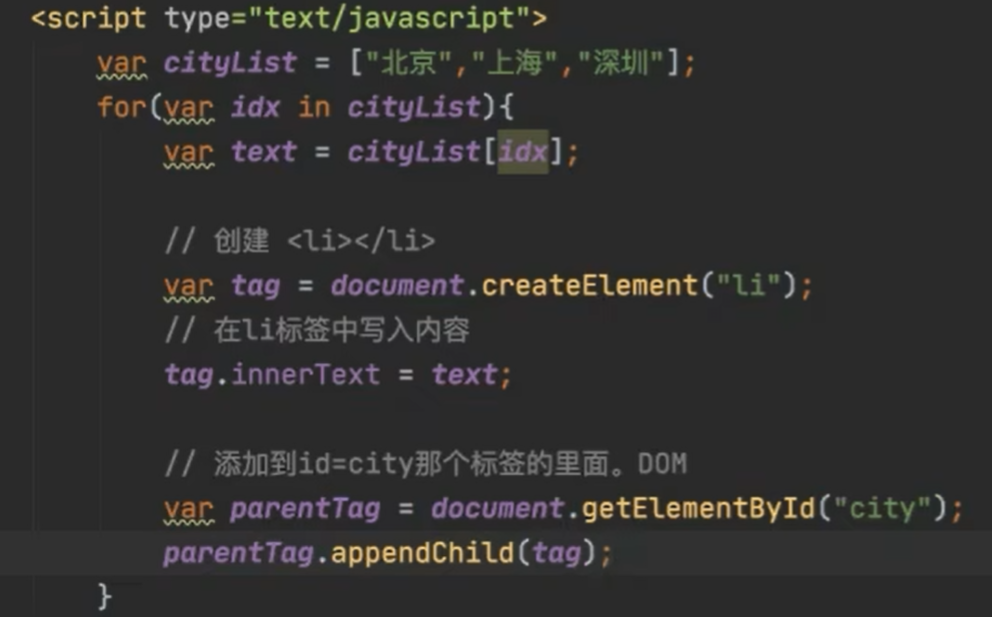
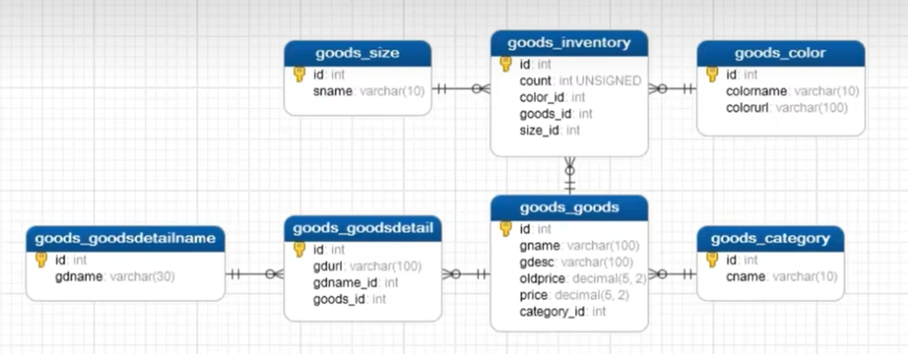
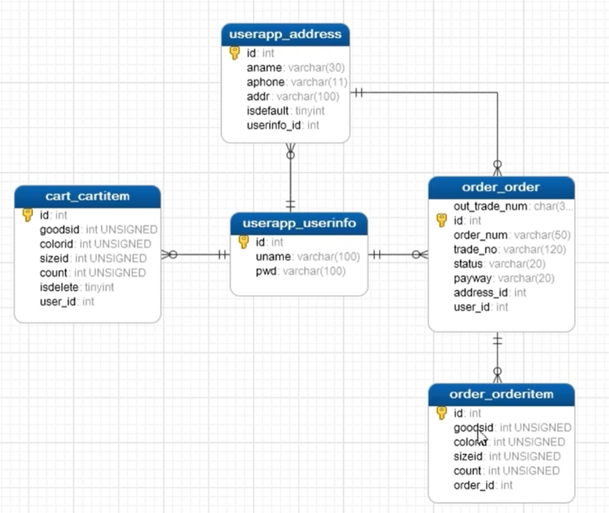
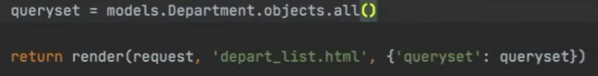
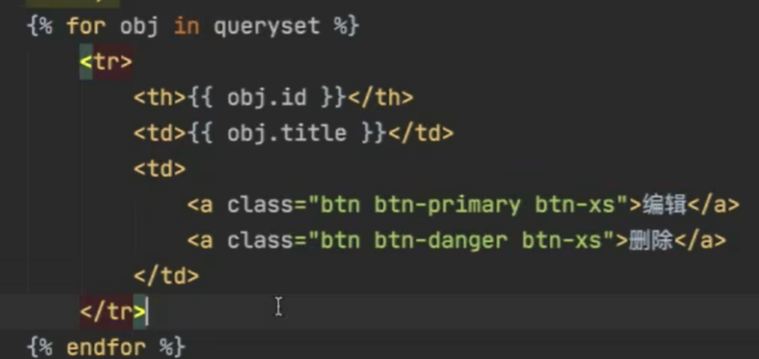
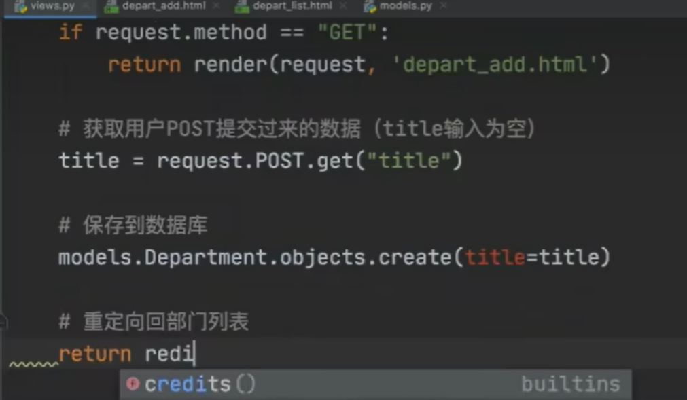

# 前端

## html 

```html
head
<meta charset="utf-8">文件编码
title 浏览器标签名

body
hn 块级标签，标题系列，n为一个数字，
div 文字块级标签，其中内容占一整行
span 文字行内标签/内联标签，占其中内容本身大小
<a href="要跳转的网站">文本</a> 超链接，跳转自己网站可以将域名省略
<image src="地址"/> 图片（自闭和），自己的图片放到static目录中，可以使用a标签包裹image实现点击图片跳转
a表中写target=_blank另起tab打开页面
ul li列表中的一列li ul 无序列表
ol li li ol 有序列表
table thead tr th表头中的一行中的一个元素th tr trthead table 表体用tbody
input系列，输入框
select option下拉框中的其中一个选项option select select后加mutiple开启多选
textarea多行文本
form表单

label的for属性规定了label与哪个表单元素绑定。for属性的值和表单元素的id值一样，即可完成该label标签与该表单元素的绑定。
```

## CSS

```css
css应用方式：在标签中使用，在head中定义style（便于复用），写在文件中
选择器：.c1叫类选择器，#c2叫id选择器，li叫标签选择器（li可以是任何标签），属性选择器（input中的type等属性的样式），后代选择器
height 高度
width 宽度（支持百分比），高度和宽度对行内标签默认无效，对块级标签默认空着也不能用
display=inline-block，中和行内标签和块级标签的特点
也可以通过inline和block来对标签进行的属性进行修改
color 字体属性
font-size 字体大小
font--weight 字体加粗
font-family 字体
border 边框
text-align 字体水平位置
line-height 字体竖直位置（如果想要对其可以把整个块都占上）
float 浮动，可以选择左右，可以使div不占用整行空间
padding 内边距
margin 外边距

placeholder属性表示提示信息
```

## BootStrap

```css
<link rel="stylesheet" href="static/plugins/bootstrap-3.4.1/css/bootstrap.css">引入bootstrap

FormControl跟踪独立表单控件的值和验证状态。
```

## javascript



js中范围for循环得到的是索引而不是值

### DOM

基于dom可以对html中的标签进行操作

# 后端

## django

### django项目默认文件介绍

- mamage.py用作项目管理**（常用）**
- 与项目同名的文件夹
  - asgi.py和wsgi.py负责接受网络请求**（不要动）**
  - urls.py负责url和python函数之间的对应**（常改）**
  - settings.py负责项目的配置**（常改）**

### app

1. 确保app已注册（在settings.py中）
2. 编写url和函数的对应关系（在urls.py中）

## 创建项目需要做的事情

 `python .\manage.py startapp app名`来创建app（命令行）

去setting.py中注册app

编写url和函数的对应关系（在urls.py中）

编写视图函数在view.py中

在数据库中创建数据库并setting

在models.py中编写数据库信息

控制台同步数据库信息

```bash
python .\manage.py makemigrations
python .\manage.py migrate
# 创建、删除表的时候重复执行上述命令即可
# 新增列的时候需要对字段的值进行设置（新增默认值或者允许为空）
```

# 用户登录

保持登录用session做，通过django提供的中间件来鉴权，退出登录只需要把session删除即可

验证码通过python的第三方模块pillow来生成图片

# ajax

图标用echarts做


# 需求分析

1. 商品模块
   1. 展示所有商品
   2. 单个商品详情展示（图片用a标签）
2. 用户模块
   1. 用户注册
   2. 用户登录
   3. 用户地址管理
3. 购物车模块
   1. 显示购物车所有商品
   2. 将商品加入购物车
   3. 删除购物车中商品
   4. 修改商品数量
4. 订单模块
   1. 点击购买后，将选中商品加入结算页面
   2. 模拟支付
   3. 查看订单
5. 后台管理模块
   1. 运营管理库存、订单
   2. 管理者查看报表











- 管理员
  - 账号
  - 密码
  - 最近登陆时间
- 
