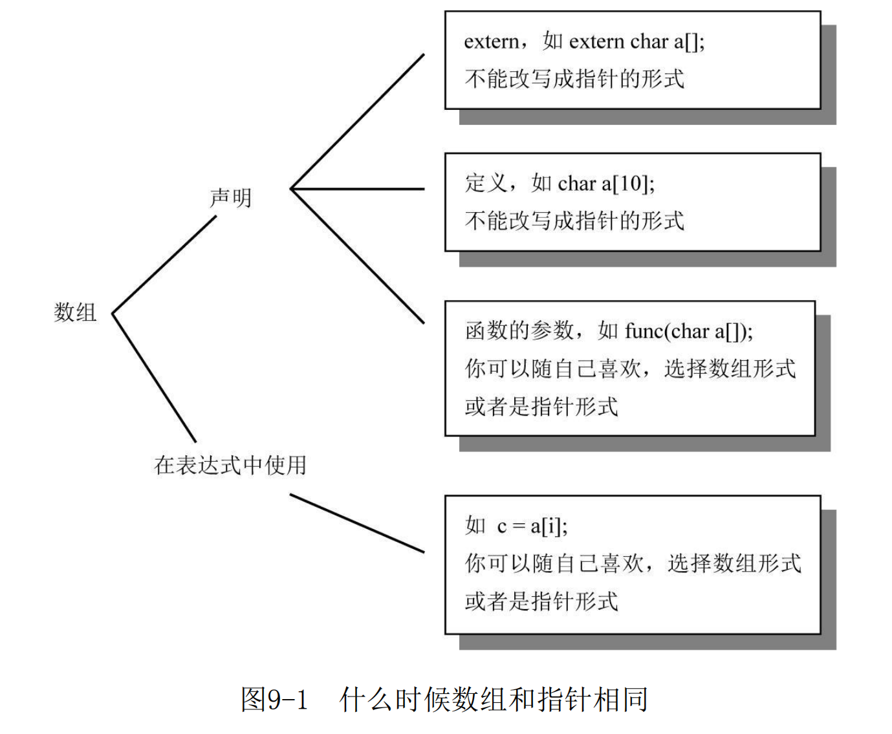

# C：穿越时空的迷雾

使用sizeof的结果和其他变量进行比较的时候需要注意，sizeof的结果是无符号整型，其他变量可能会升级为无符号行丢失信息。如有必要的话需要将sizeof的结果转换为和其比较变量相同的类型。

# 这不是BUG，而是语言特性

分析编程语言缺陷的一种方法就是把所有的缺陷归于3类:不该做的做了;该做的没做;该做但做得不合适。

C语言中除了对指针解引用会检查其是否正确外，几乎不会有其他任何运行时检查了，因为这与C语言的设计理念相悖，按照C语言的理念，程序员应该知道自己正在做什么，而且确保自己做的事情是正确的。

switch中的case和default的顺序是任意的，default不需要再switch的最后。

# 分析C语言的声明

在从前，类型模型这个概念还未流行，BCPL语言根本没有类型这个概念，而是用二进制字作为唯一的数据类型。所以C语言出现了一种设计哲学，要求对象的声明形式和它的使用形式尽可能相似。

在传递参数的时候，为了保证速度，会尽量将参数存入寄存器而不是压入堆栈。

**声明分析原则**

1. 声明从名字开始读取，按照优先级高低依此读取
2. 优先级
   1. 声明中被括号括起来的部分
   2. 后缀表达式
      1. 小括号表示其是个函数
      2. 中括号表示其是个数组
   3. 前缀表达式
      1. 如*表示指针
3. 如果const、volatile后紧跟类型说明符那么它作用于类型说明符，否则作用于它左侧的指针星号

**typedef和define**

可以使用其他类型说明符对宏类型名进行扩展，typedef则不行

在连续声明多个变量的时候，typedef可以保证声明中的所有变量都是同一个类型，而宏不能

# 令人震惊的事实：数组和指针并不相同

## 声明和定义的区别

| 定义                                                         | 声明                                                         |
| ------------------------------------------------------------ | ------------------------------------------------------------ |
| 只能出现在一个地方                                           | 可以出现在多个地方                                           |
| 确定对象的类型并分配内存，用于创建新的对象。例如: int my_array[100]; | 描述对象的类型，用于指代其他地方定义的对象（例如在其他文件里）例: extern int my_array[]; |

extern对象声明告诉编译器对象的类型和名字，对象的内存分配则在别处进行。由于并未在声明中为数组分配内存，所以并不需要提供关于数组长度的信息。对于多维数组，需要提供除最左边一维之外其他维的长度——这就给编译器足够的信息产生相应的代码。

# 对链接的思考

目标文件并不能直接执行，它首先需要载入到链接器中。链接器确认main函数为初始进入点（程序开始执行的地方），把符号引用(symbolic reference)绑定到内存地址，把所有的目标文件集中在一起，再加上库文件，从而产生可执行文件。

动态链接的主要目的就是把程序与它们使用的特定的函数库版本中分离开来。

# 运动的诗章：运行时数据结构

学习运行时系统的三个理由：它有助于优化代码，获得最佳的效率、它有助于理解更高级的材料、当陷入麻烦时，它可以使分析问题更加容易。

在UNIX中，段表示一个二进制文件相关的内容块。

在Intel x86的内存模型中，段表示一种设计的结果。在这种设计中(基于兼容性原因），地址空间并非一个整体，而是分成一些64K大小的区域，称之为段。

当在一个可执行文件中运行size命令时，它会告诉你这个文件中的三个段（文本段、数据段和bss(Block Started by Symbol)段)的大小。

在 C 语言中，我们不能使用 **goto** 语句来跳转到另一个函数中的某个 **label** 处，但C语言可以使用setjmp保存函数栈帧、程序指针、寄存器，然后使用longjmp恢复这些值。正是因为goto无法在多个函数之间跳跃，所以起名longjmp

```c
#include <setjmp.h>
/* setjmp 函数的功能是将函数在此处的上下文保存在 jmp_buf 结构体中，以供 longjmp 从此结构体中恢复。
参数 env 即为保存上下文的 jmp_buf 结构体变量。
如果直接调用该函数，返回值为 0； 若该函数从 longjmp 调用返回，返回值为非零，由 longjmp 函数提供。根据函数的返回值，我们就可以知道 setjmp 函数调用是第一次直接调用，还是由其它地方跳转过来的。*/
int setjmp(jmp_buf env);
/*longjmp 函数的功能是从 jmp_buf 结构体中恢复由 setjmp 函数保存的上下文，该函数不返回，而是从 setjmp 函数中返回。
参数 env 是由 setjmp 函数保存过的上下文。
参数 val 表示从 longjmp 函数传递给 setjmp 函数的返回值，如果 val 值为0， setjmp 将会返回1，否则返回 val。
longjmp 不直接返回，而是从 setjmp 函数中返回，longjmp 执行完之后，程序就像刚从 setjmp 函数返回一样。*/
void longjmp(jmp_buf env, int val);
```

# 对内存的思考

今天，计算机系统结构的真正挑战不在于内存的容量，而是内存的速度。如果你的软件实际上受到磁盘和内存的等待时间（访问时间）的限制，那么即使是光彩夺目的Pentium芯片也没有用武之地。准确地说，在内存和CPU的性能之间存在一道很深的鸿沟，而且是越来越深。在过去的10年里，每隔一年半至两年，CPU的速度就会提升一倍。在相同的时间内，内存的容量倒是扩大了一倍（从64KB增加到128KB），但它的访问时间只提高了10%。在巨型地址空间的机器中，主存访问时间的重要性将进一步凸现。当访问海量数据时，它所耗费的内存访问时间将左右软件的性能。我们只能寄望未来能看到Cache以及相关技术的更广泛使用。

# 再论数组



