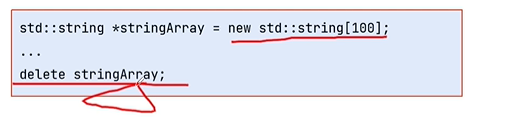
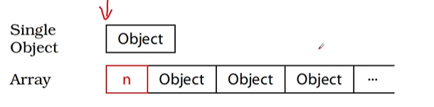
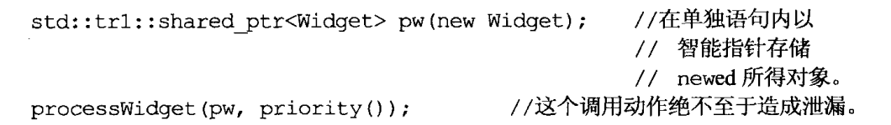
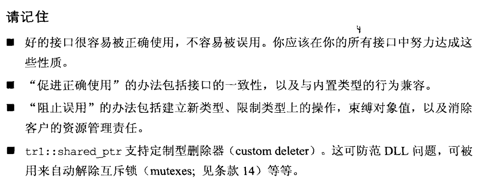
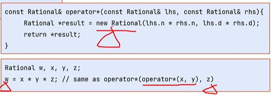
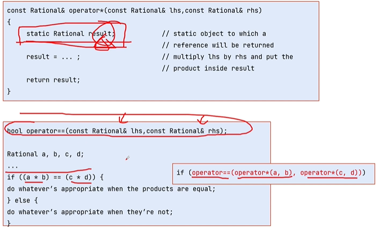
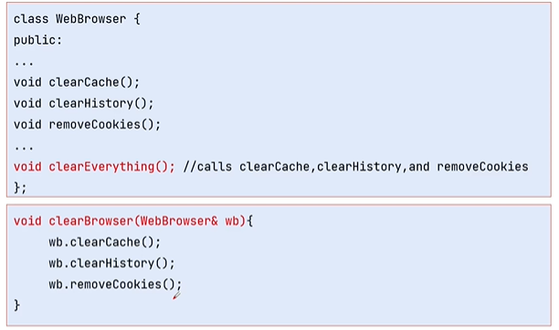

# 让自己习惯C++

## 1.视C++为一个语言联邦

如今的C++同时支持过程形势、面向对象形式、函数形式、泛型形式、元编程形式的语言。

## 2.尽量以const, enum, inline替换#define
这个标题也可以表述为用编译器来替换预处理器

宏替换在预处理之后就失去了它想要表达的含义只剩下值，如果在此出错且宏定义并不来自我们自己的代码，那么问题将会很难定位和解决。解决之道便是使用const常量来替换。使用常量替换define有两种特殊情况：

1. 在头文件中将指针声明为常量，也就是不能改变指针的指向
2. 为了将常量的作用域限定在类中，我们可能需要将成员变量声明为const，同时需要声明为static，确保此常量至多只有一份实体

### enum hack

以下的代码，在支持类内初始化的编译器下可以通过

```cpp
class Game {
private:
    static const int GameTurn = 10;
    int scores[GameTurn];
};
```

但是较老的C++编译器，可能不支持类内初始化，这样我们的静态常量，必须要在类外初始化。如下：

```cpp
class Game {
private:
    static const int GameTurn;
    int scores[GameTurn];
};
const int Game::GameTurn = 10;
```

如果没有`int scores[GameTurn];`，这段代码就可以用不支持类内初始化的编译器通过了。

但因为 `int scores[GameTurn];` 用到了`GameTurn`，而`GameTurn`的值不能确定。所以报数组错误

在这种情况下，我们仍不想用硬编码的方式指定数组大小，就可以使用`enum hack`，就可以通过编译了。	

```cpp
class Game {
private:
    // static const int GameTurn;
    enum {GameTurn = 10};
    int scores[GameTurn];
};

// const int Game::GameTurn = 10;
```

enum的好处：

1. `enum hack`的行为更像`#define`而不是`const`，如果你不希望别人得到你的常量成员的指针或引用，你可以用`enum hack`替代之。（为什么不直接用`#define`呢？首先，因为`#define`是字符串替换，所以不利于程序调试。其次，`#define`的可视范围难以控制，比如你怎么让`#define`定义的常量只在一个类内可见呢？除非你用丑陋的`#undef`。
2. 使用`enum hack`不会导致 “不必要的内存分配”。
3. `enum hack`是模板元编程的一项基本技术，大量的代码在使用它。当你看到它时，你要认识它。

对于宏函数则最好使用inline函数来替换。

## 3.尽可能使用const

const语法虽然变化多端，但并不莫测高深。如果关键字const出现在星号左边，表示被指物是常量;如果出现在星号右边，表示指针自身是常量;如果出现在星号两边，表示被指物和指针两者都是常量。

如果被指物是常量，有些程序员会将关键字const写在类型之前，有些人会把它写在类型之后、星号之前，两种写法的意义相同。

将const实施于成员函数的目的,是为了确认该成员函数可作用于const对象身上。这一类成员函数之所以重要，基于两个理由。第一，它们使class接口比较容易被理解。这是因为，得知哪个函数可以改动对象内容而哪个函数不行，很是重要。第二，它们使“操作const对象”成为可能。这对编写高效代码是个关键，因为如条款20所言，改善C++程序效率的一个根本办法是以pass by reference-to-const方式传递对象，而此技术可行的前提是，我们有const成员函数可用来处理取得（并经修饰而成）的const对象。

## 4.确定对象在使用之前已经被初始化了

对于内置类型，手动完成初始化，或者也可以通过输入的方式完成初始化。

对于自定义类型，则可以将初始化放在构造函数中，不过需要注意赋值和初始化的区别：C++规定，对象的成员变量初始化动作发生在进入构造函数本体之前，所以在构造函数中用`=`不叫初始化而是赋值，对象的成员变量的初始化发生在默认构造函数被调用时（也就是说在自定义构造函数被调用之前，默认构造函数会被调用一次）。最佳的做法是初始化列表，这样做的效果与赋值是一样的，但是相比于赋值效率更高因为少了一次赋值操作。

对于一般的成员变量，初始化列表不是必须的，但是对于常量和引用，初始化列表则是必须的，很好理解因为这两个东西都需要初始化，且不能更改值。

# 构造/析构/赋值运算

## 5.了解C++默认编写并调用了哪些函数

如果你写了一个空类，那么C++会为你声明拷贝构造函数、拷贝赋值函数、析构函数、默认构造函数，且这些函数都是public和inline的。只有当这些函数被调用时，它们才会被编译器创建出来，

## 6.若不想使用编译器自动生成的函数,就该明确拒绝

将函数的访问权限设置为private可以解决外部访问，但成员函数和友元函数还是可以访问，除非不去定义这个函数

## 7.为多态基类声明virtual析构函数

否则可能会导致`delete`时不调用派生类的析构函数

`std::string`不能被继承的原因就是它没有虚析构函数

## 8.别让异常逃离析构函数

没看懂

## 9.绝不在构造和析构过程中调用virtual函数

这一似乎反直觉的行为有个好理由。由于 base class构造函数的执行更早于derived class构造函数，当base class构造函数执行时derived class 的成员变量尚未初始化。如果此期间调用的virtual函数下降至derived classes阶层,要知道derived class的函数几乎必然取用local成员变量，而那些成员变量尚未初始化。这将是一张通往不明确行为和彻夜调试大会串的直达车票。“要求使用对象内部尚未初始化的成分”是危险的代名词，所以C++不让你走这条路。

## 10.令operator=返回一个reference to this
因为可能会有连等的写法

## 11.在operator=中处理“自我赋值”

自我赋值看起来没什么意义，但是因为有了“别名”如指针、引用，所以自我赋值需要实现。

在实现的过程中则需要注意自我赋值安全性、异常安全性等问题

## 12.复制对象时勿忘其每一个成分

容易忽略的部分：新加进来的成员变量、父类的成员变量。

不要尝试以某个copying函数实现另一个copying函数。应该将共同机能放进第三个函数中，并由两个coping函数共同调用。

# 资源管理

所谓的资源管理就是，一旦用了资源，将来必须还给系统。C++中最常见的资源就是动态内存分配。

但资源并不仅指内存，其他常见的资源还包括文件描述符，互斥锁，数据库连接，线程，socket。

## 13.以对象管理资源

RAII，资源获取即初始化

## 14.在资源管理类中小心copying行为（RAII对象的拷贝行为）

复制RAII 对象必须一并复制它所管理的资源，所以资源的copying行为决定RAII对象的copying行为。

**RAII对象可能的拷贝行为**

- 禁止拷贝（`std::unique_ptr`）
- 引用计数（`std::shared_ptr`）
- 拷贝底层资源（`std::string`）
- 移动管理资源的所有权（std::unique_ptr）

## 15.在资源管理类中提供对原始资源的访问

部分函数要求参数是原始指针，所以在智能指针中通常会提供`get()`方法提供原始指针，所以在我们自己封装资源管理类的时候也应该提供类似的方法实现对原始资源的访问

## 16.成对使用new和delete时要采取相同形式





## 17.以独立语句将newed 对象置入智能指针

`processwidget (std::trl: :shared ptr<Widget>(new Widget), priority());`

上述代码可能会造成内存泄漏，不同编译器的执行顺序可能不同，考虑以下执行顺序

执行new Widget   调用priority()    将widget对象交给智能指针

如果此时priority抛出异常了，那么new出来的widget就泄漏了

正确的做法因该是将以上代码分为两行书写



# 设计与声明

## 18.让接容易被正确使用，不易被误用

用户错误调用接口，尽可能让这个错误在编译期被发现。

如果喊出的参数是内置类型且容易错误，使用自定义的类型替换这些内置类型。且自定义类型的行为应尽可能和内置类型一致。



## 19.设计class 犹如设计type

C++定义一个class就是定义了一个新的type，所以我们不只是class设计者，也是type设计者。

通过以下十二个问题设计搞笑class：

- 新type的对象应该如何被创建和销毁?

  涉及到构造函数和析构函数以及内存分配和释放函数

- 对象的初始化和对象的赋值该有什么样的差别?

  构造函数和赋值操作符的行为，以及其间的差异

- 新type的对象如果被passed by value（以值传递)，意味着什么?

  拷贝构造函数用来定义一个type的值传递如何实现

- 什么是新type 的“合法值”?

  这决定了成员函数必须进行的错误检查工作（特别是构造函数、赋值操作符以及setter函数）

- 你的新type需要配合某个继承图系（ inheritance graph）吗?

  如果当前class继承自某些既有class，那么当前class将会受到哪些classes设计的束缚，特别是函数是否是虚函数的影响。如果允许其他classes继承当前class，那么将会影响当前class的函数，尤其是析构函数是否是虚函数

- 你的新type需要什么样的转换?

  如果希望我们的class可以被隐式转换为其他类型，必须在我们的class中写一个类型转换函数或在其他类型内写一个non-explicit-one-argument的构造函数

- 什么样的操作符和函数对此新type 而言是合理的?

- 什么样的标准函数应该驳回?

  有些默认的函数应该是禁止的，如我们如果要定义Mutex，我们既不希望他被拷贝也不希望他被移动，直接给delete掉，在C++11之前则定义为私有，禁止外部调用。

- 谁该定义为新type 的成员?

- 什么是新type 的“未声明接口”( undeclared interface）?

- 你的新type有多么一般化?

  如果我们定义的是一整个types家族，那么就应该定义一个新的class template，也可以叫做通用性

- 你真的需要一个新type 吗?

  我们想要通过继承的方式来扩展一个类，来实现一些功能，可能这些功能只需要在原有的类中添加几个成员函数就可以实现，而不需要创建新的class

## 20.宁以pass-by-reference-to-const替换pass-by-value

const的意义在于，调用者知道，值传递的参数在函数内无法被改变，现在我们通过引用传递也应该保持这个现状。

值传递的第二个问题在于：如果你将子类对象作为参数传递给接收父类对象的函数，那么子类对象的特性将会被抹除

一般而言，你可以合理假设 “pass-by-value 并不昂贵＂的唯一对象就是内置类型和STL 的迭代器和函数对象。

## 21.必须返回对象时，别妄想返回其reference

绝不要返回 pointer reference 指向一个 local stack 对象，或返回 reference 指向一heap-allocated 对象，或返回 pointer reference 指向一个 local static 对象而有可能同时需要多个这样的对象。

如果想要返回堆区内存则可能内存泄漏：



如果用静态变量则会产生如下问题



## 22.将成员变量声明为private

切记将成员变量声明为 private 。这可赋予客户访问数据的一致性、可细微划分访问控制、允诺约束条件获得保证，并提供 class 作者以充分的实现弹性。

## 23.宁以 non-member non-friend 替换 member 函数



在上述工具函数 例子中，使用下面的非成员函数的封装性更高，因为成员函数是可以访问私有成员的，而非成员函数只能访问public的成员。

## 24.若所有参数皆需类型转换，请为此采用non-member 函数

没看懂
