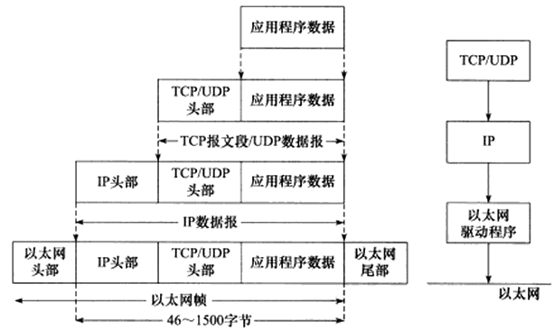
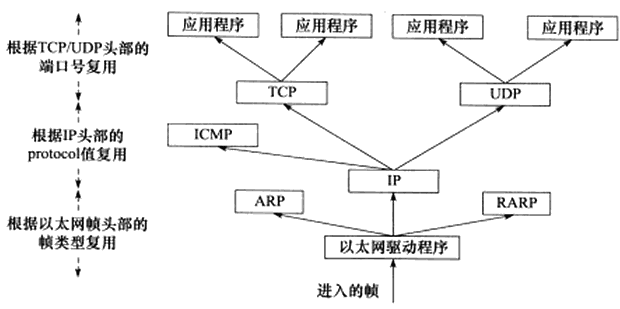
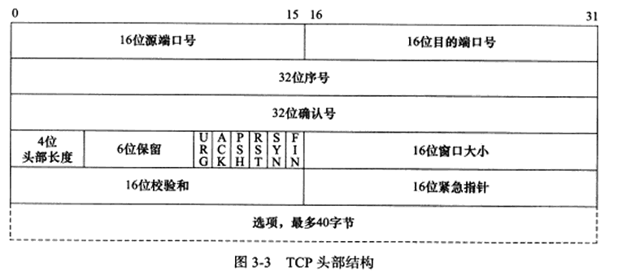
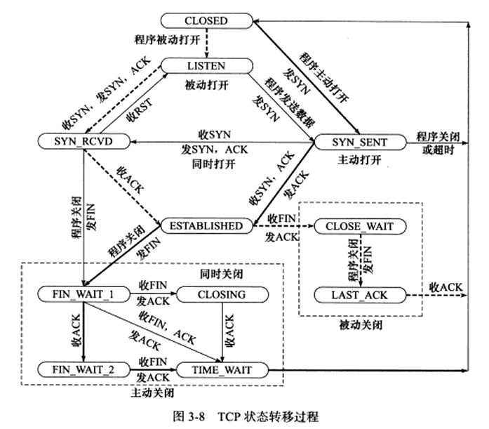

# 第一章 TCP/IP协议族

TCP/IP协议族只有四层，不包括物理层

数据链路层实现了网卡接口的网络驱动程序，以处理数据在物理媒介（比如以太网、令牌环等）上的传输。不同的物理网络具有不同的电气特性，网络驱动程序隐藏了这些细节，为上层协议提供一个统一的接口。**ARP协议(Address Resolve Protocol 地址解析协议)**和**RARP协议（Reverse Address Resolve Protocol 逆地址解析协议）**实现了IP地址和机器物理地址（MAC地址）之间的转换。

两台主机之间通常不是直接相连而是通过多个中间节点（路由器）连接的。（拥塞就是路由器吞吐量已满造成的）网络层对上层隐藏了网络拓扑结构，上层看来就是两个主机直接相连。**IP协议(Internet Protocol，因特网协议）**是网络层最核心的协议，IP协议根据数据包的目标地址来决定如何投递数据包，如果数据包不能直接发给目标主机，IP协议将会使用逐跳的方式来寻找下一台合适的路由器，多次重复这一过程，直到数据发到目标主机或者发送失败而丢弃。**ICMP协议( Internet Control Message Protocol，因特网控制报文协议)**则主要用于检测网络连接（ping就是使用ICMP），但是ICMP并不是严格的网络层协议，因为其使用IP提供的服务。

传输层为应用程序封装了一条端到端的逻辑通信链路，它负责数据的收发、链路和超时重连。传输层协议主要有三个:TCP协议、UDP协议和SCTP协议。**TCP协议（Transmission Control Protocol，传输控制协议）**为应用层提供可靠的、面向连接的和基于流〈stream）的服务。UDP协议（User Datagram Protocol，用户数据报协议）则与TCP协议完全相反，它为应用层提供不可靠、无连接和基于数据报的服务。SCTP协议（Stream Control Transmission Protocol，流控制传输协议）是一种相对较新的传输层协议，它是为了在因特网上传输电话信号而设计的。

应用层负责处理应用程序的逻辑。上述几层都在内核态，应用层则在用户态，因为它负责的逻辑很多会使内核庞大。

在发送报文时，会在每一层加上相应的头部，这个过程叫做封装。



当帧到达目的主机时，将沿着协议栈自底向上依次传递。各层协议依次处理帧中本层负责的头部数据，以获取所需的信息，并最终将处理后的帧交给目标应用程序。



# IP协议详解

无状态表示IP通信双方不同步传输数据的状态信息，即所有报文相互独立没有上下文，缺点就是无法处理乱序和重复的报文，有点是简单高效。

无连接表示双方不保留对方的信息，这样上层协议在每次发送数据的时候都需要指明对方的ip地址。

不可靠是值IP协议不能保证数据准且地到达接收端。

# TCP协议详解

面向字节流就是发送和接收的时候不需要固定大小和次数，多少此取决于发送方和接收方，而UDP在发送和接收的时候数据包是固定大小的所以发送和接收次数也是固定的。

## TCP头部

16位接收通告窗口(Receiver Window，RWND)



- URG标志，表示紧急指针( urgent pointer）是否有效。
- ACK标志，表示确认号是否有效。我们称携带ACK标志的TCP报文段为确认报文段。
- PSH标志，提示接收端应用程序应该立即从TCP接收缓冲区中读走数据，为接收后续数据腾出空间（如果应用程序不将接收到的数据读走，它们就会一直停留在TCP接收缓冲区中)。
- RST标志，表示要求对方重新建立连接。我们称携带RST标志的TCP报文段为复位报文段。
- SYN标志，表示请求建立一个连接。我们称携带SYN标志的TCP报文段为同步报文段。
- FIN标志，表示通知对方本端要关闭连接了。我们称携带FIN标志的TCP报文段为结束报文段。

16位窗口大小（ window size):是TCP流量控制的一个手段。这里说的窗口，指的是接收通告窗口（Receiver Window，RWND)。它告诉对方本端的TCP接收缓冲区还能容纳多少字节的数据，这样对方就可以控制发送数据的速度。
16位校验和（TCP checksum):由发送端填充，接收端对TCP报文段执行CRC算法以检验TCP报文段在传输过程中是否损坏。注意，这个校验不仅包括TCP头部，也包括数据部分。这也是TCP可靠传输的一个重要保障。
16位紧急指针（urgent pointer):是一个正的偏移量。它和序号字段的值相加表示最后一个紧急数据的下一字节的序号。因此，确切地说，这个字段是紧急指针相对当前序号的偏移，不妨称之为紧急偏移。TCP的紧急指针是发送端向接收端发送紧急数据的方法。我们将在后面讨论TCP紧急数据。

## 连接的建立和关闭

半双工：数据双向流通，但是不能同时流通

全双工：数据双向流同，可以同时流通

建立连接的超时重传一般进行五次，每次间隔时间翻倍

## 状态转移



### TIME_WAIT

客户端在接收到服务器的fin报文并发出ack后并没有直接close，而是进入了TIME_WAIT，这个状态下客户端需要等待**2MSL (Maximum Segment Life，报文段最大生存时间）**才能完全关闭。MSL是TCP报文在网络中的最大生存时间，RFC建议2min

原因如下，可靠地终止TCP连接，保证让迟来的TCP报文段有足够的时间被识别并丢弃。

## TCP交互数据流

TCP报文段所携带的应用程序数据按照长度分为两种：交互数据（少量数据，高实时性telnet、ssh）和成块数据（大量数据，高效率ftp）

## 带外数据

**带外(Out Of Band,OOB)数据**用来迅速通告对方本端发生的重要事件，带外数据有更高的优先级，总是可以立即被发送不论发送缓冲区是否有等待发送的数据，带外数据可以使用一条独立的传输层连接或者可以映射到普通的连接中

UDP没有带外数据，TCP也没有真正的带外数据，TCP利用头部中的紧急指针标志和紧急指针两个字段给应用程序提供一种紧急方式。

当有紧急数据需要发送的时候，URG标志打开，并将紧急指针指向最后一个带外数据的下一个字节。

如果TCP报文被分成多段发送，每个报文都会有URG标志，并且他们的紧急指针全部指向同一个位置，但是只有一个报文真正携带带外数据。

## 超时重传

TCP为每个报文维护一个重传定时器并且在报文第一次发送的时候启动，超过时间没有接收到对方的应答，就会重传报文并且重置定时器

## 拥塞控制

TCP拥塞控制的标准文档是RFC 5681，其中详细介绍了拥塞控制的四个部分:慢启动(slow start)、拥塞避免(congestion avoidance)、快速重传（fast retransmit）和快速恢复(fastrecovery)。

拥塞控制的最终受控变量是发送端向网络一次连续写人（收到其中第一个数据的确认之前）的数据量，我们称为SWND (Send Window，发送窗口)。SWND限定了发送端能连续发送的TCP报文数量，这些报文的最大长度（仅指数据部分）称为SMSs (Sender Maximum Segment Size，发送者最大段大小)，其值一般等于MSS。

接收方可以通过RWND来控制发送方的SWND，但这显然不够，所以发送方引入了一个称为拥塞窗口(Congestion Window，CWND）的状态变量。实际的SWND值是RWND和CWND中的较小者

# Linux网络编程基础API

```c
//主机字节序和网络字节序之间的互相转换
#include <netinet/in.h>
unsigned long int htonl( unsigned long int hostlong );//host to network long
unsigned short int htons ( unsigned short int hostshort );
unsigned long int ntohl ( unsigned long int netlong ) ;
unsigned short int ntohs ( unsigned short int netshort );

//socket地址
#include <bits/socket.h>
struct sockaddr {
    sa_family_t sa_family;//地址族类型
    char sa_data[14];//存放socket地址
}
```

# 高性能服务器程序框架

服务器分为三个主要模块：IO处理单元、逻辑单元、存储单元（可选）


## reactor和proactor

Reactor实现了一个被动的事件分离和分发模型，服务等待请求事件的到来，再通过不受间断的同步处理事件，从而做出反应

Proactor实现了一个主动的事件分离和分发模型;这种设计允许多个任务并发的执行，从而提高吞吐量。

因此，Reactor 可以理解为「来了事件操作系统通知应用进程，让应用进程来处理」，而Proactor可以理解为「来了事件操作系统来处理，处理完再通知应用进程」。这里的「事件」就是有新连接、有数据可读、有数据可写的这些I/O事件这里的「处理」包含从驱动读取到内核以及从内核读取到用户空间。
举个实际生活中的例子，Reactor模式就是快递员在楼下，给你打电话告诉你快递到你家小区了，你需要自己下楼来拿快递。而在 Proactor模式下，快递员直接将快递送到你家门口，然后通知你。
无论是Reactor，还是Proactor，都是一种基于「事件分发」的网络编程模式，区别在于Reactor模式是基于「待完成」的I/O事件，而 Proactor模式则是基于「已完成」的I/O事件。

Reactor框架中用户定义的操作是在实际操作之前调用的。比如你定义了操作是要向一个SOCKET写数据，那么当该SOCKET可以接收数据的时候，你的操作就会被调用;而Proactor框架中用户定义的操作是在实际操作之后调用的。比如你定义了一个操作要显示从SOCKET中读入的数据，那么当读操作完成以后，你的操作才会被调用。

reactor:能收了你跟俺说一声。
proactor:你给我收十个字节，收好了跟俺说一声。
