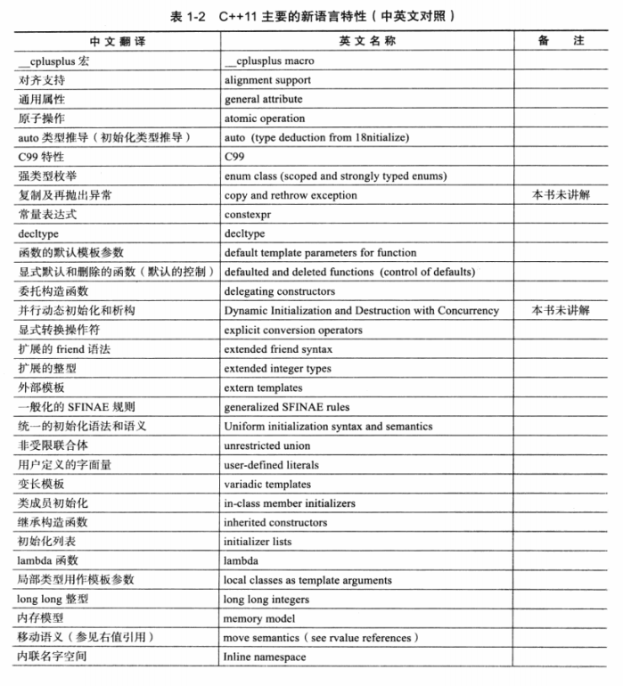
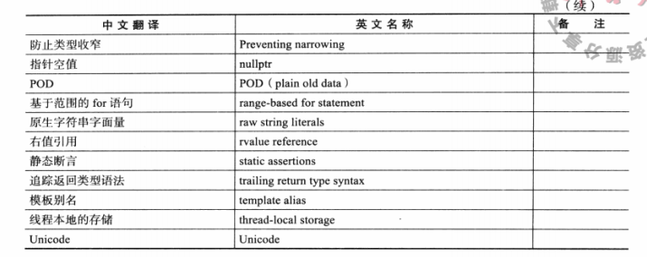

# 新标准的诞生





# 保证稳定性和兼容性

```C++
cout << __STDC_HOSTED__ << endl;
cout << __STDC__ << endl;//一些C和CPP库的宏

cout << __func__ ;//返回所在函数的函数名，类或者结构体也可

cout << LLONG_MAX;//long long类型的最大值，定义在<climits>中，标准要求long long类型至少有64位。 

assert(i > 0);//在<cassert>中的断言宏，通常用于调试，不符合条件产生异常，程序结束的时候会产生断言失败的字样。可以定义NDEBUG来禁用assert宏，如果定义了NDEBUG宏，assert宏将会被展开为一条无意义的C语句，通常会被编译器优化掉
static_assert(断言表达式，警告信息);//静态断言，编译期间断言
sizeof(((class*)0)->item);//C++98中不能对非静态成员变量使用sizeof()，如果想要使用则需要如此
template <typename T = int> void func(){};//C++11支持模板函数的默认模板参数
extern template void fun<int>(int);//外部模板
```

# 通用为本，专用为末

## 继承构造函数

子类为完成基类初始化，在C++11之前，需要在初始化列表调用基类的构造函数，从而完成构造函数的传递。如果基类拥有多个构造函数，那么子类也需要实现多个与基类构造函数对应的构造函数。

```cpp
struct A
{
  A(int i) {}
  A(double d,int i){}
  A(float f,int i,const char* c){}
  //...等等系列的构造函数版本号
};
struct B:A
{
  using A::A;
  //关于基类各构造函数的继承一句话搞定
  //......
};
```

## 委托构造函数

允许构造函数通过初始化列表调用同一个类的其他构造函数，目的是简化构造函数的书写，提高代码的可维护性，避免代码冗余膨胀。

```cpp
class Foo
{
public:
    Foo() {initRest(); }
    Foo(int i) : Foo() {type = i;}
    Foo(char e) : Foo() {name = e;}
private:
    void initRest() { /* init othre members */}
    int type{1};
    char name{'a'};
};
// 使用构造模板函数产生目标构造函数
class test {
	template<class T> test(T first, T last) : l (first, last) {}
    list<int> l;
public:
	test(vector<short> & v):
		test (v.begin ( ) , v.end () ) { }
}
```

## 右值

缘由：拷贝构造语义性能较低，且有时并不需要拷贝

重点在于如果有成员变量指向堆区内存，那么我们需要实现深拷贝版本的拷贝构造函数，那么拷贝构造函数就会在赋值、传参、返回值的时候调用，而后两者调用可能是没什么用的且浪费性能的，所以才迫切需要一个移动语义。

```cpp
test(test && x) : ptr(x.ptr) {//移动构造函数
    x.ptr = nullptr;
}
```

至于为什么采用移动而不是将指针或者引用作为参数传递的原因是：没法再次传递，可读性也存在问题。目前存在的问题是临时对象会触发移动构造函数，那么什么时候会产生临时对象呢？C++又是怎么判断的呢？非临时对象能否用于移动构造呢？

左值、纯右值、将亡值

右值引用就是对一个右值进行引用的类型，通常我们只能通过引用的方式找到右值，只要右值引用还在，该右值就会一直存在。

常量左值引用在C++98中就是一个万能引用，只不过是const的，

<utility>中的std::move()可以将一个左值强制转换成右值引用，继而我们可以通过右值引用使用该值，以用作移动语义。以下是一个误区

```cpp
test a;
test b(move(a));//调用移动构造函数
cout << a->ptr << endl;//运行错误，因为a中的指针变量应当在移动构造函数中被指空，但是又不会调用a的析构函数，就只能等待出作用域自动析构。我们应该对一个生命期即将结束的变量使用move
```

在实现移动语义的时候注意需要排除一些不必要的const。否则移动语义就无法实现

所谓完美转发( perfect forwarding )，是指在函数模板中，完全依照模板的参数的类型，将参数传递给函数模板中调用的另外一个函数。普通的转发只能保证正确的转发，但是由于拷贝产生消耗所以不算完美，如果采用引用类型则不会有拷贝的开销，但是这时则需要考虑接收方的接收能力，是否左右值引用都能接收。

一个右值引用作为函数参数的形参时，在函数内部转发该参数给内部其他函数时，他就变成了一个左值(当右值被命名是编译器会认为他是个左值)，并不是原来的类型了。如果按照参数原来的类型转发到另一个函数，可以使用c++11的 std::forward()函数，该函数实现的功能称之为完美转发。

```cpp
//函数原型
template <class T>
T&& forward (typename remove_reference<T> : :type& t) noexcept;
template <class T>
T&& forward (typename remove_reference<T>: :type&& t) noexcept;
//精简之后的样子
std: :forward<T>(t);
```

- 当T为左值引用类型时，t将会被转换为左值
- 当T不是左值引用类型时，t将被转换为T类型的右值

# 新手易学，老兵易用

## auto

### auto不能推导的情况

1. 函数的形参不能推导
2. 非静态成员变量不能推导
3. 数组不能推导
4. 实例化模板的时候不能推导

## decltype

```cpp
int i = 0;
decltype(i) j = 1;//使用一个表达式的类型来定义或声明其他变量，（参数可以是变量也可以是表达式）
//decltype还可以用于复用匿名类型
```

1. 如果e是一个没有带括号的标记符表达式( id-expression)或者类成员访问表达式，那么decltype(e)就是e所命名的实体的类型。此外，如果e是一个被重载的函数则会导致编译时错误。
2. 否则，假设e的类型是T，如果e是一个将亡值(xvalue)，那么decltype(e)为T&&。
3. 否则,假设e的类型是T，如果e是一个左值，则decltype(e)为T&。
4. 否则，假设e的类型是T，则decltype(e)为T。
