# C

## 基础

### 变量命名

规则

1. 变量名是字母、数字、下划线的组合。
2. 开头必须是字母或下划线，用户变量通常是字母开头，系统变量通常是下划线开头。
3. 字母区分大小写。
4. 变量名不可以是C语言的关键字。

- 通常较短的单词可通过去掉“元音”形成缩写，比如表示“个数”的 count 可以缩写成 cnt；
- 较长的单词可取单词中的几个字母形成缩写；
- 对于一些单词还有大家公认的缩写，比如：
  - temp 可缩写为 tmp;  //temp是“临时”的意思
  - flag 可缩写为 flg;  //flag是“标志位”的意思
  - statistic 可缩写为 stat;  //statistic是“统计”的意思
  - increment 可缩写为 inc;
  - message 可缩写为 msg;

### 隐式类型转换

- 算术运算式中，低类型转换为高类型
- 赋值表达式中，表达式的值转换为左边变量的类型
- 函数调用时，实参转换为形参的类型
- 函数返回值，return表达式转换为返回值类型

### 声明和定义

声明用来告诉编译器变量的名称和类型而不分配内存，`extern 变量类型 变量名`或`typedef`，变量可以有多个声明。声明可以用于程序引用其他文件的变量、引用本文件中非当前作用域的变量。

定义为了给变量分配内存，全局/静态变量初始化为0，局部变量初始化为随机数，在一个程序中变量只能有一个定义。

`int a;`这样的语句同时包含声明和定义。

函数的声明式通知编译器函数名称、参数数量和类型以及返回值类型。

函数的定义式为函数分配内存。

### 关于变量

1. 变量的本质时内存的别名，程序读取的是内存而不是变量本身
2. 在程序执行的时候，变量的本质是代码，存储在代码区
3. 变量名、变量值、存储单元

### 防止头文件重复引入

1. 宏定义

```c
#ifndef _NAME_H
#define _NAME_H
//头文件内容
#endif
```

其中的_NAME_H是一个独一无二的宏，第一次执行的时候由于该宏还没有定义所以会进行定义，以后执行就不会重复执行包含的内容。但是这种方法每次引入头文件都需要识别是否已经定义了某个宏，效率并不高，但是C/C++都支持宏定义故不会影响项目的可移植性

2. #pragma once

将其附加到指定文件的最开头位置，则该文件就只会被 #include 一次。该指令对文件生效所以效率很高，需要注意的是较老版本的编译器可能不支持这种方式（执行会发出警告，但编译还是会继续进行）即该指令的兼容性不是很好。但目前也基本都支持了。

### return原理

return可以在函数释放栈帧的情况下将结果返回，是因为return的底层将结果mov到了eax寄存器中，当返回局部变量的时候会将局部变量的地址放入eax中所以最好不要return局部变量。

### 数组的初始化

1、for 最浪费时间，不建议（其实memset内部也是用循环实现的，只不过memset经过了严格优化，所以性能更高）；

2、{0} 可能有移植性问题，虽然绝大多数编译器看到{0} 都是将数组全部初始化为0， 但是不保证所有编译器都是这样实现的；

3、综合1、2， 推荐使用memset方法，但是使用memset初始化非char类型可能会出错，因为其以字节为单位进行内存填充。

数组不初始化成员将随机，部分初始化未初始化部分为零、全部初始化即全部初始化。

### 数组名

数组名作为类型代表整个数组，因此`sizeof(数组名)`结果是整个数组的大小。

数组名作为地址表示首元素的地址。+1是下一个元素

对数组名取地址表示数组的首地址因此`sizeof(&数组名)`结果是对应类型指针的大小。+1是下一个数组（数组结尾的下一个地址）

动态分配的数组，数组地址&arr不等于数组首地址arr。arr本身是个指针变量，指向堆区分配的空间，那么&arr就是取指针的地址了，而*arr才是数组的首地址

### 数组和指针的区别

数组名非右值，不能直接利用数组名进行自增运算，而指针是可以通过偏移来访问对应内容的。

### 局部变量、静态局部变量、全局变量与静态全局变量

- 局部变量：每次重新进入作用域都会重新创建，离开作用域都会销毁。
- 静态局部变量：加`static`，同样在函数内部定义，在函数调用多次时，只有第一次会进行变量定义和初始化，函数退出时也不会销毁而是保留其值为下一次调用使用
- 普通全局变量：定义在函数外面的变量且不加任何修饰词，可以在各个文件中被看到，所以要保证不重名
- 静态全局变量：用来解决重名问题的，将作用域限定在本文件。

1. 定义为初始化，全局变量默认值为0，而局部变量的值时随机的
2. 全局变量的作用域为文件，局部变量的作用域为代码块
3. 全局变量声明周期为整个程序，局部变量为代码块结束
4. 全局变量分配在数据段，局部变量分配在栈段


### 重载

C语言没有函数重载，CPP中会用参数来区分函数名所以可以重载。

### const

C语言可以通过非const指针修改const变量

### 宏

文本替换

[一篇文章](https://blog.csdn.net/Apollon_krj/article/details/82911180)

对于一个简单的函数，我们可以使用宏也可以使用函数。但是函数调用会带来额外的开销，需要开辟栈空间，记录返回地址，将形参压栈，返回，释放堆栈，宏则没有这样的问题。其次函数的参数必须被声明为某一种类型，因此会出现功能相同类型不同的很多重载，**而宏则是类型无关的**。

与函数相比，宏的不利在于每次使用宏的时候，一份宏代码的拷贝都会插入到程序中，除非宏非常短，否则使用宏会大幅度增加程序的长度。

还有一些任务根本无法用函数实现（可以参见上面一篇文章）

### 预处理指令

```c
#define            定义一个预处理宏  
#undef            取消宏的定义  
#if                   编译预处理中的条件命令，相当于C语法中的if语句  
#ifdef              判断某个宏是否被定义，若已定义，执行随后的语句  
#ifndef            与#ifdef相反，判断某个宏是否未被定义
#elif                若#if, #ifdef, #ifndef或前面的#elif条件不满足，则执行#elif之后的语句，相当于C语法中的else-if（扩展条件）  
#else              与#if, #ifdef, #ifndef对应, 若这些条件不满足，则执行#else之后的语句，相当于C语法中的else（扩展条件）  
#endif             #if, #ifdef, #ifndef这些条件命令的结束标志.  
defined         　与#if, #elif配合使用，判断某个宏是否被定义
```

### sizeof和strlen

- sizeof是运算符，其结果在编译期间得到而不是运行中，strlen是字符处理的库函数，
- sizeof的参数可以是任何数据类型或数据（参数不退化），strlen接受字符指针且结尾是'\0'的字符串
- sizeof的值在编译时得到，所以不能用来求动态分配存储空间的大小。

### 如何判断联合体的大小

联合体所有成员都是从第一位开始存储

1. 联合体的大小必须保证能容纳最大成员的大小
2. 联合体大小必须是所有成员变量类型大小的整数倍

### 大小端

小端存储：低地址放低位，高地址放高位，大端存储：低地址放高位，高地址放低位

高位→低位，低地址→高地址

大端存储符合人类观察，大端存储就是位数大小的样子

X86系列通常是小端，网络字节序是大端

```c
int checkCPUendian()
{
  union
  {
    unsigned int a;
    unsigned char b; 
  }c;
  c.a = 1;
  return (c.b == 1); //true则为小端
}


int i = 1;   
    char *p = (char *)&i;   
    if(*p == 1)     
          printf("Little Endian"); 
    else
          printf("Big Endian");
```

### printf的原理

在C/C++中，对函数参数的扫描是从后向前的。

C/C++的函数参数是通过压入堆栈的方式来给函数传参数的（堆栈是一种先进后出的数据结构），最先压入的参数最后出来，在计算机的内存中，数据有2块，一块是堆，一块是栈（函数参数及局部变量在这里），而栈是从内存的高地址向低地址生长的，控制生长的就是堆栈指针了，最先压入的参数是在最上面，就是说在所有参数的最后面，最后压入的参数在最下面，结构上看起来是第一个，所以最后压入的参数总是能够被函数找到，因为它就在堆栈指针的上方。

printf的第一个被找到的参数就是那个字符指针，就是被双引号括起来的那一部分，函数通过判断字符串里控制参数的个数来判断参数个数及数据类型，通过这些就可算出数据需要的堆栈指针的偏移量了，下面给出printf("%d,%d",a,b);（其中a、b都是int型的）的汇编代码.

### scanf的注意事项

1. scanf也可以有非输入控制符，只是输入的时候需要原样输入。
2. 输出控制符和输出参数在顺序上和数量上一定要对应
3. 输入的数据类型一定要与所需要的数据类型一致，对于%d如果输入为字符，则程序接收到的是乱码，因为%d只识别十进制整数，对 %d 而言，空格、回车、Tab 键都是区分数据与数据的分隔符。当 scanf 进入缓冲区中取数据的时候，如果 %d 遇到空格、回车、Tab 键，那么它并不取用，而是跳过继续往后取后面的数据，直到取到“十进制整数”为止。对于被跳过和取出的数据，系统会将它从缓冲区中释放掉。未被跳过或取出的数据，系统会将它一直放在缓冲区中，直到下一个 scanf 来获取。但是如果 %d 遇到字母，那么它不会跳过也不会取用，而是直接从缓冲区跳出。所以上面这个程序，虽然 scanf 进入缓冲区了，但用户输入的是字母 a，所以它什么都没取到就出来了，而变量 i 没有值，即未初始化，所以输出就是 –858993460。但如果将 %d 换成 %c，那么任何数据都会被当作一个字符，不管是数字还是空格、回车、Tab 键它都会取回。
4. 使用scanf之前最好使用printf进行提示
5. 根据3的最后一句话，如果需要连续输入字符，需要在后面的%c之前加上\n来过滤掉换行符。（或者在每次调用之间加上一个getchar()）

### 生成随机数

使用<stdlib.h>中的`int rand(void)`，会随机生成一个位于0-RAND_MAX之间的整数，这个整数由<stdlib.h>中的一个宏确定，C语言标准并没有规定 RAND_MAX 的具体数值，只是规定它的值至少为 32767。

上述的rand函数每次产生的随机数都是一样的，实际上，rand() 函数产生的随机数是伪随机数，是根据一个数值按照某个公式推算出来的，这个数值我们称之为“种子”。种子和随机数之间的关系是一种正态分布。种子在每次启动计算机时是随机的，但是一旦计算机启动以后它就不再变化了；也就是说，每次启动计算机以后，种子就是定值了，所以根据公式推算出来的结果（也就是生成的随机数）就是固定的。

我们可以通过`srand((unsigned)time(NULL));`函数来重新“播种”，这样种子就会发生改变。他需要一个参数，在实际开发中我们使用可以使用<time.h>中的`time()`来作为参数，只要时间不同生成的种子就不同

```c
#include <stdio.h>
#include <stdlib.h>
#include <time.h>
int main() {
    int a;
    srand((unsigned)time(NULL));
    a = rand();
    printf("%d\n", a);
    return 0;
}
```

如果想要生成一定范围内的随机数可以使用取模加数的方式。

### 野指针

无法正常使用的指针、指向垃圾内存的指针

1. 未初始化
2. 指针释放后未置空，free释放的只是内存而不是指针
3. 指针超出了变量的作用范围

如果野指针指向不可访问的地址触发段错误，是比较好的情况。当野指针指向没有意义的空间时不会对程序造成损害，但会掩盖错误。指向一个可用空间危害则较大，导致数据受损或程序崩溃。

1. 定义指针时，同时初始化为NULL
2. 在指针解引用之前，先去判断这个指针是不是NULL
3. 指针使用完之后，将其赋值为NULL
4. 在指针使用之前，将其赋值绑定给一个可用地址空间

### 悬空指针

指针所指的对象已经销毁，该指针就是悬空指针

访问悬空指针，结果随机。可能导致程序功能不正常，也可能导致程序崩溃

在释放一块内存后，将指向这块内存的指针设置为`NULL`，访问指针变量之前，先判断是否为`NULL`

### 函数指针

- 如何定义一个函数指针及赋值

  `int (*p)(int. int) = &max`

- 如何调用函数指针

  如果函数指针已经赋值，只需要将指针名当作函数名调用即可

- 回调函数

  把一段可执行的代码像参数传递那样传给其他代码，而这段代码会在某个时刻被调用执行，这就叫做`回调`。`回调函数`就是一个通过函数指针调用的函数。如果你把函数的指针（地址）作为参数传递给另一个函数，当这个指针被用来调用其所指向的函数时，我们就说这是回调函数。回调函数不是由该函数的实现方直接调用，而是在特定的事件或条件发生时由另外的一方调用的，用于对该事件或条件进行响应。

### memset(this, 0, sizeof(*this))

1. 类中定义了很多int,char,struct等变量，习惯在构造函数中将其初始化为0，但是一句一句写很麻烦，所以直接这样就可以，将整个对象的内存全部置为0
2. 类含有虚函数表：这样做会破坏虚函数表，后续对虚函数表的调用都会出现异常
3. 类中有对象：类中对象在构造函数之前就完成了初始化，这样memset就会破坏了对象的内存

### [文件](https://blog.csdn.net/zimuzi2019/article/details/106108954)

### 内存分区
- 栈（向下扩容）
- 共享存储区（向下扩容）
- 堆（向上扩容）
- 全局/静态存储区（未初始化的在bss，初始化的在data）
- 常量区
- 代码区

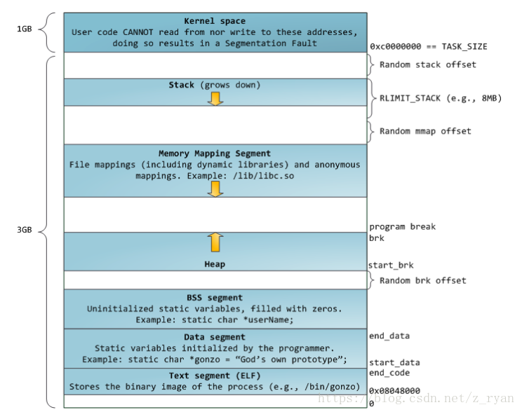

### 堆和栈

- 管理方式
  - 堆由程序员申请和释放（容易产生内存碎片）
  - 栈由编译器自动管理，无需手工控制
- 管理机制
  - 系统有一个记录空闲内存地址的链表，当系统收到程序申请时，遍历该链表，寻找第一个空间大于申请空间的堆结点，删 除空闲结点链表中的该结点，并将该结点空间分配给程序（大多数系统会在这块内存首地址记录分配大小，以便正确delete，系统还会将多余的部分重新放入空闲链表中）
  - 只要栈的剩余空间大于所申请空间，系统就会提供栈空间，否则报异常提示栈溢出
- 空间大小
  - 堆的空间不连续（因为申请和释放自由，由链表记录空闲空间），32位机器堆时4G
  - 栈是连续的，windows下是2M
- 碎片问题
  - 对于堆，频繁的new和delete会产生很多内存碎片，降低程序效率
  - 对于栈，类似于数据结构中的栈，不会产生碎片
- 生长方向
  - 堆向上，向高地址方向增长
  - 栈向下，向低地址方向增长
- 分配方式
  - 堆只有动态分配
  - 栈的静态分配由编译器完成，动态分配由alloca函数分配，但栈的动态分配的资源由编译器进行释放，不需要程序员手动释放或实现
- 分配效率
  - 堆由C/C++函数库提供，机制很复杂。所以堆的效率比栈低很多。
  - 栈是其系统提供的数据结构，计算机在底层对栈提供支持，分配专门 寄存器存放栈地址，栈操作有专门指令。

### 堆和栈哪个更快

- 堆中的内存是由程序员自己进行申请的，大小不定，所以实现起来较为困难。一种做法是将内存管理交给内核去做，操作系统提供系统调用，但是这样做的性能较差，malloc和free都需要使用系统调用，系统调用的性能开销是比较大的。另一种做法是malloc提前向操作系统申请了一大块内存作为堆区，并直接对这块内存进行管理。

  随着内存的分配会出现不连续的空闲区域，在申请内存时，首先遍历空闲区域，看是否有大小合适的内存块，如果有就分配，如果没有就向操作系统申请（发生系统调用）。为了保证分配给程序的内存的连续性，malloc() 只会在一个空闲区域中分配，而不能将多个空闲区域联合起来。

  内存块的结构类似于链表，如下图

  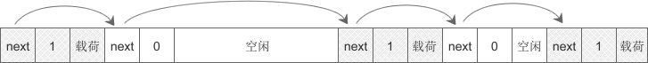

  在free的时候会将连续的空闲区域合并为一个

  大部分 malloc() 实现都会在内存块中增加一个 pre 指针指向上一个内存块，构成双向链表

  问题：一旦链表中的 pre 或 next 指针被破坏，整个堆就无法工作，而这些数据恰恰很容易被越界读写所接触到。

  小的空闲区域往往不容易再次分配，形成很多内存碎片。经常分配和释放内存会造成链表过长，增加遍历的时间。

- 栈是其系统提供的数据结构，计算机在底层对栈提供支持，分配专门 寄存器存放栈地址，栈操作有专门指令。

### 如何理解库函数

库函数位于用户态，系统调用位于内核态，运行时间同理。

系统调用避免用户直接对底层硬件进行编程、隐藏背后的技术细节、保证系统安全性和稳定性、方便程序的移植性

ISO每年指定C/C++新的标准以及定义API，注意是只定义不实现。有一群专门的人根据发布的API来实现标准库，例如文件读写、内存分配、线程创建之类的API是需要借助系统调用的，所以每一个平台(操作系统)上都有自己特定的标准库实现，因为不同的操作系统提供的功能是不同的，提供的系统调用也是不同的。库函数本质上就是对系统调用的封装，系统调用是比较高效且精简的，而有时程序员可能需要更复杂的功能和处理或更加人性化的需求，就会把这些系统调用封装成为库函数。

库函数是语言或应用程序的一部分，系统调用是操作系统的一部分

部分库函数的性能高于系统调用，因为库函数使用了缓冲区，减少了系统调用的次数，如：`fread、fwrite、fputc、fgetc`

### main函数需要有返回值吗

根据C99标准，main函数是需要有返回值的。

其中main函数有两种形式。

```c
int main()
{}

int main(int argc,char *argv[])
{}
```

### 结构体对齐

1. 第一个成员的首地址为0
2. 每个成员的首地址是自身大小的整数倍
3. 结构体的总大小，为其成员所含最大类型的整数倍

### #define和const

- define在预处理阶段起作用，const在编译、运行时期起作用
- define只是简单的字符串替换，没有类型检查，const有类型检查
- define只是展开字符串，有多少次替换多少次，
- define不能调试，因为在预处理阶段已经被替换掉了，const可以调试

# C++

## 基础

### C和C++的区别

- C++中new和delete是对内存分配的运算符，取代了C中的malloc和free。
- 标准C++中的字符串类取代了标准C函数库头文件中的字符数组处理函数（C中没有字符串类型）。
- C++中用来做控制态输入输出的iostream类库替代了标准C中的stdio函数库。
- C++中的try/catch/throw异常处理机制取代了标准C中的setjmp()和longjmp()函数。
- 在C++中，允许有相同的函数名，不过它们的参数类型不能完全相同，这样这些函数就可以相互区别开来。而这在C语言中是不允许的。也就是C++可以重载，C语言不允许。
- C++语言中，允许变量定义语句在程序中的任何地方，只要在是使用它之前就可以；而C语言中，必须要在函数开头部分。而且C++不允许重复定义变量，C语言也是做不到这一点的
- 在C++中，除了值和指针之外，新增了引用。引用型变量是其他变量的一个别名，我们可以认为他们只是名字不相同，其他都是相同的。
- C++相对与C增加了一些关键字，如：bool、using、dynamic_cast、namespace等等

- 编译的区别
  1. C++支持面向对象，所以C++编译器要解析类和对象
  2. C++有更严格的类型检查和类型转换，需要通过类型转换运算符来进行强制转换
  3. C++的标准库更为强大和丰富
  4. C++使用命名空间避免变量和函数名冲突的问题
  5. C++支持函数重载和运算符重载

### C++的编译过程

[编译过程](https://www.jinhang.work/tech/cpp-building-process/)

1. 预编译
   1. 展开宏定义
   2. 处理预编译指令
   3. 处理头文件（递归执行）
   4. 删除注释
   5. 添加行号和文件标识（以便产生调试和报错或警告信息）（可选）
2. 预处理产生.i文件，经过编译产生汇编代码文件（编译只需要满足语法正确，函数和变量的声明正确，为了找到定义的声明，需要指明头文件的位置。只要语法正确，编译器就可以生成对应的目标文件，即使没有声明，也会给出目标文件，只是给出警告）
   1. 词法分析
   2. 语法分析
   3. 语义分析
   4. 优化
   5. 目标代码产生
   6. 目标代码优化
3. 汇编，将汇编代码变成可以执行的指令（机器码），只是根据汇编指令和机器指令的对照表一一翻译过来
4. 链接（链接函数和全局变量，需要在调用函数的文件找到函数定义，否则会报出链接错误），将不同的源文件产生的目标文件进行链接，从而形成一个可执行程序，链接分为静态链接和动态链接，具体见下
5. 
6. 

### main函数执行前和执行后可能会做哪些事

- 执行前
  - 设置栈指针
  - 初始化静态、全局变量（data段的变量）
  - 为未初始化的全局变量赋默认初始值
  - 全局对象初始化，在main函数调用之前进行构造
  - 将参数传递给main函数，开始执行
- 执行后
  - 全局对象的析构函数
  - 可以用atexit注册一个函数，让他在main之后执行

### 在main函数之前执行函数

1. 全局变量的构造函数
2. 全局变量的赋值函数
3. 指定入口点，入口点中调用原来的入口点

### 指针和引用的区别

1. 指针存放一个其他变量的地址，引用是另一个变量的别名
2. 指针是一个实体，需要分配内存，也有地址（所以有多级指针），引用不分配内存
3. 指针可以修改指向的对象，引用不可以（必须初始化）
4. sizeof指针得到指针的大小，而sizeof引用则得到被引用对象的大小
5. 引用作为函数参数时，调用方看不出来是正常参数还是引用参数，可能会引发错误。
6. [TX开发者指针和引用](https://cloud.tencent.com/developer/article/1021622)
7. 引用的目的是在调用函数时不复制对象

### 指针参数传递和引用参数传递有什么区别

1. 指针参数传递本质上是值传递，它所传递的是一个地址值。值传递过程中，被调函数的形式参数作为被调函数的局部变量处理，会在栈中开辟内存空间以存放由主调函数传递进来的实参值，从而形成了实参的一个副本（替身）。值传递的特点是，被调函数对形式参数的任何操作都是作为局部变量进行的，不会影响主调函数的实参变量的值（形参指针变了，实参指针不会变）。

2. 引用参数传递过程中，被调函数的形式参数也作为局部变量在栈中开辟了内存空间，但是这时存放的是由主调函数放进来的实参变量的地址。被调函数对形参（本体）的任何操作都被处理成间接寻址，即通过栈中存放的地址访问主调函数中的实参变量（根据别名找到主调函数中的本体）。因此，被调函数对形参的任何操作都会影响主调函数中的实参变量。

3. 引用传递和指针传递是不同的，虽然他们都是在被调函数栈空间上的一个局部变量，但是任何对于引用参数的处理都会通过一个间接寻址的方式操作到主调函数中的相关变量。而对于指针传递的参数，如果改变被调函数中的指针地址，它将应用不到主调函数的相关变量。如果想通过指针参数传递来改变主调函数中的相关变量（地址），那就得使用指向指针的指针或者指针引用。

4. 从编译的角度来讲，程序在编译时分别将指针和引用添加到符号表上，符号表中记录的是变量名及变量所对应地址。指针变量在符号表上对应的地址值为指针变量的地址值，而引用在符号表上对应的地址值为引用对象的地址值（与实参名字不同，地址相同）。符号表生成之后就不会再改，因此指针可以改变其指向的对象（指针变量中的值可以改），而引用对象则不能修改。

### typedef和define和inline和const的区别

- define
  1. 只是简单的字符串替换，没有类型检查
  2. 编译的预处理阶段起作用
  3. 不分配内存，有多少个就替换多少次
  4. 没有类型检查，不能调试
  5. 宏定义是一是编译型概念
- typedef
  1. 常用来定义一个标识符或关键字的别名
  2. 有对应的数据类型，需要进行判断
  3. 在编译、运行时生效
  4. 在静态存储区分配空间，程序运行过程中只有一个拷贝
- inline
  1. 用来替代C中的define，编译期完成
  2. inline函数需要进行类型检查，需要的时候直接将代码写到需要处，减少了压栈、跳转和返回的过程，提高了效率，比define安全，以空间为代价
  3. 定义inline函数只是给编译器的一个建议，对于复杂的函数编译器可能不会将其定义为inline，Google的编程规范中一般10行以下的函数定义为inline
- const
  1. 用来表示常量，不可以修改
  2. 会在编译阶段进行类型检查
  3. const是运行时概念
  4. 需要进行内存分配，存储在数据段中

### new、delete和malloc、free堆区

1. new是运算符，malloc是标准库函数
2. new可以重载，malloc不能重载
3. new的变量是数据类型，malloc是字节大小
4. new可以调用构造函数，malloc不可以
5. new返回指定对象的指针，malloc返回void*
6. malloc申请的空间不够时可以使用realloc扩容，new没有这样的操作
7. new失败默认抛出bad_malloc异常（如果不想捕获异常可以使用std::nothrow），malloc失败返回NULL
8. new通过调用operator new的标准库函数分配空间并调用构造函数，delete对指针所指的对象进行析构，而malloc和free没有相应的机制。
9. new的底层实现是malloc，可以对其创建的对象进行free，不会报错，但是不会调用析构函数。

### 被free的内存是直接返还给操作系统吗

被free的内存会被ptmalloc使用双链表保存起来，当用户下一次进行申请内存的时候，会尝试从这些内存中找到适合的内存进行返回。这样避免了频繁的系统调用，同时ptmalloc也会对小块内存进行合并，避免过多的内存碎片。

### 静态类型和动态类型

- 注意区别在于：对变量进行类型检查的时间点。

- 静态类型: 类型检查主要发生在编译阶段。

- 动态类型:类型检查主要发生在运行阶段。

### 静态链接和动态链接

- 所谓静态链接就是在编译链接时直接将需要的执行代码拷贝到调用处，优点就是在程序发布的时候就不需要依赖库，也就是不再需要带着库一块发布，程序可以独立执行，但是体积可能会相对大一些。
- 所谓动态链接就是在编译的时候不直接拷贝可执行代码，而是通过记录一系列符号和参数，在程序运行或加载时将这些信息传递给操作系统，操作系统负责将需要的动态库加载到内存中，然后程序在运行到指定的代码时，去共享执行内存中已经加载的动态库可执行代码，最终达到运行时连接的目的。优点是多个程序可以共享同一段代码，而不需要在磁盘上存储多个拷贝，缺点是由于是运行时加载，可能会影响程序的前期执行性能。

### 什么原因会导致程序崩溃

1. 读取未赋值的变量
2. 函数栈溢出
   1. 定义一个太大的局部变量或参数
   2. 函数递归太深
3. 数组访问越界
4. 指针所指目标不可用
   1. 解引用指针未赋值
   2. 解引用指针已被delete或free
   3. 不恰当的强转
5. 参数错误

### 局部静态变量和全局静态变量

- 相同
  1. 数据在全局数据区分配
  2. 如果没有进行显式初始化则变量会被隐式初始化为0
  3. 始终保存在全局数据区，直到程序结束
- 区别
  1. 全局本文件可见，局部作用域内可见
  2. 全局静态变量不可以被其他文件引用

### static

用来控制变量的存储方式和可见性

- 全局变量作用域是整个工程，通过extern可以在别的文件中访问，但是全局静态变量作用域是当前文件，其他文件通过extern也不能使用

- 静态成员变量
  1. 静态成员变量属于整个类所有
  2. 静态成员变量的生命期不依赖于任何对象，为程序的生命周期
  3. 可以通过类名直接访问公有静态成员变量
  4. 所有对象共享类的静态成员变量
  5. 可以通过对象名访问公有静态成员变量
  6. 静态成员变量需要在类外单独分配空间
  7. 静态成员变量在程序内部位于全局数据区 (Type className::VarName = value)
- 静态成员函数
  1. 静态成员函数是类的一个特殊的成员函数
  2. 静态成员函数属于整个类所有，没有this指针
  3. 静态成员函数只能直接访问静态成员变量和静态成员函数
  4. **可以通过类名直接访问类的公有静态成员函数**
  5. 可以通过对象名访问类的公有静态成员函数
  6. 定义静态成员函数，直接使用static关键字修饰即可
- 要点
  1. 生命周期
  2. 共享方式
  3. 定义位置
  4. 初始化位置

### volatile

不稳定的。在C++中用来声明那些不知道在什么情况下会发生变化的值，编译器未知的因素，如：操作系统、硬件和线程。遇到这种变量编译器不会对其进行优化。编译器不会去假设volatile变量的值，也就是说，每次用到这个变量都需要从内存中重新读取这个变量的值，而不能使用保存在寄存器中的临时值。多线程中被几个任务共享的变量需要定义为volatile类型。

**一个参数既可以是const也可以是volatile：一个例子是只读的状态寄存器。它是volatile因为它可能被意想不到地改变。它是const因为程序不应该试图去修改它**。（简单点就是该程序代码不能试图去修改它，但不排除硬件方面修改了它，我们每次都得重新读取它的值。）

几个应用例子： a. 并行设备的硬件寄存器（如：状态寄存器）。 b. 一个中断服务子程序中会访问到的非自动变量。（个人理解：中断服务子程序不能用缓存在寄存器中的值来判断事件，因为那个值可能被修改了，需要重新读取。所以一般需要把这种变量声明为volatile。） c. 多线程应用中被几个任务共享的变量。

### mutable

可变的、易变的。在C++中mutable是为了突破const的限制而设置的，被mutable修饰的变量在常函数中也可以被修改。

### explicit

用来修饰单个参数的构造函数，表明该构造函数是显式的。用来防止隐式转换和复制初始化。

用于用户自己定义的构造函数则表明这个构造函数是默认的。

普通构造函数额可以被隐式调用，而被explicit修饰的构造函数只能被显式调用。

### 强制类型转换

1. C风格的强制转换

   - 基本数据结构分为四类：整型、浮点型、字符型、布尔型。

   1. 浮点型数据赋值给整型数据时，舍弃其小数部分
   2. 整型数据赋值给浮点型变量时，数值不变，但是以指数形式存储
   3. double型数据赋值给float型变量可能会溢出
   4. 字符型数据可以赋值给整型变量，此时存入的字符是ASCII码
   5. 将一个int、short、long型数据赋值给一个char型变量，将低八位送到char型变量中
   6. 将有符号型数据赋值给长度相同的无符号型变量，将原来的符号位一起传送

2. static_cast

   - 在C++语言中static_cast用于数据类型的强制转换，强制将一种数据类型转换为另一种数据类型。

   ```cpp
   //用法：static_cast<类型说明符>(变量或表达式)
   int a = 10;
   int b = 3;
   double result = static_cast<double>(a) / static_cast<double>(b);
   ```

   1. 于类层次结构中基类和派生类之间指针和引用的转换。进行上行转换（把派生类的指针或引用转换成基类）是安全的，进行下行转换（把基类的指针或引用转换为派生类表示）由于没有动态类型检查，所以是不安全的。
   2. 用于基本数据类型之间的转换，安全性也需要开发人员来保证。
   3. 把空指针转换成目标类型的空指针。
   4. 把任何类型的表达式转换为void类型。

3. const_cast

   在C语言中，const通常被用来限定变量，表示该变量的值不能被修改。

   const_cast用来强制去掉这种不能被修改的常量特性，但const_cast不是去除变量的常年性，而是去除指向变量对象的指针或引用的常量性，其去除常量行的对象必须为指针或引用

   ```cpp
   const int a = 10;
   const int * p = &a;
   *p = 20;//编译错误，*p具有常量性，其值不能被修改
   int b = const_cast<int>(a)//编译错误，const_cast转换对象必须为指针或引用
   ```

4. reinterpret_cast

   作用：***改变指针或引用的类型、将指针或引用转换为一个足够长度的整形、将整型转换为指针或引用类型***。

   它可以把一个指针转换成一个整数，也可以把一个整数转换成一个指针（先把一个指针转换成一个整数，在把该整数转换成原类型的指针，还可以得到原先的指针值）。

   **在使用reinterpret_cast强制转换过程仅仅只是比特位的拷贝，因此在使用过程中需要特别谨慎！**

   ```cpp
   //将整形指针强制转换为双精度浮点型指针
   int *a = new int;
   double *d = reinterpret_cast<double *>(a);
   ```

5. dynamic_cast

   1. 其他三种都是编译时完成的，而此转换为运行时处理，所以会进行类型检查。
   2. 不能用于内置的基本数据类型的强制转换。
   3. 转换如果成功就返回指向类的指针或引用，失败就会返回NULL
   4. 使用dynamic_cast进行转换，基类中一定要有虚函数，否则编译无法通过（类中存在虚函数，就说明它有想要让基类指针或引用指向派生类对象的情况，此时转换才有意义，运行时检查需要运行时的信息，而这个信息存储在虚函数表中）
   5. 在类的转换时，在类层次间进行上行转换时，dynamic_cast和[static_cast](http://baike.baidu.com/view/1745207.htm)的效果是一样的。在进行下行转换时，dynamic_cast具有类型检查的功能，比static_cast更安全。

### const指针

顶层const和底层const只需要看指针在const的什么位置，用顶层表示指针本身是个常量，用底层表示指针所指向的对象是个常量。更一般地讲，顶层const可以表示任意的对象是常量，底层const用来表示与指针和引用等复合类型有关。比较特殊的是，指针类型既可以是顶层const也可以是底层const或者二者兼备。

如果*离变量更近则*变量无法改变，如果const离指针更近则指针无法改变指向

### final和override

override用来保证子类一定重写父类的方法，如果变量名写错就会报错

final用来限制子类重写父类的方法，在父类的方法定义是加上final关键字子类则一定无法重写这个方法。

### new的类型

1. **plain new**

   言下之意就是普通的new，就是我们常用的new，在C++中定义如下：

   ``` cpp
   void* operator new(std::size_t) throw(std::bad_alloc);
   void operator delete(void *) throw();
   ```

   因此**plain new**在空间分配失败的情况下，抛出异常**std::bad_alloc**而不是返回NULL，因此通过判断返回值是否为NULL是徒劳的

2. **nothrow new**

   nothrow new在空间分配失败的情况下是不抛出异常，而是返回NULL.

   ``` cpp
   void * operator new(std::size_t,const std::nothrow_t&) throw();
   void operator delete(void*) throw();
   ```

3. **placement new**

   这种new允许在一块已经分配成功的内存上重新构造对象或对象数组。placement new不用担心内存分配失败，因为它根本不分配内存，它做的唯一一件事情就是调用对象的构造函数。定义如下：

   ```cpp
   void* operator new(size_t,void*);
   void operator delete(void*,void*);
   ```


### const的作用

1. 阻止一个变量被改变，可以使用const关键字。在定义该const变量时，通常需要对它进行初始化，因为以后就没有机会再去改变它了；
2. 对指针来说，可以指定指针本身为const，也可以指定指针所指的数据为const，或二者同时指定为const；
3. 在一个函数声明中，const可以修饰形参，表明它是一个输入参数，在函数内部不能改变其值；
4. 对于类的成员函数，若指定其为const类型，则表明其是一个常函数，不能修改类的成员变量，类的常对象只能访问类的常成员函数；
5. 对于类的成员函数，有时候必须指定其返回值为const类型，以使得其返回值不为“左值”。
6. const成员函数可以访问非const对象的非const数据成员、const数据成员，也可以访问const对象内的所有数据成员；
7. 非const成员函数可以访问非const对象的非const数据成员、const数据成员，但不可以访问const对象的任意数据成员；
8. 一个没有明确声明为const的成员函数被看作是将要修改对象中数据成员的函数，而且编译器不允许它为一个const对象所调用。因此const对象只能调用const成员函数。
9. const类型变量可以通过类型转换符const_cast将const类型转换为非const类型；
10. const类型变量必须定义的时候进行初始化，因此也导致如果类的成员变量有const类型的变量，那么该变量必须在类的初始化列表中进行初始化；
11. 对于函数值传递的情况，因为参数传递是通过复制实参创建一个临时变量传递进函数的，函数内只能改变临时变量，但无法改变实参。则这个时候无论加不加const对实参不会产生任何影响。但是在引用或指针传递函数调用中，因为传进去的是一个引用或指针，这样函数内部可以改变引用或指针所指向的变量，这时const 才是实实在在地保护了实参所指向的变量。因为在编译阶段编译器对调用函数的选择是根据实参进行的，所以，只有引用传递和指针传递可以用是否加const来重载。一个拥有顶层const的形参无法和另一个没有顶层const的形参区分开来。

### 运算符重载

1. 我们只能重载已有的运算符，而无权发明新的运算符；对于一个重载的运算符，其优先级和结合律与内置类型一致才可以；不能改变运算符的操作数个数
2. 两种重载方式：成员运算符和非成员运算符，成员运算符比非成员运算符少一个参数；下标运算符、箭头运算符必须是成员运算符
3. 引入运算符重载，是为了实现类的多态性
4. 当重载的运算符是成员函数时，this绑定到左侧运算符对象。成员运算符函数的参数数量比运算符对象的数量少一个；至少含有一个类类型的参数；
5. 从参数的个数推断到底定义的是哪种运算符，当运算符既是一元运算符又是二元运算符（+，-，*，&）
6. 下标运算符必须是成员函数，下标运算符通常以所访问元素的引用作为返回值，同时最好定义下标运算符的常量版本和非常量版本
7. 箭头运算符必须是类的成员，解引用通常也是类的成员；重载的箭头运算符必须返回类的指针

### 重载的匹配原则和顺序

1. 名字查找
2. 确定候选函数
3. 寻找最佳匹配

### 常函数

在类的成员函数后面加个const，表明这个函数不会对这个类的成员（非静态数据成员）作任何改变。

在设计类的时候，不修改成员的函数都要加上const。

常量对象可以调用const成员函数，但是不能调用非const成员函数

注：get_name之类的函数，除了要设置成常函数之外，还要使返回值为const，否则会返回私有数据成员的引用（此处假设name为私有成员），那么就可以通过这个引用来修改成员name的值`obj.get_name() = "Li"`。

## 面向对象

### 类成员的访问权限和继承权限

1. 三种访问权限
   1. public:用该关键字修饰的成员为公有成员，该成员不仅可以在类内被访问，也可以在类外访问，是类对外提供的可访问接口
   2. private:用该关键字修饰的成员为私有成员，该成员仅可以在类内被访问，类外为隐藏状态
   3. protected:用该关键字修饰的成员表示保护成员，保护成员在类外同样是隐藏状态，但对于该类的派生类来说，相当于公有成员
2. 三种继承方式
   1. public:基类成员在派生类中的访问权限保持不变，基类是什么权限，派生类就是什么权限
   2. private:基类所有成员在派生类中的访问权限都变成私有权限
   3. protected:基类的公有成员和保护成员在派生类中的访问权限会变为保护权限，私有成员在派生类中的访问权限仍然是私有权限

​                             


### 虚函数

[虚函数](https://blog.csdn.net/lyztyycode/article/details/81326699?ops_request_misc=%7B%22request%5Fid%22%3A%22164544613816780271958686%22%2C%22scm%22%3A%2220140713.130102334..%22%7D&request_id=164544613816780271958686&biz_id=0&utm_medium=distribute.pc_search_result.none-task-blog-2~all~top_positive~default-1-81326699.first_rank_v2_pc_rank_v29&utm_term=虚函数&spm=1018.2226.3001.4187)

关于内联函数是否可以是虚函数，如果是类的对象调用函数则可以是虚函数，因为虚函数是编译时候展开的，如果是指针或引用则不行，因为指针或引用调用属于动态绑定，在编译期无法确定调用哪个函数。

静态成员函数不依赖对象实现，不存在成员变量，因此不能是虚函数。

友元函数不是成员函数，所以不能是虚函数。

### 初始化列表的概念，为什么它会快一些

概念：在类的构造函数中，不在函数体内对成员变量赋值，而是在构造函数的花括号前面使用冒号和初始化列表赋值

效率：用初始化列表会快一些的原因是，对于类型，它少了一次调用构造函数的过程，而在函数体中赋值则会多一次调用。而对于内置数据类型则没有差别。

​	**如果成员是类**，那么在进入构造函数之前，会先调用一次默认构造函数，进入构造函数后所做的事其实是一次赋值操作(对象已存在)，所以**如果是在构造函数体内进行赋值的话，等于是一次默认构造加一次赋值，而初始化列表只做一次赋值操作。**

### 友元函数和友元类

友元提供了不同类的成员函数之间、类的成员函数和一般函数之间进行数据共享的机制。通过友元，其他类可以访问该类中的私有成员和保护成员，通过正确使用友元可以提高程序的运行效率，但也破坏了类的封装性和数据的隐藏性，导致程序可维护性变差

1. 友元函数

   友元函数是定义在类外的普通函数，不属于任何类可以访问其他类的私有成员，但需要在类的定义中声明所有可以访问它的友元函数

   一个函数可以是多个类的友元函数但是每个类中都要声明这个函数

2. 友元类

   友元类的所有成员函数都是另一个类的友元函数，都可以访问另一个类中的隐藏信息。但另一个类中也需要进行响应的声明

3. 注意事项

   1. 友元关系不能继承
   2. 友元关系是单向的，不具有交换性
   3. 友元关系不具有传递性

### 有关this指针

- this指针是类的const指针，指向对象的首地址

- 只有在成员函数中才能使用，this指针只有在成员函数中才有定义，且存储位置会因为编译器不同而不同

- 只有当对象被创建后this才有意义，因此不能在static成员函数中使用。

- this的用处

  对象的this指针并不是对象本身的一部分，不会影响sizeof(对象的结果)，this作用域是在类内部。类的非静态成员函数中访问类的非静态成员的时候，编译器会自动为对象本身的地址作为一个隐含参数传递给指针。

  - 类的非静态成员函数返回对象*this
  - 形参名与成员变量名相同this->n = n

- this的特点

  - 只能在成员函数中使用，第一个参数是T* const this
  - 生命周期与其他参数是一样的，但this通常效率比较高，如vc通常通过ecx(计数寄存器)传递this参数

this实际上是成员函数的一个形参，在调用成员函数时将对象的地址作为实参传递给this（隐式传递）。**成员函数会被编译成和对象无关的普通函数，除了成员变量，会丢失所有的信息，所以在编译时要添加一个额外的参数，把对象的首地址传入，以此来关联成员函数和成员变量。**

### 模板

一个类（普通类或类模板）可以包含本身是模板的成员函数，这种成员被称为成员模板。

## STl

### 各个容器的特点

[STL各个容器的特点](https://blog.csdn.net/qq_36834959/article/details/104301878?ops_request_misc=%7B%22request%5Fid%22%3A%22164700135916781683957192%22%2C%22scm%22%3A%2220140713.130102334.pc%5Fall.%22%7D&request_id=164700135916781683957192&biz_id=0&utm_medium=distribute.pc_search_result.none-task-blog-2~all~first_rank_ecpm_v1~rank_v31_ecpm-2-104301878.pc_search_result_control_group&utm_term=STL各容器区别&spm=1018.2226.3001.4187)

### vector

- vector的扩容方式

  当vector容量满了以后将元素复制到一块更大的内存msvc1.5倍，gcc2倍，需要注意的是一旦引起了空间重新配置，之前的所有迭代器就都失效了

- size和capacity

  size返回当前vector中存储的数据个数，capacity返回不扩容的情况下最大能容纳多少数据，capacity永远大于等于size

- resize和reserve

  `resize`改变当前vector中元素的个数，`reserve`改变vector的最大容量（只能大不能小）

- vector的迭代器

  由于vector维护的是线性的内存空间，所以原生指针具备作为vector迭代器的条件，不需要重载`operator+`，`operator*`这些
  
- 迭代器失效

  `erase`操作删除一个元素导致后面所有的元素都向前移动一个位置，从当前位置到最后的迭代器全部失效，但`erase`返回一个迭代器，需要更新迭代器。

- vector内存释放

  vector的内存是只增不减的，只有析构的时候才会释放，常规的操作只会减少元素的个数，内存大小不会减小，`vector<T>().swap();`使用`vector()`创建的临时对象来交换空间，而临时对象立即就会被析构，即可达到缩小vector内存的目的

  `shrink_to_fit()`函数则可以使size和capcity的大小匹配，不过这个操作是否奏效是由编译器决定的。

### vector和list的区别

1. vector底层实现是数组； list是双向链表
2. vector是顺序内存,⽀持随机访问， list不⾏
3. vector在中间节点进⾏插⼊删除会导致内存拷⻉， list不会
4. vector⼀次性分配好内存，不够时才进⾏翻倍扩容； list每次插⼊新节点都会进⾏内存申请
5. vector随机访问性能好，插⼊删除性能差； list随机访问性能差，插⼊删除性能好

### deque

- deque是一个双端开口的线性序列，其内部由分段连续的地址构成，因为内部需要跳转，所以效率没有vector高。注：效率很低，排序可以先拷贝到vector中再拷贝回来
- 优→避免了vector的重新分配空间的时间   坏→迭代器变得很复杂
- deque维护一个map用来检索各段内存空间，实质上是一个二级指针，还维护了start和end

### map和set

- 底层都是红黑树

- set用来判断一个元素是不是在一个集合中，map相当于字典

- 优→查找一个数的时间为O(logN)，采用iterator遍历，效率不错   劣→插入需要调整红黑树

### map和unordered_map

- map底层是红黑树→有序   unordered_map底层是哈希表→无序
- map优→有序性、操作时间为O(logN)    劣→查找效率比较慢，和n相关
- unordered_map优→操作时间为O(1)   劣→基于哈希表，效率不高、操作时间不稳定，取决于哈希函数

### multi系列

multi的含义即元素可重复，那么遍历的时候就会相对麻烦一些

```Cpp
#include <iostream>
#include <string>
#include <map>
using namespace std;
 
int main(){
  multimap<string, int> m_map;
  string name="XiaoMing";
  m_map.insert(make_pair(name, 50));
  m_map.insert(make_pair(name, 55));
  m_map.insert(make_pair(name, 60));
  //方式1
  cout<<"----------方法1-----------"<<endl;
  int k;
  multimap<string, int>::iterator m;
  m = m_map.find(name);
  for (k = 0; k != m_map.count(name); k++, m++)
  	  cout << m->first << "--" << m->second << endl;
  //方式2
  cout<<"----------方法2-----------"<<endl;
  multimap<string, int>::iterator beg, end;
  beg = m_map.lower_bound(name);
  end = m_map.upper_bound(name);
  for (m = beg; m != end; m++)
      cout << m->first << "--" << m->second << endl;
  //方式3
  cout<<"----------方法3-----------"<<endl;
  beg = m_map.equal_range(name).first;
  end = m_map.equal_range(name).second;
  for (m = beg; m != end; m++)
    cout << m->first << "--" << m->second << endl;
  return 0;
}
```

### string相比char*的优势

- string是STL中的一个类，内容可以动态扩展，以及对字符串的方便操作如用+连接
- string的内存管理由系统处理，除非系统内存池用完否则不会出现各种内存问题，char*的内存管理需要由程序员自己进行，很容易出现各种内存问题*
- 我们要定义一个字符串，如果已知需要多少内存可以用char*，但是指针可能会引来各种问题；用string还可以使用函数处理每一个字符，但是char*想要处理字符则需要我们自己编写函数

### 字符串长度相同，C++中的string和char*哪个占用内存大

愚以为，string中存储的是指针以及长度等变量，而char*则是真正存储的字符

### 迭代器失效问题

对容器进行插入或者删除操作影响了元素的存放位置，称为迭代器失效。

- 序列式容器

  vector、deque使用了连续分配的内存，`erase`操作删除一个元素会导致后面所有的元素向前移动一个位置，这些元素的地址发生了变化，故当前位置到容器末尾元素的所有迭代器全部失效。

  解决方法是`erase`方法可以返回下一个有效的迭代器，接收此迭代器进行后续操作即可。

- 链表式容器

  链表式容器删除当前的迭代器，只会使当前的迭代器失效，在`erase`的时候递增当前迭代器即可，或者也可以利用`erase`返回的下一个有效的迭代器

- 关联式容器

  `erase`只会使当前迭代器失效，递增当前迭代器即可（需要在删除之前递增）。

## C++11

### C++11的新特性

- nullptr替代NULL
- 引入了auto和decltype实现了类型推导
- 范围for循环
- 类和结构体中的初始化列表
- Lambda表达式
- std::forward_list（单向链表）
- 右值引用和move语义

### auto注意事项及decltype

1. auto声明的变量必须初始化

2. auto不能用来声明数组

3. auto不能作为函数的形参以及返回值

4. auto不能修饰模板函数

- 如果表达式是引用，则会去除引用
- 如果表达式时const，则会忽略顶层const
- 当auto带上&时，不会忽略顶层const
- 表达式为数组时，auto会推导出指针
- 表达式为数组时，auto&会推导出数组

如果希望从表达式中推断出变量的类型，却不想用表达式的值去初始化变量，那么就可以选择使用decltype

**他的作用是选择并返回操作数的类型。在此过程中，编译器只是分析表达式并得到它的类型，却不实际计算表达式的值**

decltype(auto)是C++14新增的类型指示符，可以用来声明变量以及指示函数返回类型。在使用时，会将“=”号左边的表达式替换掉auto，再根据decltype的语法规则来确定类型

```cpp
int func() {return 0};

//普通类型
decltype(func()) sum = 5; // sum的类型是函数func()的返回值的类型int, 但是这时不会实际调用函数func()
int a = 0;
decltype(a) b = 4; // a的类型是int, 所以b的类型也是int

//不论是顶层const还是底层const, decltype都会保留   
const int c = 3;
decltype(c) d = c; // d的类型和c是一样的, 都是顶层const
int e = 4;
const int* f = &e; // f是底层const
decltype(f) g = f; // g也是底层const

//引用与指针类型
//1. 如果表达式是引用类型, 那么decltype的类型也是引用
const int i = 3, &j = i;
decltype(j) k = 5; // k的类型是 const int&

//2. 如果表达式是引用类型, 但是想要得到这个引用所指向的类型, 需要修改表达式:
int i = 3, &r = i;
decltype(r + 0) t = 5; // 此时是int类型

//3. 对指针的解引用操作返回的是引用类型
int i = 3, j = 6, *p = &i;
decltype(*p) c = j; // c是int&类型, c和j绑定在一起

//4. 如果一个表达式的类型不是引用, 但是我们需要推断出引用, 那么可以加上一对括号, 就变成了引用类型了
int i = 3;
decltype((i)) j = i; // 此时j的类型是int&类型, j和i绑定在了一起

int e = 4;
const int* f = &e; // f是底层const
decltype(auto) j = f;//j的类型是const int* 并且指向的是e
```

### NULL和nullptr

NULL来自C语言，通过宏实现，nullptr是C++11中新增的关键字，C语言中NULL被定义位(void)0，C++中NULL被定义为整数0，代码如下

```cpp
#ifdef __cplusplus
#define NULL 0
#else
#define NULL ((void *)0)
#endif
```

在C++中指针必须有明确的类型定义。但是将NULL定义为0带来的另一个问题是无法与整数的0区分。那么**在传入NULL参数时，会把NULL当做整数0来看，如果我们想调用参数是指针的函数，该怎么办呢?。nullptr在C++11被引入用于解决这一问题，nullptr可以明确区分整型和指针类型，能够根据环境自动转换成相应的指针类型，但不会被转换为任何整型，所以不会造成参数传递错误。**

```cpp
const class nullptr_t{
public:
    template<class T>  inline operator T*() const{ return 0; }
    template<class C, class T> inline operator T C::*() const { return 0; }
private:
    void operator&() const;
} nullptr = {};
```

以上通过模板类和运算符重载的方式来对不同类型的指针进行实例化从而解决了(void*)指针带来参数类型不明的问题，**另外由于nullptr是明确的指针类型，所以不会与整形变量相混淆。

### 智能指针

- shared_ptr

  实现原理：采用引用计数器的方法，允许多个智能指针指向同一个对象，每当多一个指针指向该对象时，指向该对象的所有智能指针内部的引用计数加1，每当减少一个智能指针指向对象时，引用计数会减1，当计数为0的时候会自动的释放动态分配的资源。

  允许多个对象共享一个指针

  ```cpp
      //初始化方式1
      std::shared_ptr<int> sp1(new int(123));
  
      //初始化方式2
      std::shared_ptr<int> sp2;
      sp2.reset(new int(123));
  
      //初始化方式3
      std::shared_ptr<int> sp3;
      sp3 = std::make_shared<int>(123);
  ```

  默认初始化时智能指针中保存着一个空指针，使用方式也是解引用

  当进行拷贝或者赋值时，每个shared_ptr都会记录有多少个其他shared_ptr指向相同的对象，我们可以认为每个shared_ptr都有一个引用计数器，当我们给shared_ptr赋新值或者指针销毁时（如一个shared_ptr离开其作用域），引用计数就会减少。当引用计数为0时它就会自动释放所管理的对象

- unique_ptr

  unique_ptr采用的是独享所有权语义，一个非空的unique_ptr总是拥有它所指向的资源。转移一个unique_ptr将会把所有权全部从源指针转移给目标指针，源指针被置空；所以unique_ptr不支持普通的拷贝和赋值操作，不能用在STL标准容器中；局部变量的返回值除外（因为编译器知道要返回的对象将要被销毁）；如果你拷贝一个unique_ptr，那么拷贝结束后，这两个unique_ptr都会指向相同的资源，造成在结束时对同一内存指针多次释放而导致程序崩溃。

  ```cpp
      //初始化方式1
      std::unique_ptr<int> up1(new int(123));
      //初始化方式2
      std::unique_ptr<int> up2;
      up2.reset(new int(123));
      //初始化方式3 (-std=c++14)
      std::unique_ptr<int> up3 = std::make_unique<int>(123);
  ```

- weak_ptr

  weak_ptr：弱引用。 引用计数有一个问题就是互相引用形成环（环形引用），这样两个指针指向的内存都无法释放。需要使用weak_ptr打破环形引用。weak_ptr是一个弱引用，它是为了配合shared_ptr而引入的一种智能指针，它指向一个由shared_ptr管理的对象而不影响所指对象的生命周期，也就是说，它只引用，不计数。如果一块内存被shared_ptr和weak_ptr同时引用，当所有shared_ptr析构了之后，不管还有没有weak_ptr引用该内存，内存也会被释放。所以weak_ptr不保证它指向的内存一定是有效的，在使用之前使用函数lock()检查weak_ptr是否为空指针。
  
- auto_ptr

  主要是为了解决“有异常抛出时发生内存泄漏”的问题 。因为发生异常而无法正常释放内存。

  auto_ptr有拷贝语义，拷贝后源对象变得无效，这可能引发很严重的问题；而unique_ptr则无拷贝语义，但提供了移动语义，这样的错误不再可能发生，因为很明显必须使用std::move()进行转移。

  auto_ptr不支持拷贝和赋值操作，不能用在STL标准容器中。STL容器中的元素经常要支持拷贝、赋值操作，在这过程中auto_ptr会传递所有权，所以不能在STL中使用。

- shared_ptr实现

  ```cpp
  template<typename T>
  class SharedPtr
  {
  public:
  	SharedPtr(T* ptr = NULL):_ptr(ptr), _pcount(new int(1))
  	{}
  
  	SharedPtr(const SharedPtr& s):_ptr(s._ptr), _pcount(s._pcount){
  		(*_pcount)++;
  	}
  
  	SharedPtr<T>& operator=(const SharedPtr& s){
  		if (this != &s)
  		{
  			if (--(*(this->_pcount)) == 0)
  			{
  				delete this->_ptr;
  				delete this->_pcount;
  			}
  			_ptr = s._ptr;
  			_pcount = s._pcount;
  			*(_pcount)++;
  		}
  		return *this;
  	}
  	T& operator*()
  	{
  		return *(this->_ptr);
  	}
  	T* operator->()
  	{
  		return this->_ptr;
  	}
  	~SharedPtr()
  	{
  		--(*(this->_pcount));
  		if (*(this->_pcount) == 0)
  		{
  			delete _ptr;
  			_ptr = NULL;
  			delete _pcount;
  			_pcount = NULL;
  		}
  	}
  private:
  	T* _ptr;
  	int* _pcount;//指向引用计数的指针
  };
  ```

### 智能指针的作用

1. C++11中引入了智能指针的概念，方便管理堆内存。使用普通指针，容易造成堆内存泄露（忘记释放），二次释放，程序发生异常时内存泄露等问题等，使用智能指针能更好的管理堆内存。
2. 智能指针在C++11版本之后提供，包含在头文件<memory>中，shared_ptr、unique_ptr、weak_ptr。shared_ptr多个指针指向相同的对象。shared_ptr使用引用计数，每一个shared_ptr的拷贝都指向相同的内存。每使用他一次，内部的引用计数加1，每析构一次，内部的引用计数减1，减为0时，自动删除所指向的堆内存。shared_ptr内部的引用计数是线程安全的，但是对象的读取需要加锁。
3. 初始化。智能指针是个模板类，可以指定类型，传入指针通过构造函数初始化。也可以使用make_shared函数初始化。不能将指针直接赋值给一个智能指针，一个是类，一个是指针。例如std::shared_ptr<int> p4 = new int(1);的写法是错误的

拷贝和赋值。拷贝使得对象的引用计数增加1，赋值使得原对象引用计数减1，当计数为0时，自动释放内存。后来指向的对象引用计数加1，指向后来的对象

4. unique_ptr“唯一”拥有其所指对象，同一时刻只能有一个unique_ptr指向给定对象（通过禁止拷贝语义、只有移动语义来实现）。相比与原始指针unique_ptr用于其RAII的特性，使得在出现异常的情况下，动态资源能得到释放。unique_ptr指针本身的生命周期：从unique_ptr指针创建时开始，直到离开作用域。离开作用域时，若其指向对象，则将其所指对象销毁(默认使用delete操作符，用户可指定其他操作)。unique_ptr指针与其所指对象的关系：在智能指针生命周期内，可以改变智能指针所指对象，如创建智能指针时通过构造函数指定、通过reset方法重新指定、通过release方法释放所有权、通过移动语义转移所有权。

5. 智能指针类将一个计数器与类指向的对象相关联，引用计数跟踪该类有多少个对象共享同一指针。每次创建类的新对象时，初始化指针并将引用计数置为1；当对象作为另一对象的副本而创建时，拷贝构造函数拷贝指针并增加与之相应的引用计数；对一个对象进行赋值时，赋值操作符减少左操作数所指对象的引用计数（如果引用计数为减至0，则删除对象），并增加右操作数所指对象的引用计数；调用析构函数时，构造函数减少引用计数（如果引用计数减至0，则删除基础对象）。

6. weak_ptr 是一种不控制对象生命周期的智能指针, 它指向一个 shared_ptr 管理的对象. 进行该对象的内存管理的是那个强引用的 shared_ptr. weak_ptr只是提供了对管理对象的一个访问手段。weak_ptr 设计的目的是为配合 shared_ptr 而引入的一种智能指针来协助 shared_ptr 工作, 它只可以从一个 shared_ptr 或另一个 weak_ptr 对象构造, 它的构造和析构不会引起引用记数的增加或减少

### auto_ptr

1. auto_ptr的出现，主要是为了解决“有异常抛出时发生内存泄漏”的问题；抛出异常，将导致指针p所指向的空间得不到释放而导致内存泄漏；
2. auto_ptr构造时取得某个对象的控制权，在析构时释放该对象。我们实际上是创建一个auto_ptr<Type>类型的局部对象，该局部对象析构时，会将自身所拥有的指针空间释放，所以不会有内存泄漏；
3. auto_ptr的构造函数是explicit，阻止了一般指针隐式转换为 auto_ptr的构造，所以不能直接将一般类型的指针赋值给auto_ptr类型的对象，必须用auto_ptr的构造函数创建对象；
4. 由于auto_ptr对象析构时会删除它所拥有的指针，所以使用时避免多个auto_ptr对象管理同一个指针；
5. Auto_ptr内部实现，析构函数中删除对象用的是delete而不是delete[]，所以auto_ptr不能管理数组；
6. auto_ptr支持所拥有的指针类型之间的隐式类型转换。
7. 可以通过*和->运算符对auto_ptr所有用的指针进行提领操作；
8. T* get(),获得auto_ptr所拥有的指针；T* release()，释放auto_ptr的所有权，并将所有用的指针返回。

### lambda表达式

1. 利用lambda表达式可以编写内嵌的匿名函数，用以替换独立函数或者函数对象；
2. 每当你定义一个lambda表达式后，编译器会自动生成一个匿名类（这个类当然重载了()运算符），我们称为闭包类型（closure type）。那么在运行时，这个lambda表达式就会返回一个匿名的闭包实例，其实一个右值。所以，我们上面的lambda表达式的结果就是一个个闭包。闭包的一个强大之处是其可以通过传值或者引用的方式捕捉其封装作用域内的变量，前面的方括号就是用来定义捕捉模式以及变量，我们又将其称为lambda捕捉块。
3. lambda表达式的语法定义如下：

```cpp
[capture] （parameters） mutable ->return-type {statement};
```

4. lambda必须使用尾置返回来指定返回类型，可以忽略参数列表和返回值，但必须永远包含捕获列表和函数体；

### 左值引用和右值引用

C++11正是通过引入右值引用来优化性能，具体来说是通过移动语义来避免无谓拷贝的问题，通过move语义来将临时生成的左值中的资源无代价的转移到另外一个对象中去，通过完美转发来解决不能按照参数实际类型来转发的问题（同时，完美转发获得的一个好处是可以实现移动语义）。

1. 在C++11中所有的值必属于左值、右值两者之一，右值又可以细分为纯右值、将亡值。在C++11中可以取地址的、有名字的就是左值，反之，不能取地址的、没有名字的就是右值（将亡值或纯右值）。举个例子，int a = b+c, a 就是左值，其有变量名为a，通过&a可以获取该变量的地址；表达式b+c、函数int func()的返回值是右值，在其被赋值给某一变量前，我们不能通过变量名找到它，＆(b+c)这样的操作则不会通过编译。
2. C++11对C++98中的右值进行了扩充。在C++11中右值又分为纯右值（prvalue，Pure Rvalue）和将亡值（xvalue，eXpiring Value）。其中纯右值的概念等同于我们在C++98标准中右值的概念，指的是临时变量和不跟对象关联的字面量值；将亡值则是C++11新增的跟右值引用相关的表达式，这样表达式通常是将要被移动的对象（移为他用），比如返回右值引用T&&的函数返回值、std::move的返回值，或者转换为T&&的类型转换函数的返回值。将亡值可以理解为通过“盗取”其他变量内存空间的方式获取到的值。在确保其他变量不再被使用、或即将被销毁时，通过“盗取”的方式可以避免内存空间的释放和分配，能够延长变量值的生命期。
3. 左值引用就是对一个左值进行引用的类型。右值引用就是对一个右值进行引用的类型，事实上，由于右值通常不具有名字，我们也只能通过引用的方式找到它的存在。右值引用和左值引用都是属于引用类型。无论是声明一个左值引用还是右值引用，都必须立即进行初始化。而其原因可以理解为是引用类型本身自己并不拥有所绑定对象的内存，只是该对象的一个别名。左值引用是具名变量值的别名，而右值引用则是不具名（匿名）变量的别名。左值引用通常也不能绑定到右值，但常量左值引用是个“万能”的引用类型。它可以接受非常量左值、常量左值、右值对其进行初始化。不过常量左值所引用的右值在它的“余生”中只能是只读的。相对地，非常量左值只能接受非常量左值对其进行初始化。
4. 右值值引用通常不能绑定到任何的左值，要想绑定一个左值到右值引用，通常需要std::move()将左值强制转换为右值。

**左值和右值**

左值：表示的是可以获取地址的表达式，它能出现在赋值语句的左边，对该表达式进行赋值。但是修饰符const的出现使得可以声明如下的标识符，它可以取得地址，但是没办法对其进行赋值

```cpp
const int& a = 10;
```

右值：表示无法获取地址的对象，有常量值、函数返回值、lambda表达式等。无法获取地址，但不表示其不可改变，当定义了右值的右值引用时就可以更改右值。

**左值引用和右值引用**

左值引用：传统的C++中引用被称为左值引用

右值引用：C++11中增加了右值引用，右值引用关联到右值时，右值被存储到特定位置，右值引用指向该特定位置，也就是说，右值虽然无法获取地址，但是右值引用是可以获取地址的，该地址表示临时对象的存储位置

**这里主要说一下右值引用的特点：**

- 特点1：通过右值引用的声明，右值又“重获新生”，其生命周期与右值引用类型变量的生命周期一样长，只要该变量还活着，该右值临时量将会一直存活下去
- 特点2：右值引用独立于左值和右值。意思是右值引用类型的变量可能是左值也可能是右值
- 特点3：T&& t在发生自动类型推断的时候，它是左值还是右值取决于它的初始化。

举个例子：

```text
#include <bits/stdc++.h>
using namespace std;

template<typename T>
void fun(T&& t)
{
	cout << t << endl;
}

int getInt()
{
	return 5;
}

int main() {
	
	int a = 10;
	int& b = a;  //b是左值引用
	int& c = 10;  //错误，c是左值不能使用右值初始化
	int&& d = 10;  //正确，右值引用用右值初始化
	int&& e = a;  //错误，e是右值引用不能使用左值初始化
	const int& f = a; //正确，左值常引用相当于是万能型，可以用左值或者右值初始化
	const int& g = 10;//正确，左值常引用相当于是万能型，可以用左值或者右值初始化
	const int&& h = 10; //正确，右值常引用
	const int& aa = h;//正确
	int& i = getInt();  //错误，i是左值引用不能使用临时变量（右值）初始化
	int&& j = getInt();  //正确，函数返回值是右值
	fun(10); //此时fun函数的参数t是右值
	fun(a); //此时fun函数的参数t是左值
	return 0;
}   
```

- 有地址就是左值，没有地址就是右值
- 能指向左值不能指向右值的就是左值引用（因为右值没有地址，无法被修改，所以不能指向；但是常左引用可以指向右值，因为不会被修改）
- 能指向右值不能指向左值的就是右值引用
- **move函数唯一的功能是把左值强制转化为右值**
- 被声明出来的左值引用、右值引用都是左值，因为有地址
- **右值引用既可以是左值也可以是右值，如果有名称则为左值，否则是右值**。或者说**作为函数返回值的 && 是右值，直接声明出来的 && 是左值**

1. **从性能上讲，左右值引用没有区别，传参使用左右值引用都可以避免拷贝。**
2. **右值引用可以直接指向右值，也可以通过std::move指向左值；而左值引用只能指向左值(const左值引用也能指向右值)。**
3. **作为函数形参时，右值引用更灵活。虽然const左值引用也可以做到左右值都接受，但它无法修改，有一定局限性。**

**可移动对象在<需要拷贝且被拷贝者之后不再被需要>的场景，建议使用**`std::move`**触发移动语义，提升性能。**

### 完美转发

std::forward<T>(u)有两个参数：T与 u。 a. 当T为左值引用类型时，u将被转换为T类型的左值； b. 否则u将被转换为T类型右值。

## 构造、析构函数

### 构造函数为什么不可以定义为虚函数

1. 创建对象时需要知道对象的类型，而虚函数是运行时确认对象类型的。构造一个对象时，由于对象还未创建，编译器还未确定对象的类型，故不知道该调用基类还是派生类构造函数

2. 调用虚函数需要使用到虚函数表，虚函数表存放在对象的内存空间中，构造函数为虚函数，对象未构建时没有内存空间也就没有虚函数表，也就没法调用虚函数

### 析构函数为什么一般定义为虚函数

由于类的多态性，基类指针可以指向派生类的对象，如果释放该基类的指针，就会调用该指针指向的派生类析构函数，而派生类的析构函数又自动调用基类的析构函数，这样整个派生类的对象完全被释放。

如果析构函数不被声明成虚函数，则编译器实施静态绑定，在删除基类指针时，只会调用基类的析构函数而不调用派生类析构函数，这样就会造成派生类对象析构不完全，造成内存泄漏。

如果使用指向对象的引用或者指针来调用虚方法，程序将使用为对象类型定义的方法，而不是该引用或指针类型定义的方法。这称为动态联编（晚期联编）。这种行为非常重要，使得基类引用或指针可以指向派生类对象；

如果析构函数不是虚函数的话，将会采用静态联编，delete语句将直接根据指针类型调用虚构函数，当父类指针指向子类对象的时候就会直接调用父类的析构函数而不会调用子类的析构函数。

所以将析构函数声明为虚函数是十分必要的。在实现多态时，当用基类操作派生类，在析构时防止只析构基类而不析构派生类的状况发生，要将基类的析构函数声明为虚函数。

### 关于虚函数表和虚表指针

1. 虚函数表全局共享，编译期构造完成
2. 虚函数表类似一个数组，类对象中存储vptr指针，指向虚函数表

C++中**虚函数表位于只读数据段（.rodata），也就是C++内存模型中的常量区；而虚函数则位于代码段（.text），也就是C++内存模型中的代码区。**

### 构造函数或者析构函数调用虚函数

1. 构造函数可以调用虚函数，编译可以通过不会报错，但是起不到动态绑定的作用，只会调用自身所在类的虚函数

2. 析构函数调用虚函数则是实现子类自己的析构函数

### 拷贝构造函数传引用

防止递归拷贝

### 移动构造函数

1. 我们用对象a初始化对象b，之后不再使用对象a，但是对象a还在占用内存，拷贝构造就是把a的内容复制一份给b，那么我们就可以直接使用a的空间，这样就避免了新的空间分配，降低了构造成本，这就是移动构造函数设计的初衷。
2. 对于指针，拷贝构造中一定要使用深拷贝，而移动构造中对于指针我们采用浅拷贝，那么就需要避免第一个指针释放空间，方法就是置空。
3. 移动构造的参数和拷贝构造不同，拷贝构造的参数是一个左值引用，而移动构造的参数是一个右值引用，这意味着移动构造的参数是一个右值或将亡值的引用。

### 重写、重载和隐藏

1. 重写指派生类实现了基类中定义的虚函数，返回值、函数名和参数列表都完全相同

2. 重载的函数必须在同一个大括号（作用域内），参数类型或数量不同，不关心返回值

3. 隐藏指派生类覆盖基类的同名函数，参数列表不同，有无virtual都是覆盖，参数列表相同无virtual就是覆盖

### 空类自动生成的函数

默认构造函数、析构函数、拷贝构造函数、赋值运算符、*取地址运算符及其const版本*

- 这些函数都只有在需要调用的时候，编译器才会生成
- 4个函数都是public的
- 4个函数都是inline的
- 如果显式声明了其中任何一个，编译器就不会生成默认的函数了
- 自定义的拷贝构造函数不仅会覆盖默认拷贝构造函数，还会覆盖默认构造函数

## 内存管理

### 内存泄漏

通常指堆区内存的泄露，程序未能释放掉不再使用的内存，程序申请的一块内存，没有任何指针指向它，实质上是程序主动或被动地失去了对某段内存的控制。

程序中动态分配的堆内存由于某种原因未释放或无法释放，造成内存的浪费。

也可以指系统资源泄露，如socket、文件描述符，创建了不归还。

有一个宾馆，共有100间房间，顾客每次都是在前台进行登记，然后拿到房间钥匙。如果有些顾客不需要该房间了，既不去前台处登记退房，也不归还钥匙，久而久之，前台处可用房间越来越少，收入也越来越少，濒临倒闭。

1. `p = (int *) realloc (p, sizeof(int) *15);`
2. 堆内存泄漏→new、malloc和realloc后没有delete或者free
3. 系统资源泄露→bitmap、handle、socket等使用过后没有使用相应函数进行释放
4. 析构函数没有定义为虚函数→基类指针指向派生类对象，如果基类的析构函数不是虚函数，则无法调用子类的析构函数。注：1.正常构造的对象，派生类的析构函数会主动调用基类的析构函数，2.派生类指针指向派生类对象，调用派生类析构函数的同时，也会调用基类的析构函数，3.基类指针指向派生类对象，如果基类指针不是虚函数则只会调用基类的析构函数而不会调用派生类的析构函数，可能造成内存泄漏（std::string是否可以被继承，不可以，因为其虚构函数非虚）（动态关联、静态关联）

指针改变指向，未释放动态分配内存会导致内存泄漏

将内存的分配封装在类中，构造函数分配内存，析构函数释放内存；智能指针可以防止内存泄漏

[内存管理一篇文章](https://blog.csdn.net/caogenwangbaoqiang/article/details/79788368?ops_request_misc=%7B%22request%5Fid%22%3A%22164700289516780264046972%22%2C%22scm%22%3A%2220140713.130102334..%22%7D&request_id=164700289516780264046972&biz_id=0&utm_medium=distribute.pc_search_result.none-task-blog-2~all~top_positive~default-1-79788368.pc_search_result_control_group&utm_term=C%2B%2B内存管理&spm=1018.2226.3001.4187)

#### 避免内存泄漏的几种方法

- 计数法：使用new或者malloc时，让该数+1，delete或free时，该数-1，程序执行完打印这个计数，如果不为0则表示存在内存泄露
- 一定要将基类的析构函数声明为**虚函数**
- 对象数组的释放一定要用**delete []**
- 有new就有delete，有malloc就有free，保证它们一定成对出现

#### 检测内存泄漏

在构造函数和析构函数中计数，程序退出的时候打印看是不是0

### 类的对象存储空间

- 非静态成员的数据类型大小之和

- 编译器加入的额外成员变量(指向虚函数表的指针）

- **为了边缘对齐优化加入的padding**

  空类的对象大小为1（因为不允许一个对象的大小为0，因为不同的对象不能具有相同的地址），作为基类时大小为0

### 只能在堆（栈）上创建对象的方法

- 堆

  - 构造函数私有化

    在栈上创建对象也要调用构造函数，故私有化构造函数就不能在栈上创建对象了（拷贝构造也要私有，不然可以用堆上创建好的对象在栈上拷贝构造）。公有化一个静态成员函数，在内部用new创建对象并返回其指针

  - 析构函数私有化

    编译器在编译时会检查，没有析构函数不能创建对象。所以还需要实现一个函数调用私有的析构函数。

- 栈

  - 重载new

    将new重载成一个私有的成员函数

    

### delete this是否合法

只要足够小心就是合法的，具体如下

- this指向的对象必须是new出来的，其他都不行
- 当事函数返回之后，该对象的其他函数及成员变量不能被调用或访问（因为已经销毁了）
- 当事函数返回后，不能以任何方式提及this

析构函数中不能使用delete this，因为会递归析构函数。

### 内存分配函数

**malloc**

函数原型： `void* calloc (size_t num, size_t size);`

分配足够的内存给大小为size的对象，并返回指向所分配区域的第一个字节的指针，若内存不够,则返回NULL，并且 不对分配的空间进行初始化。

**calloc**

函数原型: `void* calloc (size_t num, size_t size);`

为一个大小为num的数组分配内存，每个元素的大小是size，并且将每个元素初始化为0，同时返回指向所分配区域的第一个字节的指针。若内存不够，则返回NULL

**realloc**

函数原型： `void* realloc (void* ptr, size_t size);`

作用：将ptr所指向的内存空间的大小改为size个字节。如果新分配的内存比原内存大， 那么原内存的内容保持不变，增加的空间不进行初始化。如果新分配的内存比原内存小，那么新内存保持原内存的内容，增加的空间不进行初始化。返回指向新分配空间的指针。若内存不够,则返回NULL，原ptr指向的内存区不变。

**alloca**

函数原型：`void* alloca(size_t size);`

作用: 在栈上申请内存，不需要free函数释放，程序在出栈的时候，会自动释放内存。但是需要注意的是，alloca 不具可移植性, 而且在没有传统堆栈的机器上很难实现。alloca 不宜使用在必须广泛移植的程序中。C99 中支持变长数组 (VLA)，可以用来替代 alloca。

### C++的内存分区

堆、栈、自由存储区、全局/静态存储区、常量区、代码区


- 栈：执行函数时，函数内的局部变量在栈上创建，函数结束时这些存储单元自动释放。栈内存分配原则内置于处理器的指令集中，所以效率很高，但是大小有限
- 堆：就是那些new分配的内存块，编译器不负责释放，如果程序结束程序员没有释放掉，那么操作系统会自动回收
- 自由存储区：C++中通过new和delete动态分配和释放对象的抽象概念
- 全局/静态区：没什么好说的，如果没有初始化则自动初始化
- 常量存储区：存放常量，不允许修改
- 代码区：存放函数体的二进制代码

### 关于段错误

段错误通常指程序访问了不可访问的内存，这个内存要么不存在要么受系统给保护。

**如何产生段错误**

- 往受系统保护的内存地址写数据，如scanf
- 往NULL写数据，其实原理同上
- 内存越界（数组越界、变量类型不一致）

# 操作系统

## 基础

### 操作系统的功能

1. 资源分配，资源回收→CPU、硬盘、内存、IO设备

2. 为应用程序提供服务→系统调用接口

3. 管理应用程序→控制进程的生命周期

4. 操作系统内核的功能

   1. 进程调度→决定哪个进程使用CPU

   2. 内存管理→决定内存的分配和回收

   3. 硬件通信→为进程和硬件提供通信

   4. 系统调用→应用程序执行高权限操作，需要系统调用

### Linux如何运行一个可执行文件

[链接](https://blog.csdn.net/mazongshan1/article/details/37936971?ops_request_misc=%7B%22request%5Fid%22%3A%22164700233616781685324624%22%2C%22scm%22%3A%2220140713.130102334..%22%7D&request_id=164700233616781685324624&biz_id=0&utm_medium=distribute.pc_search_result.none-task-blog-2~all~sobaiduend~default-3-37936971.pc_search_result_control_group&utm_term=执行可执行文件&spm=1018.2226.3001.4187)

### 如何查看一个进程是否被占用

netstat  -anp  | grep   端口号

### 同步、异步、阻塞、非阻塞


同步与异步的重点在消息通知的方式上，也就是调用结果通知的方式。

**同步：发出一个调用，没有得到结果之前，该调用就不反悔。一旦调用返回，就得到返回值了。换句话讲，就是调用者主动等待这个调用的结果**

**异步：调用在发出之后，这个调用直接返回了，所以没有返回的结果。一个异步过程调用发出后，调用者不会立即得到结果，而是在调用发出后，被调用者通过状态、通知来通知调用者，或者通过回调函数来处理这个调用。**

阻塞与非阻塞的重点在于进/线程等待消息时候的行为/状态，也就是在等待消息的时候，当前进/线程是挂起状态，还是非挂起状态。

**阻塞：进程给CPU传达一个任务之后，一直等待CPU处理完成，然后才执行后面的操作。**

**非阻塞：进程给CPU传达任我后，继续处理后续的操作，隔断时间再来询问之前的操作是否完成。这样的过程其实也叫轮询。**

### 缓冲区溢出

缓冲区为暂时置放输出或输入资料的内存。缓冲区溢出是一种异常现象，缓冲区溢出是指当计算机向缓冲区填充数据时超出了缓冲区本身的容量，溢出的数据覆盖在合法数据上。理想的情况是：程序会检查数据长度，而且并不允许输入超过缓冲区长度的字符。但是绝大多数程序都会假设数据长度，总是与所分配的储存空间相匹配，这就为“缓冲区溢出”埋下了隐患。造成缓冲区溢出的主要原因是程序中没有仔细检查用户输入是否合理。计算机中，缓冲区溢出会造成的危害主要有以下两点：程序崩溃导致拒绝服务和跳转并且执行一段恶意代码。

当然，随便往缓冲区中填东西造成它溢出，一般只会出现“分段错误”，而不能达到攻击的目的。最常见的手段是，通过制造缓冲区溢出，使程序运行一个用户shell（计算机壳层，属于“命令解析器”，用于接收用户的命令），再通过shell执行其它命令。如果该程序属于root且有suid权限的话，攻击者就获得了一个有“root权限”（系统权限的一种，也叫“根权限”）的shell，这样就可以对系统进行任意操作了。

C/C++因为没有内置的内存保护措施，更容易受到缓存区溢出攻击，主流操作系统都是C/C++编写·

**防范缓冲区溢出**

1. 编写正确的代码
2. 利用编译器的边界检查，实现对缓冲区的保护
3. 在程序指针失效之前进行完整性检查

### 原子操作时如何实现的

处理器会保证基本的内存操作的原子性。处理器保证从系统内存读取或写入一个字节是原子的，也就是一个处理器读取一个字节，其他处理器不能访问这个字节的内存地址。但是复杂操作无法保证其原子性。于是处理器提供了总线锁定和缓存锁定

- 总线锁定

  **所谓总线锁就是使用处理器提供的一个LOCK信号，当一个处理器在总线上输出此信号时，其他处理器的请求将被阻塞住，那么该处理器可以独占共享内存。**总线锁定把CPU和内存之间的通信锁住了，使得锁定期间，其他处理器不能操作其他内存地址的数据，所以总线锁定的开销比较大。

- 缓存锁定

  频繁使用的内存会缓存在Ln高速缓存中，那么原子操作就可以直接在处理器内部缓存中进行，而不需要总线锁定。

  所谓“缓存锁定”是指内存区域如果被缓存在处理器的缓存行中，并且在Lock操作期间被锁定，那么当它执行锁操作回写到内存时，处理器不在总线上声言LOCK#信号，而是修改内部的内存地址，并允许它的缓存一致性机制来保证操作的原子性，**因为缓存一致性机制会阻止同时修改由两个以上处理器缓存的内存区域数据，当其他处理器回写已被锁定的缓存行的数据时，会使缓存行无效。**

  但是当数据不能被缓存在处理器内部或操作的数据跨多个缓存行时、处理器不支持缓存锁定时只能使用总线锁定

## 进程

### 函数相关

```c
//用于回收子进程
pid_t wait(int* status)
//调用立即阻塞自己，找到一个僵尸子进程，wait收集这个子进程的信息放入status，否则一直阻塞
//如果不想得到子进程的信息可以将status设置为NULL
//成功返回回收子进程的pid，如果该进程没有子进程调用失败返回-1，errno设置为ECHILD

//回收子进程
pid_t waitpid(pid_t pid,int *status,int options)
//pid>0等待指定子进程，不管其他结束的子进程；pid=-1此时和wait完全一致
//pid=0等待同一进程组的任何子进程，对于加入别的进程组的子进程不予理睬
//pid<-1等待一个指定进程组的任何子进程，进程组为pid的绝对值
//options，Linux中提供WNOHANG和WUNTRACED，不想使用可以设置为0
//wnohang没有子进程退出立即返回，wuntraced涉及跟踪调试，极少用到
```

### 概念

编译过的代码形成的可执行文件只是磁盘上的静态文件，运行时被加载到内存中，CPU执行内存中的指令，这个程序叫做进程。进程时对运行时程序的封装，操作系统进行资源调度和分配的基本单位

用户态内核态→操作系统存在的意义→不允许公民持枪

visudo可以更改用户是否可以sudo的权限

### 进程的实现、创建、销毁、阻塞、唤醒


PCB中保存程序计数器、堆栈指针、内存分配情况、文件打开情况、账号调度信息、其他进程状态，确保进程再次启动就像没停止过一样

- 进程的创建

  1. 从PCB池申请一个空闲PCB，为进程创建唯一进程标识符

  2. 为新进程的进程映像分配地址空间

  3. 分配其他资源

  4. 初始化PCB

  5. 设置为就绪态

- 进程的销毁

  1. 撤销进程的标识符

  2. 回收进程资源

  3. 如果有子进程，销毁子进程

  4. 回收PCB

- 进程的阻塞

  1. 停止进程的运行，保存信息到PCB中

  2. 修改PCB有关内容

  3. 调度其他进程

- 进程的唤醒

  1. 从等待队列取出进程

  2. 修改PCB状态

  3. 判断进程与当前运行进程优先级，能否抢断

### 进程调度算法

- 先来先服务→批处理系统

  按照进程到达任务队列的顺序调度，非抢占式，易于实现，效率不高，利于长作业（CPU繁忙型）不利于短作业（IO繁忙型）

- 短作业优先→批处理系统

  每次从任务队列中拿出预计执行时间最短的任务，非抢占式，优先照顾短作业，性能较好，降低平均等待时长，提高吞吐量，但是不利于长作业，长作业可能一直处于等待状态，出现饥饿。完全未考虑任务的优先程度，不能用于实时系统

- 最短剩余时间优先→批处理系统

  该算法按照任务剩余时间挑选最短的任务执行，在作业执行过程中，如果出现剩余时间更短的新作业，则会发生抢占。该算法保证短作业进入系统很快得到处理

- 优先级调度

  为每个进程设置一个优先级，取最高优先级的进程执行，为了防止低优先级进程永远执行不到，可以随着时间增加优先级

- 高响应比优先

  每次调度是计算所有进程的相应比=（等待时间+服务时间）/服务时间，取最高执行，因为每次都需要计算相应比，效率较低

- 时间片轮转→交互式系统

  用于分时系统，系统将cpu处理时间分为若干个时间片，进程执行完一个时间片后，计时器发出时钟中断请求，将当前任务移至队尾，以后每次调度都是这样，该算法保证给定时间内可以执行所有用户的请求

### 进程通信方法

- 无名管道

  - 特点

    1. 半双工，数据在同一时刻只能向一个方向流动

    2. 数据只能从一端写入，另一端读出

    3. 写入管道的数据遵循先入先出的规则

    4. 管道所发送的数据是无格式的，必须由双方事先规定

    5. 无名管道只存在于内存中

    6. 对应内存中的一个缓冲区，不同系统可能大小不一样

    7. 管道中的数据是一次性的，读取完就没了

    8. 无名管道只能在有亲缘关系的进程间使用

    9. 存在阻塞方式

  - 读写管道情况

    1. 写端没有关闭，如果有数据就读出，没有数据就阻塞

    2. 写端关闭，读端返回0

    3. 读端没有关闭，数据满了，写端阻塞

    4. 读端关闭，写端会收到一个信号，然后退出

- 命名管道

  FIFO提供一个路径与之对应，这样不具有亲缘关系的进程也能通过其进行通信

  FIFO在文件系统中是一个特殊的文件，但是其内容却存在磁盘中

  当使用FIFO的进程退出后，FIFO继续保存在文件系统中方便其他进程使用

- 内存存储映射

  存储映射是使磁盘中的文件于存储空间的一个缓冲区相映射，共享存储映射指给两个或以上进程分配同一块存储区，一个进程写入该存储区的内容，可以被其他进程以读内存的方式读出，效率最高。但是共享内存不保证资源的同步，需要搭配锁来实现同步

- 消息队列

  - 原理

    原理：A进程给B进程发送消息，A进程将数据放入消息队列就可以返回了，B进程需要的时候再去读消息队列即可

  - 特点

    1. 消息队列是存储在内核中的消息链表，每个消息体都是固定大小的存储块，进程将消息体读走就在内核中消失

    2. 没有释放消息队列或关闭操作系统，消息队列会一直存在

  - 缺点

    1. 通信不及时，消息体大小也有限制

    2. 消息队列不适合大量数据的传输，

    3. 消息队列通信时，存在用户态和内核态的拷贝开销

- 信号

  信号是Linux中进程间通信的一种方式，信号可以在任何时候发送给进程而无需知道进程的状态。如果该进程处于未执行状态，信号由内核保存起来，直到进程恢复执行并传递给它为止。信号的开销最小

- socket

  不同主机的通信可以使用socket

## 线程

### 概念及特点

1. 线程是轻量级的进程，也有PCB

2. 在内核中进程和线程是一样的

3. Linux中线程是最小的执行单位，进程是最小的资源调度单位

4. 无论是fork还是pthread_create在内核中都是调用clone函数，如果复制对面地址空间就是进程，共享地址空间就是线程，pthread函数都是库函数而不是系统调用

### 线程相关接口

1. 线程创建和结束

   - 背景知识：

     在一个文件内的多个函数通常都是按照main函数中出现的顺序来执行，但是在分时系统下，我们可以让每个函数都作为一个逻辑流并发执行，最简单的方式就是采用多线程策略。在main函数中调用多线程接口创建线程，每个线程对应特定的函数（操作），这样就可以不按照main函数中各个函数出现的顺序来执行，避免了忙等的情况。线程基本操作的接口如下。

   - 相关接口：

     - 创建线程：int pthread_create(pthread_t *tidp,const pthread_attr_t *attr, void *(*start_rtn)(void*),void *arg);

       创建一个新线程，pthread和start_routine不可或缺，分别用于标识线程和执行体入口，其他可以填NULL。

       - pthread：用来返回线程的tid，*pthread值即为tid，类型pthread_t == unsigned long int。
       - attr：指向线程属性结构体的指针，用于改变所创线程的属性，填NULL使用默认值。
       - start_routine：线程执行函数的首地址，传入函数指针。
       - arg：通过地址传递来传递函数参数，这里是无符号类型指针，可以传任意类型变量的地址，在被传入函数中先强制类型转换成所需类型即可。

     - 获得线程ID：pthread_t pthread_self();

       调用时，会打印线程ID。

     - 等待线程结束：int pthread_join(pthread_t tid, void** retval);

       主线程调用，等待子线程退出并回收其资源，类似于进程中wait/waitpid回收僵尸进程，调用pthread_join的线程会被阻塞。

       - tid：创建线程时通过指针得到tid值。
       - retval：指向返回值的指针。

     - 结束线程：pthread_exit(void *retval);

       子线程执行，用来结束当前线程并通过retval传递返回值，该返回值可通过pthread_join获得。

       - retval：同上。

     - 分离线程：int pthread_detach(pthread_t tid);

       主线程、子线程均可调用。主线程中pthread_detach(tid)，子线程中pthread_detach(pthread_self())，调用后和主线程分离，子线程结束时自己立即回收资源。

       - tid：同上。

2. 线程属性值修改

   - 背景知识：

     线程属性对象类型为pthread_attr_t，结构体定义如下：

     ```c
     typedef struct{
         int detachstate;    // 线程分离的状态
         int schedpolicy;    // 线程调度策略
         struct sched_param schedparam;    // 线程的调度参数
         int inheritsched;    // 线程的继承性
         int scope;    // 线程的作用域
         // 以下为线程栈的设置
         size_t guardsize;    // 线程栈末尾警戒缓冲大小
         int stackaddr_set;    // 线程的栈设置
         void *    stackaddr;    // 线程栈的位置
         size_t stacksize;    // 线程栈大小
     }pthread_attr_t;
     
     
     ```

     - 相关接口

       对上述结构体中各参数大多有：pthread_attr_get()和pthread_attr_set()系统调用函数来设置和获取。这里不一一罗列。

### 进程线程模型

#### 多线程

我们这里讨论的是用户态的多线程模型，同一个进程内部有多个线程，所有的线程共享同一个进程的内存空间，进程中定义的全局变量会被所有的线程共享，比如有全局变量int i = 10，这一进程中所有并发运行的线程都可以读取和修改这个i的值，而多个线程被CPU调度的顺序又是不可控的，所以对临界资源的访问尤其需要注意安全。

我们必须知道，**做一次简单的i = i + 1在计算机中并不是原子操作，涉及内存取数，计算和写入内存几个环节，**而线程的切换有可能发生在上述任何一个环节中间，所以不同的操作顺序很有可能带来意想不到的结果。

但是，虽然线程在安全性方面会引入许多新挑战，但是线程带来的好处也是有目共睹的。首先，原先顺序执行的程序（暂时不考虑多进程）可以被拆分成几个独立的逻辑流，这些逻辑流可以独立完成一些任务（最好这些任务是不相关的）。

比如 QQ 可以一个线程处理聊天一个线程处理上传文件，两个线程互不干涉，在用户看来是同步在执行两个任务，试想如果线性完成这个任务的话，在数据传输完成之前用户聊天被一直阻塞会是多么尴尬的情况。

对于线程，我认为弄清以下两点非常重要：

- 线程之间有无先后访问顺序（线程依赖关系）
- 多个线程共享访问同一变量（同步互斥问题）

另外，我们通常只会去说同一进程的多个线程共享进程的资源，但是每个线程特有的部分却很少提及，除了标识线程的tid，每个线程还有自己独立的栈空间，线程彼此之间是无法访问其他线程栈上内容的。

而作为处理机调度的最小单位，线程调度只需要保存线程栈、寄存器数据和PC即可，相比进程切换开销要小很多。


#### 多进程

每一个进程是资源分配的基本单位。

进程结构由以下几个部分组成：代码段、堆栈段、数据段。代码段是静态的二进制代码，多个程序可以共享。

实际上在父进程创建子进程之后，父、子进程除了pid外，几乎所有的部分几乎一样。

父、子进程共享全部数据，但并不是说他们就是对同一块数据进行操作，子进程在读写数据时会通过写时复制机制将公共的数据重新拷贝一份，之后在拷贝出的数据上进行操作。

如果子进程想要运行自己的代码段，还可以通过调用execv()函数重新加载新的代码段，之后就和父进程独立开了。

我们在shell中执行程序就是通过shell进程先fork()一个子进程再通过execv()重新加载新的代码段的过程。

### 线程共享和非共享资源

- 共享

  1. 文件描述符表

  2. 每种信号的处理方式

  3. 当前工作目录

  4. 用户ID和组ID

  5. 全局变量

  6. 栈空间

- 不共享

  1. 线程ID

  2. 处理器现场和栈指针（内核栈）

  3. 独立的栈空间（用户栈）

  4. errno屏蔽字

  5. 信号屏蔽字

  6. 调度优先级

### 线程优缺点

- 优点

  1. 提高程序并发性

  2. 开销比较小

  3. 数据通信、共享方便

- 缺点

  1. 库函数不如系统调用稳定安全

  2. 调试、编写困难，gdb不支持

  3. 对信号支持不好

### 线程如何减小开销

1. 创建进程需要创建资源管理信息，如：内存管理信息、文件管理信息，而线程共享其所属进程的资源管理信息

2. 线程终止时间快，需要回收的仅有少量的寄存器和私有的栈区

3. 线程切换快，仅有寄存器和栈区，而进程还有CPU寄存器、程序计数器（CPU上下文）、虚拟内存空间、页表切换、TLB失效等问题

4. 线程先天具有很好的通信能力和效率

### 多线程

用户态的多线程模型→同一个进程内部含有多个进程，所有线程共享同一个进程的内存空间，进程中定义的全局变量所有线程共享

- 多线程的好处

  1. 通常一个应用中会同时进行很多活动，随着程序的运行，这些活动可能会进入阻塞状态，将这些活动分解成多个并发执行的线程，简化设计模型

  2. 多线程共享内存空间，这是多进程所没有的

  3. 线程比进程开销小，更容易创建和释放

  4. 多线程是io密集型时，多线程可以使这些活动重叠运行，提高程序运行效率

- 多线程的注意点

  1. 线程之间有没有先后关系（线程依赖关系）

  2. 多个线程共享同一变量（互斥问题）

  3. 多个线程无法共享彼此独立的栈空间

### 线程间同步方法

- 互斥锁

  线程想要访问临界区资源必须先获得锁，没有获得锁的线程只能阻塞等待或返回，待线程访问临界区结束释放锁，其他线程即可开始获得锁

- 条件变量

  两个动作→1.线程等待条件成立而挂起 2.线程使条件成立

- 信号量

  信号量是一个计数器，表示临界资源的数量，有线程释放资源信号量加一，有线程申请到资源时信号量减一

### 一个进程可以创建多少个线程和什么有关

- 如果是32 位系统，用户态的虚拟空间只有 3G，如果创建线程时分配的栈空间是 10M，那么一个进程最多只能创建 300 个左右的线程。
- 如果是64 位系统，用户态的虚拟空间大到有 128T，理论上不会受虚拟内存大小的限制，而会受系统的参数或性能限制。
- 顺便多说一句，过多的线程将会导致大量的时间浪费在线程切换上，给程序运行效率带来负面影响，无用线程要及时销毁。

### 中断

- 中断的产生：为了实现多道程序并发，提高资源利用率

- 中断的概念和作用：中断意味着操作系统介入，CPU会进入内核态；中断是用户进入内核态的唯一途径

- 内中断（异常）
  - 自愿中断--指令中断--有意为之，如系统调用（trap）
  - 强迫中断--硬件故障--由错误条件引起的，可能被故障处理程序修复，如缺页
  - 软件中断--终止--不可恢复的致命错误造成的结果，终止处理程序不再将控制返回给引发终止的应用程序，如整数除以0
- 外中断
  - 外设要求：IO操作完成的中断信号
  - 人工干预：用户强行终止一个进程
- 中断处理过程
  1. 关中断（硬件）：CPU响应中断后，应拒绝其他中断源的中断请求
  2. 保存断点（硬件）：为了能够恢复执行这个进程，需要将程序的断点保存下来（程序计数器PC）
  3. 终端服务程序寻址（硬件）：取出中断程序的入口地址送到程序计数器PC
  4. 保存现场和屏蔽字（中断程序）：保护现场，程序状态字寄存器和某些通用寄存器的内容
  5. 开中断（中断程序）：允许更高级中断请求得到响应，想象一下多道程序设计的并发执行，cpu交替执行内存中的各个程序
  6. 执行中断服务程序（中断程序）：这是中断请求的目的，完成某些中断后的操作
  7. 关中断（中断程序）：保证在恢复现场和屏蔽字时不会被中断，完成中断后的操作之后需要恢复现场，不希望被打扰
  8. 恢复现场和屏蔽字（中断程序完成）：将现场和屏蔽字恢复到原来的状态
  9. 开中断->中断返回（中断程序）：中断服务程序的最后一条指令通常是一条中断返回指令，使其回到原程序的断点处，以便继续执行原程序

## 协程

协程是可以暂停和恢复的函数

### 为什么暂停

1. 性能需要
2. 美观需要
3. 逻辑需要

### 暂停之后

1. 回到调度器
2. 回到caller（可以携带计算结果回到上一级调用）
3. 启动另一个协程

```cpp
Result Coroutine() {
  std::cout << 1 << std::endl;
  co_await std::suspend_always{};
  std::cout << 2 << std::endl;
  std::cout << 3 << std::endl;
  co_await std::suspend_always{};
  std::cout << 4 << std::endl;
};
```

在C++中一个函数的返回值类型如果符合协程的规则，那么这个函数就是一个协程。

CPP协程会在开始执行的时候开辟使用operator new开辟一块内存来存放协程的状态信息。 

协程的复杂原因之一是：参数如果是指针或者引用类型，开发者需要自行保证指针或引用的生命周期、如果是值类型，则需要考虑移动或复制的成本。


## 进程和线程

### 进程和线程的区别和联系

- 二者都是程序员实现并发的手段，

1. 进程是对运行程序的封装，进程是系统资源分配的基本单位，线程是CPU（程序计数器、寄存器和栈等）调度的基本单位

2. 相对进程而言，线程更接近于一个执行体，它可以与进程中的其他线程共享进程所有用的全部资源，但拥有自己的栈空间和独立的执行序列

3. 进程的创建需要大量的系统资源如内存、CPU和文件句柄，销毁时也要进行相应的回收，所以创建和销毁进程的代价比较大，而线程则比较小。

4. 进程与进程之间不会互相影响，而一个线程崩溃会导致进程崩溃或终止，从而影响进程中的其他线程

5. 一个进程可以有多个线程，一个线程只能属于一个进程

### 进程和线程的选择


## 内存管理

最初的操作系统堆内存的操作直接作用在物理内存上，这样处理就会出现问题如：

1.可能出现恶意或错误内存访问。程序都是直接访问内存，恶意程序就可以随意修改其他进程的内存数据，bug程序也可能不小心修改其他程序的内存数据。

2.内存效率低。数据装入装出内存需要的代价比较大，进程之间的切换效率低。

3.程序地址不稳定，操作系统为程序分配的内存是随机的，所以程序运行的地址是不确定的。

### 虚拟内存

虚拟内存基于一个程序不会同时使用它所需的所有内存，操作系统只需要将需要使用的内存放在内存中，不需要使用的放在磁盘中等待需要时调入内存即可。创建一个进程的时候，操作系统会分配4GB的虚拟进程地址空间（因为32位的指针寻址能力是4GB），在Windows系统下，这个虚拟地址空间被分成了4部分：NULL指针区、用户区、64KB禁入区、内核区。应用程序能使用的只是用户区而已，大约2GB左右(最大可以调整到3GB)。

虚拟内存很适合多道程序设计，多个程序的内存片段被加载到内存中，当一个程序等待它所需数据加载到内存时，可以将CPU交给另一个程序使用。程序所使用的内存均为虚拟内存，程序使用的内存不是接被送到地址总线，而是交给MMU进行地址映射。

### 分段

有了虚拟内存之后，想要访问虚拟地址就必须在物理地址和虚拟地址之间进行映射。分段就是其中一种，如将虚拟地址空间上的10M大小空间映射到真实地址空间上。通过这样的方法将不同程序的地址空间映射到不同的真实地址空间就实现了地址隔离，并且程序对此不需要知情，所以程序的运行地址也可以说是确定的了。

分段解决了问题1、3，但是问题2内存使用效率的问题还在。在分段映射方法种，每次换入换出内存的都是整个程序，就会造成大量的IO，这样的操作方法粒度比较大，因为程序的局部性原理，所以分段效率比较低。

### 分页

将地址空间分成许多页，由CPU和操作系统共同决定，个人pc通常是4KB一页。

分页的主要思想是程序用到哪页就为哪页分配内存，没用到的页暂时保留在磁盘上，用到的时候再分配内存，然后简历虚拟地址空间中的页和分配好的物理内存页之间的映射。

当一个程序启动时，操作系统会为该进程创建一个4GB的虚拟地址空间（只需要创建映射机制所需要的数据结构也就是页表），当程序所需的数据不在内存中时，CPU会陷入操作系统，此状态被称为缺页中断或缺页错误，操作系统会找到一个很少用到的页框将其写回磁盘，将需要访问的页面调入到刚刚被回收的页框，重启引发中断的指令。

分页和分段的本质区别在于粒度。

**分页和分段的区别**

1. 页是信息的物理单位，分页是为实现离散分配方式，以消减内存的外零头，提高内存的利用率。段则是信息的逻辑单位，它含有一组其意义相对完整的信息。分段的目的是为了能更好地满足用户的需要。
2. 页的大小固定且由系统决定；而段的长度却不固定，决定于用户所编写的程序。
3. 分页的地址空间是一维的，程序员只需利用一个记忆符，即可表示一个地址；而分段的作业地址空间是二维的，程序员在标识一个地址时，既需给出段名，又需给出段内地址。
4. 段的信息时逻辑单位，便于存储保护和信息的共享，页的保护和共享受到限制

### 页表项


页框号→映射中的输入

在/不在位→用于指出该页表是否在内存中，1表示该表项在内存中可用，为0表示不可用，访问该页会触发缺页中断

保护位→指出一个页面允许什么类型的访问，两位→读、写，三位→读、写、执行

修改位和访问位→为了记录页面的使用情况。如果一个页表的修改位为1则必须将其写回磁盘，否则直接丢弃即可，修改位也被称为脏位。无论是读还是写，访问位都被置一，它的值被用来指导操作系统当发生缺页中断时应该被淘汰哪个页表

高速缓存禁止位→ 操作系统正在循环等待着某个I/O设备对他的指令做出响应，保证硬件是不断的从设备中读取数据而不是访问一个旧的被高速缓存的副本是非常重要的，通过这一位就可以禁止高速缓存。

### 转换检测缓冲区（TLB）/相联存储器/快表

解决虚拟地址到物理地址映射必须很快的问题


通常存储在MMU中。当一个虚拟地址被放入到MMU中进行转换时，硬件先将虚拟页号与TLB中的表项并行匹配，判断此地址是否在TLB中，如果在且保护位匹配则直接取出，如果保护位冲突则产生一个保护错误，即对页表非法访问。如果没有找到，则会在TLB中淘汰一个页表项并用新找到的页表项替代它。

### 多级页表/倒排页表

引入多级页表是为了避免一些页面一直存储在内存中，不需要的页面就不保存在内存中，通过一个顶级页表为真正有用的页面提供索引

### 页面置换算法

当发生缺页中断时，操作系统必须选择一个页面将其换回磁盘以加载新的页面，如果该页面被修改过则必须写回磁盘，如果没有被修改过则直接覆盖即可，如果随机置换置换会常用的页面就会比较浪费性能，那么应该按照什么规则来置换呢

- 最优算法

  当需要置换页面时，操作系统置换掉最后被需要的页面，但是操作系统无法知道哪个页面最后被需要，所以此算法无法实现，但是可以作为衡量其他算法优劣的指标

- 最近未使用算法(Not Recently Used→NRU)


通过页表项中的R位和W位将所有页面分为四类，当需要置换页面时，随机选择编号最小的页面进行置换，并且R位会周期性置零。容易实现，性能一般

- 先进先出算法(First-in First-out→FIFO)

  同样是一个开销比较小的算法，将进入内存的页面根据先后顺序维护成一个链表，需要置换页面时，此算法就会将最早进入内存的页面置换掉，但可能会删除最先进入但是持续使用的页面，通过小卖店例子即可发现此算法问题很大

- 第二次机会算法

  此算法位FIFO算法的改进，当需要页面置换的时候，如果发现最早的页面R位为零直接置换，如果为1则会将R位置零并且放到最新使用的位置继续扫描，即第二次机会

- 时钟算法

  第二次机会很好，但是可能需要频繁地在链表中移动元素，降低了效率，时钟算法即将所有进入内存的页面维护为一个类似于时钟的环形链表，使用一个指针指向最老的界面，置换方式和第二机会算法相同，避免了在链表中移动元素的问题

- 最近最少使用算法(Least Recently Used→LRU)

  该算法是对最优算法的一个近似，基于这样的观察：前面频繁使用的页面后面很大可能也会频繁被使用，前面不被使用的页面后面大概率也不会被使用→很久不用的页面未来较长时间内也不会使用，当发生缺页中断需要置换页面时置换未使用时间最长的页面

  LRU算法可以实现但是比较麻烦，需要在内存中维护一个包含所有内存中页面的链表，最近最多使用的在表头，最远最少使用的在表尾，但是这个链表需要在每次访问内存时更新。

  可以使用一个硬件计时器，每条指令执行加1，被访问页面将当前的值保存在页表项中，需要置换时取值最小的页面，但是很少有计算机有这样的硬件

- 软件模拟LRU

  1. 最不常用算法(Not Frequently Used→NFU)

     每个页面使用一个软件计数器，初值为零。每次时钟中断时，操作系统扫描所有页面，将每个页面的R位加到计数器上，置换时取值最小，性能一般

  2. 老化算法

     更加接近LRU算法，同样使计数器加上R位的值，但是每次时钟滴答都会将计数器的值右移一位，这样就避免了某个页面的值过大以后不常用却不能被替换掉的问题

- 工作集算法

  程序在一段时间内，会频繁的访问一部分页面，这一部分页面被称为工作集，如果整个工作集被装载到内存中，那么程序在运行时则不会产生太多的缺页中断

  1. 常规工作集算法

     每次缺页中断时替换掉不在工作集中的页面，需要扫描整个页表才能确认被淘汰的页面

  
  2. 工作集时钟算法
  
     与时钟算法思想类似，以页框为元素的循环表（存有上次使用事件）
  
     发生缺页中断时首先检查R位，为一表明在此时钟滴答中使用过，不适合替换，置零继续遍历。如果R位为零并且生存时间大于X且干净（说明不在工作集中，且不需要写回磁盘），则可以直接替换；如果不干净则继续遍历（避免调度写回磁盘操作引起进程切换，因为后面可能存在一个干净的页面）

### 系统抖动

在分页存储管理中，从主存中换出某一页，由马上请求换入该页面，这种反复换入换出的现象，成为系统抖动，产生这种现象的主要原因时置换算法选择不当。

系统抖动会导致系统的实际效率非常低，严重的可能会导致系统瘫痪。（FIFO可能经常抖动）

产生原因：进程内存不足，分配页面太少，所以总是缺页。

解决方法：换一个好一点的页面置换算法、减少进程数、增大内存、使内存在自身范围内进行置换。

### 常见内存分配错误

1. 内存分配未成功，却使用了它

   使用内存之前未检查指针是否为NULL

2. 内存分配虽然成功，但是为初始化就引用

   未初始化导致引用初值错误（如数组）

3. 内存分配成功并且已经初始化，但操作越过了内存的边界

4. 忘记释放内存导致内存泄漏

5. 释放了内存却继续使用

## 互斥和同步

### 互斥锁

也叫互斥量，一种简单的加锁方式来控制共享资源的访问，只有两种状态加锁和解锁

1. 在访问共享资源之前，对互斥锁进行加锁

2. 访问完成后释放锁

3. 互斥锁被锁后，任何线程访问都会阻塞，直到锁释放

### 读写锁

允许多个读出，只允许一个写入，写优先级高于读

### 自旋锁

如果进线程无法取得锁，进线程不会立刻放弃CPU时间片，而是一直循环尝试获取锁，直到获取为止。如果别的线程长时期占有锁，那么自旋就是在浪费CPU做无用功，但是自旋锁一般应用于加锁时间很短的场景，这个时候效率比较高。

### 条件变量

与锁不同，条件变量使用来等待的而不是上锁，用来阻塞进程，直到某个条件满足

优点：相比于互斥锁减少竞争，使用锁的情况，除了生产者和消费者要争夺锁以外，消费者和消费者也要争夺锁，如果没有资源消费者之间争夺锁是没有意义的

### 信号量

信号量本质上是一个计数器，用来控制对公共资源的访问，当信号量大于0时可以访问，否则阻塞等待信号量大于0，P操作使信号量减一，V操作使信号量加一

### 死锁

如果多个进程中的每一个进程都在等待其他进程引发的事件（争夺资源引起的上锁），那么这个进程集合就死锁了。

产生死锁的原因在于，系统中存在一些不可剥夺资源，当两个或以上的进程占由有资源，同时请求对方资源时，就会导致每个进程都无法向前推进。

- 资源

  1. 可抢占式资源→可以从拥有他的进程手中抢夺该资源而不引发副作用，如存储器

  2. 不可抢占式资源→在不引起任何计算失败的情况下，无法把它从其他进程手中抢来

- 必要条件

  1. 互斥→资源具有排他性，即在资源在一段时间内只能被一个进程占有。

  2. 请求和保持→当进程因请求资源而阻塞的时候，不会释放已经占有的资源。

  3. 不可剥夺→已经分配给一个进程的资源无法被其他进程强制抢占，只能由自己释放

  4. 环路等待→死锁发生时，进程中一定有两个或两个以上进程组成的回路

- 处理方法

  鸵鸟算法→假装什么都没发生

- 死锁预防

  1. 破坏请求条件：一次性分配所有资源，这样就不会再有请求了
  2. 破坏保持条件：只要有一个资源得不到分配，就不会给该进程分配其他资源。
  3. 破坏不可剥夺条件：当某进程获得了部分资源，但得不到其他资源，释放已有资源。
  4. 破坏环路等待：系统为资源赋予编号，每个进程按照编号递增进行请求，释放则相反

- 死锁避免

  银行家算法

- 死锁解除

  1. 资源剥夺：挂起某些死锁进程并抢占它的资源
  2. 撤销进程：杀死部分、甚至全部陷入死锁的进程（可以按照进程优先级来杀）
  3. 进程回退：让一个或多个进程回退到足以避免死锁的地步，进程回退时释放资源。要求系统保持进程的历史信息，设置快照

- 死锁检测

  1. 通过检测有向图是否有环，如果有环死锁就可能发生

### 服务器高并发解决方案


### 五种IO模型

[Linux的五种IO模型](https://blog.csdn.net/qq_36095679/article/details/89641867?ops_request_misc=%7B%22request_id%22%253A%22164516904216780265412270%22%252C%22scm%22%253A%2220140713.130102334..%22%7D&request_id=164516904216780265412270&biz_id=0&utm_medium=distribute.pc_search_result.none-task-blog-2~all~sobaiduend~default-1-89641867.first_rank_v2_pc_rank_v29&utm_term=Linuxio%E6%A8%A1%E5%9E%8B&spm=1018.2226.3001.4187)

### 上下文切换

[上下文切换](https://blog.csdn.net/lee_ham/article/details/102986571?ops_request_misc=%7B%22request%5Fid%22%3A%22164517056716781685382287%22%2C%22scm%22%3A%2220140713.130102334..%22%7D&request_id=164517056716781685382287&biz_id=0&utm_medium=distribute.pc_search_result.none-task-blog-2~all~top_positive~default-1-102986571.first_rank_v2_pc_rank_v29&utm_term=上下文切换&spm=1018.2226.3001.4187)

### 常用命令

```bash
find / -name 'b'    查询根目录下（包括子目录），名以b的目录和文件；
find / -name 'b*'    查询根目录下（包括子目录），名以b开头的目录和文件；
find . -name '*.pyc' -exec rm -rf {} \;  递归删除.pyc格式的文件
ping 49.32.587.164    查看服务器是否可用
netstat -tunlp|grep 8080   指定端口号的进程情况
ps -aux |grep 28990    查看PID进程信息
wc -l  统计输入多少行数据
```

### 文件系统

bash保留的012文件描述符→标准输入，标准输出，标准错误，这些是进程的行为，不影响其他进程

每一个文件有一个inode元数据存储文件的相关信息用来索引

ls -i 查看文件的inode号，软连接inode号不同，硬链接inode号相同即同一个文件

```c
//打开一个目录
opendir(const char* name);
readdir()
//获取一个文件的属性，传入软链接会击穿，直接找到源文件，lstat取得软链接文件的属性
int stat(const char* pathname, struct stat* buf);
/*
成功返回0，失败返回-1
pathname，文件路径（名）
buf，stat类型的结构体，传出参数，用来获取结果
*/
//同为获取文件描述符，区别是描述文件的方式为文件描述符
int fstat(int fd, struct stat* buf);
//复制一个现存的文件描述符
int dup(int oldfd);
int dup2(int oldfd, int newfd);
/*
成功返回当前可用最小文件描述符，失败返回-1
dup2可以通过newfd指定我们想要的文件描述符
如果newfd已经被占用了，那就将newfd所指的文件关闭
newfd==oldfd，返回newfd，而不关闭newfd所指的文件
dup2所复制的文件描述符与之前的文件描述符共享各种文件状态
*/
int fcntl(int fd, int cmd, .../*arg*/);
```


# 网络

## OSI七层网络模型

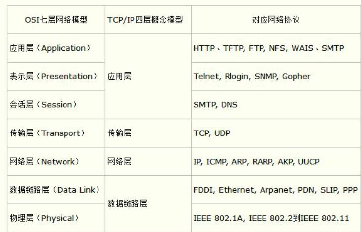

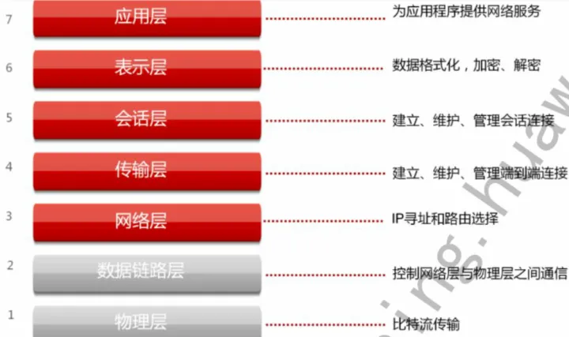

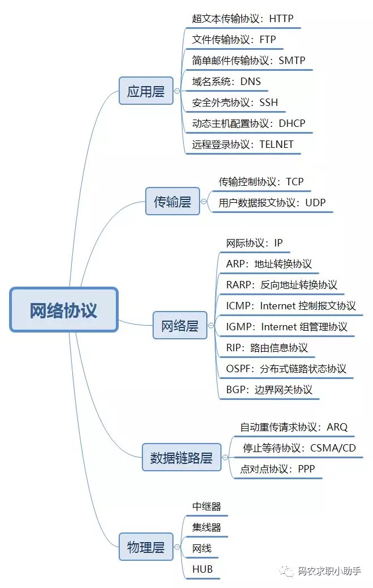

## TCP/IP网络模型

TCP/IP网络模型是对OSI七层网络模型的一个具体实现。

因为不同设备之间的通信需要网络，而由于设备的多样性，需要兼容不同设备，所以需要一套大家都遵守的网络协议。

### 应用层

最上层的，也是我们能直接接触到的就是**应用层**（*Application Layer*），我们电脑或手机使用的应用软件都是在应用层实现。

所以，应用层只需要专注于为用户提供应用功能，比如 HTTP、FTP、Telnet、DNS、SMTP等。

应用层是不用去关心数据是如何传输的，就类似于，我们寄快递的时候，只需要把包裹交给快递员，由他负责运输快递，我们不需要关心快递是如何被运输的。

而且应用层是工作在操作系统中的用户态，传输层及以下则工作在内核态。

### 传输层

应用层的数据包会传给传输层，**传输层**（*Transport Layer*）是为应用层提供网络支持的。

在传输层会有两个传输协议，分别是 TCP 和 UDP。

TCP 的全称叫传输控制协议（*Transmission Control Protocol*），大部分应用使用的正是 TCP 传输层协议，比如 HTTP 应用层协议。TCP 相比 UDP 多了很多特性，比如流量控制、超时重传、拥塞控制等，这些都是为了保证数据包能可靠地传输给对方。

UDP 相对来说就很简单，简单到只负责发送数据包，不保证数据包是否能抵达对方，但它实时性相对更好，传输效率也高。当然，UDP 也可以实现可靠传输，把 TCP 的特性在应用层上实现就可以，不过要实现一个商用的可靠 UDP 传输协议，也不是一件简单的事情。

应用需要传输的数据可能会非常大，如果直接传输就不好控制，因此当传输层的数据包大小超过 MSS（TCP 最大报文段长度） ，就要将数据包分块，这样即使中途有一个分块丢失或损坏了，只需要重新发送这一个分块，而不用重新发送整个数据包。在 TCP 协议中，我们把每个分块称为一个 **TCP 段**（*TCP Segment*）。

当设备作为接收方时，传输层则要负责把数据包传给应用，但是一台设备上可能会有很多应用在接收或者传输数据，因此需要用一个编号将应用区分开来，这个编号就是**端口**。

比如 80 端口通常是 Web 服务器用的，22 端口通常是远程登录服务器用的。而对于浏览器（客户端）中的每个标签栏都是一个独立的进程，操作系统会为这些进程分配临时的端口号。

由于传输层的报文中会携带端口号，因此接收方可以识别出该报文是发送给哪个应用。

### 网络层

实际场景中的网络环节是错综复杂的，中间有各种各样的线路和分叉路口，如果一个设备的数据要传输给另一个设备，就需要在各种各样的路径和节点进行选择，而传输层的设计理念是简单、高效、专注，如果传输层还负责这一块功能就有点违背设计原则了。

也就是说，我们不希望传输层协议处理太多的事情，只需要服务好应用即可，让其作为应用间数据传输的媒介，帮助实现应用到应用的通信，而实际的传输功能就交给下一层，也就是**网络层**（*Internet Layer*）。

网络层最常使用的是 IP 协议（*Internet Protocol*），IP 协议会将传输层的报文作为数据部分，再加上 IP 包头组装成 IP 报文，如果 IP 报文大小超过 MTU（以太网中一般为 1500 字节）就会**再次进行分片**，得到一个即将发送到网络的 IP 报文。通过IP地址区分网络中的不同主机。通过子网掩码区分出网络号和主机号。

那么在寻址的过程中，先匹配到相同的网络号（表示要找到同一个子网），才会去找对应的主机。

除了寻址能力， IP 协议还有另一个重要的能力就是**路由**。实际场景中，两台设备并不是用一条网线连接起来的，而是通过很多网关、路由器、交换机等众多网络设备连接起来的，那么就会形成很多条网络的路径，因此当数据包到达一个网络节点，就需要通过路由算法决定下一步走哪条路径。

路由器寻址工作中，就是要找到目标地址的子网，找到后进而把数据包转发给对应的网络内。

所以，**IP 协议的寻址作用是告诉我们去往下一个目的地该朝哪个方向走，路由则是根据「下一个目的地」选择路径。寻址更像在导航，路由更像在操作方向盘**。

### 数据链路层

生成了 IP 头部之后，接下来要交给**网络接口层**（*Link Layer*）在 IP 头部的前面加上 MAC 头部，并封装成数据帧（Data frame）发送到网络上。

以太网在判断网络包目的地时和 IP 的方式不同，因此必须采用相匹配的方式才能在以太网中将包发往目的地，而 MAC 头部就是干这个用的，所以，在以太网进行通讯要用到 MAC 地址。

MAC 头部是以太网使用的头部，它包含了接收方和发送方的 MAC 地址等信息，我们可以通过 ARP 协议获取对方的 MAC 地址。

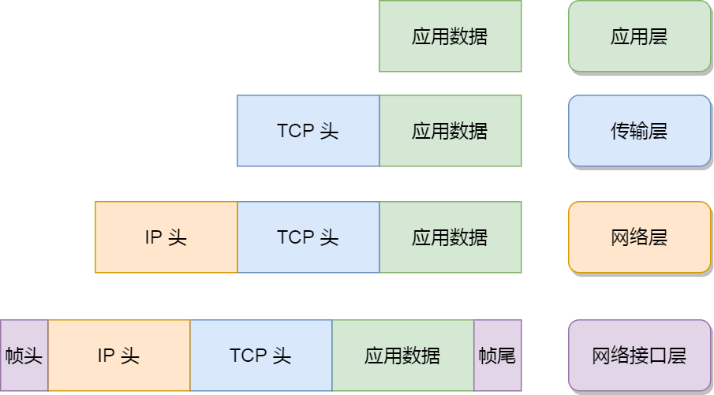

## IP

IP 地址（IPv4 地址）由 `32` 位正整数来表示，IP 地址在计算机是以二进制的方式处理的。因此IP地址的最大值是4294967296，也就是接近43亿。

### IP地址分类

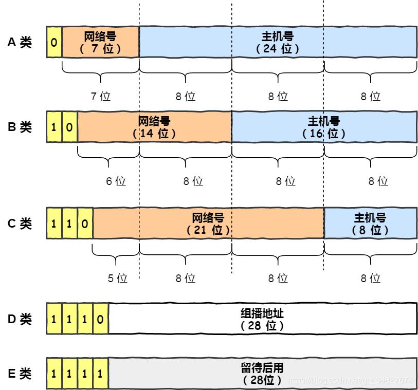

- A类地址(1~126):网络号占前8位，以0开头，主机号占后24位。
- B类地址(128~191):网络号占前16位，以10开头，主机号占后16位。
- C类地址(192~223):网络号占前24位，以110开头，主机号占后8位。（ABC为单播地址）
- D类地址(224~239):以1110开头，保留位多播地址。
- E类地址(240~255):以1111开头，保留位今后使用

### 无分类地址 CIDR

这种方式不再有分类地址的概念，32 比特的 IP 地址被划分为两部分，前面是**网络号**，后面是**主机号**。表示形式 `a.b.c.d/x`，其中 `/x` 表示前 x 位属于**网络号**， x 的范围是 `0 ~ 32。

### IP分片和重组

MTU：数据链路层的最大传输单元，每个不同类型的数据链路的使用目的不同，所以MTU不同，以太网是1500字节。

当IP数据包的大小大于MTU，就会被分片，再由对方进行重组。

如果某个分片丢失，则会造成整个IP数据包作废，所以TCP引入了MSS也就是由TCP来分片，那么对于UDP我们尽可能不要发送大于MTU的报文。

### TTL

TTL是IP数据报可以经过的最大路由数，每经过一个路由器此值就会减一，当此值为0则数据包将被丢弃，同时发送ICMP报文通知源路由器。

### ping的工作原理

ping是基于**ICMP**（互联网控制报文协议，主要功能：**确认 IP 包是否成功送达目标地址、报告发送过程中 IP 包被废弃的原因和改善网络设置等**）的。

其中ICMP的类型0和8分别表示回送响应和回送请求，用于判断发送的数据包是否到达通信对端的一种消息。

## ARP

ARP（Address Resolution Protocol，地址解析协议）是用来将IP地址解析为MAC地址的协议。主机或三层网络设备上会维护一张ARP表，用于存储IP地址和MAC地址的映射关系，一般ARP表项包括动态ARP表项和静态ARP表项。

### 为什么要有ARP协议

在局域网中，当主机或其它三层网络设备有数据要发送给另一台主机或三层网络设备时，需要知道对方的网络层地址（即IP地址）。但是仅有IP地址是不够的，因为IP报文必须封装成帧才能通过物理网络发送，因此发送方还需要知道接收方的物理地址（即MAC地址），这就需要一个通过IP地址获取物理地址的协议，以完成从IP地址到MAC地址的映射。地址解析协议ARP即可实现将IP地址解析为MAC地址。

### 工作原理

网络层的ARP协议完成了IP地址与物理地址的映射。首先，每台主机都会在自己的ARP缓冲区中建立一个ARP列表，以表示IP地址和MAC地址的对应关系。当源主机需要将一个数据包要发送到目的主机时，会首先检查自己ARP列表中是否存在该IP地址对应的MAC地址:如果有，就直接将数据包发送到这个MAC地址;如果没有，就向本地网段发起一个ARP请求的广播包，查询此目的主机对应的MAC地址。

此ARP请求数据包里包括源主机的IP地址、硬件地址、以及目的主机的IP地址。网络中所有的主机收到这个ARP请求后，会检查数据包中的目的IP是否和自己的IP地址一致。如果不相同就忽略此数据包;如果相同，该主机首先将发送端的MAC地址和IP地址添加到自己的ARP列表中，如果ARP表中已经存在该IP的信息，则将其覆盖，然后给源主机发送一个ARP响应数据包，告诉对方自己是它需要查找的MAC地址;源主机收到这个ARP响应数据包后，将得到的目的主机的IP地址和MAC地址添加到自己的ARP列表中，并利用此信息开始数据的传输。如果源主机一直没有收到ARP响应数据包，表示ARP查询失败。

一句话总结工作原理：广播ARP请求和单播ARP应答。

### 静态和动态

- 动态ARP表由ARP协议通过报文自动生成和维护，可以被老化、可以被新的ARP报文替代、也可以被静态ARP表项替代，动态ARP适合拓扑结构复杂、通信是适度要求高的网络
- 静态ARP是由网络管理员手工建立的IP地址和MAC地址之间固定的映射关系，不会被动态覆盖、不会老化。可以保证通信的安全性。

### 老化机制

每台主机或设备上都维护着一个高速缓存，这是ARP高效运行的一个关键。在这个高速缓存中，存放主机或设备最近学习到的IP地址到MAC地址的映射关系，即动态ARP表项。

主机或设备每次发送报文时，会先在本地高速缓存中查找目的IP地址所对应的MAC地址。如果高速缓存中有对应的MAC地址，主机或设备不会再发送ARP请求报文，而是直接将报文发至这个MAC地址；如果高速缓存中没有对应的MAC地址，主机或设备才会广播发送ARP请求报文，进行ARP地址解析。一方面由于高速缓存的容量限制，另一方面为了保证高速缓存中ARP表项的准确性，设备会对动态ARP表项进行老化和更新。

动态ARP表项的老化参数有：老化超时时间、老化探测次数和老化探测模式。设备上动态ARP表项到达老化超时时间后，设备会发送老化探测报文（即ARP请求报文），如果能收到ARP应答报文，则更新该动态ARP表项，本次老化探测结束；如果超过设置的老化探测次数后仍没有收到ARP应答报文，则删除该动态ARP表项，本次老化探测结束。

设备发送的老化探测报文可以是单播报文，也可以是广播报文。缺省情况下，设备只在最后一次发送ARP老化探测报文是广播模式，其余均为单播模式发送。当对端设备MAC地址不变时，可以配置接口以单播模式发送ARP老化探测报文。

## TCP


TCP是面向连接的、可靠的、基于字节流的传输层通信协议。

连接：**用于保证可靠性和流量控制维护的某些状态信息，这些信息的组合，包括 Socket（确认四元组）、序列号（解决乱序问题）和窗口大小（流量控制）称为连接。**

最大连接数：理论值最大为客户端IP数量*客户端端口数。但是实际上服务器的连接数远不能达到理论上限，会受到文件描述符（系统级、用户级、进程级）和内存的限制。

### 面向连接

#### 三次握手（摸手）（确认双方的收发能力）（序列号和SYN）

A：我说话你能听见吗（seq(客户端初始序列号)，SYN（置1表示为握手数据包））

B：你说话我能听见，我说话你能听见吗（seq(服务器初始序列号)，SYN，ACK(确认应答，客户端初始序列号+1)(期望接受的下一个字节编号)

A：你说话我能听见（ACK(确认应答，服务器初始序列号+1)）

不发数据为什么要有序列号→因为超时重传，


- 客户端的协议栈向服务端发送了 SYN 包，并告诉服务端当前发送序列号 client_isn，客户端进入 SYN_SENT 状态；
- 服务端的协议栈收到这个包之后，和客户端进行 ACK 应答，应答的值为 client_isn+1，表示对 SYN 包 client_isn 的确认，同时服务端也发送一个 SYN 包，告诉客户端当前我的发送序列号为 server_isn，服务端进入 SYN_RCVD 状态；
- 客户端协议栈收到 ACK 之后，使得应用程序从 `connect` 调用返回，表示客户端到服务端的单向连接建立成功，客户端的状态为 ESTABLISHED，同时客户端协议栈也会对服务端的 SYN 包进行应答，应答数据为 server_isn+1；
- ACK 应答包到达服务端后，服务端的 TCP 连接进入 ESTABLISHED 状态，同时服务端协议栈使得 `accept` 阻塞调用返回，这个时候服务端到客户端的单向连接也建立成功。至此，客户端与服务端两个方向的连接都建立成功。

- 为什么要三次握手

  1. 三次握手可以阻止重复历史连接的初始化→客户端的SYN到达服务器，服务器回复SYN+ACK，客户端收到后根据自身的上下文判断这是不是一个历史连接，如果是，客户端向服务器发送RST报文表示取消这次连接。两次握手在服务器发送SYN+ACK后服务器就可以发送数据了，客户端无法判断这是不是历史连接，当客户端准备发送第三次握手时，有足够的上下文来进行判断。

  2. 三次握手可以同步双方的初始序列号→两次握手只确保服务器收到客户端的序列号了

  3. 三次握手可以避免资源浪费

     SYN泛洪攻击

     - 半连接队列：接收到客户端的SYN报文，进入半连接队列，并对其中的报文进行SYN+ACK的回应
     - 全连接队列：接收到了客户端的ACK报文，通过`accpet()`接口从全连接队列中取出连接对象
     
     SYN最直接的办法就是把TCP的半连接队列打满，这样服务器后续在收到SYN报文就会丢弃，导致正常的客户端无法和服务器建立连接。以下为解决方案
     
     - 增大`netdev_max_backlog`
     
       当网卡接收数据包的速度大于内核处理的速度时，有一个队列会保存这些数据包。此参数是控制这个队列大小的
     
     - 增大TCP半连接队列大小
     
     - 开启 net.ipv4.tcp_syncookies
     
       当 「 SYN 队列」满之后，后续服务端收到 SYN 包，不会丢弃，而是根据算法，计算出一个 `cookie` 值；将 cookie 值放到第二次握手报文的「序列号」里，然后服务端回第二次握手给客户端；服务端接收到客户端的应答报文时，服务端会检查这个 ACK 包的合法性。如果合法，将该连接对象放入到「 Accept 队列」。最后应用程序通过调用 `accpet()` 接口，从「 Accept 队列」取出的连接。
     
       通过这种方法，即使半连接队列满了也可以保证正常的连接成功。
     
     - 减少 SYN+ACK 重传次数
     
       当服务端受到 SYN 攻击时，就会有大量处于 SYN_REVC 状态的 TCP 连接，处于这个状态的 TCP 会重传 SYN+ACK ，当重传超过次数达到上限后，就会断开连接。

- seq怎么产生

  seq = C +H(源IP地址，目的IP地址，源端口，目的端口)。其中，C是一个计时器，每四微秒加一，H是消息摘要算法，输入是一个四元组（源IP地址、目的IP地址、源端口、目的端口)
  
- 各次握手丢失会怎么样

  - 第一次

    客户端收不到服务器的SYN-ACK报文，会重传SYN报文，并且重传的SYN报文序列号是一样的。最大重传次数通常是5次，每次间隔翻倍。

  - 第二次

    客户端没有收到第二次握手，客户端会认为自己的SYN报文丢失了所以会重传，服务器会认为自己的SYN-ACK报文丢失了所以也会重传。

  - 第三次

    客户端发送完第三次握手已经进入ESTABLISH状态，可以进行数据传输了，而服务器此时则是SYN-RCVD状态，服务器认为自己的第二次握手没有传送到，所以由服务器重传SYN-ACK报文。


#### 四次挥手

A：我要断开连接（FIN(结束标志)）(尽对于应用层而言，缓冲区的数据继续发送)

B：同意你断开连接（ACK）

B：我要断开链接（FIN）

A：同意你断开连接（ACK）

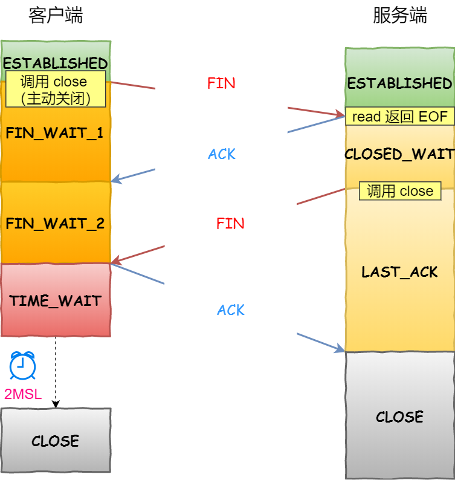

- 客户端调用 `close`，表明客户端没有数据需要发送了，则此时会向服务端发送 FIN 报文，进入 FIN_WAIT_1 状态；
- 服务端接收到了 FIN 报文，TCP 协议栈会为 FIN 包插入一个文件结束符 `EOF` 到接收缓冲区中，应用程序可以通过 `read` 调用来感知这个 FIN 包。这个 `EOF` 会被**放在已排队等候的其他已接收的数据之后**，这就意味着服务端需要处理这种异常情况，因为 EOF 表示在该连接上再无额外数据到达。此时，服务端进入 CLOSE_WAIT 状态；
- 接着，当处理完数据后，自然就会读到 `EOF`，于是也调用 `close` 关闭它的套接字，这会使得服务端发出一个 FIN 包，之后处于 LAST_ACK 状态；
- 客户端接收到服务端的 FIN 包，并发送 ACK 确认包给服务端，此时客户端将进入 TIME_WAIT 状态；
- 服务端收到 ACK 确认包后，就进入了最后的 CLOSE 状态；
- 客户端经过 `2MSL` 时间之后，也进入 CLOSE 状态；

- 为什么需要四次挥手

  关闭连接时，客户端发送FIN报文，表示其不再发送数据，但还可以接受数据。而服务器可能还有数据需要发送，所以先发送ACK同意客户端的FIN，等所有数据发送完毕再发送FIN，所以比三次握手多了一次。

- TIME_WAIT意义以及为什么是2MSL以及危害

  - 意义

    1. 防止最后一次发送的ack丢失，保证TCP完整结束→四次挥手的最后一个ack是由发起断开方发出，如果对方没有收到这个ack会重发fin（超时重传）有time_wait则可以尽可能保证挥手完整

    2. 使老的连接在网络中彻底消失→防止相同端口复用TCP连接收到旧的报文，导致数据错乱

  - 2MSL

    1. MSL（Maximum Segment Lifetime）报文最大生存时间，任何报文在网络中超过这个时间就会被丢弃

    2. 发送方的数据包发到对面丢失，对面还需要回复，一来一回两个MSL，如果客户端的最后一个ACK没有发送到服务器，那么服务器会再发一个FIN，TIME_WAIT重置

  - 危害

    1. 浪费系统资源，如文件描述符、内存资源、CPU资源、线程资源

    2. 占用端口号，一个TCP连接占用一个端口号，如果发起请求方持有过多的TIME_WAIT状态占满了端口号，就无法发起新的请求
  
- 服务器出现大量TIME_WAIT的原因

  1. HTTP没有使用长连接，只要通信双方有一方没有开启Keep-Alive，就会有服务器主动断开连接。在服务端主动关闭连接的情况下，只要调用一次 close() 就可以释放连接，剩下的工作由内核 TCP 栈直接进行了处理，整个过程只有一次 syscall；如果是要求 客户端关闭，则服务端在写完最后一个 response 之后需要把这个 socket 放入 readable 队列，调用 select / epoll 去等待事件；然后调用一次 read() 才能知道连接已经被关闭，这其中是两次 syscall，多一次用户态程序被激活执行，而且 socket 保持时间也会更长。

  2. HTTP长连接超时：大量客户端建立完TCP连接后，很长一段时间没有发生数据，触发长连接超时，由服务器主动关闭连接

  3. HTTP长连接的请求数量达到上限

     服务器会有如 nginx 的 keepalive_requests 这个参数，限制单次长连接处理的请求数量，如果超过请求数量，就会主动关闭这个长连接。

- 各次挥手报文丢失怎么办

  - 第一次

    客户端（发起挥手方重传FIN报文）

  - 第二次

    如果服务端的第二次挥手丢包了，客户端就会认为是自己地第一次挥手丢包了，所以由客户端重传FIN报文

  - 第三次

    服务器接收到客户端的FIN报文后，内核自动发送ACK报文，同时进入CLOSE_WAIT状态（等待应用进程调用close函数关闭连接）。应用进程调用close函数后，服务器发送FIN报文，如果丢包，则由服务器重传FIN报文。

  - 第四次

    服务器发送完FIN报文后，等待客户端的ACK，此时服务器会处于LAST_ACK状态，客户端的ACK丢失了，则由服务器重传FIN报文。

#### 没有accept能建立连接吗

accpet 系统调用并不参与 TCP 三次握手过程，它只是负责从 TCP 全连接队列取出一个已经建立连接的 socket，用户层通过 accpet 系统调用拿到了已经建立连接的 socket，就可以对该 socket 进行读写操作了。

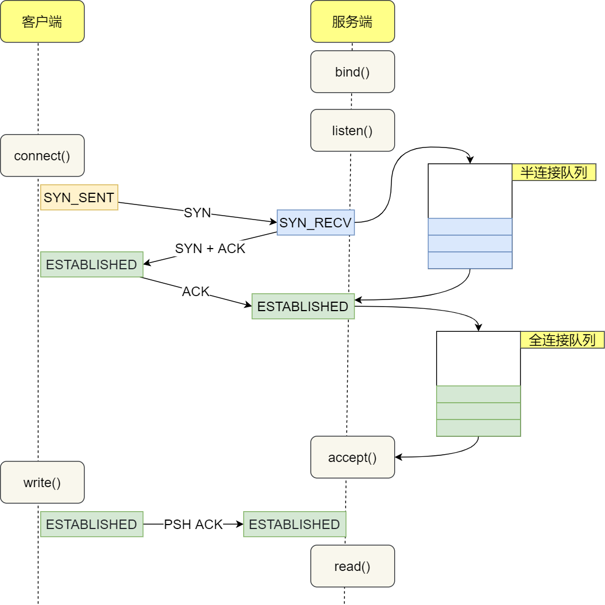

### 重传机制


#### 序列号和确认序号

发送方会将发送的数据编号，以便让接收方知道自己接收的数据是不是自己想要的数据

序列号和初始序列号不是无限递增的，超过4G大小就会重新计数，这意味着无法通过序列号来判断新老数据。

#### 确认应答

接收方接收后发送ack

缺点→数据往返时间越长，网络吞吐量越低

#### 超时重传

TCP可靠性中最重要的一个机制是处理数据超时和重传。TCP协议要求在发送端每发送一个报文段，就启动一个定时器并等待确认信息；接收端成功接收新数据后返回确认信息。若在定时器超时前数据未能被确认，TCP就认为报文段中的数据已丢失或损坏，需要对报文段中的数据重新组织和重传。尽管超时重传的概念十分简单，但是在实现中，TCP处理超时重传的机制与其他可靠性协议相比是相当复杂的。

在数据包或确认应答丢失的情况下会触发超时重传。超市重传时间RTO应该略大于保温往返时间RTT的值。

#### 快速重传

发送方的报文丢失了，接收方收到的并不是自己想要的报文，就会发送之前的ACK，如果连续发送三个之前相同的ACK就会触发服务器的快速重传，但是问题是是重传一个，还是重传所有。

#### SACK

`SACK`（ Selective Acknowledgment）， **选择性确认**。

这种方式需要在 TCP 头部「选项」字段里加一个 `SACK` 的东西，它**可以将已收到的数据的信息发送给「发送方」**，这样发送方就可以知道哪些数据收到了，哪些数据没收到，知道了这些信息，就可以**只重传丢失的数据**。

如果要支持 `SACK`，必须双方都要支持。在 Linux 下，可以通过 `net.ipv4.tcp_sack` 参数打开这个功能（Linux 2.4 后默认打开）。

####  Duplicate SACK

Duplicate SACK 又称 `D-SACK`，其主要**使用了 SACK 来告诉「发送方」有哪些数据被重复接收了。**

在 Linux 下可以通过 `net.ipv4.tcp_dsack` 参数开启/关闭这个功能（Linux 2.4 后默认打开）。

### 流量控制

同步双方的收发速度（根据接收方的接收能力，控制发送方的速度，保护接收方）

滑动窗口→窗口大小内的数据无需确认应答，提高吞吐量→操作系统开辟一个缓冲空间，在接收方确认应答之前，已发送的数据保存在缓冲区，以便超时重传，对方确认应答则清除

窗口大小→win→接收端告诉发送端自己的处理能力

发送方的窗口：发送并收到ACK的数据、已发送但未收到 ACK确认的数据、未发送但总大小在接收方处理范围内、未发送但总大小超过接收方处理范围。由三个指针确定四个区域。`SND.WND`：表示发送窗口的大小（大小是由接收方指定的）；`SND.UNA`（*Send Unacknoleged*）：是一个绝对指针，它指向的是已发送但未收到确认的第一个字节的序列号，也就是 #2 的第一个字节。`SND.NXT`：也是一个绝对指针，它指向未发送但可发送范围的第一个字节的序列号，也就是 #3 的第一个字节。指向 #4 的第一个字节是个相对指针，它需要 `SND.UNA` 指针加上 `SND.WND` 大小的偏移量，就可以指向 #4 的第一个字节了。

接收方的窗口：已成功接收并确认的数据、未收到数据但可以接收的数据、未收到数据并不可以接收的数据。两个指针来确定范围`RCV.WND`：表示接收窗口的大小，它会通告给发送方。`RCV.NXT`：是一个指针，它指向期望从发送方发送来的下一个数据字节的序列号，也就是 #3 的第一个字节。指向 #4 的第一个字节是个相对指针，它需要 `RCV.NXT` 指针加上 `RCV.WND` 大小的偏移量，就可以指向 #4 的第一个字节了。

- 零窗口问题

  接收方没有缓存时会将窗口设置为0发送给发送方，当接收方有缓存发送窗口大小给发送方但是此包丢失时，就会使双方一直等待

  发送方接收到零窗口时会设置一个持续计时器，周期性地向接收方发送零窗口探测报文段

### 拥塞控制

使用者变多→拥塞→丢包→丢包越多越发→瘫痪→数据全部丢失

判断网络是否发生拥塞→是否有丢包现象→是否触发了超时重传（规定时间内没有收到ACK应答报文）

发送窗口swnd = min(拥塞窗口cwnd, 接收窗口rwnd)，只要网络中没有出现拥塞cwnd就会变大，拥塞了cwnd就会变小，

- 慢启动

  **当发送方每收到一个 ACK，拥塞窗口 cwnd 的大小就会加 1**，所以慢启动每轮发包的个数是指数级增长的。当拥塞窗口达到慢启动门限的时候，启动拥塞避免算法。

- 拥塞避免

  慢启动⻔限ssthresh的大小通常是65535字节。**发送方每收到一个ACK时，cwnd增加1/cwnd**，如此一来，cwnd每轮增长的数量就变成了1。

- 拥塞发生

  网络出现拥塞，发生数据包重传，需要进行重传

  - 超时重传

    ssthresh设置为cwnd/2，cwnd重置为cwnd的初始值。

  - 快重传

    当接收方发现丢了一个中间包时，发送三次丢包的前一个包的ACK，此时发送端触发快重传

    cwnd = cwnd/2，ssthresh=cwnd，进入快恢复算法。

- 快恢复

  快重传和快恢复一般同时使用，快恢复算法认为你还能收到三个重复的ACK说明网络还没那么差

  - 拥塞窗口 `cwnd = ssthresh + 3` （ 3 的意思是确认有 3 个数据包被收到了）；
  - 重传丢失的数据包；
  - 如果再收到重复的 ACK，那么 cwnd 增加 1；
  - 如果收到新数据的 ACK 后，把 cwnd 设置为第一步中的 ssthresh 的值，原因是该 ACK 确认了新的数据，说明从 duplicated ACK 时的数据都已收到，该恢复过程已经结束，可以回到恢复之前的状态了，也即再次进入拥塞避免状态；

### 保活机制

概念→一定时间内TCP连接没有任何活动，启动保活机制，每隔一段时间发送探测报文，等待相应

机制：1. 对端正常相应，重置保活时间 2. 对方程序崩溃，发送RST报文，重置连接 3. 保活报文不可达，探测一定次数后关闭连接

### 为什么IP会分片，TCP还要有MSS


- MTU：一个网络包的最大长度，以太网中一般为1500字节
- MSS：除去IP和TCP头部后，一个网络包能容纳的TCP数据最大长度

当 IP 层有一个超过 `MTU` 大小的数据（TCP 头部 + TCP 数据）要发送，那么 IP 层就要进行分片，把数据分片成若干片，保证每一个分片都小于 MTU。把一份 IP 数据报进行分片以后，由目标主机的 IP 层来进行重新组装后，再交给上一层 TCP 传输层。

**当如果一个 IP 分片丢失，整个 IP 报文的所有分片都得重传**。因为 IP 层本身没有超时重传机制，它由传输层的 TCP 来负责超时和重传。

当某一个 IP 分片丢失后，接收方的 IP 层就无法组装成一个完整的 TCP 报文（头部 + 数据），也就无法将数据报文送到 TCP 层，所以接收方不会响应 ACK 给发送方，因为发送方迟迟收不到 ACK 确认报文，所以会触发超时重传，就会重发「整个 TCP 报文（头部 + 数据）」。

为了最佳效能，TCP协议在建立连接的时候通常会协商双方的MSS值。

### 粘包与解决

粘包的问题出现是因为不知道一个用户消息的边界在哪，如果知道了边界在哪，接收方就可以通过边界来划分出有效的用户消息。

- 固定长度的消息

  最简单的方法，如规定一个消息的长度时64字节，接收方接收慢64个字节，就认为这是一个完整且有效的消息，但是灵活性较差，实际中很少用

- 特殊字符作为边界

  再两个用户消息之间插入一个特殊的字符串，接收方读到特定字符串，就认为是一个完整的消息了，HTTP就是如此，需要注意的时如果消息内容中有这个特殊字符，就要对这个字符进行转义

- 自定义消息结构

  定义一个消息结构，包括包头和数据构成，其中包头固定大小，且包头中有一个字段说明其后的数据有多大。

### TCP与Socket

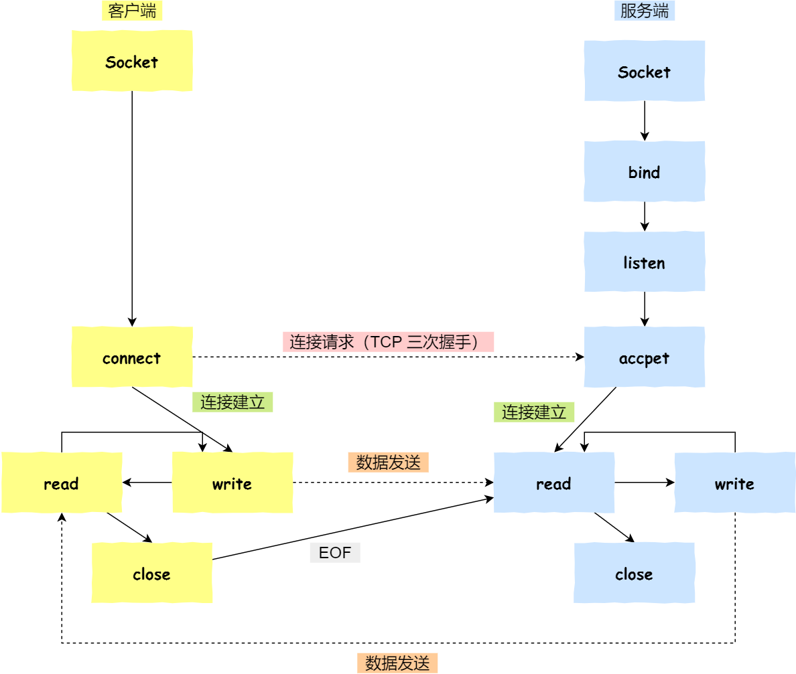

- 服务端和客户端初始化 `socket`，得到文件描述符；
- 服务端调用 `bind`，将 socket 绑定在指定的 IP 地址和端口;
- 服务端调用 `listen`，进行监听；
- 服务端调用 `accept`，等待客户端连接；
- 客户端调用 `connect`，向服务端的地址和端口发起连接请求；
- 服务端 `accept` 返回用于传输的 `socket` 的文件描述符；
- 客户端调用 `write` 写入数据；服务端调用 `read` 读取数据；
- 客户端断开连接时，会调用 `close`，那么服务端 `read` 读取数据的时候，就会读取到了 `EOF`，待处理完数据后，服务端调用 `close`，表示连接关闭。

### 已经建立连接的TCP，收到SYN会怎么样

1. **客户端的 SYN 报文里的端口号与历史连接不相同**

   如果客户端恢复后发送的 SYN 报文中的源端口号跟上一次连接的源端口号不一样，此时服务端会认为是新的连接要建立，于是就会通过三次握手来建立新的连接。

   如果服务端发送了数据包给客户端，由于客户端的连接已经被关闭了，此时客户的内核就会回 RST 报文，服务端收到后就会释放连接。如果服务端一直没有发送数据包给客户端，在超过一段时间后，TCP 保活机制就会启动，检测到客户端没有存活后，接着服务端就会释放掉该连接。

2. **客户端的 SYN 报文里的端口号与历史连接相同**

   处于 Established 状态的服务端，如果收到了客户端的 SYN 报文（注意此时的 SYN 报文其实是乱序的，因为 SYN 报文的初始化序列号其实是一个随机数），会回复一个携带了正确序列号和确认号的 ACK 报文，这个 ACK 被称之为 Challenge ACK。客户端收到这个 Challenge ACK，发现确认号（ack num）并不是自己期望收到的，于是就会回 RST 报文，服务端收到后，就会释放掉该连接。

#### 引申问题，如何精细地关闭一条TCP连接

如果采用杀掉进程的方式来关闭TCP连接，客户端会断开与服务器的所有TCP连接，服务器则会断开所有连接，并且无法继续提供服务。

**要伪造一个能关闭 TCP 连接的 RST 报文，必须同时满足「四元组相同」和「序列号是对方期望的」这两个条件。**

- tcpkill 工具只能用来关闭活跃的 TCP 连接，无法关闭非活跃的 TCP 连接，因为 tcpkill 工具是等双方进行 TCP 通信后，才去获取正确的序列号，如果这条 TCP 连接一直没有任何数据传输，则就永远获取不到正确的序列号。
- killcx 工具可以用来关闭活跃和非活跃的 TCP 连接，因为 killcx 工具是主动发送 SYN 报文，这时对方就会回复 Challenge ACK ，然后 killcx 工具就能从这个 ACK 获取到正确的序列号。

## TCP和UDP的联系和区别

- 都是传输层协议，都建立在IP（ip通过四元组确定了网络中的两台主机上的两个进程，但是ip没法发送消息，此时将发送数据的任务交给tcp和udp）之上，TCP是流式套接字，UDP是报文套接字

1. TCP是面向连接的协议，提供可靠传输（底层还是会出现错误，但是出现错误的时候tcp会纠正错误，数据丢失会重新发送），发送消息前三次握手建立连接，使用ACK确保消息的准确性。UDP是无连接的协议，不管对方是否收到是否正确
2. TCP只能一对一点对点通信，UDP可以一对一、一对多、多对多通信
3. TCP对系统资源的要求比UDP高同时安全，速度也比UDP慢
4. TCP基于字节流没有边界可能会出现粘包，UDP基于数据包可能会乱序或丢包
5. TCP首部开销比较大，最大为40字节，UDP则为固定的8字节

 


## 浏览器输入URL后的全过程

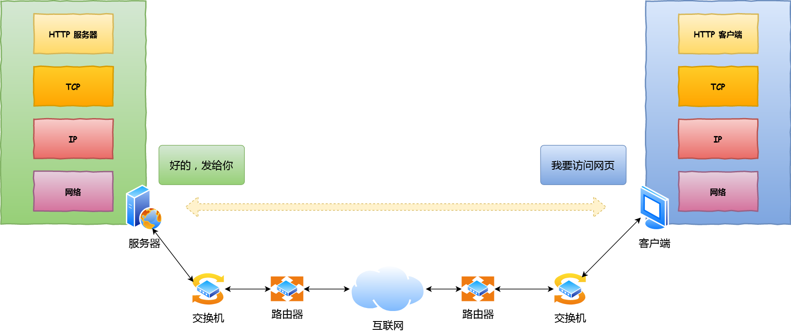

- HTTP解析域名、生成HTTP请求
- DNS查询服务器域名对应的 IP 地址

1. 客户端使用DNS协议将url解析成域名

2. 建立TCP连接

3. 建立HTTP连接，向服务器发送请求

4. 服务器处理请求，将客户端所需数据，发送回客户端

5. 关闭TCP连接

6. 浏览器接收html

7. 渲染

## DNS

DNS服务器存储Web服务器域名和IP的对应关系。DNS中的域名用`.`进行分割，越靠右级别越高。实际上域名最后还有一个点如`www.baidu.com.`，这个点表示根域名。不同层级DNS服务器之间的关系类似于一颗树。因此，客户端只要能够找到任意一台 DNS 服务器，就可以通过它找到根域 DNS 服务器，然后再一路顺藤摸瓜找到位于下层的某台目标 DNS 服务器。

1. 浏览器查看缓存有没有ip记录。
2. 操作系统查看缓存有没有记录。
3. 查看本机hosts有没有记录。
4. 客户端首先会发出一个 DNS 请求，问 www.server.com 的 IP 是啥，并发给本地 DNS 服务器（也就是客户端的 TCP/IP 设置中填写的 DNS 服务器地址）。
5. 本地域名服务器收到客户端的请求后，如果缓存里的表格能找到 www.server.com，则它直接返回 IP 地址。如果没有，本地 DNS 会去问它的根域名服务器：“老大， 能告诉我 www.server.com 的 IP 地址吗？” 根域名服务器是最高层次的，它不直接用于域名解析，但能指明一条道路。
6. 根 DNS 收到来自本地 DNS 的请求后，发现后置是 .com，说：“www.server.com 这个域名归 .com 区域管理”，我给你 .com 顶级域名服务器地址给你，你去问问它吧。”
7. 本地 DNS 收到顶级域名服务器的地址后，发起请求问“老二， 你能告诉我 www.server.com 的 IP 地址吗？”
8. 顶级域名服务器说：“我给你负责 www.server.com 区域的权威 DNS 服务器的地址，你去问它应该能问到”。
9. 本地 DNS 于是转向问权威 DNS 服务器：“老三，www.server.com对应的IP是啥呀？” server.com 的权威 DNS 服务器，它是域名解析结果的原出处。为啥叫权威呢？就是我的域名我做主。
10. 权威 DNS 服务器查询后将对应的 IP 地址 X.X.X.X 告诉本地 DNS。
11. 本地 DNS 再将 IP 地址返回客户端，客户端和目标建立连接。

DNS解析的整个过程就和我们日常生活中找人问路的过程类似，**只指路不带路**。

## HTTP
### 概述

HTTP 是超文本传输协议，也就是**H**yperText **T**ransfer **P**rotocol。

web通信都是建立在HTTP上的→客户端发起HTTP请求，服务器处理后返回HTTP响应报文

特点：1.简单→基本报文格式是header+body，头部信息也是kv 2.灵活以及易于扩展→HTTP协议中的请求方法，状态码，头字段等都可以更改，工作在应用层底层可以更改 3.无状态、明文传输、不安全

默认端口号：80

dns解析出ip地址，TCP三次握手，HTTP请求，关闭TCP连接

### 状态码

1xx→提示信息，表示目前是协议处理的中间状态，还需后续操作

100→收到了请求的起始部分，客户端应该继续请求

101→服务器正在根据客户端的指示切换协议

2xx→成功，报文已被收到并且正确处理

200→客户端请求成功

201→对于需要服务器创建对象的请求，服务器已创建完毕对象

202→请求已接受但服务器未处理

203→服务器成功处理，只不过header包含的信息并非来自原始服务器，而是副本

204→没有响应响应体

205→要求浏览器重置当前页面的HTML

206→部分请求成功

3xx→重定向

301→永久重定向

302→临时重定向

304→客户端的缓存资源时最新的，要求客户端使用缓存

4xx→客户端错误

400→报文语法有错，服务器无法识别

401→请求需要客户端自己认证

402→要求付款（还未启用）

403→请求被服务器拒绝了

404→没有找到资源

5xx→服务器错误

500→服务器内部错误

503→服务器忙，请稍后再试

### 常见字段

- **host**：客户端发送请求时，用来指定服务器的域名
- **Content-Length**：服务器返回数据时，表明本次回应的数据长度
- **Connection**：客户端要求服务器使用长连接
- **Content-Type**：服务器用于告知客户端，本次数据是什么格式
- **Accept**：客户端用来告知服务器自己可以接收哪些数据格式
- **Content-Encoding**：数据的压缩方式，表示服务器返回的数据使用了什么压缩格式

### 请求报文

1. 请求行→（请求方法；URL；协议版本号）

​	URL： <协议>： //<主机>： <端⼝>/<路径>？ <参数>

​	协议版本号： HTTP版本号

​	如： POST /chapter17/user.html HTTP/1.1

2. 请求头→包含请求的附加信息，key:value组成

3. 请求体→承载多个请求参数的数据。包含回车、换行和请求数据

- 请求方法

  1. GET：申请获取资源，不对服务器产生影响

  2. POST：向服务器提交数据，会影响服务器，可能会创建新资源或更新原有资源

  3. HEAD：类似于GET，只要求服务器返回头部信息

  4. PUT：上传某个资源

  5. DELETE：删除某个资源

  6. TRACE：用于 测试，要求服务器返回请求内容

  7. CONNECT：用于代理服务器

  8. OPTION：查询服务器对特定URL的请求方法

- get和post

  - get是http的默认请求方式

  - get以请求和检索为主请求主体不带内容（获取），post以创建或者更新为主（处理）

  1. get请求参数放在url中，post请求参数放在请求体中
  2. get请求可以被浏览器缓存，post不可以
  3. get的参数长度受限，常用谷歌浏览器是2Mb（HTTP对此没有限制），post没有
  4. get安全是指不携带数据，不会对服务器产生影响
  5. get不安全是指参数直接显示在请求头中

  - 在 HTTP 协议（RFC规范定义中）里，所谓的「安全」是指请求方法不会「破坏」服务器上的资源。
  - 所谓的「幂等」，意思是多次执行相同的操作，结果都是「相同」的。
  - 在RFC规范下，GET可以有body，POST的url也可以有参数

### 缓存技术

对于重复的HTTP请求，每次请求得到的数据都是一样的，我们就可以把这对*请求-响应*的数据都缓存在本地，以此来加快访问速度。

- 强制缓存

  浏览器判断缓存是否过期，没过期直接使用浏览器本地缓存，主动权在浏览器。

  强制缓存利用以下两个响应头部来实现，用来表示资源在客户端缓存的有效期：Cache-Control（相对时间）（其选项更多，设置更加精细），Expires（绝对时间），如果一个响应头同时有以上两个字段，Cache-Control优先级更高。以下介绍Cache-Control：

  - 浏览器第一次请求访问资源时，服务器返回资源并在头部加上此字段，并在其中设置过期时间。
  - 浏览器再次请求该资源时，会先通过请求资源的时间和字段中设置的过期时间来判断资源是否过期，如果没有，使用该缓存，否则重新请求服务器。
  - 服务器再次收到请求后，更新字段值。

- 协商缓存

  304响应码用来通知浏览器使用缓存，这种通过服务器告知客户端是否使用缓存的方式称为协商缓存。以下为两种实现方法：

  - 请求头部中的 `If-Modified-Since` 字段与响应头部中的 `Last-Modified` 字段实现
    - 响应头部中的 `Last-Modified`：标示这个响应资源的最后修改时间；
    - 请求头部中的 `If-Modified-Since`：当资源过期了，发现响应头中具有 Last-Modified 声明，则再次发起请求的时候带上 Last-Modified 的时间，服务器收到请求后发现有 If-Modified-Since 则与被请求资源的最后修改时间进行对比（Last-Modified），如果最后修改时间较新（大），说明资源又被改过，则返回最新资源，HTTP 200 OK；如果最后修改时间较旧（小），说明资源无新修改，响应 HTTP 304 走缓存。
  - 请求头部中的 `If-None-Match` 字段与响应头部中的 `ETag` 字段
    - 响应头部中 `Etag`：唯一标识响应资源；
    - 请求头部中的 `If-None-Match`：当资源过期时，浏览器发现响应头里有 Etag，则再次向服务器发起请求时，会将请求头 If-None-Match 值设置为 Etag 的值。服务器收到请求后进行比对，如果资源没有变化返回 304，如果资源变化了返回 200。

  第一种基于时间、第二种基于标识，相对来讲后者更准确，避免时间篡改导致的不可靠。同时出现第二种的优先级也更高。以下为原因：

  1. 没有修改文件内容的情况下文件的最后修改时间也可能会改变，这时就需要重新发送资源
  2. 第一种的检查粒度为秒级，如果文件修改是在秒级以内，使用第二种则可以保证更新缓存
  3. 有些服务器不能准确获取文件的最后修改时间。

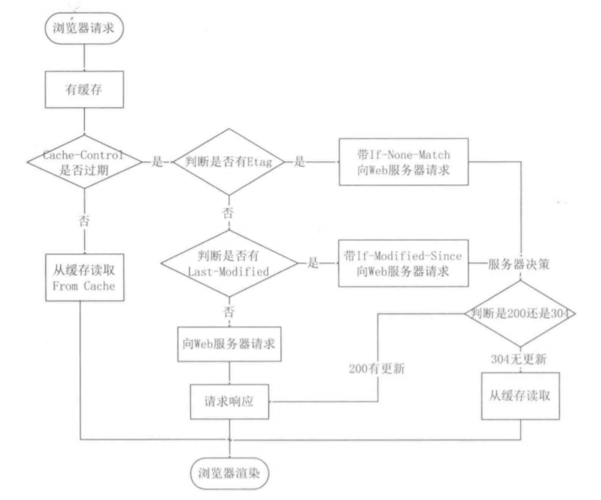

### keep-alive

为什么：早期的HTTP1.0每次请求都要创建连接，需要消耗资源和时间，为了减少资源损耗缩短响应时间，需要重用连接，在请求头中加入Connection: keep-alive，HTTP1.1默认支持长连接，加不加都行

协议是这样规定的，但是实际上还要看服务器和客户端的具体实现。通常服务器都会设置时间，超时断开连接，同时有一个参数叫做最大请求数，请求次数超过此值断开连接

### HTTP各版本

#### HTTP1.1

- 优点

  - 简单：报文格式简单，头部信息也是kv，降低学习和使用的成本
  - 灵活和已于扩展：HTTP1.1中各种请求方法、URI/URL、状态码、头字段等都可以开发者自行修改
  - 应用广泛和跨平台

- 缺点

  - 无状态：好处是服务器不需要存储状态，减轻服务器负担。坏处是在完场有关联的操作时会很麻烦。解决方法就是Cookie，就相当于是一张小纸条，客户端请求的时候带着Cookie，服务器就认得了。
  - 明文传输：抓包完全可见，为调试带来便利。但也等同于信息裸奔，很容易窃取。
  - 性能缺点
    - 请求/响应头部未经压缩就发送，只能压缩Body部分
    - 发送冗长的首部，每次互相发送相同的首部造成较多浪费
    - 服务器处理请求是按顺序的，如果服务其响应慢就会出现队头阻塞
    - 没有请求优先级控制。
    - 请求只能从客户端开始，服务器只能被动响应。

- 性能提升

  HTTP使用TCP/IP，并且使用*请求-应答*通信模式，性能的关键就在这两点

  - 长连接

    早期的HTTP1.0不支持长连接，每发起一个请求，就要重新建立一次TCP连接，增加了通信开销。HTTP1.1增加了长连接，只要任意一端没有提出断开连接，就保持TCP连接状态。如果超过一定时间没有数据交互，服务器还是会主动断开这个连接。

  - 管道运输

    得益于长连接，管道也可以使用起来。只要在同一个TCP连接中，客户端可以发送多个请求而不必等待上一个请求响应从而降低整体响应时间。但是服务器必须按照顺序进行响应。管道传输不是默认开启，也基本没有浏览器支持。

  - 队头阻塞：如果某个请求因某种原因被阻塞，其后的请求也会阻塞。 

- 如何优化

  - 避免发送HTTP请求

    缓存

  - 减少HTTP请求次数

    - 减少重定向次数

      服务器上的一个资源可能由于迁移、维护等原因从 url1 移至 url2 后，而客户端不知情，它还是继续请求 url1，这时服务器不能粗暴地返回错误，而是通过 `302` 响应码和 `Location` 头部，告诉客户端该资源已经迁移至 url2 了，于是客户端需要再发送 url2 请求以获得服务器的资源。

      将重定向的工作交给代理服务器即代理服务器不向客户端发送重定向的消息，而是直接将重定向之后的响应返回给客户端，这样就可以减少一次HTTP请求。

    - 合并请求

      将多个小文件的请求合并成一个大请求，传输资源数一样，但是减少了请求次数，减少了头部的开销。

      例如图片、前端三件套等。

      但是如果大资源中的一个小资源发生变化后，客户端就需要重新下载整个完整的大资源

    - 延迟发送请求

      当前不需要的资源，我们没必要也获取过来，于是可以通过「**按需获取**」的方式，来减少第一时间的 HTTP 请求次数。

  - 减少HTTP响应的数据大小

    主要的方法就是压缩

    - 无损压缩

      对信息完整性要求高的文件可以采用这种方法，如gzip

    - 有损压缩

      通过一定算法将图片等对完整性要求不高的文件进行压缩。

#### HTTP2.0

HTTP2.0是基于HTTPS的，所以安全是有保障的。以下是性能改进：

1. 头部压缩

   如果你同时发送多个请求，他们的头部是一样的或者相似的，那么协议会消除重复的部分

   HPACK算法，在客户端和服务器同时维护一张头信息表，所有字段都会存入这个表，生成一个索引号，只发索引号从而达到提高速度的效果

2. 二进制格式

   头信息和数据体都是二进制，并且统称为帧（frame）：**头信息帧（Headers Frame）和数据帧（Data Frame）**。

   计算机无需从明文的报文转换为二进制，直接解析二进制报文，提高传输效率

3. 并发传输

   HTTP1.1存在队头阻塞的问题，HTTP2.0提出了Stream的概念，多个Stream复用一个TCP连接。

   1 个 TCP 连接包含多个 Stream，Stream 里可以包含 1 个或多个 Message，Message 对应 HTTP/1 中的请求或响应，由 HTTP 头部和包体构成。Message 里包含一条或者多个 Frame，Frame 是 HTTP/2 最小单位，以二进制压缩格式存放 HTTP/1 中的内容（头部和包体）。客户端可以通过Stream的ID来进行组装HTTP消息，达到并发的效果。

4. 服务器推送

   客户端和服务器**双方都可以建立 Stream**， Stream ID 也是有区别的，客户端建立的 Stream 必须是奇数号，而服务器建立的 Stream 必须是偶数号。比如在 HTTP/2 中，客户端在访问 HTML 时，服务器可以直接主动推送 CSS 文件，减少了消息传递的次数。

HTTP2.0的缺陷如下：

**HTTP/2 是基于 TCP 协议来传输数据的，TCP 是字节流协议，TCP 层必须保证收到的字节数据是完整且连续的，这样内核才会将缓冲区里的数据返回给 HTTP 应用，那么当「前 1 个字节数据」没有到达时，后收到的字节数据只能存放在内核缓冲区里，只有等到这 1 个字节数据到达时，HTTP/2 应用层才能从内核中拿到数据，这就是 HTTP/2 队头阻塞问题。**

所以，一旦发生了丢包现象，就会触发 TCP 的重传机制，这样在一个 TCP 连接中的**所有的 HTTP 请求都必须等待这个丢了的包被重传回来**。

#### HTTP3.0

**HTTP/3 把 HTTP 下层的 TCP 协议改成了 UDP！**UDP 发送是不管顺序，也不管丢包的，所以不会出现像 HTTP/2 队头阻塞的问题。基于 UDP 的 **QUIC 协议** 可以实现类似 TCP 的可靠性传输。

1. 无队头阻塞

   QUIC 协议也有类似 HTTP/2 Stream 与多路复用的概念，也是可以在同一条连接上并发传输多个 Stream，Stream 可以认为就是一条 HTTP请求。

   **QUIC连接的多个流没有依赖，当某个流发生丢包时，只会阻塞这个流，其他流不会受到影响，因此不存在队头阻塞问题**。HTTP2则是会阻塞后续流。

2. 更快的连接建立

   之前的HTTP必须TCP握手再TLS握手，HTTP/3 在传输数据前虽然需要 QUIC 协议握手，但是这个握手过程只需要 1 RTT，握手的目的是为确认双方的「连接 ID」，连接迁移就是基于连接 ID 实现的。

3. 连接迁移

   QUIC 协议没有用TCP四元组的方式来“绑定”连接，而是通过**连接 ID** 来标记通信的两个端点，客户端和服务器可以各自选择一组 ID 来标记自己，因此即使移动设备的网络变化后，导致 IP 地址变化了，只要仍保有上下文信息（比如连接 ID、TLS 密钥等），就可以“无缝”地复用原连接，消除重连的成本，没有丝毫卡顿感，达到了**连接迁移**的功能。

## HTTPS

### HTTP和HTTPS的区别

- HTTP 是超文本传输协议，信息是明文传输，存在安全风险的问题。HTTPS 则解决 HTTP 不安全的缺陷，在 TCP 和 HTTP 网络层之间加入了 SSL/TLS 安全协议，使得报文能够加密传输。
- HTTP 连接建立相对简单， TCP 三次握手之后便可进行 HTTP 的报文传输。而 HTTPS 在 TCP 三次握手之后，还需进行 SSL/TLS 的握手过程，才可进入加密报文传输。
- 两者的默认端口不一样，HTTP 默认端口号是 80，HTTPS 默认端口号是 443。
- HTTPS 协议需要向 CA（证书权威机构）申请数字证书，来保证服务器的身份是可信的。

### 概述

为了解决HTTP不安全的缺陷，在HTTP基础上加入SSL（安全套接字）/TSL（安全传输层协议）使得报文能够加密传输

HTTPS在TCP三次握手请求之后还需要进行SSL/TSL握手请求，才能进行传输

默认端口号：443

特点：1.信息加密→窃听风险→混合加密 2.校验机制→篡改风险→摘要算法 3.身份证书→冒充风险→数字证书

优点：1.传输使用密钥加密，安全性高 2.可以认证用户和服务器，确保数据传输对象正确

缺点：1.握手延迟较高→会话前还需要进行SSL握手 2.部署成本高→购买CA证书，进行加密解密运算，增加了服务器成本

### 加密方式

1.对称加密→只使用一个密钥，运算速度快，密钥必须保密，无法实现密钥交换

2.非对称加密→使用两个密钥，公钥随意分发私钥保密，解决密钥交换问题，速度慢

3.混合加密→实现机密性，解决窃听风险，HTTPS

通信建立前→采用非对称方式交换会话密钥，后续不再使用非对称加密

通信建立后→全部采用会话密钥对称加密

混合加密验证流程

### HTTPS传输内容为什么使用对称加密

1. 对称加密的效率比较高

2. 一对公私钥只能实现单向的解密，如果想要非对称加密，要求客户端必须拥有自己的私钥，那么每个客户端都要有自己的私钥这显然是不合理的


[HTTPS真的安全吗](https://blog.csdn.net/itcodexy/article/details/109575171?ops_request_misc=&request_id=&biz_id=102&utm_term=如何拦截一个HTTPS&utm_medium=distribute.pc_search_result.none-task-blog-2~all~sobaiduweb~default-9-109575171.first_rank_v2_pc_rank_v29&spm=1018.2226.3001.4187)

## LinuxIO模型

两个系统对象：1. **application** 调用这个IO的进程 2. kernel系统内核

他们经历的两个交互过程是：1. w**ait for data** 等待数据准备 2. **copy data from kernel to user** 将数据从内核拷贝到用户进程中

#### 阻塞IO

在linux中，默认情况下所有的socket都是blocking

当用户进程调用了recvfrom这个系统调用，kernel就开始了IO的第一个阶段：准备数据。对于network IO来说，很多时候数据在一开始还没有到达（比如，还没有收到一个完整的UDP包），这个时候kernel就要等待足够的数据到来。而在用户进程这边，整个进程会被阻塞。当kernel一直等到数据准备好了，它就会将数据从kernel中拷贝到用户内存，然后kernel返回结果，用户进程才解除block的状态，重新运行起来。

所以，blocking IO的特点就是在IO执行的两个阶段都被block了。

#### 非阻塞IO

从图中可以看出，当用户进程发出recvfrom这个系统调用后，如果kernel中的数据还没有准备好，那么它并不会block用户进程，而是立刻返回一个结果（no datagram ready）。从用户进程角度讲 ，它发起一个操作后，并没有等待，而是马上就得到了一个结果。用户进程得知数据还没有准备好后，它可以每隔一段时间再次发送recvfrom操作。一旦kernel中的数据准备好了，并且又再次收到了用户进程的system call，那么它马上就将数据拷贝到了用户内存，然后返回。

#### 多路IO复用

看起来它与blocking I/O很相似，两个阶段都阻塞。但它与blocking I/O的一个重要区别就是它可以等待多个数据报就绪（datagram ready），即可以处理多个连接。这里的select相当于一个“代理”，调用select以后进程会被select阻塞，这时候在内核空间内select会监听指定的多个datagram (如socket连接)，如果其中任意一个数据就绪了就返回。此时程序再进行数据读取操作，将数据拷贝至当前进程内。由于select可以监听多个socket，我们可以用它来处理多个连接。

在select模型中每个socket一般都设置成non-blocking，虽然等待数据阶段仍然是阻塞状态，但是它是被select调用阻塞的，而不是直接被I/O阻塞的。select底层通过轮询机制来判断每个socket读写是否就绪。

## Socket编程

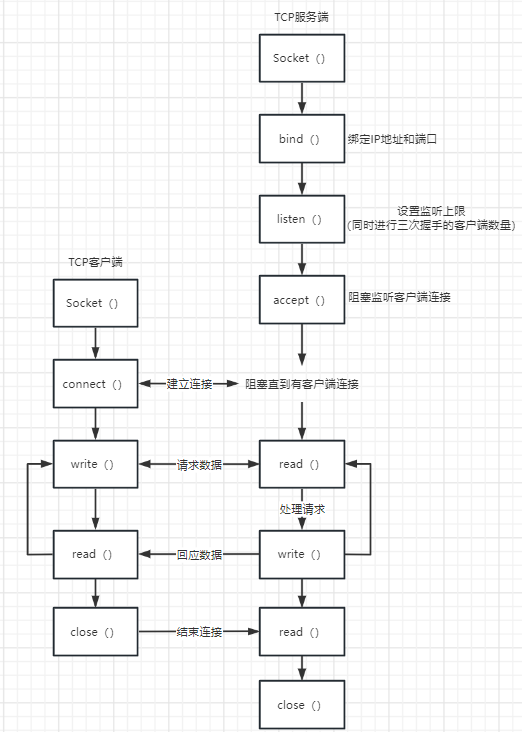

```c
//Linux主机字节序和网络字节序的转换
#include <netinet/in.h>
unsigned long int htonl (unsigned long int hostlong);//htonl表示host to network long
unsigned short int htons (unsigned short int hostshort);
unsigned long int ntohl( unsigned long int netlong);
unsigned short int ntohs (unsigned short int netshort) ;

//通用socket地址
#include <bits/socket.h>
struct sockaddr {
sa_family_t sa_family;char sa_data [ 14];
}

```


## 多路IO复用

收作业例子来解释三者区别：select和poll是学生写完作业会叫老师，但是你不知道是谁叫的，所以需要一个一个地询问，而epoll则是学生写完作业会主动交到讲台上，你一眼就可以看到是谁举手了，就可以直接去收作业。

### select

select函数用来检查套接字描述符是否已经准备好读/写

监听事件收到FD_SETSIZE的约束，一般为1024

select()的机制中提供一种`fd_set`的数据结构，实际上是一个long类型的数组，每一个数组元素都能与一打开的文件句柄（不管是Socket句柄,还是其他文件或命名管道或设备句柄）建立联系，建立联系的工作由程序员完成，当调用select()时，由内核根据IO状态修改fd_set的内容，由此来通知执行了select()的进程哪一Socket或文件可读。从流程上来看，使用select函数进行IO请求和同步阻塞模型没有太大的区别，甚至还多了添加监视socket，以及调用select函数的额外操作，效率更差。但是，使用select以后最大的优势是用户可以在一个线程内同时处理多个socket的IO请求。用户可以注册多个socket，然后不断地调用select读取被激活的socket，即可达到在同一个线程内同时处理多个IO请求的目的。而在同步阻塞模型中，必须通过多线程的方式才能达到这个目的。

缺点

1. 每次调用select，都需要把`fd_set`集合从用户态拷贝到内核态，如果`fd_set`集合很大时，那这个开销也很大
2. 同时每次调用select都需要在内核遍历传递进来的所有`fd_set`，如果`fd_set`集合很大时，那这个开销也很大
3. 为了减少数据拷贝带来的性能损坏，内核对被监控的`fd_set`集合大小做了限制，并且这个是通过宏控制的，大小不可改变(限制为1024)

```c
int select(int nfds, fd_set *readfds, fd_set *writefds, fd_set *exceptfds, struct timeval* timeout);
nfds:指定被监听的文件描述符的总数，监控的文件描述符最大+1（因为文件描述符从0开始）
三个fd_set分别表示读事件，写事件，异常事件，均为传入传出参数，数组实现的位图
timeval 定时阻塞时间
  1.NULL永远等下去
  2.设置timeval等待固定时间
  3.设置timeval为0，检查到时间立即返回，轮询
返回值
  1.-1异常设置errno
  2.0没有满足事件的文件描述符
  3.>0所有监听集合中满足事件的总数
```

```c
//selectServer
#include <stdio.h>
#include <unistd.h>
#include <fcntl.h>
#include <stdlib.h>
#include <sys/socket.h>
#include <sys/wait.h>
#include <sys/mman.h>
#include <string.h>
#include <pthread.h>
#include <time.h>
#include <sys/types.h>
#include <sys/socket.h>
#include <arpa/inet.h>
#include <pthread.h>
#include <arpa/inet.h>
#include <sys/select.h>
#include <poll.h>
#include <sys/epoll.h>
#define SERIP "192.168.164.128"
#define SERPORT 8000
int main(int argc, char*argv[]){

    int lfd = socket(AF_INET, SOCK_STREAM, 0);
    if(lfd == -1){
        perror("socket error");
        exit(1);
    }
    struct sockaddr_in seraddr, cliaddr;
    seraddr.sin_family = AF_INET;
    seraddr.sin_port = htons(SERPORT);
    seraddr.sin_addr.s_addr = htonl(INADDR_ANY);

    int ret = bind(lfd, (struct sockaddr*)&seraddr, sizeof(seraddr));
    if(ret == -1){
        perror("bind error");
        exit(1);
    }
    
    ret = listen(lfd, 8);
    if(ret == -1){
        perror("listen error");
        exit(1);
    }

    //---------------------------
    int maxfd;
    //afds记录的是我们想要监听读事件的所有文件描述符集合
    //rfds为了给select传参用的
    fd_set rfds, afds;
    FD_ZERO(&afds);
    FD_SET(lfd, &afds);
    maxfd = lfd;
    int selReVal;
    socklen_t addrlen = sizeof(cliaddr);
    int i;
    char buf[1024];
    while(1){
        //调用select帮我们监听我们关心的文件描述符对应的事件
        //每次调用select使用afds给rfds重新赋值
        rfds = afds;
        selReVal = select(maxfd+1, &rfds, NULL, NULL, NULL);
        if(selReVal == -1){
            perror("select error");
            exit(1);
        }
        char dst[64];
        for(i = lfd+1; i<maxfd+1; i++){
            if(FD_ISSET(i, &rfds)){
                int readret = read(i, buf, 1024);
                if(readret == -1){
                    perror("read error");
                    exit(1);
                }
                else if(readret == 0){
                    printf("客户端断开连接\n");
                    close(i);
                    FD_CLR(i, &afds);
                }
                else{
                    write(i, buf, readret);
                    write(STDOUT_FILENO, buf, readret);
                }
                if(--selReVal == 0){
                    break;
                }
            }
        }
        //检验lfd是否触发了事件
        if(FD_ISSET(lfd, &rfds)){
            int cfd = accept(lfd, (struct sockaddr*)&cliaddr, &addrlen);
            printf("有新的客户端建立连接 IP%s, port%d\n", inet_ntop(AF_INET, &cliaddr.sin_addr.s_addr, dst, sizeof(dst)), ntohs(cliaddr.sin_port));
            FD_SET(cfd, &afds);
            if(cfd > maxfd){
                maxfd = cfd;
            }
            if(--selReVal == 0){
                continue;
            }
        }
    }
    return 0;
}
```

### poll

poll的机制与select类似，与select在本质上没有多大差别，管理多个描述符也是进行轮询，根据描述符的状态进行处理，但是poll没有最大文件描述符数量的限制。也就是说，poll只解决了上面的问题3，并没有解决问题1，2的性能开销问题。poll改变了文件描述符集合的描述方式，使用了pollfd结构而不是select的fd_set结构，使得poll支持的文件描述符集合限制远大于select的1024

```c
int poll(struct pollfd* fds, nfds_t nfds, int timeout);
  struct pollfd{
    int fd;//文件描述符
    short events;//监听的事件
      short revents//监听事件中满足条件返回的事件
  }
nfds->监控数组中有多少需要监控的文件描述符
timeout->等待时间
  -1：阻塞等待
  0：立即返回
  >0：指定等待X毫秒
```

```c
//pollServer
#include <stdio.h>
#include <unistd.h>
#include <fcntl.h>
#include <stdlib.h>
#include <sys/socket.h>
#include <sys/wait.h>
#include <sys/mman.h>
#include <string.h>
#include <pthread.h>
#include <time.h>
#include <sys/types.h>
#include <sys/socket.h>
#include <arpa/inet.h>
#include <pthread.h>
#include <arpa/inet.h>
#include <sys/select.h>
#include <poll.h>
#include <sys/epoll.h>
#define SERIP "192.168.164.128"
#define SERPORT 8000
#define MAXFD 1025
int main(int argc, char*argv[]){

    int lfd = socket(AF_INET, SOCK_STREAM, 0);
    if(lfd == -1){
        perror("socket error");
        exit(1);
    }
    struct sockaddr_in seraddr, cliaddr;
    seraddr.sin_family = AF_INET;
    seraddr.sin_port = htons(SERPORT);
    seraddr.sin_addr.s_addr = htonl(INADDR_ANY);

    int ret = bind(lfd, (struct sockaddr*)&seraddr, sizeof(seraddr));
    if(ret == -1){
        perror("bind error");
        exit(1);
    }
    
    ret = listen(lfd, 8);
    if(ret == -1){
        perror("listen error");
        exit(1);
    }

    //---------------------------
    struct pollfd fds[MAXFD];
    int maxi;
    int i;
    for (i = 1; i < MAXFD; i++){
        fds[i].fd = -1;
    }
    fds[0].fd = lfd;
    fds[0].events = POLLIN;
    maxi = 0;
    char buf[1024];
    char dst[64];
    int pollret;
    socklen_t addrlen = sizeof(cliaddr);
    while(1){
        pollret = poll(fds, maxi+1, -1);
        if(pollret < 0){
            perror("poll error");
        }
        if(fds[0].revents & POLLIN){
            int cfd = accept(lfd, (struct sockaddr*)&cliaddr, &addrlen);
            printf("有新的客户端建立连接 IP%s, port%d\n", inet_ntop(AF_INET, &cliaddr.sin_addr.s_addr, dst, sizeof(dst)), ntohs(cliaddr.sin_port));
            for(i = 1; i < MAXFD; i++){
                if(fds[i].fd == -1){
                    break;
                }
            }
            if(i == MAXFD){
                printf("too many client\n");
                return 0;
            }
            fds[i].fd = cfd;
            fds[i].events = POLLIN;
            if(maxi < i){
                maxi = i;
            }
        }
        for (i = 1; i < maxi+1; i++){
            if(fds[i].revents & POLLIN){
                int rr = read(fds[i].fd, buf, 1024);
                if(rr < 0){
                    perror("read error");
                }
                else if(rr == 0){
                    printf("客户端断开连接\n");
                    close(fds[i].fd);
                    fds[i].fd = -1;
                    continue;
                }
                else {
                    write(fds[i].fd, buf, rr);
                    write(STDOUT_FILENO, buf, rr);
                }
            }
        }
    } 
    return 0;
}
```

### epoll


epoll原理：当调用epoll_create函数时，会在内核创建一个eventpoll结构体，在该结构体中有一个rdlist成员和rbr成员，它两分别是一个双向链表和红黑树，而调用epoll_ctl函数添加、修改、删除文件描述符对应的事件集合其实是对红黑树中的节点进行相应的添加、修改、删除操作，而所有添加到epoll的事件都会与设备(网卡)驱动程序建立回调关系，也就是说，当文件描述符准备就绪后，内核会回调ep_poll_callback函数，将准备就绪的事件集合添加到rdlist双向链表中，而当调用epoll_wait进行监控的时候，如果双向链表为空，则表明当前没有就绪的事件发生，如果不为空，则将双向链表中的内容复制到用户态，并返回将事件数量返回给用户。

**【注意】：这里的双向链表其实实现的是一个队列，虽然是一个双向链表，但是他只支持先进先出(FIFO)，是队列的特性。每一个epoll对象都有一个独立的eventpoll结构体，用于存放通过epoll_ctl方法向epoll对象中添加进来的事件。**

epoll的优点：事件回调机制、数据拷贝轻量、没有数量限制、接口使用方便

但是当活跃用户比较多时，回调机制效率就会下降

```c
int epoll_create(int size);
//创建一个内核中的epoll对象，在内存中创建红黑树和双向链表
//size为监听数目初始化红黑树的节点数，如过后续监听数量大于size则重新构建红黑树，返回值为创建的epoll操作句柄
//成功返回文件描述符(操作句柄)
```

```c
int epoll_ctl(int epfd, int op, int fd（要监听的文件描述符的值，给红黑树看的）, struct epoll_event *event);

/*控制某个epoll监控的文件描述符上的事件：注册、修改、删除
epfd epoll操作句柄
op表示动作
  EPOLL_CTL_ADD（注册新的fd到epfd）
  EPOLL_CTR_MOD（修改已经注册的fd监听事件）
  EPOLL_CTR_DEL（从epfd删除一个fd）
event告诉内核需要监听的事件
  struct epoll_event{
    uint32_t events;//关心文件发生的事件（宏）
    epoll_data_t data;
  };
  typedef union epoll_data{(data域)
    void *ptr;
    int fd;//给用户看的，和epoll_ctl参数中的fd一致
    uint32_t u32;//不用
    uint64_t u64;//不用
  }epoll_data_t;*/
```

```c
int epoll_wait(int epfd, struct epoll_event *events, int maxevents, int timeout);
/*等待所监听的文件描述符上事件的发生
events用来存内核得到事件的集合,数组
maxevents告知内核这个events数组的大小，这个maxevents不能大于创建时的size
timeout超时事件
  -1阻塞
  0立即返回
  >0指定毫秒
返回值：成功返回有多少个文件描述符准备就绪，时间到返回0，出错返回-1*/
```

水平触发LT和边缘触发ET：

LT为epoll的默认行为，但是ET可以减少epoll触发的次数（代价是代码比LT复杂一些），ET模式只会通知一次，带来的后果就是必须一次性将事件产生的数据全部读取，方法如下

1.循环读→引入了阻塞的问题（epoll不支持阻塞）

2.将文件描述符设置为非阻塞状态（fctrl，O_NONBLOCK）具体见代码

```c
//EpollServer
#include <stdio.h>
#include <unistd.h>
#include <fcntl.h>
#include <stdlib.h>
#include <sys/socket.h>
#include <sys/wait.h>
#include <sys/mman.h>
#include <string.h>
#include <pthread.h>
#include <time.h>
#include <sys/types.h>
#include <sys/socket.h>
#include <arpa/inet.h>
#include <pthread.h>
#include <arpa/inet.h>
#include <sys/select.h>
#include <sys/epoll.h>
#include <sys/errno.h>
#define SERIP "192.168.164.128"
#define SERPORT 8000
int main(int argc, char*argv[]){
    //创建socket
    int lfd = socket(AF_INET, SOCK_STREAM, 0);
    if(lfd == -1){
        perror("socket error");
        exit(1);
    }
    struct sockaddr_in seraddr, cliaddr;
    seraddr.sin_family = AF_INET;
    seraddr.sin_port = htons(SERPORT);
    seraddr.sin_addr.s_addr = htonl(INADDR_ANY);

    //为lfd绑定地址结构
    int ret = bind(lfd, (struct sockaddr*)&seraddr, sizeof(seraddr));
    if(ret == -1){
        perror("bind error");
        exit(1);
    }
    //listen设置监听套接字
    ret = listen(lfd, 8);
    if(ret == -1){
        perror("listen error");
        exit(1);
    }
    //---------------------------------
    socklen_t addrlen = sizeof(cliaddr);
    int epfd = epoll_create(64);
    struct epoll_event event, events[1025];     
    event.events = EPOLLIN;
    event.data.fd = lfd; 
    char buf[1024];
    int epollret;
    epollret = epoll_ctl(epfd, EPOLL_CTL_ADD, lfd, &event);
    if(epollret < 0){
        perror("epoll_ctl error");
    }
    while(1){
        epollret = epoll_wait(epfd, events, 1025, -1);
        if(epollret < 0){
            perror("epoll_wait error");
        }
        char dst[64];
        for(int i = 0; i < epollret; i++){
            if(events[i].data.fd == lfd ){
                if(events[i].events &&  EPOLLIN){
                        int cfd = accept(lfd, (struct sockaddr*)&cliaddr, &addrlen);
                        printf("有新的客户端连接ip %s, port%d\n", inet_ntop(AF_INET, &cliaddr.sin_addr.s_addr, dst, sizeof(dst)), ntohs(cliaddr.sin_port));
                        int flag = fcntl(cfd, F_GETFL);
                        flag |= O_NONBLOCK;
                        fcntl(cfd, F_SETFL, flag);
                        event.events = EPOLLIN | EPOLLET;
                        event.data.fd = cfd;
                        int re = epoll_ctl(epfd, EPOLL_CTL_ADD, cfd, &event);
                        if(re < 0){
                            perror("epoll_ctl error");
                        }
                }
            }
            else {
                if(events[i].events & EPOLLIN){
                    int fd = events[i].data.fd;
                    int rr = read(fd, buf, 5);
                    if(rr < 0){
                        if(errno == EWOULDBLOCK){
                                break;
                            }
                        perror("read error");
                    }
                    else if(rr == 0){
                        printf("客户端断开连接");
                        int re = epoll_ctl(epfd, EPOLL_CTL_DEL, fd, NULL);
                        if(re < 0){
                            perror("epoll_ctl error");
                        }
                        close(fd);
                        break;
                    }
                    else {
                        write(fd, buf, rr);
                        write(STDOUT_FILENO, buf, rr);
                    }
                }
            }
        }
    }
    return 0;
}
```

### 端口复用

```c
int opt = 1;
// sockfd为需要端口复用的套接字
setsockopt(sockfd, SOL_SOCKET, SO_REUSEADDR, (const void *)&opt, sizeof(opt));
```

# 数据结构与算法

## 树

### 二叉树

每个节点最多有两个子节点

### 二叉搜索树（二叉查找树）

一颗空树或如果左子树不空则左子树上所有节点值小于父节点且如果右子树不空则右子树上左右节点值大于父节点

### 平衡二叉树（AVL树）

所有节点的左右子树高度差小于1

### 红黑树

黑色节点绝对平衡，红色节点与其相连的黑色节点同属为二三查找树的一层（红节点不破坏平衡性），红色节点通常实现在左侧，红色节点不连续，

### B树


### B+树


1. B+树非叶子节点只存储键值

2. B+树叶子节点都有一个链指针

3. B+树所有数据记录都存放在叶子节点

## 位运算

x&(x-1)统计x的二进制1的数

## 哈希表

散列表（Hash table，也叫哈希表），是根据键（Key）而直接访问在内存存储位置的[数据结构](https://www.zhihu.com/search?q=数据结构&search_source=Entity&hybrid_search_source=Entity&hybrid_search_extra={"sourceType":"answer","sourceId":572450659})。也就是说，它通过计算一个关于键值的函数，将所需查询的数据映射到表中一个位置来访问记录，这加快了查找速度。这个映射函数称做[散列函数](https://www.zhihu.com/search?q=散列函数&search_source=Entity&hybrid_search_source=Entity&hybrid_search_extra={"sourceType":"answer","sourceId":572450659})，存放记录的数组称做散列表。

散列函数，顾名思义，它是一个函数。如果把它定义成 **hash(key)** ，其中 key 表示元素的键值，则 **hash(key)** 的值表示经过散列函数计算得到的散列值。

哈希函数的特点：1.确定性（值不同，那么键也不相同）2.散列碰撞（输入和输出不是唯一对应的，两个散列值相同，输入可能相同也可能不相同）3.不可逆性（一个哈希值对应无数个明文，理论上你并不知道哪个是。）4.混淆特性（输入一些数据计算出散列值，然后部分改变输入值，一个具有强混淆特性的散列函数会产生一个完全不同的散列值。）

### 常见哈希函数

- MD5：Message-Digest Algorithm 5（信息-摘要算法5），用于确保信息传输完整一致。将输入运算为另一固定长度的值（128bits，4个32bit加起来）
- SHA-1：（Secure Hash Algorithm 1，安全散列算法1）是一种密码散列函数，SHA-1可以生成一个被称为消息摘要的160位（20字节）散列值，散列值通常的呈现形式为40个十六进制数。

### 散列冲突

理想→如果 key1 ≠ key2，那 hash(key1) ≠ hash(key2)，事实上，再好的散列函数都无法避免散列冲突。因为对于散列表而言，无论设置的存储区域（n）有多大，当需要存储的数据大于 n 时，那么必然会存在哈希值相同的情况。这就是所谓的散列冲突。

#### 开放地址法

简单讲就是如果hash算法算出来的值已经被占用了，那就再找一块地方

1. 线性探测法：如果被占用那就从当前位置一直往后找直到空，散列表插入数据越来越多也就越来越可能冲突，极端情况下需要从头遍历到尾。O(n)

2. 二次探测法：也就是二次方探测法，将探测的步长变为原来的二次方（1*2,-1*2,2*2,-2*2）

3. 双重散列法：使用一组散列函数，冲突就换下一个函数进行计算

加载因子→表示当前hash表中元素填满的程度

#### 链表法

相比于开放地址更为常用，在散列表中，每个位置对应一条链表，所有散列值相同的元素都放到相同位置对应的链表中，所以散列表查找的时间复杂度可能不是严格的O(1)

## B树

### B树的引入

磁盘IO慢-》加快速度-》例：索引（kv）

线性（查找慢、删插慢）-》哈希（哈希冲突、范围查找）


二叉树-》二叉搜索树-》二叉平衡树-》红黑树-》B-树-》B+树


B树：平衡多路查找树

- 树中每个节点至多有m个孩子节点（至多有m-1个关键字）

- 节点结构

  例M叉B树

  

### B树的查找


16×16×16×16，4096      指针+键值10字节，数据1KB，差100倍，1600×1600×16


- **B+树和B树的对比**

1、B+**树查询速度更稳定**：B+所有关键字数据地址都存在**叶子**节点上，所以每次查找的次数都相同所以查询速度要比B树更稳定。

2、B+**树天然具备排序功能：**B+树所有的**叶子**节点数据构成了一个有序链表，在查询大小区间的数据时候更方便，数据紧密性很高，缓存的命中率也会比B树高。

3、B+**树全节点遍历更快：**B+树遍历整棵树只需要遍历所有的**叶子**节点即可，而不需要像B树一样需要对每一层进行遍历，这有利于数据库做全表扫描。

**B树**相对于**B+树**的优点是，如果经常访问的数据离根节点很近，而**B树**的**非叶子**节点本身存有关键字和数据，所以在查询这种数据检索的时候会要比**B+树**快。 

# 数据库

## MySQL

### SQL语句

```sql
//登录以及查看数据库和表
mysql -u username -p//登录本地数据库，输入密码即可
mysql -h host -P Port -u username -p//登录远程数据库，输入密码即可
//h表示host，即服务器ip（本地服务器默认是localhost/127.0.0.1   登录本地数据库服务器时可省略）
//P表示port，即服务器端口号 （大写是为了跟后面密码的“p”区分开来； 默认是3306）
//u表示username, 即用户名，p表示password，即密码
exit quit \q//退出当前登录
show databases;//展示数据库
drop database //删除数据库
use databasename;//使用某个数据库
show tables;//展示当前数据库中的表
show colunms from table;//展示当前数据库某个表的结构
describe table;//与上一个等价

//检索数据
select distinct 列 from 表;//只返回不同的值

select 列 from 表 limit n//不多于n行
select 列 from 表 limit n,m//从n行起不多于m行，起始行为0
select 列 from 表 limit 4 offset 3//从3开始4行

select 列 from 表 order by 列名。。。（ASC升序/DESC降序）//对结果进行排序

select 列 from 表 where 条件//where在order by之后
//不同的where子句可以使用and/or连接，可以使用（）规定优先级，也可以使用not表示非
select 列 from 表 where 字段 in （。。。）//相当于数组

//通配符
//%--任意字符出现任意次数，_--单个字符

//concat函数拼接两个列，trim/ltrim/rtrim删除空格   as起别名

select 列1 列2 from 表 group by 列1 having 条件//where过滤行，having过滤分组
//select from where group by having order by limit 
```


### 主键、外键、索引的区别和作用

- 区别

  - 主键→唯一表示一个字段，非空非重复

  - 外键→表示另一张表的主键，允许重复，可以空
  - 索引→没有重复值，但可以有一个空值

- 作用
  - 主键→用来保证数据的完整性
  - 外键→用来与其他表建立联系
  - 索引→为了提高查询的效率

### 事务

一个最小的工作单元，要么都完成要么都不完成

#### 事务原则（ACID）

- 原子性→事务是一个不可分割的整体，事务中的操作要么都发生，要么都不发生
- 一致性→事务前后的数据完整性必须保持一致
- 持久性→事务结束后的数据不随着外界因素而改变
- 隔离性→排除其他事务对本次事务的影响

#### 事务并发带来的问题

- 脏读→一个事务读取了另一个事务还没有提交的数据

- 不可重复读→在一个事务内多次读取同一数据结果不同

- 幻读（虚读）→一个事务内读到了别的事务插入的数据（以前没有的行，由于其他事务插入而出现）

#### 隔离级别

- 读未提交→一个事务可以读到其他事务未提交的数据，全部问题
- 读已提交→一个事务可以读到其他事务提交的数据，解决脏读
- 可重复读→事务可以读取到其他事务已提交的新插入的数据，但不能读到其他事务对数据的修改，多次读取同一记录的结果是相同的，解决不可重复读，MySQL默认隔离级别
- 串行化→事务串行执行，解决所有问题，完全遵守ACID原则，但对性能影响比较大

### 索引

定义：一种帮助MySQL提高查询效率的数据结构，像目录一样

MySQL查询方式 1.全表查询 2.按照索引查询

优点：大大提高查询速度

缺点：1.维护索引需要耗费数据库资源 2.索引需要占用磁盘空间 3.对表的数据更新时，需要维护索引，消耗时间

#### 索引分类

- 主键索引：设定主键后自动创建索引，innodb为聚簇索引，值不能为空
- 单值索引（普通索引）：一个索引只包含一个列，一个表可以有多个单值索引
- 唯一索引：索引的值必须唯一，但可以有空值
- 复合索引：一个索引包含多个列
  - 1.最左前缀原则 2.动态ti凹征

- full text（全文索引）：innodb不支持 myisam支持

#### 索引的数据结构

B+树→输入无序数据→排序为一个链表→链表太长效率低，通过索引的方式来提高效率→一页默认寸尺16KB数据

默认16KB的B+树约能存储10亿条数据

B+树的高度通常为2-4层，innoDB将根节点常驻内存中，所以实际只需要进行1-3次磁盘操作


#### 索引原则

1. 索引不是越多越好，小数据量的表不需要加索引

2. 不要对经常变动的数据添加索引

3. 索引一般加在经常要查询的列上

#### 聚簇索引和非聚簇索引

聚簇索引→将数据存储和索引放到了一起，叶子节点存放数据


非聚簇索引→将数据和索引分开，叶子节点指向数据对应位置

8

在innodb中，在聚簇索引之上创建的索引成为辅助索引，非聚簇索引都是辅助索引，辅助索引存储的是主键值，通过该主键值到聚簇索引也就是主键索引中查找对应的数据

使用聚簇索引的优势

1. 访问一个数据页时，会将此页加载到内存中，再次访问此页中的数据不需要访问磁盘

2. 辅助索引的叶子节点不存储数据只存储主键值，好处是当数据变动时辅助索引不需要更新，避免对辅助索引的维护，只维护聚簇索引就好了，例如myisam中，数据变动两个非聚簇索引都需要更新

聚簇索引最好使用自增的int值，自增避免了插入数据对前面数据产生影响而需要更新，使用自增的主键值不容易产生磁盘碎片

### 锁

对于innodb来说，大多数时候应该使用行锁。如果表比较大，事务需要更新多数数据或者事务涉及多个表可能引起死锁引发大量事务回滚应该使用表锁

#### 种类

- 全局锁→对整个数据库实例加锁，MySQL让整个数据库处于只读的状态，其他线程的更新、定义等操作就会被阻塞
- 表级锁
  - 表锁→每次操作锁住整张表，开销小，加锁快，并发量低
  - 元数据锁→5.5版本引入，访问一个表时默认被加上，保证读写的正确性

- 行锁→锁住一行，开销大，加锁慢，发生锁冲突的概率最低，并发度最高
