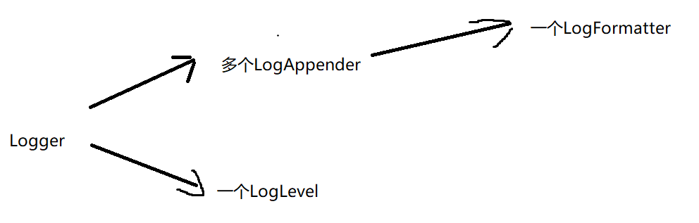
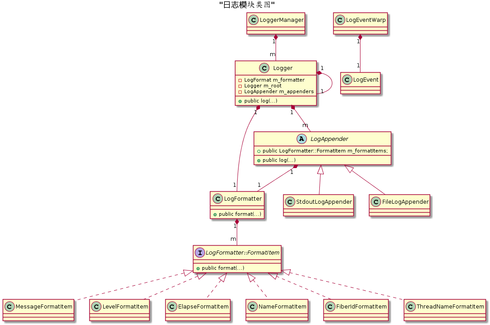

# 日志模块



logger的log分别调用每个appender的log，再由appender的log调用formatter



以使用流式方式写日志举例：

1.通过宏SYLAR_LOG_NAME(name)从LoggerMgr取得对应的Logger，假设是g_logger

2.通过宏SYLAR_LOG_DEBUG(logger)->SYLAR_LOG_LEVEL(logger, level)

3.宏SYLAR_LOG_LEVEL new出一个LogEvent，然后再在该实例传给LogEventWrap，从而创建出LogEventWrap临时对象，从该临时对象拿到std::stringstream

3.通过上面拿到的std::stringstream，用<<操作符即可把日志内容存入std::stringstream

4.LogEventWrap临时对象析构时，将通过构造时传入的LogEvent拿到其中的Logger，在调用Logger的log方法

5.Logger的log方法是遍历自己的LogAppender，调用每个LogAppender的log方法（传入logger，level，event参数），假设这里是FileLogAppender

6.LogAppender的log方法是加上自己的std::ostream参数（如果是输出到控制台，则是std::cout）后，调用LogFormatter的format方法（传入std::ostream，logger，level，event参数）。

7.LogFormatter的format方法是遍历自己缓存的所有FormatItem(继承了FormatItem的各种子类智能指针)，将日志内容格式化（例如加上时间日期、线程id等）。调用的是每个FormatItem的format方法（传入std::ostream，logger，level，event参数）

8.每个FormatItem的format方法是格式化后的内容以流式方式存入std::ostream。如果是输出到控制台，那么这里就直接输出了。如果是文件，因为std::ostream关联了文件，因此会对文件进行缓存写（非实时写）。

# 线程模块

线程创建需要通过信号量来保证同步

线程的构造函数需要接收一个callback，run函数实质上是执行callback的内容

# 协程模块

使用非对称协程的设计思路，通过主协程创建新协程，主协程由`swapIn()`让出执行权执行子协程的任务，子协程可以通过`YieldToHold()`让出执行权继续执行主协程的任务，不能在子协程之间做相互的转化，这样会导致回不到`main`函数的上下文。这里使用了两个线程局部变量保存当前协程和主协程，切换协程时调用`swapcontext`，若两个变量都保存子协程，则无法回到原来的主协程中。

- 因为单线程下协程并不是并发执行，而是顺序执行的，所以不要在协程里使用线程级别的锁来做协程同步，比如 pthread_mutex_t。如果一个协程在持有锁之后让出执行，那么同线程的其他任何协程一旦尝试再次持有这个锁，整个线程就锁死了，这和单线程环境下，连续两次对同一个锁进行加锁导致的死锁道理完全一样。
- 对于非对称协程来说，协程除了创建语句外，只有两种操作，一种是 resume，表示恢复协程运行，一种是 yield，表示让出执行。协程的结束没有专门的操作，协程函数运行结束时协程即结束，协程结束时会自动调用一次 yield 以返回主协程。
- 单线程环境下，协程的 yield 和 resume 一定是同步进行的，一个协程的 yield，必然对应另一个协程的 resume，因为线程不可能没有执行主体。并且，协程的 yield 和 resume 是完全由应用程序来控制的。
- 所谓创建协程，其实就是把一个函数包装成一个协程对象，然后再用协程的方式把这个函数跑起来；所谓协程调度，其实就是创建一批的协程对象，然后再创建一个调度协程，通过调度协程把这些协程对象一个一个消化掉（协程可以在被调度时继续向调度器添加新的调度任务）；所谓IO协程调度，其实就是在调度协程时，如果发现这个协程在等待IO就绪，那就先让这个协程让出执行权，等对应的IO就绪后再重新恢复这个协程的运行；所谓定时器，就是给调度协程预设一个协程对象，等定时时间到了就恢复预设的协程对象。
- sylar 借助了线程局部变量的功能来实现协程模块。对于每个线程的协程上下文，sylar 设计了两个线程局部变量来存储上下文信息（对应源码的 t_fiber 和 t_thread_fiber），也就是说，一个线程在任何时候最多只能知道两个协程的上下文。又由于 sylar 只使用 swapcontext 来做协程切换，那就意味着，这两个线程局部变量必须至少有一个是用来保存线程主协程的上下文的，如果这两个线程局部变量存储的都是子协程的上下文，那么不管怎么调用 swapcontext，都没法恢复主协程的上下文，也就意味着程序最终无法回到主协程去执行，程序也就跑飞了。
- READY 状态的协程会被调度器自动重新调度，而 HOLD 状态的协程需要显式地再次将协程加入调度。
- 因为 GetThis() 兼具初始化主协程的功能，在使用协程之前必须显式调用一次 GetThis()。
- 线程主协程代表线程入口函数或是main函数所在的协程，这两种函数都不是以协程的手段创建的，所以它们只有 ucontext_t 上下文，但没有入口函数，也没有分配栈空间。
- 非对称协程，子协程不能创建并运行新的子协程，不然程序就跑飞了。

```cpp
#include <stdio.h>
#include <stdlib.h>
#include <ucontext.h>

/*
// 上下文结构体定义
// 这个结构体是平台相关的，因为不同平台的寄存器不一样
// 下面列出的是所有平台都至少会包含的4个成员
typedef struct ucontext_t {
    // 当前上下文结束后，下一个激活的上下文对象的指针，只在当前上下文是由makecontext创建时有效
    struct ucontext_t *uc_link;
    // 当前上下文的信号屏蔽掩码
    sigset_t          uc_sigmask;
    // 当前上下文使用的栈内存空间，只在当前上下文是由makecontext创建时有效
    stack_t           uc_stack;
    // 平台相关的上下文具体内容，包含寄存器的值
    mcontext_t        uc_mcontext;
    ...
} ucontext_t;
 
// 获取当前的上下文
int getcontext(ucontext_t *ucp);
 
// 恢复ucp指向的上下文，这个函数不会返回，而是会跳转到ucp上下文对应的函数中执行，相当于变相调用了函数
int setcontext(const ucontext_t *ucp);
 
// 修改由getcontext获取到的上下文指针ucp，将其与一个函数func进行绑定，支持指定func运行时的参数，
// 在调用makecontext之前，必须手动给ucp分配一段内存空间，存储在ucp->uc_stack中，这段内存空间将作为func函数运行时的栈空间，
// 同时也可以指定ucp->uc_link，表示函数运行结束后恢复uc_link指向的上下文，
// 如果不赋值uc_link，那func函数结束时必须调用setcontext或swapcontext以重新指定一个有效的上下文，否则程序就跑飞了
// makecontext执行完后，ucp就与函数func绑定了，调用setcontext或swapcontext激活ucp时，func就会被运行
void makecontext(ucontext_t *ucp, void (*func)(), int argc, ...);
 
// 恢复ucp指向的上下文，同时将当前的上下文存储到oucp中，
// 和setcontext一样，swapcontext也不会返回，而是会跳转到ucp上下文对应的函数中执行，相当于调用了函数
// swapcontext是sylar非对称协程实现的关键，线程主协程和子协程用这个接口进行上下文切换
int swapcontext(ucontext_t *oucp, const ucontext_t *ucp);
*/

static ucontext_t uctx_main, uctx_func1, uctx_func2;

#define handle_error(msg)   \
    do {                    \
        perror(msg);        \
        exit(EXIT_FAILURE); \
    } while (0)

static void func1(void) {
    printf("func1: started\n");
    printf("func1: swapcontex(&uctx_func1, &uctx_func2)\n");
    // 激活uctx_func2上下文，从func1返回func2的swapcontext下一行开始执行
    if (swapcontext(&uctx_func1, &uctx_func2) == -1)
        handle_error("swapcontext");
    // func2结束，uctx_func1被激活，func1继续执行下面的语句
    printf("func1:returning\n");
    // func1结束，激活uctx_main，返回main函数中继续执行
}

static void func2(void) {
    printf("func2: started\n");
    printf("func2: swapcontex(&uctx_func2, &uctx_func1)\n");
    // 激活uctx_func1上下文，相当于跳转到func1中执行
    if (swapcontext(&uctx_func2, &uctx_func1) == -1)
        handle_error("swapcontext");
    printf("func2:returning\n");
    // func2结束时会恢复uctx_func1的上下文，相当于func2结束后会继续执行func1
}

int main(int argc, char *argv[]) {
    char func1_stack[16384];
    char func2_stack[16384];

    if (getcontext(&uctx_func1) == -1)
        handle_error("getcontext");

    // uctx_func1作为func1执行时的上下文，其返回时恢复uctx_main指定的上下文
    uctx_func1.uc_link          = &uctx_main;
    uctx_func1.uc_stack.ss_sp   = func1_stack;
    uctx_func1.uc_stack.ss_size = sizeof(func1_stack);
    makecontext(&uctx_func1, func1, 0); 

    if (getcontext(&uctx_func2) == -1)
        handle_error("getcontext");

    // uctx_func2作为func2执行时的上下文，其返回时恢复uctx_func1指定的上下文
    uctx_func2.uc_link          = (argc > 1) ? NULL : &uctx_func1;
    uctx_func2.uc_stack.ss_sp   = func2_stack;
    uctx_func2.uc_stack.ss_size = sizeof(func2_stack);
    makecontext( &uctx_func2, func2, 0); 

    // 激活uctx_func2指定的上下文，同时将旧的当前上下文，即原main函数的上下文保存在uctx_main里
    // swapcontext之后将跳转到func2函数中执行
    printf("main: swapcontext(&uctx_main, &uctx_func2)\n");
    if (swapcontext(&uctx_main, &uctx_func2) == -1)
        handle_error("swapcontext");

    // func1结束，uctx_main被激活，main函数继续运行
    printf("main: exiting\n");
    exit(EXIT_SUCCESS);
}
```

## 为什么不要在栈上创建对象

1. **上下文切换导致的对象生命周期问题**：协程的上下文切换不像线程那样会导致栈帧的完全替换，因此在协程上下文切换时，栈上的局部变量可能不会被销毁，从而导致对象的生命周期管理问题。
2. **协程挂起后恢复时的栈状态**：当协程被挂起并在稍后恢复时，栈上的内容可能已经发生了变化。如果在协程挂起时栈上的对象已经被销毁或移动，那么在恢复时可能会导致不可预料的行为。
3. **协程并发问题**：如果在栈上创建的对象被多个协程共享，那么在协程之间的并发调度可能导致竞态条件或数据损坏。
4. **栈空间限制**：协程的栈空间是有限的，如果在栈上创建大型对象，可能会导致栈溢出或消耗过多的栈空间，从而影响程序的稳定性和性能。

## 总结

- 在`main`中创建了3个线程执行`test_fiber`函数，每个线程在创建时都绑定了各自的`Thread::run`方法，在`run`方法中执行`test_fiber`（run方法执行时会初始化线程信息：初始化t_thread，线程名称，线程id）。
- 在`test_fiber`中首先使用`sylar::Fiber::GetThis()`获得主协程。
- 通过`sylar::Fiber::ptr fiber(new sylar::Fiber(run_in_fiber, 0, true));`获得一个子协程，该协程与`run_in_fiber`方法绑定。
- 当使用`fiber->call()`时，从当前主协程切换到子协程执行任务。在初始化子协程时，通过`makecontext(&m_ctx, &fiber::CallerMainFunc)`指明协程上下文入口为`CallerMainFunc`方法，所以切换到该方法执行`run_in_fiber`方法。
- 在`run_in_fiber`中使用`sylar::Fiber::Yield()`让出当前协程的执行权，切换到主协程`test_fiber`中继续执行。

# 协程调度模块

- 一个 N-M 的协程调度器，N 个线程运行 M 个协程，协程可以在线程之间进行切换，协程也可以绑定到指定线程运行。
- 实现协程调度之后，可以解决前一章协程模块中子协程不能运行另一个子协程的缺陷，子协程可以通过向调度器添加调度任务的方式来运行另一个子协程。
- 协程调度器调度的是协程，函数（可执行对象）被包装成协程。

# IO协程调度模块

- 基于 epoll 的IO协程调度器。
- 支持读写事件。
- IO协程调度器还解决了协程调度器在 idle 状态下忙等待导致 CPU 占用率高的问题。IO协程调度器使用一对管道 fd 来 tickle 调度协程，当调度器空闲时，idle 协程通过 epoll_wait 阻塞在管道的读描述符上，等管道的可读事件。添加新任务时，tickle 方法写管道，idle 协程检测到管道可读后退出，调度器执行调度。
- IO协程调度支持为描述符注册可读和可写事件的回调函数，当描述符可读或可写时，执行对应的回调函数（包装在 FdContext::EventContext 里面）。

- 对每个 fd，sylar 支持两类事件，一类是可读事件（对应 EPOLLIN），一类是可写事件（对应EPOLLOUT），sylar的事件枚举值直接继承自 epoll。
- 当然 epoll 本身除了支持了 EPOLLIN 和 EPOLLOUT 两类事件外，还支持其他事件，比如 EPOLLRDHUP, EPOLLERR, EPOLLHUP 等，对于这些事件，sylar 的做法是将其进行归类，分别对应到 EPOLLIN 和 EPOLLOUT 中，也就是所有的事件都可以表示为可读或可写事件，甚至有的事件还可以同时表示可读及可写事件，比如 EPOLLERR 事件发生时，fd 将同时触发可读和可写事件。
- 在执行 epoll_ctl 时通过 epoll_event 的私有数据指针 data.ptr 来保存 FdContext 结构体信息，其中 FdContext 结构体信息包括描述符 fd、所含事件 events、回调函数 EventContext。
- IO协程调度器在 idle 时会 epoll_wait 所有注册的fd，如果有 fd 满足条件，epoll_wait 返回，从私有数据中拿到 fd 的上下文信息（也就是 data.ptr 里面存放的 FdContext），并且执行其中的回调函数（实际是 idle 协程只负责收集所有已触发的 fd 的回调函数并将其加入调度器的任务队列，真正的执行时机是 idle 协程退出后，调度器在下一轮调度时执行）。
- epoll 是线程安全的，即使调度器有多个调度线程，它们也可以共用同一个 epoll 实例，而不用担心互斥。由于空闲时所有线程都阻塞的 epoll_wait 上，所以也不用担心 CPU 占用问题。
- addEvent 是一次性的，比如说，注册了一个读事件，当 fd 可读时会触发该事件，但触发完之后，这次注册的事件就失效了，后面 fd 再次可读时，并不会继续执行该事件回调，如果要持续触发事件的回调，那每次事件处理完都要手动再 addEvent。这样在应对 fd 的 WRITE 事件时会比较好处理，因为 fd 可写是常态，如果注册一次就一直有效，那么可写事件就必须在执行完之后就删除掉。

# 定时器模块

sylar的定时器采用最小堆设计，所有定时器根据绝对的超时时间点进行排序，每次取出离当前时间最近的一个超时时间点，计算出超时需要等待的时间，然后等待超时。超时时间到后，获取当前的绝对时间点，然后把最小堆里超时时间点小于这个时间点的定时器都收集起来，执行它们的回调函数。

关于定时器和IO协程调度器的整合。IO协程调度器的idle协程会在调度器空闲时阻塞在epoll_wait上，等待IO事件发生。在之前的代码里，epoll_wait具有固定的超时时间，这个值是5秒钟。加入定时器功能后，epoll_wait的超时时间改用当前定时器的最小超时时间来代替。epoll_wait返回后，根据当前的绝对时间把已超时的所有定时器收集起来，执行它们的回调函数。

由于epoll_wait的返回并不一定是超时引起的，也有可能是IO事件唤醒的，所以在epoll_wait返回后不能想当然地假设定时器已经超时了，而是要再判断一下定时器有没有超时，这时绝对时间的好处就体现出来了，通过比较当前的绝对时间和定时器的绝对超时时间，就可以确定一个定时器到底有没有超时。

1. 创建定时器时只传入了相对超时时间，内部要先进行转换，根据当前时间把相对时间转化成绝对时间。
2. sylar支持创建条件定时器，也就是在创建定时器时绑定一个变量，在定时器触发时判断一下该变量是否仍然有效，如果变量无效，那就取消触发。
3. 关于onTimerInsertedAtFront()方法的作用。这个方法是IOManager提供给TimerManager使用的，当TimerManager检测到新添加的定时器的超时时间比当前最小的定时器还要小时，TimerManager通过这个方法来通知IOManager立刻更新当前的epoll_wait超时，否则新添加的定时器的执行时间将不准确。实际实现时，只需要在onTimerInsertedAtFront()方法内执行一次tickle就行了，tickle之后，epoll_wait会立即退出，并重新从TimerManager中获取最近的超时时间，这时拿到的超时时间就是新添加的最小定时器的超时时间了。
4. 关于校时问题。sylar的定时器以gettimeofday()来获取绝对时间点并判断超时，所以依赖于系统时间，如果系统进行了校时，比如NTP时间同步，那这套定时机制就失效了。sylar的解决办法是设置一个较小的超时步长，比如3秒钟，也就是epoll_wait最多3秒超时，假设最近一个定时器的超时时间是10秒以后，那epoll_wait需要超时3次才会触发。每次超时之后除了要检查有没有要触发的定时器，还顺便检查一下系统时间有没有被往回调。如果系统时间往回调了1个小时以上，那就触发全部定时器。个人感觉这个办法有些粗糙，其实只需要换个时间源就可以解决校时问题，换成clock_gettime(CLOCK_MONOTONIC_RAW)的方式获取系统的单调时间，就可以解决这个问题了。

# hook

- hook 模块 hook 底层和 socket 相关的 API、socket IO 相关的 API、sleep 相关的API。

- hook 的开启控制是线程粒度的，可以自由选择（通过线程局部变量实现）。

- 通过 hook 模块，可以使一些不具异步功能的 API，展现出异步的性能，如 MySQL。实现上是通过定时器、协程、IO协程调度等模块的配合。

- hook 实际上就是对系统调用 API 进行一次封装，将其封装成一个与原始的系统调用 API 同名的接口，应用在调用这个接口时，会先执行封装中的操作，再执行原始的系统调用 API。

- hook 的目的是在不重新编写代码的情况下，把老代码中的 socket IO 相关的 API 都转成异步，以提高性能。即以同步的方式编写代码，实现的效果却是异步执行的，效率很高。

- 在 IO 协程调度中对相关的系统调用进行 hook，可以让调度线程尽可能得把时间片都花在有意义的操作上，而不是浪费在阻塞等待中。

- hook 的实现机制就是通过动态库的全局符号介入功能，用自定义的接口来替换掉同名的系统调用接口。由于系统调用接口基本上是由 C 标准函数库 libc 提供的，所以这里要做的事情就是用自定义的动态库来覆盖掉 libc 中的同名符号。

  - 那些被覆盖的符号，它们只是被“雪藏”了而已，实际还是存在于程序的进程空间中的，通过一定的办法，可以把它们再找回来。在 Linux 中，这个方法就是 dslym，它的函数原型如下：

  - ```cpp#define _GNU_SOURCE
    #include <dlfcn.h>
    void *dlsym(void *handle, const char *symbol);
    ```

    关于 dlsym 的使用可参考 man 3 dlsym，在链接时需要指定 -ldl 参数。使用 dlsym 找回被覆盖的符号时，第一个参数固定为 RTLD_NEXT，第二个参数为符号的名称。
    为了管理所有的 socket fd，sylar 设计了一个 FdManager 类来记录所有分配过的 fd 的上下文，这是一个单例类，每个 socket fd 上下文记录了当前 fd 的读写超时，是否设置非阻塞等信息。

FdCtx 类在用户态记录了 fd 的读写超时和非阻塞信息，其中非阻塞包括用户显式设置的非阻塞和 hook 内部设置的非阻塞，区分这两种非阻塞可以有效应对用户对 fd 设置/获取 NONBLOCK 模式的情形。

FdManager是文件局部上下文管理类，对FdCtx 的寻址采用了直接用fd作为数组下标进行寻址的方式。

hook 模块

- 线程局部变量 t_hook_enable，用于表示当前线程是否启用 hook，使用线程局部变量表示 hook 模块是线程粒度的，各个线程可单独启用或关闭 hook。
- hook_init() 函数放在 _HookIniter 结构体里面，而 _HookIniter 类型的全局静态变量 s_hook_initer 会在 main() 函数运行之前初始化，即会在 main() 函数运行之前调用 hook_init()。
- 各个接口的 hook 实现要放在 extern “C” 中，以防止 C++ 编译器对符号名称添加修饰。

sylar中如果不使用`IOManager`，那么`hook`将没有作用，在`IOManager::run()`中使用`set_hook_enable()`将当前线程`hook`。

# Address模块

提供网络地址相关的类，支持与网络地址相关的操作，一共有以下几个类：

`Address`：所有网络地址的基类，抽象类，对应sockaddr类型，但只包含抽象方法，不包含具体的成员。除此外，Address作为地址类还提供了网络地址查询及网卡地址查询功能。

`IPAddress`：IP地址的基类，抽象类，在Address基础上，增加了IP地址相关的端口以及子网掩码、广播地址、网段地址操作，同样是只包含抽象方法，不包含具体的成员。

`IPv4Address`：IPv4地址类，实体类，表示一个IPv4地址，对应sockaddr_in类型，包含一个sockaddr_in成员，可以操作该成员的网络地址和端口，以及获取子码掩码等操作。

`IPv6Address`：IPv6地址类，实体类，与IPv4Address类似，表示一个IPv6地址，对应sockaddr_in6类型，包含一个sockaddr_in6成员。

`UnixAddreess`：Unix域套接字类，对应sockaddr_un类型，同上。

`UnknownAddress`：表示一个未知类型的套接字地址，实体类，对应sockaddr类型，这个类型与Address类型的区别是它包含一个sockaddr成员，并且是一个实体类。