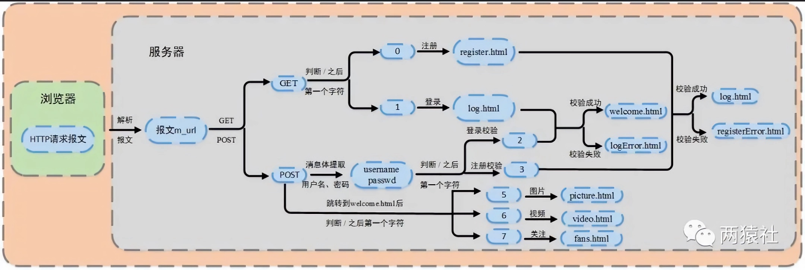

# 事件处理模式

Reactor模式，主线程只负责监听文件描述符上是否有事件发生，如果有就通知工作线程，除此之外主线程不进行任何工作，读写数据、接受新的链接、处理客户端请求均在工作线程上完成。**I/O 多路复用监听事件，收到事件后，根据事件类型分配（Dispatch）给某个进程 / 线程**。

Proactor模式，所有的IO都交给主线程和内核来处理，工作线程仅负责业务逻辑。

Reactor实现了一个被动的事件分离和分发模型，服务等待请求事件的到来，再通过不受间断的同步处理事件，从而做出反应

Proactor实现了一个主动的事件分离和分发模型;这种设计允许多个任务并发的执行，从而提高吞吐量。

因此，Reactor 可以理解为「来了事件操作系统通知应用进程，让应用进程来处理」，而Proactor可以理解为「来了事件操作系统来处理，处理完再通知应用进程」。这里的「事件」就是有新连接、有数据可读、有数据可写的这些I/O事件这里的「处理」包含从驱动读取到内核以及从内核读取到用户空间。
举个实际生活中的例子，Reactor模式就是快递员在楼下，给你打电话告诉你快递到你家小区了，你需要自己下楼来拿快递。而在 Proactor模式下，快递员直接将快递送到你家门口，然后通知你。
无论是Reactor，还是Proactor，都是一种基于「事件分发」的网络编程模式，区别在于Reactor模式是基于「待完成」的I/O事件，而 Proactor模式则是基于「已完成」的I/O事件。

Reactor框架中用户定义的操作是在实际操作之前调用的。比如你定义了操作是要向一个SOCKET写数据，那么当该SOCKET可以接收数据的时候，你的操作就会被调用;而Proactor框架中用户定义的操作是在实际操作之后调用的。比如你定义了一个操作要显示从SOCKET中读入的数据，那么当读操作完成以后，你的操作才会被调用。

reactor:能收了你跟俺说一声。
proactor:你给我收十个字节，收好了跟俺说一声。

模拟proactor：主线程进行数据读写，工作线程通知完成事件，对于工作线程就直接获得了数据读写的结果

# 注册登录

1.载入数据表就是把数据库的数据通过通过map容器传到服务器上。

2.当从浏览器上输入用户的用户名和密码后，浏览器会一个post请求报文，服务器通过解析请求报文的消息体，解析出账号密码。

3.根据解析出的账号密码，与map容器中保存账号密码进行对比校验，相符则成功登陆。注册账号时，同样将输入的账号密码与数据库已经存储的账号名进行对比校验，防止出现相同的账号名。如果不相同就加入数据库。

4.当输入的账号密码与数据库的数据成功匹配，就将浏览器跳转到对应的界面。

# 保存状态怎么做

Cookie实际上是一小段的文本信息。客户端请求服务器，如果服务器需要记录该用户状态，就使用response向客户端浏览器颁发一个Cookie。客户端浏览器会把Cookie保存起来。当浏览器再请求该网站时，浏览器把请求的网址连同该Cookie一同提交给服务器。服务器检查该Cookie，以此来辨认用户状态。服务器还可以根据需要修改Cookie的内容。

Session是另一种记录客户状态的机制，不同的是Cookie保存在客户端浏览器中，而Session保存在服务器上。客户端浏览器访问服务器的时候，服务器把客户端信息以某种形式记录在服务器上。这就是Session。客户端浏览器再次访问时只需要从该Session中查找该客户的状态就可以了。

如果说**Cookie机制是通过检查客户身上的“通行证”来确定客户身份的话，那么Session机制就是通过检查服务器上的“客户明细表”来确认客户身份。Session相当于程序在服务器上建立的一份客户档案，客户来访的时候只需要查询客户档案表就可以了。**
